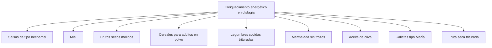

# MANUAL DE MANEJO INTEGRAL DE LA DISFAGIA EN CENTROS SOCIOSANITARIOS

## Volumen II: Abordaje desde la cocina y otros aspectos prácticos

COORDINADORA: ELENA MORENO-GUILLAMONT

The image displays various food and drink items, likely representing different textures and consistencies suitable for people with dysphagia. The dishes are presented on white plates or in clear glasses, arranged in a grid format. Here's a description of the items shown:

1. A plate with rice, vegetables, and what appears to be a piece of fish or meat
2. A plate with a mixed dish, possibly a rice or grain salad with vegetables
3. A plate with pureed food items, including a circular beige puree and a red circular item
4. A plate with fruit pieces on a skewer and a small black bowl with a white substance
5. A clear glass with layered fruit or vegetable purees in different colors
6. A plate with a layered dessert or smoothie in a clear glass and a small black bowl with a white topping
7. A clear glass with a white liquid and a straw
8. A glass with a red liquid, possibly a smoothie or juice
9. A layered dessert or meal in a glass, with green, white, and red layers, served on a purple surface with a blue napkin and spoon

At the bottom of the image is the logo of the Generalitat Valenciana (Valencian Government), specifically the Vicepresidencia y Conselleria de Igualdad y Políticas Inclusivas (Vice Presidency and Ministry of Equality and Inclusive Policies).

This manual appears to be a comprehensive guide for managing dysphagia in social health centers, with a focus on culinary approaches and practical aspects in its second volume.
---
The image provided appears to be entirely blank or white. There is no visible content, text, diagrams, or any other discernible information on this page. Therefore, I cannot provide any markdown translation or description of content, as there is nothing to transcribe or describe.
---
GENERALITAT VALENCIANA logo SISTEMA PÚBLIC VALENCIÀ DE SERVEIS SOCIALS logo

# MANUAL DE MANEJO INTEGRAL DE LA DISFAGIA EN CENTROS SOCIOSANITARIOS

## VOLUMEN II: ABORDAJE DESDE LA COCINA Y OTROS ASPECTOS PRÁCTICOS
---
GENERALITAT VALENCIANA
Vicepresidència i Conselleria
d'Igualtat i Polítiques Inclusives

SISTEMA PÚBLIC
VALENCIÀ DE
SERVEIS SOCIALS

Vicepresidencia y Conselleria de Igualdad y Políticas Inclusivas

Elaboración:
Dirección General de Personas Mayores

Diseño:
Servicios de Farmacia Sociosanitarios

Imprime:
Centro Especial de Empleo. IVASS

Primera Edición:
Junio 2022

ISBN:
Obra completa: 978-84-482-6743-8
Volumen II: 978-84-482-6745-2

Depósito legal:
V-2822-2022

2
---
Generalitat Valenciana logo and Sistema Públic València de Serveis Socials logo

## SALUDA VICEPRESIDENTA Y CONSELLERA DE IGUALDAD Y POLÍTICAS INCLUSIVAS

La transformación del modelo de cuidados es un reto imparable. En 2018, en la Vicepresidencia y Conselleria de Igualdad y Políticas Inclusivas aprobamos el proyecto piloto "L'alegria de conviure", dando con ello inicio al proceso de cambio del actual modelo residencial por uno nuevo, diseñado para acompañar a las personas mayores en todo el proceso de envejecimiento, con una atención basada en la calidad y la calidez, y con la participación de todas las personas interesadas, para dar respuesta a las necesidades de la sociedad actual.

En la presente legislatura, hemos limitado normativamente el número de plazas de atención residencial a un máximo de cien. Hemos aprobado el Pla Convivint, el primer plan de infraestructuras sociales para generar mayor número de plazas públicas desde la proximidad. Hemos elaborado el programa "Cuide'M", que apuesta por un modelo de atención integral centrada en la persona, y que huye de la rigidez de un modelo centrado en los servicios y ajeno a las personas, sus necesidades, preferencias y deseos. Apostamos por que las personas vivan en sus casas, más tiempo y mejor, y que ingresen en una residencia sólo cuando lo anterior no sea posible. El objetivo de la Vicepresidencia y Conselleria de Igualdad y Políticas Inclusivas no es otro que humanizar, dignificar y garantizar unas condiciones de vida más felices y de calidad a las personas que forman parte del Sistema Valenciano de Servicios Sociales.

Este manual que tienes en tus manos es un paso más. Pretende facilitar la alimentación de las personas que padecen disfagia, que en el ámbito institucionalizado representan más del 56%. Pero también está dirigido a las personas con disfagia que viven en sus casas y que encontrarán en el segundo volumen recetas prácticas de la gastronomía valenciana, así como consejos sobre la presentación de los platos y otros aspectos prácticos.

Poner las personas en el centro de nuestra mirada incluye también mimar su alimentación según sus gustos y preferencias, atendiendo a cualquier circunstancia que las acompañe en su proyecto de vida. En definitiva, la apuesta por este manual es la de facilitar la vida de las personas con dificultades para disfrutar de la comida y contribuir así a que sean más felices, vivan donde vivan.

Mónica Oltra Jarque

3
---
Logos of Generalitat Valenciana and Sistema Públic Valencià de Serveis Socials

# SALUDA DE LA DIRECTORA GENERAL DE PERSONAS MAYORES

Tenemos por delante todo un manual de manejo integral de la disfagia en centros sociosanitarios, en dos volúmenes. El primero está dedicado a su abordaje desde el equipo interdisciplinar, y por tanto, muy centrado en los servicios de atención residencial. Se centra en el diagnóstico, e incorpora técnicas posturales y numerosas cuestiones relativas a la hidratación y nutrición, en un abordaje integral. En cambio, el segundo volumen lo plantea desde el servicio de cocina, y contiene aspectos prácticos, como por ejemplo, la presentación de los platos, incluyendo numerosas recetas en sucesivas fichas técnicas, con sus fotos respectivas. Este segundo volumen es totalmente accesible desde la página web de la Dirección General de Personas Mayores también para las personas que sufren disfagia, y que viven en sus casas.

La alimentación adecuada es una fuente de salud, que además cobra gran importancia en nuestras vidas cotidianas, cuando elegimos qué comemos, cómo, con quién, y dónde, porque nos resulta más satisfactorio.

Sabemos que la prevalencia de la disfagia en personas mayores de 75 años se acerca mucho al 50%, y que en personas con la Enfermedad de Alzheimer, por ejemplo, representa casi el 85%. Pero afecta a muchas más personas, como por ejemplo, a quienes padecen Esclerosis Lateral Amiotrófica (ELA) o Esclerosis Múltiple. Pues bien, con este manual pretendemos que las personas con disfagia, con independencia de la edad que tengan, puedan elegir sus menús como deseen, sin que la disfagia suponga un problema a la hora de diferenciar los aromas y sabores de la cocina valenciana. Las recetas que incorpora el volumen II son de platos reales, cocinados en centros residenciales de la Comunitat Valenciana, que sirven como idea para replicar otras, huyendo de los tradicionales platos triturados de aspecto similar día tras día. La técnica de texturizar los ingredientes por separado hace que los platos sean más atractivos y se puedan degustar e identificar mejor los sabores.

El manual en su conjunto no habría sido posible sin la implicación y dedicación de las persones profesionales que han colaborado para hacerlo realidad. Estas profesionales conocen de primera mano las circunstancias de los centros de personas mayores, porque están presentes en ellos, con diferentes perfiles,y comparten el interés en dar a la alimentación en los centros sociosanitarios, la importancia que tiene en las vidas de las personas. A su conocimiento práctico, se suma su conocimiento técnico y profesional, y el resultado de su esfuerzo es este manual.

Para la Dirección General de persones Mayores, lo más importante es que este manual contribuya a que la alimentación pueda ser percibida como una de las actividades significativas para las personas que sufren disfagia, vivan donde vivan, y de este modo, preservar su capacidad de elegir, y que así disfruten de una vida más amable, más digna y más feliz.

Mª José Pérez Magdalena

4
---
# ÍNDICE DE AUTORES

## Coordinadora del volumen II:

Elena Moreno-Guillamont
Diplomada en Nutrición Humana y Dietética. Licenciada en Ciencia y Tecnología de los Alimentos.
Responsable del Programa de Atención Nutricional.
Servicios de Farmacia Sociosanitarios. Dirección General de Personas Mayores.

## Autores del volumen II:

Carolina Beltrán Cortés
Diplomada en Nutrición Humana y Dietética.
Dietista-Nutricionista.
Unidad de Nutrición y Dietética. Consorcio Hospitalario Provincial de Castellón.

María Asunción Castillo Faus
Técnica en Animación Sociocultural.
Coordinadora Psicosocial.
Residencia y centro de día para personas mayores dependientes Camp del Turia. Benaguacil. Valencia.

Mª Isabel Ferrero López
Graduada en Enfermería.
Supervisora de enfermería.
Servicio de Dietética y Nutrición. Hospital Pare Jofré. Valencia.

Ana María López Montesinos
Licenciada en Psicología.
Directora.
Residencia y centro de día para personas mayores dependientes Camp del Turia. Benaguacil. Valencia.
---
Generalitat Valenciana logo Sistema Públic Valencià de Serveis Socials logo

## Elena Moreno-Guillamont
Diplomada en Nutrición Humana y Dietética. Licenciada en Ciencia y Tecnología de los Alimentos.
Responsable del Programa de Atención Nutricional.
Servicios de Farmacia Sociosanitarios. Dirección General de Personas Mayores.

## María Concepción Navarro Penela
Licenciada en Medicina y Cirugía.
Jefa de Programas Sociosanitarios.
Servicio de Centros de Personas Mayores. Dirección General de Personas Mayores.

## Pablo Ortiz Sáez
Diplomado en Nutrición Humana y Dietética. Licenciado en Ciencia y Tecnología de los Alimentos.
Dietista-Nutricionista.
Servicio de Farmacia. Residencia para personas mayores dependientes La Florida.
Alicante.

## María Real Llosá
Técnico Auxiliar de Enfermería.
Coordinadora de Servicios Generales.
Residencia y centro de día para personas mayores dependientes Camp del Turia.
Benaguacil. Valencia.

## Inma Romero Hernández
Cocinera.
Residencia y centro de día para personas mayores dependientes Camp del Turia.
Benaguacil. Valencia.

## Mercedes Romero Hernández
Cocinera.
Residencia y centro de día para personas mayores dependientes Camp del Turia.
Benaguacil. Valencia.
---
![Logos of Generalitat Valenciana and Sistema Públic Valencià de Serveis Socials]

## Carmen Sáez Lleó
Farmacéutica especialista en Farmacia Hospitalaria. Diplomada en Nutrición Humana y Dietética. Doctora por la Universidad de Valencia.
Servicio de Farmacia. Residencia y centro de día para personas mayores dependientes de Burriana. Castellón.

## Nerea Sales Balaguer
Graduada en Nutrición Humana y Dietética.
Dietista-Nutricionista.
Unidad de Nutrición y Dietética. Consorcio Hospitalario Provincial de Castellón.

## Julia Simionescu
Cocinera.
Residencia y centro de día para personas mayores dependientes Camp del Turia. Benaguacil.

## Patricia Sorribes Carreras
Diplomada en Nutrición Humana y Dietética.
Responsable de la Unidad de Nutrición y Dietética.
Unidad de Nutrición y Dietética. Consorcio Hospitalario Provincial de Castellón.

## Mónica Tomás Madrid
Diplomada en Enfermería.
Coordinadora Sanitaria.
Residencia y centro de día para personas mayores dependientes Camp del Turia. Benaguacil.

## Mª Pilar Torres Feced
Técnico Superior en Dietética.
Unidad de Nutrición y Dietética. Consorcio Hospitalario Provincial de Castellón.

## Cesáreo Villanueva Hernández
Cocinero.
Jefe de cocina.
Residencia para personas mayores dependientes La Florida. Alicante.

7
---
The image contains two logos at the top of an otherwise blank page:

1. On the left:
   ```
   GENERALITAT
   VALENCIANA
   Vicepresidència i Conselleria
   d'Igualtat i Polítiques Inclusives
   ```
   This logo includes a stylized representation of a building or monument.

2. On the right:
   ```
   SISTEMA PÚBLIC
   VALENCIÀ DE
   SERVEIS SOCIALS
   ```
   This logo consists of three overlapping circles in red, yellow, and blue.

The rest of the page is blank, with only the number 8 at the bottom right corner, likely indicating a page number.
---
Logos of Generalitat Valenciana and Sistema Públic Valencià de Serveis Socials

# INTRODUCCIÓN

María Concepción Navarro Penela
Jefa de Programas Sociosanitarios
Servicio de Centros de Personas Mayores
Dirección General de Personas Mayores

La alimentación de las personas va más allá de la propia ingesta de alimentos. Por supuesto ha de ser un vehículo para nutrirse adecuadamente y mantener un buen estado de salud, pero la alimentación también debe proporcionar placer y satisfacción, por lo que es fundamental tener en cuenta, no solo los requerimientos nutricionales de las personas a las que se dirige, sino también sus gustos, sus hábitos y sus preferencias.

Uno de los pilares básicos en los que se apoya el modelo de atención integral centrado en la persona, es precisamente la promoción de la autonomía, el apoyo para seguir tomando decisiones y tener control en la vida cotidiana, por lo que la alimentación, gran protagonista del día a día de las personas, debe satisfacer las preferencias personales, lo que conlleva apostar por menús acordes a las decisiones individuales.

La disfagia orofaríngea (DO), reconocida por la European Society for Swallowing Disorders (ESSD) y la European Union Geriatric Medicine Society (EUGMS) como un síndrome geriátrico¹, es muy prevalente en diferentes fenotipos de personas mayores, desde los que residen de forma independiente en la comunidad (27%), hasta los institucionalizados (más del 80%)².

Atendiendo a su elevada prevalencia, su relación con múltiples factores de riesgo, su interacción con otros síndromes geriátricos, las complicaciones que se derivan de ella y su mal pronóstico, este síndrome geriátrico requiere un abordaje multifactorial y multidisciplinar³⁻⁵.

La Sociedad Española de Geriatría y Gerontología afirma que es imperativo, desde un punto de vista asistencial, enfatizar la detección temprana de los signos y

9
---
Logos of Generalitat Valenciana and Sistema Públic Valencià de Serveis Socials

síntomas de la DO en las personas mayores y la optimización de su manejo con intervenciones masivas y sencillas, basadas en la evidencia, que permitan la translación de la evidencia científica a la práctica clínica habitual de los centros sociosanitarios. Lo cual requiere, entre otros aspectos, adquirir nuevos conocimientos y aptitudes para manejar este emergente y prevalente síndrome geriátrico y mejorar nuestra capacidad de trabajo multidisciplinar⁶.

Con este objetivo se ha editado el presente manual, que pretende ofrecer herramientas prácticas, tanto a las personas profesionales de los centros sociosanitarios, como a familiares e incluso a las propias personas con DO, para hacer frente a aspectos fundamentales tales como reconocer los signos de disfagia y cómo diagnosticarla, conocer sus principales complicaciones y cómo prevenirlas, planificar el menú, garantizar el soporte dietético y nutricional adecuado, adaptar la consistencia apropiada de alimentos y bebidas, aplicar estrategias ante diversas situaciones terapéuticas, profundizar en los aspectos sensoriales o garantizar una alimentación segura. Todo ello desde una perspectiva multidisciplinar, de las y los profesionales que trabajan día a día en la materia, con la finalidad de otorgar la satisfacción global a las personas usuarias.

1. Baijens LW, Clavé P, Cras P, Ekberg O, Forster A, Kolb GF, et al. European Society for Swallowing Disorders -European Union Geriatric Medicine Society White paper: Oropharyngeal dysphagia as a geriatric syndrome. Clin Interv Aging. 2016;11:1403-28.

2. Clavé P, Shaker R. Dysphagia: Current reality and scope of the problem. Nat Rev Gastroenterol Hepatol. 2015;12:259-70.

3. Rofes L, Arreola V, Romea M, Palomera E, Almirall J, Cabré M, et al. Pathophysiology of oropharyngeal dysphagia in the frail elderly. Neurogastroenterol Motil. 2010;22:851-8

4. Ortega O, Cabré M, Clavé P. Oropharyngeal dysphagia: Aetiology and effects of ageing. J Gastroenterol Hepatol Res. 2014;3:1049-54.

5. Smithard D. Dysphagia: A geriatric giant? Med Clin Rev. 2016; 2:1-7.

6. Martín A, Ortega O, Clavé P. Disfagia Orofaríngea, un nuevo síndrome geriátrico. Rev Esp Geriatr Gerontol. 2018;53(1):3-5.

10
---
# ÍNDICE DE CAPÍTULOS

Coordinadora: Elena Moreno-Guillamont

## Capítulo 1: Planificación de la alimentación en centros sociosanitarios................ 13
Autora: Elena Moreno-Guillamont

## Capítulo 2: De la teoría a la práctica .............................................................. 43
Autor: Pablo Ortiz Sáez

## Capítulo 3: La dieta de textura modificada ...................................................... 73
Autora: Mª Isabel Ferrero López

## Capítulo 4: Intervención dietético-nutricional en diversas situaciones terapéuticas ................................................................................................. 93
Autoras: Nerea Sales Balaguer, Patricia Sorribes Carreras, Carolina Beltrán Cortés y Pilar Torres Feced

## Capítulo 5: Cómo lograr la satisfacción global de la persona usuaria: La importancia de los aspectos sensoriales .................................................... 115
Autoras: Ana María López Montesinos y Mónica Tomás Madrid

## Capítulo 6: La triple adaptación de la dieta para la persona con disfagia ............ 135
Autora: Elena Moreno-Guillamont

## Capítulo 7: La seguridad higiénico-sanitaria ................................................... 171
Autores: Carmen Sáez Lleó, Elena Moreno-Guillamont y Pablo Ortiz Sáez

11
---
# ANEXOS

## Anexo I: Fichas técnicas de los platos que componen el menú.......................... 203

Autores: Pablo Ortiz Sáez, Elena Moreno-Guillamont, Ana María López Montesinos, Mónica Tomás Madrid, María Real Llosá, María Asunción Castillo Faus, Inma Romero Hernández, Mercedes Romero Hernández, Julia Simionescu y Cesáreo Villanueva Hernández

## Anexo II: Registros relativos a la seguridad higiénico-sanitaria......................... 291

Autores: Carmen Sáez Lleó, Elena Moreno-Guillamont y Pablo Ortiz Sáez
---
GENERALITAT VALENCIANA
SISTEMA PÚBLIC VALENCIÀ DE SERVEIS SOCIALS
Vicepresidència i Conselleria d'Igualtat i Polítiques Inclusives

# CAPÍTULO 1: PLANIFICACIÓN DE LA ALIMENTACIÓN EN CENTROS SOCIOSANITARIOS

Elena Moreno-Guillamont
Responsable del Programa de Atención Nutricional
Servicios de Farmacia Sociosanitarios
Dirección General de Personas Mayores

1. La alimentación saludable y sostenible
2. Recomendaciones de energía y nutrientes para personas mayores
   2.1. Recomendaciones de energía
   2.2. Recomendaciones de proteínas
   2.3. Recomendaciones sobre el resto de nutrientes
   2.4. Otras recomendaciones
3. Frecuencia de consumo de alimentos recomendada en personas mayores
4. Otros aspectos fundamentales en la planificación de la alimentación de personas mayores institucionalizadas
5. Conclusiones
6. Bibliografía

13
---
# 1. LA ALIMENTACIÓN SALUDABLE Y SOSTENIBLE

Ante las claras diferencias existentes entre países en torno al concepto de una dieta saludable sostenible, la Organización Mundial de la Salud (OMS) y la Organización de las Naciones Unidas para la Alimentación y la Agricultura (FAO) organizaron en julio de 2019 una consulta internacional de expertos con el objetivo de desarrollar los principios básicos necesarios para definir y establecer una alimentación saludable sostenible¹.

Como resultado de la consulta, los modelos de alimentación sostenibles o "Dietas Saludables y Sostenibles" quedaron definidos como aquellos "patrones dietéticos que promueven todas las dimensiones de la salud y el bienestar de las personas, que tienen un bajo impacto ambiental y son accesibles, asequibles, seguros y equitativos, además de culturalmente aceptables"¹.

Estos nuevos patrones de alimentación pretenden alcanzar un crecimiento y desarrollo óptimos de todos los individuos, así como el bienestar físico, mental y social en todas las etapas de la vida de las generaciones presentes y futuras; contribuyen a prevenir todas las formas de malnutrición (desnutrición, deficiencia de micronutrientes, sobrepeso y obesidad), a reducir el riesgo de aparición de enfermedades no transmisibles relacionadas con una mala alimentación, y a promover la preservación de la biodiversidad y la salud del planeta¹.

Además, el último informe emitido por el Comité Científico de la Agencia Española de Seguridad Alimentaria y Nutrición (AESAN) de revisión y actualización de las Recomendaciones Dietéticas para la población española, destaca que la alimentación debe resultar satisfactoria y agradable para los individuos, así como aportar placer sensorial².

Así mismo, la alimentación constituye un elemento de identificación cultural que representa las tradiciones e historia de cada región, por lo que es prioritario respetar las particularidades existentes en los hábitos alimentarios de cada territorio. Es decir, debe asumir las premisas del modelo de "alimentación 5S":
---
![Generalitat Valenciana and Sistema Públic Valencià de Serveis Socials logos]

social, saludable, segura, satisfactoria y sostenible; así como el modelo epidemiológico de las 4P: participativa, personalizada, predictiva y preventiva².

Tal y como se observa en el cuadro 1, las orientaciones propuestas en las Guías alimentarias para la población española publicadas por la Sociedad Española de Nutrición Comunitaria (SENC) en diciembre de 2016, asumen como principios básicos que una alimentación saludable ha de ser nutritiva y permitir satisfacer las necesidades nutricionales, además de contribuir a la salud, el bienestar y la calidad de vida. Debe estar fundamentada en productos disponibles, aceptables y accesibles para la gran mayoría de la población y ha de estar en sintonía con el entorno cultural. Ha de proponer recomendaciones factibles que permitan su adopción de forma confortable. Además, asumen como premisa, que una alimentación saludable tiene que ser también justa, sostenible y solidaria³.

Cuadro 1. Principios básicos de la Alimentación Saludable³

| Principios básicos Alimentación Saludable |
|-------------------------------------------|
| • Nutritiva                               |
| • Saludable                               |
| • Disponible                              |
| • Aceptable                               |
| • Accesible                               |
| • Acorde al entorno cultural              |
| • Factible                                |
| • Confortable                             |
| • Justa                                   |
| • Sostenible                              |

Por lo tanto, el término de dieta saludable lleva implícito el concepto de sostenibilidad. De hecho, como se muestra en la figura 1, la Pirámide de la Alimentación Saludable editada por la SENC⁴, que orienta sobre la frecuencia de consumo de alimentos recomendada, contempla en su representación gráfica este concepto; de manera que aquellos alimentos que se encuentran en la base de la pirámide son los de mayor consumo recomendado y mayor contribución a la sostenibilidad, y los alimentos más próximos al vértice de la pirámide son aquellos cuyo consumo debe ser más ocasional y moderado.

15
---
Figura 1. Pirámide de la Alimentación Saludable⁴

## Pirámide de la Alimentación Saludable
de la Sociedad Española de Nutrición Comunitaria (SENC)

| Nivel | Descripción | Frecuencia |
|-------|-------------|------------|
| 1 (Cima) | Suplementos / complementos nutricionales (vitaminas, minerales, alimentos funcionales, etc.) | Opción individualizada con consejo dietético-profesional |
| 2 | Dulces, bollería, grasas untables, snacks salados | CONSUMO OPCIONAL, OCASIONAL Y MODERADO |
| 3 | Carnes rojas, procesadas y embutidos | CONSUMO OPCIONAL, OCASIONAL Y MODERADO |
| 4 | Bebidas fermentadas | Consumo opcional moderado y responsable en adultos |
| 5 | Lácteos: 2-3 al día<br>Pescados, carnes magras, carnes blancas, legumbres, frutos secos, huevos: 1-3 al día (alternar) | CONSUMO VARIADO DIARIO |
| 6 | Verduras y hortalizas: 2-3 al día<br>Frutas: 3-4 al día<br>Aceite de oliva virgen extra | CONSUMO VARIADO DIARIO |
| 7 (Base) | Pan, pasta, arroz, otros cereales (preferiblemente integrales), patatas, castañas, legumbres tiernas | Según grado de actividad física |

GRUPOS DE CONSUMO EN CADA COMIDA PRINCIPAL

| Recomendaciones adicionales |
|---------------------------|
| Mantener estilos de vida saludables |
| Equilibrio emocional |
| Balance energético |
| Técnicas culinarias saludables |
| AGUA como bebida fundamental |
| Actividad física diaria (60 min) |

- Fraccionar la ingesta: 3-5 comidas al día en horarios regulares
- Intentar cocinar y comer en compañía
- Alimentación tradicional: variada, de cercanía, sostenible, equilibrada, confortable, en compañía, con tiempo...

AUTOR: SENC

CON LA COLABORACIÓN DE: SEMG, SEMERGEN, sepeap, semFYC

Puede adquirir esta guía en librerías editada por Planeta y descargarse el primer capítulo a través de la web de la Sociedad Española de Nutrición Comunitaria: www.nutricioncomunitaria.org

Otro de los aspectos básicos a considerar para garantizar el éxito de una dieta saludable y sostenible, es adaptarse a los patrones y hábitos dietéticos de la población a la que se dirige. En este sentido, la Dieta Mediterránea, declarada por la UNESCO como Patrimonio Inmaterial de la Humanidad⁵, es sin duda el patrón que debe guiar la planificación de la alimentación en los centros sociosanitarios a los que nos dirigimos. Y así lo marcan las directrices establecidas en el DECRETO 84/2018, de 15 de junio del Consell, de fomento de una alimentación saludable y sostenible en centros de la Generalitat⁶.

16
---
La Dieta Mediterránea se caracteriza por el uso de aceite de oliva como principal grasa culinaria, un consumo elevado de alimentos de origen vegetal (cereales, verduras y hortalizas, frutas, legumbres y frutos secos), un consumo frecuente de pescado, un uso frecuente de especias y condimentos, un consumo moderado de productos lácteos (mayoritariamente lácteos fermentados como yogur y queso), una ingesta moderada de alcohol con las comidas (principalmente vino tinto) y, finalmente, un bajo consumo de carnes rojas y derivados. Los alimentos incluidos en la Dieta Mediterránea son mayoritariamente frescos y de temporada, además de ser mínimamente procesados^7.

Además de su riqueza patrimonial, se ha demostrado que una mayor adherencia a la Dieta Mediterránea reduce la mortalidad y la incidencia de enfermedades crónicas, por lo que se ha calificado como uno de los patrones de dieta más saludable^8-13.

A todo ello se suma que, las personas mayores, han nacido, crecido y vivido bajo la influencia de factores que han propiciado el seguimiento del patrón de Dieta Mediterránea en su concepto más amplio, tanto en la manera de alimentarse, como en la producción y abastecimiento de alimentos de temporada y de proximidad o el consumo de platos o recetas propias de la gastronomía local.

Por todo lo expuesto anteriormente, los que nos dedicamos al ámbito de la alimentación, y más concretamente a la alimentación de las personas mayores, hemos de velar no solo por mantener este patrón de Dieta Mediterránea entre las personas mayores, sino también por fomentarlo y perpetuarlo para que las generaciones futuras gocen de un legado ampliamente reconocido, tanto por sus beneficios en la salud humana, como por sus beneficios en la salud medioambiental^14,15.

## 2. RECOMENDACIONES DE ENERGÍA Y NUTRIENTES PARA PERSONAS MAYORES

 
El primer principio básico de una alimentación saludable es que sea nutritiva (cuadro 1), lo cual implica que proporcione la energía y los nutrientes suficientes para mantener la salud de la persona a la que va dirigida, pues de lo contrario, un

17
---
aporte de energía y nutrientes deficiente o excesivo, supone un factor de riesgo de malnutrición, por defecto o por exceso, y de otras enfermedades asociadas.

En este sentido, se ha de tener presente que la población mayor, colectivo más representativo de los centros sociosanitarios, es un grupo en situación de vulnerabilidad en cuanto al estado nutricional motivada por diversos factores, tales como¹⁶:

- Problemas de masticación y deglución
- Funciones de las extremidades superiores afectadas
- Movilidad limitada o restringida
- Deterioro cognitivo
- Estado de ánimo depresivo
- Soledad, aislamiento social
- Pobreza
- Enfermedad aguda y dolor crónico
- Efectos adversos de los medicamentos
- Dietas restrictivas

Esto es fundamental, ya que las ingestas nutricionales de referencia están basadas en datos de población sana. Por tanto, la extrapolación y el uso de estos valores de referencia a nivel individual, requiere la consideración de la existencia de factores individuales, externos e intrínsecos a la persona¹⁶,¹⁷.

## 2.1. RECOMENDACIONES DE ENERGÍA

A la hora de establecer las recomendaciones energéticas de las personas mayores, como ya se ha mencionado, es imprescindible valorar la situación individual en cuanto al estado de salud, pronóstico y necesidades fisiológicas.

Para ello, existen fórmulas que consideran estos factores:

El gasto energético basal es el gasto de energía mínimo, que se necesita para mantener las funciones vitales orgánicas en condiciones normales. Este gasto es variable, ya que está influenciado por el sexo, por la composición corporal y por la

18
---
edad; de manera que, tal y como se muestra en la tabla 1, el gasto energético basal disminuye según aumenta la edad. Representa aproximadamente un 60-70% del gasto energético total y se puede calcular a través de la ecuación de Harris y Benedict en kilocalorías/día (Kcal/d).

Tabla 1. Cálculo del gasto energético basal (GEB) según la fórmula de Harris y Benedict

| GEB en mujeres= |
|-----------------|
| 655,1 + (9,6 x peso en Kg) + (1,85 x altura en cm) - (4,68 x edad en años) |

| GEB en hombres= |
|-----------------|
| 66,47 + (13,75 x peso en Kg) + (5 x altura en cm) – (6,76 x edad en años) |

El gasto energético total (GET), además de considerar el GEB, se ve influenciado por la actividad o el ejercicio físico y el grado de estrés; por ello, en función de estos, se deben aplicar los índices correctores que se muestran en la Tabla 2.

Tabla 2. Factores de corrección según la actividad física (FA) y el grado de estrés (FE)

| Actividad   | FA      | Estrés              | FE           |
|-------------|---------|---------------------|--------------|
| Reposo      | 1       | Infección moderada  | 1,2          |
| Muy ligera  | 1,3     | Cirugía menor       | 1,2          |
| Ligera      | 1,5-1,6 | Cáncer              | 0,9-1,3      |
| Moderada    | 1,6-1,7 | Sepsis              | 1,3          |
| Intensa     | 1,9-2,1 | Fiebre              | 1,3 x grado >37º |
| Muy intensa | 2,2-2,4 | Cirugía mayor       | 1,4          |
|             |         | Politraumatismo     | 1,5          |
|             |         | Quemaduras          | 1,5-2,05     |

Por lo tanto, el GET se calculará multiplicando el GEB por los factores de actividad (FA) y de estrés (FE): GET= GEB x FA x FE

Si bien es cierto que estos cálculos deberían realizarse para individualizar las necesidades energéticas de las personas mayores, en restauración colectiva, se tiende a utilizar valores medios estimados, ya que, como su propio nombre indica, se trabaja con colectividades.
---
La Sociedad Española de Geriatría y Gerontología (SEGG), establece un aporte calórico diario en torno a 1700-2000 Kcal/d para la mujer y en torno a 2100-2500 Kcal/d para el hombre18.

Junto a esta estimación, la SEGG advierte que aportes energéticos menores a 1.600 kilocalorías/ día entrañan un alto riesgo de déficits de vitaminas y minerales, por ello, en caso de llevarse a cabo, deberá realizarse un estricto control nutricional, por el elevado riesgo de malnutrición proteico-calórica y déficits de minerales y vitaminas que supone18.

Las últimas guías publicadas por la Sociedad Europea de Nutrición Enteral y Parenteral (ESPEN) sobre nutrición clínica e hidratación en geriatría, recomiendan un valor medio para la ingesta de energía en personas mayores de 30 Kcal por Kg de peso corporal y día (Kcal/Kg/d) y advierten de que este valor debe ser individualmente ajustado en función del estado nutricional, nivel de actividad física, factor de estrés y grado de tolerancia16.

Pero no basta con garantizar la cantidad total de energía diaria que requieren las personas mayores. Además, hay que considerar:

- Una distribución horaria adecuada entre las ingestas diarias, en función de las actividades que se realicen a lo largo del día, tal y como se propone en la tabla 3:

Tabla 3. Propuesta de distribución horaria de la energía total en las principales ingestas diarias

| Ingesta diaria | Porcentaje de la cantidad total de energía diaria | Horario propuesto |
|----------------|--------------------------------------------------|-------------------|
| Desayuno | 20-25% | 8:00h-9:00h |
| Media mañana | 5% | 11:00h |
| Comida | 35-40% | 13:00h-14:00h |
| Merienda | 5-10% | 17:00h |
| Cena | 20-25% | 20:00h-21:00h |
| Colación nocturna | 5% | 23:00h |
---

![Generalitat Valenciana and Sistema Públic Valencià de Serveis Socials logos]

- Una **calidad energética** adecuada, la cual vendrá definida por los nutrientes a partir de los cuales se obtenga dicha energía. Para ello, se recurre a los objetivos nutricionales que se muestran en la tabla 4. A pesar de que la Sociedad Española de Nutrición Comunitaria editó los objetivos nutricionales para la población española en el año 2011¹⁹, se exponen los objetivos nutricionales publicados por el Grupo de Investigación Valoración Nutricional de Individuos y Colectivos de la Universidad Complutense de Madrid²⁰ por ser estos últimos más recientes. Estos objetivos nutricionales orientan sobre cómo distribuir el porcentaje de energía diaria entre los diferentes nutrientes para alcanzar una óptima calidad nutricional.

## Tabla 4. Objetivos nutricionales para la población española²⁰

| Datos dietéticos | Objetivo nutricional |
|-------------------|----------------------|
| Perfil calórico de la dieta | |
| Proteínas (% energía) | 10-15% |
| Grasa (% energía) | 20-35% (<35%) |
| Hidratos de Carbono (% energía) | >50% |
| Perfil lipídico de la dieta | |
| AGS (% energía) | <10% |
| AGP (% energía) | 4-10% |
| AGM (% energía) | Resto de la grasa |
| Otros objetivos | |
| Ácidos grasos omega-3 (% energía) | 1-2% |
| Alfa-linolénico (% energía) | >0,5% |
| EPA+DHA | >500mg/día |
| Ácidos grasos Omega-6 (% energía) | 3-8% |
| Ácidos grasos trans (% energía) | <1% |
| Fibra dietética | 25-35 g/día |
| Sal común (sodio) | <5g/día (2g/día) |
| Azúcares libres (% energía) (1) | <10% |
| Alcohol (2) | 0-20g/día para hombres<br>0-10g/día para mujeres |

AGS: Ácidos grasos saturados; AGP: Ácidos grasos poliinsaturados; AGM: Ácidos grasos monoinsaturados ; EPA: Ácido Eicosapentaenoico; DHA: Ácido docosahexaenoico.

(1) Se engloban los azúcares añadidos de forma intencionada y los presentes de forma natural en la miel, los jarabes y zumos de fruta. Tanto en adultos como en niños, la OMS recomienda reducir la ingesta de azúcares libres a menos del 10% de la ingesta total de energía. Además, señala que una ingesta por debajo al 5% de la ingesta calórica total tiene beneficios adicionales para la salud.

(2) No se recomienda consumir bebidas alcohólicas en ninguna etapa de la vida, estando totalmente desaconsejado en niños, mujeres embarazadas o en el periodo de lactancia, y en personas con tratamientos farmacológicos. En el caso de que se opte por tomar bebidas alcohólicas fermentadas de baja graduación la cantidad máxima de bajo riesgo para la salud es la indicada en la tabla.

21
---
## 2.2. RECOMENDACIONES DE PROTEÍNAS

El grupo de expertos de la ESPEN²¹, en las recomendaciones que propone sobre ingesta de proteínas y ejercicio para una función muscular óptima en el envejecimiento, indica que la ingesta adecuada de proteínas a través de la dieta, así como la práctica regular de ejercicio físico son importantes para un envejecimiento saludable. Los procesos de mayor descomposición de proteínas musculares son más probables en edades avanzadas con enfermedades agudas o crónicas como cáncer, insuficiencia cardíaca, enfermedad pulmonar obstructiva crónica (EPOC) o enfermedad renal crónica sometida a diálisis. Por lo que insisten en que si el catabolismo de las proteínas no se compensa aumentando la ingesta proteica y manteniendo la actividad física, los adultos mayores corren un mayor riesgo de sarcopenia, fragilidad y discapacidad²¹.

Por lo tanto, para ayudar a prevenir o retrasar las consecuencias adversas, animan a las personas mayores a aumentar la ingesta de proteínas en la dieta en comparación con los adultos más jóvenes, y a la participación continua en el ejercicio o las actividades físicas de rutina²¹.

Las últimas guías publicadas por la ESPEN establecen que la ingesta de proteínas en personas mayores debe ser de al menos 1 gramo de proteína por Kg de peso corporal y día. Esta cantidad debe ser ajustada individualmente en función del estado nutricional, nivel de actividad física, factor de estrés y grado de tolerancia (tabla 5)¹⁶,²².

La evidencia científica actual indica que la ingesta óptima de proteínas es más que un simple porcentaje de la ingesta energética total diaria; otras cuestiones como el consumo específico según los momentos del día y su calidad y distribución en cada una de las ingestas, son también aspectos fundamentales (tabla 5). Algunos factores como el aumento de la edad o la disminución de la actividad física reducen la eficiencia de la renovación de las proteínas, especialmente en el músculo esquelético, lo que tiene como consecuencia una reducción de la masa, de la fuerza y de la regulación metabólica. La reducción de la eficiencia, caracterizada como resistencia anabólica, puede superarse de forma parcial, mediante el incremento

22
---
del consumo de la cantidad de proteínas y de la calidad y distribución en las ingestas21-27.

Las investigaciones más recientes sugieren que las comidas que contienen un aporte de 30g de proteína de alta calidad, definida por un perfil equilibrado de aminoácidos esenciales, incluyendo al menos 2,5 gramos de leucina, puede contribuir a superar la resistencia anabólica en los adultos mayores y con ello, optimizar la salud muscular de este colectivo tan vulnerable16, 21-27.

Tabla 5. Recomendaciones sobre la ingesta de proteínas en personas mayores16,21-27

| Recomendaciones sobre la cantidad de proteínas ingeridas a través de la dieta: |                                |
|-------------------------------------------------------------------------------|--------------------------------|
| ✓ Personas mayores sanas:                                                     | 1,0-1,2 g/Kg de peso/día       |
| ✓ Personas mayores con enfermedad aguda o crónica:                            | 1,2-1,5 g/Kg de peso/día       |
| ✓ Personas mayores con enfermedad grave o desnutrición:                       | 2 g/Kg de peso/día             |
| ✓ Personas mayores con enfermedad renal grave:                                | Limitar la ingesta de proteínas (individualizar) |
| Recomendaciones sobre la distribución de la ingesta de proteínas a lo largo del día: | 30 g de proteína por ingesta |
| Recomendaciones sobre la calidad de las proteínas ingeridas a través de la dieta: | 2,5-2,8 g de leucina por ingesta |
| Otras recomendaciones relacionadas con la ingesta proteica: | Acompañar la ingesta óptima de proteínas con la práctica regular de ejercicio físico |

La densidad calórica de las proteínas, es decir, el número de calorías que aporta cada gramo de proteína ingerido, es de 4 Kcal/g.

## 2.3. RECOMENDACIONES SOBRE EL RESTO DE NUTRIENTES

Para abordar este apartado se ha recurrido al capítulo del Dr. Primitivo Ramos Cordero, sobre requerimientos nutricionales en adultos mayores que se incluye en la Guía de buena práctica clínica en geriatría editada por la SEGG18, en el cual se profundiza sobre cada uno de los nutrientes que se tratan a continuación.

Hidratos de carbono (HC)

La densidad calórica de los HC es de 4 Kcal/g. Los HC deben de constituir más de la mitad de la energía diaria consumida (tabla 4). Los HC se dividen en:

23
---

![Generalitat Valenciana and Sistema Públic Valencià de Serveis Socials logos]

- HC simples o refinados (azúcares), los cuales no deben superar el 10% del total de los HC aportados. Estos HC se absorben rápidamente y elevan la glucemia de forma rápida (índice glicémico alto). Estos HC se encuentran en alimentos como helados, bebidas azucaradas, gelatinas, zumos de frutas, frutas, miel o cereales refinados (harinas blancas).

- HC complejos (almidones), los cuales deben representar el 90% del aporte total de los HC. Estos HC se absorben lentamente, elevando la glucemia de forma gradual y menos intensa (índice glicémico bajo). Se encuentran en almidones y féculas contenidos en cereales, panes y pastas sin refinar o integrales, así como en las legumbres, arroz integral y hortalizas.

## Grasas

La densidad calórica de las grasas es de 9 Kcal/g. El aporte total de este nutriente no debe superar el 35% del aporte energético total (tabla 4). A su vez, las grasas se dividen en:

- Grasas saturadas: normalmente son de origen animal, estando presentes en la carne, embutidos, mantequilla o en algunos vegetales como el aceite de coco o de palma. No deben superar el 10% del total de la energía.

- Grasas monoinsaturadas: su procedencia puede ser de origen vegetal o animal, estando muy presentes en el aceite de oliva, aceitunas, aguacate o frutos secos. Lo óptimo es que representen el 15-20% del total de la energía.

- Grasas poliinsaturadas: su procedencia puede ser de origen vegetal o animal, estando presentes en el aceite de girasol o de soja, frutos secos y en la grasa del pescado azul. Se recomienda un consumo del 4 al 10% del total de la energía.

A su vez, se ha de evitar el consumo de grasas parcialmente hidrogenadas o grasas trans que se encuentran en ciertos productos elaborados como galletas, bollería o snacks.

## Minerales y vitaminas

A estos nutrientes se les denomina no energéticos, ya que no aportan calorías, sin embargo, son nutrientes esenciales, puesto que en la mayoría de los casos no se

24
---
sintetizan en el organismo o lo hacen en cantidades insuficientes para un desarrollo normal, lo que requiere un aporte exógeno, a través de la dieta.

Las necesidades son variables, ya que se modifican por problemas de salud, así como por la toma de algunos medicamentos. Pero en general, se recomiendan los valores que se exponen en la tabla 6.

Es importante resaltar que, en general, los requerimientos de estos nutrientes suelen estar cubiertos cuando se lleva a cabo una alimentación variada, equilibrada y moderada, por encima de 1800Kcal/día. Sin embargo, dietas restrictivas, con un aporte inferior a 1600 Kcal/día requieren un seguimiento estrecho y a menudo una suplementación de estos nutrientes.

Tabla 6. Aportes recomendados de vitaminas y minerales para las personas mayores españolas¹⁸

| Nutriente | 60-69 años |  | Mayores de 70 años |  |
|-----------|------------|------------|-------------------|------------|
|           | Varones    | Mujeres    | Varones           | Mujeres    |
| Vitamina A (μg) | 900   | 800        | 900               | 700        |
| Vitamina D (μg) | 10    | 10         | 15                | 15         |
| Vitamina E (mg) | 10    | 10         | 12                | 12         |
| Vitamina K (μg) | 80    | 65         | 80                | 65         |
| Tiamina (mg) | 1,2      | 1,1        | 1,2               | 1,1        |
| Riboflavina (mg) | 1,3  | 1,2        | 1,4               | 1,3        |
| Niacina (mg) | 16       | 15         | 16                | 15         |
| Ácido pantoténico (mg) | 5 | 5       | 5                 | 5          |
| Vitamina B₆ | 1,7       | 1,5        | 1,9               | 1,7        |
| Biotina (μg) | 30       | 30         | 30                | 30         |
| Folatos (μg) | 400      | 400        | 400               | 400        |
| Vitamina B₁₂ (μg) | 2,4  | 2,4        | 2,4               | 2,4        |
| Vitamina C (mg) | 60    | 60         | 60                | 60         |
| Hierro (mg) | 10        | 10         | 10                | 10         |
| Calcio (mg) | 1200      | 1200       | 1300              | 1300       |
| Magnesio (mg) | 420     | 350        | 420               | 350        |
| Cinc (mg) | 15          | 12         | 15                | 12         |
| Yodo (μg) | 150         | 150        | 150               | 150        |
---
## Fibra

La fibra es la parte de los vegetales que no es digerida por los jugos digestivos y que se elimina sin ser absorbida. Se recomienda un consumo adecuado para prevenir los trastornos del ritmo intestinal (estreñimiento y diarrea), colon irritable, hemorroides, diverticulosis de colon, síndrome de intestino corto, así como para mejorar los niveles de glucemia, colesterol y grasas.

Se recomienda una ingesta diaria de 20-35 gramos de fibra, un 40% soluble o fermentable (constituida por gomas, pectinas, mucílagos y hemicelulosas) y un 60% insoluble o parcialmente fermentable (celulosas, hemicelulosas y lignina).

Son ricos en fibra los cereales, especialmente los integrales, las legumbres, las hortalizas, las verduras y las frutas, debiendo tomar diariamente entre 8 y 10 raciones de estos alimentos para alcanzar la cantidad total de fibra recomendada.

## Líquidos

Pese a que la necesidad de líquidos que precisa cada persona es variable e individual, existen unas necesidades basales o requerimientos medios de líquidos que, en condiciones normales, pueden cifrarse en torno a 30 mililitros (ml) por kilogramo de peso (Kg) y día. Esto implica que, una persona mayor, con un peso entre 50 y 70 Kg, requerirá en condiciones normales 1500ml-2100ml de líquidos al día, de los cuales el 20% deberían provenir a partir de alimentos (300ml-420ml) y el 80% a partir de bebidas (1200ml-1700ml).

Se ha de tener muy presente que las personas mayores tienen disminuida la percepción de sed y además presentan una saciedad precoz cuando inician la ingesta de líquidos, a lo que hay que añadir los desequilibrios del balance hídrico junto a la menor proporción de agua en el organismo. Todo ello hace que las personas mayores sean especialmente susceptibles y vulnerables frente a la deshidratación.

Como guía para la ingesta de agua y líquidos, la Sociedad Española de Nutrición Comunitaria (SENC) propone la Pirámide de Hidratación Saludable que se muestra

26
---
Logos of Generalitat Valenciana and Sistema Públic Valencià de Serveis Socials

en la figura 2, en base a criterios de salud y a través de la cual se persigue un equilibrio entre todas las fuentes de líquidos que potencialmente pueden formar parte de la alimentación habitual²⁸.

Figura 2. La Pirámide de la Hidratación Saludable²⁸

| Nivel | Descripción | Frecuencia |
|-------|-------------|------------|
| 4 | Bebidas refrescantes carbonatadas o no, endulzadas con azúcar o fructosa | CONSUMO SEMANAL |
| 3 | Bebidas con cierto contenido calórico y nutrientes de interés: Zumos de frutas naturales, Zumos comerciales a base de fruta (100%), Leche y productos lácteos líquidos bajos en grasa, Bebidas para deportistas, Té, café e infusiones con azúcar | CONSUMO SEMANAL |
| 2 | Aguas minerales o del grifo con mayor contenido salino, Bebidas refrescantes sin azúcar/acalóricas, Té, café e infusiones sin azúcar | CONSUMO DIARIO Total 10 vasos |
| 1 | Aguas minerales, Aguas de manantial o del grifo de bajo contenido salino | CONSUMO DIARIO |

Las bebidas alcohólicas de baja graduación pueden consumirse con moderación en adultos sanos.

© SENC, 2008

## 2.4. OTRAS RECOMENDACIONES

Un factor que se ha de tener muy presente a la hora de planificar la alimentación de las personas mayores, es que las recomendaciones nutricionales se expresan en cuanto a ingestas recomendadas. Por lo tanto, todos aquellos factores que limiten la ingesta, estarán de algún modo condicionando el que estas recomendaciones se alcancen.

Por este motivo no basta con garantizar una alimentación nutritiva, o que proporcione la energía y los nutrientes recomendados, sino que además es fundamental garantizar una ingesta satisfactoria con el fin de asegurar que realmente la persona alcanza esa energía y nutrientes que se proporcionan. Para lo cual, es primordial, tal y como se mencionaba al inicio del capítulo, que la

27
---
alimentación ofertada aporte placer sensorial, ya que de lo contrario, revertirá sobre una ingesta inadecuada.

## 3. FRECUENCIA DE CONSUMO DE ALIMENTOS RECOMENDADA EN PERSONAS MAYORES

Todos los nutrientes que se requieren para alcanzar una alimentación saludable se encuentran formando parte de los alimentos. Por tanto, la planificación de la alimentación debe hacerse tomando como referencia las guías alimentarias basadas en alimentos (GABAs).

Las GABAs proporcionan recomendaciones específicas del contexto y principios sobre alimentación y estilos de vida saludables, que se basan en pruebas sólidas y responden a las prioridades de salud pública y nutrición del país, patrones de producción y consumo de alimentos, influencias socioculturales, datos de composición de alimentos y accesibilidad, entre otros factores.

Por lo general, las GABAs proponen un conjunto de recomendaciones en términos de alimentos, grupos de alimentos y patrones dietéticos para proporcionar los nutrientes necesarios para promover la salud general y prevenir las enfermedades crónicas^29.

En España, la Sociedad Española de Nutrición Comunitaria (SENC) editó en el año 2018 la guía de la alimentación saludable para atención primaria y colectivos ciudadanos en la cual se fundamentan las recomendaciones que se exponen a continuación, ya que se hace mención específica al colectivo de las personas adultas mayores^30.

Puesto que cada alimento aporta unos nutrientes específicos, una de las características que define la dieta saludable es la variedad; la cual hace alusión a la necesidad de ingerir una amplia diversidad de alimentos con el fin de garantizar el aporte de todos y cada uno de los nutrientes recomendados. Así mismo, otros de los aspectos que definen el concepto de dieta saludable son el equilibrio y la moderación, entendidos como las proporciones o cantidades adecuadas que se deben ingerir de cada grupo de alimentos para beneficiarse de sus bondades y alcanzar un aporte energético y nutricional apropiado.

28
---
En base a estos criterios, la SENC30 ofrece los siguientes consejos respecto a los diversos alimentos o grupos de alimentos:

## Agua

Debe ser la prioridad en la ingesta de líquidos. En las personas mayores, por los factores comentados anteriormente, tiene que facilitarse su consumo para garantizar el aporte adecuado. Además del agua y las infusiones, algunas preparaciones culinarias a base de frutas, verduras y hortalizas frescas como el gazpacho, sopas, consomés o caldos, son elementos colaborativos para asegurar una buena hidratación en el contexto de una alimentación saludable (figura 2). El consumo recomendado de líquidos a partir de las bebidas, preferiblemente agua, en personas mayores es del orden de 1200ml a 1700ml, lo que equivale a 6-8 vasos diarios.

## Cereales

Constituyen una parte destacada de la alimentación y proporcionan una importante fuente de energía. Algunos de los cereales de consumo más comunes son el trigo, el maíz, el arroz, la avena, el centeno, la cebada, la espelta y el mijo. De ellos derivan alimentos como el pan o las pastas (fideos o macarrones) entre otros. Las patatas y demás tubérculos se suelen incluir en este grupo. El consumo recomendado es de 4 a 6 raciones de cereales al día preferiblemente de grano entero o preparaciones integrales por ser más ricos en fibra, vitaminas, minerales y otros fitocomponentes que los cereales refinados.

## Frutas

Las frutas frescas son fuente importante de vitaminas, minerales, fibra y otros fitonutrientes. Es recomendable el consumo preferente de frutas enteras, ya que los zumos aportan una cantidad importante de azúcar y carecen de la mayor parte de la fibra que aporta la fruta entera. Teniendo en cuenta el valor nutritivo y su papel protector para la salud, se deberían consumir 3 o más piezas de fruta fresca al día enteras, troceadas o trituradas (si se requiere) y de temporada. Además, es importante que al menos 1 de ellas sea una fruta rica en antioxidantes: cítricos, kiwis, fresas o frambuesas.
---
## Verduras y hortalizas

Al igual que las frutas, las verduras y las hortalizas son una fuente importante de vitaminas, minerales, fibra y antioxidantes, por lo que es recomendable consumirlas diariamente. La mejor manera de aprovechar todas sus propiedades es tomarlas en crudo, solas o en ensalada. Si se hierven, es conveniente aprovechar el agua para sopas o purés. Se recomienda un consumo mínimo de 2 raciones diarias, al menos 1 de ellas preferiblemente en crudo, priorizando las variedades de temporada.

## Aceites y grasas

Son esenciales para la salud, ya que intervienen en la composición de las membranas celulares y nucleares y forman parte de compuestos de importancia en el organismo. Son mucho más saludables las grasas de origen vegetal no refinadas, por lo que conviene dar preferencia a éstas frente a las grasas de origen animal. Se recomienda especialmente el consumo de aceite de oliva virgen extra, de 3 a 4 raciones diarias, tanto para cocinar como para el aliño, por ser rico en grasas monoinsaturadas y antioxidantes.

## Lácteos

Se incluye en este grupo la leche, leche fermentada y yogur, queso fresco, curado y semicurado. Los lácteos son una importante fuente de proteínas de elevada calidad, vitaminas A, D, B₂ y B₁₂ y, principalmente son una excelente fuente de calcio. Además, el yogur y otras leches fermentadas se incluyen en el grupo de los alimentos probióticos, los cuales poseen algunos efectos beneficiosos añadidos. El consumo recomendado de lácteos es de 2 a 3 raciones diarias.

## Pescados y mariscos

Son una buena fuente de proteínas de elevada calidad, vitamina D, yodo y ácidos grasos poliinsaturados omega-3, especialmente los pescados azules. Estos ácidos grasos son esenciales, es decir, nuestro cuerpo no puede producirlos y por tanto debemos ingerirlos a través de la dieta. Como recomendación general, sería
---
conveniente el consumo de 3 a 4 raciones semanales de pescado, con preferencia de nuestro entorno y procedente de pesca sostenible.

## Carnes

Son fuente importante de proteínas de alto valor biológico, vitamina B12, hierro, potasio, fósforo y zinc. Debido a su contenido en grasas saturadas es importante elegir cortes magros. Es asumible el consumo de 3 raciones semanales de carne, priorizando las piezas magras y de animales de pastura o aves criadas en libertad. Los embutidos, las carnes rojas y las carnes procesadas deberían consumirse ocasionalmente.

## Huevos

Son un alimento de gran interés nutricional que aporta proteínas de elevada calidad, vitaminas (A, D, B12) y minerales (fósforo y selenio). Contienen además nutrientes esenciales para ciertas situaciones fisiológicas como es la edad avanzada. Es conveniente priorizar el consumo de huevos camperos o ecológicos. El consumo de 3 a 5 huevos a la semana es una buena alternativa nutricional a la carne y al pescado, alimentos con los que comparte cualidades nutritivas.

## Legumbres

Forman este grupo las alubias, los guisantes, los garbanzos, las habas y las lentejas. Aportan hidratos de carbono, fibra, vitaminas, minerales y diversos fitocomponentes. Son una buena fuente de proteínas y, si además, mezclamos las legumbres con cereales y verduras, se obtiene un aporte de proteínas de mayor calidad. Es recomendable que consumamos al menos de 2 a 4 raciones a la semana de legumbres, preferiblemente acompañadas de verdura de hoja verde.

## Frutos secos

La principal característica de los frutos secos es su alto contenido energético y su importante aporte de ácidos grasos insaturados y fibra. Son una buena alternativa de proteínas y grasas de origen vegetal. La ingesta recomendada de variedades

31
---
locales de frutos secos al natural, sin sal o azúcar, es de 3 a 7 raciones por semana.

En la tabla 7 se refleja la frecuencia de consumo recomendada de cada grupo de alimentos para las personas mayores, así como las cantidades a las que equivale cada ración en función de las necesidades individuales.

Tabla 7. Frecuencia de consumo de alimentos recomendada para las personas mayores (en función de las necesidades individuales)³⁰

| Grupo de alimentos | Frecuencia de consumo diaria/semanal | Cantidad neta por ración (en crudo, seco y libre de partes no comestibles) | Observaciones* |
|-------------------|--------------------------------------|----------------------------------------------------------------------------|----------------|
| Agua | 6-8 raciones/día | 200 ml | |
| Cereales, arroz, pastas, patatas | 4-6 raciones/día | 30-60 g de pan<br>20-30 g de cereales de desayuno<br>50-70 g de arroz o pasta<br>100-150 g de patata | Preferiblemente integrales |
| Frutas | 3-4 raciones/día | 150-200 g | Preferiblemente frescas, de temporada y proximidad |
| Verduras y hortalizas | 2-3 raciones/día | 150-250 g | Preferiblemente frescas, de temporada y proximidad |
| Aceite de oliva | 3-4 raciones/día | 15 ml | Preferiblemente virgen extra |
| Lácteos | 2-3 raciones/día | 200-250 ml de leche<br>125 g de yogur o kéfir<br>30-40 g de queso curado/semi<br>60-80 g de queso fresco | |
| Pescados y mariscos | 4 raciones/semana | 125-150 g | Se alternarán las variedades de pescado blanco y azul |
| Carnes | 3 raciones/semana (blancas)<br>1 ración /semana (rojas) | 100-125 g | |
| Huevos | 3 raciones/semana (*¹) | 100-140 g | |

32
---
| Grupo de alimentos | Frecuencia de consumo diaria/semanal | Cantidad neta por ración (en crudo, seco y libre de partes no comestibles) | Observaciones* |
|---------------------|-----------------------------------|--------------------------------------------------|-----------------|
| Legumbres | Al menos 2-4 raciones/semana (*2) | 50-70 g | |
| Frutos secos | 3-7 raciones/semana (*2) | 20-30 g | Se adaptarán a la capacidad de masticación y deglución |
| Carnes rojas procesadas y embutidos | | | |
| Platos precocinados | | | |
| Grasas untables | | | |
| Azúcar y productos azucarados | | Consumo opcional, ocasional y moderado, en el marco de un estilo de vida saludable | |
| Sal y snacks salados | | | |
| Bollería, pastelería, productos azucarados y helados | | | |

\* Observaciones y adaptaciones propias

(*1) Con el fin de alcanzar las recomendaciones sobre la ingesta de proteínas (tabla 5), se aconseja emplear de 100 a 140g de huevo por ración.

(*2) Los frutos secos no suelen formar parte de la alimentación habitual de las personas mayores por la dificultad de masticación, deglución y el elevado riesgo de atragantamiento, por lo que en el caso de que no se logre alcanzar la frecuencia de consumo recomendada para este grupo de alimentos, aconsejamos aumentar la horquilla de consumo de las legumbres de 2-4 raciones/semana a 3-4 raciones/semana.

## 4. OTROS ASPECTOS FUNDAMENTALES EN LA PLANIFICACIÓN DE LA ALIMENTACIÓN DE PERSONAS MAYORES INSTITUCIONALIZADAS

 
Una alimentación saludable va más allá de proporcionar una dieta saludable. A la hora de planificar la alimentación de las personas mayores institucionalizadas, además de todo lo que se ha tratado anteriormente, se deben contemplar otros aspectos que van a incidir en la satisfacción global que percibe la persona usuaria y que se traduce en su ingesta. En este sentido es importante tener muy presente que un alimento no nutre si no se consume, por lo tanto, además de garantizar que

33
---
![Logos of Generalitat Valenciana and Sistema Públic Valencià de Serveis Socials]

la alimentación ofertada sea saludable, se tratará de garantizar la satisfacción de la persona para que su ingesta sea lo más completa y adecuada posible.

Para ello, es fundamental contemplar todos aquellos aspectos que rodean el acto de comer y esmerarse para que sean sugerentes, atractivos, motivadores... en definitiva, para que favorezcan la ingesta.

## La distribución horaria de las ingestas

Un factor fundamental que incide sobre la ingesta es la flexibilidad y distribución horaria de las comidas. En la tabla 3 se propone una distribución horaria con el fin de distanciar las ingestas principales en al menos tres horas entre una ingesta y la siguiente, de modo que se llegue a cada ingesta con el apetito suficiente. En este sentido, y a pesar de que existen diferentes teorías sobre el ayuno intermitente en personas mayores³¹⁻³³, hay que tener en cuenta que en ciertos casos, las personas usuarias se sacian con facilidad y, por tanto, consumen cantidades pequeñas en cada ingesta. Por este motivo, conviene que el número de comidas al día sea el adecuado para garantizar los aportes suficientes y satisfacer las necesidades calóricas y nutricionales recomendadas.

Además, siempre que sea posible, será muy favorable permitir, dentro de una franja horaria establecida, cierta flexibilidad que permita al comensal decidir en qué momento acudir y abandonar el comedor.

## Las preferencias alimentarias de las personas usuarias

Otro aspecto imprescindible a tener en cuenta para mejorar la ingesta de la persona usuaria es adaptarse a sus preferencias, en la medida de lo posible. Para ello, se puede recurrir a un menú opcional o alternativo en el que la persona decida previamente lo que prefiere comer. Incluso puede ser muy favorable, al menos en ingestas como el desayuno o la merienda, presentar varias opciones a modo de buffet, para que la persona decida según su preferencia en ese momento. Si este sistema no es posible, es fundamental que en el diseño del menú participen las personas usuarias y aporten sus ideas y sugerencias para incluir las preparaciones culinarias que se adapten a sus preferencias y evitar, en la medida de lo posible, aquellos alimentos o recetas que no tengan aceptación. Así mismo,

34
---
![Logos of Generalitat Valenciana and Sistema Públic Valencià de Serveis Socials]

puede ser interesante buscar el origen o la causa del desagrado, pues en ocasiones depende de la guarnición con la que se acompañe el alimento, del plato que preceda a la receta en cuestión, de la temperatura a la que se sirva, u otras causas de origen diverso que en algunos casos son sencillas de solventar.

## La alternancia de los menús

En sintonía con lo anterior, tras buscar el origen del rechazo de algún plato, se ha comprobado que, en ocasiones, la causa radica en el cansancio, en el aburrimiento o en la monotonía. Por lo tanto, un aspecto fundamental para favorecer la ingesta implica que los menús sean dinámicos, que varíen y se adapten a los alimentos propios de cada época del año, de cada zona geográfica, a las sugerencias y propuestas que vayan aportando las personas usuarias o incluso a la motivación por parte del personal de cocina por innovar y probar alimentos, condimentos y preparaciones culinarias diferentes. En ocasiones puede ser de gran utilidad emplear buzones de sugerencias, donde tanto las personas residentes como sus familiares puedan expresarse libremente y emitir sus opiniones, quejas y/o felicitaciones respecto a la alimentación y novedades ofertadas, o respecto a platos y/o recetas que anhelan y les gustaría incluir en su menú.

## La exposición solar moderada y el ejercicio físico

La exposición solar, cuando se realiza con moderación, constituye un hábito saludable por los efectos beneficiosos en la absorción de la vitamina D que resulta esencial para el metabolismo del calcio y fósforo del hueso, y por tanto para la prevención de la osteoporosis; así como para la prevención de las enfermedades coronarias. La exposición solar moderada, también se relaciona con una mejora del estado anímico, evitando la depresión. Se considera saludable tomar el sol durante no más de 15 minutos al día y a horas de baja insolación³⁴.

El proceso de envejecimiento se asocia con una pérdida gradual y progresiva de masa muscular, junto con una disminución de fuerza y resistencia física. Esta condición, sarcopenia, se ha observado ampliamente en adultos sedentarios. Se ha demostrado que los programas regulares de ejercicios aeróbicos y de resistencia, contrarrestan la mayoría de los aspectos relacionados con la sarcopenia²¹ además de favorecer la ingesta.

35
---
# El cuidado del entorno en el que se realizan las ingestas

Es indiscutible que el cuidado del entorno, de las instalaciones en las que se realizan las comidas, la presentación de las mesas y de las preparaciones culinarias que se sirven, incluso la manera de publicitar los platos en el menú que se anuncia, son aspectos importantes para propiciar una ingesta satisfactoria. Aunque este tema se trata ampliamente en el capítulo 5, a continuación se mencionan algunas recomendaciones:

- Habilitar unas instalaciones exclusivas para las comidas, en las que se eviten distracciones como la realización de actividades ajenas, gente de paso, televisiones o megafonía.

- Asegurar unas condiciones adecuadas del entorno de dichas instalaciones: luminosidad apropiada, evitar ruidos excesivos, garantizar el espacio suficiente entre unas mesas y otras o mantener uniformidad en cuanto al mobiliario y la decoración.

- Cuidar la presentación de las mesas, no solo asegurando que la mantelería, la vajilla, la cubertería y el resto de menaje sean suficientes y del tamaño necesario para contener las cantidades de líquidos y alimentos recomendadas por ración (tabla 7), sino también garantizando que el material sea el adecuado y que esté en buen estado, de manera que inviten al comensal a disfrutar de cada ingesta.

- Esmerarse en la presentación de los platos, evitando ofrecer alimentos o presentaciones culinarias monocromáticas, combinando diversidad de colores, acompañando los alimentos de salsas o guarniciones que favorezcan la palatabilidad y a su vez la aceptación del plato y, por tanto, su ingesta³⁵.

- Motivar al comensal cuidando el diseño del menú y la denominación de los platos que se publicitan en él; incluso plasmando las fotos o imágenes de los platos o preparaciones que se ofertan.
---
## La actitud y predisposición del personal de apoyo en comedores

No cabe duda de que la actitud del personal que participa en el momento de comer es fundamental para propiciar un ambiente favorable, lo cual es imprescindible para lograr una ingesta satisfactoria. El respeto, la paciencia, la empatía, la cordialidad, la atención; en definitiva, mostrar una buena actitud y predisposición hacia el comensal fomentará su satisfacción y, consecuentemente, su ingesta.

## El riesgo de las dietas restrictivas

Por último, es necesario reflexionar sobre las dietas terapéuticas que impliquen restricciones dietético-nutricionales, ya que normalmente entran en conflicto con las preferencias alimentarias de las personas que las reciben³⁶. En estos casos se debe valorar y evaluar periódicamente el beneficio terapéutico que se obtiene, frente al riesgo de desnutrición que suponen. Además, es preciso informar debidamente a la persona usuaria siempre que sea posible, y/o a su familiar, y respetar su decisión si opta por renunciar a la dieta pautada.

En cualquier caso, han de suavizarse las restricciones en pro de un mayor placer en las comidas y en aras de satisfacer uno de los aspectos más importantes de la alimentación: el disfrute.
---
# 5. CONCLUSIONES

❖ La dieta saludable y sostenible se define por la FAO-OMS como el patrón dietético que promueve todas las dimensiones de la salud y el bienestar de las personas, que tiene un bajo impacto ambiental y que es accesible, asequible, seguro y equitativo, además de culturalmente aceptable.

❖ El último informe emitido por el Comité Científico de la Agencia Española de Seguridad Alimentaria y Nutrición (AESAN), destaca que la alimentación debe resultar satisfactoria y agradable para los individuos, así como aportar placer sensorial.

❖ El primer principio básico de una alimentación saludable es que sea nutritiva, lo cual implica que proporcione la energía y los nutrientes suficientes para mantener la salud de la persona a la que va dirigida.

❖ En cuanto al aporte energético de la dieta, no solo se debe prestar atención a la cantidad de calorías que se ofrecen, si no también a la calidad de los nutrientes a partir de los cuales se obtenga dicha energía.

❖ Así mismo, en lo que se refiere a la ingesta óptima de proteínas, no basta con garantizar la cantidad adecuada; otras cuestiones como el consumo específico según los momentos del día y su calidad y distribución en cada una de las ingestas, son también aspectos fundamentales.

❖ Se ha de tener muy presente que las personas mayores tienen disminuida la percepción de sed y además presentan una saciedad precoz cuando inician la ingesta de líquidos, por lo que es fundamental tomar las medidas oportunas para garantizar su correcta hidratación.

❖ Puesto que un alimento no nutre si no se consume, es fundamental contemplar todos aquellos aspectos que rodean el acto de comer y esmerarse para que sean sugerentes, atractivos y motivadores; en definitiva, para que favorezcan la ingesta y la satisfacción global de la persona.

38
---
## 6. BIBLIOGRAFÍA

1. Organización de las Naciones Unidas para la Alimentación y la Agricultura / Organización Mundial de la Salud. Sustainable healthy diets – Guiding Principles. ISBN: 978-92-5-131875-1 (FAO); 978-92-4-151664-8 (WHO). Recuperado a partir de: https://www.fao.org/3/ca6640en/ca6640en.pdf

2. Comité Científico AESAN. Informe del Comité Científico de la Agencia Española de Seguridad Alimentaria y Nutrición (AESAN) de revisión y actualización de las Recomendaciones Dietéticas para la población española. Revista del Comité Científico de la AESAN. 2020;32:11-58. Recuperado a partir de: https://www.aesan.gob.es/AECOSAN/docs/documentos/seguridad_alimentaria/evaluacion_riesgos/informes_comite/RECOMENDACIONES_DIETETICAS.pdf

3. Grupo Colaborativo de la Sociedad Española de Nutrición Comunitaria (SENC). Guías alimentarias para la población española (SENC, diciembre 2016); la nueva pirámide de la alimentación saludable. Nutr Hosp. 2016;33 (8):1-48. Recuperado a partir de: http://scielo.isciii.es/pdf/nh/v33s8/guia.pdf

4. Sociedad Española de Nutrición Comunitaria (SENC). Guía de la alimentación saludable para atención primaria y colectivos ciudadanos. Recomendaciones para una alimentación individual, familiar o colectiva saludable, responsable y sostenible. Recuperado a partir de: https://www.fesnad.org/resources/files/dipticoSENC.pdf

5. Dieta Mediterránea: Patrimonio Cultural Inmaterial de la Humanidad. Recuperado a partir de: https://ich.unesco.org/es/RL/la-dieta-mediterranea-00884

6. DECRETO 84/2018, de 15 de junio del Consell, de fomento de una alimentación saludable y sostenible en centros de la Generalitat. Recuperado a partir de: https://dogv.gva.es/datos/2018/06/22/pdf/2018_6099.pdf

7. Romano A. Dieta Mediterránea: Patrimonio Alimentario y Gastronomía. Universidad de Algarve. 2020. Proyecto MD.net. Recuperado a partir de: https://drive.google.com/file/d/1se7_I1Q49_Puncv__hlSx8CTm0IhERhv/view

8. Aranceta-Bartrina J, Partearroyo T, López-Sobaler AM, Ortega RM, Varela-Moreiras G, Serra-Majem Ll, et al. Updating the food-based dietary guidelines for the Spanish population: The Spanish society of community nutrition (SENC) proposal. Nutrients. 2019;11(11):2675-701. Recuperado a partir de: https://pubmed.ncbi.nlm.nih.gov/31694249/

9. Franquesa M, Pujol-Busquets G, García-Fernández E, Rico E, Shamirian-Pulido L, Aguilar-Martínez A, et al. Mediterranean Diet and Cardiodiabesity: A Systematic Review through Evidence-Based Answers to Key Clinical Questions. Nutrients. 2019;11(3):655. Recuperado a partir de: https://pubmed.ncbi.nlm.nih.gov/30889891/
---
10. Chlesinger S, Neuenschwander M, Schwedhelm C, Hoffmann G, Bechthold A, Boeing H, et al. Food Groups and Risk of Overweight, Obesity, and Weight Gain: A Systematic Review and Dose-Response Meta-Analysis of Prospective Studies. Adv Nutr. 2019;10(2):205–18. Recuperado a partir de: https://pubmed.ncbi.nlm.nih.gov/30801613/

11. Bonaccio M, Di Castelnuovo A, Costanzo S, Persichillo M, De Curtis A, Donati MB, et al. Adherence to the traditional Mediterranean diet and mortality in subjects with diabetes. Prospective results from the MOLI-SANI study. Eur J Prev Cardiol. 2016;23(4):400–7. Recuperado a partir de: https://pubmed.ncbi.nlm.nih.gov/25648935/

12. Salas-Salvadó J, Mena-Sánchez G. El gran ensayo de campo nutricional PREDIMED. Nutr Clin Med. 2017;XI (1):1-8.

13. Zaragoza Martí A, Ferrer Cascales R, Cabañero Martínez MJ, Hurtado Sánchez JA, Laguna Pérez A. Adherencia a la dieta mediterránea y su relación con el estado nutricional en personas mayores. Nutr Hosp. 2015;31(4):1667-74.

14. Centro internacional de altos estudios agronómicos mediterráneos. Ministerio de Agricultura, Alimentación y Medio Ambiente. TerraMED. La dieta mediterránea para un desarrollo regional sostenible. Ministerio de Agricultura, Alimentación y Medio Ambiente. 2012.

15. Burlingame B, Dernini S. Sustainable diets and biodiversity. Directions and solutions for policy, research and action. Proceedings of the International Scientific Symposium Biodiversity and sustainable diets united against hunger. 3-5 November 2010, FAO Headquarters, Rome. Recuperado a partir de: http://www.fao.org/3/i3004e/i3004e.pdf

16. Volkert D, Beck AM, Cederholm T, Cruz-Jentoft A, Goisser S, Hooper L, et al. ESPEN guideline on clinical nutrition and hydration in geriatrics. Clin Nutr. 2019;38:10-47. Recuperado a partir de: https://doi.org/10.1016/j.clnu.2018.05.024

17. Martínez Hernández JA, Cámara Hurtado M, Giner Pons RM, González Fandos E, López García E, Mañes Vinuesa J, et al. Informe del Comité Científico de la Agencia Española de Seguridad Alimentaria y Nutrición (AESAN) sobre Ingestas Nutricionales de Referencia para la población española. Revista del Comité Científico de la AESAN. 2019;29:43-68. Recuperado a partir de: https://www.aesan.gob.es/AECOSAN/docs/documentos/seguridad_alimentaria/evaluacion_riesgos/informes_comite/INR.pdf

40
---
Generalitat Valenciana logo and Sistema Públic Valencià de Serveis Socials logo

18. Ramos Cordero P. Requerimientos nutricionales en adultos mayores: alimentación saludable. En: López Trigo JA, Martínez Álvarez JR, Ramos Cordero P, Redondo del Río P, Camina Martín A, de Mateos Silleras B, et al. Guía de buena práctica clínica en geriatría. Alimentación, nutrición e hidratación en adultos mayores. SEGG 2015. Recuperado a partir de:
https://www.segg.es/media/descargas/Guia_ALIMENTACION_NUTRICION_E_HIDRATACION.pdf

19. Objetivos nutricionales para la población española. Consenso de la Sociedad Española de Nutrición Comunitaria (SENC). Rev Esp Nutr Com. 2011;17(4):178-99. Recuperado a partir de: https://www.nutricioncomunitaria.org/es/noticia-documento/20

20. Ortega RM, López-Sobaler AM, Aparicio A, Rodríguez-Rodríguez E, González-Rodríguez LG, Perea JM, Navia B. 2021. Objetivos nutricionales para la población española. Departamento de Nutrición y Ciencia de los Alimentos, Facultad de Farmacia, Universidad Complutense, Madrid, España. Recuperado a partir de:
https://www.ucm.es/idinutricion/idinutricion-objetivos-nutricionales

21. Deutz N, Bauer JM, Barazzoni R, Teta D, Tipton K, Calder PC, et al. Protein intake and exercise for optimal muscle function with aging: Recommendations from the ESPEN Expert Group. Clin Nutr. 2014;33:929-36. Recuperado a partir de:
https://doi.org/10.1016/j.clnu.2014.04.007

22. Evidence-Based Recommendations for Optimal Dietary Protein Intake in Older People: A Position Paper From the PROT-AGE Study Group. Journal of the American Medical Directors Association (JAMDA). 2013;14(8):542-59. Recuperado a partir de:
https://pubmed.ncbi.nlm.nih.gov/23867520/

23. López-Plaza B, Gómez-Candela C, Bermejo LM. Problemática nutricional relacionada con la fragilidad y la sarcopenia en personas de edad avanzada. Nutr Hosp. 2019;36(3):49-52. Recuperado a partir de: https://doi.org/10.20960/nh.02809

24. Zugasti A y Casas A. Síndrome de fragilidad y estado nutricional: valoración, prevención y tratamiento. Nutr Hosp. 2019;36(2):26-37. Recuperado a partir de:
https://www.nutricionhospitalaria.org/articles/02678/show

25. Goisser S, Guyonnet S, Volkert D. The role of nutrition in frailty: an overview. J Frailty Aging. 2016;5(2):74-7. Recuperado a partir de:
https://pubmed.ncbi.nlm.nih.gov/27224496/

26. Yeung SY, Chan SM, Woo J. Protein and physical activity in older persons, Current Opinion in Clinical Nutrition and Metabolic Care. 2021;24(1):42-7. Recuperado a partir de: https://journals.lww.com/co-clinicalnutrition/Abstract/2021/01000/Protein_and_physical_activity_in_older_persons.8.aspx

41
---
27. Phillips SM, Paddon-Jones D, Layman DK. Optimizing adult protein intake during catabolic health conditions. Adv Nutr. 2020;11(4): S1058-69. Recuperado a partir de: https://pubmed.ncbi.nlm.nih.gov/32666115/

28. Grupo de expertos SENC-Observatorio de la Nutrición y Actividad Física. Guía para una hidratación saludable. La Declaración de Zaragoza. SENC, 2008. Rev Esp Nutr Com. 2009;15(1):225-30. Recuperado a partir de: https://www.nutricioncomunitaria.org/es/noticia-documento/21

29. Organización de las Naciones Unidas para la Alimentación y la Agricultura FAO. Guías alimentarias basadas en alimentos: antecedentes. Recuperado a partir de: https://www.fao.org/nutrition/educacion-nutricional/food-dietary-guidelines/background/es/

30. Aranceta J, Blay G, Carrillo L, Fernández JM, Garaulet M, Gil A, et al. Guía de la alimentación saludable para atención primaria y colectivos ciudadanos. Sociedad Española de Nutrición Comunitaria, 2018. Recuperado a partir de: http://www.nutricioncomunitaria.org/es/noticia/guia-alimentacion-saludable-ap

31. Anton S, Ezzati A, Witt D, McLaren C, Vial P. The effects of intermittent fasting regimens in middle-age and older adults: Current state of evidence. Experimental Gerontology 2021;156:1116-7. Recuperado a partir de: https://doi.org/10.1016/j.exger.2021.111617

32. De Cabo R and Mattson MP. Effects of Intermittent Fasting on Health, Aging and Disease. N Engl J Med. 2019;381:2541-51. Recuperado a partir de: https://www.nejm.org/doi/full/10.1056/NEJMra1905136

33. Ooi TC, Meramat A, Rajab NF, Sahar S, Ismail IS, Azan AA, et al. Intermittent Fasting Enhanced the Cognitive Function in Older Adults with Mild Cognitive Impairment by Inducing Biochemical and Metabolic changes: A 3-Year Progressive Study. Nutrients 2020;12(9):2644. Recuperado a partir de: https://doi.org/10.3390/nu12092644

34. Sociedad Española de Geriatría y Gerontología. Nota de Prensa Institucional. Recuperado a partir de: https://www.segg.es/institucional/2013/08/01/la-piel-del-mayor-requiere-mas-cuidados-y-prevencion-ante-los-efectos-del-sol

35. Con Gusto: Guía de alimentación para afectados de ELA y recetas para personas con dificultades en la deglución. Fundación Francisco Luzón. 2017. Recuperado a partir de: https://ffluzon.org/wp-content/uploads/2020/02/Guia_con_gusto_ELA_luzon.pdf

36. López Nomdedeu C. y Cervera Ral P. Proceso de envejecimiento y calidad de vida: el anciano como individuo y el anciano institucionalizado. En: Serrano Ríos M, Cervera Ral P, López Nomdedeu C, Ribera Casado JM, Sastre Gallego A, editores. Guía de alimentación para personas mayores. Madrid: ERGON; 2010. p. 185-96. Recuperado a partir de: https://fiapam.org/wp-content/uploads/2013/07/GuiaAlimentacion.pdf

42
---
GENERALITAT VALENCIANA
Vicepresidència i Conselleria d'Igualtat i Polítiques Inclusives

SISTEMA PÙBLIC VALENCIÀ DE SERVEIS SOCIALS

# CAPÍTULO 2: DE LA TEORÍA A LA PRÁCTICA

Pablo Ortiz Sáez
Dietista-Nutricionista
Servicio de Farmacia
Residencia para personas mayores dependientes La Florida. Alicante

1. Introducción
2. Ración versus plato
   2.1. Ración
   2.2. Platos
3. Diseño de un menú
   3.1. Ingestas secundarias: Desayunos, medias mañanas, meriendas,
        resopones e hidrataciones
   3.2. Ingestas principales: Comidas y cenas
4. Denominación de los platos
5. Conteo y distribución de raciones
6. Reflexiones sobre las desviaciones del menú y retos futuros
7. Bibliografía

43
---
# 1. INTRODUCCIÓN

Diseñar un menú es un proceso complejo y multifactorial. Es cierto que desde un enfoque simplista únicamente va a consistir en distribuir alimentos a lo largo de la semana, pero, para que esa distribución se haga de forma correcta, se deberán cumplir los criterios nutricionales y de sostenibilidad vistos en el capítulo 1, se deberán considerar aspectos económicos, humanos, logísticos y técnicos, y, por encima de todo, el resultado final deberá contar con la aceptación de las personas usuarias, ya que, de no hacerlo, todo lo anterior carecerá de sentido.

Los criterios económicos, humanos, logísticos y técnicos van ligados a la idiosincrasia de cada centro y por lo general su integración en los menús suele ser más acertada que los criterios nutricionales. Por este motivo, en el presente capítulo se abordará la transición de la teoría a la práctica de la parte nutricional y se presentarán diferentes herramientas que pueden facilitar su ejecución.

De forma paralela a la publicación e implantación de este manual, se deberán implementar programas de formación que potencien la comprensión y utilización de estas herramientas, ya que, de lo contrario, difícilmente se logrará integrar esta metodología en la práctica diaria de los centros.
---
## 2. RACIÓN VERSUS PLATO

El aporte nutricional de un menú vendrá definido por los alimentos que lo componen y la cantidad de los mismos. Por lo tanto, a la hora de planificarlo, se deberá dar prioridad a aquellos alimentos que mejor perfil nutricional ofrezcan y ajustar su cantidad a las necesidades de las personas usuarias de ese menú. Pero, ¿cómo determinar esas cantidades y qué alimentos priorizar?

Puesto que la alimentación ofrecida en los centros va destinada a grupos de adultos mayores, se tomarán como referencia las tablas vistas en el capítulo 1, concretamente las que hacen referencia a este rango de edad¹. En ellas se asigna una frecuencia de consumo para cada uno de los grupos de alimentos y se establecen unas cantidades determinadas para los mismos, de modo que respetando las frecuencias y cantidades propuestas en la tabla, se obtendrá un menú que, a priori, debe cubrir las necesidades nutricionales de las personas usuarias.

Dicho la anterior, se puede deducir que un menú alejado de los requerimientos nutricionales puede tener dos causas principales: frecuencias de alimento incorrectas y/o cantidades inadecuadas. ¿A qué puede deberse? En muchos casos a la confusión entre plato y ración.

Teniendo en cuenta las guías de la Sociedad Española de Nutrición Comunitaria¹, se podría definir ración como la cantidad de alimento, expresado en gramos u otra medida pertinente del sistema internacional, que se ajusta al peso o volumen dado por una tabla de referencia. Entendiendo así plato como una preparación culinaria servida para ser consumida². Por tanto, ¿cuál es la problemática? Considerar que un plato que incluya un alimento, por el mero hecho de contenerlo, ya aporta una ración independientemente de la cantidad. Como resultado, este error de concepto mantenido y aplicado a varios grupos de alimentos en un menú semanal, puede alterar la idoneidad y equilibrio del mismo.

45
---
## 2.1. RACIÓN

Anteriormente se ha definido ración como la cantidad de alimento, expresado en gramos u otra medida pertinente del sistema internacional, que se ajusta al peso o volumen dado por una tabla de referencia. Por lo tanto, a la hora de planificar un menú o un plato, se deberá tener en cuenta qué cantidad se incluye de cada alimento con el objetivo de cumplir las recomendaciones para un determinado grupo poblacional.

Por todo lo anterior, se cuantificarán y definirán las raciones de la siguiente manera:

- Se contabilizará como 1 ración de un alimento, cuando ésta alcance el total de la cantidad establecida por una guía de referencia¹, tal y como se indica en la tabla 1.
- Se contabilizará como ½ ración de un alimento, cuando su cantidad esté comprendida entre el 45% y el 90% de la cantidad del límite inferior del valor de 1 ración, tal y como se indica en la tabla 1.

Tabla 1. Cantidades equivalentes a 1 y ½ ración

| Grupo de alimentos    | Cantidades equivalentes a 1 ración | Cantidades equivalentes a 1/2 ración |
|------------------------|-----------------------------------|--------------------------------------|
| Pan                    | 30-60 g                           | 13,5-27 g                            |
| Arroz                  | 50-70 g                           | 22,5-45 g                            |
| Pasta                  | 50-70 g                           | 22,5-45 g                            |
| Patata                 | 100-150 g                         | 45-90 g                              |
| Frutas                 | 150-200 g                         | 67,5-135 g                           |
| Verduras y hortalizas  | 150-250 g                         | 67,5-135 g                           |
| Aceite de oliva        | 15 ml                             | 6,8-13,5 ml                          |
| Leche                  | 200-250 ml                        | 90-180 ml                            |
| Queso curado/semi      | 30-40 g                           | 13,5-27 g                            |
| Queso fresco           | 60-80 g                           | 27-54 g                              |
| Pescados y mariscos    | 125-150 g                         | 56,3-113 g                           |
| Carnes                 | 100-125 g                         | 45-90 g                              |
| Huevos                 | 100-140 g                         | 45-90 g                              |
| Legumbres              | 50-70 g                           | 22,5-45 g                            |
| Frutos secos           | 20-30 g                           | 9-18 g                               |

Peso en crudo, seco y libre de partes no comestibles (cantidad neta)
---
En el apartado 5 se detallará la metodología para realizar el conteo de raciones y determinar si un menú se ajusta a las recomendaciones.

## 2.2. PLATOS

Definido el concepto de ración, y sin olvidar que la frecuencia y cantidad de estas debe ajustarse a unas recomendaciones establecidas, conviene profundizar en el concepto de plato. Los platos que integran el menú van a ser la representación culinaria de las raciones, por lo tanto deberán estar en concordancia con las recomendaciones.

Cabe recordar que el objetivo de un plato es ser consumido, por tanto, en su diseño conviene priorizar la aceptación de la población a la que se destina, y, en consecuencia, adaptarse a los gustos y gastronomía local. Cada centro deberá diseñar sus propios platos y elaborar fichas técnicas, que harán las funciones de recetario, con los criterios que se detallarán en el anexo I.

De igual manera, se habrán de considerar criterios de sostenibilidad, ya que la elaboración de platos típicos de la gastronomía local debe llevar asociado el empleo de productos de temporada y proximidad.

En lo que respecta a las cantidades de cada alimento, se deberán ajustar a valores que permitan cubrir las necesidades nutricionales, aportar el grado de saciedad óptimo en las personas usuarias y mantener una proporción que no altere la aceptación del plato. Con el fin de facilitar la consecución de los 3 objetivos anteriores, en las tablas 2 y 3 se detallan las cantidades recomendadas para los diferentes grupos de alimentos y platos.
---
## Tabla 2. Cantidades recomendadas por grupo de alimentos

| Grupo de alimentos | Cantidades recomendadas (gramos) | Ejemplos |
|---------------------|----------------------------------|----------|
| Arroces | Plato Principal = 70 | Arroz meloso de ajetes y calamares |
|  | Guarnición = 35 | Arroz salteado |
|  | Arroz + Legumbre = 50 + 20 | Arroz con acelgas |
|  | Arroz + Carne = 70 + 65 | Paella valenciana |
|  | Arroz + Embutido = 70 + 25 | Arroz al horno |
|  | Arroz + Pescado = 70 + 75 | Arroz a banda |
|  | Arroz + Huevo = 70 + 70 | Arroz a la cubana |
| Pastas | Plato Principal = 70 | Pasta carbonara |
|  | Guarnición = 35 | Espirales salteadas |
|  | Sopas = 25 | Sopa de cocido |
|  | Pasta + Carne = 70 + 65 | Pasta boloñesa |
|  | Pasta + Embutido = 70 + 25 | Pasta con chorizo |
|  | Pasta + Pescado = 70 + 75 | Pasta con atún |
| Legumbres | Plato Principal = 70 | Potaje de garbanzos |
|  | Legumbre + Patata = 70 + 20 | Alubias estofadas |
|  | Legumbre + Arroz = 50 + 20 | Lentejas con arroz |
|  | Legumbre + Carne = 70 + 65 | Lentejas con magro |
|  | Legumbre + Embutido = 70 + 25 | Fabada |
|  | Legumbre + Pescado = 70 + 75 | Alubias a la marinera |
|  | Legumbre + Huevo = 70 + 70 | Potaje de cuaresma |
| Patatas | Plato Principal = 150 | Marmitako |
|  | Guarnición = 100 | Patatas al horno |
| Hortalizas | Plato Principal = 250 | Judías verdes salteadas |
|  | Guarnición = 100 | Menestra |
| Carnes | Plato Principal = 125 | Pollo al horno |
|  | Ingrediente = 65 | Arroz con pollo |
| Pescados | Plato Principal = 150 | Merluza al horno |
|  | Ingrediente = 75 | Arroz con sepia y coliflor |
| Huevos | Plato Principal = 140 | Tortilla francesa |
|  | Ingrediente = 30 | Ensaladilla rusa |
|  | Huevo + Carne = 140 + 30 | Tortilla de jamón york |
|  | Huevo + Pescado = 140 + 30 | Tortilla de gambas |
|  | Huevo + Lácteo = 140 + 30 | Tortilla de queso |
|  | Huevo + Patata = 140 + 50 | Tortilla de patata |
|  | Huevo + Hortaliza = 140 + 50 | Tortilla de calabacín |

Peso en crudo, seco y libre de partes no comestibles (cantidad neta)
---
| Platos | Cantidades recomendadas (gramos) | Ejemplos |
|--------|-----------------------------------|----------|
| Ensaladas | Plato Principal = 250 | Ensalada valenciana |
| | Entrante = 150 | Ensalada (Entrante) |
| | Guarnición = 100 | Tomate trinchado |
| | Arroz + Hortalizas = 50 + 150 | Ensalada de arroz |
| | Pasta + Hortalizas = 50 + 150 | Ensalada de pasta |
| | Legumbre + Hortalizas = 50 + 150 | Ensalada de garbanzos |
| | Patata + Hortalizas = 125 + 150 | Ensalada de patata |
| | Carne = 30 | Ensalada con jamón york |
| | Pescado = 30 | Ensalada con atún |
| | Huevo = 30 | Ensalada con huevo duro |
| | Lácteo = 30 | Ensalada con queso |
| Cremas | Hortalizas = 250 | Crema de verdura |
| | Hortaliza (que da nombre al plato) + Otras hortalizas = 150 + 100 | Crema de calabacín |
| | Hortalizas + Patata = 200 + 50 | Crema de zanahoria |
| Hervidos | Hortalizas = 250 | Brócoli hervido |
| | Hortaliza (que da nombre al plato) + Otras hortalizas = 150 + 100 | Hervido de coliflor |
| | Hortalizas + Patata = 150 + 100 | Hervido valenciano |
| Sopas | Pasta = 25 | Sopa de cocido |
| | Hortalizas = 75 | Sopa juliana |
| | Carne = 30 | Sopa cubierta |
| | Pescado = 30 | Sopa de pescado |
| | Huevo = 30 | Sopa castellana |
| | Lácteo = 30 | Sopa de cebolla |

Peso en crudo, seco y libre de partes no comestibles (cantidad neta)

Puesto que la cantidad a servir a las personas usuarias debe ser acorde a sus necesidades, la recomendación para la elaboración de los platos, tal y como se muestra en las tablas 2 y 3, corresponde al límite superior de la cantidad que conforma una ración según lo expresado en la tabla 1. El motivo es garantizar que se cubran las necesidades nutricionales, dotar a los platos de mayor densidad nutricional y asegurar una cantidad de alimentos suficiente en cada una de las ingestas.

Otro aspecto a considerar, irremediablemente ligado a la idoneidad nutricional del menú, son las técnicas empleadas para el cocinado de los platos, ya que la elección de las diferentes técnicas de cocina marcará la cantidad y calidad de las grasas. Para ello, en la tabla 4 se detalla la cantidad mínima de aceite de oliva virgen extra (AOVE) recomendado para cada tipo de plato y/o técnica culinaria.
---
Tabla 4. Cantidad mínima recomendada de AOVE por tipo de plato/técnica de cocina

| Plato-Técnica | AOVE mínimo por ración (mililitros) |
|----------------|-------------------------------------|
| Fritos | 20 |
| Ensaladas | 15 |
| Gazpacho andaluz - Salmorejo | 15 |
| Arroces - Fideuá - Gazpacho Manchego | 10 |
| Carnes - Pescados salsa | 10 |
| Pastas | 10 |
| Carnes - Pescados horno | 5 |
| Cremas | 5 |
| Guisos de patata | 5 |
| Hervidos | 5 |
| Hortalizas | 5 |
| Legumbres | 5 |
| Tortillas - Revueltos | 5 |

## 3. DISEÑO DE UN MENÚ

Vistas las cantidades y características que requiere un plato, así como la diferencia respecto al concepto de ración, llega el momento de abordar la distribución de los mismos en la planificación de un menú.

Como paso previo a la planificación, conviene tener claros cuales son los objetivos del menú, entre los que debe primar nutrir y gustar. En el capítulo 1 se ha mencionado la necesidad de evitar la austeridad y las restricciones dietéticas sin comprometer el equilibrio y la calidad nutricional, motivo por el que la planificación será un proceso meditado y consensuado. Pero, ¿cómo llevarlo a cabo?

En primer lugar, se creará el recetario mencionado en el punto 2.2., el cual estará dividido en grupos de alimentos e integrado por recetas que cuenten con la aceptación de las personas usuarias. Estas, a su vez, se adaptarán a la estacionalidad, gastronomía local, etc. De igual manera, conviene disponer de una amplia gama de alimentos que permitan ofrecer alternativas en cada una de las ingestas que integren el menú.

50
---
En segundo lugar, se debe tomar como base una guía de referencia¹ en la que se indique la distribución de las frecuencias y tamaño de las raciones de los diferentes grupos de alimentos y, posteriormente, determinar en cuántas ingestas se quiere realizar el reparto de esas raciones. El sistema más extendido en los centros sociosanitarios suele ser el de 5-6 comidas al día, pero esto no implica que sea la única opción. Un modelo de 3 o incluso 2 comidas puede ser perfectamente válido y efectivo³⁻⁵. No obstante, por las características y costumbres de las personas usuarias de los centros, se suele optar por modelos de más ingestas, razón por la cual, en este Manual, se ha optado por un menú de 5-6 comidas diarias.

En este modelo se diferencian 2 tipos de ingestas: principales y secundarias. Las principales corresponden a comida y cena. Se caracterizan por una mayor densidad nutricional y por componerse de al menos 2 platos. Las comidas secundarias incluyen desayuno, media mañana, merienda y resopón, y su densidad nutricional es menor que las del primer grupo.

Dicho lo anterior, y definido el recetario y la tabla de referencia, se procederá a repartir a lo largo de la semana los diferentes platos y raciones en cada una de las ingestas. ¿Qué características deberán tener?

### 3.1. INGESTAS SECUNDARIAS: DESAYUNOS, MEDIAS MAÑANAS, MERIENDAS, RESOPONES E HIDRATACIONES

Las ingestas secundarias, a excepción del desayuno, cumplirán tres objetivos básicos:

- Contribuir a completar las raciones de alimentos que no se cubran con las comidas principales.
- Favorecer el proceso de hidratación a lo largo del día.
- No restar apetito de cara a la comida y la cena.

En la actualidad se observa una alta prevalencia de zumos y farináceos, tales como las galletas, y, si bien es cierto que en casos concretos de bajas ingestas pueden resultar un recurso nutricional, no se debe olvidar que no son las pautas más aconsejadas para la población general. Por ello, e independientemente de la
---

![Generalitat Valenciana logo and Sistema Públic Valencià de Serveis Socials logo]

personalización que se realice ante situaciones nutricionales concretas, se recomendará:

- Incluir al menos 1 ración de agua.
- Aumentar la frecuencia de fruta fresca.
- Incluir lácteos, preferiblemente en forma de yogur natural y leche entera.
- Reducir la frecuencia de zumos. En caso de incluirlos se realizará como recurso a la hidratación y no como sustitutivo de la fruta, ya que no computará como ración de este grupo de alimentos.
- Dar preferencia a fórmulas sin azúcar.

En lo referente al desayuno, no es cierto que sea la comida más importante del día, pero sí lo es que suele ser la que más se aleja del patrón recomendado. Tradicionalmente se ha seguido la fórmula de lácteo + cereal + fruta por ser la más aceptada y la de mayor adhesión en los centros sociosanitarios, pero no existe ninguna objeción nutricional en incluir grupos de alimentos tales como las legumbres, pescados, hortalizas, etc. Se debe desechar la creencia de alimentos específicos de desayuno o comida. Los alimentos son contenedores de nutrientes y su distribución debe ir ligada a su composición. Por tanto, a la hora de planificar los desayunos, se debería valorar la posibilidad de incluir alimentos que se alejen de los tradicionales y que permitan lograr la función que distingue al desayuno del resto de comidas secundarias, es decir, permitir un reparto proporcional del aporte proteico a lo largo del día. Por este motivo, y partiendo del modelo actual de desayuno implantado en los centros, se recomendará:

- Incluir al menos 1 ración de agua.
- Aumentar la frecuencia de fruta fresca.
- Incluir lácteos, preferiblemente en forma de yogur natural y leche entera.
- Reducir la frecuencia de zumos.
- En el caso de los farináceos, dar preferencia a fórmulas integrales y sin azúcar.
- Incluir alimentos proteicos tales como quesos, pescados, legumbres, etc. Sin que ello suponga un aumento de las carnes procesadas.
- Incluir frutos secos.

52
---
## 3.2. INGESTAS PRINCIPALES: COMIDAS Y CENAS

Establecidas las recomendaciones para desayunos e ingestas secundarias, toca profundizar en el diseño de comidas y cenas. En los centros sociosanitarios, estas ingestas suelen seguir siempre la misma estructura, un 1er y 2º plato, una ración de pan y un postre, acompañados de agua como bebida. Los aspectos concretos sobre cómo planificar y distribuir estas ingestas, se pueden subdividir en 3 categorías, acorde a su frecuencia: generales, semanales y diarios.

### Aspectos generales a considerar en las ingestas principales:

- Los menús se adaptarán al menos a 2 ciclos, verano e invierno. En cada ciclo se recomienda potenciar los productos propios de temporada.

- Independientemente de la época del año, los menús deberán cubrir las recomendaciones de todos los grupos de alimentos, prestando especial atención a las legumbres en los menús de verano.

- Los platos se adaptarán a los gustos de las personas usuarias y a la gastronomía de la zona geográfica en la que se encuentre el centro en cuestión.

- Se dará preferencia a los productos frescos, de temporada y de proximidad, de acuerdo a lo establecido en la normativa vigente⁶.

- Se evitará cocinar sin sal de manera sistemática y genérica. Los platos se condimentarán de manera adecuada, siguiendo las mismas recomendaciones que para la población general, salvo que exista alguna contraindicación médica.

- Se cuidará con especial esmero la presentación de los platos con el objetivo de hacerlos más apetecibles.

- Se buscarán combinaciones de alimentos que resulten atractivas, no solo en cuanto a su sabor, sino también en cuanto a su color y presentación.

- Se permitirán pequeñas concesiones en forma de postres especiales, fritos, dulces, repostería típica regional, etc. Es decir, platos que si bien no son los más adecuados a nivel nutricional, gocen de gran aceptación por parte de las personas usuarias.

- Si un grupo de alimentos es rechazado sistemáticamente, se valorará incluirlo en platos que gusten especialmente o en combinación con alimentos que

53
---
gocen de mayor aceptación. Un claro ejemplo es el pescado, que, como plato principal no suele ser muy demandado, pero combinado con arroces, pastas o legumbres su consumo suele ser más satisfactorio.

- Si en un menú mensual, por petición expresa de las personas usuarias, se incluye varias veces el mismo plato, este se espaciará al máximo.

- Se priorizarán las fórmulas integrales y de grano entero frente a fórmulas refinadas.

- Se reducirá al máximo la frecuencia de consumo de alimentos ultraprocesados.

- La grasa de elección, tanto en crudo como en cocinado, será el aceite de oliva, preferiblemente virgen extra, y al igual que con el resto de ingredientes, se asegurará la adición al plato de la cantidad que figure en la ficha técnica correspondiente.

- Aquellos platos considerados como plato único (paella valenciana, fideuá, marmitako de atún...) incluirán una ración completa de proteína, si el plato que los acompaña (generalmente una ensalada) no incluye la proteína en cantidad suficiente.

- Los segundos platos se acompañarán de una guarnición (salvo que sean platos únicos como paella valenciana, fideuá, marmitako, etc.). Este aspecto cumple dos objetivos: el primero, mejorar la palatabilidad y la presentación del plato mediante salsas o alimentos jugosos y coloridos y, el segundo, mejorar la composición nutricional del plato aportando alimentos de consumo altamente recomendado como hortalizas o legumbres.

- Las guarniciones deberán tener un gramaje de al menos 100 g, ya sea como plato independiente, o como ingredientes del plato original, siempre y cuando sean identificables en la presentación final del plato. Es decir, que en platos como, por ejemplo, ternera a la jardinera, el gramaje de zanahoria y guisante debe suponer al menos 100 g ya que hará las funciones de guarnición.

- En aquellos platos en los que en su denominación se haga referencia a la palabra verdura (lentejas con verdura) o nombren algún alimento concreto de este grupo (arroz con coliflor y bacalao) se deberá incluir un gramaje de al menos 100 g de las verduras en cuestión.

- En el caso de los pescados se garantizarán formatos sin espinas, si el centro así lo requiere, y se dará preferencia a las especies autóctonas y de mayor proximidad.
---
# Aspectos semanales a considerar en las ingestas principales:

- Sopas y cremas se servirán con una frecuencia máxima de 2 veces por semana cada una ya que potencialmente suelen ser platos menos densos a nivel nutricional.

- Se evitará servir:
  - El mismo grupo de alimentos en ingestas consecutivas, a excepción de las hortalizas.
  - El mismo plato y/o guarnición en la misma semana.
  - En días sucesivos platos con una composición similar (por ejemplo un día hervido valenciano y al siguiente judías verdes rehogadas)

- Se potenciará el consumo de legumbres, ya sea:
  - Aumentando la frecuencia de platos tradicionales de legumbre.
  - Incorporándolas a platos que las admitan.
  - Empleándolas como espesante en cremas.

- Se incluirá al menos 1 ración de pescado azul a la semana.

- Se dará preferencia a las carnes blancas frente a las carnes rojas, reduciendo al máximo la frecuencia de las segundas.

- Se reducirá al máximo la frecuencia de carnes procesadas, ya sean blancas o rojas.

- Se evitará ofrecer más de 2 fritos por semana. Se reservará esta técnica para mejorar aquellos grupos de alimentos con menor aceptación o para platos que gusten especialmente.

- Se limitarán los alimentos/platos precocinados cuyo cocinado se realiza mediante fritura u horno a un máximo de 1 ración semanal. Si se opta por incluirlos, serán preparaciones que gocen de especial aceptación por parte de las personas usuarias.
---
# Aspectos diarios a considerar en las ingestas principales:

- Se servirá ensalada (u otra preparación culinaria compuesta por verdura cruda, como el gazpacho andaluz) diariamente. En la comida de mediodía, si por el diseño del menú no se incluye ni como plato ni como guarnición, se hará como entrante.

- El pan, en comida y cena, será opcional y preferiblemente en fórmulas integrales o de grano entero.

- Las ensaladas se variarán con el objetivo de hacerlas más atractivas, incluyendo diferentes aliños e ingredientes que garanticen la diversidad.

- Se evitará servir alimentos ricos en hidratos de carbono en primer y segundo plato. Tener en consideración, como por ejemplo en el caso de la patata, que puede estar incluida en muchos platos aunque no se haga referencia a ella en la definición del mismo.

- En todas las comidas y cenas se servirá al menos una ración completa de proteína, ya sea:
  - Porque la suma del contenido proteico del primer y segundo plato aporta una ración completa.
  - Porque uno de los 2 platos incluye una ración completa.

56
---
## 4. DENOMINACIÓN DE LOS PLATOS

De forma paralela a la elaboración del menú, también se ha de considerar la forma en que los platos propuestos se van a mostrar a las personas usuarias. Esta información debe transmitirse de la manera más clara y objetiva posible. Los menús diarios y semanales se exponen en los tablones de los centros y tanto las personas usuarias, como sus familiares o visitas tienen acceso a esta información. No hay que olvidar que, en muchos casos, las personas usuarias eligen o rechazan uno u otro plato en función de los ingredientes que este contiene, la técnica culinaria empleada, la guarnición que acompaña, etc. Por todo lo anterior, a la hora de redactar el menú, será fundamental tener en cuenta las siguientes consideraciones:

- En la definición de los platos se dará información lo más detallada posible, evitando nombres ambiguos, desconocidos o que puedan generar confusión.

- Los platos se acompañarán de una fotografía para mejorar la compresión de la receta y sus ingredientes.

- Se especificará el tipo de producto y la técnica de cocción, tanto del alimento principal como de la guarnición si es diferente. Por ejemplo, en lugar de la denominación "lomo con verdura" se empleará "cabeza de lomo de cerdo asada con cebolla, champiñón y zanahoria asados".

- Se evitará hacer referencia a ingredientes que no estén incluidos en el plato, así como cambiar el nombre de un producto por otro.

Con el fin de poner en práctica todas las cuestiones planteadas, en las tablas 5.1.-5.5. se exponen las comidas principales y secundarias que componen el menú propuesto.

En las tablas 5.6.-5.9. se desglosa la composición nutricional media de cada semana, incluyendo un desayuno y una merienda estándar. Para ello se ha empleado el programa de calibración de dietas del Centro de Investigación de Endocrinología y Nutrición Clínica (IENVA). Es importante recordar que estos valores reflejan lo que aporta el menú respetando las cantidades de alimentos estipuladas en las fichas técnicas de los platos, por lo que si la ingesta de la persona usuaria no es del 100%, el aporte nutricional no se corresponderá con estos valores. De igual manera, en la calibración nutricional del menú, no se han tenido en cuenta aquellos alimentos presentados como opcionales.
---
Tabla 5.1. Desayunos, medias mañanas, meriendas y resopones

| | LUNES | MARTES | MIÉRCOLES | JUEVES | VIERNES | SÁBADO | DOMINGO |
|---|---|---|---|---|---|---|---|
| DESAYUNO | FRUTA DE TEMPORADA (OFRECER AL MENOS 3 VARIEDADES)<br><br>+<br><br>LÁCTEOS Y SUSTITUTIVOS: LECHE ENTERA O BEBIDA VEGETAL O QUESO FRESCO O QUESO CURADO O QUESO FRESCO BATIDO O KÉFIR O YOGUR NATURAL O YOGUR VEGETAL<br><br>+<br><br>FARINÁCEOS: PAN INTEGRAL O COPO DE AVENA O MUESLI O REPOSTERÍA TRADICIONAL CASERA (OCASIONALMENTE)<br><br>+<br><br>PROTEÍNAS: HUEVO O ATÚN EN CONSERVA O TOFU O TEMPEH O SEITÁN O QUESO O FRUTOS SECOS O LEGUMBRES O SEMILLAS<br><br>+<br><br>GRASAS: ACEITE DE OLIVA VIRGEN EXTRA O AGUACATE O MANTEQUILLA (OCASIONALMENTE)<br><br>+<br><br>OPCIONAL: TOMATE NATURAL Y/O SAL O MERMELADA (OCASIONALMENTE), CAFÉ O MALTA O CACAO SOLUBLE | | | | | | |
| Hidratación | INCLUIR AL MENOS 1 RACIÓN DE AGUA O ALTERNATIVAS DE HIDRATACIÓN SALUDABLE | | | | | | |
| M.MAÑANA | OPCIONAL PIEZA DE FRUTA DE TEMPORADA (OFRECER AL MENOS 3 VARIEDADES) | | | | | | |
| Hidratación | INCLUIR AL MENOS 1 RACIÓN DE AGUA O ALTERNATIVAS DE HIDRATACIÓN SALUDABLE | | | | | | |
| MERIENDA | FRUTA DE TEMPORADA (OFRECER AL MENOS 3 VARIEDADES)<br><br>+<br><br>LÁCTEOS Y SUSTITUTIVOS: LECHE ENTERA O LECHE VEGETAL O QUESO FRESCO O QUESO CURADO O QUESO FRESCO BATIDO O KÉFIR O O YOGUR NATURAL O YOGUR VEGETAL<br><br>+<br><br>OPCIONAL FARINÁCEOS: PAN INTEGRAL O COPO DE AVENA O MUESLI O REPOSTERÍA TRADICIONAL CASERA (OCASIONALMENTE) | | | | | | |
| Hidratación | INCLUIR AL MENOS 1 RACIÓN DE AGUA O ALTERNATIVAS DE HIDRATACIÓN SALUDABLE | | | | | | |
| RESOPÓN | OPCIONAL: PIEZA DE FRUTA DE TEMPORADA (OFRECER AL MENOS 3 VARIEDADES) O LECHE ENTERA O BEBIDA VEGETAL O KÉFIR O YOGUR NATURAL O YOGUR VEGETAL | | | | | | |
---
Tabla 5.2. Comidas y cenas semana 1

| | LUNES | MARTES | MIÉRCOLES | JUEVES | VIERNES | SÁBADO | DOMINGO |
|---|---|---|---|---|---|---|---|
| **COMIDA** |
| Entrante | ENSALADA | ENSALADA | ENSALADA | ENSALADA |
| 1º plato | ESPAGUETI INTEGRAL CARBONARA | ARROZ INTEGRAL CON VERDURAS (PIMIENTO, ZANAHORIA, CALABACÍN Y HABAS) | LENTEJAS CON VERDURAS (PIMIENTO, GUISANTES Y CEBOLLA) CON QUESO FRESCO | SOPA DE COCIDO | ARROZ MELOSO CON COLIFLOR Y BACALAO | POTAJE DE ALUBIAS | ENSALADA CON ATÚN |
| 2º plato | SARDINAS AL HORNO CON CEBOLLA CARAMELIZADA | PECHUGA DE POLLO A LA JARDINERA | TORTILLA DE VERDURAS (PIMIENTO, GUISANTES Y CEBOLLA) CON QUESO | COCIDO COMPLETO | PAELLA VALENCIANA (O PLATO TÍPICO DE LA GASTRONOMÍA LOCAL) | ROLLITOS DE YORK CON TOMATE Y QUESO | ENSALADA GRIEGA (CON PASTA INTEGRAL) |
| Postre | FRUTA DE TEMPORADA (OFRECER AL MENOS 3 VARIEDADES) | FRUTA DE TEMPORADA (OFRECER AL MENOS 3 VARIEDADES) | FRUTA DE TEMPORADA (OFRECER AL MENOS 3 VARIEDADES) | FRUTA DE TEMPORADA (OFRECER AL MENOS 3 VARIEDADES) | FRUTA DE TEMPORADA (OFRECER AL MENOS 3 VARIEDADES) | FRUTA DE TEMPORADA (OFRECER AL MENOS 3 VARIEDADES) | POSTRE ESPECIAL |
| Hidratación | INCLUIR AL MENOS 2 RACIONES DE AGUA |
| **CENA** |
| 1º plato | CREMA DE VERDURAS DE TEMPORADA | HERVIDO VALENCIANO | SOPA CASTELLANA | ACELGAS REHOGADAS CON AJOS Y PASAS | CREMA DE CHAMPIÑÓN | ALCACHOFAS REHOGADAS | JUDÍAS VERDES A LA MADRILEÑA |
| 2º plato | TORTILLA DE PATATA Y CEBOLLA CON RODAJAS DE TOMATE | ABADEJO A LA CAZUELA EN SALSA ROJA CON VERDURAS (PIMIENTO Y CEBOLLA) | SOLOMILLO DE CERDO A LA PLANCHA CON SALSA DE MANZANA | REVUELTO DE HUEVO CON PATATAS A LO POBRE | VENTRESCA DE MERLUZA GUISADA CON VERDURAS SALTEADAS (CALABAZA, ZANAHORIA, COLIFLOR Y HABAS) | HUEVOS A LA FLAMENCA | HAMBURGUESA DE SALMÓN A LA PLANCHA CON ESCALIVADA |
| Postre | YOGUR NATURAL Y/O FRUTA DE TEMPORADA (OFRECER AL MENOS 3 VARIEDADES) | YOGUR NATURAL Y/O FRUTA DE TEMPORADA (OFRECER AL MENOS 3 VARIEDADES) | YOGUR NATURAL Y/O FRUTA DE TEMPORADA (OFRECER AL MENOS 3 VARIEDADES) | YOGUR NATURAL Y/O FRUTA DE TEMPORADA (OFRECER AL MENOS 3 VARIEDADES) | YOGUR NATURAL Y/O FRUTA DE TEMPORADA (OFRECER AL MENOS 3 VARIEDADES) | YOGUR NATURAL Y/O POSTRE LÁCTEO Y/O FRUTA DE TEMPORADA (OFRECER AL MENOS 3 VARIEDADES) | FRUTA DE TEMPORADA (OFRECER AL MENOS 3 VARIEDADES) |
| Hidratación | INCLUIR AL MENOS 2 RACIONES DE AGUA |
---
Tabla 5.3. Comidas y cenas semana 2

| | LUNES | MARTES | MIÉRCOLES | JUEVES | VIERNES | SÁBADO | DOMINGO |
|---|---|---|---|---|---|---|---|
| **COMIDA** |
| Entrante | ENSALADA | ENSALADA | ENSALADA DE CANÓNIGOS, QUESO Y NUECES | SOPA CUBIERTA | ENSALADA DE ENDIVIAS, NUECES Y ANCHOAS | ENSALADA | ENSALADA DE GARBANZOS |
| 1º plato | GARBANZOS ESTOFADOS CON ACELGAS | ARROZ INTEGRAL CON VERDURAS | GAZPACHO MANCHEGO | CREMA DE LEGUMBRES | ESPINACAS | CREMA DE LEGUMBRES | ARROZ INTEGRAL CON QUESO FRESCO CON TOMATE NATURAL |
| 2º plato | TORTILLA DE QUESO CON TOMATE EN JULIANA | BACALAO AL HORNO CON CEBOLLA CARAMELIZADA | RAGÚ DE MAGRO Y VERDURAS | PAELLA VALENCIANA (O PLATO TÍPICO DE LA GASTRONOMÍA LOCAL) | ALL I PEBRE DE RAPE | HUEVOS RELLENOS DE ATÚN CON ENSALADA | ENSALADA DE ENDIVIAS, NUECES Y ANCHOAS |
| Postre | FRUTA DE TEMPORADA (OFRECER AL MENOS 3 VARIEDADES) | FRUTA DE TEMPORADA (OFRECER AL MENOS 3 VARIEDADES) | FRUTA DE TEMPORADA (OFRECER AL MENOS 3 VARIEDADES) | FRUTA DE TEMPORADA (OFRECER AL MENOS 3 VARIEDADES) | FRUTA DE TEMPORADA (OFRECER AL MENOS 3 VARIEDADES) | FRUTA DE TEMPORADA (OFRECER AL MENOS 3 VARIEDADES) | POSTRE ESPECIAL |
| Hidratación | INCLUIR AL MENOS 2 RACIONES DE AGUA |
| **CENA** |
| 1º plato | CREMA DE PUERRO Y ZANAHORIA | SOPA MINESTRONE (CON PASTA INTEGRAL) | HERVIDO VALENCIANO | CREMA DE CALABACÍN | ESCALIVADA | MENESTRA MURCIANA | ESPINACAS GUISADAS |
| 2º plato | PECHUGA DE PAVO A LA PLANCHA CON PISTO | HUEVOS AL PLATO CON PATATA Y CEBOLLA | ALITAS AL AJILLO CON CHAMPIÑÓN Y CEBOLLA | ALL I PEBRE DE RAPE | PUDIN DE ATÚN CON SALSA ROMESCU Y CALABACÍN AL HORNO | CROQUETAS DE POLLO CON QUESO FRESCO | PUDIN DE ATÚN CON SALSA ROMESCU Y CALABACÍN AL HORNO |
| Postre | YOGUR NATURAL Y/O FRUTA DE TEMPORADA (OFRECER AL MENOS 3 VARIEDADES) | YOGUR NATURAL O POSTRE LÁCTEO Y/O FRUTA DE TEMPORADA (OFRECER AL MENOS 3 VARIEDADES) | YOGUR NATURAL Y/O FRUTA DE TEMPORADA (OFRECER AL MENOS 3 VARIEDADES) | YOGUR NATURAL Y/O FRUTA DE TEMPORADA (OFRECER AL MENOS 3 VARIEDADES) | YOGUR NATURAL Y/O FRUTA DE TEMPORADA (OFRECER AL MENOS 3 VARIEDADES) | YOGUR NATURAL O POSTRE LÁCTEO Y/O FRUTA DE TEMPORADA (OFRECER AL MENOS 3 VARIEDADES) | FRUTA DE TEMPORADA (OFRECER AL MENOS 3 VARIEDADES) |
| Hidratación | INCLUIR AL MENOS 2 RACIONES DE AGUA |
---

## Tabla 5.4. Comidas y cenas semana 3

| | LUNES | MARTES | MIÉRCOLES | JUEVES | VIERNES | SÁBADO | DOMINGO |
|---|---|---|---|---|---|---|---|
| Entrante | ENSALADA | ENSALADA | ENSALADA | ENSALADA | ENSALADA | | |
| 1º plato | LENTEJAS A LA JARDINERA | QUESO FRESCO CON ESPINACAS REHOGADAS | ENSALADA TROPICAL CON PIÑA | CALABACINES GRATINADOS | SOPA DE COCIDO (CON PASTA INTEGRAL) | ESCALIVADA DE ATÚN | ENSALADA DE MANZANA, AGUACATE Y CEBOLLA |
| 2º plato | MERLUZA GRATINADA CON VERDURAS (HABAS, ZANAHORIA, COLIFLOR Y ALCACHOFAS) | MACARRONES INTEGRALES BOLOÑESA | FABADA ASTURIANA | ARROZ CON SEPIA Y COLIFLOR | COCIDO COMPLETO | HUEVOS FRITOS CON PATATAS FRITAS | PAELLA VALENCIANA (O PLATO TÍPICO DE LA GASTRONOMÍA LOCAL) |
| Postre | FRUTA DE TEMPORADA (OFRECER AL MENOS 3 VARIEDADES) | FRUTA DE TEMPORADA (OFRECER AL MENOS 3 VARIEDADES) | FRUTA DE TEMPORADA (OFRECER AL MENOS 3 VARIEDADES) | FRUTA DE TEMPORADA (OFRECER AL MENOS 3 VARIEDADES) | FRUTA DE TEMPORADA (OFRECER AL MENOS 3 VARIEDADES) | FRUTA DE TEMPORADA (OFRECER AL MENOS 3 VARIEDADES) | POSTRE ESPECIAL |
| Hidratación | INCLUIR AL MENOS 2 RACIONES DE AGUA |
| | | | | | | | |
| 1º plato | SOPA DE AJO | CREMA DE CALABAZA | PASTEL DE BERENJENA | HERVIDO VALENCIANO | COLIFLOR A LA GALLEGA | VERDURAS DE TEMPORADA SALTEADAS (CALABACÍN, ZANAHORIA, BERENJENA Y PIMIENTO ROJO) CON JAMÓN SERRANO | CREMA DE ESPÁRRAGOS |
| 2º plato | PISTO AL HORNO CON PATATA ASADA | SARDINAS EN ACEITE CON PIMIENTO ASADO | COCA DE ATÚN Y TOMATE NATURAL | HUEVOS AL PLATO CON VERDURAS (ALCACHOFA Y BERENJENA) | CAZUELA DE BACALAO A LA MARINERA | LONGANIZAS DE CERDO AL VINO CON SALSA DE CEBOLLA | TORTILLA DE CALABACÍN CON JULIANA DE TOMATE NATURAL |
| Postre | YOGUR NATURAL Y/O FRUTA DE TEMPORADA (OFRECER AL MENOS 3 VARIEDADES) | YOGUR NATURAL O POSTRE LÁCTEO Y/O FRUTA DE TEMPORADA (OFRECER AL MENOS 3 VARIEDADES) | YOGUR NATURAL Y/O FRUTA DE TEMPORADA (OFRECER AL MENOS 3 VARIEDADES) | YOGUR NATURAL Y/O FRUTA DE TEMPORADA (OFRECER AL MENOS 3 VARIEDADES) | YOGUR NATURAL Y/O FRUTA DE TEMPORADA (OFRECER AL MENOS 3 VARIEDADES) | YOGUR NATURAL O POSTRE LÁCTEO Y/O FRUTA DE TEMPORADA (OFRECER AL MENOS 3 VARIEDADES) | FRUTA DE TEMPORADA (OFRECER AL MENOS 3 VARIEDADES) |
| Hidratación | INCLUIR AL MENOS 2 RACIONES DE AGUA |
---

## Tabla 5.5. Comidas y cenas semana 4

| | LUNES | MARTES | MIÉRCOLES | JUEVES | VIERNES | SÁBADO | DOMINGO |
|---|---|---|---|---|---|---|---|
| **COMIDA** |
| Entrante | ENSALADA | ENSALADA | ENSALADA | ENSALADA | ENSALADA | ALUBIAS CON VERDURAS (PIMIENTO, ZANAHORIA, CALABACÍN Y ACELGAS) | ENSALADA |
| 1º plato | CREMA DE GUISANTES CON JAMÓN Y PAN CRUJIENTE | ENSALADA DE INVIERNO | ESGARRAET | SOPA JULIANA | POTAJE DE GARBANZOS | CREMA DE VERDURAS | POTAJE DE INVIERNO |
| 2º plato | CARRILLADA DE CERDO ESTOFADA CON PATATAS | FIDEUÁ | ARROZ AL HORNO | HUEVOS RANCHEROS CON JAMÓN Y VERDURAS | POLLO AL CHILINDRÓN CON PATATAS A LO POBRE AL HORNO | BACALADILLA A LA ANDALUZA CON ENSALADA | PAELLA VALENCIANA (O PLATO TÍPICO DE LA GASTRONOMÍA LOCAL) |
| Postre | FRUTA DE TEMPORADA (OFRECER AL MENOS 3 VARIEDADES) | FRUTA DE TEMPORADA (OFRECER AL MENOS 3 VARIEDADES) | FRUTA DE TEMPORADA (OFRECER AL MENOS 3 VARIEDADES) | FRUTA DE TEMPORADA (OFRECER AL MENOS 3 VARIEDADES) | FRUTA DE TEMPORADA (OFRECER AL MENOS 3 VARIEDADES) | FRUTA DE TEMPORADA (OFRECER AL MENOS 3 VARIEDADES) | POSTRE ESPECIAL |
| Hidratación | INCLUIR AL MENOS 2 RACIONES DE AGUA |
| **CENA** |
| 1º plato | JUDÍAS VERDES SALTEADAS | CREMA DE ZANAHORIA Y MANZANA | SOPA CEBOLLA | CREMA DE PUERRO | PARRILLADA DE VERDURAS | HERVIDO VALENCIANO | BRÓCOLI AL VAPOR |
| 2º plato | BACALAO AL HORNO CON PISTO | REVUELTO DE ESPINACAS Y BACON CON TOMATE ASADO | SALMÓN AL HORNO CON COMPOTA DE MANZANA | EMPANADILLAS ATÚN CON QUESO FRESCO Y ENSALADA | TORTILLA DE GAMBAS CON VERDURAS DE TEMPORADA (CALABACÍN, BERENJENA Y PIMIENTO ROJO) | CHULETAS DE PAVO A LA PLANCHA CON SALSA DE TOMATE Y VERDURAS | CALAMARES EN SALSA CON VERDURAS SALTEADAS (CEBOLLA, PIMIENTO Y TOMATE) |
| Postre | YOGUR NATURAL Y/O FRUTA DE TEMPORADA (OFRECER AL MENOS 3 VARIEDADES) | YOGUR NATURAL O POSTRE LÁCTEO Y/O FRUTA DE TEMPORADA (OFRECER AL MENOS 3 VARIEDADES) | YOGUR NATURAL Y/O FRUTA DE TEMPORADA (OFRECER AL MENOS 3 VARIEDADES) | YOGUR NATURAL Y/O FRUTA DE TEMPORADA (OFRECER AL MENOS 3 VARIEDADES) | YOGUR NATURAL Y/O FRUTA DE TEMPORADA (OFRECER AL MENOS 3 VARIEDADES) | YOGUR NATURAL O POSTRE LÁCTEO Y/O FRUTA DE TEMPORADA (OFRECER AL MENOS 3 VARIEDADES) | FRUTA DE TEMPORADA (OFRECER AL MENOS 3 VARIEDADES) |
| Hidratación | INCLUIR AL MENOS 2 RACIONES DE AGUA |
---
Generalitat Valenciana logo and Sistema Públic Valencià de Serveis Socials logo

# Tabla 5.6. Valoración nutricional semana 1

| GENERAL | Lunes | Martes | Miércoles | Jueves | Viernes | Sábado | Domingo | Media semanal |
|---------|-------|--------|-----------|--------|---------|--------|---------|---------------|
| Agua (g) | 1675,3 | 1672,8 | 1562,3 | 1687,8 | 1525,1 | 1636,8 | 1578,0 | 1619,7 |
| Energía (kcal) | 2624,4 | 2214,8 | 2363,8 | 2157,8 | 2346,9 | 2180,1 | 2244 | 2304,6 |
| Proteínas (g) | 109,0 | 112,3 | 136,5 | 94,7 | 127,2 | 117,8 | 119,1 | 116,7 |
| Grasa total (g) | 148,8 | 88,4 | 106,6 | 92,2 | 104,1 | 98,5 | 99,2 | 105,4 |
| Hidratos de carbono totales (g) | 212,3 | 242,5 | 214,6 | 237,3 | 225,3 | 205,6 | 218,7 | 222,3 |
| Azúcares (g) | 116,4 | 120,9 | 115,8 | 116,7 | 112,0 | 122,9 | 111,7 | 116,6 |
| Almidón (g) | 96,0 | 121,7 | 98,9 | 120,6 | 113,4 | 82,8 | 107,0 | 105,8 |
| Fibra dietética (g) | 38,9 | 41,9 | 36,1 | 42,4 | 49,0 | 53,2 | 36,3 | 42,5 |
| Grasa saturada (AGS) (g) | 35,4 | 18,3 | 27,6 | 22,1 | 25,4 | 27,3 | 24,9 | 25,8 |
| Grasa monoinsaturada (AGM) (g) | 72,9 | 43,4 | 45,6 | 40,8 | 45,0 | 38,2 | 42,3 | 46,9 |
| Grasa poliinsaturada (AGP) (g) | 29,2 | 20,4 | 22,2 | 20,3 | 24,4 | 21,8 | 22,0 | 22,9 |
| MINERALES |
| Calcio (mg) | 946,3 | 849,3 | 968,3 | 1314,9 | 868,8 | 1149,8 | 792,2 | 984,2 |
| Hierro (mg) | 18,8 | 17,5 | 21,5 | 20,3 | 24,5 | 25,8 | 14,7 | 20,4 |
| Yodo (μg) | 440,1 | 339,7 | 345,0 | 405,3 | 284,2 | 334,6 | 378,8 | 361,1 |
| Magnesio (mg) | 516,8 | 575,0 | 476,9 | 582,6 | 591,2 | 568,1 | 488,5 | 542,7 |
| Cinc (mg) | 9,8 | 10,5 | 15,1 | 8,6 | 10,6 | 15,0 | 9,9 | 11,4 |
| Sodio (mg) | 2317,8 | 2114,9 | 4328,6 | 2165,4 | 3092,8 | 3971,1 | 1785,9 | 2825,2 |
| Potasio (mg) | 5475,4 | 5924,3 | 5230,8 | 6077,6 | 6393,3 | 6323,5 | 5457,1 | 5840,3 |
| Fósforo (mg) | 2282,5 | 1730,9 | 2163,6 | 1638,3 | 2038,0 | 2364,5 | 1633,9 | 1978,8 |
| VITAMINAS |
| Tiamina o Vitamina B1 (mg) | 2,0 | 1,9 | 2,7 | 1,4 | 1,9 | 2,2 | 1,6 | 1,9 |
| Riboflavina o Vitamina B2 (mg) | 2,7 | 1,8 | 2,5 | 2,2 | 2,2 | 2,4 | 1,9 | 2,2 |
| Eq. niacina (mg) | 45,1 | 57,6 | 44,7 | 40,4 | 56,6 | 42,3 | 63,1 | 50,0 |
| Vitamina B6 (mg) | 4,6 | 4,3 | 3,9 | 3,5 | 3,7 | 3,6 | 4,3 | 4,0 |
| Ácido fólico (μg) | 416,8 | 415,5 | 385,6 | 670,3 | 432,3 | 476,4 | 398,4 | 456,5 |
| Vitamina B12 (μg) | 20,3 | 6,3 | 11,5 | 8,3 | 7,2 | 8,5 | 17,6 | 11,4 |
| Vitamina C (mg) | 280,5 | 280,8 | 267,2 | 327,2 | 266,3 | 259,8 | 350,7 | 290,3 |
| Vitamina A: Eq. retinol (μg) | 1180,6 | 2072,5 | 1473,7 | 1071,6 | 847,2 | 1915,5 | 844,6 | 1343,7 |
| Retinol (μg) | 455,7 | 128,0 | 437,9 | 368,2 | 128,0 | 387,7 | 159,8 | 295,0 |
| Carotenos (μg) | 4657,7 | 12838,1 | 6350,9 | 4162,7 | 4793,6 | 9231,7 | 4107,7 | 6591,8 |
| Vitamina D (μg) | 17,7 | 3,8 | 6,5 | 6,8 | 3,8 | 6,0 | 13,3 | 8,3 |
| Vitamina E (mg) | 12,8 | 8,6 | 9,4 | 8,8 | 10,1 | 11,5 | 9,7 | 10,1 |

63
---
Generalitat Valenciana logo and Sistema Públic Valencià de Serveis Socials logo

# Tabla 5.7. Valoración nutricional semana 2

| GENERAL | Lunes | Martes | Miércoles | Jueves | Viernes | Sábado | Domingo | Media semanal |
|---------|-------|--------|-----------|--------|---------|--------|---------|---------------|
| Agua (g) | 1588,9 | 1506,9 | 1559,7 | 1477,3 | 1537,5 | 1540,6 | 1630,8 | 1548,8 |
| Energía (kcal) | 2179,5 | 2238,6 | 2135,6 | 2111,9 | 1960,7 | 2507,2 | 2368,7 | 2214,5 |
| Proteínas (g) | 122,2 | 99,0 | 104,4 | 104,7 | 114,1 | 125,0 | 138,1 | 115,4 |
| Grasa total (g) | 98,7 | 97,4 | 92,4 | 90,3 | 87,5 | 130,0 | 110,3 | 100,9 |
| Hidratos de carbono totales (g) | 200,6 | 241,5 | 221,6 | 220,1 | 179,2 | 209,3 | 205,9 | 211,2 |
| Azúcares (g) | 116,5 | 119,7 | 114,2 | 110,9 | 111,4 | 114,3 | 108,0 | 113,6 |
| Almidón (g) | 84,2 | 121,9 | 106,8 | 109,2 | 67,8 | 95,1 | 97,8 | 97,5 |
| Fibra dietética (g) | 46,6 | 39,9 | 32,9 | 28,7 | 33,9 | 38,3 | 44,2 | 37,8 |
| Grasa saturada (AGS) (g) | 24,5 | 21,0 | 19,6 | 22,1 | 19,8 | 31,4 | 24,8 | 23,3 |
| Grasa monoinsaturada (AGM) (g) | 40,9 | 46,6 | 42,7 | 41,8 | 41,4 | 60,8 | 43,4 | 45,4 |
| Grasa poliinsaturada (AGP) (g) | 23,2 | 21,4 | 20,0 | 19,5 | 20,1 | 24,6 | 33,1 | 23,1 |
| MINERALES |
| Calcio (mg) | 1362,3 | 894,6 | 828,0 | 879,7 | 739,7 | 1126,5 | 1342,1 | 1024,7 |
| Hierro (mg) | 21,3 | 17,5 | 15,1 | 13,3 | 15,3 | 19,7 | 24,2 | 18,1 |
| Yodo (μg) | 367,3 | 384,8 | 355,1 | 312,7 | 274,1 | 334,7 | 352,7 | 340,2 |
| Magnesio (mg) | 568,6 | 551,0 | 490,1 | 423,6 | 443,9 | 517,7 | 606,4 | 514,5 |
| Cinc (mg) | 12,3 | 10,0 | 10,1 | 9,5 | 12,5 | 13,3 | 12,8 | 11,5 |
| Sodio (mg) | 2249,1 | 1973,8 | 2211,0 | 2855,6 | 2198,5 | 3415,2 | 3497,1 | 2628,6 |
| Potasio (mg) | 5723,6 | 5484,8 | 5702,4 | 4950,4 | 5269,7 | 5103,3 | 5880,1 | 5444,9 |
| Fósforo (mg) | 1930,5 | 1690,9 | 1704,3 | 1804,8 | 1722,1 | 2174,0 | 1787,2 | 1830,5 |
| VITAMINAS |
| Tiamina o Vitamina B1 (mg) | 1,6 | 1,5 | 1,5 | 1,2 | 1,9 | 1,8 | 1,5 | 1,6 |
| Riboflavina o Vitamina B2 (mg) | 2,4 | 2,0 | 1,8 | 1,9 | 1,8 | 2,4 | 2,4 | 2,1 |
| Eq. niacina (mg) | 54,4 | 39,7 | 51,4 | 51,8 | 52,2 | 48,1 | 67,7 | 52,2 |
| Vitamina B6 (mg) | 4,2 | 3,7 | 4,3 | 3,6 | 3,6 | 3,6 | 4,3 | 3,9 |
| Ácido fólico (μg) | 610,4 | 428,3 | 303,6 | 318,6 | 300,6 | 423,0 | 672,0 | 436,6 |
| Vitamina B12 (μg) | 10,7 | 8,3 | 17,7 | 5,8 | 10,9 | 10,4 | 17,7 | 11,7 |
| Vitamina C (mg) | 323,2 | 255,7 | 294,2 | 250,9 | 286,7 | 248,2 | 289,2 | 278,3 |
| Vitamina A: Eq. retinol (μg) | 2558,2 | 806,2 | 1925,1 | 535,6 | 1290,4 | 1632,0 | 2092,7 | 1548,6 |
| Retinol (μg) | 362,1 | 373,4 | 170,0 | 190,4 | 178,2 | 504,8 | 311,9 | 298,7 |
| Carotenos (μg) | 13471,2 | 2645,5 | 10814,7 | 1907,0 | 7170,2 | 6640,1 | 9136,0 | 7397,8 |
| Vitamina D (μg) | 6,2 | 7,5 | 18,2 | 3,8 | 4,3 | 7,9 | 12,2 | 8,6 |
| Vitamina E (mg) | 13,7 | 9,3 | 9,8 | 9,8 | 9,6 | 12,3 | 19,0 | 11,9 |

64
---
Generalitat Valenciana logo

# Tabla 5.8. Valoración nutricional semana 3

| | Lunes | Martes | Miércoles | Jueves | Viernes | Sábado | Domingo | Media semanal |
|---|---|---|---|---|---|---|---|---|
| **GENERAL** | | | | | | | | |
| Agua (g) | 1545,7 | 1730,1 | 1598,2 | 1809,6 | 1584,7 | 1718,2 | 1544,5 | 1647,3 |
| Energía (kcal) | 2548,1 | 2297,2 | 2907,3 | 2365,9 | 2395,8 | 2800 | 2188,8 | 2500,0 |
| Proteínas (g) | 145,1 | 123,7 | 160,9 | 100,8 | 140,7 | 115,8 | 112,2 | 128,4 |
| Grasa total (g) | 113,3 | 110,8 | 154,1 | 107,9 | 105,0 | 168,4 | 100,4 | 122,8 |
| Hidratos de carbono totales (g) | 237,0 | 201,3 | 219,2 | 247,9 | 222,0 | 205,3 | 209,1 | 220,3 |
| Azúcares (g) | 111,9 | 112,8 | 118,9 | 115,9 | 105,6 | 120,7 | 107,8 | 113,4 |
| Almidón (g) | 125,2 | 88,7 | 100,3 | 132,1 | 116,5 | 84,8 | 101,3 | 107,0 |
| Fibra dietética (g) | 46,4 | 50,3 | 48,2 | 33,6 | 44,8 | 45,7 | 31,4 | 42,9 |
| Grasa saturada (AGS) (g) | 27,4 | 25,7 | 52,6 | 26,7 | 26,6 | 40,3 | 22,8 | 31,7 |
| Grasa monoinsaturada (AGM) (g) | 52,2 | 49,2 | 65,0 | 49,0 | 44,2 | 86,5 | 46,6 | 56,1 |
| Grasa poliinsaturada (AGP) (g) | 23,9 | 27,9 | 25,2 | 22,4 | 24,8 | 29,9 | 22,1 | 25,2 |
| **MINERALES** | | | | | | | | |
| Calcio (mg) | 886,1 | 1662,1 | 2114,4 | 952,5 | 954,5 | 928,4 | 902,4 | 1200,0 |
| Hierro (mg) | 21,9 | 28,5 | 23,4 | 18,9 | 24,4 | 23,4 | 17,1 | 22,5 |
| Yodo (μg) | 334,3 | 299,6 | 303,8 | 478,6 | 326,4 | 387,0 | 345,9 | 353,7 |
| Magnesio (mg) | 543,7 | 653,2 | 584,5 | 473,8 | 672,2 | 517,8 | 439,1 | 554,9 |
| Cinc (mg) | 13,1 | 15,8 | 17,9 | 10,6 | 12,5 | 12,7 | 11,2 | 13,4 |
| Sodio (mg) | 2643,6 | 3951,8 | 4145,5 | 2380,2 | 3248,1 | 3516,5 | 3022,1 | 3272,5 |
| Potasio (mg) | 6200,4 | 6438,4 | 5916,3 | 5978,6 | 6550,1 | 6152,4 | 5137,4 | 6053,4 |
| Fósforo (mg) | 1956,8 | 2397,1 | 2216,1 | 1766,2 | 2564,9 | 1902,6 | 1621,0 | 2060,7 |
| **VITAMINAS** | | | | | | | | |
| Tiamina o Vitamina B1 (mg) | 2,2 | 2,4 | 2,5 | 1,5 | 1,9 | 2,0 | 1,4 | 2,0 |
| Riboflavina o Vitamina B2 (mg) | 2,0 | 2,4 | 2,1 | 2,7 | 1,9 | 2,2 | 2,3 | 2,2 |
| Eq. niacina (mg) | 63,6 | 49,7 | 63,7 | 46,1 | 63,0 | 46,6 | 52,4 | 55,0 |
| Vitamina B6 (mg) | 4,2 | 4,3 | 4,1 | 4,1 | 4,7 | 3,5 | 3,5 | 4,1 |
| Ácido fólico (μg) | 336,6 | 633,3 | 295,9 | 419,2 | 538,7 | 367,0 | 492,0 | 440,4 |
| Vitamina B12 (μg) | 6,9 | 49,1 | 12,0 | 10,2 | 14,9 | 9,2 | 15,2 | 16,8 |
| Vitamina C (mg) | 239,6 | 422,1 | 288,2 | 365,1 | 345,6 | 298,2 | 263,5 | 317,5 |
| Vitamina A: Eq. retinol (μg) | 1270,4 | 2125,7 | 1063,6 | 1036,5 | 1402,8 | 1920,8 | 696,3 | 1359,5 |
| Retinol (μg) | 178,2 | 228,6 | 225,3 | 362,1 | 981,7 | 380,8 | 382,3 | 391,3 |
| Carotenos (μg) | 7364,0 | 11482,6 | 2788,1 | 4341,3 | 2721,7 | 10485,3 | 1782,7 | 5852,2 |
| Vitamina D (μg) | 4,3 | 14,3 | 7,7 | 6,0 | 15,8 | 7,5 | 9,6 | 9,3 |
| Vitamina E (mg) | 8,5 | 15,0 | 13,7 | 9,5 | 10,0 | 12,6 | 11,7 | 11,6 |

65
---
Generalitat Valenciana logo and Sistema Públic Valencià de Serveis Socials logo

# Tabla 5.9. Valoración nutricional semana 4

| GENERAL | Lunes | Martes | Miércoles | Jueves | Viernes | Sábado | Domingo | Media semanal |
|---------|-------|--------|-----------|--------|---------|--------|---------|---------------|
| Agua (g) | 1850,5 | 1648,7 | 1536,1 | 1671,1 | 1778,3 | 1558,9 | 1592,7 | 1662,3 |
| Energía (kcal) | 2215,7 | 2206,3 | 2453 | 2746,8 | 2030,7 | 2173,4 | 2081,5 | 2272,8 |
| Proteínas (g) | 129,1 | 98,9 | 114,2 | 119,9 | 106,3 | 124,3 | 123,5 | 116,6 |
| Grasa total (g) | 97,3 | 101,5 | 116,2 | 142,8 | 100,7 | 91,8 | 85,9 | 105,2 |
| Hidratos de carbono totales (g) | 205,9 | 224,3 | 237,6 | 245,5 | 174,8 | 212,5 | 203,6 | 214,9 |
| Azúcares (g) | 122,4 | 128,2 | 124,1 | 125,5 | 117,4 | 111,4 | 107,0 | 119,4 |
| Almidón (g) | 83,6 | 96,1 | 113,5 | 120,1 | 57,5 | 101,3 | 96,6 | 95,5 |
| Fibra dietética (g) | 48,3 | 41,1 | 34,2 | 48,9 | 30,3 | 47,3 | 31,7 | 40,3 |
| Grasa saturada (AGS) (g) | 22,4 | 26,3 | 27,3 | 36,1 | 22,0 | 18,5 | 19,1 | 24,5 |
| Grasa monoinsaturada (AGM) (g) | 45,7 | 43,2 | 54,1 | 65,3 | 48,1 | 45,5 | 38,5 | 48,6 |
| Grasa poliinsaturada (AGP) (g) | 22,2 | 22,1 | 24,1 | 29,4 | 21,7 | 19,7 | 21,1 | 22,9 |
| MINERALES |
| Calcio (mg) | 843,1 | 1025,9 | 882,9 | 1214,8 | 854,8 | 839,3 | 925,3 | 940,9 |
| Hierro (mg) | 18,3 | 20,7 | 18,5 | 24,4 | 16,2 | 17,1 | 17,2 | 18,9 |
| Yodo (μg) | 357,6 | 383,9 | 341,5 | 347,4 | 351,0 | 337,8 | 375,0 | 356,3 |
| Magnesio (mg) | 528,5 | 502,1 | 452,0 | 600,1 | 451,7 | 561,6 | 491,1 | 512,4 |
| Cinc (mg) | 13,3 | 11,7 | 9,8 | 12,5 | 10,5 | 12,2 | 11,5 | 11,6 |
| Sodio (mg) | 2687,2 | 3378,7 | 2853,2 | 3686,3 | 2973,4 | 1932,2 | 2748,1 | 2894,1 |
| Potasio (mg) | 6540,9 | 5490,5 | 5053,5 | 5682,7 | 5468,3 | 6106,7 | 4801,3 | 5592,0 |
| Fósforo (mg) | 1761,0 | 1629,4 | 1684,2 | 2192,5 | 1546,5 | 1816,7 | 1755,0 | 1769,3 |
| VITAMINAS |
| Tiamina o Vitamina B1 (mg) | 3,2 | 1,6 | 1,8 | 1,8 | 1,6 | 1,7 | 1,5 | 1,9 |
| Riboflavina o Vitamina B2 (mg) | 2,1 | 2,3 | 1,7 | 2,5 | 2,3 | 1,7 | 1,9 | 2,1 |
| Eq. niacina (mg) | 51,2 | 43,3 | 49,5 | 45,5 | 54,6 | 56,4 | 52,8 | 50,5 |
| Vitamina B6 (mg) | 4,2 | 3,4 | 4,4 | 3,8 | 3,8 | 4,3 | 3,5 | 3,9 |
| Ácido fólico (μg) | 515,3 | 609,6 | 318,2 | 766,6 | 442,5 | 326,3 | 444,7 | 489,0 |
| Vitamina B12 (μg) | 9,0 | 10,7 | 15,3 | 10,0 | 7,9 | 10,3 | 13,4 | 10,9 |
| Vitamina C (mg) | 349,3 | 334,6 | 473,3 | 281,1 | 386,4 | 283,9 | 344,0 | 350,4 |
| Vitamina A: Eq. retinol (μg) | 608,1 | 2794,0 | 1744,3 | 2150,0 | 1874,0 | 1511,4 | 1357,1 | 1719,9 |
| Retinol (μg) | 139,3 | 512,1 | 201,4 | 490,1 | 363,8 | 128,0 | 250,5 | 297,9 |
| Carotenos (μg) | 2784,0 | 14740,6 | 8925,3 | 10030,4 | 8879,4 | 8854,7 | 6892,7 | 8729,6 |
| Vitamina D (μg) | 5,3 | 11,3 | 15,9 | 12,5 | 6,0 | 3,8 | 3,8 | 8,4 |
| Vitamina E (mg) | 8,0 | 13,3 | 10,2 | 14,1 | 11,7 | 7,5 | 15,6 | 11,5 |

66
---
## 5. CONTEO Y DISTRIBUCIÓN DE RACIONES

Aunque para la cuantificación de raciones se tratará de seguir un modelo matemático, no se debe olvidar que la dietética no es una ciencia exacta y por tanto habrá excepciones. El objetivo no será conseguir ajustar las raciones a las recomendaciones de forma milimétrica, sino conseguir unos valores lo más cercanos posible y que a su vez respeten los gustos y preferencias de las personas usuarias.

Anteriormente se ha comentado que un menú es la suma de todas sus ingestas, por tanto, para poder realizar un conteo de real de raciones, habrá que considerar tanto las comidas secundarias como las principales. ¿Cómo se va a realizar este conteo?

En el apartado 2.1. se han detallado las cantidades equivalentes a 1 y ½ ración, no obstante, a la hora de desglosar un plato y convertir la cantidad de sus ingredientes en raciones, podemos encontrar excepciones y desviaciones, por ello se deberá tener en cuenta lo siguiente:

- No computarán en la cuantificación de raciones las cantidades que, siguiendo los criterios de la tabla 1, sean inferiores a ½ ración. No obstante se valorarán de manera subjetiva y se deberá potenciar la presencia de alimentos como las legumbres y las hortalizas frente a otros grupos como las carnes procesadas.

- Los fritos no vendrán definidos por gramaje. Cualquier alimento o guarnición en la que se aplique esta técnica culinaria, contabilizará como 1 ración.

- Las salsas tipo mayonesa, tártara, rosa, etc., no vendrán definidas por gramaje. La presencia de salsas de este estilo contabilizará como 1 ración.

- Aquellos precocinados cuyo cocinado se realiza por medio de fritura u horno no vendrán definidos por gramaje. Su presencia contabilizará como 1 ración.

- Tanto el tomate triturado como el tomate frito, no computarán como hortalizas y su gramaje no se sumará al del resto de ingredientes de este grupo.

- En aquellos platos en los que se incluyan varios tipos de carne, como por ejemplo el cocido, cada una de ellas computará en su correspondiente categoría (carne blanca, carne roja o carne procesada)

- Las pizzas, empanadas, cocas, croquetas y empanadillas computarán en el grupo de las pastas.

- En las ensaladas, ingredientes como el maíz o las aceitunas no contabilizarán como hortalizas, por no pertenecer a este grupo de alimentos.
---
Cuantificadas las raciones de un menú, deberán comparase con los valores de referencia para, en caso de obtener desviaciones significativas, realizar las modificaciones pertinentes. En la tabla 6 se muestra el conteo de raciones perteneciente al menú propuesto. En ella no se han contabilizado las raciones de aquellos alimentos que en el menú propuesto figuran como opcionales o que dependen de la elección de la persona usuaria, por lo que el número de raciones de fruta, pan y lácteos puede verse incrementado.

Tabla 6. Conteo de raciones del menú propuesto

| GRUPOS DE ALIMENTOS | FRECUENCIA RECOMENDADA | SEMANA 1 | SEMANA 2 | SEMANA 3 | SEMANA 4 |
|---------------------|------------------------|----------|----------|----------|----------|
| Patata | 4-5 raciones/semana | 4,5 | 4,5 | 4 | 4,5 |
| Pasta-Masa | 2-3 raciones/semana | 2 | 3 | 3 | 3 |
| Arroz | 2-3 raciones/semana | 3 | 3 | 2 | 2 |
| Legumbres | 2-4 raciones/semana | 3 | 3 | 3 | 3 |
| Pescados y Mariscos | 3-4 raciones/semana | 5 | 4,5 | 4,5 | 5 |
| Carnes | 3 raciones/semana | 4 | 5 | 5 | 4,5 |
| Huevos | 3 raciones/semana | 4 | 4 | 3 | 3 |
| Lácteos | 2-3 raciones/día | 2,1 | 2,4 | 2,2 | 2,4 |
| Frutas | 3-4 raciones/día | 3 | 3 | 3 | 3 |
| Verduras Y Hortalizas | 2-3 raciones/día | 2,5 | 2,3 | 2,9 | 2,9 |
| AOVE | 3-4 raciones/día | 3,1 | 3 | 3,7 | 3,2 |
| Fritos/Rebozados | Máximo 2 raciones/semana | 1 | 2 | 2 | 2 |
| Precocinados | Máximo 1 ración/semana | 0 | 1 | 0 | 1 |
| Salsa Procesadas | Máximo 1 ración/semana | 0 | 1 | 1 | 0 |
---
## 6. REFLEXIONES SOBRE LAS DESVIACIONES DEL MENÚ Y RETOS FUTUROS

Como se ha comentado, el éxito de un menú radica en la buena aceptación por parte de las personas usuarias a las que se destina. De igual manera, y por mucho que guste la propuesta de platos, si el menú no logra cubrir las necesidades nutricionales no será adecuado, por lo tanto el objetivo de los menús debe ser asegurar el correcto estado nutricional de la persona a la que se destina y, a la vez, resultar atractivo y apetecible. Conviene recordar que, en lo referente a la alimentación, una de las grandes preocupaciones en las personas mayores es la desnutrición, lo que sumado al hecho de que, salvo excepciones, las personas usuarias a las que se atiende en centros sociosanitarios realizan todas las ingestas en el propio centro, implica que se debe cuidar especialmente la parte hedónica de la alimentación si con ello aseguramos mejores ingestas y aunque pueda suponer sacrificar en pequeña medida el equilibrio del menú.

Cuando se realice la comparativa entre las raciones recomendadas y las de los menús, se pueden aceptar ciertas desviaciones si con ello mejora la aceptación. Esto no implica que se pueda alterar la distribución de frecuencias a cualquier precio, pero sí que pequeñas variaciones pueden tener cabida en aras de unas mayores ingestas.

Sin ir más lejos, en el menú que se ha planteado como ejemplo, se observa una alta prevalencia de proteína animal. Las recomendaciones dietéticas actuales¹ pasan por disminuir el consumo de este grupo de alimentos, pero la realidad es que es ampliamente demandado por las personas usuarias. Esto es solo una muestra de que el menú planteado no es perfecto y que debe seguir mejorando paulatinamente. En cuestión de hábitos dietéticos va a ser complicado obtener cambios profundos en poco tiempo, pero esto no implica que no se puedan ir introduciendo pequeñas mejoras que con el tiempo consigan que las personas usuarias mejoren sus hábitos.

Por último, recordar que la población a la que se atiende en los centros sociosanitarios es muy heterogénea en lo que a gustos, costumbres, estado de salud y estado cognitivo se refiere. Establecer pautas dietéticas que generen una satisfacción del 100% es prácticamente imposible. No obstante, se debe trabajar en fórmulas que permitan la autonomía y fomenten la capacidad de elección de las personas usuarias.

69
---
El reto debe ser conseguir aplicar dichas fórmulas y facilitar la conciliación con la dinámica de los centros. En este sentido, deberíamos preguntarnos qué se puede aportar desde las diferentes áreas organizativas y actuar en consecuencia desde cada una de ellas. Acciones como una mejor presentación de los platos, comedores más equipados e iluminados, una mayor variedad de recetas o una gestión más eficiente de las compras tienen un alto impacto en la aceptación, y, por consiguiente en la nutrición de las personas usuarias, por tanto no debemos escatimar esfuerzos entre los diferentes profesionales hasta garantizar que la alimentación en los centros que atendemos sea todo lo buena que las personas mayores merecen.
---
# 7. BIBLIOGRAFÍA

1. Aranceta-Bartrina J, Blay-Cortes G, Carrillo-Fernández L, Fernández-García JM, Garaulet-Aza M, Gil-Hernández A, et al. Guía de la alimentación saludable para atención primaria y colectivos ciudadanos. Anexo I.4. Sociedad Española de Nutrición Comunitaria. Disponible en: http://www.nutricioncomunitaria.org Último acceso: 01 de septiembre de 2021

2. Definición de plato en gastronomía. Disponible en (https://artsandculture.google.com/entity/m02q08p0?hl=es). Último acceso: 01 de septiembre de 2021

3. Schoenfeld BJ, Aragon AA, Krieger JW. Effects of meal frequency on weight loss and body composition: a meta-analysis. Nutr Rev. 2015;73(2):69-82

4. Stote KS, Baer DJ, Spears K, Paul DR, Harris GK, Rumpler WV, et al. A controlled trial of reduced meal frequency without caloric restriction in healthy, normal-weight, middle-aged adults. Am J Clin Nutr. 2007;85:981-8

5. Aljuraiban GS, Chan Q, Oude-Griep LM, Brown IJ, Daviglus ML, Stamler J, et al. INTERMAP Research Group. The impact of eating frequency and time of intake on nutrient quality and Body Mass Index: the INTERMAP Study, a Population-Based Study. J Acad Nutr Diet. 2015;115:528-36

6. Decreto 84/2018, de 15 de junio, del Consell, de fomento de una alimentación saludable y sostenible en centros de la Generalitat. (Diario Oficial de la Generalitat Valenciana, número 8323, de 15 de junio de 2018)
---
The image contains two logos at the top of an otherwise blank page:

1. On the left:
   ```
   GENERALITAT
   VALENCIANA
   Vicepresidència i Conselleria
   d'Igualtat i Polítiques Inclusives
   ```
   This logo includes a stylized representation of a castle or tower.

2. On the right:
   ```
   SISTEMA PÚBLIC
   VALENCIÀ DE
   SERVEIS SOCIALS
   ```
   This logo consists of three overlapping circles in yellow, green, and red.

The rest of the page is blank, with only the number 72 appearing at the bottom right corner.
---
# CAPÍTULO 3. LA DIETA DE TEXTURA MODIFICADA

Mª Isabel Ferrero López
Supervisora de enfermería
Servicio de Dietética y Nutrición. Hospital Pare Jofré. Valencia

1. Definición, objetivos y características
2. Modificación de la consistencia de alimentos sólidos y líquidos
3. Recursos técnicos y materiales para modificar las consistencias
4. Alimentos de alto riesgo
   4.1. Alimentos de riesgo: cuáles son y cómo evitarlos
   4.2. Procedimiento para ajustar las recomendaciones dietéticas a la persona con disfagia
5. Conclusiones
6. Bibliografía y material de consulta

73
---
Generalitat Valenciana logo and Sistema Públic Valencià de Serveis Socials logo

# 1. DEFINICIÓN, OBJETIVOS Y CARACTERÍSTICAS

En la atención a la disfagia, uno de los aspectos más importantes es la dieta que precisan las personas que la padecen. La forma de adaptar la alimentación es lo que se conoce como dieta de textura modificada, pero no consiste en una pauta única y concreta, sino que los alimentos, los líquidos y la forma de prepararlos se deben ajustar a las características de cada persona con disfagia, teniendo en cuenta la evidencia científica. Sobre ella se va a tratar en este capítulo. Además del grado de disfagia, habrá que incluir en el enfoque dietético las necesidades terapéuticas específicas que precise cada individúo según su enfermedad o situación, intentando además que sea del agrado de la persona a la que va destinada y se adapte a sus costumbres y a su cultura.

El objetivo de la dieta de textura modificada es conseguir seguridad, evitando que el contenido alimenticio pase a la vía respiratoria, y también procurar eficacia, es decir que con los ajustes dietéticos oportunos se aporte lo necesario para cubrir los requerimientos nutricionales. En caso de no completarse se pueden añadir suplementos, siempre que estos sean adecuados a las posibilidades de deglución. La vía enteral mediante sonda nasogástrica o enterostomía, puede combinarse con la alimentación oral si esta no es suficiente, o como único aporte cuando la disfagia es muy severa.

Muchas sociedades científicas han ofrecido pautas sobre las características y niveles que debe incluir una dieta de textura modificada para personas con disfagia. De forma práctica se van a resumir las más importantes, como son las que establecen las sociedades británica, americana y australiana¹⁻³, por ser las más conocidas y usadas actualmente. También se van a exponer, de forma pragmática, las recomendaciones realizadas por el grupo internacional Dysphagia Diet Standardisation Initiative (IDDSI)⁴, que se constituyen como un grupo multiprofesional de expertos que ha realizado un proceso de revisión y estandarización de recomendaciones para la disfagia, intentado unificar criterios, encontrar formas imparciales de identificar niveles de textura y viscosidad, incluso asignando colores identificativos para ellos y además ofreciendo métodos sencillos para comprobar la idoneidad de las preparaciones.

74
---
![Generalitat Valenciana logo and Sistema Públic Valencià de Serveis Socials logo]

## 2. MODIFICACIÓN DE LA CONSISTENCIA DE ALIMENTOS SÓLIDOS Y LÍQUIDOS

Las estrategias para adaptar la dieta de una persona con disfagia afectan a modificar la consistencia (coherencia entre las partículas) de alimentos sólidos, para lo cual utilizaremos el término de textura (disposición de las partes de un cuerpo) y también adecuar los líquidos, en cuyo caso utilizaremos el término de viscosidad (propiedad de los fluidos que caracteriza su resistencia a fluir, debida al rozamiento entre sus moléculas).

### Modificación de consistencia de sólidos o modificaciones en la textura

Para que los alimentos se ajusten a la severidad de la disfagia, se proponen unos niveles de adaptación de los mismos. Para conseguirlos, los alimentos tienen que ser cocinados y texturizados. La selección de cada nivel tiene en cuenta la valoración de la persona con disfagia y los alimentos no recomendados por su alto riesgo.

En la tabla 1 se describen las características de los diferentes niveles de textura propuestos por la British Dietetic Association¹ para los alimentos sólidos, y se ofrece un ejemplo de cada uno de ellos. En la parte superior de la tabla se expone la textura más modificada, definida como el nivel A, y conforme se desciende, el nivel de modificación del alimento es menor.

75
---
![Generalitat Valenciana logo and Sistema Públic Valencià de Serveis Socials logo]

# Tabla 1. Niveles de textura según la British Dietetic Association¹

| Textura | Características | Ejemplo |
|---------|-----------------|---------|
| A | Suave, se puede verter, consistencia uniforme.<br>Se presenta en puré, tamizada y no lleva partículas.<br>Se puede aumentar la textura con espesantes.<br>No se puede coger con tenedor. | Crema de tomate |
| B | Suave y consistencia uniforme.<br>Se presenta en puré, tamizada y no lleva partículas.<br>Se puede aumentar la textura con espesantes.<br>No se puede coger con tenedor.<br>Gotea, no se vierte (más espeso que A). | Crema batida suave |
| C | Fina, suave y de consistencia uniforme.<br>Se presenta en puré, tamizada y no lleva partículas.<br>Se puede aumentar la textura con espesantes.<br>Se puede coger con tenedor o cuchara.<br>Mantiene la forma en el plato.<br>No precisa masticación. | Mousse |
| D | Húmeda, con alguna variación de textura.<br>No triturada ni tamizada.<br>Puede ser servida o acompañada con salsa espesa.<br>Se puede chafar fácilmente con un tenedor.<br>Requiere capacidad de masticación escasa. | Pescado en salsa |
| E | Consistencia blanda y húmeda.<br>Se puede partir en trozos con un tenedor.<br>Puede ir con salsa espesada o jugosa.<br>Evita alimentos de riesgo. | Guisos de carne tierna |
| Normal | Incluye todas las comidas. | |

En la tabla 2 se muestra los diversos niveles de textura propuestos por la Dietitians Association of Australia and Speech Pathology³. En este caso se describe, en la parte izquierda, los alimentos sin modificar, y según se avanza hacia la derecha de la tabla, se incrementa el nivel de adaptación.

76
---
Generalitat Valenciana logo and Sistema Públic Valencià de Serveis Socials logo

Tabla 2. Niveles de textura según la Dietitians Association of Australia and Speech Pathology³

| Sin modificar | | | Máxima modificación |
|---------------|-----------------|---------------|---------------------|
| Sin modificaciones | Textura A | Textura B | Textura C |
| Variedad de texturas y comidas regulares. Incluye alimentos duros, crujientes y blandos. Todas las comidas pueden ser incluidas. | Blanda Alimentos naturales blandos o cocinados para modificar su textura. Comidas que puedan ser masticadas (no mordidas). Salseados y húmedos. Fáciles de romper o pisar con un tenedor. No: dobles texturas, alimentos fragmentables, ni que desprendan jugo (los de riesgo). Tamaño partículas= 1,5 x1,5 cm (<5a, menos de ½). | Picado y húmedo Alimentos blandos, húmedos y con los que se forme un bolo fácilmente. Se podrán tomar o pisar con un tenedor con mucha facilidad. No incluye los alimentos que ya rechaza la textura anterior. Tamaño partículas= 0,5 cm (< 5a, 0,2-0,5). | Puré suave Comida suave y sin grumos de consistencia similar al pudding comercial. Los alimentos se presentan en forma de purés (sin grumos ni filamentos). Debe temer suficiente consistencia para tomarla con la cuchara. |

77
---
# Modificación de consistencia de líquidos o modificaciones en la viscosidad

Los niveles de adaptación para los líquidos, como ya se ha comentado, se diferencian según su viscosidad y su unidad de medida es el centi-Poise (cP) y se puede cuantificar con un viscosímetro.

En la tabla 3 se refleja un resumen de las recomendaciones de la British Dietetic Association¹, la American Dietetic Association² y la Dietitians Association of Australia and Speech Pathology³ para los niveles de adaptación de los líquidos, éstos se corresponden con intervalos de viscosidad medidos en cP y se asemejan a determinados fluidos que se toman como referencia. En los Australian Standars³ también se propone asociar con colores los diferentes niveles de viscosidad, haciendo corresponder la menor viscosidad o líquida con el gris, la viscosidad néctar o suavemente espeso con verde, la viscosidad moderada o miel con morado y la más espesa o pudding con azul.

## Tabla 3. Viscosidad para los líquidos¹,²

| Denominación | Otros términos | Características | Pictograma |
|--------------|----------------|-----------------|------------|
| LÍQUIDOS<br>Líquidos<br>Líquidos espesos | Líquidos: agua, infusión... | Líquidos espesos de forma natural.<br>Viscosidad: de 1 - 50 cP.<br>Puede beberse con pajita. | [Vaso de líquido] |
| NÉCTAR | SUAVEMENTE ESPESO | Puede beberse en taza.<br>Viscosidad: de 50-350 cP. | [Cuchara con líquido goteando] |
| MIEL | MODERADAMENTE ESPESO | No puede beberse con pajita<br>Se puede tomar en taza o tomar con cuchara (no mantiene su forma).<br>Viscosidad: de 351-1750 cP. | [Cuchara con líquido espeso] |
| PUDDING | EXTREMADAMENTE ESPESO | Sólo puede tomarse con cuchara, mantiene su forma.<br>No puede beberse.<br>Viscosidad: >1750 cP. | [Cuchara con líquido muy espeso] |

78
---
# Modificación de textura y viscosidad según la IDDSI

Tras la diversidad de descriptores establecidos para el manejo de la disfagia, en el año 2015 un grupo multiprofesional de expertos realizó un proceso de revisión y estandarización de las recomendaciones dietéticas. La IDDSI⁴ considera en el marco de la dieta de disfagia una serie continua de 8 niveles tal y como muestra la figura 1.

## Figura 1. Resumen de niveles de adaptación de alimentos y líquidos descritas por la IDDSI⁴ Tomada de:
https://iddsi.org/IDDSI/media/images/Translations/IDDSI_Framework_Descritors_V2_LA_SPANISH_FIN AL_July2020.pdf

| ALIMENTOS                |                       |
|--------------------------|------------------------|
| 7 NORMAL                 |                        |
| FÁCIL DE MASTICAR        |                        |
| 6 SUAVE Y TAMAÑO BOCADO  |                        |
| 5 PICADA Y HÚMEDA        |                        |
| 4 PURÉ                   | EXTREMADAMENTE ESPESA  |
| 3 LICUADA                | MODERADAMENTE ESPESA   |
| 2                        | POCO ESPESA            |
| 1                        | LIGERAMENTE ESPESA     |
| 0                        | FINA                   |
|                          | BEBIDAS                |

Los niveles bajos definen los descriptores de la viscosidad de los líquidos y la numeración más alta hace referencia a la textura de los sólidos. Los niveles 3 y 4 son compartidos por sólidos y líquidos. A partir del nivel 5 se describen solo alimentos.

Para valorar la viscosidad los líquidos, el grupo IDDSI propone un método sencillo con el cual se reconoce la viscosidad fácilmente. Se identifica por la cantidad de líquido que queda en una jeringa de 10 ml después de dejarlo fluir 10 segundos. Para el nivel 0 el flujo será completo sin dejar residuo, para el nivel 1 se mantendrán de 1-4 ml en la jeringa a los 10 segundos, para el nivel 2 quedarán entre 4-8 ml y para el nivel 3 quedarán más de 8 ml. La prueba es adecuada para niveles IDDSI de 0 a 3, dado que los siguientes no fluyen, las pruebas de goteo con
---
Logos of Generalitat Valenciana and Sistema Públic Valencià de Serveis Socials

tenedor y de inclinación de la cuchara se utilizan para diferenciar entre un Nivel 3 (moderadamente espeso / licuado) y Nivel 4 (extremadamente espeso / puré).

En las figuras 2 y 3 se muestran imágenes que resumen el procedimiento propuesto por el IDDSI para los niveles de líquidos de 0 a 3 y en las figuras 4 y 5 las imágenes que demuestran las viscosidades de los niveles siguientes.

Figura 2. Método propuesto por la IDDSI⁴ para confirmar nivel de viscosidad de un líquido. Tomada de:
https://www.iddsi.org/IDDSI/media/images/Translations/IDDSI_Framework_Descritors_V2_LA_SPANIS H_FINAL_July2020.pdf

| 1. Remueva el tapón y tape la boquilla con su dedo. | 2. Cubra la boquilla y llene 10 ml. | 3. Libere el dedo de la boquilla e inicie el cronómetro | 4. Detenga el flujo a los 10 segundos |
|---------------------------------------------------|-----------------------------------|------------------------------------------------------|--------------------------------------|
| [Imagen de mano sosteniendo jeringa] | [Imagen de jeringa llena] | [Imagen de mano liberando jeringa] | [Imagen de cronómetro] |

Figura 3. Nivel de flujo que determina la viscosidad tras 10 segundos de flujo. Tomada de:
https://www.iddsi.org/IDDSI/media/images/Translations/IDDSI_Framework_Descritors_V2_LA_SPANIS H_FINAL_July2020.pdf

| Nivel 4: Utilice la prueba de goteo de tenedor y prueba de inclinación de cuchara |
|--------------------------------------------------------------------------------|
| [Imagen de jeringa graduada con niveles 0-4 y cucharas] |
| 10ml |
| 8ml |
| 4ml |
| 1ml |

80
---
Generalitat Valenciana logo

Figura 4. Prueba de goteo con tenedor que identifica el Nivel 3. Tomada de: www.iddsi.org

| Goteo por ranura de tenedor |
|:---------------------------:|
| [Image of a fork with liquid dripping through its tines] |

Figura 5. Prueba de inclinación de la cuchara que identifica el Nivel 4. Tomada de: www.iddsi.org

| [Image showing three stages of a spoon tilting with a thick liquid on it] |
|:------------------------------------------------------------------------:|

En la tabla 4 se muestra un resumen de la descripción de cada nivel descrito por la IDDSI⁴, los cuales se identifican también con colores para facilitar su reconocimiento.

Tabla 4. Descripción de niveles de la IDDSI⁴

| Nivel 0 o viscosidad fina |
|---------------------------|
| Fluye rápidamente como el agua. |
| Puede beberse y sorberse. |
| Se requiere habilidad funcional para manejar de manera segura toda clase de líquidos. |
| Se identifica con el color blanco. |

| Nivel 1 o viscosidad ligeramente espesa |
|------------------------------------------|
| Es más espesa que el agua. |
| Fluye a través de pajilla, jeringa o tetina. |
| Requiere un poco más de esfuerzo para beberse y se reduce la velocidad del flujo. |
| Se identifica con el color gris. |

| Nivel 2 o viscosidad poco espesa |
|----------------------------------|
| Se derrama de una cuchara con rapidez (menos que niveles anteriores). |
| Se puede sorber pero con mayor esfuerzo que los niveles anteriores. |
| Puede ser segura en personas con control lingual algo reducido. |
| Se identifica con el color rosa. |

81
---
![Generalitat Valenciana logo and Sistema Públic Valencià de Serveis Socials logo]

| Nivel 3 o viscosidad moderadamente espesa o licuada |
|---------------------------------------------------|
| Puede beberse desde un vaso o tomarse con cuchara y se vierte sin dejar residuo. |
| No se puede tomar con tenedor, puesto que gotea lentamente. |
| Se succiona con esfuerzo. |
| No se amontona en bloques o capas. |
| Debe ser homogénea. |
| Se precisa cierto esfuerzo de propulsión lingual. |
| Se identifica con el color amarillo. |

| Nivel 4 o viscosidad extremadamente espesa |
|------------------------------------------|
| Puede tomarse con cuchara o con tenedor y al decantarla cae en bloque. |
| No se succiona. |
| Debe ser homogénea. |
| No requiere masticación y no debe ser pegajosa. |
| Se precisa cierto esfuerzo de propulsión lingual (menos que niveles más altos). |
| Se identifica con el color verde. |

| Nivel 5 o consistencia picada y húmeda |
|---------------------------------------|
| Puede tomarse con tenedor o cuchara. |
| Puede ser moldeada y tener pequeños grumos que se aplasten con facilidad. |
| Alimentos blandos y húmedos pero sin líquido fino aparte. |
| Requiere masticación mínima pero no precisa mordida. |
| Se identifica con el color naranja. |

| Nivel 6 o consistencia suave y tamaño bocado |
|--------------------------------------------|
| Se puede cargar en tenedor o cuchara. |
| Se puede aplastar o cortar con la presión de un tenedor o cuchara (no precisa cuchillo). |
| Alimentos suaves, blandos y húmedos, sin líquido fino aparte. |
| Requiere masticación y se precisa fuerza y control lingual para movilizar y mantener el alimento durante la masticación, así como para ser transportado y deglutido como bolo. |
| Se identifica con el color azul. |
---
Generalitat Valenciana and Sistema Públic Valencià de Serveis Socials logos

# Nivel 7 o fácil de masticar y consistencia normal

## Fácil de masticar:

Se aplica a alimentos cotidianos con textura suave/blanda, apropiados según edad y nivel de desarrollo.

Estos alimentos pueden tomarse empleando cualquier método.

El tamaño de la muestra no es restrictivo en el Nivel 7, por lo tanto, los alimentos podrían tener una variedad de tamaños: ≤ 8 mm (niños) y menores o mayores a 15 mm = 1.5 cm (adultos).

No incluye alimentos: Duros, rígidos, fibrosos, con hebras, crujientes, que se desmenuzan/desmoronan al ser mordidos, con pepitas, granos, semillas, pulpa de fruta, cartílagos o huesos.

Podría incluir: Bebidas y alimentos con consistencia mixta, si se consideran seguros para el Nivel 0 (Fina) y, a discreción clínica. Por el contrario, si no se consideran seguros, la porción líquida puede espesarse al nivel recomendado por el profesional clínico.

## Normal:

Se aplica a cualquier alimento de textura variada apropiado según edad cronológica y desarrollo.

Pueden tomarse empleando cualquier método.

Es posible encontrar una variedad de muestras, puesto que no existe restricción de tamaño.

No hay restricción de texturas en este nivel. Incluye: alimentos rígidos, duros, masticables, fibrosos, secos, crujientes, punzantes, naturalmente suaves o que se desmenuzan a mordiscos; con semillas, pulpa bajo la cáscara, hojas, cartílago o hueso; comidas y líquidos con doble consistencia o consistencia mixta.

En la clasificación descrita por la IDDSI⁴ se indica también otro grupo de alimentos que se definen como transitivos, y son aquellos que se utilizan para desarrollar o rehabilitar habilidades masticatorias. Se aplica a alimentos que al inicio presentan una textura (p.ej. sólido, firme) y que pueden cambiar a otra, sobre todo cuando se aplica humedad (p.ej. agua o saliva) o se modifica la temperatura (p.ej. calentamiento). Los alimentos transitivos no requieren ser mordidos y demandan mínima masticación. Pueden fragmentarse con la lengua una vez que la textura se altera por un cambio de temperatura o adición de humedad/saliva.

83
---
# Administración de fármacos

Para la administración de fármacos en personas con disfagia, se debe utilizar una forma farmacéutica con una viscosidad tolerada por la persona que la padece, la cual se seleccionara según la valoración realizada de la misma. Para adecuar las formas farmacéuticas se deben tener en cuenta las siguientes recomendaciones⁵:

- De forma preferente se utilizarán fórmulas bucodispersables o sublinguales y en caso de no existir el fármaco en esta presentación, se utilizarán formas líquidas o, en su defecto comprimidos que se puedan triturar.

- Si se utilizan jarabes, tener en cuenta que puedan ser espesados a la viscosidad necesaria si su presentación natural es demasiado suave para las necesidades del paciente. Desechar las formas farmacéuticas que no se puedan espesar.

- Los comprimidos cuya forma farmacéutica permita que puedan ser triturados, se deben machacar hasta conseguir un polvo fino y administrar con agua espesada o con alimentos en textura puré.

- Se debe evitar mezclar la medicación en el plato completo (si la persona a la que va destinada no se lo termina, no se habrá completado el tratamiento, y además el fármaco puede alterar el sabor natural de la comida y generar rechazo).

- Tener en cuenta que hay fórmulas que no se pueden triturar: liberación retardada, sublinguales, cubierta entérica y sólidas que contienen líquido.

En las prescripciones de medicación y en las peticiones al servicio de farmacia se dejará constancia de la presencia de disfagia y las características de ésta, para que la forma farmacéutica pueda ser valorada adecuadamente.
---
     3. RECURSOS TÉCNICOS Y MATERIALES PARA MODIFICAR LAS CONSISTENCIAS


    Para conseguir ajustar la viscosidad de los líquidos se aconseja el uso de
    espesantes comercializados para tal efecto. En la actualidad se distinguen dos
    grandes grupos: los espesantes elaborados a base de almidones, comercializados
    en España desde 1995; y los de aparición reciente en el mercado que son los
    elaborados a base de gomas. En la tabla 5 se muestran de forma práctica un
    resumen de las características de estos, se comparan ambos grupos y se dan
    consejos para su correcta utilización6.


    Tabla 5. Características de los espesantes
                                             Tipos de espesantes
                       Almidones                                                       Gomas


Fueron los primeros en comercializarse.                       Son fórmulas mejoradas.
Sabor neutro (financiado) / disponible en otros               Sabor neutro (financiado) / disponible en otros
sabores pero sin financiación.                                sabores pero sin financiación.
Modifican levemente las cualidades del líquido                No alteran cualidades del líquido (color, sabor).
(color, sabor).


Poco estables en el tiempo y no resisten a la                 Estables en el tiempo y resistentes a la amilasa
amilasa salival, por lo que pueden licuarse.                  salival.
                                                              Gramaje para la viscosidad esperada:
Gramaje para la viscosidad esperada:                          (1.2g en 100ml para néctar y 3.6g en 100ml
(4.5g en 100ml para néctar y 9g en 100ml para                 para pudding).
pudding).                                                     Existe también en formato gel y se dosifica en
                                                              función de la viscosidad deseada (no
                                                              financiado).
Pueden dejar grumos.                                          Quedan mezclas homogéneas (gel).
Se ponen después del líquido y se agita hasta su              Se ponen antes del líquido y se agita para
mezcla. Tarda algo de tiempo en alcanzar la                   alcanzar con bastante rapidez una mezcla
viscosidad elegida.                                           estable y homogénea.


    Otra posibilidad para adaptar la viscosidad del agua y así poder mejorar la ingesta
    de líquidos es utilizar aguas gelificadas7. Se debe destacar que las gelatinas
    comerciales, aunque su aspecto sea similar, tienen importantes inconvenientes en
    su uso para personas con disfagia, aunque en ambos casos aportan una alta
    proporción de agua (sobre el 99% de su volumen). Sus características y diferencias
    se detallan en la tabla 6.


                                                                                                                 85
---
![Logos of Generalitat Valenciana and Sistema Públic Valencià de Serveis Socials]

# Tabla 6. Diferencias entre gelatinas y aguas gelificadas

| Gelatinas | Aguas gelificadas |
|-----------|-------------------|
| No están pensadas para el tratamiento de la disfagia. | Están elaboradas para el tratamiento de la disfagia. |
| Pueden disgregarse, fragmentarse o licuarse en la boca, especialmente en pacientes con fase oral prolongada. | Se mantienen estables en la boca y no se disgregan, ni fragmentan. |
| Están disponibles en varios sabores, ya preparadas para tomar. | Están disponibles en varios sabores, ya preparadas para tomar. |
| Se deben mantener en nevera y se pueden adquirir en centros comerciales en general. | No precisan frío para mantenerse espesas. |
| Hay diversas marcas. | Hay diversas marcas y se especifica su uso para situaciones especiales (disfagia). |
| Hay presentación en polvo, la cual se mezcla con agua y se espesa al refrigerar (estas son menos estables si no se mantienen en frío). | |
| Puede variar la composición según el fabricante. | Puede variar la composición según el fabricante. |
| Algunas contienen proteínas. | La mayoría están elaboradas solo con hidratos de carbono, pueden ser con y sin azúcares refinados, estas últimas aportan menos calorías aunque su valor energético es escaso, en general. |
| La mayoría son solo hidratos de carbono, pueden ser con y sin azúcares refinados (tipo light), estas últimas aportan menos calorías aunque su valor energético es escaso, en general. | |

86
---
# 4. ALIMENTOS DE ALTO RIESGO

## 4.1 ALIMENTOS DE RIESGO: CUÁLES SON Y CÓMO EVITARLOS

Al planificar la alimentación de las personas con disfagia, además de los niveles especificados por las diferentes guías clínicas, se recomienda evitar alimentos y presentaciones que puedan complicar la preparación o el transporte del bolo alimenticio, así como su paso por la faringe⁸,⁹. Son importantes las siguientes precauciones:

- Las presentaciones no deben contener: grumos, pieles, hebras, huesecitos o espinas.

- Se deben evitar dobles texturas en el mismo plato o presentación: sopa de pasta o de arroz, leche con cereales, panes de semillas... Deben conseguirse texturas homogéneas.

- Se deben evitar alimentos resbaladizos o pegajosos, que se puedan licuar, que queden secos, o que se desmenucen o fragmenten.

En la tabla 7 se describen algunos alimentos y preparaciones de riesgo, que se deben evitar en las dietas de las personas con disfagia, y se proponen alternativas más seguras.
---
| GENERALITAT VALENCIANA | SISTEMA PÚBLIC VALENCIÀ DE SERVEIS SOCIALS |
|----------------------------------|-------------------------------------------|
| Vicepresidència i Conselleria d'Igualtat i Polítiques Inclusives |           |

Tabla 7. Alimentos de riesgo para personas con disfagia y alternativas

| Alimentos de riesgo | Ejemplos a evitar | Ejemplos alternativos para personas con disfagia |
|---------------------|--------------------|-------------------------------------------------|
| Dobles texturas | ✓ Leche c/galletas<br>✓ Sopas de pasta<br>✓ Yogures c/tropezones | ✓ Papillas de cereales<br>✓ Cremas o sémolas trituradas<br>✓ Lácteos homogéneos: yogur, natillas |
| Alimentos pegajosos o resbaladizos | ✓ Caramelos, gelatina<br>✓ Leche condensada<br>✓ Guisantes<br>✓ Uvas<br>✓ Pan de molde<br>✓ Fritos crujientes | ✓ Agua gelificada<br>✓ Bollería en puré con leche<br>✓ Frutas o verduras trituradas<br>✓ Rebozados sin pan (croquetas) y salseados |
| Alimentos que no forman bolo cohesivo | ✓ Legumbres<br>✓ Arroz | ✓ Puré de legumbres, humus<br>✓ Arroz muy cocido sin caldo<br>✓ Sémola triturada |
| Alimentos que se licuan | ✓ Naranjas, mandarinas<br>✓ Polos o helados<br>✓ Gelatinas | ✓ Fruta triturada o licuada con espesante<br>✓ Plátano muy maduro o chafado<br>✓ Frutas asadas o en compota<br>✓ Puré de frutas, o de frutas con yogur<br>✓ Zumos con espesante<br>✓ Aguas gelificadas |
| Alimentos que se desmenuzan o fragmentan | ✓ Tostadas<br>✓ Quesos secos<br>✓ Carnes picadas secas | ✓ Pan blando impregnado en salsa<br>✓ Puré elaborado con quesito o leche<br>✓ Pastel de carne o carnes trituradas |

88
---
Logos of Generalitat Valenciana and Sistema Públic Valencià de Serveis Socials

## 4.2 PROCEDIMIENTO PARA AJUSTAR LAS RECOMENDACIONES DIETÉTICAS A LA PERSONA CON DISFAGIA

A la hora de aplicar y adaptar todas las recomendaciones anteriormente descritas, es importante tener en cuenta las siguientes consideraciones8,9:

1.- Determinar a qué viscosidad y volumen hay seguridad y cuál es la de mayor eficacia para aconsejar la ingesta. Para ello será necesario la valoración mediante un método validado, bien un método clínico, como el Método de Exploración Clínica Volumen-Viscosidad o por un método instrumental (videofluoroscopia con viscosidades y volúmenes)10.

2.- Asegurar, antes de iniciar cualquier ingesta oral, que la persona a la que va destinada se mantiene consciente y alerta.

3.- Mantener supervisión durante la ingesta para evitar riesgos.

4.- Formar tanto al personal de atención directa como a la persona afectada, en precauciones y cuidados básicos: postura incorporada y flexión de la cabeza. El personal que asiste la alimentación de la persona con disfagia deberá mantener una posición que favorezca esa postura de protección. Se aconseja que se sitúe por debajo o a la misma altura que la persona a la que se presta ayuda para comer, y se ofrezca la cuchara desde abajo, no desde arriba, para así favorecer la flexión de la cabeza a la hora de comer.

5.- La persona con disfagia debe ingerir de forma pausada, no hablar hasta completar la deglución y evitar ingestas compulsivas.

6.- Se recomienda el uso de menaje adecuado: empleo preferente de cuchara, usar vasos de boca ancha o vasos adaptados especiales para disfagia, estos incluyen una muesca para el espacio de la nariz que permite mantener la flexión de la cabeza para beber (figura 6). Se desaconseja el uso de pajitas o jeringas par la ingesta.

89
---
Logos of Generalitat Valenciana and Sistema Públic Valencià de Serveis Socials

Figura 6.- Vaso adaptado para disfagia

Image of an adapted cup for dysphagia

7.- Revisar y retirar residuos orales que puedan quedar en la boca de la persona con disfagia tras la alimentación. Con ello se evita posibles aspiraciones e infecciones.

8.- Valorar y tratar la xerostomía (boca seca) para facilitar la tolerancia a la ingesta. Se puede aliviar con hidratante local y mejorando la hidratación.

9.- Revisar la presencia de lesiones orales. Su solución puede evitar dolor o molestias que afectan a la capacidad para comer.

10.- Mantener la higiene y los cuidados de la boca para que se encuentre en buenas condiciones, con ello se facilita la ingesta y se evitan infecciones.

11.- Extremar los cuidados de las prótesis dentales, cepillándolas tras cada comida y retirándolas durante el sueño nocturno para que se mantengan limpias y sin residuos. En las personas que padezcan infecciones orales, las prótesis también deben ser tratadas o desinfectadas cuando se retiren de la boca.

12.- El cuidado de la persona con disfagia es multiprofesional, están implicados: profesionales de la medicina, de enfermería, dietistas, logopedas, rehabilitadores y profesionales que se encargan del cocinado y preparación de los alimentos. Pero es imprescindible también implicar y formar a las personas que se encargan de la atención directa de las personas con disfagia (cuidadores no profesionales) y en su caso, a los familiares de las mismas, porque son quienes les dan de comer y beber de forma cotidiana, y son los que van a encargarse de su alimentación en domicilio.

90
---
## 5. CONCLUSIONES

- Para la atención de la persona con disfagia el primer paso debe ser siempre la valoración de quien la padece.

- En la planificación de la dieta para disfagia se debe conocer y aplicar la evidencia científica que muestran las guías más contrastadas, elaboradas por expertos en la atención de la misma.

- Es importante contar con protocolos de actuación ante las personas con disfagia en el entorno donde se encuentren estas y establecer pautas para su atención adecuadas de forma concreta.

- Los cuidados dietéticos en la disfagia deben ir dirigidos hacia la adaptación de la alimentación, de la hidratación y de la toma de medicamentos.

- Los cuidados de la persona con disfagia implican a todo el equipo multidisciplinar, a cuidadores de atención directa, a familiares y al propio sujeto que la padece. La formación sobre la disfagia y su atención es muy importante en todos los niveles.
---
Logos of Generalitat Valenciana and Sistema Públic Valencià de Serveis Socials

## 6. BIBLIOGRAFÍA Y MATERIAL DE CONSULTA

1. National descriptors for texture modifications in adults. The British Dietetic Association and Royal Collage of speech & Language therapists, 2011

2. National dysphagia diet: Standardization for Optimal Care, National Dysphaghia Diet Task Force. American Dietetic Association, 2002

3. Cichero JAY. Texture-modified foods and thickened fluids as used for individuals with dysphagia: Australian standardised labels and definitions. Nutrition & Dietetics, 2007;64 (Suppl.2):S53-S76

4. Peter Lam, Soenke Stanschus, Rizwana Zaman, Julie AY Cichero. The International Dysphagia Diet Standardisation Initiative (IDDSI) framework: the Kempen pilot. BJNN/Stroke Association; supplement April/May 2017. Recuperado a partir de:
https://iddsi.org/IDDSI/media/images/Translations/IDDSI_Framework_Descritors_V2_LA_SPANISH_FINAL_July2020.pdf

5. Hernández Martín J et al. Adaptación de la guía farmacoterapéutica de un hospital sociosanitario a pacientes con disfagia. Farm Hosp. 2013; 37(3) 198-208

6. Sirgo Rodríguez P, Álvarez Menéndez S, Fernández Gutiérrez MJ, Barroso Rodilla JM, Álvarez Marcos CA. Espesantes comerciales clásicos y de nueva generación. Cualidades organolépticas y utilidad en las pruebas diagnósticas de la disfagia. Nutr Hosp 2020;37(6):1201-8.

7. Calleja Fernández A, Pintor de la Maza B, Vidal Casariego A, Villar Taibo R, Urioste Fondo A, Cano Rodríguez I, Ballesteros Pomar MD. Características técnicas de los productos alimentarios específicos para el paciente con disfagia. Nutr Hosp. 2015;32(4):1401-1407

8. Ferrero López MI, Ashbaugh Enguídanos R, Arreola García V. Cuidados básicos. En: Clavé Civit P, García Peris P. Guía de diagnóstico y tratamiento nutricional y rehabilitador de la disfagia orofaríngea. Barcelona: Ed Glosa; 2011. p. 113-124

9. Garmendia Merino G, Gómez Canela C, Ferrero López MI. Diagnóstico e intervención nutricional en la Disfagia Orofaríngea: Aspectos Prácticos. Barcelona: Editorial Glosa SL; 2007

10. Clavé P, Arreola V, Velasco N, Quer M, Castellvi JM, Almirall J et al. Diagnóstico y tratamiento de la disfagia orofaríngea funcional. Aspectos de interés para el cirujano digestivo. Cir Esp. 2007; 82(2): 62-76

92
---
GENERALITAT VALENCIANA
Vicepresidència i Conselleria d'Igualtat i Polítiques Inclusives

SISTEMA PÚBLIC VALENCIÀ DE SERVEIS SOCIALS

# CAPÍTULO 4. INTERVENCIÓN DIETÉTICO-NUTRICIONAL EN LAS DIVERSAS SITUACIONES TERAPÉUTICAS

Nerea Sales Balaguer
Patricia Sorribes Carreras
Carolina Beltrán Cortés
Dietistas-Nutricionistas
Unidad de Dietética y Nutrición
Consorcio Hospitalario Provincial de Castellón

Pilar Torres Feced
Técnico en dietética
Unidad de Dietética y Nutrición
Consorcio Hospitalario Provincial de Castellón

1. Introducción
2. Intervención dietético-nutricional en diferentes patologías: aspectos a considerar en pacientes con disfagia
   2.1. Desnutrición y disfagia
   2.2. Enfermedades neurodegenerativas y disfagia
   2.3. Enfermedades oncológicas y disfagia
   2.4. Edad avanzada y disfagia
   2.5. Enfermedad renal y disfagia
   2.6. Anemias y disfagia
3. Consideraciones especiales
   3.1. Personas vegetarianas y disfagia
   3.2. Diversidad religiosa y disfagia
   3.3. Intolerancias alimentarias y disfagia
4. Conclusiones
5. Bibliografía

93
---
Logos of Generalitat Valenciana and Sistema Públic Valencià de Serveis Socials

# 1. INTRODUCCIÓN

La disfagia es un síntoma que acompaña a diferentes patologías y, por tanto, puede interferir de por sí en el estado nutricional o en el abordaje nutricional óptimo de las mismas¹,². Ello supone la realización de adaptaciones dietético-nutricionales individuales para asegurar un aporte calórico-proteico óptimo en función, tanto de la disfagia, como de la sintomatología que a su vez puede presentar la persona que la padece.

Como se ha visto, es importante trabajar las estrategias terapéuticas que incluyen cambios en el volumen y viscosidad del bolo, cambios posturales, maniobras deglutorias, procedimientos de rehabilitación y técnicas de incremento sensorial que han demostrado su eficacia, siendo una labor compleja que requiere un abordaje multidisciplinar para un correcto diagnóstico y tratamiento¹.

Una vez diagnosticada la disfagia se debe realizar una valoración nutricional de la persona afectada, con el fin de detectar carencias nutricionales o riesgo de presentarlas en un período corto de tiempo y poder evitar así la morbimortalidad asociada y mejorar su calidad de vida, abordando la diferente sintomatología y dando soluciones en cada situación³,⁴.

Una valoración nutricional completa debe incluir la historia clínica y dietética, examen físico, antropometría, determinaciones analíticas y valoración de interacciones entre medicamento, nutriente y enfermedad. De esta forma se podrá establecer un diagnóstico nutricional y decidir una intervención adecuada y adaptada a cada paciente³,⁵.

El abordaje nutricional de la persona con disfagia debe ser **individualizado** y reevaluable en el tiempo, ya que la evolución en su rehabilitación va a determinar el tipo de viscosidades y texturas que pueda ingerir². El uso de dietas modificadas sin la individualización pertinente conlleva una clara reducción de la ingesta calórica y proteica y, con ello, alteraciones nutricionales¹. Por tanto, se requiere un conocimiento de la deglución exhaustivo, que indique qué tipo de alimentos maneja cada paciente, la función del tipo de disfagia, la capacidad deglutoria y masticatoria⁵.

94
---
Con todo ello, la restauración hospitalaria y de centros sociosanitarios debe de tener entre sus objetivos participar y ayudar al personal de atención directa a que la persona afectada se recupere lo antes posible. De esta forma, se asegura el máximo valor nutritivo y mejor calidad organoléptica de la dieta y una mayor adaptación a la situación de cada paciente, que facilita la correcta ingesta.

A continuación, se detalla la intervención dietético-nutricional en diversas situaciones patológicas y en función de la sintomatología asociada que permitirá realizar un abordaje nutricional precoz y efectivo.

## 2. INTERVENCIÓN DIETÉTICO-NUTRICIONAL EN DIFERENTES PATOLOGÍAS: ASPECTOS A CONSIDERAR EN PACIENTES CON DISFAGIA

### 2.1. DESNUTRICIÓN Y DISFAGIA

En pacientes con disfagia, la alteración de la eficacia de la deglución condiciona la presencia de deshidratación y desnutrición. La mayoría de las personas con disfagia tienen dificultad para la alimentación oral, por lo que se puede ver comprometido su estado nutricional. Es importante destacar que la disfagia es un síntoma que acompaña a otras entidades clínicas que ya pueden interferir en el estado nutricional por sí mismas².

La desnutrición es una situación clínica en la que existe un déficit de nutrientes respecto de las necesidades de la persona, provocado por una ingesta inadecuada, un aumento de pérdidas o de requerimientos nutricionales, que deteriora su funcionalidad, ya que se acompaña con cambios en la composición corporal y la pérdida de masa muscular. Estos cambios empeoran la capacidad funcional general de la persona con disfagia y su funcionalidad deglutora².

La deshidratación es una complicación común en la disfagia que dificulta la ingesta de líquidos por parte la persona que la padece. El objetivo es evitar la deshidratación, pero, además, el estudio del estado de hidratación permite conocer el volumen de líquidos que necesita cada persona y, por lo tanto, la cantidad total que debe de administrarse a lo largo del día⁶.
---
La reducción de la ingesta hídrica y la deshidratación, a su vez, generan nuevas complicaciones relacionadas con el nivel de consistencia, la viscosidad de la sangre y la presión arterial que incrementan la mortalidad de la persona afectada7.

Existen una serie de factores relacionados con la deshidratación que se deben de tener en cuenta, como son: enfermedad que origina la disfagia, astenia, anorexia, náuseas o depresión, tratamiento de la enfermedad base, miedo a la deglución por dolor, temor a la posible penetración de líquidos a la vía respiratoria, incapacidad para la autoadministración de líquidos (por incapacidad funcional o disminución del nivel de conciencia) o por restricción médica6.

Como se ha visto, las causas de desnutrición y deshidratación son multifactoriales, influyendo diversos factores de riesgo para su desarrollo:

- Incremento del gasto energético en algunas enfermedades, tales como las neurodegenerativas, el Parkinson, la demencia o el cáncer, que de base conllevan un catabolismo con mayor gasto energético.

- Disminución de ingesta por trastornos del comportamiento alimentario que acontecen a algunas enfermedades neurológicas y psiquiátricas.

- Dificultad para la ingesta: problemas de coordinación orofaríngeos y de la motilidad esofágica, junto con otros factores como la caries, enfermedad periodontal, restos radiculares, ausencia de dentición, dentaduras y prótesis en mal estado, atrofia de glándulas salivales y xerostomía, que favorecen al desarrollo y perpetuación de esta disfagia.

Es posible encontrar casos con un hipercatabolismo paradójico por aumento del tono adrenérgico, disfunción mitocondrial o aumento del trabajo respiratorio que conlleva a un mayor gasto energético basal, por lo que se incrementa la pérdida de masa magra y grasa, acelerando la atrofia muscular, especialmente la musculatura respiratoria que, por otra parte, ocasiona una disfunción del sistema inmune e incrementa el riesgo de infección. En todos estos casos, una ingesta insuficiente desemboca en desnutrición, con déficit calórico y proteico, pérdida de peso y una serie de repercusiones sobre los diferentes órganos y sistemas orgánicos, así como en el sistema inmune, pérdida de masa muscular, osteoporosis y alteraciones cutáneas (úlceras por presión) (ilustración 1)8.

96
---
Ilustración 1. Afectación de la desnutrición en los diferentes órganos implicados.
Elaboración propia.

| Huesos (Osteoporosis) | Músculos (sarcopenia) | Cutáneo (úlceras por presión) | Sistema inmune |
|------------------------|------------------------|-------------------------------|-----------------|
| • Insuficiente aporte o absorción de calcio<br>• Déficit de vitamina D | • Pérdida de masa magra<br>• Atrofia muscular | | • Déficit de micronutrientes<br>Vitaminas A, C, E, carotenos y zinc<br>• Déficit proteico<br>• Déficit graso |

La intervención dietética irá enfocada en cubrir el déficit nutricional que se pueda presentar. Es decir, si presenta desnutrición proteica, se realizará un enriquecimiento proteico (ilustración 2); desnutrición calórica, se realizará un enriquecimiento energético de la dieta (ilustración 3); dieta alta en calcio o rica en vitaminas en función de las necesidades concretas de cada caso.

Además, en la valoración integral de las personas con disfagia frecuentemente se encuentran lesiones por presión, ya sea a causa de la enfermedad, del tiempo de inmovilización, del deterioro general o de la desnutrición. Una ingesta calórica reducida, la deshidratación y una reducción de la albúmina sérica pueden disminuir la tolerancia de la piel y el tejido subyacente a la presión, a la fricción y a las fuerzas de cizalla, lo que aumenta el riesgo de escisión de piel y reduce la cicatrización de la herida. A su vez, la aparición de úlceras por presión condiciona el estado nutricional de la persona, con un incremento de las necesidades proteicas y de nutrientes, ya que las deficiencias nutricionales impiden los procesos normales de progresión hacia la cicatrización y/o prolongan la fase inflamatoria, descendiendo la proliferación de fibroblastos y alterando la síntesis de colágeno, en cuyo caso, se verían aumentados los requerimientos proteico-calóricos e hídricos dependiendo de la categoría en la que se encontrara la lesión por presión⁹.

97
---
Por otro lado, la sarcopenia, definida como la reducción de la masa muscular, de la fuerza y de la función muscular, tiene un origen multifactorial, siendo un indicador de morbimortalidad y empeoramiento de la calidad de vida¹⁰.

Asimismo, aparece un nuevo concepto de disfagia asociada a sarcopenia, definida como la dificultad deglutoria causada por la sarcopenia de la musculatura esquelética, incluida la de la musculatura deglutoria, cuya corrección requerirá tanto tratamiento rehabilitador como terapia nutricional específica⁷.

El abordaje nutricional principal en la sarcopenia es asegurar un aporte proteico suficiente, con una intervención enfocada en un **enriquecimiento proteico de la dieta**, tal y como se refleja en la ilustración 2. La ingesta de proteínas constituye el elemento fundamental para lograr una adecuada masa muscular¹⁰.

En pacientes con unos requerimientos energético-proteico superiores a los que les corresponden para su talla, edad y peso, se realizará también un **enriquecimiento calórico** de la dieta. Además, en pacientes con síndrome de inflamación sistémica se ven afectadas diversas vías metabólicas, como una alteración en el metabolismo proteico, resistencia a la insulina o alteración de la tolerancia de la glucosa o una capacidad de oxidación lipídica mantenida o aumentada, especialmente en pacientes con cáncer y pérdida de peso⁹.
---
En este caso, se debe abordar la intervención enriqueciendo con alimentos de poco volumen, pero con gran aporte calórico (ilustración 3).

## Ilustración 2. Ejemplos de enriquecimiento proteico adaptado a disfagia7

| Atún enlatado en aceite de oliva | Huevo duro triturado | Queso en porciones fundido | Jamón de York triturado | Pollo o pavo picados | Leche en polvo desnatada | Pescado blanco blando | Queso rallado | Frutos secos en polvo |
|----------------------------------|----------------------|----------------------------|-------------------------|----------------------|--------------------------|----------------------|---------------|------------------------|

## Ilustración 3. Ejemplos de enriquecimiento energético para personas con disfagia orofaríngea7



Si con la dieta enriquecida no se cubren los requerimientos calórico-proteicos individuales, será necesario utilizar suplementos de nutrición hiperproteicos/hipercalóricos cuya fuente proteica sea de origen lácteo para favorecer
---
la absorción, mejorar la digestibilidad y aportar aminoácidos esenciales de forma proporcionada para aumentar la masa magra.

## 2.2. ENFERMEDADES NEURODEGENERATIVAS Y DISFAGIA

Existen muchas enfermedades neurológicas que tienen un gran impacto en la alimentación y, por tanto, en el estado nutricional de las personas afectadas. Muchas de las enfermedades y trastornos neurodegenerativos afectan a la red central de la deglución, los nervios, músculos o estructuras periféricas, que son las que provocan esta disfagia¹¹. La prevalencia de disfagia orofaríngea en pacientes con enfermedades neurológicas es muy elevada: hasta el 38-78% de los casos que han sufrido accidente vascular cerebral, el 18-82% de personas con Parkinson y el 80% en casos de Alzheimer⁷, ¹¹,¹².

Los accidentes cerebrovasculares son las enfermedades neurológicas agudas más prevalentes y una de las principales causas de mortalidad y discapacidad física en adultos. En este tipo de pacientes hay mayor propensión a la desnutrición y a la deshidratación debido principalmente a la consecuente disfagia, al deterioro de la conciencia, déficit de la percepción y disfunción cognitiva, asociándose a su vez a un mayor riesgo de mortalidad y un mal pronóstico⁵,¹¹.

Según las guías de la Sociedad Europea de Nutrición Clínica y Metabolismo (ESPEN), se recomienda, con un elevado grado de evidencia, una dieta de textura modificada, líquidos adecuados al grado de disfagia y el uso de líquidos carbonatados para reducir los residuos faríngeos en comparación con líquidos espesados⁵,¹¹. En cuanto a los requerimientos nutricionales, no hay diferencias a los que tienen personas de su misma edad y sexo, salvo que coexista alguna condición o enfermedad, como úlceras por presión o infecciones⁵.

En personas con trastornos neuromotores o enfermedades neurodegenerativas puede existir mayor gasto calórico-proteico y una disminución en la percepción del gusto, de los sabores y de las texturas que dificultarán la aceptación de la dieta, por lo que, en este caso, sería conveniente tener en cuenta un enriquecimiento de la dieta y una potenciación del sabor de los platos, con colores visuales y olores más potentes que estimulen sus sensaciones.

100
---
## 2.3. ENFERMEDADES ONCOLÓGICAS Y DISFAGIA

En pacientes oncológicos, los déficits nutricionales suelen ser muy frecuentes, pudiendo presentar desnutrición tanto al inicio de la enfermedad (15-20%) como en los estadios más avanzados o terminales. La prevalencia de desnutrición es muy variable y depende de diferentes factores, como la localización y el estadio tumoral y los diferentes tratamientos oncológicos instaurados, el tipo de cirugía, la quimioterapia y/o la radioterapia¹³. Después del diagnóstico de cáncer y puesta en marcha del tratamiento, es común la aparición de diversos síntomas¹⁴ como:

- Afectación del sentido del gusto o ausencia de la percepción (disgeusia o ageusia) (60%).
- Problemas de tránsito intestinal (diarrea o estreñimiento) (60%).
- Trastornos del apetito por defecto o exceso (anorexia o hiperfagia) (30%).
- Fatiga (30%).
- Náuseas y vómitos (20%).
- Sequedad de la boca (xerostomía) y alteración de la deglución (disfagia).

La disfagia orofaríngea afecta hasta al 80% de las personas que han recibido tratamiento quirúrgico o radioterápico por tumores orofaríngeos, laríngeos y del área maxilofacial⁷.

En las personas con disfagia esofágica de origen oncológico, ya sea por tumores primarios de esófago o por compresión externa, se puede lograr un buen nivel de paliación sintomática con la colocación de distintos modelos de endoprótesis esofágicas. Por otro lado, cuando la disfagia es a causa de los tratamientos oncológicos, generalmente en la mucositis por radioterapia, el tratamiento se basa en tres pilares: soporte nutricional, soporte psicológico y soporte analgésico¹⁵,¹⁶.

En este caso, el soporte nutricional debe de ir enfocado en mejorar o paliar la sintomatología que la persona presenta a consecuencia de los tratamientos, así como cubrir el gasto calórico-proteico y las necesidades hídricas¹⁶.

A continuación, se detallan los síntomas asociados (ageusia y disgeusia, náuseas y vómitos, xerostomía) y su recomendación nutricional (ilustraciones 4, 5, 6).
---
Ilustración 4. Recomendaciones en ageusia y disgeusia7. Elaboración propia

| Ageusia y disgeusia |
|----------------------|
| Evitar temperaturas muy frías o muy calientes | Aumento o potenciación del sabor y aroma |
| - Uso especias y/o hierbas aromáticas |
| - Ajo, zumos de cítricos o salsas y caldos |
| - Potenciadores de sabor: aceite de oliva o de soja |
| - Alimentos con sabores más fuertes: jamón o queso curados |
| - Adobos o marinados |
| Supresión del tabaco y alcohol | Correcta higiene bucal con enjuagues |

Ilustración 5. Recomendaciones en xerostomía7. Elaboración propia

| Xerostomía |
|-------------|
| POTENCIAR |
| Alimentos blandos y jugosos y a tª ambiente |
| Alimentos acuosos (dependiendo de la disfagia) |
| Alimentos ácidos (naranja, limón, tomate, frutos rojos...) |
| Aliños | Alimentos aceitosos y pastosos |
| Consumo alimentos dulces |
| Enjuagues |
| Deshacer trocitos de hielo en la boca |
| EVITAR |
| Alimentos secos y fibrosos (frutos secos, galletas...) |

102
---
Ilustración 6. Recomendaciones en náuseas y vómitos7. Elaboración propia

| BEBIDAS CARBONATADAS | JENGIBRE Y MENTA | AMBIENTE FRESCO Y VENTILADO |
|----------------------|-------------------|--------------------------------|
|                      | NÁUSEAS Y VÓMITOS |                                |
| ALIMENTOS SECOS Y BLANDOS | TEMPERATURA FRÍA O TIBIA | ALIMENTOS SUAVES BAJOS EN GRASA |

## 2.4. EDAD AVANZADA Y DISFAGIA

La disfagia ha sido reconocida como un síndrome geriátrico por la European Society for Swallowing Disorders (ESSD) y la European Union Geriatric Medicine Society (EUGMS)7. En las personas con edad avanzada, encontramos mayor riesgo de malnutrición y deshidratación, ya que existen enfermedades agudas y crónicas (diabetes, hipertensión, dislipemias, enfermedad renal u oncológica) con mayor frecuencia, una ingesta dietética reducida y en combinación con la enfermedad catabólica conlleva rápidamente a desnutrición. Existe una estrecha relación entre desnutrición y empeoramiento ponderal, llevando a un aumento de tasa de infección y de úlceras por presión13.

Siguiendo la recomendación de las guías ESPEN, es necesario la evaluación de la deglución, salud oral y general y control de la medicación para detectar posibles efectos secundarios que impidan una situación nutricional adecuada, ya que las posibles causas de una ingesta insuficiente y/o un estado nutricional deficiente son múltiples y deben explorarse sistemáticamente.

Las causas más importantes de desnutrición en personas mayores son problemas de dentición, disfagia, función deteriorada de extremidades superiores, movilidad reducida, problemas cognitivos, depresión, aislamiento social y pobreza13.

103
---
Las guías ESPEN recomiendan que a las personas mayores con desnutrición o en riesgo de desnutrición y signos de disfagia orofaríngea y/o problemas de masticación se les ofrezca alimentos enriquecidos con textura modificada (que también compensan las limitaciones funcionales) como estrategia compensatoria para apoyar una ingesta dietética adecuada¹³. Es importante tener en cuenta que se describe una ingesta insuficiente en personas mayores con disfagia que reciben dietas de textura modificada¹³.

En la ilustración 7 se analizan las posibles intervenciones en situación de dislipemia e hipertensión, frecuentes en personas mayores.

Ilustración 7. Intervención dietético-nutricional en dislipemia e hipertensión⁷. Elaboración propia

| | DISLIPEMIA | HIPERTENSIÓN |
|-------------|-------------|---------------|
| RESTRICCIONES | Alimentos ricos en grasa (bollería, grasas para untar, repostería...), alcohol, azúcares simples, refrescos, carne roja y procesada | Bebidas carbonatadas, alimentos ricos en sodio (mariscos, algas...), azúcares simples, bollería, alimentos procesados |
| | Intervención dietético-nutricional en dislipemia e hipertensión | |
| ALIMENTOS A POTENCIAR | Aceite de oliva, frutos secos, fruta y verdura, pescado (especialmente azul), legumbres, carne blanca | Aceite de oliva, frutos secos, fruta y verdura, pescado (especialmente azul), legumbres, carne blanca |

104
---
Generalitat Valenciana logo

## 2.5. ENFERMEDAD RENAL Y DISFAGIA

Las personas con alteraciones en la función renal acumulan sustancias de deshecho tóxicas para el organismo (urea, creatinina o ácido úrico), y por ello necesitan una intervención nutricional concreta, con un ajuste del aporte proteico en función del estadio de la enfermedad y/o tratamiento y restricción de potasio, fósforo, sodio y líquidos. Si la persona con alteraciones renales además presenta disfagia, es necesario valorar y adaptar las texturas de los alimentos teniendo en cuenta la posible restricción de líquidos.

A continuación, se detallan las adaptaciones dietético-nutricionales más significativas en la enfermedad renal (ilustración 8).

Ilustración 8. Intervención dietético-nutricional en insuficiencia renal⁷. Elaboración propia

| Cereales y legumbres | Verduras y hortalizas | Frutas |
|----------------------|------------------------|--------|
| **Aconsejados:** Complejos (pan, harinas, pastas y arroz), legumbres con remojo | **Aconsejados:** Achicoria, berenjena, cebolla, espárragos frescos, lechuga, pepino, pimiento verde y rojo | **Aconsejados:** Arándanos, manzana, pera, limón, melocotón y piña en almíbar |
| **Desaconsejados:** Bollería, galletas, repostería | **En menor medida:** Brócoli, calabaza, col lombarda, judías verdes, coliflor. Utilizando dobles cocciones y remojo | |
| | **Desaconsejados:** Calabacín, champiñón, acelga, patata fresca o conserva, tomate frito o conserva, encurtidos | **Desaconsejados:** Plátano, albaricoques, aguacate |

| Grasas | Alimentos proteicos | Lácteos y derivados |
|--------|---------------------|---------------------|
| **Aconsejados:** Aceite de oliva | **Aconsejados:** Huevo, carne, pescado, lácteos y derivados | **Aconsejados:** Leche (125ml), yogur, queso fresco, requesón |
| **Desaconsejados:** Grasas de origen animal | **Desaconsejados:** Carnes rojas y procesadas, vísceras, mollejas, patés, embutidos grasos, mariscos, moluscos, salmón, pez espada | **Desaconsejados:** Leche y yogur lácteos azucarados, quesos muy grasos |

105
---
## 2.6. ANEMIAS Y DISFAGIA

En algunas ocasiones también se pueden presentar situaciones de anemia, en cuyo caso se debe comprobar el origen de esta y, si es debido a una carencia nutricional, abordar el déficit. Las anemias de origen nutricional pueden ser debidas a falta de hierro o vitamina B9 o B12, por lo que el abordaje nutricional irá encarado a cubrir esta carencia. En la ilustración 9 se destacan los alimentos más ricos en estos nutrientes, cuyo consumo se potenciará según la carencia nutricional presentada.

Ilustración 9. Alimentos que potenciar en anemias⁷. Elaboración propia

| ANEMIAS |
|:-------:|
| **Hierro** |
| • Consumo vitamina C<br>• Evitar consumo junto<br>  con alimentos lácteos. | • Carnes<br>• Huevos<br>• Pescados y mariscos |
| **Vitamina B9** | **Vitamina B12** |
| Alimentos de origen animal,<br>especialmente carnes. |
---
Finalmente, en la ilustración 10 se refleja en modo resumen las enfermedades más comunes asociadas a disfagia, junto con su sintomatología y el abordaje nutricional que le correspondería para mejorar el estado de la persona afectada.

Ilustración 10. Enfermedades comunes en disfagia junto con sintomatología asociada y abordaje nutricional. Elaboración propia

| Enfermedades y Síntomas | Abordaje Nutricional |
|-------------------------|----------------------|
| Enfermedades oncológicas | - Alimentos fríos<br>- Cocciones ligeras y pobres en grasa<br>- Líquidos entre comidas<br>- Dieta astringente de textura modificada<br>- Características organolépticas<br>- Temperatura ambiente o fría<br>- Higiene bucal |
| Náuseas y vómitos | |
| Diarrea | |
| Alteraciones del gusto | |
| Estreñimiento | - Alimentos ricos en fibra adaptando textura<br>- Ingesta de líquidos |
| Xerostomía | - Alimentos ácidos<br>- Temperatura ambiente |
| Enriquecimiento energético | |
| Enriquecimiento proteico-energético | |
| Enfermedad renal | - Necesidades proteicas ajustadas<br>- Restricción sodio, potasio y fósforo |
| Sarcopenia | |
| Tercera edad | |
| Problemas dentales | - Adaptación alimentos |
| Lesiones por presión | |
| Enfermedades neurodegenerativas | - Control déficits de macro y micronutrientes |
| Aumento requerimientos | |
| Infecciones | |
| Residuos faríngeos | |
| Menor percepción del gusto | - Potenciación del sabor y aroma<br>- Enriquecimiento proteico |
| | - Bebidas carbonatadas |
---
Logos of Generalitat Valenciana and Sistema Públic Valencià de Serveis Socials

## 3. CONSIDERACIONES ESPECIALES

El consejo dietético es el primer paso de la intervención nutricional y puede ser suficiente cuando la persona con disfagia es capaz de cubrir al menos el 75% de sus requerimientos nutricionales y no se prevé una disminución en la ingesta o la instauración de un tratamiento de riesgo nutricional en los próximos días<sup>17,18</sup>. En este caso, se aborda la alimentación con dieta de textura modificada<sup>2,4,5,11,19</sup>.

La triple adaptación de la dieta consiste en elaborar un plan a partir de la alimentación tradicional para facilitar su cumplimiento y mejorar el placer de comer mediante la realización de una adaptación reológica (texturas y viscosidades), nutricional y organoléptica<sup>7</sup>.

Por tanto, en este capítulo se analizan algunas de las posibles adaptaciones más comunes según las preferencias, la ideología o las intolerancias que pueda presentar el paciente.

## 3.1. PERSONAS VEGETARIANAS Y DISFAGIA

En personas ovolactovegetarianas se ha de adaptar su alimentación a los alimentos que consumen de forma que se cubran todas sus necesidades de macro y micronutrientes, eliminando los alimentos de origen animal que no se consuman. En este caso, se incluiría la leche y sus derivados y los huevos. Si su consumo es variado, podríamos cubrir totalmente las necesidades nutritivas, prestando especial atención en asegurar el aporte proteico adecuado y a la ingesta de calcio, hierro y vitamina B12. En la dieta vegetariana estricta (veganos) sí que se excluye todo tipo de alimentos de origen animal y productos que supongan un proceso en el que el animal esté implicado, como la miel. En este caso, si no se incluyen alimentos fortificados sí que podría haber carencias, por lo que es especialmente importante tener en cuenta las vitaminas B12 y D y el calcio. En caso de personas vegetarianas o veganas con disfagia, se aseguraría, en primer lugar, el aporte proteico con alimentos de textura modificada que incluyan huevos o lácteos (en caso de personas ovolactovegetarianas) y/o legumbres y frutos secos en la forma que sea admitida, como en puré o en polvo.

108
---
## 3.2. DIVERSIDAD RELIGIOSA Y DISFAGIA

La mayoría de las religiones tienen exclusión del consumo de determinados animales, como el cerdo en la cultura islámica, la combinación de carnes (y la exclusión de algunos de ellos) y productos lácteos en el judaísmo o la cuaresma en el catolicismo. Es fundamental conocer las creencias y los gustos de las personas afectadas de disfagia con diversidad religiosa o cultural y respetarlas con el fin de fomentar la adhesión a la dieta.

## 3.3. INTOLERANCIAS ALIMENTARIAS Y DISFAGIA

Es imprescindible tener en cuenta las intolerancias en la preparación de una dieta, para excluir el nutriente en cuestión de las preparaciones, bien sea gluten, lactosa, fructosa u otro tipo de nutriente.

En el caso de intolerancia al gluten, es importante excluir todos los alimentos derivados del trigo, cebada, centeno, kamut y triticale, así como tener en cuenta el etiquetado de alimentos. Esta exclusión no provocaría ninguna carencia de nutrientes, ya que pueden ser aportados por otro tipo de cereales naturalmente sin gluten, como maíz, arroz, mijo o amaranto.

En caso de intolerancia a la lactosa, se deben evitar los alimentos lácteos y derivados, poniendo especial interés en aportar la cantidad necesaria de calcio en la dieta. En este caso se debe asegurar el aporte de este mineral, así como mejorar su absorción: potenciaríamos el consumo de determinados vegetales, como el brócoli, espinacas o la soja (bebida de soja enriquecida en calcio) y sus derivados, frutos secos, pescados de tamaño pequeño con espinas y las aguas cálcicas (teniendo especial cuidado en eliminar todas las espinas que puedan poner en riesgo la ingesta adecuada).

En el caso de las alergias e intolerancias alimentarias es muy importante tener en cuenta la contaminación cruzada y evitar posibles riesgos alimentarios, tal y como se ha visto en el capítulo dedicado a este aspecto.
---
# REPERCUSIONES PSICO-SOCIALES

Otra cuestión a tener en cuenta son las consecuencias que se pueden producir secundariamente que alteran la ingesta de cada persona, como son las repercusiones sociales, negativa a relacionarse o a comer o beber fuera de casa, evitación de ciertos alimentos difíciles de ingerir o miedo a comer solo, y con ello, un aislamiento social que repercute en la calidad de vida, ya que en la cultura del país están muy presentes las celebraciones y actos sociales acompañados de comidas y en multitud⁷.

La mayoría de las personas con disfagia se aíslan socialmente, presentando frecuentes trastornos del ánimo o depresión. El momento de comer y el miedo a atragantarse genera angustia, por lo que poco a poco se comienza a evitar participar en encuentros con amigos y familia⁵. Por tanto, en la medida de lo posible, se deben tener en cuenta estas repercusiones psico-sociales que pueden provocar cambios a nivel de ingesta y a nivel anímico de la persona afectada.
---
## 4. CONCLUSIONES

- El abordaje de la disfagia ha de ser multidisciplinar, de forma que tanto su detección como las complicaciones asociadas deben tratarse de forma precoz para prevenir las consecuencias y evitar así la morbimortalidad asociada.

- La disfagia puede ser secundaria a diferentes patologías, como el cáncer, enfermedades neurodegenerativas o del sistema nervioso o asociado a la edad, por lo que habrá que realizar una adaptación en función de la sintomatología derivada de dichas patologías.

- La triple adaptación de la dieta tradicional (reológica, nutricional y organoléptica) facilita el cumplimiento de las dietas y mejora el placer de comer.

- Es importante tener en cuenta las preferencias alimentarias, los gustos, la exclusión por motivos religiosos y las intolerancias de las personas con disfagia, ya que de esta forma mejorará la adherencia a la dieta y su aceptación.

- En la disfagia, es necesario tener en cuenta todas las condiciones particulares que puede tener cada persona, como vemos reflejadas en las ilustraciones 10 y 11, para la correcta realización del plan nutricional y rehabilitador del paciente.

111
---
![Generalitat Valenciana logo and Sistema Públic Valencià de Serveis Socials logo]

Ilustración 11. Consideraciones a tener en cuenta en la persona con disfagia para la realización del plan nutricional y rehabilitador. Elaboración propia

| PERSONA CON DISFAGIA |
|:---------------------:|

| ![Icon of people] Situación nutricional y requerimientos energético-proteicos |
|:--------------------------------------------------------------------------:|

| Presencia de úlceras por presión ![Icon of bandage] |
|:------------------------------------------------:|

| ![Icon of citrus fruit] Carencias nutricionales |
|:-------------------------------------------:|

| Etiología ![Icon of skeleton] |
|:---------------------------:|

| ![Icon of hand holding heart] Presencia de otros síntomas | • Disgeusia o ageusia<br>• Diarrea o estreñimiento<br>• Anorexia o hiperfagia<br>• Fatiga<br>• Náuseas o vómitos<br>• Xerostomía |
|:--------------------------------------------------------:|:--------------------------------------------------------------------------:|

| • Dislipemia<br>• Hipertensión<br>• Enfermedad renal<br>• Anemias | Presencia de otras patologías ![Icon of hospital] |
|:----------------------------------------------------------------:|:------------------------------------------------:|

| ![Icon of eye] Consideraciones especiales- Triple adaptación de la dieta | • Vegetarianos<br>• Diversidad religiosa<br>• Alergias o intolerancias alimentarias |
|:----------------------------------------------------------------------:|:--------------------------------------------------------------------------------:|

| Repercusiones psicosociales ![Icon of brain and heart] |
|:----------------------------------------------------:|

| ELABORACIÓN DEL PLAN NUTRICIONAL Y REHABILITADOR DEL PACIENTE |
|:-------------------------------------------------------------:|

112
---
## 5. BIBLIOGRAFÍA

1. Baena M, Molina G. Approach of dysphagia in Alzheimer patients. Nutr Hosp. 2016; 33(3): 739-748.

2. Unidad Funcional de Disfagia Orofaríngea del Hospital Universitario Príncipe de Asturias. Disfagia Orofaríngea: Soluciones multidisciplinares. SENPE, AEHH, SEEN, ADENYD.

3. Ramos-Vázquez A, Reyes-Torres C. Castillo-Martínez L, Serralde-Zúñiga A. Body composition by bioelectrical impedance, muscle strength, and nutritional risk in oropharyngeal dysphagia patients. Nutr Hosp. 2020. DOI: 10.20960/nh.03374

4. García de Lorenzo A, Álvarez Hernández J, Planas M, Burgos R, Araujo A. Multidisciplinary consensus on the approach to hospital malnutrition in Spain. Nutr Horp. 2011; 26(4): 701-710. DOI: 10.3305/nh.2011.26.4.5318

5. Ballesteros M, Palazuelo L. How is the patient's nutrition after a stroke? Nutr Hosp. 2017; 34 (Supl. 1): 46-56.

6. Alcalde-Muñoz S, Rodríguez-Rodríguez R, Ricote-Belinchon M. Guía de disfagia. Manejo de la disfagia en AP. 2020. SEMERGEN.

7. Salas-Salvadó J., Bonada A. Nutrición y dietética clínica (4ª edición). 2019. Cap17: 255-272.

8. Ashbaugh RA et al. Intervención nutricional en el paciente con disfagia. Envejecimiento y nutrición. Soc Esp de Geriatría y Gerontología.

9. Manejo de las lesiones por presión. Actualizaciones en nutrición extrahospitalaria en el paciente geriátrico. InfoGeriatría. 2021(22).

10. Malafarina V, Uriz-Utano F, Gil-Guerrero L. Nutritional assessment and treatment of sarcopenia. Rev Esp Geriatr Gerontol. 2013; 48(4): 153-154.

11. Burgos et al. ESPEN guideline clinical nutrition in neurology. Clin Nutr. 37 (2018). 354.396. https://doi.org/10.1016/j.clnu.2017.09.003

12. Bacco JL, Araya F, Flores E, Peña N. Feeding and swallowing disorders in children and young people with cerebral palsy: multidisciplinary approach. Rev. Med. Clin. Condes. 2014; 25(2): 330-342.

13. Volkert D et al. ESPEN guideline on clinical nutrition and hydration in geriatrics. Clin Nutr 38 (2019). 10-47. https://doi.org/10.1016/j.clnu.2018.05.024.

14. San Mauro I, Micó V, Romero E, Bodega P. González E. Nutritional advice in oncology. Nutr. Clín. Diet. Hosp. 2013; 33(3): 52-57. DOI: 10.12873/333adviceoncology.

113
---
15. Arias F, Manterola A, Domínguez MA, Villafranca E, Romero P, Vera R. Acute dysphagia on oncological origin. Therapeutic treatment. An. Sist. Sanit. Navar. 2004; 27 (Supl.3): 109-115.

16. Lluch Taltavull J, Mercadal Orfilia G, Afonzo Gobbi YS. Mejora de la situación y la calidad de vida de los pacientes oncológicos mediante protocolo de evaluación y de intervención nutricional. Nutr Hosp 2018; 35:606-611.

17. Rebollo Pérez MI, Rabat Restrepo JR. GEDYN. Grupo de estudio de disfagia y nutrición. Guía clínica para la atención al paciente con disfagia orofaríngea. 2010. SAMFYRE, SANCYD, FRESENIUS KABI. ISBN 978-84-09-11956-1.

18. Martín et al. Guía de actuación nutricional en pacientes oncológicos en la farmacia comunitaria. SEFAC, AECC, SEOM.

19. Malegalada et al. Guías Mundiales de la Organización Mundial de Gastroenterología. 2014

114
---
# CAPÍTULO 5. CÓMO LOGRAR LA SATISFACCIÓN DE LA PERSONA USUARIA: LA IMPORTANCIA DE LOS ASPECTOS SENSORIALES

Ana María López Montesinos
Directora
Residencia y centro de día para personas mayores dependientes Camp del Turia
Benaguacil. Valencia

Mónica Tomás Madrid
Coordinadora Sanitaria
Residencia y centro de día para personas mayores dependientes Camp del Turia
Benaguacil. Valencia

1. La importancia crucial de los aspectos sensoriales

2. Técnicas de cocción y condimentación

3. La presentación de los platos, mesas y entorno

4. Posibilidad de elección de menú

5. Reflexiones finales

6. Material de consulta

115
---
Generalitat Valenciana logo

# 1. LA IMPORTANCIA CRUCIAL DE LOS ASPECTOS SENSORIALES

Ya se han tratado en capítulos anteriores las características de una dieta saludable, la composición de los alimentos, la correcta distribución de energía y nutrientes en las distintas ingestas del día, pero no sirve de nada que el plato que se presente ante un comensal sea perfecto a nivel nutricional si la persona no lo consume. Así que, una vez elaborado el menú más adecuado nutricionalmente hablando, se hará todo lo posible para que la persona lo ingiera y lo disfrute.

Indiscutiblemente, nutrirse es una de las necesidades básicas para la vida. Pero para las personas, alimentarse es mucho más que nutrirse: es un momento de disfrute que incluye diversos factores y etapas, todos ellos modificables. Si pensamos en animales, estos comen lo que la naturaleza les proporciona, tal y como lo encuentran: otro animal al que han dado caza, pasto, frutos, etcétera. En cambio, los seres humanos modificamos de diversas maneras los productos que la naturaleza nos proporciona: los condimentamos, combinamos unos con otros, los cocinamos usando distintas técnicas; no nos limitamos a nutrirnos, disfrutamos con ello. Cocinar y comer se convierte a lo largo de la vida en un ritual, una situación que se repite día tras día. Y ambas actividades llevan asociadas una serie de aspectos como colores, aromas e incluso recuerdos que contribuyen a que disfrutemos de ellas y que van a permanecer en nuestra memoria consciente o inconscientemente.

La memoria sensorial, el recuerdo de lo que hemos sentido, nos hace la vida más fácil, más segura, y mucho más significativa. Y es de ella de la que nos podemos ayudar para que el acto de alimentarnos, aún en presencia de dificultades, sea fuente de placer y emociones.

Con la edad todos los sentidos se ven alterados y casi siempre disminuidos, de manera diferente en cada uno de nosotros, y no todos los sentidos por igual, por lo que podemos seguir valiéndonos de todos ellos para conseguir que la persona a la que cuidamos coma bien. ¿Cómo lo vamos a hacer?

El hambre es una sensación fisiológica, una respuesta a la necesidad de nutrientes de nuestro cuerpo. El apetito, sin embargo, podría definirse como las ganas de comer, el capricho por algo determinado, y es justo sobre él, en lo que vamos a influir cuidando los aspectos sensoriales de las comidas para lograr una ingesta

116
---
satisfactoria.

Todos los sentidos desempeñan un papel importante a la hora de aceptar un alimento, pero el 90% de las decisiones de aceptarlo o rechazarlo se toman basándose en la vista y el olfato.

**La vista** entra en juego en cuanto ponemos un plato delante del comensal. Aspectos como la identificación visual de los ingredientes, cómo los colocamos en el plato, la cantidad de los mismos, o sus formas y colores, van a hacer que ese plato resulte ya atractivo y estimulante antes de introducirlo en la boca.

**El olfato** nos permite percibir los distintos aromas que despide el plato, la armonía entre el olor de los diferentes ingredientes. Incluso si mi sentido de la vista no es bueno, el olfato me puede permitir identificar que el plato que tengo delante lleva pescado, canela o hierbabuena y predisponerme a percibir un determinado sabor, o a rechazarlo, según los recuerdos que tenga asociados a él.

**El sentido del gusto** no entra en juego hasta que decidimos aceptar el plato y llevarnos el alimento a la boca. Más que de gusto, hablamos de sabor, una combinación de los sentidos del gusto y el olfato, por lo que una disminución de uno de los sentidos, afectará irremediablemente al otro.

**El tacto** nos permite valorar dos cualidades fundamentales en el alimento: la temperatura y la textura. Un alimento no tiene el mismo sabor consumido caliente que frío, recién hecho o recalentado, y eso influirá en la aceptación del mismo. De la misma manera, no tiene porqué gustarnos igual un mismo alimento con consistencia sólida, que si esta es líquida o gelatinosa. Pensad por ejemplo en la diferencia entre un huevo duro, frito, escalfado o en tortilla; todo es huevo, pero la consistencia, aspecto e incluso sabor, son diferentes en cada una de las variaciones.

Y por último **el oído**. Oír crujir la corteza de pan al cortarlo, o unas patatas fritas, nos hace anticipar lo que vamos a percibir al introducirlo en la boca.

¿Podemos mantener la estimulación de los sentidos en las dietas adaptadas a la disfagia? Evidentemente, sí, se puede. Si pensamos en la clásica dieta triturada, ver día tras día, al menos 14 veces a la semana el mismo plato hondo con un puré verde - marrón- amarillo (en toda la gama de estos colores), con aroma incierto debido a

117
---
la mezcla de ingredientes, y sabor más confuso todavía, no debe resultar nada apetecible, y menos después de repetirse semana tras semana. Nadie debería extrañarse de que esa persona perdiera el apetito y solo comiera por necesidad, cuando el hambre se apoderase de ella. Hoy debemos evolucionar y trabajar las dietas con texturas modificadas para que continúen siendo tan atractivas, reconocibles y apetecibles como la dieta sin modificación de textura.

¿Cómo podemos estimular los sentidos en la dieta para la disfagia? Tener en cuenta algunos sencillos aspectos tanto en la elaboración como en la presentación de los platos será imprescindible. Entre ellos encontramos:

- Presentar los platos respetando en lo posible el aspecto que tendrían en la consistencia normal. Si en un plato de fideuá distingo perfectamente los fideos, el marisco, la sepia, etc., en un plato con textura modificada debería poderlos diferenciar igualmente y comerlos por separado si es mi deseo y mi preferencia. Un plato de fideuá, incluso si ha de estar completamente triturado, debería recordar a una fideuá.

- Mantener al máximo la forma del alimento original. Como ya hemos comentado, la vista entra en juego en cuanto ponemos un plato delante del comensal. Aspectos como la identificación visual de los ingredientes van a hacer que ese plato resulte atractivo y estimulante antes de introducirlo en la boca. Para lograrlo, podemos hacer uso de moldes, mangas pasteleras o platos con forma del alimento que contienen.

- Adaptar las texturas lo más individualizadamente posible. Entre los alimentos enteros y los triturados hay un abanico de opciones a tener en cuenta, como puede ser guisar en lugar de cocinar a la plancha o al horno (textura más tierna y jugosa de más fácil masticación y deglución); picar la carne en lugar de triturarla, ya sea antes de su cocinado o antes de servirla, evitando en lo posible las carnes picadas procesadas o triturar solo los alimentos que constituyan un problema, como podría ser una carne.

- Una persona con dieta de textura modificada, cuya ingesta sea satisfactoria, debe ingerir un primer plato, un segundo plato y un postre, pero con la textura adaptada a su necesidad. En el caso de que la ingesta fuera

118
---
Logos of Generalitat Valenciana and Sistema Públic Valencià de Serveis Socials

deficiente, se podría valorar ofrecer un plato único que, en poco volumen, aportara una gran densidad nutricional. Esta práctica debe consensuarse con todo el equipo asistencial y los platos únicos se elaborarán con un criterio nutricional concreto, no improvisado, dando preferencia a aquellos alimentos con mayor aporte calórico y proteico.

- Evitar mezclar los ingredientes en el plato. Si hablamos por ejemplo de un potaje, todos cogemos en la cuchara una mezcla de ingredientes del plato (alubias, patata, un trocito de chorizo y lo comemos a la vez, el plato sabe a la suma de sus ingredientes. Pero imaginemos un plato de longanizas con espinacas salteadas al ajillo para un usuario que precisa que toda la comida sea totalmente triturada. Doy forma a las longanizas con un molde, y las coloco en un lateral del plato, y al otro lado, coloco el puré de espinacas al ajillo con un molde apropiado. La persona puede identificar y diferenciar perfectamente los sabores de los componentes del plato, pero todo el trabajo será en vano si el personal de atención directa remueve todos los ingredientes y los mezcla creando un puré de olor, color y sabor indefinido y no tan atractivo. El aspecto, olor, sabor y forma de presentación del plato de textura modificada debe ser lo más similar posible a ese mismo plato que no requiere de modificación.

- Condimentar las comidas. Usar especias, hierbas aromáticas o aliños hará más sabrosas las comidas y potenciará sus aromas, facilitando que la persona perciba mejor el sabor, aunque haya perdido facultades.

- Jugar con los colores para hacer más llamativo el plato. Romper la monotonía visual que supone ver un primer plato un segundo y un postre de color similar resulta estimulante para el comensal. Con los propios ingredientes del plato, dar unos toques de color (por ejemplo unos puntos naranja con la zanahoria en una menestra; presentar una ensalada formando aros en verde y rojo y con algún toque naranja o blanco según los ingredientes). Así el plato resultará llamativo y atractivo a la vista.

- Combinar texturas siempre que sea posible. En boca va a ser agradable notar la envoltura rugosa de una croqueta en contraste con la suavidad del relleno, por poner un ejemplo y puede mantener alerta al comensal durante el proceso.

- Alternar / experimentar con diferentes temperaturas. Con esto no nos

119
---
![Logos of Generalitat Valenciana and Sistema Públic Valencià de Serveis Socials]

referimos a llenar la cuchara con comida caliente y poner en la punta de la cuchara un poco de yogur que está fresco. No queremos engañar, queremos estimular. Si ponemos hielo en un bol, llenamos la cuchara con comida y, antes de acercarla a la boca de la persona a la que vamos a alimentar apoyamos la punta de la cuchara en el hielo, el efecto será el mismo, la persona notará el frío, que actúa como estímulo y aceptará la comida, sin mezcla ni confusión de sabores.

En las imágenes 1-6, de elaboración propia, podemos ver cómo se traduce en el plato los aspectos que hemos comentado:

| Imagen 1. Cocido | Imagen 2. Sopa de fideos con huevo | Imagen 3. Calamares con tomate |
|------------------|-----------------------------------|--------------------------------|
| ![Plato con cocido] | ![Plato con sopa de fideos y huevo] | ![Plato con calamares en salsa de tomate] |

| Imagen 4. Empanadillas con ensalada | Imagen 5. Croquetas con queso fresco | Imagen 6. Queso fresco con ensalada |
|-------------------------------------|--------------------------------------|-------------------------------------|
| ![Plato con empanadillas y ensalada] | ![Plato con croquetas y queso fresco] | ![Plato con queso fresco y ensalada] |

120
---

Logos of Generalitat Valenciana and Sistema Públic Valencià de Serveis Socials

## 2. TÉCNICAS DE COCCIÓN Y CONDIMENTACIÓN

Las dietas adaptadas a la disfagia no requieren de técnicas específicas de cocción y condimentación de por sí, si únicamente nos planteamos como "adaptación a la disfagia" el triturar un plato. En tal caso, podemos triturar igual una carne hervida que a la plancha, no importa lo seca que quede. Pero ¿es esto lo único que podemos hacer ante una disfagia?

Como ya se ha tratado en capítulos anteriores, existe un amplio abanico de consistencias que debemos adaptar a la capacidad deglutoria de la persona usuaria para lo cual necesitamos tener en cuenta las diferentes técnicas de cocción.

Como también se ha detallado en el volumen I, es necesario definir bien el tipo y el grado de disfagia que tiene la persona para la que cocinamos: cuanto más identificado tengamos el problema, mejor podremos adaptar la dieta a las necesidades individuales para evitarlo o minimizarlo. Habrá quien únicamente requiera evitar alimentos de riesgo, quien precise que se troceen los alimentos a determinado tamaño o quien necesite un nivel de textura más modificado. La recomendación radica en individualizar cada elaboración y presentación a las necesidades concretas de la persona, definidas previamente y que respondan a un diagnóstico concreto.

Elaborar cada plato de forma diferente para cada persona usuaria es prácticamente imposible, pero sí que podemos hacer una elaboración básica a partir de la cual hacer pequeñas modificaciones adecuadas a las características de cada residente.

En las imágenes 7.1-7.3, de elaboración propia, se observan tres presentaciones diferentes de un mismo plato (jamón york con queso fresco y tomate) para cada una de las texturas.

121
---
![Generalitat Valenciana logo and Sistema Públic Valencià de Serveis Socials logo]

Imagen 7.1. Jamón york y queso fresco con tomate. Textura normal.

| Description |
|-------------|
| A white plate on a red background containing a slice of ham, two slices of tomato, and a square piece of fresh cheese. The food items are presented in their natural, unmodified form. |

Imagen 7.2. Jamón york y queso fresco con tomate. Textura intermedia.

| Description |
|-------------|
| A white plate on a red background containing processed food items. There's a semicircle of orange puree (likely tomato), a circular portion of finely chopped pink meat (ham), and a square piece of white cheese. The texture of the ham and tomato has been modified to be easier to eat. |

Imagen 7.3. Jamón york y queso fresco con tomate. Textura puré.

| Description |
|-------------|
| A white plate on a red background with fully pureed food. There's a large circle of orange puree (tomato) covering most of the plate, with a small triangular portion of pink puree (ham) placed on top. The textures have been completely modified into a smooth consistency. |

122
---
Por ejemplo, los guisos en general harán los alimentos más tiernos y jugosos que los asados. Los alimentos como legumbres, carnes y algunos pescados, requerirán más tiempo de cocinado, y habrá que ir probando para darles el punto adecuado. Esto hará los alimentos más fáciles de masticar. Otra forma de ablandarlos previa al cocinado es marinar la carne o el pescado al menos una hora antes de su cocinado. Los ácidos (como el jugo de limón) tienden a ablandar el producto antes del cocinado, y además, combinados con productos como ajo, especias o hierbas aromáticas potencian los sabores, lo que puede funcionar muy bien como estímulo del paladar.

Para que la carne resulte más tierna, existe la técnica de golpearla con un mazo o ablandador, previamente al cocinado, para romper las fibras.

Las elaboraciones en papillote, en las que el alimento se cocina en su propio jugo, hacen que éste resulte tierno y jugoso, fácil de masticar y deglutir.

Si una vez probadas diferentes técnicas de cocinado y diferentes consistencias lo único que nos funciona con una determinada persona es la consistencia triturada, hemos de tener en cuenta algunas consideraciones:

- Respetar las cantidades de los ingredientes de cada plato. La composición del plato debe ser la misma que en su versión original, ni más ni menos, para mantener el aporte nutricional correcto.

- Añadir el líquido estrictamente necesario para poder triturar el alimento a la consistencia deseada, sin excesos de líquido que lo único que harán será aumentar el volumen de alimento en detrimento de su densidad nutricional. Hay que tener en cuenta que si aumentamos el volumen de un plato puede que la persona se sacie y ya no tome el segundo o el postre, de manera que su dieta no estaría completa y equilibrada, por un defecto en la preparación del plato.

- Evitar el uso de harinas, patata o pan para espesar platos que han quedado demasiado líquidos, ya que provocaremos saciedad sin enriquecer nutricionalmente el plato. De ser necesario, puede ser útil recurrir a las legumbres, que además de su capacidad para aumentar la viscosidad del plato, aumentan la densidad nutricional.
---
- Respetar en lo posible la apariencia que el plato tendría en su versión original, como ya hemos explicado en el punto anterior.

- Incorporar a las cocinas herramientas como batidoras de vaso, robots de cocina, texturizadores, moldes, mangas pasteleras, masticadores y todo tipo de utensilios que faciliten la adecuación de la textura y consistencia de los alimentos a las necesidades de las personas usuarias de los centros que atendemos. Existen en el mercado diversas opciones para mejorar la elaboración, texturización y presentación de los platos, que deben ir incorporándose progresivamente a los centros y que nos permitirán ir dando pequeños pasos en la dirección deseada.

## 3. LA PRESENTACIÓN DE LOS PLATOS, MESAS Y ENTORNO

A todos nos encanta poder disfrutar de una comida y compartir ese momento de disfrute con amigos o familiares, en este caso con compañeros y compañeras de centro afines. Por ello, aspectos como la presentación de los platos, la decoración de las mesas y el cuidado de los pequeños detalles del entorno como la distribución del comedor, la música ambiental o la decoración, se convierten en factores determinantes para lograr que las personas disfruten del momento de la comida y se sientan satisfechas. Esta es la idea básica de inspiración, lograr el máximo grado de satisfacción durante las comidas, lo cual se relaciona de manera significativa con una mejor ingesta y por consiguiente, con un mejor estado nutricional.

El servicio y la presentación de un plato es el primer contacto que el comensal tiene con la elaboración y por ello es determinante que le estimule el apetito y lo acepte. De nada servirá que un plato tenga un sabor exquisito, si su aspecto provoca rechazo. Por tanto, la presentación de la comida, independientemente de su textura, juega un papel fundamental en la ingesta, pues va a condicionar su aceptación o su rechazo.

Existen ciertas normas sencillas que se describen a continuación y que mejoran la presentación de los platos:

- El color es uno de los puntos fundamentales para que la comida "entre por los ojos". Hemos de evitar los platos monocromáticos planificando con
---
![Generalitat Valenciana logo and Sistema Públic Valencià de Serveis Socials logo]

antelación los colores de los ingredientes que componen cada plato. En este caso es importante la separación de los ingredientes para poder trabajar dos aspectos, ambos sensoriales: uno es el que la persona perciba los diferentes sabores del plato, identificando con ello los ingredientes, y el segundo es trabajar con la diversidad de colores que nos ofrecen las materias primas para diseñar la presentación de los platos.

Si la composición del plato dificulta esta tarea, podemos apoyarnos en el uso de aceites aromatizados de hierbas, vinagretas suaves, salsas ligeras de frutas que pueden aportar diferentes colores e incluso contrastes de sabores, o algún vegetal texturizado de color vistoso como el tomate, la zanahoria, la calabaza, la remolacha o el pimiento.

- La texturización de los ingredientes se convierte pues en punto clave para conseguir una consistencia agradable en la boca que resulte apetecible, uniforme y suave y que a su vez nos permita usar moldes, biberones de cocina, mangas pasteleras, corta-pastas o cualquier otro utensilio.

- La forma y el volumen de cada alimento que compone el plato es fundamental para que la persona usuaria reconozca lo que come. Para ello, el uso de aros de montaje, moldes, biberones de cocina, corta-pastas, flaneras, cucharas de bolas o cualquier otro medio creativo que nos ayude e inspire a crear diferentes formas y volúmenes dentro del mismo plato, se convierte en un imprescindible dentro de este apartado.

Las imágenes 8-11, de elaboración propia, son una muestra de lo que podemos conseguir aplicando las características anteriormente detalladas:

| Imagen 8. Guisado de magro. | Imagen 9. Huevo frito con tomate |
|-----------------------------|---------------------------------|
| ![Plato con guisado de magro, que muestra bolas de carne y verduras en un caldo claro] | ![Plato con huevo frito sobre una salsa de tomate] |

125
---
| Imagen 10. Lomo a la jardinera. | Imagen 11. Crema de patata y zanahoria. |
|----------------------------------|-------------------------------------------|
| Lomo a la jardinera   | Crema de patata y zanahoria    |

- La simplicidad en la presentación también es garantía de un buen resultado. Siempre que sea posible se recurrirá a formas sencillas que imiten la del alimento original con el fin de facilitar su identificación. Para ello existen moldes con formas de zanahorias, guisantes, muslos de pollo y un largo etcétera, que resultan muy interesantes.

- El uso de un tipo de vajilla u otro en función de la consistencia deseada también nos ayuda a mejorar la presentación de las elaboraciones. En este caso por ejemplo, se convierte en habitual servir consistencias tipo crema en boles, platos de sopa hondos, vajillas transparentes o cazuelitas. Mientras que usaremos platos llanos cuando la consistencia deseada nos permita usar moldes para trabajar con formas y volúmenes. Además de la forma de la vajilla, el color de la misma también es importante, por ejemplo, en un plato blanco se distinguen mejor los colores de los alimentos que lo componen, y, si además, ese plato blanco se coloca sobre un mantel de color, ese contraste hará que resultado final aun sea mejor, como podemos observar en las imágenes de elaboración propia 12-17.

126
---
![Generalitat Valenciana logo and Sistema Públic Valencià de Serveis Socials logo]

| Imagen 12. Sopa cubierta | Imagen 13. Bacalao con pisto |
|--------------------------|------------------------------|
| A round terracotta dish containing a creamy yellow soup, garnished with small pieces on top, served on a white plate. | A white bowl of reddish sauce (pisto) and a piece of what appears to be bread or fish (bacalao) on a black slate surface. |

| Imagen 14. Sopa de cocido | Imagen 15. Tortilla francesa con queso fresco |
|---------------------------|------------------------------------------------|
| A white bowl containing a golden-colored soup with small pieces visible, served on a white plate. A glass and a vase with purple flowers are also visible on the table. | A round, yellow omelette (tortilla francesa) served on a black slate plate, surrounded by small portions of white cheese. Cutlery is visible at the edges of the image. |

| Imagen 16. Habichuelas con morcilla | Imagen 17. Merluza con alcachofas |
|-------------------------------------|-----------------------------------|
| A metal pot containing a light-colored stew, likely the habichuelas (beans) with morcilla, placed on a white plate. | A white plate containing two rectangular pieces of what appears to be fish (merluza) with a greenish garnish, alongside a small cupcake-shaped side dish. |

127
---
Logos of Generalitat Valenciana and Sistema Públic Valencià de Serveis Socials

- Otros aspectos destacados para no descuidar la presentación son: que las zonas de los bordes de los platos estén limpias, por lo que hay que revisarlos antes de servir; que los platos no se llenen excesivamente o que los ingredientes se distribuyan de manera que al comensal le resulte apetecible.

Sentarse frente a una mesa elegante y bien puesta forma parte de la experiencia gastronómica, influye en la percepción de los alimentos y deja un grato recuerdo. La sencillez y la armonía en el conjunto de la mesa es la clave y pequeños detalles bien cuidados puede lograr vistosidad en nuestras mesas. Es cuestión de un poco de esfuerzo y mucha imaginación. Algunas estrategias para lograrlo incluyen:

- Cuidar la paleta de colores teniendo en cuenta la vajilla o la mantelería de la que disponemos. Puede resultar útil emplear un tono de mantel diferente para cada ingesta del día, haciendo uso de tonos más claros por la mañana y más oscuros por la tarde-noche.

- Asegurar que estén todos los cubiertos necesarios y en la disposición que corresponde, adaptados si fuera preciso, a las características del comensal, sin echar en falta ninguno para favorecer su autonomía en la mesa

- Favorecer el uso de mantelería, caminos de mesa y servilletas de tela, aunque también se puede combinar con materiales de papel y de colores diferentes para que estimule el momento de la comida.

- Colocar detalles sencillos como centro de mesa, una simple flor o aros de colores para las servilletas puede dar mucho juego.

- Confirmar que la vajilla, la cubertería y la cristalería estén en buen estado y se adapten a las necesidades del comensal.

La aplicación de todos o algunos de estos detalles, llevan a conseguir mesas como las que mostramos en las imágenes 18-20, que contribuyen a hacer mucho más grato y atractivo el momento de comer. Hay que señalar que las imágenes 19 y 20 muestran la presentación de las mesas durante las navidades del año 2020-2021; fiestas marcadas por la COVID-19 en las que las personas usuarias no pudieron compartir mesa.

128
---
![GENERALITAT VALENCIANA logo and SISTEMA PÚBLIC VALENCIÀ DE SERVEIS SOCIALS logo]

## Imagen 18. Presentación de una mesa habitual (pre-pandemia)

![Image of a table set for a meal with white tablecloth, red napkins, and blue chairs. The table has plates, cutlery, and a small flower arrangement.]

## Imagen 19. Presentación de una mesa en un día festivo (Nochevieja 2020-2021)

![Image of a table set for a festive meal with a burgundy tablecloth, gold charger plate, and decorative elements. Multiple tables are visible in the background.]

129
---
![Logos of Generalitat Valenciana and Sistema Públic Valencià de Serveis Socials]

Imagen 20. Presentación de una mesa en un día festivo (Reyes Magos 2021)

[The image shows a festively set table with a red tablecloth, a white runner, a silver plate, cutlery in an orange napkin, wine glasses, and some decorative elements like small red ornaments and a floral centerpiece. There's also a small card or menu visible on the table.]

## 4. POSIBILIDAD DE ELECCIÓN DE MENÚ

La importancia de conocer a la persona y garantizar el derecho a elegir, mediante diferentes opciones de platos, garantiza de algún modo el ajustarse a las preferencias del comensal y el hacerle partícipe de su elección sobre algo tan importante como es su alimentación diaria. Si se pretende mejorar la ingesta y satisfacer a la persona usuaria, este es el punto fundamental de partida, que exista la posibilidad de elección de menús.

En cuanto a cómo organizar la elección de menú hay generalizadas dos maneras de hacerlo:

1.- Ofrecer en ambas opciones el mismo grupo de alimentos, pero con una elaboración diferente, o cambiando la variedad del alimento o su acompañamiento. Un par de ejemplos serían: elegir entre una paella o un arroz al horno, o elegir entre unos espaguetis carbonara o una lasaña boloñesa.

2.- Ofrecer dos alternativas completamente diferentes entre sí, variando el grupo de alimento ofertado en una y otra opción. Un par de ejemplos serían: elegir entre arroz al horno o una lasaña boloñesa, o elegir entre un solomillo en salsa o unas sardinas

130
---
con cebolla caramelizada.

Tal y como se muestra en la tabla 1, ambas opciones tienen ventajas e inconvenientes, que deberán valorarse antes de optar por una u otra posibilidad. Cabría valorar una tercera posibilidad que consista en ofrecer, por ejemplo, de lunes a viernes una elección basada en la opción 1 y el fin de semana elegir la opción 2.

Tabla 1. Ventajas e inconvenientes de las opciones de elección de menú

| | VENTAJAS | INCONVENIENTES |
|------------|----------|-----------------|
| Mismo grupo de alimentos en ambas opciones de elección de menú | • Ofrece un aporte de nutrientes más equilibrado<br>• Facilita el diseño del menú<br>• Simplifica la toma de decisiones<br>• Fomenta el consumo de alimentos menos "aceptados", como el pescado | • Dificulta excluir alimentos que no agraden a la persona<br>• Puede generar frustración, rechazo o insatisfacción |
| Grupos de alimentos diferentes en cada opción de elección de menú | • Mejora la ingesta<br>• Aumenta la posibilidad de que una de las dos opciones guste<br>• Posibilita una mayor variedad de platos<br>• Se adapta a más preferencias | • Pueden aparecer desequilibrios nutricionales<br>• Se necesita mayor espacio de almacenaje<br>• Dificulta la elección<br>• Complica la organización en cocina |

La elección de menús permite:

• Ofrecer mayor variedad donde tengan cabida la mayor parte de los gustos de los comensales va a facilitar que la persona tenga iniciativa e ilusión, incluso por elegir la comida que le va a ser servida. Hemos de recalcar la importancia de que haya platos para todos los gustos y que se ajusten a la realidad de cada centro, a sus hábitos, a su cultura o zona geográfica lo cual es un sistema abierto y en continuo cambio.
Incluso dentro de la misma programación mensual, el poder incluir menús temáticos o elegidos exclusivamente por ellos romperá la monotonía y contribuirá a que se sientan partícipes del proceso.

131
---
![Logos of Generalitat Valenciana and Sistema Públic Valencià de Serveis Socials]

- Crear una cultura de motivación e iniciativa para la elección del menú, escuchar sus necesidades, sus preferencias, sus sugerencias y también sus quejas. Es importante conocer el grado de satisfacción de las personas usuarias en relación a este punto puesto que si no realizamos cambios en función de sus sugerencias pierden parte de esta motivación por elegir.

- Generar importancia en torno a este proceso dentro de cada centro: tener los tablones de menús accesibles y crear un espacio, horario y personal de referencia para la elección. Este personal debe facilitar y promover que todos los usuarios que tengan capacidad de decisión elijan, y lo hagan cada día. Hay que desplazarse a las salas si las personas usuarias no pueden hacerlo de manera independiente, explicar en qué consiste cada menú e incluso tener fotos de los platos que lo componen para facilitar el reconocimiento de los ingredientes y recoger en ese momento sus sugerencias.

- Fomentar el papel pedagógico que supone la elección de menú. A través de la alimentación se consigue nutrir, satisfacer, pero también educar; por ello durante este proceso también es interesante incluir una parte pedagógica donde una buena y adecuada información de la relación que tiene la alimentación con la salud y educar en este sentido a la persona, que es quien tiene la última palabra en el proceso de elección.

132
---
# 5. REFLEXIONES FINALES

A modo de conclusión, decir que, por experiencia, lo que proponemos en este capítulo no es algo fácil y rápido de conseguir, pero sí es algo que proporciona una gran satisfacción tanto a las personas residentes como a las y los profesionales que les atendemos cuando se empiezan a ver los primeros resultados, con residentes mejor alimentados, mejor nutridos y mucho más contentos.

Nuestros pequeños consejos, a modo de conclusión, para quien se esté planteando trabajar en este sentido son:

- **Sed realistas**, para marcar objetivos alcanzables con los recursos que disponéis. Así no habrá grandes desilusiones, porque antes o después alcanzaremos lo que nos habíamos propuesto.

- **Marcad varias etapas** antes de llegar a la meta. Esto permite ir alcanzando pequeños objetivos en menos tiempo, y motiva a seguir avanzando

- **Ilusionad a todo el personal**. Explicadles lo que estáis haciendo, enseñadles lo que se va consiguiendo.

- **Perseverad**, aunque una vez empecéis os resulte complicado. Rendirse no es una opción.

- **Tened siempre presente que se puede**. Aunque algunas cosas no salgan, aunque haya altibajos, se puede.

Conscientes de que las normas de redacción recomendaban el uso de la forma impersonal, en este capítulo hemos hecho uso de expresiones en primera persona con la intención de reflejar nuestras experiencias personales, nuestro día y día y nuestras vivencias cotidianas, con el fin de ofrecer una visión realista y cercana de todo lo que rodea al acto de comer en un centro sociosanitario. Esperamos haberlo logrado.

133
---
## 6. MATERIAL DE CONSULTA

Cortés Otal AC. Disfagia. Guía de identificación, diagnóstico tratamiento nutricional y adaptación de la textura de los alimentos. Edita: CADIS HUESCA 2020. Recuperado a partir de: https://aspacehuesca.org/wp-content/uploads/Gu%C3%ADa-Disfagia-CADIS-Huesca_web.pdf

Costell E. Evaluación sensorial de la textura de los alimentos. PERCEPNET. Centro de recursos sobre percepción y ciencias sensoriales. Sociedad Española de Ciencias Sensoriales. Recuperado a partir de: http://www.percepnet.com/perc03_02.htm

Hernández Ruiz de Eguilaz M, Martínez de Morentin Aldabe B, Almiron-Roig E, Pérez-Diez S, San Cristóbal Blanco R, Navas-Carretero S, Martínez JA. Influencia multisensorial sobre la conducta alimentaria: ingesta hedónica. Endocrinol Diabetes Nutr. 2018;65(2):114-125. doi: 10.1016/j.endinu.2017.09.008

NUTRICIA. Disfagia: qué es, tratamientos, consejos, menús y recetas especializadas. Recuperado a partir de: https://disfagia-nutricion.es/

Servicio de Endocrinología y Nutrición. Hospital Clínico Universitario de Valladolid. Recomendaciones higiénico-dietéticas para la disfagia. 2017. Recuperado a partir de: https://ienva.org/data/dietas/dietas-para-alteraciones-de-la-deglucion/dieta-disfagia-a-liquidos-1500-kcal.pdf

SMOOTHFOOD: concepto moderno de nutrición para personas con problemas de masticación y deglución. Recuperado a partir de: https://www.smoothfood.es/
---
# CAPÍTULO 6: LA TRIPLE ADAPTACIÓN DE LA DIETA PARA LA PERSONA CON DISFAGIA OROFARÍNGEA.

Elena Moreno-Guillamont
Responsable del Programa de Atención Nutricional
Servicios de Farmacia Sociosanitarios
Dirección General de Personas Mayores

1. La triple adaptación de la dieta

2. Estrategias para lograr la adaptación reológica

   2.1. Máquinas, utensilios y aparatos útiles para lograr la adaptación reológica
        de los alimentos

   2.2. Adaptación del tamaño o volumen del bolo alimenticio

3. Estrategias para mejorar la adaptación nutricional

4. Estrategias para optimizar la adaptación organoléptica

5. Conclusiones

6. Bibliografía

135
---
# 1. LA TRIPLE ADAPTACIÓN DE LA DIETA

Recientemente, Martín et al.¹ han desarrollado lo que definen como intervención mínima-masiva (MMI por sus siglas en inglés minimal-massive intervention), con el objetivo de evaluar su efecto en la reducción de las complicaciones nutricionales y respiratorias en personas mayores hospitalizadas con disfagia orofaríngea (DO).

Esta MMI se basa en la evaluación precoz y el tratamiento de los tres principales riesgos de las complicaciones que acarrea la DO:

1) Evaluación de la disfagia y adaptación de los fluidos para evitar el deterioro de la seguridad de la deglución.
2) Valoración del estado nutricional y triple adaptación de la dieta tradicional: textura, contenido nutricional y palatabilidad.
3) Evaluación de la salud e higiene oral y tratamiento para evitar la colonización de patógenos respiratorios de la cavidad oral.

Los resultados de su estudio sugieren que la MMI en pacientes adultos hospitalizados con DO mejora la funcionalidad y el estado nutricional y reduce reingresos hospitalarios, infecciones respiratorias y mortalidad.

Por tanto, la MMI podría convertirse en una estrategia sencilla y rentable para evitar las complicaciones de la DO en la población geriátrica¹.

A raíz de este estudio, Costa et al.² han definido el concepto de la triple adaptación de la dieta mediterránea, que consiste en adaptar la alimentación de las personas con DO desde tres perspectivas:

1) Adaptación reológica para fluidos (viscosidad) y sólidos (textura) para una deglución segura.
2) Adaptación nutricional para garantizar los requerimientos nutricionales de las personas mayores con DO.
3) Adaptación organoléptica para optimizar el sabor, el olor, la presentación y la palatabilidad de los platos.

136
---
Logos of Generalitat Valenciana and Sistema Públic Valencià de Serveis Socials

Así, la triple adaptación de la dieta, como parte del tratamiento de las personas mayores con DO, supondría evitar aspiraciones, optimizar su estado nutricional y mejorar su calidad de vida².

Esta teoría, por su coherencia y sintonía con el modelo de atención integral y centrada en la persona³, ha pretendido ser la esencia de la presente publicación, en la que, a lo largo de sus capítulos, se ha hecho hincapié en valorar no solo las cuestiones relativas a la adaptación de la viscosidad de los líquidos y la textura de los sólidos, sino que además se ha puesto el foco en determinar y garantizar los requerimientos nutricionales de este colectivo y ante todo, en procurar ofrecer una alimentación placentera, con el fin de cubrir las expectativas y la satisfacción de las personas mayores con disfagia a las que se atiende en los centros sociosanitarios.

En este capítulo se ofrecen estrategias, herramientas y recomendaciones prácticas para aplicar las indicaciones relativas a la triple adaptación de la dieta: reológica, nutricional y organoléptica.

No hay que perder de vista, que esta adaptación dietética tendrá que ser individualizada y, por tanto, deberá diseñarse en función de los siguientes parámetros⁴:

- Tipo y grado de disfagia diagnosticados
- Tolerancia individual a cada nivel de textura
- Requerimientos nutricionales individuales
- Hábitos alimentarios, gustos y preferencias personales

## 2. ESTRATEGIAS PARA LOGRAR LA ADAPTACIÓN REOLÓGICA

Como ya se ha tratado en el capítulo 3 del presente volumen, las estrategias para lograr la adaptación reológica de la dieta de una persona con disfagia consisten en:

-Modificar la consistencia (coherencia entre las partículas) de alimentos sólidos, para lo cual se utiliza el término de textura (disposición de las partes de un cuerpo).

-Modificar la consistencia de alimentos líquidos, para lo cual se emplea el término de viscosidad (propiedad de los fluidos que, debido al rozamiento entre sus moléculas, caracteriza su resistencia a fluir).

137
---
Este capítulo se centrará en la modificación de la textura de los alimentos sólidos, puesto que lo relativo a la modificación de la viscosidad de los líquidos se trata con profundidad en el volumen I.

Para que la consistencia de los alimentos se ajuste al grado de severidad de la disfagia, se proponen unos niveles de adaptación de los mismos. A pesar de que existen diversas definiciones de los niveles de textura, se ha optado por el empleo de los descriptores establecidos por la International Dysphagia Diet Standardisation Initiative (IDDSI)⁵.

Estos descriptores, tal y como se muestra en la figura 1, se definen tanto para la adaptación de la viscosidad de los líquidos o bebidas, en los niveles 0, 1, 2, 3, y 4; como para la adaptación de la textura de los alimentos sólidos en los niveles 3, 4, 5, 6 y 7. Por tanto, los niveles 3 y 4 son compartidos por sólidos y líquidos.

Figura 1. Niveles de adaptación de alimentos y líquidos descritas por The International Dysphagia Diet Standardisation Initiative (IDDSI). Disponible en: https://iddsi.org/IDDSI/media/images/Translations/IDDSI_TestingMethods_V2__LA_SPANISH_FINAL_July2020.pdf

| ALIMENTOS                | Nivel | BEBIDAS                 |
|--------------------------|-------|-------------------------|
| NORMAL                   | 7     |                         |
| FÁCIL DE MASTICAR        | 6     |                         |
| SUAVE Y TAMAÑO BOCADO    | 5     |                         |
| PICADA Y HÚMEDA          | 4     | EXTREMADAMENTE ESPESA   |
| PURÉ                     | 3     | MODERADAMENTE ESPESA    |
| LICUADA                  | 2     | POCO ESPESA             |
|                          | 1     | LIGERAMENTE ESPESA      |
|                          | 0     | FINA                    |

138
---
Una vez definidos estos niveles, es importante establecer ciertas estrategias para lograr la textura apropiada para cada uno de ellos, sobre todo para los niveles de textura 5 -picada y húmeda- y 6 -suave y tamaño bocado-, por ser estas las texturas intermedias entre la normal o fácil de masticar, recomendada para personas sin disfagia, y la licuada o puré, recomendadas para personas diagnosticadas con un alto grado de severidad de disfagia.

Este aspecto es fundamental, puesto que, como ya se ha comentado en capítulos anteriores, la adaptación reológica o el nivel de modificación de la consistencia de los alimentos sólidos y/o líquidos debe establecerse en base a un adecuado diagnóstico del tipo y grado de disfagia, y por tanto, ha de ir acorde al nivel de severidad de la misma (tal y como se detalla en el capítulo 4 del volumen I); teniendo en cuenta que, en todos los casos de disfagia, independientemente del grado de severidad, se deberán evitar los alimentos de riesgo o peligrosos lo tendrán que sustituirse por otras alternativas (detalladas en la tabla 7 del capítulo 3).
---
## 2.1. MÁQUINAS, UTENSILIOS Y APARATOS ÚTILES PARA LOGRAR LA ADAPTACIÓN REOLÓGICA DE LOS ALIMENTOS.

Por todo lo expuesto, es fundamental dotar las cocinas de los centros sociosanitarios de todo utensilio, aparato y/o maquinaria, como los que se describen y muestran a continuación (imágenes 1-12), que permitan lograr la adaptación reológica de cualquier alimento o receta al nivel de textura requerido.

### Masticador

- Descripción y utilidades: utensilio manual, de acero inoxidable, similar a las tijeras, para cortar, desmenuzar y migar todo tipo de alimentos al tamaño deseado con poco esfuerzo.
- Nivel de textura alcanzado: nivel 6 (trozos de 15mm) y nivel 5 (trozos de 4mm)

Imágenes 1 y 2. Masticador

| Imagen 1 | Imagen 2 |
|----------|----------|
| Un utensilio de acero inoxidable similar a unas tijeras, junto a un plato blanco con trozos de alimento. | Una mano sosteniendo el utensilio sobre un plato blanco con alimento desmenuzado. |

Fuente: https://www.bienestarsenior.com/masticador-de-carne-en-acero-inoxidable.html
---
Generalitat Valenciana logo

# Picadora

- Descripción y utilidades: utensilio manual o eléctrico, con cuchillas de acero inoxidable, para trocear, picar y, en función de su potencia, para triturar y pulverizar alimentos.

- Nivel de textura alcanzado: nivel 6 (trozos de 15mm), nivel 5 (trozos de 4mm) y, en función de su potencia, hasta el nivel 4 (puré)

| Imagen 3. Picadora manual | Imagen 4. Picadora eléctrica |
|---------------------------|------------------------------|
| [Imagen de una picadora manual con varios recipientes de alimentos picados alrededor] | [Imagen de una picadora eléctrica industrial con imágenes de alimentos procesados al lado] |

Fuente:
https://www.google.com/search?q=picadora+de+alimentos&rlz=1C1GCEB_enES991ES991&source=lnms&tbm=isch&sa=X&ved=2ahUKEwi72-5JD3AhVOrxoKHVoJDYQQ_AUoAnoECAIQBA&biw=1920&bih=880&dpr=1

141
---
![Logos of Generalitat Valenciana and Sistema Públic Valencià de Serveis Socials]

# Prensadora manual

- Descripción y utilidades: utensilio manual de acero inoxidable, y mango con empuñadora antideslizante que permite un agarre ergonómico. Útil para prensar o machacar cualquier tipo de fruta, verdura u hortaliza blanda o cocida. Consigue una textura suave, húmeda y uniforme

- Nivel de textura alcanzado: nivel 6 (suave y tamaño bocado), nivel 5 (picada y húmeda) y nivel 4 (puré).

Imágenes 5 y 6. Prensadora manual

[The image shows two types of manual food presses. On the left is a flat press with a perforated base and black handle, along with images of various foods it can process. On the right are two handheld presses with long handles and perforated oval bases.]

Fuente:
https://www.google.com/search?q=prensadora+de+alimentos&rlz=1C1GCEB_enES991ES991&oq=prensadora+de+alimentos+&aqs=chrome..69i57.4159j0j9&sourceid=chrome&ie=UTF-8

142
---
# Batidora de mano y de vaso

- Descripción y utilidades de la batidora de mano: esta modalidad de batidora dispone de una varilla desmontable de acero inoxidable. Es útil para pequeñas cantidades puesto que su capacidad y potencia son menores que las batidoras de vaso.

- Descripción y utilidades de la batidora de vaso: esta modalidad dispone de una jarra o vaso con tapón, boca de llenado y boca de vertido. Tiene mayor capacidad que la batidora de mano ya que dispone de varias velocidades/potencias para conseguir fácilmente el efecto deseado.

- Nivel de textura alcanzado: ambas consiguen el nivel de textura 4 (puré), suave y homogéneo, en poco tiempo y a partir de cualquier alimento (crudo o cocinado)

| Imagen 7. Batidora de mano | Imagen 8. Batidora de vaso |
|----------------------------|----------------------------|
| [Imagen de una batidora de mano con varilla desmontable] | [Imagen de una batidora de vaso con jarra transparente] |

Fuente:
https://www.google.com/search?q=batidoras&rlz=1C1GCEB_enES991ES991&oq=batidoras&aqs=chrome..69i57.1819j0j4&sourceid=chrome&ie=UTF-8
---
![Logos of Generalitat Valenciana and Sistema Públic Valencià de Serveis Socials]

# Texturizador

- Descripción y utilidades: máquina capaz de cortar, triturar, mezclar, amasar y emulsionar, que consta de un caldero de acero inoxidable con tapa en policarbonato transparente para garantizar la correcta visión y que además contiene un orificio con el fin de añadir ingredientes en cualquier momento del proceso. Mediante el texturizado de los alimentos se consigue un acabado totalmente homogéneo, sin grumos, sin restos semisólidos, sin fibras o restos hilachados. Un aspecto diferenciador respecto a otros aparatos, es que los alimentos texturizados pueden ser moldeados con facilidad, lo cual permite mejorar la presentación del plato⁶.

- Nivel de textura alcanzado: nivel de textura 4 (puré)

## Imágenes 9 y 10. Texturizadores

| Imagen 1 | Imagen 2 |
|----------|----------|
| Texturizador compacto con pantalla digital | Texturizador de mayor tamaño con panel de control |

Fuente: https://www.lahostelera.com/208-texturizador-de-alimentos
---
# Colador

## Descripción y utilidades:

- Utensilio normalmente metálico usado como filtro o escurridor de alimentos que se emplea cuando se quiere separar el líquido del sólido.

- La mayoría suelen tener forma semiesférica para contener la mayor cantidad de sólido posible. También los hay de forma cónica (chinos) con los orificios más finos para retener pepitas, semillas u otros elementos pequeños.

- Todos ellos suelen tener ganchos o agarres para sujetarse en el recipiente en el que se desee filtrar el líquido resultante.

- El colado o escurrido es esencial en la dieta de la persona con disfagia puesto que las preparaciones culinarias en las que coexisten dobles texturas (líquido-sólido), son consideradas de alto riesgo y, por tanto, se deben evitar. Habrá preparaciones en las que el líquido resultante se deseche, y otras en las que se utilice como salsa o acompañamiento. En este caso, será necesario espesarlo hasta alcanzar el nivel de viscosidad tolerado: 1 (ligeramente espeso), 2 (poco espeso), 3 (moderadamente espeso) o 4 (extremadamente espeso), tal y como se indica en el capítulo 3.

| Imagen 11. Colador | Imagen 12. Colador chino |
|--------------------|-----------------------|
| [Imagen de un colador semiesférico metálico con malla fina y asas] | [Imagen de un colador cónico metálico con mango] |

Fuente:
https://www.google.com/search?q=escurridor+y+colador&rlz=1C1GCEB_enES991ES991&oq=escurridor+y+colador&aqs=chrome.69i57.10184j0j4&sourceid=chrome&ie=UTF-8

145
---
Partiendo del nivel de textura 7 o normal (aquel que no requiere ninguna modificación), estos utensilios y maquinaria van a permitir adaptar la consistencia de todos y cada uno de los alimentos a los diferentes niveles descritos por la IDDSI. En la tabla 1 se detallan las características e indicaciones para modificar la textura de los alimentos hasta alcanzar los niveles intermedios.

Tabla 1. Modificación de la textura de los alimentos para conseguir los niveles intermedios: nivel 6 (suave y tamaño bocado) y nivel 5 (picada y húmeda)5

| | Textura nivel 6<br>Suave y tamaño bocado | Textura nivel 5<br>Picada y húmeda |
|------------|-----------------------------------|----------------------------------|
| Carnes | -Cocinadas, suaves, en piezas < a 15 mm x 15 mm.<br>-Sin huesos.<br>-Si la textura no puede servirse blanda y en piezas de 15 mm x 15 mm, debe ser servida picada y húmeda. | -Picada o cortada finamente (piezas de hasta 4 mm).<br>-Servida en salsa o caldo extremadamente espeso, homogéneo, que no se derrama.<br>-Si no se puede picar de manera fina (hasta 4mm) se debe presentar como puré. |
| Pescados | -Bastante suaves y cocinados para que sean reducidos a pequeñas piezas con ayuda de un tenedor o cuchara.<br>-Sin espinas. | -Aplastado finamente.<br>-Servido en salsa o caldo extremadamente espeso, homogéneo, que no se derrama. |
| Guisos | -La porción líquida debe espesarse.<br>-Pueden contener carne, pescado o vegetales suaves y tiernos si el tamaño final de las piezas cocinadas no excede 15 mm x 15 mm.<br>-Sin grumos duros. | -Servido con la salsa o caldo extremadamente espeso y homogéneo.<br>-Pueden contener carne, pescado o vegetales suaves y tiernos picados o cortados finamente (piezas de hasta 4 mm) |
| Frutas | -Servidas aplastadas y escurridas (se escurre el excedente de jugo).<br>-Sin fibras.<br>-Individualmente se evalúa la habilidad para manejar frutas con alto contenido en agua, dado que el jugo se separa del sólido en la boca durante la masticación. | -Servidas aplastadas y escurridas (se escurre el excedente de jugo).<br>-No debe estar presente un líquido fino. |
| Vegetales | -Al vapor o cocidos, con un tamaño de 15 mm x 15 mm al final de la cocción.<br>-No deben saltearse, ya que suelen quedar muy firmes. | -Servidos aplastados y escurridos (se escurre el excedente de jugo).<br>-No debe estar presente un líquido fino. |
| Cereales | -Se acepta blando con grumos suaves y tamaño no superior a 15 mm.<br>-Textura completamente suavizada.<br>-Cualquier exceso de leche o fluido tiene que escurrirse. | -Servido muy espeso y blando, con pequeños grumos suaves (2-4 mm).<br>-Textura completamente suavizada.<br>-Se escurre cualquier exceso de fluido antes de servir de manera que la leche o el fluido que acompañan al cereal y el cereal, no se separen. |
| Pan | -Según el individuo, no se recomienda el consumo de pan hasta que un especialista en disfagia valore si es adecuado. | -Pregelificado o licuado, muy húmedo o gelificado interna y externamente.<br>-No debe presentarse pan seco, a menos que un especialista en disfagia lo indique. |
| Arroz | -Ni pegajoso ni glutinoso o con granos separados. | -Ni pegajoso ni glutinoso (sobre todo granos cortos).<br>-No debe separarse en granos individuales al ser cocinado y servido (especialmente granos largos). |

146
---
A continuación, en la tabla 2, y a pesar de que ya se ha hecho en capítulos anteriores, se contrastan las características descritas por la IDDSI⁵ para cada uno de los niveles de textura de los alimentos, así como el grado de disfagia para el que se recomienda cada nivel (tomado del capítulo 4, volumen I); de tal manera que en la tabla 3 se muestra un ejemplo de menú diario en el que se aplican las características anteriormente descritas.

147
---

## Tabla 2. Características de los niveles de textura normal, fácil de masticar (7), suave y tamaño bocado (6), picada y húmeda (5), puré (4) y grado de disfagia para el que se recomienda cada nivel.

### Características descritas por la IDDSI:

| Nivel 7 o consistencia normal | Nivel 7 o consistencia fácil de masticar | Nivel 6 o consistencia suave y tamaño bocado | Nivel 5 o consistencia picada y húmeda | Nivel 4 o consistencia puré |
|-------------------------------|------------------------------------------|----------------------------------------------|----------------------------------------|----------------------------|
| - Incluye cualquier alimento de textura variada apropiado según edad cronológica y desarrollo. | - Incluye cualquier alimento de textura variada apropiado según edad y nivel de desarrollo. | - Puede comerse con tenedor. | - Puede comerse con tenedor o cuchara. | - Usualmente, se lleva a la boca con cuchara (es posible con tenedor). |
| - Puede comerse con tenedor. | - Para cortar esta textura, no se hace necesario el uso de un cuchillo. | - Para cortar esta textura, no se hace necesario el uso de un cuchillo. | - Podría servirse y ser moldeada sobre un plato. | - No puede beberse de un vaso, ni es succionable a través de pajilla. |
| - Para cortar esta textura, no se hace necesario el uso de un cuchillo. | - Podría ser aplastada o quebrada con la presión de un tenedor o cuchara. | - Podría ser aplastada o quebrada con la presión de un tenedor o cuchara. | - Es blanda y húmeda, sin líquido fino aparte. | - Es blanda y húmeda, sin líquido fino aparte. |
| - No existe restricción del tamaño de las piezas. | - No existe restricción del tamaño de las piezas. | - Es completamente suave, blanda y húmeda, sin líquido fino aparte. | - Contiene pequeños grumos visibles (adultos 4 mm) que se aplastan fácilmente con la lengua. | - Puede formar capas y ser moldeada. |
| - No hay restricción de texturas. | - No incluye alimentos: duros, rígidos, fibrosos, con hebras, crujientes, que se desmenuzan/desmoronan al ser mordidos, con pepitas, granos, semillas, pulpa de fruta, cartílagos o huesos. | - El "tamaño bocado" de las piezas depende del tamaño del alimento y las habilidades de procesamiento oral del individuo (adultos, piezas de 15 mm = 1.5 cm). | - No requiere mordidas. | - Mantiene su forma sobre la cuchara. |
| - Incluye: alimentos duros, rígidos, masticables, fibrosos, secos, crujientes, punzantes, naturalmente suaves o que se desmenuzan a mordiscos; con semillas, pulpa bajo la cáscara, hojas, cartílago o huesos. Comidas y líquidos con "doble consistencia" o "consistencia mixta". | - Podría incluir: bebidas y alimentos con consistencia mixta, si se consideran seguros para el nivel 0 (fina) y, a discreción clínica. Por el contrario, si no se consideran seguros, la porción líquida puede espesarse al nivel recomendado por el profesional clínico. | - Requiere masticación antes de ser deglutida. | - Exige masticación mínima. | - Muestra un movimiento muy lento bajo gravedad, a pesar de ello, no puede verterse. |
|  |  |  |  | - Cuando la cuchara se inclina, cae en una sola cucharada y continúa manteniendo su forma sobre el plato. |
|  |  |  |  | - No tiene grumos ni es pegajosa. |
|  |  |  |  | - El líquido no se separa del sólido. |
|  |  |  |  | - No requiere masticación. |
---
| Grado de disfagia para el que se recomienda cada nivel de textura |
|-----------------------------------------------------------------------|
| Nivel 7 o consistencia normal | Sin disfagia |
| Nivel 7 o consistencia fácil de masticar | Disfagia leve |
| Nivel 6 o consistencia suave y tamaño bocado | Disfagia leve |
| Nivel 5 o consistencia Picada y húmeda | Disfagia moderada |
| Nivel 4 o consistencia puré | Disfagia moderada-severa |

En todos los casos se evitarán los alimentos de riesgo o peligrosos para las personas con disfagia (ver capítulo 3)

Tabla 3. Ejemplo de menú diario adaptado a cada nivel de consistencia (tomando como referencia el lunes de la primera semana del menú propuesto en el capítulo 2).

| Nivel 7 o consistencia normal | Nivel 7 o consistencia fácil de masticar | Nivel 6 o consistencia suave y tamaño bocado | Nivel 5 o consistencia picada y húmeda | Nivel 4 o consistencia puré |
|-------------------------------|------------------------------------------|----------------------------------------------|----------------------------------------|----------------------------|
| Desayuno: | | | | |
| -Naranja | -Naranja exprimida sin pulpa* | -Naranja exprimida sin pulpa* | -Naranja exprimida sin pulpa* | -Naranja exprimida sin pulpa* |
| -Leche con café | -Leche con café* | -Papilla de leche con pan integral tipo bollo, café y miel. | -Papilla de leche con pan integral tipo bollo, café y miel. | -Papilla de leche con pan integral tipo bollo, café y miel. |
| -Pan integral con AOVE, tomate natural y queso | -Pan integral tipo bollo con AOVE, tomate natural rallado (sin pepitas ni semillas) y queso fresco | Servida muy espesa y blanda, con pequeños grumos suaves (no superiores a 15 mm). | Servida muy espesa y blanda, con pequeños grumos suaves (no superiores a 4 mm). | Servida muy espesa, homogénea y sin grumos. Mantiene su forma sobre la cuchara. |
| | | O bien: | O bien: | |
| | | -Naranja exprimida sin pulpa* | -Naranja exprimida sin pulpa* | |
| | | -Café con leche* | -Café con leche* | |
| | | -Pan integral tipo bollo con AOVE, tomate natural rallado (sin pepitas ni semillas) y queso fresco | -Pan integral tipo bollo con AOVE, tomate natural rallado (sin pepitas ni semillas) y queso fresco | |
| | | Troceado (en piezas no superiores a 15mm) y aplastado sin líquido fino aparte. | Picado fino sin líquido aparte. Si esto no es posible, se debe presentar como papilla. | |
---
Continuación Tabla 3. Ejemplo de menú diario adaptado a cada nivel de consistencia (tomando como referencia el lunes de la primera semana del menú propuesto en el capítulo 2).

| Nivel 7 o consistencia normal | Nivel 7 o consistencia fácil de masticar | Nivel 6 o consistencia suave y tamaño bocado | Nivel 5 o consistencia picada y húmeda | Nivel 4 o consistencia puré |
|-------------------------------|------------------------------------------|----------------------------------------------|----------------------------------------|----------------------------|
| Media mañana: hidratación* |
| Comida: |
| -Ensalada | -Ensalada en juliana o gazpacho andaluz* | -Ensalada texturizada o gazpacho andaluz* | -Ensalada texturizada o gazpacho andaluz* | -Ensalada texturizada o gazpacho andaluz* |
| -Espagueti carbonara | -Espagueti carbonara | -Espagueti carbonara | -Espagueti carbonara | -Espagueti carbonara |
| | Si la salsa es líquida puede espesarse al nivel requerido | Servido en piezas de tamaño inferior a 15mm y con la salsa carbonara espesada al nivel | Servido picado finamente en piezas de tamaño inferior a 4mm y con la salsa carbonara espesada al nivel requerido | Texturizado y servido por separado** (pasta-salsa carbonara) |
| -Filete de sardina al horno con cebolla caramelizada | -Filete de sardina (sin espinas) al horno con cebolla caramelizada | -Filete de sardina (sin espinas) al horno con cebolla caramelizada | -Filete de sardina (sin espinas) al horno con cebolla caramelizada | -Filete de sardina (sin espinas) al horno con cebolla caramelizada |
| | | Servido en piezas de tamaño inferior a 15mm que puedan ser aplastadas con el tenedor. | Servido picado finamente en piezas de tamaño inferior a 4mm, sin líquido fino aparte | Texturizado y servido por separado** (sardina-salsa de cebolla caramelizada) |
| -Fresas acompañadas de zumo de naranja, nata montada o yogur | -Fresas acompañadas de zumo de naranja**, nata montada o yogur | -Fresas acompañadas de yogur | -Fresas acompañadas de yogur | -Fresas acompañadas de yogur |
| | | Servidas aplastadas o en piezas inferiores a 15mm y escurridas (se escurre el excedente de jugo). | Servidas aplastadas y escurridas (se escurre el excedente de jugo). | Texturizado y servido por separado** (fresas-salsa de yogur) |
| -Agua | -Agua* | -Agua* | -Agua* | -Agua* |
---
| Nivel 7 o consistencia normal | Nivel 7 o consistencia fácil de masticar | Nivel 6 o consistencia suave y tamaño bocado | Nivel 5 o consistencia picada y húmeda | Nivel 4 o consistencia puré |
|--------------------------------|----------------------------------------|------------------------------------------------|--------------------------------------------|---------------------------------|
| Merienda:                      |                                        |                                                |                                            |                                 |
| -Manzana asada                 | -Manzana asada                         | -Manzana asada.                                | -Manzana asada.                            | -Compota de manzana.            |
| -Leche con café                | -Leche con café*                       | Aplastada y escurrida.                         | Aplastada y escurrida.                     | -Papilla de leche con café y coca de llanda |
| -Coca de llanda                | -Coca de llanda                        | -Papilla de leche con café y coca de llanda    | -Papilla de leche con café y coca de llanda | Servida muy espesa, homogénea y sin grumos. Mantiene su forma sobre la cuchara. |
|                                |                                        | Servida muy espesa y blanda, con pequeños grumos suaves (no superiores a 15 mm). | Servida muy espesa y blanda, con pequeños grumos suaves (no superiores a 4 mm). | O bien: |
|                                |                                        | O bien:                                        | O bien:                                    | -Compota de manzana, yogur y coca de llanda |
|                                |                                        | -Manzana asada.                                | -Compota de manzana, yogur y coca de llanda | Texturizado y servido por separado** (manzana-salsa de yogur-coca de llanda) |
|                                |                                        | Aplastada y escurrida.                         | Texturizado y servido por separado** (manzana-salsa de yogur-coca de llanda) |  |
|                                |                                        | -Café con leche*                               |                                            |  |
|                                |                                        | -Coca de llanda                                |                                            |  |
|                                |                                        | Troceada (en piezas no superiores a 15mm) y aplastada |                                    |  |
| Media tarde: hidratación*      |                                        |                                                |                                            |  |

Continuación Tabla 3. Ejemplo de menú diario adaptado a cada nivel de consistencia (tomando como referencia el lunes de la primera semana del menú propuesto en el capítulo 2).
---
| Nivel 7 o consistencia normal | Nivel 7 o consistencia fácil de masticar | Nivel 6 o consistencia suave y tamaño bocado | Nivel 5 o consistencia picada y húmeda | Nivel 4 o consistencia puré |
|----------------------------------|------------------------------------------|-------------------------------------------|------------------------------------------|----------------------------------|
| Cena | | | | |
| -Crema de verduras de temporada | -Crema de verduras de temporada (sin hebras ni pieles) | -Crema de verduras de temporada (homogénea, sin hebras ni pieles) | -Crema de verduras de temporada (homogénea, sin hebras ni pieles) | -Puré de verduras de temporada. Servido suficientemente espeso, de modo que mantenga su forma en la cuchara. |
| -Tortilla de patata y cebolla con rodajas de tomate | -Tortilla de patata y cebolla con rodajas de tomate (pelado y si es preciso asado) | -Tortilla de patata y cebolla con rodajas de tomate (pelado y troceado) | -Tortilla de patata y cebolla con tomate natural rallado. | -Tortilla de patata y cebolla con tomate natural rallado. |
| -Yogur natural con ciruelas secas sin hueso | -Yogur natural con ciruelas secas sin hueso | Servido aplastado o en piezas inferiores a 15mm y escurrido (se escurre el excedente del jugo del tomate). | Servido aplastado o en piezas inferiores a 4mm. Puede ser necesario espesar la salsa de tomate | Texturizado y servido por separado** (salsa de tomate natural-tortilla de patata y cebolla) |
| -Agua | -Agua* | -Yogur natural con ciruelas secas sin hueso | -Yogur natural con ciruelas secas sin hueso | -Yogur natural con ciruelas secas sin hueso |
| | | Servidas troceadas, aplastadas y escurridas | Texturizado y servido por separado** (ciruelas-salsa de yogur) | Texturizado y servido por separado** (ciruelas-salsa de yogur) |
| | | -Agua* | -Agua* | -Agua* |

Colación nocturna: hidratación*

Siendo: AOVE: aceite de oliva virgen extra.

* Las bebidas y los alimentos líquidos (caldos, salsas) se adaptarán al nivel de consistencia requerido: ligeramente espesa (nivel 1), poco espesa (nivel 2), moderadamente espesa (nivel 3) o extremadamente espesa (nivel 4).

** Siempre que sea posible, para la consistencia puré, se texturizarán los ingredientes de modo que se puedan moldear y servir por separado con el fin de mejorar la presentación de la receta y de que la persona identifique lo que come.

152
---
## 2.2. ADAPTACIÓN DEL VOLUMEN DEL BOLO ALIMENTICIO

Como se ha comentado en capítulos anteriores, a la hora de ajustar las recomendaciones dietéticas para la persona con disfagia, no basta sólo con determinar el nivel de textura de alimentos y bebidas adecuado, sino que también es necesario establecer **el volumen del bolo alimenticio** que proporcione mayor seguridad a la persona en el momento de la deglución, lo cual deberá ser, individualmente valorado y pautado⁷.

Los diferentes volúmenes del bolo establecidos son: 20 ml, 10ml y 5 ml

Estos volúmenes coinciden con la capacidad de las cucharas sopera, de postre o cadete y de café respectivamente.

En la imagen 13, de elaboración propia, se muestran estos tres tipos de cucharas con un volumen de bolo alimenticio de: 20mL en la cuchara sopera, 10mL en la cuchara de postre y 5mL en la cuchara de café.

### Imagen 13: Diferentes volúmenes de bolo alimenticio y tamaños de cuchara

| Volumen | Tipo de cuchara |
|---------|-----------------|
| 20 mL   | Sopera          |
| 10 mL   | Postre          |
| 5 mL    | Café            |

*La imagen muestra tres cucharas de diferentes tamaños sobre un fondo morado, cada una con una cantidad de alimento que corresponde a los volúmenes mencionados.*

La pauta respecto al volumen del bolo apropiado y, por tanto, el tamaño de la cuchara recomendada para comer, debe reflejarse, de manera individual, junto al nivel de textura indicado para la persona con disfagia.

153
---
# 3. ESTRATEGIAS PARA MEJORAR LA ADAPTACIÓN NUTRICIONAL

Uno de los objetivos que persigue cualquier plan alimentario es que sea eficaz y, por tanto, que asegure un aporte de energía y nutrientes suficiente y adecuado para cubrir los requerimientos individuales, tanto de líquidos como de sólidos, y evitar así la desnutrición y la deshidratación. Para lo cual es necesario:

1º: Calcular los requerimientos nutricionales individuales, o la cantidad de energía y nutrientes que la persona necesita para mantener un buen estado de salud y prevenir la aparición de enfermedades⁸, tal y como se detalla en el capítulo 1.

2º: Valorar la composición nutricional de la alimentación ofrecida y verificar que satisface los requerimientos nutricionales individuales, tal y como se detalla en el capítulo 2.

3º: Evaluar la ingesta de la persona con disfagia y, en caso de no ser satisfactoria, aumentar la densidad calórico nutricional de la dieta y valorar el empleo de suplementación nutricional oral, tal y como se detalla en el capítulo 4 del volumen I.

Esta última circunstancia, la ingesta deficiente, es muy habitual entre las personas mayores con disfagia y es uno de los signos de alerta que se debe detectar lo antes posible para actuar de manera precoz, teniendo en cuenta los siguientes aspectos:

- Analizar y corregir los factores que pueden limitar la ingesta.

- Preguntar sobre las preferencias alimentarias y adaptarse a ellas en la medida de lo posible. Es aconsejable ofrecer un menú alternativo para que, si es posible, la persona pueda elegir en función de sus gustos o apetencias.

- Mejorar la presentación de los alimentos, recomendar presentaciones atractivas de los platos, con sabores y aromas definidos, evitando comidas muy condimentadas y alimentos que desprendan olores y sabores fuertes.

- Si la ingesta consta de primer y segundo plato, se recomienda:
  - No presentar el segundo plato sin haber retirado el anterior.
  - Presentar en primer lugar el plato que aporte mayor densidad calórica.

154
---
Generalitat Valenciana and Sistema Públic Valencià de Serveis Socials logos

- Recurrir a platos únicos completos (tabla 4).

• Evitar, fuera de las comidas, aquellos aspectos que puedan relacionarse con la alimentación.

• Dedicar un espacio exclusivo a las ingestas. Evitar, siempre que sea posible, comer en la cama o en zonas destinadas a otras actividades.

• Procurar comer acompañado y en un ambiente agradable.

• Fraccionar la ingesta diaria en 5 o 6 tomas lo más distanciadas y equicalóricas posibles.

• Evitar la indicación de dietas restrictivas, si no son estrictamente necesarias.

• Asegurar una ingesta variada, con el suficiente aporte de proteínas y líquidos, siendo preferible ingerir los alimentos líquidos entre horas.

• Enriquecer platos y recetas con alimentos de elevada densidad nutricional, con el fin de que, con la mínima cantidad de alimento, se aporte la mayor densidad calórica y proteica posible (tabla 5).

• Recurrir a las siguientes estrategias con el objetivo de aumentar la densidad calórica y proteica de las ingestas:

  - Elegir lácteos enteros o postres lácteos más calóricos (tabla 6) o elaborar cremas dulces o batidos de elevada densidad calórica a partir de alimentos tradicionales (tabla 7).

  - Untar el pan de acompañamiento con aguacate, aceite, queso, humus o mantequilla.

  - Enriquecer salsas, sopas, cremas y purés con carnes desmenuzadas, huevo cocido espolvoreado, mantequilla, frutos secos molidos, queso rallado, nata líquida o aceite de oliva.

  - Alternar el agua de bebida con licuados de frutas, leche entera, batidos lácteos, yogur líquido.

  - Preferir aquellas frutas más calóricas como plátano, uva, caki, higos o frutas secas como uvas pasas, dátiles, ciruelas secas, orejones.

- Añadir leche en polvo, helado o copos de avena a la leche, yogur o derivados.

155
---
Finalmente, en la tabla 8, se expone un ejemplo de menú semanal en el que se integran todas las estrategias citadas, para aquellos casos en los que la ingesta es baja. Este menú tendrá que adaptarse al nivel de consistencia pautado de manera individual.

Tabla 4. Recetas de platos únicos tradicionales con elevada densidad calórica.

| Nombre del plato | Ingredientes (cantidad en crudo por ración) | Composición nutricional* |
|------------------|---------------------------------------------|--------------------------|
| Canelones | 30g de pasta, 50g de carne picada, 30ml de salsa bechamel, 20ml de salsa de tomate, 10g de queso rallado, 15ml de aceite, 2g de sal y especias al gusto. | Energía= 521Kcal<br>Proteínas = 22,2g<br>Carbohidratos = 29,5g<br>Lípidos = 34g |
| Arroz con pollo, verdura y legumbre | 60g de arroz, 1 muslito de pollo, 30g de garrofón, 50g de verdura (judía verde y alcachofa), 10ml de salsa de tomate, 15ml de aceite, 2g de sal y especias al gusto. | Energía= 577Kcal<br>Proteínas = 19,5g<br>Carbohidratos = 63g<br>Lípidos = 27,6g |
| Cazuela de huevo con patatas y jamón | 150g de patata laminada, 2 lonchas de jamón serrano, 2 huevos, 15ml de aceite, 2g de sal y especias al gusto. | Energía= 596Kcal<br>Proteínas = 35g<br>Carbohidratos = 24,3g<br>Lípidos = 40,5g |
| Berenjenas rellenas de carne | 1 berenjena, 70g de carne picada, 10ml de salsa de tomate, 15ml de aceite.<br>Gratinar con 20g de queso parmesano, 2g de sal y especias al gusto. | Energía= 515Kcal<br>Proteínas = 26,4g<br>Carbohidratos = 29,2g<br>Lípidos = 32,5g |
| Alubias con arroz, verdura y rape | 50g de alubias, 30g de arroz, 50g de rape, 50g de verduras, 10ml de salsa de tomate, 15ml de aceite, 2g de sal y especias al gusto. | Energía= 559Kcal<br>Proteínas = 26,3g<br>Carbohidratos = 67,5g<br>Lípidos = 20,4g |
| Garbanzos con huevo y bacalao | 50g de garbanzos, 50g de bacalao, 1 huevo, 50g de verduras (cebolla y zanahoria), 20ml de salsa de tomate, 15ml de aceite, 2g de sal y especias al gusto. | Energía= 520Kcal<br>Proteínas = 35g<br>Carbohidratos = 47,8g<br>Lípidos = 20g |
| Pastel de pescado | 150g de merluza, 70g de patata laminada, 50g de verdura al gusto cortada en juliana, 10ml de salsa de tomate, 10ml de salsa bechamel, 15ml de aceite, 2g de sal y especias al gusto. | Energía= 536Kcal<br>Proteínas = 28,5g<br>Carbohidratos = 21,3g<br>Lípidos = 35,6g |
| Fideuà de pescado | 70g de fideos, 150g de pescado (rape, calamar, mejillones), 20ml de salsa de tomate, 15ml de aceite, 2g de sal y especias al gusto. | Energía= 534Kcal<br>Proteínas = 30,6g<br>Carbohidratos = 57g<br>Lípidos = 20,4g |

*Fuente: IENVA. https://calcdieta.ienva.org/tu_menu.php

156
---
Tabla 5. Alimentos con elevada densidad calórica.

| Ingrediente-cantidad por ración | Energía* (Kcal/ración) | Proteínas* (g/ración) | Fibra* (g/ración) |
|--------------------------------|------------------------|----------------------|-------------------|
| **Alimentos hipercalóricos (>80Kcal/ración) e hiperproteicos (>4g de proteínas/ración)** |
| Almendra tostada molida (20g o 10 uds) | 120 Kcal | 4 g | 2,9 g |
| Avena (30g o 1 ración) | 105 Kcal | 3,5 g | 1,7 g |
| Huevo de gallina (65g o 1 unidad mediana) | 84,5 Kcal | 7 g | 0 g |
| Queso parmesano (20g o 1,5 c.s.) | 84 Kcal | 8 g | 0 g |
| **Alimentos hipercalóricos (>80Kcal/ración) normoproteicos o hipoproteicos** |
| Nata para cocinar (30ml o 3 c.s.) | 134 Kcal | 0,5 g | 0 g |
| Chocolate con avellanas (30g o 1 ración) | 132 Kcal | 2,4 g | 1,2 g |
| Mantequilla (15g o 1 porción) | 112 Kcal | 0 g | 0 g |
| Pasas (40g o 1 puñado o 20 uds) | 109 Kcal | 0,6 g | 2,7 g |
| Aguacate (100g o ½ unidad mediana sin hueso) | 100 Kcal | 1,6 g | 1,3 g |
| Aceite de oliva (10ml o 1 c.s.) | 90 Kcal | 0 g | 0 g |
| Aceitunas (50g o 10 uds) | 83,5 kcal | 0,4 g | 2,4 g |
| **Alimentos normocalóricos o hipocalóricos e hiperproteicos (3-4g de proteínas/ración)** |
| Clara de huevo (38g o la clara de 1 huevo mediano) | 19 Kcal | 4 g | 0 g |
| Leche en polvo desnatada (10g o 1 c.s.) | 37 Kcal | 3,8 g | 0 g |
| Quesito en porciones (20g o 1 porción) | 63 Kcal | 3,6 g | 0 g |
| Yema de huevo (18g o la yema de 1 huevo mediano) | 65 Kcal | 3 g | 0 g |
| **Alimentos hipocalóricos hipoproteicos con alta densidad de fibra** |
| Ciruelas secas sin hueso (30g o 3 uds) | 51 Kcal | 0,7 g | 5 g |
| Salvado de trigo (10g o 1c.s.) | 21 Kcal | 1,4 g | 4 g |

Siendo uds: unidades, c.s.: cucharada sopera rasa

*Fuente: IENVA. https://calcdieta.ienva.org/tu_menu.php
---
![Generalitat Valenciana logo and Sistema Públic Valencià de Serveis Socials logo]

Tabla 6. Lácteos comerciales con elevadad densidad calórica.

| Lácteos comerciales | Energía* (Kcal) | | Proteínas* (g) | | Carbohidratos* (g) | | Lípidos* (g) | |
|---------------------|-----------------|--|----------------|--|--------------------|-|---------------|--|
| | Por 100g | Por ración | Por 100g | Por ración | Por 100g | Por ración | Por 100g | Por ración |
| Tocino de cielo | 319 | 319 | 4,90 | 4,90 | 57,70 | 57,70 | 7,70 | 7,70 |
| Helado de vainilla | 210 | 263 | 4,5 | 5,6 | 25,4 | 31,8 | 10,1 | 12,6 |
| Mousse de chocolate | 185 | 116 | 4,9 | 3,06 | 23,4 | 14,62 | 8 | 5 |
| Queso fresco | 164 | 98,5 | 7,8 | 4,7 | 13,5 | 8,1 | 8,8 | 5,3 |
| Flan de huevo | 163 | 179,3 | 4,71 | 5,18 | 27,9 | 30,69 | 3,65 | 4,01 |
| Natillas de chocolate | 136 | 175 | 4 | 5,2 | 20 | 26,1 | 4,2 | 5,5 |
| Natillas de vainilla | 132 | 171,6 | 3,9 | 5,1 | 19,2 | 25 | 4,4 | 5,7 |
| Arroz con leche | 128 | 193 | 3,4 | 5,1 | 22,4 | 33,6 | 2,8 | 4,2 |
| Flan de vainilla | 113 | 113 | 3,4 | 3,4 | 20,6 | 20,6 | 1,9 | 1,9 |
| Cuajada | 94 | 117,5 | 4,9 | 6,1 | 7,2 | 9 | 5,1 | 6,4 |
| Yogur de sabores | 85 | 103 | 3,5 | 4,4 | 12,9 | 16,1 | 1,9 | 2,4 |
| +Proteínas | 81 | 97 | 8,4 | 10 | 8,7 | 10 | 1,1 | 1,3 |
| Batido de chocolate | 75 | 150 | 1,8 | 3,6 | 14 | 28 | 1,2 | 2,4 |
| Yogur líquido natural | 71 | 142 | 2,9 | 5,8 | 9,9 | 19,8 | 2,2 | 4,4 |

\* Información nutricional según marca comercial

158
---
![Generalitat Valenciana and Sistema Públic Valencià de Serveis Socials logos]

# Tabla 7. Recetas de cremas dulces y batidos de elevada densidad calórica a partir de alimentos tradicionales.

| Nombre de la crema o batido | Ingredientes | Cantidades por ración (gramos y unidades o medidas caseras) | Composición nutricional por ración* | Imágenes de elaboración propia |
|---------------------------|--------------|-----------------------------------------------------------|-----------------------------------|--------------------------------|
| Crema de plátano y yogur+ | - Plátano<br>- Yogur natural o de plátano<br>- Galletas integrales<br>- Leche en polvo dnt. | - 50 g (½ ud)<br>- 125 g (1 ud)<br>- 30 g (5 uds)<br>- 10 g (1 c.s.) | Energía = 331 Kcal<br>Proteínas = 13 g<br>Carbohidratos = 54,2 g<br>Lípidos = 6,8 g | [Imagen de la crema de plátano y yogur] |
| Crema de fresa+ | - Fresas (o mermelada de fresa)<br>- Queso fresco o requesón<br>- Galletas integrales<br>- Leche en polvo dnt. | - 50 g (o 2 c.s. si mermelada)<br>- 80 g<br>- 30 g (5 uds)<br>- 10 g (1 c.s.) | Energía = 273 Kcal<br>Proteínas = 19,8 g<br>Carbohidratos = 33,2 g<br>Lípidos = 6,7 g | [Imagen de la crema de fresa] |
| Crema de natillas+ | - Natillas<br>- Galletas integrales<br>- Copos de avena int.<br>- Leche en polvo dnt. | - 135 g (1 ud)<br>- 20 g (3 uds)<br>- 10 g<br>- 10 g (1 c.s.) | Energía= 320,3 Kcal<br>Proteínas = 11 g<br>Carbohidratos = 50,8 g<br>Lípidos = 8,2 g | [Imagen de la crema de natillas] |
| Crema de ciruela (rica en fibra) | - Ciruelas secas sin hueso<br>- Queso fresco o requesón<br>- Galletas + copos de avena int.<br>- Leche en polvo dnt. | - 30 g (6 uds)<br>- 80 g<br>- 20 g (3 uds) + 10 g<br>- 10 g (1 c.s.) | Energía = 353 Kcal<br>Proteínas = 16 g<br>Carbohidratos = 52,5 g<br>Lípidos = 8,6 g | [Imagen de la crema de ciruela] |
| Crema de vainilla | - Flan de vainilla<br>- Galletas integrales<br>- Copos de avena int.<br>- Leche en polvo dnt. | - 110 g (1 ud)<br>- 20 g (3 uds)<br>- 10 g<br>- 10 g (1 c.s.) | Energía = 317 Kcal<br>Proteínas = 12 g<br>Carbohidratos = 55,1 g<br>Lípidos = 5,4 g | [Imagen de la crema de vainilla] |
| Crema de fruta asada+ | - Fruta asada con miel<br>- Queso fresco o requesón<br>- Azúcar o canela<br>- Leche en polvo dnt. | - 100 g<br>- 80 g<br>- Al gusto<br>- 10 g (1 c.s.) | Energía = 364 Kcal<br>Proteínas = 17,6 g<br>Carbohidratos = 64,1 g<br>Lípidos = 4,1 g | [Imagen de la crema de fruta asada] |

159
---
Continuación tabla 7. Recetas de cremas dulces y batidos de elevada densidad calórica a partir de alimentos tradicionales.

| Nombre de la crema o batido | Ingredientes | Cantidades por ración (gramos y unidades o medidas caseras) | Composición nutricional por ración* | Imágenes de elaboración propia |
|---------------------------|--------------|-----------------------------------------------------------|-----------------------------------|--------------------------------|
| Crema de frutas+ | - Plátano y zumo de naranja<br>- Galletas + copos de avena int.<br>- Leche en polvo dnt.<br>- Miel y pasas sultanas | - 100 g y 1 naranja exprimida<br>- 20 g (3 uds) + 10g<br>- 10 g (1 c.s.)<br>- 15 ml + 20 g (50 uds) | Energía = 306 Kcal<br>Proteínas = 7,3 g<br>Carbohidratos = 63,2 g<br>Lípidos = 2,7 g | [Imagen de ingredientes para crema de frutas] |
| Crema de chocolate+ | - Chocolate para fundir<br>- Queso fresco o requesón<br>- Galletas integrales<br>- Leche en polvo dnt. | - 30 g<br>- 80 g<br>- 30 g (5 uds)<br>- 10 g (1 c.s.) | Energía = 460 Kcal<br>Proteínas = 20 g<br>Carbohidratos = 48 g<br>Lípidos = 20 g | [Imagen de ingredientes para crema de chocolate] |
| Crema de almíbar+ | - Melocotón en almíbar<br>- Queso fresco o requesón<br>- Galletas integrales<br>- Leche en polvo dnt. | - 50 g<br>- 80 g<br>- 30 g (5 uds)<br>- 10 g (1 c.s.) | Energía = 301 Kcal<br>Proteínas = 19,7 g<br>Carbohidratos = 40,9 g<br>Lípidos = 6,5 g | [Imagen de ingredientes para crema de almíbar] |
| Crema de café+ | - Flan de café<br>- Galletas integrales<br>- Copos de avena int.<br>- Leche en polvo dnt. | - 110 g (1 ud)<br>- 20 g (3 uds)<br>- 10 g<br>- 10 g (1 c.s.) | Energía = 317 Kcal<br>Proteínas = 12 g<br>Carbohidratos = 55 g<br>Lípidos = 5 g | [Imagen de ingredientes para crema de café] |
| Batido de pera (1) +<br>Batido de fresas (2) +<br>Batido de plátano (3) | - Pera (1) o fresas (2) o plátano (3)<br>- Pasas sultanas<br>- Helado de vainilla<br>- Nata montada espesada | - 100 g<br>- 20 g (50 uds)<br>- 100 g (1 bola)<br>- 15 g (1 ración) | Energía = 373Kcal<br>Proteínas = 6g<br>Carbohidratos = 54g<br>Lípidos = 14g | [Imagen de ingredientes para batidos] |

Siendo: ud: unidad; uds: unidades; c.s.: cucharada sopera rasa; int.: integrales; dnt.: desnatada

* Fuente: IENVA. https://calcdieta.ienva.org/tu_menu.php

Se elaborarán las cremas y batidos pelando la fruta y triturando en batidora o texturizando todos los ingredientes juntos o por separado.

Las galletas se pueden sustituir por pan de bollo integral o cereal hidrolizado (el que se emplea para papillas infantiles).

En el caso de requerir un aumento de fibra, se recomienda añadir 1 c.s. de salvado de trigo o 3 ciruelas secas sin hueso.

+Puede ser necesario añadir 30ml de leche y espesante claro para obtener la consistencia deseada.

160
---
Tabla 8. Ejemplo de menú semanal de elevada densidad calórica.

Este menú se adaptará al nivel de consistencia requerido individualmente

| | DIA 1 | DIA 2 | DIA 3 | DIA 4 | DIA 5 | DIA 6 | DIA 7 |
|---|---|---|---|---|---|---|---|
| Dyno. | Leche enriquecida (1) | Leche enriquecida (1) | Leche enriquecida (1) | Leche enriquecida (1) | Leche enriquecida (1) | Leche enriquecida (1) | Leche enriquecida (1) |
| | Pan con queso y jamón | Pan con queso, aceite, tomate | Pan con mantequilla y mermelada | Pan con queso y aguacate | Pan con mantequilla y jamón | Pan con atún, tomate y aceitunas (2) | Repostería tradicional casera |
| Hidratación (1 ración de líquidos) |
| M. M. | Batido de fresas | Crema de café | Batido de pera | Crema de ciruela | Batido de plátano | Crema de vainilla | Crema de chocolate |
| Comida: se opta por plato único para asegurar la ingesta |
| Plato único | Canelones | Pastel de pescado | Berenjena rellena | Alubias con rape | Arroz con pollo | Garbanzos con huevo | Fideuà de pescado |
| Acomp. | Tomate con atún | Pan con queso de untar | Pan con guacamole | Aceitunas sin hueso | Pan con humus | Pan con queso de untar | Tomate con queso fresco |
| Postre | Flan de huevo | Yogur con fruta (2) | Natillas con galleta (2) | Helado (2) | Cuajada con miel (2) | Flan de café | Helado (2) |
| Hidratación (2 raciones de líquidos) |
| Mda. | Crema de plátano | Crema de fresas | Crema de fruta asada | Crema de almíbar | Crema de natillas | Crema de frutas | Batido de pera |
| Hidratación (1 ración de líquidos) |
| Cena: se opta por plato único para asegurar la ingesta |
| Plato único | Salmón con patata y verduras | Cazuela de huevo con jamón | Merluza con ensaladilla rusa | Croquetas de jamón con queso tierno | Revuelto de setas y gambas | Hamburguesa con queso y aguacate | Tortilla de queso con tomate natural |
| Acomp. | Pan con guacamole | Pan con aceite y tomate (2) | Pan con queso de untar | Pan con aceite y tomate (2) | Pan con queso de untar | Aceitunas sin hueso | Pan con hummus |
| Postre | Arroz con leche | Requesón con miel (2) | Flan de vainilla | Arroz con leche (2) | Helado (2) | Natillas de chocolate | Cuajada con miel (2) |
| Hidratación (2 raciones de líquidos) |
| Colación | Leche enriquecida (1) | Leche enriquecida (1) | Leche enriquecida (1) | Leche enriquecida (1) | Leche enriquecida (1) | Leche enriquecida (1) | Leche enriquecida (1) |
| Hidratación (1 ración de líquidos) |

Siendo: Dyno.: desayuno; M.M.: media mañana; Acomp.: acompañamiento; Mda: merienda

(1) Enriquecida con leche en polvo desnatada. Se le añadirá café, cacao o cereal, según la preferencia de la persona y todos ellos en su forma soluble, con el fin de no aumentar el volumen de la ración.

(2) Estos alimentos o preparaciones culinarias, por considerarse de alto riesgo, serán texturizados/as y, en caso necesario, espesados con espesante claro hasta obtener la consistencia deseada y evitar que desprendan líquido al morderse o se licúen al introducirse en boca.

161
---
![Logos of Generalitat Valenciana and Sistema Públic Valencià de Serveis Socials]

Con el fin de garantizar los requerimientos nutricionales y alcanzar las cantidades establecidas por ración, es fundamental que la vajilla y el menaje empleados para elaborar y servir cada alimento o receta, satisfagan el volumen o gramaje establecido.

En la imagen 14, de elaboración propia, se muestran varias tazas de desayuno con su capacidad: volumen máximo que pueden contener (en mililitros (mL)). Las tazas con capacidad inferior a 200mL, no serían suficientes para contener la cantidad establecida por ración de lácteo, ya que 1 ración equivale a 200-250ml. También es importante tener en cuenta que en ocasiones, a la taza no solo se le añade leche, sino también café, malta o algún cereal, con lo que es recommendable que la capacidad de las tazas sea superior a 200mL, con el fin de garantizar que la cantidad de leche que contienen alcanza este volumen.

Imagen 14. Tazas de desayuno con diferente capacidad. De izquierda a derecha: 300mL, 120mL, 250mL, 180mL.

| Capacidad (mL) | Descripción |
|----------------|-------------|
| 300 | Taza blanca a la izquierda |
| 120 | Taza blanca pequeña en el centro-izquierda |
| 250 | Taza blanca grande en el centro-derecha |
| 180 | Taza azul a la derecha |

La imagen muestra cuatro tazas de desayuno de diferentes tamaños colocadas sobre platos blancos en una superficie púrpura. Las capacidades de las tazas están escritas en ellas con marcador.

162
---
En la imagen 15, de elaboración propia, se muestran varios utensilios: cucharas y vasos dosificadores necesario para garantizar las cantidades deseadas en cualquier receta o elaboaración culinarian.

Imagen 15. Cucharas y vasos dosificadores con diferente capacidad.

| Utensilios | Descripción |
|------------|-------------|
| Cucharas medidoras | 4 cucharas de plástico de colores (rosa, verde, azul, morado) |
| Vasos medidores | 2 vasos blancos de plástico con mango |
| Cuchara transparente | 1 cuchara medidora transparente |

## 4. ESTRATEGIAS PARA OPTIMIZAR LA ADAPTACIÓN ORGANOLÉPTICA

En este apartado, tratado ampliamente en el capítulo 5, se persigue incentivar la ingesta del comensal mediante su estimulación sensorial.

Según la Real Academia Española (RAE), la palabra organoléptico/a hace referencia a "aquello que puede ser percibido por los órganos de los sentidos".

Por lo tanto, para optimizar la adaptación organoléptica, es importante considerar los cinco sentidos: el oído, el olfato, la vista, el gusto y el tacto.

No cabe duda de que la estimulación sensorial debe cuidarse no solo en lo que respecta a los alimentos y/o recetas culinarias, sino también en lo relativo al entorno: la luminosidad del comedor, la higiene y limpieza de las instalaciones, la decoración

163
---
![Generalitat Valenciana and Sistema Públic Valencià de Serveis Socials logos]

tanto del local como de las mesas, el espacio entre los comensales y un sinfín de aspectos que condicionan a que el acto de comer sea satisfactorio.

En cuanto al oído, es fundamental, para incentivar la ingesta del comensal, **evitar el ruido** mientras se realizan las comidas, definido éste por la RAE como "sonido que molesta o incomoda a los seres humanos o que les produce, o tiene el efecto de producirles, un resultado psicológico y fisiológico adverso".

En cuanto al resto de sentidos, como ya se ha comentado en el capítulo anterior, para estimular la ingesta es necesario **que el comensal sea capaz de reconocer lo que come**. Esta identificación se produce tanto a través del olfato, relacionando olores y aromas; como a través de la vista, mediante el color o la forma del alimento; así como a través del gusto, reconociendo sabores; y finalmente mediante el sentido del tacto, a través de la textura o incluso de la temperatura del alimento, ya que existen alimentos o preparaciones culinarias que tradicionalmente se consumen calientes, como puede ser un potaje, y otros que se suelen consumir habitualmente fríos, como puede ser una ensalada.

Si reflexionamos sobre este aspecto, resulta evidente la recomendación, o más bien la insistencia, sobre la importancia de presentar los ingredientes que componen cada plato o receta por separado, y no con todos sus ingredientes mezclados; precisamente porque es mucho más sencillo reconocer e identificar lo que se consume si se aprecian sus colores, sabores y olores originales.

Otro aspecto que se consigue con la texturización de los ingredientes por separado, es el hecho de poder moldearlos y servirlos en un plato, y no en un cuenco o un bol como suele hacerse cuando se mezclan todos los ingredientes. El hecho de presentar, en una misma ingesta, el primer plato en cuenco para comer con cuchara, el segundo en un plato con posibilidad de comerlo con tenedor y ayudarse con el cuchillo, y el postre en una tarrina, es mucho más atractivo y estimulante que ofrecer primer, segundo plato y postre en tres cuencos de las mismas características y sin posibilidad de utilizar más cubiertos que la cuchara.

Para ello, es necesario disponer de utensilios y menaje destinados para tal finalidad, como moldes, mangas pasteleras u otros enseres como se muestra en las imágenes 16 y 17.

164
---
Logos of Generalitat Valenciana and Sistema Públic Valencià de Serveis Socials

**Imagen 16. Moldes de cocina**

Image showing clear plastic molds and an orange press

**Imagen 17. Diversos enseres de cocina**

Image showing various kitchen utensils including plastic bottles, cookie cutters, and other tools

Para reflejar de un modo más visual este argumento, en las imágenes 18-20, de elaboración, propia se muestran varios ejemplos.

Se propone a los y las lectores y lectoras, que visualicen las fotografías 18a, 19a y 20a, que muestran primer plato, segundo plato y postre de una comida, elaborados con todos sus ingredientes mezclados, y traten de identificar a qué alimentos o recetas corresponden.

**Imagen 18a-**                    **Imagen 19a**                    **Imagen 20a**

Green puree in a white dish Beige puree in a white dish with a spoon Yellow pudding or custard in a dish

En la página siguiente, las fotografías 18b, 19b y 20b reflejan las mismas preparaciones culinarias o recetas que las imágenes 18a-20a respectivamente, elaboradas y presentadas con sus ingredientes por separado. De modo que a través de estas imágenes 18b-20b resulta mucho más sencillo reconocer de qué receta se trata. Además, esta segunda elaboración, puede moldearse y presentarse en plato, como alternativa al cuenco, y, a pesar de que usualmente la consistencia puré se lleva a la boca con cuchara, podría comerse con tenedor y ayudarse con cuchillo, como alternativa a la cuchara. El nombre de cada receta se indica al final del capítulo.

165
---
![Logos of Generalitat Valenciana and Sistema Públic Valencià de Serveis Socials]

| Imagen 18b- | Imagen 19b | Imagen 20b |
|-------------|------------|------------|
| ![Green soup with white cream in a square bowl] | ![White rice on orange sauce with sliced potatoes] | ![Layered yellow and white dessert in a glass] |

Y aunque el papel únicamente permite mostrar fotografías, pueden imaginar también lo complicado que resulta reconocer los olores y sabores de las recetas que se plasman en las fotografías 18a-20a, frente a las elaboraciones que se ilustran en las imágenes 18b-20b.

Esperamos que este sencillo ejercicio nos ayude a reflexionar sobre este aspecto y a plantearnos cómo proceder frente a las personas con disfagia que se alimentan, día tras día, ingesta tras ingesta, mediante una dieta de textura modificada.

166
---
Logos of Generalitat Valenciana and Sistema Públic Valencià de Serveis Socials

## 5. CONCLUSIONES

En una interesante revisión de expertos, publicada recientemente sobre el uso de dietas de textura modificada para la mejora del manejo de la disfagia en residencias de personas mayores⁹, se sugiere que la adherencia a las dietas de textura modificada nutricionalmente mejoradas, puede tener un efecto positivo sobre la pérdida involuntaria de peso, la deshidratación, la salud de la piel, la cicatrización de heridas y la calidad de vida de las personas mayores institucionalizadas⁹.

La doctora Ballestos-Pomar et al⁹. detalla las recomendaciones para mejorar las dietas de textura modificada, entre las que se incluyen:

✓ Las personas residentes diagnosticadas de disfagia por su médico, deben ser derivadas a un profesional de la nutrición para seguir una correcta dieta de textura modificada.

✓ Las recetas pueden mejorarse con ingredientes o alimentos ricos en energía y proteínas para evitar el empeoramiento del estado nutricional y funcional.

✓ Cuando la ingesta es inadecuada, para las personas en riesgo o con desnutrición, han de considerarse los suplementos de nutrición oral, con el fin de mejorar el consumo de energía y proteínas.

✓ Se recomienda ajustar el volumen del bolo a las necesidades individuales y adaptarse a las preferencias alimentarias de la persona, en la medida de lo posible, a través de una oferta variada de opciones y alternativas con el fin de disminuir al máximo la tasa de rechazo a la ingesta.

✓ Se insta a mejorar la aceptación de los alimentos y fomentar su consumo presentándolos de una manera visualmente atractiva y digna.

✓ Es importante cuidar el entorno y el servicio de las comidas para estimular el apetito y favorecer la ingesta alimentaria.

✓ Se aconseja aplicar el marco de la IDDSI en la prescripción, preparación y evaluación de la dieta de textura modificada con el fin de unificar criterios entre el personal sanitario, de atención directa, de cocina y familiares.

✓ La ingesta de la persona con disfagia, así como su estado nutricional, tienen que ser evaluados de manera minuciosa y periódica.

✓ Se debe animar a la persona a comer, pero no obligar a hacerlo. Los desafíos alimentarios se han de abordar de manera proactiva, mediante el apoyo y la intervención personalizada y multidisciplinar.

167
---
Logos of Generalitat Valenciana and Sistema Públic Valencià de Serveis Socials

**Agradecimientos:** gracias a la inestimable colaboración de Alicia Costa, dietista-nutricionista del Hospital de Mataró y autora, entre otros, del artículo "Triple Adaptation of the Mediterranean Diet: Design of A Meal Plan for Older People with Oropharyngeal Dysphagia Based on Home Cooking"².

**Recetas mostradas en las imágenes 18-20:**
18a. Potaje de garbanzos con espinacas y huevo duro (ingredientes mezclados)
19a. Merluza con patata y tomate (ingredientes mezclados)
20a. Compota de ciruela con yogur natural (ingredientes mezclados)
18b. Potaje de garbanzos con espinacas y huevo duro (huevo duro separado del potaje)
19b. Merluza con patata y tomate (ingredientes separados)
20b. Compota de ciruela con yogur natural (ingredientes separados)

## 6. BIBLIOGRAFÍA

1. Martín A, Ortega O, Roca M, Arús M, Clavé P. Effect of a Minimal-Massive Intervention in Hospitalized Older Patients with Oropharingeal Dysphagia. A Proof of Concept Study. J Nutr Health Aging. 2018;22(6):739-47. Recuperado a partir de: https://pubmed.ncbi.nlm.nih.gov/29806864/

2. Costa A, Carrión S, Puig-Pey M, Juárez F, Clavé P. Triple Adaptation of the Mediterranean Diet: Design of A Meal Plan for Older People with Oropharyngeal Dysphagia Based on Home Cooking. Nutrients 2019;11(2):425-42. Recuperado a partir de: https://pubmed.ncbi.nlm.nih.gov/30781630/

3. Rodrígez P. El Modelo de Atención Integral y Centrada en la Persona (AICP). Bases, principios y aplicaciones. Fundación PILARES para la autonomía personal. Recuperado a partir de: https://www.fundacionpilares.org/docs/encuentro_PPT_Rodriguez.pdf

4. Dávila Acedo RM. Dieta de disfagia (reeducación de la deglución). Elaboración. Recomendaciones nutricionales. Ejemplos de menús semanales. En: González Alted C, Casado Romo MP, Gómez Blanco A, Pajares García S, Dávila Acedo RM, Barroso Pérez L, Panizo Velasco E. Guía de nutrición de personas con disfagia. Edita: Ministerio de Sanidad, Servicios Sociales e Igualdad. Secretaría de Estado de Servicios Sociales e Igualdad. Instituto de Mayores y Servicios Sociales (IMSERSO). 2017.

168
---
Recuperado a partir de:
https://www.imserso.es/InterPresent1/groups/imserso/documents/binario/4020170
02_guia_nutricion_perso.pdf

5. Lam P, Stanschus S, Zaman R, Cichero JAY. The International Dysphagia Diet Standardisation Initiative (IDDSI) framework: the Kempen pilot. BJNN/Stroke Association; supplement April/May 2017. Recuperado a partir de: https://iddsi.org/IDDSI/media/images/Translations/IDDSI_Framework_Descritor s_V2_LA_SPANISH_FINAL_July2020.pdf

6. Cortés Otal AC. Disfagia. Guía de identificación, diagnóstico, tratamiento nutricional y adaptación de la textura de los alimentos. Edita: CADIS HUESCA 2020. Recuperado a partir de: https://aspacehuesca.org/wp-content/uploads/Gu%C3%ADa-Disfagia-CADIS-Huesca_web.pdf

7. Clavé P, Arreola V, Romea M, Medina L, Palomera E, Serra-Prat M. Accuracy of the volume-viscosity swallow test for clinical screening of oropharyngeal dysphagia and aspiration. Clin Nutr. 2008;27(6):806-815. Recuperado a partir de: https://pubmed.ncbi.nlm.nih.gov/18789561/

8. Gil Hernández A. Tratado de nutrición. Madrid: Médica Panamericana, 2010. Vol 4. p:879-898.

9. Ballesteros-Pomar M.D, Cherubini A, Keller H, Lam P, Rolland Y, Simmons S.F. Texture-modified diet for improving the management of oropharyngeal dysphagia in nursing home residents: an expert review. J Nutr Health Aging. 2020;24(6):576-581. Recuperado a partir de: https://pubmed.ncbi.nlm.nih.gov/32510109/

169
---
The image contains two logos at the top of an otherwise blank page:

1. On the left:
   ```
   GENERALITAT
   VALENCIANA
   Vicepresidència i Conselleria
   d'Igualtat i Polítiques Inclusives
   ```
   This logo includes a stylized red flag symbol.

2. On the right:
   ```
   SISTEMA PÚBLIC
   VALENCIÀ DE
   SERVEIS SOCIALS
   ```
   This logo is represented by three overlapping circles in green, yellow, and red.

The rest of the page is blank, with only the number 170 at the bottom right corner.
---
# CAPÍTULO 7. LA SEGURIDAD HIGIÉNICO-SANITARIA

Carmen Sáez Lleó
Farmacéutica especialista en Farmacia Hospitalaria
Servicio de Farmacia
Residencia y centro de día para personas mayores dependientes Burriana. Castellón

Elena Moreno-Guillamont
Responsable del Programa de Atención Nutricional
Servicios de Farmacia Sociosanitarios
Dirección General de Personas Mayores

Pablo Ortiz Sáez
Dietista-Nutricionista
Servicio de Farmacia
Residencia para personas mayores dependientes La Florida. Alicante

1. El compromiso de ofrecer una alimentación segura
2. Buenas prácticas de manipulación e higiene
3. Recomendaciones para la preparación higiénica de los alimentos de textura modificada
   3.1. Recepción de las materias primas
   3.2. Almacenamiento y conservación de los alimentos
   3.3. Manipulación y preparación de los alimentos
   3.4. Elaboración en caliente
   3.5. Elaboración en frío
   3.6. Post-preparado: enfriamiento o mantenimiento en caliente-frío
   3.7. Servicio y apoyo en comedores
   3.8. Limpieza y desinfección de útiles y superficies
   3.9. Higiene personal
   3.10. Gestión del control de calidad
4. Identificación y gestión de alérgenos
5. Recomendaciones finales: las cinco claves para la inocuidad de los alimentos
6. Material de consulta

171
---
# 1. EL COMPROMISO DE OFRECER UNA ALIMENTACIÓN SEGURA

En el capítulo dedicado a la dieta de textura modificada, se ha empleado el término "alimentación segura" para hacer referencia a aquella que evite el paso involuntario del alimento a la vía respiratoria. En este capítulo, se hace referencia al término de seguridad desde el punto de vista higiénico-sanitario, que tiene como objetivo evitar la contaminación de los alimentos.

La adecuada manipulación de los alimentos, desde que se producen hasta que se consumen, incide directamente sobre la salud de la población. Está demostrada la relación existente entre la manipulación de los alimentos y el desarrollo de enfermedades transmitidas a través de estos. Las medidas más eficaces en la prevención de estas enfermedades son las higiénicas, ya que, en la mayoría de los casos, es la persona que manipula la que interviene como vehículo de transmisión, por actuaciones incorrectas, en la contaminación de los alimentos.

Por lo tanto, el personal manipulador de los alimentos, es decir, toda aquella persona que, por su actividad laboral, tiene contacto con los alimentos en cualquier etapa, desde su preparación hasta su servicio, como responsable de la prevención de estas enfermedades, necesita conocer, respetar y aplicar las exigencias culinarias, sanitarias y nutritivas que permiten que el alimento llegue al consumidor en las mejores condiciones higiénico-sanitarias.

Estas exigencias obedecen tanto a la normativa vigente en materia de seguridad alimentaria, como al compromiso tanto de la administración como del propio personal manipulador de alimentos, por otorgar la máxima calidad higiénico-sanitaria a su oferta alimentaria y velar así por la salud y el bienestar de las personas usuarias a las que atienden.
---
## 2. BUENAS PRÁCTICAS DE MANIPULACIÓN E HIGIENE

La higiene alimentaria se define como el conjunto de conocimientos y técnicas que deben aplicarse para el control de los factores que ejercen o pueden ejercer efectos nocivos sobre la salud.

Cuando la higiene fracasa, la consecuencia es la contaminación de los alimentos que al ingerirlos pueden producir una enfermedad alimentaria en la persona que los consume. Además, los requisitos de higiene para preparar cualquier alimento son especialmente importantes cuando se trata de elaborar triturados, puesto que, por sus características, son más susceptibles de contaminación.

En la higiene alimentaria, la formación del personal manipulador de alimentos juega un papel fundamental. Entendiendo su formación no solo como la adquisición de conocimientos, sino también, y sobre todo, como su actitud, capacidad y compromiso para poner en práctica esos conocimientos. Los beneficios de unas buenas prácticas de higiene alimentaria van más allá de la protección de la persona usuaria, puesto que implican un mejor rendimiento laboral y una mayor motivación y satisfacción del personal.

Los objetivos de las normas básicas de higiene alimentaria, resumidos en la tabla 1, se pueden sintetizar en el establecimiento de tres niveles de prevención:

- Evitar que los alimentos se contaminen: prevención primaria (1aria)
- Impedir que los microorganismos existentes se multipliquen: prevención secundaria (2aria)
- Destruir los microorganismos contenidos en los alimentos: prevención terciaria (3aria)
---
![Generalitat Valenciana and Sistema Públic Valencià de Serveis Socials logos]

# Tabla 1. Normas básicas de higiene alimentaria

## Evitar que los alimentos se contaminen: prevención 1aria

Para evitar que los alimentos se contaminen, es necesario el mantenimiento de buenas prácticas de higiene en todas las fases posteriores a su origen primario, puesto que, aunque en ocasiones los alimentos están contaminados de origen, es más frecuente que esta contaminación se produzca en fases posteriores por un mal manejo o mantenimiento del alimento.

La **contaminación cruzada** es una de las contaminaciones alimentarias más frecuentes. Se produce cuando los microorganismos pasan desde un alimento, normalmente crudo, portador de microorganismos patógenos, a otro listo para el consumo a través de utensilios, equipos, superficies, maquinaria, ropa o manos. Según la forma de transmisión distinguimos:

- **Contaminación cruzada directa**: cuando un alimento contaminado entra en contacto directo con uno que no lo está, por ejemplo: contacto de alimentos cocinados con crudos, mal ubicación de los alimentos en cámaras frigoríficas o alimentos listos para el consumo que entran en contacto con el agua de deshielo de pollos, carne o pescados crudos.

- **Contaminación cruzada indirecta**: cuando existe transferencia de contaminantes de un alimento a otros a través de las manos, utensilios, equipos, mesas, tablas de cortar, etc.

La forma de prevenir esta contaminación de los alimentos es:

- Mantener una **estricta separación entre las operaciones iniciales** de almacenamiento y preparación de las materias primas; **y la fase final** de manipulación y conservación **de los alimentos ya elaborados**.

- Disponer de **utensilios diferenciados para cada etapa** (por ejemplo cuchillos y tablas de corte de diferentes colores) **y asegurar una correcta higiene de los mismos**.

## Impedir que los microorganismos existentes se multipliquen: prevención 2aria

Ciertas condiciones de temperatura y humedad favorecen la multiplicación de los microorganismos. **Evitando que los alimentos estén en estas condiciones favorables**, o procurando que estén así el menor tiempo posible, se dificultará su reproducción. Por ejemplo:

- Mantener los alimentos cocinados para su consumo inmediato sometidos a la acción del calor, asegurando una temperatura (Tª) superior a los 70ºC en el centro del alimento, hasta el momento de servirlos.

- Descongelar los alimentos en refrigeración, en lugar de hacerlo a Tª ambiente.

## Destruir los microorganismos contenidos en los alimentos: prevención 3aria

Los alimentos pueden contener microorganismos desde su origen o haber sido contaminados durante su manipulación.

La destrucción de estos microorganismos puede hacerse por diferentes agentes. El más empleado en colectividades es **el binomio Tª-tiempo**, lo que significa cocinar completa y adecuadamente los alimentos mediante ebullición o cocción a **100ºC durante al menos 5 minutos**. Para un tratamiento eficaz, la Tª interna del alimento ha de alcanzar 75ºC.

174
---
## 3. RECOMENDACIONES PARA LA PREPARACIÓN HIGIÉNICA DE LOS ALIMENTOS DE TEXTURA MODIFICADA

Atendiendo a las normas básicas de higiene alimentaria aplicadas a la elaboración de preparaciones con textura modificada, se pueden realizar diferentes consideraciones clave en cada una de sus etapas. Es importante considerar los aspectos que se detallan en la tabla 2 para cada una de las etapas: recepción de materias primas (MMPP), almacenamiento y conservación, manipulación y preparación de MMPP, elaboración en caliente, elaboración en frío, post-preparado, servicio y limpieza y desinfección (L+D).

Tabla 2. Aspectos a considerar en cada etapa del proceso de elaboración

| Término | Definición |
|---------|------------|
| Peligro/riesgo | Agente biológico, químico o físico presente en el alimento, o condición en la que este se encuentra, que puede causar un efecto adverso para la salud. |
| Medida de control | Cualquier medida y actividad que puede realizarse para prevenir o eliminar un peligro para la inocuidad de los alimentos o para reducirlo a un nivel aceptable. |
| Medida correctora | Acción que hay que realizar cuando los resultados de la vigilancia indican pérdida en el control del proceso. |
| Registro | Cualquier soporte escrito o informático resultado de llevar a la práctica los procedimientos relacionados con el sistema APPCC. Los registros nos permiten:<br>-Disponer de la información sobre las condiciones en las que ha transcurrido el proceso y saber si se ha realizado lo previsto de forma correcta.<br>-Determinar y demostrar el origen de un problema.<br>-Poder demostrar a la autoridad competente que se han llevado a cabo los controles necesarios. |

### 3.1. RECEPCIÓN DE MATERIAS PRIMAS

El diseño de una alimentación saludable y sostenible implica planificar la selección de las materias primas que se van a emplear para la elaboración de los menús. En el momento de la recepción de estas materias primas, y según lo establecido en la tabla 2, se va a considerar lo siguiente:

175
---
Logos of Generalitat Valenciana and Sistema Públic Valencià de Serveis Socials

## Identificación de peligros

▶ Los alimentos pueden venir contaminados de origen por microorganismos patógenos y/o parásitos; medicamentos veterinarios o fitosanitarios; metales, cristales, astillas; o por haber sido golpeados o dañados.

▶ Los alimentos pueden contaminarse durante las operaciones de transporte por temperaturas inadecuadas del producto, escasas condiciones higiénico-sanitarias del vehículo, incompatibilidad de alimentos o estiba incorrecta.

▶ Los alimentos pueden contaminarse durante las operaciones de descarga por malas prácticas del operario o tiempo excesivo de descarga a temperaturas superiores a las reglamentarias.

## Medidas de control

▶ Control de proveedores: Los proveedores deberán disponer de:
- ATP/TMP: Autorización para el transporte de perecederos/mercancías perecederas (carnes, pescados, frutas...).
- RGSA: Registro general sanitario de alimentos.

▶ Control de temperaturas de alimentos perecederos (tabla 3)

Tabla 3: Temperaturas de conservación recomendadas en los alimentos perecederos

| Producto | Temperatura |
|----------|-------------|
| Carnes frescas de vacuno, ovino y porcino | Tª < 7 ºC |
| Carnes frescas de ave y caza menor | Tª < 4 ºC |
| Carnes congeladas | Tª < -18 ºC |
| Ovoproductos refrigerados | Tª < 4ºC |
| Productos pesqueros refrigerados | Tª de fusión del hielo |
| Productos pesqueros congelados | Tª < -18 ºC |
| Productos envasados refrigerados | Tª indicada por el fabricante |
| Productos ultracongelados | Tª < -18 ºC |

▶ Control de envasado
Se verificará que los envases estén íntegros y en perfecto estado: sin roturas, deformaciones, abombamientos u oxidaciones.

176
---

![Logos of Generalitat Valenciana and Sistema Públic Valencià de Serveis Socials]

> Control de etiquetado (tabla 4)

Tabla 4: Comprobaciones a realizar en el etiquetado de los alimentos

| Producto | Etiquetado |
|----------|------------|
| Carnes | Existencia de sello de salubridad y documentación comercial sellada |
| Carnes de aves | Marcadas o etiquetadas individualmente |
| Lácteos y derivados | Fecha de caducidad y/o consumo preferente |
| Leche pasteurizada | Fecha de caducidad (no superior a 96h desde su envasado) |
| Leche esterilizada | Consumo preferente |
| Huevos | Fecha de puesta, de envasado y de consumo preferente |

> Control visual del vehículo de transporte

- Las materias primas de diferente naturaleza deben estar separadas entre sí para evitar contaminación entre ellas (carnes, verduras...).
- Todos los alimentos deben transportarse aislados del suelo.
- Los elementos del vehículo de transporte (ganchos, bandejas, etc.) deben ser de materiales adecuados y no presentar oxidaciones ni estar degradados.

> Control visual del producto (tabla 5)

Tabla 5: Características organolépticas adecuadas de los productos

| Producto | Características |
|----------|-----------------|
| Carnes | Consistencia firme, brillo de corte, color y olor propio de la carne. La carne de vacuno debe tener coloración rojo/marrón, con presencia de grasa de cobertura e infiltrada, corte de aspecto no acuoso, fibras musculares al corte con aspecto compacto y marmóreo y no debe presentar líquidos exudados. |
| Pescados | Consistencia firme, escamas adheridas a la piel, agallas rojas, ojos brillantes y no hundidos. Presentados en bandejas o recipientes cubiertos con hielo y sin agua. |
| Frutas y hortalizas | Ausencia de insectos, suciedad, enmohecimiento y grado de maduración adecuada. Identificadas y clasificadas de acuerdo con la variedad y la categoría comercial. |
| Huevos | Deben ser frescos, estar en perfecto estado de conservación, con cáscara entera y limpia y con la fecha de puesta y consumo preferente |
| Congelados | No deben haber sufrido descongelaciones ni recongelaciones sucesivas. Los factores que indican mala conservación o irregularidades en la cadena del frío son: la formación de escarcha, las coloraciones anormales (amarillentas o pardas en los pescados, oscurecimiento de las carnes), el ablandamiento perceptible a la presión de los dedos, roturas o desgarros, etc. |

Es importante, para obtener un resultado final satisfactorio, contar con ingredientes de calidad. Para lograrlo, es necesario priorizar la selección de alimentos frescos, que presenten su sabor y sus características organolépticas bien conservadas, pero a la vez libres de contaminantes para asegurar su inocuidad.

177
---
Generalitat Valenciana logo and Sistema Públic Valencià de Serveis Socials logo

## Registros generados (anexo II)

> Control de proveedores
> Control de recepción de materias primas
> Revisión de cámaras y almacenes
> Control de temperatura de cámaras

## 3.2. ALMACENAMIENTO Y CONSERVACIÓN DE LOS ALIMENTOS

El almacenamiento y la conservación de los alimentos se puede realizar:
- A temperatura no regulada (almacén).
- En refrigeración Tª = 0- 5 ºC (cámara de refrigeración).
- En congelación: Tª < -18 ºC (cámara/arcón de congelación).

## Identificación de peligros

> Tiempo excesivo desde la recepción hasta el almacenamiento
> Estructura de almacén y cámaras inadecuadas
> Temperaturas inadecuadas
> Mezcla de productos

## Medidas de control

> **Observación visual**: se comprobará semanalmente el estado higiénico-sanitario de los almacenes, cámaras y arcones.

> **Control de temperaturas**: se realizarán comprobaciones diarias para observar que los aparatos de medición de temperatura funcionan correctamente y que la temperatura se mantiene en los márgenes reglamentarios.
> El rango de temperaturas será:
>   Tª = 0- 5 ºC para el almacenamiento en refrigeración.
>   Tª < -18 ºC para el almacenamiento en congelación.

> **Colocación y organización** de los productos (estiba):
> - Evitar el contacto directo con el suelo.

178
---
Generalitat Valenciana logo and Sistema Públic Valencià de Serveis Socials logo

- Separar aquellos de distinta naturaleza y respetar las temperaturas de conservación: carnes frescas / pescados frescos / frutas y verduras / productos elaborados (cocinados, pastelería, repostería) / productos congelados.

- Evitar la coincidencia de productos crudos y cocinados en la misma cámara, si no es posible, almacenarlos con una separación física suficiente y colocar los alimentos crudos por debajo de los cocinados.

- Evitar aplastamientos de los productos, respetar la distancia entre el producto y la pared, los evaporadores y el techo para facilitar la circulación del aire.

- Extraer los embalajes de los productos antes de almacenarlos en la cámara frigorífica (no para los productos congelados).

- Proteger los productos con envases o film para evitar que caiga sobre los mismos exudado o restos de otros productos.

- No introducir en las cámaras y arcones más productos que los permitidos para no superar la línea de carga.

- No mantener las puertas de las cámaras abiertas durante un período de tiempo prolongado. No abrir y cerrar las puertas de las cámaras constantemente.

## Rotación de los productos:

- Almacenar los productos de manera que se facilite su rotación impidiendo que se retengan productos (primera entrada, primera salida).

- Retirar y pasar a zona de devolución, los productos que no tengan etiquetado del proveedor (fecha y producto). Anotar en incidencias y medidas correctoras.

## Registros generados (anexo II)

> Registro de revisión de cámaras y almacenes
> Registro de control de temperaturas de cámaras
> Registro L+D cámaras y almacenes

179
---
## 3.3. MANIPULACIÓN Y PREPARACIÓN DE LOS ALIMENTOS

Los aspectos a considerar en esta etapa del procedimiento son los siguientes:

### Identificación de peligros

- Aumento de contaminación por contaminación cruzada
- Manipulaciones incorrectas

### Medidas de control

- Extremar las precauciones de higiene en las operaciones de pelado, troceado, deshuesado, eviscerado de los alimentos, empleando utensilios diferenciados y limpios, y extremando la higiene de manos del personal manipulador para evitar contaminaciones cruzadas.

- Delimitar zonas de trabajo diferenciadas y evitar el retroceso de alimentos ya elaborados hacia zonas de adecuación de materias primas (pelado, deshuesado, desescamado...) para evitar el contacto entre alimentos y la contaminación cruzada (aplicar el principio de marcha hacia adelante):
  - No se utilizará el mismo espacio para preparar productos crudos y productos elaborados o semielaborados, existirán utensilios específicos y diferenciados para cada zona (por ejemplo: la tabla o el cuchillo para cortar la carne fresca no se usará para la carne elaborada y se distinguirán por colores).
  - En caso de que sean zonas comunes se limpiarán y desinfectarán antes de iniciar una nueva preparación. Nunca se utilizarán de forma conjunta. Así mismo, cada utensilio utilizado en una manipulación será previamente lavado y desinfectado antes de su siguiente uso.

- Evitar descongelaciones incorrectas atendiendo a las siguientes pautas:
  - La descongelación de los productos se realizará a Tª de refrigeración (0-5ºC) en la cámara frigorífica. No se descongelará a Tª ambiente ni en agua caliente.
  - Los alimentos deben descongelarse en un recipiente que permita la evacuación del agua resultante de la descongelación.

180
---
Generalitat Valenciana logo

- La descongelación de carnes, aves y pescados tiene que ser completa antes de su preparación y cocinado para que la temperatura de cocción en el centro del producto llegue a 70ºC.

- Los productos congelados de utilización directa (verduras, hortalizas, empanadillas, croquetas...) no se descongelarán antes de su preparación/cocinado.

- No se recongelarán productos total o parcialmente descongelados.

> Someter a un correcto procedimiento de desinfección y limpieza de superficies y útiles (ver etapa 3.7)

> Someter a un correcto procedimiento de desinfección y limpieza de verduras y hortalizas de consumo en crudo:

- Se eliminarán los restos de tierra, parásitos, etc., bajo el chorro de agua.
- Se desinfectarán sumergiéndolos en agua con lejía de uso alimentario (debemos fijarnos en las indicaciones del etiquetado para ajustar la dosis y tiempo).
- Se realizarán varios enjuagues, con abundante agua, para eliminar los restos de lejía.

> Extremar las medidas procedimentales y de higiene del personal manipulador:

- Higiene del personal y de la vestimenta
- Hábitos de trabajo
- Lavado de manos correcto (en modo y frecuencia)
- Formación continuada del personal manipulador

## Registros generados (anexo II)

> Registro L+D de cámaras y almacenes
> Registro L+D de cocina
> Registro L+D de office
> Control del personal manipulador de alimentos

181
---
### 3.4. ELABORACIÓN EN CALIENTE

Sea cual sea la técnica de cocción elegida en los alimentos que conformen el plato de textura modificada se debe garantizar que la temperatura alcanzada asegure un calentamiento de 75ºC en toda la extensión del alimento.

### Identificación de peligros

- Recontaminación microbiana del producto tras su elaboración
- Temperaturas y tiempos de preparación inadecuados
- Manipulación incorrecta

### Medidas de control

#### Examen visual:
- Se comprobará que las características organolépticas del producto son idóneas (color, olor, textura...).

#### Binomio tiempo-temperatura (Tª):
- Se debe garantizar que los productos cocinados alcancen una Tª > 65ºC y Tª > 75ºC (los productos elaborados a base de huevo fresco) en el centro de la pieza.
- En el caso de tortillas y cremas:
  - 70º C durante al menos 2 minutos para tortillas.
  - 75º C durante al menos 5 minutos para cremas con yemas de huevo.
  - Utilizar huevos con cáscara entera y limpia.
  - Las tortillas se consumirán inmediatamente después de su elaboración o bien se conservarán en el frigorífico y se recalentarán a más de 65ºC antes de servir. Nunca se mantendrán a Tª ambiente.
  - Las cremas deberán enfriarse en un tiempo inferior a 2 horas y a continuación se conservarán en refrigeración en envases pequeños y cubiertos hasta el momento de su consumo.

182
---
Logos of Generalitat Valenciana and Sistema Públic Valencià de Serveis Socials

> Mención especial merece la técnica de fritura, ya que una mala práctica puede derivar en la aparición de sustancias toxicas en los alimentos (acrilamidas, acroleínas...). Por esta razón, se mencionan a continuación, unas normas prácticas a seguir para garantizar la salubridad de una fritura:

- Se desaconseja mezclar dos tipos de aceites distintos o aceites ya utilizados con aceites nuevos, pues cada grasa tiene un punto de humo diferente y podrían producir sustancias indeseables.

- Se evitará alcanzar temperaturas demasiado elevadas (no sobrepasar 180ºC).

- Se deberá sustituir con la periodicidad adecuada el aceite empleado, según frecuencia de uso y número de frituras máximo del tipo de aceite, guardando los residuos en contenedores estancos a la espera de ser retirados por empresas autorizadas.

- Si las freidoras no dispusieran de sistemas de filtrado propio, el aceite se filtrará con frecuencia para eliminar partículas y restos de alimentos.

- Se mantendrán las freidoras cerradas al finalizar la fritura, ya que el contacto del aceite con el aire y la luz acelera los procesos de oxidación y, por tanto, su degradación.

- Se mantendrán las freidoras en adecuadas condiciones de higiene y conservación.

> Extremar las condiciones de conservación y limpieza de todos los útiles empleados en la elaboración de los alimentos, entre ellos especialmente los de textura modificada (trituradoras, batidoras, robots de cocina), para evitar contaminaciones cruzadas.

## Registros generados (anexo II)

> Control del aceite de fritura
> Control de temperaturas
> L+D zonas y utensilios específicos
> Control del personal manipulador de alimentos

183
---
## 3.5. ELABORACIÓN EN FRÍO

Tras el proceso de modificación de textura de los alimentos que conforman los triturados de fruta o verdura crudas, se debe extremar el cuidado y conservación de los mismos, siempre en temperaturas de refrigeración. Idealmente deben ser preparados con la mínima antelación posible al tiempo de su consumo, pues no pueden ser conservados durante demasiado tiempo.

En aquellas preparaciones que incorporen huevo crudo como ingrediente, como pueden ser salsas en las que la temperatura de cocinado no permita alcanzar los 70ºC, se debe atender las siguientes normas en su elaboración:

- Utilizar ovoproductos pasteurizados o bien preparados elaboradas por industrias autorizadas.
- La temperatura de almacenamiento debe ser inferior a 8ºC.
- El alimento que incorpore este tipo de salsas tiene un tiempo máximo de conservación de 24 horas.

### Identificación de peligros

- Manipulaciones incorrectas
- Temperatura ambiente y tiempos de preparación inadecuados
- Recontaminación cruzada

### Medidas de control

- Vigilar tiempo y temperatura de preparación:
  - Se garantizará que todos los elementos que pasan a formar parte de un plato frío hayan estado refrigerados.
  - La preparación de los platos fríos se realizará con la mínima antelación posible y se mantendrán refrigerados hasta el momento de su utilización.
  - No se mezclarán productos fríos y calientes, ya que la temperatura resultante favorece el crecimiento bacteriano.
- Delimitar zonas y evitar cruces:

184
---
• Se prepararán los platos fríos en superficies y mediante utensilios específicos, evitando el contacto con las manos. Es especialmente recomendable, en este tipo de platos, la utilización de guantes de un solo uso exentos de látex.

## Registros generados (anexo II)

- Control de temperaturas
- L+D zonas y utensilios específicos 
- Control del personal manipulador de alimentos

## 3.6. POST-PREPARADO: ENFRIAMIENTO O MANTENIMIENTO EN CALIENTE-FRÍO

Las preparaciones culinarias de alimentos de textura modificada son muy susceptibles de contaminación, por lo que se deberán consumir a la mayor brevedad posible desde su elaboración, o mantenerse y conservarse cuidadosa y adecuadamente una vez elaboradas hasta su consumo.

## Identificación de peligros

- Enfriamiento inadecuado, a Tª ambiente y durante tiempo prolongado
- Temperatura de mantenimiento en caliente inadecuada
- Regenaración o recalentamiento insuficiente
- Recontaminación del alimento por contacto con utensilios o personal no limpios

## Medidas de control

- Se evitará conservar alimentos de consumo inmediato a temperatura ambiente.
- Para el correcto mantenimiento en caliente se garantizará una Tª > 65ºC en el centro del producto mediante baños, mesas calientes u hornos.
- Para el correcto mantenimiento en frío se garantizará una Tª de 4 a 8ºC mediante mesas frías, vitrinas o cámaras refrigeradoras.
- Se evitará introducir las elaboraciones calientes directamente en las cámaras de refrigeración hasta que no haya disminuido la temperatura para evitar condensaciones y aumentos de temperatura de la cámara. Para ello:

185
---
Generalitat Valenciana logo and Sistema Públic Valencià de Serveis Socials logo

- El enfriamiento no ha de diferirse más de 90 minutos tras la cocción.
- Se debe pasar de 60º a 10 ºC en 2 horas.

> Se evitará introducir comidas elaboradas para su mantenimiento en refrigeración sin proteger o tapar.

> Se evitará colocar las comidas elaboradas en lugares donde se favorezca la contaminación cruzada entre alimentos crudos y cocinados.

> Las cremas y pasteles que contengan huevo, se mantendrán en condiciones de refrigeración: nunca a temperatura ambiente.

## Registros generados (anexo II)

> Control de temperaturas
> L+D zonas y utensilios específicos
> Control del personal manipulador de alimentos

## 3.7. SERVICIO Y APOYO EN COMEDORES

En esta etapa se debe comprobar la correcta elaboración y conservación del preparado y asegurar que se encuentre en perfecto estado para ser servido, ofrecido y consumido. En ocasiones, el personal que sirve los alimentos, supervisa el servicio o presta apoyo para dar de comer, no ha sido debidamente formado, lo que supone un riesgo para la contaminación o recontaminación del producto listo para su consumo.

## Identificación de peligros

> Manipulaciones incorrectas por parte de personal no formado/capacitado
> Recontaminación del alimento por contacto con utensilios o personal no limpios

## Medidas de control

> Garantizar que la vajilla y utensilios empleados estén limpios y en perfecto estado de conservación.
> Extremar las normas y procedimientos de higiene por parte del personal manipulador de alimentos a la hora de realizar el emplatado, servicio y apoyo

186
---
en comedores.

> Servir siempre con la mínima antelación posible al tiempo de su consumo.

> Asegurar que los platos elaborados presenten una temperatura homogénea mínima de 65ºC en el momento del servicio.

> En centros de atención a colectividades, es conveniente conservar "comidas testigo" que representen los diferentes alimentos elaborados y servidos diariamente y que permitan la realización de estudios epidemiológicos en caso necesario. Estas "comidas testigo" cuya cantidad debe corresponder a una ración individual, pueden ser requeridas por las autoridades competentes y deben estar claramente identificadas, fechadas y adecuadamente conservadas (refrigeración o congelación) durante un mínimo de dos días.

## Registros generados (anexo II)

> Control de temperaturas
> L+D zonas y utensilios específicos
> Control del personal manipulador de alimentos

## 3.8. LIMPIEZA Y DESINFECCIÓN DE ÚTILES Y SUPERFICIES

Para garantizar un correcto estado higiénico de las zonas, superficies de trabajo y utensilios, es necesario establecer un programa de limpieza y desinfección (L+D).

## Identificación de peligros

> Peligros microbiológicos: la limpieza y desinfección (L+D) ha de ser la característica dominante en todas las dependencias del establecimiento, muy especialmente en las zonas de manipulación de alimentos. Procedimientos inadecuados de L+D darán lugar a equipos y utensilios contaminados por microorganismos que a su vez pueden contaminar los productos alimenticios.

> Peligros químicos: debido a una utilización o almacenaje inadecuado de los productos de L+D. Es necesario que los responsables de la L+D sean conocedores del correcto uso de los productos de limpieza.

> Peligros físicos: por presencia en los alimentos de fragmentos de hilos metálicos o de otro tipo de los estropajos o enseres de limpieza.

187
---
# Medidas de control

- Establecer un programa de L+D que contemple qué y cuándo limpiar y desinfectar (tabla 6), cómo hacerlo y quién es la/s persona/s encargada/s de hacerlo.

## Tabla 6. L+D de zonas, útiles y superficies: qué y cuándo.

| ¿Qué se tiene que limpiar y desinfectar? | ¿Cuándo? |
|------------------------------------------|----------|
| Cocinas y comedores: incluyendo equipos, superficies, instalaciones y utensilios empleados o que han estado en contacto con alimentos: | Diario |
| Elementos utilizados en servicio de cocina y de mesas: encimeras, recipientes, útiles de cocina, planchas, hornos, placas, freidoras, etc: | Diario |
| Vajilla, cubertería y cristalería: | Tras su uso |
| Utensilios de cocina de gran tamaño y tablas de cortar: | Tras su uso |
| Suelos y paredes que se ensucien: | Diario |
| Servicios higiénicos utilizados por el personal y por el usuario: | Diario |
| Cubos de basura situados en las cocinas o locales de elaboración de comidas: | Diario |
| Cámaras frigoríficas, arcones, máquinas, mallas antiinsectos, utensilios, campanas extractoras, paredes y demás elementos y áreas del establecimiento utilizadas por el personal que NO se ensucien diariamente: | Frecuencia establecida por la persona responsable |
| Vestimenta de manipuladores, manteles, delantales, servilletas etc: | Diario |

- La aplicación de desinfectantes homologados para uso en industria alimentaria (compuestos clorados, amonios cuaternarios, etc.) a una concentración y tiempo adecuados.

- Enjuague posterior con agua para la eliminación del desinfectante (si el producto lo requiere).

- En la medida de lo posible, realizar la desinfección y limpieza de útiles en máquinas industriales (lavavajillas) que permitan alcanzar la temperatura de 82ºC.

# Registros generados (anexo II)

- L+D zonas y utensilios específicos
---
## 3.9. HIGIENE PERSONAL

La higiene del personal que manipula los alimentos es de máxima importancia a lo largo de todas las etapas de preparación, para evitar las enfermedades de transmisión alimentaria.

A continuación, se detallan las indicaciones respecto a la higiene personal: la vestimenta, las manos y los hábitos y gestos que deben aplicar o evitar el personal manipulador de alimentos para asegurar unas prácticas correctas de manipulación e higiene.

### Vestimenta

✓ Utilizar ropa y calzado de trabajo exclusivos para la manipulación de alimentos. El motivo de esta exigencia es el de conseguir que la vestimenta sea lo más aséptica posible, de forma que al no tener contacto con ambientes distintos al del lugar de trabajo no pueda contaminarse con agentes del exterior.

✓ Esta ropa debe ser de colores claros y de tejidos que faciliten la comprobación de su estado de limpieza y su lavado diario.

✓ Si se llevan a cabo otras tareas, se debe utilizar ropa distinta a la de manipulación de alimentos.

✓ El cabello debe mantenerse limpio, sujeto y cubierto con gorro, redecilla o cubrecabezas. El pelo y la caspa pueden difundir estafilococos por pequeñas lesiones en el cuero cabelludo.

✓ En determinadas situaciones puede exigirse el uso de mascarilla por razones de salud personal o por indicación sanitaria.

### Hábitos y gestos

Durante la realización de su actividad, el personal manipulador evitará los siguientes hábitos y gestos cotidianos que pueden contaminar los alimentos:

✓ Fumar
✓ Comer
---
Logos of Generalitat Valenciana and Sistema Públic Valencià de Serveis Socials

✓ Soplar
✓ Masticar chicle o caramelos
✓ Usar teléfonos móviles
✓ Secarse el sudor con las manos
✓ Hablar o cantar directamente sobre los alimentos
✓ Peinarse o rascarse
✓ Restregarse los ojos
✓ Probar alimentos con el dedo o utilizar la misma cuchara más de una vez sin lavarla adecuadamente
✓ Manipular dinero
✓ Llevar puestos efectos personales que puedan entrar en contacto directo con los alimentos: anillos, pulseras, relojes u otros objetos
✓ Deben controlarse los golpes de tos y estornudos, alejándose de los alimentos y cubriéndose boca y nariz con un pañuelo desechable, dado que se pueden dispersar un gran número de bacterias suspendidas en pequeñas gotas de saliva

## Manos

Las manos del personal manipulador son la parte del cuerpo de mayor importancia por ser vehículo de transmisión de microorganismos, por lo que la higiene de las manos es fundamental.

✓ El lavado de manos tiene como objetivo eliminar la suciedad y la flora transitoria que se deposita sobre ellas
✓ Las uñas se mantendrán cortas, sin esmalte y muy limpias
✓ Los pasos a seguir en el lavado de manos son:
   - Mojarse las manos con agua caliente
   - Aplicarse un agente de limpieza simple: jabón
   - Cepillarse las uñas (si es necesario y de una manera firme pero con cepillo suave)
   - Frotarse meticulosamente manos (palmas, dorsos, dedos) y antebrazos durante 40-60 segundos
   - Enjuagarse con agua
   - Secarse con papel de un solo uso
✓ Una vez terminado el lavado, el grifo de agua no debe tocarse con las manos que ya están limpias. Se recomienda el empleo de grifos de accionamiento

190
---
no manual (pedales o sensores) o con mangos extensibles para activar con los codos

✓ El uso de guantes no exenta del lavado de manos
✓ Frecuencia del lavado de manos (con o sin guantes):
   • Al comienzo de la jornada laborar
   • Cada vez que se cambie de actividad durante el trabajo
   • Entre la manipulación de alimentos crudos y cocinados o listos para su consumo
   • Después de usar el baño
   • Después de toser, estornudar, tocarse la nariz, peinarse, comer o fumar
   • Después de manipular desechos, desperdicios, basuras, cartones, envases o embalajes sucios
   • Después de tocar dinero, teléfonos o material de oficina
   • Cada vez que lo requieran las condiciones de trabajo

Al igual que la higiene de la persona que manipula alimentos es de máxima importancia para evitar las enfermedades de transmisión alimentaria, su estado de salud también lo es. Por lo que todo personal que manipule alimentos tiene la obligación de comunicar a las personas responsables cualquier alteración de su salud que pueda contaminar los alimentos que manipula. Por ejemplo:
✓ Si se tiene alguna lesión o herida en las manos
✓ Si se tiene náuseas, vómitos, diarrea y/o fiebre
✓ Si se tiene secreciones anormales por la nariz, las orejas o los ojos

La persona responsable, una vez informada, debe adoptar las medidas necesarias ya que estas situaciones son importantes oportunidades para la contaminación de alimentos.

### 3.10. GESTIÓN DEL CONTROL DE CALIDAD

A modo de resumen de los diferentes aspectos tratados en cada una de las etapas críticas de elaboración de un preparado de textura modificada, se recoge en la tabla 7 un compendio de todos ellos: los peligros, medidas de control, medidas correctoras y registros a elaborar para llevar a cabo un correcto sistema de autocontrol que asegure la calidad de los preparados.

191
---
# Tabla 7. Cuadro resumen de gestión de las diferentes etapas del proceso

| Etapa | Peligros | Medidas de control | Medidas correctoras | Registros (anexo II) |
|-------|----------|---------------------|---------------------|----------------------|
| Recepción de MMPP | -Contaminación transporte-descarga<br>-Carga microbiana<br>-Alteración de origen | -Proveedores<br>-Temperaturas<br>-Envasado y etiquetado<br>-Visual y/o analítico | -Devolución de la partida<br>-Cambio de proveedor | -Proveedores<br>-Materias primas |
| Almacenamiento y conservación | -Tiempo excesivo recepción-almac.<br>-Estructura de almacén y cámaras inadecuadas<br>-Tªs inadecuadas<br>-Mezcla de productos | -Tiempo recepción-almacenamiento<br>-Observación visual<br>-Temperaturas<br>-Productos | -Almacenamiento rápido<br>-Reparación<br>-Ajuste y/o reparación de la instalación<br>-Almacenamiento idóneo y rotación continua MMPP | -Cámaras y almacenes<br>-Tªs de cámaras<br>-L+D cámaras y almacenes |
| Manipulación y preparación | -Aumento de la contaminación<br>-Manipulaciones incorrectas | -Deliminar zonas<br>-Evitar cruces<br>-Descong. correcta<br>-L+D de útiles y productos<br>-Instrucciones correctas<br>-Personal manipulador | -Formación y capacitación (aplicación de los conocimientos) | -L+D zonas y útiles específicos<br>-Personal manipulador |
| Elaboración en caliente | -Recontaminación del producto<br>-No alcanzar Tªs y tiempos adecuados | -Examen visual<br>-Tiempo-T (70ºC en el centro del producto)<br>-Correcta conservación y limpieza de útiles | -Evitar reutilizar productos<br>-Adecuar Tªs y tiempos | -Aceite de fritura<br>-Temperaturas<br>-L+D zonas y útiles específicos<br>-Personal manipulador |
| Elaboración en frío | -Manipulaciones incorrectas<br>-Tª ambiente<br>-Tiempo inadecuado<br>-Contaminación cruzada | -Instrucción correcta del manipulador<br>-Personal manipulador<br>-Vigilar tiempo y Tª<br>-Delimitar zonas y cruces | -Formación y capacitación<br>-Control tiempo-Tª (3-15ºC) | -Temperaturas<br>-L+D zonas y útiles específicos<br>-Personal manipulador |
| Post-preparado: enfriamiento o mantenimiento en caliente | -Enfriamiento inadecuado<br>-Tª inadecuada<br>-Recalentamiento insuficiente<br>-Recontaminación | -Control tiempo-Tª<br>-Mantener Tª a 70ºC<br>-Recalentar a Tª> a 70ºC<br>-Instrucciones correctas<br>-Personal manipulador | -Alcanzar tiempo, Tª y conservación<br>-Mantener la Tª<br>-Formación y capacitación | -Temperaturas<br>-L+D zonas y útiles específicos<br>-Personal manipulador |
| Servicio y apoyo para comer | -Contaminación cruzada<br>-Manipulaciones incorrectas | -Evitar cruces<br>-Instrucciones correctas<br>-Personal manipulador | -L+D adecuada<br>-Control tiempo-Tª<br>-Formación y capacitación | -Control de Tª<br>-L+D zonas y útiles específicos<br>-Personal manipulador |
| Limpieza y desinfección (L+D) | -Peligros físicos, químicos o biológicos por L+D inadecuada o deficiente | -Asegurar qué, cómo y cuándo realizar la L+D<br>-Instrucciones correctas<br>-Personal manipulador | -L+D adecuada<br>-Formación y capacitación | -L+D zonas y útiles específicos<br>-Personal manipulador |
---
## 4. IDENTIFICACIÓN Y GESTIÓN DE ALÉRGENOS

La normativa obliga a declarar la presencia de alérgenos en todos los alimentos ofrecidos al público.

El Reglamento europeo (UE) 1169/2011 y el Real Decreto 126/2015 son de obligado cumplimiento y regulan la información sobre alérgenos que se debe proporcionar a la persona consumidora. Su propósito es perseguir un alto nivel de protección de la salud y garantizar el derecho a la información para que la población consumidora tome decisiones con conocimiento de causa. Esta regulación exige informar si los alimentos ofrecidos contienen algunos de los 14 alérgenos de declaración obligatoria que se detallan en la imagen 1 y cuya fuente u origen se describe en la tabla 8:

Imagen 1. Alérgenos de declaración obligatoria

| Los 14 ALÉRGENOS |
|-------------------|
| Que debes informar |
| Con la nueva ley |

[La imagen muestra 14 iconos circulares representando diferentes alérgenos alimentarios]

Imagen obtenida en: https://www.prevensystem.com/internacional/419/noticia-alimentos-que-es-necesario-evitar-en-algunas-de-las-alergias-alimentarias-mas-frecuentes.html
---
Tabla 8. Relación de alérgenos de declaración obligatoria y fuentes o alimentos en los que se pueden encontrar

| Alérgeno | Fuente /alimento en los que se puede encontrar |
|----------|------------------------------------------------|
| Cereales que contienen gluten* | Incluye el trigo (también el trigo espelta, escanda y el trigo khorasan), el centeno, la cebada, la avena o sus variedades híbridas y productos derivados. Se puede encontrar en alimentos elaborados con harina, masas, panes, tartas, levadura para hornear, cuscus, bulfur, pasta, pastelería, salsas, sopas, productos cárnicos, alimentos rebozados, etc. Debe declararse el cereal. |
| Crustáceos y productos a base de crustáceos | Cangrejos, langostas, gambas, langostinos, carabineros, cigalas, etc. Además, se puede encontrar en cremas, salsas, platos preparados, etc. |
| Huevos y productos a base de huevo. | Además de en el huevo y derivados (productos a base de huevo), se puede encontrar en tartas, algunos productos cárnicos, mayonesa, mousses, pasta, quiches, platos preparados, postres, alimentos rebozados, salsas, aliños para ensaladas, alimentos decorados con huevo, etc. |
| Pescado y productos a base de pescado | Además de en el pescado y derivados (productos a base de pescado), se puede encontrar en salsas, pizzas, aliños para ensaladas, caldo en pastillas, etc. |
| Cacahuetes y productos a base de cacahuetes | Además de en las semillas, pasta y aceites, se puede encontrar en galletas, choco- lates, postres, salsas, etc. |
| Soja y productos a base de soja | Además de en las semillas, pastas, aceites y harinas, se puede encontrar en el tofu, postres, helados, productos cárnicos, salsas, productos para vegetarianos, etc. |
| Leche y sus derivados (incluida la lactosa) | Además de en la leche y sus derivados como la mantequilla, queso, nata, leche en polvo, yogures, etc., se puede encontrar en croquetas, sopas, cremas, salsas, fiambres, postres, helados, etc. |
| Frutos de cáscara y productos derivados | Además de en los frutos de cáscara como almendras, avellanas, nueces, anacardos, pacanas, nueces de Brasil, pistachos, nueces de macadamia... se pueden encontrar en panes, galletas, postres, helados, mazapán, salsas o aceites, etc. |
| Apio y productos derivados | Además de en tallos, hojas, semillas y raíces de apio y derivados, se puede encontrar en condimentos, ensaladas, algunos productos cárnicos, sopas, cremas, salsas, etc. |
| Mostaza y productos derivados | Además de en semillas, en polvo o en forma líquida, se puede encontrar en algunos panes, currys, marinados, productos cárnicos, aliños, salsas, sopas, etc. |
| Granos de sésamo y productos a base de grano de sésamo | Además de en las semillas (granos), pastas (tahine o pasta de sésamo), aceites y harinas, se puede encontrar en panes, colines, grisines, humus, etc. |
| Dióxido de azufre y sulfitos | Se pueden utilizar como conservantes en crustáceos, frutas desecadas, productos cárnicos, refrescos, vegetales, zumos, encurtidos, vino, cerveza etc. |
| Altramuces y productos a base de altramuces | Además de en las semillas y harinas, se puede encontrar en algunos tipos de pan, pasteles, etc. |
| Moluscos y productos a base de moluscos | Mejillones, almejas, caracoles, ostras, bígaros, chirlas, berberechos, pulpo, calamar, etc. Además, se puede encontrar en cremas, salsas, platos preparados, etc. |

* El Decreto 84/2018, del Consell, de fomento de una alimentación saludable y sostenible en centros de la Generalitat, establece que las personas con intolerancia al gluten o personas con enfermedad celíaca, deben ser bien informadas para poder elegir entre una serie de productos con diversos niveles reducidos de gluten. Por tanto todos los centros o establecimientos de Generalitat que cuenten con un comedor colectivo, deberán disponer de alimentos sin gluten que permitan elaborar menús adaptados a las necesidades de las personas con enfermedad celíaca.

194
---
Como se detalla en la tabla 8, los alérgenos de declaración obligatoria no solo se pueden encontrar en el alimento original (cereal, huevo, pescado etc), sino también en sus derivados o incluso en alimentos en los que se utilice como ingrediente o aditivo.

Además, es habitual encontrar el término "puede contener trazas" debido al posible contacto por contaminación cruzada.

Por eso es fundamental que el personal que manipula alimentos solicite información a sus fuentes proveedoras y revisen adecuadamente las fichas técnicas de las materias primas que utilizan para la elaboración de los preparados alimentarios.

Esta información, a su vez, se volcará a las fichas técnicas de elaboración de los platos que componen los menús del centro con dos objetivos:

1º- Conocer con exactitud qué platos o alimentos en concreto se deben evitar y/o sustituir en caso de alergias y/o intolerancias alimentarias.

2º- Informar a toda aquella persona que lo solicite, ya sea usuaria, familiar, trabajadora del centro o servicios de inspección/acreditación.

## Cómo facilitar la información a la persona consumidora:

La información sobre el contenido de los 14 alérgenos de declaración obligatoria debe estar disponible y ser fácilmente accesible para la persona consumidora. Para ello se deberá facilitar en alguno de los siguientes canales:

- **Escrita**: en forma de ficha técnica, tabla identificativa o mediante el uso de iconos en la carta o el menú, tal y como se muestra en la imagen 2.

- **Comunicación verbal**: la información transmitida de forma oral, deberá ser verificable. El centro deberá disponer de un soporte físico (escrito o electrónico) donde la persona usuaria pueda recurrir.

- **Nuevas tecnologías**: el centro podrá colgar la información en su página web.
---
![Generalitat Valenciana logo and Sistema Públic Valencià de Serveis Socials logo]

Imagen 2 Gestión e información de la presencia de alérgenos en preparaciones culinarias y planillas dietéticas

Ejemplo de un cuadro de platos con el contenido de alérgenos

| Plato | Apio | Contiene gluten | Crustáceos | Huevos | Pescado | Cacahuetes | Leche | Apio | Mostaza | Sulfitos | Sésamo | Moluscos | Soja | Frutos secos | Altramuces |
|-------|------|-----------------|------------|--------|---------|------------|-------|------|---------|----------|--------|----------|------|--------------|------------|
| Risoto de pescado |  | | ✓ gambas | | ✓ merluza | | ✓ | ✓ | | | | ✓ mejillones | | | |
| Tarta de limón | | ✓ trigo | | ✓ | | | ✓ | | | | | | | | |

| Fecha | Primer plato | Segundo plato | Postre |
|-------|--------------|---------------|--------|
| 13 Lunes | Festividad de S. Vicente Ferrer | | |
| 14 Martes | Tomate, atún, olivas, maíz 🐟 | Tallarines napolitana 🥚🌰 | Doré de merluza con champiñones 🥚🐟 | Fruta en almíbar |
| 15 Miércoles | Lechuga, tomate, pipas, queso 🥛🌰 | Crema de maíz 🌰 | Goulash de magro con cous-cous 🥚 | Fruta - Batido sabores 🌰 |
| 16 Jueves | Lechuga, tomate, apio, olivas 🥬 | Arroz meloso con gambas y sepia 🦐🦑🐟 | Tortilla francesa con pechuga de pavo 🥚 | Profiteroles 🥚🌰🥛🥚 |
| 17 Viernes | Lechuga, tomate, espárragos, pernil york | Potaje de garbanzos 🥚 | Hamburguesa de pollo con patatas 🌰🥚🍇🥚 | Fruta - Batido sabores 🌰 |

Leyenda de alérgenos:

🫘 SOJA
🐟 PESCADO
🥜 MOSTAZA
🦪 MOLUSCOS
🥛 LÁCTEOS
🥚 HUEVOS
🌰 GRANOS DE SÉSAMO
🌾 CONTIENE GLUTEN
🥜 FRUTOS DE CÁSCARA
🧪 DIÓXIDO DE AZUFRE Y SULFITOS
🦀 CRUSTÁCEOS
🥜 CACAHUETES
🥬 APIO
🫘 ALTRAMUCES

196
---
Sin embargo, no basta con conocer los alérgenos que contienen los alimentos e informar de su presencia, además, tal y como se muestra en la tabla 9, en el caso de personas con alergias o intolerancias, se deben aplicar las siguientes recomendaciones:

Tabla 9. Recomendaciones y buenas prácticas en el caso de personas usuarias con alergias / intolerancias

| Recomendación |
|----------------|
| Eliminar del menú aquellos alimentos/ingredientes que puedan producir alergia o intolerancia y sustituirlos por otros alimentos libres del alérgeno en cuestión. |
| Cocinar primero los alimentos de la persona con alergia/intolerancia para evitar contaminaciones cruzadas. |
| Emplear menaje, equipos y utensilios exclusivos para la persona con alergia/intolerancia. |
| Higienizar correcta y frecuentemente todas las superficies y equipos de trabajo. |
| Almacenar herméticamente los alimentos especiales para evitar contaminaciones cruzadas. |
| No ofrecer el alimento o plato si no se conoce con certeza si incluye el alérgeno. |
| No usar el aceite que se ha utilizado para freír otros alimentos que puedan contener el alérgeno a evitar. |
| Lavarse de forma adecuada y frecuente las manos. |
| Integrar los registros de control de alérgenos (anexo II) en los procedimientos de trabajo. |

Atendiendo a la normativa establecida, el personal manipulador de alimentos debe recibir formación sobre los alérgenos alimentarios y las consecuencias de su ingestión por personas sensibles. Además, se ha de prestar atención a la capacitación y concienciación del personal para la aplicación de las buenas prácticas de manipulación con el fin de evitar el riesgo de contaminación cruzada durante los procesos de elaboración y conservación, considerando la presencia de alérgenos como un peligro más a vigilar dentro del programa de autocontrol (registros anexo II).

Es necesario contar con toda la documentación e información relativa a los alérgenos que se registrará o archivará convenientemente y estará accesible para su consulta en caso de necesidad.

197
---
Logos of Generalitat Valenciana and Sistema Públic Valencià de Serveis Socials

## 5. RECOMENDACIONES FINALES: LAS CINCO CLAVES PARA LA INOCUIDAD DE LOS ALIMENTOS

Con el objetivo de establecer unas recomendaciones finales para asegurar la calidad higiénico-sanitaria de los preparados elaborados, se presentan a continuación las cinco claves que, la Organización Mundial de la Salud (OMS), consciente de la necesidad de concienciar a las personas manipuladoras de alimentos sobre sus responsabilidades, ha editado en formato póster con el título "Cinco claves para la inocuidad de alimentos". Se presenta de manera muy gráfica bajo encabezamientos simples y fáciles de recordar y detallando las razones que subyacen a las medidas propuestas. Disponible en el siguiente enlace:

https://www.who.int/foodsafety/publications/consumer/en/5kys_Spanish.pdf?ua=1

198
---
# CINCO CLAVES PARA LA INOCUIDAD DE LOS ALIMENTOS

## Mantenga la limpieza

- Lávese las manos antes de preparar alimentos y a menudo durante la preparación
- Lávese las manos después de ir al baño
- Lave y desinfecte todas las superficies y equipos usados en la preparación de alimentos
- Proteja los alimentos y las áreas de cocina de insectos, mascotas y de otros animales (guarde los alimentos en recipientes cerrados)

### ¿Porqué?

En la tierra, el agua, los animales y la gente se encuentran microorganismos peligrosos que causan enfermedades. Ellos son llevados de una parte a otra por las manos, los utensilios, ropa, trapos de limpieza, esponjas y cualquier otro elemento que no ha sido adecuadamente lavado y la más mínima cantidad puede causar enfermedades.

## Separe alimentos crudos y cocinados

- Separe siempre los alimentos crudos de los cocinados y de los listos para comer
- Use equipos y utensilios diferentes, como cuchillos y tablas de cortar, para manipular carne, pollo y pescado y otros alimentos crudos
- Conserve los alimentos en recipientes separados para evitar el contacto entre crudos y cocidos

### ¿Porqué?

Los alimentos crudos, especialmente carne, pollo y pescado y sus jugos, pueden contener microorganismos peligrosos que pueden transferirse a otros alimentos durante la preparación y conservación de los mismos.

## Cocine completamente

- Cocine completamente los alimentos, especialmente carne, pollo, huevos y pescado
- Hierva los alimentos como sopas y guisos para asegurarse que ellos alcanzaron 70°C. Para carnes rojas y pollos cuide que los jugos sean claros y no rosados. Se recomienda el uso de termómetros
- Recaliente completamente la comida cocinada

### ¿Porqué?

La cocción adecuada mata casi todos los microorganismos peligrosos. Estudios enseñan que cocinar el alimento hasta que alcancen 70°C, garantiza la inocuidad de estos para el consumo. Existen alimentos, como trozos grandes de carne, pollos enteros o carne molida, que requieren especial atención.

## Mantenga los alimentos a temperaturas seguras

- No deje alimentos cocidos a temperatura ambiente por más de 2 horas
- Refrigere lo más pronto posible los alimentos cocinados y los perecederos (preferiblemente bajo los 5°C)
- Mantenga la comida caliente (arriba de los 60°C)
- No guarde comida mucho tiempo, aunque sea en la heladera. Los alimentos listos para comer para niños no deben ser guardados
- No descongele los alimentos a temperatura ambiente

### ¿Porqué?

Algunos microorganismos pueden multiplicarse muy rápidamente si el alimento es conservado a temperatura ambiente. Bajo los 5°C o arriba de los 60°C el crecimiento microbiano se hace más lento o se detiene. Algunos microorganismos peligrosos pueden todavía crecer por debajo de los 5°C.

## Use agua y materias primas seguras

- Use agua tratada para que sea segura
- Seleccione alimentos sanos y frescos
- Para su inocuidad, elija alimentos ya procesados, tales como leche pasteurizada
- Lave las frutas y las hortalizas, especialmente si se comen crudas
- No utilice alimentos después de la fecha de vencimiento

### ¿Porqué?

Las materias primas, incluyendo el agua y el hielo, pueden estar contaminadas con microorganismos y productos químicos peligrosos. Se pueden formar químicos tóxicos en alimentos dañados y mohosos. El cuidado en la selección de las materias primas y medidas simples como lavar y pelar pueden reducir el riesgo.

Conocimiento = Prevención
---
## 6. MATERIAL DE CONSULTA

-Aranceta J., Pérez C., Bastida S. Cuestionario para el Control de Calidad del Servicio de Restauración y vigilancia nutricional en Instituciones Geriátricas (Checklist de calidad). En: Muñoz M, Aranceta J, Guijarro J. Libro de la alimentación de los mayores. Madrid, Panamericana, 2004.

-Celaya C. et al. Guía para el Diseño e Implantación de un Sistema HACCP y sus Prerrequisitos en las Empresas Alimentarias. Madrid, Instituto de Salud Pública en la Comunidad de Madrid, 2003.

-Control de alérgenos en la industria alimentaria. Conselleria de Sanitat. Generalitat Valenciana. Consultado el 01-05-2022 en: http://www.sp.san.gva.es/biblioteca/publicacion_dgsp.jsp?cod_pub_ran=10104222 5&tacc=16

-Criterios de autocontrol para establecimientos de comidas preparadas (prestación de servicios). Conselleria de Sanitat. Dirección General de Salud Pública. Subdirección General de Seguridad Alimentaria. Generalitat Valenciana. Revisión 2ª: 2013.

-Garaoya R. APPCC en Restauración Colectiva. Experiencia de la implantación del sistema. Actividad Dietética 2005; (25): 27-30.

-Garayoa R, Vitas A, García-Jalón I. Alimentación y Restauración Colectiva Institucional. Planificación y Marco Legal. En: Muñoz M, Aranceta J, Guijarro J. Libro blanco de la alimentación de los mayores. Madrid, Panamericana, 2004; (18): 205-211.

-Guía práctica de gastronomía triturada. Fundación Cataluña La pedrera. Agència de Salut Pública de Catalunya. Generalitat de Catalunya. 2016

-Guía de aplicación de las exigencias de información alimentaria de los alimentos que se presenten sin envasar para la venta al consumidor final y a las colectividades, de los envasados en los lugares de venta a petición del comprador y de los envasados por los titulares del comercio al por menor. AECOSAN. 2015.

-Guía de buenas prácticas higiénico-sanitarias en restauración colectiva. Consejería de Sanidad y Política Social. Dirección General de Salud. Región de Murcia. Revisión 1ª: 2010.

-Guía de implantación de sistemas de autocotrol en la restauración hospitalaria. Plan APPCC. Pontevedra, Xunta de Galicia, 2003.

-Guía de prácticas correctas de higiene. Sector Hostelería. CONHOSTUR.
---
Generalitat Valenciana and Sistema Públic Valencià de Serveis Socials logos

Confederación Empresarial de Hostelería y Turismo de la Comunidad Valenciana. 2006.

-Guía genérica de prácticas correctas de higiene. Consellería de Sanitat. Generalitat Valenciana. 2007.

-Guía para la gestión de los alérgenos y el gluten en la industria alimentaria. Agencia catalana de seguridad alimentaria. Departamento de Salud. Generalitat de Cataluña.2009.

-Informe del comité científico de la AESAN sobre alergias alimentarias. 2007.

-Información sobre alérgenos en establecimientos de hostelería. Consellería de Sanitat. Generalitat Valenciana. Consultado el 01-05-2022 en: https://www.biar.es/wp-content/uploads/2016/04/alergenos_hosteleria2015.pdf

-Información sobre alérgenos en alimentos sin envasar. Guía para establecimientos del comercio minorista de la alimentación y del sector de la restauración colectiva sobre el nuevo reglamento de información al consumidor. Dirección General de Ordenación e Inspección. Conserjería de Sanidad. Comunidad de Madrid. 2014.

-Manual para la formación de manipuladores de alimentos. Consejería de Sanidad. Dirección General de Salud Pública. Gobierno de Cantabria. 2009.

-Manual de formación de manipuladores de alimentos en el sector de comidas preparadas. Dirección General de Personas Mayores. Vicepresidencia y Conselleria de Igualdad y Políticas Inclusivas. Generalitat Valenciana. Diciembre 2020. Disponible en:
https://inclusio.gva.es/es/web/mayores/programa-de-formacion-de-manipulacion-de-alimentos-en-el-sector-de-comidas-preparadas7a0

-Manual para la implantación de sistemas de autocontrol basados en el APPCC en la industria agroalimentaria. Elaborado por FEDACOVA y la Dirección General de Salud Pública. 3ª Ed. 2007.

-Manual sobre las cinco claves para la inocuidad de los alimentos. Departamento de inocuidad de los alimentos, zoonosis y enfermedades de transmisión alimentaria. Organización Mundial de la Salud. 2007.

-Martínez Fernández Jorge, Miguel Valor Nuria, Perote Alejandre Alfonso. Alergias alimentarias. ¿Y ahora qué? 2ª Edición actualizada. Fundación Tomás Pascual y Pilar Gómez- Cuétara. Instituto Tomás Pascual. 2011. www.institutotomaspascual.es

-Preguntas y respuestas frecuentes sobre alérgenos en alimentos no envasados. Dirección General de Salud Pública. Subdirección General de Seguridad Alimentaria. Conselleria de Sanitat. Generalitat Valenciana.2015

201
---
Logos of Generalitat Valenciana and Sistema Públic Valencià de Serveis Socials

## LEGISLACIÓN ALIMENTARIA BÁSICA:

Real Decreto 126/2015, de 27 de febrero, por el que se aprueba la norma general relativa a la información alimentaria de los alimentos que se presenten sin envasar para la venta al consumidor final y a las colectividades.

Reglamento (UE) Nº 1169/2011, del Parlamento Europeo y del Consejo de 25 de octubre de 2011 sobre la información alimentaria facilitada al consumidor.

Real Decreto 640/2006, de 26 de mayo por el que se regulan determinadas condiciones de aplicación de las disposiciones comunitarias en materia de higiene, de la producción y comercialización de los productos alimenticios.

Reglamento (CE) 852/2004, del Parlamento Europeo y del Consejo de 29 de abril de 2004 relativo a la higiene de los productos alimenticios.

Reglamento (CE) 853/2004, del Parlamento Europeo y del Consejo de 29 de abril de 2004 por el que se establecen las normas específicas de higiene de los alimentos de origen animal.

Real Decreto 3484/2000, de 29 de diciembre, por el que se establecen las normas de higiene para la elaboración, distribución y comercio de las comidas preparadas. Modificado por el Real Decreto 135/2010.

## PÁGINAS WEB DE INTERÉS:

www.aecosan.msssi.gob.es/AECOSAN/web/home/aecosan_inicio.htm

www.aexaal.org/wp-content/uploads/2011/12/images_eventos_galeria-de-archivos_informe-aesan-sobre-alergias-alimentarias.pdf

www.codexalimentarius.net

www.eletiquetadocuentamucho.aecosan.msssi.gob.es/media/guia-informacion-alimentaria.pdf

www.eufic.org

www.fedacova.org

www.juntadeandalucia.es/empleo/recursos2/material_didactico/especialidades/materialdidactico_manipulacion_alimentos/manual_comun.htm

www.manipulador-de-alimentos.es

www.nutricion.org

www.sergas.es/Saude-publica/Documents/1175/restauracion_hospitalaria.pdf

www.sp.san.gva.es

www.who.int/foodsafety/publications/consumer/en/5kys_Spanish.pdf?ua=1

www.who.int/foodsafety/publications/consumer/manual_keys_es.pdf

202
---
Generalitat Valenciana and Sistema Públic Valencià de Serveis Socials logos

# ANEXO I. FICHAS TÉCNICAS DE LOS PLATOS QUE COMPONEN EL MENÚ PROPUESTO

| Nombre | Cargo | Institución |
|--------|-------|-------------|
| Pablo Ortiz Sáez | Dietista-Nutricionista<br>Servicio de Farmacia | Residencia para personas mayores dependientes (RPMD) La Florida. Alicante |
| Elena Moreno-Guillamont | Responsable del Programa de Atención Nutricional | Servicios de Farmacia Sociosanitarios. Dirección General de Personas Mayores |
| Ana María López Montesinos | Directora | RPMD Camp del Turia. Benaguacil. Valencia |
| Mónica Tomás Madrid | Coordinadora Sanitaria | RPMD Camp del Turia. Benaguacil. Valencia |
| María Real Llosá | Coordinadora de Servicios Generales | RPMD Camp del Turia. Benaguacil. Valencia |
| María Asunción Castillo Faus | Coordinadora Psicosocial | RPMD Camp del Turia. Benaguacil. Valencia |
| Inma Romero Hernández | Cocinera | RPMD Camp del Turia. Benaguacil. Valencia |
| Mercedes Romero Hernández | Cocinera | RPMD Camp del Turia. Benaguacil. Valencia |
| Julia Simionescu | Cocinera | RPMD Camp del Turia. Benaguacil. Valencia |
| Cesáreo Villanueva Hernández | Jefe de cocina | RPMD La Florida. Alicante |

203
---
# LAS FICHAS TÉCNICAS COMO HERRAMIENTA BÁSICA DE TRABAJO

En primer lugar, es importante resaltar que las recomendaciones en cuanto a frecuencia de consumo de alimentos y cantidades por ración, indicadas para una dieta normal (sin adaptación de la consistencia), son las mismas que las indicadas para una dieta de textura modificada. Los ajustes se realizarán siempre y cuando existan patologías u otras circunstancias asociadas que así lo requieran.

Del mismo modo, es necesario hacer hincapié en que cualquier menú debe acompañarse de la información relativa a los platos que lo componen, con el fin de protocolizar los procedimientos de trabajo y asegurar que, independientemente de la persona que elabore el plato, se respetan las indicaciones establecidas, lo cual asegurará que la dieta cumple con los requerimientos dietético-nutricionales requeridos.

Por lo tanto, la ficha técnica (FT) de un plato debe considerarse como la herramienta de trabajo imprescindible para la correcta elaboración del mismo. Y precisamente por tratarse de una herramienta básica de trabajo, las fichas técnicas (FFTT) deben estar disponibles tanto para el personal de cocina, como para todo aquel que las solicite, tal y como lo indica la normativa vigente.

La información que debe recoger la FT de cada plato, puede y suele adaptarse en función del sector en el que se trabaje: restaurantes, comedores de empresa, colegios, centros sociosanitarios u hospitales.

Esta información será adaptada y personalizada a cada centro, ya que independientemente de la modalidad o empresa que gestione la cocina, puede darse el caso en el que dos centros que realicen la misma receta, empleen ingredientes distintos y/o que los ingredientes comunes sean de diferente marca, tipo, proveedor o naturaleza.

Por tanto, como paso previo a la elaboración de la FT del plato, será imprescindible disponer de las FFTT de cada uno de los productos que lo compongan, las cuales deberán solicitarse a los proveedores que suministran el género. Ante cualquier cambio de producto, se actualizarán las FFTT de los platos dejando constancia en la fecha de revisión de las mismas.

204
---
La información mínima que se considera debe recoger la FT de cada uno de los platos que componen el menú es la siguiente:

### Nombre del plato:

- Debe ser lo más descriptivo posible.
- Debe concretar el tipo de alimento y la técnica culinaria empleada.
- Ejemplo correcto: Merluza a la plancha con champiñones rehogados.
- Ejemplo incorrecto: Pescado con verduras.

### Ingredientes del plato:

- Se indicarán todas y cada una de las materias primas empleadas en la elaboración del plato.
- Puesto que cada ingrediente se acompañará de la cantidad empleada, se detallarán de modo independiente, no agrupados.

### Naturaleza de los ingredientes del plato:

- Se debe indicar, como mínimo, lo relativo a frutas y hortalizas frescas, de temporada y de proximidad; productos ecológicos y alimentos sin gluten, con el fin de verificar los criterios de obligado cumplimiento establecidos en el Decreto 84/2018.
- Además, se detallarán otras especificaciones como si el ingrediente o materia prima es congelada, en conserva, procesada, refinada, sin refinar, (aceite) de oliva virgen extra, (sal) iodada u otros aspectos que se consideren de interés.

### Cantidad de cada ingrediente:

- Se indicará la cantidad empleada por cada ración individual de todos y cada uno de los ingredientes que compongan el plato, expresada en gramos o mililitros.
- Se especificará la cantidad neta de cada ingrediente libre de piel, hueso, espinas, glaseo, hielo, y demás partes no comestibles que pudiesen estar presentes.
- Se recomienda que, en aquellos productos de ración, que tras su cocinado se sirven con partes no comestibles, como por ejemplo pescados de ración o muslo de pollo, se incluya además la cantidad bruta del producto. Esta información deberá rellenarla el personal del centro.
---
- Se detallará, de manera opcional y con el fin de agilizar el trabajo diario, la cantidad neta del total de las raciones de acuerdo al número total de comensales. Esta información deberá rellenarla el personal del centro.

## Presencia de alérgenos de declaración obligatoria:

- El Reglamento europeo (UE) 1169/2011 y el Real Decreto 126/2015 exige informar al consumidor si los alimentos ofrecidos contienen algunos de los 14 alérgenos de declaración obligatoria que se detallan en cada FT, tal y como se describe en el capítulo 7.

-Por tanto, es fundamental actualizar este apartado ante cualquier modificación, tanto en los ingredientes del plato, como en la naturaleza de los mismos o ante cambios de proveedores.

- Esta información deberá rellenarla el personal del centro en base a las FFTT facilitadas por los proveedores de las materias primas de las que se abastezcan.

- Con el fin de evitar factores de confusión, en las FFTT que se muestran a continuación no se han incluido los alérgenos presentes en cada uno de los platos, ya que, en función del proveedor, marca, proceso de producción y otros factores, esta información puede ser variable. Por lo tanto, cada centro deberá cumplimentar y personalizar este apartado en base a las FFTT facilitadas por los proveedores de las materias primas de las que se abastezcan.

## Composición nutricional del plato:

- Cada plato debe calibrarse o tasarse para conocer su contenido nutricional, para saber la cantidad que aporta de energía, hidratos de carbono, grasas, proteínas, vitaminas, minerales, agua, fibra y otros nutrientes que puedan resultar de interés.

- Para el cálculo de la composición nutricional de los platos que se exponen en este manual se ha empleado el programa de calibración de dietas del Centro de Investigación de Endocrinología y Nutrición Clínica (IENVA).
---
![Generalitat Valenciana and Sistema Públic Valencià de Serveis Socials logos]

## Equivalencia nutricional del plato:

- Con el objetivo de facilitar la valoración del menú, y siguiendo las instrucciones detalladas en el capítulo 2, cada FT incluirá la equivalencia nutricional aportada por el plato en cuestión.
- Para expresar esta información de una manera más visual, además de indicar la cantidad de raciones de cada grupo de alimentos que aporta el plato, se ha asignado un código de colores a cada uno de estos grupos, tal y como se muestra a continuación:

| verdura | lácteo | fruta | legumbre |
|---------|--------|-------|----------|
| carne roja | carne blanca | arroz | pescado |
| pasta | huevo | patata | procesado/precocinado/frito/pasta-masa |

## Método de elaboración y presentación del plato:

- Se detallará el procedimiento a seguir, incluyendo todas las fases del proceso, desde la preparación de las materias primas, hasta las indicaciones de presentación y, si fuera necesario, también las indicaciones a la hora de servir el plato.
- En el caso de los platos de textura modificada, bastará con indicar el modo de elaboración y presentación común a todas las texturas, y añadir las indicaciones específicas para obtener cada una de las texturas y presentaciones deseadas.

## Imagen del plato listo para su consumo:

- Esta imagen debe reproducir con exactitud el resultado final del plato elaborado según la información detallada en la FT, de modo que sea una guía sobre cómo debe servirse el plato, con el objetivo de hacerlo más atractivo y asegurar el aporte nutricional previsto por la FT.
- Las fotografías pueden resultar de gran utilidad para mostrar el menú en imágenes a aquellas personas usuarias con dificultades de lectura.

Además de esta información básica, puede ser útil añadir otros aspectos como:

-Proveedor que abastece cada ingrediente o materia prima: con el fin de verificar que se trata de un producto de proximidad.

207
---
-Orientaciones en caso de servir la comida en bandejas isotérmicas individuales, o en caso de servir la comida para llevar.

-Indicaciones sobre las adaptaciones del plato en caso de dietas específicas: renal, celíaca, astringente, pobre en residuos, vegana, laxante u otras.

-Conversión de las cantidades netas (gramos/mililitros) a medidas caseras o unidades comerciales (cucharadas, vasos, cajas, envases, bricks, botellas)

Para garantizar la eficacia y la operatividad de las FFTT, y teniendo en cuenta todo lo anterior, se exponen en el cuadro 1 ciertas recomendaciones:

| Cuadro 1. Recomendaciones para lograr la eficacia y operatividad de las FFTT |
|-----------------------------------------------------------------------------|
| - Se encontrarán en lugares fácilmente accesibles y manejables. |
| - Todos los contenidos serán perfectamente legibles y comprensibles. |
| - Toda la información quedará reflejada en una única hoja, preferiblemente a dos caras para conseguir que la letra y los contenidos sean de un tamaño adecuado. |
| - Serán dinámicas y se actualizarán ante cualquier cambio, ya sea en cuanto a ingredientes, naturaleza de los mismos, cambio de proveedores, modificación de la elaboración o presentación del plato. Lo cual quedará reflejado en la fecha de revisión. |
| - Se archivarán todas juntas de manera que se agrupen y localicen en un único lugar y de tal modo que, cuando se actualice alguna de ellas, sea sencillo reemplazar una por otra (puede ser útil archivarlas en carpesanos de anillas, colocando cada FT en una funda transparente para que se visualicen ambas caras). |
| - Se estructurarán y clasificarán en base a los criterios que más convengan: |
|   • Por ingestas: desayunos-comidas-meriendas-cenas. |
|   • Por grupos de alimentos: legumbres-arroces-pastas-verduras-carnes-pescados... |
|   • Por orden alfabético. |
|   • Por orden de aparición en el menú. |
| - Se empleará un sistema visual o manualmente ágil, de acuerdo a la clasificación escogida, que permita localizar la FT que buscamos en el menor tiempo posible: mediante márgenes de diferentes colores o separadores con solapas que identifiquen grupo de alimentos o ingesta a la que pertenece el plato en cuestión. |

208
---
A continuación, se detallan las FFTT de cuatro de los platos de cada grupo de alimentos que componen las comidas, cenas y postres que forman parte del menú propuesto en el capítulo 2. Todas las imágenes incluidas han sido elaboradas por las autoras de presente anexo.

Como se puede observar en cada una de las FFTT detalladas, los ingredientes y las cantidades empleadas son idénticas para todos y cada uno de los niveles de textura a los que se adapta la receta. Lo único que se modifica es el modo de elaboración y presentación y, por tanto, la imagen del plato listo para su consumo en función del nivel de textura deseado.

Con el fin de ampliar este recetario y de poder reflejar otras propuestas sugeridas por el personal de atención directa de los centros sociosanitarios, se ha habilitado un espacio en la página web de la Vicepresidencia y Conselleria de Igualdad y Políticas Inclusivas donde se irá actualizando información y material de interés.
---
The image contains two logos at the top of an otherwise blank page:

1. On the left:
   GENERALITAT VALENCIANA
   Vicepresidència i Conselleria
   d'Igualtat i Polítiques Inclusives

2. On the right:
   SISTEMA PÚBLIC
   VALENCIÀ DE
   SERVEIS SOCIALS

The logos are accompanied by graphical elements - a stylized representation of a castle or building for the Generalitat Valenciana, and three colored circles (green, yellow, and red) for the Sistema Públic Valencià de Serveis Socials.

The rest of the page is blank, with only the number 210 at the bottom right corner.
---
GENERALITAT VALENCIANA
Vicepresidència i Conselleria d'Igualtat i Polítiques Inclusives

SISTEMA PÚBLIC VALENCIÀ DE SERVEIS SOCIALS

## FFTT DE VERDURAS/HORTALIZAS:

- Judías verdes a la madrileña
- Verduras de temporada salteadas con jamón
- Pastel de berenjena
- Esgarraet

211
---
![Generalitat Valenciana logo and Sistema Públic Valencià de Serveis Socials logo]

# Ficha técnica 1 (anverso). Judías verdes a la madrileña

## NOMBRE DEL PLATO: JUDÍAS VERDES A LA MADRILEÑA

Fecha de elaboración*:_________________ Fecha de revisión*:_____________________

### INGREDIENTES Y CANTIDADES

| Ingredientes | Naturaleza* | Cantidad bruta por ración | Cantidad neta por ración | Cantidad neta por total de raciones* |
|--------------|-------------|--------------------------|--------------------------|-------------------------------------|
| Judía verde plana | | 274,7 g | 250,0 g | |
| Bacon | | 25,0 g | 25,0 g | |
| Tomate triturado | | 30,0 g | 30,0 g | |
| Patatas | | 55,6 g | 50,0 g | |
| Ajo | | 2,6 g | 2,0 g | |
| Sal | | 0,5 g | 0,5 g | |
| AOVE* | | 5,0 ml | 5,0 ml | |

*Aceite de oliva virgen extra

### PRESENCIA DE ALÉRGENOS*

| Alérgeno | | Alérgeno | |
|----------|--|----------|--|
| Cereales que contienen gluten | | Frutos de cáscara y productos derivados | |
| Crustáceos y productos a base de crustáceos | | Apio y productos derivados | |
| Huevos y productos a base de huevos | | Mostaza y productos derivados | |
| Pescado y productos a base de pescado | | Granos de sésamo y productos derivados | |
| Cacahuetes y productos a base de cacahuetes | | Dióxido de azufre y sulfitos | |
| Soja y productos a base de soja | | Altramuces y productos a base de altramuces | |
| Leche y sus derivados (incluida la lactosa) | | Moluscos y productos a base de moluscos | |

### COMPOSICIÓN NUTRICIONAL POR RACIÓN

| General | | Minerales | | Vitaminas | |
|---------|--|-----------|--|-----------|--|
| Energía (Kcal) | 306,8 | Calcio (mg) | 100,2 | Tiamina o Vitamina B1 (mg) | 0,3 |
| Proteína (g) | 9,9 | Hierro (mg) | 2,7 | Riboflavina o Vitamina B2 (mg) | 0,3 |
| Hidratos carbono (g) | 20,8 | Yodo (μg) | 80,5 | Eq. niacina (mg) | 4,6 |
| Fibra (g) | 7,9 | Magnesio (mg) | 78,3 | Vitamina B6 (mg) | 0,2 |
| Grasa total (g) | 20,5 | Zinc (mg) | 1,0 | Ácido fólico (μg) | 150,3 |
| AGS (g) | 7,0 | Sodio (mg) | 349,3 | Vitamina B12 (μg) | 0,0 |
| AGM (g) | 9,4 | Potasio (mg) | 1034,3 | Vitamina C (mg) | 70,2 |
| AGP (g) | 2,4 | Fósforo (mg) | 158,0 | Vitamina A: Eq. retinol (μg) | 90,2 |
| Colesterol (mg) | 21,5 | | | Retinol (μg) | 0,0 |
| Agua (g) | 269,6 | | | Carotenos (μg) | 597,0 |
| | | | | Vitamina D (μg) | 0,0 |
| | | | | Vitamina E (mg) | 0,4 |

### EQUIVALENCIA NUTRICIONAL
1 ración de verdura

\* Información a rellenar por parte del personal del centro

212
---
Ficha técnica 1 (reverso). Judías verdes a la madrileña

| NOMBRE DEL PLATO: JUDÍAS VERDES A LA MADRILEÑA |
|------------------------------------------------|

| Foto del plato listo para su consumo | Modo de elaboración y presentación |
| Textura nivel 7 | Textura nivel 7 |
|-----------------------------------|----------------------------------------|
| [Image of a plate with green beans, | 1.- Poner a hervir las judías verdes en una cazuela con |
| potatoes, and bacon] | agua y sal. |
| | 2.- Trocear las patatas en tacos y hervir. |
| | 3.- Mientras tanto, en una sartén dorar los ajos y el |
| | bacon y añadir el tomate triturado. |
| | 4.- En una cazuela poner el sofrito con el bacon, |
| | escurrir las judías y añadirlas también a la cazuela |
| | junto con las patatas y cocinar unos minutos. |
| | 5.- Servir. |

| Foto del plato listo para su consumo | Modo de elaboración y presentación |
| Textura nivel 6 | Textura nivel 6 o 5 |
|-----------------------------------|----------------------------------------|
| [Image of a plate with chopped | Adaptaciones: |
| green beans and other ingredients] | - Asegurarse de que los ingredientes quedan bien |
| | cocidos, blandos y húmedos, pero sin líquido sobrante, |
| | comprobando que se pueden aplastar con un tenedor. |
| | - Para el nivel de textura 6: trocear hasta conseguir |
| | que el tamaño de todas las piezas sea inferior a |
| | 15mm. |
| | - Para el nivel de textura 5: picar hasta conseguir que |
| | el tamaño de todas las piezas sea inferior a 4mm. Si |
| | no se puede alcanzar este tamaño, se debe presentar |
| | como puré (nivel de textura 4). |

| Foto del plato listo para su consumo | Modo de elaboración y presentación |
| Textura nivel 4 | Textura nivel 4 |
|-----------------------------------|----------------------------------------|
| [Image of a plate with pureed | Adaptaciones: |
| green beans in a flower shape | - Triturar/texturizar los ingredientes por separado. |
| and two small potato pieces] | - Añadir espesante claro si no se ha alcanzado el nivel |
| | de textura deseado. |
| | - Moldear y servir. |
---
Ficha técnica 2 (anverso). Verduras de temporada salteadas con jamón

## NOMBRE DEL PLATO: VERDURAS DE TEMPORADA (CALABACÍN, BERENJENA, ZANAHORIA Y PIMIENTO ROJO) SALTEADAS CON JAMÓN SERRANO

Fecha de elaboración*:_________________ Fecha de revisión*:_____________________

### INGREDIENTES Y CANTIDADES

| Ingredientes | Naturaleza* | Cantidad bruta por ración | Cantidad neta por ración | Cantidad neta por total de raciones* |
|--------------|-------------|--------------------------|--------------------------|-------------------------------------|
| Calabacín    |             | 92,9 g                   | 65,0 g                   |                                     |
| Berenjena    |             | 76,5 g                   | 65,0 g                   |                                     |
| Zanahoria    |             | 78,3 g                   | 65,0 g                   |                                     |
| Pimiento rojo|             | 72,2 g                   | 65,0 g                   |                                     |
| Jamón serrano|             | 30,0 g                   | 30,0 g                   |                                     |
| AOVE*        |             | 5,0 ml                   | 5,0 ml                   |                                     |
| Sal          |             | 0,5 g                    | 0,5 g                    |                                     |

*Aceite de oliva virgen extra

### PRESENCIA DE ALÉRGENOS*

| Alérgeno                                    |   | Alérgeno                                       |   |
|---------------------------------------------|---|------------------------------------------------|---|
| Cereales que contienen gluten               |   | Frutos de cáscara y productos derivados        |   |
| Crustáceos y productos a base de crustáceos |   | Apio y productos derivados                     |   |
| Huevos y productos a base de huevos         |   | Mostaza y productos derivados                  |   |
| Pescado y productos a base de pescado       |   | Granos de sésamo y productos derivados         |   |
| Cacahuetes y productos a base de cacahuetes |   | Dióxido de azufre y sulfitos                   |   |
| Soja y productos a base de soja             |   | Altramuces y productos a base de altramuces    |   |
| Leche y sus derivados (incluida la lactosa) |   | Moluscos y productos a base de moluscos        |   |

### COMPOSICIÓN NUTRICIONAL POR RACIÓN

| General               |         | Minerales        |         | Vitaminas                           |         |
|-----------------------|---------|------------------|---------|-------------------------------------|---------|
| Energía (Kcal)        | 357,6   | Calcio (mg)      | 128,4   | Tiamina o Vitamina B1 (mg)          | 0,6     |
| Proteína (g)          | 24,5    | Hierro (mg)      | 7,2     | Riboflavina o Vitamina B2 (mg)      | 0,3     |
| Hidratos carbono (g)  | 42,9    | Yodo (μg)        | 18,9    | Eq. niacina (mg)                    | 5,9     |
| Fibra (g)             | 15,3    | Magnesio (mg)    | 116,6   | Vitamina B6 (mg)                    | 0,3     |
| Grasa total (g)       | 9,8     | Zinc (mg)        | 3,2     | Ácido fólico (μg)                   | 48,3    |
| AGS (g)               | 2,2     | Sodio (mg)       | 519,8   | Vitamina B12 (μg)                   | 0,0     |
| AGM (g)               | 4,8     | Potasio (mg)     | 1124,4  | Vitamina C (mg)                     | 50,2    |
| AGP (g)               | 1,7     | Fósforo (mg)     | 485,6   | Vitamina A: Eq. retinol (μg)        | 761,9   |
| Colesterol (mg)       | 17,5    |                  |         | Retinol (μg)                        | 0,0     |
| Agua (g)              | 170,9   |                  |         | Carotenos (μg)                      | 5329,5  |
|                       |         |                  |         | Vitamina D (μg)                     | 0,0     |
|                       |         |                  |         | Vitamina E (mg)                     | 0,8     |

### EQUIVALENCIA NUTRICIONAL
1 ración de verdura

*Información a rellenar por parte del personal del centro

214
---
Ficha técnica 2 (reverso). Verduras de temporada salteadas con jamón

## NOMBRE DEL PLATO: VERDURAS DE TEMPORADA (CALABACÍN, BERENJENA, ZANAHORIA Y PIMIENTO ROJO) SALTEADAS CON JAMÓN SERRANO

| Foto del plato listo para su consumo | Modo de elaboración y presentación |
|-------------------------------------|-----------------------------------|
| Textura nivel 7 | Textura nivel 7 |
| [Imagen de un plato con verduras salteadas] | 1.- Trocear la cebolla en juliana. Picar el ajo y pochar en una cazuela. |
| | 2.- Lavar y cortar las verduras. En una olla cocer hasta que estén tiernas añadiendo por orden de dureza. |
| | 3.- Escurrir las verduras y añadir a la cazuela en la que se ha pochado el ajo y la cebolla. Dejar cocinar cinco minutos más removiendo para que se integren los sabores. |
| | 4.- Servir. |

| Foto del plato listo para su consumo | Modo de elaboración y presentación |
|-------------------------------------|-----------------------------------|
| Textura nivel 6 | Textura nivel 6 o 5 |
| [Imagen de un plato con verduras y jamón cortados en trozos pequeños] | Adaptaciones: |
| | - Asegurarse de que los ingredientes quedan bien cocidos, blandos y húmedos, pero sin líquido sobrante, comprobando que se pueden aplastar con un tenedor. |
| | - Para el nivel de textura 6: trocear hasta conseguir que el tamaño de todas las piezas sea inferior a 15mm. |
| | - Para el nivel de textura 5: picar hasta conseguir que el tamaño de todas las piezas sea inferior a 4mm. Si no se puede alcanzar este tamaño, se debe presentar como puré (nivel de textura 4). |

| Foto del plato listo para su consumo | Modo de elaboración y presentación |
|-------------------------------------|-----------------------------------|
| Textura nivel 4 | Textura nivel 4 |
| [Imagen de un plato con puré de verduras] | Adaptaciones: |
| | - Triturar/texturizar los ingredientes por separado. |
| | - Añadir espesante claro si no se ha alcanzado el nivel de textura deseado. |
| | - Moldear y servir. |

215
---
![Generalitat Valenciana and Sistema Públic Valencià de Serveis Socials logos]

# Ficha técnica 3 (anverso). Pastel de berenjena

## NOMBRE DEL PLATO: PASTEL DE BERENJENA

Fecha de elaboración*:_________________ Fecha de revisión*:_____________________

### INGREDIENTES Y CANTIDADES

| Ingredientes | Naturaleza* | Cantidad bruta por ración | Cantidad neta por ración | Cantidad neta por total de raciones* |
|--------------|-------------|--------------------------|--------------------------|-------------------------------------|
| Berenjena    |             | 294,1 g                  | 250,0 g                  |                                     |
| Cebolla      |             | 31,6 g                   | 30,0 g                   |                                     |
| Jamón york   |             | 25,0 g                   | 25,0 g                   |                                     |
| Queso en lonchas |         | 20,0 g                   | 20,0 g                   |                                     |
| Queso rallado |            | 10,0 g                   | 10,0 g                   |                                     |
| Tomate triturado |         | 10,0 g                   | 10,0 g                   |                                     |
| Vino blanco  |             | 10,0 ml                  | 10,0 ml                  |                                     |
| Ajo          |             | 1,0 g                    | 1,0 g                    |                                     |
| Albahaca     |             | 1,0 g                    | 1,0 g                    |                                     |
| Sal          |             | 0,5 g                    | 0,5 g                    |                                     |
| AOVE         |             | 5,0 ml                   | 5,0 ml                   |                                     |

*Aceite de oliva virgen extra

### PRESENCIA DE ALÉRGENOS*

| Alérgeno                                      | Alérgeno                                        |
|-----------------------------------------------|------------------------------------------------|
| Cereales que contienen gluten                 | Frutos de cáscara y productos derivados         |
| Crustáceos y productos a base de crustáceos   | Apio y productos derivados                      |
| Huevos y productos a base de huevos           | Mostaza y productos derivados                   |
| Pescado y productos a base de pescado         | Granos de sésamo y productos derivados          |
| Cacahuetes y productos a base de cacahuetes   | Dióxido de azufre y sulfitos                    |
| Soja y productos a base de soja               | Altramuces y productos a base de altramuces     |
| Leche y sus derivados (incluida la lactosa)   | Moluscos y productos a base de moluscos         |

### COMPOSICIÓN NUTRICIONAL POR RACIÓN

| General               |         | Minerales        |         | Vitaminas                           |         |
|-----------------------|---------|------------------|---------|-------------------------------------|---------|
| Energía (Kcal)        | 287,7   | Calcio (mg)      | 355,5   | Tiamina o Vitamina B1 (mg)          | 0,2     |
| Proteína (g)          | 18,9    | Hierro (mg)      | 2,6     | Riboflavina o Vitamina B2 (mg)      | 0,3     |
| Hidratos carbono (g)  | 12,0    | Yodo (μg)        | 13,6    | Eq. niacina (mg)                    | 4,7     |
| Fibra (g)             | 3,1     | Magnesio (mg)    | 49,2    | Vitamina B6 (mg)                    | 0,3     |
| Grasa total (g)       | 18,2    | Zinc (mg)        | 2,8     | Ácido fólico (μg)                   | 53,3    |
| AGS (g)               | 7,9     | Sodio (mg)       | 780,5   | Vitamina B12 (μg)                   | 0,5     |
| AGM (g)               | 7,3     | Potasio (mg)     | 684,3   | Vitamina C (mg)                     | 20,5    |
| AGP (g)               | 1,5     | Fósforo (mg)     | 278,1   | Vitamina A: Eq. retinol (μg)        | 133,1   |
| Colesterol (mg)       | 42,5    |                  |         | Retinol (μg)                        | 53,8    |
| Agua (g)              | 262,6   |                  |         | Carotenos (μg)                      | 181,5   |
|                       |         |                  |         | Vitamina D (μg)                     | 0,1     |
|                       |         |                  |         | Vitamina E (mg)                     | 0,2     |

### EQUIVALENCIA NUTRICIONAL

| 1 ración de verdura | ½ ración de lácteo |
|---------------------|---------------------|

*Información a rellenar por parte del personal del centro

216
---
Ficha técnica 3 (reverso). Pastel de berenjena

| NOMBRE DEL PLATO: PASTEL DE BERENJENA |
|---------------------------------------|

| Foto del plato listo para su consumo | Modo de elaboración y presentación |
| Textura nivel 7 | Textura nivel 7 |
|---|---|
| [Imagen de un plato con pastel de berenjena, se observan capas de berenjena, queso y salsa] | 1.- Cortar la berenjena en rodajas y poner a remojo en agua fría con sal para que no amargue. Escurrir. <br><br> 2.- En una cazuela sofreír las cebollas y el ajo a fuego suave sin dejar de remover. Añadir el tomate y el vino y dejar que reduzca hasta que quede una salsa compacta. <br><br> 3.- Precalentar el horno a 200ºC. <br><br> 4.- Engrasar una bandeja y colocar una capa de berenjena, una de jamón, una de queso y una de salsa y repetir dos veces más. Terminar con una capa de queso rallado y gratinar 20minutos. |

| Foto del plato listo para su consumo | Modo de elaboración y presentación |
| Textura nivel 5 | Textura nivel 6 o 5 |
|---|---|
| [Imagen de un plato con una porción cuadrada de pastel de berenjena, con una capa superior de color naranja] | Adaptaciones: <br> - Asegurarse de que los ingredientes quedan bien cocidos, blandos y húmedos, pero sin líquido sobrante, comprobando que se pueden aplastar con un tenedor. <br> - No gratinar. <br> - Para el nivel de textura 6: trocear hasta conseguir que el tamaño de todas las piezas sea inferior a 15mm. <br> - Para el nivel de textura 5: picar hasta conseguir que el tamaño de todas las piezas sea inferior a 4mm. Si no se puede alcanzar este tamaño, se debe presentar como puré (nivel de textura 4). |

| Foto del plato listo para su consumo | Modo de elaboración y presentación |
| Textura nivel 4 | Textura nivel 4 |
|---|---|
| [Imagen de un plato con una porción cuadrada de pastel de berenjena triturado, con una decoración de salsa blanca en zigzag en la parte superior] | Adaptaciones: <br> - Triturar/texturizar los ingredientes por separado. <br> - Añadir espesante claro si no se ha alcanzado el nivel de textura deseado. <br> - Moldear y servir. <br> - Para mejorar la presentación del plato, se puede añadir salsa de queso espesa simulando el queso rallado con la ayuda de una manga pastelera. |

217
---
Ficha técnica 4 (anverso). Esgarraet

## NOMBRE DEL PLATO: ESGARRAET

Fecha de elaboración*:_________________ Fecha de revisión*:_____________________

### INGREDIENTES Y CANTIDADES

| Ingredientes | Naturaleza* | Cantidad bruta por ración | Cantidad neta por ración | Cantidad neta por total de raciones* |
|--------------|-------------|--------------------------|--------------------------|-------------------------------------|
| Pimiento rojo asado | | 277,7 g | 250,0 g | |
| Migas de bacalao | | 30,0 g | 30,0 g | |
| Ajo | | 1,3 g | 1,0 g | |
| Huevo | | 30,0 g | 30,0 g | |
| AOVE* | | 5,0 ml | 5,0 ml | |

*Aceite de oliva virgen extra

### PRESENCIA DE ALÉRGENOS*

| Alérgeno | | Alérgeno | |
|----------|--|----------|--|
| Cereales que contienen gluten | | Frutos de cáscara y productos derivados | |
| Crustáceos y productos a base de crustáceos | | Apio y productos derivados | |
| Huevos y productos a base de huevos | | Mostaza y productos derivados | |
| Pescado y productos a base de pescado | | Granos de sésamo y productos derivados | |
| Cacahuetes y productos a base de cacahuetes | | Dióxido de azufre y sulfitos | |
| Soja y productos a base de soja | | Altramuces y productos a base de altramuces | |
| Leche y sus derivados (incluida la lactosa) | | Moluscos y productos a base de moluscos | |

### COMPOSICIÓN NUTRICIONAL POR RACIÓN

| General | | Minerales | | Vitaminas | |
|---------|--|-----------|--|-----------|--|
| Energía (Kcal) | 185,0 | Calcio (mg) | 39,6 | Tiamina o Vitamina B1 (mg) | 0,1 |
| Proteína (g) | 13,2 | Hierro (mg) | 1,6 | Riboflavina o Vitamina B2 (mg) | 0,2 |
| Hidratos carbono (g) | 13,1 | Yodo (μg) | 34,9 | Eq. niacina (mg) | 2,8 |
| Fibra (g) | 3,9 | Magnesio (mg) | 27,1 | Vitamina B6 (mg) | 0,4 |
| Grasa total (g) | 8,9 | Zinc (mg) | 0,8 | Ácido fólico (μg) | 35,5 |
| AGS (g) | 1,9 | Sodio (mg) | 586,4 | Vitamina B12 (μg) | 2,2 |
| AGM (g) | 4,6 | Potasio (mg) | 493,3 | Vitamina C (mg) | 265,4 |
| AGP (g) | 1,4 | Fósforo (mg) | 151,6 | Vitamina A: Eq. retinol (μg) | 1350,7 |
| Colesterol (mg) | 116,6 | | | Retinol (μg) | 54,7 |
| Agua (g) | 225,6 | | | Carotenos (μg) | 7776,0 |
| | | | | Vitamina D (μg) | 0,5 |
| | | | | Vitamina E (mg) | 1,9 |

### EQUIVALENCIA NUTRICIONAL
1 ración de verdura

*Información a rellenar por parte del personal del centro

218
---
Ficha técnica 4 (reverso). Esgarraet

| NOMBRE DEL PLATO: ESGARRAET |
|----------------------------------|

| Foto del plato listo para su consumo | Modo de elaboración y presentación |
| Textura nivel 7 | Textura nivel 7 |
|---|---|
| [Image of a plate with bread, eggs, and red ingredients] | 1.- Asar los pimientos, dejar enfriar y pelar. Se pueden usar de bote, ya asados. Cortar en tiras finas. |
| | 2.- Terminar de desmigar el bacalao. |
| | 3.- Picar los ajos con cuchillo (no machacar) |
| | 4.- Mezclar todos los ingredientes y añadir el aceite de oliva. |
| | 5.- Dejar reposar varias horas para que se integren bien los sabores |
| | 6.- Cocer los huevos y dejar enfriar. Pelar. Partir cada huevo en 4 gajos lo más igualados posible. |
| | 7.- Servir el esgarraet con medio huevo (dos gajos). |

| Foto del plato listo para su consumo | Modo de elaboración y presentación |
| Textura nivel 6 | Textura nivel 6 o 5 |
|---|---|
| [Image of a plate with chopped ingredients] | Adaptaciones: |
| | - Asegurarse de que los ingredientes quedan bien cocidos, blandos y húmedos, pero sin líquido sobrante, comprobando que se pueden aplastar con un tenedor. |
| | - Para el nivel de textura 6: trocear hasta conseguir que el tamaño de todas las piezas sea inferior a 15mm. |
| | - Para el nivel de textura 5: picar hasta conseguir que el tamaño de todas las piezas sea inferior a 4mm. Si no se puede alcanzar este tamaño, se debe presentar como puré (nivel de textura 4). |

| Foto del plato listo para su consumo | Modo de elaboración y presentación |
| Textura nivel 4 | Textura nivel 4 |
|---|---|
| [Image of a plate with pureed ingredients] | Adaptaciones: |
| | - Triturar/texturizar los ingredientes por separado. |
| | - Añadir espesante claro si no se ha alcanzado el nivel de textura deseado. |
| | - Moldear y servir. |

219
---
The image contains two logos at the top of an otherwise blank page:

1. On the left:
   GENERALITAT
   VALENCIANA
   Vicepresidència i Conselleria
   d'Igualtat i Polítiques Inclusives

2. On the right:
   SISTEMA PÚBLIC
   VALENCIÀ DE
   SERVEIS SOCIALS

The logos are accompanied by graphical elements - a stylized representation of a castle or monument for the Generalitat Valenciana, and three colored circles (green, yellow, and red) for the Sistema Públic Valencià de Serveis Socials.

The rest of the page is blank, with only the number 220 at the bottom right corner.
---
GENERALITAT VALENCIANA
Vicepresidència i Conselleria d'Igualtat i Polítiques Inclusives

SISTEMA PÚBLIC VALENCIÀ DE SERVEIS SOCIALS

## FFTT DE LEGUMBRES:

- Lentejas con verduras
- Garbanzos estofados con espinacas
- Fabada asturiana
- Alubias con verduras
---
# Ficha técnica 5 (anverso). Lentejas con verduras

## NOMBRE DEL PLATO: LENTEJAS CON VERDURAS

Fecha de elaboración*:_________________ Fecha de revisión*:_____________________

### INGREDIENTES Y CANTIDADES

| Ingredientes | Naturaleza* | Cantidad bruta por ración | Cantidad neta por ración | Cantidad neta por total de raciones* |
|--------------|-------------|--------------------------|--------------------------|-------------------------------------|
| Lentejas | | 70,0 g | 70,0 g | |
| Patata | | 22,2 g | 20,0 g | |
| Cebolla | | 21,1 g | 20,0 g | |
| Pimiento rojo | | 22,2 g | 20,0 g | |
| Pimiento verde | | 22,2 g | 20,0 g | |
| Huesos de jamón | | 10,0 g | 10,0 g | |
| Zanahoria | | 24,1 g | 20,0 g | |
| Tomate | | 21,2 g | 20,0 g | |
| Calabacín | | 28,5 g | 20,0 g | |
| Acelgas | | 28,5 g | 20,0 g | |
| Sal | | 0,5 g | 0,5 g | |
| Pimentón | | 0,1 g | 0,1 g | |
| AOVE* | | 5,0 ml | 5,0 ml | |

*Aceite de oliva virgen extra

### PRESENCIA DE ALÉRGENOS*

| Alérgeno | Alérgeno |
|----------|----------|
| Cereales que contienen gluten | Frutos de cáscara y productos derivados |
| Crustáceos y productos a base de crustáceos | Apio y productos derivados |
| Huevos y productos a base de huevos | Mostaza y productos derivados |
| Pescado y productos a base de pescado | Granos de sésamo y productos derivados |
| Cacahuetes y productos a base de cacahuetes | Dióxido de azufre y sulfitos |
| Soja y productos a base de soja | Altramuces y productos a base de altramuces |
| Leche y sus derivados (incluida la lactosa) | Moluscos y productos a base de moluscos |

### COMPOSICIÓN NUTRICIONAL POR RACIÓN

| General | | Minerales | | Vitaminas | |
|---------|---|-----------|---|-----------|---|
| Energía (Kcal) | 317,6 | Calcio (mg) | 78,4 | Tiamina o Vitamina B1 (mg) | 0,4 |
| Proteína (g) | 18,4 | Hierro (mg) | 6,1 | Riboflavina o Vitamina B2 (mg) | 0,2 |
| Hidratos carbono (g) | 46,4 | Yodo (μg) | 13,6 | Eq. niacina (mg) | 5,2 |
| Fibra (g) | 10,9 | Magnesio (mg) | 81,8 | Vitamina B6 (mg) | 0,6 |
| Grasa total (g) | 6,5 | Zinc (mg) | 2,4 | Ácido fólico (μg) | 61,3 |
| AGS (g) | 1,1 | Sodio (mg) | 239,7 | Vitamina B12 (μg) | 0,0 |
| AGM (g) | 3,6 | Potasio (mg) | 929,6 | Vitamina C (mg) | 62,8 |
| AGP (g) | 1,3 | Fósforo (mg) | 212,2 | Vitamina A: Eq. retinol (μg) | 389,6 |
| Colesterol (mg) | 0,0 | | | Retinol (μg) | 0,0 |
| Agua (g) | 123,7 | | | Carotenos (μg) | 2564,7 |
| | | | | Vitamina D (μg) | 0,0 |
| | | | | Vitamina E (mg) | 0,6 |

### EQUIVALENCIA NUTRICIONAL

1 ración de legumbre | 1 ración de verdura

*Información a rellenar por parte del personal del centro

222
---
Ficha técnica 5 (reverso). Lentejas con verduras

| NOMBRE DEL PLATO: LENTEJAS CON VERDURAS |
|------------------------------------------|

| Foto del plato listo para su consumo | Modo de elaboración y presentación |
| Textura nivel 7 | Textura nivel 7 |
|-----------------------------------|----------------------------------------|
| [Imagen de un plato de lentejas con verduras, textura líquida] | 1.- Lavar y trocear las verduras. |
| | 2.- Picar la cebolla y pochar en la cazuela. Añadir el tomate triturado y sofreír. Añadir los pimientos troceados y rehogar en el sofrito. Incorporar el pimentón. |
| | 3.- Cubrir con agua e incorporar las lentejas y los huesos de jamón. Dejar cocer a fuego lento unos 60 minutos. Rectificar de sal. |
| | 4.- Incorporar la patata troceada y el resto de verduras y dejar cocer unos 20 minutos más (comprobar que la patata está bien cocida). |
| | 5.- Servir |

| Foto del plato listo para su consumo | Modo de elaboración y presentación |
| Textura nivel 6 | Textura nivel 6 |
|-----------------------------------|----------------------------------------|
| [Imagen de un plato de lentejas con verduras, textura sólida] | Adaptaciones: |
| | - Asegurarse de que el tamaño de todas las piezas es inferior a 15mm y que todos los ingredientes quedan bien cocidos, blandos y húmedos, comprobando que se pueden aplastar con un tenedor. |
| | - Escurrir antes de servir para garantizar que no queda caldo o líquido sobrante. |

| Foto del plato listo para su consumo | Modo de elaboración y presentación |
| Textura nivel 4 | Textura nivel 4 |
|-----------------------------------|----------------------------------------|
| [Imagen de un plato de puré de lentejas con verduras] | Adaptaciones: |
| | - Triturar/texturizar los ingredientes por separado. |
| | - Añadir espesante claro si no se ha alcanzado el nivel de textura deseado. |
| | - Moldear y servir. |

223
---
# Ficha técnica 6 (anverso). Potaje de garbanzos

![Generalitat Valenciana and Sistema Públic Valencià de Serveis Socials logos]

## NOMBRE DEL PLATO: POTAJE DE GARBANZOS

Fecha de elaboración*: _________________ Fecha de revisión*: _____________________

### INGREDIENTES Y CANTIDADES

| Ingredientes | Naturaleza* | Cantidad bruta por ración | Cantidad neta por ración | Cantidad neta por total de raciones* |
|--------------|-------------|--------------------------|--------------------------|-------------------------------------|
| Garbanzos    |             | 70,0 g                   | 70,0 g                   |                                     |
| Patata       |             | 22,2 g                   | 20,0 g                   |                                     |
| Cebolla      |             | 21,1 g                   | 20,0 g                   |                                     |
| Espinacas    |             | 123,5 g                  | 100,0 g                  |                                     |
| Zanahoria    |             | 24,1 g                   | 20,0 g                   |                                     |
| Tomate       |             | 21,3 g                   | 20,0 g                   |                                     |
| AOVE*        |             | 5,0 ml                   | 5,0 ml                   |                                     |
| Pimentón     |             | 0,1 g                    | 0,1 g                    |                                     |
| Sal          |             | 0,5 g                    | 0,5 g                    |                                     |

*Aceite de oliva virgen extra

### PRESENCIA DE ALÉRGENOS*

| Alérgeno                                    |   | Alérgeno                                        |   |
|---------------------------------------------|---|------------------------------------------------|---|
| Cereales que contienen gluten               |   | Frutos de cáscara y productos derivados         |   |
| Crustáceos y productos a base de crustáceos |   | Apio y productos derivados                      |   |
| Huevos y productos a base de huevos         |   | Mostaza y productos derivados                   |   |
| Pescado y productos a base de pescado       |   | Granos de sésamo y productos derivados          |   |
| Cacahuetes y productos a base de cacahuetes |   | Dióxido de azufre y sulfitos                    |   |
| Soja y productos a base de soja             |   | Altramuces y productos a base de altramuces     |   |
| Leche y sus derivados (incluida la lactosa) |   | Moluscos y productos a base de moluscos         |   |

### COMPOSICIÓN NUTRICIONAL POR RACIÓN

| General               |         | Minerales        |         | Vitaminas                           |         |
|-----------------------|---------|------------------|---------|-------------------------------------|---------|
| Energía (Kcal)        | 332,1   | Calcio (mg)      | 207,6   | Tiamina o Vitamina B1 (mg)          | 0,4     |
| Proteína (g)          | 17,2    | Hierro (mg)      | 9,2     | Riboflavina o Vitamina B2 (mg)      | 0,3     |
| Hidratos carbono (g)  | 45,7    | Yodo (μg)        | 9,0     | Eq. niacina (mg)                    | 5,0     |
| Fibra (g)             | 18,1    | Magnesio (mg)    | 178,6   | Vitamina B6 (mg)                    | 0,7     |
| Grasa total (g)       | 8,9     | Zinc (mg)        | 1,2     | Ácido fólico (μg)                   | 277,8   |
| AGS (g)               | 0,9     | Sodio (mg)       | 309,1   | Vitamina B12 (μg)                   | 0,0     |
| AGM (g)               | 5,0     | Potasio (mg)     | 1230,0  | Vitamina C (mg)                     | 45,2    |
| AGP (g)               | 2,2     | Fósforo (mg)     | 345,6   | Vitamina A: Eq. retinol (μg)        | 811,6   |
| Colesterol (mg)       | 0,0     |                  |         | Retinol (μg)                        | 0,0     |
| Agua (g)              | 155,5   |                  |         | Carotenos (μg)                      | 5098,7  |
|                       |         |                  |         | Vitamina D (μg)                     | 0,0     |
|                       |         |                  |         | Vitamina E (mg)                     | 4,4     |

### EQUIVALENCIA NUTRICIONAL

| 1 ración de legumbre | 1 ración de verdura |
|----------------------|---------------------|

*Información a rellenar por parte del personal del centro

224
---
Ficha técnica 6 (reverso). Garbanzos estofados con espinacas

| NOMBRE DEL PLATO: GARBANZOS ESTOFADOS CON ESPINACAS |
|-------------------------------------------------------|
| Foto del plato listo para su consumo | Modo de elaboración y presentación |
| Textura nivel 7 | Textura nivel 7 |
| [Image of a dish with chickpeas, spinach, and other vegetables in a broth] | 1.- Poner los garbanzos a remojo en agua con bicarbonato durante 12 horas. |
| | 2.- Picar la cebolla y pochar en la cazuela. Incorporar el tomate y los huesos y sofreir. Añadir el pimentón. |
| | 3.- Cubrir con agua y añadir los garbanzos. Cocer a fuego lento 90 minutos. |
| | 4.- Añadir las patatas cortadas a tacos y cocer 20 minutos más. Rectificar de sal. |
| | 5.- Incorporar las espinacas y cocinar durante 5 minutos. |

| Foto del plato listo para su consumo | Modo de elaboración y presentación |
| Textura nivel 6 | Textura nivel 6 |
| [Image of a dish with chickpeas and spinach, less broth than the previous image] | Adaptaciones: |
| | - Asegurarse de que el tamaño de todas las piezas es inferior a 15mm y que todos los ingredientes quedan bien cocidos, blandos y húmedos, comprobando que se pueden aplastar con un tenedor. |
| | - Escurrir antes de servir para garantizar que no queda caldo o líquido sobrante. |

| Foto del plato listo para su consumo | Modo de elaboración y presentación |
| Textura nivel 4 | Textura nivel 4 |
| [Image of a molded dish with a green circular shape in the center, surrounded by small round shapes] | Adaptaciones: |
| | - Triturar/texturizar los ingredientes por separado. |
| | - Añadir espesante claro si no se ha alcanzado el nivel de textura deseado. |
| | - Moldear y servir. |
| | En caso de requerir aumentar el aporte proteico, se recomienda añadir huevo cocido triturado/texturizado |

225
---
![Generalitat Valenciana and Sistema Públic Valencià de Serveis Socials logos]

# Ficha técnica 7 (anverso). Fabada asturiana

## NOMBRE DEL PLATO: FABADA ASTURIANA

Fecha de elaboración*:_________________ Fecha de revisión*:_____________________

### INGREDIENTES Y CANTIDADES

| Ingredientes | Naturaleza* | Cantidad bruta por ración | Cantidad neta por ración | Cantidad neta por total de raciones* |
|--------------|-------------|--------------------------|--------------------------|-------------------------------------|
| Alubias | | 70,0 g | 70,0 g | |
| Patata | | 22,2 g | 20,0 g | |
| Cebolla | | 21,1 g | 20,0 g | |
| Chorizo | | 25,0 g | 25,0 g | |
| Morcilla de cebolla | | 25,0 g | 25,0 g | |
| Huesos de jamón | | 10,0 g | 10,0 g | |
| Tacos de magro | | 65,0 g | 65,0 g | |
| Tomate | | 21,3 g | 20,0 g | |
| AOVE* | | 5,0 ml | 5,0 ml | |
| Sal | | 0,5 g | 0,5 g | |
| Pimentón | | 0,1 g | 0,1 g | |

*Aceite de oliva virgen extra

### PRESENCIA DE ALÉRGENOS*

| Alérgeno | | Alérgeno | |
|----------|--|----------|--|
| Cereales que contienen gluten | | Frutos de cáscara y productos derivados | |
| Crustáceos y productos a base de crustáceos | | Apio y productos derivados | |
| Huevos y productos a base de huevos | | Mostaza y productos derivados | |
| Pescado y productos a base de pescado | | Granos de sésamo y productos derivados | |
| Cacahuetes y productos a base de cacahuetes | | Dióxido de azufre y sulfitos | |
| Soja y productos a base de soja | | Altramuces y productos a base de altramuces | |
| Leche y sus derivados (incluida la lactosa) | | Moluscos y productos a base de moluscos | |

### COMPOSICIÓN NUTRICIONAL POR RACIÓN

| General | | Minerales | | Vitaminas | |
|---------|--|-----------|--|-----------|--|
| Energía (Kcal) | 579,9 | Calcio (mg) | 111,8 | Tiamina o Vitamina B1 (mg) | 1,1 |
| Proteína (g) | 37,3 | Hierro (mg) | 10,0 | Riboflavina o Vitamina B2 (mg) | 0,3 |
| Hidratos carbono (g) | 42,8 | Yodo (μg) | 6,9 | Eq. niacina (mg) | 12,3 |
| Fibra (g) | 18,6 | Magnesio (mg) | 144,2 | Vitamina B6 (mg) | 0,8 |
| Grasa total (g) | 28,8 | Zinc (mg) | 4,8 | Ácido fólico (μg) | 14,9 |
| AGS (g) | 9,2 | Sodio (mg) | 790,7 | Vitamina B12 (μg) | 2,3 |
| AGM (g) | 13,2 | Potasio (mg) | 1360,3 | Vitamina C (mg) | 11,4 |
| AGP (g) | 3,8 | Fósforo (mg) | 470,7 | Vitamina A: Eq. retinol (μg) | 23,7 |
| Colesterol (mg) | 79,3 | | | Retinol (μg) | 0,0 |
| Agua (g) | 114,9 | | | Carotenos (μg) | 129,5 |
| | | | | Vitamina D (μg) | 0,0 |
| | | | | Vitamina E (mg) | 0,3 |

### EQUIVALENCIA NUTRICIONAL

| 1 ración de legumbre | ½ ración de carne roja | ½ ración de carne procesada |
|----------------------|------------------------|----------------------------|

*Información a rellenar por parte del personal del centro

226
---
Ficha técnica 7 (reverso). Fabada asturiana

## NOMBRE DEL PLATO: FABADA ASTURIANA

| Foto del plato listo para su consumo<br>Textura nivel 7 | Modo de elaboración y presentación<br>Textura nivel 7 |
|--------------------------------------------------------|------------------------------------------------------|
| [Image of a white plate with beans, chorizo, and morcilla in a broth] | 1.- Poner las alubias a remojo en agua con bicarbonato durante 12 horas<br>2.- En una cazuela, dorar los tacos de cerdo, y dar una vuelta al chorizo y la morcilla. Reservar para más tarde.<br>3.- Picar la cebolla y pochar en la cazuela. Añadir el tomate triturado y sofreír. Incorporar el pimentón y dar unas vueltas.<br>4.- Cubrir con agua e incorporar las alubias, los huesos y los tacos de magro. Dejar cocer a fuego lento unos 120 minutos. Rectificar de sal.<br>5.- Incorporar la patata troceada y el chorizo y dejar cocer unos 20 minutos más<br>6.- Finalmente, añadir las morcillas para evitar que se deshagan durante la cocción. |

| Foto del plato listo para su consumo<br>Textura nivel 6 | Modo de elaboración y presentación<br>Textura nivel 6 |
|--------------------------------------------------------|------------------------------------------------------|
| [Image of a white plate with a more uniform mixture of beans and meats] | Adaptaciones:<br>- Asegurarse de que el tamaño de todas las piezas es inferior a 15mm y que todos los ingredientes quedan bien cocidos, blandos y húmedos, comprobando que se pueden aplastar con un tenedor.<br>- Escurrir antes de servir para garantizar que no queda caldo o líquido sobrante. |

| Foto del plato listo para su consumo<br>Textura nivel 4 | Modo de elaboración y presentación<br>Textura nivel 4 |
|--------------------------------------------------------|------------------------------------------------------|
| [Image of a white plate with pureed ingredients formed into spheres and cubes] | Adaptaciones:<br>- Triturar/texturizar los ingredientes por separado.<br>- Añadir espesante claro si no se ha alcanzado el nivel de textura deseado.<br>- Moldear y servir. |

227
---
# Ficha técnica 10 (anverso). Alubias con verduras

![Generalitat Valenciana and Sistema Públic Valencià de Serveis Socials logos]

## NOMBRE DEL PLATO: ALUBIAS CON VERDURAS

Fecha de elaboración*:_________________ Fecha de revisión*:_____________________

### INGREDIENTES Y CANTIDADES

| Ingredientes | Naturaleza* | Cantidad bruta por ración | Cantidad neta por ración | Cantidad neta por total de raciones* |
|--------------|-------------|--------------------------|--------------------------|-------------------------------------|
| Alubias | | 70,0 g | 70,0 g | |
| Patata | | 22,2 g | 20,0 g | |
| Cebolla | | 21,0 g | 20,0 g | |
| Pimiento rojo | | 22,2 g | 20,0 g | |
| Pimiento verde | | 22,2 g | 20,0 g | |
| Huesos de jamón | | 10,0 g | 10,0 g | |
| Zanahoria | | 24,1 g | 20,0 g | |
| Tomate triturado | | 20,0 g | 20,0 g | |
| Calabacín | | 28,6 g | 20,0 g | |
| Acelgas | | 28,6 g | 20,0 g | |
| AOVE* | | 5,0 ml | 5,0 ml | |
| Sal | | 0,5 g | 0,5 g | |
| Pimentón | | 0,1 g | 0,1 g | |

*Aceite de oliva virgen extra

### PRESENCIA DE ALÉRGENOS*

| Alérgeno | | Alérgeno | |
|----------|--|----------|--|
| Cereales que contienen gluten | | Frutos de cáscara y productos derivados | |
| Crustáceos y productos a base de crustáceos | | Apio y productos derivados | |
| Huevos y productos a base de huevos | | Mostaza y productos derivados | |
| Pescado y productos a base de pescado | | Granos de sésamo y productos derivados | |
| Cacahuetes y productos a base de cacahuetes | | Dióxido de azufre y sulfitos | |
| Soja y productos a base de soja | | Altramuces y productos a base de altramuces | |
| Leche y sus derivados (incluida la lactosa) | | Moluscos y productos a base de moluscos | |

### COMPOSICIÓN NUTRICIONAL POR RACIÓN

| General | | Minerales | | Vitaminas | |
|---------|--|-----------|--|-----------|--|
| Energía (Kcal) | 299,3 | Calcio (mg) | 129,5 | Tiamina o Vitamina B1 (mg) | 0,4 |
| Proteína (g) | 15,1 | Hierro (mg) | 5,9 | Riboflavina o Vitamina B2 (mg) | 0,8 |
| Hidratos carbono (g) | 45,5 | Yodo (μg) | 13,6 | Eq. niacina (mg) | 5,5 |
| Fibra (g) | 20,5 | Magnesio (mg) | 139,9 | Vitamina B6 (mg) | 0,6 |
| Grasa total (g) | 6,3 | Zinc (mg) | 3,1 | Ácido fólico (μg) | 36,8 |
| AGS (g) | 0,9 | Sodio (mg) | 261,5 | Vitamina B12 (μg) | 0,0 |
| AGM (g) | 3,6 | Potasio (mg) | 1235,0 | Vitamina C (mg) | 60,7 |
| AGP (g) | 0,7 | Fósforo (mg) | 325,6 | Vitamina A: Eq. retinol (μg) | 406,8 |
| Colesterol (mg) | 0,0 | | | Retinol (μg) | 0,0 |
| Agua (g) | 118,8 | | | Carotenos (μg) | 2667,6 |
| | | | | Vitamina D (μg) | 0,0 |
| | | | | Vitamina E (mg) | 0,6 |

### EQUIVALENCIA NUTRICIONAL

| 1 ración de legumbre | ½ ración de verdura |
|----------------------|---------------------|

*Información a rellenar por parte del personal del centro

228
---
Ficha técnica 8 (reverso). Alubias con verduras

| NOMBRE DEL PLATO: ALUBIAS CON VERDURAS |
|----------------------------------------|

| Foto del plato listo para su consumo | Modo de elaboración y presentación |
| Textura nivel 7 | Textura nivel 7 |
|-----------------------------------|---------------------------------------|
| [Image of a bowl with beans and vegetables in a broth] | 1.- Poner las alubias a remojo en agua con bicarbonato durante 12 horas. |
| | 2.- Lavar y trocear las verduras. |
| | 3.- Picar la cebolla y pochar en la cazuela. Añadir el tomate triturado y sofreír. Añadir los pimientos troceados y rehogar en el sofrito. Incorporar el pimentón. |
| | 4.- Cubrir con agua e incorporar las alubias y los huesos de jamón. Dejar cocer a fuego lento unos 120 minutos. Rectificar de sal. |
| | 5.- Incorporar la patata troceada y el resto de verduras y dejar cocer unos 20 minutos más. |

| Foto del plato listo para su consumo | Modo de elaboración y presentación |
| Textura nivel 6 | Textura nivel 6 |
|-----------------------------------|---------------------------------------|
| [Image of a plate with chopped vegetables and beans] | Adaptaciones: |
| | - Asegurarse de que el tamaño de todas las piezas es inferior a 15mm y que todos los ingredientes quedan bien cocidos, blandos y húmedos, comprobando que se pueden aplastar con un tenedor. |
| | - Escurrir antes de servir para garantizar que no queda caldo o líquido sobrante. |

| Foto del plato listo para su consumo | Modo de elaboración y presentación |
| Textura nivel 4 | Textura nivel 4 |
|-----------------------------------|---------------------------------------|
| [Image of a plate with pureed food and small round shapes] | Adaptaciones: |
| | - Triturar/texturizar los ingredientes por separado. |
| | - Añadir espesante claro si no se ha alcanzado el nivel de textura deseado. |
| | - Moldear y servir. |

229
---
The image contains two logos at the top of an otherwise blank page:

1. On the left:
   GENERALITAT VALENCIANA
   Vicepresidència i Conselleria
   d'Igualtat i Polítiques Inclusives

2. On the right:
   SISTEMA PÚBLIC
   VALENCIÀ DE
   SERVEIS SOCIALS

The logos are accompanied by graphical elements - a stylized representation of a castle or monument for the Generalitat Valenciana, and three colored circles (green, yellow, and red) for the Sistema Públic Valencià de Serveis Socials.

The rest of the page is blank, with only the number 230 at the bottom right corner.
---
GENERALITAT VALENCIANA
Vicepresidència i Conselleria d'Igualtat i Polítiques Inclusives

SISTEMA PÚBLIC VALENCIÀ DE SERVEIS SOCIALS

## FFTT DE ARROCES:

- Arroz al horno
- Paella valenciana
- Arroz meloso con coliflor y bacalao
- Arroz caldoso con verduras de temporada
---
Ficha técnica 9 (anverso). Arroz al horno

![Generalitat Valenciana and Sistema Públic Valencià de Serveis Socials logos]

## NOMBRE DEL PLATO: ARROZ AL HORNO

Fecha de elaboración*:_________________ Fecha de revisión*:_____________________

### INGREDIENTES Y CANTIDADES

| Ingredientes | Naturaleza* | Cantidad bruta por ración | Cantidad neta por ración | Cantidad neta por total de raciones* |
|--------------|-------------|--------------------------|--------------------------|-------------------------------------|
| Arroz | | 50,0 g | 50,0 g | |
| Ajos secos | | 3,9 g | 3,0 g | |
| Patata | | 22,2 g | 20,0 g | |
| Tacos de magro | | 65,0 g | 65,0 g | |
| Tomate | | 31,9 g | 30,0 g | |
| Garbanzos | | 20,0 g | 20,0 g | |
| Morcilla de cebolla | | 30,0 g | 30,0 g | |
| Fondo de carne | | 120,0 ml | 120,0 ml | |
| AOVE* | | 10,0 ml | 10,0 ml | |
| Sal | | 0,5 g | 0,5 g | |
| Pimentón | | 0,1 g | 0,1 g | |

*Aceite de oliva virgen extra

### PRESENCIA DE ALÉRGENOS*

| Alérgeno | | Alérgeno | |
|----------|--|----------|--|
| Cereales que contienen gluten | | Frutos de cáscara y productos derivados | |
| Crustáceos y productos a base de crustáceos | | Apio y productos derivados | |
| Huevos y productos a base de huevos | | Mostaza y productos derivados | |
| Pescado y productos a base de pescado | | Granos de sésamo y productos derivados | |
| Cacahuetes y productos a base de cacahuetes | | Dióxido de azufre y sulfitos | |
| Soja y productos a base de soja | | Altramuces y productos a base de altramuces | |
| Leche y sus derivados (incluida la lactosa) | | Moluscos y productos a base de moluscos | |

### COMPOSICIÓN NUTRICIONAL POR RACIÓN

| General | | Minerales | | Vitaminas | |
|---------|--|-----------|--|-----------|--|
| Energía (Kcal) | 557,0 | Calcio (mg) | 46,1 | Tiamina o Vitamina B1 (mg) | 0,5 |
| Proteína (g) | 21,0 | Hierro (mg) | 6,7 | Riboflavina o Vitamina B2 (mg) | 0,2 |
| Hidratos carbono (g) | 59,8 | Yodo (μg) | 5,7 | Eq. niacina (mg) | 6,4 |
| Fibra (g) | 3,9 | Magnesio (mg) | 62,3 | Vitamina B6 (mg) | 0,5 |
| Grasa total (g) | 26,0 | Zinc (mg) | 1,3 | Ácido fólico (μg) | 59,4 |
| AGS (g) | 7,1 | Sodio (mg) | 540,2 | Vitamina B12 (μg) | 1,2 |
| AGM (g) | 13,7 | Potasio (mg) | 612,2 | Vitamina C (mg) | 11,6 |
| AGP (g) | 3,8 | Fósforo (mg) | 229,1 | Vitamina A: Eq. retinol (μg) | 63,1 |
| Colesterol (mg) | 44,5 | | | Retinol (μg) | 0,0 |
| Agua (g) | 82,2 | | | Carotenos (μg) | 359,1 |
| | | | | Vitamina D (μg) | 0,0 |
| | | | | Vitamina E (mg) | 1,1 |

### EQUIVALENCIA NUTRICIONAL

1 ración de arroz | ½ ración de carne

*Información a rellenar por parte del personal del centro

232
---
Ficha técnica 9 (reverso). Arroz al horno

# NOMBRE DEL PLATO: ARROZ AL HORNO

| Foto del plato listo para su consumo | Modo de elaboración y presentación |
|-------------------------------------|-----------------------------------|
| Textura nivel 7 | Textura nivel 7 |
| [Imagen de un plato con arroz al horno, que muestra arroz amarillo con trozos de carne, vegetales y una morcilla] | 1.- Sofreír la carne y la morcilla con el pimentón. Sazonar y reservar.<br>2.- Cortar la patata en rodajas de 1 cm y dorarlas en el mismo aceite de freír la carne.<br>3.- En una bandeja de horno poner el arroz, los garbanzos cocidos y el resto de ingredientes bien distribuidos por encima (rodajas de patata, de tomate, dientes de ajo, carne y morcillas).<br>4.- Añadir el fondo de carne (comprobar de sal) e introducir en el horno a 200 ° durante 50 minutos (ha de quedar seco). |

| Foto del plato listo para su consumo | Modo de elaboración y presentación |
|-------------------------------------|-----------------------------------|
| Textura nivel 5 | Textura nivel 5 |
| [Imagen de un plato con arroz al horno de textura más suave, con ingredientes picados más finamente] | Adaptaciones:<br>- Picar o aplastar todos los ingredientes hasta obtener piezas del tamaño de las ranuras del tenedor (4mm). |

| Foto del plato listo para su consumo | Modo de elaboración y presentación |
|-------------------------------------|-----------------------------------|
| Textura nivel 4 | Textura nivel 4 |
| [Imagen de un plato con arroz al horno de textura puré, con forma circular y algunos elementos decorativos encima] | Adaptaciones:<br>- Triturar/texturizar los ingredientes por separado.<br>- Añadir espesante claro si no se ha alcanzado el nivel de textura deseado.<br>- Moldear y servir. |

233
---
Generalitat Valenciana and Sistema Públic Valencià de Serveis Socials logos

# Ficha técnica 10 (anverso). Paella valenciana

## NOMBRE DEL PLATO: PAELLA VALENCIANA

Fecha de elaboración*:_________________ Fecha de revisión*:_____________________

### INGREDIENTES Y CANTIDADES

| Ingredientes | Naturaleza* | Cantidad bruta por ración | Cantidad neta por ración | Cantidad neta por total de raciones* |
|--------------|-------------|---------------------------|--------------------------|-------------------------------------|
| Arroz | | 60,0 g | 60,0 g | |
| Judía verde plana | | 54,9 g | 50,0 g | |
| Garrofón | | 10,0 g | 10,0 g | |
| Tomate triturado | | 20,0 g | 20,0 g | |
| Conejo | | 100,0 g | 65,0 g | |
| Pollo | | 92,9 g | 65,0 g | |
| Ajo | | 1,3 g | 1,0 g | |
| Agua | | 250,0 ml | 250,0 ml | |
| Sal | | 0,5 g | 0,5 g | |
| Pimentón | | 0,1 g | 0,1 g | |
| AOVE* | | 10,0 ml | 10,0 ml | |

*Aceite de oliva virgen extra

### PRESENCIA DE ALÉRGENOS*

| Alérgeno | | Alérgeno | |
|----------|--|----------|--|
| Cereales que contienen gluten | | Frutos de cáscara y productos derivados | |
| Crustáceos y productos a base de crustáceos | | Apio y productos derivados | |
| Huevos y productos a base de huevos | | Mostaza y productos derivados | |
| Pescado y productos a base de pescado | | Granos de sésamo y productos derivados | |
| Cacahuetes y productos a base de cacahuetes | | Dióxido de azufre y sulfitos | |
| Soja y productos a base de soja | | Altramuces y productos a base de altramuces | |
| Leche y sus derivados (incluida la lactosa) | | Moluscos y productos a base de moluscos | |

### COMPOSICIÓN NUTRICIONAL POR RACIÓN

| General | | Minerales | | Vitaminas | |
|---------|--|-----------|--|-----------|--|
| Energía (Kcal) | 570,0 | Calcio (mg) | 62,9 | Tiamina o Vitamina B1 (mg) | 0,3 |
| Proteína (g) | 36,3 | Hierro (mg) | 3,0 | Riboflavina o Vitamina B2 (mg) | 0,3 |
| Hidratos carbono (g) | 60,0 | Yodo (μg) | 18,2 | Eq. niacina (mg) | 18,6 |
| Fibra (g) | 4,3 | Magnesio (mg) | 71,0 | Vitamina B6 (mg) | 0,8 |
| Grasa total (g) | 20,6 | Zinc (mg) | 2,3 | Ácido fólico (μg) | 54,9 |
| AGS (g) | 4,7 | Sodio (mg) | 292,1 | Vitamina B12 (μg) | 6,5 |
| AGM (g) | 11,0 | Potasio (mg) | 777,6 | Vitamina C (mg) | 15,9 |
| AGP (g) | 3,2 | Fósforo (mg) | 408,1 | Vitamina A: Eq. retinol (μg) | 36,5 |
| Colesterol (mg) | 123,2 | | | Retinol (μg) | 0,0 |
| Agua (g) | 158,9 | | | Carotenos (μg) | 220,6 |
| | | | | Vitamina D (μg) | 0,0 |
| | | | | Vitamina E (mg) | 0,5 |

### EQUIVALENCIA NUTRICIONAL

| 1 ración de arroz | 1 ración de carne blanca |
|-------------------|--------------------------|

*Información a rellenar por parte del personal del centro

234
---
Ficha técnica 10 (reverso). Paella valenciana

| NOMBRE DEL PLATO: PAELLA VALENCIANA |
|---------------------------------------|

| Foto del plato listo para su consumo | Modo de elaboración y presentación |
| Textura nivel 7 | Textura nivel 7 |
|-----------------------------------|----------------------------------------|
| [Image of paella on a white plate] | 1.- En una paella dorar la carne. |
| | 2.- Incorporar el ajo y dorar. Añadir la verdura, el |
| | garrofón y el tomate y sofreír. Por último, incorporar el |
| | pimentón y dar unas vueltas. |
| | 3.- Añadir el agua y una pizca de sal y llevar a |
| | ebullición durante 30 minutos. |
| | 4.- Rectificar de sal. |
| | 5.- Incorporar el arroz y cocinar 20 minutos. |
| | 6.- Servir. |

| Foto del plato listo para su consumo | Modo de elaboración y presentación |
| Textura nivel 6 | Textura nivel 6 |
|-----------------------------------|----------------------------------------|
| [Image of paella with larger pieces] | Adaptaciones: |
| | - Asegurarse de que el tamaño de todas las piezas es |
| | inferior a 15mm y que todos los ingredientes quedan |
| | bien cocidos, blandos y húmedos, comprobando que se |
| | pueden aplastar con un tenedor. |

| Foto del plato listo para su consumo | Modo de elaboración y presentación |
| Textura nivel 4 | Textura nivel 4 |
|-----------------------------------|----------------------------------------|
| [Image of pureed paella components] | Adaptaciones: |
| | - Triturar/texturizar los ingredientes por separado. |
| | - Añadir espesante claro si no se ha alcanzado el nivel |
| | de textura deseado. |
| | - Moldear y servir. |

235
---
Generalitat Valenciana and Sistema Públic Valencià de Serveis Socials logos

# Ficha técnica 11 (anverso). Arroz meloso de coliflor y bacalao

## NOMBRE DEL PLATO: ARROZ MELOSO DE COLIFLOR Y BACALAO

Fecha de elaboración*:_________________ Fecha de revisión*:_____________________

### INGREDIENTES Y CANTIDADES

| Ingredientes | Naturaleza* | Cantidad bruta por ración | Cantidad neta por ración | Cantidad neta por total de raciones* |
|--------------|-------------|--------------------------|--------------------------|-------------------------------------|
| Arroz | | 70,0 g | 70,0 g | |
| Bacalao | | 100,0 g | 75,0 g | |
| Cebolla | | 21,1 g | 20,0 g | |
| Tomate | | 16,0 g | 15,0 g | |
| Coliflor | | 125,0 g | 100,0 g | |
| Fondo de pescado | | 200,0 ml | 200,0 ml | |
| Pimiento rojo | | 22,2 g | 20,0 g | |
| AOVE* | | 10,0 ml | 10,0 ml | |
| Sal | | 0,5 g | 0,5 g | |
| Pimentón | | 0,1 g | 0,1 g | |

*Aceite de oliva virgen extra

### PRESENCIA DE ALÉRGENOS*

| Alérgeno | | Alérgeno | |
|----------|--|----------|--|
| Cereales que contienen gluten | | Frutos de cáscara y productos derivados | |
| Crustáceos y productos a base de crustáceos | | Apio y productos derivados | |
| Huevos y productos a base de huevos | | Mostaza y productos derivados | |
| Pescado y productos a base de pescado | | Granos de sésamo y productos derivados | |
| Cacahuetes y productos a base de cacahuetes | | Dióxido de azufre y sulfitos | |
| Soja y productos a base de soja | | Altramuces y productos a base de altramuces | |
| Leche y sus derivados (incluida la lactosa) | | Moluscos y productos a base de moluscos | |

### COMPOSICIÓN NUTRICIONAL POR RACIÓN

| General | | Minerales | | Vitaminas | |
|---------|--|-----------|--|-----------|--|
| Energía (Kcal) | 430,2 | Calcio (mg) | 47,9 | Tiamina o Vitamina B1 (mg) | 0,2 |
| Proteína (g) | 17,2 | Hierro (mg) | 1,9 | Riboflavina o Vitamina B2 (mg) | 0,2 |
| Hidratos carbono (g) | 65,3 | Yodo (μg) | 6,2 | Eq. niacina (mg) | 4,8 |
| Fibra (g) | 2,6 | Magnesio (mg) | 41,1 | Vitamina B6 (mg) | 0,6 |
| Grasa total (g) | 11,2 | Zinc (mg) | 0,7 | Ácido fólico (μg) | 85,0 |
| AGS (g) | 1,9 | Sodio (mg) | 256,9 | Vitamina B12 (μg) | 0,3 |
| AGM (g) | 7,3 | Potasio (mg) | 645,0 | Vitamina C (mg) | 82,8 |
| AGP (g) | 1,6 | Fósforo (mg) | 236,5 | Vitamina A: Eq. retinol (μg) | 152,8 |
| Colesterol (mg) | 28,1 | | | Retinol (μg) | 5,6 |
| Agua (g) | 167,7 | | | Carotenos (μg) | 874,8 |
| | | | | Vitamina D (μg) | 0,7 |
| | | | | Vitamina E (mg) | 0,8 |

### EQUIVALENCIA NUTRICIONAL

| 1 ración de arroz | ½ ración de pescado | ½ ración de verdura |
|-------------------|---------------------|---------------------|

*Información a rellenar por parte del personal del centro

236
---
Ficha técnica 11 (reverso). Arroz meloso de coliflor y bacalao

| NOMBRE DEL PLATO: ARROZ MELOSO DE COLIFLOR Y BACALAO |
|--------------------------------------------------------|

| Foto del plato listo para su consumo | Modo de elaboración y presentación |
| Textura nivel 7 | Textura nivel 7 |
|-----------------------------------|----------------------------------------|
| [Imagen de un plato con arroz meloso, | 1.- En una cazuela, con el aceite muy caliente, dorar el |
| coliflor y bacalao] | bacalao y reservar. |
| | 2.- En el mismo aceite, sofreír la cebolla picada fina, el |
| | tomate triturado y los pimientos picados finos. |
| | 3.- Incorporar la coliflor y el pimentón y mezclar con el |
| | sofrito. |
| | 4.- Incorporar el fondo de pescado. |
| | 5.- Llevar a ebullición durante 20 minutos rectificar de sal |
| | e incorporar el arroz. Dejar cocer 20 minutos más, a |
| | fuego lento, removiendo de vez en cuando para que se |
| | libere el almidón y se espese el caldo. |
| | 6.- Cuando falten 5 minutos para terminar la cocción, |
| | incorporar el bacalao para que se termine de hacer y se |
| | mezclen los sabores sin que el pescado se deshaga ni se |
| | pase de cocción. |
| | 7.- Servir. |
| | NOTA: Se puede hacer en versión paella (seco), cocinándolo en |
| | paella, disminuyendo la cantidad de fondo de pescado a 175ml, y |
| | evitando remover el arroz durante la cocción. |

| Foto del plato listo para su consumo | Modo de elaboración y presentación |
| Textura nivel 5 | Textura nivel 5 |
|-----------------------------------|----------------------------------------|
| [Imagen de un plato con arroz | Adaptaciones: |
| de textura más fina] | - Asegurarse de que los ingredientes quedan bien cocidos, |
| | blandos y húmedos, pero sin líquido sobrante, |
| | comprobando que se pueden aplastar con un tenedor. |
| | - Picar hasta conseguir que el tamaño de todas las piezas |
| | sea inferior a 4mm. Si no se puede alcanzar este tamaño, |
| | se debe presentar como puré (nivel de textura 4). |
| | - Escurrir antes de servir para garantizar que no queda |
| | caldo o líquido sobrante. |

| Foto del plato listo para su consumo | Modo de elaboración y presentación |
| Textura nivel 4 | Textura nivel 4 |
|-----------------------------------|----------------------------------------|
| [Imagen de un plato con puré | Adaptaciones: |
| de arroz y trozos de bacalao] | - Triturar/texturizar los ingredientes por separado. |
| | - Añadir espesante claro si no se ha alcanzado el nivel de |
| | textura deseado. |
| | - Moldear y servir. |

237
---
# Ficha técnica 12 (anverso). Arroz caldoso con verduras de temporada

## NOMBRE DEL PLATO: ARROZ CALDOSO CON VERDURAS DE TEMPORADA

Fecha de elaboración*:_________________ Fecha de revisión*:_____________________

### INGREDIENTES Y CANTIDADES

| Ingredientes | Naturaleza* | Cantidad bruta por ración | Cantidad neta por ración | Cantidad neta por total de raciones* |
|--------------|-------------|--------------------------|--------------------------|-------------------------------------|
| Arroz integral | | 70,0 g | 70,0 g | |
| Coliflor | | 31,2 g | 25,0 g | |
| Cardo | | 31,2 g | 25,0 g | |
| Habas | | 25,0 g | 25,0 g | |
| Zanahoria | | 30,1 g | 25,0 g | |
| Cebolla | | 21,1 g | 20,0 g | |
| Tomate | | 10,6 g | 10,0 g | |
| Ajos secos | | 2,6 g | 2,0 g | |
| Fondo de ave | | 200,0 ml | 200,0 ml | |
| AOVE* | | 10,0 ml | 10,0 ml | |
| Sal | | 0,5 g | 0,5 g | |
| Pimentón | | 0,1 g | 0,1 g | |

*Aceite de oliva virgen extra

### PRESENCIA DE ALÉRGENOS*

| Alérgeno | Alérgeno |
|----------|----------|
| Cereales que contienen gluten | Frutos de cáscara y productos derivados |
| Crustáceos y productos a base de crustáceos | Apio y productos derivados |
| Huevos y productos a base de huevos | Mostaza y productos derivados |
| Pescado y productos a base de pescado | Granos de sésamo y productos derivados |
| Cacahuetes y productos a base de cacahuetes | Dióxido de azufre y sulfitos |
| Soja y productos a base de soja | Altramuces y productos a base de altramuces |
| Leche y sus derivados (incluida la lactosa) | Moluscos y productos a base de moluscos |

### COMPOSICIÓN NUTRICIONAL POR RACIÓN

| General | | Minerales | | Vitaminas | |
|---------|---|-----------|---|-----------|---|
| Energía (Kcal) | 443,9 | Calcio (mg) | 88,1 | Tiamina o Vitamina B1 (mg) | 0,4 |
| Proteína (g) | 12,9 | Hierro (mg) | 4,7 | Riboflavina o Vitamina B2 (mg) | 0,2 |
| Hidratos carbono (g) | 70,6 | Yodo (μg) | 27,7 | Eq. niacina (mg) | 6,8 |
| Fibra (g) | 8,6 | Magnesio (mg) | 141,3 | Vitamina B6 (mg) | 0,6 |
| Grasa total (g) | 12,3 | Zinc (mg) | 2,2 | Ácido fólico (μg) | 54,6 |
| AGS (g) | 2,1 | Sodio (mg) | 223,8 | Vitamina B12 (μg) | 0,0 |
| AGM (g) | 7,4 | Potasio (mg) | 748,6 | Vitamina C (mg) | 26,6 |
| AGP (g) | 1,9 | Fósforo (mg) | 405,2 | Vitamina A: Eq. retinol (μg) | 346,5 |
| Colesterol (mg) | 0,0 | | | Retinol (μg) | 0,0 |
| Agua (g) | 108,4 | | | Carotenos (μg) | 2360,2 |
| | | | | Vitamina D (μg) | 0,0 |
| | | | | Vitamina E (mg) | 0,9 |

### EQUIVALENCIA NUTRICIONAL

| 1 ración de arroz | ½ ración de verdura |
|-------------------|---------------------|

*Información a rellenar por parte del personal del centro

238
---
# Ficha técnica 12 (reverso). Arroz caldoso con verduras de temporada

## NOMBRE DEL PLATO: Arroz caldoso con verduras de temporada

| Foto del plato listo para su consumo<br>Textura nivel 7 | Modo de elaboración y presentación<br>Textura nivel 7 |
|--------------------------------------------------------|------------------------------------------------------|
| [Image of a bowl of brothy rice with vegetables] | 1.- En una cazuela sofreír la cebolla picada, el ajo y el tomate. Añadir las verduras y rehogar.<br>2.- Añadir una pizca de pimentón, sofreír y añadir el fondo de ave.<br>3.- Cuando rompa a hervir cocinar durante 20 minutos. Rectificar de sal.<br>4.- Añadir el arroz y cocer 25-30 minutos más. |

| Foto del plato listo para su consumo<br>Textura nivel 6 | Modo de elaboración y presentación<br>Textura nivel 6 |
|--------------------------------------------------------|------------------------------------------------------|
| [Image of a plate with small portions of rice and vegetables] | Adaptaciones:<br>- Asegurarse de que el tamaño de todas las piezas es inferior a 15mm y que todos los ingredientes quedan bien cocidos, blandos y húmedos, comprobando que se pueden aplastar con un tenedor.<br>- Escurrir antes de servir para garantizar que no queda caldo o líquido sobrante. |

| Foto del plato listo para su consumo<br>Textura nivel 4 | Modo de elaboración y presentación<br>Textura nivel 4 |
|--------------------------------------------------------|------------------------------------------------------|
| [Image of a plate with pureed food arranged in a face-like pattern] | Adaptaciones:<br>- Triturar/texturizar los ingredientes por separado.<br>- Añadir espesante claro si no se ha alcanzado el nivel de textura deseado.<br>- Moldear y servir. |

239
---
The image contains two logos at the top of an otherwise blank page:

1. On the left:
   GENERALITAT VALENCIANA
   Vicepresidència i Conselleria
   d'Igualtat i Polítiques Inclusives

2. On the right:
   SISTEMA PÚBLIC
   VALENCIÀ DE
   SERVEIS SOCIALS

The logos are accompanied by graphic elements - a stylized representation of a castle or building for the Generalitat Valenciana, and three colored circles (green, yellow, and red) for the Sistema Públic Valencià de Serveis Socials.

The rest of the page is blank, with only the number 240 at the bottom right corner.
---
FFTT DE PASTAS:

- Pasta carbonara
- Macarrones boloñesa
- Fideuà
- Sopa minestrone
---
Generalitat Valenciana and Sistema Públic Valencià de Serveis Socials logos

# Ficha técnica 13 (anverso). Espagueti carbonara

## NOMBRE DEL PLATO: ESPAGUETI INTEGRAL CARBONARA

Fecha de elaboración*:_________________ Fecha de revisión*:_____________________

### INGREDIENTES Y CANTIDADES

| Ingredientes | Naturaleza* | Cantidad bruta por ración | Cantidad neta por ración | Cantidad neta por total de raciones* |
|--------------|-------------|--------------------------|--------------------------|-------------------------------------|
| Espaguetis integrales | | 70,0 g | 70,0 g | |
| Cebolla | | 21,1 g | 20,0 g | |
| Champiñón | | 37,5 g | 30,0 g | |
| Bacon | | 25,0 g | 25,0 g | |
| Leche semidesnatada | | 50,0 ml | 50,0 ml | |
| Harina de trigo | | 1,0 g | 1,0 g | |
| AOVE* | | 10,0 ml | 10,0 ml | |
| Nuez moscada | | 0,05 g | 0,05 g | |
| Orégano | | 0,1 g | 0,1 g | |
| Sal | | 0,5 g | 0,5 g | |

*Aceite de oliva virgen extra

### PRESENCIA DE ALÉRGENOS*

| Alérgeno | | Alérgeno | |
|----------|--|----------|--|
| Cereales que contienen gluten | | Frutos de cáscara y productos derivados | |
| Crustáceos y productos a base de crustáceos | | Apio y productos derivados | |
| Huevos y productos a base de huevos | | Mostaza y productos derivados | |
| Pescado y productos a base de pescado | | Granos de sésamo y productos derivados | |
| Cacahuetes y productos a base de cacahuetes | | Dióxido de azufre y sulfitos | |
| Soja y productos a base de soja | | Altramuces y productos a base de altramuces | |
| Leche y sus derivados (incluida la lactosa) | | Moluscos y productos a base de moluscos | |

### COMPOSICIÓN NUTRICIONAL POR RACIÓN

| General | | Minerales | | Vitaminas | |
|---------|--|-----------|--|-----------|--|
| Energía (Kcal) | 506,3 | Calcio (mg) | 101,0 | Tiamina o Vitamina B1 (mg) | 0,6 |
| Proteína (g) | 14,6 | Hierro (mg) | 3,5 | Riboflavina o Vitamina B2 (mg) | 0,3 |
| Hidratos carbono (g) | 49,5 | Yodo (μg) | 53,5 | Eq. niacina (mg) | 3,9 |
| Fibra (g) | 7,6 | Magnesio (mg) | 80,9 | Vitamina B6 (mg) | 0,2 |
| Grasa total (g) | 27,9 | Zinc (mg) | 1,1 | Ácido fólico (μg) | 48,6 |
| AGS (g) | 8,5 | Sodio (mg) | 371,2 | Vitamina B12 (μg) | 0,2 |
| AGM (g) | 13,4 | Potasio (mg) | 633,0 | Vitamina C (mg) | 5,1 |
| AGP (g) | 3,6 | Fósforo (mg) | 369,1 | Vitamina A: Eq. retinol (μg) | 0,7 |
| Colesterol (mg) | 24,5 | | | Retinol (μg) | 0,0 |
| Agua (g) | 93,2 | | | Carotenos (μg) | 4,4 |
| | | | | Vitamina D (μg) | 0,0 |
| | | | | Vitamina E (mg) | 0,2 |

### EQUIVALENCIA NUTRICIONAL
1 ración de pasta

*Información a rellenar por parte del personal del centro

242
---
# Ficha técnica 13 (reverso). Espagueti carbonara

## NOMBRE DEL PLATO: ESPAGUETI CARBONARA

| Foto del plato listo para su consumo<br>Textura nivel 7 | Modo de elaboración y presentación<br>Textura nivel 7 |
|--------------------------------------------------------|------------------------------------------------------|
| [Image of spaghetti carbonara on a white plate] | 1.- En una cazuela sofreír la cebolla cortada en juliana, los champiñones troceados pequeños y el bacon a taquitos.<br>2.- Añadir la harina y dorar.<br>3.- Incorporar la leche, removiendo constantemente para que no se formen grumos. Añadir la nuez moscada y el orégano.<br>4.- Hervir la pasta en agua con sal (ver tiempo de cocción en el envase del producto).<br>5.- Escurrir la pasta y refrescar. Añadir unas gotas de aceite y remover.<br>6.- Incorporar la salsa a la pasta, mezclar y servir. |

| Foto del plato listo para su consumo<br>Textura nivel 5 | Modo de elaboración y presentación<br>Textura nivel 5 |
|--------------------------------------------------------|------------------------------------------------------|
| [Image of a molded pasta dish with herbs on top] | Adaptaciones:<br>- Asegurarse de que los ingredientes quedan bien cocidos, blandos y húmedos, pero sin líquido sobrante, comprobando que se pueden aplastar con un tenedor.<br>- Picar hasta conseguir que el tamaño de todas las piezas sea inferior a 4mm.<br>- Espesar la salsa hasta obtener la consistencia deseada.<br>-Como alternativa a los espagueti se puede emplear otra pasta que tenga las dimensiones deseadas. |

| Foto del plato listo para su consumo<br>Textura nivel 4 | Modo de elaboración y presentación<br>Textura nivel 4 |
|--------------------------------------------------------|------------------------------------------------------|
| [Image of a pureed pasta dish with shaped elements] | Adaptaciones:<br>- Triturar/texturizar los ingredientes por separado.<br>- Añadir espesante claro si no se ha alcanzado el nivel de textura deseado.<br>- Moldear y servir. |

243
---
Generalitat Valenciana and Sistema Públic Valencià de Serveis Socials logos

# Ficha técnica 14 (anverso). Macarrones integrales boloñesa

## NOMBRE DEL PLATO: MACARRONES INTEGRALES BOLOÑESA

Fecha de elaboración*:_________________ Fecha de revisión*:_____________________

### INGREDIENTES Y CANTIDADES

| Ingredientes | Naturaleza* | Cantidad bruta por ración | Cantidad neta por ración | Cantidad neta por total de raciones* |
|--------------|-------------|--------------------------|--------------------------|-------------------------------------|
| Macarrones integrales | | 70,0 g | 70,0 g | |
| Cebolla | | 31,6 g | 30,0 g | |
| Tomate triturado | | 80,0 g | 80,0 g | |
| Magro picado | | 65,0 g | 65,0 g | |
| Zanahoria | | 24,1 g | 20,0 g | |
| Vino tinto | | 5,0 ml | 5,0 ml | |
| Sal | | 0,5 g | 0,5 g | |
| AOVE* | | 10,0 ml | 10,0 ml | |

*Aceite de oliva virgen extra

### PRESENCIA DE ALÉRGENOS*

| Alérgeno | | Alérgeno | |
|----------|--|----------|--|
| Cereales que contienen gluten | | Frutos de cáscara y productos derivados | |
| Crustáceos y productos a base de crustáceos | | Apio y productos derivados | |
| Huevos y productos a base de huevos | | Mostaza y productos derivados | |
| Pescado y productos a base de pescado | | Granos de sésamo y productos derivados | |
| Cacahuetes y productos a base de cacahuetes | | Dióxido de azufre y sulfitos | |
| Soja y productos a base de soja | | Altramuces y productos a base de altramuces | |
| Leche y sus derivados (incluida la lactosa) | | Moluscos y productos a base de moluscos | |

### COMPOSICIÓN NUTRICIONAL POR RACIÓN

| General | | Minerales | | Vitaminas | |
|---------|--|-----------|--|-----------|--|
| Energía (Kcal) | 450,4 | Calcio (mg) | 52,1 | Tiamina o Vitamina B1 (mg) | 1,1 |
| Proteína (g) | 23,4 | Hierro (mg) | 4,6 | Riboflavina o Vitamina B2 (mg) | 0,3 |
| Hidratos carbono (g) | 49,7 | Yodo (μg) | 13,4 | Eq. niacina (mg) | 8,1 |
| Fibra (g) | 8,6 | Magnesio (mg) | 92,7 | Vitamina B6 (mg) | 0,5 |
| Grasa total (g) | 17,5 | Zinc (mg) | 2,4 | Ácido fólico (μg) | 67,2 |
| AGS (g) | 3,7 | Sodio (mg) | 263,7 | Vitamina B12 (μg) | 2,0 |
| AGM (g) | 9,6 | Potasio (mg) | 914,8 | Vitamina C (mg) | 25,4 |
| AGP (g) | 2,9 | Fósforo (mg) | 407,3 | Vitamina A: Eq. retinol (μg) | 294,1 |
| Colesterol (mg) | 44,9 | | | Retinol (μg) | 0,0 |
| Agua (g) | 162,0 | | | Carotenos (μg) | 1952,6 |
| | | | | Vitamina D (μg) | 0,0 |
| | | | | Vitamina E (mg) | 1,2 |

### EQUIVALENCIA NUTRICIONAL

| 1 ración de pasta | ½ ración de carne roja |
|-------------------|------------------------|

*Información a rellenar por parte del personal del centro

244
---
Ficha técnica 14 (reverso). Macarrones integrales boloñesa

# NOMBRE DEL PLATO: MACARRONES INTEGRALES BOLOÑESA

| Foto del plato listo para su consumo | Modo de elaboración y presentación |
|-------------------------------------|-----------------------------------|
| Textura nivel 7 | Textura nivel 7 |
| [Imagen de un plato de macarrones con salsa boloñesa] | 1.- En una cazuela sofreír la cebolla, el magro, la zanahoria picada muy fina y el tomate triturado. |
| | 2.- Añadir el vino blanco y dejar reducir 15-20 minutos. |
| | 3.- Rectificar de sal y acidez. |
| | 4.- Hervir la pasta en agua con sal (ver tiempo de cocción en el envase del producto). |
| | 5.- Escurrir la pasta y refrescar. Añadir unas gotas de aceite y remover. |
| | 6.- Incorporar la salsa a la pasta, mezclar y servir. |

| Foto del plato listo para su consumo | Modo de elaboración y presentación |
|-------------------------------------|-----------------------------------|
| Textura nivel 6 | Textura nivel 6 |
| [Imagen de un plato de pasta con salsa boloñesa, textura más suave] | Adaptaciones: |
| | - Asegurarse de que los ingredientes quedan bien cocidos, blandos y húmedos, pero sin líquido sobrante, comprobando que se pueden aplastar con un tenedor. |
| | - No gratinar. |
| | - Trocear hasta conseguir que el tamaño de todas las piezas sea inferior a 15mm. |
| | - Como alternativa a los macarrones se puede emplear otra pasta que tenga las dimensiones deseadas. |

| Foto del plato listo para su consumo | Modo de elaboración y presentación |
|-------------------------------------|-----------------------------------|
| Textura nivel 4 | Textura nivel 4 |
| [Imagen de un plato con pasta y salsa en forma de puré] | Adaptaciones: |
| | - Triturar/texturizar los ingredientes por separado. |
| | - Añadir espesante claro si no se ha alcanzado el nivel de textura deseado. |
| | - Moldear y servir. |

245
---
![Generalitat Valenciana and Sistema Públic Valencià de Serveis Socials logos]

# Ficha técnica 15 (anverso). Fideuà

## NOMBRE DEL PLATO: FIDEUÀ

Fecha de elaboración*:_________________ Fecha de revisión*:_____________________

### INGREDIENTES Y CANTIDADES

| Ingredientes | Naturaleza* | Cantidad bruta por ración | Cantidad neta por ración | Cantidad neta por total de raciones* |
|--------------|-------------|--------------------------|--------------------------|-------------------------------------|
| Fideo de fideuà |           | 70,0 g                   | 70,0 g                   |                                     |
| Cebolla         |           | 31,6 g                   | 30,0 g                   |                                     |
| Tomate          |           | 42,5 g                   | 40,0 g                   |                                     |
| Pimiento rojo   |           | 66,6 g                   | 60,0 g                   |                                     |
| Guisantes       |           | 10,0 g                   | 10,0 g                   |                                     |
| Agua            |           | 150,0 ml                 | 150,0 ml                 |                                     |
| Fondo de pescado |          | 150,0 ml                 | 150,0 ml                 |                                     |
| Carne de mejillón |         | 25,0 g                   | 25,0 g                   |                                     |
| Anilla de calamar |         | 25,0 g                   | 25,0 g                   |                                     |
| Taco de emperador |         | 25,0 g                   | 25,0 g                   |                                     |
| AOVE*           |           | 10,0 ml                  | 10,0 ml                  |                                     |
| Pimentón        |           | 0,1 g                    | 0,1 g                    |                                     |
| Colorante alimentario |     | 0,05 g                   | 0,05 g                   |                                     |

*Aceite de oliva virgen extra

### PRESENCIA DE ALÉRGENOS*

| Alérgeno | Alérgeno |
|----------|----------|
| Cereales que contienen gluten | Frutos de cáscara y productos derivados |
| Crustáceos y productos a base de crustáceos | Apio y productos derivados |
| Huevos y productos a base de huevos | Mostaza y productos derivados |
| Pescado y productos a base de pescado | Granos de sésamo y productos derivados |
| Cacahuetes y productos a base de cacahuetes | Dióxido de azufre y sulfitos |
| Soja y productos a base de soja | Altramuces y productos a base de altramuces |
| Leche y sus derivados (incluida la lactosa) | Moluscos y productos a base de moluscos |

### COMPOSICIÓN NUTRICIONAL POR RACIÓN

| General | | Minerales | | Vitaminas | |
|---------|---|-----------|---|-----------|---|
| Energía (Kcal) | 433,5 | Calcio (mg) | 65,5 | Tiamina o Vitamina B1 (mg) | 0,3 |
| Proteína (g) | 18,2 | Hierro (mg) | 3,0 | Riboflavina o Vitamina B2 (mg) | 0,2 |
| Hidratos carbono (g) | 61,1 | Yodo (μg) | 24,9 | Eq. niacina (mg) | 8,2 |
| Fibra (g) | 5,9 | Magnesio (mg) | 79,0 | Vitamina B6 (mg) | 0,4 |
| Grasa total (g) | 12,9 | Zinc (mg) | 1,9 | Ácido fólico (μg) | 60,9 |
| AGS (g) | 2,3 | Sodio (mg) | 318,5 | Vitamina B12 (μg) | 1,9 |
| AGM (g) | 7,6 | Potasio (mg) | 690,8 | Vitamina C (mg) | 89,9 |
| AGP (g) | 2,2 | Fósforo (mg) | 348,4 | Vitamina A: Eq. retinol (μg) | 522,5 |
| Colesterol (mg) | 47,8 | | | Retinol (μg) | 129,8 |
| Agua (g) | 188,4 | | | Carotenos (μg) | 2304,2 |
| | | | | Vitamina D (μg) | 1,7 |
| | | | | Vitamina E (mg) | 1,8 |

### EQUIVALENCIA NUTRICIONAL

| 1 ración de pasta | ½ ración de pescado | ½ ración de verdura |
|-------------------|---------------------|---------------------|

*Información a rellenar por parte del personal del centro

246
---
Ficha técnica 15 (reverso). Fideuà

# NOMBRE DEL PLATO: FIDEUÀ

| Foto del plato listo para su consumo<br>Textura nivel 7 | Modo de elaboración y presentación<br>Textura nivel 7 |
|--------------------------------------------------------|------------------------------------------------------|
| [Image of a plate with fideuà, showing noodles mixed with seafood] | 1.- Picar la cebolla y el pimiento muy fino y sofreír.<br>2.- Añadir el tomate triturado y el pimentón.<br>3.- Incorporar el agua, los guisantes, la carne de mejillón, la anilla de calamar y el emperador. Llevar a ebullición durante 20 minutos.<br>4.- Añadir el fondo de pescado, llevar a ebullición 5 minutos y rectificar de sal.<br>5.- Añadir los fideos y cocinar entre 10-15 minutos. Controlar la intensidad del fuego para que no se consuma el caldo antes de tiempo ni queden caldosos. |

| Foto del plato listo para su consumo<br>Textura nivel 6 | Modo de elaboración y presentación<br>Textura nivel 6 |
|--------------------------------------------------------|------------------------------------------------------|
| [Image of a plate with fideuà molded into a circular shape, accompanied by two small bowls of additional ingredients] | Adaptaciones:<br>- Asegurarse de que los ingredientes quedan bien cocidos, blandos y húmedos, pero sin líquido sobrante, comprobando que se pueden aplastar con un tenedor.<br>- Trocear hasta conseguir que el tamaño de todas las piezas sea inferior a 15mm.<br>- Como alternativa al fideo grueso se puede emplear fideo fino y cortar/trocear hasta que tenga las dimensiones deseadas. |

| Foto del plato listo para su consumo<br>Textura nivel 4 | Modo de elaboración y presentación<br>Textura nivel 4 |
|--------------------------------------------------------|------------------------------------------------------|
| [Image of a plate with a circular pastry filled with a red mixture, accompanied by small meat balls] | Adaptaciones:<br>- Triturar/texturizar los ingredientes por separado.<br>- Añadir espesante claro si no se ha alcanzado el nivel de textura deseado.<br>- Moldear y servir. |

247
---
Generalitat Valenciana and Sistema Públic Valencià de Serveis Socials logos

# Ficha técnica 16 (anverso). Sopa minestrone

## NOMBRE DEL PLATO: SOPA MINESTRONE

Fecha de elaboración*:_________________ Fecha de revisión*:_____________________

### INGREDIENTES Y CANTIDADES

| Ingredientes | Naturaleza* | Cantidad bruta por ración | Cantidad neta por ración | Cantidad neta por total de raciones* |
|--------------|-------------|--------------------------|--------------------------|-------------------------------------|
| Pasta | | 25,0 g | 25,0 g | |
| Cebolla | | 31,6 g | 30,0 g | |
| Puerro | | 46,2 g | 30,0 g | |
| Tomate | | 10,6 g | 10,0 g | |
| Zanahoria | | 12,0 g | 10,0 g | |
| Pimiento verde | | 5,5 g | 5,0 g | |
| Calabacín | | 14,3 g | 10,0 g | |
| Fondo de carne | | 200,0 ml | 200,0 ml | |
| AOVE* | | 5,0 ml | 5,0 ml | |
| Colorante alimentario | | 0,05 g | 0,05 g | |
| Sal | | 0,5 g | 0,5 g | |

*Aceite de oliva virgen extra

### PRESENCIA DE ALÉRGENOS*

| Alérgeno | | Alérgeno |
|----------|--|----------|
| Cereales que contienen gluten | | Frutos de cáscara y productos derivados |
| Crustáceos y productos a base de crustáceos | | Apio y productos derivados |
| Huevos y productos a base de huevos | | Mostaza y productos derivados |
| Pescado y productos a base de pescado | | Granos de sésamo y productos derivados |
| Cacahuetes y productos a base de cacahuetes | | Dióxido de azufre y sulfitos |
| Soja y productos a base de soja | | Altramuces y productos a base de altramuces |
| Leche y sus derivados (incluida la lactosa) | | Moluscos y productos a base de moluscos |

### COMPOSICIÓN NUTRICIONAL POR RACIÓN

| General | | Minerales | | Vitaminas | |
|---------|--|-----------|--|-----------|--|
| Energía (Kcal) | 157,9 | Calcio (mg) | 28,6 | Tiamina o Vitamina B1 (mg) | 0,1 |
| Proteína (g) | 4,1 | Hierro (mg) | 0,9 | Riboflavina o Vitamina B2 (mg) | 0,1 |
| Hidratos carbono (g) | 23,0 | Yodo (μg) | 7,5 | Eq. niacina (mg) | 1,2 |
| Fibra (g) | 2,2 | Magnesio (mg) | 24,6 | Vitamina B6 (mg) | 0,1 |
| Grasa total (g) | 5,5 | Zinc (mg) | 0,4 | Ácido fólico (μg) | 29,9 |
| AGS (g) | 0,9 | Sodio (mg) | 207,8 | Vitamina B12 (μg) | 0,0 |
| AGM (g) | 3,6 | Potasio (mg) | 208,1 | Vitamina C (mg) | 17,1 |
| AGP (g) | 0,7 | Fósforo (mg) | 72,9 | Vitamina A: Eq. retinol (μg) | 142,2 |
| Colesterol (mg) | 0,0 | | | Retinol (μg) | 0,0 |
| Agua (g) | 61,4 | | | Carotenos (μg) | 966,7 |
| | | | | Vitamina D (μg) | 0,0 |
| | | | | Vitamina E (mg) | 0,3 |

### EQUIVALENCIA NUTRICIONAL

| ½ ración de pasta | ½ ración de verdura |
|-------------------|---------------------|

*Información a rellenar por parte del personal del centro

248
---
Ficha técnica 16 (reverso). Sopa minestrone

| NOMBRE DEL PLATO: SOPA MINESTRONE |
|-----------------------------------|

| Foto del plato listo para su consumo | Modo de elaboración y presentación |
| Textura nivel 7 | Textura nivel 7 |
|---|---|
| [Imagen de una sopa minestrone en un plato cuadrado blanco con asas. La sopa contiene verduras y pasta visibles en un caldo amarillo-verdoso.] | 1.- Picar las verduras en juliana y sofreír junto con el tomate.<br>2.- Añadir el caldo, rectificar de sal y llevar a ebullición 20 minutos a fuego lento.<br>3.-Añadir el colorante alimentario y la pasta. Dejar cocer 5-6 minutos. |

| Foto del plato listo para su consumo | Modo de elaboración y presentación |
| Textura nivel 6 | Textura nivel 6 |
|---|---|
| [Imagen de un plato blanco redondo con verduras y pasta cortadas en trozos pequeños, sin caldo visible.] | Adaptaciones:<br>- Asegurarse de que los ingredientes quedan bien cocidos, blandos y húmedos, pero sin líquido sobrante, comprobando que se pueden aplastar con un tenedor.<br>- Trocear hasta conseguir que el tamaño de todas las piezas sea inferior a 15mm.<br>- Escurrir antes de servir para garantizar que no queda caldo o líquido sobrante.<br>-Se puede emplear un tipo de pasta que tenga las dimensiones deseadas. |

| Foto del plato listo para su consumo | Modo de elaboración y presentación |
| Textura nivel 4 | Textura nivel 4 |
|---|---|
| [Imagen de un plato cuadrado blanco con asas, conteniendo una masa homogénea de color amarillo claro con una pequeña porción de color más oscuro en el centro.] | Adaptaciones:<br>- Triturar/texturizar los ingredientes por separado.<br>- Añadir espesante claro si no se ha alcanzado el nivel de textura deseado.<br>- Moldear y servir. |

249
---
The image contains two logos at the top of an otherwise blank page:

1. On the left:
   ```
   GENERALITAT
   VALENCIANA
   Vicepresidència i Conselleria
   d'Igualtat i Polítiques Inclusives
   ```
   This is accompanied by a stylized logo featuring a simplified castle or tower design.

2. On the right:
   ```
   SISTEMA PÚBLIC
   VALENCIÀ DE
   SERVEIS SOCIALS
   ```
   This text is accompanied by a logo consisting of three overlapping circles in blue, yellow, and red.

The rest of the page is blank, with only the number "250" appearing at the bottom right corner.
---
GENERALITAT VALENCIANA
Vicepresidència i Conselleria
d'Igualtat i Polítiques Inclusives

SISTEMA PÚBLIC
VALENCIÀ DE
SERVEIS SOCIALS

## FFTT DE PESCADOS:

- Ventresca con verduras salteadas
- All i pebre de rape
- Calamares en salsa
- Bacalao al horno con pisto
---
![Generalitat Valenciana and Sistema Públic Valencià de Serveis Socials logos]

# Ficha técnica 17 (anverso). Ventresca con verduras salteadas

## NOMBRE DEL PLATO: VENTRESCA DE MERLUZA GUISADA CON VERDURAS SALTEADAS

Fecha de elaboración*:_________________ Fecha de revisión*:_____________________

### INGREDIENTES Y CANTIDADES

| Ingredientes | Naturaleza* | Cantidad bruta por ración | Cantidad neta por ración | Cantidad neta por total de raciones* |
|--------------|-------------|--------------------------|--------------------------|-------------------------------------|
| Ventresca de merluza | | 150,0 g | 150,0 g | |
| Cebolla | | 21,1 g | 20,0 g | |
| Tomate triturado | | 20,0 g | 20,0 g | |
| Calabaza | | 37,3 g | 25,0 g | |
| Zanahoria | | 30,1 g | 25,0 g | |
| Coliflor | | 31,2 g | 25,0 g | |
| Habas | | 25,0 g | 25,0 g | |
| Pimiento verde | | 33,3 g | 30,0 g | |
| Agua | | 10,0 ml | 10,0 ml | |
| AOVE* | | 15,0 ml | 15,0 ml | |
| Sal | | 0,5 g | 0,5 g | |

*Aceite de oliva virgen extra

### PRESENCIA DE ALÉRGENOS*

| Alérgeno | | Alérgeno |
|----------|--|----------|
| Cereales que contienen gluten | | Frutos de cáscara y productos derivados |
| Crustáceos y productos a base de crustáceos | | Apio y productos derivados |
| Huevos y productos a base de huevos | | Mostaza y productos derivados |
| Pescado y productos a base de pescado | | Granos de sésamo y productos derivados |
| Cacahuetes y productos a base de cacahuetes | | Dióxido de azufre y sulfitos |
| Soja y productos a base de soja | | Altramuces y productos a base de altramuces |
| Leche y sus derivados (incluida la lactosa) | | Moluscos y productos a base de moluscos |

### COMPOSICIÓN NUTRICIONAL POR RACIÓN

| General | | Minerales | | Vitaminas | |
|---------|--|-----------|--|-----------|--|
| Energía (Kcal) | 378,5 | Calcio (mg) | 98,9 | Tiamina o Vitamina B1 (mg) | 0,3 |
| Proteína (g) | 31,0 | Hierro (mg) | 4,2 | Riboflavina o Vitamina B2 (mg) | 0,2 |
| Hidratos carbono (g) | 18,9 | Yodo (μg) | 13,6 | Eq. niacina (mg) | 11,1 |
| Fibra (g) | 6,7 | Magnesio (mg) | 85,5 | Vitamina B6 (mg) | 0,4 |
| Grasa total (g) | 19,9 | Zinc (mg) | 1,6 | Ácido fólico (μg) | 47,7 |
| AGS (g) | 3,4 | Sodio (mg) | 325,8 | Vitamina B12 (μg) | 1,5 |
| AGM (g) | 11,4 | Potasio (mg) | 1099,5 | Vitamina C (mg) | 57,9 |
| AGP (g) | 3,1 | Fósforo (mg) | 474,2 | Vitamina A: Eq. retinol (μg) | 328,3 |
| Colesterol (mg) | 100,5 | | | Retinol (μg) | 0,0 |
| Agua (g) | 231,1 | | | Carotenos (μg) | 2257,7 |
| | | | | Vitamina D (μg) | 0,0 |
| | | | | Vitamina E (mg) | 0,8 |

### EQUIVALENCIA NUTRICIONAL

| 1 ración de pescado | 1 ración de verdura |
|---------------------|---------------------|

*Información a rellenar por parte del personal del centro

252
---
Ficha técnica 17 (reverso). Ventresca con verduras salteadas

## NOMBRE DEL PLATO: VENTRESCA DE MERLUZA GUISADA CON VERDURAS SALTEADAS

| Foto del plato listo para su consumo | Modo de elaboración y presentación |
|-------------------------------------|-----------------------------------|
| Textura nivel 7 | Textura nivel 7 |
| [Imagen de un plato con pescado y verduras en salsa] | 1.- En una cazuela pochar la cebolla y los pimientos, todo cortado pequeño. Añadir el tomate y terminar de sofreír. |
| | 2.- Incorporar el resto de verduras y rehogar. |
| | 3.- Añadir el agua, llevar a ebullición e incorporar el pescado. |
| | 4.- Rectificar de sal y cocinar durante 8 minutos. |
| | 5.- Cortar las verduras en trozos grandes y saltear con un poco de aceite hasta que estén tiernas. |
| | 6.- Servir el pescado junto con las verduras salteadas. |

| Foto del plato listo para su consumo | Modo de elaboración y presentación |
|-------------------------------------|-----------------------------------|
| Textura nivel 6 | Textura nivel 6 |
| [Imagen de un plato con pescado desmenuzado y verduras] | Adaptaciones: |
| | - Asegurarse de que los ingredientes quedan bien cocidos, blandos y húmedos, pero sin líquido sobrante, comprobando que se pueden aplastar con un tenedor. |
| | - Trocear hasta conseguir que el tamaño de todas las piezas sea inferior a 15mm. |
| | - Escurrir antes de servir para garantizar que no queda caldo o líquido sobrante. |
| | - Se puede elaborar una salsa espesa con las verduras e impregnar con ella el pescado. |

| Foto del plato listo para su consumo | Modo de elaboración y presentación |
|-------------------------------------|-----------------------------------|
| Textura nivel 4 | Textura nivel 4 |
| [Imagen de un plato con puré de pescado y verduras] | Adaptaciones: |
| | - Triturar/texturizar los ingredientes por separado. |
| | - Añadir espesante claro si no se ha alcanzado el nivel de textura deseado. |
| | - Moldear y servir. |

253
---
Generalitat Valenciana and Sistema Públic Valencià de Serveis Socials logos

# Ficha técnica 18 (anverso). All i pebre de rape

## NOMBRE DEL PLATO: ALL I PEBRE DE RAPE

Fecha de elaboración*:_________________ Fecha de revisión*:_____________________

### INGREDIENTES Y CANTIDADES

| Ingredientes | Naturaleza* | Cantidad bruta por ración | Cantidad neta por ración | Cantidad neta por total de raciones* |
|--------------|-------------|--------------------------|--------------------------|-------------------------------------|
| Rape |  | 234,0 g | 150,0 g |  |
| Patata |  | 110,0 g | 100,0 g |  |
| Ajos |  | 2,6,0 g | 2,0 g |  |
| Pimentón dulce |  | 0,5 g | 0,5 g |  |
| Fondo de pescado |  | 200,0 ml | 200,0 ml |  |
| Almendra molida |  | 5,0 g | 5,0 g |  |
| AOVE* |  | 10,0 ml | 10,0 ml |  |
| Sal |  | 0,5 g | 0,5 g |  |

*Aceite de oliva virgen extra

### PRESENCIA DE ALÉRGENOS*

| Alérgeno | Alérgeno |
|----------|----------|
| Cereales que contienen gluten | Frutos de cáscara y productos derivados |
| Crustáceos y productos a base de crustáceos | Apio y productos derivados |
| Huevos y productos a base de huevos | Mostaza y productos derivados |
| Pescado y productos a base de pescado | Granos de sésamo y productos derivados |
| Cacahuetes y productos a base de cacahuetes | Dióxido de azufre y sulfitos |
| Soja y productos a base de soja | Altramuces y productos a base de altramuces |
| Leche y sus derivados (incluida la lactosa) | Moluscos y productos a base de moluscos |

### COMPOSICIÓN NUTRICIONAL POR RACIÓN

| General | | Minerales | | Vitaminas | |
|---------|---|-----------|---|-----------|---|
| Energía (Kcal) | 291,5 | Calcio (mg) | 58,5 | Tiamina o Vitamina B1 (mg) | 0,2 |
| Proteína (g) | 26,1 | Hierro (mg) | 2,2 | Riboflavina o Vitamina B2 (mg) | 0,2 |
| Hidratos carbono (g) | 16,9 | Yodo (μg) | 4,3 | Eq. niacina (mg) | 10,1 |
| Fibra (g) | 2,5 | Magnesio (mg) | 66,1 | Vitamina B6 (mg) | 0,4 |
| Grasa total (g) | 13,3 | Zinc (mg) | 1,0 | Ácido fólico (μg) | 29,0 |
| AGS (g) | 2,0 | Sodio (mg) | 333,7 | Vitamina B12 (μg) | 2,4 |
| AGM (g) | 9,0 | Potasio (mg) | 860,6 | Vitamina C (mg) | 16,4 |
| AGP (g) | 1,9 | Fósforo (mg) | 475,2 | Vitamina A: Eq. retinol (μg) | 30,2 |
| Colesterol (mg) | 30,4 | | | Retinol (μg) | 0,0 |
| Agua (g) | 169,5 | | | Carotenos (μg) | 182,2 |
| | | | | Vitamina D (μg) | 0,0 |
| | | | | Vitamina E (mg) | 1,1 |

### EQUIVALENCIA NUTRICIONAL

1 ración de pescado | 1 ración de patata

*Información a rellenar por parte del personal del centro

254
---
Ficha técnica 18 (reverso). All i pebre de rape

| NOMBRE DEL PLATO: ALL I PEBRE DE RAPE |
|---------------------------------------|

| Foto del plato listo para su consumo<br>Textura nivel 7 | Modo de elaboración y presentación<br>Textura nivel 7 |
|------------------------------------------------------|------------------------------------------------------|
| [Image of a white plate with pieces of fish, potatoes, and a sauce] | 1. Hacer un majado con el ajo, la almendra y reservar.<br>2. En una cazuela rehogar la patata y añadir el majado anterior.<br>3. Añadir el pimentón, rehogar todo junto e incorporar el fondo de pescado y cocer 30 minutos.<br>4. En una bandeja poner el pescado, cubrir con el guiso anterior.<br>5. Introducir en el horno a 150ºC durante 15 minutos y servir. |

| Foto del plato listo para su consumo<br>Textura nivel 6 | Modo de elaboración y presentación<br>Textura nivel 6 |
|------------------------------------------------------|------------------------------------------------------|
| [Image of a white plate with chopped fish and vegetables] | Adaptaciones:<br>- Asegurarse de que los ingredientes quedan bien cocidos, blandos y húmedos, pero sin líquido sobrante, comprobando que se pueden aplastar con un tenedor.<br>- Trocear hasta conseguir que el tamaño de todas las piezas sea inferior a 15mm.<br>- Escurrir antes de servir para garantizar que no queda caldo o líquido sobrante. |

| Foto del plato listo para su consumo<br>Textura nivel 4 | Modo de elaboración y presentación<br>Textura nivel 4 |
|------------------------------------------------------|------------------------------------------------------|
| [Image of a white plate with pureed fish and potatoes] | Adaptaciones:<br>- Triturar/texturizar los ingredientes por separado.<br>- Añadir espesante claro si no se ha alcanzado el nivel de textura deseado.<br>- Moldear y servir. |

255
---
# Ficha técnica 19 (anverso). Calamares en salsa

## NOMBRE DEL PLATO: CALAMARES EN SALSA CON CEBOLLA, PIMIENTO Y TOMATE

Fecha de elaboración*:_________________ Fecha de revisión*:_____________________

### INGREDIENTES Y CANTIDADES

| Ingredientes      | Naturaleza* | Cantidad bruta por ración | Cantidad neta por ración | Cantidad neta por total de raciones* |
|-------------------|-------------|---------------------------|--------------------------|-------------------------------------|
| Calamar           |             | 214,3                     | 150,0 g                  |                                     |
| Cebolla           |             | 78,9 g                    | 75,0 g                   |                                     |
| Tomate triturado  |             | 30,0 g                    | 30,0 g                   |                                     |
| Pimiento rojo     |             | 55,6 g                    | 50,0 g                   |                                     |
| Vino blanco       |             | 10,0 g                    | 10,0 g                   |                                     |
| Agua              |             | 100,0 g                   | 100,0 g                  |                                     |
| AOVE*             |             | 10,0 g                    | 10,0 g                   |                                     |
| Ajo               |             | 2,0 g                     | 2,0 g                    |                                     |
| Laurel            |             | 1,0 g                     | 1,0 g                    |                                     |
| Sal               |             | 0,5 g                     | 0,5 g                    |                                     |

*Aceite de oliva virgen extra

### PRESENCIA DE ALÉRGENOS*

| Alérgeno                                     | Alérgeno                                        |
|----------------------------------------------|------------------------------------------------|
| Cereales que contienen gluten                | Frutos de cáscara y productos derivados         |
| Crustáceos y productos a base de crustáceos  | Apio y productos derivados                      |
| Huevos y productos a base de huevos          | Mostaza y productos derivados                   |
| Pescado y productos a base de pescado        | Granos de sésamo y productos derivados          |
| Cacahuetes y productos a base de cacahuetes  | Dióxido de azufre y sulfitos                    |
| Soja y productos a base de soja              | Altramuces y productos a base de altramuces     |
| Leche y sus derivados (incluida la lactosa)  | Moluscos y productos a base de moluscos         |

### COMPOSICIÓN NUTRICIONAL POR RACIÓN

| General               |         | Minerales        |         | Vitaminas                           |       |
|-----------------------|---------|-------------------|---------|-------------------------------------|-------|
| Energía (Kcal)        | 284,7   | Calcio (mg)       | 182,6   | Tiamina o Vitamina B1 (mg)          | 0,3   |
| Proteína (g)          | 33,7    | Hierro (mg)       | 4,2     | Riboflavina o Vitamina B2 (mg)      | 0,4   |
| Hidratos carbono (g)  | 8,6     | Yodo (μg)         | 122,2   | Eq. niacina (mg)                    | 7,9   |
| Fibra (g)             | 0,6     | Magnesio (mg)     | 87,3    | Vitamina B6 (mg)                    | 0,2   |
| Grasa total (g)       | 12,8    | Zinc (mg)         | 2,6     | Ácido fólico (μg)                   | 72,5  |
| AGS (g)               | 2,3     | Sodio (mg)        | 1044,2  | Vitamina B12 (μg)                   | 2,3   |
| AGM (g)               | 7,3     | Potasio (mg)      | 444,6   | Vitamina C (mg)                     | 22,7  |
| AGP (g)               | 1,9     | Fósforo (mg)      | 400,2   | Vitamina A: Eq. retinol (μg)        | 642,4 |
| Colesterol (mg)       | 350,0   |                   |         | Retinol (μg)                        | 122,5 |
| Agua (g)              | 284,8   |                   |         | Carotenos (μg)                      | 3119,7|
|                       |         |                   |         | Vitamina D (μg)                     | 0,0   |
|                       |         |                   |         | Vitamina E (mg)                     | 5,1   |

### EQUIVALENCIA NUTRICIONAL

| 1 ración de pescado | 1/2 ración de verdura |
|---------------------|----------------------|

*Información a rellenar por parte del personal del centro

256
---
Ficha técnica 19 (reverso). Calamares en salsa

## NOMBRE DEL PLATO: CALAMARES EN SALSA CON CEBOLLA, PIMIENTO Y TOMATE

| Foto del plato listo para su consumo | Modo de elaboración y presentación |
|--------------------------------------|-----------------------------------|
| Textura nivel 7 | Textura nivel 7 |
| [Imagen de calamares en salsa en un plato blanco] | 1.- Cortar los calamares y reservar. |
| | 2.- Picar la cebolla, los pimientos y el ajo y sofreír a fuego lento. |
| | 3.- Cuando estén bien pochados, añadir el tomate triturado y rehogar. |
| | 4.- Añadir los calamares y el vino y dejar evaporar. |
| | 5.- Añadir el agua, rectificar de sal y dejar cocer a fuego lento hasta que los calamares estén tiernos y la salsa se haya reducido. |

| Foto del plato listo para su consumo | Modo de elaboración y presentación |
|--------------------------------------|-----------------------------------|
| Textura nivel 6 | Textura nivel 6 |
| [Imagen de calamares en salsa con textura más espesa] | Adaptaciones: |
| | - Asegurarse de que los ingredientes quedan bien cocidos, blandos y húmedos, pero sin líquido sobrante, comprobando que se pueden aplastar con un tenedor. |
| | - Trocear hasta conseguir que el tamaño de todas las piezas sea inferior a 15mm. |
| | - Elaborar una salsa espesa con las verduras e impregnar los calamares troceados. |

| Foto del plato listo para su consumo | Modo de elaboración y presentación |
|--------------------------------------|-----------------------------------|
| Textura nivel 4 | Textura nivel 4 |
| [Imagen de calamares en salsa con textura homogénea] | Adaptaciones: |
| | - Triturar/texturizar los ingredientes por separado. |
| | - Añadir espesante claro si no se ha alcanzado el nivel de textura deseado. |
| | - Moldear y servir. |

257
---
Generalitat Valenciana and Sistema Públic Valencià de Serveis Socials logos

# Ficha técnica 20 (anverso). Bacalao al horno con pisto

## NOMBRE DEL PLATO: BACALAO AL HORNO CON PISTO MANCHEGO

Fecha de elaboración*:_________________ Fecha de revisión*:_____________________

### INGREDIENTES Y CANTIDADES

| Ingredientes | Naturaleza* | Cantidad bruta por ración | Cantidad neta por ración | Cantidad neta por total de raciones* |
|--------------|-------------|--------------------------|--------------------------|-------------------------------------|
| Bacalao | | 200,0 g | 150,0 g | |
| Calabacín | | 35,7 g | 25,0 g | |
| Berenjena | | 29,4 g | 25,0 g | |
| Cebolla | | 26,3 g | 25,0 g | |
| Pimiento rojo | | 27,8 g | 25,0 g | |
| Tomate frito | | 30,0 g | 30,0 g | |
| Caldo de pescado | | 20,0 ml | 20,0 ml | |
| Laurel | | 1,0 g | 1,0 g | |
| Ajo seco | | 3,9 g | 3,0 g | |
| AOVE* | | 10,0 ml | 10,0 ml | |
| Sal | | 0,5 g | 0,5 g | |

*Aceite de oliva virgen extra

### PRESENCIA DE ALÉRGENOS*

| Alérgeno | | Alérgeno | |
|----------|--|----------|--|
| Cereales que contienen gluten | | Frutos de cáscara y productos derivados | |
| Crustáceos y productos a base de crustáceos | | Apio y productos derivados | |
| Huevos y productos a base de huevos | | Mostaza y productos derivados | |
| Pescado y productos a base de pescado | | Granos de sésamo y productos derivados | |
| Cacahuetes y productos a base de cacahuetes | | Dióxido de azufre y sulfitos | |
| Soja y productos a base de soja | | Altramuces y productos a base de altramuces | |
| Leche y sus derivados (incluida la lactosa) | | Moluscos y productos a base de moluscos | |

### COMPOSICIÓN NUTRICIONAL POR RACIÓN

| General | | Minerales | | Vitaminas | |
|---------|--|-----------|--|-----------|--|
| Energía (Kcal) | 216,8 | Calcio (mg) | 47,5 | Tiamina o Vitamina B1 (mg) | 0,2 |
| Proteína (g) | 21,2 | Hierro (mg) | 1,2 | Riboflavina o Vitamina B2 (mg) | 0,2 |
| Hidratos carbono (g) | 5,2 | Yodo (μg) | 9,2 | Eq. niacina (mg) | 3,0 |
| Fibra (g) | 1,9 | Magnesio (mg) | 37,5 | Vitamina B6 (mg) | 0,5 |
| Grasa total (g) | 12,4 | Zinc (mg) | 0,7 | Ácido fólico (μg) | 34,9 |
| AGS (g) | 2,0 | Sodio (mg) | 300,1 | Vitamina B12 (μg) | 0,6 |
| AGM (g) | 7,6 | Potasio (mg) | 580,9 | Vitamina C (mg) | 41,2 |
| AGP (g) | 2,5 | Fósforo (mg) | 227,4 | Vitamina A: Eq. retinol (μg) | 170,5 |
| Colesterol (mg) | 56,3 | | | Retinol (μg) | 11,3 |
| Agua (g) | 194,2 | | | Carotenos (μg) | 934,6 |
| | | | | Vitamina D (μg) | 1,5 |
| | | | | Vitamina E (mg) | 0,5 |

### EQUIVALENCIA NUTRICIONAL

| 1 ración de pescado | ½ ración de verdura |
|---------------------|---------------------|

*Información a rellenar por parte del personal del centro

258
---
Ficha técnica 20 (reverso). Bacalao al horno con pisto

## NOMBRE DEL PLATO: BACALAO AL HORNO CON PISTO MANCHEGO

| Foto del plato listo para su consumo<br>Textura nivel 7 | Modo de elaboración y presentación<br>Textura nivel 7 |
|--------------------------------------------------------|------------------------------------------------------|
| ![Imagen de bacalao al horno con pisto, textura nivel 7] | 1.- Trocear todas las verduras y pocharlas juntas.<br><br>2.- Incorporar el tomate frito, rehogar todo junto y reservar.<br><br>3.- En una fuente de horno poner el pescado, el laurel y los dientes de ajo pelados, y el caldo. Hornear a 180ºC durante 30 minutos.<br><br>4.- Servir la ración de pescado sobre una base de pisto. |

| Foto del plato listo para su consumo<br>Textura nivel 6 | Modo de elaboración y presentación<br>Textura nivel 6 |
|--------------------------------------------------------|------------------------------------------------------|
| ![Imagen de bacalao al horno con pisto, textura nivel 6] | Adaptaciones:<br>- Asegurarse de que los ingredientes quedan bien cocidos, blandos y húmedos, pero sin líquido sobrante, comprobando que se pueden aplastar con un tenedor.<br>- Trocear hasta conseguir que el tamaño de todas las piezas sea inferior a 15mm.<br>- Escurrir antes de servir para garantizar que no queda caldo o líquido sobrante.<br>- Se puede elaborar una salsa espesa con las verduras e impregnar con ella el pescado. |

| Foto del plato listo para su consumo<br>Textura nivel 4 | Modo de elaboración y presentación<br>Textura nivel 4 |
|--------------------------------------------------------|------------------------------------------------------|
| ![Imagen de bacalao al horno con pisto, textura nivel 4] | Adaptaciones:<br>- Triturar/texturizar los ingredientes por separado.<br>- Añadir espesante claro si no se ha alcanzado el nivel de textura deseado.<br>- Moldear y servir. |

259
---
The image contains two logos at the top of an otherwise blank page:

1. On the left:
   GENERALITAT VALENCIANA
   Vicepresidència i Conselleria
   d'Igualtat i Polítiques Inclusives

2. On the right:
   SISTEMA PÚBLIC
   VALENCIÀ DE
   SERVEIS SOCIALS

The logos are accompanied by graphical elements - a stylized representation of a castle or building for the Generalitat Valenciana, and three colored circles (green, yellow, and red) for the Sistema Públic Valencià de Serveis Socials.

The rest of the page is blank, with only the number 260 at the bottom right corner.
---
GENERALITAT VALENCIANA
Vicepresidència i Conselleria
d'Igualtat i Polítiques Inclusives

SISTEMA PÚBLIC
VALENCIÀ DE
SERVEIS SOCIALS

## FFTT DE CARNES:

- Cocido completo
- Gazpacho manchego
- Carrillada estofada
- Pollo al chilindrón con patatas a lo pobre

261
---
Generalitat Valenciana and Sistema Públic Valencià de Serveis Socials logos

Ficha técnica 21 (anverso). Cocido completo

## NOMBRE DEL PLATO: COCIDO COMPLETO

Fecha de elaboración*:_________________ Fecha de revisión*:_____________________

### INGREDIENTES Y CANTIDADES

| Ingredientes    | Naturaleza* | Cantidad bruta por ración | Cantidad neta por ración | Cantidad neta por total de raciones* |
|-----------------|-------------|---------------------------|--------------------------|-------------------------------------|
| Morcilla        |             | 25,0 g                    | 25,0 g                   |                                     |
| Tacos de ternera|             | 50,0 g                    | 50,0 g                   |                                     |
| Judías verdes   |             | 54,9 g                    | 50,0 g                   |                                     |
| Tocino de cerdo |             | 20,0 g                    | 20,0 g                   |                                     |
| Pollo           |             | 71,4 g                    | 50,0 g                   |                                     |
| Zanahoria       |             | 30,1 g                    | 25,0 g                   |                                     |
| Nabo            |             | 34,2 g                    | 25,0 g                   |                                     |
| Patatas         |             | 22,2 g                    | 20,0 g                   |                                     |
| Garbanzos       |             | 70,0 g                    | 70,0 g                   |                                     |
| Sal             |             | 0,5 g                     | 0,5 g                    |                                     |

### PRESENCIA DE ALÉRGENOS*

| Alérgeno                                      | Alérgeno                                        |
|-----------------------------------------------|------------------------------------------------|
| Cereales que contienen gluten                 | Frutos de cáscara y productos derivados         |
| Crustáceos y productos a base de crustáceos   | Apio y productos derivados                      |
| Huevos y productos a base de huevos           | Mostaza y productos derivados                   |
| Pescado y productos a base de pescado         | Granos de sésamo y productos derivados          |
| Cacahuetes y productos a base de cacahuetes   | Dióxido de azufre y sulfitos                    |
| Soja y productos a base de soja               | Altramuces y productos a base de altramuces     |
| Leche y sus derivados (incluida la lactosa)   | Moluscos y productos a base de moluscos         |

### COMPOSICIÓN NUTRICIONAL POR RACIÓN

| General               |         | Minerales        |         | Vitaminas                           |         |
|-----------------------|---------|------------------|---------|-------------------------------------|---------|
| Energía (Kcal)        | 644,0   | Calcio (mg)      | 153,9   | Tiamina o Vitamina B1 (mg)          | 0,4     |
| Proteína (g)          | 43,0    | Hierro (mg)      | 10,5    | Riboflavina o Vitamina B2 (mg)      | 0,4     |
| Hidratos carbono (g)  | 46,9    | Yodo (μg)        | 20,5    | Eq. niacina (mg)                    | 15,7    |
| Fibra (g)             | 13,2    | Magnesio (mg)    | 159,8   | Vitamina B6 (mg)                    | 0,8     |
| Grasa total (g)       | 31,6    | Zinc (mg)        | 3,1     | Ácido fólico (μg)                   | 172,0   |
| AGS (g)               | 9,8     | Sodio (mg)       | 678,0   | Vitamina B12 (μg)                   | 1,1     |
| AGM (g)               | 13,3    | Potasio (mg)     | 1275,0  | Vitamina C (mg)                     | 23,6    |
| AGP (g)               | 5,6     | Fósforo (mg)     | 508,7   | Vitamina A: Eq. retinol (μg)        | 258,6   |
| Colesterol (mg)       | 92,4    |                  |         | Retinol (μg)                        | 0,0     |
| Agua (g)              | 177,9   |                  |         | Carotenos (μg)                      | 1806,9  |
|                       |         |                  |         | Vitamina D (μg)                     | 0,0     |
|                       |         |                  |         | Vitamina E (mg)                     | 2,2     |

### EQUIVALENCIA NUTRICIONAL

| 1 ración de legumbre | 1/2 ración de carne blanca | 1/2 ración de carne roja | 1/2 ración de verdura |
|----------------------|----------------------------|--------------------------|------------------------|

*Información a rellenar por parte del personal del centro

262
---
Ficha técnica 21 (reverso). Cocido completo

## NOMBRE DEL PLATO: COCIDO COMPLETO

| Foto del plato listo para su consumo<br>Textura nivel 7 | Modo de elaboración y presentación<br>Textura nivel 7 |
|--------------------------------------------------------|------------------------------------------------------|
| [Image of a plate with various ingredients including chickpeas, meat, and vegetables] | 1. Poner el agua a hervir con un poco de sal.<br>2. Salar el pollo, el tocino y los tacos de ternera. Introducirlos en el agua hirviendo.<br>3. Preparar la verdura en trozos grandes para que no se deshagan e introducirlas en la olla junto con la carne: zanahoria, patata y nabo. Más tarde se incorporarán las judías.<br>4. Añadir los garbanzos a la olla.<br>5. Dejar cocer a fuego lento durante dos horas, pasar la espumadera al caldo, y rectificar de sal.<br>6. Reservar el caldo para hacer la sopa. |

| Foto del plato listo para su consumo<br>Textura nivel 6 | Modo de elaboración y presentación<br>Textura nivel 6 |
|--------------------------------------------------------|------------------------------------------------------|
| [Image of a plate with various ingredients separated into small portions] | Adaptaciones:<br>- Asegurarse de que los ingredientes quedan bien cocidos, blandos y húmedos, pero sin líquido sobrante, comprobando que se pueden aplastar con un tenedor.<br>- Trocear hasta conseguir que el tamaño de todas las piezas sea inferior a 15mm. |

| Foto del plato listo para su consumo<br>Textura nivel 4 | Modo de elaboración y presentación<br>Textura nivel 4 |
|--------------------------------------------------------|------------------------------------------------------|
| [Image of a plate with pureed or finely textured ingredients] | Adaptaciones:<br>- Triturar/texturizar los ingredientes por separado.<br>- Añadir espesante claro si no se ha alcanzado el nivel de textura deseado.<br>- Moldear y servir. |

263
---
Generalitat Valenciana and Sistema Públic Valencià de Serveis Socials logos

# Ficha técnica 22 (anverso). Gazpacho manchego

## NOMBRE DEL PLATO: GAZPACHOS MANCHEGOS

Fecha de elaboración*:_________________ Fecha de revisión*:_____________________

### INGREDIENTES Y CANTIDADES

| Ingredientes | Naturaleza* | Cantidad bruta por ración | Cantidad neta por ración | Cantidad neta por total de raciones* |
|--------------|-------------|---------------------------|--------------------------|-------------------------------------|
| Pollo troceado | | 92,9 g | 65,0 g | |
| Conejo troceado | | 100,0 g | 65,0 g | |
| Tortas de gazpacho | | 70,0 g | 70,0 g | |
| Tomate triturado | | 40,0 g | 40,0 g | |
| Fondo de ave | | 100,0 ml | 100,0 ml | |
| Cebolla | | 10,5 g | 10,0 g | |
| Pimiento rojo | | 11,1 g | 10,0 g | |
| Champiñon | | 25,0 g | 20,0 g | |
| Sal | | 0,5 g | 0,5 g | |
| Pimentón | | 0,1 g | 0,1 g | |
| AOVE* | | 10,0 ml | 10,0 ml | |

*Aceite de oliva virgen extra

### PRESENCIA DE ALÉRGENOS*

| Alérgeno | | Alérgeno | |
|----------|--|----------|--|
| Cereales que contienen gluten | | Frutos de cáscara y productos derivados | |
| Crustáceos y productos a base de crustáceos | | Apio y productos derivados | |
| Huevos y productos a base de huevos | | Mostaza y productos derivados | |
| Pescado y productos a base de pescado | | Granos de sésamo y productos derivados | |
| Cacahuetes y productos a base de cacahuetes | | Dióxido de azufre y sulfitos | |
| Soja y productos a base de soja | | Altramuces y productos a base de altramuces | |
| Leche y sus derivados (incluida la lactosa) | | Moluscos y productos a base de moluscos | |

### COMPOSICIÓN NUTRICIONAL POR RACIÓN

| General | | Minerales | | Vitaminas | |
|---------|--|-----------|--|-----------|--|
| Energía (Kcal) | 454,4 | Calcio (mg) | 40,5 | Tiamina o Vitamina B1 (mg) | 0,3 |
| Proteína (g) | 25,9 | Hierro (mg) | 2,4 | Riboflavina o Vitamina B2 (mg) | 0,3 |
| Hidratos carbono (g) | 56,0 | Yodo (μg) | 5,1 | Eq. niacina (mg) | 14,7 |
| Fibra (g) | 4,0 | Magnesio (mg) | 64,6 | Vitamina B6 (mg) | 0,5 |
| Grasa total (g) | 14,2 | Zinc (mg) | 2,0 | Ácido fólico (μg) | 38,7 |
| AGS (g) | 2,8 | Sodio (mg) | 259,1 | Vitamina B12 (μg) | 3,9 |
| AGM (g) | 8,1 | Potasio (mg) | 640,6 | Vitamina C (mg) | 22,6 |
| AGP (g) | 2,2 | Fósforo (mg) | 292,1 | Vitamina A: Eq. retinol (μg) | 93,2 |
| Colesterol (mg) | 51,8 | | | Retinol (μg) | 0,0 |
| Agua (g) | 124,2 | | | Carotenos (μg) | 533,1 |
| | | | | Vitamina D (μg) | 0,0 |
| | | | | Vitamina E (mg) | 0,6 |

### EQUIVALENCIA NUTRICIONAL

1 ración de pasta | 1 ración de carne blanca

*Información a rellenar por parte del personal del centro

264
---
Ficha técnica 22 (reverso). Gazpacho manchego

| NOMBRE DEL PLATO: GAZPACHOS MANCHEGOS |
|------------------------------------------|

| Foto del plato listo para su consumo | Modo de elaboración y presentación |
| Textura nivel 7 | Textura nivel 7 |
|-----------------------------------|------------------------------------------|
| [Image of a soup with vegetables and pasta in a white plate] | 1.-Troceamos el pollo y el conejo, lo sofreímos en una gazpachera. Cuando está doradito le añadimos las verduras troceadas, el tomate triturado y el pimentón. |
| | 2.- Añadimos el fondo de ave y llevamos a ebullición. Cuando lleve 20 minutos hirviendo añadimos la pasta. |
| | 3.-Salpimentar y dejar cocer a fuego lento 10 minutos más. |

| Foto del plato listo para su consumo | Modo de elaboración y presentación |
| Textura nivel 6 | Textura nivel 6 |
|-----------------------------------|------------------------------------------|
| [Image of a dish with chopped meat and vegetables] | Adaptaciones: |
| | - Asegurarse de que los ingredientes quedan bien cocidos, blandos y húmedos, pero sin líquido sobrante, comprobando que se pueden aplastar con un tenedor. |
| | - Trocear hasta conseguir que el tamaño de todas las piezas sea inferior a 15mm. |
| | - Escurrir antes de servir para garantizar que no queda caldo o líquido sobrante. |
| | - Se puede elaborar una salsa espesa con las verduras e impregnar con ella la carne. |

| Foto del plato listo para su consumo | Modo de elaboración y presentación |
| Textura nivel 4 | Textura nivel 4 |
|-----------------------------------|------------------------------------------|
| [Image of a pureed soup with small chunks on top] | Adaptaciones: |
| | - Triturar/texturizar los ingredientes por separado. |
| | - Añadir espesante claro si no se ha alcanzado el nivel de textura deseado. |
| | - Moldear y servir. |

265
---
Ficha técnica 23 (anverso). Carrillada estofada

## NOMBRE DEL PLATO: CARRILLADA DE CERDO ESTOFADA CON PATATAS

Fecha de elaboración*:_________________ Fecha de revisión*:_____________________

### INGREDIENTES Y CANTIDADES

| Ingredientes | Naturaleza* | Cantidad bruta por ración | Cantidad neta por ración | Cantidad neta por total de raciones* |
|--------------|-------------|--------------------------|--------------------------|-------------------------------------|
| Carrillada de cerdo | | 125,0 g | 125,0 g | |
| Cebolla | | 52,6 g | 50,0 g | |
| Patata | | 111,1 g | 100,0 g | |
| Puerro | | 76,9 g | 50,0 g | |
| Vino Blanco | | 50,0 ml | 50,0 ml | |
| Tomate triturado | | 30,0 g | 30,0 g | |
| AOVE* | | 10,0 ml | 10,0 ml | |
| Ajo seco | | 2,6 g | 2,0 g | |
| Huesos de jamón | | 10,0 g | 10,0 g | |
| Sal | | 0,5 g | 0,5 g | |
| Pimienta negra | | 0,1 g | 0,1 g | |

*Aceite de oliva virgen extra

### PRESENCIA DE ALÉRGENOS*

| Alérgeno | | Alérgeno | |
|----------|--|----------|--|
| Cereales que contienen gluten | | Frutos de cáscara y productos derivados | |
| Crustáceos y productos a base de crustáceos | | Apio y productos derivados | |
| Huevos y productos a base de huevos | | Mostaza y productos derivados | |
| Pescado y productos a base de pescado | | Granos de sésamo y productos derivados | |
| Cacahuetes y productos a base de cacahuetes | | Dióxido de azufre y sulfitos | |
| Soja y productos a base de soja | | Altramuces y productos a base de altramuces | |
| Leche y sus derivados (incluida la lactosa) | | Moluscos y productos a base de moluscos | |

### COMPOSICIÓN NUTRICIONAL POR RACIÓN

| General | | Minerales | | Vitaminas | |
|---------|--|-----------|--|-----------|--|
| Energía (Kcal) | 354,5 | Calcio (mg) | 49,7 | Tiamina o Vitamina B1 (mg) | 1,2 |
| Proteína (g) | 27,9 | Hierro (mg) | 3,2 | Riboflavina o Vitamina B2 (mg) | 0,3 |
| Hidratos carbono (g) | 14,5 | Yodo (μg) | 22,8 | Eq. niacina (mg) | 12,2 |
| Fibra (g) | 2,7 | Magnesio (mg) | 57,0 | Vitamina B6 (mg) | 0,8 |
| Grasa total (g) | 20,5 | Zinc (mg) | 3,4 | Ácido fólico (μg) | 45,6 |
| AGS (g) | 5,1 | Sodio (mg) | 301,2 | Vitamina B12 (μg) | 3,8 |
| AGM (g) | 11,5 | Potasio (mg) | 1069,8 | Vitamina C (mg) | 33,7 |
| AGP (g) | 2,8 | Fósforo (mg) | 286,9 | Vitamina A: Eq. retinol (μg) | 38,5 |
| Colesterol (mg) | 86,3 | | | Retinol (μg) | 0,0 |
| Agua (g) | 238,8 | | | Carotenos (μg) | 212,3 |
| | | | | Vitamina D (μg) | 0,0 |
| | | | | Vitamina E (mg) | 0,5 |

### EQUIVALENCIA NUTRICIONAL

| 1 ración de carne roja | 1 ración de patata | ½ ración de verdura |
|------------------------|--------------------|--------------------|

*Información a rellenar por parte del personal del centro

266
---
Ficha técnica 23 (reverso). Carrillada estofada

## NOMBRE DEL PLATO: CARRILLADA DE CERDO ESTOFADA CON PATATAS

| Foto del plato listo para su consumo | Modo de elaboración y presentación |
|--------------------------------------|-----------------------------------|
| Textura nivel 7 | Textura nivel 7 |
| ![Imagen de plato con carrillada y patatas] | -Salpimentar las carrilladas y freír en aceite muy caliente para sellar y reservar. |
| | -Picar la mitad de la cebolla, el puerro y los ajos secos y sofreír. Añadir el tomate triturado. Cuando esté sofrito incorporar el vino blanco y reducir. |
| | -Añadir los huesos de jamón y cubrir con agua. Llevar a ebullición durante 20 minutos. |
| | -Incorporar las carrilladas y cocer a fuego lento durante 1 hora aproximadamente. |
| | -Cortar el resto de la cebolla en juliana y la patata en rodajas y pochar. Colocar en una bandeja y reservar. |
| | -Colocar las carrilladas sobre las patatas y la cebolla. |
| | -Triturar la salsa en la que se han guisado las carrilladas y pasar por el chino. Cubrir con las patatas y las carrilladas. |
| | - Introducir en el horno a 150ºC durante 20 minutos. |

| Foto del plato listo para su consumo | Modo de elaboración y presentación |
|--------------------------------------|-----------------------------------|
| Textura nivel 5 | Textura nivel 5 |
| ![Imagen de plato con carrillada y puré de patatas] | Adaptaciones: |
| | - Asegurarse de que los ingredientes quedan bien cocidos, blandos y húmedos, pero sin líquido sobrante, comprobando que se pueden aplastar con un tenedor. |
| | - Picar hasta conseguir que el tamaño de todas las piezas sea inferior a 4 mm. |
| | - Espesar la salsa y servir de base. |
| | - Aplastar las patatas con tenedor. |

| Foto del plato listo para su consumo | Modo de elaboración y presentación |
|--------------------------------------|-----------------------------------|
| Textura nivel 4 | Textura nivel 4 |
| ![Imagen de plato con carrillada triturada y patatas] | Adaptaciones: |
| | - Triturar/texturizar los ingredientes por separado. |
| | - Añadir espesante claro si no se ha alcanzado el nivel de textura deseado. |
| | - Moldear y servir. |

267
---
Ficha técnica 24 (anverso). Pollo al chilindrón con patatas a lo pobre

## NOMBRE DEL PLATO: POLLO AL CHILINDRÓN CON PATATAS A LO POBRE

Fecha de elaboración*:_________________ Fecha de revisión*:_____________________

### INGREDIENTES Y CANTIDADES

| Ingredientes | Naturaleza* | Cantidad bruta por ración | Cantidad neta por ración | Cantidad neta por total de raciones* |
|--------------|-------------|---------------------------|--------------------------|-------------------------------------|
| Jamoncito de pollo |  | 178,6 g | 125,0 g |  |
| Tomate triturado |  | 20,0 g | 20,0 g |  |
| Cebolla |  | 31,6 g | 30,0 g |  |
| Ajos secos |  | 1,3 g | 1,0 g |  |
| Pimiento verde |  | 33,3 g | 30,0 g |  |
| Pimiento rojo |  | 33,3 g | 30,0 g |  |
| Champiñón laminado |  | 37,5 g | 30,0 g |  |
| Fondo de ave casero |  | 20,0 ml | 20,0 ml |  |
| Patata nueva |  | 111,1 g | 100,0 g |  |
| AOVE* |  | 15,0 ml | 15,0 ml |  |
| Sal |  | 0,5 g | 0,5 g |  |

*Aceite de oliva virgen extra

### PRESENCIA DE ALÉRGENOS*

| Alérgeno | Alérgeno |
|----------|----------|
| Cereales que contienen gluten | Frutos de cáscara y productos derivados |
| Crustáceos y productos a base de crustáceos | Apio y productos derivados |
| Huevos y productos a base de huevos | Mostaza y productos derivados |
| Pescado y productos a base de pescado | Granos de sésamo y productos derivados |
| Cacahuetes y productos a base de cacahuetes | Dióxido de azufre y sulfitos |
| Soja y productos a base de soja | Altramuces y productos a base de altramuces |
| Leche y sus derivados (incluida la lactosa) | Moluscos y productos a base de moluscos |

### COMPOSICIÓN NUTRICIONAL POR RACIÓN

| General | | Minerales | | Vitaminas | |
|---------|---|-----------|---|-----------|---|
| Energía (Kcal) | 379,7 | Calcio (mg) | 43,7 | Tiamina o Vitamina B1 (mg) | 0,3 |
| Proteína (g) | 30,9 | Hierro (mg) | 2,7 | Riboflavina o Vitamina B2 (mg) | 0,4 |
| Hidratos carbono (g) | 21,6 | Yodo (μg) | 10,5 | Eq. niacina (mg) | 20,6 |
| Fibra (g) | 3,8 | Magnesio (mg) | 66,9 | Vitamina B6 (mg) | 0,9 |
| Grasa total (g) | 18,9 | Zinc (mg) | 1,3 | Ácido fólico (μg) | 46,0 |
| AGS (g) | 3,5 | Sodio (mg) | 306,1 | Vitamina B12 (μg) | 0,0 |
| AGM (g) | 12,3 | Potasio (mg) | 1253,3 | Vitamina C (mg) | 90,6 |
| AGP (g) | 2,5 | Fósforo (mg) | 263,7 | Vitamina A: Eq. retinol (μg) | 181,5 |
| Colesterol (mg) | 86,3 | | | Retinol (μg) | 0,0 |
| Agua (g) | 271,7 | | | Carotenos (μg) | 1077,0 |
| | | | | Vitamina D (μg) | 0,0 |
| | | | | Vitamina E (mg) | 0,7 |

### EQUIVALENCIA NUTRICIONAL

| 1 ración de carne blanca | 1 ración de patata | ½ ración de verdura |
|--------------------------|--------------------|--------------------|

*Información a rellenar por parte del personal del centro

268
---
Ficha técnica 24 (reverso). Pollo al chilindrón con patatas a lo pobre

| NOMBRE DEL PLATO: POLLO AL CHILINDRÓN CON PATATAS A LO POBRE |
|------------------------------------------------------------------|

| Foto del plato listo para su consumo | Modo de elaboración y presentación |
| Textura nivel 7 | Textura nivel 7 |
|--------------------------------|------------------------------------------|
| [Image of a plate with chicken | - En una cazuela sofreír el ajo picado fino, la cebolla |
| and vegetables in sauce] | cortada en juliana y el pimiento en trozos medianos. |
| | - Añadir el champiñón, el tomate y sofreír. |
| | - Mojar con el fondo de ave y dejar cocer durante 20 |
| | minutos. |
| | - En una cazuela aparte dorar el pollo. |
| | - Incorporar la salsa anterior. |
| | - Dejar cocer durante 20 minutos a fuego lento. |
| | - Cortar la patata en rodajas y hornear 30 minutos a |
| | 180ºC con un poco de aceite y sal. |
| | - Emplatar el pollo con las patatas de guarnición. |

| Foto del plato listo para su consumo | Modo de elaboración y presentación |
| Textura nivel 5 | Textura nivel 5 |
|--------------------------------|------------------------------------------|
| [Image of a plate with | Adaptaciones: |
| processed food items] | - Asegurarse de que los ingredientes quedan bien |
| | cocidos, blandos y húmedos, pero sin líquido sobrante, |
| | comprobando que se pueden aplastar con un tenedor. |
| | - Picar hasta conseguir que el tamaño de todas las |
| | piezas sea inferior a 4 mm. |
| | - Los ingredientes que no puedan garantizar un picado |
| | fino (de 4mm) deberán presentarse triturados (textura |
| | 4). |

| Foto del plato listo para su consumo | Modo de elaboración y presentación |
| Textura nivel 4 | Textura nivel 4 |
|--------------------------------|------------------------------------------|
| [Image of a plate with | Adaptaciones: |
| pureed food items] | - Triturar/texturizar los ingredientes por separado. |
| | - Añadir espesante claro si no se ha alcanzado el nivel |
| | de textura deseado. |
| | - Moldear y servir. |

269
---
The image contains two logos at the top of an otherwise blank page:

1. On the left:
   GENERALITAT VALENCIANA
   Vicepresidència i Conselleria
   d'Igualtat i Polítiques Inclusives

2. On the right:
   SISTEMA PÚBLIC
   VALENCIÀ DE
   SERVEIS SOCIALS

The logos are accompanied by graphic elements - a stylized representation of a castle or monument for the Generalitat Valenciana, and three colored circles (green, yellow, and red) for the Sistema Públic Valencià de Serveis Socials.

The rest of the page is blank, with only the number 270 at the bottom right corner.
---
GENERALITAT VALENCIANA
Vicepresidència i Conselleria d'Igualtat i Polítiques Inclusives

SISTEMA PÚBLIC VALENCIÀ DE SERVEIS SOCIALS

## FFTT DE HUEVOS Y OTROS:

- Tortilla de patata y cebolla con tomate
- Tortilla de gambas con verduras de temporada
- Empanadillas de atún con queso fresco y ensalada
- Queso fresco con tomate natural
---
Ficha técnica 25 (anverso). Tortilla de patata y cebolla con tomate

## NOMBRE DEL PLATO: TORTILLA DE PATATA Y CEBOLLA CON RODAJAS DE TOMATE

Fecha de elaboración*:_________________ Fecha de revisión*:_____________________

### INGREDIENTES Y CANTIDADES

| Ingredientes | Naturaleza* | Cantidad bruta por ración | Cantidad neta por ración | Cantidad neta por total de raciones* |
|--------------|-------------|--------------------------|--------------------------|-------------------------------------|
| Huevo        |             | 140,0 g                  | 140,0 g                  |                                     |
| Patata       |             | 55,6 g                   | 50,0 g                   |                                     |
| Cebolla      |             | 31,6 g                   | 30,0 g                   |                                     |
| Tomate       |             | 106,4 g                  | 100,0 g                  |                                     |
| AOVE*        |             | 35,0 ml                  | 35,0 ml                  |                                     |
| Sal          |             | 0,5 g                    | 0,5 g                    |                                     |

*Aceite de oliva virgen extra

### PRESENCIA DE ALÉRGENOS*

| Alérgeno                                     | Alérgeno                                      |
|----------------------------------------------|-----------------------------------------------|
| Cereales que contienen gluten                | Frutos de cáscara y productos derivados       |
| Crustáceos y productos a base de crustáceos  | Apio y productos derivados                    |
| Huevos y productos a base de huevos          | Mostaza y productos derivados                 |
| Pescado y productos a base de pescado        | Granos de sésamo y productos derivados        |
| Cacahuetes y productos a base de cacahuetes  | Dióxido de azufre y sulfitos                  |
| Soja y productos a base de soja              | Altramuces y productos a base de altramuces   |
| Leche y sus derivados (incluida la lactosa)  | Moluscos y productos a base de moluscos       |

### COMPOSICIÓN NUTRICIONAL POR RACIÓN

| General               |         | Minerales        |         | Vitaminas                          |         |
|-----------------------|---------|------------------|---------|-------------------------------------|---------|
| Energía (Kcal)        | 569,6   | Calcio (mg)      | 100,0   | Tiamina o Vitamina B1 (mg)          | 0,2     |
| Proteína (g)          | 18,3    | Hierro (mg)      | 3,8     | Riboflavina o Vitamina B2 (mg)      | 0,7     |
| Hidratos carbono (g)  | 14,2    | Yodo (μg)        | 86,0    | Eq. niacina (mg)                    | 6,4     |
| Fibra (g)             | 3,0     | Magnesio (mg)    | 44,7    | Vitamina B6 (mg)                    | 0,4     |
| Grasa total (g)       | 48,9    | Zinc (mg)        | 2,0     | Ácido fólico (μg)                   | 105,4   |
| AGS (g)               | 9,7     | Sodio (mg)       | 375,8   | Vitamina B12 (μg)                   | 3,1     |
| AGM (g)               | 29,8    | Potasio (mg)     | 861,9   | Vitamina C (mg)                     | 45,5    |
| AGP (g)               | 6,0     | Fósforo (mg)     | 318,5   | Vitamina A: Eq. retinol (μg)        | 340,1   |
| Colesterol (mg)       | 474,3   |                  |         | Retinol (μg)                        | 234,1   |
| Agua (g)              | 274,1   |                  |         | Carotenos (μg)                      | 558,1   |
|                       |         |                  |         | Vitamina D (μg)                     | 2,2     |
|                       |         |                  |         | Vitamina E (mg)                     | 2,8     |

### EQUIVALENCIA NUTRICIONAL

| 1 ración de huevo | ½ ración de patata | ½ ración de verdura |
|-------------------|--------------------|--------------------|

*Información a rellenar por parte del personal del centro

272
---
Ficha técnica 25 (reverso). Tortilla de patata y cebolla

## NOMBRE DEL PLATO: TORTILLA DE PATATA Y CEBOLLA CON RODAJAS DE TOMATE

| Foto del plato listo para su consumo | Modo de elaboración y presentación |
|--------------------------------------|-----------------------------------|
| Textura nivel 7 | Textura nivel 7 |
| [Imagen de una tortilla de patata con una porción cortada y un acompañamiento en un plato blanco] | 1. Pelar y lavar las patatas. Secar y cortar en láminas. |
| | 2. Poner al fuego la sartén con el AOVE. |
| | 3. Introducir las patatas cortadas y saladas y cocinar durante 25 minutos a fuego bajo. |
| | 4. Mientras tanto, batir los huevos y reservar. |
| | 5. Pelar y cortar la cebolla lo más fina posible, pocharla, escurrirla y mezclarla con el huevo batido. |
| | 6. Escurrir las patatas y mezclar con el resto de ingredientes. |
| | 7. Hacer la tortilla asegurando que alcanza una temperatura interior de 75ºC. |
| | 8. Acompañar con guarnición de tomate natural. |

| Foto del plato listo para su consumo | Modo de elaboración y presentación |
|--------------------------------------|-----------------------------------|
| Textura nivel 5 | Textura nivel 5 |
| [Imagen de una tortilla desmenuzada con acompañamientos en un plato blanco] | Adaptaciones: |
| | - Asegurarse de que los ingredientes quedan bien cocidos, blandos y húmedos, pero sin líquido sobrante, comprobando que se pueden aplastar con un tenedor. |
| | - Picar hasta conseguir que el tamaño de todas las piezas sea inferior a 4 mm. |
| | - Los ingredientes que no puedan garantizar un picado fino (de 4mm) deberán presentarse triturados (textura 4). |

| Foto del plato listo para su consumo | Modo de elaboración y presentación |
|--------------------------------------|-----------------------------------|
| Textura nivel 4 | Textura nivel 4 |
| [Imagen de una tortilla triturada con acompañamientos en un plato blanco] | Adaptaciones: |
| | - Triturar/texturizar la tortilla y los tomates por separado. |
| | - Añadir espesante claro si no se ha alcanzado el nivel de textura deseado. |
| | - Moldear y servir. |

273
---
![Generalitat Valenciana and Sistema Públic Valencià de Serveis Socials logos]

# Ficha técnica 26 (anverso). Tortilla de gambas con verduras de temporada

## NOMBRE DEL PLATO: TORTILLA DE GAMBAS CON VERDURAS DE TEMPORADA SALTEADAS (CALABACÍN, BERENJENA Y PIMIENTO ROJO)

Fecha de elaboración*:_________________ Fecha de revisión*:_____________________

### INGREDIENTES Y CANTIDADES

| Ingredientes    | Naturaleza* | Cantidad bruta por ración | Cantidad neta por ración | Cantidad neta por total de raciones* |
|-----------------|-------------|---------------------------|--------------------------|--------------------------------------|
| Huevo           |             | 140,0 g                   | 140,0 g                  |                                      |
| Colas de gamba  |             | 30,0 g                    | 30,0 g                   |                                      |
| Calabacín       |             | 50,0 g                    | 35,0 g                   |                                      |
| Berenjena       |             | 41,2 g                    | 35,0 g                   |                                      |
| Pimiento rojo   |             | 38,9 g                    | 35,0 g                   |                                      |
| AOVE*           |             | 10,0 ml                   | 10,0 ml                  |                                      |
| Sal             |             | 0,5 g                     | 0,5 g                    |                                      |

*Aceite de oliva virgen extra

### PRESENCIA DE ALÉRGENOS*

| Alérgeno                                      |   | Alérgeno                                        |   |
|-----------------------------------------------|---|------------------------------------------------|---|
| Cereales que contienen gluten                 |   | Frutos de cáscara y productos derivados         |   |
| Crustáceos y productos a base de crustáceos   |   | Apio y productos derivados                      |   |
| Huevos y productos a base de huevos           |   | Mostaza y productos derivados                   |   |
| Pescado y productos a base de pescado         |   | Granos de sésamo y productos derivados          |   |
| Cacahuetes y productos a base de cacahuetes   |   | Dióxido de azufre y sulfitos                    |   |
| Soja y productos a base de soja               |   | Altramuces y productos a base de altramuces     |   |
| Leche y sus derivados (incluida la lactosa)   |   | Moluscos y productos a base de moluscos         |   |

### COMPOSICIÓN NUTRICIONAL POR RACIÓN

| General               |         | Minerales        |         | Vitaminas                           |         |
|-----------------------|---------|------------------|---------|-------------------------------------|---------|
| Energía (Kcal)        | 411,5   | Calcio (mg)      | 166,1   | Tiamina o Vitamina B1 (mg)          | 0,3     |
| Proteína (g)          | 24,3    | Hierro (mg)      | 4,4     | Riboflavina o Vitamina B2 (mg)      | 0,7     |
| Hidratos carbono (g)  | 11,9    | Yodo (μg)        | 93,1    | Eq. niacina (mg)                    | 8,5     |
| Fibra (g)             | 1,6     | Magnesio (mg)    | 61,0    | Vitamina B6 (mg)                    | 0,4     |
| Grasa total (g)       | 29,7    | Zinc (mg)        | 3,0     | Ácido fólico (μg)                   | 156,5   |
| AGS (g)               | 6,4     | Sodio (mg)       | 512,8   | Vitamina B12 (μg)                   | 3,3     |
| AGM (g)               | 15,6    | Potasio (mg)     | 693,3   | Vitamina C (mg)                     | 44,9    |
| AGP (g)               | 3,9     | Fósforo (mg)     | 394,1   | Vitamina A: Eq. retinol (μg)        | 845,8   |
| Colesterol (mg)       | 511,9   |                  |         | Retinol (μg)                        | 235,8   |
| Agua (g)              | 322,3   |                  |         | Carotenos (μg)                      | 3581,2  |
|                       |         |                  |         | Vitamina D (μg)                     | 2,2     |
|                       |         |                  |         | Vitamina E (mg)                     | 2,7     |

### EQUIVALENCIA NUTRICIONAL

| 1 ración de huevo | ½ ración de verdura |
|-------------------|---------------------|

*Información a rellenar por parte del personal del centro

274
---
Ficha técnica 26 (reverso). Tortilla de gambas con verduras de temporada

# NOMBRE DEL PLATO: TORTILLA DE GAMBAS CON VERDURAS DE TEMPORADA SALTEADAS (CALABACÍN, BERENJENA Y PIMIENTO ROJO)

| Foto del plato listo para su consumo | Modo de elaboración y presentación |
|-------------------------------------|-----------------------------------|
| Textura nivel 7 | Textura nivel 7 |
| [Imagen de un plato con tortilla y verduras] | 1. Sofreír las gambas con el AOVE hasta que estén doradas. |
| | 2. Batir los huevos y añadir a la sartén. |
| | 7. Hacer la tortilla asegurando que alcanza una temperatura interior de 75ºC. |
| | 8. Acompañar con guarnición de verduras de temporada asadas. |

| Foto del plato listo para su consumo | Modo de elaboración y presentación |
|-------------------------------------|-----------------------------------|
| Textura nivel 6 | Textura nivel 6 |
| [Imagen de un plato con tortilla y verduras en trozos pequeños] | Adaptaciones: |
| | - Asegurarse de que los ingredientes quedan bien cocidos, blandos y húmedos, pero sin líquido sobrante, comprobando que se pueden aplastar con un tenedor. |
| | - Trocear hasta conseguir que el tamaño de todas las piezas sea inferior a 15 mm. |
| | -Escurrir cualquier resto de líquido sobrante. |

| Foto del plato listo para su consumo | Modo de elaboración y presentación |
|-------------------------------------|-----------------------------------|
| Textura nivel 4 | Textura nivel 4 |
| [Imagen de un plato con tortilla triturada y verduras texturizadas] | Adaptaciones: |
| | - Triturar/texturizar la tortilla y las verduras por separado. |
| | - Añadir espesante claro si no se ha alcanzado el nivel de textura deseado. |
| | - Moldear y servir. |

275
---
![Generalitat Valenciana and Sistema Públic Valencià de Serveis Socials logos]

# Ficha técnica 27 (anverso). Empanadillas de atún con queso fresco y ensalada

## NOMBRE DEL PLATO: EMPANADILLAS DE ATÚN CON QUESO FRESCO Y ENSALADA

Fecha de elaboración*:_________________ Fecha de revisión*:_____________________

### INGREDIENTES Y CANTIDADES

| Ingredientes | Naturaleza* | Cantidad bruta por ración | Cantidad neta por ración | Cantidad neta por total de raciones* |
|--------------|-------------|---------------------------|--------------------------|-------------------------------------|
| Queso fresco |             | 80,0 g                    | 80,0 g                   |                                     |
| Empanadillas de atún |      | 100,0 g                   | 100,0 g                  |                                     |
| Lechuga      |             | 67,6 g                    | 50,0 g                   |                                     |
| Tomate       |             | 53,2 g                    | 50,0 g                   |                                     |
| AOVE*        |             | 30,0 ml                   | 30,0 ml                  |                                     |
| Sal          |             | 0,5 g                     | 0,5 g                    |                                     |

*Aceite de oliva virgen extra

### PRESENCIA DE ALÉRGENOS*

| Alérgeno | Alérgeno |
|----------|----------|
| Cereales que contienen gluten | Frutos de cáscara y productos derivados |
| Crustáceos y productos a base de crustáceos | Apio y productos derivados |
| Huevos y productos a base de huevos | Mostaza y productos derivados |
| Pescado y productos a base de pescado | Granos de sésamo y productos derivados |
| Cacahuetes y productos a base de cacahuetes | Dióxido de azufre y sulfitos |
| Soja y productos a base de soja | Altramuces y productos a base de altramuces |
| Leche y sus derivados (incluida la lactosa) | Moluscos y productos a base de moluscos |

### COMPOSICIÓN NUTRICIONAL POR RACIÓN

| General | | Minerales | | Vitaminas | |
|---------|---|-----------|---|-----------|---|
| Energía (Kcal) | 758,9 | Calcio (mg) | 231,1 | Tiamina o Vitamina B1 (mg) | 0,1 |
| Proteína (g) | 27,9 | Hierro (mg) | 2,5 | Riboflavina o Vitamina B2 (mg) | 0,3 |
| Hidratos carbono (g) | 44,2 | Yodo (μg) | 15,2 | Eq. niacina (mg) | 7,6 |
| Fibra (g) | 3,2 | Magnesio (mg) | 58,0 | Vitamina B6 (mg) | 0,2 |
| Grasa total (g) | 52,2 | Zinc (mg) | 3,0 | Ácido fólico (μg) | 60,5 |
| AGS (g) | 15,0 | Sodio (mg) | 1399,0 | Vitamina B12 (μg) | 2,1 |
| AGM (g) | 27,3 | Potasio (mg) | 425,1 | Vitamina C (mg) | 18,0 |
| AGP (g) | 6,8 | Fósforo (mg) | 624,1 | Vitamina A: Eq. retinol (μg) | 191,9 |
| Colesterol (mg) | 14,5 | | | Retinol (μg) | 128,0 |
| Agua (g) | 186,4 | | | Carotenos (μg) | 313,8 |
| | | | | Vitamina D (μg) | 6,5 |
| | | | | Vitamina E (mg) | 0,8 |

### EQUIVALENCIA NUTRICIONAL

| 1 ración de lácteo | 1 ración de precocinados | 1 ración de fritos | ½ ración de pasta-masa | ½ ración de verdura |
|--------------------|--------------------------|--------------------|-----------------------|---------------------|

*Información a rellenar por parte del personal del centro

276
---
Ficha técnica 27 (reverso). Empanadillas de atún con queso fresco y ensalada

## NOMBRE DEL PLATO: EMPANADILLAS DE ATÚN CON QUESO FRESCO Y ENSALADA

| Foto del plato listo para su consumo | Modo de elaboración y presentación |
|-------------------------------------|-----------------------------------|
| Textura nivel 7 | Textura nivel 7 |
| [Imagen de un plato con empanadillas, queso fresco y ensalada] | 1.- Freír las empanadillas en la freidora.<br>2.- Lavar y trocear la lechuga y el tomate.<br>3.- Emplatar la ensalada junto con el queso fresco y las empanadillas. |

| Foto del plato listo para su consumo | Modo de elaboración y presentación |
|-------------------------------------|-----------------------------------|
| Textura nivel 6 | Textura nivel 6 |
| [Imagen de un plato con alimentos cortados en trozos pequeños] | Adaptaciones:<br>- Asegurarse de que los ingredientes quedan bien cocidos, blandos y húmedos, pero sin líquido sobrante, comprobando que se pueden aplastar con un tenedor.<br>- Trocear hasta conseguir que el tamaño de todas las piezas sea inferior a 15 mm.<br>-Escurrir cualquier resto de líquido sobrante.<br>-Puesto que las verduras crudas, aunque se troceen, suelen quedar muy firmes, puede ser necesario picarlas o triturarlas. |

| Foto del plato listo para su consumo | Modo de elaboración y presentación |
|-------------------------------------|-----------------------------------|
| Textura nivel 4 | Textura nivel 4 |
| [Imagen de un plato con alimentos triturados y moldeados] | Adaptaciones:<br>- Triturar/texturizar los ingredientes por separado.<br>- Añadir espesante claro si no se ha alcanzado el nivel de textura deseado.<br>- Moldear y servir. |

277
---
Ficha técnica 28 (anverso). Queso fresco con ensalada de tomate

## NOMBRE DEL PLATO: QUESO FRESCO CON ENSALADA DE TOMATE

Fecha de elaboración*:_________________ Fecha de revisión*:_____________________

### INGREDIENTES Y CANTIDADES

| Ingredientes | Naturaleza* | Cantidad bruta por ración | Cantidad neta por ración | Cantidad neta por total de raciones* |
|--------------|-------------|--------------------------|--------------------------|-------------------------------------|
| Queso fresco |             | 80,0 g                   | 80,0 g                   |                                     |
| Tomate       |             | 265,9 g                  | 250,0 g                  |                                     |
| AOVE*        |             | 15,0 ml                  | 15,0 ml                  |                                     |
| Sal          |             | 0,5 g                    | 0,5 g                    |                                     |

*Aceite de oliva virgen extra

### PRESENCIA DE ALÉRGENOS*

| Alérgeno                                     | Alérgeno                                        |
|----------------------------------------------|------------------------------------------------|
| Cereales que contienen gluten                | Frutos de cáscara y productos derivados         |
| Crustáceos y productos a base de crustáceos  | Apio y productos derivados                      |
| Huevos y productos a base de huevos          | Mostaza y productos derivados                   |
| Pescado y productos a base de pescado        | Granos de sésamo y productos derivados          |
| Cacahuetes y productos a base de cacahuetes  | Dióxido de azufre y sulfitos                    |
| Soja y productos a base de soja              | Altramuces y productos a base de altramuces     |
| Leche y sus derivados (incluida la lactosa)  | Moluscos y productos a base de moluscos         |

### COMPOSICIÓN NUTRICIONAL POR RACIÓN

| General               |         | Minerales        |         | Vitaminas                           |       |
|-----------------------|---------|------------------|---------|-------------------------------------|-------|
| Energía (Kcal)        | 301,6   | Calcio (mg)      | 164,5   | Tiamina o Vitamina B1 (mg)          | 0,1   |
| Proteína (g)          | 13,4    | Hierro (mg)      | 1,4     | Riboflavina o Vitamina B2 (mg)      | 0,2   |
| Hidratos carbono (g)  | 8,1     | Yodo (μg)        | 16,7    | Eq. niacina (mg)                    | 2,1   |
| Fibra (g)             | 2,0     | Magnesio (mg)    | 35,1    | Vitamina B6 (mg)                    | 0,2   |
| Grasa total (g)       | 23,9    | Zinc (mg)        | 1,9     | Ácido fólico (μg)                   | 50,9  |
| AGS (g)               | 7,3     | Sodio (mg)       | 1158,5  | Vitamina B12 (μg)                   | 0,5   |
| AGM (g)               | 12,9    | Potasio (mg)     | 568,9   | Vitamina C (mg)                     | 36,7  |
| AGP (g)               | 2,0     | Fósforo (mg)     | 518,3   | Vitamina A: Eq. retinol (μg)        | 165,3 |
| Colesterol (mg)       | 11,6    |                  |         | Retinol (μg)                        | 25,6  |
| Agua (g)              | 188,4   |                  |         | Carotenos (μg)                      | 710,9 |
|                       |         |                  |         | Vitamina D (μg)                     | 0,0   |
|                       |         |                  |         | Vitamina E (mg)                     | 1,7   |

### EQUIVALENCIA NUTRICIONAL

1 ración de lácteo | 1 ración de verdura

*Información a rellenar por parte del personal del centro

278
---
Ficha técnica 28 (reverso). Queso fresco con ensalada de tomate

## NOMBRE DEL PLATO: QUESO FRESCO CON ENSALADA DE TOMATE

| Foto del plato listo para su consumo<br>Textura nivel 7 | Modo de elaboración y presentación<br>Textura nivel 7 |
|--------------------------------------------------------|------------------------------------------------------|
| [Image of a plate with slices of fresh cheese, lettuce, and tomato slices] | 1.- Lavar y trocear la lechuga y el tomate.<br>2.- Emplatar la ensalada junto con el queso fresco. |

| Foto del plato listo para su consumo<br>Textura nivel 6 | Modo de elaboración y presentación<br>Textura nivel 6 |
|--------------------------------------------------------|------------------------------------------------------|
| [Image of a plate with diced cheese, and rolled slices of vegetables] | Adaptaciones:<br>- Trocear os ingredientes hasta conseguir que el tamaño de todas las piezas sea inferior a 15 mm.<br>-Escurrir cualquier resto de líquido sobrante.<br>-Puesto que las verduras crudas, aunque se troceen, suelen quedar muy firmes, puede ser necesario picarlas o triturarlas. |

| Foto del plato listo para su consumo<br>Textura nivel 4 | Modo de elaboración y presentación<br>Textura nivel 4 |
|--------------------------------------------------------|------------------------------------------------------|
| [Image of a plate with pureed or molded ingredients in circular shapes] | Adaptaciones:<br>- Triturar/texturizar los ingredientes por separado.<br>- Añadir espesante claro si no se ha alcanzado el nivel de textura deseado.<br>- Moldear y servir. |

279
---
The image contains two logos at the top of an otherwise blank page:

1. On the left:
   GENERALITAT VALENCIANA
   Vicepresidència i Conselleria
   d'Igualtat i Polítiques Inclusives

2. On the right:
   SISTEMA PÚBLIC
   VALENCIÀ DE
   SERVEIS SOCIALS

The logos are accompanied by graphic elements - a stylized representation of a castle or building for the Generalitat Valenciana, and three colored circles (green, yellow, and red) for the Sistema Públic Valencià de Serveis Socials.

The rest of the page is blank, with only the number 280 at the bottom right corner.
---
# FFTT DE POSTRES:

- Macedonia de frutas
- Yogur con ciruelas
- Fresas con nata
- Brocheta de frutas con chocolate fundido
---
Ficha técnica 29 (anverso). Macedonia de frutas

# NOMBRE DEL PLATO: MACEDONIA DE FRUTAS

Fecha de elaboración*:_________________ Fecha de revisión*:_____________________

## INGREDIENTES Y CANTIDADES

| Ingredientes | Naturaleza* | Cantidad bruta por ración | Cantidad neta por ración | Cantidad neta por total de raciones* |
|--------------|-------------|--------------------------|--------------------------|-------------------------------------|
| Kiwi         |             | 75,0 g                   | 65,0 g                   |                                     |
| Plátano      |             | 75,0 g                   | 50,0 g                   |                                     |
| Fresas       |             | 75,0 g                   | 70,0 g                   |                                     |

## PRESENCIA DE ALÉRGENOS*

| Alérgeno                                    |   | Alérgeno                                        |   |
|---------------------------------------------|---|------------------------------------------------|---|
| Cereales que contienen gluten               |   | Frutos de cáscara y productos derivados         |   |
| Crustáceos y productos a base de crustáceos |   | Apio y productos derivados                      |   |
| Huevos y productos a base de huevos         |   | Mostaza y productos derivados                   |   |
| Pescado y productos a base de pescado       |   | Granos de sésamo y productos derivados          |   |
| Cacahuetes y productos a base de cacahuetes |   | Dióxido de azufre y sulfitos                    |   |
| Soja y productos a base de soja             |   | Altramuces y productos a base de altramuces     |   |
| Leche y sus derivados (incluida la lactosa) |   | Moluscos y productos a base de moluscos         |   |

## COMPOSICIÓN NUTRICIONAL POR RACIÓN

| General               |         | Minerales        |        | Vitaminas                           |        |
|-----------------------|---------|------------------|--------|-------------------------------------|--------|
| Energía (Kcal)        | 101,5   | Calcio (mg)      | 38,4   | Tiamina o Vitamina B1 (mg)          | 0,1    |
| Proteína (g)          | 1,8     | Hierro (mg)      | 1,1    | Riboflavina o Vitamina B2 (mg)      | 0,1    |
| Hidratos carbono (g)  | 21,7    | Yodo (μg)        | 6,7    | Eq. niacina (mg)                    | 1,2    |
| Fibra (g)             | 4,5     | Magnesio (mg)    | 37,0   | Vitamina B6 (mg)                    | 0,4    |
| Grasa total (g)       | 0,8     | Zinc (mg)        | 0,3    | Ácido fólico (μg)                   | 25,1   |
| AGS (g)               | 0,0     | Sodio (mg)       | 4,5    | Vitamina B12 (μg)                   | 0,0    |
| AGM (g)               | 0,0     | Potasio (mg)     | 495,7  | Vitamina C (mg)                     | 85,8   |
| AGP (g)               | 0,0     | Fósforo (mg)     | 54,9   | Vitamina A: Eq. retinol (μg)        | 11,6   |
| Colesterol (mg)       | 0,0     |                  |        | Retinol (μg)                        | 0,0    |
| Agua (g)              | 156,4   |                  |        | Carotenos (μg)                      | 82,5   |
|                       |         |                  |        | Vitamina D (μg)                     | 0,0    |
|                       |         |                  |        | Vitamina E (mg)                     | 0,1    |

## EQUIVALENCIA NUTRICIONAL
1 ración de fruta

*Información a rellenar por parte del personal del centro

282
---
Ficha técnica 29 (reverso). Macedonia de frutas

| NOMBRE DEL PLATO: MACEDONIA DE FRUTAS |
|---------------------------------------|

| Foto del plato listo para su consumo | Modo de elaboración y presentación |
| Textura nivel 7 | Textura nivel 7 |
| | 1.- Pelar y trocear la fruta. |
| | 2.- Servir las diferentes variedades de fruta |

| Foto del plato listo para su consumo | Modo de elaboración y presentación |
| Textura nivel 4 | Textura nivel 5-4 |
| | Adaptaciones: |
| | - Picar los ingredientes hasta conseguir que el tamaño |
| | de todas las piezas sea inferior a 4 mm. |
| | -Escurrir cualquier resto de líquido sobrante. |
| | -Puesto que las frutas crudas, aunque se troceen o se |
| | piquen, suelen tener pepitas, hebras o desprender |
| | líquido al morderlas, suele ser necesario triturarlas. |

| Foto del plato listo para su consumo | Modo de elaboración y presentación |
| Textura nivel 4 | Textura nivel 4 |
| | Adaptaciones: |
| | - Triturar/texturizar los ingredientes por separado. |
| | - Añadir espesante claro si no se ha alcanzado el nivel |
| | de textura deseado. |
| | - Moldear y servir. |

283
---
Ficha técnica 30 (anverso). Yogur natural con ciruelas

## NOMBRE DEL PLATO: YOGUR NATURAL CON CIRUELAS

Fecha de elaboración*:_________________ Fecha de revisión*:_____________________

### INGREDIENTES Y CANTIDADES

| Ingredientes | Naturaleza* | Cantidad bruta por ración | Cantidad neta por ración | Cantidad neta por total de raciones* |
|--------------|-------------|--------------------------|--------------------------|-------------------------------------|
| Yogur natural |             | 120,0 g                  | 120,0 g                  |                                     |
| Ciruelas      |             | 180,0 g                  | 150,0 g                  |                                     |

### PRESENCIA DE ALÉRGENOS*

| Alérgeno                                      | Alérgeno                                        |
|-----------------------------------------------|------------------------------------------------|
| Cereales que contienen gluten                 | Frutos de cáscara y productos derivados         |
| Crustáceos y productos a base de crustáceos   | Apio y productos derivados                      |
| Huevos y productos a base de huevos           | Mostaza y productos derivados                   |
| Pescado y productos a base de pescado         | Granos de sésamo y productos derivados          |
| Cacahuetes y productos a base de cacahuetes   | Dióxido de azufre y sulfitos                    |
| Soja y productos a base de soja               | Altramuces y productos a base de altramuces     |
| Leche y sus derivados (incluida la lactosa)   | Moluscos y productos a base de moluscos         |

### COMPOSICIÓN NUTRICIONAL POR RACIÓN

| General                | Minerales           | Vitaminas                               |
|------------------------|---------------------|------------------------------------------|
| Energía (Kcal) 142,2   | Calcio (mg) 198,9   | Tiamina o Vitamina B1 (mg) 0,2           |
| Proteína (g) 5,5       | Hierro (mg) 0,7     | Riboflavina o Vitamina B2 (mg) 0,3       |
| Hidratos carbono (g) 22,3 | Yodo (μg) 7,7    | Eq. niacina (mg) 1,3                     |
| Fibra (g) 3,2          | Magnesio (mg) 30,1  | Vitamina B6 (mg) 0,1                     |
| Grasa total (g) 3,4    | Zinc (mg) 0,9       | Ácido fólico (μg) 9,2                    |
| AGS (g) 2,1            | Sodio (mg) 103,1    | Vitamina B12 (μg) 0,3                    |
| AGM (g) 0,9            | Potasio (mg) 717,2  | Vitamina C (mg) 5,5                      |
| AGP (g) 0,1            | Fósforo (mg) 241,6  | Vitamina A: Eq. retinol (μg) 87,5        |
| Colesterol (mg) 15,0   |                     | Retinol (μg) 11,4                        |
| Agua (g) 241,9         |                     | Carotenos (μg) 451,4                     |
|                        |                     | Vitamina D (μg) 0,1                      |
|                        |                     | Vitamina E (mg) 1,1                      |

### EQUIVALENCIA NUTRICIONAL

| 1 ración de fruta | 1 ración de lácteo |
|-------------------|---------------------|

*Información a rellenar por parte del personal del centro

284
---
Ficha técnica 30 (reverso). Yogur natural con ciruelas

| NOMBRE DEL PLATO: YOGUR NATURAL CON CIRUELAS |
|--------------------------------------------------|
| Foto del plato listo para su consumo | Modo de elaboración y presentación |
| Textura nivel 7 | Textura nivel 7 |
| [Image of a white plate with a small glass jar of yogurt and two whole plums on a blue napkin] | 1.- Se dará la opción de ofrecer la fruta pelada y troceada o sin pelar ni trocear. |
| | 2.- Se ofrecerá como alternativa a la fruta un lácteo o ambas opciones (fruta y lácteo). |

| Foto del plato listo para su consumo | Modo de elaboración y presentación |
| Textura nivel 4 | Textura nivel 5-4 |
| [Image of a white plate with a yellow-orange puree or jelly-like substance and a small spoon] | Adaptaciones: |
| | - Picar las frutas hasta conseguir que el tamaño de sus piezas sea inferior a 4 mm. |
| | -Escurrir cualquier resto de líquido sobrante. |
| | -Puesto que las frutas crudas, aunque se troceen o se piquen, suelen tener pepitas, hebras o desprender líquido al morderlas, suele ser necesario triturarlas. |
| | -En ese caso se presentará del mismo modo que para la textura de nivel 4. |

| Foto del plato listo para su consumo | Modo de elaboración y presentación |
| Textura nivel 4 | Textura nivel 4 |
| [Image of a white plate with a layered dessert, appears to be yogurt and fruit puree, with a small spoon] | Adaptaciones: |
| | - Triturar/texturizar los ingredientes por separado. |
| | - Añadir espesante claro si no se ha alcanzado el nivel de textura deseado. |
| | - Moldear y servir. |

285
---
Ficha técnica 31 (anverso). Fresas con nata

## NOMBRE DEL PLATO: FRESAS CON NATA

Fecha de elaboración*:_________________ Fecha de revisión*:_____________________

### INGREDIENTES Y CANTIDADES

| Ingredientes | Naturaleza* | Cantidad bruta por ración | Cantidad neta por ración | Cantidad neta por total de raciones* |
|--------------|-------------|--------------------------|--------------------------|-------------------------------------|
| Fresa / Fresón |           | 200,0 g                  | 190,0 g                  |                                     |
| Nata montada |             | 15,0 g                   | 15,0 g                   |                                     |

### PRESENCIA DE ALÉRGENOS*

| Alérgeno                                      |   | Alérgeno                                       |   |
|-----------------------------------------------|---|------------------------------------------------|---|
| Cereales que contienen gluten                 |   | Frutos de cáscara y productos derivados        |   |
| Crustáceos y productos a base de crustáceos   |   | Apio y productos derivados                     |   |
| Huevos y productos a base de huevos           |   | Mostaza y productos derivados                  |   |
| Pescado y productos a base de pescado         |   | Granos de sésamo y productos derivados         |   |
| Cacahuetes y productos a base de cacahuetes   |   | Dióxido de azufre y sulfitos                   |   |
| Soja y productos a base de soja               |   | Altramuces y productos a base de altramuces    |   |
| Leche y sus derivados (incluida la lactosa)   |   | Moluscos y productos a base de moluscos        |   |

### COMPOSICIÓN NUTRICIONAL POR RACIÓN

| General               |         | Minerales        |         | Vitaminas                           |         |
|-----------------------|---------|------------------|---------|-------------------------------------|---------|
| Energía (Kcal)        | 149,9   | Calcio (mg)      | 71,4    | Tiamina o Vitamina B1 (mg)          | 0,1     |
| Proteína (g)          | 1,9     | Hierro (mg)      | 1,8     | Riboflavina o Vitamina B2 (mg)      | 0,1     |
| Hidratos carbono (g)  | 17,2    | Yodo (μg)        | 17,1    | Eq. niacina (mg)                    | 1,4     |
| Fibra (g)             | 4,7     | Magnesio (mg)    | 26,8    | Vitamina B6 (mg)                    | 0,1     |
| Grasa total (g)       | 8,1     | Zinc (mg)        | 0,2     | Ácido fólico (μg)                   | 42,7    |
| AGS (g)               | 4,0     | Sodio (mg)       | 12,1    | Vitamina B12 (μg)                   | 0,1     |
| AGM (g)               | 1,8     | Potasio (mg)     | 426,8   | Vitamina C (mg)                     | 128,3   |
| AGP (g)               | 0,2     | Fósforo (mg)     | 68,4    | Vitamina A: Eq. retinol (μg)        | 96,7    |
| Colesterol (mg)       | 22,5    |                  |         | Retinol (μg)                        | 0,0     |
| Agua (g)              | 204,2   |                  |         | Carotenos (μg)                      | 8,6     |
|                       |         |                  |         | Vitamina D (μg)                     | 0,1     |
|                       |         |                  |         | Vitamina E (mg)                     | 0,0     |

### EQUIVALENCIA NUTRICIONAL
1 ración de fruta

*Información a rellenar por parte del personal del centro

286
---
Ficha técnica 31 (reverso). Fresas con nata

| NOMBRE DEL PLATO: FRESAS CON NATA |
|-----------------------------------|

| Foto del plato listo para su consumo | Modo de elaboración y presentación |
| Textura nivel 7 | Textura nivel 7 |
|---|---|
| [Image of strawberries with cream in a glass bowl on a white plate] | -Lavar y eliminar la parte no comestible de las fresas/fresones.<br>-Servirlas en copa y añadir la nata montada. |

| Foto del plato listo para su consumo | Modo de elaboración y presentación |
| Textura nivel 6 | Textura nivel 6 |
|---|---|
| [Image of chopped strawberries in a glass bowl and whipped cream in another glass bowl on a white plate] | Adaptaciones:<br>- Trocear las fresas hasta conseguir que el tamaño de sus piezas sea inferior a 15 mm.<br>-Escurrir cualquier resto de líquido sobrante.<br>-Espesar la nata con espesante claro.<br>-Puesto que las frutas crudas, aunque se troceen o se piquen, suelen tener pepitas, hebras o desprender líquido al morderlas, suele ser necesario triturarlas.<br>-En ese caso se presentará del mismo modo que para la textura de nivel 4. |

| Foto del plato listo para su consumo | Modo de elaboración y presentación |
| Textura nivel 4 | Textura nivel 4 |
|---|---|
| [Image of a layered dessert in a glass with red puree on the bottom and white cream on top, served on a white plate] | Adaptaciones:<br>- Triturar/texturizar los ingredientes por separado.<br>- Añadir espesante claro si no se ha alcanzado el nivel de textura deseado.<br>- Moldear y servir. |

287
---
Generalitat Valenciana and Sistema Públic Valencià de Serveis Socials logos

# Ficha técnica 32 (anverso). Brocheta de frutas con chocolate fundido

## NOMBRE DEL PLATO: BROCHETA DE FRUTAS CON CHOCOLATE FUNDIDO

Fecha de elaboración*:_________________ Fecha de revisión*:_____________________

### INGREDIENTES Y CANTIDADES

| Ingredientes | Naturaleza* | Cantidad bruta por ración | Cantidad neta por ración | Cantidad neta por total de raciones* |
|--------------|-------------|--------------------------|--------------------------|-------------------------------------|
| Fresa / Fresón |           | 53,0 g                   | 50,0 g                   |                                     |
| Kiwi           |           | 60,0 g                   | 50,0 g                   |                                     |
| Manzana        |           | 60,0 g                   | 50,0 g                   |                                     |
| Naranja        |           | 70,0 g                   | 50,0 g                   |                                     |
| Chocolate      |           | 15,0 g                   | 15,0 g                   |                                     |

### PRESENCIA DE ALÉRGENOS*

| Alérgeno                                     |   | Alérgeno                                        |   |
|----------------------------------------------|---|------------------------------------------------|---|
| Cereales que contienen gluten                |   | Frutos de cáscara y productos derivados         |   |
| Crustáceos y productos a base de crustáceos  |   | Apio y productos derivados                      |   |
| Huevos y productos a base de huevos          |   | Mostaza y productos derivados                   |   |
| Pescado y productos a base de pescado        |   | Granos de sésamo y productos derivados          |   |
| Cacahuetes y productos a base de cacahuetes  |   | Dióxido de azufre y sulfitos                    |   |
| Soja y productos a base de soja              |   | Altramuces y productos a base de altramuces     |   |
| Leche y sus derivados (incluida la lactosa)  |   | Moluscos y productos a base de moluscos         |   |

### COMPOSICIÓN NUTRICIONAL POR RACIÓN

| General               |         | Minerales        |         | Vitaminas                           |         |
|-----------------------|---------|------------------|---------|-------------------------------------|---------|
| Energía (Kcal)        | 156,2   | Calcio (mg)      | 66,5    | Tiamina o Vitamina B1 (mg)          | 0,1     |
| Proteína (g)          | 2,5     | Hierro (mg)      | 1,0     | Riboflavina o Vitamina B2 (mg)      | 0,1     |
| Hidratos carbono (g)  | 25,1    | Yodo (μg)        | 5,4     | Eq. niacina (mg)                    | 0,1     |
| Fibra (g)             | 3,4     | Magnesio (mg)    | 26,9    | Vitamina B6 (mg)                    | 0,1     |
| Grasa total (g)       | 5,1     | Zinc (mg)        | 0,2     | Ácido fólico (μg)                   | 26,6    |
| AGS (g)               | 2,8     | Sodio (mg)       | 22,6    | Vitamina B12 (μg)                   | 0,0     |
| AGM (g)               | 1,5     | Potasio (mg)     | 401,4   | Vitamina C (mg)                     | 76,3    |
| AGP (g)               | 0,2     | Fósforo (mg)     | 87,5    | Vitamina A: Eq. retinol (μg)        | 22,3    |
| Colesterol (mg)       | 4,5     |                  |         | Retinol (μg)                        | 0,0     |
| Agua (g)              | 147,9   |                  |         | Carotenos (μg)                      | 212,3   |
|                       |         |                  |         | Vitamina D (μg)                     | 0,0     |
|                       |         |                  |         | Vitamina E (mg)                     | 0,2     |

### EQUIVALENCIA NUTRICIONAL
1 ración de fruta

*Información a rellenar por parte del personal del centro

288
---
Ficha técnica 32 (reverso). Brocheta de frutas con chocolate fundido

| NOMBRE DEL PLATO: BROCHETA DE FRUTAS CON CHOCOLATE FUNDIDO |
|------------------------------------------------------------------|

| Foto del plato listo para su consumo | Modo de elaboración y presentación |
| Textura nivel 7 | Textura nivel 7 |
|-----------------------------------|----------------------------------------|
| [Image of a fruit skewer with chocolate] | -Lavar, pelar, trocear y/o eliminar las partes no comestibles de las frutas. |
| | -Colocar alternativamente las piezas de fruta sobre una brocheta. |
| | -Fundir el chocolate y servirlo en un recipiente individual como acompañamiento de las frutas. |
| | -Añadir nata montada (opcional). |

| Foto del plato listo para su consumo | Modo de elaboración y presentación |
| Textura nivel 6 | Textura nivel 6 |
|-----------------------------------|----------------------------------------|
| [Image of chopped fruits in a glass] | Adaptaciones: |
| | - Trocear las frutas hasta conseguir que el tamaño de sus piezas sea inferior a 15 mm. |
| | -Escurrir cualquier resto de líquido sobrante. |
| | -Fundir y espesar el chocolate y la nata con espesante claro. |
| | -Puesto que las frutas crudas, aunque se troceen o se piquen, suelen tener pepitas, hebras o desprender líquido al morderlas, suele ser necesario triturarlas. |
| | -En ese caso se presentará del mismo modo que para la textura de nivel 4. |

| Foto del plato listo para su consumo | Modo de elaboración y presentación |
| Textura nivel 4 | Textura nivel 4 |
|-----------------------------------|----------------------------------------|
| [Image of pureed fruits in layers] | Adaptaciones: |
| | - Triturar/texturizar los ingredientes por separado. |
| | - Añadir espesante claro si no se ha alcanzado el nivel de textura deseado. |
| | - Moldear y servir. |

289
---

![Logos of Generalitat Valenciana and Sistema Públic Valencià de Serveis Socials]

## MATERIAL DE CONSULTA:

- Comisión de trabajo de Restauración Colectiva. Información que debe contener una ficha técnica en restauración colectiva. Colegio Profesional de Dietistas-Nutricionistas de Andalucía. Disponible en: https://codinan.org/cod/wp-content/uploads/2017/10/Artículo-explicativo.pdf

- Con Gusto: Guía de alimentación para afectados de ELA y recetas para personas con dificultades en la deglución. Fundación Francisco Luzón. 2017. Recuperado a partir de:
https://ffluzon.org/wp-content/uploads/2020/02/Guia_con_gusto_ELA_luzon.pdf

- Costa A, Carrión S, Puig-Pey M, Juárez F, Clavé P. Triple Adaptation of the Mediterranean Diet: Design of A Meal Plan for Older People with Oropharyngeal Dysphagia Based on Home Cooking. Nutrients 2019;11(2):425-42. Recuperado a partir de: https://pubmed.ncbi.nlm.nih.gov/30781630/

- Decreto 84/2018, de 15 de junio, del Consell, de fomento de una alimentación saludable y sostenible en centros de la Generalitat. Disponible en:
https://www.dogv.gva.es/datos/2018/06/22/pdf/2018_6099.pdf

- https://www.fen.org/vida-saludable/alimentos-bebidas

- Lam P, Stanschus S, Zaman R, Cichero JAY. The International Dysphagia Diet Standardisation Initiative (IDDSI) framework: the Kempen pilot. BJNN/Stroke Association; supplement April/May 2017. Recuperado a partir de:
https://iddsi.org/IDDSI/media/images/Translations/IDDSI_Framework_Descritors_V2_LA_SPANISH_FINAL_July2020.pdf

- Programa de calibración de dietas del Centro de Investigación de Endocrinología y Nutrición Clínica (IENVA). Disponible en: https://calcdieta.ienva.org/tu_menu.php

- Real Decreto 126/2015, de 27 de febrero, por el que se aprueba la norma general relativa a la información alimentaria de los alimentos que se presenten sin envasar para la venta al consumidor final y a las colectividades.

- Reglamento (UE) Nº 1169/2011, del Parlamento Europeo y del Consejo de 25 de octubre de 2011 sobre la información alimentaria facilitada al consumidor.

290
---
![Generalitat Valenciana logo and Sistema Públic Valencià de Serveis Socials logo]

# ANEXO II. REGISTROS RELATIVOS A LA SEGURIDAD HIGIÉNICO-SANITARIA

Carmen Sáez Lleó
Farmacéutica especialista en Farmacia Hospitalaria
Servicio de Farmacia
Residencia y centro de día para personas mayores dependientes Burriana. Castellón

Elena Moreno-Guillamont
Responsable del Programa de Atención Nutricional
Servicios de Farmacia Sociosanitarios
Dirección General de Personas Mayores

Pablo Ortiz Sáez
Dietista-Nutricionista
Servicio de Farmacia
Residencia para personas mayores dependientes La Florida. Alicante

291
---
Generalitat Valenciana logo and Sistema Públic Valencià de Serveis Socials logo

# LA IMPORTANCIA DE LOS REGISTROS DE HIGIENE ALIMENTARIA

Los registros de higiene alimentaria son aquellos soportes, escritos o informáticos, que se generan como resultado de llevar a la práctica los procedimientos relacionados con el sistema de análisis de peligros y puntos de control críticos (APPCC).

Estos registros van a permitir:

1. Disponer de la información sobre las condiciones en las que han transcurrido los procesos relacionados con la seguridad higiénico-sanitaria y saber si se ha realizado todo lo previsto de la forma correcta.

2. Determinar y demostrar el origen de un problema relacionado con la seguridad higiénico-sanitaria.

3. Demostrar a la autoridad competente que se han llevado a cabo los controles necesarios relativos a higiene alimentaria.

A continuación, se incluyen 11 modelos de registros mencionados en el capítulo 7 relativos a la seguridad higiénico-sanitaria.

Es importante adaptar estos registros a las características de cada centro, así como designar a una persona que se responsabilice de la gestión de los mismos, que explique al personal implicado su significado, su importancia, en qué consisten o cómo se deben rellenar, y que se encargue de archivarlos, de actualizarlos y de solventar las incidencias que surjan.

292
---
| CONTROL DE PROVEEDORES | FECHA: |
|---------------------------|--------|
| | NOMBRE DEL CENTRO: |

| Identificación del proveedor | Identificación de la materia prima o producto suministrado |
|------------------------------|-----------------------------------------------------------|
| Responsable o persona de contacto | Razón social |
| Domicilio | Código asignado |
| Teléfono | Fecha de alta |
| Registro general sanitario (RGSA) | Autorización para el transporte de perecederos (ATP) |

| Incidencias: | Medidas Correctoras: | Responsable: |
|--------------|----------------------|--------------|
| | | |

This form appears to be a supplier control document in Spanish. It includes fields for supplier identification, product information, and incident reporting. The document has logos for "Generalitat Valenciana" and "Sistema Público Valenciano de Servicios Sociales" at the bottom left corner.
---
| FECHA: | RECEPCIÓN DE MATERIAS PRIMAS | NOMBRE DEL CENTRO: |
|--------|----------------------------------|----------------------|

| Fecha de recepción | Producto: denominación, lote y cantidad o referenciar nº de albarán | Proveedor (código o denominación que figure en el registro de proveedores) | Tª del transporte | Transporte | Producto | Document. | Responsable del control |
|--------------------|--------------------------------------------------------------------|----------------------------------------------------------------------------|-------------------|------------|-----------|------------|--------------------------|
|                    |                                                                    |                                                                            | C I               | C I        | C I       | C I        |                          |
|                    |                                                                    |                                                                            |                   |            |           |            |                          |
|                    |                                                                    |                                                                            |                   |            |           |            |                          |
|                    |                                                                    |                                                                            |                   |            |           |            |                          |
|                    |                                                                    |                                                                            |                   |            |           |            |                          |

C = Correcto; I = Incorrecto

SE RECOMIENDA ADJUNTAR COPIA DEL ALBARÁN

Incidencias:

Medidas Correctoras:
---
| FECHA: | REVISIÓN DE CÁMARAS Y ALMACENES | NOMBRE DEL CENTRO: |
|--------|-----------------------------------|------------------------|

| | CAMARA 1 | | CAMARA 2 | | CONGELADOR | | ALMACÉN Tª NO REGULADA | |
|------|----------|----------|----------|----------|-------------|----------|--------------------------|--|
| FECHA | Higiene | Estiba | Prods. | Higiene | Estiba | Prods. | Higiene | Estiba | Prods. | Higiene | Estiba | Prods. |
| | C | I | C | I | C | I | C | I | C | I | C | I | C | I | C | I | C | I | C | I | C | I | C | I |
| | | | | | | | | | | | | | | | | | | | | | | | | |
| | | | | | | | | | | | | | | | | | | | | | | | | |
| | | | | | | | | | | | | | | | | | | | | | | | | |
| | | | | | | | | | | | | | | | | | | | | | | | | |

C = Correcto; I = Incorrecto

Higiene: limpieza de los locales, inexistencia de hielo acumulado ni encharcamientos de agua, ganchos y estanterías sin deterioros ni oxidaciones

Estiba: separación física entre alimentos crudos y elaborados, los alimentos se almacenan protegidos

Productos: se encuentran en buen estado, inexistencia de alimentos caducados, rotación correcta de stocks (existe circulación de los productos, los alimentos que antes se utilizan son aquellos que llevan más tiempo almacenados)

Responsable:

Incidencias:

Medidas correctoras:
---
| CONTROL DE TEMPERATURAS DE CÁMARAS | FECHA: | NOMBRE DEL CENTRO: |
|------------------------------------------|--------|------------------------|
| CÁMARAS / ARCONES | 1 | 2 | 3 | 4 | 5 | 6 | 7 | 8 | 9 | 1 0 | 1 1 | 1 2 | 1 3 | 1 4 | 1 5 | 1 6 | 1 7 | 1 8 | 1 9 | 2 0 | 2 1 | 2 2 | 2 3 | 2 4 | 2 5 | 2 6 | 2 7 | 2 8 | 2 9 | 3 0 | 3 1 |
|----------------------|---|---|---|---|---|---|---|---|---|---|---|---|---|---|---|---|---|---|---|---|---|---|---|---|---|---|---|---|---|---|---|
| CÁMARA 1             |   |   |   |   |   |   |   |   |   |   |   |   |   |   |   |   |   |   |   |   |   |   |   |   |   |   |   |   |   |   |   |
| CÁMARA 2             |   |   |   |   |   |   |   |   |   |   |   |   |   |   |   |   |   |   |   |   |   |   |   |   |   |   |   |   |   |   |   |
| CÁMARA 3             |   |   |   |   |   |   |   |   |   |   |   |   |   |   |   |   |   |   |   |   |   |   |   |   |   |   |   |   |   |   |   |
| CONGELADOR 1         |   |   |   |   |   |   |   |   |   |   |   |   |   |   |   |   |   |   |   |   |   |   |   |   |   |   |   |   |   |   |   |
| CONGELADOR 2         |   |   |   |   |   |   |   |   |   |   |   |   |   |   |   |   |   |   |   |   |   |   |   |   |   |   |   |   |   |   |   |
| ARCÓN CONGELADOR 1   |   |   |   |   |   |   |   |   |   |   |   |   |   |   |   |   |   |   |   |   |   |   |   |   |   |   |   |   |   |   |   |
| ARCÓN CONGELADOR 2   |   |   |   |   |   |   |   |   |   |   |   |   |   |   |   |   |   |   |   |   |   |   |   |   |   |   |   |   |   |   |   |
| ARCÓN FRIGORÍFICO 1  |   |   |   |   |   |   |   |   |   |   |   |   |   |   |   |   |   |   |   |   |   |   |   |   |   |   |   |   |   |   |   |
| ARCÓN FRIGORÍFICO 2  |   |   |   |   |   |   |   |   |   |   |   |   |   |   |   |   |   |   |   |   |   |   |   |   |   |   |   |   |   |   |   |

-Anotar las temperaturas al inicio de la jornada, asegurando que las puertas han estado correctamente cerradas

TEMPERATURAS DE REFERENCIA:
REFRIGERACIÓN: ENTRE 0ºC – 4ºC
vísceras, tripas despojos: ≤ 3ºC
carne picada: ≤ 2ºC
CONGELACIÓN: ≤ -18ºC

FIRMA DE LA PERSONA RESPONSABLE:

INCIDENCIAS:

MEDIDAS CORRECTORAS:

Fuente: Guía de prácticas correctas de higiene. Sector Hostelería. CONHOSTUR. Confederación Empresarial de Hostelería y Turismo de la Comunidad Valenciana. 2006
---
| L+D DE CÁMARAS Y ALMACENES |
|----------------------------------|
| FECHA: |
| NOMBRE DEL CENTRO: |

| | SEMANA I | SEMANA II | SEMANA III | SEMANA IV | SEMANA V |
|------------|-----------|------------|-------------|------------|------------|
| DIARIO: | L M X J V S D | L M X J V S D | L M X J V S D | L M X J V S D | L M X J V S D |
| SUELOS | | | | | |
| SEMANAL: | L M X J V S D | L M X J V S D | L M X J V S D | L M X J V S D | L M X J V S D |
| ESTANTERIAS | | | | | |
| QUINCENAL: | L M X J V S D | L M X J V S D | L M X J V S D | L M X J V S D | L M X J V S D |
| PAREDES | | | | | |
| PUERTAS | | | | | |
| TECHOS | | | | | |
| VENTANAS | | | | | |
| OTROS: | | | | | |

Cada responsable se identificará con un número:

Incidencias:

Medidas correctoras:
---
| L+D DE COCINA | FECHA: |
|-----------------|--------|
| | NOMBRE DEL CENTRO: |

| | SEMANA I | SEMANA II | SEMANA III | SEMANA IV | SEMANA V |
|------------|-----------|------------|-------------|-------------|-------------|
| DIARIO | L M X J V S D | L M X J V S D | L M X J V S D | L M X J V S D | L M X J V S D |
|------------|-----------------|-----------------|-----------------|-----------------|-----------------|
| Plancha | | | | | |
| Fogones | | | | | |
| Mesa trabajo | | | | | |
| Cortadora | | | | | |
| Utensilios | | | | | |
| Suelos | | | | | |
| Pilas | | | | | |
| Otros: | | | | | |
|------------|-----------------|-----------------|-----------------|-----------------|-----------------|
| SEMANAL | L M X J V S D | L M X J V S D | L M X J V S D | L M X J V S D | L M X J V S D |
|------------|-----------------|-----------------|-----------------|-----------------|-----------------|
| Horno | | | | | |
| Microondas | | | | | |
| Frontales | | | | | |
| Puertas | | | | | |
| Otros: | | | | | |
|------------|-----------------|-----------------|-----------------|-----------------|-----------------|
| QUINCENAL | L M X J V S D | L M X J V S D | L M X J V S D | L M X J V S D | L M X J V S D |
|------------|-----------------|-----------------|-----------------|-----------------|-----------------|
| Extractor | | | | | |
| Paredes | | | | | |
| Estanterías | | | | | |
| Ventanas | | | | | |
| Otros: | | | | | |

Cada responsable se identificará con un número:

Incidencias:

Medidas correctoras:
---
| FECHA: | L+D DE OFFICE |
|--------|----------------|
| NOMBRE DEL CENTRO: |                |

| | SEMANA I | SEMANA II | SEMANA III | SEMANA IV | SEMANA V |
|----------|-----------|------------|-------------|------------|------------|
| DIARIO | L M X J V S D | L M X J V S D | L M X J V S D | L M X J V S D | L M X J V S D |
| FREGADEROS | | | | | |
| LAVAVAJILLAS | | | | | |
| MESAS DE TRABAJO | | | | | |
| SUELO | | | | | |
| OTROS: | | | | | |
| SEMANAL | L M X J V S D | L M X J V S D | L M X J V S D | L M X J V S D | L M X J V S D |
| PAREDES | | | | | |
| PUERTAS | | | | | |
| BAJOS | | | | | |
| REJILLAS | | | | | |
| OTROS: | | | | | |
| QUINCENAL | L M X J V S D | L M X J V S D | L M X J V S D | L M X J V S D | L M X J V S D |
| LÁMPARAS | | | | | |
| VENTANAS | | | | | |
| OTROS: | | | | | |

Cada responsable se identificará con un número:

Incidencias:

Medidas correctoras:
---
| CONTROL DEL PERSONAL MANIPULADOR DE ALIMENTOS | FECHA: |
|--------------------------------------------------|--------|
| NOMBRE DEL CENTRO: |        |

| | CORRECTO | INCORRECTO | CORRECTO | INCORRECTO |
|----------------------------------|-----------|-------------|-----------|-------------|
| Higiene personal | | | | |
| Indumentaria limpia e higiénica | | | | |
| Uso de cubrecabezas | | | | |
| Calzado adecuado | | | | |
| No se usan anillos, relojes ni otros objetos personales | | | | |
| Uñas limpias, cortadas, sin esmalte | | | | |
| Heridas cubiertas con apósitos impermeables | | | | |
| Lavado de manos correcto (1) | | | | |
| Hábitos correctos (2) | | | | |
| Buenas prácticas de manipulación en cada una de las etapas | | | | |

(1) Lavado de manos correcto
Cómo:
- Mediante lavamanos de fácil acceso y accionamiento no manual
- Provistos de agua corriente fría y caliente
- Emplear jabón antiséptico y toallas de papel de un solo uso

Cuándo:
- Al inicio de la jornada laboral
- Después de usar el WC
- Tras manipular alimentos crudos y antes de manipular los elaborados
- Tras toser, estornudar, tocarse la boca o nariz, fumar o comer
- Después de manipular cartones o embalajes sucios, desechos o basuras
- Tras realizar tareas administrativas (tocar dinero, teléfonos, bolígrafos...)

(2) Hábitos correctos:
- No restregarse los ojos
- No rascarse la cabeza o tocarse la nariz
- No emplear paños de tela
- No fumar, comer o mascar chicle en las áreas de manipulación
- Alejarse de los alimentos al toser o estornudar y taparse con un pañuelo

Incidencias:

Medidas Correctoras:

Responsable:
---
# CONTROL DEL ACEITE DE FRITURA

FECHA:
NOMBRE DEL CENTRO:

| Marcar los días de la semana que se emplea la freidora | LUNES | MARTES | MIÉRCOLES | JUEVES | VIERNES | SÁBADO | DOMINGO | Detallar la fecha en la que se cambia el aceite y se limpia la freidora |
|--------------------------------------------------------|-------|---------|------------|--------|----------|---------|----------|--------------------------------------------------------------------|
| SEMANA I                                               |       |         |            |        |          |         |          |                                                                    |
| SEMANA II                                              |       |         |            |        |          |         |          |                                                                    |
| SEMANA III                                             |       |         |            |        |          |         |          |                                                                    |
| SEMANA IV                                              |       |         |            |        |          |         |          |                                                                    |
| SEMANA V                                               |       |         |            |        |          |         |          |                                                                    |

- Las características que indican el deterioro de un aceite son:
  - Olores y sabores no deseados, oscurecimiento
  - Aumento de la viscosidad y formación de espuma
  - Contenido en componentes polares superior al 25%

Factores que condicionan el deterioro de las grasas durante la fritura: Recomendaciones para evitarlos/minimizarlos:

| Factor | Recomendación |
|--------|---------------|
| Altas temperaturas (200ºC) | No superar los 175-180ºC |
| Luz y oxígeno (aire) | Tapar los recipientes |
| Humedad | Intentar que la superficie del alimento a freír esté lo más seca posible. Evitar freír alimentos glaseados y descongelados sin rebozado previo |
| Residuos de alimentos | Filtrar y eliminar restos de otros alimentos antes de una nueva fritura |
| Pérdida de antioxidantes naturales | Se evita manteniendo un nivel constante de aceite durante la fritura. Reponer el aceite que se vaya gastando en el proceso |
| Cobre | Se recomienda freidoras de acero inoxidable |
---
| GENERALITAT VALENCIANA | SISTEMA PÚBLIC VALENCIÀ DE SERVEIS SOCIALS | CONTROL DE TEMPERATURAS DE ALIMENTOS COCINADOS | FECHA: CENTRO: |
|---------------------------|------------------------------------------|------------------------------------------|----------------|

| Alimento | Día | Hora | Temperatura | Responsable del control |
|----------|-----|------|-------------|-------------------------|
|          |     |      |             |                         |
|          |     |      |             |                         |
|          |     |      |             |                         |
|          |     |      |             |                         |
|          |     |      |             |                         |
|          |     |      |             |                         |
|          |     |      |             |                         |
|          |     |      |             |                         |
|          |     |      |             |                         |
|          |     |      |             |                         |
|          |     |      |             |                         |
|          |     |      |             |                         |
|          |     |      |             |                         |
|          |     |      |             |                         |
|          |     |      |             |                         |
|          |     |      |             |                         |
|          |     |      |             |                         |
|          |     |      |             |                         |

LÍMITE CRÍTICO:
Tª en el interior del producto: > 65ºC
Tª en el interior del producto elaborado a base de huevo fresco: >75ºC
Asegurar la correcta L+D del termómetro antes de iniciar cada medición

Incidencias: | Medidas correctoras: | 302
---
| GENERALITAT VALENCIANA | SISTEMA PÚBLIC VALENCIÀ DE SERVEIS SOCIALS | CONTROL DE ALÉRGENOS I | FECHA: CENTRO: |
|--------------------------------|------------------------------------------|--------------------------|------------------|

Las materias primas empleadas para la elaboración de los platos son, llevan o pueden contener los siguientes alérgenos:

| Cereales con gluten | Soja y derivados | Sésamo y derivados |
|---------------------|-------------------|---------------------|
| Crustáceos y derivados | Leche y derivados | Altramuces y derivados |
| Huevo y derivados | Frutos de cáscara y d. | Sulfitos y derivados |
| Pescado y derivados | Apio y derivados | Moluscos y derivados |
| Cacahuetes | Mostaza y derivados | |

Descripción del control de las materias primas y de los productos recibidos:

| Se controla y archivan el etiquetado de las MMPP con tal de identificar los posibles alérgenos. |
|--------------------------------------------------------------------------------------------------|
| Se solicitan y archivan a los proveedores las fichas técnicas y/o las declaraciones de alérgenos de las MMPP que se compran. |
| Otros (especificar): |

Descripción de las medidas que garantizan la separación y la identificación de las materias primas en el almacén:

| Los productos destinados a personas con alergias/intolerancias se almacenan en envases bien identificados, cerrados y separados del resto (en estantes superiores). |
|----------------------------------------------------------------------------------------------------------------------------------------------------------------------------------------|
| Los productos se almacenan en sus envases originales, manteniendo toda su información ( etiquetado). |
| Los productos en polvo o líquidos se cierran adecuadamente para evitar derrames. |

Frecuencia del control visual del etiquetado de los productos para asegurar que todos los alérgenos consten y se actualicen en las fichas técnicas o recetario de los platos:

| Cada vez que se elabora un nuevo plato o receta |
|--------------------------------------------------|
| Cada vez que se modifica la receta de un plato o se cambia un proveedor |
| Cuando hay cambios de normativa sanitaria aplicable |
| Otra (especificar): |

Anexos: etiquetas y/o fichas técnicas y/o las declaraciones de alérgenos de los productos que se utilizan para elaborar los platos/postres.

Fte: Guía para la aplicación de los autocontroles en los establecimientos minoristas de alimentación. Servicio de Salud Pública. Área de Atención a las Personas. Diputación de Barcelona. 2016.

303
---
| GENERALITAT VALENCIANA | SISTEMA PÚBLIC VALENCIÀ DE SERVEIS SOCIALS | CONTROL DE ALÉRGENOS II | FECHA: CENTRO: |
|----------------------------------|-------------------------------------------|---------------------------|------------------|
| Vicepresidència i Conselleria d'Igualtat i Polítiques Inclusives | | | |

DETALLE DE INCIDENCIAS Y MEDIDAS CORRECTORAS RESPECTO AL CONTROL DE ALÉRGENOS:

| Fecha | Incidencia detectada* | Medida correctora | Firma de la persona responsable |
|-------|------------------------|--------------------|---------------------------------|
|       |                        |                    |                                 |
|       |                        |                    |                                 |
|       |                        |                    |                                 |
|       |                        |                    |                                 |
|       |                        |                    |                                 |
|       |                        |                    |                                 |

\* Describir detalladamente el tipo de incidencia, especificando el producto en cuestión al que afecta, su número de albarán y su proveedor.

Fte: Guía para la aplicación de los autocontroles en los establecimientos minoristas de alimentación. Servicio de Salud Pública. Área de Atención a las Personas. Diputación de Barcelona. 2016.

304
---
Logos of Generalitat Valenciana and Sistema Públic Valencià de Serveis Socials

# MATERIAL DE CONSULTA

Aranceta J., Pérez C., Bastida S. Cuestionario para el Control de Calidad del Servicio de Restauración y vigilancia nutricional en Instituciones Geriátricas (Checklist de calidad). En: Muñoz M, Aranceta J, Guijarro J. Libro de la alimentación de los mayores. Madrid, Panamericana, 2004.

Celaya C. et al. Guía para el Diseño e Implantación de un Sistema HACCP y sus Prerrequisitos en las Empresas Alimentarias. Madrid, Instituto de Salud Pública en la Comunidad de Madrid, 2003.

Criterios de autocontrol para establecimientos de comidas preparadas (prestación de servicios). Conselleria de Sanitat. Dirección General de Salud Pública. Subdirección General de Seguridad Alimentaria. Generalitat Valenciana. Revisión 2ª: 2013.

Garaoya R. APPCC en Restauración Colectiva. Experiencia de la implantación del sistema. Actividad Dietética 2005; (25): 27-30.

Garayoa R, Vitas A, García-Jalón I. Alimentación y Restauración Colectiva Institucional. Planificación y Marco Legal. En: Muñoz M, Aranceta J, Guijarro J. Libro blanco de la alimentación de los mayores. Madrid, Panamericana, 2004; (18): 205-211.

Guía de aplicación de las exigencias de información alimentaria de los alimentos que se presenten sin envasar para la venta al consumidor final y a las colectividades, de los envasados en los lugares de venta a petición del comprador y de los envasados por los titulares del comercio al por menor. AECOSAN. 2015.

Guía de buenas prácticas higiénico-sanitarias en restauración colectiva. Consejería de Sanidad y Política Social. Dirección General de Salud. Región de Murcia.Revisión 1ª: 2010.

Guía de implantación de sistemas de autocontrol en la restauración hospitalaria. Plan APPCC. Pontevedra, Xunta de Galicia, 2003.

305
---
Generalitat Valenciana and Sistema Públic Valencià de Serveis Socials logos

Guía de prácticas correctas de higiene. Sector Hostelería. CONHOSTUR. Confederación Empresarial de Hostelería y Turismo de la Comunidad Valenciana. 2006.

Guía genérica de prácticas correctas de higiene. Conselleria de Sanitat. Generalitat Valenciana. 2007.

Guía para la aplicación de los autocontroles en los establecimientos minoristas de alimentación. Servicio de Salud Pública. Área de Atención a las Personas. Diputación de Barcelona. 2016.

Informe del comité científico de la AESAN sobre alergias alimentarias. 2007.

Manipulación de alimentos (manual común). Servicio Andaluz de Empleo. Conserjería de Empleo y Desarrollo Tecnológico. Junta de Andalucía.

Manual para la formación de manipuladores de alimentos. Consejería de Sanidad. Dirección General de Salud Pública. Gobierno de Cantabria. 2009.

Manual para la implantación de sistemas de autocontrol basados en el APPCC en la industria agroalimentaria. Elaborado por FEDACOVA y la Dirección General de Salud Pública. 3ª Ed. 2007.

Manual sobre las cinco claves para la inocuidad de los alimentos. Departamento de inocuidad de los alimentos, zoonosis y enfermedades de transmisión alimentaria. Organización Mundial de la Salud. 2007.

www.aecosan.msssi.gob.es/AECOSAN/web/home/aecosan_inicio.htm

www.aexaal.org/wp-content/uploads/2011/12/images_eventos_galeria-de-archivos_informe-aesan-sobre-alergias-alimentarias.pdf

www.codexalimentarius.net

www.eletiquetadocuentamucho.aecosan.msssi.gob.es/media/guia-informacion-alimentaria.pdf

www.eufic.org

306
---
![Generalitat Valenciana logo and Sistema Public Valencia de Serveis Socials logo]

www.fedacova.org

www.juntadeandalucia.es/empleo/recursos2/material_didactico/especialidades/materialdidactico_manipulacion_alimentos/manual_comun.htm

www.manipulador-de-alimentos.es

www.nutricion.org

www.sergas.es/Saude-publica/Documents/1175/restauracion_hospitalaria.pdf

www.sp.san.gva.es

www.who.int/foodsafety/publications/consumer/en/5kys_Spanish.pdf?ua=1

www.who.int/foodsafety/publications/consumer/manual_keys_es.pdf
---
The image contains two logos at the top of an otherwise blank page:

1. On the left:
   ```
   GENERALITAT
   VALENCIANA
   Vicepresidència i Conselleria
   d'Igualtat i Polítiques Inclusives
   ```
   This logo includes a stylized representation of the Generalitat Valenciana's emblem.

2. On the right:
   ```
   SISTEMA PÚBLIC
   VALENCIÀ DE
   SERVEIS SOCIALS
   ```
   This logo is represented by three overlapping circles in green, yellow, and red.

The rest of the page is blank, with only the page number "308" at the bottom.
---
GENERALITAT
VALENCIANA
Vicepresidencia y Conselleria
de Igualdad y Políticas Inclusivas

# Dirección General de Personas Mayores

Vicepresidencia y Conselleria de Igualdad y Políticas Inclusivas
C/ De la Democracia, nº 77
Ciudad Administrativa 9 de Octubre, Torre 3
46018. Valencia

Junio 2022