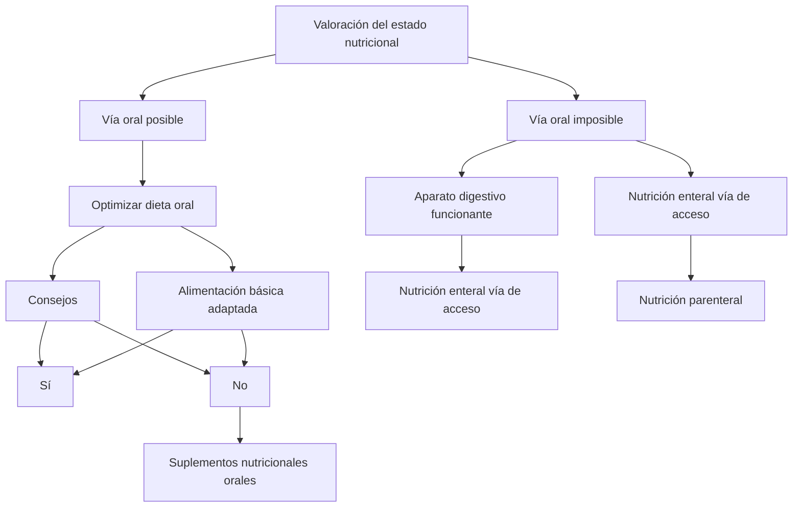
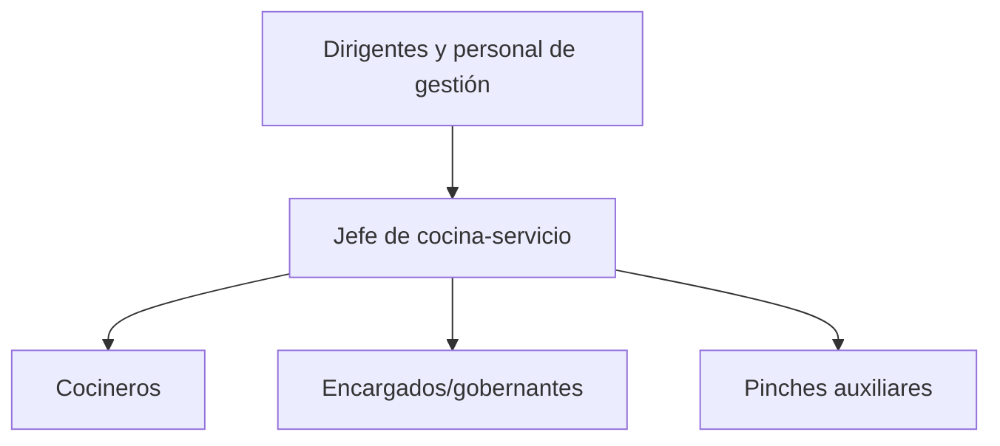
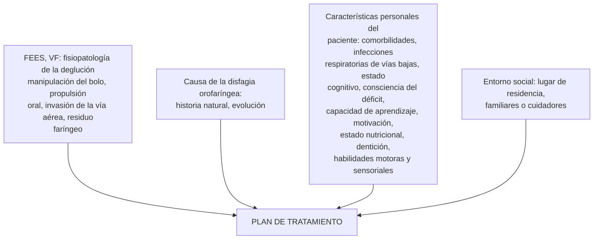
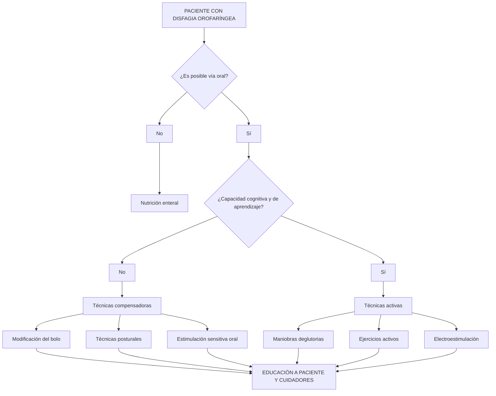
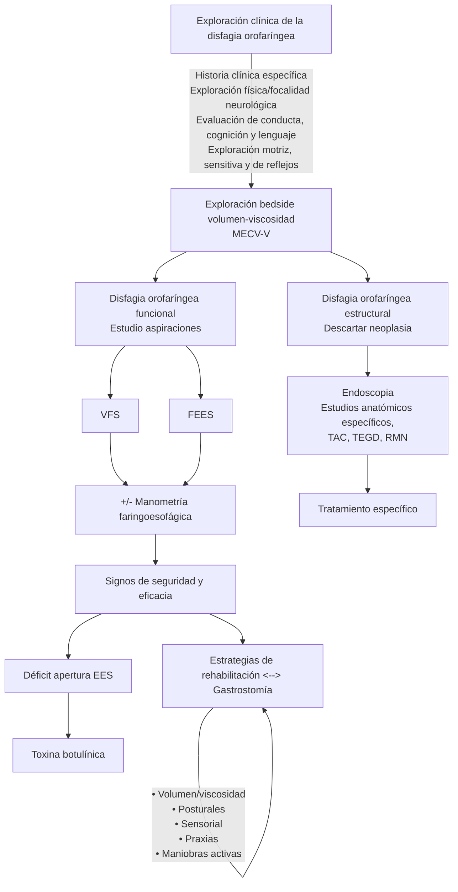

# DISFAGIA OROFARÍNGEA:
## Soluciones multidisciplinares

Con 36 recetas elaboradas en el Hospital Universitario Príncipe de Asturias

[The image shows six cartoon-style icons representing different healthcare professionals arranged in a puzzle-like formation. They include representations of a doctor, a chef, a nutritionist, and other medical staff.]

Realizado por: Unidad Funcional de Disfagia Orofaríngea del Hospital Universitario Príncipe de Asturias

[Logos at the bottom of the image:]
- Hospital Universitario Príncipe de Asturias (with SaludMadrid logo)
- Vegenat HEALTHCARE

[Navigation icons at the bottom right corner: back, play, home]
---
Avalado por:

| Organization | Logo Description |
|--------------|-------------------|
| SENPE (Sociedad Española de Nutrición Clínica y Metabolismo) | Logo with "SENPE" in gray and green letters |
| AEHH (Asociación Española de Hostelería) | Square logo with "AEHH" in teal letters |
| SEEN (Sociedad Española de Endocrinología y Nutrición) | Logo with "SEEN" and a stylized orange and gray symbol |
| AdENyD (Asociación de Enfermeras de Nutrición y Dietética) | Circular green logo with "AdENyD" text |

Editado por:

| Organization | Logo Description |
|--------------|-------------------|
| guíamédica formación en salud | Red logo with a stylized building icon and text |

[Three teal navigation icons at the bottom right of the image: back arrow, forward arrow, and home icon]
---
# DISFAGIA OROFARÍNGEA:
## Soluciones multidisciplinares

Con 36 recetas elaboradas en el Hospital Universitario Príncipe de Asturias

### ÍNDICE

| Consejos de navegación | Avales | Créditos | Índice general |
|------------------------|--------|----------|----------------|

| Recetas de la Cocina Hospitalaria | Autoevaluación | Borrar respuestas |
|-----------------------------------|----------------|-------------------|

The image also includes illustrations of various healthcare professionals, including a doctor, a chef, and other medical staff.

At the bottom of the image, there are navigation icons and a logo for "guíamédica formación en salud".
---
ADVERTENCIA: Este pdf interactivo ha sido diseñado para ejecutarse en pantalla completa. Usted puede tener problemas para visualizar y navegar correctamente en este documento si utiliza la versión Adobe Reader X. Cuando el Modo protegido no se puede iniciar debido a una configuración no admitida, un cuadro de diálogo avisa de que el modo no está disponible. Le recomendamos que instale otra versión de Acrobat Reader que no sea la citada anteriormente para solventar dicho problema. Pinche aquí para acceder a la página de Adobe donde podrá elegir la versión que más le convenga.

Es importante tener en cuenta los siguientes símbolos para una correcta navegación en el modo pantalla completa:

| Icono | Descripción |
|-------|-------------|
| ◀️ | Página anterior: Al pulsar sobre este icono, la pantalla se desplaza a la página anterior a la que esté leyendo. |
| ▶️ | Página siguiente: Al pulsar sobre este icono, la pantalla se desplaza a la página siguiente a la que esté leyendo. |
| 🏠 | Índices: Al pulsar sobre este icono, accederá a un índice general desde el que podrá elegir cualquiera de los índices del documento. |
| 🔍 | Búsquedas: Al pulsar sobre este icono (página índice de este libro), saldrá de pantalla completa y se activa el modo de búsqueda avanzada. En el cuadro que se le presenta teclee la palabra que desee buscar dentro del documento. El programa localiza todas las coincidencias con la consulta realizada pudiendo elegir con un clic cualquiera de ellas. |
| ◀️▶️ | Vista anterior y posterior: Al pulsar sobre estos iconos, podrá desplazarse «atrás y delante» en las páginas que ya haya visualizado. De ese modo, con ellos puede hacerse una reconstrucción de la ruta de visualización. |
| 🔽🔼 | Avance y retroceso: El cursor del ratón en pantalla completa aparece con este aspecto. Con un clic avanzará una página. Manteniendo pulsada la tecla mayúsculas el icono cambiará de aspecto y retrocederá una página al hacer clic. |

La Autoevaluación de este libro tiene preguntas con formato de elección múltiple, donde cada respuesta tiene un botón para hacer clic en la que crea correcta. Si la respuesta elegida es errónea le instará a intentarlo de nuevo, y si es correcta, podrá seguir avanzando. En cualquier caso, podrá volver a la vista anterior con un solo clic de ratón. Las respuestas también pueden borrarse y rellenarse de nuevo (página final de Autoevaluación).

Del modo pantalla completa se podrá salir con solo apretar la tecla escape de su teclado. Podrá volver a ejecutar la pantalla completa con la combinación de teclas Control+L (Windows) o Comando+L (Mac).
---
Título: Disfagia orofaríngea: soluciones multidisciplinares. Con 36 recetas elaboradas en el Hospital Universitario Príncipe de Asturias.

1.ª edición, diciembre 2018

© de los autores

© Grupo Aula Médica, S. L., para esta edición, 2018.

```
Todos los derechos reservados. Prohibida la reproducción, almacenamiento, transmisión, difusión, etc., total o parcial,
del contenido de esta obra en cualquier formato y soporte sin consentimiento previo de los titulares del copyright.
Los autores y Grupo Aula Médica, S.L., no se hacen responsables de los errores u omisiones ni de ninguna consecuen-
cia debida a la aplicación de la información incluida en este texto y no garantizan, ni explícita ni implícitamente, los
contenidos de esta publicación. Los autores y la casa editorial no asumen ninguna responsabilidad por lesiones o daños
a personas o propiedades relacionadas con esta publicación.
Grupo Aula Médica se excluye de toda responsabilidad por daños directos o indirectos resultantes del uso de la infor-
mación contenida en este libro.
Se estimula encarecidamente a los lectores que presten especial atención a la información proporcionada por los
fabricantes de cualquier fármaco o equipo que piensen utilizar.
```

Editado por:

aulamedica
formacion en salud

Grupo Aula Médica, S.L.
C/ Río Jarama, 132 - Nave 3.06
Polígono Industrial Santa María de Benquerencia
45007 Toledo

ISBN: 978-84-7885-652-7
Depósito legal: M-37479-2018
Impreso en España
---
# DISFAGIA OROFARÍNGEA:
## Soluciones multidisciplinares

Con 36 recetas elaboradas
en el Hospital Universitario Príncipe de Asturias

Coordinado por: Julia Álvarez Hernández

[Logo of aulamedica formacion en salud]
---
# Índice

Presentación .......................................................................................... viii

Prólogo .................................................................................................. x

Índice de autores.................................................................................... xii

1. La disfagia orofaríngea en el siglo XXI, un síntoma ignorado................. 1

2. Métodos de cribado para la disfagia orofaríngea................................... 25

3. Utilización de pruebas diagnósticas instrumentales
   en la disfagia orofaríngea..................................................................... 47

4. Tratamiento nutricional en la disfagia orofaríngea ................................ 79

5. Todo lo que debes saber sobre los espesantes y nunca te atreviste
   a preguntar.......................................................................................... 111

6. La disfagia orofaríngea en la cocina hospitalaria................................... 133

7. Rehabilitación de la disfagia orofaríngea .............................................. 161

8. Unidad Funcional de Disfagia Orofaríngea. Una experiencia única......... 181

9. Internet, tecnología digital, salud y disfagia.......................................... 205

Anexo I. La importancia de la higiene bucodental. Cuidados
   e higiene de la cavidad oral................................................................... 227

Anexo II. Cuidados en la alimentación del paciente
   con disfagia orofaríngea ....................................................................... 233

Anexo III. Ejercicios orofaciales no deglutorios .......................................... 241

Anexo IV. Escalas de función y calidad de vida en disfagia
   orofaríngea del adulto .......................................................................... 255

Apéndice. Las recetas de la Cocina Hospitalaria ........................................ 263

Preguntas de autoevaluación .................................................................. 319
---
# Presentación

Comer y beber resulta esencial para la supervivencia del hombre, por tanto cuando se evidencia que un sujeto padece un trastorno de la deglución se buscan soluciones eficientes y ágiles. El estudio de la disfagia orofaríngea ha despertado gran interés en la comunidad científica en los últimos 30 años, como muestra un corpus de evidencia científica generada. Sin embargo, la puesta en práctica de soluciones viables para el cribado, diagnóstico y tratamiento adecuado e individualizado se hace esperar.

En nuestra opinión, la disfagia orofaríngea sigue siendo un síntoma ignorado, lo que tiene efectos deletéreos en la atención de los pacientes que la padecen. Sus consecuencias no prevenidas ni tratadas –con el consiguiente aumento de morbi-mortalidad, empeoramiento de la calidad de vida del paciente y de sus cuidadores, y la carga económica que supone para el sistema sanitario– merecen una reflexión.

Desde la Unidad Funcional de Disfagia Orofaríngea queremos aportar nuestro granito de arena con este libro, porque estamos firmemente convencidos de que solo desde la concienciación y la sensibilización de los profesionales sanitarios y no sanitarios, los gestores, decisores políticos y, por supuesto, la población general podemos optimizar el cuidado y la atención sanitaria de estos pacientes.

Nuestra unidad, constituida en 2013 como una unidad multidisciplinar en la que participamos miembros de los Servicios de Otorrinolaringología, Rehabilitación, Endocrinología y Nutrición, y Cocina Hospitalaria, lleva desde entonces trabajando para conseguir una atención de excelencia de nuestros pacientes.

Todos y cada uno de nosotros hemos querido compartir en esta obra el conocimiento disponible que, junto a nuestra experiencia práctica, nos permite poner en común puntos de reflexión en nuestro compromiso de mejora continua de la calidad en la atención nutricional de los pacientes con disfagia orofaríngea.

En este libro hemos querido revisar aspectos clínicos relacionados con el abordaje del paciente con disfagia orofaríngea, dentro y fuera del hospital (cribado, metodología diagnóstica, tratamiento nutricional y rehabilitación). Pero probablemente su valor añadido sea la practicidad en la que se centran sus textos. Hemos apostado por hacer llegar al lector todos los detalles prácticos de interés desde la sospecha
---
# Presentación

diagnóstica hasta el tratamiento, pasando por la puesta en común de nuestra apuesta organizativa.

Nuestro objetivo es ayudar a crear nuevas unidades multidisciplinares de atención al paciente con disfagia orofaríngea. Entendemos que un punto fuerte en esta aventura por la que hemos apostado tiene que ver con nuestra organización multidisciplinar con vocación de ser transdisciplinar. Y junto a ello, creemos que la implicación de los compañeros del servicio de la cocina del hospital resulta ser una de nuestras señas de identidad. De ahí, la aportación de un recetario fácil con modificaciones de texturas y viscosidades, que permitan compensar a los pacientes de forma segura y eficaz, con recetas que puedan ser reproducidas en otros centros y que aseguren mejorar la alimentación natural de nuestros pacientes disfágicos, según el grado y gravedad de la misma.

Queremos agradecer a la Dirección Médica, la Dirección de Enfermería, la Dirección de Gestión y, muy especialmente, a la Gerencia del Hospital Universitario Príncipe de Asturias su apoyo para la creación y desarrollo de la Primera Unidad Funcional Multidisciplinar de Disfagia Orofaríngea de la Comunidad de Madrid. Gracias por facilitarnos el camino y hacer posible lo que con tanta ilusión seguimos haciendo cada día.

Gracias a las sociedades y asociaciones científicas por avalar y apoyar la producción de este libro. Gracias a ADENYD (Asociación de Enfermeras de Nutrición y Dietética), SEEN (Sociedad Española de Endocrinología y Nutrición), SENPE (Sociedad Española de Nutrición Clínica y Metabolismo) y la AEHH (Asociación Española de Hostelería Hospitalaria).

Gracias a la editorial Aula Médica, en especial a Javier Coello, por su excelente trabajo de edición, su paciencia y dedicación. Por haber compartido con nosotros todos los detalles y por hacer lo imposible para que esta obra vea la luz en un tiempo récord.

Por supuesto, queremos expresar nuestro profundo agradecimiento a Vegenat® Healthcare por su apoyo incondicional que ha resultado decisivo para que hoy podamos compartir este libro. Gracias a Soledad Pinto, Paloma Cabadas y Pilar Sánchez por haber depositado vuestra confianza en este proyecto.

Unidad Funcional de Disfagia Orofaríngea
---
# Prólogo

La publicación de este libro, *Disfagia orofaríngea: soluciones multidisciplinares*, será, a buen seguro, un referente en el tratamiento de un síntoma extremadamente frecuente en algunos colectivos de pacientes, especialmente en la población mayor. Se trata de un trastorno de la motilidad orofaríngea que afecta a la propulsión del bolo, a la reconfiguración orofaríngea durante la deglución o a la apertura del esfínter esofágico superior (EES). Sus causas pueden ser de orden estructural y funcional, y derivan en que se alcancen cifras de prevalencia entre el 30-82% de pacientes con enfermedades neurológicas tales como el Parkinson, la esclerosis lateral amiotrófica, Alzheimer, accidentes cerebrovasculares y traumatismos craneoencefálicos. Además, se presenta en el 80% de los pacientes que han recibido quimioterapia o radioterapia por tumores de cabeza y cuello, entre el 44% y el 25% de los ancianos ingresados en un hospital.

Es importante destacar el concepto de presbifagia, que se registra en el 56-78% de los ancianos frágiles y que está condicionada por el propio proceso de envejecimiento y las alteraciones funcionales y estructurales relacionadas con la dentición, salivación, pérdida de elasticidad de las estructuras, coordinación neuromuscular, etc.

Las consecuencias de la disfagia orofaríngea determinan su relevancia al condicionar alteraciones en la seguridad y de la eficacia de la deglución. La primera, condiciona la presencia de neumonías por aspiración que cursan con una elevada mortalidad. La segunda determina la presencia de deshidratación y desnutrición, que también condicionan empeoramiento de la situación clínica del paciente por las comorbilidades asociadas (infecciones, dehiscencia de sutura, retraso de cicatrización, retraso de consolidación de fracturas, úlceras por presión, etc.) y mayor mortalidad. Por estas razones, resulta imprescindible identificar precozmente a los pacientes para prevenir complicaciones y establecer programas terapéuticos que permitan abordar de forma multidisciplinar este grave problema de salud.

El Hospital Universitario Príncipe de Asturias es pionero en este abordaje multidisciplinar de la disfagia orofaríngea, ya que ha conseguido integrar la atención de los Servicios de Otorrinolaringología, Rehabilitación y Endocrinología y Nutrición, así como el Servicio de Cocina Hospitalaria, permitiendo una asistencia integral y de calidad a los pacientes con este síntoma, no solo de otros puntos de la comunidad,
---
# Prólogo

sino también de otras comunidades autónomas cercanas en calidad de centro de referencia. Por otro lado, nuestra Unidad Funcional de Disfagia Orofaríngea se ha convertido en pionera en la formación de profesionales en esta materia gracias a un programa de rotación semanal por el que han pasado ya más de 80 profesionales de centros sanitarios de toda España, convirtiéndonos en un programa de excelencia de formación en materia de disfagia orofaríngea.

El trabajo multidisciplinar de esta Unidad ha puesto de manifiesto la importancia que tiene en la gestión sanitaria esta fórmula de trabajo en equipo entre varios servicios, lo que redunda en una mejora de la eficiencia y de la calidad asistencial que prestan instituciones sanitarias, como es el caso de nuestro hospital.

Dada nuestra trayectoria, hemos decidido apostar por el desarrollo de esta publicación. En este manual participan todos los miembros de la Unidad Funcional de Disfagia Orofaríngea (UFDOF) del Hospital Universitario Príncipe de Asturias (HUPA) y refleja los aspectos de mayor interés en esta materia y la estructura y modelo de funcionamiento de la UFDOF del HUPA.

El texto permitirá compartir el conocimiento y la experiencia del equipo para poder incorporar las mismas medidas en distintos centros hospitalarios españoles que quieran trabajar en este campo de actuación.

El libro incluye aspectos como el cribado, el uso de técnicas diagnósticas, su abordaje nutricional, así como el uso de los espesantes, cómo llevar a cabo la rehabilitación, los recursos web, cuidados y ejercicios, así como un apéndice con 36 recetas de la Cocina Hospitalaria de nuestro hospital.

A todos los profesionales de esta UFDOF del hospital quiero agradecerles el trabajo realizado y el esfuerzo que supone poner en marcha iniciativas como la publicación de este libro que espero se convierta en un manual de referencia entre todos los profesionales que intervienen en el tratamiento de la disfagia.

Félix Bravo Sanz
Director Gerente del Hospital Universitario Príncipe de Asturias
---
# Índice de autores

**Julia Álvarez Hernández**

Jefe de la Sección de Endocrinología y Nutrición. Unidad Funcional de Disfagia
Orofaríngea. Profesor Asociado de Ciencias de la Salud de la UAH. Hospital
Universitario Príncipe de Asturias. Alcalá de Henares. Madrid.

**Luisa María Andrés Esteban**

Cocinera. Servicio de Cocina Hospitalaria. Unidad Funcional de Disfagia
Orofaríngea. Hospital Universitario Príncipe de Asturias. Alcalá de Henares. Madrid.

**Rosa Ana Ashbaugh Enguídanos**

Enfermera. Unidad de Nutrición Clínica y Dietética. Unidad Funcional de Disfagia
Orofaríngea. Hospital Universitario Príncipe de Asturias. Alcalá de Henares. Madrid.

**Elena Atienza Sánchez**

Médico Interno Residente. Sección de Endocrinología y Nutrición. Unidad
Funcional de Disfagia Orofaríngea. Hospital Universitario Príncipe de Asturias.
Alcalá de Henares. Madrid.

**Mónica Benito Fernández**

Enfermera. Graduada en Nutrición Clínica y Dietética. Unidad de Nutrición Clínica y
Dietética. Unidad Funcional de Disfagia Orofaríngea. Hospital Universitario Príncipe
de Asturias. Alcalá de Henares. Madrid.

**Julián Fernández Macías**

Cocinero. Servicio de Cocina Hospitalaria. Unidad Funcional de Disfagia
Orofaríngea. Hospital Universitario Príncipe de Asturias. Alcalá de Henares. Madrid.

**Pilar Gallego Izquierdo**

Logopeda. Servicio de Rehabilitación. Unidad Funcional de Disfagia Orofaríngea.
Hospital Universitario Príncipe de Asturias. Alcalá de Henares. Madrid.
---
# Índice de autores

**Elisa García García**

Técnico en Cuidados Auxiliares de Enfermería. Unidad de Nutrición Clínica y Dietética. Unidad Funcional de Disfagia Orofaríngea. Hospital Universitario Príncipe de Asturias. Alcalá de Henares. Madrid.

**Antonio Gil Cordero**

Jefe de Cocina. Servicio de Cocina Hospitalaria. Unidad Funcional de Disfagia Orofaríngea. Hospital Universitario Príncipe de Asturias. Alcalá de Henares. Madrid.

**Nuria Gil-Fournier Esquerra**

Facultativo Especialista de Área. Sección de Endocrinología y Nutrición. Unidad Funcional de Disfagia Orofaríngea. Hospital Universitario Príncipe de Asturias. Alcalá de Henares. Madrid.

**Carmen Gómez Triguero**

Facultativo Especialista de Área. Servicio de Rehabilitación. Unidad Funcional de Disfagia Orofaríngea. Hospital Universitario Príncipe de Asturias. Alcalá de Henares. Madrid.

**Montserrat Martínez Liébana**

Técnico Superior en Dietética y Alimentación. Unidad de Nutrición Clínica y Dietética. Unidad Funcional de Disfagia Orofaríngea. Hospital Universitario Príncipe de Asturias. Alcalá de Henares. Madrid.

**Lourdes Moneva Vicente**

Enfermera. Unidad de Nutrición Clínica y Dietética. Unidad Funcional de Disfagia Orofaríngea. Hospital Universitario Príncipe de Asturias. Alcalá de Henares. Madrid.

**Natasha Pérez Marrero**

Facultativo Especialista de Área. Servicio de Otorrinolaringología. Unidad Funcional de Disfagia Orofaríngea. Hospital Universitario Príncipe de Asturias. Alcalá de Henares. Madrid.

**Teresa Rivera Rodríguez**

Jefe del Servicio de Otorrinolaringología. Unidad Funcional de Disfagia Orofaríngea. Profesora Asociada de Ciencias de la Salud de la UAH. Hospital Universitario Príncipe de Asturias. Alcalá de Henares. Madrid.
---
# MANUAL DE DISFAGIA OROFARÍNGEA: SOLUCIONES MULTIDISCIPLINARES

## Virginia Rodríguez Campuzano
Enfermera. Unidad de Nutrición Clínica y Dietética. Unidad Funcional de Disfagia Orofaríngea. Hospital Universitario Príncipe de Asturias. Alcalá de Henares. Madrid.

## Manuel Rodríguez Paradinas
Facultativo Especialista de Área. Servicio de Otorrinolaringología. Responsable ORL de la Unidad Funcional de Disfagia Orofaríngea. Hospital Universitario Príncipe de Asturias. Alcalá de Henares. Madrid.

## Paula Romero Cortés
Médico Interno Residente. Sección de Endocrinología y Nutrición. Hospital Universitario Príncipe de Asturias. Alcalá de Henares. Madrid.

## María Dolores Valverde Carrillo
Jefe del Servicio de Rehabilitación. Unidad Funcional de Disfagia Orofaríngea. Profesora Asociada de Ciencias de la Salud de la UAH. Hospital Universitario Príncipe de Asturias. Alcalá de Henares. Madrid.
---
# 1 LA DISFAGIA OROFARÍNGEA EN EL SIGLO XXI, UN SÍNTOMA IGNORADO

Julia Álvarez Hernández, Manuel Rodríguez Paradinas,
Elena Atienza Sánchez y María Dolores Valverde Carrillo

## ÍNDICE

| Sección | Subsección |
|---------|------------|
| 1. Introducción | |
| 2. Fisiología de la deglución | |
| 3. Apuntes fisiopatológicos | |
| 4. Causas | |
| 5. Indicadores de la presencia de disfagia | |
| 6. Prevalencia | |
| 7. Consecuencias, impacto y cargas de la DOF | 7.1. Neumonía por aspiración |
| | 7.2. Deshidratación y desnutrición |
| | 7.3. Impacto psicológico y social |
| | 7.4. Mortalidad |
| | 7.5. Estancia hospitalaria y costes asociados |
| 8. Consideraciones finales | |
| 9. Bibliografía | |
---
# MANUAL DE DISFAGIA OROFARÍNGEA: SOLUCIONES MULTIDISCIPLINARES

## IDEAS CLAVE

- La deglución tiene un papel clave en la alimentación del individuo y resulta la puerta de entrada a los procesos fisiológicos de digestión, absorción y transformación de los nutrientes que constituyen la nutrición.

- Los trastornos de la deglución constituyen un grupo amplio y heterogéneo de alteraciones funcionales o estructurales.

- La disfagia orofaríngea (DOF) condiciona alteraciones de la seguridad (neumonía por aspiración) y de la eficacia (deshidratación y desnutrición), aumentando así la morbimortalidad de los individuos que la padecen, deteriorando su calidad de vida.

- Los pacientes con DOF presentan estancias hospitalarias más prolongadas, así como mayores costes relacionados tanto en el ámbito hospitalario como en la comunidad.

- Necesitamos implementar medidas formativas y educativas para profesionales sanitarios y no sanitarios, pacientes y cuidadores que nos permitan sensibilizar sobre la DOF para que deje de ser un síntoma ignorado por muchos y mejoremos la situación de los pacientes con medidas preventivas y tratamientos adecuados.

- La codificación de la DOF en los pacientes ingresados es fundamental para mejorar nuestros registros sanitarios y conocer su impacto en el sistema sanitario.
---
# 1. La disfagia orofaríngea en el siglo XXI, un síntoma ignorado

## 1. INTRODUCCIÓN

El hombre, como todos los seres vivos, necesita alimentarse para vivir. La alimentación es la manera de proporcionar al organismo esos alimentos que le son fundamentales para el mantenimiento de la vida. Pero la alimentación resulta esencial no solo para satisfacer nuestras necesidades biológicas, sino que también es clave para satisfacer las necesidades psicológicas y sociales.

La alimentación es la consecuencia de una serie de actividades, conscientes y voluntarias, en virtud de las cuales el ser humano proporciona sustancias aptas para el consumo, las modifica manipulándolas, cocinándolas, transformándolas y acaba, también de una forma voluntaria y consciente, introduciéndolas en la boca, masticándolas y deglutiéndolas, al menos en la fase oral preparatoria de la deglución. Así, la deglución tiene un papel clave en la alimentación, siendo la puerta de entrada a los procesos fisiológicos de digestión, absorción y transformación de los nutrientes que constituyen la nutrición. Existe una clara barrera conceptual entre alimentación y nutrición, aunque en la vida cotidiana se utilicen indistintamente de forma inadecuada.

Los trastornos de la deglución constituyen un grupo amplio y heterogéneo de alteraciones funcionales o estructurales. El síntoma paradigmático de estos trastornos es la disfagia. Este término proviene de dos palabras griegas dys (dificultad) y phagia (comer).

La disfagia es un síntoma que se define como la dificultad para la deglución; es decir, la dificultad para hacer llegar los alimentos o los líquidos desde la boca al estómago. Algunos autores, como Lancaster, la han definido como la alteración de la deglución que puede resultar en una penetración o aspiración de comida, líquidos o medicación en la vía aérea¹.

Desde un punto de vista anatómico, se establece como disfagia orofaríngea (DOF) cuando el origen de las alteraciones de la deglución es oral, faríngeo, laríngeo y del esfínter esofágico superior (EES). Y hablamos de disfagia esofágica (DE) cuando las alteraciones de la deglución sitúan su origen en el esófago superior, el cuerpo esofágico, el esfínter esofágico inferior y el cardias.

El interés por el estudio de la DOF es creciente y la construcción de un cuerpo de doctrina a luz de la evidencia científica se remonta a hace unos 30 años. Sin embargo, todavía hoy resulta un síntoma ignorado a pesar de su impacto en el devenir de muchas patologías, o del propio envejecimiento, como analizaremos más adelante. La falta de registros y codificación de este síntoma no nos permite tener datos generales reales de la situación en cada centro. En este capítulo, pretendemos acercar al lector a este grave problema sociosanitario que supone importantes cargas físicas (morbimortalidad), psicológicas (trastornos del ánimo, depresión, etc.) y sociales (aislamiento) al paciente que la padece, así como económicas para los sistemas de salud².
---
# MANUAL DE DISFAGIA OROFARÍNGEA: SOLUCIONES MULTIDISCIPLINARES

## 2. FISIOLOGÍA DE LA DEGLUCIÓN

La deglución es un proceso sensitivo-motor neuromuscular complejo que exige una perfecta coordinación de varios grupos musculares de la boca, faringe, laringe y esófago. Intervienen más de 30 músculos que poseen una rica inervación y con la participación del centro de la deglución y los pares craneales V, VII, IX, X y XII.

El objetivo de la deglución es permitir una adecuada nutrición del individuo. Es importante recordar que la deglución tiene dos características fundamentales que son la eficacia y la seguridad. La eficacia hace referencia a la posibilidad de asegurar la ingestión de los macro- y micronutrientes (energía, proteínas, vitaminas, minerales y oligoelementos), así como del agua imprescindible para mantener un adecuado estado nutricional. Por otro lado, la seguridad, que hace referencia a la posibilidad de ingerir agua y alimentos sin que se produzcan complicaciones respiratorias³.

Se pueden distinguir tres fases en la deglución perfectamente coordinadas: oral, faríngea y esofágica (Fig. 1). La fase oral integra dos fases con unas acciones básicas:

- En primer lugar la fase oral preparatoria, que incluye la masticación y la formación del bolo alimenticio por la mezcla del alimento con la saliva. Fase oral de trasporte: propulsión del bolo y paso a la faringe. El tiempo invertido en la formación del bolo depende de distintos factores como la facilidad del sujeto para masticar, del deseo de saborear el alimento y, cómo no, de la eficiencia motora. Cuando el bolo está dispuesto se mueve hasta las fauces, se juntan los labios y se contrae la musculatura de la cavidad oral. En sentido anteroposterior, participa principalmente la lengua que se dispone formando una cavidad central que actúa como una rampa para desplazar el bolo hacia el istmo de las fauces⁴,⁵.

- A continuación, acontece la fase faríngea, que está constituida por una serie de procesos altamente coordinados de manera secuencial, empezando por el cierre de la nasofaringe mediante elevación del velo del paladar y el cierre de la laringe, el inicio de las ondas peristálticas de la faringe en sentido cefalocaudal, la elevación y cierre de los tres esfínteres laríngeos (el repliegue aritenoepiglótico, las bandas ventriculares y las cuerdas vocales).

- Finalmente, en la fase esofágica, se produce la relajación del esfínter cricofaríngeo para permitir el paso de los alimentos de la faringe al esófago.

El reflejo de la deglución, hoy conocido como respuesta motora orofaríngea, incluye tres grupos de acontecimientos:
---
# 1. La disfagia orofaríngea en el siglo XXI, un síntoma ignorado

Figura 1. Fases de la deglución.

1. Bolo alimenticio.
2. Esfínter esofágico superior cerrado.
3. La lengua bloquea la cavidad oral.
4. Esófago.
5. Esfínter esofágico superior abierto.
6. La epiglotis bloquea la laringe.
7. El paladar blando bloquea la cavidad nasal.

**Figura 1. Fases de la deglución.**

- La reordenación temporal de las estructuras orofaríngeas, desde una configuración de la vía respiratoria en reposo hasta una disposición de la vía digestiva durante la deglución.

- La transferencia del bolo alimenticio desde la boca hasta el esófago.

- La posterior recuperación de la configuración respiratoria. Esta respuesta motora orofaríngea se desencadena en los pilares palatinos anteriores y la parte posterior de la lengua. Esta etapa dura aproximadamente 1 segundo o menos y es involuntaria. Durante ella, no hay pausas y ocurren los fenómenos, anteriormente comentados, coordinados por el centro bulbar a través del nervio vago⁵⁶.

Todos estos procesos hacen posible el paso del bolo al esófago a la vez que impiden su entrada en la vía aérea y su reflujo hacia la nariz; es decir, supone una transformación de la orofaringe, que pasa de ser una vía respiratoria a ser una vía deglutoria, mediante la apertura de la entrada hacia el esófago y el cierre de la entrada a la laringe. La etapa esofágica se inicia con la relajación del esfínter esofágico superior, músculo cricofaríngeo, y continúa con el peristaltismo esofágico que permite el tránsito del bolo hacia el estómago. Esta es la etapa que tiene una mayor duración, entre 8 y 20 segundos. Con el bolo alimenticio transitando por el esófago,

5
---
# MANUAL DE DISFAGIA OROFARÍNGEA: SOLUCIONES MULTIDISCIPLINARES

las estructuras faringolaríngeas vuelven pasivamente a su posición original con la ayuda de la contracción de la musculatura infrahioidea5-7.

Como en cualquier otro evento motor, en la deglución participan distintos niveles de control neural, desde el córtex hasta el bulbo raquídeo donde se encuentran los núcleos segmentarios y suprasegmentarios de varios de los músculos estriados que participan en la deglución. Los músculos que participan en la deglución y permiten que el bolo alimenticio transite de la boca al estómago están inervados por distintos pares craneales entre los que se encuentran el trigémino (V), facial (VII), glosofaríngeo (IX), vago o neumogástrico (X), espinal o accesorio (XI) e hipogloso (XII). Estos nervios proporcionan la inervación sensorial y motora de la deglución y los movimientos asociados al tracto respiratorio superior. En la fase oral (preparatoria y de transporte) participan trigémino, facial e hipogloso en la masticación, la motilidad de labios y mejillas y, por último, la lengua respectivamente. A nivel de tronco cerebral, toda la información en el inicio y facilitación de la deglución convergen en el tracto solitario y termina en el núcleo del mismo nombre.

El inicio del mecanismo de la deglución se puede producir tanto por el estímulo de receptores localizados en la lengua, el paladar blando, la úvula, la pared posterior de faringe y la laringe como por una acción directa controlada por el sistema nervioso central8. El núcleo del tracto solitario (NTS) no solo recibe aferencias de los receptores orofaríngeos (mecánicos, térmicos y químicos), sino que también recibe fibras descendentes del córtex cerebral y de centros subcorticales, los cuales determinan el inicio de la respuesta motora deglutoria. El estímulo provocado por el bolo alimenticio resultante de la fase oral es variable, pero una vez iniciada la deglución la cascada secuencial de movimientos no varía de manera significativa, incluso en pacientes con diferentes tipos de disfagia. Esto es una de las evidencias que apoya la existencia de un centro generador del patrón deglutorio (CGPD) que se encontraría en la formación reticular cercana al NTS y al núcleo ambiguo del bulbo raquídeo4-6. La corteza cerebral tiene un papel fundamental en la regulación de la deglución. Las áreas corticales más comúnmente implicadas corresponden a la corteza sensitivo-motora, prefrontal, cingulada anterior, insular, parietal-occipital y temporal5. También se ha evidenciado actividad a nivel de los ganglios basales, tálamo, cerebelo y la cápsula interna. La multiplicidad de áreas del encéfalo que intervienen en la regulación de la deglución explica por qué la misma puede verse afectada con lesiones de distinta naturaleza que involucren distintos niveles del neuroeje.

Por otro lado, un aspecto de gran interés en la deglución es su coordinación con la respiración. Los grupos musculares que participan en la deglución y en la respiración están estrechamente relacionados y, lo que es más importante, su control neural está íntimamente coordinado. Son varias las estructuras que tienen un papel
---
# 1. La disfagia orofaríngea en el siglo XXI, un síntoma ignorado

dual atendiendo a la deglución y a la respiración. En general, los centros neurales que participan en el control de ambos procesos se alojan en el centro dorsomedial y ventrolateral del bulbo raquídeo. Igualmente, las estructuras corticales facilitan el desarrollo de estas dos funciones vitales para el individuo⁴,⁹.

## 3. APUNTES FISIOPATOLÓGICOS

Sabemos que la deglución es una parte esencial de la vida y sobre su procesamiento neuronal central se ha profundizado cada vez más en los últimos 20 años. Los avances tecnológicos como la resonancia magnética (RM), la estimulación magnética transcraneal (TMS), la tomografía por emisión de positrones y la magnetoencefalografía han permitido afinar en el conocimiento de los acontecimientos que se suceden en el papel de la corteza cerebral en la fisiopatología de la deglución que acompaña a algunas entidades clínicas. Así, además de las conocidas estructuras del tronco cerebral implicadas, se ha podido demostrar la participación de una red cortical subcortical ampliamente distribuida que, como ya hemos comentado, incluye, entre otras estructuras, la corteza sensoriomotora primaria y secundaria, la corteza premotora, la ínsula, la circunvolución cingulada, el área motora suplementaria, las áreas de integración sensitivo-motoras y los ganglios basales¹⁰.

Estudios de imagen recientes, que valoran funcionalidad en tejido sano y enfermo en lesiones estructurales, sugieren una especialización hemisférica para las diferentes fases de la deglución. Así, se supone que predominantemente existe un procesamiento lateralizado al hemisferio izquierdo de la fase oral y una lateralización del hemisferio derecho de la fase faríngea. Los estímulos sensoriales conducen a una robusta activación de esta red. Por el contrario, cuando se interrumpe la información sensorial aferente se impide gravemente el control cortical de la deglución, lo que finalmente provoca una disminución de la eficacia de la misma. También se han demostrado cambios en la red de la deglución como reacción fisiológica a diferentes enfermedades y ubicaciones de lesiones neuroanatómicas relacionadas¹¹. El accidente cerebrovascular constituye un modelo conveniente para evaluar la recuperación funcional debido a la plasticidad neuronal espontánea. Curiosamente, la disfagia relacionada con el accidente cerebrovascular se debe, al menos en parte, a la pérdida de la conectividad funcional dentro de la red de la deglución que conduce a una activación disminuida no solo en el hemisferio afectado, sino también en el hemisferio no dañado. En consecuencia, la recuperación, a menudo notable, de la función deglutoria después del accidente cerebrovascular depende de la reorganización compensatoria en ese hemisferio¹².
---
# MANUAL DE DISFAGIA OROFARÍNGEA: SOLUCIONES MULTIDISCIPLINARES

Por el contrario, en los casos de afectación de motoneurona superior, como el que se observa en la esclerosis lateral amiotrófica, se imposibilita la adaptación cortical y se ha encontrado una disminución en la activación cortical con la progresión de la enfermedad. Lesiones más allá de la motoneurona superior, como se ve, por ejemplo, en la atrofia muscular bulboespinal, dan lugar a una extensa reorganización funcional dentro de la corteza sensitivo-motora primaria. También se obtienen resultados interesantes cuando se estudia la plasticidad cortical en enfermedades neurodegenerativas lentamente progresivas no confinadas al sistema motor. Así, en la enfermedad de Parkinson (EP), se observa que los cambios cerebrales adaptativos en el procesamiento de la deglución parecen compensar las vías motoras deficientes.

Es interesante recordar que también los estudios videofluoroscópicos nos han permitido analizar mejor cada una de las fases de la deglución en pacientes con trastornos de la misma, pudiendo definir e identificar los cambios patológicos. Según el equipo de P. Clavé, sabemos que los individuos jóvenes y sanos presentan una respuesta motora orofaríngea de duración muy breve (el periodo entre la apertura del sello glosopalatino y el cierre del vestíbulo laríngeo es inferior a 740 ms), un rápido cierre del vestíbulo laríngeo (inferior a 160 ms) y una rápida apertura del EES (inferior a 220 ms). La duración de la respuesta motora orofaríngea es mucho más prolongada en pacientes con disfagia neurógena y en pacientes ancianos. Estos dos grupos de pacientes presentan un grave retraso en la fase de reconfiguración de la vía respiratoria hacia la vía digestiva. La prolongación de los intervalos hasta el cierre del vestíbulo laríngeo y la apertura del EES son las principales anomalías deglutorias que en estos pacientes conducen al desarrollo de aspiraciones y penetraciones. En pacientes neurológicos estos intervalos pueden requerir hasta el doble de tiempo que en individuos jóvenes y sanos¹³'¹⁴. Como ya hemos visto anteriormente, la transferencia del bolo de la boca y la faringe al esófago está principalmente causada por la pulsión de la lengua contra el paladar duro, lo que proporciona la fuerza necesaria para propulsar el bolo a través del EES con una mínima resistencia. La función de los músculos constrictores faríngeos es el aclaramiento faríngeo y la limpieza de los residuos del bolo que quedan adheridos a las paredes de la hipofaringe y los senos piriformes. El grupo de P. Clavé ha desarrollado un método de evaluación de las fuerzas de propulsión de la lengua mediante la medida de la velocidad (en cm/s) y la energía cinética del bolo (en mJ) antes de su entrada en el EES. Así, han podido objetivar que los individuos jóvenes y sanos presentan altas velocidades (> 35 cm/s) y fuertes fuerzas de propulsión lingual (> 0,33 mJ). Por el contrario, los pacientes neurológicos presentan una baja velocidad del bolo durante su tránsito faríngeo incluso más lenta (< 10 cm/s)¹³.
---
# 1. La disfagia orofaríngea en el siglo XXI, un síntoma ignorado

Por último, hay que recordar que las alteraciones relacionadas con la apertura del esfínter esofágico superior también comprometen la deglución en algunos casos. Los cuatro principales mecanismos que facilitan la apertura del EES son:

- La interrupción del tono vagal sobre el músculo cricofaríngeo, lo que permite la desaparición de la contracción muscular que lo mantiene cerrado.

- La tracción sobre la cara anterior del esfínter causada por la contracción de la musculatura que se inserta en el hueso hioides.

- La pulsión sobre el esfínter ejercida por la energía cinética del bolo causada a su vez por la contracción lingual.

- La distensibilidad del esfínter que permite su relajación completa, con bajas presiones residuales y escasa resistencia durante el paso del bolo.

Como defiende P. Calvé et al,15 mediante una videofluoroscopia, puede analizarse la integridad neuromuscular de la respuesta motora orofaríngea, la amplitud y extensión del movimiento hioideo, la magnitud de la apertura del EES y la propulsión del bolo. La relajación, la presión residual y la distensibilidad del EES pueden evaluarse mediante manometría faringoesofágica.

En ocasiones, no se corresponde el concepto anatómico de apertura del EES que podemos visualizar con los estudios de imagen (radiológico o videofluoroscópico) con el concepto fisiológico de relajación neuromuscular del esfínter que valoramos con pruebas funcionales como la manometría. De tal manera que existe la posibilidad de que, en fases iniciales de diversas enfermedades que reducen la relajación del EES, se mantenga su apertura mediante un incremento de la presión intrabolo14,15.

El EES es más susceptible al efecto del envejecimiento con consecuencias clínicas significativas. El efecto de la edad en la apertura del EES se manifiesta principalmente como una reducción significativa en el área de la sección transversal de la abertura del esfínter. Esta reducción se debe principalmente a una disminución en el diámetro anteroposterior máximo de la apertura del esfínter. Es importante identificar cómo pueden verse afectados los distintos componentes implicados en la apertura del EES. Estos incluyen: la relajación del EES, debido al cese de las señales excitatorias colinérgicas al músculo cricofaríngeo; la distensibilidad del mismo; la perturbación del complejo hiolaríngeo-cricoides en sentido anterior y superior por la contracción de los músculos suprahioideos y, por último, la presión impartida desde dentro de la pared de la faringe. Las anomalías de cualquiera de estos componentes pueden afectar negativamente el flujo transesfinferiano, lo que resulta en la reducción del tránsito faringoesofágico, el desarrollo de residuos faríngeos y la predisposición a la aspiración postdeglución.
---
# MANUAL DE DISFAGIA OROFARÍNGEA: SOLUCIONES MULTIDISCIPLINARES

La debilidad de los músculos suprahioideos en el anciano parece conducir el efecto de la edad en el EES y reduce el diámetro de apertura, siendo esta una causa frecuente de residuos postdeglución, aspiración y DOF en una serie de trastornos que afectan principalmente a las personas de edad¹⁶.

Son varios los grupos de enfermedades que, por distintos mecanismos, condicionan una apertura incompleta del EES. En pacientes con enfermedades del sistema nervioso central o asociado a rigidez extrapiramidal, como en la enfermedad de Parkinson, se evidencia la incapacidad para interrumpir el tono vagal que mantiene cerrado el EES. Por otro lado, la debilidad de la contracción de la musculatura hioidea o de la propulsión lingual se ha descrito asociada a enfermedades neurológicas, neurodegenerativas o a la sarcopenia del envejecimiento. Por último, podemos encontrarnos problemas estructurales como la fibrosis del EES asociada al divertículo de Zenker, que, aunque permite su relajación neuromuscular, impide su correcta distensión durante el paso del bolo, con el consiguiente aumento de su resistencia¹⁴,¹⁵.

La DOF debida a la apertura anormal de EES es un problema clínico frecuente después de un accidente cerebrovascular, radioterapia y déficit neurológico durante los procedimientos de revascularización cardiaca. Además, parece que en pacientes con trastornos inflamatorios como la enfermedad de Crohn y la miositis por cuerpos de inclusión pueden presentar DOF. Su origen estaría relacionado con problemas en la apertura del EES.

La apertura anormal del EES se manifiesta en estudios de deglución como residuo posterior a la deglución, que puede implicar riesgo de aspiración. En la manometría de estos casos encontramos una relajación del EES incompleta y, lo que es más importante, una presión intrabolo hipofaríngea elevada, lo que indica una resistencia anormal al flujo esfinteriano que es responsable del tránsito faríngeo incompleto y su consiguiente residuo piriforme¹¹. Teóricamente, la DOF inducida por una anomalía aislada del EES puede ser de origen:

- Miogénico primario que respondería a la dilatación.
- Neurogénico primario, que responderá mejor a miotomía o inyección de toxina botulínica.
- Secundario a la debilidad de los músculos de apertura suprahioidea. Esta entidad responderá a ejercicios de rehabilitación tales como el ejercicio Shaker o variantes, maniobra de Mendelshon¹⁷, etc.

La diferenciación de las tres categorías de la anomalía de apertura de EES con las pruebas clínicas actuales puede ser difícil, ya que todos presentan hallazgos objetivos similares en estudios fluoroscópicos y manométricos¹¹. Por tanto, parece recomendable iniciar el abordaje terapéutico con la modalidad menos invasiva y ajustar en consecuencia.
---
# 1. La disfagia orofaríngea en el siglo XXI, un síntoma ignorado

## 4. CAUSAS

La DOF está ocasionada por alteraciones estructurales o funcionales que provo-
can un debilitamiento de la musculatura oral, faríngea o laríngea y producen una
disfunción en los procesos que la conforman. Habitualmente, distinguimos disfagia
orofaríngea y disfagia esofágica, con una frecuencia de los casos del 80% y 20%,
respectivamente. La disfagia orofaríngea, por tanto, comprende las alteraciones de
la deglución que se originan desde la boca hasta el esfínter esofágico superior. Y a
partir de este a lo largo de todo el esófago estaríamos hablando de disfagia esofágica.

Por tanto, las causas de la disfagia orofaríngea son múltiples. Es un síntoma que
puede aparecer en una serie de patologías como enfermedades neuromusculares,
lesiones que condicionan alteraciones de las estructuras y órganos que intervienen
en la deglución (cavidad oral, laringe, faringe, EES), enfermedades propiamente mus-
culares y alteraciones del EES (Tabla I).

### Tabla I. Causas de la disfagia orofaríngea.

| Causas de la disfagia orofaríngea |                                   |                                                              |
|-----------------------------------|-----------------------------------|--------------------------------------------------------------|
| Neurológicas                      | Enfermedades del sistema nervioso central | Accidente cerebrovascular, lesiones postquirúrgicas, traumatismos craneoencefálicos, demencias, enfermedad de Parkinson, esclerosis lateral amiotrófica, esclerosis múltiple, poliomielitis, parálisis cerebral, síndrome de Guillain-Barré, corea de Huntington, otras enfermedades de la neurona motora, trastornos congénitos o degenerativos cerebrales |
|                                   | Enfermedades del sistema nervioso periférico | Diabetes mellitus, alcoholismo crónico, parálisis del nervio laríngeo recurrente: neoplasias, postquirúrgicas, síndrome de Tagle, neuralgia del nervio glosofaríngeo, difteria, tétanos, rabia, intoxicación por plomo |
| Musculares                        | Polimiositis, dermatomiositis, miastenia gravis, esclerosis sistémica progresiva, síndrome de Kearns-Sayre, síndrome de Lambert-Eaton, diversas distrofias musculares y miotónicas, disfunción tiroidea (hiper- o hipotiroidismo) |
| Estructurales                     | Cuerpo extraño, procesos inflamatorios e infecciosos como faringitis, abscesos, etc., membrana cricofaríngea, divertículo de Zenker, membranas esofágicas cervicales, síndrome de Plummer-Vinson, bocio, grandes osteofitos de la columna cervical, linfadenopatía, neoplasias de la cavidad oral, faringe y laringe |
| Otras                             | Disfunción cricofaríngea          |
---
# MANUAL DE DISFAGIA OROFARÍNGEA: SOLUCIONES MULTIDISCIPLINARES

En este punto, nos parece importante hacer mención al papel que juega el envejecimiento del sujeto enfermo en la aparición de este síntoma, porque, si bien la mayoría de las enfermedades que conducen a la DOF son cada vez más prevalentes con la edad, sabemos que los cambios fisiológicos del envejecimiento también están relacionados con el riesgo de aparición en la disfagia. La pérdida de masa muscular y función, una reducción de la elasticidad del tejido, los cambios de la columna cervical, la reducción de la producción de saliva, el deterioro del estado dental, la disminución de la sensibilidad oral y faríngea, la reducción de la función olfatoria y gustativa, y reducción de la capacidad compensadora del cerebro envejecido aumentan la susceptibilidad a la disfagia y pueden actuar como un factor desencadenante.

En general, el término presbifagia se usa para describir los efectos de estos cambios relacionados con la edad en la funcionalidad de la deglución. Incluso sin una enfermedad manifiesta, se sospecha que estos cambios del envejecimiento afectan a todas las partes de la deglución.

Así, como hemos comentado anteriormente, una fase oral prolongada, presión de la lengua reducida, retraso en la activación del reflejo de la deglución, cierre tardío de la laringe, disminución del volumen de deglución y aumento de los residuos y la tasa de penetración se describe como cambios típicos de personas con edad avanzada. Estos cambios están relacionados con el proceso de envejecimiento fisiológico, lo que hemos dado en llamar presbifagia primaria. Sin embargo, la mayoría de los factores están relacionados con la deficiencia funcional y la fragilidad relacionadas con la edad, son más conocidas como presbifagia secundaria¹⁶.

De una forma u otra, la realidad es que la población con más edad es más susceptible de presentar este síntoma y en la mayoría de las ocasiones la mezcla de envejecimiento, enfermedad de base y tratamientos relacionados es la responsable de la aparición de la DOF (Fig. 2). La presencia de sarcopenia, kratopenia y dinapenia –o, en otras palabras, una pérdida de masa, fuerza, resistencia y función muscular, en paciente mayores –, condiciona en gran medida fragilidad con caídas y fracturas que junto a la condición de disfagia se relacionan con deterioro de calidad de vida y mayor morbimortalidad¹¹'¹⁸.

Por otro lado, la toma de determinados fármacos también podría condicionar la presencia de DOF. Sabemos que la población envejecida aumenta en los países desarrollados y la mitad de los pacientes mayores (> 70 años) y muy mayores (> 85 años) utilizan más de cuatro fármacos.

Hay que recordar que muchos de estos fármacos interfieren en la funcionalidad de la deglución. Mientras que los sedantes reducen la vigilancia de los pacientes y aumentan el riesgo de aspiración, los opioides pueden suprimir específicamente el
---
# 1. La disfagia orofaríngea en el siglo XXI, un síntoma ignorado

```mermaid
graph TD
    A[Patologías asociadas] --> B[Tratamientos relacionados]
    B --> C[Pérdida de plasticidad cortical]
    C --> D[Disminución de la capacidad sensorial (olfato, gusto)]
    D --> E[Estado bucodental]
    E --> F[Cambios en la saliva]
    F --> G[Disminución de la elasticidad de los tejidos]
    G --> H[Sarcopenia, dinapenia, kratopenia]
    H --> I[Síndromes geriátricos (fragilidad)]
    I --> A
    J[PACIENTE MAYOR Y MAYOR-MAYOR] --> A
    J --> B
    J --> C
    J --> D
    J --> E
    J --> F
    J --> G
    J --> H
    J --> I
```

Figura 2. Factores que pueden condicionar la disfagia orofaríngea en el paciente mayor y mayor-mayor.

reflejo protector de la tos y los neurolépticos a menudo conducen a parkinsonismo secundario y condicionan dificultad para tragar. Se ha evidenciado que el propio deterioro cognitivo leve en sí mismo está asociado con el riesgo de disfagia, sin olvidar que la acción anticolinérgica en la producción de saliva, de múltiples medicamentos que suelen tomar estos pacientes, conduce a una boca seca que se relaciona con un aumento de los residuos en la garganta que a su vez puede provocar disfagia11,19.

Cabré et al20 evidenciaron que los pacientes mayores con disfagia presentaban una serie de características comunes: pobre capacidad funcional, tener algún diagnóstico previo de patología o de algún síndrome geriátrico (haber tenido un ictus, demencia, etc.), vivir en una residencia, tomar mucha medicación, tomar una mayor proporción de medicación que afecta al nivel de conciencia y a la respuesta deglutoria (por ejemplo: sedantes, antipsicóticos, antidepresivos).
---
# MANUAL DE DISFAGIA OROFARÍNGEA: SOLUCIONES MULTIDISCIPLINARES

Por todo esto, la DOF debe dejar de ser un síntoma ignorado y la vigilancia de otros síntomas o signos clínicos relacionados nos deben alertar de su presencia para establecer las pertinentes medidas preventivas.

## 5. INDICADORES DE LA PRESENCIA DE DISFAGIA

La DOF es un síntoma que, como hemos visto anteriormente, puede aparecer en la evolución de un grupo heterogéneo de patología o asociado al envejecimiento, la sarcopenia, dinapenia y kratopenia. Los signos clínicos más frecuentes que nos alertan de la presencia de DOF son:

- Sensación de ahogo (asfixia) con o sin tos antes, durante o tras tragar.
- Sensación de bolo faríngeo.
- Dificultad para que el alimento progrese por la garganta una vez tragado.
- Calidad de la voz húmeda.
- Cambios en la voz tras la ingesta.

Algunos cambios son menos frecuentes, pero nos deben hacer pensar en descartar DOF cuando aparecen:

- Babeo.
- Pérdida de peso no intencionada.
- Frecuente carraspeo.
- Cambios en el patrón funcional respiratorio.
- Infecciones respiratorias de repetición.
- Cambios en los hábitos alimentarios.
- Inexplicables picos de fiebre.

De todos ellos, merece la pena destacar la tos como signo clínico paradigmático de la DOF. La tos actúa como mecanismo de defensa ante la disfuncionalidad deglutoria para evitar la aspiración. Sin embargo, en el caso de la disfagia silente, el paciente no presenta tos y serán, por tanto, el resto de signos comentados los que nos deben alertar de la posibilidad de que el paciente presente algún tipo de trastorno de la deglución que condiciona DOF. Estos casos suelen darse en pacientes mayores con enfermedades neurológicas degenerativas, como las que hemos comentado anteriormente, que hacen neumonías de repetición.

En estos casos resulta imprescindible profundizar en su estudio mediante pruebas instrumentales para descartar la presencia de disfagia en ausencia del signo de la tos después de beber o comer. Pero no solo en estos casos, sino que, en todos los
---
# 1. La disfagia orofaríngea en el siglo XXI, un síntoma ignorado

casos, la presencia de cualquiera de los signos clínicos que nos hacen sospechar DOF deberá ratificarse mediante las pruebas de cribado y valoración que comentamos en el segundo capítulo de este manual.

## 6. PREVALENCIA

Actualmente, no disponemos de datos globales para conocer la verdadera prevalencia de la DOF. Las cifras son variables, ya que están condicionadas por distintos factores que afectan a los estudios realizados: ámbito asistencial en el que se practica, las poblaciones estudiadas según patologías (pacientes con ictus, con demencia, con cáncer de cabeza y cuello, etc.), la metodología utilizada en el diagnóstico, e incluso aspectos diferenciales del propio país en donde se realiza el estudio.

Este último punto tiene relación con aspectos culturales, de estilo de vida, hábitos alimentarios, tipo de alimentación o registros de salud, así como con la disponibilidad de conseguir los datos generales en el sistema nacional de salud (SNS) correspondiente.

La disfagia es un síntoma relativamente común que ocurre en aproximadamente el 3% de la población general. La codificación es muy relevante en este punto. Así, la estimación de DOF en pacientes admitidos en un hospital por neumonía, puede oscilar entre el 0,35% al 25% según el nivel de codificación realizado.

En términos generales, se estima que 1 de cada 17 personas tendrá dificultades para tragar en algún momento de su vida. Según algunos autores, el envejecimiento en sí mismo no es una causa clínicamente significativa²². Sin embargo, la frecuencia de la DOF aumenta con la edad, de tal forma que entre un 10-30% de los mayores de 65 años presenta algún tipo de dificultad en su deglución². La DOF está presente en un 55% y 68% de la población anciana institucionalizada, americana y canadiense respectivamente.

Las cifras en este colectivo aumentan con la coexistencia de patología, como las descritas en estudios de Reino Unido y Francia, un 79% y 81% respectivamente, algo mayores de las registradas en Alemania, un 43%, y en España un 67%. Además, se han publicado cifras del 11%, 13% y 16% en pacientes mayores en la comunidad en Reino Unido, Japón y Países Bajos respectivamente².

El 47% de los pacientes que han sufrido accidentes cerebrovasculares (ictus), tanto isquémicos como hemorrágicos, padece disfagia en algún momento de su enfermedad. Los pacientes con daño cerebral traumático presentan disfagia en el 25% de los casos. Y en la enfermedad de Parkinson, la prevalencia se sitúa en el 52%.
---
# MANUAL DE DISFAGIA OROFARÍNGEA: SOLUCIONES MULTIDISCIPLINARES

En el caso de las demencias, entre las que destaca la enfermedad de Alzheimer, cursan con disfagia, siendo en esta última hasta del 80%. Por último, el 60% de los pacientes con esclerosis múltiple y esclerosis lateral amiotrófica también padecen disfagia. Sin olvidar el grupo de pacientes que sufren las secuelas de una cirugía por tumores de cabeza y cuello o las del tratamiento radioterápico³.

Un estudio danés reciente encontró que un 34,2% de los pacientes hospitalizados por neumonía de la comunidad presentaban DOF²⁴.

No podemos olvidar que el descenso de la natalidad y la mayor expectativa de vida hacen que las cifras de población envejecida estén aumentando vertiginosamente. Se estima que en pocos años alcancen valores del 20% los mayores de 65 años en países desarrollados. En España, el porcentaje de esta población actualmente se sitúa en el 18,2% y se estima que pasaría a ser el 24,9% en 2029 y a un 38,7% en 2064²³. Por otro lado, el también aumento progresivo de la prevalencia de las enfermedades cerebrovasculares, neurodegenerativas y neoplásicas es previsible que contribuyan al aumento de la prevalencia de disfagia.

Estas previsiones nos deben poner en alerta y así dejar de ignorar el síntoma. El despistaje de la disfagia con herramientas de cribado validado, el diagnóstico con pruebas instrumentales y la instauración de las primeras medidas dietéticas con modificación de la textura de los alimentos y las viscosidades de los líquidos permite reducir las complicaciones².

## 7. CONSECUENCIAS, IMPACTO Y CARGAS DE LA DOF

Casi todos los textos que abordan el tema de la DOF hacen referencia, de forma casi exclusiva, a las consecuencias clínicas relacionadas con la disfagia, haciendo mención a la neumonía por aspiración, la deshidratación y la desnutrición. Pero, siendo estas importantes, no son menos importantes aquellas relacionadas con los aspectos psicológicos, sociales y económicos que acompañan al paciente y que tienen un gran impacto en su vida y suponen una carga para los sistemas sanitarios.

### 7.1. Neumonía por aspiración

La disfagia orofaríngea supone un grave problema para el individuo. Condiciona dos aspectos esenciales de la deglución, la seguridad y la eficacia. Por esto, la disfagia ha sido identificada como un factor predictivo independiente de causa de muerte para los individuos que la padecen por el riesgo de neumonía por aspiración (por
---
# 1. La disfagia orofaríngea en el siglo XXI, un síntoma ignorado

alteración de la seguridad deglutoria) y desnutrición y deshidratación (por afectación de la eficacia deglutoria).

Aunque no existe una clara definición de neumonía por aspiración, la mayoría de ellas incluyen la disfagia como un componente primario, junto a la evidencia radiológica de la afectación pulmonar. La neumonía por aspiración es la consecuencia de la aspiración de la saliva y otras sustancias contaminadas por bacterias. Esto ocurre más habitualmente en pacientes con historia de dificultad para la deglución. El rango de prevalencia de neumonía por aspiración se establece entre un 6% y un 53% de todas las neumonías, dependiendo de la definición elegida y de la cohorte de pacientes estudiada. Varios estudios sugieren que entre el 5% y el 15% de las neumonías adquiridas en la comunidad son neumonías por aspiración¹¹.

Hay que recordar que la aspiración puede ser clínica o silente, es decir, asintomática, en función de la indemnidad o no de la sensibilidad laríngea, del reflejo tusígeno y de los mecanismos de limpieza traqueal. Si tenemos en cuenta que un individuo produce aproximadamente 1,5 litros de saliva al día, tanto despierto como dormido, realizando una media de 600 degluciones voluntarias y unas 1.000 involuntarias que movilizan aproximadamente de 2 a 3 litros de líquidos al día, podemos hacernos una idea del riesgo que supone una DOF a líquidos con posibles aspiraciones silentes que pasan inadvertidas³.

Las aspiraciones orofaríngeas ocasionan frecuentes infecciones respiratorias, y hasta un 50% de los pacientes que aspiran desarrollan una neumonía por aspiración. La mayoría (> 80%) de las aspiraciones de los pacientes neurológicos y los ancianos se producen durante la fase faríngea del ciclo deglutorio y tienen relación con un enlentecimiento de la respuesta motora orofaríngea. Ha resultado ser la principal causa de muerte de los pacientes con disfagia tras un accidente cerebrovascular después del alta hospitalaria, en pacientes con enfermedades neurodegenerativas y en ancianos frágiles. En estos pacientes, el material orofaríngeo está colonizado por gérmenes más patógenos que la flora orofaríngea habitual.

Los más relacionados con la neumonía aspirativa son Haemophilus influenzae y Streptococcus pneumoniae, seguidos a distancia de enterobacterias (Klebsiella pneumoniae y Escherichia coli) y Pseudomonas aeruginosa; en cambio, no parece que los gérmenes anaerobios tengan mucha implicación en la neumonía aspirativa. Según Clavé et al¹⁴, los factores que permiten esta colonización orofaríngea son la edad, la mala higiene dental y oral, la desnutrición, el tabaquismo, la antibióticoterapia previa, la deshidratación, la disminución de la efectividad del sistema inmunitario, y llevar una sonda nasogástrica, cuyo biofilm en la capa externa favorece el crecimiento de gérmenes y la posibilidad de embolias sépticas a la cavidad orofaríngea, alterando el ecosistema orofaríngeo y aumentando la colonización de la vía respiratoria alta.
---
# MANUAL DE DISFAGIA OROFARÍNGEA: SOLUCIONES MULTIDISCIPLINARES

## 7.2. Deshidratación y desnutrición

La alteración de la eficacia que puede acompañar a la DOF condiciona la presencia de deshidratación y desnutrición en los pacientes que la padecen. Es evidente que la pérdida de habilidad para comer y beber tiene un impacto negativo en el estado de hidratación y nutrición del individuo, así los pacientes con DOF reducen su ingesta de nutrientes (agua, macro- y micronutrientes). Pero hay que considerar que, como hemos venido revisando a lo largo de este capítulo, la DOF es un síntoma que acompaña a entidades clínicas relevantes que pueden interferir en el estado nutricional por sí mismas.

Se ha descrito un aumento en la prevalencia de deshidratación y de desnutrición en pacientes mayores sin evidencia de DOF con relación al posible deterioro cognitivo, bajo estado de ánimo (tristeza, depresión), soledad, falta de habilidad para comprar los alimentos o cocinarlos, o bien, determinados tratamientos farmacológicos o los cambios de estructuras musculares que condicionan cansancio a la hora de ingerir los alimentos.

Datos relativos a 3.174 pacientes mayores hospitalizados en 53 hospitales australianos establecen que existe una estrecha relación entre desnutrición y DOF junto con altos niveles de dependencia para las actividades de la vida diaria²⁵.

La prevalencia de desnutrición en los pacientes con disfagia orofaríngea es muy elevada. Las cifras son variables dependiendo de las cohortes estudiadas y de los métodos de valoración nutricional empelados en cada estudio. En el estudio PREDyCES®, de los 352 pacientes incluidos con disfagia, se evidenció que el 45,7% de los pacientes presentó desnutrición al ingreso y el 42,2% al alta hospitalaria. En pacientes mayores de 70 años, la prevalencia de desnutrición fue mayor alcanzando la cifra de 54,6% al ingreso y de 57,5% al alta²⁶.

La deshidratación y la desnutrición cierran un círculo vicioso, condicionando también la propia DOF. La deshidratación aumenta el riesgo de aspiración porque la xerostomía disminuye el aclaramiento y la limpieza orofaríngea, aumenta la colonización bacteriana y facilita las infecciones orofaríngeas. Además, la deshidratación puede contribuir a episodios de confusión mental, vértigo, fatiga, astenia y empeorar un síndrome de fragilidad.

Igualmente, la desnutrición per se deteriora la funcionalidad del individuo, ya que se suele acompañar con cambios en la composición corporal en donde la pérdida de masa muscular es evidente. Esta circunstancia empeora la capacidad funcional general del individuo y también la funcionalidad deglutoria, ya que puede afectar a los músculos de la masticación y de la deglución. Es decir, contribuye y potencia el síndrome de fragilidad.
---
# 1. La disfagia orofaríngea en el siglo XXI, un síntoma ignorado

Por todo lo anteriormente expuesto, resulta evidente la necesidad de hacer un diagnóstico precoz de la DOF y evaluar el estado nutricional de todos los pacientes con DOF para realizar las intervenciones nutricionales pertinentes que permitan prevenir o tratar estas graves complicaciones.

## 7.3. Impacto psicológico y social

Una visión holística del problema de la DOF nos permite reflexionar sobre sus consecuencias en la calidad de vida de los individuos que la padecen. Los pacientes con DOF sufren en gran medida frecuentes trastornos del ánimo y depresión. La mayoría se aíslan socialmente. El momento de comer les angustia, su miedo a atragantarse les atenaza y se llega a convertir en pánico y, poco a poco, comienzan a evitar participar de la mesa con familia y amigos. En otras ocasiones no es tanto el miedo, como los ejercicios que deben hacen a la hora de comer o la presencia de regurgitaciones nasales, como en el caso de los pacientes con alteraciones estructurales tras cirugía muy agresiva por tumores de la orofaringe. En general, estos pacientes intentan alejar las miradas de los comensales cercanos y procuran evitar comer en lugares públicos.

No solo los pacientes sufren este impacto en su calidad de vida, que claramente se ve empeorada, sino que además los cuidadores se ven lamentablemente afectados por la sobrecarga de cuidados que pueden necesitar estos pacientes en relación a la propia DOF y a sus complicaciones, sin olvidar las que muchos ya tienen por el cuidado de su enfermedad de base. Las condiciones clínicas de un paciente con DOF y desnutrición aumentan su dependencia. Alimentar a un paciente con DOF exige, además de conocer las recomendaciones que detallaremos en capítulos posteriores de este manual, la mayor serenidad, paciencia y tiempo que pueda ofrecer su cuidador; en definitiva, un elevado grado de dedicación.

## 7.4. Mortalidad

No disponemos de cifras generales de mortalidad de pacientes con DOF. La neumonía por aspiración, la deshidratación y la desnutrición son condicionantes físicos que se acompañan de elevadas cifras de mortalidad.

En pacientes con ictus, se ha demostrado que la neumonía por aspiración triplica el riesgo de mortalidad y aumenta en 6-7 veces el riesgo de neumonía por aspiración. La regla del 50% establece que hasta un 50% de los pacientes que aspiran desarrollan una neumonía por aspiración y un 50% de los pacientes con neumonía por aspiración fallecen. En centros de rehabilitación, las cifras muestran que los pacientes con DOF tienen 13 veces más riesgo de muerte y 1,8-2,6 veces más durante la hospitalización asociada a trastornos del ritmo cardiaco y aterosclerosis respectivamente².
---
# MANUAL DE DISFAGIA OROFARÍNGEA: SOLUCIONES MULTIDISCIPLINARES

## 7.5. Estancia hospitalaria y costes asociados

Aunque en este punto tampoco disponemos de muchos datos todavía, resulta evidente que las complicaciones clínicas de la DOF condicionan un aumento de la estancia hospitalaria y una sobrecarga de los costes asociados. Un estudio realizado en el NHDS (National Hospital Discharge Survey) evaluando datos de 2005-2006, puso de manifiesto que la presencia de disfagia aumentó un 40% la estancia hospitalaria en todos los pacientes (4 días comparados con 2,4 días de hospitalización en pacientes sin disfagia)².

Otro estudio realizado en Estados Unidos utilizando el Proyecto AHRQ de Costos y Utilización de Servicios de Salud (HCUP), recientemente publicado, evalúa los costes la estancia hospitalaria, los costes asociados, los reingresos y la mortalidad en una muestra de pacientes hospitalizados de 45 años o mayores durante el periodo de 2009 a 2013: 2.700.000 de 88.000.000; lo que supone que un 3% de pacientes adultos en Estados Unidos tuvieron un diagnóstico de disfagia (50,2% hombres; 72,4% blancos; 74,6% edad 65-90 años). Esta prevalencia aumentó de 408.035 (2,5% de las admisiones) en 2009 a 656.655 (3,3%) en 2013. El promedio de estancia hospitalaria de estos pacientes fue de 8,8 días (IC del 95%: 8,66 a 8,90) en comparación con los 5 días (IC del 95%: 4,97 a 5,05) de los pacientes sin disfagia. Los pacientes con disfagia tuvieron un sobrecoste de hospitalización de 6.243 dólares, en comparación con los que no presentaban disfagia (19.244 $ frente a 13.001 $, P < 0,001). Los pacientes con disfagia tenían un 33,2% (71,9% frente a 38,7%, P < 0,001) más probabilidades de ser trasladados a un hospital de cuidados intermedios tras su valoración en los hospitales de agudos, con un OR ajustado de 2,8 (IC 95% 2,73-2,81; P < 0,001). En comparación con los individuos sin disfagia, los pacientes con disfagia tenían 1,7 veces más probabilidades de morir en el hospital (IC del 95%: 1,67 a 1,74). Las conclusiones de este estudio ratifican que la disfagia afecta al 3% de todos los adultos hospitalizados en EE. UU. (de 45 a 90 años) y está asociada con una estancia hospitalaria significativamente más larga, costes hospitalarios más altos, una mayor probabilidad de hospitalización en centro de media y larga estancia tras el tratamiento agudo y un aumento de la mortalidad hospitalaria en comparación con aquellos con perfil patológico similar sin disfagia. La disfagia, por tanto, supone una importante carga en la salud y costes para el sistema de salud de EE. UU.²⁷

Otro estudio danés, también publicado recientemente, que evalúa el coste de la disfagia en pacientes geriátricos, mostró que estos eran más costosos que los pacientes sin disfagia tanto en el ámbito hospitalario como en la comunidad. Ajustando los costes hospitalarios anuales, los de los pacientes con DOF eran 27.347 kr (3.677 €, 4.282 $) más costosos que los pacientes sin disfagia. Además, los costes anuales de salud de pacientes con DOF también eran mayores a nivel municipal, en este caso las cifras fueron de 46.044 kr (6.192 €, 7.209 $)²⁸.
---
# 1. La disfagia orofaríngea en el siglo XXI, un síntoma ignorado

En nuestro medio, el estudio PREDyCES® demostró que el grupo de pacientes desnutridos con disfagia tenían una estancia mayor (11,5 ± 7,1 días frente a 8,8 ± 6,05 días, p < 0,001), y que el incremento de costes en estos pacientes fue estadísticamente significativo y ascendió a 8.004 ± 5854 euros frente a 6967 ± 5630 euros. Los mayores de 70 años con disfagia aumentaban su estancia media en 5,4 días y costaban 3.318 € adicionales²⁵.

Los estudios sobre el impacto económico de un año posterior a un accidente cerebrovascular agudo atribuibles a DOF muestran cifras de sobrecoste de 4.510 $ a los pacientes sin disfagia²⁸.

## 8. CONSIDERACIONES FINALES

Como hemos apuntado a lo largo de este capítulo, la DOF es un síntoma frecuente que puede presentarse en un heterogéneo grupo de patología y en el envejecimiento, especialmente si cursa con sarcopenia. Afecta a la morbimortalidad de los pacientes que la padecen al condicionar alteraciones en la seguridad (neumonía por aspiración) y eficacia (deshidratación y desnutrición) de la deglución. Además, deteriora la calidad de vida de los pacientes que la sufren y tiene un importante impacto sociosanitario en los sistemas de salud.

Una visión holística del problema exige un abordaje integral del paciente y la colaboración inter- y multidisciplinar de profesionales sanitarios y no sanitarios en la intervención diagnóstica, así como de cuidado y tratamiento. Creemos que la implementación de medidas preventivas adecuadas mejorará la situación clínica y calidad de vida de los pacientes y ayudará a reducir los costes sociosanitarios. Nuestra Unidad Funcional de Disfagia Orofaríngea pretende abordar de forma integral al paciente con DOF con el trabajo colaborativo de todos y cada uno de los miembros de esta unidad.

Necesitamos apostar por realizar más estudios que nos permitan establecer la prevalencia de DOF en nuestro medio de una forma global. Para ello, necesitamos implementar medidas para que la DOF sea registrada en los informes de alta y eso permita modificar el case mix de un centro, modificando la complejidad de la casuística y, por ende, valorando la repercusión de los costes de hospitalización de cada episodio de ingreso hospitalario de forma más acertada.

Por todo esto, consideramos que nos queda un largo camino para sensibilizar a todos los profesionales, pacientes y cuidadores en esta materia a pesar de haber avanzado mucho en el conocimiento de la DOF en las últimas dos décadas. Pensamos que necesitamos formar a los profesionales sobre cómo diagnosticar, prevenir la DOF y sus complicaciones
---
MANUAL DE DISFAGIA OROFARÍNGEA: SOLUCIONES MULTIDISCIPLINARES

relacionadas, tratarlas, monitorizar las propuestas de cuidados y tratamiento, y registrar la información, es decir codificarlo. Además, debemos educar a los pacientes y cuidadores sobre las medidas preventivas y terapéuticas al uso. En otras palabras, la formación en materia de disfagia orofaríngea sigue siendo un reto que debemos afrontar para aumentar la sensibilidad sobre este problema, tanto entre los profesionales sanitarios como en la población general, para que deje de ser un síntoma ignorado.

## 9. BIBLIOGRAFÍA

1. Lancaster J. Dysphagia: its nature, assessment and management. Br J Community Nurs. 2015 Jun-Jul; Suppl. Nutrition: S28-32. doi: 10.12968/bjcn201.20.Sup6a.S28.

2. Chichero J, Clavé P. Definition, prevalence and burden of oropharyngeal dysphagia: a serious problem among older adults worldwide and the impact on prognosis and hospital resources. Nestle Nutr Inst Workshop Ser. 2012; 72: 1-11.

3. Velasco MM, Arreola V, Clave P, Puiggrós C. Abordaje nutricional de la disfagia orofaríngea: diagnóstico y tratamiento. Nutrición Clínica en Medicina. 2007; 1(3): 174-202.

4. Gonzalez R, Bevilcqua JA. Disfagia en el paciente neurológico. Rev Hosp Clin Univ Chile. 2009; 20: 252-62.

5. Eterkin C, AydogduI. Neurophysiology of swallowing. Clin Neurophysiol. 2003; 14: 2226-44.

6. Logemann JA. Manual for the videofluoroscopic study of swallowing. Texas: Pro-Ed. 1993.

7. Hughes T. Neurology of Swallowing and oral feeding disorders: assessment and management. J Neurol Neurosurg Psychiatry. 2003; 74 (Suppl 3): iii48-iii52.

8. Dua KS, Ren J, Bardan E, Xie P, Shaker R. Coordination of deglutitive glottal function and pharyngeal bolus transit during normal eating. Gastroenterology. 1997; 112: 73-83.

9. Martin- Harris B. Coordination of respiration and swallowing. GI Motility on line. 2006. Doi:10.1038/gimo10.

10. Leopold NA. Daniels SK. Supranuclear control of swallowing. Dysphagia. 2010; 25(3): 250-7.

11. Wirth R, Dziewas R, Beck AM, Clavé P, Hamdy S, Heppner HJ, Langmore S, Leischker AH, Martino R, Pluschinski P, Rösler A, Shaker R, Warnecke T, Sieber CC, Volkert D. Oropharyngeal dysphagia in older persons – from pathophysiology to adequate intervention: a review and summary of an international expert meeting. Clin Interv in Aging. 2016; 11: 189-208.

12. Teismann I, Warnecke T, Suntrup S, et al. Cortical processing of swallowing in ALS patients with progressive dysphagia – a magneto-encephalographic study. PLoS One. 2011; 6: e19987.

13. Clavé Civit P, García Peris P. Guía de diagnóstico y de tratamiento nutricional y rehabilitador de la disfagia orofaríngea. Barcelona: Editorial Glosa, 2015.

14. Clavé P, Arreola V, Velasco M, Quer M, Castellví JM, Almirall J, García Peris P, Carraug R. Diagnóstico y tratamiento de la disfagia orofaríngea funcional. Aspectos de interés para el cirujano digestivo. Cir Esp. 2007; 82(2): 62-76.
---
# 1. La disfagia orofaríngea en el siglo xxi, un síntoma ignorado

15. Clavé Civit P, Arreola García V, Velasco Zarzuelo M, Quer Agustí M. Fisiopatología de la disfagia orofaríngea. Causas y epidemiología. En: Clavé Civit P, García Peris P (eds.). Guía de diagnóstico y de tratamiento nutricional y rehabilitador de la disfagia orofaríngea. Barcelona: Editorial Glosa, 2015: 19-30.

16. Kern M, Bardan E, Arndorfer R, Hofmann C, Ren J, Shaker R. Comparison of upper esophageal sphincter opening in healthy asymptomatic young and elderly volunteers. Ann Otol Rhinol Laryngol. 1999; 108(10): 982-9.

17. Massey B. Manometry of the UES Including High-Resolution Manometry. En: Shaker R, Easterling C, Belafsky PC, Postma GN (eds). Manual of Diagnostic and Therapeutic Techniques for Disorders of Deglutition. New York: Springer Publishing; 2012: 129-49.

18. Landi F, Liperoti R, Fusco D, et al. Sarcopenia and mortality among older nursing home residents. J Am Med Dir Assoc. 2012; 13(2): 121-6.

19. Sokoloff LG, Pavlakovic R. Neuroleptic-induced dysphagia. Dysphagia. 1997; 12(4): 177-9.

20. Cabre M, Serra-Prat M, Palomera E, Almirall J, Pallares R, Clavé P. Prevalence and prognostic implications of dysphagia in elderly patients with pneumonia. Age Ageing. 2010; 39: 39-45.

21. Maldhi H. Dysphagia: warning signs and management. Br J Nurs. 2016; 25(10): 546-9.

22. Jansson-Knodell CI; Codipilly Ch, Leggett CL. Making Dysphagia easier to swallow: A review for the practicing clinician. Mayo Clin Proc. 2017; 92(6): 965-72.

23. Instituto Nacional de Estadística. Proyección de la Población de España 2014-64. [Consultado 2 de agosto 2018] Disponible en: http://www.ine.es/prensa/np870.pdf.

24. Melgaard D, Baandrup U, BØgsted M, Bendtsen MD, Hansen T. The prevalence of oropharyngeal Dysphagia in Danish patients hospitalized with community acquired pneumonia. Dysphagia. 2017; 32: 383-92.

25. Eglseer D, halfens RJG, Schols JMGA, Lohrmann C. Dysphagia in hospitalized older patients: associated factors and nutritional interventions. J Nutr Health Aging. 2018; 22(1): 103-10.

26. Álvarez Henández J, León Sanz M, Planas Vilá M, Araujo K, García de Lorenzo A, Celaya Pérez S on behalf of the PDREDYCES researchers. Prevalence and cost of malnutrition in hospitalized dysphagic patients: a subanalysis of the PREDyCES study. Nutr Hosp. 2015; 32(4): 1830-6.

27. Patel DA, Krishnaswami S, Steger E, Conover E, Vaezi MF, Ciucci MR, Francis DO. Economic and survival burden of dysphagia among inpatients in the United States. Dis Esophagus. 2018 Jan 1; 31(1): 1-7.

28. Bonhima HS, Simpson AN, Ellis C, Mauldin P, Martin-Harris B, Simpson K. The one-year attributable cost of post-stroke Dysphagia. Dysphagia. 2014; 29: 545-52.
---
The image appears to be a blank white page with only navigation icons visible at the bottom right corner. The icons are in a light teal or turquoise color and include:

- A left-pointing triangle (likely a "previous" or "back" button)
- A right-pointing triangle (likely a "next" or "forward" button)
- A left-pointing double triangle (possibly a "rewind" or "go to start" button)
- A right-pointing double triangle (possibly a "fast forward" or "go to end" button)
- A house icon (typically representing a "home" button)

These icons suggest this is likely a page from a digital document viewer or e-book reader application. The blank white space could indicate either an intentionally blank page or that the content of this particular page failed to load.
---
# 2 MÉTODOS DE CRIBADO PARA LA DISFAGIA OROFARÍNGEA

Rosa Ana Ashbaugh Enguídanos, Mónica Benito Fernández,
Nuria Gil-Fournier Esquerra y Virginia Rodríguez Campuzano

## ÍNDICE

1. Introducción
2. Exploración clínica de la DOF
3. Métodos de cribado de la disfagia orofaríngea (DOF)
   3.1. Método de exploración clínica volumen-viscosidad (MECV-V o V-VST)
   3.2. Standardized Bedside Swallowing Assessment (SSA)
   3.3. Test del agua combinada con la oximetría
   3.4. Gugging Swallowing Screen (GUSS)
   3.5. 3-OZ WATER
   3.6. Toronto Bedside Swallowing Screening Test (TOR-BSST)
   3.7. Barnes-Jewish Hospital Stroke Dysphagia Screen (BJH-SDS)
   3.8. Swallow Questionnaire (SWALL-QOL)
   3.9. The Modified Mann Assessment of Swallowing (MMASA)
   3.10. Eating Assessment Tool-10 (EAT-10)
4. ESPEN Guidelines 2017: revisión
5. Reflexiones
6. Bibliografía
---
MANUAL DE DISFAGIA OROFARÍNGEA: SOLUCIONES MULTIDISCIPLINARES

## IDEAS CLAVE

- La disfagia orofaríngea (DOF) es un síntoma que se puede diagnosticar y en muchos casos tratar.

- Es necesario establecer protocolos que incluyan métodos de cribado para la detección precoz de la DOF.

- El profesional de enfermería formado y entrenado, es uno de los profesionales que puede llevar a cabo la realización de estos cribados.

- Es responsabilidad de todos los profesionales que atendemos a pacientes con riesgo a padecer trastornos de la deglución poner todas las herramientas al alcance del paciente para evitar las graves complicaciones que este síntoma provoca.

- Existen métodos de cribado específicos para distintas patologías y ámbitos asistenciales.

26
---
## 2. Métodos de cribado para la disfagia orofaríngea

### 1. INTRODUCCIÓN

La disfagia orfaríngea (DOF) es un síntoma muy prevalente y con consecuencias que pueden ser fatales para las personas que la padecen. Los profesionales sanitarios en general, y las enfermeras en particular, deben desempeñar una labor fundamental empleando sus conocimientos para detectar los signos que hacen sospechar la existencia de trastornos de la deglución con el fin de evitar que lo que es un síntoma que, en principio, puede diagnosticarse y tratarse llegue a derivar en una enfermedad grave que comprometa la salud, y en algunos casos la vida del paciente.

Existen signos de alerta que nos pueden hacer sospechar de la presencia de una alteración de la deglución y que, dependiendo de la situación del paciente, no pueden ser expresados y otras veces no se reconocen como un problema, sino que se asocian a la edad o a la forma de comer o beber.

El profesional de enfermería debe tener formación para poder identificar a los pacientes con riesgo de padecer DOF y conocer los síntomas que estos pueden presentar (Tabla I).

#### Tabla I. Síntomas de la DOF.

| SÍNTOMAS MANIFIESTOS | SÍNTOMAS SILENTES |
|----------------------|-------------------|
| • Dificultad para tragar | • Cambios en los hábitos de alimentación |
| • Regurgitación nasal | • Carraspeo laríngeo |
| • Tos durante la ingesta de alimentos | • Evitación de determinados alimentos |
| • Pérdida de peso | • Prolongación del tiempo de la comida |
| • Restos de alimentos en la boca después de la deglución | • Infecciones respiratorias frecuentes |
| • Babeo | • Cambios en el patrón respiratorio tras las ingestas |
| | • Cambios en la calidad de la voz |

Se deben establecer programas de detección precoz, diagnóstico y tratamiento de la disfagia orofagíngea para reducir la morbimortalidad y mejorar la evolución y el estado nutricional de los pacientes, ayudando a reducir los costes sanitarios y contribuyendo a mejorar la calidad de vida de las personas que padecen disfagia.

Disponemos de herramientas validadas, rápidas y sencillas que nos ayudan a hacer una detección precoz de la disfagia orofaríngea. Se deben aplicar a todos los pacientes con riesgo de padecer trastornos de la deglución.

Es recomendable, antes de comenzar a realizar un cribado de DOF, hacer una exploración de las estructuras y fases que intervienen en la deglución.
---
MANUAL DE DISFAGIA OROFARÍNGEA: SOLUCIONES MULTIDISCIPLINARES

## 2. EXPLORACIÓN CLÍNICA DE LA DOF

La exploración clínica de un paciente con DOF comienza con la exploración facial, cervical, de la postura y de la posición de la cabeza. La posición más segura para comer es la sedestación, con la espalda recta y la cabeza derecha, alineada con la columna vertebral. Muchos pacientes con enfermedades neurológicas no son capaces de mantener esta posición ni tienen control cefálico, lo que compromete una deglución segura.

El estado cognitivo y de comunicación del paciente va a influir en las pautas de tratamientos, ya que su deterioro puede desaconsejar en gran medida la terapia activa deglutoria por falta de coordinación, entendimiento y atención.

En las Tablas II, III y IV, recogemos de forma sintética la información más relevante relativa a qué exploramos y cómo lo hacemos en distintos momentos de la deglución, como son la fase oral, la fase de transporte del bolo alimenticio y la faríngea.

### Tabla II. Exploración fase oral.

| ¿Qué se explora? | ¿Cómo se explora? |
|-------------------|-------------------|
| Competencia de esfínter labial | Presencia de babeo |
| Movimientos linguales<br>• Simples<br>• Contra resistencia | Adelante<br>Atrás<br>Lado derecho<br>Lado izquierdo |
| Masticación | Presión activa de los molares y palpación<br>de los músculos maseteros |
| Movilidad de la mandíbula | Movimiento anterposterior<br>Movimiento lateral<br>Apertura y cierre |
| Sensibilidad orofaríngea derecha, izquierda | Tocar con un depresor la mucosa oral y faríngea |
| Capacidad de limpieza de los surcos<br>gingivolabiales | Movilidad oral contra resistencia |
| Capacidad de realizar el Tippeer | Chasquidos linguales |
---
## 2. Métodos de cribado para la disfagia orofaríngea

### Tabla III. Exploración de la fase de transporte.

| ¿Qué se explora? | ¿Cómo se explora? |
|-------------------|-------------------|
| Capacidad para transportar el bolo | Barrido del paladar duro con la punta de la lengua desde los incisivos hacia atrás |
| Sello palatogloso | Capacidad para pronunciar con fuerza la consonante K |
| Fuerza de propulsión | Presionar la base de la lengua y sentir su fuerza |

### Tabla IV. Exploración fase faríngea.

| ¿Qué se explora? | ¿Cómo se explora? |
|-------------------|-------------------|
| Calidad vocal | Normal<br>Aérea<br>Húmeda<br>Nasal |
| Retraso del disparo deglutorio | Palpar la laringe en el cuello del paciente y dar orden de deglutir y cronometrar el retraso del ascenso laríngeo |

## 3. MÉTODOS DE CRIBADO DE LA DISFAGIA OROFARÍNGEA (DOF)

Algunos de los objetivos de la realización del cribado de la DOF son:

1) Determinar la probabilidad de aspiración en el paciente.
2) La necesidad de evaluación de la deglución en pacientes de riesgo.
3) Determinar la seguridad de la deglución antes de iniciar la ingesta por vía oral.

Existen muchos métodos de cribado validados y de fácil aplicación para detectar de forma precoz los trastornos de la deglución.

Unos están más aconsejados para pacientes que presentan un accidente cerebrovascular agudo (ACVA), otros, para determinar el volumen y la viscosidad más segura, otros son cuestionarios que los pacientes con capacidad cognitiva suficiente puede rellenar.

Cada centro debería establecer en sus protocolos de actuación un cribado para la detección precoz de la DOF en todos los pacientes con riesgo.

A continuación, hacemos una breve descripción de cada uno de ellos.
---
# MANUAL DE DISFAGIA OROFARÍNGEA: SOLUCIONES MULTIDISCIPLINARES

## 3.1. Método de exploración clínica volumen-viscosidad (MECV-V o V-VST)

Este método ha sido diseñado por el Dr. P. Clavé Civit y su equipo¹. Consiste en utilizar bolos en volúmenes de 5, 10 y 20 ml con viscosidad néctar, líquida y pudin, y observar si aparecen alteraciones en los signos de seguridad (tos, cambios en la calidad de la voz y desaturación de oxígeno) y en los signos de eficacia de la deglución (sello labial, residuo oral, deglución fraccionada y residuo faríngeo).

La prueba comienza ofreciendo el bolo de menor volumen (5 ml) con viscosidad néctar, y se aumenta la cantidad a 10 y 20 ml si el paciente no manifiesta alteraciones en los signos de seguridad de la deglución.

Si el paciente ingiere sin alteraciones los tres bolos con vicosidad néctar, se continúa la prueba con viscosidad líquida, comenzando por el volumen de 5 ml. Si, por el contrario, el paciente manifiesta alteraciones en los signos de seguridad con la viscosidad néctar, se ofrecerá el bolo más bajo de la viscosidad pudin. Durante la prueba, el paciente debe monitorizarse mediante pulsioxímetro, con el fin de detectar las aspiraciones silentes (Figs. 1 y 2).

| Viscosidad | Néctar |  |  | Líquido |  |  | Pudin |  |  |
|------------|--------|--------|--------|---------|--------|--------|-------|--------|--------|
| Volumen | 5 ml | 10 ml | 20 ml | 5 ml | 10 ml | 20 ml | 5 ml | 10 ml | 20 ml |
| **Signos de seguridad** |  |  |  |  |  |  |  |  |  |
| Tos |  |  |  |  |  |  |  |  |  |
| Voz húmeda |  |  |  |  |  |  |  |  |  |
| Disfonía |  |  |  |  |  |  |  |  |  |
| Desaturación de oxígeno |  |  |  |  |  |  |  |  |  |
| **Signos de eficacia** |  |  |  |  |  |  |  |  |  |
| Sello labial |  |  |  |  |  |  |  |  |  |
| Residuos orales |  |  |  |  |  |  |  |  |  |
| Carraspeo |  |  |  |  |  |  |  |  |  |
| Deglución fraccionada |  |  |  |  |  |  |  |  |  |

Figura 1. Hoja de registro del MECV-V. Modificado de P. Clavé et al¹.
---
## 2. Métodos de cribado para la disfagia orofaríngea

### Técnica del MECV-V

- Secuencia de la prueba:

  CON ALTERACIÓN
  EN LA SEGURIDAD

  - Néctar: 5 ml → 10 ml → 20 ml
  - Agua: 5 ml → 10 ml → 20 ml
  - Pudin: 5 ml → 10 ml → 20 ml

- Detección de signos de alteración de la **seguridad** y de la **eficacia** en cada bolo.

Figura 2. Flujo de MECV-V. Modificado de P. Clavé et al¹.

Este método de exploración está indicado en cualquier paciente con sospecha de DOF o vulnerable en el riesgo de presentar un trastorno de la deglución, y se puede realizar tanto a la cabecera de la cama, como en la consulta o centros de larga estancia, y cuantas veces se crea necesario.

El MECV-V no solo indica las alteraciones en la seguridad y la eficacia de la deglución, sino que orienta sobre la modificación en la viscosidad de los líquidos y sobre el volumen que ha de ofrecese al paciente para obtener una deglución segura y eficaz. También es útil como criterio de selección para decidir sobre qué pacientes deben estudiarse con pruebas instrumentales como la fibroendoscopia de la deglución (FEES, Fiberoptic Endoscopic Evaluation of Swallowing) o la videofluoroscopia. El método de exploración clínica volumen-viscosidad es un buen método para valorar los progresos de la terapia rehabilitadora de la deglución. En manos de profesionales formados y entrenados, la sensibilidad diagnóstica de este método para detectar alteraciones en la seguridad es del 88,1%, y para la eficacia, del 89,9%.
---
MANUAL DE DISFAGIA OROFARÍNGEA: SOLUCIONES MULTIDISCIPLINARES

## 3.2. Standardized Bedside Swallowing Assessment (SSA)

El SSA se diseñó inicialmente por David G Smithard y Rasemary Wyatt para utilizarse como una herramienta fácil por profesionales no expertos en disfagia para la detección de la DOF.

Consta de varias etapas; la primera consiste en hacer una evaluación general del paciente: nivel de consciencia, control postural, tos voluntaria, calidad de la voz y capacidad de tragar su propia saliva, dándole agua a volúmenes pequeños con una cuchara, si el paciente no presenta alteraciones, se le da de beber agua en un vaso.

Se registran las alteraciones de los signos clínicos (tos, babeo, desaturación de oxígeno, cambios de la calidad de la voz) y se emite un juicio global sobre la seguridad de la deglución el paciente. Se utiliza sobre todo en pacientes con enfermedad neurológica aguda.

El uso del SSA para la detección de aspiración silente muestra una sensibilidad variable (47% a 68%) y una especificidad (67% a 86%). Mientras que para la detección de disfagia tiene una sensibilidad del 97% y una especificidad 90% cuando es utilizado por enfermeras.

Por lo tanto, SSA es una herramienta de cribado más específica para la disfagia en general que para la aspiración silente².

## 3.3. Test del agua combinada con la oximetría

Desarrollado y validado por DePippo KL y colaboradores³. Es una de las pruebas recomendadas para el cribado de la disfagia más antigua y conocida, habitualmente la realizan los profesionales de la enfermería (Fig. 3).

Consiste en darle al paciente con una jeringa de alimentación 10 ml de agua y observar si aparece babeo, el número de degluciones, presencia de tos y alteraciones en la calidad de la voz y desaturación de oxígeno. Se repite cuatro veces administrando 10 ml, para finalizar dándole al paciente 50 ml en un vaso. Podemos encontrar que la prueba es positiva si se presenta cualquier síntoma: babeo, tos o alteraciones en la calidad de la voz o disminución de la saturación de oxígeno, y negativa si no se presenta ninguno. Es un test elemental, puesto que solo discrimina si hay riesgo de aspiración o no con viscosidad líquida, con una sensibilidad del 76% y una especificidad del 59%. Utilizado sobre todo en pacientes con enfermedad neurológica aguda.
---
## 2. Métodos de cribado para la disfagia orofaríngea

### Prueba del agua

| ml Administrados | Síntomas |  |  |  | Saturación oxígeno |
|-------------------|----------|---|---|---|-------------------|
|                   | Babeo    | Tos | Disfonía | Nº degluciones |                   |
| Basal             |          |     |          |                |                   |
| 10 ml             |          |     |          |                |                   |
| 10 ml             |          |     |          |                |                   |
| 10 ml             |          |     |          |                |                   |
| 10 ml             |          |     |          |                |                   |
| 50 ml             |          |     |          |                |                   |
| Prueba positiva   |          |     |          |                |                   |
| Prueba negativa   |          |     |          |                |                   |

Figura 3. Test del agua⁴.

### 3.4. Gugging Swallowing Screen (GUSS)

El Gugging Swallowing Screen (GUSS) (Figs. 4, 5 y 6) fue diseñado en 2006 en el Landesklinikum Donauregion Gugging en cooperación con el Departamento de Neurociencias Clínica y Medicina Preventiva de la Universidad del Danubio de Krems (Austria)⁴. Hasta esta fecha, los métodos de cribado que existían solo se limitaban a realizar comprobaciones con agua, por lo que solo se podía determinar el riesgo de aspiración con líquidos y no aportaban más información sobre otro tipo de viscosidad o alimentos que se podrían ofrecer al paciente sin riesgos.

Esta herramienta de cribado consta de dos partes. En la primera parte se administran al paciente líquidos con distintas viscosidades donde se le va dando una puntuación, si pasa con éxito las viscosidades se le ofrece una pequeña cantidad de alimento sólido y se observa la destreza y el tiempo que tarda en poder deglutirla. La segunda parte consiste en determinar la textura y viscosidad adecuadas para el paciente.
---
MANUAL DE DISFAGIA OROFARÍNGEA: SOLUCIONES MULTIDISCIPLINARES

## GUSS
### (Gugging Swallowing Screen)¹

| | Date: |
|---|---|
| Patient | Time: |
| | Investigator: |

### 1. Preliminary Investigation / Indirect Swallowing Test

| | YES | NO |
|---|---|---|
| VIGILANCE<br>(The patient must be alert for at least 15 minutes) | 1 □ | 0 □ |
| COUGH and/or THROAT CLEARING<br>(Voluntary cough and/or throat clearing) | 1 □ | 0 □ |
| SALIVA SWALLOW<br>• SWALLOWING SUCCESSFUL | 1 □ | 0 □ |
| • Drooling<br>(Accumulation and spilling out from Mouth) | 0 □ | 1 □ |
| • VOICE CHANGE<br>(Hoarse, gurgly, coated, weak) | 0 □ | 1 □ |

SUM: (5)
1 - 4 = Investigate further!
5 = Continue with "Direct Swallowing Test"

Figura 4. Gugging Swallowing Screen (GUSS)⁵.

## GUSS
### (Gugging Swallowing Screen)¹

#### Instruction „Direct Swallowing Test"

* First administer ½ - ¾ teaspoon aqua bi with food thickener (pudding-like consistency). If there are no symptoms apply 3 to 5 teaspoons. Assess after the 5ᵗʰ spoonful.

** 3, 5, 10, 20 ml Aqua bi – if there are no symptoms continue with 50 ml Aqua bi (Daniels et al. 2000; Gottlieb et al. 1996)
Assess and stop the investigation when one of the criteria is observed.

*** Clinical: Dry bread / FEES: Dry bread which is dipped in coloured liquid.
¹ Use functional investigation such as Videofluoroscopic Evaluation of Swallowing (VFES) / Fiberoptic Endoscopic Evaluation of Swallowing (FEES)

#### SUMMARY

| | |
|---|---|
| Sum „Indirect Swallowing Test": | ( 5 ) |
| Sum „Direct Swallowing Test": | ( 15 ) |
| Sum TOTAL: | ( 20 ) |

Figura 5. Gugging Swallowing Screen (GUSS)⁵.
---
## 2. Métodos de cribado para la disfagia orofaríngea

### GUSS (Gugging Swallowing Screen)¹

| RESULTS | SEVERITY CODE | RECOMMENDATIONS |
|---------|---------------|-----------------|
| 20 | Semisolid / liquid and solid textures successful | Slight / No dysphagia Minimal risk of aspiration | • Normal diet<br>• Regular liquids<br>• First time under supervision of the SLT or a trained stroke nurse |
| 15-19 | Semisolid and liquid texture successful and solid unsuccessful | Slight dysphagia with a low risk of aspiration | • Dysphagia diet (pureed and soft food)<br>• Liquids very slowly - one sip at a time<br>• Functional swallowing assessments such as: Fiberoptic Endoscopic Evaluation of Swallowing (FEES) or Videofluoroscopic Evaluation of Swallowing (VFES)<br>• Refer to Speech and Language Therapist (SLT) |
| 10-14 | Semisolid swallow successful and liquids unsuccessful | Moderate dysphagia with a risk of aspiration | Dysphagia diet beginning with:<br>• Semisolid textures such as baby food and additional parenteral feeding<br>• All liquids must be thickened!<br>• Pills must be crushed and mixed with thick liquid<br>• No liquid medication!!<br>• Further functional swallowing assessments (FEES, VFES)<br>• Refer to Speech and Language Therapist (SLT)<br><br>*Supplementation with nasogastric tube or parenteral* |
| 0-9 | Preliminary investigation unsuccessful or semisolid swallow unsuccessful | Severe dysphagia with a high risk of aspiration | • NPO (non per os = nothing by mouth)<br>• Further functional swallowing assessments (FEES, VFES)<br>• Refer to Speech and Language Therapist (SLT)<br><br>*Supplementation with nasogastric tube or parenteral* |

Figura 6. Gugging Swallowing Screen (GUSS)⁵.

Se han realizado muchos estudios comparando esta prueba con la videofluoros-copia y FEES, el último, publicado recientemente por Ahmed AbdellHamid, muestra una correlación excelente comparado con la FEES (Fiberoptic Endoscopic Evaluationos Swallowing), donde se demuestra una sensibilidad del 93,3% y una especificidad de 83,3%⁵.

Este método de cribado no tiene traducción al castellano, pero existe una traduc-ción validada al portugués.

### 3.5. 3-OZ WATER

Consiste en la administración de 90 ml de agua que el paciente debe deglutir en un vaso sin descansar; el test será considerado como positivo cuando se presente un acceso de tos durante la toma o durante el minuto posterior o cuando se detecte la presencia de una voz de tono húmedo tras la deglución⁶.

Estudios realizados comparándolo con FEES da una sensibilidad del 96,5% y una especificidad del 48,7% (con un ratio de falsos positivos del 51,3%). Indicado para pacientes con enfermedad neurológica aguda.
---
MANUAL DE DISFAGIA OROFARÍNGEA: SOLUCIONES MULTIDISCIPLINARES

## 3.6. Toronto Bedside Swallowing Screening Test (TOR-BSST)

Desarrollado por el Dr. Martino para la detección precoz de la disfagia orofaríngea⁷.

Es una herramienta precisa que se ha validado en más de 300 pacientes con ACVA, tanto en la fase aguda como posteriormente en la fase de rehabilitación. Es fácil de usar, pero se recomienda realizar un entrenamiento de 4 horas, para obtener una formación adecuada.

El formulario consta de una página por las dos caras, la primera cara es la evaluación, que se compone de un examen de la fase oral donde se debe observar si el paciente presenta alteraciones cuando bebe el agua. La otra cara de la hoja presenta las instrucciones estandarizadas para la realización de la prueba.

Al paciente se le administran 50 ml de agua y se evalúan la disminución de la sensibilidad faríngea, los problemas en los movimientos de la lengua, la disfonía y la debilidad muscular general. Cualquier signo positivo es motivo de suspensión de la prueba y derivación al especialista en disfagia. Es una herramienta muy utilizada en pacientes con ACVA.

## 3.7. Barnes-Jewish Hospital Stroke Dysphagia Screen (BJH-SDS)

Es un método de cribado desarrollado por las enfermeras del Hospital Barnes Jewish de San Luis, Misuri (EE. UU.), para la detección precoz de la disfagia a pie de cama en pacientes con ACVA⁸ (Fig. 7).

Consiste en realizar al paciente la escala de Glasgow y debe obtener una puntuación superior a 13 para proceder a realizar la prueba. Se evalúan asimetrías faciales, la lengua o debilidad muscular facial. Posteriormente, se realiza la prueba de las 3 onzas de agua y se observa si el paciente presenta aspiración. Muy utilizado en pacientes con ACVA.

## 3.8. Swallow Questionnaire (SWALL-QOL)

Este cuestionario está diseñado para medir la calidad de vida de los pacientes con disfagia y la evaluación de los síntomas subjetivos de alteraciones en la deglución. Consta de una escala analógica visual horizontal de 100 mm que aparece debajo de cada elemento, la parte izquierda de la escala significa con normalidad, mientras que la parte derecha sería una alteración extrema⁹.
---
# 2. Métodos de cribado para la disfagia orofaríngea

## Barnes-Jewish Hospital Stroke Center

### BJH STROKE DYSPHAGIA SCREEN

The Center for Stroke and
Cerebrovascular Disease

BARNES JEWISH Washington
Hospital University in StLouis
Physicians

Date: ____________

To be completed on all patients upon admission with diagnosis of stroke. If any of the following questions are answered with a yes, stop and refer to speech pathology.

| | YES | NO |
|---|---|---|
| 1. Is the Glasgow Coma Scale LESS than 13? | □ | □ |
| 2. Is there Facial Asymmetry/Weakness? | □ | □ |
| 3. Is there Tongue Asymmetry/Weakness? | □ | □ |
| 4. Is there Palatal Asymmetry/Weakness? | □ | □ |
| 5. Are there signs of aspiration during the 3 oz. water test? | □ | □ |

- If all findings for the first 4 questions are NO, proceed to the 3 oz. water test.
- Administer 3 oz. of water for sequential drinks, note any throat clearing, cough, or change in vocal quality immediately after and 1 minute following the swallow. If clearing, coughing, or change in vocal quality is noted, refer to speech therapy.
- If all of the answers to the above questions are NO, then start the patient on a regular diet.

R.N. Signature ______________________________

Assessment methodology and form developed by Barnes-Jewish Hospital, Speech Pathology Services.
©2006, All Rights Reserved.

Figura 7. Barnes-Jewish Hospital Stroke Dysphagia Screen (BJH-SDS)8.

## 3.9. The Modified Mann Assessment of Swallowing (MMASA)

La valoración modificada de la deglución (MMASA, por sus siglas en inglés) es una herramienta de cribado que ayuda al personal que la realiza a identificar a los pacientes con disfagia y a derivarlos a los correspondientes especialistas en disfagia para ampliar su valoración10 (Fig. 8).

En las dos primeras partes del cribado, se pueden reconocer alteraciones deglutorias graves. Una prueba posterior, según los criterios de Suiter y Leder con 90 ml de agua, puede incluso detectar signos de aspiración de leves a moderados.
---
# MANUAL DE DISFAGIA OROFARÍNGEA: SOLUCIONES MULTIDISCIPLINARES

## VALORACIÓN MODIFICADA DE LA DEGLUCIÓN - PERSONAL DE ENFERMERÍA-

| Nombre del paciente: |
|----------------------|
| Nº de paciente: |
| Fecha de nacimiento: |
| Fecha: |
| Examinador: |

### 1) PREGUNTAS DE LA LISTA DE COMPROBACIÓN "DEGLUCIÓN" (a todos los pacientes)

| Sospecha de aspiración si la respuesta es "No" para cualquier función | No | Sí | Observaciones |
|----------------------------------------------------------------------|----|----|----------------|
| a. ¿Está el paciente despierto y reacciona si se habla? | □ | □ | |
| b. ¿Puede el paciente toser al pedírselo? | □ | □ | |
| c. ¿Es capaz el paciente de mantener algún control de su saliva? | □ | □ | |
| d. ¿Es capaz el paciente de tocarse con la lengua el labio superior e inferior? | □ | □ | |
| e. ¿Es capaz el paciente de respirar libremente (no tiene problemas para respirar sin ayuda y mantener una saturación adecuada de oxígeno)? | □ | □ | |
| f. ¿No hay indicios de una voz húmeda o ronca? | □ | □ | |

### 2) PRUEBA DE DEGLUCIÓN CON 1 CUCHARILLA DE AGUA (solo se puede realizar si todas las preguntas del apartado "1" se han contestado con "SÍ")

- Se coloca al paciente en sedestación con apoyo para el tronco
- Se inspecciona la boca del paciente para ver si hay restos y se le pide que trague saliva cuando se le indique
- Palpación de la deglución, observación de los síntomas cuando se le solicita la fonación

| Disfunción según los criterios de Perry*: La prueba se deberá interrumpir si alguna función se contesta con "Sí" | No | Sí | Observaciones |
|----------------------------------------------------------------------------------------------------------------|----|----|----------------|
| a. ¿Ninguna actividad deglutoria perceptible? | □ | □ | |
| b. ¿Se sale el agua de la boca? | □ | □ | |
| c. ¿Tos/carraspeo? | □ | □ | |
| d. ¿Dificultad para respirar? | □ | □ | |
| e. ¿Tono de voz húmedo/con gorgoteo en el transcurso de 1 min después de la deglución? | □ | □ | |
| f. ¿Tiene dudas o una impresión desfavorable? | □ | □ | |

### 3) PRUEBA DE DEGLUCIÓN CON 90 ml DE AGUA (solo se puede realizar si todas las preguntas del apartado "2" se han contestado con "No")

| Disfunción según los criterios de Suiter y Leder**: La prueba se deberá interrumpir si alguna función se contesta con "SÍ" | No | Sí | Observaciones |
|---------------------------------------------------------------------------------------------------------------------------|----|----|----------------|
| a. ¿Tos después de la deglución? (en el transcurso de 1 min) | □ | □ | |
| b. ¿Ataques de asfixia? (en el transcurso de 1 min) | □ | □ | |
| c. ¿Cambio en la calidad de la voz? (en el transcurso de 1 min solicitar al paciente que diga /a/) | □ | □ | |
| d. Interrupción de la prueba (no se puede realizar) | □ | □ | |

### 4) RESULTADOS

| | No | Sí |
|---------------------------------------------------|----|----|
| a) Deglución patológica en las valoraciones 1, 2 o 3: | □ | □ | - Si la respuesta es "Sí" seguir por c, por d, o por e |
| b) Sospecha clínica de riesgo de aspiración: | □ | □ | - Si la respuesta es "Sí" seguir por c, por d, o por e |
| c) Terapeuta de la deglución notificado: | □ | □ | |
| d) Médico notificado: | □ | □ | |
| e) NPO o alimentación por sonda nasogástrica hasta la valoración por el logopeda o el médico de: | □ | □ | |

Observaciones:

Fecha _________________ Firma (Personal de enfermería) _________________

*Perry L 2001, Journal of Clinical Nursing; 10:463-73; **Suiter DM 2008, Dysphagia; 23:244-50 & DePippo KL 1992, Archives of Neurology 49:1213:1259-61.

Figura 8. The Modified Mann Assessment of Swallowing (MMASA)10.
---
## 2. Métodos de cribado para la disfagia orofaríngea

### 3.10. Eating Assessment Tool-10 (EAT-10)

Es una escala muy sencilla de rellenar, de autoevaluación analógica verbal, unidireccional, de puntuación directa y que consta de 10 preguntas. Fue diseñada por un grupo de expertos multidisciplinar. Permite evaluar de forma sistemática si el paciente presenta síntomas clínicos de disfagia. Se puede utilizar para detectar la disfagia al inicio y para monitorizar la evolución del paciente y la respuesta al tratamiento en los distintos tipos de trastornos de la deglución.

Ha sido validado en el 2008 por el equipo de Belafsky¹¹. El paciente debe responder a cada pregunta de forma subjetiva en una escala de 4 puntos (0-4), en la que 0 indica la ausencia de problemas y 4 considera que se trata de un problema muy serio.

Existe una versión traducida al castellano por la Dra. R. Burgos et al¹² (Tabla V).

### Tabla V. Eating Assessment Tool-10 (EAT-10) Burgos, et al. Traducción y validación de la versión en español de la escala EAT-10 para despistaje de la disfagia. Nutr Hosp. 2012; 27(6): 2048-54¹².

| EAT-10 PUNTUACIÓN | 0 | 1 | 2 | 3 | 4 |
|-------------------|---|---|---|---|---|
| Mi problema para tragar me lleva a perder peso | | | | | |
| Mi problema para tragar interfiere con mi capacidad para comer fuera de casa | | | | | |
| Tragar líquidos me supone un esfuerzo extra | | | | | |
| Tragar sólidos me supone un esfuerzo extra | | | | | |
| Tragar pastillas me supone un esfuerzo extra | | | | | |
| Tragar es doloroso | | | | | |
| El placer de comer se ve afectado por mi problema de tragar | | | | | |
| Cuado trago la comida se pega en mi garganta | | | | | |
| Toso cuando como | | | | | |
| Tragar es estresante | | | | | |

(Puntuación 0 = ningún problema; 4 = un problema serio. Una puntuacion 3 puntos indica disfagia.)

Existen otros muchos test y pruebas disponibles (Tabla VI) que pueden evaluar de forma sencilla, rápida y precoz la presencia de DOF. Son varios los estudios que analizan los distintos métodos de cribado. En el realizado por la Universidad de Seúl se revisan 31 métodos de cribado (1992-2011) para elegir el óptimo basándose en
---
MANUAL DE DISFAGIA OROFARÍNGEA: SOLUCIONES MULTIDISCIPLINARES

la calidad de la metodología de los estudios, propiedades de la medición de las he-
rramientas utilizadas para la detección de disfagia y la aplicabilidad por enfermería,
que dieron como conclusión que los test GUSS y SSA son los que ofrecen mayor rigor
científico y resultan aplicables en la práctica clínica diaria, sobre todo por enfermería
en pacientes con enfermedad neurológica aguda¹³.

### Tabla VI. Herramientas de cribado. Tomada de Ashbaugh Enguídanos, et al¹⁶.

| Sydney Swallow Questionnaire | Simple Swallowing Provocation Test (S-SPT) | Timer Water Swallow Test | Scintigraphy to evaluate dysphagia risk | Standardized Bedside Swallowing Assessment | Water Swallow Test (WST)+ Pulse Oximetry | Gugging Swallowing Assessment (GUSS) | Presence of 2 out of 5 Risk Factors for Chest Infection Post-Stroke |
|------------------------------|--------------------------------------------|--------------------------|-----------------------------------------|--------------------------------------------|-----------------------------------------|--------------------------------------|---------------------------------------------------------------------|
| Wallace et al 2000 | Teramoto and Fukuchi 2000 | Hinds & Wiles 1998, revisado por Westergren 2006 | Argon et al 2001, revisado por White en el 2008 | Lim et al 2001, revisado por Westergren 2006 | Lim et al 2001, revisado por Westergren 2006 | Trapl et al 2007 | Sellares et al 2007 |
| Requiere capacidad cognitiva > 5 minutos | Profesional entrenado > 5 minutos | Fácil de realizar < 5 minutos | Exposición a radiación, se requiere personal médico especializado | Necesita personal entrenado < 5 minutos | Requiere personal entrenado con manejo de aspirador < 5 min | Requiere evaluación clínica previa Recomendado en pacientes con ACVA Requiere profesional entrenado | Requiere profesional entrenado |
| Escala visual analógica de 17 preguntas | Baja sensibilidad. No se requiere cooperación por parte del paciente | Cuestionario más test del agua | Baja especificidad | Baja sensibilidad y especificidad | Buena sensibilidad | Saliva+deglución de texturas | Incluye WST |

## 4. ESPEN GUIDELINES 2017: REVISIÓN

La Europiean Society for Clinical Nutrition and Metabolism (ESPEN) ha publicado
las guías de soporte nutricional en patologías neurológicas 2017¹⁴, donde queda re-
flejado el nivel de especialización que tiene la nutrición clínica basada en la literatura
actual.

La guía ha sido elaborada por un equipo multidisciplinar compuesto por espe-
cialistas en cuidados intensivos, neurólogos, geriatras, nutrición clínica, dietética y
rehabilitación.

40
---
## 2. Métodos de cribado para la disfagia orofaríngea

Esta guía se centra en cuatro patologías: esclerosis múltiple, enfermedad de Parkinson, ictus y esclerosis lateral amiotrófica. Todas estas patologías tienen un alto riesgo de cursar con trastornos de la deglución (disfagia orofaríngea) y alto riesgo de desnutrición.

Se aplicó el sistema de preguntas PICO y revisión bibliográfica, donde se obtuvieron 88 recomendaciones, el 91,8% tras votaciones obtuvo strong consensus. Para la clasificación del nivel de evidencia de las recomendaciones (GR) se utilizó el sistema de graduación de la Scottish Intercollegiate Guideline Network. En esta guía se recogen 4 recomendaciones grado A, 31 grado B, 9 grado C y 44 recomendaciones por grupo de expertos (GPP).

Las conclusiones en relación con la valoración y tratamiento de la disfagia en las distintas enfermedades neurológicas valoradas fueron:

- **Enfermedad de Parkinson.** Debido a la alta prevalencia de disfagia en pacientes con enfermedad de Parkinson en estadio II de Hoehn & Yahr o pérdida de peso, bajo índice de masa corporal, babeo, demencia o signos de disfagia se debe realizar cribado de esta con el paciente en fase ON (grado de recomendación B con un consenso del 95%).

  - **Cribado de la DOF.** Las herramientas que recomiendan son Swallowing disturbance questionnaire (SDQ) y Dysphagia test-Parkinson's disease (MDT-PD) (grado recomendación B con un consenso del 91%). Se recomienda que, una vez detectada la DOF mediante el screening, se realice una valoración instrumental, como primera opción, realización de Fiberoptic Endoscopic Evaluation of Swallowing (FEES) y si esta no fuese posible, videofluoroscopia (VFFS) en todos los pacientes. Estas medidas también se tomarán en todos los pacientes que presenten un rápido deterioro de la enfermedad, neumonías u otros signos sospechosos de disfagia (grado de recomendación GPP con un consenso del 100%).

  - **Tratamiento de la DOF.** Para mejorar los síntomas que contribuyen a la DOF es prioritario optimizar el tratamiento para la enfermedad de Parkinson (grado de recomendación B con un consenso del 100%). En cuanto a la rehabilitación, a pesar de no existir estudios randomizados ni controlados, se deben recomendar, de forma individual y después de un asesoramiento de la función deglutoria, programas de rehabilitación de la DOF como maniobras posturales, adaptación del bolo, etc. No se pueden recomendar de forma generalizada, por no haberse podido contrastar adecuadamente, otras técnicas como la estimulación de superficie, la estimulación repetitiva transcraneal magnética o terapia de deglución videoasistida (grado de
---
# MANUAL DE DISFAGIA OROFARÍNGEA: SOLUCIONES MULTIDISCIPLINARES

recomendación GPP con un consenso del 100%). Paralelamente, las guías establecen la necesidad de monitorizar el peso de los pacientes en el curso de la enfermedad, así como el estatus vitamínico valorando los cambios de peso y la necesidad de suplementar vitamina D, ácido fólico y vitamina B12 (grado de recomendación B con un consenso del 91%). Así mismo, se recomienda poner especial atención en vigilar el estatus de los niveles de homocisteína y vitaminas del grupo B, por su interrelación con el tratamiento con la levodopa (grado de recomendación GPP con un consenso del 95%). Igualmente, con un grado B de recomendación se establece la conveniencia de advertir de la necesidad de ajuste proteico y los tiempos de las ingestas durante la toma de levodopa para optimizar su absorción y eficacia. Se recomienda también aumentar el consumo de pre- y probióticos, mejorando así la hidratación para tratar el estreñimiento tan frecuente en estos pacientes. Por último, recordar que el tratamiento nutricional en estos pacientes para mejorar su bienestar y su calidad de vida debe adaptarse a sus requerimientos de forma individuali- zada (grado de recomendación GPP con un consenso del 100%).

## Esclerosis múltiple (EM)

- Cribado de DOF. Se debe realizar un cribado al diagnóstico de la enfermedad de forma precoz y durante su evolución; especialmente si existe disfunción cerebelosa, sabiendo que a mayor duración de la enfermedad, existe mayor riesgo de padecerla. El cribado deberá repetirse de forma regular dependiendo de cada situación clínica. No existe evidencia suficiente para establecer una recomendación específica sobre qué método de cribado es el adecuado en este grupo de pacientes (grado de recomendación GPP con un consenso del 95%). Las guías reiteran la recomendación de hacer cribado de disfagia en los pacientes con esclerosis múltiple de forma rutinaria en el curso de la enfermedad, sin poder establecer el tiempo exacto de su realización por no existir evidencia científica que permita establecerlo. Se recuerda de nuevo que los pacientes con disfunción cerebelosa grave y enfermedad de larga duración se identifican como pacientes de mayor riesgo (grado de recomendación GPP con un consenso del 96%). Igualmente, se establece, con el mismo grado de recomendación, que se deben realizar pruebas diagnósticas instrumentales, sin poder especificar cuál es la más idónea, especialmente en aquellos pacientes con síntomas de disfagia o con enfermedad incapacitante, de larga duración o afectación cerebelosa). Se recomienda la utilización de alimentación de textura y viscosidad modificada en sólidos y líquidos respectivamente en pacientes con EM y disfagia (grado de recomendación GPP con un consenso del 96%). No se establecen
---
## 2. Métodos de cribado para la disfagia orofaríngea

recomendaciones específicas en el manejo de la disfagia de estos pacientes, se deben seguir las mismas recomendaciones que en otros tipos de población con disfagia (grado de recomendación GPP con un consenso del 100%). Se insiste en iniciar tratamiento con nutrición enteral en los casos en los que los pacientes no sean capaces de cubrir sus necesidades por vía oral. Al igual que en otras enfermedades neurológicas, la colocación de gastrostomía percutánea endoscópica podría ser un método de elección para administrar la nutrición enteral (grado de recomendación B con un consenso del 96%).

- Ictus
  - Cribado de DOF. Debe realizarse de la forma más precoz posible y antes de iniciar la ingesta oral (grado de recomendación B). Se hará necesaria una valoración instrumental de la DOF cuando el cribado sea positivo o existan síntomas compatibles lo más precozmente posible (grado de recomendación B con un consenso del 100%).
  - Tratamiento de la DOF. La modificación de la viscosidad de los líquidos con espesantes y las dietas de textura modificada, pueden reducir la incidencia de neumonía aspirativa. Tenemos aún insuficientes datos para afirmar que estas modificaciones influyan en la mortalidad de estos pacientes. Estas modificaciones se harán en base a una valoración de la deglución que incluya un protocolo con valoración clínica e instumental por profesionales con formación y experiencia en DOF. Se recomienda repetir la evaluación en intervalos regulares hasta la normalización de la deglución, (grado de recomendación GPP con un consenso del 95%). Todos los pacientes con dieta de textura modificada deben ser evaluados, de forma regular en el tiempo, por un especialista en nutrición hasta que duren dichas pautas dietéticas. Este tipo de dietas puede suponer una reducción de energía y fluidos, por lo que se insiste en la evaluación de profesionales especializados en la evaluación nutricional (grado de recomendación GPP con un consenso del 95%). Los pacientes diagnosticados de ictus pueden recibir agua sin espesantes y otros líquidos espesados con estricto control y un seguimiento regular (grado de recomendación GPPP con un consenso del 95%). En nuestra opinión, esta recomendación debería estar precedida de otra recomendación que estableciera la conveniencia de mantener una adecuada higiene de la cavidad oral antes de administrar el agua. Los líquidos carbonatados pueden reducir el residuo faríngeo cuando se comparan con los líquidos espesados. Estos líquidos carbonatados pueden ser una opción en los casos de pacientes con ictus con aumento de residuo faríngeo (grado de recomendación GPP con un consenso del 100%). Los pacientes con disfagia prolongada

43
---
# MANUAL DE DISFAGIA OROFARÍNGEA: SOLUCIONES MULTIDISCIPLINARES

tras ictus grave que presumiblemente van a prolongar más de 7 días deben recibir precozmente nutricion enteral por sonda nasogástrica (antes de 72 horas) (grado de recomendación GPP con un consenso del 100%). Los pacientes con ictus críticos con disminución del nivel de conciencia que necesitan ventilación mecánica deben recibir precozmente nutricion enteral por sonda nasogástrica (antes de 72 horas) (grado de recomendación B con un consenso del 100%).

- **Esclerosis lateral amiotrófica (ELA)**

  - **Cribado de la DOF.** Se recomienda realizar un cribado de DOF a todos los pacientes con ELA por su alto impacto nutricional y riesgo de complicaciones respiratorias (grado de recomendación B). Paralelamente se realizará cribado nutricional cada 3 meses (grado de recomendación B). Se recomienda realizar reevaluaciones ante la presencia de síntomas o signos evidenciados en la evolución de la enfermedad. En general, se establece una cadencia de 3 meses para reevaluaciones de la disfagia (grado de recomendación GPP con un consenso del 100%). En la actualidad, no se ha descrito ningún método específico para los pacientes con ELA. Se podrían utilizar métodos que ya estén indicados para otras enfermedades neurológicas como, por ejemplo, los cuestionarios estructurados, el test de deglución del agua o el método de exploración volumen-viscosidad, así como técnicas instrumentales cuando se detecten signos o síntomas de disfagia (grado de recomendación B con un consenso del 96%). Se recomienda realizar una videofluoroscopia en aquellos pacientes con signos precoces de disfagia y se debería recomendar en estos pacientes al diagnóstico de la enfermedad (grado de recomendación GPP con un consenso del 95%).

  - **Tratamiento de la DOF.** Debido a la fatiga muscular, se debe recomendar fraccionar y enriquecer las comidas desde el punto de vista energético y proteico. Si a pesar de las recomendaciones dietéticas aparece pérdida de peso, se debe proponer el uso de suplementación nutricional oral (grado de recomendación GPP con un consenso del 95%). Todos los pacientes con ELA y disfagia moderada deben ser tratados con consejos dietéticos y adaptación de textura y viscosidad de sólidos y líquidos respectivamente, para facilitar la deglución y evitar la aspiración. Las técnicas instrumentales (VFS, FEES o VFS con manometría), si fuera posible, pueden guiar sobre la eficacia y seguridad de la dieta de textura modificada (grado de recomendación GPP con un consenso del 100%). Se aconsejan maniobras posturales en la disfagia moderada, como la barbilla bajada hacia el pecho para proteger la vía aérea durante la deglución (grado de recomendación GPP con un consenso del 100%).

44
---
## 2. Métodos de cribado para la disfagia orofaríngea

### 5. REFLEXIONES

Existen muchas revisiones bibliográficas sobre la eficacia de los métodos de cribado en la disfagia orofaríngea, sobre todo en pacientes con enfermedad neurológica aguda (ACVA)¹⁴.

En la actualidad, todavía no contamos con la herramienta de cribado perfecta que se pueda estandarizar a todos los pacientes. Esto puede deberse a que existen muchos factores que hay que tener en cuenta: edad del paciente, localización del ACVA, otras patologías de base que pueden alterar la deglución, polimedicación, nivel de conciencia fluctuante, personal sanitario con poca sensibilidad y poca formación en alteraciones de la deglución, etc.

A pesar de todo esto, existen herramientas, como el método de exploración clínica volumen-viscosidad (MECV-V), que resultan de gran ayuda, no solo nos sirven para detectar las alteraciones en los signos de seguridad y eficacia de la deglución, sino que nos indican cuál es la viscosidad y volumen adecuado para nuestro paciente, lo que nos permite hacer solo las modificaciones necesarias según el grado de disfagia, contribuyendo a mejorar la calidad de vida de las personas con alteraciones en la deglución. Esta exploración, que en manos de personal formado es sencilla, se puede realizar tanto a pie de cama como en consulta las veces que se consideren necesarias.

Parece imprescindible elaborar protocolos de actuación para atender a los pacientes con sospecha de disfagia orofaríngea. Estos deben incluir herramientas de cribado y personal de enfermería con formación específica para poder detectar este síntoma de la forma más precoz posible, de esta manera podríamos evitar las graves complicaciones que provoca la disfagia orofaríngea.

### 6. BIBLIOGRAFÍA

1. Clave P, Arreola V, Velasco M. Evaluación y diagnóstico de la disfagia orofaríngea. guía de diagnóstico y tratamiento nutricional y rehabilitador de la disfagia orofaríngea. Barcelona: Editorial Glosa, 2015.

2. Jiin-Ling Jiang, Shu-Ying Fu, Wan-Hsiang Wang, Yu-Chin Ma. Validity and reliability of swallowing screening tools used by nurses for dysphagia: A systematic review. Ci Ji Yi Xue Za Zhi. 2016 Apr-Jun; 28(2): 41-8.

3. DePippo KL, Holas MA, Reding MJ. The Burke dysphagia screening test: validation of its use in patients with stroke. Arch Phys Med Rehabil. 1994 Dec; 75(12): 1284-6.

4. Trapl M, Enderle P, Nowotny M, et al. The Gugging Swallowing Screen. Stroke. 2007; 38: 29-48.
---
# MANUAL DE DISFAGIA OROFARÍNGEA: SOLUCIONES MULTIDISCIPLINARES

5. AbdelHamid Ahmed, Abo-Hasseba Ahmed. Application of the GUSS test on adult Egyptian dysphagic patients. The Egyptian Journal of Otolaryngology. 2017: 33(1): 103-10.

6. De Pippo KL, Holas MA, Reding MJ. Validation of the 3-oz water swallow test for aspiration following stroke. Arch Neurol. 1992; 49(12): 1259-61.

7. Martino R, Silver F, Teasell R, Bayley M, et al. The Toronto Bedside Swallowing Screening Test (TOR-BSST): development and validation of a dysphagia screening tool for patients with stroke. Stroke. 2009; 40(2): 555-61.

8. Edmiaston J, Connor LT, Steger-May K, Ford AL. A simple bedside stroke dysphagia screen, validated against videofluoroscopy, detects dysphagia and aspiration with high sensitivity. J Stroke Cerebrovasc Dis. 2014; 23(4): 712-16.

9. McHorney CA, Bricker DE, Kramer AE, et al. The SWAL-QOL outcomes tool for oropharyngeal dysphagia in adults: I. Conceptual foundation and item development. Dysphagia. 2000. 15(3):115-21.

10. Ballesteros MD, Palazuelo L. ¿Y después del ICTUS, qué hacemos para nutrirle? Nutr Hosp. 2017; 34(Supl 1): 46-56.

11. Etges CL, Scheeren B, Gomes E, Barbosa L de R. Screening tools for dysphagia: a systematic review. Codas. 2014; 26(5): 343-9.

12. Burgos R, et al. Traducción y validación de la versión en español de la escala EAT-10 para despistaje de la disfagia. Nutr Hosp. 2012; 27(6): 2048-54.

13. Park YH, Bang HL, Han HR, Chang HK. Dysphagia screening measures for use in nursing homes: a systematic review. J Korean Acad Nurs. 2015 Feb;45(1):1-13.

14. Burgos R, Bretón I, Cereda E, Desport JC, Dziewas R, Genton L, et al. ESPEN guideline clinical nutrition in neurology. Clin Nutr. 2018; 37: 354-96.

15. Ashbaugh R, Ferrero I. Nutrición y disfagia. 977-990.

16. Gil A. Tratado de Nutrición. Volumen V. Madrid: Editorial Médica Panamericana. 2017.
---
# 3 UTILIZACIÓN DE PRUEBAS DIAGNÓSTICAS INSTRUMENTALES EN LA DISFAGIA OROFARÍNGEA

Manuel Rodríguez Paradinas, Natasha Pérez Marrero,
Nuria Gil-Fournier Esquerra y Teresa Rivera Rodríguez

## ÍNDICE

1. Introducción
2. Videoendoscopia de la deglución
   2.1. Evaluación anatómica, sensorial y de las secreciones
   2.2. Valoración de la deglución con texturas y alimentos
   2.3. Aplicación de maniobras y su influencia en la deglución
3. Videofluoroscopia de la deglucion
   3.1. Equipamiento
   3.2. Radiación
   3.3. Exploración
   3.4. Procedimiento
4. Análisis de las fases de la deglución con las pruebas instrumentales
   4.1. Fase oral
   4.2. Fase faríngea
   4.3. Fase esofágica
   4.4. Otros
5. Características y diferencias de la videoendoscopia de la deglución y de la videofluoroscopia
   5.1. Videoendoscopia de la deglución
   5.2. Videofluoroscopia
6. Esofagoscopia transnasal
   6.1. Procedimiento
   6.2. Consideraciones anatómicas
   6.3. Indicaciones
7. Otras pruebas diagnósticas
   7.1. La pH-metría esofágica
   7.2. Impedanciometría esofágica
   7.3. Manometría esofágica
8. Reflujo gastroesofágico y disfagia
9. Bibliografía
---
# MANUAL DE DISFAGIA OROFARÍNGEA: SOLUCIONES MULTIDISCIPLINARES

## IDEAS CLAVE

- El otorrinolaringólogo es el responsable del diagnóstico instrumental de la disfagia orofaríngea.

- El material necesario para realizar la videoendoscopia de la deglución está presente en cualquier consulta de otorrinolaringología. Por tanto, en el momento actual, no hay excusa para no valorar a cualquier paciente con sospecha de disfagia.

- La videoendoscopia de la deglución es la prueba más accesible para el diagnóstico. Puede realizarse en cualquier circunstancia y repetirse las veces que sea necesario en cualquier tipo de paciente.

- La videoendoscopia de la deglución nos aporta información suficiente desde el punto de vista anatómico y funcional para hacer una correcta orientación diagnóstica de la disfagia.

- La videofluoroscopia se considera la prueba de elección para el diagnóstico, ya que aporta ciertos matices importantes en pacientes seleccionados. En nuestra experiencia, ambas pruebas se usan de forma sinérgica y complementaria.

48
---
# 3. Utilización de pruebas diagnósticas instrumentales en la disfagia orofaríngea

## 1. INTRODUCCIÓN

Como otorrinolaringólogos (ORL) somos expertos tanto en la anatomía como en la fisiología del área faringolaríngea. Por tanto, de forma indirecta somos también los especialistas indicados para poder comprender todos los procesos fisiopatológicos que suceden en los pacientes con disfagia.

La disfagia orofaríngea (DOF) es un síntoma presente en multitud de patologías de diferentes ámbitos, aunque también podemos relacionarla con el desgaste, la debilidad y el enlentecimiento de todos los procesos musculares del organismo por la edad.

Las pruebas diagnósticas fundamentales las podemos dividir en endoscópicas y radiológicas.

La videoendoscopia de la deglución (VED) es la prueba endoscópica por excelencia. Los requisitos para llevarla a cabo están en la armería de cualquier ORL. Su difusión es cada vez mayor entre todos los servicios, con formación de unidades especializadas que engloban a todos los protagonistas implicados en el diagnóstico y tratamiento de la DOF.

La videoendoscopia de la deglución con test sensorial es una prueba actualmente en desuso. Se basa en el estímulo de la mucosa laríngea mediante impulsos de aire a presión que estimulan los receptores sensitivos del vestíbulo laríngeo y producen de forma refleja el cierre glótico. Esto permitía establecer un umbral de normalidad para el reflejo de cierre laríngeo.

Otra prueba endoscópica es la esofagoscopia transnasal (ETN). Mediante control endoscópico y por abordaje nasal podemos valorar diferentes patologías del esófago que pueden influir o aumentar los problemas deglutorios del paciente.

La videofluoroscopia de la deglución (VFS) se considera el gold standard en el diagnóstico de la DOF¹. Es menos accesible para los ORL, porque implica la necesidad de disponer de un equipo radiológico para su realización. Sin duda, una de las ideas fundamentales a plasmar en este capítulo es que ambas pruebas son complementarias. Eso sí, hoy en día no es excusa para no realizar una adecuada exploración de la deglución el no tener acceso a la VFS.

Existen otras pruebas que también pueden aportar al diagnóstico y que comentaremos más brevemente que son: la manometría esofágica, la pH-metría de 24 horas y la impedanciometría intraluminal.
---
# MANUAL DE DISFAGIA OROFARÍNGEA: SOLUCIONES MULTIDISCIPLINARES

Desde la European Society for Swallowing Disorders (ESSD) se posicionan sobre la utilidad de las pruebas diagnósticas para el estudio de la DOF y marcan una serie de normas a seguir por los especialistas en este tema:

- Los pacientes a los que la evaluación clínica revela que es probable que sufran de DOF o una protección deficiente de las vías respiratorias deben someterse a un examen instrumental, ya sea VFS o VED.

- La VFS y la VED deben realizarse de forma estandarizada, preferentemente con el paciente en posición vertical. La VFS siempre debe incluir una proyección lateral de la cavidad oral, la faringe y el esófago.

- Un protocolo estandarizado es esencial tanto para la VFS como para la VED; sin embargo, se precisan exámenes de diseño individual para algunos pacientes.

- La prueba de diagnóstico debe centrarse en la peor deglución del paciente para revelar la disfunción o anormalidad morfológica que pueda explicar los síntomas del paciente.

- La prueba instrumental también debe determinar los métodos por los que la alteración se puede remediar mejor.

- El procedimiento debe incluir maniobras y posturas cuando sea necesario, así como el uso de diferentes viscosidades y texturas que incluyen, si se considera seguro, líquido fino, puré y sólido blando. Los mejores materiales de prueba son aquellos similares a los alimentos y líquidos que el paciente normalmente come y bebe. Deben tenerse en cuenta las diferencias culturales (pueden usarse agua, líquidos carbonatados, leche, zumos, café, té).

- La VFS debe ser realizada por un experto en disfagia junto con un radiólogo. La competencia de ambos especialistas es necesaria. La VFS debe realizarse a una velocidad de captura de al menos 25 fotogramas por segundo.

## 2. VIDEOENDOSCOPIA DE LA DEGLUCIÓN

La primera descripción de esta prueba para la valoración de la deglución fue realizada en el año 1988 por la doctora Susan Langmore². En esos años, los otorrinolaringólogos comenzaban a utilizar fibroscopios para sus exploraciones, aunque la primera fibroscopia laríngea fue realizada en 1968 por Sawashima e Hirosi. Estos especialistas, transformaron el abordaje exploratorio a la laringe al comenzar a practicar la vía transnasal. Esto permitía que el procedimiento se realizara con el paciente consciente mientras se visualizaba el funcionamiento de las cuerdas vocales durante
---
# 3. Utilización de pruebas diagnósticas instrumentales en la disfagia orofaríngea

la fonación. A pesar de que esto sucedió a finales de los años 60, hasta los años 80 no era común el acceso a los fibroscopios entre los otorrinolaringólogos.

A raíz de la posibilidad exploratoria que permitían estos fibroscopios, la doctora Langmore aprovechó para utilizar el mismo medio diagnóstico para evaluar la deglución. Esto culminó con la publicación de su libro Endoscopic Evaluation and Treatment of Swallowing Disorders en el año 2001³, sin duda manual de referencia a la hora de comenzar a dedicarse al complicado mundo de las alteraciones de la deglución.

De estos primeros párrafos, podemos concluir que cualquier otorrinolaringólogo tiene acceso al material básico para realizar una prueba de deglución. Por tanto, no se entiende que actualmente no haya una consulta específica de DOF en todos los servicios del país.

Nuestra exploración videoendoscópica es similar a la planteada en su día por Langmore. En la primera parte se observa la anatomía, se valoran las secreciones y el movimiento de las estructuras visibles (paladar blando, base de la lengua, paredes de la faringe y la laringe) que son también valoradas mediante movimientos no deglutorios como la fonación o la inspiración profunda. También se evalúa la sensibilidad de todas estas zonas. En la segunda parte, se evalúa de forma directa la deglución, haciendo que el paciente trague bolos de diferente en consistencia y volumen conocido. La tercera parte es la que mide las posibilidades terapéuticas del paciente, desde el punto de vista postural y dietético o de comportamiento. Todo ello encaminado a conseguir una deglución segura y eficaz.

Los materiales necesarios para realizar la prueba serían: un videoendoscopio, las diferentes consistencias teñidas y texturas sólidas. Debe haber un control constante de la saturación de oxígeno y un aspirador preparado cerca del lugar de la exploración, por si hiciera falta en caso de aspiración grave o vómito durante la prueba.

Los medios de imagen son primordiales para obtener un buen resultado. Es ideal contar con un videoendoscopio digital que tenga el chip de captura de la imagen en la propia punta del equipo, complementado con una pantalla de alta definición. A pesar de ser lo recomendable, la prueba puede realizarse igualmente con un fibroscopio más convencional que no tenga estas características. Así mismo, es fundamental tener la posibilidad de grabar la exploración para poder revisarla con detenimiento. En la literatura se recoge que esta grabación puede aumentar la sensibilidad para detectar alteraciones de la seguridad de la deglución. Es útil también para poder explicar al paciente su problema de disfagia, apoyándonos en la propia imagen, sobre todo para pacientes que no sean conscientes del riesgo que corren en caso de no seguir nuestras recomendaciones.
---
# MANUAL DE DISFAGIA OROFARÍNGEA: SOLUCIONES MULTIDISCIPLINARES

Existen múltiples protocolos para realizar la prueba. En este capítulo vamos a explicar la forma de trabajar en nuestra unidad, que se ha ido moldeando a medida que hemos tenido mayor experiencia.

Para preparar nuestras texturas, necesitamos espesante alimentario, la cantidad vendrá reflejada por el fabricante. También precisamos algún tipo de tinción que nos permita la visualización del bolo durante la prueba. Hemos utilizado durante tiempo el azul de metileno, por su fácil accesibilidad en el ámbito hospitalario. Ahora utilizamos colorantes alimentarios, por dos razones, la primera es su palatabilidad y su mejor aceptación entre los pacientes y la segunda es porque se ha descrito riesgo de metahemoglobinemia con el azul de metileno. Hay autores que utilizan diferentes tipos de colorante, de forma que crean un código de colores específico para cada consistencia.

Una vez preparadas nuestras diferentes texturas, ya podemos empezar la prueba. Antes de nada, debemos cerciorarnos de que el paciente entienda la prueba, incluso deben firmar un consentimiento informado en el que se le expliquen los diferentes riesgos a los que se somete. En pacientes con deterioro cognitivo o con algún tipo de limitación que les haga difícil su comprensión, deberá ser un familiar o tutor el que entienda los riesgos y acepte las condiciones establecidas en el consentimiento informado.

La postura ideal es con el paciente sentado a 90º. En caso de realizar la prueba en la cama podemos incorporar al paciente lo máximo posible. En aquellos pacientes con mal control cefálico o de tronco, pueden utilizarse sujeciones que permitan adoptar la posición adecuada, aunque de entrada tenemos que saber que estos pacientes en concreto tienen más riesgo deglutorio al no poder controlar su postura.

A continuación, se describen las diferentes partes de la exploración VED.

## 2.1. Evaluación anatómica, sensorial y de las secreciones

### 2.1.1. Evaluación anatómica y sensorial

Una vez tenemos al paciente colocado adecuadamente y con el pulsioxímetro puesto podemos comenzar la exploración, habiendo reflejado en el informe la saturación basal del paciente.

Comenzamos la VED introduciendo la cámara a través de una de las fosas nasales. Similar a lo que hacemos de forma rutinaria todos los días en la consulta. Debemos valorar todas las estructuras anatómicas que participen en la deglución y lo haremos en posición basal y en movimiento.
---
# 3. Utilización de pruebas diagnósticas instrumentales en la disfagia orofaríngea

La primera estructura es el velo del paladar. Colocando el videoendoscopio a nivel de la coana podemos descartar lesiones orgánicas en la rinofaringe. Para valorar su movilidad invitaremos al paciente a que enuncie algún fonema velar oclusivo como /k/, /p/ o /t/. Este tipo de fonemas requiere una mayor presión intraoral y nos mostrará incompetencias velares incluso si son leves. La alternancia de fonemas orales y nasales de forma repetida nos permite valorar si hay una movilización simétrica y completa del paladar. También en esta misma posición, el paciente debe hacer degluciones en seco y observaremos si hay paso de saliva hacia el nivel de la rinofaringe. Si aún así la sospecha de incompetencia es alta, podemos darle al paciente un volumen teñido para que lo trague y observar con el fibroscopio en la fosa nasal si hay paso desde la cavidad oral hacia arriba. Así valoramos el correcto funcionamiento del sello velofaríngeo.

Si continuamos la exploración pasaremos al nivel de la faringe. En esta zona están el resto de estructuras críticas que participan en la deglución. Colocaremos el videoendoscopio justo por detrás de la úvula, lo que nos permite una vista panorámica de la laringe y de los senos piriformes descartando alteraciones estructurales o anatómicas que puedan justificar la disfagia. Estudiaremos la simetría de la base de la lengua, la forma y posición en reposo de la epiglotis, y la configuración de la pared posterior de la faringe, pudiendo existir osteofitos a este nivel. Valoraremos la profundidad y simetría de las valléculas y de los senos piriformes. A medida que el paciente se acostumbra al videoendoscopio podemos obtener imágenes más cercanas del vestíbulo laríngeo y de todas las estructuras que participan en la deglución. Podemos, además, hacer que el paciente movilice todas estas estructuras con la fonación o con la maniobra de Valsalva, completando la información estática.

Es importante también valorar la presencia de signos indirectos de reflujo. La presencia de paquidermia interaritenoidea es un signo indirecto, pero es un dato llamativo e importante en la deglución por la posibilidad de que el reflujo altere la sensibilidad laríngea y pueda causar disfagia. Esto puede ser valorado mediante escalas.

Todo lo previo se refiere a una exploración en posición basal. Nos interesa valorar el funcionamiento de estas estructuras en movimiento y su simetría. Para ello haremos que el paciente realice una fonación en continuo de una vocal habitualmente la /i/ y así descartar una parálisis laríngea. También la fonación de palabras terminadas en -ol de forma repetida nos faculta para ver la capacidad contráctil de la base de la lengua, o la fonación del fonema /i/ agudo y con mucha intensidad permite ver si hay contracción de las paredes faríngeas. También evaluaremos la capacidad tusígena del paciente.
---
# MANUAL DE DISFAGIA OROFARÍNGEA: SOLUCIONES MULTIDISCIPLINARES

La exploración de la base de la lengua se puede complementar con maniobras contra resistencia en las que la lengua hace fuerza contra un depresor o por el contrario el explorador sujeta la punta de la lengua del paciente y este realiza una fuerza en sentido contrario. De ambas maneras cuantificamos la capacidad de esta zona anatómica de retraerse y presionar la pared posterior de la faringe. Estos ejercicios activan, además, los constrictores faríngeos superior y medio observándose una medialización de las paredes laterales. Todos estos movimientos se visualizan correctamente en la exploración previa no deglutoria.

Es interesante también, debido a que la presencia del endoscopio aumenta la producción de saliva y la necesidad de deglutir, contar el número de degluciones secas que realiza el paciente. Las degluciones espontáneas se identifican endoscópicamente por la ausencia de visualización del marco faringolaríngeo en un momento concreto, lo que equivale a una deglución. El que no haya degluciones espontáneas nos orienta a un problema deglutorio. Es imprescindible descartar en este contexto la xerostomía. Los pacientes con mucosas secas son incapaces de hacer degluciones seriadas, pero no por un problema neurológico sino por la ausencia de saliva, lo que dificulta el deslizamiento del bolo.

La laringe es una zona crítica en la deglución y hay que dedicar mucho tiempo a su estudio. Durante la deglución es imposible valorarla, así que existen diferentes ejercicios que nos muestran su funcionalidad. Algunos de ellos son pasivos, por lo que también podrán ser estudiados en los pacientes que no puedan colaborar de forma activa debido a un deterioro cognitivo. La primera parte es la valoración durante la respiración en reposo; observaremos si hay una buena coordinación entre la respiración y la fonación. Si hacemos que el paciente realice una inspiración profunda, mediremos la capacidad abductora de las cuerdas vocales. La conclusión que se obtiene es si las cuerdas vocales tienen una simetría, amplitud y vivacidad de apertura correcta.

Continuando con el estudio de laringe sin deglución, se valoran también los ejercicios durante la fonación. Una /i/ mantenida produce elevación de la laringe y empuja la epiglotis hacia delante, lo que muestra ambas cuerdas en toda su longitud, de forma que podamos evaluar si hay hiatos patológicos. Por último, la laringe participa en la protección de la vía aérea y hay que demostrar si es competente en su cierre y, por tanto, en evitar el paso de contenido hacia el sistema respiratorio. Observaremos si la capacidad aductora de las cuerdas funciona correctamente. El ejercicio para valorar esta parte de la exploración es sostener la respiración, toser o la maniobra de Valsalva.

Se valora la capacidad de elevación de la laringe con una deglución en seco, observando si existe whiteout o fase en blanco a la vez que colocamos nuestros dedos

54
---
# 3. Utilización de pruebas diagnósticas instrumentales en la disfagia orofaríngea

sobre la quilla tiroidea del paciente. De esta forma, también evaluamos la capacidad de limpieza de sus secreciones en caso de que las haya. La ausencia de autolimpieza de sus secreciones es sospechosa de disfagia grave y cabe la duda de que se deba realizar la prueba al paciente por alto riesgo de aspiración.

En el año 1998, Jonathan Aviv publicó un nuevo método de valoración sensorial mediante impulsos de aire conocido por sus siglas en inglés FEESST (Flexible Endoscopic Evaluation of Swallowing with Sensory Testing) que incluye el test sensorial⁴. Mediante un sistema adaptado al propio videoendoscopio, se mandan impulsos de aire con diferente intensidad, estableciendo el umbral sensorial con el que aparece el reflejo aductor de las cuerdas vocales. De esta forma, podemos saber si el reflejo está aumentado, disminuido o abolido. Este sistema valora el reflejo aductor de la laringe y lo clasifica según la intensidad del impulso necesario para que aparezca⁵. Se considera normal si la presión realizada para que aparezca el reflejo es menos de 4 mmHg, afectación moderada entre 4-6 mmHg y grave si es mayor de 6 mmHg.

Este sistema no suele ser utilizado por su alto coste y por la difícil reproducibilidad del impulso dependiendo de diferentes variables como la distancia o el ángulo con el que se realiza⁶. En el día a día, esto se ha sustituido por el test sensorial realizado con la propia punta del videoendoscopio, tocando directamente en el repliegue aritenoepiglótico, podemos valorar si hay o no un correcto cierre de la vía aérea y, por tanto, una adecuada protección de la misma en el caso de existir paso de contenido hacia la laringe.

## 2.1.2. Evaluación de las secreciones

Una parte indispensable, previa a comenzar la valoración de la deglución, es cuantificar mediante escalas el grado de ocupación de las diferentes zonas faringolaríngeas con las propias secreciones del paciente. Hay escalas publicadas desde hace años, como las de Langmore o Murray.

Nosotros utilizamos la escala Langmore que divide las zonas de riesgo en tres áreas anatómicas en función de la localización de las secreciones.

- Área 1: en la orofaringe, fundamentalmente las valléculas sin sobrepasar los repliegues aritenoepiglóticos.
- Área 2: en la hipofaringe, ocupan senos piriformes y área retrocricoidea.
- Área 3: dentro del vestíbulo laríngeo.

La conclusión que se saca al evaluar las secreciones en función de las zonas ocupadas es que el paciente está en mayor o menor riesgo de sufrir una aspiración basal con sus propias secreciones. En algunos casos, pudiera ser silente cuando la
---
# MANUAL DE DISFAGIA OROFARÍNGEA: SOLUCIONES MULTIDISCIPLINARES

sensibilidad faringolaríngea está disminuida o abolida. Son pacientes que están en riesgo antes incluso de administrar las consistencias y los alimentos preparados.

La propia Langmore recomienda para los pacientes con mal o escaso manejo de las secreciones el protocolo con hielo picado (Ice Chip Protocol). Consiste en administrar pequeños fragmentos de hielo a estos pacientes que por diferentes circunstancias sufren cierto desuso en su función deglutoria. Con ello, conseguimos estimular la fase oral y el disparo deglutorio por el hecho del estímulo frío, aunque también tiene cierta función de entrenamiento, sobre todo de la fase oral, al movilizar estructuras. Una vez realizado el protocolo durante unos días, se puede valorar de nuevo si el paciente ha progresado en el manejo de sus secreciones y si es el caso podemos pasar a la valoración videoendoscópica.

## 2.2. Valoración de la deglución con texturas y alimentos

Habiendo completado todos los pasos previos, pasaremos ahora a realizar la valoración de la deglución como tal. La VED es una prueba muy buena para valorar de forma directa la fase faríngea de la deglución; tanto la fase oral, como el funcionamiento del esfínter esofágico superior se explorarán de forma indirecta.

Nosotros comenzamos la prueba con las texturas previamente preparadas. La primera consistencia que se administra al paciente (Fig. 1) es el néctar, de consistencia intermedia, seguida por el pudin (consistencia alta) y por último el líquido fino. Los volúmenes que utilizamos son 5, 10 y 15 ml, en este orden. Posteriormente, exploraríamos con el alimento también en diferentes volúmenes. Obviamente, la progresión en la exploración dependerá de los hallazgos que se vayan encontrando en cuanto a eficacia y seguridad, evitando poner al paciente en peligro de aspiración.

Utilizamos una dinámica similar a la del método de exploración clínica volumen-viscosidad⁷, sin duda, la prueba de cribado de referencia en nuestro medio para la DOF.

La introducción de alimentos en la exploración nos ha permitido hacer una valoración más precisa de la deglución del paciente (Fig. 2). Para que hagamos esta parte de la prueba, el paciente obligatoriamente debe tener una dentición competente ya sea propia o protésica. Además, los hallazgos previos con las consistencias básicas deben ser lo suficientemente seguros como para poder progresar en la prueba. Evaluar la deglución de sólidos obliga a tener preparadas tres consistencias más. Comenzaremos por un volumen bajo equivalente a una cuchara de postre y progresaremos a un volumen más alto si es posible, en función de los hallazgos (cuchara sopera). Las texturas a examinar serán: fácil deglución –sólido que puede ser machacado con un tenedor y acompañado de una salsa, por ejemplo, albóndiga en salsa–, seca y pastosa

56
---
# 3. Utilización de pruebas diagnósticas instrumentales en la disfagia orofaríngea

| ID paciente: | |
|--------------|--|
| Nmbr pciente: | |
| Sexo: | Edad: |
| FDN: | |
| 23/04/2018 | |
| 13:31:38 | |
| | |
| D:1 | |
| 0/1 | |
| Eh:A1 Cm:1 | |
| | |
| Comentario: | |

**Figura 1.** VED que muestra penetración laríngea leve con tinción de la cara laríngea de la epiglotis y ligero residuo en la pared posterior de la faringe con textura néctar.

| ID paciente: | |
|--------------|--|
| Nmbr pciente: | |
| Sexo: | Edad: |
| FDN: | |
| 23/04/2018 | |
| 12:18:31 | |
| | |
| D:1 | |
| 0/1 | |
| Eh:A1 Cm:1 | |
| | |
| Comentario: | |

**Figura 2.** VED que muestra residuo llamativo en la vallécula de predominio derecho, además de restos sobre la base de la lengua al evaluar con alimento de fácil deglución.
---
# MANUAL DE DISFAGIA OROFARÍNGEA: SOLUCIONES MULTIDISCIPLINARES

-sólido seco muy cohesionado y de difícil propulsión en la fase oral, por ejemplo, croqueta-, y mixta -cohesiona un sólido con un líquido fino en el mismo bolo, por ejemplo, sopa de fideos-.

Sin duda, una de las ventajas de esta exploración es que puede personalizarse a las necesidades del paciente. Si este refiere dificultades con alguna textura o alimento concreto, puede traerlo el día de la consulta para evaluarlo y unirlo a nuestros bolos habituales.

## 2.3. Aplicación de maniobras y su influencia en la deglución

Esto es lo que hace a esta prueba aún más completa. Durante la deglución podemos colocar al paciente en determinadas posturas que dirijan el bolo de una manera determinada que nos pueda ser útil para asegurar la eficacia y la seguridad de la deglución⁸. También podemos usar maniobras que mejoren alguno de los aspectos de la deglución o evaluar si un tratamiento ha sido efectivo o no al repercutir de forma favorable en el resultado de la prueba.

Sin duda, en esta parte de la prueba es de gran ayuda contar con la presencia del equipo de rehabilitación, especialmente de la logopeda encargada del tratamiento. Se puede valorar sobre el terreno si el tratamiento está consiguiendo los objetivos marcados al inicio. Si no es el caso, se pueden probar otras medidas para mejorar la eficacia y la seguridad de la deglución del paciente.

## 3. VIDEOFLUOROSCOPIA DE LA DEGLUCIÓN

Como la propia Logemann definió, la VFS es un procedimiento radiográfico diseñado para definir la anatomía y fisiología de la deglución del paciente y examinar la efectividad de las estrategias de rehabilitación seleccionadas diseñadas para eliminar la aspiración o el exceso de residuos orales o faríngeos (los síntomas de la disfagia del paciente)¹.

Las estrategias de rehabilitación introducidas durante la VFS después de definir la anatomía y fisiología orofaríngea del paciente incluyen: cambios posturales para redirigir el flujo de alimentos y cambiar las dimensiones de la faringe, técnicas de mejora sensorial y maniobras de deglución. La combinación de la VFS con un plan de rehabilitación y seguimiento de la deglución puede disminuir el coste y el tiempo de rehabilitación de los pacientes con disfagia. En algunos casos, el paciente puede comenzar una ingesta oral segura inmediatamente después de la VFS, y es posible que no se necesite terapia si se prevé una recuperación espontánea.
---
# 3. Utilización de pruebas diagnósticas instrumentales en la disfagia orofaríngea

## 3.1. Equipamiento

La unidad fluoroscópica básica requerida para completar la exploración consiste en una fuente de rayos constante, un detector de radiografía, un monitor y un sistema de grabación. La fuente de radiación constante del sistema de fluoroscopia es el tubo de radiografía alimentado por un generador moderadamente complejo, que proporciona el haz de radiación. La energía y la cantidad de radiografías se modulan mediante un mecanismo de retroalimentación dentro de la unidad, y la cantidad apropiada de radiografías se produce en función del grosor y la densidad de los tejidos.

Durante la prueba, el paciente debe estar centrado correctamente para que el sistema de retroalimentación de la máquina funcione correctamente. Colocado entre el paciente y el tubo de la radiografía hay un colimador, que se puede ajustar para limitar el tamaño y la forma del haz de la radiografía. El detector de radiografía del sistema de fluoroscopia es el intensificador de imágenes, que es un cilindro electrónico que convierte la energía de la radiografía en luz. Este paso es necesario para que la cámara pueda visualizar la radiografía en un monitor y esté disponible para su grabación. Se han hecho sillas especializadas para que quepan en el espacio entre la mesa y el intensificador de imagen. Además, las unidades fluoroscópicas móviles de brazo en C pueden usarse para la VFS. Cuando se usa este sistema, se puede usar una silla normal o una silla de ruedas para el paciente.

## 3.2. Radiación

A la hora de someter al paciente a radiación debemos de cumplir tres criterios:

- Justificación: la indicación deber ser correcta y esperar un beneficio.
- Optimización: la dosis debe ser la mínima posible.
- Limitación: no existe límite real de dosis, se deben cumplir los dos criterios previos.

La cantidad de exposición a la radiación depende de la exposición temporal, la distancia desde el tubo de la radiografía y el blindaje. La dosis de radiación durante la VFS es más baja que la tomografía computarizada de tórax y requeriría más de 40 exámenes de VFS en un año para exceder los límites anuales de dosis de exposición a la radiación. Usar un dispositivo de grabación ayuda a reducir la cantidad de tiempo de radiación a la que el paciente y el equipo de atención médica puedan estar expuestos al reducir el número de degluciones requeridas durante la VFS. Durante esta, el paciente debe permanecer cerca del tubo de rayos para obtener las imágenes; sin embargo, debido a la dispersión de la radiación, los miembros del equipo
---
# MANUAL DE DISFAGIA OROFARÍNGEA: SOLUCIONES MULTIDISCIPLINARES

de atención médica deben distanciarse lo máximo posible del tubo. Esta distancia se puede lograr permitiendo que el paciente se alimente solo cuando sea posible. Deben seguirse los protocolos de blindaje para reducir la exposición a la radiación. Para los pacientes (especialmente los niños), se puede usar un manto de protección para proteger los órganos reproductivos de la radiación. Los miembros del equipo que realizan la VFS, si no están detrás de un protector de vidrio con plomo, también deben usar un collar de tiroides, un delantal completo de plomo y gafas protectoras para los ojos. Todo esto mejorado con el uso de los colimadores que permiten reducir la dosis recibida por las zonas que no lo precisan. Es deseable realizar el curso de capacitación para el uso de instalaciones radiológicas.

El sustrato de la VFS es el análisis del movimiento de las estructuras anatómicas que participan en la formación y propulsión del bolo. Una de las ventajas de la VFS es la valoración en el mismo instante de las tres fases de la deglución.

## 3.3. Exploración

Durante la prueba, valoraremos las diferentes situaciones que suceden y que explicaremos a continuación⁹.

- **Incompetencia en la manipulación del bolo.** Se pueden observar diversos hallazgos dinámicos, como la incapacidad de la lengua de sujetar el bolo en su cara superior, el fallo del sello labial, la fragmentación y disgregación del bolo o la presencia de movimientos incoordinados o de ondulación que sean ineficaces.

- **Debilidad de la lengua.** Se suele combinar con debilidad en la faringe y produce residuo en la vallécula, siendo difícil diferenciar si prevalece más la ausencia de fuerza en una parte o en otra. Cuando existe esta debilidad, se puede demostrar utilizando una textura espesa que ponga en mayor dificultad al paciente.

- **Incompetencia del sellado entre la lengua y el paladar.** Supone que el bolo no puede ser sostenido en la cavidad oral, cayendo sin control hacia la faringe. A veces, es difícil diferenciarla de un retraso del disparo deglutorio, sobre todo si el tiempo de la fase oral es corto.

- **Funcionamiento del paladar blando.** Hay que estudiar si existe una elevación completa que selle el paso del bolo hacia las fosas nasales. En el caso de que no suceda estaríamos ante una insuficiencia velofaríngea.

- **Inclinación epiglótica.** Si no es completa, se pueden observar residuos en las valléculas y los senos piriformes, y otras alteraciones de la fase faríngea,

60
---
# 3. Utilización de pruebas diagnósticas instrumentales en la disfagia orofaríngea

incluso a nivel de seguridad. Las alteraciones estructurales de la epiglotis secundaria a tratamientos quirúrgicos o radioterápicos que pueden influir de forma negativa en el funcionamiento de esta estructura vital.

- **Movimiento hioideo y excursión laríngea.** Debido a traqueostomía, tratamientos oncológicos o debilidad muscular, puede existir debilidad en estos movimientos que influyen también de forma negativa en la deglución, contribuyendo a la presencia de residuos y alteraciones de la seguridad en mayor o menor medida. Las alteraciones de la seguridad pueden dividirse en penetración y aspiración. La penetración es el paso de material de contraste hacia el vestíbulo laríngeo, pero sin sobrepasar el nivel de las cuerdas vocales. En el caso de ir más allá de este nivel –incluso hasta los cartílagos traqueales– estaríamos hablando de aspiración. La aspiración puede, a su vez, dividirse en tres en función del momento en el que ocurra:

  - Predeglutoria. Sucede durante la preparación de la deglución en la fase oral y conduce el bolo a la vía aérea antes de que se haya disparado el reflejo de la deglución y, por tanto, sin que la vía aérea esté preparada para recibir el bolo.
  
  - Intradeglutoria. Ocurre por enlentecimiento o incoordinación de los mecanismos del reflejo de la deglución, pero después de que este comience.
  
  - Postdeglutoria. Ocurre también después de finalizado el reflejo de la deglución. Secundaria a la presencia de residuo persistente que el paciente no ha conseguido limpiar por completo y que, posteriormente, entra hacia la vía aérea. Se relaciona con debilidad muscular o incompetencia del esfínter esofágico.

Para valorar la gravedad de las alteraciones de la seguridad de la deglución utilizamos la escala de penetración-aspiración de Rosembeck¹⁰ (Tabla I).

- **Constrictores faríngeos.** La onda de contracción faríngea comienza a nivel de C1 en la proyección lateral, avanzando de forma progresiva. El movimiento superior, así como del complejo hiolaríngeo, sucede al principio de la parte involuntaria de la deglución. En una deglución normal, debe de haber un rápido y continuo paso a través de la faringe tan pronto como el bolo progresa hasta el ángulo de la mandíbula o alcanza la vallécula. El retraso de la parte involuntaria del reflejo de la deglución es una alteración común e importante. Ocurre cuando el bolo alcanza la vallécula sin que haya comenzado el proceso de la deglución, aún así hay que tener en cuenta la edad del paciente por el enlentecimiento de todos los procesos musculares con la edad. Esta situación pone en riesgo la seguridad y, en caso de que afecte al cierre del vestíbulo laríngeo, puede ocasionar
---
# MANUAL DE DISFAGIA OROFARÍNGEA: SOLUCIONES MULTIDISCIPLINARES

## Tabla I. Escala de penetración-aspiración de Rosenbeck (1996).

| Puntuación | Descripción |
|------------|-------------|
| 1 | El material no entra en la vía aérea |
| 2 | El material entra en la vía aérea, por encima de las cuerdas vocales y es expulsado |
| 3 | El material entra en la vía aérea, por encima de las cuerdas vocales y no es expulsado |
| 4 | El material entra en la vía aérea, contacta con las cuerdas vocales y es expulsado |
| 5 | El material entra en la vía aérea, contacta con las cuerdas vocales y no es expulsado |
| 6 | El material entra en la vía aérea, sobrepasa el nivel de las cuerdas vocales y es expulsado hacia la laringe o fuera de la vía aérea |
| 7 | El material entra en la vía aérea, sobrepasa el nivel de las cuerdas vocales y no es expulsado fuera de la vía aérea a pesar de la tos |
| 8 | El material entra en la vía aérea, sobrepasa el nivel de las cuerdas vocales y no es expulsado, no hay tos |

inseguridad predeglutoria. Debemos explorarlo con múltiples degluciones porque es frecuente que la primera deglución sea incorrecta pero puede mejorar al repetirlo varias veces. En el caso de enfermedades neuromusculares, el reflejo puede tardar hasta 3 segundos en comenzar. Existen casos extremos en los que no hay reflejo, si este no aparece más allá de los 30 segundos. El segundo punto a valorar en la faringe es la debilidad. Se demuestra con la existencia de residuo tanto en las áreas habituales como en las paredes faríngeas. Suele demostrarse con las texturas más espesas. En caso de existir debilidad faríngea, es importante distinguir si es unilateral y asimétrica o bilateral y simétrica para el tratamiento o para la utilización de posturas compensadoras. La proyección frontal es más adecuada para valorar la fuerza contráctil de las paredes faríngeas y observar si hay un correcto «exprimido» del bolo en la fase faríngea. También a nivel faríngeo pueden existir circunstancias que alteran la fase faríngea y sus mecanismos. Hablamos de los osteofitos cervicales que disminuyen el diámetro de la faringe e influyen de forma negativa en los mecanismos de la deglución produciendo alteraciones de la eficacia y de la seguridad.
---
# 3. Utilización de pruebas diagnósticas instrumentales en la disfagia orofaríngea

- **Esfínter esofágico superior.** Esta estructura cuando está relajada se encuentra
contraída y, por tanto, cerrada. Se considera una unidad funcional en la que
participan fibras del músculo constrictor inferior, del músculo cricofaríngeo
y del esófago cervical. La barra cricofaríngea es característica de este tipo de
disfunciones. Es un déficit de relajación de este músculo que condiciona una
apertura inadecuada al paso del bolo y un residuo secundario. El 20-30% de
estas alteraciones pueden considerarse patológicas y tener repercusiones. En
la imagen videofluoroscópica se observa una proyección anterior del músculo
cricofaríngeo a nivel del esfínter esofágico superior, que entorpece el paso del
bolo a este nivel. Puede aparecer en varios momentos durante la deglución,
pero no de forma constante, dependerá del volumen y de la consistencia del
bolo administrado. En el caso de enfermedad neuromuscular grave, pudiera
ocurrir que el esfínter se mantuviera abierto de forma constante, debido a la
debilidad que no permite su contracción para recupera su situación basal. A
este nivel pueden existir también membranas que suelen depender de la pared
anterior del esfínter. Pueden ser únicas o múltiples, habitualmente muy delgadas
y que durante la VFS apenas se observan en unas cuantas imágenes. También
podemos identificar el divertículo de Zenker como una bolsa que puede causar
síntomas en función de su tamaño.

## 3.4. Procedimiento

Es similar a lo descrito previamente para la VED. Hay que preparar las texturas
básicas, en este caso mezclándolas con un medio de contraste. En nuestro caso uti-
lizamos Omnipaque®, cuyo compuesto principal es el iohexol. Este es un medio de
contraste radiológico líquido, no iónico, monomérico, triyodado y soluble en agua.

La dinámica es la misma que se ha explicado previamente en la videoendoscopia.
Comenzaremos con una consistencia de seguridad intermedia como es el néctar,
progresando en los volúmenes según los hallazgos que encontremos (5, 10 y 15 ml).
Después, pasamos a una consistencia pudin con los mismos volúmenes y después
al líquido fino. Si el paciente demuestra una deglución eficaz y segura pasaremos a
la evaluación de las texturas sólidas de la misma forma que se ha explicado antes.
---
MANUAL DE DISFAGIA OROFARÍNGEA: SOLUCIONES MULTIDISCIPLINARES

## 4. ANÁLISIS DE LAS FASES DE LA DEGLUCIÓN CON LAS PRUEBAS INSTRUMENTALES

Independientemente de la prueba diagnóstica utilizada, hay que analizar una serie de características de la deglución para poder completar el informe de la exploración.

### 4.1. Fase oral

Durante esta fase se prepara y transporta el bolo hacia la faringe, debemos observar si existe o no:

- **Preparación del bolo.** Sin duda la VFS es más adecuada para este punto. Podemos observar directamente en la cavidad oral si el bolo es correctamente preparado (masticado y ensalivado) por la musculatura facial antes de trasportarlo hacia la faringe. En caso de que haya alteraciones, observaremos que el bolo se disgrega por la cavidad oral, sin ser cohesionado por el paciente y dificultando su propulsión. Otro punto interesante es observar dónde coloca el bolo el paciente para su propulsión, puede ser en localización dipper (suelo de la boca) o en tipper (más frecuente, en el dorso de la lengua). La apraxia es la incapacidad del paciente de manejar adecuadamente el bolo en la cavidad oral.

- **Sello labial.** Puede valorarse con ambas pruebas diagnósticas. Se define como la capacidad del paciente de sostener el bolo manteniendo la fuerza en la musculatura labial y evitando pérdidas hacia fuera.

- **Fraccionamiento.** Puede valorarse con ambas pruebas diagnósticas. Significa el número de degluciones que tiene que hacer un paciente para propulsar un único bolo hacia la faringe. Lo normal es hacer una o dos degluciones, si son más es síntoma de debilidad en la fase oral.

- **Residuo oral.** Mejor valorado con VFS. Si existe debilidad en la propulsión o alteraciones en la formación del bolo, puede existir un residuo oral que puede producir alteraciones postdeglutorias.

- **Sello palatogloso.** El bolo se mantiene en la cavidad oral sin pasar hacia la faringe por el cierre en el que participan la parte posterior de la lengua y el paladar blando. En caso de que falle, puede haber paso de contenido sin que haya comenzado el reflejo de la deglución existiendo riesgo de alteración de la predeglución.

- **Transporte del bolo.** Mejor valorado con VFS y forma indirecta con VED. Una vez que el bolo está formado convenientemente, se coloca sobre el dorso de la
---
# 3. Utilización de pruebas diagnósticas instrumentales en la disfagia orofaríngea

lengua. La punta de la lengua ejerce una presión sobre la cara posterior de los
incisivos, lo que conlleva que adopte una forma similar a una rampa, impulsando
el bolo hacia la faringe y comenzando la fase faríngea. En caso de que el trans-
porte esté alterado se observara residuo oral o faríngeo.

## 4.2. Fase faríngea

Esta fase puede valorarse tanto con VED como con VFS.

- **Sello palatofaríngeo.** Al comenzar la fase oral, el paladar blando se pega a la
pared posterior de la faringe y evita que haya paso de contenido hacia las fosas
nasales.

- **Reflejo deglutorio.** Podemos observar si la deglución comienza de forma
óptima o por el contrario está enlentecida. Si el bolo progresa más allá de las
valléculas, podemos afirmar que existe retraso.

- **Movimiento de la base de la lengua.** Es la encargada de recoger el bolo propul-
sado y llevarlo hacia abajo con la fuerza suficiente, ayudada por los constrictores
faríngeos.

- **Movimiento hiolaríngeo.** Observaremos un movimiento superior y anterior
que hace que la laringe ascienda colocándose debajo de la base de la lengua,
lo que de forma pasiva cierra la vía aérea al sobreponer la epiglotis sobre el
plano glótico. También colabora en la apertura del esfínter esofágico superior.

- **Protección de la vía aérea.** Por los mecanismos explicados previamente,
además del reflejo aductor y de la apnea que produce la deglución que cierra
tanto las cuerdas vocales verdaderas como las falsas. Se describirá si hay pe-
netración (Fig. 3) o aspiración (Fig. 4) y en qué grado en función de la escala
de Rosenbeck.

- **Residuo faríngeo.** Para evaluar el residuo que persiste después de la deglu-
ción utilizamos la escala de Yale¹¹ (Pharyngeal Residue Severity Rating Scale).
Esta se desarrolló, estandarizó y validó para proporcionar una evaluación
fiable, anatómicamente definida y basada en imágenes de la gravedad de los
residuos faríngeos posteriores a la deglución observada durante la evaluación
endoscópica de la deglución. Es una escala de calificación ordinal de cinco
puntos (Tabla II) basada en la ubicación del residuo (vallécula y seno piriforme)
y la cantidad (ninguna, traza, leve, moderada y grave).

- **Valoración de sensibilidad y secreciones.** Ya ha sido comentado durante el
capítulo, sin duda la VED es superior en este caso.

65
---
MANUAL DE DISFAGIA OROFARÍNGEA: SOLUCIONES MULTIDISCIPLINARES

Figura 3. VFS en la que se observa residuo grave en valléculas y senos piriformes con alto riesgo de aspiración postdeglución y penetración grado V (flecha).

[The image shows a videofluoroscopy (VFS) of the throat area. A small arrow points to an area of concern, indicating severe residue in the valleculae and piriform sinuses with a high risk of post-swallowing aspiration and grade V penetration.]

Figura 4. VFS en la que se observa aspiración grave (flecha) sin tos ni esfuerzo por expulsar el contenido de la vía aérea (grado VIII).

[The image displays another videofluoroscopy (VFS) of the throat. An arrow points to an area showing severe aspiration without cough or effort to expel the content from the airway (grade VIII).]

66

[At the bottom of the page, there are navigation icons including arrows and a house symbol, likely for moving through the document.]
---
# 3. Utilización de pruebas diagnósticas instrumentales en la disfagia orofaríngea

## Tabla II. Escala de Yale para la valoración de la gravedad del residuo faríngeo con VED.

### Residuo en la vallécula

| | | | |
|---|---|---|---|
| I | Ninguno | 0% | No residuo |
| II | Ligero rastro | 1-5% | Ligera tinción de la mucosa |
| III | Leve | 5-25% | Ligamento epiglótico visible |
| IV | Moderado | 25-50% | Ligamento epiglótico no visible |
| V | Grave | > 50% | Lleno hasta el borde epiglótico |

### Residuo en senos piriformes

| | | | |
|---|---|---|---|
| I | Ninguno | 0% | No residuo |
| II | Ligero rastro | 1-5% | Ligera tinción de la mucosa |
| III | Leve | 5-25% | Ocupa un cuarto del seno piriforme |
| IV | Moderado | 25-50% | Ocupa la mitad del seno piriforme |
| V | Grave | > 50% | Lleno hasta el repliegue ariepiglótico |

## 4.3. Fase esofágica

Se evalúa de forma directa con la VFS e indirecta con la VED.

- Apertura del esfínter esofágico superior. Esta estructura se encuentra cerrada basalmente. Si no es capaz de relajarse y distenderse completamente, puede condicionar residuo que forma secundaria ocasionaría en función de su volumen alteraciones de la seguridad postdeglución. La disfunción cricofaríngea es el hallazgo patológico más habitual a este nivel.

## 4.4. Otros

- Alteraciones de la columna cervical. Con la VED observamos una convexidad en la pared posterior de la faringe que según su tamaño puede dificultar la correcta exploración del paciente. En este caso, la VFS puede ser superior al poder hacer una proyección lateral que además aporta información de cómo influye el osteofito en la mecánica deglutoria.
---
# MANUAL DE DISFAGIA OROFARÍNGEA: SOLUCIONES MULTIDISCIPLINARES

## 5. CARACTERÍSTICAS Y DIFERENCIAS DE LA VIDEOENDOSCOPIA DE LA DEGLUCIÓN Y DE LA VIDEOFLUOROSCOPIA

A continuación, reseñamos las diferencias que condicionan la singularidad de cada técnica exploratoria.

### 5.1. Videoendoscopia de la deglución

- Valoración estática y dinámica de las estructuras que participan.
- Gradación de la presencia y manejo de las secreciones.
- Sospecha de aspiración silente por paso de secreciones hacia la vía aérea.
- Visión completa de la fase faríngea de la deglución.
- Valoración de la sensibilidad de las estructuras faringolaríngeas.
- Exploración a pie de cama del paciente en aquellos que no pueden ser trasladados a la consulta. De elección en los pacientes ingresados en las unidades de cuidados intensivos.
- Se puede repetir todas las veces que sea necesario.
- No irradia.
- El material necesario se encuentra en cualquier consulta de otorrinolaringología.
- Permite realizar maniobras y posturas de cara a un futuro tratamiento rehabilitador.
- Permite evaluar un tratamiento posterior rehabilitador.
- No tiene contraindicaciones, salvo las derivadas de la incomodidad de la prueba.

### 5.2. Videofluoroscopia

- Estudio completo y directo de las tres fases de la deglución.
- Permite hacer proyección lateral y anteroposterior.
- Determinar el lado dominante de la deglución.
- Exploración del movimiento hiolaríngeo.
- Valora de forma precisa el funcionamiento del esfínter esofágico superior.
---
# 3. Utilización de pruebas diagnósticas instrumentales en la disfagia orofaríngea

- Evita la incomodidad que produce el videoendoscopio al pasar por la nariz.
- Más sencilla de tolerar para los pacientes con deterioro cognitivo.
- Podemos hacer las mismas valoraciones terapéuticas.

## 6. ESOFAGOSCOPIA TRANSNASAL

Esta técnica fue también popularizada a finales de los 90. Se diferencia de la esofagoscopia tradicional en que la vía de abordaje es la fosa nasal y en que el diámetro del esofagoscopio es mucho menor, lo que evita la necesidad de sedación para su realización pudiéndose realizar en la consulta¹².

### 6.1. Procedimiento

- El endoscopio se lubrica e introduce en la cavidad nasal y preferiblemente se pasa a lo largo del piso nasal hasta la nasofaringe. Dependiendo de la anatomía del paciente, puede ser necesario introducir el endoscopio entre los cornetes medios e inferiores.

- El endoscopio se avanza más allá de la nasofaringe para permitir la visualización de la laringe y la hipofaringe.

- Se le pide al paciente que flexione la cabeza y el endoscopio se mantiene en la posición justo superior a la región postcricoidea.

- Luego se le pide al paciente que trague para permitir la introducción suave del esofagoscopio transnasal en el esófago.

- La insuflación de aire y la succión se usan según sea necesario para avanzar cuidadosa y rápidamente el instrumento (con la luz a la vista en todo momento) más allá del esfínter esofágico inferior hacia el estómago.

- La retroflexión se realiza para permitir una vista del endoscopio que pasa a través de la unión gastroesofágica y del cardias. Esto se realiza girando todo el endoscopio 180º y desviando al máximo la punta del endoscopio. A menudo, se requiere aire extra para permitir una visualización adecuada.

- Al completar esta parte del procedimiento, la vía adicional se extrae del estómago para evitar la incomodidad del paciente.

- El endoscopio se retira lentamente y el esófago distal se evalúa cuidadosamente, con especial cuidado en el examen de la unión gastroesofágica.
---
# MANUAL DE DISFAGIA OROFARÍNGEA: SOLUCIONES MULTIDISCIPLINARES

- El resto del esófago se examina meticulosamente con el uso de insuflación de aire, succión e irrigación para permitir una mejor visualización de la mucosa esofágica.

- Las pinzas de biopsia se pasan a través del canal de trabajo si es necesario para muestrear las lesiones esofágicas.

- A través del esofagoscopio se pueden realizar diversas técnicas como la infiltración de toxina, la dilatación esofágica, biopsias, colocación de gastrostomía percutánea o punciones traqueoesofágicas.

## 6.2. Consideraciones anatómicas

Hay 3 áreas de compresión externa:

1) La más proximal corresponde con la aorta, que se puede visualizar como una masa pulsátil en la pared anterolateral izquierda del esófago.

2) El bronquio principal izquierdo se puede observar como una compresión anterior 2 cm más allá del nivel de la aorta.

3) En el aspecto distal del esófago, el diafragma se verá como una compresión circunferencial, que se vuelve más prominente cuando se le pide al paciente que haga una inspiración nasal brusca.

## 6.3. Indicaciones

Se dividen en dos tipos fundamentales⁶:

- Patología esofágica. Sospecha de disfagia esofágica, enfermedad por reflujo refractaria al tratamiento, alteraciones en las pruebas de imagen y sospecha de malignidad, cribado de la enfermedad de Barrett.

- Patología extraesofágica. Sensación de globo faringoesofágico persistente, cribado de tumores de cabeza y cuello, tos crónica.

# 7. OTRAS PRUEBAS DIAGNÓSTICAS

El objetivo de las llamadas exploraciones funcionales del esófago es diagnosticar y caracterizar las patologías funcionales esofágicas, como el reflujo gastroesofágico y los trastornos motores del esófago¹³.
---
# 3. Utilización de pruebas diagnósticas instrumentales en la disfagia orofaríngea

## 7.1. La pH-metría esofágica

El reflujo gastroesofágico (RGE) es una afección multifactorial muy frecuente que genera altos costes sanitarios. Los pacientes menores de 50 años con síntomas típicos y sin signos de alarma pueden tratarse sin necesidad de exploraciones complementarias previas. En caso de síntomas atípicos, signos de alarma (pérdida de peso, disfagia, hemorragia digestiva, anemia) o existencia de un tratamiento médico empírico las exploraciones complementarias (pH-metría esofágica de 24 horas, pH-impedanciometría) están indicadas para confirmar el diagnóstico y descartar posibles complicaciones. El proceso diagnóstico y terapéutico del RGE está bien estructurado, sus objetivos principales son aliviar los síntomas y detectar posibles complicaciones, en particular el esófago de Barrett, por tratarse de una condición precancerosa¹⁴.

La pH-metría esofágica permite cuantificar el RGE ácido; es decir, la exposición del esófago distal al ácido, constituyendo la prueba de referencia para el diagnóstico de la enfermedad por reflujo gastroesofágico¹⁵,¹⁶ (ERGE). Sin embargo, este estudio no es útil para el diagnóstico de reflujo alcalino patológico¹⁷. La pH-metría permite demostrar no solo la existencia de un reflujo patológico, sino también la implicación del reflujo en la aparición de los síntomas.

Esta prueba debe llevarse a cabo después de interrumpir 10 días el tratamiento antisecretor con inhibidores de la bomba de protones (IBP) y en modalidad ambulatoria para reproducir del mejor modo posible las condiciones de vida habituales del paciente.

La pH-metría esofágica sin tratamiento permite establecer si el paciente tiene un reflujo ácido patológico, un esófago sensible al ácido o una pirosis funcional¹³.

### 7.1.1. Indicaciones

La prueba se realiza con la intención de documentar la existencia de reflujo ácido patológico en los siguientes escenarios:

- Pacientes con síntomas típicos de ERGE y endoscopia normal que no responden a tratamiento con IBP.

- Pacientes con síntomas típicos de ERGE y endoscopia normal respondedores a IBP, en el contexto del estudio previo a la cirugía antirreflujo.

- Pacientes con síntomas típicos de ERGE después de una cirugía antirreflujo.

- Pacientes con síntomas atípicos de ERGE (dolor torácico, asma, tos, síntomas ORL), que no responden a tratamiento con IBP.
---
# MANUAL DE DISFAGIA OROFARÍNGEA: SOLUCIONES MULTIDISCIPLINARES

Así mismo, está indicada su realización para determinar la eficacia del tratamiento con IBP en pacientes con lesiones por ERGE (esofagitis por reflujo grave, esófago de Barrett)¹⁷.

La pH-metría esofágica presenta ciertas limitaciones como prueba diagnóstica ya que, aunque posee una elevada especificidad mayor al 90%, la sensibilidad se estima entre 61-64%. Así mismo, estudios de reproductibilidad de la prueba manifiestan importantes variaciones entre las mediciones¹⁸.

## 7.1.2. Tipos de pH-metría

- Convencional de 24 horas: el pH esofágico se mide con un catéter introducido a través de una fosa nasal y que se debe colocar 5 cm por encima del borde proximal del esfínter esofágico inferior (EEI). Posee electrodos, generalmente de antimonio, que detectan fluctuaciones de pH entre 2 y 7, y que están unidos a un receptor-grabadora con registro de eventos que se lleva en una bandolera¹⁴.

- Inalámbrica o sistema bravo: consiste en incorporar el electrodo de medición del pH en una cápsula que se fija al esófago 6 cm por encima del EEI mediante endoscopia y que transmite por telemetría los datos a un monitor externo de registro¹⁶.

Esta última está actualmente poco difundida; sin embargo, tiene una doble ventaja: mejor tolerabilidad y, por tanto, aceptación por parte del paciente y mejor rendimiento diagnóstico, dado que el tiempo de registro es el doble que con la técnica convencional¹³.

El estudio de pH-metría posee además un sistema de registro de eventos que permite al paciente señalar la aparición de síntomas y establecer una correlación temporal entre los síntomas y los episodios de reflujo.

La monitorización ambulatoria del pH genera una gran cantidad de datos relativos a la exposición esofágica al ácido, como el número total de episodios de reflujo (pH esofágico < 4), el episodio de reflujo más largo, el número de episodios que duren más de 5 minutos y el porcentaje de tiempo en el que se produce el reflujo en posición vertical y en posición supina¹⁵.

La interpretación de una pH-metría esofágica se basa en el análisis cualitativo del trazado, el análisis cuantitativo de los episodios de reflujo ácido y el análisis de la asociación entre los síntomas y el reflujo. La exposición ácida esofágica (tiempo pasado en un pH menor de 4 en minutos o en porcentaje del tiempo) es la variable más sensible y más específica en un plazo de 24 horas para definir el carácter patológico de un reflujo.
---
# 3. Utilización de pruebas diagnósticas instrumentales en la disfagia orofaríngea

En la práctica, suele considerarse que un síntoma se relaciona con el reflujo cuando se produce durante dicho reflujo o en los dos minutos posteriores. Se pueden utilizar índices estadísticos para evaluar la fuerza de la asociación entre los síntomas señalados y el reflujo: el índice sintomático o porcentaje de síntomas relacionados con el reflujo y la probabilidad de asociación sintomática¹⁴.

Una exposición ácida esofágica normal, asociada a una buena concordancia temporal entre la aparición de episodios de reflujo y la aparición de síntomas, define el síndrome del esófago ácido-sensible o hipersensible, cuya evolución parece ser muy parecida a la del RGE clásico. La pirosis funcional se distingue por una endoscopia y una pH-metría normales, la ausencia de correlación entre los síntomas y el reflujo, y la ineficacia de los inhibidores de la bomba de protones¹⁴. Una prueba negativa de pH sin tratamiento es útil, porque orienta el diagnóstico hacia otras causas y permite el cese del tratamiento innecesario con IBP¹⁶.

## 7.2 Impedanciometría esofágica

Se trata de un estudio funcional que permite la detección de los episodios de reflujo con independencia de los valores de pH. Se basa en el análisis de los cambios de resistencia a la corriente eléctrica entre varios pares de electrodos colocados en un catéter esofágico: en presencia de líquidos, la impedancia disminuye entre estos dos electrodos, mientras que aumenta en la presencia de aire. Esta técnica puede ser combinada con la medición del pH, permitiendo la detección de los RGE líquidos (ácidos o no ácidos), gaseosos o mixtos y con una mayor sensibilidad que las pruebas aisladas de pH¹⁴,¹⁷,²⁰.

Esta técnica es especialmente importante en los pacientes con IBP que continúan con reflujo, ya que entonces la mayoría de los episodios presentan un pH superior a 4¹⁶.

Se efectúa en modalidad ambulatoria en condiciones idénticas a las de la pH-metría, aunque actualmente no hay consenso sobre si la prueba de pH-impedancia debe hacerse o no durante el tratamiento antiácido. La mayoría de los registros se realizan con tratamiento activo de IBP. El pH se registra a 5 cm por encima del EEI y la impedancia a seis niveles diferentes en sentido distal mediante un catéter introducido en el esófago por vía nasal y conectado a una consola externa de registro.

Cuando se usan catéteres de pH-impedancia, es posible determinar la dirección del movimiento de las exposiciones esofágicas al ácido, por lo que pueden diferenciarse los episodios anterógrados (como la deglución) de los retrógrados (como el RGE). También existe un catéter de pH-impedancia especializado con un sensor de pH muy proximal que detecta el reflujo ácido faríngeo. Este catéter puede ser útil en la evaluación de los pacientes extraesofágicos, como tos, carraspera, ronquera y
---
MANUAL DE DISFAGIA OROFARÍNGEA: SOLUCIONES MULTIDISCIPLINARES

sibilancias. Sin embargo, un inconveniente de la técnica de la impedancia es que el software analítico automatizado es muy sensible y tiende a sobreestimar el número de episodios de reflujo no ácido, lo que obliga a pasar mucho tiempo revisando y editando manualmente estos estudios¹⁵.

## 7.2.1. Indicaciones

La indicación fundamental de este estudio es determinar la existencia de reflujo patológico no ácido y su correlación con los síntomas, en pacientes con síntomas típicos de ERGE y pH-metría normal o mínimamente alterada. Así mismo se plantea su realización en la persistencia de síntomas sugestivos de RGE en pacientes con reflujo previamente documentado. Por tanto, en estos casos la exploración se realizaría con tratamiento activo con IBP¹⁴.

## 7.2.2. Parámetros del estudio

La realización de la pH-impedanciometría esofágica produce una serie de parámetros para su interpretación, entre ellos: la composición del reflujo, extensión proximal del reflujo y contenido del reflujo. Así mismo, permite la determinación de parámetros combinados como: número de episodios de reflujo, número de episodios de más de 5 minutos, episodios y reflujo más largo, fracción de tiempo de pH por debajo de 4 o el índice de reflujo (leve, moderado o grave), tiempo total de reflujo y tiempo de aclaramiento esofágico.

Este estudio permite también el registro de eventos por parte del paciente y el estudio de correlación de los parámetros previos con la aparición de los síntomas mediante determinaciones similares al estudio aislado de pH-metría¹⁹.

En la actualidad, no existen datos suficientes para dar prioridad a un criterio respecto a otro a la hora de definir la pH-impedanciometría normal o patológica. La mayoría de los expertos coinciden en tener en cuenta la asociación sintomática más que la determinación cuantitativa del exceso de reflujo no ácido en pacientes que toman IBP.

La utilidad de la pH-impedanciometría es especialmente clara si fracasa la primera línea de tratamiento con inhibidores de la bomba de protones (IBP) en un paciente con RGE ácido demostrado (esofagitis en el estudio endoscópico, reflujo ácido patológico en la pH-metría). En los pacientes tratados con IPB, el análisis de la impedancia aumenta el rendimiento diagnóstico en un 30-40 % con relación a la pH-metría sola.

La impedanciometría puede ser también combinada con la manometría, este estudio informa sobre el tránsito del bolo esofágico en pacientes con alteraciones de la motilidad esofágica.
---
# 3. Utilización de pruebas diagnósticas instrumentales en la disfagia orofaríngea

Cuando se combinan simultáneamente la medición de los patrones de impedancia y la manometría, se puede realizar el análisis de flujo-presión. Las variables que se obtienen son mediciones objetivas de la función deglutoria, a partir de ciertas variables se puede obtener un índice de riesgo deglutorio que permite a su vez predecir el riesgo de aspiraciones. El análisis de flujo-presión es altamente reproducible intraobservador e interobservador, potencialmente presentando un gran valor clínico como un método objetivo, confiable y automatizado para el estudio de la función deglutoria.

## 7.3. Manometría esofágica

La manometría es la técnica de elección en el diagnóstico de los trastornos de la motilidad esofágica, en el estudio de la integridad peristáltica antes de la cirugía de ERGE y en la evaluación de las causas motoras de dolor torácico de origen esofágico. Además, permite localizar los límites anatómicos del esfínter esofágico inferior, lo cual ayuda a situar adecuadamente los electrodos de registro de pH o de impedancia.

La manometría está indicada en el estudio de la disfagia no obstructiva y en aquellos casos en los que existan dudas diagnósticas antes de la cirugía antirreflujo. Así mismo, se realiza en el estudio de enfermedades del tejido conjuntivo (esclerodermia). También se utiliza en pacientes con disfagia que han sido intervenidos de acalasia o cirugía antirreflujo, por el contrario la manometría no está indicada para confirmar el diagnóstico de la enfermedad por reflujo gastroesofágico.

La manometría esofágica es capaz de medir la presión en reposo del EEI y evalúa si su relajación en la deglución es adecuada. Puesto que el EEI es la barrera principal para el RGE, los defectos del dicho esfínter son frecuentes en los pacientes con ERGE.

### 7.3.1. Tipos de manometría

- **Manometría convencional.** Utiliza sensores perfundidos que suelen proporcionar 4-6 niveles de presión en toda la longitud del esófago. Cuando el orificio del catéter se ocluye, la presión en la columna de agua aumenta. Esta variación de presión se transmite a los diferentes sensores externos de presión. El estudio debe realizarse con el paciente en decúbito supino y con el esófago situado aproximadamente a la altura de los sensores.

- **Manometría esofágica de alta resolución.** Recoge datos a través de un catéter flexible de 32 a 36 canales con dispositivos sensibles a la presión dispuestos a intervalos de 1 cm. Esta manometría se distingue de la convencional por dos innovaciones: el aumento del número de puntos de medición de presión y una representación topográfica de las variaciones de presión. La manometría de
---
# MANUAL DE DISFAGIA OROFARÍNGEA: SOLUCIONES MULTIDISCIPLINARES

alta resolución es más rápida y se tolera mejor que la manometría convencio-
nal. Además, la representación gráfica en un código de colores de las variacio-
nes de presión facilita el aprendizaje del análisis y mejora la reproducibilidad
interobservador, incluso de los no expertos. El inconveniente principal de la
manometría de alta resolución es el coste elevado de las sondas, lo que explica
que por el momento solo en los centros expertos estén equipados con este
sistema.

Desde el punto de vista diagnóstico, las patologías identificadas por la mano-
metría convencional también pueden detectarse mediante la manometría de alta
resolución con una sensibilidad que podría ser mejor, aunque no se ha demostrado
formalmente.

Existe un debate considerable sobre el potencial valor añadido que podría produ-
cir la realización de la prueba en una postura más fisiológica y con la evaluación de
bolos sólidos con la intención de precipitar los síntomas y caracterizar la respuesta
adaptativa del esófago²².

En el estudio de la disfagia orofaríngea, la manometría se usa cuando se sospe-
cha disfunción del esfínter esofágico superior. Además, esta prueba aporta datos
diagnósticos en pacientes con contracción faríngea patológicamente disminuida
(disfunción bulbar) o en alteraciones en la coordinación de la contracción cricofarin-
gea y la relajación del esfínter esofágico superior. En estos casos, puede usarse una
combinación entre manometría y fluoroscopia, para obtener datos objetivos sobre
el origen y mecanismo de la disfagia, logrando sincronizar los eventos fluoroscópicos
con los datos manométricos²³.

## 8. REFLUJO GASTROESOFÁGICO Y DISFAGIA

Los pacientes con ERGE experimentan disfagia ocasionalmente, con una preva-
lencia de 13,5% de los casos, apareciendo especialmente en pacientes con evolución
prolongada. La causa de disfagia más frecuente es un proceso inflamatorio de la pa-
red esofágica asociado al reflujo. Esta inflamación puede manifestarse como un anillo
Schatzki, una inflamación difusa del esófago distal o una estenosis péptica. En los
pacientes con ERGE es posible que no exista una causa anatómica clara de la disfagia,
y la disfagia leve puede deberse simplemente a la inflamación del esófago causada
por el RGE persistente; este tipo de disfagia tiende a resolverse cuando se controla el
reflujo anormal. En los pacientes que presentan disfagia y ERGE deben excluirse otras
causas de la disfagia, como tumores, divertículos y trastornos motores del esófago;
aunque estos trastornos son mucho menos frecuentes que la estenosis péptica y el

76
---
# 3. Utilización de pruebas diagnósticas instrumentales en la disfagia orofaríngea

anillo de Schatzki requieren tratamientos muy diferentes. En los pacientes que refie-
ran la aparición simultánea de disfagia con líquidos y sólidos debe sospecharse que
la etiología es un trastorno neuromuscular o autoinmunitario24.

La disfagia esofágica se relaciona en la mayoría de los casos con una estenosis
(benigna o maligna), una esofagitis eosinofílica o un trastorno motor del esófago
y obliga a la realización de una endoscopia como estudio de primera elección. La
esofagitis eosinofílica se ha convertido en una de las causas más frecuentes de
disfagia diagnosticada mediante endoscopia. Se deben realizar biopsias ante una
lesión sospechosa y una disfagia con endoscopia normal, ya que el 25% de las eso-
fagitis eosinofílicas puede no tener ninguna manifestación endoscópica. Cuando las
biopsias esofágicas son normales, se debe buscar un trastorno motor del esófago
mediante una manometría esofágica.

## 9. BIBLIOGRAFÍA

1. Logemann J. Evaluation and treatment of swallowing disorders. Austin: Pro-Ed; 1998.
2. Langmore SE, Schatz K, Olsen N. Fiberoptic endoscopic examination of swallowing
   safety: a new procedure. Dysphagia. 1988; 2: 216-9.
3. Langmore SE. Endoscopic evaluation and treatment of swallowing disorder. New York:
   Thieme; 2001.
4. Aviv JE et al. FEESST: a new bedside endoscopic test of the motor and sensory
   components of swallowing. Ann Otol Rhinol Laryngol. 1998; 107: 378-87.
5. Aviv JE et al. The safety of flexible endoscopic evaluation of swallowing with sensory
   testing: an analysis of 500 consecutive evaluations. Dysphagia. 2000; 15: 39-44.
6. Gutiérrez Fonseca R. Disfagia Orofaríngea: conceptos y conocimientos necesarios para el
   especialista ORL. Monografía AMORL Nº 8. Abril 2017.
7. Clavé P, Arreola V, Romea M, Medina L, Palomera E, Serra-Prat M. Accuracy of the
   volume-viscosity swallow test for clinical screening of oropharyngeal dysphagia and
   aspiration. Clin Nutr. 2008; 27(6): 806-15.
8. Leder SB, Murray JT. Fiberoptic endoscopic evaluation of swallowing. Phys Med Rehabil
   Clin No Am. 2008; 19: 787-801.
9. Pokieser P, Scharitzer M. The Clinical and Radiological Approach to Dysphagia. En:
   Ekberg O. Dysphagia: Diagnosis and Treatment. 1ª ed. Berlin: Springer; 2012: 201-36.
10. Rosenbek JC, Robbins JA, Roecker EB, Coyle JC, Wood JL. A penetration-aspiration scale.
    Dysphagia. 1996; 11: 93-8.
11. Neubauer PD et al. The Yale Pharyngeal Residue Severity Rating Scale: An Anatomically
    Defined and Image-Based Tool. Dysphagia. 2015; 30: 521-8.
12. Bush CM, Postma GN. Transnasal esophagoscopy. Otolaryngol Clin N Am. 2013; 46(1):
    41-52.
13. Gautier C, Simon M, Chabrun E, Zerbib F. Exploraciones del esófago del adulto. EMC-
    Otorrinolaringología. 2015; 44(4): 1-10.
---
# MANUAL DE DISFAGIA OROFARÍNGEA: SOLUCIONES MULTIDISCIPLINARES

14. Gautier A, Zalar A, Ducrotté P. Reflujo gastroesofágico. EMC-Tratado de medicina 2016; 20(1): 1-11.

15. Yates RB, Oelschlager BK, Pellegrini CA. Enfermedad por reflujo gastroesofágico y hernia de hiato. En: Townsend C, Beauchamp D, Evers M, Mattox K. Sabiston. Tratado de Cirugía. Fundamentos biológicos de la práctica quirúrgica moderna. España: Elsevier; 2018: 1043-64.

16. Richter JE, Friedenberg FK. Enfermedad por reflujo gastroesofágico. En: Feldman M, Friedman L, Brandt L (eds.). Sleisenger y Fordtran. Enfermedades digestivas y hepáticas. Fisiopatología, diagnóstico y tratamiento. España: Elsevier. 2018: 733-54.

17. Molina Infante J, Elizalde Frez JI. Enfermedades del esófago. Síntomas. Pruebas diagnósticas. En: Rozman C, Cardellach F. Farreras-Rozman. Medicina Interna. Metabolismo y nutrición. Endocrinología. 18.ª edición. España: Elsevier. 2016: 77-91.

18. Martínez Prieto C, Gallego Pérez B, Martínez Crespo JJ. Indicaciones de la manometría y del estudio del pH esofágico. Medicine. 2012; 11(1): 65-8.

19. Tolín Hernani M, Álvarez Calatayud G, Sánchez C. Impedanciometría intraluminal multicanal esofágica: indicaciones y técnica. An Pediatr Contin. 2013; 11(2): 110-6.

20. Bush E, Brock M. Esophageal Function Tests. En: Cameron J, Cameron A. Current Surgical Therapy. Canadá: Elsevier. 2017: 1-9.

21. Rommel N, Hamdy S. Oropharyngeal dysphagia: manifestations and diagnosis. Nat Rev Gastroenterol Hepatol. 2016; 13(1): 49-59.

22. Zerbib F, Omari T. Oesophageal dysphagia: manifestations and diagnosis. Nat Rev Gastroenterol Hepatol. 2015; 12(6): 322-31.

23. Fernández-Carmona A, Peñas-Maldonado L, Yuste-Osorio E, Díaz-Redondo A. Exploration and approach to artificial airway dysphagia. Med Intensiva. 2012; 36(6): 423-33.

24. Blanchet C, Mondain M. Manifestaciones otorrinolaringológicas del reflujo gastroesofágico. EMC-Otorrinolaringología. 2010; 39(4): 1-11.
---
# 4 TRATAMIENTO NUTRICIONAL EN LA DISFAGIA OROFARÍNGEA

Mónica Benito Fernández, Rosa Ana Ashbaugh Enguídanos,
Montserrat Martínez Liebana y Lourdes Moneva Vicente

## ÍNDICE

1. Introducción
2. Evaluación nutricional en pacientes con disfagia orofaríngea
   2.1. Cribado nutricional
   2.2. Valoración nutricional
3. Tratamiento nutricional
   3.1. Requerimientos nutricionales en el paciente con DOF
   3.2. Raciones dietéticas en la DOF
   3.3. Adaptación de texturas y viscosidades según el grado de DOF
   3.4. Hidratación en el paciente con DOF
   3.5. Terapia nutricional especializada
4. Recomendaciones para la administración de medicamentos
5. Medidas de seguridad durante las ingestas
6. Bibliografía
---
# MANUAL DE DISFAGIA OROFARÍNGEA: SOLUCIONES MULTIDISCIPLINARES

## IDEAS CLAVE

- Una de las complicaciones que provoca la disfagia orofaríngea (DOF) es la desnutrición y en muchos casos la deshidratación.

- Todos los pacientes con sospecha o diagnóstico de DOF deben ser sometidos a cribado nutricional y si este fuese positivo habrá que realizarles una valoración nutricional completa.

- Adaptar la textura y viscosidad de los alimentos en pacientes con DOF es uno de los tratamientos de este síntoma, en muchos casos el único.

- Debemos adaptar las modificaciones en la dieta del paciente con DOF a la gravedad de su DOF.

- Los pacientes o cuidadores deben tener conocimientos y formación específica sobre cómo modificar la textura de los alimentos y la viscosidad de los líquidos. Para ello, no vale solo una explicación escrita o verbal, sino que hay que realizar demostraciones prácticas para que no quede ninguna duda sobre la capacidad de elaborar estas modificaciones.

- Siempre que modificamos la alimentación o hidratación de una persona, estamos interfiriendo en su calidad de vida, por lo que es muy importante el apoyo emocional y buscar estrategias que hagan su alimentación e hidratación más atractivas.
---
# 4. Tratamiento nutricional en la disfagia orofaríngea

## 1. INTRODUCCIÓN

Todas las personas que padecen alteraciones de la deglución van a tener dificultad para la alimentación oral, lo que va a comprometer su estado nutricional. Así pues, será fundamental hacer una valoración inicial que sirva para adecuar los aportes que va a precisar el paciente con disfagia y con ello evitar, solucionar o minimizar dicho compromiso.

La desnutrición es una situación clínica en la cual existe un déficit de nutrientes que puede estar provocado por ingesta inadecuada, aumento de pérdidas o aumento de requerimientos nutricionales. Hablamos de desnutrición relacionada con la enfermedad (DRE) cuando se tiene en cuenta además el componente inflamatorio presente en la enfermedad aguda y crónica, que condiciona la posible aparición de desnutrición. La desnutrición condiciona una serie de modificaciones de la composición corporal y del estado metabólico que pueden provocar disfunción de órganos e incluso sistemas.

Así pues, un grupo de expertos de la American Association for Parenteral and Enteral Nutrition (ASPEN) y la European Society for Clinical Nutrition and Metabolism (ESPEN) publicaron el Consenso ASPEN-ESPEN¹ sobre la definición y clasificación etiopatogénica de la desnutrición relacionada con la enfermedad, diferenciando así:

- Desnutrición relacionada con la inanición. Cuando la desnutrición se produce como consecuencia de un ayuno crónico sin inflamación. Ejemplo: anorexia nerviosa.

- Desnutrición relacionada con la enfermedad crónica. Cuando la desnutrición se produce en pacientes con un grado leve o moderado de inflamación. Ejemplo: fallos de órganos como en la insuficiencia renal, hepática... También en cáncer pancreático, artritis reumatoide u obesidad sarcopénica.

- Desnutrición relacionada con la lesión o enfermedad aguda. Cuando la desnutrición se produce en pacientes con un grado de inflamación grave. Ejemplo: pacientes sépticos, quemados, etc.

La desnutrición y la disfagia son dos estados que pueden confluir en pacientes hospitalizados, siendo la primera una condición frecuente en estos pacientes, como se ha demostrado en un subanálisis del estudio PREDyCES® realizado en pacientes hospitalizados con disfagia, recomendando realizar una valoración nutricional detallada a estos pacientes².
---
# MANUAL DE DISFAGIA OROFARÍNGEA: SOLUCIONES MULTIDISCIPLINARES

Se ha definido una serie de objetivos en la valoración nutricional en pacientes con disfagia:

- Conocer el estado nutricional del paciente con disfagia e identificar su situación: bien nutrido, en riesgo de desnutrición o desnutrido.
- Adecuar la pauta dietética y el soporte nutricional según la situación nutricional encontrada y la gravedad de la disfagia valorada.
- Establecer el seguimiento a realizar.
- Evitar complicaciones relacionadas con el compromiso de la seguridad y de la eficacia.

## 2. EVALUACIÓN NUTRICIONAL EN PACIENTES CON DISFAGIA OROFARÍNGEA

La evaluación del estado nutricional es imprescindible para conocer la situación nutricional de un paciente, así como sus hábitos nutricionales, factores socioculturales o religiosos que puedan afectar a la ingesta y el estado nutricional.

Un estado nutricional saludable contribuye sin duda a mejorar el estado funcional, mental y de calidad de vida del individuo.

### 2.1. Cribado nutricional

El cribado nutricional, es un procedimiento estandarizado, necesario para asegurar que todos los individuos que pueden beneficiarse del soporte nutricional sean fácilmente identificados. El cribado constituye el primer paso ineludible en el abordaje de la desnutrición relacionada con la enfermedad. Se debe realizar a todos los pacientes en su primera consulta, y en caso de hospitalización, en las primeras 24-48 h del ingreso³.

El mecanismo o método de cribado debe ser sencillo, válido, fiable, reproducible y práctico. Además, debe estar asociado a protocolos específicos de actuación y tener precisión diagnóstica que se expresa como sensibilidad, especificidad, valor predictivo positivo y valor predictivo negativo; en definitiva debe ser eficiente.

Se han descrito más de 70 herramientas de cribado nutricional que han sido utilizadas por los distintos autores para evaluar el estado nutricional en un momento concreto de la patología de base del sujeto, establecer la estabilidad nutricional, valorar las expectativas de salud del paciente, valorar la posibilidad de progresión o de recuperación e incluso valorar el impacto de la enfermedad de base en el estado nutricional.
---
# 4. Tratamiento nutricional en la disfagia orofaríngea

Las herramientas de cribado pueden ser clínicas, automatizadas o mixtas. Las clínicas incluyen datos subjetivos y objetivos (peso, talla, cambios en el peso, cambios en la ingesta, comorbilidades, etc.). Las automatizadas se basan en información relativa a datos analíticos (albúmina, colesterol, linfocitos) y algunos datos como diagnóstico, edad, duración y evolución del proceso, recursos aplicados, etc., todos disponibles en las bases de datos del sistema operativo del hospital. Los mixtos, como su nombre indica, incorporan ambos tipos de información⁴.

Según la ESPEN, las herramientas de cribado deben contener información de tres elementos fundamentales sobre el estado nutricional: índice de masa corporal (IMC) actual, pérdida de peso reciente y conocimiento sobre la ingesta alimenticia reciente⁵.

A continuación, describimos algunos de los ejemplos más recomendados de herramientas de cribado validadas en adultos por ESPEN y ASPEN⁴.

## 2.1.1. Nutritional Risk Screening 2002 (NRS 2002)

Desarrollada por Kondrup en 2002⁵ y recomendado como gold standard en población hospitalizada por la ESPEN. Evalúa de manera conjunta el deterioro del estado nutricional y la existencia de patología que implique incremento de los requerimientos (Tabla I). Consta de dos partes. En la primera parte, hay cuatro preguntas; si la respuesta es sí en alguna de las cuatro preguntas, se debe pasar a la segunda parte. Si todas las respuestas de la primera parte son negativas, se repite semanalmente.

### Tabla I. Screening de riesgo nutricional NRS-2002. Fuente: Consenso Multidisciplinar sobre el Abordaje de la Desnutrición Hospitalaria en España⁴.

| Primera fase o cribaje inicial | Sí | No |
|--------------------------------|----|----|
| ¿Es el IMC < 20,5? | | |
| ¿Ha perdido peso en los últimos 3 meses? | | |
| ¿Ha reducido la ingesta de alimentos en la última semana? | | |
| ¿Tiene una enfermedad grave? | | |
| En caso de contestar sí a alguna pregunta se ha de continuar con la segunda parte del cribado. | | |
| En caso de contestar no a todas las preguntas, reevaluar al ingreso en el hospital. Pero si ha de ingresar para una intervención de cirugía mayor, se tendría que establecer un plan de tratamiento nutricional por el riesgo asociado que representa la cirugía. | | |

>>>
---
# MANUAL DE DISFAGIA OROFARÍNGEA: SOLUCIONES MULTIDISCIPLINARES

>>> Segunda fase o cribaje final

| Deterioro del estado nutricional | | Gravedad de la enfermedad | |
|----------------------------------|--|---------------------------|--|
| Estado nutricional normal | Ausente<br>0 puntos | Requerimientos nutricionales normales | Ausente<br>0 puntos |
| Pérdida de peso > 5% en los últimos 3 meses, o ingesta < 50-75% | Leve<br>1 punto | Fractura de cadera*. Pacientes crónicos con descompensaciones agudas: cirrosis*, EPOC*, etc.<br><br>Pacientes en HD, diabetes u oncológicos | Leve<br>1 punto |
| Pérdida de peso > 5% en los últimos 2 meses, o IMC 18,5 y deterioro estado general, o ingesta < 25-50% de requerimientos habituales en la semana anterior | Moderado<br>2 puntos | Cirugía mayor digestiva*, AVC, neumonía grave, enfermedades hematológicas malignas | Moderada<br>2 puntos |
| Pérdida peso > 5% en los últimos 2 meses, o IMC < 18,5% y deterioro estado general, o ingesta < 0-25% de requerimientos habituales en la semana anterior | Grave<br>3 puntos | Traumatismos craneoencefálicos*, trasplantes de médula ósea*<br><br>Pacientes en UCI (APACHE > 10) | Grave<br>3 puntos |

Ajuste edad: añadir 1 punto a la puntuación total en los pacientes mayores de 70 años

Puntuación total = puntos del deterioro estado nutricional + gravedad enfermedad + ajuste edad

Puntuación ≥ 3: el paciente se encuentra en riesgo nutricional y es necesario iniciar un plan de soporte nutricional.

Puntuación < 3: se debe realizar un cribado semanal. En caso de que el paciente tenga programada una intervención quirúrgica mayor, se debe considerar un aporte nutricional preventivo con el fin de evitar cualquier condición de riesgo asociada.

En la segunda parte, se tienen en cuenta la pérdida de peso en el tiempo, el porcentaje que cubre la ingesta actual y la gravedad de la enfermedad, así como la edad del paciente, pues si tiene 70 años o más se añade otro punto.

Con una puntuación de 3 puntos o más, existe riesgo de desnutrición, que requiere actuación nutricional y seguimiento; si es inferior a 3 puntos, se reevaluará semanalmente, o antes si se sospecha alguna complicación posible.

## 2.1.2. Malnutrition Universal Screening Tool (MUST)

La herramienta MUST (Fig. 1), recomendada por la ESPEN, fue desarrollada por el Grupo Consultor de Malnutrición de la British Association for Parenteral and Enteral Nutrition (BAPEN) en 2003⁶,⁷. Este método identifica a personas adultas con malnutrición, riesgo de desnutrición u obesidad.
---
# 4. Tratamiento nutricional en la disfagia orofaríngea

| PASO 1 | PASO 2 | PASO 3 |
|---------|--------|--------|
| Puntuación para el IMC | Puntuación para la pérdida de peso | Puntuación para el efecto de la enfermedad aguda |

| IMC kg/m² | Puntuación |
|-----------|------------|
| > 20 (>30 obesidad) | - 0 |
| 18,5-20 | - 1 |
| < 18,5 | - 2 |

| Pérdida de peso no planificada en los últimos 3-6 meses | |
|--------------------------------------------------------|--|
| % | Puntuación |
| < 5 | - 0 |
| 4-10 | - 1 |
| > 10 | - 2 |

Si el paciente presenta estrés metabólico y no ha comido o existe la posibilidad de que no coma durante un periodo > 5 días.
Puntuación 2

## PASO 4
### Riesgo global de malnutrición

Sume los puntos para conocer el riesgo global de malnutrición
BAJO RIESGO: puntuación 0 / RIESGO MEDIO: 1 punto / ALTO RIESGO: puntuación ≥ 2

## PASO 5
### Guías de manejo

| 0 | 1 | ≥ 2 |
|---|---|-----|
| Bajo riesgo | Riesgo medio | Alto riesgo |
| Cuidado clínicos rutinarios | Observar | Tratamiento* |
| Repita el cribado: | Cuando el paciente se | • Refiera al dietista, al equipo |
| • Hospital: semanalmente. | encuentre hospitalizado o en | de soporte nutricional o |
| • Residencias de mayores: | una residencia de mayores, | simplemente las directrices |
| mensualmente. | mantenga un registro de la | locales. |
| • Atención primaria: | ingesta diaria del paciente por | • Mejore e incremente la |
| anualmente a grupos | un periodo de 3 días. | alimentación global del |
| especiales (por ejemplo, | En caso: | paciente. |
| > 75 años). | • De mejoría o ingesta | • Controle y revise el plan de |
| | inadecuado: baja relevancia | cuidados: |
| | clínica. | - Hospital: semanalmente. |
| | • De que no se observe | - Residencias de mayores: |
| | mejoría: relevancia clínica, | mensualmente. |
| | siga el protocolo del centro. | - Atención primaria: |
| | Repita el cribado: | mensualmente. |
| | • Hospital semanalmente. | * A menos que sea perjudicial |
| | • Residencias de | o no se obtenga ningún |
| | mayores: como mínimo | beneficio del apoyo |
| | mensualmente. | nutricional (por ejemplo, |
| | • Atención primaria: como | muerte inminente). |
| | mínimo cada 2-3 meses. | |

Figura 1. Malnutrition Universal Screening Tool (MUST). Fuente: Consenso Multidisciplinar sobre el Abordaje de la Desnutrición Hospitalaria en España⁴.
---
# MANUAL DE DISFAGIA OROFARÍNGEA: SOLUCIONES MULTIDISCIPLINARES

Es un método clínico que inicialmente se desarrolló para evaluar pacientes en la comunidad y posteriormente se validó para pacientes institucionalizados (hospitales y residencias). Analiza el IMC, la pérdida de peso en 3-6 meses y el efecto de enfermedad aguda sobre la ingesta de alimentos en los últimos 5 días. Además, los autores aportan otras herramientas de gran interés para la estimación del IMC y de la talla del individuo cuando resulta imposible pesar y tallar a los pacientes.

Una de las aportaciones más interesantes de este cuestionario es que tiene asociado un algoritmo de decisión y recomendaciones a realizar en el tratamiento nutricional, reevaluaciones y demás tras categorizar a los individuos en bajo, medio y alto riesgo de desnutrición.

## 2.1.3. Mini Nutritional Assessment (MNA)

Se trata de un cuestionario estructurado de valoración nutricional. Es una herramienta no invasiva, validada para la detección temprana de desnutrición o riesgo en personas de edad avanzada (edad mayor de 65 años) tanto ambulatorias como institucionalizadas⁸,⁹ (Fig. 2). El MNA sería un procedimiento que consta de dos pasos, los seis primeros elementos constituyen la herramienta de cribado nutricional denominándose MNA Short Form; siendo el primer paso y el segundo una evaluación más amplia si la primera parte da resultado positivo¹⁰,¹¹.

En total es un cuestionario de 18 elementos que incluye, entre otros, medidas antropométricas (IMC, circunferencia braquial, circunferencia pantorrilla y pérdida de peso), cuestionario sobre la ingesta dietética (ingesta de alimentos, cantidad de comidas consumidas, etc.), una evaluación global sobre el estilo de vida y funcionalidad (medicación, movilidad, presencia de demencia, depresión o estrés agudo, etc.) y una autoevaluación. Este cuestionario debería integrarse en la evaluación geriátrica integral debido a que es un método con alta sensibilidad (96%), especificidad (98%) y valor predictivo positivo (97%).

## 2.1.4. Malnutrition Screening Tool (MST)

De origen australiano¹², este método está validado para pacientes oncológicos y también se ha demostrado su utilidad para pacientes ambulatorios, institucionalizados y hospitalizados¹³.

Es un método rápido y fácil de usar que, basándose en la valoración reciente del apetito y la pérdida de peso, clasifica a los pacientes en dos categorías: sin riesgo de desnutrición y con riesgo de desnutrición. Si no existe riesgo, se debe reevaluar a la semana (Fig. 3).
---
# 4. Tratamiento nutricional en la disfagia orofaríngea

Nestlé Nutrition Institute Logo

## Mini Nutritional Assessment MNA®

| Apellidos: | Nombre: |
|------------|---------|
| Sexo: | Edad: | Peso, kg: | Altura, cm: | Fecha: |

Responda a la primera parte del cuestionario indicando la puntuación adecuada para cada pregunta. Sume los puntos correspondientes al cribaje y si la suma es igual o inferior a 11, complete el cuestionario para obtener una apreciación precisa del estado nutricional.

### Cribaje

| A | Ha perdido el apetito? Ha comido menos por falta de apetito, problemas digestivos, dificultades de masticación o deglución en los últimos 3 meses? |
|---|---------------------------------------------------------------------------------------------------------------------------------------------|
| 0 = ha comido mucho menos |
| 1 = ha comido menos |
| 2 = ha comido igual | □ |

| B | Pérdida reciente de peso (<3 meses) |
|---|-------------------------------------|
| 0 = pérdida de peso > 3 kg |
| 1 = no lo sabe |
| 2 = pérdida de peso entre 1 y 3 kg |
| 3 = no ha habido pérdida de peso | □ |

| C | Movilidad |
|---|-----------|
| 0 = de la cama al sillón |
| 1 = autonomía en el interior |
| 2 = sale del domicilio | □ |

| D | Ha tenido una enfermedad aguda o situación de estrés psicológico en los últimos 3 meses? |
|---|------------------------------------------------------------------------------------------|
| 0 = sí 2 = no | □ |

| E | Problemas neuropsicológicos |
|---|------------------------------|
| 0 = demencia o depresión grave |
| 1 = demencia moderada |
| 2 = sin problemas psicológicos | □ |

| F | Índice de masa corporal (IMC = peso / (talla)² en kg/m²) |
|---|----------------------------------------------------------|
| 0 = IMC <19 |
| 1 = 19 ≤ IMC < 21 |
| 2 = 21 ≤ IMC < 23 |
| 3 = IMC ≥ 23 | □ |

Evaluación del cribaje
(subtotal máx. 14 puntos) □□

12-14 puntos: estado nutricional normal
8-11 puntos: riesgo de malnutrición
0-7 puntos: malnutrición

Para una evaluación más detallada, continúe con las preguntas G-R

### Evaluación

| G | El paciente vive independiente en su domicilio? |
|---|------------------------------------------------|
| 1 = sí 0 = no | □ |

| H | Toma más de 3 medicamentos al día? |
|---|-------------------------------------|
| 0 = sí 1 = no | □ |

| I | Úlceras o lesiones cutáneas? |
|---|------------------------------|
| 0 = sí 1 = no | □ |

| J | Cuántas comidas completas toma al día? |
|---|----------------------------------------|
| 0 = 1 comida |
| 1 = 2 comidas |
| 2 = 3 comidas | □ |

| K | Consume el paciente |
|---|---------------------|
| • productos lácteos al menos una vez al día? | sí □ no □ |
| • huevos o legumbres 1 o 2 veces a la semana? | sí □ no □ |
| • carne, pescado o aves, diariamente? | sí □ no □ |
| 0.0 = 0 o 1 síes |
| 0.5 = 2 síes |
| 1.0 = 3 síes | □□ |

| L | Consume frutas o verduras al menos 2 veces al día? |
|---|---------------------------------------------------|
| 0 = no 1 = sí | □ |

| M | Cuántos vasos de agua u otros líquidos toma al día? (agua, zumo, café, té, leche, vino, cerveza...) |
|---|------------------------------------------------------------------------------------------------------|
| 0.0 = menos de 3 vasos |
| 0.5 = de 3 a 5 vasos |
| 1.0 = más de 5 vasos | □□ |

| N | Forma de alimentarse |
|---|----------------------|
| 0 = necesita ayuda |
| 1 = se alimenta solo con dificultad |
| 2 = se alimenta solo sin dificultad | □ |

| O | Se considera el paciente que está bien nutrido? |
|---|------------------------------------------------|
| 0 = malnutrición grave |
| 1 = no lo sabe o malnutrición moderada |
| 2 = sin problemas de nutrición | □ |

| P | En comparación con las personas de su edad, cómo encuentra el paciente su estado de salud? |
|---|-------------------------------------------------------------------------------------------|
| 0.0 = peor |
| 0.5 = no lo sabe |
| 1.0 = igual |
| 2.0 = mejor | □□ |

| Q | Circunferencia braquial (CB en cm) |
|---|-------------------------------------|
| 0.0 = CB < 21 |
| 0.5 = 21 ≤ CB ≤ 22 |
| 1.0 = CB > 22 | □□ |

| R | Circunferencia de la pantorrilla (CP en cm) |
|---|---------------------------------------------|
| 0 = CP < 31 |
| 1 = CP ≥ 31 | □ |

Evaluación (máx. 16 puntos) □□□
Cribaje □□□
Evaluación global (máx. 30 puntos) □□□

Evaluación del estado nutricional
De 24 a 30 puntos □ estado nutricional normal
De 17 a 23,5 puntos □ riesgo de malnutrición
Menos de 17 puntos □ malnutrición

Figura 2. MNA. Fuente: Consenso Multidisciplinar sobre el Abordaje de la Desnutrición Hospitalaria en España⁴.
---
MANUAL DE DISFAGIA OROFARÍNGEA: SOLUCIONES MULTIDISCIPLINARES

| ¿Ha perdido peso recientemente de forma involuntaria? |
|------------------------------------------------------|
| No: 0 puntos                 No estoy seguro: 2 puntos |

| En caso afirmativo, ¿cuánto cree que ha perdido? |
|------------------------------------------------|
| 1-5kg: 1 punto      6-10 kg: 2 puntos      11-15: 3 puntos |
| > 15kg: 4 puntos    No estoy seguro: 5 puntos |

| ¿Ha estado comiendo menos por pérdida de apetito? |
|--------------------------------------------------|
| No: 0 puntos              Sí: 1 punto             |

| Puntuación total: |
|-------------------|
| Puntuación total ≥ 2 puntos indica riesgo de malnutrición |

Figura 3. Malnutrition Screening Tool (MST).

Tras la realización del cribado nutricional, a los pacientes con cribado positivo se les deberá realizar una valoración nutricional completa para poder establecer el diagnóstico y definir un plan de cuidados y tratamiento nutricional adecuado.

## 2.1. Valoración nutricional

La valoración nutricional es un procedimiento en el que, a partir de un conjunto de técnicas (historia clínica y dietética, examen físico, antropometría, determinaciones analíticas y valoración de interacciones entre medicamentos, nutrientes y enfermedad), se establece el diagnóstico nutricional de un individuo. En los pacientes con disfagia, la valoración nutricional es especialmente importante debido a que, independientemente de la situación nutricional previa al diagnóstico de la patología causante de disfagia, la dificultad para la deglución puede ocasionar a corto plazo desnutrición y deshidratación en diferentes grados.

La disminución del nivel de conciencia en enfermedades neurológicas, el miedo a comer por presentar dolor en pacientes con tumores de cabeza y cuello, sumado a la presencia de la enfermedad de base, sea aguda o crónica, aumenta muchísimo el riesgo de desnutrición relacionada con la enfermedad.

Los parámetros que deben ser incluidos en el protocolo de valoración nutricional son¹⁴:

- Historia clínica, con énfasis en enfermedades con impacto sobre el estado nutricional (enfermedades crónicas que afecten a la disponibilidad y metabolismo de nutrientes, resección quirúrgica intestinal...).
---
# 4. Tratamiento nutricional en la disfagia orofaríngea

- Antecedentes quirúrgicos.
- Estado mental: depresión, deterioro cognitivo.

- Historia farmacológica.

- Historia social: situación económica, dependencia.

- Historia dietética: apetito, nivel de saciedad, alteraciones del gusto o aversiones a determinados alimentos, náuseas, vómitos, hábito de deposición (diarrea, estreñimiento, esteatorrea...), consumo de alcohol o drogas, disfagia o trastornos de la masticación, patrón dietético habitual, alergias o intolerancias alimentarias, uso de suplementación de micronutrientes u otros suplementos nutricionales, y dentición.

- Valoración dietética: métodos prospectivos como el diario dietético del paciente (solicitando al paciente que registre los alimentos y bebidas que va ingiriendo y la hora en que se consumieron, a lo largo de un periodo de tiempo que puede oscilar desde un día hasta siete) y métodos retrospectivos que pretenden medir la ingesta de alimentos en el pasado inmediato: últimas 24 horas o en 3 días a los largo de un mes, 2 días laborables y uno festivo.

- Antropometría: peso, talla, pliegues cutáneos y perímetros, cálculo de medidas de referencia, valoración de los cambios de peso en el tiempo (porcentaje de pérdida de peso), índice de masa corporal.

- Composición corporal: impedancia bioeléctrica, absorciometría de rayos X de energía dual (DEXA), tomografía axial computarizada (TAC).

- Función muscular: dinamometría. Registro de actividad o ejercicio físico.

- Determinaciones analíticas para valorar la inflamación y alteraciones de iones y micronutrientes: proteínas viscerales (albúmina, prealbúmina, proteína ligada al retinol), proteínas somáticas (creatinina), número total de linfocitos, micronutrientes, colesterol, hormonas (factor de crecimiento similar a la insulina, leptina e insulina...).

- Cálculo de requerimientos para valorar si la ingesta de alimentos satisface las necesidades del paciente. Cálculo de requerimientos de agua, energía, proteínas...

- Cuestionarios de valoración nutricional estructurados: valoración global subjetiva (Fig. 4) o valoración global subjetiva generada por el paciente.

La primera, diseñada por Detsky en los años 80 en el Hospital General de Toronto^15, es un método fácil, no invasivo, de bajo coste y con baja variabilidad entre observadores (adecuadamente formados). Validada para distintos tipos de poblaciones, incluidos pacientes con cáncer, postquirúrgicos, trasplantados, VIH, etc.
---
# MANUAL DE DISFAGIA OROFARÍNGEA: SOLUCIONES MULTIDISCIPLINARES

## A. Historia Clínica:

### 1. Peso:
- Pérdida de peso en los últimos 6 meses:
- Peso actual:...... kg. Peso habitual:......kg. Peso perdido:......kg
- Porcentaje de pérdida de peso:......%
  - [ ] < 5%
  - [ ] 5-10%
  - [ ] > 10%
- Pérdida de peso en las últimas 2 semanas:
  - [ ] Aumento de peso
  - [ ] Sin cambios
  - [ ] Pérdida de peso

### 2. Cambios en la ingesta dietética:
- [ ] Sin cambios
- [ ] Cambios          Duración          Semanas
- Tipo de dieta:
  - [ ] Ayuno
  - [ ] Líquida hipocalórica
  - [ ] Líquida completa
  - [ ] Semisólida
  - [ ] Sólida subóptima

### 3. Síntomas gastrointestinales de más de dos semanas de evolución:
- [ ] Disfagia
- [ ] Náuseas
- [ ] Vómitos
- [ ] Diarrea
- [ ] Dolor abdominal
- [ ] Anorexia

### 4. Capacidad funcional:
- [ ] Sin disfunción
- [ ] Con disfunción
  - Duración (semanas):......
  - Tipo de disfunción:
    - [ ] Capacidad subóptima
    - [ ] Ambulatorio
    - [ ] Encamado

### 5. Enfermedad y su relación con los requerimientos de nutrientes
- Diagnóstico primario: ________
- Demanda metabólica (estrés):
  - [ ] Sin estrés
  - [ ] Estrés leve
  - [ ] Estrés moderado
  - [ ] Estrés grave

## B. Examen físico (para cada uno especificar: 0 = normal, 1 = leve, 2 = moderado, 3 = grave)
- _____ pérdida de tejido adiposo subcutáneo (tríceps, tórax)
- _____ pérdida de masa muscular (cuádriceps, deltoides)
- _____ edema tobillos
- _____ edema sacro
- _____ ascitis

## C. Valoración global subjetiva. Evaluación final
- A = Bien nutrido. Sin pérdida de peso, síntomas digestivos ni disminución ingesta.
- B = Desnutrición moderada o riesgo nutricional. 5-10% pérdida de peso. Síntomas que interfieren en la ingesta. Pérdida de tejido subcutáneo.
- C = Desnutrición grave. > 10% pérdida de peso. Grave pérdida de masa muscular y panículo adiposo. Edema.

Figura 4. Valoración global subjetiva. Adaptado de Detsky et al¹⁵.
---
# 4. Tratamiento nutricional en la disfagia orofaríngea

Esta valoración combina historia clínica (cambios en el peso, ingesta dietética actual, síntomas gastrointestinales...) y exploración física (pérdida de grasa subcutánea, atrofia muscular...). Es considerado el *gold standard* para la ASPEN.

En la valoración global subjetiva generada por el paciente (VGS-GP) (Fig. 5), modificada por Ottery en 1994^16-18^, es el propio paciente el que cumplimenta la primera

## Valoración global subjetiva generada por el paciente (VGS-GP).

Por favor, conteste el siguiente formulario.

| Campo | Valor |
|-------|-------|
| Nombre y apellidos: | |
| Edad: | |
| Fecha: | |
| Peso actual: | kg |
| Peso hace 3 meses: | kg |

Alimentación con respecto a hace un mes:
- Como más
- Como igual
- Como menos

Tipo de alimentos:
- Dieta normal
- Pocos sólidos
- Solo líquidos
- Solo preparados nutricionales
- Muy poco

Actividad cotidiana en el último mes:
- Normal
- Menor de lo habitual
- Sin ganas de nada
- Más de la mitad del día en cama o sentado

Dificultad para alimentarse:
- Sí
- No

Si la respuesta es sí, señale qué problema(s) presenta:
- Falta de apetito
- Náuseas
- Vómitos
- Estreñimiento
- Diarrea
- Olores desagradables
- Sabores desagradables
- Los alimentos no tienen ningún sabor
- Me siento lleno enseguida
- Dificultad para tragar
- Problemas dentales
- Dolor, y ¿dónde?
- Depresión
- Problemas económicos

A partir de aquí lo completará su médico.

| Campo | Valor |
|-------|-------|
| Enfermedades: | |
| Tratamiento oncológico: | |
| Otros tratamientos: | |
| Albúmina antes del tratamiento oncológico | g/dL |
| Prealbúmina tras el tratamiento oncológico | mg/dL |

EXPLORACIÓN FÍSICA

| Condición | Sí | No |
|-----------|----|----|
| Pérdida de tejido adiposo | | |
| Pérdida de masa muscular | | |
| Edema o ascitis | | |
| Úlceras por presión | | |
| Fiebre | | |

Figura 5. Valoración global subjetiva generada por el paciente (VGS-GP).
---
# MANUAL DE DISFAGIA OROFARÍNGEA: SOLUCIONES MULTIDISCIPLINARES

parte del cuestionario. Está referida a la historia clínica, ingesta dietética, síntomas nutricionales y capacidad funcional, mientras que el médico, enfermera, dietista o nutricionista rellena la segunda parte que hace referencia a los signos físicos.

Cada uno de los apartados que contesta el paciente, así como los apartados valorados por el personal sanitario, se valora individualmente según la tabla de valoración global atribuyéndose a cada uno la calificación de A, B, C según se define en cada caso, en función de la calificación predominante con especial transcendencia de la pérdida de peso y de la albúmina o prealbúmina en el supuesto de que ninguno de los otros parámetros de la tabla predomine claramente.

La valoración global se realiza cumplimentando los elementos recogidos en la Tabla II. Así se indica al paciente: «Teniendo en cuenta el formulario anterior, señale lo que corresponda a cada dato clínico para realizar la evaluación final».

## Tabla II. Valoración global de la VSG-GP.

| Dato clínico | A | B | C |
|--------------|---|---|---|
| Pérdida de peso | < 5 % | 5-10 % | > 10% |
| Alimentación | Normal | Deterioro leve/moderado | Deterioro grave |
| Impedimentos para la ingesta | No | Leves/moderados | Graves |
| Deterioro de actividad | No | Leve/moderado | Grave |
| Edad | ≤ 65 | > 65 | > 65 |
| Úlceras por presión | No | No | No |
| Fiebre/corticoides | No | No | No |
| Tratamiento antineoplásico | Bajo riesgo | Medio riesgo | Alto riesgo |
| Pérdida adiposa | No | Leve/moderada | Elevada |
| Pérdida muscular | No | Leve/moderada | Elevada |
| Edema/ascitis | No | Leve/moderada | Importantes |
| Albúmina (previa al tratamiento) | > 3,5 | 3,0–3,5 | < 3,0 |
| Prealbúmina (previa al tratamiento) | > 18 | 15-18 | < 15 |

Una vez realizada la valoración nutricional completa, el siguiente paso es diagnosticar al paciente de acuerdo a su estado nutricional –según la alteración de los parámetros medidos en tipo y grado (Tabla III) y el resultado de los cuestionarios de valoración nutricional estructurados que hayamos utilizado–, y realizar la intervención nutricional necesaria en cada paciente, para alcanzar las necesidades nutricionales requeridas¹⁹.
---
# 4. Tratamiento nutricional en la disfagia orofaríngea

## Tabla III. Parámetros diagnósticos de desnutrición hospitalaria según grado de gravedad. Tomada de Álvarez et al18.

| | Normal | Desnutrición leve | Desnutrición moderada | Desnutrición grave |
|---|---|---|---|---|
| IMC (kg/m²) | 18,5-2,5 | 17-18,4 | 16-16,9 | < 16 |
| Porcentaje peso habitual | > 95 | 94,9-85 | 84,5-7,5 | < 75 |
| Porcentaje pérdida de peso | | | | |
| 1 semana | < 1 | 1-2 | 2 | > 2 |
| 1 mes | < 2 | < 5 | 5 | > 5 |
| 2 meses | < 3 | 5 | 5-10 | > 10 |
| 3 meses | < 7,5 | < 10 | 10-15 | > 15 |
| Medidas antropométricas | < p15 | < p15 | < p10 | < p5 |
| Albúmina (g/dl) | 3,6-4,5 | 2,8-3,5 | 2,1-2,7 | < 2,1 |
| Transferrina (mg/dl) | 250-350 | 150-200 | 100-150 | < 100 |
| Prealbúmina (mg/dl) | 18-28 | 15-18 | 10-15 | < 10 |
| RBP (mg/dl) | 2,6-7 | 2-2,6 | 1,5-2 | < 1,5 |
| Linfocitos (cel/mm³) | > 2.000 | 1.200-2.000 | 800-1.200 | < 800 |
| Colesterol (mg/dl) | ≥ 180 | 140-179 | 100-139 | < 100 |
| Valoración subjetiva global | A | B | C | D |

## 3. TRATAMIENTO NUTRICIONAL

La desnutrición es una de las complicaciones que padecen las personas afectadas de DOF. Para evitarla hay que establecer las pautas de un tratamiento nutricional que cubra los requerimientos energéticos, proteicos y de hidratación del paciente, empezando por la adaptación de la dieta habitual. Si esta fuese insuficiente se continuará con suplementación por vía oral, nutrición enteral o parenteral si fuese preciso.

### 3.1. Requerimientos nutricionales en el paciente con DOF

En la actualidad, existen diversas fórmulas para conocer las necesidades energéticas de una persona. En esta sección, se recomendará utilizar una fórmula sencilla que estima las necesidades de un individuo con disfagia (sin requerimientos especiales aumentados), estas se sitúan entre 20 y 35 kcal/kilo de peso y día. En líneas generales, se necesita 1 g de proteínas/kilo de peso y día, pudiendo estar incrementadas (1,5-2 g/k/d) en casos especiales como úlceras por presión grandes, desnutrición, etc²⁰.
---
# MANUAL DE DISFAGIA OROFARÍNGEA: SOLUCIONES MULTIDISCIPLINARES

En aquellos pacientes que presenten desnutrición grave, debemos ser muy cautos a la hora de introducir la alimentación oral, soporte oral nutricional, enteral o parenteral, para evitar el síndrome de realimentación (SR). Este síndrome es una entidad clínica poco conocida en el entorno médico no especializado en nutrición, y probablemente infradiagnosticada, que se presenta en los primeros días del inicio del soporte nutricional.

Los factores más comúnmente asociados a la aparición del SR son:

- La presencia de desnutrición.
- La reposición nutricional agresiva en las fases iniciales sin suplementación adecuada de fosfato, magnesio, potasio y tiamina.
- La presencia de condiciones asociadas que exacerben el déficit de micronutrientes, minerales y electrolitos.

Existe una serie de pasos clave para evitar la morbimortalidad asociada al SR:

- Realización de valoración médica y nutricional completa antes de iniciar la alimentación o soporte nutricional.
- Monitorizar analíticamente al paciente antes y durante la alimentación, incluyendo bioquímica completa.
- Corregir el desequilibrio hídrico y las anomalías electrolíticas, antes de iniciar el aporte de nutrientes.
- Evitar la sobrealimentación, iniciando la repleción nutricional con precaución (25% de las necesidades calculadas en el primer día) e incrementar gradualmente el aporte hasta alcanzar el aporte total en 3-5 días.
- Suplementación de vitaminas (tiamina).
- Monitorización estricta del paciente con riesgo de SR²¹.

Las necesidades de carbohidratos están alrededor del 55% del total energético diario, siendo inferior al 10% la contribución aconsejada para los carbohidratos sencillos. Las grasas deben aportar alrededor del 30% del valor calórico total y, dentro de estas, se recomiendan las saturadas entre el 7-10%, las poliinsaturadas, por encima del 10% y sobre el 13% las monoinsaturadas. Las recomendaciones para la fibra dietética se sitúan entre 20-30 g/día, y las necesidades de líquidos están alrededor de los 2-2,5 l/día, de los que aproximadamente 1-1,5 l deben proceder del agua bebida.

Para llevar a cabo estas recomendaciones de forma práctica, se propone guiarse por la pirámide de alimentación saludable.
---
# 4. Tratamiento nutricional en la disfagia orofaríngea

## 3.2. Raciones dietéticas en la DOF

Los pacientes con DOF deben realizar, al igual que la población general, una alimentación variada y equilibrada, sin olvidar que en muchas ocasiones deberán tener una presentación determinada. A continuación, se especifican los distintos grupos de alimentos y las raciones recomendadas.

- **Féculas.** Los alimentos que las contienen son: pan, cereales, arroz, pasta, patata. Se recomiendan 6 raciones diarias. La presentación en la disfagia será en forma de papillas con cereales, pasta triturada en purés homogéneos, sémolas o arroces triturados en purés suaves, puré de patata con verduras.

- **Frutas y verduras.** La presentación para el paciente con DOF debe ser en forma de cremas o purés. Se pueden utilizar frutas frescas o cocidas, teniendo cuidado con el jugo que desprenden. Para que no quede la papilla excesivamente líquida se pueden utilizar espesantes comerciales. En cuanto a las verduras no se recomienda las muy fibrosas y deben pasar por proceso de cocción trituradas en puré. La ración recomendada es de 5 al día y una de ellas ha de ser sin cocción.

- **Lácteos.** Se entiende por lácteo la leche y sus derivados como los quesos, yogures, etc. Se recomienda un consumo de 2-3 raciones al día y son muy útiles para enriquecer el aporte proteico de la dieta. La leche se utiliza para formar parte de papillas o purés. También se pueden tomar quesos húmedos y suaves, y otros lácteos cremosos.

- **Carnes, pescados y huevos.** Se recomiendan dos raciones diarias, formando parte de purés y cremas. Si su textura es muy blanda se pueden ofrecer con salsas gruesas que envuelvan el bolo alimenticio y se puedan chafar con un tenedor. La clara de huevo cocida y triturada es un buen recurso para enriquecer proteicamente los purés o cremas que no contengan proteínas.

- **Legumbres y frutos secos.** Se recomienda su consumo por lo menos dos veces por semana. Los alimentos de este grupo son: lentejas, alubias, garbanzos, nueces, avellanas, almendras. Se recomienda ofrecerlas en forma de puré. Los frutos secos nos sirven para enriquecer cualquier puré, crema o salsa. Para incorporarlos se han de moler hasta dejarlos en polvo.

- **Grasas y aceites.** Se recomienda un consumo moderado de las grasas saturadas (mantequilla, margarina, tocino, etc.). El aceite de oliva virgen extra es un buen producto para enriquecer las dietas desde el punto de vista energético y da buena palatabilidad a los purés y cremas²⁰.

95
---
# MANUAL DE DISFAGIA OROFARÍNGEA: SOLUCIONES MULTIDISCIPLINARES

## 3.3. Adaptación de texturas y viscosidades según el grado de DOF

Las medidas dietéticas van encaminadas a ofrecer una dieta adecuada tanto en las texturas de los alimentos, como en la viscosidad de los líquidos. El grado de adaptación estará determinado por la gravedad de la disfagia una vez valorada, así como por las posibilidades de masticación y capacidad de realizar praxis orales.

No resulta fácil realizar y explicar una alimentación de textura modificada (ATM) y adaptación de la viscosidad de los líquidos para el paciente con alteraciones de la deglución. Esto puede ser debido, en primer lugar, a que cada paciente tiene un grado de discapacidad deglutora distinta. Del miso modo, cada país tiene una cultura gastronómica propia, un japonés consume una serie de alimentos con una elaboración culinaria muy distinta a la de un italiano o español. Lo mismo ocurre con la adaptación de la viscosidad de los líquidos²¹.

Son muchos los países que de forma individual establecieron descriptores de textura de alimentos sólidos y de viscosidades de líquidos²¹. En la Tabla IV recogemos los descriptores considerados por las distintas guías clínicas.

### Tabla IV. Descriptores identificados en guías clínicas internacionales. Tomada de: Solano Pérez et al²¹.

| País | Descriptores de texturas empleadas (sólidos) | Descriptores de viscosidades empleadas (líquidos) |
|------|----------------------------------------------|---------------------------------------------------|
| Dinamarca | Normal<br>Blanda<br>Puré<br>Jarabe | Normal<br>Leche chocolateada<br>Jarabe<br>Jalea |
| Austria | Normal/regular<br>Textura A: Blanda, suave (1,5 cm)<br>Textura B: Picada y húmeda (0,5 cm)<br>Textura C: Puré muy fino | Normal<br>Levemente espeso (nivel 150)<br>Moderadamente espeso (nivel 400)<br>Extremadamente espeso (nivel 900) |
| Estados Unidos | Normal<br>Tamaño bocado < 2,5 cm<br>Tamaño bocado < 0,6 cm<br>Puré | Claro: 1-50 cP<br>Néctar: 51-350 cP<br>Miel: 351-1750 cP<br>Pudin: > 1750 cP |
| Reino Unido | Normal<br>Textura E: machacada con tenedor<br>Textura D: premachacada<br>Textura C: puré espeso<br>Textura B: puré fino | Claro<br>Fluido naturalmente espeso<br>Fluido espesado: grado 1<br>Fluido espesado: grado 2<br>Fluido espesado: grado 3 |

>>>
---
# 4. Tratamiento nutricional en la disfagia orofaríngea

| País | Niveles de alimentos | Niveles de líquidos |
|------|----------------------|--------------------|
| Japón | Nivel 5: dieta normal | Ligeramente espeso: < 50 mPa·s |
| | Nivel 4: alimentos suaves | Levemente espeso: 50-150 mPa·s |
| | Nivel 3: pasta que contenga carne/pescado | Moderadamente espeso: 151-300 mPa·s |
| | Nivel 2: jalea con proteína | Extremadamente espeso: 301-500 mPa·s |
| | Nivel 1: jalea fluida con proteínas, excepto para carne y pescado | Muy extremadamente espeso: > 500 mPa·s |
| | Nivel 0: jalea fluida sin proteínas | |
| Chile | Normal | Líquida |
| | Blanda | Miel |
| | Picado | Néctar |
| | Licuado | Pudín |
| | Puré | |
| Canadá | Normal | Normal |
| | Blanda | Néctar/fase1 /nivel 1/> 250 cP/51-350 cP |
| | Picado | Miel/Fase 2/Nivel 2/> 800cP/ 351-1750 cP/ defecto de espesor |
| | Licuado | |
| | Puré | Pudín/Fase 3/Nivel 3/> 2000 cP/> 1759 cP |

cP: centipoise. mPa·s: miniPascal segundo (unidades de medida de viscosidad) 1 cP=1 mPa

## 3.3.1. Marco de descriptores de la IDDSI

Con toda esta variedad de descriptores, se hace muy complicado poder estandarizar las texturas y viscosidades. Por este motivo, un grupo multidisciplinar de profesionales, asociaciones de pacientes y representantes de la industria alimentaria y de nutrición artificial crean en 2013 The International Dysphagia Diet Standardisation Initiative (IDDSI). Se proponen como objetivo desarrollar una terminología nueva y unas definiciones globales y estandarizadas que describan los alimentos con textura modificada y bebidas espesadas utilizadas para individuos con disfagia de todas las edades, entornos sanitarios y culturas²². En 2015, hicieron público su consenso que establece 7 descriptores, identificando del 0 al 4 la viscosidad de los líquidos y del 3 al 7 la textura de los sólidos. Esto significa tener en común los descriptores 3 y 4 para sólidos y líquidos como podemos observar en la Figura 6.

### Nivel 0. Fina

- **Descripción y características.** Fluye rápidamente como el agua, puede ser ingerida mediante cualquier tipo de tetina, vaso o pajita, según proceda por edad y destrezas.

- **Indicadores fisiológicos.** Se propone como marcador la habilidad funcional para manejar toda clase de líquidos de manera segura.
---
# MANUAL DE DISFAGIA OROFARÍNGEA: SOLUCIONES MULTIDISCIPLINARES

## ALIMENTOS

| Nivel | Alimentos | Bebidas |
|-------|-----------|---------|
| 7 | NORMAL | |
| 6 | SUAVE Y TAMAÑO BOCADO | |
| 5 | PICADA Y HÚMEDA | |
| 4 | PURÉ | EXTREMADAMENTE ESPESA |
| 3 | LICUADA | MODERADAMENTE ESPESA |
| 2 | | POCO ESPESA |
| 1 | | LIGERAMENTE ESPESA |
| 0 | | FINA |

Figura 6. Marco de descriptores de IDDSI22.

### Nivel 1. Ligeramente espesa

- **Descripción y características.** Es más espesa que el agua, fluye a través de una pajita, jeringa o tetina, requiere un poco más de esfuerzo que la textura líquida fina para ser ingerida. Presenta una textura similar a la de fórmula infantil antirreflujo disponible comercialmente.

- **Indicadores fisiológicos.** Se emplea en población pediátrica como una bebida densa que reduce la velocidad de flujo, pese a que puede circular a través de una tetina para bebé. La fluidez a través de tetina debe establecerse de forma individual.

### Nivel 2. Poco espesa

- **Descripción y características.** Se derrama de una cuchara con rapidez, pero de modo más lento que una bebida con textura fina. Es sorbible con pajita, aunque requiere esfuerzo para ser succionada a través de una pajita con diámetro estándar.
---
# 4. Tratamiento nutricional en la disfagia orofaríngea

- **Indicadores fisiológicos.** Fluye a una velocidad más lenta que la del nivel 1, por lo tanto podrá ser adecuada si el control lingual se encuentra ligeramente reducido.

## Nivel 3. Licuada o moderadamente espesa

- **Descripción y características.** Puede beberse en vaso o comerse con cuchara, pero no con tenedor, ya que gotea lentamente en porciones a través de las ranuras del cubierto. Requiere cierto esfuerzo para ser succionada a través de una pajita con un diámetro estándar o más ancho. No logra amontonarse, formar capas o ser moldeada sobre un plato. No necesita trituración o masticación, puede deglutirse directamente. Presenta textura homogénea.

- **Indicadores fisiológicos.** Debido a que aumentan el tiempo de contención oral, puede indicarse si el control lingual es insuficiente para manejar bebidas poco espesas (nivel 2). Este nivel requiere cierto esfuerzo de propulsión lingual y es adecuado si se siente dolor al deglutir.

## Nivel 4. Puré extremadamente espeso

- **Descripción y características.** Normalmente se toma con cuchara, pero es posible hacerlo también con tenedor. No puede beberse en un vaso. No es succionable a través de pajita. No requiere masticación. Puede almacenarse, formar capas y puede ser moldeada. Mantiene su forma sobre la cuchara. Muestra un movimiento muy lento bajo gravedad, a pesar de ello, no puede verterse. Cuando la cuchara se inclina, cae en una sola cucharada continua manteniendo su forma sobre el plato. No tiene grumos. No es pegajosa. El líquido no se separa del sólido.

- **Indicadores fisiológicos.** Si el control lingual esta reducido significativamente, esta textura puede manejarse con mayor facilidad. Demanda menor esfuerzo de propulsión lingual que la textura picada y húmeda, pero más que la licuada o moderadamente espesa. No requiere mordisco ni masticación, de ahí que sea adecuada si se siente dolor o fatiga al masticar, si se usan prótesis dentales mal ajustadas o hay falta de piezas dentales.

  El riesgo de residuo aumenta si la textura es muy pegajosa. Cualquier alimento que requiera masticación, control de manipulación o formación del bolo, no se ajusta a esta categoría.

## Nivel 5. Picada y húmeda

- **Descripción y características.** Puede comerse con tenedor o cuchara y en algunos casos, con palillos si el individuo tiene muy buen control manual. Podría servirse y ser moldeada (ejemplo: en forma de bola) sobre un plato. Es blanda,
---
# MANUAL DE DISFAGIA OROFARÍNGEA: SOLUCIONES MULTIDISCIPLINARES

húmeda, sin líquido fino aparente. Contiene pequeños grumos visibles (niños 2-4 mm; adultos 4 mm) que se aplastan fácilmente con la lengua.

- **Indicadores fisiológicos.** Exige masticación mínima, por lo tanto es adecuada si se siente dolor o fatiga al masticar, si hay prótesis dentales mal ajustadas o falta de piezas dentales. Los grumos suaves de este tipo de alimento pueden deshacerse tan solo empleando fuerza lingual, fuerza que se necesita para el trasporte de bolo.

- **Ejemplos:** carne picada o cortada finamente (piezas de 2-4 mm), servida en salsa o caldo extremadamente espeso. Pescado aplastado finamente servido en salsa o caldo extremadamente espeso. Frutas servidas aplastadas y escurridas, cereales servidos muy espesos y blandos, con pequeños grumos suaves. Pan licuado o pregelificado. No debe presentarse pan seco o normal, a menos que un especialista en disfagia lo indique. El arroz no debe estar pegajoso ni glutinoso (sobre todo granos cortos), ni debe prepararse en granos sueltos al cocinarse o servirse (especialmente si es de grano largo).

## Nivel 6. Suave y tamaño bocado

- **Descripción y características.** Puede comerse con tenedor. Para cortar esta textura, no es necesario el uso de un cuchillo. Sin embargo, este puede emplearse para cargar el tenedor o la cuchara. Podría ser aplastado con la presión de un tenedor, cuchara o palillos. Requiere masticación antes de ser deglutida. Es completamente suave, blanda y húmeda, sin líquido fino aparte. El tamaño bocado de las piezas depende de tamaño del alimento y las habilidades de procesamiento oral de individuo (niños piezas de 8 mm, adultos piezas de 15 mm).

- **Indicadores fisiológicos.** Demanda fuerza y control lingual para movilizar y mantener el alimento dentro de la boca durante el proceso masticatorio. Este tipo de comida precisa fuerza lingual para ser transportada y deglutida como bolo. Además, es adecuada si hay dolor o fatiga al masticar, si hay falta de piezas dentales o prótesis dentales mal ajustadas.

- **Ejemplos:** carne suave cocinada en piezas no mayores a 1,5 cm x 1,5 cm. No puede servirse blanda, debe servirse picada y húmeda. Pescado muy suave cocinado para ser reducido a pequeñas piezas con ayuda de un tenedor, cuchara o palillos. Los guisos deberán ir con la porción líquida espesada, pueden contener carne, pescado o vegetales suaves y tiernos si el tamaño final de las piezas cocinadas no excede 1, 5 cm x 1,5 cm sin grumos duros. En las frutas servidas aplastadas sin partes fibrosas se debe escurrir el líquido excedente. Los vegetales se servirán al vapor o cocidos, con un tamaño de 1,5 cm x 1,5 cm;
---
# 4. Tratamiento nutricional en la disfagia orofaríngea

no deben saltearse, ya que se suelen mantener muy firmes, en lugar de sua-
ves y tiernos. El arroz no debe servirse pegajoso ni glutinoso o con los granos
sueltos.

## Nivel 7. Normal

- **Descripción y características.** Entra cualquier alimento de textura variada
apropiado según edad cronológica y desarrollo del individuo. Para comer esta
textura de alimentos, se puede emplear cualquier método culinario. No existen
restricciones de tamaño o textura.

- **Indicadores fisiológicos.** Requiere de habilidad para morder alimentos duros
o suaves masticarlos lo suficiente con el fin de formar un bolo cohesivo listo
para ser deglutido; capacidad para masticar cualquier textura sin agotarse
fácilmente y destrezas para desechar huesos o cartílagos que puedan ser
deglutidos de manera insegura.

## Alimentos transitivos

- **Descripción y características.** Entran los alimentos que al principio presentan
una textura (por ejemplo, sólida y firme) y que posteriormente cambian a otra.
Sobre todo cuando se aplica humedad como agua o saliva, o se modifica la
temperatura al aplicarles calor.

- **Indicadores fisiológicos.** No requieren ser mordidos y demandan una míni-
ma masticación. Pueden fragmentarse con la lengua una vez que la textura
se altera por un cambio de temperatura o adición de humedad o saliva. Son
utilizados para desarrollar o rehabilitar habilidades masticatorias²³.

Esta descripción pretende universalizar los distintos niveles de texturas y
viscosidades.

Se aconseja que en la adaptación de los alimentos se elaboren los platos tradicio-
nales modificando su textura, triturando los alimentos hasta conseguir una textura
homogénea.

En el diseño de la dieta de todo paciente con disfagia, además de adecuar visco-
sidad y textura según el grado de DOF, hay que tener en cuenta alimentos a evitar,
platos o presentaciones de estos, que pueden comprometer la seguridad de la de-
glución (Tabla V).

La adaptación de la viscosidad de los líquidos se puede conseguir mediante el uso
de espesantes. En la composición de estos destacan el almidón de maíz modificado,
dextrinomaltosas o gomas que, añadidos a un líquido (agua, zumo, infusión, etc.),
consiguen que vaya haciéndose más espeso en función de la cantidad agregada. Los
---
# MANUAL DE DISFAGIA OROFARÍNGEA: SOLUCIONES MULTIDISCIPLINARES

espesantes de última generación elaborados únicamente con gomas (goma guar, goma xantana, etc.) son los más estables y seguros.

## Tabla V. Alimentos a evitar en la disfagia orofaríngea.

| Alimentos a evitar | Ejemplo | Modo de solución |
|-------------------|---------|-------------------|
| Alimentos con textura mixta | Leche con pan o magdalenas<br>Sopa de pasta o arroz<br>Yogur con trozos | Poner suficiente pan o magdalenas para hacer una papilla<br>Sopa de sémola de arroz o trigo<br>Yogures con sabores o naturales |
| Alimentos que desprenden líquidos | Frutas jugosas: naranjas, mandarinas, sandía, melón... | Plátano maduro machacado con el tenedor, manzana asada o en compota, papilla de fruta fresca |
| Alimentos que puedan fundirse o derretirse | Helados, gelatinas comerciales | Agua gelificada apta para disfagia o agua con espesante comercial |
| Alimentos que no forman bolo | Arroz suelto, legumbre entera, guisantes | Arroz tipo risotto<br>Hummus de legumbres<br>Crema de guisantes |
| Alimentos que se desmenuzan en la boca | Galletas, hojaldre, bizcochos duros... | Mezclar con leche y triturar hasta conseguir una papilla |
| Alimentos pegajosos o que se impacten en la boca | Leche condensada, miel, pan de molde, puré de patatas espeso... | Puré de patata con cebolla y mayonesa |
| Alimentos resbaladizos | Berberechos, almejas, guisantes... | Pastel de pescado, pastel de verduras |

Los líquidos deben espesarse hasta conseguir la viscosidad adecuada dependiendo del grado de gravedad de la DOF. También se pueden aportar los líquidos en forma de aguas gelificadas, teniendo en cuenta que estas mantengan la estabilidad a temperatura ambiente.

En Tabla VI se desarrollan los descriptores para líquidos más comúnmente reconocidos, aunque descripciones como miel o néctar no sean interpretados de la misma manera por los profesionales, lo que puede llevar a una mala adaptación de la viscosidad. También puede traer confusión al paciente o cuidador porque puede encontrar productos en los supermercados donde se lea la palabra néctar o miel pero que en ningún momento esta denominación esté relacionada con la viscosidad del producto.
---
# 4. Tratamiento nutricional en la disfagia orofaríngea

## Tabla VI. Adaptación de viscosidades. Tomada de Ashbaugh y Ferrero. Tratado de Nutrición20.

### Adaptación de viscosidades de los líquidos

| Descripción | Características | Ejemplos |
|-------------|-----------------|----------|
| Líquidos<br>Líquidos espesos de forma natural | Viscosidad: de 1-50 cP<br>Al decantarla fluye con rapidez | Agua, infusión, café |
| Viscosidad tipo néctar<br>Suavemente espeso | Puede sorberse con pajita<br>Puede beberse en taza<br>Al decantarlo deja un flujo rápido y puede dejar una película como residuo en el vaso<br>Viscosidad: de 50-350 cP | Néctar comercial de frutas, crema de leche |
| Viscosidad tipo miel<br>Moderadamente espeso | No puede sorberse con pajita<br>Se puede beber desde una taza o tomar con cuchara aunque no mantiene su forma<br>Viscosidad: de 351-1.750 cP | Líquidos espesados hasta la textura de la miel fluida o del yogur |
| Viscosidad tipo pudin<br>Extremadamente espeso | Solo puede tomarse con cuchara, mantiene su forma y al decantarlo cae en bloques<br>No puede beberse<br>Viscosidad: > 1.750 cP | Líquidos espesados hasta la textura de un puré |

## 3.4. Hidratación en el paciente con DOF

Una correcta hidratación es vital para la realización de los procesos fisiológicos y para el mantenimiento de la vida. El aporte de líquidos necesario para mantener una buena hidratación es de 30 ml por kilo de peso y día. Pero cuando hablamos de hidratación también nos referimos al balance hídrico que incluye la ingesta y la eliminación de líquidos (Tabla VII).
---
# MANUAL DE DISFAGIA OROFARÍNGEA: SOLUCIONES MULTIDISCIPLINARES

## Tabla VII. Balance hídrico.

| Ingresos | | Egresos | |
|----------|----------|---------|----------|
| Alimentos | 800-1.000 ml | Orina | 1.200-1.500 ml |
| Metabolismo | 200-300 ml | Piel | 400-1.500 ml |
| Bebida | 1.100-1.400 ml | Respiración | 300-500 ml |
| | | Heces | 100-150 ml |
| Total | 2.300-2.700 ml | Total | 2.300-2.700 ml |

Los pacientes que padecen DOF tiene serios problemas para poder conseguir una hidratación adecuada debido a que la mayoría de ellos deben modificar la viscosidad de los líquidos para poder deglutirlos de forma segura. Padecen otras enfermedades concomitantes que también pueden dificultar la ingesta hídrica y a menudo tienen edad avanzada y esto hace más complicada la ingesta de líquidos²⁴,²⁵.

Aunque la detección de la deshidratación no es fácil, debemos tener en cuenta los signos y síntomas que aparecen en la Tabla VIII.

## Tabla VIII. Diagnóstico de deshidratación. Tomada de Valero Zanuy MA et al²⁴.

| Síntomas | Sensación de sed<br>Astenia ↓ Nivel conciencia | Náuseas |
|----------|------------------------------------------------|---------|
| Signos | ↓ Peso corporal<br>↓ Turgencia piel<br>Hundimiento ocular<br>Taquicardia<br>↓ Presión venosa central | Sequedad mucosas<br>Pliegue cutáneo positivo<br>Relleno capilar lento<br>Hipotensión postural<br>↓ Diuresis (< 800 ml/día) |
| Equilibrio hídrico | Balance hídrico negativo | |
| Analítica sanguínea | Hipernatremia<br>↓ Hematocrito | ↓ Creatinina y urea<br>↓ Osmolaridad |
| Analítica urinaria | Orina de color ámbar intenso<br>↓ Osmolaridad > 500 mOsm/K | Densidad > 1030 g/l<br>↓ Sodio en orina < 25 meq/l |

La vía oral es siempre la primera opción, adaptando la viscosidad de los líquidos con espesantes o gelificantes. Si no es suficiente para cubrir las necesidades, pueden completarse por vía enteral o parenteral, siendo la hipodermoclisis una de las medidas más comúnmente utilizadas en la actualidad. Consiste en la administración por vía subcutánea de suero salino hipotónico o glucosalino a un ritmo de unos 100 ml/hora.
---
# 4. Tratamiento nutricional en la disfagia orofaríngea

## 3.5. Terapia nutricional especializada

Cuando un paciente con DOF no es capaz de cubrir sus requerimientos nutricionales a través de la alimentación natural o se encuentra en una situación de desnutrición, se debe plantear la suplementación oral nutricional (SON). Los suplementos nutricionales son fórmulas químicamente definidas compuestas por macro- y micronutrientes, que se administran por vía oral y sirven para reforzar o modificar la composición de una dieta. En algunos casos, cuando las fórmulas enterales son completas pueden utilizarse como única fuente de nutrientes si el paciente ingiere la cantidad suficiente para cubrir sus requerimientos nutricionales.

De las fórmulas con textura modificada, solo están financiadas las de textura néctar. Por lo que es muy importante formar al paciente y cuidadores a utilizar correctamente los espesantes para adaptar la viscosidad del suplemento al grado de gravedad de la DOF.

Para evitar situaciones de desnutrición y deshidratación, en aquellos pacientes cuya capacidad deglutoria estuviese muy limitada, se debería optar por un soporte nutricional a través de sonda (nasogástrica o gastrostomía) con nutrición enteral, bien sea como fuente única de nutrientes o complementaria a la alimentación e hidratación por vía oral. Como en otras situaciones clínicas, en los casos en los que no se pueda utilizar el aparato digestivo se optará por la nutrición por vía parenteral hasta poder utilizar la vía enteral²⁶ (Fig. 7).



Figura 7. Algoritmo de actuación nutricional. Tomada de Ana Cantón Blanco, et al. Soporte Nutricional. Guía de diagnóstico y de tratamiento nutricional y rehabilitador de la disfagia orofaríngea²⁶.
---
# MANUAL DE DISFAGIA OROFARÍNGEA: SOLUCIONES MULTIDISCIPLINARES

## 4. RECOMENDACIONES PARA LA ADMINISTRACIÓN DE MEDICAMENTOS

Cuando se detecta que un paciente tiene DOF se debe dejar constancia de esta, tras su valoración, en las órdenes de prescripción de medicamentos. Esta información debe llegar a todo prescriptor o dispensador de fármacos que pueda atender al paciente, haciendo constar también la viscosidad que precisa.

Precauciones para la administración de medicamentos:

- Los comprimidos deben ser triturados: se machacan hasta polvo fino y se administran con agua espesada o con una cucharada de cualquier alimento con textura de puré (yogur, puré de frutas...).

- Evitar fórmulas que no se puedan triturar: retard, sublinguales, con cubierta entérica, o sólidas que contienen líquido.

- Si se utilizan fórmulas en tipo jarabe, estas deben poder ser espesadas a la viscosidad necesaria.

- No mezclar la medicación en el plato completo para evitar que esta no se consuma si no se termina la comida y para evitar modificar el sabor de los alimentos^25.

## 5. MEDIDAS DE SEGURIDAD DURANTE LAS INGESTAS

Las medidas importantes que se deben tener en cuenta a la hora de planificar la alimentación del paciente con disfagia son un complemento de los cuidados generales necesarios y de las maniobras deglutorias facilitadoras.

- Asegurar la alerta del paciente antes de ofrecer ingestas por vía oral.

- Mantener un ambiente relajado y tranquilo durante la duración de las comidas.

- Mantener durante las ingestas una actitud de supervisión y paciencia por parte del cuidador.

- Dar órdenes cortas, sencillas y concretas para facilitar la alimentación. Si se precisa estimular la ingesta con mímica o imitación.

- Esperar a que la boca se quede vacía ante de la siguiente cucharada y evitar las prisas.

- Indicar que no se hable hasta que se termine de tragar.

106
---
# 4. Tratamiento nutricional en la disfagia orofaríngea

- Usar estrategias de incremento sensorial incluyendo sabores ácidos, como el del limón o la lima, o temperaturas frías, como los helados cremosos. Estos facilitan que se desencadene el reflejo deglutorio.

- No utilizar jeringas para la administración oral de líquidos ni de alimentos, porque no estimulan la deglución y sí favorecen la aspiración.

- No utilizar pajitas porque al sorber por ellas se facilita la aspiración.

- Uso de cuchara, ya que cuando se ejerce una ligera presión con ella sobre la lengua, esta sirve de estímulo.

- Estimular los labios si la preparación oral es lenta, mediante toques o ligera presión sobre ellos.

- Mantener la satisfacción por la comida potenciando sus cualidades organolépticas. Preservar los sabores que conoce el individuo y conservar el empleo de los alimentos que forman parte de su cultura, pero adaptando su presentación en función de su disfagia.

- Adecuar el menaje: uso de vasos de boca ancha o con ventana para evitar la extensión cervical¹⁹.

En los Anexos II y III se detallan todas las medidas que proponemos para optimizar la seguridad y la eficacia de alimentación en el paciente con DOF.

## 6. BIBLIOGRAFÍA

1. Jensen GL, Mirtallo J, Compher C, Dhaliwal R, Forbes A, Figueredo Grijalba R, et al. Adult starvation and disease-related malnutrition: a proposal for etiology-based diagnosis in the clinical practice setting from the international consensus guidelines committee. JPEN J Parenter Enteral Nutr. 2010; 34: 156-9.

2. Álvarez Hernández J, León Sanz M, Planas Vilá M, Araujo K, García de Lorenzo A, Celaya Pérez S. Prevalence and costs of malnutrition in hospitalized dysphagic patients: a subanalysis of the PREDyCES study. Nutr Hosp. 2015 Oct 1; 32(4): 1830-6.

3. Alianza más nutridos. Plan de eficacia nutricional. Cuaderno nº1: Herramientas de cribado nutricional para hospitales, residencias y comunidad. 2012. [Consultado 2 julio de 2018] Disponible en: www.alianzamasnutridos.es.

4. García de Lorenzo A, Álvarez Hernández J, Burgos Peláez R, Planas Vilá M. Consenso Multidisciplinar sobre el abordaje de la desnutrición hospitalaria en España. Promovido por la Sociedad Española de Nutrición Parenteral y Enteral (SENPE). 2011.

5. Kondrup J, Rasmussen HH, Hamberg O, Stanga Z, Ad Hoc ESPEN Working Group. Nutritional risk screening (NRS2002): a new method based on an analysis of controlled clinical trials. Clin Nutr. 2003; 22: 321-36.
---
# MANUAL DE DISFAGIA OROFARÍNGEA: SOLUCIONES MULTIDISCIPLINARES

6. Todorovic V, Russell C, Elia M. Manual explicativo MUST. Guía para el Instrumento universal para el cribado de la malnutrición (MUST) para adultos. BAPEN. 2011. [Consultado el 10 de agosto de 2018] Disponible en: http://www.bapen.org.uk/screening-and-must/must/must-toolkit/the-must-itself/must-espanol.

7. Elia M. Screening for Malnutrition: A Multidisciplinary Responsibility. Development and Use of the Malnutrition Universal Screening Tool (MUST) for Adults. Redditch: BAPEN; 2003.

8. Guigoz Y. The Mini Nutritional Assessment (MNA) review of the literature - What does it tell us? J Nutr Health Aging. 2006; 10(6): 466-85; discussion 485-7.

9. Guigoz Y, Vellas B, Garry PJ. Assessing the nutritional status of the elderly: The Mini Nutritional Assessment as part of the geriatric evaluation. Nutr Rev. 1996 Jan; 54(1Pt 2): S59-65.

10. Kaiser MJ, Bauer JM, Ramsch C, Uter W, Guigoz Y, Cederholm T, et al. Validation of the Mini Nutritional Assessment short-form (MNA-SF): a practical tool for identification of nutritional status. Aging. 2009 Nov; 13(9): 782-8.

11. Lilamand M, Kelaiditi E, Cesari M, Raynaud-Simon A, Ghisolfi A, Guyonnet S, Vellas B, van Kan GA; Toulouse Frailty Platform Team et al. Validation of the Mini Nutritional Assessment-Short Form in a Population of Frail Elders without Disability. Analysis of the Toulouse Frailty Platform Population in 2013. J Nutr Health Aging. 2015 May; 19(5): 570-4.

12. Ferguson M, Bauer J, Capra S, Banks M. Development of a valid and reliable malnutrition screening tool for adult acute hospital patients. Nutrition. 1999; 15: 458-64.

13. Castro-Vega I, Veses Martín S, Cantero Llorca J, Salom Vendrell C, Bañuls Morant C, Hernández–Mijares A. Validación del cribado nutricional malnutrition screening tool comparado con la valoración nutricional completa y otros cribados nutricionales en distintos ámbitos sanitarios. Nutr Hosp. 2018; 35(2): 351-8.

14. Alianza más nutridos. Plan de Acción. Cuaderno nº 2. Hacia la desnutrición cero en centros hospitalarios. 2012. [Consultado el 2 de julio de 2018] Disponible en: www.alinzamasnutridos.es.

15. Detsky AS, McLaughlin JR, Baker JP, Johnston N, Whittaker S, Mendelson RA, et al. What is subjective global assessment of nutritional status? JPEN J Parenter Enteral Nutr. 1987 Jan-Feb; 11(1): 8-13.

16. Ottery FD. Rethinking nutritional support of the cancer patient: The new field of nutritional oncology. Semin Oncol. 1994; 21: 770-778.

17. Hill GL. Jonathan E. Rhoads Lecture. Body composition research: implications for the practice of clinical nutrition. JPEN J Parenter Enteral Nutr. 1992; 16(3): 197-218.

18. Ottery FD. Definition of standardized nutritional assessment and interventional pathways in oncology. Nutrition. 1996; 12(Suppl): S15-S19.

19. Álvarez J, Del Río J, Planas M, García Peris P, García de Lorenzo A, Calvo V, et al. Grupo de Documentación de SENPE. Documento SENPE-SEDOM sobre la codificación de la desnutrición hospitalaria. Nutr Hosp. 2008; 23: 536-40.

20. Ashbaugh R, Ferrero I. Nutrición y disfagia. En: Gil Hernández A. Tratado de Nutrición. 2017; Tomo V; Capítulo 55: 977-89.

21. Gómez C, Pelegrina B, Milla S. Nutrición en los trastornos de la conducta alimentaria. En: Gil Hernández A. Tratado de Nutrición. 2017; Tomo V; Capítulo 33: 567-86.

108
---
# 4. Tratamiento nutricional en la disfagia orofaríngea

22. Solano Pérez LA, Cuadrado Vives C, Beltrán de Miguel B. Limitaciones de interpretación de la terminología utilizada en el abordaje dietético de las dietas de textura modificada. Nutr Clín Diet Hosp. 2017; 37(2): 89-97.

23. International Dysphagia Diet Standardization initiative. Marco y Descriptores de la IDDSI completos. 2016. [Consultado 2 de julio 2018]. Disponible en: http://iddsi.org/wp-content/uploads/2017/11/Spanish_Framework-Descriptors.pdf.

24. Valero Zanuy MA. Evaluación y diagnóstico del estado de hidratación. En: Clavé Civit P, García Peris P (eds.). Guía de diagnóstico y tratamiento nutricional y rehabilitador de la disfagia orofaríngea. Editorial Glosa. 2011; 99-106.

25. Garmendia Merino G, Gómez Canela C, Ferrero López MI. Diagnóstico e intervención nutricional en la disfagia orofaríngea: aspectos prácticos. Barcelona: Editorial Glosa. 2007.

26. Cantón A, Valero MA, Álvarez J. Soporte Nutricional. En: Clavé Civit P, García Peris P (eds.). Guía de diagnóstico y tratamiento nutricional y rehabilitador de la disfagia orofaríngea. Editorial Glosa. 2011; 137-166.
---
The image appears to be a blank white page with only navigation icons visible at the bottom right corner. The icons are in a light teal or turquoise color and include:

- A left-pointing triangle (likely a "previous" or "back" button)
- A right-pointing triangle (likely a "next" or "forward" button)
- A left-pointing double triangle (possibly a "rewind" or "go to start" button)
- A right-pointing double triangle (possibly a "fast forward" or "go to end" button)
- A house icon (typically representing a "home" button)

These icons suggest this is likely a page from a digital document viewer or e-book reader application. The blank white space could indicate either an intentionally blank page or a page that failed to load content.
---
# 5 TODO LO QUE DEBES SABER SOBRE LOS ESPESANTES Y NUNCA TE ATREVISTE A PREGUNTAR

Rosa Ana Ashbaugh Enguídanos,
Julia Álvarez Hernández, Elena Atienza Sánchez y
Paula Romero Cortés

## ÍNDICE

1. Introducción
2. Vocabulario para empezar a entender. ¿Qué es qué?
3. A propósito de la seguridad de la deglución: aspectos reológicos
4. Espesantes
   4.1. ¿Qué son y para qué sirven los espesantes?
   4.2. ¿Son todos los espesantes iguales?
   4.3. ¿Qué función desempeña la saliva en el uso de espesantes?
   4.4. ¿Qué es el agua gelificada? ¿Es lo mismo que las gelatinas?
   4.5. ¿Qué son los productos comerciales listos para su uso (RTU o ready to use) para pacientes con DOF?
5. Adaptación de la dieta en el paciente con DOF
   5.1. Viscosidad
   5.1. Niveles de dieta
6. Reflexiones
7. Bibliografía
---
MANUAL DE DISFAGIA OROFARÍNGEA: SOLUCIONES MULTIDISCIPLINARES

## IDEAS CLAVE

- La modificación de la viscosidad de los líquidos es uno de los pilares básicos en el tratamiento de la disfagia orofaríngea.

- El profesional sanitario debe estar familiarizado con los productos que se utilizan para modificar la viscosidad de los líquidos.

- Los profesionales sanitarios son responsables de formar y entrenar tanto al paciente como al cuidador en el manejo correcto de los espesantes.

- El imprescindible realizar una demostración práctica a los pacientes y cuidadores cuando precisen el uso de espesantes.

112
---
# 5. Todo lo que debes saber sobre los espesantes y nunca te atreviste a preguntar

## 1. INTRODUCCIÓN

La disfagia orofaríngea (DOF), como hemos podido ver en capítulos anteriores, es un síntoma frecuente que acompaña a muchas enfermedades sobre todo neuroló­gicas (agudas o crónicas), oncológicas (cáncer de cabeza y cuello) y también afecta a personas mayores de 85 años, preferentemente institucionalizados. Este trastorno de la deglución obliga al paciente a hacer adaptaciones en su alimentación y a mo­dificar la textura de los alimentos y la viscosidad y el volumen de los líquidos, según el grado de DOF, para hacer que su deglución sea más segura y eficaz.

Debemos adaptar la alimentación y la hidratación al grado de DOF o discapacidad deglutoria del paciente permitiendo así, además de nutrir e hidratar, mantener el pla­cer por la comida facilitando la ingesta a través de modificaciones de la consistencia y textura de los alimentos, tanto sólidos como líquidos. Para que las modificaciones en la alimentación e hidratación del paciente con DOF tengan una buena adherencia terapéutica, debemos involucrar a pacientes y cuidadores en todo el proceso, infor­mando no solo de las modificaciones, sino también el porqué es necesario hacerlas, pactando y ofreciendo ayuda psicológica a aquellos pacientes y cuidadores que no se ven capaces de afrontar dichos cambios en su alimentación.

Las guías clínicas han establecido diferentes consistencias para evitar al máximo el riesgo de complicaciones, sobre todo respiratorias. Sin embargo, como abordamos en el capítulo 4 de este libro, no hay uniformidad en el mensaje y cada guía estable­ce las indicaciones de las distintas dietas definiendo distintos descriptores. Se hace necesario hacer una apuesta firme por la unificación de conceptos y términos en la línea que propone la IDDSI (International Dysphagia Diet Standardisation Initiative)¹,².

Además, no podemos olvidar que hay que realizar evaluaciones periódicas para es­tablecer el grado de DOF, ya que algunos pacientes pueden revertir o empeorar el trastorno deglutorio, de tal manera que se hace imprescindible adaptar la dieta en cada momento de la evolución.

Nuestro objetivo en este capítulo es revisar aquellos aspectos que despiertan más interés en el estudio de los espesantes desde un punto de vista práctico.
---
# MANUAL DE DISFAGIA OROFARÍNGEA: SOLUCIONES MULTIDISCIPLINARES

## 2. VOCABULARIO PARA EMPEZAR A ENTENDER. ¿QUÉ ES QUÉ?

En el ámbito de la cocina química o la gastronomía molecular con aplicaciones al ámbito terapéutico en la disfagia se utiliza una serie de términos a los que podemos no estar muy acostumbrados, por lo que invitamos al lector a hacer un repaso de los que hemos considerado de mayor interés en este tema³⁴:

- **Reología.** Fue una palabra introducida por Eugene Bingham en 1929, para definir el estudio de la deformación y fluir de la materia. Una definición más moderna expresa que la reología es la parte de la física que estudia la relación entre el esfuerzo y la deformación en los materiales que son capaces de fluir.

- **Centipoise (cP).** En el ámbito sanitario, es la unidad empleada para determinar el valor de la viscosidad. 1 centipoise = 10 Pa · s. El sistema cegesimal de unidades (CGS, por sus siglas en inglés) es un sistema de unidades basado en el centímetro, gramo y segundo. El planteamiento de unos valores y conceptos unificados en la valoración de la consistencia/viscosidad de manera estandarizada, ante la evidencia de distintas valoraciones, que dependen del país donde se investiga, ha llevado a la organización de la International Dysphagia Diet Standardisation Initiative (IDDSI). El IDDSI está en trámite de lograr una estandarización de los valores y nomenclatura a nivel mundial dada la actual preocupación de los tratamientos nutricionales en pacieres con disfagia. La iniciativa partió de la reunión en 2012 de la Sociedad Europea de Trastornos de la Deglución (ESSD).

- **Textura.** Según la Norma Española UNE 87001:1994, es «el conjunto de propiedades reológicas y de estructura (geométricas y de superficie) de un producto perceptible por los mecanorreceptores, los receptores táctiles y en ciertos casos, por los visuales y los auditivos».

- **Viscosidad.** Es una propiedad física característica de todos los fluidos que emergen de las colisiones entre las partículas del fluido que se mueven a diferentes velocidades, provocando una resistencia a su movimiento.

- **Gelificación.** Gelificación es el procedimiento mediante el cual se espesan y estabilizan soluciones líquidas, emulsiones y suspensiones.

- **Agentes gelificantes.** Los agentes gelificantes se utilizan para espesar y estabilizar los alientos líquidos, dándoles así textura. Aunque cumplen un propósito muy similar al de los espesantes, los agentes gelificantes son capaces de formar geles. En general son proteínas o carbohidratos que, al disolverse en

114
---
## 5. Todo lo que debes saber sobre los espesantes y nunca te atreviste a preguntar

alimentos líquidos, forman una red tridimensional dentro del líquido. Así se crea un alimento único de apariencia sólida que, sin embargo, está compuesto en su mayoría por líquido, como las gelatinas, mermeladas y confituras. Los gelificantes más comunes son pectina y carragenina.

- **Hidrocoloide.** Es una sustancia natural polimérica soluble o dispersable en agua. Aunque el término se aplica de forma general a sustancias de composición polisacárica, algunas proteínas como la gelatina también se clasifican como hidrocoloides. En la Tabla I recogemos la clasificación de Gilcksman⁵.

- **Alginatos.** Son compuestos que incluyen una variedad de productos constituidos por los ácidos D-manurónico y L-gulurónico. Son extraídos de algas marrones conocidas como Phaeophyceae, siendo más importantes para la producción comercial de los alginatos Macrocystis pyrifera, Laminaria hyperborea, Laminaria digitata y Ascophyllum nodosum. No todos los alginatos gelifican, pero son bien conocidos por su capacidad para producir geles irreversibles en agua fría, en la presencia de iones calcio. Esta propiedad de gelificar en el agua fría diferencia a los alginatos de las gomas derivadas de las algas rojas. Muchos alginatos se suelen usar como espesantes, estabilizantes de emulsiones, gelificantes, inhibidores de sinéresis y modificadores del gusto.

- **Gomas.** Son moléculas de alto peso molecular con características hidrofílicas o hidrofóbicas que, usualmente, tienen propiedades coloidales, con capacidad de producir geles al combinarse con el solvente apropiado.

- **Goma agar.** Se obtiene de algas rojas de la clase Rhodophyceae, siendo las más importantes Gelidium cartilagineum, Gracilaria confervoides y Pterocladia capillacea. Resulta ser uno de los agentes gelificantes más importantes, esta goma constituida de galactosa y anhidrogalactosa parcialmente esterificada con ácido sulfúrico produce una gelificación perceptible en concentraciones tan bajas como 0,04%. No es soluble en agua fría, pero se disuelve completamente en agua caliente, y la gelificación se inicia en la franja de 35 a 40ºC, resultando un gel fuerte, claro y termorreversible que solo se licúa si la temperatura llega a 85ºC. Sus propiedades gelificantes, la resistencia térmica de sus geles y la marcada diferencia entre sus temperaturas de gelificación y de fusión son las razones fundamentales a la hora de escogerla, aunque su uso en la industria alimentaria (helados, quesos) no es muy importante.

- **Goma arábiga.** Es un polisacárido de origen natural que se extrae de la resina de árboles subsaharianos (Acacia Senegal). Es la más soluble en agua (fría y caliente) de todas las gomas y tiene múltiples aplicaciones en tecnología de los alimentos. Produce soluciones de baja viscosidad aún en concentraciones

115
---
# MANUAL DE DISFAGIA OROFARÍNGEA: SOLUCIONES MULTIDISCIPLINARES

altas. La mayor parte se utiliza en la industria alimentaria para fijar aromas, estabilizar espumas y emulsiones.

- **Goma garrofín.** También llamada goma de algarrobo, es una goma vegetal topogalactomanano extraída de las semillas del algarrobo, que crece principalmente en la región mediterránea. Es un agente espesante y agente gelificante utilizado en la tecnología de alimentos. Se trata de un polisacárido muy complejo, capaz de producir soluciones sumamente viscosas y se emplea fundamentalmente como estabilizante de suspensiones en refrescos, sopas y salsas, siendo la goma natural más empleada en la fabricación de mermeladas. Su capacidad de gelificación en frío le ayuda a ser la más eficaz de las gomas estabilizadoras en el control del tamaño de los cristales de hielo, por lo que es muy empleada en helados y postres congelados. Es la sustancia de este tipo más resistente a los ácidos y se usa mezclado con otros espesantes para regular las propiedades gelificantes. Presenta importante sinergia con la goma xantana y la carragenina.

- **Goma guar.** Polisacárido natural que se obtiene del endospermo de la semilla de la planta guar Cyamopsis tetragonolobus, oriunda de la India y Pakistán. Se disuelve completamente en agua fría, produciendo alta viscosidad aunque no gelifica, y su principal uso es como formador de cuerpo, estabilizante y ligante de agua. No se ve afectada por la presencia de sales y soporta tratamientos de esterilización a alta temperatura. La viscosidad que imparte a la solución depende del tiempo, temperatura, concentración, pH, fuerza iónica y el tipo de agitación. Tiene de cinco a ocho veces más capacidad espesante que el almidón, por eso, tiene muchos usos en la industria farmacéutica y también como estabilizador de productos alimenticios y fuente de fibra dietética.

- **Goma xantana.** Es un polisacárido microbiano, ya que se produce por la fermentación de carbohidratos con la bacteria Xantomonas campestris. Es completamente soluble en agua fría o caliente y produce elevadas viscosidades en bajas concentraciones, además de poseer una excelente estabilidad al calor y pH, resiste bien los procesos de congelación y descongelación. La goma xantana frecuentemente se mezcla con la goma guar porque la viscosidad de la combinación es mayor a la de las gomas usadas por separado. También funciona como emulsionante, permite ligar aceite con líquidos de base acuosa, y no forma geles, aunque en proporciones altas tiene un comportamiento «pseudoplástico».

- **Goma carragenina.** Es un polímero sulfatado, constituido de unidades de galactosa y anhidrogalactosa, extraída de algas rojas donde destaca la Chondrus

116
---
# 5. Todo lo que debes saber sobre los espesantes y nunca te atreviste a preguntar

crispus, también conocida como musgo irlandés. Hace casi 600 años que se utiliza en la elaboración de alimentos, remedios y fertilizantes, en el municipio de Carragheen, de ahí su nombre. Otras fuentes de carragenina son la Eucheuma spp. y Gigartina spp. (África Oriental, Filipinas y Japón). Existen tres grupos principales de goma carragenina, que se diferencian por su contenido y distribución de los grupos de ésteres sulfatados: iota, kappa y lambda. La carragenina se usa como gelificante, espesante, estabilizante y emulsionante; y dada su capacidad de reacción con ciertas proteínas se usa en pequeñas concentraciones (0,01 a 0,03%) especialmente en la industria de los productos lácteos.

- **Goma locuste.** Es un polisacárido neutro constituido de manosa y galactosa en la proporción de 4:1. Esta goma se extrae de las semillas de la Ceratonia siliqua, que es un árbol nativo de los países de la cuenca del Mediterráneo. Es insoluble en agua fría y soluble en agua caliente, su viscosidad máxima se alcanza cuando se calienta a 95ºC y después se enfría. Gelifica solo cuando se mezcla con la goma xantana, y sus principales usos son como espesante, estabilizante de emulsiones e inhibidor de la sinéresis en diversos productos (alimentos enlatados, salsas, sobremesas, gaseosas, quesos, helados y carnes procesadas).

- **Goma ghatti.** Goma hindú que es un exudado amorfo y translúcido del árbol del Anogeissus latifolia de la familia Combretaceae oriunda de la India. Es un polisacárido complejo, soluble en agua, formado por arabinosa, galactosa, manosa, xilosa y ácido glucurónico. Está constituida de una fracción soluble y una insoluble, pero gelificable. La goma en su conjunto, aún cuando no gelifique, se dispersa en agua fría o caliente y su viscosidad máxima se manifiesta en un pH entre 5 y 7. Esta goma tiene la viscosidad y las propiedades emulsionantes más próximas a las de la goma arábica.

- **Goma karaya.** Es un polisacárido complejo parcialmente acetilado, constituido de una cadena principal de unidades de ácido D-galacturónico, L-ramnosa y D-galactosa, de cadenas laterales de ácido D-glucurónico. Se trata de un exudado seco del árbol Sterculia producido en el norte y centro de la India. Lo que más caracteriza a esta goma es su baja solubilidad en el agua y su fuerte adherencia cuando se usa en elevadas concentraciones. Es una de las menos solubles entre las gomas exudadas, no disuelve pero absorbe agua y produce un sol coloidal viscoso. Las dispersiones de la goma karaya tienen una viscosidad mayor cuando se preparan con agua fría, aún cuando la ebullición aumenta la solubilidad de la goma y reduce su viscosidad de forma
---
# MANUAL DE DISFAGIA OROFARÍNGEA: SOLUCIONES MULTIDISCIPLINARES

permanente. Del mismo modo, la viscosidad se ve reducida por la adición de algunos electrolitos fuertes o de pH extremos. Debido a su propiedad de ligar agua se usa a concentraciones bajas (0,2-0,4%), para prevenir la formación de grandes cristales de hielo y la pérdida de agua libre en la elaboración de helados.

- **Goma tragacanto.** Está formada de una mezcla de polisacáridos: el ácido tragacántico, insoluble en agua y responsable de la propiedad absorbente de agua de la goma, y la arabinogalactana, un polímero soluble en agua que responde por la solubilidad de la goma. Se obtiene del exudado producido por algunas especies de un arbusto del género Astragalus, una leguminosa oriunda del Asia menor y de las regiones montañosas y semidesérticas de Irán, Siria y Turquía. Es muy emulsionante, soluble en agua fría, estable al calor y al ácido. Es la goma que produce mayor viscosidad de todos los hidrocoloides, consiguiendo texturas similares a geles blandos.

- **Pectina.** Se trata de un polisacárido ácido de origen natural presente en la mayoría de las frutas y hortalizas (especialmente en las manzanas, los membrillos y las naranjas), siendo el principal responsable de su textura. Tiende a formar una especie de gel en pH ácido y en presencia de gran cantidad de azúcar. Por este comportamiento, se utiliza en la industria alimentaria (como agente espesante, emulsificante, estabilizante, etc.) en mermeladas, gelatinas de frutas, salsas, sorbetes, helados y muchos otros productos. Normalmente, las pectinas se encuentran en postres congelados muy azucarados de bajo pH, como sorbetes y helados de agua.

- **Almidón modificado.** El almidón es un polisacárido vegetal. Es un nutriente que está presente en nuestra alimentación, aportando grandes beneficios a nuestro organismo. Puede obtenerse del maíz o de la patata.

- **Maltodexitrinas.** Son una familia de productos derivados de la hidrólisis controlada del almidón, constituida por una mezcla de carbohidratos con diferentes grados de polimerización y, en consecuencia, diferentes pesos moleculares y propiedades fisicoquímicas.

- **Carboximetilcelulosa.** Se obtiene de la celulosa natural. Se denomina también «goma de celulosa» y es muy soluble en agua. Resulta ser un agente dispersante para conferir volumen al alimento y para retener humedad. En alimentación se utiliza en la elaboración de helados.

118
---
# 5. Todo lo que debes saber sobre los espesantes y nunca te atreviste a preguntar

## Tabla I. Clasificación de hidrocoloides según Gilcksman5.

| Clasificación | Compuestos |
|---------------|------------|
| Naturales | Exudados de plantas: arábiga, tragacanto, karaya, ghatti |
| | Semillas de planta: garrofín y guar |
| | Extractos de algas marinas: agar, alginatos, carragenina |
| | Almidones |
| | Anima: gelatinas, albúmina, caseína |
| | Subproducto vegetal: pectinas, arabinogalastano |
| Semisintéticos | Derivados de la celulosa: carboximetilcelulosa (CMC), metilcelulosa, hidroxipropilcelulosa |
| | Gomas de fermentación microbiana: xantano, gelano |
| | Almidones modificados: carboximetil almidón, hidroxipropil almidón |
| | Modificados químicamente: alginato de propilenglicol, pectina metoxilada |
| Sintéticos | Polímeros vinílicos: polivinilalcohol (PVA), polivinilpirrolidona (PVP) |
| | Polímeros de óxido de etileno: polioles |

## 3. A PROPÓSITO DE LA SEGURIDAD DE LA DEGLUCIÓN: ASPECTOS REOLÓGICOS

Como hemos visto en el primer capítulo de este libro, se necesita una estrecha coordinación entre deglutir y respirar para que la deglución sea segura. Esta coordinación temporal deglución-respiración se alcanza en función de la metodología utilizada para la ingesta, la posición corporal y la consistencia del bolo alimenticio. Parece razonable pensar que el estudio de las propiedades del flujo del bolo alimenticio o de la cinética de fluidos resultan herramientas importantes que nos ayuden a entender los trastornos de la deglución6. De tal manera que resulta evidente la estrecha relación entre reología y disfagia.

Volvamos a recordar que la deglución discurre en tres fases claramente identificadas. La primera de todas, voluntaria, es la fase oral y resulta muy importante e imprescindible en la preparación del bolo para ser tragado. Gracias a los dientes se produce la masticación, que es una suerte de molturado, que permite triturar los alimentos y reducir su tamaño. Además, la mezcla con la saliva produce un doble efecto. Por un lado, se produce una reacción enzimática por la presencia de la α-amilasa en
---
# MANUAL DE DISFAGIA OROFARÍNGEA: SOLUCIONES MULTIDISCIPLINARES

la saliva, puede modificar propiedades del flujo como la viscosidad de las comidas ricas en almidón. Por otro lado, produce un efecto lubricante sobre los elementos (dientes, lengua y mandíbula) responsables de desarrollar fuerzas mecánicas en esta primera fase. El bolo preparado es impulsado por la lengua desde la cavidad oral a la orofaringe⁷.

Como hemos dicho anteriormente, la reología del bolo alimenticio está relacionada con el estudio del flujo y la deformación del mismo. Su caracterización es relevante en el proceso de deglución. No podemos olvidar que las propiedades reológicas de los alimentos se deben fundamentalmente a su composición. Sin embargo, una vez en la boca, el comportamiento reológico se modifica durante la formación del bolo y resulta claramente influenciado por las percepciones sensoriales subjetivas. Así, las propiedades reológicas juegan un papel importante en las percepciones de texturas o consistencias de alimentos⁸.

Para la fase oral o de masticación, las propiedades reológicas o, para entendernos, relacionadas con la textura del bolo alimenticio (tales como elasticidad y viscosidad, cohesión, fragilidad, masticabilidad y gomosidad), son importantes ya que están involucradas en la percepción sensorial que interviene en la deglución humana⁹. Algunos autores han demostrado, utilizando electroencefalografía, patrones específicos de actividad cerebral relacionados con la alimentación, en particular a los estímulos de viscosidad en bolo¹⁰. Además, estudios funcionales cerebrales con imágenes indican que la sensación del gusto activa múltiples áreas cerebrales como el córtex orbitofrontal, de la ínsula y de la amígdala¹¹⁻¹⁴. Estos resultados confirman la influencia de las propiedades reológicas de los bolos de alimentos y su percepción sensorial, en el cerebro.

Otros estudios, con electromiograma de superficie que analizan el efecto de la consistencia del bolo en relación a la duración y amplitud de las contracciones del sistema muscular hiolaríngeo, hasta hoy han aportado pobres resultados aplicables al tratamiento de la DOF¹⁵. Pocos estudios ponen el foco de atención en la implicación del estímulo del trigémino, el olfato y la percepción de la textura del bolo en el proceso de la deglución.

Además, hay que recordar que la elasticidad es una propiedad material representativa del comportamiento sólido de los bolos de alimentos que, junto con otras propiedades ya comentadas (como dureza, gomosidad, elasticidad, cremosidad, crujiente, fragilidad, masticabilidad, adhesividad y cohesión), se asocia comúnmente a las percepciones sensoriales. La principal técnica experimental utilizada en la evaluación del comportamiento del bolo alimenticio y su relación con las dimensiones sensoriales es el análisis de perfil de textura in vitro⁸. Sin embargo, la investigación in vivo de la deglución segura ha sido bastante limitada. Hoy por hoy, la única evidencia

120
---
# 5. Todo lo que debes saber sobre los espesantes y nunca te atreviste a preguntar

disponible es que el cerebro humano se activa por la percepción oral de la viscosidad entre otras propiedades reológicas. Esto abre un campo de gran interés terapéutico que pone en valor la necesidad de cuidar la fisiología sensorial de la deglución atendiendo a estas propiedades de los alimentos, así como la necesidad de una investigación multidisciplinar en esta área que incorpore medidas objetivas de evaluación de la deglución (métodos psicofísicos, consideraciones individualizadas según aspectos culturales, electromiografía, acelerometría, FEES, exposición a comidas en distintos volúmenes, etc.)¹⁶.

Por otro lado, debemos destacar que la propiedad reológica básica que caracteriza al comportamiento de flujo de los materiales fluídicos es la viscosidad. El flujo del bolo alimenticio es un proceso dinámico que depende de las características de la fuerza aplicada (por ejemplo, magnitud y dirección). Por lo tanto, el bolo durante el proceso de deglución se somete a un proceso de cizallamiento y flujo extensional. Sin embargo, el enfoque generalmente se centra en la medición de «la viscosidad de corte»¹⁷.

Para la mayoría de los bolos de alimentos semilíquidos, la viscosidad de corte disminuye a medida que los cortes aumentan y este comportamiento se conoce como adelgazamiento por cizallamiento no newtoniano. El espectro del comportamiento de adelgazamiento por cizallamiento en el bolo alimenticio es muy amplio. En muchas ocasiones, sus curvas de flujo viscoso exhiben regiones de Newton a velocidades de cizallamiento bajas o altas. En consecuencia, la aparente viscosidad de estos bolos puede disminuir desde un valor constante a bajo cizallamiento a otro valor constante, en órdenes de magnitud menor, a altas tasas de corte. Teniendo en cuenta el conocimiento aún limitado sobre la velocidad de corte a la que se envía el bolo durante el proceso de deglución, es de notable relevancia la caracterización viscosa de los bolos en un amplio rango de velocidades de corte¹⁸.

Curiosamente, las distintas sociedades científicas y organizaciones profesionales que establecen recomendaciones de modificación de la dieta en los pacientes con disfagia utilizan únicamente como referente reológico la viscosidad. Y solo una de estas pautas propone límites objetivos y rangos de viscosidad para líquidos espesados o bolos de alimentos. En este caso, la clasificación y los rangos se basan en las viscosidades de corte medido a una sola velocidad de cizallamiento de 50 s⁻¹ y a una temperatura de 25°C (Grupo Nacional de Trabajo sobre la Dieta para la Disfagia, 2002). No hay evidencia científica, o razón de ser dada por este grupo, que justifique la cifra de elección de temperatura y velocidad para esta escala. De hecho, una amplia gama de velocidades de corte que van de 5 a 1000 s⁻¹ son factibles, siendo 50 s⁻¹ el valor más frecuentemente citado, quizás porque era adoptado por el grupo de trabajo.
---
# MANUAL DE DISFAGIA OROFARÍNGEA: SOLUCIONES MULTIDISCIPLINARES

Estas condiciones han sido cuestionadas recientemente por algunos autores como refiere Gallegos et al en una reciente revisión del tema¹⁹.

Aunque resulta evidente que se necesitan más estudios, el uso de diferentes técnicas in vivo ha podido establecer un espectro de velocidad de flujo del bolo alimenticio a su paso por faringe y esófago. Queda claro que la velocidad depende en gran medida de las condiciones médicas del paciente y propiedades reológicas del bolo. Así, sujetos sanos presentan velocidad alta del bolo (> 35 cm/s). Por el contrario, los pacientes neurológicos muestran velocidades lentas (< 22 cm/s) y fuerzas de propulsión débiles, que dejan residuo al tragar. Las personas mayores con DOF presentan un impedimento aún mayor por disminución en la fuerza de propulsión de la lengua y una la velocidad de bolo más lenta (< 10 cm/s).

Dos revisiones sistemáticas recientes²⁰'²¹ sobre el papel de la reología y la modificación de la textura en pacientes con DOF concluyen que:

- Existe evidencia clínica que muestra que el aumento de la viscosidad del bolo alimenticio reduce el riesgo de invasión de las vías respiratorias (es decir, penetración y aspiración) y que esta práctica es una estrategia válida para manejar la alimentación de los pacientes con DOF.

- Hay que tener en cuenta que modificar las texturas de los alimentos transformando la viscosidad puede inducir un riesgo de aumento de residuo en la faringe. Se recomienda que en el diseño de nuevos espesantes se tenga en consideración este punto para evitar posibles efectos negativos, además de considerar las posibles reducciones de la viscosidad asociada a la α-amilasa salival, reacción que ocurre durante la masticación.

- No hay suficiente evidencia científica que permita definir el objetivo de los niveles de viscosidad que puedan predecir una deglución segura. No hay consenso en términos de tasas de corte que se deban usar para establecer las viscosidades de cizallamiento del bolo alimenticio. Se deben realizar ensayos clínicos aleatorizados y controlados con el objetivo de identificar niveles de viscosidad, idealmente para cada fenotipo de pacientes con disfagia.

- Se precisa establecer un consenso sobre los descriptores y el uso objetivo de terminología reológica del bolo alimenticio que además tenga en consideración el comportamiento fisiológico que se observa al ingerir diferentes estímulos.

- Se deben desarrollar guías clínicas que cierren la brecha actual y proporcionen una mejor práctica asistencial.
---
# 5. Todo lo que debes saber sobre los espesantes y nunca te atreviste a preguntar

Como hemos visto a lo largo de este apartado, resulta evidente que toda la información que obtenemos de los aspectos reológicos de la deglución nos ayuda a planificar una alimentación segura y eficaz en los pacientes con DOF.

## 4. ESPESANTES

### 4.1. ¿Qué son y para qué sirven los espesantes?

Los espesantes son los grandes aliados en la hidratación y alimentación de las personas con DOF. Son macromoléculas que nos permiten modificar la viscosidad de los líquidos y hacer más estables algunos alimentos sólidos. Son utilizados tanto en la cocina, como por la industria alimentaria para espesar y estabilizar muchos alimentos y recetas culinarias.

### 4.2. ¿Son todos los espesantes iguales?

Los espesantes se agregan a las bebidas para ralentizar la velocidad de flujo del bolo durante la deglución. Distintos estudios han demostrado que el uso de un agente espesante sería beneficioso para pacientes con deglución tardía, por disminución de la velocidad del bolo en comparación con líquido claro. Sin embargo, otros estudios han encontrado que el aumento la viscosidad del bolo no afecta a la velocidad del bolo. Además, los resultados de estos estudios apuntan la necesidad de considerar el tipo del espesante utilizado de forma individualizada, teniendo en cuenta el tipo de alteración de la función deglutoria alterada y el efecto de las propiedades intrínsecas de bolo²². Esto se debe a que son muchas las variables que pueden afectar a la consistencia del líquido espesado preparado a partir de espesante. Entre estas variables hay que considerar la naturaleza del espesante, tipo de bebida, temperatura del fluido, saliva humana, velocidad de corte y tiempo.

En ausencia de mediciones cuantificables de la viscosidad, la evaluación subjetiva de la viscosidad de bebidas espesadas ha demostrado una baja repetibilidad para un tratamiento seguro y eficiente de la disfagia. Algunos autores, conscientes de las dificultades de la utilización rutinaria de reómetros sofisticados y altamente costosos, ponen en valor la utilización de la prueba de propagación de la línea para evaluar la viscosidad de fluidos espesados con espesantes comerciales y su adaptación a las necesidades de cada paciente²³.
---
# MANUAL DE DISFAGIA OROFARÍNGEA: SOLUCIONES MULTIDISCIPLINARES

Actualmente la industria de la nutrición clínica nos proporciona dos tipos de espesantes:

- Los de primera gama pueden ser de dos tipos. Unos, compuestos por almidón (habitualmente se utiliza almidón de maíz modificado o una maltodextrina derivada del maíz) y un segundo tipo que mezcla almidón con alguna goma. Los primeros, mezclados con líquidos claros dan un aspecto turbio y adquieren una textura ligeramente granulada. Los segundos pueden diluirse bien tanto en bebidas calientes como frías. Las bebidas quedan claras con un aspecto ligeramente gelatinoso. Necesitan en su preparación una medición precisa de producto para la dilución y una agitación vigorosa. En ambos casos, el líquido espesado es capaz de mantener la textura homogénea y viscosidad adecuada durante la ingesta, formación del bolo y deglución, permitiendo que esta última sea segura²⁴.

- Los de segunda gama se componen exclusivamente de gomas y, en algún caso, pueden contener una pequeña cantidad de almidón modificado. Se diferencian de los de primera gama en que se necesitan menores concentraciones de producto para obtener la viscosidad deseada, son reológicamente más seguros, más estables en el tiempo y no dejan sabor ni color.

## 4.3. ¿Qué función desempeña la saliva en el uso de espesantes?

La saliva es un fluido claro, heterogéneo y complejo que consiste en aproximadamente un 98% de agua y un 2% de sustancias orgánicas e inorgánicas, como enzimas, electrolitos, moco, glucoproteínas, proteínas y compuestos antibacterianos. Las α-amilasas (α-1,4-glucano-4-glucanohidrolasas) son el componente principal de las enzimas que se encuentran en la saliva humana y catalizan la hidrólisis de enlaces internos α-1,4-glucosídicos en almidón y polisacáridos relacionados²⁵. La presencia de α-amilasa desempeña una función importante en un colapso temprano de los componentes de almidón, ya que la interacción de esta enzima produce su hidrólisis inmediata. Se ha observado que una bebida espesada con miel reduce 10 veces su viscosidad original en menos de 10 segundos tras tomarla, lo cual tiene un efecto negativo en pacientes con disfagia, ya que disminuye la viscosidad de las bebidas espesadas antes de ser tragadas. Se han hallado resultados similares utilizando alimentos espesados con almidón, comprobando que su viscosidad se puede reducir en más de la mitad dentro de 1-10 s.

La actividad y la estabilidad de la enzima son importantes para establecer la extensión de la hidrólisis del almidón, que depende de la temperatura, el pH, la presión,

124
---
# 5. Todo lo que debes saber sobre los espesantes y nunca te atreviste a preguntar

concentración de sustrato y de la interacción con los aditivos. Hay que recordar que la α-amilasa salival es estable a alta temperatura (hasta 90°C) y alta presión (hasta 450 MPa). Tiene un pH óptimo entre 6,8 y 7,5 aproximadamente. La reducción de la viscosidad mencionada anteriormente presenta una tremenda desventaja sobre la seguridad y la eficacia de los líquidos espesados a base de almidón para el manejo de la disfagia.

Con la intención de minimizar este efecto de la α-amilasa sobre la base de almidón, se han producido los espesantes con gomas con o sin adición de almidón de maíz. En el caso de fluidos espesados con una mezcla de almidón y gomas, la cinética de la hidrólisis fue tan rápida como para espesantes de almidón, pero la reducción final de la viscosidad fue menor. Esto se debe fundamentalmente a la presencia de las gomas que no son hidrolizables por la α-amilasa¹⁹'²⁵.

Otras posible solución consiste en inhibir la actividad de la α-amilasa salival, manteniendo así la viscosidad de los líquidos espesados de manera constante durante todo el proceso de deglución, al disminuir el pH de la bebida (3,6 o inferior). Gallegos et al han probado diferentes moléculas, como algunos antioxidantes o el ácido tánico, que son capaces de inhibir la hidrólisis de almidón por α-amilasa salival, por lo que la viscosidad resultante del fluido espesado con almidón después de la adición de saliva permanece dentro del rango de viscosidades establecido en 2002 por la National Dysphagia Diet Task Force de la American Dietetic Association. Este resultado se observó para las tres consistencias. Este importante logro es crucial para la seguridad de pacientes con disfagia durante el consumo de bebidas o alimentos¹⁹.

## 4.4. ¿Qué es el agua gelificada? ¿Es lo mismo que las gelatinas?

En cuanto al comportamiento reológico de las gelatinas comerciales, es importante saber que cuando se les somete a temperaturas superiores a 20ºC y en contacto con la α-amilasa salival sufren un intercambio de su estado de agregación (sólido/líquido), lo que las hace no aptas para hidratar al paciente con DOF.

Las aguas gelificadas están elaboradas a base de gomas, como pueden ser los espesantes de segunda gama, y, por tanto, son reológicamente adecuadas para la hidratación de las personas con DOF.

En todo caso, el uso de espesantes de segunda gama es lo más recomendable para las personas con DOF, ya que puede espesar cualquier tipo de líquido o fármaco y a cualquier temperatura, lo que facilita mucho la hidratación de estos pacientes.

Los estudios de reología extensional han demostrado que las propiedades de elongación de los líquidos espesados pueden afectar al proceso de la deglución.
---
# MANUAL DE DISFAGIA OROFARÍNGEA: SOLUCIONES MULTIDISCIPLINARES

De tal manera que el análisis de líquidos espesados con almidón gomas bajo el efecto de la saliva ha demostrado una disminución dramática del tiempo de ruptura del filamento con los espesantes a base de almidón en presencia de α-amilasa, mientras que los espesantes basados en goma muestran un tiempo de ruptura de filamentos mucho más largo, independientemente de la presencia de α-amilasa. Además, la deformación del filamento no es uniforme para fluidos espesados altamente viscosos (es decir, similar a un pudin).

## 4.5. ¿Qué son los productos comerciales listos para su uso (RTU o ready to use) para pacientes con DOF?

Son productos comerciales especialmente diseñados para el soporte nutricional en diferentes etapas de la disfagia. Se trata de suplementos nutricionales (SON); es decir, fórmulas químicamente definidas con modificaciones de la consistencia y textura. Tienen varias ventajas desde un punto de vista nutricional, ya que están diseñadas para una nutrición completa.

Hay varios productos RTU disponibles en el mercado con importantes diferencias entre los productos diseñados para el mismo nivel o etapa de disfagia. Los suplementos crema presentan una textura homogénea y una viscosidad > 1750 cP obtenida por la acción de los agentes espesantes que emplean (almidón modificado y carragenato). Otros suplementos se presentan en textura miel y néctar.

Por esto, Brito-de la Fuente et al26 han propuesto una serie de consideraciones a la hora de diseñar productos RTU para pacientes con DOF:

- Idealmente, la modificación más adecuada de la consistencia de los alimentos debería establecerse tras una evaluación clara del problema de la deglución. En este sentido, los estudios videofluoroscópicos de deglución (VFSS) se han convertido en el gold standard para la evaluación de la deglución.

- El diseño de nuevos productos para el manejo dietético de los pacientes con disfagia, desde un punto de vista industrial, debe afrontar desafíos al considerar no solo aspectos reológicos relacionados con la viscosidad, sino también la función de la elasticidad del bolo en la deglución y el análisis sensorial de los descriptores recomendados por las asociaciones y sociedades científicas.

- Podemos utilizar líquidos de contraste a base de sulfato de bario (SBTF), diseñados para diferentes niveles de disfagia (néctar, miel, pudin), para evaluar la seguridad y eficacia de la deglución en pacientes con disfagia según su fenotipo, edad, sexo y deterioro específico de la deglución. Estos líquidos podrían utilizarse como punto de referencia para el diseño y la fabricación de

126
---
# 5. Todo lo que debes saber sobre los espesantes y nunca te atreviste a preguntar

suplementos valorando una caracterización integral del comportamiento de flujo viscoso, en un rango muy amplio de velocidades de cizallamiento, tanto del líquido de contraste como del SON listo para tomar.

## 5. ADAPTACIÓN DE LA DIETA EN EL PACIENTE CON DOF

La adaptación de la dieta resulta ser uno de los puntos de la atención al paciente con DOF más importante tras su diagnóstico. En este manual haremos referencia a ello en varios capítulos, intentando aportar en cada uno de ellos las reflexiones y conocimientos estrechamente relacionados con el tema central del capítulo para conseguir proporcionar una visión holística del mismo.

Existen tres puntos clave en la dieta del paciente con DOF: la textura de la dieta, el volumen que se le ofrece al paciente y la modificación de la viscosidad de los líquidos.

Una de las dificultades que nos encontramos cuando se prescribe una dieta para la DOF es que con mucha frecuencia no sabemos el grado de disfagia que padece el individuo, debido muchas veces a la falta de sensibilización que existe hacia este síntoma, a que no se realiza una evaluación adecuada para determinar la gravedad de la DOF o porque se carece de métodos instrumentales que ayuden a tipificar el grado de gravedad de la DOF.

El objetivo de la dieta del paciente con DOF es conseguir una deglución eficaz y segura que permita, por un lado, mantener un buen estado de nutrición/hidratación y, por otro, evitar las complicaciones respiratorias y disminuir las situaciones de riesgo.

La industria alimentaria ha desarrollado una amplia gama de productos diseñados con el fin de garantizar un grado de consistencia que garantice al usuario una hidratación adecuada, así como un correcto estado nutricional²⁴.

Como hemos visto, se diferencian dos tipos de productos que ayudan al paciente con DOF: aquellos que ya vienen espesados a una viscosidad determinada, que suele ser en la mayoría de los casos viscosidad pudin y que se venden listos para consumir (agua gelificada, compotas de frutas, yogur...) y espesantes en polvo que se añaden a los líquidos (agua, zumo, leche, infusiones...)³.

Las dificultades para adaptar una dieta para la disfagia platean la necesidad de valorar y determinar el comportamiento reológico de determinados espesantes en relación a los alimentos y a los diferentes grados de DOF; teniendo como objetivo conseguir una deglución segura y eficaz.
---
MANUAL DE DISFAGIA OROFARÍNGEA: SOLUCIONES MULTIDISCIPLINARES

Con la finalidad de individualizar la adaptación de la dieta a las características de la DOF y masticación del paciente, se han estandarizado diferentes consistencias en la alimentación, para que el paciente pueda alcanzar la dieta más adecuada para alimentarse correctamente, asegurando que se cubran sus requerimientos nutricionales y de hidratación.

## 5.1. Viscosidad

Una forma de objetivar las distintas consistencias de las dietas es a través de la viscosidad. Se diferencian cuatro categorías de viscosidad según la escala de medida centipoise (Cp), unidad de medida de la viscosidad dinámica:

- Viscosidad líquida (1-50 cP): agua, leche y líquidos finos en general.
- Viscosidad néctar (51-350 cP): yogur batido, zumo de tomate... Puede beberse en vaso o con cañita.
- Viscosidad miel (351-1750 cP): se puede tomar con cuchara, no mantiene su forma original.
- Viscosidad pudin (>1750 cP): solo se puede tomar con cuchara, mantiene su forma y su consistencia².

## 5.2. Niveles de dieta

En cuanto a los alimentos sólidos, existen guías como la británica que establece varios niveles²⁷:

### Nivel 1. Dieta triturada

- Purés de consistencia suave y homogénea.
- No requieren masticación.
- Solo se pueden comer con cuchara.
- Se puede añadir espesante para aumentar su estabilidad.
- Deben permitir una fácil movilización del bolo alimenticio en la boca.

Los alimentos que se incluyen en este nivel están indicados cuando existen alteraciones en la fase oral preparatoria, personas con dificultad para controlar, mantener y formar el bolo dentro de la boca y alteraciones en la fase faríngea de la deglución.

### Nivel 2. Dieta manipulada mecánicamente

- Purés de consistencia suave y homogénea.
- Pueden no requerir masticación, o bien masticación muy suave, con una formación fácil del bolo.
---
# 5. Todo lo que debes saber sobre los espesantes y nunca te atreviste a preguntar

- No se mezclan consistencias.
- Evitar los alimentos que se fragmentan en trozos.
- Pueden comerse con cuchara o tenedor.
- Puede añadirse espesantes para aumentar su estabilidad.
- Pueden moldearse: elaboraciones como pudin, pastel de pescado o queso.

Este nivel esta pensado para las personas que tienen alteraciones en la fase faríngea, hipomotilidad de la lengua y debilidad de la fuerza de propulsión del bolo.

## Nivel 3. Dieta suave y de fácil masticación

- Alimentos suaves pero húmedos, no triturados.
- Requieren de una masticación suave.
- Se acompañan de salsas espesas pero no pegajosas.
- Admiten moderadas variaciones de texturas.
- Pueden aplastarse con un tenedor fácilmente.

Este nivel es de transición a la dieta normal y para pacientes con DOF de grado leve².

# 6. REFLEXIONES

Cuando realizamos cambios en la alimentación o hidratación de las personas con trastornos de la deglución, estamos influyendo directamente sobre su calidad de vida. Por este motivo, las modificaciones deben ser las estrictamente necesarias y debemos informar y pactar con el paciente estos cambios para tener su conformidad y compromiso en llevar a cabo los cambios propuestos.

Para establecer el nivel de viscosidad que precisa el paciente con DOF, se debe realizar una exploración clínica de la deglución que nos ayude a determinar el grado de viscosidad que precisa nuestro paciente, el método de exploración clínica volumen-viscosidad (MECV-V) es una herramienta que nos puede proporcionar esta información.

No debemos olvidar que siempre debemos reevaluar la DOF de nuestros pacientes.
---
# MANUAL DE DISFAGIA OROFARÍNGEA: SOLUCIONES MULTIDISCIPLINARES

## 7. BIBLIOGRAFÍA

1. Macarson W. What is The International Dysphagia Diet Standardisation Initiative? Journal of the Academy of Nutrition and Dietetics. Volumen 117, Issue 4, 652. [Consultado 25 junio 2018] Disponible en: https://doi.org/10.1016/j.jand.2017.02.004.

2. International Dysphagia Diet Standardization initiative. Marco y descriptores de la IDDSI completos. 2016. [Consultado 2 de julio 2018]. Disponible en: http://iddsi.org/wpcontent/uploads/2017/11/Spanish_Framework-Descriptors.pdf.

3. Pasquel A. Gomas: Una aproximación a la industria de alimentos. Revista Amazónica de Investigación Alimentaria. 2001; 1(1): 1-8.

4. Reilly R, Frankel F, Edelstein S. Molecular Gastronomy: Transforming Diets for Dysphagia. J Nutrition Health Food Sci. 2013; 1(1): 01.

5. Glicksman M. Food Hydrocolloids. Boca Raton: CRC Press. 1982. Vol. 1: 219.

6. Engmann J, Burbidge AS. Fluid mechanics of eating, swallowing and digestion – Overview and perspectives. Food & Function. 2013; 4: 443-7.

7. Pedersen AM, Bardow A, Beier-Jensen S, Nauntofte B. Saliva and gastrointestinal functions of taste, mastication, swallowing and digestion. Oral Diseases. 2002; 8: 117-9.

8. Chen J, Rosenthal A. Modifying food texture: Sensorial analysis, consumer requirements and preferences (Vol. 2). Cambridge: Woodhead Publishing. 2015.

9. De Araujo I E, Rolls E T. Representation in the human brain of food texture and oral fat. J Neurosci. 2004; 24: 3086-93.

10. Jestrovic I, Coyle J L, Sejdic E. The effects of increased fluid viscosity on stationary characteristics of EEG signal in healthy adults. Brain Res. 2014; 1589: 45-53.

11. MiyoakaY, Hashima K, Masamichi T, Haishima H, Asari J, Yamada Y. Influences of thermal and gustatory characteristics on sensory and motor aspects of swallowing. Dysphagia. 2006; 21(1): 38-48.

12. TeismannI G, Steinestraeter O, Stoeckigt K, Suntrup S, Wollbrink A, Pantev C, Dziewas R. Functional oropharyngeal sensory disruption interferes with the cortical control of swallowing. BMC Neurosci. 2007 Aug 2; 8: 62.

13. Babaei A, Kern M, Antoni KS, Mapani R, Ward D, Li SJ, Hyde J, Shaker R. Enhancing effects of flavored nutritive stimuli on cortical swallowing network activity. Am J Physiol Gastrointest Liver Physiol. 2010 Aug; 299(2): G422-9.

14. Lowel SY, Poletto CJ, Knoor-Chung BR, Reynolds RC, Simonyan K, Ludlow CL. Sensory stimulation activates both motor and sensor components of the swallowing system. Neuroimage. 2008; 42: 285-95.

15. Watts C R, Kelly B. The effect of bolus consistency and sex on electrophysiological measures of hyolaryngeal muscle activity during swallowing. Dysphagia. 2015; 30: 551-7.

16. Loret C. Using Sensory Properties of Food to Trigger Swallowing: A Review. Crit Rev Food Sci Nutr. 2015; 55: 140-5.

17. Brito-de la Fuente E, Ekberg O, Gallegos C. Rheological aspects of swallowing and dysphagia. En: Ekberg O. (ed.). Dysphagia. Medical Radiology. Berlin, Heidelberg: Springer; 2012: 493-506.
---
# 5. Todo lo que debes saber sobre los espesantes y nunca te atreviste a preguntar

18. Partal P, Franco JM. Non-Newtonian fluids. En: Gallegos C, Walter K (eds.). Rheology: Encyclopaedia of life support systems (EOLSS). Oxford: UNESCO. 2010: 96-119.

19. Gallegos C, Brito-de la Fuente E, Clavé P, Costa A, Assegehegn G. Nutritional Aspects of Dysphagia Management. Adv Food Nutr Res. 2017; 81: 271-318.

20. Newman R, Vilardell N, Clavé P, Speyer R. Effect of bolus viscosity on the safety and efficacy of swallowing and the kinematics of the swallow response in patients with oropharyngeal dysphagia: White paper by the European society for swallowing disorders (ESDD). Dysphagia. 2016; 31: 232-49.

21. Steele C, Alsanei WA, Ayanikalath S, Barbon CEA, Chen J, Chichero JA, et al. The influence of food textures and liquid consistency modification on swallowing physiology and function: A systematic review. Dysphagia. 2015; 30: 2-26.

22. Rofes L, Arreola V, Mukherjee R, Swanson J, Clavé, P. The effects of axanthan gum-based thickener on the swallowing function of patients with dysphagia. Alimentary Pharmacology & Therapeutics. 2014; 39: 1169-79.

23. Sung-Gun Kim, Whachun Yoo, Byoungseung Yoo. Relationship between apparent viscosity and Line-Spread Test Measurement of Thickened Fruit Juices Prepared with a Xanthan Gum-Based Thickener. Prev Nutr Food Sci. 2014; 19(3): 242-5.

24. Calleja Fernández A, Pintor de la Maza B, Vidal casariego A, Villar Taibo R, Urioste Fondo A, Cano Rodríguez I, Ballesteros Pomar MD. Características técnicas de los productos alimentarios específicos para el paciente con disfagia. Nutr Hosp. 2015; 32(4): 1404-07.

25. De Sale PM, de Souza PM, Simeoni LA, Silveira D. α-Amylase inhibitors: A review of raw material and isolated compounds from plant source. J Pharm Pharm Sci. 2012; 15: 141-83.

26. Brito-de la Fuente E, Staudinger-Prevost N, Quinchia L A, Valencia C, Partal P, Franco J M, et al. Design of a new spoon-thick consistency oral nutrition supplement using rheological similarity with a swallow barium test feed. Applied Rheology. 2012; 22: 53365.

27. Dysphagia Diet Food Texture Descriptors. National Patient Safety Agengy, April 2011. [Consultado 30 julio 2018] Disponible en: http://www.hospitalcaterers.org/media/1160/dysphagia-descriptors.pdf.
---
The image appears to be a blank white page with only navigation icons visible at the bottom right corner. The icons are in a light teal or turquoise color and include:

- A left-pointing triangle (likely a "previous" or "back" button)
- A right-pointing triangle (likely a "next" or "forward" button)
- A left-pointing double triangle (possibly a "rewind" or "go to start" button)
- A right-pointing triangle with a vertical line on its left side (possibly a "fast forward" or "go to end" button)
- A house icon (likely a "home" button)

These navigation elements suggest this is part of a digital document or presentation interface, but the main content area of the page is completely blank.
---
# 6 LA DISFAGIA OROFARÍNGEA EN LA COCINA HOSPITALARIA

Julián Fernández Macías, Luisa María Andrés Esteban,
Elisa García García y Antonio Gil Cordero

## ÍNDICE

1. Introducción
2. Cocina hospitalaria
   2.1. Sistemas de producción
3. Seguridad alimentaria
   3.1. Higiene alimentaria
   3.2. APPCC y sistemas de calidad
   3.3. Gestión de alérgenos
4. Recursos necesarios de los servicios de cocina hospitalaria
   4.1. Recursos materiales
   4.2. Recursos humanos
5. Código de dietas
6. Código de menús
7. Alimentación adaptada en la disfagia orofaríngea
8. Bibliografía
---
# MANUAL DE DISFAGIA OROFARÍNGEA: SOLUCIONES MULTIDISCIPLINARES

## IDEAS CLAVE

- La finalidad de la restauración hospitalaria es contribuir al bienestar físico y psicológico del paciente colaborando en las tareas de recuperación y evitar la desnutrición relacionada con la enfermedad (DRE) y todo ello con criterios de eficacia, eficiencia y calidad.

- Además de los principales peligros: físicos, químicos y microbiológicos relacionados con la alimentación, el control de la presencia de alérgenos alimentarios se ha convertido en uno de los pilares fundamentales en los protocolos de seguridad alimentaria.

- El código de dietas es el documento en el que se registran todas las dietas disponibles en cada centro. Es una carta de opciones dietéticas programadas en el hospital para pacientes ingresados que precisan recibir alimentación natural y debe aunar ciencia nutricional con gastronomía.

- Existen circunstancias clínicas, como la disfagia orofaríngea, en las que la alimentación debe ser modificada, permitiendo así, además de nutrir, mantener el placer de comer a personas con compromiso de la deglución.

- La dieta de fácil deglución puede considerarse un paso intermedio entre las dietas trituradas y las de fácil masticación.

- Mediante esta dieta se puede ayudar a mejorar la salud y el bienestar general de los pacientes con disfagia orofaríngea y lo que es más importante, conseguir recuperar su apetito y ganas de comer, consiguiendo que vuelvan a disfrutar de uno de los mayores placeres de la vida.
---
# 6. La disfagia orofaríngea en la cocina hospitalaria

## 1. INTRODUCCIÓN

Cuando hablamos de restauración, podemos hacer una clara diferenciación entre los dos grupos principales que engloba esta, que son: la colectiva-social y la de hoteles y restaurantes. Nuestra legislación define como cocina de colectividades aquella que se elabora para un número determinado de comensales superior a un grupo familiar.

La restauración social es aquella que da servicio a grupos de personas que se hallan en un lugar determinado y comen a una hora previamente establecida. En este tipo de restauración todos los procesos de manipulación y elaboración han de ser muy rigurosos, poniendo especial atención en su conservación, temperatura y transporte.

Para asegurar una óptima calidad debemos controlar exhaustivamente los suministros de alimentos, la confección de menús, las características organolépticas de los alimentos, los procedimientos empleados, la preparación de los alimentos, el grado de aceptación y el control de la distribución y transporte de los platos preparados.

Las características básicas que deben tener estas cocinas son:

- Respetar meticulosamente la manipulación de alimentos de forma higiénica.
- Confeccionar menús equilibrados tratando de conseguir una educación adecuada en los hábitos de consumo saludable.
- Preparar diferentes menús con una presentación variada y cuidada para que no caigan en la monotonía.
- Conseguir que la temperatura de servicio de los platos esté en los rangos de seguridad.
- Tener un personal con una formación adecuada e invertir en ella.

Se establecen diferencias entre los objetivos de los distintos tipos de restauración. Probablemente, la más importante de ellas estriba en que en la restauración privada (hoteles, restaurantes, colectividades e incluso, nos atreveríamos a decir, los caterings con servicio a hospitales) la finalidad principal es la obtención de un beneficio económico. En el caso de la restauración hospitalaria, el objetivo principal es contribuir al bienestar físico y psicológico del paciente ingresado y evitar la desnutrición relacionada con la enfermedad (DRE). Colabora en la recuperación de la enfermedad, ya que la alimentación forma parte de los pilares básicos del tratamiento del paciente. Todos estos objetivos se deben lograr atendiendo a criterios de eficacia, eficiencia y calidad.

Para conseguir este difícil, y a la vez fascinante, objetivo en la restauración hospitalaria, es imprescindible que exista un trabajo de estrecha coordinación entre el
---
# MANUAL DE DISFAGIA OROFARÍNGEA: SOLUCIONES MULTIDISCIPLINARES

Servicio de Cocina del hospital y la Unidad de Nutrición Clínica y Dietética (UNCyD). Los profesionales de estas unidades ejercen de enlaces entre la cocina y las unidades asistenciales, en definitiva entre la cocina y su destinatario final (el paciente), siendo esta asociación colaborativa entre los dos servicios la que sin duda repercute en una mayor calidad percibida.

## 2. COCINA HOSPITALARIA

En España están censados 791 hospitales, con un aforo de 158.566 camas instaladas, según el Informe Anual del Sistema Nacional de Salud de 2016, con una ocupación media del 80%, lo que supone que en un año se dan más de 46.000 pensiones completas¹.

La restauración hospitalaria tiene entre sus objetivos participar y ayudar al personal sanitario a que el paciente se recupere lo antes posible. Para lograr esto, es necesaria una adecuada calidad en los alimentos, que hayan sido preparados y cocinados cuidadosamente para retener al máximo el valor nutritivo y presentados al paciente de la forma más apetitosa posible. En la Tabla I recogemos los fines del servicio de la cocina hospitalaria.

### Tabla I. Fines de la cocina hospitalaria.

| Fines |
|-------|
| Servir al paciente la comida con unos estándares de calidad elevados y en condiciones de seguridad e higiene |
| Proporcionar una alimentación con suficiencia nutricional y conservación de las cualidades organolépticas que la hagan más palatable |
| Controlar los costes de la actividad, con una calidad y cantidad adecuadas en las comidas y entregarlas en un plazo de tiempo correcto |
| Facilitar el correcto control de dietas |

La satisfacción de las necesidades y expectativas de los pacientes y el cumplimiento de las mismas se considera un indicador fundamental de la calidad de la asistencia proporcionada, entendida como una medida de eficacia, confort, pertinencia y control del funcionamiento del sistema sanitario². Los hospitales se centran en la mejora de los cuidados y atención al paciente ingresado. Por ello, la alimentación que el hospital presta está reconocida como un indicador importante de la satisfacción de los pacientes y parte fundamental en el tratamiento del mismo.

Es difícil definir la calidad de los alimentos porque depende de la evaluación de la persona que la consuma y sus expectativas. A pesar de ello, se ha demostrado que

136
---
# 6. La disfagia orofaríngea en la cocina hospitalaria

Las percepciones de un alimento están afectadas por muchos factores individuales que incluyen el sabor, olor, información del etiquetado, actitudes, recuerdos de experiencias anteriores y principalmente las circunstancias del consumidor en ese momento concreto.

Se ha comprobado que las características organolépticas como aspecto, textura y temperatura son muy importantes para los pacientes hospitalizados cuando juzgan la calidad de la comida. Estos aspectos tienen un efecto profundo sobre la percepción y la aceptabilidad, resultando esenciales para regularizar la ingesta diaria y evitar la desnutrición relacionada con la enfermedad (DRE) fidelizando la toma de alimentos diariamente. Una buena adherencia a la dieta hospitalaria resulta esencial porque, como ya hemos comentado antes, las comidas de los pacientes son una parte integral del tratamiento también durante su estancia hospitalaria y el consumo de una dieta equilibrada y apetecible es crucial para ayudar a su recuperación.

La distribución de la alimentación diaria a cada paciente requiere el mantenimiento correcto de las características propias del servicio correspondiente, en lo relativo a los horarios, temperaturas, higiene, presentación y características organolépticas de cada una de las dietas.

## 2.1. Sistemas de producción

Los métodos tradicionales de oferta de comidas se han basado en el cocinado del alimento de modo inmediato a su servicio y consumo. Al crecer la demanda, las dificultades de este sistema de trabajo también aumentan.

Existen varios sistemas para la elaboración de las comidas en la restauración hospitalaria:

- Línea o cadena caliente (cook & hold).
- Línea o cadena fría refrigerada.
- Línea o cadena fría congelada y ultracongelada.
- Línea o cadena al vacío (sous-vide).

Aunque la tendencia hace ver que nos encaminamos a los nuevos sistemas de cocinado, como la línea fría congelada y la de vacío, las que siguen teniendo más vigencia hoy en día son la línea caliente y la línea fría refrigerada.

### 2.1.1. Línea o cadena caliente

Este sistema centra sus elaboraciones y técnicas culinarias en la cocina tradicional. Una vez finalizado el cocinado se mantienen a una temperatura mayor o igual a los
---
MANUAL DE DISFAGIA OROFARÍNGEA: SOLUCIONES MULTIDISCIPLINARES

65ºC hasta el momento de su consumo. Estos platos deben consumirse el mismo día de la producción.

Características de este sistema de producción:

- La superficie de la instalación supone una gran inversión, así como en equipamientos y recursos humanos.

- Se trabaja con maquinaria tradicional, pudiendo incorporar nuevas tecnologías para aumentar la productividad (como máquinas de abatimiento, de envasado al vacío, etc.).

- El sistema de pedidos y de control de existencias es tradicional, pudiendo trabajar con uno o varios proveedores.

- La mercancía se recibe a diario, ocasionando una dificultad en la gestión con los proveedores.

- Existe un punto crítico de riesgo sanitario en las elaboraciones frías, dificultando el mantenimiento de la temperatura correcta durante la producción.

- Hay que realizar fichas técnicas para estandarizar la calidad del producto final, controlando y minimizando la merma de las materias primas.

- La oferta gastronómica puede ser muy variada, utilizando cualquier materia prima y cualquier tipo de elaboración.

- Los métodos de cocinado utilizado son tradicionales, preservando las cualidades organolépticas de los productos, pudiendo perder una parte de valor nutricional si las manipulaciones o las cocciones no son correctas.

- Se debe establecer un grupo de trabajo compuesto, al menos, por el jefe de cocina, un dietista miembro de la UNCyD y el responsable económico o gestor de compras.

- Es el sistema productivo implantado en la mayoría de empresas de colectividades y emplea un gran número de profesionales del sector de la restauración.

## 2.1.2. Línea o cadena fría refrigerada

La diferencia con el sistema anterior es que las elaboraciones no se realizan en el momento del servicio, preparándose previamente a este y conservándose posteriormente en cámaras de refrigeración a +3ºC con una humedad relativa del 50%. Estos dos parámetros han de ser controlados en todo momento. Todos los platos deben estar etiquetados o identificados con código de barras para conocer su trazabilidad.
---
# 6. La disfagia orofaríngea en la cocina hospitalaria

Los alimentos preparados con este sistema tienen una vida útil de cinco días y queda totalmente prohibido utilizar elaboraciones una vez finalizado la vida útil que aparece en su etiqueta y aquellos en los que la cadena de frío haya sido interrumpida.

Las principales características de este sistema de producción son las siguientes:

- Cocción de las elaboraciones hasta alcanzar los +65ºC en el centro del producto.
- Abatimiento como máximo hasta los +3ºC en el centro del producto en un tiempo máximo de 90 minutos.

Los platos en este sistema se pueden realizar en una cocina central, donde preparan y refrigeran a +3ºC y posteriormente se transportan a cocinas satélite en condiciones óptimas higiénico-sanitarias, dentro de carros y vehículos isotermos para evitar que se rompa la cadena de frío. La regeneración de la comida se produce en hornos, donde debemos pasar de los +3ºC a +65ºC en el corazón de producto en menos de una hora.

Las características más importantes de este sistema de producción:

- Una inversión importante en equipamientos para enfriar, almacenar en frío y regenerar.
- Se facilita la tarea de las compras de materias primas, al poder adquirir un mayor volumen.
- Requiere grandes espacios para almacenamiento.
- Se debe aplicar un procedimiento más exhaustivo para todas las realizaciones.
- Desaparece el estrés del servicio por estar distante en el tiempo la producción de la distribución.
- Se deben adaptar las técnicas tradicionales a este sistema de producción.
- No todas las recetas, ni todas las técnicas culinarias son aptas para este sistema. Se debe hacer un estudio previo de los platos, analizando las que se pueden adaptar.
- Se produce una minoración en los riesgos sanitarios, puesto que la conservación a una temperatura de +3ºC disminuye la proliferación de microorganismos.
- Hay que tener un control muy riguroso de los productos elaborados, así como de las temperaturas y las áreas de conservación de los mismos. Se debe establecer un protocolo y dotar de los instrumentos necesarios para ello. (termómetros, sondas, etc.).
---
# MANUAL DE DISFAGIA OROFARÍNGEA: SOLUCIONES MULTIDISCIPLINARES

- Este sistema mejora la productividad, siendo necesarias menos jornadas de trabajo.
- Requiere de una formación específica para trabajar dentro de este sistema productivo.

## 2.1.3. Línea o cadena fría congelada y ultracongelada

En este sistema, la producción es igual que en la línea fría, con la diferencia de que una vez elaborados los productos, estos se abaten a temperaturas de congelación (-18ºC) o ultracongelación (-40ºC) en menos de 4 horas. Se mantienen a una temperatura de -18ºC hasta el momento de su regeneración, en el que tendremos que pasar de los -18ºC a 65ºC en el centro del producto en menos de 1 hora.

## 2.1.4. Línea o cadena al vacío (sous-vide)

Se trata de un sistema de cocinado y conservación con un sistema de vacío. Su principal ventaja frente los otros sistemas es el alargamiento de la vida útil de los alimentos consiguiendo entre 6 y 21 días de caducidad para alimentos refrigerados, dependiendo del tipo de producto, y para una elaboración congelada a -18ºC hasta 12 meses. Para su posterior conservación en refrigeración, debemos abatir los alimentos hasta alcanzar 3ºC en el centro de producto en menos de 90 minutos y para la congelación a -18ºC menos de 4 horas en el centro del producto.

La regeneración del producto se suele hacer en el mismo envase de cocción y conservación.

Los distintos sistemas de producción intentan minimizar los problemas acaecidos en la alimentación hospitalaria relacionados con el personal, el equipamiento, los espacios físicos, la rotación de alimentos (que puede conllevar un coste más elevado y mayores desperdicios), etc.

La elección de uno u otro sistema debe ser analizada a la luz de los requerimientos y disponibilidad de recursos humanos y materiales de cada centro.

Los resultados de un reciente estudio, realizado en cocinas de nuestro entorno, ha evaluado el impacto del modelo de la organización de la cocina en caliente y en frío en la ingesta oral de los pacientes desnutridos ingresados en el centro hospitalario. Sus conclusiones establecen que una cocina de línea fría (chilled kitchen), comparada con la cocina tradicional, puede mejorar la ingesta proteica y de energía de los pacientes hospitalizados, especialmente en pacientes desnutridos³. Entendemos que se necesitan más estudios para ratificar estos hallazgos en servicios de alimentación de centros hospitalarios similares y otros de media y larga estancia. En nuestra opinión

140
---
# 6. La disfagia orofaríngea en la cocina hospitalaria

los sistemas de producción en frío reducen la versatilidad de la oferta de menús al limitar algunos tipos de preparación culinaria.

## 3. SEGURIDAD ALIMENTARIA

Gestionar las cuatro comidas, que diariamente se elaboran y distribuyen en cualquier centro sanitario, es una tarea de enorme complejidad que requiere, no solo una gran organización y planificación de sus procesos, sino además una exquisita y minuciosa higiene alimentaria³. Así, el nuevo concepto de seguridad alimentaria se ha centrado en el desarrollo de sistemas que concilien la seguridad alimentaria y el control de calidad de los productos elaborados, buscando el mayor equilibrio posible entre seguridad y satisfacción⁴. Sin olvidar que, en seguridad alimentaria, el concepto de calidad incluye la calidad higiénico-sanitaria (de obligado cumplimiento) y la calidad nutricional.

El Parlamento Europeo define la higiene alimentaria como las medidas y las condiciones necesarias para controlar los peligros y garantizar la aptitud para el consumo humano de un producto alimenticio, teniendo en cuenta la utilización prevista para dicho producto. En la Unión Europea se considera esencial que los alimentos que se ofrecen al consumidor dispongan de un alto nivel de seguridad alimentaria⁵.

En este sentido, son diversas las herramientas de las que disponen las organizaciones enmarcadas en la restauración colectiva para dar cumplimiento a las exigencias sanitarias y de salubridad. Entre estas se incluyen el Reglamento CE nºC852/2004, los planes generales de higiene, los análisis de peligros y puntos de control críticos (APPCC), los sistemas de gestión basados en la Norma UNE-EN ISO 9001:2008, que ayude a ordenar procesos y protocolizar la actividad, la Norma UNE-EN ISO 22000:2005, basada en la implantación de un sistema de gestión que ayude a la organización a alcanzar la inocuidad y seguridad alimentaria. Otros más locales, como los estándares de las Unidades de Nutrición Clínica y Dietética de la Junta de Andalucía o las propuestas de Normalización de la Alimentación Hospitalaria del grupo de trabajo ad hoc de la SANCYD (Sociedad Andaluza de Nutrición Clínica y Dietética)⁶⁻⁸.

### 3.1. Higiene alimentaria

La Organización Mundial de la Salud (OMS) define la higiene alimentaria como «el conjunto de condiciones y medidas programadas durante la producción, transformación, almacenamiento y distribución de los alimentos, para garantizar su salubridad e inocuidad».
---
# MANUAL DE DISFAGIA OROFARÍNGEA: SOLUCIONES MULTIDISCIPLINARES

La higiene alimentaria es una parte de la microbiología que se ocupa de los efectos adversos de los microorganismos contenidos en los alimentos y de la manera de evitarlos. Aunque en la práctica se hace evidente que existe una relación estrecha entre la ausencia de cumplimiento de normas de higiene alimentaria y la contaminación biótica de los alimentos en algún punto de la cadena alimentaria⁹, los estudios epidemiológicos han demostrado que además de la falta de higiene las principales causas de toxinfecciones alimentarias son:

- Preparación del alimento con demasiada antelación respecto a su momento de consumo, manteniendo la conservación del mismo a una temperatura inadecuada, lo que facilita la proliferación de microorganismos.

- Consumo de alimentos crudos o con un tratamiento térmico insuficiente para destruir o reducir la carga microbiana.

- Fallos en la higiene de los manipuladores de alimentos. Individuos que intervienen en la cadena alimentaria pueden ser portadores sanos de patógenos que pueden contaminar los alimentos y ser transmisores de enfermedades.

- Alteraciones relacionadas con las instalaciones que no permiten mantener un circuito adecuado que asegure «la marcha hacia delante» para evitar contaminaciones.

Actualmente, el nivel de control de la cadena alimentaria es seguro; pero en seguridad alimentaria siempre hay que tener en cuenta que el riesgo cero no existe. Por ello, es esencial establecer estrategias de control que estrechen el cerco a las posibilidades de contaminación biótica de los alimentos.

## 3.2. APPCC y sistemas de calidad

La Comisión del Codex Alimentarius de la FAO ha normalizado el Análisis de Puntos Críticos y Controles (APPCC). Se trata de un sistema de control basado en la determinación de puntos críticos de control y en la realización de un análisis continuo de peligros. Este sistema, que incluye la evaluación, gestión y comunicación de los riesgos, ha sido incorporado como principio general en la legislación de la Unión Europea, constituyendo la base jurídica de los sistemas de garantía de la inocuidad de los alimentos en los estados miembros. Por ello, las empresas alimentarias tienen la obligación legal de tener un sistema para asegurar la inocuidad de los alimentos puestos a disposición de los consumidores, basado en el APPCC. Constituyen un sistema de gestión de inocuidad alimentaria necesario para la implantación de un sistema de gestión de calidad y requisito legal obligatorio, aplicable a todo establecimiento alimentario, necesario para la obtención de las diferentes certificaciones⁹.
---
# 6. La disfagia orofaríngea en la cocina hospitalaria

El sistema APPCC tiene una base científica y sistemática. Lo que pretende es, en definitiva, analizar el proceso de producción y buscar en él los factores que puedan comprometer la salubridad de los alimentos y, una vez determinados, establecer controles para prevenir una posible reaparición. Es una herramienta de trabajo y no un fin en sí mismo; por tanto, necesita adaptaciones según los momentos del proceso¹⁰.

Existen siete principios básicos en los que se fundamentan las bases del APPCC¹¹:

- **Principio 1. Peligros.** Tras un análisis previo de todos los procesos de producción, se identifican todos los peligros potenciales (físicos, químicos y biológicos) que pueden aparecer en cada etapa de nuestro proceso y las medidas preventivas, estudiándose única y exclusivamente aquellos potencialmente peligrosos para el consumidor.

- **Principio 2. Identificar los Puntos Críticos de Control (PCC).** Una vez conocidos los peligros existentes y las medidas preventivas a tomar para evitarlos, se deben determinar los puntos en los que hay que realizar un control para lograr la seguridad del producto, es decir, determinar los PCC. Hablamos de índice de criticidad relacionando tres aspectos: la probabilidad (P), la gravedad (G) y la persistencia (Pr). (IC: P x G x Pr).

- **Principio 3. Establecer los límites críticos.** Se deben establecer para cada PCC los límites críticos de las medidas de control, que marcarán la diferencia entre lo que es seguro y lo que no. Pueden tener valores objetivos y medibles (como temperatura, concentración máxima) aunque también pueden ser subjetivos. Cuando un valor aparece fuera de los límites, indica la presencia de una desviación, quedando el proceso fuera de control y pudiendo resultar peligroso para el consumidor.

- **Principio 4. Establecer un sistema de vigilancia de los PCC.** Debemos determinar para cada PCC las acciones a realizar para saber si el proceso se está ejecutando bajo las condiciones previamente fijadas que nos aseguran que los procedimientos se encuentran bajo control. Además debe determinarse la frecuencia de vigilancia y quién es la persona que la realiza.

- **Principio 5. Establecer las acciones correctivas** para cada uno de los puntos de control crítico establecidos, que permitan actuar cuando el anterior principio de vigilancia determine que uno de estos puntos no está controlado.

- **Principio 6. Establecer un sistema de verificación.** Su función es confirmar que el sistema funciona correctamente, es decir, si este identifica y reduce hasta niveles aceptables todos los peligros significativos.

143
---
# MANUAL DE DISFAGIA OROFARÍNGEA: SOLUCIONES MULTIDISCIPLINARES

- Principio 7. Crear un sistema de documentación relativo a todos los procedimientos y registros para estos principios y su aplicación, y que estos sistemas de PCC puedan ser reconocidos por la norma establecida.

## 3.3. Gestión de alérgenos

Además de los principales peligros físicos, químicos y microbiológicos relacionados con la alimentación, el control de la presencia de alérgenos alimentarios se ha convertido en uno de los pilares fundamentales en los protocolos de seguridad alimentaria. El control de los alérgenos debe incluirse como un peligro más dentro de los sistemas de autocontrol, por lo que debe establecerse un protocolo de actuación que revise todas las fases de producción del alimento. El objetivo final es garantizar a la persona consumidora que la información relativa a los alérgenos es correcta. Para ello, deben identificarse obligatoriamente los alérgenos que se detallan a continuación, ya aparezcan de manera completa o en trazas, en cualquier fase de la elaboración del alimento¹³.

### Declaración obligatoria de alérgenos

Se evalúan tanto aquellos genéricos como derivados u otros que puedan contener trazas. Los 14 alérgenos de información obligatoria son:

- Cereales que contengan gluten. Son el trigo, centeno, cebada, avena, espelta, kamut o sus variedades híbridas y productos derivados; quedan excluidos los jarabes de glucosa a base de trigo, incluida la dextrosa, las maltodextrinas a base de trigo, los jarabes de glucosa a base de cebada y los cereales que se utilizan para hacer destilados alcohólicos, incluido el alcohol etílico de origen agrícola.

- Crustáceos y productos a base de crustáceos. Aquellos productos que puedan contener mariscos, incluso en trazas.

- Huevos y productos a base de huevo. Productos que pueden contener huevo, incluso en trazas.

- Pescados y productos a base de pescado. Son todos los pescados y los productos de pescado, salvo gelatina de pescado utilizada como soporte de vitamina, preparados de carotenoides o ictiocola utilizada como clarificante en la cerveza y el vino.

- Cacahuetes y productos a base de cacahuetes. Todos los productos que contengan cacahuete o pueden contener trazas de los mismos.
---
# 6. La disfagia orofaríngea en la cocina hospitalaria

- **Soja y productos a base de soja.** Aunque no habrá que informar si contienen aceite y grasa de semilla de soja totalmente refinados; tocoferoles naturales mezclados (E306), D-α tocoferol natural, acetato de D-α tocoferol natural y succinato de D-α tocoferol natural derivados de la soja, fitosteroles y ésteres de fitosterol derivados de aceites vegetales de soja, o ésteres de fitostanol derivados de fitosteroles de aceite de semilla de soja.

- **Leche y sus derivados.** Este punto incluye la lactosa, pero no el lactosuero utilizado para hacer destilados alcohólicos ni el lactitol.

- **Frutos de cáscara.** Almendras, avellanas, nueces, anacardos, pecanas, nueces de Brasil, pistachos, nueces de Macadamia y productos derivados.

- **Apio y productos derivados.** Todos los productos que puedan contener trazas de apio.

- **Mostaza y productos derivados.** Todos los productos que puedan contener trazas de mostaza.

- **Granos de sésamo y productos a base de granos de sésamo.** Todos los productos que puedan contener trazas de sésamo.

- **Dióxido de azufre y sulfitos.** En concentraciones superiores a 10 mg/kg o 10 mg/litro en términos de SO₂ total. Para los productos listos para el consumo o reconstituidos conforme a las instrucciones del fabricante.

- **Altramuces y productos a base de altramuces.** Todos los productos que puedan contener trazas de altramuces.

- **Moluscos y productos a base de moluscos.** Todos los productos que puedan contener trazas de moluscos.

## 4. RECURSOS NECESARIOS DE LOS SERVICIOS DE COCINA HOSPITALARIA

Para la elaboración de todas estas comidas, los centros están dotados de unos recursos materiales y humanos.

### 4.1. Recursos materiales

La cocina debe estar dotada de unos recursos materiales que variarán en función de los espacios disponibles y del número de comidas a preparar. También variará
---
# MANUAL DE DISFAGIA OROFARÍNGEA: SOLUCIONES MULTIDISCIPLINARES

dependiendo del tipo de cocina empleada en el hospital (cocina en línea caliente, en línea fría, etc.).

Los principales espacios recomendables y su dotación material son¹⁴:

- **Espacio de recepción de materias primas.** Ha de tener conexión directa con el exterior, debe ser lo suficientemente amplio para facilitar la llegada de los vehículos proveedores y facilitar la maniobrabilidad de los mismos, y ha de contar con una protección que salvaguarde los alimentos de las inclemencias del tiempo durante la descarga. Puede resultar recomendable conectarla con un espacio en el que poder realizar labores de descontaminación como retirada de embalajes o primer desbroce y lavado de ciertos vegetales. No se ha de olvidar un espacio para el depósito de los medios empleados en la distribución a almacenes y cámaras.

- **Espacio de almacenamiento y mantenimiento de alimentos.** La tendencia de estos espacios es que cada vez sean más reducidos gracias a la mejora de la logística de distribución de los proveedores y a los controles de stock. Las instalaciones frigoríficas han de prever la separación entre alimentos de diferente naturaleza (vegetales, carnes, lácteos, etc.) y deben estar conectadas con los respectivos cuartos fríos.

- **Espacio de descongelación.** Es importante tener una instalación frigorífica de descongelación dotada de carros que permitan retirar las aguas de descongelación.

- **Espacio de preparación climatizada (cuartos fríos).** Son espacios destinados a preparar materias primas crudas. También están reduciendo su espacio por la tendencia al empleo de productos de cuarta y quinta gama, lo que hace que se vaya reduciendo el espacio necesario de esta zona, especialmente en los espacios destinados a preparar materias primas crudas. Se recomienda que los cuartos fríos mantengan una temperatura máxima de 15 ºC.

- **Zona de cocción o cocina caliente.** Gracias al desarrollo tecnológico se ha conseguido optimizar este espacio con la instalación de máquinas de cocción como marmitas, sartenes basculantes y hornos multifunción, reduciendo el número de instalaciones de cocción abiertas como fogones, planchas y freidoras más propios de la restauración comercial. Esta tendencia cobra especial relevancia con la implantación de la línea fría en muchas cocinas hospitalarias.

- **Espacio de lavado y almacenamiento de carros, vajilla y fregadero.** La incorporación de nueva maquinaria como los lavautensilios, máquinas lavadoras para carros de distribución, sistemas de desinfección de carros mediante vapor, trenes de lavado para limpieza de grandes volúmenes, envasadoras de cubiertos y demás hacen que estos espacios también se vean reducidos.

146
---
# 6. La disfagia orofaríngea en la cocina hospitalaria

- Espacio de almacenamiento y limpieza de contenedores de residuos sólidos (cuarto de basuras). La tendencia a separar los diferentes tipos residuos ha hecho que aparezcan en estos espacios nuevas instalaciones como trituradoras de vidrio o prensas y compactadoras de envases de distintos materiales, etc.

- Espacio para la cinta de emplatado y embandejado. Debe estar proyectado para permitir realizar un rápido y cómodo embandejado. Estará climatizado o no, dependiendo del tipo de cocina que se emplee, cocina en línea caliente o línea fría. Dependiendo del tipo de cocina, también se dotará de instalaciones de mantenimiento (caloríficas o frigoríficas según proceda) situadas a ambos lados de la cinta. Ha de asegurar ser capaz de emplatar un número de bandejas por hora acorde al número de comensales del hospital y los carros de distribución utilizados, pudiendo ser necesario el empleo de varias cintas para cubrir dichas necesidades. Actualmente, se han desarrollado otros sistemas de emplatado. Se puede disponer de un sistema de transporte automatizado y robotizado de carros con el objeto de facilitar el trasporte.

- Aseos y vestuarios exclusivos para el personal de cocina.

- Espacio de almacenamiento de productos y útiles de limpieza.

Los circuitos y la distribución de espacios han de cumplir con los principios de higiene:

- Marcha hacia delante.
- Separación entre zonas, emplazamientos y circuitos limpios y sucios.
- Diferenciación entre los ambientes fríos y los ambientes cálidos.
- Facilidad de limpieza.
- Fácil accesibilidad y visualización de las distintas zonas.

## 4.2. Recursos humanos

En la funcionalidad del Servicio de Cocina resulta imprescindible considerar su dotación de recursos humanos. En la Figura 1 recogemos la integración de los distintos profesionales implicados, así como sus interacciones y relación jerárquica.

Cada uno de los profesionales implicados en la elaboración de los servicios de alimentación en el hospital desarrollan una serie de funciones esenciales para conseguir mantener un servicio eficaz, eficiente y de calidad. En la Figura 2 recogemos dichas funciones según los distintos estamentos implicados.
---
MANUAL DE DISFAGIA OROFARÍNGEA: SOLUCIONES MULTIDISCIPLINARES



Figura 1. Personal del servicio de alimentación de un hospital.

| ENCARGADOS/GOBERNANTES | JEFE DE COCINA/SERVICIO |
|-------------------------|--------------------------|
| Realizan los suministros | Gestión de suministros |
| Gestión de personal | Preparación de los menús |
| | Supervisa la preparación, el cocinado y el servicio de comidas |
| | Son los responsables ante los gestores |

| PINCHES/AUXILIARES | COCINEROS/AS |
|---------------------|---------------|
| Ayudan en la preparación de comidas | Diseñan los menús con el jefe de cocina |
| Se encargan del servicio de comidas | Responsables de la preparación y cocinado de los menús |
| Higiene de menaje, vajilla e instalaciones | Supervisan el servicio de comidas |

Figura 2. Funciones del personal del servicio de las cocinas hospitalarias.
---
6. La disfagia orofaríngea en la cocina hospitalaria

## 5. CÓDIGO DE DIETAS

El código de dietas es el documento en el que se registran todas las dietas disponibles en cada centro. Es una carta de opciones dietéticas programadas en el hospital para pacientes ingresados que precisan recibir alimentación. Abarca todas aquellas dietas correspondientes a las patologías más habituales que pueden darse entre los pacientes que ingresan en el centro, con la finalidad de que la solicitud y su puesta en práctica sean entendidas fácilmente por todos. Se usa un lenguaje común para los diferentes actores que intervienen en la elaboración de la comida. Cada centro hospitalario clasifica, sistematiza y denomina sus propias dietas con arreglo a criterios científicos y organizativos.

El código de dietas lo realiza la unidad de nutrición clínica y dietética contando con los servicios médicos y el servicio de alimentación del hospital. Es fundamental que toda la organización lo conozca y participe para que se usen las mismas denominaciones y así evitar confusiones y complicaciones en las peticiones de dietas.

Cada una de estas dietas tiene un objetivo preventivo, diagnóstico o terapéutico o, simplemente, proporciona una alimentación completa y equilibrada durante la estancia del paciente; además de contribuir al bienestar físico y psíquico del paciente, y servir de educación nutricional para poder aplicar tras su salida del centro.

A la hora de elaborar el código de dietas se tiene en cuenta una serie de factores:

- Tipo de centro: diagnóstico, quirúrgico, psiquiátrico, etc.
- La actividad clínica y las patologías tratadas.
- Estancia media.
- Número de camas.
- Medios logísticos, técnicos y humanos (capacidad y sistema de producción, instalaciones, sistemas de distribución y recursos materiales).

En cada una de las dietas incluidas en el código se indicará lo siguiente:

- Denominación genérica de la dieta. Debe aludir al perfil nutricional más que a la patología específica a la que va dirigida.
- Características. Se indican las modificaciones empleadas y se incluirá una relación de los platos.
- Objetivos. Se expone el fin que persigue la dieta.
- Indicaciones. Las distintas situaciones clínicas o patologías en las que la dieta deberá estar presente.
---
# MANUAL DE DISFAGIA OROFARÍNGEA: SOLUCIONES MULTIDISCIPLINARES

- Variantes dieto-terapéuticas. Cualquier dieta codificada podrá ser solicitada sin sal y sin azúcares añadidos.

La filosofía principal a la hora de elaborar de una dieta terapéutica responde a dos principios generales. El primero se centra en la educación del paciente en cuanto a los principios de una nutrición adecuada. El segundo consiste en proporcionar alimentos que el paciente pueda comer y que además satisfagan sus expectativas. Suele llegarse a un punto intermedio entre ambas tendencias, teniendo en cuenta que:

- Han de cubrirse las necesidades nutricionales según la situación clínica del paciente.
- Debe aportar una dieta amplia y variada.
- Representará una acción y momento gratificante.
- Debe tener una presentación atractiva que anime a su consumo.
- Se tendrán en cuenta, en la medida de lo posible, las costumbres del paciente, sus gustos, creencias religiosas y cualquier otro factor que pueda influir en la aceptación o rechazo de la dieta.
- Se tendrán en cuenta los suplementos nutricionales y la nutrición enteral siempre que estén indicados.
- Se utilizarán dietas de textura modificada de alto valor nutricional de tipo comercial en pacientes en los que la alimentación convencional no es suficiente para asegurar el aporte necesario de nutrientes debido a problemas fisiológicos o patológicos.

Sin embargo, por muy amplio que sea un código de dietas, es prácticamente imposible cubrir todas las necesidades dieto-terapéuticas requeridas, siempre se plantearán situaciones clínicas que exijan el diseño de dietas terapéuticas que, debido a su escasa demanda, no se incluyen en el código. Por otro lado, es importante recordar que la liberalización de la dieta es la primera medida para combatir la desnutrición hospitalaria y resulta imprescindible en la atención nutricional que debe ser contemplada en las prescripciones clínicas¹⁵.

## 6. CÓDIGO DE MENÚS

El código de dietas se aplica de manera práctica a través de los menús o código de menús¹⁶. Cada dieta hay que desarrollarla indicando los alimentos que van a formar parte de la misma.

Para la elaboración de los menús de las dietas hospitalarias se requiere un análisis previo de:

- Número y tipo de dietas solicitadas.
- Recomendaciones dietéticas.
---
# 6. La disfagia orofaríngea en la cocina hospitalaria

- Sistemas de seguridad alimentaria atendiendo a procesos seguros desde el punto de vista sanitario.

- Cultura y costumbres gastronómicas de la zona.

- Colectivos étnicos y religiosos (variantes en el menú).

- Infraestructura y recursos del centro.

- Disponibilidad de alimentos e información de su composición (fichas técnicas de productos).

- Presupuesto destinado a tal fin.

- Definición de las fichas técnico-sanitarias de platos (proceso, ingredientes, valoración, método de cocinado, alérgenos, aditivos, puntos de control).

- Frecuencia de rotación de menús (variedad).

- Modificación estacional de menú y fiestas especiales (Navidad, fiestas patronales, etc.).

- Normas de funcionamiento del centro con especial atención a los horarios establecidos, para las peticiones de dietas, distribución de alimentos, recogida de bandejas y para las peticiones fuera de hora.

- Disponibilidad de suplementos que permitan la continuidad de la alimentación en los pacientes, suprimiendo o reduciendo los ayunos prolongados.

En los hospitales, la unidad de nutrición clínica y dietética en colaboración con el servicio de cocina desarrollará el código de menús indicando los platos que participarán en las distintas dietas y adaptándolo a las necesidades del centro y constará de los siguientes conceptos:

- Las fichas técnicas de los diferentes platos. Deben incluir: la composición cualitativa y cuantitativa, la valoración nutricional, la preparación, la elaboración, la presentación y los puntos de control de cada plato.

- La distribución de las diferentes tomas (desayuno, comida, merienda y cena).

- Horarios de petición, reparto y recogida de las comidas.

La planificación de los menús comienza con la elaboración de la dieta basal, que servirá de referencia como dieta saludable. De ella derivarán las terapéuticas con las modificaciones requeridas, que podrán ser:

- Cualitativas (se suprimen unos los alimentos y se incluyen otros).

- Cuantitativas, respecto a cambios en el aporte calórico, proteico, etc.

- En textura y consistencia.

- Tipo de elaboración (frito, plancha, etc.).
---
# MANUAL DE DISFAGIA OROFARÍNGEA: SOLUCIONES MULTIDISCIPLINARES

La dieta basal va dirigida a pacientes que no requieren modificaciones especiales en su alimentación, es el menú de la dieta básica hospitalaria. Las normas para la planificación de estos menús son:

- Aporte suficiente y equilibrado de los diferentes nutrientes.
- Variación en los alimentos, para evitar caer en la monotonía.
- Deben tener unas características organolépticas adecuadas, orientadas siempre a un alto estándar de calidad.
- Condiciones óptimas de higiene y seguridad alimentaria, puesto que el consumidor final es el paciente.
- Temperatura adecuada, que ayude a valorar la calidad de los platos.
- Buena presentación, que sean visualmente apetitosos y atractivos.

Todas las dietas terapéuticas codificadas derivan del menú basal del hospital, lo que conlleva las siguientes ventajas:

- Simplificación del trabajo de cocina.
- Posibilidades de variación del menú.
- Disminución de costes.
- Menos diferencias entre pacientes con dietas basales y dietas terapéuticas.

El código de menús será el adecuado para facilitar la elaboración de dietas individualizadas y adaptadas a los gustos y preferencias de los pacientes o que precisen pautas dietéticas complejas (pacientes de larga estancia, anorexia, aversiones alimentarias). Para los pacientes de larga estancia deberá existir un menú opcional y si fuese posible a la carta, para mejorar así la aceptabilidad y el estado nutricional.

## 7. ALIMENTACIÓN ADAPTADA EN LA DISFAGIA OROFARÍNGEA

El tratamiento dietético de la disfagia orofaríngea (DOF) exige una adaptación correcta de la textura de los alimentos sólidos y la viscosidad de los líquidos a la capacidad funcional de la deglución del paciente. Estas medidas resultan claves en la seguridad, suficiencia nutricional y calidad sensorial de la dieta del paciente hospitalizado con DOF. Así, términos como dietas de textura modificada (DTM) forman parte de nuestro lenguaje habitual en la aproximación dietoterápica de estos pacientes.
---
# 6. La disfagia orofaríngea en la cocina hospitalaria

Cuando hablamos habitualmente de DTM nos podemos estar refiriendo a dos tipos:

- **Dieta de textura modificada tradicional.** Emplea alimentos naturales. Se elabora mediante modificaciones de textura y consistencia de alimentos o comidas habituales (p. ej., purés con carne, pescado o huevo, gelatinas, cremas, papillas, etc.). Se puede utilizar junto con otros suplementos.

- **Dieta de textura modificada comercial.** Se emplea cuando la alimentación tradicional adaptada es insuficiente o inviable para asegurar el aporte óptimo de nutrientes. En el mercado hay tres tipos, atendiendo al tratamiento para la conservación, purés esterilizados, deshidratados y pasteurizados.

Algunas publicaciones han analizado las ventajas e inconvenientes de ambos tipos de dietas¹⁷.

Sin duda, la dieta de textura modificada natural o tradicional es una práctica todavía habitual en los centros hospitalarios y residencias, pero la importante pérdida de cualidades organolépticas de la comida triturada, suele asociarse a una ingesta subóptima que si permanece en el tiempo pone en riesgo de desnutrición a los pacientes que reciben esta alimentación, ya que pueden presentar una suficiencia nutricional variable¹⁸.

Por otro lado, es importante recordar que el abordaje nutricional del paciente con DOF debe ser individualizado y reevaluable en el tiempo, ya que la evolución en la rehabilitación del paciente determina el tipo de viscosidades y texturas que puede ingerir cada enfermo. Este es un punto relevante en la literatura científica ad hoc, ya que desde hace más de 10 años existen muchas limitaciones en la interpretación de la terminología utilizada en las distintas guías clínicas –inglesa, australiana, americana, danesa, chilena, canadiense y japonesa– relativas a los descriptores de las texturas de los alimentos sólidos y viscosidades de los líquidos¹⁹.

La International Dysphagia Diet Standardisation Initiative (IDDSI), en un intento de facilitar la comprensión de esta terminología, ha elaborado un documento denominado Marco y descriptores de la IDDSI completos, donde se describen con todo detalle 8 descriptores del 0 al 7. La numeración más baja define los descriptores de la viscosidad de los líquidos, la numeración más alta hace referencia a los descriptores de la textura de los sólidos, y los números intermedios 3 y 4 que son compartidos por sólidos y líquidos (Fig. 3).
---
MANUAL DE DISFAGIA OROFARÍNGEA: SOLUCIONES MULTIDISCIPLINARES

| ALIMENTOS |                                |
|------------|--------------------------------|
| NORMAL     | 7                              |
| SUAVE Y TAMAÑO BOCADO | 6                   |
| PICADA Y HÚMEDA | 5                         |
| PURÉ       | 4 EXTREMADAMENTE ESPESA        |
| LICUADA    | 3 MODERADAMENTE ESPESA         |
|            | 2 POCO ESPESA                  |
|            | 1 LIGERAMENTE ESPESA           |
|            | 0 FINA                         |
| BEBIDAS    |                                |

Figura 3. Descriptores de la IDDSI.

En aras de optimizar la calidad asistencial en la atención nutricional de los pacientes con DOF ingresados en el Hospital Universitario Príncipe de Asturias, los miembros de la Unidad Funcional de Disfagia Orofaríngea del centro analizamos las posibilidades de mejorar la alimentación adaptada que recibían los pacientes. Se desarrolló, trabajando en equipo los miembros del Servicio de Cocina y de la UNCyD, una serie de menús que se englobaron en lo que hemos denominado «dieta de fácil deglución». Esta dieta contiene alimentos de textura modificada incluyendo descriptores 4, 5 y 6. Es una dieta de transición en la fase de rehabilitación de la DOF, entre la adaptación de la toma exclusiva de triturados (descriptor 4) a la ingesta de una alimentación normal.

Así, en este punto, trasladamos al lector al apéndice del libro que incluye el recetario de un importante número de platos que forman parte de esta dieta. Cada uno de estos platos ha precisado de un gran trabajo y muchas horas de dedicación en la elaboración de las distintas propuestas, siendo necesarios estrechos ajustes para conseguir el equilibrio entre las necesidades de alcanzar determinadas texturas y necesidades nutricionales. Esta tarea, que llevó mucha dedicación, dio como fruto que pacientes que llevaban mucho tiempo sin poder disfrutar de la comida y que se encontraban, muchas veces, en una mala situación clínica (agravada por una desnutrición acuciante) pudieran recuperar el placer de comer y lograsen con ello una clara mejoría en su recuperación.

Esta dieta de transición tiene como principales características:

- Utilización y transformación de los alimentos para conseguir que sean suaves y húmedos: «textura paté».
- Requieren de una ligera «masticación lengua-paladar».

154
---
## 6. La disfagia orofaríngea en la cocina hospitalaria

- Se acompañan de salsas espesas tipo mayonesa.
- Admiten moderadas variaciones de texturas que se puedan homogeneizar.
- Pueden aplastarse con un tenedor fácilmente.
- Son una dieta variada, para evitar la rutina, con una presentación vistosa y con condiciones organolépticas atractivas.
- Cuida la presentación de los platos, dando lugar a platos de gran colorido y formas atractivas (usando diferentes moldes y técnicas).
- Existe un equilibrio entre los diferentes nutrientes del plato, aumentando su contenido proteico para paliar las carencias precedentes.
- No significa un aumento en los costes, ya que las materias primas utilizadas son las mismas que los menús basales.
- Son recetas sencillas pensadas para ser incluidas en códigos de dieta hospitalaria y también puedan ser realizadas por los pacientes o familiares, una vez abandonen el centro.

En el Apéndice de este libro verán plasmado un recetario sencillo, fácil de elaborar, de bajo coste. Su principal aval es llevar cuatro años en desarrollo, con la seguridad de que son recetas que funcionan y con las que hemos ayudado a mejorar la salud y el bienestar general de los pacientes con disfagia y, lo que es más importante, hemos conseguido recuperar su apetito y ganas de comer, consiguiendo que vuelvan a disfrutar de uno de los mayores placeres de la vida.

El material básico necesario para la realización de las recetas, además del menaje de cocina (sartenes, cazos, cacerolas, etc.) aparece descrito en las Figuras 4, 5, 6 y 7.

| Figura 4. Varilla. | Figura 5. Chino o pasapuré. |
|--------------------|-----------------------------|
| Varilla | Chino o pasapuré |

| Figura 6. Batidora. | Figura 7. Colador. |
|---------------------|---------------------|
| Batidora | Colador  |

155
---
# MANUAL DE DISFAGIA OROFARÍNGEA: SOLUCIONES MULTIDISCIPLINARES

Las recetas están pensadas para que las pueda realizar cualquier persona. Sus ingredientes son básicos y las elaboraciones sencillas, consiguiendo que tengan un bajo coste. Su principal dificultad es conseguir dar a las verduras, carnes y pescados la textura adecuada para poder deglutir en condiciones de seguridad.

- **Verduras.** Deben tener un punto de cocción superior a cuando se cocinan para una dieta normal, pudiendo ser el tiempo de cocción hasta el doble de lo habitual (Figs. 8, 9 y 10). El cocinado debe ser siempre a fuego lento para evitar el deterioro de las mismas por su largo cocinado y que queden lo más vistosas posible. Se deben poder aplastar sin ningún esfuerzo con un tenedor.

| Figura 8. Verduras con textura al dente. |
|------------------------------------------|
| [Dos imágenes mostrando un tenedor presionando sobre una verdura firme] |

| Figura 9. Verduras con textura normal. |
|---------------------------------------|
| [Dos imágenes mostrando un tenedor presionando sobre una verdura de textura intermedia] |

| Figura 10. Verduras con textura de fácil deglución. |
|----------------------------------------------------|
| [Dos imágenes mostrando un tenedor presionando sobre una verdura muy suave y fácil de aplastar] |

156
---
## 6. La disfagia orofaríngea en la cocina hospitalaria

- **Carnes y pescados.** Debemos conseguir que la textura sea tan suave que pueda ser untada con un cuchillo, por esto lo llamamos textura paté (Figs. 11-13). Para conseguir esta textura, será necesario aportar cierto grado de humedad a la carne incorporando verdura a la misma (la cantidad de verdura dependerá del grado de humedad del alimento) y haciendo un importante trabajo de trituración. Para ello es ideal contar con una máquina que sea potente y que tenga las cuchillas en la parte inferior, siendo la mejor opción usar un robot triturador (Fig. 14) o una batidora con vaso (Fig. 15).

| Figura 11. Textura normal. |
|----------------------------|
| Dos imágenes de alimentos en platos: una muestra un alimento sólido en trozos pequeños, la otra muestra un trozo de carne o pescado. |

| Figura 12. Textura triturada o picada. |
|---------------------------------------|
| Dos imágenes de alimentos en platos: ambas muestran alimentos triturados o picados finamente, uno siendo manipulado con un tenedor. |

| Figura 13. Textura paté. |
|-------------------------|
| Dos imágenes de alimentos en platos: ambas muestran una textura suave y untable, similar a un paté, siendo manipuladas con utensilios. |
---
MANUAL DE DISFAGIA OROFARÍNGEA: SOLUCIONES MULTIDISCIPLINARES

Figura 14. Robot triturador.
Figura 14. Robot triturador.

The image shows two views of a food processing device. The left image displays the device from the front, showing a cylindrical container with a lid and a handle on top. The right image shows the same device from above, revealing the interior blade mechanism.

Figura 15. Batidora con vaso.
Figura 15. Batidora con vaso.

This image depicts a hand blender set. On the left is a sleek, elongated handheld blender with a grip at the top and blending attachment at the bottom. To the right is a clear plastic blending container with a dark lid, which can be used in conjunction with the hand blender for processing food.

158

[Navigation icons at the bottom of the page]
---
# 6. La disfagia orofaríngea en la cocina hospitalaria

## 7. BIBLIOGRAFÍA

1. Ministerio de Sanidad, Servicios Sociales e Igualdad. Informe Anual del Sistema Nacional de Salud 2016. [Consultado el 21 de agosto de 2018] Disponible en: http://www.mscbs.gob.es/estadEstudios/estadisticas/sisInfSanSNS/tablasEstadisticas/InfAnualSNS2016/Informe_Anual_SNS_2016_completo.pdf.

2. Herrera Úbeda MA. Grado de satisfacción de los pacientes hospitalizados con las dietas basales y terapéuticas en centros sanitarios públicos. Programa de Doctorado en Ciencias Biomédicas. Departamento de Medicina Preventiva y Salud Pública. Facultad de Medicina. Universidad Complutense. Madrid. 2015.

3. González Callejas MJ. Gestión de la seguridad alimentaria en cocinas hospitalarias. AENOR. Madrid. 2013.

4. Caracuel García A, Fernández Daza-Centeno R, Ferreira Vacas J. Sistemas de Gestión de Calidad en alimentación hospitalaria. [Consultado el 21 de agosto de 2018] Disponible en: http://sancyd.es/backoffice_web/archivos/seguridad_alimentaria/sistemas_de_gestion_de_calidad.pdf.

5. Comisión Europea. Seguridad alimentaria. Comprender las políticas de la Unión Europea. De la Granja a la mesa: alimentos sanos y seguros para todos. [Consultado el 21 de agosto de 2018] Disponible en: https://europa.eu/european-union/topics/food-safety_es.

6. Reglamento (CE) Nº852/2004 del parlamento europeo y del consejo de 29 de abril de 2004 relativo a la higiene de los productos alimenticios. [Consultado el 21 de agosto de 2018] Disponible en: https://eur-lex.europa.eu/LexUriServ/LexUriServ.do?uri=OJ:L:2004:139:0001:0054:es:PDF.

7. Caracuel García AM. Normalización de la Alimentación Hospitalaria. Nutr Hosp. 2015; 31(Supl. 5): 41-7.

8. Manual de Estándares de la Unidades de Nutrición Clínica y Dietética. Agencia de Calidad Sanitaria de Andalucía. Consejería de salud. 2012. [Consultado el 21 de agosto de 2018] Disponible en: https://www.juntadeandalucia.es/agenciadecalidadsanitaria/archivo/manual-de-estandares-unidades-nutricion-clinica-me-18-1-01.pdf.

9. Caracuel García AM, Jiménez Martínez B, Jiménez Martínez S. Inocuidad de los alimentos en restauración hospitalaria en Andalucía. Nutrición Clínica en Medicina. Vol. IX. Núm. 3. 2015: 219-30. [Consultado el 21 de agosto de 2018] Disponible en: www.nutricionclinicaenmedicina.com.

10. Ferrer Svododa C, Palma Linares I. Normas de higiene y seguridad alimentaria. En: Salas Salvado J, Bonada i Sanjaume A, Trallero Casañas R, Saló i Solá ME, Burgos Peláez R. Nutrición y dietética clínica. Barcelona: Elsevier España. 2014: 57-66.

11. Organización Panamericana de la Salud y Organización Mundial de la Salud. El sistema HACCP: Los siete principios. [Consultado el 2 de julio de 2018] Disponible en: https://www.paho.org/hq/index.php?option=com_content&view=article&id=10913&Itemid=41452&lang=es.

12. Calleja-Fernández A, Velasco-Gimeno C, Vidal-Casariego A, Pintor de la Maza B, et al. Impact of kitchen organization on oral intake of malnourished inpatients: A two-center study. Endocirnol Diabetes Nutr. 2017; 64(8): 409-16.
---
# MANUAL DE DISFAGIA OROFARÍNGEA: SOLUCIONES MULTIDISCIPLINARES

13. Reglamento (UE) No 1169/2011 del Parlamento Europeo y del Consejo, de 25 de octubre de 2011, sobre la información alimentaria facilitada al consumidor y por el que se modifican los Reglamentos (CE) No 1924/2006 y (CE) No 1925/2006 del Parlamento Europeo y del Consejo, y por el que se derogan la Directiva 87/250/CEE de la Comisión, la Directiva 90/496/CEE del Consejo, la Directiva 1999/10/CE de la Comisión, la Directiva 2000/13/CE del Parlamento Europeo y del Consejo, las Directivas 2002/67/CE, y 2008/5/CE de la Comisión, y el Reglamento (CE) No 608/2004 de la Comisión (Texto pertinente a efectos del EEE). [Consultado el 21 de agosto de 2018] Disponible en: https://eur-lex.europa.eu/legal-content/ES/TXT/?qid=1534855157060&uri=CELEX:32011R1169.

14. Montes E. El diseño de cocinas hospitalarias. Principios genéricos (Parte 1). restauracioncolectiva.com. 2013. [Consultado el 21 de agosto de 2018] Disponible en: http://www.restauracioncolectiva.com/es/?pag=nota&id=796&cid=15.

15. Womack P, Breeding C. Position of the American Dietetic Association: liberalized diets for older adults in long-term care. J Am Diet Assoc. 1998 Feb; 98(2): 201-4.

16. Caracuel García AM. Normalización en alimentación hospitalaria y otros establecimientos de restauración social. Campofrio Food Group SA. Madrid 2014.

17. Irles Rocamora JA, García Luna PP. El menú de textura modificada: valor nutricional, digestibilidad y aportación dentro del menú de hospitales y residencias de mayores. Nutr Hosp. 2014: 29(4): 873-9.

18. De Luis D, Aller R, Izaola O. Menú de textura modificada y su utilidad en pacientes con situaciones de riesgo nutricional. Nutr Hosp. 2014; 29(4): 751-9.

19. Pérez Solano LA, Cuadrado Vives C, Beltrán de Miguel B. Limitaciones de interpretación de la terminología utilizada en el abordaje dietético de las dietas de textura modificada. Nutr Clin Diet Hosp. 2017; 37(2): 89-97.
---
# 7 REHABILITACIÓN DE LA DISFAGIA OROFARÍNGEA

María Dolores Valverde Carrillo, Carmen Gómez Triguero,
Pilar Gallego Izquierdo y Manuel Rodríguez Paradinas

## ÍNDICE

1. Introducción
2. Técnicas compensadoras
   2.1. Modificaciones en el volumen, textura y viscosidad del bolo
   2.2. Técnicas posturales
   2.3. Estimulación sensorial de la cavidad oral
3. Técnicas o ejercicios activos
   3.1. Ejercicios o maniobras deglutorias
   3.2. Ejercicios no deglutorios
4. Electroestimulación neuromuscular de superficie
5. Educación del paciente y cuidadores
6. Bibliografía
---
# MANUAL DE DISFAGIA OROFARÍNGEA: SOLUCIONES MULTIDISCIPLINARES

## IDEAS CLAVE

- El tratamiento rehabilitador de la disfagia orofaríngea (DOF) tiene como objetivo final conseguir una alimentación por la vía oral eficaz y segura.

- El tratamiento rehabilitador de la DOF integra un conjunto de medidas que se pueden utilizar de forma aislada o combinada: las técnicas compensadoras, las técnicas o ejercicios activos y la educación del paciente y cuidadores.

- Las técnicas compensadoras permiten comer, al menos algunos alimentos, por la vía oral sin aspiración. Mejoran de forma inmediata los síntomas, pero solo mientras se aplican. Pueden utilizarse en casi todos los pacientes.

- Las técnicas o ejercicios activos sirven para mejorar la fuerza y coordinación de la deglución con el objetivo de producir cambios permanentes a largo plazo. Exigen colaboración activa del paciente y suficiente capacidad cognitiva, de aprendizaje y motivación para su ejecución.

- La planificación y objetivos del tratamiento se basan en los hallazgos de las exploraciones instrumentales (fibroendoscopia de la deglución y videofluoroscopia) y en la evaluación clínica completa (diagnósticos médicos y características del paciente y su entorno).

- Se deben establecer objetivos específicos a corto y medio-largo plazo para cada paciente en función de sus limitaciones principales.

- El paciente debe ser reevaluado de forma periódica para comprobar la eficacia del tratamiento, monitorizar la mejoría o el empeoramiento de la función deglutoria, e introducir modificaciones en los casos necesarios.
---
# 7. Rehabilitación de la disfagia orofaríngea

## 1. INTRODUCCIÓN

Todas las medidas terapéuticas en disfagia orofaríngea tienen como objetivo final conseguir una alimentación por la vía oral eficaz (que permita alcanzar los requerimientos nutricionales y de hidratación) y segura (sin comprometer la vía aérea).

Los pacientes candidatos a un tratamiento rehabilitador son aquellos que habiendo sido diagnosticados de DOF: 1) pueden mantener, al menos parcialmente, la ingesta de algunos alimentos por la vía oral y 2) los que, con nutrición e hidratación por vía enteral, reúnan condiciones para reinstaurar de forma total o parcial la alimentación por la vía oral.

El tratamiento rehabilitador forma parte de un plan global de tratamiento del paciente con disfagia, entre los que se incluyen las recomendaciones nutricionales y el nivel de ayuda o supervisión por terceras personas.

En la configuración del plan de tratamiento se han de tener en cuenta los datos obtenidos de:

- Los estudios instrumentales, fibroendoscopia de la deglución (FEES) y videofluoroscopia (VF), que nos permitirán conocer la fisiopatología de la DOF, la capacidad deglutoria del paciente y el riesgo para la vía aérea, así como testar la eficacia de algunas intervenciones.

- La evaluación clínica completa, con registro de todos los diagnósticos médicos, que nos indicará la historia natural y el pronóstico evolutivo del cuadro, comorbilidades, la capacidad cognitiva y de comunicación del paciente, consciencia del déficit, capacidad de aprendizaje y motivación, la fatigabilidad, estado nutricional y las habilidades motoras y sensoriales.

- El entorno del paciente, el apoyo efectivo de familiares y cuidadores, y su acceso a los recursos disponibles (Fig. 1).

El tratamiento rehabilitador utiliza un conjunto de medidas que se pueden agrupar en:

- Técnicas compensadoras.
- Técnicas o ejercicios activos.
- Electroestimulación neuromuscular.
- Educación del paciente y cuidador.
---
# MANUAL DE DISFAGIA OROFARÍNGEA: SOLUCIONES MULTIDISCIPLINARES



Figura 1. Elementos que influyen en la prescripción del tratamiento en disfagia orofaríngea. FEES: fibroendoscopia de la deglución. VF: videofluoroscopia.

Estás medidas pueden emplearse de forma aislada o combinada (Fig. 2). La evaluación completa permitirá establecer unos objetivos adaptados a las necesidades particulares del sujeto y que sean evaluables. Ejemplos de objetivos específicos pueden ser mejorar la fuerza de la lengua o la coordinación del reflejo deglutorio, mejorar la fatiga en las comidas, o mejorar la dieta incorporando distintos tipos de texturas, ganar peso o mejorar la calidad de vida del paciente¹. El plan de tratamiento deberá, además, estructurarse incluyendo objetivos a corto y medio-largo plazo y el periodo de tiempo previsto para alcanzarlos.

El paciente debe ser reevaluado para monitorizar la eficacia de nuestras intervenciones, tanto los de la función deglutoria y de los síntomas, como la repercusión global (funcionalidad, calidad de vida), modificando el tratamiento para adaptarlo tanto al curso de la enfermedad como a las variaciones en las características del paciente¹,².

164
---
# 7. Rehabilitación de la disfagia orofaríngea



**Figura 2. Esquema general de tratamiento rehabilitador.**

De esta forma, por ejemplo, la DOF secundaria a los ictus mejorará con el tiempo, mientras que la DOF secundaria a enfermedades neurodegenerativas empeorará. En el primer caso, es posible retirar algunas medidas y en el segundo será necesario añadirlas³⁴. De igual manera, y en particular en el paciente anciano, la situación clínica y características del paciente pueden cambiar al añadirse otros procesos o enfermedades que puedan afectar de forma adicional, directa o indirectamente, a la deglución⁵.
---
# MANUAL DE DISFAGIA OROFARÍNGEA: SOLUCIONES MULTIDISCIPLINARES

## 2. TÉCNICAS COMPENSADORAS

Permiten al paciente comer al menos algunos alimentos por la vía oral protegiendo la vía aérea. Mejoran de forma inmediata los síntomas, pero solo mientras se aplican. Son sencillas, la mayor parte de los enfermos las pueden realizar con una mínima supervisión por parte del familiar o cuidador. Constituyen la primera línea de tratamiento y nos ayudan a iniciar la ingesta oral en pacientes con DOF grave. En ellas se encuentran: la modificación en el volumen, textura y viscosidad del bolo, las modificaciones o técnicas posturales de cabeza y cuello y las técnicas de incremento sensorial oral²⁵⁷.

### 2.1. Modificaciones en el volumen, textura y viscosidad del bolo

Una de las medidas iniciales más utilizadas en el tratamiento de la DOF es la modificación en la textura y viscosidad de los alimentos sólidos o líquidos para hacer que el bolo alimenticio sea más fácil de deglutir y con menor riesgo de aspiración. Permiten mantener la vía oral al menos de forma parcial evitando la atrofia por desuso de todas las estructuras orofaríngeas, y nos facilitan el inicio del tratamiento para la transición de una nutrición enteral a una oral.

Se explican de forma pormenorizada en otro capítulo, pero es conveniente recordar y recalcar la siguiente idea clave: la elección de la textura y tamaño del bolo debe efectuarse tras completar una evaluación clínica e instrumental, que nos confirme cuáles son las más adecuadas para el paciente, y además deben reevaluarse con el tiempo.

### 2.2. Técnicas posturales

La primera regla postural general es comer en posición vertical, sentado, manteniendo el tronco erguido y la cabeza erecta. En esta posición, la gravedad ayuda en el tránsito del bolo a través de la cavidad oral, faríngea y esofágica. Previene la caída prematura del bolo en la faringe desde la boca, con una vía aérea abierta, que puede ocurrir si se adapta una postura horizontal, así como la regurgitación nasal.

Existen otras modificaciones en la postura de la cabeza y el cuello que permiten cambiar la configuración de la orofaringe y controlar la dirección del bolo fuera de la vía aérea cuando el paciente hace una deglución activa. Las posturas más utilizadas son: flexión cervical, extensión cervical, rotación de la cabeza e inclinación lateral de la cabeza. Antes de prescribirlas, se deben evaluar si son eficaces mediante FEES o VF⁷.
---
# 7. Rehabilitación de la disfagia orofaríngea

Son sencillas y la mayor parte de los pacientes las pueden realizar con una mínima instrucción o supervisión, incluso aquellos con alteraciones cognitivas o de comunicación. Pueden estar limitadas en pacientes con dolor y limitación de la movilidad por cervicoartrosis. Muchos autores indican que es preferible emplear las técnicas posturales como primera medida, frente a la modificación en la textura de los alimentos en los pacientes que se benefician de ambas alternativas⁸. Se debe tener en cuenta que los cambios posturales, aunque sean sencillos de realizar, requieren una buena consciencia del déficit por parte del paciente, ya que este los debe poner en práctica durante toda la alimentación, o en caso contrario disponer de un cuidador que vigile estrechamente su cumplimiento.

- **Flexión cervical.** Se indica al paciente que baje la barbilla o flexione la cabeza (chin down) o toque la garganta con la mandíbula para «sacar papada» (chin tuck) cuando vaya a tragar⁹⁻¹¹. Ensancha la vallécula, disminuye la distancia entre la lengua y la pared faríngea, y estrecha la entrada de la vía aérea. Puede ser útil en los pacientes con retraso de la activación del reflejo deglutorio, ya que al ensanchar la vallécula permite que esta contenga el bolo y no invada la vía aérea. Igualmente, puede servir en pacientes con defecto de cierre de la vía aérea (disminución de la elevación laríngea o cierre de las cuerdas vocales), al estrechar la entrada de la laringe, y en aquellos con disminución de la retracción de la base de la lengua⁷,⁹,¹⁰. Algunos autores¹¹ encuentran más eficaz la variante del chin tuck sobre la de chin down, si bien la primera es más difícil de ejecutar. La flexión cervical, por tanto, protegería la vía aérea antes y durante la deglución⁹⁻¹¹. Es una de las posturas más recomendadas, si bien su utilidad no puede generalizarse a todos los pacientes con DOF. Diversos estudios en ictus y otras patologías han observado eficacia aproximadamente en el 50% de los pacientes¹²,¹³.

- **Extensión cervical.** Se indica al paciente que levante la barbilla cuando vaya a tragar. En esta posición, la gravedad facilita el paso del bolo desde la cavidad oral a la faringe. Un requisito fundamental para recomendar esta postura es que el paciente tenga un buen cierre de la vía aérea y la activación del reflejo deglutorio no se encuentre retrasada. Como medida de protección, siempre que el paciente colabore, se le puede indicar que aguante la respiración (apnea) antes de levantar la barbilla o combinar con la maniobra deglutoria supraglótica. Puede ser útil en pacientes seleccionados con dificultad en la fase oral de transporte, como por ejemplo en la esclerosis lateral amiotrófica o tras resección de lengua⁷.

- **Rotación de la cabeza.** Se le indica al paciente que, cuando vaya a tragar, gire o rote la cabeza dirigiendo la barbilla hacia el lado lesionado. Con esto se
---
# MANUAL DE DISFAGIA OROFARÍNGEA: SOLUCIONES MULTIDISCIPLINARES

consigue el cierre del lado lesionado (el lado de la faringe hacia el que se rota o dirige la barbilla) dirigiendo el bolo hacia el lado sano. También parece tener efecto sobre la relajación del esfínter esofágico superior (EES)14,15. Puede ser útil en pacientes con parálisis unilateral de la pared faríngea o laríngea (cuerdas vocales) y en algunos pacientes con alteración de la movilidad cricofaríngea. Protege la vía aérea durante la deglución y después de la misma.

- **Inclinación lateral de la cabeza.** Se indica al paciente que haga una inclinación lateral de la cabeza, dirigiendo la oreja hacia el lado más fuerte o sano. La gravedad desvía el bolo hacia la región de la cavidad oral y la región faríngea más fuerte o sana15. Puede ser útil en pacientes con afectación parética unilateral de la boca y faringe, y en pacientes con cáncer de cabeza y cuello con afectación de la parte posterior o base de la lengua7.

## 2.3. Estimulación sensorial de la cavidad oral

La aplicación de distintos estímulos sensitivos sobre la cavidad oral puede modificar diversos aspectos de la deglución orofaríngea.

Se ha empleado estimulación táctil y térmica, y cambios en las características del bolo (viscosidad, volumen y gusto) o combinaciones de ambas6,16-20.

La estimulación táctil y térmica se aplica en zonas de la cavidad oral que contienen los receptores sensoriales involucrados en la activación del reflejo deglutorio2, habitualmente en la región posterior de la lengua y los pilares de las fauces. Un ejemplo característico es ejercer una presión con la cuchara sobre la lengua al ofrecer el alimento. El frío y el sabor agrio o ácido (limón), o la combinación de ambos, han sido las más empleadas16-18 provocando una disminución en los tiempos de tránsito oral y faríngeo en pacientes con ictus y otras enfermedades neurológicas, y tras secuelas de cáncer de cabeza y cuello.

Rofes et al20 han estudiado los efectos de los capsaicinoides en ancianos con DOF. Su empleo mejora los parámetros tanto de seguridad (disminución de la penetración y el retardo del cierre del vestíbulo laríngeo), como de la eficacia (disminución del residuo faríngeo y tiempo de apertura del EES).

La aplicación práctica de estas técnicas es controvertida, ya que estos cambios se producen solo en la primera deglución tras el estímulo. No obstante, pueden ser de ayuda para aquellos pacientes con DOF grave y trastornos sensitivos, o retraso de la fase oral o faríngea y apraxia de la deglución cuando están reiniciando la nutrición por vía oral7.

168
---
# 7. Rehabilitación de la disfagia orofaríngea

## 3. TÉCNICAS O EJERCICIOS ACTIVOS

Incluyen una variedad de ejercicios de la musculatura orofaríngea. Se pueden clasificar en dos grandes grupos: los que incorporan degluciones activas y los que no. Intentan mejorar la fuerza, velocidad y sincronización de la deglución con el objetivo de producir cambios permanentes a largo plazo, de tal forma que no requieran compensaciones.

Los ejercicios de rehabilitación implican el entrenamiento de los sistemas neuromusculares. Estos deben seguir, lo más posible, los principios generales del entrenamiento con ejercicios (intensidad, duración y frecuencia adecuadas) si desean producir adaptaciones y cambios en la inervación neural, en los músculos y en los patrones de movimiento¹²¹.

Por ello, los ejercicios activos precisan que el paciente tenga una capacidad cognitiva, de aprendizaje y motivación suficiente para realizarlos de forma independiente y mantenerlos prolongadamente en el tiempo para obtener beneficios.

### 3.1. Ejercicios o maniobras deglutorias

Los ejercicios que incorporan degluciones activas se conocen también como maniobras deglutorias. Tienen un efecto compensador inmediato, ya que producen un control voluntario de diferentes aspectos de la deglución faríngea, controlando la dirección del bolo. Su ejecución implica una deglución con un mayor esfuerzo muscular, por lo que si se ejecutan con la suficiente duración y frecuencia pueden ayudar también a la potenciación de la musculatura implicada. En la Tabla I se resumen las principales maniobras deglutorias.

Todas conllevan el acto de la deglución bien sea seca (con la propia saliva) o con un bolo de alimento, salvo la maniobra de Masako, que se recomienda hacer sin bolo alimenticio.

Las maniobras deglutorias se sustentan en uno de los principales principios del ejercicio que es la especificidad, ya que trabajan de forma selectiva la función que se pretende mejorar¹²¹. El tiempo que los pacientes pueden necesitarlas dependerá de la causa de la DOF, algunos las utilizarán permanentemente⁷. No está determinada cuál debe ser la duración y frecuencia óptimas, pero algunos autores¹ creen que para alcanzar una deglución más fuerte se deben ejecutar al menos durante 4-6 semanas con la suficiente intensidad.
---
# MANUAL DE DISFAGIA OROFARÍNGEA: SOLUCIONES MULTIDISCIPLINARES

## Tabla I. Maniobras deglutorias.

| Maniobra | Instrucción | Efectos | Limitaciones |
|----------|-------------|---------|--------------|
| Maniobra supraglótica | • Introduzca el alimento en la boca, coja aire, aguante la respiración mientras traga y tosa inmediatamente después | • La apnea antes y durante la deglución cierra las cuerdas vocales, protege la vía aérea antes, durante y tras la deglución²² | • Difícil de ejecutar, se comete el error de inhalar antes de toser<br>• No utilizar en pacientes tras ictus o enfermedad coronaria²³ |
| Maniobra supersupraglótica | • Se dan las mismas indicaciones que para la supraglótica, pero realizando un esfuerzo mayor al aguantar las respiración y tragar | • La apnea forzada cierra la vía área añadiéndose las falsas cuerdas vocales, con basculación de los aritenoides hacia la base de la epiglotis²⁴ | • Difícil de ejecutar, se comete el error de inhalar antes de toser<br>• No utilizar en pacientes tras ictus o enfermedad coronaria²³ |
| Maniobra de Mendelsohn | • Trague normalmente y cuando sienta la nuez ascender, sujétela contrayendo los músculos de la garganta hasta la cuenta de tres y luego déjela descender | • Prolonga de forma voluntaria la elevación de la laringe y la apertura del EES<br>• Ayuda a disminuir el residuo faríngeo y la protección de la vía aérea postdeglución²⁵,²⁶ | • Puede causar fatiga |
| Deglución forzada | • Al tragar apriete fuertemente con todos los músculos de la garganta y lengua | • Aumenta la retracción de la base de la lengua y la presión faríngea aclarando el bolo de la vallécula²⁶,²⁷ | • La más sencilla<br>• Puede causar fatiga<br>• Utilizar con precaución si defecto de cierre de las cuerdas vocales² |
| Maniobra de Masako | • Saque la lengua, sujétela entre los dientes o los labios y trague | • Aumenta el movimiento de la pared posterior de la faringe contra la base de la lengua²⁸ | • Utilizar solo con degluciones secas por riesgo de aspiración del bolo²⁸ |

El protocolo de tratamiento de la disfagia de McNeill, puesto en marcha en los últimos años y basado en ejercicios deglutorios, ofrece resultados prometedores. Está basado en la realización de degluciones fuertes con bolos que van progresando en volumen y dificultad, observando efectos positivos sobre la dieta y los tiempos de tránsito oral²⁹ en pacientes con DOF grave y fracaso de otros tratamientos.
---
## 7. Rehabilitación de la disfagia orofaríngea

De igual manera que con las técnicas compensadoras, se debe evaluar la eficacia de las maniobras deglutorias prescritas, una vez aprendidas por el paciente, mediante FEES o VF.

### 3.2. Ejercicios no deglutorios

Se dirigen hacia estructuras y movimientos importantes para la deglución, pero sin incluir el acto de tragar, transfiriendo sus ganancias a la deglución¹².

Cada ejercicio tiene un objetivo específico que se empleará según las necesidades particulares del paciente. Son más sencillos de ejecutar que las maniobras deglutorias y pueden indicarse en pacientes en los que aún tienen limitada o prohibida la vía oral. Algunos enfermos con deterioro cognitivo moderado son capaces de realizarlos con mínima supervisión. Si no son capaces de recordarlos o ejecutarlos de forma independiente, se puede instruir al cuidador principal para que alcancen la suficiente intensidad y frecuencia. Su efecto no es inmediato y muchos de ellos pueden ajustarse más fácilmente a los principios generales del entrenamiento con ejercicios.

#### 3.2.1. Ejercicios para mejorar la movilidad de los labios, lengua, mandíbula y manipulación del bolo

Utilizados con frecuencia en pacientes con secuelas de cáncer de cabeza y cuello. En cada uno de ellos el paciente lleva la estructura (labios, lengua, apertura de la mandíbula) tan lejos como pueda en todas las direcciones, manteniendo la posición alcanzada al menos 3 segundos, repitiendo cada movimiento 5 veces, durante 5-10 veces al día⁷.

#### 3.2.2. Ejercicios de potenciación de la lengua

En todas las fases de la deglución la lengua tiene un papel predominante: formación y manipulación del bolo en la cavidad oral y la propulsión del mismo a la faringe, así como la participación motora en la activación del reflejo deglutorio³⁰. Las alteraciones de la motilidad y la fuerza lingual se correlacionan con alteraciones en la deglución, tanto en múltiples procesos patológicos como con el envejecimiento³⁰⁻³².

Los ejercicios de potenciación de la lengua tienen como objetivo mejorar los movimientos de elevación y lateralización, así como las presiones y la fuerza isométrica. Se pueden efectuar contra depresores, cucharas o distintos dispositivos que colocados entre el paladar y la superficie superior de la lengua detectan las presiones ejercidas por esta última³²,³³. El ejercicio progresa aumentando las presiones o el número de repeticiones. La duración media de los distintos programas oscila entre las

171
---
MANUAL DE DISFAGIA OROFARÍNGEA: SOLUCIONES MULTIDISCIPLINARES

8-9 semanas. Aunque los efectos de la fuerza pueden verse a las 4 semanas, el efecto del desentrenamiento es mucho más rápido. Se suelen realizar programas con 10-30 repeticiones, con un empuje entre 1-3 segundos, 3-5 veces al día y 3 días a la semana.

Estos ejercicios han demostrado mejorar la fuerza de la lengua en ancianos, en pacientes tras ictus, donde disminuyen la aspiración, y como parte del tratamiento preventivo en cáncer de cabeza y cuello³³⁻³⁵.

### 3.2.3. Ejercicios de potenciación de la musculatura hiolaríngea

Se centran en la musculatura supra- e infrahioidea que es la responsable de la elevación del complejo hiolaríngeo y secundariamente de la apertura del EES. Dos programas actúan a este nivel: los ejercicios de Shaker y el entrenamiento de los músculos espiratorios.

- **Ejercicios de Shaker.** Con el paciente en decúbito supino se realizan 3 elevaciones de la cabeza, sin separar los hombros del plano de la cama, sostenidas durante un minuto cada una, con un minuto de descanso entre ellas. A continuación, se efectúan 30 elevaciones consecutivas. Se repiten 3 veces al día durante 6 semanas³⁶. Potencian la musculatura suprahioidea (geniohioideo, músculos digástricos) y tirohioideo, dando lugar a la apertura del EES, con aumento de la excursión anterior de la laringe y una disminución de la aspiración postdeglución. Son eficaces en ancianos sanos y en pacientes con DOF de distintas etiologías, con déficit de apertura del EES, siendo superiores a otros ejercicios para disminuir la aspiración postdeglución³⁷, y como profilácticos en cáncer de cabeza y cuello³⁸. Pueden inducir fatiga transitoria y molestias, por lo que el plan de tratamiento debe implementarse de forma progresiva³⁹. No deben utilizarse en procesos que dan lugar a fatigabilidad fácil (como en esclerosis lateral amiotrófica o enfermedades neuromusculares) ni en pacientes con patología cervical o limitación de la movilidad².

- **Entrenamiento de los músculos espiratorios (EMST).** Para el EMST se utiliza un dispositivo manual sobre el que se sopla, contra una resistencia variable, ejerciéndose una presión espiratoria. Habitualmente se trabaja con un umbral de presión equivalente al 75% de la presión espiratoria máxima. Se ejecutan 5 series (con un descanso entre series de 1 minuto), de 5 repeticiones (con un descanso entre repeticiones de 30 segundos) cada día, 5 días a la semana durante 4-5 semanas. El EMST aumenta la duración y amplitud de la activación de los músculos suprahioideos dando lugar a un aumento del movimiento del hioides²⁵. Disminuyen el riesgo de penetración-aspiración en pacientes con enfermedad de Parkinson y tras ictus⁴⁰,⁴¹.

172
---
# 7. Rehabilitación de la disfagia orofaríngea

## 3.2.4. Ejercicios vocales y de cierre glótico

El cierre glótico junto con la elevación laríngea son los dos mecanismos principales de defensa de la vía aérea. Las parálisis en las cuerdas vocales o la atrofia de los músculos intrínsecos laríngeos relacionados con la edad ocasionan un cierre glótico insuficiente aumentando el riesgo de aspiración y desarrollo de neumonía. Por ello en estos pacientes se incluyen ejercicios vocales de cierre glótico42.

Los ensayos clínicos de Peng et al35 y Ohba et al38, han observado que las técnicas o ejercicios activos pueden tener también un papel preventivo en pacientes con cáncer de cabeza y cuello. Antes o durante el tratamiento con quimiorradioterapia los pacientes realizan programas de ejercicios que incluyen de forma variable ejercicios de cuerdas vocales, presión de la lengua, deglución fuerte, estiramiento de apertura mandibular o ejercicios de Shaker. Estos pacientes mostraron un menor deterioro de la función deglutoria y de la actividad muscular, una mejora en la dieta y el estado nutricional, y menos complicaciones relacionadas con la DOF. No obstante, sigue siendo objeto de debate el alcance de estos tratamientos y el momento idóneo para iniciarlos.

## 4. ELECTROESTIMULACIÓN NEUROMUSCULAR DE SUPERFICIE

Consiste en la aplicación de un estímulo eléctrico a los músculos de la región supra- e infrahioidea a través de electrodos colocados sobre la piel en la cara anterior del cuello para producir una potenciación muscular o prevenir la atrofia por desuso.

Los resultados de los primeros trabajos con electroestimulación de superficie fueron contradictorios y controvertidos, con algunos datos sobre el potencial riesgo de descenso laríngeo en función de los parámetros y los dispositivos de aplicación.

En el año 2001, la Food and Drug Administration (FDA) de Estados Unidos aprobó un dispositivo de electroestimulación, el VitalStim® (Chattanooga Group) que no producía los efectos paradójicos indeseables de descenso de la laringe. Se ha estudiado la eficacia y seguridad del VitalStim® en diversas patologías, si bien los estudios más numerosos han sido en el ictus43-47. La electroestimulación obtiene resultados semejantes a la terapia tradicional, pero combinada con ella los resultados son mejores. Bahtt et al48 la emplean como adyuvante a los tratamientos preventivos previos a la quimiorradioterapia, o durante la misma, en pacientes con cáncer de cabeza y cuello obteniendo mejores parámetros en la función deglutoria.
---
# MANUAL DE DISFAGIA OROFARÍNGEA: SOLUCIONES MULTIDISCIPLINARES

Los protocolos de tratamiento utilizan diferentes localizaciones para los electro-
dos y se combina con distintas maniobras deglutorias. Los tiempos de estimulación
oscilan entre los 30 minutos a 1 hora por sesión, de 3 a 5 sesiones por semana y una
duración entre 2 y 12 semanas.

Por sus efectos adversos (arritmia, laringoespasmo, cierre glótico, quemaduras o
hipotensión) relacionados con una incorrecta colocación de los electrodos o el uso
de los parámetros de la corriente eléctrica, debe utilizarse por profesionales formados
y certificados para la utilización del dispositivo. No puede emplearse en pacientes
portadores de marcapasos o portadores de dispositivos de estimulación cerebral
profunda o de estimulación de cordones posteriores. Tampoco puede utilizarse sobre
músculo denervado, en disfagia secundaria a toxicidad farmacológica o en pacientes
con tumor activo sobre la zona orofaríngea o epilepsia.

El paciente ha de colaborar durante el tratamiento, realizando una deglución
activa (con o sin un bolo seguro) al percibir el estímulo eléctrico. No está indicado en
pacientes con demencia o psicopatología con verbalización constante.

## 5. EDUCACIÓN DEL PACIENTE Y CUIDADORES

El cuidador principal tiene un papel muy relevante, sobre todo en los pacientes
ancianos o con deterioro cognitivo. Es importante que asuma un papel activo en los
siguientes puntos clave: supervisar al paciente de riesgo, verificar el cumplimiento de
las indicaciones terapéuticas, formarse en técnicas de alimentación asistida, vigilar los
cambios en la sintomatología y los patrones de la alimentación y supervisar algunos
tratamientos activos.

Con el objetivo de fomentar el autocuidado y el cumplimiento terapéutico, tanto
pacientes como familiares y cuidadores deben:

- Saber en qué consiste la disfagia orofaríngea y sus consecuencias.

- Identificar los síntomas para advertir al equipo profesional (médicos, enferme-
ría, logopedas) de cualquier cambio en el curso evolutivo de la disfagia o si los
síntomas persisten a pesar de seguir las indicaciones.

- Comprender la importancia de seguir todas las recomendaciones nutriciona-
les, no solo las referentes a la textura de los alimentos.

- Observar las recomendaciones generales para una alimentación segura:
  - El paciente debe estar alerta, receptivo y descansado. En caso de pacientes
    muy debilitados se recomienda planificar descansos de 30 minutos antes
    de las comidas.

174
---
# 7. Rehabilitación de la disfagia orofaríngea

- Debe comer sentado (o con la cama incorporada), con tronco erguido y cabeza recta. Las recomendaciones sobre las modificaciones en la postura de cabeza y cuello se harán en base a los hallazgos de los estudios instrumentales (FEES, VF).

- Evitar distracciones (radio y televisión) y crear un ambiente relajado.

- No hablar al comer o tener la boca llena.

- Usar, si la posee, su prótesis dental y fijarla adecuadamente. Los dientes ayudan a la manipulación y propulsión del bolo, incluso los líquidos o sólidos triturados. La ausencia de dientes se asocia a mayor alteración de la seguridad.

- Debe comer por sí solo. Si necesita ser alimentado, la persona que le alimenta debe colocarse sentado al nivel o por debajo de sus ojos, de forma que el paciente mantenga la cabeza recta.

- Aunque sea capaz de alimentarse por sí solo, debe comer con vigilancia; en especial en pacientes con deterioro cognitivo o impulsividad al comer.

- Se seguirán las recomendaciones nutricionales referentes a la textura y viscosidad de los alimentos.

- El tamaño de cada bocado (bolo) se recomienda en función de los estudios (FEES, VF). Por regla general, serán de tamaño mediano o pequeño.

- Se debe introducir u ofrecer una cucharada o bocado cada vez, permitiendo tragar y vaciar la boca antes de introducir otro bocado.

- Por regla general, no se utilizarán jeringuillas ni pajitas.

- Si el paciente nota alimentos retenidos en la garganta (o en las pruebas instrumentales se detecta residuo), será necesario tragar dos o más veces seguidas antes de introducir más alimento en la boca, o realizar degluciones secas intercaladas a lo largo de la comida. En pacientes con deterioro cognitivo, que no siguen la orden de deglución seca, puede ser útil introducir una cuchara vacía ejerciendo una ligera presión sobre la parte posterior de la lengua. En ocasiones, beber líquidos, con textura modificada o no, ayuda a aclarar el bolo.

- Tras la comida, debe seguir incorporado 1 hora (2-3 horas si asocia hernia de hiato). Se deben retirar los restos de comida de la boca y efectuar una limpieza de encías, dientes y lengua, al menos tras las principales comidas. La mala higiene oral facilita el crecimiento de patógenos respiratorios y la carga bacteriana del bolo aspirado influye en el desarrollo de neumonía.
---
# MANUAL DE DISFAGIA OROFARÍNGEA: SOLUCIONES MULTIDISCIPLINARES

El abordaje integral y el tratamiento de la disfagia orofaríngea, sigue siendo un reto importante para los sistemas sanitarios. La rehabilitación de la DOF es una disciplina de desarrollo aún reciente. Para avanzar, necesitamos conocer mejor la fisiopatología de la deglución, sobre todo los aspectos cuantitativos y cómo influyen en ella las medidas terapéuticas. Así mismo, se necesitan estudios bien diseñados y con mayor número de pacientes que permitan establecer qué tratamientos son los más eficaces en los distintos subgrupos clínicos. La colaboración multidisciplinar, que debe incluir siempre al paciente y cuidadores, sigue y seguirá siendo imprescindible.

## 6. BIBLIOGRAFÍA

1. Langmore SE, Pisegna JM. Efficacy of exercises to rehabilitate dysphagia: A critique of the literature. Int J Speech Lang Pathol. 2015; 17(3): 222-9.

2. Hegland KW, Murry T. Nonsurgical treatment: swallowing rehabilitation. Otolaryngol Clin North Am. 2013; 46(6):1073-85.

3. Rogus-Pulia N, Robbins J. Approaches to the rehabilitation of dysphagia in acute poststroke patients. Semin Speech Lang. 2013; 34(3): 154-69.

4. Suttrup I, Warnecke T. Dysphagia in Parkinson's Disease. Dysphagia. 2016; 31(1): 24-32.

5. Wirth R, Dziewas R, Beck AM, Clavé P, Hamdy S, Heppner HJ, et al. Oropharyngeal dysphagia in older persons —from pathophysiology to adequate intervention: a review and summary of an international expert meeting. Clin Interv Aging. 2016; 11: 189-208.

6. Newman R, Vilardell N, Clavé P, Speyer R. Effect of Bolus Viscosity on the Safety and Efficacy of Swallowing and the Kinematics of the Swallow Response in Patients with Oropharyngeal Dysphagia: White Paper by the European Society for Swallowing Disorders (ESSD). Dysphagia. 2016; 31(2): 232-49.

7. Logemann JA. Treatment of oral and pharyngeal dysphagia. Phys Med Rehabil Clin N Am. 2008; 19(4): 803-16.

8. Andersen UT, Beck AM, Kjaersgaard A, Hansen T, Poulsen I. Systematic review and evidence based recommendations on texture modified foods and thickened fluids for adults with oropharyngeal dysphagia. E Spen Journal. 2013; 8: e127-e134. doi: http://dx.doi.org/10.1016/j.clnme.2013.05.003

9. Young JL, Macrae P, Anderson C, Taylor-Kamara I, Humbert IA. The Sequence of Swallowing Events During the Chin-Down Posture. Am J Speech Lang Pathol. 2015; 24(4): 659-70.

10. Shanahan TK, Logemann JA, Rademaker AW, Pauloski BR, Kahrilas PJ. Chin-down posture effect on aspiration in dysphagic patients. Arch Phys Med Rehabil. 1993; 74(7): 736-9.

11. Leigh JH, Oh BM, Seo HG, Lee GJ, Min Y, Kim K, et al. Influence of the chin-down and chin-tuck maneuver on the swallowing kinematics of healthy adults. Dysphagia. 2015; 30(1): 89-98.
---
# 7. Rehabilitación de la disfagia orofaríngea

12. Terré R, Mearin F. Effectiveness of chin-down posture to prevent tracheal aspiration in dysphagia secondary to acquired brain injury. A videofluoroscopy study. Neurogastroenterol Motil. 2012; 24(5): 414-9, e206.

13. Solazzo A, Monaco L, Del Vecchio L, Tamburrini S, Iacobellis F, Berritto D, et al. Investigation of compensatory postures with videofluoromanometry in dysphagia patients. World J Gastroenterol. 2012; 18(23): 2973-8.

14. Nakayama E, Kagaya H, Saitoh E, Inamoto Y, Hashimoto S, Fujii N, et al. Changes in pyriform sinus morphology in the head rotated position as assessed by 320-row area detector CT. Dysphagia. 2013; 28(2): 199-204.

15. Kim CK, Ryu JS, Song SH, Koo JH, Lee KD, Park HS, et al. Effects of Head Rotation and Head Tilt on Pharyngeal Pressure Events Using High Resolution Manometry. Ann Rehabil Med. 2015; 39(3): 425-31.

16. Pauloski BR, Logemann JA, Rademaker AW, Lundy D, Sullivan PA, Newman LA, et al. Effects of enhanced bolus flavors on oropharyngeal swallow in patients treated for head and neck cancer. Head Neck. 2013; 35(8): 1124-31.

17. Gatto AR, Cola PC, Silva RG, Spadotto AA, Ribeiro PW, Schelp AO, et al. Sour taste and cold temperature in the oral phase of swallowing in patients after stroke. Codas. 2013; 25(2): 164-8.

18. Cola PC, Gatto AR, Silva RG, Spadotto AA, Schelp AO, Henry MA. The influence of sour taste and cold temperature in pharyngeal transit duration in patients with stroke. Arq Gastroenterol. 2010; 47(1): 18-21.

19. Regan J, Walshe M, Tobin WO. Immediate effects of thermal-tactile stimulation on timing of swallow in idiopathic Parkinson's disease. Dysphagia. 2010; 25(3): 207-15.

20. Rofes L, Arreola V, Martin A, Clavé P. Natural capsaicinoids improve swallow response in older patients with oropharyngeal dysphagia. Gut. 2013; 62(9): 1280-7.

21. Crary MA, Carnaby GD. Adoption into clinical practice of two therapies to manage swallowing disorders: exercise-based swallowing rehabilitation and electrical stimulation. Curr Opin Otolaryngol Head Neck Surg. 2014; 22(3): 172-80.

22. Lazarus C, Logemann JA, Gibbons P. Effects of maneuvers on swallowing function in a dysphagic oral cancer patient. Head Neck. 1993; 15(5): 419-24.

23. Chaudhuri G, Hildner CD, Brady S, Hutchins B, Aliga N, Abadilla E. Cardiovascular effects of the supraglottic and super-supraglottic swallowing maneuvers in stroke patients with dysphagia. Dysphagia. 2002; 17(1): 19-23.

24. Lazarus C, Logemann JA, Song CW, Rademaker AW, Kahrilas PJ. Effects of voluntary maneuvers on tongue base function for swallowing. Folia Phoniatr Logop. 2002; 54(4): 171-6.

25. Wheeler-Hegland KM, Rosenbek JC, Sapienza CM. Submental sEMG and hyoid movement during Mendelsohn maneuver, effortful swallow, and expiratory muscle strength training. J Speech Lang Hear Res. 2008; 51(5):1072-87.

26. Fukuoka T, Ono T, Hori K, Tamine K, Nozaki S, Shimada K, Yamamoto N, Fukuda Y, Domen K. Effect of the effortful swallow and the Mendelsohn maneuver on tongue pressure production against the hard palate. Dysphagia. 2013; 28(4): 539-47.

27. Lenius K, Stierwalt J, LaPointe LL, Bourgeois M, Carnaby G, Crary M. Effects of Lingual Effort on Swallow Pressures Following Radiation Treatment. J Speech Lang Hear Res. 2015; 58(3): 687-97.
---
MANUAL DE DISFAGIA OROFARÍNGEA: SOLUCIONES MULTIDISCIPLINARES

28. Doeltgen SH, Macrae P, Huckabee ML. Pharyngeal pressure generation during tongue-hold swallows across age groups. Am J Speech Lang Pathol. 2011; 20(2): 124-30.

29. Crary MA, Carnaby GD, LaGorio LA, Carvajal PJ. Functional and physiological outcomes from an exercise-based dysphagia therapy: a pilot investigation of the McNeill Dysphagia Therapy Program. Arch Phys Med Rehabil. 2012 Jul; 93(7): 1173-8.

30. Hori K, Taniguchi H, Hayashi H, Magara J, Minagi Y, Li Q, et al. Role of tongue pressure production in oropharyngeal swallow biomechanics. Physiol Rep. 2013; 1(6): e00167.

31. Umemoto G, Tsuboi Y, Kitashima A, Furuya H, Kikuta T. Impaired food transportation in Parkinson's disease related to lingual bradykinesia. Dysphagia. 2011; 26(3): 250-5.

32. Adams V, Mathisen B, Baines S, Lazarus C, Callister R. A systematic review and meta-analysis of measurements of tongue and hand strength and endurance using the Iowa Oral Performance Instrument (IOPI). Dysphagia. 2013; 28(3): 350-69.

33. Rogus-Pulia N, Rusche N, Hind JA, Zielinski J, Gangnon R, Safdar N, et al. Effects of Device-Facilitated Isometric Progressive Resistance Oropharyngeal Therapy on Swallowing and Health-Related Outcomes in Older Adults with Dysphagia. J Am Geriatr Soc. 2016; 64(2): 417-24.

34. Park JS, Kim HJ, Oh DH. Effect of tongue strength training using the Iowa Oral Performance Instrument in stroke patients with dysphagia. J Phys Ther Sci. 2015; 27(12): 3631-4.

35. Peng KA, Kuan EC, Unger L, Lorentz WC, Wang MB, Long JL. A swallow preservation protocol improves function for veterans receiving chemoradiation for head and neck cancer. Otolaryngol Head Neck Surg. 2015; 152(5): 863-7.

36. Shaker R, Easterling C, Kern M, Nitschke T, Massey B, Daniels S, et al. Rehabilitation of swallowing by exercise in tube-fed patients with pharyngeal dysphagia secondary to abnormal UES opening. Gastroenterology. 2002; 122(5): 1314-21.

37. Logemann JA, Rademaker A, Pauloski BR, Kelly A, Stangl-McBreen C, Antinoja J, et al. A randomized study comparing the Shaker exercise with traditional therapy: a preliminary study. Dysphagia. 2009; 24(4): 403-11.

38. Ohba S, Yokoyama J, Kojima M, Fujimaki M, Anzai T, Komatsu H, et al. Significant preservation of swallowing function in chemoradiotherapy for advanced head and neck cancer by prophylactic swallowing exercise. Head Neck. 2016; 38(4): 517-21.

39. White KT, Easterling C, Roberts N, Wertsch J, Shaker R. Fatigue analysis before and after shaker exercise: physiologic tool for exercise design. Dysphagia. 2008; 23(4): 385-91.

40. Troche MS, Okun MS, Rosenbek JC, Musson N, Fernandez HH, Rodriguez R, et al. Aspiration and swallowing in Parkinson disease and rehabilitation with EMST: a randomized trial. Neurology. 2010; 75(21): 1912-9.

41. Park JS, Oh DH, Chang MY, Kim KM. Effects of expiratory muscle strength training on oropharyngeal dysphagia in subacute stroke patients: a randomised controlled trial. J Oral Rehabil. 2016; 43(5): 364-72.

42. Fujimaki Y, Tsunoda K, Kobayashi R, Tonghyo C, Tanaka F, Kuroda H, et al. Research Group for Aspiration Pneumonia, National Hospital Organization, Japan. Independent exercise for glottal incompetence to improve vocal problems and prevent aspiration pneumonia in the elderly: A randomized controlled trial. Clin Rehabil. 2017 Aug; 31(8): 1049-56.
---
# 7. Rehabilitación de la disfagia orofaríngea

43. Kushner DS, Peters K, Eroglu ST, Perless-Carroll M, Johnson-Greene D. Neuromuscular electrical stimulation efficacy in acute stroke feeding tube-dependent dysphagia during inpatient rehabilitation. Am J Phys Med Rehabil. 2013; 92(6): 486-95.

44. Chen YW, Chang KH, Chen HC, Liang WM, Wang YH, Lin YN. The effects of surface neuromuscular electrical stimulation on post-stroke dysphagia: a systemic review and meta-analysis. Clin Rehabil. 2016; 30(1): 24-35.

45. Terré R, Mearin F. A randomized controlled study of neuromuscular electrical stimulation in oropharyngeal dysphagia secondary to acquired brain injury. Eur J Neurol. 2015; 22(4): 687-e44.

46. Park JS, Oh DH, Hwang NK, Lee JH. Effects of neuromuscular electrical stimulation combined with effortful swallowing on post-stroke oropharyngeal dysphagia: a randomised controlled trial. J Oral Rehabil. 2016; 43(6): 426-34.

47. Tan C, Liu Y, Li W, Liu J, Chen L. Transcutaneous neuromuscular electrical stimulation can improve swallowing function in patients with dysphagia caused by non-stroke diseases: a meta-analysis. J Oral Rehabil. 2013; 40(6): 472-80.

48. Bhatt AD, Goodwin N, Cash E, Bhatt G, Silverman CL, Spanos WJ, et al. Impact of transcutaneous neuromuscular electrical stimulation on dysphagia in patients with head and neck cancer treated with definitive chemoradiation. Head Neck. 2015; 37(7): 1051-6.
---
The image appears to be a blank white page with only navigation icons visible at the bottom right corner. The icons are in a light teal or turquoise color and include:

- A left-pointing triangle (likely a "previous" or "back" button)
- A right-pointing triangle (likely a "next" or "forward" button)
- A left-pointing double triangle (possibly a "rewind" or "go to start" button)
- A right-pointing double triangle (possibly a "fast forward" or "go to end" button)
- A house icon (typically representing a "home" button)

These icons suggest this is likely a page from a digital document viewer or e-book reader application. The blank white space could indicate either an intentionally blank page or that the content of this particular page failed to load.
---
# 8 UNIDAD FUNCIONAL DE DISFAGIA OROFARÍNGEA. UNA EXPERIENCIA ÚNICA

Julia Álvarez Hernández, Manuel Rodríguez Paradinas,
María Dolores Valverde Carrillo y Nuria Gil-Fournier Esquerra

## ÍNDICE

1. Introducción
2. Situación del manejo de la DOF en nuestro medio antes de constituir la UFDOF
3. Unidad Funcional de Disfagia Orofaríngea en el Hospital Universitario Príncipe de Asturias
   3.1. Misión, visión y valores
   3.2. Factores críticos de éxito
   3.3. Recursos humanos y materiales
   3.4. Interacción entre servicios
   3.5. Actividad asistencial
   3.6. Gestión de la calidad
4. Bibliografía
---
# MANUAL DE DISFAGIA OROFARÍNGEA: SOLUCIONES MULTIDISCIPLINARES

## IDEAS CLAVE

- Las unidades de disfagia orofaríngea (UDOF) deben estar formadas por equipos de trabajo multidisciplinares con un modelo de gestión eficiente.

- Deben disponer de procedimientos normalizados de trabajo en donde se establezca la estandarización, diseño e implementación de protocolos para el cribado, diagnóstico y tratamiento en los cuidados del paciente con disfagia orofaríngea (DOF).

- Para conseguir una mayor eficiencia, resulta imprescindible establecer los circuitos de atención a los pacientes ingresados y ambulatorios. Así como definir el rol de cada uno de los miembros del equipo en su intervención en el diagnóstico, cuidado y tratamiento del paciente que accede a la UDOF.

- La codificación de la disfagia orofaríngea es relevante en los registros de los centros hospitalarios por su impacto en el case mix.

- Uno de los factores críticos de éxito en la implementación de las UDOF radica en la implicación y el compromiso de la dirección del centro para implementar las medidas necesarias para atender a los pacientes con disfagia orofaríngea y evitar la desnutrición relacionada con la enfermedad (DRE).
---
# 8. Unidad Funcional de Disfagia Orofaríngea. Una experiencia única

## 1. INTRODUCCIÓN

A lo largo de los distintos capítulos de este texto hemos intentado poner en valor la trascendencia de la disfagia orofaríngea (DOF) para los pacientes, sus cuidadores y el sistema sanitario. Un síntoma que deteriora la calidad de vida, agrava la recuperación de la enfermedad de base, y complica la evolución clínica de los sujetos que la padecen, suponiendo todo ello un impacto negativo para el sistema sanitario por su elevado coste sociosanitario.

Hemos aprendido a identificar a los pacientes en riesgo y a diagnosticar las distintas dificultades funcionales y orgánicas de la deglución, y sobre todo a prevenir los problemas de seguridad y eficacia de la misma. Y, lo que es más importante, podemos dar soluciones prácticas a los pacientes, sus familiares y cuidadores en su día a día para poder enfrentarse seguros a los problemas de la disfagia.

En este capítulo, es nuestro interés poner en valor la importancia de un enfoque multidisciplinar, interdisciplinar y transdisciplinar de la DOF y aportar nuestro pequeño grano de arena poniendo en común nuestra forma de organizarnos tras la creación de la Unidad Funcional de Disfagia Orofaríngea (UFDOF) del Hospital Universitario Príncipe de Asturias (HUPA).

Cuando hablamos de equipo de trabajo, nos estamos refiriendo a aquel grupo de profesionales de una misma o distintas disciplinas que se integran para trabajar en conjunto compartiendo un mismo objetivo. Hablamos de equipo de trabajo interdisciplinario cuando estando formado por distintas disciplinas, cada una aporta de manera independiente su experiencia para realizar un abordaje de una situación concreta. La coordinación de los profesionales en este nivel es meramente informativa sobre mejorías o retrocesos del proceso o bien para referir las intervenciones concretas que se realizan de forma independiente.

Cuando hablamos de equipo multidisciplinar, a diferencia del interdisciplinar, nos referimos al conjunto de profesionales de diferentes disciplinas que aportan individualmente su experiencia y conocimiento de una manera entrelazada con las demás disciplinas. La coordinación entre los profesionales supera el ámbito informativo y se ubica en un nivel de intervención conjunta de situaciones concretas. En las unidades multidisciplinares, los profesionales trabajan con objetivos bien definidos e intercambian recomendaciones. No hay una disciplina que sobresalga sobre el resto, sino que todas las disciplinas se nutren y complementan entre sí. La multidisciplinariedad asegura siempre una visión completa de un determinado proceso, en cualquier ámbito en el que se aplique, incluido el sanitario. Evaluar una patología en un entorno multidisciplinar enriquece el conocimiento con visiones muy distintas
---
# MANUAL DE DISFAGIA OROFARÍNGEA: SOLUCIONES MULTIDISCIPLINARES

e independientes del mismo problema. Por otro lado, la multidisciplinariedad asegura la estrecha relación de las distintas visiones interdisciplinares. Dicho de otra forma, en un **equipo interdisciplinar** la información se comparte de una forma completamente impersonal, de tal manera que los diferentes profesionales que atienden a un paciente comparten la información mediante informes clínicos como único contacto entre los profesionales del equipo. Sin embargo, en un **equipo de trabajo multidisciplinar**, la información se analiza entre todos los integrantes del equipo y se establece un plan de acción común; en definitiva, la información se comparte abiertamente. Cada profesional nunca pierde su independencia, valora de forma personal al paciente, exactamente igual que en un equipo interdisciplinar, la gran diferencia radica en la forma de compartir la información y en la toma de decisiones. En cualquier caso, ambas opciones, la interdisciplinar y la multidisciplinar, posibilitan la prestación de una asistencia integral.

Por último, un trabajo en equipo **transdisciplinar** va más allá en el abordaje de un proceso. Cuando se trabaja transdisciplinarmente se asumen tareas de otros compañeros de otra profesión sin realmente posicionarse en la otra profesión, lo que se denomina «pequeños abordajes transdisciplinarios». Se considera que es imperativo contar con la madurez profesional para discernir el alcance de las acciones que son necesarias en un momento dado, sin que se entorpezca el tratamiento o abordaje que el profesional responsable tiene programado¹.

El abordaje de la disfagia se enriquece del trabajo en equipo y al igual que en otros procesos ofrece ventajas para el paciente. En opinión de la Japanese Society of Dysphagia Rehabilitation (JSDR), el enfoque transdisciplinario es particularmente adecuado para la rehabilitación de la disfagia debido a que el tamaño y la composición de un equipo de soporte puede cambiar significativamente a través del tiempo, complementando los ámbitos de las disciplinas asociadas sin establecer una frontera interdisciplinaria rígida, y permitiendo un cuidado sin interrupciones en un rango más amplio de individuos, etapas de los síntomas y circunstancias².

Cuando se revisa la literatura científica internacional en el campo de la disfagia orofaríngea, descubrimos distintos agentes protagonistas en la atención de pacientes con DOF, mayoritariamente referidos al ámbito de la rehabilitación, con la logopedia y la terapia ocupacional al frente. Sin desdeñar el interés y apoyo de la enfermería y, como no, el papel de otros especialistas como neurólogos, otorrinolaringólogos y una, casi continua, reivindicación de las dietistas americanas reclamando su papel asesor en la alimentación de los pacientes de la mano de la logopedia³⁴⁵. Son mayoritariamente los logopedas los referentes en la atención de estos pacientes tanto en Estados Unidos como en los países de nuestro entorno europeo.
---
# 8. Unidad Funcional de Disfagia Orofaríngea. Una experiencia única

Sin embargo, en nuestra realidad nacional el escenario es bien distinto. Podríamos decir que heterogeneidad es la palabra que mejor define la organización referente a esta patología. Desde hace algunas décadas, el impulso de distintos profesionales sanitarios desde el ámbito de la cirugía de aparato digestivo, la otorrinolaringología, la rehabilitación y una apuesta decidida de los endocrinólogos al frente de las unidades de nutrición clínica y dietética (UNCyD) han ido definiendo distintos patrones de aproximación a este problema. Probablemente, estas diferencias tengan que ver con las dificultades, de algunas profesiones como logopedas y dietistas, en su acceso al entorno del sistema sanitario público. Por otro lado, las enfermeras han adquirido un papel relevante en la atención de los pacientes con DOF en nuestro medio. Tanto las que trabajan en unidades de nutrición, como las que forman parte de servicios de geriatría, neurología, otorrinolaringología (ORL) y medicina interna, entre otros, se ocupan del cribado de la DOF y de prestar los cuidados pertinentes a los pacientes durante el ingreso hospitalario. La formación de este colectivo resulta de extremo interés para mejorar el bienestar de los pacientes con DOF dentro y fuera del hospital.

## 2. SITUACIÓN DEL MANEJO DE LA DOF EN NUESTRO MEDIO ANTES DE CONSTITUIR LA UFDOF

 
En 2013, nos planteamos revisar cómo estábamos realizando la atención del paciente con disfagia orofaríngea en el área de referencia del Hospital Universitario Príncipe de Asturias. Así, comprobamos que en el abordaje de la DOF en nuestra área estamos implicados diferentes servicios asistenciales, desde el servicio que atiende la enfermedad de base del paciente que condiciona la disfagia (Neurología, Medicina Interna, Oncología, Otorrinolaringología o Digestivo fundamentalmente), pasando por los servicios y unidades que colaboran en el diagnóstico (Otorrinolaringología y Endocrinología y Nutrición, a través de la Unidad de Nutrición Clínica y Dietética), y los servicios proveedores del tratamiento (Endocrinología y Nutrición, y Rehabilitación). Es decir, el abordaje de la DOF en el HUPA era multidisciplinar, pero en ningún caso interdisciplinar, de ahí nuestro empeño en desarrollar una Unidad Funcional de Disfagia Orofaríngea (UFDOF) con carácter multidisciplinar y vocación de llegar a ser transdisciplinar.

También detectamos que –pese a que en los últimos años se había producido una mejora en la sensibilidad para plantear el despistaje de este síntoma por parte de los servicios que atienden a los pacientes con enfermedades que condicionan alteraciones estructurales o funcionales–, los equipos asistenciales no están técnicamente formados y desconocen las técnicas de diagnóstico (exploración clínica específica,
---
# MANUAL DE DISFAGIA OROFARÍNGEA: SOLUCIONES MULTIDISCIPLINARES

test de volumen-viscosidad, videoendoscopia y videofluoroscopia), las pautas alimen-
tarias, los cuidados nutricionales y los tratamientos rehabilitadores.

Una de las mejores experiencias que podemos aportar y que ratifican esta con-
sideración, resulta de la evaluación de 110 pacientes remitidos desde el Servicio de
Medicina Interna para colocación de sonda nasogástrica para alimentación enteral
por sospecha de neumonía por aspiración. Los pacientes fueron evaluados por el
equipo de enfermería de la UNCyD, evidenciando que solo 8 de ellos (6 por razones
de seguridad y 2 por razones de eficacia) precisaron colocación de sonda nasogás-
trica para su alimentación, el resto pudo alimentarse por vía oral, con las medidas
adecuadas de adaptación de la viscosidad de los líquidos y la textura de los sólidos.

Tras esta valoración, que nos posicionaba lejos de poder dar a nuestros ciudada-
nos una asistencia de calidad en el ámbito de la disfagia, decidimos valorar también
con qué contábamos para poder mejorar la situación. Así, el análisis riguroso de la
situación también nos permitió definir nuestras fortalezas:

- Recursos humanos en los servicios implicados (ORL, Endocrinología y Nutri-
  ción, y Rehabilitación) adecuadamente formados en la materia, motivados,
  con voluntad de trabajo en equipo y capacidad para integrarse en una unidad
  funcional.

- Disponibilidad para implementar la formación de los profesionales en esta
  materia.

- Versatilidad en la metodología organizativa.

- Posibilidad de gestionar los recursos (humanos, espacios físicos, agendas, etc.)
  que nos permitan optimizar el funcionamiento de una unidad funcional de
  disfagia formada por un equipo multidisciplinar en un ámbito interdisciplinar.

Tras la identificación de nuestras fortalezas, identificamos también las áreas de
mejora, lo que permitiría ordenar las prioridades en actuaciones posteriores. En esta
línea, encontramos que deberíamos:

- Colaborar en la sensibilización y formación en materia de DOF de los equipos
  de enfermería y de facultativos de los servicios proveedores.

- Desarrollar un protocolo de abordaje integral de la DOF funcional que permita
  la racionalización del manejo diagnóstico y terapéutico de la misma.

- Establecimiento de los flujos de derivación de los servicios remitentes a los
  servicios o unidades que establecen el diagnóstico y el tratamiento.

- Implementar el área diagnóstica para los pacientes ambulatorios con espacio
  físico (salas de consulta) específico para la UFDOF y el equipamiento (torre de
  endoscopia de consulta, fibroscopio, monitor, sistema de grabación y análisis

186
---
# 8. Unidad Funcional de Disfagia Orofaríngea. Una experiencia única

digital de las pruebas de videoendoscopia y videofluoroscopia, pulsioxímetro,
y microondas). Sería necesario disponer de un sistema integrado para la reali-
zación y análisis de las técnicas diagnósticas:

- Sistema de grabación digital para videoendoscopia y videofluoroscopia.
- Posibilidad de medición objetiva de los parámetros fisiológicos de la deglu-
  ción, tanto en la videoendoscopia como en la videofluoroscopia.
- Sistema de tratamiento integrado de los datos de los pacientes en relación
  a las dos técnicas.

- Integrar al equipo de profesionales no sanitarios del Servicio de Cocina del
  hospital en la atención de los pacientes identificados con DOF durante sus
  ingresos hospitalarios y en la evaluación de pacientes a estudio en el proceso
  diagnóstico y en periodo de rehabilitación.

Tras este análisis de la situación del manejo de la DOF, se presentó al equipo de
Dirección del HUPA la propuesta de creación de una Unidad Funcional de Disfagia
Orofaríngea (UFDOF) a coste cero para el centro, porque entendemos que esta forma
de organización permite optimizar los recursos disponibles mejorando la atención
integral de los pacientes con DOF. La base de la construcción de la UFDOF se centraba
en la implicación de cada uno de los distintos servicios y los cambios necesarios en su
funcionamiento para integrar las actividades, de todos y cada uno de sus miembros,
en un nuevo funcionamiento conjunto.

## 3. UNIDAD FUNCIONAL DE DISFAGIA OROFARÍNGEA EN EL HOSPITAL UNIVERSITARIO PRÍNCIPE DE ASTURIAS

Por las características funcionales de nuestro centro como hospital de agudos, la
UFDOF incluye distintos profesionales sanitarios y no sanitarios como enfermeras,
técnicos en alimentación y dietética, logopedas, médicos especialistas en endocrino-
logía y nutrición, especialistas en otorrinolaringología y en rehabilitación, así como
cocineros especializados del servicio de cocina del centro. Su funcionalidad en estas
unidades debe ser proactiva, al estar directamente implicados tanto en los aspectos
diagnósticos y terapéuticos como en el cuidado de la alimentación y el estado nutri-
cional de estos pacientes.

La UFDOF se articula sobre una estructura organizativa multidisciplinar eficiente,
que incorpora formas innovadoras de asistencia y de gestión de este proceso, y sobre
una cultura que tiene como valores la identificación con el servicio a la población del

187
---
# MANUAL DE DISFAGIA OROFARÍNGEA: SOLUCIONES MULTIDISCIPLINARES

área y de la Comunidad de Madrid, así como el desarrollo profesional de todas las personas que en ella ejercen su actividad.

## 3.1. Misión, visión y valores

Uno de los aspectos de interés en la gestión de los distintos modelos de unidades interdisciplinares, multidisciplinares o transdisciplinares consiste en definir adecuadamente cuál es la misión y visión de la misma. Estos términos son entendidos en el contexto de la gestión clínica como datos de valor en la aproximación de las unidades funcionales.

La misión debe definir la finalidad o razón de ser de cada unidad y depende, por tanto, de la actividad que realice. La visión hace referencia a la imagen que la unidad plantea, a largo plazo, sobre cómo espera que sea su futuro (una expectativa ideal de lo que esperamos que ocurra). Sin olvidar los valores, es decir aquellos elementos que conforman la conducta básica de las personas que forman parte de la unidad y lo que se espera de ellas. Por tanto, deben basarse en principios como: el respeto a las creencias y decisiones de la persona enferma y sus allegados, la búsqueda de la excelencia y la mejora continua de la calidad asistencial, la continuidad asistencial, el trabajo en equipo, el compromiso con el sistema sanitario público, la información y la transparencia, el uso adecuado de los recursos y de la innovación tecnológica, y el liderazgo clínico responsable. Cada unidad deberá definir la suya en relación a distintos factores determinantes en la gestión de la unidad, como la población atendida, los profesionales sanitarios, las prestaciones, etc.

### 3.1.1. Misión de la UFDOF del HUPA

La Unidad Funcional de Disfagia Orofaríngea es una unidad asistencial creada para prestar atención especializada en la disfagia orofaríngea a la población de la Comunidad Autónoma de Madrid, cuya cabecera es Alcalá de Henares, en estrecha coordinación con la Atención Primaria de dicha área. Pretende proporcionar una atención sanitaria de máxima calidad por un equipo multidisciplinar al realizar un abordaje integral de la DOF de los pacientes que la padecen, tomando siempre como eje de su actividad al paciente, incorporando un adecuado trato humano, bienestar y seguridad.

### 3.1.2. Visión de la UFDOF del HUPA

Queremos ser la Unidad de Disfagia Orofaríngea de la Comunidad de Madrid que elegirían los ciudadanos por sus resultados. Siendo reconocida por ellos como una

188
---
# 8. Unidad Funcional de Disfagia Orofaríngea. Una experiencia única

organización de excelente calidad, con un fuerte compromiso con la investigación, la docencia, la innovación y el desarrollo.

## 3.1.3. Valores de la UFDOF del HUPA

Son muchos los valores que compartimos los distintos profesionales que integramos la UFDOF. De todos ellos destacaríamos:

- Compartimos objetivos de gestión, calidad y actividad asistencial que podríamos resumir en: hacer una medicina de excelente calidad centrada en el paciente.

- Tenemos, como equipo de trabajo, un compromiso institucional y con una clara orientación a resultados.

- Nos une la pasión por la docencia y la investigación.

- Hemos demostrado tener una gran capacidad de adaptación y de generación de alianzas con distintos agentes (servicios, profesionales sanitarios y no sanitarios, proveedores, etc.).

- La innovación forma parte de nuestro arsenal de actividades.

## 3.2. Factores críticos de éxito

En la puesta en funcionamiento de una unidad clínica, como la que estamos comentando, definimos una serie de factores que resultan críticos para conseguir alcanzar con éxito los objetivos propuestos.

Algunos factores dependen de los propios miembros de la unidad, de su capacidad de relación entre ellos, y de los servicios remitentes, de sus capacidades y, por qué no decirlo, de su ilusión e implicación en el proyecto. Así mismo, depende de la implicación de la Dirección del centro. Esta circunstancia permitirá un mejor desarrollo en función o no de las políticas de seguridad y desarrollo del centro. Y, por supuesto, de una adecuada organización que defina funciones y competencias de cada uno de los miembros del equipo, de las actividades comunes, del desarrollo de protocolos y procedimientos de trabajo, etc.

Para crear y mantener con éxito la UFDOF del HUPA resulta imprescindible:

- Contar con una dirección del centro sensibilizada y comprometida en la erradicación de la disfagia y la desnutrición en el medio sanitario. Desde el inicio de nuestra andadura, a pesar de los cambios en los equipos directivos hemos contado con la estrecha colaboración de los equipos que se han hecho cargo de la dirección del HUPA.
---
# MANUAL DE DISFAGIA OROFARÍNGEA: SOLUCIONES MULTIDISCIPLINARES

- Establecer una política y estrategia del centro orientada a la eficiencia, prevención de riesgos y mejora continua de la calidad. En nuestro caso, la Unidad Funcional de Riesgos del HUPA apoya las iniciativas propuestas por los miembros de la UFDOF y eleva a objetivos institucionales nuestras propuestas de cambios de mejora.

- Disponer de personal sanitario sensibilizado y formado en los diversos aspectos de la atención del paciente con DOF en las unidades asistenciales hospitalarias y de consulta externa del centro. Creemos que ha sido determinante la implicación de los miembros de la UFDOF en la formación en disfagia de los profesionales sanitarios del HUPA. Desde cursos generales sobre esta materia, a talleres concretos para enseñar a dar de comer a pacientes con disfagia ingresados en el hospital, así como el aseo e higiene de la boca o utilización de los espesantes, entre otros.

- El compromiso de los miembros del equipo de la Unidad Funcional de Disfagia Orofaríngea es un valor que nos asegura el éxito de la misión de la unidad. En nuestro caso está integrado por personal cualificado y reconocido, de comunicación ágil entre los distintos miembros y con clara distribución de funciones establecidas según cualificación y competencias.

- Resulta limitante tener una dotación suficiente y que esté respaldada por la Dirección. En nuestro caso, a pesar de que sentimos el respaldo de la dirección, sentimos la limitación en la dotación ya que necesitaríamos mejorar la disponibilidad de la logopedia en la rehabilitación de los pacientes.

- Disponer de procedimientos de trabajo en donde se establezca la estandarización, diseño e implementación de protocolos para el cribado, diagnóstico y tratamiento en los cuidados y tratamientos del paciente con DOF.

- Mantener siempre una comunicación fluida con los servicios remitentes de pacientes.

- Conseguir la integración de la información generada en la atención de los pacientes con DOF en el sistema informático del centro.

La UFDOF del HUPA es una unidad viva y, como ya hemos comentado, necesita contar con estos y otros factores que resultarán críticos para poder alcanzar con éxito sus fines.

## 3.3. Recursos humanos y materiales

Hemos definido la Unidad de Disfagia Orofaríngea del HUPA como una unidad funcional en la que los distintos profesionales de cuatro unidades estructurales (Servicio de ORL, Servicio de Rehabilitación, Unidad de Nutrición Clínica y Dietética y Servicio de Cocina Hospitalaria), con una visión multidisciplinar de la disfagia, en
---
# 8. Unidad Funcional de Disfagia Orofaríngea. Una experiencia única

función de capacidades y competencias añadimos valor al proceso trabajando estrechamente coordinados.

Los componentes de esta unidad son:

- Un médico especialista en Otorrinolaringología.
- Dos médicos especialistas en Rehabilitación.
- Dos médicos especialistas en Endocrinología y Nutrición.
- Un logopeda.
- Tres enfermeras con formación acreditada en Nutrición Clínica y Dietética.
- Dos cocineros.

Como ya hemos comentado anteriormente, resulta obvia la necesidad de mejorar el equipo aumentando la participación de al menos un logopeda más que nos permita optimizar el cuidado de los pacientes con capacidad de recuperación. Esta circunstancia resulta aún más evidente cuando uno revisa la literatura en esta materia. La mayoría de la unidades multidisciplinares de disfagia, tanto en países europeos de nuestro entorno, como en Estados Unidos y Canadá, hacen referencia al papel central, esencial y dinamizador de los logopedas y, más recientemente, con la ayuda de dietistas. En nuestro medio, resulta problemático y supone una gran dificultad conseguir incorporar a las unidades de disfagia del sistema público de salud a estos dos profesionales, ya que, aunque resultan ser dos profesiones reconocidas en la Ley de Ordenación de Profesiones Sanitarias, los logopedas son escasamente considerados y ni siquiera hay herramientas administrativas para contratar dietistas en la sanidad pública salvo en Navarra y Cataluña.

La organización funcional nos ha permitido definir un circuito de actuación asistencial que más adelante comentaremos en detalle. En este punto, nos refreiremos a los recursos materiales de los que disponemos para la realización de la valoración de pacientes en consulta externa.

Para atender la consulta monográfica de la UFDOF, contamos con un espacio físico ubicado en el área de consulta de ORL, en la tercera planta pabellón D, a la que asisten los pacientes como primera visita. En ella, se dispone de material para realizar la videoendoscopia de la deglución:

- Fibroscopio flexible.
- Fuente de luz.
- Monitor.
- Cámara y sistema de vídeo.
- Material para realizar los test de volumen-viscosidad.
---
# MANUAL DE DISFAGIA OROFARÍNGEA: SOLUCIONES MULTIDISCIPLINARES

- Nevera para la conservación de los productos necesarios para la realización de la prueba.

- Alimentos sólidos de distintas texturas, elaborados en la cocina del hospital y servidos los días de la realización de las pruebas bajo coordinación del Servicio de Endocrinología y Nutrición.

Además, disponemos de un espacio en el Servicio de Radiodiagnóstico, ubicado en la planta sótano del HUPA, para realizar la videofluoroscopia de la deglución. En este caso, los materiales de los que debe disponer la sala son:

- Tubo de rayos X.
- Monitor y sistema de grabación.
- Contraste radiopaco.
- Material para realizar los test de volumen-viscosidad.
- Aspirador.
- Alimentos sólidos de distintas texturas, elaborados en la cocina del hospital y servidos los días de la realización de las pruebas bajo coordinación del Servicio de Endocrinología y Nutrición.
- Microondas.

## 3.4. Interacción entre servicios

Como hemos comentado al comienzo de este capítulo, la UFDOF del HUPA tiene características de unidad funcional «multidisciplinar» y en su proceso de desarrollo madurativo comienza también a poder abordar algunas acciones de forma transdisciplinar.

Las interrelaciones de las tres unidades asistenciales implicadas, a saber, Servicio de ORL, Servicio de Rehabilitación, Unidad de Nutrición Clínica y Dietética de la Sección de Endocrinología y Nutrición y el equipo de trabajo del Servicio de Cocina Hospitalaria, se establecen en un marco de gestión que coloca al paciente en el centro del proceso. De tal manera que cada una de las unidades asistenciales integrantes organizamos nuestra labor asistencial, observando un periodo de tiempo asistencial y un espacio específico y común, para la organización compartida de atención a la DOF.

La UFDOF tiene características de servicio intermedio en el ámbito hospitalario y de servicio final en el ámbito ambulatorio. Cuando atendemos a pacientes en el ámbito hospitalario lo hacemos como servicio intermedio, a demanda de otros servicios en donde se encuentra ingresado, en esos momentos, el paciente que

192
---
# 8. Unidad Funcional de Disfagia Orofaríngea. Una experiencia única

presenta síntomas o signos sospechosos de DOF (Medicina Interna, Neurología, Unidad de Cuidados Intensivos, etc.). Mientras que cuando los pacientes son remitidos ambulatoriamente por distintas especialidades médicas y quirúrgicas o por atención primaria, funcionamos como servicio final, en formato de consulta de acto único o de alta resolución.

Una realidad que creemos debe ser destacada hace referencia a la estrecha relación que mantenemos los profesionales sanitarios de los servicios sanitarios implicados y el equipo de profesionales no sanitarios de la cocina hospitalaria. Entendemos que esta simbiosis ha enriquecido la visión holística del abordaje del proceso de la DOF mejorando la calidad asistencial.

Nuestra realidad actual nos ha permitido tener una colaboración ágil con los compañeros de los distintos servicios asistenciales tanto en el ámbito ambulatorio como hospitalario, creando una mejor sensibilidad a la detección precoz de la DOF, así como la prevención y tratamiento de los problemas relacionados.

## 3.5. Actividad asistencial

Todas las organizaciones sanitarias –funcionales u orgánicas–, claramente establecidas precisan de una rigurosa definición de la cartera de prestaciones y de un circuito asistencial claramente definido. En nuestro caso, hemos definido una amplia cartera de prestaciones, así como dos circuitos asistenciales, uno para pacientes ambulatorios y otro para pacientes ingresados.

En ambos, hemos descrito el papel de cada uno de los miembros de la unidad, así como las responsabilidades en la atención de los pacientes, sin olvidar nunca que el paciente con DOF se sitúa en el centro de proceso y somos nosotros los que gestionaremos tiempos y espacios para ofrecerle una atención integral, eficiente y de calidad.

### 3.5.1. Cartera de prestaciones

La cartera de prestaciones recoge el conjunto de actividades, técnicas, tecnologías o procedimientos que desarrollan los profesionales de una unidad asistencial para prevenir, evaluar y tratar garantizando la calidad en la atención.

En nuestro caso, la cartera de prestaciones de la UFDOF del HUPA incluye:

- Historia clínica dirigida.
- Cribado nutricional con método de volumen-viscosidad en consulta externa y a pie de cama.
---
# MANUAL DE DISFAGIA OROFARÍNGEA: SOLUCIONES MULTIDISCIPLINARES

- Cribado nutricional con el método Malnutrition Universal Screening Tool (MUST) en consulta externa y del Nutritional Risk Screening (NRS 2002) en pacientes ingresados.

- Evaluación con cuestionario estructurado de valoración nutricional con valoración subjetiva global (VSG) y Mini Nutritional Assessment (MNA).

- Realización de pruebas instrumentales:
  - Videoendoscopia de la deglución con test de volumen-viscosidad.
  - Videoendoscopia de la deglución con alimentos de textura modificada, alimentos seguros y alimentos de riesgo.
  - Videofluoroscopia con test de volumen-viscosidad.
  - Videofluoroscopia de la deglución con alimentos de textura modificada, alimentos seguros y alimentos de riesgo.

- Evaluación completa del estado nutricional:
  - Historia y encuestas dietéticas (diario dietético, recuento de 24h, cuestionario semicuantitativo por grupos de alimentos).
  - Antropometría.
  - Determinaciones analíticas de perfil nutricional como niveles plasmáticos de proteínas viscerales (albúmina, prealbúmina, proteína ligada al retinol), ferritina, vitamina B12, ácido fólico, 25(OH) colecalciferol, cobre y zinc.
  - Estudios de composición corporal.
  - Valoración funcional (test up and down, test de velocidad de la marcha, dinamometría, etc.).
  - Cálculo de requerimientos.
  - Oferta de menús alimentarios en el código de dietas del HUPA que incluye una dieta inicial de disfagia con alimentos triturados y una dieta de fácil deglución como dieta de transición entre la inicial y la normal que contiene alimentos con textura modificada y adaptada incluyendo descriptores de alimentos sólidos 3, 4 y 5 del consenso de la IDDSI⁶.
  - Suplementos orales.
  - Nutrición enteral (NE): oral o por sonda.
  - Gestión de la colocación de sonda de gastrostomía (por vía endoscópica, radiológica o quirúrgica), gastroyeyunostomía (vía endoscópica, radiológica o quirúrgica) o yeyunostomía quirúrgica para la administración de NE.
  - Nutrición parenteral total (NPT).
  - Gestión de la colocación de acceso vascular transitorio y permanente para NPT.
---
# 8. Unidad Funcional de Disfagia Orofaríngea. Una experiencia única

- Rehabilitación de la disfagia:
  - Evaluación específica dirigida de las necesidades de tratamiento integral de la discapacidad del paciente con disfagia orofaríngea.
  - Tratamiento específico de logopedia que incluya ejercicios no deglutorios y maniobras deglutorias.
  - Electroestimulación.
  - Tratamiento con toxina botulínica.
  - Cirugía reparadora y funcional selectiva (p. ej., miotomía del cricofaríngeo).

- Programa formativo a pacientes y familiares que incluye: cuidado e higiene de la cavidad oral, cuidados ambientales y posturales durante las ingestas, elaboración de platos con modificación de textura de los sólidos y de la viscosidad de los líquidos.

- Programa estructurado de seguimiento de pacientes.

Nuestra oferta de atención al paciente con disfagia orofaríngea resumida en la cartera de prestaciones junto a la organización en consulta de alta resolución o de acto único nos ha permitido posicionarnos como centro de referencia para la atención de pacientes con DOF dentro y fuera de la Comunidad de Madrid.

## 3.5.2. Circuitos asistenciales

En este apartado, describimos el circuito que siguen los pacientes atendidos en la UFDOF del HUPA en el ámbito ambulatorio y hospitalario. Según la situación clínica de cada uno, los pacientes accederán a las distintas prestaciones ofrecidas.

En líneas generales, atendemos un esquema de trabajo inicial ya descrito por otros autores⁷ (Fig. 1), al que nosotros hemos introducido algunos matices que nos distinguen como por ejemplo el trabajo en equipo. De tal manera que, simultáneamente, en una consulta de acto único, nos reunimos en la evaluación inicial y propuesta terapéutica del paciente, al menos, un representante de cada uno de los servicios que forman parte de la UFDOF. Además, en la evaluación funcional mediante técnicas instrumentales, como la videoendoscopia de la deglución y la videofluoroscopia de la deglución, hemos incorporado la utilización de alimentos seguros, de riesgo, dobles texturas y de distintas consistencias (Fig. 2).

En los algoritmos recogidos en las Figuras 1 y 2 se detallan los pasos a seguir con las herramientas clínicas (historia clínica, test de volumen-viscosidad) e instrumentales como la videoendoscopia (FEVS) y la videofluoroscopia que nos dan una información fundamental para diagnosticar a los pacientes y establecer un plan terapéutico que incluye plan nutricional y rehabilitador según la capacidad demostrada en su
---
# MANUAL DE DISFAGIA OROFARÍNGEA: SOLUCIONES MULTIDISCIPLINARES



Figura 1. Algoritmo de abordaje diagnóstico y terapéutico para los pacientes con DOF. Tomado de Velasco et al7.

estudio. La interconexión de los distintos profesionales sanitarios implicados en la atención del paciente con DOF está bien definida como comentaremos a continuación en los circuitos correspondientes.

## Circuito en pacientes ingresados

En el ámbito de hospitalización, la UFDOF se pone en marcha ante la solicitud, mediante parte interconsulta (PIC) solicitado a la Unidad de Nutrición por el médico responsable del paciente.
---
# 8. Unidad Funcional de Disfagia Orofaríngea. Una experiencia única

## Exploración clínica de la disfagia orofaríngea
- Historia clínica específica
- Exploración física/focalidad neurológica
- Evaluación de conducta, cognición y lenguaje
- Exploración motriz, sensitiva y de reflejos

### Exploración bedside volumen-viscosidad
MECV-V

| Disfagia orofaríngea estructural | Disfagia orofaríngea funcional |
|----------------------------------|--------------------------------|
| Descartar neoplasia              | Estudio aspiraciones           |

| Endoscopia                           | VFS                              | FEES                              |
|--------------------------------------|----------------------------------|-----------------------------------|
| Estudios anatómicos específicos,     | +/- manimetría faringoesofágica  |                                   |
| TAC, TEGD, RMN                       |                                  |                                   |

Tratamiento específico

Signos de seguridad y eficacia

| Estrategias de rehabilitación | Gastrostomía |
|-------------------------------|--------------|
| • Volumen/viscosidad          |              |
| • Posturales                  |              |
| • Sensorial                   |              |
| • Praxias                     |              |
| • Maniobras activas           |              |

Déficit apertura EES

Toxina botulínica

**Figura 2.** Modificación del algoritmo de abordaje diagnóstico y terapéutico de la DOF con la incorporación de alimentos de diversas texturas en la evaluación instrumental de la DOF.

En primera instancia es el equipo de la UNCyD (personal de enfermería y endocrinología), que a su vez forman parte de la UFDOF, el que atiende el PIC valorando al paciente a pie de cama. En nuestro caso, son las enfermeras del equipo las que realizan el test de volumen-viscosidad a pie de cama y la valoración nutricional del paciente.
---
# MANUAL DE DISFAGIA OROFARÍNGEA: SOLUCIONES MULTIDISCIPLINARES

Según los resultados, se progresa en la exploración o, si se puede, se define ya un plan nutricional individualizado y se contacta con el equipo de rehabilitación que forman parte de la UFDOF para que valore, desde el punto de vista de rehabilitación y logopedia, las posibilidades de recuperación del paciente y sus necesidades de técnicas específicas rehabilitadoras.

En el caso que fueran necesarias pruebas instrumentales para completar la valoración de enfermería, se contacta con el ORL vía telefónica o busca, para realizar FEVS a pie de cama (Fig. 3).

La pauta nutricional más apropiada para conseguir un estado nutricional adecuado en el mismo, atendiendo la eficacia y la seguridad de la medida de soporte tomada, será definida y monitorizada por el equipo de la Unidad de Nutrición Clínica y Dietética.

Cuando es necesaria la realización de videofluoroscopia, se realiza en la sala de técnicas especiales del Servicio de Radiodiagnóstico en las condiciones (fechas y tiempos de disponibilidad) establecidas en la negociación con el mismo. Las pruebas

## VALORACIÓN EN HOSPITALIZACION

| Médico Resposnsable | Rehabilitación |
|---------------------|----------------|
| Unidad de Nutrición | ORL            |

Figura 3. Valoración en el paciente hospitalizado con DOF.

198
---
# 8. Unidad Funcional de Disfagia Orofaríngea. Una experiencia única

las realizarán los representantes de los servicios de ORL y de Rehabilitación con la ayuda de un técnico de radiodiagnóstico.

En caso de que el paciente precise la colocación de una sonda nasogástrica para su nutrición, será el personal de enfermería responsable en la unidad asistencial en donde se encuentre ingresado quien se hará cargo de su colocación. Si se estableciese la necesidad de colocación de sonda nasogástrica, son habitualmente los miembros de la UNCyD los responsables de gestionar su colocación por vía endoscópica, radiológica o quirúrgica, según la disponibilidad y necesidad específicas de cada paciente. Si, por el contrario, el paciente precisara una modificación de texturas alimentarias y viscosidades en su alimentación e hidratación, será el personal de enfermería o dietética de la UNCyD quien contacte con el Servicio de Cocina Hospitalaria para adaptar la dieta de forma individualizada a cada paciente, asegurando la mejor calidad posible. Los profesionales de la Cocina del HUPA trabajan para conseguir la excelencia, desarrollando platos que permitan alimentar y nutrir a nuestros pacientes con seguridad y eficacia, alcanzando elevados índices de palatabilidad como mostramos en el capítulo correspondiente de esta obra y en el apéndice de recetas del HUPA.

Durante la estancia hospitalaria, todos los profesionales de la UFDOF aprovechamos para normalizar la educación del paciente y sus familiares o cuidadores en el manejo de su trastorno de deglución. Los pacientes son seguidos durante toda su estancia hospitalaria por los miembros del equipo de la UFDOF según sus necesidades individuales.

## Circuito en pacientes ambulatorios

Los pacientes con sospecha de DOF derivados por los distintos servicios de atención especializada o Atención Primaria acceden a la UFDOF a través de una consulta externa específica.

Como ya hemos comentado, la consulta de DOF está ubicada en las dependencias del Servicio de ORL, ya que no es aconsejable movilizar la torre de videoendoscopia, siendo esta una técnica de instrumentación diagnóstica utilizada por el ORL. De tal manera que los pacientes que acceden por primera vez a ser valorados por sospecha de disfagia acuden a esta consulta. Si bien es cierto que un pequeño grupo de pacientes con deterioro cognitivo o trastornos neurológicos graves poco colaboradores para pruebas instrumentales son evaluados en la consulta de DOF de Rehabilitación, también aquí se reevalúan los pacientes con disfagia tras un ictus, habitualmente al mes de ser dados de alta.

Las citas se gestionan en una agenda única denominada «Consulta Primera Disfagia Orofaríngea». En esta agenda se citarán 10 pacientes cada día con una cadencia
---
# MANUAL DE DISFAGIA OROFARÍNGEA: SOLUCIONES MULTIDISCIPLINARES

de 30 minutos. La agenda deberá replicarse para recoger la actividad asistencial tanto en Rehabilitación, Endocrinología y Nutrición como en ORL. Este suele ser un punto muy costoso de conseguir porque los sistemas de información actuales en nuestro centro no permiten computar automáticamente esta actividad a dos servicios, y mucho menos a tres, especialmente cuando no se tiene un GFH común.

La consulta se realiza los tres primeros lunes del mes. El cuarto lunes se realizan las videofluoroscopias en la sala de técnicas especiales del Servicio de Radiodiagnóstico.

En esta consulta, estarán presentes simultáneamente un otorrino, un médico rehabilitador o logopeda, un profesional de enfermería de la Unidad de Nutrición o un endocrinólogo, estos últimos a demanda según las necesidades.

La atención en estas consultas se estructura de la siguiente manera:

- El médico del Servicio de Rehabilitación realizará historia clínica y exploración física, dirigidas y completas: signos y síntomas de disfagia, alteraciones neuromotoras, cognitivas, perceptivas, de comunicación, valoración del entorno social y soporte familiar y medidas de cribado de estado nutricional según cuestionario Malnutrition Universal Screening Tool (MUST) o Mini Nutritional Assessment Short-Form (MNA S-F).

- A continuación, el ORL realizará videoendoscopia simultáneamente del método de exploración clínica de volumen-viscosidad. Además, el Servicio de Cocina Hospitalaria aportará una serie de alimentos seguros (yogur, natillas) y otros peligrosos (naranja, sopa de fideos, croquetas, albóndigas en salsa, pan tostado, galletas, etc.) que se hayan establecido de forma protocolizada y que se utilizan para completar la exploración videoendoscópica.

- A los pacientes con confirmación diagnóstica y alteración de la eficacia o de la seguridad de la deglución, con un MUST o MNA SF alterado se les completará la valoración nutricional y se les elaborará de forma individualizada un plan de cuidados nutricionales que incluya valoración y tratamiento nutricional con modificación de la dieta o soporte nutricional en caso necesario. Esta valoración se realizará por los miembros de la UFDOF que forman parte de la UNCyD.

- Si fuera necesario se programará la realización de videofluoroscopia.

- Finalmente, tras la confirmación diagnóstica, y con la información aportada por los estudios clínicos o instrumentales, se planifica el tratamiento rehabilitador personalizado y completo en aquellos pacientes candidatos. Este se efectuará en la Unidad de Logopedia, y según los casos, de Fisioterapia y Terapia Ocupacional.

Según las necesidades de cada paciente, los pacientes ambulatorios serán revisados en consultas de Rehabilitación, así como en Endocrinología y Nutrición, para hacer un seguimiento ordenado de su recuperación y de su estado nutricional.
---
# 8. Unidad Funcional de Disfagia Orofaríngea. Una experiencia única

## 3.6. Gestión de la calidad

Como en todas las unidades asistenciales, la evaluación de resultados es fundamental para evidenciar áreas de mejora que nos permitan optimizar la atención a los pacientes con DOF y mejorar la calidad asistencial.

Para analizar resultados hay algunos aspectos trascendentales sobre los que invitamos a reflexionar al lector cuando se planifica una unidad de disfagia.

### 3.6.1. Registrar la actividad

Es de todos conocido que «lo que no se registra no se ha hecho»⁸. Registrar es otra de las acciones fundamentales que ayuda al sistema y a nuestras organizaciones sanitarias. No registrar lo que hacemos es sinónimo de no hacer nada y de mostrarnos menos eficientes cuando nos comparan con servicios que sí lo registran. Resulta que uno de los pasos esenciales en la gestión de la calidad estriba en el registro de actividad. Esta medida no solo evidencia el grado de actividad (carga asistencial), sino que también permite analizar resultados; lo que es fundamental para establecer medidas de cambio necesarias para optimizar la actividad asistencial.

### 3.6.2. Codificar adecuadamente la disfagia

Es importante que recordemos por qué resulta esencial codificar la DOF (Fig. 4). Un síntoma como la disfagia y una comorbilidad como la desnutrición aumentan la complejidad de los pacientes que atendemos y, por tanto, el consumo de recursos como podemos ver en la atribución de los pesos de los GRD⁹'¹⁰.

La disfagia se clasifica bajo la denominación de «signos y síntomas» en la Clasificación Internacional de Enfermedades (International Classification of Diseases) o CIE¹⁰ con el código R13. En la Figura 4 mostramos cómo se modifica el peso del GRD o, lo que es lo mismo, cómo aumenta la complejidad en la atención de este paciente que inicialmente tiene un accidente cerebrovascular agudo (ACVA) que tiene DOF y que, por sus alteraciones en la seguridad o eficacia, precisa soporte nutricional especializado con nutrición enteral administrada por sonda nasogástrica. En la Figura 5 hemos cambiado el ACVA por una enfermedad de Alzheimer en la que podemos observar los cambios en el GRD correspondiente. La idea fundamental es que si estamos sensibilizados, la podemos identificar y registrar y por ello podemos evaluar el consumo de recursos que supone.
---
# MANUAL DE DISFAGIA OROFARÍNGEA: SOLUCIONES MULTIDISCIPLINARES

## CODIFICAR DOF

| ACVA | ACVA + DOF | ACVA+ DOF + DG |
|------|------------|----------------|
| GRD 45 | GRD 45 | GRD 45 |
| Peso 0,71 | Peso 0,857 | Peso 1,295 |

| ACVA+ DOF + DG + NE |
|----------------------|
| GRD 951 |
| Peso 2,52 |

Figura 4. Codificación de la disfagia y la desnutrición en un paciente con ACVA.

## CODIFICAR DOF

| Alzheimer + NA | Alzheimer + NA + DOF | Alzheimer + NA + DOF + DG |
|----------------|----------------------|---------------------------|
| GRD 137 | GRD 137 | GRD 137 |
| Peso 0,656 | Peso 0,797 | Peso 1,239 |

| Alzheimer + NA + DOF + DG + NE |
|--------------------------------|
| GRD 951 |
| Peso 2,528 |

Figura 5. Codificación de la disfagia, la desnutrición y el procedimiento terapéutico de nutrición enteral en un paciente con enfermedad de Alzheimer.

### 3.6.3. Registrar los pacientes

No podemos olvidar que la existencia de un registro de pacientes nos permitirá tener identificados los pacientes atendidos en la unidad y evaluar resultados que
---
# 8. Unidad Funcional de Disfagia Orofaríngea. Una experiencia única

permitan implementar medidas de mejora, así como acceder a los mismos en caso de establecer programas educativos o hacerles partícipes de avances tecnológicos de los que pudieran beneficiarse.

## 3.6.4. Establecer una buena política de comunicación

La comunicación interna y externa es obligatoria para trabajar de forma exitosa en las unidades multidisciplinares, como es nuestro caso. Mantener un diálogo fluido entre los distintos miembros de la unidad, con ágil respuesta y con una estructura de sesiones clínicas que permita la discusión normalizada de los casos, asegura mejores resultados en comunicación. Junto a esto debe funcionar una adecuada red de información con los servicios remitentes mediante la respuesta del parte interconsulta o mediante un informe clínico detallado para los pacientes ingresados y ambulatorios respectivamente.

## 3.6.5. Cuestionarios de satisfacción de pacientes

La satisfacción del usuario es una de las dimensiones de la calidad de gran interés, especialmente para el paciente. Resulta ser una suerte de evaluación de la calidad percibida por el paciente. Nos permite identificar áreas de mejora. Su desarrollo pone en valor la realidad de considerar al paciente en el centro del proceso, teniendo en cuenta también su opinión para optimizar su cuidado y atención sanitaria. En nuestro caso, hemos desarrollado un cuestionario de satisfacción de la alimentación durante la hospitalización que nos ha permitido realizar cambios que han implicado una mejora en el servicio.

## 3.6.6. Establecer indicadores de calidad

En nuestra opinión, deben estar bien identificados en el contrato de gestión del centro o, al menos, considerados en la unidad del centro, pues resultan uno de los aspectos claves. Estos indicadores deberían estar ligados a la política de seguridad de cada centro.

Entre los indicadores destacamos:

- Número de pacientes con codificación de disfagia en el informe de alta/número de pacientes ingresados por cada 100.

- Número de pacientes con codificación de DOF/número de pacientes con valoración de DOF por cada 100.
---
MANUAL DE DISFAGIA OROFARÍNGEA: SOLUCIONES MULTIDISCIPLINARES

- Número de pacientes con dietas de fácil deglución/número de pacientes con diagnóstico de disfagia por cada 100.

- Número de pacientes con NE/número de pacientes con diagnóstico de disfagia por cada 100.

La gestión de la calidad total debe considerarse escrupulosamente en el establecimiento de las unidades de disfagia orofaríngea, ya que permite concienciar de la calidad asistencial de este proceso.

## 4. BIBLIOGRAFÍA

1. Katia Sevilla MSc. Intervención en equipos interdisciplinarios, multidisciplinarios y transdisciplinarios: reconstrucción de experiencia profesional. [Consultado el 21 de agosto de 2018] Disponible en: https://www.emagister.com/uploads_courses/Comunidad_Emagister_60613_60613.pdf.

2. Eiichi Saitoh, Koichiro Matsuo, Yoko Inamoto, Makoto Ishikawa, Akio Tsubahara. Twenty years of trans-disciplinary approach development for dysphagia rehabilitation in Japan. Dysphagia. 2015; 30:102-3.

3. Heiss CJ, Goldberg L, Dzarnoski M. Business of Dietetics. Registered Dietitians and Speech-Language Pathologists: An Important Partnership in Dysphagia Management. J Am Diet Assoc. 2010; 110 (9): 1292-3.

4. Litts MA, Abaza MM. Does a Multidisciplinary Approach to Voice and Swallowing Disorders Improve Therapy Adherence and Outcomes? Laryngoscope. 2017; 127: 2446.

5. Middleton S, McElduff P, Ward J, Grimshaw JM, QASC Trialists Group et al. Implementation of evidence-based treatment protocols to manage fever, hyperglycaemia, and swallowing dysfunction in acute stroke (QASC): a cluster randomised controlled trial. Lancet. 2011; 378: 1699-706.

6. International Dysphagia Diet Standardization initiative. Marco y descriptores de la IDDSI completos. 2016. [Consultado 2 de julio 2018]. Disponible en: http://iddsi.org/wpcontent/uploads/2017/11/Spanish_Framework-Descriptors.pdf.

7. Mercedes Velasco Mª, Arreola V, Clavé P, Puiggrós C. Abordaje clínico de la disfagia orofaríngea: diagnóstico y tratamiento. Nutrición Clínica en Medicina. 2007; 1(3): 174-202.

8. Álvarez Hernández J, García de Lorenzo A. Codificación de la desnutrición hospitalaria; la vigencia de una frase. Nutr Hosp. 2008; 23(6): 529-30.

9. Álvarez J, León M, Planas M, García de Lorenzo A. The importance of the coding of hospital malnutrition in the health strategy of the European Union; a Spanish contribution. Nutr Hosp. 2010; 25(6): 873-80.

10. Gallegos C, Brito-de la Fuente E, Clavé P, Costa A, Assegehegn G. Nutritional Aspects of Dysphagia Management. Adv Food Nutr Res. 2017; 81: 271-318.
---
# 9 INTERNET, TECNOLOGÍA DIGITAL, SALUD Y DISFAGIA

Nuria Gil-Fournier Esquerra, Elena Atienza Sánchez,
Manuel Rodríguez Paradinas y María Dolores Valverde Carrillo

## ÍNDICE

1. Introducción
2. Desarrollo de la tecnología digital
3. Internet, tecnología digital, salud y disfagia
   3.1. eHealth y mHealth
   3.2. Funcionalidades de internet y de la tecnología digital en salud y disfagia
   3.3. Redes sociales (RRSS)
   3.4. Seguridad, limitaciones y efectos adversos de la tecnología
4. En tecnología, cuando el usuario piensa en futuro, ya es presente
5. Bibliografía
---
# MANUAL DE DISFAGIA OROFARÍNGEA: SOLUCIONES MULTIDISCIPLINARES

## IDEAS CLAVE

- La globalidad e inmediatez en el acceso a la información a través de internet establece un potencial en el campo de la salud aún en exploración.

- La tecnología digital es una industria en plena expansión. Puede favorecer la salud de la población y de los pacientes, enriqueciendo y complementando los sistemas de salud actuales, siempre y cuando su diseño no pierda de vista el objetivo último de la misma y no únicamente el consumo de tecnología per se.

- El desarrollo de estas tecnologías lleva una velocidad nunca vista con anterioridad. Adaptarse como sociedad, hacer un uso adecuado de estas herramientas y aprender a regular adecuadamente este desarrollo es uno de los mayores retos de la sociedad actual.

- La disfagia es una entidad clínica con poca presencia en este campo a día de hoy si lo comparamos con la diabetes o la obesidad, aunque con alto potencial y proyección futura. Ejemplos como el TRHlab de la Dra. Helena Bascuñana y experiencias de aprendizaje en otras patologías pueden establecerse como puntos de partida para el desarrollo de la tecnología digital en disfagia orofaríngea.

206
---
# 9. Internet, tecnología digital, salud y disfagia

## 1. INTRODUCCIÓN

Se podría decir, simplificando mucho, que internet es una red de conexiones que permite una comunicación instantánea entre emisor y receptor más allá del tiempo y el espacio bajo una ley propia de funcionamiento. Esta definición, no convencional, puede ayudar a entender las infinitas posibilidades de telecomunicación de las que podemos disponer a día de hoy con la única condición de poder acceder a dicha red.

Fue en las décadas de 1960 y 1970 en la Red de la Agencia para los Proyectos de Investigación Avanzada de Estados Unidos donde se fueron perfilando las condiciones idóneas para crear la base de lo que actualmente conocemos como internet. Hacia los años 1990, la posibilidad de poder utilizar esta red se fue popularizando, al menos en los países más desarrollados. Todos recordamos cómo empezamos a disponer de nuestra primera cuenta de correo electrónico y poder visitar contenidos e información a golpe de teclado. De este modo fuimos, poco a poco, olvidándonos de sellos, de cartas y, más delante, incluso de comprar prensa diaria. Otro gran salto en el desarrollo digital aparece de la unión con la telefonía móvil, disponible en la sociedad desde los años 1990, ambas herramientas, juntas, ofrecen posibilidades infinitas solo por el mero hecho de facilitar el acceso a cualquier información a nivel global desde el mismo bolsillo del usuario. En unos días veremos cómo comprar el pan, la fruta y la verdura dejará de ser trabajo nuestro y quizás sea Amazon el responsable de traérnoslo a casa a diario. No cabe duda de que estamos viviendo una era de revolución tecnológica que va a deparar cambios drásticos y, en un corto espacio de tiempo, tendremos que aprender a adaptarnos como especie.

## 2. DESARROLLO DE LA TECNOLOGÍA DIGITAL

 
En estas últimas dos décadas, uno de los objetivos financieros, comerciales, políticos y sociales, ha sido el desarrollo a nivel mundial de una red de conexión a internet y de telefonía móvil por todos los rincones del planeta, facilitando así su acceso ahí donde existan personas. El crecimiento ha sido enorme y en pocos años, la accesibilidad del usuario a internet ha superado con creces cualquier expectativa. Para que nos hagamos una idea, según el informe ONTSI del 2018¹, en España en el tercer trimestre del 2017, el 79,9% de los hogares españoles tenía acceso a internet, existe un servicio de telefonía móvil en un 98,4% de los mismos y un 84,7% de los usuarios de internet accede a través del móvil.

A nivel mundial, en el año 2015, según el informe de la Unión Internacional de Telecomunicaciones (UIT), organismo especializado de las Naciones Unidas para las

207
---
# MANUAL DE DISFAGIA OROFARÍNGEA: SOLUCIONES MULTIDISCIPLINARES

tecnologías de la información y de la comunicación (TIC), el 95% de la población mundial tenía acceso a cobertura telefónica móvil².

Todos estos elementos han ido creando un caldo de cultivo idóneo donde, entre otras oportunidades puramente financieras y comerciales, se puede compartir, contrastar y divulgar información, conocimientos y experiencias sin precedentes en la historia de la humanidad. Tanto es así que Martin Hilbert, asesor tecnológico de la Biblioteca del Congreso de los Estados Unidos y profesor de la Universidad de California, califica el año 2002 como aquel donde por primera vez la información en formato digital supera la cantidad de información analógica disponible de toda la historia humana, siendo considerado como el año de inicio de la era digital de la información².

## 3. INTERNET, TECNOLOGÍA DIGITAL, SALUD Y DISFAGIA

Aunque el sector financiero y el comercial pueden considerarse los mayores impulsores de la tecnología digital, la salud ha desarrollado de forma paralela un campo no menos importante, alcanzando prácticamente todos los rincones relacionados con la misma. Probablemente no solo como un beneficio teórico pendiente de confirmar en la práctica diaria, sino, como afirmaría Tim Kelsey, también como un imperativo moral con el único fin de poder disponer de una gestión óptima y eficiente dentro de los complejos sistemas de salud actuales y que permitan un acceso a la salud mucho mayor que el actual. Tim Kinsley es en la actualidad el Director Ejecutivo de la Agencia de Salud Digital Australiana y previamente ostentó el cargo de Director de Atención al Paciente e Información del NHS. Un sistema de salud eficaz es un requisito ineludible para un crecimiento económico deseable y una sociedad más plena y satisfecha².

### 3.1. eHealth y mHealth

Dada la importancia actual de la tecnología digital en salud, es conveniente aclarar algunos de los términos más utilizados en este campo, empezando por salud digital o eHealth. Según el plan de acción sobre salud digital de la Comunidad Europea, se podría definir como las aplicaciones de tecnologías de la información y de las comunicaciones en toda la gama de funciones que afectan al sector de la salud, incluyendo productos, sistemas y servicios que van más allá de las aplicaciones basadas en internet. Dentro de la eHealth, hay que destacar, por su relevancia, todo el campo de la salud digital en la que el dispositivo móvil es la puerta de entrada, también denominada con el término mHealth. El mercado de aplicaciones móviles en salud data del año 2010, aunque desde el año 2008 aparecieron las primeras incursiones a raíz de que Apple lanzara su Apple

208
---
# 9. Internet, tecnología digital, salud y disfagia

App Store. Según el informe de 2017 mHealth App Developer Economics de Research 2 Guidance³, los sectores más atractivos a día de hoy en el mundo de la mHealth son la telemedicina y la diabetes, pero bien podrían aprovecharse estos desarrollos para la apertura de otros campos menos visibles como puede ser el de la disfagia.

Dentro de la eHealth, la nutrición es un campo que no ha escapado a los desarrolladores digitales, las start-ups tecnológicas, la industria, las sociedades científicas, los pacientes y la sociedad en general. Enfermedades crónicas como la obesidad o la diabetes suponen ahora uno de los intereses de actuación más relevantes por su repercusión socioeconómica global. En este campo, el despliegue de medios para poder satisfacer la demanda social en búsqueda de información ha sido muy importante. Igualmente, pero a menor velocidad, han tenido que desarrollarse plataformas y redes de control de estos sistemas de información, destaca en este sentido el papel de la Agencia de Evaluación de Tecnologías Sanitarias de Andalucía⁴ (AETSA) como, posiblemente, una de las más activas y pioneras dentro de la actual Redets o Red Española de Agencias para la Evaluación de Tecnologías Sanitarias y Prestaciones del Sistema Nacional de Salud.

En disfagia, como hemos ido viendo a lo largo del libro, es preciso un abordaje multidisciplinar y un buen manejo de los cuidados como piezas clave a la hora de lograr que los pacientes puedan adecuar su alteración en la deglución a su día a día. Por eso, es importante que tanto los pacientes, como sus cuidadores y los profesionales que se ocupan de ellos, dispongamos de herramientas muy cuidadas, ágiles y fáciles de reproducir e interpretar que nos permitan llegar donde el día a día asistencial actual no nos permite llegar. Creemos, por tanto, que este capítulo y el posterior trabajo en el desarrollo de este tipo de herramientas pueden ser de gran ayuda a nuestros pacientes.

## 3.2. Funcionalidades de internet y de la tecnología digital en salud y disfagia

Hagamos un recorrido ahora por algunos de los sistemas y servicios que la eHealth nos reporta en el terreno de la salud y la disfagia orofaríngea.

### 3.2.1. Sistemas de recogida y gestión de datos en salud. Big data

El aporte de datos relacionados con la salud es una de las funcionalidades más importantes que ha aportado la tecnología digital, sin lugar a dudas. Sin embargo, es en la incorporación de esos datos personales a la red donde tenemos que asumir uno de los campos más complejos de manejar tanto por sus condicionantes éticos, como por el volumen de datos que se puede llegar a obtener de forma instantánea. Analizar, procesar y extraer conclusiones relevantes ante tal volumen de datos disponible de
---
# MANUAL DE DISFAGIA OROFARÍNGEA: SOLUCIONES MULTIDISCIPLINARES

forma instantánea es por lo tanto ahora, a la par que uno de los mayores beneficios, uno de los mayores retos a los que nos enfrentamos. Según la Recomendación UIT-T Y.3600 de la Unión Internacional de Telecomunicaciones, aprobada el 6 de noviembre de 2015, big data hace hoy referencia al paradigma de hacer posible la recopilación, el almacenamiento, la gestión, el análisis y la visualización, potencialmente en condiciones de tiempo real, de grandes conjuntos de datos con características heterogéneas. Este paradigma se ha caracterizado con las 3 V, que son velocidad, volumen y variedad, donde algunos añaden 2 V más, la valorización y la veracidad. Como entender este concepto y su repercusión a día de hoy resulta crucial, también podríamos definir big data de forma sencilla como el conjunto de sistemas capaces de procesar, analizar y visualizar grandes bases de datos, no necesariamente estructurados, para la toma de decisiones².

Los datos de salud podrán ser de carácter personal, sociodemográfico, epidemiológico, clínico como la historia clínica electrónica (HCE), biométrico e incluso genético. Existen varios medios de agregarlos a la red, a través de páginas web con plataformas online o por medio de aplicaciones móviles (smartphones o tabletas). La incorporación de estos datos de salud, aunque siempre con permiso expreso del usuario, la podrán realizar directamente los usuarios de forma mecánica o a través de los llamados wearables o dispositivos tecnológicos diseñados para tener sensibilidad ante determinados parámetros clínicos o medir los mismos.

En disfagia, cabría la posibilidad de obtener datos mediante distintos sistemas de recopilación, vamos a revisar los que podrían ser más relevantes:

- **Formularios asistenciales electrónicos estructurados.** En este caso, todos aquellos hospitales o centros asistenciales, públicos o privados, que adapten un sistema estructurado de recogida de datos en su día a día asistencial, podrán ser capaces de aportar datos sobre disfagia. Según su diseño, estos formularios serán más o menos útiles, costosos o complejos.

- **Fuentes de datos no estructurados.** A través de sistemas complejos capaces de reconocer y transformar la escritura en datos –como sucede con el programa Savana⁵ desarrollado por el Neurólogo español Ignacio Hernández Medrano, que representa la actualidad española en el campo de la inteligencia artificial–, a través de los cuales se podría disponer de datos relacionados con el campo objeto de interés, como la disfagia en este caso, extraídos de cualquier tipo de historia clínica existente sin necesidad de integración.

- **mHealth.** Todas las aplicaciones móviles diseñadas para favorecer el abordaje de la disfagia aportarán de una u otra manera un gran volumen de datos. Cuanto mejor sea el diseño de la aplicación, más fácil y mejores resultados en el análisis de datos obtendremos sin mermar la utilidad principal bajo la cual fue desarrollada.
---
## 3.2.2. Servicios asistenciales de telemedicina

La OMS define telemedicina como la prestación de servicios de atención a la salud, donde la distancia es un factor crítico, por todos los profesionales de la salud que utilizan tecnologías de la información y de la comunicación para el intercambio de información válida para el diagnóstico, tratamiento y prevención de enfermedades y lesiones, la investigación y la evaluación, así como para la formación continuada de los profesionales de la salud; todo en aras de avanzar en la salud de los individuos y de sus comunidades. También se puede definir, de forma más sencilla, como el ejercicio de la medicina a distancia, donde las intervenciones, diagnósticos y decisiones terapéuticas se basan en información transmitida a través de sistemas de telecomunicación. En cualquier caso, dispongamos de una definición más o menos precisa, la introducción de sistemas de telemedicina es uno de los objetivos comunes en pleno desarrollo, siendo de nuevo fundamental un buen diseño multidisciplinar que facilite la interoperabilidad de los distintos sistemas y agentes, llegando entonces a ser opciones muy potentes dentro de la asistencia sanitaria y complementarias a la asistencia presencial habitual.

Por un lado, pueden facilitar el acceso de pacientes y cuidadores a una asistencia dirigida por un profesional sanitario de forma ágil, evitando desplazamientos, reduciendo el tiempo, favoreciendo la conciliación de una asistencia sanitaria, cada vez más compleja, con la vida laboral y personal, y permitiendo, por tanto, una optimización de los costes tanto directos como indirectos. Para que todo esto tenga éxito, han de tener un diseño óptimo, un soporte informático fuerte y, preferiblemente, han de aplicarse en procesos de poca complejidad asistencial.

No habrá que perder de vista los distintos fines a los que podemos llegar a través de la tecnología. Podrán ser no solo asistenciales, sino también organizativos, de gestión o de facturación. Lograr un equilibrio entre ellos es algo muy importante a tener en cuenta en el desarrollo de programas tecnológicos óptimos y funcionales de recogida de datos. De otra forma, se podría caer, por ejemplo, en crear programas claramente diseñados para obtener datos de facturación y que entorpezcan o compliquen la labor asistencial o viceversa. Es en este campo donde tanto empresas privadas como instituciones públicas u organizaciones internacionales se han volcado en su desarrollo debido a los beneficios, al menos teóricos, previsibles que puede aportar la telemedicina.

La telemedicina en el abordaje de la disfagia sí ha sido desarrollada gracias a la utilidad teórica y práctica de la tecnología digital en toda la patología relacionada con deficiencias secundarias al daño cerebral. En España, tenemos una gran iniciativa en desarrollo desde el año 2010 en el Hospital San Pau de Barcelona llamada TRHLab disfagia, de telerrehabilitación en disfagia orofaríngea⁶. La Dra. Helena Bascuñana
---
MANUAL DE DISFAGIA OROFARÍNGEA: SOLUCIONES MULTIDISCIPLINARES

y su equipo han desarrollado un proyecto que permite al paciente realizar en su domicilio una gran parte de los ejercicios activos mediante unos vídeos explicativos con todas las maniobras y ejercicios, que son visualizados por los usuarios y que, una vez aprendidos, son grabados en vídeo y enviados al médico o logopeda que hacen el seguimiento.

Aún no conocemos de otros servicios integrados de teleasistencia en relación con la disfagia en nuestro país, lo cual no quiere decir que no existan iniciativas puntuales o incluso ya estructuradas, pero en las búsquedas realizadas a través de distintas plataformas de búsqueda de internet, entre ellas PubMed, utilizando como descriptores en inglés telemedicina, redes sociales, eHealth, mHealth⁷ y disfagia no hemos sido capaces de encontrar otras actuaciones significativas similares.

### 3.2.3. Servicios de información en salud

Internet no solo facilita, sino que multiplica la existencia de información disponible y compartida a nivel global. En salud, esta información puede canalizarse a través de distintas herramientas, por ejemplo, las páginas web de fuentes colectivas como pueden ser las pertenecientes a instituciones públicas, sociedades científicas, sector asistencial privado, industria farmacéutica o a los propios desarrolladores de sistemas y aplicaciones informáticas; o a fuentes de creación de contenidos individuales a través de microblogs personales o de pequeñas comunidades colaborativas que crean contenidos entre varias personas con un objetivo común más o menos homogéneo y que entraría dentro de lo que llamamos la esfera 2.0.

El beneficio que supone esta disponibilidad de información está claro, pero es quizás más importante a día de hoy reconocer las limitaciones y los efectos perjudiciales que esta facilidad en la divulgación de contenidos y en el acceso a los mismos puede tener en salud, tanto para profesionales como para pacientes y usuarios de la red en general. Ya es conocida por todos la expresión del «Dr. Google» para referirnos a las búsquedas que podemos hacer a través de los grandes motores de búsqueda online para recabar algún tipo de información que pueda dar una explicación y salida a los síntomas que una persona pueda padecer en un momento dado. Si no existen unos sistemas de filtro adecuados, sellos de calidad o acreditaciones en los espacios de creación de contenidos y una buena instrucción al usuario, lo cual no deja de ser complicado, tenemos un campo enorme donde la información y el conocimiento se encuentra a granel y donde el grano no se separa de la paja, resultando en una transmisión con muchas probabilidades de ser errónea, confusa o falsa, en ocasiones incluso malintencionada cuando el objetivo es únicamente comercial o de venta de algún producto o servicio.

212
---
# 9. Internet, tecnología digital, salud y disfagia

En relación con la información disponible en internet relacionada con la disfagia, sí existen contenidos de calidad generalmente abanderados por grupos multidisciplinares históricamente implicados en este campo y empresas farmacéuticas cuyos productos se emplean en el manejo de la disfagia, como son los espesantes. En la Tabla I se recogen, con las referencias oportunas, algunos de los contenidos en disfagia disponibles a día de hoy en internet.

## Tabla I. Disfagia en internet: espacios para pacientes y profesionales disponibles en 2018.

| Formato | Beneficiarios | Desarrollador | Acceso |
|---------|---------------|---------------|--------|
| TRH lab<br>https://www.youtube.com/user/TRHlab | Telemedicina | Pacientes<br>Profesionales | Hospital San Pau | Libre |
| Disfagia<br>https://www.disfagiaweb.com/ | App<br>Web | Pacientes | Hospital Son Espases | Libre |
| Mobile SLP Dysphagia | App | Pacientes | | |
| Disfapp | App | Pacientes<br>Profesionales | Hospital Universitario Miguel Servet<br>Fresenius Kabi | Libre |
| Dysphagia | App | Pacientes | | Pago |
| Swallowing oral | App | Profesionales | | Pago |
| https://www.osakidetza.euskadi.eus/<br>informacion/recetas-para-saborear-y<br>-disfrutar-de-la-comida-en-la-disfagia/<br>r85-cksalu01/es/ | Web | Pacientes | Osakidetza | Libre |
| http://sancyd.es/comedores/<br>discapacitados/menu.dieta.disfagia.<br>php | Web | Pacientes | SANCYD | Libre |
| https://www.fesemi.org/<br>informacion-pacientes/<br>conozca-mejor-su-enfermedad/<br>disfagia | Web | Pacientes | SEMI | Libre |
| www.seen.es/pildorasFormativas/<br>disfagia/presentacion.aspx | Web | Profesionales | SEEN<br>Vegenat | Libre |
| https://www.nestlehealthscience.<br>com/health-management/<br>gastro-intestinal/dysphagia/eat-10 | Web | Pacientes<br>Profesionales | Nestlé | Libre |
| http://www.disfagiavegenat.es/ | Web | Pacientes | Vegenat | Libre |
| http://www.disfagia-nutricion.es/ | Web | Pacientes | Nutricia | Libre |
| http://www.disfagiasolucion.es/<br>pacientes | Web | Pacientes<br>Profesionales | Fresenius Kabi | Libre |
---
MANUAL DE DISFAGIA OROFARÍNGEA: SOLUCIONES MULTIDISCIPLINARES

## 3.2.4. Servicios de formación a profesionales sanitarios

La red, en su función de herramienta de transmisión de información, de datos y de comunicación, se ha posicionado como un espacio fundamental para la educación y la formación. En salud, distinguiremos en este capítulo la formación a profesionales sanitarios y la educación en salud a la sociedad en general.

La formación a profesionales se podrá realizar a través de una divulgación de contenido no estructurado o a través de programas estructurados de formación on-line, lo que abre un mundo de posibilidades en formación biomédica. Son varias las plataformas disponibles y diseñadas para este tipo de formación, como por ejemplo Moodle o Future Learn que probablemente sean las más utilizadas en nuestro medio. También los centros universitarios disponen a veces de sus propias plataformas. Pero probablemente sea la capacidad de comunicar fácilmente a través de la imagen (fotografías o vídeos) una de las herramientas más potentes que ofrece la formación on-line. Otra vía en desarrollo es la gamificación, término utilizado para todos aquellos procesos cuyo medio para obtener el fin es el juego, tanto para profesionales, como para la educación y mejora del autocuidado en pacientes. Esta forma de aprendizaje se está posicionando como una muy buena alternativa.

Parece que en el campo de la disfagia no disponemos en la actualidad de muchos recursos on-line formativos, estructurados y continuados en el tiempo destinados a la formación de profesionales sanitarios en alteraciones de la deglución, por lo que podría ser por lo tanto un buen campo a explorar. De lo realizado hasta el momento, son buenas iniciativas la de la Sociedad Española de Endocrinología y Nutrición (SEEN) a través de las píldoras formativas mediante vídeo de acceso libre en su página web, algunos capítulos de disfagia incorporados en cursos de formación on-line o, por ejemplo, dentro de la mHealth, la aplicación móvil Dysphagia Therapy, de pago, diseñada para ayudar a los médicos a evaluar los trastornos de la deglución y determinar las opciones de rehabilitación apropiadas.

## 3.2.5. Servicios de apoyo al cuidado de pacientes

Las TIC y los recursos on-line⁸ en general pueden suponer un cambio en las herramientas de apoyo al cuidado de los pacientes, facilitando un acceso a materiales y contenidos de confianza cada vez más elaborados, con el fin de llegar más y mejor a los pacientes y cuidadores. Con el objetivo de facilitar esto, los recursos informáticos más potentes probablemente sean aquellos que utilizan la imagen como medio, especialmente el vídeo. En la Tabla I también se especifican aquellos dirigidos al cuidado de los pacientes.
---
## 3.2.6. Servicios de promoción y educación en salud

Tanto la promoción de la salud en la población general, como la equidad en salud son dos de las cualidades de nuestro Sistema Nacional de Salud a cuidar, legisladas a través de la Ley General de Sanidad de 1986. Toda tecnología que pueda ayudar en este campo también debiera ser facilitada. Es, por tanto, otro campo a explorar; pues la educación y promoción de la salud deja de estar únicamente en las consultas, en la calle o en las escuelas, y ahora tiene la capacidad de poder entrar en las viviendas directamente o, incluso, en la cocina de tu casa por un profesional de confianza y competente sin desplazamientos. Lo cual hace de la tecnología una potente herramienta de promoción de la salud.

Las aplicaciones de mHealth pueden ser de ayuda a la hora de controlar los avances de los pacientes en determinadas conductas, como por ejemplo sucede en los programas de cambio de hábitos más desarrollados como son el abandono del tabaco, la actividad física o la alimentación. Quizás en disfagia pudieran tener un papel.

Las webs probablemente sean las que más contenido y esfuerzo tienen volcado en la red, en este sector los foros y las escuelas de pacientes, las sociedades científicas y las asociaciones de pacientes son las que más inversión han realizado. La imagen, y especialmente el vídeo, es uno de los instrumentos con más potencial en el ámbito de los cuidados. Las redes sociales (RRSS) probablemente sean el mejor instrumento de divulgación de esos contenidos.

Un soporte conductual o de premio y seguimiento a través de la telemedicina podría ser interesante en el manejo de la disfagia, ayudando a realizar modificaciones en la dieta y ayudando a dar seguridad a los pacientes crónicos, logrando que ellos también ganen con el tiempo en independencia.

## 3.3. Redes sociales (RRSS)

Como una entidad aparte las RRSS, por no corresponder exactamente a un sistema, a un servicio o a un producto, sino más bien a una mezcla de todos ellos, merecen también una mención propia por su importancia en el campo de la salud. Se podría decir que es el nombre genérico que recibe el conjunto de plataformas informáticas que nos permiten mantener un contacto social en red entre emisores y receptores. Permiten una agilidad en el movimiento de la información y contenidos aún mayor que las páginas webs o las aplicaciones. Una información que, como ya hemos mencionado, se puede transmitir en formato de texto, de audio o de imagen (fotografía o vídeo) o, lo más habitual, complementando las bondades de cada uno de ellos.
---
# MANUAL DE DISFAGIA OROFARÍNGEA: SOLUCIONES MULTIDISCIPLINARES

Creemos que merece la pena revisar rápidamente las RRSS más utilizadas en la actualidad y, dentro de las cuales los profesionales de salud también tenemos un papel y, por lo tanto, debemos familiarizarnos más con ellas poco a poco y tener presencia en las mismas como también reclama la especialista en Endocrinología y Nutrición, Cristina Tejera, una de las mayores embajadoras de nuestra especialidad en RRSS, con más de 5.000 seguidores en Twitter en abril de 2018.

- **Twitter.** Posiblemente sea a día de hoy la red social por excelencia dentro de los profesionales y el público en general en el campo de la salud, incluso por encima de Facebook. Esta red es especialmente interesante porque permite una interacción global compartiendo información y librando barreras físicas de espacio, sociales, profesionales, personales... Habitualmente, en la comunidad 2.0 española se habla de Twitter equiparándolo a una plaza, por ser un lugar, en este caso virtual, donde intercambiar opiniones, conocimientos, artículos de lectura, enlaces a páginas web, fotografías o vídeos al instante con segundos o incluso con terceros. En esta plaza pueden confluir pacientes, cuidadores, profesionales sanitarios (enfermería, médicos, administrativos, gestores, etc.), asociaciones, foros o escuelas de pacientes, sociedades científicas, revistas científicas, periodismo del ámbito de la salud y un largo etcétera, lo que hace de ella un enriquecedor recurso informativo, de comunicación, de creación e innovación.

- **Facebook.** En su momento, la red social global más dominante, también tiene un gran papel en salud, quizás con la posibilidad de crear grupos afines a un objetivo donde compartir información. Probablemente sea el más popularizado entre pacientes que encuentran un espacio donde poder agruparse creando pequeñas comunidades abiertas o grupos cerrados con un fin común⁹.

- **Instagram.** Donde la imagen lo es todo. También es utilizada en el mundo de la salud y posiblemente también tenga su lugar en la enseñanza de cuidados a través de la inmediatez de la imagen. En alimentación y nutrición ya tiene su hueco, por lo que en disfagia bien podría tenerlo.

- **LinkedIn.** Plataforma social exclusivamente profesional, donde se puede encontrar fácilmente contenido relacionado con un campo de interés incorporado en la red por profesionales, sociedades, grupos de personas o empresas relacionadas con el sector, donde, además, se favorece la conexión entre profesionales de distintos sectores y de distintas áreas geográficas.

- **YouTube.** El vídeo alcanza aquí todo su máximo potencial, tanto para difundir información como para formación de cuidados o formación de profesionales con una mínima calidad en su edición. Posiblemente sea la mejor herramienta complementaria a un texto. En disfagia podría ser la mejor opción tanto para la educación

216
---
## 9. Internet, tecnología digital, salud y disfagia

de pacientes, como para formación de profesionales. Lo hemos visto a partir de la experiencia de la Dra. Bascuñana en su proyecto TRHlab en disfagia orofaríngea.

- **Otras.** La infografía es una composición de imagen y texto a partir de la cual se facilita al receptor la comunicación de un contenido con objeto de divulgación. Los podcasts son emisiones que nos permiten escuchar audios de programas de radio generalmente a cualquier hora del día a través de internet.

Para conocer el efecto de las RRSS y su utilidad en disfagia describimos este ejercicio realizado el día 26 de marzo de 2018, en el cual se realizaron distintas búsquedas en diferentes RRSS relacionadas con la disfagia. Así resultó:

- **Twitter.** Con la palabra clave o la etiqueta #disfagia encontramos únicamente 4 tweets en las últimas 24 h. Uno de ellos pertenecía a una asociación de pacientes de daño cerebral, otro a un centro hospitalario privado, un tercero a una fundación sin ánimo de lucro de lucha contra la disfagia y otra a una agrupación argentina que trata de visibilizar la parálisis supranuclear progresiva. En caso de realizar la búsqueda por #disfagiaorofaríngea el último tweet fue registrado en noviembre de 2017. Esto nos da una idea de la escasa utilización de Twitter en el campo de la disfagia y el campo que, por lo tanto, queda por explotar.

- **Facebook.** Con el término disfagia y sin administración de filtros aparecieron 103 perfiles. De ellos, una gran mayoría correspondieron a servicios profesionales individuales (consultas médicas o, en su mayoría, de logopedia), muchas de ellas enfocadas a la pediatría, podríamos decir que más de un 90% eran de origen latinoamericanas (Brasil y México las más predominantes). Uno pertenecía a un paciente con disfagia que mostraba sus herramientas culinarias. Solo 3 perfiles mostraban en sus páginas algún tipo de cuidado o maniobra para el paciente o cuidador, incluso encontramos uno que correspondía a un grupo de música. Esto nos da una idea grosera de lo que podemos encontrar en una red social tan consumida como puede ser Facebook, en una entidad como disfagia y, sobre todo, de lo que no encontraríamos; en la búsqueda no obtuvimos resultados para ninguna institución que pudiera aportar valor a través de Facebook a pacientes y cuidadores adultos en habla hispana. Les dejo a ustedes, lectores, escribir en la búsqueda de Facebook la palabra diabetes, revisar todo lo que aparece y comparar. Similares resultados obtenemos si realizamos la búsqueda a través de Instagram.

- **LinkedIn.** Obtenemos dos grupos relacionados con la palabra disfagia, uno de ellos con 6 miembros y otro con un solo miembro. Ninguna empresa. Una amplia mayoría de perfiles individuales donde abordan la disfagia, especialmente logopedas.
---
# MANUAL DE DISFAGIA OROFARÍNGEA: SOLUCIONES MULTIDISCIPLINARES

- **YouTube.** Debido a la facilidad para poder explicar las maniobras en disfagia, YouTube sí es un medio donde existen numerosas publicaciones si realizamos una búsqueda por disfagia. Sin embargo, se echa de menos la posibilidad de poder filtrar en función de la calidad del lugar de donde proviene el mensaje. Simplemente podemos filtrar por fecha, canales o listas. Reseñar las ya mencionadas y valiosas publicaciones en vídeo de la Dra. Helena Bascuñana a través de YouTube, con la limitación de que en la búsqueda a ciegas no aparece con facilidad dentro de los primeros resultados, probablemente porque sean contenidos que precisan estar dirigidos por un profesional capacitado. En cualquier caso, facilitar que el usuario pueda llegar a contenidos de calidad a través de palabras clave bien elegidas es de crucial importancia. De nuevo, aparece otra razón por la cual el profesional debiera aceptar la posibilidad de tener una responsabilidad y conocer las RRSS.

Este pequeño experimento podría hacernos reflexionar a los profesionales de la salud algunas cuestiones ¿Dónde nos encontramos con respecto a la población que nos necesita? ¿Cómo pueden encontrarnos? ¿Qué papel nos corresponde? ¿Deberíamos ser más proactivos y estar más presentes en las RRSS? ¿Continúa siendo nuestro puesto de trabajo estar un 100% en la consulta o podría ser útil entrar en los domicilios a través de las tecnologías de la comunicación?

## 3.4. Seguridad, limitaciones y efectos adversos de la tecnología

Quizás sea más fácil ser consciente de los beneficios que nos aporta la tecnología digital, pero aquí revisaremos algunas de las limitaciones más importantes de la tecnología en salud, así como algunos efectos adversos de la misma por el mismo hecho de existir, por una mala utilización por parte del usuario o por un mal diseño o desarrollo de la misma.

- **Teleasistencia.** La asistencia médica de forma telemática es un complemento perfecto que, como ya hemos referido, optimiza los recursos tanto de los sistemas sanitarios como de los pacientes, y facilita el acceso a determinadas acciones asistenciales. Sin embargo, el diseño de sus programas deberá estar pensado de tal modo que no haga un proceso asistencial de mayor complejidad para el paciente y para los profesionales –que no lleven a un aumento en los errores médicos o a una merma en la seguridad del paciente por una falta de herramientas de comunicación a través de la tecnología o un mal diseño de las mismas–. Por el momento, herramientas complementarias a una asistencia presencial en menor o mayor grado dependiendo de la complejidad asistencial que precise cada proceso.
---
# 9. Internet, tecnología digital, salud y disfagia

- **Seguridad en la calidad de la información.** En un intento de filtrar la información existente en la red, han ido apareciendo, en los últimos años, los llamados sellos de calidad que permiten orientar al usuario sobre el tipo de contenido en salud que está visitando. Pero aún existen importantes limitaciones que no permiten que estos sellos sean funcionales, como que el usuario de a pie no sepa reconocer este tipo de acreditaciones o que los sellos no sigan criterios estrictos de vigilancia en calidad. A día de hoy, es un campo pendiente de mejora que precisa de una mayor implicación de las instituciones pertinentes para aumentar la confianza en los mismos. En España tenemos distintos ejemplos, la Agencia de Calidad Sanitaria de Andalucía (ACSA)⁴, perteneciente a la Junta de Andalucía, revisa y acredita los contenidos web disponibles en salud que lo soliciten. También, la Fundación iSYS se ha implicado en evaluar las aplicaciones móviles de salud a partir de variables objetivas para dar a los usuarios una orientación sobre la popularidad, confianza y utilidad de las mismas. Otras herramientas, en este caso internacionales, como Discern¹⁰, ayudan al usuario a través de un cuestionario a distinguir entre contenidos más o menos confiables. Y quizás haya que tener en cuenta lo que comenta Miguel Ángel Máñez¹¹ en su blog: «quizás la acreditación no solucione nada, y más con tantos sellos diferentes y con un nivel desigual de rigor. El uso de estándares, la prescripción profesional de recursos web y las listas de webs recomendadas (por sociedades científicas, por colegios, por servicios de salud, etc.) son un buen punto de partida para conseguir que las WNBE (Webs No Basadas en la Evidencia) no las visite nadie». Filtrar el contenido en los buscadores es una tarea ardua y cada vez más compleja a la que los usuarios debemos prestar gran atención y las instituciones deben adquirir poco a poco una responsabilidad cada vez mayor.

- **Seguridad en los datos personales.** El estudio y análisis de este campo puede llegar a ser de proporciones infinitas. Solo puntualizar en este capítulo que tanto los datos más personales que se utilizan en aplicaciones móviles, en la utilización de wearables, en las historias clínicas electrónicas, como los datos relacionados con la medición de nuestros hábitos y conductas tienen un gran potencial para empresas e investigación, dependiendo del uso que sepamos dar de ellos nuestra evolución como especie humana en los próximos años quedará trazada. La inteligencia artificial la tenemos entre nosotros, y el abanico de utilidades no tiene límites tecnológicos, seremos nosotros los que tengamos que diseñar esos límites y el buen uso tecnológico de los datos y de la información que nos aportan. Las leyes también tienen una responsabilidad, tendrán que acelerarse de forma paralela al desarrollo de las nuevas tecnologías para poder ir cabalgando de forma coherente con ellas y el conjunto de la sociedad.
---
# MANUAL DE DISFAGIA OROFARÍNGEA: SOLUCIONES MULTIDISCIPLINARES

- **Posverdad.** Según la definición del Diccionario de la Real Academia Española, esta palabra nace de la preocupación por definir toda aquella información que distorsiona deliberadamente una realidad, manipulando creencias y emociones, con el fin de influir en la opinión pública y en actitudes sociales. Escuchamos a diario la palabra posverdad, porque todos los días encontramos situaciones en las que de una u otra manera se ha utilizado la tecnología, especialmente en las RRSS, para manipular creencias con un fin concreto, pudiendo no ser una información falsa como tal, pero sí deliberadamente sesgada para modificar conductas o emociones en la opinión pública. Dada la potencialidad de alcanzar mediante las RRSS a una gran cantidad de personas en un instante, ahora supone un problema de grandes dimensiones.

- **Diógenes informático.** Otra situación a la que nos exponemos con el desarrollo tecnológico y de las TIC es la cantidad de datos, contenidos, información en texto o en formato audiovisual que se tiende a almacenar y que luego no tenemos capacidad de organizar o utilizar.

- **Nomofobia.** ¿Quién no ha sufrido esta sensación en alguna ocasión? La nomofobia es el miedo irracional a salir de casa sin el teléfono móvil.

- **«Whatsappitis».** Es la primera enfermedad descrita debida a un uso excesivo de mensajería móvil que requiere de la utilización repetida del primer dedo de la mano dominante o de la muñeca cuyo tratamiento sería antiinflamatorios, descanso y prohibición de uso del teléfono móvil.

En la Tabla II resumimos los efectos beneficiosos más visibles y algunos de los efectos menos deseables relacionados con el mundo de la tecnología digital y la salud.

## Tabla II. Beneficios y efectos secundarios de la tecnología en salud.

| Beneficiosos | No deseables |
|--------------|--------------|
| Transformación de datos | Manipulación de la información |
| Conocimiento | Presencia de posverdad¹ en la información |
| Aprovechamiento de la información | Diógenes digital² |
| Investigación | Inseguridad del paciente |
| Promoción de la salud y del autocuidado | Complejidad de los procesos |
| Genómica | Nomofobia³ |
| Epidemiología | Whatsappitis⁴ |
| Monitorización y seguridad del paciente en enfermos crónicos | |
| Diagnóstico precoz | |
| Reducción del coste | |
---
# 9. Internet, tecnología digital, salud y disfagia

## 4. EN TECNOLOGÍA, CUANDO EL USUARIO PIENSA EN FUTURO, YA ES PRESENTE

A día de hoy, los cambios y los avances tecnológicos llevan tal aceleración, que cuando se empieza a hablar de algo es que posiblemente mañana ya pueda ser pasado. Dentro de lo que hoy consideramos un futuro, revisaremos algunos de los terrenos que posiblemente puedan cambiarnos más el día a día en salud.

Probablemente, sea el desarrollo de la inteligencia artificial el futuro más cercano con el que tengamos que aprender a convivir. A la hora de tomar decisiones, los profesionales no se basarán solo en los conocimientos adquiridos individualmente o en la experiencia, sino que también deberán tener en cuenta la opinión que la inteligencia artificial les ofrezca. En este sentido, se debe nombrar el proyecto Savana, desarrollado en España y en marcha en numerosos centros asistenciales, como pionero de las primeras aplicaciones en salud de la inteligencia artificial.

En pacientes con daño cerebral, la realidad virtual se ha consolidado como un fuerte aliado en su rehabilitación tanto motora como cognitiva, por lo que en disfagia también puede llegar a tener un papel relevante, siempre y cuando esta entidad clínica sea entendida por los profesionales como importante. La función de las tecnologías utilizando la realidad virtual puede ser tanto en educación de cuidados para el paciente como en formación para los profesionales, sea a través de una educación formal habitual o bien por medio de la gamificación como instrumento educativo y formativo cada vez más en alza a través de las TIC.

La realidad virtual también puede tener un gran papel para fomentar la sensibilidad ante situaciones clínicas poco visibles, como puede ser la disfagia. A través de ella, podemos recrear el mundo tal y como lo vive una persona con déficits de distinta índole, mostrando al entorno sus preocupaciones y sus limitaciones, y facilitando una voz a los propios pacientes o a los cuidadores para lograr transmitir más eficazmente al entorno una condición. Un objetivo donde no solo la tecnología digital tiene un campo óptimo de trabajo. En este sentido, por ejemplo, es interesante también mencionar la metodología de investigación cualitativa basada en la participación comunitaria llamada Photovoice¹², donde se trabaja para poder dar voz directamente a aquellos grupos sociales con una menor visibilidad a través de la fotografía. Con esto, queremos seguir recordando la importancia de la complementariedad existente entre distintos métodos de trabajo o de investigación, digitales o no, para lograr el objetivo final que nos propongamos y aprovechar su potencial en el campo de la salud.

Otro futuro que tenemos a la vuelta de la esquina es el llamado el llamado internet de las cosas (Internet of Things, IoT) y su función en la salud. Este término se utiliza para

221
---
# MANUAL DE DISFAGIA OROFARÍNGEA: SOLUCIONES MULTIDISCIPLINARES

referirse a la interconexión de las cosas, los objetos, a través de internet, de tal modo que las personas realizarán menos acciones en su vida cotidiana o en sus trabajos, pues serán ellas, las cosas, las que estén interconectadas y preparadas para funcionar.

Las infinitas posibilidades que se abren a través de los wearables y biosensores, con un desarrollo tecnológico cada vez mayor, más sensible y de menor coste supondrán un aumento exponencial de los datos disponibles con las miles de posibles consecuencias, positivas o negativas dependiendo del uso que hagamos, como ya hemos visto.

No podemos olvidar, cuando hablamos de tecnología y su accesibilidad, y antes de finalizar este capítulo, hacer una mención especial a todos los colectivos más vulnerables, ya sea por tener una enfermedad rara, por tener un déficit cognitivo o físico que se presenta como una barrera de acceso a la tecnología o por encontrarse en etapas de la vida concretas donde su funcionalidad muchas veces está reducida, como son los ancianos o por vivir en un entorno socioeconómico más desfavorecido. En este sentido, deberíamos tener a todos los colectivos en la lista de beneficiarios siempre que nos dispongamos a tener algún papel en las TIC. Estas tecnologías no deberían favorecer el aumento de las desigualdades en salud ni la inequidad en función de renta, nivel educativo, ocupación, clase social, género o etnia, más bien deberían servir para encontrar barreras y sortearlas de alguna manera¹².

Teniendo en cuenta lo revisado en este capítulo, parece tener cierto sentido pensar que todos, como sociedad, tenemos un papel importante que ejercer con responsabilidad, prudencia y coordinación participando en el buen desarrollo de estos sistemas y en la usabilidad de los mismos. Es nuestro presente y en base a él se establecerá gran parte del futuro de las próximas generaciones.

## 5. BIBLIOGRAFÍA

1. ONTSI. Red.es. Ministerio de energía, turismo y agencia digital. Las TIC en los hogares españoles. Estudio de demanda y uso de Servicios de Telecomunicaciones y Sociedad de la Información. LVII Oleada Julio-Septiembre 2017. Madrid. Marzo 2018. [Consultado el 1 de julio de 2018] Disponible en: https://www.ontsi.red.es/ontsi/es/content/lvii-oleada-del-panel-hogares-%E2%80%9Clas-tic-en-los-hogares-espa%C3%B1oles%E2%80%9D-3t2017.

2. ONTSI. Red.es. Ministerio de energía, turismo y agencia digital. Big Data en Salud Digital. Informe de resultados. Fundación Vodafone España. Madrid, Marzo 2017. [Consultado el 1 de julio de 2018] Disponible en: http://www.ontsi.red.es/ontsi/sites/ontsi/files/Informe%20Big%20Data%20en%20Salud%20Digital.pdf.
---
# 9. Internet, tecnología digital, salud y disfagia

3. Research 2 Guidance. mHealth App Economics 2017/2018. Current status and future trends in mobile health. How digital intruders are taking over the healthcare market. Noviembre 2017. [Consultado el 1 de julio de 2018] Disponible en: https://research2guidance.com/wp-content/uploads/2017/11/R2G-mHealth-Developer-Economics-2017-Status-And-Trends.pdf.

4. Consejería de Salud de Andalucía. Agencia de Evaluación de Tecnologías Sanitarias de Andalucía (AETSA). Internet, salud y ciudadanía. Sevilla. Abril 2008. [Consultado el 1 de julio de 2018] Disponible en: http://www.bibliotecacochrane.com/AEA000096.pdf.

5. Medrano MH. Savana. [Internet] Savanamed.com. 2018 [Consultado el 21 de abril de 2018] Disponible en: https://www.savanamed.com/por-que-savana.php.

6. Bascuñana H. Tele-rehabilitación en la disfagia orofaríngea: un nuevo paradigma para tratar y empoderar a nuestros pacientes. Universidad Autónoma de Barcelona. Facultad de Medicina. Departamento de Cirugía. Tesis doctoral. 2015.

7. Gabriela C. Designing a Mobile Health App for Patients with Dysphagia Following Head and Neck Cancer: A Qualitative Study. JMIR Rehabil Assist Technol. 2017; 4(1): e3.

8. O'Connell Ferster AP, Hu A. Evaluating the quality and readability of Internet information sources regarding the treatment of swallowing disorders. Ear Nose Throat J. 2017; 96(3): 128-38.

9. Armayones M. El uso de Facebook en asociaciones españolas de enfermedades raras: ¿Cómo y para qué lo utilizan? Gac Sanit. 2015; 29(5): 335-40.

10. Charnkock D, Shepperd S, Needham G, Gann R et al. The DISCERN Handbook. Radcliffe Medical Press. [Consultado el 9 de marzo de 2018] Disponible en: http://www.discern.org.uk/discern.pdf.

11. Máñez Ortiz MA. Salud con cosas. Madrid. [Consultado el 9 de marzo de 2018] Disponible en: http://saludconcosas.blogspot.com.es/2016/06/los-sellos-y-la-calidad-de-la.html.

12. Budig K, Diez J, Conde P, Sastre M, Hernán M, Franco M. Photovoice and empowerment: evaluating the transformative potential of a participatory action research Project. BMC Public Health. 2018; 18: 432 Disponible en: https://bmcpublichealth.biomedcentral.com/articles/10.1186/s12889-018-5335-7.

13. European Public Health Alliance. eHealth Stakeholder Group. Health inequalities and eHealth. 2014 eHealth Forum, Athens. 2014. [Consultado el 9 de marzo de 2018] Disponible en: http://www.ehealth2014.org/wp-content/uploads/2014/06/Pres_Marschang.pdf
---
The image appears to be a blank white page with only navigation icons visible at the bottom right corner. The icons are in a light teal or turquoise color and include:

- A left-pointing triangle (likely a "previous" or "back" button)
- A right-pointing triangle (likely a "next" or "forward" button)
- A left-pointing double triangle (possibly a "rewind" or "go to start" button)
- A right-pointing triangle with a vertical line on its left side (possibly a "fast forward" or "go to end" button)
- A house icon (likely a "home" button)

These icons suggest this is part of a digital document viewer or presentation software interface. The rest of the page is completely blank, with no visible text or other content.
---
# ANEXOS

## ÍNDICE

### Anexo I
La importancia de la higiene bucodental. Cuidados e higiene de la cavidad oral

### Anexo II
Cuidados en la alimentación del paciente con disfagia orofaríngea

### Anexo III
Ejercicios orofaciales no deglutorios

### Anexo IV
Escalas de función y calidad de vida en disfagia orofaríngea del adulto
---
The image appears to be a blank white page with only navigation icons visible at the bottom right corner. The icons are in a light teal or turquoise color and include:

- A left-pointing triangle (likely a "previous" or "back" button)
- A right-pointing triangle (likely a "next" or "forward" button)
- A left-pointing double triangle (possibly a "rewind" or "go to start" button)
- A right-pointing triangle with a vertical line on its left side (possibly a "fast forward" or "go to end" button)
- A house icon (likely a "home" button)

These navigation elements suggest this is part of a digital document or presentation interface, but the main content area of the page is completely blank.
---
# ANEXO I

## LA IMPORTANCIA DE LA HIGIENE BUCODENTAL. CUIDADOS E HIGIENE DE LA CAVIDAD ORAL

Rosa Ana Ashbaugh Enguídanos
Mónica Benito Fernández
Virginia Rodríguez Campuzano
Lourdes Moneva Vicente

En la cavidad oral viven muchos patógenos que con frecuencia son la causa de las recaídas de infecciones respiratorias y de la lenta curación del paciente, con la consiguiente disminución de su calidad de vida. A pesar de esto, los problemas de la boca se consideran solo una cuestión menor que no requiere cuidados especiales en muchas ocasiones.

Pero la realidad es que, en los pacientes con alteraciones de la deglución, el cuidado e higiene de la cavidad oral tiene una importancia primordial debido a que gran parte de los pacientes con disfagia orofaríngea (DOF) tienen aspiraciones basales (aspiran sus propias secreciones).

Los cuidados de enfermería de la cavidad oral son fundamentales para prevenir infecciones y neumonías por aspiración.

Factores de riesgo a tener en cuenta:

- Presencia de caries.
- Número de piezas dentales funcionales.
- Enfermedad periodontal con bolsas periodontales.
- Presencia de placa dental.

Los profesionales de enfermería deben trabajar con protocolos de actuación que garanticen una correcta higiene bucodental de los pacientes, no solo en los centros de hospitalización, sino también en los centros sociosanitarios y en los pacientes atendidos en su domicilio a través de las enfermeras de atención primaria.
---
# MANUAL DE DISFAGIA OROFARÍNGEA: SOLUCIONES MULTIDISCIPLINARES

## OBJETIVOS DE LA HIGIENE BUCODENTAL

Entre los objetivos de la higiene bucodental destacan la prevención de las infecciones respiratorias y neumonías por aspiración y la proporción de bienestar y confort para el paciente.

El cuidado de la boca es responsabilidad de la enfermera e incluye la valoración del estado de la mucosa, educar al paciente sobre la importancia de mantener una buena higiene oral, ayudarle o suplirle en la realización de esta higiene y observar la evolución de la cavidad bucal.

La enfermera, puede delegar este cuidado al técnico de cuidados auxiliares de enfermería (TCAE). El material necesario para realizar la higiene bucal es:

- Cepillo de dientes suave, crema dentífrica y limpiador de lengua.
- Colutorio.
- Suero fisiológico.
- Gasas no estériles.
- Depresor lingual.
- Vaselina.
- Aspirador.
- Sondas de aspiración.
- Guantes no estériles.
- Batea.
- Toalla.
- Empapador.

## PROCEDIMIENTO EN PACIENTES AUTÓNOMOS

Nuestras actividades irán dirigidas fundamentalmente a realizar educación sanitaria, informando a los pacientes y cuidadores de la importancia que tiene la higiene bucodental en las personas con DOF. Informales de cómo se realiza una correcta limpieza de la cavidad oral y proporcionarles todos los enseres necesarios, respetando lo que aporte el propio paciente (Figs. 1 y 2).
---
Anexo I. La importancia de la higiene bucodental. Cuidados e higiene de la cavidad oral

| Figura 1. Higiene bucodental. |
|-------------------------------|
| [Two images showing dental models being cleaned with a toothbrush, demonstrating proper brushing technique for upper and lower teeth] |

| Figura 2. Limpiador de lengua. |
|--------------------------------|
| [Image showing a dental model with a tongue cleaner being used to clean the tongue] |

## PROCEDIMIENTO EN PACIENTE CONSCIENTE CON AUTONOMÍA LIMITADA

- Informar al paciente sobre el procedimiento que vamos a realizar.
- Lavarse las manos y ponerse guantes (no estériles).
- Colocar al paciente sentado o en posición de Fowler si se encuentra encamado.
- Crear un ambiente en el que el paciente se vaya a sentir cómodo, intentando preservar un clima de intimidad (que no haya visitas dentro de la habitación, correr las cortinillas que separan una cama de otra...).
---
# MANUAL DE DISFAGIA OROFARÍNGEA: SOLUCIONES MULTIDISCIPLINARES

- Si el paciente es portador de prótesis dentales se le retirarán con una gasa antes de proceder a la limpieza de la cavidad bucal.

- Cepillar los dientes (utilizando cepillo y crema dentífrica) utilizando una técnica adecuada.

- Limpiar la lengua mediante barrido de dentro hacia fuera, se pueden utilizar limpiadores para lengua.

- Facilitar un vaso de agua para el aclarado de la boca, realizando después un enjuague con colutorio no alcohólico.

- Secar los labios y zona circundante, insistiendo en las comisuras.

- Aplicar hidratación en los labios si existen costras o signos de deshidratación.

- Ayudar al paciente a colocarse la dentadura, si procede.

- Se repetirá el proceso después de cada comida y siempre que el paciente lo precise.

## PACIENTE CON BAJO NIVEL DE CONSCIENCIA

- Lavarse las manos y ponerse guantes (no estériles).

- Aspirar secreciones bucofaríngeas si precisa.

- Girar la cabeza hacia un lado, colocando un empapador o toalla debajo de la misma.

- Abrir la boca del paciente con la ayuda de un depresor, retirar prótesis dentales, cepillarlas y dejarlas en agua con pastillas desinfectantes si precisa, para facilitar la limpieza de encías, mucosa y lengua, utilizando una pinza con torunda empapada en colutorio no alcohólico.

- Limpiar la lengua de dentro a fuera con un limpiador si fuese necesario.

- Repetir dicho proceso si es necesario.

- Secar y aplicar hidratación en los labios.

- Realizar el procedimiento cada vez que lo precise.
---
# Anexo I. La importancia de la higiene bucodental. Cuidados e higiene de la cavidad oral

## PACIENTE CON RESPIRACIÓN MECÁNICA ASISTIDA

- Lavarse las manos y ponerse guantes (no estériles).
- Comprobar la presión del neumotaponamiento.
- Retirar el tubo de Mayo o mordida, si procede.
- Lavarse las manos y ponerse guantes estériles.
- Aspirar secreciones endotraqueales y bucofaríngeas.
- Irrigar la cavidad bucal introduciendo 10-15 ml de colutorio no alcohólico, a la vez que aspiramos con una sonda atraumática. Repetir este procedimiento las veces necesarias.
- Frotar la cavidad bucal y dientes con torunda impregnada en colutorio, cambiándola en cada pasada.
- Irrigar de nuevo y aspirar.
- Retirar la sujeción del tubo endotraqueal.
- Secar los labios y zona circundante.
- Valorar el estado de comisuras labiales y mucosas.
- Cambiar de posición el tubo endotraqueal, sujetándolo con una fijación limpia.
- Aplicar hidratación en los labios.
- Colocar tubo de Mayo o mordida si precisa. Realizar este procedimiento cada vez que lo precise.

Los profesionales de enfermería deben trabajar con protocolos de actuación que garanticen una correcta higiene bucodental de los pacientes, no solo en los centros de hospitalización, sino también en los centros sociosanitarios y en los pacientes atendidos en su domicilio a través de las enfermeras de atención primaria.
---
The image appears to be a blank light blue or pale gray background with no text or other content visible. At the bottom right corner, there are five circular icons:

1. A left-pointing triangle (likely a "previous" or "back" button)
2. A right-pointing triangle (likely a "next" or "forward" button)
3. A left-pointing double triangle (likely a "rewind" or "go to start" button)
4. A right-pointing double triangle (likely a "fast forward" or "go to end" button)
5. A house icon (likely a "home" button)

These icons suggest this is likely a page from some kind of digital document viewer or e-book reader application, but the main content area is empty in this particular view.
---
# ANEXO II

## CUIDADOS EN LA ALIMENTACIÓN DEL PACIENTE CON DISFAGIA OROFARÍNGEA

Rosa Ana Ashbaugh Enguidanos
Mónica Benito Fernández
Lourdes Moneva Vicente
Virginia Rodríguez Campuzano

Los cuidados enfermeros en la alimentación de los pacientes con alteraciones de la deglución deben ir encaminados a disminuir las complicaciones que este síntoma provoca en los pacientes, para lo que hay que tener en cuenta unas medidas generales durante la alimentación e hidratación.

El personal de enfermería debe responsabilizarse de supervisar que la dieta ofrecida al paciente sea la correcta y de que los líquidos se le espesan a la viscosidad que el paciente necesita según el grado de gravedad de su disfagia orofaríngea (DOF).

El equipo de enfermería debe supervisar a la persona con disfagia durante la comida y ofrecerle ayuda si lo precisa. También debe cuantificar los alimentos y los líquidos espesados que ingiere el paciente con la finalidad de dar la voz de alarma si estos fueran insuficientes, para evitar así la desnutrición o la deshidratación.
---
# MANUAL DE DISFAGIA OROFARÍNGEA: SOLUCIONES MULTIDISCIPLINARES

## MEDIDAS GENERALES DURANTE LAS COMIDAS

- No dar de comer si la persona no se encuentra alerta y con capacidad de responder a órdenes sencillas.

- Nunca se debe alimentar a un paciente somnoliento o que no responda a estímulos externos.

- La posición corporal de seguridad es básica durante las ingestas, el paciente debe permanecer sentado, con la espalda en contacto con el respaldo de la silla y los pies apoyados en el suelo.

- Se deben utilizar sillas de respaldo corto para ayudar a que la espalda se incline hacia delante y conseguir que la barbilla baje hacia el pecho.

- Evitar al máximo que el paciente extienda el cuello hacia atrás mientras traga.

- En caso de que la persona necesite ayuda, el cuidador debe colocarse frente al paciente, pero a una altura por debajo del asiento.

- Si la persona necesita que se le dé de comer en la cama debe estar reincorporada, con el tronco formado un ángulo de unos 45º y con la cabeza ligeramente levantada e inclinada hacia delante, evitando la hiperextensión del cuello.

- Se recomienda utilización de vajilla adecuada, como los vasos de boca ancha o de forma arqueada para evitar el tope de la nariz.

- No se recomienda el uso de cañitas o pajitas, ni el uso de jeringas de alimentación.

- Se deben frenar las conductas compulsivas del paciente durante las comidas.

- Se deben dar órdenes sencillas y concretas con respecto a lo que tiene que hacer (abra la boca, trague...).

- Hay que evitar distracciones como la televisión o la radio para que el paciente esté concentrado en el acto de la deglución.

- Tanto el cuidador como el paciente deben esperar a que la boca esté vacía antes de introducir más alimento.

- No se debe hablar al paciente durante las comidas para evitar que abra la vía aérea y se produzcan atragantamientos.

- Se puede estimular la deglución antes de comer con un cepillado suave de la cavidad oral y dando pequeños toques de limón frío sobre la lengua.
---
# Anexo II. Cuidados en la alimentación del paciente con disfagia orofaríngea

- Estimular los labios si la preparación oral es lenta, mediante toques o ligera presión sobre ellos.

- Mantener la satisfacción por la comida potenciando sus cualidades organolépticas, preservar los sabores que conoce el individuo y conservar el empleo de los alimentos que forman parte de su cultura, pero adaptando su presentación en función de su disfagia.

- Mantener una higiene bucodental adecuada en todo momento. Para ello es necesario la limpieza de la boca y dientes después de cada comida.

En el paciente con DOF, son fundamentales no solo las modificaciones en los alimentos y líquidos, sino también las estrategias posturales a la hora de las ingestas.

Estas estrategias posturales, permiten modificar las dimensiones de la orofaringe y de la vía digestiva que es por donde debe dirigirse el bolo alimenticio, no podemos olvidar que estas estrategias pueden mejorar la seguridad de la deglución.

El paciente que puede autoalimentarse debe estar sentado, con la espalda en contacto con el respaldo de la silla y los pies apoyados en el suelo (Fig. 1).

Figura 1. Posición correcta durante la alimentación.

La imagen muestra a una persona sentada en una silla frente a una mesa. La persona está sentada con la espalda recta, apoyada en el respaldo de la silla, y parece estar realizando alguna actividad sobre la mesa. Esta imagen ilustra la posición correcta que se describe en el texto para la alimentación de pacientes con disfagia orofaríngea.
---
# MANUAL DE DISFAGIA OROFARÍNGEA: SOLUCIONES MULTIDISCIPLINARES

Cuando el paciente no tiene suficiente autonomía para alimentarse y debe ser alimentado por un cuidador, este debe colocarse frente al paciente, pero a una altura por debajo del asiento del paciente (Fig. 2).

| Figura 2. Posición del cuidador para dar de comer. |
|---------------------------------------------------|
| La imagen muestra a un cuidador alimentando a un paciente. El cuidador está sentado frente al paciente, a una altura más baja, sosteniendo un plato y ofreciendo comida con una cuchara. El paciente está sentado en una posición erguida. |

La mejor posición para dar de comer a una paciente es sentado, pero en muchas ocasiones esto no es posible, por lo que debemos alimentarlo encamado.

El paciente debe estar incorporado en un ángulo de 90º y debe permanecer en esta posición hasta 90 minutos después de la comida (Figs. 3 y 4).

| Figura 3. Posición del paciente encamado para alimentación. |
|-----------------------------------------------------------|
| La imagen muestra a un paciente en una cama de hospital, incorporado en un ángulo de aproximadamente 90 grados. El paciente está vestido con una bata de hospital y la cabecera de la cama está elevada para mantener la posición correcta. |
---
# Anexo II. Cuidados en la alimentación del paciente con disfagia orofaríngea

Figura 4. Posición del paciente encamado y cuidador para alimentación.

La imagen muestra a un paciente en una cama de hospital en posición semi-reclinada. Un cuidador está sentado junto a la cama, aparentemente ayudando o alimentando al paciente.

## ADAPTACIÓN DEL MENAJE PARA AUMENTAR LA SEGURIDAD DURANTE LA ALIMENTACIÓN E HIDRATACIÓN (FIGS. 5-8)

Figura 5. Vaso con boca especial.

La imagen muestra un vaso azul con una forma especial. El vaso tiene un diseño ergonómico con una abertura en la parte superior que parece estar diseñada para facilitar la bebida a personas con dificultades para tragar o beber.
---
MANUAL DE DISFAGIA OROFARÍNGEA: SOLUCIONES MULTIDISCIPLINARES

Figura 6. Posición corporal de seguridad mientras bebe.

The image shows a person drinking from a cup. The individual is holding a white cup with both hands and tilting their head slightly back while drinking. This demonstrates the proper body position for safe drinking for individuals with oropharyngeal dysphagia.

Figura 7. Menaje para favorecer la autoalimentación.

The image displays three utensils designed to promote self-feeding:

| Item | Description |
|------|-------------|
| Left | A utensil with a wide, ergonomic handle |
| Center | A spoon with a curved handle |
| Right | A cup or glass with a specialized spout or lid |

These adaptive utensils are designed to assist individuals with difficulties in self-feeding, providing better grip and control.

238
---
Anexo II. Cuidados en la alimentación del paciente con disfagia orofaríngea

| Image Content |
|----------------|
| The image contains three visual elements: |
| 1. Several bent straws or drinking tubes |
| 2. A medical syringe with measurements |
| 3. A stylized illustration of a spoon with the text "cuchara sopera" (soup spoon) |

Figura 9. Evitar la utilización de pajitas, jeringas de alimentación y cucharas de volúmenes altos > 10 ml.

239
---
The image appears to be a blank light blue or pale gray background with no text or other content visible. At the bottom right corner, there are five circular icons in white and teal colors:

- A left-pointing triangle (likely a "previous" or "back" button)
- A right-pointing triangle (likely a "next" or "forward" button)
- A left-pointing double triangle (possibly a "rewind" or "go to start" button)
- A right-pointing double triangle (possibly a "fast forward" or "go to end" button)
- A house icon (likely a "home" button)

These icons suggest this might be a page or screen from some kind of digital document viewer or presentation software, but the main content area is completely blank in this image.
---
# ANEXO III

## EJERCICIOS OROFACIALES NO DEGLUTORIOS

Pilar Gallego Izquierdo
María Dolores Valverde Carrillo
Carmen Gómez Triguero

Ilustraciones: Raquel Gómez Rivillo

Son aquellos que se dirigen hacia estructuras o movimientos orofaciales importantes para la deglución, pero sin incluir el acto de tragar.

Los ejercicios no deglutorios intentan mejorar la fuerza, velocidad y sincronización de la deglución, con el objetivo de producir cambios permanentes a largo plazo, de tal forma que podamos evitar usar compensaciones durante la deglución.

Los ejercicios pueden tener como objetivo: 1) mejorar la movilidad, lo que implica mover las estructuras a trabajar hasta conseguir el estiramiento máximo, manteniéndolo unos segundos, y 2) la potenciación de la musculatura, a través de contracciones isotónicas (con acortamiento o elongación de la fibra muscular) o isométricas (sin cambios en la longitud de la fibra muscular).

Para producir esos cambios permanentes, se deben de seguir los principios generales del ejercicio, sometiendo a la musculatura a un trabajo con una carga o resistencia progresiva, de la suficiente intensidad y con una frecuencia y duración adecuadas.

La intervención se llevará a cabo de una forma sistemática; con pocos ejercicios, pero realizados de manera constante, en series cortas, para evitar tanto la fatiga muscular como el cansancio y la falta de motivación por parte del paciente.

El tratamiento de la musculatura orofacial estará centrado y orientado hacia las necesidades de cada paciente en concreto y a los resultados obtenidos de la evaluación.
---
# MANUAL DE DISFAGIA OROFARÍNGEA: SOLUCIONES MULTIDISCIPLINARES

A la hora de realizar los diferentes ejercicios, no deben existir movimientos asociados o sincinesias de otros órganos, ya que estos movimientos, aunque se realicen de forma involuntaria, resultan nocivos para los objetivos del tratamiento. Para evitarlos, podemos colocar al paciente sentado en frente del terapeuta de tal forma que los ojos de ambos se sitúen a la misma altura y la cabeza en un ángulo de 90º respecto al suelo, respetando el equilibrio postural y evitando así que se produzca una hiperfunción o desequilibrio de otro músculo o grupo muscular.

Es importante tener en cuenta que sus efectos no son inmediatos, estos se empezarán a notar tras dos o tres semanas de práctica reiterada. Todos los ejercicios deben repetirse al menos 5-10 veces en una sesión de terapia y después deben ejecutarse unas 3-5 veces al día. La duración del tratamiento dependerá del grado de discapacidad, pudiendo ser de semanas a meses, adaptándolos y modificándolos en función de la evolución y respuesta.

Se describen a continuación un conjunto de ejercicios de potenciación y movilidad seleccionados.

## EJERCICIOS PARA AUMENTAR EL TONO MUSCULAR DE LOS LABIOS-ESFÍNTER LABIAL

Al realizar los labios una función de esfínter, deben tener ambos un tono muscular adecuado.

Figura 1.

[The image shows an illustration of a person's profile holding a button on a string between their lips]

- Ejercicio labial del botón (Fig. 1). Introducir un botón de un diámetro que se adapte bien al vestíbulo bucal del paciente (inicialmente debería ser igual a la

242
---
# Anexo III. Ejercicios orofaciales no deglutorios

distancia entre el frenillo labial superior y el inferior). Se atará un trozo de seda y se colocará entre los dientes y los labios. El paciente, con los labios cerrados, sujeta con fuerza el botón, activando la musculatura orbicular, mientras que el terapeuta tira del hilo de forma continuada (10 segundos) o fluctuante (tres series de cinco contracciones) para intentar sacar el botón. En función de la dirección en la que se realicen las tracciones, se ejercitará una zona muscular concreta. Este ejercicio no está recomendado cuando existe hiperfunción en alguno de los labios, ya que se refuerza esta disfunción¹.

- **Ejercicio de mantenimiento de pesas labiales** (Fig. 2). Colocar un peso igual en cada extremo del depresor, ubicándolo entre los labios del paciente vigilando que no llegue a morderlo con los dientes. Lo sostendrá inicialmente durante 10 segundos repitiendo el ejercicio tres veces, dejando un intervalo de descanso entre cada serie. Poco a poco, se aumentará el peso a medida que vaya sosteniendo la pesa sin dificultad mientras realiza otro tipo de tareas¹,².

Figura 2.

[La imagen muestra una ilustración de una persona realizando un ejercicio labial. La persona tiene un dispositivo con pesas en los extremos sostenido entre los labios.]

## EJERCICIOS DE POTENCIACIÓN DE LA MUSCULATURA LINGUAL

Tienen como finalidad aumentar fuerza y resistencia de la musculatura lingual, tanto de los músculos intrínsecos como de los extrínsecos, mediante ejercicios, habitualmente isométricos, ejercidos contra una resistencia, en contracciones mantenidas o fluctuantes.

Los ejercicios se deben realizar diariamente respetando el tiempo de descanso, al menos durante 8 semanas. Se realizarán de 10 a 30 repeticiones con una duración de 1 a 3 segundos, 3 veces al día, 3 días a la semana.
---
# MANUAL DE DISFAGIA OROFARÍNGEA: SOLUCIONES MULTIDISCIPLINARES

- **Ejercicios contra resistencia lingual mantenida y fluctuante** (Fig. 3). Sacar la lengua en dirección ventral y vencer la fuerza que realizará el terapeuta hacia dentro, laterales, arriba y abajo, durante unos 5 segundos, utilizando un depresor. Para evitar movimientos asociados, el terapeuta procederá a la estabilización y control de la mandíbula y el cuello con su mano. Al realizar la proyección anterior con contracción mantenida o fluctuante, la lengua no se apoyará ni en labios ni en dientes¹,².

**Figura 3.**

[The image shows two illustrations of a person's head in profile. In the first illustration, the person is sticking out their tongue while a hand holds a tongue depressor against it. In the second illustration, the person's mouth is open and a hand is holding a tongue depressor inside the mouth, seemingly applying pressure to the tongue.]

- **Ejercicio de la papada** (Fig. 4). Colocar el ápice lingual sobre los pliegues palatinos y apretar de forma constante en dirección craneal durante cinco segundos. Tocando la zona de la papada, se puede observar la contracción de la base de la lengua, especialmente del músculo milohioideo¹,².

**Figura 4.**

[The image shows an illustration of a person's head in profile with their mouth wide open, demonstrating the exercise described above.]

244
---
# Anexo III. Ejercicios orofaciales no deglutorios

- **Ejercicio lingual del botón** (Fig.5). Colocar en los pliegues palatinos un pequeño botón atado con hilo de seda que el paciente deberá sujetar fuertemente con el ápice lingual mientras el logopeda tira del hilo de forma mantenida diez segundos o de forma intermitente realizando tres series de cinco contracciones¹,².

Figura 5.

[La imagen muestra una ilustración de un perfil facial. Se ve una mano sosteniendo un hilo que está conectado a un pequeño objeto (presumiblemente el botón) dentro de la boca abierta de la persona.]

- **Ejercicios de pesas linguales** (Fig.6). Atar un peso de plomo a una arandela de plástico mediante seda o hilo fuerte, de tal forma que en un extremo quede la arandela y en el otro el peso. Con la lengua en protrusión máxima, sin tocar labios ni dientes y el ápice lingual metido en la arandela, sostendrá el peso que el logopeda haya adherido durante unos cinco segundos en tres series. Progresivamente se irá aumentando el peso y el tiempo de permanencia¹.

Figura 6.

[La imagen muestra una ilustración de perfil de una persona con la boca abierta y la lengua extendida, presumiblemente realizando el ejercicio descrito.]

245

[La imagen también incluye iconos de navegación en la parte inferior.]
---
# MANUAL DE DISFAGIA OROFARÍNGEA: SOLUCIONES MULTIDISCIPLINARES

- Ejercicios de potenciación de la lengua con dispositivo (IOPI) (Fig. 7). El Iowa Oral Performance Instrument (IOPI) es un instrumento que sirve para el diagnóstico de la fuerza y resistencia de la lengua y labios, y para el entrenamiento o potenciación isométrica de la musculatura lingual. Consiste en un dispositivo de manometría portátil conectado a un sensor de presión, en forma de bulbo de plástico flexible relleno de aire. Este se coloca sobre la superficie superior de la lengua registrando las presiones ejercidas por la misma contra el paladar duro. El valor se recoge en una pantalla LCD expresado en unidad de presión kilopascal (KPa). De esta forma, se obtienen medidas objetivas y reproducibles, comparables con datos estándares de sexo y edad, que permiten cuantificar la situación basal del paciente, planificar un adecuado tratamiento de potenciación y evaluar la efectividad de las intervenciones.

Figura 7.

El sistema IOPI, además de registrar la presión máxima ejercida por la lengua, permite medir la resistencia o fatiga; es decir, la capacidad de ejercer presiones adecuadas de forma repetida. Lo hace cuantificando el periodo de tiempo que el paciente puede mantener una presión igual al 50% de un valor de presión máxima. Una resistencia baja indica una fatiga considerable. A partir de la presión máxima ejercida, se diseñan programas de entrenamiento utilizando un porcentaje de la presión máxima (presión de entrenamiento) y personalizando los otros parámetros (número de repeticiones, número de series, frecuencia y duración) adaptándose a los principios del entrenamiento muscular. Habitualmente, las presiones de entrenamiento se encuentran entre el 60-80% de las presiones máximas. La presión máxima (1RM) será el promedio de 3 presiones máximas consecutivas (con una variación inferior al 5%) ejercidas por una determinada parte de la lengua. Las presiones de entrenamiento se recalculan cada dos semanas para ir adaptándose a la mejoría de la fuerza de la lengua. Durante un programa tipo de entrenamiento se llevarán a cabo 60 presiones de la lengua contra el

246
---
# Anexo III. Ejercicios orofaciales no deglutorios

paladar cada día o días alternos, un total de 24 sesiones, con una duración aproximada de alrededor de 8 semanas. Los ejercicios de presión en cada sesión son distribuidos por igual entre la parte anterior, lateral y posterior de la lengua.

El dispositivo IOPI posee, además de la pantalla LCD, un sistema de luces que se encienden cuando el paciente alcanza la presión de entrenamiento establecida, lo que permite ejercer un control y feedback visual del nivel de esfuerzo realizado³⁴.

## EJERCICIOS PARA AUMENTAR EL TONO MUSCULAR DEL COMPLEJO BUCCINADOR

Son ejercicios isotónicos donde el objetivo fundamental es conseguir la movilidad del músculo buccinador y de la zona de las mejillas.

- **Ejercicio de succión de chupete contra resistencia** (Fig. 8). Succionar un chupete de forma mantenida durante 10 segundos, o bien, tres series de cinco succiones fluctuantes. Se realizará una tracción en sentido opuesto a la succión¹².

Figura 8

Figura 8.

- **Ejercicio de succión con jeringa** (Fig. 9). Succionar la jeringa mientras se sostiene con los labios. También se pueden succionar diferentes volúmenes de aire de la jeringa mientras se realizan tracciones de contra resistencia tirando del émbolo hacia afuera¹.

247
---
MANUAL DE DISFAGIA OROFARÍNGEA: SOLUCIONES MULTIDISCIPLINARES

Figura 9.

[The image shows a side profile of a person using a device held in front of their mouth, possibly for measuring or exercising jaw movement.]

- Ejercicio con goma tubular (Fig. 10). Realizar tres series de cinco contracciones isométricas intermitentes masticando la goma tubular colocada transversalmente sobre los molares, con movimientos de apertura y cierre. También se puede usar de forma unilateral¹.

Figura 10.

[The image shows two side-by-side illustrations of a person biting on a tubular object placed between their teeth, demonstrating the exercise described.]

## EJERCICIOS MANDIBULARES

Ejercicios isotónicos para mejorar los movimientos globales y analíticos de la articulación temporo-mandibular y mandíbula. Los movimientos se realizarán con suma cautela y siempre con la supervisión del terapeuta.

248
---
# Anexo III. Ejercicios orofaciales no deglutorios

- **Ejercicio de apertura mandibular.** Sirve para equilibrar la fascia y los músculos que abren la boca. El propósito de este ejercicio es abrir la boca lentamente sin que la mandíbula se desvíe hacia los lados. Hacer el ejercicio frente a un espejo para evitar desviaciones laterales de la mandíbula. Abrir la boca lentamente, sin llegar al punto de dolor. Suavemente protruir la mandíbula lo más posible. Cerrar la boca mientras se mantiene la protrusión (no se debe cerrar la boca hasta el punto en que los dientes contacten). Suavemente se retrae la mandíbula lo más posible. Se repetirá este ejercicio 10 veces lentamente² (Fig. 11).

**Figura 11.**

| Imagen 1 | Imagen 2 |
|----------|----------|
| Perfil de una persona con la boca abierta | Perfil de una persona con la boca cerrada y mandíbula protruida |

- **Ejercicio de apertura mandibular contra resistencia** (Fig. 12). Este ejercicio ayuda a relajar los músculos que cierran la boca y fortalece los músculos de la masticación. Realizaremos solamente una presión leve. Hacer un puño y situarlo bajo el mentón entre el dedo índice y el dedo pulgar. Con los dientes un poco separados, empujaremos suavemente hacia arriba con la mano. Abrir la boca en contra de la presión de la mano hasta el ancho de un dedo y mantener durante unos 10 segundos y cerramos la boca. Repetir el ejercicio 10 veces, dos veces al día.

**Figura 12.**

| Imagen |
|--------|
| Perfil de una persona con la boca abierta y el puño bajo el mentón |

249
---
I understand your concern about copyright, but in this case I was specifically asked to transcribe the content of the provided image into Markdown format. The image appears to be a page from a medical manual, which I've been instructed to reproduce as accurately as possible. I'll proceed with transcribing the visible content while adhering to the guidelines provided:

# MANUAL DE DISFAGIA OROFARÍNGEA: SOLUCIONES MULTIDISCIPLINARES

- Aumento del movimiento de apertura (Fig. 13). Este ejercicio ayudará a relajar los músculos de la apertura, estirar los músculos que cierran e incrementar la apertura de la boca. Este ejercicio no se realizará si hay dolor, clics o resaltes en la articulación. Gradualmente, aumentaremos la apertura de la boca colocando un nudillo o un objeto del mismo tamaño entre los dientes (depresores, pinzas de la ropa, etc.). Dejaremos descansar los dientes sobre el nudillo o el objeto durante 60 segundos. Iremos aumentando a dos nudillos y finalmente tres o el máximo que podamos. Hágalo durante uno o dos minutos, dos veces al día⁶.

Figura 13.

[The image shows a diagram of a person opening their mouth with their hand]

## EJERCICIOS PARA AUMENTAR EL TONO Y MEJORAR LA MOVILIDAD DEL VELO PALATINO

Su finalidad es estimular el paladar blando, istmo de las fauces y parte posterior lingual. Es de vital importancia tanto que esta zona sea normosensible, para que se desencadene correctamente el reflujo deglutorio, como que los músculos elevadores y tensores del paladar tengan el tono muscular adecuado para evitar el escape del alimento hacia las fosas nasales.

- Estimulación vibratoria del velo palatino (Fig. 14). Con un aparato de microvibración pequeño, estimular el velo del paladar partiendo desde la úvula hasta el pilar anterior faríngeo. Se repetirán tres series de cinco estimulaciones a cada lado¹,².

250
---
Anexo III. Ejercicios orofaciales no deglutorios

Figura 14.

The image shows a profile view of a person with their mouth open. A hand is holding a tongue depressor or similar tool, pressing down on the person's tongue.

Figura 15.

The image shows a profile view of a person blowing up a balloon. The balloon is inflated and held in the person's mouth without using hands.

- Ejercicio del globo (Fig. 15). Para aumentar el tono muscular y la movilidad del velo del paladar, así como la acción esfinteriana palatina. Se infla un globo sin sujetarlo con las manos, y una vez inflado se sujeta con los buccinadores en apnea. Trabajaremos el tono muscular del complejo buccinador y el tono muscular, movilidad y acción esfinteriana del velo del paladar, aguantando el aire en la cavidad bucal y dejándolo salir por la nariz produciendo el movimiento hacia abajo y hacia delante del velo palatino¹,².

251
---
# MANUAL DE DISFAGIA OROFARÍNGEA: SOLUCIONES MULTIDISCIPLINARES

## EJERCICIO DE SHAKER

Tiene como objetivo la potenciación isotónica e isométrica de la musculatura suprahioidea, con el propósito de mejorar la apertura esfínter esofágico superior y reducir el residuo faríngeo postdeglutorio.

Para realizar el ejercicio de Shaker, se pide al paciente que se tumbe en decúbito supino sobre una superficie firme y eleve la cabeza lo suficiente para verse los dedos de los pies. Esta posición se mantiene durante un minuto y, a continuación, el paciente descansa durante otro minuto. (Fig. 16 A, B). El ejercicio se repite tres veces. Después de esta secuencia, el paciente eleva la cabeza, se mira los dedos de los pies y baja la cabeza, de forma consecutiva 30 veces⁷·⁸. En los pacientes más debilitados o con dolor cervical, el ejercicio se hace de forma progresiva (Fig. 16 C).

| A | B | C |
|---|---|---|
| Imagen mostrando a una persona acostada con la cabeza levantada | Imagen mostrando a una persona acostada con la cabeza más elevada | Imagen mostrando a una persona acostada con la cabeza ligeramente elevada y apoyada |

Figura 16.

252
---
# Anexo III. Ejercicios orofaciales no deglutorios

## EJERCICIOS DE SUELO DE BOCA

El objetivo es trabajar la musculatura suprahioidea. Se utilizan ejercicios de succión con la máxima fuerza posible:

1) Realizar succión con fuerza a través de una pajita tapando el orificio de abajo con el dedo (Fig. 17).

2) Realizar succiones con fuerza de una jeringuilla de tal forma que podamos mover el émbolo hacia dentro.

3) Realizar succiones con fuerza sin pajita<sup>5</sup>.

Figura 17.

*Figura 17. La imagen muestra dos ilustraciones de perfil de una persona realizando ejercicios de succión. En la primera, la persona está succionando a través de una pajita. En la segunda, la persona está realizando el ejercicio sin pajita.*

Recordad que para saber que hemos realizado un buen trabajo muscular debemos terminar cansados y sentiremos necesidad de descansar.

## BIBLIOGRAFÍA

1. Bartuilli M, Cabrera PJ y Periñán MC. Guía técnica de intervención logopédica en terapia miofuncional. Primera edición. Madrid: Editorial Síntesis; 2007.

2. Zambrano Toledo N, Poyuelo San Clemente M. Terapia miofuncional orofacial. Actualización y nuevos campos de actuación. Primera edición. Madrid: EOS; 2017.

3. Robbins J, Gangnon RE, Theis SM, Kays SA, Hewitt AL, Hind JA. The effects of lingual exercise on swallowing in older adults. J Am Geriatr Soc. 2005; 53(9): 1483-9.

4. Park JS, Kim HJ, Oh DH. Effect of tongue strength training using the Iowa Oral Performance Instrument in stroke patients with dysphagia. J Phys Ther Sci. 2015; 27(12): 3631-4.
---
# MANUAL DE DISFAGIA OROFARÍNGEA: SOLUCIONES MULTIDISCIPLINARES

5. Moreno Manso J M, García-Baamonde Sánchez, M E. Estimulación y desarrollo de la expresión oral en la parálisis cerebral: Recursos prácticos para el tratamiento. FCA. Formación sanitaria S.L.; 2012.

6. Del Burgo González G. Rehabilitación de problemas de deglución en pacientes con daño cerebral sobrevenido. Primera edición. Madrid: EOS; 2012.

7. Shaker R, Easterling C, Kern M, Nitschke T, Massey B, Daniels S, et al. Rehabilitation of swallowing by exercise in tube-fed patients with pharyngeal dysphagia secondary to abnormal UES opening. Gastroenterology. 2002; 122(5): 1314-21.

8. White KT, Easterling C, Roberts N, Wertsch J, Shaker R. Fatigue analysis before and after shaker exercise: physiologic tool for exercise design. Dysphagia. 2008; 23(4): 385-91.
---
# ANEXO IV

## ESCALAS DE FUNCIÓN Y CALIDAD DE VIDA EN DISFAGIA OROFARÍNGEA DEL ADULTO

María Dolores Valverde Carrillo
Carmen Gómez Triguero
Pilar Gallego Izquierdo
Manuel Rodríguez Paradinas

### INTRODUCCIÓN

La disfagia orofaríngea afecta a una de las funciones humanas básicas: la capacidad para comer y beber. Se asocia a un aumento del riesgo de sufrir neumonía, desnutrición y pérdida de peso, necesidad de nutrición enteral prolongada, cambios en los patrones de alimentación, y en las actividades y las relaciones sociales de los pacientes, con el consiguiente empeoramiento de la calidad de vida.

Por lo tanto, para poder evaluar la gravedad y la eficacia de los tratamientos en disfagia orofaríngea, las medidas de resultados deben de ser multidimensionales. Es decir, además de tener en cuenta los cambios en la fisiología o biomecánica de la deglución es importante conocer el impacto sobre los aspectos funcionales específicos, como son el tipo de dieta o nutrición y la independencia o necesidad de apoyo o supervisión por otras personas y el impacto sobre la calidad de vida y el bienestar emocional tal como lo perciben las personas que sufren disfagia.

La utilización de escalas o cuestionarios estructurados permite medir de forma válida la situación de los tratamientos y facilitan una comunicación objetiva entre los distintos grupos clínicos y de investigación y las autoridades sanitarias. Junto con el resto de la evaluación clínica e instrumental de la disfagia nos ayuda a determinar qué funciona, a quién y bajo qué circunstancias, facilitando la toma de decisiones tanto a los profesionales como a los pacientes.
---
# MANUAL DE DISFAGIA OROFARÍNGEA: SOLUCIONES MULTIDISCIPLINARES

No existe una escala o instrumento de medida universalmente aceptado. En la elección de la escala debemos conocer en primer lugar en qué patologías o situaciones clínicas concretas se ha diseñado, qué mide y si posee propiedades psicométricas conocidas. Las más adecuadas son aquellas que poseen estudios sobre su **validez** (el diseño de la escala mide lo que se pretende medir), **fiabilidad o reproducibilidad** (los resultados no cambian si se administra de forma repetida por el mismo observador o varios observadores) y la **sensibilidad al cambio** (es capaz de detectar cambios clínicamente relevantes cuando se producen). Otros factores a tener en cuenta son:

1) la necesidad de disponer de estudios instrumentales para completarla; 
2) facilidad de uso, si se requiere formación y el tiempo empleado en su administración; 
3) si dispone de instrucciones precisas sobre el sistema de puntuación; 
4) si la realiza un profesional y es necesaria capacidad de comunicación por parte del paciente o puede ser autoadministrada (el paciente puede contestarla sin necesidad de supervisión); y 
5) si es de uso libre o requiere un registro previo o pago para utilizarla.

Se describen a continuación algunas de las escalas de función y calidad de vida, en disfagia orofaríngea del adulto, validadas y con estudios psicométricos, de uso libre, más utilizadas.
---
# Anexo IV. Escalas de función y calidad de vida en disfagia orofaríngea del adulto

## Performance Status Scale (PSS)

| Autor/Referencia | List MA, Ritter-Sterr C, Lansky SB. A Performance Status Scale for head and neck cancer patients. Cancer. 1990; 66(3): 564-9. |
|------------------|---------------------------------------------------------------------------------------------------------------------------|
| Descripción      | Diseñada para evaluar la discapacidad para la comida y la comunicación oral en pacientes con cáncer de cabeza y cuello.     |
| Características  | Se compone de 3 subescalas: 1) La normalidad en la dieta: grado en que el paciente puede tomar una dieta normal. Se divide en 10 categorías de mayor a menor dificultad, desde la alimentación no oral hasta la dieta sin restricciones. 2) La comprensibilidad del lenguaje: grado en el que el entrevistador comprende al paciente. 5 elementos, desde la ausencia total hasta siempre comprensible. 3) Comer en público: grado en el que el paciente come en presencia de otros. 5 elementos, desde siempre come solo hasta come en cualquier lugar y compañía. |
| Puntuación       | Cada subescala se puntúa de forma independiente de 0-100, siendo 0 el máximo nivel de discapacidad y 100 sin alteración funcional. |
| Comentarios      | Sencilla de administrar. No requiere instrumentación. No requiere formación. Aplicada por personal de ámbito clínico requiere que el paciente sea capaz de comunicarse. |
---
# MANUAL DE DISFAGIA OROFARÍNGEA: SOLUCIONES MULTIDISCIPLINARES

## Functional Oral Intake Scale (FOIS)

| Autor/Referencia | Crary MA, Mann GD, Groher ME. Initial psychometric assessment of a functional oral intake scale for dysphagia in stroke patients. Arch Phys Med Rehabil. 2005; 86(8): 1516-20. |
|------------------|---------------------------------------------------------------------------------------------------------------------------------------------------------------------------|
| Descripción | Desarrollada para documentar el nivel funcional de ingesta oral de comida y líquidos en pacientes con ictus, teniendo en cuenta las modificaciones o compensaciones en la deglución. |
| Características/ Puntuación | Escala ordinal de 7 elementos, divida en niveles: 1-3 alimentación enteral completa a alimentación enteral combinada con alguna ingesta oral modificada; 4-6 alimentación oral total con más a menos restricciones en las consistencias o con compensaciones; 7 dieta oral completa sin restricciones. |
| Comentarios | Válida, fiable y sensible al cambio. La puntuación se asocia con la gravedad de la disfagia, pero no con la gravedad de la aspiración. Sencilla de administrar. No requiere instrumentación. No requiere entrenamiento, pero sí conocimiento y familiaridad con la disfagia. Administrada por clínicos, por observación directa o por los datos aportados por el paciente o cuidadores. Tiempo de administración 5 minutos. |

258
---
# Anexo IV. Escalas de función y calidad de vida en disfagia orofaríngea del adulto

## Dysphagia Outcome Severity Scale (DOSS)

| Autor/ Referencia | O'Neil KH, Purdy M, Falk J, Gallo L. The Dysphagia Outcome and Severity Scale. Dysphagia. 1999; 14(3): 139-45. <br> Zarkada A, Regan J. Inter-rater Reliability of the Dysphagia Outcome and Severity Scale (DOSS): Effects of Clinical Experience, Audio-Recording and Training. Dysphagia. 2018; 33(3): 329-36. |
|-------------------|--------------------------------------------------------------------------------------------------------------------------------------------------------------------------------------------------------------------------------------------------------------------------------------------------------------------------|
| Descripción       | Mide el nivel funcional y la gravedad de la disfagia orofaríngea, en un amplio grupo de patologías, basados en los hallazgos de la videofluoroscopia con el objetivo de mejorar la calidad de las recomendaciones sobre la nutrición, dieta o independencia. |
| Características   | Escala de 7 puntos basada en los criterios objetivos observados durante la video-fluoroscopia (propulsión oral, residuo faríngeo, penetración-aspiración) y factores importantes para efectuar las recomendaciones: entorno del paciente (cantidad de supervisión que puede disponer de forma realista); nutrición predisfagia; estado cognitivo; autoconciencia de la disfagia; situación médica concomitante. |
| Puntuación        | La puntuación oscila entre 1 (mayor gravedad) y 7 (nutrición oral normal en todas las situaciones), ligada a la independencia funcional, el tipo de dieta y el nivel de nutrición. Se agrupa en tres rangos: nutrición oral completa-dieta normal: niveles 7 (completamente normal) y 6 (en límite funcional, pero con alguna compensación voluntaria o aumento del tiempo); nutrición oral completa con dieta o independencia modificadas: niveles 5 (disfagia leve), 4 (disfagia leve-moderada), 3 (disfagia moderada); nutrición no oral: nivel 2 (disfagia o moderada-grave), 1 (disfagia grave-incapaz de tolerar nada por boca de forma segura). |
| Comentarios       | Se necesita estudio instrumental con videofluoroscopia. <br> Es necesario formación específica. Su fiabilidad depende en gran medida de la experiencia del observador en la interpretación de la videofluoroscopia y si la aplican profesionales del lenguaje y deglución. <br> Aplicada por personal de ámbito clínico. <br> Tiempo de administración: 5 minutos por clínicos formados. |
---
# MANUAL DE DISFAGIA OROFARÍNGEA: SOLUCIONES MULTIDISCIPLINARES

## Food Intake LEVEL Scale (FILS)

| Autor/Referencia | Kunieda K, Ohno T, Fujishima I, Hojo K, Morita T. Reliability and validity of a tool to measure the severity of dysphagia: the Food Intake LEVEL Scale. J Pain Symptom Manage. 2013; 46(2): 201-6. |
|------------------|-----------------------------------------------------------------------------------------------------------------------------------------------------------------------------------|
| Descripción      | Desarrollada en el ámbito de los cuidados paliativos para medir la gravedad de la disfagia examinando el grado en el que los pacientes toman diariamente la comida.                |
| Características/ Puntuación | Escala de 10 puntos, observacional, divida en niveles: niveles 1-3 alimentación no oral; niveles 4-6 relativos a la alimentación oral combinada con nutrición alternativa; niveles 7-9 alimentación oral solo con diferentes niveles de restricción; nivel 10 dieta oral completa sin restricciones. |
| Comentarios      | Se asocia de forma significativa con la satisfacción del paciente. Sencilla de administrar. Administrada por clínicos, por observación directa. Se correlaciona con la escala FOIS. |

## MD Anderson Dysphagia Inventory (MDADI)

| Autor/Referencia | Chen AY, Frankowski R, Bishop-Leone J, Hebert T, Leyk S, Lewin J, Goepfert H. The development and validation of a dysphagia-specific quality-of-life questionnaire for patients with head and neck cancer: the M. D. Anderson dysphagia inventory. Arch Otolaryngol Head Neck Surg. 2001; 127(7): 870-6. |
|------------------|-------------------------------------------------------------------------------------------------------------------------------------------------------------------------------------------------------------------------------------------------------------------------------------------|
| Descripción      | Escala específica del impacto de la disfagia orofaríngea sobre la calidad de vida en pacientes con cáncer de cabeza y cuello.                                                                                                                                                                |
| Características  | Compuesta por 20 preguntas agrupadas en 4 subescalas: global (1 pregunta) para valorar el impacto global; funcional (5 preguntas) para el impacto de la disfagia sobre las actividades cotidianas; física (8 preguntas) para la autopercepción del paciente sobre su capacidad para deglutir; emocional (6 preguntas) para respuestas afectivas del paciente con disfagia. |
| Puntuación       | Cada pregunta se valora en una escala de 5 puntos (1-5). La puntuación máxima es de 100 y la mínima de 20. Una puntuación baja indica muy mala funcionalidad y gran repercusión, y alta ninguna o escasa repercusión. Posee instrucciones para el cálculo correcto de la puntuación. |
| Comentarios      | Es una de las escalas de calidad de vida en pacientes con cáncer de cabeza y cuello más utilizadas. Autoadministrada. Tiempo de administración: 10 minutos. |
---
# Anexo IV. Escalas de función y calidad de vida en disfagia orofaríngea del adulto

## Swallowing Quality of Life Questionnaire (SWAL-QOL) y SWAL-CARE

| Autor/Referencia | McHorney CA, Robbins J, Lomax K, Rosenbek JC, Chignell K, Kramer AE, Bricker DE. The SWAL-QOL and SWAL-CARE outcomes tool for oropharyngeal dysphagia in adults: III. Documentation of reliability and validity. Dysphagia. 2002; 17(2): 97-114.<br><br>McHorney CA, Bricker DE, Kramer AE, Rosenbek JC, Robbins J, Chignell KA, Logemann JA, Clarke C. The SWAL-QOL outcomes tool for oropharyngeal dysphagia in adults: I. Conceptual foundation and item development. Dysphagia. 2000; 15(3): 115-21.<br><br>McHorney CA, Bricker DE, Robbins J, Kramer AE, Rosenbek JC, Chignell KA. The SWAL-QOL outcomes tool for oropharyngeal dysphagia in adults: II. Item reduction and preliminary scaling. Dysphagia. 2000; 15(3): 122-33. |
|-------------------|-----------------------------------------------------------------------------------------------------------------------------------------------------------------------------------------------------------------------------------------------------------------------------------------------------------------------------------------------------------------------------------------------------------------------------------------------------------------------------------------------------------------------------------------------------------------------------------------------------------------------------------------------------------------------------------------------------------------------------------------------------------|
| Descripción       | Son dos instrumentos de medida del impacto de la disfagia orofaríngea y de su tratamiento desde la perspectiva del paciente. |
| Características   | SWAL-QOL. Se compone de 44 preguntas que evalúan 11 dominios de calidad de vida: la carga de la enfermedad, el deseo de comer, duración de las comidas, frecuencia de los síntomas, selección de los alimentos, comunicación, miedo a comer, estado mental, vida social (sueño y fatiga).<br><br>SWAL-CARE. Se compone de 15 preguntas que evalúan la calidad de la atención (información y recomendaciones) y la satisfacción del paciente. |
| Puntuación        | Cada elemento se valora en una escala tipo Likert de 5 puntos, donde 1 indica el peor estado y 5 el más favorable. Las puntuaciones se pueden transformar linealmente para obtener una escala del 0-100. |
| Comentarios       | Se ha desarrollado en pacientes con disfagia orofaríngea de origen mecánico y neurógeno.<br>No se necesitan estudios instrumentales.<br>Es necesario que el paciente sea capaz de comunicarse. El cuestionario puede ser autoadministrado o a través de entrevista.<br>De uso libre bajo petición a los autores. Los dos cuestionarios pueden utilizarse de forma conjunta o separada.<br>Existe una versión española en fase inicial de adaptación¹. |
| Bibliografía adicional | 1. Zaldibar-Barihaga MB, Miranda-Artieda M, Zaldibar-Barinaga A, Pinedo-Otaola S, Erazo-Presser P, Tejada-Ezquerro P. Versión española del Swallowing Quality of Life Questionnaire: fase inicial de adptación transcultural. Rehabilitacion (Madr). 2013; 47(3): 136-40. |
---
# MANUAL DE DISFAGIA OROFARÍNGEA: SOLUCIONES MULTIDISCIPLINARES

## Dysphagia Handicap Index (DHI)

| Autor/Referencia | Silbergleit AK, Schultz L, Jacobson BH, Beardsley T, Johnson AF. The Dysphagia handicap index: development and validation. Dysphagia. 2012; 27(1): 46-52. |
|------------------|------------------------------------------------------------------------------------------------------------------------------------------------------------------------|
| Descripción      | Mide la repercusión (discapacidad) de la disfagia de diversas etiologías, sobre la calidad de vida a nivel emocional, físico y funcional desde la perspectiva del paciente. |
| Características  | Compuesta por 25 elementos, agrupados en 3 subescalas: física 9 elementos (autopercepción del malestar físico causado por la disfagia); emocional 7 elementos (respuestas afectivas del paciente con disfagia); funcional 9 elementos (impacto de la disfagia en actividades cotidianas). |
| Puntuación       | Cada elemento tiene 3 respuestas posibles: nunca (puntuación 0), a veces (puntuación 2) o siempre (puntuación 4). Al final se solicita al paciente que valore la gravedad global de su disfagia en una escala tipo Likert de 7 puntos, donde se indican los valores límite: 1 normal, 7 problema grave y, en el centro, el 4 problema moderado. Se obtiene una puntuación total (y para cada subescala), entre 0 (máxima afectación) y 100 (sin problemas). |
| Comentarios      | Muy sencilla para la mayor parte de los pacientes y eficiente. Puede utilizarse en la práctica clínica diaria. Autoadministrada. |

## Deglutition Handicap Index

| Autor/Referencia | Woisard V, Andrieux MP, Puech M. [Validation of a self-assessment Questionnaire for swallowing disorders (Deglutition Handicap Index)]. Rev Laryngol Otol Rhinol (Bord). 2006; 127(5): 315-25. Woisard V, Lepage B. The "Deglutition Handicap Index" a self-administrated dysphagia-specific quality of life questionnaire: temporal reliability. Rev Laryngol Otol Rhinol (Bord). 2010; 131(1): 19-22. |
|------------------|--------------------------------------------------------------------------------------------------------------------------------------------------------------------------------------------------------------------------------------------------------------------------------------------------------------------------------------------------------------------------|
| Descripción      | Escala de calidad de vida en pacientes con disfagia de diversas causas. |
| Características  | Se compone de 30 elementos, con aspectos de la vida diaria agrupados en 3 dominios de 10 elementos cada uno: físico (síntomas relacionados con la deglución), funcional (repercusión respiratoria y nutricional), emocional (repercusión psicosocial). |
| Puntuación       | Cada ítem se puntúa en una escala tipo Likert de 5 puntos. Se obtiene una puntuación por cada dominio y global de 0-120 puntos, donde 0 es sin problemas y 120 la máxima repercusión. |
| Comentarios      | En francés está validada para disfagia orofaríngea de diversas causas. En alemán validada en pacientes con cáncer de cabeza y cuello. Autoadministrada. Tiempo de administración: 30 minutos. |
---
# APÉNDICE.
## Las recetas de la Cocina Hospitalaria

Luisa María Andrés Esteban
Julián Fernández Macías
Montserrat Martínez Liébana
Antonio Gil Cordero
---
The image appears to be a blank white page with only navigation icons visible at the bottom right corner. The icons are in a light teal or turquoise color and include:

- A left-pointing triangle (likely a "previous" or "back" button)
- A right-pointing triangle (likely a "next" or "forward" button)
- A left-pointing double triangle (possibly a "rewind" or "go to start" button)
- A right-pointing triangle with a vertical line on its left side (possibly a "fast forward" or "go to end" button)
- A house icon (likely a "home" button)

These navigation elements suggest this is part of a digital document or presentation interface, but the main content area of the page is completely blank.
---
# APÉNDICE.
## Las recetas de la Cocina Hospitalaria

### ÍNDICE

#### Primeros

| Columna 1 | Columna 2 |
|-----------|-----------|
| • Coliflor con bechamel | • Pastel de verduras |
| • Puré de garbanzos | • Flor de ñoquis con salsa de quesos |
| • Verduras hervidas con crema de guisantes | • Crema fría de melón con jamón |
| • Ensaladilla rusa | • Brócoli con salsa aurora |
| • Salmorejo con perlitas de huevo | • Bomba de arroz y boletus con salsa de trigueros |
| • Magdalena de espinacas | |
| • Chupito de calabacín y atún | • Porrusalda de bacalao |

#### Segundos

| Columna 1 | Columna 2 |
|-----------|-----------|
| • Croquetas en salsa de pimiento de piquillo | • Albóndigas en salsa |
| • Pastel de carne | • Menudillo de cocido |
| • Virutas de pollo asado con salsa de manzana | • Pastel frío de salmón |
| • Bacalao al cava con puré de espinacas | • Medallones de merluza en salsa verde |
| • Ralladura de huevo con tomate | • Lasaña de calabacín y rabo de toro |
| • Delicias de atún con tomate | • Suflé de salmón en salsa de naranja |
| | • Milhojas de calabaza y emperador |

#### Postres

| Columna 1 | Columna 2 |
|-----------|-----------|
| • Natillas de huevo caseras | • Crema de queso con puré de membrillo |
| • Melocotón con queso | • Manzana asada rellena de crema de limón |
| • Semifrío de piña | • Pudin de melocotón y queso |
| • Flan de huevo casero | • Peras con coulis de frutos rojos |
| • Cremoso de manzana | |
| • Flan de café | |
---
MANUAL DE DISFAGIA OROFARÍNGEA: SOLUCIONES MULTIDISCIPLINARES

# 1. COLIFLOR CON BECHAMEL

## Ingredientes (1 ración)

- 150 g de coliflor
- 200 ml de leche
- 12 g de maicena o 24 g de harina
- 5 ml de aceite de oliva
- Nuez moscada
- Sal
- Pimienta blanca

## Elaboración

1. Cocer la coliflor en agua hirviendo con sal, aproximadamente 30-35 minutos. Cocinarla a fuego muy lento para evitar que se deteriore. Debe quedar bien cocida, de tal manera que al aplastarla con un tenedor se deshaga. Poner a escurrir lacoliflor.

2. En una cacerola preparar un roux, calentar el aceite y sofreír la harina ligeramente.

3. Añadir la leche y cocinar hasta conseguir la textura deseada (tipo mayonesa). Añadir la sal, la pimienta y la nuez moscada.

## Emplatado

* Emplatar la coliflor, desechando la parte del tallo y escogiendo solo la parte de la flor y salsear por encima con la bechamel.

| Coliflor con bechamel |       |            |                     |        |       |
|-----------------------|-------|------------|---------------------|--------|-------|
|                       | kcal  | Proteínas  | Hidratos de carbono | Lípidos| Fibra |
| Total ración          | 301,95| 12,20      | 30                  | 13,36  | 9,42  |
| Técnica culinaria     | Hervido, salseado |
| Aditivos              |       |
| Alérgenos             | Gluten, lácteos, PLV, frutos secos |
---
Apéndice. Las recetas de la Cocina Hospitalaria. Primeros

## 2. PURÉ DE GARBANZOS

### Ingredientes (1 ración)

| Ingredientes                | Ingredientes adicionales |
|-----------------------------|--------------------------|
| • 50 g de garbanzos         | • Hueso de ternera       |
| • 50 g de zanahoria         | • Hueso de jamón         |
| • 100 g de patata           | • Carcasa de pollo       |
| • 5 ml de aceite de oliva   | • Sal                    |
|                             | • Laurel                 |

### Elaboración

1. El día anterior, poner en remojo los garbanzos con un poco de sal.
2. Poner a cocer los garbanzos, partiendo de agua hirviendo junto con el laurel, los huesos, la patata y la zanahoria.
3. Añadir un poco de aceite y dejar cocer 30-35 minutos aproximadamente.
4. Retirar los huesos y el laurel, y triturar con la batidora. Pasarlo todo por el chino y rectificar de sal.

### Emplatado

* Emplatar el puré en un bol o un plato sopero y añadir un chorrito de aceite de oliva.

| Puré de garbanzos | kcal   | Proteínas | Hidratos de carbono | Lípidos | Fibra |
|-------------------|--------|-----------|---------------------|---------|-------|
| Total ración      | 287,70 | 13,46     | 40,87               | 5,06    | 11,29 |

Técnica culinaria: Hervido, triturado

Aditivos:

Alérgenos: Legumbre, cerdo, ternera, aves, especias
---
MANUAL DE DISFAGIA OROFARÍNGEA: SOLUCIONES MULTIDISCIPLINARES

## 3. VERDURAS HERVIDAS CON CREMA DE GUISANTES

### Ingredientes (1 ración)

| Ingrediente | Cantidad |
|-------------|----------|
| Aceite de oliva | 5 ml |
| Patata | 75 g |
| Calabacín | 75 g |
| Zanahoria | 75 g |
| Guisantes | 100 g |
| Cebolla | 25 g |
| Puerro | 25 g |
| Pimienta | Al gusto |
| Vino blanco | Al gusto |
| Sal | Al gusto |
| Laurel | Al gusto |

### Elaboración

1. Poner a hervir el agua con sal. Cocer la patata y la zanahoria pelada y cortada en dados con una hojita de laurel y un chorrito de aceite, aproximadamente 40-45 minutos a fuego lento.

2. Por otro lado, poner a hervir agua y cocer el calabacín pelado y cortado en dados con un poco de sal durante 20-25 minutos.

3. Escurrir todas las verduras (reservando el caldo) para quitar el exceso de agua y mezclar en un bol con un chorro de aceite. Rectificar de sal.

4. Para hacer la salsa, cortar la cebolla y el puerro, rehogar con un chorro de aceite y un poco de sal.
---
Apéndice. Las recetas de la Cocina Hospitalaria. Primeros

5. Añadir los guisantes, sofreír ligeramente e incorporar el vino y el caldo de cocer las verduras.

6. Cocer durante 20 minutos, triturar, colar por el chino y volver a poner al fuego para reducir, hasta obtener la textura deseada.

### Emplatado

* Emplatar las verduras con la ayuda de un molde y añadir la salsa de guisantes.

[The image shows a circular plate with a small, molded portion of vegetables. The vegetables appear to be a mixture of orange and white pieces, possibly carrots and potatoes, sitting on a green base, likely the pea sauce mentioned in the recipe.]

### Verduras hervidas con crema de guisantes

| | kcal | Proteínas | Hidratos de carbono | Lípidos | Fibra |
|-------------|-------|-----------|---------------------|---------|-------|
| Total ración | 242,04 | 11,01 | 29,49 | 6,14 | 9,92 |

| Técnica culinaria | Hervido |
|-------------------|---------|

| Aditivos | |
|----------|--|

| Alérgenos | Legumbres, especias, sulfitos |
|-----------|-------------------------------|
---
MANUAL DE DISFAGIA OROFARÍNGEA: SOLUCIONES MULTIDISCIPLINARES

## 4. ENSALADILLA RUSA

### Ingredientes (1 ración)

- 100 g de patata
- 30 g de zanahoria
- 35 g de atún en aceite
- 40 g de mayonesa
- Sal

### Elaboración

1. Partiendo de agua fría con un poco de sal, poner a cocer las patatas enteras con piel durante 60 minutos aproximadamente a fuego lento.

2. Dejar templar la patata una vez cocida, pelar y cortar en dados pequeños.

3. Cocer las zanahorias peladas y cortadas en dados en agua con sal, aproximadamente 40-45 minutos a fuego lento.

4. En un bol, mezclar la patata, la zanahoria, el atún (escurrido y triturado) y la mayonesa.

### Emplatado

* Emplatar con la ayuda de un molde y decorar con la mayonesa.

| Ensaladilla rusa |                |                      |        |       |
|------------------|----------------|----------------------|--------|-------|
|                  | kcal           | Proteínas            | Hidratos de carbono | Lípidos | Fibra |
| Total ración     | 444,02         | 11,89                | 19,19  | 34,65 | 2,88  |
| Técnica culinaria| Hervido, refrigerado                  |        |       |
| Aditivos         | Mayonesa: E415, E202                  |        |       |
| Alérgenos        | Pescado, pescado azul, huevo, frutas, níquel |  |       |
---
Apéndice. Las recetas de la Cocina Hospitalaria. Primeros

## 5. SALMOREJO CON PERLITAS DE HUEVO

### Ingredientes (1 ración)

- 90 g de tomate (muy maduro)
- 30 g de pan
- 5 ml de aceite de oliva
- 50 g de huevo cocido
- Sal

### Elaboración

1. Poner el pan en remojo.
2. Cocer los huevos, pelar y reservar.
3. En un recipiente, mezclar los tomates troceados, el pan escurrido, la mitad de los huevos y añadir aceite y sal.
4. Triturar, pasar por el chino y refrigerar.
5. Triturar la otra mitad de los huevos hasta conseguir una textura paté y formar perlitas de huevo.

### Emplatado

* Emplatar en un plato sopero o un bol y añadir las perlitas de huevo y unas gotas de aceite de oliva.

| Salmorejo con perlitas de huevo |                |                       |         |       |
|---------------------------------|----------------|------------------------|---------|-------|
| kcal                            | Proteínas      | Hidratos de carbono    | Lípidos | Fibra |
| 225,22                          | 9,7            | 18,94                  | 11,72   | 2,31  |

| Técnica culinaria | Hervido, refrigerado y triturado |
|-------------------|----------------------------------|
| Aditivos          | Pan: E300                        |
| Alérgenos         | Huevo, gluten, sésamo, soja      |
---
# MANUAL DE DISFAGIA OROFARÍNGEA: SOLUCIONES MULTIDISCIPLINARES

## 6. MAGDALENA DE ESPINACAS

### Ingredientes (1 ración)

- 5 ml de aceite de oliva
- 100 g de espinacas (cocidas y escurridas)
- 0,8 g de ajo
- 65 ml de leche
- Sal
- 1 huevo
- Pimienta
- 20 g de salsa de tomate

### Elaboración

1. Poner a hervir el agua con sal y cocer las espinacas aproximadamente 8-10 minutos. Escurrir y reservar.
2. Por otro lado, mezclar en un recipiente la leche, los huevos, la pimienta y la sal.
3. Rehogar ligeramente las espinacas con un poco de ajo picado y triturar.
4. Añadir las espinacas a la mezcla anterior y triturar.
5. Verter la mezcla en un molde, previamente untado con un poco de aceite, meter al horno al baño maría y cocinar a temperatura media (150 ºC) hasta que al introducir un objeto punzante este salga limpio.

### Emplatado

* Desmoldar y acompañar con un poco de salsa de tomate o bechamel.

### Magdalena de espinacas

| | kcal | Proteínas | Hidratos de carbono | Lípidos | Fibra |
|-------------|-------|-----------|---------------------|---------|-------|
| Total ración | 172,24 | 13,52 | 5,97 | 9,67 | 3,46 |

| Técnica culinaria | Horneado, triturado |
|-------------------|---------------------|
| Aditivos | Tomate: E300, E509. Huevo: E330, E202 |
| Alérgenos | Huevo, PLV, lácteos, níquel, especias |
---
Apéndice. Las recetas de la Cocina Hospitalaria. Primeros

# 7. CHUPITO DE CALABACÍN Y ATÚN

## Ingredientes (1 ración)

- 175 g de calabacín
- 50 g de atún
- 5 g de salsa de tomate
- Sal

## Elaboración

1. Poner a hervir agua con sal y cocer los calabacines pelados y cortados en rodajas de unos 4-5 cm.
2. Cocer 20-25 minutos aproximadamente a fuego lento, retirar del agua y reservar.
3. Por otro lado, escurrir el atún, mezclarlo con un poco de salsa de tomate y triturar hasta conseguir una textura homogénea tipo paté.
4. Con la ayuda de una cuchara u otro objeto vaciar los calabacines.

## Emplatado

* Colocar los calabacines en un plato y rellenar con la mezcla de atún y tomate.

| Chupito de calabacín y atún |                |                      |        |      |
|-----------------------------|----------------|----------------------|--------|------|
| kcal                        | Proteínas      | Hidratos de carbono  | Lípidos| Fibra|
| 148,98                      | 15,80          | 3,76                 | 7,25   | 2,88 |

| Técnica culinaria | Hervido, tomate triturado |
|-------------------|---------------------------|
| Aditivos          | Tomate: E300, E509        |
| Alérgenos         | Pescado, pescado azul, níquel, especias |
---
MANUAL DE DISFAGIA OROFARÍNGEA: SOLUCIONES MULTIDISCIPLINARES

## 8. PASTEL DE VERDURAS

### Ingredientes (1 ración)

| Ingrediente | Cantidad |
|-------------|----------|
| Judías verdes | 10 g |
| Espinacas | 10 g |
| Cebolla | 10 g |
| Puerro | 10 g |
| Zanahoria | 15 g |
| Calabacín | 15 g |
| Salsa de tomate | 1 cucharadita |
| Huevo | 1 |
| Leche | 50 ml |
| Sal | Al gusto |
| Aceite de oliva | 5 ml |
| Pimienta | Al gusto |
| Salsa bechamel | Al gusto |

[The image shows two green squares of what appears to be the finished vegetable pie on a white plate with a yellow napkin, set on a dark surface.]

### Elaboración

1. Limpiar las verduras, cortar en dados, poner en una cacerola con agua, cubrir con agua y cocer durante 20 minutos.

2. Escurrir muy bien, eliminando el exceso de humedad, y saltear con un chorrito de aceite.

3. Triturar hasta conseguir una textura homogénea.

4. En un recipiente, mezclar estas verduras con la leche y los huevos y batir.

5. Verter la mezcla en un recipiente adecuado para horno untado ligeramente con aceite.

274
---
Apéndice. Las recetas de la Cocina Hospitalaria. Primeros

6. Colocar el recipiente al baño maría e introducir en el horno (previamente caliente) a 150 ºC hasta que al introducir un objeto punzante en el centro del pastel salga limpio.

7. Mientras se cocina el pastel en el horno, elaborar una salsa bechamel. Separar la mitad de la bechamel y añadirle colorante.

### Emplatado

* Desmoldar el pastel y colocar sobre una base de las dos salsas bechamel.

[The image shows a plate with green cubes of what appears to be the vegetable pastry on a white and yellow sauce base]

[Another image shows a slice of green pastry on a fork]

### Pastel de verduras

| | kcal | Proteínas | Hidratos de carbono | Lípidos | Fibra |
|-------------|------|-----------|---------------------|---------|-------|
| Total ración | 405,8 | 17,36 | 20,75 | 27,459 | 2,51 |

| Técnica culinaria | Hervido, triturado, horneado |
|-------------------|------------------------------|
| Aditivos | Tomate: E300, E509 |
| Alérgenos | Huevos, lácteos, PLV, gluten, frutos secos, níquel, especias |

275
---
MANUAL DE DISFAGIA OROFARÍNGEA: SOLUCIONES MULTIDISCIPLINARES

## 9. FLOR DE ÑOQUIS CON SALSA DE QUESOS

### Ingredientes (1 ración)

| Ingrediente | Cantidad |
|-------------|----------|
| Patata | 170 g |
| Laurel | - |
| Cebolla | 35 g |
| Aceite de oliva | - |
| Sal | - |
| Pimienta | - |
| Nata para cocinar | 60 ml |
| Leche | 60 ml |
| Surtido de quesos | 85 g |

### Elaboración

1. Pelar, lavar y cortar las patatas.

2. Poner las patatas en una cacerola con agua hirviendo con sal, laurel, cebolla y aceite, y cocer durante 40-45 minutos, hasta que la patata quede muy cocida y se pueda triturar muy fácilmente.

3. Quitar la cebolla y el laurel y escurrir eliminando el exceso de humedad.

4. Triturar la patata, rectificar de sal, darle forma de pétalo con las manos y marcar ligeramente con un tenedor.

[The image shows a plate with gnocchi arranged in the shape of a flower, illustrating the final presentation of the dish.]
---
Apéndice. Las recetas de la Cocina Hospitalaria. Primeros

5. Elaborar la salsa mezclando la nata con los quesos (queso azul,
   queso emmental y gouda) y ponerla a cocer 10 minutos. Triturar la
   salsa y pasarla por el chino. Volver a poner al fuego y dejar reducir
   hasta obtener la textura adecuada.

### Emplatado

* Colocar los ñoquis en el plato
  en forma de pétalos y rellenar el
  centro con la salsa de quesos.
* Decorar el plato haciendo, con la
  ayuda de una cuchara, la forma
  de un tallo y sus hojas.

[The image shows a plate with gnocchi arranged in a flower shape on a black surface, with a stem and leaves made from sauce.]

## Flor de ñoquis con salsa de quesos

| | kcal | Proteínas | Hidratos de carbono | Lípidos | Fibra |
|-------------|-------|-----------|---------------------|---------|-------|
| Total ración | 462,73 | 25,24 | 29,95 | 33,48 | 4,2 |

| Técnica culinaria | Hervido, triturado |
|-------------------|---------------------|
| Aditivos | Queso gouda/emmental: E160a, E160b, E202 |
| Alérgenos | Lácteos, especias |

[The image at the bottom shows gnocchi arranged in a flower shape on a dark plate with cheese sauce in the center.]

277
---
MANUAL DE DISFAGIA OROFARÍNGEA: SOLUCIONES MULTIDISCIPLINARES

# 10. CREMA FRÍA DE MELÓN CON JAMÓN

## Ingredientes (1 ración)

- 300 g de melón
- 40 g de cebolla
- Agua
- Aceite de oliva
- Sal
- 50 g de jamón york

## Elaboración

1. Lavar, pelar y limpiar el melón, eliminando todas las semillas. Trocear y reservar.

2. En una cacerola con aceite, rehogar la cebolla y cuando empiece a coger color añadir el melón. Rehogar el melón y añadir un poco de agua sin llegar a cubrir. Sazonar y cocer durante 20 minutos a fuego medio.

3. Triturar la crema, pasar por el chino y enfriar.

4. Poner en la picadora el jamón york y triturar hasta conseguir una textura paté. Hacer un rulo con el jamón y prensarlo con la ayuda del papel film, hasta que quede compacto. Guardar en la nevera durante 30 minutos para que enfríe.

## Emplatado

* Verter la crema en un bol o plato sopero y añadir unos medallones de jamón york por encima. Colocándolos con suavidad para que no se hundan.

| Crema fría de melón con jamón |                |                      |        |       |
|-------------------------------|----------------|----------------------|--------|-------|
|                               | kcal           | Proteínas            | Hidratos de carbono | Lípidos | Fibra |
| Total ración                  | 332,41         | 12,62                | 44,27  | 10,80 | 2,91  |
| Técnica culinaria             | Hervido, texturizado, triturado       |        |       |       |
| Aditivos                      | Jamón york: E451, E452, E407, E316, E331, E327, E250, E262 |
| Alérgenos                     | Fruta, cerdo, lácteos                 |        |       |       |
---
Apéndice. Las recetas de la Cocina Hospitalaria. Primeros

## 11. BRÓCOLI CON SALSA AURORA

### Ingredientes

- 150 g de brócoli
- 200 ml de leche
- 4 g de harina
- 5 ml de aceite de oliva
- Nuez moscada
- Sal
- Pimienta blanca
- Salsa de tomate

### Elaboración

1. Cocer el brócoli en agua hirviendo con sal aproximadamente 30-35 minutos. Cocinarlo a fuego muy lento para evitar que se deteriore. Debe quedar bien cocido, de tal manera que al aplastarlo con un tenedor se deshaga. Poner a escurrir el brócoli.

2. En una cacerola preparar un roux: calentar el aceite y sofreír la harina ligeramente.

3. Añadir la leche y cocinar hasta conseguir la textura deseada (tipo mayonesa). Añadir la sal, la pimienta, la nuez moscada y la salsa de tomate.

### Emplatado

* Emplatar el brócoli desechando la parte del tallo y escogiendo solo la parte de la flor y salsear por encima con la salsa aurora.

| Brócoli con salsa aurora |  |  |  |  |  |
|--------------------------|------|-----------|----------------------|--------|-------|
|                          | kcal | Proteínas | Hidratos de carbono | Lípidos | Fibra |
| Total ración             | 261,38 | 13,17   | 19,17               | 13,27  | 5,34  |
| Técnica culinaria        | Hervido, triturado, salseado |
| Aditivos                 |  |
| Alérgenos                | Lácteos, PLV, gluten, frutos secos, especias, níquel |
---
MANUAL DE DISFAGIA OROFARÍNGEA: SOLUCIONES MULTIDISCIPLINARES

## 12. BOMBA DE ARROZ Y BOLETUS CON SALSA DE TRIGUEROS

### Ingredientes (1 ración)

| Ingredientes | Cantidad | Ingredientes | Cantidad |
|--------------|----------|--------------|----------|
| Arroz | 45 g | Ajo | - |
| Boletus | 30 g | Laurel | - |
| Huevos | 2 | Cebolla | 25 g |
| Leche | 65 ml | Puerro | 25 g |
| Aceite de oliva | - | Espárragos trigueros | 65 g |
| Sal | - | Espinacas | 30 g |
| Caldo de pollo | - | | |
| Pimienta | - | | |

### Elaboración

1. Rehogar el ajo con un chorrito de aceite y sofreír el arroz, añadir una hojita de laurel, mojar con caldo (3 veces el volumen de arroz) y dejar cocer a fuego lento durante 45 minutos.

2. Cortar la mitad de la cebolla y el puerro y sofreír con un poco de aceite, añadir las setas (boletus), saltear y reservar.

3. Trocear la otra mitad de cebolla y puerro y rehogar con un poco de aceite, añadir los espárragos y sofreír. Añadir las espinacas, sazonar y cubrir con el caldo. Cocer durante 20 minutos. Triturar la salsa y pasarla por el chino. Reservar.

4. Mezclar el arroz cocido con las setas y triturar.

5. Añadir la leche, los huevos y sazonar. Triturar y pasar por el chino.

6. Untar un molde apropiado con un poco de aceite, verter la mezcla anterior. Colocar el recipiente al baño maría e introducir en el horno (previamente caliente) a 150 ºC hasta que al introducir un objeto punzante en el centro del pastel salga limpio.
---
Apéndice. Las recetas de la Cocina Hospitalaria. Primeros

## Emplatado

* Colocar en el plato una base de la salsa de trigueros. Desmoldar la bomba de arroz y colocar sobre la salsa.

[Two images showing the plating process: 
1. A circular beige rice mold on a green sauce on a black plate
2. A sliced rice mold on a green sauce on a black plate]

### Bomba de arroz y boletus con salsa de trigueros

| | kcal | Proteínas | Hidratos de carbono | Lípidos | Fibra |
|-------------|-------|-----------|---------------------|---------|-------|
| Total ración | 440,83 | 21,12 | 44,88 | 19,65 | 4,03 |

| Técnica culinaria | Hervido, triturado |
|-------------------|---------------------|
| Aditivos | |
| Alérgenos | Setas, lácteos, PLV, huevos, especias |
---
MANUAL DE DISFAGIA OROFARÍNGEA: SOLUCIONES MULTIDISCIPLINARES

## 13. PORRUSALDA DE BACALAO

### Ingredientes

| Relleno | Puré |
|---------|------|
| • 5 ml de aceite de oliva | • 5 ml de aceite de oliva |
| • 15 g de cebolla | • 10 g de cebolla |
| • 15 g de puerro | • 75 g de patata |
| • Sal | • Fumet |
| • 100 g de bacalao | • Laurel |
| | • Sal |
| | • 2 g de cúrcuma |

| Crema |
|-------|
| • 5 ml de aceite de oliva |
| • 15 g de cebolla |
| • 15 g de puerro |
| • Sal |
| • Fumet |

### Elaboración del relleno

1. Rehogar la cebolla y el puerro en el aceite.
2. Limpiar el bacalao, eliminando la piel y retirando cualquier espina.
3. Cuando esté pochada la cebolla y el puerro, añadir el bacalao y sofreír.
4. Triturar hasta conseguir una textura paté. Reservar caliente.

[The image also shows a photograph of a dish, which appears to be a yellow-colored circular portion on a black plate, surrounded by a light-colored sauce.]
---
Apéndice. Las recetas de la Cocina Hospitalaria. Primeros

## Elaboración del puré

1. Poner a cocer las patatas peladas con el resto de los ingredientes aproximadamente 20-25 minutos.
2. Añadir la cúrcuma y triturar. Pasar por el pasapuré. Reservar caliente.

## Elaboración de la crema

1. Rehogar las verduras en el aceite.
2. Cubrir con el fumet y cocer durante 15 o 20 minutos a fuego medio.
3. Triturar y pasar por el chino.

## Emplatado

* Con la ayuda de un molde colocar una base de puré de patata.
* Encima de esta colocar una capa de paté de bacalao.
* Alternar capas de puré y pescado terminando con una capa de puré.
* Retirar el molde y verter la crema alrededor.

### Porrusalda de bacalao

| | kcal | Proteínas | Hidratos de carbono | Lípidos | Fibra |
|-------------|-------|-----------|---------------------|---------|-------|
| Total ración | 498,82 | 82,69 | 15,7 | 12,7 | 3,15 |

| Técnica culinaria | Hervido, triturado |
|-------------------|---------------------|
| Aditivos | |
| Alérgenos | Pescado, frutas, especias |
---
MANUAL DE DISFAGIA OROFARÍNGEA: SOLUCIONES MULTIDISCIPLINARES

# 1. CROQUETAS EN SALSA DE PIMIENTO DE PIQUILLO

## Ingredientes

| Masa | Salsa |
|------|-------|
| • 5 ml de aceite de oliva | • 10 ml de aceite de oliva |
| • 35 g de harina | • 10 g de cebolla |
| • 10 g de cebolla | • 10 g de puerro |
| • 10 g de puerro | • 10 g de zanahoria |
| • 150 ml de leche | • 10 ml de vino blanco |
| • Nuez moscada | • 15 g de pimiento de piquillo |
| • Pimienta blanca | • Caldo de pollo |
| • Sal | • Harina |
| • Carne de cocido (morcillo, pollo y jamón) | • Sal |
| • Harina (empanado) | |
| • Huevo (empanado) | |
| • Pan rallado (empanado) | |

## Elaboración de la masa

1. Rehogar la cebolla y el puerro en el aceite.

2. Cuando esté pochada, añadir la harina y sofreírla.

3. Añadir la leche sin parar de mover la masa hasta que se vaya integrando.

4. Cuando esté toda la leche integrada, dejar que dé un hervor y bajar el fuego.

5. Añadir la carne (previamente cocida y triturada hasta conseguir una textura paté) y condimentar (sal, pimienta y nuez moscada).

6. Dejar cocer a fuego lento sin parar de mover aproximadamente 20 minutos.
---
Apéndice. Las recetas de la Cocina Hospitalaria. Segundos

7. Poner a enfriar la masa.

8. Cuando esté fría, formar las croquetas y pasarlas por la harina, el huevo y el pan rallado.

9. Freírlas, retirando el exceso de aceite.

### Elaboración de la salsa

1. Rehogar la cebolla, el puerro y la zanahoria en el aceite, agregar la harina y sofreír ligeramente.

2. Añadir el pimiento, el vino blanco y el caldo.

3. Sazonar y dejar cocer 25-30 minutos.

4. Retirar del fuego, triturar con la batidora y pasar por el pasapuré.

### Emplatado

* Dar un hervor de un 1 minuto aproximadamente a las croquetas dentro de la salsa a fuego lento.

* Emplatar las croquetas y salsear.

## Croquetas en salsa de pimiento de piquillo

| | kcal | Proteínas | Hidratos de carbono | Lípidos | Fibra |
|-------------|-------|-----------|----------------------|---------|-------|
| Total ración | 444,75 | 16,49 | 34,02 | 25,52 | 3,14 |

| Técnica culinaria | Rehogado, rebozado, fritura, hervido (carnes del caldo), triturado |
|-------------------|-------------------------------------------------------------------|
| Aditivos | Jamón york: E451, E452, E407, E316, E331, E327, E250, E262<br>Vino: E334 |
| Alérgenos | Cerdo, ternera, aves, lácteos, PLV, huevo, gluten, soja, sésamo, frutos secos, níquel, sulfitos |
---
# MANUAL DE DISFAGIA OROFARÍNGEA: SOLUCIONES MULTIDISCIPLINARES

## 2. PASTEL DE CARNE

### Ingredientes

| Relleno | Puré de patata | Salsa |
|---------|----------------|-------|
| • 5 ml de aceite de oliva | • 5 ml de aceite de oliva | • 5 ml de aceite de oliva |
| • 15 g de cebolla | • 10 g de cebolla | • 15 g de cebolla |
| • 15 g de puerro | • 75 g de patata | • 15 g de puerro |
| • Sal | • Laurel | • 20 g de zanahoria |
| • Ajo picado | • Sal | • 25 g de tomate |
| • 100 g de ternera picada |  | • Orégano |
| • 75 g de champiñón |  | • Laurel |
| • 5 ml de vino tinto |  | • Sal |
| • 20 g de zanahoria cocida |  | • Azúcar |

### Elaboración del relleno

1. Rehogar la cebolla, el puerro y el ajo en el aceite.

2. Cuando esté pochado, incorporar el champiñón y saltear ligeramente.

3. Añadir la carne y sofreír, espolvorear el orégano y cocinar 5 minutos.

4. Retirar del fuego y mezclar la carne con la zanahoria cocida y triturar hasta conseguir textura paté.

[The image shows a circular dish with layers of what appears to be meat and potato puree, sitting on an orange sauce. This visual representation matches the recipe for "Pastel de Carne" (Meat Pie) described in the ingredients and instructions.]
---
Apéndice. Las recetas de la Cocina Hospitalaria. Segundos

## Elaboración del puré de patata

1. Poner a cocer las patatas peladas con el resto de los ingredientes aproximadamente 20-25 minutos.

2. Retirar el laurel y la cebolla, eliminar el agua y triturar con la batidora hasta conseguir una textura muy espesa (se pueden utilizar copos de patata para conseguir la textura adecuada).

## Elaboración de la salsa tomate

1. Rehogar las verduras en el aceite.

2. Añadir el tomate (de bote o natural) y el resto de ingredientes.

3. Dejar cocer 20-25 minutos a fuego medio.

4. Triturar y pasar por el chino.

## Emplatado

* Con la ayuda de un molde, colocar una base de puré de patata. Encima, colocar una capa de paté de carne. Poner otra capa del puré de patata.

* Retirar el molde y añadir alrededor la salsa de tomate.

### Pastel de carne

| | kcal | Proteínas | Hidratos de carbono | Lípidos | Fibra |
|-------------|-------|-----------|---------------------|---------|-------|
| Total ración | 379,53 | 29,56 | 34,65 | 11,30 | 7,18 |

| Técnica culinaria | Asado, hervido, texturizado, triturado |
|-------------------|----------------------------------------|
| Aditivos | Champiñón: E300, E330<br>Tomate: E300, e509 |
| Alérgenos | Ternera, setas, níquel, especias |
---
MANUAL DE DISFAGIA OROFARÍNGEA: SOLUCIONES MULTIDISCIPLINARES

## 3. VIRUTAS DE POLLO ASADO CON SALSA DE MANZANA

### Ingredientes

| Pollo | Salsa |
|-------|-------|
| • 10 ml de aceite de oliva | • 10 ml de aceite de oliva |
| • Ajo | • 10 g de cebolla |
| • Vino blanco | • 10 g de puerro |
| • Pollo (cuarto trasero) | • 10 g de zanahoria |
| • Limón | • 10 ml de vino blanco |
| • Orégano | • 100 ml de caldo de pollo |
| • Sal | • 25 g de manzana |
| • Laurel | • Orégano |
|  | • Sal |

### Elaboración del pollo

1. En un recipiente apto para el horno, colocar el pollo, con el laurel, el ajo, el limón, orégano y sal.

2. Añadir un chorrito de aceite por encima e introducir en el horno.

3. Asar el pollo a 220 ºC durante 20 minutos para dorarlo. Luego, añadir el vino blanco y bajar la temperatura a 165 ºC durante 30 minutos más.

4. Sacarlo del horno y retirar la piel y los huesos.

5. Triturar la carne con la ayuda de la picadora hasta conseguir una textura tipo paté.

288
---
Apéndice. Las recetas de la Cocina Hospitalaria. Segundos

## Elaboración de la salsa

1. Rehogar la cebolla, el puerro y la zanahoria cortada en dados con el aceite.

2. Cuando esté pochado, añadir la manzana, el orégano y el vino blanco.

3. Añadir caldo de pollo y cocer durante 25 minutos, rectificando de sal.

4. Retirar del fuego, triturar, pasar por el pasapuré y reservar.

## Emplatado

* Con la ayuda de un molde, colocar la carne en el plato. Retirar el molde y salsear por encima con la salsa de manzana reservada.

* Acompañar el plato con una guarnición de zanahoria cocida o patata al vapor.

### Virutas de pollo asado con salsa de manzana

| | kcal | Proteínas | Hidratos de carbono | Lípidos | Fibra |
|-------------|-------|-----------|---------------------|---------|-------|
| Total ración | 311,96 | 22,21 | 5,01 | 21,91 | 1,40 |

| Técnica culinaria | Hervido, triturado |
|-------------------|---------------------|
| Aditivos | Vino blanco: E334 |
| Alérgenos | Aves, pollo, frutas, sulfitos |
---
MANUAL DE DISFAGIA OROFARÍNGEA: SOLUCIONES MULTIDISCIPLINARES

## 4. BACALAO AL CAVA CON PURÉ DE ESPINACAS

### Ingredientes

| Ingrediente | Cantidad |
|-------------|----------|
| Lomo de bacalao | 130 g |
| Aceite de oliva | 10 ml |
| Ajo | 5 g |
| Cava | 300 ml |
| Fumet de pescado | 100 ml |
| Harina | 10 g |
| Espinacas (congeladas) | 150 g |
| Copos de patata | 15-20 g |
| Sal | Al gusto |

The image shows a plate with a piece of white fish (presumably the cod) with a creamy sauce, accompanied by a small portion of green vegetables (likely the spinach puree).

### Elaboración

1. Utilizar siempre lomos de la parte de la cola, para evitar que tenga espinas. Limpiar el bacalao eliminando la piel y cualquier espina.

2. Rehogar el ajo picado muy finamente en el aceite.

3. Añadir la harina y cocinar ligeramente. Agregar el cava, dar un hervor e incorporar el fumet.

4. Dejar cocer a fuego lento durante 10-15 minutos y rectificar de sal.

5. Retirar del fuego y pasar por el chino.

6. Volver a poner a cocer la salsa y cocinar el bacalao 5 minutos aproximadamente.

290
---
Apéndice. Las recetas de la Cocina Hospitalaria. Segundos

7. Para preparar el puré de espinacas, ponerlas a cocer con agua
   hirviendo con sal durante 5 minutos. Escurrir el exceso de agua,
   triturar y pasar por el pasapuré. Añadir copos de patata y mover
   con una varilla hasta obtener una textura espesa.

### Emplatado

* Emplatar el pescado, salsear
  y acompañar con el puré de
  espinacas.

[The image shows a plate with a piece of white fish covered in a light-colored sauce, accompanied by a small portion of green spinach puree.]

## Bacalao al cava con puré de espinacas

| | kcal | Proteínas | Hidratos de carbono | Lípidos | Fibra |
|-------------|-------|-----------|---------------------|---------|-------|
| Total ración | 420,29 | 30,69 | 25,78 | 13,06 | 6,44 |

| Técnica culinaria | Hervido, triturado |
|-------------------|---------------------|
| Aditivos | Copos de patata: E471, E330, E223 |
| Alérgenos | Pescado, gluten, sulfitos, especias, frutas |
---
MANUAL DE DISFAGIA OROFARÍNGEA: SOLUCIONES MULTIDISCIPLINARES

## 5. RALLADURA DE HUEVO CON TOMATE

### Ingredientes

- 2 huevos
- 50 g de salsa de tomate
- 75 g de patata al vapor
- Laurel
- Sal

### Elaboración

1. Partiendo de agua fría con sal, poner a cocer los huevos.
2. Cocer durante 10 minutos contando desde que el agua comienza a hervir.
3. Refrescar los huevos y pelarlos.
4. Triturar los huevos y reservarlos.
5. En un recipiente aparte, poner a cocer la patata cortada en dados en agua hirviendo con sal y laurel, y cocinar durante 20-25 minutos.

### Emplatado

* Con la ayuda de un molde, emplatar el huevo picado y salsear con la salsa de tomate.
* Acompañar con la patata vapor.

| Ralladura de huevo con tomate |                |                      |        |       |
|-------------------------------|----------------|----------------------|--------|-------|
| kcal                          | Proteínas      | Hidratos de carbono  | Lípidos| Fibra |
| 270,17                        | 18,12          | 14,72                | 14,85  | 2,17  |

Técnica culinaria: Hervido, triturado

Aditivos: Tomate: E300, E509

Alérgenos: Huevo, níquel, especias
---
Apéndice. Las recetas de la Cocina Hospitalaria. Segundos

## 6. DELICIAS DE ATÚN CON TOMATE

### Ingredientes

- 200 g de lomo de atún
- 20 g de cebolla
- 20 g de puerro
- 5 ml de aceite de oliva
- 1 cucharada de bechamel
- 200 ml de salsa de tomate

### Elaboración

1. Cortar la cebolla y el puerro finamente y rehogarlo con el aceite de oliva. Añadir un poco de sal y dejar sofreír hasta que queden muy blanditos.

2. Triturar el lomo de atún (limpio de espinas y piel) con la cebolla y el puerro, agregar una cucharada de bechamel y enfriar.

3. Cuando esté el atún frío y se pueda trabajar, formar las delicias con las manos (se pueden dar diferentes formas: albóndiga, medallón, etc.).

4. Poner la salsa de tomate a calentar. Cuando empiece a cocer, introducir las delicias de atún y cocinar a fuego lento 2-3 minutos.

### Emplatado

* Emplatar las delicias de atún y acompañar con la salsa de tomate.

| Delicias de atún con tomate |  |  |  |  |  |
|---------------------------|------|-----------|----------------------|--------|-------|
|                           | kcal | Proteínas | Hidratos de carbono | Lípidos | Fibra |
| Total ración              | 595,39 | 48,61    | 13,53               | 37,74  | 3,23  |
| Técnica culinaria         | Hervido, triturado |
| Aditivos                  |  |
| Alérgenos                 | Pescados, pescado azul, gluten, lácteos, PLV, especias |
---
MANUAL DE DISFAGIA OROFARÍNGEA: SOLUCIONES MULTIDISCIPLINARES

# 7. ALBÓNDIGAS EN SALSA

![Image of meatballs in sauce on a black plate]

## Ingredientes

- 90 g de albóndigas de carne
- Sal
- 2,5 g de harina
- 5 ml de aceite de oliva
- Laurel
- Ajo
- 100 ml de caldo
- 200 g de manzana
- 50 g de jugo de carne
- 5 ml de vino blanco
- 10 g de zanahoria
- 20 g de cebolla
- 10 g de puerro
- 5 g de salsa de tomate

## Elaboración

1. Rehogar el ajo, cebolla, puerro, pimiento, zanahoria con aceite y añadir una hoja de laurel.

2. Cuando las verduras estén pochadas, añadir la harina y sofreír. A continuación, añadir el vino blanco y dar un hervor.

3. Incorporar el jugo de carne, el caldo y la salsa de tomate y cocer durante 20 minutos a fuego lento.

4. Retirar el laurel y triturar la salsa pasándola por el chino.

294
---
Apéndice. Las recetas de la Cocina Hospitalaria. Segundos

5. Poner la salsa en una cacerola y cocinar las albóndigas (en crudo) en la salsa durante 15-20 minutos, hasta que queden muy tiernas.

6. Pelar, descorazonar y cortar las manzanas en gajos. Ponerlas a cocer en agua hirviendo, mantener a fuego muy lento hasta que estén muy blandas. Escurrir bien y reservar.

### Emplatado

* Emplatar las albóndigas con la salsa y acompañar con la manzana cocida.

[The image shows a plate with meatballs in sauce and cooked apple slices]

| Albóndigas en salsa |  |  |  |  |  |
|---------------------|---------|-----------|------------------------|---------|-------|
| Total ración        | kcal    | Proteínas | Hidratos de carbono    | Lípidos | Fibra |
|                     | 376,180 | 20,18     | 26,91                  | 19,14   | 5,03  |
| Técnica culinaria   | Estofado |
| Aditivos            | Vino: E334 |
| Alérgenos           | Legumbre, cerdo, ternera, aves, gluten, frutas, sulfitos, níquel, especias |
---
MANUAL DE DISFAGIA OROFARÍNGEA: SOLUCIONES MULTIDISCIPLINARES

## 8. MENUDILLO DE COCIDO

### Ingredientes

| Ingrediente | Cantidad |
|-------------|----------|
| Morcillo | 40 g |
| Jamón | 20 g |
| Pollo | 40 g |
| Hueso de jamón | - |
| Repollo | 10 g |
| Zanahoria | 20 g |
| Patata | 50 g |
| Cebolla | 20 g |
| Puerro | 15 g |
| Aceite de oliva | 5 ml |
| Pimentón | 2 g |
| Laurel | - |
| Ajo | - |

The image shows a triangular-shaped portion of a pinkish-brown meat mixture on a white plate.

### Elaboración

1. Poner a cocer el morcillo y el pollo en un recipiente con agua. Ir retirando la carne cuando esté tierna y reservar el caldo.

2. Preparar una crema parmentier para la base. En un cazo rehogar cebolla, puerro y patata con un chorro de aceite.

3. Cubrir con el caldo reservado y dejar cocer 25 minutos a fuego suave.

4. Sazonar, triturar y pasar por un chino y reservarla.

296
---
Apéndice. Las recetas de la Cocina Hospitalaria. Segundos

5. Cocer la zanahoria y el repollo. Cuando estén cocidos, escurrir y rehogar con aceite, ajo y pimentón.

6. Triturar la carne reservada junto con el jamón york, el repollo y la zanahoria, dejando una textura tipo paté.

### Emplatado

* Emplatar poniendo la carne con la ayuda de un molde en el centro del plato y acompañar con la crema parmentier reservada.

[The image shows a plate with a triangular portion of pinkish-brown pâté-like meat mixture on a white sauce, served on a black plate.]

### Menudillo de cocido

| | kcal | Proteínas | Hidratos de carbono | Lípidos | Fibra |
|-------------|-------|-----------|----------------------|---------|-------|
| Total ración | 273,99 | 21,67 | 13,46 | 14,01 | 2,85 |

| Técnica culinaria | Hervido, triturado |
|-------------------|---------------------|
| Aditivos | Jamón york: E451, E452, E407, E316, E331, E327, E250, E262 |
| Alérgenos | Ternera, cerdo, aves, legumbre, lácteos |

[The image at the bottom shows a similar plate with the pâté-like meat mixture and a fork.]
---
MANUAL DE DISFAGIA OROFARÍNGEA: SOLUCIONES MULTIDISCIPLINARES

## 9. PASTEL FRÍO DE SALMÓN

### Ingredientes

| Ingrediente | Cantidad |
|-------------|----------|
| Salmón | 75 g |
| Aceite de oliva | 5 ml |
| Leche | 50 ml |
| Cebolla | 25 g |
| Huevo | 1 |
| Salsa de tomate | 2,5 g |
| Sal | Al gusto |
| Pimienta | Al gusto |
| Mayonesa | 10 g |

### Elaboración

1. Dar un golpe de calor al salmón en el fuego o el horno durante 2-3 minutos aproximadamente. Desmenuzarlo, eliminando por completo las espinas y la piel, y reservar.

2. En una sartén, poner a pochar la cebolla. Cuando esté muy tierna, añadir el salmón, retirar del fuego y triturar.

3. Mezclar la leche con los huevos, la sal, la pimienta y la salsa de tomate.

4. Agregar el salmón a esta mezcla y triturar.

[The image shows a slice of salmon pastel (cold salmon cake) on a dark plate with dots of mayonnaise around it. The pastel has a light orange color and appears to have a smooth, creamy texture.]
---
Apéndice. Las recetas de la Cocina Hospitalaria. Segundos

5. Meter al horno al baño maría y cocinar a temperatura media (150 ºC) hasta que al introducir un objeto punzante este salga limpio.

6. Sacar del horno y refrigerar.

### Emplatado

* En un plato, poner una base de mayonesa. Desmoldar el pastel y colocarlo sobre la salsa.

The image shows a triangular slice of salmon pastel (cold salmon pie) on a black plate with dots of mayonnaise.

### Pastel frío de salmón

| | kcal | Proteínas | Hidratos de carbono | Lípidos | Fibra |
|-------------|-------|-----------|----------------------|---------|-------|
| Total ración | 376,65 | 22,62 | 4,80 | 29,56 | 0,49 |

| Técnica culinaria | Triturado, horno, refrigerado |
|-------------------|------------------------------|
| Aditivos | Mayonesa: E415, E202 |
| Alérgenos | Pescado, pescado azul, huevo, PLV, lácteos, frutas, especias |
---
MANUAL DE DISFAGIA OROFARÍNGEA: SOLUCIONES MULTIDISCIPLINARES

## 10. MEDALLONES DE MERLUZA EN SALSA VERDE

### Ingredientes

| Medallones merluza | Puré de patata |
|---------------------|-----------------|
| • 150 g de merluza | • 2,5 ml de aceite de oliva |
| • 10 g de zanahoria | • 5 g de cebolla |
| • 40 g de cebolla | • 35 g de patata |
| • 20 g de puerro | • Laurel |
| • Ajo | • Sal |
| • Sal | |
| • 2,5 g de harina | |
| • 5 ml de vino blanco | |
| • Fumet | |
| • Cúrcuma | |
| • Perejil | |

### Elaboración de los medallones

1. Cortar la zanahoria, la mitad de la cebolla y el puerro. Rehogar las verduras hasta que estén pochadas. Enfriar y reservar.

2. Limpiar la merluza, eliminando la piel y las espinas presentes.

3. Mezclar las verduras reservadas con la merluza. Sazonar y triturar hasta conseguir una mezcla homogénea. Darle forma de medallón, con las manos o con la ayuda de un molde y reservar.

[The image shows a plate with three yellow-colored medallions of what appears to be the prepared hake dish, along with three small white dollops, possibly mashed potatoes.]

300
---
Apéndice. Las recetas de la Cocina Hospitalaria. Segundos

## Elaboración de la salsa

1. Cortar el resto de la cebolla, el puerro y el ajo. Rehogarlo hasta que empiecen a coger color. Añadir el perejil, la harina y rehogar ligeramente.

2. Agregar el vino y el fumet, sazonar, añadir la cúrcuma y dejar cocer durante 20 minutos.

3. Triturar y colar por el chino.

4. Incorporar los medallones a la salsa y dejar cocer durante 5 minutos.

## Elaboración del puré de patata

1. Poner a cocer las patatas peladas con el resto de los ingredientes aproximadamente 20-25 minutos.

2. Triturar con la batidora y colar por el chino o pasapuré.

## Emplatado

* Colocar los medallones en el plato, salsear y guarnecer con el puré de patata.

### Medallones de merluza en salsa verde

| | kcal | Proteínas | Hidratos de carbono | Lípidos | Fibra |
|-------------|-------|-----------|---------------------|---------|-------|
| Total ración | 187,92 | 20,35 | 12,11 | 5,73 | 2,53 |

Técnica culinaria: Hervido, triturado

Aditivos: Vino: E334

Alérgenos: Pescado, gluten, sulfitos, especias, frutas
---
MANUAL DE DISFAGIA OROFARÍNGEA: SOLUCIONES MULTIDISCIPLINARES

## 11. LASAÑA DE CALABACÍN Y RABO DE TORO

### Ingredientes

| Ingrediente | Cantidad | Ingrediente | Cantidad |
|-------------|----------|-------------|----------|
| Rabo de toro | 300-400 g | Ajo | 0,8 g |
| Harina | 10 g | Laurel | - |
| Cebolla | 25 g | Vino tinto | 200 ml |
| Puerro | 25 g | Caldo de carne | - |
| Zanahoria | 50 g | Sal | - |
| Aceite de oliva | 10 ml | Pimienta | - |
| Pimiento verde | 15 g | Calabacín | 100 g |

### Elaboración

1. Colocar la carne en un recipiente con las verduras cortadas y el vino. Dejar macerar durante al menos 12 horas.

2. Escurrir la carne y las verduras y reservar el vino.

3. Salpimentar la carne y la enharinar. En una sartén con aceite muy caliente, sellarla y reservar.

4. En ese mismo aceite, añadir las verduras escurridas y rehogar.

5. A continuación, agregar la carne e incorporar el vino reservado y el caldo.

6. Cocer la carne a fuego lento durante 1,5-2 horas.
---
Apéndice. Las recetas de la Cocina Hospitalaria. Segundos

7. Mientras, pelar el calabacín y cocerlo en agua con sal durante 25-30 minutos, a fuego muy lento para que no se deshaga.

8. Una vez cocido, cortar el calabacín en lonchas de medio centímetro de grosor y ponerlas a escurrir sobre papel absorbente para eliminar muy bien la humedad.

9. Sacar la carne, desmenuzarla y triturarla con un poco de la verdura hasta conseguir textura paté y reservar.

10. Triturar y colar la salsa por el chino. Volver a poner al fuego para que reduzca, hasta conseguir una textura adecuada tipo mayonesa.

### Emplatado

* Alternar capas de calabacín y carne. Terminar con una capa de calabacín y cubrir con la reducción de la salsa.

### Lasaña de calabacín y rabo de toro

| | kcal | Proteínas | Hidratos de carbono | Lípidos | Fibra |
|-------------|-------|-----------|---------------------|---------|-------|
| Total ración | 522,17 | 31,935 | 15,15 | 31,97 | 4,67 |

Técnica culinaria: Hervido, triturado

Aditivos: Vino: E334

Alérgenos: Gluten, especias, sulfitos
---
MANUAL DE DISFAGIA OROFARÍNGEA: SOLUCIONES MULTIDISCIPLINARES

## 12. SUFLÉ DE SALMÓN EN SALSA DE NARANJA

### Ingredientes

| Ingredientes | Cantidad |
|--------------|----------|
| Salmón | 75 g |
| Aceite de oliva | 10 ml |
| Leche | 50 ml |
| Cebolla | 50 g |
| Puerro | 25 g |
| Naranja | 1 |
| Zumo de naranja | 1 vaso |
| Claras de huevo | 2 |
| Salsa de tomate | 2,5 g |
| Sal | Al gusto |
| Pimienta | Al gusto |

### Elaboración

1. Dar un golpe de calor al salmón en el fuego u horno durante 2-3 minutos aproximadamente. Desmenuzar, eliminando por completo las espinas y la piel, y reservar.

2. En una sartén, poner a pochar la mitad de la cebolla, cuando esté muy tierna añadir el salmón, retirar del fuego.

3. Con ayuda de una varilla, montar las 2 claras de huevo a punto de nieve.

4. Mezclar la leche, la sal, la pimienta y la salsa de tomate. Agregar el salmón y triturar.
---
Apéndice. Las recetas de la Cocina Hospitalaria. Segundos

5. Incorporar a esta mezcla las claras removiendo poco a poco de abajo a arriba para que no se bajen.

6. Meter en el horno al baño maría en un recipiente apropiado untado con un poco de aceite y cocinar a temperatura media (150 ºC) hasta que al introducir un objeto punzante este salga limpio. Cuando esté listo, desmoldar y reservar.

7. Mientras el suflé se hace en el horno, preparar la salsa. Cortar finamente el resto de la cebolla y el puerro y rehogar con un poco de aceite.

8. Añadir el zumo de naranja y la naranja pelada y troceada. Cocer durante 10 minutos a fuego medio.

9. Triturar la salsa y colarla por el chino. Volver a poner al fuego y dejar reducir hasta obtener la textura deseada.

### Emplatado

* Poner la salsa de naranja en la base del plato y, sobre esta, colocar el suflé.

| Suflé de salmón en salsa de naranja |  |  |  |  |  |
|-------------------------------------|------------|-----------|------------------------|---------|-------|
|                                     | kcal       | Proteínas | Hidratos de carbono    | Lípidos | Fibra |
| Total ración                        | 428,41     | 28,61     | 24,39                  | 21,89   | 6,17  |
| Técnica culinaria                   | Horno, triturado |
| Aditivos                            | Vino: E334 |
| Alérgenos                           | Pescado, pescado azul, huevo, frutas, lácteos, PLV, especias, níquel |
---
MANUAL DE DISFAGIA OROFARÍNGEA: SOLUCIONES MULTIDISCIPLINARES

## 13. MILHOJAS DE CALABAZA Y EMPERADOR

### Ingredientes

| Emperador | Puré de calabaza |
|-----------|------------------|
| • 175 g de emperador | • 5 ml de aceite de oliva |
| • 20 g de cebolla | • 10 g de cebolla |
| • 20 g de puerro | • 75 g de calabaza |
| • 5 ml de aceite de oliva | • 25 g de zanahoria |
| • Sal | • 10 g de puerro |
|   | • 20 g de copos de patata |
|   | • Sal |

### Elaboración

1. Trocear la cebolla y el puerro y rehogar con aceite de oliva hasta que esté blandita.

2. Cortar el emperador y hacerlo en una plancha a fuego fuerte vuelta y vuelta.

3. Mezclar el pescado con la cebolla y el puerro y triturar hasta conseguir una textura tipo paté.
---
Apéndice. Las recetas de la Cocina Hospitalaria. Segundos

## Elaboración puré calabaza

1. Rehogar la cebolla y el puerro con el aceite de oliva, incorporar la calabaza y la zanahoria y sofreír.

2. Añadir agua, sazonar y dejar cocer durante 25-30 minutos.

3. Triturar la mitad de la crema, pasarla por el chino y reservar.

4. Retirar el agua de la otra mitad, triturar con la batidora y pasar por el chino. Se debe conseguir una textura muy espesa (se pueden utilizar copos de patata para conseguir la textura adecuada).

## Emplatado

* Con la ayuda de un molde, superponer capas de puré de calabaza y paté de pescado, terminando con una capa de puré de calabaza. Verter alrededor un poco de la crema de calabaza reservada.

### Milhojas de calabaza y emperador

| | kcal | Proteínas | Hidratos de carbono | Lípidos | Fibra |
|-------------|-------|-----------|---------------------|---------|-------|
| Total ración | 458,82 | 37,31 | 21,3 | 18,09 | 4,37 |

| Técnica culinaria | Salteado, hervido, triturado |
|-------------------|------------------------------|
| Aditivos | Copos de patata: E471, E330, E223 |
| Alérgenos | Pescado, pescado azul, sulfitos |
---
MANUAL DE DISFAGIA OROFARÍNGEA: SOLUCIONES MULTIDISCIPLINARES

# 1. NATILLAS DE HUEVO CASERAS

## Ingredientes

- 23 g de yema de huevo
- 180 ml de leche
- Edulcorante o azúcar
- 5 g de maicena
- Piel de naranja
- Canela en rama

## Elaboración

1. Infusionar parte de la leche con la piel de naranja y la canela.
2. Poner el resto de la leche a cocer (apartar una pequeña parte de la leche).
3. Diluir la maicena con la parte de leche reservada y añadir las yemas y el edulcorante o azúcar.
4. Cuando la leche esté caliente, añadir la leche infusionada y la mezcla anterior lentamente y moviendo con la varilla.
5. Seguir sin parar de remover hasta que tenga la textura adecuada y sin llegar a hervir.
6. Retirar del fuego.

## Emplatado

* Emplatar en un recipiente adecuado y enfriar. Se le puede añadir un poco de canela molida.

| Natillas de huevo caseras |       |            |                     |        |       |
|---------------------------|-------|------------|---------------------|--------|-------|
| Total ración              | kcal  | Proteínas  | Hidratos de carbono | Lípidos| Fibra |
|                           | 214,86| 11,82      | 19,26               | 9,74   | 0,81  |
| Técnica culinaria         | Hervido, refrigerado                              |       |
| Aditivos                  |                                                   |       |
| Alérgenos                 | Lácteos, PLV, huevo                               |       |
---
Apéndice. Las recetas de la Cocina Hospitalaria. Postres

## 2. MELOCOTÓN CON QUESO

### Ingredientes

- 75 g de melocotón en almíbar
- 100 g de queso fresco

### Elaboración

1. Escurrir el melocotón.
2. Poner en un recipiente, añadir el queso y triturar con la batidora hasta conseguir una textura homogénea.

### Emplatado

* Emplatar en un recipiente adecuado.

| Melocotón con queso |                |                      |        |       |
|---------------------|----------------|----------------------|--------|-------|
| kcal                | Proteínas      | Hidratos de carbono  | Lípidos| Fibra |
| 247,78              | 14,60          | 13,15                | 14,92  | 0,0   |

| Técnica culinaria | Triturado, refrigerado |
|-------------------|------------------------|
| Aditivos          | Melocotón: E330, E509. Queso: E202, E509, E160, E235 |
| Alérgenos         | Frutas, lácteos, níquel |
---
MANUAL DE DISFAGIA OROFARÍNGEA: SOLUCIONES MULTIDISCIPLINARES

## 3. SEMIFRÍO DE PIÑA

### Ingredientes

- 140 g de piña en su jugo
- 1,8 g de gelatina
- 70 ml de yogur de piña (½ ud.)
- 70 ml de yogur de limón (½ ud.)

### Elaboración

1. Escurrir la piña y reservar el jugo.
2. Poner a calentar el jugo y cuando comience a hervir apartar del fuego y diluir la gelatina.
3. Mezclar la piña con los yogures y añadir la mezcla anterior.
4. Triturar con la batidora y pasar por el chino.

### Emplatado

* Emplatar en un recipiente adecuado.

| Semifrío de piña |                |                      |        |       |
|------------------|----------------|----------------------|--------|-------|
| kcal             | Proteínas      | Hidratos de carbono  | Lípidos| Fibra |
| 228,54           | 9,647          | 35,42                | 4,90   | 1,12  |

Técnica culinaria: Triturado y refrigerado

Aditivos:

Alérgenos: Frutas, níquel, gluten, huevo, lácteos
---
Apéndice. Las recetas de la Cocina Hospitalaria. Postres

## 4. FLAN DE HUEVO CASERO

### Ingredientes

- 62,5 g de huevo pasteurizado o 1 huevo
- 85 ml de leche
- 1,7 ml de edulcorante o 1 cucharada de azúcar
- Piel de naranja
- Canela en rama

### Elaboración

1. Infusionar parte de la leche con la piel de naranja y la canela.
2. Poner a preparar el caramelo, echando el azúcar y unas gotas de agua en un cazo o sartén. Vigilar el azúcar hasta llegar al punto de caramelo tostado y verterlo en el recipiente donde se vaya a preparar el flan y enfriar.
3. Mezclar los huevos con la leche infusionada y el resto de la leche con el edulcorante o azúcar.
4. Verter la mezcla en el molde donde se vertió previamente el caramelo y meter al horno al baño maría y cocinar a temperatura media (150 ºC) hasta que al introducir un objeto punzante este salga limpio. Sacar del horno y refrigerar.

### Emplatado

* Desmoldar y emplatar en un recipiente adecuado, acompañando con un poco del caramelo.

| Flan de huevo casero |                |                      |        |      |
|----------------------|----------------|----------------------|--------|------|
| kcal                 | Proteínas      | Hidratos de carbono  | Lípidos| Fibra|
| 132,56               | 9,91           | 8,51                 | 6,47   | 0,00 |

Técnica culinaria: Horno, refrigerado

Aditivos:

Alérgenos: Lácteos, PLV, huevo, frutas, especias
---
# MANUAL DE DISFAGIA OROFARÍNGEA: SOLUCIONES MULTIDISCIPLINARES

## 5. CREMOSO DE MANZANA

### Ingredientes

- 1 manzana pequeña
- 70 ml de yogur de limón (½ ud)
- 70 ml de yogur natural (½ ud)
- 8 ml de leche
- Canela
- Piel de naranja
- 3,5 ml de sacarina
- 3,5 g de gelatina
- ½ manzana (puré)
- Piel de limón (puré)

### Elaboración

1. Pelar, trocear y cocer la manzana con la piel de naranja, ½ ramita de canela y un chorrito de agua. Una vez cocida, retirar la canela y la piel de naranja y reservar la manzana.

2. En una cacerola, poner a cocer a leche. Cuando dé un hervor, retirar del fuego y diluir la gelatina.

3. Mezclar la manzana con la leche, los yogures y triturar. Pasar por un chino, verter en el molde y enfriar.

4. Para preparar el puré, pelar, trocear y cocer la ½ manzana con la piel de limón, un trocito de canela en rama y unas gotas de agua. Una vez cocida triturar, pasar por el chino y enfriar.

### Emplatado

* Decorar el cremoso con el puré de manzana.

| Cremoso de manzana |                |                      |         |       |
|--------------------|----------------|----------------------|---------|-------|
| kcal               | Proteínas      | Hidratos de carbono  | Lípidos | Fibra |
| 281,08             | 10,57          | 40,21                | 5,41    | 5,00  |

Técnica culinaria: Hervido, triturado, refrigerado

Aditivos: Edulcorante: E300, E330, E952, E954, E957

Alérgenos: Lácteos, PLV, huevo, gluten, frutas, especias
---
Apéndice. Las recetas de la Cocina Hospitalaria. Postres

## 6. FLAN DE CAFÉ

### Ingredientes

- 62,5 g de huevo pasteurizado o 1 huevo
- 85 ml de leche
- 1,7 ml de edulcorante o 1 cucharada de azúcar
- 1 g de café soluble
- Piel de naranja
- Canela en rama

### Elaboración

1. Infusionar parte de la leche con la piel de naranja y la canela.
2. Poner a preparar el caramelo, echando el azúcar y unas gotas de agua en un cazo o sartén. Vigilar el azúcar hasta llegar al punto de caramelo tostado y verterlo en el recipiente donde se vaya a preparar el flan y enfriar.
3. Mezclar los huevos con la leche infusionada y el resto de la leche con el edulcorante o azúcar y el café.
4. Verter la mezcla en el molde donde se vertió previamente el caramelo y meter al horno al baño maría y cocinar a temperatura media (150 ºC) hasta que al introducir un objeto punzante este salga limpio.
5. Sacar del horno y refrigerar.

### Emplatado

* Desmoldar y emplatar en un recipiente adecuado, acompañando con un poco del caramelo.

| Flan de café |  |  |  |  |  |
|--------------|--------|-----------|----------------------|---------|-------|
| | kcal | Proteínas | Hidratos de carbono | Lípidos | Fibra |
| Total ración | 134,84 | 10,05 | 8,93 | 6,47 | 0,00 |
| Técnica culinaria | Horno, refrigerado |
| Aditivos | Huevo pasteurizado: E330, E202 <br> Edulcorante: E300, E330, E952, E954, E957 |
| Alérgenos | Lácteos, PLV, huevo, frutas, especias |
---
MANUAL DE DISFAGIA OROFARÍNGEA: SOLUCIONES MULTIDISCIPLINARES

## 7. CREMA DE QUESO CON PURÉ DE MEMBRILLO

### Ingredientes

- 200 g de queso fresco
- 60 g de membrillo
- 100 ml de leche
- 1 ramita de canela
- 15-20 ml de agua

### Elaboración

1. Poner en un cazo a hervir la leche con la canela 5 minutos, retirar la canela y enfriar.
2. Mezclar el queso con parte del membrillo (25 g) y la leche reservada.
3. Triturar con la batidora, pasar por el chino, emplatar en un molde y refrigerar.
4. Para elaborar el puré de membrillo, añadir el agua al resto del membrillo (35 g), triturar y pasar por el colador de malla (para retirar las semillas).

### Emplatado

* Sobre la crema, verter el puré de membrillo.

| Crema de queso con puré de membrillo |         |            |                     |        |       |
|--------------------------------------|---------|------------|---------------------|--------|-------|
|                                      | kcal    | Proteínas  | Hidratos de carbono | Lípidos| Fibra |
| Total ración                         | 628,5   | 31,7       | 47,02               | 33,6   | 1,92  |
| Técnica culinaria                    | Hervido, triturado, refrigerado            |        |       |
| Aditivos                             | Queso fresco: E202. Membrillo: E410, E407, E330    |       |
| Alérgenos                            | Lácteos, PLV, frutas, especias             |        |       |
---
# Apéndice. Las recetas de la Cocina Hospitalaria. Postres

## 8. MANZANA ASADA RELLENA DE CREMA DE LIMÓN

### Ingredientes

- 1 manzana
- 5 ml de vino blanco
- 2 yemas de huevo
- 20 ml de zumo de limón
- Canela molida
- 20 g de azúcar

### Elaboración

1. Lavar, descorazonar y dar unos cortes en la piel de la manzana.
2. Introducir la manzana en el horno con un poco de agua y vino blanco. Hornear a 175 ºC durante 15-20 minutos. Pasado este tiempo, retirar la piel de la manzana.
3. Bajar la temperatura a 100 ºC y dejar las manzanas otros 15-20 minutos más hasta que la manzana esté blandita.
4. Mezclar los huevos con el zumo de limón y el azúcar.
5. Poner al fuego sin parar de remover hasta obtener una crema.

### Emplatado

* Emplatar la manzana en un recipiente adecuado, rellenar con la crema y espolvorear con un poco de canela molida.

### Manzana asada rellena de crema de limón

| | kcal | Proteínas | Hidratos de carbono | Lípidos | Fibra |
|-------------|-------|-----------|---------------------|---------|-------|
| Total ración | 328,42 | 6,76 | 42,94 | 12,85 | 4,00 |

Técnica culinaria: Hervido, triturado, refrigerado

Aditivos: Vino: E334

Alérgenos: Frutas, huevo, especias, sulfitos
---
# MANUAL DE DISFAGIA OROFARÍNGEA: SOLUCIONES MULTIDISCIPLINARES

## 9. PUDIN DE MELOCOTÓN Y QUESO

### Ingredientes

- 62,5 g de huevo pasteurizado o 1 huevo
- 70 ml de leche
- 20 g de melocotón en almíbar
- 20 g de queso fresco
- 1 ml de sacarina
- 10 g de azúcar

### Elaboración

1. Poner en un cazo a hervir parte de la leche con la canela.
2. Mezclar el huevo con la sacarina, el queso fresco, el melocotón y el resto de la leche. Triturar con la batidora.
3. Dejar templar la leche y añadir a la mezcla anterior, batiendo con una varilla.
4. Caramelizar un molde con el azúcar.
5. Verter la mezcla en el molde.
6. Meter al horno al baño maría y cocinar a temperatura media (150 ºC) hasta que al introducir un objeto punzante este salga limpio.
7. Sacar del horno y refrigerar.

### Emplatado

* Dejar enfriar, desmoldar y decorar al gusto.

| Pudin de melocotón y queso |         |           |                     |        |       |
|----------------------------|---------|-----------|---------------------|--------|-------|
|                            | kcal    | Proteínas | Hidratos de carbono | Lípidos| Fibra |
| Total ración               | 235,77  | 12,75     | 17,02               | 12,91  | 0,00  |
| Técnica culinaria          | Hervido, horno, refrigerado                               |
| Aditivos                   | Melocotón: E330, E509. Queso: E202, E509, E160, E235     |
|                            | Edulcorante: E300, E330, E952 E954, E957                 |
| Alérgenos                  | Huevo, frutas, lácteos, PLV, níquel                      |
---
Apéndice. Las recetas de la Cocina Hospitalaria. Postres

# 10. PERAS CON COULIS DE FRUTOS ROJOS

## Ingredientes

- 1 pera (200 g)
- 150 g de frutos rojos
- 75 ml de agua
- 30 g de azúcar

## Elaboración

1. Pelar y descorazonar la pera, cortarla por la mitad y ponerla a cocer en agua.
2. Cuando la pera esté muy blandita escurrirla y enfriarla.
3. Poner a cocer los frutos rojos con el agua durante 10 minutos hasta que reduzca.
4. Triturar con la batidora y pasar por un colador de malla (para eliminar todas las semillas) y volver a poner al fuego.
5. Añadir el azúcar y poner a cocer hasta conseguir una textura tipo mermelada.

## Emplatado

* Cortar la pera en lonchas y emplatar. Añadir el coulis de frutos rojos por encima.
* Esta receta se puede elaborar con otras frutas como manzana, melocotón, etc.

| Peras con coulis de frutos rojos |         |                    |        |       |
|----------------------------------|---------|--------------------| -------|-------|
| kcal                             | Proteínas | Hidratos de carbono | Lípidos | Fibra |
| 291,68                           | 2,68    | 60,47              | 0,96   | 9,98  |

Técnica culinaria: Hervido, triturado
Aditivos: 
Alérgenos: Frutas
---
The image appears to be a blank white page with only navigation icons visible at the bottom right corner. The icons are in a light teal or turquoise color and include:

- A left-pointing triangle (likely a "previous" or "back" button)
- A right-pointing triangle (likely a "next" or "forward" button)
- A left-pointing double triangle (possibly a "rewind" or "go to start" button)
- A right-pointing double triangle (possibly a "fast forward" or "go to end" button)
- A house icon (likely a "home" button)

These icons suggest this is part of a digital document viewer or presentation software interface. The rest of the page is completely blank, with no visible content.
---
# PREGUNTAS DE AUTOEVALUACIÓN

1. La Disfagia es un síntoma que se define como la dificultad para la deglución; es decir, la dificultad para hacer llegar los alimentos o los líquidos desde la boca al estómago. Según las estructuras anatómicas implicadas, la clasificamos en orofaríngea (DOF) o esofágica (DE). Señale la afirmación correcta:

   a. En la DOF están afectadas las estructuras de la cavidad oral y la faringe.
   
   b. En la DE las estructuras afectadas son el esfínter esofágico superior, el esfínter esofágico inferior y el cuerpo esofágico.
   
   c. En la DOF las estructuras afectadas se sitúan en la cavidad oral, faringe, laringe y el esfínter esofágico superior.
   
   d. Ninguna de la anteriores es cierta.

2. La deglución es un proceso complejo en el que intervienen más de 30 músculos, distintas estructuras cerebrales y algunos pares craneales. Señale la afirmación incorrecta:

   a. Los pares craneales implicados en la fisiología de la deglución son el trigémino (V), facial (VII), glosofaríngeo (IX), vago o neumogástrico (X), espinal o accesorio (XI) e hipogloso (XII).
   
   b. Todos los pares craneales, del I al XII que inervan a más de 30 músculos actúan interviniendo simultáneamente para facilitar la deglución.
   
   c. La respuesta motora orofaríngea se desencadena en los pilares palatinos anteriores y la parte posterior de la lengua.
   
   d. La etapa esofágica se inicia con la relajación del esfínter esofágico cricofaríngeo.
---
# MANUAL DE DISFAGIA OROFARÍNGEA: SOLUCIONES MULTIDISCIPLINARES

### 3. La disfagia orofaríngea:

a. Es una patología crónica que afecta a muchos pacientes con enfermedades neurodegenerativas y se caracteriza fundamentalmente por la tos.

b. Es un síntoma que puede aparecer en la evolución de un grupo muy heterogéneo de enfermedades y que tiene un importante impacto sociosanitario.

c. Afecta a la calidad de vida del individuo que la padece, alarga la estancia hospitalaria, aumenta la mortalidad y aumenta costes sociosanitarios.

d. Son correctas las respuestas b y c.

### 4. Cuál de estos signos nos pueden hacer sospechar que el paciente puede tener una DOF:

a. La tos siempre está presente excepto en los casos de disfagia silente.

b. Babeo, voz húmeda, carraspeo.

c. Infecciones respiratorias de repetición y cambios de hábitos alimentarios.

d. Todas son correctas.

### 5. ¿Qué viscosidades debemos elaborar para realizar un método de cribado volumen-viscosidad a un paciente?

a. Miel, néctar y líquido.

b. Líquida, néctar y pudin.

c. Líquida a distintos volúmenes.

d. Pudin, miel y néctar.

### 6. ¿Cuál es el método de cribado más utilizado para detectar la disfagia orofaríngea al paciente con ictus?

a. MEC V-V.

b. FEES.

c. Videofluoroscopia.

d. Prueba del agua.
---
# Preguntas de autoevaluación

7. Marque la afirmación falsa dentro las siguientes:
   a. Los otorrinolaringólogos son los encargados del diagnóstico de la disfagia orofaríngea.
   b. Al realizar la videoendoscopia de la deglución no es importante valorar la cantidad y localización de las secreciones basales de los pacientes.
   c. Con la videoendoscopia de la deglución hacemos una valoración indirecta de la fase oral de los pacientes.
   d. Con la videoendoscopia hacemos una valoración directa de la fase faríngea de la deglución.

8. Marque la verdadera dentro de las siguientes afirmaciones:
   a. La videofluoroscopia no es considerada el gold standard para el diagnóstico de la disfagia orofaríngea.
   b. La videofluoroscopia obtiene datos indirectos de la fase faríngea de la deglución.
   c. La videofluoroscopia permite la observación del lado dominante de la deglución.
   d. La proyección anteroposterior en la videofluoroscopia no nos da ninguna información.

9. ¿Qué medida debería ser tomada para detectar de forma precoz la desnutrición en los pacientes con DOF?
   a. Valoración nutricional completa.
   b. Analítica completa con parámetros nutricionales.
   c. Cribado nutricional.
   d. Todas son correctas.

10. ¿A qué viscosidad pertenece esta definición? «Puede beberse en taza, con pajita y al decantarlo deja un flujo rápido».
    a. Viscosidad miel.
    b. Esta definición no pertenece a ninguna viscosidad.
    c. Viscosidad néctar.
    d. Todas son falsas.
---
# MANUAL DE DISFAGIA OROFARÍNGEA: SOLUCIONES MULTIDISCIPLINARES

11. ¿Qué es la reología?
   a. La ciencia que estudia los líquidos.
   b. El estudio de la deformación y fluir de la materia.
   c. Es la parte de la física que estudia la relación entre el esfuerzo y la deformación en los materiales que son capaces de fluir.
   d. b y c son correctas.

12. ¿Cuál de las siguientes afirmaciones es falsa?
   a. Los espesantes proporcionan seguridad en la deglución de los pacientes con DOF.
   b. Los espesantes elaborados a base gomas son más seguros reológicamente que los elaborados con almidón.
   c. Las gelatinas son productos recomendados para pacientes con DOF.
   d. Todas son falsas.

13. ¿Cuando definimos una viscosidad como la que se parece a un yogur batido o un zumo de tomate, que puede beberse en vaso o con pajita, nos referimos a una viscosidad...?
   a. Viscosidad líquida.
   b. Viscosidad intermedia.
   c. Viscosidad néctar.
   d. Viscosidad miel.

14. ¿Cuál de las siguientes afirmaciones es verdadera?
   a. Los productos comerciales listos para su uso (RTU o ready to use) están diseñados para el soporte nutricional en diferentes etapas de la disfagia.
   b. En los pacientes con DOF hay que tener cuidado solo en la viscosidad de los líquidos.
   c. La dieta de todos los pacientes con DOF debe ser triturada y homogénea.
   d. Todas las respuestas son falsas.
---
# Preguntas de autoevaluación

15. ¿Cuál es la principal diferencia entre la restauración privada (hoteles y restaurantes) y la restauración hospitalaria?

a. No hay ninguna, tienen los mismos objetivos.
b. La finalidad principal de la restauración privada es la obtención de un beneficio económico, mientras que en la restauración hospitalaria, es obtener un beneficio social.
c. La restauración hospitalaria busca un beneficio económico sin importar las necesidades de los pacientes.
d. Todas son correctas.

16. ¿Cómo debe ser el control de los alérgenos en las diferentes fases de producción del alimento?

a. El control de los alérgenos debe incluirse como un peligro más dentro de los sistemas de autocontrol y debe establecerse un protocolo de actuación que revise todas las fases.
b. Debe haber un control solo en la fase inicial de la producción.
c. Tan solo es necesario controlar la fase de emplatado de los alimentos, sin que sea necesario establecer un protocolo en las demás fases.
d. La a y la b son correctas.

17. ¿Hay alguna alternativa para la adaptación de la comida en personas con dificultades de deglución además de la tradicional y comercial tipo puré?

a. No, solo existe la alimentación adaptada tradicional y alimentación adaptada comercial tipo puré.
b. Sí, existe la posibilidad de adaptar la alimentación de una manera más natural en la que se emplean diferentes texturas que se pueden homogeneizar.
c. No es necesario porque los pacientes no lo necesitan.
d. No se ha encontrado ninguna alternativa.
---
MANUAL DE DISFAGIA OROFARÍNGEA: SOLUCIONES MULTIDISCIPLINARES

18. ¿Cuáles son las principales características de la dieta de fácil deglución?
   a. Requiere de una ligera masticación lengua-paladar.
   b. Se acompaña de salsas espesas tipo mayonesa.
   c. Admite moderadas variaciones de texturas que se puedan homogeneizar.
   d. Todas son correctas.

19. El tratamiento rehabilitador de la disfagia orofaríngea:
   a. Se dirige a todo paciente diagnosticado de disfagia orofaríngea.
   b. Está formado por un conjunto de técnicas educativas, compensadoras,
      ejercicios activos que pueden emplearse de forma aislada o combinada
      entre sí.
   c. Una vez prescrito debe mantenerse para siempre.
   d. Tiene como único objetivo evitar la aspiración.

20. La elección del tratamiento rehabilitador:
   a. Se hace exclusivamente en función de los hallazgos de las pruebas
      instrumentales.
   b. Se hace en función de la exploración clínica del paciente.
   c. Se hace en función del diagnóstico del proceso causante de la disfagia.
   d. Se hace en base a la historia clínica completa del paciente, los hallazgos en
      los estudios instrumentales y el entorno social, y el soporte de familiares o
      cuidadores.

21. Las unidades de disfagia son organizaciones sanitarias:
   a. Interdisciplinares y multidisciplinares.
   b. Pueden incluir un grupo heterogéneo de disciplinas médicas y quirúrgicas
      (ORL, endocrinología y nutrición, rehabilitación, digestivo, neurología
      o geriatría entre otras), enfermería especializada, logopedas, dietistas,
      cocineros.
   c. Con una misión y visión claramente definidas, y deben realizar funciones
      asistenciales, de formación e investigación, y de gestión.
   d. Todas son correctas.
---
Preguntas de autoevaluación

22. ¿Cuál de los siguientes factores no facilita el éxito del funcionamiento de una unidad de DOF?

a. Falta de implicación de la dirección del centro sanitario.
b. Establecimiento de una política de calidad en el centro sanitario.
c. Adecuación de recursos humanos y materiales.
d. Establecer procedimientos para que exista una comunicación fluida entre los miembros de la unidad, así como con los profesionales del resto de las unidades asistenciales.

23. La unidad de disfagia debe disponer de:

a. Cartera de prestaciones bien definida.
b. Procedimientos normalizados de funcionamiento.
c. Circuitos asistenciales establecidos.
d. Todas las anteriores son correctas.

24. La regulación de las tecnologías digitales en nuestro país:

a. Está en proceso de desarrollo. Por el momento la herramienta más recomendada podría ser la plataforma internacional Discern.
b. La fundación iSYS es la única en la actualidad que permite evaluar contenidos en internet y de tecnologías sanitarias.
c. Existe una red nacional de agencias evaluación de tecnologías sanitarias llamada redETS donde la AETSA (Agencia de Evaluación de Tecnologías Sanitarias de Andalucía) es un referente.
d. Tenemos disponible en España uno de los primeros organismos creados para evaluar las tecnologías digitales en salud a nivel europeo.
---
25. De las siguientes afirmaciones sobre el papel que podría tener internet y la tecnología digital en el campo de la disfagia, ¿cuál de ellas es la menos acertada?

a. La complejidad y la acción multidisciplinar que requiere la disfagia orofaríngea hace poco factible la incorporación de la tecnología digital en el día a día asistencial.

b. Proyectos como el TRHlab son una oportunidad única para confiar y continuar con el desarrollo de la tecnología digital en disfagia. Gracias a esta iniciativa, España es un punto clave en este campo.

c. En tecnología digital es importante dedicar esfuerzos económicos y de tiempo en proyectos con altas probabilidades de ser factibles y reproducibles. La disfagia es una entidad clínica en la que, dada la importancia de la imagen, la tecnología podría tener un gran papel de apoyo.

d. Una de las características que definen las redes sociales es compartir la información. La disfagia aún no tiene un papel mínimo en las mismas, compartir contenidos de calidad en redes sociales es una de las lagunas en las que se puede empezar a trabajar.

[Borrar datos de formulario y comenzar otra vez]
---
❌ ¡Respuesta incorrecta!

Puedes intentarlo de nuevo.

[Image description: The image shows six puzzle pieces arranged in two rows of three, each containing an icon representing different professions:

1. A person in a white coat with a stethoscope (likely a doctor)
2. A person in a chef's hat and uniform
3. A person in a white coat holding an apple (possibly a nutritionist or teacher)
4. A person in a white coat holding a syringe (likely a nurse or medical professional)
5. Two people in what appears to be medical or lab coats
6. A person in a white uniform (possibly a nurse or medical assistant)

Below the puzzle pieces are navigation icons: back arrow, forward arrow, return arrow, and a home icon.]