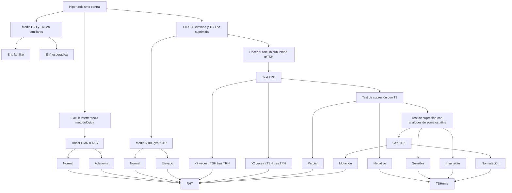
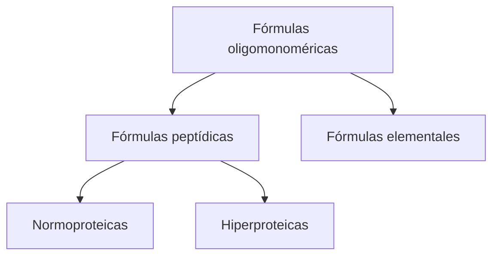
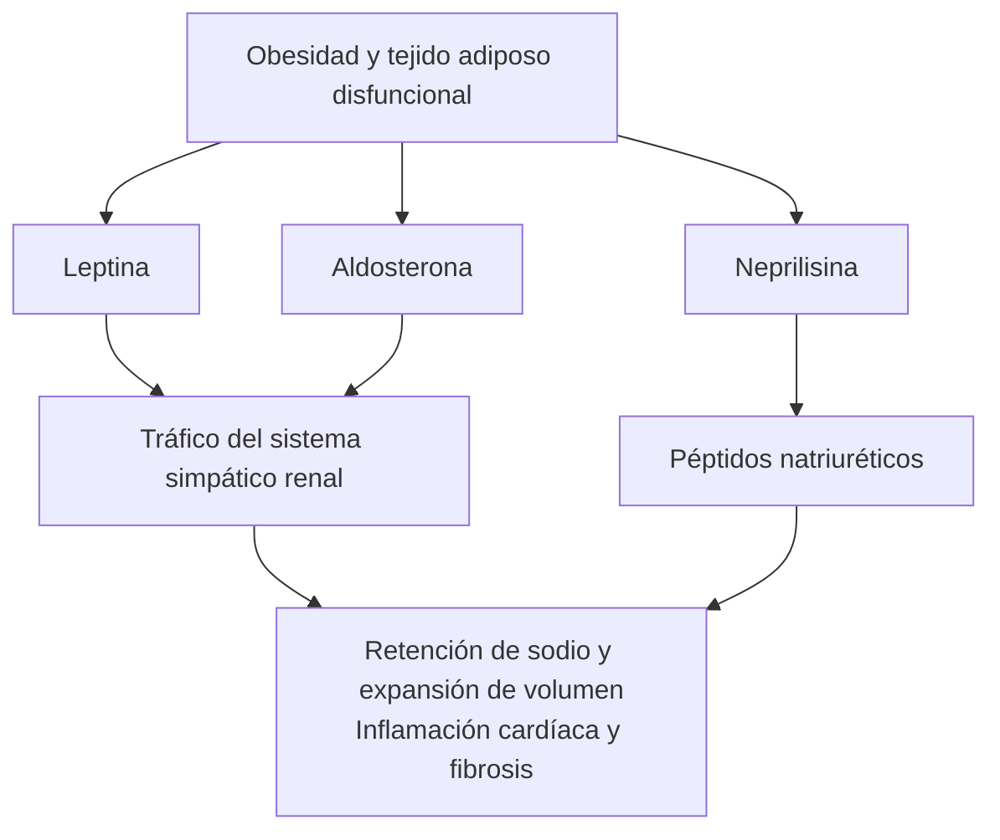

# papEndoCrinic

Programa de Autocapacitación para la
Práctica Clínica en Endocrinología y Nutrición

[The image shows a graphical representation of interconnected red spheres with white icons representing different endocrine organs (brain, pancreas, thyroid, etc.) on a teal and geometric background.]

Con el Aval Científico de:

| Logo | Organization Name |
|------|-------------------|
| saedyn logo | saedyn - Sociedad Andaluza de Endocrinología, Diabetes y Nutrición |
| SEEN logo | SEEN - Sociedad Española de Endocrinología y Nutrición |

Esteve logo
---
papEndoCrinic

Programa de Autocapacitación para la
Práctica Clínica en Endocrinología y Nutrición

Con el Aval Científico de:

| Logo | Organization |
|------|--------------|
| saedyn logo | saedyn (Sociedad Andaluza de Endocrinología, Diabetes y Nutrición) |
| SEEN logo | SEEN (Sociedad Española de Endocrinología y Nutrición) |
---
# ÍNDICE

Presentación ...................................................... 07

Comité Editorial ................................................... 09

## Módulo 1. Hipófisis ............................................... 11

CV Autor ........................................................... 11
1.1 → Desarrollo y generalidades sobre el control de la secreción hormonal ..... 12
1.2 → Hipopituitarismo ............................................... 19
1.3 → Masas hipofisarias .............................................. 24
1.4 → Hipofisitis .................................................... 35
1.5 → Hiperprolactinemias ............................................. 37
1.6 → Síndrome de Cushing ............................................. 48
1.7 → Deficiencia de hormona de crecimiento .............................. 53
1.8 → Hipersecreción de hormona de crecimiento ........................... 58
1.9 → Diabetes insípida ............................................... 65
1.10→ Secreción inapropiada de la hormona antidiurética ................... 67
1.11→ Casos clínicos .................................................. 71

## Módulo 2. Diabetes ................................................ 77

CV Autores ......................................................... 77
2.1 → Etiología, diagnóstico y clasificación ............................. 78
2.2 → Fisiopatología .................................................. 91
2.3 → Complicaciones agudas............................................ 97
2.4 → Complicaciones crónicas.......................................... 104
2.5 → Tratamiento .................................................... 116
2.6 → Casos clínicos .................................................. 130

## Módulo 3. Tiroides ................................................ 141

CV Autor........................................................... 141
3.1 → Hipotiroidismo.................................................. 142
3.2 → Hipertiroidismo................................................. 148

© ESTEVE PHARMACEUTICALS, S.A.

ISBN: 978-84-120185-7-8

D.L.: B 4095-2020

Reservados todos los derechos. Ninguna parte de esta publicación puede ser
reproducida, almacenada o transmitida en cualquier forma ni por cualquier
procedimiento electrónico, mecánico, de fotocopia, de registro o de otro tipo, sin
el permiso previo del titular del copyright.
---

# papEndoCrinic

### 3.3 → Tiroiditis . . . . . . . . . . . . . . . . . . . . . . . . . . . . . . . . . . . . . . . . . . . . . . . . . . . . . . . . . 163
### 3.4 → Bocio y nódulo tiroideo . . . . . . . . . . . . . . . . . . . . . . . . . . . . . . . . . . . . . . . . . . . . 165
### 3.5 → Cáncer diferenciado de tiroides . . . . . . . . . . . . . . . . . . . . . . . . . . . . . . . . . . . . . 174
### 3.6 → Cáncer medular de tiroides . . . . . . . . . . . . . . . . . . . . . . . . . . . . . . . . . . . . . . . . . 179
### 3.7 → Miscelánea. . . . . . . . . . . . . . . . . . . . . . . . . . . . . . . . . . . . . . . . . . . . . . . . . . . . . . . 184
### 3.8 → Casos clínicos . . . . . . . . . . . . . . . . . . . . . . . . . . . . . . . . . . . . . . . . . . . . . . . . . . . . 185

## Módulo 4. Nutrición . . . . . . . . . . . . . . . . . . . . . . . . . . . . . . . . . . . . . . . . . . . . 197
CV Autores . . . . . . . . . . . . . . . . . . . . . . . . . . . . . . . . . . . . . . . . . . . . . . . . . . . . . . . . . . . . . . 197
### 4.1 → Valoración nutricional . . . . . . . . . . . . . . . . . . . . . . . . . . . . . . . . . . . . . . . . . . . . . 198
### 4.2 → Requerimientos nutricionales . . . . . . . . . . . . . . . . . . . . . . . . . . . . . . . . . . . . . . . 202
### 4.3 → Nutrición enteral . . . . . . . . . . . . . . . . . . . . . . . . . . . . . . . . . . . . . . . . . . . . . . . . . 210
### 4.4 → Nutrición parenteral . . . . . . . . . . . . . . . . . . . . . . . . . . . . . . . . . . . . . . . . . . . . . . 218
### 4.5 → Nutrición en situaciones especiales. . . . . . . . . . . . . . . . . . . . . . . . . . . . . . . . . . 227
### 4.6 → Trastornos de la conducta alimentaria . . . . . . . . . . . . . . . . . . . . . . . . . . . . . . . 232
### 4.7 → Miscelánea. . . . . . . . . . . . . . . . . . . . . . . . . . . . . . . . . . . . . . . . . . . . . . . . . . . . . . . 237
### 4.8 → Casos clínicos . . . . . . . . . . . . . . . . . . . . . . . . . . . . . . . . . . . . . . . . . . . . . . . . . . . . 242

## Módulo 5. Suprarrenales. . . . . . . . . . . . . . . . . . . . . . . . . . . . . . . . . . . . . . . 253
CV Autor. . . . . . . . . . . . . . . . . . . . . . . . . . . . . . . . . . . . . . . . . . . . . . . . . . . . . . . . . . . . . . . . . 253
### 5.1 → Insuficiencia suprarrenal . . . . . . . . . . . . . . . . . . . . . . . . . . . . . . . . . . . . . . . . . . . 254
### 5.2 → Síndrome de Cushing . . . . . . . . . . . . . . . . . . . . . . . . . . . . . . . . . . . . . . . . . . . . . . 258
### 5.3 → Hiperaldosteronismo . . . . . . . . . . . . . . . . . . . . . . . . . . . . . . . . . . . . . . . . . . . . . . 269
### 5.4 → Feocromocitoma. . . . . . . . . . . . . . . . . . . . . . . . . . . . . . . . . . . . . . . . . . . . . . . . . . 280
### 5.5 → Incidentaloma suprarrenal . . . . . . . . . . . . . . . . . . . . . . . . . . . . . . . . . . . . . . . . . 286
### 5.6 → Carcinoma suprarrenal. . . . . . . . . . . . . . . . . . . . . . . . . . . . . . . . . . . . . . . . . . . . . 296
### 5.7 → Hiperplasia suprarrenal congénita. . . . . . . . . . . . . . . . . . . . . . . . . . . . . . . . . . . 299
### 5.8 → Casos clínicos . . . . . . . . . . . . . . . . . . . . . . . . . . . . . . . . . . . . . . . . . . . . . . . . . . . . 302

## Módulo 6. Gónadas, síndrome poliglandular autoinmune y miscelánea . . . . . . . . . . . . . . . . . . . . . . . . . . . . . . . . . . . . . . . . . . . . . . . . . . . 311
CV Autor. . . . . . . . . . . . . . . . . . . . . . . . . . . . . . . . . . . . . . . . . . . . . . . . . . . . . . . . . . . . . . . . . 311
Gónadas . . . . . . . . . . . . . . . . . . . . . . . . . . . . . . . . . . . . . . . . . . . . . . . . . . . . . . . . . . . . . . . . 312
### 6.1 → Pubertad precoz . . . . . . . . . . . . . . . . . . . . . . . . . . . . . . . . . . . . . . . . . . . . . . . . . . 312
### 6.2 → Retraso puberal. . . . . . . . . . . . . . . . . . . . . . . . . . . . . . . . . . . . . . . . . . . . . . . . . . . 318
### 6.3 → Hipogonadismos. . . . . . . . . . . . . . . . . . . . . . . . . . . . . . . . . . . . . . . . . . . . . . . . . . 323

### 6.4 → Trastornos de la diferenciación sexual . . . . . . . . . . . . . . . . . . . . . . . . . . . . . . . 328
### 6.5 → Hirsutismo . . . . . . . . . . . . . . . . . . . . . . . . . . . . . . . . . . . . . . . . . . . . . . . . . . . . . . . 333
### 6.6 → Transexuales . . . . . . . . . . . . . . . . . . . . . . . . . . . . . . . . . . . . . . . . . . . . . . . . . . . . . 341
### 6.7 → Otros. . . . . . . . . . . . . . . . . . . . . . . . . . . . . . . . . . . . . . . . . . . . . . . . . . . . . . . . . . . . 344
### 6.8 → Casos clínicos . . . . . . . . . . . . . . . . . . . . . . . . . . . . . . . . . . . . . . . . . . . . . . . . . . . . 350
Síndrome poliglandular autoinmune. . . . . . . . . . . . . . . . . . . . . . . . . . . . . . . . . . . . . . . . . 353
Miscelánea . . . . . . . . . . . . . . . . . . . . . . . . . . . . . . . . . . . . . . . . . . . . . . . . . . . . . . . . . . . . . . 358

## Módulo 7. Metabolismo fosfocálcico, tumores neuroendocrinos y MEN . . . . . . . . . . . . . . . . . . . . . . . . . . . . . . . . . . . . . . . 371
CV Autor. . . . . . . . . . . . . . . . . . . . . . . . . . . . . . . . . . . . . . . . . . . . . . . . . . . . . . . . . . . . . . . . . 371
Metabolismo fosfocálcico . . . . . . . . . . . . . . . . . . . . . . . . . . . . . . . . . . . . . . . . . . . . . . . . . 372
### 7.1 → Hipercalcemia . . . . . . . . . . . . . . . . . . . . . . . . . . . . . . . . . . . . . . . . . . . . . . . . . . . . 372
### 7.2 → Hipocalcemia. . . . . . . . . . . . . . . . . . . . . . . . . . . . . . . . . . . . . . . . . . . . . . . . . . . . . 379
### 7.3 → Osteoporosis . . . . . . . . . . . . . . . . . . . . . . . . . . . . . . . . . . . . . . . . . . . . . . . . . . . . . 388
### 7.4 → Miscelánea. . . . . . . . . . . . . . . . . . . . . . . . . . . . . . . . . . . . . . . . . . . . . . . . . . . . . . . 394
Tumores neuroendocrinos . . . . . . . . . . . . . . . . . . . . . . . . . . . . . . . . . . . . . . . . . . . . . . . . . 397
MEN. . . . . . . . . . . . . . . . . . . . . . . . . . . . . . . . . . . . . . . . . . . . . . . . . . . . . . . . . . . . . . . . . . . . 405
Casos clínicos . . . . . . . . . . . . . . . . . . . . . . . . . . . . . . . . . . . . . . . . . . . . . . . . . . . . . . . . . . . . 411

## Módulo 8. Obesidad, lípidos y trastornos electrolíticos . . . . . . 417
Obesidad . . . . . . . . . . . . . . . . . . . . . . . . . . . . . . . . . . . . . . . . . . . . . . . . . . . . . . . . . . . . . . . . 417
CV Autor. . . . . . . . . . . . . . . . . . . . . . . . . . . . . . . . . . . . . . . . . . . . . . . . . . . . . . . . . . . . . . . . . 417
### 8.1 → Obesidad . . . . . . . . . . . . . . . . . . . . . . . . . . . . . . . . . . . . . . . . . . . . . . . . . . . . . . . . 418
### 8.2 → Casos clínicos . . . . . . . . . . . . . . . . . . . . . . . . . . . . . . . . . . . . . . . . . . . . . . . . . . . . 439
Lípidos . . . . . . . . . . . . . . . . . . . . . . . . . . . . . . . . . . . . . . . . . . . . . . . . . . . . . . . . . . . . . . . . . . 449
CV Autor. . . . . . . . . . . . . . . . . . . . . . . . . . . . . . . . . . . . . . . . . . . . . . . . . . . . . . . . . . . . . . . . . 449
### 8.3 → Lípidos . . . . . . . . . . . . . . . . . . . . . . . . . . . . . . . . . . . . . . . . . . . . . . . . . . . . . . . . . . 450
### 8.4 → Casos clínicos . . . . . . . . . . . . . . . . . . . . . . . . . . . . . . . . . . . . . . . . . . . . . . . . . . . . 472
Trastornos electrolíticos . . . . . . . . . . . . . . . . . . . . . . . . . . . . . . . . . . . . . . . . . . . . . . . . . . . 477
CV Autor. . . . . . . . . . . . . . . . . . . . . . . . . . . . . . . . . . . . . . . . . . . . . . . . . . . . . . . . . . . . . . . . . 477
### 8.5 → Trastornos electrolíticos . . . . . . . . . . . . . . . . . . . . . . . . . . . . . . . . . . . . . . . . . . . 478

Respuestas. . . . . . . . . . . . . . . . . . . . . . . . . . . . . . . . . . . . . . . . . . . . . . . . . . . . . . 487
---
# PRESENTACIÓN

La especialidad de Endocrinología y Nutrición abarca el estudio y el manejo de un amplio abanico de patologías. Los recursos formativos para el profesional son cada vez más amplios y, al mismo tiempo, más accesibles. Sin embargo, existen todavía necesidades no cubiertas en la formación continuada.

La evaluación de los profesionales sanitarios se realiza a menudo a través de preguntas tipo test. Existe una amplia oferta formativa, pero al mismo tiempo, el exceso de información dificulta la preparación de este tipo de evaluación. Los recursos actualmente disponibles para complementar la formación de la especialidad en este sentido son escasos. Esto hace que exista una demanda cada vez mayor, por parte de los profesionales, de herramientas que apoyen el estudio y la evaluación de los conocimientos.

En esta obra se muestran diferentes aspectos de la especialidad a través de preguntas concretas o situaciones clínicas. Cada pregunta se presenta con varias respuestas posibles, pero solo una correcta, y se incluye una explicación razonada a partir de la evidencia disponible. Dichas preguntas han sido organizadas en ocho bloques, en función de su temática, para hacer más fácil su estudio. Para ello contamos con la colaboración de especialistas de reconocido prestigio y expertos en cada una de las materias.

Este proyecto ha sido acreditado como actividad de formación continuada, y avalado por sociedades científicas: la Sociedad Española de Endocrinología y Nutrición (SEEN) y la Sociedad Andaluza de Endocrinología, Diabetes y Nutrición (SAEDYN).

Queremos agradecer a laboratorios Esteve su valiosa colaboración en el patrocinio de este material. Asimismo, esperamos que resulte de utilidad para todos aquellos especialistas de Endocrinología y Nutrición que quieran complementar su formación. Somos conscientes de que existen todavía muchos aspectos y novedades que no se han podido incluir. Esperamos dar continuidad a este proyecto, y seguir desarrollando contenidos que se actualicen con las últimas evidencias disponibles.

Virginia Bellido y Diego Bellido
---
# COMITÉ EDITORIAL

## COORDINACIÓN

### Virginia Bellido Castañeda

Doctora en Medicina. Médico Especialista en Endocrinología y Nutrición. Jefe de Sección del Servicio de Endocrinología y Nutrición del Hospital Universitario Cruces (Barakaldo, Vizcaya). Miembro del Grupo de Trabajo de Diabetes de la Sociedad Española de Endocrinología y Nutrición (SEEN). Coordinadora del Grupo de Trabajo de Diabetes 2.0 de la Sociedad Española de Diabetes (SED), y miembro del Grupo de Trabajo de Tecnologías Aplicadas a la Diabetes de la SED. Más de 100 comunicaciones a congresos nacionales e internacionales, artículos científicos y capítulos de libros.

### Diego Bellido Guerrero

Doctor en Medicina. Médico Especialista en Endocrinología y Nutrición. Jefe de Servicio de Endocrinología y Nutrición del Complejo Hospitalario Universitario de El Ferrol (CHUF). Universidad de A Coruña (UDC). Vicepresidente de la Sociedad Española para el Estudio de la Obesidad (SEEDO). Miembro del Grupo de Trabajo de Diabetes y del Área de Nutrición de la Sociedad Española de Endocrinología y Nutrición (SEEN). Autor de 8 libros y más de 200 publicaciones de impacto. Líneas de investigación actuales en composición corporal, obesidad, nutrición clínica y síndrome metabólico.

## AUTORES

| Nombre | Cargo |
|--------|-------|
| Dr. Martín Cuesta Hernández | Servicio de Endocrinología y Nutrición. Hospital Universitario Clínico San Carlos. Madrid |
| Dr. Miguel A. Rubio Herrera | Jefe de Sección de Endocrinología y Nutrición. Hospital Clínico San Carlos. Madrid |
| Dr. Francisco Javier Escalada San Martín | Director del Departamento de Endocrinología y Nutrición. Clínica Universidad de Navarra. Pamplona |
| Dr. Fco. Javier Santamaría Sandi | Jefe de Sección de Endocrinología. Hospital Universitario Cruces. Barakaldo. Vizcaya |
| Dr. Martín López de la Torre Casares | Jefe de Servicio de Endocrinología y Nutrición. Hospital Universitario Virgen de las Nieves. Granada |
| Dra. Ana M.ª Urioste Fondo | Servicio de Endocrinología y Nutrición. Complejo Asistencial Universitario de León |
| Dr. Óscar Moreno Pérez | Coordinador de la Unidad de Diabetes del Servicio de Endocrinología y Nutrición. Hospital General Universitario de Alicante |
| Dra. Nuria Valdés Gallego | Servicio de Endocrinología y Nutrición. Hospital Universitario Central de Asturias. Oviedo |
| Dr. Pedro José Pinés Corrales | Servicio de Endocrinología y Nutrición. Complejo Hospitalario Universitario de Albacete |
| Dr. Alfonso Vidal Casariego | Servicio de Endocrinología y Nutrición. Complexo Hospitalario Universitario de A Coruña. Xerencia de Xestión Integrada A Coruña |
| Dra. Rebeca Reyes García | Servicio de Endocrinología y Nutrición. Hospital Universitario Torrecárdenas. Almería |
| Dra. Rocío Villar Taibo | Servicio de Endocrinología y Nutrición. Complejo Hospitalario Universitario de Santiago de Compostela. A Coruña |
---
The image provided appears to be entirely blank or white. There is no visible content, text, diagrams, or any other discernible information on this page. Therefore, I cannot provide any markdown translation or description of content, as there is nothing to transcribe or describe.
---
MÓDULO

# 1 Hipófisis

## AUTORA
### Rocío Villar Taibo

- Licenciada en Medicina y Cirugía por la Universidad de Santiago de Compostela, accedió a la especialización en Endocrinología y Nutrición en el Complejo Hospitalario Universitario de Santiago. Continuó su actividad profesional en diversos hospitales de Galicia (Hospital Virxe da Xunqueira de Cee; Hospital da Barbanza, Ribeira; Hospital Universitario Lucus Augusti, Lugo; Complejo Hospitalario Universitario de Santiago) y León (Complejo Asistencial Universitario de León). Doctorada por la Universidad de La Coruña en 2016 con la calificación de sobresaliente cum laude. Colaboradora docente en el Departamento de Medicina de la Universidad de Santiago de Compostela.

- Ha desarrollado su actividad clínica e investigadora principalmente en las áreas de neuroendocrinología, diabetes y nutrición. Autora de 30 artículos publicados en revistas nacionales e internacionales, 12 capítulos de libros y 95 comunicaciones a congresos. Distinguida en 2015 con la Buena práctica del Sistema Nacional de Salud (en la estrategia de cáncer).

- Actualmente ejerce su labor asistencial en el Complejo Hospitalario Universitario de Santiago y participa activamente a nivel clínico y de investigación en los proyectos del área de hipófisis del Complejo.
---
# HIPÓFISIS

## 1.1 Desarrollo y generalidades sobre el control de la secreción hormonal

El sistema portal hipofisario comienza a formarse a la séptima semana de gestación, y a las 20 semanas se ha establecido todo el sistema hipófiso-portal. (respuestas C y D correctas).

Referencias:
• Ziegler AG, Melmed S, Kleinberg DL. Adenohipófisis. En: Larsen PR, Kronenberg HM, Melmed S, Polonsky KS, eds. Williams Tratado de Endocrinología. Versión en español de la 10.ª edición de la obra original en inglés. Madrid: Elsevier España; 2004. p. 193-306.

### 1. Con respecto a la embriología hipofisaria, es falso que:

A. Deriva de la bolsa de Rathke, que da lugar a la neurohipófisis.
B. La bolsa de Rathke fetal humana resulta evidente a las 3 semanas de gestación.
C. A las 7 semanas se empieza a desarrollar la vasculatura de la adenohipófisis.
D. Hacia las 20 semanas ya está establecido todo el sistema porta hipofisario.

COMENTARIO

Anatomía de la hipófisis

La hipófisis se divide en dos partes principales: la adenohipófisis y la neurohipófisis:

• Adenohipófisis: se puede dividir en tres lóbulos: pars distalis o anterior, pars intermedia o media (que en el humano adulto solo es un resto vestigial rudimentario) y pars tuberalis.
• Neurohipófisis: está formada por la pars nervosa o lóbulo posterior o neural, el tallo infundibular y la eminencia media. El tallo infundibular está rodeado por la pars tuberalis y ambos forman el tallo hipofisario. La neurohipófisis está integrada por una masa de células de neuroglía modificada llamados pituicitos y por fibras nerviosas del hipotálamo (axones de las neuronas magnocelulares de los núcleos supraóptico y paraventricular).

Embriología de la hipófisis

Embriológicamente, la hipófisis es de origen ectodérmico. La adenohipófisis procede de un crecimiento hacia arriba desde el techo ectodérmico del estomodeo (bolsa de Rathke), formando el divertículo hipofisario. La neurohipófisis se origina a partir de un crecimiento hacia abajo del neuroectodermo del diencéfalo, formando el divertículo neurohipofisario. Por tanto, la respuesta A es la falsa.

Cuando el embrión tiene unas 3 semanas, la bolsa de Rathke se observa como una evaginación de la cavidad bucal, y luego crece en sentido dorsal hacia el infundíbulo (tal como se afirma en la respuesta B).

A mediados de la cuarta semana, el divertículo hipofisario procedente de la bolsa de Rathke se proyecta desde el techo del estomodeo y se sitúa junto a la pared ventral del diencéfalo. Hacia la quinta semana, esta bolsa se alarga y contrae en su punto de fijación al epitelio oral. En este momento se pone en contacto con el infundíbulo (derivado del divertículo neurohipofisario).

Durante la sexta semana, la conexión de la bolsa con la cavidad bucal degenera y desaparece.

### 2. Todas las afirmaciones siguientes salvo una son correctas. Señale la falsa:

A. La secreción de prolactina (PRL) está sometida al control inhibidor de la dopamina.
B. La secreción de TSH durante las 24 h depende del sexo, el índice de masa corporal y la edad.
C. La secreción de GH es episódica y muestra un ritmo diurno, de forma que dos tercios del total de la secreción diaria de GH se producen durante la noche, desencadenada por la aparición del sueño de ondas lentas.
D. Las células corticotropas hipofisarias normales expresan receptores de somatostatina 2 y 5.

COMENTARIO

Regulación de las hormonas hipofisarias

La secreción de las hormonas adenohipofisarias está regulada a tres niveles:
1. Hipotalámico: por hormonas adenohipofisotropas.
2. Hipofisario: por citocinas y factores solubles de crecimiento autocrinos y paracrinos intrahipofisarios.
3. Periférico: a través de las hormonas periféricas segregadas en los órganos diana, que suelen realizar una retroalimentación negativa hipofisaria.

Regulación de la prolactina

La prolactina (PRL) se encuentra bajo el control inhibidor de la dopamina, producida en las células tuberoinfundibulares y por el hipotálamo. Otros factores inhibidores de la PRL son: la endotelina-1, el factor de transformación de crecimiento β1, la calcitonina o la somatostatina en determinadas condiciones. Algunos factores estimuladores de PRL serían el factor de crecimiento de fibroblastos básico, el factor de crecimiento epidérmico, el péptido intestinal vasoactivo, los estrógenos, la oxitocina o la TRH.

Regulación de las gonadotropinas

La FSH y LH están sometidas a regulación hipotalámica por la GnRH, y periférica por estrógenos y testosterona. Otros factores que influyen en su secreción serían los péptidos gonadales inhibina A, inhibina B, heterodímero α:βA, heterodímero α:βB y péptidos de folistatina.
---
# HIPÓFISIS

## Regulación de la GH

La secreción de GH es episódica y se produce fundamentalmente durante la noche (el 70% del total durante el primer episodio de sueño de ondas lentas). Está regulada por múltiples factores: estimuladores (GHRH, ghrelina, esteroides sexuales, acetilcolina, ayuno, sueño profundo, hipoglucemia, etc.), supresores (IGF-1, somatostatina, glucocorticoides, hipotiroidismo, hiperglucemia, obesidad, aumento de ácidos grasos libres, etc.) e inhibidores (enfermedades agudas o crónicas, hiponutrición, déficit del receptor de GH o de IGF-1, anticuerpos antirreceptor de GH).

## Regulación de la ACTH

La secreción de ACTH sigue un ritmo circadiano y en su regulación están implicadas la CRH hipotalámica, la vasopresina y otros péptidos; también las citocinas intrahipofisarias y factores de crecimiento locales, y las hormonas periféricas, especialmente los glucocorticoides, que mantienen un potente control inhibidor de la replicación y secreción corticotropa. Otros factores como el ejercicio intenso de corta duración, la cirugía, las hemorragias o el estrés emocional se asocian a un aumento de ACTH y cortisol. La somatostatina, por el contrario, puede inhibir la secreción de ACTH, actuando a través de sus receptores en las células corticotropas. Existen cinco subtipos principales de receptores de somatostatina y todos ellos se expresan en el tejido hipofisario normal.

## Regulación de la TSH

Por último, la TSH está regulada por el efecto estimulador de la TRH hipotalámica, mientras que la somatostatina, los glucocorticoides o la dopamina ejercen un efecto inhibitorio. Asimismo, la secreción de TSH también está regulada por el efecto de retroalimentación negativa de las hormonas tiroideas. Su liberación sigue un patrón circadiano con un máximo nocturno y un mínimo por la tarde, en el que aspectos como la temperatura o el estado energético pueden influir (respuesta B falsa).

Referencias:
- Cone RD, Low MJ, Elmquist JK, Cameron JL. Neuroendocrinología. En: Larsen PR, Kronenberg HM, Melmed S, Polonsky KS, eds. Williams Tratado de Endocrinología. Versión en español de la 10.ª edición de la obra original en inglés. Madrid: Elsevier España; 2004. p. 91-192.
- Melmed S, Kleinberg DL. Adenohipófisis. En: Larsen PR, Kronenberg HM, Melmed S, Polonsky KS, eds. Williams Tratado de Endocrinología. Versión en español de la 10.ª edición de la obra original en inglés. Madrid: Elsevier España; 2004. p. 193-306.

## ¿Cuál de las siguientes asociaciones es incorrecta?

A. Dopamina - inhibe prolactina.
B. GHRH - estimula LH, FSH.
C. Clonidina - inhibe GH.
D. Somatostatina - inhibe GH.

### COMENTARIO

La prolactina se encuentra bajo el control inhibidor de la dopamina, entre otros factores (respuesta A).

La FSH y la LH están sometidas a regulación hipotalámica por la GnRH, que ejerce un efecto estimulador, y a regulación periférica por estrógenos y testosterona, responsables del feedback negativo (respuesta B).

En la hipófisis, la somatostatina inhibe la secreción de GH y TRH y, en determinadas condiciones, también de PRL y ACTH (respuesta D).

La clonidina, un agonista de receptores adrenérgicos α2, estimula la liberación de GH (no la inhibe, opción C falsa). Por este motivo, la estimulación de GH tras clonidina es una prueba estándar en la endocrinología pediátrica.

Referencias:
- Cone RD, Low MJ, Elmquist JK, Cameron JL. Neuroendocrinología. En: Larsen PR, Kronenberg HM, Melmed S, Polonsky KS, eds. Williams Tratado de Endocrinología. Versión en español de la 10.ª edición de la obra original en inglés. Madrid: Elsevier España; 2004. p. 91-192.

## Cuál de las siguientes afirmaciones es correcta:

A. La exposición continua a GnRH provoca la desensibilización de las células gonadotropas hipofisarias, inhibiendo su secreción.
B. Todos los receptores de las hormonas del eje hipotálamo-hipófiso-tiroideo son de membrana.
C. La regulación por parte de la somatostatina producida por las células δ de los islotes pancreáticos sobre la secreción de insulina en las células β próximas es un ejemplo de regulación autocrina.
D. Los niveles del factor hipotalámico TRH están regulados fundamentalmente por los niveles de TSH.

### COMENTARIO

Esta pregunta aborda diferentes aspectos de la regulación de los diferentes ejes hormonales.

Respecto al eje gonadotropo, la adecuada estimulación de la liberación de gonadotropinas requiere una secreción pulsátil de GnRH. La administración continua de GnRH produce inicialmente un aumento de las concentraciones de gonadotropinas (temporal, por efecto agonista), pero luego disminuye la liberación de gonadotropinas por un efecto de desensibilización. Esto es interesante en la práctica clínica, ya que los agonistas de GnRH de larga duración pueden inhibir la producción de gonadotropinas y ser útiles en algunos contextos clínicos, como el tratamiento de la pubertad precoz, el cáncer de próstata o mama o la endometriosis (respuesta A correcta).

Tanto los receptores de TRH como el de TSH son receptores acoplados a proteína G; el primero se encuentra en la membrana de las células hipofisarias y el segundo, en la membrana basolateral de la célula tiroidea. En cambio, el receptor de hormonas tiroideas es un receptor nuclear, no de membrana (respuesta B falsa).
---
# HIPÓFISIS

La TRH es el factor hipotalámico estimulador de la TSH hipofisaria y sus niveles están regulados fundamentalmente por los niveles de hormonas tiroideas (no de TSH). La TSH aumenta en situaciones de hipotiroidismo y disminuye en respuesta al aumento de hormonas tiroideas (respuesta D falsa).

La comunicación intercelular en organismos multicelulares puede ser endocrina, paracrina, autocrina, yuxtacrina, nerviosa o por moléculas gaseosas. El ejemplo de la respuesta C corresponde a una comunicación paracrina entre células vecinas (δ y β pancreáticas). Una regulación autocrina se referiría a la de una célula con ella misma.

Referencias:
- Ross DS. Thyroid hormone synthesis and physiology. En: Cooper DS, Mulder JE, eds. UpToDate. Waltham, MA: UpToDate Inc. https://www.uptodate.com (acceso 29 de abril de 2019).
- Welt CK. Physiology of gonadotropin-releasing hormone. En: Barbieri RL, Crowley WF, Martin KA, eds. UpToDate. Waltham, MA: UpToDate Inc. https://www.uptodate.com (acceso 29 de abril de 2019).

## 5. ¿Cuál de los siguientes factores no estimula la producción de hormona de crecimiento (GH)?

A. Hipoglucemia.
B. Sueño profundo.
C. Glucocorticoides.
D. Ayuno.

## 6. Indique cuál de los siguientes factores fisiológicos estimula la secreción de GH:

A. La hiperglucemia posprandial.
B. Niveles elevados de ácidos grasos libres.
C. Sueño REM.
D. El ayuno.

### COMENTARIO

La secreción de GH es episódica, se produce fundamentalmente durante la noche y está regulada por múltiples factores.

Factores reguladores de la GH:
- Estimuladores (GHRH, ghrelina, esteroides sexuales, acetilcolina, ayuno, sueño profundo, hipoglucemia, etc.).
- Supresores (IGF-1, somatostatina, glucocorticoides, hipotiroidismo, hiperglucemia, obesidad, aumento de ácidos grasos libres, etc.).
- Inhibidores (enfermedades agudas o crónicas, hiponutrición, déficit del receptor de GH o de IGF-1, anticuerpos antirreceptor de GH).

Por tanto, tanto el ayuno como la hipoglucemia o el sueño profundo son efectivamente factores estimuladores de la GH. Por el contrario, los glucocorticoides suprimen la producción de GH.

Referencias:
- Cone RD, Low MJ, Elmquist JK, Cameron JL. Neuroendocrinología. En: Larsen PR, Kronenberg HM, Melmed S, Polonsky KS, eds. Williams Tratado de Endocrinología. Versión en español de la 10.ª edición de la obra original en inglés. Madrid: Elsevier España; 2004. p. 91-192.

## 7. En relación con la determinación de IGFBP3 para evaluar la función de la hormona de crecimiento (GH), indique cuál de las siguientes afirmaciones es falsa:

A. Los niveles de IGFBP3 son dependientes de la GH.
B. Los niveles de IGFBP3 son estables a lo largo del día.
C. Los niveles de IGFBP3 varían con la edad en menor grado que los de la IGF-1.
D. Los niveles de IGFBP3 son más dependientes del estado nutricional que los de la IGF-1.

### COMENTARIO

Las proteínas transportadoras de IGF-1 (IGFBP: IGF binding proteins) son una familia de 6 proteínas con alta afinidad por la IGF-1, que controlan la unión tanto de IGF-1 como de IGF-2 a sus receptores.

La IGFBP3 es la principal proteína transportadora de la IGF-1 y la más abundante en plasma, de tal modo que hasta el 75% de la IGF-1 está unida a esta molécula. La IGFBP3 se une a otra proteína plasmática llamada subunidad ácido-lábil, que prolonga su vida media y estabiliza su unión a la IGF-1.

Factores reguladores de la IGFBP3:
- GH: la concentración de IGFBP3 es dependiente de la GH y aumenta cuando se eleva la GH, aunque la IGF-1 y la subunidad ácido-lábil son los productos más dependientes del gen de la GH (respuesta A).
- Otras hormonas (testosterona, estrógenos y tiroxina) regulan también la síntesis de IGFBP3. La IGFBP3 se reduce cuando hay déficit de estas hormonas y se normaliza cuando se sustituyen.
- Proteólisis: es otro regulador importante de la IGFBP3. Por ejemplo, una proteasa que se encuentra a nivel sérico en embarazadas y en diabéticos convierte a la IGFBP3 en fragmentos que no se unen a la IGF-1.

Por el contrario, el estado nutricional es un importante regulador de la IGF-1 o de la IGFBP2, no de la IGFBP3 (opción D falsa).

Por último, la variación en función de la edad es especialmente marcada en la IGF-1, no en la IGFBP3, y en parte se debe a los cambios dependientes de la edad en la secreción de la GH (respuesta C). Los niveles de GH se elevan hasta 7 veces su valor, desde las bajas concentraciones
---
HIPÓFISIS 1

al nacimiento, hasta los valores pico de la pubertad. Posteriormente, las concentraciones van
cayendo en la segunda década y alcanzan un valor en torno al 40-50% del pico puberal sobre los
20 años. El descenso posterior es más progresivo hasta los 50-60 años.

Referencias:
• Clemmons DR. Physiology of insulin-like growth factor-1. En: Snyder PJ, Martin KA, eds. UpToDate. Waltham, MA: UpToDate Inc.
  https://www.uptodate.com (acceso 29 de abril de 2019).

• López-Fernández J, Oliva García JG, Pérez Luis JM. Manual de Endocrinología y Nutrición [Internet]. Madrid: Sociedad Española de
  Endocrinología y Nutrición; 2015. Capítulo 17. Hipopituitarismo; [citado 29 de abril de 2019]. Disponible en: https://manual.seen.es/
  article?id=55114b66-489c-4c70-8a67-2bcdac18103c.
• Snyder PJ. Causes of hypopituitarism. En: Cooper DS, Martin KA, eds. UpToDate. Waltham, MA: UpToDate Inc. https://www.uptodate.
  com (acceso 29 de abril de 2019).

Tabla 1. Hipopituitarismo y mutación en factores de transcripción hipofisarios

| Factores de transcripción mutados | Clínica |
|-----------------------------------|---------|
| HESX1, LHX3, LHX4 | Muy precoces en la cascada de activación. Producen panhipopituitarismo + hipoplasia hipofisaria + alteración cognitiva<br>La mutación de HESX1 se relaciona con la aparición de displasia septoóptica<br>Las mutaciones en LHX3 también producen anomalías neurológicas debido a que se expresa en el sistema nervioso central |
| PROP-1 | Son la causa familiar y esporádica más frecuente de déficits combinados hipofisarios<br>Produce déficit de GH e hipotiroidismo central en niños, hipogonadismo hipogonadotrópico en la pubertad e insuficiencia suprarrenal en la edad adulta |
| Pit-1 | Mutaciones en Pit-1 asocian déficits de GH, PRL y a veces de TSH. La secreción de ACTH, FSH y LH está conservada |
| T-Pit | Las mutaciones en T-Pit causan déficit de ACTH aislado. Pueden causar la muerte neonatal si no se detectan pronto |

## 8 En relación con las alteraciones en el desarrollo de la adenohipófisis, señale la afirmación incorrecta:

A. El factor de transcripción Pit-1 está implicado en el desarrollo de las células productoras de GH, PRL y TSH.
B. El factor de transcripción Prop-1 no es necesario para el desarrollo de células específicas promocionadas por Pit-1 y de células gonadotropas.
C. El factor de transcripción T-Pit es preciso para el desarrollo de células corticotropas.
D. La displasia septoóptica se asocia con mutaciones en HEX1.

COMENTARIO

El desarrollo de la hipófisis anterior requiere la expresión correcta de determinados genes que codifican factores de transcripción hipofisaria:

• HESX1, LHX3 y LHX4: son esenciales para la organogénesis y la diferenciación temprana de los pituicitos.
• PROP-1: es preciso para la diferenciación de la célula precursora de las células somatotropas, lactotropas, tirotropas y gonadotropas (opción B falsa).
• Pit-1 (también denominado POU1F1): actúa temporalmente tras PROP-1 y es necesario para la diferenciación de la célula precursora somatotropa, lactotropa y en menor medida tirotropa (respuesta A).
• T-Pit: es preciso para la diferenciación específica de las células corticotropas (respuesta C).

Las alteraciones clínicas derivadas de la mutación de cada uno de los factores de transcripción se resumen en la tabla 1.

Tal como se afirma en la respuesta D, las mutaciones de HEX1 se relacionan con la aparición de displasia septoóptica, un cuadro que se caracteriza por la tríada clásica de hipoplasia del nervio óptico, alteraciones en las hormonas hipofisarias y defectos de la línea media cerebral. El hipopituitarismo está presente en el 62-80% de los pacientes, y aunque el déficit de GH es el más frecuente, pueden aparecer déficits de otras hormonas.

Referencias:
• Golnik KC. Congenital anomalies and acquired abnormalities of the optic nerve. En: Paysee EA, Armsby C, eds. UpToDate. Waltham,
  MA: UpToDate Inc. https://www.uptodate.com (acceso 29 de abril de 2019).

## 1.2 Hipopituitarismo

## 9 En el panhipopituitarismo son frecuentes todas las siguientes manifestaciones menos una:

A. Déficit corticotropo.
B. Déficit de prolactina.
C. Amenorrea por hipogonadismo hipogonadotropo.
D. Déficit tirotropo.

COMENTARIO

El hipopituitarismo se define como el síndrome clínico resultante de la pérdida de la función
hormonal hipofisaria. Puede ser parcial o total, y en este último caso se denomina panhipopituitarismo.

Las principales etiologías del hipopituitarismo se agrupan en tres grandes grupos: genéticas, adquiridas o idiopáticas. La tabla 2 resume las causas más frecuentes.
---
# HIPÓFISIS

La clínica del hipopituitarismo dependerá de la causa subyacente, la rapidez de instauración y la magnitud del déficit, así como la edad del paciente. El orden de instauración de los déficits suele ser: somatotropo, seguido del gonadotropo, tirotropo y por último corticotropo, aunque esta secuencia se invierte en el hipopituitarismo por hipofisitis. Sin embargo, el déficit de prolactina es muy infrecuente (respuesta B correcta), aunque los datos epidemiológicos que reportan en la literatura científica déficit de prolactina también son escasos. Esto quizá es debido a que la hipoprolactinemia se percibe como menos relevante en la clínica que otros déficits hipofisarios y se investiga menos (aunque puede producir alteraciones en la fertilidad y la lactancia).

Su tratamiento se realizará habitualmente mediante la reposición de las hormonas diana deficitarias, con la excepción del déficit somatotropo, que se trata con la propia GH.

Referencias:
- Fernández-Rodríguez E, Bernabeu I, Casanueva FF. Hipopituitarismo. Panhipopituitarismo. Medicine. 2012;11(13):773-81.
- Regal M, Páramo C, Sierra SM, García-Mayor RV. Prevalence and incidence of hypopituitarism in an adult Caucasian population in northwestern Spain. Clin Endocrinol (Oxf). 2001;55(6):735-40.

## Tabla 2. Causas de hipopituitarismo

| Causas adquiridas | Causas genéticas | Causas idiopáticas |
|-------------------|-------------------|---------------------|
| - Tumores hipofisarios: adenomas hipofisarios (más frecuentes), otras lesiones o tumores de la región selar/paraselar (quistes de Rathke, craneofaringiomas, cordomas, gliomas, meningiomas, etc.).<br>- Cirugía o radioterapia hipofisaria.<br>- Traumatismos craneoencefálicos.<br>- Silla turca vacía.<br>- Enfermedades inflamatorias/infecciosas hipofisarias: hipofisitis (linfocítica, granulomatosa, xantomatosa), tuberculosis, sífilis.<br>- Enfermedades infiltrativas de la hipófisis: sarcoidosis, histiocitosis, amiloidosis, etc.<br>- Vasculares: apoplejía hipofisaria, síndrome de Sheehan, aneurisma de la arteria carótida, hemorragia subaracnoidea. | - Defectos en el desarrollo craneofacial y de línea media:<br>  - Mutaciones de factores de transcripción precoz (Lhx3, Lhx4, Hex1) producen hipopituitarismo con alteración anatómica<br>  - Mutaciones de factores de transcripción más tardíos (PROP-1, Pit-1, T-Pit) asocian hipopituitarismo sin alteración anatómica<br>- Disgenesia de tallo hipofisario (produce hipopituitarismo en grado variable)<br>- Síndromes genéticos hereditarios: Kallman, Prader-Willi, Laurence-Moon-Bield (asocian hipogonadismo hipogonadotropo)<br>- Mutaciones en genes que codifican hormonas hipofisarias o receptores (receptor de GHRH, GnRH, TSH, etc.) | - Cada vez menos frecuentes, al mejorar las técnicas de imagen y la detección de mutaciones, que logran identificar una etiología concreta.<br>- Pueden representar un 10-16% de los hipopituitarismos. |

El diagnóstico de hipopituitarismo, además de por la sospecha clínica, requerirá determinación basal de las hormonas hipofisarias, y, en algunos casos, pruebas de estímulo (sobre todo para diagnosticar déficit de ACTH o GH).

## En un paciente con hipopituitarismo por una mutación del gen que codifica Pit-1, ¿qué déficit hormonal no es habitual encontrar?

A. PRL.
B. ACTH.
C. GH.
D. TSH.

### COMENTARIO

Factores de transcripción hipofisaria

El desarrollo de la hipófisis anterior requiere la expresión correcta de determinados genes que codifican factores de transcripción hipofisaria:

- HESX1, LHX3 y LHX4: son esenciales para la organogénesis y la diferenciación temprana de los pituicitos.
- PROP-1: es preciso para la diferenciación de la célula precursora de las células somatotropas, lactotropas, tirotropas y gonadotropas.
- Pit-1 (también denominado POU1F1): actúa temporalmente tras PROP-1 y es necesario para la diferenciación de la célula precursora somatotropa, lactotropa y en menor medida tirotropa.
- T-Pit: es preciso para la diferenciación específica de las células corticotropas.

Dado que Pit-1 interviene en la diferenciación de las células somatotropas, lactotropas y tirotropas, una mutación en dicho gen podría asociar déficit de GH, PRL o TSH, pero no de ACTH (opción B falsa). Puesto que las células corticotropas requieren de T-Pit para su diferenciación, sería la mutación de T-Pit la relacionada con el déficit de ACTH.

La tabla 1 (v. pág. 17) recoge las alteraciones derivadas de la mutación de los factores de transcripción hipofisarios.

Referencias:
- Snyder PJ. Causes of hypopituitarism. En: Cooper DS, Martin KA, eds. UpToDate. Waltham, MA: UpToDate Inc. https://www.uptodate.com (acceso 29 de abril de 2019).
---
# HIPÓFISIS 1

## 11. Indique la afirmación correcta en el hipopituitarismo:

A. La severidad del hipopituitarismo postraumático no se relaciona con la gravedad del traumatismo.
B. El déficit de ACTH provoca pérdida de sal e hipopotasemia.
C. Los fármacos anti-CTLA-4 pueden provocar hipofisitis e hipopituitarismo.
D. El déficit de PRL se asocia a alteraciones sutiles de la coagulación.

### COMENTARIO

Los traumatismos craneales, especialmente aquellos con suficiente gravedad para fracturar la base del cráneo, pueden causar déficit de hormonas hipotálamo-hipofisarias. La probabilidad de desarrollar alteraciones hormonales se relaciona directamente con la gravedad del trauma (respuesta A falsa).

Las hipofisitis o procesos inflamatorios de la hipófisis asocian hipopituitarismo y pueden dividirse histológicamente en: linfocíticas, granulomatosas, plasmocíticas (asociadas a IgG4) y xantomatosas.

La inmunoterapia con fármacos anti-CTLA-4, principalmente ipilimumab, se relaciona con la aparición de hipofisitis e hipopituitarismo (respuesta C correcta).

El déficit de PRL habitualmente se presenta como una imposibilidad para la lactancia. Pero también se han descrito alteraciones sexuales o de la fertilidad en pacientes con hipoprolactinemia. Por ejemplo alteraciones en la ovulación en las mujeres y disfunción eréctil o eyaculación precoz en los varones. Sin embargo, el déficit de PRL no se asocia a alteraciones de la coagulación (respuesta D falsa).

La insuficiencia suprarrenal secundaria, es decir la relacionada con el déficit de ACTH, se caracteriza por síntomas de astenia, hipoglucemia, pérdida de peso, dolor abdominal o letargia. Sin embargo, no aparecen datos de hipoaldosteronismo, hiperpotasemia e hiperpigmentación, que sí son típicos de la insuficiencia suprarrenal primaria (por afectación de la corteza suprarrenal). Esto se debe a que la aldosterona está regulada por el sistema renina-angiotensina y no por la ACTH, por lo que no se ve afectada en la insuficiencia suprarrenal secundaria. Por tanto, la respuesta B es falsa.

Referencias:
- López-Fernández J, Oliva García JG, Pérez Luis JM. Manual de Endocrinología y Nutrición [Internet]. Madrid: Sociedad Española de Endocrinología y Nutrición; 2015. Capítulo 17, Hipopituitarismo; [citado 29 de abril de 2019]. Disponible en: https://manual.seen.es/article?id=55114b66-489c-4c70-8a67-2bcdac18103c
- Snyder PJ. Causes of hypopituitarism. En: Cooper DS, Martin KA, eds. UpToDate. Waltham, MA: UpToDate Inc. https://www.uptodate.com (acceso 29 de abril de 2019).
- Villar-Taibo R, Sifontes-Dubon M, Bernabeu-Moron I, Casanueva FF. Prolactin excess and deficiency: Epidemiology, causes (excluding prolactin-secreting pituitary tumors). En: Tritos NA, Klibansky A. Prolactin disorders. From basic science to clinical management. 1.ª ed. Springer Nature Switzerland AG; Humana Press; 2019.

## 12. Indique la afirmación incorrecta respecto al tratamiento sustitutivo del hipopituitarismo adquirido en adultos:

A. No debe iniciarse tratamiento con tiroxina hasta no se haya evaluado la función adrenal.
B. En adulto joven se debe realizar sustitución con testosterona o bien con estrógenos y progestágenos.
C. Los niveles de ACTH durante el tratamiento son de utilidad para el ajuste de dosis de glucocorticoides.
D. La sustitución con glucocorticoides puede desenmascarar la presencia de una diabetes insípida previamente inadvertida.

### COMENTARIO

El tratamiento sustitutivo del hipopituitarismo consiste en la reposición de las hormonas de los órganos diana (respuesta B), salvo en el caso del déficit de GH o en el déficit de gonadotropinas cuando se desea fertilidad, ya que precisa sustitución con las hormonas hipofisarias.

Cuando hay un déficit combinado, el orden de sustitución terapéutica es esencial. El primer eje que se ha de sustituir es el adrenocortical, seguido del tiroideo y posteriormente el gonadal y el somatotropo. Cuando existe un déficit de TSH no debe iniciarse el tratamiento hasta haber reevaluado la reserva adrenal, puesto que, si existiese hipotiroidismo e insuficiencia suprarrenal coexistentes, el tratamiento del hipotiroidismo primero aumentaría el aclaramiento de la pequeña cantidad de cortisol disponible, aumentando la gravedad de la deficiencia de cortisol (respuesta A).

Respecto al déficit de ACTH, el ajuste del tratamiento se realiza a través de datos clínicos (bienestar, tensión arterial en decúbito y en supino, peso, iones, glucosa y lípidos), ya que la ACTH va a seguir baja (no se sustituye, se proporciona la hormona diana). Deben emplearse las dosis mínimas necesarias de glucocorticoides que controlen la clínica del paciente. La presencia de síntomas de hipocortisolismo (cansancio, náuseas, pérdida de peso, etc.) indicaría la necesidad de aumentar la dosis, mientras que el aumento de peso, los edemas o la hipertensión arterial reflejaría la necesidad de reducir la dosis (respuesta C falsa).

La insuficiencia adrenal no tratada puede enmascarar la presencia de diabetes insípida. Por este motivo, es importante estar atentos ante la posibilidad de desarrollar una diabetes insípida tras el inicio de la sustitución glucocorticoidea. Del mismo modo, pacientes con mejoría de su diabetes insípida (y que no estaban diagnosticados de insuficiencia adrenal), deben evaluar de nuevo su eje ACTH-cortisol para descartar un nuevo déficit.

Referencias:
- López-Fernández J, Oliva García JG, Pérez Luis JM. Manual de Endocrinología y Nutrición [Internet]. Madrid: Sociedad Española de Endocrinología y Nutrición; 2015. Capítulo 17. Hipopituitarismo; [citado 29.4.2019]. Disponible en: https://manual.seen.es/article?id=55114b66-489c-4c70-8a67-2bcdac18103c.
---
# HIPÓFISIS

## 13. ¿Cuál es el déficit hormonal más frecuente tras traumatismo craneal severo?

A. Déficit de GH (disminución de respuesta a test de estímulo).
B. Hipotiroidismo hipofisario.
C. Hipogonadismo hipofisario.
D. Hipocortisolismo hipofisario.

### COMENTARIO

Los traumatismos craneales, especialmente aquellos con suficiente gravedad para fracturar la base del cráneo, pueden causar déficit de hormonas hipotálamo-hipofisarias. La probabilidad de desarrollar alteraciones hormonales se relaciona directamente con la gravedad del trauma. La aparición de deficiencias adenohipofisarias suele ser aguda, y es mucho menos frecuente su aparición tardía, a partir de los 3-12 meses tras el trauma.

- El déficit de GH, evaluado mediante test de estímulo, es el más frecuente en contexto de un trauma craneal, mientras que la frecuencia de aparición de hipoadrenalismo, hipotiroidismo e hipogonadismo es menor.

Las alteraciones en la secreción de vasopresina son comunes en la fase aguda, en forma de diabetes insípida o SIADH transitorios, pero pocos casos persisten posteriormente.

Referencias:
- Snyder PJ. Causes of hypopituitarism. En: Cooper DS, Martin KA, eds. UpToDate. Waltham, MA: UpToDate Inc. https://www.uptodate.com (acceso 29 de abril de 2019).

De todos los subtipos de adenomas hipofisarios, los prolactinomas son los más prevalentes (44,4 casos por 100.000 habitantes), seguidos por los no funcionantes (22,2 casos por 100.000 habitantes) y ya más alejados en frecuencia los somatotropinomas (8,6 casos por 100.000 habitantes) y los corticotropinomas (1,2 casos por 100.000 habitantes).

Los adenomas productores de TSH son extremadamente raros, apenas un 0,5-3% de todos los adenomas hipofisarios y menos del 1% de los casos de hipertiroidismo. Su prevalencia en un estudio sueco fue de 2,8 casos por 1 millón de habitantes, de los cuales solo 0,85 casos por millón tenían enfermedad activa.

Referencias:
- Fernandez A, Karavitaki N, Wass J. Prevalence of pituitary adenomas: a community-based, cross-sectional study in Banbury (Oxfordshire, UK). Clin Endocrinol (Oxf). 2010;72(3):377-82.
- Ónnestam L, Berinder K, Burman P, Dahlqvist P, Engström BE, Wahlberg J, et al. National incidence and prevalence of TSH-secreting pituitary adenomas in Sweden. J Clin Endocrinol Metab. 2013;98(2):626-35.

## 1.3 Masas hipofisarias

### 14. ¿Cuál de los siguientes tumores hipofisarios es el menos prevalente?

A. Productor de GH.
B. Productor de gonadotrofinas.
C. Productor de ACTH.
D. Productor de TSH.

#### COMENTARIO

Los adenomas hipofisarios son tumores benignos de la hipófisis anterior y representan la causa más frecuente de masa selar a partir de la tercera década de la vida. La prevalencia de los adenomas hipofisarios ha sido infraestimada en la literatura científica, al considerarse tumores poco frecuentes, pero pueden llegar a constituir hasta el 10% de todas las neoplasias intracraneales. En estudios más recientes, la prevalencia descrita de adenomas hipofisarios ha sido hasta 4 veces mayor que la descrita en estudios antiguos (77,6 casos por 100.000 habitantes).

## 15. Varón que fue intervenido hace 15 días de un macroadenoma de hipófisis de 2,5 cm, que infiltraba senos cavernosos. Clínicamente solo refería cefalea sin afectación visual y su control hormonal era normal. En la anatomía patológica informan de que la lesión es un adenoma hipofisario productor de ACTH de tipo 3. Ante este hallazgo:

A. Indica tratamiento con ketoconazol.
B. Informa al paciente de que tiene una enfermedad de Cushing silente.
C. Este resultado de anatomía patológica nos indica que su lesión tiene peor pronóstico que si hubiera sido un gonadotropinoma.
D. Las tres opciones son correctas.

### COMENTARIO

El paciente descrito, sin clínica sugestiva de síndrome de Cushing ni alteraciones en el estudio hormonal previo a la cirugía, no tendría una enfermedad de Cushing silente (sino un corticotropinoma silente) y desde luego no tendría indicación de tratamiento con ketoconazol (ya que no tiene hipercortisolismo) (respuestas A y B falsas).

Los corticotropinomas silentes son una de las cinco categorías de adenomas hipofisarios que la OMS clasifica como clínicamente agresivas:

1. Adenoma somatotropo escasamente granulado.
2. Adenomas lactotropos en varones.
3. Adenoma de células de Crooke.
4. Adenoma corticotropo silente.
5. Adenoma plurihormonal Pit-1 positivo.
---
# HIPÓFISIS 1

Los corticotropinomas silentes son un subtipo biológica y patológicamente distinto de los adenomas hipofisarios. La evidencia indica que estos tumores son una variante agresi-va tanto de los corticotropinomas como de los adenomas no funcionantes (respuesta C correcta). Mientras que preoperatoriamente se pueden presentar como un adenoma no funcionante, necesitan ser controlados muy estrechamente en el período postoperatorio para vigilar el desarrollo de hipopituitarismo y por la aparición más frecuente y precoz de recurrencias. Incluso, raramente, pueden transformarse en enfermedad de Cushing. La te-rapia multimodal suele ser necesaria para manejar adecuadamente a estos pacientes con adenomas corticotropos silentes que experimentan recurrencias.

Referencias:
• Mete O, Lopes MB. Overview of the 2017 WHO Classification of Pituitary Tumors. Endocr Pathol. 2017;28(3):228-43.

## 16 Si en un paciente de 20 años en estudio por una diabetes insípida aparece en la RMN craneal una imagen de 1 cm a nivel hipofisario y otra en espejo del mismo tamaño en la glándula pineal, pensaremos como primera posibilidad que se trata de:

A. Un disgerminoma.
B. Una histiocitosis X.
C. Una enfermedad de Erdheim-Chester.
D. Una sarcoidosis.

### COMENTARIO

Los tumores pineales constituyen un 0,5% de todos los tumores del sistema nervioso central en adultos, un 1% en pacientes de entre 20 y 34 años, y un 2,7% en niños. Pueden clasificarse en cinco grandes grupos: tumores de células germinales, tumores del parénquima pineal, tumores papilares, metástasis y lesiones originadas en estructuras vecinas (como meningiomas). Los tumores de células germinales son los más frecuentes y derivan de células pluripotenciales. Suelen aparecer en varones entre los 20 y los 30 años (por tanto, sería la primera posibilidad que descartar ante un paciente de las características descritas en la pregunta). La mayoría de ellos son germinomatosos, pero hay algunos que no lo son, como los teratomas. Provocan un aumento en el líquido cefalorraquídeo de oncoproteínas producidas por el tumor, como la alfafe-toproteína o la gonadotrofina coriónica. Aunque pueden invadir estructuras vecinas y diseminar-se por el líquido cefalorraquídeo (como se describe en este paciente), tiene un buen pronóstico.

La histiocitosis X, aunque es una causa de diabetes insípida, se caracteriza por lesiones granulomatosas en la RMN (que este paciente no tenía). Puede asociar también exoftal-mos, lesiones osteolíticas y una erupción cutánea característica.

La enfermedad de Erdheim-Chester es una forma de histiocitosis no-Langerhans, y se considera una neoplasia por proliferación clonal de células progenitoras mieloides. En el 50% hay muta-ción de BRAF V600E. La clínica es multisistémica e incluye afectación esquelética con dolor óseo (la osteoesclerosis de huesos largos es patognomónica), exoftalmos, diabetes insípida por infiltración hipofisaria, insuficiencia renal y afectación del sistema nervioso central y/o cardio-vascular. Suele presentarse en adultos de 40-60 años con una relación hombre mujer 3:1. Su pronóstico es variable, pero empeora en los casos con afectación del sistema nervioso central.

Por último, la sarcoidosis es una enfermedad granulomatosa que puede afectar al hipo-tálamo y la hipófisis produciendo diabetes insípida y también hipopituitarismo. Al ser una enfermedad infiltrativa, la imagen típica en la RMN suele ser de aumento hipofisario y en-grosamiento del infundíbulo.

Referencias:
• Andújar P, Fernández- Rodríguez E, Bernabeu I, Casanueva FF. Patología del eje hipotálamo-hipofisario. Tumores pineales. Medicine. 2012;11:751-56.
• Jacobsen E. Erdheim-Chester disease. En: Freedman AS, Rosmarin AG, eds. UpToDate. Waltham, MA: UpToDate Inc. https://www.uptodate.com (acceso 29 de abril de 2019).
• Snyder PJ. Causes of hypopituitarism. En: Cooper DS, Martin KA, eds. UpToDate. Waltham, MA: UpToDate Inc. https://www.uptodate.com (acceso 29 de abril de 2019).

## 17 En relación con los tumores de la glándula pineal, indique cuál de las siguientes afirmaciones es falsa:

A. Los tumores más frecuentes de la glándula pineal son los germinomas.
B. La pubertad precoz es la manifestación clínica más frecuente de estos tumores.
C. La mayoría de los pacientes tienen datos de afectación hipotalámica, como diabetes insípida, polifagia, somnolencia u obesidad.
D. La gonadotropina coriónica (hCG) producida por estos tumores puede estimular la secreción de testosterona por el testículo, pero no de estrógenos por el ovario.

### COMENTARIO

Los tumores pineales más frecuentes son los germinomas (véase el comentario de la pre-gunta 20). Son tumores de células germinales que provocan un aumento en el líquido ce-falorraquídeo de oncoproteínas producidas, como la alfafetoproteína o la gonadotrofina coriónica (respuesta A).

Clínica de los tumores pineales

• La clínica de los tumores pineales suele ser neurológica, en relación con invasión directa, compresión de estructuras u obstrucción del flujo del líquido cefalorraquídeo (hidroce-falia). La cefalea aparece en el 73% de los casos, las alteraciones visuales en el 47%, náuseas y vómitos en el 40% y alteración en la deambulación en el 37%. Hasta el 75% presenta síndrome de Parinaud, definido como una parálisis de la mirada superior, aso-ciada a arreflexia pupilar a la luz, parálisis de la convergencia y marcha de base amplia.
• Endocrinológica e hipotalámica. Las endocrinopatías pueden aparecer en la evolución de estos tumores cuando se produce afectación supraselar, por ejemplo. La afectación hipotalámica puede asociar diabetes insípida, alteraciones en la regulación del apetito
---
# HIPÓFISIS

(frecuentemente obesidad y polifagia) o cambios en el ritmo circadiano y en el sueño (respuesta C). Los tumores pineales de células germinales pueden asociar pubertad precoz, aunque no es su manifestación más frecuente (opción B falsa). La hCG tiene un efecto biológico similar a la LH e induce en el testículo la producción de testosterona por las células de Leydig. En el caso de las mujeres se requiere la estimulación ovárica por parte de ambas gonadotropinas (FSH y LH); por tanto, el estímulo de la hCG únicamente no sería suficiente para la producción estrogénica. De hecho, los tumores productores de hCG son causa de pubertad precoz en el varón, por ese aumento de testosterona, pero no en las niñas, al no haber conjuntamente FSH y LH que induzcan el desarrollo de los folículos ováricos (respuesta D).

Referencias:
- Vela Desojo A, Grau Bolado G, Rica Echevarría I. Manual de Endocrinología y Nutrición [Internet]. Madrid: Sociedad Española de Endocrinología y Nutrición; 2015. Capítulo 40. Pubertad Precoz; [citado 29 de abril de 2019]. Disponible en: https://manual.seen.es/article?id=55114cd2-59a8-4bf6-8478-44feac18103c.

## Mutaciones relacionadas con los adenomas hipofisarios

Existen distintos genes cuyas mutaciones se han implicado en la aparición de adenomas hipofisarios:

- Supresores tumorales: AIP, MEN1, PRKARIA, Rb.
- Oncogenes: GNAS, H-RAS, CCND1, HMGA2, FGFR4.
- Inhibidores de la proliferación: GADD45G, MEG3.
- Otros: inhibidores de CDK (CDKN1B), ciclinas (CCNB2), securin (PPTG).

Tanto las mutaciones de la subunidad alfa de la proteína G, como las de AIP o PRKAR1A pueden estar implicadas en la patogenia de los tumores hipofisarios (respuesta C). En concreto, las mutaciones activantes en la subunidad alfa de la proteína G, codificada por el gen GNAS, pueden encontrarse en un 40% de los adenomas somatotropos y también en algunos no funcionantes o corticotropos (respuesta B).

Los tumores hipofisarios productores de TSH expresan receptores de somatostatina, y por eso los análogos de somatostatina se utilizan como parte del tratamiento (para conseguir el eutiroidismo precirugía o incluso como tratamiento primario). La mayoría suelen expresar el subtipo 2, pero también expresan otros, y precisamente el patrón de expresión de receptores de somatostatina parece influir en la respuesta tumoral a los análogos. Se cree que aquellos que expresan los subtipos 2 y 5 de los receptores de somatostatina tienen mejor respuesta tumoral a los análogos de somatostatina.

## Señale la afirmación falsa:

A. Según la clasificación de Knosp de los tumores hipofisarios, el grado 2 se considera cuando el tumor se extiende lateralmente a la línea tangencial lateral que une ambas carótidas.
B. Las mutaciones de la proteína GS están presentes en hasta el 40% de los tumores secretores de GH.
C. Las mutaciones en los genes AIP y PRKAR1A pueden estar implicadas en la patogénesis de los adenomas hipofisarios.
D. Los tumores hipofisarios productores de TSH suelen expresar receptores para la somatostatina (SSTR2).

### COMENTARIO

La clasificación de Knosp (fig. 1) valora la invasión del seno cavernoso por parte de los tumores hipofisarios y se basa en cortes coronales de la RMN. Se gradúa de 0 a 4, y los grados 3-4 son los que definen la verdadera invasión del seno cavernoso:

- Grado 0: sin afectación del seno cavernoso.
- Grado 1: el tumor empuja la pared medial del seno cavernoso, pero no sobrepasa la hipotética línea que une de centro a centro las dos porciones de la carótida interna.
- Grado 2: el tumor empuja la pared medial del seno cavernoso y sobrepasa la línea intercarotídea central, pero no la tangente lateral externa intercarotídea (opción A falsa).
- Grado 3: el tumor supera esa tangente lateral externa intercarotídea y se mete en el seno cavernoso.
- Grado 4: el tumor rodea completamente la arteria carotídea intracavernosa.

| GRADO 0 | GRADO 1 | GRADO 2 |
|---------|---------|---------|
| [Imagen del grado 0] | [Imagen del grado 1] | [Imagen del grado 2] |

| GRADO 3 | GRADO 4 |
|---------|---------|
| [Imagen del grado 3] | [Imagen del grado 4] |

Figura 1. Clasificación de Knosp.

Referencias:
- Castaño I, Martínez de la Piscina I, Portillo N, Rica I. Adenomas hipofisarios: Impacto clínico de los hallazgos moleculares. Rev Esp Endocrinol Pediatr. 2017;8(Suppl):35-45.
- Clemente Gallego D, Ramírez de Molina V, Lucas Morante T. Manual de Endocrinología y Nutrición [Internet]. Madrid: Sociedad Española de Endocrinología y Nutrición; 2015. Capítulo 13. Hipersecreción de hormona del crecimiento: Acromegalia y gigantismo; [citado 29 de abril de 2019]. Disponible en: https://manual.seen.es/article?id=55114b66-489c-4c70-8a67-2bcdac18103c
- Edal AL, Skjödt K, Nepper-Rasmussen HJ. SIPAP: A new MR classification for pituitary adenomas. Acta Radiologica. 1997;38(1):30-6.
- Knosp E, Steiner E, Kitz K, Matula C. Pituitary adenomas with invasion of the cavernous sinus space: a magnetic resonance imaging classification compared with surgical findings. Neurosurgery. 1993;33(4):610-7.
- Weiss RE, Refetoff S. TSH-secreting pituitary adenomas. En: Ross DS, Mulder JE, eds. UpToDate. Waltham, MA: UpToDate Inc. https://www.uptodate.com (acceso el 29 de abril de 2019).
---
# HIPÓFISIS 1

## 19. Se consideran tumores hipofisarios agresivos todos excepto:

A. Adenoma somatotropo densamente granulado.
B. Adenoma de células de Crooke.
C. Adenoma plurihormonal.
D. Corticotropinoma silente.

### COMENTARIO

En 2017 se publicó una actualización en la clasificación de la OMS de los tumores hipofisarios, que ha supuesto algunos cambios respecto a las previas.

Uno de los fundamentales es que se abandona el concepto de "adenoma hipofisario productor de una hormona". En cambio, los adenomas se designan en función de la línea celular adenohipofisaria que presenten (p. ej., somatotropa, lactotropa, etc.), categorizándolos en función del contenido hormonal celular y sus características histológicas e inmunohistoquímicas.

La nueva clasificación de la OMS reconoce cinco categorías de adenomas hipofisarios que han demostrado mayor agresividad clínica a pesar de su clasificación histológica:

1. Adenoma somatotropo escasamente granulado.
2. Macroadenoma lactotropo en varones.
3. Adenoma de células de Crooke.
4. Adenoma corticotropo silente.
5. Adenoma plurihormonal Pit-1 positivo (previamente denominado adenoma hipofisario silente subtipo III).

Otro de los cambios introducidos en esta clasificación es que la nueva definición de adenomas de células nulas requiere demostración de inmunonegatividad para factores de transcripción hipofisarios y hormonas adenohipofisarias (previamente se definían simplemente como adenomas que no expresaban ni secretaban ninguna hormona).

Por último, se abandona el concepto de adenomas hipofisarios atípicos (definidos anteriormente como aquellos con un índice mitótico elevado superior a 10 mitosis/campo y un Ki67 > 3%, con extensa inmunopositividad para la proteína p53). Pero sí se recomienda evaluar la capacidad proliferativa del tumor mediante recuento de mitosis y determinación del índice Ki67, y valorar aspectos clínico-radiológicos del tumor como la invasión, para poder considerar a un adenoma hipofisario como clínicamente agresivo.

Referencias:
• Mete O, Lopes MB. Overview of the 2017 WHO Classification of Pituitary Tumors. Endocr Pathol. 2017;28(3):228-43.

## 20. Respecto a las posibles causas de masas selares, indique cuál es la afirmación incorrecta:

A. Los pituicitomas son tumores de bajo grado de origen meníngeo que pueden localizarse en la región selar o paraselar.
B. Los craneofaringiomas se originan a partir de remanentes de la bolsa de Rathke.
C. Un pinealoma ectópico puede localizarse en la región selar.
D. Los cánceres de mama y de pulmón pueden metastatizar en hipófisis.

### COMENTARIO

El área selar o paraselar es asiento de distintas masas:

• Benignas:
  - Tumores: adenomas hipofisarios (más frecuentes), craneofaringiomas, meningiomas.
  - Quistes: quiste de Rathke, aracnoideo o dermoide.
  - Hiperplasia hipofisaria: lactotropa (en la gestación), tirotropa y gonadotropa (en hipotiroidismo e hipogonadismo primarios), somatotropa (por GHRH ectópica).
  - Procesos inflamatorios, infiltrativos o infecciosos de la hipófisis: hipofisitis, abscesos hipofisarios.
  - Vasculares: aneurismas carotídeos, fístulas carotídeas arteriovenosas.

• Malignas:
  - Primarias: tumores de células germinales (pinealoma ectópico), sarcoma, cordoma, carcinoma hipofisario, linfomas.
  - Metastásicos: pulmón, mama.

Los pituicitomas no son tumores de origen meníngeo, sino que proceden de la hipófisis posterior (opción A falsa). Son neoplasias de origen glial, originadas a partir de los pituicitos o células del lóbulo posterior de la hipófisis. Son infrecuentes, suelen aparecer en la edad adulta y su diagnóstico diferencial incluye el astrocitoma pilocítico y el oncocitoma de células granulares.

Los craneofaringiomas son tumores benignos sólidos o mixtos (sólido-quísticos) que proceden de restos de la bolsa de Rathke (en el trayecto de la nasofaringe al diencéfalo) (respuesta B). La mayoría son intra- o supraselares. El 50% se presentan clínicamente en la infancia o la adolescencia y el resto a partir de los 20 años (incluso algunos casos, en edades avanzadas). En niños suelen ser causa de retraso del crecimiento y tanto la clínica compresiva como la hormonal, incluyendo diabetes insípida, son frecuentes.

Dentro de los tumores malignos que surgen en el área selar o paraselar se encuentran los tumores de células germinales, también llamados pinealomas ectópicos (respuesta C). Pueden aparecer con clínica de hipertensión intracraneal (por obstrucción del flujo del líquido cefalorraquídeo), con síndrome de Parinaud (véase comentario de la pregunta 17) y con hipopituitarismo o diabetes insípida.
---
# HIPÓFISIS

Los tumores de mama y pulmón pueden dar metástasis en la hipófisis (respuesta D).

Referencias:
- Harsh GR, Recht RD, Marcus KJ. Craniopharingiomas. En: Loeffler JS, Wen PY, Gajjar A, Eichler AF, eds. UpToDate. Waltham, MA: UpToDate Inc. https://www.uptodate.com (acceso 29 de abril 2019).
- Pazos Toral F. Manual de Endocrinología y Nutrición [Internet]. Madrid: Sociedad Española de Endocrinología y Nutrición; 2015. Capítulo 15. Incidentaloma hipofisario y silla turca vacía [citado 29 de abril de 2019]. Disponible en: https://manual.seen.es/article?id=55114b66-489c-4c70-8a67-2bcdac18103c.
- Snyder PJ. Causes, presentation, and evaluation of sellar masses. En: Cooper DS, Martin KA, eds. UpToDate. Waltham, MA: UpToDate Inc. https://www.uptodate.com (acceso 29 de abril de 2019).

## 21 ¿Qué mutación genética puede conllevar el desarrollo de un adenoma hipofisario?

A. Mutación de la subunidad α de la proteína estimuladora de la guanina - nucleótido (Gs-α)
B. Síndrome MEN 1 (neoplasia endocrina múltiple).
C. Alteración en el FGF-4 (receptor del factor de crecimiento de fibroblastos).
D. Todos los anteriores.

### COMENTARIO

La patogénesis de los adenomas hipofisarios es muy compleja. En ella pueden participar una combinación de factores extrínsecos, como factores de crecimiento y hormonas, y de factores intrínsecos, como anomalías en las vías de señalización, desregulación del ciclo celular, activación de protooncogenes, inactivación de genes supresores tumorales y epimutaciones.

Respecto a las alteraciones genéticas, los adenomas hipofisarios son generados a partir de alteraciones moleculares somáticas (en el propio tumor) o en línea germinal. La mayoría de los casos son esporádicos y solo un 5% son familiares. En el comentario de la pregunta 18 se resumen las alteraciones genéticas más habituales en los adenomas hipofisarios.

Las mutaciones activantes en la subunidad α de la proteína G, codificada por el gen GNAS, pueden encontrarse en un 40% de los adenomas somatotropos y también en algunos no funcionantes o corticotropos.

En el MEN1 encontramos mutación del gen supresor de tumores que codifica la menina (11q13). Este síndrome asocia hiperplasia paratiroidea, tumores de los islotes pancreáticos y adenomas hipofisarios.

El gen PTTG se sobreexpresa en la mayoría de los adenomas hipofisarios, y mutaciones en el gen del receptor FGF-4 también se han identificado en algunos adenomas.

Referencias:
- Castaño L, Martínez de la Piscina I, Portillo N, Rica I. Adenomas hipofisarios: Impacto clínico de los hallazgos moleculares. Rev Esp Endocrinol Pediatr. 2017;8(Suppl):35-45.
- Clemente Gallego D, Ramírez de Molina V, Lucas Morante T. Manual de Endocrinología y Nutrición [Internet]. Madrid: Sociedad Española de Endocrinología y Nutrición; 2015. Capítulo 13. Hipersecreción de hormona del crecimiento: Acromegalia y gigantismo; [citado 29 de abril de 2019]. Disponible en: https://manual.seen.es/article?id=55114b66-489c-4c70-8a67-2bcdac18103c.

## 22 En el complejo o síndrome de Carney se asocian los tumores de hipófisis anterior con otros de los siguientes procesos excepto uno:

A. Alteración de la pigmentación cutánea.
B. Tumores en glándulas suprarrenales.
C. Tumores en glándulas suprarrenales.
D. Hipernefroma.

### COMENTARIO

El complejo de Carney es un síndrome raro de endoplasia endocrina múltiple que se hereda de forma autosómica dominante. Se asocia a mutaciones en el gen PRKAR1A, localizado en 17q22-24, que codifica para una subunidad reguladora de la proteína cinasa A. En torno al 25% de los casos ocurren esporádicamente, en relación con mutaciones de novo.

Se caracteriza por:
- Lesiones pigmentadas cutáneas: nevus azules o lentigos (respuesta A).
- Tumores mixomatosos en el corazón, piel o mama (respuesta C).
- Alteraciones endocrinológicas: acromegalia, pubertad precoz, tumores de células de Sertoli o Leydig, tumores tiroideos. Enfermedad suprarrenal micronodular, con aparición de síndrome de Cushing en el 30% de los casos (respuesta B).

No incluye el hipernefroma (opción D falsa).

No se debe confundir el complejo de Carney con la tríada de Carney, que asocia paragangliomas, tumores gástricos del estroma y condromas pulmonares.

Referencias:
- Cowen EW. Carney complex. En: Hand JL, Corona R, eds. UpToDate. Waltham, MA: UpToDate Inc. https://www.uptodate.com (acceso 29 de abril de 2019).

## 23 ¿En qué situaciones puede haber aumento del tamaño hipofisario (hiperplasia hipofisaria)? Señale la respuesta falsa:

A. Hipogonadismo primario.
B. Embarazo.
C. Secreción ectópica de GH.
D. Hipotiroidismo primario.

### COMENTARIO

La hiperplasia hipofisaria se define como un aumento en el volumen, contenido celular y peso de la hipófisis. Es una de las posibilidades que deben tenerse en cuenta ante una masa selar, sobre todo en determinadas situaciones que asocian hiperplasia de alguna
---
# HIPÓFISIS

línea celular adenohipofisaria, para evitar diagnosticarla erróneamente como un adenoma hipofisario.

Son situaciones asociadas a hiperplasia hipofisaria:

- Embarazo: por hiperplasia lactotropa en relación con el aumento de niveles de estrógenos.
- Hipotiroidismo, hipogonadismo e insuficiencia adrenal primarios: como consecuencia del efecto de los mecanismos de retroalimentación sobre las células tirotropas, gonadotropas o corticotropas, respectivamente.
- Tumores con secreción ectópica de GHRH, ya que inducen hiperplasia somatotropa.

En cambio, la secreción ectópica de GH inhibiría la secreción hipofisaria somatotropa y no sería una causa de hiperplasia hipofisaria (opción C falsa).

Referencias:
- Snyder PJ. Causes, presentation, and evaluation of sellar masses. En: Cooper DS, Martin KA, eds. UpToDate. Waltham, MA: UpToDate Inc. https://www.uptodate.com (acceso el 29 de abril de 2019).

## 24. Señale la afirmación incorrecta respecto a los craneofaringiomas:

A. Pueden ser adamantinomatosos o papilares.
B. Pueden ser provocados por una mutación en CTNNB1 que codifica la β-catenina.
C. Pueden ser provocados por una mutación en AIP.
D. Pueden ser provocados por una mutación V600E del gen BRAF.

COMENTARIO

Los craneofaringiomas son tumores derivados de remanentes de la bolsa de Rathke y representan en torno al 1-3% de todos los tumores cerebrales. Tienen una distribución etaria bimodal, con un pico en la infancia entre los 5 y 14 años y otro en adultos entre los 50 y 75 años.

Aunque son histológicamente benignos, suelen acortar el pronóstico vital, por lo que deberían considerarse malignidades de bajo grado.

La OMS clasifica los craneofaringiomas en dos grupos, con histología y alteraciones moleculares diferentes:

- Adamantinomatosos: más frecuentes en niños. Se relacionan con activación en la vía de señalización Wnt y la mayoría portan mutaciones activadoras en el gen de la β-catenina (CTNNB1).
- Papilares: aparecen predominantemente en adultos y asocian frecuentemente mutación en el oncogén BRAF.

El AIP es un gen supresor tumoral y las mutaciones inactivadoras de AIP están en el origen de algunos casos de adenomas hipofisarios familiares aislados (FIPA), lo que justifica hasta el 15-30% de las familias con FIPA. Causan más comúnmente exceso de secreción de GH. No se relaciona con la aparición de craneofaringiomas (opción C falsa).

Para completar la información, puede consultarse un útil algoritmo sobre las mutaciones genéticas más frecuentes en los adenomas hipofisarios en la referencia: Castaño I et al. Rev Esp Endocrinol Pediatr. 2017.

Referencias:
- Castaño I, Martínez de la Piscina I, Portillo N, Rica I. Adenomas hipofisarios: Impacto clínico de los hallazgos moleculares. Rev Esp Endocrinol Pediatr. 2017;8(Suppl):35-45.
- Harsh GR, Recht RD, Marcus KJ. Craniopharingiomas. En: Loeffler JS, Wen PY, Gajjar A, Eichler AF, eds. UpToDate. Waltham, MA: UpToDate Inc. https://www.uptodate.com (acceso 29 de abril de 2019).
- Pepe S, Korbonits M, Iacovazzo D. Germline and mosaic mutations causing pituitary tumours: genetic and molecular aspects. J Endocrinol. 2019;240(2):R21-45.

## 1.4 Hipofisitis

## 25. Respecto a la hipofisitis linfocítica, señale la respuesta incorrecta:

A. Puede asociarse a un déficit de TSH y ACTH.
B. En la RMN puede presentarse como un adenoma hipofisario.
C. Cursa con cefalea proporcional al tamaño de la lesión hipofisaria.
D. Puede evolucionar a fibrosis y atrofia glandular.

COMENTARIO

La hipofisitis es un proceso poco frecuente que comprende un amplio espectro de lesiones inflamatorias que pueden afectar a la hipófisis y al tallo hipofisario.

Clasificación de las hipofisitis
Se pueden clasificar atendiendo a:
- Localización anatómica: adenohipofisitis, infundibulohipofisitis, panhipofisitis.
- Histología: linfocítica, granulomatosa, xantomatosa, IgG4 plasmocitaria, necrosante, formas mixtas.
- Etiología: primaria, secundaria (por lesiones de vecindad: adenomas, quistes, etc.; enfermedades inflamatorias o infecciosas, o fármacos como el interferón o inmunomoduladores como el ipilimumab).

Hipofisitis linfocítica

Dentro de las hipofisitis primarias, la más frecuente es la hipofisitis linfocítica, cuya causa es desconocida, pero se sospecha una etiología autoinmunitaria por varias razones: es más frecuente en mujeres y en el periembarazo, se asocia a otras enfermedades autoinmunitarias, produce infiltrados linfoplasmocitarios y mejora con tratamiento inmunosupresor, en-
---
# HIPÓFISIS

tre otras. La clínica puede presentarse de forma aguda, subaguda o crónica y generalmente incluye síntomas derivados del efecto masa y alteraciones hormonales, siendo los déficits de ACTH y TSH los más precoces (respuesta A).

Hay que destacar que el patrón de aparición de déficits hormonales en las hipofisitis es justo el contrario que el de los adenomas hipofisarios: ACTH > TSH > LH/FSH > PRL > GH.

Se han definido varios criterios de sospecha de hipofisitis que pueden ser útiles para el diagnóstico (que será muy probable cuando se cumplan tres o más de los mismos):

- Embarazo actual o reciente (la incidencia es más elevada durante el tercer trimestre del embarazo y hasta los primeros 6 meses posparto).
- Edad menor de 30 años.
- Presencia de otras patologías autoinmunitarias.
- Patrón atípico de deficiencia hormonal.
- Diabetes insípida.
- Déficit de ACTH y/o TSH con LH/FSH normal y reserva de GH.
- Mayor gravedad de la sintomatología de la esperada respecto a las alteraciones observadas en las técnicas de imagen.
- Existencia de otro proceso autoinmunitario concomitante o marcadores autoinmunes positivos (antitiroideos, antinucleares, anticélulas parietales, antiadrenales o antimúsculo liso).
- Inicio agudo de cefalea con síntomas compresivos (defectos visuales, náuseas, vómitos).
- Inicio agudo de diabetes insípida con cefalea y síntomas de efecto masa.
- Presencia de anticuerpos anticélulas hipofisarias (25-40%).
- Pleocitosis linfomonocítica en el líquido cefalorraquídeo, en ausencia de meningitis y anticuerpos antivirales.
- Hallazgos característicos en la RMN.

Teniendo en cuenta estos criterios, podemos afirmar que la opción C es falsa, puesto que la cefalea y en general la clínica compresiva no siempre es proporcional a los hallazgos radiológicos; al contrario, los síntomas suelen ser mayores que los esperados por las pruebas de imagen.

La RMN suele mostrar un agrandamiento de la hipófisis que puede confundirse con un adenoma hipofisario, aunque existen algunos aspectos radiológicos diferenciales (respuesta B). La imagen en la hipofisitis suele mostrar un agrandamiento simétrico hipofisario, con un volumen inferior a 6 cm³ que realza homogéneamente tras contraste. Es frecuente la pérdida del brillo de la neurohipófisis y el aumento del grosor del tallo hipofisario, sin desplazamiento. Puede acompañarse de un agrandamiento de la mucosa esfenoidal, pero no de erosión del suelo selar. Por el contrario, los adenomas hipofisarios suelen presentarse como masas asimétricas, con intensidad de realce heterogéneo con contraste, que desplazan el tallo sin engrosarlo y pueden erosionar el suelo de la silla.

Evolutivamente, la hipofisitis linfocítica puede conllevar una atrofia hipofisaria con reemplazo del tejido normal hipofisario por fibrosis, aunque puede producirse recuperación, al menos parcial, de la función hipofisaria (respuesta D).

Referencias:
- Aulinas A, Webb S, Resmini E. Manual de Endocrinología y Nutrición [Internet]. Madrid: Sociedad Española de Endocrinología y Nutrición; 2015. Capítulo 14. Hipofisitis; [citado 29 de abril de 2019]. Disponible en: https://manual.seen.es/article?id=55114b8d-4ef4-49ad-8aab-2bcdac18103c
- Snyder PJ. Causes of hypopituitarism. En: Cooper DS, Martin KA, eds. UpToDate. Waltham, MA: UpToDate Inc. https://www.uptodate.com (acceso 29 de abril de 2019).

## 1.5 Hiperprolactinemias

### ¿Cuál de las siguientes afirmaciones no es correcta con respecto a la hiperprolactinemia?

A. El macroadenoma es igual de prevalente en hombres que en mujeres.
B. Produce un hipogonadismo hipogonadotropo.
C. La indicación de tratamiento quirúrgico en un macroprolactinoma es la no respuesta a antagonistas de dopamina.
D. No hay ninguna respuesta falsa.

COMENTARIO

Epidemiología de los prolactinomas

Los adenomas hipofisarios productores de PRL representan aproximadamente el 30-40% de los adenomas hipofisarios. Se clasifican por su tamaño en microprolactinomas (<1 cm) y macroprolactinomas (≥1cm). Su diagnóstico es más frecuente en mujeres que en hombres, especialmente entre los 20 y 40 años, probablemente porque la hiperprolactinemia produce alteraciones menstruales que alertan a la mujer en edad fértil y hacen que consulte. Sin embargo, los adenomas en varones suelen ser más grandes, en parte porque su clínica es menos evidente o porque se tarda más en consultar, incluso cuando son causa de disfunción eréctil; pero también porque los prolactinomas en varones pueden tener cierta tendencia inherente a una mayor tasa de crecimiento. Por tanto, mientras que si hablamos de prolactinomas en general, la relación mujeres:hombres es de 20:1 (sobre todo a expensas de microprolactinomas), en macroadenomas la relación entre sexos es aproximadamente de 1 (respuesta A verdadera).

Clínica de los prolactinomas

Viene determinada por la aparición de un hipogonadismo hipogonadotropo, secundario a la inhibición de la GnRH por la PRL (respuesta B verdadera). Por tanto, es típica la alteración del ciclo menstrual en las mujeres en edad fértil y la clínica sexual en los varones. La hiperprolactinemia puede asociar además infertilidad y galactorrea en ambos sexos. Y en
---
HIPÓFISIS                            1

tumores de gran tamaño, podemos encontrar también síntomas por compresión tumoral (cefalea, afectación del campo visual o de pares craneales, etc.).

Una vez descartados los fármacos, la principal causa patológica de hiperprolactinemia son los adenomas hipofisarios productores de PRL, aunque también otros tumores pueden producir PRL ectópica, como el carcinoma broncogénico (respuesta D). La tabla 3 resume las causas de hiperprolactinemia patológica y sus mecanismos.

Tratamiento de los prolactinomas

El tratamiento de elección es farmacológico, con agonistas dopaminérgicos. Sin embargo, la cirugía transesfenoidal debe considerarse en pacientes con resistencia o mala evolución con tratamiento farmacológico o en mujeres con prolactinomas gigantes y deseo de gestación (por el riesgo de crecimiento del prolactinoma durante el embarazo al reducir/discontinuar los agonistas dopaminérgicos) (respuesta C verdadera).

Referencias:
• Melmed S, Kleinberg DL. Adenohipófisis. En: Larsen PR, Kronenberg HM, Melmed S, Polonsky KS, eds. Williams Tratado de Endocrinología. Versión en español de la 10.ª edición de la obra original en inglés. Madrid: Elsevier España; 2004. p. 193-306.
• Snyder PJ. Causes of hyperprolactinemia. En: Cooper DS, Martin KA, eds. UpToDate. Waltham, MA: UpToDate Inc. https://www.uptodate.com (acceso el 29 de abril de 2019).
• Snyder PJ. Clinical manifestations and evaluation of hyperprolactinemia. En: Cooper DS, Martin KA, eds. UpToDate. Waltham, MA: UpToDate Inc. https://www.uptodate.com (acceso 29 de abril de 2019).
• Snyder PJ. Management of hyperprolactinemia. En: Cooper DS, Martin KA, eds. UpToDate. Waltham, MA: UpToDate Inc. https://www.uptodate.com (acceso 29 de abil de 2019).

## 27 Entre las causas posibles de galactorrea se encuentran las siguientes, excepto:

A. Hipertiroidismo.
B. Tratamiento con paroxetina.
C. Tratamiento con antagonistas del calcio.
D. Producción ectópica de prolactina por un carcinoma broncogénico.

COMENTARIO

La galactorrea se define como la secreción láctea mamaria, fuera del proceso del pre-posparto. Es una alteración frecuente en las mujeres en edad reproductiva y es fundamental su diagnóstico etiológico.

La causa más frecuente de galactorrea es la hiperprolactinemia (patológica o farmacológica), aunque existen casos de galactorrea sin hiperprolactinemia asociada.

La hiperprolactinemia de origen farmacológico es la más habitual. Destacan como fármacos asociados a hiperprolactinemia:

• Antidepresivos: tricíclicos, inhibidores de la monoaminooxidasa o en menor grado inhibidores de la recaptación de serotonina, como la paroxetina (respuesta B).
• Antipsicóticos: especialmente los de primera generación (sulpirida, haloperidol), y en menor medida los de segunda o tercera generación.
• Procinéticos: metoclopramida, domperidona.
• Antihipertensivos: metildopa, reserpina o verapamilo (respuesta C).
• Otros: cimetidina, estrógenos y anticonceptivos orales, opioides, cocaína.

Tabla 3. Causas no fisiológicas de hiperprolactinemia

| Mecanismo | Causas |
|-----------|--------|
| Aumento de secreción de PRL | • Adenomas hipofisarios productores de prolactina (prolactinomas, acromegalia, tumores plurihormonales)<br>• Producción ectópica de PRL: carcinoma broncogénico o carcinoma de células renales |
| Reducción de la inhibición dopaminérgica de la PRL | • Tumores: adenomas hipofisarios (no lactotropos), craneofaringiomas, germinomas, meningiomas o metástasis<br>• Enfermedades infiltrativas del hipotálamo (p. ej., tuberculosis, histiocitosis X, sarcoidosis)<br>• Sección del tallo hipofisario (traumática o posquirúrgica, por ejemplo)<br>• Irradiación de la región hipotálamo-hipofisaria<br>• Cirrosis hepática alcohólica y no alcohólica |
| Disminución del aclaramiento de PRL | • Enfermedad renal crónica<br>• Macroprolactinemia |
| Mecanismo neural | • Daño en la pared torácica (quemaduras, herpes zóster, traumatismos o cirugía) |
| Genéticas | • Mutaciones germinales de pérdida de función en el gen del receptor de PRL (asocian hiperprolactinemia con insensibilidad a la PRL en algunos tejidos, pero síntomas derivados de exceso de PRL en otros tejidos que pueden mantener receptores funcionantes de PRL) |
| Alteraciones endocrinológicas | • Hipotiroidismo primario<br>• Insuficiencia adrenal<br>• Síndrome de ovario poliquístico |
| Hiperprolactinemia idiopática | • En torno al 15% (en series antiguas se daban cifras más altas, pero cada vez se reconoce mejor la etiología) |

El hipotiroidismo primario (y no el hipertiroidismo, como afirma la respuesta A) se puede asociar a hiperprolactinemia y galactorrea. La TRH es un potente factor estimulante de la liberación de PRL. En el hipotiroidismo primario hay un aumento tanto en la síntesis de TRH como en la respuesta de la hipófisis a la TRH, que pueda justificar el aumento de PRL y que se resuelve al corregir el hipotiroidismo.

Referencias:
• Cone RD, Low MJ, Elmquist JK, Cameron JL. Neuroendocrinología. En: Larsen PR, Kronenberg HM, Melmed S, Polonsky KS, eds. Williams Tratado de Endocrinología. Versión en español de la 10.ª edición de la obra original en inglés. Madrid: Elsevier España; 2004. p. 91-192.
• Villar-Taibo R, Sifontes-Dubon M, Bernabeu-Moron I, Casanueva FF. Prolactin excess and deficiency: Epidemiology, causes (excluding prolactin-secreting pituitary tumors). En: Tritos NA, Klibansky A. Prolactin disorders. From basic science to clinical management. 1.ª ed. Springer Nature Switzerland AG: Humana press; 2019.
---
# HIPÓFISIS 1

## 28 ¿Cuál de las siguientes afirmaciones no es correcta con respecto a la hiperprolactinemia?

A. Produce un hipogonadismo hipogonadotropo.
B. Los fármacos son una causa muy frecuente de hiperprolactinemia.
C. El macroadenoma es más prevalente en mujeres que en hombres.
D. Todas las respuestas son correctas.

### COMENTARIO

La hiperprolactinemia se divide, desde un punto de vista práctico, en tres grandes grupos:

- Fisiológica: en situaciones como el embarazo o la lactancia, estimulación del pezón, estrés o coito.
- Farmacológica: asociada a diversos fármacos que actúan sobre las vías aminérgicas centrales (véase comentario de la pregunta 27). Los fármacos son el desencadenante más común de hiperprolactinemia en la práctica clínica (respuesta B).
- Patológica: dentro de la que destacan por frecuencia los adenomas hipofisarios productores de PRL.

Las principales manifestaciones clínicas de la hiperprolactinemia se deben a la supresión del eje hipotálamo-hipófiso-gonadal, con inhibición de los pulsos de GnRH, descenso de gonadotropinas y disminución de la esteroidogénesis adrenal (hipogonadismo hipogonadotropo) (respuesta A).

Cuando la causa de la hiperprolactinemia es un prolactinoma, tenemos que tener en cuenta que existen diferencias epidemiológicas entre hombres y mujeres. La prevalencia general del prolactinoma es mayor en mujeres que en varones entre los 20 y 50 años, pero a partir de los 50 años es igual en ambos sexos. Sin embargo, las diferencias entre géneros se dan a expensas de los microprolactinomas (mucho más frecuentes en mujeres que en varones), mientras que en los macroprolactinomas la frecuencia es similar en ambos sexos (opción C falsa).

Referencias:
- Torres Vela E, López Mezquita Torres E. Manual de Endocrinología y Nutrición [Internet]. Madrid: Sociedad Española de Endocrinología y Nutrición; 2015. Capítulo 12. Hiperprolactinemias [citado 29 de abril de 2019]. Disponible en: https://manual.seen.es/article?id=55114b5e-a308-47b0-89af-2bcdac18103c.

## 29 ¿Cuál de los siguientes es un criterio de indicación quirúrgica en una paciente que ha sido diagnosticada de un macroprolactinoma?

A. La presencia de un macroprolactinoma infiltrante que provoca alteraciones visuales y no responde con rapidez al tratamiento farmacológico.
B. Todos los macroprolactinomas al superar en tamaño los límites de la silla turca tienen indicación quirúrgica.
C. Macroprolactinoma que invade senos cavernosos.
D. Ningún macroprolactinoma debe intervenirse.

### COMENTARIO

A pesar de que en la actualidad el tratamiento de elección de los prolactinomas es médico, con agonistas dopaminérgicos, todavía se precisa la cirugía tumoral en determinadas situaciones (respuesta D falsa).

Son indicaciones de cirugía en prolactinomas:

- Pacientes no respondedores al tratamiento médico.
- Pacientes con persistencia o empeoramiento de las alteraciones visuales a pesar de tratamiento médico (respuesta A correcta).
- Apoplejía hipofisaria con síntomas neurológicos.
- Deseo quirúrgico del paciente por intolerancia a agonistas dopaminérgicos o para reducir masa tumoral pregestación.
- Crecimiento tumoral durante la gestación que no responde a la reinstauración de tratamiento con agonistas dopaminérgicos.

Por tanto, no hay ninguna indicación quirúrgica que dependa únicamente del tamaño tumoral, la extensión extraselar y/o la invasión de senos cavernosos (respuestas B y C falsas).

Referencias:
- Torres Vela E, López Mezquita Torres E. Manual de Endocrinología y Nutrición [Internet]. Madrid: Sociedad Española de Endocrinología y Nutrición; 2015. Capítulo 12. Hiperprolactinemias [citado 29 de abril de 2019]. Disponible en: https://manual.seen.es/article?id=55114b5e-a308-47b0-89af-2bcdac18103c.
---
HIPÓFISIS 1

## 30. ¿En cuál de las siguientes condiciones clínicas no suspendería usted el tratamiento con cabergolina después de 2 años de tratamiento y control clínico de la hiperprolactinemia?

A. Invasión de senos cavernosos.
B. Tamaño tumoral superior a 1 cm.
C. Imposibilidad de realizar seguimiento clínico adecuado.
D. En ninguna de las anteriores suspendería el tratamiento.

### COMENTARIO

El tratamiento de los prolactinomas con agonistas dopaminérgicos es muy efectivo y en algunos casos logra la remisión de la hiperprolactinemia a largo plazo. Sin embargo, la suspensión del tratamiento puede producir recurrencia en la hiperprolactinemia y recrecimiento tumoral.

La suspensión de agonistas dopaminérgicos en el prolactinoma estaría indicada si, tras 2 años de tratamiento, el paciente mantiene normoprolactinemia y el tumor ha desaparecido.

En caso de persistir restos tumorales no es aconsejable suspender el tratamiento por el elevado riesgo de recurrencia, salvo que se trate de un microprolactinoma (respuestas A y B falsas). En este caso se podría plantear la suspensión del tratamiento, aunque queden restos tumorales, pero estos pacientes precisarían un seguimiento estrecho para detectar recurrencias y reinstaurar el tratamiento si se requiere.

En caso de decidir suspender el tratamiento, se debe programar vigilancia estricta en el primer año tras la retirada, ya que este es el período más probable para la recurrencia. Si la situación del paciente dificultase realizar el seguimiento como se requiere, es preferible no suspender completamente los agonistas dopaminérgicos.

Referencias:
- Torres Vela E, López Mezquita Torres E. Manual de Endocrinología y Nutrición [Internet]. Madrid: Sociedad Española de Endocrinología y Nutrición; 2015. Capítulo 12. Hiperprolactinemias [citado 29 de abril de 2019]. Disponible en: https://manual.seen.es/article?id=55114b5e-a308-47b0-89af-2bcdac18103c

## 31. Acude a nuestra consulta una paciente gestante de 20 semanas, diagnosticada de un microprolactinoma de 9 mm, que suspendió el tratamiento con cabergolina 1 mes antes de la gestación. Nos plantea que desea amamantar a su bebé cuando nazca. ¿Qué respuesta considera más adecuada?

A. No es recomendable por el riesgo de aumento del adenoma.
B. No hay contraindicación para la lactancia.
C. Es recomendable solo si realiza tratamiento con cabergolina.
D. Es recomendable solo si realiza tratamiento con bromocriptina.

### COMENTARIO

La lactancia puede aumentar las concentraciones séricas de PRL, pero no parece aumentar el riesgo de crecimiento del adenoma lactotropo. Por tanto, las mujeres con micro- y macroadenomas estables durante la gestación pueden plantearse lactar (respuesta B correcta).

El tratamiento con agonistas dopaminérgicos no se debe mantener o reiniciar en la lactancia, puesto que al disminuir los niveles de PRL inhibiría la producción de leche (respuestas C y D incorrectas).

Contraindicación para la lactancia en prolactinomas: la lactancia estaría contraindicada en mujeres con deterioro visual tras el parto, porque en estos casos sí se requerirá tratamiento con agonistas dopaminérgicos.

Referencias:
- Snyder PJ. Management of lactotroph adenoma (prolactinoma) during pregnancy. En: Cooper DS, Lockwood CJ, Martin KA, eds. UpToDate. Waltham, MA: UpToDate Inc. https://www.uptodate.com (acceso el 29 de abril de 2019).

## 32. Respecto a las causas farmacológicas de hiperprolactinemia, señale la afirmación incorrecta:

A. El ipilimumab provoca hiperprolactinemia porque antagoniza el receptor D2 de la dopamina.
B. Los inhibidores de la recaptación de serotonina (como la fluoxetina y la paroxetina) no producen hiperprolactinemia significativa.
C. La hiperprolactinemia provocada por antipsicóticos se resuelve con rapidez (2-4 días) tras la suspensión de los mismos.
D. El verapamilo puede provocar hiperprolactinemia.

### COMENTARIO

Fármacos e hiperprolactinemia

Tal como se comentó en la pregunta 27, son múltiples fármacos los que se relacionan con la aparición de hiperprolactinemia. Por tanto, ante una elevación de prolactina no fisiológica, el origen farmacológico debe descartarse, antes de investigar otras opciones patológicas.

Los antidepresivos son causa común de hiperprolactinemia, aunque esta es más evidente con los tricíclicos, mientras que con los inhibidores de la recaptación de serotonina la elevación de prolactina es menor y suele ser poco significativa (respuesta B). Algunos antihipertensivos, entre los que se encuentra el verapamilo, también se asocian a hiperprolactinemia (respuesta D). Sin embargo, los antipsicóticos son los responsables de la mayoría de hiperprolactinemias farmacológicas en la clínica. Algunos de ellos son antagonistas del receptor D2 de la dopamina, y es el mecanismo que justifica la elevación de la PRL. El aumento de PRL se inicia en las primeras horas tras la administración del fármaco y vuelve a la normalidad entre 2 y 4 días tras la interrupción de la terapia (respuesta C).
---
# HIPÓFISIS

## Hipofisitis por ipilimumab

El ipilimumab es un fármaco que no causa hiperprolactinemia, sino déficit de hormonas hipofisarias (incluida la PRL), por hipofisitis (opción A falsa: respuesta correcta). Este fármaco forma parte de la inmunoterapia empleada en diferentes tumores, como el melanoma, y la hipofisitis es uno de sus efectos adversos más comunes. En la mayoría de los casos, el diagnóstico se realiza por la presencia de cefalea, con aumento hipofisario en la RMN y desarrollo de déficits hormonales que pueden persistir a largo plazo (sobre todo el corticotropo). Es importante monitorizar las hormonas adenohipofisarias en estos pacientes, sobre todo a partir del tercer ciclo del fármaco, que es cuando se suelen producir las hipofisitis por ipilimumab.

Referencias:
- Albarel F, Gaudy C, Castinetti F, Carré T, Morange I, Conte-Devolx B, et al. Long-term follow-up of ipilimumab-induced hypophysitis, a common adverse event of the anti-CTLA-4 antibody in melanoma. Eur J Endocrinol. 2015;172(2):195-204.

## Correlación entre etiología y niveles de PRL

El grado de elevación de los niveles de PRL se puede correlacionar con la etiología (fig. 2). Cuando la hiperprolactinemia es de causa farmacológica, en la mayoría de los casos no va a superar los 100 ng/ml, salvo la risperidona, que puede producir aumentos de hasta 300-400 ng/ml. Por tanto, se recomienda realizar una RMN hipofisaria para descartar prolactinoma en pacientes que toman un fármaco que eleva PRL a valores superiores a 100 ng/ml, excepto en el caso de la risperidona, en el que se solicitará la RMN solo si los niveles superan los 300 ng/ml (respuesta C).

| PRL (ng/ml) |
|-------------|
| 20 | 40 | 100 | 200 | 500 | 1000 |

| Límite superior de la normalidad del rango de PRL | Compresión del tallo hipofisiario por masas selares | Macroprolactinoma |
|---------------------------------------------------|-----------------------------------------------------|-------------------|
| Estrés de la venopunción, pulsatividad de la PRL Macroprolactinemia, fármacos, hipotiroidismo, enfermedad renal crónica (en fase terminal y diálisis puede aumentar x10 el límite superior) | Prolactinoma (micro/macro), fármacos (risperidona hasta 300-400 ng/ml, fenotiazidas, sulpirida, metoclopramida) | Prolactinoma gigante |

Figura 2. Relación entre la etiología de la hiperprolactinemia y los niveles de PRL.

## Respecto a la hiperprolactinemia, señale la afirmación incorrecta:

A. La hiperprolactinemia leve (inferior a 50 ng/ml) puede producir una fase luteal corta e infertilidad
B. La hiperprolactinemia en el varón produce hipogonadismo con aumento de la secreción de LH.
C. En todos los pacientes en tratamiento con risperidona y con hiperprolactinemia superior a 300 ng/ml debe realizarse una RMN hipofisaria.
D. La hiperprolactinemia familiar es debida a una mutación que provoca pérdida de función del gen que codifica el receptor de prolactina

### COMENTARIO

Correlación entre clínica y niveles de PRL. La hiperprolactinemia causa típicamente sintomatología en mujeres premenopáusicas y varones, pero no en mujeres posmenopáusicas. La clínica más habitual en la mujer es la alteración menstrual relacionada con el hipogonadismo secundario a la hiperprolactinemia. Los síntomas tienen una correlación directa con el grado de hiperprolactinemia:

- Hiperprolactinemia leve (20-50 ng/ml): puede alterar la secreción de progesterona y acortar la fase lútea del ciclo, produciendo infertilidad, incluso aunque aparentemente no haya alteración del ciclo menstrual (respuesta A).
- Hiperprolactinemia moderada (50-100 ng/ml): puede causar amenorrea u oligomenorrea.
- Hiperprolactinemia marcada (>100 ng/ml): se asocia a clínica de hipogonadismo franco, con síntomas típicos de hipoestrogenismo, como amenorrea, sofocos o sequedad vaginal.

En el varón, el hipogonadismo hipogonadotropo se manifiesta en forma de disminución de la libido, impotencia, infertilidad, ginecomastia o, más raramente, galactorrea (opción B falsa).

Existen casos de hiperprolactinemia familiar asociados a mutaciones germinales de pérdida de función del gen del receptor de la PRL (respuesta D).

Referencias:
- Snyder PJ. Causes of hyperprolactinemia. En: Cooper DS, Martin KA, eds. UpToDate. Waltham, MA: UpToDate Inc. https://www.uptodate.com (acceso 29 de abril de 2019).
- Snyder PJ. Clinical manifestations and evaluation of hyperprolactinemia. En: Cooper DS, Martin KA, eds. UpToDate. Waltham, MA: UpToDate Inc. https://www.uptodate.com (acceso el 29 de abril de 2019).
- Villar-Taibo R, Sifontes-Dubon M, Bernabeu-Moron I, Casanueva FF. Prolactin excess and deficiency: Epidemiology, causes (excluding prolactin-secreting pituitary tumors). En: Tritos NA, Klibansky A. Prolactin disorders. From basic science to clinical management. 1.ª ed. Springer Nature Switzerland AG: Humana press; 2019.

## Respecto a la hiperprolactinemia, señale la afirmación incorrecta:

A. En mujeres en edad fértil con hiperprolactinemia, la gravedad de los síntomas se correlaciona estrechamente con el nivel de PRL.
B. En casos de hiperprolactinemia sin aparente repercusión clínica debe determinarse la presencia de macroprolactina.
C. En mujeres posmenopáusicas con hiperprolactinemia es frecuente la presencia de galactorrea.
D. En hombres con hipogonadismo por hiperprolactinemia es más frecuente la ginecomastia que la galactorrea.
---
# HIPÓFISIS

## COMENTARIO

La hiperprolactinemia produce sintomatología en mujeres premenopáusicas y en varones, no así en mujeres posmenopáusicas.

En mujeres en edad fértil, la gravedad de los síntomas se correlaciona con el nivel de PRL (respuesta A).

En mujeres posmenopáusicas, al existir ya un hipogonadismo fisiológico, la hiperprolactinemia no tiene repercusión clínica. Debido a su situación de hipoestrogenismo, la galactorrea es muy rara en estos casos (opción C falsa).

En el varón, el hipogonadismo producido por la hiperprolactinemia puede asociar disminución de la libido, disfunción eréctil e infertilidad. También puede aparecer ginecomastia, en relación con la disminución de testosterona, pero la galactorrea es mucho menos frecuente que en la mujer, porque la mama del varón, a diferencia de la de la mujer, no se ha sensibilizado a la prolactina por estímulo de estrógenos y progesterona (respuesta D).

La macroprolactina se forma por la unión de la molécula nativa de PRL a la inmunoglobulina G, aumentando su peso específico de 23 a 150-170 kDA. La presencia de macroprolactina causa hiperprolactinemia analítica, por disminución del aclaramiento de esta, pero no tiene relevancia clínica. Por tanto, ante la presencia de hiperprolactinemia analítica, pero sin repercusión clínica, debe sospecharse esta entidad y excluirla para evitar tratamientos innecesarios. El pretratamiento del suero con polietilenglicol hace precipitar los complejos de macroprolactina y permite detectar la cifra real de PRL en el sobrenadante (respuesta B).

Referencias:
- Snyder PJ. Causes of hyperprolactinemia. En: Cooper DS, Martin KA, eds. UpToDate. Waltham, MA: UpToDate Inc. https://www.uptodate.com (acceso 29 de abril de 2019).
- Snyder PJ. Clinical manifestations and evaluation of hyperprolactinemia. En: Cooper DS, Martin KA, eds. UpToDate. Waltham, MA: UpToDate Inc. https://www.uptodate.com (acceso 29 de abril de 2019).

## 35. ¿Cuál de estos fármacos es el que con mayor frecuencia produce hiperprolactinemia?

A. Bupropión.
B. Antagonistas del calcio.
C. Venlafaxina
D. Risperidona.

### COMENTARIO

Dentro de las causas farmacológicas de hiperprolactinemia, los antipsicóticos son la causa más habitual. Aunque son los antipsicóticos de primera generación los que causan más elevación de PRL (en relación con un mayor bloqueo de los receptores D2 dopaminérgicos), algunos de segunda generación, como la risperidona o la amisulpirida se asocian a frecuentes y marcados aumentos de PRL (respuesta D).

La venlafaxina es un inhibidor de la recaptación de serotonina y noradrenalina. Existen algunas publicaciones que refieren cierto aumento de PRL con venlafaxina, aunque no ocurre en todos los pacientes. También se ha descrito galactorrea y dolor mamario (respuesta C).

El bupropión, un inhibidor de la recaptación de noradrenalina y dopamina, no parece afectar a los niveles de PRL (respuesta A).

Dentro de los antagonistas del calcio, el verapamilo produce hiperprolactinemia hasta en un 8,5% de los usuarios, aunque se desconoce el mecanismo (respuesta B).

Referencias:
- Coker F, Taylor D. Antideppresant-induced Hyperprolactinemia: Incidence, Mechanisms and Management. CNS Drugs. 2010;24(7):563-74.
- Snyder PJ. Causes of hyperprolactinemia. En: Cooper DS, Martin KA, eds. UpToDate. Waltham, MA: UpToDate Inc. https://www.uptodate.com (acceso 29 de abril de 2019).

## 36. Todas las situaciones siguientes pueden aumentar los niveles de PRL excepto una:

A. Traumatismo de pared torácica.
B. Insuficiencia renal crónica.
C. Tratamiento con metoclopramida.
D. Tratamiento con lisurida.

### COMENTARIO

El aumento de los niveles de PRL puede ser:

- Fisiológico: en situaciones como el embarazo, la lactancia, el coito, el sueño, ejercicio o el estrés.
- Farmacológico: en relación con fármacos psiquiátricos (antipsicóticos, antidepresivos, etc.), pero también otros como los antieméticos (metoclopramida) (respuesta C) (véase comentario de la pregunta 27).
- Patológico: entre los que se incluirían el aumento de PRL por mecanismo neural, como en las lesiones de la pared torácica (respuesta A), o por disminución del aclaramiento como en la enfermedad renal crónica (respuesta B) (v. tabla 3 en comentario de la pregunta 27).

Por el contrario, la lisurida es un agonista dopaminérgico que reduce los niveles de PRL y es una de las opciones en el tratamiento médico de la hiperprolactinemia junto con otros agonistas dopaminérgicos como la bromocriptina, la cabergolina o la quinagolida (opción D falsa).

Referencias:
- Villar-Taibo R, Sifontes-Dubon M, Bernabeu-Moron I, Casanueva FF. Prolactin excess and deficiency: Epidemiology, causes (excluding prolactin-secreting pituitary tumors). En: Tritos NA, Klibansky A, eds. Prolatin disorders. From basic science to clinical management. 1.ª ed. Springer Nature Switzerland AG: Humana Press; 2019.
---
# HIPÓFISIS

## 1.6 Síndrome de Cushing

### 37. Con respecto a los tumores hipofisarios causantes de síndrome de Cushing, señale la respuesta correcta:

A. La RMN es menos sensible que la TAC para detectar adenomas productores de ACTH.
B. La RMN solo detecta alrededor del 50% de estos tumores.
C. La TAC puede orientar sobre la funcionalidad de un adenoma hipofisario.
D. Todas las respuestas anteriores son falsas.

#### COMENTARIO

Diagnóstico del síndrome de Cushing

El síndrome de Cushing se asocia a la exposición crónica a niveles elevados de cortisol en el organismo. Su diagnóstico requiere tres pasos:

1. Sospecha clínica de hipercortisolismo: en función de los síntomas y signos del paciente.
2. Confirmación del hipercortisolismo.
3. Determinación de la etiología del hipercortisolismo: ACTH dependiente, independiente o yatrogénica.

Cuando la causa del síndrome de Cushing es un tumor hipofisario productor de ACTH se denomina enfermedad de Cushing.

Técnicas de imagen en la enfermedad de Cushing

Cuando las pruebas orientan a la existencia de una enfermedad de Cushing, se debe solicitar una RMN hipofisaria. La RMN es más sensible que la TAC para detectar adenomas corticotropos, pero aun así solo detecta el 50% de estos tumores (respuesta A falsa y respuesta B correcta). La imagen en TAC no diferencia la funcionalidad de un adenoma (respuesta C falsa).

Más allá de la RMN convencional, algunas técnicas dinámicas, si se obtienen imágenes muy rápidamente tras la administración del gadolinio, pueden mejorar la sensibilidad de la técnica.

Cuando la RMN no es capaz de detectar tumor o aparece una lesión hipofisaria inferior a 6 mm, lo recomendable es realizar un cateterismo de senos petrosos, para demostrar la hipersecreción de ACTH hipofisaria, documentando la existencia de un gradiente petroso-periférico de ACTH.

Referencias:
- Nieman LK. Establishing the cause of Cushing's syndrome. En: Lacroix A, Martin KA, eds. UpToDate. Waltham, MA: UpToDate Inc. https://www.uptodate.com (acceso 29 de abril de 2019).

### 38. Una vez diagnosticado un paciente de hipercortisolismo, uno de los siguientes resultados de laboratorio no habla a favor de una enfermedad de Cushing:

A. ACTH elevada.
B. Frena con 8 mg de dexametaxona.
C. Test de desmopresina positivo.
D. No frena con 8 mg de dexametaxona.

#### COMENTARIO

Tras confirmar el hipercortisolismo en pacientes con sospecha de síndrome de Cushing, el siguiente paso es determinar su etiología. Si hemos excluido la presencia de un seudo-Cushing y de un Cushing yatrógeno, debemos determinar la ACTH para diferenciar entre las siguientes posibilidades:

- Síndrome de Cushing dependiente de ACTH.
- Síndrome de Cushing independiente de ACTH.

Diagnóstico diferencial del Cushing dependiente de ACTH

Ante un Cushing dependiente de ACTH, la causa más frecuente será un tumor corticotropo productor de ACTH (enfermedad de Cushing), pero existen otras posibilidades menos frecuentes que también tendremos que excluir, como la producción ectópica de ACTH o CRH (respuesta A).

El test de supresión con 8 mg de dexametasona tiene en cuenta el hecho de que los adenomas hipofisarios productores de ACTH son solo relativamente resistentes al mecanismo de regulación hipofisaria negativa de los corticoides y frenarían con dosis altas de dexametasona (opción D falsa). Mientras que, por el contrario, los tumores con producción ectópica de ACTH son completamente resistentes a ese efecto inhibidor y no frenan con dosis altas de dexametasona.

El test de estimulación con vasopresina o desmopresina también estimularía la liberación de ACTH en la mayoría de los pacientes con enfermedad de Cushing, y usualmente induce una respuesta similar a la CRH, pero no responderían los tumores con producción ectópica de ACTH (respuesta C).

Referencias:
- Nieman LK. Establishing the cause of Cushing's syndrome. En: Lacroix A, Martin KA, eds. UpToDate. Waltham, MA: UpToDate Inc. https://www.uptodate.com (acceso 29 de abril de 2019).
---
# HIPÓFISIS

## 39 Una paciente ha sido intervenida de un adenoma hipofisario productor de ACTH, pero no se ha curado. Unos meses después de la intervención acude a su consulta francamente hipercortisólica. Usted decide tratarla con un fármaco que actúe bloqueando a nivel suprarrenal. ¿Cuál de los siguientes no lo hace?

A. Ketoconazol.
B. Metirapona.
C. Pasireótida.
D. Todos lo hacen.

### COMENTARIO

Dentro del tratamiento médico del síndrome de Cushing disponemos de distintos grupos farmacológicos:

1. Inhibidores de la esteroidogénesis adrenal: ketoconazol, metirapona, etomidato intravenoso, osilodrostat (LCI699).
2. Adrenolíticos: mitotano.
3. Fármacos que actúan directamente sobre la secreción de ACTH hipofisaria: cabergolina, pasireótida.
4. Antagonistas de los receptores de glucocorticoides: mifepristona.

El ketoconazol inhibe el primer paso en la biosíntesis del cortisol y en menor medida la conversión de 11-desoxicortisol. También inhibe la desmolasa C17-20, disminuyendo la producción de androstenodiona y testosterona.

La metirapona es también un inhibidor de la esteroidogénesis adrenal, pero a diferencia del ketoconazol bloquea la 11-β-hidroxilasa, es decir, el paso final en la biosíntesis del cortisol. Como consecuencia de la disminución de cortisol y el aumento subsidiario de ACTH que se produce, se asocia a un aumento de andrógenos adrenales, que pueden causar hirsutismo en mujeres.

La pasireótida no es inhibidor de la esteroidogénesis adrenal, sino un análogo de la somatostatina. Por tanto, ejercerá su acción a nivel hipofisario, uniéndose a los receptores de somatostatina de las células corticotropas (sobre todo por su afinidad al subtipo 5 del receptor de somatostatina), reduciendo la secreción de ACTH a ese nivel (respuesta C correcta).

Referencias:
• Nieman LK. Medical therapy of hypercortisolism (Cushing's syndrome). En: Lacroix A, Martin KA, eds. UpToDate. Waltham, MA: UpToDate Inc. https://www.uptodate.com (acceso 29 de abril de 2019).

## 40 Un paciente presenta unos resultados de laboratorio que le inducen a pensar en una enfermedad de Cushing, pero en la RMN no se aprecia lesión tumoral. ¿Qué prueba solicitaría?

A. TAC de cuerpo entero.
B. RMN de cuerpo entero.
C. Cateterismo de senos petrosos.
D. PET.

### COMENTARIO

Si las pruebas de laboratorio indican que la causa del síndrome de Cushing de un paciente es una enfermedad de Cushing, es decir, un adenoma hipofisario productor de ACTH, la prueba de imagen indicada sería una centrada en la hipófisis. En concreto, la RMN hipofisaria presenta mejor sensibilidad que la TAC para detectar adenomas hipofisarios.

Sin embargo, hasta en el 50% de los casos la RMN no es capaz de detector tumor. Si esto ocurre o si aparece una lesión hipofisaria menor de 6 mm (que podría ser un tumor no funcionante), lo recomendable es realizar un cateterismo de senos petrosos, para demostrar la hipersecreción de ACTH hipofisaria, documentando la existencia de un gradiente petroso-periférico de ACTH (respuesta C correcta).

No tendría utilidad solicitar una TAC o una RMN de cuerpo entero, en busca de tumores con producción ectópica de ACTH, si las pruebas de laboratorio sugerían adenoma hipofisario (enfermedad de Cushing) (respuestas A y B falsas).

Tampoco la PET ha demostrado utilidad en este contexto, puesto que detecta lesiones con gran actividad metabólica, actividad proliferativa alta y habitualmente pobremente diferenciadas. Sin embargo, su sensibilidad es mucho menor en tumores de crecimiento lento (como los adenomas hipofisarios) (respuesta D falsa).

Referencias:
• Nieman LK. Establishing the cause of Cushing's syndrome. En: Lacroix A, Martin KA, eds. UpToDate. Waltham, MA: UpToDate Inc. https://www.uptodate.com (acceso 29 de abril de 2019).
---
# HIPÓFISIS

## 41. En relación con el test de CRH para el diagnóstico del síndrome de Cushing, indique cuál de las siguientes afirmaciones es correcta:

A. En sujetos normales, la administración de CRH ocasiona un aumento de cortisol y ACTH de más de un 100%.
B. Una respuesta positiva del ACTH y del cortisol a la administración de CRH hace muy improbable la posibilidad de síndrome de Cushing por ACTH ectópico.
C. En la enfermedad de Cushing, el aumento de cortisol y ACTH tras la administración de CRH es prácticamente nulo en la mayoría de los casos.
D. Este test se utiliza fundamentalmente para diferenciar el síndrome de Cushing por ACTH ectópico del originado por adenoma o carcinoma suprarrenal.

### COMENTARIO

Test de CRH: utilidad, interpretación y limitaciones

El test de CRH se utiliza para el diagnóstico etiológico del síndrome de Cushing dependiente de ACTH, con el objetivo de diferenciar entre la producción hipofisaria y ectópica de ACTH (no entre Cushing dependiente o independiente de ACTH, como sugiere la respuesta D).

En individuos sanos, las concentraciones de ACTH se incrementan un 50% y las de cortisol, un 20% (respuesta A incorrecta). En la secreción ectópica de ACTH la respuesta es menor (respuesta B correcta) y en la enfermedad de Cushing se observa una hiperrespuesta, ya que las células corticotropas tumorales conservan cierto grado de respuesta al estímulo con CRH. Una elevación superior a un 50% en los niveles de ACTH y/o superior al 20% en los niveles de cortisol, tras la inyección intravenosa de CRH (100 µg), es sugestiva de enfermedad de Cushing (respuesta C incorrecta).

Sin embargo, hay que tener en cuenta algunas limitaciones:
- Hasta en un 10% de pacientes con enfermedad de Cushing la respuesta de ACTH en este test es inferior al 50%, independientemente de que se trate de micro- o macroadenomas. Esto quizá se pueda relacionar con el uso en Europa de CRH humano, menos potente que el ovino, con el que se han realizado los principales estudios.
- Se han descrito algunos casos de tumores carcinoides con respuesta similar a la de los tumores hipofisarios productores de ACTH, puesto que sus células tienen receptores para CRH. Por tanto, en casos en los que la clínica o los datos bioquímicos sugieran un origen ectópico puede ser necesario aumentar el punto de corte y exigir elevaciones de ACTH cercanas al 100% en respuesta a la CRH para poder aumentar el valor predictivo positivo (y descartar de forma fiable la producción ectópica de ACTH).

Referencias:
- Álvarez San Martín RM, Urioste Fondo A, Vidal Casariego A. Manual de Endocrinología y Nutrición [Internet]. Madrid: Sociedad Española de Endocrinología y Nutrición; 2015. Capítulo 47. Pruebas funcionales en endocrinología; [citado 29 abril 2019]. Disponible en: https://manual.seen.es/article?id=554c74e1-da58-49fc-a805-5173ac18103c
- Estrada J, Abad A, Aller J. Manual de Endocrinología y Nutrición [Internet]. Madrid: Sociedad Española de Endocrinología y Nutrición; 2015. Capítulo 33. Síndrome de Cushing; [citado 29 de abril de 2019]. Disponible en: https://manual.seen.es/article?id=55114c66-816c-4250-91fe-2bcdac18103c

## 1.7 Deficiencia de hormona de crecimiento

### 42. En relación con el tratamiento con GH para la talla baja, indique cuál de las siguientes afirmaciones es correcta:

A. La GH se puede utilizar en el tratamiento de la talla baja por insensibilidad a la GH.
B. La GH se puede utilizar en el tratamiento de la talla baja por enfermedad renal crónica.
C. La monitorización de los niveles de IGF-1 no tiene utilidad en el seguimiento del tratamiento con GH.
D. La hipoglucemia es un efecto secundario frecuente del tratamiento con GH.

### COMENTARIO

Las indicaciones de tratamiento con GH oficialmente aprobadas en nuestro medio para el tratamiento en el niño son:
- Déficit clásico o defecto de la hormona de crecimiento.
- 2. Síndrome de Turner.
- 3. Insuficiencia renal crónica, en niños en período prepuberal (respuesta B correcta).
- 4. Síndrome de Prader-Willi.
- 5. Crecimiento intrauterino retardado.
- 6. Deficiencia de crecimiento debida a alteración del gen SHOX.

Para el síndrome de Noonan y la talla baja idiopática están autorizados en Estados Unidos, pero no en España.

El síndrome de insensibilidad a la GH o síndrome de Laron no sería tratable con GH. Se caracteriza por una mutación en el gen del receptor de GH y los pacientes tienen niveles elevados de GH con IGF-1 muy baja. El tratamiento se realizaría con IGF-1 puesto que la alteración del receptor hace que la GH recombinante sea ineficaz (respuesta A).

Una vez instaurado el tratamiento con GH, la monitorización se realiza con criterios auxológicos de talla y velocidad de crecimiento. La determinación seriada de IGF-1 se requiere para valorar la seguridad y el grado de cumplimiento y no debe sobrepasar los rangos de normalidad, aunque no siempre concuerda con los datos auxológicos (respuesta C).

Los eventos adversos más frecuentes con la GH recombinante son: artralgias, edema, ginecomastia o más raramente hipertensión intracraneal benigna. Puede haber aumento del número, tamaño y pigmentación de los nevus (sin aumento de melanoma) y cierto riesgo aumentado de diabetes (no de hipoglucemia, respuesta D) y de epifisiólisis femoral.

Referencias:
- Peinó R. Manual de Endocrinología y Nutrición [Internet]. Madrid: Sociedad Española de Endocrinología y Nutrición; 2015. Capítulo 18. Deficiencia de hormona del crecimiento en el niño y en el adulto; [citado 29 de abril de 2019]. Disponible en: https://manual.seen.es/article?id=55114bc0-fb68-4bc1-87c3-2bcdac18103c
---
# HIPÓFISIS 1

## 43 Respecto al déficit de GH en la época de transición desde la infancia/adolescencia a la edad adulta señale la afirmación incorrecta:

A. Los pacientes con déficit aislado idiopático de GH en la infancia deben reevaluarse mediante un test de estímulo para GH tras al menos un mes sin tratamiento.
B. Durante la transición, el punto de corte de GH tras estímulo, por debajo del cual se confirma el déficit, debe ser 5,1 g/l tras hipoglucemia insulínica.
C. La dosis de reinicio de somatotropina humana recombinante durante la transición debe ser entre 0,6 y 1 mg diarios.
D. El objetivo del tratamiento es mantener la concentración de IGF-1 en la zona media del rango normal para la edad del paciente.

### COMENTARIO

El período de transición es un período artificial, entre el final de la pubertad y el completo desarrollo del adulto, que se alcanza varios años después de la talla final. En los niños con déficit de GH tratado hasta alcanzar la talla final, pero suspendido antes de completar la composición corporal de adulto, se han observado peores resultados (menos masa magra y densidad ósea) que en los pacientes que desarrollan el déficit de GH en edad adulta. Por tanto, en esta etapa de transición se debe reevaluar el déficit de GH y valorar mantener o reiniciar tratamiento en aquellos pacientes que presenten un déficit de GH severo.

En este contexto, los pacientes con déficit de GH se agruparán en tres grupos:

- Déficit de GH congénito con mutación en factores de transcripción o GH-1 (síndrome de la GH inactiva) o panhipopituitarismo de cualquier causa: no precisan reevaluación y deben mantener el tratamiento con GH.
- Déficit de GH severo en la infancia acompañado de anomalías estructurales o con déficit de 2-3 hormonas hipofisarias: suspender al menos 1 mes el tratamiento y determinar IGF-1. Si esta es inferior a -2 DE se confirmará el diagnóstico y no se necesita realizar test funcional (salvo IGF-1 en rango de normalidad).
- Déficit idiopático o aislado de GH: suspender al menos 1 mes el tratamiento y realizar IGF-1 y test funcionales de reserva de GH.

Si es preciso realizar test de estímulo, se recomienda la hipoglucemia insulínica (cuyo punto de corte en la transición ya no es una cifra de GH < 3 ng/ml como en la infancia, sino <5,1 ng/ml) (respuesta B). Otras alternativas son el test de estímulo con glucagón o la arginina (aunque esta última depende del IMC y no estaría recomendada en obesidad).

Si finalmente está indicado reiniciar tratamiento con GH en la transición, las dosis recomendadas son de 0,3-0,5 mg/día, con ajustes según clínica y niveles de IGF-1 (opción C falsa).

Referencias:
- Peinó R. Manual de Endocrinología y Nutrición [Internet]. Madrid: Sociedad Española de Endocrinología y Nutrición; 2015. Capítulo 18. Deficiencia de hormona del crecimiento en el niño y en el adulto; [citado 29 de abril de 2019]. Disponible en: https://manual.seen.es/article?id=55114bc0-fb68-4bc1-87c3-2bcdac18103c

## 44 ¿En cuál de las siguientes circunstancias debe realizarse de forma inmediata un estudio para evaluar la presencia de un déficit de GH en la infancia?

A. Talla baja inferior a 3 DE de la media en la población de referencia.
B. Talla inferior a 1,5 DE de la talla media parental.
C. Velocidad de crecimiento inferior a 2 DE respecto a la media de la población de referencia durante un año.
D. Todas las respuestas son correctas.

### COMENTARIO

Los criterios auxológicos y clínicos para iniciar un estudio y descartar déficit de GH son:

- Talla inferior a <3 DE de la media en la población de referencia.
- Talla de -1,5 DE respecto a la talla media parental.
- Talla de -2 DE con una velocidad de crecimiento durante un año a más de 1 DE por debajo de la media para la edad cronológica, o una disminución de más de 0,5 DE durante un año en los niños mayores de 2 años.
- En ausencia de talla baja, una velocidad de crecimiento de -2 DE durante más de un año o de -1,5 DE durante más de 2 años.
- Datos de lesión intracraneal.
- Datos de hipopituitarismo parcial o completo.
- Evidencia radiológica de lesión hipofisaria.

Por tanto, todas las respuestas son correctas (respuesta D).

Referencias:
- Peinó R. Manual de Endocrinología y Nutrición [Internet]. Madrid: Sociedad Española de Endocrinología y Nutrición; 2015. Capítulo 18. Deficiencia de hormona del crecimiento en el niño y en el adulto [citado 29 de abril de 2019]. Disponible en: https://manual.seen.es/article?id=55114bc0-fb68-4bc1-87c3-2bcdac18103c

## 45 Respecto al significado del tratamiento con GH durante el período de transición desde la infancia/adolescencia a la edad adulta, una de las siguientes consideraciones no es correcta. Indíquela:

A. El pico de masa ósea se alcanza entre los 20 y los 25 años.
B. El crecimiento longitudinal suele terminarse a los 14-15 años en los niños y a los 16-17 en las niñas.
C. El crecimiento longitudinal se considera terminado cuando el crecimiento es inferior a 1,5 cm/año, que suele corresponderse con una maduración ósea del 97-98%.
D. Los pacientes con síndrome de Turner no requieren reevaluación del tratamiento de GH una vez alcanzada la talla final.
---
# HIPÓFISIS

## COMENTARIO

El crecimiento se produce a distintos ritmos durante la vida intrauterina, la infancia temprana, mediana y la adolescencia, hasta que cesa por la fusión de los discos epifisarios de los huesos largos y vertebrales. Se considera terminado cuando el crecimiento es inferior a 1,5 cm/año, que se corresponde con una maduración del 97-98% (respuesta C).

El crecimiento longitudinal finaliza antes en las niñas que en los niños; por tanto, la opción B es falsa.

En condiciones normales, la media de edad a la que cesa el crecimiento es de 14-18 años en las mujeres y de 16-20 años en los varones.

Sin embargo, la masa ósea esquelética va aumentando más allá de la finalización del crecimiento longitudinal y el pico de masa ósea se alcanza habitualmente entre los 20 y 30 años, terminando así el proceso de maduración esquelética (respuesta A).

Acerca de las situaciones que requieren tratamiento con GH durante la infancia, solo los pacientes con déficit de GH propiamente tienen indicación de reevaluación del tratamiento tras alcanzar la talla final. No así el resto de indicaciones de tratamiento con GH recombinante, como el síndrome de Turner (respuesta D).

Referencias:
- Peinó R. Manual de Endocrinología y Nutrición [Internet]. Madrid: Sociedad Española de Endocrinología y Nutrición; 2015. Capítulo 18. Deficiencia de hormona del crecimiento en el niño y en el adulto [citado 29 de abril de 2019]. Disponible en: https://manual.seen.es/article?id=55114bc0-fb68-4bc1-87c3-2bcdac18103c

## 46. Respecto al hipopituitarismo, ¿cuál de las siguientes afirmaciones es incorrecta?

A. El déficit de GH es la alteración hormonal más frecuente en la hemocromatosis hereditaria.
B. La radioterapia por tumores del sistema nervioso central y nasofaríngeos puede inducir hipopituitarismo habitualmente por lesión hipotalámica.
C. Los niños tratados con más de 18 Gy sobre la región hipotálamo-hipofisaria pueden desarrollar déficit de GH y pubertad precoz central.
D. La presencia de hipopituitarismo con diabetes insípida y engrosamiento del tallo y del infundíbulo debe llevar a sospechar la existencia de un proceso inflamatorio o infiltrativo.

### COMENTARIO

El hipopituitarismo puede deberse a causas hipotalámicas o hipofisarias:

- Hipotalámicas: tumores, radioterapia, lesiones infiltrativas, infecciones, trauma craneal, ictus.
- Hipofisarias: tumores, cirugía, radioterapia, hemocromatosis hereditaria, hipofisitis, infarto hipofisario o apoplejía, infecciones o abscesos, enfermedades genéticas, síndrome de interrupción del tallo hipofisario, silla vacía.

Respecto al hipopituitarismo por radioterapia, puede aparecer en tumores cerebrales o nasofaríngeos tratados con radioterapia, tanto en niños como en adultos. El daño inducido por la radiación suele ser a nivel hipotalámico (respuesta B).

Déficits hormonales según el nivel de radiación (respuesta C):
- Los niños tratados con dosis de radiación ≥ 18 Gy en la región hipotálamo-hipofisaria tienen riesgo de déficit de GH y pubertad precoz central.
- Dosis > 30-40 Gy suponen riesgo de déficit de LH, FSH, TSH y ACTH.

La afectación hipofisaria por hemocromatosis hereditaria conlleva depósito de hierro en las células hipofisarias y asocia como déficit más frecuente el de gonadotropinas. El hipogonadismo hipogonadotropo en estos casos puede llegar a revertir con las flebotomías repetidas (opción A falsa).

Por último, los procesos inflamatorios o infiltrativos (sarcoidosis, histiocitosis, etc.) no solo producen déficit adenohipofisario, sino típicamente diabetes insípida. La RMN de estos procesos suele revelar un marcado engrosamiento del tallo y el infundíbulo (respuesta D).

Referencias:
- Snyder PJ. Causes of hypopituitarism. En: Cooper DS, Martin KA, eds. UpToDate. Waltham, MA: UpToDate Inc. https://www.uptodate.com (acceso 29 de abril de 2019).

## 47. En el déficit severo congénito de GH, elija la afirmación cierta:

A. Prácticamente no tiene efecto sobre el crecimiento fetal.
B. No suele dar alteraciones metabólicas al nacimiento.
C. Aumenta el tono muscular en el recién nacido.
D. No influye sobre la composición corporal.

### COMENTARIO

La talla de un individuo es el resultado de la interacción entre genes, nutrición, hormonas y factores ambientales.

En la época fetal, el crecimiento depende fundamentalmente del ambiente intrauterino, el estado de nutrición materna y factores de crecimiento locales (IGF-1 e IGF-2), pero es independiente de GH (respuesta A correcta). Sin embargo, después del nacimiento, el eje somatotropo sí será el principal responsable del crecimiento.

En el recién nacido con déficit congénito de GH no suele haber diferencias en los datos morfológicos, y la clínica más habitual suele ser metabólica, concretamente hipoglucemia (respuesta B falsa). Otros datos son: letargia, microgenitalismo, ictericia prolongada y parto traumático. No se produce aumento del tono muscular en el neonato (respuesta C falsa).

Más adelante, el déficit severo de GH, además de afectar al crecimiento en la infancia, se asocia a un fenotipo peculiar en los niños, caracterizado por acromicria, cara de muñeca
---
HIPÓFISIS                        1

con barbilla pequeña y frente amplia, pelo fino y sobrepeso con acúmulo de grasa troncal (por ende, sí influye en la composición corporal y la respuesta D también es falsa).

Referencias:
• Peinó R. Manual de Endocrinología y Nutrición [Internet]. Madrid: Sociedad Española de Endocrinología y Nutrición; 2015. Capítulo 18. Deficiencia de hormona del crecimiento en el niño y en el adulto [citado 29 de abril de 2019]. Disponible en: https://manual.seen.es/article?id=55114bc0-fb68-4bc1-87c3-2bcdac18103c

## 1.8 Hipersecreción de hormona de crecimiento

### 48 Con respecto al tratamiento farmacológico de la acromegalia, señale la opción falsa:

A. En respondedores parciales con análogos de somatostatina de primera generación se recomienda incrementar la dosis o la frecuencia de administración.
B. El empleo de cabergolina como terapia de primera línea se contempla en pacientes con niveles de IGF-1 ligeramente elevados.
C. En pacientes no controlados con terapia farmacológica de primera línea, con riesgo de crecimiento tumoral, se recomienda el empleo de pegvisomant en monoterapia.
D. La pasireótida es un análogo de somatostatina de segunda generación que puede deteriorar el control glucémico.

COMENTARIO

El tratamiento médico de la acromegalia está indicado:

• Tras el fracaso de la cirugía para lograr el control bioquímico de la enfermedad.
• Como tratamiento primario en pacientes con elevado riesgo quirúrgico, con negativa a operarse o con baja probabilidad de curación con cirugía.

Existen varias opciones de tratamiento médico disponibles, algunas destinadas a inhibir la secreción de GH (análogos de somatostatina o agonistas dopaminérgicos) y otras a inhibir su acción (pegvisomant).

Análogos de somatostatina. Inhiben de forma más potente y duradera la secreción de GH que la somatostatina nativa. Su eficacia se evaluaría con la normalización de la GH e IGF-1 séricas, así como con la mejoría de la clínica de la acromegalia y la disminución del tamaño tumoral. Cuando existe una respuesta parcial a los análogos, que no logra el control bioquímico de la enfermedad, se puede aumentar la dosis de estos fármacos o acortar el intervalo de administración (respuesta A).

Si estamos empleando análogos de primera generación (octreotida, lanreótida) y no conseguimos controlar la enfermedad, otra opción sería probar un análogo de segunda generación (pasireótida). El principal efecto adverso de este fármaco es su efecto negativo en el metabolismo glucémico (es causa de aparición o empeoramiento de la hiperglucemia) (respuesta D).

Pegvisomant. Es un antagonista de los receptores de GH, que se une a dicho receptor evitando la unión de la GH nativa, pero impide su activación. Por tanto, no inhibe la secreción de GH, sino su acción (y su efecto debe controlarse con los niveles de IGF-1 pero no con los de GH).

Agonistas dopaminérgicos. Los agonistas dopaminérgicos, especialmente la cabergolina, se pueden utilizar como inhibidores de la secreción de GH, aunque son menos potentes que los análogos de somatostatina.

Si la elevación de IGF-1 y los síntomas de exceso de GH son leves, la cabergolina puede ser una opción (respuesta B). Sin embargo, si el aumento de IGF-1 y los síntomas de exceso de GH son moderados, se preferirían o bien los análogos de la somatostatina o el pegvisomant:

• Los análogos de la somatostatina se suelen utilizar de inicio, puesto que además de reducir la secreción de GH tienen un efecto antitumoral y pueden lograr reducción del tamaño del adenoma.
• El pegvisomant, al no inhibir la secreción de GH, se asocia con aumento de las cifras de GH y el adenoma somatotropo puede seguir creciendo, aunque en la práctica clínica esto es poco frecuente. Por tanto, el pegvisomant no sería la opción de primera línea en pacientes con riesgo de crecimiento tumoral (opción C falsa) y lo indicado sería probar un análogo de somatostatina.

Referencias:
• Melmed S, Katznelson L. Treatment of acromegaly. En: Snyder PJ, Martin KA, eds. UpToDate. Waltham, MA: UpToDate Inc. https://www.uptodate.com (acceso 29 de abril de 2019).

### 49 En relación con la acromegalia, señale la afirmación falsa:

A. Los adenomas escasamente granulados suelen aparecer en pacientes más jóvenes que los densamente granulados.
B. En la acromegalia, el patrón pulsátil de secreción de GH suele estar abolido.
C. La normalización de la concentración de GH e IGF-1 tras el tratamiento está asociada con disminución de la morbimortalidad relacionada con la enfermedad.
D. Los niveles elevados de IGF-1 están relacionados con la severidad de los cambios clínicos.

COMENTARIO

La acromegalia es una enfermedad crónica causada por una hipersecreción de GH, que estimula a su vez la secreción de IGF-1, asociando crecimiento somático, múltiples comorbilidades y mortalidad prematura. La elevación de los niveles de IGF-1 está relacionada con la severidad de la clínica (respuesta D), pero la normalización de GH e IGF-1 con el tratamiento puede reducir el riesgo de mortalidad y mejorar las comorbilidades (respuesta C).

Causas de acromegalia:

• En el 95% de los casos, la acromegalia se asocia a un adenoma hipofisario somatotropo, en su mayoría escasa o densamente granulados. Los escasamente granulados son más
---
# HIPÓFISIS

frecuentes en pacientes jóvenes y son más agresivos (respuesta A), mientras que los densamente granulados suelen ser más pequeños y más bioquímicamente activos.

- Menos frecuentes son los tumores mixtos y los mamosomatotropos que cosecretan GH y PRL.
- En menos del 5%, la causa de acromegalia es el exceso de GHRH en relación con un tumor hipotalámico o neuroendocrino.

La secreción de GH normal es pulsátil y está estimulada por diversos factores, como el ayuno corto, el ejercicio, el estrés o el sueño.

En la acromegalia, los pacientes tienen valores de GH basales generalmente elevados, pero la pulsatilidad se conserva (opción B falsa), aunque hay menos variación diurna/nocturna y ausencia de respuesta a estímulos como el ejercicio o la comida.

Debido a las variaciones en el nivel de GH que aparecen tanto en el sujeto normal como en pacientes con otros trastornos, un valor elevado de GH no puede interpretarse como diagnóstico de exceso de secreción de GH y por eso no se recomienda su determinación en el diagnóstico de acromegalia. Por el contrario, el IGF-1 es el mejor test aislado para el diagnóstico de esta patología, aunque debe interpretarse en función de la edad y puede estar reducido en malnutrición, diabetes o insuficiencia renal.

Para más información puede consultarse un útil algoritmo de diagnóstico de la acromegalia en la referencia Cordido F et al. Endocrinol Nutr. 2013.

Referencias:
- Cordido F, García Arnés JA, Marazuela Aspiroz M, Torres Vela E; grupo de Neuroendocrinología de la Sociedad Española de Endocrinología y Nutrición. Guía práctica de diagnóstico y tratamiento de la acromegalia. Endocrinol Nutr. 2013;60(8):457.e1-15.
- Ho PJ, Friberg RD, Barkan Al. Regulation of pulsatile growth hormone secretion by fasting in normal subjects and patients with acromegaly. J Clin Endocrinol Metab. 1992;75(3):812-9.
- Katznelson L, Laws ER Jr, Melmed S, Molitch ME, Murad MH, Utz A, et al; Endocrine Society. Acromegaly: an endocrine society clinical practice guideline. J Clin Endocrinol Metab. 2014;99(11):3933-51.

## 50. ¿Cuál de los siguientes eventos no parece estar relacionado patogénicamente con el desarrollo de un tumor productor de GH?

A. Hiperexpresión de PTTG (pituitary tumor transforming gene).
B. Microduplicación Xq26.3.
C. Mutación activadora de la subunidad α de la proteína estimuladora de los nucleótidos de guanina (GSα).
D. Mutación activadora del gen que codifica T-Pit.

### COMENTARIO

En gen PTTG se sobreexpresa en la mayoría de los adenomas hipofisarios, y en concreto puede aparecer en adenomas somatotropos (respuesta A).

Recientemente, se ha definido un cuadro de gigantismo de comienzo muy precoz, a partir del primer año de vida, asociado a microduplicaciones de la región Xq26.3, denominado X-LAG o X-linked acrogigantism syndrome.

Estas mutaciones se han observado tanto en línea somática como germinal. Clínicamente se comportan como niños con crecimiento adecuado al nacimiento (porque el crecimiento intrautero está principalmente mediado por IGF-2), que desarrollan gigantismo en los primeros 2 años de vida. Habitualmente está causado por macroadenomas y/o hiperplasia, con producción exagerada de GH y a menudo de PRL, con niveles discretamente elevados de GHRH, lo que implicaría disregulación tanto hipofisaria como hipotalámica (respuesta B).

Las mutaciones activantes en la subunidad α de la proteína G, codificada por el gen GNAS, pueden encontrarse en un 40% de los adenomas somatotropos y también en algunos no funcionantes o corticotropos. Esta mutación activa la adenilato ciclasa, estimulando las vías de transducción y secreción celular. Los adenomas con mutación en GNAS suelen ser más pequeños y su evolución clínica y respuesta terapéutica no difiere de los no mutados (respuesta C).

El síndrome de McCune-Albright también se relaciona con mutaciones activantes de GNAS. La tríada clásica de este síndrome consiste en: displasia poliostótica, manchas café con leche y pubertad precoz, además de otras alteraciones endocrinas por hiperfunción (adenomas hipofisarios productores de GH y/o PRL).

Por último, T-Pit es un factor de transcripción hipofisario requerido para la diferenciación específica de las células corticotropas, por lo que no se relacionaría con tumores productores de GH (opción D falsa).

Referencias:
- Castaño l, Martínez de la Piscina I, Portillo N, Rica I. Adenomas hipofisarios: Impacto clínico de los hallazgos moleculares. Rev Esp Endocrinol Pediatr. 2017;8(Suppl):35-45.
- Clemente Gallego D, Ramírez de Molina V, Lucas Morante T. Manual de Endocrinología y Nutrición [Internet]. Madrid: Sociedad Española de Endocrinología y Nutrición; 2015. Capítulo 13. Hipersecreción de hormona del crecimiento: Acromegalia y gigantismo [citado 29 de abril de 2019]. Disponible en: https://manual.seen.es/article?id=55114b66-489c-4c70-8a67-2bcdac18103c
- Snyder PJ. Causes of hypopituitarism. En: Cooper DS, Martin KA, eds. UpToDate. Waltham, MA: UpToDate Inc. https://www.uptodate.com (acceso 29 de abril de 2019).

## 51. ¿Cuál de las siguientes afirmaciones es incorrecta respecto a la acromegalia?

A. En el 30% de los pacientes existe algún grado de hiperprolactinemia, ya sea por cosecreción o por distorsión del tallo hipofisario.
B. Aunque la densidad mineral ósea (DMO) por DEXA puede estar aumentada, hay un aumento de la fragilidad vertebral.
C. Metabólicamente cursa con retención de nitrógeno, antagonismo insulínico y lipogénesis.
D. La causa más frecuente de mortalidad es la enfermedad cardiovascular.
---
# HIPÓFISIS 1

## COMENTARIO

Entre un 20% y un 40% de los pacientes acromegálicos presentan hiperprolactinemia, bien en relación con cosecreción hormonal por el tumor o por compresión local del tallo hipofisario por el adenoma (respuesta A).

La acromegalia asocia comorbilidades que pueden deberse al exceso de GH-IGF-1 per se, al efecto local tumoral o al desarrollo de déficits de otras hormonas hipofisarias.

Principales comorbilidades asociadas a la acromegalia:

- Cardiovasculares: son las que se relacionan más frecuentemente con mortalidad (38-62% de las causas de mortalidad en la acromegalia) (respuesta D). Incluyen la hipertensión arterial, la hipertrofia del ventrículo izquierdo o la miocardiopatía.
- Respiratorias: apnea obstructiva del sueño.
- Alteraciones de la piel y tejidos blandos: crecimiento acral, engrosamiento de tejidos blandos y de la piel, hiperhidrosis, etc.
- Alteraciones osteoarticulares: artropatía hipertrófica, aumento del riesgo de fracturas vertebrales, incluso con valores de densidad mineral ósea aumentados (respuesta B), síndrome del túnel carpiano.
- Aumento visceral: tiroides, corazón, hígado, pulmones, riñones y próstata.
- Colónicas: mayor frecuencia de poliposis. Aunque no hay evidencia clara para sugerir un mayor riesgo de cáncer de colon, sí hay mayor mortalidad por cáncer de colon de la esperada.
- Neoplasias: en varones puede aumentar el número de tumores de estómago, esófago y melanoma, y en mujeres de cáncer de tiroides y leiomiomatosis uterina.
- Psicosociales.
- Metabólicas: principalmente hiperinsulinismo, intolerancia a la glucosa y diabetes. También hipertrigliceridemia, hipercalciuria e hiperfosfatemia.

Efectos metabólicos específicos de la GH:

- Aumento de la lipólisis y la oxidación lipídica, movilizando depósitos de triglicéridos (respuesta C falsa).
- Estimulación de la síntesis proteica.
- Antagonismo de la acción de la insulina, con aumento de la aparición de intolerancia a la glucosa, diabetes o síndrome metabólico, cuando la secreción de GH es excesiva.
- Retención de fosfato, agua y sodio.

Referencias:
- Melmed S, Katznelson L. Causes and clinical manifestations of acromegaly. En: Snyder PJ, Martin KA, eds. UpToDate. Waltham, MA: UpToDate Inc. https://www.uptodate.com (acceso 29 de abril de 2019).
- Melmed S. Physiology of growth hormone. En: Snyder PJ, Martin KA, eds. UpToDate. Waltham, MA: UpToDate Inc. https://www.uptodate.com (acceso 29 de abril de 2019).

## 52 Señale la afirmación incorrecta respecto al tratamiento de la acromegalia:

A. Ante un microadenoma productor de GH, la cirugía transesfenoidal es la opción terapéutica de elección.
B. Ante un macroadenoma invasivo que comprime el quiasma, el tratamiento primario con análogos de somatostatina es el de primera elección.
C. En pacientes con acromegalia curada quirúrgicamente, la tasa de recurrencias a largo plazo es de entre un 3% y un 8%.
D. Los somatotropinomas densamente granulados, en comparación con los escasamente granulados, son de menor tamaño, tienen una mayor tasa de secreción de GH y responden mejor al tratamiento con análogos de la somatostatina de primera generación.

## COMENTARIO

La selección del tratamiento de la acromegalia (quirúrgico frente a médico) va a depender del tamaño y la localización del adenoma, de la presencia de síntomas compresivos (especialmente alteraciones visuales) y de la situación del paciente. Para más información puede consultarse un útil algoritmo del manejo de la acromegalia en la referencia Katznelson L. et al. J Clin Endocrinol Metab. 2014. Nutr. 2013.

Indicaciones de cirugía en adenomas hipofisarios

La cirugía transesfenoidal es la opción de tratamiento primario para la mayoría de los pacientes, incluyendo:

- Microadenomas (respuesta A).
- Macroadenomas aparentemente resecables por completo.
- Macroadenomas con deterioro visual (opción B falsa).

También se recomienda cirugía citorreductora en macroadenomas próximos al quiasma. Además, la eficacia del tratamiento médico mejora si previamente se ha hecho cirugía para reducir la masa tumoral.

La tasa de curación tras la cirugía se sitúa en torno al 80-90% para los microadenomas y menos del 50% para los macroadenomas (aunque los resultados de los estudios son difícilmente agrupables, ya que los criterios de curación han variado con el tiempo). Aproximadamente, un 3-10% de los pacientes curados inicialmente con cirugía tienen una recurrencia años después, probablemente por resección incompleta del adenoma (respuesta C).

Factores pronósticos en acromegalia

Las características clinicopatológicas del tumor influyen en la evolución de la enfermedad y la probabilidad de respuesta a los tratamientos. Los tumores densamente granulados tienden a ser más pequeños, pero bioquímicamente más activos que los escasamente granulados, y presentan mejor respuesta a los análogos de somatostatina de primera generación (respuesta D).
---
# HIPÓFISIS 1

## Predictores clínico-radiológicos:

- Clínicos: ancianos y mujeres en edad fértil tienen mejor respuesta que los varones y jóvenes.
- Tamaño tumoral: tumores más pequeños y menos invasivos tienen mejor respuesta que los grandes e invasivos.
- Concentraciones de GH e IGF-1 pretratamiento: peor pronóstico cuanto mayor es la cifra de GH e IGF-1.
- Test agudo de octreotida: la buena respuesta al test sugiere buena respuesta a los análogos.
- Pruebas de imagen: la captación en el octreoscan y la señal hipointensa en T2 en la RMN predicen buena respuesta, mientras que los hiperintensos en T2 responden peor.
- Realización de cirugía o radioterapia previa: es factor de mejor pronóstico.
- Histología: los tumores densamente granulados se asocian a mejor respuesta que los escasamente granulados.

## Predictores moleculares:

A nivel molecular, destacan como predictores de mala respuesta a análogos de somatostatina:

- Disminución de SSTR2.
- SSTR2/SSTR5 < 1,3.
- SSTR5TMD4+ (variante truncada de SSTR5).
- Disminución de ZAC1.
- Disminución de E-cadherina.
- Mutación en AIP.
- Aumento de Ki-67.
- Aumento de p53.
- Aumento de PTTG.
- Disminución de p27.
- Disminución de MGMT.

La presencia del oncogen gsp (mutación en la subunidad del complejo Gsα) es por el contrario un factor de buena respuesta.

Referencias:
- Castaño I, Martínez de la Piscina I, Portillo N, Rica I. Adenomas hipofisarios: Impacto clínico de los hallazgos moleculares. Rev Esp Endocrinol Pediatr. 2017;8(Suppl):35-45.
- Cordido F, García Arnés JA, Marazuela Aspiroz M, Torres Vela E; grupo de Neuroendocrinología de la Sociedad Española de Endocrinología y Nutrición. Guía práctica de diagnóstico y tratamiento de la acromegalia. Endocrinol Nutr. 2013;60(8):457.e1.
- Katznelson L, Laws ER Jr, Melmed S, Molitch ME, Murad MH, Utz A, Wass JA; Endocrine Society. Acromegaly: an endocrine society clinical practice guideline. J Clin Endocrinol Metab 2014;99(11):3933-51.
- Melmed S, Katznelson L. Treatment of acromegaly. En: Snyder PJ, Martin KA, eds. UpToDate. Waltham, MA: UpToDate Inc. https://www.uptodate.com (acceso 29 de abril de 2019).

## 1.9 Diabetes insípida

| 53 | Paciente con poliuria y polidipsia que presenta los siguientes resultados en el test de la sed: osmolaridad urinaria 700 mOsm/kg y tras la administración de desmopresina 710 mOsm/kg. Indique el diagnóstico más probable: |
|----|-------------------------------------------------------------------------------------------------------------------------------------------------------------------------------------------------------------------------------------------------|
|    | A. Diabetes insípida central parcial.                                                                                                                                                                                                               |
|    | B. Secreción inadecuada de hormona antidiurética.                                                                                                                                                                                                   |
|    | C. Diabetes insípida nefrogénica.                                                                                                                                                                                                                   |
|    | D. Polidipsia primaria.                                                                                                                                                                                                                             |

### COMENTARIO

El test de la sed, también denominado de la deshidratación o de Miller, es una prueba indicada en el diagnóstico diferencial de la poliuria acuosa. Se basa en el hecho de que, en condiciones normales, la privación de agua provoca deshidratación y eleva la tonicidad plasmática. Esto constituye un estímulo para la liberación de ADH y concentra la orina, tanto en sujetos sanos como en aquellos con polidipsia primaria. Sin embargo, la concentración de la orina no ocurre en pacientes con diabetes insípida, ya sea central o nefrogénica.

La duración de la prueba es variable, con un máximo de 17 h, o se interrumpe antes cuando se producen las siguientes situaciones:

- Osmolaridad urinaria > 600-800 mOsm/kg o densidad urinaria >1.020.
- Estabilización de la osmolaridad urinaria (plateau): variación menor de 30 mOsm/kg en dos determinaciones.
- Pérdida superior al 3-5% del peso basal.
- Sed intolerable o hipovolemia.
- Osmolalidad plasmática > 295-300 mOsm/kg o sodio plasmático >145-148 mEq/l.

Tras finalizar la deshidratación se realiza la prueba de desmopresina, administrando entre 2 y 4 µg subcutáneos del fármaco, para diferenciar la diabetes insípida central de la nefrogénica. Requiere haber alcanzado el máximo estímulo de ADH endógena para valorar el efecto de la desmopresina (análogo sintético de ADH de mayor potencia), que solo logrará aumentar la osmolalidad urinaria en los pacientes con alteración de la secreción (diabetes insípida central).

Interpretación del test de la sed:

- Normal: tras deshidratación, la orina se concentra y la osmolaridad urinaria es superior a 800 mOsm/kg. Tras desmopresina, la osmolaridad urinaria no se eleva (<9%).
- Polidipsia primaria: tras deshidratación, la orina se concentra alcanzando una osmolaridad de 600-800 mOsm/kg. Tras desmopresina, la osmolaridad no se eleva (<9%).
- Diabetes insípida central completa: tras deshidratación, la orina no se concentra y la os-
---
# HIPÓFISIS

molaridad urinaria es inferior a 300 mOsm/kg. Tras desmopresina, se eleva un 50-100%, alcanzando valores superiores a 800 mOsm/kg.

- Diabetes insípida central parcial: tras deshidratación se produce una concentración parcial de la orina, en torno a los 300-600 mOsm/kg. Tras desmopresina puede aumentar la concentración urinaria un 15-50%, hasta más de 600 mOsm/kg.
- Diabetes insípida nefrogénica completa: tras deshidratación, la orina no se concentra y la osmolaridad urinaria es inferior a 300 mOsm/kg. Tras desmopresina, la osmolaridad urinaria no aumenta (<9%) y permanece en valores bajos inferiores a 300 mOsm/kg.
- Diabetes insípida nefrogénica parcial: tras deshidratación se produce una concentración parcial de la orina, en torno a los 300-600 mOsm/kg. Tras desmopresina se eleva poco (<45%), permaneciendo la osmolaridad urinaria en cifras de 300-600 mOsm/kg.

En nuestro supuesto clínico, el paciente logra concentrar la orina espontáneamente durante la fase de deshidratación y no responde al estímulo posterior de la desmopresina. Este patrón descarta una diabetes insípida y sugiere polidipsia primaria.

Referencias:
- Páramo Fernández C. Manual de Endocrinología y Nutrición [Internet]. Madrid: Sociedad Española de Endocrinología y Nutrición; 2015. Capítulo 19. Diabetes insípida [citado 29 de abril de 2019]. Disponible en: https://manual.seen.es/article?id=55114bcb-1d84-4d32-acb4-2bcdac18103c

## En relación con las diferentes causas de diabetes insípida, indique cuál de las siguientes opciones es cierta:

A. La enfermedad metastásica sobre neurohipófisis es más frecuente que sobre adenohipófisis.
B. En pacientes con muerte cerebral y diabetes insípida no hay indicación de tratamiento de esta antes de la donación de órganos.
C. En una mujer joven con sospecha de neurohipofisitis debe medirse la IgG4.
D. La hiponatremia/SIADH en el postoperatorio de cirugía hipofisaria va siempre precedida de una fase de diabetes insípida.

### COMENTARIO

Las metástasis hipofisarias son muy poco frecuentes, pero pueden ocurrir especialmente en el cáncer de mama y en el de pulmón. En la mayoría de los casos son asintomáticas, pero en torno al 7% de los pacientes experimentan clínica (diabetes insípida, disfunción adenohipofisaria, alteraciones visuales, cefalea y oftalmoplejía). La diabetes insípida es especialmente frecuente entre los pacientes sintomáticos (29-71%) y se relaciona con una mayor tendencia a la afectación de la neurohipófisis por metástasis (aunque en el caso concreto de las metástasis de cáncer de mama tienen mayor afinidad por la adenohipófisis) (respuesta A correcta).

Diabetes insípida y muerte cerebral. En la muerte cerebral es casi constante la aparición de diabetes insípida neurogénica por necrosis de la neurohipófisis, lo cual desencadena

poliurias intensas con pérdidas iónicas y cambios en la volemia. Antes de la donación de órganos, es preciso monitorizar cada 3-4 h los iones y corregir las alteraciones con desmopresina (respuesta B falsa).

La hipofisitis IgG4 plasmocitaria fue descrita en 2004 y clasificada como entidad patológica en 2007. Hay pocos casos descritos en la literatura científica y suele formar parte de una enfermedad sistémica autoinmunitaria llamada enfermedad relacionada con la IgG4. Afectan principalmente a varones en la séptima década de la vida y pueden presentarse con diabetes insípida, síntomas compresivos e hipopituitarismo. Por tanto, en la paciente de la opción C no sospecharíamos inicialmente una hipofisitis linfoplasmocitaria IgG4, sino una hipofisitis linfocítica, por ser la más frecuente y por el perfil de mujer joven (respuesta C falsa).

SIADH tras cirugía hipofisaria. La hiponatremia por SIADH es una complicación frecuente tras la cirugía hipofisaria (21-35% de los casos) y se relaciona con daño de la hipófisis posterior. Esta forma de hiponatremia aislada parece ser un subtipo de la afectación trifásica clásica que aparece en casos de daño hipotalámico o del tallo, que cursa con poliuria inicial, seguida de SIADH transitorio y finalmente una tercera fase de diabetes insípida central permanente (respuesta D falsa).

Referencias:
- Aulinas A, Webb S, Resmini E. Manual de Endocrinología y Nutrición [Internet]. Madrid: Sociedad Española de Endocrinología y Nutrición; 2015. Capítulo 14. Hipofisitis [citado 29 de abril de 2019]. Disponible en: https://manual.seen.es/article?id=55114b8d-4ef4-49ad-8aab-2bcdac18103c
- Fassett DR, Couldwell WT. Metastases to the pituitary gland. Neurosurg Focus. 2004;16(4):E8.
- Ostabal Artigas MI. La muerte encefálica y el mantenimiento del donante de órganos. Med Integral. 2002;40(1)21-6.
- Sterns RH. Pathophysiology and etiology of the syndrome of inappropiate antidiuretic hormone secretion (SIADH). En: Emmett M, Forman JP, eds. UpToDate. Waltham, MA: UpToDate Inc. https://www.uptodate.com (acceso 29 de abril de 2019).

## 1.10 Secreción inapropiada de la hormona antidiurética

### ¿En cuál de las siguientes patologías está indicada la restricción hídrica?

A. Diabetes insípida.
B. Secreción inadecuada de ADH.
C. Hiperaldosteronismo.
D. En ninguna de las anteriores está indicada.

### COMENTARIO

La restricción hídrica es la base del tratamiento del SIADH leve o moderado (respuesta B correcta). Su objetivo es lograr un balance hídrico negativo para incrementar la natremia. En el cálculo del agua a aportar hay que incluir también el aporte de líquido con la comida (sopas, caldos), otras bebidas (leche, zumos) y otras entradas de líquidos como los sueros o la medicación intravenosa.
---
# HIPÓFISIS 1

## Grado de restricción hídrica

La fórmula de Furst puede orientarnos para decidir el grado de restricción al que se debe someter al paciente y predecir si va a haber respuesta a la restricción o no. Se calcula como el cociente entre la suma de iones urinarios (sodio y potasio), dividida entre el sodio plasmático, y señala la capacidad del riñón de excretar agua libre.

- Resultado de la fórmula de Furst > 1: indica escasa capacidad renal para eliminar agua libre. La restricción indicada sería muy estricta (<500 ml/día) y probablemente poco eficaz.
- Resultado de la fórmula de Furst 0,5-1: se recomendaría una ingesta hídrica de 500-700 ml/día.
- Resultado de la fórmula de Furst < 0,5: indica capacidad para excretar por el riñón agua libre. La restricción puede ser moderada (<1.000 ml/día).

Es importante recalcular la fórmula a lo largo del seguimiento, ya que puede cambiar. La restricción hídrica es difícil de seguir por los pacientes y se considera que ha fracasado cuando el incremento de la natremia es inferior a 2 mmol/l en 24 h en 2 días consecutivos.

En los pacientes con diabetes insípida la restricción hídrica favorecería la deshidratación y la hipernatremia, por lo que no estaría indicada. En la diabetes insípida central en fase aguda al paciente se le permite la ingesta libre de agua según la sed. Si tienen pérdidas difíciles de compensar con la ingesta oral o adipsia, se añade al tratamiento desmopresina. En fase crónica, el tratamiento de elección es la desmopresina. En la diabetes insípida nefrogénica no hay respuesta a la desmopresina (salvo en formas parciales) y el tratamiento incluye tiazidas, amilorida y AINE (indometacina o ibuprofeno).

El tratamiento del hiperaldosteronismo tampoco incluye la restricción hídrica, ya que el hiperaldosteronismo es principalmente un problema de retención excesiva de sodio, no un problema en la regulación del agua corporal. El objetivo es tratar el exceso de mineralcorticoides y puede hacerse quirúrgicamente cuando esté indicado (en caso de adenomas único productor de aldosterona o de hiperplasia única) o médicamente (con antagonistas del receptor de mineralcorticoides o con glucocorticoides en el hiperaldosteronismo sensible a glucocorticoides).

Referencias:
- Lahera Vargas M. Manual de Endocrinología y Nutrición [Internet]. Madrid: Sociedad Española de Endocrinología y Nutrición; 2015. Capítulo 34. Hiperaldosteronismo primario [citado 29 de abril de 2019]. Disponible en: https://manual.seen.es/article?id=55114c6f-2b74-4e4a-bd36-2bcdac18103c
- Páramo Fernández C. Manual de Endocrinología y Nutrición [Internet]. Madrid: Sociedad Española de Endocrinología y Nutrición; 2015. Capítulo 19. Diabetes insípida [citado 29 de abril de 2019]. Disponible en: https://manual.seen.es/article?id=55114bcb-1d84-4d32-acb4-2bcdac18103c
- Villabona C. Manual de Endocrinología y Nutrición [Internet]. Madrid: Sociedad Española de Endocrinología y Nutrición; 2015. Capítulo 20. Síndrome de secreción inapropiada de la hormona antidiurética (SIADH); [citado 29 de abril de 2019]. Disponible en: https://manual.seen.es/article?id=55114bd4-c9f0-42b4-ac84-2bcdac18103c

## COMENTARIO

Criterios diagnósticos de SIADH:
- Hiponatremia con hipotonicidad plasmática (osmolalidad plasmática < 275 mOsm/kg).
- Osmolalidad urinaria inapropiadamente elevada (>100 mOsm/kg), reflejo de la acción aumentada de la vasopresina sobre el túbulo colector renal.
- Excreción aumentada de sodio urinario (>40 mmol/l), con una ingesta normal de sal.
- Volumen circulante normal (debe haberse descartado la hiper- o hipovolemia).
- Deben haberse descartado el hipotiroidismo y la insuficiencia suprarrenal.
- Excluir consumo reciente de diuréticos.

Por tanto, aunque la osmolaridad urinaria está inapropiadamente elevada no tiene por qué ser superior a la plasmática (respuesta A falsa).

La restricción hídrica es el tratamiento más empleado en los casos leves-moderados, pero su eficacia depende de la capacidad de excreción de agua libre por el riñón, que puede ser estimada mediante la fórmula de Furst (véase comentario de la pregunta 55) (respuesta B falsa).

El tolvaptán es un antagonista selectivo de los receptores V2 de la vasopresina en el túbulo colector de la nefrona, que induce acuaresis (eliminación de agua libre, sin excreción de sodio) y aumenta la natremia. Se utiliza habitualmente en el SIADH leve-moderado, tras fracaso de la restricción hídrica. Es importante suspender la restricción hídrica al paciente cuando inicia tolvaptán. El paciente debe tener acceso libre al agua porque si la acuaresis es importante y produce sed, pero el paciente no tiene acceso libre al agua, podría producirse una elevación demasiado rápida del sodio (respuesta C falsa).

En pacientes con hiponatremia grave sintomática (con convulsiones, bajo nivel de consciencia o coma) el tratamiento de elección y el único modo de elevar rápidamente la natremia, así como de mejorar la clínica neurológica, es administrar un bolo intravenoso de 100 ml de suero hipertónico al 3%, que elevará la natremia 1,5 mEq/l en varones y 2 mEq/l en mujeres. Si no se logra mejoría sintomática, se podría repetir la administración del bolo (respuesta D correcta).

Referencias:
- Sterns RH. Treatment of hiponatremia: Syndrome of inappropiate antidiuretic hormone secretion (SIADH) and reset osmostat. En: Emmett M, Forman JP, eds. UpToDate. Waltham, MA: UpToDate Inc. https://www.uptodate.com (acceso 29 de abril de 2019).
- Villabona C. Manual de Endocrinología y Nutrición [Internet]. Madrid: Sociedad Española de Endocrinología y Nutrición; 2015. Capítulo 20. Síndrome de secreción inapropiada de la hormona antidiurética (SIADH) [citado 29 de abril de 2019]. Disponible en: https://manual.seen.es/article?id=55114bd4-c9f0-42b4-ac84-2bcdac18103c

## Indique qué es verdad en el SIADH:

A. La osmolalidad urinaria es superior a la osmolalidad plasmática.
B. La respuesta a la restricción de fluidos es independiente del volumen urinario.
C. Al inicio de la toma de tolvaptán se aconseja que no ingieran agua.
D. En una situación aguda en coma y con convulsiones está indicado la administración de 100 ml de ClNa al 3% y repetir en 30 min si no se produce mejoría clínica.
---
# HIPÓFISIS

## 57. ¿Cuál de los siguientes fármacos puede dar lugar a un aumento de la liberación o efecto de la ADH?

A. Fluoxetina.
B. Clorpropamida.
C. Carbamacepina.
D. Todas las opciones son correctas.

Los inhibidores de la recaptación de serotonina, como la fluoxetina, se asocian a SIADH, sobre todo en mayores de 65 años (respuesta A). La carbamacepina y la clorpropamida también son causa reconocida de este síndrome (respuestas B y C).

Referencias:
- Sterns RH. Pathophysiology and etiology of the syndrome of inappropriate antidiuretic hormone secretion (SIADH). En: Emmett M, Forman JP, eds. UpToDate. Waltham, MA: UpToDate Inc. https://www.uptodate.com (acceso 29 de abril de 2019).
- Villabona C. Manual de Endocrinología y Nutrición [Internet]. Madrid: Sociedad Española de Endocrinología y Nutrición; 2015. Capítulo 20. Síndrome de secreción inapropiada de la hormona antidiurética (SIADH) [citado 29 de abril de 2019]. Disponible en: https://manual.seen.es/article?id=55114bd4-c9f0-42b4-ac84-2bcdac18103c

### COMENTARIO

Causas de SIADH
Las múltiples etiologías del SIADH se pueden agrupar en cinco categorías:

1. Tumoral: por producción ectópica de vasopresina. El carcinoma pulmonar de células pequeñas es el más frecuente, seguido por los carcinomas de cabeza y cuello.
2. Patología del sistema nervioso central: tumoral, hemorrágica o isquémica, infecciosa, etc.
3. Patología pulmonar: tumores, infecciones, asma, enfermedad pulmonar obstructiva crónica.
4. Fármacos.
5. Miscelánea: asociado al postoperatorio, dolor, náusea, retención urinaria, ejercicio extremo, o idiopático (ancianos).

Los fármacos son una causa frecuente de SIADH, principalmente los psicótropos y quimioterápicos. Algunos producen SIADH por estimulación directa de la liberación de vasopresina, y otros por aumento de su acción.

Los fármacos más habitualmente relacionados con el SIADH serían:

- Antidepresivos: inhibidores selectivos de la recaptación de serotonina, tricíclicos, inhibidores de la monoaminooxidasa, venlafaxina.
- Antiepilépticos: carbamacepina, valproato, lamotrigina.
- Antipsicóticos: fenotiazinas, butirofenonas.
- Quimioterápicos: alcaloides derivados de la vinca, platino, ifosfamida, melfalán, ciclofosfamida, metotrexato, pentostatina.
- Antidiabéticos: clorpropamida, tolbutamida.
- Análogos de vasopresina: desmopresina, oxitocina, terlipresina, vasopresina.
- Miscelánea: opiáceos, éxtasis, levamisol, AINE, clofibrato, nicotina, amiodarona, inhibidores de la bomba de protones, anticuerpos monoclonales.

## 1.11 Casos clínicos. Caso clínico 1

### 58. La forma de presentación del cuadro clínico le parece compatible con:

A. Tumoración hipofisaria.
B. Enfermedad Addison.
C. Neurosarcoidosis.
D. Hipofisitis autoinmune.

### COMENTARIO

La paciente presenta clínica (hipoglucemia y astenia) y datos bioquímicos (cortisol bajo) compatibles con insuficiencia suprarrenal.

Para diferenciar si se trata de una insuficiencia suprarrenal primaria o secundaria, el dato que nos puede orientar en este caso es la coloración de la piel. Si se tratase de una enfermedad de Addison o insuficiencia adrenal primaria, lo esperable sería encontrar hiperpigmentación cutáneo-mucosa. Esto hace que nos inclinemos por una insuficiencia suprarrenal secundaria, es decir, por déficit de ACTH. Por tanto, descartaríamos la opción B.

El resto de las opciones entrarían en el diagnóstico diferencial de la insuficiencia suprarrenal secundaria. Pero el patrón hormonal que tiene la paciente también es útil en el diagnóstico diferencial.

A pesar de tener un déficit de ACTH, los ejes tiroideo y gonadotropo de la paciente son normales (el eje somatotropo no se ha valorado). Si se tratase de un tumor hipofisario, el déficit de ACTH sería uno de los más tardíos en aparecer, y los iniciales serían el déficit de gonadotropinas y de GH. En las hipofisitis, el patrón de aparición de los déficits hormonales es contrario al de los adenomas hipofisarios: ACTH > TSH > LH/FSH > PRL > GH.

Por este motivo, descartamos la opción de tumoración hipofisaria y sospecharíamos un proceso inflamatorio de la hipófisis o hipofisitis.
---
# HIPÓFISIS

Por último, el perfil de la paciente: mujer, joven, con probable patología autoinmunitaria de base (tiene un bocio y antecedentes familiares de Hashimoto), nos hace sospechar una hipofisitis autoinmune. La posibilidad de que se trate de una hipofisitis secundaria a neurosarcoidosis sería más remota, ya que nada en el caso sugiere esta enfermedad sistémica.

Referencias:
- Aulinas A, Webb S, Resmini E. Manual de Endocrinología y Nutrición [Internet]. Madrid: Sociedad Española de Endocrinología y Nutrición; 2015. Capítulo 14. Hipofisitis [citado 29 de abril de 2019]. Disponible en: https://manual.seen.es/article?id=55114b8d-4ef4-49ad-8aab-2bcdac18103c

## 59 ¿Cuál de las siguientes determinaciones le daría más información de cara al tratamiento?

A. Cortisol tras hipoglucemia insulínica.
B. IGF 1.
C. ACTH basal.
D. Ac. Anti-TPO.

### COMENTARIO

La paciente tiene sospecha clínica y bioquímica de insuficiencia suprarrenal secundaria y lo fundamental será confirmar este diagnóstico e iniciar el tratamiento.

A diferencia de los ejes tiroideo, gonadal y lactotropo, que solo suelen requerir determinaciones basales para el diagnóstico de los correspondientes déficits, los ejes somatotropo y corticotropo precisan habitualmente de pruebas funcionales dinámicas para evaluar la reserva hipofisaria.

Las cifras de cortisol entre 3,6 y 18 µg/dl exigen la confirmación con un test de estímulo y, de todas las opciones, la única prueba funcional para evaluar el eje corticotropo es el cortisol tras hipoglucemia insulínica (respuesta A). La ACTH basal no permitiría la confirmación del déficit y, por tanto, quedaría descartada como prueba más útil (respuesta C).

La determinación de IGF1 y la de Ac. anti-TPO podrían aportar información interesante sobre el estado del eje somatotropo o la presencia de autoinmunidad, pero no van a ser la prueba clave en este momento, en el que lo fundamental es confirmar la insuficiencia suprarrenal secundaria (respuestas B y D).

Sin embargo, aunque el cortisol tras hipoglucemia insulínica es, de todas las opciones, la prueba más fiable para valorar la reserva hipofisaria de ACTH, está contraindicada en pacientes ancianos, con cardiopatía isquémica o con antecedentes de epilepsia. Quizá nuestra paciente con antecedentes de crisis de ausencia sería preferiblemente candidata a otro tipo de prueba funcional del eje corticotropo, como el estímulo con ACTH.

Referencias:
- López-Fernández J, Oliva García JG, Pérez Luis JM. Manual de Endocrinología y Nutrición [Internet]. Madrid: Sociedad Española de Endocrinología y Nutrición; 2015. Capítulo 17. Hipopituitarismo [citado 29 de abril de 2019]. Disponible en: https://manual.seen.es/article?id=55114b66-489c-4c70-8a67-2bcdac18103c

## 60 Después del estudio realizado, la paciente fue diagnosticada de insuficiencia suprarrenal secundaria e inicia tratamiento con hidrocortisona a una dosis de 20 mg/día, pese a lo cual no mejora su astenia ni su capacidad de trabajo. ¿Cuál sería el siguiente paso?

A. Aumentar la dosis de hidrocortisona a 30 mg/día.
B. Añadir mineralocorticoides.
C. Cambiar hidrocortisona por dexametasona.
D. Valorar el resto de la función hormonal hipofisaria.

### COMENTARIO

La hidrocortisona es el glucocorticoide de elección en la insuficiencia suprarrenal. La tasa de producción de cortisol de un adulto normal suele estar entre 15 y 20 mg/día, por lo que se recomiendan dosis similares de hidrocortisona por vía oral como tratamiento de la insuficiencia suprarrenal. Se debe repartir esta dosis en 2-3 tomas, aportando por la mañana la dosis mayor, en un intento de imitar el ritmo circadiano del cortisol.

El aumento de dosis puede ser necesario en caso de situaciones de estrés (enfermedad, procedimientos invasivos, etc.), pero en este caso, la dosis de inicio de hidrocortisona es correcta y no parece que la clínica de la paciente vaya a mejorar por aumentar la dosis a 30 mg/día si no hay una situación de estrés que lo justifique (respuesta A falsa).

Los glucocorticoides de vida media más prolongada como la prednisona o la dexametasona no se recomiendan en estos casos, ya que no simulan el ritmo circadiano, tienen riesgo de sobredosificación y una gran variabilidad inter- e intraindividuo. Solo se utilizan en pacientes con muy mal cumplimiento por administrarse en dosis única (respuesta C falsa).

La asociación al tratamiento de mineralocorticoides solo tendría sentido en la insuficiencia suprarrenal primaria, ya que la regulación de la secreción de aldosterona no depende de la ACTH, sino de la renina-angiotensina. Como este es un caso de insuficiencia suprarrenal secundaria, la respuesta B es falsa.

Por tanto, lo que debemos sospechar ante la falta de respuesta clínica de la paciente a la sustitución con hidrocortisona es que puede tener otros déficits hipofisarios además del de ACTH y habría que valorar el resto de las hormonas (respuesta D correcta).

Referencias:
- López-Fernández J, Oliva García JG, Pérez Luis JM. Manual de Endocrinología y Nutrición [Internet]. Madrid: Sociedad Española de Endocrinología y Nutrición; 2015. Capítulo 17. Hipopituitarismo [citado 29 de abril de 2019]. Disponible en: https://manual.seen.es/article?id=55114b66-489c-4c70-8a67-2bcdac18103c
---
## 61. Desde el tratamiento con hidrocortisona, la paciente no ha vuelto a presentar crisis de ausencia, manteniendo el tratamiento con neurontín. A pesar de haber aumentado la dosis de hidrocortisona a 30 mg/día contemplando estrés en el trabajo, la situación clínica es la misma. ¿Cuál sería el siguiente paso que definiría mejor la situación?

A. Medir IGF-1.
B. Medir IGF-1 e IGF-BP3.
C. Medir IGF-1 y GH tras hipoglucemia insulínica.
D. GH tras glucagón.

### COMENTARIO

Como comentábamos en la anterior pregunta, lo más probable es que la falta de mejoría clínica de la paciente tras la correcta sustitución del déficit corticotropo se deba a la existencia de algún otro déficit hipofisario que habría que evaluar. Si recordamos las pruebas ya realizadas, su función tiroidea y gonadal eran normales, pero el eje somatotropo no había sido evaluado.

La correcta valoración de la reserva funcional somatotropa no se puede limitar a pruebas basales; por tanto, las opciones A y B serían falsas. Precisamos realizar un test de estímulo.

Existen varias opciones dentro de las pruebas funcionales para diagnosticar un déficit de GH. En sus últimas guías, la Endocrine Society recomienda la hipoglucemia insulínica y el test de GHRH-arginina para establecer el diagnóstico de GH. Sin embargo, en algunos países la GHRH no está disponible y la hipoglucemia insulínica tiene algunas contraindicaciones (ancianos, antecedentes de enfermedad cardiovascular o cerebrovascular y epilepsia). De hecho, algunos autores prefieren evitar la hipoglucemia insulínica por su necesidad de vigilancia médica, porque es incómodo para el paciente y no está exenta de riesgos. En esos casos, lo que recomiendan es la estimulación con glucagón.

En este supuesto clínico, tanto la respuesta C como la D se refieren a pruebas de estímulo que podrían diagnosticar correctamente un déficit de GH. Pero dado que nuestra paciente ha tenido crisis de ausencia y aún requiere tratamiento, sería recomendable elegir la opción más segura, el test de GH tras glucagón (respuesta D).

Referencias:
- Molitch ME, Clemmons DR, Malozowski S, Merriam GR, Vance L. Evaluation and treatment of adult growth hormone deficiency: An Endocrine Society Clinical Practice Guideline. J Clin Endocrinol Metab. 2011;96(6):1587-609.
- Snyder PJ. Growth Hormone Deficiency in adults. En: Cooper DS, Martin KA, eds. UpToDate. Waltham, MA: UpToDate Inc. https://www.uptodate.com (acceso 29 de abril de 2019).

## 62. Finalmente la paciente es diagnosticada de déficit de hormona de crecimiento. El objetivo fundamental para el tratamiento con GH es:

A. Mejorar la capacidad vital y la recuperación después del ejercicio.
B. Mejorar la osteoporosis.
C. Normalizar los niveles de IGF-1.
D. Reducir la mortalidad a largo plazo.

### COMENTARIO

Desde que está disponible la GH recombinante, se ha podido utilizar en el déficit de GH del adulto de manera segura y eficaz. Las dosis de inicio del tratamiento en el adulto son menores que en el niño o en la transición y se suele comenzar con 0,2-0,4 mg/día, aunque las mujeres en edad fértil o tratadas con estrógenos suelen precisar, de base, dosis algo más altas que los hombres.

El tratamiento con GH en el adulto produce un aumento de masa muscular, un descenso en la grasa corporal y mejoría en algunos parámetros de función cardíaca. Con todo esto, lo esperable sería encontrar también una mejoría en la función muscular, y de hecho un metaanálisis de ensayos aleatorizados controlados con placebo encontró mejoría de la capacidad de ejercicio. No obstante, en otro metaanálisis no se encontró mejoría en la fuerza muscular en los pacientes tratados (aunque los datos sean conflictivos, veremos que, por descarte del resto de opciones, nos quedaríamos con la respuesta A como verdadera).

La evidencia respecto a la densidad mineral ósea es todavía más débil, y los estudios en los que se ha comparado el efecto del tratamiento con GH frente a placebo han encontrado mejoría mineral ósea en varones, pero no en mujeres (por tanto, descartaríamos la respuesta B).

Respecto a la mortalidad, el tratamiento con GH mejora algunos marcadores de riesgo cardiovascular y se puede decir que no aumenta la mortalidad respecto a la población general pero tampoco ha demostrado reducción (respuesta D falsa).

La normalización de la GH sería una de las formas de monitorizar el tratamiento (junto con la clínica del paciente, la valoración en los test de calidad de vida, el perfil lipídico o la densidad mineral ósea). Se recomienda mantener la IGF-1 en la mitad superior del rango de normalidad, pero solo es un parámetro de control del tratamiento, no un objetivo del tratamiento (respuesta C falsa).

Referencias:
- López-Fernández J, Oliva García JG, Pérez Luis JM. Manual de Endocrinología y Nutrición [Internet]. Madrid: Sociedad Española de Endocrinología y Nutrición; 2015. Capítulo 17. Hipopituitarismo [citado 29 de abril 2019]. Disponible en: https://manual.seen.es/article?id=55114b66-489c-4c70-8a67-2bcdac18103c
---
The image provided appears to be entirely blank or white. There is no visible content, text, diagrams, or any other discernible information on this page. Therefore, I cannot provide any markdown translation or description of content, as there is nothing to transcribe or describe.
---
MÓDULO

# 2 Diabetes

## AUTORES

### Óscar Moreno Pérez

- Especialista en Endocrinología y Nutrición. Coordinador de la Unidad de Diabetes del Hospital General Universitariode Alicante. Coordinador del Grupo de investigación de Diabetes y Enfermedades Metabólicas Asociadas del Instituto de Investigación Sanitaria y Biomédica de Alicante (ISABIAL).

- Profesor asociado del Departamento de Medicina Clínica de la Universidad Miguel Hernández. Coordinador (2011-2014) y miembro del Grupo de Trabajo de Diabetes, de la Sociedad Española de Endocrinología y Nutrición (SEEN).

- Experiencia en proyectos de investigación I+D+i financiados en convocatorias competitivas de administraciones o entidades públicas y privadas con materialización de los proyectos finalizados en artículos originales y comunicaciones a congresos nacionales e internacionales. Sus líneas principales de investigación se centran en el desarrollo de prototipos de monitorización de glucosa no invasiva, cardiovascular, diabetes tipo 2, homeostasis de la insulina y riesgo cardiovascular en estados proinflamatorios.

### Rebeca Reyes García

- Especialista en Endocrinología y Nutrición. Doctora en Medicina y Cirugía por la Universidad de Granada (2006).

- Médico adjunto en el Servicio de Endocrinología y Nutrición del Hospital Universitario Torrecárdenas y en el Servicio de Endocrinología de la Clínica San Pedro, Almería.

- Miembro del Grupo de Trabajo de Diabetes de la Sociedad Española de Endocrinología y Nutrición (SEEN).
---
## 2.1 Etiología, diagnóstico y clasificación

### 1. ¿Qué opción es cierta con respecto a la DM1?

A. La concordancia de la DM1 en gemelos univitelinos es muy superior a la DM2.
B. Cuando el proceso autoinmunitario ha destruido el 10% de la masa de células β empieza a elevarse la glucosa en sangre.
C. Los haplotipos DR3 y DR4 están presentes con más frecuencia en los pacientes con DM1.
D. El proceso autoinmunitario destruye tanto las células β como las células α (productoras de glucagón) del islote pancreático.

COMENTARIO

La agregación familiar en la DM1 es poco frecuente. La tasa de concordancia entre gemelos univitelinos es inferior al 50%, lo que contrasta con una concordancia mayor del 90% en la DM2.

Se ha establecido que la hiperglucemia comienza a manifestarse cuando se ha destruido un 90% de la masa de células β. Aunque esta afirmación está ampliamente aceptada en la literatura médica, no existe una demostración experimental clara. Esta prolongada fase presintomática dificulta tanto el diagnóstico como la intervención sobre el sistema inmunitario.

Los haplotipos DR3-DQ2 y DR4-DQ8 confieren una mayor susceptibilidad al desarrollo de DM1, aumentando el riesgo relativo unas 20 veces. El proceso autoinmunitario afecta a todas las células presentes en el islote pancreático (α, β y γ), aunque la destrucción de las células α productoras de glucagón es más tardía, lo que permite conservar cierta respuesta contrarreguladora durante los primeros años de evolución de la enfermedad.

Referencias:
- Atkinson MA, Eisenbarth GS, Michels AW. Type 1 diabetes. Lancet. 2014;383(9911):69-82.
- Ziegler AG, Nepom GT. Predictions and pathogenesis in type 1 diabetes. Immunity. 2010;32(4):468-78.

### 2. En relación con la etiología de la DM1, indique cuál de las siguientes afirmaciones es verdadera:

A. Los anticuerpos anti-GAD, anti-IA2 y antiinsulina únicamente se detectan cuando se ha iniciado el tratamiento con insulina.
B. Los factores ambientales no se han implicado en la etiología de la DM1.
C. El riesgo de desarrollar diabetes si se comparte haplotipo de HLA con un hermano con DM1 es similar al de la población general.
D. Existen haplotipos de HLA que confieren protección para la aparición de una DM1.

COMENTARIO

El desarrollo de autoinmunidad se inicia con anterioridad al diagnóstico de diabetes y puede producirse con una antelación variable, desde años a meses.

Hay claras evidencias que relacionan los factores ambientales con la susceptibilidad para desarrollar DM1. El rápido aumento de la incidencia de la enfermedad en países desarrollados constituye un ejemplo de la relevancia de los factores ambientales. Además, se ha observado una mayor incidencia de DM1 en otoño e invierno. Por otra parte, poblaciones con baja incidencia en su país de origen que emigran, desarrollan la enfermedad con una incidencia similar a la de su país de destino. Numerosos factores ambientales se han asociado a DM1, pero ninguno de ellos ha sido confirmado como factor causal. Entre estos factores se ha propuesto la dieta (gluten, leche de vaca), infecciones víricas, la vitamina D y el aumento de la higiene.

El riesgo de desarrollar diabetes es del 0,5% en la población general; en gemelos monocigóticos es aproximadamente del 40% a los 20 años; en hermanos que comparten los dos alelos HLA de riesgo es del 17%, y si comparten solo uno, del 6%. El haplotipo HLADR2 confiere protección frente al desarrollo de enfermedad.

Referencias:
- Atkinson MA, Eisenbarth GS, Michels AW. Type 1 diabetes. Lancet. 2014;383(9911):69-82.
- Barrio Castellanos R. Actualización de la diabetes tipo 1 en la edad pediátrica. En: AEPap, ed. Curso de Actualización Pediatría 2016. Madrid: Lúa Ediciones 3.0; 2016. p. 369-77.

### 3. Señale entre los siguientes haplotipos de HLA cuál confiere riesgo de desarrollar una DM1:

A. DRB1*1501/DQA1*0102/DQB1*0602.
B. DRB1*1401/DQA1*0101/DQB1*0503.
C. DRB1*0701/DQA1*0201/DQB1*0303.
D. DRB1*0401/DQA1*0301/DQB1*0302.

COMENTARIO

En el Type 1 Diabetes Genetics Consortium se evaluaron los datos genéticos de 706 familias caucásicas y 38 asiáticas con DM1 para realizar un análisis genético. Los determinantes genéticos más importantes para el desarrollo de DM1 fueron los alelos en los locus HLA-DRB1 y DQB1, con haplotipos protectores y de susceptibilidad.
---
DIABETES 2

Los haplotipos más susceptibles fueron DRB1*0405/DQA1*0301/DQB1*0302, DRB1*0401/DQA1*0301/DQB*0302 y DRB1*0402/DQA1*0301/DQB1*0302 (odds ratio [OR] 11,37, 8,39 y 3,63), seguidos de DRB1*0404/DQA1*0301/DQB1*0302 (OR 1,59) y DRB1*0801/DQB1*0401/DQB1*0402 (OR 1,25). Los haplotipos con una mayor protección fueron DRB1*1501/DQA1*0102/DQB1*0602 (OR 0,03), DRB1*1401/DQA1*0101/DQB1*0503 (OR 0,02) y DRB1*0701/DQA1*0201/DQB1*0303 (OR 0,02).

Referencias:
- Erlich H, Valdes AM, Noble J, Carlson JA, Varney M, Concannon P, et al. Type 1 Diabetes Genetics Consortium. HLA DR-DQ haplotypes and genotypes and type 1 diabetes risk: analysis of the type 1 diabetes genetics consortium families. Diabetes. 2008;57(4):1084-92.

## 4 Respecto a la genética de la DM1, señale la opción falsa:

A. La concordancia de la DM1 es más baja en gemelos monocigóticos que entre hermanos con un genotipo idéntico de HLA.
B. La herencia generalmente es poligénica.
C. Existen formas monogénicas de diabetes autoinmune.
D. El locus de mayor susceptibilidad para DM1 se encuentra situado en el cromosoma 6p21,3.

COMENTARIO

La concordancia de la DM1 es más alta en gemelos monocigóticos que entre hermanos con un genotipo idéntico de HLA.

La susceptibilidad a la DM1 es poligénica, con un gran efecto de pocos genes, y también con efectos menores de un gran número de genes. Se han descrito hasta 50 locus de susceptibilidad. El factor genético de mayor riesgo (50%) es debido al polimorfismo de los genes de la región del antígeno leucocitario humano (HLA) de clase II en el cromosoma 6p21.

Existen dos síndromes en los que la diabetes autoinmune se debe a un defecto génico. Una de ellas es la poliendocrinopatía autoinmune de tipo 1 (APECED), debido a una mutación del gen AIRE que controla la tolerancia tímica. El otro síndrome es la poliendocrinopatía ligada al cromosoma X (XPID), debido a una mutación del gen FOXP3 en el cromosoma X, que codifica una molécula característica de los linfocitos T reguladores.

Referencias:
- Atkinson MA, Eisenbarth GS, Michels AW. Type 1 diabetes. Lancet. 2014;383(9911):69-82.
- Morran MP, Vonberg A, Khadra A, Piedrapaolo M. Immunogenetics of type 1 diabetes mellitus. Mol Aspects Med. 2015;42:42-60.

## 5 Con respecto a la etiopatogenia de la DM1, ¿cuál de las siguientes afirmaciones es falsa?

A. Antes del desarrollo de DM1 se ha descrito una disminución de la primera fase de la secreción de insulina.
B. En el momento de la presentación clínica de la DM1 se estima que aproximadamente se ha perdido el 90% de las células β de los islotes.
C. Se ha descrito la presencia de anticuerpos anti-GAD, anti-IA2 y antiinsulina antes de la aparición de la DM1.
D. El riesgo empírico de desarrollar DM1 es mayor entre los niños cuya madre padece la enfermedad que entre los niños cuyo padre padece la enfermedad.

COMENTARIO

En la evolución de la DM1 se distinguen tres fases. En la primera fase existe autoinmunidad positiva (anti-GAD, anti-IA2 y antiinsulina) y normoglucemia. En la segunda fase comienzan a aparecer las alteraciones de la tolerancia a la glucosa, y se observa una disminución de la primera fase de la secreción de insulina.

La tercera fase cursa con hiperglucemia marcada y sintomatología asociada. El inicio de los síntomas de hiperglucemia y la necesidad de iniciar el tratamiento con insulina se produce cuando se destruye una masa de células β determinada, que empíricamente se ha fijado en un 90%, aunque este hecho no está totalmente definido.

Referencias:
- Atkinson MA, Eisenbarth GS, Michels AW. Type 1 diabetes. Lancet. 2014;383(9911):69-82.
- American Diabetes Association. Classification and Diagnosis of Diabetes: Standards of Medical Care in Diabetes-2019. Diabetes Care. 2019;42(Suppl. 1):S13-S28.

## 6 Señale la afirmación falsa respecto a los criterios de riesgo mayores para DM2:

A. Sobrepeso con IMC ≥ 25 kg/m².
B. Mujer con historia personal de diabetes gestacional.
C. Mujer con síndrome de ovario poliquístico.
D. HbA1c > 5,2%.

COMENTARIO

En las recomendaciones de la American Diabetes Association (ADA), se reconocen como factores de riesgo de desarrollo de DM2 las siguientes situaciones:
- IMC > 25 kg/m² (23 kg/m² en asiáticos).
- Familiar de primer grado con diabetes.
---
# DIABETES 2

- Etnias de alto riesgo: afroamericanos, latinos, americanos de origen asiático, islas del Pacífico).
- Historia previa de enfermedad cardiovascular.
- Hipertensión arterial.
- Dislipidemia.
- Sedentarismo.
- Historia previa de diabetes gestacional.
- Mujeres con síndrome de ovario poliquístico.
- HbA1c > 5,4%.

Referencias:
- American Diabetes Association. Prevention or Delay of Type 2 Diabetes: Standards of Medical Care in Diabetes-2019. Diabetes Care. 2019;42(Suppl 1):S29-S33.

## COMENTARIO

El manejo del estilo de vida es un aspecto fundamental de la atención de la diabetes e incluye el DSME (Educación y Apoyo para el Autocontrol de la Diabetes), la terapia de nutrición médica, la actividad física, el asesoramiento para dejar de fumar y la atención psicosocial.

La metformina es el agente farmacológico inicial preferido para el tratamiento de la DM2. Una vez iniciado, la metformina debe continuarse mientras sea tolerada y no esté contraindicada; otros agentes, incluida la insulina, deben agregarse a la metformina.

### Tabla 1. Criterios diagnósticos de diabetes según la American Diabetes Association

| Criterios diagnósticos de diabetes |
|-----------------------------------|
| GPA ≥ 126 mg/dl (7,0 mmol/l). El ayuno se define como la ingesta de calorías durante al menos 8 h* |
| o |
| 2-h GP ≥ 200 mg/dl (11,1 mmol/l) durante TTOG. La prueba debe realizarse como lo describe la OMS, utilizando una carga de glucosa que contenga el equivalente de 75 g de glucosa anhidra disuelta en agua* |
| o |
| A1C ≥ 6,5% (48 mmol/mol). La prueba se debe realizar en un laboratorio, utilizando un método que esté certificado por NGSP y estandarizado al ensayo DCCT* |
| o |
| En un paciente con síntomas clásicos de hiperglucemia o crisis hiperglucémica, una glucosa plasmática aleatoria ≥ 200 mg/dl (11,1 mmol/l) |

GPA: glucemia plasmática en ayunas; GP: glucosa plasmática; TTOG: test de tolerancia oral a la glucosa. NGSP: National Glycohemoglobin Standardization Program; DCCT: Diabetes Control and Complications Trial).

*Para las tres pruebas, el riesgo es continuo, se extiende por debajo del límite inferior del rango y se vuelve desproporcionadamente mayor en el extremo superior del rango. En ausencia de una hiperglucemia inequívoca, el diagnóstico requiere dos resultados de prueba anormales de la misma muestra o en dos pruebas de muestras separadas.

Adaptado de: American Diabetes Association. Classification and Diagnosis of Diabetes: Standards of Medical Care in Diabetes-2019. Diabetes Care. 2019;42(Suppl. 1):S13-S28.

Referencias:
- American Diabetes Association. 2. Classification and Diagnosis of Diabetes: Standards of Medical Care in Diabetes-2019. Diabetes Care. 2019;42(Suppl 1):S13-28. doi: 10.2337/dc19-S002. Review. PubMed PMID: 30559228.
- American Diabetes Association. 9. Pharmacologic Approaches to Glycemic Treatment: Standards of Medical Care in Diabetes-2019. Diabetes Care. 2019;42(Suppl 1):S90-102. doi: 10.2337/dc19-S009. Review. PubMed PMID: 30559235.

## 7. Los criterios de definición de prediabetes o categoría de riesgo aumentado para DM2 según la American Diabetes Association son:

A. Glucemia basal entre 100 y 125 mg/dl.
B. Glucemia a los 120 min tras sobrecarga oral de glucosa entre 140 y 199 mg/dl.
C. HbA1c entre 5,7 y 6,4%.
D. Todas son ciertas.

### COMENTARIO

Las tres categorías indicadas definen situaciones de prediabetes según la American Diabetes Association.

Referencias:
- American Diabetes Association. Classification and Diagnosis of Diabetes: Standards of Medical Care in Diabetes-2019. Diabetes Care. 2019;42(Suppl. 1):S13-S28.

## 8. Varón de 50 años, asintomático, que presenta en dos análisis de empresa glucemias basales de 132 y 130 mg/dl. Tiene, además, insuficiencia renal crónica con filtrado glomerular de 30 ml/min e IMC de 27 kg/m². ¿Cuál es la actitud que debe seguirse?

A. Se diagnostica de DM2 y se inicia tratamiento con medidas no farmacológicas.
B. Se pide curva con 75 g de glucemia para confirmar el diagnóstico.
C. Se inicia tratamiento con linagliptina.
D. Se repite la analítica en 2 años.

## 9. Según los criterios HAPO (Hyperglycemia and Pregnancy Outcomes) de diabetes gestacional, el valor límite de la glucemia basal es:

A. 110 mg/dl.
B. 95 mg/dl.
C. 92 mg/dl.
D. 105 mg/dl.
---
# DIABETES 2

## COMENTARIO

Para realizar el diagnóstico de diabetes gestacional según los criterios HAPO, se efectúa una sobrecarga oral de glucosa (SOG) con 75 g de glucosa directamente y se mide a las 0, 1 y 2 h. Valores iguales o superiores a 92, 180 y 153 mg/dl, respectivamente, en un solo punto ya son diagnósticos de diabetes gestacional.

Los criterios HAPO son más rigurosos, se recomendaron por primera vez en 2011 y muchos centros todavía no los aplican. Al aplicarlos se incrementa el número de mujeres afectadas de diabetes gestacional, de manera que el riesgo asciende desde el 5-6% con los criterios tradicionales al 15-20% con los criterios HAPO.

Referencias:
• Metzger BE, Lowe LP, Dyer AR, et al.; HAPO Study Cooperative Research Group. Hyperglycemia and adverse pregnancy outcomes. N Engl J Med. 2008;358:1991-2002.

## ¿Cuál de las siguientes respuestas es cierta respecto a las diabetes de tipo MODY?

A. La diabetes MODY de tipo 2 (por alteración del gen de la glucocinasa) suele responder particularmente bien a las sulfonilureas.
B. El tipo 5 (por alteración de HNF-1 β [hepatocyte nuclear factor-1 β gene]) puede cursar con alteraciones renales y atrofia pancreática.
C. La diabetes MODY de tipo 1 (por alteraciones de HNF-4α) no responde habitualmente a las sulfonilureas.
D. Todas son ciertas.

## COMENTARIO

La diabetes de tipo MODY (Maturity Onset Diabetes of the Youth) está causada por la presencia de mutaciones en determinados genes. Los subtipos 1, 3, 4, 5 y 6 afectan a genes que codifican factores nucleares de transcripción implicados en el desarrollo y la función del páncreas. Además de la mutación responsable de cada tipo, existe una serie de factores clínicos que las distinguen y que es importante conocer.

La diabetes MODY 2 se caracteriza por una hiperglucemia basal leve, escasamente progresiva, que puede tratarse con dieta en la mayoría de los casos. En la diabetes MODY 5 puede asociarse displasia renal, quistes e insuficiencia renal, junto con atrofia pancreática. La diabetes MODY 1 y 3 presenta un defecto secretor progresivo, y aunque inicialmente pueden tratarse con sulfonilureas, el defecto puede progresar y necesitar tratamiento con insulina.

| Tabla 2. Características clínicas de la diabetes tipo MODY |
|-----------------------------------------------------------|
| Tipo | Mutación | Características clínicas | Tratamiento |
|------|----------|--------------------------|-------------|
| MODY 1 | HFN-4α | Defecto secretor progresivo. Riesgo de complicaciones microvasculares | Responden a sulfonilureas |
| MODY 2 | Glucocinasa | Elevación de la glucemia en ayunas, estable, no progresiva. Complicaciones microvasculares raras | No suele requerir tratamiento. Insulina en embarazo |
| MODY 3 | HFN-1α | Riesgo de complicaciones microvasculares | Sensibles a sulfonilureas |
| MODY 4 | IPF-1 | Agenesia pancreática en homocigotos | Insulina/ antidiabéticos orales |
| MODY 5 | HFN-1β | Anomalías renales y genitales. Riesgo de complicaciones microvasculares | Metformina. Insulina |

Referencias:
• American Diabetes Association. Classification and Diagnosis of Diabetes: Standards of Medical Care in Diabetes-2019. Diabetes Care. 2019;42(Suppl. 1):S13-28.

## De las siguientes afirmaciones, indique cuál de ellas es cierta:

A. La diabetes MODY 1 puede presentar complicaciones macrovasculares.
B. La diabetes MODY 2 se presenta con síntomas metabólicos.
C. La diabetes MODY 3 puede presentar complicaciones micro- y macrovasculares.
D. La diabetes MODY 5 puede presentar insuficiencia renal.

## COMENTARIO

La diabetes MODY 1 no suele asociarse a complicaciones macrovasculares, aunque sí tiene un riesgo incrementado de complicaciones microvasculares. La diabetes MODY 2 se caracteriza por una hiperglucemia leve y estable, que en la mayoría de los casos puede controlarse con dieta, y no suele presentar síntomas de hiperglucemia. La diabetes MODY 3 se caracteriza por un defecto secretor progresivo, y los sujetos típicamente presentan hiperglucemia en la infancia o en la adolescencia. Aunque la respuesta inicial a las sulfonilureas es adecuada, puede ser necesaria la insulina cuando el defecto secretor progresa. Existe un mayor riesgo de complicaciones crónicas micro- y macrovasculares. En la diabetes MODY 5 puede asociarse displasia renal, quistes e insuficiencia renal.

Referencias:
• American Diabetes Association. Classification and Diagnosis of Diabetes: Standards of Medical Care in Diabetes-2019. Diabetes Care. 2019;42(Suppl. 1):S13-28.
---
## 12. De las siguientes afirmaciones, indique cuál de ellas es falsa:

A. Las diabetes tipo MODY suponen un 2-5% de la DM2.
B. Las diabetes MODY 1 y 3 pueden precisar tratamiento con insulina.
C. La diabetes MODY 2 precisa tratamiento con sulfonilureas.
D. La diabetes MODY 5 precisa tratamiento insulínico.

### COMENTARIO

La diabetes tipo MODY es la forma más frecuente de diabetes monogénica y supone entre el 2% y el 5% de los casos de diabetes.

Las diabetes MODY 1 y 3 presentan un defecto secretor progresivo, y aunque inicialmente pueden tratarse con sulfonilureas, el defecto puede progresar y necesitar tratamiento con insulina, al igual que la diabetes MODY 5. Sin embargo, la diabetes MODY 2 se caracteriza por una hiperglucemia basal leve, escasamente progresiva, que puede tratarse con dieta en la mayoría de los casos.

Referencias:
• American Diabetes Association. Classification and Diagnosis of Diabetes: Standards of Medical Care in Diabetes-2019. Diabetes Care. 2019;42(Suppl. 1):S13-28.

## 13. Sobre la diabetes MODY tipo 3, es cierto que:

A. Se puede asociar a alteraciones renales y malformaciones genitales.
B. Los pacientes son sensibles a las sulfonilureas.
C. Se suele presentar como mutaciones de novo, casos sin diabetes en generaciones previas.
D. Se debe a mutaciones del HNF-4α.

### COMENTARIO

Las alteraciones del gen HFN-1α se asocian con la diabetes MODY 3. Los pacientes son muy sensibles a las sulfonilureas y la insulina. No asocia malformaciones renales y genitales, que son características del MODY 5. La presentación habitual es en un sujeto con antecedentes familiares de diabetes.

Referencias:
• American Diabetes Association. Classification and Diagnosis of Diabetes: Standards of Medical Care in Diabetes-2019. Diabetes Care. 2019;42(Suppl. 1):S13-28.

## 14. Respecto a las diabetes monogénicas que producen alteraciones de los canales de potasio sensibles a ATP, ¿cuál es la respuesta falsa?

A. Puede asociarse a epilepsia y retraso del desarrollo.
B. Son debidas a mutaciones inactivantes del gen KCNJ11 o del gen ABCC8.
C. Responden al tratamiento con sulfonilureas.
D. Se presentan al nacimiento y en ocasiones tras varios años de vida.

### COMENTARIO

Se han descrito diferentes alteraciones genéticas asociadas con un fenotipo de diabetes tipo MODY, entre ellas las alteraciones de los canales de potasio sensibles a ATP. Pueden asociarse a epilepsia y retraso del desarrollo, y pueden presentarse al nacimiento o tras varios años de vida. Al igual que la diabetes tipo MODY, pueden responder al tratamiento con sulfonilureas.

Las mutaciones inactivantes del gen KCNJ11 o del gen ABCC8 ocasionan hipoglucemia hiperinsulinémica de la infancia. Por el contrario, las mutaciones activantes de los genes KCNJ11 o ABCC8 se asocian con diabetes neonatal.

Referencias:
• Fournet JC, Junien C. The genetics of neonatal hyperinsulinism. Horm Res. 2003;59 Suppl 1:30.
• Naylor R, Philipson LH. Who should have genetic testing for maturity-onset diabetes of the young? Clin Endocrinol (Oxf). 2011;75(4):422-6.

## 15. ¿Cuál de estas afirmaciones es falsa con respecto a las diabetes monogénicas neonatales?

A. Las mutaciones en homocigosis del gen de la glucocinasa se asocian a diabetes neonatal.
B. El 50% de las diabetes neonatales son transitorias.
C. Las diabetes neonatales por alteraciones en la región cromosómica 6q24 son siempre permanentes.
D. Las diabetes neonatales son debidas a menudo a mutaciones de novo.

### COMENTARIO

Las mutaciones en homocigosis del gen de la glucocinasa son una de las causas de diabetes neonatal, y ocasionan una disminución de la función de la célula β.

La diabetes neonatal puede ser permanente, aunque existe una forma transitoria en la que la diabetes, pasados unos meses, remite, y supone un 50% de los casos de diabetes neonatal. No obstante, un 50% de las diabetes neonatales transitorias pueden recidivar en la pubertad o en el embarazo, por lo que es importante hacer un seguimiento durante toda la vida.
---
DIABETES                         2

Las alteraciones en la región 6q24 son siempre transitorias, aunque a menudo recidivantes. Con frecuencia la diabetes neonatal se produce por mutaciones de novo, aunque a veces son heredadas con efecto dominante.

Referencias:
• American Diabetes Association. Classification and Diagnosis of Diabetes: Standards of Medical Care in Diabetes-2019. Diabetes Care. 2019;42(Suppl. 1):S13-28.
• Temple IK, Shield JP. 6q24 transient neonatal diabetes. Rev Endocr Metab Disord. 2010;11(3):199-204.

## 16 Todas las siguientes son mutaciones de genes asociadas a diabetes monogénica, excepto:

A. Mutación del factor 1 de diferenciación neurogénica (NEUROD1).
B. Mutación del HNF-1β (Hepatocyte nuclear factor 1 β).
C. Mutación del factor 1 promotor de la insulina (IPF1).
D. Mutación del trasportador de zinc tipo 8 (ZnT8).

COMENTARIO

Las mutaciones en el NEUROD1 o BETA2 (neurogenic differentiation factor-1) se asocian a la diabetes MODY 6. La mutación del HNF-1β (Hepatocyte nuclear factor 1 β) ocasiona la diabetes MODY 5, y la mutación del factor 1 promotor de la insulina (IPF1) la diabetes MODY 4.

Referencias:
• American Diabetes Association. Classification and Diagnosis of Diabetes: Standards of Medical Care in Diabetes-2019. Diabetes Care. 2019;42(Suppl. 1):S13-28.
• Gat-Yablonski G, Shalitin S, Phillip M. Maturity onset diabetes of the young--review. Pediatr Endocrinol Rev. 2006;3 Suppl 3:514-20.

## 17 En relación con la diabetes mellitus de diferentes etiologías, indique cuál de las siguientes afirmaciones no es verdadera:

A. La diabetes secundaria a una hemocromatosis familiar no se modifica después de flebotomías repetidas.
B. Los pacientes con fibrosis quística y diabetes mantienen la sensibilidad a la insulina y tienen tendencia a la hipoglucemia.
C. La diabetes neonatal es permanente.
D. La diabetes neonatal por afectación de los canales de potasio dependientes de ATP no responde a sulfonilureas.

COMENTARIO

En la diabetes secundaria a hemocromatosis, el tratamiento reductor de hierro reduce la afectación orgánica de la enfermedad y mejora el control de la diabetes, con un descenso de los requerimientos de insulina tras la depleción de hierro.

En la fibrosis quística, la base fisiopatológica de la diabetes es mixta, con un claro componente de alteración de la secreción de insulina debido a la fibrosis y necrosis del tejido pancreático, al que se añade resistencia periférica a la insulina en el contexto de la situación de inflamación crónica y las infecciones de repetición.

La diabetes neonatal puede ser permanente, aunque existe una forma transitoria en la que la diabetes, pasados unos meses, remite, y supone un 50% de los casos de diabetes neonatal. No obstante, un 50% de las diabetes neonatales transitorias pueden recidivar en la pubertad o en el embarazo, por lo que es importante hacer un seguimiento durante toda la vida.

Los canales de potasio dependientes de ATP son la diana de las sulfonilureas, por lo que estos fármacos pueden ser un tratamiento adecuado en muchos de los casos de diabetes neonatal.

Referencias:
• American Diabetes Association. Classification and Diagnosis of Diabetes: Standards of Medical Care in Diabetes-2019. Diabetes Care. 2019;42(Suppl. 1):S13-28.
• O'Riordan SM, Robinson PD, Donaghue KC, Moran A. Management of cystic fibrosis-related diabetes in children and adolescents. Pediatr Diabetes. 2009;10 Suppl 12:43.

## 18 En enfermedades que cursan con diabetes, indique cuál de las siguientes afirmaciones es falsa:

A. La diabetes de la lipodistrofia generalizada congénita aparece al nacimiento.
B. En el leprechaunismo se observa hiperglucemia en ayunas con hiperinsulinemia marcada.
C. En el síndrome del "hombre rígido" aparece diabetes en un tercio de los pacientes y tienen anticuerpos anti-GAD altamente positivos.
D. El síndrome de Wolfram es una enfermedad autosómica recesiva.

COMENTARIO

Los individuos afectados de lipodistrofia generalizada congénita desarrollan resistencia a la insulina asociada al déficit de leptina, y aproximadamente un 25-35% desarrollan diabetes mellitus entre los 15 y 20 años de edad.

El leprechaunismo es una forma congénita de resistencia extrema a la insulina (un grupo de síndromes que también incluye el síndrome de Rabson-Mendenhall, el síndrome de insulinorresistencia tipo A y el síndrome de insulinorresistencia tipo B adquirido), caracterizada por un grave retraso de crecimiento intrauterino y, especialmente, posnatal. Biológicamente, se observan episodios de hipo- e hiperglucemia, junto con una marcada hiperinsulinemia, debido a una resistencia extrema a la insulina.

El síndrome de la persona rígida es un trastorno neurológico raro que consiste en rigidez fluctuante en tronco y extremidades, espasmos musculares dolorosos, fobia a tareas espe-
---
cíficas, respuesta exagerada de sobresalto y deformidades anquilosantes como hiperlordo-
sis lumbar fija. Un 30% presenta diabetes, con anticuerpos anti-GAD positivos en más del
70% de los casos.
El síndrome de Wolfram es una enfermedad autosómica recesiva.

Referencias:
• Maldergem LV, Magré J, Khallouf T, Gedde-Dahl T, Delépine M, Trygstad O, et al. Genotype-phenotype relationships in Berardinelli-Seip
  congenital lipodystrophy. J Med Genet.2002;39:722-33.
• Walikonis JE, Lennon VA. Radioimmunoassay for glutamic acid decarboxylase (GAD65) autoantibodies as a diagnostic aid for
  stiff-man syndrome and a correlate of susceptibility to type 1 diabetes mellitus. Mayo Clin Proc. 1998;73(12):1161-6.

## 19 ¿Cuál de las siguientes formas de diabetes de causa monogénica se asocia con secreción defectuosa de insulina como defecto patogénico fundamental?

A. Leprechaunismo.
B. Síndrome de Rabson-Mendenhall.
C. Diabetes lipoatrófica.
D. Ninguna de las tres mencionadas.

COMENTARIO

El leprechaunismo y el síndrome de Rabson-Mendenhall son dos síndromes pediátricos
que se caracterizan por una severa resistencia a la insulina, en los que el crecimiento está
alterado, y que se producen por mutaciones en el gen del receptor de la insulina, lo que se
traduce en una ausencia casi completa de su función.

La lipodistrofia congénita generalizada es un trastorno hereditario poco común, de herencia
autosómica recesiva, caracterizado por la ausencia casi total de tejido adiposo desde el naci-
miento. Se asocia a la aparición precoz de anomalías metabólicas como hipertrigliceridemia,
esteatosis hepática y resistencia a la insulina, que pueden acarrear consecuencias fatales
debido al desarrollo de ateroesclerosis precoz, diabetes lipoatrófica y cirrosis hepática.

Por tanto, estos tres síndromes se caracterizan por presentar una intensa resistencia a la
insulina.

Referencias:
• Semple RK, Savage DB, Cochran EK, Gorden P, O'Rahilly S. Genetic syndromes of severe insulin resistance. Endocr Rev.
  2011;32(4):498.

## 20 Señale la opción correcta sobre el diagnóstico y clasificación de la diabetes:

A. Actualmente se acepta que la aparición de cetoacidosis es patognomónica de la DM1.
B. Una forma poco frecuente de diabetes de origen hereditario es el síndrome de Wolfram
   o DIDMOAD (con diabetes insípida y diabetes mellitus) causado por mutaciones en el
   receptor de sulfonilureas pancreático SUR 1 (gen ABCC8).
C. La diabetes mellitus es común en la hemocromatosis hereditaria (cerca del 50% en los
   pacientes sintomáticos).
D. En la fibrosis quística se encuentra diabetes mellitus en aproximadamente el 80% de los
   pacientes menores de 20 años.

COMENTARIO

Aunque los episodios de cetoacidosis son más frecuentes en la DM1, también pueden ocu-
rrir en la DM2, especialmente en los pacientes con una larga evolución de la enfermedad.
El síndrome de Wolfram, también conocido como DIDMOAD, es una enfermedad neurode-
generativa rara, de herencia autosómica recesiva, caracterizada por DM1, diabetes insípida,
atrofia óptica y signos neurológicos. Se han identificado dos genes responsables: el WFS1
(4p16.1), que codifica para la wolframina, proteína localizada en el retículo endoplasmático
y que interviene en la homeostasis cálcica; y el gen CISD2, que codifica para la proteína 2
CDGSH que contiene un dominio sulfuro de hierro.
En la hemocromatosis hereditaria se observa un 48% de casos de diabetes al diagnóstico.
La diabetes relacionada con la fibrosis quística es la comorbilidad más frecuente en esta
enfermedad, y afecta al 20% de los adolescentes y al 40-50% de los adultos.

Referencias:
• Boutzios G, Livadas S, Marinakis E, Opie N, Economou F, Diamanti-Kandarakis E. Endocrine and metabolic aspects of the Wolfram
  syndrome. Endocrine. 2011;40(1):10-3.
• Moran A, Pillay K, Becker D, Granados A, Hameed S, AceriniCL. ISPAD Clinical Practice Consensus Guidelines 2018: management of cystic
  fibrosis-related diabetes in children and adolescents.
  Pediatr Diabetes. 2018;19(Suppl.27):64-74.
• Niederau C, Strohmeyer G, Stremmel W. Epidemiology, clinical spectrum and prognosis of hemochromatosis. Adv Exp Med Biol. 1994;356:293.

## 2.2 Fisiopatología

## 21 En un paciente con DM1 recién diagnosticado y sin tratamiento con insulina, ¿qué alteraciones metabólicas no encontraremos?

A. Aumento de la glucogenólisis.
B. Disminución de la lipólisis.
C. Aumento de la gluconeogénesis.
D. Disminución de la síntesis de proteínas.
---
DIABETES 2

COMENTARIO

Entre las acciones biológicas de la insulina se encuentran: inhibición de la glucogenólisis y la gluconeogénesis, reducción de la lipólisis y estimulación de la síntesis proteica. Por tanto, el déficit absoluto o relativo de insulina provoca los siguientes efectos: aumento de la glucogenólisis, aumento de la lipólisis, aumento de la gluconeogénesis, y aumento de la proteólisis, con descenso de la síntesis proteica.

Estos efectos justifican las alteraciones características del déficit de insulina, con hiperglucemia, hiperlipidemia y aumento del catabolismo muscular.

Referencias:
- Palmer BF, Clegg DJ. Electrolyte and Acid-Base Disturbances in Patients with Diabetes Mellitus. N Engl J Med. 2015;373(6):548-59.

## 22 En sujetos con insulinorresistencia no se ha descrito:

A. El aumento de masa de células β.
B. La insulinorresistencia está asociada con disminución de la expresión de hexocinasa relativa a glucocinasa en la célula β.
C. Disfunción endotelial.
D. La hiperinsulinemia refleja una combinación de aumento de producción de insulina y una disminución de su aclaramiento.

COMENTARIO

La resistencia a la insulina se caracteriza por una hipertrofia compensadora de la masa de células β. Se ha relacionado de forma consistente con la disfunción endotelial y con un estado proinflamatorio, que aumentarían el riesgo de enfermedad cardiovascular.

Diferentes factores (obesidad, estrés, sedentarismo, infecciones) determinan el desarrollo de resistencia a la insulina, que tiene como factores determinantes tanto un aumento de la producción de insulina como una disminución de su aclaramiento.

Referencias:
- Muniyappa R, Sowers JR. Role of insulin resistance in endothelial dysfunction. Rev Endocr Metab Disord. 2013;14(1):5-12.

## 23 En individuos con insulinorresistencia asociada a la tolerancia alterada a la glucosa, ¿cuál de las siguientes opciones es correcta?

A. Disminución de la gluconeogénesis hepática.
B. Disminución de la glucogenólisis hepática.
C. Aumento del flujo de ácidos grasos libres hacia el hígado.
D. Disminución de la secreción de glucagón.

COMENTARIO

La resistencia a la insulina se asocia a un aumento de la gluconeogénesis hepática y de la glucogenólisis hepática, lo que contribuye a la aparición de hiperglucemia, junto al aumento de la secreción de glucagón. Además, la resistencia a la insulina determina una alteración del metabolismo lipídico con aumento de la producción de ácidos grasos libres. Es característico un aumento del glucagón, que también influye en el incremento en la gluconeogénesis hepática, acoplado a la disminución de la síntesis de glucógeno y también al incremento de la glucogenólisis.

En la DM2 hay un incremento en la gluconeogénesis hepática acoplado a la disminución de la síntesis de glucógeno y también al incremento de la glucogenólisis. Estos fenómenos se deben tanto a la reducción de la actividad insulínica como al incremento relativo en la concentración de glucagón plasmático.

Referencias:
- Butler PC, Rizza RA. Contribution to postprandial hyperglycemia and effect on initial splanchnic glucose clearance of hepatic glucose cycling in glucose-intolerant or NIDDM patients. Diabetes. 1991;40(1):73-81.
- Guo S. Insulin signaling, resistance, and the metabolic syndrome: insights from mouse models into disease mechanisms. J Endocrinol. 2014;220(2):T1-T23.

## 24 La insulinorresistencia se asocia con todas las siguientes, excepto:

A. Aumento de la grasa intrahepática.
B. Aumento de los triglicéridos en las células musculares.
C. Aumento de la grasa intraabdominal.
D. Aumento de la grasa subcutánea.

COMENTARIO

La resistencia a la insulina ocasiona un aumento del contenido lipídico de diferentes órganos: hígado, músculo, corazón, riñón. El acúmulo de grasa es fundamentalmente a nivel visceral.

Referencias:
- Butler PC, Rizza RA. Contribution to postprandial hyperglycemia and effect on initial splanchnic glucose clearance of hepatic glucose cycling in glucose-intolerant or NIDDM patients. Diabetes. 1991;40(1):73- 81.
- Guo S. Insulin signaling, resistance, and the metabolic syndrome: insights from mouse models into disease mechanisms. J Endocrinol. 2014;220(2):T1-T23.

## 25 La glucosa se metaboliza dentro de la célula β para estimular la secreción de insulina. ¿Cuál de los siguientes elementos no interviene en dicho proceso?

A. Glucocinasa.
B. Transportador de glucosa (GLUT2).
C. Nivel de calcio citosólico.
D. Receptor de insulina.
---
DIABETES                           2

## COMENTARIO

El proceso de secreción de la insulina está regulado mediante señales generadas por nutrientes, neurotransmisores y hormonas circulantes. La glucosa penetra en la célula a través de GLUT2. Una vez en el interior de la célula, la glucocinasa, una isoforma de la enzima hexocinasa, cataliza la fosforilación de la glucosa a glucosa-6-fosfato. Este paso es limitante para la glucólisis, por lo que la glucocinasa se considera el sensor de glucosa de las células β.

Tras la glucólisis se genera piruvato, que entra en la mitocondria para abastecer el ciclo de Krebs, donde se genera NADH y FADH que transportan electrones a la cadena respiratoria, generando ATP que induce despolarización de la membrana citoplasmática y permite la entrada de calcio extracelular. El aumento de calcio intracelular junto con otros factores estimula la movilización de los gránulos de insulina hasta la membrana citoplasmática y la secreción de insulina.

Referencias:
- Koster JC, Permutt AC, Nichols CG. Diabetes and insulin secretion. The ATP-sensitive K+ channel (K ATP) connection. Diabetes. 2005;54:3065-72.

de la primera fase de la respuesta de insulina a la sobrecarga intravenosa de glucosa y tras la ingesta, con retraso en el pico de secreción y descenso del pico de insulina, además de una capacidad alterada de la célula β para responder a las oscilaciones de la glucosa plasmática.

La producción normal de insulina en sujetos sin diabetes supone la separación de la insulina de la proinsulina. En condiciones normales, entre el 10% y el 15% de la insulina es secretada como proinsulina y sus moléculas intermedias. En la DM2 y también en la tolerancia alterada a la glucosa, la proporción proinsulina/insulina está aumentada. Este aumento persiste tras ajustar por el grado de obesidad, lo que sugiere que refleja una disfunción de la célula β y no solo una mayor respuesta secretora por la obesidad y la resistencia a la insulina.

La mejoría del control glucémico, independientemente del método utilizado, mejora la actividad secretora de la célula β.

Referencias:
- Kahn SE, Halban PA. Release of incompletely processed proinsulin is the cause of the disproportionate proinsulinemia of NIDDM. Diabetes. 1997;46(11):1725.
- Mäkimattila S, Fineman MS, Yki-Järvinen H. Deficiency of total and nonglycosylated amylin in plasma characterizes subjects with impaired glucose tolerance and type 2 diabetes. J Clin Endocrinol Metab. 2000;85(8):2822.
- van Raalte DH, Verchere CB. Improving glycaemic control in type 2 diabetes: Stimulate insulin secretion or provide beta-cell rest? Diabetes Obes Metab. 2017;19(9):1205-13.

## 26 En relación con la DM2, señale la afirmación falsa:

A. Se ha descrito una ausencia de la primera fase de la respuesta de insulina a la sobrecarga intravenosa de glucosa.
B. Se ha descrito un aumento de la tasa proinsulina/insulina.
C. Se ha descrito un aumento en la amplitud de los pulsos de secreción de insulina tras la ingesta.
D. La mejoría del control de la diabetes está asociada con el aumento de la actividad secretora de la célula β.

## 27 En individuos con tolerancia alterada a los hidratos de carbono se ha observado todo lo siguiente, excepto:

A. La capacidad de la célula β para responder a las oscilaciones de la glucosa plasmática está alterada.
B. Retraso en el pico de secreción de insulina tras una sobrecarga oral de glucosa.
C. La disminución de proinsulina es predictor de desarrollo de DM2.
D. La primera fase de la secreción de insulina tras sobrecarga intravenosa de glucosa está disminuida.

## COMENTARIO

Los defectos fisiopatológicos característicos de la DM2 son múltiples y ya se observan en individuos con tolerancia alterada a la glucosa. Entre ellos, se ha descrito una alteración

## 28 Durante el embarazo:

A. Disminuye la sensibilidad a la insulina al final del primer trimestre.
B. Disminuye la sensibilidad a la insulina al final del segundo trimestre.
C. Aumenta la sensibilidad a la insulina en el tercer trimestre.
D. Todas las respuestas anteriores son falsas.

## COMENTARIO

Las modificaciones más relevantes del metabolismo materno durante la gestación son las siguientes:

- Aumento de la necesidad de insulina al final del primer trimestre y primeras semanas del segundo. El aumento de las necesidades energéticas por la unidad fetoplacentaria todavía no es muy marcado.
- Disminución de la sensibilidad a la insulina al final del segundo trimestre y la mayor parte del tercer trimestre, de origen multifactorial: leptina, cortisol, hCG y aumento del peso corporal, entre otros.

Referencias:
- American Diabetes Association. Management of Diabetes in Pregnancy: Standards of Medical Care in Diabetes-2019. Diabetes Care. 2019;42(Suppl. 1):S165-172.
---
# DIABETES 2

## 29 Señale la respuesta correcta:

A. El ejercicio no aumenta el transporte de glucosa independiente de insulina.
B. El ejercicio aumenta el transporte de glucosa mediante translocación de GLUT4 intracelular a la superficie celular.
C. En el estudio ACCORD, el grupo de tratamiento intensivo con HbA1c < 7% estaba asociado a aumento de mortalidad.
D. Las respuestas B y C son correctas.

### COMENTARIO

El principal transportador de glucosa es el GLUT, presente en numerosos tejidos, y posee varias isoformas. El GLUT1 y el GLUT3 son los principales transportadores de glucosa en estado basal y se encuentran en las células neuronales, astrocitos, tejido adiposo y muscular. El GLUT2 se encuentra en los enterocitos, en los riñones y en las células hepáticas y pancreáticas.

Los GLUT4 se encuentran principalmente en los tejidos sensibles a la insulina, como el músculo y los adipocitos, y son la única isoforma regulada, además de por la insulina, por la contracción muscular. Es el mayor responsable de la captación de glucosa en el músculo esquelético, responsable de hasta un 80% de ella.

La mayor parte de los GLUT4 se encuentran en vesículas en el interior de la célula, vesículas que son sensibles a la insulina, al ejercicio físico y a las situaciones de hipoxia. Las vesículas son translocadas desde la membrana plasmática celular al citoplasma, y viceversa, mediante procesos de endocitosis y exocitosis, lo que permite regular el número de transportadores presentes en la membrana para la captación de glucosa. Tanto la contracción muscular como la insulina aumentan el número de transportadores en la membrana y reducen el número presente en el citoplasma, de modo que aumenta la captación.

Parece ser que el aumento del glucógeno muscular está muy relacionado con el aumento y la concentración total de los GLUT4. Así, podemos observar que los deportistas que entrenan diariamente tienen una mayor capacidad de almacenar glucógeno muscular (además de tener más cantidad de músculo) y a la vez poseen más cantidad de GLUT4. A mayores demandas de energía que provoquen la utilización y la disminución del glucógeno muscular, mayor tendencia a la sobrecompensación, por lo que la célula aumenta la transcripción y la traducción de GLUT4, así como su translocación hacia la membrana celular, lo que llevaría a un aumento en las reservas de glucógeno, supercompensación que suele darse en los deportistas.

En el estudio ACCORD, en comparación con la terapia estándar, el uso de terapia intensiva para alcanzar los niveles normales de hemoglobina glicada durante 3,5 años aumentó la mortalidad y no redujo significativamente los eventos cardiovasculares mayores.

Referencias:
- Action to Control Cardiovascular Risk in Diabetes Study Group, Gerstein HC, Miller ME, Byington RP, Goff DC Jr, Bigger JT, Buse JB, et al. Effects of intensive glucose lowering in type 2 diabetes. N Engl J Med. 2008;358(24):2545-59. doi: 10.1056/NEJMoa0802743.
- Gómez-Zorita S, Urdampilleta A. El GLUT4: efectos de la actividad física y aspectos nutricionales en los mecanismos de captación de glucosa y sus aplicaciones en la diabetes tipo 2. Av Diabetol. 2012;28(1):19-26.

## 2.3 Complicaciones agudas

### 30 En relación con las alteraciones hipoglucémicas, señale la afirmación falsa:

A. La primera defensa fisiológica contra la hipoglucemia en el individuo sano es el aumento de glucagón.
B. La causa más frecuente de hipoglucemias son los fármacos.
C. En la hipoglucemia autoinmunitaria, los niveles de insulina circulantes se encuentran característicamente elevados.
D. La hipoglucemia asociada con fallo autonómico puede predisponer a la aparición de arritmias cardíacas en pacientes con diabetes.

### COMENTARIO

Cuando la glucemia plasmática comienza a disminuir, el primer mecanismo en ponerse en marcha es el descenso en la secreción de insulina, lo que ocasiona un incremento en la secreción hepática y renal de glucosa y un descenso en la utilización de esta en tejidos periféricos. Como segundo paso, se activa la producción de glucagón y noradrenalina, que estimulan la glucogenólisis y la neoglucogénesis hepática.

La causa más frecuente de hipoglucemia son los fármacos (insulina e hipoglucemiantes orales). La hipoglucemia por hiperinsulinismo endógeno tiene su origen principal en los tumores pancreáticos y extrapancreáticos. En los últimos años se ha descrito un aumento de las causas autoinmunitarias, cuya etiología reconoce la presencia de anticuerpos específicos dirigidos contra la insulina, su receptor, e incluso la propia célula β. Son producidos en el curso de otras enfermedades autoinmunitarias y están relacionados con estas y/o con fármacos empleados en su tratamiento (destacando aquellos que contienen el grupo sulfhidrilo), que alterarían de algún modo la molécula de insulina confiriéndole mayor inmunogenicidad y disminuyendo, a la vez, su actividad biológica.

La hipoglucemia asociada con fallo autonómico puede predisponer a la aparición de arritmias cardíacas en pacientes con diabetes. La mayor evidencia procede de estudios con hipoglucemia experimental, en los que la hipoglucemia induce cambios en la repolarización y arritmias tanto en DM1 como en DM2.

Referencias:
- Mezquita-Raya P, Reyes-García R, Moreno-Pérez O, Muñoz-Torres M, Merino-Torres JF, Gorgojo-Martínez JJ, et al. Diabetes Mellitus Working Group of the Spanish Society of Endocrinology and Nutrition (SEEN). Documento de posicionamiento: evaluación y manejo de la hipoglucemia en el paciente con diabetes mellitus. Endocrinol Nutr. 2013;60(9):517.e1-18.
- Seaquist ER, Anderson J, Childs B, Cryer P, Dagogo-Jack S, Fish L, et al. Hypoglycemia and diabetes: a report of a workgroup of the American Diabetes Association and the Endocrine Society. Diabetes Care. 2013;36:1384-95.
- Taylor SI, Barbetti F, Accili D, Roth J, Gorden G. Syndromes of autoimmunity and hypoglycemia. Endocrinol Metab Clin North Am. 1989;18:123-43.
---
## 31. Actualmente, tanto a nivel internacional (Workgroup of the American Diabetes Association and The Endocrine Society) como nacional (Grupo de Trabajo de Diabetes Mellitus de la Sociedad Española de Endocrinología y Nutrición), el punto de corte para considerar en riesgo de hipoglucemia a un paciente diabético en tratamiento con hipoglucemiantes se ha establecido:

A. En menor o igual a 45 mg/dl.
B. En menor o igual a 50 mg/dl.
C. En menor o igual a 60 mg/dl.
D. En menor o igual a 70 mg/dl.

### COMENTARIO

La hipoglucemia es el principal factor limitante en el manejo glucémico de la DM1 y la DM2. En pacientes con diabetes, la hipoglucemia se define como cualquier episodio de concentración plasmática de glucosa anormalmente baja (con o sin síntomas) en el que el individuo se expone a un daño. El valor por debajo del cual se define la hipoglucemia en pacientes con diabetes, 70 mg/dl, es más alto que el empleado para diagnosticar la hipoglucemia en pacientes no diabéticos (menor de 55 mg/dl), y no está exento de debate. Se define tomando como base el umbral glucémico normal para la secreción hormonal contrarreguladora. Debido a que muchas personas con diabetes muestran respuestas contrarreguladoras deficientes a la hipoglucemia y/o experimentan falta de conciencia de hipoglucemia, una medición de glucosa con un nivel inferior a 70 mg/dl (3,9 mmol/l) se considera clínicamente importante, independientemente de la gravedad de los síntomas de hipoglucemia aguda.

En la práctica, la hipoglucemia se clasifica por sus consecuencias clínicas:

- Hipoglucemia grave: requiere para su recuperación de la ayuda de otra persona que administre los hidratos de carbono, glucagón u otras medidas. Aunque no se disponga de medición de glucemia, la recuperación neurológica atribuible a la restauración de la concentración normal de glucosa se considera evidencia suficiente.

- Hipoglucemia documentada sintomática: los síntomas típicos de hipoglucemia van acompañados por una determinación de glucosa en plasma inferior a 70 mg/dl.

- Hipoglucemia asintomática: determinación de glucosa en plasma inferior a 70 mg/dl sin síntomas acompañantes.

- Hipoglucemia sintomática probable: síntomas típicos de hipoglucemia que no se acompañan de una determinación de glucosa plasmática, pero que presumiblemente están causados por una concentración de glucosa en plasma inferior a 70 mg/dl.

- Hipoglucemia relativa: el sujeto con DM muestra los síntomas típicos de hipoglucemia, y los interpreta como indicativos de hipoglucemia, pero la concentración medida de glucosa en plasma es mayor de 70 mg/dl. Refleja el hecho de que los pacientes con mal control glucémico pueden experimentar síntomas de hipoglucemia con niveles de glucosa en plasma superiores a 70 mg/dl.

### Tabla 3. Características clínicas de las descompensaciones agudas de la diabetes

| | CAD leve | CAD moderada | CAD grave | SHH |
|---|---|---|---|---|
| Glucosa plasmática (mg/dl) | >250 | >250 | >250 | >600 |
| pH arterial | 7,25 a 7,30 | 7,00 a 7,24 | <7,00 | >7,30 |
| Bicarbonato sérico (mEq/l) | 15 a 18 | 10 a <15 | <10 | >18 |
| Cetonuria | Positiva | Positiva | Positiva | Baja-mínima |
| Cetonemia-beta hidroxibutirato (rango normal < 0,6 mmol/l) | 3 a 4 mmol/l | 4 a 8 mmol/l | >8 mmol/l | <0,6 mmol/l |
| Osmolaridad plasmática efectiva (mOsm/kg) | Variable | Variable | Variable | >320 |
| Anion gap | >10 | >12 | >12 | Variable |
| Nivel de consciencia | Alerta | Alerta/ somnoliento | Estupor/ coma | Estupor/ coma |

Referencias:
- Mezquita-Raya P, Reyes-García R, Moreno-Pérez O, Muñoz-Torres M, Merino-Torres JF, Gorgojo-Martínez JJ, et al. Diabetes Mellitus Working Group of the Spanish Society of Endocrinology and Nutrition (SEEN). Documento de posicionamiento: evaluación y manejo de la hipoglucemia en el paciente con diabetes mellitus. Endocrinol Nutr. 2013;60(9):517.e1-18.
- Seaquist ER, Anderson J, Childs B, Cryer P, Dagogo-Jack S, Fish L, et al. Hypoglycemia and diabetes: a report of a workgroup of the American Diabetes Association and the Endocrine Society. Diabetes Care. 2013;36(5)1384-95.

## 32. Paciente con diabetes mellitus que acude a urgencias obnubilado, presentando los siguientes valores: glucemia, 340 mg/dl; pH, 7,07; sodio, 136 mEq/l; potasio, 4-5 mEq/l, y bicarbonato, 11,2 mmol/l con cetonuria. En relación con el tratamiento y su evolución, ¿cuál de los siguientes enunciados no es correcto?

A. En este contexto clínico y una vez resuelto el cuadro es conveniente parar la insulina intravenosa antes de continuar con la subcutánea.
B. Proporcionaremos ya aporte de glucosa intravenosa (p. ej., al 5%) cuando la glucemia sea inferior a 250 mg/dl.
C. El edema cerebral es raro, pero ocurre con más frecuencia en niños.
D. La cetoacidosis se resuelve a medida que la insulina reduce la lipólisis.
---
DIABETES 2

33 En relación con la cetoacidosis diabética, indique cuál de las siguientes afirmaciones es falsa:

A. El bicarbonato plasmático siempre se encuentra bajo.
B. El tratamiento de la cetoacidosis diabética con líquidos e insulina causa disminución de los niveles plasmáticos de potasio.
C. El tratamiento con fosfato ha demostrado una resolución más rápida de la acidosis.
D. El tratamiento con bicarbonato se reserva para los casos con acidosis severa.

A pesar del déficit de fósforo que existe en la CAD, algunos estudios han demostrado que su reposición no produce beneficios, además de que puede aumentar el riesgo de hipocalcemia. Podría plantearse su reposición en casos de disfunción cardíaca, debilidad muscular, hemólisis o depresión respiratoria, o en pacientes que presenten un fosfato sérico inferior a 1 mg/dl (<0,32 mmol/l).

Referencias:
- Umpierrez G, Korytkowski M. Diabetic emergencies - ketoacidosis, hyperglycaemic hyperosmolar state and hypoglycaemia. Nat Rev Endocrinol. 2016;12(4):222-32.
- Wolfsdorf J, Glaser N, Sperling MA; American Diabetes Association. Diabetic ketoacidosis in infants, children, and adolescents: A consensus statement from the American Diabetes Association. Diabetes Care. 2006;29:1150.

COMENTARIO

La cetoacidosis diabética (CAD) y el estado hiperosmolar hiperglucémico (SHH) son complicaciones metabólicas agudas graves de la diabetes mellitus que representan puntos a lo largo de un espectro de emergencias hiperglucémicas causadas por un control glucémico deficiente (véase tabla 3 más adelante). La CAD comprende hiperglucemia, hipercetonemia y acidosis metabólica; los criterios diagnósticos para el SHH incluyen un nivel de glucosa en plasma superior a 600 mg/dl, osmolalidad sérica mayor de 320 mmol/kg, sin acidosis metabólica apreciable ni cetonemia.

Los objetivos de manejo para CAD y SHH incluyen la restauración del volumen circulatorio y la perfusión tisular; corrección de hiperglucemia, cetogénesis y desequilibrio electrolítico, e identificación y tratamiento del evento precipitante.

Los criterios para la resolución de la CAD incluyen un nivel de glucosa en plasma inferior a 250 mg/dl, un nivel de bicarbonato sérico igual o superior a 15-18 mmol/l, normalización de la brecha aniónica y un pH venoso o arterial de 7,3 o más. La resolución del SHH está indicada por una osmolalidad sérica efectiva inferior a 310 mmol/kg y un nivel de glucosa en plasma de 250 mg/dl o menor, en un paciente que se ha recuperado de la alteración del nivel de consciencia.

La vida media de la insulina humana regular intravenosa es inferior a 10 min. Si la infusión se interrumpe repentinamente, los pacientes pueden correr el riesgo de una recaída de la cetoacidosis y/o una hiperglucemia de rebote. Por lo tanto, la infusión de insulina debe continuarse durante 2 a 4 h después de iniciar la administración de insulina subcutánea.

El edema cerebral en la diabetes mellitus no controlada (generalmente CAD, con solo reportes ocasionales en SHH) es principalmente una enfermedad de los niños, y casi todos los pacientes afectados son menores de 20 años.

El uso de bicarbonato en la CAD es discutible, ya que su empleo en pacientes con pH entre 6,9 y 7,1 no ha demostrado beneficios, y puede causar acidosis paradójica del sistema nervioso central y edema cerebral. Aunque algunas sociedades no aceptan su uso, en general se acepta su empleo cuando el pH es inferior a 6,9, administrando 100 mmol de bicarbonato sódico en 400 ml de solución isotónica (más 20 mEq de KCl) a pasar en 2 h, repitiendo hasta que el pH sea mayor de 7 (v. tabla 3, pág. 97).

34 En la cetoacidosis diabética no se produce:

A. Disminución de la concentración de glucagón.
B. Aumento de la gluconeogénesis.
C. Aumento de ácidos grasos libres.
D. Aceleración de la cetogénesis.

35 En la fisiopatología de la cetoacidosis diabética es cierto que:

A. El mecanismo subyacente clave es la reducción casi absoluta de la concentración circulante de insulina y la simultánea elevación de hormonas contrainsulares.
B. Se desarrolla hiperglucemia por aumento de la gluconeogénesis, aceleración de la glucogenólisis y menor utilización de la glucosa por tejidos periféricos.
C. La presencia de deshidratación o vómitos acelera el deterioro metabólico.
D. Todas las respuestas anteriores son ciertas.

COMENTARIO

Fisiopatología de la cetoacidosis diabética

La concentración extracelular de glucosa está regulada principalmente por dos hormonas: la insulina y el glucagón. A medida que la concentración de glucosa en el suero aumenta después de una comida de glucosa, la glucosa ingresa a las células β pancreáticas, iniciando una secuencia de eventos que llevan a la liberación de insulina.

La insulina restaura la normoglucemia al disminuir la producción de glucosa hepática a través de reducciones tanto de la glucogenólisis como de la gluconeogénesis y al aumentar la captación de glucosa por el músculo esquelético y el tejido adiposo. La inhibición de la secreción de glucagón inducida por la insulina contribuye a la disminución de la producción de glucosa hepática; este efecto está mediado por la inhibición directa de la secreción de glucagón y del gen del glucagón en las células α pancreáticas.

Dos anomalías hormonales son en gran parte responsables del desarrollo de la cetoacidosis diabética (CAD) y del estado hiperglucémico hiperosmolar (SHH) en pacientes con
---
# DIABETES 2

diabetes no controlada: deficiencia y/o resistencia a la insulina y exceso de glucagón, que puede resultar de la eliminación del efecto supresor normal de la insulina.

Aunque el exceso de glucagón contribuye al desarrollo de la CAD, no es esencial. Además de estos factores primarios, el aumento de la secreción de catecolaminas, cortisol y hormona del crecimiento, que se oponen a las acciones de la insulina, también contribuyen al aumento de la producción de glucosa y cetoácidos.

La deficiencia de insulina (ya sea una deficiencia absoluta o una deficiencia relativa causada por un exceso de hormonas contrarreguladoras) es más grave en la CAD que en el SHH. Dado que la supresión de la lipólisis y la cetogénesis es más sensible a la insulina que la inhibición de la gluconeogénesis, la secreción residual de insulina y su actividad sistémica en el SHH es suficiente para minimizar el desarrollo de cetoacidosis, pero no es suficiente para controlar la hiperglucemia. El aumento en los niveles de glucagón y la actividad también es menor en el SHH, lo que genera una disminución menor en la proporción de insulina/glucagón, y un estímulo menor para la cetogénesis. La CAD y el SHH son dos extremos en el espectro de la crisis hiperglucémica, y los pacientes pueden presentarse en cualquier lugar a lo largo del continuo de trastorno metabólico diabético.

Referencias:
- Diamond MP, Hallarman L, Starick-Zych K, Jones TW, Connolly-Howard M, Tamborlane WV, et al. Suppression of counterregulatory hormone response to hypoglycemia by insulin per se. J Clin Endocrinol Metab. 1991;72(6):1388-90.
- Kitabchi AE, Umpierrez GE, Miles JM, Fisher JN. Hyperglycemic crises in adult patients with diabetes. Diabetes Care. 2009;32(7):1335-43.
- Philippe J. Insulin regulation of the glucagon gene is mediated by an insulin-responsive DNA element. Proc Natl Acad Sci U S A. 1991;88(16):7224-7.

## 36 Marque la opción correcta respecto a las complicaciones hiperglucémicas agudas de la diabetes mellitus:

A. Un pilar fundamental del tratamiento de la cetoacidosis diabética es el empleo de bicarbonato a dosis bajas.
B. La elevación de lipasa y amilasa es diagnóstica de pancreatitis aguda.
C. En el estado hiperglucémico hiperosmolar pueden aparecer déficits neurológicos focales que desaparecen al corregir la alteración metabólica.
D. Las tres respuestas son incorrectas.

COMENTARIO

Los síntomas más tempranos de hiperglucemia marcada son poliuria, polidipsia y pérdida de peso. A medida que progresa el grado o la duración de la hiperglucemia, pueden desarrollarse síntomas neurológicos, como letargo, signos focales y desdoblamiento. Esto puede progresar a coma en etapas posteriores.

Los síntomas neurológicos son más comunes en el SHH, mientras que la hiperventilación y el dolor abdominal se limitan principalmente a los pacientes con CAD.

El deterioro neurológico se produce principalmente en pacientes con una osmolalidad plasmática efectiva (Posm) por encima de 320 a 330 mOsm/kg. La obnubilación mental y el coma son más frecuentes en SHH que en CAD debido al mayor grado de hiperosmolalidad en SHH. Además, algunos pacientes con SHH tienen signos neurológicos focales (hemiparesia o hemianopsia) y/o convulsiones. En pacientes con CAD, que tienen un grado menor de hiperosmolalidad, puede existir obnubilación cuando existe acidosis grave. Sin embargo, el estupor o el coma en pacientes diabéticos con un Posm efectivo inferior a 320 mOsm/kg exige la consideración inmediata de otras causas del cambio de estado mental.

Referencias:
- Kitabchi AE, Umpierrez GE, Miles JM, Fisher JN. Hyperglycemic crises in adult patients with diabetes. Diabetes Care. 2009;32(7):1335-43.

## 37 Señale la respuesta incorrecta en relación con el tratamiento de la situación hiperglucémica hiperosmolar:

A. El pilar fundamental del tratamiento es la infusión de insulina.
B. Se recomienda el uso de cristaloides.
C. Si existe hipopotasemia menor de 3,5 mEq/l, no debe infundirse insulina.
D. No se recomienda la administración de fosfatos.

COMENTARIO

El tratamiento de la CAD y el SHH es similar, incluida la corrección de las anomalías de líquidos y electrólitos que suele presentarse (hiperosmolalidad, hipovolemia, acidosis metabólica [en CAD] e hipopotasemia) y la administración de insulina. El pilar fundamental del tratamiento en el SHH es la sueroterapia, mientras que en la CAD el pilar fundamental es la administración de insulina.

Corrección de anomalías de líquidos y electrólitos

El primer paso en el tratamiento de la CAD o el HHS es la infusión de una solución salina isotónica para expandir el volumen extracelular y estabilizar el estado cardiovascular. Esto también aumenta la sensibilidad a la insulina al disminuir la osmolalidad plasmática (Posm), reducir la vasoconstricción y mejorar la perfusión, y reducir los niveles de hormonas del estrés. El siguiente paso es la corrección del déficit de potasio. En general, si las concentraciones de potasio están entre 3,5 y 5 mEq/l, la adición de 20-40 mEq de potasio por litro de solución intravenosa infundida será suficiente para mantener unas cifras normales. Si las concentraciones de potasio son menores de 3,5 mEq/l, debe realizarse la reposición de potasio antes de iniciar la insulinoterapia.

Administración de insulina

Se debe administrar insulina intravenosa en dosis bajas a todos los pacientes con CAD de moderada a grave que tengan un potasio sérico de 3,3 mEq/l o superior. Si el potasio sérico es inferior a 3,3 mEq/l, la terapia con insulina debe retrasarse hasta que comience
---
el reemplazo de potasio y la concentración sérica de potasio haya aumentado. El retraso es necesario porque la insulina empeorará la hipopotasemia al llevar el potasio a las células, y esto podría desencadenar arritmias cardíacas.

La terapia requiere una supervisión clínica y de laboratorio estrecha y la identificación y tratamiento de cualquier evento precipitante, incluida la infección. Deben suspenderse los inhibidores del cotransportador de sodio-glucosa 2 (SGLT2), que pueden precipitar la CAD.

Referencias:
- Kitabchi AE, Umpierrez GE, Murphy MB. International Textbook of Diabetes Mellitus. 3.ª ed. En: DeFronzo RA, Ferrannini E, Keen H, Zimmet P, eds. Diabetic ketoacidosis and hyperglycemic hypersmolar state. Chichester, UK: John Wiley & Sons; 2004. p.1101.

## 2.4 Complicaciones crónicas

38. Indique cuál de las siguientes afirmaciones sobre la nefropatía diabética es falsa:

A. El control de la presión arterial es fundamental para la prevención y tratamiento de la nefropatía diabética.
B. En la fase inicial de la nefropatía diabética se produce una hiperfiltración glomerular.
C. Se considera macroalbuminuria cuando la excreción urinaria de albúmina supera los 300 mg/24 h.
D. La afectación renal es exclusivamente glomerular, sin afectación tubular.

39. En relación con la nefropatía diabética, ¿cuál de las siguientes opciones es cierta?

A. Una de las lesiones anatomopatológicas principales es la expansión mesangial.
B. No aparece en los casos de diabetes secundaria por pancreatitis crónica o tras pancreatectomía.
C. Una de las alteraciones funcionales principales iniciales es la hipofiltración.
D. La microhematuria es un hallazgo frecuente.

40. ¿Cuál de las siguientes situaciones puede producir elevación transitoria de la albuminuria?

A. Inflamaciones inespecíficas de las articulaciones.
B. Fiebre.
C. Insuficiencia cardíaca.
D. Las tres pueden producir la elevación descrita.

COMENTARIO

Junto con la hiperglucemia, la hipertensión arterial es uno de los principales factores que determinan el inicio y la progresión de la nefropatía diabética. La hiperglucemia y la hipertensión producen un aumento de la presión intraglomerular. La hiperglucemia produce vasodilatación de la arteriola aferente y aumenta la presión intraglomerular, produciendo hiperfiltración. La relevancia de la hiperglucemia como factor determinante de la aparición y progresión de la enfermedad renal en la diabetes hace que sea una lesión que puede aparecer en cualquier tipo de diabetes, independientemente de su origen.

Entre las lesiones anatomopatológicas, una de las lesiones principales es la expansión mesangial, determinada por la presencia de la glucotoxicidad y la inflamación asociada a la glucotoxicidad. Además, recientemente se ha demostrado que la lesión funcional y estructural de los podocitos es un suceso precoz en el desarrollo de la nefropatía diabética, que precede a la expansión mesangial. La expansión de la matriz mesangial se correlaciona con el desarrollo y con la progresión de la proteinuria, y también con el deterioro de la función renal. La pérdida de podocitos induce soluciones de continuidad en la barrera glomerular, lo que ocasiona la proteinuria. La proteinuria induce atrofia tubular, que es otra de las lesiones características de la nefropatía diabética, y también fibrosis intersticial.

Clásicamente se ha definido la albuminuria en tres categorías:
- Normal: albuminuria < 30 mg/g de creatinina.
- Microalbuminuria: albuminuria entre 30 y 300 mg/g de creatinina.
- Macroalbuminuria: albuminuria > 300 mg/g de creatinina.

Sin embargo, la clasificación actual de la National Kidney Foundation reconoce la albuminuria como una variable continua, que está presente o no, y define la enfermedad renal crónica en la diabetes (tabla 4).

Existen diferentes factores que pueden elevar la albuminuria: fiebre, infección, ejercicio intenso, insuficiencia cardíaca o un período de inadecuado control glucémico. Por este motivo, antes de considerar que la albuminuria es positiva, deben observarse dos determinaciones diferentes en un período de 6 meses.

Aunque la presencia de albuminuria es frecuente en la nefropatía diabética, no lo es la presencia de microhematuria, y el hallazgo de esta debe hacer pensar en un origen de la nefropatía diferente de la diabetes.

Tabla 4. Clasificación de la enfermedad renal crónica según la National Kidney Foundation

| Categorías según FGe | | Categorías según albuminuria | |
|----------------------|-|------------------------------|--|
| G1 | >90 ml/min/1,73 m² | A1 | <30 mg/g |
| G2 | 60-89 ml/min/1,73 m² | A2 | 30-300 mg/g |
| G3a | 45-59 ml/min/1,73 m² | A3 | >300 mg/g |
| G3b | 30-44 ml/min/1,73 m² | | |
| G4 | 15-29 ml/min/1,73 m² | | |
| G5 | <15 ml/min/1,73 m² | | |

Adaptado de: National Kidney Foundation. K/DOQI clinical practice guidelines for chronic kidney disease: evaluation, classification, and stratification. National Kidney Foundation. Am J Kidney Dis. 2002;39(2 Suppl 1):S1-266.
---
La aparición de albuminuria sí parece depender en gran medida del inadecuado control glucémico. Sin embargo, una vez que existe albuminuria establecida, el factor dominante es la presión arterial, por el aumento de la presión intraglomerular, que es unos de los principales factores de progresión de la nefropatía diabética. Los dos aspectos fundamentales del tratamiento son la optimización del control glucémico y el tratamiento agresivo de la hipertensión arterial. Estas medidas son útiles tanto en la prevención de la afectación renal como en la prevención de su progresión.

Referencias:
- American Diabetes Association. Microvascular Complications and Foot Care: Standards of Medical Care in Diabetes-2019. Diabetes Care. 2019;42(Suppl 1):S124-38.
- National Kidney Foundation. K/DOQI clinical practice guidelines for chronic kidney disease: evaluation, classification, and stratification. National Kidney Foundation. Am J Kidney Dis. 2002;39(2 Suppl 1):S1-266.

## 41 En pacientes con enfermedad renal diabética no dependiente de diálisis se recomienda:

A. Una ingesta proteica de 0,5 g/kg/día.
B. Una ingesta proteica de 0,8 g/kg/día.
C. Una ingesta proteica de 1 g/kg/día.
D. Ninguna de las anteriores es cierta.

### COMENTARIO

No hay pruebas de que el ajuste del nivel diario de ingesta de proteínas (por lo general, 1,5 g/kg de peso corporal/día o 15-20% de calorías totales) mejore la salud de las personas sin enfermedad renal diabética, y la investigación no es concluyente con respecto a la cantidad ideal de proteína dietética para optimizar el control glucémico o el riesgo de enfermedad cardiovascular.

Las personas con enfermedad renal diabética, con albuminuria y/o reducción de la tasa de filtración glomerular estimada, deben mantener las proteínas de la dieta en la cantidad diaria recomendada de 0,8 g/kg de peso corporal/día.

Referencias:
- American Diabetes Association. Microvascular Complications and Foot Care: Standards of Medical Care in Diabetes-2019. Diabetes Care. 2019;42(Suppl 1):S124-38.

## 42 En un paciente con retinopatía no proliferativa moderada y sin edema macular, ¿qué tratamiento aconsejaría?

A. Panfotocoagulación con láser.
B. Estricto control glucémico y de presión arterial.
C. Administración intravítrea de VEGF (anti-vascular endothelial growth factor).
D. Todas son ciertas.

### COMENTARIO

Se debe optimizar el control glucémico para reducir el riesgo o disminuir la progresión de la retinopatía diabética. Además, se debe optimizar el control de la presión arterial y el control de los lípidos séricos para reducir el riesgo o disminuir la progresión de la retinopatía diabética.

El tratamiento estándar tradicional, la terapia de fotocoagulación con láser panretinal, está indicado para reducir el riesgo de pérdida de la visión en pacientes con retinopatía diabética proliferativa de alto riesgo y, en algunos casos, retinopatía diabética no proliferativa grave.

Las inyecciones intravítreas del factor de crecimiento endotelial antivascular ranibizumab no son inferiores a la fotocoagulación con láser panretinal tradicional y también están indicadas para reducir el riesgo de pérdida de la visión en pacientes con retinopatía diabética proliferativa.

Las inyecciones intravítreas de factor de crecimiento endotelial antivascular están indicadas para el edema macular diabético involucrado en el centro, que ocurre debajo del centro foveal y puede amenazar la visión con lectura.

Referencias:
- American Diabetes Association. Microvascular Complications and Foot Care: Standards of Medical Care in Diabetes-2019. Diabetes Care. 2019;42(Suppl 1):S124-38.

## 43 Con respecto de la retinopatía diabética (RD), es falso lo siguiente:

A. Es RD no proliferativa leve si solo hay microaneurismas.
B. Es RD no proliferativa grave si tiene alteraciones venosas en más de dos cuadrantes.
C. Es RD no proliferativa moderada si tiene malformaciones arteriales intrarretinianas en más de un cuadrante.
D. Es RD no proliferativa grave si tiene 20 o más hemorragias intrarretinianas en cada cuadrante.

### COMENTARIO

En la tabla 5 se muestra la clasificación clínica internacional de la retinopatía diabética según el nivel de gravedad.
---
# DIABETES 2

## Tabla 5. Clasificación clínica internacional de la retinopatía diabética según el nivel de gravedad

| Nivel de gravedad | Hallazgos en la oftalmoscopia bajo midriasis |
|-------------------|---------------------------------------------|
| Sin retinopatía aparente | Sin anomalías |
| RDNP leve | Solo microaneurismas |
| RDNP moderada | Otros hallazgos además de los microaneurismas, pero menos que en la grave |
| RDNP grave | Algunos de los siguientes: <br>• 20 o más hemorragias en cuatro cuadrantes <br>• Arrosariamiento venoso en dos o más cuadrantes <br>• Anomalías vasculares intrarretinianas prominentes en uno o más cuadrantes |
| RDP | Uno o más de los siguientes: <br>• Neovascularización <br>• Hemorragia vítrea o prerretiniana |

Adaptado de: Wilkinson C, Ferris FL 3rd, Klein RE, Lee PP, Agardh CD, Davis M, et al. Proposed International Clinical Diabetic Retinopathy and Diabetic Macular Edema Disease Severity Scales. Ophthalmology. 2003;110:1677-82.

Referencias:
• Antonetti DA, Klein R, Gardner TW. Diabetic retinopathy. N Engl J Med. 2012;366:1227-39.
• Wilkinson C, Ferris FL 3rd, Klein RE, Lee PP, Agardh CD, Davis M, et al. Proposed International Clinical Diabetic Retinopathy and Diabetic Macular Edema Disease Severity Scales. Ophthalmology. 2003;110:1677-82.

Además del grado de control metabólico y del tiempo de evolución, la edad del paciente es un factor de riesgo independiente para su desarrollo, de modo que la prevalencia de retinopatía de fondo en los niños menores de 13 años es más baja (9%) que la de los adolescentes mayores de 13 años con una duración de la diabetes similar (34%).

Referencias:
• American Diabetes Association. Microvascular Complications and Foot Care: Standards of Medical Care in Diabetes-2019. Diabetes Care. 2019;42(Suppl 1):S124-38.
• Klein R, Klein BE, Moss SE, Davis MD, DeMets DL. Retinopathy in young-onset diabetic patients. Diabetes Care. 1985;8: 311-5.

## 44 En relación con la retinopatía diabética, indique cuál de las siguientes afirmaciones es falsa:

A. Debe realizarse examen oftalmológico al diagnóstico de una DM1 para descartar su posible existencia.
B. La pubertad y el embarazo pueden acelerar su progresión.
C. Las inyecciones intravítreo de agentes antiangiogénicos causan regresión de la neovascularización retiniana.
D. La duración de la diabetes se encuentra estrechamente relacionada con la frecuencia y gravedad de la retinopatía diabética.

### COMENTARIO

Debido a que se estima que la retinopatía tarda al menos 5 años en desarrollarse después de la aparición de la hiperglucemia, los pacientes con DM1 deben someterse a un examen ocular inicial completo y en midriasis dentro de los 5 años posteriores al diagnóstico de diabetes.

La retinopatía diabética es una complicación vascular altamente específica de la DM1 y la DM2, y se relaciona predominantemente con la duración de la diabetes y el nivel de control glucémico.

## 45 ¿Cuál de los siguientes enunciados es cierto respecto a la retinopatía diabética?

A. La principal causa de pérdida de visión en la retinopatía no proliferativa es el edema macular.
B. El edema macular no aparece en la retinopatía no proliferativa.
C. El embarazo no es un factor de riesgo para el empeoramiento de la retinopatía diabética.
D. Los tres enunciados son falsos.

### COMENTARIO

El edema macular representa la principal causa de disminución de la agudeza visual y ceguera, no solo en los pacientes con DM2, sino en la diabetes en general.

El edema macular puede ocurrir en cualquier etapa de la retinopatía diabética. Se define como engrosamiento de la retina y edema que afecta a la mácula, y puede visualizarse mediante un examen de fondo de ojo especializado con visión estereoscópica, angiografía con fluoresceína y, más directamente, mediante tomografía de coherencia óptica (OCT), una tecnología de imágenes láser no invasiva y de baja energía.

El efecto del embarazo en la historia natural de la retinopatía diabética se ha abordado en varios estudios; se ha observado progresión en el 16% a 85% de los pacientes, y la tasa de progresión puede acelerarse.

Referencias:
• Antonetti DA, Klein R, Gardner TW. Diabetic retinopathy. N Engl J Med. 2012;366:1227-39.
• Diabetes Control and Complications Trial Research Group. Effect of pregnancy on microvascular complications in the diabetes control and complications trial. The Diabetes Control and Complications Trial Research Group. Diabetes Care. 2000;23(8):1084-91.

## 46 Se considera que un diabético tiene edema macular diabético (EMD) ligero si tiene como hallazgo:

A. Exudados duros lejos del centro de la mácula.
B. Exudados duros en la mácula, pero sin afectación del punto central.
C. Exudados blandos en la mácula, pero sin afectación del punto central.
D. Exudados blandos lejos del centro de la mácula.
---
## COMENTARIO

En la tabla 6 se muestra la clasificación clínica internacional del edema macular diabético según el nivel de gravedad.

### Tabla 6. Clasificación clínica internacional del edema macular diabético según el nivel de gravedad

| Nivel de gravedad | Hallazgos en la oftalmoscopia bajo midriasis* |
|-------------------|----------------------------------------------|
| Sin EMD aparente | Sin engrosamiento retiniano ni exudados duros en polo posterior |
| EMD aparentemente presente | Aparente engrosamiento retiniano o exudados duros en polo posterior |
| EMD presente | Engrosamiento retiniano o exudados duros en polo posterior: <br>• Leve: distantes del centro de la mácula <br>• Moderado: próximos al centro de la mácula <br>• Grave: englobando el centro de la mácula |

*Los exudados duros son signo de EMD previo. El EMD se define como engrosamiento retiniano y requiere observación tridimensional que se logra a través de la pupila dilatada usando lámpara de hendidura con una lente accesoria o con fotografías estéreo.

Adaptado de: Wilkinson C, Ferris FL 3rd, Klein RE, Lee PP, Agardh CD, Davis M, et al. Proposed International Clinical Diabetic Retinopathy and Diabetic Macular Edema Disease Severity Scales. Ophthalmology. 2003;110:1677-82.

Referencias:
- Antonetti DA, Klein R, Gardner TW. Diabetic retinopathy. N Engl J Med. 2012;366:1227-39.
- Wilkinson C, Ferris FL 3rd, Klein RE, Lee PP, Agardh CD, Davis M, et al. Proposed International Clinical Diabetic Retinopathy and Diabetic Macular Edema Disease Severity Scales. Ophthalmology. 2003;110:1677-82.

## 47 Señale la opción falsa en relación con las complicaciones crónicas de la diabetes:

A. La hipertensión es un factor de riesgo de desarrollo de retinopatía.
B. El edema macular suele ocurrir después de que se produzca una retinopatía proliferativa.
C. El incremento del VEGF se ha relacionado con la patogénesis de la retinopatía.
D. Aproximadamente el 15% de los pacientes con DM1 al diagnóstico tiene signos de retinopatía diabética.

### COMENTARIO

Se debe optimizar el control glucémico para reducir el riesgo o disminuir la progresión de la retinopatía diabética. Además, se ha de optimizar el control de la presión arterial y el control de los lípidos séricos.

El EMD puede ocurrir en cualquier etapa de la retinopatía diabética. En las fases finales de la retinopatía diabética se producirá la digestión enzimática de la membrana basal, que será una condición indispensable para iniciar los pasos secuenciales de la neovascularización. Los propios productos de degradación de la membrana basal, junto con los factores angiogénicos regulados al alza por la hipoxia, de entre los que cabe destacar el factor de crecimiento del endotelio vascular (VEGF), serán fundamentales para iniciar la angiogénesis. Esta etapa final se conoce como retinopatía diabética proliferativa y se caracterizará clínicamente por la presencia de neovasos.

Debido a que se estima que la retinopatía tarda al menos 5 años en desarrollarse después de la aparición de la hiperglucemia, los pacientes con DM1 deben someterse a un examen ocular inicial completo y en midriasis dentro de los 5 años posteriores al diagnóstico de diabetes.

Referencias:
- American Diabetes Association. Microvascular Complications and Foot Care: Standards of Medical Care in Diabetes-2019. Diabetes Care. 2019;42(Suppl 1):S124-38.
- Antonetti DA, Klein R, Gardner TW. Diabetic retinopathy. N Engl J Med. 2012;366:1227-39.

## 48 La exploración principal para el estudio de la mácula en la enfermedad ocular diabética es:

A. La angiofluoresceingrafía retiniana.
B. La tomografía de coherencia óptica.
C. La retinografía no midriática.
D. La retinografía digital.

### COMENTARIO

El edema macular diabético se define como engrosamiento de la retina y edema que afecta a la mácula, y puede visualizarse mediante un examen de fondo de ojo especializado con visión estereoscópica, angiografía con fluoresceína y, más directamente, mediante tomografía de coherencia óptica (OCT; una tecnología de imágenes láser no invasiva y de baja energía).

Referencias:
- Antonetti DA, Klein R, Gardner TW. Diabetic retinopathy. N Engl J Med. 2012;366:1227-39.

## 49 Paciente de 61 años, con antecedentes de hipertensión arterial y diabetes mellitus, que consulta por diplopia de inicio brusco. En la exploración oftalmológica presenta ptosis en el ojo derecho, limitación de la aducción, supra- e infraducción, y movimientos pupilares conservados. El diagnóstico más probable es:

A. Isquemia microvascular.
B. Aneurisma de la arteria comunicante posterior.
C. Hemorragia vítrea por retinopatía diabética.
D. Neoplasia.
---
DIABETES 2

## COMENTARIO

Las parálisis isquémicas del tercer nervio, también llamadas parálisis diabética del tercer nervio, son el subconjunto etiológico más común de la parálisis del tercer nervio en los adultos. Es la mononeuropatía craneal más frecuente en personas con diabetes. La patogenia es microvascular. La hipertensión y la edad avanzada también son factores de riesgo. Suele presentarse con ptosis y dipopía, sin afectación del reflejo pupilar.

Referencias:
- Keane JR, Ahmadi J. Most diabetic third nerve palsies are peripheral. Neurology. 1998;51(5):1510.

## 50 Con respecto a la neuropatía diabética, señale la respuesta falsa:

A. Una característica frecuente de la neuropatía vegetativa digestiva es la diarrea.
B. La disfunción eréctil y la eyaculación retrógrada son muy frecuentes y pueden ser de los primeros indicios de neuropatía diabética.
C. La disfunción eréctil puede ocurrir en ausencia de otros signos de neuropatía vegetativa diabética.
D. Todas las respuestas anteriores son correctas.

## 51 En relación con la neuropatía diabética, señale cuál de las siguientes afirmaciones es verdadera:

A. La neuropatía diabética es siempre difusa.
B. La neuropatía autonómica cardíaca se caracteriza por un ritmo cardíaco fijo, que responde mínimamente a estímulos fisiológicos como la respiración profunda.
C. La neuropatía diabética responde habitualmente al tratamiento con inhibidores de la enzima de conversión.
D. La mejoría del control glucémico con insulina es más eficaz que si se obtiene con antidiabéticos orales para el alivio de los síntomas de la neuropatía diabética.

### COMENTARIO

Las neuropatías diabéticas son un grupo heterogéneo de trastornos con diversas manifestaciones clínicas. Se debe optimizar el control de la glucosa para prevenir o retrasar el desarrollo de la neuropatía en pacientes con DM1 y para retardar la progresión de la neuropatía en pacientes con DM2. El tratamiento específico para el daño nervioso subyacente, que no sea un control glucémico mejorado, actualmente no está disponible.

La neuropatía diabética es un diagnóstico de exclusión. Las neuropatías no diabéticas pueden estar presentes en pacientes con diabetes y pueden ser tratables.

Hasta el 50% de las neuropatías periféricas diabéticas pueden ser asintomáticas. Si no se reconoce y si no se implementa el cuidado preventivo de los pies, los pacientes corren el riesgo de sufrir lesiones en los pies insensibles.

En cuanto a la neuropatía autonómica diabética, las principales manifestaciones clínicas son: falta de conciencia de hipoglucemia, taquicardia en reposo, hipotensión ortostática, gastroparesia, estreñimiento, diarrea, incontinencia fecal, disfunción eréctil, vejiga neurógena y disfunción sudomotora con aumento o disminución de la sudoración.

La neuropatía autonómica cardíaca (CAN) se asocia con la mortalidad independientemente de otros factores de riesgo cardiovascular. En sus primeras etapas, la CAN puede ser completamente asintomática y detectarse solo por la disminución de la variabilidad de la frecuencia cardíaca con la respiración profunda. La enfermedad avanzada puede asociarse con taquicardia en reposo (>100 lpm) e hipotensión ortostática (una caída en la presión arterial sistólica o diastólica de más de 20 mmHg o más de 10 mmHg, respectivamente, a la bipedestación sin un aumento apropiado en la frecuencia cardíaca). El tratamiento de la CAN generalmente se enfoca en aliviar los síntomas.

Referencias:
- American Diabetes Association. Microvascular Complications and Foot Care: Standards of Medical Care in Diabetes-2019. Diabetes Care. 2019;42(Suppl 1):S124-38.

## 52 En la evaluación de la polineuropatía diabética, señale la respuesta falsa:

A. Se evalúa la función de las fibras gruesas mediante un diapasón de 128 Hz.
B. Se evalúa la función de las fibras gruesas mediante la valoración de la sensibilidad térmica.
C. Se trata de un diagnóstico de exclusión.
D. Se evalúa la función de las fibras finas mediante la valoración de la sensibilidad algésica (Pinprick).

### COMENTARIO

La neuropatía diabética es un diagnóstico de exclusión. Las neuropatías no diabéticas pueden estar presentes en pacientes con diabetes y pueden ser tratables.

Las siguientes pruebas clínicas se pueden usar para evaluar la función de las fibras grandes y pequeñas y la sensación de protección:

1. Función de pequeña fibra: pinchazo y sensación de temperatura.
2. Función de fibra grande: percepción de vibración y monofilamento de 10 g.
3. Sensación protectora: monofilamento de 10 g.

Estas pruebas no solo detectan la presencia de disfunción, sino que también predicen el riesgo futuro de complicaciones.

Referencias:
- American Diabetes Association. Microvascular Complications and Foot Care: Standards of Medical Care in Diabetes-2019. Diabetes Care. 2019;42(Suppl 1):S124-38.
---
## 53 En relación con la enfermedad cardíaca en el diabético, indique cuál de las siguientes afirmaciones es verdadera:

A. La mortalidad del infarto de miocardio en un diabético es similar a la de un no diabético.
B. La diabetes se asocia con un incremento de la insuficiencia cardíaca, incluso tras ajustar con otros factores de riesgo como presión arterial, nivel de colesterol y edad.
C. La reducción de los niveles de colesterol LDL apenas produce beneficio clínico para disminuir eventos cardiovasculares en los pacientes con diabetes.
D. Los betabloqueantes no deberían ser utilizados en el tratamiento de un síndrome coronario agudo en pacientes con diabetes.

### COMENTARIO

Las personas con diabetes tienen un riesgo incrementado de complicaciones cardiovasculares, entre ellas el infarto agudo de miocardio (IAM). Aunque el pronóstico de la enfermedad coronaria ha mejorado en el contexto de los avances de la cardiología intervencionista, las personas con diabetes siguen teniendo una mortalidad superior tras un IAM, mediada, en parte, por una afectación vascular más extensa y por un retraso en el diagnóstico al cursar con una menor sintomatología. En una revisión sistemática reciente se confirma que continúa existiendo una mayor mortalidad en los sujetos con diabetes que presentan un IAM. En este análisis de 10 estudios, que incluyeron 714.780 pacientes, la mortalidad fue 1,82 veces mayor (hazard ratio [HR] 1,82, intervalo de confianza [IC] al 95% 1,73-1,91) comparado con los sujetos sin diabetes, y un 48% mayor después de ajustar por factores de confusión (HR ajustada 1,48, IC al 95% 1,43-1,53).

Existen datos clínicos y epidemiológicos sólidos que confirman que la prevalencia de insuficiencia cardíaca es muy alta en la diabetes, y que el pronóstico de los pacientes con insuficiencia cardíaca es peor si tienen diabetes, independientemente de la presencia de otros factores de riesgo cardiovascular o de enfermedad coronaria. Además, en el contexto de un descenso de complicaciones cardiovasculares como el IAM y el ACV, actualmente la insuficiencia cardíaca, junto con la enfermedad arterial periférica, son las complicaciones vasculares que con mayor frecuencia se observan como presentación inicial.

Los pacientes con DM2 tienen una mayor prevalencia de dislipidemia, lo que contribuye al mayor riesgo de enfermedad cardiovascular. Multitud de ensayos clínicos han demostrado los beneficios del tratamiento con estatinas en los resultados cardiovasculares, tanto en sujetos con enfermedad coronaria como en aquellos que no la presentan. En pacientes con diabetes, las estatinas han demostrado beneficios tanto en la prevención primaria como en la prevención secundaria de la enfermedad cardiovascular y de la mortalidad asociada a esta.

Por la eficacia probada del tratamiento con betabloqueantes en pacientes con síndrome coronario agudo, y por la ausencia de perjuicio en el síndrome coronario agudo sin elevación del ST y en la angina inestable, los betabloqueantes deben ser introducidos, dentro de las primeras 24 h, salvo que exista contraindicación por inestabilidad hemodinámica. Los betabloqueantes cardioselectivos son de elección.

Referencias:
- Amsterdam EA, Wenger NK, Brindis RG, Casey DE Jr, Ganiats TG, Holmes DR Jr, et al. ACC/AHA Task Force Members, Society for Cardiovascular Angiography and Interventions and the Society of Thoracic Surgeons. 2014 AHA/ACC guideline for the management of patients with non-ST-elevation acute coronary syndromes: executive summary: a report of the American College of Cardiology/American Heart Association Task Force on Practice Guidelines. Circulation. 2014;130(25):2354.
- Gholap NN, Achana FA, Davies MJ, Ray KK, Gray L, Khunti K. Long-term mortality after acute myocardial infarction among individuals with and without diabetes: A systematic review and meta-analysis of studies in the post-reperfusion era. Diabetes Obes Metab. 2017;19(3):364-74.
- Lehrke M, Marx N. Diabetes Mellitus and Heart Failure. Am J Cardiol. 2017;120(1S):S37-47.
- Shah AD, Langenberg C, Rapsomaniki E, Denaxas S, Pujades-Rodriguez M, Gale CP, et al. Type 2 diabetes and incidence of cardiovascular diseases: a cohort study in 1·9 million people. Lancet Diabetes Endocrinol. 2015;3(2):105-13.

## 54 En pacientes con DM1 se ha demostrado en el estudio DCCT (Diabetes Control and Complications Trial) que la reducción de HbA1c mediante el uso de tratamiento intensivo reduce las complicaciones microangiopáticas. En el caso de la macroangiopatía, el estudio EDIC (Epidemiology of Diabetes Interventions and Complications) demostró (señale la opción correcta):

A. Que la mortalidad por cualquier causa en los pacientes con DM1 no se redujo mediante un mejor control metabólico.
B. Que la mortalidad derivada de las hipoglucemias fue superior al beneficio en reducción de mortalidad por cualquier causa.
C. Que la mortalidad por cualquier causa se redujo en un 33%, tras 27 años de seguimiento, en el grupo de tratamiento intensivo en comparación con el grupo de tratamiento convencional.
D. Que la mortalidad por cualquier causa fue menor en el grupo de tratamiento intensivo, pero tras 27 años de seguimiento la mortalidad global se igualó en ambos grupos.

### COMENTARIO

El estudio EDIC constituye el seguimiento a largo plazo de la mayor parte de los pacientes con DM1 incluidos inicialmente en el estudio DCCT (1.394 individuos, 97% de la cohorte inicial). Al no existir intervención, el control metabólico conseguido (HbA1c del 7% en el grupo de control intensivo y del 9% en el grupo control a los 6,5 años de media) fue igualándose en ambas ramas hasta una HbA1c del 8%, a pesar de lo cual se mantuvieron los resultados iniciales positivos a lo largo del tiempo (seguimiento a 20 años en el estudio EDIC). Así, en el grupo de tratamiento intensivo se observó una menor incidencia y progresión de la retinopatía diabética (descenso del 53-56%), de la micro/macroalbuminuria incidente (reducciones del 59/84%), una mejoría en la tasa de filtrado glomerular (50%) y una menor incidencia de hipertensión arterial (20%).
---
# DIABETES 2

El control intensivo (durante 6,5 años) influyó en los resultados cardiovasculares en el seguimiento posterior (a los 20 años de haber finalizado la intervención), tanto en la arteriosclerosis subclínica (menor grosor íntima-media carotídea, menor calcificación coronaria, etc.) como en los eventos cardiovasculares (infarto agudo de miocardio, accidente vascular cerebral y muerte cardíaca).

En cuanto a la mortalidad, en este período de tiempo ocurrieron 107 defunciones, de las que 64 correspondieron al grupo convencional y 43, al grupo de tratamiento intensivo, siendo la diferencia absoluta de riesgo de -109 por 100.000 pacientes/año (IC 95% -218 a -1) con menor mortalidad por cualquier causa en el grupo intensivo, con un hazard ratio (HR) de 0,67 (IC 95% 0,46-0,99, p = 0,045). Concluyen que tras 27 años de seguimiento de pacientes con DM1, después de una terapia intensiva durante 6,5 años, se constató una modesta disminución de la mortalidad por cualquier causa del grupo inicialmente intensivo respecto al grupo de tratamiento convencional.

Aunque la mortalidad atribuida a hipoglucemia fue mayor en el grupo de tratamiento intensivo (11,3 %) comparado con el grupo convencional (6,1%), el beneficio de menor mortalidad en el grupo de tratamiento intensivo se mantuvo.

Referencias:
- Gubitosi-Klug RA; DCCT/EDIC Research Group. The diabetes control and complications trial/epidemiology of diabetes interventions and complications study at 30 years: summary and future directions. Diabetes Care. 2014;37(1):44-9.
- Lachin JM, Orchard TJ, Nathan DM; DCCT/EDIC Research Group. Update on cardiovascular outcomes at 30 years of the diabetes control and complications trial/epidemiology of diabetes interventions and complications study. Diabetes Care. 2014;37(1):39-43.
- Writing Group for the DCCT/EDIC Research Group, Orchard TJ, Nathan DM, Zinman B, Cleary P, Brillon D, Backlund JY, Lachin JM. Association between 7 years of intensive treatment of type 1 diabetes and long-term mortality. JAMA. 2015;313(1):45-53.

## 2.5 Tratamiento

### 55 En el documento sobre el tratamiento de la diabetes que propone la American Association of Clinical Endocrinologists (AACE), en su actualización del año 2017, se establecen unos aspectos de estilo de vida que es preciso tener en cuenta con el objetivo de reducir el riesgo cardiovascular del paciente diabético. Señale aquel que no se indica en dicho documento:

A. Actividad física regular.
B. Abstención absoluta de la ingesta de bebidas alcohólicas.
C. Una suficiente cantidad de horas de sueño.
D. Cese del hábito de fumar y del uso de productos relacionados con el tabaco.

COMENTARIO

Los componentes clave de la terapia de estilo de vida incluyen terapia de nutrición médica, actividad física regular, suficientes horas de sueño, apoyo conductual y abandono del hábito de fumar, evitando todos los productos de tabaco.

Numerosos estudios han demostrado que la ingesta moderada de alcohol se asocia con una menor incidencia de enfermedades cardíacas y mortalidad cardiovascular.

Referencias:
- Corrao G, Bagnardi V, Zambon A, La Vecchia C. A meta-analysis of alcohol consumption and the risk of 15 diseases. Prev Med. 2004;38:613-9.
- Costanzo S, Di Castelnuovo A, Donati MB, Iacoviello L, de Gaetano G. Cardiovascular and overall mortality risk in relation to alcohol consumption in patients with cardiovascular disease. Circulation. 2010;121:1951-9.
- Garber AJ, Abrahamson MJ, Barzilay JI, Blonde L, Bloomgarden ZT, Bush MA, et al. Consensus statement by the American Association of Clinical Endocrinologists and American College of Endocrinology on the comprehensive type 2 diabetes management algorithm - 2019 executive summary. Endocr Pract. 2019;25(1):69-100.

### 56 Según los Standards of Medical Care de la ADA 2019, en pacientes de 40 a 75 años, con diabetes y sin factores adicionales de riesgo cardiovascular, debe considerarse el uso de:

A. Medidas sobre el estilo de vida y estatinas de intensidad moderada.
B. Medidas sobre el estilo de vida y estatinas de alta intensidad.
C. Medidas sobre el estilo de vida únicamente.
D. Nada de lo anterior.

COMENTARIO

Para pacientes de todas las edades con diabetes y enfermedad cardiovascular ateroesclerótica o riesgo de enfermedad cardiovascular ateroesclerótica de 10 años superior al 20%, la terapia con estatinas de alta intensidad debe añadirse a los cambios de estilo de vida.

Para los pacientes con diabetes de 40 a 75 años y mayores de 75 años sin factores adicionales de riesgo cardiovascular, está indicado el uso de estatinas de intensidad moderada además de medidas de estilo de vida.

Para pacientes menores de 40 años con diabetes y factores de riesgo adicionales de enfermedad cardiovascular ateroesclerótica, se debe considerar el uso de estatinas de intensidad moderada además de medidas de estilo de vida.

Referencias:
- American Diabetes Association. 10. Cardiovascular Disease and Risk Management: Standards of Medical Care in Diabetes-2019. Diabetes Care. 2019;42(Suppl 1):S103-23.

### 57 Señale la respuesta correcta:

A. El carvedilol disminuye la resistencia insulínica y tiene efectos antioxidantes.
B. Se recomienda el aporte de un complemento de ω-3 para prevenir eventos cardiovasculares.
C. El uso de gliflozinas se asocia con un descenso de glucagón.
D. El descenso nocturno de la presión arterial se conserva a pesar de la aparición de microalbuminuria.
---
# DIABETES 2

## COMENTARIO

El carvedilol es un agente betabloqueante no selectivo con actividad bloqueante α y efecto antioxidante; en dos estudios comparados con este agente y metoprolol o atenolol se comprobó una mejoría de la sensibilidad a la insulina tras 3 a 6 meses de tratamiento.

Los tipos principales de ácidos grasos ω-3 son el ácido α-linolénico (ALA), una grasa que se encuentra en los alimentos de origen vegetal, el ácido eicosapentaenoico (EPA) y el ácido docosahexaenoico (DHA), ambos derivados del pescado. El aumento de EPA y DHA (ω-3) tiene poco o ningún efecto sobre la muerte y los eventos cardiovasculares (evidencia de alta calidad) y probablemente logra poco o ningún cambio en la muerte cardiovascular, la muerte o los eventos coronarios, el accidente cerebrovascular o las alteraciones cardíacas (evidencia de calidad moderada).

El uso de gliflozinas (iSGLT2) conlleva un aumento de las concentraciones de glucagón.

La presencia de microalbuminuria es un marcador de la presencia de valores más altos de presión arterial durante un período de 24 h.

Referencias:
- Abdelhamid AS, Brown TJ, Brainard JS, Biswas P, Thorpe GC, Moore HJ, et al. Omega-3 fatty acids for the primary and secondary prevention of cardiovascular disease. Cochrane Database Syst Rev. 2018;11:CD003177.
- Ferrannini E, Muscelli E, Frascerra S, et al. Metabolic response to sodium-glucose cotransporter 2 inhibition in type 2 diabetic patients. J Clin Invest. 2014;124(2):499-508.
- Fogari R, Zoppi A, Malamani GD, Lazzari P, Albonico B, Corradi L. Urinary albumin excretion and nocturnal blood pressure in hypertensive patients with type II diabetes mellitus. Am J Hypertens. 1994;7(9 Pt 1):808-13.
- Redon J, Liao Y, Lozano JV, Miralles A, Pascual JM, Cooper RS. Ambulatory blood pressure and microalbuminuria in essential hypertension: role of circadian variability. J Hypertens. 1994;12(8):947-53.
- Sarafidis PA, Bakris GL. Do the metabolic effects of beta blockers make them leading or supporting antihypertensive agents in the treatment of hypertension? J Clin Hypertens (Greenwich). 2006;8(5):351-6; quiz 357-8. PubMed PMID: 16687944.

## 58 Con respecto a la antiagregación en los pacientes con diabetes, es cierto que:

A. El antiagregante de elección es el clopidogrel.
B. Se ofrecerá tratamiento a los pacientes en prevención secundaria.
C. La dosis correcta de ácido acetilsalicílico es de 250 mg en dosis única.
D. Todas las respuestas anteriores son falsas.

### COMENTARIO

Use la terapia con ácido acetilsalicílico (75-162 mg/día) como una estrategia de prevención secundaria en las personas con diabetes y un historial de enfermedad cardiovascular aterosclerótica.

Para pacientes con enfermedad cardiovascular aterosclerótica y alergia documentada al ácido acetilsalicílico, se debe usar clopidogrel (75 mg/día).

La terapia con ácido acetilsalicílico (75-162 mg/día) se puede considerar como una estrategia de prevención primaria en las personas con diabetes que tienen un mayor riesgo cardiovascular, después de una discusión con el paciente sobre los beneficios frente a un mayor riesgo de sangrado.

Referencias:
- American Diabetes Association. 10. Cardiovascular Disease and Risk Management: Standards of Medical Care in Diabetes-2019. Diabetes Care. 2019;42(Suppl 1):S103-23.

## 59 Señale la afirmación falsa en relación con los efectos de los fármacos para el tratamiento de la DM2:

A. La metformina inhibe la gluconeogénesis hepática.
B. La pioglitazona reduce los triglicéridos.
C. Las sulfonilureas actúan a través de la unión al receptor IRS-1 de la membrana plasmática de la célula β.
D. Los inhibidores de DPP4 producen un aumento de GLP1 y GIP endógeno.

### COMENTARIO

La metformina reduce la producción hepática de glucosa mediante la inhibición de la gluconeogénesis y la glucogenólisis al tiempo que aumenta la síntesis intracelular de glucógeno al actuar sobre la glucógeno sintetasa. En el músculo incrementa la sensibilidad a la insulina mejorando la captación de glucosa periférica y su utilización, ya que aumenta la capacidad de transporte de todos los tipos de transportadores de membrana de glucosa (GLUT) conocidos. Por último, retrasa la absorción intestinal de glucosa.

Los efectos de la pioglitazona se producen a través de una reducción de la resistencia a la insulina, lo que conlleva un perfil lípido más favorable, con reducción de triglicéridos y aumento del colesterol HDL. Parece que la pioglitazona ejerce su acción al activar receptores nucleares específicos (receptor γ activado por un proliferador de peroxisoma), produciendo un aumento de la sensibilidad a la insulina de las células del hígado, del tejido adiposo y del músculo esquelético en animales. Se ha demostrado que el tratamiento con pioglitazona reduce la producción de glucosa hepática y aumenta la utilización de glucosa periférica en casos de resistencia a la insulina.

Tanto las sulfonilureas como las glinidas basan su mecanismo de acción en un aumento de la secreción de insulina por las células β. La secreción de insulina está regulada por los canales de potasio dependientes de ATP, localizados en la membrana de la célula β. La unión de sulfonilureas y glinidas en distintos puntos a este canal de potasio (se une a un receptor propio denominado SUR-1) induce su cierre y una despolarización de la célula β, que origina un incremento en la entrada de calcio en la célula y, como consecuencia, la liberación de insulina por exocitosis. La diferencia fundamental entre ambos grupos, sulfonilureas y glinidas, está en la duración corta de acción que presentan las glinidas, lo que limita su acción hipoglucemiante a la comida en la cual se administró el fármaco. Además de este mecanismo de acción principal, se han descrito otros efectos extrapancreáticos.
---
DIABETES                          2

como el aumento de la sensibilidad del tejido periférico a la insulina y la disminución de la sobreproducción de glucosa por parte del hígado.

GLP-1 y GIP son sustratos de la acción de una enzima proteolítica ampliamente distribuida, tanto en forma de proteína soluble a nivel circulatorio como en numerosos tejidos, denominada dipeptidil peptidasa 4 (DPP-4). La DPP-4 es responsable de la inactivación de estos péptidos (vida media < 2 min).

Referencias:
• Manual SEEN endocrinología. Disponible en: http://www.seen.es/manualSeen/manual.aspx (acceso 14 de marzo de 2019).

## 60 No requieren ajuste de la dosis en casos de insuficiencia renal grave
A. Sitagliptina.
B. Linagliptina.
C. Vildagliptina.
D. Linagliptina y saxagliptina.

COMENTARIO

Todas las moléculas comparten el mismo mecanismo de acción, si bien es cierto que presentan importantes diferencias farmacocinéticas que condicionan su forma de utilización en presencia de enfermedad renal crónica (ERC). Sitagliptina, saxagliptina y vildagliptina se eliminan fundamentalmente por vía renal, bien sin metabolizar (sitagliptina) o como metabolitos activos (vildagliptina y saxagliptina).

| Principio activo | ERC leve (FG 90-60) | ERC moderada (FG 60-30) | ERC grave (FG 30-15) | ERC terminal (FG < 15) |
|------------------|---------------------|-------------------------|----------------------|------------------------|
| Sitagliptina     | 100 mg/día (FG > 50)| 50 mg/día               | 25 mg/día            | 25 mg/día              |
| Vildagliptina    | 50 mg/12 h (FG > 50)| 50 mg/día               | 50 mg/día            | 50 mg/día              |
| Saxagliptina     | 5 mg/día            | 2,5 mg/día              | 2,5 mg/día           | No recomendado         |
| Linagliptina     | 5 mg/día            | 5 mg/día                | 5 mg/día             | 5 mg/día               |

Adaptado de: Manual SEEN de Endocrinología. Disponible en: http://www.seen.es/manualSeen/manual.aspx (acceso 14 de marzo de 2019).

De esta forma, el uso de cualquiera de estas tres moléculas en pacientes con ERC requerirá un ajuste de dosis cuando el filtrado glomerular (FG) sea inferior a 50 ml/min. Para sitagliptina, se recomienda reducir la dosis a 50 y 25 mg/día cuando el FG sea de 50-30 ml/min e inferior a 30 ml/min (incluyendo diálisis), respectivamente. En el caso de vildagliptina, la dosis se reduce a 50 mg/día con FG inferiores a 50 ml/min, incluido ERC en estadio 5. Para saxagliptina se recomienda utilizar 2,5 mg/día en caso de FG inferiores a 50 ml/min, salvo en caso de ERC terminal o diálisis, casos en los que hoy día no existe indicación en nuestro país. Finalmente, linagliptina tiene una eliminación hepatobiliar, por lo que su semivida apenas se prolonga en casos de ERC y por ello no precisa ajuste de dosis ni siquiera en pacientes con ERC avanzada, incluida la diálisis.

Referencias:
• Manual SEEN endocrinología. Disponible en: http://www.seen.es/manualSeen/manual.aspx (acceso 14 de marzo de 2019).

## 61 ¿En cuál de los siguientes órganos no existen receptores de GLP-1?
A. Corazón.
B. Riñón.
C. Estómago.
D. En todos existen.

COMENTARIO

De esta forma, el uso de cualquiera de estas tres moléculas en pacientes con ERC requerirá un ajuste de dosis cuando el filtrado Se han identificado receptores de GLP-1 en diversos tejidos además del páncreas, como: estómago, duodeno, tronco cerebral, tálamo, hipotálamo, hipocampo, miocardio, pulmones, riñón, tejido muscular, adipocitos, músculo liso vascular, células endoteliales, monocitos, macrófagos y hepatocitos. Sin embargo, las acciones de GLP-1 en ciertas localizaciones no están totalmente caracterizadas.

El estómago tiene receptores de GIP y GLP-1. La estimulación de los receptores de GLP-1 localizados en el esfínter pilórico causa un vaciamiento gástrico retardado. Además, el enlentecimiento del vaciamiento gástrico causa distensión gástrica y estimulación de las señales de saciedad.

Aunque se han localizado receptores a nivel renal, su papel fisiopatológico no está totalmente establecido. GLP-1 aumenta la natriuresis al inhibir el cotransportador sodio-hidrógeno 3 en el túbulo proximal, lo que puede explicar parte de los efectos hipotensores de los arGLP-1. También se ha descrito un efecto regulatorio sobre el filtrado glomerular, con mecanismos complejos y que dependerían, en parte, de otros factores, como el control glucémico. El péptido natriurético auricular y el sistema renina-angiotensina-aldosterona podrían estar implicados en estos efectos. En modelos animales, los arGLP-1 tienen efectos nefroprotectores. Además, existen datos procedentes de estudios clínicos que muestran un efecto positivo sobre la progresión de la albuminuria (estudio LEADER, con liraglutida) y sobre la incidencia de un objetivo renal compuesto (albuminuria de inicio o que progresa, inicio de terapia de reemplazo renal, doblar las cifras de creatinina) con semaglutida en el estudio SUSTAIN-6.

En el corazón, se ha reportado la presencia de receptores de GLP-1 en el miocardio y en las células de la capa muscular vascular, por lo que se ha propuesto un efecto vasodilatador de GLP-1, que podría ser cardioprotector.

Referencias:
• Ahren B. GLP-1 and extra-islet effects. Horm Metab Res. 2004;36:842-5.
• Skov J. Effects of GLP-1 in the kidney. Rev Endocr Metab Disord. 2014;15(3):197-207.
---

## DIABETES 2

### 62. ¿Cuál de los siguientes mecanismos no corresponde a los análogos de GLP-1?

A. Retarda el vaciamiento gástrico.
B. Incrementa la secreción de glucagón.
C. Aumenta el número de células β en estudios preclínicos.
D. Todas son ciertas.

COMENTARIO

Uno de los efectos de los análogos de GLP-1 es el retardo del vaciamiento gástrico, más pronunciado con los análogos de acción corta (lo que determina una mayor incidencia de náuseas como efecto adverso), aunque también se observa con los de acción prolongada.

Las acciones pancreáticas de GLP-1 incluyen la estimulación de la secreción de insulina de forma dependiente de la glucosa y un efecto supresor sobre la secreción de glucagón, responsable de la producción endógena de glucosa.

Los efectos tróficos sobre la célula β han sido demostrados en animales de experimentación, pero no se han establecido de forma sólida en humanos.

Referencias:
- Drucker DJ, Habener JF, Holst JJ. Discovery, characterization, and clinical development of the glucagon-like peptides. J Clin Invest. 2017;127(12):4217-27.

### 63. Respecto a las incretinas:

A. El GIP disminuye la secreción de somatostatina.
B. El GIP enlentece el vaciamiento gástrico.
C. El GLP-1 disminuye la secreción de glucagón.
D. Todas las respuestas anteriores son ciertas.

COMENTARIO

El GIP o polipéptido inhibidor gástrico no afecta a la secreción de somatostatina, y tampoco ejerce acciones sobre el vaciamiento gástrico. El GLP-1 inhibe la secreción de glucagón.

Referencias:
- Drucker DJ. Biological actions and therapeutic potential of the glucagon-like peptides. Gastroenterology. 2002;122:531-44.

### 64. En relación con los agonistas del receptor de GLP-1 (arGLP-1), señale cuál de las siguientes afirmaciones no es correcta:

A. El principal mecanismo de acción de los arGLP-1 consiste en la inhibición directa de las neuronas de la proopiomelanocortina en el hipotálamo.
B. Los efectos de GLP-1 sobre el apetito se encuentran mediados en parte por efectos directos sobre la saciedad a nivel del sistema nervioso central.
C. El núcleo del tracto solitario incluye grupos de neuronas con receptores para GLP-1 que interactúan con las áreas hipotalámicas que regulan la ingesta.
D. Los efectos de GLP-1 sobre el apetito se encuentran mediados en parte por el retraso del vaciamiento gástrico.

COMENTARIO

Las terapias basadas en el péptido 1 similar al glucagón (GLP-1) (los agonistas del receptor de GLP-1) afectan al control de la glucosa a través de varios mecanismos, incluido el aumento de la secreción de insulina dependiente de la glucosa, ralentización del vaciado gástrico y reducción del glucagón posprandial y la ingesta de alimentos.

El efecto de saciedad del GLP-1 puede involucrar tanto los reflejos enteroentéricos dentro de las comidas como los mecanismos de señalización central a través de las comidas, que median los cambios en el apetito y promueven la saciedad.

Referencias:
- Manual SEEN endocrinología. Disponible en: http://www.seen.es/manualSeen/manual.aspx (acceso 14 de marzo de 2019).

### 65. Un paciente con DM2 de 10 años de evolución está en tratamiento con insulina basal y no controla la glucemia. ¿Qué opción de intensificación del tratamiento no está incluida en las guías de la ADA actuales?

A. Insulina basal + insulina rápida en la principal comida.
B. Una mezcla de insulina antes del desayuno y otra antes de la cena.
C. Insulina basal más un análogo de GLP-1.
D. Todas las opciones están incluidas.

COMENTARIO

Se debe utilizar un enfoque centrado en el paciente para guiar la elección de los agentes farmacológicos. Las consideraciones incluyen comorbilidades (enfermedad cardiovascular, insuficiencia cardíaca, enfermedad renal), riesgo de hipoglucemia, impacto en el peso, coste, riesgo de efectos secundarios y preferencias del paciente.

Antes de iniciar una pauta avanzada que incluya insulina rápida, podría intensificarse la pauta de tratamiento con opciones no insulínicas, si no estaban prescritas previamente
---
DIABETES 2

ni concurriera intolerancia y/o contraindicación, priorizando las terapias combinadas, con bajo riesgo de hipoglucemia, que favorezcan el control ponderal u otros factores de riesgo cardiovascular. Si aun con estas medidas terapéuticas el sujeto presentara control glucémico inadecuado, se valoraría añadir insulina rápida o cambiar la pauta previa a mezclas bifásicas, en función de las características del paciente (evidencia E).

Referencias:
• American Diabetes Association. 9. Pharmacologic Approaches to Glycemic Treatment: Standards of Medical Care in Diabetes-2019. Diabetes Care. 2019;42(Suppl 1):S90-102.

66 Señale el perfil erróneo entre los siguientes perfiles farmacocinéticos de distintos preparados de insulina:

A. Insulina glulisina. Inicio: 0,25 h. Pico: 1 h. Duración: 3-4 h.
B. Insulina regular. Inicio: 1-3 h. Pico: 6-8 h. Duración: 12-16 h.
C. Insulina glargina U-300. Inicio: 1 h. Pico: 12-16 h. Duración: 32-34 h.
D. Insulina detemir. Inicio: 1 h. Pico: 3-9 h. Duración: 6-24 h.

67 En relación con la farmacocinética de las insulinas, señale la afirmación que no es correcta:

A. La absorción más rápida y la duración de acción más corta de los análogos rápidos de insulina se basa en su mayor afinidad por el receptor de insulina y por las proteasas que la degradan.
B. La insulina no puede atravesar el endotelio para acceder a la circulación sanguínea mientras no está en forma de dímero o de monómero.
C. En términos de perfil farmacocinético, la insulina lispro, la insulina aspart y la insulina glulisina son similares.
D. La insulina regular es una solución transparente de cristales de insulina-zinc.

COMENTARIO

Los análogos de insulina de acción rápida (AIAR) intentan simular la respuesta insulinosecretora rápida, potente y de corta duración que ocurre tras la ingesta en los individuos no diabéticos (tabla 8). Actualmente disponemos de los AIAR lispro, aspart y glulisina. Estructuralmente, la insulina lispro presenta una inversión de los aminoácidos lisina y prolina que ocupan en la insulina regular humana (IRH) la posición B29 y B28, respectivamente. Esta inversión se traduce en un cambio conformacional que dificulta la formación de dímeros y hexámeros, incluso en presencia de zinc. En el caso de la insulina aspart, la sustitución de prolina por ácido aspártico (con cargas negativas) en la posición B28 da lugar a una menor tendencia, en presencia de zinc, a la agregación de las moléculas de insulina. Finalmente, en la insulina glulisina, la sustitución de asparagina por lisina en la posición B3 y de lisina por ácido glutámico en la posición B29 favorece la mayor formación de monómeros tras la

administración subcutánea. En conjunto, estos cambios estructurales favorecen la disociación de las moléculas de insulina, lo que se traduce en una absorción facilitada, más rápida, después de su administración en el tejido celular subcutáneo.

| Tabla 8. Perfil farmacocinético de las insulinas |  |  |  |
|---|---|---|---|
| | Inicio | Pico | Duración eficaz |
| Insulina lispro, aspart, glulisina | 5-15 min | 45-75 min | 2-4 h |
| Insulina regular | ~30 min | 2-4 h | 5-8 h |
| Insulina NPH | ~2 h | 6-10 h | 10-16 h |
| Insulina detemir | ~2 h | Sin pico | 12-20 h |
| Insulina glargina | ~2 h | Sin pico | 20-24 h |
| Insulina glargina U-300 | 2-4 h | Sin pico | 24-30 h |
| Insulina degludec | 2-4 h | Sin pico | Hasta 42 h |

Adaptado de: Manual SEEN de Endocrinología. Disponible en: http://www.seen.es/manualSeen/manual.aspx (acceso 14 de marzo de 2019).

Los AIAR lispro, aspart y glulisina tienen propiedades farmacocinéticas y farmacodinámicas bastante similares (tabla 8). En general, la inyección de los AIAR da lugar a una concentración máxima mayor y en la mitad de tiempo que la insulina regular humana (IRH). Los AIAR frente a la IRH reducen más eficazmente las excursiones glucémicas posprandiales (diferencia entre la glucemia preprandial y la glucemia posprandial de 1,5-2 h) y disminuyen el riesgo de hipoglucemia tardía (antes de la siguiente ingesta). Además, la rapidez de acción de los AIAR permite una administración justo antes de la ingesta o incluso después, frente a la IRH que requiere idealmente una administración previa antes de las comidas para conseguir los mejores resultados.

Recientemente se han comercializado análogos de insulina ultrarrápidos (faster aspart) y existen otros en desarrollo (lispro ultrarrápida, lispro biochaperona), los cuales presentan un inicio de absorción de insulina aún más precoz y una mayor acción de insulina en las primeras 2 h, lo que se traduce en un mejor control precoz de la glucemia posprandial, y que podrían ofrecer ventajas en determinados grupos de pacientes.

Referencias:
• Manual SEEN endocrinología. Disponible en: http://www.seen.es/manualSeen/manual.aspx (acceso 14 de marzo de 2019).
---
DIABETES 2

68. En relación con las complicaciones del tratamiento insulínico en la DM1, indique cuál de las siguientes afirmaciones es falsa:

A. Las hipoglucemias son más frecuentes al intensificar el tratamiento.
B. Los pacientes en tratamiento insulínico intensivo presentan menor ganancia de peso que con el convencional.
C. Una mejoría rápida del control glucémico al iniciar tratamiento intensivo puede causar un empeoramiento transitorio de una retinopatía preexistente.
D. Debe evitarse la inyección de insulina en zonas de lipohipertrofia, dado que la absorción de insulina puede ser errática.

COMENTARIO

Los tres grupos farmacológicos para el tratamiento de la diabetes que conllevan ganancia ponderal son los secretagogos (sulfonilureas, glinidas), la pioglitazona y el tratamiento con insulina.

La principal limitación para un adecuado control metabólico en pacientes en tratamiento con insulina es la presencia de hipoglucemias, cuya incidencia aumenta al intensificar el tratamiento.

Los factores de riesgo para el desarrollo y la progresión de la retinopatía diabética (RD) incluyen un control glucémico deficiente, una larga duración de la diabetes y una presión arterial mal controlada. El efecto beneficioso del control glucémico estricto a largo plazo en la prevención o retraso en el inicio o la progresión de la RD en pacientes con DM1 y DM2 está establecida; sin embargo, las mejoras grandes y rápidas en el control glucémico pueden asociarse con un empeoramiento transitorio de la RD, que a largo plazo puede contrarrestarse con la reducción de la RD con un mejor control glucémico.

La rotación en el lugar de inyección también es necesaria para evitar la lipohipertrofia y la lipoatrofia. La lipohipertrofia puede contribuir a la absorción errática de insulina, al aumento de la variabilidad glucémica y a los episodios de hipoglucemia inexplicables. Los pacientes y/o cuidadores deben recibir educación sobre la rotación adecuada del sitio de inyección y reconocer y evitar áreas de lipohipertrofia.

Referencias:
- Diabetes Control and Complications Trial Research Group. Early worsening of diabetic retinopathy in the Diabetes Control and Complications Trial. Arch Ophthalmol. 1998;116(7):874-86.
- Pharmacologic Approaches to Glycemic Treatment: Standards of Medical Care in Diabetes-2019. Diabetes Care. 2019;42(Suppl 1):S90-102.
- UK Prospective Diabetes Study Group. Intensive blood-glucose control with sulphonylureas or insulin compared with conventional treatment and risk of complications in patients with type 2 diabetes (UKPDS 33). Lancet. 1998;352(9131):837-53.

69. La utilización de infusión subcutánea continua de insulina (ISCI) en comparación con las dosis múltiples de insulina (DMI):

A. Requiere una dosis mayor de insulina.
B. Consigue reducir el número de hipoglucemias en pacientes con DM2.
C. Mejora la HbA1c en un 0,3-0,5% tanto en DM1 como DM2.
D. Se asocia a un empeoramiento de la percepción de la calidad de vida tanto en niños como en adultos.

COMENTARIO

Dosis de insulina e infusión subcutánea continua de insulina (ISCI)

El cálculo de los requerimientos de insulina para la ISCI se realiza según la dosis total diaria previa del paciente. En general, estos suelen ser aproximadamente un 25-30% inferiores a los del paciente en tratamiento con dosis múltiples de insulina (DMI).

Comparación con las dosis múltiples de insulina

Dado el mayor coste de la terapia con ISCI, resulta recomendable no iniciar este tratamiento hasta que no se haya demostrado la falta de eficacia con DMI utilizando análogos de insulina en el contexto de una educación terapéutica optimizada. Dadas las limitaciones actuales para el uso de determinadas insulinas en el embarazo (glulisina, degludec), parece razonable ofrecer esta terapia a pacientes con DM1, que no alcanzan con DMI los objetivos terapéuticos de HbA1c (<6-6,5%) antes de la gestación.
---
# DIABETES 2

## Tabla 9. Perfil farmacocinético de las insulinas

| A favor de ISCI | Información adicional |
|-----------------|------------------------|
| Más eficaz con una reducción de la HbA1c del 0,5-0,6% según series | Estos beneficios de la terapia con ISCI parecen ser dependientes de la HbA1c (a mayor HbA1c, mayor beneficio) |
| Menor riesgo de hipoglucemia grave | Parece disminuir hasta 4,2 veces. Mayores beneficios aparecen en aquellos pacientes con DM1 con peor control metabólico y más riesgo de hipoglucemias graves |
| Menor incidencia de hipoglucemias no graves | Hipoglucemias de menor gravedad disminuyen hasta un 75% con ISCI frente a las DMI |
| Menor variabilidad glucémica | |
| Adaptabilidad del ritmo basal y de los bolos de insulina según las necesidades | |
| Empleo de la misma zona de punción para la administración de la insulina, con lo que se reduce la variabilidad en la absorción | |
| Menor riesgo de hipoglucemias nocturnas y de hiperglucemias de ayuno (fenómeno del alba) | |
| Mejoría de la calidad de vida percibida | |

de las necesidades de insulina también puede hacer necesario un descenso de la dosis de ciertas terapias antidiabéticas hipoglucemiantes como repaglinida y las sulfonilureas.

Referencias:
- American Diabetes Association. Diabetes Care in the Hospital: Standards of Medical Care in Diabetes- 2019. Diabetes Care. 2019;42(Suppl. 1):S173-81.
- Gómez-Huelgas R, Martínez-Castelao A, Artola S, Górriz JL, Menéndez E; en nombre del Grupo de Trabajo para el Documento de Consenso sobre el tratamiento de la diabetes tipo 2 en el paciente con enfermedad renal crónica. Treatment of type 2 diabetes mellitus in patients with chronic kidney disease. Grupo de Trabajo para el Documento de Consenso sobre el tratamiento de la diabetes tipo 2 en el paciente con enfermedad renal crónica. Med Clin (Barc). 2014;142(2):85.e1-10.

Referencias:
- Bruttomesso D, Crazzolara D, Maran A, Costa S, Dal Pos M, Girelli A, et al. In Type 1 diabetic patients with good glycaemic control, blood glucose variability is lower during continuous subcutaneous insulin infusion than during multiple daily injections with insulin glargine. Diabet Med. 2008;25(3):326-32.
- Pala L, Dicembrini I, Mannucci E. Continuous subcutaneous insulin infusion vs modern multiple injection regimens in type 1 diabetes: an updated meta-analysis of randomized clinical trials. Acta Diabetol. 2019 Apr 3. [Epub ahead of print].
- Pickup JC, Sutton AJ. Severe hypoglycaemia and glycaemic control in Type 1 diabetes: meta-analysis of multiple daily insulin injections compared with continuous subcutaneous insulin infusion. Diabet Med. 2008;25(7):765-74.

## 70. ¿Cuál de las siguientes situaciones no es causa de un aumento de los requerimientos de insulina en un paciente diabético?

A. Infección urinaria.
B. Encamamiento por fractura.
C. Insuficiencia renal.
D. Todas.

### COMENTARIO

Las enfermedades concomitantes (infecciones, cirugía, hospitalización) aumentan las necesidades de insulina en los sujetos con diabetes, tanto por el estrés propio de la situación como por la situación de reposo.

Sin embargo, en la insuficiencia renal, el aclaramiento de la insulina disminuye, lo que reduce las necesidades de insulina e incrementa el riesgo de hipoglucemia. Este descenso

## 71. Respecto a la introducción de fármacos tras el parto en mujeres con DM2 e hipertensión arterial, señale la respuesta incorrecta:

A. Los IECA son compatibles con la lactancia.
B. Los ARA-II son compatibles con la lactancia.
C. La repaglinida es compatible con la lactancia.
D. La glibenclamida es compatible con la lactancia.

### COMENTARIO

En vista de los beneficios nutricionales e inmunológicos inmediatos de la lactancia materna para el bebé, todas las mujeres, incluidas las que tienen diabetes, deben recibir apoyo en sus intentos de amamantar. La lactancia materna también puede conferir beneficios metabólicos a largo plazo tanto para la madre como para la descendencia.

El enalapril (IECA) se excreta en la leche materna en cantidad clínicamente no significativa y no se han observado problemas en lactantes cuyas madres la tomaban, ni problemas en el establecimiento de la lactancia. Es una medicación de uso autorizado en lactantes pequeños y, fuera de ficha técnica, en neonatos.

Los ARA-II, al menos candesartán, eprosartán, valsartán, losartán y olmesartán tienen riesgo bajo probable, es decir son bastante seguros.

La repaglinida presenta riesgo potencial de hipoglucemia y se han observado efectos adversos en animales lactantes. Se clasifica, por tanto, como riesgo alto probable para la lactancia, poco seguro.

Los datos farmacocinéticos de las sulfonilureas (peso molecular moderadamente elevado y muy alto porcentaje de fijación a proteínas plasmáticas) explican el nulo o ínfimo paso a la leche observado. Aunque los niveles de glucemia fueron normales en un lactante cuya madre tomaba glibencamida, algún autor sugiere vigilar síntomas de hipoglucemia en el lactante. Por tanto queda clasificado como: riesgo muy bajo para la lactancia, compatible.

Referencias:
- http://e-lactancia.org (acceso 12 de marzo de 2019).
- Management of Diabetes in Pregnancy: Standards of Medical Care in Diabetes 2019. Diabetes Care. 2019;42(Suppl. 1):S165-72.
---
## 2.6 Casos clínicos. Caso clínico 1

### 72 ¿Cuál de las siguientes afirmaciones no es correcta?

A. Si tiene sobrepeso, indicaremos reducción calórica para conseguir una pérdida de al menos un 5% de su peso.
B. Recomendaremos actividad física anaeróbica, de al menos 150 min a la semana.
C. No iniciaremos metformina.
D. Realizaremos valoración motivacional para modificar estilos de vida.

### 73 En esta paciente estarían indicadas todas las siguientes acciones salvo una:

A. Si tiene sobrepeso, indicaremos reducción calórica para conseguir una pérdida de al menos un 5% de su peso.
B. Iniciaremos tratamiento con metformina.
C. Recomendaremos ejercicios aeróbicos y de fuerza.
D. Realizaremos valoración motivacional para modificar estilos de vida.

COMENTARIO

La paciente presenta una glucemia basal alterada, que, aunque habría que confirmar en una segunda determinación, sugiere una alteración de la tolerancia a la glucosa equivalente a prediabetes. En esta situación, está indicado iniciar cambios en el estilo de vida para conseguir una pérdida de peso de al menos un 5% del peso inicial. Para ello, además de los cambios en la dieta, se recomiendan al menos 150 min de ejercicio aeróbico a la semana.

En cuanto al tratamiento con metformina en sujetos con prediabetes, se recomienda valorar en los siguientes supuestos: edad menor de 65 años, IMC > 35 kg/m2, o antecedente de diabetes gestacional. Sin embargo, en este aspecto no existe un acuerdo total, y muchas guías recomiendan el tratamiento con metformina solo si las medidas higiénico-dietéticas fracasan.

Referencias:
- American Diabetes Association. Prevention or Delay of Type 2 Diabetes: Standards of Medical Care in Diabetes-2019. Diabetes Care. 2019;42(Suppl 1):S29-33.

### 74 Un año después, María queda embarazada. ¿Cuál de las siguientes sobrecargas orales de glucosa (SOG) es diagnóstica de diabetes gestacional?

A. 102-170-166-111.
B. 101-177-155-120.
C. 103-191-167-138.
D. 100-175-154-130.

COMENTARIO

El diagnóstico de diabetes gestacional según el National Diabetes Data Group se realiza en dos pasos. En el primer paso se solicita una sobrecarga oral de glucosa (SOG) con 50 g de glucosa, considerando patológicos valores de glucemia, una hora después, superiores a 140 mg/dl. En ese caso se realiza un segundo paso con una SOG con 100 g, y mediciones horarias durante 3 h.

Los criterios diagnósticos de diabetes gestacional son la presencia de dos o más valores elevados tras realizar una SOG con 100 g, con los siguientes puntos de corte:

- Basal: 105 mg/dl.
- 1 hora: 190 mg/dl.
- 2 horas: 165 mg/dl.
- 3 horas: 140 mg/dl.

Referencias:
- American Diabetes Association. Classification and Diagnosis of Diabetes: Standards of Medical Care in Diabetes-2019. Diabetes Care. 2019;42(Suppl. 1):S13-28.

### 75 Dos años después del parto está ya diagnosticada de DM2 y toma metformina 850 mg 3 veces al día. Se le realiza cribado de enfermedad renal crónica (ERC), y en función del resultado podemos afirmar que (señale la opción correcta):

A. Como tiene albuminuria entre 3 y 29 mg/nmol, la catalogamos de albuminuria A1.
B. Como tiene filtrado glomerular entre 15 y 29 ml/min/1,73 m2, la catalogamos de filtrado glomerular G4.
C. Como tiene filtrado glomerular entre 60 y 89 ml/min/1,73 m2, la catalogamos de filtrado glomerular G3a.
D. Como tiene albuminuria mayor de 30 mg/nmol, la catalogamos de albuminuria A5.

COMENTARIO

La clasificación de la enfermedad renal crónica según la National Kidney Foundation se muestra en la tabla 4 (v. comentario de la pregunta 40).

Referencias:
- National Kidney Foundation. K/DOQI clinical practice guidelines for chronic kidney disease: evaluation, classification, and stratification. National Kidney Foundation. Am J Kidney Dis. 2002; 39 (2 Suppl 1):S1-266.
---
## 76. Unos años después, María acude a consulta con una úlcera plantar en su pie izquierdo. La úlcera es superficial, no involucra tendón, cápsula ni hueso. No hay signos de isquemia, pero sí de infección. Según la clasificación de la escala de Texas, María tiene una úlcera:

A. Grado I, estadio B.
B. Grado II, estadio B.
C. Grado I estadio C.
D. Grado II, estadio C.

### COMENTARIO

Al tratarse de una úlcera superficial corresponde a un grado I, y al estar infectada pero no tener signos de isquemia el estadio es B. La clasificación de Wagner de las úlceras se muestra en la tabla 10.

#### Tabla 10. Clasificación de Wagner de las úlceras

| Estadio | 0 | I | II | III |
|---------|---|---|----|----|
| A | Lesiones pre- o postulcerosas completamente epitelizadas | Herida superficial. No involucra tendón, cápsula o hueso | Herida a tendón o a cápsula | Herida penetrante a hueso o articulación |
| B | | Infectada | | |
| C | | Isquémica | | |
| D | | Infectada e isquémica | | |

Referencias:
- National Institute for Health and Care Excellence. Diabetic foot problems: prevention and management. NICE guideline 19; 2015. Disponible en: https://www.nice.org.uk/guidance/ng19 (acceso 4 de agosto de 2016).

## 2.6 Casos clínicos. Caso clínico 2

## 77. El diagnóstico diferencial de la poliuria incluye todas las siguientes excepto:

A. Enfermedad renal crónica.
B. Hipocalcemia.
C. Diabetes mellitus.
D. Hipercalcemia.

## 78. En la exploración está deshidratada, con taquicardia a 120 lpm, temperatura de 36 ºC, presión arterial de 110/70 mmHg, ritmo respiratorio de 32 resp./min. Auscultación cardíaca y pulmonar normal. Palpación abdominal dolorosa con mínima rigidez, sin defensa ni rebote. La taquipnea se debe probablemente a:

A. Acidosis metabólica.
B. Infección pulmonar.
C. Tromboembolia pulmonar.
D. Otra causa.

## 79. Las pruebas de laboratorio muestran en plasma: glucosa, 432 mg/dl; sodio, 131 mmol/l; potasio, 5,6 mmol/l; creatinina, 1,4 mg/dl; pH, 7,16; bicarbonato, 9 mmol/l. Los resultados del sistemático de orina son: glucosuria: +++; cetonuria: +++; leucocitos negativos; nitritos negativos: sedimento normal. El diagnóstico clínico es:

A. Cetoacidosis diabética.
B. Situación hiperosmolar diabética.
C. Acidosis láctica.
D. Situación mixta, hiperosmolar cetoacidótica.

### COMENTARIO

Entre las causas de poliuria se incluyen la enfermedad renal crónica en fase poliúrica, la diabetes y la hipercalcemia. La hipocalcemia no causa poliuria.

La edad de la paciente, la sintomatología y la evolución de esta sugieren una cetoacidosis diabética, por lo que la acidosis metabólica sería la causa de la taquipnea.

En cuanto a las posibilidades diagnósticas, la cetoacidosis diabética es la que corresponde con la descripción de los síntomas y las alteraciones de la analítica. En la situación hiperosmolar, la cetonemia y la acidosis no son habituales. La acidosis láctica cursa con glucemia normal y sin glucosuria ni cetonemia. La situación mixta hiperosmolar cetoacidótica cursa con alteraciones analíticas intermedias entre las dos entidades, y no con alteraciones tan marcadas y características de la cetoacidosis diabética como en este caso.

## 80. El tratamiento indicado inicialmente incluye fluidoterapia con:

A. Suero salino al 0,9%.
B. Suero glucosado al 5%.
C. Suero salino al 0,45%.
D. Suero glucosado al 2,5%.
---
# DIABETES 2

## COMENTARIO

La reposición hídrica es la intervención terapéutica inicial más importante en la cetoacidosis diabética. La terapia inicial son cristaloides, de elección el cloruro sódico al 0,9%, reponiendo 100 mg por kg de peso en las primeras 24-36 h, con una reposición del 50% del déficit en las primeras 12 h. Cuando la glucemia es menor de 250 mg/dl, debe administrarse suero glucosado con un ritmo de 125 ml/h para mantener una glucemia media en torno a 200 mg/dl.

## 81 Señale la respuesta incorrecta en relación con el tratamiento indicado en esta paciente:

A. No se recomienda el uso de bicarbonato.
B. La infusión inicial de insulina i.v. debe ser de 0,1 UI/kg/h.
C. No se recomienda la administración de fosfatos i.v.
D. No debe administrarse potasio i.v.

## COMENTARIO

En la cetoacidosis diabética (CAD), por definición el bicarbonato está bajo, y su descenso es proporcional a la gravedad de la CAD. Además, es uno de los criterios que ayudan al diagnóstico diferencial con la cetoacidosis alcohólica o la de ayuno, en la que el bicarbonato está normal (18 mEq/l).

El uso de bicarbonato en la CAD es discutible, ya que su empleo en pacientes con pH entre 6,9 y 7,1 no ha demostrado beneficios, y puede causar acidosis paradójica del sistema nervioso central y edema cerebral. Aunque algunas sociedades no aceptan su uso, en general se admite utilizarlo cuando el pH es inferior a 6,9, administrando 100 mmol de bicarbonato sódico en 400 ml de solución isotónica (más 20 mEq de KCl) a pasar en 2 h, repitiendo hasta que el pH sea mayor de 7.

La administración de insulina debe realizarse siempre después de la reposición hídrica, a un ritmo de 0,1 U/kg/h, aumentando el ritmo de infusión si no se observa un descenso de la glucemia de al menos 50-70 mg/dl/h o un aumento del bicarbonato de 3 mmol/h. Una vez resuelta la CAD, se debe tratar al paciente con insulina subcutánea. Es clave recordar, con el fin de evitar una recurrencia de la CAD, que no se debe parar la infusión intravenosa de insulina hasta pasados 30-60 min del bolo de insulina rápida o 2 h después del bolo de insulina lenta.

A pesar del déficit de fósforo que existe en la CAD, algunos estudios han demostrado que su reposición no produce beneficios, además de que puede aumentar el riesgo de hipocalcemia. Podría plantearse su reposición en casos de debilidad importante de la musculatura respiratoria o en casos de rabdomiólisis.

El tratamiento de la CAD con infusión de insulina y reposición hídrica conlleva un descenso del potasio sérico, por lo que su reposición adecuada es muy importante para prevenir complicaciones relacionadas con el tratamiento. En general, si las concentraciones de potasio están entre 3,5 y 5 mEq/l, la adición de 20-40 mEq de potasio por litro de solución intravenosa infundida será suficiente para mantener unas cifras normales. Si las concentraciones de potasio son menores de 3,5 mEq/l, debe realizarse la reposición de potasio antes de iniciar la insulinoterapia.

### Referencias:
- Kamel KS, Halperin ML. Acid-base problems in diabetic ketoacidosis. N Engl J Med. 2015;372(6):546-54.
- Palmer BF, Clegg DJ. Electrolyte and Acid-Base Disturbances in Patients with Diabetes Mellitus. N Engl J Med. 2015;373(6):548-59.
- Wolfsdorf JI, Allgrove J, Craig ME, Edge J, Glaser N, Jain V, et al; International Society for Pediatric and Adolescent Diabetes. ISPAD Clinical Practice Consensus Guidelines 2014. Diabetic ketoacidosis and hyperglycemic hyperosmolar state. Pediatr Diabetes. 2014; 15 Suppl 20:154-79.

## 2.6 Casos clínicos. Caso clínico 3

## 82 ¿Cuál es el diagnóstico más probable en esta situación?

A. Gota.
B. Pie de Charcot.
C. Isquemia aguda.
D. Ninguna de las anteriores.

## COMENTARIO

Se debe realizar una consideración especial y un estudio exhaustivo cuando los pacientes con neuropatía presentan un inicio agudo de pie o tobillo inflamado, enrojecido y caliente, y debe excluirse la neuroartropatía de Charcot.

El diagnóstico precoz y el tratamiento de la neuroartropatía de Charcot es la mejor manera de prevenir las deformidades que aumentan el riesgo de ulceración y amputación.

### Referencias:
- Sequeira W. The neuropathic joint. Clin Exp Rheumatol. 1994 May-Jun;12(3):325-37.

## 83 Qué prueba diagnóstica es la inicialmente recomendada en este caso:

A. Tomografía axial computarizada.
B. Radiografía simple.
C. Resonancia magnética nuclear.
D. Gammagrafía con leucocitos marcados.
---
DIABETES 2

COMENTARIO

El diagnóstico se basa en la presencia de síntomas característicos y hallazgos físicos y radiográficos, que dependen de la etapa de la enfermedad. Se deben excluir otras afecciones que pueden simular una artropatía neuropática, como celulitis, osteomielitis, artritis séptica, gota, osteoartritis y artritis inflamatoria.

Se deben obtener radiografías simples de las articulaciones afectadas. En pacientes con radiografías que son normales o no concluyentes, se debe obtener un estudio de resonancia magnética nuclear (RMN) sin contraste. Si bien una segunda radiografía obtenida varias semanas después de la presentación puede aclarar el diagnóstico de artropatía neuropática temprana aguda, el uso de la radiografía simple por sí sola inevitablemente produce retrasos indeseables en el diagnóstico y el tratamiento.

La escintigrafía ósea se usa a veces como alternativa a la RMN, particularmente cuando existe una disponibilidad limitada de esta técnica, y puede utilizarse en pacientes cuando la presencia de metal impide la resonancia. En presencia de cambios isquémicos regionales o difusos se preferiría la RMN.

Referencias:
• Sequeira W. The neuropathic joint. Clin Exp Rheumatol. 1994 May-Jun;12(3):325-37.

## 84 El tratamiento de primera línea en este caso será:

A. Cirugía correctora con artrodesis.
B. Inmovilización con descarga total de la extremidad.
C. Tratamiento con antibiótico parenteral.
D. Administración de bisfosfonatos.

COMENTARIO

El tratamiento debe ser individualizado y llevado a cabo por un equipo multidisciplinar con experiencia en esta afección, incluidos los expertos médicos en enfermedades articulares y diabetes, y especialistas en cirugía de pie y tobillo y podología.

La experiencia en terapia física también puede ser útil con la movilidad y los dispositivos para caminar. En la etapa activa aguda de la artropatía neuropática diabética, la descarga del pie es la intervención más importante, y generalmente se realiza mediante el uso de un yeso de contacto total no removible. Los enfoques alternativos incluyen el uso de muletas o una silla de ruedas.

Referencias:
• Petrova NL, Edmonds ME. Medical management of Charcot arthropathy. Diabetes Obes Metab. 2013;15(3):193-7.

## 85 Si el tratamiento inicial no es efectivo, la siguiente línea de tratamiento será:

A. Administración de bisfosfonatos.
B. Estimulación de remodelación ósea con ultrasonidos.
C. Tratamiento antibiótico parenteral.
D. Cirugía correctora con artrodesis.

COMENTARIO

El papel de los bisfosfonatos y la calcitonina en la neuroartropatía aguda de Charcot sigue siendo incierto.

Los pacientes con enfermedad crónica y lesión articular que no responden adecuadamente a otras intervenciones deben ser remitidos a un cirujano ortopédico con experiencia en el tratamiento de la artropatía neuropática diabética para evaluar los riesgos y beneficios individuales de una estabilización quirúrgica u otros procedimientos. El objetivo del tratamiento en pacientes con más enfermedades crónicas y lesiones articulares es mantener un pie plantígrado estable, libre de ulceración e infección.

Referencias:
• Rogers LC, Frykberg RG, Armstrong DG, Boulton AJ, Edmonds M, Van GH, et al. The Charcot foot in diabetes. Diabetes Care. 2011;34(9):2123-9.

## 2.6 Casos clínicos. Caso clínico 4

## 86 ¿Qué medida terapéutica le parece más importante en el momento actual?

A. Valorar la adherencia al tratamiento e iniciar educación diabetológica para dieta, ejercicio y autoanálisis de glucemias capilares junto con recomendación de abandono del consumo de tabaco.
B. Pedir una analítica con lípidos, HbA1c, cociente albúmina/creatinina.
C. Proponer IPCSK9.
D. Añadir gliclazida.

COMENTARIO

Se trata de un paciente con inicio de la DM2, en contexto de enfermedad cardiovascular establecida, por lo que está indicado cambio de estilo de vida, en contexto de educación diabetológica.

Los valores de HbA1c son de hace 1,5 meses y la HbA1c es un reflejo de la media de glucemias en los 3 meses previos.
---
DIABETES 2

El inicio de iPCSK9 queda supeditado a la no obtención de cifras adecuadas de colesterol LDL.

La gliclazida no nos va a aportar beneficios desde el punto de vista cardiovascular, con riesgo de hipoglucemias y ganancia ponderal.

## 87 ¿Cómo modificaría el tratamiento en este paciente de acuerdo consu riesgo cardiovascular?

A. Optimización del tratamiento con estatinas teniendo en cuenta su probable intolerancia previa a alguna de ellas.
B. Añadir empagliflozina.
C. Control de presión arterial ambulatoria (AMPA) y adecuación del tratamiento.
D. Todas las respuestas son correctas.

### COMENTARIO

La enfermedad cardiovascular (ECV) ateroesclerótica, definida como enfermedad coronaria, enfermedad cerebrovascular o arteriopatía periférica, es la causa principal de morbimortalidad en personas con diabetes, y es el principal contribuyente a los costes directos e indirectos de la diabetes. Para los pacientes con DM2 y ECV o enfermedad renal diabética se recomienda incorporar un agente con evidencia de reducción de los eventos cardiovasculares o de la progresión de la enfermedad renal diabética, teniendo en consideración las características individuales del paciente. Determinados iSGLT2 (incluida la empagliflozina) y algunos agonistas de receptor de GLP1 (liraglutida, semaglutida, albiglutida) han demostrado ser beneficiosos desde el punto de vista de la ECV.

Para la prevención y el tratamiento de la ECV y la insuficiencia cardíaca, los factores de riesgo cardiovascular deben evaluarse sistemáticamente al menos una vez al año en todos los pacientes con diabetes. Estos factores de riesgo incluyen obesidad/sobrepeso, hipertensión, dislipidemia, consumo de tabaco, antecedentes familiares de enfermedad coronaria prematura, ERC y presencia de albuminuria.

Referencias:
- American Diabetes Association. 10. Cardiovascular Disease and Risk Management: Standards of Medical Care in Diabetes-2019. Diabetes Care. 2019 Jan;42(Suppl 1):S103-23.
- Reyes-García R, Moreno-Pérez Ó, Tejera-Pérez C, Fernández-García D, Bellido-Castañeda V, de la Torre Casares ML, et al; en representación del Grupo de trabajo de Diabetes-SEEN. Document on a comprehensive approach to type 2 diabetes mellitus. Endocrinol Diabetes Nutr. 2019 Feb 28. pii: S2530-0164(19)30022-9.

## 88 Señale la respuesta falsa:

A. Si la estrategia de tratamiento se basara en la mínima pérdida progresiva de células β, incluiría una tiazolidindiona.
B. Las gliflozinas son fármacos que se han de retirar antes de una cirugía.
C. Las glinidas se unen más a los receptores SUR2 que a los SUR1.
D. Se puede mantener la empagliflozina si tras el inicio del tratamiento el filtrado glomerular baja a 55 ml/min.

### COMENTARIO

El estudio ADOPT demostró que los cambios combinados favorables en la función de las células β y la sensibilidad a la insulina a lo largo del tiempo con rosiglitazona parecían ser responsables de su durabilidad glucémica superior a alternativas como la metformina y la gliburida como monoterapia inicial en la DM2.

En general, los secretagogos de insulina tienen mayor afinidad por la subunidad SUR1 pancreática respecto de la SUR2A y SUR2B cardíacas.

La empagliflozina puede iniciarse hasta filtrados glomerulares estimados (FGe) de 60 ml/min, y mantenerse hasta FGe de 45 ml/min. Los iSGLT2 deben suspenderse ante cualquier proceso intercurrente, incluida la cirugía mayor, para disminuir el riesgo de cetosis.

Referencias:
- Abdelmoneim AS, Hasenbank SE, Seubert JM, Brocks DR, Light PE, Simpson SH. Variations in tissue selectivity amongst insulin secretagogues: a systematic review. Diabetes Obes Metab. 2012;14(2):130-8.
- Kahn SE, Lachin JM, Zinman B, Haffner SM, Aftring RP, Paul G, et al; ADOPT Study Group. Effects of rosiglitazone, glyburide, and metformin on β-cell function and insulin sensitivity in ADOPT. Diabetes. 2011;60(5):1552-60.
- Reyes-García R, Moreno-Pérez Ó, Tejera-Pérez C, Fernández-García D, Bellido-Castañeda V, de la Torre Casares ML, et al; en representación del Grupo de trabajo de Diabetes-SEEN. Document on a comprehensive approach to type 2 diabetes mellitus. Endocrinol Diabetes Nutr. 2019 Feb 28. pii: S2530-0164(19)30022-9.
---
The image provided appears to be entirely blank or white. There is no visible content, text, diagrams, or any other discernible information on this page. Therefore, I cannot provide any markdown translation or description of content, as there is nothing to transcribe or describe.
---
MÓDULO 3 Tiroides

### AUTOR
Fco. Javier Santamaría Sandi

▶ Especialista en Endocrinología y Nutrición. Actualmente ejerce su labor como jefe de sección de Endocrinología y Nutrición en el Hospital Universitario Cruces desde 2007 y como profesor asociado del Departamento de Medicina de la Facultad de Medicina y Odontología de la Universidad del País Vasco (EPV/EHU) desde octubre 2009. Con anterioridad ha sido presidente de la Sociedad de Endocrinología, Diabetes y Nutrición de Euskadi (SEDyNE) desde marzo de 2011 hasta marzo de 2016 y secretario del Grupo de trabajo de Cáncer de Tiroides de la Sociedad Española de Endocrinología y Nutrición desde 2012 a 2016.

▶ En su actividad docente e investigadora ha actuado como ponente en más de 25 cursos y congresos nacionales, fundamentalmente relacionados con la patología tiroidea, y es autor de 21 artículos publicados en revistas indexadas, 4 capítulos de libros, y 139 comunicaciones a congresos nacionales y 14 a congresos internacionales.
---
# TIROIDES

## 3.1 Hipotiroidismo

### 1. ¿Con respecto al hipotiroidismo congénito, es falso que?

A. El hipotiroidismo afecta aproximadamente a uno de cada 4.000 recién nacidos.
B. Existen errores congénitos de la síntesis de hormona tiroidea en el 10% a 15% de los casos.
C. Puede ocurrir por la presencia de anticuerpos frente a anticuerpos antirreceptor de la hormona estimulante de tiroides en recién nacidos afectados.
D. La disgenesia de la glándula tiroides es la causa en el 5% a 10% de los casos.

COMENTARIO

La incidencia de hipotiroidismo congénito varía según el país y la fuente consultada. En general, se sitúa entre 1 por cada 2.000 o 3.000 recién nacidos vivos en los países donde se realiza cribado neonatal de hipotiroidismo y 1 de cada 6.700 en la era precribado. En el programa de cribado de la Comunidad de Madrid, la incidencia de hipotiroidismo congénito se cifra en 1 de cada 1.850 recién nacidos. Parece existir un discreto aumento en los últimos años, probablemente debido a modificaciones en el umbral de TSH para realizar estudios confirmatorios. Por estos motivos, la primera opción se puede considerar cierta.

La principal causa de hipotiroidismo congénito es la disgenesia tiroidea, que explica el 85% de los casos (opción D falsa). La segunda causa más frecuente son los defectos en la síntesis de hormonas tiroideas, que explican entre el 10% y el 15% de los casos (opción B).

Una de las causas de hipotiroidismo congénito es la transferencia materna de anticuerpos bloqueantes del receptor de la TSH, aunque en este caso el hipotiroidismo es transitorio (opción C).

Referencias:
- Deladoey J, Ruel J, Giguere Y, Van Vliet G. Is the incidence of congenital hypothyroidism really increasing? A 20-year retrospective population-based study in Quebec. J Clin Endocrinol Metab. 2011;96:2422-9.
- LaFranchi SH. Approach to the diagnosis and treatment of neonatal hypothyroidism. J Clin Endocrinol Metab. 2011;96:2959-67.
- Leger J, Olivieri A, Donaldson M. European Society for Paediatric Endocrinology Consensus Guidelines of screening, diagnosis and treatment of congenital hypothyroidism. Horm Res Pediatr. 2014;81:80-103.
- Rodríguez A, Sanz M, Dulin E, Rodríguez-Arnao MD. Cribado neonatal en enfermedades endocrinológicas. Rev Esp Endocrinol Pediatr. 2017;8(Suppl):47-61.

### 2. ¿Cuál de los fármacos siguientes no produce un hipotiroidismo primario?

A. Litio.
B. Amiodarona.
C. Interferón α.
D. Todas las respuestas son ciertas.

COMENTARIO

Los tres fármacos son causas bien conocidas de hipotiroidismo primario (opción D correcta).

El litio causa hipotiroidismo hasta en un 20% de los pacientes tratados con este fármaco. El mecanismo por el que inhibe la síntesis de hormonas tiroideas es múltiple. Por una parte, inhibe la captación tiroidea de yodo, pero también interfiere en el acoplamiento de las yodotirosinas, altera la estructura de la tiroglobulina e inhibe la secreción de las hormonas tiroideas por el tirocito.

La amiodarona puede causar tanto hipertiroidismo como hipotiroidismo. El hipotiroidismo habitualmente se desarrolla en pacientes con una tiroiditis de Hashimoto previa y se considera que es debido a que el tiroides de estos pacientes presenta una susceptibilidad aumentada al efecto Wolff-Chaikoff, de forma que es incapaz de escapar al efecto inhibitorio del yodo sobre la síntesis de hormonas tiroideas.

Igualmente, el interferón puede causar alteración de la función tiroidea (tanto hipertiroidismo como hipotiroidismo) por sus efectos inmunomoduladores.

Referencias:
- Barbesino G. Drugs affecting thyroid function. Thyroid. 2010;20:763-70.
- Kibirige D, Luzinda K, Ssekitoleko R. Spectrum of lithium induced thyroid abnormalities: a current perspective. Thyroid Res. 2013;6:3.
- Lazarus JH. Lithium and Thyroid. Best Pract Res Clin Endocrinol Metab. 2009;23:723-33.
- Martino E, Bartalena L, Bogazzi F, Braverman LE. The Effects of Amiodarone on the Thyroid. Endocrine Rev. 2001;22:240-54.
- Tomer Y, Blackard JT, Akeno N. Interferon alpha treatment and thyroid dysfunction. Endocrinol Metabol Clin North Am. 2007;36:1051-66.

### 3. Indique cuál de las siguientes opciones es cierta en el hipotiroidismo primario:

A. Los transportadores de glucosa sensibles a insulina (GLUT-4) están aumentados.
B. El balance de nitrógeno es negativo.
C. El hipotiroidismo condiciona tanto la elevación de colesterol como de triglicéridos.
D. La respuesta adrenérgica está aumentada y el input simpático está disminuido.

COMENTARIO

Las hormonas tiroideas aumentan la expresión del transportador de glucosa sensible a insulina (GLUT 4), y se han comprobado niveles reducidos de este transportador en el hipotiroidismo (opción A falsa).

Tanto la síntesis como la degradación de las proteínas están reducidas en el hipotiroidismo. Sin embargo, la degradación está disminuida en mayor grado, por lo que habitualmente se produce en el hipotiroidismo un balance nitrogenado ligeramente positivo (opción B falsa).

Al igual que sucede con el metabolismo proteico, tanto la síntesis como la degradación de los lípidos está disminuida en el hipotiroidismo. Sin embargo, dado que la degradación se encuentra disminuida en mayor grado que la síntesis, el efecto neto es un aumento de LDL colesterol y de triglicéridos. Así pues, la opción C es verdadera.
---
TIROIDES                           3

Es conocido que las hormonas tiroideas aumentan la sensibilidad a las catecolaminas en una serie de tejidos como el muscular y el adiposo. En el hipotiroidismo hay una respuesta reducida del AMPc a la adrenalina, descrita en todos los pasos del proceso de señalización de las catecolaminas, tanto a nivel del receptor como de posreceptor, lo que ocasiona una disminución de la respuesta a las catecolaminas. Los pacientes hipotiroideos tienen sintomatología de estimulación adrenérgica disminuida, con una respuesta reducida a las catecolaminas, particularmente a los efectos mediados por los receptores β1 y β2, si bien a pesar de esta disminución de la respuesta adrenérgica el input simpático está paradójicamente aumentado (opción D falsa).

Referencias:
- Liu YY, Brent GA. Thyroid hormone crosstalk with nuclear receptor signaling in metabolic regulation. Trends Endocrinol Metab. 2010;21:166-73.
- Maratou E, Hadjidakis DJ, Kollias A, Tsegka K, Peppa M, Alevizaki M, et al. Studies of insulin resistance in patients with clinical and subclinical hypothyroidism. Eur J Endocrinol. 2009;160:785-90.
- Rizos CV, Elisaf MS, Liberopoulos EN. Effects of thyroid dysfunction on lipid profile. Open Cardiovasc Med J. 2011;5:76-84.
- Silva JE, Bianco SD. Thyroid-adrenergic interactions: physiological and clinical implications. Thyroid. 2008;18:157-65.
- Wiersinga WM. Adult Hypothyroidism. En: Feingold KR, Anawalt B, Boyce A, et al, eds. Endotext [Internet]. [Actualizado 28 de marzo de 2014]. South Dartmouth (MA): MDText.com, Inc.; 2000. Disponible en: https://www.ncbi.nlm.nih.gov/books/NBK285561/

## 4 Indique cuál de los siguientes patrones analíticos de hormonas tiroideas esperaría encontrar en una enfermedad severa no tiroidea:

A. T3 libre muy baja. T4 libre baja. T3 reversa alta. TSH baja.
B. T3 libre muy baja. T4 libre baja. T3 reversa baja. TSH baja.
C. T3 libre muy baja. T4 libre alta. T3 reversa alta. TSH baja.
D. T3 libre muy baja. T4 libre baja. T3 reversa baja. TSH alta.

### COMENTARIO

Durante una enfermedad grave se producen una serie de cambios en la función tiroidea. Básicamente disminuye la actividad de las desyodasas D1 y D2 y aumenta la actividad de la desyodasa D3.

Las desyodasas D1 y D2 catalizan la desyodación del átomo de yodo situado a nivel del carbono 5' del anillo externo de la T4, dando lugar a T3, reacción que es fuente del 80% de la T3 circulante. Al inhibirse ambas desyodasas se produce una disminución marcada de los niveles de T3 libre.

Por otra parte, en la enfermedad grave se activa la desyodasa D3 que cataliza la desyodación del átomo de yodo situado a nivel del carbono 5 del anillo interno de la T4, con lo que se transforma en rT3. Este aumento de la actividad causa aumento de la T3 reversa (rT3).

Finalmente, disminuye la secreción de TSH, de modo que los niveles de T4L, y de la propia TSH, están disminuidos.

En conjunto, los cambios que aparecen son una disminución marcada de la T3 libre, disminución de la T4L y de la TSH, con aumento de los niveles de T3 reversa (opción A correcta).

Referencias:
- Salvatore D, Davies TF, Schlumberger M, Hay ID, Larsen PR. Thyroid Physiology and Diagnostic Evaluation of Patients with Thyroid Disorders. Cap. 11. 12.ª ed. Williams. Textbook of Endocrinology. p. 347.

## 5 ¿Cuál de las siguientes no es una causa conocida de hipotiroidismo?

A. Interferón α.
B. Déficit de yodo.
C. Hemangiomas hepáticos de gran tamaño.
D. Las tres son causas conocidas de hipotiroidismo.

### COMENTARIO

El interferón α es un fármaco con efectos antivirales y antineoplásicos, con un amplio rango de indicaciones que incluyen hepatitis C, diversos tipos de leucemia, mastocitosis, síndrome carcinoide y enfermedad de Behçet. Al alterar la respuesta del sistema inmunitario, con frecuencia induce la aparición de enfermedades tiroideas autoinmunes. Aunque puede originar tanto hiper- como hipotiroidismo, la manifestación clínica más habitual es la tiroiditis de Hashimoto, con aparición de anticuerpos anti-TPO o elevación de estos si ya estaban presentes antes de iniciar el tratamiento (opción A).

El déficit de yodo es la causa más frecuente de hipotiroidismo desde una perspectiva mundial. Una deficiencia severa de yodo no permite la producción de suficiente cantidad de hormonas tiroideas para mantener el eutiroidismo. Por tanto, la opción B también es cierta.

Finalmente, se han descrito casos de hipotiroidismo asociados a hemangiomas de gran tamaño. La patogenia del hipertiroidismo en estos casos es que estos tumores expresan niveles elevados del tipo 3 de la yodotironina desyodasa (D3), enzima que cataliza la desyodación del anillo interno de la T4 para formar T3 reversa, y de la T3 para formar 3,3' diyodotironina (T2), ambos compuestos biológicamente inactivos. Al degradar la T4 por encima de la capacidad de síntesis tiroidea se produce un hipotiroidismo por aumento de consumo (opción C). Por lo tanto, al ser verdaderas las tres opciones, la respuesta correcta a la pregunta es la D.

Referencias:
- Bohbot N, Young J, Orgiazzi J, Buffet C, Francois M, Bernard-Chabert B, et al. Interferon-alpha-induced hyperthyroidism: a three-stage evolution from silent thyroiditis towards Graves' disease. Eur J Endocrinol. 2006;154:367-72.
- Huang SA, Fish SA, Dorfman DM, Salvatore D, Kozakewich HP, Mandel SJ, et al. A 21-year-old woman with consumptive hypothyroidism due to a vascular tumor expressing type 3 iodothyronine deiodinase. J Clin Endocrinol Metab. 2002;87:4457-61.
- Huang SA, Tu HM, Harney JW, Venihaki M, Butte AJ, Kozakewich HP, et al. Severe hypothyroidism caused by type 3 iodothyronine deiodinase in infantile hemangiomas. N Engl J Med. 2000;343:185-9.
- Mouat F, Evans HM, Cutfield WS, Hofman PL, Jefferies C. Massive hepatic hemangioendothelioma and consumptive hypothyroidism. J Pediatr Endocrinol Metab. 2008;21:701-3.
- Tomer Y, Blackard JT, Akeno N. Interferon alpha treatment and thyroid dysfunction. Endocrinol Metabol Clin North Am. 2007;36:1051-66.
- Zimmermann MB, Boelaert K. Iodine deficiency and thyroid disorders. Lancet Diabetes Endocrinol. 2015;3:286-95.American Diabetes Association. Classification and Diagnosis of Diabetes: Standards of Medical Care in Diabetes-2019. Diabetes Care. 2019;42(Suppl. 1):S13-S28.
---
TIROIDES 3

## 6 Respecto al hipotiroidismo, ¿cuál de las siguientes respuestas es cierta?

A. La cistinosis puede producir hipotiroidismo primario por acumulación de cistina en las células tiroideas.
B. La incidencia de hipotiroidismo inducido por amiodarona en áreas de baja ingesta de yodo es mayor que en las áreas de ingesta alta.
C. En el tratamiento sustitutivo del hipotiroidismo, el uso concomitante de carbamacepina suele requerir reducir las dosis de levotiroxina.
D. El carbonato cálcico no interfiere en la absorción de la levotiroxina oral.

La absorción de la hormona tiroidea tiene lugar en el yeyuno y el íleo. La presencia de un pH ácido en el estómago, como ocurre en condiciones de ayuno, facilita su absorción, por lo que se recomienda su toma separada de la ingesta de alimentos. De la misma forma se han descrito interferencias en su absorción con la toma de distintos fármacos, entre los cuales se incluye el carbonato cálcico, por lo que la Guía ATA 2014 recomienda expresamente separar su ingesta 4 horas con la de la levotiroxina. Por consiguiente, la afirmación recogida en la opción D es falsa.

### COMENTARIO

La cistinosis es una rara enfermedad autosómica recesiva de almacenamiento lisosomal cuyas principales manifestaciones clínicas tienen lugar a nivel renal, con afectación del túbulo renal por acumulación de cristales de cistina. Sin embargo, el acúmulo de estos cristales de cistina también tiene lugar a nivel de otros órganos como el tiroides. Se ha descrito acúmulo de cistina en las células foliculares tiroideas causantes de fibrosis y atrofia de estas, con disfunción tiroidea hasta en un 70% de los pacientes con esta enfermedad (opción A correcta).

La amiodarona es un fármaco antiarrítmico, muy rico en yodo (37% de su peso), que produce disfunción tiroidea en un 15-20% de los casos. Puede inducir la aparición tanto de un hipotiroidismo como de un hipertiroidismo. La proporción de hipo/hipertiroidismo depende fundamentalmente de la ingesta de yodo; el hipertiroidismo es relativamente más frecuente en áreas deficientes en yodo y el hipotiroidismo, en áreas con aporte adecuado de yodo (opción B falsa).

Una de las vías de metabolización de la T4 y T3 es su conjugación hepática con ácido glucurónico, por lo que fármacos que aumentan la actividad de estas enzimas pueden aumentar la metabolización de las hormonas tiroideas y dar lugar a modificaciones en los requerimientos de hormonas tiroideas. Entre estos fármacos figura la carbamacepina, por lo que la Guía de práctica clínica de la American Thyroid Association (ATA) recomienda controlar los niveles de TSH en pacientes hipotiroideos que inicien tratamiento con este fármaco. Así pues, la opción C es falsa.

Referencias:
- Aanderud S, Myking OL, Strandjord RE. The influence of carbamazepine on thyroid hormones and thyroxine binding globulin in hypothyroid patients substituted with thyroxine. Clin Endocrinol. 1981;15:247-52.
- De Luca F, Arrigo T, Pandullo E, Siracusano MF, Benvenga S, Trimarchi F. Changes in thyroid function tests induced by 2 month carbamazepine treatment in L-thyroxine-substituted hypothyroid children. Eur J Pediatr. 1986;145:77-9.
- Emma F, Nesterova G, Langman C, Labbé A, Cherqui S, Goodyer P, et al. Nephropathic cystinosis: an international consensus document. Nephrol Dial Transplant. 2014;29:iv87-94.
- Jonklaas J, Bianco AC, Bauer AJ, Burman KD, Cappola AR, Celi FS, et al. Guidelines for the Treatment of Hypothyroidism. Prepared by the American Thyroid Association Task Force on Thyroid Hormone Replacement. Thyroid. 2014;24:1670-51.
- Lucky AW, Howley PM, Megyesi K, Spielberg SP, Schulman JD, et al. Endocrine studies in cystinosis: compensated primary hypothyroidism. J Pediatr. 1977;91:204-10.
- Martino E, Bartalena L, Bogazzi F, Braverman LE. The effects of amiodarone on the thyroid. Endocr Rev. 2001;22:240-54.
- Martino E, Safran M, Aghini-Lombardi F, Rajatanavin R, Lenziardi M, Fay M, et al. Environmental iodine intake and thyroid dysfunction during chronic amiodarone therapy. Ann Intern Med. 1984;101:28-34.
- Singh N, Weisler SL, Hershman JM. The acute effect of calcium carbonate on the intestinal absorption of levothyroxine. Thyroid. 2001;11:967-71.

## 7 En relación con el hipotiroidismo congénito, ¿cuál de las siguientes respuestas es cierta?

A. El tratamiento inicial de elección es la terapia combinada con levotiroxina (10-15 µg por kg de peso) y triyodotironina (3,125 µg cada 12 h).
B. Se debe posponer el tratamiento sustitutivo hasta tener los resultados de las pruebas de imagen, sobre todo las de medicina nuclear.
C. En los defectos de las deshalogenasas (codificadas por el gen IYD) puede aparecer bocio.
D. La presencia de bocio descarta alteraciones en la proteína transportadora de yodo NIS (Na/I symporter).

### COMENTARIO

En relación con la primera opción a la pregunta, la Guía de la European Society for Paediatric Endocrinology de 2014 (ESPE) establece que el fármaco de elección para el tratamiento del hipotiroidismo congénito es la levotiroxina aislada. En efecto, aunque la T3 sea la hormona biológicamente activa, no hay ninguna evidencia de que el tratamiento combinado de T4 y T3 sea más efectivo que la T4 sola, por lo que se recomienda usar únicamente la T4 como tratamiento (opción A falsa).

El inicio temprano del tratamiento con levotiroxina, dentro de las dos primeras semanas de vida, es crucial para un desarrollo neurológico normal y es un factor determinante para que el niño afectado adquiera un desarrollo intelectual normal. En este aspecto, la misma
---
# TIROIDES

Guía ESPE establece que el tratamiento del hipotiroidismo congénito debería empezar tan pronto como sea posible y no más tarde de las 2 semanas de vida (opción B falsa).

Los defectos enzimáticos en la síntesis de hormonas tiroideas son la segunda causa más frecuente, después de las disgenesias tiroideas, de hipotiroidismo congénito. Estos defectos pueden afectar a la proteína transportadora de yodo (NIS), a la peroxidasa tiroidea, a la tiroglobulina o a las deshalogenasas tiroideas. Las manifestaciones clínicas de estos defectos incluyen grados variables de hipotiroidismo, así como presencia de hiperplasia tiroidea para intentar compensar la deficiencia en la síntesis de hormonas tiroideas. Por lo tanto, la opción C es correcta, ya que en los defectos de deshalogenasas tiroideas (dishormonogénesis de tipo 4) puede aparecer bocio. Sin embargo, y por el mismo motivo, en las alteraciones del NIS puede aparecer bocio (opción D falsa).

Referencias:
- Dimitropoulos A, Molinari L, Etter K, Torresani T, Lang-Muritano M, Jenni OG, et al. Children with congenital hypothyroidism: long-term intellectual outcome after early high-dose treatment. Pediatr Res. 2009;65:242-8.
- Grasberger H, Refetoff S. Genetic causes of congenital hypothyroidism due to dyshormonogenesis. Curr Opin Pediatr. 2011;23:421-8.
- Grozinsky-Glasberg S, Fraser A, Nahshoni E, Weizman A, Leibovici L. Thyroxine-triiodothyronine combination therapy versus thyroxine monotherapy for clinical hypothyroidism: meta-analysis of randomized controlled trials. J Clin Endocrinol Metab. 2006;91:2592-9.
- LaFranchi SH. Approach to the diagnosis and treatment of neonatal hypothyroidism. J Clin Endocrinol Metab. 2011;96:2959-67.
- Leger J, Olivieri A, Donaldson M, Torresani T, Krude H, van Vliet G, et al, on behalf of ESPE-PES-SLEP-JSPE-APEG-APPES-ISPAE, and the Congenital Hypothyroidism Consensus Conference Group. European Society for Paediatric Endocrinology Consensus Guidelines of screening, diagnosis and treatment of congenital hypothyroidism. Horm Res Pediatr. 2014;81:80-103.

## 3.2 Hipertiroidismo

### 8. ¿Cuál de los siguientes datos clínicos no es concordante con la enfermedad de Graves?

A. Anticuerpos antilevotiroxina (T4) positivos.
B. Mixedema pretibial en el 5-10% de los pacientes.
C. El estrés y el tabaquismo son factores ambientales asociados a la enfermedad.
D. La manifestación cardiovascular más frecuente es la taquicardia sinusal.

COMENTARIO

La enfermedad de Graves es una enfermedad autoinmunitaria cuyas manifestaciones clínicas son debidas a anticuerpos circulantes que se unen al receptor de la TSH, lo que causa hipertiroidismo y bocio. Estos anticuerpos son fundamentalmente IgG1 que se unen a un epítopo rico en leucina del dominio extracelular del receptor de TSH. La sensibilidad y especificidad para detectar enfermedad de Graves con la determinación de estos anticuerpos con métodos de 2.ª y 3.ª generación llega al 97% y 98%, respectivamente.

La presencia de anticuerpos antihormonas tiroideas es una situación de frecuencia no bien establecida en la población general, cuya principal repercusión es producir interferencias en la determinación analítica de las hormonas tiroideas. No tienen relación con la etiopatogenia de la enfermedad de Graves (opción A falsa).

El mixedema pretibial es una manifestación clínica relativamente infrecuente de la enfermedad de Graves, cuya prevalencia es variable según la fuente consultada, pero se sitúa alrededor del 5%.

La relación del estrés con la aparición de una enfermedad de Graves tiene referencias muy antiguas, como su aparición en relación con el estrés del combate en la guerra de los Boers y en la I Guerra Mundial. Es cierto que se carece de evidencias sólidas, pero apoyan esta relación la opinión de expertos y los teóricos efectos del estrés sobre la patogenia de la respuesta inmunitaria. Por otra parte, la relación de la enfermedad de Graves con el tabaquismo está bien establecida (opción C). En un estudio con 132 pares de gemelos, Brix et al. encontraron que el hábito tabáquico se asociaba con enfermedad tiroidea autoinmune con una odds ratio de 3,5 (p = 0,03).

Aunque los efectos del exceso de hormonas tiroideas se manifiestan virtualmente en todos los órganos de la economía, la presencia de síntomas del sistema cardiovascular es muy prominente (opción D). La manifestación inicial es un aumento de la frecuencia cardíaca que aparece virtualmente en todos los pacientes con hipertiroidismo. Repercusiones cardiovasculares con mayor trascendencia clínica como la fibrilación auricular son infrecuentes en menores de 60 años, pero aparecen en más de un 10% de los mayores de 60 años.

Referencias:
- Boelaert K, Torlinska B, Holder RL, Franklyn JA. Older subjects with hyperthyroidism present with a paucity of symptoms and signs: a large cross-sectional study. J Clin Endocrinol Metab. 2010;95:2715-26.
- Brix TH, Hansen PS, Kyvik KO, Hegedus L. Cigarette smoking and risk of clinically overt thyroid disease: a population-based twin case-control study. Arch Intern Med. 2000;160:661-6.
- Klein I, Danzi S. Thyroid disease and the heart. Circulation. 2007;116:1725-35.
- Falgarone G, Heshmati HM, Cohen R, Reach G. Role of emotional stress in the pathophysiology of Graves' disease. Eur J Endocrinol. 2013;168:R13-8.
- Granada ML, Rodríguez-Espinosa J. Interferencias por anticuerpos en la valoración bioquímica de la función tiroidea. Endocrinol Nutr. 2000;47:71-2.
- Lidz T. Emotional factors in the etiology of hyperthyroidism. The report of a preliminary survey. Psychosom Med.1949;11:2-8.
- Smith TJ, Hegedus L. Graves' disease. N Engl J Med. 2016;375:1552-65.
- Tozzoli R, Bagnasco M, Giavarina D, Bizzaro N. TSH receptor autoantibody immunoassay in patients with Graves' disease: improvement of diagnostic accuracy over different generations of methods: systematic review and meta-analysis. Autoimmun Rev. 2012;12:107-13.

### 9. Con respecto a la oftalmopatía de Graves, señale la opción correcta:

A. La retracción palpebral puede ocurrir en hipertiroidismos no asociados a la enfermedad de Graves.
B. En el 80% de los pacientes, la oftalmopatía coincide con el diagnóstico del hipertiroidismo.
C. La grave suele responder a glucocorticoides a dosis bajas (prednisona 10 mg/día).
D. Todas las respuestas son falsas.
---
# TIROIDES 3

## COMENTARIO

La oftalmopatía de Graves es una enfermedad inflamatoria ocular que se desarrolla en la órbita asociada con enfermedad tiroidea autoinmune, fundamentalmente enfermedad de Graves.

Aunque las concentraciones plasmáticas y urinarias de catecolaminas son normales en los pacientes hipertiroideos, el hipertiroidismo per se causa un aumento de la sensibilidad del tejido muscular y adiposo a las catecolaminas de forma que se eleva el tono adrenérgico, lo que clínicamente se manifiesta, entre otras cosas, con un aumento del tono del elevador del párpado, con la consiguiente retracción palpebral (opción A correcta).

Si bien es cierto que en la mayoría de los casos el diagnóstico de oftalmopatía coincide con el de hipertiroidismo, con un intervalo de unos 18 meses, el intervalo de tiempo es amplio. En una revisión de 99 casos de oftalmopatía de Graves, la enfermedad tiroidea precedió a la ocular en 37 casos; ocurrió simultáneamente en 39 pacientes, y en los 23 restantes la enfermedad ocular se desarrolló después de la tiroidea, 7 de ellos con un intervalo de más de 1 año (opción B falsa).

La opción C es claramente falsa. El tratamiento corticoideo indicado en estos casos son los pulsos i.v. de corticoides que han demostrado en estudios de distribución aleatoria mejores resultados que los obtenidos con glucocorticoides orales, que se utilizan en dosis elevadas, inicialmente mayores de 100 mg diarios.

Referencias:
- Bahn RS. Graves' ophthalmopathy. N Engl J Med. 2010;362:726-38.
- Mandel SJ, Larsen PR, Davies TF. Thyrotoxicosis. Cap 12. 12.ª ed. Williams. Textbook of Endocrinology. p. 364.
- Bartalena L, Baldeschi L, Dickinson AJ, Eckstein A, Kendall-Taylor P, Marcocci C, et al. Consensus statement of the European group on Graves' orbitopathy (EUGOGO) on management of Graves' orbitopathy. Thyroid. 2008;18:333-46.
- Bartalena L, Tanda ML. Graves' ophthalmopathy. N Engl J Med. 2009;360:94-1001.
- Kahaly GJ, Pitz S, Hommel G, Dittmar M. Randomized, singleblind trial of intravenous versus oral steroid monotherapy in Graves' orbitopathy. J Clin Endocrinol Metab. 2005;90:5234-40.
- Marcocci C, Bartalena L, Tanda ML, Manetti L, Dell'Unto E, Rocchi E, et al. Comparison of the effectiveness and tolerability of intravenous or oral glucocorticoids associated with orbital radiotherapy in the management of severe Graves' ophthalmopathy: results of a prospective, single-blind, randomized study. J Clin Endocrinol Metab. 2001;86:3562-7.
- Wiersinga WM, Smit T, van der Gaag R, Koornneef L. Temporal relationship between onset of Graves' ophthalmopathy and onset of thyroidal Graves' disease. J Endocrinol Invest. 1988;11:615-9.

## 10. ¿Cuál de las siguientes es una causa de hipertiroidismo secundario?

A. Bocio multinodular tóxico.
B. Tumores secretores de gonadotropina coriónica.
C. Metástasis de cáncer de tiroides funcional.
D. Mutación activadora del receptor de TSH.

### COMENTARIO

Tanto en el hipertiroidismo por bocio multinodular tóxico como en el causado por metástasis funcionales de cáncer tiroideo, y el debido a mutaciones activantes del receptor de TSH, la producción excesiva de hormonas tiroideas es producto bien de una hiperactividad de las células tiroideas, bien de una mayor cantidad de parénquima tiroideo funcionante, por lo que el hipertiroidismo se etiqueta como primario.

Sin embargo, en el caso de tumores secretores de gonadotropina coriónica, el hipertiroidismo que aparece es secundario a la unión de la HCG con el receptor de la TSH del tirocito, con el que tiene una afinidad parcial (opción B correcta).

Referencias:
- Mandel SJ, Larsen PR, Davies TF. Thyrotoxicosis. Cap. 12. 12.ª ed. Williams. Textbook of Endocrinology. p. 363.

## 11. Un paciente presenta una analítica compatible con hipertiroidismo y en la gammagrafía aparece una ausencia de captación en la región tiroidea. ¿Cuál de las siguientes patologías puede sospechar?

A. Enfermedad de Graves.
B. Ingesta subrepticia de hormona tiroidea.
C. Hipertiroidismo de origen hipofisario.
D. Adenoma tóxico.

### COMENTARIO

El hipertiroidismo por enfermedad de Graves está causado por la unión de una inmunoglobulina (TSI) al receptor de la TSH del tirocito, de forma que se produce una estimulación de su funcionalismo, incluyendo un aumento de la captación del yodo, lo que se traduce en un aumento difuso de la captación en la gammagrafía tiroidea.

El mismo mecanismo explica el hipertiroidismo por tumores productores de TSH, con la salvedad de que quien se une al receptor de la TSH es la propia TSH.

Finalmente, en el hipertiroidismo por nódulo tóxico, el nódulo hiperfuncionante requiere un aumento de la captación de yodo, que en la gammagrafía tiroidea se manifiesta como un "nódulo caliente".

En cambio, en un paciente con toma exógena de hormona tiroidea, la función de su glándula está deprimida, por lo que no capta yodo y no aparece captación cervical en la gammagrafía tiroidea (opción B correcta).

Referencias:
- Kahaly GJ, Bartalena L, Hegedüs L, Leenhardt L, Poppe K, Pearce SH. 2018 European thyroid association guideline for the management of Graves' hyperthyroidism. Eur Thyroid J. 2018;7:167-86.
- Ross DS, Burch HB, Cooper DS, Greenlee MC, Laurberg P, Maia AL, et al. 2016 American Thyroid Association guidelines for diagnosis and management of hyperthyroidism and other causes of thyrotoxicosis. Thyroid. 2016;26:1343-421.
---
# TIROIDES 3

## 12. Los siguientes marcadores bioquímicos se encuentran elevados en la tirotoxicosis, excepto:

A. Osteocalcina.
B. Vasopresina.
C. Globulina fijadora de hormonas sexuales (SHBG).
D. Ferritina.

### COMENTARIO

La osteocalcina es una hormona peptídica formada por 49 aminoácidos y producida por los osteoblastos durante la formación ósea. En el hipertiroidismo está elevada tanto la formación como la resorción de hueso. Reflejo de esta elevada formación de hueso es la presencia de niveles elevados de osteocalcina en estos pacientes.

La tirotoxicosis tiene escasos efectos sobre el metabolismo hidrosalino. No se han descrito variaciones definidas en los niveles de vasopresina según la función tiroidea, aunque referencias antiguas describían niveles elevados en relación con el estado mixedematoso (opción B correcta).

Las hormonas tiroideas aumentan la producción hepática de la SHBG, por lo que en el hipertiroidismo sus valores se encuentran elevados.

Igualmente, es bien conocida la elevación de la ferritina que ocurre durante el hipertiroidismo. Su mecanismo preciso no es conocido, pero el hipertiroidismo causa una modificación del metabolismo del hierro similar a una reacción inflamatoria aguda, con elevación de la ferritina y disminución del hierro y la transferrina.

Referencias:
- Akalin A, Colak O, Alatas O, Efe B. Bone remodelling markers and serum cytokines in patients with hyperthyroidism. Clin Endocrinol (Oxf). 2002;57:125-9.
- Hampl R, Kancheva R, Hill M, Bicíková M, Vondra K. Interpretation of sex hormone-binding globulin levels in thyroid disorders. Thyroid. 2003;13:755-60.
- Hanna FWF, Scanlon MF. Hyponatraemia, hypothyroidism and the role of arginine-vasopressin. Lancet. 1997;350:755-6.
- Macaron CI, Macaron ZG. Increased serum ferritin levels of hyperthyroidism. Ann Intern Med. 1982;96:617-8.
- Selva DM, Hammond GL. Thyroid hormones act indirectly to increase sex hormone-binding globulin production by liver via hepatocyte nuclear factor-4α. J Mol Endocrinol. 2009;43:19-27.

## 13. La tirotoxicosis de tipo 2 inducida por amiodarona presenta todas las características siguientes, excepto:

A. Incremento en la síntesis de hormonas tiroideas.
B. Puede aparecer tras la suspensión del tratamiento con amiodarona.
C. Habitualmente el paciente no presenta patología tiroidea previa.
D. Habitualmente se evidencia disminución de la vascularización en la eco-Doppler tiroidea.

### COMENTARIO

La amiodarona es un fármaco antiarrítmico con un alto contenido en yodo que causa disfunción tiroidea en un 15-20% de los casos. Puede originar hipotiroidismo, pero también hipertiroidismo, que puede ser de dos tipos. El tipo 1 es una forma de hipertiroidismo inducido por yodo y el tipo 2 es una tiroiditis destructiva. En consecuencia, la opción A es falsa: al ser una tiroiditis destructiva, la tirotoxicosis no es debida a un aumento de la síntesis de hormonas tiroideas, sino a la liberación de las contenidas en el coloide del folículo.

Las otras tres opciones son ciertas. La tirotoxicosis puede aparecer incluso meses después de la suspensión de la amiodarona, debido a que la amiodarona y sus metabolitos tienen una vida media muy larga (más de 100 días). De la misma forma, es cierto que habitualmente se presenta en pacientes sin patología tiroidea previa, a diferencia de la de tipo 1, en la que los pacientes suelen presentar un bocio multinodular o una enfermedad de Graves latente. Asimismo, la imagen con eco-Doppler de la glándula muestra una disminución de su vascularización, a diferencia de la de tipo 1, en la que hay aumento de la vascularización tiroidea.

Referencias:
- Bogazzi F, Bartalena L, Martino E. Approach to the Patient with Amiodarone-Induced Thyrotoxicosis. J Clin Endocrinol Metab. 2010;95:2529-35.
- Bogazzi F, Martino E, Dell'Unto E, Brogioni S, Cosci C, Aghini-Lombardi F, et al. Thyroid color flow Doppler sonography and radioiodine uptake in 55 consecutive patients with amiodarone-induced thyrotoxicosis. J Endocrinol Invest. 2003;26:635-40.
- Martino E, Bartalena L, Bogazzi F, Braverman LE. The effects of amiodarone on the thyroid. Endocr Rev. 2001;22:240-54.

## 14. Señale la afirmación cierta en relación con la oftalmopatía de Graves:

A. El hábito tabáquico no aumenta el riesgo de aparición de oftalmopatía de Graves.
B. En las fases iniciales de la oftalmopatía de Graves se observa con frecuencia fibrosis de la musculatura ocular extrínseca.
C. Hay evidencia de aumento de expresión de receptores de TSH en fibroblastos y adipocitos retroorbitarios.
D. En relación con el tratamiento de la oftalmopatía de Graves, las dosis de glucocorticoides intravenosos superiores a 4 g se asocian frecuentemente con hepatotoxicidad.

### COMENTARIO

Existe una clara y consistente relación entre el hábito tabáquico y la oftalmopatía de Graves, tanto en su frecuencia de aparición como en su gravedad (opción A falsa).

La aparición de fibrosis en la musculatura ocular aparece en las fases finales de su evolución, después de una fase inicial inflamatoria caracterizada por infiltración linfocitaria y edema de la musculatura ocular (opción B falsa).

La orbitopatía de Graves es consecuencia del reconocimiento por parte de linfocitos T autorreactivos de un antígeno compartido con el tiroides, lo que origina una reacción inflama-
---
TIROIDES     3

toria. Aunque no está totalmente dilucidado, hay suficiente evidencia de que el antígeno responsable es el receptor de la TSH y que el lugar en el que se expresa, más que en la musculatura extrínseca ocular, es en los adipocitos y fibroblastos orbitarios (opción C correcta).

Finalmente, la opción D no es cierta. Aunque se ha descrito fallo hepático en un 0,8% de los pacientes tratados con dosis elevadas de corticoides, se considera segura su utilización en dosis menores de 8 mg.

Referencias:
- Bartalena L, Baldeschi L, Dickinson AJ, Eckstein A, Kendall-Taylor P, Marcocci C, et al. Consensus statement of the European group on Graves' orbitopathy (EUGOGO) on management of Graves' orbitopathy. Thyroid. 2008;18:333-46.
- Bartalena L, Pinchera A, Marcocci C. Management of Graves' ophthalmopathy: reality and perspectives. Endocr Rev. 2000;21:168-99.
- Hegedus L, Brix TH, Vestergaard P. Relationship between cigarette smoking and Graves' ophthalmopathy. J Endocrinol Invest. 2004;27:265-71.
- Le Moli R, Baldeschi L, Saeed P, Regensburg N, Mourits MP, Wiersinga WM. Determinants of liver damage associated with intravenous methylprednisolone pulse therapy in Graves' ophthalmopathy. Thyroid. 2007;17:357-62.
- Marino M, Morabito E, Brunetto MR, Bartalena L, Pinchera A, Marcocci C. Acute and severe liver damage associated with intravenous glucocorticoid pulse therapy in patients with Graves' ophthalmopathy. Thyroid. 2004;14:403-6.

## 15 En relación con las posibles causas de la enfermedad de Graves, ¿cuál de los siguientes no ha sido implicado como factor causal o predisponente?

A. Alteraciones en genes inmunorreguladores como CD40.
B. Tabaquismo.
C. Infecciones por Yersinia enterocolitica.
D. Todos los anteriores han sido implicados como sospechosos en la etiología de la enfermedad de Graves.

### COMENTARIO

En relación con la patogenia de la enfermedad de Graves, análisis genéticos han identificado diversos genes que confieren susceptibilidad para su aparición. Estos incluyen genes codificantes de la tiroglobulina y del receptor de TSH, CTLA4 (cytotoxic T-lymphocyte–associated antigen 4), CD25 y CD40. Por lo tanto, la opción A es correcta.

Igualmente, se han implicado factores ambientales, como la exposición al humo del tabaco, infecciones por Yersinia enterocolitica, exceso de yodo en la dieta y estrés emocional (opciones B y C correctas).

Referencias:
- Smith TJ, Hegedus L. Graves' disease. N Engl J Med. 2016;375:1552-65.
- Tomer Y. Mechanisms of autoinmune thyroid diseases: from genetics to epigenetics. Annu Rev Pathol. 2014;9:147-56.
- Hargreaves CE, Grasso M, Hampe CS, Stenkova A, Atkinson S, Joshua GW, et al. Yersinia enterocolitica provides the link between thyroid-stimulating antibodies and their germline counterparts in Graves' disease. J Immunol. 2013;190:5373-81.

## 16 ¿Cuál de los siguientes no produce hipertiroidismo por activación del receptor de la TSH?

A. Los tumores hipofisarios productores de TSH.
B. La tiroiditis de De Quervain.
C. El hipertiroidismo transitorio del embarazo por acción de la gonadotropina coriónica.
D. Las tres causas mencionadas actúan a través del receptor de la TSH.

### COMENTARIO

El hipertiroidismo provocado por tumores hipofisarios productores de TSH está causado por la unión de la TSH segregada en exceso por la hipófisis con el receptor de la TSH del tirocito.

El hipertiroidismo que puede aparecer en el primer trimestre del embarazo está causado por la unión de la gonadotropina coriónica segregada por el tejido placentario con el receptor de la TSH del tirocito, del que es un agonista débil. Esto se debe a que la gonadotropina coriónica guarda homología estructural con la TSH.

El hipertiroidismo que aparece en la tiroiditis subaguda de De Quervain está causado por la liberación de la hormona tiroidea almacenada en el folículo tiroideo, al romperse este por la infección vírica; su fisiopatología no tiene nada que ver con el receptor de la TSH. Por consiguiente, la respuesta correcta es la B.

Referencias:
- Yoshimura M, Hershman JM. Thyrotropic action of human chorionic gonadotropin. Thyroid. 1995;5:425-34.

## 17 Respecto al diagnóstico diferencial entre secreción inadecuada de TSH (adenoma hipofisario secretor de TSH) y los cuadros de resistencia a las hormonas tiroideas, una de las siguientes afirmaciones es falsa:

A. La existencia de una mutación del gen del receptor de las hormonas tiroideas apoya el diagnóstico de resistencia.
B. La elevación de la subunidad α es característica en los tirotropinomas.
C. En los tirotropinomas es característica la disminución de la concentración de SHBG (globulina fijadora de hormonas sexuales).
D. Los niveles de TSH se suprimen parcialmente tras la administración exógena de T3 en un 90% de los pacientes con resistencia a hormonas tiroideas.

### COMENTARIO

Tanto los tumores productores de TSH como los cuadros de resistencia periférica a hormonas tiroideas presentan en el estudio de función tiroidea una TSH alta con T4L igualmente
---
TIROIDES                          3

elevada. Sin embargo, algunas características analíticas pueden ayudar en su diagnóstico diferencial.

La presencia de una mutación en el gen del receptor de hormonas tiroideas lógicamente apoya que se trate de un cuadro de resistencia a hormonas tiroideas (opción A).

Asimismo, la presencia de una elevación de la subunidad α apoya que se trate de un tumor hipofisario productor de TSH. Efectivamente, en estos tumores la subunidad α se encuentra elevada en el 70% de los casos e igualmente una relación elevada subunidad α/TSH está presente en el 80% de los tirotropinomas (opción B).

También los niveles de SHBG (globulina fijadora de hormonas sexuales) son distintos en ambos cuadros. En los tirotropinomas, los niveles de SHBG están elevados (tiene un hipertiroidismo clínico), mientras que en los casos de resistencia a hormonas tiroideas son normales (no tiene hipertiroidismo clínico). Por lo tanto, la afirmación que figura en la opción C es falsa.

Finalmente, la última afirmación es cierta. En efecto, debido a que la resistencia a hormonas tiroideas es siempre parcial, la administración exógena de hormonas tiroideas puede reducir los niveles de TSH. Sin embargo, esta reducción es parcial y variable según la dosis de hormona tiroidea administrada y no es específica de la T3.

Referencias:
- Beck-Peccoz P, Lania A, Beckers A, Chatterjee K, Wemeau J-L.. 2013 European Thyroid Association Guidelines for the Diagnosis and Treatment of Thyrotropin-Secreting Pituitary Tumors. Eur Thyroid J. 2013;2:76-82.
- Beck-Peccoz P, Roncoroni R, Mariotti S, Medri G, Marcocci C, Brabant G, et al. Sex hormone-binding globulin measurement in patients with inappropriate secretion of thyrotropin (IST): evidence against selective pituitary thyroid hormone resistance in nonneoplastic IST. J Clin Endocrinol Metab. 1990;71:19-25.
- Olateju TO, Vanderpump MP. Thyroid hormone resistance. Ann Clin Biochem. 2006;43:431-40.
- Singhn BK, Yen PM. A clinician's guide to understanding resistance to thyroid hormone due to receptor mutations in the TRα and TRβ isoforms. Clin Diabetes Endocrinol. 2017;3:8.

## 18 En el tratamiento de la tormenta tiroidea, ¿cuál de los siguientes medicamentos no se ha mostrado útil?

A. Tiamazol.
B. Colestiramina.
C. Solución de lugol.
D. Todos pueden ser útiles.

COMENTARIO

La tormenta tiroidea o crisis tirotóxica es una condición clínica infrecuente, caracterizada por clínica de hipertiroidismo exacerbada. Tiene una mortalidad apreciable, alrededor de un 10% de los casos, por lo que un tratamiento enérgico y precoz es fundamental.

Los antitiroideos en dosis altas son los fármacos de primera elección. Se recomienda iniciar tratamiento con 60 mg/día de tiamazol (opción A).

Otra de las opciones de tratamiento es la colestiramina. En efecto, se ha utilizado en dosis de 4 mg, 2 o 4 veces al día, con objeto de reducir la reabsorción intestinal de las hormonas tiroideas metabolizadas por el hígado (opción B).

Junto a los antitiroideos, otro pilar del tratamiento de la crisis tirotóxica es la administración de yodo inorgánico (opción C), dado que, a dosis elevadas, inhibe la oxidación y organificación del yodo por el tirocito (efecto Wolff-Chaikoff). Además, inhibe la liberación de las hormonas tiroideas, con lo que disminuye los niveles de hormonas tiroideas de una forma aún más rápida que los antitiroideos. La dosis recomendada son 200 mg diarios de yoduro potásico. Por lo tanto, todas las opciones pueden ser útiles (opción D correcta).

Referencias:
- Akamizu T, Satoh, Isozaki O, Suzuk A, Wakino S, Iburi T, et al, for the Japan Thyroid Association. Diagnostic Criteria, Clinical Features, and Incidence of Thyroid Storm Based on Nationwide Surveys. Thyroid. 2012;22:661-79.
- Carroll R, Matfin G. Endocrine and metabolic emergencies: thyroid storm. Ther Adv Endocrinol Metab. 2010;1:139-45.
- Isozaki O, Satoh T, Wakino S, Suzuki A, Iburi T, Tsuboi K, et al. Treatment and management of thyroid storm: analysis of the nationwide surveys: The taskforce committee of the Japan Thyroid Association and Japan Endocrine Society for the establishment of diagnostic criteria and nationwide surveys for thyroid storm. Clin Endocrinol (Oxf). 2016;8:912-8.
- Satoh T, Isozaki O, Suzuki A, Wakino S, Iburi T, Tsuboi K, et al. 2016 Guidelines for the management of thyroid storm from The Japan Thyroid Association and Japan Endocrine Society (First edition). Endocr J. 2016;63:1025-64.

## 19 ¿Cuál de los enunciados siguientes es cierto sobre el hipertiroidismo y el embarazo/lactancia?

A. En la lactancia natural o materna no se puede dar tiamazol a la madre por el elevado riesgo de hipotiroidismo en el lactante.
B. El hipertiroidismo subclínico durante el embarazo no suele necesitar tratamiento.
C. Durante el embarazo es muy importante para la salud maternofetal mantener unos niveles normales de TSH (iguales a los de las mujeres adultas no embarazadas).
D. En el primer trimestre del embarazo no se debe utilizar propiltiouracilo (PTU).

COMENTARIO

Tanto el tiamazol como el propiltiouracilo (PTU) se detectan en la leche de mujeres hipertiroideas tratadas con estos fármacos. Sin embargo, lo hacen en cantidades muy pequeñas. En efecto, se ha calculado que únicamente el 0,1-0,2% del tiamazol ingerido se excreta por la leche materna. Esto supone que de una dosis de 40 mg de tiamazol pasarían al lactante 70 µg. Tampoco se ha visto ninguna alteración ni en las pruebas de función tiroidea ni en el desarrollo neurocognitivo de lactantes cuyas madres tomaron tiamazol durante la lactancia. Así pues, su utilización en la lactancia es relativamente segura, aunque se aconseja no sobrepasar los 20 mg diarios de tiamazol (opción A falsa).

En cuanto a la segunda opción, es importante considerar que durante el primer trimestre del embarazo los niveles de TSH disminuyen en respuesta fisiológica a la estimulación del receptor de la TSH por la HCG, de forma que en un 5% de las gestantes, en la semana 11 de gestación, los niveles de TSH están por debajo de 0,1 mUI/l. En estos casos no es pre-
---
TIROIDES 3

ciso tratamiento, ya que habitualmente se recuperan hacia la 14-18 semana de gestación (opción B correcta).

El embarazo produce una serie de modificaciones sobre la fisiología normal del tiroides: la producción de hormonas tiroideas aumenta aproximadamente un 50%, la HCG placentaria estimula la producción de hormonas tiroideas, disminuye los niveles de TSH y aumenta el aclaramiento renal de yodo. Estos cambios hacen que se modifiquen los niveles de referencia tanto de la T4L como de la TSH. En la Guía ATA 2017 sobre diagnóstico y manejo de la enfermedad tiroidea durante la gestación se recomienda establecer rangos de referencia específicos poblacionales para cada trimestre de embarazo. Si no los hubiera, recomiendan fijar un límite superior de referencia para la TSH de 4,0 mUI/l, 0,5 mUI/l menor que los de la mujer no embarazada (opción C falsa).

Los antitiroideos, tanto el PTU como el tiamazol han demostrado efectos teratogénicos, que llegan al 2-4% de los niños expuestos al tiamazol durante el embarazo temprano. Sin embargo, los efectos del PTU parecen ser menos graves que los del tiamazol, por lo que se recomienda su utilización preferente, en caso de que sea necesario su uso, durante el primer trimestre de gestación.

Así, la Guía ATA 2017 indica que hasta la semana 16 de gestación se recomienda el PTU como tratamiento del hipertiroidismo materno, y que si estuvieran en tratamiento con tiamazol, deberían ser trasferidos a PTU tan pronto fuera posible. A partir de la semana 16 no hay evidencia ni a favor ni en contra de mantener el PTU o volver al tiamazol, por lo que no establecen ninguna recomendación al respecto (opción D falsa).

Referencias:
- Alexander EK, Pearce EN, Brent GA, Brown RS, Chen H, Dosiou C, et al. 2017 Guidelines of the American Thyroid Association for the Diagnosis and Management of Thyroid Disease During Pregnancy and the Postpartum. Thyroid. 2017;27:315-89.
- Andersen SL, Olsen J, Wu CS, Laurberg P. Severity of birth defects after propylthiouracil exposure in early pregnancy. Thyroid. 2014;24:1533-40.
- Anderson SL, Olsen J, Laurberg P. Antithyroid drug side effects in the population and in pregnancy. J Clin Endocrinol Metab. 2016;101:1606-14.
- Azizi F, Khoshniat M, Bahrainian M, Hedayati M. Thyroid function and intellectual development of infants nursed by mothers taking methimazole. J Clin Endocrinol Metab. 2000;85:3233-8.
- Johansen K, Andersen AN, Kampmann JP, Mølholm Hansen JM, Mortensen HB. Excretion of methimazole in human milk. Eur J Clin Pharmacol. 1982;23:339-41.
- Mandel SJ, Cooper DS. The use of antithyroid drugs in pregnancy and lactation. J Clin Endocrinol Metab. 2001;86:2354-9.
- Yoshihara A, Noh J, Yamaguchi T, Ohye H, Sato S, Sekiya K, et al. Treatment of Graves' disease with antithyroid drugs in the first trimester of pregnancy and the prevalence of congenital malformation. J Clin Endocrinol Metab. 2012;97:2396-403.

COMENTARIO

La amiodarona es un fármaco ampliamente utilizado en distintas patologías cardíacas, fundamentalmente como antiarrítmico, que posee la particularidad de ser extraordinariamente rico en yodo (37% de su peso), de forma que su utilización puede ocasionar trastornos en la función tiroidea que pueden manifestarse como hipotiroidismo o como diferentes formas de tirotoxicosis. Según las distintas series publicadas, la frecuencia global de hipotiroidismo oscila entre un 1% y un 32% de los pacientes tratados con amiodarona, y la de hipertiroidismo, entre un 1% y un 23% (opción A).

Uno de los mecanismos por el que la amiodarona afecta a la función tiroidea es por sus efectos citotóxicos directos sobre el tirocito. En efecto, en cultivos de folículos tiroideos humanos se ha comprobado la lisis del 50% de las células foliculares expuestas a amiodarona. Igualmente, se han descrito cambios ultraestructurales indicativos de toxicidad en cultivos de células tiroideas procedentes de distintas especies animales (opción B).

La disfunción tiroidea puede aparecer al inicio del tratamiento con amiodarona o aparecer años después de instaurado, incluso después de suspender el tratamiento. El motivo es que la amiodarona y sus metabolitos se almacenan en los tejidos, liberándose lentamente, de forma que sus efectos persisten incluso años después de la suspensión del tratamiento. Por lo tanto, la afirmación de la opción C es falsa.

Además de los efectos anteriormente reseñados, la amiodarona puede inducir efectos similares al hipotiroidismo a nivel tisular, que puede estar relacionado con una reducción en el número de receptores catecolamínicos. No se conocen los mecanismos moleculares de estas acciones antagonistas de la amiodarona sobre los efectos de las hormonas tiroideas, pero podrían estar relacionados con una downregulation de los receptores a hormonas tiroideas causado por la amiodarona) (opción D).

En consecuencia, la respuesta correcta a esta pregunta es la C.

Referencias:
- Chiovato L, Martino E, Tonacchera M, Santini F, Lapi P, Mammoli C, et al. Studies on the in vitro cytotoxic effect of amiodarone. Endocrinology. 1994;134:2277-82.
- Harjai KJ, Licata AA. Effects of amiodarone on thyroid function. Ann Intern Med. 1997;126:63-73.
- Martino E, Aghini-Lombardi F, Bartalena L, Grasso L, Loviselli A, Velluzzi F, et al. Enhanced susceptibility to amiodarone-induced hypothyroidism in patients with thyroid autoimmune disease. Arch Intern Med. 1994;154:2722-6.
- Martino E, Bartalena L, Bogazzi F, Braverman LE. The effects of amiodarone on the thyroid. Endocr Rev. 2001;22:240-54.
- Pitsiavas V, Smerdely P, Li M, Boyages SC. Amiodarone induces a different pattern of ultrastructural change in the thyroid to iodine excess alone in both the BB/W rat and the Wistar rat. Eur J Endocrinol. 1997;137:89-98.
- Trip MD, Wiersinga WM, Plomp TA. Incidence, predictability, and pathogenesis of amiodarone-induced thyrotoxicosis and hypothyroidism. Am J Med. 1991;91:507-11.

## Señale la afirmación falsa en relación con el tratamiento con amiodarona:

A. Puede producir hipo- o hipertiroidismo.
B. Puede tener efecto tóxico sobre las células foliculares tiroideas.
C. La disfunción tiroidea producida desaparece de forma inmediata tras la suspensión del tratamiento.
D. Puede bloquear competitivamente la unión de la T3 a su receptor nuclear.

## Elija la afirmación falsa:

A. El tiamazol y el carbimazol pueden tener efectos teratogénicos.
B. El hipertiroidismo suele empeorar durante el tercer trimestre de gestación.
C. El propiltiuracilo (PTU) es más hepatotóxico que el tiamazol.
D. La presencia de TSI (inmunoglobulinas estimulantes del tiroides) en la madre durante el embarazo se asocia a riesgo de hipertiroidismo neonatal.
---
# TIROIDES

## COMENTARIO

Se han descrito efectos teratogénicos tanto con el tiamazol como con el propiltiouracilo (PTU). En efecto, hasta un 2-4% de los fetos expuestos a tiamazol, especialmente durante las semanas 6-10 de la gestación, pueden desarrollar malformaciones. La más característica es la aplasia cutis, pero también se han descrito atresia esofágica o de coanas, y diversos tipos de defectos de la pared abdominal, como umbilicocele y defectos del septo ventricular. Igualmente, se ha descrito que el 2-3% de los fetos expuestos a PTU durante su gestación desarrollan alteraciones, en general menos graves que con el tiamazol, incluyendo quistes cervicales y trastornos del tracto urinario (opción A).

La causa más frecuente de hipertiroidismo durante el embarazo es la enfermedad de Graves, que afecta aproximadamente al 0,2% de las gestantes. Como el resto de las enfermedades autoinmunitarias, la depresión de la inmunidad durante la gestación suele atenuarse durante la segunda mitad del embarazo, por lo que la afirmación recogida en la opción B es falsa.

Los dos antitiroideos más frecuentemente utilizados son el tiamazol y el PTU. Uno de los posibles efectos secundarios de estos fármacos es la hepatopatía, habiéndose descrito fallo hepático en menos de un 0,1% de los casos. En 2004, Russo et al. encontraron que el PTU era el tercer fármaco más frecuente entre los que causaron fallo hepático agudo que obligaron a trasplante hepático en Estados Unidos entre 1990 y 2002, por lo que se ha propuesto limitar el uso del PTU al primer trimestre del embarazo (opción C).

Las TSI (inmunoglobulinas estimulantes del tiroides) son capaces de atravesar la barrera placentaria y causar en el feto un cuadro de hipertiroidismo transitorio, lo que ocurre en el 1-2% de las mujeres gestantes con enfermedad de Graves (opción D). Por este motivo se recomienda estrecha vigilancia fetal en las mujeres gestantes con hipertiroidismo no controlado durante la segunda mitad del embarazo y en mujeres con niveles elevados de TSI en cualquier momento del mismo.

Por consiguiente, la respuesta correcta a esta pregunta es la B.

### Referencias:
- Alexander EK, Pearce EN, Brent GA, Brown RS, Chen H, Dosiou C, et al. 2017 Guidelines of the American Thyroid Association for the Diagnosis and Management of Thyroid Disease During Pregnancy and the Postpartum. Thyroid. 2017;27:315-89.
- Andersen SL, Olsen J, Wu CS, Laurberg P. Birth defects after early pregnancy use of antithyroid drugs: a Danish nationwide study. J Clin Endocrinol Metab. 2001;98:4373-81.
- Bahn RS, Burch HS, Cooper DS, Garber JR, Greenlee CM, Klein IL, et al. The role of propylthiouracil in the management of Graves' disease in adults: report of a meeting jointly sponsored by the American Thyroid Association and the Food and Drug Administration. Thyroid. 2009;19:673-4.
- Cooper DS, Laurberg P. Hyperthyroidism in pregnancy. Lancet Diabetes Endocrinol. 2013;1:238-49.
- Gargallo M. Hyperthyroidism and pregnancy. Endocrinol Nutr. 2013;60:535-43.
- Mandel SJ, Cooper DS. The use of antithyroid drugs in pregnancy and lactation. J Clin Endocrinol Metab. 2001;86:2354-9.
- Russo MW, Galanko JA, Shrestha R, Fried MW, Watkins P. 2004 Liver transplantation for acute liver failure from drug induced liver injury in the United States. Liver Transpl. 2004;10:1018-23.
- Yoshihara A, Noh J, Yamaguchi T, Ohye H, Sato S, Sekiya K, et al. Treatment of Graves' disease with antithyroid drugs in the first trimester of pregnancy and the prevalence of congenital malformation. J Clin Endocrinol Metab. 2012;97:2396-403.
- Zimmerman D. Fetal and neonatal hyperthyroidism. Thyroid. 1999;9:727-33.

## 22. En los síndromes de resistencia a las hormonas tiroideas puede aparecer (señale la opción correcta):

A. Mutación en el gen que codifica el receptor de T3.
B. Alteraciones en el transporte celular de T4 y T3.
C. Defectos en la conversión de T4 a T3 mediadas por desyodasas.
D. Todos ellos.

## COMENTARIO

Los síndromes de resistencia a hormonas tiroideas son cuadros clínicos infrecuentes caracterizados por altos niveles circulantes de hormonas tiroideas, unos niveles elevados o inapropiadamente normales de TSH y una respuesta tisular escasa a las yodotironinas. La gran mayoría de los casos son causados por distintas mutaciones en el receptor nuclear a la T3 (opción A cierta).

Sin embargo, también se ha descrito este síndrome en otras circunstancias. En efecto, para que la T3 llegue a interactuar con su receptor se requiere que esta llegue al núcleo celular, por lo que alteraciones en su transporte a través de la membrana celular causan niveles reducidos de T3 intracelulares. Se ha descrito una mutación a nivel de un gen que codifica una proteína que interviene en este trasporte celular (MCT8) causante de graves deficiencias neurológicas, con niveles muy elevados de T3, con TSH normal o ligeramente elevada. De la misma forma, alteraciones en la conversión de T4 a T3 provocan que los niveles de esta última a nivel nuclear sean bajos, con el consiguiente escaso efecto biológico a pesar de niveles elevados periféricos de T4. Este cuadro se ha descrito en unos pocos casos que presentan mutación a nivel de una selenoproteína (SECISBP2) que está integrada en la estructura de las desyodasas que catalizan la conversión de T4 en T3 y rT3, así como de T3 en T2 (opciones B y C ciertas).

Por consiguiente, tanto la opción B, como la C son verdaderas, por lo que la respuesta correcta a esta pregunta es la D.

### Referencias:
- Dumitrescu AM, Liao XH, Abdullah MS, Lado-Abeal J, Majed FA, Moeller LC, et al. Mutations in SECISBP2 result in abnormal thyroid hormone metabolism. Nat Genet. 2005;37:1247-52.
- Dumitrescu AM, Liao XH, Best TB, Brockmann K, Refetoff S. A novel syndrome combining thyroid and neurological abnormalities is associated with mutations in a monocarboxylate transporter gene. Am J Hum Genet. 2004;74:168-75.
- Refetoff S, Bassett JH, Beck-Peccoz P, Bernal J, Brent G, Chatterjee K, et al. Classification and proposed nomenclature for inherited defects of thyroid hormone action, cell transport, and metabolism. Thyroid. 2014;24:407-9.
- Singh BK, Yen PM. A clinician's guide to understanding resistance to thyroid hormone due to receptor mutations in the TRα and TRβ isoforms. Clin Diabetes Endocrinol. 2017;3:8.
---
# TIROIDES

## 23. En relación con el diagnóstico diferencial entre los tumores hipofisarios productores de TSH y la resistencia a las hormonas tiroideas (RHT), señale la afirmación falsa:

A. La respuesta de la TSH a la estimulación con TRH suele estar ausente en los tumores productores de TSH hipofisarios.
B. La concentración de SHBG (globulina fijadora de hormonas sexuales) suele ser normal o baja en la RHT.
C. La presencia de un microadenoma hipofisario en la prueba de imagen excluye completamente RHT.
D. La elevación de la subunidad α es típica de los tumores.

### COMENTARIO

Los tumores hipofisarios productores de TSH tienen un perfil bioquímico similar a los síndromes de resistencia a hormonas tiroideas al presentar una T4 elevada con TSH igualmente elevada o inadecuadamente normal. Una de las pruebas para diferenciar ambas entidades es realizar una estimulación con TRH (200 µg i.v. en bolo). En los cuadros de resistencia a hormonas tiroideas, la TSH responde al estímulo con TRH, mientras que en los TSHomas no lo hacen en cerca de un 90% de los casos. Así, en una revisión de 43 tumores hipofisarios productores de TSH, no hubo respuesta a la administración de TRH en 31 de 38 (81%) de los pacientes en los que se realizó. Por consiguiente, la afirmación A es verdadera.

Otra de las pruebas analíticas que se utilizan para diferenciar ambos cuadros es la determinación de la SHBG (globulina fijadora de hormonas sexuales). Esta proteína se encuentra elevada como reflejo de la acción del exceso de hormonas tiroideas a nivel del tejido hepático, como sucede en el hipertiroidismo por TSHomas. En cambio, en la resistencia a hormonas tiroideas, los tejidos periféricos no responden al estímulo de las hormonas tiroideas y los niveles de SHBG son más bajos. Así, Beck-Peccoz et al. publicaron que en 7 pacientes con resistencia a hormonas tiroideas los niveles de SHBG eran de 40,5 ± 11,8 (±DE) nmol/l (rango, 26,4-57,5) mientras que en los 17 pacientes con TSHomas eran significativamente mayores: 99,5 ± 54,7 nmol/l (rango, 21,6-259). Por lo tanto, la opción B también es verdadera.

Lógicamente, la presencia de un tumor hipofisario apoya fuertemente la posibilidad de un TSHoma frente a una resistencia a hormonas tiroideas. Sin embargo, hay que tener en cuenta que los TSHomas son macroadenomas en un 80% de los casos y que el hallazgo incidental de microadenomas hipofisarios no funcionantes es un hallazgo que aparece en un 10% de las RMN practicadas a individuos normales, por lo que la presencia de un microadenoma hipofisario no asegura que sea el responsable de una elevación de la TSH, pudiendo tratarse de una asociación casual. Así, se han descrito casos de la coincidencia de ambas patologías (opción C falsa).

Finalmente, los niveles de la subunidad α se encuentran elevados en alrededor de un 70% de los pacientes con tumores hipofisarios productores de TSH, particularmente en aquellos con macroadenomas hipofisarios, lo que ayuda en su diferenciación de los cuadros de resistencia a hormonas tiroideas (opción D verdadera).

Referencias:
- Beck-Peccoz P, Lania A, Beckers A, Chatterjee K, Wemeau J.-L. 2013 European Thyroid Association Guidelines for the Diagnosis and Treatment of Thyrotropin-Secreting Pituitary Tumors. Eur Thyroid J. 2013;2:76-82.
- Beck-Peccoz P, Roncoroni R, Mariotti S, Medri G, Marcocci C, Brabant G, et al. G Sex hormone-binding globulin measurement in patients with inappropriate secretion of thyrotropin (IST): evidence against selective pituitary thyroid hormone resistance in nonneoplastic IST. J Clin Endocrinol Metab. 1990;71:19-25.
- Lucas T, Páramo C, Torres E, Català M, Gilsanz A, Moreno B, et al. Guía clínica del diagnóstico y tratamiento del incidentaloma hipofisario. Endocrinol Nutr. 2006;53:9-12.
- Safer JD, Colan SD, Fraser LM, Wondisford FE. A pituitary tumor in a patient with thyroid hormone resistance: a diagnostic dilemma. Thyroid. 2001;11:281-91.
- Socin HV, Chanson P, Delemer B, Tabarin A, Rohmer V, Mockel J, et al. The changing spectrum of TSH-secreting pituitary adenomas: diagnosis and management in 43 patients. Eur J Endocrinol. 2003;148:433-42.

## 3.3 Tiroiditis

### 24. En la tiroiditis de Riedel, indique qué es verdad:

A. La presencia de hipoparatiroidismo al inicio del cuadro clínico es muy frecuente.
B. En la ecografía son características las adenopatías.
C. El aumento del tiroides es discreto, la consistencia dura y generalmente el crecimiento es asimétrico.
D. La fibrosis afecta únicamente al tiroides, a diferencia de la enfermedad esclerosante asociada a IgG4.

#### COMENTARIO

La fibrosis de la tiroiditis de Riedel puede atrapar a las paratiroides y dar lugar a un hipoparatiroidismo. En algunas series recientes, como la de Falhammar et al., la presencia de hipoparatiroidismo alcanza a 7 de los 8 pacientes reportados. Sin embargo, revisiones más extensas, como la que recoge la experiencia de la clínica Mayo, cifra la incidencia de hipoparatiroidismo en un 14%, dato que también está recogido en otras revisiones (opción A falsa).

La tiroiditis de Riedel no se caracteriza por la asociación con adenopatías patológicas (opción B falsa).

En la tiroiditis de Riedel, el aumento de tamaño del tiroides no es exagerado, y tiene una consistencia dura. La fibrosis de la tiroiditis puede ser más o menos extensa, y puede afectar a un único lóbulo o llegar a afectar a todo el tiroides y estructuras adyacentes (opción C correcta).
---
TIROIDES 3

Por último, la opción D es falsa. En efecto, se ha descrito asociación hasta en un 38% de los 
casos con otros procesos fibróticos, como la fibrosis retroperitoneal, la fibrosis mediastíni-
ca, la colangitis esclerosante, la pancreatitis, la fibrosis lacrimal y la orbitaria.

Referencias:
• Bartholomew LG, Cain JC, Woolner LB, Utz DC, Ferris DO. Sclerosing cholangitis: its possible association with Riedel's struma and 
  fibrous retroperitonitis. Report of two cases. N Engl J Med. 1963;269:8-12.
• de Lange WE, Freling NJ, Molenaar WM, Doorenbos H. Invasive fibrous thyroiditis (Riedel's struma): a manifestation of multifocal 
  fibrosclerosis? A case report with review of the literature. Q J Med. 1989;72:709-17.
• Egsgaard Nielsen V, Hecht P, Krogdahl AS, Andersen PB, Hegedu L. A rare case of orbital involvement in Riedel's thyroiditis. 
  J Endocrinol Invest. 2003;26:1032-6.
• Falhammar H, Juhlin C, Barner C, Catrina SB, Karefylakis C, Calissendorff J. Riedel's thyroiditis: clinical presentation, treatment and 
  outcomes. Endocrine. 2018;60:185-92.
• Fatourechi MM, Hay ID, McIver B, Sebo TJ, Fatourechi V. Invasive fibrous thyroiditis (Riedel's thyroiditis): the Mayo Clinic Experience 
  1976–2008. Thyroid. 2011;21:765-72.
• Hennessey JV. Riedel's thyroiditis: a clinical review. J Clin Endocrinol Metab. 2011;96:3031-41.

## 25 Sobre la tiroiditis de Riedel, ¿cuál de los siguientes enunciados es cierto?

A. En la tiroiditis de Riedel hay fibrosis tiroidea, mientras que no la hay en la tiroiditis de Hashimoto.
B. La tiroiditis de Riedel puede revertir espontáneamente.
C. En la tiroiditis de Riedel no hay elevación de los títulos de anticuerpos antitiroideos.
D. Todos los enunciados son falsos.

COMENTARIO

La fibrosis tiroidea es el hallazgo patológico típico de la tiroiditis de Riedel. La tiroiditis 
de Hashimoto es una entidad clinicopatológica, caracterizada por la presencia de bocio 
con infiltración linfocitaria en el examen anatomopatológico y anticuerpos antitiroideos 
elevados. Sin embargo, se ha descrito una variedad fibrosante, que llega hasta el 10% de 
los casos de las tiroiditis de Hashimoto, debiendo efectuarse diagnóstico diferencial entre 
ambas entidades (opción A falsa).

El curso clínico de la tiroiditis de Riedel es muy variable, desde hallazgos incidentales a 
presentaciones agresivas con síntomas progresivos de compromiso local. En general, con 
el paso del tiempo tiende a estabilizarse e incluso se ha apreciado regresión espontánea de 
la misma (opción B correcta).

Se encuentra elevación de los anticuerpos antitiroideos, anti-TPO y antitiroglobulina en más del 
50% de los pacientes con tiroiditis de Riedel. En la reciente serie de Falhammar et al. presenta-
ban positividad de alguno de estos anticuerpos 3 de 5 pacientes (opciones C y D falsas).

Referencias:
• Falhammar H, Juhlin C, Barner C, Catrina SB, Karefylakis C, Calissendorff J. Riedel's thyroiditis: clinical presentation, treatment and 
  outcomes. Endocrine. 2018;60:185-92.
• Kakudo K, Li Y, Hirokawa M, Ozaki T. Diagnosis of Hashimoto's thyroiditis and IgG4-related sclerosing disease. Pathol Int. 
  2011;61:175-83.
• Hennessey JV. Riedel's thyroiditis: a clinical review. J Clin Endocrinol Metab. 2011;96:3031-41.
• Hartemann P, Leclere J, Mizrahi R, Zannetti A, Genton P, Parache RM. [A case of regressive Riedel's thyroiditis (author's translation).] 
  Ann Endocrinol (Paris). 1979;40:65-6.

## 26 ¿Cuál de estos niveles de clasificación de la citología tiroidea mediante punción aspirativa con aguja fina (PAAF) es falsa?

A. Bethesda I: no diagnóstica.
B. Bethesda III: lesión folicular de significado incierto.
C. Bethesda IV: sospechoso de malignidad.
D. Bethesda VI: maligno.

COMENTARIO

El sistema Bethesda clasifica los hallazgos citológicos de la punción aspirativa con aguja 
fina (PAAF) de los nódulos tiroideos en 6 categorías:

I. No diagnóstico o insatisfactorio.
II. Benigna.
III. Atipia de significado incierto.
IV. Neoplasia folicular o sospecha de neoplasia folicular.
V. Sospechoso de malignidad.
VI. Maligna.

Por lo tanto, la opción C es falsa (respuesta correcta).

Referencias:
• Cibas ES, Ali SZ. The Bethesda System for Reporting Thyroid Cytopathology. Am J Clin Pathol. 2009;132:658-65.

### 3.4 Bocio y nódulo tiroideo

## 27 En un nódulo tiroideo, son datos ecográficos de alta sospecha de malignidad todos los siguientes menos uno:

A. Bordes irregulares.
B. Microcalcificaciones.
C. Extensión extratiroidea.
D. Hipogenicidad marcada sin eco.

COMENTARIO

Es bien conocido que ciertas características ecográficas de los nódulos tiroideos son muy 
sugestivas de malignidad. Así, en un metaanálisis de 41 estudios con un total de 29.687 
nódulos tiroideos publicado por Campanella et al. describen que las características ecográ-
ficas de los nódulos tiroideos más intensamente asociadas con malignidad eran: nódulos 
más altos que anchos (odds ratio [OR]: 10,15), signo de halo ausente (OR: 7,14), presencia 
de microcalcificaciones (OR: 6,76) y bordes irregulares (OR: 6,12).
---
TIROIDES                         3

Hallazgos similares se describen en otro metaanálisis de Remonti et al. que recoge 52 estudios observacionales con un total de 12.786 nódulos tiroideos. En este estudio, la forma del nódulo más alta que ancha tiene una sensibilidad para malignidad de un 96,6%; si se detectan microcalcificaciones en su interior, la sensibilidad para malignidad es de un 87,8% y la presencia de márgenes irregulares ofrece una sensibilidad para malignidad de un 83,1%.

Estas características están recogidas en los distintos scores para categorizar el riesgo de malignidad de los nódulos tiroideos. En la clasificación probablemente más utilizada como es la EU-TIRADS, la presencia de cualquiera de las siguientes características clasifica los nódulos como de alto riesgo de malignidad (TIRADS 5): microcalcificaciones, márgenes irregulares o forma irregular.

Teniendo en cuenta lo anteriormente expuesto, las tres primeras opciones a la pregunta planteada son claramente ciertas.

La hipogenicidad marcada del nódulo también es un dato que se asocia a malignidad del nódulo, aunque con menor intensidad que los previos. Así, en el estudio de Campanella, si el nódulo es hipoecogénico tiene una OR para malignidad de un 5,07. Sin embargo, la hipogenicidad del nódulo solo es específica de malignidad en caso de que el nódulo sea sólido, no así cuando en su interior es anecoico, sugestivo de contenido quístico.

Así pues, la opción D es la respuesta correcta.

Referencias:
- Campanella P, Ianni F, Rota CA, Corsello SM, Pontecorvi A. Quantification of cancer risk of each clinical and ultrasonographic suspicious feature of thyroid nodules: a systematic review and meta-analysis. Eur J Endocrinol. 2014;170:R203-11.
- Kim SS, Kim MR, Mok JY, Huh JE, Jeon YK, Kim BH, et al. Benign cystic nodules may have ultrasonographic features mimicking papillary thyroid carcinoma during interval changes. Endocr J. 2011;58:633-8.
- Remonti LR, Kramer CK, Leitao CB, Pinto LC, Gross JL. Thyroid Ultrasound Features and Risk of Carcinoma: A Systematic Review and Meta-Analysis of Observational Studies. Thyroid. 2015;25:538-50.
- Russ G, Bonnema SJ, Erdogan MF, Durante C, Ngu R, Leenhardt L. European Thyroid Association Guidelines for Ultrasound Malignancy Risk Stratification of Thyroid Nodules in Adults: The EU-TIRADS. Eur Thyroid J. 2017;6:225-37.

## 28. Indique cuál de las siguientes características ecográficas es sugestiva de benignidad en un nódulo tiroideo:

A. Nódulo hipoecoico.
B. Parénquima espongiforme.
C. Márgenes irregulares.
D. Ausencia de halo.

### COMENTARIO

Se ha descrito una serie de características ecográficas que se asocian con benignidad o malignidad. En el metaanálisis de Brito et al. se describe asociación de malignidad con hipogenicidad del nódulo (odds ratio [OR]: 4,5; intervalo de confianza [IC] al 95%: 3,2-6,4); irregularidad de los márgenes (OR: 6,89; IC 95%: 3,35-14,1) y ausencia de halo (OR: 0,54; IC 95%: 0,2-1,39).

En cambio, la presencia de un parénquima espongiforme es sugestiva de benignidad (opción B correcta), con una OR de 12 (IC 95%: 0,61-234,3).

Referencias:
- Brito JP, Gionfriddo MR, Al Nofal A, Boehmer KR, Leppin AL, Reading C, et al. The accuracy of thyroid nodule ultrasound to predict thyroid cancer: systematic review and meta-analysis. J Clin Endocrinol Metab. 2014;99:1253-63.

## 29. ¿Cuál de los siguientes alimentos puede contener sustancias bociógenas?

A. Naranja.
B. Coliflor.
C. Arándanos.
D. Almendras.

### COMENTARIO

Los alimentos que contienen tioglucósidos pueden dar origen por hidrólisis a tiocianatos que inhiben la captación de yodo por el tirocito, con la consiguiente dificultad para la síntesis de hormonas tiroideas y el papel como factores inductores de la aparición de bocio. Algunos alimentos que contienen estas sustancias son la col, el nabo, el brócoli, etc.

De las posibilidades que figuran en la pregunta, la coliflor los contiene, mientras que no los contienen la naranja, las almendras o los arándanos (opción B correcta).

Referencias:
- Vanderpas J. Nutritional epidemiology and thyroid hormone metabolism. Annu Rev Nutr. 2006;26:293-322.

## 30. Si en un paciente con un nódulo tiroideo la punción aspirativa con aguja fina (PAAF) es informada como malignidad, ¿qué probabilidades tiene de tener un carcinoma tiroideo?

A. 4-6%.
B. 10-25%.
C. 50-75 %.
D. >95%.

### COMENTARIO

Para valorar la posibilidad de malignidad de un nódulo tiroideo, el método más utilizado es la punción aspirativa con aguja fina (PAAF). A fin de homogeneizar los informes citológicos, en 2007 tuvo lugar una conferencia en la que se propuso una clasificación de los hallazgos citológicos de las PAAF en grupos con distinto riesgo de malignidad: es el conocido sistema Bethesda. Categoriza los hallazgos citológicos en 6 grupos: muestra insatisfactoria,
---
TIROIDES                             3

benigno, atipia de significado incierto, neoplasia folicular o sospecha de esta, sospechoso de malignidad y maligno.

Aunque se recomienda que cada centro evalúe el riesgo de malignidad de cada categoría diagnóstica, en los metaanálisis realizados, concretamente en la categoría VI, de nódulo maligno, el riesgo de que el diagnóstico definitivo sea también de malignidad oscila entre el 97% y el 99% (opción D).

| Tabla 1. Riesgo de malignidad y actitud a seguir según la clasificación de Bethesda |
|----------------------------------------------------------------------------------|
| Bethesda | Riesgo de malignidad (%) | Actitud |
|----------|--------------------------|---------|
| I    No diagnóstico o no satisfactorio | 0-3 | Repetir PAAF |
| II   Benigno | 1-4 | Seguimiento |
| III  Atipia de significado incierto o lesión folicular de significado incierto | 5-15 | Repetir PAAF. Observación/cirugía en función de factores de riesgo y criterios clínicos |
| IV   Neoplasia folicular o sospechoso de neoplasia folicular | 15-30 | Cirugía |
| V    Sospechoso de malignidad | 60-75 | Cirugía |
| VI   Maligno | 97-99 | Cirugía |

PAAF: punción aspiración con aguja fina.

Referencias:
• Baloch ZW, LiVolsi VA, Asa SL, Rosai J, Merino MJ, Randolph G, et al. Diagnostic terminology and morphologic criteria for cytologic diagnosis of thyroid lesions: a synopsis of the National Cancer Institute Thyroid Fine-Needle Aspiration State of the Science Conference. Diagn Cytopathol. 2008;36:425-37.
• Bongiovanni M, Spitale A, Faquin WC, Mazzucchelli L, Baloch ZW. The Bethesda System for Reporting Thyroid Cytopathology: a meta-analysis. Acta Cytol. 2012;56:333-9.
• Cibas ES, Ali SZ. The Bethesda System for Reporting Thyroid Cytopathology. Am J Clin Pathol. 2009;132:658-65.
• Haugen BR, Alexander EK, Bible KC, Doherty GM, Mandel SJ, Nikiforov YE, et al. 2015 American Thyroid Association Management Guidelines for Adult Patients with Thyroid Nodules and Differentiated Thyroid Cancer: The American Thyroid Association Guidelines Task Force on Thyroid Nodules and Differentiated Thyroid Cancer. Thyroid. 2016;26:1-133.

## 31 Sobre los diagnósticos citológicos siguiendo la clasificación Bethesda para nódulos tiroideos, señale la afirmación correcta:

A. La categoría Bethesda I (no diagnóstica) implica repetir la punción aspirativa con aguja fina (PAAF), a ser posible con guía ecográfica.
B. El resultado Bethesda III (lesión folicular o atipia de significado indeterminado) justifica el tratamiento quirúrgico en todos los casos.
C. La categoría Bethesda IV (lesión sospechosa de neoplasia folicular) comporta un riesgo del 50-75% para malignidad.
D. A y C son correctas.

COMENTARIO

En caso de una citología inicial no diagnóstica, en el estudio de un nódulo tiroideo se ha demostrado que la repetición de la punción aspirativa con aguja fina (PAAF) con control ecográfico aumenta de forma sustancial la probabilidad de llegar a un diagnóstico citológico del nódulo. Aunque se ha sugerido la conveniencia de esperar 3 meses para repetir la PAAF, estudios más recientes no corroboran la necesidad de este lapso. La indicación de repetir la PAAF en estos casos está recogida en la Guía ATA 2015 para el manejo de los nódulos tiroideos y carcinoma diferenciado de tiroides. Por lo tanto, la opción A correcta.

La probabilidad de malignidad en la categoría Bethesda III se sitúa entre el 5% y el 15%, por lo que en estos casos se recomienda inicialmente repetir la PAAF y valorar factores clínicos y patrón ecográfico del nódulo. Después, de acuerdo con las preferencias del paciente, se puede optar por la vigilancia o extirpación quirúrgica (opción B falsa).

La posibilidad de malignidad en la categoría IV de la clasificación Bethesda oscila entre el 15% y el 30%. Concretamente, en el metaanálisis de Bongiovanni et al., la incidencia de malignidad en 1.791 casos de nódulos con citología sospechosa de neoplasia folicular era de 26,1%, muy lejos del 50-75% que figura en la opción C.

Referencias:
• Bongiovanni M, Spitale A, Faquin WC, Mazzucchelli L, Baloch ZW. The Bethesda System for Reporting Thyroid Cytopathology: a meta-analysis. Acta Cytol. 2012;56:333-9.
• Cibas ES, Ali SZ. The Bethesda System for Reporting Thyroid Cytopathology. Am J Clin Pathol. 2009;132:658-65.
• Haugen BR, Alexander EK, Bible KC, Doherty GM, Mandel SJ, Nikiforov YE, et al. 2015 American Thyroid Association Management Guidelines for Adult Patients with Thyroid Nodules and Differentiated Thyroid Cancer: The American Thyroid Association Guidelines Task Force on Thyroid Nodules and Differentiated Thyroid Cancer. Thyroid. 2016;26:1-133.
• Layfield LJ, Abrams J, Cochand-Priollet B, Evans D, Gharib H, Greenspan F, et al. 2008 Post-thyroid FNA testing and treatment options: a synopsis of the National Cancer Institute Thyroid Fine Needle Aspiration State of the Science Conference. Diagn Cytopathol. 2008;36:442-8.
• Lubitz CC, Nagarkatti SS, Faquin WC, Samir AE, Hassan MC, Barbesino G, et al. Diagnostic yield of nondiagnostic thyroid nodules is not altered by timing of repeat biopsy. Thyroid. 2012; 22:590-4.
• Orija IB, Pineyro M, Biscotti C, Reddy SS, Hamrahian AH. Value of repeating a nondiagnostic thyroid fine-needle aspiration biopsy. Endocr Pract. 2007;13:735-42.
• Redman R, Zalaznick H, Mazzaferri EL, Massoll NA. The impact of assessing specimen adequacy and number of needle passes for fine-needle aspiration biopsy of thyroid nodules. Thyroid. 2006;16:55-60.
• Singh RS, Wang HH. Timing of repeat thyroid fine-needle aspiration in the management of thyroid nodules. Acta Cytol. 2011;55:544.8.

## 32 Según las guías en vigor, la punción aspirativa con aguja fina (PAAF) en nódulos tiroideos está indicada (señale la respuesta falsa):

A. De rutina en nódulos de moderada sospecha, independientemente del tamaño.
B. Con propósitos evacuadores en quistes simples.
C. En nódulos que vayan a ser sometidos a terapia ablativa mínimamente invasiva.
D. En nódulos de alta sospecha con tamaño entre 0,5-1 cm si coexisten adenopatías sospechosas.
---
TIROIDES 3

## COMENTARIO

La primera opción a la pregunta es claramente falsa. En efecto, las guías de la ATA recomiendan la evaluación citológica de los nódulos tiroideos, dependiendo de su tamaño y riesgo ecográfico de malignidad:

• En caso de sospecha elevada o intermedia de malignidad en la ecografía tiroidea se recomienda punción aspirativa con aguja fina (PAAF) de los nódulos mayores o iguales de 1 cm.
• En caso de sospecha baja, se recomienda realizar PAAF en los nódulos mayores de 1,5 cm.
• Y en caso de sospecha muy baja, se recomienda realizar opcionalmente en nódulos mayores de 2 cm.
• Finalmente, en los nódulos claramente benignos (puramente quísticos) no está indicado realizar PAAF.

Recomendaciones similares se efectúan en otras guías, como las de la American Association of Clinical Endocrinologists (AACE), National Comprehensive Cancer Network (NCCN), y las Sociedades de Endocrinología británica y coreana.

En cuanto a la indicación de la PAAF en nódulos entre 0,5 y 1 cm de diámetro, las guías de la ATA lo recomiendan en casos de extensión extratiroidea y metástasis ganglionares o a distancia, recomendación que también aparece en las guías de la AACE. Así pues, la opción D es correcta.

Igualmente son correctas las opciones B y C. En efecto, la evacuación del contenido quístico de un nódulo tiroideo es una opción terapéutica firmemente establecida desde hace muchos años en nódulos puramente quísticos.

Una opción de tratamiento de los nódulos tiroideos son las terapias mínimamente invasivas, como es la ablación por radiofrecuencia u otras tecnologías similares. Sin embargo, antes de indicar estas técnicas es preciso haber demostrado la benignidad del nódulo, para lo que se requiere su estudio citológico previo, incluso en dos ocasiones.

Referencias:
• Bennedbaek FN, Hegedüs L. Treatment of recurrent thyroid cysts with ethanol: a randomized double-blind controlled trial. J Clin Endocrinol Metab. 2003;88:5773-7.
• Gharib H, Papini E, Garber JR, Duick DS, Harrell RM, Hegedus L, et al. American Association of Clinical Endocrinologists, American College of Endocrinology, and Associazione Medici Endocrinologi Medical Guidelines for Clinical Practice for the Diagnosis and Management of Thyroid Nodules--2016 Update. Endocr Pract. 2016;22:622-39.
• Haddad, RI, et al. NCCN Clinical Practice Guidelines in Oncology (NCCN Guidelines®) for Thyroid Carcinoma Version 1. © 2016 National Comprehensive Cancer Network, Inc; 2016. Available at NCCN.org
• Haugen BR, Alexander EK, Bible KC, Doherty GM, Mandel SJ, Nikiforov YE, et al. 2015 American Thyroid Association Management Guidelines for Adult Patients with Thyroid Nodules and Differentiated Thyroid Cancer: The American Thyroid Association Guidelines Task Force on Thyroid Nodules and Differentiated Thyroid Cancer. Thyroid. 2016;26:1-133.
• Na DG, Lee JH, Jung SL, Kim JH, Sung JY, Shin JH, et al. Radiofrequency ablation of benign thyroid nodules and recurrent thyroid cancers: consensus statement and recommendations. Korean J Radiol. 2012;13:117-25.
• Nabhan F, Ringel MD. Thyroid Nodules and Cancer Management Guidelines: Comparisons and Controversies. Endocr Relat Cancer. 2017;24:R13-26.
• Perros P, Boelaert K, Colley S, Evans C, Evans RM, Gerrard Ba G, et al. Guidelines for the management of thyroid cancer. Clin Endocrinol (Oxf). 2014;81:1-122.
• Shin JH, Baek JH, Chung J, Ha EJ, Kim JH, Lee YH, et al. Ultrasonography diagnosis and imaging-based management of thyroid nodules: revised Korean Society of Thyroid Radiology consensus statement and recommendations. Korean J Radiol. 2016;17:370-95.
• Verde G, Papini E, Pacella CM, Gallotti C, Delpiano S, Strada S, et al. Ultrasound guided percutaneous ethanol injection in the treatment of cystic thyroid nodules. Clin Endocrinol (Oxf). 1994;41:719-24.

## 33. Indique cuál de los siguientes factores no se ha implicado en la patogenia del bocio difuso no tóxico:

A. Deficiencia de yodo.
B. Ciertos haplotipos de HLA que incrementan el riesgo de autoinmunidad tiroidea.
C. Exposición a ciertos factores ambientales como la deficiencia de selenio.
D. Estímulo por la TSH.

## COMENTARIO

La aparición de un bocio difuso no tóxico se considera un proceso adaptativo del tiroides a cualquier factor que dificulta la síntesis de hormonas tiroideas. El yodo, por su relativa escasez en la naturaleza, es el principal factor limitante en la síntesis de hormonas tiroideas, y es ampliamente conocido que la deficiencia de yodo se asocia con la presencia de bocio en la población (bocio endémico) (opción A falsa).

Sin embargo, la autoinmunidad no se ha implicado en la patogénesis del bocio no tóxico (opción B correcta).

Por otra parte, aunque la deficiencia de yodo es el factor fundamental que explica el aumento del tamaño del tiroides, también es cierto que no toda la población desarrolla bocio en las zonas deficientes en yodo y que igualmente se ha descrito la presencia de bocio endémico en áreas suficientes en yodo, lo que sugiere que otros factores ambientales están implicados en la aparición de bocio. Uno de los factores que se ha implicado es la deficiencia de selenio, oligoelemento que forma parte de las desyodasas que catalizan la transformación periférica de la T4 en T3 y en T3 reversa (opción C falsa).

Finalmente, el estímulo de la TSH siempre se ha considerado el factor que media en la hiperplasia tiroidea en respuesta a cualquier factor que pueda dificultar la síntesis de hormonas tiroideas. Una demostración de que la TSH aumenta el tamaño tiroideo es la presencia de bocio en los adenomas hipofisarios de TSH. Sin embargo, es cierto que en la mayoría de los pacientes con bocio los niveles de TSH son normales, habiéndose atribuido a que una deficiencia intratiroidea de yodo hace al tirocito más sensible al estímulo de la TSH. Por estos motivos se puede considerar falsa la opción D.

Referencias:
• Schlumberger M, Filetti S, Hay ID. In Nontoxic Diffuse and Nodular Goiter and Thyroid Neoplasia. Cap. 14. 12.ª ed. Williams. Textbook of Endocrinology. p. 444.
• Brauer V, Schweizer U, Köhrle J, Paschke R. Selenium and goiter prevalence in borderline iodine sufficiency. Eur J Endocrinol. 2006;155:807-12.
• Liu Y, Huang H, Zeng J, Sun Ch. Thyroid volume, goiter prevalence, and selenium levels in an iodine-sufficient area: a cross-sectional study. BMC Public Health. 2013;13:1153-59.
---
## 34. Respecto a la indicación de punción aspirativa con aguja fina (PAAF) tiroidea en el estudio de los nódulos tiroideos, indique la afirmación falsa:

A. La PAAF puede ser conveniente en nódulos tiroideos de más de 2 cm con características ecográficas de muy baja sospecha.
B. La observación sin PAAF puede ser razonable en nódulos tiroideos de más de 2 cm con características ecográficas de muy baja sospecha.
C. La PAAF no está nunca indicada en nódulos tiroideos de menos de 1 cm.
D. La PAAF no está indicada en nódulos tiroideos puramente quísticos.

### COMENTARIO

La indicación de realizar punción aspirativa con aguja fina (PAAF) en el estudio de un nódulo tiroideo se basa en su tamaño y en la sospecha ecográfica de malignidad.

En la Guía ATA 2015 para el manejo de los nódulos tiroideos y carcinoma diferenciado de tiroides se indica que en los nódulos de muy baja sospecha ecográfica de malignidad, pero que miden más de 2 cm, se puede considerar realizar PAAF, pero que también la observación es una opción razonable. Por consiguiente, tanto la opción A como la B son ciertas.

La realización de PAAF en los nódulos menores de 1 cm en términos generales no se recomienda por la posibilidad de no obtener muestra adecuada y por la baja probabilidad de que lleven un curso agresivo, por lo que se recomienda su seguimiento. Sin embargo, esto no es así en todos los casos. La citada guía de la ATA recomienda su realización en caso de extensión extratiroidea, adenopatías cervicales metastatizadas o presencia de metástasis a distancia.

Igualmente, las guías de la AACE recomiendan realizar PAAF en caso de nódulos entre 0,5 y 1 cm, en caso de lesiones subcapsulares o paratraqueales, sospecha de extensión extratiroidea o si hubiera unos antecedentes personales o familiares de cáncer tiroideo o de radiación cervical previa. Por lo tanto, no es cierto que nunca se deba realizar PAAF en nódulos menores de 1 cm (opción C falsa).

Finalmente, la realización de PAAF en nódulos puramente quísticos no está indicada, aunque se puede considerar el drenaje del líquido quístico por motivos estéticos o molestias locales. Por consiguiente, se puede aceptar como verdadera la opción D.

Referencias:
- Haugen BR, Alexander EK, Bible KC, Doherty GM, Mandel SJ, Nikiforov YE, et al. 2015 American Thyroid Association Management Guidelines for Adult Patients with Thyroid Nodules and Differentiated Thyroid Cancer: The American Thyroid Association Guidelines Task Force on Thyroid Nodules and Differentiated Thyroid Cancer. Thyroid. 2016;26:1-133.
- Gharib H, Papini E, Garber JR, Duick DS, Harrell RM, Hegedus L, et al. American Association of Clinical Endocrinologists, American College of Endocrinology, and Associazione Medici Endocrinologi Medical Guidelines for Clinical Practice for the Diagnosis and Management of Thyroid Nodules--2016 Update. Endocr Pract. 2016;22:622-39.

## 35. En la ecografía se objetiva un nódulo tiroideo de 27 mm de diámetro máximo, más alto que ancho, hipoecoico, con márgenes irregulares y microcalcificaciones. Podemos estimar que el riesgo de malignidad de esta lesión es aproximadamente:

A. Inferior al 3%.
B. Del 5% al 10%.
C. Del 10% al 20%.
D. De más de un 70%.

### COMENTARIO

Todos los rasgos ecográficos de este nódulo son sospechosos de malignidad. En el metaanálisis de Campanella et al., que recoge 41 estudios con un total de 29.678 nódulos tiroideos estudiados ecográficamente, encuentran que la presencia de un nódulo más alto que ancho tiene una odds ratio (OR) para malignidad de 10,15; la hipogenicidad predecía malignidad con OR de 5,07; en caso de márgenes irregulares, la OR era de 6,12 y la presencia de microcalcificaciones igualmente predecía malignidad con una OR de 6,76. Todos estos rasgos eran estadísticamente significativos con una p < 0,001.

Si utilizáramos la estratificación de riesgo siguiendo el sistema TI-RADS, encuadraríamos el caso en la categoría V, que tiene un riesgo de malignidad de al menos un 80%. Por consiguiente, la única opción coincidente con las características descritas en el nódulo es la opción D.

| Tabla 2. Características ecográficas de sospecha de malignidad |
|---|---|---|
| Sospecha ecográfica | Características ecográficas | Probabilidad de malignidad (%) |
| Sospecha alta | Nódulo hipoecoico con uno o más de los siguientes: márgenes irregulares, microcalcificaciones, más alto que ancho, evidencia de extensión extratiroidea | >70-90 |
| Sospecha intermedia | Nódulo hipoecoico con márgenes lisos sin microcalcificaciones, extensión extratiroidea, ni morfología más alta que ancha | 10-20 |
| Sospecha baja | Nódulo iso- o hiperecoico sin microcalcificaciones, extensión extratiroidea, ni morfología más alta que ancha | 5-10 |
| Sospecha muy baja | Nódulos espongiformes o parcialmente quísticos sin ninguna de las características ecográficas descritas en los patrones de sospecha ecográfica anteriores | <3 |
| Benigno | Nódulos puramente quísticos | <1 |

Referencias:
- Campanella P, Ianni F, Rota CA, Corsello SM, Pontecorvi A. Quantification of cancer risk of each clinical and ultrasonographic suspicious feature of thyroid nodules: a systematic review and meta-analysis. Eur J Endocrinol. 2014;170:R203-11.
- Kwak JY, Han KH, Yoon JH, Moon HJ, Son EJ, Park SH, et al. Thyroid Imaging Reporting and Data System for US features of nodules: a step in establishing better stratification of cancer risk. Radiology. 2011;260:892-9.
- Russ G, Bigorgne C, Royer B, Rouxel A, Bienvenu-Perrard M. The Thyroid Imaging Reporting and Data System (TIRADS) for ultrasound of the thyroid. J Radiol. 2011;92:701-13.
- Russ G, Bonnema SJ, Erdogan MF, Durante C, Ngu R, Leenhardt L. European Thyroid Association Guidelines for Ultrasound Malignancy Risk Stratification of Thyroid Nodules in Adults: The EU-TIRADS. Eur Thyroid J. 2017;6:225-37.
---
TIROIDES 3

## 36. ¿Cuál es el riesgo de malignidad más aproximado en nódulos tiroideos descubiertos incidentalmente por captación en una PET con 18F-fluorodesoxiglucosa (18F-FDG)?

A. 10%.
B. 33%.
C. 55%.
D. 80%.

### COMENTARIO

El hallazgo casual de un nódulo tiroideo al realizar una prueba de imagen es un problema clínico cada vez más frecuente. Si este es descubierto al realizar una PET con 18F-FDG implica que el nódulo descubierto tiene un aumento de su actividad metabólica, por lo que la probabilidad de malignidad es mayor que los detectados por otras pruebas.

Se han publicado varios metaanálisis que estudian la frecuencia de malignidad de los incidentalomas detectados con esta técnica. En la publicada por Bertgna et al., la probabilidad de malignidad era del 34,6% (29,3-40,2%). En el de Soelberg et al., la probabilidad de malignidad era de un 34,8% y en el de Nayan et al., de un 19,8%. Por lo tanto, de las cuatro opciones posibles, la que más se ajusta a las incidencias descritas es la B.

Referencias:
- Bertagna F, Treglia G, Piccardo A, Giubbini R. Diagnostic and clinical significance of F-18-FDG-PET/CT thyroid incidentalomas. J Clin Endocrinol Metab. 2012;97:3866-75.
- Nayan S, Ramakrishna J, Gupta MK. The proportion of malignancy in incidental thyroid lesions on 18-FDG PET study: a systematic review and meta-analysis. Otolaryngol Head Neck Surgery. 2014;151:190-200.
- Soelberg KK, Bonnema SJ, Brix TH, Hegedüs L. Risk of malignancy in thyroid incidentalomas detected by 18F-Fluorodeoxyglucose positron emission tomography: a systematic review. Thyroid. 2012;22:918-25.

### COMENTARIO

En 2017, la OMS publicó una nueva clasificación de tumores tiroideos que introduce una serie de modificaciones respecto a la clasificación anterior de 2004.

Uno de los cambios introducidos es la definición de tumor folicular de potencial maligno incierto como "aquellos tumores encapsulados o bien delimitados con células foliculares bien diferenciadas sin núcleos de carcinoma papilar y cuestionable invasión capsular o vascular" (opción A cierta).

Igualmente, debido a sus peculiares características clinicopatológicas y moleculares, los tumores de células de Hürthle (oncocíticos) se consideran un grupo aparte en la nueva clasificación de la OMS (opción D cierta).

En cuanto a la opción B, también es cierta: los tumores de potencial benigno incierto tienen un pronóstico excelente, con riesgo de metástasis en menos del 0,2% de los casos, por lo que pueden ser abordados como neoplasias benignas.

Finalmente, la nueva clasificación recoge la categoría "neoplasia tiroidea folicular no invasiva con características nucleares de tipo papilar", designada con el acrónimo NIFTP de su designación en inglés (Non-Invasive Follicular Thyroid neoplasm with Papillary-like nuclear features). Estos tumores tienen una baja agresividad, con un riesgo bajo de recidiva, por lo que hay que evitar el sobretratamiento de estos tumores (opción C falsa: respuesta correcta).

Referencias:
- Cameselle-Teijeiro JM, Sobrinho-Simões M. New WHO classification of thyroid tumors: A pragmatic categorization of thyroid gland neoplasms. Endocrinol Diabetes Nutr. 2018;65:133-5.
- Lloyd RV, Osamura RY, Klöppel G, Rosai J, eds. WHO Classification of Tumours of Endocrine Organs. 4.ª ed. Lyon: IARC; 2017.
- Nikiforov YE, Seethala RR, Tallini G, Baloch ZW, Basolo F, Thompson LD, et al. Nomenclature revision for encapsulated follicular variant of papillary thyroid carcinoma: A paradigm shift to reduce overtreatment of indolent tumors. JAMA Oncol. 2016;2:1023-9.
- Seethala RR, Baloch ZW, Barletta JA, Khanafshar E, Mete O, Sadow PM, et al. Noninvasive follicular thyroid neoplasm with papillary-like nuclear features: a review for pathologists. Mod Pathol. 2018;31:39-55.

## 3.5 Cáncer diferenciado de tiroides

### 37. Señale la respuesta falsa según la clasificación de los tumores tiroideos de la OMS de 2017:

A. Los tumores de potencial maligno incierto son neoplasias de patrón folicular bien delimitadas, con dudosa invasión capsular o vascular.
B. Los tumores de potencial maligno incierto en general deben ser abordados como benignos.
C. Las neoplasias foliculares no invasivas con características nucleares sugestivas de tipo papilar en general deben ser abordadas como malignas.
D. Los tumores de células de Hürthle aparecen como categoría independiente con respecto a los tumores foliculares.

### 38. En relación con el manejo postoperatorio de los carcinomas diferenciados de tiroides, señale cuál de las siguientes afirmaciones es falsa:

A. Todos los pacientes con carcinoma diferenciado de tiroides se benefician de la ablación con I-131.
B. En los tumores con riesgo alto de recidiva, la TSH se debe mantener inicialmente por debajo de 0,1 mUI/l.
C. La positividad de los anticuerpos antitiroglobulina interfiere con la utilidad de la determinación de tiroglobulina en el seguimiento de estos pacientes.
D. La ablación con I-131 se recomienda en los tumores con riesgo alto de recidiva.
---
# TIROIDES 3

## COMENTARIO

Para planificar el seguimiento de los carcinomas diferenciados de tiroides después de la cirugía inicial es fundamental su estratificación según el riesgo de recidiva: aquellos carcinomas con mayor riesgo se beneficiarán de un seguimiento más estrecho y de una actitud más agresiva durante su seguimiento.

Así, a la hora de valorar un tratamiento con I-131 para eliminar posibles restos tiroideos (tratamiento ablativo), las guías de práctica clínica más comúnmente aceptadas recomiendan su utilización en caso de riesgo alto de recidiva (Guía ATA 2015 para el manejo de los nódulos tiroideos y carcinoma diferenciado de tiroides), mientras que en caso de riesgo bajo de recidiva no lo recomiendan. Por lo tanto, la opción A de la pregunta es falsa, mientras que la D es verdadera.

El mismo concepto de individualización del seguimiento según el riesgo de recidiva se aplica a la intensidad de la supresión de la TSH endógena, de forma que cuanto mayor sea el riesgo de recidiva más bajo deberían mantenerse los niveles de TSH. En los casos de riesgo alto de recidiva se recomienda que la TSH se mantenga entre 0,1 y 0,5 mUI/l durante los 5 primeros años.

Finalmente, es bien conocido que la presencia de anticuerpos antitiroglobulina interfiere en la determinación de la tiroglobulina plasmática, por lo que todas las guías de práctica clínica recomiendan su determinación sistemática junto a la tiroglobulina.

| Respuesta | En caso de riesgo alto de recidiva | En caso de riesgo bajo de recidiva |
|-----------|-----------------------------------|-----------------------------------|
| Respuesta estructural incompleta | Supresión completa (objetivo TSH < 0,1 mUI/l) | |
| Respuesta bioquímica incompleta | Supresión moderada (objetivo TSH 0,1-0,5 mUI/l) | valorar supresión completa los primeros 5 años |
| Respuesta indeterminada | Supresión moderada | No supresión |
| Respuesta excelente | No supresión (objetivo TSH 0,5-2 mUI/l) | valorar supresión moderada los primeros 5 años |

Figura 1. Niveles recomendados de TSH, en ausencia de contraindicaciones para su supresión.

Referencias:
- Haddad, RI, et al. NCCN Clinical Practice Guidelines in Oncology (NCCN Guidelines®) for Thyroid Carcinoma Version 1. © 2016 National Comprehensive Cancer Network, Inc; 2016. Disponible en: NCCN.org
- Haugen BR, Alexander EK, Bible KC, Doherty GM, Mandel SJ, Nikiforov YE, et al. 2015 American Thyroid Association Management Guidelines for Adult Patients with Thyroid Nodules and Differentiated Thyroid Cancer: The American Thyroid Association Guidelines Task Force on Thyroid Nodules and Differentiated Thyroid Cancer. Thyroid. 2016;26:1-133.
- Perros P, Boelaert K, Colley S, Evans C, Evans RM, Gerrard Ba G, et al. Guidelines for the management of thyroid cancer. Clin Endocrinol (Oxf). 2014;81(1):1-122.
- Spencer CA. Challenges of serum thyroglobulin (Tg) measurement in the presence of Tg autoantibodies. J Clin Endocrinol Metab. 2004;89:3702-4.

## 39. En un paciente con carcinoma papilar de tiroides en tratamiento con tiroxina en dosis sustitutiva (TSH 1,7 mUI/ml) se objetiva una tiroglobulina de 2,1 ng/ml con anticuerpos antitiroglobulina negativos. Tras estímulo con TSHhr (TSH > 80 mUI/ml), el rastreo con 113I es negativo y la tiroglobulina estimulada es de 17,6 ng/ml con anticuerpos antitiroglobulina negativos. En esta situación, ¿cuál de las siguientes afirmaciones es falsa?

A. Hay un 30% de posibilidades de que evolucione espontáneamente a la normalización.
B. No requiere ninguna medida adicional de tratamiento ni de seguimiento, solo observación regular.
C. Hay un 20% de posibilidades de recurrencia estructural.
D. En este caso, el riesgo de mortalidad específica por cáncer de tiroides es inferior a un 1%.

## COMENTARIO

La situación del paciente referido puede catalogarse como una respuesta bioquímica incompleta, ya que no hay evidencia estructural de tumor, pero los niveles de tiroglobulina que presenta son claramente elevados. Concretamente se define esta categoría cuando la tiroglobulina con TSH suprimida es igual o superior a 1 ng/ml o estimulada igual o superior a 10 ng/ml, siempre con Ac. antitiroglobulina negativos, como es el caso que nos ocupa.

La evolución a largo plazo de los pacientes encuadrados en esta categoría de respuesta al tratamiento es variable, pudiendo presentar una recidiva estructural tumoral, lo que sucede en aproximadamente un 20%, pero también, hasta en un 30% de los casos, puede evolucionar hacia la normalización de los niveles de tiroglobulina. Por lo tanto, la opción A de la pregunta planteada contiene una afirmación verdadera, al igual que la opción C.

En cuanto a la opción B, es claramente falsa. Aunque el pronóstico general de los pacientes con respuesta bioquímica incompleta es bueno, de forma que la mayoría de ellos, al final del periodo de seguimiento, se encuentran libres de enfermedad, no es así en todos los casos, existiendo riesgo de recidiva tumoral, por lo que una vigilancia activa es obligatoria. Además, se recomienda una supresión parcial de la TSH endógena para minimizar este riesgo de recidiva. Concretamente, en este grupo de pacientes se recomienda que la TSH se mantenga entre 0,1 y 0,5 mUI/l, teniendo en cuenta el riesgo inicial de recidiva, los niveles de tiroglobulina y su evolución en el tiempo, así como los riesgos de la supresión de la TSH.

Finalmente, la opción D es verdadera. Como se ha expuesto previamente, el pronóstico de estos pacientes es bueno, no habiéndose descrito mortalidad tras un seguimiento de 10 años en diversas series publicadas.
---
# TIROIDES 3

## Tabla 3. Categorías de respuestas en el cáncer diferenciado de tiroides

| Respuesta | Descripción |
|-----------|-------------|
| Respuesta excelente | • Imagen negativa y Tg ultrasensible < 0,2 ng/ml o estimulada < 1 ng/ml<br>• Muy bajo riesgo de recurrencia (1-4%) y <1% de mortalidad |
| Respuesta bioquímica incompleta | • Imagen negativa y Tg elevada ≥ 1 ng/ml bajo supresión o estimulada ≥ 10 ng/ml o anticuerpos anti-Tg en ascenso<br>• Más del 50% evolucionan a respuesta excelente<br>• El 20% desarrollan enfermedad estructural |
| Respuesta estructural incompleta | • Evidencia o identificación de metástasis locorregionales o a distancia<br>• El 50-85% seguirán con enfermedad persistente a pesar de tratamientos adicionales<br>• Mortalidad de hasta un 11% con metástasis locorregionales y hasta un 50% con metástasis a distancia |
| Respuesta indeterminada | • Hallazgos no específicos en pruebas de imagen, o hallazgos bioquímicos inespecíficos (Tg en supresión detectable, pero < 1 ng/ml o estimulada detectable pero < 10 ng/ml) o anticuerpos anti-Tg estables o en descenso<br>• En el 15-20% se detectará enfermedad estructural durante el seguimiento<br>• Mortalidad < 1% |

Referencias:
- Haugen BR, Alexander EK, Bible KC, Doherty GM, Mandel SJ, Nikiforov YE, et al. 2015 American Thyroid Association Management Guidelines for Adult Patients with Thyroid Nodules and Differentiated Thyroid Cancer: The American Thyroid Association Guidelines Task Force on Thyroid Nodules and Differentiated Thyroid Cancer. Thyroid. 2016;26:1-133.
- Tuttle RM, Tala H, Shah J, Leboeuf R, Ghossein R, Gonen M, et al. Estimating risk of recurrence in differentiated thyroid cancer after total thyroidectomy and radioactive iodine remnant ablation: using response to therapy variables to modify the initial risk estimates predicted by the new American Thyroid Association staging system. Thyroid. 2010;20:1341-9.
- Vaisman F, Momesso D, Bulzico DA, Pessoa CH, Dias F, Corbo R, et al. Spontaneous remission in thyroid cancer patients after biochemical incomplete response to initial therapy. Clin Endocrinol (Oxf). 2012;77:132-8.
- Vaisman F, Tala H, Grewal R, Tuttle RM. In differentiated thyroid cancer, an incomplete structural response to therapy is associated with significantly worse clinical outcomes than only an incomplete thyroglobulin response. Thyroid. 2011;21:1317-22.

regulación de la proliferación y la apoptosis celular, por lo que tiene un importante papel en la regulación del crecimiento celular normal.

Revisiones más recientes rebajan incluso a un 35% el número de pacientes con características clínicas de síndrome de Cowden que presentan mutaciones en este gen e incluso recogen que un 37% de los pacientes con mutaciones en PTEN no tienen las características clínicas del síndrome (opción B falsa: respuesta correcta).

Referencias:
- Farooq A, Walker LJ, Bowling J, Audisio RA. Cowden syndrome. Cancer Treat Rev. 2010;36:577-83.
- Pilarski R. Cowden Syndrome: A Critical Review of the Clinical Literature. J Genet Counsel. 2009;18:13-27.
- Pilarski R, Burt R, Kohlman W, Pho L, Shannon KM, Swisher E. Cowden Syndrome and the PTEN Hamartoma Tumor Syndrome: Systematic Review and Revised Diagnostic Criteria. J Natl Cancer Inst. 2013;105:1607-16.

## 3.6 Cáncer medular de tiroides

41. Respecto al carcinoma medular de tiroides es cierto que:

A. El 80% se asocia a síndromes familiares.
B. La indicación de tiroidectomía profiláctica es antes de los 6 meses en el carcinoma cuando se asocia a MEN2B.
C. La indicación de tiroidectomía profiláctica se realiza en MEN2B entre los 5 y los 10 años.
D. Realizaría tiroidectomía total con vaciamiento ganglionar central, nunca con vaciamiento ganglionar lateral.

COMENTARIO

Aunque la relación entre casos esporádicos y familiares puede variar según la fuente consultada, todas las referencias indican que son más frecuentes los casos esporádicos que los familiares. Así, en la revisión de Pacini et al. se indica que la frecuencia de los casos familiares oscila entre un 20% y un 30% de los casos de carcinoma medular de tiroides (opción A falsa).

Las dos siguientes afirmaciones se refieren al tiempo en que se debería realizar una tiroidectomía profiláctica en casos de MEN2B. Los carcinomas medulares asociados a este síndrome son los más agresivos, especialmente los debidos a la mutación M918T, como está recogido en la Guía de carcinoma medular de tiroides de la ATA. En esta misma guía se dan recomendaciones de manejo cuando se detectan las distintas mutaciones que pueden causar carcinoma medular de tiroides. En el caso concreto de detectar un MEN2B, en la citada guía se establece que la tiroidectomía profiláctica debería ser realizada en el primer año de vida, incluso durante los primeros meses de vida. Esta recomendación se establece al haberse comprobado curación bioquímica en todos los pacientes operados antes de cumplir un año de edad, mientras que en otra serie solo se comprobó curación bioquímica en 1 de 35 pacientes operados después de los 5 años de edad. Así pues, la opción B es correcta, mientras que la opción C es falsa.

40. En relación con el síndrome de Cowden, señale la afirmación falsa:

A. La herencia es autosómica dominante.
B. La mutación en PTEN es imprescindible para el diagnóstico de este síndrome.
C. Los pacientes presentan hamartomas mucocutáneos.
D. Los pacientes con síndrome de Cowden tiene mayor riesgo de desarrollar cáncer de tiroides, mama o endometrio.

COMENTARIO

El síndrome de Cowden es una rara enfermedad caracterizada por aumento del riesgo de desarrollar ciertos tipos de neoplasias, fundamentalmente mama, tiroides y endometrio, así como crecimiento hamartomatoso de ciertos tejidos como colon y piel.

Es una enfermedad que se hereda de forma autosómica dominante, y en un 80% de los casos se identifican mutaciones en la línea germinal del gen PTEN, gen que interviene en la
---
TIROIDES                            3

En cuanto a la opción D, igualmente es falsa. Efectivamente, junto a la tiroidectomía total se debe realizar linfadenectomía cervical. Los compartimentos a realizar linfadenectomía dependerán de los hallazgos ecográficos de posibles adenopatías sospechosas, pero también de los niveles preoperatorios de calcitonina. Así, en el estudio de Machens y Dralle se indica que niveles de calcitonina superiores a 20, 50, 200 y 500 pg/ml se asocian a afectación del compartimento central y lateral ipsilateral, compartimento central contralateral, compartimento lateral contralateral y mediastino, respectivamente. Esto se recoge en la citada Guía de la ATA que fija los criterios de cuándo realizar linfadenectomías de compartimentos laterales según hallazgos ecográficos y niveles preoperatorios de calcitonina.

| Tabla 4. Riesgo en carcinoma medular de tiroides familiar según mutación |
|-------------------------------------------------------------------------|
| Nivel de riesgo de la ATA | Mutación | Edad de recomendación de cirugía profiláctica | Seguimiento |
|---------------------------|-----------|------------------------------------------|--------------|
| Máximo | M918T MEN2B | • Tiroidectomía total antes del primer año<br>• Linfadenectomía total profiláctica si es posible sin ocasionar hipoparatiroidismo | • Exploración física, ecografía cervical y calcitonina-CEA cada 6 meses el primer año, luego anual<br>• Cribado de feocromocitoma e hiperparatiroidismo primario a partir de los 11 años |
| Alto | C634 A883F | • Tiroidectomía total a los 5 años (antes si hay aumento de calcitonina)<br>• Linfadenectomía total profiláctica si calcitonina > 40 pg/ml o cN1 | • Igual que riesgo máximo |
| Moderado | Resto | • Tiroidectomía total profiláctica cuando se eleve la calcitonina o durante la infancia si los padres prefieren evitar seguimiento indefinido | • Comenzar a los 5 años: exploración física, ecografía cervical y calcitonina-CEA cada 6 meses el primer año, luego anual si es normal<br>• Cribado de feocromocitoma y HPP a partir de los 16 años |

CEA: antígeno carcinoembrionario; HPP: hiperparatiroidismo primario.

Referencias:
• Brauckhoff M, Gimm O, Weiss CL, Ukkat J, Sekulla C, Brauckhoff K, et al. Multiple endocrine neoplasia 2B syndrome due to codon 918 mutation: clinical manifestation and course in early and late onset disease. World J Surg. 2004;28:1305-11.
• Brauckhoff M, Machens A, Lorenz K, Bjoro T, Varhaug JE, Dralle H. Surgical curability of medullary thyroid cancer in multiple endocrine neoplasia 2B: a changing perspective. Ann Surg. 2015;259:800-6.
• Machens A, Dralle H. Biomarker-based risk stratification for previously untreated medullary thyroid cancer. J Clin Endocrinol Metab. 2010;95:2655-63.
• Pacini F, Castagna MG, Cipri C, Schlumberger M. Medullary thyroid carcinoma. Clinical Oncology. 2010;22(6):475-85.
• Wells SA, Asa SL, Dralle H, Elisei R, Evan DB, Gagel RF, et al. Revised American Thyroid Association Guidelines for the Management of Medullary Thyroid Carcinoma. The American Thyroid Association Guidelines Task Force on Medullary Thyroid Carcinoma. Thyroid. 2015;25(6):567-610.

## 42 Según las guías en vigor, en relación con la determinación de calcitonina para el estudio de la patología nodular tiroidea es correcto que:

A. Su medición rutinaria es obligada.
B. La medición debe realizarse de manera sistemática cuando existe historia familiar (1.er grado) de MEN2.
C. Su determinación puede ser considerada cuando obtengamos punción aspirativa con aguja fina sospechosa de malignidad no consistente con carcinoma papilar tiroideo.
D. B y C son correctas.

COMENTARIO

La determinación rutinaria de la calcitonina en el estudio de la patología nodular tiroidea ha sido muy debatida. Aunque diversos estudios prospectivos, no aleatorizados, apoyan su utilización, no hay acuerdo general entre los expertos. Así, según la Guía ATA 2015 de patología nodular tiroidea, en su recomendación 4, se concluye que: "el panel no puede recomendar ni a favor ni en contra de la determinación rutinaria de calcitonina en pacientes con nódulos tiroideos". Así pues, la opción A se puede considerar falsa.

Sin embargo, los expertos de este panel estaban de acuerdo en su determinación si la posibilidad de carcinoma medular era elevada, como es el caso de citologías sospechosas, sin rasgos consistentes de papilar, o en pacientes con historia familiar de carcinoma medular, por lo que tanto las opciones B como C pueden considerarse ciertas (opción D correcta).

Referencias:
• Chambon G, Alovisetti C, Idoux-Louche C, Reynaud C, Rodier M, Guedj AM, et al. The use of preoperative routine measurement of basal serum thyrocalcitonin in candidates for thyroidectomy due to nodular thyroid disorders: results from 2733 consecutive patients. J Clin Endocrinol Metab. 2011;96:75-81.
• Costante G, Meringolo D, Durante C, Bianchi D, Nocera M, Tumino S, et al. Predictive value of serum calcitonin levels for preoperative diagnosis of medullary thyroid carcinoma in a cohort of 5817 consecutive patients with thyroid nodules. J Clin Endocrinol Metab. 2007;92:450-5.
• Haugen BR, Alexander EK, Bible KC, Doherty GM, Mandel SJ, Nikiforov YE, et al. 2015 American Thyroid Association Management Guidelines for Adult Patients with Thyroid Nodules and Differentiated Thyroid Cancer: The American Thyroid Association Guidelines Task Force on Thyroid Nodules and Differentiated Thyroid Cancer. Thyroid. 2016;26:1-133.

## 43 En relación con el carcinoma medular de tiroides, es cierto que:

A. Las formas familiares explican más del 80% de los casos y son más frecuentes que la forma esporádica.
B. La mutación del oncogen RET más frecuente en el MEN2B es la del codón 634.
C. En el MEN2A, los feocromocitomas aparecen habitualmente más tarde que el carcinoma medular, si bien pueden aparecer en cualquier momento.
D. Los niveles de calcitonina al diagnóstico no predicen la supervivencia de estos tumores.
---
# TIROIDES 3

## COMENTARIO

Los carcinomas medulares de tiroides se pueden presentar de forma esporádica o como resultado de una mutación activante del protooncogen RET en línea germinal. Aunque la frecuencia respectiva depende de la serie consultada, en todas ellas son más frecuentes los casos esporádicos, que suponen al menos un 75% de los casos (opción A falsa).

Aproximadamente el 95% de los pacientes con MEN2B tienen mutaciones en línea germinal en el exón 16 (codón M918T) del oncogen RET. En cambio, la mutación del codón 634 da origen a MEN2A (opción B falsa).

El diagnóstico de feocromocitoma es concurrente con el de MEN2A en el 35% al 73% de los casos, y es la primera manifestación del síndrome en el 9% al 27% de los casos. En la Guía de carcinoma medular de la ATA 2015 se indica que los feocromocitomas se suelen diagnosticar en la tercera o cuarta década de la vida coincidiendo o siguiendo al diagnóstico del carcinoma medular. Dada su posible presencia en el momento del diagnóstico de carcinoma medular, se recomienda su cribado antes de cualquier procedimiento quirúrgico. Igualmente se recomienda iniciar cribado de feocromocitoma a edades tan tempranas como los 11 y 16 años, según la mutación causante del MEN. Por lo tanto, aunque es cierto que lo habitual es que se diagnostique después de que se haya diagnosticado el carcinoma medular, existen excepciones.

Los niveles preoperatorios de calcitonina son útiles para predecir la extensión de la enfermedad en este momento y para planificar la intervención quirúrgica. En efecto, niveles de calcitonina superiores a 20, 50, 200 y 500 pg/ml se asocian respectivamente con metástasis ganglionares del compartimento central y lateral ipsilateral, del compartimento central contralateral, del compartimento lateral contralateral y con metástasis a distancia. En cambio, valores inferiores a 10 pg/ml predicen una supervivencia a 10 años de un 97,7%.

Referencias:
- Chen H, Sippel RS, O'Dorisio MS, Vinik AI, Lloyd RV, Pacak K; North American Neuroendocrine Tumor Society (NANETS). The North American Neuroendocrine Tumor Society consensus guideline for the diagnosis and management of neuroendocrine tumors: pheochromocytoma, paraganglioma, and medullary thyroid cancer. Pancreas. 2010;39:775-83.
- Eng C, Smith DP, Mulligan LM, Nagai MA, Healey CS, Ponder MA, et al. Point mutation within the tyrosine kinase domain of the RET proto-oncogene in multiple endocrine neoplasia type 2B and related sporadic tumours. Hum Mol Genet. 1994;3:237-41.
- Machens A, Dralle H. Biomarker-based risk stratification for previously untreated medullary thyroid cancer. J Clin Endocrinol Metab. 2010;95:2655-63.
- Marx SJ, Wells SA. Multiple Endocrine Neoplasia. Cap. 41. 12.ª ed, Williams. Textbook of Endocrinology. p. 1753.
- Modigliani E, Cohen R, Campos JM, Conte-Devolx B, Maes B, Boneu A, et al. Prognostic factors for survival and for biochemical cure in medullary thyroid carcinoma: results in 899 patients. The GETC Study Group. Groupe d'etude des tumeurs a calcitonine. Clin Endocrinol (Oxf). 1998;48:265-73.
- Wells SA, Asa SL, Dralle H, Elisei R, Evan DB, Gagel RF, et al. Revised American Thyroid Association Guidelines for the Management of Medullary Thyroid Carcinoma. The American Thyroid Association Guidelines Task Force on Medullary Thyroid Carcinoma. Thyroid. 2015;25(6):567-610.

## 44. En relación con la utilización de la PET con 18F-FDG en los carcinomas diferenciados de tiroides, indique cuál de las siguientes afirmaciones es cierta:

A. La PET 18F-FDG tiene gran valor en la estadificación inicial de estos tumores.
B. Una alta captación de FDG por parte de las metástasis de estos tumores predice una mala respuesta al tratamiento con I-131.
C. La PET 18F-FDG debería ser utilizada en el seguimiento de la mayoría de estos tumores.
D. La sensibilidad de la PET 18F-FDG para detectar posibles metástasis de estos tumores no se modifica con el estímulo con TSH.

## COMENTARIO

En la guía de la ATA de manejo del cáncer diferenciado de tiroides se establece una serie de recomendaciones para la utilización de la PET 18F-FDG en el seguimiento del cáncer de tiroides. Establece que debe considerarse su utilización en caso de pacientes con alto riesgo de recidiva con niveles de tiroglobulina (TG) elevados (en general > 10 ng/ml) con rastreos con I-131 negativos.

Igualmente se indica que se puede considerar la utilización de la PET 18F-FDG en:

1. Como parte inicial de la estadificación en tumores pobremente diferenciados o carcinomas invasivos de células de Hürthle.
2. Como herramienta pronóstica en pacientes con enfermedad metastásica para identificar lesiones de alto riesgo de rápida progresión.
3. Para evaluar la respuesta al tratamiento sistémico o local de enfermedad metastásica o localmente invasiva.

Así pues, tanto la opción A como la C son falsas.

Sin embargo, la opción B es verdadera. En efecto, la captación en una PET 18F-FDG en pacientes con carcinoma diferenciado de tiroides metastásico es un factor predictivo negativo de la respuesta al tratamiento con I-131 y un factor pronóstico independiente de supervivencia. Así, en una serie de 400 pacientes con carcinoma diferenciado de tiroides a quienes en su seguimiento se había efectuado PET 18F-FDG, únicamente la edad y una captación positiva en la PET 18F-FDG fueron predictores de supervivencia en el análisis multivariante.
---
TIROIDES                           3

Finalmente, la última opción es falsa. La sensibilidad de la PET 18F-FDG para detectar posibles metástasis de estos tumores aumenta con el estímulo con TSH. En el estudio de Lebou-lleux et al., en el que se realizó PET 18F-FDG antes y después de un estímulo con TSHrh a 63 pacientes con cáncer diferenciado de tiroides y Tg elevadas, encontraron un total de 108 lesiones en 48 órganos en 30 de estos pacientes. La PET estimulada detectó el 95% de estas lesiones, frente al 81% de la PET basal (p = 0,001).

Referencias:
- Haugen BR, Alexander EK, Bible KC, Doherty GM, Mandel SJ, Nikiforov YE, et al. 2015 American Thyroid Association Management Guidelines for Adult Patients with Thyroid Nodules and Differentiated Thyroid Cancer: The American Thyroid Association Guidelines Task Force on Thyroid Nodules and Differentiated Thyroid Cancer. Thyroid. 2016;26:1-133.
- Robbins RJ, Wan Q, Grewal RK, Reibke R, Gonen M, Strauss HW, et al. Real-time prognosis for metastatic thyroid carcinoma based on 2-[18F]fluoro-2-deoxy-D-glucose-positron emission tomography scanning. J Clin Endocrinol Metab. 2006;91:498-505.
- Deandreis D, Al Ghuzlan A, Leboulleux S, Lacroix L, Garsi JP, Talbot M, et al. Do histological, immunohistochemical, and metabolic (radioiodine and fluorodeoxyglucose uptakes) patterns of metastatic thyroid cancer correlate with patient outcome? Endocr Relat Cancer. 2011;18:159-69.
- Leboulleux S, Schroeder PR, Busaidy NL, Auperin A, Corone C, Jacene HA, et al. Assessment of the incremental value of recombinant thyrotropin stimulation before 2-[18F]-fluoro-2-deoxy-D-glucose positron emission tomography/computed tomography imaging to localize residual differentiated thyroid cancer. J Clin Endocrinol Metab. 2009;94:1310-6.

## 3.7 Miscelánea

45. En qué situación no está aumentada la TBG (proteína transportadora de tiroxina):
A. Toma de estrógenos.
B. Embarazo.
C. Toma de andrógenos anabolizantes.
D. Neonatos.

COMENTARIO

Las hormonas tiroideas circulan en sangre unidas a una proteína trasportadora (TBG). Esta globulina es producida por el hígado y sus niveles están influidos por una serie de factores. El más importante de ellos son los estrógenos, que estimulan su síntesis por los hepatoci-tos, de forma que, en las situaciones de hiperestrogenismo, como es la toma de estrógenos o el embarazo, la TBG puede duplicar sus valores normales (opciones A y B son ciertas).

En el neonato, los valores de TBG se encuentran elevados, tanto en los nacidos a término como en los pretérmino o pequeños para su edad gestacional (opción D cierta).

La afirmación errónea es la contenida en la opción C. En efecto, los andrógenos, al contra-rio que los estrógenos, disminuyen la producción hepática de TBG, por lo que sus valores disminuyen durante la toma de andrógenos anabolizantes.

Referencias:
- Jacobsen BB, Hummer L. Changes in serum concentrations of thyroid hormones and thyroid hormone-binding proteins during early infancy. Studies in healthy fullterm, small-for-gestational age and preterm infants aged 7 to 240 days. Acta Paediatr Scand. 1979;68(3):411-8.

## 3.8 Casos clínicos. Caso clínico 1

46. Según la 8.ª versión de la clasificación TNM de la AJCC (American Joint Committee on Cancer), este paciente ha de clasificarse como:

A. T3 N1 M0 Estadio II.
B. T2 N1a M0 Estadio I.
C. T3 N1a M0 Estadio III.
D. T3a N1a M0 Estadio II.

COMENTARIO

En relación con el caso clínico que precede a la pregunta, el tumor tiene 3,9 cm de diámetro, por lo que se trata de un T2 y al tener metástasis ganglionares a nivel del compartimento VI se trata de un N1a. Dado que no hay metástasis a distancia, se trata de un M0: T2 N1a M0.

A la hora de estadificarlo, con las características antes citadas, la 8.ª edición de la AJCC (American Joint Committee on Cancer) ha elevado el corte de edad de riesgo de 45 a 55 años, por lo que este paciente, con 50 años, baja de un TNM III que tendría con la clasificación antigua a un TNM I con esta nueva clasificación.

Igualmente, ha desaparecido en esta nueva edición la inclusión de "mínima extensión ex-tratiroidea", por lo que, aunque la presente el paciente descrito, no se valora a la hora de la clasificación TNM.

Por tanto, la respuesta correcta a la pregunta es la opción B.

Tabla 5. Clasificación TNM, 8.ª edición de la AJCC

| <55 años | Estadio I | Cualquier T y N | M0 |
|----------|-----------|-----------------|------|
|          | Estadio II | Cualquier T y N | M1 |
| >55 años | Estadio I | T1 o T2 | N0 | M0 |
|          | Estadio II | T1 o T2 | N1a/b M0 |
|          |           | T3 a/b | Cualquier N | M0 |
|          | Estadio III | T4a | Cualquier N | M0 |
|          | Estadio IVA | T4b | Cualquier N | M0 |
|          | Estadio IVB | Cualquier T y N | M1 |

Fuente: Amin MB et al. AJCC Cancer Staging Manual. 8.ª ed. New York: Springer; 2017.

Referencias:
- Amin MB, Edge S, Greene F, Byrd DR, Brookland RK, Washington MK, et al. AJCC Cancer Staging Manual. 8.ª ed. New York: Springer, 2017.
---
# TIROIDES

## 47. En este paciente, el riesgo de recurrencia según la Guía ATA 2015 sería:

A. ATA riesgo bajo
B. ATA riesgo alto.
C. No es necesaria la estratificación de riesgo.
D. ATA intermedio riesgo.

### COMENTARIO

La Guía ATA 2015 estratifica el riesgo de recurrencia de los tumores diferenciados de tiroides en tres grupos: riesgo alto, bajo o intermedio en función de las siguientes características clínicas:

Riesgo bajo: si reúne todas las características siguientes:
- Cualquier T, N0, M0.
- Intratiroideo. No extensión extratiroidea.
- Resección completa.
- No histología agresiva.
- No captación extratiroidea en barrido total corporal (BTC) postablación (si se realiza).

Riesgo intermedio: si presenta cualquiera de las siguientes características:
- N1.
- Extensión extratiroidea (ETE) microscópica.
- Histología agresiva.
- Invasión vascular.
- Captación extratiroidea en el BTC postablación (si se realiza).

Riesgo alto: si presenta cualquiera de las siguientes características:
- Resección tumoral incompleta.
- Extensión extratiroidea macroscópica.
- Metástasis a distancia.

El paciente de nuestro caso presenta histología agresiva (es una variante de células altas), tiene extensión extratiroidea microscópica y presenta adenopatías metastatizadas, por lo que tiene al menos tres características de riesgo intermedio de recidiva, de manera que la respuesta correcta a la pregunta es la D.

Referencias:
- Haugen BR, Alexander EK, Bible KC, Doherty GM, Mandel SJ, Nikiforov YE, et al. 2015 American Thyroid Association Management Guidelines for Adult Patients with Thyroid Nodules and Differentiated Thyroid Cancer: The American Thyroid Association Guidelines Task Force on Thyroid Nodules and Differentiated Thyroid Cancer. Thyroid 2016; 26:1-133.

## 48. Durante el seguimiento de este paciente se detecta una elevación de anticuerpos antitiroglobulina (Ac. anti-Tg). ¿Ante qué tipo de respuesta estaríamos?

A. Respuesta indeterminada.
B. Respuesta excelente.
C. Respuesta bioquímica incompleta.
D. Respuesta estructural incompleta.

### COMENTARIO

En la clasificación dinámica de riesgo, recogida en las guías ATA 2015, se clasifica la posible respuesta en 4 grupos:

- Respuesta excelente: si no hay evidencia clínica, bioquímica o anatómica de persistencia tumoral.
- Respuesta bioquímica incompleta: con Tg sérica elevada o Ac. anti-Tg crecientes en ausencia de enfermedad localizable.
- Respuesta indeterminada: hallazgos anatómicos y/o bioquímicos que no pueden ser clasificados fiablemente como malignos o benignos: niveles de Tg detectables, pero a bajo nivel, o con Ac. anti-Tg estables.
- Respuesta anatómica incompleta: persistencia o aparición de enfermedad locorregional o enfermedad metastásica con o sin elevación de Tg o Ac. anti-Tg.

Los niveles de Tg para incluir en uno u otro grupo son variables dependiendo de la extensión de la cirugía y de si se ha realizado ablación con I-131.

En nuestro paciente, al presentar positivización de los Ac. anti-Tg (lo que impide valorar la tiroglobulina), entra en la categoría de respuesta indeterminada (opción A correcta).

Referencias:
- Haugen BR, Alexander EK, Bible KC, Doherty GM, Mandel SJ, Nikiforov YE, et al. 2015 American Thyroid Association Management Guidelines for Adult Patients with Thyroid Nodules and Differentiated Thyroid Cancer: The American Thyroid Association Guidelines Task Force on Thyroid Nodules and Differentiated Thyroid Cancer. Thyroid. 2016;26:1-133.

## 3.8 Casos clínicos. Caso clínico 2

## 49. Según la Guía ATA 2015, la cirugía indicada en este caso sería:

A. Tiroidectomía total.
B. Tiroidectomía total y vaciamiento de compartimento VI.
C. Tiroidectomía total y vaciamiento ganglionar de compartimentos II al V derechos y compartimento VI.
D. Tiroidectomía total y vaciamiento ganglionar lateral bilateral y central.
---
# TIROIDES

## COMENTARIO

El paciente presenta adenopatías patológicas en cadena lateral derecha y unos niveles elevados de calcitonina sérica. Indudablemente, realizar solo tiroidectomía total o acompañarla de linfadenectomía del compartimento central, sin tocar el compartimento lateral que es donde tiene las adenopatías, no sería correcto. Por lo tanto, las dos primeras opciones son falsas.

La duda sería si además de realizar el vaciamiento del compartimento lateral afectado, que es la opción C a la pregunta, estaría indicado realizar la del compartimento lateral del lado opuesto, que es la opción D.

Los niveles preoperatorios de calcitonina ayudan a predecir la extensión de la enfermedad en el momento del diagnóstico y por lo tanto a la planificación de la cirugía. En el estudio de Machens y Dralle encuentran que niveles de calcitonina superiores a 200 pg/ml, como es el caso del paciente descrito, se asocian con la presencia de metástasis ganglionares en las cadenas laterales contralaterales, siendo su frecuencia mayor cuanto más elevado sea el nivel de calcitonina. Concretamente indican que, si la calcitonina es mayor de 200 pg/ml,la frecuencia es de un 14%; si es superior a 1.000, de un 18%, y si excede los 2.000, de un 44%.

Basándose en estos hallazgos, la Guía ATA 2015 para el manejo del cáncer medular de tiroides indica que, en caso de niveles preoperatorios de calcitonina mayores de 200 pg/ml "debería considerarse" realizar linfadenectomía del compartimento contralateral (opción D correcta).

Referencias:
- Machens A, Dralle H. Biomarker-based risk stratification for previously untreated medullary thyroid cancer. J Clin Endocrinol Metab. 2010;95:2655-63.
- Wells SA, Asa SL, Dralle H, Elisei R, Evan DB, Gagel RF, N, et al. Revised American Thyroid Association Guidelines for the Management of Medullary Thyroid Carcinoma. The American Thyroid Association Guidelines Task Force on Medullary Thyroid Carcinoma. Thyroid. 2015;25(6):567-610.

## 50. Siguiendo con el caso anterior, si los niveles de calcitonina fuesen superiores a 500 pg/ml, nuestra actitud sería:

A. No modificaría la actitud.
B. Precisa que se realicen otros estudios morfológicos (TAC, etc.) para valorar la extensión de la enfermedad antes de la intervención.
C. Determinaría que la cirugía tendría que ser más agresiva.
D. Precisa tratamiento con radioterapia de forma inmediata tras la intervención.

### COMENTARIO

Como se ha expuesto en la pregunta anterior, los niveles preoperatorios de calcitonina ayudan a predecir la extensión de la enfermedad. Niveles superiores a 500 pg/ml se asocian con enfermedad metastásica o afectación ganglionar del mediastino superior, por lo que las guías ATA 2015 recomiendan realizar estudios radiológicos más extensos para excluir esta posibilidad (opción B correcta).

Referencias:
- Wells SA, Asa SL, Dralle H, Elisei R, Evan DB, Gagel RF, et al. Revised American Thyroid Association Guidelines for the Management of Medullary Thyroid Carcinoma. The American Thyroid Association Guidelines Task Force on Medullary Thyroid Carcinoma. Thyroid. 2015;25(6):567-610.

## 3.8 Casos clínicos. Caso clínico 3

### 51. Aunque los niveles de calcitonina plasmática orientarían hacia el diagnóstico, ¿en qué otras circunstancias pueden estar aumentados? (indique la respuesta falsa):

A. Insuficiencia renal.
B. Tratamiento con betabloqueantes.
C. Hipergastrinemia.
D. A y C son causas de elevación de la calcitonina.

### COMENTARIO

La calcitonina (CT) es un péptido de 32 aminoácidos, segregado por las células parafoliculares del tiroides, que puede ser utilizado como marcador tumoral para el diagnóstico y seguimiento de los carcinomas medulares de tiroides.

Existe amplia controversia en la literatura científica acerca de su utilidad en el protocolo diagnóstico de los nódulos tiroideos, controversia no resuelta en la actualidad. Una de las dificultades para su utilización sistemática en la valoración de los nódulos tiroideos es que la CT puede estar elevada no solo en los carcinomas medulares de tiroides, sino en muchas otras patologías: insuficiencia renal crónica, mastocitosis, tiroiditis linfocitarias, tumores neuroendocrinos, hipergastrinemia, cáncer prostático, etc.

De lo anteriormente expuesto se deduce que las opciones A y C son ciertas, ya que en ambas circunstancias la CT puede estar aumentada.

En cuanto a la opción B, es falsa, ya que no se ha descrito que el tratamiento con betabloqueantes pueda elevar la CT.

Referencias:
- Toledo SPA, Lourenço DM Jr, Santos MA, Tavares MR, Toledo RA, Correia-Deur JE. Hypercalcitonemia is not pathognomonic of medullary thyroid carcinoma. Clinics (Sao Paulo). 2009;64:699-706.
---
# TIROIDES 3

## 52 Si se sospecha previamente un cáncer medular tiroideo, señale la respuesta falsa respecto a la cirugía:

A. Debe descartarse previamente un feocromocitoma.
B. Es conveniente estudios de extensión por frecuentes metástasis a distancia al diagnóstico.
C. La sensibilidad de la PET 18F-FDG es del 98% aun con niveles muy bajos de calcitonina.
D. La RMN generalmente es superior a otras pruebas de imagen para las metástasis óseas.

### COMENTARIO

Cuando se diagnostica un cáncer medular de tiroides hay que descartar la posibilidad de que esté incluido dentro de un MEN2 y pueda albergar un feocromocitoma. Es importante descartar su presencia dado que podrían presentarse crisis hipertensivas durante la anestesia o el acto quirúrgico, por lo que la Guía ATA 2015 para el manejo del cáncer medular de tiroides recomienda su detección antes de la cirugía (opción A cierta).

Igualmente se puede considerar cierta la opción B. A todos los pacientes con el diagnóstico de carcinoma medular de tiroides se les debe realizar valoración ecográfica cervical, dada la elevada frecuencia de metástasis ganglionares que presentan en el momento del diagnóstico. Otras pruebas de imagen (TAC, RMN o gammagrafía ósea) se recomiendan en caso de afectación cervical extensa y en todos los pacientes con calcitonina (CT) preoperatoria superior a 500 pg/ml.

Sin embargo, la opción C es falsa. Estos tumores, en general, son poco agresivos, por lo que su actividad metabólica no es alta, con lo que cabe esperar una escasa captación de glucosa en la PET 18F-FDG, con la consiguiente dificultad para detectarlo con esta técnica. En efecto, en estudios que comparan la sensibilidad de distintas pruebas de imagen para detectar diseminación metastásica, la PET 18F-FDG es el método que menor sensibilidad tiene. En el estudio de Giraudet et al., la PET 18F-FDG evidenció metástasis en 32 de 55 (58%) pacientes con CT claramente elevadas. Por este motivo la PET 18F-FDG no se recomienda para la detección de metástasis a distancia.

En cuanto a los métodos de imagen para detectar la presencia de metástasis a nivel óseo en el estudio de Giraudet et al., la RMN detectó su presencia en 22 de 25 (88%) pacientes con metástasis óseas, porcentaje similar a las detectadas con gammagrafía ósea (también un 88%) y superior al detectado con otras técnicas (opción D cierta).

Referencias:
- Giraudet AL, Vanel D, Leboulleux S, Auperin A, Dromain C, Chami L, et al. Imaging medullary thyroid carcinoma with persistent elevated calcitonin levels. J Clin Endocrinol Metab. 2007;92:4185-90.
- Wells SA, Asa SL, Dralle H, Elisei R, Evan DB, Gagel RF, et al. Revised American Thyroid Association Guidelines for the Management of Medullary Thyroid Carcinoma. The American Thyroid Association Guidelines Task Force on Medullary Thyroid Carcinoma. Thyroid. 2015;25(6):567-610.

## 53 En el momento del diagnóstico de cáncer medular esporádico, es falso que:

A. Los niveles de calcitonina (CT) plasmática no suelen relacionarse con el tamaño y diferenciación tumoral.
B. Frecuentemente aparecen como nódulo único.
C. Suelen tener metástasis ganglionares en el momento del diagnóstico.
D. La clínica de sofocos tiene relación directa con los niveles de calcitonina.

### COMENTARIO

La concentración sérica de calcitonina (CT) está en relación directa con la masa de células C. Está bien establecida la relación entre el nivel de CT y la extensión de la enfermedad en el momento del diagnóstico, de forma que unos niveles más elevados de CT se asocian con mayor extensión de compartimentos ganglionares metastatizados y de una mayor probabilidad de metástasis a distancia.

En este aspecto, Machens y Dralle encuentran una clara correlación entre el tamaño tumoral y el nivel de CT (r = 0,83; p < 0,001).

Los carcinomas medulares esporádicos no presentan la mutación del protooncogen RET en línea germinal, por lo que raramente se presentan como multifocales, aunque la presencia de multifocalidad tampoco asegura que el tumor medular vaya a ser hereditario. En efecto, se ha descrito que hasta un 10% de los tumores esporádicos pueden ser bilaterales. Por consiguiente, más del 90% se presentan como nódulo único (opción B cierta).

La presentación clínica de los carcinomas medulares depende del momento de su evolución en el que se diagnostican. Dado que los carcinomas familiares pueden ser diagnosticados por estudio genético antes de desarrollar manifestaciones clínicas, en general, están menos evolucionados que los esporádicos. Así, en la reciente serie de Saltiki et al., en el momento del diagnóstico presentaban metástasis a distancia un 9,2% de los 163 pacientes de su serie, frente a un 2,7% de los 110 pacientes con carcinoma medular familiar.

En cambio, es mucho más frecuente la presencia de adenopatías patológicas, que llega a ser del 81% en el compartimento central en caso de nódulos palpables.
---
# TIROIDES

Los carcinomas medulares de tiroides secretan CT, CEA (antígeno carcinoembrionario) y distintos péptidos vasoactivos que pueden causar clínica de diarrea y sofocos. No existe una clara correlación en el grado de secreción de estos productos, por lo que estos pacientes pueden tener niveles de CT más o menos elevados y, al no segregar cantidades excesivas de péptidos vasoactivos, no presentar los síntomas vasomotores que se asocian al carcinoma medular.

Referencias:
- Correia-Deur JM, Toledo RA, Imazawa AT, Lourenço DM, Ezabella MC, Tavares MR, et al. Sporadic medullary thyroid carcinoma: clinical data from a university hospital. Clinics. 2009;64(5):379-86.
- Kaserer K, Scheuba C, Neuhold N, Weinhäusel A, Haas OA, Vierhapper H, et al. Sporadic versus familial medullary thyroid microcarcinoma: a histopathologic study of 50 consecutive patients. Am J Surg Pathol. 2001;25:1245-51.
- Machens A, Dralle H. Biomarker-based risk stratification for previously untreated medullary thyroid cancer. J Clin Endocrinol Metab. 2010;95:2655-63.
- Saltiki K, Simeakis G, Anagnostou E, Zapanti E, Anastasiou E, Alevizaki M. Different outcomes in sporadic versus familial medullary thyroid cancer. Head Neck. 2019;41:154-61.
- Wells SA, Asa SL, Dralle H, Elisei R, Evan DB, Gagel RF et al. Revised American Thyroid Association Guidelines for the Management of Medullary Thyroid Carcinoma. The American Thyroid Association Guidelines Task Force on Medullary Thyroid Carcinoma. Thyroid. 2015;25(6):567-610.

## 54 En qué casos requiere tratamiento preventivo a edades más tempranas el cáncer medular tiroideo (CMT):

A. En el CMT familiar.
B. En el MEN2A.
C. En el MEN2B.
D. Es igual en todos.

### COMENTARIO

Mutaciones en línea germinal del protooncogén RET dan origen a carcinomas medulares familiares. Se han descrito múltiples mutaciones a nivel de diversos exones de este protooncogén. Cada una de las mutaciones tiene una expresión clínica diferente, con mayor o menor probabilidad de desarrollar feocromocitoma, hiperparatiroidismo o enfermedad de Hirschsprung.

De la misma forma, distintas mutaciones originan carcinomas medulares con distintos grados de agresividad, que la actual guía de la ATA clasifica en 3 grados: riesgo moderado, riesgo alto y riesgo muy alto. En la categoría de riesgo muy alto se incluye el MEN2B, en cuyo caso se recomienda tiroidectomía profiláctica precoz, durante el primer año, o incluso en los primeros meses de vida.

La agresividad de los tumores en el MEN2A es variable según la mutación concreta. La mutación más habitual, la del codón 634, es de riesgo alto, por lo que en estos casos se recomienda tiroidectomía profiláctica antes de los 5 años.

En caso de mutaciones de riesgo moderado se recomienda iniciar determinaciones de calcitonina a los 5 años de edad y el tiempo de la tiroidectomía basarlo en la detección de niveles elevados de calcitonina.

Por lo tanto, la respuesta correcta a la pregunta es la C.

Referencias:
- Wells SA, Asa SL, Dralle H, Elisei R, Evan DB, Gagel RF, et al. Revised American Thyroid Association Guidelines for the Management of Medullary Thyroid Carcinoma. The American Thyroid Association Guidelines Task Force on Medullary Thyroid Carcinoma. Thyroid. 2015;25(6):567-610.

## 55 Tras el tratamiento quirúrgico correcto, es falso que:

A. Los niveles de calcitonina y antígeno carcinoembrionario son los marcadores de la evolución del proceso.
B. En caso de persistencia/recurrencia tumoral se pueden plantear radioterapia externa, ablación por radiofrecuencia, embolización, para las metástasis o persistencia local.
C. Según recomendaciones de la ATA, la administración de I-131 podría ser beneficiosa por efecto de vecindad.
D. Fármacos de la familia de los inhibidores de la tirosina cinasa han demostrado que pueden ser eficaces en caso de respuesta parcial o control de crecimiento tumoral en situaciones de persistencia del carcinoma medular de tiroides.

### COMENTARIO

Para evaluar los resultados de la cirugía en un carcinoma medular de tiroides disponemos de métodos de imagen, de los que el más importante es la ecografía cervical, y analíticos. Entre estos últimos los más importantes son la determinación de calcitonina (CT) y antígeno carcinoembrionario (CEA).

Los niveles, indetectables o elevados, después de la cirugía inicial predicen la evolución posterior de estos pacientes. En el estudio de Pellegriti et al., en el que valoran a 63 pacientes operados de cáncer medular de tiroides con pruebas de imagen postoperatorias normales, la CT postoperatoria fue indetectable en 35 casos y elevada en 28. En 15 casos de los que quedaron con CT elevada se detectó recidiva durante el periodo de seguimiento, mientras que solo se detectó recidiva en tres de los que quedaron con CT indetectable.

No solo la presencia de CT detectable después de la cirugía inicial predice la evolución de estos pacientes, sino que también lo hace la evolución en el tiempo de este parámetro. Un tiempo corto de duplicación de los niveles de CT predice una mala evolución de estos pacientes. Así, en el estudio de Barbet et al., en los pacientes en los que el tiempo de duplicación de la CT era inferior a 6 meses, la supervivencia a los 5 y 10 años era de un 25% y 8%, respectivamente; cuando se duplicaba entre 6 meses y 2 años, la supervivencia a los 10 años era de un 92%, y si el tiempo de duplicación era superior a 2 años, todos los pacientes seguían vivos al final del estudio.
---
TIROIDES                           3

Similares resultados aportan Laure Giraudet et al., en cuyo estudio el 94% de los pacientes con un tiempo de duplicación de CT y CEA inferior a 25 meses tenían progresión de su enfermedad, mientras que el 86% de aquellos cuyo tiempo de duplicación era superior a 24 meses tenían enfermedad estable. Por lo tanto, la opción A es cierta.

En caso de detectar recurrencia tumoral existe una gran variedad de opciones terapéuticas en función de la localización y accesibilidad de estas, como pueden ser una reintervención quirúrgica, radioterapia externa, ablación por radiofrecuencia, quimioembolización, etc. Por consiguiente, la opción B es cierta.

En cuanto a la posibilidad de utilizar I-131 en estos pacientes, la Guía ATA 2015 señala que no está indicada. En efecto, en un estudio retrospectivo con 293 pacientes con carcinoma medular de tiroides tiroidectomizados, 61 casos habían recibido una dosis postoperatoria de I-131, mientras que 232 no la recibieron. El periodo libre de enfermedad y la supervivencia fueron similares en los dos grupos. Así pues, la opción C es falsa.

Finalmente, en caso de enfermedad metastásica progresiva o sintomática se pueden aplicar terapias sistémicas. De estas, las que mayor evidencia poseen son los inhibidores de la tirosina cinasa. Los inhibidores de la tirosina cinasa autorizados para esta indicación son el vandetanib y cabozantinib, de los que existen ensayos clínicos que demuestran beneficios en los pacientes con enfermedad metastásica avanzada. Por lo tanto, la opción D es cierta.

Referencias:
- Barbet J, Campion L, Kraeber-Bodéré F, Chatal JF; GTE Study Group. Prognostic impact of serum calcitonin and carcinoembryonic antigen doubling-times in patients with medullary thyroid carcinoma. J Clin Endocrinol Metab. 2005;90:6077-84.
- Elisei R, Schlumberger MJ, Müller SP, Schöffski P, Brose MS, Shah MH, et al. Cabozantinib in progressive medullary thyroid cancer. J Clin Oncol 2013; 31: 3639–3646.
- Laure Giraudet A, Al Ghulzan A, Auperin A, Leboulleux S, Chehboun A, Troalen F, et al. Progression of medullary thyroid carcinoma: assessment with calcitonin and carcinoembryonic antigen doubling times. Eur J Endocrinol. 2008;158:239-46.
- Meijer JA, Bakker LE, Valk GD, de Herder WW, de Wilt JH, Netea-Maier RT, et al. Radioactive iodine in the treatment of medullary thyroid carcinoma: a controlled multicenter study. Eur J Endocrinol. 2013;168:779-86.
- Pellegriti G, Leboulleux S, Baudin E, Bellon N, Scollo C, Travagli JP, et al. Long-term outcome of medullary thyroid carcinoma in patients with normal postoperative medical imaging. Br J Cancer. 2003;88:1537-42.
- Wells SA, Asa SL, Dralle H, Elisei R, Evan DB, Gagel RFet al. Revised American Thyroid Association Guidelines for the Management of Medullary Thyroid Carcinoma. The American Thyroid Association Guidelines Task Force on Medullary Thyroid Carcinoma. Thyroid. 2015;25(6):567-610.
- Wells SA Jr, Robinson BG, Gagel RF, Dralle H, Fagin JA, Santoro M, et al. Vandetanib in patients with locally advanced or metastatic medullary thyroid cancer: a randomized, double-blind phase III trial. J Clin Oncol. 2012;30:134-41

## 3.8 Casos clínicos. Caso clínico 4

### 56 Ante estos resultados ¿qué diagnósticos diferenciales se plantearía?

A. Microadenoma hipofisario productor de TSH.
B. Hipertiroxinemia en relación con gestación.
C. Síndrome de resistencia a hormonas tiroideas.
D. A y C.

COMENTARIO

Esta pregunta plantea básicamente el caso de una mujer de 24 años, embarazada, a quien se detecta una T4 y una T3 elevadas, con TSH en el límite alto de la normalidad.

Esta situación puede darse tanto en la resistencia a hormonas tiroideas como en los tumores productores de TSH, por lo que el diagnóstico diferencial debe establecerse fundamentalmente entre estos dos cuadros (opciones A y C ciertas: respuesta correcta D).

En cuanto a la opción B, es verdad que durante la gestación, especialmente durante el primer trimestre, puede darse un cuadro de hipertiroxinemia debido al efecto estimulante de la β-HCG sobre el receptor de la TSH. Sin embargo, en esta situación, la TSH endógena de la paciente se suprime (opción B falsa).

Referencias:
- Alexander EK, Pearce EN, Brent GA, Brown RS, Chen H, Dosiou C, et al. 2017 Guidelines of the American Thyroid Association for the Diagnosis and Management of Thyroid Disease During Pregnancy and the Postpartum. Thyroid. 2017;27:315-89.
- Beck-Peccoz P, Lania A, Beckers A, Chatterjee K, Wemeau J.-L. 2013 European Thyroid Association Guidelines for the Diagnosis and Treatment of Thyrotropin-Secreting Pituitary Tumors. Eur Thyroid J. 2013;2:76-82.
- Ortiga-Carvalho TM, Sidhaye AR, Wondisford FE. Thyroid hormone receptors and resistance to thyroid hormone disorders. Nat Rev Endocrinol. 2014;10:582-91.

### 57 Para el diagnóstico diferencial, ¿cuál de estas pruebas no aportaría datos significativos?

A. Estudio genético del síndrome de resistencia a hormonas tiroideas.
B. Tratamiento con antitiroideos
C. Determinación de la subunidad α.
D. Administración de T3 y posterior test de TRH.

COMENTARIO

Como se ha expuesto en la pregunta anterior, el diagnóstico diferencial habría que establecerlo entre un microadenoma hipofisario productor de TSH y el síndrome de resistencia a hormonas tiroideas. Para llegar al diagnóstico de este último, habría que realizar estudio genético fundamentalmente del gen TRβ, localizado en el cromosoma 3, que alberga alrededor del 80% de las mutaciones descritas en este síndrome. Por lo tanto, el estudio genético puede aportar datos significativos.

Si a un paciente con un hipertiroidismo por microadenoma hipofisario productor de TSH se le trata con antitiroideos, se frenará la producción de hormonas tiroideas, pero lo mismo pasará si hubiera una resistencia periférica a las mismas, por lo que la respuesta al tratamiento con antitiroideos no ayuda a distinguir entre ambas entidades. Por lo tanto, el tratamiento con antitiroideos no aporta datos significativos (opción B correcta).

La subunidad α puede estar elevada en los casos de tumores hipofisarios en un porcentaje que llega al 70%. Sin embargo, este porcentaje disminuye si los tumores causantes
---
son microadenomas. Así, en la serie de 43 TSHomas de Socin en la que 9 de los tumores eran microadenomas, el procentaje de positividad de casos con subunidad α elevada era inferior al 50%. En cualquier caso, la determinación de la subunidad α puede aportar datos significativos en la evaluación de este caso.

Se han utilizado diversas pruebas dinámicas para diferenciar la resistencia a hormonas tiroideas de los TSHomas. La administración de T3 exógena, 100 µg diarios de T3 durante 10 días, causa una reducción de los niveles de T4L en caso de resistencia a hormonas tiroideas, mientras que si se tratara de un TSHoma no se modifican los niveles de T4L. Igualmente, en caso de resistencia a hormonas tiroideas, la infusión de TRH (200 µg i.v.) ocasiona un aumento de la TSH, mientras que no ocurre así en el caso de TSHomas. Por lo tanto, estas pruebas pueden ayudar a diferenciar ambas entidades clínicas.



Figura 2. Diagnóstico diferencial entre resistencia a hormonas tiroideas (RHT) y TSHoma.

Adaptado de: Beck-Peccoz P, Lania A, Beckers A, Chatterjee K, Wemeau J.-L. 2013 European Thyroid Association Guidelines for the Diagnosis and Treatment of Thyrotropin-Secreting Pituitary Tumors. Eur Thyroid J. 2013;2:76-82.

Referencias:
• Beck-Peccoz P, Brucker-Davis F, Persani L, Smallridge RC and Weintraub BD. Thyrotropin-secreting pituitary tumors. Endocrine Rev. 1996;17:610-38.
• Beck-Peccoz P, Lania A, Beckers A, Chatterjee K, Wemeau.J.-L. 2013 European Thyroid Association Guidelines for the Diagnosis and Treatment of Thyrotropin-Secreting Pituitary Tumors.
  Eur Thyroid J. 2013;2:76-82.
• Safer JD, Colan SD, Fraser LM, Wondisford FE. A pituitary tumor in a patient with thyroid hormone resistance: a diagnostic dilemma. Thyroid. 2001;11:281-91.
• Singh BK, Yen PM. A clinician's guide to understanding resistance to thyroid hormone due to receptor mutations in the TRα and TRβ isoforms. Clin Diabetes Endocrinol. 2017;3:8.
• Socin HV, Chanson P, Delemer B, et al. The changing spectrum of TSH-secreting pituitary adenomas: diagnosis and management in 43 patients. Eur J Endocrinol. 2003;148:433-42.
---
MÓDULO 4 Nutrición

## AUTORES

### Alfonso José Vidal Casariego

- Especialista en Endocrinología y Nutrición. Doctor en Medicina por la Universidad de A Coruña (2012). Máster en Metodología de la Investigación por la Universidad Autónoma de Barcelona (2015).

- Actualmente desarrolla su labor asistencial en el Complexo Hospitalario Universitario de A Coruña.

- Investigador principal en 7 proyectos financiados por SACYL y producción científica con múltiples presentaciones a congresos y artículos científicos publicados en revistas nacionales e internacionales.

### Ana M.ª Urioste Fondo

- Especialista en Endocrinología y Nutrición (2005).

- Diploma de estudios avanzados por la Universidad de León en 2006.

- Trabaja como médico adjunto en la Unidad de Nutrición Clínica del Complejo Asistencial Universitario de León (CAULE) y participa activamente en docencia hospitalaria y en la Sociedad Castellano-Leonesa de Endocrinología, Diabetes y Nutrición (SCLEDyN).

- Investigadora en ensayos clínicos, ha colaborado en los estudios HARMONY OUTCOMES e INSUPAR, entre otros. Varias publicaciones y documentos científicos en el área de la nutrición clínica.
---
## 4.1 Valoración nutricional

### 1. La impedancia bioeléctrica:

A. Estima la cantidad de agua corporal total basándose en la reactividad magnética del cuerpo.
B. Requiere de la existencia de una ecuación obtenida en una población que tenga características similares a las de la persona a la que se le está realizando la medición de la impedancia.
C. Es una técnica compleja, que requiere un equipo muy elaborado y en la que es imprescindible la colaboración del paciente.
D. No está condicionada por la cantidad corporal total de agua.

#### COMENTARIO

La bioimpedancia eléctrica es un método indirecto de determinación de la composición corporal. Se basa en la capacidad del cuerpo humano para transmitir la corriente eléctrica a través de los líquidos y electrolitos, mientras que la grasa y el hueso son malos conductores. Por tanto, se puede decir que la bioimpedancia mide la cantidad de agua corporal total.

La impedancia da unos parámetros numéricos, como la resistencia y la reactancia, que se emplean en ecuaciones predictivas para calcular la masa grasa y la masa magra. Dichas ecuaciones deben estar validadas para el sexo, la edad y la condición clínica del paciente para dar resultados correctos.

Además, los parámetros de la bioimpedancia permiten calcular el ángulo de fase según la ecuación:

$$AF = arco tangente (Xc/R) × 180°/π$$

La bioimpedancia se ha generalizado como el método de estudio de la composición corporal en la práctica clínica habitual por ser un método fácil y no invasivo, ser reproducible, ser más barato que otros métodos de composición corporal (TAC, DEXA), y no necesitar de un entrenamiento complejo por parte del personal sanitario. Como inconvenientes destacan el depender de las condiciones del momento en que se hace la medición (temperatura, grado de hidratación, ayuno), que es menos fiable en pacientes con composiciones corporales más extremas o con edemas, y el necesitar ecuaciones validadas.

Referencias:
- García Almeida JM, García García C, Bellido Castañeda V, Bellido Guerrero D. Nuevo enfoque de la nutrición. Valoración del estado nutricional del paciente: función y composición corporal. Nutr Hosp. 2018;35(N.º Extra. 3):1-14.
- Molina Vega M, García Almeida JM, Vegas Aguilar I, Muñoz Garach A, Gómez Pérez AM, Cornejo Pareja I, et al. Revisión sobre los fundamentos teórico-prácticos del ángulo de fase y su valor pronóstico en la práctica clínica. Nutr Clin Med. 2017;XI(3):129-48.

### 2. La bioimpedancia multifrecuencia como método de estudio de la composición corporal (indique la opción correcta):

A. Es un método invasivo.
B. Hay mucha variabilidad interobservador.
C. No es útil en individuos con alteraciones hídricas como la enfermedad renal.
D. Se basa en la resistencia que ofrecen el agua y los tejidos corporales al paso de la corriente eléctrica.

#### COMENTARIO

La bioimpedancia (BIA) es un método de análisis de composición corporal basado en la capacidad de conducción de una corriente eléctrica a través del cuerpo humano en función de su contenido en agua. La resistencia a dicha corriente eléctrica se relaciona directamente con el contenido en agua y electrolitos de los diferentes tejidos.

La impedancia multifrecuencia permite estimar de forma más precisa el agua corporal total (ACT), ya que a frecuencias bajas (1-5 kHz) la corriente pasa solo a través del líquido del espacio extracelular, mientras que a frecuencias más elevadas (200-1000 kHz) pasa también por el líquido del espacio intracelular. Por ello, la impedancia multifrecuencia es la que mejor correlación muestra con la masa libre de grasa (MLG) para estimar la composición corporal en individuos sanos. En situaciones como obesidad mórbida, desnutrición o estados edematosos, la BIA multifrecuencia tiene una importante utilidad para detectar y monitorizar cambios en el ACT.

Es un método poco costoso, portátil y no invasivo, que puede usarse en individuos encamados y con poca variabilidad entre observadores.

Entre sus aplicaciones clínicas destacan las siguientes:
- Monitorizar cambios en la composición corporal en relación con cambios en el peso.
- Valorar las alteraciones de los compartimentos líquidos en las sesiones de hemodiálisis.
- Estudios epidemiológicos de composición corporal y factores de riesgo.
- Índice pronóstico en VIH, enfermos críticos y pacientes con insuficiencia renal, cardíaca, etc.
- Estudios de farmacocinética y distribución corporal de medicamentos.

Referencias:
- Bellido Guerrero D, Carreira Arias J, Bellido Castañeda V. Evaluación del estado nutricional. Cap. 6. Tomo IV. En: Gil Hernández A, Fontana Gallego L, Sánchez Medina C, eds. Tratado de Nutrición. 3.ª ed. Madrid: Editorial Médica Panamericana; 2017. p. 110-8.
---
NUTRICIÓN 4

3. El índice de Maastricht es un índice pronóstico que se puede utilizar en la valoración del estado nutricional y que se caracteriza por:

A. Utilizar niveles de albúmina, prealbúmina y linfocitos totales.
B. Utilizar el porcentaje de peso ideal.
C. Se considera que un valor mayor que cero es demostrativo de desnutrición.
D. Todas las respuestas son correctas.

COMENTARIO

El índice de Maastrich (IM) es un índice nutricional que combina varios marcadores de riesgo nutricional con el objetivo de mejorar la sensibilidad y especificidad en la detección de la malnutrición.
Utiliza tres parámetros analíticos (albúmina, prealbúmina y linfocitos totales) y uno antropométrico (peso ideal) para la valoración, y un resultado mayor que cero es indicativo de desnutrición.

IM = 20,68 – (0,24 × Alb) – (19,21 × Prealb) – (1,86 × Linf T) – (0,04 × %PI).

Alb = albúmina (g/l); Prealb = prealbúmina (g/l); Linf T = linfocitos totales (10^6 /l); PI = peso ideal

Referencias:
• Martínez Olmos M. Valoración del riesgo nutricional en pacientes ingresados en hospitales públicos del sur de Galicia [tesis doctoral]. Universidad de A Coruña; 2006.
• Nagel MR. Nutritional screening: identifying patients at risk for malnutrition. NCP. 1993;8:171-5.

4. ¿Cuál de los siguientes cambios de composición corporal no es característico del envejecimiento?

A. Disminución de la masa grasa.
B. Aumento de la adiposidad visceral.
C. Disminución del tejido graso subcutáneo.
D. Aumento del agua corporal total.

COMENTARIO

El envejecimiento ocasiona cambios en la composición corporal que se deben tanto a influencias externas (cambios en la ingesta y/o ejercicio físico) como internas (envejecimiento, cambios hormonales y enfermedades).

Los principales cambios en la composición corporal son los siguientes:

• Aumento progresivo de masa grasa, que puede pasar de un 15% del peso corporal en un hombre adulto hasta un 30% a los 75 años. Además, existe una redistribución de esta, disminuyendo la grasa subcutánea y de las extremidades y aumentado la grasa visceral.

• Disminución de la masa magra:
  - Pérdida de masa muscular, que se relaciona con menor fuerza muscular y posibilidad de desarrollar sarcopenia.
  - Disminución del agua corporal total, siendo en los ancianos un 60% del peso corporal.
  - Disminución del contenido mineral óseo, principalmente en mujeres.

Referencias:
• Ruiz López MD, Artacho Martín Lagos R, Quiles Morales JL. Nutrición en el adulto mayor. Tomo IV. Cap. 21. En: Gil Hernández A, Fontana Gallego L, Sánchez de Medina Contreras F, eds. Tratado de Nutrición. 3.ª ed. Madrid: Editorial Médica Panamericana; 2017. p. 446-9.

5. Respecto a la desnutrición marasmática, señale la respuesta falsa:

A. Se desarrolla en situaciones de deficiencia crónica de energía y proteínas.
B. Existe una pérdida de las reservas corporales de masa muscular y grasa subcutánea.
C. La depleción proteica puede afectar también a órganos vitales (corazón, hígado y riñones).
D. Existe una alteración de las proteínas plasmáticas.

COMENTARIO

La malnutrición proteico-energética diferencia de forma clásica dos entidades complejas que de una forma simplista derivaría en kwashiorkor si resulta de una carencia de proteínas y en marasmo si la principal carencia es de alimentos en general, y, por lo tanto, también de energía. Las diferencias entre ambas se resumen en la tabla 1.

Tabla 1. Diferencias entre kwashiorkor y marasmo

| Característica | Kwashiorkor | Marasmo |
|----------------|-------------|---------|
| Insuficiente crecimiento | Presente | Presente |
| Emaciación | Presente | Presente, notorio |
| Edema | Presente (algunas veces leve) | Ausente |
| Cambios en el cabello | Común | Poco común |
| Cambios mentales | Muy común | Raros |
| Dermatosis, copos de pintura | Común | No ocurre |
| Apetito | Pobre | Bueno |
| Anemia | Grave (algunas veces) | Presente, menos grave |
| Grasa subcutánea | Reducida pero presente | Ausente |
| Rostro | Puede ser edematoso | Macilento |
| Infiltración grasa del hígado | Presente | Ausente |

Adaptada de: Latham MC. Nutrición humana en el mundo en desarrollo. Colección FAO: Alimentación y nutrición. N.° 29.
Disponible en: http://www.fao.org
---
NUTRICIÓN                           4

Además de ello, la emaciación de la desnutrición marasmática incluye pérdida de masa muscular y grasa a todos los niveles, incluidos los órganos vitales.

En cuanto a los hallazgos de laboratorio, es infrecuente la disminución de las proteínas plasmáticas en el marasmo, mientras que en el kwashiorkor hay una reducción en las proteínas totales del suero y sobre todo de la fracción albúmina.

Referencias:
• Latham MC. Nutrición humana en el mundo en desarrollo. Colección FAO: Alimentación y nutrición. N.° 29. Disponible en: http://www.fao.org.

es físicamente activa si realiza al menos 150 minutos de actividad moderada a la semana, o 75 minutos de actividad vigorosa a la semana, o una combinación equivalente de las anteriores.

La OMS recomienda un consumo de azúcares libres inferior al 10% del valor calórico total de la dieta

Referencias:
• Ministerio de Sanidad, Servicios Sociales e Igualdad. Actividad Física para la Salud y Reducción del Sedentarismo. Recomendaciones para la población. Estrategia de Promoción de la Salud y Prevención en el SNS. Madrid, 2015.
• Olveira Fuster G, Gonzalo Marín M. Requerimientos nutricionales. En: de Luis DA, Bellido Guerrero D, García Luna PP, Olveira Fuster G, eds. Dietoterapia, nutrición clínica y metabolismo. 3.ª ed. Toledo: Aula Médica; 2017. p. 35-52.
• Reglamento delegado (UE) 2016/128 de la Comisión de 25 de septiembre de 2015 que complementa el Reglamento (UE) no. 609/2013 del Parlamento Europeo y del Consejo en lo que respecta a los requisitos específicos de composición e información aplicables a los alimentos para usos médicos especiales 2016/128. Diario Oficial de la Unión Europea. L 25/30-L 25/43 (2015).

## 4.2 Requerimientos nutricionales

6. Señale el enunciado correcto en relación con los requerimientos nutricionales:

A. Las fórmulas de nutrición enteral comercializadas en España cubren las ingestas dietéticas de referencia de nutrientes a partir de 500 kcal.
B. Los requerimientos energéticos estimados se calculan para personas con pesos adecuados (IMC entre 18,5 y 25 kg/m²).
C. No es posible realizar una actividad física en el rango de "activo" sin hacer deporte.
D. Para la Organización Mundial de la Salud (OMS), el máximo de azúcares libres supone el 20% del valor calórico total de la dieta.

COMENTARIO

Una fórmula de nutrición enteral es una mezcla de macro- y micronutrientes en cantidades variables pero equilibradas y suficientes para poder cubrir el 100% de las necesidades nutricionales del paciente. El contenido en micronutrientes está regulado por la legislación de la Unión Europea, se basa en las RDA/RDI (Recommended Dietary Allowance/Dietary Reference Intakes) y los requerimientos se suelen cubrir con un volumen de 1.500 ml.

En ausencia de métodos para determinar el gasto energético como la calorimetría indirecta o el agua doblemente marcada, la estimación del gasto energético se hace con fórmulas matemáticas (Harris Benedict, OMS, Ireton-Jones, etc.) introduciendo parámetros como el sexo, la edad, el peso y la talla del individuo. El resultado obtenido (gasto energético basal) debe ser corregido por factores de actividad, de estrés por enfermedad y por el efecto energético de los alimentos. Sin embargo, en sujetos con obesidad el uso del peso real en fórmulas no específicas para obesidad conlleva que se sobreestimen los requerimientos energéticos, por lo que se recomienda usar el peso ajustado:

Peso ajustado para obesos =
[(peso real – peso ideal) × 0,25] + peso ideal

La actividad física es el movimiento muscular cotidiano, mientras que el ejercicio físico es la actividad física que se realiza de forma estructurada, planeada y repetitiva. Una persona

7. En relación con el metabolismo energético, señale la opción falsa:

A. El gasto energético diario total (GET) comprende el gasto en reposo (GER) (70% del GET), el gasto por actividad física (20% del GET) y el gasto por la termogénesis inducida por alimentos (10% del GET).
B. El gasto energético por actividad física incluye el gasto energético por actividad física voluntaria (ejercicio) y el producido por actividades involuntarias (mantenimiento postural, contracciones musculares involuntarias).
C. La pérdida de peso inducida por la dieta disminuye el gasto energético en reposo (GER) entre un 15% y un 30% tanto en individuos delgados como en obesos, lo que promueve la recuperación ponderal.
D. El gasto energético de un individuo obeso es siempre superior al de un de un individuo delgado cuando realiza la misma cantidad de ejercicio independientemente del tipo de ejercicio.

COMENTARIO

Los requerimientos energéticos estimados son la ingesta dietética de energía precisa para mantener el balance energético en un individuo sano de una determinada edad, sexo, peso, talla y nivel de ejercicio físico asociado a buena salud. El gasto energético total (GET) tiene como componentes:

• Gasto energético basal: el que se consume en estado de reposo y en ayunas y supone el 60% y 75% del GET.
• Efecto termogénico de los alimentos: calorías producidas en forma de calor durante la ingesta y metabolización de los alimentos, y supone aproximadamente el 10%.
• Actividad física: supone el 15-30% del GET. La actividad física tiene un componente involuntario y otro voluntario (ejercicio físico).

El principal componente del gasto energético basal es la masa magra corporal, que puede ser muy variable en sujetos con obesidad, existiendo un porcentaje muy significativo de obesos con baja masa muscular en los que el gasto energético real puede ser menor del

202                                                                                                                                                                                                                                                                                           203
---
estimado teniendo en cuenta solo el peso. En ausencia de estrés metabólico, la restricción calórica produce una respuesta metabólica adaptativa que incluye la reducción del gasto energético basal .

Referencias:
• Olveira Fuster G, Gonzalo Marín M. Requerimientos nutricionales. En: de Luis DA, Bellido Guerrero D, García Luna PP, Olveira Fuster G, eds. Dietoterapia, nutrición clínica y metabolismo. 3.ª ed. Toledo: Aula Médica; 2017. p. 35-52.

## 8 La OMS recomienda un aporte diario de yodo para los niños mayores de 12 años y adultos no gestantes de:

A. 90 µg/día
B. 120 µg/día
C. 150 µg/día
D. 250 µg/día.

COMENTARIO

En la tabla 2 se muestran los requerimientos de ingesta de yodo según la edad establecidos por la OMS.

Tabla 2. Requerimientos de ingesta de yodo según la OMS

| Adultos y mayores de 12 años | 150 µg/día |
|------------------------------|------------|
| Gestación y lactancia        | 200 µg/día |
| Niños                        | Lactantes < 1 año: 50 µg/día |
|                              | Entre 2-6 años: 90 µg/día |
|                              | Entre 6-12 años: 120 µg/día |

Referencias:
• Déficit de yodo en España. Situación actual. Informe elaborado por el Grupo de Trabajo de Trastornos por Déficit de Yodo de la Sociedad Española de Endocrinología y Nutrición. Fundación SEEN. Ministerio de Sanidad y Consumo. Disponible en: http://www.mscbs.gob.es/profesionales/saludPublica/prevPromocion/docs/yodoSEEN.pdf
• https://www.who.int.

## 9 Respecto a las recomendaciones para una dieta equilibrada en un adulto sano, es cierto que:

A. La ingesta de ácidos grasos trans no debe superar el 1% de la energía total requerida.
B. La Organización Mundial de la Salud (OMS) propone una ingesta segura de proteínas de 1 g/kg de peso/día.
C. Las recomendaciones de ingesta de sal por la OMS en población adulta son de 6 g/día.
D. Se recomienda una ingesta de fibra de al menos 15 g/día.

COMENTARIO

La mayor parte de las guías de alimentación publicadas establecen límites máximos de consumo de grasa del 30% del valor calórico total (OMS) o del 35% según la Sociedad Española de Nutrición Comunitaria (SENC), Eurodiet, American Heart Association (AHA) y National Academy of Sciences (NAS). El Consenso español sobre grasas y aceites, por el contrario, no establece un límite máximo de consumo de grasa total, pero hace algunas recomendaciones sobre el consumo de algunos tipos de grasas:

• Grasa saturada: reducir alimentos como mantequilla, derivados cárnicos, bollería y fritos comerciales.
• Grasa monoinsaturada: sin límite (aproximadamente el 20-25%).
• Grasa poliinsaturada ω-6: 5-10%.
• Grasa poliinsaturada ω-3: consumo de al menos tres raciones de pescado (dos de azul) o marisco.
• Grasa trans: inferior al 1% de las calorías totales.

El cálculo de los requerimientos de proteínas en personas sanas se establece por la cantidad de proteínas que debe consumirse con la dieta para mantener un balance nitrogenado. Se ha establecido una RDA (Recommended Dietary Allowance) de 0,8 g/kg/día de proteínas en adultos sin estrés metabólico. Esta cifra no es diferente para los vegetarianos, ya que se puede alcanzar la misma calidad proteica que la procedente de fuentes animales con una combinación de los alimentos adecuada.

La Unión Europea ha establecido unas recomendaciones de consumo de sodio inferior a 6 g/día (equivalentes a menos de 2,4 g de sodio), tanto para niños como para adultos. Sin embargo, la OMS ha revisado en 2012 sus recomendaciones y las ha disminuido a menos de 5 g al día de sal (<2 g/día de sodio).

Respecto al consumo de fibra dietética, la OMS en sus recomendaciones de 2003 recomendó una ingesta superior a 25 g tanto en hombres como en mujeres.

Referencias:
• Olveira Fuster G, Gonzalo Marín M. Requerimientos nutricionales. En: de Luis DA, Bellido Guerrero D, García Luna PP, Olveira Fuster G, eds. Dietoterapia, nutrición clínica y metabolismo. 3.ª ed. Toledo: Aula Médica; 2017. p. 35-52.
• Ros E, López-Miranda J, Picó C, Rubio MÁ, Babio N, Sala-Vila A, et al. Consenso sobre las grasas y aceites en la alimentación de la población española adulta: postura de la Federación Española de Sociedades de Alimentación, Nutrición y Dietética (FESNAD). Nutr Hosp. 2015;32:435-77.
---
NUTRICIÓN 4

## 10 Respecto a las recomendaciones dietéticas en el embarazo, indique cuál de las siguientes es falsa:

A. La cantidad suplementaria de hidratos de carbono durante la gestación es de 45 g/día.
B. El aporte diario de fibra dietética debe alcanzar los 28 g.
C. En el embarazo no hay definido un máximo nivel tolerable (UL) de tiamina.
D. Es necesario garantizar un aporte de ácido fólico de 400 μg, preferiblemente desde antes del embarazo.

### COMENTARIO

La alimentación es un factor clave durante el embarazo para alcanzar una adecuada salud materna y fetal. Los requerimientos energéticos aumentan a lo largo del embarazo, incrementándose en 350 kcal/día en el segundo trimestre y 450 kcal/día en el tercero.

Las recomendaciones de ingesta de hidratos de carbono en el embarazo son de 175 g/día, respecto a los 130 g/día en mujeres no gestantes, mientras que las proporciones de energía derivada de la grasa (35%) y de los hidratos de carbono (50%) se mantienen iguales en las mujeres embarazadas que en las no embarazadas.

El Institute of Medicine define una ingesta adecuada de fibra de 28 g durante el embarazo, y de 29 g durante la lactancia. La suplementación con 400 μg diarios de ácido fólico, preferiblemente desde antes de la concepción, disminuye el riesgo de defectos congénitos del tubo neural. Los niveles máximos tolerables de vitamina en el embarazo se muestran en la tabla 3.

#### Tabla 3. Niveles máximos tolerables de vitamina en el embarazo

| Vitamina | Nivel máximo tolerable |
|----------|------------------------|
| Vit. A (μg/día) | 3.000 |
| Vit. D (μg/día) | 100 |
| Vit. E (μg/día) | 800 |
| Vit. K (μg/día) | No disponible |
| Vit. C (μg/día) | 2.000 |
| Tiamina (μg/día) | No disponible |
| Riboflavina (μg/día) | No disponible |
| Niacina (μg/día) | 35 |
| Vit. B6 (μg/día) | 100 |
| Folato (μg/día) | 1.000 |
| Vit. B12 (μg/día) | No disponible |
| Ácido pantoténico (μg/día) | No disponible |

Referencias:
- Luengo Pérez LM, Beato Víbora P, Nicolás Blanco M. Nutrición en diferentes etapas de la vida. En: Manual de Endocrinología y Nutrición. Sociedad Española de Endocrinología y Nutrición, 2015.
- Olveira Fuster G, Gonzalo Marín M. Requerimientos nutricionales. En: de Luis DA, Bellido Guerrero D, García Luna PP, Olveira Fuster G, eds. Dietoterapia, nutrición clínica y metabolismo. 3.ª ed. Toledo: Aula Médica; 2017. p. 35-52.

## 11 En la valoración de los requerimientos nutricionales en el embarazo, es falso que:

A. La dosis mínima teratogénica de vitamina A es de 2.500 μg/día.
B. La administración del ácido fólico debe iniciase un mes antes de la gestación y mantenerse a lo largo de la misma.
C. La ingesta de yodo aconsejada durante el embarazo es de alrededor de 200 μg/día.
D. Se aconsejan consumos de cafeína inferiores a 300 mg/día para reducir el riesgo de bajo peso fetal.

### COMENTARIO

Las guías del Sistema Nacional de Salud sobre atención al embarazo recomiendan la suplementación diaria con 400 μg de ácido fólico desde al menos 1 o 2 meses antes de la concepción. Si existen antecedentes de defectos del tubo neural, mujeres con diabetes o están tomando fármacos anticonvulsivos, se recomienda la suplementación diaria con dosis de 500 μg de ácido fólico. Respecto al yodo, se sugiere su suplementación farmacológica durante la gestación con yoduro potásico en dosis de 200 μg/día. Las mismas guías recomiendan evitar la ingesta de suplementos de vitamina A en dosis superiores a 2.500 UI (o 750 μg) por su teratogenicidad.

Por su parte, la OMS recomienda reducir el consumo de cafeína por debajo de los 300 mg diarios para reducir el riesgo de aborto o bajo peso del feto.

Referencias:
- Grupo de trabajo de la Guía de práctica clínica de atención en el embarazo y puerperio. Guía de práctica clínica de atención en el embarazo y puerperio. Ministerio de Sanidad, Servicios Sociales e Igualdad. Agencia de Evaluación de Tecnologías Sanitarias de Andalucía; 2014. Guías de Práctica Clínica en el SNS: AETSA 2011/10.
- WHO recommendations on antenatal care for a positive pregnancy experience. Ginebra: Organización Mundial de la Salud; 2016.

## 12 Respecto a las recomendaciones nutricionales en el embarazo y la lactancia es cierto que:

A. Las demandas nutritivas son más elevadas durante la lactancia que en el embarazo.
B. El aporte de yodo debe suspenderse tras el parto.
C. Se consumirán al menos 1,2 g/kg/día de proteínas en el embarazo.
D. Las recomendaciones de hidratos de carbono son de 150 g/día máximo en el embarazo.

### COMENTARIO

El aporte calórico en el embarazo se incrementa una media de 300 kcal/día, aunque habitualmente este aumento se produce a partir del segundo y tercer trimestre; las necesidades en el primer trimestre son similares a las de las mujeres no gestantes.

Durante la lactancia, las necesidades calóricas se incrementan hasta las 500 kcal/día, estimación que se deriva de la producción de leche materna diaria y del contenido calórico de esta.
---
El aporte de proteínas también aumenta durante el embarazo; debe llegar hasta 1,1 g/kg/día, mientras que el aporte de hidratos de carbono debe suponer entre el 45% y el 65% de las kilocalorías diarias, lo que supondría unos 175 g día.

El aporte de yodo durante la lactancia debe oscilar entre 250 y 290 μg/día, superior a la recomendación de microgramos/día de mujeres y adolescentes no gestantes ni lactantes. Este aporte de yodo conseguiría un adecuado nivel de yodo en la leche materna.

Referencias:
- Hurtado Suazo JA, Carrillo Badillo MP, Peña Caballero M. Nutrición durante la gestación y lactancia. Tomo IV. Cap. 11. En: Gil Hernández A, Fontana Gallego L, Sánchez de Medina Contreras F, ed. Tratado de Nutrición. 3.ª ed. Madrid: Editorial Médica Panamericana; 2017. p. 214-23.
- Kominiarek MA, Rajan P. Nutrition Recommendations in Pregnancy and Lactation. Med Clin North Am. 2016;100(6):1199-215.
- Leung M, Pearce EN, Braverman LE. Iodine Nutrition in Pregnancy and Lactation. Endocrinol Metab Clin North Am. 2011;40(4):765-77.

## 13. En la valoración de los requerimientos nutricionales en los ancianos, indique cuál es la opción correcta:

A. El aporte de energía en personas con 80 años o más debe ser al menos de 1.200 kcal/día.
B. Se aconseja una ingesta de fibra igual para el hombre y la mujer, mínima de 35 g/día.
C. Para una salud ósea adecuada se aconseja en personas con 70 años o más una ingesta de calcio de 1.200 mg/día.
D. Las necesidades de piridoxina están disminuidas.

### COMENTARIO

Los requerimientos energéticos suelen disminuir con el envejecimiento, como consecuencia de cambios en la composición corporal y de la actividad física. Sin embargo, los requerimientos energéticos deben ser calculados de forma individual, basándose en los parámetros habituales incluidos en las fórmulas predictivas como son el peso, la talla y la edad.

Las recomendaciones de consumo de fibra en mayores de 70 años son de 30 g/día para hombres y de 21 g/día en mujeres.

Las necesidades de vitaminas, y en concreto de tiamina, se mantienen estables a lo largo de la vida adulta. Las recomendaciones de consumo de calcio para hombres y mujeres mayores de 50 años son de 1.200 mg/día.

Referencias:
- Ingestas Dietéticas de Referencia (IDR) para la Población Española, 2010. Act Diet. 2010;14(4):196-7.

## 14. Respecto a las indicaciones del soporte nutricional artificial, señale la respuesta incorrecta:

A. Está indicado en pacientes normonutridos que se espera no alcancen requerimientos nutricionales por vía oral en 3 días.
B. La nutrición artificial disminuye la morbilidad en pacientes malnutridos seleccionados.
C. La nutrición enteral se asocia a menor número de complicaciones infecciosas comparado con la nutrición parenteral, sin que se encuentren diferencias significativas entre ambas en cuanto a la mortalidad.
D. La nutrición parenteral debe reservarse para pacientes en los que está indicada la nutrición artificial pero no es posible la enteral (no está funcionante o accesible el tracto gastrointestinal).

### COMENTARIO

El soporte nutricional consiste en la administración de los nutrientes necesarios para cubrir las necesidades, ya sean basales y/o derivadas de la situación patológica del paciente, por vía oral, enteral o parenteral, con el objetivo de mejorar o mantener el estado nutricional.

Está indicado cuando se espera que dichas necesidades no se vayan a cubrir por vía oral en los siguientes 7-10 días, si el paciente está bien nutrido, o en los siguientes 5 días si el paciente está desnutrido.

La nutrición enteral precisa que el aparato digestivo funcione con normalidad y sea accesible mediante una sonda, mientras que las principales indicaciones del uso de nutrición parenteral son:

- Imposibilidad de acceso enteral:
  - Tumor del tracto digestivo superior (esófago, estómago).
  - Estenosis esofágica o pilórica no tumoral.
- Contraindicación de utilización de la vía digestiva:
  - Hemorragia digestiva.
  - Obstrucción intestinal.
  - Perforación intestinal.
  - Íleo.
  - Isquemia intestinal.
- Fallo intestinal:
  - Síndrome de intestino corto, resección intestinal masiva.
  - Enteritis rádica grave.
  - Diarrea grave.

Las ventajas de la nutrición enteral respecto a la nutrición parenteral incluyen:
- Mantener el trofismo de la mucosa intestinal.
- Previene la translocación bacteriana.
---

# NUTRICIÓN 4

- Disminuye las complicaciones infecciosas graves, como las asociadas a los catéteres venosos.
- Menor riesgo de complicaciones metabólicas, como la hiperglucemia o alteraciones hepáticas.
- Tiene un menor coste.

Referencias:
- Cuéllar Olmedo LA, Terroba Larumbe C, Cordero Vaquero AA, de Luis Román DA. Nutrición enteral: vías de acceso. En: de Luis DA, Bellido Guerrero D, García Luna PP, Olveira Fuster G, eds. Dietoterapia, nutrición clínica y metabolismo. 3.ª ed. Toledo: Aula Médica; 2017. p. 753-62.
- del Olmo García MD, Ocón Bretón J, Álvarez Hernández J, Ballesteros Pomar MD, Botella Romero F, Bretón Lesmes I, et al y grupo de trabajo ConTSEEN del Área de Nutrición de la SEEN. Términos, conceptos y definiciones en nutrición clínica artificial. Proyecto ConT-SEEN. Endocrinol Diabetes Nutr. 2018;65(1):5-16.

## 4.3 Nutrición enteral

| Tabla 4. Contraindicaciones para el uso de nutrición enteral |
|-------------------------------------------------------------|
| Contraindicaciones absolutas                                |
| - Obstrucción intestinal completa                           |
| - Íleo paralítico                                           |
| - Perforación intestinal con peritonitis difusa             |
| - Contraindicaciones absolutas                              |
| - Hemorragia digestiva aguda grave                          |
| - Isquemia intestinal en fase aguda de shock séptico, hipovolémico o cardiogénico |
| - Fístulas entéricas de alto débito                         |
| - Enteritis aguda grave                                     |
| Contraindicaciones relativas                                |
| - Enfermedad inflamatoria intestinal grave activa           |
| - Pancreatitis aguda grave necrosante                       |
| - Diarrea grave persistente                                 |
| - Vómitos incoercibles                                      |

Referencias:
- Mesejo Arizmendi A, Acosta Escribano J, Vaquerizo Alonso C. Cap. 12, Tomo V. Nutrición enteral. En: Gil Hernández A, Fontana Gallego L, Sánchez de Medina Contreras F, eds. Tratado de Nutrición. 3.ª ed. Madrid: Editorial Médica Panamericana; 2017. p. 186-7.

### 15 De las siguientes contraindicaciones para la nutrición enteral, señale cuál es una contraindicación absoluta:

A. Fístula entérica de alto débito.
B. Vómitos incoercibles.
C. Pancreatitis aguda grave necrosante en la que no se consigue administrar una nutrición yeyunal o, aun administrada esta, existe intolerancia.
D. Hemorragia digestiva aguda grave activa.

COMENTARIO

La nutrición enteral es la técnica de primera elección que se debe considerar en pacientes que no son capaces de cubrir sus requerimientos calórico-proteicos por vía oral, siempre que no haya contraindicaciones para el uso de nutrición enteral (NE) o esta haya demostrado su fracaso.

Las contraindicaciones para el uso de NE pueden ser absolutas y relativas, y se resumen en la tabla 4.

### 16 A la hora de elegir una sonda para nutrición enteral en el postoperatorio de una cirugía abdominal, es cierto que:

A. Si el riesgo de reflujo y broncoaspiración es alto, es preferible un acceso gástrico a las sondas pospilóricas.
B. En pacientes con cirugía complicada del tracto digestivo superior (esofagectomías, pancreatectomías, etc.) puede ser útil la colocación de una sonda de yeyunostomía durante el acto quirúrgico.
C. El uso sistemático de sondas de gastrostomía en el postoperatorio ha demostrado utilidad frente a las sondas nasogástricas.
D. Todas las respuestas anteriores son correctas.

COMENTARIO

Según las recomendaciones de las guías ESPEN (European Society for Clinical Nutrition and Metabolism), en el postoperatorio inmediato es seguro iniciar aporte oral con líquidos claros en cirugías de colon y recto, ya que no aumenta el riesgo de dehiscencia de sutura y disminuye la estancia hospitalaria.

Estas recomendaciones se incluyen en los programas ERAS (Early Recovery after Surgery) de cirugía colorrectal. Por ello, se ha de evitar el uso y la colocación de sondas nasogástricas o gastrostomías de forma rutinaria.
---
NUTRICIÓN 4

En cirugías del tracto gastrointestinal superior, un metaanálisis de 15 estudios con más de 2.000 pacientes mostró menor estancia hospitalaria en pacientes con nutrición oral precoz sin mayor tasa de complicaciones por dehiscencia de sutura. Sin embargo, se aconseja iniciar nutrición enteral precoz en pacientes que no pueden iniciar la alimentación oral o cuyas expectativas de ingesta sean inferiores al 50% de sus necesidades calóricas en los siguientes 7 días, siendo grupos de riesgo:

- Pacientes con cirugía mayor de cabeza y cuello o cirugía gastrointestinal por cáncer.
- Traumatismo grave con daño cerebral.
- Malnutrición severa previa a la intervención.

La alimentación de los pacientes con cirugía del tracto gastrointestinal superior, fundamentalmente de aquellos con malnutrición, se deberá realizar a través de una sonda nasoyeyunal o yeyunostomía colocada en el acto quirúrgico.

En los pacientes con reflujo y alto riesgo de aspiración, se evitará el uso de sondas nasogástricas y se preferirán las sondas pospilóricas para la nutrición enteral.

Referencias:
- Weimann A, Braga M, Carli F, Higashiguchi T, Hübner M, Klek S, et al. ESPEN guidelines: Clinical nutrition in surgery. Clin Nutr. 2017;36:623-50.

## 17. ¿Cuál de las siguientes no es una indicación de nutrición enteral en yeyuno?

A. Alto riesgo de aspiración broncopulmonar.
B. Fístulas gastroesofágicas.
C. Pancreatitis aguda.
D. Todas las respuestas son correctas.

### COMENTARIO

Si bien la administración de nutrición enteral en estómago es más fisiológica y permite alternar periodos de ingesta con otros de reposo digestivo, algunas situaciones hacen recomendable la administración en localizaciones más distales.

La perfusión en intestino delgado (habitualmente en yeyuno, por debajo del ángulo de Treitz) está indicada en:

- Aquellos casos en los que exista un mal vaciamiento gástrico, con riesgo de broncoaspiración.
- Cuando existen fístulas digestivas de las porciones altas del aparato digestivo.
- En los casos de cirugía mayor digestiva, al no verse afectado el yeyuno por el íleo paralítico posquirúrgico.
- En las pancreatitis agudas, ya que no se produce el estímulo de la secreción pancreática.

Referencias:
- Cuéllar Olmedo LA, Terrroba Larumbe C, Cordero Vaquero AA, de Luis Román DA. Nutrición enteral: vías de acceso. En: de Luis DA, Bellido Guerrero D, García Luna PP, Olveira Fuster G, eds. Dietoterapia, nutrición clínica y metabolismo. 3.ª ed. Toledo: Aula Médica; 2017. p. 753-62.

## 18. Indique en qué situación la gastrostomía está contraindicada:

A. Síndrome de intestino corto.
B. Desnutrición por insuficiencia respiratoria descompensada.
C. Grandes quemados con estimación de supervivencia de ≥ 6 semanas.
D. Síndrome de Guillain-Barré grave.

### COMENTARIO

Las sondas de gastrostomía están indicadas cuando se espera que la nutrición enteral sea necesaria durante más de 4-6 semanas. Se pueden colocar por procedimientos endoscópicos, radiológicos o quirúrgicos.

Las indicaciones de colocación de enterostomías son aquellas situaciones clínicas, funcionales u orgánicas del aparato digestivo superior que producen disfagia (estenosis orofaríngeas, esofágicas o gástricas, enfermedades neurológicas degenerativas) o bien una necesidad especial de nutrientes prolongada que no pueda cubrirse por vía oral (p. ej., grandes quemados, síndrome de intestino corto).

Las contraindicaciones de las ostomías pueden ser:

- Sistémicas:
  - Alteraciones de la coagulación.
  - Procesos infecciosos graves.
  - Insuficiencia cardíaca y/o pulmonar descompensada.
- Locales:
  - Ascitis.
  - Hipertensión portal.
  - Peritonitis o infecciones abdominales activas.
  - Procesos inflamatorios o tumorales en el trayecto fistuloso de la sonda.

Referencias:
- Cuéllar Olmedo LA, Terrroba Larumbe C, Cordero Vaquero AA, de Luis Román DA. Nutrición enteral: vías de acceso. En: de Luis DA, Bellido Guerrero D, García Luna PP, Olveira Fuster G, eds. Dietoterapia, nutrición clínica y metabolismo. 3.ª ed. Toledo: Aula Médica; 2017. p. 753-62.

## 19. La gastrostomía radiológica percutánea está contraindicada de forma específica en todas las siguientes situaciones excepto en:

A. Tumores de cabeza y cuello.
B. Cirrosis hepática e hipertensión portal.
C. Ubicación alta del estómago.
D. Hernia hiatal.
---
NUTRICIÓN 4

## COMENTARIO

Las indicaciones de las gastrostomías radiológicas son similares que en las gastrostomías endoscópicas. Para su colocación se aplica una sonda nasogástrica (SNG) fina por la que se insufla aire al estómago y una vez localizado se punciona por vía percutánea con un trocar, se coloca una guía a través de la cual se introducen dilatadores sucesivos y finalmente el catéter de gastrostomía.

Como desventaja respecto a la endoscópica hay que destacar que no permite explorar esófago y estómago, que la sonda se puede obstruir con más frecuencia por tener menor calibre, y que requiere de radiólogos intervencionistas entrenados en esta técnica.

Está contraindicada en hernia hiatal, vólvulo gástrico o interposición cólica. En aquellos casos de ubicación alta de la cámara gástrica puede ser imposible la colocación de la gastrostomía. En pacientes con cirrosis hepática e hipertensión portal, la colocación de una sonda de gastrostomía puede producir hemorragia digestiva por rotura de varices esofágicas. Por contra, en pacientes con tumores de cabeza y cuello la colocación de una gastrostomía radiológica puede ser más fácil que por vía endoscópica al limitar la masa tumoral el paso del endoscopio.

Referencias:
- Cuéllar Olmedo LA, Terroba Larumbe C, Cordero Vaquero AA, de Luis Román DA. Nutrición enteral: vías de acceso. En: de Luis DA, Bellido Guerrero D, García Luna PP, Olveira Fuster G, eds. Dietoterapia, nutrición clínica y metabolismo. 3.ª ed. Toledo: Aula Médica; 2017. p. 753-62.

## 20. Vemos en consulta a un paciente de 74 años (acompañado) afectado de enfermedad de Alzheimer con deterioro progresivo de la ingesta oral (se niega a comer) y pérdida de peso importante no cuantificada, junto con disfagia a líquidos. Respecto a la prescripción de nutrición enteral y la legislación que la regula, ¿qué opción es cierta?

A. La prescripción y visado puede realizarla inicialmente el médico de atención primaria.
B. Podría estar indicada una sonda nasogástrica de forma temporal para hidratar y nutrir.
C. Se le pueden prescribir fórmulas enterales completas por vía oral.
D. No está contemplada la prescripción de espesantes a personas con procesos degenerativos del SNC y problemas de deglución.

## COMENTARIO

El Real Decreto 1030/2006, de 15 de septiembre, por el que se establece la cartera de servicios comunes del Sistema Nacional de Salud y el procedimiento para su actualización, recoge los requisitos necesarios para que la nutrición enteral domiciliaria sea financiada por el Sistema Nacional de Salud. En los casos de disfagia recoge los siguientes supuestos:

- El paciente deberá tener una de las siguientes patologías:
  - Enfermedades neurológicas que cursan con afagia o disfagia severa: esclerosis múltiple, esclerosis lateral amiotrófica, síndromes miasteniformes, síndrome de Guillain-Barré, secuelas de enfermedades infecciosas o traumáticas del sistema nervioso central, retraso mental severo o procesos degenerativos severos del sistema nervioso central.
  - Accidentes cerebrovasculares.
  - Tumores cerebrales.
  - Parálisis cerebral.
  - Coma neurológico.
- Un cuadro clínico similar a los siguientes:
  - Alteraciones mecánicas de la deglución.
  - Trastornos neuromotores que impiden la deglución o el tránsito y precisan sonda.

En aquellos casos de pacientes con disfagia neurológica o excepcionalmente motora, que conservan la capacidad de ingerir alimentos sólidos sin riesgo de aspiración, pero que presentan disfagia para alimentos líquidos, se les puede indicar módulos espesantes para evitar o retrasar el empleo de sonda o gastrostomía.

Las guías de la European Society for Clinical Nutrition and Metabolism (ESPEN) sobre el soporte nutricional en la demencia recomiendan:

- El empleo de nutrición enteral por sonda durante un período limitado de tiempo en pacientes con demencia leve o moderada, para superar una situación aguda de ingesta oral notablemente insuficiente si su causa es potencialmente reversible.
- No emplear nutrición enteral por sonda en pacientes con demencia grave.

Referencias:
- Guía de nutrición enteral domiciliaria en el Sistema Nacional de Salud. Madrid: Ministerio de Sanidad; 2008.
- Volkert D, Chourdakis M, Faxen-Irving G, Frühwald T, Landi F, Suominen MH, et al. ESPEN guidelines on nutrition in dementia. Clin Nutr. 2015;34(6):1052-73.

## 21. Indique qué enunciado es falso en relación con las fórmulas de nutrición enteral:

A. En la enfermedad inflamatoria intestinal se recomienda la fórmula polimérica frente a la oligomérica.
B. Las fórmulas poliméricas se pueden emplear en las primeras fases de nutrición enteral de intestino corto.
C. La tolerancia gastrointestinal de las fórmulas monoméricas es mejor que la de las fórmulas peptídicas o poliméricas.
D. En los pacientes en quienes se necesita limitar la administración de volumen están indicadas fórmulas con densidad calórica de 1,2-2 kcal/ml.

## COMENTARIO

Una fórmula de nutrición enteral es una solución constituida por una mezcla definida de macro- y micronutrientes para su administración oral o enteral. Las fórmulas estándar cubren los requerimientos de la mayoría de la población sin trastornos metabólicos ni diges-
---
NUTRICIÓN                            4

tivos específicos, en función de su edad y de su actividad física, mientras que las fórmulas específicas o especiales están adaptadas a las necesidades de los pacientes con una determinada enfermedad metabólica o digestiva.

Las fórmulas enterales se clasifican en función de los siguientes criterios:

- La integridad de las proteínas: fórmulas poliméricas (proteínas íntegras), oligomonomérica (proteínas hidrolizadas como péptidos pequeños o aminoácidos libres), peptídicas (predominio de péptidos) y monoméricas o elementales (la única fuente proteica son los aminoácidos libres).
- El aporte proteico: fórmulas hipoproteicas (<10% del valor calórico total), normoproteicas (10-18%) e hiperproteicas (>18%).
- La densidad calórica: fórmulas hipocalóricas o diluidas (<0,9 kcal/ml), normocalóricas (0,9-1,2 kcal/ml) e hipercalóricas o concentradas (>1,2 kcal/ml).

Las fórmulas con proteínas hidrolizadas están indicadas en pacientes con una capacidad limitada para digerir y/o absorber nutrientes. A pesar de esto, las guías ESPEN recomiendan el uso de fórmulas enterales poliméricas tanto en el fallo intestinal como en la enfermedad inflamatoria intestinal. El aumento de la densidad calórica tiene utilidad en aquellos pacientes con requerimientos energéticos muy elevados o cuando es necesario restringir el apunte de volumen. En la actualidad no existe evidencia sobre la mejor tolerancia de las dietas monoméricas respecto a las peptídicas o poliméricas.

Referencias:
- Forbes A, Escher J, Hébuterne X, Kłęk S, Krznaric Z, Schneider S, et al. ESPEN guideline: Clinical nutrition in inflammatory bowel disease. Clin Nutr. 2017;36(2):321-47.
- Klek S, Forbes A, Gabe S, Holst M, Wanten G, Irtun Ø, et al. Management of acute intestinal failure: A position paper from the European Society for Clinical Nutrition and Metabolism (ESPEN) Special Interest Group. Clin Nutr. 2016;35(6):1209-18.
- López Gómez JJ, Torres Torres B, Gómez Hoyos E, Ortolá Buigues A, de Luis Román DA. Nutrición enteral: concepto, indicación, fórmulas, seguimiento y complicaciones. En: de Luis DA, Bellido Guerrero D, García Luna PP, Olveira Fuster G, eds. Dietoterapia, nutrición clínica y metabolismo. 3.ª ed. Toledo: Aula Médica; 2017. p. 733-52.

## 22 Una fórmula de nutrición enteral (indique la opción correcta):

A. Se considera isotónica cuando su osmolalidad se encuentra en torno a 350 mOsm/kg.
B. Se denomina hipercalórica cuando aporta más de 1,1 kcal/ml.
C. Tiene como fuente de proteínas más habitual la caseína, a la que se añaden ocasionalmente proteínas de soja y lactoalbúmina.
D. Todas las opciones son correctas.

### COMENTARIO

Las fórmulas de nutrición enteral (NE) son productos constituidos por macro- y micronutrientes que se utilizan para alimentar a un paciente que no es capaz de hacerlo de forma natural. Son nutricionalmente completas.

La osmolalidad se define como el número de partículas osmóticamente activas por kilogramo de disolvente, y en las fórmulas de nutrición enteral viene determinada principalmente por las proteínas y los hidratos de carbono (cuanto menos complejos sean, mayor será la osmolalidad de la fórmula). En función de la osmolalidad clasificaríamos las fórmulas en:

- Isotónicas: osmolalidad en torno a 350 mOsm/kg. En este grupo se encuentran la mayoría de las fórmulas poliméricas.
- Moderadamente hipertónicas: entre 350-550 mOsm/kg. Más característico de las dietas oligomonoméricas.
- Hipertónicas: >550 mOsm/kg, en las dietas monoméricas.

Además de por su complejidad y cantidad proteica, que son los criterios más importantes para su clasificación, las fórmulas de NE se pueden clasificar en función de su densidad calórica:

- Hipocalórica: <0,9 kcal/ml.
- Isocalórica: alrededor de 1 kcal/ml.
- Hipercalórica: >1,09 kcal/ml.

La fuente de proteína principal es la caseína, bien en forma intacta en dietas poliméricas o hidrolizada en las dietas oligomonoméricas. También se emplean otras fuentes de proteínas como: lactoalbúmina, proteína de soja, proteína del guisante y proteínas de lactosuero.

Referencias:
- del Olmo García D. Productos dietéticos para usos nutricionales específicos. Tomo V. Cap. 13. En: Gil Hernández A, Fontana Gallego L, Sánchez de Medina Contreras F, eds. Tratado de Nutrición. 3.ª ed. Madrid: Editorial Médica Panamericana; 2017. p. 201-2.
- del Olmo D, Daniel Martín J. Cap. 90. Fórmulas enterales y parenterales. Manual de Endocrinología y Nutrición. Madrid: Sociedad Española de Endocrinología y Nutrición. 2016. Disponible en: https://manual.seen.es.

## 23 Señale la respuesta correcta en relación con las fórmulas oligomonoméricas de nutrición enteral:

A. Son aquellas en las que se usan ácidos grasos libres como fuente de aporte lipídico.
B. Los hidratos de carbono que llevan suelen estar en forma de dextrinomaltosa, aunque también se usan oligosacáridos de glucosa y disacáridos como fructosa y maltosa.
C. La osmolalidad de este grupo de fórmulas es habitualmente menor que la de las fórmulas poliméricas.
D. Los lípidos constituyen habitualmente la principal fuente calórica, con porcentajes superiores al 40% del total del contenido calórico.

### COMENTARIO

Las fórmulas oligomonoméricas son productos de nutrición enteral en las que las proteínas se encuentran hidrolizadas en pequeños péptidos a aminoácidos libres. Se clasifican según el algoritmo de la figura 1.
---
# NUTRICIÓN 4

## Fórmulas oligomonoméricas



**Figura 1.** Clasificación de las fórmulas oligomonoméricas.

En cuanto al resto de su composición, sus características son:

- Los hidratos de carbono se aportan en forma de dextrinomaltosa, aunque también se utilizan oligosacáridos de glucosa y disacáridos como fructosa y maltosa. Son la principal fuente calórica, y suelen suponer más del 50% del porcentaje calórico de la fórmula.
- Los lípidos suponen un 20-25% del aporte calórico total, y se aportan habitualmente como mezcla de triacilgliceroles con ácidos grasos de cadena larga y media.

La osmolalidad de estas fórmulas es mayor que la de las fórmulas poliméricas, ya que tienen mayor número de partículas por kilogramo de disolvente, siendo la osmolalidad de las dietas peptídicas de 200-500 mOsm/kg, y la de las monoméricas superior a 500 mOsm/kg.

Referencias:
- del Olmo García D. Productos dietéticos para usos nutricionales específicos. Tomo V. Cap. 13. En: Gil Hernández A, Fontana Gallego L, Sánchez de Medina Contreras F, eds. Tratado de Nutrición. 3.ª ed. Madrid: Editorial Médica Panamericana; 2017. p. 201-9.

## COMENTARIO

El soporte nutricional artificial está indicado en pacientes con pancreatitis aguda que cumplan criterios de gravedad. La vía de elección es la enteral siempre que sea posible, mediante la colocación de una sonda nasoentérica. Respecto a la nutrición parenteral, el uso de nutrición enteral se asocia a una disminución más rápida del dolor, de los niveles de amilasa y de los marcadores inflamatorios, y a una recuperación más temprana de la ingesta oral. La nutrición parenteral se emplea en aquellos casos de pancreatitis grave en los que no es posible obtener un acceso enteral, o la nutrición enteral no se tolera en cantidad suficiente como para cubrir los requerimientos nutricionales.

El metabolismo lipídico se puede ver alterado en las pancreatitis agudas, por lo que la administración de emulsiones lipídicas por vía parenteral es controvertida. Se deben monitorizar los niveles de triglicéridos y suspender la administración de estas si se superan los 400 mg/dl.

En el 90% de los casos de pancreatitis grave se puede encontrar hiperglucemia como consecuencia del incremento de hormonas de estrés (cortisol plasmático, catecolaminas), el desarrollo de resistencia a la insulina y la disminución del aclaramiento de la glucosa. Si bien la glucosa es la principal fuente de hidratos de carbono, no se debe administrar más de 5 mg/kg/min de glucosa por vía intravenosa. En los casos de presentar hiperglucemia, las guías ESPEN recomiendan administrar insulina exógena para mantener la glucemia lo más cerca posible del rango de normalidad.

Las mismas guías ESPEN recomiendan la suplementación de la nutrición parenteral con glutamina, en dosis de al menos 0,3 g/kg/día de dipéptido glutamina-alanina, por sus efectos sobre la reducción de los marcadores inflamatorios, las complicaciones infecciosas y la estancia hospitalaria.

Referencias:
- Gianotti L, Meier R, Lobo DN, Bassi C, Dejong CH, Ockenga J, et al; ESPEN. ESPEN Guidelines on Parenteral Nutrition: pancreas. Clin Nutr. 2009;28(4):428-35.
- Yong L, Lu QP, Liu SH, Fan H. Efficacy of glutamine-enriched nutrition support for patients with severe acute pancreatitis: a meta-analysis. JPEN J Parenter Enteral Nutr. 2016;40(1):83-94.

## 4.4 Nutrición parenteral

24. Paciente con pancreatitis aguda de grado E con mala evolución e íleo prolongado, que tras colocar sonda nasoenteral no tolera la infusión de la fórmula ni tampoco la vía oral. Señale la respuesta falsa:

A. Debe emplearse la nutrición parenteral total o complementaria, ya que está indicado el soporte nutricional, pero con la nutrición enteral no se alcanzan requerimientos.
B. La principal fuente de hidratos de carbono es la glucosa y se debe intentar alcanzar un control metabólico adecuado (glucemias medias inferiores a 200 mg/dl) mediante la infusión de insulina.
C. Los lípidos son seguros si se mantienen niveles de triglicéridos, en general, inferiores a 400 mg/dl.
D. El empleo de glutamina por vía i.v. podría ser beneficioso para disminuir la morbilidad asociada a la pancreatitis aguda.

25. Respecto a la nutrición parenteral es cierto que:

A. Se recomienda ajustar el volumen de la solución de nutrición parenteral con soluciones de agua estéril para evitar la desestabilización de la emulsión lipídica.
B. La enfermedad inflamatoria intestinal con megacolon tóxico tiene una indicación absoluta de nutrición parenteral.
C. La osmolaridad de una solución de nutrición parenteral periférica debe ser inferior a 500 mOsm/l para evitar flebitis y trombosis.
D. Las emulsiones de triacilgliceroles de cadena larga son más estables que las que contienen aceite de oliva.
---
NUTRICIÓN 4

## COMENTARIO

Una fórmula de nutrición parenteral es un conjunto de macro- y micronutrientes que se administran por vía intravenosa. Se pueden administrar a través de una vía central o de una vía venosa periférica (si la osmolaridad es inferior a 900 mOsm/l). Sus indicaciones incluyen:

- Síndrome de intestino corto.
- Fístula intestinal, generalmente de intestino proximal.
- Alteraciones de la motilidad intestinal.
- Obstrucción mecánica intestinal.
- Afectación extensa de la mucosa intestinal que produce malabsorción.

El aporte de lípidos se hace mediante emulsiones lipídicas, compuestas por una mezcla de aceite de soja, coco, palma o pescado, a la que se añaden fosfolípidos como agente emulsionante y glicerol para isotonizar. Las emulsiones lipídicas iniciales estaban formadas exclusivamente por triglicéridos de cadena larga (LCT); las emulsiones de segunda generación aportan triglicéridos de cadena media (MCT), que se caracterizan por su rápida oxidación, por ser resistentes a la peroxidación lipídica, por no almacenarse como triglicéridos (con menor riesgo de esteatosis hepática) y por ser inflamatoriamente neutros. Las emulsiones de tercera generación incorporan ácido oleico, con una elevada resistencia a la peroxidación. Finalmente, las emulsiones de cuarta generación añaden ácidos grasos ω-3.

El volumen de la nutrición parenteral debe adaptarse a los requerimientos del paciente, teniendo en cuenta las pérdidas y el aporte de volumen. El volumen de la fórmula parenteral puede modificarse al elaborarla jugando con las diferentes concentraciones comercializadas de glucosa (5-70%), aminoácidos (10-15%) y grasas (10-30%).

Referencias:
- Torres Torres B, López Gómez JJ, Gómez Hoyos E, Ortolá Buiges A, de Luis Román DA. Nutrición parenteral. En: de Luis DA, Bellido Guerrero D, García Luna PP, Olveira Fuster G, eds. Dietoterapia, nutrición clínica y metabolismo. 3.ª ed. Toledo: Aula Médica; 2017. p. 763-88.

## COMENTARIO

La nutrición parenteral es una mezcla compleja de decenas de sustancias. El Institute for Safe Medication Practices (ISMP) incluye a la nutrición parenteral entre los medicamentos con mayor predisposición a inducir o generar errores, considerándola como un medicamento de alto riesgo (aquellos que, cuando se utilizan incorrectamente, presentan un riesgo elevado de causar daños graves o incluso mortales a los pacientes).

La administración de fármacos en la mezcla de nutrición parenteral (NP) disminuye el número de manipulaciones de la vía central y facilita el trabajo de enfermería, pero la mayoría de los fármacos presentan problemas de estabilidad con los componentes de la NP, pudiendo originar una inestabilidad de la mezcla o disminución del efecto terapéutico del fármaco. La interacción entre el fármaco y la fórmula parenteral puede producirse dentro de la bolsa de parenteral o durante la administración en Y.

En la elaboración de las fórmulas de nutrición parenteral deben tenerse en cuenta factores como la cantidad de micronutrientes, el orden de adición de estos, su pH, etc. Deben establecerse algunas medidas para garantizar la estabilidad de la fórmula:

- No mezclar directamente glucosa y lípidos, sin la presencia de aminoácidos.
- No mezclar los oligoelementos y vitaminas juntos en la misma solución de macronutrientes.
- Utilizar una jeringa de forma exclusiva para cada componente.
- Nunca introducir en el mismo envase de macronutrientes los aportes de calcio, magnesio y fosfato.
- Incorporar el calcio a la bolsa siempre en último lugar, siempre antes de la emulsión lipídica.
- No añadir el fosfato y el calcio de forma secuencial.
- No añadir electrolitos a la emulsión lipídica.
- Emplear solo gluconato cálcico para evitar errores de cálculo con el cloruro cálcico.

Referencias:
- Bretón Lesmes I, Motilla de la Cámara M, Cuerda Compés C. Nutrición parenteral. Manual de Endocrinología y Nutrición. Madrid: Sociedad Española de Endocrinología y Nutrición; 2016.
- Gomis P, Rodríguez I, Inaraja MT, Vázquez A, Martínez-Vázquez MJ, Calvo MV, et al. Proceso 4. Formulación y elaboración. Farm Hosp. 2009;33(Supl 1):36-48.

## 26 En la administración de la nutrición parenteral, indique cuál de las siguientes opciones es verdadera:

A. Hay que valorar la compatibilidad de un fármaco antes de incluirlo en la emulsión, pero no es necesario si se administra en Y con la nutrición parenteral.
B. El pH no influye en la estabilidad de la emulsión lipídica.
C. Se deben mezclar los aminoácidos con las grasas en primer lugar y posteriormente añadir la glucosa.
D. En las fórmulas de nutrición parenteral se recomienda el uso de gluconato cálcico sobre cloruro cálcico.

## 27 Señale la respuesta correcta sobre nutrición parenteral:

A. Todas las emulsiones lipídicas en la nutrición parenteral incluyen ácido oleico y esteárico.
B. Todas las emulsiones lipídicas en la nutrición parenteral aportan fosfato procedente de los fosfolípidos que se usan como emulgentes.
C. Siempre se seleccionan emulsiones lipídicas sin vitaminas liposolubles para evitar acúmulos tóxicos de las mismas.
D. La mayor ventaja de las emulsiones lipídicas de triglicéridos de cadena larga es su riqueza en ácidos grasos ω-6.
---
# NUTRICIÓN 4

## COMENTARIO

Las emulsiones lipídicas habituales están compuestas por una emulsión de aceite de soja, coco, palma o pescado, a la que se añaden fosfolípidos como emulsionante y glicerol para isotonizar. La mezcla resultante tiene concentraciones entre el 10% y el 30%, según la relación fosfolípido/triglicéridos. Las principales emulsiones lipídicas son:

- Emulsiones de triglicéridos de cadena larga (LCT): aportan fundamentalmente ácido linoleico (ácidos grasos ω-6). Estos incrementan la síntesis de prostaglandinas de la serie 2 (proinflamatoria). Estas emulsiones son más inestables y se peroxidan con mayor facilidad.
- Emulsiones con mezclas de LCT y triglicéridos de cadena media (MCT).
- Emulsiones enriquecidas en aceite de oliva, enriquecidas en ácido oleico.
- Emulsiones enriquecidas en ácidos grasos ω-3.

Referencias:
- Torres Torres B, López Gómez JJ, Gómez Hoyos E, Ortolá Buiges A, de Luis Román DA. Nutrición parenteral. En: de Luis DA, Bellido Guerrero D, García Luna PP, Olveira Fuster G, eds. Dietoterapia, nutrición clínica y metabolismo. 3.ª ed. Toledo: Aula Médica; 2017. p. 763-88.

- Hipo-hiperfosfatemia.
- Hipo-hipermagnesemia.

7. Alteraciones hepatobiliares:
   - La esteatosis hepática es frecuente tras el inicio de la NP, y, aunque inicialmente es reversible, puede evolucionar a esteatohepatitis y cirrosis.
   
   Causas dependientes de la nutrición parenteral en el desarrollo de complicaciones hepatobiliares son:
   - Exceso de aporte de lípidos y glucosa.
   - Tipo de emulsión lipídica.
   - Ausencia de estímulo enteral.
   - Infusión continua de NP.

8. Enfermedad óseo-metabólica.
9. Complicaciones asociadas al catéter.

Referencias:
- Torres Torres B, López Gómez JJ, Gómez Hoyos E, Ortolá Buiges A, de Luis Román DA. Tema 48. Nutrición parenteral. En: de Luis DA, Bellido Guerrero D, García Luna PP, Olveira Fuster G, eds. Dietoterapia, nutrición clínica y metabolismo. 3.ª ed. Toledo: Aula Médica; 2017. p. 770-4.

## 28 ¿Cuál de las siguientes no es una complicación metabólica de la nutrición parenteral?

A. Hiperglucemia.
B. Hipoglucemia.
C. Uremia.
D. Esteatosis hepática.

### COMENTARIO

La nutrición parenteral (NP) consiste en la administración de nutrientes por vía endovenosa en aquellos pacientes en los que no es posible la utilización o el acceso al tubo digestivo. Sus complicaciones son las siguientes:

5. Complicaciones metabólicas:
   - Hiperglucemia: es la más frecuente, hasta en el 50% de los pacientes que reciben NP. Predispone: diabetes previa, sobrealimentación, infecciones, uso de glucocorticoides, etc. Objetivos glucémicos entre 140 y 180 mg/dl.
   - Hipoglucemia: la presencia de hipoglucemias severas se asocia a mayor morbimortalidad.
   - Hipertrigliceridemia: se aceptan niveles de triglicéridos hasta 200 mg/dl.
   - Síndrome de realimentación: en pacientes malnutridos el alto aporte de glucosa provoca un aumento del paso al interior celular de potasio, fósforo y magnesio.

6. Alteraciones de electrolitos y minerales:
   - Hipo-hipernatremia.
   - Hipo-hiperpotasemia.

## 29 Los requerimientos basales de electrolitos por vía parenteral en adultos son:

A. 10-20 mEq/kg/día de sodio y potasio, 50 mEq/día de calcio, 60 mEq/día de magnesio, 100 mmol/día de fosfato.
B. 1-2 mEq/kg/día de sodio y potasio, 10-15 mEq/día de calcio, 8-20 mEq/día de magnesio, 20-40 mmol/día de fosfato.
C. 0,1-0,2 mEq/kg/día de sodio y potasio, 1-5 mEq/día de calcio, 1-5 mEq/día de magnesio, 20-40 mmol/día de fosfato.
D. 1-2 mEq/kg/día de sodio y potasio, 100-150 mEq/día de calcio, 80-200 mEq/día de magnesio, 200-400 mmol/día de fosfato.

### COMENTARIO

Recomendaciones basales de electrolitos en nutrición parenteral en adultos:
- Sodio: 1-2 mEq/kg/día.
- Potasio: 1-2 mEq/kg/día.
- Calcio: 10-20 mEq/día.
- Magnesio: 12-24 mEq/día.
- Fósforo: 10-30 mEq/día.

Además de las necesidades basales, el aporte de electrolitos se deberá ajustar a las características del paciente: función renal, pérdidas gastrointestinales, posibilidad de síndrome de realimentación, fármacos concomitantes, etc.
---
NUTRICIÓN 4

En los pacientes con altas pérdidas gastrointestinales, se debe tener en cuenta el contenido hidroelectrolítico de las diferentes secreciones para la correcta suplementación. Se resumen en la tabla 5, con valores expresados en mEq/l.

Tabla 5. Contenido hidroelectrolítico de las diferentes secreciones

| | Na+ | K+ | Cl- | HCO3- |
|-----------------|--------|-----|--------|-------|
| Secreción gástrica | 40-100 | 10 | 100-140 | 0 |
| Secreción pancreática | 135-155 | 5 | 55-75 | 70-80 |
| Biliar | 135-155 | 5 | 80-110 | 35-50 |
| Intestino delgado | 100-140 | 5-20 | 100 | 30 |
| Colon | 25-140 | 35-60 | 20-85 | 30-60 |

Referencias:
- del Olmo D, Martín JD. Fórmulas enterales y parenterales. Cap. 90. Manual de Endocrinología y Nutrición. Madrid: Sociedad Española de Endocrinología y Nutrición. 2016. Disponible en: https://manual.seen.es
- Staun M, Pironi L, Bozzetti F, Baxter J, Forbes A, Joly F, et al. ESPEN Guidelines on Parenteral Nutrition: home parenteral nutrition (HPN) in adult patients. Clin Nutr. 2009;28:467-79.
- Vincent W. Vanek, et al. A.S.P.E.N. Position Paper: Recommendations for Changes in Commercially Available Parenteral Multivitamin and Multi–Trace Element Products. NCP 27 Number 4, August 2012; p. 440-9.

de monitorizar las cifras de triglicéridos que deberán vigilarse y mantenerse por debajo de 400 mg/dl.

Tabla 6. Cálculo de requerimientos para la composición de la nutrición parenteral

| | |
|---------------------|------------------------------------------------------------------|
| Agua | • Entre 30 y 35 ml/kg o 1-1,5 ml/kcal |
| Hidratos de carbono | • Entre 3 y 6 g/kg/día, sin superar 4-5 mg/kg/min por sus posibles efectos secundarios en hiperglucemia, esteatosis, etc. |
| Proteínas | • Adulto sano: 0,8-1 g/kg/día |
| | • Estrés leve (cirugía no complicada, íleo): 1,1-1,3 g/kg/día |
| | • Estrés moderado (cirugía complicada, pancreatitis, sepsis): 1,3-1,5 g/kg/día |
| | • Estrés muy grave (quemados/politraumatismo): 1,5-2 g/kg/día |
| | • Se pueden precisar ajustes en insuficiencia renal y hepática |
| Lípidos | • Suponen el 25-40% de las calorías no proteicas (no más de 1-1,5 g/kg/día) |

Referencias:
- del Olmo D, Martín JD. Fórmulas enterales y parenterales. Cap. 90. Manual de Endocrinología y Nutrición. Madrid: Sociedad Española de Endocrinología y Nutrición. 2016. Disponible en: https://manual.seen.es

## 30 Cuando calculamos la composición de una nutrición parenteral debemos tener en cuenta:

A. Para prevenir la aparición de hipertrigliceridemia se recomienda un aporte inicial de lípidos de 50-70 mg/kg/h (1,2-1,7 g/kg/día).

B. La tasa máxima de oxidación de la glucosa es de 4-5 mg/kg/min. Si se supera ese umbral aparecerán efectos deletéreos como hiperglucemia y esteatosis hepática.

C. Las fórmulas de aminoácidos con un cociente elevado aromáticos/ramificados tiene un efecto beneficioso en pacientes con encefalopatía hepática.

D. Todas las respuestas anteriores son correctas.

COMENTARIO

En la tabla 6 se muestran los requerimientos para la composición de la nutrición parenteral.

Los pacientes con encefalopatía hepática presentan un aminograma plasmático con un descenso de los aminoácidos de cadena ramificada (valina, isoleucina y leucina) aumento de los aminoácidos aromáticos (fenilalanina, triptófano y tirosina) y de metionina y glutamina. El paso de aminoácidos aromáticos a través de la barrera hematoencefálica favorecería el desarrollo de la encefalopatía. En casos de encefalopatía hepática grave, los pacientes se podrían beneficiar de fórmulas ricas en aminoácidos ramificados y pobres en aromáticos.

Respecto al aporte lipídico, en los pacientes con insuficiencia hepática o renal graves, críticos o NP a largo plazo no se deben emplear a una dosis superior a 1 g/kg/día y se han

## 31 Un paciente de 40 años diagnosticado de síndrome de intestino corto posquirúrgico en tratamiento con nutrición parenteral desde 2001, portador de catéter venoso central tunelizado tipo Hickman colocado en vena yugular interna derecha desde 2012, ingresa en nuestra unidad por una sepsis por catéter. En los cultivos realizados crece Staphylococcus aureus. ¿Cuál es la actitud más correcta?

A. Retirada del catéter.

B. Si los signos externos de la infección se controlan en las primeras 48-72 horas con el tratamiento antibiótico sistémico se puede plantear el sellado con antibióticos en función del resultado del antibiograma.

C. Tratamiento con soluciones antisépticas como etanol o taurolidina.

D. Todas las alternativas anteriores son correctas.

COMENTARIO

Los criterios de retirada de catéter venoso central en NP son:

- Persistencia de fiebre o bacteriemia tras 48-72 horas de iniciado el tratamiento antibiótico.
- Existencia de metástasis séptica o tromboflebitis séptica.
- Sepsis complicada con shock séptico, insuficiencia renal aguda, distrés respiratorio, etc.
- Infecciones causadas por hongos o microorganismos difícilmente tratados con antibióticos (S. aureus, Pseudomonas spp.) o infecciones polimicrobianas.
- Infección del túnel.
---
NUTRICIÓN                            4

Las soluciones de etanol y taurolidina se emplean de forma profiláctica como sellado del catéter con el objetivo de disminuir la incidencia de infecciones asociadas a catéter, aunque parece que los beneficios se obtienen solo en pacientes de alto riesgo. Además, el etanol puede tener efectos adversos de daño a los polímeros del catéter y facilitar así la aparición de trombosis.

Referencias:
• Wanden-Berghe Lozano C, Cuerda Compés MC, Luengo Pérez LM. Nutrición artificial domiciliaria. Cap. 19. Tomo V. En: Gil Hernández A, Fontana Gallego L, Sánchez de Medina Contreras F, eds. Tratado de Nutrición. 3.ª ed. Madrid: Editorial Médica Panamericana; 2017. p. 311-25.

Respecto a las complicaciones relacionadas con el catéter, la prevención de trombosis venosa se realizará de forma individualizada en pacientes o situaciones de alto riesgo; asimismo, el sellado de catéter con etanol para la prevención de infecciones recurrentes puede dañar los polímeros del catéter y aumentar la aparición de trombosis.

Referencias:
• Martínez Faedo C, Laborda González L, Virgili Casas N, Gómez Enterría P y grupo de trabajo NADYA-SENPE. Complicaciones hepatobiliares asociadas a la Nutrición Parenteral Domiciliaria (NPD). Nutr Hosp. 2011;26(3):579-88.
• Wanden-Berghe Lozano C, Cuerda Compés MC, Luengo Pérez LM. Nutrición artificial domiciliaria. Cap. 19. Tomo V. En: Gil Hernández A, Fontana Gallego L, Sánchez de Medina Contreras F, eds. Tratado de Nutrición. 3.ª ed. Madrid: Editorial Médica Panamericana; 2017. p. 311-25.

## 32 Respecto al manejo de las complicaciones de la nutrición parenteral domiciliaria (NPD):
A. En algunos casos está recomendado el sellado del catéter con etanol al 70% para prevenir infecciones recurrentes.
B. Se aconseja de forma habitual en el empleo de anticoagulantes orales como medio de prevención de las trombosis venosas asociadas al uso prolongado del catéter.
C. Cuando existe enfermedad hepática asociada al fallo intestinal conviene revisar a la baja el aporte lipídico disminuyendo el cociente de ácidos grasos insaturados ω6/ω3.
D. Todas las respuestas son correctas.

### COMENTARIO
La enfermedad hepática es una de las complicaciones en pacientes con nutrición parenteral domiciliaria (NPD) secundaria a fallo intestinal. En el tratamiento de la hepatopatía asociada a NPD se destaca:
1. Estimular la ingesta oral:
   • Considerar el uso de nutrición enteral.
   • Valorar cirugía de alargamiento intestinal.
   • Fármacos en experimentación (teduglutide).
2. Ajustar el aporte energético por vía parenteral:
   • Glucosa < 5 g/kg/día.
   • Lípidos < 1 g/kg/día.
3. Valorar el tipo de emulsión lipídica:
   • Evitar emulsiones basadas únicamente en aceite de soja.
   • Considerar el uso de preparados enriquecidos en ácidos grasos ω-3.
4. Tratamiento del sobrecrecimiento bacteriano.
5. Prevención y tratamiento precoz de los procesos infecciosos.
6. Fármacos:
   • Ácido ursodesoxicólico.
   • Colecistoquinina (CCK).
7. Trasplante intestinal.

## 4.5 Nutrición en situaciones especiales

## 33 ¿Cuál de los siguientes aspectos no se contempla en el soporte nutricional del paciente quirúrgico?
A. Reiniciar la nutrición oral tras la cirugía tan pronto como sea posible.
B. Establecer siempre ayuno preoperatorio.
C. Reducir los factores que puedan alterar la motilidad gastrointestinal.
D. Iniciar la rehabilitación y la movilización precozmente.

### COMENTARIO
La guía de la ESPEN (European Society for Clinical Nutrition and Metabolism) sobre nutrición clínica en cirugía y recuperación intensificada en cirugía abdominal incluyen las siguientes recomendaciones:

• El ayuno nocturno preoperatorio es innecesario en la mayoría de los pacientes. Cuando no hay riesgo de aspiración es posible beber líquidos hasta 2 horas antes de la anestesia. Está permitida la ingesta de sólidos hasta 6 horas antes de la misma.
• Para reducir el malestar y la ansiedad en el preoperatorio está recomendada la ingesta de hidratos de carbono hasta 2 horas antes de la cirugía.
• En la mayoría de los pacientes, la dieta oral se puede reiniciar horas después de la cirugía, preferentemente con líquidos claros.
• Hay que evitar prácticas no basadas en la evidencia pero que pueden alterar la motilidad intestinal:
  - Evitar la sobrecarga de sueros intravenosos.
  - Evitar los opioides de acción larga; se recomienda el uso de epidural torácica media o analgesia controlada por el paciente.
  - Evitar la hipotermia intraoperatoria.
  - Se recomienda la cirugía por vía laparoscópica.
  - Evitar el uso rutinario de drenajes.
  - Evitar el uso rutinario de sonda nasogástrica.
---
NUTRICIÓN 4

• La inmovilización prolongada aumenta el riesgo de neumonía, aumenta la debilidad muscular y la resistencia a la insulina, por lo que el paciente debe movilizarse precozmente.

Además, el uso de ácidos grasos ω-3 podría traducirse en un menor efecto proinflamatorio, menor supresión del sistema inmunitario y en un mayor potencial efecto antioxidante, lo que aumentaría sus beneficios.

Referencias:
• Gustafsson UO, Scott MJ, Schwenk W, Demartines N, Roulin D, Francis N, et al; Enhanced Recovery After Surgery Society. Guidelines for perioperative care in elective colonic surgery: Enhanced Recovery After Surgery (ERAS®) Society recommendations. Clin Nutr. 2012;31(6):783-800.
• Weimann A, Braga M, Carli F, Higashiguchi T, Hübner M, Klek S, et al. ESPEN guideline: Clinical nutrition in surgery. Clin Nutr. 2017;36(3):623-50.

Referencias:
• Arends J, Bachmann P, Baracos V, Barthelemy N, Bertz H, Bozzetti F, et al. ESPEN guidelines on nutrition in cancer patients. Clin Nutr. 2017;36(1):11-48.

## 34 En relación con el soporte nutricional para pacientes con cáncer es cierto que:

A. Se asume en general que los requerimientos energéticos son similares a los de las personas sanas y se establecen en 25-30 kcal/kg/día.
B. La ingesta proteica debe estar por encima de 1 g/kg/día y si es posible se llegará a 1,5 g/kg/día.
C. Si el paciente pierde peso y se sospecha insulinresistencia se aumentará el aporte calórico de las grasas y se reducirá el de los hidratos de carbono.
D. Todas las respuestas son correctas.

COMENTARIO

Las guías europeas de nutrición (ESPEN) recomiendan que el gasto energético total sea calculado con necesidades estimadas entre 25 y 30 kcal/kg/día, siendo similar al de población sana. Establecen un grado de recomendación fuerte con un nivel de evidencia bajo. Indican además que, en el transcurso del seguimiento, las necesidades energéticas deben adaptarse a los efectos clínicos en el peso y en la masa muscular.

Respecto al aporte proteico, se establece un mínimo de 1 g/kg/día, y si es posible de 1,5 g/kg/día con un grado de recomendación fuerte y un nivel de evidencia moderado. Este aumento de necesidades se debe a la alteración de la síntesis proteica muscular en pacientes con cáncer. En pacientes con función renal normal, sería seguro un aporte de hasta 2 g/kg/día, en pacientes con insuficiencia renal aguda de hasta 1 g/kg/día y hasta 1,2 g/kg/día en insuficiencia renal crónica.

En pacientes con pérdida de peso e insulinresistencia, la utilización y oxidación de la glucosa por parte del músculo está alterada; por ello se pueden beneficiar de un aumento del aporte calórico a expensas de aumentar las grasas.

## 35 En relación con el soporte nutricional para los pacientes con demencia es cierto que:

A. Existe evidencia sobre la utilidad de la suplementación con ácidos grasos ω-3 para prevenir el deterioro cognitivo.
B. Existe evidencia sobre la utilidad del uso de los suplementos orales para mejorar el estado nutricional.
C. Es importante la restricción de nutrientes que puedan empeorar la patología metabólica típica de pacientes de este grupo de edad.
D. Los complejos polivitamínicos del grupo B retrasan la progresión del deterioro cognitivo.

COMENTARIO

Las restricciones dietéticas en pacientes con demencia pueden ser un factor más que intervenga en el desarrollo de malnutrición. A este respecto, la American Dietetic Association se posiciona refiriendo que la disminución de las restricciones dietéticas puede mejorar el estado nutricional y la calidad de vida en pacientes ancianos. Las guías europeas vigentes recomiendan evitar las restricciones dietéticas en pacientes con demencia.

En pacientes con demencia no se recomienda la suplementación con ácidos grasos ω-3 ni para la prevención ni para el tratamiento de la demencia, ya que los estudios disponibles muestran resultados muy dispares sin suficiente evidencia al respecto.

La suplementación con tiamina (vitamina B1) y piridoxina (vitamina B6) no muestran efectos beneficiosos en pacientes con demencia. Una revisión sistemática Cochrane que incluye 3 ensayos clínicos aleatorizados de pacientes con demencia y niveles de vitamina B12 bajos no mostró ningún beneficio cognitivo en el grupo de pacientes tratados.

La suplementación oral nutricional (SNO) en pacientes con demencia que no cubren sus requerimientos nutricionales con dieta ha demostrado efectos beneficiosos en el peso/IMC. El porcentaje de ganancia de peso se correlaciona positivamente con el aporte energético diario de la suplementación. Además de ello, son bien tolerados y con nivel de adherencia bueno. Por ello, el grado de evidencia de uso de SNO en pacientes con demencia es alto.

Referencias:
• Volkert D, Chourdakis M, Faxen-Irving G, Frühwald T, Landi F, Suominen MH, et al. ESPEN guidelines on nutrition in dementia. Clin Nutr. 2015;34:1052-73.

228 229
---
## 36. Respecto a la suplementación nutricional en pacientes oncológicos es falso que:

A. Deben recibir una dieta que proporcione la vitamina C en cantidades RDA, sin superar el doble de estas recomendaciones.
B. El uso de altas dosis de antioxidantes (vitaminas A, C, E, selenio, flavonoides) está recomendado, ya que confiere ventajas a las células de huésped frente a las tumorales cuando se recibe el tratamiento quimioterápico.
C. No hay evidencia para recomendar el uso de vitamina E en pacientes que reciben radioterapia o quimioterapia.
D. Todas las respuestas anteriores son falsas.

### COMENTARIO

Según las recientes guías de la European Society of Clinical Nutrition and Metabolism (ESPEN), las recomendaciones de vitaminas y minerales de los pacientes oncológicos no difieren de las RDA de población general, y con base en la evidencia actual no se recomienda suplementación específica en este grupo de pacientes.

En general, se deben evitar las dosis altas de micronutrientes en pacientes con cáncer, aunque su uso es extendido. Un metaanálisis de 68 estudios con más de 230.000 pacientes no demostró ningún efecto protector en el grupo de antioxidantes; sin embargo, se detectó un aumento de mortalidad en el grupo de alta ingesta de betacaroteno, vitamina A y vitamina E.

Otros estudios que incluyen micronutrientes como el selenio y la vitamina C tampoco muestran efectos beneficiosos en la incidencia ni en la evolución de pacientes con cáncer de próstata.

Referencias:
- Arends J, Bachmann P, Baracos V, Barthelemy N, Bertz H, Bozzetti F, et al. ESPEN guidelines on nutrition in cancer patients. Clin Nutr. 2017;36(1):11-48.

## 37. En cuanto a las complicaciones asociadas al síndrome de intestino corto (SIC) no es cierto que:

A. En pacientes con ileostomía distal aumenta el riesgo de nefrolitiasis por aumento de la absorción de oxalato.
B. Cuando se precisa nutrición parenteral domiciliaria, la complicación más habitual es la infección por catéter.
C. Pacientes con resecciones amplias de íleon distal y que conservan colon en continuidad pueden presentar diarrea asociada en relación con la mala absorción de sales biliares.
D. La principal medida para prevenir/mejorar la hepatopatía asociada al SIC y la nutrición parenteral domiciliaria es potenciar la alimentación oral/enteral tratando de minimizar el aporte parenteral.

### COMENTARIO

La urolitiasis aparece en el 25% de pacientes con SIC y anastomosis yeyunocólicas/yeyunoileocólicas, debido a que la deficiencia de sales biliares no permite una correcta solubilización y absorción de los ácidos grasos, que se ligan al calcio intraluminal, el cual no se une al oxalato para ser excretado por las heces, lo que provoca un exceso de absorción de oxalato por la mucosa colónica.

Los pacientes con resecciones ileales y colon en continuidad pueden presentar diarrea con prurito perianal por déficit de reabsorción de sales biliares. Se benefician de tratamiento con quelantes de sales biliares.

La nutrición parenteral domiciliaria es el tratamiento estándar en pacientes con fallo intestinal, y las complicaciones más importantes de este tratamiento son las infecciosas. Las complicaciones a largo plazo y su prevención se resumen en la tabla 7.

| Tabla 7. Complicaciones a largo plazo y prevención de la nutrición parenteral domiciliaria (NPD) |
|--------------------------------------------------------------------------------------------------|
| Complicaciones hepatobiliares                                                                     |
| • Ajustar el aporte calórico evitando la sobrealimentación                                        |
| • Estimular la alimentación oral                                                                  |
| • Infundir la NPD de forma cíclica                                                                |
| • Prevenir y tratar las infecciones por catéter y el sobrecrecimiento bacteriano                  |
| Complicaciones óseas                                                                              |
| • Adecuación de los niveles calcio/fósforo                                                        |
| • Evitar la acidosis metabólica y la sobrecarga proteica                                          |
| • Tratar la deficiencia de vitamina D                                                             |
| Déficits/excesos de micro o macronutrientes                                                       |
| • Individualizar las necesidades                                                                  |
| • Monitorizar                                                                                     |

Referencias:
- Higuera Pulgar I, Cuerda Compés MC. Nutrición en el SIC del adulto. Cap. 47. Tomo V. En: Gil Hernández A, Fontana Gallego L, Sánchez de Medina Contreras F, eds. Tratado de Nutrición. 3.ª ed. Madrid: Editorial Médica Panamericana; 2017. p. 816-23.
- Wanden-Berghe Lozano C, Cuerda Compés MC, Luengo Pérez LM. Nutrición artificial domiciliaria. Cap. 19. Tomo V. En: Gil Hernández A, Fontana Gallego L, Sánchez de Medina Contreras F, eds. Tratado de Nutrición. 3.ª ed. Madrid: Editorial Médica Panamericana; 2017. p. 311-25.
---
## 4.6 Trastornos de la conducta alimentaria

38. En una paciente de 30 años con un trastorno de la conducta alimentaria de 8 años de evolución, índice de masa corporal (IMC) = 16 kg/m² y amenorrea secundaria de 5 años de duración que presenta una osteoporosis leve, el tratamiento que ha demostrado más utilidad en estos casos para recuperar la masa ósea es:

A. Denosumab.
B. Alendronato.
C. Ejercicio físico moderado.
D. Aumento de peso.

COMENTARIO

En los trastornos de la conducta alimentaria, especialmente en la anorexia nerviosa, es frecuente la presencia de osteopenia y osteoporosis. En mujeres con anorexia, la densidad mineral ósea desciende una media de un 2,5% por año, y en adolescentes no se alcanza el pico de masa ósea. En los casos de larga evolución esto puede traducirse en un incremento del riesgo de fractura. Los factores implicados en la pérdida de densidad mineral ósea incluyen el desarrollo de hipogonadismo, el hipercortisolismo, la disminución de IGF-1 y la reducción de la ingesta de calcio y vitamina D.

Las guías de la Sociedad Española de Endocrinología y Nutrición hacen las siguientes recomendaciones sobre el tratamiento de la osteoporosis en la anorexia nerviosa:

- Normalizar el peso y los ciclos menstruales para aumentar la masa ósea.
- Aportar una ingesta diaria de calcio de 1.300-1.500 mg/día y de 400 UI/día de vitamina D o más en las pacientes con valores de vitamina D < 30 ng/dl.
- No tratar de forma generalizada con bisfosfonatos (alendronato y risedronato) para aumentar la masa ósea en pacientes con anorexia nerviosa.
- Valorar de forma individualizada el tratamiento con bisfosfonatos en pacientes adultos con muy baja masa ósea y con presencia de fracturas por fragilidad.
- No usar la terapia hormonal para prevenir la pérdida de masa ósea en las pacientes con amenorrea persistente y anorexia nerviosa.

Referencias:
- Mories Álvarez MT, Delgado Gómez M, Sánchez Marcos AI. Trastornos alimentarios y de la ingestión de alimentos. En: Manual de Endocrinología y Nutrición. Madrid: Sociedad Española de Endocrinología y Nutrición; 2016.
- Reyes-García R, García-Martín A, Varsavsky M, Rozas-Moreno P, Cortés-Berdonces M, Luque-Fernández I, et al; en representación del Grupo de trabajo de osteoporosis y metabolismo mineral de la Sociedad Española de Endocrinología y Nutrición. Actualización de las recomendaciones para la evaluación y tratamiento de la osteoporosis asociada a enfermedades endocrinas y nutricionales. Grupo de trabajo de osteoporosis y metabolismo mineral de la SEEN. Endocrinol Nutr. 2015;62(5):e47-56.

39. Indique cuál de las siguientes afirmaciones es cierta en relación con la anorexia nerviosa:

A. Se observa hiperplasia parotídea.
B. Hay un aumento de respuesta de la prolactina a la hipoglucemia insulínica.
C. Se observan niveles elevados de DHEA-S.
D. Existe un aumento de la capacidad de concentración de la orina.

COMENTARIO

En la exploración física de un paciente destacan signos como la sequedad de piel y mucosas, con aparición del pliegue cutáneo, la presencia de pigmentación caroténica, hipertricosis, alopecia, uñas frágiles, lesiones por autoagresión como cortes, arañazos o quemaduras, hipertrofia parotídea y/o de glándulas submaxilares, durezas o heridas en el dorso de la mano o de los dedos a causa de provocarse el vómito (signo de Russell), lesiones orodentales o faríngeas crónicas, erosiones dentales, desmineralizaciones del esmalte y caries.

Se recomienda incluir las pruebas analíticas siguientes en la evaluación del paciente con anorexia nerviosa:

- Hemograma y coagulación (TP, TTPa).
- Glucemia.
- Colesterol total, triglicéridos.
- Enzimas hepáticas (AST, ALT y GGT).
- Creatinina, urea y iones (K, Na, Cl, Ca, P y Mg).
- Proteínas totales y albúmina.
- Perfil hormonal: TSH, T3 y T4 libre, y perfil hormonal femenino.
- Orina (sedimento y osmolaridad).

Entre las alteraciones hormonales más frecuentes se encuentran:

- Disminución de la conversión de T4L en T3L.
- Hipercortisolismo con ACTH normal, pero con disminución de DHEA.
- Hipogonadismo hipogonadotropo de tipo funcional.
- Disminución de la producción de IGF-1, con aumento de la producción de GH.
- Alteraciones de la secreción de ADH, pudiendo presentar tanto secreción inadecuada con hiponatremia como diabetes insípida parcial e hipernatremia.

Respecto a la prolactina, no está indicada la realización de pruebas de estímulo con hipoglucemia insulínica.

Referencias:
- Grupo de trabajo de la Guía de Práctica Clínica sobre Trastornos de la Conducta Alimentaria. Guía de Práctica Clínica sobre Trastornos de la Conducta Alimentaria. Madrid: Plan de Calidad para el Sistema Nacional de Salud del Ministerio de Sanidad y Consumo. Agència d'Avaluació de Tecnologia i Recerca Mèdiques de Cataluña; 2009. Guías de Práctica Clínica en el SNS: AATRM Núm. 2006/05-01.
- Warren MP. Endocrine manifestations of eating disorders. J Clin Endocrinol Metab. 2011;96(2):333-43.
---
NUTRICIÓN 4

## 40. Una de las posibles complicaciones en el tratamiento de la anorexia nerviosa es el síndrome de realimentación, en el cual no se incluye:

A. Hipofosfatemia.
B. Acortamiento del intervalo QT.
C. Disfunción neuromuscular.
D. Estado confusional.

### COMENTARIO

El síndrome de realimentación incluye un conjunto de alteraciones que se presentan como consecuencia del soporte nutricional en pacientes desnutridos. Puede producirse con cualquier tipo de soporte nutricional (oral, NE o NP, aunque es más frecuente con la administración de nutrición parenteral hipercalórica y en pacientes con desnutrición grave.

Sus manifestaciones incluyen:
- Sobrecarga de volumen, con aparición de edemas.
- Alteraciones neurológicas, como el síndrome de Wernicke-Korsakoff por déficit de tiamina o síndromes confusionales.
- Prolongación del intervalo QT, que puede estar alterado en pacientes con anorexia nerviosa y agravarse por el desarrollo de alteraciones hidroelectrolíticas.
- Alteraciones electrolíticas, como hipofosfatemia, hipopotasemia e hipomagnesemia.
- Alteraciones de las pruebas de función hepática, por el desarrollo de esteatosis.
- Debilidad muscular.

Referencias:
- Cuerda Compés MC, Motilla de la Cámara M, Arhip L, García-Peris P. Soporte nutricional en los trastornos de la conducta alimentaria. En: de Luis DA, Bellido Guerrero D, García Luna PP, Olveira Fuster G, eds. Dietoterapia, nutrición clínica y metabolismo. 3.ª ed. Toledo: Aula Médica; 2017. p. 155-68.
- Grupo de trabajo de la Guía de Práctica Clínica sobre Trastornos de la Conducta Alimentaria. Guía de Práctica Clínica sobre Trastornos de la Conducta Alimentaria. Madrid: Plan de Calidad para el Sistema Nacional de Salud del Ministerio de Sanidad y Consumo. Agència d'Avaluació de Tecnologia i Recerca Mèdiques de Cataluña; 2009. Guías de Práctica Clínica en el SNS: AATRM Núm. 2006/05-01.

## 41. Entre los criterios diagnósticos de la anorexia nerviosa, según el DSM-IV, no figura:

A. Negativa a mantener un peso corporal igual o superior al peso normal mínimo para la edad y la estatura.
B. Un miedo intenso a ganar peso o a convertirse en obeso, incluso estando por debajo del peso normal.
C. Percepción adecuada del propio peso, pero incorrecta del peso ajeno.
D. Amenorrea.

### COMENTARIO

Los trastornos de la conducta alimentaria (TCA) incluyen un grupo de trastornos mentales caracterizados por una conducta alterada ante la ingesta alimentaria o la aparición de comportamientos de control de peso, que conllevan la aparición de problemas físicos o del funcionamiento psicosocial del individuo.

Dentro de los TCA, la anorexia nerviosa se caracteriza por un deseo irrefrenable de estar delgado acompañado de la práctica voluntaria de procedimientos para alcanzar este fin.

El DSM-IV (Diagnostic and Statistical Manual of Mental Disorders IV) de la American Psychiatric Association incluye los siguientes criterios de anorexia nerviosa:
- Rechazo a mantener el peso corporal igual o por encima del valor mínimo normal, considerando la edad y la talla.
- Miedo intenso a ganar peso o a convertirse en obeso, incluso estando por debajo del peso normal.
- Alteración de la percepción del peso o la silueta corporales, exageración de su importancia en la autoevaluación o negación del peligro que comporta el bajo peso corporal.
- En las mujeres pospuberales, presencia de amenorrea (ausencia de al menos tres ciclos menstruales consecutivos).

Estos criterios fueron modificados en el DSM-5:
- Restricción de la ingesta energética en relación con las necesidades, que conduce a un peso corporal significativamente bajo con relación a la edad, el sexo, el curso de desarrollo y la salud física. Peso significativamente bajo se define como un peso que es inferior al mínimo normal o, en niños y adolescentes, inferior al mínimo esperado.
- Miedo intenso a ganar peso o engordar, o comportamiento persistente que interfiere en el aumento de peso, incluso con un peso significativamente bajo.
- Alteración en la forma en que uno mismo percibe su propio peso o constitución, influencia impropia del peso o la constitución corporal en la autoevaluación, o falta persistente de reconocimiento de la gravedad del peso corporal bajo actual.

Referencias:
- Cuerda Compés MC, Motilla de la Cámara M, Arhip L, García-Peris P. Soporte nutricional en los trastornos de la conducta alimentaria. En: de Luis DA, Bellido Guerrero D, García Luna PP, Olveira Fuster G, eds. Dietoterapia, nutrición clínica y metabolismo. 3.ª ed. Toledo: Aula Médica; 2017. p. 155-68.
- Grupo de trabajo de la Guía de Práctica Clínica sobre Trastornos de la Conducta Alimentaria. Guía de Práctica Clínica sobre Trastornos de la Conducta Alimentaria. Madrid: Plan de Calidad para el Sistema Nacional de Salud del Ministerio de Sanidad y Consumo. Agència d'Avaluació de Tecnologia i Recerca Mèdiques de Cataluña; 2009. Guías de Práctica Clínica en el SNS: AATRM Núm. 2006/05-01.
---
NUTRICIÓN 4

## 42. Según el DSM-5 de 2013, ¿cuál de las siguientes opciones es cierta sobre el diagnóstico de anorexia nerviosa?

A. El grado de severidad lo define el tiempo de evolución.
B. La amenorrea es uno de los criterios diagnósticos.
C. Define dos subtipos: restrictivo y compulsivo/purgativo.
D. En adultos, el IMC no es un criterio diagnóstico.

### COMENTARIO

Los criterios de anorexia nerviosa según DSM-5 son:

- Restricción de la ingesta energética en relación con las necesidades, que conducen a un peso corporal significativamente bajo con relación a la edad, el sexo, el curso del desarrollo y la salud física. Peso significativamente bajo se define como un peso que es inferior al mínimo normal (tabla 8) o, en niños y adolescentes, inferior al mínimo esperado.
- Miedo intenso a ganar peso o engordar, o comportamiento persistente que interfiere en el aumento de peso, incluso con un peso significativamente bajo.
- Alteración en la forma en que uno mismo percibe su propio peso o constitución, influencia impropia del peso o la constitución corporal en la autoevaluación, o falta persistente de reconocimiento de la gravedad del bajo peso corporal actual.

#### Tabla 8. Categorías del índice de masa corporal

| Categoría | IMC (kg/m²) |
|-----------|-------------|
| Leve      | ≥ 17        |
| Moderado  | 16-16,99    |
| Grave     | 15-15,99    |
| Extremo   | < 15        |

Subtipos de anorexia nerviosa:

- Tipo restrictivo: en los últimos 3 meses, el individuo no ha tenido episodios recurrentes de atracones o purgas (vómito autoprovocado o utilización incorrecta de laxantes, diuréticos o enemas). Describe presentaciones en las que la pérdida de peso es debida, sobre todo, a la dieta, el ayuno y/o el ejercicio excesivo.
- Tipo con atracones/purgas: en los últimos 3 meses, el individuo ha tenido episodios recurrentes de atracones o purgas.

La gravedad se basa, en los adultos, en el índice de masa corporal (IMC) actual o, en niños y adolescentes, en el percentil del IMC. La gravedad puede aumentar para reflejar los síntomas clínicos, el grado de discapacidad funcional y la necesidad de supervisión. La amenorrea era uno de los criterios diagnósticos en el DSM-IV, pero se ha eliminado en esta nueva clasificación.

Referencias:
- DSM-5. Manual Diagnóstico y Estadístico de los Trastornos Mentales. Madrid: Editorial Médica Panamericana 2014.

## 43. ¿Cuál de los siguientes enunciados es falso en relación con la bulimia nerviosa?

A. El tratamiento cognitivo-conductual se considera el pilar del tratamiento de esta dolencia.
B. La edad media al diagnóstico es de 10-12 años.
C. En su etiopatogenia se han descrito factores genéticos.
D. Es más frecuente en mujeres.

### COMENTARIO

La bulimia nerviosa es un trastorno de la conducta alimentaria (TCA) en la que predominan los trastornos por atracón seguidos de medidas compensatorias, como vómitos autoinducidos, con un patrón de alimentación desorganizado y que puede asociar otras enfermedades psiquiátricas.

Su prevalencia en adultos es del 1%, y en adolescentes del 1-2% en mujeres y del 0,5% en varones, siendo la edad media de presentación los 18 años. En los últimos años destaca el descenso progresivo de la edad de presentación, hasta incluso los 12 años en un porcentaje importante de pacientes.

La etiopatogenia es multifactorial, incluyendo factores biológicos, neurológicos, psicológicos, del desarrollo y socioculturales. Diferentes estudios encuentran una moderada/alta relación entre TCA y genética, aunque no se ha definido la variante genética responsable de forma clara.

Respecto al tratamiento psiquiátrico, la terapia cognitivo-conductual es la que cuenta con más estudios favorables y evidencia más fuerte. Las terapias interpersonal y conductual también tienen buenos resultados. Además de ello, varios fármacos han demostrado reducir el número de atracones y purgas, siendo la fluoxetina en dosis de 60 mg uno de los más estudiados. El topiramato también disminuye las ingestas incontroladas, la insatisfacción corporal, la preocupación por las comidas y la ansiedad.

Referencias:
- Gómez Candela C, Pelegrina Cortés B, Palma Milla S. Nutrición en los trastornos de la conducta alimentaria. Cap. 33. Tomo V. En: Gil Hernández A, Fontana Gallego L, Sánchez de Medina Contreras F, eds. Tratado de Nutrición. 3.ª ed. Madrid: Editorial Médica Panamericana; 2017. p. 568-84.

## 4.7 Miscelánea

## 44. Indique cuál de los siguientes enunciados es cierto:

A. La isoniacida aumenta los requerimientos de folatos.
B. El metotrexato aumenta los requerimientos de piridoxina.
C. La colestiramina aumenta los requerimientos de vitamina D.
D. La obstrucción biliar crónica aumenta los requerimientos de vitamina K.
---
NUTRICIÓN 4

## COMENTARIO

Las interacciones entre fármacos y nutrientes son un fenómeno complejo en el que están implicados factores dependientes del fármaco y factores dependientes del individuo. Dentro de los fármacos, los más frecuentemente implicados son aquellos con un margen terapéutico estrecho (p. ej., warfarina), los que tienen una curva dosis-efecto de gran pendiente, de forma que pequeños cambios en la dosis producen grandes cambios en el efecto, o aquellos que necesitan una concentración plasmática mantenida para ser eficaces (p. ej., antibióticos). Dentro de los factores dependientes del individuo hay que señalar la edad, con especial énfasis en los niños y en los ancianos, situaciones fisiológicas como el embarazo, y las patologías que sufra el paciente. Entre dichas interacciones destacan:

- El metotrexato favorece el déficit de ácido fólico por su unión a la dihidrofolato-reductasa.
- La isoniacida favorece el déficit de vitamina B6, por malabsorción.
- La colestiramina favorece la malabsorción de vitaminas liposolubles (A, D y K), vitamina B12, ácido fólico y hierro.

Por otro lado, en pacientes con enfermedades hepáticas son frecuentes los déficits de micronutrientes por factores como baja ingesta, restricciones dietéticas, alteraciones de la absorción intestinal, la presencia de hipertensión portal o hipoalbuminemia, pérdidas por diarrea y tratamientos (p. ej., diuréticos). En pacientes con enfermedad hepática crónica pueden tener niveles bajos de zinc, selenio y magnesio. Los déficits de vitaminas hidrosolubles son frecuentes en cirróticos con alcoholismo activo. Las concentraciones plasmáticas bajas de vitaminas liposolubles pueden ser más prevalentes en pacientes con colestasis que en la cirrosis.

Referencias:
- San Miguel Samano MT, Sánchez Méndez JL. Interacciones alimento/medicamento. Inf Ter Sist Nac Salud. 2011;35:3-12.
- Serrano Aguayo MP, Sousa Martín JM, Sendra Fernández C. Soporte nutricional en la hepatopatía crónica y trasplante hepático. En: de Luis DA, Bellido Guerrero D, García Luna PP, Olveira Fuster G, eds. Dietoterapia, nutrición clínica y metabolismo. 3.ª ed. Toledo: Aula Médica; 2017. p. 269-88.
- Ramos Martínez T, Guindel Jiménez C, Ballesteros Pomar MD. Interacción entre dieta y fármacos. En: de Luis DA, Bellido Guerrero D, García Luna PP, Olveira Fuster G, eds. Dietoterapia, nutrición clínica y metabolismo. 3.ª ed. Toledo: Aula Médica; 2017. p. 705-16.

## 45. ¿Cuál de las siguientes afirmaciones es falsa en relación con las dietas de muy bajo contenido calórico?

A. Suelen producir pérdidas de 1,5-2,5 kg por semana.
B. No deben mantenerse por un tiempo superior a las 16 semanas.
C. Pueden producir hiperuricemia.
D. El contenido calórico diario no superará las 600 kcal.

### COMENTARIO

Las dietas de muy bajo contenido calórico (VLCD, very low calorie diets) son dietas con un contenido calórico entre 450 y 800 kcal/día, que cubren las cantidades recomendadas diarias de vitaminas y minerales. Además de ello, no deben contener menos de 50 g de proteínas de alto valor biológico y tampoco menos de 50 g de hidratos de carbono.

Su duración habitual es entre 8 y 16 semanas, y usadas como fuente única de alimentación pueden producir pérdidas de peso de 1,5 a 2 kg a la semana en mujeres y entre 2-2,5 kg en hombres.

Pueden asociar efectos beneficiosos:

- Disminución de la hipertensión arterial.
- Disminución de la glucemia y mejoría del control glucémico en pacientes con diabetes tipo 2.
- Disminución de niveles de triglicéridos y aumento del HDL colesterol.

Como efectos secundarios destacan: mareos, fatiga, caída de cabello y uñas frágiles, estreñimiento, etc. Además de ello pueden observarse también casos de hiperuricemia, gota o colelitiasis.

Referencias:
- Agostoni C, Bresson J-L, Fairweather-Tait S, Flynn A, Golly I, Korhonen H, et al; EFSA Panel on Dietetic Products, Nutrition and Allergies (NDA). Very low calorie diet (VLCD) related health claims. EFSA Journal. 2011;9(6):2271.
- Vidal Casariego A, Calleja Fernández A, Kyriakos G, Villar Taibo R. Tratamiento dietético de la obesidad. En: de Luis DA, Bellido Guerrero D, García Luna PP, Olveira Fuster G, eds. Dietoterapia, nutrición clínica y metabolismo. 3.ªed. Toledo: Aula Médica; 2017. p. 22-123.

## 46. El MET o equivalente metabólico es:

A. La cantidad de oxígeno necesaria para alcanzar la frecuencia máxima.
B. La energía consumida durante un minuto de ejercicio realizado a frecuencia máxima.
C. La energía consumida en reposo durante un minuto.
D. Ninguna de las anteriores.

### COMENTARIO

EL MET es la cantidad de oxígeno necesaria para el mantenimiento durante 1 minuto de las funciones metabólicas del organismo con el individuo en reposo y sentado. 1 MET equivale a 3,5 ml*kg*min. Como la cantidad de oxígeno consumida es directamente proporcional al consumo energético, este dato podría equivaler a la energía consumida en estado de reposo en un minuto.

La prescripción mediante MET es una aplicación adecuada en sujetos aparentemente sanos y en aquellos con valores altos de consumo máximo de oxígeno (VO2 máx), pero resulta menos aplicable en personas con enfermedad cardiorrespiratoria o en individuos con baja capacidad funcional. Mediante las tablas apropiadas se pueden obtener los MET de cada tipo de ejercicio físico y transformarlos en gasto calórico mediante la siguiente fórmula:

```
Kcal/min = MET × 0,0175 × peso (kg)
```

Así, por ejemplo, tendríamos como ejercicios de entre 1 y 4 MET, el ciclismo suave, la pesca, caminar hasta 6 km/h, el golf, etc; entre 5 y 8 MET correr más de 7,5 km/h, el ciclismo a más
---
de 13 km/h, la natación moderada, el esquí de fondo, etc., y como ejemplos entre 9 y 10 MET
los deportes de alta competición como fútbol, baloncesto y balonmano, correr a más de 9
km/h, la natación de competición, etc..

Referencias:
• Guía para la prescripción de ejercicio físico en pacientes con riesgo cardiovascular SEH-LELHA. Disponible en: http://sid.usal.es/
  idocs/F8/FDO25050/seh-guia-01.pdf

## 47 Respecto a la fenilcetonuria, es cierto que:

A. La prevalencia estimada en Europa es de 1 de cada 800 recién nacidos.
B. La tetrahidrobiopterina (BH4) puede ser útil en algunos casos sola o en combinación con
   dieta.
C. La base del tratamiento suele radicar en realizar una dieta rica en proteínas.
D. Como edulcorante se puede usar el aspartamo, pero no la sacarina ni el ciclamato.

### COMENTARIO

La hiperfenilalaninemia es un término que engloba al conjunto de fenotipos clínicos que
cursan con un aumento en sangre de fenilalanina (Phe), en general por un defecto de hi-
droxilación hepática. Se estima una incidencia global de 1 de cada 4.000/21.195 recién
nacidos vivos y es una enfermedad autosómica recesiva.

Su tratamiento dietético es de por vida, con restricción de alimentos con alto contenido en fe-
nilalanina, como las carnes, los pescados, huevos, quesos, frutos secos, soja y derivados, ga-
lletas, pan, harinas, bizcochos y aspartamo (que es un derivado de la fenilalanina) entre otros.

Dada la restricción de consumo de alimentos proteicos, existen preparados comerciales
que aportan aminoácidos exentos de fenilalanina en caso de necesitar suplementación.

Como nuevas terapias se plantea la coenzima tetrahidrobiopterina (BH4), que aumenta la
tolerancia a la Phe y permite liberalizar discretamente la dieta. Se considera una buena
respuesta a la BH4 si tras sobrecarga de 20 mg/kg los niveles de Phe disminuyen igual o
más del 30% del valor basal.

Referencias:
• Luengo Pérez LM, Márquez Armenteros AM, Jiménez Nacimiento P. Soporte nutricional en metabolopatías de aminoácidos. Tema 18.
  En: de Luis DA, Bellido Guerrero D, García Luna PP, Olveira Fuster G, eds. Dietoterapia, nutrición clínica y metabolismo. 3.ª ed. Toledo:
  Aula Médica; 2017. p. 305-6.

## 48 Respecto a la fibra dietética y su relación con la microbiota intestinal, señale la afirmación correcta:

A. Se recomienda un aporte diario de 10-15 g/kg de peso/día o bien 8 g/1.000 kcal/día en las
   ingestas dietéticas de referencia (RDI).
B. La fermentación colónica por parte de la microbiota produce ácidos grasos de cadena
   corta y "rescata" entre 3 y 6 kcal/g de fibra aportado dependiendo del tipo de fibra.
C. No todas las fibras o carbohidratos no digeribles tienen actividad prebiótica; de hecho,
   parece que las bacterias prefieren metabolizar los carbohidratos de gran tamaño
   (polisacáridos) más que los de tamaño inferior (oligosacáridos).
D. La fibra insoluble o parcialmente fermentable reduce de manera importante la absorción
   de cationes divalentes, seguramente a causa de la presencia de ácido fítico. Esto suele
   ocurrir con ingestas de fibra superiores a las recomendadas.

### COMENTARIO

La fibra está constituida por polisacáridos complejos que no experimentan digestión lumi-
nal ni de membrana, por lo que llegan intactos al colon, donde se produce la fermentación
anaerobia dando lugar a ácidos grasos de cadena corta, gases, y además una producción
de energía que se estima en un valor promedio de 2 kcal/g.

Se estima que las recomendaciones de ingesta de fibra para población general adulta
son de unos 20-35 g/día o 10-14 g de fibra dietética por cada 1.000 kcal, aunque no están
claramente definidas.

No todas las fibras tienen actividad prebiótica; parece que las bacterias prefieren meta-
bolizar hidratos de carbono de pequeño tamaño (oligosacáridos) más que los de mayor
tamaño (polisacáridos).

El efecto prebiótico se valora en la función de su capacidad de estimular la proliferación
de bacterias deseables (bifidobacterias, lactobacilos), en detrimento de las no deseables
(bacteroides, clostridios, E. coli).

Las fibras parcialmente fermentables reducen la absorción de cationes divalentes, a cau-
sa de la presencia de ácido fítico, que habitualmente acompaña a estas fibras. Ello suele
ocurrir con ingestas de fibra superiores a las recomendadas. La utilización de grandes can-
tidades de fibra parcialmente fermentable se acompaña de deficiencia de zinc. También se
pueden observar balances negativos de calcio y hierro.

Referencias:
• Escudero Álvarez E, González Sánchez P. La fibra dietética. Nutr Hosp. 2006;21(Supl. 2):61-72.
• García Peris P, Velasco Gimeno C. Evolución en el conocimiento de la fibra. Nutr Hosp. 2007;22(Supl. 2):20-5.
• Guarner Aguilar F, García Peris P, Sierra Salinas C. Uso de probióticos, prebióticos y simbióticos en la práctica clínica. Cap. 21. Tomo
  V. En: Gil Hernández A, Fontana Gallego L, Sánchez de Medina Contreras F, eds. Tratado de Nutrición. 3.ª ed. Madrid: Editorial Médica
  Panamericana; 2017. p. 368-77.
---
## 4.8 Casos clínicos. Caso clínico 1

### 49 Según la clasificación del fallo intestinal de la ESPEN, la posibilidad de presentar fallo intestinal de tipo III (crónico) está relacionada con:

A. La ausencia de válvula ileocecal.
B. La resección de más de un 50% de la longitud intestinal previa.
C. La presencia de una ileostomía distal sin colon en continuidad.
D. Todas las anteriores.

### COMENTARIO

Se define como fallo intestinal la reducción de la función intestinal por debajo de un umbral mínimo necesario para la adecuada absorción de macronutrientes, agua y/o electrolitos, de modo que es necesaria su suplementación para garantizar una salud adecuada.

El fallo intestinal se puede clasificar por criterios fisiopatológicos:

- intestino corto;
- fístula intestinal;
- alteraciones de la motilidad intestinal;
- obstrucción intestinal;
- Enfermedad extensa de la mucosa intestinal,

o por criterios funcionales:

- tipo I: una situación aguda, generalmente autolimitada (días);
- tipo II: una condición aguda que se prolonga unas semanas o meses, a menudo acompañada de inestabilidad metabólica;
- tipo III: una situación crónica, en pacientes metabólicamente estables, que requieren suplementación intravenosa durante meses o años.

En adultos, existe riesgo de desarrollar fallo intestinal si hay:

- menos de 35 cm de intestino delgado con una anastomosis yeyunoileal con colon intacto;
- un intestino delgado de menos de 60 cm con anastomosis yeyunocólica;
- un intestino delgado de menos de 115 cm con yeyunostomía final;
- una ileostomía terminal con un elevado débito de agua y electrolitos,
- restricciones de la ingesta oral para disminuir las pérdidas digestivas o por otras causas.

Referencias:
- Pironi L, Arends J, Baxter J, Bozzetti F, Peláez RB, Cuerda C. Home Artificial Nutrition & Chronic Intestinal Failure; Acute Intestinal Failure Special Interest Groups of ESPEN. ESPEN endorsed recommendations. Definition and classification of intestinal failure in adults. Clin Nutr. 2015;34(2):171-80.

### 50 El manejo inicial del síndrome de intestino corto en esta paciente incluye todo lo siguiente excepto:

A. Inhibidores de la bomba de protones/ranitidina para frenar la hipersecreción gástrica.
B. Introducción precoz de la alimentación oral/enteral para estimular la adaptación intestinal.
C. Antibioterapia profiláctica para evitar sobrecrecimiento bacteriano.
D. Soporte nutricional parenteral y fluidoterapia ajustada a las pérdidas digestivas.

### COMENTARIO

La ESPEN recomienda un manejo del fallo intestinal agudo basado en los siguientes objetivos:

- Control de la sepsis.
- Optimización hidroelectrolítica, metabólica y nutricional.
- Valoración de la función intestinal.
- Cuidado de las heridas y/o fístulas.
- Movilización y fisioterapia.
- Prevención de complicaciones como las infecciones asociadas a catéteres venosos, úlceras por presión, etc.

La resucitación con sueros y electrolitos debe ser una fase previa al inicio del soporte nutricional, y debe ser suficiente como para cubrir las pérdidas digestivas y para garantizar una diuresis de al menos 25 ml/kg/día. En las fases iniciales, habitualmente la nutrición parenteral supone el único método eficaz de mantener el estado nutricional. Las guías ESPEN recomiendan, además, fomentar la alimentación oral (salvo que exista obstrucción intestinal o que se considere que el ayuno pueda contribuir al cierre de una fístula), preferiblemente guiada por un dietista; recomiendan además valorar siempre la administración de nutrición enteral para favorecer el trofismo intestinal.

Respecto al uso de fármacos, tanto los inhibidores de la bomba de protones como los antagonistas de los receptores H2 pueden reducir la producción de jugos gástricos, que se ve aumentada por la hipersecreción de gastrina secundaria a resecciones de intestino delgado.

El sobrecrecimiento bacteriano es una potencial complicación que puede aparecer durante la evolución del fallo intestinal, rara vez en la fase aguda. Cuando se diagnostica, debe tratarse con antibioticoterapia, pero el tratamiento con antibióticos no se considera una medida inicial que deba emplearse sistemáticamente.

Referencias:
- Ballesteros Pomar MD, Vidal Casariego A. Síndrome de intestino corto: definición, causas, adaptación intestinal y sobrecrecimiento bacteriano. Nutr Hosp. 2007;22(Supl. 2):74-85.
- Klek S, Forbes A, Gabe S, Holst M, Wanten G, Irtun Ø, et al. Management of acute intestinal failure: A position paper from the European Society for Clinical Nutrition and Metabolism (ESPEN) Special Interest Group. Clin Nutr. 2016;35(6):1209-18.
- Pironi L, Arends J, Bozzetti F, Cuerda C, Gillanders L, Jeppesen PB, et al; Home Artificial Nutrition & Chronic Intestinal Failure Special Interest Group of ESPEN. ESPEN guidelines on chronic intestinal failure in adults. Clin Nutr. 2016;35(2):247-307.
---
## 51

La paciente ha continuado recibiendo nutrición parenteral domiciliaria de forma prolongada. Las pérdidas por la ileostomía se han estabilizado en unos 1.300 ml diarios conservando diuresis de 1.100-1.200 ml. Ha vuelto a su peso habitual de 50 kg (IMC 23) y ha recuperado una vida activa reincorporándose incluso a su actividad laboral. Se ha ido disminuyendo el aporte parenteral progresivamente, pero se considera que no es factible reducir más el aporte en los últimos meses. Recibe una nutrición parenteral con un aporte diario de 1.400 kcal, 40 g de proteínas y 1.200 ml de volumen 6 días a la semana y realiza una dieta sin residuos de fácil digestión fraccionada en 6 tomas. La función renal y hepática es normal y mantiene un buen estado de hidratación.

Una de las posibles complicaciones que puede presentar es la aparición de hepatopatía asociada a la nutrición parenteral domiciliaria (NPD). ¿Cuál de las siguientes medidas no es útil para prevenir la aparición del daño hepático asociado a NP?

A. Reducir el aporte de aminoácidos ramificados en la bolsa de NP.
B. Potenciar la ingesta oral/enteral ajustando el aporte calórico en NP a la baja.
C. Cuando existe enfermedad hepática asociada al fallo intestinal conviene revisar el aporte lipídico disminuyendo el cociente de ácidos grasos insaturados ω-6/ω-3.
D. Extremar los cuidados del catéter usando los protocolos establecidos para prevenir episodios de sepsis.

### COMENTARIO

La enfermedad hepática asociada al fallo intestinal se define como el daño que sufre el hígado como consecuencia de diversos factores ligados al fallo intestinal, más allá de la administración de nutrición parenteral. Para su prevención es recomendable:

- Prevenir la sepsis, o controlarla si está presente.
- Intentar preservar la máxima longitud de intestino delgado y mantener el colon en continuidad con el intestino delgado.
- Mantener la ingesta oral o enteral.
- Administrar la nutrición parenteral de forma cíclica.
- Evitar la sobrealimentación por nutrición parenteral.
- Limitar la dosis de lípidos basada en emulsiones de aceite de soja a menos de 1 g/kg/día.

Cuando se desarrolla el daño hepático, además de tener en cuenta los factores anteriores se debe disminuir la relación de ácidos grasos ω-6/ω-3.

Referencias:
- Pironi L, Arends J, Bozzetti F, Cuerda C, Gillanders L, Jeppesen PB, et al; Home Artificial Nutrition & Chronic Intestinal Failure Special Interest Group of ESPEN. ESPEN guidelines on chronic intestinal failure in adults. Clin Nutr. 2016;35(2):247-307.

## 52

Respecto a la prescripción de una nutrición parenteral domiciliaria, ¿cuál de las siguientes condiciones no es correcta?

A. Debe tener una duración prevista de al menos 2 semanas.
B. La expectativa de vida suficiente debe ser igual o superior a 3 meses.
C. Debe manejarse por un equipo multidisciplinario de soporte nutricional con experiencia y capacidad de prescripción, seguimiento y asistencia en nutrición parenteral domiciliaria.
D. El entorno familiar debe tener capacidad y motivación para asumir el tratamiento.

### COMENTARIO

Las guías del Sistema Nacional de Salud recomiendan valorar una serie de factores ante la prescripción de una nutrición parenteral domiciliaria (NPD):

- Factores relacionados con el enfermo:
  - Imposibilidad de nutrición adecuada y suficiente por vía oral-enteral.
  - Duración prevista del tratamiento de, al menos, 4-5 semanas.
  - Situación clínica y emocional que permita su tratamiento a domicilio.
  - En el caso de enfermos autónomos, capacidad de adquirir los conocimientos.
- Expectativa de vida suficiente (igual o superior a 3 meses).
  - Aceptación del tratamiento por el enfermo, que se reflejará mediante la firma del consentimiento informado.
  - En los casos de inicio hospitalario, tolerancia demostrada a la NP.
- Factores relacionados con el sistema sanitario:
  - Disponibilidad de un equipo multidisciplinario de soporte nutricional con experiencia y capacidad de prescripción, seguimiento y asistencia en NPD.
  - Disponibilidad de una red eficaz de suministro de la fórmula, material y equipamiento.
  - Colaboración del equipo de apoyo en el domicilio (enfermero-médico).
  - Protocolización de todo el proceso.
- Factores relacionados con el entorno sociofamiliar:
  - Capacidad y motivación del entorno familiar para asumir el tratamiento.
  - Capacidad de algún familiar o allegado para adquirir la formación suficiente.
  - Domicilio con un mínimo de condiciones higiénicas.
  - Este sistema familiar y de domicilio puede ser sustituido por algún otro sistema de cuidados prolongados, no hospitalarios (residencias, etc.).

Referencias:
- Cuerda Compés MC, Gómez Enterría P, Laborda González L, Moreno Villares JM, Ordóñez González J, Pedrón Giner C, et al. Guía de Nutrición Parenteral Domiciliaria en el Sistema Nacional de Salud. Ministerio de Sanidad; 2009.
---
## 53. Durante el seguimiento realizamos densitometrías periódicas. En la última realizada tiene el T-score a nivel lumbar de -2,7 y a nivel de cuello femoral de -2,6. Los niveles de 25-OH-vitamina D son de 8 ng/dl con PTHi de 89 pg/ml y calcemia de 8,4 mg/dl. ¿Cuál de los siguientes planteamientos es incorrecto?

A. Tiene un déficit severo de vitamina D.
B. Tiene confirmado el diagnóstico de osteoporosis.
C. El hiperparatiroidismo que presenta se puede considerar secundario al déficit de vitamina D.
D. No precisa suplementación adicional de vitamina D, ya que recibe 220 UI diarias en bolsa de NP.

### COMENTARIO

La prevalencia de enfermedad metabólica ósea en pacientes con nutrición parenteral domiciliaria es del 30-60%, y esta puede presentarse como osteomalacia, osteopenia y osteoporosis. Los estudios realizados muestran, además, una elevada prevalencia de fracturas (10-40%) y una evolución heterogénea de la densidad mineral ósea (DMO) durante el seguimiento.

La Sociedad Española de Endocrinología y Nutrición (SEEN) hace las siguientes recomendaciones acerca del manejo de la enfermedad metabólica ósea asociada a la nutrición parenteral:

- Evaluar la DMO al incluir a un paciente en un programa de nutrición parenteral domiciliaria (NPD) si el pronóstico vital del enfermo lo justifica.
- Realizar un diagnóstico diferencial entre osteopenia/osteoporosis y osteomalacia en pacientes con baja DMO, especialmente a la hora de plantear una terapia.
- Sugerimos realizar una evaluación periódica (cada 1-2 años) de la DMO en los pacientes con NPD si el pronóstico del paciente lo justifica.
- Evaluar las concentraciones de 25-OH-vitamina D en pacientes que sean incluidos en un programa de NPD.
- Sugerimos plantear un tratamiento farmacológico en aquellos pacientes con NPD y afectación ósea si el pronóstico vital lo justifica.
- Garantizar un adecuado aporte de vitamina D por vía oral o parenteral dada la elevada prevalencia de deficiencia de vitamina D y la habitual coexistencia de malabsorción en estos pacientes (RDA 600-800 UI/día).
- En pacientes con NPD y osteoporosis sugerimos considerar los bifosfonatos intravenosos o denosumab como una opción terapéutica.
- En pacientes con larga expectativa de vida, sugerimos tratar con anabólicos en caso de fracturas por fragilidad o mala respuesta al tratamiento con anticatabólicos.

Referencias:
- Reyes García R, Jódar Gimeno E, García Martín A, Romero Muñoz M, Gómez Sáez JM, Luque Fernández I, et al; Grupo de Metabolismo Mineral de la Sociedad Española de Endocrinología y Nutrición. Guías de práctica clínica para la evaluación y tratamiento de la osteoporosis asociada a enfermedades endocrinas y nutricionales. Endocrinol Nutr. 2012;59(3):174-96.

## 4.8 Casos clínicos. Caso clínico 2

### 54. Aunque los siguientes métodos están validados en cribado de riesgo nutricional en el paciente hospitalizado, ¿cuál de entre ellos está validado especialmente en el paciente oncológico?

A. Nutritional Risk Screening (NRS) 2002.
B. Malnutrition Universal Screening Tool (MUST).
C. Valoración Global subjetiva Generada por el paciente (VSGGP).
D. Mini-Nutritional Assessment (MNA).

### COMENTARIO

El cribado nutricional se define como el proceso que permite identificar a los individuos desnutridos, o en riesgo de desnutrición, y determinar si precisan una evaluación nutricional más detallada.

La valoración global subjetiva generada por el paciente (VGS-GP):

- Es una variación de la valoración global subjetiva original, en la que el paciente cubre los datos de la historia clínica y el médico, la exploración física, y un apartado sobre enfermedad y tratamiento neoplásico.
- Se clasifica a los pacientes en tres categorías: bien nutridos (A), moderadamente desnutridos (B) y gravemente desnutridos (C). Se obtiene una puntuación que va a determinar la necesidad o no de tratamiento.
- Está diseñada específicamente para el paciente oncológico (hospitalizado o ambulatorio). El tiempo de realización para ser cumplimentada en parte por el paciente es bajo.

Referencias:
- Álvarez C, Ocón-Bretón MJ, Luengo Pérez LM, Viruzuela JA, Sendrós Maroño MJ, Cervera Peris M, et al. Soporte nutricional y nutrición parenteral en el paciente oncológico: informe de consenso de un grupo de expertos. Nutr Hosp. 2018;35(1):224-33.
- Martínez Olmos MA, Villar Taibo R. Valoración del estado nutricional. Manual de Endocrinología y Nutrición. Sociedad Española de Endocrinología y Nutrición. 2016. Disponible en: https://manual.seen.es.
---
NUTRICIÓN 4

## 55. En el tratamiento se deja prescrita dieta líquida, analgesia y sueroterapia con 1.500 ml de suero glucosalino. Tras la valoración nutricional, ¿qué intervención nutricional terapéutica inicial le parece la más adecuada?

A. Indicar nutrición enteral completa por vía oral hasta la cirugía y revisar evolución pasadas 48 horas.
B. Indicar nutrición enteral completa a través de sonda nasogástrica, ya que es poco probable que cumpla requerimientos por vía oral y revisar evolución pasadas 48 horas.
C. Indicar dieta líquida, ya que tiene las mismas kilocalorías que la dieta basal del hospital y revisar evolución pasadas 48 horas.
D. No es necesaria ninguna medida especial; el plazo de 7 días en este paciente nos permite mantener la sueroterapia.

### COMENTARIO

En los pacientes con datos de malnutrición en el preoperatorio de una duodenopancreatectomía deben usarse suplementos orales o bien nutrición enteral completa, aunque la evidencia es baja. Además, y en base a la extrapolación de estudios postoperatorios, la nutrición parenteral solo debe usarse si es inaccesible el tubo digestivo para la nutrición enteral.

Por ello, la recomendación en guías ESPEN, con un nivel y grado de evidencia bajos, es usar nutrición enteral o suplementos orales en el preoperatorio de pacientes malnutridos que van a someterse a una cirugía pancreática.

Referencias:
- Lassen K, Coolsen MM, Slim K, Carli F, de Aguilar-Nascimento JE, Schäfer M, et al; ERAS® Society; European Society for Clinical Nutrition and Metabolism; International Association for Surgical Metabolism and Nutrition. Guidelines for perioperative care for pancreaticoduodenectomy: Enhanced Recovery After Surgery (ERAS®) Society recommendations. Clin Nutr. 2012;31(6):817-30.

## 56. El paciente es intervenido realizándose duodenopancreatectomía cefálica y gastroyeyunostomía en yeyuno proximal en Y de Roux. Infundibulización de páncreas en yeyuno y coledocoyeyunostomía. Postoperatorio (+ 96 h): débito de aspecto entérico-biliar (100 cc/24 h) por los drenajes. Se sospecha dehiscencia de anastomosis. Desde cirugía optan por iniciar tratamiento conservador con somatostatina y solicitan nuestra valoración. En su opinión ¿qué intervención nutricional sería la más correcta?

A. Iniciaría nutrición parenteral total en cuanto fuera posible para asegurar un correcto aporte calórico y proteico.
B. Intentaría conseguir un acceso enteral con sonda nasoyeyunal de doble luz de alimentación y aspiración, con extremo distal en yeyuno para iniciar nutrición enteral.
C. Ajustar sueroterapia para conseguir administrar líquidos, glucosa y potasio en un volumen adecuado.
D. Recomendar reintervención, en esta situación la intervención nutricional va a ser poco eficaz.

### COMENTARIO

Los pacientes sometidos a cirugía pancreática pueden iniciar tolerancia temprana a nutrición oral, habiendo demostrado que es segura. La nutrición enteral y parenteral quedaría reservada para pacientes con complicaciones posquirúrgicas.

En la cirugía mayor gastrointestinal se ha demostrado que la nutrición enteral precoz frente a la nutrición parenteral disminuye las complicaciones infecciosas posoperatorias, la estancia hospitalaria y el gasto sanitario.

En el soporte nutricional postoperatorio:
- Si la vía oral es posible, se valorará si el paciente cubre sus requerimientos calórico-proteicos con los aportes dietéticos, y se añadirán suplementos orales en caso de no llegar al 60% de los requerimientos calculados.
- Si se prevé un ayuno superior a 5-7 días o existen complicaciones que impiden la dieta oral, se utilizará una sonda nasoyeyunal/yeyunostomía si el tubo digestivo es funcionante. Si no fuera funcionante, se iniciará nutrición parenteral.

Referencias:
- Lassen K, Coolsen MM, Slim K, Carli F, de Aguilar-Nascimento JE, Schäfer M, et al; ERAS® Society; European Society for Clinical Nutrition and Metabolism; International Association for Surgical Metabolism and Nutrition. Guidelines for perioperative care for pancreaticoduodenectomy: Enhanced Recovery After Surgery (ERAS®) Society recommendations. Clin Nutr. 2012;31(6):817-30.
- Ocón Bretón MJ, Ramírez Rodríguez JM, Gimeno Orna JA. Nutrición en paciente quirúrgico. Cap. 37. Tomo V. En: Gil Hernández A, Fontana Gallego L, Sánchez de Medina Contreras F, eds. Tratado de Nutrición. 3.ª ed. Madrid: Editorial Médica Panamericana; 2017. p. 646-56.

## 57. Siendo un paciente quirúrgico, optamos por aportar glutamina en su pauta de nutrición artificial. Con respecto a la misma, ¿qué afirmación no es correcta?:

A. En nutrición artificial, el aporte de glutamina por vía enteral o parenteral tiene una eficacia similar en la mejora del estado nutricional.
B. La glutamina es un aminoácido no esencial que forma parte de la síntesis proteica corporal.
C. La glutamina sirve como fuente energética para las células de la mucosa intestinal.
D. La glutamina es un precursor de la síntesis de purinas y pirimidinas.

### COMENTARIO

La glutamina es un aminoácido no esencial que promueve la síntesis proteica, interviene en la síntesis de purina y pirimidinas, tiene efecto antioxidante al ser precursor del glutatión y es esencial para la arquitectura intestinal siendo la principal fuente de energía para el GALT (tejido linfoide asociado con el intestino) y el enterocito. Sin embargo, en situaciones de estrés sus depósitos se agotan rápidamente, por lo que se le considera un aminoácido condicionalmente esencial. Numerosos estudios y metaanálisis han evaluado los beneficios de las fórmulas enterales enriquecidas con inmunonutrientes en cirugía del tracto gastrointestinal. Existen evidencias de que su administración por vía enteral:
- Reduce complicaciones infecciosas.
---
NUTRICIÓN 4

• Reduce la estancia hospitalaria.
• Refiere coste-efectividad de su utilización.

Estos beneficios son superiores en pacientes con malnutrición frente a los normonutridos.

Las directrices de la ESPEN recomiendan este tipo de fórmulas durante el perioperatorio de pacientes afectados de neoplasias del tracto gastrointestinal superior.

Referencias:
• Ocón Bretón MJ, Ramírez Rodríguez JM, Gimeno Orna JA. Nutrición en paciente quirúrgico. Cap. 37. Tomo V. En: Gil Hernández A, Fontana Gallego L, Sánchez de Medina Contreras F, eds. Tratado de Nutrición. 3.ª ed. Madrid: Editorial Médica Panamericana; 2017. p. 646-56.
• Sandrucci S, Beets G, Braga M, Dejong K, Demartines N. Perioperative nutrition and enhanced recovery after surgery in gastrointestinal cancer patients. A position paper by the ESSO task force in collaboration with the ERAS society (ERAS coalition). Eur J Surg Oncol. 2018;44:509-14.

En función de su densidad calórica:
• Fórmulas hipocalóricas: <0,8 kcal/ml/día.
• Fórmulas normocalóricas: 0,8-1,2 kcal/ml/día.
• Fórmulas hipercalóricas: >1,2 kcal/ml/día.

Además, las fórmulas pueden contener o no fibra.

Referencias:
• López Gómez JJ, Torres Torres B, Gómez Hoyos E, Ortolá Buigues A, de Luis Román DA. Nutrición enteral: concepto, indicación, fórmulas, seguimiento y complicaciones. En: de Luis DA, Bellido Guerrero D, García Luna PP, Olveira Fuster G, eds. Dietoterapia, nutrición clínica y metabolismo. 3.ª ed. Toledo: Aula Médica; 2017. p. 736-8.

## 58 El paciente es reintervenido. Pasados unos días ha iniciado tolerancia oral, pero su ingesta es inferior a un 50% de los requerimientos energéticos diarios y decidimos utilizar suplementación enteral. La fórmula de nutrición enteral que vamos a utilizar contiene un 20% de lactoalbúmina como fuente de proteínas, sacarosa y triglicéridos de cadena media; su densidad calórica es de 1,3 kcal/ml. ¿Cómo clasificaría esta fórmula?

A. Polimérica, concentrada, normoproteica.
B. Oligomérica, isocalórica, hiperproteica.
C. Polimérica, concentrada, hiperproteica.
D. Oligomérica, concentrada, hiperproteica.

COMENTARIO

Las fórmulas de nutrición enteral poliméricas son aquellas que contienen los macronutrientes (proteínas, grasas e hidratos de carbono) no hidrolizados. Además, también pueden ser clasificadas en función de su concentración de proteínas y de su densidad calórica.

En función de su complejidad en macronutrientes:
• Fórmulas poliméricas: macronutrientes complejos.
• Fórmulas oligoméricas: macronutrientes hidrolizados.

En función de su concentración proteica:
• Fórmulas normoproteicas: <18% de proteínas de valor calórico total.
• Fórmulas hiperproteicas: >18% de proteínas del valor calórico total.
---
The image provided appears to be entirely blank or white. There is no visible content, text, diagrams, or any other discernible information on this page. Therefore, I cannot provide any markdown translation or description of content, as there is nothing to transcribe or describe.
---
MÓDULO 5 Suprarrenales

### AUTOR

Pedro José Pinés Corrales

▶ Especialista en Endocrinología y Nutrición. Servicio de Endocrinología y Nutrición del Complejo Hospitalario Universitario de Albacete.

▶ Profesor asociado de Endocrinología y Nutrición. Facultad de Medicina de Albacete. Universidad de Castilla-La Mancha.

▶ Profesor asociado de Endocrinología, Metabolismo y Nutrición. Academia CTO-Medicina.
---
## 5.1 Insuficiencia suprarrenal

### 1. Cuando informamos a un paciente de que padece una adrenoleucodistrofia, le diremos que se trata de una enfermedad en la que se altera el metabolismo de:

A. Ácidos grasos de cadena muy larga.
B. Ácidos grasos de cadena larga.
C. Ácidos grasos de cadena media.
D. Ácidos grasos de cadena corta.

#### COMENTARIO

La adrenoleucodistrofia ligada al cromosoma X tiene una incidencia de 1:20.000 varones y está ocasionada por mutaciones en el gen X-ALD que codifica la proteína transportadora de la membrana peroxisomal (ABCD1, peroxisomal membrane transporter protein), cuya alteración da como resultado la acumulación de ácidos grasos de cadena muy larga (más de 24 átomos de carbono).

Aproximadamente, el 50% de los casos presentan enfermedad de la sustancia blanca rápidamente progresiva, que se manifiesta en la infancia temprana; el 35% de los pacientes presentan clínica neurológica indicativa de afectación del sistema nervioso periférico y de la mielina durante la adolescencia o la juventud. Sin embargo, el 15% restante presenta la insuficiencia suprarrenal como única manifestación. Por este motivo, su diagnóstico debería descartarse en varones jóvenes y en varones con anticuerpos frente a la enzima CYP21A2 (21-hidroxilasa) negativos diagnosticados de insuficiencia suprarrenal.

Referencias:
- Arlt W. Trastornos de la corteza suprarrenal. En: Kasper DL, Hauser SL, Jameson JL, Fauci AS, Longo DL, Loscazo J, eds. Harrison Principios de Medicina Interna. 19.ª edición en español. México DF.: Mc Graw Hill; 2016. p. 2309-29.
- Bornstein SR, Allolio B, Arlt W, Barthel A, Don-Wauchope A, Hammer GD, et al. Diagnosis and treatment of primary adrenal insufficiency: an Endocrine Society Clinical Practice Guideline. J Clin Endocrinol Metab. 2016;101:364-89.
- De Miguel Novoa P. Insuficiencia adrenal primaria. Manual de Endocrinología y Nutrición. Disponible en: https://manual.seen.es (última modificación: 25 de noviembre de 2015).
- Steward PM, Newell-Price JDC. The adrenal cortex. En: Melmed S, Polonsky KS, Larsen PR, Kronenberg HM, eds. Williams Textbook of Endocrinology. 13.ª ed. Philadelphia: Elsevier; 2016. p. 490-555.

### 2. En relación con la insuficiencia suprarrenal primaria señale la afirmación correcta:

A. La deficiencia familiar de glucocorticoides se relaciona en ocasiones con mutaciones inactivadoras en el receptor de ACTH.
B. La adrenoleucodistrofia tiene una herencia autosómica recesiva.
C. En pacientes con insuficiencia suprarrenal primaria de etiología autoinmunitaria, el fallo endocrinológico asociado más frecuente es la anemia perniciosa.
D. Cuando la etiología es tuberculosa, en la mayoría de las ocasiones no se suele afectar la función mineralocorticoide.

#### COMENTARIO

La causa más frecuente de insuficiencia suprarrenal primaria es la adrenalitis autoinmunitaria. En el 60-70% de los casos se presenta junto a otras enfermedades autoinmunitarias. La forma conjunta más habitual es el denominado síndrome pluriglandular autoinmune tipo 2, el cual presenta una herencia poligénica con asociaciones confirmadas con la región HLA-DR3 y con otras regiones genéticas que participan en la regulación inmunológica (CTLA-4, PTPN22, CLEC16A). Las enfermedades autoinmunitarias asociadas más frecuentemente son la enfermedad tiroidea autoinmune, el vitíligo y el fallo ovárico precoz, y las menos frecuentemente asociadas son la diabetes tipo 1 y la anemia perniciosa por déficit de vitamina B12.

La adrenoleucodistrofia ligada al cromosoma X tiene una incidencia de 1:20.000 varones y está ocasionada por mutaciones en el gen X-ALD que codifica la proteína transportadora de la membrana peroxisomal (ABCD1, peroxisomal membrane transporter protein), cuya alteración da como resultado la acumulación de ácidos grasos de cadena muy larga (más de 24 átomos de carbono). Aproximadamente, el 50% de los casos presentan enfermedad de la sustancia blanca rápidamente progresiva que se manifiesta en la infancia temprana; el 35% de los pacientes presentan clínica neurológica indicativa de afectación del sistema nervioso periférico y de la mielina durante la adolescencia o la juventud. Sin embargo, el 15% restante presenta insuficiencia suprarrenal como única manifestación. Por este motivo, su diagnóstico debería descartarse en varones jóvenes y en varones con anticuerpos frente a la enzima CYP21A2 (21-hidroxilasa) negativos diagnosticados de insuficiencia suprarrenal.

La insuficiencia suprarrenal por destrucción infecciosa de las suprarrenales asociada a tuberculosis constituye una causa frecuente en los países de bajos ingresos o en pacientes procedentes de los mismos. Al igual que las anteriores, se trata de una causa de insuficiencia suprarrenal primaria y, por lo tanto, asocia un déficit de glucocorticoides y de mineralocorticoides.

El déficit familiar de glucocorticoides o síndrome de deficiencia a glucocorticoides familiar es una causa autosómica recesiva e infrecuente de insuficiencia suprarrenal que suele diagnosticarse en la infancia por la presencia de hipoglucemias recurrentes, astenia e hiperpigmentación. La actividad del eje renina-angiotensina-aldosterona está intacta. Las mutaciones en el gen receptor de la ACTH (MC2R) se han identificado en aproximadamente el 25% de los pacientes afectados por este síndrome. En otros pacientes, la causa genética no se ha identificado aún.

Referencias:
- Arlt W. Trastornos de la corteza suprarrenal. En: Kasper DL, Hauser SL, Jameson JL, Fauci AS, Longo DL, Loscazo J, eds. Harrison Principios de Medicina Interna. 19.ª edición en español. México DF.: Mc Graw Hill; 2016. p. 2309-29.
- Bornstein SR, Allolio B, Arlt W, Barthel A, Don-Wauchope A, Hammer GD, et al. Diagnosis and treatment of primary adrenal insufficiency: an Endocrine Society Clinical Practice Guideline. J Clin Endocrinol Metab. 2016;101:364-89.
- De Miguel Novoa P. Insuficiencia adrenal primaria. Manual de Endocrinología y Nutrición. Disponible en: https://manual.seen.es (última modificación: 25 de noviembre de 2015).
- Steward PM, Newell-Price JDC. The adrenal cortex. En: Melmed S, Polonsky KS, Larsen PR, Kronenberg HM, eds. Williams Textbook of Endocrinology. 13.ª ed. Philadelphia: Elsevier; 2016. p. 490-555.
---
# SUPRARRENALES 5

## 3 ¿Cuál de los siguientes enunciados es cierto?

A. En un caso de insuficiencia suprarrenal, el hallazgo de hiponatremia excluye que sea de origen central.
B. Las mutaciones en TBX19 (Tbox 19) producen déficit aislado de ACTH.
C. La hipopotasemia va a favor del diagnóstico de insuficiencia suprarrenal primaria.
D. La negatividad de los anticuerpos contra la suprarrenal excluye la adrenalitis autoinmunitaria.

### COMENTARIO

En la insuficiencia suprarrenal primaria establecida, la hiponatremia está presente en aproximadamente el 90% de los pacientes. La hiponatremia asociada a la insuficiencia suprarrenal primaria se relaciona con la depleción de volumen provocada por el déficit de mineralocorticoides. Además, la concentración de hormona antidiurética (ADH) se encuentra elevada, lo que también provoca hiponatremia por retención de agua libre. De esta forma, en la insuficiencia suprarrenal de origen central también puede existir hiponatremia, ya que el déficit de cortisol provoca un incremento de ADH e hiponatremia por dilución.

La hiperpotasemia está presente en el 65% de los casos de insuficiencia suprarrenal primaria y se produce por el déficit de aldosterona; por lo tanto, el hallazgo de hiperpotasemia no es habitual en el paciente con insuficiencia suprarrenal de origen central.

La causa más frecuente de insuficiencia suprarrenal primaria es la adrenalitis autoinmunitaria. Solo en el 75% de los casos de insuficiencia suprarrenal primaria por adrenalitis autoinmunitaria se identifican anticuerpos positivos frente a la suprarrenal.

La deficiencia aislada de ACTH rara vez está ocasionada por enfermedad autoinmune o infiltrativa de la hipófisis. Las mutaciones en el gen que codifica la proopiomelanocortina (POMC) pueden provocar un déficit aislado de ACTH que se asocia clínicamente a obesidad de inicio temprano y a pigmentación roja del cabello. Las mutaciones en los genes que regulan el desarrollo hipofisario como TBX19 (Tpit) también pueden ocasionar un déficit aislado de ACTH.

Referencias:
- Arlt W. Trastornos de la corteza suprarrenal. En: Kasper DL, Hauser SL, Jameson JL, Fauci AS, Longo DL, Loscazo J, eds. Harrison Principios de Medicina Interna. 19.ª edición en español. México DF.: Mc Graw Hill; 2016. p. 2309-29.
- Bornstein SR, Allolio B, Arlt W, Barthel A, Don-Wauchope A, Hammer GD, et al. Diagnosis and treatment of primary adrenal insufficiency: an Endocrine Society Clinical Practice Guideline. J Clin Endocrinol Metab. 2016;101:364-89.
- De Miguel Novoa P. Insuficiencia adrenal primaria. Manual de Endocrinología y Nutrición. Disponible en: https://manual.seen.es (última modificación: 25 de noviembre de 2015).
- Steward PM, Newell-Price JDC. The adrenal cortex. En: Melmed S, Polonsky KS, Larsen PR, Kronenberg HM, eds. Williams Textbook of Endocrinology. 13.ª ed. Philadelphia: Elsevier; 2016. p. 490-555.

## 4 ¿Cuál de las siguientes no es causa de insuficiencia suprarrenal primaria?

A. Tuberculosis.
B. HIV.
C. Linfomas.
D. Mutaciones del gen SOX3 (SRY-related HMG-box gene 3).

### COMENTARIO

Las causas poco frecuentes de insuficiencia suprarrenal incluyen la destrucción de las glándulas suprarrenales como consecuencia de infección, hemorragia o infiltración. La insuficiencia suprarrenal por destrucción infecciosa de las suprarrenales asociada a tuberculosis constituye una causa frecuente en los países de bajos ingresos o en pacientes procedentes de los mismos.

Se debería considerar la necrosis hemorrágica de las suprarrenales en cualquier paciente en estado muy grave, en especial en los que tienen infección, traumatismo o coagulopatía de base. Puede hallarse una hemorragia intrasuprarrenal con cualquier causa de septicemia grave, en especial en los niños. Cuando la insuficiencia suprarrenal primaria está causada por meningococos, la asociación se conoce como síndrome de Waterhouse-Friderichsen. También puede producirse una insuficiencia suprarrenal primaria asociada a HIV y a linfomas.

Las mutaciones en el gen SOX3 (SRY-related HMG-box gene 3) se asocian con insuficiencia suprarrenal central en el contexto de un déficit combinado de hormonas hipofisarias y retraso mental variable.

Referencias:
- Arlt W. Trastornos de la corteza suprarrenal. En: Kasper DL, Hauser SL, Jameson JL, Fauci AS, Longo DL, Loscazo J, eds. Harrison Principios de Medicina Interna. 19.ª edición en español. Mexico DF: Mc Graw Hill; 2016. p. 2309-29.
- Bornstein SR, Allolio B, Arlt W, Barthel A, Don-Wauchope A, Hammer GD, et al. Diagnosis and treatment of primary adrenal insufficiency: an Endocrine Society Clinical Practice Guideline. J Clin Endocrinol Metab. 2016;101:364-89.
- De Miguel Novoa P. Insuficiencia adrenal primaria. Manual de Endocrinología y Nutrición. Disponible en: https://manual.seen.es (última modificación: 25 de noviembre de 2015).
- Steward PM, Newell-Price JDC. The adrenal cortex. En: Melmed S, Polonsky KS, Larsen PR, Kronenberg HM, eds. Williams Textbook of Endocrinology. 13.ª ed. Philadelphia: Elsevier; 2016. p. 490-555.
---
## 5.2 Síndrome de Cushing

5. Una paciente de 56 años consultó por dolores en columna dorsolumbar y dificultad progresiva para realizar las tareas habituales. En los últimos 5 años aumentó de peso, tiene equimosis con facilidad y se detectó hipertensión arterial. Exploración física: obesidad de predominio central, facies redondeada, aumento de la grasa supraclavicular, disminución de la fuerza muscular proximal y algunas estrías rojizas en el abdomen. Tiene glucemia de 136 mg/dl y el estudio radiológico mostró osteoporosis y aplastamientos vertebrales. ¿Qué interpretación y qué actitud le parecen más coherentes?

A. Es necesario descartar la enfermedad de Cushing mediante el test de supresión con dexametasona y realizar una TAC craneal.

B. Parece un Cushing. Si la ACTH basal es alta, puede ser por el uso de corticoides o un tumor suprarrenal, por lo que se debe realizar una RMN.

C. Sugiere un Cushing. Determinar cortisol libre urinario y ACTH basal, que sirve para orientar su etiología y seleccionar la técnica de imagen más apropiada.

D. Probablemente tiene un Cushing. Si la ACTH basal es baja, probablemente tenga un microadenoma hipofisario, por lo que se debe realizar una TAC craneal.

### COMENTARIO

El síndrome de Cushing refleja una constelación de características clínicas que son resultado de la exposición crónica al exceso de glucocorticoides de cualquier causa. La enfermedad puede ser dependiente de ACTH (p. ej., el adenoma hipofisario productor de ACTH o enfermedad de Cushing, la secreción ectópica de ACTH por tumores no hipofisarios) o independiente de ACTH (p. ej., un adenoma suprarrenal, un carcinoma suprarrenal o una hiperplasia suprarrenal nodular).

La causa más frecuente de síndrome de Cushing es la yatrógena por la administración de glucocorticoides exógenos para tratar diversas enfermedades inflamatorias.

El primer paso para establecer el diagnóstico consiste en la identificación de las características clínicas indicativas de la presencia de una exposición excesiva y mantenida a los glucocorticoides. A continuación, siempre debe ser excluida la causa yatrógena por administración exógena de glucocorticoides.

El cuadro clínico es muy variable y depende de diferentes factores como la edad, el sexo, la intensidad del hipercortisolismo, el tiempo de evolución y, hasta cierto punto, la causa. Los síntomas más específicos de síndrome de Cushing son los derivados de los efectos catabólicos del cortisol: atrofia cutánea, equimosis, debilidad muscular y osteoporosis. Los pacientes con enfermedad de Cushing o adenomas suprarrenales suelen desarrollar el síndrome de manera lenta y progresiva; sin embargo, los pacientes con síndrome de Cushing por secreción ectópica de ACTH por un tumor de crecimiento agresivo presentarán un cuadro clínico de aparición brusca en el que predominan la miopatía, los edemas, la hiperpigmentación y la hipopotasemia. Los síndromes de Cushing por secreción ectópica de ACTH asociados a tumores ocultos, como los carcinoides bronquiales, presentarán un cuadro clínico similar al descrito en la enfermedad de Cushing o los adenomas suprarrenales. Los carcinomas suprarrenales presentan manifestaciones clínicas de hipersecreción de cortisol cuando ya tienen un gran tamaño y pueden asociar virilización en mujeres por exceso de andrógenos.

El incremento de los depósitos grasos es uno de los signos más precoces y origina aumento de peso en muchos casos. La distribución de la grasa es anormal, con incremento en los compartimentos viscerales (obesidad troncular) y subcutáneos en cara (cara de luna llena) y cuello (giba de búfalo).

No hay ningún test diagnóstico que de manera aislada sea perfecto, y generalmente se combinarán varios test que se basarán en las siguientes características: exceso de secreción de cortisol (valoración del cortisol libre en orina de 24 horas), liberación autónoma de cortisol (pruebas de supresión con dosis bajas de dexametasona) y pérdida del ritmo circadiano del cortisol (determinación de cortisol plasmático a las 8:00 y 23:00 horas o determinación de cortisol libre en saliva nocturno).

Referencias:
• Arlt W. Trastornos de la corteza suprarrenal. En: Kasper DL, Hauser SL, Jameson JL, Fauci AS, Longo DL, Loscazo J, eds. Harrison Principios de Medicina Interna. 19.ª edición en español. México DF: Mc Graw Hill; 2016. p. 2309-29.
• Estrada J, Abad A, Aller J. Síndrome de Cushing. Manual de Endocrinología y Nutrición. Disponible en: https://manual.seen.es (última modificación: 25 de noviembre de 2015).
• Nieman LK. Epidemiology and clinical manifestations of Cushing's syndrome. UpToDate. Waltham, MA: UpToDate Inc. https://www.uptodate.com. Literature review current through: Apr. 2019.
• Nieman LK. Establishing the diagnosis of Cushing's syndrome. UpToDate. Waltham, MA: UpToDate Inc. https://www.uptodate.com. Literature review current through: Apr. 2019.
• Nieman LK. Overview of the treatment of Cushing's syndrome. UpToDate. Waltham, MA: UpToDate Inc. https://www.uptodate.com. Literature review current through: Apr. 2019.
• Nieman LK, Biller BMK, Findiling JW, Murad MH, Newel-Price J, Savage MO, et al. Treatment of Cushing's syndrome: an Endocrine Society Clinical Practice Guideline. J Clin Endocrinol Metab. 2015;100:2807-31.
• Nieman LK, Biller BMK, Findiling JW, Newel-Price J, Savage MO, Steward PM, et al. The diagnosis of Cushing's syndrome: an Endocrine Society Clinical Practice Guideline. J Clin Endocrinol Metab. 2008;93:1526-40.
• Steward PM, Newell-Price JDC. The adrenal cortex. En: Melmed S, Polonsky KS, Larsen PR, Kronenberg HM, eds. Williams Textbook of Endocrinology. 13.ª ed. Philadelphia: Elsevier; 2016. p. 490-555.

6. Mujer de 72 años que acude a consulta por clínica de síndrome de Cushing florido que apareció en pocos meses. En una TAC se objetiva un tumor de 5 cm en pulmón derecho. Lo más probable es que presente un síndrome paraneoplásico. ¿Cuál de las siguientes enzimas es estimulada por la sustancia que produce el síndrome de Cushing?

A. Colesterol desmolasa.
B. 11-β-hidroxilasa.
C. 21-β-hidroxilasa.
D. β-hidroxiesteroide deshidrogenasa.
---
SUPRARRENALES 5

## COMENTARIO

La secreción excesiva de ACTH actúa sobre la secreción de las hormonas esteroideas de una manera inmediata al estimular la liberación de colesterol a las mitocondrias, donde se encuentra la enzima P450scc o colesterol desmolasa que cataliza el primer paso de la esteroidogénesis, que es la escisión de la cadena lateral del colesterol para transformar el colesterol en pregnenolona.

Referencias:
- Arlt W. Trastornos de la corteza suprarrenal. En: Kasper DL, Hauser SL, Jameson JL, Fauci AS, Longo DL, Loscalzo J, eds. Harrison Principios de Medicina Interna. 19.ª edición en español. México DF: Mc Graw Hill; 2016. p. 2309-29.
- Estrada J, Abad A, Aller J. Síndrome de Cushing. Manual de Endocrinología y Nutrición. Disponible en: https://manual.seen.es (última modificación: 25 de noviembre de 2015).
- Nieman LK. Epidemiology and clinical manifestations of Cushing's syndrome. UpToDate. Waltham, MA: UpToDate Inc. https://www.uptodate.com. Literature review current through: Apr. 2019.
- Nieman LK. Establishing the diagnosis of Cushing's syndrome. UpToDate. Waltham, MA: UpToDate Inc. https://www.uptodate.com. Literature review current through: Apr. 2019.
- Nieman LK. Overview of the treatment of Cushing's syndrome. UpToDate. Waltham, MA: UpToDate Inc. https://www.uptodate.com. Literature review current through: Apr. 2019.
- Nieman LK, Biller BMK, Findling JW, Murad MH, Newell-Price J, Savage MO, et al. Treatment of Cushing's syndrome: an Endocrine Society Clinical Practice Guideline. J Clin Endocrinol Metab. 2015;100:2807-31.
- Nieman LK, Biller BMK, Findling JW, Newell-Price J, Savage MO, Stewart PM, et al. The diagnosis of Cushing's syndrome: an Endocrine Society Clinical Practice Guideline. J Clin Endocrinol Metab. 2008;93:1526-40.
- Stewart PM, Newell-Price JDC. The adrenal cortex. En: Melmed S, Polonsky KS, Larsen PR, Kronenberg HM, eds. Williams Textbook of Endocrinology. 13.ª ed. Philadelphia: Elsevier; 2016. p. 490-555.

## 7 ¿Cuál de los siguientes no es un efecto adverso del tratamiento médico del síndrome de Cushing?

A. La toxicidad hepática con el ketoconazol.
B. La neurotoxicidad con el mitotano.
C. Las náuseas con la metopirona.
D. La hipoglucemia con la pasireotida.

## COMENTARIO

Diversos fármacos que actúan directamente en las suprarrenales, inhibiendo la síntesis de cortisol, tienen un papel importante en el tratamiento de la enfermedad de Cushing porque son mucho más efectivos que aquellos que inhiben la secreción hipofisaria de ACTH.

El ketoconazol, que inhibe varias enzimas de la esteroidogénesis, es el más utilizado. La hepatotoxicidad es su efecto adverso más importante, con elevación discreta de las transaminasas en un 5-15% de los pacientes y fallo hepático grave en casos muy raros.

La metopirona actúa fundamentalmente inhibiendo la 11-β-hidroxilasa y consiguiendo una disminución rápida de los niveles de cortisol. Con frecuencia se observa un fenómeno de escape que obliga a subir la dosis. Sus efectos secundarios más frecuentes son el hirsutismo y el acné, derivados del aumento de los andrógenos suprarrenales. También incrementa la síntesis de mineralocorticoides, por lo que la hipertensión arterial, la hipopotasemia y los edemas, aunque infrecuentes, pueden obligar a suspender el tratamiento. Las náuseas y vómitos son reacciones adversas del medicamento frecuentes.

El mitotano, además de inhibir varias enzimas de la esteroidogénesis, tiene efectos adrenolíticos y se utiliza, fundamentalmente, en el tratamiento del carcinoma suprarrenal. Su comienzo de acción es lento, por lo que debe asociarse, inicialmente, a otros inhibidores de la esteroidogénesis (ketoconazol o metopirona). Sus efectos secundarios digestivos y neurológicos son frecuentes y pueden obligar a suspender el tratamiento.

La pasireotida es un nuevo análogo de somatostatina con afinidad por SSTR1, SSTR2, SSTR3 y SSTR5. Un estudio multicéntrico aleatorizado normalizó los niveles de cortisol libre urinario hasta en un 26% de los casos. Sus efectos adversos son similares a los otros análogos de somatostatina, excepto la hiperglucemia, mucho más frecuente con la pasireotida por su capacidad para inhibir la secreción de insulina.

Referencias:
- Arlt W. Trastornos de la corteza suprarrenal. En: Kasper DL, Hauser SL, Jameson JL, Fauci AS, Longo DL, Loscalzo J, eds. Harrison Principios de Medicina Interna. 19.ª edición en español. México DF: Mc Graw Hill; 2016. p. 2309-29.
- Estrada J, Abad A, Aller J. Síndrome de Cushing. Manual de Endocrinología y Nutrición. Disponible en: https://manual.seen.es (última modificación: 25 de noviembre de 2015).
- Nieman LK. Epidemiology and clinical manifestations of Cushing's syndrome. UpToDate. Waltham, MA: UpToDate Inc. https://www.uptodate.com. Literature review current through: Apr. 2019.
- Nieman LK. Establishing the diagnosis of Cushing's syndrome. UpToDate. Waltham, MA: UpToDate Inc. https://www.uptodate.com. Literature review current through: Apr. 2019.
- Nieman LK. Overview of the treatment of Cushing's syndrome. UpToDate. Waltham, MA: UpToDate Inc. https://www.uptodate.com. Literature review current through: Apr. 2019.
- Nieman LK, Biller BMK, Findling JW, Murad MH, Newell-Price J, Savage MO, et al. Treatment of Cushing's syndrome: an Endocrine Society Clinical Practice Guideline. J Clin Endocrinol Metab. 2015;100:2807-31.
- Nieman LK, Biller BMK, Findling JW, Newell-Price J, Savage MO, Stewart PM, et al. The diagnosis of Cushing's syndrome: an Endocrine Society Clinical Practice Guideline. J Clin Endocrinol Metab. 2008;93:1526-40.
- Stewart PM, Newell-Price JDC. The adrenal cortex. En: Melmed S, Polonsky KS, Larsen PR, Kronenberg HM, eds. Williams Textbook of Endocrinology. 13.ª ed. Philadelphia: Elsevier; 2016. p. 490-555.

## 8 ¿Cuál de las siguientes afirmaciones es cierta en relación con el diagnóstico del síndrome de Cushing?

A. La utilización de contraste en la RMN de hipófisis no es relevante para el diagnóstico de un microadenoma productor de ACTH.
B. La existencia de una alcalosis hipopotasémica orienta hacia el diagnóstico de síndrome de Cushing por ACTH ectópica.
C. La gammagrafía suprarrenal es una prueba realizada habitualmente para el diagnóstico etiológico.
D. En la interpretación de los resultados obtenidos en el cateterismo de senos petrosos inferiores, la valoración simultánea del gradiente de prolactina petroso-periférico no es de utilidad.

## COMENTARIO

El cuadro clínico es muy variable y depende de diferentes factores como la edad, el sexo, la intensidad del hipercortisolismo, el tiempo de evolución y, hasta cierto punto, la causa. Los sín-
---
SUPRARRENALES 5

tomas más específicos de síndrome de Cushing son los derivados de los efectos catabólicos del cortisol: atrofia cutánea, equimosis, debilidad muscular y osteoporosis. Los pacientes con enfermedad de Cushing o adenomas suprarrenales suelen desarrollar el síndrome de manera lenta y progresiva; sin embargo, los pacientes con síndrome de Cushing por secreción ectópica de ACTH por un tumor de crecimiento agresivo presentarán un cuadro clínico de aparición brusca en el que predominan la miopatía, los edemas, la hiperpigmentación y la hipopotasemia. Los síndromes de Cushing por secreción ectópica de ACTH asociados a tumores ocultos, como los carcinoides bronquiales, presentarán un cuadro clínico similar al descrito en la enfermedad de Cushing o los adenomas suprarrenales.

El diagnóstico etiológico en los casos ACTH-dependientes ha supuesto clásicamente un reto para el endocrinólogo, aunque en la actualidad, tras la generalización del uso de pruebas de elevada sensibilidad y especificidad, como el cateterismo de senos petrosos inferiores, es mucho más asequible. El cateterismo de los senos petrosos inferiores es el método con mayor precisión para el diagnóstico etiológico. Se fundamenta en la comparación de los niveles de ACTH en los senos petrosos, que recogen el drenaje venoso de la hipófisis, con los niveles de ACTH en una vena periférica. La determinación de prolactina puede ser útil para garantizar la correcta cateterización.

En la mayoría de los pacientes se observan microadenomas de aproximadamente 4 a 7 mm de diámetro, generalmente isointensos o hipointensos en las secuencias en T1, que no se realzan tras la inyección de contraste intravenoso con gadolinio. Puesto que un pequeño subgrupo sí realza con contraste, es necesaria la RMN previa sin gadolinio, en todos los casos.

Referencias:
- Arlt W. Trastornos de la corteza suprarrenal. En: Kasper DL, Hauser SL, Jameson JL, Fauci AS, Longo DL, Loscazo J, eds. Harrison Principios de Medicina Interna. 19.ª edición en español. México DF: Mc Graw Hill; 2016. p. 2309-29.
- Estrada J, Abad A, Aller J. Síndrome de Cushing. Manual de Endocrinología y Nutrición. Disponible en: https://manual.seen.es (última modificación: 25 de noviembre de 2015).
- Nieman LK. Epidemiology and clinical manifestations of Cushing's syndrome. UpToDate. Waltham, MA: UpToDate Inc. https://www.uptodate.com. Literature review current through: Apr. 2019.
- Nieman LK. Establishing the diagnosis of Cushing's syndrome. UpToDate. Waltham, MA: UpToDate Inc. https://www.uptodate.com. Literature review current through: Apr. 2019.
- Nieman LK. Overview of the treatment of Cushing's syndrome. UpToDate. Waltham, MA: UpToDate Inc. https://www.uptodate.com. Literature review current through: Apr. 2019.
- Nieman LK, Biller BMK, Findiling JW, Murad MH, Newel-Price J, Savage MO, Tabarin A. Treatment of Cushing's syndrome: an Endocrine Society Clinical Practice Guideline. J Clin Endocrinol Metab. 2015;100:2807-31
- Nieman LK, Biller BMK, Findiling JW, Newel-Price J, Savage MO, Steward PM, Monton VM. The diagnosis of Cushing's syndrome: an Endocrine Society Clinical Practice Guideline. J Clin Endocrinol Metab. 2008;93:1526-40.
- Steward PM, Newell-Price JDC. The adrenal cortex. En: Melmed S, Polonsky KS, Larsen PR, Kronenberg HM, eds. Williams Textbook of Endocrinology. 13.ª ed. Philadelphia: Elsevier; 2016. p. 490-555.

## 9 Respecto al síndrome de Cushing, señale la afirmación falsa:

A. La causa más frecuente de síndrome de Cushing por secreción ectópica de ACTH es el carcinoide pulmonar.
B. El hipogonadismo es debido al efecto inhibidor del cortisol en la pulsatilidad de GnRH y gonadotrofinas.
C. El síndrome de McCune-Albright es una causa de síndrome de Cushing ACTH-independiente.
D. En la enfermedad de Cushing por adenoma hipofisario existe una resistencia relativa de la secreción de ACTH al "feed-back" negativo de los glucocorticoides en situación normal.

COMENTARIO

Las causas del síndrome de Cushing pueden dividirse en ACTH-dependientes y ACTH-independientes. Las formas ACTH-dependientes se caracterizan por una producción excesiva de ACTH por un adenoma corticotropo (síndrome de Cushing hipofisario o enfermedad de Cushing) o por un tumor extrahipofisario (ACTH ectópica) o por las células corticotropas normales bajo la influencia de una producción excesiva de CRH (CRH ectópica). El exceso de ACTH da lugar a niveles elevados de cortisol y de andrógenos y origina una hiperplasia difusa y, en ocasiones, nodular de las suprarrenales. Las formas ACTH-independientes son consecuencia de la existencia de lesiones suprarrenales con capacidad de segregar cortisol de manera autónoma o en respuesta a factores diferentes a la ACTH. Incluye enfermedades suprarrenales unilaterales (adenoma o carcinoma) o bilaterales (hiperplasia micronodular pigmentada e hiperplasia macronodular de causa desconocida, o secundaria a la expresión de receptores aberrantes).

La disfunción gonadal es frecuente, con irregularidades menstruales en las mujeres y pérdida de la libido en ambos sexos. El hipogonadismo se produce debido a un efecto inhibidor directo del cortisol sobre la pulsatilidad de la hormona liberadora de gonadotropinas y de la secreción de LH y de FSH, y es reversible con la corrección del hipercortisolismo.

El síndrome de McCune-Albright, además de a la pubertad precoz, puede asociarse a otras endocrinopatías hiperfuncionantes que incluyen el hipertiroidismo, el exceso de hormona de crecimiento y el síndrome de Cushing ACTH-independiente.

La gran mayoría de los tumores con capacidad de producir ACTH tienen diferenciación neuroendocrina. Aunque el carcinoma microcítico de pulmón es probablemente la causa más frecuente (se estima que un 0,5-1% de estos tumores sintetizan ACTH biológicamente activa), no lo es en las últimas series descritas, porque en muchos casos no llegan a ser estudiados desde el punto de vista endocrinológico. En el 60% de los casos, el tumor responsable de la secreción ectópica de ACTH es intratorácico (carcinoma bronquial y carcinoides bronquial y tímico). El resto está constituido, fundamentalmente, por tumores neuroendocrinos pancreáticos, carcinomas medulares de tiroides y feocromocitomas. En la mayoría de estos tumores, la síntesis de ACTH no está regulada por el cortisol, aunque en algunos casos de carcinoide bronquial los glucocorticoides exógenos son capaces de inhibir la se-
---

## SUPRARRENALES 5

creción de ACTH. Un sello distintivo bioquímico clave de la enfermedad de Cushing es una resistencia relativa de la secreción de ACTH a la inhibición por retroalimentación normal de los glucocorticoides.

Referencias:
- Arlt W. Trastornos de la corteza suprarrenal. En: Kasper DL, Hauser SL, Jameson JL, Fauci AS, Longo DL, Loscazo J, eds. Harrison Principios de Medicina Interna. 19.ª edición en español. México DF: Mc Graw Hill; 2016. p. 2309-29.
- Estrada J, Abad A, Aller J. Síndrome de Cushing. Manual de Endocrinología y Nutrición. Disponible en: https://manual.seen.es (última modificación: 25 de noviembre de 2015).
- Nieman LK. Epidemiology and clinical manifestations of Cushing's syndrome. UpToDate. Waltham, MA: UpToDate Inc. https://www.uptodate.com. Literature review current through: Apr. 2019.
- Nieman LK. Establishing the diagnosis of Cushing's syndrome. UpToDate. Waltham, MA: UpToDate Inc. https://www.uptodate.com. Literature review current through: Apr. 2019.
- Nieman LK. Overview of the treatment of Cushing's syndrome. UpToDate. Waltham, MA: UpToDate Inc. https://www.uptodate.com. Literature review current through: Apr. 2019.
- Nieman LK, Biller BMK, Findiling JW, Murad MH, Newel-Price J, Savage MO, et al. Treatment of Cushing's syndrome: an Endocrine Society Clinical Practice Guideline. J Clin Endocrinol Metab. 2015;100:2807-31.
- Nieman LK, Biller BMK, Findiling JW, Newel-Price J, Savage MO, Steward PM, et al. The diagnosis of Cushing's syndrome: an Endocrine Society Clinical Practice Guideline. J Clin Endocrinol Metab. 2008;93:1526-40.
- Steward PM, Newell-Price JDC. The adrenal cortex. En: Melmed S, Polonsky KS, Larsen PR, Kronenberg HM, eds. Williams Textbook of Endocrinology. 13.ª ed. Philadelphia, Elsevier; 2016. p. 490-555.

El etomidato es un anestésico no opiáceo (derivado imidazólico) de administración intravenosa que, a dosis no hipnóticas, suprime la síntesis suprarrenal de cortisol, inhibiendo de manera reversible las enzimas 11-β-hidroxilasa y 17,20-hiroxilasa. Su inicio de acción es muy rápido, en pocas horas, y su uso se limita a situaciones clínicas en las que sea urgente descender el nivel de cortisol.

El trilostano bloquea la síntesis de hormonas esteroideas suprarrenales (indicado en perros para el tratamiento del hiperadrenocorticismo por enfermedad o síndrome de Cushing).

La mifepristona es un antagonista de progesterona que, en dosis elevadas, bloquea también el receptor de glucocorticoides.

Referencias:
- Arlt W. Trastornos de la corteza suprarrenal. En: Kasper DL, Hauser SL, Jameson JL, Fauci AS, Longo DL, Loscazo J, eds. Harrison Principios de Medicina Interna. 19.ª edición en español. México DF: Mc Graw Hill; 2016. p. 2309-29.
- Estrada J, Abad A, Aller J. Síndrome de Cushing. Manual de Endocrinología y Nutrición. Disponible en: https://manual.seen.es (última modificación: 25 de noviembre de 2015).
- Nieman LK. Epidemiology and clinical manifestations of Cushing's syndrome. UpToDate. Waltham, MA: UpToDate Inc. https://www.uptodate.com. Literature review current through: Apr. 2019.
- Nieman LK. Establishing the diagnosis of Cushing's syndrome. UpToDate. Waltham, MA: UpToDate Inc. https://www.uptodate.com. Literature review current through: Apr. 2019.
- Nieman LK. Overview of the treatment of Cushing's syndrome. UpToDate. Waltham, MA: UpToDate Inc. https://www.uptodate.com. Literature review current through: Apr. 2019.
- Nieman LK, Biller BMK, Findiling JW, Murad MH, Newel-Price J, Savage MO, et al. Treatment of Cushing's syndrome: an Endocrine Society Clinical Practice Guideline. J Clin Endocrinol Metab. 2015;100:2807-31.
- Nieman LK, Biller BMK, Findiling JW, Newel-Price J, Savage MO, Steward PM, e tal. The diagnosis of Cushing's syndrome: an Endocrine Society Clinical Practice Guideline. J Clin Endocrinol Metab. 2008;93:1526-40.
- Steward PM, Newell-Price JDC. The adrenal cortex. En: Melmed S, Polonsky KS, Larsen PR, Kronenberg HM, eds. Williams Textbook of Endocrinology. 13.ª ed. Philadelphia: Elsevier; 2016. p. 490-555.

### 10 En ocasiones hay que utilizar tratamiento médico para el control de la enfermedad de Cushing. ¿Cuál de los siguientes fármacos no se considera bloqueante de la esteroidogénesis?

A. Etomidato.
B. Mifepristona.
C. Metopirona.
D. Trilostano.

COMENTARIO

Diversos fármacos que actúan directamente en las suprarrenales, inhibiendo la síntesis de cortisol, tienen un papel importante en el tratamiento de la enfermedad de Cushing porque son mucho más efectivos que aquellos que inhiben la secreción hipofisaria de ACTH.

El ketoconazol, que inhibe varias enzimas de la esteroidogénesis, es el más utilizado.

La metopirona actúa fundamentalmente inhibiendo la 11-β-hidroxilasa y consiguiendo una disminución rápida de los niveles de cortisol. Con frecuencia se observa un fenómeno de escape que obliga a subir la dosis.

El mitotano, además de inhibir varias enzimas de la esteroidogénesis, tiene efectos adrenolíticos y se utiliza, fundamentalmente, en el tratamiento del carcinoma suprarrenal. Su comienzo de acción es lento, por lo que debe asociarse, inicialmente, a otros inhibidores de la esteroidogénesis (ketoconazol o metopirona).

### 11 ¿Cuál de las siguientes no aparece en el síndrome de Cushing endógeno?

A. Pérdida de ritmo circadiano del cortisol.
B. Falta de respuesta del cortisol a la hipoglucemia insulínica.
C. Niveles elevados de ACTH.
D. Mutaciones inactivadoras en la subunidad alfa de la proteína G estimuladora (alpha subunit of the stimulatory G protein of adenylyl cyclase), descritas en el síndrome de McCune-Albright.

COMENTARIO

En los sujetos sanos y en los pacientes con depresión endógena, la hipoglucemia inducida por insulina da lugar a una elevación de la concentración de ACTH y de cortisol, respuesta que habitualmente no se observa en el síndrome de Cushing. En los pacientes sanos, la concentración plasmática de cortisol se halla en su valor máximo a primera hora de la mañana, y alcanza su valor más bajo aproximadamente a medianoche. Este ritmo circadiano se pierde en los pacientes con síndrome de Cushing, de modo que en la mayoría de los pacientes el cortisol plasmático a las 9 de la mañana es normal, pero los valores nocturnos se hallan elevados.
---
SUPRARRENALES 5

La enfermedad de McCune-Albright se debe a la presencia de mutaciones somáticas en el GNAS, específicamente a mutaciones activadoras en la proteína Gsα, reguladora del AMPc.

Referencias:
- Arlt W. Trastornos de la corteza suprarrenal. En: Kasper DL, Hauser SL, Jameson JL, Fauci AS, Longo DL, Loscazo J, eds. Harrison Principios de Medicina Interna. 19.ª edición en español. México DF: Mc Graw Hill; 2016. p. 2309-29.
- Estrada J, Abad A, Aller J. Síndrome de Cushing. Manual de Endocrinología y Nutrición. Disponible en: https://manual.seen.es (última modificación: 25 de noviembre de 2015).
- Nieman LK. Epidemiology and clinical manifestations of Cushing's syndrome. UpToDate. Waltham, MA: UpToDate Inc. https://www.uptodate.com. Literature review current through: Apr. 2019.
- Nieman LK. Establishing the diagnosis of Cushing's syndrome. UpToDate. Waltham, MA: UpToDate Inc. https://www.uptodate.com. Literature review current through: Apr. 2019.
- Nieman LK. Overview of the treatment of Cushing's syndrome. UpToDate. Waltham, MA: UpToDate Inc. https://www.uptodate.com. Literature review current through: Apr. 2019.
- Nieman LK, Biller BMK, Findiling JW, Murad MH, Newel-Price J, Savage MO, et al. Treatment of Cushing's syndrome: an Endocrine Society Clinical Practice Guideline. J Clin Endocrinol Metab. 2015;100:2807-31.
- Nieman LK, Biller BMK, Findiling JW, Newel-Price J, Savage MO, Steward PM, et al. The diagnosis of Cushing's syndrome: an Endocrine Society Clinical Practice Guideline. J Clin Endocrinol Metab. 2008;93:1526-40.
- Steward PM, Newell-Price JDC. The adrenal cortex. En: Melmed S, Polonsky KS, Larsen PR, Kronenberg HM, eds. Williams Textbook of Endocrinology. 13.ª ed. Philadelphia: Elsevier; 2016. p. 490-555.

## 12 ¿Cuál de las siguientes opciones es cierta?

A. El crecimiento bilateral de las glándulas suprarrenales es diagnóstico del síndrome de Cushing ACTH-dependiente.
B. Existe solapamiento entre los niveles de ACTH de la enfermedad de Cushing (adenoma hipofisario) y los niveles de ACTH de origen ectópico.
C. Los carcinomas de células pequeñas pulmonares no son causa de síndrome de Cushing por producción ectópica de ACTH.
D. Los tumores neuroendocrinos pancreáticos son la causa más frecuente de secreción ectópica de ACTH.

COMENTARIO

El síndrome de Cushing refleja una constelación de características clínicas que son resultado de la exposición crónica al exceso de glucocorticoides de cualquier causa. La enfermedad puede ser dependiente de ACTH (p. ej., el adenoma hipofisario productor de ACTH o enfermedad de Cushing, la secreción ectópica de ACTH por tumores no hipofisarios) o independiente de ACTH (p. ej., un adenoma suprarrenal, carcinoma suprarrenal o hiperplasia suprarrenal nodular).

La causa más frecuente de síndrome de Cushing es la yatrógena por la administración de glucocorticoides exógenos para tratar diversas enfermedades inflamatorias.

Cuando ya se ha establecido el diagnóstico bioquímico, es preciso realizar una serie de investigaciones para determinar la causa del síndrome de Cushing.

La determinación de ACTH debe realizarse, de manera ideal, a las 9 de la mañana. Esto puede diferenciar las causas dependientes de las independientes de ACTH. En la enfermedad de Cushing, el 50% de los pacientes tiene una ACTH a las 9 de la mañana dentro de los límites de referencia normal. En el 50% restante, se halla moderadamente elevada. La concentración de ACTH en el síndrome de ACTH ectópica es elevada; no obstante, se superpone con los valores observados en la enfermedad de Cushing en el 30% de los casos y, por consiguiente, no puede emplearse para diferenciar estas dos afecciones.

Referencias:
- Arlt W. Trastornos de la corteza suprarrenal. En: Kasper DL, Hauser SL, Jameson JL, Fauci AS, Longo DL, Loscazo J, eds. Harrison Principios de Medicina Interna. 19.ª edición en español. México DF: Mc Graw Hill; 2016. p. 2309-29.
- Estrada J, Abad A, Aller J. Síndrome de Cushing. Manual de Endocrinología y Nutrición. Disponible en: https://manual.seen.es (última modificación: 25 de noviembre de 2015).
- Nieman LK. Epidemiology and clinical manifestations of Cushing's syndrome. UpToDate. Waltham, MA: UpToDate Inc. https://www.uptodate.com. Literature review current through: Apr. 2019.
- Nieman LK. Establishing the diagnosis of Cushing's syndrome. UpToDate. Waltham, MA: UpToDate Inc. https://www.uptodate.com. Literature review current through: Apr. 2019.
- Nieman LK. Overview of the treatment of Cushing's syndrome. UpToDate. Waltham, MA: UpToDate Inc. https://www.uptodate.com. Literature review current through: Apr. 2019.
- Nieman LK, Biller BMK, Findiling JW, Murad MH, Newel-Price J, Savage MO, et al. Treatment of Cushing's syndrome: an Endocrine Society Clinical Practice Guideline. J Clin Endocrinol Metab. 2015;100: 2807-31.
- Nieman LK, Biller BMK, Findiling JW, Newel-Price J, Savage MO, Steward PM, et al. The diagnosis of Cushing's syndrome: an Endocrine Society Clinical Practice Guideline. J Clin Endocrinol Metab. 2008;93:1526-40.
- Steward PM, Newell-Price JDC. The adrenal cortex. En: Melmed S, Polonsky KS, Larsen PR, Kronenberg HM, eds. Williams Textbook of Endocrinology. 13.ª ed. Philadelphia: Elsevier; 2016. p. 490-555.

## 13 En un caso de resistencia tisular a glucocorticoides, la secreción de ACTH estará:

A. Disminuida.
B. Permanentemente elevada.
C. Normal, con pulsatilidad disminuida.
D. Variable dependiendo de la actividad del feedback.

COMENTARIO

Los pacientes con resistencia tisular a los glucocorticoides presentan características clínicas de exceso de andrógenos, de mineralocorticoides o de ambas hormonas. Los niveles de cortisol y de ACTH están elevados de manera constante, pero no existen estigmas del síndrome de Cushing. Estos pacientes se muestran resistentes a la supresión del cortisol con dosis bajas de dexametasona, pero responden con dosis altas de dexametasona.

Los ritmos circadianos de la ACTH y del cortisol se hallan preservados en los pacientes con resistencia a los glucocorticoides. La elevación de ACTH provoca una mayor producción de andrógenos y de desoxicorticosterona (DOCA) que serán los causantes de la clínica asociada.

El tratamiento con una dosis de dexametasona suficiente para suprimir la ACTH (por lo general, 3 mg/día) permite la disminución de los andrógenos suprarrenales y el control de los valores de potasio y presión arterial.
---
SUPRARRENALES                                          5

Se ha observado que muchos de estos pacientes tienen mutaciones en el dominio de fijación a los esteroides del receptor de glucocorticoides.

En pacientes con insuficiencia renal con filtrado glomerular estimado < 30 ml/min, la determinación de cortisol libre urinario no tiene valor.

Los pacientes que presentan resistencia primaria al cortisol (o resistencia a los glucocorticoides), un raro síndrome familiar, muestran un aumento de la secreción de cortisol y de sus concentraciones plasmáticas, pero sin datos clínicos de hipercortisolismo. El síndrome se caracteriza por clínica de exceso de mineralocorticoides con concentraciones plasmáticas aumentadas de desoxicorticosterona (DOCA) y de andrógenos suprarrenales. Es probable que la hipertensión y la hipopotasemia se deban a los efectos combinados del exceso de DOCA y a un mayor acceso del cortisol al receptor de los mineralocorticoides por incapacidad de la 11-β-hidroxiesteroide deshidrogenasa tipo 2 para metabolizar todo el cortisol a nivel renal.

El síndrome de Bartter es un defecto genético raro que afecta a la porción gruesa del asa ascendente de Henle y da lugar a un cuadro clínico caracterizado por hipopotasemia y alcalosis metabólica con renina y aldosterona elevadas, pero sin hipertensión (similar al cuadro clínico asociado a la toma de diuréticos de asa como furosemida).

Referencias:
- Arlt W. Trastornos de la corteza suprarrenal. En: Kasper DL, Hauser SL, Jameson JL, Fauci AS, Longo DL, Loscazo J, eds. Harrison Principios de Medicina Interna. 19.ª edición en español. México DF: Mc Graw Hill; 2016. p. 2309-29.
- Bornstein SR, Allolio B, Arlt W, Barthel A, Don-Wauchope A, Hammer GD, et al. Diagnosis and treatment of primary adrenal insufficiency: an Endocrine Society Clinical Practice Guideline. J Clin Endocrinol Metab. 2016;101:364-89.
- De Miguel Novoa P. Insuficiencia adrenal primaria. Manual de Endocrinología y Nutrición. Disponible en: https://manual.seen.es (última modificación: 25 de noviembre de 2015).
- Steward PM, Newell-Price JDC. The adrenal cortex. En: Melmed S, Polonsky KS, Larsen PR, Kronenberg HM, eds. Williams Textbook of Endocrinology. 13.ª ed. Philadelphia: Elsevier; 2016. p. 490-555.

## 14 Las siguientes, excepto una (señálela), son situaciones en las que se ha descrito de modo no anecdótico un hipercortisolismo fisiológico (seudosíndrome de Cushing), con o sin fenotipo Cushing:

A. Alcoholismo y cesación en el hábito enólico.
B. Enfermedad renal crónica en terapia de sustitución renal.
C. Síndrome de Bartter clásico.
D. Síndrome de resistencia a los glucocorticoides.

COMENTARIO

Puede definirse un estado de seudo-Cushing como la presencia de algunas o todas las características clínicas del síndrome de Cushing junto con algún dato de hipercortisolismo. La resolución de la causa de base da lugar a la desaparición del estado cushingoide. Son varias las causas descritas:

Alcohol: en su descripción original, las concentraciones urinaria y plasmática de cortisol se hallaban elevadas y no se suprimían con dexametasona. Con la abstinencia de alcohol, las alteraciones bioquímicas revierten rápidamente a la normalidad.

Depresión: aunque la causa es desconocida, se sabe que los pacientes con depresión pueden presentar las alteraciones hormonales de los pacientes con síndrome de Cushing. Estas alteraciones son reversibles con la corrección de la afección psiquiátrica.

Otras situaciones asociadas con hipercortisolismo fisiológico que pueden asociar algunas características de síndrome de Cushing son: embarazo, pacientes con obesidad grave, especialmente aquellos que presentan obesidad visceral o síndrome de ovario poliquístico y pacientes con diabetes mal controlada.

Situaciones asociadas con hipercortisolismo fisiológico que raramente asocian características clínicas de síndrome de Cushing son el estrés físico (enfermedad, hospitalización, dolor), la malnutrición y la anorexia nerviosa, el ejercicio físico crónico intenso, la amenorrea hipotalámica, los niveles elevados de globulina transportadora de cortisol (incrementa los niveles de cortisol, pero no de cortisol libre urinario) y la resistencia a los glucocorticoides.

Referencias:
- Arlt W. Trastornos de la corteza suprarrenal. En: Kasper DL, Hauser SL, Jameson JL, Fauci AS, Longo DL, Loscazo J. Harrison Principios de Medicina Interna. 19.ª edición en español. México DF: Mc Graw Hill; 2016. p. 2309-29.
- Estrada J, Abad A, Aller J. Síndrome de Cushing. Manual de Endocrinología y Nutrición. Disponible en: https://manual.seen.es (última modificación: 25 de noviembre de 2015).
- Nieman LK. Epidemiology and clinical manifestations of Cushing's syndrome. UpToDate. Waltham, MA: UpToDate Inc. https://www.uptodate.com. Literature review current through: Apr. 2019.
- Nieman LK. Establishing the diagnosis of Cushing's syndrome. UpToDate. Waltham, MA: UpToDate Inc. https://www.uptodate.com. Literature review current through: Apr. 2019.
- Nieman LK. Overview of the treatment of Cushing's syndrome. UpToDate. Waltham, MA: UpToDate Inc. https://www.uptodate.com. Literature review current through: Apr. 2019.
- Nieman LK, Biller BMK, Findiling JW, Murad MH, Newel-Price J, Savage MO, et al. Treatment of Cushing's syndrome: an Endocrine Society Clinical Practice Guideline. J Clin Endocrinol Metab. 2015;100:2807-31.
- Nieman LK, Biller BMK, Findiling JW, Newel-Price J, Savage MO, Steward PM, et al. The diagnosis of Cushing's syndrome: an Endocrine Society Clinical Practice Guideline. J Clin Endocrinol Metab. 2008;93:1526-40.
- Steward PM, Newell-Price JDC. The adrenal cortex. En: Melmed S, Polonsky KS, Larsen PR, Kronenberg HM. Williams Textbook of Endocrinology. 13.ª ed. Philadelphia: Elsevier; 2016. p. 490-555.

## 5.3 Hiperaldosteronismo

## 15 El hiperaldosteronismo familiar remediable con corticoides es el de:

A. Tipo 1.
B. Tipo 2.
C. Tipo 3.
D. Tipo 4.
---
SUPRARRENALES 5

## COMENTARIO

El hiperaldosteronismo primario se produce por un exceso de secreción autónoma de aldosterona por la glándula suprarrenal. Según las últimas series, su prevalencia es superior al 5-10% entre los pacientes con hipertensión arterial.

El hiperaldosteronismo primario puede deberse a:

- Adenoma suprarrenal productor de aldosterona (enfermedad de Conn).
- Hiperaldosteronismo idiopático por hiperplasia unilateral o bilateral.
- Hiperaldosteronismo familiar.
- Carcinoma suprarrenal productor de aldosterona.

El hiperaldosteronismo familiar de tipo 1 o hiperaldosteronismo familiar remediable con glucocorticoides es un síndrome hereditario autosómico dominante, responsable del 1% de todos los casos de hiperaldosteronismo primario.

En este caso, la enfermedad se debe a la presencia de un gen quimérico resultado del entrecruzamiento de las secuencias promotoras entre los genes CYP11B1 y CYP11B2 que participan en la biosíntesis de glucocorticoides y mineralocorticoides, respectivamente. Este reordenamiento hace que la transcripción de CYP11B2 se encuentre bajo el control de la señalización del receptor de ACTH; por ello, la producción de aldosterona pasa a estar regulada por la ACTH más que por la renina.

Su presentación clínica es muy variable, con pacientes que presentan valores de presión arterial dentro de la normalidad y pacientes que presentan un cuadro clínico típico de hiperaldosteronismo primario con hipertensión arterial grave, resistente al tratamiento y de inicio a una edad temprana. Los antecedentes familiares pueden ser de gran utilidad y el riesgo será muy alto en caso de identificar a pacientes con hipertensión grave o resistente desde la infancia o la juventud que además tienen una historia familiar de hipertensión desde una edad temprana o enfermedad vascular cerebral hemorrágica prematura.

Su identificación es importante porque puede estar asociada con hipertensión de inicio temprano y con enfermedad vascular cerebral. Además, el tratamiento con glucocorticoides a dosis bajas puede reducir la producción de aldosterona y controlar la enfermedad.

Para su diagnóstico se recomienda el estudio genético directo, que debería reemplazar a las pruebas clásicas indirectas como el test de supresión con dexametasona. El estudio genético de hiperaldosteronismo familiar tipo 1 debería considerarse en todos los pacientes con hiperaldosteronismo primario que presentan historia familiar de hiperaldosteronismo primario o ictus a una edad joven y en pacientes con hiperaldosteronismo primario menores de 20 años.

El hiperaldosteronismo familiar de tipo 2 es un trastorno con comportamiento autosómico dominante, pero en el que no existe supresión de la aldosterona con dexametasona ni un resultado positivo en el estudio genético. Los pacientes son indistinguibles del resto de pacientes con hiperaldosteronismo primario y pueden presentar una enfermedad unilateral o bilateral. Aunque no se conoce exactamente la base molecular de esta enfermedad, los estudios de asociación familiar la han relacionado con la región 7p22.

El hiperaldosteronismo familiar de tipo 3 se ha descrito en unas pocas familias y, salvo excepciones, se asocia a un fenotipo agresivo con hipertensión grave y resistente al tratamiento desde la infancia. Esta enfermedad se debe a mutaciones en el gen KCNJ5 que codifica el canal de potasio Kir 3.4.

Referencias:
- Arlt W. Trastornos de la corteza suprarrenal. En: Kasper DL, Hauser SL, Jameson JL, Fauci AS, Longo DL, Loscazo J, eds. Harrison Principios de Medicina Interna. 19.ª edición en español. México DF: Mc Graw Hill; 2016. p. 2309-29.
- Funder JW, Carey RM, Mantero F, Murad MH, Reincke M, Shibata H, et al. The management of primary aldosteronism: case detection, diagnosis, and treatment: an Endocrine Society Clinical Practice Guideline. J Clin Endocrinol Metab. 2016;101:1889-1916.
- Lahera Vargas M. Hiperaldosteronismo primario. Manual de Endocrinología y Nutrición. Disponible en: https://manual.seen.es (última modificación: 25 de noviembre de 2015).
- Young WF, Jr. Diagnosis of primary aldosteronism. UpToDate. Waltham, MA: UpToDate Inc. https://www.uptodate.com. Literature review current through: Apr. 2019.
- Young WF, Jr. Endocrine Hypertension. En: Melmed S, Polonsky KS, Larsen PR, Kronenberg HM, ed. Williams Textbook of Endocrinology. 13.ª ed. Philadelphia: Elsevier; 2016. p. 556-88.

## 16. ¿Cómo definiría el seudohipoaldosteronismo?

A. Resistencia a la aldosterona con elevación de las concentraciones de renina y aldosterona.
B. Aumento de la sensibilidad del receptor de aldosterona con niveles bajos de aldosterona, pero sin clínica.
C. El cuadro podría ser secundario a una hiporreninemia primaria, probablemente en el contexto de una enfermedad renal que lesionaría el aparato yuxtaglomerular.
D. Herencia autosómica recesiva, mutación del gen de la enzima aldosterona sintetasa.

## COMENTARIO

El seudohipoaldosteronismo se define por la presencia de resistencia a la acción de los mineralocorticoides que provoca un cuadro clínico de síndrome pierde sal con hiponatremia e hiperpotasemia, pero en el que aparecen niveles elevados de aldosterona y renina.

El seudohipoaldosteronismo renal tipo 1 es una forma leve y restringida al riñón. Su diagnóstico suele realizarse en el periodo neonatal por la presencia de un síndrome pierde sal con pérdida de peso, retraso del crecimiento, vómitos y deshidratación. Estos síntomas suelen mejorar en la infancia temprana y pueden desaparecer en los niños de mayor edad. El defecto en la respuesta tubular a la aldosterona se debe a mutaciones inactivadoras en el gen NR3C2 que codifica el receptor de los mineralocorticoides. Se han descrito formas familiares con herencia autosómica dominante asociadas a las mutaciones en este gen.

El seudohipoaldosteronismo generalizado de tipo 1 es una forma más grave de resistencia a los mineralocorticoides con afectación pierde sal a nivel del riñón, colon, glándulas sudoríparas y salivales. El cuadro clínico neonatal inicial se puede complicar con arritmias y shock. El incremento de volumen de líquido en la vía área puede producir manifestaciones
---
# SUPRARRENALES

clínicas que recuerdan a la fibrosis quística. La enfermedad tiene una herencia autosómica
recesiva y está causada por mutaciones en los genes que codifican para las subunida-
des del canal de sodio sensible a amilorida (ENaC): SCNN1A, SCNN1B y SCNN1G.

Referencias:
- Stewart PM, Newell-Price JDC. The adrenal cortex. En: Melmed S, Polonsky KS, Larsen PR, Kronenberg HM, eds. Williams Textbook of
  Endocrinology. 13.ª ed. Philadelphia: Elsevier; 2016. p. 490-555.

6. HTA e historia familiar de HTA o enfermedad cerebrovascular en menores de 40 años.
7. En todos los pacientes con hipertensión que tienen familiares diagnosticados
   de hiperaldosteronismo primario.

Referencias:
- Arlt W. Trastornos de la corteza suprarrenal. En: Kasper DL, Hauser SL, Jameson JL, Fauci AS, Longo DL, Loscalzo J, eds. Harrison
  Principios de Medicina Interna. 19.ª edición en español. México DF: Mc Graw Hill; 2016. p. 2309-29.
- Funder JW, Carey RM, Mantero F, Murad MH, Reincke M, Shibata H, et al. The management of primary aldosteronism: case detection,
  diagnosis, and treatment: an Endocrine Society Clinical Practice Guideline. J Clin Endocrinol Metab. 2016;101:1889-916.
- Lahera Vargas M. Hiperaldosteronismo primario. Manual de Endocrinología y Nutrición. Disponible en: https://manual.seen.es
  (última modificación: 25 de noviembre de 2015).
- Young WF, Jr. Diagnosis of primary aldosteronism. UpToDate. Waltham, MA: UpToDate Inc. https://www.uptodate.com. Literature
  review current through: Apr. 2019.
- Young WF, Jr. Endocrine Hypertension. En: Melmed S, Polonsky KS, Larsen PR, Kronenberg HM, eds. Williams Textbook
  of Endocrinology. 13.ª ed. Philadelphia: Elsevier; 2016. p. 556-88.

## Se debe sospechar un hiperaldosteronismo ante los siguientes cuadros clínicos excepto:

A. HTA e hiperpotasemia.
B. HTA e incidentaloma suprarrenal.
C. HTA grave.
D. HTA resistente al tratamiento (PAS/PAD >140/90 mmHg a pesar de 3 fármacos).

### COMENTARIO

Actualmente no se recomienda realizar un cribado universal de hiperaldosteronismo pri-
mario en todos los pacientes con hipertensión arterial (HTA), a pesar de ser la causa más
frecuente de HTA secundaria y de que su mortalidad y morbilidad son significativamente
mayores que la de sujetos pareados por edad, sexo y nivel de presión arterial cuando la
causa es una hipertensión esencial.

Un rasgo clínico clásico del hiperaldosteronismo primario es la hipopotasemia; sin em-
bargo, solo del 9% al 37% de los pacientes con hiperaldosteronismo primario presentan
hipopotasemia y, por lo tanto, un valor de potasio dentro del rango de la normalidad no
excluye el diagnóstico.

Se recomienda realizar un cribado de hiperaldosteronismo primario en los pacientes con:

1. Cifras de presión arterial > 150/100 mmHg confirmada.
2. HTA resistente al tratamiento (cifras de presión arterial > 140/90 mmHg con 3 fármacos
   antihipertensivos que incluyan un diurético o que necesitan más de 4 fármacos para
   conseguir valores de presión arterial < 140/90 mmHg).
3. HTA e hipopotasemia espontánea o inducida por diuréticos.
4. HTA e incidentaloma suprarrenal.
5. HTA y síndrome de apnea-hipopnea del sueño.

## ¿En cuál de las siguientes patologías está indicada la suplementación con potasio?

A. Seudohipoaldosteronismo.
B. Insuficiencia suprarrenal secundaria.
C. Hipoaldosteronismo hiporreninémico.
D. Ninguna de las anteriores.

### COMENTARIO

El seudohipoaldosteronismo se define por la presencia de resistencia a la acción de los mi-
neralocorticoides que provoca un cuadro clínico de síndrome pierde sal con hiponatremia e
hiperpotasemia, pero en el que aparecen niveles elevados de aldosterona y renina.

La hiperpotasemia está presente en el 65% de los casos de insuficiencia suprarrenal pri-
maria y se produce por el déficit de aldosterona. Aunque el hallazgo de hiperpotasemia no
es habitual en el paciente con insuficiencia suprarrenal de origen central, tampoco estaría
justificada la presencia de hipopotasemia.

La angiotensina II es un estímulo clave para la secreción de aldosterona, y un daño o blo-
queo del sistema renina-angiotensina puede dar lugar a déficit de mineralocorticoide. El
cuadro clínico más habitual asocia hiperpotasemia, acidosis y un deterioro entre leve y
moderado de la función renal.

Por lo tanto, ni el seudohipoaldosteronismo, ni la insuficiencia suprarrenal secundaria ni el
hipoaldosteronismo hiporreninémico justifican la necesidad de unos aportes suplementa-
rios de potasio.

Referencias:
- Bornstein SR, Allolio B, Arlt W, Barthel A, Don-Wauchope A, Hammer GD, et al. Diagnosis and treatment of primary adrenal
  insufficiency: an Endocrine Society Clinical Practice Guideline. J Clin Endocrinol Metab. 2016;101:364-89.
- De Miguel Novoa P. Insuficiencia adrenal primaria. Manual de Endocrinología y Nutrición. Disponible en: https://manual.seen.es
  (última modificación: 25 de noviembre de 2015).
- Stewart PM, Newell-Price JDC. The adrenal cortex. En: Melmed S, Polonsky KS, Larsen PR, Kronenberg HM, eds. Williams Textbook
  of Endocrinology. 13.ª ed. Philadelphia: Elsevier; 2016. p. 490-555.
---
# SUPRARRENALES

## 19. En un paciente hipertenso con actividad de renina plasmática (ARP) de 0,1 ng/ml/h (valores normales de 0,2 a 3,3 ng/ml/h), con aldosterona de 3 ng/dl (valores normales 4-31 ng/dl), y ratio aldosterona/ARP de 30, puede decirse que:

A. La secreción de aldosterona es inadecuada.
B. El diagnóstico de hiperaldosteronismo secundario es más plausible, por lo que se deben buscar las causas del mismo.
C. No son precisos test confirmatorios de hiperaldosteronismo primario con un ratio aldosterona/ARP mayor a 20.
D. El paciente se podría beneficiar, antes de realizar test confirmatorios de hiperaldosteronismo primario, de tratamiento con espironolactona.

### COMENTARIO

La prueba de cribado recomendada para el estudio del paciente con sospecha de hiperaldosteronismo primario es la relación entre la aldosterona plasmática y la actividad de renina plasmática (ALD/ARP). El valor de corte más aceptado para la relación ALD/ARP es 30 cuando la aldosterona se presenta como nanogramos por decilitro y la actividad de renina plasmática como nanogramos por mililitro por hora.

Una limitación de la relación ALD/ARP es que en presencia de valores muy bajos de ARP (p. ej, 0,1 ng/ml/h), la relación ALD/ARP puede ser superior a 30 aunque los valores de aldosterona sean bajos y no sugerentes de hiperaldosteronismo (p. ej., 4 ng/dl).

Existen otras causas diferentes de la presencia de hiperaldosteronismo primario que deben ser tenidas en cuenta al estudiar al paciente con hipertensión e hipopotasemia. Entre ellas destacan, por frecuencia, la toma de diuréticos, la enfermedad renovascular (la ARP estará elevada), los hipermineralocorticismos no dependientes de aldosterona (en ellos, renina y aldosterona estarán suprimidos) y los hiperaldosteronismos secundarios (en ellos, renina y aldosterona estarán elevados).

Referencias:
- Arlt W. Trastornos de la corteza suprarrenal. En: Kasper DL, Hauser SL, Jameson JL, Fauci AS, Longo DL, Loscazo J, eds. Harrison Principios de Medicina Interna. 19.ª edición en español. México DF: Mc Graw Hill; 2016. p. 2309-29.
- Funder JW, Carey RM, Mantero F, Murad MH, Reincke M, Shibata H, et al. The management of primary aldosteronism: case detection, diagnosis, and treatment: an Endocrine Society Clinical Practice Guideline. J Clin Endocrinol Metab. 2016;101:1889-916.
- Lahera Vargas M. Hiperaldosteronismo primario. Manual de Endocrinología y Nutrición. Disponible en: https://manual.seen.es (última modificación: 25 de noviembre de 2015).
- Young WF, Jr. Diagnosis of primary aldosteronism. UpToDate. Waltham, MA: UpToDate Inc. https://www.uptodate.com. Literature review current through: Apr. 2019.
- Young WF, Jr. Endocrine Hypertension. En: Melmed S, Polonsky KS, Larsen PR, Kronenberg HM, eds. Williams Textbook of Endocrinology. 13.ª ed. Philadelphia: Elsevier; 2016. p. 556-88.

## 20. Señale cuál de los siguientes factores no estimula la secreción de aldosterona por la corteza suprarrenal:

A. Angiotensina II.
B. Potasio.
C. ACTH.
D. Péptido natriurético auricular.

### COMENTARIO

La aldosterona se segrega a partir de la zona glomerular bajo el control de tres principales estimuladores: la angiotensina II, el potasio y, en menor medida, la ACTH. Otros factores, en especial, la somatostatina, la heparina, el péptido natriurético auricular y la dopamina, pueden inhibir directamente la síntesis de aldosterona. La secreción de aldosterona y sus metabolitos intermediarios está restringida a la zona glomerular debido a la expresión selectiva de la CYP11B2 en esa zona de la corteza suprarrenal.

La angiotensina II y el potasio estimulan la secreción de aldosterona aumentando la transcripción de CYP11B2 por medio de vías de señalización intracelular comunes.

El efecto de la ACTH sobre la secreción de aldosterona es leve y difiere en las situaciones agudas y crónicas. Un bolo agudo de ACTH aumenta la secreción de ACTH al estimular las vías iniciales de la esteroidogénesis suprarrenal, pero la concentración circulante no aumenta más de un 10-20% respecto al valor basal. La estimulación continua crónica con ACTH no tiene efecto o tiene un efecto inhibidor sobre la producción de aldosterona, posiblemente debido a una infrarregulación de la aldosterona por el efecto mineralocorticoide del cortisol.

Referencias:
- Arlt W. Trastornos de la corteza suprarrenal. En: Kasper DL, Hauser SL, Jameson JL, Fauci AS, Longo DL, Loscazo J, eds. Harrison Principios de Medicina Interna. 19.ª edición en español. México DF: Mc Graw Hill; 2016. p. 2309-29.
- Funder JW, Carey RM, Mantero F, Murad MH, Reincke M, Shibata H, et al. The management of primary aldosteronism: case detection, diagnosis, and treatment: an Endocrine Society Clinical Practice Guideline. J Clin Endocrinol Metab. 2016;101:1889-916.
- Lahera Vargas M. Hiperaldosteronismo primario. Manual de Endocrinología y Nutrición. Disponible en: https://manual.seen.es (última modificación: 25 de noviembre de 2015).
- Young WF, Jr. Diagnosis of primary aldosteronism. UpToDate. Waltham, MA: UpToDate Inc. https://www.uptodate.com. Literature review current through: Apr. 2019.
- Young WF, Jr. Endocrine Hypertension. En: Melmed S, Polonsky KS, Larsen PR, Kronenberg HM, eds. Williams Textbook of Endocrinology. 13.ª ed. Philadelphia: Elsevier; 2016. p. 556-88.

## 21. Indique cuál de las siguientes causas de hipertensión de origen corticosuprarrenal cursa con renina baja y aldosterona baja

A. Hiperaldosteronismo primario por hiperplasia bilateral idiopática.
B. Hiperaldosteronismo familiar de tipo 1.
C. Resistencia primaria al cortisol.
D. Hiperaldosteronismo familiar de tipo 2.
---
SUPRARRENALES 5

## COMENTARIO

Los casos de hiperaldosteronismo primario se caracterizan por la presencia de hipertensión, supresión de la renina y aumento de la secreción de aldosterona.

La presencia de datos clínicos de hiperaldosteronismo, como hipertensión arterial e hipopotasemia, que se asocian a valores bajos de renina y aldosterona, debería hacernos sospechar un exceso de 11-desoxicorticosterona (DOCA) o de cortisol, ambos con capacidad de unirse y estimular el receptor de mineralocorticoides.

La hiperplasia suprarrenal congénita asociada a mutaciones en la CYP11B (11-β-hidroxilasa) o en la CYP17 (17-α-hidroxilasa) se asocia a un exceso de DOCA que puede provocar hipertensión e hipopotasemia. El efecto mineralocorticoide de los niveles elevados de DOCA disminuye la secreción de renina y de aldosterona.

Los tumores suprarrenales productores de DOCA son habitualmente de gran tamaño y malignos. Al igual que en el anterior, los niveles de renina y aldosterona están suprimidos.

Los pacientes que presentan resistencia primaria al cortisol (o resistencia a los glucocorticoides), un raro síndrome familiar, muestran un aumento de la secreción de cortisol y de sus concentraciones plasmáticas, pero sin datos clínicos de hipercortisolismo. El síndrome se caracteriza por clínica de exceso de mineralocorticoides con concentraciones plasmáticas aumentadas de DOCA y de andrógenos suprarrenales. Es probable que la hipertensión y la hipopotasemia se deban a los efectos combinados del exceso de DOCA y a un mayor acceso del cortisol al receptor de los mineralcorticoides por incapacidad de la 11-β-hidroxiesteroide deshidrogenasa 2 para metabolizar todo el cortisol a nivel renal.

Referencias:
- Arlt W. Trastornos de la corteza suprarrenal. En: Kasper DL, Hauser SL, Jameson JL, Fauci AS, Longo DL, Loscazo J, eds. Harrison Principios de Medicina Interna. 19.ª edición en español. México DF: Mc Graw Hill; 2016. p. 2309-29.
- Funder JW, Carey RM, Mantero F, Murad MH, Reincke M, Shibata H, et al. The management of primary aldosteronism: case detection, diagnosis, and treatment: an Endocrine Society Clinical Practice Guideline. J Clin Endocrinol Metab. 2016;101:1889-916.
- Lahera Vargas M. Hiperaldosteronismo primario. Manual de Endocrinología y Nutrición. Disponible en: https://manual.seen.es (última modificación: 25 de noviembre de 2015).
- Young WF, Jr. Diagnosis of primary aldosteronism. UpToDate. Waltham, MA: UpToDate Inc. https://www.uptodate.com. Literature review current through: Apr. 2019.
- Young WF, Jr. Endocrine Hypertension. En: Melmed S, Polonsky KS, Larsen PR, Kronenberg HM, eds. Williams Textbook of Endocrinology. 13.ª ed. Philadelphia: Elsevier; 2016. p. 556-88.

## COMENTARIO

El hiperaldosteronismo familiar de tipo 1 o hiperaldosteronismo primario remediable con glucocorticoides es un síndrome hereditario autosómico dominante que es responsable del 1% de todos los casos de hiperaldosteronismo primario.

En este caso, la enfermedad se debe a la presencia de un gen quimérico resultado del entrecruzamiento de las secuencias promotoras entre los genes CYP11B1 y CYP11B2 que participan en la biosíntesis de glucocorticoides y mineralocorticoides, respectivamente. Este reordenamiento hace que la transcripción de CYP11B2 se encuentre bajo el control de la señalización del receptor de ACTH; por ello, la producción de aldosterona es regulada por ACTH más que por renina.

Su presentación clínica es muy variable, con pacientes que presentan valores de presión arterial dentro de la normalidad y pacientes que presentan un cuadro clínico típico de hiperaldosteronismo primario con hipertensión arterial grave, resistente al tratamiento y de inicio a una edad temprana. Los antecedentes familiares pueden ser de gran utilidad y el riesgo será alto en caso de identificar a pacientes con hipertensión grave o resistente desde la infancia o la juventud que además tienen una historia familiar de hipertensión desde una edad temprana o enfermedad vascular cerebral hemorrágica prematura. Su identificación es importante porque puede estar asociada con hipertensión de inicio temprano y con enfermedad vascular cerebral. Además, el tratamiento con glucocorticoides a dosis bajas puede reducir la producción de aldosterona.

Para su diagnóstico se recomienda el estudio genético directo, que debería reemplazar a las pruebas clásicas indirectas, como el test de supresión con dexametasona. El estudio genético de hiperaldosteronismo familiar de tipo 1 debería considerarse en todos los pacientes con hiperaldosteronismo primario que presentan historia familiar de hiperaldosteronismo primario o ictus a una edad joven y para pacientes con hiperaldosteronismo primario menores de 20 años.

El hiperaldosteronismo familiar de tipo 2 es un trastorno con comportamiento autosómico dominante, pero en el que no existe supresión de la aldosterona con dexametasona ni un resultado positivo en el estudio genético. Los pacientes son indistinguibles del resto de pacientes con hiperaldosteronismo primario y pueden presentar una enfermedad unilateral o bilateral. Aunque no se conoce exactamente la base molecular de esta enfermedad, los estudios de asociación familiar la han relacionado con la región 7p22.

El hiperaldosteronismo familiar de tipo 3 se ha descrito en unas pocas familias y, salvo excepciones, se asocia a un fenotipo agresivo con hipertensión grave y resistente a tratamiento desde la infancia. Esta enfermedad se debe a mutaciones en el gen KCNJ5 que codifica el canal de potasio Kir 3.4.

Referencias:
- Arlt W. Trastornos de la corteza suprarrenal. En: Kasper DL, Hauser SL, Jameson JL, Fauci AS, Longo DL, Loscazo J, eds. Harrison Principios de Medicina Interna. 19.ª edición en español. México DF: Mc Graw Hill; 2016. p. 2309-29.
- Funder JW, Carey RM, Mantero F, Murad MH, Reincke M, Shibata H, et al. The management of primary aldosteronism: case detection, diagnosis, and treatment: an Endocrine Society Clinical Practice Guideline. J Clin Endocrinol Metab. 2016;101:1889-916.
- Lahera Vargas M. Hiperaldosteronismo primario. Manual de Endocrinología y Nutrición. Disponible en: https://manual.seen.es (última modificación: 25 de noviembre de 2015).
- Young WF, Jr. Diagnosis of primary aldosteronism. UpToDate. Waltham, MA: UpToDate Inc. https://www.uptodate.com. Literature review current through: Apr. 2019.
- Young WF, Jr. Endocrine Hypertension. En: Melmed S, Polonsky KS, Larsen PR, Kronenberg HM, eds. Williams Textbook of Endocrinology. 13.ª ed. Philadelphia: Elsevier; 2016. p. 556-88.

## 22 ¿Cuál de las siguientes opciones es cierta?

A. El hiperaldosteronismo familiar de tipo 1 es una enfermedad autosómica recesiva.
B. El tratamiento del hiperaldosteronismo familiar de tipo 2 consiste en el uso de glucocorticoides, preferentemente dexametasona.
C. El hiperaldosteronismo familiar de tipo 1 es una enfermedad leve que no conlleva un riesgo aumentado de morbimortalidad prematura.
D. En el hiperaldosteronismo familiar de tipo 1 hay un intercambio de material genético entre los genes CYP11B2 y CYP11B1, que da lugar a un gen quimérico.

276 277
---
# SUPRARRENALES 5

## 23 En el abordaje inicial de un paciente con sospecha de hiperaldosteronismo primario es cierto que:

A. El cociente aldosterona plasmática actividad de renina plasmática (ALD/ARP) es una prueba de cribado obsoleta.
B. La concentración plasmática de aldosterona basal carece de utilidad.
C. El cociente ALD/renina plasmática (medida directa) no ha demostrado mayor sensibilidad ni especificidad que el cociente ALD ARP para el diagnóstico.
D. Un cociente ALD (ng/dl)/ARP (ng/ml/h) > 30 permite obviar las pruebas de confirmación.

### COMENTARIO

La prueba de cribado recomendada para el estudio del paciente con sospecha de hiperaldosteronismo primario es la relación entre la aldosterona plasmática y la actividad de renina plasmática (ALD/ARP). El valor de corte más aceptado para la relación ALD/ARP es 30 cuando la aldosterona se presenta como nanogramos por decilitro (ng/dl) y la actividad de renina plasmática como nanogramos por mililitro y hora (ng/ml/h).

Una limitación de la relación ALD/ARP es que, en presencia de valores muy bajos de ARP (p. ej., 0,1 ng/ml/h), la relación ALD/ARP puede ser superior a 30, aunque los valores de aldosterona sean bajos y no sugerentes de hiperaldosteronismo (p. ej., 4 ng/dl).

La ARP se calcula incubando el plasma y determinando la cantidad de angiotensina I que se genera a partir del angiotensinógeno plasmático, que sirve como sustrato, por unidad de tiempo, de ahí que su resultado se exprese como ng/ml/h. Debido a la laboriosidad del proceso, esta medida se ha intentado sustituir por la medición directa de la renina con métodos inmunométricos directos. Sin embargo, la ARP refleja mejor el efecto sobre la presión arterial que dependerá de la angiotensina II y no directamente del nivel de renina. Los niveles de renina, pero no su actividad, se ven afectados por los niveles de angiotensinógeno (su precursor), de manera que situaciones en las que pueda aumentar el angiotensinógeno, como el embarazo o el tratamiento con estrógenos, pueden dar valores más bajos de renina, lo que puede llevar a un falso positivo en la prueba de cribado. Por otra parte, los métodos directos para medir la renina no muestran tanta precisión como la medida de la ARP en la zona más baja de la curva.

Por estos motivos, se prefiere la utilización de la ARP frente a la medida directa de la concentración plasmática de renina.

Referencias:
- Arlt W. Trastornos de la corteza suprarrenal. En: Kasper DL, Hauser SL, Jameson JL, Fauci AS, Longo DL, Loscazo J, eds. Harrison Principios de Medicina Interna. 19.ª edición en español. México DF: Mc Graw Hill; 2016. p. 2309-29.
- Funder JW, Carey RM, Mantero F, Murad MH, Reincke M, Shibata H, et al. The management of primary aldosteronism: case detection, diagnosis, and treatment: an Endocrine Society Clinical Practice Guideline. J Clin Endocrinol Metab. 2016;101:1889-916.
- Lahera Vargas M. Hiperaldosteronismo primario. Manual de Endocrinología y Nutrición. Disponible en: https://manual.seen.es (última modificación: 25 de noviembre de 2015).
- Young WF, Jr. Diagnosis of primary aldosteronism. UpToDate. Waltham, MA: UpToDate Inc. https://www.uptodate.com. Literature review current through: Apr. 2019.
- Young WF, Jr. Endocrine Hypertension. En: Melmed S, Polonsky KS, Larsen PR, Kronenberg HM, eds. Williams Textbook of Endocrinology. 13.ª ed. Philadelphia: Elsevier; 2016. p. 556-88.

## 24 Respecto al tratamiento quirúrgico del adenoma productor de aldosterona:

A. La exéresis laparoscópica selectiva del adenoma es la intervención de elección.
B. La hipopotasemia espontánea postoperatoria se produce en prácticamente todos los pacientes que consiguen la resolución de la hipertensión.
C. La aldosterona plasmática suele tardar 7-10 días en normalizarse tras la cirugía.
D. La resolución de la hipertensión durante al menos los 5 años siguientes a la cirugía ocurre en el 50% de los pacientes.

### COMENTARIO

Se recomienda la adrenalectomía unilateral laparoscópica para los pacientes con hiperaldosteronismo primario por enfermedad unilateral documentada (adenoma productor de aldosterona o hiperplasia suprarrenal unilateral).

Debería medirse la aldosterona plasmática y la actividad de renina plasmática 1 a 2 días después de la cirugía para comprobar la respuesta bioquímica, aunque los niveles de renina pueden tardar tiempo en corregirse. Deberían suspenderse los suplementos de potasio y la espironolactona el primer día del postoperatorio y reducir el resto del tratamiento antihipertensivo en función de la respuesta.

Se debe recomendar una dieta rica en sodio para evitar la hiperpotasemia que puede aparecer por el hipoaldosteronismo secundario a la supresión crónica de la glándula contralateral. Hasta un 5% de los pacientes pueden necesitar tratamiento con mineralocorticoides tras la adrenalectomía.

Los niveles de presión arterial se normalizan y muestran una mejora máxima entre 1 y 6 meses después de la cirugía del hiperaldosteronismo primario por adenoma y pueden seguir mejorando hasta 1 año después.

En la mayoría de los casos se consigue la normalización de la aldosterona y la corrección de la hipopotasemia. La hipertensión, sin embargo, solo se cura en el 30-60% de los casos, aunque mejora en todos los casos. La persistencia de hipertensión se ha atribuido a una hipertensión esencial subyacente o al desarrollo de nefroangioesclerosis después de un periodo prolongado de hipertensión no controlada.

Referencias:
- Arlt W. Trastornos de la corteza suprarrenal. En: Kasper DL, Hauser SL, Jameson JL, Fauci AS, Longo DL, Loscazo J, eds. Harrison Principios de Medicina Interna. 19.ª edición en español. México DF: Mc Graw Hill; 2016.p. 2309-29.
- Funder JW, Carey RM, Mantero F, Murad MH, Reincke M, Shibata H, et al. The management of primary aldosteronism: case detection, diagnosis, and treatment: an Endocrine Society Clinical Practice Guideline. J Clin Endocrinol Metab. 2016;101:1889-916.
- Lahera Vargas M. Hiperaldosteronismo primario. Manual de Endocrinología y Nutrición. Disponible en: https://manual.seen.es (última modificación: 25 de noviembre de 2015).
- Young WF, Jr. Diagnosis of primary aldosteronism. UpToDate. Waltham, MA: UpToDate Inc. https://www.uptodate.com. Literature review current through: Apr. 2019.
- Young WF, Jr. Endocrine Hypertension. En: Melmed S, Polonsky KS, Larsen PR, Kronenberg HM, eds. Williams Textbook of Endocrinology. 13.ª ed. Philadelphia: Elsevier; 2016. p. 556-88.
---
# 5.4 Feocromocitoma

mostrado su utilidad diagnóstica y terapéutica en los tumores secretores de catecolaminas debido a su alta afinidad y captación por las células cromafines.

## 25 ¿Cuál de las siguientes afirmaciones es correcta respecto al feocromocitoma?

A. Las metanefrinas plasmáticas libres son una prueba muy sensible para el diagnóstico del feocromocitoma.
B. En el tratamiento prequirúrgico del feocromocitoma debe administrarse primero betabloqueantes y posteriormente bloqueadores alfaadrenérgicos.
C. Una posibilidad para el tratamiento del feocromocitoma maligno es el tratamiento con yodo-colesterol, que se administra en una dosis de 200 mCi.
D. El 25% de los feocromocitomas son bilaterales.

### COMENTARIO

Los tumores secretores de catecolaminas que se originan en las células cromafines de la médula suprarrenal y los ganglios simpáticos se conocen como feocromocitomas y paragangliomas secretores de catecolaminas.

Los tumores secretores de catecolaminas son infrecuentes, con una incidencia anual de 2 a 8 casos por millón de habitantes. Se producen con la misma frecuencia en ambos sexos, principalmente entre la tercera y quinta décadas de la vida. La mayoría de los tumores secretores de catecolaminas son esporádicos; sin embargo, hasta en un 40% de los casos pueden identificarse mutaciones en línea germinal.

Aproximadamente, el 95% se localizan en el abdomen (85-90% localizados en las suprarrenales) y un 5-10% son múltiples, aunque este porcentaje aumenta en los cuadros clínicos familiares.

Algunos grupos recomiendan la determinación de metanefrinas fraccionadas en plasma, como el test de primera línea para los tumores secretores de catecolaminas, ya que su valor predictivo negativo es extremadamente alto y un valor normal permite excluir el diagnóstico.

Una vez que el tumor secretor de catecolaminas ha sido diagnosticado, su tratamiento de elección es quirúrgico, pero es necesario realizar una preparación médica adecuada. El tratamiento preoperatorio incluye siempre un control adecuado de las crisis hipertensivas y una adecuada expansión de volumen. El bloqueo alfaadrenérgico debe iniciarse 10 a 14 días antes de la cirugía, y la fenoxibenzamida es el tratamiento de elección. No puede olvidarse que el bloqueo betaadrenérgico nunca puede iniciarse en primer lugar para no exponer al paciente a mayores niveles de catecolaminas sobre los receptores alfaadrenérgicos y provocarle crisis hipertensivas.

Aproximadamente, el 10% y el 25% de feocromocitomas y de paragangliomas, respectivamente, son malignos. La gammagrafía con 123I-metayodobencilguanidina (MIBG) ha de-

## 26 En relación con el diagnóstico de feocromocitoma, indique cuál de las siguientes afirmaciones es verdadera:

A. Existen numerosas medicaciones, como los antidepresivos tricíclicos o los bloqueantes de los canales de calcio, que pueden interferir en la captación de la metayodobencilguanidina (MIBG).
B. La determinación de cromogranina A tiene una alta especificidad diagnóstica.
C. La insuficiencia renal, aunque sea avanzada, no interfiere en la determinación de catecolaminas plasmáticas.
D. La determinación de catecolaminas plasmáticas ofrece mayor fiabilidad diagnóstica que la determinación de metanefrinas en orina de 24 horas.

### COMENTARIO

Dada la mayor sensibilidad de las metanefrinas en plasma pero, al mismo tiempo, un mayor riesgo de falsos positivos, esta determinación suele realizarse en primer lugar en pacientes con un riesgo alto de enfermedad (formas familiares), mientras que en pacientes con un riesgo menor suele realizarse en primer lugar la determinación de catecolaminas y metanefrinas fraccionadas en orina de 24 horas. Siempre debe recordarse que la presencia de enfermedad renal crónica avanzada invalida el resultado de las catecolaminas y metanefrinas fraccionadas en orina de 24 horas. La determinación de cromogranina A tiene una especificidad demasiado baja.

Aproximadamente, el 10% y el 25% de feocromocitomas y de paragangliomas, respectivamente, son malignos. La metayodobencilguanidina (MIBG) ha mostrado su utilidad diagnóstica y terapéutica en los tumores secretores de catecolaminas debido a su alta afinidad y captación por las células cromafines. Su uso diagnóstico está indicado en pacientes con grandes tumores (mayores de 10 cm), sospecha de malignidad o paragangliomas (mayor riesgo de lesiones múltiples y malignidad). La captación de la MIBG puede estar disminuida en tumores necróticos y con el uso de determinadas drogas y fármacos, como los simpa-
---
# SUPRARRENALES 5

ticomimeticos, los antidepresivos tricíclicos, la cocaína, los calcioantagonistas y el labetalol, que deben ser suspendidos 2 semanas antes de la realización de la prueba.

Los antagonistas del calcio mejoran la resistencia vascular periférica al producir vasodi-latación arterial. Su papel principal es suplementar el tratamiento alfa y betabloqueante cuando el control de la presión arterial es inadecuado o reemplazarlos si se producen efec-tos secundarios intolerables (hipotensión ortostática grave tras el uso de alfabloqueantes).

Referencias:
- Díaz Pérez JA, Crespo Hernández I. Feocromocitoma y paraganglioma. Manual de Endocrinología y Nutrición. Disponible en: https://manual.seen.es (última modificación: 24 de noviembre de 2015).
- Lenders JWM, Duh QY, Eisenhofer G, Gimenez-Roqueplo AP, Grebe SKG, Murad MH, et al. Pheochromocytoma and paraganglioma: an Endocrine Society Clinical Practice Guideline. J Clin Endocrinol Metab. 2014;99:1915-41.
- Neumann HPH. Feocromocitoma. En: Kasper DL, Hauser SL, Jameson JL, Fauci AS, Longo DL, Loscazo J, eds. Harrison Principios de Medicina Interna. 19.ª edición en español. México DF: Mc Graw Hill; 2016. p. 2329-35.
- Young WF, Jr. Clinical presentation and diagnosis of pheochromocytoma. UpToDate. Waltham, MA: UpToDate Inc. https://www. uptodate.com. Literature review current through: Apr. 2019.
- Young WF, Jr. Endocrine Hypertension. En: Melmed S, Polonsky KS, Larsen PR, Kronenberg HM, eds. Williams Textbook of Endocrinology. 13.ª ed. Philadelphia: Elsevier; 2016. p. 556-88.
- Young WF, Jr, Kebebew E. Treatment of pheochromocytoma in adults. UpToDate. Waltham, MA: UpToDate Inc. https://www.uptodate. com. Literature review current through: Apr. 2019.

## 27 En relación con el manejo preoperatorio de los feocromocitomas, indique cuál de las siguientes afirmaciones es correcta:

A. Pacientes normotensos y asintomáticos no precisan preparación farmacológica.
B. La preparación farmacológica debe iniciarse el día anterior a la intervención quirúrgica.
C. El bloqueo betaadrenérgico debe iniciarse una vez que se ha instaurado el bloqueo alfaadrenérgico.
D. Los bloqueantes de los canales de calcio están contraindicados en el manejo preoperatorio de esta patología.

COMENTARIO

Una vez que el tumor secretor de catecolaminas ha sido diagnosticado, su tratamiento de elección es quirúrgico, pero es necesario realizar una preparación médica adecuada en todos los pacientes. El tratamiento preoperatorio incluye siempre un control adecuado de las crisis hipertensivas y una adecuada expansión de volumen. El bloqueo alfaadrenérgico debe iniciarse 10 a 14 días antes de la cirugía, siendo la fenoxibenzamida el tratamiento de elección. No puede olvidarse que el bloqueo betaadrenérgico nunca puede iniciarse en primer lugar para no exponer al paciente a mayores niveles de catecolaminas sobre los receptores alfaadrenérgicos y provocarle crisis hipertensivas.

## 28 Respecto a los feocromocitomas, ¿cuál de las siguientes afirmaciones es cierta?

A. El feocromocitoma maligno es frecuente (más del 20% en la mayor parte de las series) en la neoplasia endocrina múltiple tipo 2 (MEN2).
B. El feocromocitoma maligno es frecuente (más del 20% en la mayor parte de las series) en las mutaciones de SDHB.
C. Los antidepresivos tricíclicos pueden producir comúnmente falsos negativos en la medición de las metanefrinas.
D. Las tres respuestas son falsas.

COMENTARIO

Aproximadamente, el 10% de los feocromocitomas y hasta un 20-25% de los paragangliomas son malignos. Se considera maligno cuando produce invasión local, metástasis a distancia o recurrencias, lo cual puede ocurrir hasta 20 años tras la resección del tumor.

Las mutaciones en el gen SDHB dan lugar a enfermedad metastásica hasta en el 40% de los casos.

La neoplasia endocrina múltiple tipo 2-A es un trastorno autosómico dominante con penetrancia relacionada con la edad. El fenotipo MEN2A incluye el feocromocitoma suprarrenal (habitualmente bilateral y que puede ser asíncrono), el carcinoma medular de tiroides y el hiperparatiroidismo primario.
---
SUPRARRENALES 5

Aunque se prefiere que los pacientes no reciban ninguna medicación durante la evaluación diagnóstica, se puede continuar el tratamiento con la mayoría de los fármacos. Los antidepresivos tricíclicos interfieren con mayor frecuencia en la interpretación de catecolaminas y metanefrinas en orina de 24 horas (aumentan su valor) y se recomienda disminuir la dosis o suspender por lo menos 2 semanas antes de las pruebas hormonales.

Las mutaciones en SDHD, SDHAF2 y SDHC son típicas de los paragangliomas de cabeza y cuello y están sujetas por el fenómeno de impronta materna (si la mutación es heredada de la madre no se manifiesta y tiene alta penetrancia si se hereda del padre). Los pacientes con mutaciones en SDHB presentan más a menudo paragangliomas en tórax y abdomen y en hasta un 50% de los casos metástasis a distancia.

Un hallazgo interesante en relación con el tipo de mutaciones en SDHB y SDHD es que las mutaciones de sentido erróneo o missense son relativamente más frecuentes que las mutaciones que producen un codón de parada y dan lugar a una proteína truncada en SDHB, mientras que en SDHD son más frecuentes las mutaciones que producen una proteína truncada.

Referencias:
- Díaz Pérez JA, Crespo Hernández I. Feocromocitoma y paraganglioma. Manual de Endocrinología y Nutrición. Disponible en: https://manual.seen.es (última modificación: 24 de noviembre de 2015).
- Lenders JWM, Duh QY, Eisenhofer G, Gimenez-Roqueplo AP, Grebe SKG, Murad MH, et al. Pheochromocytoma and paraganglioma: an Endocrine Society Clinical Practice Guideline. J Clin Endocrinol Metab. 2014;99:1915-41.
- Neumann HPH. Feocromocitoma. En: Kasper DL, Hauser SL, Jameson JL, Fauci AS, Longo DL, Loscazo J, eds. Harrison Principios de Medicina Interna. 19.ª edición en español. México DF: Mc Graw Hill; 2016. p. 2329-35.
- Young WF, Jr. Clinical presentation and diagnosis of pheochromocytoma. UpToDate. Waltham, MA: UpToDate Inc. https://www.uptodate.com. Literature review current through: Apr. 2019.
- Young WF, Jr. Endocrine Hypertension. En: Melmed S, Polonsky KS, Larsen PR, Kronenberg HM, eds. Williams Textbook of Endocrinology. 13.ª ed. Philadelphia: Elsevier; 2016. p. 556-88.
- Young WF, Jr, Kebebew E. Treatment of pheochromocytoma in adults. UpToDate. Waltham, MA: UpToDate Inc. https://www.uptodate.com. Literature review current through: Apr. 2019.

## 29 Respecto a las mutaciones en los genes de la succinato deshidrogenasa (SDH), es cierto que:

A. Los genes de la SDH se consideran supresores tumorales.
B. Un 5-10% de los paragangliomas familiares son causados por mutaciones en estos genes.
C. La mayoría de estas mutaciones se producen en el gen SDHAF2, que codifica un factor de ensamblaje.
D. Las mutaciones de sentido erróneo (missense) son las más comunes, excepto en el SDHD.

COMENTARIO

Hasta el momento actual se han descrito 15 genes de susceptibilidad para el desarrollo de los feocromocitomas y paragangliomas.

La gran mayoría (70% a 80%) de las mutaciones germinales detectadas en los genes de susceptibilidad para feocromocitoma y paraganglioma se localizan en SDHB, SDHD y gen de VHL. Las mutaciones en SDHA y SDHAF2 han sido descritas en pocos pacientes.

La mayoría de los casos de paraganglioma familiar están causados por mutaciones en subunidades de genes (SDHB, SDHC y SDHD) de la succinato deshidrogenasa (SDH), que forman fragmentos del complejo mitocondrial II. El complejo mitocondrial II es un gen supresor tumoral que interviene en la cadena de transporte de electrones y en el ciclo del ácido tricarboxílico (ATC). La mayoría de los casos de paraganglioma familiar se asocian a mutaciones en estos genes.

## 30 ¿Cuál de las siguientes alteraciones no se da en la enfermedad de Von Hippel-Lindau (VHL)?

A. Hipotiroidismo.
B. Hemangioblastomas cerebelosos.
C. Carcinoma renal.
D. Feocromocitoma.

COMENTARIO

La enfermedad de Von Hippel-Lindau es un trastorno autosómico dominante caracterizado por la presencia de feocromocitomas (con frecuencia bilateral), paragangliomas, angiomas retinianos, hemangioblastomas cerebelosos, cistoadenoma de epidídimo, quistes pancreáticos y renales y carcinoma renal.

El feocromocitoma se produce en alrededor del 10-20% de los pacientes con enfermedad de Von Hippel-Lindau. La prevalencia del síndrome es de 1 de cada 35.000 personas.

El gen supresor tumoral VHL, localizado en el cromosoma 3p25-26, codifica una proteína que regula proteínas inducidas por hipoxia. Casi el 100% de los pacientes presentan una mutación identificable y existe correlación genotipo-fenotipo. Hasta en un 98% de casos, el
---
# SUPRARRENALES

feocromocitoma se asocia con mutaciones con cambio de sentido (más que con mutaciones truncadoras o anuladoras) en el gen VHL.

Los feocromocitomas asociados a VHL se caracterizan por producir predominantemente noradrenalina y normetanefrina. Este fenotipo se debe a una subexpresión de feniletanolamina N-metiltransferasa en estos pacientes.

Referencias:
- Díaz Pérez JA, Crespo Hernández I. Feocromocitoma y paraganglioma. Manual de Endocrinología y Nutrición. Disponible en: https://manual.seen.es (última modificación: 24 de noviembre de 2015).
- Lenders JWM, Duh QY, Eisenhofer G, Gimenez-Roqueplo AP, Grebe SKG, Murad MH, et al. Pheochromocytoma and paraganglioma: an Endocrine Society Clinical Practice Guideline. J Clin Endocrinol Metab. 2014;99:1915-41.
- Neumann HPH. Feocromocitoma. En: Kasper DL, Hauser SL, Jameson JL, Fauci AS, Longo DL, Loscazo J, eds. Harrison Principios de Medicina Interna. 19.ª edición en español. México DF: Mc Graw Hill; 2016. p. 2329-35.
- Young WF, Jr. Clinical presentation and diagnosis of pheochromocytoma. UpToDate. Waltham, MA: UpToDate Inc. https://www.uptodate.com. Literature review current through: Apr. 2019.
- Young WF, Jr. Endocrine Hypertension. En: Melmed S, Polonsky KS, Larsen PR, Kronenberg HM, eds. Williams Textbook of Endocrinology. 13.ª ed. Philadelphia: Elsevier; 2016. p. 556-88.
- Young WF, Jr, Kebebew E. Treatment of pheochromocytoma in adults. UpToDate. Waltham, MA: UpToDate Inc. https://www.uptodate.com. Literature review current through: Apr. 2019.

## 5.5 Incidentaloma suprarrenal

31. En el estudio de imagen del incidentaloma suprarrenal se consideran características radiológicas benignas todas menos una:
    A. Densidad homogénea.
    B. Bajos valores de atenuación en TAC con contraste.
    C. Lavado rápido del medio de contraste (lavado absoluto > 60%, 10 min después de la administración de contraste).
    D. Isointensidad con hígado en secuencias de RMN ponderadas en T1 y T2.

32. Respecto a la naturaleza de los incidentalomas suprarrenales, es cierto que:
    A. La imagen inicial de una TAC sin contraste orienta sobre la benignidad de la masa.
    B. Hallazgos típicos de benignidad en la prueba anterior serían: diámetro inferior a 4 cm, radiodensidad inferior a 30 unidades Hounsfield, bordes regulares y homogeneidad de la masa.
    C. La biopsia es necesaria en la evaluación inicial o en el seguimiento de al menos un 20% de los incidentalomas.
    D. Un nivel normal de DHEA-S permite descartar la malignidad de la lesión.

## COMENTARIO

Las necropsias han identificado una frecuencia de incidentalomas suprarrenales de más de 1 cm entre el 1,5% y el 7% de los individuos, dependiendo de la edad.

Hasta el 4% de los pacientes sometidos a una prueba de imagen abdominal presentan un incidentaloma suprarrenal, lo que los convierte en un problema clínico habitual.

En más del 85% de los casos, los incidentalomas suprarrenales se corresponden con adenomas benignos y no funcionantes.

Los incidentalomas suprarrenales son infrecuentes en menores de 30 años y aumentan su frecuencia con la edad.

Revisiones que incluyen un gran número de pacientes con incidentaloma suprarrenal no quirúrgico describen una prevalencia del 70% de adenoma benigno no funcionante, del 5% de carcinoma suprarrenal, del 2% de metástasis, del 15% de tumores funcionantes y del 8% de otros tumores como mielolipomas, quistes y hemorragias.

La TAC y la RMN constituyen las pruebas de imagen de elección para el estudio de imagen de los nódulos suprarrenales. Las diferencias entre adenomas y carcinomas se basan en el diferente contenido de lípidos y en la diferente vascularización.

Los criterios radiológicos sugerentes de adenoma suprarrenal son los bordes bien definidos, el contenido homogéneo y un coeficiente de atenuación de menos de 10 unidades Hounsfield (UH), representativo del alto contenido en lípidos, en la TAC sin contraste. Los incidentalomas suprarrenales con una densidad entre 10 y 40 UH deben someterse a otras exploraciones, y los incidentalomas suprarrenales con más de 40 UH son sospechosos de malignidad. En la TAC con contraste, un lavado rápido (más del 60% de lavado absoluto a los 15 min) también será sugerente de adenoma. En cuanto a la RMN, la mayor aportación para la caracterización del nódulo suprarrenal es el chemical shift (CS). Esta técnica se utiliza para detectar el contenido lipídico y es el método no invasivo más sensible y específico para diferenciar adenoma de metástasis. El adenoma, por su contenido lipídico, aparecerá más oscuro (pérdida de señal) en las imágenes fuera de fase (CS positivo).

Referencias:
- Arlt W. Trastornos de la corteza suprarrenal. En: Kasper DL, Hauser SL, Jameson JL, Fauci AS, Longo DL, Loscazo J, eds. Harrison Principios de Medicina Interna. 19.ª edición en español. México DF: Mc Graw Hill; 2016. p. 2309-29.
- Fassnacht M, Arlt W, Bancos I, Dralle H, Newell-Price J, Sahdev A, et al. Management of adrenal incidentaloma: European Society of Endocrinology Clinical Practice Guideline in collaboration with the European Network for the Study of adrenal tumors. Eur J Endocrinol. 2016;175:G1-G34.
- Recasens Sala M. Incidentaloma adrenal. Manual de Endocrinología y Nutrición. Disponible en: https://manual.seen.es (última modificación: 25 de noviembre de 2015).
- Steward PM, Newell-Price JDC. The adrenal cortex. En: Melmed S, Polonsky KS, Larsen PR, Kronenberg HM, eds. Williams Textbook of Endocrinology. 13.ª ed. Philadelphia: Elsevier; 2016. p. 490-555.
- Young WF, Jr, Kebebew E. The adrenal incidentaloma. UpToDate. Waltham, MA: UpToDate Inc. https://www.uptodate.com. Literature review current through: Apr. 2019.
---
SUPRARRENALES 5

### 33 En el estudio funcional del incidentaloma suprarrenal (señale la respuesta falsa):

A. La secreción autónoma de cortisol se considera condición de alto riesgo de padecer síndrome de Cushing.
B. Un valor de cortisol plasmático inferior o igual a 1,8 µg/dl tras test de supresión con 1 mg de dexametasona descarta hipercortisolismo.
C. Se recomienda descartar hiperaldosteronismo solo en caso de hipertensión o en caso de hipopotasemia de causa no explicada.
D. La determinación de esteroides sexuales se aconseja si se aprecia imagen sospechosa de malignidad.

COMENTARIO

Hasta el 4% de los pacientes sometidos a una prueba de imagen abdominal presentan un incidentaloma suprarrenal, lo que los convierte en un problema clínico habitual.

En más del 85% de los casos, los incidentalomas suprarrenales se corresponden con adenomas benignos y no funcionantes.

El estudio de funcionalidad de un incidentaloma suprarrenal tiene como objetivo final poder decidir qué pacientes deberían ser sometidos a la exéresis de la lesión.

La supresión con dexametasona, la concentración de metanefrinas fraccionadas en plasma o en orina de 24 horas y, en pacientes hipertensos o con hipopotasemia no explicada, la determinación del cociente aldosterona/actividad de renina plasmática, serían las pruebas básicas en el estudio funcional del incidentaloma suprarrenal. La prueba de supresión con dosis bajas de dexametasona es la prueba de elección para valorar la posibilidad de secreción autónoma de cortisol. El síndrome de Cushing subclínico hace referencia a los estados de hipercortisolismo, suficientemente importantes como para poder ser detectados bioquímicamente, pero insuficientes como para producir las manifestaciones clínicas típicas del síndrome de Cushing. Por su sencillez, se utiliza la prueba de supresión nocturna con 1 mg de dexametasona. El punto de corte del valor de cortisol postsupresión para establecer el diagnóstico es controvertido. Si la intención es detectar el máximo de pacientes a expensas de falsos positivos, se debería escoger el punto de corte de 1,8 µg/dl. De esta manera, podríamos asumir que un valor de cortisol < 1,8 µg/dl excluye la presencia de hipercortisolismo. Si la intención es intentar evitar al máximo los falsos positivos, debería escogerse un valor de corte de 5 µg/dl. Algunas guías clasifican a los sujetos con valores entre 1,8 y 5 µg/dl como supresión intermedia. En cuanto a la historia natural del síndrome de Cushing subclínico, se ha descrito tanto que es un estado estacionario, transitorio, como que puede revertir, y también hay casos descritos en la literatura científica que describen la progresión a síndrome de Cushing manifiesto. Sin embargo, la evolución de síndrome de Cushing subclínico a síndrome de Cushing manifiesto no está clara y parece poco frecuente, ya que el síndrome de Cushing subclínico es una entidad mucho más frecuente que el síndrome de Cushing y este último aparece en personas más jóvenes.

La solicitud de DHEA-S en el estudio del incidentaloma suprarrenal es controvertida. Algunos estudios sugieren que puede ser un marcador, aunque con más especificidad que sensibilidad, de malignidad. El resto de hormonas sexuales deberían solicitarse en caso de clínica sugestiva o ante la sospecha de carcinoma suprarrenal, ya que es muy rara la secreción de hormonas sexuales por un adenoma benigno.

Referencias:
- Arlt W. Trastornos de la corteza suprarrenal. En: Kasper DL, Hauser SL, Jameson JL, Fauci AS, Longo DL, Loscazo J, eds. Harrison Principios de Medicina Interna. 19.ª edición en español. México DF: Mc Graw Hill; 2016. p. 2309-29.
- Fassnacht M, Arlt W, Bancos I, Dralle H, Newell-Price J, Sahdev A, et al. Management of adrenal incidentaloma: European Society of Endocrinology Clinical Practice. Guideline in collaboration with the European Network for the Study of adrenal tumors. Eur J Endocrinol. 2016;175:G1-G34.
- Recasens Sala M. Incidentaloma adrenal. Manual de Endocrinología y Nutrición. Disponible en: https://manual.seen.es (última modificación: 25 de noviembre de 2015).
- Steward PM, Newell-Price JDC. The adrenal cortex. En: Melmed S, Polonsky KS, Larsen PR, Kronenberg HM, eds. Williams Textbook of Endocrinology. 13.ª ed. Philadelphia: Elsevier; 2016. p. 490-555.
- Young WF, Jr, Kebebew E. The adrenal incidentaloma. UpToDate. Waltham, MA: UpToDate Inc. https://www.uptodate.com. Literature review current through: Apr. 2019.

### 34 Un paciente de 50 años, hipertenso, en tratamiento con dos fármacos hipertensivos, fue sometido a una RMN de abdomen y se detectó un incidentaloma suprarrenal de 1,5 cm en suprarrenal derecha. ¿Cuál de las siguientes acciones no está indicada en el seguimiento de este paciente según las guías actuales?

A. Se debe someter a una prueba de supresión con dexametasona 1 mg nocturna para excluir el exceso de cortisol.
B. Realizar una TAC con contraste y si es consistente con una masa suprarrenal benigna (unidades de Hounsfield ≤ 10) no se requiere ninguna otra imagen en el seguimiento.
C. Determinar la relación aldosterona/renina para excluir el hiperaldosteronismo primario.
D. Medición de metanefrinas en plasma o metanefrinas fraccionadas en la orina.

### 35 La evaluación inicial de un incidentaloma suprarrenal no incluye sistemáticamente:

A. Test de frenado del cortisol con 1 mg nocturno de dexametasona.
B. Aldosterona y renina (o actividad de renina) plasmáticas.
C. DHEA-S (especialmente si existe sospecha de carcinoma suprarrenal).
D. Metanefrinas plasmáticas o urinarias y/o catecolaminas urinarias.

COMENTARIO

El estudio de funcionalidad de un incidentaloma suprarrenal tiene como objetivo final poder decidir qué pacientes deberían ser sometidos a la exéresis de la lesión.

La supresión con dexametasona, la concentración de metanefrinas fraccionadas en plasma o en orina de 24 horas y, en pacientes hipertensos o con hipopotasemia no explicada, la determinación del cociente aldosterona/actividad de renina plasmática serían las pruebas básicas en el estudio funcional del incidentaloma suprarrenal.
---
# SUPRARRENALES

La supresión con dosis bajas de dexametasona es la prueba de elección para valorar la posibilidad de secreción autónoma de cortisol. Si la intención es detectar el máximo de pacientes a expensas de falsos positivos, se debería escoger el punto de corte de 1,8 µg/dl. De esta manera, podríamos asumir que un valor de cortisol < 1,8 µg/dl excluye la presencia de hipercortisolismo. Si la intención es intentar evitar al máximo los falsos positivos, debería escogerse un valor de corte de 5 µg/dl. Algunas guías clasifican a los sujetos con valores entre 1,8 y 5 µg/dl como frenación intermedia.

La solicitud de DHEA-S en el estudio del incidentaloma suprarrenal es controvertida. Algunos estudios sugieren que puede ser un marcador, aunque con más especificidad que sensibilidad, de malignidad. El resto de hormonas sexuales deberían solicitarse en caso de clínica sugestiva o ante la sospecha de carcinoma suprarrenal, ya que es muy rara la secreción de hormonas sexuales por un adenoma benigno.

El seguimiento del incidentaloma suprarrenal no está muy bien definido, pero parece prudente hacer un estudio hormonal, al menos, durante 4 años, y de imagen con TAC en función de las características iniciales. Cuando las características radiológicas son de adenoma, es probable que no se requiera ninguna otra prueba de imagen complementaria, pero parecería prudente realizar una de confirmación al cabo de 1 año. Cuando las características radiológicas iniciales son equívocas y se decide realizar tratamiento conservador, sería aconsejable una prueba de imagen para valorar el crecimiento a corto plazo de 3-6 meses y posteriormente anual durante 2 años para comprobar estabilidad.

El ratio aldosterona/actividad de renina plasmática (ALD/ARP) debe realizarse a primera hora de la mañana, con el paciente sentado. No precisa la retirada de la medicación antihipertensiva, con algunas salvedades. Los antagonistas de la aldosterona (espironolactona y eplerenona) deben ser retirados 6 semanas antes para poder hacer una interpretación correcta, excepto cuando persiste la hipopotasemia a pesar del tratamiento, lo que indica que el receptor de aldosterona está completamente bloqueado y la actividad de renina plasmática sí que podría suprimirse en el paciente con hiperaldosteronismo primario, siendo esta la única situación en la que el ratio ALD/ARP sería útil.

Referencias:
- Arlt W. Trastornos de la corteza suprarrenal. En: Kasper DL, Hauser SL, Jameson JL, Fauci AS, Longo DL, Loscazo J, eds. Harrison Principios de Medicina Interna. 19.ª edición en español. México DF: Mc Graw Hill; 2016. p. 2309-29.
- Fassnacht M, Arlt W, Bancos I, Dralle H, Newell-Price J, Sahdev A, et al. Management of adrenal incidentaloma: European Society of Endocrinology Clinical Practice. Guideline in collaboration with the European Network for the Study of adrenal tumors. Eur J Endocrinol. 2016;175:G1-G34.
- Recasens Sala M. Incidentaloma adrenal. Manual de Endocrinología y Nutrición. Disponible en: https://manual.seen.es (última modificación: 25 de noviembre de 2015).
- Steward PM, Newell-Price JDC. The adrenal cortex. En: Melmed S, Polonsky KS, Larsen PR, Kronenberg HM, eds. Williams Textbook of Endocrinology. 13.ª ed. Philadelphia: Elsevier; 2016. p. 490-555.
- Young WF, Jr, Kebebew E. The adrenal incidentaloma. UpToDate. Waltham, MA: UpToDate Inc. https://www.uptodate.com. Literature review current through: Apr. 2019.

## 36. De forma incidental, en una ecografía para valorar una esteatosis hepática se objetiva una masa suprarrenal de 6,5 cm confirmada en la TAC. ¿Cuál es la actitud más apropiada?

A. Realizar estudio de funcionalidad. Si es normal: seguimiento periódico programado.
B. Gammagrafía con selenio-colesterol.
C. Pedir RMN para definir mejor la lesión.
D. Extirpación quirúrgica.

### COMENTARIO

Hasta el 4% de los pacientes sometidos a una prueba de imagen abdominal presentan un incidentaloma suprarrenal, lo que los convierte en un problema clínico habitual.

En más del 85% de los casos, los incidentalomas suprarrenales se corresponden con adenomas benignos y no funcionantes.

La TAC y la RMN constituyen las pruebas de elección para el estudio de imagen de los nódulos suprarrenales. Las diferencias entre adenomas y carcinomas se basan en el diferente contenido de lípidos y en la diferente vascularización.

El tratamiento quirúrgico está reservado para los nódulos que por su tamaño o crecimiento sean molestos o exista la sospecha de malignidad, y para los nódulos hiperfuncionantes. En principio está claro que los nódulos con tamaño superior a los 6 cm tienen indicación quirúrgica, ya que en alguna serie se ha descrito que, entre estos, el 25% serán carcinomas y el 18%, metástasis.

Referencias:
- Arlt W. Trastornos de la corteza suprarrenal. En: Kasper DL, Hauser SL, Jameson JL, Fauci AS, Longo DL, Loscazo J, eds. Harrison Principios de Medicina Interna. 19.ª edición en español. México DF: Mc Graw Hill; 2016. p. 2309-29.
- Fassnacht M, Arlt W, Bancos I, Dralle H, Newell-Price J, Sahdev A, et al. Management of adrenal incidentaloma: European Society of Endocrinology Clinical Practice. Guideline in collaboration with the European Network for the Study of adrenal tumors. Eur J Endocrinol. 2016;175:G1-G34.
- Recasens Sala M. Incidentaloma adrenal. Manual de Endocrinología y Nutrición. Disponible en: https://manual.seen.es (última modificación: 25 de noviembre de 2015).
- Steward PM, Newell-Price JDC. The adrenal cortex. En: Melmed S, Polonsky KS, Larsen PR, Kronenberg HM, eds. Williams Textbook of Endocrinology. 13.ª ed. Philadelphia.: Elsevier; 2016. p. 490-555.
- Young WF, Jr, Kebebew E. The adrenal incidentaloma. UpToDate. Waltham, MA: UpToDate Inc. https://www.uptodate.com. Literature review current through: Apr. 2019.

## 37. Indique qué es verdad en los incidentalomas suprarrenales:

A. Se sospecha malignidad cuando la radiodensidad es de más 10 unidades Hounsfield.
B. Únicamente se debe medir DHEA-S en mujeres.
C. Uno de cada cuatro incidentalomas mayores de 6 cm de diámetro son malignos.
D. La adrenalectomía por laparoscopia está indicada en tumores de 6 cm o más de diámetro.
---
# SUPRARRENALES

## COMENTARIO

En más del 85% de los casos, los incidentalomas suprarrenales se corresponden con adenomas benignos y no funcionantes.

La TAC y la RMN constituyen las pruebas de elección para el estudio de imagen de los nódulos suprarrenales. Las diferencias entre adenomas y carcinomas se basan en el diferente contenido de lípidos y en la diferente vascularización.

Los criterios radiológicos sugerentes de adenoma suprarrenal son los bordes bien definidos, el contenido homogéneo y un coeficiente de atenuación inferior a 10 unidades Hounsfield (UH), representativo del alto contenido en lípidos, en la TAC sin contraste. Los incidentalomas suprarrenales con una densidad entre 10 y 40 UH deben someterse a otras exploraciones, y los incidentalomas suprarrenales con más de 40 UH son sospechosos de malignidad. En la TAC con contraste, un lavado rápido (más del 60% de lavado absoluto a los 15 min) también será sugerente de adenoma. En cuanto a la RMN, la mayor aportación para la caracterización del nódulo suprarrenal es el chemical shift (CS). Esta técnica se utiliza para detectar el contenido lipídico y es el método no invasivo más sensible y específico para diferenciar adenoma de metástasis. El adenoma, por su contenido lipídico, aparecerá más oscuro (pérdida de señal) en las imágenes fuera de fase (CS positivo).

DHEA-S es un andrógeno suprarrenal que se produce bajo el estímulo de la ACTH y, por este motivo, su determinación puede ser útil en el estudio funcional de secreción autónoma de cortisol en el incidentaloma suprarrenal. Un nivel de DHEA-S suprimido sugiere una secreción suprimida crónicamente de ACTH y, por lo tanto, puede ser sugerente de secreción autónoma de cortisol por la lesión evaluada.

El tratamiento quirúrgico está reservado para los nódulos que por su tamaño o crecimiento sean molestos o exista la sospecha de malignidad, y para los nódulos hiperfuncionantes. En principio está claro que los nódulos con tamaño superior a los 6 cm tienen indicación quirúrgica, ya que en alguna serie se ha descrito que, entre estos, el 25% serán carcinomas y el 18%, metástasis.

La adrenalectomía abierta se recomienda siempre que existan sospechas de malignidad (>6 cm), y aun cuando a pesar de no existir ninguna sospecha de malignidad, la lesión presente un tamaño muy grande (>10 cm).

Referencias:
- Arlt W. Trastornos de la corteza suprarrenal. En: Kasper DL, Hauser SL, Jameson JL, Fauci AS, Longo DL, Loscazo J, eds. Harrison Principios de Medicina Interna. 19.ª edición en español. México DF: Mc Graw Hill; 2016. p. 2309-29.
- Fassnacht M, Arlt W, Bancos I, Dralle H, Newell-Price J, Sahdev A, et al. Management of adrenal incidentaloma: European Society of Endocrinology Clinical Practice Guideline in collaboration with the European Network for the Study of adrenal tumors. Eur J Endocrinol. 2016;175:G1-G34.
- Recasens Sala M. Incidentaloma adrenal. Manual de Endocrinología y Nutrición. Disponible en: https://manual.seen.es (última modificación: 25 de noviembre de 2015).
- Steward PM, Newell-Price JDC. The adrenal cortex. En: Melmed S, Polonsky KS, Larsen PR, Kronenberg HM, eds. Williams Textbook of Endocrinology. 13.ª ed. Philadelphia: Elsevier; 2016. p. 490-555.
- Young WF, Jr, Kebebew E. The adrenal incidentaloma. UpToDate. Waltham, MA: UpToDate Inc. https://www.uptodate.com. Literature review current through: Apr. 2019.

## 38

En su hospital, el Servicio de Digestivo le realiza una interconsulta por hallazgo de un incidentaloma suprarrenal en una TAC abdominal. Se trata de una paciente de 50 años, sin antecedentes de interés, ingresada por pancreatitis litiásica. En la TAC describen un nódulo de 1,5 cm, homogéneo y de bordes regulares en suprarrenal izquierda, con un valor de atenuación en unidades Hounsfield inferior a 10. En el interrogatorio dirigido no refiere antecedentes de hipertensión arterial (HTA), ni síntomas sugestivos de Cushing o feocromocitoma. En la exploración se aprecia sobrepeso de grado 1, PAS/PAD 150/95 mmHg y no hay estigmas de Cushing. En bioquímica general destacamos glucosa: 107 mg/dl y potasio 4 mEq/l. Con respecto a los estudios analíticos hormonales a realizar señale la respuesta falsa:

A. El cribado bioquímico habitual para los incidentalomas suprarrenales incluye el síndrome de Cushing y el feocromocitoma y, si hay HTA, el hiperaldosteronismo primario.

B. La DHEA-S es útil como marcador de secreción de andrógenos suprarrenales. Si la paciente tiene un adenoma con secreción autónoma de cortisol, los niveles pueden estar bajos debido a los niveles suprimidos de ACTH.

C. En esta paciente no es necesario realizar cribado para hiperaldosteronismo primario, pues los niveles de potasio son normales.

D. Cuando está indicado realizar cribado de hiperaldosteronismo primario existen muchos fármacos antihipertensivos que pueden alterar los estudios bioquímicos, pero se considera que los que más interfieren son los antagonistas de la aldosterona (espironolactona y eplerenona).

## COMENTARIO

El estudio de funcionalidad de un incidentaloma suprarrenal tiene como objetivo final poder decidir qué pacientes deberían ser sometidos a la exéresis de la lesión.

La supresión con dexametasona, la concentración de metanefrinas fraccionadas en plasma o en orina de 24 horas y, en pacientes hipertensos o con hipopotasemia no explicada, la determinación del cociente aldosterona/actividad de renina plasmática serían las pruebas básicas en el estudio funcional del incidentaloma suprarrenal.

La supresión con dosis bajas de dexametasona es la prueba de elección para valorar la posibilidad de secreción autónoma de cortisol. Si la intención es detectar el máximo de pacientes a expensas de falsos positivos, se debería escoger el punto de corte de 1,8 µg/dl. De esta manera, podríamos asumir que un valor de cortisol inferior a 1,8 µg/dl excluye la presencia de hipercortisolismo. Si la intención es intentar evitar al máximo los falsos positivos, debería escogerse un valor de corte de 5 µg/dl. Algunas guías clasifican a los sujetos con valores entre 1,8 y 5 µg/dl como frenación intermedia.

La DHEA es un andrógeno suprarrenal que se produce bajo el estímulo de la ACTH y, por este motivo, su determinación puede ser útil en el estudio funcional de secreción autónoma de cortisol en el incidentaloma suprarrenal. Un nivel de DHEA-S suprimido sugiere una se-
---
# SUPRARRENALES

creción suprimida crónicamente de ACTH y, por lo tanto, puede ser sugerente de secreción autónoma de cortisol por la lesión evaluada.

El ratio de aldosterona/actividad de renina plasmática debe realizarse a primera hora de la mañana, con el paciente sentado. No precisa la retirada de la medicación antihipertensiva, con algunas salvedades. Los antagonistas de la aldosterona (espironolactona y eplerenona) deben ser retirados 6 semanas antes para poder hacer una interpretación correcta, excepto cuando persiste la hipopotasemia a pesar del tratamiento, lo que indica que el receptor de aldosterona está completamente bloqueado y la actividad de renina plasmática sí que podría suprimirse en el paciente con hiperaldosteronismo primario, siendo esta la única en la que el ratio ALD/ARP sería útil. Otros diuréticos ahorradores de potasio, amilorida o triamtereno no interfieren, a menos que se utilicen en dosis elevadas. Los fármacos inhibidores de la enzima convertidora de angiotensina (IECA) y los antagonistas del receptor de angiotensina II (ARA-II) aumentan el valor de la ARP y disminuyen el ratio, dando lugar a posibles falsos negativos, por lo que no sería interpretable un resultado normal. Sin embargo, una actividad de renina plasmática suprimida en un paciente en tratamiento con IECA/ARA-II es muy sugerente de hiperaldosteronismo primario.

Referencias:
- Arlt W. Trastornos de la corteza suprarrenal. En: Kasper DL, Hauser SL, Jameson JL, Fauci AS, Longo DL, Loscazo J, eds. Harrison Principios de Medicina Interna. 19.ª edición en español. México DF: Mc Graw Hill; 2016. p. 2309-29.
- Fassnacht M, Arlt W, Bancos I, Dralle H, Newell-Price J, Sahdev A, et al. Management of adrenal incidentalomas: European Society of Endocrinology Clinical Practice. Guideline in collaboration with the European Network for the Study of adrenal tumors. Eur J Endocrinol. 2016;175:G1-G34.
- Recasens Sala M. Incidentaloma adrenal. Manual de Endocrinología y Nutrición. Disponible en: https://manual.seen.es (última modificación: 25 de noviembre de 2015).
- Steward PM, Newell-Price JDC. The adrenal cortex. En: Melmed S, Polonsky KS, Larsen PR, Kronenberg HM, eds. Williams Textbook of Endocrinology. 13.ª ed. Philadelphia: Elsevier; 2016. p. 490-555.
- Young WF, Jr, Kebebew E. The adrenal incidentaloma. UpToDate. Waltham, MA: UpToDate Inc. https://www.uptodate.com. Literature review current through: Apr. 2019.

La supresión con dexametasona, la concentración de metanefrinas fraccionadas en plasma o en orina de 24 horas y, en pacientes hipertensos o con hipopotasemia no explicada, la determinación del cociente ALD/ARP serían las pruebas básicas en el estudio funcional del incidentaloma suprarrenal.

La supresión con dexametasona es la prueba de elección para valorar la posibilidad de secreción autónoma de cortisol. Si la intención es detectar el máximo de pacientes a expensas de falsos positivos, se debería escoger el punto de corte de 1,8 µg/dl. De esta manera, podríamos asumir que un valor de cortisol inferior a 1,8 µg/dl excluye la presencia de hipercortisolismo. Si la intención es intentar evitar al máximo los falsos positivos, debería escogerse un valor de corte de 5 µg/dl. Algunas guías clasifican a los sujetos con valores entre 1,8 y 5 µg/dl como frenación intermedia.

La solicitud de DHEA-S en el estudio del incidentaloma suprarrenal es controvertida. Algunos estudios sugieren que puede ser un marcador, aunque con más especificidad que sensibilidad, de malignidad. El resto de hormonas sexuales deberían solicitarse en caso de clínica sugestiva o ante la sospecha de carcinoma suprarrenal, ya que es muy rara la secreción de hormonas sexuales por un adenoma benigno.

La determinación de 17-hidroxiprogesterona debería ser realizada en caso de incidentaloma suprarrenal bilateral para descartar una hiperplasia suprarrenal congénita por déficit de 21-hidroxilasa.

El seguimiento del incidentaloma suprarrenal no está muy bien definido, pero parece prudente hacer un estudio anual hormonal, al menos, durante 4 años.

Referencias:
- Arlt W. Trastornos de la corteza suprarrenal. En: Kasper DL, Hauser SL, Jameson JL, Fauci AS, Longo DL, Loscazo J, eds. Harrison Principios de Medicina Interna. 19.ª edición en español. México DF: Mc Graw Hill; 2016. p. 2309-29.
- Fassnacht M, Arlt W, Bancos I, Dralle H, Newell-Price J, Sahdev A, et al. Management of adrenal incidentalomas: European Society of Endocrinology Clinical Practice. Guideline in collaboration with the European Network for the Study of adrenal tumors. Eur J Endocrinol. 2016;175:G1-G34.
- Recasens Sala M. Incidentaloma adrenal. Manual de Endocrinología y Nutrición. Disponible en: https://manual.seen.es (última modificación: 25 de noviembre de 2015).
- Steward PM, Newell-Price JDC. The adrenal cortex. En: Melmed S, Polonsky KS, Larsen PR, Kronenberg HM, eds. Williams Textbook of Endocrinology. 13.ª ed. Philadelphia: Elsevier; 2016. p. 490-555.
- Young WF, Jr, Kebebew E. The adrenal incidentaloma. UpToDate. Waltham, MA: UpToDate Inc. https://www.uptodate.com. Literature review current through: Apr. 2019.

## De entre las siguientes afirmaciones en relación con los incidentalomas suprarrenales, señale la opción falsa:

A. La secreción autónoma de cortisol no es un buen predictor del desarrollo de un síndrome de Cushing.
B. La determinación periódica sistemática de análisis de función suprarrenal no es necesaria después de una evaluación inicial normal.
C. La 17-hidroxiprogesterona debería ser medida en caso de incidentaloma suprarrenal bilateral.
D. La suprarrenalectomía laparoscópica es el tratamiento indicado en la mayoría de los incidentalomas.

COMENTARIO

El estudio de funcionalidad de un incidentaloma suprarrenal tiene como objetivo final poder decidir qué pacientes deberían ser sometidos a la exéresis de la lesión.
---
# SUPRARRENALES

## 5.6 Carcinoma suprarrenal

### 40 En relación con el tratamiento del carcinoma suprarrenal con mitotano, señale la respuesta falsa:

A. La zona glomerulosa es más resistente al efecto adrenolítico del mitotano.
B. Se recomienda iniciar la terapia de reemplazo de glucocorticoides cuando se comienza el tratamiento con mitotano.
C. La mayoría de los pacientes tratados con mitotano requieren dosis sustitutivas de glucocorticoides inferiores a las habituales.
D. En los hombres que reciben terapia con mitotano, el hipogonadismo es común y, a menudo, requiere terapia de reemplazo de testosterona.

COMENTARIO

El carcinoma suprarrenal primario es muy infrecuente, con una incidencia de 1:1.000.000 de habitantes por año. Las mujeres suelen verse afectadas con más frecuencia que los hombres (2,5:1). La media de edad del comienzo es de 40 a 50 años, aunque los hombres tienden a una mayor edad en el momento del diagnóstico. El 80% de los tumores son funcionales, y lo más frecuente es que segreguen glucocorticoides solamente (45%), glucocorticoides y andrógenos (45%) o solo andrógenos (10%). La cirugía ofrece la única opción de curación a los pacientes con enfermedad localizada.

El mitotano está indicado en ficha técnica para el tratamiento sintomático del carcinoma avanzado de la corteza suprarrenal inextirpable, metastásico o recidivante. El mitotano tiene actividad citotóxica sobre la corteza suprarrenal, pero también puede causar una inhibición suprarrenal sin destrucción celular, e induce un estado de insuficiencia suprarrenal que deberá ser tratada y que puede precisar dosis de sustitución de glucocorticoides más altas de lo habitual por el efecto sobre el metabolismo periférico del cortisol. Se considera que la zona glomerular, responsable de la síntesis de los mineralocorticoides, es más resistente al efecto adrenolítico del mitotano. La administración de mitotano se debe interrumpir de inmediato y temporalmente después de un shock, traumatismo grave o infección, ya que su principal acción es la supresión suprarrenal.

Se ha demostrado que el mitotano aumenta los niveles en plasma de la proteína transportadora de hormonas sexuales de unión a hormonas (SHBG) y de la globulina transportadora del cortisol (CBG). Esto se debe tener en cuenta cuando se interpreten los resultados de las pruebas hormonales. En los varones, el hipogonadismo asociado al tratamiento con el mitotano es común y frecuentemente precisa tratamiento sustitutivo con testosterona.

Referencias:
- Lacroix A, Hammer GD. Treatment of adrenocortical carcinoma. UpToDate. Waltham, MA: UpToDate Inc. https://www.uptodate.com. Literature review current through: Apr. 2019.
- Steward PM, Newell-Price JDC. The adrenal cortex. En: Melmed S, Polonsky KS, Larsen PR, Kronenberg HM, eds. Williams Textbook of Endocrinology. 13.ª ed. Philadelphia: Elsevier; 2016. p. 490-555.

### 41 En relación con el tratamiento del carcinoma suprarrenal con mitotano, señale la respuesta falsa:

A. La resección quirúrgica completa es el único tratamiento potencialmente curativo para el carcinoma corticosuprarrenal.
B. Se sugiere el uso de mitotano adyuvante (sin quimioterapia) para pacientes con mayor riesgo de recurrencia.
C. El uso de mitotano produce de forma rutinaria atrofia y/o inhibición esteroidogénica de las glándulas suprarrenales normales, lo que provoca deficiencia de cortisol.
D. Tras la instauración del mitotano, el reemplazo de mineralocorticoides se debe de iniciar de inmediato.

COMENTARIO

El carcinoma suprarrenal primario es muy infrecuente, con una incidencia de 1:1.000.000 de habitantes por año. El 80% de los tumores son funcionales, y lo más frecuente es que segreguen glucocorticoides solamente (45%), glucocorticoides y andrógenos (45%) o solo andrógenos (10%).

La cirugía ofrece la única opción de curación a los pacientes con enfermedad localizada.

El mitotano está indicado en ficha técnica para el tratamiento sintomático del carcinoma avanzado de la corteza suprarrenal inextirpable, metastásico o recidivante. También se ha sugerido su utilización como tratamiento adyuvante a la cirugía en pacientes con alto riesgo de recurrencia (histología con un alto grado proliferativo valorado por Ki67 > 10%; o más de 20 mitosis por 50 campos), rotura del tumor intraoperatoria y algunos tumores de gran tamaño y bajo grado histológico, pero con invasión capsular o vascular.

El mitotano tiene actividad citotóxica sobre la corteza suprarrenal, aunque al parecer también puede causar inhibición suprarrenal sin destrucción celular, e induce un estado de insuficiencia suprarrenal que deberá ser tratada y que puede precisar dosis de sustitución de glucocorticoides más altas de lo habitual por el efecto sobre el metabolismo periférico del cortisol.

Se considera que la zona glomerular, responsable de la síntesis de los mineralocorticoides, es más resistente al efecto adrenolítico del mitotano.

Referencias:
- Lacroix A, Hammer GD. Treatment of adrenocortical carcinoma. UpToDate. Waltham, MA: UpToDate Inc. https://www.uptodate.com. Literature review current through: Apr. 2019.
- Steward PM, Newell-Price JDC. The adrenal cortex. En: Melmed S, Polonsky KS, Larsen PR, Kronenberg HM, eds. Williams Textbook of Endocrinology. 13.ª ed. Philadelphia: Elsevier; 2016. p. 490-555.
---
# SUPRARRENALES

## 42. Indique qué es falso en el carcinoma suprarrenal:

A. Son más frecuentes en mujeres.
B. Son más frecuentes los tumores con aumento de la producción hormonal.
C. Cuando tienen producción hormonal, de más frecuente a menos frecuente, la producción hormonal corresponde a: andrógenos, glucocorticoides, aldosterona.
D. El tratamiento con mitotano, en niveles terapéuticos, reduce el crecimiento tumoral y la hipersecreción hormonal.

### COMENTARIO

El carcinoma suprarrenal primario es infrecuente, con una incidencia de 1:1.000.000 de habitantes por año. Las mujeres suelen verse afectadas con más frecuencia que los hombres (2,5:1). La media de edad del comienzo es de 40 a 50 años, aunque los hombres tienden a una mayor edad en el momento del diagnóstico. El 80% de los tumores son funcionales, y lo más frecuente es que segreguen glucocorticoides solamente (45%), glucocorticoides y andrógenos (45%) o solo andrógenos (10%).

La cirugía ofrece la única opción de curación a los pacientes con enfermedad localizada.

El mitotano está indicado en ficha técnica para el tratamiento sintomático del carcinoma avanzado de la corteza suprarrenal inextirpable, metastásico o recidivante. También se ha sugerido su utilización adyuvante a la cirugía en pacientes con alto riesgo de recurrencia como serían la enfermedad con alto grado histológico (Ki67 > 10%; más de 20 mitosis por 50 campos, rotura del tumor intraoperatoria y algunos tumores de gran tamaño y bajo grado histológico, pero con invasión capsular o vascular.

El mitotano tiene actividad citotóxica sobre la corteza suprarrenal, aunque al parecer también puede causar inhibición suprarrenal sin destrucción celular, e induce un estado de insuficiencia suprarrenal que deberá ser tratada y que puede precisar dosis de sustitución de glucocorticoides más altas de lo habitual por el efecto sobre el metabolismo periférico del cortisol.

Se considera que la zona glomerular, responsable de la síntesis de los mineralocorticoides, es más resistente al efecto adrenolítico del mitotano.

Referencias:
- Lacroix A, Hammer GD. Treatment of adrenocortical carcinoma. UpToDate. Waltham, MA: UpToDate Inc. https://www.uptodate.com. Literature review current through: Apr. 2019.
- Steward PM, Newell-Price JDC. The adrenal cortex. En: Melmed S, Polonsky KS, Larsen PR, Kronenberg HM, eds. Williams Textbook of Endocrinology. 13.ª ed. Philadelphia: Elsevier; 2016. p. 490-555.

## 5.7 Hiperplasia suprarrenal congénita

## 43. Con respecto al manejo de las mujeres con hiperplasia suprarrenal congénita por déficit de 21-hidroxilasa, señale la respuesta falsa:

A. En mujeres con formas no clásicas que planifican embarazo se recomienda tratamiento con glucocorticoides si existe historia previa de abortos.
B. Durante el embarazo en mujeres con formas clásicas se recomienda tratamiento con glucocorticoides que no atraviesan la placenta.
C. En mujeres con formas clásicas se recomienda duplicar las dosis de hidrocortisona/prednisolona y fludrocortisona pregestacionales en el momento de confirmar embarazo.
D. En mujeres con formas clásicas gestantes se recomienda dosis de estrés de glucocorticoides durante el parto.

### COMENTARIO

La hiperplasia suprarrenal congénita es una enfermedad genética con herencia autosómica recesiva que afecta a cualquiera de las enzimas implicadas en la síntesis del cortisol. El defecto de cortisol provoca un aumento en los niveles de ACTH y la consiguiente hiperplasia de la glándula.

La hiperplasia suprarrenal congénita por déficit de 21-hidroxilasa (CYP21A2) supone el 90% de los casos. Este defecto provoca una conversión defectuosa de 17-α-hidroxiprogesterona en 11-desoxicortisol (en la vía de síntesis del cortisol), y de la progesterona a desoxicorticosterona (DOCA) (en la vía de síntesis de la aldosterona). Al no existir ningún bloqueo sobre la vía de síntesis de los andrógenos suprarrenales, la hiperplasia de la suprarrenal por el estímulo de la ACTH dará lugar a un aumento en los niveles de los andrógenos suprarrenales, lo que determina parte de la clínica asociada al trastorno.

Se recomienda el tratamiento con un glucocorticoide que se inactive a nivel placentario (glucocorticoides que no atraviesan la placenta) para aquellas mujeres con hiperplasia suprarrenal congénita no clásica por déficit de 21-hidroxilasa que desean gestación y presentan infertilidad o abortos previos.
---
# SUPRARRENALES

En relación con la gestación en pacientes con formas clásicas de hiperplasia suprarrenal congénita por déficit de 21-hidroxilasa, debe continuarse el tratamiento previo con glucocorticoides y mineralocorticoides. No se debe administrar dexametasona (no se inactiva a nivel placentario), excepto si hay riesgo de feto femenino afectado (padre también afectado o portador). Durante el parto se deben utilizar, como en cualquier paciente con riesgo de insuficiencia suprarrenal, dosis de estrés de hidrocortisona.

Referencias:
- Arlt W. Trastornos de la corteza suprarrenal. En: Kasper DL, Hauser SL, Jameson JL, Fauci AS, Longo DL, Loscazo J, et al. Harrison Principios de Medicina Interna. 19.ª edición en español. México DF: Mc Graw Hill; 2016. p. 2309-29.
- Auchus RJ. Treatment of classic congenital adrenal hyperplasia due to 21-hydroxilasa deficiency in adults. UpToDate. Waltham, MA: UpToDate Inc. https://www.uptodate.com. Literature review current through: Apr. 2019.
- Rodríguez Arnao MD, Sanz Fernández M, Rodríguez Sánchez A. Hiperplasia adrenal congénita. Manual de Endocrinología y Nutrición. Disponible en: https://manual.seen.es (última modificación: 25 de noviembre de 2015).
- Speiser PW, Arlt W, Auchus RJ, Baskin LS, Conway GS, Merke DP, et al. Congenital adrenal hyperplasia due to steroid 21-hydroxilasa deficiency: an Endocrine Society Practice Guideline. J Clin Endocrinol Metab. 2018;103:4043-88.

Aproximadamente, dos tercios de los pacientes con hiperplasia suprarrenal congénita por déficit de 21-hidroxilasa son portadores heterocigotos de mutaciones graves y leves sobre los diferentes alelos. Así, los pacientes con deseos de fertilidad deberían tener un estudio genético realizado. El riesgo de déficit grave de 21-hidroxilasa en el hijo de un paciente con una forma no clásica es del 2,5%, mientras que el riesgo de una forma no clásica sería del 25% por lo que el conocimiento del genotipo de la pareja es de gran importancia para definir mejor ese riesgo.

Referencias:
- Arlt W. Trastornos de la corteza suprarrenal. En: Kasper DL, Hauser SL, Jameson JL, Fauci AS, Longo DL, Loscazo J, et al. Harrison Principios de Medicina Interna. 19.ª edición en español. México DF: Mc Graw Hill; 2016. p. 2309-29.
- Auchus RJ. Treatment of classic congenital adrenal hyperplasia due to 21-hydroxilasa deficiency in adults. UpToDate. Waltham, MA: UpToDate Inc. https://www.uptodate.com. Literature review current through: Apr. 2019.
- Rodríguez Arnao MD, Sanz Fernández M, Rodríguez Sánchez A. Hiperplasia adrenal congénita. Manual de Endocrinología y Nutrición. Disponible en: https://manual.seen.es (última modificación: 25 de noviembre de 2015).
- Speiser PW, Arlt W, Auchus RJ, Baskin LS, Conway GS, Merke DP, et al. Congenital adrenal hyperplasia due to steroid 21-hydroxilasa deficiency: an Endocrine Society Practice Guideline. J Clin Endocrinol Metab. 2018;103:4043-88.
- Steward PM, Newell-Price JDC. The adrenal cortex. En: Melmed S, Polonsky KS, Larsen PR, Kronenberg HM, eds. Williams Textbook of Endocrinology. 13.ª ed. Philadelphia: Elsevier; 2016. p. 490-555.

## Indique qué es cierto en la hiperplasia suprarrenal congénita por deficiencia de 21-hidroxilasa:

A. En la forma no clásica, los niveles de 17-hidroxiprogesterona a los 60 minutos de una estimulación con ACTH simple (100 µg de tetracosactida) permiten diferenciar hiperplasia suprarrenal congénita de población general.
B. El exceso de dosis de tratamiento puede provocar un hipogonadismo hipogonadotropo.
C. Las mujeres con una forma no clásica tienen mayor sensibilidad a la insulina.
D. Si se desea fertilidad, únicamente se precisa la realización de estudio genético en la pareja cuando es la mujer la que tiene la enfermedad.

COMENTARIO

En pacientes con afectación leve o portadores puede ser necesario el test de estímulo con ACTH intravenosa (0,25 mg de tetracosactida intravenosa). La respuesta normal de 17-hidroxiprogesterona a los 60 min es inferior a 10 µ/l. Los portadores (heterocigotos) muestran un pico de respuesta de ACTH próximo a 10 µg/l.

## En relación con la hiperplasia suprarrenal congénita (HSC) por déficit de 21-hidroxilasa es cierto que:

A. El gen CYP21A2 se localiza en el brazo largo del cromosoma 6, en la región 111 del sistema HLA.
B. La mitad de las mutaciones causantes del déficit de 21-hidroxilasa obedecen a episodios de recombinación asimétrica con el seudogén CYP21A1.
C. Las mutaciones se producen de novo en un 10-15% de los pacientes con HSC por déficit de 21-hidroxilasa.
D. Un 65-75% de los pacientes son heterocigóticos compuestos para las mutaciones patógenas.

COMENTARIO

El 90% de los casos de hiperplasia suprarrenal congénita se deben al déficit de 21-hidroxilasa. El trastorno se hereda como un rasgo autosómico recesivo, y la mayor incidencia de esta patología en algunos grupos étnicos casi siempre se relaciona con consanguinidad.

El gen CYP21A2 y su seudogén muy homólogo (CYP21A1P) se localizan en el brazo corto del cromosoma 6 (6p21.3). Debido a la localización genómica dentro del locus HLA, una región con alta frecuencia de recombinaciones genómicas, la mayor parte de las frecuentes mutaciones que producen el déficit de 21-hidroxilasa están generadas por eventos de conversión de genes.

Alrededor del 65% al 75% de los pacientes con hiperplasia suprarrenal congénita son heterocigotos compuestos para las mutaciones que producen la enfermedad. La correlación
---
# SUPRARRENALES 5

El genotipo-fenotipo en la hiperplasia suprarrenal congénita por déficit de 21-hidroxilasa está bien establecida.

El fenotipo clínico se relaciona con el alelo menos mutado y, en consecuencia, con la presencia de actividad residual de 21-hidroxilasa. Esta relación parece ser muy alta, aunque se han observado divergencias entre genotipo y fenotipo que podrían depender de otros genes que interaccionan con CYP21A2 y del proceso de maduración.

Las mutaciones de novo en el trascurso de la gametogénesis o en el desarrollo fetal son excepcionales.

Referencias:
- Arlt W. Trastornos de la corteza suprarrenal. En: Kasper DL, Hauser SL, Jameson JL, Fauci AS, Longo DL, Loscazo J, eds. Harrison Principios de Medicina Interna. 19.ª edición en español. México DF: Mc Graw Hill; 2016. p. 2309-29.
- Auchus RJ. Treatment of classic congenital adrenal hyperplasia due to 21-hydroxilasa deficiency in adults. UpToDate. Waltham, MA: UpToDate Inc. https://www.uptodate.com. Literature review current through: Apr. 2019.
- Rodríguez Arnao MD, Sanz Fernández M, Rodríguez Sánchez A. Hiperplasia adrenal congénita. Manual de Endocrinología y Nutrición. Disponible en: https://manual.seen.es (última modificación: 25 de noviembre de 2015).
- Speiser PW, Arlt W, Auchus RJ, Baskin LS, Conway GS, Merke DP, et al. Congenital adrenal hyperplasia due to steroid 21-hydroxilasa deficiency: an Endocrine Society Practice Guideline. J Clin Endocrinol Metab. 2018;103:4043-88.
- Steward PM, Newell-Price JDC. The adrenal cortex. En: Melmed S, Polonsky KS, Larsen PR, Kronenberg HM, eds. Williams Textbook of Endocrinology. 13.ª ed. Philadelphia: Elsevier; 2016. p. 490-555.

## 5.8 Casos clínicos. Caso clínico 1

### 46. Son síntomas o signos compatibles con la insuficiencia suprarrenal aguda (aunque no estén forzosamente presentes en todos los pacientes) los siguientes, excepto:

A. Hipotensión sensible a fármacos vasopresores.
B. Deshidratación.
C. Náuseas, vómitos, dolor abdominal.
D. Fiebre.

### 47. Son hallazgos analíticos compatibles con la insuficiencia suprarrenal aguda (aunque no estén forzosamente presentes en todos los pacientes) los siguientes, excepto:

A. Fracaso renal agudo.
B. Hipocalcemia.
C. Eosinofilia.
D. Hiponatremia e hiperpotasemia.

### 48. Se ha descrito hipopotasemia en el contexto de una crisis suprarrenal aguda en asociación con:

A. Pérdidas digestivas por gastroenteritis aguda.
B. Pérdidas renales por tratamiento previo con diuréticos.
C. Ninguna de las anteriores.
D. A y B son ciertas.

### 49. En el paciente presentado, lo que se describe a continuación puede ser cierto o correcto, excepto:

A. Los resultados analíticos obtenidos en la UVI móvil se debieron probablemente a una venopunción muy próxima al lugar de infusión del suero fisiológico.
B. El tratamiento con potasio i.v. puede ser arritmogénico o incluso letal.
C. Un glucocorticoide potente (tipo metilprednisolona) era de elección en las primeras 24 horas de tratamiento de la crisis.
D. Si se dio por cierta la hipoglucemia, debió utilizarse una reposición de fluidos que combinase suero fisiológico con suero glucosado.

## COMENTARIO

La insuficiencia suprarrenal aguda o crisis suprarrenal es una emergencia médica que se manifiesta como hipotensión asociada a depleción de volumen. La anorexia puede ser una característica temprana que progresa a náuseas, vómitos, diarrea y, en ocasiones, dolor abdominal. La fiebre puede estar presente y también puede haber tendencia a la hipoglucemia (más marcada si se trata de una insuficiencia suprarrenal central por la coexistencia posible del déficit de GH).

En la insuficiencia suprarrenal primaria establecida, la hiponatremia se halla presente en aproximadamente el 90% de los pacientes, y la hiperpotasemia en el 65% de los casos. La concentración de urea suele estar elevada como manifestación de insuficiencia renal de origen prerrenal. En el 6% de todos los casos se produce hipercalcemia, y puede ser particularmente acusada en los pacientes con tirotoxicosis coexistente. El 17% de los pacientes presentan eosinofilia.

La insuficiencia suprarrenal aguda es una emergencia médica que pone en riesgo la vida del paciente, y su tratamiento no debe demorarse por esperar a la realización de pruebas diagnósticas definitivas. No obstante, además de la determinación de los electrolitos en plasma y de la glucemia, deben obtenerse las muestras adecuadas para determinar ACTH y cortisol antes de iniciar el tratamiento con corticoides.

Se debe administrar hidrocortisona por vía intravenosa en dosis de 100 mg cada 6-8 horas. Si no es posible, se debe utilizar la vía intramuscular. En el paciente en shock hipovolémico se debe administrar 1 litro de suero salino fisiológico por vía intravenosa durante la prime-
---
ra hora. Debido a la posibilidad de hipoglucemia, es habitual administrar suero glucosado al 5%. El tratamiento posterior con suero fisiológico o con suero glucosado o glucosalino dependerá de la monitorización bioquímica y del estado del paciente. Si el diagnóstico es correcto, debe observarse una mejoría clínica, especialmente en la tensión arterial, en las primeras 4 a 6 horas. Es importante reconocer y tratar cualquier afección asociada, como una infección, que puede haber precipitado la crisis suprarrenal aguda.

Después de las primeras 24 horas, se puede reducir la dosis de hidrocortisona, por lo gene- ral a 50 mg por vía i.m. o i.v. cada 6 horas y después, si el paciente puede tomarla por vía oral, a hidrocortisona oral, 40 mg por la mañana y 20 mg por la tarde. A continuación, se podrá reducir a una dosis sustitutiva de 20 mg al día, dividida en dos o tres fracciones al día.

Referencias:
- Arlt W. Trastornos de la corteza suprarrenal. En: Kasper DL, Hauser SL, Jameson JL, Fauci AS, Longo DL, Loscazo J, eds. Harrison Principios de Medicina Interna. 19.ª edición en español. México DF: Mc Graw Hill; 2016. p. 2309-29.
- Bornstein SR, Allolio B, Arlt W, Barthel A, Don-Wauchope A, Hammer GD, et al. Diagnosis and treatment of primary adrenal insufficiency: an Endocrine Society Clinical Practice Guideline. J Clin Endocrinol Metab. 2016;101:364-89.
- De Miguel Novoa P. Insuficiencia adrenal primaria. Manual de Endocrinología y Nutrición. Disponible en: https://manual.seen.es (última modificación: 25 de noviembre de 2015).
- Steward PM, Newell-Price JDC. The adrenal cortex. En: Melmed S, Polonsky KS, Larsen PR, Kronenberg HM, eds. Williams Textbook of Endocrinology. 13.ª ed. Philadelphia: Elsevier; 2016. p. 490-555.

## 5.8 Casos clínicos. Caso clínico 2

### 50 Teniendo en cuenta el resultado de los análisis realizados, señale la opción correcta:

A. El perfil bioquímico orienta hacia un feocromocitoma suprarrenal.
B. Los paragangliomas de cabeza y cuello frecuentemente son productores de catecolaminas, por lo que el tumor posiblemente esté localizado en la zona yugulotimpánica.
C. El perfil bioquímico orienta hacia un paraganglioma localizado en tórax o abdomen.
D. Ninguna de las respuestas anteriores es cierta.

### 51 ¿Cuál de las siguientes exploraciones complementarias de localización indicaría en primer lugar?

A. Realizaría una gammagrafía con metayodobencilguanidina (MIBG) corporal total.
B. Realizaría una TAC cérvico-toracoabdominal.
C. Realizaría una RMN hipofisaria.
D. Realizaría una ecografía cervical.

### 52 Tras el diagnóstico de localización, el paciente es intervenido quirúrgicamente con resultado de tumor productor de catecolaminas, infiltrativo localmente. Señale la respuesta correcta en relación con este tipo de tumores:

A. El fenotipo bioquímico no es útil como guía del estudio genético.
B. El fenotipo bioquímico con secreción predominante de adrenalina suele estar presente en pacientes con mutaciones del gen RET y del gen VHL.
C. La determinación de cromogranina A plasmática es una prueba altamente específica para el diagnóstico de tumores productores de catecolaminas.
D. El fenotipo bioquímico con secreción predominante de noradrelina suele estar presente en pacientes con mutaciones del gen VHL y de SDHx.

### 53 En el estudio histológico del tumor, el resultado de la inmunohistoquímica muestra SDHB negativo. ¿Qué estudio realizaría en primer lugar?

A. Estudio del gen RET.
B. Estudio del gen SDHB.
C. Estudio del gen VHL.
D. Estudio del gen SDHC.

### 54 El estudio genético fue positivo. Respecto al seguimiento de este paciente y sus familiares, señale la respuesta correcta:

A. El paciente no necesita más seguimiento, ya que tras la intervención los marcadores bioquímicos se han normalizado.
B. En caso de mutación en el gen SDHD, la enfermedad se manifiesta con mayor frecuencia si se hereda de la madre, por lo que en este caso no sería necesario realizar estudio a sus hijos.
C. Los pacientes con mutaciones en el gen de SDHB pueden asociar adenomas hipofisarios, tumores GIST o carcinoma papilar de tiroides.
D. En pacientes con mutaciones en VHL se debe descartar la presencia de carcinoma renal, carcinoma de tiroides o adenomas hipofisarios.

COMENTARIO

Los feocromocitomas son neoplasias infrecuentes que probablemente suponen menos de 0,2% de los pacientes con hipertensión.

La mayoría de los feocromocitomas son esporádicos; sin embargo, aproximadamente el 40% de los pacientes tienen su enfermedad en el contexto de un síndrome familiar. En ese caso, los tumores se presentan a edades más tempranas que en los casos esporádicos.

Hay varios trastornos familiares asociados con feocromocitomas suprarrenales, todos ellos con una herencia autosómica dominante: síndrome de Von Hippel-Lindau, neoplasia endocrina múltiple tipo 2 y menos habitualmente la neurofibromatosis de tipo 1.
---
# SUPRARRENALES 5

La frecuencia de feocromocitoma asociado en estos trastornos es del 10-20% en el síndrome de Von Hippel-Lindau, del 50% en la neoplasia endocrina múltiple de tipo 2 y del 3% en la neurofibromatosis de tipo 1.

Además, desde 1990 se han descrito 15 genes de susceptibilidad asociados a feocromocitomas y paragangliomas. Esos genes se han agrupado en dos grupos en función de la señal de transcripción que se afecta. De esta manera, tenemos un primer grupo que afecta a genes que codifican proteínas involucradas en la respuesta a la hipoxia y un segundo grupo relacionado con proteínas activadoras de la señal de quinasa. El primer grupo se relaciona con paragangliomas extraadrenales con la excepción del síndrome de Von Hippel-Lindau (los tumores suelen localizarse en la suprarrenal) y el segundo grupo se relaciona con feocromocitomas suprarrenales que presentan un fenotipo bioquímico suprarrenal.

El primer grupo incluye mutaciones germinales en SDHB, SDHC, SDHB, SDHAF2, SDHA, VHL, HIF2, FH gen codificante de fumarato hidratasa, EGLN1 (PHD2), EGLN2 (PHD1) y KIFB. El segundo grupo incluye mutaciones germinales en los genes RET, NF1, MAX y TMEM127.

La hipersecreción de catecolaminas asociada a paragangliomas dependerá de la localización de los mismos, de manera que solo son hipersecretores el 5% de los localizados en la base del cráneo y cuello, pero serán hipersecretores de catecolaminas más del 50% de los localizados en el abdomen.

El orden sugerido de estudio genético en caso de detectar un paraganglioma abdominal sería SDHB, SDHD, VHL y SDHC.

La inmunohistoquímica para SDHB de la pieza histológica puede servir para descartar mutaciones en SDHB, SDHC y SDHD, ya que, en caso de mutaciones en línea germinal, los tumores presentan una tinción ausente o en patrón difuso débil. Por lo tanto, en caso de ausencia de tinción será necesario el estudio genético, comenzando con SDHB.

Una vez confirmado el exceso de producción de catecolaminas con los test bioquímicos se deben realizar las pruebas de imagen para la localización del tumor. Habitualmente, la primera prueba de imagen solicitada suele ser una TAC con contraste por su excelente resolución espacial, con una sensibilidad entre el 88% y 100% y que permite detectar tumores de hasta 5 mm.

Debe recordarse que los pacientes con mutaciones en SDHB presentan más a menudo paragangliomas en tórax y abdomen, y en un 50% de los casos presentan metástasis a distancia. Otras patologías que pueden asociarse en caso de mutaciones en SDHB son cáncer renal, cáncer de tiroides y tumores del estroma gastrointestinal (GIST).

## 5.8 Casos clínicos. Caso clínico 3

### 55. Teniendo en cuenta el resultado de los análisis realizados y en espera de realización de pruebas de imagen, señale la opción falsa:

A. El fenotipo bioquímico con secreción predominante de noradrenalina suele estar presente en pacientes con mutaciones del gen VHL y de SDHx.
B. Los paragangliomas de cabeza y cuello en general no son productores de catecolaminas, por lo que es poco probable que el tumor esté localizado en el cuello.
C. El perfil bioquímico orienta posiblemente a un MEN2.
D. La mayoría de los feocromocitomas/paragangliomas se localizan en el abdomen.

### 56. Se realiza TAC abdominal con los siguientes hallazgos: masas suprarrenales bilaterales que presentan marcado realce tras la administración de contraste intravenoso. A descartar feocromocitoma como primera posibilidad (lado izquierdo 2,4 × 3,3 cm y lado derecho 4,8 × 3,7 cm). Respecto a las pruebas complementarias de imagen, señale la opción correcta:

A. Las indicaciones para realizar una gammagrafía con metayodobencilguanidina (MIBG) corporal total en pacientes diagnosticados de feocromocitoma son: tumor suprarrenal de más de 5 cm o existencia de un paraganglioma extraadrenal.
B. El hallazgo de una lesión suprarrenal de 3 cm en TAC con densidad inferior a 10 unidades Hounsfield, homogénea, es sugestivo de malignidad.
C. En pacientes con diagnóstico de paraganglioma maligno, la sensibilidad de la 18F-FDG es superior a la de gammagrafía con MIBG para la detección de enfermedad metastásica.
D. El octreoscan es la prueba de imagen funcional de elección en el estudio de pacientes con feocromocitoma/paraganglioma.

### 57. Todas las sustancias indicadas pueden dar lugar a falsos positivos por elevación de los niveles de catecolaminas y metanefrinas medidos en el laboratorio, excepto:

A. Atorvastatina.
B. Antidepresivos tricíclicos.
C. Anfetaminas.
D. Cocaína.

[Referencias omitidas para brevedad]
---
SUPRARRENALES 5

58. Se realiza suprarrenalectomía bilateral tras el adecuado alfabloqueo. El informe anatomopatológico señala feocromocitoma bilateral. Las técnicas de inmunohistoquímica muestran SDHB positivo. ¿Qué estudio genético realizaría en primer lugar?

A. Estudio del gen RET.
B. Estudio del gen SDHB.
C. Estudio del gen VHL.
D. Estudio del gen SDHC.

59. El estudio genético fue positivo. Respecto al seguimiento de esta paciente y sus familiares, señale la respuesta correcta:

A. La paciente no necesita más seguimiento, ya que tras la intervención los marcadores bioquímicos se han normalizado.
B. En pacientes con mutaciones en VHL se debe descartar la presencia de hemangioblastomas cerebrales y carcinoma renal.
C. En caso de mutación en el gen SDHD, la enfermedad se manifiesta con mayor frecuencia si se hereda de la madre.
D. En caso de mutación en VHL, la probabilidad de que los hijos estén afectados es de un 25%.

COMENTARIO

Los feocromocitomas son neoplasias infrecuentes que probablemente suponen menos de 0,2% de los pacientes con hipertensión.

La mayoría de los feocromocitomas son esporádicos; sin embargo, aproximadamente el 40% de los pacientes tienen su enfermedad en el contexto de un síndrome familiar. En ese caso, los tumores se presentan a edades más tempranas que en los casos esporádicos.

Hay varios trastornos familiares asociados con feocromocitomas suprarrenales, todos ellos con una herencia autosómica dominante: síndrome de Von Hippel-Lindau, neoplasia endocrina múltiple de tipo 2 y menos habitualmente la neurofibromatosis tipo 1.

La frecuencia de feocromocitoma asociado en estos trastornos es del 10-20% en el síndrome de Von Hippel-Lindau, del 50% en la neoplasia endocrina múltiple de tipo 2 y del 3% en la neurofibromatosis de tipo 1.

Además, desde 1990 se han descrito 15 genes de susceptibilidad asociados a feocromocitomas y paragangliomas. Esos genes se han agrupado en dos grupos en función de la señal de transcripción que se afecta. De esta manera, tenemos un primer grupo que afecta a genes que codifican proteínas involucradas en la respuesta a la hipoxia y un segundo grupo relacionado con proteínas activadoras de la señal de quinasa. El primer grupo se relaciona con paragangliomas extraadrenales con la excepción del síndrome de Von Hippel-Lindau (los tumores suelen localizarse en la suprarrenal) y el segundo grupo se relaciona con feocromocitomas suprarrenales que presentan un fenotipo bioquímico suprarrenal. El primer grupo incluye mutaciones germinales en SDHD, SDHC, SDHB, SDHAF2, SDHA, VHL, HIF2, FH gen codificante de fumarato hidratasa, EGLN1 (PHD2), EGLN2 (PHD1) y KIF1B. El segundo grupo incluye mutaciones germinales en los genes RET, NF1, MAX y TMEM127.

A la hora de interpretar los resultados, es importante tener en cuenta que la tasa de falsos positivos en la determinación de metanefrinas, tanto plasmáticas como urinarias, no es despreciable (hasta un 19-21%). Antidepresivos tricíclicos, anfetaminas y cocaína pueden dar falsos positivos.

Una vez confirmado el exceso de producción de catecolaminas con los test bioquímicos se deben realizar las pruebas de imagen para la localización del tumor. Habitualmente, la primera prueba de imagen solicitada suele ser una TAC con contraste por su excelente resolución espacial, con una sensibilidad entre el 88% y el 100% y que permite detectar tumores de hasta 5 mm.

En los casos en los que no se detecte el tumor mediante pruebas de imagen anatómicas, será necesaria la realización de pruebas de imagen funcionales. La prueba más clásica es la gammagrafía con metayodobencilguanidina marcada con 123I (123I-MIBG). La MIBG es un radiofármaco con estructura similar a la noradrenalina que es captado y almacenado en las células cromafines. Permite obtener imágenes en SPECT-TAC y proporciona información tanto anatómica como funcional del tumor, pudiendo detectar tumores no detectados en TAC/RMN. La sensibilidad de la MIBG varía entre el 85% y el 88% en feocromocitomas y entre el 56% y el 75% en paragangliomas, pero tiene una especificidad mayor que TAC/RMN, llegando a ser hasta del 95-100%. Es útil realizarla en pacientes en los que no se ha localizado el tumor con TAC/RMN, en caso de lesiones dudosas en TAC/RMN y en aquellos con riesgo aumentado de enfermedad metastásica, como en tumores de gran tamaño, lesión extraadrenal o sospecha de multifocalidad (casos hereditarios), así como en enfermedad recurrente y para planificación de radioterapia con 131I-MIBG.

La captación de MIBG puede estar disminuida en tumores necróticos y con el uso de simpaticomiméticos, antidepresivos tricíclicos, cocaína, calcioantagonistas y labetalol.

La PET con fluorodesoxiglucosa se considera más sensible que con MIBG y TAC/RMN para el diagnóstico de metástasis de un paraganglioma maligno.

La inmunohistoquímica para SDHB de la pieza histológica puede servir para descartar mutaciones en SDHB, SDHC y SDHD, ya que, en caso de mutaciones en línea germinal, los tumores presentan una tinción ausente o en patrón difuso débil. La presencia de tinción orienta a la presencia de otras posibles mutaciones.

Si un paciente presenta un feocromocitoma bilateral que no está asociado a carcinoma medular de tiroides o bocio, el estudio genético debería comenzar con VHL, RET, SDHx, TMEM127 y MAX. El fenotipo bioquímico (suprarrenal en MEN2 o no adrenérgico en VHL también puede ser de utilidad para orientar el estudio genético.

La enfermedad de Von Hippel-Lindau es un trastorno autosómico dominante caracterizado por la presencia de feocromocitomas (con frecuencia bilateral), paragangliomas, angiomas

309
---
retinianos, hemagioblastomas cerebelosos, cistoadenoma epididímico, quistes pancreáti-
cos y renales y carcinoma renal. El feocromocitoma se produce en alrededor del 10-20%
de los pacientes con enfermedad de Von Hippel-Lindau. La prevalencia del síndrome es
de 1 de cada 35.000 personas. El gen supresor tumoral VHL, localizado en el cromosoma
3p25-26, codifica una proteína que regula proteínas inducidas por hipoxia. Casi el 100% de
los pacientes presentan una mutación identificable y existe correlación genotipo-fenotipo.
Hasta en un 98% de casos, el feocromocitoma se asocia con mutaciones con cambio de
sentido (más que con mutaciones truncadoras o anuladoras) en el gen VHL.

Referencias:
- Díaz Pérez JA, Crespo Hernández I. Feocromocitoma y paraganglioma. Manual de Endocrinología y Nutrición. Disponible en: https://manual.
  seen.es (última modificación: 24 de noviembre de 2015).
- Lenders JWM, Duh QY, Eisenhofer G, Gimenez-Roqueplo AP, Grebe SKG, Murad MH, et al. Pheochromocytoma and paraganglioma:
  an Endocrine Society Clinical Practice Guideline. J Clin Endocrinol Metab. 2014;99:1915-41.
- Neumann HPH. Feocromocitoma. En: Kasper DL, Hauser SL, Jameson JL, Fauci AS, Longo DL, Loscazo J, eds. Harrison Principios
  de Medicina Interna. 19.ª edición en español. México DF: Mc Graw Hill; 2016. p. 2329-35.
- Young WF, Jr. Clinical presentation and diagnosis of pheochromocytoma. UpToDate. Waltham, MA: UpToDate Inc. https://www.
  uptodate.com. Literature review current through: Apr. 2019.
- Young WF, Jr. Endocrine Hypertension. En: Melmed S, Polonsky KS, Larsen PR, Kronenberg HM, eds. Williams Textbook
  of Endocrinology. 13.ª ed. Philadelphia: Elsevier; 2016. p. 556-88.
- Young WF, Jr, Kebebew E. Treatment of pheochromocytoma in adults. UpToDate. Waltham, MA: UpToDate Inc. https://www.uptodate.
  com. Literature review current through: Apr. 2019.
---
MÓDULO 6: Gónadas, síndrome poliglandular autoinmune y miscelánea

AUTOR
Martín López de la Torre Casares

- Especialista en Endocrinología y Nutrición. Doctor en Medicina por la Universidad de Bolonia (1990). Máster en Gestión Clínica de Unidades de Endocrinología y Nutrición. Universidad Internacional Menéndez Pelayo (2018).

- Actualmente ejerce su labor asistencial como Jefe de Servicio de Endocrinología y Nutrición en el Hospital Universitario Virgen de las Nieves de Granada.

- Presidente de la Sociedad Andaluza de Endocrinología, Diabetes y Nutrición (SAEDYN) y evaluador de artículos científicos en la revista Endocrinología, Diabetes y Nutrición. Investigador principal de 15 ensayos clínicos, subinvestigador de 18 ensayos clínicos, director de 4 tesis doctorales, editor de 8 libros, autor de más de 80 capítulos de libros y más de 50 artículos científicos indexados.
---
# GÓNADAS, SÍNDROME POLIGLANDULAR AUTOINMUNE Y MISCELÁNEA

## 6.1 Pubertad precoz

### 1. ¿Cuál de las siguientes afirmaciones es falsa?

A. El sistema nervioso central ejerce el freno principal sobre el inicio de la pubertad.
B. En niños prepuberales, el generador de pulsos de hormona liberadora de gonadotropina (GnRH) funciona con un nivel de actividad bajo.
C. La pubertad representa la reactivación del generador de pulsos de GnRH.
D. Al comienzo de la pubertad, se produce una secreción pulsátil de gonadotrofinas, principalmente en las primeras horas de la mañana.

#### COMENTARIO

En la primera semana de la vida hay una primera activación de la secreción de GnRH que estimula la secreción de gonadotrofinas, con predominio de la FSH en niñas y de la LH en varones, denominada "mini-pubertad", que lleva a la activación gonadal, que pronto se frena por el sistema nervioso central.

Hasta llegar a la pubertad, el generador de pulsos hipotalámico de GnRH funciona con un nivel de actividad bajo, y se reactiva cuando madura el sistema nervioso central al llegar la pubertad. Este aumento de secreción pulsátil de GnRH actúa primando las células gonadotrofas hipofisarias, que se hacen más sensibles a la acción de la GnRH.

Aumenta inicialmente la secreción pulsátil de LH nocturna, y consecuentemente su excreción urinaria, a la que progresivamente se va añadiendo una mayor pulsatilidad diurna. En el varón, este aumento de la secreción nocturna de LH estimula las células de Sertoli que sintetizan testosterona. En la mujer, la secreción de gonadotrofinas estimula la secreción estrogénica ovárica, que cuando es suficientemente intensa y prolongada cambia de una retroalimentación negativa sobre las gonadotrofinas a una retroalimentación positiva, y finalmente a ciclos ovulatorios.

Es característico el aumento de la respuesta de LH al estímulo con GnRH al inicio de la pubertad, respuesta que se considera un marcador del inicio puberal. El aumento de FSH tras estímulo con GnRH es menos intenso, sobre todo en el varón, lo que podría justificar que la mujer sea más proclive a sufrir pubertad precoz central o telarquia prematura.

Referencias:
- Styne DM, Grumbach MM. Physiology and disorders of Puberty. En: Williams Textbook of Endocrinology. 13.ª ed. Elsevier; 2016. p. 1074-218.

### 2. Consultan los padres de un niño de 7 años que presenta caracteres sexuales secundarios y es diagnosticado de pubertad precoz central. Señale la respuesta falsa:

A. En las formas idiopáticas son útiles los análogos de la GnRH.
B. La edad ósea está acelerada.
C. No es indispensable realizar una RMN.
D. A la exploración, el desarrollo gonadal será simétrico.

#### COMENTARIO

La pubertad precoz se define como la aparición de características sexuales secundarias antes de los 8 años en las niñas y antes de los 9 años en los niños.

La pubertad precoz central es la activación temprana del eje hipotálamo-hipófiso-gonadal, y constituye la forma más frecuente de pubertad precoz.

En general es más frecuente en niñas, donde suelen ser de carácter idiopático. Las lesiones del sistema nervioso central, en cambio, son más frecuentes en niños, sobre todo con menor edad (tabla 1).

| Tabla 1. Causas de pubertad precoz central |
|-------------------------------------------|
| 1. Congénitas (hamartomas hipotalámicos, quistes aracnoideos, hidrocefalia, displasia septoóptica, quistes supraselares, malformación de Chiari, mielomeningocele). |
| Lesiones en el SNC | 2. Adquiridas (tumores de la región hipotálamo-hipofisaria, adenomas hipofisarios secretores de LH, irradiación craneal, traumatismos craneales, infecciones y abscesos cerebrales, granulomas de la región hipotálamo-hipofisaria, quimioterapia, sangrados cerebrales, encefalopatía isquémico-hipóxica, aumento de presión intracraneal). |
| Genética |
| Ambiental (disruptores endocrinos, exposición crónica a esteroides sexuales) |
| Secundaria (aumento de presión intracraneal) |
| Idiopática |

El examen físico de un paciente con pubertad precoz mostrará un volumen testicular en los niños igual o superior a 4 ml, lo que sugiere una activación central de la pubertad, sobre todo si es simétrico.

Entre las pruebas que deben solicitarse destaca la radiología de mano y muñeca para determinar la edad ósea, ya que es característica de la pubertad precoz una edad ósea mayor que la edad cronológica.

Se debe realizar una RMN hipofisaria en todos los niños menores de 9 años y niñas menores de 6 años con pubertad precoz central, así como en aquellas niñas menores de 8 años
---
# GÓNADAS, SÍNDROME POLIGLANDULAR AUTOINMUNE Y MISCELÁNEA

con pubertad precoz central y alteración neurológica. No hay consenso en niñas entre los 6 y los 8 años, aunque se suele realizar.

El tratamiento de elección son los análogos de la hormona liberadora de gonadotropina (aGnRH), tanto para los casos idiopáticos como para complementar el tratamiento de otros casos.

El objetivo de este tratamiento es estabilizar la progresión puberal, disminuir la velocidad de crecimiento y el avance de la edad ósea para mejorar la estatura final.

Los aGnRH se obtienen modificando la molécula de GnRH para obtener una mayor afinidad por el receptor hipofisario de GnRH, lo que lleva a la desensibilización del receptor, y como resultado una inhibición de la secreción de gonadotropinas y consecuentemente de hormonas sexuales.

Existen formulaciones diferentes de aGnRH con diferentes duraciones de acción y vías de administración. Las más utilizadas son la triptorelina o la leurporelina mensuales. Hay otras en investigación de acción más prolongada.

El tratamiento con aGnRH está indicado en los niños menores de 9 años y en las niñas menores de 6 años, individualizando la decisión de tratamiento en niñas entre 6 y 8 años.

Los efectos secundarios más frecuentes son dolores de cabeza, sofocos y reacciones cutáneas.

Referencias:
- Low MJ. Neuroendocrinology. En: Melmed S, Polonsky KS, Larsen P, Kronenberg H, eds. Williams Textbook of Endocrinology. 13.ª ed. Elsevier; 2016. p. 110-75.
- Soriano-Guillen L, Argente J. Central precocious puberty, functional and tumor-related. Best Pract Res Clin Endocrinol Metab. 2019 (en prensa).

## 3. Un niño de 3 años es llevado a consulta porque, según refieren sus padres, presenta un aumento del volumen testicular y del tamaño del pene, conducta desinhibida y notan que ha crecido mucho. Como antecedentes familiares destaca un tío materno con pubertad precoz, pero no conocen ni la causa ni si fue tratado. Exploración física: edad, 3 años y 9 meses; peso, 19,1 kg (P90-95); talla, 110 cm (P > 97); pubarquia III de Tanner; longitud del pene, 5 cm; volumen testicular, 4 ml; no axilarquia. Analítica: bioquímica, hemograma, función tiroidea y PRL normales; testosterona total: 6,75 ng/ml (Tanner 1: 0,02-0,23 ng/ml); gonadotrofinas basales: FSH 0,2 mUI/ml y LH: menor de 0,1 mUI/ml; gonadotrofinas tras test con Luforan: respuesta prepuberal con niveles elevados de testosterona. Edad ósea, 5 años y 6 meses. Eco testicular, TAC de suprarrenales, RNM cerebral y abdominal: normales. Señale la respuesta falsa:

A. Es un tipo de pubertad precoz periférica (seudopubertad precoz, pubertad GnRH independiente).
B. El tratamiento ideal es con análogos de la GnRH.
C. El diagnóstico más probable es una testotoxicosis.
D. Si fuese una pubertad precoz central, en el test de Luforan se produciría un pico de gonadotrofinas.

## COMENTARIO

La pubertad precoz consiste en la aparición de signos de maduración sexual secundaria antes de la edad normal de la pubertad (9 años para varones y 7 para mujeres), en ausencia de enfermedades neurológicas u otras graves que puedan ser causa de pubertad sexual.

Se llama pubertad precoz verdadera, completa o central, cuando la producción de esteroides sexuales se debe a la puesta en marcha del generador de pulsos de GnRH y del eje hipotálamo-hipófiso-gonadal. En estos casos, la pubertad precoz es isosexual (produce virilización en varones y feminización en niñas), y es más frecuente en el sexo femenino cuando es idiopática y en varones cuando es tumoral.

Se denomina pubertad precoz incompleta, periférica o seudopubertad precoz cuando la secreción de esteroides sexuales no depende de la activación del eje hipotálamo-hipófiso-gonadal, por lo que se considera GnRH independiente, que será isosexual cuando produzca virilización en varones y feminización en niñas y hetero o contrasexual cuando ocurra una excesiva producción de andrógenos que virilice a las niñas o de estrógenos que feminice a los varones. En estos casos, el origen de los esteroides sexuales es gonadal, suprarrenal, mixto o tumoral.

En todas sus formas, el aumento de esteroides sexuales incrementará la velocidad de crecimiento, el desarrollo sexual secundario y la maduración ósea, que finalmente le hará perder estatura al llegar a la edad adulta.
---
# GÓNADAS, SÍNDROME POLIGLANDULAR AUTOINMUNE Y MISCELÁNEA

En los varones, la anamnesis puede orientar al diagnóstico, si bien los signos de impregnación androgénica pueden ocurrir en cualquier tipo de pubertad precoz (aumento del pene, aparición de vello pubiano, aumento de masa muscular, cambios de voz y agresividad).

Los niveles prepuberales de testosterona se sitúan alrededor de 0,1 ng/ml, que aumentan en varones al iniciarse la pubertad, llegando a 2,4 ng/ml. Son francamente elevados en nuestro paciente.

La determinación de FSH y LH basales es de poco valor, por lo que deben determinarse mediante estímulo con GnRH o medir la secreción nocturna de LH. En la pubertad precoz verdadera, la respuesta de LH es superior a la de FSH, en contraste con la pubertad precoz periférica en que la respuesta de LH es pobre y el pico de FSH suele ser mayor que el de LH. Este último es nuestro caso. El uso de aGnRH a más largo plazo no mejorará la secreción de esteroides sexuales por cuanto no dependen del estímulo de las gonadotrofinas.

La valoración de los niveles de gonadotrofinas basales y su respuesta a GnRH no son siempre diagnósticos de pubertad precoz central, ya que en ocasiones pueden estar elevados en pacientes con una pubertad precoz periférica.

La β-hCG es útil como marcador para la detección de tumores virilizantes en niños, en los que los niveles de gonadotrofinas son bajos. No disponíamos de ella, pero sí de una ecografía testicular, TAC de suprarrenales, RNM cerebral y abdominal normales, lo que no orienta a patología tumoral.

Podemos concluir que nuestro paciente padece una pubertad precoz periférica no tumoral, con unos testículos aumentados de tamaño. En este caso, lo más probable es una testotoxicosis por maduración precoz de las células de Leydig secretoras de testosterona e inhibina B, y de Sertoli con maduración espermática.

La androgenización con aumento tanto del pene como de los testículos es bilateral, aunque el crecimiento de estos es menor de lo esperado para el del pene y la maduración puberal.

La adrenarquia y los niveles de metabolitos suprarrenales (DHEA-S, androstendiona, 17-OH-progesterona) deben correlacionar en estos casos con la edad ósea, no con la cronológica, que está adelantada de forma patológica (más de 2 años con respecto a la cronológica).

La testotoxicosis se hereda con patrón autosómico dominante limitado al sexo, aunque se dan casos por mutación de la línea germinal o incluso poscigótico. El paciente tenía un tío materno con pubertad precoz que podría también tratarse de una testotoxicosis.

Esta alteración necesita un seguimiento a largo plazo, porque predispone a seminomas y adenomas de las células de Leydig.

Referencias:
- Styne DM, Grumbach MM. Physiology and disorders of Puberty. En: Williams Textbook of Endocrinology. 13.ª ed. Philadelphia: Elsevier; 2016. p. 1074-218.

## 4. Se considera variante precoz del desarrollo puberal (también llamadas formas incompletas de pubertad precoz), con posibilidad de estabilización o regresión:

A. La telarquia precoz aislada.
B. La pubarquia precoz asociada a clitoromegalia.
C. La menarquia precoz en el síndrome de McCune-Albright.
D. Todas las anteriores.

### COMENTARIO

La telarquia precoz aislada es un aumento del tamaño mamario uni o bilateral sin otros signos de maduración sexual. La mayoría ocurren antes de los 4 años de edad, habitualmente entre los 6 meses y 2 años de edad, que regresan generalmente 6 meses a 6 años después del diagnóstico. Rara vez se mantienen hasta la pubertad. La pubertad aparecerá a su edad, y no presentan consecuencias a largo plazo, por lo que se considera variante precoz del desarrollo puberal. Parece originarse en una respuesta ovárica exagerada a aumentos transitorios de FSH, ya que la FSH, su respuesta a GnRH e inhibina B están elevados, aunque con respuesta prepuberal de la LH a GnRH. Como consecuencia se pueden encontrar quistes ováricos que aparecen y desaparecen.

El síndrome de McCune-Albright asocia la displasia fibrosa poliostótica, manchas café con leche en la piel y/o pubertad precoz. La pubertad precoz aparece en la mayoría de las mujeres con el síndrome de McCune-Albright antes de los 2 años de vida, y se relacionan con quistes foliculares luteinizados funcionantes del ovario que aparecen y desaparecen, y que pueden llevar a sangrado menstrual. Mantienen a estas edades una respuesta prepuberal de LH a GnRH, pero los niveles de estrógenos son elevados. Esta forma de pubertad precoz periférica GnRH independiente cambia a una forma central GnRH dependiente cuando se acerca la edad ósea de 12 años por activación del generador de pulsos de GnRH hipotalámico. Se trata, por tanto, de una forma patológica de pubertad precoz.

La pubarquia precoz es la aparición aislada de vello sexual no acompañado de otras características de desarrollo sexual o virilización antes de los 8 años en mujeres y 9 años en varones. Es una alteración frecuente, sobre todo en niñas. La causa suele estar en una adrenarquia prematura, es decir una madurez prematura de las glándulas suprarrenales, con un leve hiperandrogenismo. No obstante, la pubarquia precoz puede representar el inicio de una patología virilizante progresiva cuya causa sea un tumor o una hiperplasia suprarrenal congénita, en cuyo caso no entraría a formar parte de una variante precoz del desarrollo puberal. Entre los signos de virilización se encuentra la clitoromegalia, y se asocia a niveles elevados de testosterona o DHEA-S. La aparición de otros signos virilizantes (aumento de musculatura, voz grave, etc.), aumento de la velocidad de crecimiento y aumento de la edad ósea son signos de alarma y no deben considerarse una variante del desarrollo puberal.

Referencias:
- Rosenfield RL. Premature adrenarche. Geffner ME, ed. UpToDate. Waltham, MA: UpToDate Inc. https://www.uptodate.com (Last updated: Dec 04, 2018.)
- Styne DM, Grumbach MM. Physiology and disorders of Puberty. En: Williams Textbook of Endocrinology. 13.ª ed. Philadelphia: Elsevier; 2016. p. 1074-218.
---
## 6.2 Retraso puberal

5. Una paciente de 15 años es remitida a consulta por retraso en el inicio de la pubertad. La madre y el padre, así como una hermana, iniciaron la pubertad a una edad considerablemente menor. En la exploración, tanto las mamas como el vello pubiano presentan un aspecto prepuberal y no hay signos de anomalías congénitas ni ningún dato en la exploración que nos sugiera el diagnóstico. Con respecto a los estudios hormonales que deberíamos pedir, señálese lo que es falso:

A. La determinación de LH, FSH y estradiol puede ayudar a distinguir si estamos ante un hipogonadismo primario o uno secundario.
B. Debe realizarse inicialmente un test de estimulación con GnRH, pues es el gold standard en los estudios de pubertad retrasada.
C. Es aconsejable pedir TSH y PRL, pues el hipotiroidismo y la hiperprolactinemia son dos causas importantes de retraso puberal.
D. Si se demuestra que es un hipogonadismo primario, estaría indicado pedir cariotipo.

### COMENTARIO

La falta de las características propias de la pubertad al llegar la edad en que deberían aparecer es motivo frecuente de consulta. La asociación de déficit de GH y gonadotrofinas por problemas hipotálamo-hipofisarios agravaría este problema. En la mujer, el retraso puberal se define como la ausencia de desarrollo mamario a los 12 años, considerado este el primer signo clínico puberal.

Después de una anamnesis y exploración general y ginecológica completa, el estudio inicial de la pubertad retrasada incluye:

1. Radiografía de mano y muñeca para determinación de edad ósea.
2. Determinación de estrógenos (E2), FSH y LH en plasma para ubicar topográficamente el defecto, ya que E2 bajo con FSH elevada habla a favor de fallo ovárico y E2 bajo con LH baja habla a favor de un fallo hipotálamo-hipofisario.

El problema más frecuente es diferenciar una patología hipotálamo-hipofisaria de un retraso constitucional para el desarrollo y crecimiento. Este último es un trastorno funcional transitorio por falta de madurez del eje gonadal que acaba resolviéndose espontáneamente.

Un valor de LH superior a 0,3 mIU/ml y estradiol superior a 20 pg/ml sugiere el inicio de la pubertad, y por tanto la evolución a completarla a continuación, sobre todo si hay antecedentes familiares de retraso puberal.

Si el desarrollo no progresa, se puede plantear secundariamente un test de estímulo con GnRH para diferenciar un retraso puberal de un verdadero hipogonadismo hipogonadotropo. En el niño prepuberal y en el retraso constitucional para el crecimiento y desarrollo, la respuesta al estímulo con GnRH son unos niveles bajos pero detectables de LH y FSH, aunque esta prueba presenta una gran variabilidad y solapamiento entre ambos diagnósticos. Tampoco parece ofrecer mayor discriminación el test de aGnRH.

La determinación de hormona antimülleriana como marcador de actividad ovárica es una alternativa al test de GnRH, ya que niveles elevados son característicos de los retrasos constitucionales del desarrollo y crecimiento.

La falta de pubertad espontánea y progresiva a los 18 años sin otros datos que orienten el diagnóstico etiológico confirma el diagnóstico de hipogonadismo hipogonadotropo, aunque esperar hasta esa edad sin actuar resulta difícil de asumir en la mayoría de los casos.

3. Determinación de TSH y PRL, por la posibilidad de alteración del eje gonadal por hipotiroidismo o hiperprolactinemia.
4. Cariotipo, cuando hay un fallo ovárico o si sospechamos una alteración de la diferenciación sexual por genitales ambiguos.
5. Determinación de testosterona en plasma, si sospechamos una alteración de la diferenciación sexual por genitales ambiguos, ante cariotipos diferentes al 46,XX.
6. Determinación de 17-OH-progesterona en plasma, si sospechamos una alteración de la diferenciación sexual por genitales ambiguos, ante cariotipos 46,XX.

### Tabla 2. Causas de retraso en el inicio de la pubertad y pruebas complementarias

| | E2 | FSH | LH | TST | PRL | Cariotipo |
|---|---|---|---|---|---|---|
| Fallo ovárico | Bajo | Alto | Variable | Normal | Normal | 45,XO, 46,XX, 45,XO/46,XX |
| Fallo hipotálamo-hipofisario | Bajo | Variable | Bajo | Normal | Variable | 46,XX |
| Fallo tracto genital | Normal | Normal | Normal | Normal | Normal | 46,XX |
| Insensibilidad andrógenos | Variable | Variable | Variable | Alta | Normal | 46,XX, 46,XX/46,XY, 45,X0/46,XY |
| Hiperprolactinemia | Normal | Normal-bajo | Normal-bajo | Normal-alto | Alto | 46,XX |

FSH: hormona foliculoestimulante; LH: hormona luteinizante; PRL: prolactina; TST: testosterona.

Referencias:
- Crowley WF, Jr, Pitteloud N. Approach to the patient with delayed puberty. Snyder PJ, Middleman AD, Geffner ME, eds. UpToDate. Waltham, MA: UpToDate Inc. https://www.uptodate.com
- Trotman GE. Delayed puberty in the female patient. Curr Opin Obstet Gynecol. 2016;28(5):366-72.
---
# GÓNADAS, SÍNDROME POLIGLANDULAR AUTOINMUNE Y MISCELÁNEA

## 6. Señale cuál de los siguientes tiene menos relación con la amenorrea primaria:

A. Hamartoma hipotalámico.
B. Síndrome de ovario poliquístico.
C. Anorexia nerviosa en una paciente prepuberal.
D. Síndrome de Turner.

### COMENTARIO

La amenorrea primaria es la falta de aparición de la primera menstruación a los 15 años de edad, en presencia de un crecimiento normal y de características sexuales secundarias, considerándose por algunos también si no se presenta desarrollo mamario a los 13 años de edad.

Aunque cualquier afectación del eje gonadal pueda llevar a amenorrea, en el caso concreto de la amenorrea primaria suele ser el resultado de una anomalía genética o anatómica.

Las frecuencias aproximadas de las diferentes etiologías encontradas dependen del centro. Por ejemplo, en centros endocrinológicos pueden encontrarse más casos de hipogonadismo hipogonadotropo aislado o hipopituitarismo, y menos casos de retraso fisiológico de la pubertad. (tabla 3).

#### Tabla 3. Causas de amenorrea primaria

| | Causa | Porcentaje |
|---|---|---|
| 1 | Disgenesia gonadal, incluido el síndrome de Turner | 40% |
| 2 | Anomalías müllerianas | 15% |
| 3 | Retardo fisiológico de la pubertad | 15% |
| 4 | Síndrome de ovario poliquístico | 7% |
| 5 | Hipogonadismo hipogonadotropo aislado | 5% |
| 6 | Tabique vaginal transversal: 3% | 3% |
| 7 | Pérdida de peso/anorexia nerviosa: | 2% |
| 8 | Hipopituitarismo | 2% |
| 9 | Otras | ≤1% |

FSH: hormona foliculoestimulante; LH: hormona luteinizante; PRL: prolactina; TST: testosterona.

Los hamartomas hipotalámicos son tumores que pueden producir GnRH o GHRH, que lleven a una acromegalia o a una pubertad precoz, no a amenorrea primaria.

Referencias:
- Welt CK, Barbieri RL. Causes of primary amenorrhea. Crowley WF, Jr, Geffner ME, eds. UpToDate. Waltham, MA: UpToDate Inc. 2019. https://www.uptodate.com

## 7. Un varón de 15 años y 2 meses es remitido a consultas externas de endocrinología por retraso puberal. Entre sus antecedentes únicamente destacaba que había sido adoptado a los 6 meses de edad, descubriéndose en ese momento una criptorquidia bilateral que fue tratada con hCG sin resultados, por lo que se realizó orquidopexia a los 18 meses. Exploración clínica: peso, 65 kg (P50); talla, 159 cm (P25); talla diana, 170 cm (P 10-25); hábito eunucoide con obesidad troncular, ausencia de acné y de vello facial, tono de voz infantil, axilarquia grado 0, pubarquia grado I, ambos testes de 2 ml, micropene y ginecomastia bilateral moderada. Pruebas de olfato: anosmia. Usted sospecha que el paciente pueda tener un síndrome de Kallman. ¿Cuál de los siguientes resultados en las pruebas complementarias es menos probable que encuentre si su sospecha diagnóstica es cierta?

A. Cariotipo: 46,XY.
B. Hormonas sexuales basales: FSH < 0,1 mUI/ml (varones 13-70 años: 1,4-1,8 mUI/ml); LH < 0,1 mUI/ml (varones 1,7-8,6 mUI/ml).
C. TSH: 1 µUI/ml (0,3-5 µUI/ml); T4L, 0,6 ng/dl (0,8-1,8 ng/dl).
D. RNM cerebral: ausencia de bulbo olfatorio.

### COMENTARIO

Cuando los testículos no han alcanzado el tamaño de 4 ml a los 14 años se habla de retraso puberal, ya que es el primer signo objetivo de la pubertad. Luego vendrá el cambio del tono de voz y otros, incluido el estirón puberal.

El paciente es un varón cuyo desarrollo puberal se encuentra retrasado para sus 15 años y 2 meses, lo que clínicamente viene indicado por la ausencia de acné y de vello facial, el tono de voz infantil, la pubarquia incipiente y los testes pequeños, indicativos de falta de función testicular e impregnación androgénica.

El retraso puberal obliga a plantear un estudio hormonal del eje gonadal (FSH, LH y testosterona) para saber si los niveles hormonales corresponden a su edad. La testosterona baja confirmará el retraso, y por las gonadotrofinas se sabrá si es de origen: testicular (gonadotrofinas elevadas, testosterona baja como ocurriría si el paciente padeciera un síndrome de Klinefelter 46,XXY), o bien supratesticular o secundario (gonadotrofinas normales o bajas en presencia de testosterona baja).

La ginecomastia bilateral es frecuente a esta edad, y particularmente en cualquiera de los trastornos que estamos valorando, y ayudará menos a orientar el problema.

Si el estudio mostraba un origen secundario o supratesticular, estamos ante un hipogonadismo hipogonadotropo. En este caso determinaríamos otras hormonas hipofisarias para demostrar que se trata de un problema aislado y no de un panhipopituitarismo.

El problema del hipogonadismo hipogonadotropo aislado es su diferenciación con el retraso constitucional del crecimiento y desarrollo, que a diferencia de aquel puede resolverse espontáneamente.
---
# GÓNADAS, SÍNDROME POLIGLANDULAR AUTOINMUNE Y MISCELÁNEA

La presencia a los 6 meses de edad de una criptorquidia bilateral que obligó a orquidopexia a los 18 meses, el pene pequeño, la falta de un inicio de pubertad, y el hábito eunucoide por persistencia de crecimiento abiertos, apoyan el origen congénito del hipogonadismo hipogonadotropo de este paciente.

El mecanismo etiopatogénico más frecuente del hipogonadismo hipogonadotropo congénito es el déficit de secreción de la GnRH (hormona secretora de gonadotropinas) hipotalámica, en cuyo origen se describen cada vez más genes involucrados, aunque todavía en un número bajo de casos, unos esporádicos, otros familiares con diferentes patrones de herencia, incluidos autosómicos recesivos, dominantes o recesivos ligados a X.

En aproximadamente la mitad de los pacientes con hipogonadismo hipogonadotropo congénito se asocian defectos olfatorios (anosmia o hiposmia), denominándose entonces síndrome de Maestre de San Juan-Kallman, ocasionado por un defecto de desarrollo de los bulbos olfatorios en un momento en que las células secretoras de GnRH ubicadas junto a ellas todavía no han emigrado a su ubicación definitiva del adulto. El hipogonadismo hipogonadotropo es en estos casos un defecto hormonal hipofisario aislado, no asociado a otros. Afecta a 1/10.000 hombres, y es cinco veces menos frecuente en las mujeres.

Pueden aparecer otros problemas fenotípicos en pacientes con hipogonadismo hipogonadotropo con o sin anosmia, como el paladar hendido o la sordera neurológica, entre otros.

El síndrome de Maestre de San Juan-Kallman quedaría confirmado mediante una prueba de imagen como la RNM, que es necesario realizar porque suele mostrar alteraciones del desarrollo del bulbo olfatorio (aplasia o hipoplasia), y a la vez sirve para descartar otras alteraciones (tumorales, inflamatorias, etc.) que pudieran ser causa del hipogonadismo, o definir otras alteraciones asociadas.

Es importante a esta edad diferenciar este síndrome del retraso constitucional del crecimiento, para plantear pronóstico a largo plazo, tanto de su déficit de testosterona como de los problemas de fertilidad asociados, y encontrar el momento adecuado para el inicio del tratamiento.

El test de estímulo con GnRH ayuda al diagnóstico diferencial entre hipogonadismo hipogonadotropo y retraso puberal, si bien no siempre los puede diferenciar definitivamente, por lo que se han propuesto otras determinaciones como son los niveles de hormonas segregadas por las células de Sertoli (inhibina B y con menor sensibilidad y especificidad la hormona antimülleriana) que se encuentran disminuidas en el hipogonadismo hipogonadotropo, pero no en el retraso puberal. Es frecuente que sea necesario un seguimiento para llegar a un diagnóstico certero.

## 6.3 Hipogonadismos

8. Con respecto a los varones con hipogonadismo primario por síndrome de Klinefelter, señale la respuesta falsa:

A. El síndrome de Klinefelter es la causa congénita más frecuente de hipogonadismo primario en varones, con una incidencia de aproximadamente 1 de cada 1.000 niños varones nacidos vivos.

B. El genotipo más frecuente es 47,XXY, pero puede haber mayor o menor número de X.

C. Presentan mayor riesgo de cáncer de mama y cáncer de próstata que la población general masculina.

D. Presentan mayor riesgo de enfermedades pulmonares, como bronquitis crónica, bronquiectasias y enfisema.

### COMENTARIO

El síndrome de Klinefelter es la patología sexual cromosómica más frecuente de los varones, y en ellos es la causa congénita más común de hipogonadismo primario, con una incidencia que puede llegar a ser del 1 de cada 1.000 niños varones nacidos vivos, si bien muchos de los casos pasan desapercibidos.

Genéticamente se caracteriza por la presencia de un cromosoma supernumerario X. En el 80-90% de los casos, el cariotipo es 47,XXY, pero también se dan mosaicismos 47,XXY/46,XY o cromosomas X estructuralmente anormales. Variantes más raras incluyen aneuploidías del cromosoma X (polisomías 48,XXXY o 48,XXYY) con afectación clínica cognitiva y del comportamiento más importantes.

Aunque hay gran variabilidad de fenotipos, el cuadro clínico característico es el adolescente de talla alta y brazos relativamente largos para su tronco, que inicia la pubertad, pero no la completa, con testes pequeños, endurecidos y ginecomastia. Todo ello asociado a clínica de hipogonadismo e infertilidad por azoospermia. Es también frecuente que presenten en la infancia problemas de descenso testicular.

Suelen presentar ciertos problemas en la esfera verbal y de atención, y en la relación social.

Los pacientes con síndrome de Klinefelter están predispuestos a algunas comorbilidades que aumentan su morbimortalidad. Entre ellas destaca un aumento de la resistencia a la insulina con el perfil del síndrome metabólico (obesidad abdominal, dislipidemia, hipertensión arterial y alteraciones hidrocarbonadas), con mayor morbimortalidad por enfermedad cardiovascular.

Entre las endocrinopatías padecen con frecuencia enfermedades autoinmunitarias como la enfermedad de Addison o la diabetes mellitus de tipo 1, así como hipotiroidismo primario.

Referencias:
- Boehm U, Bouloux P-M, Dattani MT, de Roux N, Dodé C, Dunkel L, et al. European Consensus Statement on congenital hypogonadotropic hypogonadism—pathogenesis, diagnosis and treatment. Nat Rev Endocrinol [Internet]. 2015;21;11:547. https://doi.org/10.1038/nrendo.2015.112
- Crowley WF, Jr, Pitteloud N. Approach to the patient with delayed puberty. Snyder PJ, Middleman AB, Mitchell E, Geffner ME, eds. UpToDate. Waltham, MA: UpToDate Inc. https://www.uptodate.com
---
# GÓNADAS, SÍNDROME POLIGLANDULAR AUTOINMUNE Y MISCELÁNEA

Asimismo, están predispuestos a padecer cáncer de mama y tumores germinales extragonadales, pero están protegidos del cáncer de próstata, probablemente por su hipogonadismo, siendo su PSA y tamaño prostático menor de lo habitual.

Presentan mayor riesgo de enfermedades pulmonares como bronquitis crónica, bronquiectasias y enfisema. Se han descrito problemas restrictivos de función pulmonar en relación con disminución de la elasticidad pulmonar, aunque también podrían relacionarse con mayor probabilidad de deficiencia de α1-antitripsina.

Otras comorbilidades son la osteoporosis con el riesgo de fracturas óseas, y la trombofilia con el riesgo de tromboembolia pulmonar.

Referencias:
- Kanakis GA, Nieschlag E. Klinefelter syndrome: more than hypogonadism. Metabolism. 2018;86:135-44.
- Snyder PJ. Causes of primary hypogonadism in males. Matsumoto AM, ed. UpToDate. Waltham, MA: UpToDate Inc. https://www.uptodate.com (Last updated: Feb 06, 2018.)

## En un paciente varón de 35 años con un hipogonadismo hipogonadotropo en tratamiento con testosterona intramuscular se recomiendan los siguientes controles, menos uno. Señálelo:

A. Gonadotropinas.
B. Testosterona.
C. Perfil lipídico.
D. Hemograma.

### COMENTARIO

El hipogonadismo se caracteriza por concentraciones en sangre bajas de testosterona y un deterioro de la espermatogénesis. Si el hipogonadismo tiene un origen testicular (hipogonadismo primario) las gonadotropinas (FSH y LH) estarán elevadas, y si es hipotálamo-hipofisario (hipogonadismo secundario o hipogonadotropo) se encontrarán reducidas (o inadecuadamente normales).

El objetivo del tratamiento hormonal del hipogonadismo con testosterona es inducir y mantener la virilización y la función sexual normal, estimular el crecimiento natural cuando todavía es posible, promover la salud ósea, el trofismo muscular y el bienestar psicológico y emocional. Este tratamiento no consigue la mejora de la espermatogénesis ni el crecimiento testicular, e incluso los empeora.

Para iniciar la androgenización en pacientes hipogonadales se utiliza testosterona en dosis bajas (100-200 mg i.m. mensual, y después cada 2 a 3 semanas). Una vez inducida la androgenización, se continúa con testosterona i.m. en sus formas de cipionato o propionato (100-250 mg/2-4 semanas), undecanoato (1 g/10-14 semanas) o preparados transdérmicos en gel o parches.

La dosis se ajusta midiendo la testosterona sérica cuando toca la siguiente inyección, que es el nadir de sus niveles en sangre, evitando una infradosificación entre dosis. La determinación de gonadotropinas bajo tratamiento con testosterona no aporta información al encontrarse el eje gonadal inhibido.

Iniciada la terapia con testosterona, se debe evaluar periódicamente el cumplimiento del tratamiento, su eficacia y la aparición de efectos adversos o contraindicaciones.

Durante el primer año se vigilarán las concentraciones de antígeno prostático específico (PSA) y la exploración prostática, y después se seguirá la pauta estándar para la detección del cáncer de próstata, así como el de mama.

Por el mayor riesgo de desarrollar el síndrome metabólico (obesidad abdominal, hipertensión arterial, dislipemia con descenso de colesterol HDL con hipertrigliceridemia e intolerancia hidrocarbonada o diabetes mellitus) hay que valorar todos sus componentes.

El aumento del hematocrito que puede seguir al tratamiento con testosterona puede sumarse al síndrome metabólico en la predisposición a eventos cardiovasculares, por lo que también es merecedor de seguimiento. Otros efectos adversos que deben vigilarse son el aumento de la agresividad, la ginecomastia o el acné.

En el hipogonadismo hipogonadotropo, la espermatogénesis puede ser estimulada administrando gonadotropinas parenterales (2-3 veces por semana), lo que busca aumentar la secreción de testosterona testicular por las células de Leydig y la espermatogénesis transcurridos unos meses de tratamiento.

También hay que plantear el tratamiento de las causas del hipogonadismo cuando sea posible (funcionales, farmacológicas, tumorales).

Referencias:
- Bhasin S, Yialamas MA, Brito JP, Cunningham GR, Hayes FJ, Hodis HN, et al. Testosterone Therapy in Men With Hypogonadism: An Endocrine Society Clinical Practice Guideline. J Clin Endocrinol Metab [Internet]. 2018;103(5):1715-44. https://doi.org/10.1210/jc.2018-00229
- Boehm U, Bouloux P-M, Dattani MT, de Roux N, Dodé C, Dunkel L, et al. European Consensus Statement on congenital hypogonadotropic hypogonadism—pathogenesis, diagnosis and treatment. Nat Rev Endocrinol [Internet]. 2015;11:547. https://doi.org/10.1038/nrendo.2015.112

## Una paciente diagnosticada de síndrome de Turner por talla baja es seguida en pediatría hasta que a los 15 años pasa a la unidad de endocrinología de adultos. Con respecto al seguimiento de esta paciente, señale la respuesta falsa:

A. La alteración cardiovascular potencialmente más grave es la disección de aorta. Por ello hay que vigilar más estrechamente a los pacientes con dilatación en la aorta ascendente.
B. La obesidad y la diabetes mellitus de tipo 2 son poco frecuentes en estos pacientes.
C. El riesgo de sordera neurosensorial es alto en estas pacientes.
D. Estas pacientes tienen mayor riesgo de osteoporosis y fracturas. En el seguimiento hay que tener en cuenta que la DEXA (dual-energy x-ray absorptiometry) puede subestimar la densidad ósea en los pacientes de baja estatura.
---
# GÓNADAS, SÍNDROME POLIGLANDULAR AUTOINMUNE Y MISCELÁNEA

## COMENTARIO

El síndrome de Turner es consecuencia de la pérdida parcial o completa de un cromosoma X en pacientes con fenotipo femenino. Tiene una prevalencia de 1 por cada 2.000 a 2.500 recién nacidas vivas.

Las niñas presentan fenotipos variables, en especial, las que tienen grados más bajos de mosaicismo para la monosomía X, que pueden no presentar el fenotipo clásico.

La estatura baja es muy característica, como consecuencia de la falta del gen SHOX de un cromosoma X.

Es muy frecuente el fallo ovárico (gonadotrofinas en plasma elevadas asociadas a estradiol bajo), si bien algunas pacientes pueden iniciar la pubertad, sobre todo si son mosaicos, lo cual es relevante por la posibilidad de preservar ovocitos para una gestación futura. Estos casos evolucionan a menopausia precoz.

Aunque generalmente la inteligencia es normal, son más frecuentes algunos trastornos neurocognitivos y de comportamiento, y aproximadamente el 10% de las niñas pueden presentar discapacidades intelectuales, especialmente aquellas con un cariotipo de anillo X.

Son frecuentes las anomalías cardiovasculares, como los defectos cardíacos congénitos de diversa índole, y la alteración cardiovascular potencialmente más grave es la disección de aorta, por lo que es necesario vigilar más estrechamente a los pacientes con dilatación en la aorta ascendente, con un control riguroso de la tensión arterial. El riesgo de disección aórtica es de 1 a 40 por cada 100.000 personas por año, y ocurre a edades más tempranas que en la población femenina. Se aconseja un seguimiento cardiológico y una ecocardiografía periódica en niñas menores de 16 años, con una periodicidad de 5 años, de 1 a 2 años y de 6 meses según que su riesgo sea bajo, moderado o alto. Por encima de los 16 años se ha propuesto el índice de tamaño aórtico ascendente (diámetro aórtico en centímetros corregido para el área de superficie corporal) como índice pronóstico de riesgo, definiendo actuaciones concretas en función de dicho riesgo.

Los componentes del síndrome metabólico (obesidad abdominal, dislipidemia, hipertensión arterial y alteraciones hidrocarbonadas) son más prevalentes en las mujeres con síndrome de Turner en comparación con las mujeres en la población general, de origen multifactorial. Como consecuencia, la diabetes es más frecuente y precoz que en población femenina. Estos problemas metabólicos aumentan el riesgo de cardiopatía isquémica y enfermedad encefalovascular.

Son frecuentes en el síndrome de Turner las anomalías externas del oído, la otitis media y la pérdida auditiva neurosensorial de aparición temprana.

También lo son enfermedades autoinmunitarias como la tiroiditis linfocítica crónica, la enfermedad celíaca y la enfermedad inflamatoria intestinal (enfermedad de Crohn).

Además de la baja estatura, estas pacientes duplican el riesgo de fractura; la osteoporosis es más frecuente de lo esperado, lo que puede deberse a anomalías en el cromosoma X y/o a deficiencia de estrógenos. Aunque el tratamiento con GH mejora la estatura, no parece influir en la densidad mineral ósea o el grosor del hueso cortical. La terapia estrogénica aumenta la DMO (densidad mineral ósea) de la columna vertebral, pero no en otras zonas. No obstante, la DEXA puede subestimar la densidad ósea en los pacientes de baja estatura. Los huesos más pequeños proyectan menos densidad en la superficie medida que los más grandes, lo que se traduce en puntuaciones T y Z más bajas en individuos bajos. Por tanto, el déficit aparente de la DMO en pacientes con síndrome de Turner se reduce si se tiene en cuenta el tamaño reducido de los huesos. Técnicas nuevas como la tomografía computarizada cuantitativa proporciona mediciones precisas de la densidad ósea tridimensional sin la influencia del tamaño del hueso, y conduce a evaluar la densidad ósea trabecular y cortical de forma independiente. Algunos estudios de este tipo muestran una DMO cortical baja, con un adelgazamiento notable de la corteza ósea y una DMO trabecular normal del hueso radial en adolescentes con síndrome de Turner, lo que puede predisponer a fracturas.

Referencias:
- Davis SM, Geffner ME. Cardiometabolic health in Turner syndrome. Am J Med Genet C Semin Med Genet. 2019;181(1):52-8.
- Faienza MF, Ventura A, Colucci S, Cavallo L, Grano M, Brunetti G. Bone Fragility in Turner Syndrome: Mechanisms and Prevention Strategies. Front Endocrinol (Lausanne) [Internet]. 2016;7:34. https://www.frontiersin.org/article/10.3389/fendo.2016.00034
- Shankar RK, Backeljauw PF. Current best practice in the management of Turner syndrome. Ther Adv Endocrinol Metab. 2018 9(1):33-40.

## Señale la opción falsa en el síndrome de Turner:

A. El cariotipo 45,X, las formas mosaico 45,X/46,XX y las anomalías estructurales de un cromosoma X (deleciones, isocromosomas, cromosomas en anillo) pueden considerarse variantes del síndrome de Turner.

B. En algunas pacientes con cariotipo 45,X se produce una síntesis de estrógenos suficiente para que la pubertad se inicie.

C. La gonadectomía es necesaria cuando existe un fragmento de cromosoma Y por el aumento del riesgo de tecomas ováricos.

D. Se recomienda tratamiento con oxandrolona, no antes de los 10 años, si el tratamiento con hormona de crecimiento se inició tardíamente y/o el pronóstico de talla final es insatisfactorio.

## COMENTARIO

El síndrome de Turner es una alteración sexual cromosómica causada por pérdida de parte o de todo el cromosoma X.

Hay múltiples variantes según la pérdida cromosómica:

- 45,X-45,X (monosomía X): la más frecuente (45%); el cromosoma X es derivado generalmente de la madre.
- 45,X mosaicismo: la mitad de las pacientes con síndrome de Turner lo pueden tener, en sus diferentes variantes (45,X/46,XX o 45,X/47,XXX).
- Anomalías estructurales del cromosoma X, con o sin mosaicismo: isocromosoma Xq (46,X,i(X)q), cromosoma X en anillo (rX) y deleción Xp o deleción Xq.
---
# GÓNADAS, SÍNDROME POLIGLANDULAR AUTOINMUNE Y MISCELÁNEA

El síndrome de Turner con cromosoma Y en mosaico afecta aproximadamente al 10% de los casos. El fenotipo en estos casos es muy variable, pudiendo presentar el del síndrome de Turner, ovotestes con genitales ambiguos o fenotipo masculino con infertilidad. El material del cromosoma Y predispone a padecer gonadoblastoma en más del 10% de los casos, por lo que cuando está presente se recomienda la gonadectomía profiláctica. El gonadoblastoma, conocido también como gonadoma disgenético, es un tumor mixto de los cordones sexuales-estroma que induce algunos signos de virilización en pacientes jóvenes fenotípicamente femeninas. Pueden ser bilaterales y relacionarse con tumores germinales.

La alteración genética del síndrome de Turner se manifiesta con talla baja, insuficiencia gonadal y alteraciones fenotípicas características, con gran variabilidad en su expresión.

La insuficiencia gonadal es muy frecuente, pero la pubertad puede iniciarse espontáneamente en algunas pacientes, sobre todo si son mosaicos, lo que da la oportunidad de preservar óvulos que permitan la fertilidad más adelante, teniendo en cuenta que pronto pueden perder la capacidad ovulatoria. La insuficiencia gonadal cursará con aumento de gonadotrofinas y con niveles de E2, hormona antimülleriana e inhibina bajos.

La estatura baja es el hallazgo más común, consecuencia de la falta del material del gen SHOX del cromosoma X.

Aunque la secreción de la hormona del crecimiento (GH) se conserve, el tratamiento con GH recombinante está indicado porque mejora la talla adulta, aunque con resultados variables que dependen de múltiples factores, como la altura paterna, el inicio del tratamiento con GH, la dosis utilizada y la altura al inicio del tratamiento. En pacientes mayores de 10 años tratadas con GH con malas perspectivas de talla final se puede añadir al tratamiento la oxandrolona, que es un esteroide anabólico, en dosis de 0,03 a 0,05 mg/kg/día, lo que puede mejorar su altura de 2 a 5 cm, aunque haya que vigilar sus posibles efectos virilizantes.

Referencias:
- Backeljauw P. Clinical manifestations and diagnosis of Turner syndrome. Snyder PJ, Firth HV, Geffner ME, eds. UpToDate. Waltham, MA: UpToDate Inc. https://www.uptodate.com (Last updated: Apr 24, 2019.)
- Shankar RK, Backeljauw PF. Current best practice in the management of Turner syndrome. Ther Adv Endocrinol Metab. 2018;9(1):33-40.

## 6.4 Trastornos de la diferenciación sexual

12. Las siguientes características clínicas aparecen en individuos XY con resistencia completa a andrógenos excepto:
    A. La gónada es testículo.
    B. Genitales externos femeninos.
    C. Genitales internos femeninos con presencia de útero.
    D. Niveles de testosterona y LH elevados.

## COMENTARIO

Las anomalías de la diferenciación sexual o desarrollo sexual diferente (DSD) engloban un amplio espectro de alteraciones congénitas que conllevan discordancias entre los criterios cromosómico, gonadal y fenotípico que definen la diferenciación sexual.

Pueden ser clasificadas en tres grupos:
1. Anomalías del cromosoma sexual, como el síndrome de Turner o el síndrome de Klinefelter.
2. Anomalías 46,XY.
3. Anomalías 46,XX.

Las anomalías de pacientes con cariotipo 46,XY incluyen alteraciones del desarrollo gonadal, de la síntesis androgénica, de la acción androgénica y otras.

La causa más característica de las anomalías 46,XY por alteración de la acción androgénica es el síndrome de insensibilidad genética a los andrógenos, por alteraciones del gen del receptor androgénico (ligado al cromosoma X).

El defecto puede ser completo o parcial, correspondiendo en el primero a un fenotipo con genitales externos femeninos normales, y en el segundo a grados diversos de deficiencia androgénica en pacientes con genitales externos masculinos con trastornos más leves del desarrollo sexual. La heterogénea presentación de los defectos parciales ha dado lugar a los síndromes de Reinfenstein, Lubs, Rosewater y Gilbert-Dreyfus.

Las mutaciones en el gen del receptor de andrógenos se encuentran en la mayoría de los individuos que tienen formas completas, pero es menos frecuente en individuos con formas parciales.

La diferenciación sexual depende de la presencia de andrógenos y de hormona antimülleriana en el periodo fetal cuando la gónada del embrión se diferencia a testículo a partir del día 42 de gestación. La testosterona producida por las células de Leydig promueve la diferenciación sexual masculina del conducto de Wolff en epidídimo, vasa deferentia y vesículas seminales. La conversión de testosterona en dihidrotestosterona por la enzima 5α-reductasa tipo 2 promueve la diferenciación externa de los genitales masculinos. Problemas en la secreción o acción de los andrógenos alterarán el proceso de virilización.

La producción fetal de hormona antimülleriana por parte de las células de Sertoli de los testículos impedirá el desarrollo del útero, el cuello uterino y la vagina proximal.

La insensibilidad completa a los andrógenos (síndrome de Morris) se diagnostica en pacientes con cariotipo 46,XY con genitales externos femeninos (falta de dihidrotestosterona), con una gónada (testículo) no descendida, frecuentemente asociada a una hernia inguinal. Llegada la adolescencia, desarrollan mamas con niveles de estradiol en el rango masculino normal (por aromatización de la testosterona).

La vagina es corta, con un fondo ciego, sin útero (por la presencia de hormona antimülleriana testicular activa). El vello púbico y axilar es escaso o ausente. La altura final está por encima de la altura femenina promedio normal, probablemente debido a la acción del gen
---
# GÓNADAS, SÍNDROME POLIGLANDULAR AUTOINMUNE Y MISCELÁNEA

que controla el crecimiento (GCY) ubicado en el cromosoma Y. Los niveles de testosterona basal y LH están elevados, por la insensibilidad de los tejidos, incluida la hipófisis, que no responde a los niveles circulantes de testosterona inhibiendo la LH. Por el contrario, los niveles de FSH suelen ser normales (retroalimentación por inhibina gonadal).

Referencias:
- Batista RL, Costa EMF, Rodrigues A de S, Gomes NL, Faria JAJ, Nishi MY, et al. Androgen insensitivity syndrome: a review. Arch Endocrinol Metab. 2018;62(2):227-35.
- Cools M, Nordenstrom A, Robeva R, Hall J, Westerveld P, Flück C, et al. Caring for individuals with a difference of sex development (DSD): a Consensus Statement. Nat Rev Endocrinol. 2018;14:415-29.
- León NY, Reyes AP, Harley VR. Differences of sex development: the road to diagnosis. Lancet Diabetes Endocrinol. 2019; Published online February 22, doi: 10.1016/S2213-8587(18)30339-5.

El riesgo de malignidad gonadal de los pacientes con deficiencia de 5α-reductasa aumenta si tienen el cariotipo 46,XY, aunque se puede plantear la vigilancia por cuanto su frecuencia es similar a la de la criptorquidia.

Referencias:
- Guerrero-Fernández J, Azcona San Julián C, Barreiro Conde J, Bermúdez de la Vega JA, Carcavilla Urquí A, Castaño González LA, et al. Guía de actuación en las anomalías de la diferenciación sexual (ADS)/desarrollo sexual diferente (DSD). An Pediatría [Internet]. 2018;89(5):315.e1-19.
- León NY, Reyes AP, Harley VR. A clinical algorithm to diagnose differences of sex development. Lancet Diabetes Endocrinol [Internet]. 2019. Disponible en: http://www.sciencedirect.com/science/article/pii/S2213858718303395

## Indique en cuál de los siguientes cuadros clínicos se recomienda gonadectomía por riesgo elevado de malignidad:

A. Disgenesia gonadal con cariotipo 46,XY.
B. Deficiencia de 5α-reductasa.
C. Síndrome de Turner con cariotipo 45,X0.
D. Hiperplasia suprarrenal congénita por déficit de 11β-hidroxilasa con cariotipo 46,XX.

### COMENTARIO

Las anomalías de la diferenciación sexual o desarrollo sexual diferente (DSD) engloban un amplio espectro de alteraciones congénitas que conllevan discordancias entre los criterios cromosómico, gonadal y fenotípico que definen la diferenciación sexual.

Pueden ser clasificadas en tres grupos:

1. Anomalías del cromosoma sexual, como el síndrome de Turner o el síndrome de Klinefelter.
2. Anomalías 46,XY.
3. Anomalías 46,XX.

Los DSD asociados a la presencia del cromosoma Y o material procedente de este se asocian a un mayor riesgo de desarrollar malignidad gonadal, más frecuente si la gónada es disgenética y se encuentra en el abdomen. Esto obliga a un seguimiento exploratorio de las gónadas, por ecografía y/o RNM, y es conveniente llevar las gónadas abdominales al escroto donde pueden ser vigiladas más fácilmente.

El mayor riesgo de tumores gonadales lo padece la disgenesia gonadal mixta (45,X/46 mosaico XY), que puede superar el 30%, pero también existe en el síndrome de insensibilidad parcial a los andrógenos y en la hiperplasia suprarrenal congénita con cariotipo 46,XY.

## Los siguientes síndromes se asocian con trastornos de la diferenciación sexual, excepto:

A. Síndrome de Cowden.
B. Síndrome de Denys-Drash.
C. Síndrome de Smith-Lemli-Opitz.
D. Síndrome de Antley-Bixler.

### COMENTARIO

El síndrome de Cowden se incluye entre los síndromes raros de tumores llamados hamartomas PTEN, asociados a mutaciones germinales en el gen PTEN, heredados con patrón autosómico dominante. Los pacientes padecen hamartomas en múltiples tejidos, así como dermatopatías como triquilemomas, fibromas orales, queratosis palmoplantar punteada y riesgo aumentado de carcinomas de mama, endometrio, riñón y colorrectal. Más de la mitad de los pacientes sufren patologías tiroideas (bocio multinodular, tiroiditis de Hashimoto y adenomas), y hasta una tercera parte carcinoma tiroideo no medular a una edad más temprana de lo habitual, incluso en niños. No es propio de este síndrome la presencia de trastornos de la diferenciación sexual.

Síndrome de Denys-Drash: es un síndrome raro que incluye la tríada de enfermedad renal progresiva (esclerosis mesangial y síndrome nefrótico), trastorno de la diferenciación sexual y tumor de Wilms. Se debe a una mutación germinal de novo del gen WT1. Una variante con afectación renal focal es el síndrome de Frasier. Aunque con variabilidad fenotípica, los pacientes tienen genitales ambiguos y ausencia de útero.

Síndrome de Smith-Lemli-Opitz: cursa con discapacidad intelectual, crecimiento deficiente y diversas anomalías fenotípicas, que son muy variables (alteraciones craneofaciales, defectos cardíacos, polidactilia y sindactilia, etc.). Es un trastorno autosómico recesivo raro debido a una anomalía congénita en la síntesis del colesterol, causado por mutaciones en el gen DHCR7 (11q13.4). Estas mutaciones conducen a un déficit de la enzima 3-β-hidroxiesteroide-δ-7-reductasa. Esta enzima convierte el 7-dehidrocolesterol en colesterol, produciendo una elevación del primero y otros precursores, y una disminución del segundo y hormonas para las que son sustrato. En definitiva, un trastorno de la diferenciación sexual con escasa virilización.
---
GÓNADAS, SÍNDROME POLIGLANDULAR AUTOINMUNE Y MISCELÁNEA | 6

Síndrome de Antley-Bixler: un tipo del síndrome de Anley-Bixler parece derivar del déficit de lanosterol desmetilasa (CYP51A1) que usa el POR (citocromo P450 oxidorreductasa) como cofactor, cuyo gen se encuentra mutado. Como el POR implica a enzimas esteroidogénicas CYP17A1, CYP21A2 y CYP19A1 (aromatasa), su deficiencia da lugar a una forma rara de hiperplasia suprarrenal congénita con genitales ambiguos en varones 46,XY y virilización en mujeres 46,XX, que no asocia déficit mineralocorticoideo. Cuando la deficiencia de POR asocia malformaciones esqueléticas del macizo maxilofacial y/o de miembros constituye el síndrome de Antley-Bixler. Otro tipo fenotípico de síndrome de Antley-Bixler ocurre por mutaciones del receptor del factor de crecimiento fibroblástico (FGFR2), en cuyo caso no presenta alteraciones de la esteroidogénesis ni alteraciones de la diferenciación sexual.

Referencias:
- Auchus RJ. Uncommon congenital adrenal hyperplasias. En: Nieman LK, ed. Up to date. Last updated: Aug 15, 2018.
- Chintagumpala M, Muscal JA. Presentation, diagnosis, and staging of Wilms tumor. Pappo AS, ed. UpToDate. Waltham, MA: UpToDate Inc. (Last updated: Sep 22, 2017.)
- Messerlian GM, Palomaki GE. Changes in analyte levels in selected syndromes. Wilkins-Haug L, ed. UpToDate. Waltham, MA: UpToDate Inc. (Last updated: Apr 16, 2019.)
- Stanich PP, Lindor NM. PTEN hamartoma tumor syndromes, including Cowden syndrome. Lamont JT, Raby BA, Bridgemohan C, eds. UpToDate. Waltham, MA: UpToDate Inc. https://www.uptodate.com (Last updated: Mar 08, 2018.)

## 15 En relación con el déficit de aromatasa, ¿cuál de las siguientes afirmaciones no es cierta?

A. La aromatasa es una enzima del citocromo P450 que cataliza la conversión de andrógenos (esteroides C21) en estrógenos (esteroides C18).
B. El déficit de aromatasa debido a mutaciones heredadas de forma recesiva en CYP19A1 ha sido descrito como un trastorno de la diferenciación sexual en pacientes 46,XX.
C. A menudo se produce una virilización materna (acné, crecimiento del vello, cambios en la voz) a partir del segundo trimestre de la gestación de un feto 46,XX con déficit de aromatasa.
D. En la época de la pubertad se pone de relieve un hipogonadismo hipergonadotropo.

COMENTARIO

La aromatasa, o CYP19A1, ubicada en el cromosoma 15q21.2, es una enzima citocromo P450 de tipo II ubicada en el retículo endoplásmico, que cataliza la conversión de esteroides C19 (testosterona y androstendiona) en esteroides C18 (17β-estradiol y estrona). Se encuentra distribuido en multitud de tejidos con el fin de producir estrógenos a nivel local, y de los estrógenos circulantes desde el ovario (fig. 1).

El déficit de aromatasa debido a mutaciones heredadas con patrón recesivo en CYP19A1 ha sido descrito como un trastorno de la diferenciación sexual en pacientes 46,XX.

La aromatasa tiene un importante papel en la unidad fetoplacentaria, ya que protege al feto de los andrógenos, de tal forma que la deficiencia de aromatasa permite el paso de tes-

tosterona y androstendiona placentaria a la circulación fetal y mamaria, androgenizando tanto al feto como a la madre. Se produce una virilización materna (acné, crecimiento del vello, cambios en la voz) a partir del segundo trimestre de la gestación en la madre y se detectan niveles elevados de andrógenos y niveles bajos de estrógeno urinarios al final del embarazo, todo lo cual desaparece tras el parto.

Las hijas 46,XX afectadas tienen genitales ambiguos al nacer. A lo largo de la infancia desarrollan quistes foliculares por estímulo de la FSH (a falta de su inhibición por E2). Al llegar la pubertad se produce un hipogonadismo hipogonadotropo y virilización progresiva, con niveles bajos de estradiol y estrona, y altos de testosterona y androstendiona.

Los pacientes varones 46,XY con deficiencia de aromatasa son normales al nacer y durante el desarrollo, y sintomáticos a partir de la pubertad, en que presentan estatura alta con baja densidad ósea, y retraso en el cierre epifisario, expresión de la acción estrogénica sobre los huesos.

También se ha descrito resistencia a la insulina y dislipidemia.

| COLESTEROL |  |  |  |
|------------|--|--|--|
| Pregnenolona | → | 17-OH-pregnenolona | → | DHEA |
| ↓ | | ↓ | | ↓ |
| Progesterona | → | 17-OH-progesterona | → | Androstendiona | → | Estrona |
| ↓ | | ↓ | | ↓ | | ↓ |
| Aldosterona | → | Cortisol | → | Testosterona | → | Estradiol |
| MINERALOCORTICOIDES | | GLUCOCORTICOIDES | | ESTEROIDES SEXUALES |

Figura 1. Vías metabólicas esteroideas.

Referencias:
- Achermann JC, Hughes IA. Pediatric disorders of sex development. En: Williams Textbook of Endocrinology. 13.ª ed. Philadelphia: Elsevier; 2016. p. 893-963.
- Miedlich SU, Karamooz N, Hammes SR. Aromatase deficiency in a male patient - Case report and review of the literature. Bone. 2016;93:181-6.

## 6.5 Hirsutismo

## 16 La causa más frecuente de hirsutismo es:

A. Déficit de 21-hidroxilasa.
B. Síndrome de ovario poliquístico.
C. Carcinoma suprarrenal.
D. Tumor de ovario.
---
# GÓNADAS, SÍNDROME POLIGLANDULAR AUTOINMUNE Y MISCELÁNEA

## COMENTARIO

Se habla de hirsutismo en mujeres con pelo terminal anormal de distribución androgénica. Si el desarrollo piloso es más generalizado, sin una distribución androgénica y con un pelo de tipo lanuginoso hablamos de "hipertricosis", que no tiene sustrato endocrinológico conocido.

El hirsutismo es la manifestación más frecuente y más directamente relacionada con el hiperandrogenismo. Suele ser consecuencia del aumento de la producción de andrógenos por los ovarios, las glándulas suprarrenales, por ciertos tumores, o bien por una sensibilidad aumentada de la unidad pilosebácea a los andrógenos (tabla 4).

### Tabla 4. Causas de hirsutismo

| | |
|---|---|
| 1 | Medicamentosa/facticia: | • Glucocorticoides y ACTH<br>• Esteroides anabolizantes (andrógenos)<br>• Progestágenos (levonorgestrel y otros) |
| 2 | Suprarrenal: | • Hiperplasia suprarrenal congénita<br>• Síndrome de Cushing<br>• Tumor suprarrenal secretor de andrógenos |
| 3 | Ovárica: | • Síndrome de ovarios poliquísticos<br>• Hipertecosis del estroma<br>• Tumores<br>• Trastornos de la diferenciación sexual<br>• Gestacionales:<br>  — Hiperreatio luteinalis<br>  — Luteoma del embarazo<br>• Posmenopausia |
| 4 | Mixtas | |
| 5 | Otras endocrinopatías: | • Hipotiroidismo<br>• Acromegalia<br>• Hiperprolactinemia<br>• Obesidad |
| 6 | Idiopáticas | |

La mayor parte de los hirsutismos son consecuencia de un aumento de la producción de andrógenos y sus precursores por parte de los ovarios, y la causa más frecuente del hiperandrogenismo de origen ovárico es el llamado "síndrome de ovarios poliquísticos" (SOP). Este término define a un hiperandrogenismo ovárico funcional que asocia hiperandrogenismo (clínico o bioquímico) y anovulación crónica en mujeres sin enfermedades específicas que lo justifiquen. Se calcula que lo padecen el 6-15% de las mujeres.

Los hiperandrogenismos de origen suprarrenal no tumoral mejor tipificados son las hiperplasias suprarrenales congénitas (HSC) que aparecen cuando quedan desviadas las rutas metabólicas hacia la síntesis de andrógenos y precursores androgénicos, por alteración de las enzimas involucradas en ella, siendo la más frecuente el déficit de 21-hidroxilasa. Son mucho menos frecuentes que los SOP.

Existen hirsutismos con otros orígenes, los más graves por tumores secretores de andrógenos.

Los hirsutismos idiopáticos posiblemente correspondan a leves alteraciones de orígenes conocidos, no diagnosticados, o casos de exagerada respuesta de la unidad pilosebácea a hormonas plasmáticas normales.

Referencias:
• Bulun SE. Physiology and Pathology of the female reproductive axis. En: Melmed S, Polonsky KS, Larsen P y Kronenberg H, eds. 13.ª ed. Williams Textbook of Endocrinology. Philadelphia: Elsevier; 2016. p. 590-663.
• Ortiz-Flores AE, Luque-Ramírez M, Escobar-Morreale HF. Síndrome de ovario poliquístico en la mujer adulta. Med Clin (Barc). 2019;152(11):450-7.

## 17. En una mujer de 45 años aparece hirsutismo grave (según la escala de Ferriman-Gallway). ¿Cuál de las siguientes patologías tiene menos probabilidad de ser responsable del cuadro?

A. Síndrome de Cushing.
B. Tumor ovárico.
C. Carcinoma de suprarrenales.
D. Déficit de 21-hidroxilasa

## COMENTARIO

El hirsutismo es la manifestación más frecuente y más directamente relacionada con el hiperandrogenismo, y por tanto es considerado el signo más indicativo de hiperandrogenismo clínico. Otras manifestaciones clínicas como el acné o la alopecia androgénica tienen una relación menos directa con los niveles circulantes de andrógenos. Se considera patológico de forma general en la población femenina un nivel de corte de 8 puntos en la escala de Ferriman-Gallwey modificada, y específicamente para la población española de 10 puntos.

La primera valoración clínica debe orientar hacia un origen tumoral o funcional. Los tumores androgénicos pueden ser ováricos o suprarrenales, benignos o malignos.

Se sospecha patología tumoral ante un hiperandrogenismo grave, de reciente aparición, o evolución rápida, que vendrá expresado clínicamente por un hirsutismo grave. Hablamos de "virilización" cuando los signos de androgenización son muy intensos: clitoromegalia (longitud > 1 cm o diámetro > 0,5 cm), voz ronca, hipertrofia muscular esquelética y/o calvicie frontotemporal.

Por el contrario, se sospecha origen funcional si la aparición es más leve e insidiosa, y frecuentemente a raíz de la menarquia.

Otros datos clínicos son orientadores: los antecedentes familiares de hiperplasia suprarrenal congénita permitirían un diagnóstico genético. Un fenotipo característico e hipertensión orientaría a un síndrome de Cushing.
---
# GÓNADAS, SÍNDROME POLIGLANDULAR AUTOINMUNE Y MISCELÁNEA

Entre las pruebas complementarias a solicitar se encuentran la testosterona libre y total, DHEA-S, 4-androstendiona, cortisol (cortisol libre urinario o salival), y 17-OH-progesterona en fase folicular (días 3.º al 9.º del ciclo menstrual, a contar desde el primer día de la menstruación) o en amenorrea.

Los niveles de testosterona por encima de 2 ng/ml y de DHEA-S superiores a 700 µg/dl se han considerado sospechosos de un tumor de etiología ovárica y suprarrenal, respectivamente, aunque debe considerarse que no hay un nivel absoluto que podamos considerar patognomónico de tumor, al igual que no hay un nivel de andrógenos por debajo del cual se pueda excluir un tumor. En este caso interesan estudios de imagen (ecografía, TAC, RNM).

Para diferenciar un origen tumoral de uno funcional de origen suprarrenal puede ser de interés en estos casos la determinación de DHEA-S y testosterona tras frenación con dexametasona. La presencia de una masa y/o la persistencia de niveles elevados de andrógenos tras la frenación con dexametasona habla a favor de su origen tumoral, y la ausencia de masas junto a una disminución significativa de los mismos tras dexametasona, de un problema no tumoral. Cualquier sospecha de un origen tumoral se buscará mediante estudios de imagen (TAC, RNM).

La elevación de 17-OH-progesterona con cortisol libre urinario normal es propio de una hiperplasia suprarrenal congénita, cuya causa más frecuente es el déficit de la enzima 21-hidroxilasa de aparición tardía. Una 17-OH-progesterona dudosa (1-2 ng/ml) obliga a un estímulo con ACTH (tetracosactida) para desenmascarar una hiperplasia suprarrenal leve. En estos casos, el hiperandrogenismo (e hirsutismo) no son tan graves como en los casos tumorales, y vienen ocurriendo desde la menarquia, o incluso antes.

Un cortisol libre urinario en orina de 24 horas o un cortisol salival a las 23 horas elevado orientará a un origen tumoral por síndrome de Cushing, debiendo completar en este caso el estudio correspondiente que acabe por orientar a un origen suprarrenal, hipofisario o ectópico, para realizar los estudios de imagen correspondientes (TAC, RNM).

Referencias:
- Barbieri RL, Ehrmann DA. Evaluation of premenopausal women with hirsutism. Snyder PJ, Crowley WF, eds. UpToDate. Waltham, MA: UpToDate Inc. https://www.uptodate.com (Updated May 16, 2018.)
- Bulun SE. Physiology and Pathology of the female reproductive axis. En: Melmed S, Polonsky KS, Larsen P y Kronenberg H, eds. 13.ª ed. Williams Textbook of Endocrinology. Philadelphia: Elsevier; 2016. p. 590-663.

## En relación con los estados de hiperandrogenismo en la mujer señale la afirmación falsa:

A. En el síndrome de ovario poliquístico, la fuente principal de testosterona procede directamente del ovario.
B. La actividad 5α-reductasa en los fibroblastos de la piel y en los folículos pilosos tiene un papel clave en la aparición del hirsutismo.
C. El síndrome de ovario poliquístico es la causa principal de anovulación crónica relacionada con el ovario.
D. Los tumores de células de Sertoli-Leydig ováricos cursan con hirsutismo.

### COMENTARIO

La causa más frecuente del hiperandrogenismo es el llamado "síndrome de ovarios poliquísticos" (SOP), que es la endocrinopatía y causa de anovulación más frecuente en la mujer en edad fértil. Se calcula que lo padecen el 6-15% de ellas, según los criterios usados para su diagnóstico.

Es característico de este síndrome el aumento plasmático de testosterona, androstendiona o ambas, aunque el origen de dicha testosterona no proceda directamente del ovario, sino a través de la conversión de prohormonas como la androstendiona por otros tejidos como la grasa o la piel.

En la mayoría de los casos de SOP hay una participación de andrógenos plasmáticos procedentes de las glándulas suprarrenales, a través de la síntesis de los andrógenos débiles como la DHEA que acaba por metabolizase a DHEA-S (hasta el 90% de origen suprarrenal). La contribución ovárica o suprarrenal a la producción androgénica en los SOP es difícil de evaluar en cada caso.

Para el diagnóstico de SOP hay que excluir la presencia de otras causas de hiperandrogenismo, ya que ciertos tumores suprarrenales u ováricos como los tumores de células de Sertoli-Leydig pueden ser causa de hiperandrogenismo y de hirsutismo.

Los niveles de testosterona por encima de 2 ng/ml y de DHEA-S superiores a 700 µg/dl se han considerado sospechosos de un tumor de etiología ovárica y suprarrenal, respectivamente, pero no hay un nivel absoluto que podamos considerar patognomónico de tumor, al igual que no hay un nivel de andrógenos por el debajo del cual se pueda excluir un tumor.

Hablamos de testosterona total en sangre refiriéndonos a la suma de la testosterona libre (activa) más la unida a proteína transportadora. La forma libre es la hormona activa que pasará a los tejidos para actuar como andrógeno, previa transformación intracelular a dihidrotestosterona (DHT) mediante la actividad 5α-reductasa. La DHT es mucho más afín que la testosterona por el receptor androgénico, y su presencia en fibroblastos de la piel y en los folículos pilosos es clave en el desarrollo de hirsutismo. Tanto es así que: a) una deficiencia de 5α-reductasa cursa con deficiencia de vello androgénico, b) los inhibidores de
---
GÓNADAS, SÍNDROME POLIGLANDULAR AUTOINMUNE Y MISCELÁNEA 6

la 5α-reductasa son utilizados en el tratamiento del hirsutismo y c) un catabolito de la DHT, el 5 glucurónido de androstanediol, se ha utilizado en algunos casos de hirsutismo idiopático con andrógenos plasmáticos normales para demostrar el origen androgénico de esta patología, atribuido en estos casos a un exceso de transformación de testosterona a DHT a nivel de la unidad pilosebácea.

| ADRENAL | SANGRE | UNIDAD PILOSEBÁCEA |
|---------|--------|---------------------|
| COLESTEROL | | |
| Pregnenolona → 17-OH-pregnenolona → DHEA | | |
| Progesterona → 17-OH-progesterona → 4A | ⇔ Testosterona |
| Aldosterona → Cortisol | | DHT |
| | | 3α-androstanediol |
| OVARIO | | |
| COLESTEROL → 4A → 4A | | |
| E2 | | |

Figura 2. Síntesis de andrógenos en la mujer.

Referencias:
- Legro RS. Evaluation and Treatment of Polycystic Ovary Syndrome. En: Feingold KR, Anawalt B, Boyce A, et al., eds. Endotext [Internet]. South Dartmouth (MA): MDText.com, Inc.; 2000. Disponible en: https://www.ncbi.nlm.nih.gov/books/NBK278959/ (Updated 2017 Jan 11).
- Martin KA, Anderson RR, Chang RJ, Ehrmann DA, Lobo RA, Murad MH, et al. Evaluation and Treatment of Hirsutism in Premenopausal Women: An Endocrine Society Clinical Practice Guideline. J Clin Endocrinol Metab. 2018;103(4):1233-57. https://doi.org/10.1210/jc.2018-00241
- Ortiz-Flores AE, Luque-Ramírez M, Escobar-Morreale HF. Síndrome de ovario poliquístico en la mujer adulta. Med Clin (Barc) [Internet]. 2019;152(11):450-7.

19 Una paciente de 28 años es enviada por su médico de primaria por hirsutismo lentamente progresivo desde su menarquía a los 12 años. La intensidad del vello puntuada por la escala de Ferriman-Gallwey es de 18 puntos. Las reglas son irregulares, con una media de 6-7 reglas por año. Dice presentar acné importante, pero nosotros solo apreciamos 4 lesiones inflamatorias en cara y otras tantas en espalda. Presenta sobrepeso desde la menarquia, que ha ido aumentando de forma gradual (actualmente su IMC es de 31,6). Usted sospecha síndrome de ovario poliquístico (SOP). ¿Cuál de las siguientes afirmaciones es falsa en esta paciente?

A. Para poder ser diagnosticada de SOP por los criterios de Rotterdam debe cumplir los tres criterios siguientes: oligo/anovulación + hiperandrogenismo (clínico o bioquímico) + ovarios poliquísticos visualizados en eco. Por lo tanto, hay que pedir ecografía abdominal.
B. En la mayoría de las guías se recomienda como principal determinación analítica la testosterona total.
C. Para diagnosticar SOP es importante haber excluido primero otros trastornos que puedan cursar con hiperandrogenismo y oligomenorrea/amenorrea, como pueden ser la hiperplasia suprarrenal congénita, la disfunción tiroidea o la hiperprolactinemia.
D. Si se confirma SOP hay que prestar vigilancia a otros factores de riesgo cardiovascular además de su obesidad, como son la intolerancia a la glucosa, la dislipidemia, el hígado graso y el síndrome de apneas del sueño.

COMENTARIO

El diagnóstico de SOP requiere al menos dos de los siguientes criterios de Rotterdam, en ausencia de otras enfermedades que cursen con hiperandrogenismo o clínica similar:

1. Hiperandrogenismo clínico o bioquímico. El hirsutismo es la manifestación más frecuente y es considerado el signo más indicativo de hiperandrogenismo clínico. Se considera patológico de forma general en la población femenina un nivel de corte de 8 puntos en la escala de Ferriman-Gallwey modificada, y específicamente para la población española, de 10. El andrógeno de mayor potencia, interés y utilidad para definir el hiperandrogenismo bioquímico sería la testosterona libre, pero su determinación no siempre está disponible ni tiene la necesaria fiabilidad, por lo que se acepta la determinación de la testosterona total como principal determinación, corrigiéndola para las cifras de SHBG (índice androgénico libre = testosterona total × 100/SHBG). Es frecuente que se encuentren también aumentados otros andrógenos (DHEA-S y 4A).

2. Anovulación. La disfunción ovulatoria en pacientes en edad fértil viene definida por oligomenorrea (menos de 8 periodos menstruales en un año) o amenorrea (falta de periodos menstruales durante más de 3 meses en ausencia de embarazo), pudiendo también incluirse ciclos mayores de 35 días, polimenorrea (ciclos de menos de 21 días) o situaciones de anovulación con reglas normales.

3. Morfología de ovario poliquístico en ecografía. La ecografía ovárica debe recoger los detalles necesarios para determinar la morfología característica del SOP, que
---
# GÓNADAS, SÍNDROME POLIGLANDULAR AUTOINMUNE Y MISCELÁNEA

son 12 o más folículos en cada ovario de 2 a 9 mm y/o aumento de volumen ovárico mayor de 10 ml.

Mediante la anamnesis y otras pruebas complementarias debe demostrarse a priori la ausencia de otras enfermedades que cursen con hiperandrogenismo o clínica similar al ovario poliquístico, como la oligoamenorrea, el uso de medicamentos androgenizantes, la determinación de 17-OH-progesterona, el cortisol libre urinario (CLU) o salival, la prolactina o las hormonas tiroideas. Ante un hiperandrogenismo grave, de rápida evolución, o con niveles de testosterona plasmática total mayores de 2 ng/ml (o de 1 ng/ml en posmenopáusicas) o DHEA-S mayor de 6.000 ng/ml (>4.000 en posmenopáusicas) o de 2,5 veces el límite superior de la normalidad hay que indicar pruebas de imagen (ecografía, TAC, RNM) en busca de una tumoración gonadal o suprarrenal. Considerando la relación existente entre el hiperandrogenismo ovárico y el hiperinsulinismo, las pacientes con SOP son más resistentes a la insulina que las que no lo tienen, sean o no obesas. Podemos objetivarlo mediante la determinación del índice HOMA, que se encontrará elevado, por la presencia de criterios clínicos de síndrome metabólico (hipertensión arterial, dislipidemia, obesidad de predominio abdominal y alteraciones del metabolismo hidrocarbonado), y por su asociación con comorbilidades como la esteatosis hepática o el síndrome de apnea del sueño. Las pacientes con disfunción ovárica e hiperandrogenismo bioquímico son las que presentan más repercusiones clínicas y metabólicas. Las que presentan menos repercusión son las que solo padecen disfunción ovulatoria y ecografía de ovario poliquístico.

Referencias:
- Bulun SE. Physiology and Pathology of the female reproductive axis. En: Melmed S, Polonsky KS, Larsen P y Kronenberg H, eds. 13.ª ed. Williams Textbook of Endocrinology. Philadelphia: Elsevier; 2016. p. 590-663.
- Legro RS. Evaluation and Treatment of Polycystic Ovary Syndrome. En: Feingold KR, Anawalt B, Boyce A, et al., eds. Endotext [Internet]. South Dartmouth (MA): MDText.com, Inc.; 2000. Disponible en: https://www.ncbi.nlm.nih.gov/books/NBK278959/ [Updated 2017 Jan 11].
- Ortiz-Flores AE, Luque-Ramírez M, Escobar-Morreale HF. Síndrome de ovario poliquístico en la mujer adulta. Med Clin (Barc) [Internet]. 2019. Disponible en: http://www.sciencedirect.com/science/article/pii/S0025775318307474

## 6.6 Transexuales

En un hombre adulto transexual (de mujer a hombre) en tratamiento con undecanoato de testosterona (1 g por vía i.m. cada 12 semanas), uno de los siguientes diagnósticos no tiene implicaciones sobre la decisión de interrumpir el tratamiento:

A. Síndrome de apneas del sueño.
B. Pancreatitis.
C. Cardiopatía isquémica con angina inestable e insuficiencia cardíaca.
D. Eritrocitosis.

### COMENTARIO

La testosterona es el tratamiento hormonal de elección en el transexual varón (de mujer a hombre) para conseguir virilización y amenorrea. Se usa generalmente por vía parenteral (cipionato o propionato 100-200 mg/2 semanas, o undecanoato 1g/12 semanas), aunque también hay disponible en gel (1,6%, 50-100 mg/día) o parches transdérmicos (2,5-7,5 mg/día), para alcanzar los niveles propios de los varones.

Con la testosterona se consiguen efectos androgénicos como el aumento de masa muscular y tejido magro con aumento de peso, aumento del pelo con distribución varonil (cara, tórax y abdomen), y disminución de la grasa cambiando a una distribución abdominal. La voz se hace más grave, aumenta el clítoris y la libido. La mucosa del endometrio se atrofia por lo que suelen desaparecer las reglas.

No obstante, la testosterona tiene efectos adversos potenciales que es necesario vigilar, cuyos riesgos son:
- Muy altos: eritrocitosis.
- Moderadamente altos: disfunción hepática grave (aumento de transaminasas 3 veces más que en límite superior de normalidad), enfermedad coronaria o cerebrovascular, HTA, cáncer de mama o útero.

El aumento de la grasa visceral y la disminución de la grasa subcutánea asociada a insulinorresistencia es perjudicial, por cuanto se asocia con el perfil del síndrome metabólico (obesidad abdominal, dislipemia, HTA y alteraciones hidrocarbonadas), con mayor morbimortalidad por enfermedad cardiovascular, agravado por el aumento de hematocrito. Es importante vigilar que el hematocrito no suba del 50%, sobre todo en pacientes con dosis altas de testosterona, y tener adecuadamente controlados todos los factores de riesgo cardiovascular, y tratarlos de forma adecuada.

Estos pacientes están predispuestos a padecer apneas del sueño, si bien son necesarios trabajos a más largo plazo para conocer mejor sus consecuencias.
---
GÓNADAS, SÍNDROME POLIGLANDULAR AUTOINMUNE Y MISCELÁNEA 6

Otros efectos adversos dermatológicos de la testosterona son el acné y la alopecia.
Por tanto, hay hacer un seguimiento tanto de los cambios físicos como de los posibles efec-
tos adversos clínicos y de laboratorio, con control de niveles hormonales cada 3-6 meses
en el primer año y cada 6-12 meses posteriormente.

La exploración y vigilancia mamaria y de citologías han de ser la de cualquier otra mujer, si no
se ha llevado a cabo mastectomía o histerectomía.

Es recomendable hacer controles de densitometría ósea cuando haya riesgo de osteoporo-
sis, sobre todo si se suspende la terapia hormonal tras la gonadectomía.

Referencias:
- Hembree WC, Cohen-Kettenis PT, Gooren L, Hannema SE, Meyer WJ, Murad MH, et al. Endocrine Treatment of Gender-Dysphoric/
  Gender-Incongruent Persons: An Endocrine Society* Clinical Practice Guideline. J Clin Endocrinol Metab [Internet].
  2017;102(11):3869-903. https://doi.org/10.1210/jc.2017-01658
- Narasimhan S, Safer JD. Hormone Therapy for Transgender Men. Clin Plast Surg. 2018;45(3):319-22.

## Con respecto a una mujer adulta transexual (transexual de hombre a mujer) señale la opción falsa:

A. Para poder considerar a alguien como transexual tiene que cumplir tres criterios (CIE-10):
   a) el deseo de vivir y ser aceptado como un miembro el sexo opuesto, generalmente
   acompañado por el deseo de hacer que el cuerpo concuerde lo más posible con el del
   sexo preferido; b) la identidad transexual ha estado presente persistentemente durante
   por lo menos 2 años, y c) la entidad no es un síntoma de un trastorno mental ni de una
   anomalía cromosómica.

B. Una mujer transexual se siente e identifica interiormente como mujer, aunque se sabe
   anatómicamente varón; en consecuencia, realiza todos los esfuerzos posibles para que
   su cuerpo se adecue a esta identidad.

C. La supresión de la secreción o acción de los andrógenos se basa en compuestos con
   efecto antiandrogénico; en España es de uso habitual el acetato de ciproterona. También
   pueden usarse análogos de la hormona liberadora de gonadotropinas, pero son de
   segunda elección por su precio.

D. En los pacientes de mayor edad debe restringirse el uso de estrógenos transdérmicos
   porque tienen mayor riesgo de enfermedad tromboembólica que los estrógenos orales.

COMENTARIO

Según Naciones Unidas (disponible en https://www.unfe.org/wp-content/uploads/2017/05/
Transgender-Factsheet-Esp.pdf), la identidad de género hace referencia a la vivencia que
una persona tiene de su propio género. Las personas transgénero tienen una identidad de
género diferente del sexo que se les asignó al nacer.

La identidad de género es un concepto diferente de la orientación sexual. Las personas trans pue-
den tener cualquier orientación sexual, a saber: heterosexual, homosexual, bisexual y asexual.

Muchas de estas personas desean que el nombre y el género con el que se identifican se
reconozcan legalmente y se reflejen en los documentos de identidad oficiales. Además,
muchas de ellas cambian su apariencia física, por ejemplo la forma de vestir, para afirmar
o expresar su identidad de género. Algunas personas trans, aunque no todas, se someten a
cirugía de afirmación de género, a tratamientos con hormonas o a ambas cosas.

En definitiva, una transexual mujer (de hombre a mujer) se siente e identifica interiormente
como mujer, aunque se sabe anatómicamente varón; en consecuencia, realiza todos los
esfuerzos posibles para que su cuerpo se adecue a esta identidad.

La Clasificación Internacional de Enfermedades (CIE) es el instrumento elaborado por la
OMS, utilizado internacionalmente para identificar tendencias y estadísticas de salud en
todo el mundo. La CIE-11 se presentó en la Asamblea Mundial de la Salud de mayo de 2019
para su adopción por los Estados Miembros, y entrará en vigor el 1 de enero de 2022. La
nueva CIE también contiene nuevos capítulos, uno de los cuales versa sobre salud sexual,
en el que se incluyen afecciones que anteriormente estaban clasificadas en otras seccio-
nes. Por ejemplo, la incongruencia de género se incluía dentro de las afecciones mentales, y
ahora pasará a este nuevo capítulo. Hasta su entrada en vigor, seguimos usando la CIE-10.

La CIE-10 define tres diferentes trastornos de la identidad sexual: Trastorno de la identidad
sexual de la infancia, travestismo de rol doble y transexualismo, que el DSM-IVTR recogía
dentro de una misma categoría, denominada trastorno de la identidad sexual.

F64.0 Transexualismo: según esta versión, la transexualidad tiene tres criterios:

1. El deseo de vivir y ser aceptado como un miembro del sexo opuesto, por lo general
   acompañado por el deseo de hacer de su cuerpo lo más congruente posible con el sexo
   preferido mediante cirugía y tratamientos hormonales.
2. La identidad transexual ha estado presente persistentemente durante al menos 2 años.
3. El trastorno no es un síntoma de otro trastorno mental o una anomalía genética, DSD o
   anormalidad cromosómica.

Los objetivos del tratamiento hormonal de una mujer transexual son:

- La disminución de los niveles hormonales endógenos de testosterona para disminuir
  sus efectos sobre las características sexuales secundarias, y
- La sustitución con estrógenos para conseguir una adecuada identidad de género.

Durante el tratamiento con estrógenos, la secreción de gonadotropinas y producción
endógena de testosterona suele continuar, no alcanzando los niveles normales para la
mujer. Por lo tanto, puede ser necesario asociar medicaciones para conseguirlo, como
progestágenos con actividad antiandrogena y los aGnRH. La espironolactona actúa
bloqueando directamente la interacción de los andrógenos con receptores androgéni-
cos con ligera acción estrogénica. El acetato de ciproterona es un progestágeno con
propiedades antiandrogénicas usado habitualmente en toda Europa. Aunque los aGn-
RH usados mensualmente asociados a los estrógenos son eficaces, su alto costo los
relega a un segundo lugar.
---
# GÓNADAS, SÍNDROME POLIGLANDULAR AUTOINMUNE Y MISCELÁNEA

Los estrógenos utilizados pueden ser estrógenos conjugados orales, 17β-estradiol oral o 17β-estradiol transdérmico. El aumento del riesgo tromboembólico parece más relacionado con el etinilestradiol, por lo que no se recomienda para transexuales. Se cree que la vía oral pueda asociarse a mayor riesgo tromboembólico que los preparados transdérmicos, por su efecto sobre el primer paso hepático, en relación con la dosis utilizada. En los pacientes de mayor edad, que están más expuestos a mayor riesgo de enfermedad tromboembólica, debe restringirse el uso de estrógenos orales. Las preparaciones transdérmicas y el cipionato de estradiol o valerato inyectables pueden conferir una ventaja en las mujeres transexuales mayores que pueden tener un mayor riesgo de enfermedad tromboembólica.

Es conveniente la monitorización de los niveles séricos de estradiol en pacientes que usen estradiol oral, transdérmico e intramuscular, aunque no sea útil si usan estrógenos conjugados o sintéticos.

El estradiol sérico y la testosterona sérica deben mantenerse en el nivel para mujeres premenopáusicas (100 a 200 pg/ml y 50 ng/dl, respectivamente).

Referencias:
- Hembree WC, Cohen-Kettenis PT, Gooren L, Hannema SE, Meyer WJ, Murad MH, et al. Endocrine Treatment of Gender-Dysphoric/Gender-Incongruent Persons: An Endocrine Society* Clinical Practice Guideline. J Clin Endocrinol Metab [Internet]. 2017;102(11):3869-903. https://doi.org/10.1210/jc.2017-01658

## 6.7 Otros

22. Con respecto al tratamiento médico de la criptorquidia, señale la respuesta cierta:
   A. El tratamiento hormonal está asociado a altas tasas de respuesta (>80%) comparado con placebo.
   B. El tratamiento con análogos de GnRH tiene mayor tasa de respuestas que el tratamiento con hCG.
   C. La localización inicial de los testes no influye en las tasas de respuesta.
   D. Todas son falsas.

### COMENTARIO

Se entiende por criptorquidia un testículo oculto que no se encuentra dentro del escroto y no ha descendido espontáneamente a los 4 meses de edad. Los testículos criptorquídicos pueden estar ausentes (por agenesia o atrofia, uni o bilateral) o no descendidos (quedando a nivel abdominal, intracanalicular o bien supraescrotal).

Hay que diferenciar la criptorquidia de los testes retráctiles o "en ascensor" que se encuentran descendidos en región escrotal, pero que suben a la región supraescrotal por el reflejo cremastérico, volviendo a su lugar cuando este no actúa. Son frecuentes.

El objetivo del tratamiento de la criptorquidia es llevar el testículo criptorquídico al escroto si es viable, o extirparlo si no es viable, con el fin de evitar torsiones, lesiones, disminuir el riesgo de infertilidad o malignidad, y mejorar la adaptación psicológica del paciente.

El tratamiento médico pretende conseguir el descenso del testículo mediante un aumento de testosterona a nivel intratesticular con la hCG (gonadotrofina coriónica humana) y los aGnRH (análogos de GnRH). La asociación de hCG con HMG (gonadotrofina menopáusica humana con acción FSH y LH) o el tratamiento con GnRH se ha defendido con la intención de mejorar la respuesta espermática.

Ninguno de estos tratamientos médicos ha demostrado definitivamente su eficacia en cuanto a descenso testicular, no superando el 20%, con otro 20% de reascensos en quienes lo consiguen. La respuesta al tratamiento médico de las criptorquidias se relaciona con la localización; responden mejor los más distales, y se puede interpretar como respuesta el descenso de un testículo en ascensor más que una verdadera criptorquidia. El tratamiento médico se plantea para testículos criptorquídicos que se puedan bajar en la exploración hasta la parte alta del escroto, pero no puedan descender completamente, o que se encuentran en localización supraescrotal. Estos tratamientos son bien tolerados, aunque se han descrito signos de virilización reversibles (aumento del pene y/o del vello pubiano, o hiperpigmentación escrotal).

También se ha planteado como adyuvante antes o después del tratamiento quirúrgico, para mejorar la fertilidad, por mejorar las características del semen, pero los resultados son también contradictorios.

El tratamiento quirúrgico es el tratamiento de elección para la mayoría de las criptorquidias. Debe recomendarse tan pronto como sea posible en testículos palpables, tras los 4 meses de edad y antes de los 2 años (preferentemente antes del año) para mejorar en lo posible su crecimiento y capacidad reproductora, que puede quedar comprometida en estos pacientes. El tratamiento antes de la pubertad reduce además el riesgo de cáncer y torsión testicular. Es un tratamiento eficaz en más del 90% de casos, y las complicaciones son poco frecuentes en manos expertas (atrofia, reascenso, hernia inguinal, infección o sangrado).

La orquidopexia es la técnica de elección y consiste en la colocación quirúrgica del testículo en el escroto por vía inguinal o escrotal, si está localizado el testículo y lo permite el tamaño y vascularización.

Referencias:
- Cooper CS, Docimo SG. Undescended testes (cryptorchidism) in children: Management. Drutz JE et al, eds. UpToDate. Waltham, MA: UpToDate Inc. https://www.uptodate.com (Apr 02 2019.)
- Hadziselimovic F. Is Hormonal Treatment of Congenital Undescended Testes Justified? A Debate. Sex Dev. 2019;13(1):3-10. doi: 10.1159/000496418.
---
# GÓNADAS, SÍNDROME POLIGLANDULAR AUTOINMUNE Y MISCELÁNEA

## 23. Un paciente de 34 años es remitido a consulta de endocrinología para valoración de ginecomastia bilateral. No es dolorosa y se ha desarrollado muy gradualmente en los últimos 10 años. No toma ningún fármaco ni tiene ningún antecedente patológico conocido de interés. En la exploración, la ginecomastia es bilateral, de unos 2 cm de diámetro, en forma de disco inmediatamente tras la areola y sin secreción a expresión. El vello es de distribución masculina, aunque ligeramente disminuido, y se palpan testes en bolsa escrotal de un tamaño normal para un adulto. Refiere desde siempre libido escasa, pero puede mantener relaciones sexuales ocasionales. No ha tenido hijos. Espontáneamente nos refiere que desde hace muchos años tiene fatiga muscular que cada vez es mayor, llegando al extremo de tener dificultades para levantarse de una silla, así como fasciculaciones en distintos grupos musculares (efectivamente, nosotros comprobamos fasciculaciones en deltoides/tríceps). Lo ha consultado con su médico de cabecera, pero este no le da importancia. Interrogado por estos síntomas nos relata que su madre le contó que un tío materno suyo tenía síntomas parecidos, pero que murió de joven en un accidente y no sabe darnos más datos. Pedimos estudio hormonal: FSH, 5,3 mUI/ml (varones: 1,5-12,4 mUI/ml); LH, 3,9 mUI/ml (varones 1,7-8,6 mUI/ml); testosterona total, 11,1 ng/ml (2-9 ng/ml); B-HCG, 0,5 (0,1-4 mUI/ml). Remitimos al paciente a Neurología para estudio, pero nosotros ya tenemos bastante claro el diagnóstico. ¿Cuál le parece más probable?

A. Enfermedad de Tay-Sachs.
B. Tumor hipofisario con expansión hacia ambos senos cavernosos.
C. Tumor testicular con metástasis a nivel de L1-2.
D. Atrofia espinobulbar muscular (síndrome de Kennedy).

### COMENTARIO

El caso nos llega derivado por una ginecomastia bilateral desarrollada progresivamente sin otras patologías relevantes, y se entiende que tampoco hábitos tóxicos o medicamentos que la pudieran justificar. Solo destaca una ligera disminución de la libido, del vello y posibles problemas de fertilidad. La analítica hormonal muestra niveles de testosterona elevados con gonadotrofinas y bHCG normales, lo que podría orientar a un déficit leve de actividad de dicha testosterona a nivel de los tejidos periféricos.

El dato clínico más destacable de este paciente es la fatiga muscular que cada vez es mayor, llegando al extremo de tener dificultades para levantarse de una silla, así como fasciculaciones en distintos grupos musculares, que se han comprobado en deltoides/tríceps.

La enfermedad de Tay-Sachs es una enfermedad neurodegenerativa autosómica recesiva por almacenamiento del gangliósido Gm2 (gangliosidosis GM2), causada por una deficiencia de β-hexosaminidasa A. Afecta preferentemente a judíos ashkenazíes. Las formas infantil y juvenil llevan a la muerte a edades tempranas. La forma adulta comienza con debilidad motora en la adolescencia, y evoluciona a un síndrome de motoneurona inferior bulbar y espinal en la edad adulta, asociando trastornos intelectivos y psiquiátricos. La clínica de nuestro paciente es más tardía y asocia patología hormonal no presente en la enfermedad de Tay Sachs.

Un tumor hipofisario con expansión hacia ambos senos cavernosos podría producir una hiperprolactinemia por alteración del tallo hipofisario (suponiendo una compresión del tallo hipofisario) o por secreción de prolactina (prolactinoma). No disponemos de niveles de prolactina, pero esta debería asociarse a un hipogonadismo hipogonadotropo funcional con descenso de niveles de testosterona en sangre asociado a gonadotrofinas bajas o normales. No se asociarían alteraciones neuromusculares. En este caso la testosterona se encontraba elevada.

Más del 95% de los tumores testiculares son tumores germinales (seminomas o "no seminomas"). La quinta parte de los seminomas producen gonadotrofina coriónica humana (bhCG), y también una gran parte de los no seminomatosos.

Los tumores testiculares no germinales (de células de Leydig, de Sertoli y de la granulosa) son raros. Si el tumor fuera secretor de testosterona (tumor de Leydig) presentaría niveles de testosterona elevados en sangre, pero sería de esperar niveles de FSH y LH bajos. Si el tumor fuera secretor de estrógenos (tumor de células de la granulosa) podría producir ginecomastia, en cuyo caso los estrógenos estarían elevados (no disponibles), y cabría esperar la testosterona en sangre baja y las gonadotrofinas bajas. En este caso se palpan testes en bolsa escrotal de un tamaño normal para un adulto, y no hay referencia a la presencia de tumoraciones. Las metástasis de los tumores testiculares pueden ser ganglionares o de tejidos blandos, más rara vez óseas. Una metástasis a nivel de L1-2 podría producir sintomatología neuromuscular en miembros inferiores, pero no a nivel de los miembros superiores como en nuestro paciente.

La atrofia espinobulbar muscular (síndrome de Kennedy) es una enfermedad rara que afecta a 1 de 50.000 a 300.000 varones, y se transmite genéticamente con patrón recesivo ligado a X. Aparece entre los 20 y 60 años de edad con clínica de enfermedad de la motoneurona inferior del tronco y médula espinal. Se caracteriza por debilidad, progresiva, atrofia y fasciculaciones de músculos faciales, bulbares y de las extremidades, simétricos o asimétricos. Es causada por una expansión de la tripleta CAG en el exón 1 del receptor androgénico localizado en el cromosoma X. Por tanto, produce insensibilidad androgénica, que se traduce en la clínica por ginecomastia de inicio tardío, espermatogénesis defectuosa y un perfil hormonal compatible con la resistencia a los andrógenos (testosterona elevada con gonadotrofinas normales) en un varón 46,XY.

No tiene tratamiento específico salvo la fisioterapia y rehabilitación y el tratamiento de complicaciones como la neumonía o la insuficiencia respiratoria.

Referencias:
- Bodamer OA. Spinal muscular atrophy. En: Nordli DR, Firth HV, Martin R, eds. UpToDate. Waltham, MA: UpToDate Inc. (Last updated: Feb 11, 2019.)
- Hopkin RJ, Grabowski GA. Enfermedades por almacenamiento lisosómico. Harrison Principios de Medicina Interna. En: Kasper DL, et al, eds. 19.ª ed. Mc Graw Hill; 2015. p. 2533.
---
GÓNADAS, SÍNDROME POLIGLANDULAR AUTOINMUNE Y MISCELÁNEA | 6

## 24. Una de las siguientes patologías puede asociarse a niveles de SHBG (Sex Hormone Binding Globulin) bajos, lo que podría dar lugar a un descenso de la concentración de testosterona total, pero sin disminución de los niveles de testosterona libre. ¿Cuál de ellas es?

A. Hipertiroidismo.
B. VIH.
C. Edad avanzada.
D. Obesidad.

### COMENTARIO

El diagnóstico de hipogonadismo se centra en demostrar niveles de testosterona bajos, y el origen del problema en los niveles de gonadotrofinas. La testosterona es producida en las células de Leydig por estímulo de la LH y el esperma en los túbulos seminíferos por estímulo de la FSH sobre las células de Sertoli, en un ambiente de altos niveles de testosterona local.

La testosterona liberada a la sangre circula unida a varias proteínas, una con alta afinidad (la SHBG) y otras con baja afinidad (albúmina). Solo la fracción libre es capaz de difundir a los tejidos para actuar y para inhibir la secreción de gonadotrofinas a través de la conversión a estradiol.

La testosterona total es, por tanto, la suma de la testosterona unida a proteínas más la testosterona libre.

Cuando aumenta la SHBG aumentará la testosterona total y cuando disminuye también disminuirá la testosterona total, aunque en ambos casos puedan permanecer normales los niveles de testosterona libre, no siendo la testosterona total en estos casos de utilidad:

1. Aumentan los niveles de SHBG: el envejecimiento, el hipertiroidismo, el aumento de los niveles de estrógenos, las enfermedades hepáticas, el VIH y medicamentos anticomiciales.
2. Disminuyen las concentraciones de SHBG: la obesidad, la insulinorresistencia, la diabetes mellitus tipo 2, el hipotiroidismo, la acromegalia, los esteroides androgénicos, los glucocorticoides, los progestágenos y el síndrome nefrótico.

Sería deseable medir directamente la testosterona libre, pero las técnicas utilizadas son laboriosas o poco fiables, por lo que resulta más útil el cálculo de la testosterona libre como fracción no unida a proteínas, teniendo en cuenta la testosterona total y las concentraciones de SHBG y de albúmina mediante fórmulas.

Hay casos en que una alteración de la SHBG puede asociarse a un verdadero hipogonadismo, e incluso a una alteración de la unión de la testosterona a la SHBG, como es el caso de la obesidad o la vejez, lo que hace difícil la interpretación de los resultados. Por ejemplo, en la vejez el descenso de testosterona puede quedar oculto por el aumento de SHBG.

Aunque es un tema controvertido, la tendencia en las guías es a determinar inicialmente la testosterona total, y si hay presentes condiciones que alteren la SHBG o la testosterona se encuentre baja en el varón, o sea normal en una mujer con hirsutismo, usar la testosterona libre por diálisis en equilibrio o en su defecto estimarla usando las fórmulas que se consideren previstas.

Referencias:
- Alfayate R, Fajardo C, González-Clemente JM. Diagnóstico de Laboratorio en Endocrinología 2015. Madrid: Nature Publishing Group Iberoamérica; 2015.
- Keevil BG, Adaway J. Assessment of free testosterone concentration. J Steroid Biochem Mol Biol. 2019;190:207-11.
- Snyder PJ. Clinical features and diagnosis of male hypogonadism. Matsumoto AM, ed. UpToDate. Waltham, MA: UpToDate Inc. (Updated: Apr 21, 2018.)

## 25. Las mujeres infectadas por el VIH:

A. Con frecuencia presentan amenorrea (75% de los casos).
B. La anovulación es poco frecuente.
C. Cuando ocurre, la anovulación se asocia a un recuento elevado de CD4.
D. La menopausia temprana ocurre hasta en un 5-10% de las pacientes.

### COMENTARIO

Los trastornos endocrinometabólicos son frecuentes en pacientes con VIH, entre ellos obesidad, diabetes, hiperlipidemia, lipodistrofias, osteopenia, insuficiencia suprarrenal, disfunción tiroidea e hipogonadismo.

La anovulación es un trastorno frecuente que padece casi la mitad de las mujeres infectadas por VIH. Algunos estudios sugieren que las mujeres con menor recuento de células CD4 y mayores cargas virales ovulan peor, con mayor probabilidad de alteraciones menstruales. No queda claro si la causa es la infección por el VIH o bien son los problemas médicos, sociales y económicos asociados.

El fallo ovárico justifica en un 5% al 10% de las mujeres con VIH la menopausia temprana, si bien en ocasiones es difícil de definir el momento de la menopausia, por las alteraciones menstruales previas que padecen. Al igual que en la anovulación, un recuento de células CD4 bajo se asocia asimismo con un mayor riesgo de adelanto de la menopausia.

El adelanto de la menopausia puede asociarse a empeoramiento de la densidad ósea, a la que ya está predispuesta la paciente con VIH, sea por dicha infección, por el uso de antirretrovirales o por otras patologías asociadas. También condiciona un aumento del riesgo cardiovascular.

Estas pacientes tienen, además, mayor sintomatología menopáusica en comparación con mujeres no infectadas, que afecta al 90% de ellas.

Referencias:
- Kang M, Fantry LE. Menopause in HIV-Infected Women. J Clin Outcomes Manag. 2016;23:22-33.
- Mirza FS, Luthra P, Chirch L. Endocrinological aspects of HIV infection. J Endocrinol Invest. 2018;41(8):881-99.
---
## 6.8 Casos clínicos. Caso clínico 1

26. El paciente es un varón 46,XX. Señale la afirmación correcta en este síndrome:

    A. Representa el 10% de los casos del síndrome de Klinefelter, del que se considera una variante.
    B. La característica que define el síndrome es el desarrollo testicular en individuos con dos cromosomas X y sin un cromosoma Y normal en la mayoría de sus líneas celulares.
    C. Las malformaciones congénitas asociadas son excepcionales.
    D. La azoospermia está presente en un 50% de los casos.

27. Desde el punto de vista genético, los varones 46,XX (señale la opción correcta):

    A. Pueden ser portadores (50% de los casos) del gen SRY (sex determining region Y), como el paciente descrito.
    B. En estos pacientes, el gen SRY habitualmente se transloca a un cromosoma X durante la profase de la primera división meiótica paterna.
    C. Los no portadores de SRY (el otro 50% de los pacientes) pueden haber sufrido una mutación en un autosoma o en un cromosoma X con el resultado de una secuencia genética muy diferente al SRY.
    D. Los no portadores de SRY también pueden presentar un mosaicismo 45,X/47,XXY.

28. En los varones 46,XX no portadores del gen SRY, a diferencia del paciente descrito, es cierto que:

    A. Presentan ginecomastia de manera constante.
    B. Pueden presentar genitales atípicos.
    C. Pueden presentar microcefalia y cardiopatías.
    D. Todas las respuestas anteriores son ciertas.

29. Señale la opción correcta en relación con el tratamiento sustitutivo con testosterona:

    A. Los derivados 17α-alquilados de testosterona por vía oral son de elección en pacientes ancianos por su baja potencia.
    B. Entre los ésteres de testosterona para administración parenteral, el enantato suele administrarse por vía subcutánea y el cipionato por vía intramuscular.
    C. El undecanoato de testosterona 1M puede ocasionar tos, microembolias grasas pulmonares y reacciones anafilácticas.
    D. La testosterona transdérmica, en gel o parches, a dosis bajas tiene la indicación específica para la potenciación de caracteres sexuales secundarios en ausencia de un hipogonadismo analítico absoluto.

30. En el paciente descrito, además del posible tratamiento con testosterona, debería valorarse:

    A. La conveniencia de determinar el coeficiente intelectual, frecuentemente disminuido en este síndrome.
    B. La conveniencia de una orquidectomía bilateral por el riesgo aumentado de gonadoblastomas.
    C. La conveniencia de una consulta con una unidad especializada para afrontar el problema de infertilidad.
    D. La conveniencia de realizar audiometrías periódicas por la aparición frecuente de sordera neurosensorial en la juventud.

### COMENTARIO

Las anomalías de la diferenciación sexual o desarrollo sexual diferente (DSD) engloban un amplio espectro de alteraciones congénitas que conllevan discordancias entre los criterios cromosómico, gonadal y fenotípico que definen la diferenciación sexual.

Las alteraciones de la diferenciación sexual 46,XX no sindrómicas se caracterizan por un fenotipo masculino con cariotipo femenino, presencia de testículos, azoospermia y ausencia de estructuras müllerianas, lo que ocurre en 3,5-4,7 de cada 100.000 recién nacidos varones.

A diferencia del síndrome de Klinefelter (47,XXY), la característica que define el síndrome es el desarrollo testicular en individuos con 46 cromosomas, dos de ellos X y sin presencia de cromosoma Y normal en la mayoría de sus líneas celulares. No obstante, el paciente ha de tener material procedente del gen Y más o menos evidente, ya que el gen SRY (región Y determinante del sexo) está involucrado en la diferenciación de las células de Sertoli y en el desarrollo de los testículos. En la profase de la primera división meiótica paterna de varones 46,XX con alteraciones de la diferenciación sexual surgen translocaciones del gen SRY del cromosoma Y al cromosoma X en más del 80% de pacientes (gen SRY-positivos). Suele tratarse de casos aislados, pero también hay descritos casos hereditarios autosómicos dominantes. Para confirmar el diagnóstico se puede determinar el gen SRY (sex-determining region of the Y chromosome).

En el resto de varones SRY-negativos, el mosaicismo del gen SRY podría estar oculto. Se ha sugerido un patrón de herencia autosómico recesivo. La patogenia de la enfermedad en pacientes SRY negativos también se ha asociado con la sobreexpresión de genes (SOX9, SOX3, etc.) responsables del desarrollo de genitales masculinos o la inadecuada expresión génica (WNT4, RSPO1, etc.) responsable del desarrollo de los genitales femeninos. En algún caso se han descrito mutaciones del gen RSPO1, que codifica la R-espondina 1 en pacientes con hiperqueratosis palmoplantar y carcinoma de células escamosas, que es un factor represor del desarrollo testicular.

Aproximadamente el 85% de los pacientes con desarrollo sexual diferente (DSD) no sindrómico testicular 46,XX son diagnosticados después de la pubertad. Estos pacientes presen-
---
# GÓNADAS, SÍNDROME POLIGLANDULAR AUTOINMUNE Y MISCELÁNEA

tan vello púbico y tamaño del pene normales, pero testículos pequeños, ginecomastia y esterilidad por azoospermia. El otro 15% presenta, al nacer, genitales ambiguos.

Los varones 46,XX gen SRY-negativos tienen alteraciones más leves. Es frecuente que la primera consulta sea por un problema de fertilidad.

En promedio tienen una altura algo inferior a la normal, indicativo de falta de algunos genes pericentroméricos del gen Y, lo que los diferencia clínicamente del síndrome de Klinefelter.

El estudio analítico muestra unos niveles de testosterona bajos en la edad adulta, con un patrón de hipogonadismo primario (gonadotrofinas elevadas) de forma independiente del estatus SRY. No hay respuesta de la testosterona al estímulo con hCG, pero sí respuesta de las gonadotrofinas a GnRH, aunque no son test necesarios para el diagnóstico.

Presentan azoospermia en relación con la ausencia de la región genética del factor de azoospermia AZF.

Si no se tratan, los hombres con DSD testicular 46,XX experimentan las consecuencias de la deficiencia de testosterona por un hipogonadismo hipergonadotrófico.

El tratamiento es similar al de otras causas de deficiencia de testosterona. Después de los 14 años, se inicia el tratamiento con dosis bajas de testosterona i.m. (100-200 mg i.m. mensual, y después cada 2 a 3 semanas). Inducida la androgenización, se continúa con testosterona i.m. en sus formas de cipionato o propionato (100-250 mg cada 2-4 semanas), undecanoato (1 g/10-14 semanas), o preparados transdérmicos en gel o parches.

Iniciada la terapia con testosterona, se debe evaluar periódicamente el cumplimiento del tratamiento, su eficacia y la aparición de efectos adversos o contraindicaciones.

Durante el primer año se vigilarán concentraciones de PSA y la exploración prostática, y después se seguirá la pauta estándar para la detección del cáncer de próstata, así como el de mama.

El aumento del hematocrito que puede seguir al tratamiento con testosterona puede sumarse al síndrome metabólico en la predisposición a eventos cardiovasculares, por lo que también es merecedor de seguimiento. Asimismo, interesa la determinación de pruebas funcionales hepáticas.

Otros efectos adversos a vigilar son el aumento de la agresividad, el empeoramiento de la ginecomastia o el acné.

Las formulaciones en vehículos oleosos son ampliamente usadas y bien toleradas, aunque se han descrito el dolor en el lugar de la inyección o el hematoma, la microembolia pulmonar por aceite y reacciones alérgicas.

Interesa la determinación de la densidad mineral ósea por densitometría ósea (DEXA) haciendo un seguimiento adecuado si hay osteopenia.

En algunos casos se puede considerar mamoplastia reductora si la ginecomastia es relevante.

Las opciones de fertilidad se limitan a la inseminación artificial mediante donantes, por lo que han de ser manejadas por clínicas especializadas.

Referencias:
- Achermann JC, Hughes IA. Pediatric disorders of sex development. En: Williams Textbook of Endocrinology. 13.ª ed. Philadelphia: Elsevier; 2016. p. 893-963.
- Chen T, Tian L, Wu F, Xuan X, Ma G, Tang R, et al. Clinical and genetic analysis in males with 46,XX disorders of sex development: A reproductive centre experience of 144 cases. Andrologia. 2019;51(4):e13232.

## Síndrome poliglandular autoinmune

### 31. Paciente de 34 años diagnosticada de diabetes mellitus y enfermedad de Addison que acude por amenorrea de 4 meses de evolución. Presenta niveles de LH y FSH elevados y de estradiol bajos. La paciente presenta:

A. MEN1
B. MEN2A
C. Síndrome poliglandular autoinmune de tipo 1.
D. Síndrome poliglandular autoinmune de tipo 2.

### 32. Indique cuál de las siguientes manifestaciones clínicas de autoinmunidad es excepcional en la enfermedad poliglandular autoinmune de tipo 1:

A. Enfermedad celiaca.
B. Enfermedad de Addison.
C. Hipoparatiroidismo.
D. Diabetes de tipo 1.

### 33. En relación con la enfermedad poliglandular autoinmune indique cuál de las siguientes afirmaciones es verdadera:

A. La enfermedad poliglandular autoinmune de tipo 2 se caracteriza por la aparición de candidiasis mucocutánea, hipoparatiroidismo autoinmune y enfermedad de Addison.
B. La enfermedad poliglandular autoinmune de tipo 1 está originada por mutaciones en el gen AIRE.
C. La candidiasis mucocutánea aparece tardíamente en la enfermedad poliglandular autoinmune de tipo 1.
D. Se identifican anticuerpos antiinterferón en la mayoría de los pacientes con enfermedad poliglandular autoinmune de tipo 2.
---
# GÓNADAS, SÍNDROME POLIGLANDULAR AUTOINMUNE Y MISCELÁNEA

## COMENTARIO

Los síndromes poliglandulares autoinmunes (SPA) resultan de la asociación en un mismo individuo de dos o más alteraciones endocrinas que están mediadas por un mecanismo inmunológico. Además de trastornos endocrinos, los SPA suelen asociar otras enfermedades autoinmunitarias (tabla 5). Hay diferentes formas de presentación:

### 1. SPA de tipo 1:

Es muy raro (menos de 500 casos en el mundo). Está originado por mutaciones en el gen regulador autoinmune AIRE en el cromosoma 21, transmitido con patrón autosómico recesivo, y que afecta algo más a las mujeres.

Suele empezar en la infancia o adolescencia con hipoparatiroidismo o candidiasis mucocutánea recurrente y resistente en piel, uñas y mucosa. La insuficiencia suprarrenal primaria o enfermedad de Addison comienza algo más tarde en la adolescencia. La adrenalitis autoinmunitaria suele ir precedida por la presencia de autoanticuerpos suprarrenales. El comienzo del déficit de glucocorticoides y mineralocorticoides puede ser simultáneo o diferido en unos años.

La tríada completa (hipoparatiroidismo, candidiasis y enfermedad de Addison) solo se presenta en la mitad de los casos, si bien con dos entidades se puede hacer ya el diagnóstico.

Es frecuente que se asocie además el hipogonadismo primario (60%), y menos frecuentemente la diabetes mellitus de tipo 1 o la tiroiditis autoinmune crónica. Asimismo, puede presentar alteraciones gastrointestinales con malabsorción (25%) por autoanticuerpos antitriptófano hidroxilasa intestinal, pero no por la enfermedad celíaca.

### 2. SPA de tipo 2 o síndrome de Schmidt:

Es más frecuente que el anterior (5/100.000). La insuficiencia suprarrenal autoinmunitaria, con autoanticuerpos antiadrenales o anti-21-hidroxilasa, es la alteración más característica. La mitad de los casos de enfermedad de Addison idiopática aparecen en el contexto de un SPA de tipo 2. Comienza entre los 20 y 40 años, más frecuentemente en mujeres.

Las asociaciones más frecuentes son la tiroiditis autoinmune crónica (más que la enfermedad de Graves) y la diabetes mellitus de tipo 1. Estas patologías se pueden presentar de forma conjunta o diferir años unas de otras, por lo que se deben considerar parte del síndrome en pacientes con estas patologías que presenten autoanticuerpos antiadrenales positivos.

Se pueden asociar además otras alteraciones endocrinas, entre ellas una insuficiencia ovárica primaria. No han sido validados los autoanticuerpos frente al ovario como marcadores, por lo que en la práctica para confirmar su origen se utiliza la asociación con autoanticuerpos anticélulas adrenales o anti-21-OHasa.

Más raras son otras endocrinopatías como la hipofisitis autoinmune, o patologías autoinmunes no endocrinas, como el vitíligo, la miastenia grave o la artritis reumatoide, entre otras.

Por tanto, la paciente referida padece una amenorrea secundaria de origen ovárico que por la asociación con otros componentes del SPA puede catalogarse de una insuficiencia ovárica primaria por SPA de tipo 2.

### 3. SPA de tipo 3:

Este tipo es más heterogéneo en todos sus aspectos que los anteriores, asociando endocrinopatías autoinmunes sin enfermedad de Addison. Suelen presentarlo enfermos adultos, con algún tipo de enfermedad tiroidea autoinmune (enfermedad de Basedow, atrofia tiroidea primaria, tiroiditis de Hashimoto) asociada a una o más de las siguientes patologías: diabetes mellitus tipo 1, anemia perniciosa y vitíligo.

## Tabla 5. Síndromes poliglandulares autoinmunes

| Tipo | Características |
|------|-----------------|
| Tipo 1 | • Candidiasis mucocutánea<br>• Hipoparatiroidismo<br>• Enfermedad de Addison<br>• Otros cuadros autoinmunes |
| Tipo 2 | • Enfermedad de Addison<br>• Enfermedad tiroidea autoinmune<br>• Diabetes mellitus tipo 1<br>• Otros cuadros autoinmunes |
| Tipo 3 | • Tiroidopatía autoinmune con diabetes mellitus tipo 1<br>• Tiroidopatía autoinmune con anemia perniciosa<br>• Tiroidopatía autoinmune y otros cuadros autoinmunes (vitíligo, alopecia, etc.) |

Referencias:
- Arlt W. Trastornos de la corteza suprarrenal. En: Kasper et al, eds. Harrison Principios de Medicina Interna. 19.ª ed. McGraw-Hill; 2015. p. 2309-29.
- Nieman LK. Causes of primary adrenal insufficiency (Addison's disease). Lacroix A, ed. UpToDate. Waltham, MA: UpToDate Inc. https://www.uptodate.com (Last updated: Feb 20, 2018)
- Welt CK. Clinical features and diagnosis of autoimmune primary ovarian insufficiency (premature ovarian failure). Barbieri RL, Crowley WF, eds. UpToDate. Waltham, MA: UpToDate Inc. https://www.uptodate.com (Last updated: Sep 25, 2019).

## 34. Una chica de 25 años seguida en consulta por una diabetes mellitus tipo 1 y un hipotiroidismo por tiroiditis crónica autoinmune nos relata en una revisión rutinaria que hace más de 6 meses que no ha tenido la regla. En el estudio hormonal que se le realiza presenta LH en rango de menopausia y FSH dentro del rango de normalidad para una fase folicular. Con estos antecedentes y el patrón hormonal, usted sospecha una ooforitis autoinmune. Señale la respuesta falsa:

A. Es probable que esta mujer presente un cariotipo normal XX.
B. Es probable que esta paciente presente ovarios quísticos y alargados y destrucción de las células de la teca.
C. Si con el tiempo la paciente desarrolla un hipoparatiroidismo autoinmune estaríamos ante un síndrome poliglandular de tipo 2.
D. Es posible que esta paciente esté en riesgo de desarrollar una enfermedad de Addison, por lo que puede ser aconsejable medir anticuerpos antiadrenales o anti-21 hidroxilasa.
---
# GÓNADAS, SÍNDROME POLIGLANDULAR AUTOINMUNE Y MISCELÁNEA

## COMENTARIO

La diabetes mellitus tipo 1 de origen autoinmune se asocia frecuentemente a otras patologías autoinmunes, sobre todo tiroideas. Los anticuerpos antitiroideos aparecen en la quinta parte de pacientes al diagnóstico de diabetes mellitus tipo 1 y predicen la aparición clínica de enfermedad tiroidea posteriormente, razón por la que se recomienda la determinación anual o cada 2 años de la función tiroidea en pacientes que sufren este tipo de diabetes. Otras patologías son menos frecuentes, como la anemia perniciosa, la artritis reumatoide, la enfermedad celíaca o la enfermedad de Addison autoinmune.

La insuficiencia ovárica primaria se define por un hipogonadismo primario antes de los 40 años en mujer 46,XX. Se traduce clínicamente por amenorrea de 4 meses junto a gonadotrofinas elevadas. Por tanto, la paciente padece una insuficiencia ovárica primaria.

No disponemos de autoanticuerpos ováricos validados como marcadores de autoinmunidad ovárica, por lo que su asociación a otras patologías autoinmunes sugiere este origen, en nuestro caso, la diabetes mellitus tipo 1 y la tiroiditis crónica autoinmune. La presencia de autoanticuerpos anticélulas suprarrenales o anti-21-OHasa, que frecuentemente se adelantan a la enfermedad de Addison, podría incluir a la paciente en un SPA tipo 2 (en vez de en el SPA tipo 3).

Lo más probable es que nos encontremos ante una ooforitis de tipo autoinmune en el contexto de un SPA tipo 2.

Algunas particularidades podrían diferenciar la ooforitis autoinmune de una menopausia de otro origen: la afectación de las células tecales secretoras de E2 es selectiva, por lo que el E2 está bajo y la LH elevada, pero se conserva la secreción de la inhibina B por las células de la granulosa, motivo por el cual la FSH no es tan elevada. Histológicamente la ooforitis autoinmune se caracteriza por infiltración linfocítica de folículos antrales y secundarios, con preservación de los primordiales. Dicha infiltración linfocítica predomina en la teca de folículos en desarrollo y está asociada con intensa luteinización de los folículos, representado por los ovarios quísticos y alargados de nuestra paciente.

Referencias:
- Arlt W. Trastornos de la corteza suprarrenal. En: Kasper y cols, eds. Harrison Principios de Medicina Interna. 19.ª ed. McGraw-Hill; 2015. p. 2309-29.
- Nieman LK, MD. Causes of primary adrenal insufficiency (Addison's disease). Lacroix A, ed. UpToDate. Waltham, MA: UpToDate Inc. https://www.uptodate.com (Last updated: Feb 20, 2019.)
- Welt CK. Clinical features and diagnosis of autoimmune primary ovarian insufficiency (premature ovarian failure). Barbieri RL, Crowley WF, eds. UpToDate. Waltham, MA: UpToDate Inc. https://www.uptodate.com (Last updated: Sep 25, 2019.)

## 35. Respecto a los síndromes poliglandulares autoinmunes (SPA) señale la respuesta correcta:

A. El SPA de tipo 1 se hereda de forma autosómica dominante.
B. No se conoce el gen relacionado con el SPA de tipo 1.
C. El SPA de tipo 1 afecta mucho más a mujeres.
D. El SPA de tipo 2 se asocia al antígeno de histocompatibilidad HLA-DR3.

## COMENTARIO

El SPA de tipo 1 es un síndrome muy raro (menos de 500 casos en el mundo) originado por mutaciones en el gen regulador autoinmune AIRE en el cromosoma 21, transmitido con patrón autosómico recesivo, y que afecta algo más a las mujeres. Asocia la tríada hipoparatiroidismo, candidiasis mucocutánea y enfermedad de Addison.

El SPA de tipo 2 es más frecuente que el anterior (5/100.000). Presenta un patrón de herencia poligénica con asociaciones con la región génica HLA-DR3 en el complejo mayor de la histocompatibilidad, y distintas regiones génicas que participan en la regulación inmunológica (CTLA-4, PTPN22, CLEC16A). La insuficiencia suprarrenal autoinmune se asocia en estos pacientes a tiroiditis autoinmune crónica (más que la enfermedad de Graves) y a diabetes mellitus tipo 1.

Referencias:
- Arlt W. Trastornos de la corteza suprarrenal. En: Kasper et al, eds. Harrison Principios de Medicina Interna. 19.ª ed. McGraw-Hill; 2015. p. 2309-29.
- Nieman LK. Causes of primary adrenal insufficiency (Addison's disease). Lacroix A, ed. UpToDate. Waltham, MA: UpToDate Inc. https://www.uptodate.com (Last updated: Feb 20, 2018.)

## 36. Entre los componentes del síndrome de POEMS no se encuentra:

A. Diabetes mellitus.
B. Fallo gonadal primario.
C. Neuropatía.
D. Adenoma hipofisario.

## COMENTARIO

El acrónimo POEMS se refiere a las características de una asociación sindrómica: Polineuropatía, Organomegalia, Endocrinopatía, trastorno de células plasmáticas Monoclonales y cambios en la piel (del inglés Skin). No todas estas características son necesarias para el diagnóstico, y hay otras no incluidas. Es muy rara (0,3 casos por cada 100.000 habitantes).

Se considera un síndrome paraneoplásico de una discrasia de células plasmáticas monoclonales con polineuropatía, a la que se asocian otras patologías.

El diagnóstico se confirma cuando están presentes los dos criterios principales obligatorios, uno de los otros tres criterios principales, y uno de los seis criterios menores (tabla 6).

La neuropatía es uno de los criterios definitorios, que es periférica, ascendente, simétrica y sensitivomotora. La discrasia de células plasmáticas monoclonales es el otro criterio.

Las endocrinopatías aparecen en más de la mitad de los pacientes, y destacan por su frecuencia el hipogonadismo, seguido por alteraciones tiroideas, la diabetes mellitus y otras menos frecuentes (insuficiencia suprarrenal, hiperprolactinemia). No es característica la presencia de adenoma hipofisario.
---
# GÓNADAS, SÍNDROME POLIGLANDULAR AUTOINMUNE Y MISCELÁNEA

## Tabla 6. Criterios diagnósticos del POEMS

| Criterios obligatorios mayores | • Polineuropatía<br>• Discrasia de células plasmáticas monoclonales |
|-------------------------------|-------------------------------------------------------------------|
| Otros criterios mayores | • Enfermedad de Castleman (hiperplasia nodular linfoide angiofolicular)<br>• Lesiones escleróticas óseas<br>• Elevación del VEGF |
| Criterios menores | • Organomegalia<br>• Sobrecarga de volumen extracelular<br>• Endocrinopatía<br>• Alteraciones dérmicas<br>• Papiledema<br>• Trombocitosis |
| Otros | |

VEGF: factor de crecimiento endotelial vascular.

Referencias:
- Barker JM, Anderson MS, Gottllieb PA. The immunoendocrinopathy syndromes. En: Melmed S, Polonsky KS, Larsen P, Kronenberg H, eds. Williams Textbook of Endocrinology. 13.ª ed. Philadelphia: Elsevier; 2016. p. 1762-75.
- Dispenzieri A. POEMS Syndrome: 2019 Update on diagnosis, risk-stratification, and management. Am J Hematol. 2019;94(7):812-27. Disponible en: https://doi.org/10.1002/ajh.25495

## COMENTARIO

La acción hormonal sobre células diana necesita de la interacción de la hormona con su receptor, que puede encontrarse en la membrana celular o dentro de la célula.

Receptores de membrana: las hormonas peptídicas actúan sobre receptores de membrana, generalmente activando proteínas efectoras que producen un segundo mensajero que transmite y amplifica la señal hacia el interior de la célula. Su acción sobre las células diana es rápida:

- Sistema de la adenilciclasa (AMPc como segundo mensajero): CRH, ACTH, LH, FSH, TSH, ADH, calcitonina, PTH, glucagón, etc.
- Sistema de la fosfolipasa C (IP₃/Ca²⁺ como segundos mensajeros): GnRH, TRH, GHRH, angiotensina II, etc.
- Sistema de la tirosina cinasa: insulina, IGF-1, GH, prolactina.
- Sistema de la guanilato-ciclasa (GMPc como segundo mensajero): péptido natriurético auricular, óxido nítrico.

Receptores intracelulares: las hormonas lipofílicas (esteroideas, tiroideas y vitamina D) actúan mediante receptores citosólicos o nucleares que al unirse a ellas iniciarán la transcripción de ADN y por tanto la síntesis proteica. Su acción sobre las células diana es lenta.

Las hormonas esteroideas son productos lipídicos derivados del ciclopentano-perhidrofenantreno, sintetizados desde el colesterol (glucocorticoides, mineralocorticoides y hormonas sexuales). Para actuar se unen a su receptor intracelular, que queda activado, cambia de conformación, difunde hacia el núcleo y se une al ADN mediante otro dominio del receptor (con dedos de Zn). Las zonas específicas de unión del ADN se denominan SRE o elementos de respuesta a esteroides. De esta forma, el complejo hormona-receptor se convierte en un factor de transcripción para la síntesis de ARNm que acabará traduciendo nuevas proteínas, responsable de la acción hormonal.

La hormona tiroidea activa es la T3, por lo que la T4 ha de convertirse a T3 por la 5'-yodinasa en la célula diana para ser activa. La T3 así generada se introduce en el núcleo, donde se une a su receptor. El complejo T3-receptor se une a un elemento regulador en el ADN donde estimula la transcripción de ADN en ARNm y a continuación se traduce a proteínas, responsables de la acción hormona.

Referencias:
- Lazar MA, Birnbaum MJ. Principles of Hormone Action. En: Melmed S, Polonsky KS, Larsen P, Kronenberg H, eds. Williams Textbook of Endocrinology. 13.ª ed. Philadelphia: Elsevier; 2016. p. 18-48

## Miscelánea

37. Con respecto a la acción de las distintas hormonas, todas las siguientes, excepto una, actúan a través de receptores de membrana. Señale la que ejerce su acción fundamentalmente a través de receptor nuclear:

A. Insulina.
B. GH.
C. Cortisol.
D. FSH.

38. Son hormonas peptídicas todas menos una:

A. IGF-1.
B. Insulina.
C. GH.
D. Estradiol.
---
# GÓNADAS, SÍNDROME POLIGLANDULAR AUTOINMUNE Y MISCELÁNEA

## 39. En relación con los diferentes mecanismos de acción hormonal, indique qué es verdad:

A. El receptor de los andrógenos se une exclusivamente a la testosterona.
B. El receptor de mineralocorticoides tiene igual afinidad por la aldosterona y por el cortisol.
C. Los PPARα tienen un papel importante en la inhibición de la oxidación de ácidos grasos.
D. Los receptores PPARγ se expresan de forma ubicua.

### COMENTARIO

Las acciones de los esteroides son mediadas por diferentes receptores esteroideos intracelulares que guardan analogía:

- Receptores glucocorticoideos (cortisol).
- Receptores mineralocorticoideos (aldosterona).
- Receptores androgénicos (testosterona, dihidrotestosterona).
- Receptores estrogénicos (estradiol).
- Acciones progestágenos (progesterona).

Los diferentes receptores tienen una mayor afinidad por sus correspondientes ligandos. No obstante, algunos receptores esteroideos pueden unirse con diferente afinidad a diferentes ligandos, lo que justifica que las acciones propias del receptor sean activadas con diferente potencia según el esteroide ligado. Por ejemplo, el receptor androgénico se une con gran afinidad a la dihidrotestosterona, y algo menos a la testosterona, que son los andrógenos más potentes, pero también puede ser activado con menor afinidad por la DHEA y la androstendiona, que son menos potentes.

Por otro lado, algunos receptores esteroideos pueden ser estimulados con similar afinidad por diferentes ligandos, como ocurre cuando el receptor mineralocorticoide es igualmente estimulado por el cortisol y la aldosterona. Para evitar que las células diana de la aldosterona puedan ser estimuladas por el cortisol, dichas células inactivan a este último mediante la acción de la 11-OH-esteroide deshidrogenasa.

Los receptores PPAR (del inglés Peroxisome Proliferator Activated Receptor α, o receptor activado por proliferadores de peroxisomas) son receptores nucleares peptídicos que actúan como factores de transcripción, en respuesta a estímulos metabólicos.

En situaciones de privación energética, el PPARα es activado por ciertos ácidos grasos, que estimulan la captación, utilización y catabolismo de ácidos grasos, desempeñando un papel en la cetogénesis. Son la diana de los fibratos.

Los receptores PPARδ son ubicuos, y su activación aumenta el metabolismo oxidativo en el tejido graso y músculo esquelético.

Los receptores PPARγ son expresados preferentemente en adipocitos, aunque también en otros tipos celulares como colonocitos, macrófagos y células endoteliales vasculares. Se cree que son activados por un tipo de prostaglandina. Estimula la adipogénesis al promover el desarrollo de preadipocitos a adipocitos maduros preferentemente subcutáneos. Son la diana de la tiazolidendiona.

Referencias:
- Lazar MA, Birnbaum MJ. Principles of Hormone Action. En: Melmed S, Polonsky KS, Larsen P y Kronenberg H, eds. Williams Textbook of Endocrinology. 13.ª ed. Philadelphia: Elsevier; 2016. p. 18-48.

## 40. Indique qué es verdad en el embarazo:

A. La madre utiliza la lipólisis como su fuente principal de energía.
B. Niveles elevados de IGF-1 en el embarazo aconsejan la realización de GH tras sobrecarga oral de glucosa.
C. La osmolalidad plasmática no se modifica en el embarazo.
D. Se produce un descenso de la absorción intestinal de calcio

### COMENTARIO

Los niveles de glucosa en ayunas disminuyen durante la gestación debido a diferentes factores, entre los que destaca la captación de glucosa por el feto.

A partir del segundo trimestre aumenta la resistencia a la acción de la insulina, lo que condiciona un aumento de células β pancreáticas maternas, como consecuencia del aumento de hormonas diabetogénicas como el lactógeno placentario humano, la hormona de crecimiento, la progesterona y el cortisol.

La situación de hipoglucemia en presencia de resistencia a la insulina favorece la lipólisis y el aumento de ácidos grasos en plasma, así como la disminución de la utilización de glucosa por los tejidos maternos.

El objetivo es garantizar, por una parte, un aporte de glucosa suficiente para la placenta y el feto, que utilizan la glucosa como fuente de energía principal, y por otra parte, el aporte de productos de la lipólisis a la madre, que los usa preferentemente como combustible.

La placenta segrega una variante de la hormona del crecimiento (GH), que aumenta los niveles del factor de crecimiento 1 (IGF-1), por lo que se desaconseja la monitorización de GH o IGF-1 durante la gestación, no estando indicada la determinación de GH tras sobrecarga oral de glucosa cuando la IGF-1 se encuentre elevada.

La alteración del llenado volumétrico arterial en el embarazo conduce a la estimulación de barorreceptores arteriales, activación del sistema renina-angiotensina-aldosterona y del sistema simpático. Estos cambios conducen a retención de sodio y agua, creando un estado hipervolémico-hipoosmolar. A finales del tercer trimestre el volumen plasmático aumenta en más del 50-60% y la osmolalidad plasmática baja unos 10 mOsm/kg.

Durante la gestación aumentan los niveles de calcitriol [1,25 (OH)2 vitamina D], mediante su activación renal por la 1α-hidroxilasa, junto a un aumento de la absorción intestinal de
---
# GÓNADAS, SÍNDROME POLIGLANDULAR AUTOINMUNE Y MISCELÁNEA

calcio y de la calciuria, lo que facilita la disponibilidad de calcio al feto para su desarrollo esquelético, para el que necesita gran cantidad de calcio, sobre todo al final de la gestación.

Referencias:
- Hill DJ. Placental control of metabolic adaptations in the mother for an optimal pregnancy outcome. What goes wrong in gestational diabetes? Placenta. 2018;69:162-8.
- Soma-Pillay P, Nelson-Piercy C, Tolppanen H, Mebazaa A. Physiological changes in pregnancy. Cardiovasc J Africa. 2016;27(2):89-94. Disponible en: https://doi.org/10.5830/CVJA-2016-021

## 41 En el envejecimiento, indique cuál de las siguientes afirmaciones es cierta:

A. En personas de 65 años o más con hipertiroidismo subclínico con TSH < 0,1 mUI/l confirmada se aconseja tratamiento del hipertiroidismo únicamente si tienen enfermedad cardíaca.
B. En mujeres en edad menopáusica, el tratamiento hormonal sustitutivo con estrógenos aumenta progresivamente el riesgo de cáncer de mama y se ve reducido al añadir progesterona.
C. El tratamiento con GH en personas mayores mejora la capacidad funcional cuando se alcanzan niveles de IGF-1 en rango medio de normalidad.
D. En caso de indicar tratamiento con testosterona en hombres, es obligado realizar previamente una valoración del tamaño prostático, PSA y hematocrito.

### COMENTARIO

Hay pocas evidencias para tratar a pacientes con hipertiroidismo subclínico que tengan TSH mayor de 0,1 mUI/ml asociado a FT4 normal, pero hay ciertos grupos de pacientes con TSH inferior a 0,1 mUI/ml persistente con FT4 normal que necesitan tratamiento, como son las personas mayores de 65 años, las que padecen osteoporosis posmenopáusica o cardiopatías. En el caso del anciano, el mejor control de la función tiroidea evita problemas como la fibrilación auricular, a la que se encuentran predispuestos en situación de hipertiroidismo subclínico. Aunque se pueda iniciar el tratamiento con medicación antitiroidea a dosis bajas, un planteamiento a más largo plazo dependerá de la causa del hipertiroidismo: en una enfermedad de Basedow podría esperarse una remisión espontánea tras unos meses de tratamiento farmacológico; en cambio, en un bocio multinodular suele indicarse precozmente el I-131, por la baja incidencia de hipotiroidismo después del tratamiento y por la baja probabilidad de remisión espontánea del proceso.

La terapia hormonal sustitutiva con estrógenos en mujeres en edad posmenopáusica fue utilizada durante años buscando el beneficio cardiovascular, hasta que estudios como el Women's Health Initiative (WHI) en el año 2012 comenzaron a destacar los riesgos inherentes a este tratamiento y la necesidad de individualizarlo. En lo referente al cáncer de mama, este estudio y otros posteriores mostraron que el uso de progestágenos añadido al tratamiento con estrógenos aumenta el riesgo de carcinoma de mama.

La administración de hormona del crecimiento (GH) a personas mayores se ha propuesto como tratamiento antienvejecimiento, ya que los niveles de IGF-1 bajan de forma fisiológica con la edad, aunque no se trate de una indicación aprobada. Utilizado con este propósito se consigue que la masa grasa total disminuya y aumente la masa magra, sin cambios de peso. Otros resultados no cambian, incluida la densidad ósea y los niveles séricos de lípidos. Pero este tratamiento no es inofensivo, ya que puede asociarse a efectos adversos como edema, síndrome del túnel carpiano, ginecomastia y diabetes mellitus. No se ha demostrado en este tipo de individuos que llevar los niveles de IGF-1 a la normalidad se acompañe de una mejora funcional. Con base en estos hallazgos no se justifica el tratamiento con GH. En cambio, en pacientes con una deficiencia patológica de GH se observa una mejora de la calidad de vida, del rendimiento muscular y de la función neuromuscular.

Cuando se inicia la terapia con testosterona, se debe evaluar periódicamente el cumplimiento del tratamiento, su eficacia y la aparición de efectos adversos o contraindicaciones. Al respecto de estos últimos hay que destacar:

- Antes del tratamiento y durante el primer año se vigilarán las concentraciones de PSA y la exploración prostática, y después se seguirá la pauta estándar para la detección del cáncer de próstata, así como el de mama.
- Por el mayor riesgo de desarrollar el síndrome metabólico (obesidad abdominal, HTA, dislipidemia con descenso de colesterol HDL con hipertrigliceridemia e intolerancia hidrocarbonada o diabetes mellitus) hay que valorar todos sus componentes al inicio del tratamiento y periódicamente después.
- El aumento del hematocrito que puede seguir al tratamiento con testosterona aumenta el riesgo de eventos cardiovasculares, por lo que también es merecedor de una valoración previa y durante el seguimiento.
- Otros efectos adversos a vigilar son el aumento de la agresividad, la ginecomastia o el acné.

Por tanto, antes de iniciar el tratamiento con testosterona en varones, es obligado realizar una valoración del tamaño prostático, PSA y hematocrito.

Referencias:
- Bhasin S, Yialamas MA, Brito JP, Cunningham GR, Hayes FJ, Hodis HN, et al. Testosterone Therapy in Men With Hypogonadism: An Endocrine Society Clinical Practice Guideline. J Clin Endocrinol Metab [Internet]. 2018;103(5):1715-44. Disponible en: https://doi.org/10.1210/jc.2018-00229
- Bulun SE. Physiology and pathology of the female reproductive axis. En: Melmed S, Polonsky KS, Larsen P, Kronenberg H, eds. Williams Textbook of Endocrinology. 13.ª ed. Philadelphia: Elsevier; 2016. p. 590-663.
- Davies TF, Laurberg P, Bahn R. Hyperthyroid disorders. En: Melmed S, Polonsky KS, Larsen P y Kronenberg H, eds. Williams Textbook of Endocrinology. 13.º ed. Philadelphia: Elsevier; 2016. p. 369-416.
- Kokshoorn NE, Biermasz NR, Roelfsema F, Smit JWA, Pereira AM, Romijn JA. GH replacement therapy in elderly GH-deficient patients: a systematic review. Eur J Endocrinol. 2011;164(5):657-65. Disponible en: https://doi.org/10.1530/EJE-10-1170
- Liu H, Bravata DM, Olkin I, Nayak S, Roberts B, Garber AM, et al. Systematic review: the safety and efficacy of growth hormone in the healthy elderly. Ann Internal Med. 2007;146(2):104-15.
---
## 42. Entre los mecanismos identificados en los síndromes de resistencia hormonal se han descrito todos los siguientes excepto:

A. Actividad biológica hormonal alterada.
B. Alteración del receptor hormonal.
C. Anomalías posreceptor.
D. Aumento cuantitativo del receptor.

### COMENTARIO

La resistencia hormonal es consecuencia de una reducida o ausente respuesta de un órgano efector a una hormona biológicamente activa, lo que perturba su actividad biológica.

La mayor parte de las veces, los síndromes de resistencia hormonal son originados por una alteración genética que da lugar a una ausencia o disminución del receptor, a una modificación de su estructura con menor afinidad a su ligando, o a una alteración en la respuesta del mecanismo efector posreceptor.

Para compensar dicha alteración se suele encontrar una concentración normal o elevada en la circulación de la hormona afectada a pesar de signos clínicos de una deficiencia o una ausencia de acción hormonal.

Referencias:
- Rojas JA, Céspedes C. Síndromes de resistencia hormonal por patología de receptores: mecanismos moleculares y fenotipos clínicos. Rev Esp Endocrinol Pediatr. 2014;5(2):37-49.

## 43. ¿Cuál de los siguientes enunciados es cierto?

A. Los fármacos que inhiben la actividad del citocromo CYP3A4 aumentan la inactivación del cortisol y, por tanto, es necesario aumentar las dosis sustitutivas en la insuficiencia suprarrenal.
B. El mitotano es un inhibidor del citocromo CYP3A4.
C. Los anticuerpos anti-CTLA4 como el ipilimumab pueden ocasionar hipofisitis autoinmune (y así, insuficiencia suprarrenal secundaria).
D. Los tres enunciados son ciertos.

### COMENTARIO

Un fármaco puede experimentar cambios en su metabolización si un segundo fármaco altera la expresión y/o el funcionamiento de las enzimas implicadas.

La mayor parte de las interacciones farmacológicas afecta a las enzimas del sistema P450, también llamado CYP, que catalizan fundamentalmente reacciones de oxidación, que forman parte de la metabolización de los fármacos.

Desde el punto de vista cuantitativo, el miembro más importante de la familia P450 es el citocromo CYP3A4, al que se atribuye aproximadamente la metabolización de la mitad de los fármacos utilizados en terapéutica humana.

El CYP3A4 es una enzima importante en el metabolismo del cortisol, aunque presenta una gran variedad entre diferentes individuos. Puede ser inducida por fármacos como la rifampicina, el mitotano y varios agentes anticonvulsivos. En estos casos puede ser necesario aumentar la dosis de fármacos u hormonas que utilizan esta enzima para su metabolismo, como el cortisol en pacientes que lo reciben por insuficiencia suprarrenal. Por otro lado, la enzima puede ser inhibida por algunos antifúngicos y antibióticos macrólidos, en cuyo caso se deberían reducir las dosis de cortisol.

Los inhibidores del punto de control (check point) son anticuerpos inmunomoduladores que se utilizan para estimular el sistema inmunológico, con el fin de tratar tumores malignos avanzados. Tienen dos dianas:

- Receptor de muerte celular programado-1 (PD-1) y ligando de muerte-celular programada 1 (PD-L1): a través de estos receptores actúan el nivolumab y el pembrolizumab, dirigidos al PD-1, y el atezolizumab, avelumab y durvalumab, dirigidos al PD-L1. Se utilizan en melanomas, carcinoma de células renales y cáncer de pulmón de células no pequeñas, entre otros.
- Antígeno 4 asociado a los linfocitos T citotóxicos (CTLA-4): a través de estos receptores actúan el ipilimumab, dirigido contra el CTLA-4, que se utiliza en el melanoma y el carcinoma de células renales.

Como resultado de la activación del sistema inmunitario, los inhibidores del punto de control pueden producir efectos adversos inmunorrelacionados dermatológicos, gastrointestinales, hepáticos, neurológicos, endocrinológicos y otros menos comunes. Con el tratamiento médico adecuado, las reacciones adversas inmunorrelacionadas se resuelven en la mayoría de los casos. El ipilimumab puede asociarse al nivolumab, lo que también puede aumentar los efectos adversos (tabla 7).

### Tabla 7. Endocrinopatías por ipilimumab y nivolumab

| Endocrinopatías con ipilimumab | Endocrinopatías con ipilimumab en combinación con nivolumab |
|--------------------------------|-------------------------------------------------------------|
| Frecuentes (1-10%): hipopituitarismo (incluyendo hipofisitis) e hipotiroidismo | Muy frecuentes (+10%): hipotiroidismo e hipertiroidismo |
| Poco frecuentes (1%-1/1.000): insuficiencia suprarrenal, hipertiroidismo e hipogonadismo | Frecuentes (1-10%): insuficiencia suprarrenal, hipopituitarismo (incluyendo hipofisitis), hipertiroidismo, tiroiditis y diabetes mellitus |
| Raras (1/1.000-1/10.000): tiroiditis | Poco frecuentes (1%-1/1.000): hipopituitarismo |
| Suspensión permanente del tratamiento: 2,9% | |
| Necesidad de dosis altas de corticoesteroides: 25% | |

Fuente: https://www.ema.europa.eu/en/documents/product-information/yervoy-epar-product-information_es.pdf y https://www.ema.europa.eu/en/documents/product-information/opdivo-epar-product-information_es.pdf
---
En las tablas siguientes se muestran las alteraciones hormonales de las endocrinopatías por bloqueo de puntos de control inmunológico (tabla 8) así como el manejo de las alteraciones tiroideas y suprarrenales derivadas (tablas 9 y 10).

Tabla 8. Endocrinopatías por bloqueo de puntos de control inmunológico (checkpoint). Alteraciones hormonales

| ALTERACIÓN | GRADO | CATEGORÍA | TRATAMIENTO | i-checkpoint |
|------------|-------|-----------|-------------|--------------|
| Hipotiroidismo | 1 | Subclínico | | Seguir |
| | 2 | Moderado | L-tirox 1-2 µg/d v.o. | |
| | 3 a 4 | Grave | Hospital, L-tirox i.v., soporte | Suspender hasta mejoría |
| Hipertiroidismo | 1 | Subclínico | No yodo | Seguir |
| | 2 | Clínico | + β-bloq., ATO, corticoides | |
| | 3 a 4 | Grave | +Hospital, soporte | Suspender hasta mejoría |
| Tiroiditis aguda | 1 a 4 | Clínico | 1 a 2 mg/kg/d metilpred. | |

ATO: antitiroideo de síntesis; β-bloq: betabloqueante; FC: fludrocortisona; HC: hidrocortisona; L-tirox: L-tiroxina; metilpred: metilprednisolona. v.o.: vía oral; v.p.: vía parenteral.

Tabla 9. Endocrinopatías por bloqueo de puntos de control inmunológico (checkpoint). Manejo de alteraciones tiroideas

| ALTERACIÓN | GLÁNDULA | HORMONAS | INMUNIDAD | CRIBADO |
|------------|----------|----------|-----------|---------|
| Insuficiencia primaria | Tiroides | FT4 ↓N - TSH↑ | TPO | FT4 - TSH - TPO |
| | Suprarrenales | CORT ↓N - ACTH↑ | | CLU - CORT - ACTH |
| Diana | Gónadas | TST/E2 ↓N - FSH/LH↑ | Ac antiadrenales | TST/E2 - FSH - LH |
| Insuficiencia secundaria | Tiroides | FT4 ↓ - TSH↓N | | FT4 - TSH |
| Hipófisis | Suprarrenales | CORT ↓ - ACTH↓N | Ac antihipófisis | CLU - CORT - ACTH |
| | Gónadas | TST/E2 ↓ - FSH/LH↓N | | TST/E2 - FSH - LH |
| Hiperfunción | Tiroides | FT4 ↑N - TSH↓ | TSI | FT4 - TSH - TSI |
| Enf. no tiroidea | Tiroides | TT4 - FT4 ↓ - TSH↓N | | FT4 - TSH |

↑: alto; ↓: bajo; N: normal.

Tabla 10. Endocrinopatías por bloqueo de puntos de control inmunológico (checkpoint). Manejo de alteraciones suprarrenales

| ALTERACIÓN | GRADO | CATEGORÍA | TRATAMIENTO | i-Checkpoint |
|------------|-------|-----------|-------------|--------------|
| Insuficiencia adrenal | 1 | Subclínico | HC (30 mg/d v.o.) | Seguir |
| | 2 | Moderado | HC + FC (0,1 mg/d v.o.) | |
| | 3 | Grave | Hospital + HC (50 mg/6 h v.p.) | Suspender hasta mejoría |
| | 4 | Crítico | Soporte + HC (200 mg/6 h v.p.) | |

FC: fludrocortisona; HC: hidrocortisona.

Referencias:
- EMA. Lysodren, INN-mitotane - Europa EU - Ficha técnica. Disponible en: https://www.ema.europa.eu/en/documents/product-information/lysodren-epar-product-information_es.pdf
- EMA. Yervoy. INN-ipilimumab - Europa EU - Ficha técnica. Disponible en: https://ec.europa.eu/health/documents/community-register/2013/20131031126964/anx_126964_es.pdf
- Werumeus Buning J, Touw DJ, Brummelman P, Dullaart RPF, van den Berg G, van der Klauw MM, et al. Pharmacokinetics of oral hydrocortisone - Results and implications from a randomized controlled trial. Metabolism: Clin Exp. 2017;71:7-16. https://doi.org/10.1016/j.metabol.2017.02.005
- Zarzuelo A. Introducción a las interacciones farmacológicas. En: Zarzuelo A, Utrilla MP, Ocete MA, Martín A, eds. Interacciones farmacológicas I. Málaga: Publicaciones Vértice; 2009. p. 7-18.

## Con respecto a la hiperuricemia, señale la respuesta falsa:

A. La causa fundamental de la hiperuricemia es por hiperproducción de ácido úrico.
B. El ácido úrico es antioxidante.
C. El ácido úrico es un marcador de riesgo cardiovascular.
D. La hiperuricemia asintomática no debe tratarse.

COMENTARIO

El ácido úrico es un potente antioxidante extracelular. Se calcula que más de la mitad de la capacidad antioxidante de nuestro organismo proviene del ácido úrico. No obstante, a nivel intracelular puede inducir estrés oxidativo en ciertas células, por la generación de radicales libres, y por ello asociarse a un aumentado riesgo cardiovascular.

La hiperuricemia puede ser consecuencia de un aumento de la producción de ácido úrico, una disminución de su eliminación o por ambos procesos.

Más de 90% de las personas con hiperuricemia mantenida presentan una alteración de la eliminación renal del ácido úrico.

La hiperuricemia mantenida predispone en ciertas personas a padecer patologías por depósito de cristales de urato o ácido úrico (artritis gotosa, urolitiasis o nefropatía), pero la mayoría son asintomáticos, y en estos no hay indicación específica para recibir tratamiento. Es más, no se recomienda la detección sistemática de hiperuricemia asintomática.
---
GÓNADAS, SÍNDROME POLIGLANDULAR AUTOINMUNE Y MISCELÁNEA 6

Solo se plantea el tratamiento en ciertos casos de pacientes que reciben tratamiento citolítico por enfermedad neoplásica, para prevenir la nefropatía por ácido úrico.

La hiperuricemia asintomática se asocia con hipertensión, enfermedad renal crónica, enfermedad cardiovascular y síndrome metabólico, aunque no está demostrada una relación causal. Por tanto, la hiperuricemia se puede considerar un marcador de riesgo cardiovascular y su hallazgo debe intensificar en el paciente las medidas de prevención cardiovascular. No obstante, la hiperuricemia no se puede considerar un verdadero factor de riesgo cardiovascular, porque su tratamiento no ha demostrado reducir eventos.

Referencias:
• Burns CM, Wortmann RL. Trastornos del metabolismo de las purinas y pirimidinas. En: Kasper et al. eds. Cap. 431. Harrison Principios de Medicina Interna. 19.ª ed. McGrawHill; 2015. Disponible en: http://highered.mheducation.com/sites/dl/premium/6071513359/ student/1079317/Part16_Ch431e_p001_p007.pdf#toolbar=0

## 45. En el síndrome de PKU materna o embriopatía fenilpirúvica, ¿cuál de las siguientes no es una característica clínica?

A. Retraso mental.
B. Macrocefalia.
C. Malformaciones cardiacas.
D. Alteraciones faciales.

## 46. ¿La sapropterina en el embarazo está catalogada como fármaco clase?

A. A.
B. B.
C. C.
D. D.

## 47. Acude sin cita a nuestra consulta una paciente con fenilcetonuria porque se ha quedado embarazada, una gestación sin planificar, con unos niveles de fenilalanina plasmáticos de 580 µmol/l (9,5 mg/dl). ¿Cuáles son los niveles de fenilalanina plasmáticos que se consideran teratogénicos durante la gestación?

A. >610 µmol/l (10 mg/dl).
B. >970 µmol/l (16 mg/dl).
C. >120 µmol/l (2 mg/dl).
D. >360 µmol/l (6 mg/dl).

COMENTARIO

La fenilcetonuria resulta de la deficiencia de fenilalanina-hidroxilasa. La embriopatía fenilpirúvica o fenilcetonuria materna ocurre en fetos de madres que mantienen niveles elevados de fenilalanina en sangre durante el embarazo, e incluyen retraso del crecimiento intrauterino, retraso mental, microcefalia, alteraciones faciales y malformaciones cardiacas. El riesgo de anomalías depende de la concentración materna de fenilalanina en sangre y es independiente de si el feto padece la enfermedad o tiene la alteración genética.

La concentración sérica elevada de fenilalanina durante el embarazo temprano en una madre con fenilcetonuria o hiperfenilalaninemia, con niveles de fenilalanina constantes superiores a 360 µmol/l (6 mg/dl), puede dar lugar a embriopatía por fenilalanina, por lo que se deben mantener por debajo de dichos niveles, idealmente antes de la concepción, o al menos antes de las 10 semanas de gestación. Por tanto, hay que planificar la gestación llegando al embarazo con niveles seguros, y evitar situaciones como la descrita en la pregunta, que supera ampliamente el rango de seguridad.

La tetrahidrobiopterina (BH4) es un cofactor de las hidroxilasas de fenilalanina, tirosina y triptófano. La sapropterina es un preparado sintético de la BH4. Está indicada en el tratamiento de la fenilcetonuria leve, asociado al tratamiento dietético apropiado para limitar la cantidad de fenilalanina. Hay un grupo de pacientes respondedor, y otro no respondedor, por lo que es necesario un ensayo terapéutico y un ajuste de dosis según los niveles de fenilalanina en sangre, suspendiéndolo en caso de falta de respuesta. La sapropterina se puede usar en niños a partir de los 4 años y adultos, pero no en la gestación por la falta de experiencia en humanos, aunque no se haya observado toxicidad reproductiva en animales (categoría C de la FDA). Solo cabría plantear su uso en caso de gestación si es estrictamente necesario porque no se consigan resultados suficientes de fenilalanina con la dieta.

Referencias:
• Bodamer OA. Overview of phenylketonuria. Hahn S, ed. UpToDate. Waltham, MA: UpToDate Inc. https://www.uptodate.com. (Last updated: Dec 03, 2018.)
---
The image provided appears to be entirely blank or white. There is no visible content, text, diagrams, or any other discernible information on this page. Therefore, I cannot provide any markdown translation or description of content, as there is nothing to transcribe or describe.
---
# MÓDULO 7

Metabolismo fosfocálcico, tumores neuroendocrinos y MEN

## AUTORA

Nuria Valdes Gallego

- Especialista en Endocrinología y Nutrición. Licenciada en Bioquímica y doctora en Medicina. Jefa de Sección de Endocrinología y Nutrición del Hospital Universitario de Cabueñes, Gijón. Profesora asociada de Endocrinología y Nutrición, Universidad de Oviedo.

- Vocal de la Junta Directiva de la Sociedad Española para el Estudio de la Obesidad (SEEDO) desde 2015.

- Tesorera de la Sociedad Asturiana de Diabetes, Endocrinología, Nutrición y Obesidad 2014-2016.

- Coordinadora (2011-2017) y miembro del Grupo de trabajo sobre Neoplasia Endocrina Múltiple, Feocromocitomas y Paragangliomas del Área de Neuroendocrinología de la Sociedad Española de Endocrinología y Nutrición (SEEN).

- Miembro del Área de Neuroendocrinología y de Tiroides de la SEEN. Vocal de la Junta Directiva de la SEEN de 2008-2011. Investigadora principal de la Beca GETNE 2015 y coinvestigadora en otros proyectos de I+D+i financiados en convocatorias competitivas.

- Líneas de investigación: tumores neuroendocrinos, especialmente paragangliomas/feocromocitomas y neoplasia endocrina múltiple. Numerosas ponencias y comunicaciones orales en congresos y reuniones nacionales e internacionales; 21 publicaciones internacionales, 10 en el primer cuartil.
---
# METABOLISMO FOSFOCÁLCICO, TUMORES NEUROENDOCRINOS Y MEN 7

## 7.1 Hipercalcemia

1. ¿Cuál de las siguientes afirmaciones es cierta?

   A. Una técnica muy sensible en los estudios de localización del hiperparatiroidismo es la gammagrafía con 99mTc-MIBI.
   B. El hiperparatiroidismo no asociado a MEN lo provoca, en la mayoría de las ocasiones, una hiperplasia de las cuatro glándulas.
   C. Todos los pacientes a quienes se diagnostica de hiperparatiroidismo tienen criterios quirúrgicos si no existe riesgo quirúrgico.
   D. El déficit de vitamina D no eleva los niveles de PTH.

COMENTARIO

La gammagrafía con 99mTc-MIBI en el hiperparatiroidismo primario (HPP) puede localizar con precisión un 80-90% de los adenomas únicos. Puede localizar también el adenoma mediastínico ocasional. La sensibilidad y el valor predictivo positivo es menor del 50% en presencia de una enfermedad multiglandular (hiperplasia y adenomas dobles).

El HPP esporádico está causado en el 80-85% de los pacientes por la presencia de un adenoma único de las células paratiroideas, en el 2-5% por dos adenomas, en el 6% puede haber una hiperplasia difusa o nodular de todas las glándulas, y en 1-2% por un carcinoma de las glándulas paratiroideas.

Los pacientes con HPP sintomático deben someterse a una cirugía de las glándulas paratiroideas, que es la única terapia definitiva. La paratiroidectomía es una terapia eficaz que cura la enfermedad, disminuye el riesgo de cálculos renales, mejora la densidad mineral ósea (DMO), puede disminuir el riesgo de fractura y mejorar ligeramente la calidad de vida.

Aunque el tratamiento quirúrgico también es una opción apropiada para los pacientes asintomáticos, no todos los pacientes tienen que ser sometidos a ello, ya que la mayoría no tendrán progresión de la enfermedad (es decir, empeoramiento de la hipercalcemia, hipercalciuria, enfermedad ósea y/o nefrolitiasis). Según el 4.º Workshop International de 2014, la cirugía está indicada en aquellos que se considera que tienen características de la enfermedad que pueden mejorar tras la paratiroidectomía.

En el déficit de vitamina D existe una disminución de la absorción intestinal de calcio y por ello hay un mecanismo compensador con un HPP. Este hiperparatiroidismo es consecuencia del estímulo hipocalcémico para la secreción de PTH y de la estimulación de la expresión del gen PTH, y de la proliferación celular paratiroidea causada por la hipocalcemia. El hiperparatiroidismo secundario aumenta la movilización de calcio desde el hueso, la reabsorción renal de calcio y la alfahidroxilación renal de la 25-OH vitamina D.

Referencias:
- El-Hajj Fuleihan G, Silverberg SJ. Primary hyperparathyroidism: Diagnosis, differential diagnosis, and evaluation. Rosen CJ, ed. UptoDate. Waltham, MA: UpToDate Inc. https://www.uptodate.com (acceso 6 de junio de 2019).
- Melmed S, Polonsky KS, Reed Larsen P, Kronenberg HM. Williams Textbook of Endocrinology. 13.ª ed. Philadelphia: Elsevier; 2016.
- Silverberg SJ, El-Hajj Fuleihan G. Primary hyperparathyroidism: Management. Rosen, CJ, ed. UpToDate. Waltham, MA: UpToDate Inc. https://www.uptodate.com (acceso 6 de junio de 2019).
- Yip L, Silverberg SJ, El-Hajj Fuleihan G. Preoperative localization for parathyroid surgery in patients with primary hyperparathyroidism. Sally CE, Rosen, CJ, eds. UpToDate. Waltham, MA: UpToDate Inc. https://www.uptodate.com (acceso 6 de junio de 2019).

2. ¿Cuál es la causa más frecuente de hipercalcemia en pacientes hospitalizados?

   A. Hiperparatiroidismo primario por adenoma.
   B. Hipercalcemia maligna.
   C. Hiperparatiroidismo secundario por insuficiencia renal.
   D. Sarcoidosis.

COMENTARIO

La hipercalcemia ocurre en aproximadamente el 20% a 30% de los pacientes con cáncer, tanto con tumores sólidos como con neoplasias hematológicas. Los cánceres más comunes asociados con la hipercalcemia son el cáncer de mama, riñón, pulmón y el mieloma múltiple. Es la causa más común de hipercalcemia en el contexto de pacientes hospitalizados. Los tumores suelen ser clínicamente evidentes en el momento en que causan hipercalcemia y a menudo tienen mal pronóstico.

Hay tres mecanismos principales que causan la hipercalcemia asociada al cáncer:

- Secreción tumoral de la proteína relacionada con la hormona paratiroidea (PTHrP). Es la causa más común de hipercalcemia en pacientes con tumores sólidos no metastásicos y en algunos pacientes con linfoma no-Hodgkin. Típicamente tienen enfermedad avanzada y mal pronóstico.

- Metástasis osteolíticas con liberación local de citoquinas. Representan aproximadamente el 20% de los casos de hipercalcemia maligna. La inducción de osteólisis local por células tumorales es común con algunos tumores sólidos que son metastásicos a los huesos; el más frecuente es el cáncer de mama, también el mieloma múltiple, y es menos común con linfoma y leucemia.

- Producción tumoral de 1,25-dihidroxivitamina D. Es la causa de casi todos los casos de hipercalcemia en el linfoma de Hodgkin y en un tercio de los casos de linfoma no-Hodgkin.
---
METABOLISMO FOSFOCÁLCICO, TUMORES
NEUROENDOCRINOS Y MEN

La secreción tumoral ectópica de PTH también puede causar hipercalcemia, pero es muy
raro. Ocurre en carcinoma de pulmón, ovario, papilar de tiroides, etc.

Los pacientes con hiperparatiroidismo secundario asociado con enfermedad renal cró-
nica grave generalmente tienen hiperplasia paratiroidea y concentraciones de calcio en
suero francamente bajas o normales bajas.

En la sarcoidosis, la hipercalcemia está causada por el aumento de la producción endóge-
na de calcitriol, que se agrava con la exposición a la luz solar. Las células mononucleares
activadas (particularmente los macrófagos) en el pulmón y los ganglios linfáticos producen
calcitriol a partir del calcidiol independientemente de PTH.

Referencias:
- El-Hajj Fuleihan G, Silverberg SJ. Primary hyperparathyroidism: Diagnosis, differential diagnosis, and evaluation. Rosen CJ, ed. UpToDate. Waltham, MA: UpToDate Inc. https://www.uptodate.com (acceso 6 de junio de 2019).
- Melmed S, Polonsky KS, Reed Larsen P, Kronenberg HM. Williams Textbook of Endocrinology. 13.ª ed. Philadelphia: Elsevier; 2016.
- Shane E. Etiology of hypercalcemia. Rosen CJ, ed. UpToDate. Waltham, MA: UpToDate Inc. https://www.uptodate.com (acceso 6 de junio de 2019).

Tabla 1. Criterios de tratamiento quirúrgico en pacientes con hiperparatiroidismo asintomático

| PARÁMETRO | VALOR/AFECTACIÓN |
|------------|-------------------|
| Calcio sérico | >1,0 mg/dl del límite normal (0,25 mmol/l) |
| Hueso | 1. Densitometría ósea (DMO): T score < 2,5 en columna, cadera, fémur o tercio distal del radio. Se recomienda el uso de puntuaciones Z en lugar de puntuaciones T para evaluar la DMO en mujeres premenopáusicas y hombres menores de 50 años<br>2. Fractura vertebral |
| Riñón | 1. Aclaramiento de creatinina < 60 ml/min<br>2. Calcio en orina de 24 h > 400 mg/día (>10 mmol/día) y riesgo de cálculos por análisis bioquímico<br>3. Nefrolitiasis o nefrocalcinosis por radiografía, ecografía o TAC |
| Edad | <50 años |

Referencias:
- Bilezikian JP, Brandi ML, Eastell R, Silverberg SJ, Udelsman R, Marcocci C, et al. Guidelines for the management of asymptomatic primary hyperparathyroidism: summary statement from the Fourth International Workshop. J Clin Endocrinol Metab. 2014;99(10):3561-9.

## 3 En el hiperparatiroidismo primario, las siguientes situaciones tienen indicación de cirugía excepto:

A. Nefrocalcinosis.
B. Osteopenia.
C. Enfermedad neuromuscular clásica.
D. Aclaramiento de creatinina < 60 ml/min.

COMENTARIO

La cirugía es el único tratamiento efectivo del hiperparatiroidismo y está indicada en los
pacientes con hiperparatiroidismo sintomático (nefrolitiasis, fracturas, osteopatía clínica-
mente manifiesta, síndrome neuromuscular, hipercalcemia grave). La cirugía también está
indicada en pacientes en los que la vigilancia médica no es ni deseable ni posible, y en
pacientes que quieren la cirugía, en ausencia de cumplir con algún criterio, siempre que no
haya contraindicaciones médicas.

En torno al 50% de los pacientes asintomáticos presentan estabilidad de la enfermedad
durante muchos años. El objetivo principal es identificar a los individuos asintomáticos
en riesgo de progresión de la enfermedad, así como a aquellos que tienen características
de la enfermedad que pueden mejorar después de la paratiroidectomía. Estos dos grupos de
individuos probablemente se beneficiarían de la intervención quirúrgica.

El 4.º Workshop Internacional considera indicado el tratamiento quirúrgico en los pacien-
tes asintomáticos con al menos uno de los siguientes criterios (tabla 1).

## 4 Indique qué resulta de más ayuda para diferenciar el hiperparatiroidismo primario leve y la hipercalcemia hipocalciúrica familiar:

A. Niveles de calcio.
B. Niveles de PTH.
C. Punto de corte de aclaramiento de calcio/aclaramiento de creatinina de 0,01.
D. Historia de un familiar con situación similar.

COMENTARIO

La hipercalcemia hipocalciúrica familiar (HHF), denominada también hipercalcemia be-
nigna familiar, es, en la mayoría de las familias, un trastorno hereditario autosómico do-
minante causado con más frecuencia por mutaciones del gen receptor sensor del calcio
(CASR) presente en las glándulas paratiroides, el riñón y otros órganos. Las mutaciones que
causan pérdida de función parcial o completa del CASR provocan un desplazamiento del
punto de ajuste de las células paratiroides para el calcio. Como consecuencia, se necesita
una concentración sanguínea de calcio mayor de lo normal para inhibir la secreción de
PTH. Además, la función anómala del CASR en la rama ascendente renal produce reabsor-
ción de calcio independiente de PTH y la consiguiente hipocalciuria.

En una minoría de los pacientes se han observado mutaciones en otros dos genes de la vía
de señalización activados por el CASR.

Aunque existe cierta controversia, se considera un trastorno asintomático. La concentra-
ción sanguínea de calcio suele ser inferior a 12 mg /dl, pero puede ser más alto. El fosfato
es bajo, como en el HPP y la concentración sanguínea de magnesio es normal-alta o li-
---
METABOLISMO FOSFOCÁLCICO, TUMORES NEUROENDOCRINOS Y MEN 7

geramente alta. La concentración de PTH es inapropiadamente normal para el grado de hipercalcemia y a veces es un poco alta.

Cuando la enfermedad se manifiesta en el adulto puede ser difícil distinguirla del HPP, lo que es fundamental, porque la HHF es benigna y no requiere cirugía. Además, la hipercalcemia reaparece siempre a menos que se extirpe todo el tejido paratiroideo.

El cociente entre aclaramiento de calcio y aclaramiento de creatinina (Cau 24 h × Cr sérica/ Ca sérico × Cru 24 h) distingue a la mayoría de los pacientes. Para realizar este cociente, los niveles de vitamina D deben ser suficientes porque el déficit de vitamina D produce hipocalciuria, lo que ocasionaría un cociente bajo. Si el cociente es inferior a 0,01, el diagnóstico probable es de HHF.

La presencia de un familiar con hipercalcemia no confirma este diagnóstico, ya que existen otras causas de hiperparatiroidismo familiar. También podría ocurrir que alguno de ellos tuviera un hiperparatiroidismo esporádico.

Referencias:
- Brown EM. Disorders of the calcium-sensing receptor: Familial hypocalciuric-hypercalcemia and autosomal dominant hypocalcemia. Rosen CJ, ed. UptoDate. Waltham, MA: UpToDate Inc. https://www.uptodate.com (acceso 6 de junio de 2019).
- El-Hajj Fuleihan G, Silverberg SJ. Primary hyperparathyroidism: Diagnosis, differential diagnosis, and evaluation. Rosen CJ, ed. UptoDate. Waltham, MA: UpToDate Inc. https://www.uptodate.com (acceso 6 de junio de 2019).
- Melmed S, Polonsky KS, Reed Larsen P, Kronenberg HM. Williams Textbook of Endocrinology. 13.ª ed. Philadelphia: Elsevier; 2016.

## 5 Respecto a la hipercalcemia asociada con PTHrP elevada, señale la respuesta falsa:

A. Es la causa más frecuente de hipercalcemia en pacientes con tumores sólidos no metastásicos.
B. La PTH habitualmente se encuentra suprimida o muy baja.
C. El mecanismo de producción de hipercalcemia relacionada con PTHrP se debe al aumento de resorción ósea y de la reabsorción renal de calcio.
D. La PTHrP actúa habitualmente mediante la unión a un receptor diferente al de la PTH.

COMENTARIO

Las primeras acciones identificadas de la PTHrP fueron acciones pseudo-PTH asociadas a la hipercalcemia humoral del cáncer, que representa hasta el 80% de los pacientes con hipercalcemia de malignidad. En esta entidad patológica, la PTHrP actúa como hormona: el tumor la segrega al torrente sanguíneo y actúa en el hueso (aumenta la resorción ósea) y en el riñón (reabsorción del calcio) por lo que sube la concentración de calcio.

En muchas acciones, la PTHrP actúa a través del receptor PTH/PTHrP que es el mismo de la PTH e imita todas las acciones de los fragmentos amino-terminales de la PTH (opción D falsa: respuesta correcta). La concentración sanguínea de PTHrP es alta en la mayoría

de los pacientes con tumores sólidos e hipercalcemia y suprime la secreción de PTH, su concentración es muy baja o indetectable. La 1,25 (OH)2D3 es normal o baja.

Es la causa más común de hipercalcemia en pacientes con tumores sólidos no metastásicos y en algunos pacientes con linfoma no Hodgkin. Por lo general, tienen una enfermedad avanzada y un mal pronóstico.

Los tumores asociados con más frecuencia a hipercalcemia tumoral son: cáncer epidermoide pulmonar, de cabeza y cuello, esofágico, de cuello uterino bulbar y espinocelular cutáneo; cáncer de mama, cáncer renal y cáncer vesical. Los feocromocitomas benignos o malignos, los tumores de células de los islotes y los carcinoides pueden producir también un exceso de PTHrP que causa hipercalcemia. El linfoma de linfocitos T agresivo asociado a la infección por el virus linfótropo de linfocitos T humano de tipo 1 (HTLV-1) es el único cáncer hematológico asociado a la producción excesiva de PTHrP.

Referencias:
- El-Hajj Fuleihan G, Silverberg SJ. Primary hyperparathyroidism: Diagnosis, differential diagnosis, and evaluation. Rosen CJ, ed. UptoDate. Waltham, MA: UpToDate Inc. https://www.uptodate.com (acceso 6 de junio de 2019).
- Horwitz MJ. Hypercalcemia of malignancy: Mechanisms. Rosen CJ, ed. UpToDate. Waltham, MA: UpToDate Inc. https://www.uptodate.com (acceso 7 de junio de 2019).
- Melmed S, Polonsky KS, Reed Larsen P, Kronenberg HM. Williams Textbook of Endocrinology. 13.ª ed. Philadelphia: Elsevier; 2016.

## 6 Le envían a consulta una paciente de 55 años para valoración de hipercalcemia. Como antecedente destaca un bocio multinodular eutiroideo, dado de alta del servicio hace años tras varias ecografías sin crecimiento nodular. Analítica actual: calcio, 11,8 mg/dl (8,5-10,4 mg/dl); fósforo, 2,1 mg/dl (2,4-4,9 mg/dl); PTH, 76 pg/ml (10-55 pg/ml); vitamina D, 33 ng/ml (suficiencia mayor de 30 ng/ml); calciuria, 405 mg/24 h. No hay antecedentes familiares de hipercalcemia. Usted cree que la paciente tiene un hiperparatiroidismo primario (HPP) y considera que tiene criterios quirúrgicos. Antes de derivar a cirugía pide como prueba de imagen localizadora una gammagrafía con sestamibi, pero el resultado es negativo. Señale cuál de las siguientes afirmaciones es falsa:

A. Una gammagrafía con sestamibi negativa no excluye el diagnóstico de HPP, puesto que ocurre en el 12-25% de los pacientes.
B. Los resultados del sestamibi pueden mejorarse si: 1) se combina con imágenes en tres dimensiones (Sestamibi-Single Photon Emision Computed Tomography: SPECT), 2) se realiza una gammagrafía tiroidea y se practica una sustracción de imágenes o 3) se realiza una fusión con imágenes de TAC (MIBI-SPECT-TAC).
C. La ecografía es a menudo usada para localización, y presenta como ventaja una mayor sensibilidad para localizar adenomas paratiroideos en pacientes con nódulos tiroideos.
D. La no localización del adenoma mediante pruebas de imagen no es criterio para no indicar la intervención si cumple criterios quirúrgicos. En estos casos debe realizarse exploración bilateral por un cirujano con experiencia.
---
# METABOLISMO FOSFOCÁLCICO, TUMORES NEUROENDOCRINOS Y MEN 7

## COMENTARIO

El diagnóstico de HPP debe hacerse en función de los hallazgos bioquímicos. Los estudios de imagen no se utilizan como una herramienta de diagnóstico debido a las altas tasas de falsos positivos, que pueden oscilar entre el 5% y el 25% (opción C falsa: respuesta correcta). Además, un resultado de imagen positivo de un solo foco no excluye de forma fiable la presencia de enfermedad paratiroidea multiglandular. Los estudios de localización preoperatorios se utilizan para determinar si un paciente es o no candidato para un enfoque mínimamente invasivo.

Una prueba con 99mTc-MIBI negativa no excluye el diagnóstico de HPP, ya que ocurre en el 12% a 25% de los pacientes con enfermedad. La exploración con sestamibi a menudo es poco reveladora o engañosa en pacientes con hiperplasia paratiroidea, adenomas paratiroi-deos múltiples y enfermedad tiroidea coexistente.

La tomografía computarizada por emisión de fotón único (SPECT o MIBI-SPECT) es una exploración tridimensional de sestamibi que proporciona imágenes de mayor resolución y mejora el rendimiento de la exploración de sestamibi. Las imágenes multidimensionales ilustran la profundidad de la glándula paratiroides o glándulas en relación con la tiroides y mejoran la detección de glándulas ectópicas, lo que facilita la paratiroidectomía mínimamente invasiva.

La SPECT-TAC agrega la capacidad de discriminar los adenomas paratiroideos de otros puntos de referencia anatómicos, lo que puede facilitar el procedimiento quirúrgico.

Si es necesario, se puede obtener una exploración de la tiroides por sustracción utilizando dos radiotrazadores (escintigrafía de isótopos duales). El uso de tecnecio más un segundo radiotrazador como el pertecnetato (talio), 123I o 99mTc permite obtener imágenes selectivas de la glándula tiroides.

Al igual que con las técnicas basadas en sestamibi, la sensibilidad del ultrasonido para la localización del adenoma paratiroideo se reduce en pacientes con nódulos tiroideos.

Referencias:
- Melmed S, Polonsky KS, Reed Larsen P, Kronenberg HM. Williams Textbook of Endocrinology. 13.ª ed. Philadelphia: Elsevier; 2016.
- Yip L, Silverberg SJ, El-Hajj Fuleihan G. Preoperative localization for parathyroid surgery in patients with primary hyperparathyroidism. Sally CE, Rosen CJ, eds. UpToDate. Waltham, MA: UpToDate Inc. https://www.uptodate.com (acceso 6 de junio de 2019).

## COMENTARIO

Los pacientes sintomáticos o con una concentración sérica de calcio por encima de 14 mg/dl deben tratarse de manera intensiva habitualmente.

La prioridad es corregir la depleción de volumen extracelular presente casi siempre, normalmente con suero fisiológico a un ritmo de 4 l/día. La intensidad de la rehidratación debe estar relacionada con el estado de volumen del paciente y con el riesgo de causar o de empeorar una insuficiencia cardíaca congestiva o una ascitis. Hay que suspender los diuréticos, en especial las tiazidas.

El uso de furosemida o de otros diuréticos de asa potentes para favorecer la calciuresis puede empeorar la depleción de volumen extracelular si se realiza demasiado pronto en el curso del tratamiento. Es mejor evitar estos fármacos, excepto en circunstancias en las que una rehidratación intensiva no mejora la hipercalcemia grave o puede causar una insuficiencia cardíaca congestiva. En cualquier caso, no se recomienda una calciuresis prolongada mediante suero fisiológico sin la introducción temprana de un fármaco antirresortivo efectivo.

Los bisfosfonatos intravenosos inhiben con rapidez la resorción ósea. Y en la actualidad son el tratamiento más apropiado de la hipercalcemia grave que se sabe o que se sospecha que está causada principalmente por resorción ósea osteoclástica. El calcio sérico suele bajar en 24 horas y alcanza el punto más bajo la semana siguiente a una inyección única, momento en que la concentración de calcio puede ser normal en el 70-90% de los pacientes tratados.

La calcitonina, que inhibe directamente la función osteoclástica, puede utilizarse con otros fármacos antirresortivos para conseguir una regulación más rápida de la hipercalcemia grave. Sin embargo, la calcitonina consigue pocas veces un descenso del calcio sérico de más de 1 a 2 mg/dl y su eficacia dura pocos días como máximo, probablemente por la disminución del número de receptores en las células de actuación en el hueso y en el riñón. Sus ventajas principales son un inicio de acción más rápido que los bisfosfonatos y su capacidad para aumentar directamente la excreción renal de calcio.

Referencias:
- Melmed S, Polonsky KS, Reed Larsen P, Kronenberg HM. Williams Textbook of Endocrinology. 13.ª ed. Philadelphia: Elsevier; 2016.
- Shane E, Berenson JR. Treatment of hypercalcemia. Rosen CJ, ed. UpToDate. Waltham, MA: UpToDate Inc. https://www.uptodate.com (acceso 6 de junio de 2019).

## 7. Un paciente de 68 años es ingresado con una masa pulmonar y una cifra de calcio sérico de 15,7 mg/dl. ¿Cuál es la primera medida terapéutica que se ha de adoptar?

A. Pamidronato intravenoso.
B. Furosemida.
C. Suero salino.
D. Calcitonina.

## 7.2 Hipocalcemia

## 8. ¿Qué patología puede producir una hipocalcemia con PTH baja?

A. Síndrome poliglandular autoinmune.
B. Hipomagnesemia.
C. Enfermedad de Wilson.
D. Todas son ciertas.
---
# METABOLISMO FOSFOCÁLCICO, TUMORES NEUROENDOCRINOS Y MEN 7

## COMENTARIO

La hipocalcemia asociada a disfunción paratiroidea se distingue de otras causas de hipocalcemia porque la PTH es baja (hipoparatiroidismo) o inapropiadamente normal si se mantiene cierto grado de producción de PTH. Por el contrario, la concentración de PTH es alta en los síndromes asociados a resistencia a los efectos biológicos de la PTH.

En el síndrome poliglandular autoinmune tipo 1 (poliendocrinopatía autoinmunitaria, candidiasis y distrofia ectodérmica) se produce una disfunción permanente de las glándulas paratiroides por destrucción debido a autoanticuerpos. Se caracteriza por la tríada clásica de candidiasis mucocutánea, hipoparatiroidismo autoinmunitario y enfermedad de Addison, que constituyen tres de los componentes más habituales en el trastorno.

El mecanismo de la hipocalcemia en la hipomagnesemia es multifactorial. Es frecuente una concentración sérica de PTH baja o inapropiadamente normal, a pesar de la hipocalcemia, e indica un defecto en la secreción de PTH. Otros datos indican que la hipomagnesemia puede empeorar también la acción de la PTH en las células de actuación en el hueso y en el riñón, aunque algunos estudios han observado una respuesta normal y este aspecto sigue siendo controvertido.

Con una frecuencia muy baja, el hipoparatiroidismo puede estar causado por destrucción de las glándulas paratiroides por irradiación o por enfermedades infiltrantes como la enfermedad de Wilson, hemocromatosis, granulomatosis y metástasis de cáncer.

Referencias:
- Goltzman D. Etiology of hypocalcemia in adults. Rosen CJ, eds. UpToDate. Waltham, MA: UpToDate Inc. https://www.uptodate.com (acceso 7 de junio de 2019).
- Melmed S, Polonsky KS, Reed Larsen P, Kronenberg HM. Williams Textbook of Endocrinology. 13.ª ed. Philadelphia: Elsevier; 2016.

## 9 Señale la opción falsa:

A. El hipoparatiroidismo posquirúrgico es la causa más frecuente de hipoparatiroidismo.
B. La hipomagnesemia se asocia a hipercalcemia.
C. La vitamina D junto al calcio es una medicación coste-efectiva en la prevención y tratamiento de la osteoporosis.
D. El hipoparatiroidismo posquirúrgico puede ser transitorio.

### COMENTARIO

La causa más frecuente de hipocalcemia crónica es el hipoparatiroidismo posquirúrgico. Puede ocurrir después de la extirpación de todo el tejido paratiroideo durante una tiroidectomía y una disección cervical radical por cáncer o después de una interrupción accidental de la vascularización de las glándulas paratiroides. Este hipoparatiroidismo puede ser transitorio, frecuentemente después de la paratiroidectomía por lesión reversible de las glándulas normales restantes.

El aumento del consumo de calcio disminuye el hiperparatiroidismo secundario observado a menudo al avanzar la edad y puede incrementar la mineralización del hueso recién formado. La ingesta óptima de calcio y vitamina D es incierta. En mujeres posmenopáusicas con osteoporosis se recomiendan 1.200 mg de calcio/día (dieta más suplemento si es necesario) y 800 UI/día de vitamina D. Aunque varios ensayos han informado de un efecto beneficioso del calcio o calcio más vitamina D sobre la densidad ósea en mujeres posmenopáusicas y hombres mayores, los datos sobre las tasas de fractura son más variables. Sin embargo, un metaanálisis reciente demostró un aumento escaso, pero uniforme de la DMO y una disminución de las fracturas no vertebrales con 1.200 mg de calcio y 800 UI de vitamina D. El beneficio de esta suplementación parece ser mayor entre las personas institucionalizadas u hospitalizadas que en las personas que viven en la comunidad.

La hipocalcemia es un signo de hipomagnesemia (opción B falsa: respuesta correcta). En pacientes hipomagnesémicos, la hipocalcemia sintomática se asocia casi siempre con niveles de magnesio plasmáticos inferiores a 1 mEq/l. Los pacientes con concentraciones plasmáticas normales de magnesio pueden tener hipocalcemia que mejora con la terapia con magnesio, posiblemente debido al agotamiento del magnesio celular.

Referencias:
- Eastell R, Rosen CJ, Black DM, Cheung AM, Murad MH, Shoback D. Pharmacological Management of Osteoporosis in Postmenopausal Women: An Endocrine Society Clinical Practice Guideline. J Clin Endocrinol Metab. 2019;104:1595-622.
- Goltzman D. Etiology of hypocalcemia in adults. Rosen CJ, ed. UpToDate. Waltham, MA: UpToDate Inc. https://www.uptodate.com (acceso 7 de junio de 2019).
- Goltzman D. Diagnostic approach to hypocalcemia. Rosen CJ, ed. UpToDate. Waltham, MA: UpToDate Inc. https://www.uptodate.com (acceso 7 de junio de 2019).
- Melmed S, Polonsky KS, Reed Larsen P, Kronenberg HM. Williams Textbook of Endocrinology. 13.ª ed. Philadelphia: Elsevier; 2016.

## 10 Indique cuál de los siguientes tipos de pseudohipoparatiroidismo no se asocia a otras resistencias hormonales:

A. Pseudopseudohipoparatiroidismo.
B. Pseudohipoparatiroidismo 1a.
C. Pseudohipoparatiroidismo 1b.
D. Pseudohipoparatiroidismo 1c.

## 11 Indique cuál de los siguientes tipos de pseudohipoparatiroidismo no presenta características clínicas de osteodistrofia hereditaria de Albright:

A. Pseudopseudohipoparatiroidismo.
B. Pseudohipoparatiroidismo 1a.
C. Pseudohipoparatiroidismo 1b.
D. Pseudohipoparatiroidismo 1c.
---
# METABOLISMO FOSFOCÁLCICO, TUMORES NEUROENDOCRINOS Y MEN

## COMENTARIO

El pseudohipoparatiroidismo, resistencia a la acción de PTH en el riñón y/o el hueso, puede ser idiopático o hereditario. Se caracteriza por hipocalcemia, hiperfosfatemia y elevación de la PTH. Hay dos tipos principales:

Tipo 1: respuesta anómala fosfatúrica y de AMPc a la PTH. Hay varios subtipos causados por mutaciones de GNAS1 (guanine nucleotide binding protein, alpha stimulating activity polypeptide 1), un gen que codifica la subunidad α de la proteína G que se une al receptor PTH/PTHrP. Estas mutaciones genéticas dan como resultado la incapacidad de la proteína G para activar la adenil-ciclasa tras la unión de la PTH a su receptor. La activación de la adenil-ciclasa es necesaria para la transducción de señales que produce la respuesta del órgano terminal a la PTH.

- Tipo 1a: la herencia es autosómica dominante; es necesaria la transmisión materna de la mutación. Tienen unas alteraciones conocidas como osteodistrofia hereditaria de Albright (OHA), que incluye facies redondas, baja estatura, huesos cortos del cuarto metacarpiano, obesidad, calcificaciones subcutáneas y retraso en el desarrollo. El gen GNAS1 también se expresa predominantemente a partir del alelo materno en la tiroides, las gónadas y la glándula hipofisaria. Como resultado, los pacientes muestran resistencia a otras hormonas acopladas a la proteína G, incluida la TSH, la hormona luteinizante, la hormona estimulante del folículo y la hormona liberadora de gonadotropina (GnRH).
  - Pseudopseudohipoparatiroidismo: aquellos con mutaciones transmitidas por vía paterna tienen el fenotipo de OHA, pero con concentraciones séricas normales de calcio, fosfato y PTH, porque el alelo materno normal da como resultado el mantenimiento de la capacidad de respuesta renal a la PTH.

- Tipo 1b: tienen hipocalcemia, pero no tienen las anomalías fenotípicas de la OHA. La resistencia a la PTH parece estar confinada al riñón en este trastorno, lo que lleva solo a hipocalcemia, hiperfosfatemia e hiperparatiroidismo secundario. Este raro trastorno autosómico dominante parece ser causado por defectos de metilación o mutaciones que afectan a los elementos reguladores de GNAS1; se transmite por vía materna.

- Tipo 1c: se refiere a un subgrupo de mutaciones que afectan al acoplamiento de la proteína G al receptor de PTH/PTHrP. La capacidad para estimular la adenil-ciclasa permanece intacta, pero ya no está acoplada a la unión de la PTH y su receptor. Tienen el fenotipo de OHA y resistencia a otras hormonas.

Tipo 2: con respuesta normal de AMPc a la PTH, pero con respuesta fosfatúrica anómala. Carece del fenotipo OHA, de resistencia plurihormonal y no es de carácter familiar. Algunos autores creen que sería la expresión de un déficit de vitamina D, más que una entidad diferente, siendo la propia hipocalcemia la responsable de la resistencia renal a PTH. Parece ser, por lo tanto, una entidad heterogénea, asociada a defectos en la transmisión de la señal inducida por PTH, distales a la generación del AMPc, o que involucran otras vías de transmisión del estímulo.

| Tabla 2. Tipos de pseudohipoparatiroidismo |||||
|---|---|---|---|---|---|
| TIPO PHP | OHA | OTRA RESISTENCIA HORMONAL | AMPC URINARIO POST-PTH | AUMENTO DE FOSFATO URINARIO A LA PTH | GS α MUTADA |
| 1a | Sí | Sí | No | No | Sí |
| PPHP | Sí | No | Sí | Sí | Sí |
| 1b | No | Raro | No | No | No |
| 1c | Sí | Sí | No | No | No |
| 2 | No | No | Sí | No | No |

Gs α: subunidad α de la proteína G; OHA: osteodistrofia hereditaria de Albright; PHP: pseudohipoparatiroidismo; PPHP: pseudopseudohipoparatiroidismo.

Referencias:
- Carpenter T. Etiology of hypocalcemia in infants and children. Wolfsdorf JI, ed. UptoDate. Waltham, MA: UpToDate Inc. https://www.uptodate.com (acceso 10 de junio de 2019).
- Melmed S, Polonsky KS, Reed Larsen P, Kronenberg HM. Williams Textbook of Endocrinology. 13.ª ed. Philadelphia: Elsevier; 2016.

## 12 Un paciente de 50 años presenta una PTH elevada y calcio en el límite inferior de la normalidad. ¿Cuál de las siguientes patologías sospecharía?

A. Deficiencia severa de magnesio.
B. Déficit de vitamina D.
C. Síndrome de DiGeorge.
D. Hemocromatosis.

## COMENTARIO

La disminución de la producción o la acción de la vitamina D puede causar hipocalcemia o calcio sérico en el límite inferior de la normalidad con una elevación de la PTH. Entre las causas de la deficiencia de vitamina D están una ingesta deficiente o una mala absorción junto con una exposición reducida a la luz ultravioleta, una disminución de la 25-hidroxilación de la vitamina D para formar calcidiol [25(OH)D] en el hígado, un aumento del metabolismo de los metabolitos inactivos, una disminución de la 1-hidroxilación de calcidiol a calcitriol [1,25(OH)D3] en el riñón y disminución de la acción de calcitriol.

Las manifestaciones clínicas de la deficiencia de vitamina D dependen de la gravedad y la duración de la deficiencia. La mayoría de los pacientes con deficiencia de vitamina D moderada a leve [suero 25(OH)D entre 15 y 20 ng/ml (37,5 a 50 nmol/l)] son asintomáticos. El calcio, el fósforo y la fosfatasa alcalina en suero suelen ser normales. Los niveles séricos de PTH se elevan hasta en un 40% y 51% de los pacientes con niveles séricos de 25(OH)D menores de 20 y 10 ng/ml (50 y 25 nmol/l), respectivamente.
---
# METABOLISMO FOSFOCÁLCICO, TUMORES NEUROENDOCRINOS Y MEN 7

Con una deficiencia prolongada y grave de vitamina D, se produce una reducción de la absorción intestinal de calcio y fósforo, así como hipocalcemia, que produce un hiperparatiroidismo secundario, lo que ocasiona fosfaturia, desmineralización de los huesos y, cuando se prolonga, osteomalacia en adultos y raquitismo y osteomalacia en niños.

En la hipomagnesemia es frecuente una concentración sérica de PTH baja o inapropiadamente normal, a pesar de la hipocalcemia, e indica un defecto en la secreción de PTH.

En la hemocromatosis puede ocurrir una destrucción de las glándulas paratiroides, lo que produce un hipoparatiroidismo con hipocalcemia y PTH baja.

El síndrome de DiGeorge aparece de manera esporádica y se asocia a un defecto embriológico en la forma del tercer, cuarto y quinto sacos branquiales, con ausencia de glándulas paratiroides. Se asocia a otras anomalías congénitas (defecto cardíaco, cara anómala, hipoplasia tímica, paladar hendido). Se produce por deleciones en el cromosoma 22q11.

Referencias:
- Goltzman D. Diagnostic approach to hypocalcemia. Rosen CJ, ed. UptoDate. Waltham, MA: UpToDate Inc. https://www.uptodate.com (acceso 7 de junio de 2019).
- Goltzman D. Etiology of hypocalcemia in adults. Rosen CJ, ed. UpToDate. Waltham, MA: UpToDate Inc. https://www.uptodate.com (acceso 7 de junio de 2019).
- Melmed S, Polonsky KS, Reed Larsen P, Kronenberg HM. Williams Textbook of Endocrinology. 13.ª ed. Philadelphia: Elsevier; 2016.

## 13. En relación con la deficiencia de vitamina D, señale la opción falsa:

A. Aumento de la 1α-hidroxilación de la 25-OH vitamina D.
B. El aclaramiento de fósforo está aumentado.
C. Las fosfatasas alcalinas pueden elevarse.
D. Hay hiperfosfatemia.

### COMENTARIO

En la carencia de vitamina D existe disminución de la absorción intestinal de calcio. Si la función renal es normal, la hipocalcemia de la carencia de vitamina D, a diferencia de la del hipoparatiroidismo, se acompaña de hipofosfatemia y de aumento del aclaramiento renal de fosfato (opción D falsa: respuesta correcta). Este aumento del aclaramiento de fosfato es consecuencia directa del hiperparatiroidismo compensador (secundario) consecuencia del estímulo hipocalcémico para la secreción de PTH. Este hiperparatiroidismo secundario aumenta la movilización de calcio desde el hueso, la reabsorción renal de calcio y la 1α-hidroxilación renal de la 25(OH)D.

En la carencia grave de vitamina D, el aumento de la concentración de PTH no incrementa la resorción ósea probablemente porque los osteoclastos no resorben osteoide sin mineralizar, lo que ocasiona desmineralización de los huesos y, cuando se prolonga, osteomalacia en adultos y raquitismo y osteomalacia en niños. Los síntomas asociados pueden incluir dolor y sensibilidad en los huesos, debilidad muscular, fractura y dificultad para caminar.

La fosfatasa alcalina suele estar elevada en el 95-100% de los casos.

En la carencia grave de vitamina D, la concentración de 1,25(OH)₂D₃ es baja por lo general; en la carencia moderada de vitamina, la estimulación de la 1α-hidroxilasa por la PTH puede mantener una concentración normal o incluso alta de 1,25(OH)₂D₃. La ineficacia de una concentración elevada de 1,25(OH)₂D₃ total para normalizar el calcio sérico puede explicarse por un aumento de la unión de este metabolito a la proteína de unión de vitamina D (VDBP) cuando la concentración de 25(OH)D es muy baja.

Referencias:
- Goltzman D. Diagnostic approach to hypocalcemia. Rosen CJ, ed. UptoDate. Waltham, MA: UpToDate Inc. https://www.uptodate.com (acceso 7 de junio de 2019).
- Goltzman D. Etiology of hypocalcemia in adults. Rosen CJ, ed. UpToDate. Waltham, MA: UpToDate Inc. https://www.uptodate.com (acceso 7 de junio de 2019).
- Melmed S, Polonsky KS, Reed Larsen P, Kronenberg HM. Williams Textbook of Endocrinology. 13.ª ed. Philadelphia: Elsevier; 2016.

## 14. Respecto a la deficiencia de vitamina D, seleccione la respuesta cierta:

A. Una resección de al menos el 30% del tejido hepático suele producir deficiencia, ya que no se hidroxila adecuadamente la vitamina D absorbida en el intestino.
B. Las vitaminas D₂ y D₃, aunque varían en su procedencia, tienen potencia biológica equivalente y se metabolizan de forma idéntica. Ambas formas se pueden usar en alimentos fortificados y suplementos.
C. La insuficiencia renal afecta a la 25-hidroxilación condicionando carencia del metabolito activo. Este efecto se suele apreciar cuando el aclaramiento de creatinina es menor de 30-40 ml/min.
D. Todas las respuestas anteriores son ciertas.

### COMENTARIO

La vitamina D absorbida sufre una 25-hidroxilación en el hígado; por tanto, una lesión parenquimatosa hepática grave puede provocar una carencia de 25(OH)D, pero la carencia grave de vitamina D como consecuencia de una hepatopatía es infrecuente, porque el grado de destrucción hepática necesario para alterar la 25-hidroxilación es incompatible con una supervivencia a largo plazo.

El último paso en la activación de la vitamina D es la hidroxilación de la 25(OH)D por la 1α-hidroxilasa renal para formar 1,25(OH)₂D₃; por tanto, una lesión parenquimatosa renal puede causar una carencia del metabolito activo de la vitamina D. La 1α-hidroxilación se altera si el aclaramiento de creatinina disminuye a 30-40 ml/min, aproximadamente.
---
# METABOLISMO FOSFOCÁLCICO, TUMORES NEUROENDOCRINOS Y MEN 7

La vitamina D de origen vegetal se encuentra en forma de vitamina D2 (ergocalciferol), mientras que la de origen animal es vitamina D3 (colecalciferol). Estas dos formas tienen potencias biológicas equivalentes y se activan con la misma eficiencia por las hidroxilasas en el ser humano. Se utilizan para enriquecer alimentos y como suplementos.

Referencias:
- Dawson-Hughes B. Vitamin D deficiency in adults: Definition, clinical manifestations and treatment. Rosen CJ, ed. UpToDate. Waltham, MA: UpToDate Inc. https://www.uptodate.com (acceso 10 de junio de 2019).
- Drezner MK. Causes of vitamin D deficiency and resistance. Rosen CJ, ed. UpToDate. Waltham, MA: UpToDate Inc. https://www. uptodate.com (acceso 10 de junio de 2019).
- Melmed S, Polonsky KS, Reed Larsen P, Kronenberg HM. Williams Textbook of Endocrinology. 13.ª ed. Philadelphia: Elsevier; 2016.

## 15 Cuando existe una deficiencia severa de vitamina D: (señale la respuesta falsa)

A. Se debe descartar la existencia de malabsorción.
B. Suele coexistir una falta de exposición solar con una ingesta deficiente.
C. Se debe revisar la medicación, ya que el uso de ciertos fármacos (anticomiciales, tuberculostáticos) afectan a la absorción de la vitamina D.
D. Todas las respuestas anteriores son correctas.

### COMENTARIO

La ausencia de radiación solar y el consumo deficiente o la alteración de la absorción de vitamina D pueden provocar una carencia de vitamina D porque las dos fuentes de vitamina D son los alimentos y la síntesis cutánea después de la exposición a la radiación ultravioleta.

La malabsorción es una causa importante de carencia de vitamina D en todos los grupos de edad. La absorción de la vitamina D depende de su emulsificación por los ácidos biliares, porque es una vitamina liposoluble. Cualquier causa de malabsorción o el síndrome del intestino corto pueden causar una carencia de vitamina D; por tanto, en pacientes con una concentración muy baja de 25(OH)D (menor de 8 ng/dl) hay que descartar una malabsorción grasa.

La 25(OH)D y la 1,25(OH)2D3 se segregan con las sales biliares y pasan a la circulación enterohepática. En pacientes con medicación antiepiléptica o para la tuberculosis puede aumentar el metabolismo de la vitamina D y bajar la concentración sanguínea de 25(OH)D. El fenobarbital, la primidona, la fenitoína, la rifampicina y la glutetimida aceleran la inactivación hepática de la vitamina D.

Referencias:
- Dawson-Hughes B. Vitamin D deficiency in adults: Definition, clinical manifestations and treatment. Rosen CJ, ed. UpToDate. Waltham, MA: UpToDate Inc. https://www.uptodate.com (acceso 10 de junio de 2019).
- Drezner MK. Causes of vitamin D deficiency and resistance. Rosen CJ, ed. UpToDate. Waltham, MA: UpToDate Inc. https://www. uptodate.com (acceso 10 de junio de 2019).
- Melmed S, Polonsky KS, Reed Larsen P, Kronenberg HM. Williams Textbook of Endocrinology. 13.ª ed. Philadelphia: Elsevier; 2016.

## 16 En un paciente que presenta hipocalcemia por hipoparatiroidismo posquirúrgico permanente, ¿cuál es la forma de vitamina D de elección para tratamiento?

A. Ergocalciferol.
B. Colecalciferol.
C. Calcitriol.
D. Calcifediol.

### COMENTARIO

Hay varias preparaciones de vitamina D disponibles para el tratamiento de la hipocalcemia por hipoparatiroidismo. Las diversas preparaciones difieren en el inicio de la acción, la duración de la acción y el coste. Debido a que se requiere la PTH para la conversión renal de calcidiol [25(OH)D] en el metabolito activo calcitriol [1,25(OH)2D3], el calcitriol se considera a menudo como el tratamiento de elección.

El calcitriol es el metabolito más activo de la vitamina D. Otras ventajas del calcitriol incluyen un rápido inicio de acción (horas) y una vida media biológica de aproximadamente 4 a 6 horas. Si bien la hipercalcemia es más común durante el tratamiento con calcitriol que con vitamina D, el cese del tratamiento es seguido por la resolución de la hipercalcemia en unos pocos días en lugar de unas pocas semanas.

Cuando la deficiencia de vitamina D es la causa de la hipocalcemia, la administración de calcio solo es transitoriamente efectiva. La hipocalcemia debido a la deficiencia de vitamina D generalmente se trata con ergocalciferol (vitamina D2) o colecalciferol (vitamina D3). En el contexto de una deficiencia no complicada de vitamina D, la vitamina D2 o D3 corrige la deficiencia.

Los metabolitos de la vitamina D (calcitriol, dihidrotaquisterol, calcidiol) se pueden usar para tratar la hipocalcemia, particularmente cuando hay un metabolismo anormal de la vitamina D (enfermedad renal o hepática). La principal ventaja de la vitamina D sobre los metabolitos de la vitamina D es su bajo coste. Las desventajas incluyen la necesidad de metabolismo hepático y renal y de inicio lento y larga duración de acción.

El calcidiol no requiere 25-hidroxilación hepática y, por lo tanto, es más útil en pacientes con enfermedad hepática. Su acción es más rápida y no tan prolongada como la de la vitamina D, pero más lenta de inicio y más prolongada que la del calcitriol.

Referencias:
- Dawson-Hughes B. Vitamin D deficiency in adults: Definition, clinical manifestations and treatment. Rosen CJ, ed. UpToDate. Waltham, MA: UpToDate Inc. https://www.uptodate.com (acceso 10 de junio de 2019)
- Melmed S, Polonsky KS, Reed Larsen P, Kronenberg HM. Williams Textbook of Endocrinology. 13.ª ed. Philadelphia: Elsevier; 2016.
---
## METABOLISMO FOSFOCÁLCICO, TUMORES NEUROENDOCRINOS Y MEN

### 7

#### 17. No se han descrito casos de hipoparatiroidismo como consecuencia de:

A. La administración de 131I en la enfermedad de Graves.
B. Depósitos de cobre en la enfermedad de Wilson.
C. Depósitos de glucosa-6-fosfato en la glucogenosis tipo 1.
D. Metástasis.

COMENTARIO

El hipoparatiroidismo puede ser una complicación infrecuente de la ablación con yodo radiactivo de la glándula tiroidea por enfermedad de Graves-Basedow.

Puede también estar causado por enfermedades infiltrantes de las glándulas paratiroides. Esto se produce en enfermedades por sobrecarga de hierro, como la hemocromatosis o en pacientes con talasemia mayor que han recibido numerosas transfusiones. El depósito de cobre en la enfermedad de Wilson o las granulomatosis pueden causar también disfunción paratiroidea. Las metástasis paratiroideas pueden provocar hipoparatiroidismo, pero es infrecuente, supuestamente por la necesidad de afectación de las cuatro glándulas antes de que aparezca un hipoparatiroidismo apreciable.

Referencias:
- Goltzman D. Hypoparathyroidism. Rosen CJ, ed. UptoDate. Waltham, MA: UpToDate Inc. https://www.uptodate.com (acceso 10 de junio de 2019).
- Melmed S, Polonsky KS, Reed Larsen P, Kronenberg HM. Williams Textbook of Endocrinology. 13.ª ed. Philadelphia: Elsevier; 2016.

### 7.3 Osteoporosis

#### 18. Mujer de 75 años, con menopausia a los 52 años, sin antecedentes familiares ni personales de fractura, diagnosticada de cuadro inflamatorio, que va a iniciar ya tratamiento con prednisona a dosis altas y con expectativa de tratamiento durante al menos un año. La ingesta de calcio con alimentos naturales no alcanza los 500 mg/día y la demora de la DEXA (absorciometría de rayos X de energía dual) en su centro es de 4-5 meses. Se plantea tratamiento preventivo de osteoporosis. Entre las siguientes, ¿cuál es la actitud más adecuada?

A. Solicitar densitometría y esperar al resultado.
B. Valorar riesgo absoluto de fractura mediante el cuestionario FRAX sin densidad mineral ósea y tratar solo si es alto.
C. Administrar suplemento de calcio 1.200 mg y vitamina D (800 UI/día).
D. Iniciar tratamiento con bisfosfonatos y vitamina D (800 UI/día).

COMENTARIO

La terapia con glucocorticoides es la causa más frecuente de osteoporosis secundaria. Además de tener efectos directos en el osteoblasto y en el osteoclasto, los glucocorticoides inducen también hiperparatiroidismo, hipogonadismo secundario, alteración del metabolismo de la vitamina D, atrofia muscular e hipercalciuria. Todos estos factores contribuyen a una pérdida rápida y continua de hueso, más pronunciado en los primeros meses de tratamiento, por lo que no se debe esperar para iniciar tratamiento o prevenirla.

Además, los glucocorticoides aumentan el riesgo de fractura y las fracturas se producen con valores más altos de DMO que en la osteoporosis posmenopáusica. La DMO inicial no es un factor predictivo de fracturas y puede ser normal a menudo, incluso en presencia de resorción continua y de fracturas recurrentes. El hueso trabecular es el más afectado y la DMO vertebral es el indicador más sensible de la pérdida ósea. Los marcadores de recambio óseo no son útiles en el tratamiento de estos pacientes.

El aumento del riesgo de fractura ocurre con dosis de prednisona o su equivalente tan bajo como 2,5 mg/día.

La pérdida ósea inducida por glucocorticoides debe tratarse de manera agresiva, especialmente en aquellos que ya tienen un alto riesgo de fractura (edad avanzada, fractura previa por fragilidad). En otros individuos, el factor de riesgo clínico y la evaluación de la DMO pueden ayudar a guiar la terapia.

La Asociación Americana de Reumatología sugiere que todos los pacientes que tomen glucocorticoides (cualquier dosis con una duración prevista de 3 meses o más) deben mantener una ingesta total de calcio de 1.000 a 1.200 mg y vitamina D de 600 a 800 UI/día a través de dieta y/o suplementos. Se recomienda además tratamiento con bisfosfonatos en los pacientes con riesgo medio o alto calculado con la herramienta para evaluar el riesgo de fractura (Fracture Risk Assessment Tool, FRAX).

Referencias:
- Rosen HN. Calcium and vitamin D supplementation in osteoporosis. Rosen CJ, Schmader KE, eds. UpToDate. Waltham, MA: UpToDate Inc. https://www.uptodate.com (acceso 10 de junio de 2019).
- Rosen HN, Drezner MK. Clinical manifestations, diagnosis, and evaluation of osteoporosis in postmenopausal women. Rosen CJ, Schmader KE, eds. UpToDate. Waltham, MA: UpToDate Inc. https://www.uptodate.com (acceso 10 de junio de 2019).
- Rosen HN, Drezner MK. Overview of the management of osteoporosis in postmenopausal women. Rosen CJ, Schmader KE, eds. UpToDate. Waltham, MA: UpToDate Inc. https://www.uptodate.com (acceso 10 de junio de 2019).
- Melmed S, Polonsky KS, Reed Larsen P, Kronenberg HM. Williams Textbook of Endocrinology. 13.ª ed. Philadelphia: Elsevier; 2016.
---
# METABOLISMO FOSFOCÁLCICO, TUMORES NEUROENDOCRINOS Y MEN 7

## 19. En el tratamiento de la osteoporosis con bisfosfonatos indique qué es falso:

A. Alendronato y risedronato reducen fracturas vertebrales y de cadera, pero únicamente a partir del tercer año de tratamiento.
B. Cinco años después de suspender el tratamiento con alendronato o risedronato, utilizados durante 5 años, se pierde hueso sin aumento en el riesgo de fractura.
C. En el seguimiento de pacientes en tratamiento con alendronato o risedronato, la mejoría en la densidad mineral ósea infraestima la reducción del riesgo de fracturas.
D. La prevalencia de esofagitis es menor con la administración semanal de alendronato o risedronato.

la interrupción del alendronato después de 5 años produce una pérdida ósea mínima en los 5 años siguientes sin un aumento significativo del riesgo de fractura.

Ambos fármacos tienen un perfil de seguridad excelente, pero la esofagitis erosiva es una complicación grave de todos los bisfosfonatos nitrogenados orales. Se ha comprobado que la administración semanal de alendronato disminuye la prevalencia de esofagitis, por lo que en la actualidad el alendronato y el risedronato se presentan como tratamientos semanales.

El ibandronato suprime la resorción ósea y baja casi un 50% la tasa de fracturas vertebrales, pero su eficacia en las fracturas no vertebrales es algo peor que la del alendronato o el risedronato.

## 20. Los bisfosfonatos son los fármacos más usados en el tratamiento de la osteoporosis. Señale la respuesta cierta:

A. El alendronato semanal ocasiona esofagitis erosiva con la misma frecuencia que su presentación diaria.
B. El alendronato no tiene indicación para utilizarse en la osteoporosis del varón.
C. El efecto beneficioso del alendronato sobre la masa ósea desaparece a los 3 meses de suspender el tratamiento.
D. El ibandronato tiene un peor resultado sobre las fracturas no vertebrales que el alendronato.

### COMENTARIO

Los tratamientos antirresortivos inhiben la resorción ósea mediante supresión de la actividad osteoclástica. Ralentizar el ciclo de remodelación permite que la formación ósea se equilibre con la resorción, aumentando de este modo la mineralización de la matriz estabilizando la microestructura trabecular. Los antirresortivos incrementan la DMO y disminuyen el riesgo de fractura, pero su eficacia varía.

Los bisfosfonatos son los antirresortivos más utilizados y a menudo se consideran el tratamiento de elección de la osteoporosis posmenopáusica grave y también en la osteoporosis del varón. El alendronato y el risedronato son dos bisfosfonatos nitrogenados de segunda generación, son efectivos para reducir la resorción ósea y aumentar la DMO. En mujeres posmenopáusicas con osteoporosis confirmada, el alendronato y el risedronato disminuyeron casi un 50% las fracturas vertebrales, de cadera y no vertebrales, especialmente durante el primer año de tratamiento.

Igual que con otros antirresortivos, el aumento de la DMO es responsable de una pequeña proporción de su eficacia antifractura. Por tanto, las evaluaciones de la DMO de seguimiento pueden subestimar considerablemente la disminución del riesgo de fractura.

Estudios clínicos recientes han mostrado que estos fármacos pueden administrarse de manera segura durante 5 años como mínimo sin efecto adverso en la fortaleza ósea. Es más,

### Referencias:
- Eastell R, Rosen CJ, Black DM, Cheung AM, Murad MH, Shoback D. Pharmacological Management of Osteoporosis in Postmenopausal Women: An Endocrine Society Clinical Practice Guideline. J Clin Endocrinol Metab. 2019;104:1595-622.
- Melmed S, Polonsky KS, Reed Larsen P, Kronenberg HM. Williams Textbook of Endocrinology. 13.ª ed. Philadelphia: Elsevier; 2016.
- Rosen HN. The use of bisphosphonates in postmenopausal women with osteoporosis. Rosen CJ, Schmader KE, eds. UptoDate. Waltham, MA: UpToDate Inc. https://www.uptodate.com (acceso 11 de junio de 2019).
- Rosen HN, Drezner MK. Overview of the management of osteoporosis in postmenopausal women. Rosen CJ, Schmader KE, eds. UpToDate. Waltham, MA: UpToDate Inc. https://www.uptodate.com (acceso 11 de junio de 2019).

## 21. En mujeres posmenopáusicas con osteoporosis: (señale la opción cierta)

A. El raloxifeno reduce el riesgo de fracturas vertebrales y de cadera.
B. El tratamiento con denosumab reduce los marcadores de resorción ósea.
C. La calcitonina ha demostrado reducción de fracturas de cadera.
D. El ranelato de estroncio reduce eventos cardiovasculares.

### COMENTARIO

El denosumab es un anticuerpo monoclonal completamente humano contra el RANKL, el principal factor diferenciador del osteoclasto. Este anticuerpo inhibe la formación de osteoclastos, disminuye la resorción ósea, aumenta la DMO y baja el riesgo de fractura.

A diferencia de los bisfosfonatos, el denosumab no permanece en el esqueleto y por eso es necesario administrarlo cada 6 meses para mantener su eficacia. De hecho, la interrupción del denosumab puede causar un aumento de rebote de la resorción ósea.

Uno de los estudios clínicos con 60 mg de denosumab cada 6 meses demostró que después de 3 años el denosumab mejoró la DMO en la columna vertebral y en la cadera comparado con el placebo. Además, los marcadores bioquímicos de recambio óseo disminuyeron significativamente.

Los moduladores selectivos del receptor de estrógeno, como el tamoxifeno y el raloxifeno bloquean las acciones del estrógeno en la mama, pero actúan como agonistas de
---
METABOLISMO FOSFOCÁLCICO, TUMORES NEUROENDOCRINOS Y MEN 7

estrógeno en el hueso. Ambos fármacos se han asociado a una reducción de cáncer de mama. La concentración de colesterol en lipoproteínas de densidad baja disminuye también en pacientes que reciben este tratamiento.

El raloxifeno aumenta ligeramente la DMO vertebral y baja un 40% el riesgo de fractura vertebral, pero no modifica el riesgo de fractura no vertebral.

El ranelato de estroncio estimula la absorción ósea de calcio e inhibe la resorción ósea. En mujeres posmenopáusicas con enfermedad confirmada, disminuyó un 40% el riesgo de fracturas vertebrales. Datos recientes indican un aumento de los episodios cardiovasculares en mujeres tratadas con estroncio.

Los osteoclastos tienen receptores de calcitonina y la calcitonina puede inhibir rápidamente la resorción ósea. En mujeres con osteoporosis posmenopáusica, la calcitonina nasal en dosis de 200 UI/día bajó una tercera parte la incidencia de fractura vertebral.

Referencias:
- Melmed S, Polonsky KS, Reed Larsen P, Kronenberg HM. Williams Textbook of Endocrinology. 13.ª ed. Philadelphia: Elsevier; 2016.
- Rosen HN. The use of bisphosphonates in postmenopausal women with osteoporosis. Rosen CJ, Schmader KE, eds. UpToDate. Waltham, MA: UpToDate Inc. https://www.uptodate.com (acceso 11 de junio de 2019).
- Rosen HN, Drezner MK. Overview of the management of osteoporosis in postmenopausal women. Rosen CJ, Schmader KE, eds. UpToDate. Waltham, MA: UpToDate Inc. https://www.uptodate.com (acceso 11 de junio de 2019).

## En la osteoporosis secundaria a glucocorticoides, indique cuál de las siguientes afirmaciones es falsa:

A. Existe una inhibición de la absorción del calcio por alteración de la producción de 1,25(OH)2D3.
B. Los glucocorticoides suprimen la expresión de IGF-1 en las células óseas.
C. El hueso más afectado es el trabecular.
D. Los marcadores de resorción ósea son muy útiles en el seguimiento de estos pacientes.

COMENTARIO

El hueso trabecular es el más afectado y la DMO vertebral es el indicador más sensible de la pérdida ósea. Los marcadores de recambio óseo no son útiles en el tratamiento de estos pacientes (opción D falsa: respuesta correcta).

Los glucocorticoides disminuyen la absorción intestinal de calcio por alteración de la producción de la 1,25(OH)2D3 y al disminuir la expresión de los canales de calcio en el duodeno. Los glucocorticoides aumentan la excreción renal de calcio al disminuir la reabsorción de calcio. Ambas acciones dan como resultado un aumento de la PTH sérica y, posteriormente, un aumento de la resorción ósea.

Con el uso a largo plazo, el efecto predominante de los glucocorticoides en el esqueleto es la reducción de la formación de hueso. La disminución de la formación ósea está mediada por la inhibición directa de la proliferación y diferenciación de los osteoblastos y por un au-

mento en las tasas de apoptosis de los osteoblastos y osteocitos maduros. Esta apoptosis también puede explicar la tendencia de los glucocorticoides a causar osteonecrosis.

Además, los glucocorticoides alteran la dinámica secretora de la PTH (reducen la secreción tónica y aumentan la cantidad liberada como pulsos), antagonizan la acción anabólica de la PTH e inhiben la producción del IGF-1 y testosterona. La reducción en la formación ósea se asocia con una disminución en la tasa de aposición de minerales y en los marcadores bioquímicos de formación ósea en suero y orina.

Referencias:
- Melmed S, Polonsky KS, Reed Larsen P, Kronenberg HM. Williams Textbook of Endocrinology. 13.ª ed. Philadelphia: Elsevier; 2016.
- Rosen HN. Clinical features and evaluation of glucocorticoid-induced osteoporosis. Rosen CJ, ed. UptoDate. Waltham, MA: UpToDate Inc. https://www.uptodate.com (acceso 11 de junio de 2019).
- Rosen HN, Saag KG. Prevention and treatment of glucocorticoid-induced osteoporosis. Rosen CJ, ed. UpToDate. Waltham, MA: UpToDate Inc. https://www.uptodate.com (acceso 11 de junio de 2019).

## En la osteoporosis esteroidea, señale la respuesta falsa:

A. Dosis desde 5 mg al día de prednisona pueden ocasionar incremento de fracturas.
B. La pérdida de hueso es predominante en hueso cortical.
C. El efecto de los corticoides sobre el hueso es fundamentalmente dosis y tiempo dependiente.
D. Los glucocorticoides disminuyen la absorción intestinal de calcio.

COMENTARIO

La terapia con glucocorticoides es la causa más frecuente de osteoporosis secundaria. El hueso trabecular es el más afectado y la DMO vertebral es el indicador más sensible de la pérdida ósea (opción B falsa: respuesta correcta). Los marcadores de recambio óseo no son útiles en el tratamiento de estos pacientes.

El efecto es dosis y tiempo dependiente y se produce a partir de dosis tan pequeñas como 2,5 mg/día de prednisona o equivalente.

Los glucocorticoides disminuyen la absorción intestinal de calcio por alteración de la producción de la 1,25(OH)2D3 y al disminuir la expresión de los canales de calcio en el duodeno. Los glucocorticoides aumentan la excreción renal de calcio al disminuir la reabsorción de calcio. Ambas acciones dan como resultado un aumento de la PTH sérica y, posteriormente, un aumento de la resorción ósea.

Referencias:
- Melmed S, Polonsky KS, Reed Larsen P, Kronenberg HM. Williams Textbook of Endocrinology. 13.ª ed. Philadelphia: Elsevier; 2016.
- Rosen HN. Clinical features and evaluation of glucocorticoid-induced osteoporosis. Rosen CJ, ed. UptoDate. Waltham, MA: UpToDate Inc. https://www.uptodate.com (acceso 11 de junio de 2019).
- Rosen HN, Saag KG. Prevention and treatment of glucocorticoid-induced osteoporosis. Rosen CJ, ed. UpToDate. Waltham, MA: UpToDate Inc. https://www.uptodate.com (acceso 11 de junio de 2019).
---
## 7.4 Miscelánea

### 24 La determinación de la calcemia puede verse interferida por:

A. Deshidratación.
B. Hemodilución.
C. Alteraciones en la concentración sérica de albúmina.
D. Todas las anteriores.

COMENTARIO

La concentración sérica total de calcio consiste en tres fracciones:

1. Aproximadamente el 15% está unido a múltiples aniones orgánicos e inorgánicos, como sulfato, fosfato, lactato y citrato.
2. Aproximadamente el 40% está unido a la albúmina en una proporción de 0,8 mg/dl de calcio por 1,0 g/dl (10 g/l) de albúmina.
3. El 45% restante circula como calcio ionizado (o libre) fisiológicamente activo. La concentración de calcio sérico ionizado está fuertemente regulada por la hormona paratiroidea (PTH) y la vitamina D, y puede ser modificada por una variedad de factores.

El amplio rango en la concentración de calcio sérico total normal probablemente se deba a variaciones en la concentración de albúmina sérica entre individuos sanos normales y, en ocasiones, a variaciones en el estado de hidratación que pueden alterar la concentración de albúmina sérica; en la deshidratación aumenta la albúmina.

La concentración sérica total de calcio en pacientes con niveles de albúmina sérica bajos o altos puede no reflejar con precisión la concentración de calcio ionizado (o libre) fisiológicamente importante. Además, la fracción ionizada puede cambiar sin una alteración en la concentración sérica total de calcio.

En pacientes con hipoalbuminemia, hiperalbuminemia y mieloma múltiple puede ocurrir una concentración anormal de calcio sérico total en presencia de una concentración normal de calcio ionizado. Si el calcio sérico total es bajo, pero el calcio ionizado es normal, se denomina pseudohipocalcemia. Si el calcio sérico total es alto en el ajuste de un calcio ionizado normal, se llama pseudohipercalcemia.

Referencias:
- Goltzman D. Diagnostic approach to hypocalcemia. Rosen CJ, ed. UpToDate. Waltham, MA: UpToDate Inc. https://www.uptodate.com (acceso 11 de junio de 2019).
- Melmed S, Polonsky KS, Reed Larsen P, Kronenberg HM. Williams Textbook of Endocrinology. 13.ª ed. Philadelphia: Elsevier; 2016.

### 25 En la osteomalacia oncogénica es característica la presencia de:

A. Fosfatemia elevada.
B. Elevación de factor de crecimiento de fibroblastos 23 (FGF23) en orina.
C. No se relaciona con los tumores mesenquimatosos.
D. La fosfatasa alcalina suele estar disminuida.

COMENTARIO

La osteomalacia inducida por tumor, también conocida como osteomalacia oncogénica, es un síndrome paraneoplásico adquirido poco frecuente en el que las anomalías bioquímicas y de mineralización ósea se parecen mucho a las de las formas genéticas de raquitismo hipofosfatémico. Los tumores, generalmente benignos, a menudo son neoplasias polimorfas pequeñas de crecimiento lento, con mayor frecuencia, tumores mesenquimatosos fosfatúricos de tipo mixto de tejido conectivo.

Los tumores mesenquimatosos asociados con la osteomalacia oncogénica expresan ectópicamente y secretan el factor de crecimiento de fibroblastos 23 (FGF23) y otras proteínas fosfatúricas. La mayoría de los pacientes afectados tienen aumentados los niveles de FGF23 circulantes, en sangre y orina, que tienden a disminuir al rango normal después de la resección de los tumores responsables.

Las características bioquímicas son niveles bajos de fosfato sérico, fosfaturia y niveles bajos o inadecuadamente normales de calcitriol sérico. Al existir osteomalacia, la fosfatasa alcalina estará elevada. Las radiografías revelan evidencia de raquitismo en niños, y la histomorfometría ósea muestra osteomalacia grave en todos los sujetos afectados.

La detección y localización del tumor es crucial porque la resección quirúrgica es curativa. Sin embargo, los tumores mesenquimatosos que causan este síndrome son difíciles de identificar porque son pequeños y de crecimiento lento, y se encuentran con frecuencia en una variedad de lugares anatómicos difíciles de explorar, incluidos los huesos largos, las extremidades distales, la nasofaringe, los senos nasales y la ingle.

Referencias:
- Cohen A, Drake MT. Epidemiology and etiology of osteomalacia. Snyder PJ, ed. UpToDate. Waltham, MA: UpToDate Inc. https://www.uptodate.com (acceso 11 de junio de 2019).
- Melmed S, Polonsky KS, Reed Larsen P, Kronenberg HM. Williams Textbook of Endocrinology. 13.ª ed. Philadelphia: Elsevier; 2016.
- Scheinman SJ, Carpenter T, Drezner MK. Hereditary hypophosphatemic rickets and tumor-induced osteomalacia. Sterns RH, Geffner ME, eds. UpToDate. Waltham, MA: UpToDate Inc. https://www.uptodate.com (acceso 11 de junio de 2019).
---
# METABOLISMO FOSFOCÁLCICO, TUMORES NEUROENDOCRINOS Y MEN

## 26. Respecto al raquitismo y la osteomalacia, ¿cuál de las siguientes afirmaciones es cierta?

A. Se puede producir por falta de vitamina D, inadecuada activación de esta o por anormalidades en el receptor. También se puede producir cuando el suministro o el transporte de minerales (especialmente el fosfato) se ve afectado (a nivel renal, intestinal o bien en el hueso).
B. El raquitismo dependiente de vitamina D de tipo 1 se produce por un defecto en el funcionamiento del receptor de la vitamina D con una herencia autosómica recesiva.
C. El raquitismo dependiente de vitamina D de tipo 2 también es un trastorno autosómico recesivo ocasionado por una deficiencia hereditaria de 1α-hidroxilasa.
D. Todas las respuestas son correctas.

### COMENTARIO

El crecimiento óseo normal y la mineralización requieren calcio y fosfato adecuados, los dos componentes principales del componente cristalino del hueso. La mineralización deficiente puede traducirse en raquitismo y/u osteomalacia. El raquitismo se refiere a la deficiente mineralización en la placa de crecimiento, así como a la interrupción arquitectónica de esta estructura. La osteomalacia se refiere a la mineralización deteriorada de la matriz ósea.

La deficiencia de 1α-hidroxilasa (raquitismo dependiente de la vitamina D de tipo 1) también se conoce como deficiencia de pseudovitamina D debido a que sus manifestaciones clínicas imitan a las de la deficiencia de vitamina D. Este es un trastorno raro autosómico recesivo por mutaciones inactivadoras en el gen CYP27B1, que producen un defecto en la 1α-hidroxilasa por lo que los niveles séricos de 25(OH)D son normales y los de 1,25(OH)2D3 son bajos. La enfermedad esquelética comienza en el primer año de vida, existe hipocalcemia grave e hiperparatiroidismo secundario con hipofosfatemia de leve a moderada.

La resistencia hereditaria a la vitamina D (raquitismo dependiente de la vitamina D de tipo 2) es muy rara y se hereda de forma autosómica recesiva. Está causada por una mutación en el gen que codifica el receptor de la vitamina D, impidiendo así la acción de 1,25(OH)2D3 que conduce a la resistencia a la vitamina D. Los niveles de 25(OH)D3 son normales y los niveles de 1,25 (OH)2D son altos o muy altos. El espectro clínico varía reflejando el tipo de mutación y la cantidad de actividad residual del receptor de vitamina D. Los niños parecen normales al nacer, pero desarrollan raquitismo en los primeros 2 años de vida. La alopecia resultante de la falta de actividad del receptor de vitamina D dentro de los queratinocitos se desarrolla en aproximadamente dos tercios de los casos y es un marcador de la gravedad de la enfermedad.

Referencias:
- Carpenter T. Overview of rickets. Wolfsdorf JI, ed. UptoDate. Waltham, MA: UpToDate Inc. https://www.uptodate.com (acceso 11 de junio de 2019).
- Cohen A, Drake MT. Epidemiology and etiology of osteomalacia. Snyder PJ, ed. UpToDate. Waltham, MA: UpToDate Inc. https://www.uptodate.com (acceso 11 de junio de 2019).
- Melmed S, Polonsky KS, Reed Larsen P, Kronenberg HM. Williams Textbook of Endocrinology. 13.ª ed. Philadelphia: Elsevier; 2016.
- Scheinman SJ, Carpenter T, Drezner MK. Hereditary hypophosphatemic rickets and tumor-induced osteomalacia. Sterns RH, Geffner ME, eds. UpToDate. Waltham, MA: UpToDate Inc. https:// www.uptodate.com (acceso 11 de junio de 2019).

## Tumores neuroendocrinos

### 27. Respecto al insulinoma, señale la respuesta cierta:

A. Es un tumor endocrino pancreático cuya resección quirúrgica supone la curación en la mayoría de los casos.
B. Suele ser un tumor multifocal y maligno en la mayoría de los casos.
C. Suele ser un tumor de localización extrapancreática.
D. Se asocia a MEN tipo II a.

### COMENTARIO

Los insulinomas son los tumores funcionales más frecuentes del páncreas y se caracterizan por producir hipoglucemia. Su manifestación clínica habitual es la hipoglucemia durante el ayuno, con síntomas neuroglucopénicos que pueden ser precedidos o no por síntomas simpáticos adrenales (autonómicos). Un subgrupo de insulinomas (aproximadamente 6%) solo produce hipoglucemia posprandial. Al menos un 25% de los pacientes con insulinoma sufren episodios de hipoglucemia tanto en ayunas como tras la ingesta de alimentos, lo que refuerza la idea de que atenerse al momento en que se presenta la hipoglucemia puede conducir a un diagnóstico equivocado.

Existe evidencia de que surgen de las células acinares/ductales, no son consecuencia de la proliferación neoplásica de las células de los islotes. Excepcionalmente se localizan fuera del páncreas (ectópicamente).

En más del 80% de los casos se trata de tumores solitarios y benignos de curso insidioso. El tratamiento de elección es la enucleación quirúrgica, que supone la curación excepto en los pocos casos con tumores múltiples o malignos.

Se pueden asociar al síndrome de neoplasia endocrina múltiple tipo 1 (MEN1) en un 6-10% de los casos. Constituyen una tercera parte de los tumores de células de los islotes pancreáticos que aparece en pacientes con MEN1. Son más frecuentes antes de los 40 años de edad y es el tumor pancreático más habitual en edades inferiores a 20 años; pueden ser la primera manifestación en el 10%. Este tipo de tumor suele ser en el 90% de los casos benigno, único, pero puede estar asociado con otros tumores neuroendocrinos pancreáticos a la vez o desarrollarse en distintos tiempos; por ello se suele realizar una pancreatectomía distal o corporocaudal (extirpación de aproximadamente el 80% del páncreas).

Referencias:
- Melmed S, Polonsky KS, Reed Larsen P, Kronenberg HM. Williams Textbook of Endocrinology. 13.ª ed. Philadelphia: Elsevier; 2016.
- Service FJ, Vella S. Insulinoma. Nathan DM, ed. UpToDate. Waltham, MA: UpToDate Inc. https://www.uptodate.com (acceso 12 de junio de 2019).
- Thakker RV, Newey PJ, Walls GV, Bilezikian J, Dralle H, Ebeling PR, et al. Clinical Practice Guidelines for Multiple Endocrine Neoplasia Type 1 (MEN1). J Clin Endocrinol Metab. 2012;97:1-22.
---
METABOLISMO FOSFOCÁLCICO, TUMORES NEUROENDOCRINOS Y MEN 7

## 28. En relación con el diagnóstico del insulinoma, señale la afirmación falsa:

A. Requiere la asociación de hipoglucemia < 55 mg/dl e insulinemia > 3 μUI/ml.
B. Requiere péptido C detectable y proinsulina > 5 pmol/l.
C. Los Ac antiinsulina deben ser negativos.
D. El β-hidroxibutirato debe estar elevado tras el ayuno de 72 horas.

## 29. ¿Cuál de estos datos analíticos no aparecerá en un paciente con un supuesto insulinoma durante la realización del test de ayuno:

A. Glucemia < 50 mg/dl y síntomas de hipoglucemia.
B. Insulina > 3 UI/ml y péptido C < 0,2 nmol/l.
C. Proinsulina > 5,0 pmol/l.
D. β-hidroxibutirato < 2,7 nmol/l.

### COMENTARIO

El diagnóstico de insulinoma se fundamenta en demostrar hiperinsulinismo endógeno. El rasgo fisiopatológico más característico del hiperinsulinismo endógeno es la incapacidad para inhibir la secreción de insulina hasta un grado mínimo cuando la concentración plasmática de glucosa alcanza niveles propios de la hipoglucemia. Las concentraciones plasmáticas de insulina, péptido C y proinsulina pueden no ser siempre altas con respecto a los valores normales obtenidos en condiciones de normoglucemia, pero casi siempre son inadecuadamente elevadas en relación con la baja concentración plasmática de glucosa.

Los hallazgos de síntomas, signos o ambos con una concentración de glucosa menor de 55 mg/dl, insulina de al menos 3 μUI/ml, péptido C de al menos 0,6 ng/ml, proinsulina igual o superior a 5,0 pmol/l, anticuerpos antiinsulina y fármacos hipoglucemiantes negativos orienta a hiperinsulinismo endógeno por insulinoma.

Una concentración plasmática de ácido β-hidroxibutirato < 2,7 mmol/l pone de manifiesto los efectos biológicos de una concentración inadecuadamente alta de insulina con supresión de la lipólisis y la cetogenia.

La hipoglucemia autoinmunitaria debida a anticuerpos frente a la insulina es poco frecuente. Los individuos afectados suelen presentar antecedentes de otras enfermedades autoinmunitarias. La hipoglucemia aparece en las últimas fases del periodo posprandial, cuando la insulina secretada como respuesta a la comida, que se ha unido a los anticuerpos, se separa de estos de forma no controlada. El diagnóstico se confirma mediante el hallazgo de un título elevado de anticuerpos frente a insulina.

Referencias:
- Cryer PE, Axelrod L, Grossman AB, Heller SR, Montori VM, Seaquist ER, et al.; Endocrine Society. Service Evaluation and Management of Adult Hypoglycemic Disorders: An Endocrine Society Clinical Practice Guideline. J Clin Endocrinol Metab. 2009;94:709-28.
- Melmed S, Polonsky KS, Reed Larsen P, Kronenberg HM. Williams Textbook of Endocrinology. 13.ª ed. Philadelphia: Elsevier; 2016.
- Service FJ, Vella A. Insulinoma. Nathan DM, ed. UpToDate. Waltham, MA: UpToDate Inc. https://www.uptodate.com (acceso 12 de junio de 2019).

## 30. En la hipoglucemia originada por tumores no insulares productores de factor de crecimiento similar a la insulina 2 (IGF-2) incompletamente procesado (Pro-IGF-2): (señale la afirmación falsa)

A. La concentración plasmática de IGF 2 puede encontrarse dentro de los valores de referencia normales.
B. La concentración plasmática de IGF 1 se encuentra aumentada.
C. La hipoglucemia está causada por la acción del péptido secretado en exceso sobre el receptor de la insulina.
D. El cociente IGF-2/IGF-1 está elevado.

### COMENTARIO

La hipoglucemia producida por tumores que no son de las células de los islotes es una complicación de tumores malignos rara, pero grave. Habitualmente son tumores de células mesenquimatosas (fibrosarcoma), vascular (hemangiopericitoma) o epitelial (el más común, el hepatocarcinoma). Los tumores suelen ser grandes, dos tercios de ellos localizados en el retroperitoneo y el resto en el tórax.

La causa más frecuente es la sobreproducción tumoral de IGF-2 incompletamente procesado (pro-IGF-2), lo que origina IGF-2 más grandes. Se unen pobremente a sus proteínas de unión y pueden penetrar más fácilmente en los tejidos, lo que se traduce en la estimulación de los receptores de insulina, la utilización aumentada de glucosa, la supresión de la liberación de glucagón y GH. La cantidad de IGF-2 puede ser normal, pero la relación de pro-IGF-2 a IGF-2 puede estar elevada. Debido a la supresión de la secreción de GH, los niveles de IGF-1 son bajos (opción B falsa: respuesta correcta), por lo que la relación IGF-2/IGF-1 está aumentada. Todo esto produce la utilización aumentada de glucosa por el músculo, la inhibición de la liberación de glucosa, la glucogenólisis y la gluconeogénesis en el hígado.

En raras ocasiones se han descrito tumores que producen cantidades elevadas de IGF-1 e hipoglucemia.

Los episodios de hipoglucemia suelen producirse durante el ayuno, y coincidiendo con la hipoglucemia los niveles de insulina, péptido C y β-hidroxibutirato están bajos. La respuesta de la glucosa a la administración de glucagón puede ayudar a confirmar el diagnóstico: aumentará más de 25 mg/dl salvo en los casos en que el tumor sustituya gran parte del tejido hepático, lo que disminuye los depósitos de glucógeno.

Referencias:
- Cryer PE, Axelrod L, Grossman AB, Heller SR, Montori VM, Seaquist ER, et al.; Endocrine Society. Service Evaluation and Management of Adult Hypoglycemic Disorders: An Endocrine Society Clinical Practice Guideline. J Clin Endocrinol Metab. 2009;94:709-28.
- Melmed S, Polonsky KS, Reed Larsen P, Kronenberg HM. Williams Textbook of Endocrinology. 13.ª ed. Philadelphia: Elsevier; 2016.
- Service FJ, Vella A. Non islet cell tumor hypoglycemia. Hirsch IB, ed. UpToDate. Waltham, MA: UpToDate Inc. https://www.uptodate.com (acceso 12 de junio de 2019).
---
# METABOLISMO FOSFOCÁLCICO, TUMORES NEUROENDOCRINOS Y MEN

## 31. Paciente de 45 años que tras presentar flushing (enrojecimiento cutáneo de la parte superior del cuerpo), diarrea y lesiones cutáneas es diagnosticado de síndrome carcinoide. Señale la opción falsa:

A. Para su tratamiento son útiles los análogos de la somatostatina.
B. El síndrome carcinoide ocurre cuando las sustancias vasoactivas escapan a la degradación hepática y acceden a la circulación sistémica.
C. En un porcentaje cercano al 10% de los pacientes con síndrome carcinoide se observa afectación cardíaca por ecocardiografía.
D. La pelagra es un síntoma producido por déficit de niacina.

### COMENTARIO

El metabolismo alterado del triptófano ocurre en casi todos los pacientes con síndrome carcinoide. En sujetos normales, aproximadamente el 1% del triptófano de la dieta se convierte en serotonina; sin embargo, puede aumentar hasta el 70% o más en pacientes con síndrome carcinoide. La serotonina se metaboliza luego a ácido 5-hidroxiindolacético. El síndrome carcinoide clásico se produce cuando estas sustancias escapan a la degradación hepática y acceden a la circulación sistémica.

El síndrome carcinoide clásico se caracteriza por rubefacción de la cara y el tronco, diarrea, insuficiencia cardíaca de cavidades derechas y, a veces, broncoconstricción. Otros síntomas relacionados son la pérdida de peso, el sudor y las lesiones cutáneas de tipo pelagra por déficit de niacina (B3), por falta de nicotinamida, al no disponer de triptófano que se desvía para la secreción de serotonina tumoral.

La aparición del síndrome carcinoide depende de la masa tumoral; la extensión y localización de las metástasis se asocia con las metástasis hepáticas; la localización del tumor primario es más común en los tumores del intestino delgado y colon proximal, raro en carcinoides bronquiales y no sucede en los carcinoides rectales.

Los tumores carcinoides ováricos y bronquiales se pueden asociar a un síndrome carcinoide sin metástasis hepáticas porque liberan directamente los mediadores a la circulación general, en lugar de a la portal. Las metástasis retroperitoneales de los carcinoides de intestino medio también liberan directamente mediadores a la circulación y pueden ocasionar un síndrome carcinoide sin metástasis hepáticas.

En el 10-20% de los pacientes aparecen placas en el endocardio, valvas, aurículas y ventrículos que causan estenosis y regurgitación del flujo sanguíneo. La ecocardiografía detecta las lesiones incipientes en el 70% (opción C falsa: respuesta correcta) de los casos, mientras que la exploración física solo en el 30 al 40%.

Los análogos de la somatostatina se unen a los receptores de la somatostatina en el tumor, por lo que son altamente efectivos para inhibir la liberación de aminas bioactivas.

Referencias:
- Melmed S, Polonsky KS, Reed Larsen P, Kronenberg HM. Williams Textbook of Endocrinology. 13.ª ed. Philadelphia: Elsevier; 2016.

## 32. Señale la respuesta falsa respecto a la clasificación de la OMS de 2017 de los tumores neuroendocrinos (TNE) pancreáticos:

A. En el TNE G3 poco diferenciado el índice Ki-67 es > 20%.
B. El índice de proliferación Ki-67 y el índice mitótico son factores decisivos en esta clasificación.
C. En el TNE G1, el índice Ki-67 debe ser menor del 7%.
D. En el TNE G2, el índice mitótico debe ser entre 2 y 20 mitosis/50 campos.

### COMENTARIO

En 2017, una clasificación de la OMS para los TNE pancreáticos reconoció formalmente la categoría de TNE G3 bien diferenciado y la categoría G3 poco diferenciada (carcinomas). La supervivencia media de los pacientes con tumores TNE G3 bien diferenciados es más del doble que la de los pacientes con neoplasias de alto grado poco diferenciadas (40 frente a 17 meses en un estudio, 32 frente a 15 meses en otro). Como tal, el comportamiento clínico de los tumores TNE G3 bien diferenciados parece estar entre los carcinomas mal diferenciados y los TNE bien diferenciados (G2) de grado intermedio.

En aproximadamente el 40% de los casos, los carcinomas neuroendocrinos contienen componentes no neuroendocrinos, como el adenocarcinoma, el carcinoma de células en anillo de sello y, más raramente, el cáncer de células escamosas. Si la neoplasia consta de un componente neuroendocrino y un componente glandular ambos excediendo el 30%, la nueva clasificación de la OMS de 2017 lo define como una neoplasia mixta neuroendocrina-no neuroendocrina (MiNEN).

| Tabla 3. Clasificación de la OMS de los tumores neuroendocrinos pancreáticos (2017) |
|----------------------------------------------------------------------------------|
| CLASIFICACIÓN/GRADO | ÍNDICE DE PROLIFERACIÓN KI-67 | ÍNDICE MITÓTICO |
|----------------------|--------------------------------|-----------------|
| Bien diferenciados: tumores neuroendocrinos pancreáticos |
| G1 | <3% | <2% |
| G2 | 3-20% | 2-20% |
| G3 | >20% | >20% |
| Pobremente diferenciados: carcinomas neuroendocrinos pancreáticos |
| G3 | >20% | >20% |
| Neoplasia mixta neuroendocrina no neuroendocrina |

Tomado de: WHO Classification of Tumours of Endocrine Organs. 4.ª ed. En: Lloyd RV, Osamura RY, Klöppel G, Rosai J, eds. Lyon: IARC Press; 2017. p. 211.

Referencias:
- Klimstra DS, Yang Z. Pathology, classification and grading of neuroendocrine neoplasms in the digestive system. Goldberg RM, ed. UptoDate. Waltham, MA: UpToDate Inc. https://www.uptodate.com (acceso 13 de junio de 2019).
- Melmed S, Polonsky KS, Reed Larsen P, Kronenberg HM. Williams Textbook of Endocrinology. 13.ª ed. Philadelphia: Elsevier; 2016.
---
METABOLISMO FOSFOCÁLCICO, TUMORES NEUROENDOCRINOS Y MEN 7

### 33 En relación con los tumores neuroendocrinos pancreáticos, señale la opción cierta:

A. El gastrinoma se localiza generalmente en el yeyuno.
B. El vipoma en general es multicéntrico.
C. El exantema del glucagonoma con frecuencia responde a análogos de somatostatina.
D. El somatostatinoma se localiza con frecuencia en la región cecal.

COMENTARIO

La mayoría de los tumores neuroendocrinos secretores de gastrina (gastrinomas) son esporádicos, pero aproximadamente un 25% van asociados al síndrome de MEN1. Aproximadamente, el 50-88% de los tumores esporádicos y el 70-100% de los gastrinomas asociados a MEN1 son duodenales. Los gastrinomas duodenales esporádicos son habitualmente pequeños (<1cm), suelen aparecer en el duodeno proximal y van asociados a metástasis en los ganglios linfáticos regionales en el 60% de los pacientes. La mayoría de los tumores esporádicos son solitarios y malignos; los tumores asociados a MEN1 suelen ser múltiples. En el 5-15% de los pacientes, los gastrinomas surgen en otras localizaciones abdominales (estómago, ganglios linfáticos peripancreáticos, hígado, conducto biliar y ovario) y también extraabdominal (corazón, tumores pulmonares de célula pequeña).

Aproximadamente, el 90% de los individuos con un vipoma presentan un tumor endocrino pancreático. El resto de los tumores aparecen en localizaciones extrapancreáticas y afectan generalmente a las vías de conducción simpáticas o a la médula suprarrenal. Los vipomas pueden aparecer esporádicamente o formando parte del síndrome de MEN1.

Los glucagonomas se localizan, en el 80% de los casos, en el páncreas distal. El 20% de los casos se asocian a MEN1, el resto son esporádicos. Alrededor de un 75% son malignos y presentan metástasis al diagnóstico.

La elevación de los niveles de glucagón produce un síndrome caracterizado por la pérdida de peso, intolerancia a los hidratos de carbono o diabetes y eritema necrolítico migratorio. El tratamiento con análogos de la somatostatina inhibe la secreción hormonal mejorando los síntomas.

Los somatostatinomas son tumores muy poco frecuentes que aparecen en el páncreas y el duodeno. Los tumores duodenales suelen ir asociados a neurofibromatosis de tipo 1 o con menos frecuencia con el síndrome de Von Hippel-Lindau, y también pueden aparecer con feocromocitomas. Los tumores pancreáticos suelen aparecer de forma esporádica o formar parte del síndrome de MEN1 y suelen estar localizados en la cabeza del páncreas.

Referencias:
• Melmed S, Polonsky KS, Reed Larsen P, Kronenberg HM. Williams Textbook of Endocrinology. 13.ª ed. Philadelphia: Elsevier; 2016.

### 34 Respecto a los tumores neuroendocrinos (TNE) pancreáticos:

A. La mayoría están asociados con síndromes familiares.
B. La mayoría de los TNE pancreáticos son funcionantes.
C. El ki-67 no se utiliza en los tumores funcionantes para su estadificación.
D. Los carcinomas neuroendocrinos pobremente diferenciados habitualmente son de gran tamaño, con angioinvasión, metástasis e índice de proliferación elevado.

COMENTARIO

La mayoría de los TNE pancreáticos son esporádicos; un número pequeño se asocia al síndrome de MEN1, al síndrome de Von Hippel-Lindau, a la neurofibromatosis de tipo 1 y a la esclerosis tuberosa.

Los TNE pancreáticos, también conocidos como tumores de las células de los islotes, son neoplasias raras que surgen en el tejido endocrino del páncreas. Pueden secretar una variedad de hormonas peptídicas, como insulina, glucagón, gastrina y péptido intestinal vasoactivo (VIP), lo que produce distintos síndromes clínicos. En las series más recientes, el 50-75% de los TNE pancreáticos son no funcionantes, es decir, no están asociados a un síndrome hormonal. Aunque secretan un número de sustancias como cromograninas, enolasa neuroespecífica, polipéptido pancreático y ghrelina, estas sustancias no producen síntomas, por lo que suelen diagnosticarse tarde con síntomas debido a compresión local o metástasis. Sin embargo, el tamaño medio tumoral ha disminuido en las últimas décadas porque un 40-50% se diagnostican incidentalmente en pacientes asintomáticos que se someten a estudios radiológicos por otras causas.

Aunque la funcionalidad puede afectar al pronóstico (p. ej., los insulinomas generalmente son tumores indolentes), el comportamiento biológico de la mayoría de los TNE pancreáticos funcionantes es definido por el grado y el estadio del tumor, como ocurre con los tumores no funcionantes.

Los carcinomas neuroendocrinos poco diferenciados tienen un índice de proliferación alto (>20%), metástasis al diagnóstico y tiempo de supervivencia corto.

Referencias:
• Melmed S, Polonsky KS, Reed Larsen P, Kronenberg HM. Williams Textbook of Endocrinology. 13.ª ed. Philadelphia: Elsevier; 2016.
• Strosberg JR. Classification, clinical presentation, localization, and staging of well-differentiated pancreatic neuroendocrine neoplasms. Nathan DM, Whitcomb D, Goldberg RM, eds. UptoDate. Waltham, MA: UpToDate Inc. https://www.uptodate.com (acceso 13 de junio de 2019).
---
# METABOLISMO FOSFOCÁLCICO, TUMORES NEUROENDOCRINOS Y MEN

## 35. En un paciente con diarrea crónica reciente diagnosticado de vipoma, señale la respuesta falsa:

A. Los análogos de la somatostatina inhiben la secreción del péptido intestinal vasoactivo (VIP) y son, por tanto, el tratamiento inicial de elección para controlar la diarrea en pacientes con vipoma.
B. La diarrea se caracteriza por no mejorar durante el ayuno.
C. Los tumores primarios en cola de páncreas pueden ser tratados con pancreatectomía distal.
D. Es excepcional que un vipoma haya metastatizado al momento del diagnóstico.

### COMENTARIO

En adultos, el 95% de los vipomas se localizan en el páncreas y se clasifican como tumores neuroendocrinos pancreáticos (de las células insulares). Se han descrito en cánceres pulmonares, cáncer colorrectal, ganglioneuroblastoma, feocromocitoma, hepatoma y tumores adrenales. En niños, los vipomas pueden ocurrir en los ganglios simpáticos y las glándulas suprarrenales.

La mayoría de los pacientes con vipoma tienen el síndrome del vipoma debido a la secreción del VIP; se denomina también cólera pancreática, síndrome de Verner-Morrison o síndrome de diarrea acuosa, hipopotasemia y aclorhidria (WDHA, watery diarrhea, hypokalemia, achlorhydria). Se caracteriza por diarrea acuosa, grave, intermitente, con un alto contenido de potasio, bicarbonato y cloruro, lo que ocasiona acidosis metabólica. Esta diarrea persiste durante el ayuno y es de alto volumen (>700 ml/día). Los pacientes pueden presentar signos y síntomas de hipopotasemia, acidosis metabólica y deshidratación. Aproximadamente en el 15% de los pacientes se observa un enrojecimiento cutáneo en la cabeza y el tronco, generalmente durante los episodios de diarrea, que puede ir asociado a un exantema eritematoso difuso.

El tratamiento inicial de los pacientes con síndrome del vipoma consiste en el reemplazo agresivo de líquidos y electrolitos. Para controlar la diarrea, el tratamiento de elección son los análogos de la somatostatina, que inhiben la secreción de VIP, reducen la concentración circulante e inhiben directamente las secreciones intestinales.

El tratamiento definitivo requiere la extirpación quirúrgica del tumor, que suele estar localizado en el cuerpo o en la cola del páncreas. Aunque los tumores suelen ser solitarios, un 60% de ellos son malignos en el momento del diagnóstico, el 75% da lugar a metástasis en el hígado y en los ganglios linfáticos regionales, pero también pueden aparecer metástasis en pulmón y hueso (opción D falsa: respuesta correcta).

Referencias:
- Bergsland E. VIPoma: Clinical manifestations, diagnosis and management. Tanabe KK, ed. UptoDate. Waltham, MA: UpToDate Inc. https://www.uptodate.com (acceso 13 de junio de 2019).
- Melmed S, Polonsky KS, Reed Larsen P, Kronenberg HM. Williams Textbook of Endocrinology. 13.ª ed. Philadelphia: Elsevier; 2016.

## MEN

### 36. Niña de 5 años asintomática, portadora de mutación de riesgo moderada en el protooncogén RET. Señale la actitud acertada:

A. Se debe realizar ya una tiroidectomía profiláctica.
B. Seguimiento con niveles de calcitonina basal y ecografía tiroidea. Si la calcitonina basal está elevada, se realizará una tiroidectomía profiláctica.
C. Seguimiento con niveles de calcitonina basal y ecografía tiroidea. Si la calcitonina basal está elevada, realizar una tiroidectomía profiláctica + vaciamiento ganglionar central independientemente del nivel de calcitonina.
D. Seguimiento con niveles de calcitonina basal, ecografía tiroidea, metanefrinas plasmáticas y calcio y PTH.

### COMENTARIO

En la MEN2 se ha descrito una clara asociación entre mutaciones específicas del protooncogén RET (genotipo) y la edad de inicio y agresividad del cáncer medular de tiroides (CMT), y la presencia o ausencia de feocromocitoma [o HPP (fenotipo)]. El feocromocitoma es más frecuente en pacientes con mutaciones RET en el exón 11 (particularmente codón 634), y ocurre raramente en pacientes con mutaciones en el exón 8 (codón 533), exón 10 (codones 609, 611, 618, 620), exón 13 (codones 768, 790, 791 y 804), y exón 15 (codón 891). Existe una fuerte asociación entre HPP y mutaciones en el codón 634.

El 95% de los pacientes con MEN2B tienen la mutación Met918Thr (M918T) en el exón 16; también se ha descrito la mutación Ala883Phe (A883F) en el exón 15 (2-3%), que origina un CMT menos agresivo que la mutación M918T. Raramente se han descrito pacientes MEN2B con las mutaciones en tándem: V804M + E805K, V804M + Y806C y V804M + S904C, que se caracterizan por un inicio más tardío del CMT y agresividad variable.

La misma mutación puede ocasionar diferentes manifestaciones clínicas y distinta penetrancia y agresividad del CMT en la misma familia o en diferentes familias; esto sugiere que otros cambios genéticos u otros modificadores genéticos son responsables de estas diferencias fenotípicas.

Esta correlación genotipo-fenotipo se ha utilizado para realizar recomendaciones respecto a la edad para realizar una tiroidectomía total profiláctica y comenzar el cribado bioquímico para feocromocitoma e hiperparatiroidismo.

En los portadores genéticos de mutación RET asintomáticos existe consenso sobre la necesidad de realizar una tiroidectomía total profiláctica, pero no sobre la edad en que se debe realizar; para algunos autores debería hacerse antes del desarrollo del CMT, y para otros, antes de la extensión del CMT fuera de la glándula, lo que garantizaría en ambas situaciones su curación a largo plazo.
---
# METABOLISMO FOSFOCÁLCICO, TUMORES NEUROENDOCRINOS Y MEN

En 2015, la American Thyroid Association (ATA) Task Force actualizó sus recomendaciones sobre la edad en la que se debería realizar una tiroidectomía total profiláctica. Estas recomendaciones están basadas en un modelo que utiliza la correlación genotipo-fenotipo para estratificar las mutaciones RET en tres niveles de riesgo diferentes: moderado (MOD), alto riesgo (H) y categoría de más alto riesgo (HST) (tabla 4).

## Tabla 4. Niveles de riesgo de las mutaciones del protooncogén RET y recomendaciones de cribado y tratamiento (ATA, 2015)

| NIVEL DE RIESGO | MUTACIONES | EDAD PARA TIROIDECTOMÍA TOTAL PROFILÁCTICA | EDAD DE INICIO PARA EL CRIBADO DE FEO Y HPP (ANUAL) |
|-----------------|------------|--------------------------------------------|----------------------------------------------------|
| Muy alto (HST) | M918T | <6 meses | 11 años (no HPP) |
| Alto (H) | C634, A883F V804M + E805K, V804M + Y806C, V804M + S904C | 5 años o antes si calcitonina elevada | 11 años (no en mutaciones asociadas a MEN2B) |
| Moderado (MOD) | Resto de mutaciones | Controles anuales de calcitonina y ecografía Tiroidectomía total si calcitonina elevada | 16 años |

FEO: feocromocitoma; HPP: hiperparatiroidismo primario.

Esta nueva clasificación tiene en cuenta la gran heterogeneidad en la presentación clínica en pacientes con la misma mutación, la mayor sensibilidad y especificidad de los ensayos de inmunoquimioluminiscencia para la determinación de calcitonina, y recientes estudios que han demostrado que el nivel de calcitonina plasmática puede diferenciar entre hiperplasia de las células C, CMT confinado en la glándula tiroidea y CMT con expansión ganglionar. Por ello, para orientar el momento y el tipo de intervención quirúrgica recomiendan valorar el genotipo, la ecografía tiroidea y el valor de la calcitonina basal (la mayoría de los autores consideran que dada su sensibilidad no es necesario realizar test de estímulo).

La tiroidectomía total estaría recomendada para la mayoría de los pacientes portadores genéticos de MEN2A si tienen una calcitonina basal normal o inferior a 40 pg/ml, nódulo tiroideo de menos de 5 mm y sin metástasis ganglionares detectadas por ecografía. En MEN2B está recomendada en niños menores de 6 meses sin evidencia de enfermedad, o nódulo tiroideo de menos de 5 mm, y sin metástasis en los ganglios linfáticos.

La tiroidectomía total y la disección del compartimento central del cuello (niveles VI y VII) está recomendada en pacientes con MEN2A con calcitonina basal superior a 40 pg/ml o evidencia de metástasis en los ganglios linfáticos.

Referencias:
- Melmed S, Polonsky KS, Reed Larsen P, Kronenberg HM. Williams Textbook of Endocrinology. 13.ª ed. Philadelphia: Elsevier; 2016.
- Valdés Gallego N. Manual de Endocrinología y Nutrición (Internet). Madrid: Sociedad Española de Endocrinología y Nutrición. 2015. Capítulo 3. Neoplasia Endocrina Múltiple. Disponible en: https://manual.seen.es
- Wells S, Asa SL, Dralle H, Elisei R, Evans DB, Gagel R, et al. Revised American Thyroid Association guidelines for the management of medullary thyroid carcinoma. Thyroid. 2015;25(6):567-610.

## 37 Respecto a la neoplasia endocrina múltiple tipo 2 (MEN2), señale la respuesta cierta:

A. Es muy frecuente la aparición de insulinoma.
B. En el MEN2B, el carcinoma medular de tiroides es más agresivo y precoz que en el MEN2A.
C. Los pacientes con MEN2A suelen tener fenotipo marfanoide.
D. El diagnóstico genético no tiene utilidad clínica.

### COMENTARIO

MEN2 es una enfermedad rara debida a mutaciones activantes en el protooncogén RET que se hereda de forma autosómica dominante. El diagnóstico genético es importante porque además de confirmar el diagnóstico e identificar a los portadores asintomáticos, es útil en el seguimiento y tratamiento de estos pacientes porque existe correlación genotipo-fenotipo, es decir, las diferentes mutaciones están asociadas con distintos riesgos de desarrollo de los tumores asociados a estos síndromes y también con la edad de presentación de los tumores. Además, los dos síndromes de MEN2 (MEN2A y MEN2B) están asociados a distintas mutaciones en el protooncogén RET.

El síndrome MEN2A clásico se caracteriza por carcinoma medular de tiroides en el 100%, feocromocitomas bilaterales en el 50% de los pacientes y HPP en el 20-30%. Esta prevalencia varía en función del tipo de mutación.

El síndrome MEN2B (también conocido como MEN3) es la forma más rara y agresiva de MEN2; el CMT ocurre en la 1.ª-2.ª década de la vida, incluso se ha descrito a los pocos días de vida; tiende a ser más agresivo y con peor pronóstico letal que MEN2A.

El síndrome MEN2B se asocia a feocromocitomas en el 50% de los pacientes, pero se distingue de MEN2A en que no se asocia a HPP. Además, tiene un fenotipo característico que incluye neuromas mucosos en los labios, zona lateral de la lengua y la conjuntiva; ganglioneuromatosis intestinal y urinaria; deformaciones del esqueleto (cifoescoliosis o lordosis, pectus excavatum); laxitud articular; hábito marfanoide, y engrosamiento de los nervios corneales.

Referencias:
- Melmed S, Polonsky KS, Reed Larsen P, Kronenberg HM. Williams Textbook of Endocrinology. 13.ª ed. Philadelphia: Elsevier; 2016.
- Valdés Gallego N. Manual de Endocrinología y Nutrición (Internet). Madrid: Sociedad Española de Endocrinología y Nutrición. 2015. Capítulo 3. Neoplasia Endocrina Múltiple. Disponible en: https://manual.seen.es
- Wells S, Asa SL, Dralle H, Elisei R, Evans DB, Gagel R, et al. Revised american thyroid association guidelines for the management of medullary thyroid carcinoma. Thyroid. 2015;25(6):567-610.
---
# METABOLISMO FOSFOCÁLCICO, TUMORES NEUROENDOCRINOS Y MEN

## 38. Paciente de 52 años diagnosticado de hiperparatiroidismo primario recidivado y microadenoma hipofisario productor de PRL. Ante la sospecha clínica de MEN1, se realiza estudio genético, sin que se encuentren mutaciones en el gen MEN1. En este caso:

A. Ha de repetirse estudio genético en otro laboratorio para comprobar ese resultado negativo.
B. Solo se repetiría el estudio del gen MEN1 si uno de los diagnósticos fuese de tumor neuroendocrino.
C. Hay que estudiar el cromosoma 12 para descartar mutaciones de CDKN1b.
D. En más del 50% de los pacientes con MEN1 no se identifica una mutación en el gen MEN1.

## 39. En un paciente de 25 años de edad con hiperparatiroidismo y adenoma hipofisario productor de GH, sin alteración detectada en el gen de la menina, ¿qué estudio genético solicitaría?

A. RET.
B. CDKN1B.
C. SDHB.
D. AIRE.

### COMENTARIO

El diagnóstico clínico de síndrome de MEN1 se realiza en un sujeto (caso índice) si presenta dos o más tumores de los considerados clásicos de MEN1 (en las glándulas paratiroides, hipófisis anterior y células de los islotes pancreáticos). Se produce por mutaciones en el gen MEN1 que es un gen supresor de tumores.

En aproximadamente el 10% de los pacientes no se identifica ninguna mutación en el gen MEN1, pero sí en otros genes como el CDKN1B que codifica la proteína p27. Se han descrito mutaciones en este gen en un 3% de los pacientes con fenotipo MEN1, negativos para mutaciones en el gen MEN. A esta nueva entidad clínica se la denomina MEN4 y es una enfermedad autosómica dominante. No se ha descrito un fenotipo característico de este síndrome, sino que es igual al de MEN1.

También se han descrito mutaciones en los genes p15, p21 y p18 en menos del 1% de los pacientes con fenotipos similares al síndrome de MEN1.

El síndrome de MEN2 (tanto el tipo 2A como 2B) se produce por mutaciones en el protooncogén RET que se transmiten de forma autosómica dominante.

Las mutaciones en el gen SDHB (succinate dehydrogenase complex subunit B gene), que codifica una de las subunidades de la enzima succinato-deshidrogenasa o complejo mitocondrial II, ocasionan el síndrome de paraganglioma familiar tipo 4. Estos pacientes desarrollan paragangliomas torácico-abdominales en el 67% de los casos, de cabeza y cuello en el 20-30% y feocromocitomas en el 17%. El 59,4% de los pacientes desarrollan metástasis. El riesgo de cáncer renal es de aproximadamente el 14% a lo largo de la vida. Se han diagnosticado tumores gastrointestinales estromales en el 2% de los portadores genéticos y también tumores hipofisarios.

El síndrome poliglandular autoinmune tipo 1 (SPA de tipo 1) se caracteriza por la tríada clásica de candidiasis mucocutánea, hipoparatiroidismo autoinmunitario y enfermedad de Addison, que constituyen tres de los componentes más habituales del trastorno. Los pacientes tienen riesgo de presentar enfermedades autoinmunitarias de prácticamente cualquier órgano. Se hereda de forma recesiva y es secundario a mutaciones del gen AIRE.

Referencias:
- Arnold A. Multiple endocrine neoplasia type 1: Definition and genetics. Drezner MK, Raby BA, eds. UpToDate. Waltham, MA: UpToDate Inc. https://www.uptodate.com (acceso 14 de junio de 2019).
- Melmed S, Polonsky KS, Reed Larsen P, Kronenberg HM. Williams Textbook of Endocrinology. 13.ª ed. Philadelphia: Elsevier; 2016.
- Valdés Gallego N. Manual de Endocrinología y Nutrición (Internet). Capítulo 3. Neoplasia Endocrina Múltiple. Madrid: Sociedad Española de Endocrinología y Nutrición; 2015. Disponible en: https://manual.seen.es.

## 40. Paciente varón de 51 años, diagnosticado de hiperparatiroidismo a los 44 años, con hipercalcemia grave y litiasis renal. Tratado mediante paratiroidectomía subtotal (anatomía patológica: dos adenomas paratiroideos). Hiperparatiroidismo persistente en tratamiento médico con buen control. En su visita programada refiere disfunción eréctil y disminución de la libido de 9 meses de evolución. Se objetiva hiperprolactinemia (PRL 673 ng/ml) con hipogonadismo e hipotiroidismo central con eje adrenal normal e IGF-1 en límite inferior de lo normal. En este contexto, ¿cuál de los siguientes enunciados es falso?

A. Posiblemente tenga un macroprolactinoma.
B. Sería conveniente valorar los niveles de calcitonina.
C. Es conveniente realizar un estudio genético de mutaciones del gen MEN1.
D. Es probable que tenga o que desarrolle en el seguimiento un tumor neuroendocrino gastroenteropancreático.
---
METABOLISMO FOSFOCÁLCICO, TUMORES
NEUROENDOCRINOS Y MEN

## 41. Una paciente de 27 años consulta con su médico de atención primaria por amenorrea de 4 meses. En la analítica realizada se aprecia una PRL de 390 ng/ml por lo que nos la remite a consulta. Cuando la vemos por primera vez es difícil historiarla porque viene de otro país y apenas habla nuestro idioma. Conseguimos entender que hace 2 años fue intervenida en su país de un tumor en páncreas diagnosticado incidentalmente. Aunque no tenemos ningún informe, por la edad y evolución sospechamos que era un tumor neuroendocrino. No tuvo nunca ninguna clínica que haga pensar que el tumor fuese funcionante: específicamente no hipoglucemias, no úlceras pépticas, no diarrea, etc. No puede proporcionarnos antecedentes familiares porque sus padres murieron siendo ella muy joven. En la exploración física no hay nada reseñable salvo galactorrea bilateral a expresión por varios conductos galactóforos. En la analítica vemos un calcio de 11,1 mg/dl (8,5-10,4 mg/dl). Revisando la historia, ya se detectaba hipercalcemia en la primera analítica que le habían hecho al llegar a España (Ca 10,8 mg/dl). Señale la respuesta cierta acerca de esta paciente:

A. Tomando los datos en conjunto sugiere que debemos descartar un MEN2.
B. Es importante tener en mente que podemos estar ante un MEN1, por lo que habría que pedir un estudio genético del protooncogén RET.
C. No puede ser un MEN porque el tumor en páncreas era no funcionante y en este cuadro los tumores neuroendocrinos son siempre funcionantes (sobre todo gastrinomas e insulinomas).
D. Si se detecta un macroadenoma hipofisario productor de PRL, la actitud terapéutica es la misma, tanto si es un MEN como si no lo es.

### COMENTARIO

El diagnóstico clínico de síndrome de MEN1 se realiza en un paciente que presenta dos tumores clásicamente asociados a este síndrome: de las células paratiroides (90-100%), de las células endocrinas pancreatoduodenales (30-70%) y/o de las células hipofisarias (10-65%). Ante este diagnóstico existe indicación de realizar el estudio del gen MEN1 para confirmar el diagnóstico y poder estudiar a los familiares.

El adenoma secretor de PRL es el más común de los tumores hipofisarios en MEN1. En la serie franco-belga publicada en 2002, los pacientes con MEN1 tenían tres veces más probabilidades de tener un macroadenoma que un microadenoma hipofisario, aunque recientemente los datos de la serie neerlandesa no corroboraron estos hallazgos quizás porque más pacientes fueron diagnosticados tras cribado genético.

Los síntomas clínicos y el tratamiento es igual que en los casos esporádicos, aunque se ha descrito que suelen ser más resistentes al tratamiento médico y tienen mayor tendencia a recurrir tras la cirugía, aunque nuevamente la serie neerlandesa no confirma estos datos.

En esta paciente se debería haber sospechado el síndrome de MEN1 ante la persistencia del HPP tras la cirugía, unido a la presencia de dos adenomas y a la edad de diagnóstico inferior a 50 años. Se tendría que haber realizado el estudio genético o al menos un cribado bioquímico/radiológico de los tumores más frecuentes asociados a este síndrome, como son los TNE pancreáticos no funcionantes, gastrinomas y prolactinomas.

El nivel de PRL > 500 ng/dl es sugestivo de macroprolactinoma, así como el hecho de presentar también déficit de otros ejes hipofisarios.

El carcinoma medular de tiroides no se ha descrito entre los múltiples tumores asociados a MEN1.

Referencias:
- Melmed S, Polonsky KS, Reed Larsen P, Kronenberg HM. Williams Textbook of Endocrinology. 13.ª ed. Philadelphia: Elsevier; 2016.
- Thakker RV, Newey PJ, Walls GV, Bilezikian J, Dralle H, Ebeling PR, et al. Clinical Practice Guidelines for Multiple Endocrine Neoplasia Type 1 (MEN1). J Clin Endocrinol Metab. 2012;97:1-22.
- Valdés Gallego N. Manual de Endocrinología y Nutrición (Internet). Capítulo 3. Neoplasia Endocrina Múltiple. Madrid: Sociedad Española de Endocrinología y Nutrición; 2015. Disponible en: https://manual.seen.es.

## Casos clínicos. Caso clínico 1

### 42. En este caso, la cirugía está indicada:

A. Siempre, ya que son tumores malignos y de mayor agresividad.
B. Si el tumor es mayor de 2 cm.
C. Dependiendo del tipo de mutación del gen de MEN1 que presente el paciente.
D. Solo si crecen y producen sintomatología.

### COMENTARIO

Los tumores neuroendocrinos (TNE) pancreáticos son los segundos tumores en frecuencia en MEN1. Su prevalencia (37-75%) ha aumentado en los últimos años por la mayor sensibilidad de los estudios de imagen, sobre todo la prevalencia de los TNE pancreáticos no funcionantes que se consideran actualmente los tumores pancreáticos más frecuentes en MEN1.

Los TNE pancreáticos no funcionantes no están asociados a ningún síndrome clínico porque habitualmente no secretan ninguna hormona, un tercio de ellos ni siquiera cromogranina A; en otras ocasiones, se detectan niveles elevados de polipéptido pancreático o glucagón que no producen ningún síntoma.

Estos tumores pueden malignizar en aproximadamente el 30% de los pacientes, por lo que dada su frecuencia (40-80%) son la principal causa de mortalidad en los pacientes MEN1 en la actualidad. Se han descrito en pacientes de 12 años; por ello, la Guía Clínica de 2012 recomienda realizar estudios de imagen abdominales a partir de los 10 años.

Tratamiento: existe controversia sobre el momento del tratamiento quirúrgico en pacientes asintomáticos. La Guía Clínica de 2012 recomienda la intervención quirúrgica si el tumor es mayor de 1 cm, sobre todo si ha presentado crecimiento en los últimos 6 meses. Por
---
METABOLISMO FOSFOCÁLCICO, TUMORES NEUROENDOCRINOS Y MEN 7

el contrario, en los últimos años se han publicado series retrospectivas de pacientes con síndrome MEN1 que apoyan la actitud más conservadora de intervención quirúrgica solo si los tumores son de 2 cm o más. Esta recomendación está avalada por la sociedad europea (ENETS, European Neuroendocrine Tumor Society) y la norteamericana de tumores neuroendocrinos (NANETS, North American Neuroendocrine Tumor Society) y los grupos francés y holandés de neoplasia endocrina múltiple tipo 1.

Referencias:
- Melmed S, Polonsky KS, Reed Larsen P, Kronenberg HM. Williams Textbook of Endocrinology. 13.ª ed. Philadelphia: Elsevier; 2016.
- Thakker RV, Newey PJ, Walls GV, Bilezikian J, Dralle H, Ebeling PR, et al. Clinical Practice Guidelines for Multiple Endocrine Neoplasia Type 1 (MEN1). J Clin Endocrinol Metab. 2012;97:1-22.
- Valdés Gallego N. Manual de Endocrinología y Nutrición (Internet). Capítulo 3. Neoplasia Endocrina Múltiple. Madrid: Sociedad Española de Endocrinología y Nutrición; 2015. Disponible en: https://manual.seen.es

## 43 En el caso anterior, hemos de seguir a esta paciente con vigilancia mediante cribado periódico bioquímico y/o morfológico para detectar:

A. Carcinoma de mama.
B. Cáncer de tiroides.
C. Melanoma.
D. Carcinoma de colon.

COMENTARIO

El síndrome de MEN1 está asociado a un mayor riesgo de desarrollo de tumores endocrinos y no endocrinos aparte de los considerados clásicamente (tumores de las glándulas paratiroides, enteropancreáticos e hipofisarios). Estos tumores se han ido describiendo a lo largo de los últimos años y se ha descrito la implicación del gen MEN1 en su patogénesis.

En 2014 se publicó en el New England Journal of Medicine el mayor riesgo de las mujeres con MEN1 de desarrollar cáncer de mama y a edades más tempranas que la población general. Además, se demostró la implicación del gen MEN1 en la tumorogénesis de estos tumores. Posteriormente, en 2017 se publicó un trabajo del grupo holandés que recomienda comenzar el cribado de cáncer de mama en estas mujeres a los 40 años.

Los pacientes con MEN1 tienen riesgo de desarrollar otros tipos de tumores con el mismo riesgo que la población general, pero no se ha descrito la implicación del gen MEN1 en la tumorogénesis del cáncer de colon, tiroides o melanoma.

Referencias:
- Dreijerink KM, Goudet P, Burgess JR, Valk GD. Breast-cancer predisposition in multiple endocrine neoplasia type 1. N Engl J Med. 2014;371(6):583-4.
- Valdés Gallego N. Manual de Endocrinología y Nutrición (Internet). Capítulo 3. Neoplasia Endocrina Múltiple. Madrid: Sociedad Española de Endocrinología y Nutrición; 2015. Disponible en: https://manual.seen.es
- van Leeuwaarde RS, Dreijerink KM, Ausems MG, Beijers HJ, Dekkers OM, de Herder WW, et al. MEN1-Dependent Breast Cancer: Indication for Early Screening? Results From the Dutch MEN1 Study Group. J Clin Endocrinol Metab. 2017;102:2083-90.

## Casos clínicos. Caso clínico 2

### 44 ¿Cuál de las siguientes repuestas es verdadera?

A. El pH gástrico de esta paciente probablemente será alcalino.
B. El pH gástrico de esta paciente probablemente será ácido.
C. La concentración de gastrina estará elevada.
D. B y C son ciertas.

### 45 En el caso de que los resultados de la determinación basal de hormonas gastrointestinales no fueran concluyentes, ¿qué prueba funcional resultaría útil?

A. Test de secretina.
B. Test de ureasa.
C. Test de pentagastrina.
D. Prueba del aliento.

### 46 Entre las opciones terapéuticas que se podrían ofrecer a esta paciente, señale la cierta:

A. Tratamiento médico con inhibidores de la bomba de protones.
B. En el caso del hallazgo de un gastrinoma pancreático de 3,5 cm, el tratamiento debe ser conservador.
C. El tratamiento quirúrgico del gastrinoma múltiple duodenal consigue la curación en más del 90% de los pacientes.
D. Tratamiento médico con inhibidores de la bomba de protones + amoxicilina + claritromicina + metronidazol durante 14 días.

### 47 Señale la respuesta falsa en relación con el síndrome de Zollinger-Ellisson/MEN1:

A. Los gastrinomas con mayor frecuencia son múltiples y duodenales.
B. La supervivencia depende en gran parte de la presencia de metástasis hepáticas.
C. La afectación ganglionar es muy frecuente.
D. El tratamiento con inhibidores de la bomba de protones no ha reducido la mortalidad asociada a las complicaciones del gastrinoma.
---
# METABOLISMO FOSFOCÁLCICO, TUMORES NEUROENDOCRINOS Y MEN

## COMENTARIO

Los tumores gastroenteropancreáticos son los segundos tumores en frecuencia en el síndrome de MEN1. De ellos, el que produce síntomas más frecuentemente es el gastrinoma.

Los gastrinomas son tumores productores de gastrina, multifocales, a menudo menores de 5 mm de diámetro, y el sitio más frecuente de localización es el duodeno; raramente, además, pueden estar localizados en la cabeza pancreática (0-18%), en lo que se conoce como el triángulo del gastrinoma o incluso en el árbol biliar.

La sobreproducción ácida ocasiona los síntomas conocidos como síndrome de Zollinger-Ellison: diarrea, reflujo gastroesofágico, dolor abdominal y úlceras pépticas recurrentes.

La edad de presentación suele ser a partir de los 30 años, aunque se ha descrito a los 6 años; su diagnóstico se realiza ante un incremento del nivel de gastrina sérica basal en asociación con una secreción ácida basal (pH gástrico < 2). En casos dudosos se puede utilizar el test de secretina. La secretina estimula la liberación de gastrina por las células del gastrinoma, y los pacientes con estos tumores tienen un aumento muy importante en la gastrina sérica. En contraste, las células G gástricas normales son inhibidas por la secretina. Una elevación de la gastrina mayor o igual de 120 pg/ml por encima del valor basal apoya el diagnóstico.

Antes de la aparición de los fármacos antagonistas de H2 y fundamentalmente de los inhibidores de la bomba de protones, las complicaciones del gastrinoma eran la principal causa de mortalidad y morbilidad del síndrome MEN1; tras la introducción de estos fármacos se han reducido drásticamente.

El tratamiento del gastrinoma es controvertido. Para algunos grupos, el tratamiento solo deber ser médico, con inhibidores de la bomba de protones; sin embargo, otros autores consideran que el tratamiento debe ser quirúrgico, con el fin de disminuir el riesgo de desarrollar metástasis hepáticas, que suelen ocurrir en el 20-30% de los pacientes y determinan la supervivencia.

La técnica más frecuentemente utilizada es la desarrollada por Thompson: duodenotomía más pancreatectomía distal (80% del páncreas) para extirpar los tumores no funcionantes que habitualmente también están presentes; además, se realizará la enucleación de los tumores de la cabeza pancreática y una cuidadosa limpieza ganglionar porque el 40-70% de los pacientes tienen metástasis ganglionares, lo que dificulta aún más la curación. Esta técnica tiene una baja tasa de curación (16%) y una alta tasa de recurrencia, por lo que desde hace unos años algunos autores recomiendan realizar una pancreatoduodenectomía, o duodenectomía. Con estas técnicas hasta el 77% de los pacientes tenían una gastrina normal, pero se desconoce durante cuánto tiempo se mantiene la curación y si mejora la supervivencia.

Debido a la morbilidad asociada a la cirugía y las pocas expectativas de curación, la recomendación de la Guía Clínica de 2012 y aceptada por la mayoría de los grupos es intervenir pacientes con síndrome de Zollinger-Ellison y tumores pancreáticos de más de 2,5 cm, porque diferentes estudios encontraron que los pacientes con tumores inferiores a 2,5 cm tenían una supervivencia del 100% a los 15 años y solo el 14-25% de los gastrinomas tenían un comportamiento agresivo, y de estos, el 100% tenían tumores pancreáticos superiores a 3 cm.

### Referencias:
- Melmed S, Polonsky KS, Reed Larsen P, Kronenberg HM. Williams Textbook of Endocrinology. 13.ª ed. Philadelphia: Elsevier; 2016.
- Thakker RV, Newey PJ, Walls GV, Bilezikian J, Dralle H, Ebeling PR, et al. Clinical Practice Guidelines for Multiple Endocrine Neoplasia Type 1 (MEN1). J Clin Endocrinol Metab. 2012;97:1-22.
- Valdés Gallego N. Manual de Endocrinología y Nutrición (Internet). Capítulo 3. Neoplasia Endocrina Múltiple. Madrid: Sociedad Española de Endocrinología y Nutrición; 2015. Disponible en: https://manual.seen.es
---
The image provided appears to be entirely blank or white. There is no visible content, text, diagrams, or any other discernible information on this page. Therefore, I cannot provide any markdown translation or description of content, as there is nothing to transcribe or describe.
---
MÓDULO 8

Obesidad, lípidos
y trastornos electrolíticos
Obesidad

AUTOR

Miguel A. Rubio Herrera

▶ Licenciado en Medicina y Cirugía por la Universidad Autónoma de Barcelona (1982) y doctor por la Universidad Complutense de Madrid (1989). Especialista en Endocrinología y Nutrición en el Hospital Clínico San Carlos de Madrid (1987). Actualmente, es Jefe de Sección de Nutrición Clínica y Dietética y de Obesidad y Riesgo Vascular del Servicio de Endocrinología y Nutrición del Hospital Clínico San Carlos. Así mismo, es profesor asociado de Medicina y titular acreditado por la ANECA por la Universidad Complutense de Madrid.

▶ Las áreas de interés (asistenciales, docente e investigadoras) se han centrado en el ámbito de la obesidad, dislipidemia, diabetes y nutrición: epidemiología del riesgo cardiovascular en España (estudio DRECE), grupo de trabajo de Lípidos de la SEEN, participación en consensos de obesidad de la SEEDO, consensos de cirugía bariátrica y en el desarrollo de la estrategia NAOS, y publicación del libro Manual de Obesidad mórbida, entre otros. Participación en ensayos clínicos de obesidad. Grupo de trabajo de Obesidad de la SEEN, trabajos previos en el grupo de optimización de diabetes de la SED, epidemiología en DM2 y riesgo cardiovascular. Ensayos clínicos en diabetes, grupo de trabajo de Nutrición de la SEEN. Más de 100 publicaciones indexadas (índice H: 24), más de 300 comunicaciones y ponencias a congresos nacionales e internacionales y de 20 proyectos de investigación (evaluación por pares) con fondos públicos o privados; 24 tesis doctorales dirigidas.

▶ Medalla de la SEEN a la trayectoria profesional y dedicación a la SEEN (2016). Vicepresidente de la SEEN (desde 2019).
---
# 8. OBESIDAD, LÍPIDOS Y TRASTORNOS ELECTROLÍTICOS

## 8.1 Obesidad

1. ¿De las siguientes comunidades autónomas, ¿cuáles tienen mayores tasas de obesidad?
   A. País Vasco y Navarra.
   B. Cataluña y Comunidad Valenciana.
   C. Baleares y Canarias.
   D. Andalucía, Canarias, Galicia y Asturias.

COMENTARIO

Los estudios recientes sobre prevalencia de la obesidad en España proceden del estudio ENRICA (2008-2010), realizado en una muestra representativa de la población española, de 12.833 sujetos con edad superior a 18 años, y del estudio ENPE (2014-2015), realizado en una muestra de 3.966 personas entre 25 y 65 años. Esta diferencia entre edades es lo que señala las leves diferencias encontradas en las prevalencias de obesidad. Pero, ninguno de los dos estudios fue diseñado para conocer la prevalencia real de cada comunidad autónoma, por lo que en realidad se aprecian tendencias (norte-sur, por ejemplo). Así, en el estudio ENPE, con una prevalencia global de obesidad del 21,6%, se señala con muestras de unos 250 individuos representados de cada comunidad, que las prevalencias son mayores en Asturias (25,7%), Galicia (24,7%) y Andalucía (24,4%), mientras que en Extremadura o Canarias es de alrededor del 20%. En el estudio ENRICA, la prevalencia global de obesidad es del 22,9%. Con más de un 25% de prevalencia están, según este estudio, Andalucía y Canarias, seguido de cerca por Galicia.

En el mundo, los países con las tasas más altas son los Estados Unidos de América, México, Egipto y Arabia Saudita, con prevalencias entre el 31% y el 35%. Tasas de entre el 20% y el 30% se observan en algunos países de Europa, como el Reino Unido (24,8%), Alemania (23%), Bulgaria (23%), similar a Australia o Sudáfrica, mientras que otros países europeos, como Dinamarca, Francia o Italia, tienen unas tasas inferiores a las de España (fig. 1).

| Región | Prevalencia de obesidad |
|--------|-------------------------|
| América del Norte | >25% |
| Europa Occidental | 15-19% |
| Europa del Este | 20-25% |
| Sudamérica | 10-14% |
| Australia | 20-25% |

Figura 1. Prevalencia de obesidad en adultos desde el año 2000 hasta el presente.
Adaptado de: World Obesity Federation. https://www.worldobesitydata.org

Referencias:
- Aranceta-Bartrina J, Pérez-Rodrigo C, Alberdi-Aresti G, Ramos-Carrera N, Lázaro-Masedo S. Prevalencia de obesidad general y obesidad abdominal en la población adulta española (25-64 años) 2014-2015: estudio ENPE. Rev Esp Cardiol. 2016;69:579-87.
- Gutiérrez-Fisac JL, Guallar-Castillón P, León-Muñoz LM, Graciani A, Banegas JR, Rodríguez-Artalejo F. Prevalence of general and abdominal obesity in the adult population of Spain, 2008-2010: the ENRICA study. Obes Rev. 2012;13:388-92.

2. En la regulación del peso a nivel hipotalámico, ¿cuál de las siguientes hormonas tiene un papel orexígeno?
   A. Leptina.
   B. Ghrelina.
   C. GLP-1.
   D. Péptido YY.

COMENTARIO

En el hipotálamo, el núcleo arcuato expresa dos tipos de neuronas que modulan el apetito: las neuronas que coexpresan el neuropéptido Y [NPY]/AGRP (agouti-related protein), que tienen propiedades orexígenas, y las vías de las melanocortinas (anorexígenas), que coexpresan en el núcleo arcuato la POMC (proopiomelanocortina)/CART (cocaine- and amphetamine-regulated transcript). Desde el núcleo arcuato se comunican con otros núcleos del hipotálamo, como los núcleos dorsomedial, paraventricular e hipotálamo lateral, que activan los sistemas nervioso simpático y parasimpático.

Los sistemas de regulación homeostática del peso interconectan las señales del centro hipotalámico con otras áreas cerebrales: núcleo accumbens (recompensa y adicción), amígdala (memoria, emociones), córtex prefrontal (capacidad ejecutiva de toma de decisiones)
---
# OBESIDAD, LÍPIDOS Y TRASTORNOS ELECTROLÍTICOS

y señales periféricas que transcurren por el tronco cerebral a través del núcleo del tracto
solitario (sistema vagal).

La leptina se libera desde el tejido adiposo, y a nivel hipotalámico tiene una acción ano-
rexígena, estimulando la vía de las melanocortinas e inhibiendo al mismo tiempo la vía
orexigénica del NPY.

La ghrelina se libera principalmente en el fundus gástrico y mantiene una relación dual
inversa con la leptina, ya que su acción principal es la de ser la hormona orexigénica por
excelencia, estimulando la vía del NPY e inhibiendo simultáneamente las vías de melano-
cortinas.

El GLP-1 se libera en el intestino distal tras la ingesta y ejerce igualmente una acción ano-
rexígena, actuando principalmente en receptores de la vía anorexigénica. También inhibe
las señales de la vía del NPY, pero actuando a través del GABA (fig. 2).

Figura 2. Regulación del control homeostático del peso.

Figura 2. Regulación del control homeostático del peso.
Modificado de: Schwartz MW, Morton GJ. Obesity: keeping hunger at bay. Nature. 2002;418(6898):595-7.

El péptido YY, al igual que el GLP-1, se secreta en el intestino distal y su acción principal es
anorexígena, pero actuando sobre las neuronas del NPY, aunque en otro receptor diferente
de los cinco posibles. En concreto, interaccionando con el receptor NPY-2R.

Referencias:
- Cummings DE, Overduin J. Gastrointestinal regulation of food intake. J Clin Invest. 2007;117(1):13-23.
- Guyenet SJ, Schwartz MW. Regulation of Food Intake, Energy Balance, and Body Fat Mass: Implications for the Pathogenesis and Treatment of Obesity. J Clin Endocrinol Metab. 2012;97:745-55.
- Hussain SS, Bloom SR. The regulation of food intake by the gut-brain axis: implications for obesity. Int J Obes (Lond). 2013;37(5):625-33.
- Salvador J, Frühbeck G. Regulación de la ingesta alimentaria: una perspectiva clínica. Endocrinol Nutr. 2005;52(8):404-30.
- Schwartz MW, Morton GJ. Obesity: keeping hunger at bay. Nature. 2002;418(6898):595-7.

## 3 La obesidad metabólicamente sana es aquella que:

A. No existe ningún tipo de obesidad que sea sana.
B. Tiene menor grasa visceral.
C. No se asocia con comorbilidades.
D. Tiene un riesgo cardiovascular similar al de las personas con normopeso sanas.

### COMENTARIO

Hace algo más de una década que se comenzó a crear tipologías de obesidad: los "obesos
metabólicamente enfermos o anormales", los "obesos metabólicamente normales" y los
"sujetos con normopeso metabólicamente enfermos" (con características a su homólogo
con obesidad). Estas diferencias radican en que los obesos que están "metabólicamente
sanos" (aproximadamente un 20%), tienen menor porcentaje de grasa visceral, mayor dis-
tribución de grasa periférica, no presentan comorbilidades metabólicas (dislipidemia atero-
génica o resistencia a la insulina, hipertensión arterial), etc. De esta manera, los obesos sin
estas complicaciones tendrían un riesgo equivalente a los normopesos sanos.

Sin embargo, estudios epidemiológicos de cohortes han indicado que dicha relación es inexis-
tente. Es una cuestión de tiempo que los obesos metabólicamente sanos cambien su tipolo-
gía hacia una variante menos sana. Los obesos aun sin comorbilidades tienen un incremento
del riesgo de enfermedad coronaria (49%), de ictus (9%) o de insuficiencia cardíaca (96%)
respecto a los individuos con normopeso sanos.

En el estudio de cohortes de las enfermeras americanas (Nurses' Health Study), que eng-
loba a más de 90.000 mujeres seguidas durante 30 años, el 84% de las mujeres obesas
metabólicamente sanas (y también el 68% de las que tenían normopeso) cambiaron a un
fenotipo menos saludable tras 20 años de seguimiento. Incluso aquellas mujeres que se
mantuvieron con una obesidad metabólicamente sana tenían un mayor riesgo (hazard ratio
[HR]: 1,57; intervalo de confianza al 95% [IC 95%]: 1,03-2,38), de tener una enfermedad car-
diovascular que las mujeres sanas con normopeso.

En el estudio de cohortes realizado en el European Prospective Investigation into Cancer
and Nutrition study (EPIC-CVD), durante un seguimiento medio de 12,2 años, se establecie-
ron los HR de enfermedad coronaria en diferentes tipologías de peso corporal. Comparado
con normopeso saludable (referencia), los HR fueron 2,15 (IC 95%: 1,79-2,57) para "normo-
peso no saludable"; 2,33 (IC 95%:1,97-2,76) para sobrepeso no saludable y 2,54 (IC 95%:
2,21-2,92) para obesidad no saludable. Incluso el riesgo también estaba aumentado cuan-
do las personas con exceso de peso no manifestaban alteraciones metabólicas ("sanas"),
con HR 1,26 (1,14-1,40) para el sobrepeso y HR 1,28 (1,03-1,58) para obesidad.

En suma, estos amplios estudios cuestionan claramente que exista una obesidad "meta-
bólicamente sana" y por tanto los objetivos terapéuticos de pérdida de peso deben ser
similares.
---
# OBESIDAD, LÍPIDOS Y TRASTORNOS ELECTROLÍTICOS

## Figura 3. Hazard ratio (intervalo de confianza al 95%) de enfermedad coronaria según diferentes subtipos de obesidad. Estudio paneuropeo EPIC.

| Condición | Hazard Ratio (95% CI) |
|-----------|------------------------|
| Normopeso metabólicamente sano | 1 (referencia) |
| Sobrepeso metabólicamente sano | 1,26 (1,14-1,40) |
| Obeso metabólicamente sano | 1,28 (1,03-1,58) |
| Normopeso metabólicamente enfermo | 2,15 (1,79-2,57) |
| Sobrepeso metabólicamente enfermo | 2,33 (1,97-2,76) |
| Obeso metabólicamente enfermo | 2,54 (2,21-2,92) |

Modificado de: Lassale C et al. Eur Heart J. 2018;39:397-406.

Referencias:
- Caleyachetty R, Thomas GN, Toulis KA, Mohammed N, Gokhale KM, Balachandran K, et al. Metabolically Healthy Obese and Incident Cardiovascular Disease Events Among 3.5 Million Men and Women. J Am Coll Cardiol. 2017;70:1429-37.
- Eckel N, Li Y, Kuxhaus O, Stefan N, Hu FB, Schulze MB. Transition from metabolic healthy to unhealthy phenotypes and association with cardiovascular disease risk across BMI categories in 90 257 women (the Nurses' Health Study): 30 year follow-up from a prospective cohort study. Lancet Diabetes Endocrinol. 2018;6:714-24.
- Lassale C, Tzoulaki I, Moons KGM, Sweeting M, Boer J, Johnson L, et al. Separate and combined associations of obesity and metabolic health with coronary heart disease: a pan-European case-cohort analysis. Eur Heart J. 2018;39:397-406.

La obesidad es responsable de más de un 50% de los casos de EHGNA, pero la diabetes alcanza al 70%. En series de casos de obesos mórbidos operados, entre el 80% y el 90% de los casos presentan diferentes grados de EHGNA, incluyendo esteatohepatitis.

Existen causas secundarias de esteatosis (macrovesicular) que conviene conocer, como son:
- Alcohol.
- Virus de la hepatitis C (genotipo 3).
- Nutrición parenteral prolongada.
- Síndrome de intestino corto y otros síndromes de malabsorción intestinal graves.
- Abetalipoproteinemia.
- Fármacos: amiodarona, carbamacepina, glucocorticoides, metotrexato, tamoxifeno, 5-fluorouracilo, cisplatino e irinotecán.

Lo interesante es que puede existir remisión de la esteatosis (100%), de la esteatohepatitis (90%) e incluso de la fibrosis (80%) cuando se alcanza una pérdida de peso superior al 10%, pero mantenida en el tiempo, una condición que muy pocos pacientes consiguen con cambios en el estilo de vida.

Referencias:
- Aller R, Fernández-Rodríguez C, Orestel o Iacono, et al. Documento de consenso. Manejo de la enfermedad hepática grasa no alcohólica (EHGNA). Guía de práctica clínica. Gastroenterol Hepatol. 2018;41(5):328-49.
- Diehl AM, Day C. Cause, Pathogenesis, and Treatment of Nonalcoholic Steatohepatitis. N Engl J Med. 2017;377:2063-72.
- Polyzos SA, Kountouras J, Mantzoros CS. Obesity and nonalcoholic fatty liver disease: From pathophysiology to therapeutics. Metabolism. 2019;92:82-97.
- Stefan N, Häring HU, Cusi K. Non-alcoholic fatty liver disease: causes, diagnosis, cardiometabolic consequences, and treatment strategies. Lancet Diabetes Endocrinol. 2019;7:313-24.

## ¿Cuál de las siguientes respuestas respecto a la enfermedad hepática grasa no alcohólica (EHGNA) en obesidad es cierta?

A. La esteatohepatitis es más frecuente en pacientes diabéticos.
B. Con el paso del tiempo no todos los pacientes con esteatosis hepática evolucionan a esteatohepatitis.
C. La prevalencia de esteatosis hepática en obesos es superior al 50%.
D. Todas las respuestas son ciertas.

### COMENTARIO

La EHGNA (NALFD por sus siglas en inglés de non alcoholic liver fatty disease) es la acumulación excesiva de grasa hepática (mediante histología o técnicas de imagen). El hígado graso no alcohólico o esteatosis hepática implica la presencia de esteatosis en un 5% o más de los hepatocitos sin evidencia de lesión hepatocelular (o balonización). En la esteatohepatitis (en inglés NASH, de nonalcoholic steatohepatitis), además de la presencia de esteatosis en el 5% o más de los hepatocitos, existe inflamación con lesión hepatocitaria (p. ej., balonización) con/sin fibrosis adicional.

Siguiendo "la regla del 25%", aproximadamente un 25% de la población adulta presenta esteatosis EHGNA. De estos, un 25% (2-3% de la población) desarrollará esteatohepatitis (NASH). Y a su vez, entre esos sujetos, otro 25% progresará a cirrosis. A partir de aquí, un porcentaje no conocido puede generar un hepatocarcinoma.

## La relación de la obesidad con la insuficiencia cardíaca se relaciona con:

A. Un incremento del volumen circulante.
B. Un aumento de leptina, aldosterona y neprilisina que favorece la inflamación cardíaca y la fibrosis.
C. Una sobreexpresión de citocinas como la adiponectina relacionadas con hipertrofia ventricular.
D. Desregulación del sistema adrenérgico que favorece la arritmia cardíaca.

### COMENTARIO

La obesidad se asocia a cambios hemodinámicos y de remodelado de la estructura cardíaca como consecuencia de la liberación de ácidos grasos libres y citocinas que conducen a incrementar la resistencia a la insulina, mayor actividad del sistema renina-angiotensina y del sistema nervioso simpático (tabla 1).

Pero, sin duda, los péptidos natriuréticos tienen un papel en la regulación del tono vascular y del sistema renina-angiotensina, favoreciendo la excreción renal de sodio y agua. Pero, también, los péptidos natriuréticos ejercen acciones beneficiosas metabólicas, como au-
---
# OBESIDAD, LÍPIDOS Y TRASTORNOS ELECTROLÍTICOS

mentar la oxidación de los ácidos grasos, favorecer el "browning" (empardecimiento) del
tejido adiposo blanco, incrementando el gasto energético. También aumenta la sensibilidad
de la insulina, aumenta la adiponectina o disminuye las concentraciones de leptina.

## Tabla 1. Efectos adversos de la obesidad sobre el corazón

| HEMODINÁMICA | INFLAMACIÓN | FUNCIÓN CARDÍACA |
|---------------|-------------|-------------------|
| Aumento de volumen sanguíneo | Aumento de PCR | Disfunción diastólica del VI |
| Aumento de volumen sistólico | Sobreexpresión del FNT | Disfunción sistólica del VI |
| Aumento de la presión arterial | Resistencia a la insulina e hiperinsulinemia | Fallo ventricular derecho |
| Aumento del grosor de la pared del VI | Insensibilidad a la leptina e hiperleptinemia | |
| Hipertensión pulmonar | Disminución de la adiponectina | ESTRUCTURA CARDÍACA |
| | Activación del SNS | Remodelado concéntrico del VI |
| | Activación del sistema RAA | Hipertrofia VI (excéntrica y concéntrica)a |
| | Sobreexpresión de los receptores PPAR | Alargamiento de la aurícula izquierda |
| | Disminución de las concentraciones de péptido natriurético auricular | Hipertrofia ventricular derecha |

aHipertrofia excéntrica es el aumento de la masa del VI y la dilatación de la cámara, mientras que en la hipertrofia concéntrica el
tamaño de la cámara es normal.
FNT: factor de necrosis tumoral; PCR: proteína C reactiva; RAA: renina-angiotensina-aldosterona; PPAR: peroxisome proliferator-activator
receptors; SNS: sistema nervioso simpático; VI: ventrículo izquierdo.
Modificada de Lavie CJ et al. Nat Rev Cardiol 2018;15:45-56.

Existe acuerdo en que en la obesidad se produce una disminución de péptidos natriuréti-
cos. Los péptidos natriuréticos se degradan mediante la acción de endopeptidasas, como
la neprilisina, y a través de receptores de péptidos natriuréticos. En el tejido adiposo existe
sobreexpresión de este tipo de receptores, así como un aumento de la neprilisina, inducidos
posiblemente por la situación de hiperinsulinismo y resistencia a la insulina.

La obesidad se caracteriza por un aumento de las concentraciones de aldosterona (liberada
directamente por el adipocito o bien por acción directa de la leptina (que está aumentada
en la obesidad). Esta última acción está potenciada por la ausencia de control antialdoste-
rona de los péptidos natriuréticos.

Como consecuencia de las alteraciones en este eje leptina-aldosterona-neprilisina, se pro-
duce un aumento del tono simpático a nivel renal que favorece una mayor retención de
sodio y agua. La liberación de leptina y citocinas (liberadas en el tejido adiposo visceral,
pero también del tejido cardíaco epicárdico) van a promover inflamación, anormalidades de
la microcirculación y fibrosis. La disminución concomitante de péptidos natriuréticos exa-
cerba esta interacción con la aldosterona y la leptina para facilitar la expansión de volumen,
la inflamación y fibrosis miocárdica (fig. 4).

## Obesidad y tejido adiposo disfuncional



Figura 4. Eje leptina-aldosterona-neprilisina en la insuficiencia cardíaca.
Modificado de: Packer M et al. Circulation. 2018;137:1614-31.

Referencias:
• Gadde KM, Martin CK, Berthoud HR, Heymsfield SB. Obesity: Pathophysiology and Management. J Am Coll Cardiol. 2018;71(1):69-84.
• Lavie CJ, Arena R, Alpert MA, Milani RV, Ventura HO. Management of cardiovascular diseases in patients with obesity. Nat Rev Cardiol.
2018;15:45-56.
• Packer M. Leptin-Aldosterone-Neprilysin Axis: Identification of Its Distinctive Role in the Pathogenesis of the Three Phenotypes of Heart
Failure in People With Obesity. Circulation. 2018;137:1614-31.
• Schlueter N, de Sterke A, Willmes DM, Spranger J, Jordan J, Birkenfeld AL. Metabolic actions of natriuretic peptides and therapeutic
potential in the metabolic syndrome. Pharmacol Ther. 2014;144:12-27.

## En la asociación de obesidad y fibrilación auricular (FA):

A. Aparece arritmogénesis cuando coexiste adiposidad intramiocárdica además
   de adiposidad visceral.
B. La frecuencia de FA en pacientes con obesidad es dependiente de la edad, como
   en la población general, y no tanto con la adiposidad.
C. Se necesita perder al menos un 10% de peso y mantenerlo de manera constante
   a largo plazo, para reducir la recurrencia de episodios arritmógenos.
D. El ejercicio aeróbico suele estar contraindicado en pacientes con FA.

COMENTARIO

Estudios de amplias cohortes han demostrado una asociación entre obesidad y casos in-
cidentes de fibrilación auricular (FA), del orden del 4-5% por cada incremento en 1 unidad
de IMC (kg/m2). En otras palabras, ser obeso comporta un riesgo de padecer FA, aproxi-
madamente un 50% más alto que una persona con normopeso a igualdad en edad y sexo
(descarta la respuesta B) (Wang YJ).
---
OBESIDAD, LÍPIDOS Y TRASTORNOS ELECTROLÍTICOS 8

La grasa epicárdica (contigua al miocardio) es un factor independiente de FA, ya que es biológicamente muy activo y libera una serie de factores angiogénicos (angiotensina, VEGF-1, angiopoyetina, trombospondina-2), factores de crecimiento (metaloproteinasas), adipocitocinas (adiponectina, leptina, resistina, visfatina, omentina), además de citocinas inflamatorias y quemocinas o intelerleucinas (IL-6, IL1β), etc. En segundo lugar, la grasa epicárdica contiene una alta densidad de fibras parasimpáticas. Los cambios en el tono parasimpático y la expresión paracrina de las hormonas citadas y citocinas favorecen la fibrosis auricular y los circuitos de reentrada (Lavie C, et al.). (Parece que es más importante la grasa epicárdica auricular que la posibilidad de grasa intramiocárdica, lo que descarta la respuesta A).

La pérdida de peso moderada (5%) reduce la hipertrofia ventricular izquierda y el periodo libre de FA, pero no se ha demostrado la necesidad de ablación. Solo cuando la pérdida de peso es mayor del 10% y de manera sostenida a largo plazo (5 años) es cuando se ha demostrado un periodo libre de nuevos episodios arritmógenos a largo plazo (confirma la respuesta C como verdadera).

En el estudio LEGACY (Long term Effect of Gold directed weight management on Atrial Fibrillation Cohort), pérdidas de peso del 10% o superiores se asocian a 6 veces más posibilidades de "supervivencia libre de FA" que una pérdida ponderal inferior. Además, es importante el mantenimiento del peso, ya que cambios cíclicos del peso bruscos (>5%) se asociaron al doble de recurrencia de episodios de FA.

También se ha podido observar que sujetos obesos sometidos a cirugía bariátrica que perdieron peso (>10%) tuvieron una disminución del 26% en nuevos episodios de FA, pero tras 5 años de seguimiento, lo que indica que se necesita tiempo para trasladar los efectos del peso sobre la aparición de FA.

Otro estudio importante es el CARDIOFIT. El ejercicio aeróbico ha demostrado una disminución de la recurrencia de FA si se alcanza una cuota de incremento ≥ 2 MET (37% de periodo libre sin arritmias), y si se asocia a una pérdida de peso mayor del 10%, ese periodo sin FA se incrementa hasta el 76%.

En suma, tanto la pérdida mantenida de peso superior al 10% como el ejercicio físico son imprescindibles para reducir la aparición de nuevos episodios de FA y/o evitar la recurrencia de FA (y/o ablaciones) (fig. 5).

| Pérdida de peso | Tiempo libre sin fibrilación auricular |
|-----------------|---------------------------------------|
| 3% PP           | 13%                                   |
| 3-9% PP         | 22%                                   |
| 10% PP cíclico  | 59%                                   |
| 10% PP lineal ≥ 2 MET | 76%                             |

Figura 5. Impacto de la pérdida de peso (y ejercicio) sobre el tiempo libre sin fibrilación auricular tras 5 años de seguimiento.
MET: equivalente metabólico; PP: pérdida de peso.
Adaptado de: Packer M et al. 2015-Estudio LEGACY y CARDIOFIT.

Referencias:
• Jamaly S, Carlsson L, Peltonen M, Jacobson P, Karason K. Bariatric surgery and the risk of new-onset atrial fibrillation in Swedish obese subjects. J Am Coll Cardiol. 2016;68:2497-504.
• Lavie CJ, Pandey A, Lau DH, Alpert MA, Sanders P. Obesity and Atrial Fibrillation Prevalence, Pathogenesis, and Prognosis: Effects of Weight Loss and Exercise. J Am Coll Cardiol. 2017;70:2022-35.
• Packer M. Epicardial Adipose Tissue May Mediate Deleterious Effects of Obesity and Inflammation of the Myocardium. J Am Coll Cardiol. 2018;71:2360-72.
• Pathak RK, Elliott A, Middeldorp ME, Meredith M, Mehta AB, Mahajan R, et al. Impact of CARDIOrespiratory FITness on arrhythmia recurrence in obese individuals with atrial fibrillation: the CARDIO-FIT study. J Am Coll Cardiol. 2015;66:985-96.
• Pathak RK, Middeldorp ME, Lau DH, Mehta AB, Mahajan R, Twomey D, et al. Aggressive risk factor reduction study for atrial fibrillation and implications for the outcome of ablation: the ARREST-AF cohort study. J Am Coll Cardiol. 2014;64:2222-31.
• Pathak RK, Middeldorp ME, Meredith M, Mehta AB, Mahajan R, Wong CX, et al. Long-term effect of goal directed weight management in an atrial fibrillation cohort: a long term follow-up study (LEGACY Study). J Am Coll Cardiol. 2015;65:2159-69.
• Wang TJ, Parise H, Levy D, D'Agostino RB Sr, Wolf PA, Vasan RS, et al. Obesity and the risk of new-onset atrial fibrillation. JAMA. 2004;292:2471-7.

7 En la mujer, ¿para qué tipo cáncer es la obesidad un mayor factor de riesgo?

A. Endometrio.
B. Ovario.
C. Mama.
D. Pulmón.

COMENTARIO

De acuerdo con la International Agency for Research on Cancer (IARC) Working Group, el exceso de peso se asocia con un aumento del riesgo de 13 tipos de cáncer: endometrio, mama posmenopausia, ovario, cáncer digestivo (esófago, estómago, páncreas, vesícula biliar, hígado, páncreas, colon), tiroides, meningioma y mieloma múltiple. Los trabajos de la World Cancer Research Fund/American Institute for Cancer Research (WCRF/AICR) confirman los resultados del IARC, pero también ha encontrado datos que hablan en favor del factor protector del exceso de peso en el cáncer de mama premenopáusico, cérvix, cáncer orofaríngeo y laringe.
---
En la tabla 2 se pueden apreciar los riesgos relativos de incremento de riesgo para diferentes tipos de cáncer, según niveles de evidencia. Los mayores son para endometrio y carcinoma esofágico.

El sobrepeso y la obesidad son los principales determinantes del cáncer tras el consumo de tabaco. En EE. UU., un 14% de la mortalidad por cáncer en hombres y un 20% en mujeres son atribuibles al exceso ponderal. En el estudio Cancer Prevention-II, los hombres con obesidad mórbida se asociaron con un 52% de mortalidad respecto a normopeso (mayor en páncreas [RR 2,61] y hepatocarcinoma [RR 4,52]). En las mujeres con obesidad mórbida, el cáncer se asoció con un 62% de mayor mortalidad; en concreto destaca el carcinoma renal (RR 4,75) y el de endometrio (RR 6,5).

Tabla 2. Riesgo relativo de incremento de riesgo para diferentes tipos de cáncer, según niveles de evidencia

| TIPO DE CÁNCER | EVIDENCIA ALTA | TIPO DE CÁNCER | EVIDENCIA MEDIA |
|----------------|----------------|----------------|-----------------|
| Endometrio | 3,5 | Estómago | 2,0 |
| Esófago | 3,0 | Vesícula biliar | 2,0 |
| Renal | 2,5 | Páncreas | 1,7 |
| Colorrectal | 1,5-2,0 | Hígado | 1,5-4,0 |
| Mama (posmenopausia) | 1,5 | Mieloma múltiple | 1,5-3,0 |
| Ovario | 1,0-1,5 | Meningioma | 1,5-3,0 |
| Tiroides | 1,0-1,5 | | |

Valores promedios basados en Calle EE & Kaaks (Nat Rev Cancer. 2004) y Lauby-Secretan B, et al. (N Engl J Med. 2016).

Referencias:
- Avgerinos KI, Spyrou N, Mantzoros CS, Dalamaga M. Obesity and cancer risk: Emerging biological mechanisms and perspectives. Metabolism. 2019;92:121-35.
- Calle EE, Kaaks R. Overweight, obesity and cancer: epidemiological evidence and proposed mechanisms. Nat Rev Cancer. 2004;4: 579-91.
- Calle EE, Rodriguez C, Walker-Thurmond K, Thun MJ. Overweight, obesity, and mortality from cancer in a prospectively studied cohort of U.S. adults. N Engl J Med. 2003;348:1625-38.
- Lauby-Secretan B, Scoccianti C, Loomis D, Grosse Y, Bianchini F, Straif K, et al. Body fatness and cancer—viewpoint of the IARC Working Group. N Engl J Med. 2016;375:794-8.

## 8 Señale la respuesta falsa en relación con el tratamiento médico de la obesidad:

A. La combinación del agonista noradrenérgico fentermina con el antiepiléptico topiramato (15 mg/92 mg) ha demostrado su eficacia en la pérdida de peso y en el mantenimiento del peso perdido a 2 años.
B. La lorcaserina es un agonista selectivo de los receptores 5-HT2C que inhibe el apetito a través de la vía melanocortinérgica (α-MSH-CART).
C. La naltrexona estimula los receptores opioides de las neuronas productoras de β-endorfinas.
D. El orlistat, sintetizado a partir de la lipostatina, inhibe la mayoría de las lipasas del tracto gastrointestinal, bloqueando la digestión de los triglicéridos de la dieta.

## COMENTARIO

La naltrexona es un conocido antagonista opiáceo; por tanto, su acción es bloquear las endorfinas y no estimularlas. La naltrexona se emplea en el tratamiento de la obesidad en combinación con el bupropión, que se utiliza en la deshabituación tabáquica y como antidepresivo. El bupropión es un inhibidor de la recaptación de noradrenalina y dopamina que ejerce una acción anorexígena, actuando sobre las neuronas de la melanocortina (POMC) que, a su vez, libera α-MSH que actúa en los receptores de melanocortina-4 (MC4-R). Esta acción tiene un mecanismo de feedback, mediado por una β-endorfina, que anula esta acción anorexígena. Sin embargo, la asociación con naltrexona, al actuar como antagonista de los receptores µ-opioides, permite que la actividad del bupropión se mantenga durante largo tiempo.

Las otras respuestas (A, B y D) son correctas.

Figura 6. Mecanismo de acción de bupropión-naltrexona.

α-MSH: hormona estimulante de melanocitos; POMC: proopiomelanocortina; R-MC4: receptor melanocortina-4.
Modificado de: Billes SK. Pharmacol Res. 2014;84:1-11.

Referencias:
- Billes SK, Sinnayah P, Cowley MA. Naltrexone/bupropion for obesity: an investigational combination pharmacotherapy for weight loss. Pharmacol Res. 2014;84:1-11.
---
OBESIDAD, LÍPIDOS Y TRASTORNOS ELECTROLÍTICOS 8

## 9 En relación con la combinación bupropión-naltrexona, señale en qué situaciones estaría contraindicada su administración:

A. En hipertensos.
B. En pacientes con antecedentes de crisis comiciales.
C. En pacientes con conductas alimentarias con atracones y picoteos.
D. En pacientes con insuficiencia renal < 60 ml/min.

### COMENTARIO

Las contraindicaciones formales según ficha técnica de la combinación bupropión-naltrexona quedan establecidas en: hipertensión descontrolada, crisis maníaca o trastorno bipolar, glaucoma de ángulo estrecho, tratamiento con IMAO y antecedentes de crisis comiciales.

La toma de bupropión reduce el umbral convulsivo, especialmente si la medicación se ingiere con comidas grasas (aumenta sus concentraciones), por lo que en pacientes con epilepsia primaria o secundaria a un tumor o traumatismo del SNC estaría contraindicada.

La combinación bupropión-naltrexona, por el contrario, está indicada particularmente en pacientes con apetito, con especial predilección por el picoteo y/o los atracones, ya que actúa en los núcleos de recompensa (accumbens o amígdala), disminuyendo la frecuencia de estos episodios y contribuyendo a bajar de peso.

Referencias:
- Garvey WT, Mechanick JI, Brett EM, et al. Reviewers of the AACE/ACE Obesity Clinical Practice Guidelines. American Association of Clinical Endocrinologists and American College of Endocrinology Comprehensive Clinical Practice Guidelines for Medical Care of Patients with Obesity. Endocr Pract. 2016;22 Suppl 3:1-203.

## 10 ¿Cuál de las siguientes técnicas de cirugía bariátrica tiene un mayor componente malabsortivo?

A. Bypass gástrico proximal en Y de Roux.
B. Cruce duodenal.
C. Bypass gástrico en una anastomosis (OAGB: one-anastomosis gastric bypass).
D. Gastrectomía vertical (Sleeve gastrectomy).

### COMENTARIO

El cruce duodenal es una técnica malabsortiva que comprende dos pasos: el primero es la realización de una gastrectomía tubular, habitualmente más ancha que la gastrectomía vertical como técnica única. El segundo consiste en realizar una desconexión duodenal y una sección yeyunal, aproximadamente a 250 cm del ángulo de Treitz. El yeyuno más distal se anastomosa al duodeno (rama alimentaria), cruzando a otra asa (biliopancreática) que se anastomosa a 75-100 cm del íleon terminal (fig. 7).

| Gastrectomía vertical | Bypass gástrico | Mini-bypass gástrico | Cruce duodenal |
|:---------------------:|:----------------:|:--------------------:|:--------------:|
| [Diagrama de gastrectomía vertical] | [Diagrama de bypass gástrico] | [Diagrama de mini-bypass gástrico] | [Diagrama de cruce duodenal] |

Figura 7. Técnicas de cirugía bariátrica.

El bypass gástrico estándar y el realizado en una anastomosis (o mini-bypass gástrico) pueden también modificarse para crear una mayor malabsorción, dejando el asa biliopancreática más larga (y excluida del paso del alimento). Son modificaciones técnicas que se pueden emplear en sujetos superobesos con IMC > 45 kg/m².

Referencias:
- Rubio Herrera MA, et al. Manual de Obesidad mórbida. 2.ª ed. Madrid: Editorial Panamericana; 2015.
---
OBESIDAD, LÍPIDOS Y TRASTORNOS ELECTROLÍTICOS 8

## 11. Un paciente con obesidad y diabetes tipo 2 insulinodependiente intervenido de gastrectomía vertical presenta al año tras la cirugía síntomas que aparecen inmediatamente tras la ingesta (entre 15 y 30 min) consistentes en malestar abdominal, sensación nauseosa, sudoración profusa, mareos y palpitaciones, con una frecuencia casi diaria. El diagnóstico más probable de presunción sería:

A. Síndrome de "dumping" con hipoglucemias.
B. Síndrome de vaciamiento rápido o "dumping" precoz.
C. Reflujo biliar.
D. En la gastrectomía vertical no suele producirse un síndrome de "dumping" porque existe preservación pilórica.

### COMENTARIO

El síndrome de vaciamiento rápido o precoz (entre 0 y 60 min tras la ingesta) y el tardío (2-3 h tras la ingesta) suelen tener síntomas parecidos, a menudo superponibles. En el primer caso, la llegada brusca de alimentos al intestino libera bradicininas responsables de los síntomas vagales y donde predominan los síntomas gastrointestinales (hinchazón abdominal, náuseas, ruidos intestinales, diarreas), pero no hay constatación de hipoglucemias. En el síndrome de "dumping" clásico tardío coexiste la tríada de Whipple (síntomas de hipoglucemia, constatación de esta y mejoría tras la ingesta de hidratos de carbono de absorción rápida). En el caso del enunciado encuadra clínicamente con un síndrome de "dumping" precoz.

Típicamente el síndrome de "dumping" se produce en las gastrectomías o los bypass gástricos, debido a la ausencia de esfínter pilórico y coincidiendo cuando la anastomosis gastroyeyunal se ha ido dilatando con el paso del tiempo, favoreciendo así un vaciamiento rápido.

En la gastrectomía vertical existe preservación del píloro y, pese a ello, se ha constatado que existe una proporción de síndrome de "dumping" muy parecida a la del bypass gástrico (Ahmad A, et al.). Esto se debe a que, al estrechar la cavidad gástrica formando "un tubo", la presión intragástrica está muy aumentada, lo que impulsa el alimento rápidamente a través del píloro. Por tanto, esta técnica quirúrgica no implica necesariamente que un paciente esté a salvo de presentar síndrome de "dumping".

Referencias:
- Ahmad A, Kornrich DB, Krasner H, Eckardt S, Ahmad Z, Braslow A, et al. Prevalence of Dumping Syndrome After Laparoscopic Sleeve Gastrectomy and Comparison with Laparoscopic Roux-en-Y Gastric Bypass. Obes Surg. 2019;29(5):1506-13.
- van Beek AP, Emous M, Laville M, Tack J. Dumping syndrome after esophageal, gastric or bariatric surgery: pathophysiology, diagnosis, and management. Obes Rev. 2017;18(1):68-85.

## 12. En un paciente intervenido de bypass gástrico y que presenta hipoglucemias posprandiales neuroglucopénicas reiteradas, ¿qué aproximación farmacológica cuenta con un mayor nivel de evidencia?

A. Acarbosa o miglitol.
B. Antagonistas del calcio.
C. Diazóxido.
D. Análogos de somatostatina.

### COMENTARIO

Los análogos de somatostatina (tanto las formulaciones de corta duración administradas cada 8 horas como las de acción prolongada-LAR, administradas cada 2-4 semanas) son los fármacos que consistentemente han demostrado una mejoría clínica en numerosos casos (nivel de evidencia II, grado de recomendación A). Las dianas terapéuticas de los análogos de somatostatina afectan a varios de los mecanismos fisiopatológicos del síndrome de "dumping": retrasan el vaciamiento gástrico, enlentecen el tránsito intestinal, inhiben la secreción de varias hormonas gastrointestinales posprandiales (como la insulina o el GLP-1) y suprimen la respuesta vasodilatadora posprandial.

La acarbosa (dosis 50-100 mg/8 h), junto a una dieta baja en hidratos de carbono de absorción rápida, suele ser una de las primeras medidas coste-efectivas a emplear en muchos casos de síndrome de "dumping" (nivel de evidencia III, grado de recomendación B), pero no suele ser eficaz cuando predominan síntomas de neuroglucopenia.

Los antagonistas del calcio (nifedipino o verapamilo) se han utilizado en casos de "dumping" tardío, pero con diferentes respuestas, de tal manera que no son considerados fármacos de primera línea. También el diazóxido se ha empleado en casos muy concretos por su poder hiperglucemiante, pero sus efectos secundarios (retención hidrosalina, aumento de la PA) no figuran entre los fármacos de elección.

Referencias:
- van Beek AP, Emous M, Laville M, Tack J. Dumping syndrome after esophageal, gastric or bariatric surgery: pathophysiology, diagnosis, and management. Obes Rev. 2017;18(1):68-85.
- Vilarrasa N, Goday A, Rubio MA, Caixàs A, Pellitero S, Ciudin A, et al. Hyperinsulinemic hypoglycemia after bariatric surgery: diagnosis and management experience from a spanish multicenter registry. Obes Facts. 2016;9:41-51.

## 13. Una mujer de 50 años, 85 kg de peso, talla de 1,60 m, IMC de 33,2, con actividad sedentaria, acude a consulta para perder peso. En la encuesta nutricional responde que consume de promedio unas 2.000 kcal/día. ¿Qué dieta le podemos proporcionar para que pierda peso?

A. 1.000 kcal.
B. 1.200 kcal.
C. 1.400 kcal.
D. 1.800 kcal.
---
# OBESIDAD, LÍPIDOS Y TRASTORNOS ELECTROLÍTICOS

## COMENTARIO

Para estimar lo más aproximadamente posible las kilocalorías que necesita una persona, debemos primero calcular sus requerimientos de energía basal que multiplicaremos por un factor de actividad física:

1. Para esta primera aproximación podemos realizar una estimación mediante la ecuación clásica de Harris-Benedict, bastante precisa, pero que suele sobreestimar las necesidades de los pacientes, ya que fue realizada con individuos en normopeso. Una mejor aproximación es la ecuación de Mifflin-St. Jeor, porque incluye individuos con obesidad, o la ecuación de la OMS, de aplicación más sencilla, pero de resultados superponibles a la ecuación de Harris-Benedict.

| Harris-Benedict (realizado en pacientes con normopeso) |
|--------------------------------------------------------|
| Hombres = 66,5 + [13,7 × peso (kg)] + [5,0 × altura (cm)] - [6,8 × edad (años)] |
| Mujeres = 655 + [9,6 × peso (kg)] + [1,7 × altura (cm)] - [4,7 × edad (años)] |

| Mifflin-St. Jeor (realizado con pacientes obesos) |
|---------------------------------------------------|
| Varones = [10 × peso (kg)] + [6,25 × altura (cm)] - [5 × edad (años)] + 5 |
| Mujeres = [10 × peso (kg)] + [6,25 × altura (cm)] - [5 × edad (años)] - 161 |

Según el caso propuesto, las estimaciones (también considerando un factor de actividad de sedentarismo o baja actividad = 1,3) son:

| Harris-Benedict: 1.518 kcal × 1,3 = 1.973 kcal |
| Mifflin-St. Jeor: 1.439 kcal × 1,3 = 1.870 kcal |
| OMS: 1.545 kcal × 1,3 = 2.009 kcal |

2. Sobre las estimaciones teóricas calculadas (o casi mejor sobre la ingesta real que está consumiendo) hay que restar una cuantía de energía que permita una pérdida de peso efectiva del 5-10% en un periodo de 6 meses. Esto supone un déficit de energía entre 600 y 1.000 kcal/día. O también restar un 30% de las estimaciones calculadas.

En el ejemplo que se expone, 2.000 kcal – 600 kcal = 1.400 kcal (se llega al mismo resultado calculando un 30% menos de ingesta).

Otro cálculo rápido para pacientes con sedentarismo es el siguiente:

- Estimación kcal/día = 1 kcal/kg/día o lo que es lo mismo 24 kcal/kg/día (en este caso: 2.040 kcal).
- Restricción energética: 16-18 kcal/kg (en el ejemplo: entre 1.360-1.530 kcal)
- En la figura 8 se muestran las ecuaciones de la OMS para la estimación del gasto energético.

| Paso 1: Estimar el gasto energético basal (GEB) |
|------------------------------------------------|
| Hombres 18-30 años = [0,0630 × peso actual (kg) + 2,8957] × 240 kcal/día |
| Hombres 31-60 años = [0,0484 × peso actual (kg) + 3,6534] × 240 kcal/día |
| Mujeres 18-30 años = [0,0621 × peso actual (kg) +2,0357] × 240 kcal/día |
| Mujeres 31-60 años = [0,0342 × peso actual (kg) +3,5377] × 240 kcal/día |

| Paso 2: Determinar el factor de actividad física |
|------------------------------------------------|
| Nivel de actividad | Factor de actividad |
|---------------------|---------------------|
| Bajo (sedentarismo) | 1,3 |
| Intermedio (algo de ejercicio regular) | 1,5 |
| Alto (actividad física frecuente) | 1,7 |

| Paso 3: Estimar el gasto energético TOTAL |
|------------------------------------------|
| GEB × factor de actividad |

Figura 8. Ecuaciones de la OMS para la estimación del gasto energético.

Fuente: Perreault L. Kunins L, ed. UpToDate. Disponible en: https://www.uptodate.com (acceso 20 de noviembre de 2019).

Referencias:
- Perreault L. Obesity in adults: diet therapy. Kunins L, ed. Uptodate. Waltham, MA: UpToDate Inc. https://www.uptodate.com (acceso 20 de noviembre de 2019).
- Salas-Salvadó J, Rubio MA, Barbany M, Moreno B y Grupo Colaborativo de la SEEDO. Consenso SEEDO 2007 para la evaluación del sobrepeso y la obesidad y el establecimiento de criterios de intervención terapéutica. Med Clin (Barc). 2007;128(5):184-96.

## 14 Entre las dietas hipocalóricas que podemos plantear, ¿qué tipo de dieta considera que es la más apropiada para perder peso a largo plazo?

A. Una dieta hipocalórica basada en el patrón de dieta mediterránea.
B. Una dieta con bajo contenido en hidratos de carbono.
C. Una dieta hiperproteica y muy baja en hidratos de carbono para mantener mejor la masa magra.
D. Una dieta alta en hidratos de carbono y fibra y muy baja en grasas.

## COMENTARIO

Ha existido una gran controversia sobre qué tipo de dieta es mejor para perder peso. Y es que cualquier dieta va a proporcionar resultados similares (sujetos que pierden mucho, otros que no pierden nada y el grueso de pacientes que van a perder, por término medio, entre un 5% y un 10% del peso inicial). En la figura 9 puede verse el patrón clásico de pérdida de peso para dietas bajas en hidratos de carbono frente a dietas bajas en grasas, donde el patrón de pérdida de peso es muy similar.

Estudios de metaanálisis y revisión sistemática consideran que las dietas bajas en hidratos de carbono (<130 g/día, incluyendo también a las dietas más cetogénicas por debajo de 30-50 g/día) producen una pérdida de peso mucho más rápida y de mayor cuantía en los
---
OBESIDAD, LÍPIDOS Y TRASTORNOS ELECTROLÍTICOS 8

primeros 6 meses de seguimiento, pero luego el rédito ponderal se iguala a cualquier otro tipo de dieta control). También esa pérdida de peso rápida suele ser algo más que tejido adiposo (agua, tejido muscular u óseo; es decir pérdida de masa magra).

Las dietas bajas en grasas y altas en hidratos de carbono (p. ej., modelos de dietas vegetarianas) producen menos pérdida porcentual de peso tanto a corto como a largo plazo, por lo que suscitan poco interés de seguimiento entre aquellos que quieren perder peso.

Estudios de dietas comparativas altas y bajas en hidratos de carbono, altas y bajas en proteínas y altas y bajas en grasas concluyen que cualquier modalidad de las dietas descritas consigue perder a medio y largo plazo la misma cantidad de peso. Parece que la distribución de macronutrientes de la dieta tiene poca importancia, correlacionándose mejor la pérdida ponderal con la adherencia del paciente a una determinada dieta que le guste más y sobre todo con el número de visitas y consultas que realiza el paciente a lo largo de los meses subsiguientes.

Por dicho motivo, la SEEDO, en su último consenso, apoya la dieta hipocalórica basada en un patrón de dieta mediterránea por "sus reconocidos beneficios para la salud, claramente establecidos. No se recomiendan otros modelos de dietas con mayor o menor contenido de hidratos de carbono, proteínas y grasas, que no están sustentadas por evidencias científicas basadas en ensayos clínicos controlados a largo plazo. Los peligros de una dieta no adecuada pueden incluir pérdida de masa magra (sarcopenia) o desnutrición, deficiencia de fibra, de micronutrientes, empeorar el riesgo cardiovascular, favorecer la recuperación ponderal rápida ("efecto yoyó") o generar trastornos del comportamiento alimentario, transmitir conceptos erróneos nutricionales o fomentar el sentimiento de frustración".

| Peso perdido (kg) |                                                                |
|-------------------|----------------------------------------------------------------|
| 15                |                                                                |
| 10                |                                                                |
| 5                 |                                                                |
| 0                 |                                                                |
| -5                |                                                                |
| -10               |                                                                |
| -15               |                                                                |
| -20               |                                                                |
| -25               |                                                                |
| -30               | -5,3 kg dieta baja en grasa                                    |
| -35               |                                                                |
| 15                |                                                                |
| 10                |                                                                |
| 5                 |                                                                |
| 0                 |                                                                |
| -5                |                                                                |
| -10               |                                                                |
| -15               |                                                                |
| -20               |                                                                |
| -25               |                                                                |
| -30               | -6,0 kg dieta baja en carbohidratos                            |
| -35               |                                                                |

Figura 9. Cambios de peso con diferentes tipos de dieta (alta en grasa vs. alta en carbohidratos).
Modificada de Gardner CD et al. JAMA. 2018;319:667-79.

Referencias:
• Gardner CD, Trepanowski JP, del Gobbo LC, Hauser ME, Rigdon J, Ioannidis JPA, et al. Effect of Low-Fat vs Low-Carbohydrate Diet on 12-Month Weight Loss in Overweight Adults and the Association With Genotype Pattern or Insulin Secretion. The DIETFITS Randomized Clinical Trial. JAMA. 2018;319:667-9.
• Lecube A, Monereo S, Rubio MA, Martínez de Icaya P, Martí A, Salvador J, et al. Prevención, diagnóstico y tratamiento de la obesidad. Posicionamiento de la Sociedad Española para el Estudio de la Obesidad de 2016. Endocrinol Diabetes Nutr. 2017;64(S1):15-22.
• Naude CE, Schoonees A, Senekal M, Young T, Garner P, Volmink J. Low carbohydrate versus isoenergetic balanced diets for reducing weight and cardiovascular risk: a systematic review and meta-analysis. PLoS One. 2014;9: e100652.
• Sacks FM, Bray GA, Carey VJ, Smith SR, Ryan DH, Anton SD, et al. Comparison of weight-loss diets with different compositions of fat, protein, and carbohydrates. N Engl J Med. 2009;360(9):859-73.
• Shai I, Schwarzfuchs D, Henkin Y, Shahar DR, Witkow S, Greenberg I, et al. Dietary Intervention Randomized Controlled Trial (DIRECT) Group. Weight loss with a low-carbohydrate, Mediterranean, or low-fat diet. N Engl J Med. 2008;359(3):229-41.
• Tobias DK, Chen M, Manson JE, Ludwig DS, Willett W, Hu FB. Effect of low-fat diet interventions versus other diet interventions on long-term weight change in adults: a systematic review and metaanalysis. Lancet Diabetes Endocrinol. 2015;3(12):968-79.

## 15 ¿Cuál es la indicación de realizar cirugía metabólica?

A. En cualquier diabético que lo desee.
B. Solo en los diabéticos con IMC ≥ 35 kg/m².
C. En las personas con diabetes y con IMC de 30-35 kg/m², cuando persista mal control metabólico tras tratamiento médico intensivo.
D. En las personas con diabetes con IMC < 30 kg/m², cuando exista mal control metabólico tras tratamiento médico intensivo.

COMENTARIO

Desde 2017, la American Diabetes Association (ADA) considera que la cirugía bariátrica debe recomendarse en todos los pacientes con DM2 con IMC ≥ 40 kg/m² o en aquellos con IMC ≥ 35 kg/m² con hiperglucemia no controlada con medicación (grado de recomendación A).
---
# OBESIDAD, LÍPIDOS Y TRASTORNOS ELECTROLÍTICOS

La cirugía metabólica debe considerarse como una opción en todos los pacientes con un IMC de 30-35 kg/m² (tabla 3), con hiperglucemia mantenida cuando exista hiperglucemia pese a tratamiento médico (incluyendo insulina) (grado de recomendación B).

## Tabla 3. Tipo de tratamiento en función de categorías de IMC

| CATEGORÍAS DE IMC |       |       |       |       |     |
|--------------------|-------|-------|-------|-------|-----|
| Tratamiento        | 25-26,9 | 27-29,9 | 30-34,9 | 35-39,9 | ≥40 |
| Dieta              | √     | √     | √     | √     | √   |
| Fármacos           |       | √     | √     | √     | √   |
| Cirugía            |       |       | √     | √     | √   |

La cirugía metabólica debe realizarse en centros experimentados con un alto volumen de cirugías y con equipos multidisciplinares en el manejo de la diabetes y la cirugía.

Las evidencias científicas de que la cirugía metabólica facilitaba la remisión de la DM2 tienen más de 10 años de constancia, pero la ADA no se ha hecho eco hasta recientemente, una vez se ha tenido constancia reiterada de mejoría o remisión de la DM2 con cirugía en ensayos clínicos aleatorizados (dieta vs. cirugía).

Referencias:
- American Diabetes Association. Obesity Management for the Treatment of Type 2 Diabetes: Standards of Medical Care in Diabetes 2018. Diabetes Care. 2018;41(Suppl 1):S65-S72.
- Cummings DE, Rubino F. Metabolic surgery for the treatment of type 2 diabetes in obese individuals. Diabetologia. 2018;61(2):257-64.
- Rubino F, Nathan DM, Eckel RH, Schauer PR, Alberti KG, Zimmet PZ, et al. Metabolic Surgery in the Treatment Algorithm for Type 2 Diabetes: A Joint Statement by International Diabetes Organizations. Diabetes Care. 2016;39(6):861-77.
- Rubio MA, Monereo S, Lecube A, Resa J, Masdevall C, de la Cruz Vigo F, et al. Documento de posicionamiento de las Sociedades SEEN-SECO-SEEDO-SED sobre cirugía metabólica para pacientes con diabetes mellitus tipo 2. Endocrinol Nutr. 2013;60(10):547-8.

Si la HbA1c está por debajo del 6,5% y la glucemia es inferior a 126 mg/dl (en ausencia de medicación), se considera remisión parcial.

Es importante conocer la definición empleada, porque con la más estricta aproximadamente un 50% de los diabéticos intervenidos se encuentran en remisión completa, pero la cifra asciende a un 70-80% (según técnicas) si el criterio es la remisión parcial (técnicamente estaríamos en una "prediabetes").

Los factores que contribuyen a una remisión de la diabetes se relacionan con la reserva pancreática (péptido C), tratamiento con insulina, tiempo de evolución de la DM2, edad y haber conseguido una mayor o menor pérdida de peso tras la cirugía.

No obstante, y a efectos clínicos prácticos, no debemos considerar un fracaso aquellos pacientes que no alcancen los criterios de remisión completa o parcial, si su concentración de HbA1c se encuentra, por ejemplo, por debajo del 6% tomando 1 comp./día de metformina, cuando quizás antes de la cirugía estaba con más de 100 UI de insulina y una HbA1c del 9%.

NOTA: mejor emplear el término "remisión", porque la diabetes, como todas las enfermedades crónicas, se controla, pero no se "cura" (se curan los procesos agudos, como una gripe, una apendicitis...).

Referencias:
- Buse JB, Caprio S, Cefalu WT, Ceriello A, Del Prato S, Inzucchi SE, et al. How do we define cure of diabetes? Diabetes Care. 2009;32(11):2133-5.
- Ramos-Levi AM, Matia P, Cabrerizo L, Barabash A, Sanchez-Pernaute A, Calle-Pascual AL, et al. Statistical models to predict type 2 diabetes remission after bariatric surgery. J Diabetes. 2014;6(5):472-7.
- Ramos-Levi AM, Sanchez-Pernaute A, Cabrerizo L, Matia P, Barabash A, Hernandez C, et al. Remission of type 2 diabetes mellitus should not be the foremost goal after bariatric surgery. Obes Surg. 2013;23(12):2020-5.

## 8.2 Casos clínicos. Caso clínico 1

### 16 ¿Cuál de las siguientes respuestas define la remisión completa de la diabetes mellitus tras cirugía metabólica?

A. Una HbA1c < 6%.
B. Una HbA1c < 6,5% y glucemia < 126 mg/dl, en ausencia de medicación durante un año.
C. Una HbA1c en rango de normalidad (normalmente HbA1c < 6%) y glucemia < 100 mg/dl, en ausencia de medicación durante un año.
D. Una HbA1c < 6% o una glucemia < 100 mg/dl.

COMENTARIO

Para hablar de remisión completa de la DM2, el paciente debe estar sin medicación durante al menos un año tras la cirugía metabólica y cumpliendo además dos requisitos: que la HbA1c esté en el rango de normalidad (a efectos prácticos también se considera HbA1c < 6%) y que la glucemia también esté por debajo de 100 mg/dl.

### 17 ¿Qué tratamiento farmacológico pondría para su diabetes?

A. Iniciaría tratamiento con fármacos glucosúricos tipo iSLGT2 para mejorar el control glucémico.
B. Añadiría una sulfonilurea de tercera generación en unidosis diaria para mejorar el control metabólico de su diabetes por el efecto hipoglucemiante de este grupo terapéutico.
C. Añadiría un agonista del receptor de GLP-1, pues podría favorecer una mayor pérdida de peso con respecto a otros hipoglucemiantes no insulínicos.
D. Deberíamos añadir algún tipo de gliptina, que tiene un perfil de seguridad muy amplio.

COMENTARIO

La paciente tiene varios objetivos para controlar (diabetes, hipertensión, dislipidemia, posible síndrome de apnea-hipopnea del sueño [SAHS]) todos ellos muy relacionados con el
---
# OBESIDAD, LÍPIDOS Y TRASTORNOS ELECTROLÍTICOS

exceso ponderal. Por tanto, requiere una aproximación terapéutica múltiple. Pero, centrán-
donos en su diabetes, cualquiera de las opciones mejoraría con mayor o menor certeza
su control glucémico, con una disminución del 0,8-1,5% de reducción de HbA1c. Pero, si
añadimos un fármaco que tenga una acción adicional sobre el peso, la mejoría metabólica
global se incrementaría.

Las sulfonilureas pueden incrementar el peso; los inhibidores de la dipeptidil peptidasa-4
(DPP4) tienen un efecto neutro sobre el peso, y los fármacos glucosúricos pueden disminuir
entre 2 y 4 kg de peso (posiblemente en esta paciente porcentualmente algunos kilos más).

Los agonistas del receptor de GLP-1 contribuyen a una pérdida de peso en torno a un pro-
medio de 2-3 kg según los ensayos clínicos realizados. La liraglutida, en dosis de 1,8 mg/
día, es el agonista GLP-1 de administración diaria con mayor pérdida ponderal (una di-
ferencia media de -2,1 kg respecto a otros comparadores). La semaglutida, en dosis de
0,5-1 mg/semanal, consigue reducciones de peso claramente superiores a otros análogos
de administración semanal (como exenatide-LAR o dulaglutida).

En el estudio aleatorizado comparativo entre semaglutida y dulaglutida (SUSTAIN-7), en
dosis de 0,5 mg y 0,75 mg, respectivamente, la disminución de HbA1c fue de -1,5% vs. -1,1%
(p < 0,0001) y el peso de -4,6 kg vs. -2,6 kg (p < 0,0001), respectivamente. Con un incremento
de la dosis de 1 mg y 1,75 mg, el descenso de HbA1c fue -1,8% vs. -1,4% y el peso -6,5 kg
vs. -3,0 kg (p < 0,0001), respectivamente.

Referencias:
- Aroda VR, Ahmann A, Cariou B, Chow F, Davies MJ, Jódar E, et al. Comparative efficacy, safety, and cardiovascular outcomes with
  once-weekly subcutaneous semaglutide in the treatment of type 2 diabetes: Insights from the SUSTAIN 1-7 trials. Diabetes Metab.
  2019. doi: 10.1016/j.diabet.2018.12.001. [Epub ahead of print]
- Gu J, Meng X, Guo Y, Wang L, Zheng H, Liu Y, et al. The efficacy and safety of liraglutide added to metformin in patients with diabetes:
  a meta-analysis of randomized controlled trials. Sci Rep. 2016;6:32714.
- Pratley RE, Aroda VR, Lingvay I, Lüdemann J, Andreassen C, Navarria A, et al. SUSTAIN 7 investigators. Semaglutide versus dulaglu-
  tide once weekly in patients with type 2 diabetes (SUSTAIN 7): a randomised, open-label, phase 3b trial. Lancet Diabetes Endocrinol.
  2018;6(4):275-86.

eventraciones de la laparotomía y la recuperación funcional del paciente es mucho más
rápida.

En una paciente con un IMC de 59 kg/m², una pérdida de peso sostenida mayor del 30% del
peso inicial sería suficiente para mejorar las comorbilidades asociadas. Estos objetivos de
pérdida de peso se consiguen mediante gastrectomía vertical (o tubular) o bypass gástrico. El
resultado final alcanzado sería un IMC de 41 kg/m², una situación aún de obesidad mórbida.
Considerando que, transcurridos unos 3-5 años, puede existir una recuperación ponderal va-
riable superior al 10% del peso corporal en un 30-50% de los pacientes, no parece que la gas-
trectomía vertical o el bypass gástrico sean la opción más plausible, como cirugía definitiva.

En los casos de superobesidad mórbida (con IMC ≥ 50 kg/m²), la técnica de elección con
más garantías de éxito tanto en el peso como en la remisión de comorbilidades son las
derivaciones biliopancreáticas (o un bypass gástrico distal). Aunque se puede realizar en
un solo acto quirúrgico por equipos de cirujanos expertos, en casos como el referido, con
múltiples comorbilidades metabólicas y posible SAOS, se puede optar por realizar una ci-
rugía en dos tiempos: primero una gastrectomía vertical, y cuando haya perdido peso y se
encuentre en el nadir, realizar un segundo tiempo quirúrgico que, sobre una gastroplastia
vertical, las opciones quedan reducidas a un cruce duodenal, a una variante del cruce duo-
denal en un asa (SADI-S) o a un bypass gástrico distal.

Si la técnica elegida o con experiencia para el cirujano es la derivación biliopancreática de
Scopinaro (con o sin preservación gástrica) debe realizarse en un solo gesto quirúrgico.

Con estas técnicas de derivación biliopancreática se consiguen pérdidas del 40-50% del
peso inicial y una remisión de las comorbilidades entre el 80% y el 95% de los casos.

Referencias:
- Buchwald H, Avidor Y, Braunwald E, Jensen MD, Pories W, Fahrbach K, et al. Bariatric surgery: a systematic review and metaanalysis.
  JAMA. 2004;292:1724-37.
- Chang SH, Stoll CR, Song J, Varela JE, Eagon CJ, Colditz GA. The effectiveness and risks of bariatric surgery: an updated systematic
  review and meta-analysis, 2003-2012. JAMA Surg. 2014;149:275-87.

## 18. La paciente anterior no presenta contraindicaciones para la cirugía bariátrica. Con vistas a plantear, junto con cirugía, la técnica quirúrgica a emplear, ¿cuál de las siguientes opciones recomendaría?

A. Derivación biliopancreática por cirugía abierta.
B. Gastrectomía vertical por vía laparoscópica, como primer paso.
C. Banda gástrica por vía laparoscópica.
D. Bypass gástrico proximal por vía laparoscópica.

### COMENTARIO

Como premisa, hoy en día no es aceptable realizar una cirugía bariátrica por vía abierta,
salvo que por condiciones de cirugías abdominales previas sea necesario. La vía lapa-
roscópica reduce significativamente el número de complicaciones posquirúrgicas, las

## 19. Siguiendo con la paciente anterior, han pasado 5 días desde la cirugía, mantiene un postoperatorio sin complicaciones y la tolerancia oral con dieta líquida (agua, manzanillas y caldos) ha sido correcta. Conociendo el tipo de cirugía bariátrica al que se la ha sometido, ¿qué decisión sobre el soporte nutricional tomaría usted?

A. Continuar con la dieta líquida y prescribir nutrición parenteral periférica (NPP) para
   garantizar el aporte adecuado de macro- y micronutrientes.
B. Iniciar una dieta de consistencia líquida artificial hiperproteica de muy bajo contenido
   calórico que garantice un aporte correcto de macro- y micronutrientes.
C. Colocar una sonda nasogástrica, para iniciar una dieta enteral hiperproteica
   normocalórica que garantice un aporte correcto de macro- y micronutrientes.
D. Iniciar una dieta de cocina (alimentación natural) de posgastrectomía.

440 441
---
# OBESIDAD, LÍPIDOS Y TRASTORNOS ELECTROLÍTICOS

## COMENTARIO

Los objetivos de la nutrición tras cirugía bariátrica son los de mantener un adecuado estado nutricional que preserve la masa magra y cubra las necesidades proteicas, de vitaminas y minerales.

Tras la cirugía, el paciente debe reconocer las limitaciones que supone la adaptación de su alimentación a su "nuevo estómago" de unos 100-150 ml (gastrectomía vertical). Por tanto, las comidas deben ser de escaso volumen y distribuidas en 6-8 comidas a lo largo del día. En estas condiciones, lo más sensato y habitual es realizar una progresión de dieta líquida -> triturada -> blanda -> sólida a lo largo de varios días o semanas, adaptándose a las peculiaridades de cada paciente.

Como debemos asegurar una ingesta proteica de al menos 60 g/día (o 1,2 g/kg peso ideal/ día), la manera más fácil de conseguirlo es mediante la administración de productos comerciales diseñados para planes de alimentación de muy bajo contenido calórico (en inglés VLCD: Very Low Calorie Diet) que suelen ser preparados líquidos normocalóricos o hipocalóricos (0,8-1 kcal/ml), proporcionalmente hiperproteicos (>20% de proteínas) y que aportan entre 15 y 20 g de proteínas por envase. Es decir, se necesita ingerir entre 3 y 4 envases/día para proporcionar entre 600 y 800 kcal y más de 60 g de proteínas/ día. Esta pauta puede mantenerse durante 1-4 semanas, en función de cuándo se considere oportuno que el paciente puede progresar sin problemas a la siguiente fase de alimentación.

Los preparados comerciales líquidos son la manera más rápida y fácil de realizar la transición, pero no es un paso obligado para todos los pacientes. Es cierto que con alimentos "de cocina" cuesta más alcanzar los requerimientos nutricionales y proteicos. Y es posible que la tolerancia no sea siempre tan buena como un producto líquido, pero no por ello es una medida fuera de contexto. Si aseguramos una adecuada ingesta de proteínas mediante módulos de proteínas, consumo de lácteos enriquecidos en proteínas y fuentes naturales de proteínas incorporadas convenientemente, bajo una estricta vigilancia de una persona experta de nutrición, se pueden alcanzar los mismos requerimientos nutricionales que con VLCD.

Referencias:
- Allied Health Sciences Section Ad Hoc Nutrition Committee, Aills L, Blankenship J, Buffington C, Furtado M, Parrott J. ASMBS Allied Health Nutritional Guidelines for the Surgical Weight Loss Patient. Surg Obes Relat Dis. 2008;4(5 Suppl):S73-108.
- Isom KA, Andromalos L, Ariagno M, Hartman K, Mogensen KM, Stephanides K, et al. Nutrition and metabolic support recommendations for the bariatric patient. Nutr Clin Pract. 2014;29:718-39.
- Rubio MA, Moreno C. Implicaciones nutricionales de la cirugía bariátrica sobre el tracto gastrointestinal. Nutr Hosp. 2007;22(Supl 2): 124-34.

## 8.2 Casos clínicos. Caso clínico 2

El paciente sugiere la opción de emplear un procedimiento endoscópico para el tratamiento de la obesidad antes de pensar en la posibilidad de cirugía bariátrica. ¿Cuál de los siguientes métodos se podría recomendar a este paciente como método de transición hacia una cirugía bariátrica en el futuro?

A. POSE (Primary Obesity Surgery Endolumenal).
B. Balón intragástrico.
C. Gastrectomía endoscópica (Apollo).
D. Endobarrier (bypass gástrico-yeyunal), por la presencia de DM2.

## COMENTARIO

En pacientes con obesidad mórbida se recomienda disminuir el peso antes de una cirugía bariátrica para reducir la grasa intraabdominal y el volumen hepático (alrededor de un 30%) para facilitar la cirugía evitando lesiones accidentales del hígado. Habitualmente suele emplearse dietas más o menos restrictivas, incluyendo programas de VLCD (very low calorie diet) para alcanzar dicho objetivo. También los fármacos para la obesidad (pero no son financiables por el sistema sanitario). Y la colocación de un balón intragástrico (BIG) podría ser una alternativa para perder peso de manera significativa antes de una cirugía.

El BIG, como la mayoría de los procedimientos endoscópicos, es una estrategia terapéutica "transitoria", ya que su efecto a corto plazo es aceptable (pérdidas promedio del 15%), pero su efectividad a largo plazo es cuestionada. En primer lugar, porque en el caso del BIG se recomienda su retirada a los 6 meses de la implantación, por la posible degradación de la pared del balón, la capacidad de desinflado, migración y/u obstrucción intestinal (aunque infrecuentes). [NOTA: Normalmente, el BIG clásico se rellena con azul de metileno para que en caso de rotura o desinflado, se elimine el colorante azul por orina o heces].

Lo habitual es que el peso perdido tras la colocación de un BIG se recupere en la mayoría de los pacientes en los 2-5 años siguientes, por lo que su estrategia como método único no tiene sentido. En este caso, con un IMC elevado (49,8 kg/m2) interesa que el paciente pierda peso antes de la cirugía; por tanto, en los lugares donde sea posible su colocación podría ser una buena alternativa mientras el paciente está en lista de espera quirúrgica.

El POSE consiste en plicaturas transmurales a nivel del fundus gástrico (9 plicaturas) y del antro gástrico (3 plicaturas), que consiguen fruncir la cavidad gástrica y reducir algo la capacidad del estómago. Es una técnica que se ha ido abandonando por su escasa efectividad.

La gastrectomía vertical endoscópica (Apollo) intenta remedar la gastrectomía quirúrgica, pues emplea una sutura interna del antro y cuerpo gástrico (sin afectar al fundus)
---
OBESIDAD, LÍPIDOS Y TRASTORNOS ELECTROLÍTICOS 8

para conseguir reducir la cavidad gástrica y de este modo la ingesta. Las pérdidas de peso son del orden del 15-18% a 1-2 años. Pretende ser un método "definitivo" o alternativo a la cirugía bariátrica, pero faltan datos a largo plazo. Como método transitorio hacia una cirugía bariátrica es algo más efectivo que un BIG, pero es mucho más caro y las grapas intragástricas pueden suponer una limitación física añadida para la sección gástrica y los grapados que se realizan con las diferentes técnicas bariátricas.

El bypass endoluminal o endobarrier consiste en la colocación de un dispositivo (parecido a una endoprótesis) de un polímero impermeable de 60 cm que queda anclado en el duodeno y se extiende hasta las primeras asas del yeyuno. Al pasar el alimento por dentro de este tubo no contacta con el duodeno y yeyuno proximal evitando la absorción de alimentos y la liberación de hormonas gastrointestinales que, en el caso de la diabetes, incluso puede mejorar el control glucémico. La pérdida de un 15% de peso durante el año que suele dejarse implantado se acompaña de una disminución de 1% de HbA1c, pero como debe retirarse a los 12 meses, los pacientes vuelven a su situación inicial. Es una técnica no exenta de complicaciones. Y no se plantea como un procedimiento para utilizar antes de una cirugía bariátrica.

Referencias:
- López-Nava G, Bautista-Castaño I, Jimenez A, de Grado T, Fernandez-Corbelle JP. The Primary Obesity Surgery Endolumenal (POSE) procedure: one-year patient weight loss and safety outcomes. Surg Obes Relat Dis. 2015;11(4):861-5.
- Lopez-Nava G, Rubio MA, Prados S, Pastor G, Cruz MR, Companioni E, et al. BioEnterics® intragastric balloon (BIB®). Single ambulatory center Spanish experience with 714 consecutive patients treated with one or two consecutive balloons. Obes Surg. 2011;21(1):5-9.
- Lopez-Nava G, Sharaiha RZ, Vargas EJ, Bazerbachi F, Manoel GN, Bautista-Castaño I, et al. Endoscopic Sleeve Gastroplasty for Obesity: a Multicenter Study of 248 Patients with 24 Months Follow-Up. Obes Surg. 2017;27(10):2649-55.
- Vilarrasa N, de Gordejuela AG, Casajoana A, Duran X, Toro S, Espinet E, et al. Endobarrier® in Grade I Obese Patients with Long-Standing Type 2 Diabetes: Role of Gastrointestinal Hormones in Glucose Metabolism. Obes Surg. 2017;27(3):569-77.

## A la vista de los últimos metaanálisis, ¿cuáles serían las expectativas razonables del paciente ante la cirugía bariátrica?

A. Se reduce el riesgo de infarto agudo de miocardio, pero no de ictus.
B. Consigue reducir la mortalidad total.
C. En su caso, la opción que con más posibilidades le ayudaría a remitir su diabetes, hipertensión y microalbuminuria sería la gastrectomía tubular.
D. Se considerará que la diabetes está en remisión parcial si tras un año sin tratamiento hipoglucemiante la hemoglobina glucosilada se mantiene por debajo del 6,5%.

COMENTARIO

El objetivo de la cirugía bariátrica es disminuir el peso, reducir las comorbilidades asociadas, mejorar la calidad de vida y por extensión una previsión a ganar años de vida al reducir la mortalidad total, principalmente la asociada a las enfermedades cardiovasculares. En un metaanálisis de 14 estudios, que incluye más de 29.000 pacientes intervenidos de cirugía bariátrica en comparación con 166.000 sujetos controles, se constató una reducción del

50% de la mortalidad en los pacientes con cirugía bariátrica. Esta disminución de la mortalidad es al menos similar en los pacientes con diabetes mellitus.

En la figura 10 se muestran las ventajas de la cirugía sobre diferentes factores de riesgo y de mortalidad.

| DM2 | HTA | Dislipidemia | IAM | Ictus | Eventos CV | Mortalidad |
|-----|-----|--------------|-----|-------|------------|------------|
| 0.33 (IC 95% 0.26-0.41) | 0.54 (IC 95% 0.46-0.64) | 0.33 (IC 95% 0.22-0.46) | 0.54 (IC 95% 0.41-0.70) | 0.46 (IC 95% 0.30-0.69) | 0.49 (IC 95% 0.35-0.64) | 0.48 (IC 95% 0.32-0.75) |
| 67% | 46% | 67% | 46% | 54% | 51% | 52% |

Figura 10. Hazard-ratio (intervalo de confianza [IC] 95% al 95%) de mejoría de comorbilidades, eventos cardiovasculares y mortalidad en sujetos con cirugía bariátrica a largo plazo.
Basado en Kwok CS et al. Int J Cardiol. 2014;173(1):20-8.

Referencias:
- Eliasson B, Liakopoulos V, Franzén S, Näslund I, Svensson AM, Ottosson J, et al. Cardiovascular disease and mortality in patients with type 2 diabetes after bariatric surgery in Sweden: a nationwide, matched, observational cohort study. Lancet Diabetes Endocrinol. 2015;3(11):847-54.
- Fisher DP, Johnson E, Haneuse S, Arterburn D, Coleman KJ, O'Connor PJ, et al. Association Between Bariatric Surgery and Macrovascular Disease Outcomes in Patients With Type 2 Diabetes and Severe Obesity. JAMA. 2018;320(15):1570-82.
- Kwok CS, Pradhan A, Khan MA, Anderson SG, Keavney BD, Myint PK, et al. Bariatric surgery and its impact on cardiovascular disease and mortality: a systematic review and meta-analysis. Int J Cardiol. 2014;173(1):20-8.
- Sjöström L, Peltonen M, Jacobson P, Sjöström CD, Karason K, Wedel H, et al. Bariatric surgery and long-term cardiovascular events. JAMA. 2012;307(1):56-65.

## Respecto al bypass gástrico como técnica quirúrgica para el tratamiento de la obesidad, señale la respuesta falsa:

A. El bypass gástrico distal añade un componente mayor malabsortivo que el bypass gástrico proximal.
B. Se debe realizar colecistectomía profiláctica a todos los pacientes en el mismo acto quirúrgico.
C. Las principales causas de mortalidad perioperatoria son la tromboembolia pulmonar y la dehiscencia de sutura.
D. Pueden ser causa de ganancia de peso la dilatación del reservorio gástrico y de la anastomosis gastroduodenal.
---
# OBESIDAD, LÍPIDOS Y TRASTORNOS ELECTROLÍTICOS

## COMENTARIO

Tradicionalmente, se realizaba colecistectomía profiláctica en todas las derivaciones biliopancreáticas porque la incidencia de colelitiasis tras la pérdida de peso era elevada. También en el caso de colelitiasis se solía asociar una colecistectomía en cualquier tipo de cirugía.

Dado que la colecistectomía supone un incremento importante del tiempo quirúrgico (unos 90 min extra) y la posibilidad de complicaciones asociadas, sigue siendo un tema de debate sin un consenso definido. En general, se recomienda realizar colecistectomía únicamente en el paciente sintomático, pues la posibilidad de presentar cólicos biliares y/o colecistitis tras la pérdida de peso es similar en el paciente con normopeso.

Se ha recomendado de manera general la posibilidad de tratamiento con ácido ursodesoxicólico a los pacientes intervenidos de cirugía bariátrica durante un periodo de 6 meses (cuando la pérdida de peso es más acusada) para evitar la aparición de cálculos biliares, y aunque parece efectivo, la tolerancia y la adherencia en vida real es regular.

### Referencias:

- Magouliotis DE, Tasiopoulou VS, Svokos AA, Svokos KA, Chatedaki C, Sioka E, et al. Ursodeoxycholic Acid in the Prevention of Gallstone Formation After Bariatric Surgery: an Updated Systematic Review and Meta-analysis. Obes Surg. 2017;27(11):3021-30.
- Morais M, Faria G, Preto J, Costa-Maia J. Gallstones and Bariatric Surgery: To Treat or Not to Treat? World J Surg. 2016;40(12):2904-10.
- Warschkow R, Tarantino I, Ukegjini K, Beutner U, Güller U, Schmied BM, et al. Concomitant Cholecystectomy During Laparoscopic Roux-en-Y Gastric Bypass in Obese Patients Is Not Justified: A Meta-Analysis. Obes Surg. 2013;23(3):397-407.

## Le comentamos al paciente la necesidad de tomar suplementos vitamínicos posteriores al procedimiento quirúrgico. En este caso del bypass hay que tener especial atención con:

A. La deficiencia de tiamina relacionada con los vómitos, relativamente frecuentes en los primeros meses de este tipo de cirugía.
B. La deficiencia de vitamina A y F por maldigestión y malabsorción, después del primer año de la cirugía.
C. La deficiencia de vitamina B12, debido a la exclusión del estómago.
D. La deficiencia de zinc, muy frecuente tras los dos primeros años de la cirugía, debido a la exclusión del duodeno.

## COMENTARIO

La deficiencia de vitamina B12 es frecuente en los pacientes intervenidos de bypass. La razón fundamental es que la mayor parte del estómago queda excluida del paso de alimentos, ya que pasan desde el pequeño reservorio confeccionado en el fundus directamente al yeyuno (en Y de Roux). El estómago tiene dos funciones necesarias para la correcta absorción de vitamina B12:

- El ácido clorhídrico se encarga de digerir los alimentos que contienen la vitamina B12. Y en estos pacientes, la ausencia de ácido anula este efecto.
- En segundo lugar, la vitamina B12 necesita del factor intrínseco (secretado por las células parietales gástricas) para su transporte hasta el íleon distal.

Además, existen factores concomitantes que pueden ser motivo de reducción de las concentraciones de vitamina B12, como son: la atrofia gástrica previa del sujeto (por patología autoinmune, infección crónica por Helicobacter pylori, toma crónica de omeprazol o de metformina) o baja ingesta de carnes, que son una de las fuentes principales de vitamina B12.

El tratamiento con vitamina B12 debería realizarse bien por vía sublingual (1.000 µg/día) o por vía parenteral (1.000 µg/cada 15-30 días, vía i.m.). Sin embargo, en la práctica clínica se puede observar que la ingestión de formulaciones orales diarias en dosis > 1.000 µg/día puede también ser útil en aquellos pacientes con deficiencias de vitamina B12 menos severas.

| Alteraciones anatómicas tras bypass gástrico | Consecuencias |
|----------------------------------------------|---------------|
| Ausencia de esfínter pilórico | - Vaciamiento rápido<br>- Posibilidad de síndrome de "dumping" |
| Exclusión duodeno-primeras asas yeyuno | - Absorción inadecuada de hierro, calcio<br>- Monitorizar hierro, ferritina, Hb |
| Exclusión mayor parte del estómago | - Menor secreción ácida-pepsina<br>- Disminución secreción factor intrínseco<br>  — Monitorizar vitamina B12 |
| Menor capacidad de reservorio gástrico | |

Figura 11. Alteraciones anatómicas tras bypass gástrico que condicionan potenciales alteraciones nutricionales.
Modificada de Gardner CD et al. JAMA. 2018;319:667-9.

### Referencias:

- Allied Health Sciences Section Ad Hoc Nutrition Committee, Aills L, Blankenship J, Buffington C, Furtado M, Parrott J. ASMBS Allied Health Nutritional Guidelines for the Surgical Weight Loss Patient. Surg Obes Relat Dis. 2008;4(5 Suppl):S73-108.
- Isom KA, Andromalos L, Ariagno M, Hartman K, Mogensen KM, Stephanides K, et al. Nutrition and metabolic support recommendations for the bariatric patient. Nutr Clin Pract. 2014;29:718-39.
- Rubio MA, Moreno C. Implicaciones nutricionales de la cirugía bariátrica sobre el tracto gastrointestinal. Nutr Hosp 2007;22(Supl 2): 124-34.
---
MÓDULO 8 | Obesidad, lípidos y trastornos electrolíticos
Lípidos

AUTOR
Francisco Javier Escalada San Martín

- Licenciado en Medicina en 1986 por la Universidad del País Vasco y doctor en Medicina en 1994 por la Universidad de Alcalá de Henares. Becario del FIS (BAE 92/5107 y BAE 93/5094). Realizó la especialidad en Endocrinología y Nutrición en el Hospital Ramón y Cajal de Madrid.

- Ha trabajado como adjunto de Endocrinología en el Hospital Santiago Apóstol de Vitoria (1994-2005) y en el Hospital Clínico Universitario Lozano Blesa de Zaragoza (2005-2007).

- Desde septiembre de 2007 a junio de 2018 ha sido consultor del Departamento de Endocrinología y Nutrición de la Clínica Universidad de Navarra y responsable del Área de Diabetes. Desde junio de 2018 es el director del Departamento de Endocrinología y Nutrición de la Clínica Universidad de Navarra. Tutor de residentes desde noviembre 2016 hasta agosto 2018.

- Ha ejercido como profesor asociado en Ciencias de la Salud de la Facultad de Medicina de la Universidad de Zaragoza y actualmente es profesor asociado de Endocrinología en la Facultad de Medicina de la Universidad de Navarra (2007-). Sus áreas de investigación principales son diabetes tipo 1 y tratamiento con células mesenquimales, nefropatía diabética y diabetes y riesgo cardiovascular.

- Ha sido y es investigador principal e investigador colaborador de distintos proyectos de investigación, fundamentalmente relacionados con el área de diabetes. Ha sido editor asociado de la revista Avances en Diabetología (2011-2014) y Endocrinología y Nutrición (2014-2017). Desde abril de 2017 hasta abril de 2019 ha sido editor jefe adjunto de la revista Endocrinología, Diabetes y Nutrición.

- Ha pertenecido a la junta de la Sociedad Española de Endocrinología y Nutrición como responsable de los programas de docencia para residentes y formación continuada de especialistas. Asimismo, es miembro de los grupos de trabajo de Diabetes de la Sociedad Española de Endocrinología y Nutrición, del Grupo de Consensos de la Sociedad Española de Diabetes y del Grupo de lípidos de la Sociedad Española de Endocrinología y Nutrición.

- Presidente electo de la SEEN (2019).
---
# 8.3 Lípidos

## 24 ¿Cuál de las siguientes opciones es falsa en relación con las hipercolesterolemias?

A. El alirocumab es un nuevo fármaco que reduce drásticamente los niveles de colesterol LDL.
B. En la hipercolesterolemia homocigota, los niveles de colesterol LDL suelen ser superiores a 500 mg/dl.
C. Los xantomas palmares suelen aparecer en la hiperlipidemia familiar combinada.
D. En pacientes con muy alto riesgo cardiovascular (diabetes y enfermedad cardiovascular), el tratamiento debe prescribirse para tener niveles de colesterol LDL inferiores a 70 mg/dl.

### COMENTARIO

Un xantoma es una afección cutánea caracterizada por la formación de placas o nódulos más o menos planos, amarillos, ligeramente elevados y de tamaño diverso. Generalmente dependen de una afectación del hígado o de un trastorno metabólico de los lípidos. Se originan por trastornos hiperlipidémicos hereditarios o adquiridos y son el acúmulo de macrófagos espumosos en tejido conectivo dérmico y tendones donde se producen masas tumorales. En la hipercolesterolemia familiar aparecen xantomas tendinosos, mientras que los xantomas palmares son habituales en la disbetalipoproteinemia. Este trastorno es raro, con una frecuencia de una por cada 10.000 personas, y fundamentalmente se debe a una homocigosis en la apolipoproteína E (apo E), presentando el genotipo apo E2 en homocigosis. Dado que la apo E desempeña un papel crucial en el catabolismo de los quilomicrones y restos de lipoproteínas de muy baja densidad (VLDL), estos sujetos afectados presentan elevaciones de triglicéridos y colesterol VLDL, además de quilomicrones en ayunas. Pueden presentar xantomas y depósitos de colesterol en los surcos palmares.

La hipercolesterolemia se caracteriza por un aumento del colesterol plasmático en ayunas y niveles normales de triglicéridos. Estos niveles elevados se asocian a aumento de las lipoproteínas de baja densidad (LDL) puesto que las LDL son las portadoras del 65-75% del colesterol plasmático total, con fenotipo IIa y suero transparente. Son tres las entidades primarias relacionadas con este grupo:

1. Hipercolesterolemia familiar (HF). Es un trastorno genético codominante que en forma heterocigota se da aproximadamente en uno de cada 500 individuos. Se debe fundamentalmente a mutaciones en el receptor de LDL y hasta la fecha se han descrito más de 200 mutaciones en el receptor. Los niveles de LDL colesterol están elevados al nacer y permanecen así durante toda la vida. En adultos no tratados, los niveles oscilan entre 275 y 500 mg/dl, mientras que los niveles de triglicéridos y HDL permanecen normales e incluso bajos en estos últimos. Se observan xantomas tendinosos que son depósitos intra- y extracelulares de colesterol en los tendones. La forma homocigota de hipercolesterolemia familiar tiene una frecuencia de un individuo por millón y se acompaña de niveles de colesterol plasmático superiores a 500 mg/dl.

2. Hipercolesterolemia poligénica. La mayoría de las hipercolesterolemias moderadas [niveles de colesterol plasmático entre 240 y 350 mg/dl (6,2-9,1 mmol/l)] son de origen poligénico; esto quiere decir que intervienen números genes que interactúan con el medio ambiente y provocan la hipercolesterolemia, y pueden ser responsables tanto de la producción excesiva como de la disminución del catabolismo de las LDL. Se presentan niveles normales de triglicéridos y HDL colesterol. No existen xantomas.

3. Déficit familiar de apolipoproteína B-100. Este trastorno autosómico dominante es una fenocopia de la hipercolesterolemia familiar y se debe a una mutación sin sentido en el aminoácido 3.500 que disminuye la afinidad de la LDL por el receptor de LDL. La prevalencia y manifestaciones de las formas heterocigotas y homocigotas son similares a las producidas por mutaciones del receptor de LDL.

La dislipidemia constituye uno de los factores de riesgo cardiovascular más íntimamente ligados con la enfermedad cardiovascular, primera causa de muerte prematura en el mundo, y fue responsable en el año 2011 de un total de casi 17 millones de fallecimientos. Por ello, es importante conseguir un adecuado control del colesterol LDL, con objetivos de colesterol LDL < 70 mg/dl en caso de existencia de enfermedad cardiovascular previa y diabetes. Para ello, disponemos de fármacos hipolipemiantes eficaces, como las estatinas, y en caso de no conseguir el objetivo, podemos añadir ezetimiba o fármacos de la familia de los inhibidores de PCSK9, entre los que se encuentra alirocumab.

Referencias:
- Cardona F, Alcaide J, Fernández García JC. Manual de Endocrinología y Nutrición [Internet]. Madrid: Sociedad Española de Endocrinología y Nutrición; 2015. Capítulo 124. Epidemiología, diagnóstico y clasificación de las dislipemias; [citado 11 de noviembre de 2019]. Disponible en: https://manual.seen.es/article?id=55115050-34cc-451f-99b6-4b97ac18103c.
- Catapano AL, Graham I, De Backer G, Wiklund O, Chapman MJ, Drexel H, et al. Additional Contributor. 2016 ESC/EAS Guidelines for the Management of Dyslipidaemias. Eur Heart J. 2016;37(39):2999-3058.

## 25 Cuál de las siguientes características no es típica de la dislipidemia aterogénica o dislipidemia asociada a la diabetes mellitus tipo 2 (DM2)?

A. Descenso de niveles de HDL triglicéridos.
B. Descenso de niveles de colesterol HDL.
C. Aumento de LDL pequeñas y densas.
D. Elevación de niveles de apo B.

### COMENTARIO

La dislipidemia aterogénica o asociada a la DM2 constituye un conjunto de anomalías que muestra una estrecha relación con la resistencia a la insulina y es un fenotipo frecuente en la DM2 y la dislipidemia familiar combinada. Así, cuando comparamos pacientes con sensibilidad normal a la insulina con los resistentes a esta, se observa que estos últimos tienen más partículas pequeñas y densas de LDL, VLDL e IDL, lo que refleja la elevación de la apo B en este grupo de pacientes. Las elevaciones plasmáticas de LDL no son una característica típica del perfil lipídico del síndrome metabólico, si bien hay grupos de pacientes
---
OBESIDAD, LÍPIDOS Y TRASTORNOS ELECTROLÍTICOS 8

que sí las tienen, como consecuencia de la expresión de una gran cantidad de partículas pequeñas y densas de LDL. De hecho, esta aparente normalidad o poca elevación de las LDL hace subestimar el riesgo cardiovascular. Las LDL son un conjunto heterogéneo de partículas lipoproteínicas que varían en tamaño, densidad, composición y capacidad aterogénica. Todas comparten su carga de colesterol, pero cuando pierden su carga en triglicéridos aumentan su densidad y reducen su tamaño, convirtiéndose en partículas pequeñas y densas de LDL (entre 12 y 18 nm). Esta forma de LDL es altamente aterogénica y, aunque la razón de que sean tan lesivas no está clara, solo ya desde el punto de vista mecánico su menor tamaño hace que atraviesen la pared endotelial con facilidad. Además, se sabe que su pequeño tamaño hace que tengan mayor afinidad por los proteoglicanos de la íntima de la pared arterial y que sean más susceptibles a la oxidación y, como consecuencia de ello, a ser fagocitadas por los macrófagos, lo que conduce a la aparición o progresión de la enfermedad ateromatosa.

En la DM2, la resistencia a la insulina y la obesidad se combinan para causar una hipertrigliceridemia leve o moderada y bajos niveles de colesterol HDL. En general, este patrón de dislipidemia se debe a un exceso de producción de VLDL. El colesterol LDL suele ser normal en la DM2, aunque las partículas LDL son pequeñas y densas y está descrito que estas lipoproteínas son más aterogénicas.

Referencias:
• Cardona F, Alcaide J, Fernández García JC. Manual de Endocrinología y Nutrición [Internet]. Madrid: Sociedad Española de Endocrinología y Nutrición; 2015. Capítulo 124. Epidemiología, diagnóstico y clasificación de las dislipemias; [citado 11 de noviembre de 2019]. Disponible en: https://manual.seen.es/article?id=55115050-34cc-451f-99b6-4b97ac18103c.

## 26 ¿En cuál de las siguientes dislipidemias es más frecuente encontrar xantomas tendinosos y arco corneal?

A. Hipercolesterolemia poligénica.
B. Hipertrigliceridemia familiar.
C. Hipercolesterolemia familiar heterocigota.
D. Hiperlipidemia familiar combinada.

### COMENTARIO

Hipercolesterolemia poligénica. La mayoría de las hipercolesterolemias moderadas (niveles de colesterol plasmático 240-350 mg/dl) son de origen poligénico. Esto quiere decir que intervienen numerosos genes que interactúan con el medio ambiente y provocan la hipercolesterolemia y pueden ser responsables tanto de la producción excesiva como de la disminución del catabolismo de las LDL. Se presentan niveles normales de triglicéridos y colesterol HDL. No existen xantomas.

Hipertrigliceridemia familiar. Parece ser transmitida como un trastorno autosómico dominante, pero no se ha identificado la mutación o mutaciones responsables. Se caracteriza tanto por una disminución del catabolismo de las VLDL como por un aumento de su producción. Los elevados niveles de triglicéridos plasmáticos en ayunas (200-750 mg/dl) suelen ser triglicéridos en VLDL. En las hipertrigliceridemias no aparecen xantomas si los niveles de triglicéridos están por debajo de 1.000 mg/dl.

Hipercolesterolemia familiar. Es un trastorno genético codominante que en forma heterocigota se da aproximadamente en uno de cada 500 individuos. Se debe fundamentalmente a mutaciones en el receptor de LDL y hasta la fecha se han descrito más de 200 mutaciones en el receptor. Los niveles de colesterol LDL están elevados al nacer y permanecen así durante toda la vida. En adultos no tratados, los niveles oscilan entre 275 y 500 mg/dl, mientras que los niveles de triglicéridos y HDL permanecen normales e incluso bajos en estos últimos. Se observan xantomas tendinosos que son depósitos intra- y extracelulares de colesterol en los tendones. La forma homocigota de hipercolesterolemia familiar tiene una frecuencia de un individuo por millón y se acompaña de niveles de colesterol plasmático superiores a 500 mg/dl.

Hiperlipidemia familiar combinada. Es una hiperlipidemia mixta o combinada. Se hereda de forma autosómica dominante y puede aparecer hipertrigliceridemia aislada o niveles aislados elevados de colesterol o ambos; además, el fenotipo puede variar a lo largo del tiempo. Se desconoce el trastorno de base, pero se ha descrito que en algunas familias pueden contribuir polimorfismos de la lipoproteína lipasa y del grupo de genes formado por las apolipoproteínas A-I, C-III y A-IV. En muchos individuos se presenta resistencia a la insulina debido probablemente al flujo de ácidos grasos libres. Los pacientes con hiperlipemia familiar combinada tienen una captación reducida de los ácidos grasos libres procedente de la lipólisis de los triglicéridos en el tejido adiposo. Esto ocasiona un mayor flujo de ácidos grasos libres hacia el hígado, lo que facilita la sobreproducción hepática de apolipoproteína B (apo B) y la síntesis de triglicéridos en forma de lipoproteínas de muy baja densidad (VLDL). Por otra parte, las lipoproteínas ricas en triglicéridos de origen intestinal y hepático permanecen más tiempo en plasma. Además, hay un predominio de partículas LDL pequeñas y densas, pobres en colesterol y con una tasa elevada de apo B/colesterol, conocidas como LDL aterógenas. La frecuencia de la hiperlipidemia familiar combinada es de un 0,5-1% en la población norteamericana y estos sujetos no presentan xantomas.

Referencias:
• Cardona F, Alcaide J, Fernández García JC. Manual de Endocrinología y Nutrición [Internet]. Madrid: Sociedad Española de Endocrinología y Nutrición; 2015. Capítulo 124. Epidemiología, diagnóstico y clasificación de las dislipemias; [citado 11 de noviembre de 2019]. Disponible en: https://manual.seen.es/article?id=55115050-34cc-451f-99b6-4b97ac18103c.
• Mata P, Alonso R, Ruíz-Garcia A, Díaz-Díaz JL, González N, Gijón-Conde T, et al. Hiperlipidemia familiar combinada: documento de consenso. Medicina de Familia. SEMERGEN. 2014;40(7):374-380.

## 27 El genotipo de la apolipoproteína E con las isoformas E2/E2 se asocia a la siguiente dislipidemia:

A. Hipercolesterolemia homocigota.
B. Disbetalipoproteinemia familiar.
C. Hiperlipidemia familiar combinada.
D. Hipertrigliceridemia posprandial.
---
OBESIDAD, LÍPIDOS Y TRASTORNOS ELECTROLÍTICOS 8

COMENTARIO

Disbetalipoproteinemia. Este trastorno es raro, con una frecuencia de una por cada 10.000 personas, y fundamentalmente se debe a una homocigosis en la apo E, presentando el genotipo apo E2 en homocigosis. Dado que la apo E desempeña un papel crucial en el catabolismo de los quilomicrones y restos de VLDL, estos sujetos afectados presentan elevaciones de triglicéridos y colesterol VLDL, además de quilomicrones en ayunas. Pueden presentar xantomas y depósitos de colesterol en los surcos palmares.

Se pueden ver más características de las dislipemias primarias en la tabla 4.

Tabla 4. Características de las dislipidemias primarias

| GENOTIPO | FENOTIPO | CT mg/dl | TG mg/dl | HERENCIA | DEFECTO | FRECUENCIA |
|----------|----------|----------|-----------|----------|---------|------------|
| Hipercolesterolemia familiar monogénica | IIa | 275-500 Homo > 500 | N | Dominante | Receptor LDL | Heterocigoto 1-2/1.000 Homocigoto 1/1.000.000 |
| Hipercolesterolemia poligénica | IIa | 250-350 | N | Poligénica | Desconocido | 5/100 |
| Hipertrigliceridemia familiar | IV | No ↑ | 250-750 | Dominante | Desconocido | Heterocigoto 1/100 Homocigoto 2/1.000 |
| Hiperlipemia familiar combinada | IIb, IIa, IV | No 250-500 | No 250-750 | Dominante | Desconocido | Heterocigoto 1/100 Homocigoto 3-5/1.000 |
| Disbetalipoproteinemia | III | 250-500 | 250-500 | Recesiva | Apo-E2 | 1/10.000 |
| Déficit familiar de LPL | I, V | N | >750 | Recesiva | ↓LPL |  |
| Déficit familiar de apo C-II | I, V | N | >750 | Recesiva | ↓Apo C-II |  |
| Hiperalfalipoproteinemia | IIa | ↑ | N | Dominante poligénica | ↑Apo A-I ↓PTCE | 1/1.000 |

Apo: apolipoproteínas; CT: colesterol total; LDL: lipoproteína de baja intensidad; LPL: lipoproteína lipasa; N: normal; PTCE: proteína que transfiere ésteres de colesterol; TG: triglicéridos.

Referencias:
• Cardona F, Alcaide J, Fernández García JC. Manual de Endocrinología y Nutrición [Internet]. Madrid: Sociedad Española de Endocrinología y Nutrición; 2015. Capítulo 124. Epidemiología, diagnóstico y clasificación de las dislipemias; [citado 11 de noviembre de 2019]. Disponible en: https://manual.seen.es/article?id=55115050-34cc-451f-99b6-4b97ac18103c.

## 28 ¿Qué asociación de fármacos hipolipemiantes se ha relacionado con un discreto aumento de las miopatías?

A. Estatinas + Fibratos.
B. Estatinas + Inhibidores de PCSK9.
C. Estatinas + Ácido nicotínico.
D. Estatinas + Resincolestiramina.

COMENTARIO

Las estatinas, en general, son muy bien toleradas, y el porcentaje de efectos secundarios descritos en los estudios es muy bajo. Los tres efectos secundarios característicos son: toxicidad muscular, toxicidad hepática e incremento del riesgo de DM2. La toxicidad muscular con estatinas va desde las mialgias (sintomatología muscular sin elevación de la creatina cinasa (CK), con unos porcentajes muy dispares entre los estudios epidemiológicos, pero que, en general, son del 5-10%) hasta la miopatía (sintomatología muscular con elevación de CK; frecuencia < 1/1.000 pacientes), que en su grado máximo puede desencadenar una rabdomiólisis, que puede provocar insuficiencia renal aguda y muerte (extremadamente infrecuente). Hay que tener en cuenta la función renal del paciente para seleccionar la estatina más adecuada (tabla 5), así como las interacciones con determinados fármacos para limitar este efecto secundario. La toxicidad hepática se caracteriza por elevación de las enzimas hepáticas (en un 0,5-2% de los pacientes tratados), que muy raramente desemboca en fallo hepático. En general, se aconseja reducir/suspender el tratamiento con las elevaciones persistentes de las enzimas hepáticas por encima de 3 veces el límite superior de la normalidad. Un efecto secundario que cada vez está teniendo más interés en la literatura médica es el incremento del riesgo de DM2 con el tratamiento con estatinas. Este aumento del riesgo está cifrado, en algunos de los metaanálisis más importantes, en un 9%, lo que se traduce en un caso extra de diabetes por cada 255 pacientes tratados con estatinas durante 4 años, cifras ampliamente superadas por el beneficio en eventos y mortalidad cardiovascular de este tipo de fármacos. No obstante, se ha de comentar que este riesgo de incidencia de diabetes es mayor en aquellos sujetos con factores de riesgo de diabetes o con prediabetes, y con las estatinas más potentes, lo que sugiere un riesgo neutro con pravastatina o incluso una reducción de riesgo con pitavastatina.

Los fibratos, por su metabolismo hepático y su excreción renal, están contraindicados en la insuficiencia hepática y renal avanzadas. Con respecto a los efectos secundarios, los más frecuentes son de la esfera gastrointestinal (dispepsia, náuseas, vómitos, diarrea) y la erupción cutánea. Los fibratos también se han asociado a un incremento de la litiasis biliar (sobre todo, clofibrato), elevaciones de las transaminasas y miopatía. Esta última, sobre todo se ha evidenciado con el uso concomitante con estatinas (en este marco, el tratamiento con fenofibrato tiene un perfil de seguridad mejor que gemfibrozilo).
---
# OBESIDAD, LÍPIDOS Y TRASTORNOS ELECTROLÍTICOS

## Tabla 5. Dosis diarias de los fármacos hipolipemiantes más comunes en función del filtrado glomerular

| FÁRMACO | FILTRADO GLOMERULAR ESTIMADO (FGe) |  |  |
|---------|-----------------------------------|-----------------|--------------|
|         | >60 ml/min | 60-30 ml/min | <30 ml/min |
| Atorvastatina | 10-80 mg | 10-80 mg | 10-80 mg |
| Fluvastatina | 20-80 mg | 20-80 mg | 20-40 mg* |
| Lovastatina | 10-80 mg | 10-80 mg | 10-20 mg* |
| Pravastatina | 10-40 mg | 40-40 mg | 10-20 mg |
| Rosuvastatina | 5-40 mg | 5-20 mg | 5-10 mg** |
| Simvastatina | 5-40 mg | 5-40 mg | 5-20 mg |
| Pitavastatina | 1-4 mg | 1-4 mg | 1-2 mg |
| Ezetimiba | 10 mg | 10 mg | 10 mg |
| Fenofibrato | 96 mg | 48 mg | Evitar |
| Gemfibrozilo | 1.200 mg | 600 mg | 600 mg (evitar si FGe < 15) |
| ω-3 | 2-4 g | 2-4 g | 2-4 g |

\* Experiencia limitada con dosis superiores en FG < 30 ml/min.
\** Contraindicada según ficha técnica de la AEMPS.

Referencias:
- Amor Fernández AJ, Vinagre Torres I, Perea Castilla V. Manual de Endocrinología y Nutrición [Internet]. Madrid: Sociedad Española de Endocrinología y Nutrición; 2018. Capítulo 125. Tratamiento de las dislipemias. [citado 11 de noviembre de 2019]. Disponible en: https://manual.seen.es/article?id=5559fe85-9644-42fd-966a-6a43ac18103c

## La Sociedad Europea de Cardiología (2016) considera como grupo de muy alto riesgo todas las siguientes situaciones excepto una. Señálela:

A. Enfermedad cardiovascular documentada.
B. Paciente con diabetes mellitus con microalbuminuria.
C. Paciente con riesgo estimado de muerte de causa cardiovascular (SCORE) entre el 5% y el 10%.
D. Paciente con filtrado glomerular estimado de 25 ml/min/1,73 m2.

### COMENTARIO

Desde la Sociedad Europea de Cardiología y otras sociedades europeas de prevención de la enfermedad cardiovascular, se actualizaron en 2016 las Guías Europeas de Prevención de la Enfermedad Cardiovascular en la Práctica Clínica, en las que se clasifica a los pacientes en cuatro grupos de riesgo cardiovascular y se marcan unas recomendaciones de tratamiento según el riesgo estimado:

#### Riesgo muy alto

Este grupo incluye: 1) enfermedad cardiovascular documentada clínica o por imagen. La clínica incluye infarto de miocardio previo, síndrome coronario agudo, revascularización coronaria u otros procedimientos de revascularización arterial, ictus o accidente isquémico transitorio, y enfermedad arterial periférica. La detectada por imagen incluye la existencia de una placa significativa evidenciada por angiografía coronaria o por ecografía carotídea (sin incluir incrementos del grosor de la íntima-media carotídea que no llegan a alcanzar la categoría de placa); 2) diabetes mellitus (tipo 1 o tipo 2) con lesión de órgano diana (como microalbuminuria), o con uno o más factores de riesgo cardiovascular mayores (tabaquismo, hipertensión grave o hipercolesterolemia grave); 3) insuficiencia renal crónica grave (filtrado glomerular estimado < 30 ml/min/1,73 m2), y 4) riesgo estimado de muerte de causa cardiovascular a los 10 años, calculado mediante la tablas de riesgo SCORE (en nuestro país, tablas SCORE de bajo riesgo) ≥ 10%.

El objetivo terapéutico en este grupo es un colesterol LDL < 70 mg/dl o bien una reducción de al menos un 50% si el colesterol LDL basal oscila entre 70 y 135 mg/dl.

#### Riesgo alto

Este grupo incluye: 1) sujetos con un factor de riesgo marcadamente elevado, como las dislipidemias familiares (en general, considerando un colesterol total > 310 mg/dl) o la hipertensión arterial grave (considerando cifras de presión arterial sistólica y diastólica > 180/110 mmHg); 2) diabetes mellitus sin otro factor de riesgo cardiovascular o lesión de órgano diana (excepto los pacientes jóvenes con diabetes tipo 1 sin factores de riesgo, que se podrían clasificar de riesgo bajo o moderado); 3) insuficiencia renal crónica moderada (filtrado glomerular estimado entre 30 y 59 ml/min/1,73 m2), y 4) un riesgo estimado mediante SCORE ≥ 5%, pero <10%.

El objetivo terapéutico, en este grupo, es un colesterol LDL < 100 mg/dl o una reducción de al menos un 50% si el colesterol LDL está comprendido entre 100 y 200 mg/dl.

#### Riesgo moderado

Este grupo incluye a aquellos sujetos con un riesgo SCORE ≥ 1%, pero <5%, y sin ninguna de las condiciones de los supuestos de riesgo alto o muy alto.

El objetivo terapéutico, en este grupo, es un colesterol LDL < 115 mg/dl.

#### Riesgo bajo

Este grupo incluye a aquellos sujetos con un riesgo SCORE < 1% y sin ninguna de las condiciones de los supuestos de riesgo alto o muy alto.

El objetivo terapéutico, en este grupo, es similar al de riesgo moderado: colesterol LDL < 115 mg/dl.

Referencias:
- Amor Fernández AJ, Vinagre Torres I, Perea Castilla V. Manual de Endocrinología y Nutrición [Internet]. Madrid: Sociedad Española de Endocrinología y Nutrición; 2018. Capítulo 125. Tratamiento de las dislipemias. [citado 11 de noviembre de 2019]. Disponible en: https://manual.seen.es/article?id=5559fe85-9644-42fd-966a-6a43ac18103c
---
# OBESIDAD, LÍPIDOS Y TRASTORNOS ELECTROLÍTICOS

## 30. Hombre de 34 años, remitido a la consulta por presentar cifras de colesterol LDL superiores a 250 mg/dl, de forma persistente. En la exploración se aprecia la presencia de manchas induradas blanquecinas en codos, rodillas y párpados. Su TA es de 135/85 mmHg. Su padre murió de infarto de miocardio a la edad de 48 años. En la analítica, realizada en ayunas, destaca un colesterol total de 346 mg/dl, un colesterol LDL de 278 mg/dl, un colesterol HDL de 42 mg/dl, unos triglicéridos de 130 mg/dl y una glucosa de 93 mg/dl. Respecto a la enfermedad que padece este paciente, una de las siguientes afirmaciones es falsa. Señale cuál:

A. Se trata de una enfermedad hereditaria autosómica dominante, con una alta penetrancia, por lo que es frecuente que alguno de los progenitores y hermanos del individuo la padezcan también.
B. El trastorno genético afecta al gen que codifica el receptor del colesterol LDL y se han descrito más de 900 mutaciones.
C. Los varones no tratados tienen una probabilidad cercana al 50% de sufrir un evento coronario antes de los 60 años, y las mujeres con la enfermedad presentan una prevalencia de cardiopatía isquémica superior a la de la población general femenina.
D. El trastorno genético afecta también a la síntesis de los triglicéridos, provocando, en las fases avanzadas de la enfermedad, un incremento de estos, que suele ser superior a los 500 mg/dl.

### COMENTARIO

La hipercolesterolemia familiar es un trastorno genético codominante que en forma heterocigota se da aproximadamente en uno de cada 500 individuos. Actualmente, se conocen más de 1.600 mutaciones diferentes a lo largo de todo el gen del receptor de las LDL en individuos con hipercolesterolemia familiar procedentes de diversas poblaciones a nivel mundial. Los niveles de colesterol LDL están elevados al nacer y permanecen así durante toda la vida. En adultos no tratados, los niveles oscilan entre 275 y 500 mg/dl, mientras que los niveles de triglicéridos y HDL permanecen normales e incluso bajos en estos últimos. Se observan xantomas tendinosos que son depósitos intra- y extracelulares de colesterol en los tendones. La forma homocigota de hipercolesterolemia familiar tiene una frecuencia de un individuo por millón y se acompaña de niveles de colesterol plasmático superiores a 500 mg/dl.

Referencias:
- Cardona F, Alcaide J, Fernández García JC. Manual de Endocrinología y Nutrición [Internet]. Madrid: Sociedad Española de Endocrinología y Nutrición; 2015. Capítulo 124. Epidemiología, diagnóstico y clasificación de las dislipemias; [citado 11 de noviembre de 2019]. Disponible en: https://manual.seen.es/article?id=55115050-34cc-451f-99b6-4b97ac18103c.

## 31. Entre las siguientes causas de hipercolesterolemia, indique cuál de ellas cursa con triglicéridos elevados:

A. Hipercolesterolemia familiar heterocigota.
B. Apo B defectuosa familiar.
C. Sitosterolemia.
D. Disbetalipoproteinemia familiar.

### COMENTARIO

La hipercolesterolemia familiar (heterocigota) es una dislipemia con aumento exclusivo de colesterol. Los niveles de colesterol LDL están elevados al nacer y permanecen así durante toda la vida. En adultos no tratados, los niveles oscilan entre 275 y 500 mg/dl, mientras que los niveles de triglicéridos y HDL permanecen normales e incluso bajos en estos últimos.

Déficit familiar de apolipoproteína B-100. Este trastorno autosómico dominante es una fenocopia de la hipercolesterolemia familiar y se debe a una mutación sin sentido en el aminoácido 3.500 que disminuye la afinidad de la LDL por el receptor de las LDL. La prevalencia y manifestaciones de las formas heterocigotas y homocigotas son similares a las producidas por mutaciones del receptor de las LDL.

La sitosterolemia es un raro trastorno del metabolismo lipídico descrito en 1974, en el que, debido a un defecto en la excreción intestinal y hepática de esteroles de origen vegetal absorbidos a nivel intestinal, se produce un acúmulo de estos en sangre y tejidos que determina manifestaciones clínicas variables y un importante riesgo de enfermedad cardiovascular y muerte prematura. En condiciones normales, menos del 5% de los fitosteroles absorbidos (sitosterol, campesterol, estigmasterol) permanecen en el organismo. La causa es una mutación en los genes ABCG5 o ABCG 8 del cromosoma 2p21 que codifican para dos transportadores intestinales denominados ABCG5 y ABCG8. Los heterocigotos son clínicamente normales y pueden presentar niveles ligeramente elevados de fitosteroles en el plasma.

Los niveles de colesterol suelen ser normales, aunque ocasionalmente pueden estar significativamente elevados, incluso en pacientes con lactancia materna, y, supuestamente, antes de la elevación de los fitosteroles en sangre.

Clínicamente, son característicos los xantomas tendinosos sobre el tendón de Aquiles y los extensores de la mano, tuberosos de localización variable, artritis y artralgias, así como alteraciones en la morfología de los hematíes y las plaquetas por modificación de los lípidos de sus membranas. Pueden ser causa de arterioesclerosis con importante riesgo cardiovascular, habiéndose descrito infarto agudo de miocardio a los 16 años y muerte súbita con 5 años.

Disbetalipoproteinemia. Este trastorno es raro, con una frecuencia de una por cada 10.000 personas, y fundamentalmente se debe a una homocigosis en la apo E, presentando el
---
OBESIDAD, LÍPIDOS Y TRASTORNOS ELECTROLÍTICOS 8

genotipo apo E2 en homocigosis. Dado que la apo E desempeña un papel crucial en el catabolismo de los quilomicrones y restos de VLDL, estos sujetos afectados presentan elevaciones de triglicéridos y colesterol VLDL, además de quilomicrones en ayunas.

Referencias:
- Cardona F, Alcaide J, Fernández García JC. Manual de Endocrinología y Nutrición [Internet]. Madrid: Sociedad Española de Endocrinología y Nutrición; 2015. Capítulo 124. Epidemiología, diagnóstico y clasificación de las dislipemias; [citado 11 de noviembre de 2019]. Disponible en: https://manual.seen.es/article?id=55115050-34cc-451f-99b6-4b97ac18103c.

## En relación con el metabolismo de las lipoproteínas, indique cuál de las afirmaciones siguientes es falsa:

A. Los quilomicrones se originan en el intestino.
B. La principal apolipoproteína de las LDL es la apo B-100.
C. La principal apolipoproteína de las VLDL es la apo B-48.
D. El origen de las VLDL es el hígado.

### COMENTARIO

La función de las lipoproteínas es redistribuir los lípidos desde el intestino y el hígado a los lugares de almacenamiento (tejido adiposo) y de utilización (músculo esquelético).

Las lipoproteínas también se pueden dividir en dos grandes grupos según sean los triglicéridos los lípidos predominantes en su composición (quilomicrones y VLDL) o el colesterol (IDL, LDL, HDL).

#### Quilomicrones

Son las lipoproteínas más grandes y de menor densidad, que flotan tras la ultracentrifugación del plasma. Están compuestos en un 90% por triglicéridos, y su apolipoproteína distintiva es la apo B-48. Recién sintetizados contienen también apo A-I y apo A-IV y posteriormente en la circulación adquieren apo E y apo C, que provienen sobre todo de las HDL.

Los quilomicrones se sintetizan en los enterocitos a partir de los ácidos grasos de la dieta, pasan desde el intestino a la linfa del conducto torácico y de allí a la circulación general. Durante su circulación actúa sobre ellos la lipoproteína lipasa (LPL) del endotelio vascular liberando ácidos grasos libres a los tejidos para su uso (tejido muscular) y para su almacenamiento (tejido adiposo). La LPL necesita para su activación a la apo C-II como cofactor. Como consecuencia de la pérdida de triglicéridos se transforman en quilomicrones remanentes que dependen de apo E para su eliminación del plasma por el receptor de LDL o por la proteína relacionada con el receptor de LDL (LRP), puesto que la apo B-48 carece de los aminoácidos responsables de la unión al receptor de LDL.

#### Lipoproteínas de muy baja densidad (VLDL)

Son partículas grandes, poco densas y ricas en lípidos. Están compuestas por un 55% de triglicéridos, un 20% de colesterol y un 15% de fosfolípidos. Su apolipoproteína distintiva es la apo B-100 y también contienen apo E, apo C-I, C-II y C-III.

Se sintetizan en los hepatocitos a partir de ácidos grasos endógenos y son el principal transportador de triglicéridos endógenos a los tejidos periféricos para su uso y almacenamiento. El ensamblaje de las VLDL consta de dos partes: en la primera se produce apo B en el retículo endoplásmico rugoso y en la segunda se une a los lípidos que proporciona la proteína de transferencia de triglicéridos (MTP) en el retículo endoplásmico liso. Las partículas de apo B-100 que no se unen a lípidos se combinan con ubicuitina y se degradan en el proteosoma.

Las VLDL se segregan a la circulación donde son hidrolizadas por la LPL y la lipasa hepática y transformadas en IDL. Por otro lado, y al igual que ocurre con los quilomicrones, el catabolismo de VLDL es una vía de síntesis de HDL.

#### Lipoproteínas de baja densidad (LDL)

Las LDL son el producto final de la cascada metabólica VLDL-IDL-LDL. Tienen una sola molécula de apo B-100 y su componente lipídico está formado mayoritariamente por ésteres de colesterol. La función de las LDL es el transporte de colesterol a las células, tanto hepáticas como de tejidos periféricos. En su captación interviene el receptor de las LDL, que reconoce apo B-100 y apo-E. Este receptor se sintetiza por múltiples tipos de células y es transportado a la membrana plasmática donde se fija por una proteína denominada clatrina en una zona llamada hoyos revestidos. Periódicamente los hoyos revestidos experimentan endocitosis. El receptor de LDL interiorizado, una vez completado el ciclo, puede ser reciclado o degradado por la proteína subtilisina/kexina convertasa de tipo 9 (PCSK9).

Referencias:
- Orea Soler I, Illán Gómez F. Manual de Endocrinología y Nutrición [Internet]. Madrid: Sociedad Española de Endocrinología y Nutrición; 2019. Capítulo 123. Metabolismo lipídico en el individuo sano; [citado 11 de noviembre de 2019]. Disponible en: https://manual.seen.es/article?id=55115048-8138-4e9f-b2ce-4b97ac18103c

## En relación con el mecanismo de acción de los fármacos hipolipemiantes, indique cuál de las siguientes afirmaciones es falsa:

A. La ezetimiba inhibe la absorción de colesterol.
B. El ácido nicotínico disminuye la síntesis de colesterol LDL.
C. Los fibratos disminuyen la producción de colesterol VLDL.
D. Los ácidos grasos ω-3 disminuyen la producción de colesterol VLDL.

### COMENTARIO

La ezetimiba es un fármaco que actúa inhibiendo la absorción de colesterol y fitoesteroles (como el sitosterol), a nivel intestinal, por su unión con la proteína NPC1L1 (Niemann-Pick C1-like 1). Se puede usar en monoterapia, aunque mayoritariamente se usa en combinación con estatinas, cuando no se consigue alcanzar los objetivos terapéuticos. En monoterapia proporciona una reducción del colesterol LDL del 18-20%, una reducción de los triglicéridos del 5-14% y un aumento del colesterol HDL del 1-5%. Las reducciones de los lípidos plasmáticos, en combinación con estatinas, se muestran en la tabla 6.
---
# OBESIDAD, LÍPIDOS Y TRASTORNOS ELECTROLÍTICOS

## Tabla 6. Grupos de riesgo y objetivos de tratamiento según las guías de manejo de la dislipidemia y prevención de la enfermedad cardiovascular de la AACE/ACE (2017)

| CATEGORÍA DE RIESGO | FACTORES DE RIESGO/RIESGO CV A 10 AÑOS | OBJETIVOS DE TRATAMIENTO (mg/dl) |||||
|---------------------|----------------------------------------|----------------------------------|----|----|-----|
|                     |                                        | cLDL | Col. no-HDL | apo B |
| Riesgo extremo      | • ECV progresiva, incluyendo angina inestable en individuos con cLDL < 70 mg/dl<br>• Historia de ECV prematura (<55 años en hombres, <65 en mujeres)<br>• ECV en pacientes con diabetes, HFH o IRC en estadio 3 o 4 | <55 | <80 | <70 |
| Riesgo muy alto     | • Historia de ECV u hospitalización reciente por un SCA, evento coronario, carotídeo o vascular periférico; riesgo CV a 10 años > 20%<br>• Diabetes o IRC estadio 3-4 con un FRCV adicional<br>• HFH sin ECV documentada | <70 | <100 | <80 |
| Riesgo alto         | • Dos o más FRCV y riesgo CV a 10 años entre 10% y 20%<br>• Diabetes o IRC en estadio 3-4 sin otros FRCV | <100 | <130 | <90 |
| Riesgo moderado     | • Dos o menos FRCV y riesgo CV a 10 años < 10% | <100 | <130 | <90 |
| Riesgo bajo         | • 0 FRCV | <130 | <160 | NR |

CV: cardiovascular; ECV: enfermedad cardiovascular; FRCV: factor de riesgo cardiovascular; HFH: hipercolesterolemia familiar heterocigota; IRC: insuficiencia renal crónica; SCA: síndrome coronario agudo.

El ácido nicotínico se ha usado en el tratamiento de la dislipidemia desde hace más de 40 años. Su principal mecanismo de acción es la disminución de la producción y liberación de las VLDL; asimismo, también disminuye la liberación de ácidos grasos libres del tejido adiposo a la circulación. Los efectos en los lípidos plasmáticos se cifran en una reducción del 5-20% en el colesterol LDL, un aumento del colesterol HDL del 15-25% y un descenso de los triglicéridos del 20-40%. Asimismo, es uno de los pocos agentes que también disminuye la lipoproteína A.

Los fibratos son ampliamente utilizados en el tratamiento de la hipertrigliceridemia. Actúan como agonistas del receptor α activado por el proliferador de peroxisomas (PPAR-α), regulando varios pasos del metabolismo lipídico. En los estudios, el uso de fibratos se ha asociado a una reducción marcada de los triglicéridos (20-50%) y a un incremento moderado del colesterol HDL (5-35%). El descenso del colesterol LDL es variable y puede llegar a ser del 5-20% (más con fenofibrato que con gemfibrozilo), pero en algunos casos, sobre todo en hipertrigliceridemias graves, pueden llegar a incrementar algo sus cifras. También incrementan el tamaño de las lipopartículas de LDL.

Los ácidos grasos ω-3 (ácido eicosapentaenoico o EPA y ácido docosahexaenoico o DHA) son componentes del aceite de pescado y han sido utilizados en dosis altas en el tratamiento de la hipertrigliceridemia. El mecanismo de acción no es del todo conocido, pero en parte es por su habilidad para interaccionar con los PPAR y por reducir la secreción de apo B. Su efecto predominante es la disminución de los triglicéridos (20-45%). El efecto sobre otros parámetros lipídicos es de menor cuantía: incremento leve del colesterol HDL del 5% y escaso efecto sobre el colesterol LDL.

Referencias:
• Amor Fernández AJ, Vinagre Torres I, Perea Castilla V. Manual de Endocrinología y Nutrición [Internet]. Madrid: Sociedad Española de Endocrinología y Nutrición; 2018. Capítulo 125. Tratamiento de las dislipemias. [citado 11 de noviembre de 2019]. Disponible en: https://manual.seen.es/article?id=5559fe85-9644-42fd-966a-6a43ac18103c

## 34. En relación con el tratamiento de la hiperlipidemia con estatinas, indique cuál de las siguientes afirmaciones es verdadera:

A. Las estatinas pueden ser utilizadas sin riesgo durante el embarazo.
B. En general, cuando se duplica la dosis de estatinas, se logra una reducción adicional de los niveles de colesterol de un 15%.
C. Las estatinas son especialmente útiles en las hiperlipidemias con colesterol VLDL elevado.
D. Fármacos metabolizados por el citocromo P450, como el ketoconazol, aumentan los niveles plasmáticos de estatinas y el riesgo de miopatía.

### COMENTARIO

Las estatinas son los fármacos más ampliamente utilizados para el tratamiento de los pacientes con dislipidemia y de los que hay una mayor evidencia de beneficios en la morbimortalidad cardiovascular. Su mecanismo de acción es la inhibición competitiva de la 3-hidroxi-3-metilglutaril-coenzima A (HMG-CoA) reductasa, bloqueando la conversión de la HMG-CoA en mevalonato, un paso precoz en la biosíntesis del colesterol a nivel hepático. Así, al disminuir la concentración intracelular de colesterol, incrementan el número de receptores de LDL a nivel del hepatocito, lo que aumenta la depuración del LDL plasmático y de otras partículas aterogénicas que contienen apo B. Se recomienda administrarlos por la noche, ya que es cuando la actividad de la HMG-CoA reductasa es más alta, y su eficacia hipocolesterolemiante es ampliamente reconocida, con unos efectos dosis-dependientes y diferentes, según el tipo de estatina usada, que pueden ser un descenso del colesterol LDL del 18-55%, un descenso de los triglicéridos de un 7-30% y un aumento del colesterol HDL del 5-15%.

Se ha comprobado que doblar la dosis de cualquier estatina produce una reducción adicional del colesterol de un 6%, lo que se ha denominado "la regla del 6". Así, el incremento de una dosis inicial de atorvastatina de 10 mg a una dosis de 80 mg solo producirá una reducción adicional del colesterol del 18% (aumento de 10 a 20, de 20 a 40 y de 40 a 80 mg,
---
# OBESIDAD, LÍPIDOS Y TRASTORNOS ELECTROLÍTICOS 8

con un 6% de reducción del colesterol con cada incremento de la dosis). Obviamente, este fenómeno reduce la eficacia del incremento de la dosis de estatinas en la consecución de los objetivos terapéuticos necesarios en cada caso, y muy especialmente en los pacientes de alto riesgo.

Las estatinas, en general, son muy bien toleradas, y el porcentaje de efectos secundarios descrito en los estudios es muy bajo. Los tres efectos secundarios característicos son: toxicidad muscular, toxicidad hepática e incremento del riesgo de DM2. La toxicidad muscular con estatinas va desde las mialgias (sintomatología muscular sin elevación de creatina cinasa (CK), con unos porcentajes muy dispares entre los estudios epidemiológicos, pero que, en general, son del 5-10%) hasta la miopatía (sintomatología muscular con elevación de CK, frecuencia < 1/1.000 pacientes), que en su grado máximo puede desencadenar una rabdomiólisis, que puede provocar insuficiencia renal aguda y muerte (extremadamente infrecuente). Hay que tener en cuenta la función renal del paciente para seleccionar la estatina más adecuada, así como las interacciones con determinados fármacos para limitar este efecto secundario.

El citocromo P450 (CIP) es el causante del metabolismo oxidativo de más del 50% de los fármacos utilizados en la práctica clínica. La biotransformación de la mayoría de las estatinas involucra al CIP y a sus distintas isoformas. Así, la lovastatina, la simvastatina y la atorvastatina se metabolizan exclusivamente por el CIP 3A4, y la fluvastatina lo hace de manera exclusiva por el 2C9. En el caso de la rosuvastatina, solo un 10% utiliza el CIP 2C9 y 2C19. La pitavastatina tiene una baja afinidad por el CIP 2C9, por lo que no representa una importante vía de metabolización. La pravastatina no se metaboliza por la vía del CIP, sino que lo hace a través de unas enzimas presentes en el citoplasma del hepatocito. Hay un riesgo de interacción cuando se administran concomitantemente fármacos que son sustrato o inhibidores del CIP 3A4. Los fármacos inhibidores de la actividad de esta isoforma son los antibióticos macrólidos tipo eritromicina y claritromicina, el diltiazem, la fluoxetina, la ciclosporina, el zumo de pomelo y algunos antimicóticos, como el itraconazol y el ketoconazol. En estos casos, puede haber un incremento en las concentraciones plasmáticas de las estatinas, lo que potencialmente puede producir efectos adversos sobre el músculo.

Referencias:
• Amor Fernández AJ, Vinagre Torres I, Perea Castilla V. Manual de Endocrinología y Nutrición [Internet]. Madrid: Sociedad Española de Endocrinología y Nutrición; 2018. Capítulo 125. Tratamiento de las dislipemias. [citado 11 de noviembre de 2019]. Disponible en: https://manual.seen.es/article?id=5559fe85-9644-42fd-966a-6a43ac18103c

## COMENTARIO

Se presentan niveles elevados de triglicéridos en ayunas y, dado que existe menor certidumbre respecto a la relación existente entre los triglicéridos y la cardiopatía coronaria que con los niveles de colesterol LDL, se han empleado, para definir la hipertrigliceridemia, concentraciones superiores al percentil 90 o 95 para la edad y el sexo. Las elevaciones de triglicéridos plasmáticos se deben fundamentalmente a elevaciones de VLDL (tipo IV) o combinaciones de VLDL y quilomicrones (tipo V). El plasma suele ser transparente cuando los niveles de triglicéridos están por debajo de 400 mg/dl, y turbio, y/o anillo sobrenadante, cuando los niveles son mayores. No aparecen xantomas si los niveles de triglicéridos están por debajo de 1.000 mg/dl; cuando estos aumentan, pueden aparecer. La hipertrigliceridemia abarca procesos primarios como:

Hipertrigliceridemia familiar. Parece ser transmitida como un trastorno autosómico dominante, pero no se ha identificado la mutación o mutaciones responsables. Se caracteriza tanto por una disminución del catabolismo de las VLDL como por un aumento de su producción. Los elevados niveles de triglicéridos plasmáticos en ayunas (200-750 mg/dl; 2,3-8,0 mmol/l) suelen ser triglicéridos en VLDL.

Déficit familiar de lipoproteína lipasa (LPL) y déficit de apo C-II. El déficit familiar de LPL es un trastorno autosómico recesivo, debido a una alteración o ausencia de la LPL que da lugar a una acumulación de quilomicrones en el plasma. Entre las manifestaciones se encuentran xantomas, hepatomegalia, esplenomegalia e infiltración de células espumosas en la médula ósea. El 5-10% de sujetos con hipertrigliceridemia son heterocigotos para mutaciones en este gen, y la actividad de la LPL puede estar disminuida en un 20-50%. El déficit familiar de apo C-II es un trastorno autosómico recesivo que causa un déficit funcional de LPL, con unas manifestaciones parecidas a la deficiencia de LPL. Este trastorno altera la hidrólisis de quilomicrones y VLDL, acumulándose estas lipoproteínas. Los sujetos heterocigotos poseen niveles que se corresponden con la mitad que los sujetos sanos, y pueden sufrir ligeras elevaciones de los triglicéridos.

Déficit de lipasa hepática. La ausencia de lipasa hepática es un trastorno autosómico recesivo raro que altera el catabolismo de las VLDL e IDL; además, los individuos con este trastorno presentan HDL-2 elevada, ya que la lipasa hepática interviene en la conversión de HDL-2 a HDL-3.

Déficit de apo V. Es una apolipoproteína de reciente descubrimiento; circula en menor concentración que las demás. No se conoce bien el mecanismo de acción, pero parece que tiene un papel clave en la unión de las VLDL y los quilomicrones con LPL. La mutación en ambos alelos de la apo V puede ocasionar quilomicronemia en algunos individuos.

Referencias:
• Cardona F, Alcaide J, Fernández García JC. Manual de Endocrinología y Nutrición [Internet]. Madrid: Sociedad Española de Endocrinología y Nutrición; 2015. Capítulo 124. Epidemiología, diagnóstico y clasificación de las dislipemias; [citado 11 de noviembre de 2019]. Disponible en: https://manual.seen.es/article?id=55115050-34cc-451f-99b6-4b97ac18103c

## 35 Señale cuál de las siguientes enfermedades no tiene como característica principal la existencia de hipertrigliceridemia:

A. Déficit familiar de lipoproteína lipasa.
B. Déficit familiar de lecitín-colesterol-acil-transferasa.
C. Déficit familiar de apo C-II.
D. Hipertrigliceridemia familiar.

464 465
---
# OBESIDAD, LÍPIDOS Y TRASTORNOS ELECTROLÍTICOS

## 36. La mayor parte de los triglicéridos existentes en el tejido adiposo procede de:

A. Síntesis a partir de hidratos de carbono en general.
B. Excedentes del tejido muscular.
C. Quilomicrones (intestinales) y lipoproteínas VLDL (sintetizadas en el hígado).
D. Síntesis a partir de glucógeno hepático.

### COMENTARIO

Los triglicéridos están formados por tres moléculas iguales o distintas de ácidos grasos esterificadas con una molécula de glicerol. Se denominan simples si tienen tres moléculas del mismo ácido graso y complejos si los ácidos grasos son diferentes. La mayor parte de los triglicéridos de la dieta son complejos y contienen ácidos grasos de cadena larga: oleico (monoinsaturado) y palmítico (saturado).

Los triglicéridos son la principal fuente de lípidos de la dieta y proceden de grasas de origen animal y vegetal. Estas difieren en la cantidad de ácidos grasos saturados e insaturados que contienen, de forma que las de origen animal contienen menos del 50% de ácidos grasos insaturados mientras que las vegetales contienen más del 80%.

Además de proceder de la dieta, desde donde se absorben en forma de quilomicrones, los triglicéridos son sintetizados endógenamente por el hígado y se secretan como VLDL.

El patrón de ácidos grasos de los triglicéridos se ve muy influido tanto en los quilomicrones como en las VLDL por la composición de ácidos grasos de los triglicéridos de la dieta.

Los triglicéridos circulan como componentes de lipoproteínas (quilomicrones, VLDL) y tienen una vida media plasmática relativamente corta. Son extraídos por hidrólisis y captados por varios órganos, sobre todo por el tejido adiposo. Tras la ingestión de una comida grasa, los niveles de triglicéridos de los quilomicrones se mantienen elevados durante varias horas, pero normalmente se aclaran en un plazo de 12 horas. Por esto, la determinación de triglicéridos en ayunas refleja la cantidad de triglicéridos endógenos presentes en la circulación.

Los triglicéridos se almacenan formando grandes gotas de lípidos en el tejido adiposo, y la composición del tejido adiposo individual refleja la composición de ácidos grasos dietéticos. Cuando son hidrolizados en los adipocitos o en las partículas lipoproteicas se liberan moléculas de ácidos grasos libres para ser utilizadas como fuente de energía. En la hidrólisis intervienen distintas lipasas: triglicérido lipasa, lipasa sensible a hormonas y monoglicérido lipasa. Está controlada por varias hormonas que actúan a través de receptores acoplados a proteínas G. Entre los inductores de lipólisis se encuentran las catecolaminas, el glucagón, los glucocorticoides y las hormonas tiroideas. La insulina es un potente inhibidor de la lipólisis.

Referencias:
- Orea Soler I, Illán Gómez F. Manual de Endocrinología y Nutrición [Internet]. Madrid: Sociedad Española de Endocrinología y Nutrición; 2019. Capítulo 123. Metabolismo lipídico en el individuo sano; [citado 11 de noviembre de 2019]. Disponible en: https://manual.seen.es/article?id=55115048-8138-4e9f-b2ce-4b97ac18103c

## 37. Con respecto a la composición de las lipoproteínas, señale la respuesta cierta:

A. La apoproteína más abundante en las HDL es la "apo A-II".
B. Las VLDL tienen un 55% de triglicéridos y un 20% de colesterol.
C. Los quilomicrones remanentes tienen un 85% de triglicéridos y un 15% de fosfolípidos.
D. La apoproteína característica de las LDL es la "apo B-48".

### COMENTARIO

#### Apo A-I

La Apo A-I se sintetiza en el hígado y el intestino y es la proteína principal de las lipoproteínas de alta densidad (HDL).

Es una apolipoproteína antiaterógena que interviene en el transporte inverso del colesterol (de tejidos periféricos a hígado). Interacciona con el casete transportador A1 de unión al ATP (ABCA1) captando el exceso de colesterol de las células, activa a la lecitincolesterol aciltransferasa (LCAT) que esterifica el colesterol libre en las HDL y participa en la liberación de colesterol a hígado a través del receptor scavenger tipo 1 (SR-B1).

Se cataboliza a nivel renal.

#### Apo A-II

La apo A-II se sintetiza principalmente en el hígado y es un componente de las HDL. Puede impedir el transporte inverso del colesterol al inhibir LCAT y al activar a la lipasa hepática.

#### Lipoproteínas de muy baja densidad (VLDL)

Son partículas grandes, poco densas y ricas en lípidos. Están compuestas por un 55% de triglicéridos, un 20% de colesterol y un 15% de fosfolípidos. Su apolipoproteína distintiva es apo B-100 y también contienen apo E, apo C-I, C-II y C-III.

Se sintetizan en los hepatocitos a partir de ácidos grasos endógenos y son el principal transportador de triglicéridos endógenos a los tejidos periféricos para su uso y almacenamiento. El ensamblaje de las VLDL consta de dos partes, en la primera se produce apo B en el retículo endoplásmico rugoso y en la segunda se une a los lípidos que proporciona la proteína de transferencia de triglicéridos (MTP) en el retículo endoplásmico liso. Las partículas de apo B-100 que no se unen a lípidos se combinan con ubicuitina y se degradan en el proteosoma.

Las VLDL se segregan a la circulación donde son hidrolizadas por la lipoproteína lipasa (LPL) y la lipasa hepática y transformadas en IDL. Por otro lado, y al igual que ocurre con los quilomicrones, el catabolismo de VLDL es una vía de síntesis de HDL.

#### Quilomicrones

Los quilomicrones se sintetizan en los enterocitos a partir de los ácidos grasos de la dieta, pasan desde el intestino a la linfa del conducto torácico y de allí a la circulación general. Durante su circulación actúa sobre ellos la LPL del endotelio vascular liberando ácidos
---
OBESIDAD, LÍPIDOS Y TRASTORNOS ELECTROLÍTICOS 8

grasos libres a los tejidos para su uso (tejido muscular) y para su almacenamiento (tejido adiposo). La LPL necesita para su activación a apo C-II como cofactor. Como consecuencia de la pérdida de triglicéridos, se transforman en quilomicrones remanentes que dependen de apo E para su eliminación del plasma por el receptor de LDL o por la proteína relacionada con el receptor de LDL (LRP), puesto que la apo B-48 carece de los aminoácidos responsables de la unión al receptor de LDL.

## Lipoproteínas de baja densidad (LDL)

Las LDL son el producto final de la cascada metabólica VLDL-IDL-LDL. Tienen una sola molécula de apo B-100 y su componente lipídico está formado mayoritariamente por ésteres de colesterol. La función de las LDL es el transporte de colesterol a las células, tanto hepáticas como de tejidos periféricos. En su captación interviene el receptor de las LDL, que reconoce apo B-100 y apo E. Este receptor se sintetiza por múltiples tipos de células y es transportado a la membrana plasmática donde se fija mediante una proteína denominada clatrina en una zona llamada hoyos revestidos. Periódicamente, los hoyos revestidos experimentan endocitosis. El receptor de LDL interiorizado, una vez completado el ciclo, puede ser reciclado o degradado por la proteína subtilisina/kexina convertasa de tipo 9 (PCSK9).

Referencias:
- Orea Soler I, Illán Gómez F. Manual de Endocrinología y Nutrición [Internet]. Madrid: Sociedad Española de Endocrinología y Nutrición; 2019. Capítulo 123. Metabolismo lipídico en el individuo sano; [citado 11 de noviembre de 2019]. Disponible en: https://manual.seen.es/article?id=55115048-8138-4e9f-b2ce-4b97ac18103c

## 38 En relación con el tratamiento de la hiperlipidemia, señale la respuesta cierta:

A. La dieta mediterránea y la dieta DASH (Dietary Approaches to Stop Hypertension) no son las más adecuadas como parte de las recomendaciones de estilo de vida.
B. Dosis de 4 g diarios de ácido eicosapentaenoico (EPA) y ácido docosahexaenoico (DHA) no son útiles para tratar la hipertrigliceridemia.
C. No está claro que la suplementación con aceite de pescado sea útil en la prevención primaria de la cardiopatía isquémica.
D. Se acepta hasta un 20% del total de las calorías de la dieta en forma de grasas saturadas.

## COMENTARIO

La dieta es el principal factor exógeno que influye sobre los lípidos plasmáticos, y su optimización debe ser la medida inicial del tratamiento de cualquier dislipidemia. Los factores dietéticos más claramente implicados en el empeoramiento del perfil lipídico son la ingesta elevada de grasas saturadas y de colesterol, y el exceso de calorías. El consumo de alcohol influye de forma directa en los niveles de triglicéridos. Existen diversas tablas (en nuestro medio la más utilizada es la de la Sociedad Española de Arteriosclerosis) que clasifican los alimentos en tres grupos (recomendables, a limitar o desaconsejables), en función de su conveniencia, en el caso de dislipidemia. Como norma general, la mayor fuente de grasas debería derivar de los ácidos grasos monoinsaturados y de los poliinsaturados ω-3 y ω-6 (si bien el consumo de estos últimos debería ser inferior al 10% de las calorías totales, por su conocido efecto deletéreo en la peroxidación de las lipoproteínas y el descenso del colesterol HDL que provocan). Por sus efectos nocivos sobre la salud cardiovascular en general y los lípidos plasmáticos, se debería reducir al máximo las grasas trans. Con respecto al resto de grasas, las saturadas deberían constituir menos del 10% de las calorías totales (<7% en los sujetos hipercolesterolémicos) y el colesterol debería ser inferior a 300 mg/día.

En las situaciones en las que las concentraciones de triglicéridos son superiores a 1.000 mg/dl, las grasas deben restringirse a menos del 10% de las kilocalorías ingeridas, siendo también en estas situaciones necesario suprimir el consumo de hidratos de carbono con un índice glucémico elevado. El consumo moderado de alcohol (20 g en hombres y 10 g en mujeres) es aceptable; sin embargo, este debe suprimirse totalmente, en caso de hipertrigliceridemia. El aporte energético total deberá reducirse, si existe sobrepeso u obesidad.

Además de estas normas generales, existen algunos alimentos que cabe destacar por su potencial efecto hipocolesterolemiante:

Frutos secos: el efecto de los frutos secos, especialmente las nueces, va mucho más allá de su mero efecto hipocolesterolemiante. De hecho, en un ensayo clínico realizado en nuestro país en 7.447 sujetos (estudio PREDIMED o Prevención con Dieta Mediterránea) se ha demostrado que una dieta mediterránea suplementada con frutos secos disminuye en casi el 30% los eventos cardiovasculares mayores. Centrándonos específicamente en sus efectos sobre los lípidos plasmáticos, un análisis de 25 estudios de intervención mostró que un consumo de 67 g de nueces al día se asociaba a una reducción del 5% del colesterol total, una reducción del 7% del colesterol LDL, un aumento del 6% del colesterol HDL y una reducción de los triglicéridos del 10% (únicamente en aquellos pacientes con triglicéridos > 150 mg/dl), siendo estos efectos dosis-dependientes, y más pronunciados en aquellos sujetos con mayor colesterol LDL y menor índice de masa corporal.

Legumbres: las legumbres son uno de los alimentos principales de la dieta mediterránea y algunos de sus componentes, como la fibra soluble y pequeñas cantidades de fitoesteroles, podrían tener un papel importante en su efecto hipocolesterolemiante. De hecho, un metaanálisis de 10 estudios con más de 250 sujetos ha mostrado que el consumo de legumbres se asocia a una reducción media del colesterol total de –11,8 mg/dl (–16,1 a –7,5 mg/dl), y una reducción del colesterol LDL de –8,0 mg/dl (–11,4 a –4,6 mg/dl).

En hipertrigliceridemia, la administración de EPA/DHA en dosis de 4 g/día reduce los niveles de triglicéridos. Además, en hipertrigliceridemia endógena secundaria (p. ej., diabetes mellitus), la experiencia es muy limitada. En el caso de la hiperlipidemia combinada, la adición de 4 g/día de EPA/DHA al tratamiento con estatinas parece conseguir una reducción adicional de los niveles de triglicéridos, sin que se hayan observado problemas de seguridad graves.

Referencias:
- Amor Fernández AJ, Vinagre Torres I, Perea Castilla V. Manual de Endocrinología y Nutrición [Internet]. Madrid: Sociedad Española de Endocrinología y Nutrición; 2018. Capítulo 125. Tratamiento de las dislipemias. [citado 11 de noviembre de 2019]. Disponible en: https://manual.seen.es/article?id=5559fe85-9644-42fd-966a-6a43ac18103c
---
# OBESIDAD, LÍPIDOS Y TRASTORNOS ELECTROLÍTICOS

## 39. Según las guías ESC/EAS2016 (European Society of Cardiology/European Society of Atherosclerosis) para el manejo de la dislipidemia, en el paciente con enfermedad renal crónica (señale la respuesta cierta):

A. Se consideran de riesgo cardiovascular alto (estadio 3) o muy alto (estadio 4-5 o en diálisis).
B. No debe utilizarse combinación de ezetimiba con estatinas, pues no hay estudios en este tipo de pacientes.
C. Se pautarán estatinas de rutina al inicio de la diálisis, independientemente de la existencia de enfermedad cardiovascular.
D. Una vez sometidos a trasplante renal ya no es necesario el uso de estatinas.

### COMENTARIO

En la tabla 7 figuran las recomendaciones de la ESC/EAS 2016 para el manejo de los lípidos en pacientes con enfermedad renal crónica moderada-grave con sus correspondientes niveles de evidencia.

#### Tabla 7. Recomendaciones para el manejo de los lípidos en pacientes con enfermedad renal crónica moderada-grave

| RECOMENDACIONES | CLASE | NIVEL |
|-----------------|-------|-------|
| Los pacientes con ERC estadio 3-5 tienen que considerarse de alto o muy alto riesgo cardiovascular | I | A |
| El uso de estatinas o de la combinación estatina/ezetimiba está indicado en pacientes con ERC no dependiente de diálisis | I | A |
| En pacientes con ERC dependiente de diálisis y sin enfermedad cardiovascular no se deben de iniciar estatinas | III | A |
| En pacientes que ya están en tratamiento con estatinas, con ezetimiba o con la combinación estatinas/ezetimiba en el momento de iniciar diálisis se deben de mantener estos fármacos, especialmente en aquellos con enfermedad cardiovascular | IIa | C |
| En pacientes adultos que han recibido un trasplante renal, se puede considerar el tratamiento con estatinas | IIb | C |

ERC: enfermedad renal crónica.
Modificada de: Catapano AL et al. Eur Heart J. 2016;37(39):2999-3058.

Referencias:
- Catapano AL, Graham I, De Backer G, Wiklund O, Chapman MJ, Drexel H, et al; ESC Scientific Document Group. 2016 ESC/EAS Guidelines for the Management of Dyslipidaemias. Eur Heart J. 2016;37(39):2999-3058. doi:10.1093/eurheartj/ehw272

## 40. En la disbetalipoproteinemia, ¿cuál de las siguientes respuestas es cierta?

A. La prevalencia aproximada es de 1 por cada 1.000 personas.
B. Se debe a una mutación heterocigota en el gen de la apolipoproteína E.
C. A pesar de las alteraciones lipídicas, clínicamente no se manifiesta con xantomas tuberosos ni palmares.
D. Existe un defecto en el aclaramiento lipídico de las lipoproteínas, acumulándose los remanentes de densidad intermedia.

### COMENTARIO

La disbetalipoproteinemia es un trastorno raro con una frecuencia de una por cada 10.000 personas y fundamentalmente se debe a una homocigosis en la apo E, presentando el genotipo apo E2 en homocigosis. Dado que la apo E desempeña un papel crucial en el catabolismo de los quilomicrones y restos de VLDL, estos sujetos afectados presentan elevaciones de triglicéridos y colesterol VLDL, además de quilomicrones en ayunas. Pueden presentar xantomas y depósitos de colesterol en los surcos palmares.

Referencias:
- Cardona F, Alcaide J, Fernández García JC. Manual de Endocrinología y Nutrición [Internet]. Madrid: Sociedad Española de Endocrinología y Nutrición; 2015. Capítulo 124. Epidemiología, diagnóstico y clasificación de las dislipemias; [citado 11 de noviembre de 2019]. Disponible en: https://manual.seen.es/article?id=55115050-34cc-451f-99b6-4b97ac18103c

## 41. Respecto a la hiperlipidemia familiar combinada, señale la respuesta falsa:

A. Se transmite de forma autosómica dominante por la afectación de un único gen que codifica las apo AI, apo CIII y apo AIV en la región 11q, 23 y 24.
B. No se observan xantomas tendinosos, aunque se pueden observar xantelasmas y arco corneal.
C. Debido al carácter genético con elevada aterogenicidad, la estratificación mediante las tablas de Framingham o el SCORE puede infraestimar el riesgo cardiovascular en estos pacientes.
D. En prevención primaria, el objetivo del tratamiento es conseguir unas cifras de colesterol LDL inferiores a 100 mg/dl, pero si los niveles de triglicéridos son superiores a 400 mg/dl y no podemos determinar LDL se fijará el objetivo en conseguir una cifra de colesterol no HDL inferior a 130 mg/dl.

### COMENTARIO

La hiperlipidemia familiar combinada es una hiperlipidemia mixta o combinada. Se hereda de forma autosómica dominante; puede aparecer hipertrigliceridemia aislada o niveles aislados elevados de colesterol o ambos. Además, el fenotipo puede variar a lo largo del tiempo. Se desconoce el trastorno de base, pero se ha descrito que en algunas familias pueden contribuir polimorfismos de la lipoproteína lipasa y del grupo de genes formado por las apo A-I, apo C-III
---
OBESIDAD, LÍPIDOS Y TRASTORNOS ELECTROLÍTICOS 8

y apo A-IV. En muchos individuos se presenta resistencia a la insulina debido probablemente al flujo de ácidos grasos libres. La hiperlipidemia familiar combinada se asocia a un aumento de secreción de las VLDL y a veces con un descenso de los niveles de colesterol LDL, cuando se presenta asociado a este aumento en la secreción, un descenso en el catabolismo provocado por defectos en la lipoproteína lipasa. La frecuencia de la hiperlipidemia familiar combinada es de un 0,5-1% en la población norteamericana y estos sujetos no presentan xantomas.

Debido a su carácter genético y a su elevada aterogenicidad, la estratificación del riesgo cardiovascular mediante las tablas de Framingham o el SCORE puede estar infraestimado en estos pacientes. Las guías europeas para el manejo de las dislipidemias y de prevención de la enfermedad cardiovascular (ECV) clasifican a los pacientes con hiperlipidemias familiares de riesgo cardiovascular (RCV) alto, por lo que el objetivo de control lipídico es un colesterol LDL < 100 mg/dl [clase o fuerza de la recomendación (CdR) I, nivel de calidad de la evidencia (NdE) A, y categorización GRADE fuerte)]. El RCV es muy alto cuando los pacientes con hipercolesterolemia familiar combinada (HFC) tienen además ECV documentada, enfermedad renal crónica moderada o grave, diabetes o lesión de órgano diana (CdR I, NdE A, GRADE fuerte). En estas situaciones, el objetivo de control lipídico es un colesterol LDL < 70 mg/dl, o una reducción mayor del 50% de los niveles iniciales, cuando no se pueda alcanzar este objetivo.

En situaciones de hipertrigliceridemia > 400 mg/dl, la determinación del colesterol LDL mediante la fórmula de Friedewald no es precisa, por lo que se usa como objetivo subrogado (CdR II, NdE B, GRADE fuerte) el colesterol no-HDL.

Referencias:
• Cardona F, Alcaide J, Fernández García JC. Manual de Endocrinología y Nutrición [Internet]. Madrid: Sociedad Española de Endocrinología y Nutrición; 2015. Capítulo 124. Epidemiología, diagnóstico y clasificación de las dislipemias; [citado 11 de noviembre de 2019]. Disponible en: https://manual.seen.es/article?id=55115050-34cc-451f-99b6-4b97ac18103c
• Mata P, Alonso R, Ruíz-Garcia A, Díaz-Díaz JL, González N, Gijón-Conde T, et al. Hiperlipidemia familiar combinada: documento de consenso. Medicina de Familia. SEMERGEN. 2014;40(7):374-380.

## 8.4 Casos clínicos. Caso clínico 1

42 ¿Cuál es el diagnóstico más probable?

A. Hiperquilomicronemia primaria. Fenotipo I de Friedriksön.
B. Hiperlipidemia familiar combinada. Fenotipo IIb de Friedriksön.
C. Disbetalipoproteinemia. Fenotipo III de Friedriksön.
D. Hipertrigliceridemia familiar. Fenotipo IV de Friedriksön.

COMENTARIO

La hipertrigliceridemia se caracteriza por niveles elevados de triglicéridos en ayunas y, dado que existe una certidumbre menor respecto a la relación existente entre los triglicé-

ridos y la cardiopatía coronaria que con los niveles de colesterol LDL, para definir la hipertrigliceridemia se han empleado concentraciones superiores al percentil 90 o 95 para la edad y el sexo. Las elevaciones de triglicéridos plasmáticos se deben fundamentalmente a elevaciones de las VLDL (tipo IV) o combinaciones de VLDL y quilomicrones (tipo V). El plasma suele ser transparente cuando los niveles de triglicéridos están por debajo de 400 mg/dl y turbio, y/o anillo sobrenadante, cuando los niveles son mayores. No aparecen xantomas si los niveles de triglicéridos están por debajo de 1.000 mg/dl; cuando estos aumentan pueden aparecer. La hipertrigliceridemia abarca procesos primarios como:

Hipertrigliceridemia familiar. Parece ser transmitida como un trastorno autosómico dominante, pero no se ha identificado la mutación o mutaciones responsables. Se caracteriza tanto por una disminución del catabolismo de las VLDL como por un aumento de su producción. Los elevados niveles de triglicéridos plasmáticos en ayunas (200-750 mg/dl; 2,3-8,0 mmol/l) suelen ser triglicéridos en VLDL.

Déficit familiar de lipoproteína lipasa (LPL) y déficit de apo C-II. El déficit familiar de LPL es un trastorno autosómico recesivo, debido a una alteración o ausencia de la LPL, que da lugar a una acumulación de quilomicrones en el plasma. Entre las manifestaciones se encuentran xantomas, hepatomegalia, esplenomegalia e infiltración de células espumosas en la médula ósea. El 5-10% de los sujetos con hipertrigliceridemia son heterocigotos para mutaciones en este gen y la actividad de la LPL puede estar disminuida en un 20-50%. El déficit familiar de apo C-II es un trastorno autosómico recesivo que causa un déficit funcional de la LPL, con unas manifestaciones parecidas a la deficiencia de esta enzima. Este trastorno altera la hidrólisis de quilomicrones y VLDL, por lo que se acumulan estas lipoproteínas. Los sujetos heterocigotos poseen niveles que se corresponden con la mitad que en los sujetos sanos, y pueden sufrir ligeras elevaciones de los triglicéridos.

Déficit de lipasa hepática. La ausencia de lipasa hepática es un trastorno autosómico recesivo raro que altera el catabolismo de las VLDL e IDL. Además, los individuos con este trastorno presentan HDL-2 elevada, ya que la lipasa hepática interviene en la conversión de HDL-2 a HDL-3.

Déficit de apo-V. Es una apolipoproteína de reciente descubrimiento; circula en menor concentración que las demás. No se conoce bien el mecanismo de acción, pero parece que tiene un papel clave en la unión de las VLDL y los quilomicrones con LPL. La mutación en ambos alelos de la apo-V puede ocasionar quilomicronemia en algunos individuos.

Referencias:
• Cardona F, Alcaide J, Fernández García JC. Manual de Endocrinología y Nutrición [Internet]. Madrid: Sociedad Española de Endocrinología y Nutrición; 2015. Capítulo 124. Epidemiología, diagnóstico y clasificación de las dislipemias; [citado 11 de noviembre de 2019]. Disponible en: https://manual.seen.es/article?id=55115050-34cc-451f-99b6-4b97ac18103c
---
# OBESIDAD, LÍPIDOS Y TRASTORNOS ELECTROLÍTICOS

## 43. ¿Qué exploración complementaria hubiera sido necesaria para completar la tríada típica del síndrome de hiperquilomicronemia, junto con la pancreatitis y la erupción cutánea?

A. Fondo de ojo.
B. Electromiograma.
C. TAC craneal.
D. Ecocardiograma.

### COMENTARIO

La lipidemia retinalis es una de las manifestaciones clínicas de la hiperquilomicronemia.

La presencia continuada de quilomicrones circulantes puede originar la aparición de numerosos xantomas cutáneos de pequeño tamaño, denominados xantomas eruptivos, y en el fondo de ojo los vasos retinianos adquieren un aspecto rosado blanquecino característico (lipidemia retinalis). En el páncreas, debido al enlentecimiento de la microcirculación y al contacto prolongado de los quilomicrones con la lipasa pancreática, se generan cantidades importantes de ácidos grasos no esterificados con un potente efecto inflamatorio. Todo ello da lugar a la llamada pancreatitis lipémica, cuyo diagnóstico puede estar dificultado por la interferencia de los lípidos con el método analítico de determinación de la amilasa.

Referencias:
- Protocolos hipertrigliceridemias. CAPÍTULO III. Hipertrigliceridemias primarias. Síndrome de quilomicronemias. En: Pintó Sala X, coord. Madrid: Sociedad Española de Medicina Interna; 2008. p. 62.

## 44. Sobre el abordaje terapéutico en este paciente (señale la respuesta cierta):

A. Por la edad y los valores de colesterol total y HDL se debería asociar una estatina.
B. En casos de control estricto de hábitos de vida puede llegar a omitirse la medicación.
C. No puede retirarse la medicación, aunque se normalicen los triglicéridos y el paciente mantenga un adecuado seguimiento de los hábitos de vida.
D. Los carbohidratos de la dieta deberían aportar más del 60% del valor calórico para restringir al máximo el aporte de grasa.

### COMENTARIO

Medidas para prevenir la pancreatitis aguda en la hipertrigliceridemia grave: el riesgo de pancreatitis es clínicamente significativo cuando los triglicéridos exceden los 880 mg/dl); en estos casos, es obligatorio tomar medidas para prevenir la pancreatitis aguda. Es importante señalar que la hipertrigliceridemia grave causa cerca del 10% de todos los casos de pancreatitis y que los pacientes pueden contraerla incluso cuando la concentración de triglicéridos es de 440-880 mg/dl. El riesgo de pancreatitis aguda aumenta significativamente a medida que aumentan los niveles de triglicéridos. Cualquier factor que aumente la producción de VLDL puede agravar el riesgo de pancreatitis; el consumo de alcohol es el factor que contribuye a ello más frecuentemente. Es necesario ingresar a los pacientes que estén sintomáticos y dar estrecho seguimiento a los triglicéridos séricos del paciente. Son imprescindibles la restricción del aporte calórico y del contenido de grasa de la dieta (se recomienda un 10-15%) y la abstinencia de alcohol. Se debe iniciar un tratamiento con fibrato (fenofibrato) con ácidos grasos ω-3 (2-4 g/día) como tratamiento coadyuvante o ácido nicotínico. En casos graves se puede considerar también la prescripción de lomitapida. Para los pacientes diabéticos, es preciso iniciar el tratamiento con insulina hasta conseguir un buen control glucémico. En general, se produce una fuerte disminución de los valores de triglicéridos en los primeros 2-5 días. En un contexto agudo, la plasmaféresis puede reducir rápidamente la concentración de triglicéridos.

Referencias:
- Guía ESC/EAS 2016 sobre el tratamiento de las dislipemias. Rev Esp Cardiol. 2017; 70(2):115-64.

## 45. En cuanto al tratamiento estrictamente farmacológico (señale la respuesta cierta):

A. Los ácidos grasos ω-3 y los fibratos no deberían asociarse por mayor riesgo de toxicidad.
B. La asociación de fibratos y ácidos grasos ω-3 es más eficaz que la monoterapia.
C. Se consideraría el tratamiento con ácido nicotínico por su buena respuesta en pacientes con hiperglucemia.
D. Se pautaría un antiagregante a este paciente por su alto riesgo vascular.

### COMENTARIO

La indicación de un tratamiento farmacológico en el paciente con hipertrigliceridemia y la selección del agente específico que se va a utilizar ha de basarse en cuatro aspectos principales: la magnitud de la hipertrigliceridemia; el perfil lipídico, es decir, si además de la hipertrigliceridemia existe un exceso de colesterol LDL o un defecto de colesterol HDL; el diagnóstico de la dislipidemia concreta que causa la hipertrigliceridemia y, finalmente, el riesgo cardiovascular global.

En los pacientes con hipertrigliceridemia superior a 500 mg/dl, y sobre todo en los que es mayor de 1.000 mg/dl, la disminución de los triglicéridos debe llevarse sin retraso para prevenir la pancreatitis. Por ello, además de iniciar las medidas de hábitos de vida, han de prescribirse fármacos para disminuir los triglicéridos. Los fibratos, solos o asociados a ácidos grasos ω-3 o a ácido nicotínico son los fármacos de primera elección. En los pacientes con hepatopatía, insuficiencia renal o con contraindicaciones para el uso de fibratos, los ácidos grasos ω-3 en dosis de 2-4 g al día constituyen el tratamiento de primera elección por carecer de toxicidad sistémica. Las estatinas pueden utilizarse en la hipertrigliceridemia grave; sin embargo, se consideran de segunda elección debido a que en la mayoría de los casos el descenso de los triglicéridos que producen es moderado y de menor magnitud que el conseguido con los fármacos antes mencionados.
---
En los pacientes con hipertrigliceridemia grave en los que exista una sospecha firme o se haya iniciado ya una pancreatitis aguda, la plasmaféresis inespecífica puede provocar una rápida normalización o una disminución muy acusada de la concentración de triglicéridos. Debido a la gravedad de la pancreatitis, y aunque la experiencia clínica es aún limitada, en estos pacientes ha de considerarse la plasmaféresis.

Referencias:
• Protocolos hipertrigliceridemias. CAPÍTULO III. Hipertrigliceridemias primarias. Síndrome de quilomicronemia. En: Pintó Sala X, coord. Madrid: Sociedad Española de Medicina Interna; 2008. p. 62.

| MÓDULO | Obesidad, lípidos y trastornos electrolíticos |
|---------|---------------------------------------------|
| 8       | Trastornos electrolíticos                   |

## AUTOR

Martín Cuesta Hernández

- Licenciado en Medicina en 2009 por la Universidad Autónoma de Madrid y doctor en Medicina en 2018 por la Universidad Royal College of Surgeons in Ireland. Realizó la especialidad en Endocrinología y Nutrición en el Hospital Clínico San Carlos de Madrid.

- Ha trabajado como Research Registrar in Endocrinology tras finalizar la residencia en el Beaumont Hospital de Dublín, Irlanda. Desde 2016 trabaja como adjunto de Endocrinología en el Hospital Clínico San Carlos de Madrid en el área de diabetes y nuevas tecnologías. Sus áreas de investigación principales son diabetes tipo 1 y el hiperaldosteronismo primario.

- Es miembro de los grupos de trabajo de Tecnología aplicada a la Diabetes, de la Sociedad Española de Diabetes, y de los grupos de suprarrenales y neuroendocrinología de la Sociedad Española de Endocrinología.
---
## 8.5 Trastornos electrolíticos

### 46. Mujer de 62 años que acude a urgencias con disminución del nivel de conciencia, hiponatremia de 130 mEq/l, potasemia de 4,6 mEq/l, cloro de 100 mEq/l, bicarbonato sérico de 18 mEq/l, urea de 67 mg/dl y creatinina de 2 mg dl. El tratamiento a instaurar es:

A. Suero salino isotónico e insulina.
B. Suero salino isotónico, bicarbonato e insulina.
C. Suero salino hipotónico, bicarbonato e insulina.
D. Suero salino hipotónico e insulina.

#### COMENTARIO

Se trata de una pregunta sobre el tratamiento de una descompensación hiperglucémica con insuficiencia renal aguda. El tratamiento con insulina aparece como respuesta en las cuatro opciones, por lo que es de presuponer que presenta hiperglucemia asociada, con pseudohiponatremia asociada (disminución de 1,6 mmol/l de sodio plasmático por cada 100 mg/dl de elevación de la glucemia plasmática de media). El uso de insulina fuera de la hiperglucemia podría darse en el contexto de tratamiento de una hiperpotasemia que la paciente no presenta, por lo que el cuadro se debe a una hiperglucemia marcada con pseudohiponatremia e insuficiencia renal aguda.

El tratamiento debe realizarse con suero salino isotónico, puesto que solo en el caso de deshidratación leve con hipernatremia o normonatremia corregida a glucemia se debe utilizar suero hipotónico al 0,45%. En este caso concreto, la presencia de insuficiencia renal indica hipovolemia marcada, siendo indicación de suero salino isotónico. Es el suero isotónico el que se debe utilizar en caso de hipovolemia marcada o shock, ya que perfunde de manera más eficaz el riñón y órganos críticos (cerebro y corazón) que el suero hipotónico (el mayor componente de agua del suero hipotónico respecto al isotónico entrará al medio intracelular que está deshidratado por la salida de agua secundaria a la hiperglucemia plasmática).

El uso de bicarbonato no está en general recomendado en el tratamiento de la cetoacidosis diabética salvo por un pH marcadamente bajo (<7). La insulina suprime la cetogénesis, pero el uso de bicarbonato en esta situación es útil dado el riesgo de parada cardiorrespiratoria secundaria a acidosis extrema. La paciente presenta bicarbonato discretamente disminuido en probable relación con acidosis láctica, cetoacidosis diabética o insuficiencia renal aguda (no disponemos del lactato plasmático para confirmarlo). No obstante, si fuera secundario a cetoacidosis diabética (lo más probable dado el contexto) no tendría indicación de tratamiento con bicarbonato intravenoso (puede producir hipocalcemia, hipopotasemia y acidosis paradójica en el sistema nervioso central). En caso de tratarse de una acidosis láctica o por insuficiencia renal aguda con disminución discreta del bicarbonato plasmático (niveles normales entre 22 y 29 mmol/l) se trataría de una acidosis leve, por lo que no precisaría de bicarbonato intravenoso (indicación de aporte en acidosis láctica con pH < de 7,1).

Referencias:
• Kitabchi AE, Umpierrez GE, Miles JM, Fisher JN. Hyperglycemic crises in adult patients with diabetes. Diabetes Care. 2009;32:1335-43.

### 47. Lactante de 6 meses que presenta deshidratación del 10%, sodio de 159 mEq/l, potasio de 4,5 mEq/l, cloro de 116 mEq/l, pH de 7,34 y bicarbonato de 20 mEq/l. En orina: sodio de 25 mmol/l, potasio de 33 mmol/l, osmolaridad de 90 mOsm/l y pH = 5. El diagnóstico más probable es:

A. Diabetes insípida.
B. Síndrome de Bartter.
C. Acidosis tubular proximal.
D. Acidosis tubular distal.

#### COMENTARIO

La diabetes insípida rara vez se manifiesta como hipernatremia dado que la mayoría de los individuos tienen acceso libre al agua, y una marcada sensación de sed en presencia de hipernatremia lleva a la persona a beber agua hasta normalizar la natremia. Sin embargo, en las edades extremas de la vida (lactantes, ancianos con deterioro cognitivo) o en pacientes sedados o posquirúrgicos se puede descompensar desarrollando hipernatremia al fallar el mecanismo de compensación de la sed o el acceso libre al agua. La diabetes insípida en los lactantes se manifiesta como un cuadro grave con marcada poliuria y deshidratación hipernatrémica como en el ejemplo aportado. Presenta hiperosmolaridad plasmática propia del cuadro, con un equilibrio ácido-base, así como unos niveles de potasio plasmático dentro de la normalidad, al estar la función del eje renina-angiotensina conservado. El pH y el bicarbonato en el límite bajo se puede observar en casos de deshidratación marcada con acidosis láctica asociada, secundaria a la hipovolemia plasmática. La osmolaridad urinaria < 100 mOsm/l confirma el diagnóstico, puesto que la deshidratación hipernatrémica es un estímulo muy potente para la secreción de arginina-vasopresina (AVP) a nivel del núcleo supraóptico y paraventricular. En situación normal debe unirse la AVP al receptor V2 a nivel del túbulo colector y generar aquoporina-2 que reabsorberá agua a nivel del túbulo colector, equilibrando la osmolaridad plasmática a nivel de los capilares renales intraparenquimatosos. En presencia de hipernatremia, es esperable encontrar una osmolaridad plasmática de máxima antidiuresis; esto es, entre 800 y 1.100 mOsm/l en humanos. No precisa test de la sed, puesto que ya presenta hipernatremia (mayor estímulo fisiológico para la secreción de AVP). Precisaría aporte de desmopresina 2 µg por vía s.c. o i.v. para valorar la respuesta de la osmolaridad urinaria, diagnosticando de esta manera un origen central o renal de la diabetes insípida.
---
OBESIDAD, LÍPIDOS Y TRASTORNOS ELECTROLÍTICOS 8

El síndrome de Bartter es un trastorno autosómico recesivo que cursa con hiperaldosteronismo hiperreninémico secundario a la pérdida de sodio y cloro renal por una ausencia de función del canal de sodio y cloro a nivel del asa ascendente del túbulo de Henle. Ello conlleva una llegada de sodio a segmentos posteriores de la nefrona donde la hiperactividad del canal dependiente de aldosterona lleva a un aumento de la excreción renal de potasio y protones desarrollando alcalosis metabólica hipopotasémica. No existe hipertensión arterial dado que el hiperaldosteronismo hiperreninémico es secundario a la hipovolemia asociada por ausencia de función del canal de sodio y cloro a nivel del túbulo ascendente del asa de Henle. Los pacientes con síndrome de Bartter presentan una marcada eliminación de sodio y potasio urinario, que no se está presente en el paciente descrito.

Las acidosis tubulares proximal y distal son cuadros raros que se caracterizan por la presencia de acidosis metabólica hiperclorémica (con anion gap normal) por la incapacidad renal de reabsorber (proximal) o generar (distal) bicarbonato a nivel renal. Por lo tanto, se debe confirmar que presenta acidosis, con bicarbonato bajo y elevación del cloro plasmático. En el caso de la acidosis tubular renal proximal se puede encontrar aislada o formando parte de un trastorno difuso de la absorción proximal en el túbulo (glucosuria, hipouricemia, y aminoaciduria) y puede ser congénita (infrecuente) o adquirida (gammapatía monoclonal con excreción de elevada cantidad de cadenas ligeras y toxicidad tubular proximal asociada). Las causas de acidosis tubular renal distal incluyen las enfermedades autoinmunes (Sjögren y artritis reumatoide), la hipercalciuria y fármacos como ifosfamida (quimioterápico) y anfotericina.

El diagnóstico de acidosis tubular renal requiere la medición del pH urinario y la excreción de amonio. Si el pH urinario es de 5,5 o superior apoya el diagnóstico de acidosis tubular renal distal, mientras que es variable en el caso de la proximal.

Estas dos opciones quedan descartadas puesto que los pacientes con acidosis tubular renal no realizan deshidratación hipernatrémica ni poliuria al presentar una secreción y acción a nivel renal de la AVP normal. Un pH normal o casi normal (7,34) tampoco cuadraría con una acidosis tubular renal.

Referencias:
- Besouw MTP, Kleta R, Bockenhauer D. Bartter and Gitelman syndromes: Questions of class. Pediatr Nephrol. 2019 Oct 29.
- Dabrowski E, Kadakia R, Zimmerman D. Diabetes insipidus in infants and children. Best Pract Res Clin Endocrinol Metab. 2016;30(2):317-28.
- Pelletier J, Gbadegesin R, Staples B. Renal Tubular Acidosis. Pediatr Rev. 2017;38(11):537-9.

## COMENTARIO

La hiponatremia aguda (<48 h) es una auténtica urgencia médica por la morbimortalidad que asocia. La clínica de hiponatremia aguda está principalmente determinada por la velocidad de la instauración y el grado de hipoosmolaridad plasmática (o ganancia de agua corporal). La hipoosmolaridad plasmática lleva al paso de agua del medio intravascular al intracelular a través de aquoporinas, lo que conduce a edema cerebral, hipertensión intracraneal, convulsiones, herniación transtentorial y muerte.

La radioterapia hipofisaria no es una causa de hiponatremia ni de diabetes insípida. La radiación hipofisaria selectiva sobre un adenoma de hipófisis minimiza la dosis sobre los núcleos supraópticos y paraventriculares hipotalámicos, permaneciendo con una capacidad de inhibir y estimular la secreción de arginina-vasopresina (AVP).

Los efectos adversos de la radioterapia incluyen, entre otros, el hipopituitarismo (80% a los 10 años), la neuropatía óptica (1% o menor; se debe minimizar la dosis aportando una dosis total acumulada menor de 54 Gy o menor de 10 Gy para una sola sesión), lesión de los pares craneales (infrecuente en única radiación, más frecuente en rerradiaciones sobre restos de adenoma con invasión del seno cavernoso), segundas neoplasias (2% a los 20 años con tecnología antigua, principalmente meningiomas) e ictus en aquellos con enfermedad cardiovascular previa.

La irrigación con soluciones hipotónicas durante la cirugía prostática transuretral puede asociar una excesiva absorción de agua a través de las venas prostáticas, llevando a hiponatremia dilucional aguda con riesgo de edema cerebral y parada cardiorrespiratoria.

El consumo de éxtasis o metanfetamina se asocia a hiponatremia aguda y grave (Na en plasma < 120 mmol/l) puesto que aumenta la liberación inapropiada de AVP en la neurohipófisis (a través de un aumento de dopamina y noradrenalina presináptica), así como al aumento marcado de la sed, la intensa diaforesis y los sofocos inducidos por la droga. Es, por tanto, una droga capaz de incrementar de manera marcada los niveles de AVP plasmáticos e inducir la ingesta de grandes cantidades de agua. El riesgo de mortalidad es especialmente alto en mujeres (menor capacidad adaptativa cerebral por menor volumen intracraneal).

Finalmente, la oxitocina posee efecto antidiurético al actuar sobre los receptores V2 de la AVP, tal como muestra los casos clínicos publicados con hiponatremia aguda durante el expulsivo, así como los modelos animales en los que el bloqueo del receptor V2 con fármacos antagonistas de la AVP normaliza la natremia en ratas con hiponatremia inducida por oxitocina.

Referencias:
- Bergum D, Lonnée H, Hakli TF. Oxytocin infusion: acute hyponatraemia, seizures and coma. Acta Anaesthesiol Scand. 2009;53(6):826-7.
- Demirel I, Ozer AB, Bayar MK, Erhan OL. TURP syndrome and severe hyponatremia under general anaesthesia. BMJ Case Rep. 2012 Nov 19;2012. pii: bcr-2012-006899.
- Li C, Wang W, Summer SN, Westfall TD, Brooks DP, Falk S, et al. Molecular Mechanisms of Antidiuretic Effect of Oxytocin. J Am Soc Nephrol. 2008;19(2):225-32.
- Minniti G, Osti M, Jaffrain-Rea ML, Esposito V, Cantore G, Maurizi Enrici R. Long-term follow-up results of postoperative radiation therapy for Cushing's disease. J Neurooncol. 2007;84:79.

## 48 Una de las siguientes situaciones no se asocia al desarrollo de hiponatremia aguda (<48 h). Señálela:

A. Cirugía de resección prostática.
B. Consumo de éxtasis/metanfetamina.
C. Radioterapia hipofisaria.
D. Tratamiento con oxitocina.
---
OBESIDAD, LÍPIDOS Y TRASTORNOS ELECTROLÍTICOS 8

## 49 Respecto a la diabetes insípida nefrogénica (DIN), indique la afirmación errónea:

A. En los niños, la causa más frecuente es la hereditaria.
B. La intoxicación por litio causa DIN.
C. La hiperpotasemia causa DIN.
D. La obstrucción bilateral del tracto urinario causa DIN.

### COMENTARIO

La hiponatremia aguda (<48 h) es una auténtica urgencia médica por la morbimortalidad que asocia. La clínica de hiponatremia La diabetes insípida nefrogénica es una patología muy infrecuente en la infancia, y la causa más frecuente es la hereditaria por mutación del gen del receptor V2 o del gen de la aquaporina. Existen formas ligadas al cromosoma X (90%), así como con herencia autosómica dominante y autosómica recesiva. El cuadro cursa con un síndrome polidípsico-poliúrico con glucemia normal y tendencia a la hipernatremia.

El tratamiento con litio como estabilizador del ánimo produce diabetes insípida nefrogénica por incapacidad renal para reabsorber agua de manera efectiva tras la unión de la AVP a su receptor V2 del túbulo colector (20% de pacientes en tratamiento crónico). El litio inhibe dentro de la célula epitelial vías que implican la glucógeno-sintasa quinasa de tipo 3 β (GSK3β), lo que se traduce en disfunción del canal aquaporina-2. Cursa con una poliuria moderada, 3-5 litros, y se resuelve con la interrupción del fármaco siempre que la situación clínica lo permita. Otra causa frecuente de DIN en el adulto es la hipercalcemia.

La hipopotasemia, que no la hiperpotasemia, es causa de DIN cuando sus niveles son inferiores a 3 mmol/l. Se ha demostrado una menor síntesis e inserción de aquaporina-2 en presencia de hipopotasemia tras la inyección de arginina-vasopresina (AVP) en animales, así como una mayor degradación lisosomal de la AVP a nivel epitelial.

La resolución de la obstrucción bilateral del tracto urinario puede cursar con poliuria hipotónica y diabetes insípida nefrogénica sintomática transitoria. El mecanismo no está muy bien aclarado, pero parece responder a lesión de las células epiteliales a nivel de la médula renal, donde el aumento de presión intratubular podría alterar la capacidad renal de responder a AVP de manera transitoria.

Otras causas adquiridas de DIN incluyen fármacos como cidofovir, foscarnet (para el tratamiento del citomegalovirus), anfotericina B, demeclociclina, ifosfamida, ofloxacino y orlistat.

Referencias:
- Elkjaer ML, Kwon TH, Wang W, Nielsen J, Knepper MA, Frøkiaer J, et al. Altered expression of renal NHE3, TSC, BSC-1, and ENaC subunits in potassium-depleted rats. Am J Physiol Renal Physiol. 2002;83:F1376.
- Khositseth S, Uawithya P, Somparn P, Charngkaew K, Thippamom N, Hoffert JD, et al. Autophagic degradation of aquaporin-2 is an early event in hypokalemia-induced nephrogenic diabetes insipidus. Sci Rep. 2015;5:18311.
- Luke RG, Booker BB, Galla JH. Effect of potassium depletion on chloride transport in the loop of Henle in the rat. Am J Physiol. 1985;248:F682.
- Marples D, Frøkiaer J, Dørup J, Knepper MA, Nielsen S. Hypokalemia-induced downregulation of aquaporin-2 water channel expression in rat kidney medulla and cortex. J Clin Invest. 1996;97:1960.

## 50 En ocasiones, en caso de hiponatremia grave, puede ser necesario administrar suero salino hipertónico (3%). ¿Con cuál de las siguientes maniobras conseguimos una concentración de sodio más cercana al 3%?

A. Añadiendo 3 ampollas de 10 ml de NaCl al 20% a 500 ml de suero fisiológico.
B. Añadiendo 4 ampollas de 10 ml de NaCl al 20% a 500 ml de suero fisiológico.
C. Añadiendo 5 ampollas de 10 ml de NaCl al 20% a 500 ml de suero fisiológico.
D. Añadiendo 6 ampollas de 10 ml de NaCl al 20% a 500 ml de suero fisiológico.

### COMENTARIO

La hiponatremia con edema cerebral es una urgencia médica con alta morbimortalidad. El tratamiento de elección es el suero hipertónico al 3% de NaCl, consiguiendo en este caso una osmolaridad de la infusión de 1.026 mOsm/l (más de 3 veces superior a la del plasma), suficiente para producir una elevación marcada de la natremia y osmolaridad plasmática que induzca la salida de agua del medio intracelular (especialmente de las células de la glía) al medio intravascular a través de las aquaporinas de la membrana celular para mejoría del edema cerebral secundario.

La osmolaridad del suero salino fisiológico al 0,9% de NaCl es de 308 mOsm/l; para producir un suero hipertónico al 3% a partir de suero salino fisiológico, se deben añadir 6 ampollas de 10 ml de ClNa al 20% a 500 ml de suero salino fisiológico, que se puede administrar por vía periférica.

Referencias:
- Runkle I, Villabona C, Navarro A, et al. The treament of hyponatremia secundary to the syndrome of inappropriate antidiuretic hormone secretion. Med Clin (Barc). 2013;141(11):507.e1-10.

## 51 Respecto al tratamiento de la hiponatremia (señale la opción cierta):

A. En pacientes con hiponatremia con niveles de sodio inferiores a 120 mEq/l, que estén sintomáticos (coma, convulsiones, etc.), se debe corregir la hiponatremia con suero salino isotónico.
B. Cuando la hiponatremia es severa, una corrección adecuada debería conseguir, por lo menos, una subida de 8 mEq/l en el primer día.
C. Los pacientes asintomáticos se pueden tratar con medidas menos agresivas, como restricción hídrica, suplementos de sal o urea.
D. Todas las respuestas anteriores son correctas.

### COMENTARIO

La hiponatremia crónica es el trastorno hidroelectrolítico más frecuente tanto en pacientes hospitalizados como en pacientes ambulatorios, y el SIADH, la causa más frecuente.
---
OBESIDAD, LÍPIDOS Y TRASTORNOS ELECTROLÍTICOS 8

La hiponatremia aguda, si es marcada, puede conllevar edema cerebral, crisis convulsivas, hipertensión intracraneal y herniación transtentorial. En caso de clínica neurológica moderada (náuseas, cefalea, caídas) o grave (coma, crisis tónico-clónicas) se debe instaurar tratamiento con suero salino hipertónico al 3% (osmolaridad de 1.026 mOsm/l) para incrementar la osmolaridad plasmática e inducir la salida de agua del medio intracelular al intravascular, con el fin de disminuir la presión intracraneal cuanto antes. El suero salino isotónico puede empeorar la hiponatremia y agravar el edema cerebral subyacente.

Los objetivos de corrección dependen de la velocidad de instauración:

1. Hiponatremia aguda (<48 h) con clínica moderada-grave de hiponatremia con natremia previa al cuadro normal: no existe límite de corrección dado que el riesgo de síndrome de desmielinización osmótica (SDO) es extremadamente bajo en este contexto.

2. Hiponatremia crónica (>48 h) o de duración indeterminada:
   a. Sin riesgo de SDO: no sobrepasar los 10-12 mmol/l en ningún periodo de 24 horas.
   b. Con factores de riesgo de SDO (alcoholismo, desnutrición, cáncer, hepatopatía): no sobrepasar los 6-8 mmol/l en ningún periodo de 24 horas.

En la respuesta B nos dan la severidad, pero no nos indican si es aguda o crónica, ni si presenta factores de riesgo de SDO.

En pacientes con hiponatremia crónica oligosintomática, las guías clínicas americanas y europeas, respectivamente, recomiendan tratamiento con restricción hídrica como primera alternativa, aunque la evidencia para esta recomendación es baja. Otras alternativas que no han demostrado ser más útiles que placebo (por ausencia de estudios comparativos) además de la restricción hídrica serían la terapia con solutos como suplementos de urea o de cloruro sódico vía oral.

Referencias:
- Cuesta M, Garrahy A, Slattery D, Gupta S, Hannon AM, Forde H, et al. The contribution of undiagnosed adrenal insufficiency to euvolaemic hyponatraemia: results of a large prospective single-centre study. Clin Endocrinol (Oxf). 2016;85(6):836-44.
- Hoorn EJ, Rivadeneira F, van Meurs JB, Ziere G, Stricker BH, Hofman A, et al. Mild hyponatremia as a risk factor for fractures: the Rotterdam Study. J Bone Miner Res. 2011;26(8):1822-8.
- Spasovski G, Vanholder R, Allolio B, Annane D, Ball S, Bichet D, et al. Hyponatraemia Guideline Development Group. Hyponatraemia diagnosis and treatment clinical practice guidelines. Nefrologia. 2017;37(4):370-80.
- Verbalis JG, Goldsmith SR, Greenberg A, Korzelius C, Schrier RW, Sterns RH, et al. Diagnosis, evaluation, and treatment of hyponatremia: expert panel recommendations. Am J Med. 2013;126(10 Suppl 1):S1-42.

## COMENTARIO

La hipomagnesemia es un trastorno frecuente que se puede observar hasta en un 12% de los pacientes hospitalizados.

Existen dos mecanismos que pueden llevar a hipomagnesemia:

1. Pérdidas gastrointestinales: diarrea aguda o crónica, malabsorción, esteatorrea, intestino corto. Aunque más raro, también puede verse en cuadros eméticos. Las secreciones gastrointestinales contienen magnesio. Puede observarse igualmente en pancreatitis aguda (saponificación de magnesio y calcio en la grasa necrótica). Igualmente se ha descrito en relación con el uso crónico de inhibidor de la bomba de protones, pudiendo estar exacerbado si se utiliza de manera concomitante diuréticos de asa.

2. Pérdidas renales: tanto los diuréticos tiazídicos como de asa pueden producir hipomagnesemia a menudo de intensidad leve. Otros fármacos nefrotóxicos que llevan a hipomagnesemia son: aminoglucósidos, anfotericina B, cisplatino, pentamidina, inhibidores de la calcineurina, como la ciclosporina o el tacrolimus, digoxina o anticuerpos frente al receptor del factor de crecimiento epitelial (EGF receptor) como el cetuximab. También se observa en ingesta crónica de alcohol por toxicidad tubular directa por el alcohol. Otros: síndrome de Gitelman o Bartter, disfunción tubular transitoria tras uropatía obstructiva bilateral, etc.

La hipomagnesemia tiende a asociarse a hipopotasemia (secundario a pérdidas renales) e hipocalcemia (la hipomagnesemia disminuye la liberación de PTH y produce resistencia a nivel tisular).

En la insuficiencia renal crónica se produce un defecto de eliminación del magnesio plasmático por menor capacidad de eliminación renal, con tendencia a la hipermagnesemia, dado que no existe otro mecanismo de regulación fuera de la excreción urinaria.

Referencias:
- Foster JE, Harpur ES, Garland HO. An investigation of the acute effect of gentamicin on the renal handling of electrolytes in the rat. J Pharmacol Exp Ther. 1992;261:38.
- Hess MW, Hoenderop JG, Bindels RJ, Drenth JP. Systematic review: hypomagnesaemia induced by proton pump inhibition. Aliment Pharmacol Ther. 2012;36:405.
- Lajer H, Kristensen M, Hansen HH, Christensen S, Jonassen T, Daugaard G. Magnesium and potassium homeostasis during cisplatin treatment. Cancer Chemother Pharmacol. 2005;55:231.
- Ryzen E, Rude RK. Low intracellular magnesium in patients with acute pancreatitis and hypocalcemia. West J Med. 1990;152:145.
- Shah GM, Kirschenbaum MA. Renal magnesium wasting associated with therapeutic agents. Miner Electrolyte Metab. 1991;17:58.
- Wong ET, Rude RK, Singer FR, Shaw ST Jr. A high prevalence of hypomagnesemia and hypermagnesemia in hospitalized patients. Am J Clin Pathol. 1983;79:348.

## ¿Cuál de las siguientes circunstancias no se asocia a la aparición de hipomagnesemia?

A. El síndrome de intestino corto.
B. La insuficiencia renal crónica.
C. El tratamiento con cisplatino.
D. Todas las respuestas anteriores son causa de hipomagnesemia.
---
## Respecto a la hipofosfatemia (señale la opción cierta):

A. Puede aparecer en el proceso de realimentación de un paciente en situación de desnutrición severa.
B. La causa más habitual de hipofosfatemia es la realización de dietas bajas en fósforo.
C. La acidosis metabólica favorece la redistribución del fósforo, pasando al espacio intracelular y por tanto disminuyendo los niveles plasmáticos.
D. Todas las respuestas anteriores son ciertas.

### COMENTARIO

La hipofosfatemia puede producirse por tres mecanismos:

1. Disminución de la absorción intestinal: diarrea crónica con malabsorción (tránsito rápido con menor absorción y pérdida por secreciones intestinales ricas en fósforo), uso de antiácidos de manera crónica (secuestro intestinal por sales de calcio, magnesio o aluminio).

2. Incremento de la eliminación urinaria: hiperparatiroidismo primario o secundario, déficit de vitamina D. Puede observarse igualmente en el síndrome de Fanconi.

3. Movimiento agudo del fosfato extracelular al interior celular. El ejemplo típico sería la realimentación del paciente con desnutrición severa (respuesta A correcta), el uso de insulina en el tratamiento de una descompensación hiperglucémica o durante la alcalosis respiratoria.

Referencias:
- Felsenfeld AJ, Levine BS. Approach to treatment of hypophosphatemia. Am J Kidney Dis. 2012;60(4):655-61.Wong ET, Rude RK, Singer FR, Shaw ST Jr. A high prevalence of hypomagnesemia and hypermagnesemia in hospitalized patients. Am J Clin Pathol. 1983;79:348.
---
| R | Respuestas |
|:-:|:-----------|
| R | Respuestas |

The image shows a simple design element, likely a header or section marker. It consists of two parts:

1. A purple triangle on the left containing a white capital letter "R".
2. A gray rectangle on the right with the word "Respuestas" (which means "Answers" in Spanish).

The two shapes are joined together to form a single banner-like element, possibly used to introduce a section of answers or responses in a document or presentation.
---
| RESPUESTAS | R |
|------------|---|

## Módulo 1: Hipófisis

| Pregunta | Respuesta | Pregunta | Respuesta | Pregunta | Respuesta |
|----------|-----------|----------|-----------|----------|-----------|
| 1 | A | 22 | D | 43 | C |
| 2 | B | 23 | C | 44 | D |
| 3 | C | 24 | C | 45 | B |
| 4 | A | 25 | C | 46 | A |
| 5 | C | 26 | D | 47 | A |
| 6 | D | 27 | A | 48 | C |
| 7 | D | 28 | C | 49 | B |
| 8 | B | 29 | A | 50 | D |
| 9 | B | 30 | D | 51 | C |
| 10 | B | 31 | B | 52 | B |
| 11 | C | 32 | A | 53 | D |
| 12 | C | 33 | B | 54 | A |
| 13 | A | 34 | C | 55 | B |
| 14 | D | 35 | D | 56 | D |
| 15 | C | 36 | D | 57 | D |
| 16 | A | 37 | B | 58 | D |
| 17 | B | 38 | D | 59 | A |
| 18 | A | 39 | C | 60 | D |
| 19 | A | 40 | C | 61 | D |
| 20 | A | 41 | B | 62 | A |
| 21 | D | 42 | B | | |

## Módulo 2: Diabetes

| Pregunta | Respuesta | Pregunta | Respuesta | Pregunta | Respuesta |
|----------|-----------|----------|-----------|----------|-----------|
| 1 | C | 5 | D | 9 | C |
| 2 | D | 6 | D | 10 | B |
| 3 | D | 7 | D | 11 | D |
| 4 | A | 8 | A | 12 | C |

| Pregunta | Respuesta | Pregunta | Respuesta | Pregunta | Respuesta |
|----------|-----------|----------|-----------|----------|-----------|
| 13 | B | 39 | A | 65 | D |
| 14 | B | 40 | D | 66 | B |
| 15 | C | 41 | B | 67 | A |
| 16 | D | 42 | B | 68 | B |
| 17 | B | 43 | C | 69 | C |
| 18 | A | 44 | A | 70 | C |
| 19 | D | 45 | A | 71 | C |
| 20 | C | 46 | A | 72 | B |
| 21 | B | 47 | D | 73 | B |
| 22 | B | 48 | B | 74 | C |
| 23 | C | 49 | A | 75 | B |
| 24 | D | 50 | D | 76 | A |
| 25 | D | 51 | B | 77 | B |
| 26 | C | 52 | B | 78 | A |
| 27 | C | 53 | B | 79 | A |
| 28 | B | 54 | C | 80 | A |
| 29 | B | 55 | B | 81 | D |
| 30 | A | 56 | A | 82 | B |
| 31 | D | 57 | A | 83 | B |
| 32 | A | 58 | B | 84 | B |
| 33 | C | 59 | C | 85 | D |
| 34 | A | 60 | B | 86 | A |
| 35 | D | 61 | D | 87 | D |
| 36 | C | 62 | B | 88 | C |
| 37 | A | 63 | C | | |
| 38 | D | 64 | A | | |
---
# Módulo 3: Tiroides

| Pregunta | Respuesta | Pregunta | Respuesta | Pregunta | Respuesta |
|----------|-----------|----------|-----------|----------|-----------|
| 1 | D | 20 | C | 39 | B |
| 2 | D | 21 | B | 40 | B |
| 3 | C | 22 | D | 41 | B |
| 4 | A | 23 | C | 42 | D |
| 5 | D | 24 | C | 43 | C |
| 6 | A | 25 | B | 44 | B |
| 7 | C | 26 | C | 45 | C |
| 8 | A | 27 | D | 46 | B |
| 9 | A | 28 | B | 47 | D |
| 10 | B | 29 | B | 48 | A |
| 11 | B | 30 | D | 49 | D |
| 12 | B | 31 | A | 50 | B |
| 13 | A | 32 | A | 51 | B |
| 14 | C | 33 | B | 52 | C |
| 15 | D | 34 | C | 53 | A |
| 16 | B | 35 | D | 54 | C |
| 17 | C | 36 | B | 55 | C |
| 18 | D | 37 | C | 56 | D |
| 19 | B | 38 | A | 57 | B |

# Módulo 4: Nutrición

| Pregunta | Respuesta | Pregunta | Respuesta | Pregunta | Respuesta |
|----------|-----------|----------|-----------|----------|-----------|
| 1 | B | 7 | D | 13 | C |
| 2 | D | 8 | C | 14 | A |
| 3 | D | 9 | A | 15 | D |
| 4 | D | 10 | C | 16 | B |
| 5 | D | 11 | B | 17 | D |
| 6 | B | 12 | A | 18 | B |

| Pregunta | Respuesta | Pregunta | Respuesta | Pregunta | Respuesta |
|----------|-----------|----------|-----------|----------|-----------|
| 19 | A | 33 | B | 47 | B |
| 20 | B | 34 | D | 48 | D |
| 21 | C | 35 | B | 49 | D |
| 22 | D | 36 | B | 50 | C |
| 23 | B | 37 | A | 51 | A |
| 24 | B | 38 | D | 52 | A |
| 25 | B | 39 | A | 53 | D |
| 26 | D | 40 | B | 54 | C |
| 27 | B | 41 | C | 55 | A |
| 28 | C | 42 | C | 56 | B |
| 29 | B | 43 | B | 57 | A |
| 30 | B | 44 | D | 58 | C |
| 31 | A | 45 | D | | |
| 32 | C | 46 | C | | |

# Módulo 5: Suprarrenales

| Pregunta | Respuesta | Pregunta | Respuesta | Pregunta | Respuesta |
|----------|-----------|----------|-----------|----------|-----------|
| 1 | A | 14 | C | 27 | C |
| 2 | A | 15 | A | 28 | B |
| 3 | B | 16 | A | 29 | D |
| 4 | D | 17 | A | 30 | A |
| 5 | C | 18 | D | 31 | D |
| 6 | A | 19 | B | 32 | A |
| 7 | D | 20 | D | 33 | A |
| 8 | B | 21 | C | 34 | B |
| 9 | A | 22 | D | 35 | B |
| 10 | B | 23 | C | 36 | D |
| 11 | D | 24 | D | 37 | C |
| 12 | B | 25 | A | 38 | C |
| 13 | B | 26 | A | 39 | D |
---
| Pregunta 40: | C | Pregunta 47: | B | Pregunta 54: | C |
|------------|---|------------|---|------------|---|
| Pregunta 41: | D | Pregunta 48: | C | Pregunta 55: | C |
| Pregunta 42: | C | Pregunta 49: | C | Pregunta 56: | C |
| Pregunta 43: | C | Pregunta 50: | C | Pregunta 57: | A |
| Pregunta 44: | B | Pregunta 51: | B | Pregunta 58: | C |
| Pregunta 45: | D | Pregunta 52: | D | Pregunta 59: | B |
| Pregunta 46: | A | Pregunta 53: | B |            |   |

## Módulo 6: Gónadas, síndrome poliglandular autoinmune y miscelánea

| Pregunta 1:  | D | Pregunta 17: | D | Pregunta 33: | B |
|-------------|---|-------------|---|-------------|---|
| Pregunta 2:  | C | Pregunta 18: | A | Pregunta 34: | C |
| Pregunta 3:  | B | Pregunta 19: | A | Pregunta 35: | D |
| Pregunta 4:  | A | Pregunta 20: | B | Pregunta 36: | D |
| Pregunta 5:  | B | Pregunta 21: | D | Pregunta 37: | C |
| Pregunta 6:  | A | Pregunta 22: | D | Pregunta 38: | D |
| Pregunta 7:  | C | Pregunta 23: | D | Pregunta 39: | B |
| Pregunta 8:  | C | Pregunta 24: | D | Pregunta 40: | A |
| Pregunta 9:  | A | Pregunta 25: | D | Pregunta 41: | D |
| Pregunta 10: | B | Pregunta 26: | B | Pregunta 42: | D |
| Pregunta 11: | C | Pregunta 27: | B | Pregunta 43: | C |
| Pregunta 12: | C | Pregunta 28: | D | Pregunta 44: | A |
| Pregunta 13: | A | Pregunta 29: | C | Pregunta 45: | B |
| Pregunta 14: | A | Pregunta 30: | C | Pregunta 46: | C |
| Pregunta 15: | A | Pregunta 31: | D | Pregunta 47: | D |
| Pregunta 16: | B | Pregunta 32: | A |             |   |

## Módulo 7: Metabolismo fosfocálcico, tumores neuroendocrinos y MEN

| Pregunta 1:  | A | Pregunta 17: | C | Pregunta 33: | C |
|-------------|---|-------------|---|-------------|---|
| Pregunta 2:  | B | Pregunta 18: | C | Pregunta 34: | D |
| Pregunta 3:  | B | Pregunta 19: | A | Pregunta 35: | D |
| Pregunta 4:  | C | Pregunta 20: | D | Pregunta 36: | B |
| Pregunta 5:  | D | Pregunta 21: | B | Pregunta 37: | B |
| Pregunta 6:  | C | Pregunta 22: | D | Pregunta 38: | C |
| Pregunta 7:  | C | Pregunta 23: | B | Pregunta 39: | B |
| Pregunta 8:  | D | Pregunta 24: | D | Pregunta 40: | B |
| Pregunta 9:  | B | Pregunta 25: | B | Pregunta 41: | D |
| Pregunta 10: | A | Pregunta 26: | A | Pregunta 42: | B |
| Pregunta 11: | C | Pregunta 27: | A | Pregunta 43: | A |
| Pregunta 12: | B | Pregunta 28: | D | Pregunta 44: | D |
| Pregunta 13: | D | Pregunta 29: | B | Pregunta 45: | A |
| Pregunta 14: | B | Pregunta 30: | B | Pregunta 46: | A |
| Pregunta 15: | C | Pregunta 31: | C | Pregunta 47: | D |
| Pregunta 16: | C | Pregunta 32: | C |             |   |

## Módulo 8: Obesidad, lípidos y trastornos electrolíticos

| Pregunta 1: | D | Pregunta 10: | B | Pregunta 19: | B |
|------------|---|-------------|---|-------------|---|
| Pregunta 2: | B | Pregunta 11: | B | Pregunta 20: | B |
| Pregunta 3: | A | Pregunta 12: | D | Pregunta 21: | B |
| Pregunta 4: | D | Pregunta 13: | C | Pregunta 22: | B |
| Pregunta 5: | B | Pregunta 14: | A | Pregunta 23: | C |
| Pregunta 6: | C | Pregunta 15: | C | Pregunta 24: | C |
| Pregunta 7: | A | Pregunta 16: | C | Pregunta 25: | A |
| Pregunta 8: | C | Pregunta 17: | C | Pregunta 26: | C |
| Pregunta 9: | B | Pregunta 18: | B | Pregunta 27: | B |
---
| Pregunta | Respuesta | Pregunta | Respuesta | Pregunta | Respuesta |
|----------|-----------|----------|-----------|----------|-----------|
| 28 | A | 37 | B | 46 | A |
| 29 | C | 38 | C | 47 | A |
| 30 | D | 39 | A | 48 | C |
| 31 | D | 40 | D | 49 | C |
| 32 | C | 41 | A | 50 | D |
| 33 | B | 42 | D | 51 | C |
| 34 | D | 43 | A | 52 | B |
| 35 | B | 44 | B | 53 | A |
| 36 | C | 45 | B |    |   |

494
---
The image appears to be entirely blank or white. There is no visible content, text, diagrams, or any other discernible information on this page. Therefore, I cannot provide any markdown translation or description of content, as there is nothing to transcribe or describe.
---
The image contains the following content in markdown format:

Acceda al programa formativo acreditado a través de

www.papendocrinic.com

[QR code]

Con el Aval Científico de:

| Logo | Organization Name |
|------|-------------------|
| ![saedyn logo] | saedyn - Sociedad Andaluza de Endocrinología, Diabetes y Nutrición |
| ![SEEN logo] | SEEN - Sociedad Española de Endocrinología y Nutrición |

ESTEVE

106717 Enero 2020 ©ESTEVE 2020

The top of the image contains a graphic design element with red spheres connected by lines, possibly representing molecular structures. One sphere contains an illustration of what appears to be a thyroid gland. There's also a diagonal pattern of triangles in various shades of red and purple.