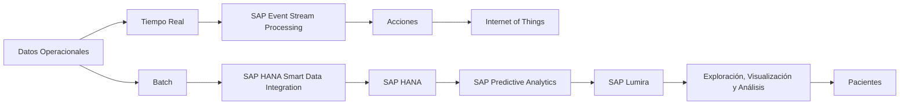

# I Libro de Casos Clínicos

## DIAGNÓSTICO Y TRATAMIENTO NUTRICIONAL EN PERSONAS CON DIABETES MELLITUS Y UNA PATOLOGÍA CRÓNICA ASOCIADA

### Foros Científicos:
Nutrición Clínica y Diabetes mellitus

**Avalado por:**

| | |
|---|---|
| Logo | SOCIEDAD CASTELLANO LEONESA ENDOCRINOLOGÍA, DIABETES Y NUTRICIÓN |

**En colaboración con:**

PERSAN FARMA

www.persanfarma.com
---
ISBN: 978-84-09-10995-1
Depósito legal: GC 300-2019

© Autores
© Persan Distribuciones Farmacéuticas SL
B.35818087
C/ León y Castillo, 421. 3ª Planta.
Las Palmas de Gran Canaria.
35007
Tel. 928 240 881
info@persanfarma.com
www.persanfarma.com

[A logo is displayed at the bottom of the page. It consists of a stylized four-leaf clover shape in orange, with the text "persan farma" in grey underneath.]
---
# I Libro de Casos Clínicos

## DIAGNÓSTICO Y TRATAMIENTO NUTRICIONAL EN PERSONAS CON DIABETES MELLITUS Y UNA PATOLOGÍA CRÓNICA ASOCIADA

### Foros Científicos:
Nutrición Clínica y Diabetes mellitus
---
# Objetivo

Persan Farma tiene como objetivo contribuir en la formación en Nutrición Clínica de los profesionales sanitarios a través de este proyecto científico mediante la publicación de las conferencias y de los casos clínicos que presentaron Médicos Especialistas en Endocrinología y Nutrición en las Mesas Redondas "Diagnóstico y tratamiento nutricional en personas con diabetes mellitus y una patología crónica asociada".
---
# Avales

• Avalado por la Sociedad Castellano-Leonesa de Endocrinología y Nutrición SCLEDYN.

[A logo is displayed to the right of the text. The logo contains a stylized purple figure and the text "SOCIEDAD CASTELLANO LEONESA ENDOCRINOLOGÍA DIABETES Y NUTRICIÓN"]

5
---
# Autores

| Nombre | Cargo | Institución |
|--------|-------|-------------|
| Dr. Ángel Luis Abad González | Médico Especialista en Endocrinología y Nutrición | Hospital General Universitario de Alicante |
| Dra. María Argente Pla | Médico Especialista en Endocrinología y Nutrición | Hospital Universitario y Politécnico de La Fe, Valencia |
| Dra. María D. Ballesteros Pomar | Médico Especialista en Endocrinología y Nutrición | Complejo Asistencial Universitario de León |
| Dr. Fernando L. Calvo Gracia | Médico Especialista en Endocrinología y Nutrición | Hospital Clínico Universitario Lozano Blesa, Zaragoza |
| Dra. Mª Victoria García Zafra | Médico Especialista en Endocrinología y Nutrición | Hospital General Universitario Santa Lucía, Cartagena |
| Dra. María Luisa Fernández Soto | Médico Especialista en Endocrinología y Nutrición, Coordinadora de la Unidad de Nutrición Clínica y Dietética | Hospital Universitario San Cecilio, Granada |
| Dra. Ángela González Díaz-Faes | Médico Especialista en Endocrinología y Nutrición | Hospital Universitario Marqués de Valdecilla, Cantabria |
| Dr. Miguel León Sanz | Jefe de Servicio de Endocrinología y Nutrición | Hospital Universitario 12 de Octubre, Madrid |
| Dr. Francisco Losfablos Callau | Médico Especialista en Endocrinología y Nutrición | Hospital Universitario Miguel Servet, Zaragoza |
| Dr. Daniel A. de Luis Román | Jefe de Servicio de Endocrinología y Nutrición | Hospital Clínico Universitario de Valladolid |
---
# Autores

Dra. Ángela Martín Palmero.
Responsable de la Unidad de Nutrición Clínica y Dietética.
Hospital San Pedro. La Rioja.

Dr. Juan Francisco Merino Torres.
Jefe de Servicio de Endocrinología y Nutrición.
Hospital Universitario y Politécnico de La Fe. Valencia.

Dra. Rosa Mª Mirete López.
Médico Especialista en Endocrinología y Nutrición.
Hospital Universitario de San Juan. Alicante.

Dra. María José Molina Puerta.
Médico Especialista en Endocrinología y Nutrición.
Hospital Universitario Reina Sofía. Córdoba.

Dra. Julia Ocón Bretón.
Responsable de la Unidad de Nutrición Clínica y Dietética.
Servicio de Endocrinología y Nutrición.
Hospital Clínico Universitario Lozano Blesa. Zaragoza.

Dr. Christian Salom Vendrell.
Médico Especialista en Endocrinología y Nutrición.
Hospital Universitario Doctor Peset. Valencia.

Dr. Carlos Sánchez Juan.
Jefe de Servicio de Endocrinología y Nutrición.
Hospital General Universitario de Valencia.

Dra. Ana Isabel Sánchez Marcos.
Médico Especialista en Endocrinología y Nutrición.
Complejo Asistencial Universitario de Salamanca.

Dra. Estefanía Santos Mazo.
Médico Especialista en Endocrinología y Nutrición.
Hospital Universitario de Burgos.

Dr. Alejandro Sanz París.
Jefe de la Sección de Nutrición Clínica y Dietética.
Hospital Universitario Miguel Servet. Zaragoza.
---
# Autores

**Dra. Yamina Suleiman Martos.**
Médico Especialista en Endocrinología y Nutrición.
Hospital General Universitario José M. Morales Meseguer. Murcia.

**Dra. Sara Valle Rodríguez-Navas.**
Médico Especialista en Endocrinología y Nutrición.
Hospital Universitario de Araba (HUA). Vitoria-Gasteiz.

**Dra. Mercedes Vázquez Gutiérrez.**
Médico Especialista en Endocrinología y Nutrición.
Complejo Hospitalario de Torrecárdenas. Almería.

**Dra. Concepción Vidal Peracho.**
Médico Especialista en Endocrinología y Nutrición.
Hospital Royo Villanova. Zaragoza.

**Dr. Francisco Villazón González.**
Médico Especialista en Endocrinología y Nutrición.
Hospital Universitario Central de Asturias. Oviedo.
---
# Índice

## Prólogo.
Dr. Miguel León Sanz................................................................................................................................ 11

## Artículos especiales................................................................................................... 15

El valor de la terapia médica nutricional.
Dra. Julia Ocón Bretón............................................................................................................................. 16

La diabetes mellitus en Castilla y León, ¿es un problema?
Dra. María D. Ballesteros Pomar............................................................................................................... 20

Nutrición y diabetes mellitus.
Dr. Alejandro Sanz París, Dr. Francisco Losfablos Callau........................................................................... 25

La diabetes mellitus en España ¿es un problema?
Dr. Francisco Villazón González................................................................................................................ 32

Hacia la medicina de precisión en diabetes mellitus.
Dr. Juan Francisco Merino Torres.............................................................................................................. 36

## Casos Clínicos........................................................................................................... 41

### MESA REDONDA DE CASOS CLÍNICOS. ANDALUCÍA Y MURCIA........................42

Dra. María Luisa Fernández Soto.
Directora científica.
Médico Especialista en Endocrinología y Nutrición.
Coordinadora de la Unidad de Nutrición Clínica y Dietética.
Hospital Universitario San Cecilio. Granada.

Dr. Juan Bautista Molina Soria.
Director técnico.
Jefe de la Unidad de Nutrición Clínica y Dietética.
Hospital Universitario San Agustín. Linares. Jaén.

Soporte nutricional en una paciente con síndrome de MELAS y diabetes.
Dra. Mª Victoria García Zafra....................................................................................................................44

Obesidad mórbida, diabetes y cirugía bariátrica. Una elección segura, aunque no siempre fácil.
Dra. María José Molina Puerta.................................................................................................................. 55

Diabetes y malabsorción: a propósito de un caso.
Dra. Yamina Suleiman Martos................................................................................................................... 64

Paciente con neoplasia intraductal papilar mucinosa de páncreas: desnutrición y diabetes secundaria.
Dra. Mercedes Vázquez Gutiérrez............................................................................................................. 72

### MESA REDONDA DE CASOS CLÍNICOS. CASTILLA Y LEÓN................................79

Dr. Daniel A. de Luis Román.
Director científico.
Jefe del Servicio de Endocrinología y Nutrición.
Hospital Clínico Universitario de Valladolid.

Trastorno del comportamiento alimentario en paciente DM1.
Dra. Ana Isabel Sánchez Marcos............................................................................................................... 81

Manejo nutricional del paciente diabético con pancreatitis aguda... Ningún día es igual a otro.
Dra. Estefanía Santos Mazo..................................................................................................................... 92

9
---
# Índice

## MESA REDONDA DE CASOS CLÍNICOS. COMUNIDAD VALENCIANA................... 104

Dr. Carlos Sánchez Juan.
Director científico.
Jefe de Servicio de Endocrinología y Nutrición.
Hospital General Universitario de Valencia.

Dr. Juan Francisco Merino Torres.
Director científico.
Jefe de Servicio de Endocrinología y Nutrición.
Hospital Universitario y Politécnico La Fe. Valencia.

Gastrostomía quirúrgica en paciente con demencia y diabetes mellitus tipo 2.
Dr. Ángel Luis Abad González ........................................................................................................... 106

Paciente diabético con fibrosis quística.
Dra. María Argente Pla .................................................................................................................... 118

Paciente con diabetes mellitus y enfermedad inflamatoria intestinal.
Dra. Rosa Mª Mirete López .............................................................................................................. 129

Nutrición enteral en paciente diabético con carcinoma epidermoide de laringe.
Dr. Christian Salom Vendrell ............................................................................................................. 137

## MESA REDONDA DE CASOS CLÍNICOS. NORTE ................................................... 146

Dra. Ángela Martín Palmero.
Directora científica.
Responsable de la Unidad de Nutrición Clínica y Dietética.
Hospital San Pedro. La Rioja.

Dra. Julia Ocón Bretón.
Directora científica.
Responsable de la Unidad de Nutrición Clínica y Dietética.
Hospital Clínico Universitario Lozano Blesa. Zaragoza.

Dr. Alejandro Sanz París.
Director técnico.
Jefe de Sección de la Unidad de Nutrición Clínica y Dietética.
Hospital Universitario Miguel Servet. Zaragoza.

Manejo nutricional de un paciente con un tumor pancreático.
Dr. Fernando L. Calvo Gracia ............................................................................................................ 148

Soporte nutricional en paciente diabético con cáncer de cabeza y cuello.
Dra. Ángela González Díaz-Faes ....................................................................................................... 156

Manejo nutricional de un paciente con DM tipo 1 y síndrome de rumiación.
Dra. Sara Valle Rodríguez-Navas ...................................................................................................... 165

Nutrición y cáncer de páncreas en un paciente con DM tipo 1 portador de una BICI (Infusor subcutáneo
continuo de insulina).
Dra. Concepción Vidal Peracho ......................................................................................................... 173

10
---
# Prólogo

La Nutrición Clínica consiste en la aplicación del conocimiento de los aspectos bioquímicos, metabólicos y fisiopatológicos relacionados con el consumo de nutrientes en personas sanas y enfermas. Constituye un área de conocimiento que es transversal o común a todas las especialidades médicas y quirúrgicas, porque prácticamente cualquier proceso médico o quirúrgico se puede beneficiar de la terapia médico nutricional. En efecto, este abordaje nutricional puede aplicarse a toda clase de enfermedades; exige una valoración y diagnóstico nutricional, que conducen a una intervención nutricional, que abarca la dieta terapéutica, el consejo nutricional, la recomendación de suplementos nutricionales y la prescripción de nutrición artificial. Muy posiblemente, será necesario utilizar también tratamiento farmacológico, pero esto no resta papel al tratamiento nutricional, puesto que la combinación adecuada de ambos tratamientos puede facilitar alcanzar los objetivos terapéuticos, y simplificar o reducir el tratamiento farmacológico.

Una de las enfermedades con mayor prevalencia global es la diabetes mellitus. Es una enfermedad compleja y multifactorial. La desproporción entre la producción y las necesidades sistémicas de insulina conducen a alteración del metabolismo de los tres macronutrientes, hidratos de carbono, grasas y proteínas. La adaptación nutricional para abordar las distintas manifestaciones de la enfermedad es uno de los pilares de su manejo.

La modificación del aporte nutricional ha formado parte del tratamiento de la diabetes mellitus desde hace siglos. El balance energético y el peso dependen de la ingesta energética, y los componentes específicos de la dieta influyen en el control metabólico de la enfermedad. Desde una perspectiva histórica, la recomendación nutricional para la diabetes mellitus ha variado con una dieta baja o alta en hidratos de carbono y rica en fibra, con modificación recíproca de grasa, y también dieta rica en proteínas. A largo plazo la modificación del aporte nutricional busca siempre el control de la glucemia, de las concentraciones lipídicas y de la tensión arterial, junto con la prevención o tratamiento de las complicaciones de la diabetes. A la hora de la recomendación nutricional hay que tener en cuenta si el paciente tiene sobrepeso o es obeso, qué grado de resistencia insulínica y de control glucémico tiene habitualmente, valorado por la hemoglobina glicosilada, así como las alteraciones de los parámetros lipídicos. Durante todo el proceso clínico, también es importante evaluar la evolución del estado nutricional, la adhesión o cumplimiento del tratamiento pautado, los efectos adversos que se puedan presentar, el grado de obtención de los objetivos marcados, la necesidad de introducir cambios en el tratamiento, etc.

Por la elevada prevalencia de la diabetes, es frecuente encontrarla en pacientes que presentan otras patologías. No se trata habitualmente de una asociación causal necesaria, pero sí la múltiple coexistencia de diabetes con una o más enfermedades en el mismo paciente. Es posible que alguna de estas enfermedades presente dificultades
---
para la adquisición de nutrientes por la vía oral fisiológica o requiera unos aportes
diferentes a los que se pueden alcanzar con alimentos naturales de consumo ordinario.
La definición y prescripción del tratamiento médico nutricional deberá tener en cuenta
las características metabólicas derivadas de la enfermedad diabética y de las otras
enfermedades asociadas. Además, el tratamiento médico concomitante puede necesitar
guardar relación con el consumo de nutrientes, como puede ser el caso de la insulina.

El enfoque general de tratamiento requiere la participación de profesionales
sanitarios con diferente origen formativo. Es cierto que los Graduados en Nutrición
Humana y Dietética y los especialistas en Endocrinología y Nutrición poseen habitualmente
un conocimiento mayor de las particularidades del tratamiento nutricional y deban
dirigirlo. Sin embargo, todos los profesionales sanitarios que tratan a cada paciente
deben estar en condiciones de aconsejarles de acuerdo con la mejor evidencia disponible.

En la práctica clínica habitual nos proponemos objetivos nutricionales cuya
consecución requieren un esfuerzo coordinado de todos los profesionales, centrados
en la mejor atención del paciente. La prescripción nutricional debe ser individualizada,
teniendo en cuenta las preferencias personales derivadas de su estilo de vida, origen
cultural y capacidad para adaptarse las distintas formas de tratamiento. Por tanto, esta
prescripción de la nutrición, junto con los posibles tratamientos médicos, requiere una
buena formación y experiencia, que desgraciadamente no siempre se obtiene adecua-
damente durante la educación en pregrado. Por eso, es clave asegurar la accesibilidad
a medios de formación en nutrición clínica y metabolismo a todos los profesionales
sanitarios.

Este libro recoge las experiencias del manejo de múltiples patologías en pacien-
tes con diabetes. Refleja los abordajes diferentes en respuesta a una gran variedad de
situaciones clínicas y representa también la aplicación de los datos proporcionados por
la mejor evidencia médica a escenarios clínicos determinados. La riqueza de la informa-
ción reunida en este libro ayuda a compartir la experiencia sobre el mejor tratamiento
posible para los procesos clínicos incluidos. Pueden existir algunas asociaciones de
diabetes con otras enfermedades que sean más frecuentes, pero el libro incluye capí-
tulos a patologías más inusuales, por lo que será una ayuda importante cuando nos
enfrentemos a casos que nos llegan y que transcienden la práctica clínica más habitual.

Es de agradecer a Persan Farma el patrocinio de esta publicación que contribuye
a mejorar la formación sobre terapia nutricional de una amplia variedad de patologías
observadas en pacientes con diabetes mellitus.

Miguel León Sanz
Presidente,
Sociedad Española de Nutrición Clínica y Metabolismo (SENPE).

12
---
The image shows a mostly white background with geometric design elements in orange. There are orange diamond shapes in the corners of the image, with some partial diamonds visible at the edges. The orange shapes create a subtle border or frame effect around the blank white space in the center. At the bottom right corner, there is a small gray number "13", likely indicating a page number.
---
The image shows an abstract geometric design on an orange background. The design consists of three yellow diamond shapes of different sizes arranged in a diagonal pattern from the top right to the center left of the image. The largest diamond is in the center, with two smaller diamonds above and below it. There are faint outlines of larger transparent diamond shapes behind the yellow ones, creating a subtle layered effect.

The overall color scheme is a gradient of orange, ranging from a deeper orange at the bottom to a brighter, more yellow-orange at the top right corner. The design has a minimalist and modern feel, with clean lines and simple shapes creating a sense of depth and dimension on the flat surface.

At the bottom left corner of the image, there is a small number:

14

This number likely indicates a page number or some form of sequential ordering within a larger document or design collection.
---
# Artículos especiales

15

The image shows a page with an orange gradient background. In the upper right corner, there are three yellow diamond shapes of different sizes, with the largest one in the center appearing to cast a slight shadow. The title "Artículos especiales" (which translates to "Special articles" in English) is prominently displayed in white text near the bottom of the page. The number "15" is placed in the bottom right corner, also in white, likely indicating a page number.
---
# Artículos Especiales

## El valor de la terapia médica nutricional

Dra. Julia Ocón Bretón

Responsable de la Unidad de Nutrición Clínica y Dietética.
Servicio de Endocrinología y Nutrición.
Hospital Clínico Universitario Lozano Blesa. Zaragoza.

La desnutrición relacionada con la enfermedad (DRE) es uno de los principales problemas de salud pública de los países desarrollados debido a su elevada prevalencia y a su asociación con un incremento del riesgo de morbimortalidad y empeoramiento de la calidad de vida del individuo lo que genera un gasto sanitario muy elevado. Se estima que en Europa los costes directos asociados con la DRE ascienden a 170.000 millones de euros al año, más del doble del gasto en obesidad.

La desnutrición es un problema generalizado en todos los niveles asistenciales y afecta especialmente a ciertos colectivos como son los pacientes geriátricos, oncológicos y los crónicos complejos. En el estudio PREDYCES se demostró que la edad, el sexo, la presencia de enfermedades como el cáncer y la diabetes, la disfagia y la polimedicación son los principales factores de riesgo asociados al desarrollo de DRE.

En Europa se calcula que existen 33 millones de personas en riesgo de desnutrición. En nuestro país, según el estudio PREDYCES, el 24% de los pacientes hospitalizados se encuentran en riesgo de desnutrición y esta prevalencia aumenta hasta el 37% en los enfermos mayores de 70 años, el 34% en el paciente oncológico y el 46% en los pacientes con disfagia. En este estudio también se constató un coste adicional de 5829 euros por paciente desnutrido lo que permite estimar que el coste potencial de la DRE en España sería de al menos 1143 millones de euros.

Actualmente, términos como soporte nutricional especializado o nutrición artificial han sido sustituidos por el concepto de terapia médica nutricional que incluye a los suplementos nutricionales orales (SNO), la nutrición enteral a través de una sonda y la nutrición parenteral.

Hay datos suficientes en la literatura que demuestran claramente que la terapia médica nutricional, concretamente los SNO, puede mejorar el estado nutricional y funcional, los resultados clínicos y la calidad de vida de los pacientes desnutridos o en riesgo de desnutrición en diferentes niveles asistenciales y que presentan diferentes tipos de patologías. Además también se conoce que la terapia médica nutricional resulta coste-efectiva y supone una inversión en salud. Estas evidencias son especialmente concluyente en los ancianos y en los pacientes hospitalizados en plantas médicas con polimorbilidad. Precisamente estos grupos de pacientes son los que consumen una gran parte del tiempo de nuestra asistencia diaria y de los recursos sanitarios.
---
En el caso de los ancianos, Cawood et al. realizaron una revisión sistemática de 36 ensayos clínicos donde se demostró que los SNO hiperproteicos reducen el riesgo de complicaciones y readmisiones hospitalarias, mejoran la capacidad funcional e incrementan la ingesta proteica y energética. En un metaanálisis de Stratton et al. donde se evaluó el impacto de los SNO en relación a las admisiones y readmisiones hospitalarias se concluyó que los SNO reducen de forma significativa el riesgo de reingresos tras el alta hospitalaria. En el mismo año, Beck et al., en una revisión sistemática de 6 ensayos clínicos también encontraron evidencia de que el empleo de SNO en ancianos desnutridos aumenta la ingesta nutricional, el peso y la capacidad funcional después del alta hospitalaria. Posteriormente Bally et al. en un metaanálisis de 22 estudios en pacientes hospitalizados desnutridos refuerza los datos de los anteriores autores en términos de que los SNO mejoran la ingesta calórica y energética, la ganancia de peso y disminuyen la tasa de reingresos. El estudio NOURISH, un reciente ensayo clínico multicéntrico examinó el efecto de un SNO hiperproteico enriquecido con beta-hidroximetilbutirato en 652 ancianos desnutridos hospitalizados con patologías crónicas demostrando que los SNO reducen de forma significativa la mortalidad a los 90 días.

Además de los ancianos, en otros grupos de pacientes también se han evidenciado los beneficios de los SNO. Elia et al., publicaron dos revisiones sistemáticas y metaanálisis referentes al empleo de los SNO en pacientes comunitarios y hospitalizados por diferentes patologías. Dichos autores constataron que los pacientes hospitalizados en plantas médicas, quirúrgicas y ortopédicas que recibieron SNO presentaron una reducción del 35% de las complicaciones, una menor mortalidad y un descenso medio de la estancia hospitalaria de 2 días. En el caso de los pacientes comunitarios, el empleo de los SNO se asoció con una reducción significativa en hospitalizaciones del 16,5% y de la mortalidad, aunque en este caso no alcanzó significación estadística. Este metaanálisis también demostró que los SNO presentaron beneficios clínicos en términos de descenso de las infecciones, de las complicaciones postoperatorias en el paciente quirúrgico y de las caídas junto con una mejoría de la calidad de vida.

ESPEN en sus recientes guías de geriatría y del paciente médico polimórbido recomienda, con grado de recomendación A, el empleo de SNO en pacientes ancianos hospitalizados desnutridos o en riesgo de desnutrición con el objetivo de mejorar la ingesta dietética y el peso corporal y reducir el riesgo de complicaciones y la tasa de reingresos. Con el mismo grado de recomendación, ESPEN también recomienda continuar con la ingesta de SNO tras el alta hospitalaria en pacientes ancianos y en pacientes hospitalizados en plantas médicas con múltiples comorbilidades para reducir el riesgo de deterioro funcional y de la mortalidad. Estos suplementos deben aportar al menos 400 Kcal y 30 gr de proteínas al día.

Se dispone de evidencia científica que demuestra que la administración de SNO tiene un impacto económico positivo al reducir los costes sanitarios.
---
Philipson et al. analizaron los registros de ingresos hospitalarios de 44 millones de pacientes norteamericanos hospitalizados durante 11 años y observaron que los SNO reducen la estancia hospitalaria 2,3 días y la tasa de reingresos a los 30 días un 6,7% lo que supone un ahorro de 4734 dólares. Las dos revisiones sistemáticas anteriormente descritas de Elia et al. demostraron un ahorro del 12,2% en los pacientes que habían empleado SNO durante la hospitalización mientras que en el ámbito comunitario el ahorro fue de 9,2% cuando los SNO se administraron durante menos de 3 meses y de un 5% cuando se administraron durante más de 3 meses. En el estudio NOURISH también se constató que la intervención nutricional es coste-efectiva con una ratio coste-efectividad incremental de 873 dólares por AVAC.

Debido a los datos expuestos anteriormente parece necesario concienciar a todo el personal sanitario que los SNO no son unos simples "batidos" semejantes a los que se pueden comprar en los supermercados sino un verdadero tratamiento médico con unos beneficios clínicos y económicos iguales o incluso superiores a los de algunos fármacos pero con menos efectos secundarios.
---
# Bibliografía

1. Bally MR, Yildirim PZB, Bounoure L, Gloy VL, Mueller B, Briel M, et al. Nutritional support and outcomes in malnourished medical inpatients: a systematic review and meta-analysis. JAMA Intern Med 2016;176(1):43-53.

2. Beck AM, Holst M, Rasmussen HH. Oral nutritional support of older (65 years) medical and surgical patients after discharge from hospital: systematic review and meta-analysis of randomized controlled trials. Clin Rehabil 2013;27(1):19-27.

3. Stratton RJ, Hebuterne X, Elia M. A systematic review and meta-analysis of the impact of oral nutritional supplements on hospital readmissions. Ageing Res Rev 2013;12(4):884-97.

4. Cawood AL, Elia M, Stratton RJ. Systematic review and meta-analysis of the effects of high protein oral nutritional supplements. Ageing Res Rev 2012;11(2):278-96.

5. Volkert D, Beck AM, Cederholm T, Alfonso Cruz-Jentoft A, Goisser S, Hooper L,et al. ESPEN guideline on clinical nutrition and hydration in geriatrics. Clin Nutr 2018; doi.org/10.1016/j.clnu.2018.05.024.

6. Gomes F, Schuetz P, Bounoure L, Austin P, Ballesteros-Pomar M, Tommy Cederholm T, et al. ESPEN guidelines on nutritional support for polymorbid internal medicine patients. Clin Nutr 2018;37(1):336-353.

7. Deutz NE, Matheson EM, Matarese LE, Luo M, Baggs GE, Nelson JL et al. Readmission and mortality in malnourished, older, hospitalized adults treated with a specialized oral nutritional supplement: A randomized clinical trial. Clin Nutr 2016:35:18-26.

8. Philipson TJ, Thornton Snider J, Lakdawalla DN. Impact of Oral Nutritional Supplementation on Hospital Outcomes.Am J Manag Care 2013;19:121-8.

9. Elia M, Normand C, Norman K, Laviano A. A systematic review of the cost and cost effectiveness of using standard oral nutritional supplements in the hospital setting. Clin Nutr 2016;35:370-80.

10. Elia M, Normand C, Laviano A, Norman K. A systematic review of the cost and cost effectiveness of using standard oral nutritional supplements in community and care home setting. Clin Nutr 2016;35:125-37.
---
# Artículos Especiales

## La diabetes mellitus en Castilla y León, ¿es un problema?

Dra. María D. Ballesteros Pomar

Coordinadora del Área de Nutrición de la SEEN.
Médico especialista en Endocrinología y Nutrición.
Complejo Asistencial Universitario de León.

### Resumen

No cabe duda de que la diabetes mellitus es un problema en cualquier contexto geográfico en que se presente. No constituye el propósito de esta exposición hablar de las devastadoras consecuencias en forma de complicaciones crónicas que supone la diabetes, ni tampoco de sus complicaciones agudas, pero indudablemente la diabetes es un problema de salud muy relevante para el individuo afectado. Nos referiremos más bien a todo lo que la diabetes supone en nuestra Comunidad Autónoma desde un punto de vista epidemiológico y de sus repercusiones en nuestro sistema sanitario regional.

### Datos epidemiológicos mundiales y europeos

Los datos mundiales epidemiológicos de la diabetes son aterradores. La octava edición del Atlas de Diabetes de la Federación internacional de Diabetes (IDF), publicados en 2017 reflejan el crecimiento casi exponencial en el número de personas con diabetes mellitus entre 20 y 79 años. Desde 2000, año en que se publicó la primera edición del atlas, este número se ha incrementado de 151 a 425 millones, lo que supone casi triplicar la cifra inicial de afectados en solo 17 años¹. Se calcula además que esta cifra llegará a 629 millones en 2045 si no se remedia antes. Los países de bajos ingresos y en vías de desarrollo soportan el 80% de la carga de diabetes, además en un contexto en el que los recursos para su tratamiento están claramente limitados. En el mundo, más de 4 millones de muertes anuales pueden atribuirse a la diabetes.

Las cifras en Europa son también preocupantes. Más de 66 millones de personas tenían diabetes en 2017 (9,1% de la población entre 18 y 99 años), pero se calcula un incremento de 16% hasta 2015, año en que la cifra llegará a más de 81 millones de personas (10,8% de la población entre 18-99 años)¹. Es decir, en 2017, 1 de cada 11 europeos adultos tenían diabetes.

20
---
# Situación de la diabetes en España:

España tiene el dudoso honor de ser el cuarto país europeo en número de personas con diabetes en 2017, con más de 4 millones. Además, España es el décimo país del mundo en número de personas mayores de 65 años con diabetes en 2017, con 2,2 millones. El estudio di@bet.es², recogiendo datos 2008-2010, revela una prevalencia de diabetes total de 13,8% y cerca del 30% de la población presentó algún trastorno del metabolismo de los carbohidratos. Más recientemente, se han comunicado nuevos datos en 2018 en el XXIX Congreso Nacional de la Sociedad Española de Diabetes, cifrándola en 11,58 casos por 1.000 personas/año. Esto implica que cada año aparecen 386.003 nuevos casos de diabetes en la población mayor de 18 años.

Los datos publicados más recientes de la evolución a lo largo de 15 años³ serían más esperanzadores porque parecen reflejar una estabilización en el aumento de los casos de diabetes, pero aún haría falta más tiempo de seguimiento para confirmar esta tendencia en España. Sin embargo, los mismos datos confirman que la variable sociodemográfica que mayor incidencia tiene en la diabetes es, sin lugar a duda, la edad, lo que podría hacer que los datos favorables no se sigan en comunidades más envejecidas.

# Prevalencia de diabetes en Castilla y León:

En lo referido a nuestra Comunidad Autónoma, debemos recordar la importante relación entre diabetes y envejecimiento y tener en cuenta que Castilla y León es la segunda Comunidad Autónoma más envejecida después de Asturias⁴. La edad media de Castilla y León se sitúa en 46,4, casi 4 años superior respecto a la media nacional, y el índice de envejecimiento es de 1,9 ( ≥ 65/ < 16 años). La población menor de 16 años representa el 12,9%, mientras que los mayores de 65 son casi el doble. En este contexto, la diabetes supone una consecuencia más del progresivo envejecimiento.

Recientemente se han presentado los principales resultados del estudio del Riesgo de Enfermedad Cardiovascular en Castilla y León (RECCyL)⁵ que recoge datos de seguimiento entre 2004 y 2014. La prevalencia de diabéticos en 2004 era de 9,89%. Una década después, esa proporción había aumentado hasta el 15,62%. Por cohortes de edad, se produce el mayor aumento de la diabetes en la de 60-69 años con más de 12 puntos, de 18,23 a 30,70%. Si los datos de la IDF resaltaban que 1 de cada 11 europeos tiene diabetes, en Castilla y León podemos decir que la diabetes afecta a uno de cada 6 adultos, incluso 1 de cada 3 en los mayores de 60 años. La prevalencia, por lo tanto, convierte a la diabetes en uno de los principales problemas de salud de la Comunidad de Castilla y León.
---
# Mortalidad en diabetes

Los datos del Emerging Risk Factors Collaboration⁶ reflejan que, después de ajustar por edad, sexo, tabaquismo e índice de masa corporal, la diabetes supone un aumento de riesgo de mortalidad por todas las causas de 80% (Hazard ratio-HR- 1,80, intervalo de confianza 95%-IC95%- 1,71 a 1,90), de mortalidad por cáncer de 25% (HR 1,25, IC95% 1,19-1,31) y por causas vasculares de 132% (HR 2,32, IC95% 2,11 a 2,56). Aún más, niveles de glucemia basal superiores a 100 mg/dL implicaban un aumento de mortalidad. Se calcula que una persona de 50 años con diabetes muere, como media, 6 años antes que una persona sin diabetes, con un 40% de la diferencia en supervivencia atribuible al exceso de mortalidad por causas no cardiovasculares.

En España en el periodo 1998-2013⁷, se apreció una reducción de la tasa de mortalidad estandarizada por DM del 25,3% en los varones y el 41,4% en las mujeres. Sin embargo, en Castilla y León las muertes atribuibles a diabetes aumentaron un 23,2% entre 2004 y 2014, siendo en este último año de 23 por cada 1000 defunciones. No hay que olvidar además que estas cifras corresponden a muertes directas y no reflejan la implicación de la diabetes en las muertes cardiovasculares, por cáncer o por otras causas. Es probable que el envejecimiento condicione este resultado más desfavorable en Castilla y León, pero en cualquier caso constituye un dato más sobre el impacto negativo de la diabetes en nuestra población.

En la Cohorte de diabetes mellitus de Castilla y León (CODICYL)⁸, que se inició con los nuevos diagnósticos realizados desde el año 2000, en los primeros diez años tras el diagnóstico, los pacientes con DM2 presentan un riesgo de mortalidad un 27% superior a la población general, más elevada en los hombres (35%) que en las mujeres (10%).

Por tanto, podemos decir que, en Castilla y León, la diabetes implica un aumento de mortalidad prematura y que la tendencia es a continuar el aumento, a diferencia de lo que ocurre globalmente en España, donde las tasas de mortalidad por diabetes tienden a disminuir.

# Gasto sanitario en diabetes

En 2017, la IDF estima que el gasto sanitario total en diabetes alcanzó los 850 billones de dólares, y se espera que alcance al menos 958 billones en 2045, realizando predicciones muy conservadoras. En Europa, se calcula que el 9,1% del presupuesto sanitario de 2017 se gastó en diabetes. En España, el gasto anual en diabetes se ha calculado en costes indirectos por valor de 17630 millones de euros (absentismo laboral 8400 millones, jubilaciones anticipadas 9484 millones y gastos sociales 101 millones) y costes directos de 5447 millones de euros (tratamientos y hospitalizaciones por paciente 1708 euros/paciente/año)⁹. Los costes directos suponen un 8,2% del gasto sanitario total del Sistema Nacional de Salud¹⁰. No disponemos de datos regionales, pero si
---
extrapolamos los datos españoles, podemos decir que también desde el punto de vista económico y de sostenibilidad del sistema sanitario, la diabetes es un problema en una comunidad empobrecida como Castilla y León.

## Conclusión

Uno de cada 6 castellanos y leoneses padece DM, siendo la prevalencia mayor que en el resto de España, y en ascenso progresivo, especialmente en los mayores de 60 años. Además, la diabetes supone en Castilla y León una mayor mortalidad que en la población general y la tendencia es a continuar el aumento, a diferencia de lo que ocurre globalmente en España. No disponemos de datos económicos, pero sin duda es un problema para la sostenibilidad de nuestro sistema sanitario, además de su negativo impacto en la salud de nuestra envejecida población.

En palabras del presidente de la IDF en 2016-2017, el Dr. Shaukat Sadikot, "la diabetes no es solo una crisis sanitaria; es una catástrofe global de la sociedad"¹. Es nuestra responsabilidad mejorar este sombrío panorama creando una mayor concienciación sobre la importancia de un estilo de vida más saludable, especialmente entre niños y adolescentes, para prevenir la diabetes.
---
# Bibliografía

1. IDF Diabetes Atlas. Eighth edition 2017. Acceso 6 de octubre de 2018. En: http://diabetesatlas.org/resources/2017-atlas.html

2. Soriguer F, Goday A, Bosch-Comas A, Bordiú E, Calle-Pascual A, Carmena R, et al. Prevalence of diabetes mellitus and impaired glucose regulation in Spain: the Di@bet.es Study. Diabetologia. 2012 Jan;55(1):88-93. doi: 10.1007/s00125-011-2336-9. Epub 2011 Oct 11.

3. López Rey MJ, Docampo García M. Evolución de la prevalencia de la diabetes mellitus en España (1999-2014). Endocrinol Diabetes Nutr. 2018. https://doi.org/10.1016/j.endinu.2018.06.006

4. Consejo Económico y Social de Castilla y León. La situación de la Población en Castilla y León 2015. En: http://www.cescyl.es/es/publicaciones/informes-anuales . Acceso 6 de octubre de 2018.

5. Estudio del Riesgo de Enfermedad Cardiovascular en Castilla y León (RECCyL). En: https://www.saludcastillayleon.es/profesionales/es/cardiovascular/estudio-riesgo-enfermedad-cardiovascular. Acceso 6 de octubre de 2018.

6. Rao Kondapally Seshasai S, Kaptoge S, Thompson A, Di Angelantonio, Gao P, Sarwar, et al. Diabetes mellitus, fasting glucose, and risk of cause-specific death. N Engl J Med. 2011 Mar 3;364(9):829-841. doi: 10.1056/NEJMoa1008862.

7. Orozco-Beltrán D, et al. Evolucio´n de la mortalidad por diabetes mellitus en Espan˜a: análisis del periodo 1998-2013. Rev Esp Cardiol. 2016. http://dx.doi.org/10.1016/j.recesp.2016.07.007

8. Cohorte de Diabetes Mellitus de Castilla y León (CODICYL). En: https://www.saludcastillayleon.es/profesionales/es/cardiovascular/cohorte-diabetes. Acceso 6 de octubre de 2018.

9. Federación Española de Diabetes (FEDE). Infografías. En: https://www.fedesp.es/bddocumentos/1/La-diabetes-en-espa%C3%B1a-infografia_def.pdf Acceso 6 de octubre de 2018.

10. Crespo C, Brosa M, Soria-Juan A, Lopez-Alba A, Lopez-Martínez N, Soria B. Costes directos de la diabetes mellitus y de sus complicaciones en España. (Estudio SECCAID: Spain estimated cost Ciberdem-Cabimer in Diabetes). Av Diabetol. 2013;29(6):182-189.
---
# Artículos Especiales

## Nutrición y diabetes mellitus

Dr. Alejandro Sanz París y Dr. Francisco Losfablos Callau

Unidad de Nutrición y Dietética.
Hospital Universitario Miguel Servet de Zaragoza.

La hiperglucemia es una situación de alta frecuencia tanto en el área hospitala-
ria como entre las personas que viven en su domicilio. En España, los últimos estudios
muestran que el 14% de la población es diabética¹ y en una revisión de 126 hospitales
norteamericanos el 31.7% de los pacientes fuera de la UCI presentaban glucemia mayor
de 180 mg/dl².

Según datos emitidos por la OMS³ se estima que existen aproximadamente 422
millones de personas con diabetes en el mundo. Su prevalencia en adultos mayores de
18 años en el año de 2014 fue del 9%, y en 2012 fallecieron 1,5 millones de personas
como consecuencia directa de esta enfermedad siendo más del 80% de las muertes por
diabetes registradas en países de ingresos bajos y medios. Según sus proyecciones, la
diabetes será la séptima causa de mortalidad en 2030, la gran mayoría de ellos DM2, y
es a día de hoy una de las principales causas de ceguera, fallo renal, ataque al corazón,
accidente cerebrovascular y amputaciones de los miembros inferiores. Este importante
incremento se atribuye sobre todo al crecimiento y el envejecimiento de la población,
la mayor frecuencia de obesidad, la falta de ejercicio y la urbanización.

En pacientes hospitalizados en España⁴, la prevalencia de diabetes se ha esti-
mado en un 17,8%, y notablemente más alta en aquellos ingresos mayores de 65 años
de edad, 39,9%. En cuanto a la población hospitalizada⁵, la aparición de hiperglucemia
por diversas patologías puede ser del 21,5%. Aquellos pacientes con valores más eleva-
dos de hemoglobina glicosilada (HbA1C) presentan riesgos más elevados de ingreso⁶.

Además de esta hiperglucemia crónica por DM, podemos encontrarnos en la
práctica clínica con la llamada "hiperglucemia de estrés", que aparece en paciente
crítico u hospitalizado por enfermedad no crítica sin antecedentes de DM, pero con
glucemias persistentes mayores de 126 mg/dl en ayunas o de 200 mg/dl en cualquier
momento del día. Su prevalencia oscila entre el 4-12% de los pacientes hospitalizados
sin diabetes conocida. Llega a ser de más del 30% en los pacientes con nutrición
enteral⁷ y del 35% en parenteral, aunque depende mucho de los criterios de definición
empleados⁸.

25
---
# Coste sanitario y Diabetes

La presencia de hiperglucemia se asocia a una peor evolución intrahospitalaria y por tanto a estancia hospitalaria más larga y mayores costes sanitarios. Se ha calculado que por cada 18 mg/dl más de la cifra normal de glucemia al ingreso hospitalario, aumenta un 5% el riesgo de complicaciones y un 8% la mortalidad⁹. En España, el estudio de Olveira et al.¹⁰ también observa que la presencia de diabetes en el paciente hospitalizado se asocia a un aumento de la mortalidad y de la estancia hospitalaria. Es razonable pensar que el coste del tratamiento y cuidados a los pacientes con diabetes estará íntimamente relacionados con su prevalencia y en este sentido es muy importante tener los datos epidemiológicos actualizados para establecer las estrategias terapéuticas y preventivas de esta enfermedad, además de sus complicaciones. Según un estudio realizado en 2004 sobre los costes en atención de la salud en pacientes con diabetes tipo 1 y tipo 2 en España, el valor directo oscilaba entre 2.4 y 2.67 mil millones de euros. En este período se determinó que la prevalencia de diabetes era de 5 a 6%.

Los costes de hospital sobrepasaban los 933 millones de euros, seguidos de los fármacos no insulínicos y no hipoglucemiantes que oscilaban entre 777 y 932 millones de euros. Más bajos fueron los costes de insulina y antidiabéticos orales que rondaban los 311 millones de euros. Las consultas primarias entre 181 y 272 millones de euros. Visitas especializadas entre 127 y 145 millones de euros y elementos desechables entre 70 y 81 millones de euros. Estos resultados indicaban que los gastos sanitarios con pacientes diabéticos son realmente altos oscilando entre 6.3 y 7.4% del gasto total del Sistema Nacional de Salud¹¹.

En estudios más recientes¹² como el publicado en 2006 se asume la tendencia ascendente de la prevalencia e incidencia de diabetes con una estimativa grosera que oscilaría entre el 5 y 18% de prevalencia de diabetes en la población general en España. En este mismo estudio, los gastos totales sanitarios en los países occidentales podrían llegar al 14% y un paciente con diabetes consumiría de 2 a 6 veces más recursos directos que los individuos de similares edades y sexo con otras enfermedades crónicas. Con todo, a pesar de la importancia socioeconómica de esta enfermedad en España en el momento actual existen escasas investigaciones publicadas acerca del coste económico asociado a la diabetes. Además, la mayor parte de esos estudios no abordan los costes indirectos como días de baja perdidos o incapacidades permanentes.

# Malnutrición y diabetes

Existen muy pocos trabajos en los que se estudie la prevalencia de desnutrición entre la población diabética.

En España el estudio con mayor número de pacientes hospitalizados presentado es el de Sanz París et al.¹³ en 2013. Con el test de valoración nutricional MNA observan

26
---
que un 39% presentaron riesgo de desnutrición y un 21.2% diagnóstico de malnutrición en 1090 pacientes ingresados en hospitales de toda España. En la misma cohorte, utilizando el test de valoración propuesto por ESPEN14 la prevalencia de desnutrición se reduce al 6.73%. El estudio Predyces consistió en una valoración nutricional mediante NRS-2002 de mil setecientos siete pacientes de 50 hospitales españoles. Un subanálisis de este estudio se publicó con los 387 pacientes que eran diabéticos15. En este grupo de pacientes diabéticos el 30.1% presentaron desnutrición según NRS-2002 al ingreso hospitalario y lo más grave es que perdieron peso durante su estancia hospitalaria de forma significativa el 9.5% y de forma severa el 33.3%. Esto se pudo deber a que el 73.3% de los pacientes que ingresaron con desnutrición no recibieron soporte nutricional. En un estudio realizado en 478 pacientes diabéticos hospitalizados por pie diabético16, utilizando el test diagnóstico MNA encuentran que el 70.5% están en riesgo y el 14.6% en malnutrición, que se relaciona con el riesgo de amputación.

En un estudio europeo sobre la prevalencia de úlceras de decúbito al alta hospitalaria tras fractura de cadera, la coexistencia de diabetes se considera un factor de riesgo17. En otro estudio18 realizado en 75168 ancianos ambulatorios con riesgo de desarrollar úlcera de decúbito, 1211 la presentaron y la coexistencia de diabetes representó un riesgo relativo del 1.75. En una revisión reciente19 sobre los estudios publicados sobre úlceras de decúbito tanto en hospital como en residencia geriátrica y en domicilio indica la diabetes y la desnutrición como factores indirectos de su aparición en los tres ámbitos. Lyder et al.20 de 2313 pacientes hospitalizados con úlceras de presión adquiridas durante la hospitalización, 971 (42%) eran diabéticos. Esto fue significativo (p< 0.001) comparado con los pacientes sin úlceras de decúbito, de los cuales solo el 33.4% eran diabéticos.

En una revisión sobre úlceras de decúbito en UCI21, de los 7 factores de riesgo reconocidos, uno de ellos fue la diabetes mellitus. Lo mismo ocurre en otra revisión sobre úlceras de decúbito en postoperatorio22.

Respecto a los pacientes diabéticos institucionalizados, un estudio realizado con 4037 ancianos institucionalizados de 59 residencias geriátricas en 8 países europeos23 encuentra que el 21.8% de los ancianos son diabéticos y estos son significativamente más jóvenes y con mayor grado de dependencia y riesgo de úlceras de decúbito. El estudio español de Casimiro et al.24 recoge 486 ancianos de 80 centros geriátricos españoles en el que solo el 8.4% de las mujeres y el 10.6% de los hombres diabéticos presentaron desnutrición evaluada por el índice de riesgo nutricional (IRN): (15,9 x albúmina) + [(pesoactual x Pesousual) x100]. En un estudio25 realizado con 146 pacientes diabéticos ingresados en un hospital geriátrico, utilizando MNA observan un 13.9% de malnutrición y un 75% de riesgo.

En ancianos diabéticos que viven en domicilio hemos encontrado un estudio con 215 pacientes diabéticos26 que presentan mayor riesgo de desnutrición según MNA frente a controles no diabéticos (33 vs 24.8%) pero similar prevalencia de desnutrición (2.7 vs 2.7%).

27
---
En un estudio reciente israelí27 valora los pacientes con suplementos orales domiciliarios y observa que son más frecuentes en pacientes diabéticos frente a no diabéticos (26.5 vs 20.9%).

En un gran estudio publicado sobre prevalencia de malnutrición en hospitales y residencias geriátricas realizado en Holanda28, encuentran desnutrición en más del 20% de los 12.883 pacientes valorados, siendo los factores asociados más frecuentes la diabetes mellitus, junto con las enfermedades gastrointestinales y el cáncer.

Recientemente se ha publicado un estudio retrospectivo de los datos del Medicare29 entre 1999 y 2014 con 15.121.131 pacientes diabéticos. De ellos 801.272 fueron diagnosticados de desnutrición, que incrementó el riesgo de muerte por todas causas y el gasto económico.

## Nutrición enteral y diabetes

La nutrición enteral es el soporte más eficaz y con menos complicaciones, también en el paciente diabético, por tanto es frecuente la indicación de NE en paciente diabético o con hiperglucemia. En un estudio español, Olveira et al.30, observan que el 5 al 8% de los pacientes hospitalizados recibían NE por sonda. Si consideramos la prevalencia de diabetes en el hospital, se puede estimar que 1-2% pacientes hospitalizados son diabéticos con NE por sonda. En una planta de Medicina Interna el 34% de pacientes con NE presentaban glucemia mayor de 200 mg/dl31. En Residencia Geriátrica los pacientes con NE y demencia presentaban HbA1c > 7% en el 50% de los casos, de los cuales la mitad de los casos no estaban diagnosticados de diabetes32.

Por otra parte, en ocasiones puede ser difícil el control glucémico de los pacientes con NE y diabetes o hiperglucemia de estrés. Las razones pueden ser múltiples: tanto organizativas por la ausencia de protocolos universales de insulinización para un paciente muy heterogéneo y miedo a la aparición de hipoglucemias severas en un paciente frágil, como por la severidad de la hiperglucemia en un paciente agudo con polifarmacia y corticoterapia33.

Existen múltiples documentos de recomendaciones sobre el uso de la nutrición enteral en el paciente diabético. Recomendamos la lectura de las dos revisiones publicadas por grupos españoles34,35.
---
# Bibliografía

1. F. Soriguer, A. Goday, A. Bosch-Comas, E. Bordiú, A. Calle-Pascual, R. Carmena, R. Casamitjana, L. Castaño, C. Castell, M. Catalá, E. Delgado, J. Franch, S. Gaztambide, J Girbés, R. Gomis, G. Gutiérrez, A. López Alba, M. T. Martínez-Larrad, E. Menéndez, I. Mora-Peces, E. Ortega, G. Pascual-Manich, G. Rojo-Martínez, M. Serrano-Rios, S. Valdés, J. A. Vázquez, J. Vendrell. Prevalence of diabetes mellitus and impaired glucose regulation in Spain. Diabetología 2011;10.1007/s00125-011-2336-9.

2. Cook CB, Kongable GL, Potter DJ, Abad VJ, Leija DE, Anderson M. Inpatient glucose control: a glycemic survey of 126 U.S. hospitals. J Hosp Med. 2009;4(9):E7-E14.

3. OMS online - http://www.who.int/es/

4. Carral F, Olveira G, Aguilar M, Ortego J, Gavilán I, Doménech I, Escobar L. Hospital discharge records under-report the prevalence of diabetes in inpatients. Diabetes Res Clin Pract. 2003;59(2):145-51.

5. Moghissi ES, Korytkowski MT, DiNardo M, et al. American Association of Clinical Endocrinologists and American Diabetes Association Consensus Statement on Inpatient Glycemic Control. Diabetes Care. 2009;32(6):1119-1131.

6. Moss SE, Klein R, Klein BE. Risk factors for hospitalization in people with diabetes. Arch Intern Med. 1999;159(17):2053.

7. Pancorbo-Hidalgo PL, Garcia-Fernandez FP, Ramirez-Perez C. Complications associated with enteral nutrition by nasogastric tube in an internal medicine unit. J Clin Nurs. 2001;10:482–490.

8. OLVEIRA 2015: (Study Group Of Hyperglycemia In Parenteral Nutrition Nutrition Area Of The Spanish Society Of Endocrinology And Nutrition SEEN, Olveira G, Tapia MJ, Ocón J, Cabrejas-Gómez C, Ballesteros-Pomar MD, Vidal-Casariego A, Arraiza-Irigoyen C, Olivares J, Conde-García MC, García-Manzanares Á, Botella-Romero F, Quílez-Toboso RP, Cabrerizo L, Matía P, Chicharro L, Burgos R, Pujante P, Ferrer M, Zugasti A, Petrina E, Manjón L, Diéguez M, Carrera MJ, Vila-Bundo A, Urgelés JR, Aragón-Valera C, Sánchez-Vilar O, Bretón I, García-Peris P, Muñoz-Garach A, Márquez E, Del Olmo D, Pereira JL, Tous MC. Prevalence of diabetes, prediabetes, and stress hyperglycemia: insulin therapy and metabolic control in patients on total parenteral nutrition (prospective multicenter study). Endocr Pract. 2015 Jan;21(1):59-67).

9. McAlister FA, Majumdar SR, Blitz S, Rowe BH, Romney J, Marrie TJ. The relation between hyperglycemia and outcomes in 2,471 patients admitted to the hospital with community-acquired pneumonia. Diabetes Care. 2005 Apr;28(4):810-5.

10. Olveira-Fuster G, Olvera-Márquez P, Carral-Sanlaureano F, González-Romero S, Aguilar-Diosdado M, Soriguer-Escofet F. Excess hospitalizations, hospital days, and inpatient costs among people with diabetes in Andalusia, Spain. Diabetes Care. 2004 Aug;27(8):1904-9.

11. Juan Oliva, Félix Lobo, Begoña Molina, Susana Monereo. Direct Health Care Costs of Diabetic Patients in Spain. Diabetes Care 2004;27:2616-2621.

12. Miguel Ruiz-Ramos, Antonio escolar-Pujolar, Eduardo Mayoral-Sanchéz, Florentino Corral Laureano, Isabel Fernández-Fernández. Hospital Universitario Puerta del Mar. Cádiz. España. La diabetes mellitus en España: mortalidad, prevalencia, incidencia, costes económicos y desigualdades. Gac Sanit. 2006;20(Supl 1):15-24.

29
---
13. Sanz París A, García JM, Gomez-Candela C, Burgos R, Martín A, Matía P. Malnutrition prevalence in hospitalized elderly diabetic patients. Nutr Hosp. 2013;28:592-9.

14. Sanz París A, Gómez-Candela C, Martín-Palmero Á, García-Almeida JM, Burgos-Pelaez R, Matía-Martín P, Arbones-Mainar JM; Study VIDA group. Application of the new ESPEN definition of malnutrition in geriatric diabetic patients during hospitalization: A multicentric study. Clin Nutr. 2016 Dec;35(6):1564-1567.

15. Miguel L, Julia AH, Mercè P, Abelardo GL, Krysmaru A and Sebastián C. Prevalence of Hospital Malnutrition in Patients with Diabetes Mellitus: A Sub-Analysis of the PREDyCES® Study. SM J Public Health Epidemiol. 2015;1(4):1018.

16. Gau BR, Chen HY, Hung SY, Yang HM, Yeh JT, Huang CH, Sun JH, Huang YY. The impact of nutritional status on treatment outcomes of patients with limb-threatening diabetic foot ulcers. J Diabetes Complications. 2016;30(1):138-42.

17. Lindholm C, Sterner E, Romanelli M, Pina E, Torra y Bou J, Hietanen H, Iivanainen A, Gunningberg L, Hommel A, Klang B, Dealey C. Hip fracture and pressure ulcers – the Pan-European Pressure Ulcer Study – intrinsic and extrinsic risk factors. Int Wound J 2008;5:315–328.

18. Margolis DJ, Knauss J, Bilker W, Baumgarten M. Medical conditions as risk factors for pressure ulcers in an outpatient setting. Age Ageing. 2003;32(3):259-64.

19. Jaul E, Barron J, Rosenzweig JP, Menczel J. An overview of co-morbidities and the development of pressure ulcers among older adults. BMC Geriatr. 2018;18(1):305.

20. Lyder CH, Wang Y, Metersky M, Curry M, Kliman R, Verzier NR, Hunt DR. Hospital acquired pressure ulcers: results from the national Medicare patient safety monitoring system study. J Am Geriatr Soc. 2012;60(9):1603-8.

21. Cox J. Pressure Injury Risk Factors in Adult Critical Care Patients: A Review of the Literature. Ostomy Wound Manage. 2017;63(11):30-43.

22. Liu P, He W, Chen HL. Diabetes mellitus as a risk factor for surgery-related pressure ulcers: a meta-analysis. J Wound Ostomy Continence Nurs. 2012;39(5):495-9.

23. Szczerbińska K, Topinková E, Brzyski P, van der Roest HG, Richter T, et al. The characteristics of diabetic residents in European nursing homes: results from the SHELTER study. J Am Med Dir Assoc. 2015;16(4):334-40.

24. Casimiro C, García de Lorenzo A, Usán L; Grupo de Estudio Cooperative Geriátrico. Nutritional and metabolic status and dietetic evaluation in institutionalized elderly patients with non-insulin-dependent diabetes mellitus. Nutr Hosp. 2001;16(3):104-11.

25. Vischer UM, Perrenoud L, Genet C, Ardigo S, Registe-Rameau Y, Herrmann FR. The high prevalence of malnutrition in elderly diabetic patients: implications for anti-diabetic drug treatments. Diabetes Med. 2010;27:918-24.

26. Tasci I, Safer U, Naharci MI. Multiple Antihyperglycemic Drug Use is Associated with Undernutrition Among Older Adults with Type 2 Diabetes Mellitus: A Cross-Sectional Study. Diabetes Ther. 2019 Mar 28. doi: 10.1007/s13300-019-0602-x. [Epub ahead of print].
---
27. Sharman Moser S, Doyev R, Cohen B, Kurz R, Sulo S, Shalev V, Chodick G. Prevalence and characteristics of malnutrition among community-dwelling older adults in Israel. Clin Nutr ESPEN. 2018 Dec;28:179-185.

28. Meijers JM, Schols JM, van Bokhorst-de van der Schueren MA, Dassen T, Janssen MA, Halfens RJ. Malnutrition prevalence in The Netherlands: results of the annual dutch national prevalence measurement of care problems. Br J Nutr. 2009;101(3):417-23.

29. Ahmed N, Choe Y, Mustad VA, et al. Impact of malnutrition on survival and healthcare utilization in Medicare beneficiaries with diabetes: a retrospective cohort analysis. BMJ Open Diabetes Res Care. 2018;6:e000471.

30. Oliveira Fuster G, García García-Doncel L, Carral SanLaureano F, Domenech Cienfuegos I, Arencibia Rivero T, Manzano Martín MV. Dietary-therapeutic product supply in unitary doses at a university hospital: effect on consumption and costs. Nutr Hosp. 2000 Mar-Apr;15(2):58-63.

31. Pancorbo-Hidalgo PL, García-Fernandez FP, Ramírez-Pérez C. Complications associated with enteral nutrition by nasogastric tube in an internal medicine unit. J Clin Nurs. 2001 Jul;10(4):482-90.

32. Arizon Z, Shabat S, Shuval I Peisakh A, Berner Y Prevalence of diabetes mellitus in elderly patients received enteral nutrition long-term care service. Archives of Gerontology and Geriatrics. 2008; 47:383–393.

33. González Infantino CA, González CD, Sánchez R, Presner N. Hyperglycemia and hypoalbuminemia as prognostic mortality factors in patients with enteral feeding. Nutrition 2013; 29: 497–501.

34. Olveira G, García-Luna PP, Pereira JL, Rebollo I, García-Almeida JM, Serrano P, et al. GARIN Group Andalusian Group for Nutrition Reflection and Investigation. Recommendations of the GARIN group for managing non-critically ill patients with diabetes or stress hyperglycaemia and artificial nutrition. Nutr Hosp 2012;27:1837–49.

35. Sanz París A, Álvarez Hernández J, Ballesteros-Pomar MD, Botella-Romero F, León-Sanz M, Martín-Palmero Á, Martínez Olmos MÁ, Olveira G. Evidence-based recommendations and expert consensus on enteral nutrition in the adult patient with diabetes mellitus or hyperglycemia. Nutrition. 2017;41:58-67.
---
# Artículos Especiales

## La diabetes mellitus en España ¿es un problema?

Dr. Francisco Villazón González

Médico Especialista en Endocrinología y Nutrición.
Hospital Universitario Central de Asturias. Oviedo.

### Palabras clave

Diabetes, Prevalencia, Coste, Tendencia mortalidad.

### Resumen

La diabetes mellitus tipo 2 se ha catalogado como la epidemia del siglo XXI, tanto por el aumento de prevalencia experimentado en el siglo anterior como por la mayor frecuencia de problemas vasculares que presentan los pacientes con diabetes. Su impacto en el coste del sistema sanitario supone un problema para los gestores del sistema, tanto por coste directo como y especialmente por el indirecto. Sin embargo, la tasa de mortalidad por diabetes en España podría estar mejorando en las últimas décadas.

La diabetes mellitus tipo 2 es la enfermedad metabólica crónica más frecuente en nuestros días y se ha convertido en uno de los problemas de salud pública más graves de nuestro tiempo, tanto a nivel nacional como internacional. Su prevalencia está aumentando en todo el mundo y esta tendencia seguirá hasta el año 2045, pasando a nivel global de 425 millones en 2017 (8,8% de adultos de 20 a 79 años) a 629 millones (9,9%), de ellos el 50% sin diagnosticar¹.

En España se han realizado múltiples estudios con base poblacional sobre prevalencia de diabetes que la situaban entre el 4 y el 7% de la población², con un aumento en las dos últimas décadas del siglo pasado ligado probablemente al incremento en la prevalencia de obesidad³. En el estudio DARIOS⁴ se revisaron 11 estudios realizados en la primera década del siglo XXI con una metodología similar sobre factores de riesgo cardiovascular en España, mostrando de media una prevalencia de diabetes del 13% (16% en varones y 11% en mujeres), con un aumento respecto a estudios anteriores.

En el año 2012 se publicó el estudio Di@bet⁵ realizado entre los años 2008 y 2010 en una muestra de 5072 adultos de la población española, mayores de 18 años que detectó una prevalencia de diabetes del 13,8% con un 6% de diabetes desconocida lo que implicaba que cerca de 4 millones de españoles padecían diabetes tipo 2. Esta prevalencia es más alta en hombres que en mujeres y aumenta con la edad desde los

32
---
18 años; en los hombres aumenta hasta los 75, mientras que en mujeres la incidencia crece de forma continua con la edad. Además el 3,9% mostraba glucemia basal alterada y un 9,2% intolerancia a la glucosa y un 2,2% ambas, de manera que solo un 71,4% de la población mostraba un normal metabolismo de los hidratos de carbono. Un factor clave para el incremento en la prevalencia de diabetes además del aumento en la prevalencia de obesidad ha sido la mejoría en la supervivencia de los diabéticos, gracias a las distintas terapias que permiten una mejora del control glucémico y sobre todo del control de las cifras del colesterol e hipertensión arterial.

El Centro de Investigación Biomédica en Red de Diabetes y Enfermedades Metabólicas Asociadas (CIBERDEM) ha reevaluado a lo largo de 2016-2017 la misma cohorte poblacional, habiéndose estudiado 2048 personas que no presentaban diabetes en el estudio inicial presentando en el marco del XXIX Congreso Nacional de la Sociedad Española de Diabetes, los resultados del estudio di@bet.es, que recoge la incidencia de la diabetes mellitus tipo 2 en España, cifrándola en 11,58 casos por 1000 personas/año. En base a esta incidencia, en un año 386003 personas desarrollan la enfermedad metabólica cada año en todo el país.

La hiperglucemia crónica, incluso en ausencia de síntomas, conlleva lesiones en múltiples tejidos, con daños especialmente en los pequeños vasos de la retina, los riñones y los nervios periféricos. Por ello, la diabetes es una de las principales causas de ceguera, amputaciones y enfermedad renal terminal en las sociedades desarrolladas. La gravedad de la diabetes viene también condicionada por el importante riesgo de enfermedades cardiovasculares que conlleva, tanto por sí misma como por su asociación a otros factores de riesgo, como hipertensión arterial y dislipemia.

Las cifras de aumento de prevalencia de este problema son alarmantes para los distintos sistemas de salud; los costes derivados del tratamiento y prevención de la diabetes se convierten en una de las principales partidas presupuestarias que debe asumir la sanidad pública con un elevado impacto económico y social destinando entre un 7 y un 14% de sus presupuestos en el tratamiento de esta enfermedad. Solo el 29% del gasto ocasionado por la diabetes está relacionado con el control de la enfermedad y la mayor parte se relaciona con el tratamiento de complicaciones. Según el estudio SECCAID6 el coste directo total anual de la diabetes en España en 2012 ascendió a 5.809 millones de euros, lo que representó el 8,2% del gasto sanitario total, siendo los costes farmacológicos los de mayor peso sobre el coste directo total (38%), seguidos por los costes hospitalarios (38%). El gasto sanitario directo de una persona con diabetes multiplica por 2.4 el de las personas que no la padecen, a lo que hay que añadir los costes indirectos y otros costes sociales, por su mayor prevalencia entre la población más desfavorecida.

La diabetes mellitus es una de las primeras causas de mortalidad en el mundo occidental, en relación sobre todo por los problemas cardiovasculares que acarrea. Tradicionalmente se ha considerado que las personas con diabetes tienen entre 2

33
---
y 4 veces más de riesgo de enfermedad cardiovascular que la población general.
En España la diabetes es la tercera causa de mortalidad en mujeres y la séptima en
varones, con mayor mortalidad en el sur, sudeste y Canarias7. Sin embargo parece que
el exceso de mortalidad que la diabetes conlleva respecto a la población general pare-
ce estar aminorándose según muestran datos publicados sobre estudios realizados en
Estados Unidos8 o Suecia9. En el año 2017 se ha publicado la evolución de la mortalidad
por diabetes en España entre 1998 y 2013 así como su distribución por la geografía es-
pañola10. En este estudio se ve una esperanzadora reducción de la tasa de mortalidad
por diabetes del 37%, desigual en los dos sexos (25,3% en varones que pasa de 30,4 a
22,7 y del 41,4% en mujeres, que pasa de 31,4 a 18,4/100000/año). Así mismo se describe
que la mayor mortalidad que se apreciaba en las provincias del sur va atenuándose por
una disminución mayor en las provincias que presentaban una mayor tasa de morta-
lidad por diabetes, salvo en Canarias. Esta disminución en la mortalidad podría estar
influida por la mejora en los sistemas de salud (11%), tanto de la diabetes como de la
dislipemia e hipertensión arterial que suelen asociarse en esta población.

En todo este contexto es importante seguir insistiendo en la prevención: el
aumento de la prevalencia y la progresión de la diabetes se pueden prevenir mediante
un buen control de los factores de riesgo. Los datos del estudio Di@bet con un 6% de
diabetes no conocida y un 15,3 de alteración del metabolismo de la glucosa refuerzan
la idea de intentar evitar su progresión. La prevención y control de la diabetes repre-
senta un verdadero reto para los profesionales, los servicios y los sistemas sanitarios y
sociales, para la comunidad y, sobre todo, para los propios pacientes, ya que afecta de
forma importante a su calidad de vida. Se requiere un esfuerzo coordinado de diferen-
tes niveles asistenciales y del propio paciente. La promoción de estilos de vida saluda-
bles, el control de los factores de riesgo (alimentación, sobrepeso, ejercicio físico), la
educación diabetológica y el autocuidado del paciente son elementos esenciales para
controlar el progreso de la enfermedad y la sobrecarga social, sanitaria y también eco-
nómicas sobre todo teniendo en cuenta que la prevalencia de diabetes es muy superior
a la conocida con lo que los gastos podrían dispararse en los próximos años. Parece
que hay una orientación positiva en cuanto a mortalidad atribuible a la diabetes por
la mejora en su tratamiento y los problemas que suele acarrear, pero, indudablemente,
su mejor tratamiento es su prevención.
---
# Bibliografía

1. IDF Diabetes Atlas Eigth Edición ISBN: 978-2-930229-87-4; 2017.

2. Valdés S, Rojo-Martínez G, Soriguer F. Evolución de la prevalencia de la diabetes tipo 2 en la población adulta española. Mec Clin. (Barc) 2007; 129(9): 352-5.

3. Basterra-Gortari FJ, Res-Rastrollo M, Ruiz-Canela M, Gea A, Martínez González MA. Prevalencia de diabetes y obesidad en adultos españoles, 1987-2012. Med Clin (Barc) 2017; 148(6): 250-256.

4. Grau M, Elosua R, Cabrera de León A, et al. Factores de riesgo cardiovascular en España en la primera década del siglo XXI: análisis agrupado con datos individuales de 11 estudios de base poblacional, estudio DARIOS. Rev Esp Cardiol. 2011; 64 (4): 295-304.

5. Soriguer F, Goday A et al (grupo CIBERDEM). Prevalence of diabetes mellitus and impaired glucose regulation in Spain: the Di@bet.es Study. Diabetologia 2012; 55(1): 88-93.

6. Crespo C, Brosa M, Soria A, López-Alba A, López N, Soria B. Costes directos de la diabetes mellitus y de sus complicaciones en España (Estudio SECCAID: Spain estimated cost Ciberdem-Cabimer in Diabetes). Av.Diabetol. 2013; 29(6): 182-189.

7. Soriano Perera P, De Pablos Velasco PL. Epidemiología de la diabetes mellitus. Endocrinol Nutr. 2007; 54(Supl3): 2-7.

8. Gede P, Oellgaard J, Cartensen B et al. Years of life gained by multifactorial intervention in patients with type 2 diabetes mellitus and microalbuminuia: 21 years follow-up on the Steno-2 randomized trial. Diabetologia. 2016; 59: 2298-2307.

9. Tancredi M, Rosengren A, Svensson AM, et al. Excess mortality among persons with type 2 diabetes. N Eng J Med. 2015; 314: 1722-1732.

10. Orozco-Beltran D Sánchez E, Garrido A, Quesada JA, Carratalá-Munuera MC, Gil-Guillén VF. Evolución de la mortalidad por diabetes mellitus en España: análisis del periodo 1998-2013. Rev Esp Cardiol. 2017; 70(6): 433-443.

11. Cabezas-Agrícola JM. Tendencias de la mortalidad por diabetes mellitus en España: por el buen camino. Rev Esp Cardiol. 2017 70(6): 421-422.
---
# Artículos Especiales

## Hacia la medicina de precisión en diabetes mellitus

Dr. Juan Francisco Merino Torres

Jefe Servicio de Endocrinología y Nutrición.
Hospital Universitario y Politécnico La Fe, Valencia.

La diabetes mellitus se encuentra entre los problemas de salud más importantes del siglo XXI. Datos del estudio di@bet.es muestran una prevalencia en nuestro medio del 13,8%, estando aproximadamente el 6% sin diagnosticar. Además, con la edad su prevalencia es mayor, superando en algunos estudios el 20% en mayores de 60 años. El estudio Valencia limitado a la Comunidad Valenciana, encuentra datos similares, con una prevalencia del 14%.

Así mismo, supone un importante impacto económico, a nivel mundial se estima que el coste de la diabetes y su intervención alcanza un 11,6% del gasto en salud. En España se estima que supone en torno al 8% del gasto sanitario público. Estas cifras son aún más impactantes si tenemos en cuenta que es una enfermedad que se puede prevenir con intervenciones dirigidas a prevenir la obesidad, buscar el normopeso, con una modificación en los hábitos alimentarios y un incremento en la actividad física.

Actualmente, la medicina se encuentra en una importante fase de cambio. La llegada de las tecnologías nos ha llevado a una transformación digital donde todo está informatizado y se pueden manejar grandes cantidades de información. Esto está permitiendo analizar los datos de manera diferente y hacer intervenciones en salud más dirigidas. Estamos en la era de la Medicina de Precisión, estamos en la etapa de la "P": Una medicina Preventiva, Predictiva, Participativa, Poblacional y, sobre todo, Personalizada.

El Departamento de Salud La Fe lleva unos años haciendo una importante apuesta en este sentido. Se trata de un Departamento con una cápita de 300.000 habitantes, con un hospital terciario, que es de referencia para toda la Comunidad Valenciana, 1 centro de especialidades y 20 centros de atención primaria. En el mismo se ha desarrollado una Plataforma TIC en Salud, con análisis BIG DATA y Salud Digital, pero, ¿qué quiere decir esto?

En la actualidad, todos los datos relacionados con salud están almacenados en un soporte informático: la historia clínica del Hospital, los ingresos, las intervenciones, la cirugía ambulatoria, la atención de urgencias, la historia clínica de atención primaria, los estudios de anatomía patológica, los estudios radiológicos y de laboratorio, la prescripción médica, su retirada en farmacia, la demografía poblacional, etc. Y todo ello ligado a un único número de identificación personal que en el caso de la Comunidad

36
---
Valenciana es el SIP (Sistema d'Informació Poblacional). Las herramientas de BIG DATA permiten analizar todos estos datos, de texto y numéricos, y tras su análisis de acuerdo con unos criterios, aportarnos una información que nos permitirá realizar intervenciones en salud más dirigidas, agrupando pacientes de acuerdo a su "patrón de salud" y en definitiva de una manera más personalizada.



De esta manera, se puso en marcha la Unidad de Gestión en Diabetes y se ha elaborado un cuadro de mando para la misma. En el mismo se puede ver a tiempo real todos aquellos aspectos relacionados con la prevención, diagnóstico y tratamiento de la diabetes y sus comorbilidades y complicaciones, pudiéndose generar intervenciones dirigidas a los profesionales y/o pacientes de manera personalizada.

| DM Cuadro de Mandos Diabetes Mellitus Tipo 2 v3 |                |                |                |                |                |                |                |
|------------------------------------------------|----------------|----------------|----------------|----------------|----------------|----------------|----------------|
| 1. Población                                   | 2. Indic Prevalencia | 3. Indic C. Glucémico | 4. Indic C Metabólico | 5. Indic Complicaciones | 6. Indic Proceso | 7. Indic Tratamiento | 8. Gasto Rx J |
| Cribados>45                                    |                |                |                |                |                |                |                |
| Población | Edad HCE | HCD válida | cribaje | Prevalencia | Edad DM | Prevalencia >18a | Edad >18 |
| 266.493 | 113.274 | 74,54% | 9,10% | 24.245 | 70,74% | 10,24% | 156.556 |
| 1. ALCOI (DEPARTAMENTO) | 7.648 | 7.711 | 74,07% | 9,10% | 14.007 | 9,99% | 8.374 |
| 2. ALICANTE-HOSPITAL GENERAL | 19.587 | 8.513 | 75,11% | 7,75% | 8.655 | 8,89% | 11.042 |
| 3. ALICANTE-SANT JOAN D'ALACANT | 43.173 | 18.880 | 75,13% | 7,03% | 34.375 | 11,41% | 23.867 |
| 4. ALICANTE (DEPARTAMENTO) | 16.687 | 14.575 | 74,37% | 10,17% | 28.106 | 11,24% | 15.394 |
| 5. CASTELLON | 28.913 | 12.818 | 74,33% | 8,04% | 23.687 | 10,34% | 15.797 |
| 6. VALENCIA-HOSPITAL GENERAL | 30.784 | 13.271 | 75,01% | 10,12% | 25.012 | 11,99% | 16.328 |
| 7. VALENCIA-LA FE | 21.264 | 10.891 | 77,33% | 9,43% | 19.787 | 11,13% | 11.088 |
| 8. MANISES | 9.799 | 4.585 | 74,27% | 8,71% | 8.135 | 10,46% | 5.888 |
| 9. VALENCIA-DOCTOR PESET | 30.202 | 13.278 | 75,99% | 9,74% | 25.971 | 11,64% | 15.795 |
| 10. ELDA | 14.282 | 8.897 | 74,82% | 8,57% | 14.270 | 10,03% | 10.784 |

Prevalencia: 74,54%
Prevalencia>18a: 9,10%
Prevalencia>40: 15,57%

Prevalencia por Grupos Edad:

---
Así, por ejemplo, se puede evaluar el porcentaje de población que tiene cribado de diabetes (74,35% en la figura), la prevalencia global de diabetes en el departamento (9,03%) y todos los indicadores relacionados con la enfermedad (en diferentes pestañas de la figura).

Pero, además, estas herramientas de tratamiento de grandes bases de datos permiten identificar patrones, es decir, grupos de población similares en su comportamiento en relación, en nuestro caso, a la diabetes. Este tipo de análisis se ha realizado en nuestro Departamento y permite identificar hasta 10 patrones diferentes, siendo de especial interés el identificado como 5 (pacientes con diabetes y enfermedad cardiovascular) y 8 (pacientes con diabetes y enfermedad renal). El análisis de estos grupos permite ver que son los que más recursos consumen: atención de urgencias, ingresos, atención en consultas, consumo de fármacos, etc.

Sin embargo, cuando se analiza el tratamiento que reciben estos dos grupos de pacientes, se observa que grupos terapéuticos como son los iSGLT2 y los arGLP-1, se encuentran escasamente prescritos, cuando los estudios de seguridad cardiovascular y las guías de práctica clínica inciden en que debe ser el tratamiento de elección en esta población de manera prácticamente simultánea a la metformina. Es decir, al igual que apuntan los estudios EUROASPIRE V en Europa o el RICAD2 en España, los pacientes con diabetes y enfermedad cardiovascular, a día de hoy y tras 3 años desde la publicación del EMPA-REG Study y más de 2 años desde la publicación del LEADER Study, siguen sin recibir el mejor tratamiento para su diabetes. Datos que ponen de manifiesto el gran problema de la Inercia Terapéutica en la Diabetes y, además, la bondad de las nuevas tecnologías aplicadas a la salud, la posibilidad de dirigir los esfuerzos a aquellos grupos de población donde nuestra intervención va a permitir un mayor impacto en salud.
---
The image appears to be a mostly blank page with some design elements. The main features are:

1. Orange geometric shapes in the corners of the page:
   - A partial diamond shape in the top left corner
   - A full diamond shape enclosed in a square outline in the top right corner
   - A partial diamond or arrow shape in the bottom right corner

2. The number "39" in small gray text at the bottom right of the page.

This seems to be a decorative page or a template, possibly used as a background or separator in a larger document or presentation. The orange shapes provide a minimal, modern design element while leaving most of the page blank, potentially for content to be added later.
---
The image shows an abstract geometric design on an orange background. The design consists of three yellow diamond shapes of different sizes arranged diagonally from the top right to the center left of the image. The largest diamond is in the center, with two smaller diamonds above and below it. There are faint outlines of larger transparent diamond shapes behind the yellow ones, creating a subtle layered effect.

The overall color scheme is a gradient of orange, ranging from a deeper orange at the bottom to a brighter, more yellow-orange at the top right corner. The design has a minimalist and modern feel, with clean lines and simple shapes creating a sense of depth and dimension on the flat surface.

At the bottom left corner of the image, there is the number:

40

This number likely indicates a page number or some form of sequential ordering within a larger document or design collection.
---
# Casos Clínicos

The image shows a cover page or title page with the text "Casos Clínicos" (which translates to "Clinical Cases" in English) prominently displayed in white text against an orange background. 

The background is a gradient of orange shades, darker at the bottom and lighter towards the top. In the upper right corner, there are three yellow diamond shapes of different sizes, giving a subtle geometric design element to the page.

At the bottom right corner, there is the number "41", which could indicate that this is page 41 or section 41 of a larger document or book.

The overall design is minimalist and modern, using warm colors and simple shapes to create an eye-catching yet professional appearance suitable for a medical or clinical document.
---
# MESA REDONDA DE CASOS CLÍNICOS, ANDALUCÍA Y MURCIA.

Dra. María Luisa Fernández Soto.
Directora científica.
Médico Especialista en Endocrinología y Nutrición.
Coordinadora de la Unidad de Nutrición Clínica y Dietética.
Hospital Universitario San Cecilio. Granada.

Dr. Juan Bautista Molina Soria.
Director técnico.
Jefe de la Unidad de Nutrición Clínica y Dietética.
Hospital Universitario San Agustín. Linares. Jaén.

## CASOS CLÍNICOS:

| Caso | Autor | Página |
|------|-------|--------|
| Soporte nutricional en una paciente con síndrome de MELAS y diabetes. | Dra. Mª Victoria García Zafra | 44 |
| Obesidad mórbida, diabetes y cirugía bariátrica. Una elección segura, aunque no siempre fácil. | Dra. María José Molina Puerta | 55 |
| Diabetes y malabsorción: a propósito de un caso. | Dra. Yamina Suleiman Martos | 64 |
| Paciente con neoplasia intraductal papilar mucinosa de páncreas: desnutrición y diabetes secundaria. | Dra. Mercedes Vázquez Gutiérrez | 72 |

42
---
# Dra. María Luisa Fernández Soto

Médico Especialista en Endocrinología y Nutrición.
Coordinadora de la Unidad de Nutrición Clínica y Dietética.
Hospital Universitario San Cecilio. Granada.

El impacto que la diabetes mellitus tiene sobre cualquier patología en términos de prevalencia, morbi-mortalidad y pronóstico, hace necesario su conocimiento y también la interrelación conocida que existe entre hiperglucemia y malnutrición en determinadas entidades clínicas.

En la serie de casos clínicos que se expusieron en la Mesa Redonda sobre "Diagnóstico y tratamiento nutricional en personas con diabetes mellitus y una patología crónica asociada" celebrada en Granada gracias al patrocinio de PERSAN FARMA, contamos con la colaboración de excelentes especialistas en Endocrinología y Nutrición de la Comunidad de Andalucía y Murcia.

Se abordaron diferentes entidades clínicas, con la idea de llegar al conocimiento mediante el razonamiento basado en problemas, en este caso, expuestos a través de los diferentes casos clínicos.

El primer caso, de presentación inusual como es el síndrome MELAS, se ha presentado el tratamiento de una desnutrición calórica severa que requiere un soporte nutricional artificial mediante una PEG y una diabetes mellitus de difícil control que se ajusta a la normoglucemia con la utilización de una fórmula específica para diabetes.

El segundo caso, aborda el soporte nutricional artificial y el debate en la eficacia del control metabólico de las formulas específicas para diabetes frente a las fórmulas estándar en un paciente con obesidad mórbida y diabetes intervenido de cirugía bariátrica y que presenta una complicación quirúrgica en el postoperatorio inmediato. La evolución favorable del caso plantea la eficacia de dicha cirugía en la pérdida ponderal y en la remisión parcial de la diabetes.

El tercer caso, también de diagnóstico inusual y complejo en la presentación sucesiva de múltiples patologías, se produce en el contexto de una encefalopatía neurogastrointestinal con una polineuropatía sensitivo-motora (MINGIE). Se discute y valoran las dificultades de diagnóstico diferencial, tratamiento y seguimiento clínico de una diabetes de causa mitocondrial asociada a una malnutrición calórica severa que requiere suplementación enteral específica.

El cuarto y último caso, aborda el efecto de una duodenopancreatectomía por un carcinoma mucinoso de páncreas y la presencia de una diabetes y malabsorción secundaria al procedimiento quirúrgico junto a una malnutrición calórico-proteica severa. Se revisa una evolución clínica tórpida con múltiples complicaciones y las diferentes etapas del soporte nutricional donde se demuestra la efectividad de una fórmula enteral específica para diabetes.

43
---
# Caso Clínico

## Soporte nutricional en una paciente con síndrome de MELAS y diabetes

Dra. Mª Victoria García Zafra

Médico Especialista en Endocrinología y Nutrición.
Hospital General Universitario Santa Lucía, Cartagena.

### Resumen

El síndrome de encefalomiopatía mitocondrial, acidosis láctica y episodios de ictus-like (MELAS), es una enfermedad mitocondrial primaria que afecta a la musculatura y el sistema nervioso. El cuadro clínico es variado y la afectación neurológica aparece hasta en el 90% de los pacientes. También, entre las manifestaciones más prevalentes se encuentran las endocrinas, fundamentalmente la diabetes mellitus (DM) (21-33%), y las gastrointestinales. Por otro lado, la desnutrición es un síntoma muy prevalente cuanto mayor es la afectación de la enfermedad. Presentamos un caso de desnutrición calórica severa por cuadros repetitivos de pseudo-obstrucción intestinal, con incapacidad para cumplir con la medicación de su enfermedad de base en la que la instauración de un tratamiento con nutrición enteral a través de una gastrostomía endoscópica percutánea, optimiza el estado nutricional, mejora el cumplimiento del tratamiento médico, reducen los ingresos y permite controlar la DM que se diagnosticó a raíz de iniciar la nutrición artificial.

### Palabras clave

Soporte nutricional, síndrome MELAS, diabetes mellitus.

### Introducción

Las enfermedades mitocondriales se estima que afectan a 1:5000 niños¹, pero además se ha observado que las mutaciones del ADN mitocondrial (mtADN) pueden estar presentes hasta en 1:500 niños².

El síndrome de encefalomiopatía mitocondrial, acidosis láctica y episodios de ictus-like (MELAS), es una enfermedad mitocondrial primaria que afecta a la musculatura y el sistema nervioso. Este síndrome es una de las enfermedades mitocondriales más prevalentes, con una incidencia estimada de 1:4000 sin diferencias entre sexos³. Varias mutaciones en la transferencia de ARN pueden causarla, pero la más común se localiza en el gen mitocondrial MTTL1, y consiste en una mutación simple del par 3243A>G que se encuentra en el 80% de los pacientes. La siguiente, en frecuencia, es la mutación 3271T>C en un 10% de los pacientes⁴,⁵.

44
---
En 1996, se describió por primera vez una alteración en la vasodilatación del flujo cerebral en los pacientes con MELAS6. En su fisiopatología se ven involucrados los siguientes sustratos:

- **Óxido nítrico**: en las células musculares lisas del endotelio vascular cerebral, el óxido nítrico (NO) se une a la guanilato ciclasa convirtiendo al guanosín trifosfato a guanosín monofosfato. Este proceso conlleva la relajación de la célula endotelial y la vasodilatación de los vasos. El óxido nítrico tiene una alta afinidad por el citocromo C (Cit-C) oxidasa, y los pacientes con MELAS tienen un exceso de actividad de la Cit-C oxidasa, lo que reduce la biodisponibilidad del NO y resulta en vasoconstricción, hipoxemia y episodios de ictus-like7.

- **Arginina**: la relajación del endotelio vascular es dependiente de la enzima óxido nítrico sintasa (NOS) que convierte la arginina en NO. En 2006, se describió que los pacientes con MELAS tenían niveles muy bajos de arginina en las fases agudas de ictus-like8.

- **Citrulina**: ésta actúa como un precursor también del NO y la hipocitrulinemia también se ha observado en pacientes con MELAS9.

El diagnóstico de este síndrome se puede realizar tanto molecular como clínicamente:

1. Episodios de ictus-like antes de los 40 años.
2. Encefalopatía con crisis epilépticas o demencia.
3. Acidosis láctica (debido a la heteroplasmia de las mitocondrias se requiere muestra de sangre y orina) o fibras rojas rotas en la biopsia muscular.

El cuadro clínico es variado (Tabla 1) y consiste en la afectación neurológica hasta en el 90% de los pacientes; episodios de ictus-like (84-99%), epilepsia (71-96%), hipoacusia neurosensorial (71-77%), demencia (40-90%), neuropatía periférica (22-77%). Además, existe afectación muscular, siendo la miopatía el síntoma cardinal, cursando también con intolerancia al ejercicio y debilidad muscular (73-100%)10. La acidosis láctica está presente hasta en el 94% de todos los pacientes y por ello se considera un criterio diagnóstico3.

Entre las manifestaciones más prevalentes también se encuentran las endocrinas: diabetes mellitus (DM) (21-33%), talla baja (33-82%), deficiencia de hormona de crecimiento, hipotiroidismo, hipogonadismo hipogonadotropo e hipoparatiroidismo.

En un estudio de cohortes publicado en 201811, se describe que la DM es más prevalente en el síndrome de MELAS en comparación con otras enfermedades mitocondriales. En esta cohorte, la prevalencia en mayores de 18 años alcanza el 24,4% y la mutación más asociada, dentro del síndrome de MELAS, fue la 3246A>G (39.8%; IC 29.5-50.8%).
---
Este tipo de DM se caracteriza porque se desarrolla con una media de edad de 37-38 años12, suele ser debida a un déficit de insulina más que a una resistencia a la misma, aunque se dan ambos mecanismos fisiopatológicos. Además, aproximadamente el 20% se diagnostica de forma aguda llegando a alcanzar una cetoacidosis en el 8% de los casos, aunque tan solo el 13% de los portadores de la mutación 3246A>G requieren insulina al diagnóstico. Del 87% restante, la DM se desarrolla insidiosamente hasta que súbitamente requiere insulina. Otra de las observaciones es que un IMC más bajo se correlaciona con una mayor probabilidad de aparición de DM, más rápida instauración de tratamiento con insulina y peores cifras de HbA1c. Al contrario que en la DM tipo 2, la metformina está contraindicada por el riesgo de acidosis, pero el primer escalón también es la dieta y el ejercicio. Posteriormente, la segunda línea de tratamiento son los inhibidores de la DPP-4 y/o análogos de GLP-1 y por último la insulina13.

En cuanto a las alteraciones gastrointestinales, han sido descritas prospectivamente hasta en el 64% de los pacientes con MELAS14. Estos síntomas incluyen: disconfort abdominal, vómitos, estreñimiento, diarrea, gastroparesia, pseudo-obstrucción intestinal y episodios de pancreatitis recurrentes15. Por otro lado, un estudio que incluyó a 92 pacientes evidenció que los síntomas gastrointestinales aumentan el riesgo de padecer malnutrición en portadores de la mutación m.3243A>G. En el 14% de la cohorte, el IMC fue inferior a 20 kg/m2 y, además, en aquellos con una puntuación elevada en la escala de gravedad de enfermedades mitocondriales de adultos de New Castle (NMDAS) este porcentaje aumentó hasta el 31%.

A pesar de la frecuencia de manifestaciones digestivas y desnutrición en los pacientes con MELAS, la literatura es escasa en cuanto a su manejo, limitándose exclusivamente a estudios de cohortes sobre la descripción de los síntomas, pero sin indicar un tratamiento específico por la heterogeneidad del cuadro16.

## Tabla 1. Manifestaciones clínicas del síndrome de MELAS10

| Manifestaciones | Descripción |
|-----------------|-------------|
| 1. Neurológicas (>90%) | Cefaleas recurrentes, Episodios de Stroke-like (84-99%). Alteraciones neurológicas focales, autolimitadas y de duración incierta. Fundamentalmente occipitales (VISUALES). Epilepsia (71-96%) con presentación heterogénea. Hipoacusia neurosensorial (71-77%). Demencia (40-90%). Neuropatía periférica (22-77%). Manifestaciones psiquiátricas. |
| 2. Musculares | Miopatía es la manifestación cardinal; intolerancia al ejercicio y debilidad muscular (73-100%). |
| 3. Acidosis láctica (94%) | |
| 4. Manifestaciones cardíacas (18-30%) | La más típica es una miocardiopatía hipertrófica. |
| 5. Endocrinas | DM (21-33%). Talla baja (33-82%), deficiencia de hormona de crecimiento, hipotiroidismo, hipogonadismo, hipogonadotropo e hipoparatiroidismo. |
| 6. Digestivas | Vómitos cíclicos (64-77%). Diarrea, estreñimiento, dismotilidad gástrica, pseudoobstrucción intestinal y pancreatitis recurrente. Fallo de medro (28%). |
| 7. Hematológicas, renales, pulmonares, dermatológicas | |
---
En cuanto al tratamiento específico de la enfermedad, muchos suplementos se han utilizado de forma experimental, pero pocos han sido probados en ensayos clínicos aleatorizados17. Los estudios se centran en:

- **Dieta cetogénica**: parece reducir las crisis epilépticas en al menos la mitad de los pacientes tratados sin grandes efectos adversos, pero la seguridad a largo plazo y la efectividad en las enfermedades mitocondriales es desconocida. Podría ser de utilidad emplear dietas que sean menos restrictivas, aunque es necesario conocer el mecanismo fisiopatológico de la enfermedad en concreto18.

- **Arginina**: su efecto terapéutico en este síndrome se presume que es debido a una mejora de la biodisponibilidad de NO, llevando a aumentar la vasodilatación cerebral y el flujo sanguíneo. Este mecanismo potencial se ha demostrado en niños y adultos en los cuales, la suplementación con arginina ha resultado en un aumento de NO determinado por técnicas de infusión de isótopos19,20. Además, se ha demostrado en ensayos clínicos aleatorizados abiertos que la administración intravenosa disminuye las crisis y produce una mejoría clínica. Por otro lado, la arginina oral durante las fases postictales también disminuyen la frecuencia y severidad de los episodios21,22.

- **Citrulina**: los efectos clínicos de la citrulina no se han estudiado específicamente, sin embargo, la suplementación aumenta la producción de NO en adultos y niños19,20. Curiosamente, la citrulina incrementa en mayor proporción el NO, esto puede ser explicado porque amplifica la producción de arginina para que esté disponible y se transforme en NO. Tanto la arginina como la citrulina, tienen parámetros farmacocinéticos similares excepto por la concentración plasmática, que es mucho mayor en la citrulina, lo que hace pensar que tenga una mejor absorción y biodisponibilidad que la arginina23,24.

- **Coenzima Q10 (CoQ10)**: facilita la trasferencia y estabiliza la cadena de transporte de electrones, aportando un efecto antioxidante protector que podría tener efectos beneficiosos en la debilidad muscular, la fatiga y los niveles de lactato en algunos pacientes con esta enfermedad25. CoQ10 no cruza la barrera hematoencefálica por lo que tiene un efecto limitado en el sistema nervioso central. La idebenona en un análogo del CoQ10 que puede cruzar esta barrera y ha demostrado mejorar las complicaciones neurológicas en algunas series de casos26.

- **L-carnitina**: es necesaria para la entrada de los ácidos grasos a la matriz mitocondrial donde se produce la beta oxidación. Por ello, la L-carnitina puede potencialmente mejorar la beta oxidación y reponer el pool intracelular de coenzima A17.

- **Creatina**: se metaboliza a fosfocreatina, un donante esencial de fosfato para la regeneración de ATP en el músculo y en el cerebro, lo que mejora la fuerza muscular en el ejercicio en el síndrome de MELAS27,28.
---
# Caso clínico

Mujer de 29 años de edad, ingresada por crisis convulsivas repetidas generalizadas, e historia de somnolencia, náuseas, vómitos y estreñimiento.

Entre sus antecedentes destacaba un síndrome de MELAS diagnosticado en 2008 (mutación 3246A>G) con clínica heterogénea;

- Neurológico: migrañas, hipoacusia neurosensorial, epilepsia parcial compleja con generalización secundaria, miopatía, retraso psicomotor y lesiones bilaterales parieto-temporal-occipitales tipo ictus-like con clínica fundamentalmente visual.

- Endocrino: baja talla en la infancia, hiperprolactinemia sintomática y microadenoma hipofisario de 3mm resuelto con tratamiento con bromocriptina desde 2006 a 2009, hipogonadismo hipogonadotropo persistente y bajo peso.

- Digestivo: epigastralgia con estudio endoscópico compatible con gastritis atrófica, pólipos múltiples y episodios recurrentes de nauseas, vómitos y alteración del hábito intestinal que oscila entre diarrea y estreñimiento.

La paciente había tenido ingresos cada 6 meses desde 2006 por deterioro neurológico y crisis epilépticas por mal cumplimiento del tratamiento debido a las náuseas y vómitos.

Otros antecedentes familiares: madre portadora de la mutación A243G y como manifestaciones presentaba DM, hipoacusia neurosensorial, hiperprolactinemia y sobrepeso grado 2.

La situación basal de la paciente era de dependencia para actividades basales de la vida diaria.

El tratamiento crónico consistía en arginina (1 sobre de 7 gramos diluido en 250 cc de agua cada 12 horas), L-carnitina (10 ml al día), coenzima Q10 (2 comprimidos de 50 mg cada ocho horas), clopidogrel (75 mg cada 24 horas), lacosamida (200 mg cada 12 horas), ranitidina (150 mg cada 12 horas), levetiracetam (1000 mg cada 12 horas), lamotrigina (100 mg cada 12 horas), domperidona (10 ml antes de cada comida) y si estreñimiento lactitol.

Otros datos de la historia clínica se pueden ver en las Tablas 2 y 3.
---
## Tablas 2 y 3. Exploración física y pruebas complementarias al ingreso

| Glu 134 mg/dl (74-106)                | NRL: Somnolienta. Glasgow 9                |
| Urea 51 mg/dl (15-46)                 | Hipotonía generalizada. No                 |
| Cr 0.73 (0.5-1.1)                     | asimetría facial. ROT: normales            |
| Na 139 (132-146)                      | excepto rotulianos y aquíleos.             |
| K 3.5 (3.5-5.5)                       | Sensibilidad, coordinación y               |
| CPK 129                               | marcha no explorables.                     |
| Mioglobina 74                         | Cardiorespiratorio: Rítmico y sin          |
| PCR 3.2                               | soplos. MVC sin alteraciones.              |
| Anormal y sedimentos: normal.         | Abdomen: Blando y depresible               |
| Metilcetona +.                        | ruidos intestinales aumentados. No         |
| Hb 15.6 gr/dl (12-16)                 | defensa ni irritación peritoneal.          |
| Htco 31.2 % (36-46)                   | MMII: sin edemas. Pulsos pedios            |
| Leucocitos 29.18 (4.5-11*10⁹)         | palpables y simétricos.                    |
| (N 95,2%, L2.4%)                      |                                            |
| Plaquetas 457000                      |                                            |
| TP 1.2                                |                                            |

En la valoración nutricional se recogieron los siguientes datos: peso habitual 45 kg, peso actual 32 kg, talla 1,5 m IMC 14.2 kg/m² La superficie corporal era de 1.185 m². Presentaba una pérdida de peso progresiva de 18 kg desde antes del diagnóstico (2006) y asociada fundamentalmente a náuseas, vómitos y los ingresos. Desde la última revisión en endocrinología, tres meses antes, había sufrido una pérdida de peso de 2 kg (5.8% peso). El pliegue tricípite y la circunferencia braquial fueron inferiores al percentil 5. Los resultados de laboratorio en la hospitalización se pueden ver en la Tabla 4.

## Tabla 4. Pruebas complementarias durante la hospitalización

| Glu 84 mg/dl (74-106)                   |
| Urea 57 mg/dl (15-46)                   |
| Cr 0.52 (0.5-1.1)                       |
| Na 142 (132-146)                        |
| K 3.5 (3.5-5.5)                         |
| Proteínas 6 g/dl (5.7-8.2)              |
| Albúmina 3.5 d/dL (3.2-4.8)             |
| Prealbúmina 20 mg/dl (20-40)            |
| PCR 0.5                                 |
| Hierro 58 mcg/dL (50-170)               |
| Transferrina 202 mg/dl (250-380)        |
| Colesterol total 242 mg>/dl (<200)      |
| Triglicéridos 91mg/dl (<200)            |
| Hb 9.3 gr/dl (12-16)                    |
| Linfocitos 2.48 x10⁹ (1-4)              |

La paciente relataba una reducción de la ingesta progresiva hasta ser nula en las últimas 24-48 horas al ingreso, sensación de plenitud postprandial e hiporexia. Previamente, ingesta errática por náuseas y vómitos, diarrea y estreñimiento frecuentes.

49
---
Con el diagnóstico de desnutrición calórica severa se procedió a realizar una intervención nutricional. Por los antecedentes de náuseas y vómitos y el cuadro de deterioro neurológico, se inició tratamiento por sonda nasogástrica de alimentación (SNG) con nutrición enteral continua adaptada a sus requerimientos, en este caso 1200 Kcal, con una fórmula normocalórica normoproteica, iniciando progresivamente. La paciente presentó a las 24 horas del inicio de la nutrición cinco deposiciones líquidas, las glucemias basales fueron normales por lo que se dejaron de hacer controles de glucemia por error. Tras recoger coprocultivos y toxina de Clostridium difficile, se modificó la fórmula de nutrición enteral a una enriquecida en fibra soluble, desapareciendo la diarrea y tolerando la dosis adecuada de nutrición artificial. Además, se administró por la SNG toda la medicación relativa a su enfermedad de base. Tras cinco días la paciente experimentó una mejoría desde el punto de vista neurológico y de las náuseas y vómitos, pero en una analítica de control apareció una glucemia basal de 400 mg/dl. Con la sospecha de DM se realizó un estudio que mostró los resultados que se muestran en la Tabla 5.

## Tabla 5. Estudio del síndrome hiperglucémico

| Parámetro | Valor |
|-----------|-------|
| Glu | 446 mg/dl (74-106) |
| Insulina | 252 mcUI/ml (2-25) |
| Péptido C | 7.1 ng/ml (1.1-4.4) |
| HbA1c | 7.8% |
| AntiGAD Anti IA2 | negativos. |

A raíz del diagnóstico de DM e hiperinsulinismo, se mantuvo la fórmula por los antecedentes de diarrea y se ajustó la pauta de insulina. Tras 48 horas y debido al difícil control de la glucemia, se cambió la fórmula a una específica para diabetes, reduciendo los requerimientos de insulina y la variabilidad glucémica tal como se indica en la Figura 1.

## Figura 1. Perfil de glucemia antes y después de la fórmula específica para diabetes

```mermaid
graph LR
    A[Fórmula enriquecida en GGPH (1,12 UI/kg día)] --> B[Fórmula Específica para DM (0,38 UI/kg día)]
    
    style A fill:#f9f,stroke:#333,stroke-width:2px
    style B fill:#bbf,stroke:#333,stroke-width:2px
```

El gráfico muestra una línea azul representando la glucemia y una línea verde representando la insulina. La glucemia muestra una alta variabilidad y niveles elevados en la primera parte del gráfico (correspondiente a la fórmula enriquecida en GGPH), mientras que en la segunda parte (correspondiente a la fórmula específica para DM) se observa una reducción y estabilización de los niveles de glucemia.
---
Tras comprobar la buena tolerancia a la SNG de alimentación se decidió colocar una gastrostomía endoscópica percutánea (PEG). Finalmente, la paciente fue dada de alta con dieta por vía oral libre y recomendaciones de gastroparesia, nutrición enteral suplementaria continua con 1000cc en 12 horas (75% de los requerimientos) con una fórmula específica para diabetes e insulina glargina 6 UI antes de la nutrición. Asimismo, se recomendó que se administrara toda la medicación a través de la PEG.

En la primera revisión tras el alta, la paciente presentaba cifras de glucemia controladas con tendencia a la hipoglucemia y había ganado 2 kg. En la revisión a los 6 meses la paciente había dejado de comer porque le provocaba náuseas y vómitos y había aumentado la dosis de nutrición artificial hasta completar los requerimientos. El peso había aumentado hasta 42,6 kg y no había vuelto a tener ingresos hospitalarios. Además, había recuperado la menstruación y suspendido la insulina porque mantenía cifras de glucemia normales solo con la fórmula específica para diabetes.

Su última analítica presentaba los resultados mostrados en la Tabla 6.

## Tabla 6. Pruebas complementarias a los 6 meses tras la instauración del soporte nutricional artificial

| Parámetro | Valor (Rango de referencia) |
|-----------|----------------------------|
| Glucosa | 99 mg/dl (74-106) |
| Urea | 47 mg/dl (15-46) |
| Creatinina | 0.8 (0.5-1.1) |
| Proteínas | 7.8 g/dL (5.7-8.2) |
| Magnesio | 2 mg/dL (1.3-2.7) |
| Colesterol total | 231 mg/dL (<200) |
| Triglicéridos | 165 mg/dL (<200) |
| Hierro | 68 mcg/dL (50-170) |
| TSH | 3.3 mcU/mL |
| Estradiol | 54.4 pg/mL |
| Lutropina | 9.6 mUI/mL |
| Folitropina | 3.6 mUI/mL |
| Prolactina (sin reposo) | 511 mUI/mL |
| Insulina | 6.9 uUI/mL (2-25) |
| Péptido C | 2.64 ng/ml (1.1-4.4) |
| Vitaminas liposolubles | en rango de la normalidad |
| Albúmina | 4.5 g/dL (3.2-4.8) |
| Prealbúmina | 33 mg/dL (20-40) |
---
# Discusión

El síndrome de MELAS es la enfermedad mitocondrial más frecuente y tiene una expresión fenotípica muy heterogénea, pero con evidente repercusión sobre el estado nutricional. Los síntomas gastrointestinales son frecuentes y condicionan el cumplimiento del tratamiento, lo que conlleva múltiples ingresos. En este caso, la nutrición enteral a través de PEG constituye un tratamiento que permite mantener a una paciente normonutrida y cumplir con el tratamiento, lo que ha reducido los ingresos. Por otro lado, la diabetes es una complicación frecuente de la nutrición artificial y en concreto de este síndrome, donde confluyen dos mecanismos fisiopatológicos, la insulinorresistencia e insulinopenia, y cuyo tratamiento principal es la dieta y el ejercicio. Por ello, esta circunstancia representa una oportunidad para utilizar una fórmula específica para diabetes como tratamiento de la misma.

# Conclusiones

La nutrición enteral a través de PEG constituye, en este caso de síndrome de MELAS, una herramienta de tratamiento para el control de la glucemia, el estado nutricional y la cumplimentación del tratamiento de la enfermedad de base.
---
# Bibliografía

1. Thorburn DR. Mitochondrial disorders: prevalence, myths and advances. J Inherit Metab Dis. 2004;27(3):349-62.

2. Rahman S, Ecob R, Costello H, Sweeney MG, Duncan AJ, Pearce K, et al. Hearing in 44-45 year olds with m.1555A>G, a genetic mutation predisposing to aminoglycoside-induced deafness: a population based cohort study. BMJ Open. 2012;2:e000411.

3. Pia S, Lui F. Melas Syndrome. StatPearls [Internet]. Treasure Island (FL): StatPearls Publishing; 2018 [citado 4 de diciembre de 2018]. Disponible en: http://www.ncbi.nlm.nih.gov/books/NBK532959/

4. Niedermayr K, Pölzl G, Scholl-Bürgi S, Fauth C, Schweigmann U, Haberlandt E, et al. Mitochondrial DNA mutation "m.3243A>G"-Heterogeneous clinical picture for cardiologists ("m.3243A>G": A phenotypic chameleon). Congenit Heart Dis. 2018; 13(5):671-677.

5. Ikeda T, Osaka H, Shimbo H, Tajika M, Yamazaki M, Ueda A, et al. Mitochondrial DNA 3243A>T mutation in a patient with MELAS syndrome. Hum Genome Var. 2018;5:25.

6. Wang XL, Sim AS, Badenhop RF, McCredie RM, Wilcken DE. A smoking-dependent risk of coronary artery disease associated with a polymorphism of the endothelial nitric oxide synthase gene. Nat Med. 1996;2(1):41-5.

7. Vos MH, Lipowski G, Lambry JC, Martin JL, Liebl U. Dynamics of nitric oxide in the active site of reduced cytochrome c oxidase aa3. Biochemistry.2001;40(26):7806-11.

8. Koga Y, Akita Y, Junko N, Yatsuga S, Povalko N, Fukiyama R, et al. Endothelial dysfunction in MELAS improved by l-arginine supplementation. Neurology. 2006;66(11):1766-9.

9. Naini A, Kaufmann P, Shanske S, Engelstad K, De Vivo DC, Schon EA. Hypocitrullinemia in patients with MELAS: an insight into the "MELAS paradox". J Neurol Sci. 2005;229-230:187-93.

10. El-Hattab AW, Adesina AM, Jones J, Scaglia F. MELAS syndrome: Clinical manifestations, pathogenesis, and treatment options. Mol Genet Metab. 2015;116(1-2):4-12.

11. Al-Gadi IS, Haas RH, Falk MJ, Goldstein A, McCormack SE. Endocrine Disorders in Primary Mitochondrial Disease. J Endocr Soc. 2018;2(4):361-373.

12. Whittaker RG, Schaefer AM, McFarland R, Taylor RW, Walker M, Turnbull DM. Prevalence and progression of diabetes in mitochondrial disease. Diabetologia. 2007;50(10):2085-9.

13. Schaefer AM, Walker M, Turnbull DM, Taylor RW. Endocrine disorders in mitochondrial disease. Mol Cell Endocrinol. 2013;379(1-2):2-11.

14. Sproule DM, Kaufmann P. Mitochondrial encephalopathy, lactic acidosis, and strokelike episodes: basic concepts, clinical phenotype, and therapeutic management of MELAS syndrome. Ann N Y Acad Sci. 2008;1142:133-58.

15. Nesbitt V, Pitceathly RDS, Turnbull DM, Taylor RW, Sweeney MG, Mudanohwo EE, et al. The UK MRC Mitochondrial Disease Patient Cohort Study: clinical phenotypes associated with the m.3243A>G mutation--implications for diagnosis and management. J Neurol Neurosurg Psychiatry. 2013;84(8):936-8.
---
16. De Laat P, Zweers HEE, Knuijt S, Smeitink JA, Wanten GJ, Janssen MC. Dysphagia, malnutrition and gastrointestinal problems in patients with mitochondrial disease caused by the m3243A>G mutation. Neth J Med. 2015;73(1):30-6.

17. Scaglia F, Northrop JL. The mitochondrial myopathy encephalopathy, lactic acidosis with stroke-like episodes (MELAS) syndrome: a review of treatment options. CNS Drugs. 2006;20(6):443-64.

18. Camp KM, Krotoski D, Parisi MA, Gwinn KA, Cohen BH, Cox CS, et al. Nutritional interventions in primary mitochondrial disorders: Developing an evidence base. Mol Genet Metab. 2016;119(3):187-206.

19. El-Hattab AW, Hsu JW, Emrick LT, Wong L-JC, Craigen WJ, Jahoor F, et al. Restoration of impaired nitric oxide production in MELAS syndrome with citrulline and arginine supplementation. Mol Genet Metab. 2012;105(4):607-14.

20. El-Hattab AW, Emrick LT, Hsu JW, Chanprasert S, Almannai M, Craigen WJ, et al. Impaired nitric oxide production in children with MELAS syndrome and the effect of arginine and citrulline supplementation. Mol Genet Metab. 2016;117(4):407-12.

21. Koga Y, Akita Y, Nishioka J, Yatsuga S, Povalko N, Tanabe Y, et al. L-arginine improves the symptoms of strokelike episodes in MELAS. Neurology. 2005;64(4):710-2.

22. Koga Y, Povalko N, Nishioka J, Katayama K, Kakimoto N, Matsuishi T. MELAS and L-arginine therapy: pathophysiology of stroke-like episodes. Ann N Y Acad Sci. 2010;1201:104-10.

23. Cynober L. Pharmacokinetics of arginine and related amino acids. J Nutr. 2007;137(6 Suppl 2):1646S-1649S.

24. Moinard C, Nicolis I, Neveux N, Darquy S, Bénazeth S, Cynober L. Dose-ranging effects of citrulline administration on plasma amino acids and hormonal patterns in healthy subjects: the Citrudose pharmacokinetic study. Br J Nutr. 2008;99(4):855-62.

25. Glover EI, Martin J, Maher A, Thornhill RE, Moran GR, Tarnopolsky MA. A randomized trial of coenzyme Q10 in mitochondrial disorders. Muscle Nerve. 2010;42(5):739-48.

26. Lekoubou A, Kouamé-Assouan A-E, Cho T-H, Luauté J, Nighoghossian N, Derex L. Effect of long-term oral treatment with L-arginine and idebenone on the prevention of stroke-like episodes in an adult MELAS patient. Rev Neurol (Paris). 2011;167(11):852-5.

27. Tarnopolsky MA, Roy BD, MacDonald JR. A randomized, controlled trial of creatine monohydrate in patients with mitochondrial cytopathies. Muscle Nerve. 1997;20(12):1502-9.

28. Rodriguez MC, MacDonald JR, Mahoney DJ, Parise G, Beal MF, Tarnopolsky MA. Beneficial effects of creatine, CoQ10, and lipoic acid in mitochondrial disorders. Muscle Nerve. 2007;35(2):235-42.
---
# Caso Clínico

## Obesidad mórbida, diabetes y cirugía bariátrica. Una elección segura, aunque no siempre fácil

Dra. María José Molina Puerta

Médico Especialista en Endocrinología y Nutrición.
Hospital Universitario Reina Sofía, Córdoba.

### Resumen

Paciente de 48 años con diabetes mellitus tipo 2, insulinodependiente, mal controlada y obesidad mórbida refractaria al tratamiento convencional. Es intervenida de cirugía bariátrica realizándose un bypass gástrico. En el postoperatorio inmediato, se presenta como complicación una dehiscencia de sutura a nivel de la gastroenteroanastomosis. Se opta por tratamiento conservador de la misma, con colocación de una sonda nasoyeyunal quedando la punta de la sonda distal a la anastomosis e inicio de nutrición enteral total a través de la misma. La presentación de una hemorragia digestiva alta y la extracción accidental de la sonda, obligan a iniciar soporte nutricional por vía intravenosa con nutrición parenteral total, que se mantiene hasta el cierre definitivo del trayecto fistuloso. El control glucémico durante el ingreso es adecuado y la paciente es dada de alta una vez reiniciada la dieta oral y sin necesidad de tratamiento con insulina. Durante el seguimiento ambulatorio, se objetiva remisión parcial de la diabetes retirándose todo el tratamiento, con un porcentaje de sobrepeso perdido del 68,9%.

### Palabras clave

Cirugía bariátrica, diabetes tipo 2, complicaciones.

### Introducción

Mujer de 48 años intervenida de cirugía bariátrica.

Antecedentes familiares: hija con obesidad mórbida.

Antecedentes personales: no alergias medicamentosas, no hábitos tóxicos, hipertensión arterial (HTA), Hiperlipemia, diabetes mellitus tipo 2 de 12 años de evolución, sinusitis, artrosis, síndrome depresivo, síndrome de apnea obstructiva del sueño (SAOS) pendiente de confirmar estudio. - A - V: 3 – 1 – 2. No diabetes gestacional. No macrosomía.
---
Intervención quirúrgica (IQ): colecistectomizada a los 42 años.

Tratamiento habitual: meformina 1 gramo cada 12 horas, Liraglutide 1,8: 1 inyección cada 24 horas, insulina Glargina 38 unidades a las 17 horas, Losartán 100/hidroclorotiazida (1 cada 24 horas), Atorvastatina 40 mg (1 comprimido cada 24 horas), Ezetrol 10 mg (1 comprimido cada 24 horas), Adiro 100 mg (1 comprimido cada 24 horas).

## Caso clínico

### Historia actual

Se trata de una mujer de 48 años con obesidad de larga evolución y diabética desde hace 12 años. Múltiples intentos de pérdida de peso con dietas restrictivas, con pérdida de peso inicial, pero con efecto rebote importante posterior. Ingesta de productos de parafarmacia. Regular control de la diabetes, reconoce no hacer bien la dieta y tampoco hace ejercicio. No realiza ingestas compulsivas. Sí reconoce picoteo interprandial y ser gran comedora. Se encuentra deprimida por su obesidad, habiendo abandonado los tratamientos que tomaba para la artrosis y la depresión. Hace años ya valorada por Endocrinología. Remitida por su médico de cabecera en el momento actual para valoración de cirugía bariátrica.

### Exploración física

Buen estado general. Peso máximo alcanzado 124 kilos. Peso en consulta 113,5 kg. Talla 164 cm. IMC: 42,19 Kg/m².

Tensión arterial 137/92 mm/hg. Frecuencia cardiaca: 70 latidos por minuto.

Cabeza y cuello: no bocio, no adenopatías. No signos de hipercortisolismo.

Tórax: auscultación cardio pulmonar: normal.

Abdomen: blando, depresible, no doloroso, imposible palpar masas o megalias. No estrías vinosas ni otros datos de hipercortisolismo.

Extremidades inferiores (EEII): pulsos presentes, no edemas, signos de insuficiencia venosa crónica.

### Pruebas complementarias

Hemograma: hemoglobina: 10,8 g / dl, leucocitos 5,09 103/uL. Fórmula y recuento normal, plaquetas 306 x 103/uL.

Bioquímica: glucosa 142 mg/dl, urea 26 mg/dl, sodio 138 mEquiv/L, potasio 4,4 mEquiv/L, enzimas hepáticas: AST 10 U/L, ALT 17 U/L, GGT 488U/L, fosfatasa alcalina: 143 U/L.

Perfil lipídico: colesterol 166 mg /dl, triglicéridos 214 mg /dl.
---
Parámetros nutricionales: proteínas 5,9 g/dl, albúmina 3,5 g/dl, prealbúmina 25 mg/dl, transferrina 200 mg/dl.

Estudio de anemia: folato: 5,9 ng/ml, vitamina B 12: 524 pg/ml, hierro: 31 ug/ dl, ferritina: 243,9 ng/ml.

Hb A1c: 7,8%.

Hormonas tiroideas. TSH: 0,98 mU/L, T 4 libre: 1,1.

Cortisol tras supresión con 1 mg de dexametasona: 0,46 (frenación adecuada).

Microalbuminuria: negativa.

Fondo de ojo: no retinopatía diabética.

Valoración psicosocial y conductual con informe favorable.

Endoscopia digestiva alta (EDA): exploración muy mal tolerada por la paciente. Esófago sin lesiones. Hernia de hiato de unos 4 cm sin lesiones en el saco herniario. Estómago con buena motilidad y distensibilidad con mucosa de aspecto normal y sin lesiones. Píloro céntrico y permeable. Se toma ureasa. Bulbo y segunda porción duodenal sin lesiones.

En conclusión: se trata de una paciente con obesidad mórbida, diabética con mal control de su diabetes y sin complicaciones macro o microvasculares y con refractariedad al tratamiento convencional de su obesidad, en seguimiento en consulta de Endocrinología.

Existe por tanto indicación de cirugía bariátrica.

## Evolución clínica.

Tras un periodo de seguimiento de varios meses sin conseguir un control óptimo de la diabetes y sin disminución de peso, a pesar de la introducción de diferentes fármacos, se decide de común acuerdo con la paciente, remitir a consulta de Cirugía para valoración de cirugía bariátrica.

Se incluye en talleres de educación nutricional previo a la cirugía por parte de enfermera educadora, y 15 días antes de la intervención, la paciente realiza un periodo de 15 días de dieta, de muy bajo contenido calórico (VLCD), con suplementos nutricionales hiperproteicos, hipocalóricos, enriquecidos con vitaminas y micronutrientes.

La enferma finalmente ingresa para cirugía electiva de su obesidad mórbida: se realiza bypass gástrico simplificado con asa alimentaria a 120 cm de ángulo de Treitz.

En el postoperatorio temprano, presenta débito sucio por el drenaje y ante la sospecha de fístula gástrica se realiza una tomografía axial computerizada (TAC) abdominal y tránsito con gastrografin, confirmándose la existencia de un trayecto fistuloso en la sutura gastroyeyunal. Dado el buen estado general de la misma y la ausencia de datos de sepsis, se decide manejo de la fístula de forma conservadora. Se coloca sonda
---
nasoyeyunal guiada por endoscopia (EDA) para nutrición enteral total (NET), presentando
buena evolución inicial, con fórmula específica para diabetes, optándose por una dieta
diabética hiperproteica en infusión continua con bomba de infusión, con incrementos
progresivos de la dosis hasta intentar cubrir los requerimientos nutricionales.

La enferma evoluciona favorablemente, con excelente tolerancia a la dieta y
con buen control glucémico durante el ingreso, con glucemias en torno a 140-180 mg/dl.
Al 12º día de postoperatorio, sufre un cuadro de hematemesis, con vómito hemático
puro con inestabilidad hemodinámica, quedando en dieta absoluta y siendo valorada
por digestivo de guardia, que opta por realización de EDA en el quirófano y, valoración
de necesidad de cirugía según hallazgos. Se realiza exploración bajo anestesia general
e intubación orotraqueal. Se introduce endoscopio convencional, visualizándose abun-
dante contenido hemático de sangre fresca con coágulos. Se accede al muñón gástrico
y se franquea la gastroenteroanastomosis, recorriendo los primeros centímetros del
asa de intestino delgado que presenta contenido hemático sin lesiones. Se objetivan
cambios postquirúrgicos. Tras lavado y aspirado, se logra identificar punto de sangrado
activo arterial a las 6 horas, adyacente a lo que parece el orificio fistuloso. Se procede
a la inyección de al menos 24 cc de adrenalina diluida y colocación de clips hemostáti-
cos. En un segundo tiempo, se introduce endoscopio ultrafino por fosa nasal izquierda,
dejando guía atraumática en asa intestinal para colocar a su través nueva sonda de
nutrición enteral superando la anastomosis.

Se reinicia NET a través de dicha sonda, pero al 5º día coincidiendo con un
vómito, la paciente pierde la sonda nasoentérica. Dado que el débito del drenaje había
aumentado en los últimos días, se decide de acuerdo con cirugía, realizar una nueva
colocación de sonda nasoentérica vía endoscópica a lo que la paciente se niega rotun-
damente.

Ante esta situación, se inicia nutrición parenteral total (NPT), que se mantiene
hasta el comienzo de la tolerancia oral. Tras comprobar el descenso del débito del dre-
naje se realiza nuevo tránsito comprobándose el cierre del trayecto fistuloso, con lo que
se reinicia la dieta oral de forma progresiva, siendo dada de alta la paciente al mes de
su intervención.

Al alta, se encuentra estable hemodinámicamente y asintomática, desde el
punto de vista digestivo. Durante el ingreso, el control glucémico fue adecuado tanto
con NET como con NPT. Con NET se utilizó insulina Glargina subcutánea con pauta de
rescate con insulina rápida y durante la NPT se ajustó insulina rápida en la bolsa de
NPT, con pauta de rescate subcutánea en función de los controles. La paciente es dada
de alta solamente con metformina con excelente control glucémico. En la primera revi-
sión ambulatoria presenta: glucosa 136 mg/dl, Hb A1c 6,6%. Resto de estudio normal. Su
peso en ese momento era de 97,5 Kilos con IMC 36,2 kg/m². El porcentaje de sobrepeso
perdido era del 49,76%. Se mantiene la metformina.
---
En la siguiente revisión la paciente: Peso 79,2 kilos, talla 164 cm, IMC 29,44 kg/m².
Porcentaje de sobrepeso perdido 68,9%.

Aporta la siguiente analítica:

Glucosa 115 mg/dl, colesterol 189 mg/dl, HDL 53 mg/dl, LDL 116 mg/dl, triglicéridos
98 mg/dl.

Parámetros nutricionales: proteínas 7g/dl, albúmina 3,9 g/dl, prealbúmina 25 mg/dl.

Hb A1c 5,9%.

Estudio de anemia: normal.

Se retira metformina.

En resumen, se trata de una paciente con obesidad mórbida y diabetes mellitus
tipo 2 con mal control metabólico, intervenida de cirugía bariátrica y que presenta
serias complicaciones en el postoperatorio.

# Discusión

La cirugía bariátrica es una técnica ampliamente aceptada para el tratamiento
de la obesidad. En adultos, en el momento actual las indicaciones son las siguientes:

Edad comprendida entre 18 - 60 años.

IMC igual o superior a 40 kg/m² o IMC > de 35 kg/m² con patologías asociadas a
la obesidad como es el caso de la diabetes.

Pacientes con obesidad mantenida al menos durante 5 años y que los distintos
tratamientos conservadores para pérdida de peso debidamente controlados hayan
fracasado.

Ausencia de trastorno endocrinometabólico responsable de su obesidad.

Ausencia de psicopatología y adicción a sustancias que implique una contraindicación absoluta.

El tubo digestivo tiene un importante papel en la regulación del metabolismo,
de ahí que esté considerado un órgano diana de vital importancia para el manejo de la
diabetes tipo 2. Numerosos trabajos han demostrado que la cirugía metabólica obtiene excelentes resultados en el control glucémico y en la reducción de los factores de
riesgo cardiovascular. El estudio STAMPEDE, realizado en pacientes obesos con diabetes tipo 2 intervenidos de cirugía bariátrica y seguidos durante 5 años, nos demuestra
como la cirugía bariátrica + tratamiento médico intensivo es más efectiva que el tratamiento médico intensivo de manera aislada para el control de la diabetes. Los efectos
beneficiosos sobre el control glucémico son duraderos, se mantienen durante 5 años
incluso en pacientes con obesidad moderada (IMC entre 27 - 34 kg/m²) y esto conlleva
una reducción significativa en el uso de fármacos, tanto para la diabetes como para el
control de otros factores de riesgo cardiovascular¹.
---
Un posicionamiento reciente de la Federación Internacional de Diabetes (IDF), establece que la cirugía metabólica debe ser recomendada para tratar la diabetes tipo 2 en paciente con obesidad mórbida (IMC igual o mayor de 40 kg/m²) y en aquellos con obesidad grado 2 (IMC entre 35 - 39,9 kg/m²) cuando la hiperglucemia no esté controla-da con cambios en el estilo de vida y tratamiento médico intensivo. Esta cirugía puede ser considerada en pacientes diabéticos y con IMC entre 30-34,9kg/m² en las mismas circunstancias². La Asociación Americana de Diabetes (ADA), en sus recomendaciones sobre el manejo de la diabetes publicadas en 2017, introduce también la posibilidad de cirugía con IMC entre 30-34,9 kg/m² cuando no se obtiene un óptimo control glucémico³,⁴.

Para valorar los resultados de la cirugía se utilizaron los criterios del posicio-namiento de la Sociedad Española para el Estudio de la Obesidad y de la Sociedad Española de la Cirugía de la Enfermedad Mórbida y de las Enfermedades Metabólicas (SEEDO-SECO)⁵:

- Remisión parcial de la diabetes: HbA1c < 6,5%, glucemia basal 100-125 mg/dl y ausencia de tratamiento médico durante al menos 1 año.
- Remisión completa de la diabetes: HbA1c < 6,5%, glucemias < 100 mg/dl y ausencia de tratamiento médico durante al menos 1 año.
- Remisión prolongada: remisión completa que se prolonga un mínimo de 5 años.

En el momento actual, nuestra paciente presenta una remisión parcial de su diabetes con una pérdida ponderal considerada como buena (50-75% de porcentaje de sobrepeso perdido) según las recomendaciones SEEDO-SECO⁶.

En el trabajo de Kumpf, se refleja como después de la cirugía, la mayoría de los pacientes pasan a dieta oral, sin embargo, hay un 16% de los mismos que presentan complicaciones postoperatorias que limitan o contraindican la ingesta oral. En este caso, está indicado el soporte nutricional. La fuga o fístula anastomótica es la causa más frecuente de soporte nutricional en el postoperatorio (49%), seguida de náuseas y vómitos, (27%) y cuadro de malabsorción severa y diarrea (19%). Más del 30% de los pacientes que requieren nutricional enteral o parenteral en el postoperatorio, conti-núan con soporte nutricional en el momento del alta. Dado que el número de pacientes sometidos a cirugía bariátrica continúa aumentando cada año, la necesidad de soporte nutricional en dicha patología cada vez está siendo mayor⁷.

Desgraciadamente, no existen guías específicas para soporte nutricional post cirugía bariátrica y los métodos para determinar los requerimientos nutricionales por el momento son inconsistentes. No existen muchas publicaciones al respecto, pero la mayoría de los autores están de acuerdo en que el soporte nutricional debe hacer frente a los requerimientos nutricionales, evitar la sobrealimentación, preservar la masa magra, promover la curación de las heridas y permitir el continuar con la pérdida de peso planificada tan pronto como sea posible⁸.
---
Otro punto a destacar, es la determinación de los requerimientos de energía en esta población. La calorimetría indirecta es el método de elección para el cálculo del metabolismo basal en pacientes hospitalizados y, puede ser usado en el postoperatorio de cirugía bariátrica siempre que esté disponible. En la mayoría de las ocasiones, sin embargo, como ocurre en nuestro centro, no se dispone de esta técnica, por lo que debemos usar ecuaciones predictivas para el cálculo del metabolismo basal. En los pacientes obesos se han estudiado multitud de ecuaciones predictivas.

En el trabajo de Dobratz, se evalúa la certeza de 6 ecuaciones predictivas en 14 mujeres obesas para medir el gasto metabólico basal comparado con la calorimetría indirecta. Los autores concluyen que la fórmula de Mifflin-St Jeor y el Harris-Benedict usando el peso actual, son las fórmulas más reproductivas con un 86% y un 69% de pacientes dentro de + 10% del gasto metabólico medido por calorimetría⁹.

En nuestro caso, utilizamos la fórmula de Harris-Benedict a peso ajustado. Utilizando como peso ideal la fórmula 21 x talla².

Las guías de práctica clínica para el manejo perioperatorio tanto nutricional como metabólico y de seguimiento no quirúrgico para cirugía bariátrica, no hablan específicamente del soporte nutricional en cirugías bariátricas complicadas. Nos refieren a las guías de la Sociedad Americana de Nutrición Parenteral y Enteral (ASPEN) de ese mismo año, para soporte nutricional en paciente adulto obeso hospitalizado, tanto crítico como no crítico¹⁰. Dónde se establece con un nivel de recomendación bajo que los resultados obtenidos con una nutrición hiperproteica-hipocalórica son similares a los que se obtienen con nutrición hiperproteica y normocalórica. Se recomienda probar con soporte hiperproteico, hipocalórico en pacientes que no tengan disfunción hepática o renal severa. Esta nutrición hipocalórica puede iniciarse con un 50 -70% de los requerimientos energéticos estimados o con < de 14 kcal/kilo de peso actual. La dieta hiperproteica se debe comenzar con 1,2 gr/kg de peso actual o 2-2,5 gr/kg de peso ideal.

En los centros en los que esto sea posible (habitualmente en Unidad de Cuidados Intensivos (UCI), no en hospitalización) se debe ajustar la ingesta proteica con el balance nitrogenado. No se recomiendan en ningún momento las dietas hipocalóricas e hipoproteicas, dado que se asocian con una evolución desfavorable.

En la práctica clínica diaria, estas dietas hiperproteicas e hipocalóricas están diseñadas para evitar las consecuencias negativas de la sobrealimentación como son: la hiperglucemia, la prolongación de los días de ventilación mecánica, la sobrecarga de fluidos y el aumento de la tasa de infecciones.

En estas guías, se hace escasa referencia a la cirugía bariátrica. Se comenta que los pacientes con bypass gástrico, gastrectomía vertical o derivación biliopancreática

61
---
tienen un riesgo aumentado de deficiencias nutricionales. En pacientes hospitalizados se debe evaluar los niveles de cobre, zinc, selenio, tiamina, folato, vitamina B12 y vitamina D¹⁰.

El aporte de fluidos y electrolitos debe ser estrechamente monitorizado. Así como los niveles de glucemia.

En cuanto a la valoración nutricional, se recomienda el control de proteínas séricas: albúmina y prealbúmina, sin embargo, es de todos conocido que estos parámetros en realidad son reactantes de fase aguda negativos y, que descienden en respuesta a la inflamación, infecciones, cirugía y trauma, de forma que los niveles no remontan hasta que el paciente no mejora, incluso en presencia de un adecuado soporte nutricional. La obesidad se asocia de forma crónica un cierto grado de inflamación y esto complica aún más la valoración de estos parámetros¹¹. La evolución, por tanto, se debe seguir también con parámetros clínicos: adecuada curación de las heridas, movilización precoz, etc.

En cuanto a la vía de administración de la nutrición, siempre que sea posible se debe utilizar la vía digestiva como en cualquier otra patología. Solamente en caso de contraindicación de la vía enteral, se utilizará la nutrición parenteral.

## Conclusiones

La cirugía bariátrica es una técnica cada vez más utilizada para el tratamiento de la obesidad, especialmente en pacientes diabéticos. Las tasas de complicaciones son bajas, pero aumentan al aumentar el número de intervenciones. Debemos estar preparados para indicar el soporte nutricional más adecuado para estas complicaciones.
---
# Bibliografía

1. Schauer PR, Bhatt DL, Kirwan JP, Wolski K, Aminian A et al. Bariatric Surgery versus Intensive Medical Therapy for Diabetes: 5 -Year Outcomes. N Engl J Med. 2017; 376(7): 641-651.

2. Rubino F, Nathan DM, Eckel RH, Schauer PR, Alberti KGMM, Zimmet PZ, et al. Metabolic Surgery in the Treatment Algorithm for Type 2 Diabetes: A Joint Statement by International Diabetes Organization. Diabetes Care. 2016;39(6): 861-877.

3. American Diabetes Association. Pharmacologic Approaches to Glycemic Treatment. Diabetes Care. 2017; 40 (Suppl.1): S64-S74.

4. American Diabetes Association. Obesity Management for the Treatment of Type 2 diabetes. Diabetes Care. 2017; 40 (Suppl1): S57-S63.

5. Bretón Lesmes I, Zugasti Murillo A, Jimenez Millan AI. Tratamiento quirúrgico de la obesidad II. Seguimiento y complicaciones. En: Diego Bellido Guerrero. Sobrepeso y obesidad. 1ª edición. Madrid: SEEDO; 2015. 583 – 602.

6. Ramos Levi AMª, Rubio Herrera MA. Cirugía metabólica. En: Diego Bellido Guerrero. Sobrepeso y obesidad. 1ª edición. Madrid: SEEDO; 2015. 605-619.

7. Kumpf D, Slocum K, Binkley J, Jemsen G. Complications after bariatric surgery: survey evaluation impact on the practice of specialized nutritional support. Nutr Clin Pract. 2007; 22(6):673-8.

8. Segaran E. Provision of nutritional support to those experiencing complications following bariatric surgery. Proc Nutr Soc. 2010; 69 (4): 536- 542.

9. Dobratz JR, Sibley SD, Beckman TR et al. Predicting energy expenditure in extremely obese women. J Parenter Enteral Nutr. 2007; 31 (3): 217-227.

10. Choban P, Dickerson R, Malone A, Worthington P, Compher C and the American Society for Parenteral and Enteral Nutrition. ASPEN Clinical Guidelines: Nutrition Support of Hospitalized Adult Patients With Obesity. J Parenter Enteral Nutr. 2013; 37(6):714-744.

11. Beebe ML, Crowley N. Can Hypocaloric, High Protein Nutrition Support be Used in Complicated Bariatric Patients to Promote Weight Loss? Nutr Clin Pract. 2015: 30 (4): 522-529.
---
# Caso Clínico

## Diabetes y malabsorción: a propósito de un caso

Dra. Yamina Suleiman Martos

Médico Especialista en Endocrinología y Nutrición.
Hospital General Universitario Morales Meseguer, Murcia.

### Resumen

Paciente de 38 años con diabetes mitocondrial en el contexto de síndrome de encefalopatía mitocondrial neurogastrointestinal con polineuropatía sensitivo-motora (MNGIE). Diagnosticado de neuropatía óptica bilateral, neuropatía sensitivo-motora, diabetes mellitus, leucoencefalopatía supratentorial e hipoacusia bilateral neurosensorial. Desde el punto de vista nutricional presenta desnutrición fundamentalmente calórica, progresiva, más acentuada en el último año, con pérdida de peso de 8-10 kg en el último año y aparición de semiología digestiva con deposiciones diarreicas diarias cada vez más frecuentes, junto con sensación de plenitud postprandial. Recibe recomendaciones nutricionales y se pautan suplementos nutricionales orales como complemento a las medidas dietéticas. En tratamiento discontinuo con antidiabéticos orales y mal control metabólico. Se añade tratamiento con insulina basal con dificultad en el ajuste de dosis debido a múltiples causas, la amaurosis bilateral del paciente y, por tanto, imposibilidad para la autoinyección de insulina, el escaso entendimiento del ajuste de dosis de insulina en función de autocontroles de glucemia capilar por parte del familiar cuidador y la variabilidad glucémica que conlleva la clínica digestiva.

### Palabras clave

Diabetes mitocondrial, síndrome de MNGIE.

### Introducción

Varón de 38 años derivado a la consulta por pérdida de peso progresiva.

Antecedentes familiares: padres sanos consanguíneos. Dos hermanas sanas y un hijo de 11 años sano.

Antecedentes personales: diabetes mellitus, hipertrigliceridemia, polineuropatía sensitivo motora, síndrome depresivo, hepatopatía crónica y linfangiectasias yeyunales. Sin alergias medicamentosas ni hábitos tóxicos.
---
Intervenido de pólipos de colon y osteocondritis disecante de cóndilo femoral interno de rodilla derecha.

Tratamiento habitual: fenofibrato, omeprazol y suplementos vitamínicos.

## Caso clínico

Paciente varón de 38 años remitido a la consulta para valoración nutricional. En la historia clínica destacaba la presencia de distintas patologías de aparición progresiva:

A los 10-12 años, se diagnostica una neuropatía óptica bilateral ante la clínica de disminución de agudeza visual progresiva. Las pruebas complementarias con potenciales evocados visuales y el electrorretinograma mostraban una ausencia de respuestas evocadas visuales y ausencia de respuestas eléctricas de la retina, compatibles con afectación muy severa de la vía visual y en el fondo de ojo destacaba atrofia óptica.

A los 16 años, comienza con síntomas de debilidad progresiva, más acentuados en miembros inferiores. En la exploración física destacaba una debilidad proximal en miembros superiores 4/5 y en miembros inferiores debilidad proximal 3/5 y distal 1/5, amiotrofia distal, arreflexia universal, hipopalestesia distal y marcha en estepaje bilateral. El paciente es diagnosticado de una polineuropatía sensitivo motora axonal y desmielinizante de grado severo.

A los diagnósticos previos se añade la diabetes mellitus a la edad de 26 años. Inicia tratamiento con antidiabéticos orales con toma irregular y etapas de suspensión de tratamiento por hipoglucemias. Glucemias elevadas en los últimos años secundarias a suspensión de tratamiento.

A los 30 años, aparece la hipoacusia profunda bilateral neurosensorial. Los potenciales evocados auditivos mostraban cófosis en el oído izquierdo e hipoacusia muy severa en el oído derecho por lo que se colocó implante coclear. La resonancia magnética nuclear cerebral (RMN) mostraba leucoencefalopatía supratentorial periventricular difusa. Ver figura 1.
---
Figura 1. Leucoencefalopatía en la RMN cerebral

[An MRI image of a brain showing white matter changes characteristic of leukoencephalopathy]

Por último, aparece la semiología digestiva, presentaba una pérdida de peso de unos 8-10 kg a lo largo de un año junto con deposiciones blandas en torno a 2/3 al día, alternando con episodios de despeños diarreicos con una frecuencia cada vez mayor. Refería apetito conservado e ingesta de alimentos sin gluten o lactosa ya que acentuaban los síntomas, si bien la autoinmunidad para la celiaquía fue negativa y la biopsia intestinal no confirmó el diagnóstico. El test de intolerancia a la lactosa fue patológico. Llamaba la atención una importante sensación de plenitud postprandial.

La exploración física mostraba un bajo peso con una talla de 1.75 m, peso 49.1 kg e IMC 16 Kg/m². En la impedanciometría el porcentaje de masa grasa era de 8.7% y la masa magra de 44.8 kg.

En la analítica destacaba una glucemia basal de 106 mg/dl, colesterol total 99 mg/dl, HDL 21 mg/dl, triglicéridos 165 mg/dl, LDL 45 mg/dl, GOT 37 U/L, GPT 35 U/L, GGT 36 U/L, HbA1c 8.2%, TSH 0.8 mU/ml, albúmina 3.5 g/dl, proteínas totales 6.6 g/dl. Los niveles de creatinina, calcio, fósforo, sodio, potasio, ácido fólico y vitamina B12 fueron normales. Los niveles de zinc 75 ug/dl (VN 72-149), los de vitamina E 1637 ug/dl (VN 600-1600) y de vitamina A 36.7 ug/dl (VN 20-80). Los niveles de 25-hidroxivitamina D eran de 22.6 ng/ml. La coagulación fue normal.

Tras acentuarse la clínica diarreica se completó el estudio con endoscopia que mostró una mucosa con atrofia parcheada, linfangiectasias en yeyuno proximal hasta aproximadamente su unión con yeyuno medio y áreas de denudación formando "seudopólipos" (mucosa normal linfangiectásica rodeada por atrofia). Se objetivó secreción de linfa dando un aspecto blanquecino a la mucosa intestinal. La cápsula endoscópica así mismo visualizó las linfangiectasias con edema y disminución el calibre de la luz. Ver figura 2.
---
## Figura 2. Imágenes de la cápsula endoscópica

| 00:15:04 18 Nov 15 | 00:25:07 18 Nov 15 | 00:33:30 18 Nov 15 | 00:40:56 18 Nov 15 |
|-------------------|-------------------|-------------------|-------------------|
|    |    |    |    |

La valoración conjunta de todos los diagnósticos que presenta el paciente hace pensar en el síndrome de encefalopatía mitocondrial neurogastrointestinal con polineuropatía sensitivo-motora (MNGIE), por lo que se solicitó la determinación de la actividad timidina fosforilasa que mostró un déficit severo en la actividad timidina fosforilasa y acúmulo de sus substratos (timidina y desoxiuridina), confirmando el diagnóstico de MNGIE (ver Tabla 1). Se realizó la secuenciación genética que identifica una mutación en el exón 8 del gen TYMP: mutación c.1112T>C, que da lugar al cambio de aminoácido p.L371P. La mutación se encontró en estado homocigoto.

## Tabla 1. Determinaciones solicitadas

| Determinación | Resultado |
|---------------|-----------|
| Desoxiuridina en plasma | 15.3 μM (VN < 0.05 μM) |
| Timidina en plasma | 8.6 μM (VN < 0.05 μM) |
| Timidina fosforilasa en capa leucoplaquetar | 7 nmoles timina/(hx mg prot) (VN superior a 544 nmoles timina/(hx mg prot) |

## Discusión

La encefalopatía neurogastrointestinal mitocondrial es causada por una mutación en el gen TYMP, localizado en el cromosoma 22q13.33, que codifica una proteína implicada en la fosforilación de la timidina. La herencia es autosómica recesiva. Las mutaciones en el gen TYMP conducen a la anulación completa de la actividad enzimática, la acumulación de timidina y deoxiuridina en los líquidos y tejidos biológicos, así como a un desequilibrio en la replicación y la reparación del DNA mitocondrial. La disfunción de TYMP es responsable de la inestabilidad y disfunción del ADN mitocondrial de la cadena respiratoria¹. Se han publicado menos de 200 casos en la literatura². Garone y col.¹ revisaron 102 casos de MNGIE entre 1988 y 2011, encontrando una edad media de inicio de síntomas en torno a los 20 años con una mortalidad media en la mayoría de los pacientes antes de los 40 años. Un 33% de los pacientes eran hijos nacidos de padres consanguíneos.
---
Las alteraciones a nivel digestivo representan la clínica más frecuente y severa de la encefalopatía neurogastrointestinal. Se produce una afectación de la musculatura e inervación del tracto digestivo por miopatía visceral que conlleva una dismotilidad gastrointestinal con sensación de saciedad precoz, disfagia, náuseas y vómitos tras la comida, episodios de dolor abdominal, diarrea y obstrucción intestinal. Estos síntomas digestivos dan lugar a una importante pérdida de peso y masa muscular (caquexia). La clínica neurológica produce neuropatía periférica en manos y pies, ptosis palpebral, oftalmoplejía por debilidad en la musculatura ocular y sordera. La leucoencefalopatía es un dato característico de la enfermedad. Otras manifestaciones incluyen la cirrosis hepática con aumento de las transaminasas, esteatosis hepática, anemia, disfunción del sistema nervioso autonómico (hipotensión ortostática), hipertrofia ventricular izquierda y diverticulosis. El electromiograma y la velocidad de conducción nerviosa muestran un descenso de la velocidad de conducción nerviosa motora y sensorial y cambios miopáticos. Las pruebas de neuroimagen muestran de forma típica alteraciones difusas de la sustancia blanca (leucoencefalopatía).

Los hallazgos analíticos característicos del déficit de timidin fosforilasa son niveles de timidina y deoxiuridina aumentados en plasma. Puede haber elevación del ácido láctico en el 50% de los pacientes así como de la proteína C reactiva (PCR). El diagnóstico se basa en la medición de la actividad timidina fosforilasa en los leucocitos (ausencia de actividad en los individuos sintomáticos y actividad reducida en los individuos heterocigotos asintomáticos) y en el estudio genético.

El diagnóstico diferencial debe realizarse con enfermedades que afectan la fosforilación oxidativa y otras enfermedades mitocondriales, la polineuropatía desmielinizante inflamatoria crónica, enfermedades gastrointestinales primarias (dismotilidad gastrointestinal, enfermedad inflamatoria intestinal, enfermedad celíaca, síndrome de colon irritable, trastornos de conducta alimentaria), distrofia muscular congénita por déficit de merosina y las leucodistrofias (enfermedad de Krabbe, adrenoleucodistrofia, enfermedad de Canavan, enfermedad de Alexander, leucoencefalopatía con sustancia blanca evanescente)³.

Actualmente, no se dispone de un tratamiento farmacológico efectivo. Las estrategias farmacológicas han ido encaminadas al uso de cofactores de la cadena respiratoria, el tratamiento con antioxidantes, ensayos para la corrección de los déficits bioquímicos secundarios y tratamiento con fármacos para reducir la acumulación de ácido láctico. En muchas ocasiones la evidencia proviene de casos aislados o estudios pequeños. Una revisión sistemática de 2012 identificó 12 ensayos clínicos aleatorizados para evaluar fármacos en las enfermedades mitocondriales sin clara evidencia del uso de ninguna intervención⁴. Pese a que no está bien establecida la efectividad, se recomienda el tratamiento con coenzima Q 10, creatina y L-carnitina.
---
La coenzima Q 10 ha sido evaluada en enfermedades mitocondriales en un estudio doble ciego, cruzado. Se observó un aumento estadísticamente significativo en la escala global de fuerza muscular y un aumento en los niveles séricos de coenzima Q 10⁵. Dado que la coenzima Q 10 es tanto un antioxidante como una parte integral de la cadena respiratoria mitocondrial, el modesto beneficio en el estudio previo y la falta de efectos adversos serios recomiendan el tratamiento en enfermedades mitocondriales, a dosis de 400 mg/día. Respecto al tratamiento con antioxidantes como idebenona, vitamina E, dihidrolipoato no hay datos que evidencien beneficio clínico de su uso.

En cuanto a la creatina un estudio cruzado controlado con placebo mostró mejoría en algunas variables con un aumento estadísticamente significativo del 20% en la fuerza medida por dinamómetro. Sin embargo, no hubo mejoría en las actividades de la vida diaria⁶. Otro estudio cruzado controlado con placebo que incluye 16 pacientes con enfermedades mitocondriales no encontró ningún beneficio tras 4 semanas de tratamiento con altas dosis de creatina⁷. Dada la evidencia de al menos un ensayo controlado de un beneficio modesto y seguridad en relación con efectos adversos se recomienda a dosis de 10 g durante las primeras dos semanas seguidos de 4 g de mantenimiento. Sin embargo, los calambres suelen ser un problema con altas dosis por lo que se recomienda comenzar con 4.5 g al día dividido en tres dosis y titular según tolerancia con un máximo de 10 g al día. En nuestro paciente no se instauró tratamiento dada la neuropatía severa de base que presentaba. En relación al tratamiento con L-carnitina no hay estudios controlados en pacientes con enfermedad mitocondrial. Sin embargo, se ha visto beneficiosa en pacientes con deficiencia sistémica primaria de carnitina. Se sugiere el tratamiento con carnitina ya que es seguro y corrige el déficit subyacente de carnitina en estos pacientes. Se recomienda una dosis de 1000 mg al día por la mañana⁸.

Los estudios publicados en pacientes con MNGIE tratados con diálisis o infusión de plaquetas de donantes sanos como tratamiento para disminuir los niveles de timidina y deoxiuridina de la circulación, y parcialmente restituir la actividad de la timidin fosforilasa, son poco esperanzadores ya que ambos tratamientos tiene la limitación de ser transitorios. Los tratamientos de reposición enzimáticos están aún en desarrollo. El trasplante alogénico de células hematopoyéticas ofrece la posibilidad de corregir el déficit enzimático, con el propósito de corregir los daños metabólicos al restaurar la actividad de la timidin fosforilasa, disminuyendo las concentraciones plasmáticas de timidina y deoxiuridina. Más de diez pacientes con MNGIE han sido tratados con trasplante de células hematopoyéticas⁹. Sin embargo, este tratamiento presenta un alto porcentaje de mortalidad de hasta el 70%. El trasplante hepático ortotópico es una buena alternativa en los pacientes con MNGIE dado que el hígado es una fuente importante de timidin fosforilasa. Presenta menos riesgo de morbi-mortalidad que el trasplante de células hematopoyéticas, efecto duradero a diferencia de la diálisis y la infusión de plaquetas, y es una opción terapéutica a considerar en relación a la mejoría de la supervivencia en este tipo de pacientes¹⁰.
---
El paciente que comentamos presentaba una situación de desnutrición calórica importante, junto con síntomas de dismotilidad intestinal con plenitud postprandial y diarrea. Recibió recomendaciones dietéticas y se pautaron suplementos nutricionales orales específicos de diabetes, que aportaban 900 kcal al día, consiguiendo estabilizar peso. Por otra parte, se inició tratamiento con antidiabéticos orales. Hay que tener en cuenta que, al presentar el paciente una diabetes mitocondrial, hay que evitar el tratamiento con metformina, dado el riesgo de acidosis láctica más acentuado en estos pacientes. Posteriormente, a pesar del tratamiento con dos antidiabéticos orales, sitagliptina 100 mg/día y repaglinida 1 mg cada 8 horas, persistían glucemias elevadas, fundamentalmente preprandiales por lo que se añadió insulina basal. En este sentido, se intentó simplificar lo máximo en el tratamiento insulínico, tanto por la imposibilidad de autoinyección del paciente secundaria a la amaurosis como por la dificultad en la comprensión del ajuste de dosis de insulina en función de glucemias por parte de la cuidadora principal (madre). Además, se pautó tratamiento con coenzima Q 10 400 mg/día, cápsulas de ácidos grasos omega 3 y L-carnitina 1 g al día.

Se derivó a Hematología para valoración de la posibilidad de trasplante de células hematopoyéticas siendo desestimando el tratamiento. Posteriormente, se derivó a Cirugía para valoración del trasplante hepático si bien también fue desestimado. En esta situación sólo quedan medidas sintomáticas, ya que muchos pacientes progresan a pseudoobstrucciones intestinales que obligan a nutrirlos vía parenteral. De momento, el paciente que presentamos no ha llegado a esta situación.

## Conclusiones

El síndrome de encefalopatía mitocondrial neurogastrointestinal con polineuropatía sensitivo-motora es una patología compleja que requiere un abordaje multidisciplinar. Las opciones terapéuticas son limitadas e incluyen soporte nutricional, suplementación de cofactores, así como trasplante de médula ósea y trasplante hepático en determinadas situaciones.
---
# Bibliografía

1. Garone C, Tadesse S, Hirano M. Clinical and genetic spectrum of mitochondrial neurogastrointestinal encephalomyopathy. Brain 2011;134:3326-32.

2. Xieng Y, Gu WY, Hou XL, yang YL, Jiang Y, Zhou CL. Mitocondrial hyneurogastrointestinal encephalomyopathy of neonatal onset: a case report and literature review. Chin J Evid Based Pediatr. 2013;8:126-30.

3. Martí R, Spinazzola A, Tadesse S. Definitive diagnosis of mitocondrial neurogastointestinal encephalomyopathy by biochemical assays. Clin Chem. 2004;50:1203124.

4. Pfeffer G, Majamaa K, Turnbull DM, et al. Treatment for mitochondrial disorders. Cochrane Database Syst Rev. 2012;4:CD004426.

5. Chen RS, Huang CC, Chu NS, Coenzyme Q 10 treatment in ophthalmoplegia plus –a doble- blind crossover study. Eur neurol.1997;37:212.

6. Tarnopolsky MA, Roy BD, Mc Donald JR. A randomized, controlled trial of creatine monohydrate in patients with mitochondrial cytopathies. Muscle nerv.1997; 20:1502.

7. Klopstock T, Querner V, Schmidt F, et al. A placebo-controlled crossover trial of creatine in mitochondrial diseases. Neurology. 2000;55:1748.

8. Dimauro S, hirano M, Schon EA. Approaches to the treatment of mitochondrial diseases. Muscle Nerve. 2006; 34:265.

9. Filosto M, Scarpelli M, Tonin P, et al. Course and management of allogeneic stem cell transplantation in patients with mitochondrial neurogastrointestinal encephalomyopathy. J Neurol. 2012;259:2699–2706.

10. Boschetti E, D'Alessandro R, Bianco F, Carelli V, Cenacchi G, Pinna A et al. Liver as a Source for Thymidine Phosphorylase Replacement in Mitochondrial Neurogastrointestinal Encephalomyopathy. PLoS One. 2014;9(5).
---
# Caso Clínico

## Paciente con neoplasia intraductal papilar mucinosa de páncreas: desnutrición y diabetes secundaria

Dra. Mercedes Vázquez Gutiérrez

Médico Especialista en Endocrinología y Nutrición,
Unidad de Gestión Clínica de Endocrinología y Nutrición,
Hospital Universitario de Torrecárdenas. Almería.

### Resumen

Presentamos el caso de un varón de 60 años sin antecedentes médicos de interés que acude a consultas externas de nutrición para valoración y seguimiento nutricional. Acaba de ser dado de alta tras un ingreso de ochenta días debido a un postoperatorio tórpido de cirugía pancreática. Como consecuencia del mismo presenta un estado de desnutrición calórico proteica moderado, síndrome malabsortivo y diabetes secundaria insulinizada.

### Introducción

La prevalencia de hiperglucemia entre los pacientes con nutrición enteral puede alcanzar hasta el 47%, y de ellos más de la mitad no estaban diagnosticados previamente de alteraciones del metabolismo hidrocarbonado¹. Dicha hiperglucemia implica una mayor morbi-mortalidad, especialmente cuando se asocia a desnutrición². Nuestro paciente desarrolla ambas patologías en el contexto de una cirugía programada de duodenopancreatectomía subtotal.

### Caso clínico:

Paciente que acude a consulta de nutrición para valoración y seguimiento tras el alta hospitalaria. Revisamos su historia clínica en la que los principales datos a destacar son: Ingreso en noviembre del año anterior por un cuadro de pancreatitis aguda. Se objetiva en la ecografía abdominal realizada una dilatación marcada del conducto de Wirsung, que es confirmada posteriormente en una TAC (Tomografía Computerizada) abdominal. Por este motivo se realiza una RMN (Resonancia Magnética nuclear) en la que los hallazgos sugieren como primera posibilidad tumor mucinoso intraductal de tipo mixto con afectación de rama y ducto principal. Una vez resuelto el cuadro agudo se realiza una biopsia mediante ecoendoscopia cuyo resultado es compatible con tumor mucinoso pancreático y linfadenitis reactiva. Ingresa de forma programada en enero para llevar a cabo una pancreatectomía subtotal. Según los datos recogidos

72
---
por anestesia (únicos en los que constan parámetros antropométricos al ingreso) su peso es de 80 kg IMC 24,7kg/m². La intervención cursa con complicaciones por lo que finalmente se tiene que ampliar la resección a estómago, duodeno, vesícula, vía biliar y gran parte del páncreas del que queda un remanente de unos 5 centímetros. Es trasladado a planta pero una semana después es reintervenido de forma urgente por sangrado masivo y se realizar lavado peritoneal. Tras una estancia de una semana en reanimación de nuevo requiere intervención urgente al detectarse una dehiscencia de la anastomosis pancreatoyeyunal y objetivar en las pruebas de imagen que presenta una pancreatitis aguda necrótico hemorrágica del remanente pancreático con grave repercusión hemodinámica y shock séptico. En esta ocasión se realiza cierre del muñón yeyunal abandonando la cola pancreática. Es trasladado a la UCI (unidad de cuidados intensivos) y durante su estancia en la unidad precisa hemodiálisis por fallo renal. Además requiere laparotomías secuenciales para lavado de cavidad peritoneal tras nuevo hemoperitoneo masivo. La anatomía patológica definitiva es informada como neoplasia intraductal papilar mucinosa con displasia leve de carácter multicéntrico con afectación masiva de cuerpo y cabeza de páncreas. A lo largo de este proceso el soporte nutricional del paciente se realiza con nutrición parenteral total (NPT) exclusivamente y desarrolla múltiples complicaciones relacionadas con la misma:

- Hiperglucemia: secundaria a stress e insuficiencia pancreática exocrina.
- Colestasis disociada.
- Infección de catéter por cándida albicans.

El paciente es trasladado a planta a cargo del servicio de cirugía, que mantiene al paciente con NPT durante varias semanas. Una vez estabilizado contactan con el servicio de nutrición para inicio de tolerancia oral y planificación de posible alta próxima. Se valora nutricionalmente al paciente. Presenta datos clínicos y analíticos de desnutrición severa (MUST 6). Recibe NPT y ha iniciado tolerancia a líquidos, precisa insulina para control de la glucemia y tiene una fístula pancreática externa de débito bajo-moderado. Se le explica al paciente que la mejor opción sería comenzar progresivamente con nutrición enteral por sonda nasoyeyunal e ir retirando el aporte parenteral pero la rechaza. Se decide de forma consensuada con él y el servicio de cirugía optimizar progresivamente la dieta oral en función de la evolución del débito de la fístula. Previo cálculo de los requerimientos al peso ajustado se le prescribe junto a la dieta oral suplementos orales compuestos por una fórmula polimérica normocalórica sin fibra, y se va aumentando el aporte calórico secuencialmente. La tolerancia oral es aceptable y el débito de la fístula se mantiene estable por lo que se logra retirar la nutrición parenteral. Una vez que cubre de forma razonable los requerimientos nutricionales vía oral y se han resuelto el resto de complicaciones excepto la fístula (que mantiene drenaje escaso y estable) es dado de alta y derivado a consulta para seguimiento.
---
## Situación actual:

Cuando acude a revisión en consulta, el paciente nos indica que tolera bien la dieta oral, insistiendo en que tiene mucho apetito, refiere esteatorrea, y aporta registros de glucemia capilar elevadas. Está muy preocupado por la imposibilidad de aumentar de peso a pesar de su esfuerzo en cumplir las indicaciones higiénico dietéticas y terapéuticas. Persiste activa la fístula externa aunque mantiene un débito cada vez menor. En la exploración física destaca una evidente desnutrición calórico proteica, con llamativa pérdida de masa muscular. Su peso es de 58 kg y la talla 180, lo que se traduce en un IMC de 17,9 kg/m². Los análisis muestran: glucemia 109 mg /dL, hemograma normal función renal, hepática e iones normales, Hba1c 6,7% Vitamina B12 197 pg/mL, vitamina D 18 ng/mL, Vitamina A y E normales. Respecto al perfil nutricional los valores son: albumina 3,3 g/dL transferrina 175 mg/dL prealbumina 18.36 mg/dL. Con todos estos datos se intenta optimizar el tratamiento nutricional. El cálculo de sus requerimientos energéticos según la ecuación de Harris-Benedict basal para el peso ajustado es de 1900 kcal aproximadamente. Se ajusta el tratamiento añadiendo enzimas pancreáticas antes de cada comida, se le aumenta el aporte de suplementos nutricionales orales a 600ml al día repartidos en tres veces con una fórmula específica para diabetes para reducir las excursiones glucémicas y teniendo en cuenta la pérdida por la fistula. Se pauta insulina basal diaria para controlar mejor la glucemia y revertir el componente catabólico añadido, e insulina rápida por si precisa controlar la glucemia postprandial. Asimismo se le prescribe vitamina D y B12.

## Evolución clínica:

En las revisiones sucesivas la evolución es favorable. Sigue correctamente las recomendaciones nutricionales que se le dieron, ha controlado la diarrea y tolera los suplementos. Ha mejorado ostensiblemente el control glucémico y no precisa corrección con insulina rápida. Pero como continúa refiriendo hiperfagia y dificultad para recuperar peso, se le cambia a una fórmula artificial hipercalórica específica de diabetes. La analítica muestra un adecuado estado nutricional.

Al año la fistula se ha cerrado y la evolución es excelente, con lenta pero progresiva recuperación ponderal (67,5kg) y funcional.

Actualmente continúa libre de enfermedad, el peso es de 69,6 kg y su calidad de vida es excelente. Mantiene tratamiento con enzimas pancreáticas, vitamnina D, insulina basal y suplementos nutricionales orales específicos para diabetes.

## Discusión

La duodenopancreatectomia es un procedimiento quirúrgico agresivo con alto riesgo de desarrollo de complicaciones sobre todo a nivel de las anastomosis. Esto puede determinar un retraso en el inicio de la ingesta oral, por lo que el soporte nutricional
---
debe ser una parte esencial del tratamiento. La evidencia recoge que la nutrición enteral precoz se muestra superior con respecto a la nutrición parenteral en enfermos sometidos a cirugía digestiva³⁻⁵.

Una resección pancreática masiva implica a nivel endocrino una reducción drástica y alteración funcional de las hormonas reguladoras del metabolismo hidrocarbonado (insulina, glucagón,...) con la consiguiente aparición de una diabetes inestable, y a nivel exocrino, en relación con el déficit de enzimas pancreáticos, la alteración en digestión y absorción de nutrientes. Todo ello constituye un reto terapéutico para el manejo postoperatorio y ambulatorio de los pacientes.

Hoy en día disponemos de fórmulas de nutrición artificial específicas para diabetes con diferentes composiciones que nos permiten adaptarnos a la comorbilidad del paciente en cada momento de la evolución sin renunciar a un óptimo control de la glucemia⁶. Las fórmulas nutricionales enterales estándar tienen una alta concentración de hidratos de carbono, son bajas en grasa y con bajo contenido en fibra, por lo que pueden complicar el control glucémico en pacientes con diabetes al favorecer un vaciamiento gastrointestinal rápido y una rápida absorción de los nutriente, especialmente los hidratos de carbono. Las fórmulas enterales específicas para diabéticos o con hiperglucemia de stress contienen mezclas de maltodextrinas resistentes y otros carbohidratos complejos, de bajo índice glucémico, sin fructosa, con mezcla, en diferente proporción, de fibra soluble/insoluble, ácidos grasos monoinsaturados (MUFAs) y ácidos grasos ω-3, proteína de soja y antioxidantes para adaptarse a las recomendaciones de las distintas sociedades científicas⁷. La evidencia científica actual demuestra que mejoran el control postprandial de la glucemia, la variabilidad glucémica y el perfil lipídico⁸. En otros estudios los resultados reflejan un mejor perfil metabólico con disminución de la glucemia, aumento de la respuesta insulinémica postprandial y de los niveles de GLP-1 y menores concentraciones de insulina. Todo esto nos indica que para mantener un adecuado control glucémico es fundamental no solo la cantidad de hidratos de carbono o grasas que se proporcionan al paciente sino la calidad de estos nutrientes que también favorecerían una mejoría de la función de la célula β a largo plazo⁹. Sin embargo no se dispone de suficiente evidencia científica hoy en dia para hacer una recomendación con un grado fuerte en el uso de fórmulas específicas para diabetes en comparación con dietas estándar debido a las características de los estudios disponibles. Mientras que en términos de control glucémico (pico postprandial, área bajo la curva de glucemia tras la formula específica, requerimientos de insulina mejoría de parámetros nutricionales y costes los resultados son favorables para las dietas especificas para diabetes¹⁰⁻¹³, disponemos de pocas publicaciones que recojan datos a largo plazo y midiendo resultados de morbilidad y/o mortalidad¹⁴,¹⁵. En este sentido, el clásico meta análisis de Elia et al.¹⁶ si demuestra mejor control glucémico y de respuesta postprandial tanto a medio como a largo plazo con las fórmulas específicas de diabetes.
---
# Conclusiones

La cirugía digestiva, especialmente hepatobiliar requiere un abordaje multidisciplinar en el que el soporte nutricional es una parte fundamental. Siempre que el tracto gastrointestinal esté funcionante debemos optar por la nutrición enteral frente a la parenteral. Aunque la evidencia disponible no es lo suficientemente fuerte, los resultados de la mayoría de las publicaciones van a favor del uso de fórmulas nutricionales específicas que faciliten el control metabólico del paciente diabético.
---
# Bibliografía

1. Olveira G, Tapia MJ, Ocón J, Cabrejas-Gómez C,Ballenteros-Pomar MD et al Study Group of Hiperglycemia In Parenteral Nutrition. Nutrition Area Of The Spanish Society Of Endocrinology And Nutrition (SEEN).Pevalence of diabetes, prediabetes, and stress hyperglycemia.Insulin therapy and metabolic control in patients on total parenteral (prospective multicentric study) Endocr Prac.2015;21:59-67.

2. Gonzalez Infantino CA, González CD,Sanchez R, Presner N. Hyperglycemia and hypoalbuminemia as prognostic mortality factors in patients with enteral feeding. Nutrition. 2013;29:497-501.

3. Lassen K, Coolsen MM, Slim K, Carli F, de Aguilar-Nascimento JE, Schäfer M, et al. Pautas para el cuidado perioperatorio de la pancreaticoduodenectomía: recomendaciones de la sociedad Recuperación mejorada después de la cirugía (ERAS (R)) . World J Surg . 2013. febrero; 37 ( 2 ): 240–58. 10.1007 / s00268-012-1771-1 [ PubMed ] [ CrossRef ] [ Google Scholar].

4. Guilbaud T, Birnbaum DJ, Loubière S, Bonnet J, Chopinet S, Grégoire E, Berdah S, Hardwigsen J, Moutardier V. Comparison of different feeding regimes after pancreatoduodenectomy - a retrospective cohort analysis. Nutr J. 2017 Jul 4;16(1):42.

5. Das BC, Haque M, Uddin MS, Nur-E-Elahi M, Khan ZR. Effect of early and delay starting of enteral feeding in post-pancreaticoduodenectomy patients. Ann Hepatobiliary Pancreat Surg. 2019 Feb;23(1):56-60.

6. A.S.P.E.N. Clinical guidelines: Nutrition support of adult patients with hyperglycemia. McMahon M, Nystrom E, Braunschweig C, Miles J, Compher C, and The American Society for Parenteral and Enteral Nutrition Board of Directors. J Parenter Enteral Nutr 2013;37:23-36.

7. G. Olveira1,2, P. P. García-Luna3, J. L. Pereira3, I. Rebollo4, J. M. García-Almeida5, P. Serrano3, J. A. Irles6, A. Muñoz-Aguilar1, Mª J. Molina7, Mª J. Tapia1; GARIN group (Andalusian Group for Nutrition Reflection and Investigation).Recommendations of the GARIN group for managing non-critically ill patients with diabetes or stress hyperglycaemia and artificial nutrition Nutr Hosp. 2012;27(5):1837-1849 ISSN 0212.

8. American College of Endocrinology and American Diabetes Association consensus statement on inpatient diabetes and glycemic control. ACE/ADA Task Force on Inpatients Diabetes. Endocr Pract 2006; 12:(3S):4-13.

9. Anne Coble Voss A, ,Kevin C. Maki,W. Timothy Garvey, Deborah S. Hustead,Carolyn Alish, Brenda Fix, Vikkie A. Mustad, Effect of two carbohydrate-modified tube-feeding formulas on metabolic responses in patients with type 2 diabetes. Nutrition 2008 ;4(10): 990-997.

10. Leon-Sanz, Garcia-Luna PP, Sanz Paris A, et al. Glycemic and lipid control in hospitalized type 2 diabetic patients: evaluation of 2 enteral nutrition formulas (low carbohydrate-high monounsaturated fat vs high carbohydrate). J Parent Enteral Nutr 2005; 29(1):21-29.

11. Mesejo A, Acosta JA, Ortega C et al. Comparison of a high-protein disease-specific enteral formula with a high-protein enteral formula in hyperglycemic critically ill patient. Clin Nutr 2003; 32(3): 295-305.

77
---
12. De Luis D, Izaola O, de la Fuente B, Araújo K. Blood glucose and insulin responses to two hypocaloric enteral formulas in patients with diabetes mellitus type 2. Nutr Hosp 2013; 28(3):600-96.

13. Mc Mahon MM, Nystrom E, Braunschweig C, Miles J, Compher CH and the A.S.P.E.N Board of Directors. ASPEN Clinical guidelines: Nutrition support of adult patients with hyperglycemia. JPEN 2013;37(23):23-36.

14. Alish CJ, Garvey WT, Maki KC, Sacks GS, Hustead DS, Hegazi RA,et al. A diabetes-specific enteral formula improves glycemic variability in patients with type 2 diabetes. Diabetes Technol Ther 2010;12:419-25.

15. Alejandro Sanz-París, Diana Boj-Carceller, Beatriz Lardies-Sanchez, Leticia Perez-Fernández and Alfonso J. Cruz-Jentoft. Health-Care Costs, Glycemic Control and Nutritional Status in Malnourished Older Diabetics Treated with a Hypercaloric Diabetes-Specific Enteral Nutritional Formula. Nutrients. 2016 Mar 9; 8:153.

16. ELia M, Ceriello A, heiner laube, alan j. sinclair, meike engfer, rebecca j. stratto. Enteral Nutritional Support and Use of Diabetes-Specific Formulas for Patients With Diabetes:A systematic review and meta-analysis. Diabetes Care 2005, 28(9)2267-89).
---
# MESA REDONDA DE CASOS CLÍNICOS, CASTILLA Y LEÓN.

Dr. Daniel A. de Luis Román.
Director científico.
Jefe del Servicio de Endocrinología y Nutrición.
Hospital Clínico Universitario de Valladolid.

## CASOS CLÍNICOS:

Trastorno del comportamiento alimentario en paciente DM1.
Dra. Ana Isabel Sánchez Marcos..................................................................81

Manejo nutricional del paciente diabético con pancreatitis aguda... Ningún
día es igual a otro.
Dra. Estefanía Santos Mazo.........................................................................92

79
---
# Casos clínicos de nutrición y diabetes mellitus tipo 2

## Prof. Dr. Daniel de Luis Román

Catedrático de Endocrinología y Nutrición. Universidad de Valladolid.
Jefe de Servicio de Endocrinología y Nutrición.
Hospital Clínico Universitario de Valladolid.
Director del Área de Ciencias de la Salud adscrito al Rector Uva.
Director del Centro de Investigación de Endocrinología y Nutrición.
Facultad de Medicina. Valladolid.
www.ienva.org
Presidente de la Scledyn.

En la actualidad la diabetes mellitus tipo 2 (DM2) es un problema de primer orden, por ejemplo, en España se estima una prevalencia en población general del 13,8%, con un 6% de los pacientes que no conocen que padecen esta enfermedad. Por otra parte la desnutrición relacionada con la enfermedad (DRE) aparece en un 23% de los pacientes ingresados, produciendo un claro aumento de la morbimortalidad de los pacientes.

En esta serie de libros/foros se incluyen una serie de casos clínicos que repasan diferentes patologías que producen situaciones de desnutrición o riesgo nutricional en pacientes con DM2. Las publicaciones nacen de la experiencia de unas jornadas de casos clínicos patrocinados por laboratorios PERSAN FARMA en varias localizaciones de nuestro país que han permitido poner en común diferentes aspectos de la valoración nutricional, soporte nutricional avanzado y uso de fórmulas específicas para el paciente con DM2. En las jornadas realizadas en Castilla y León se revisaron casos relacionados con la diabetes mellitus tipo 1, trastornos del comportamiento alimentario y pancreatitis aguda.

En un mundo interconectado con una generación de conocimiento que no nos permite "digerir" toda la información relevante que aparece, estas obra tratan de sintetizar de manera clara y práctica a modo de casos clínicos resueltos, el abordaje de diferentes patologías de elevada complejidad, en las que las Guías de Práctica Clínica a veces no se han posicionado de manera clara o existen dudas razonables en el abordaje diagnóstico y terapéutico nutricional. Deseamos que este manual os sea útil para el abordaje diario de vuestros pacientes.
---
# Caso Clínico

## Trastorno del comportamiento alimentario en paciente DM1

Dra. Ana Isabel Sánchez Marcos

Médico Especialista en Endocrinología y Nutrición.
Unidad de Trastornos del Comportamiento Alimentario del Complejo Asistencial Universitario
de Salamanca (UTCA-CAUSA).

### Resumen

Los pacientes con diabetes tipo 1 (DM1), especialmente las mujeres jóvenes, tienen un riesgo 2,4 veces mayor de padecer trastornos del comportamiento alimentario (TCA) que sus pares no diabéticas. Tanto algunos síntomas de la DM1 como aspectos su tratamiento son factores de riesgo para desarrollar TCA. El caso que presentamos es una mujer de 14 años en el momento de la primera consulta, con DM1 desde los 8 años en la que la aparición del TCA supone un punto de inflexión tanto en el control de su enfermedad diabética como en la estabilidad de su situación nutricional. Estas pacientes suponen un reto para el clínico que debe sospechar precozmente el problema, aunque las herramientas de screening habituales no recogen las características especiales de estos casos y abordar el tratamiento conjuntamente con Salud Mental, de forma coordinada y consensuada, postergando el tratamiento intensivo de la hiperglucemia hasta que la clínica de TCA esté estabilizada. Existen ya trabajos que prueban que la terapia con infusión subcutánea continua de insulina (ISCI) no solo es segura en este tipo de casos, sino que mejora el control metabólico de las pacientes con TCA.

Debido a la persistencia de las conductas de TCA en la vida adulta, especialmente la omisión de insulina como forma de perder peso (en algunas series casi 40% de las mujeres) y el riesgo aumentado de mortalidad y desarrollo de complicaciones crónicas de la diabetes es fundamental que el clínico esté atento a su diagnóstico lo más precozmente posible.

### Palabras clave

Trastorno del Comportamiento Alimentario. Bulimia nerviosa. Diabetes tipo 1. Infusión subcutánea continua de insulina (ISCI).

### Introducción

Habitualmente, cuando pensamos en trastornos nutricionales y diabetes mellitus lo que nos viene a la cabeza son situaciones de desnutrición ocasionadas por el mal control de la diabetes y sus complicaciones crónicas u otras situaciones clínicas graves

81
---
que ocasionan el mal control de la diabetes a la vez que favorecen el cuadro de desnu-
trición.

Existen ocasiones, en cambio, en que es la conducta del propio paciente la que
propicia el mal control de la enfermedad y acaba forzando el llegar a una situación de
desnutrición: los trastornos del comportamiento alimentario.

Los trastornos del comportamiento alimentario (TCA) son un grupo de enfer-
medades psiquiátricas con complicaciones médicas significativas y potencialmente
fatales, siendo importante para lograr un buen resultado, la detección y el tratamiento
precoz.

Los TCA se caracterizan por un trastorno persistente de la ingesta de alimentos
que deteriora la salud y/o el funcionamiento psicosocial.

Se incluyen en este grupo la anorexia nerviosa, el trastorno de evitación/
restricción de alimentos, trastorno de atracones, bulimia nerviosa, la pica y el trastor-
no de rumiación. Se incluyen además otras dos categorías más para las formas atípicas
o incompletas de las anteriores: Otro trastorno alimentario o de la ingestión de alimen-
tos especificado (seguido del motivo específico) y otra, para cuando el contexto clínico
no permite especificar el motivo del trastorno de alimentación (Trastorno alimentario o
de la ingestión de alimentos no especificado).

Aunque presenten claros signos y síntomas orgánicos en muchas ocasiones, el
diagnóstico es clínico y se realiza sobre el cumplimiento de los criterios recogidos en la
ultima edición del Diagnostic and Statistical Manual on Mental Disorders, Fifth Edition
(DSM-5), de la American Psychiatric Association¹, apoyados por las pautas previamente
establecidas en la Clasificación Internacional de las Enfermedades de la OMS (CIE-9 y
CIE-10).

La diabetes tipo 1 (DM1) es una enfermedad autoinmune marcada por una defi-
ciencia crónica de insulina cuyo tratamiento actual para el manejo de la hiperglucemia
requiere un control de la ingesta y la actividad física para ajustar la dosis correcta de
insulina y, generalmente, la insulinización intensiva conlleva un aumento de peso para
el paciente. Estas características del tratamiento de la DM1 favorecen que, en adoles-
centes y, más marcadamente en mujeres, la prevalencia de TCA se ha encontrado en
ocasiones prácticamente el doble que la población no diabética de su misma edad y
sexo²⁴.

En España hay casi 30000 menores de 15 años que padecen DM1 (según datos de
la Fundación SED) y, además, las cifras de prevalencia de TCA obtenidas en los diferen-
tes estudios epidemiológicos españoles son importantes y similares a las obtenidas en
otros países desarrollados (en torno al 1-3% en población adolescente y joven de ambos
sexos; en torno al 4-5% en mujeres jóvenes y adolescentes)³. Sin embargo, a pesar de

82
---
ser dos enfermedades relativamente frecuentes en nuestra población adolescente y de la gran trascendencia que tiene la coexistencia de un TCA para el control de la DM1 y sus complicaciones, apenas encontramos recomendaciones al respecto en las guías de práctica clínica o protocolos específicos al respecto.

La coexistencia de TCA en DM1, especialmente cuando concurre la omisión de dosis de insulina, es motivo de mayor frecuencia de complicaciones microvasculares⁵ e incluso de mayor morbilidad y mortalidad⁶.

Por todo ello, con la intención de llamar la atención sobre la detección precoz por parte de los profesionales de este tipo de conductas en los pacientes diabéticos, presentamos este caso.

## Caso clínico

- Mujer DM1 debut a los 8 años (hiperglucemia sin cetoacidosis diabética).
- Portadora de infusora subcutánea continua de insulina (ISCI) desde los 11años (HbA1C 9%), a pesar de lo cual persiste mal control HbA1C 7.5-8.5%.
- Mala adaptación social escolar (acudió a psicólogo infantil a los 9 años).
- Padres separados.
- Sin antecedentes familiares de interés salvo madre crisis tirotóxicas y abuela DM2. Ambos padres fumadores >20cig/día y con diagnóstico de trastorno de ansiedad.
- Menarquia a los 12 años. Reglas irregulares 4/28-90días. Nuligesta. No métodos anticonceptivos hormonales.
- Desarrollo puberal normal.
- Es remitida de Endocrinología pediátrica para seguimiento en adultos a los 14 años. Se presenta resumen de antropometría control metabólico en la Tabla 1.
---
| Tabla 1. Resumen etapa de endocrinología pediátrica |
|-------|-------|-------|-------|-------|-------|
| FECHA | EDAD(años) | PESO (Kg) | TALLA (cm) | HbA1C % | OTROS DATOS |
| 10/11 | 11.11 | 50.3 | 150.5 | 7.2 | Tanner S2P2A1. ISCI |
| 01/12 | 11.41 | 50.1 | 152.8 | 7.3 | Tanner III |
| 04/12 | 11.65 | 51.6 | 154.1 | 8 | Tanner III |
| 08/12 | 11.98 | 51.7 | 157.9 | 8.3 | Tanner III |
| 11/12 | 12.24 | - | - | 7.5 | Ingreso cetosis |
| 03/13 | 12.50 | - | - | 7.9 | Nuevo ingreso cetosis MENARQUIA 02/13 |
| 04/13 | 12.65 | 52.8 | 161.9 | 7.5 | Lantus+Apidra |
| 05/13 | 12.70 | 54.4 | - | 7.7 | ISCI |
| 06/13 | 12.79 | 51.7 | - | 7.8 | ISCI |
| 08/13 | 12.96 | 53.1 | 165.7 | 8.3 | Tanner IV |
| 03/14 | 13.55 | 53.6 | 167.4 | 7.6 | Tanner V |
| 06/14 | 13.82 | 53.6 | 168.6 | 8.6% | |
| 09/14 | 14.07 | 59.6 | 169.4 | 8.3% | |
| 01/15 | 14.38 | 61.6 | 169.8 | 8.3% | Retirada ISCI. TCA |

En las sucesivas consultas tras su paso a adultos llama la atención la importan-
te variabilidad glucémica, así como el mal control metabólico a pesar de tratamiento
optimizado con ISCI. Finalmente, la paciente tras una fuerte discusión familiar acaba
reconociendo a la madre que, desde el verano de 2012 restringe comidas y utiliza la
omisión de dosis de insulina como forma para perder peso, lo que le llevó al ingreso
por cetosis en noviembre de ese año. Desde entonces mantiene esa conducta de forma
habitual, junto con atracones y vómitos autoprovocados muy ocasionalmente. En resu-
men, 18 meses de evolución de:

- Restricción alimentaria.
- Atracones - vómitos (<1 vez a la semana, salvo puntualmente 2-3 semanas en
verano).
- Aumento de ejercicio físico.
- Restricción de raciones HC y omisión de dosis insulina.
- Rechazo global hacia su aspecto y su forma de ser ("no me gusta cómo soy").
- Mal control glucémico con hiperglucemias mantenidas y HbA1C 8.6%.

## Diagnóstico

- DM1 de 6 años de evolución con mal control crónico y mala adaptación a ISCI sin
C.C conocidas.
- TCANE: BN frecuencia baja/duración limitada.
---
Con este diagnóstico se deriva a la Unidad de Trastornos de la Conducta Alimentaria (UTCA) para ser atendida conjuntamente por Psiquiatría, Psicología y Endocrinología. Se realiza entonces una valoración nutricional, en cuyo screening de TCA se incluyen los siguientes test y sus puntuaciones:

- SCOFF: 4 respuestas afirmativas.
- EAT-40: 32 puntos.
- EDI-2 (resultados en Foto 1).

**FOTO 1: La paciente puntúa significativamente por encima de la población sin TCA en obsesión por la delgadez, insatisfacción corporal y miedo a la madurez**

| Escala | DT | B | BD | I | P | ID | IA | MF | A | IR | SI |
|--------|----|----|----|----|----|----|----|----|----|----|---|
| Paciente | 20 | 3 | 22 | 11 | 5 | 6 | 12 | 12 | 4 | 0 | 2 |
| Mujeres TCA | 14 | 2 | 12.0 | 9.2 | 6 | 5.3 | 6.9 | 6 | 6.2 | 4.9 | 7.3 |
| M y DS sin TCA | 3.1 | 1 | 3.9 | 3.0 | 3.0 | 2.0 | 4 | 6.6 | 4 | 6.1 | 3 |

La valoración nutricional en UTCA incluye una ANAMNESIS especialmente dirigida a TCA:

- Historia ponderal.
- Menarquia, patrón menstrual.
- Registros de ingesta de 4 días, opiniones de alimentación, actividad física, horarios, hábitos y comportamientos durante la ingesta. Estereoatipias.
- Registro ejercicio-restricción alimentaria-atracones-purgas-omisión dosis insulina.
- Ritmo gastrointestinal. Reflujo gastroesofágico. Hematemesis. Problemas dentales.
- Situación psicosocial. Comorbilidad psiquiátrica.
- En caso de diabetes: Mal control glucémico, episodios CAD frecuentes, hipoglucemias frecuentes, otros (falta a citas, negativa a pesarse, vegetarianismo, etc).

En cuanto a la VALORACIÓN ANTROPOMÉTRICA (tabla 2):

- Peso.
- Talla.
---
- IMC.
- %peso respecto a peso ideal.
- Pliegue tricipital.
- Circunferencia de brazo.
- Circunferencia muscular del brazo.
- Perímetro de cintura.
- CA (Indice creatinina/altura).

## Tabla 2. Antropometría de la paciente en UTCA en ingreso

| FECHA | PESO | TALLA | IMC | %P.P./PTI | PT | CB | CMB | CINTURA | ICA |
|-------|------|-------|-----|-----------|----|----|-----|---------|-----|
| 20.02.15 | 61.9 Kg | 168 cm | 21.93 | 0.31% | 21 mm (p75) | 30 cm | 23.41 cm (p90) | 68 cm | 98.42 |

## Otras pruebas constantes

- Tensión arterial.
- Frecuencia cardiaca.
- ECG.
- BIA o DEXA.
- DMO.

## Datos de nuestra paciente al ingreso

- DMO: Normal columna y cadera.
- BIA TANITA BC-418: Peso 61.5 IMC: 21.8 MG: 28.7% (17.7Kg) MM: 43.9Kg ACT: 32.1Kg.
- TA: 129/82mmHg FC: 90lpm.
- ECG: RS a 78x'. No alteraciones de la conducción o repolarización.

Resumen de la analítica de nuestra paciente (datos fuera de rango normal):

HbA1C 8.8%, Prealbúmina: 17.7mg/dL, Zn: 63mcg/dL, 25OH-D3: 21.3ng/mL,
Osteocalcina: 99.7ng/mL, Fosfatasa alcalina total: 131U/L, Fosfatasa alcalina fracción
ósea: 50.6U/L, P1NP:264ng/mL, Crosslaps degradación: 1387ng/mL.

Así pues, el DIAGNÓSTICO NUTRICIONAL es:
- Normonutrición con una discreta disminución de prealbúmina, déficit de Zn y
vitamina D3.
- Paciente DM1 con TCANE-BN frecuencia baja (riesgo nutricional).
---
Por tanto, el TRATAMIENTO INICIAL propuesto es:

• Recomendaciones de dieta saludable, ajuste insulina por raciones de HC, suplementación del déficit de Zn y vitamina D.
• Fluoxetina 40mg +Loracepam 2.5mg diarios.
• Revisiones mensuales por Psiquiatría y Psicología y trimestrales por Endocrinología.

Cuando acude a la revisión propuesta tres meses después nos encontramos con una actitud totalmente restrictiva hacia la alimentación, omisión de dosis insulina frecuentes, vómitos autoprovocados cuando se le obliga a comer y los siguientes indicadores clínicos (Tabla 3).

Analítica: HbA1C 9.4%, glucemia 298mg/dL, glucosuria > 1000, cetonuria++, pH7.37, Prealbúmina 15 mg/dL, persiste déficit de Zn, bajo Mg (1.5 mg/dL)y Cl(97 mg/dL).

BIA TANITA BC-418: Peso 56.5Kg IMC: 19.1 MG: 25.2% (14.3Kg) MM: 42.2Kg ACT: 31.6Kg.

| Tabla 3. Antropometría de la paciente en UTCA a los 3 meses |
|-----------------------------------------------------------|
| FECHA | PESO | TALLA | IMC | %P.P./PTI | PT | CB | CMB | CINTURA | ICA |
|-------|------|-------|-----|-----------|----|----|-----|---------|-----|
| 20.02.15 | 61.9 Kg | 168 cm | 21.93 | 0.31% | 21 mm (p75) | 30 cm | 23.41 cm (p90) | 68 cm | 98.42 |
| 22.05.15 | 56.7 Kg | 172 cm | 19.17 | 12.88% | 17 mm (p25) | 28 cm | 22.66 cm (p90) | 64 cm | 59.75 |

*ICA<60% y pérdida de peso >5% en tres meses: desnutrición mixta

## SITUACIÓN TRAS LA PRIMERA REVISIÓN TRIMESTRAL

• Mal control DM1 con cetonuria (omisión de insulina).
• Malnutrición mixta leve-moderada.

Ante el empeoramiento de la situación inicial, para la recuperación de la paciente nos marcamos tres objetivos:

| Recuperación nutricional | Suplemento nutricional + Pautas dietéticas |
|--------------------------|-------------------------------------------|
| Metabólica | Ajuste de insulina |
| Psiquiátrica | Estabilización de purgas y conducta restrictiva severa |
---
En cuanto a la RECUPERACIÓN NUTRICIONAL, se le calcularon unos requerimientos diarios de 1738 Kcal para una ingesta estimada por encuestas alimentarias de 1000-1200Kcal. Se decidió añadir 410Kcal diarias en forma de dos suplementos específicos para DM (dieta normocalórica hiperproteica: cada suplemento 220ml contiene: HC 24g (maltodextrinas resistentes), 9.4g de proteína (70% caseína 30% soja), 7.7g de grasas ( 4.69g MUFA) y 4.99g de fibra (Soluble 100% FOS).

En cuanto a la RECUPERACIÓN METABÓLICA se le propuso volver a terapia ISCI por haber mostrado mejores resultados que multidosis en DM17 en adolescentes con TCA al precisar menos insulina, una ganancia de peso más gradual y menos hipoglucemias.

Para la RECUPERACIÓN PSIQUIÁTRICA (estabilización de purgas y conducta restrictiva severa) fue preciso el ingreso en el Hospital de Día UTCA de Mayo/15 a Julio/15. Al alta el peso eran 59.6Kg IMC: 20.15, ICA: 89,47%. La analítica desde el punto de vista nutricional se encontraba normalizada. No presentaba ya conductas de purga y las ingestas eran aceptables (persiste muy selectiva hacia grasa e HC excusándose en el control de la DM1). Se administra insulina glulisina mediante ISCI, con lo que logra HbA1C:7.3% con escasas hipoglucemias leves.

En ese momento la paciente deja voluntariamente de acudir a revisiones siendo controlada en un Centro Privado.

En mayo 2016 precisa reingreso hospitalario por Glucemia>400 con cetonuria intensa, pH: 7.34 y HbA1C 9.6%; el peso se ha mantenido pero la conducta alimentaria y el autocuidado de la DM están totalmente desestructurados. La familia se encuentra desbordada y se decide nuevo ingreso en Hospital de día UTCA para estabilización de conducta alimentaria y cifras de glucemia. En ese momento la analítica es normal salvo Mg (1.5mg/dL) y VitD (12.3mg/dL). Al alta en agosto 2016 presenta HbA1C 8.8% 61Kg IMC 20.7, con estabilidad de la conducta alimentaria pero por rechazo de la paciente se retira ISCI y pasa a multidosis (Degludec + glulisina) Además recibe Venlafaxina 75mg/día y VitD3 50000UI/mes.

Durante el periodo 2016-18 como resumen: HbA1C: 8-9%. Resto de parámetros analíticos dentro de lo normal. No precisa ingresos. No vómitos, pero sí persiste omisión dosis insulina como método para mantener el peso. No mantiene la restricción alimentaria o los episodios de atracones. Hipoglucemias ocasionales no graves.

En la última revisión en consulta (16/04/18): HbA1C 7.4%, resto normal. Mejor control glucémico al instaurar uso de monitorización flash de glucosa. Pesa 61.9Kg (IMC 20.9) No presenta complicaciones crónicas. Hipoglucemias ocasionales (menor número y severidad que antes). En cuanto a la omisión dosis insulina para control del peso, es menos frecuente, pero persiste.
---
# Discusión

Este caso ilustra la dificultad de tratar dos enfermedades en la misma paciente cuando las recomendaciones de tratamiento de cada una de ellas pueden resultar contraproducentes para la otra: el control de las raciones de hidratos de carbono preciso para controlar la glucemia dificulta el avance en el manejo de la restricción alimentaria del TCA; la intensificación del tratamiento insulínico favorece la ganancia de peso y las hipoglucemias que, pueden a su vez, dificultar el control de las conductas de atracón⁷. Además, las pacientes diabéticas tipo 1 presentan una forma específica de conducta compensadora o de purga: la omisión de dosis de insulina⁸, que aunque menos llamativa que los vómitos y otras maniobras compensadoras puede ser tan peligrosa o más para la salud de las pacientes⁶, aumentando tanto la tasa de complicaciones de la diabetes⁵ como la mortalidad. Además la omisión de insulina como purga es la medida que más se mantiene en el tiempo afectando a gran número de mujeres DM1 jóvenes, no solo adolescentes, llegando en algunas series a ser casi el 40% de la población estudiada⁷,⁹.

Estas características especiales de los TCA en DM1 hacen que sea necesario impulsar el desarrollo de herramientas específicas de cribado en este grupo de pacientes¹⁰,¹¹, test que recojan mejor las características y relación con la restricción de determinados grupos alimentarios en este grupo de pacientes, la omisión de dosis de insulina o las variaciones de peso en relación con el grado de control o tipo de tratamiento de la diabetes.

En cuanto al tratamiento de los pacientes con TCA y DM1, no existen recomendaciones específicas aunque la mayoría de las revisiones sobre el tema sugieren la necesidad de un equipo multidisciplinar (psiquiatra, psicólogo, endocrinólogo, educador de diabetes, dietista/nutricionista y trabajador social) con una comunicación frecuente y fluida entre ellos para modificar y reajustar las prioridades de tratamiento según la evolución del paciente¹²: en un primer momento, el tratamiento intensivo de la DM1 no parece adecuado. Se comenzará por estabilizar al paciente (evitar hipoglucemias por restricción de ingesta, minimizar los episodios de cetoacidosis por omisión de insulina, estabilizar los electrolitos en caso de vómitos o laxantes) para posteriormente ir avanzando en el control más estrecho de las glucemia. Es también aconsejable advertir a los pacientes de los posibles cambios con la intensificación de tratamiento insulínico (retención hidrosalina, ganancia de peso, aumento de hipoglucemias) de cara a pactar los objetivos de tratamiento progresivos y generar expectativas reales de control de glucemia a medida que el paciente mejora del TCA. Es fundamental en este punto la comunicación fluida entre endocrinología y salud mental para establecer el ritmo de progresión en la exigencia de control glucémico que es capaz de asumir el paciente (cuándo intensificar el control de las raciones de hidratos de carbono, mejoría de los síntomas depresivos para asumir el autocuidado de la DM1, etc.).

89
---
En cuanto al tipo de tratamiento insulínico, una vez que el paciente es capaz de asumir el autocuidado de su DM1, existen trabajos retrospectivos[^13] observacionales que recogen 5 años de seguimiento de pacientes con TCA y DM1, encontrando mejor control de la HbA1C (-0.84%) y mayor estabilidad en el grupo de pacientes con ISCI frente a multidosis de insulina, aunque no mejoría en el número de hipoglucemias. Incluso algún autor sugiere que el inicio temprano del tratamiento con ISCI disminuye las conductas alimentarias anormales en adolescentes DM1, especialmente en aquellas con mayor peso y mayores valores de HbA1C[^14].

## Conclusiones

Los TCA son más frecuentes en los pacientes con DM1, especialmente en las mujeres jóvenes y persisten en el tiempo, agravando las complicaciones de la DM1 y su aumentando su mortalidad. La complejidad de tratar ambas condiciones a la vez requiere de un equipo multidisciplinar debido a que el tratamiento intensivo de la DM1 puede empeorar el TCA. Se precisa avanzar en el conocimiento del correcto diagnostico y tratamiento de los casos de TCA en DM1 debido a las especiales características de este grupo de pacientes que, probablemente requieran recomendaciones propias distintas de las de dichas entidades patológicas de forma aislada.

Agradecimientos:
A los Dres. M. Delgado Gómez, D. González Parra, y L. Barrera Aguado
por compartir el seguimiento clínico de la paciente.

[^13]: La referencia 13 no está proporcionada en el texto.
[^14]: La referencia 14 no está proporcionada en el texto.
---
# Bibliografía

1. American Psychiatric Association. Diagnostic and Statistical Manual on Mental Disorders, Fifth Edition (DSM-5), American Psychiatric Association, Arlington, VA 2013.

2. Jones J, Lawson M, Daneman D, Olmsted M, Rodin G. Eating disorders in adolescent females with and without type 1 diabetes: cross sectional study. BMJ 2000; 320:1563-6.

3. Peláez Fernández MA, Raich Escursell RM, Labrador Encinas FJ. Trastornos de la Conducta Alimentaria en España: revisión de estudios epidemiológicos. Revista Mexicana de Trastornos Alimentarios 1. 2010; 62-75.

4. García-Reyna NI, Gussinyer S, Raich RM , Gussinyer M, Tomás J, Carrascosa A. Trastornos de la conducta alimentaria en adolescentes jóvenes con diabetes mellitus tipo 1. Med Clin (Barc). 2004;122(18):690-2.

5. Rydall AC, Rody GM, Olmsted MP, Deveny RG, Danemann D. Disordered eating behavior and microvascular complications in Young women with insulin-dependent diabetes mellitus. N Engl J Med. 1997; 336: 1849-54.

6. Goebel-Fabbri AE, Fikkan J, Franko DL, Pearson K, Anderson BJ, Weinger K. Insulin restriction and associated morbidity and mortality in women with type 1 diabetes. Diabetes Care. 2008; 31(3):415-419.

7. Pinhas-Hamiel O, Hamiel U, Levy-Shraga Y. Eating disorders in adolescents with type 1 diabetes: Challenges in diagnosis and treatment. World J Diabetes. 2015; 6(3): 517-526.

8. Neumark-Sztainer D, Patterson J, Mellin A, Ackard DM, Utter J, Story M, Sockalosky J. Weight control practices and disordered eating behaviors among adolescent females and males with type 1 diabetes: associations with sociodemographics, weight concerns, familial factors, and metabolic outcomes. Diabetes Care. 2002 Aug;25(8):1289-96.

9. Peveler RC, Bryden KS, Neil HA, Fairburn CG, Mayou RA, Dunger DB, Turner HM. The relationship of disordered eating habits and attitudes to clinical outcomes in young adult females with type 1 diabetes. Diabetes Care. 2005 Jan;28(1):84-8.

10. Dion Kelly S, Howe CJ, Hendler JP, Lipman TH. Disordered Eating Behaviorsin Youth with Type 1 Diabetes. Diabetes Educator. 2005; 34 (4):572-583.

11. Markowitz JT, Butler DA, Lisa K. Volkening LK, Antisdel JE, Anderson BJ, Laffel LMB. Brief Screening Tool for Disordered Eating in Diabetes. Internal consistency and external validity in a contemporary sample of pediatric patients with type 1 diabetes. Diabetes Care 2010; 33:495–500.

12. Goebel-Fabbri AE. Disturbed eating Behaviors and Eating Disorders in Type 1 diabetes: Clinical Significance and Treatment recomendations. Current Diabetes Reports. 2009; 9:133-139.

13. Pinhas-Hamieln O, Graph-Barel Ch., Boyko V, Tzadok M, Lerner-Geva L, and Reichman B. Long-Term Insulin Pump Treatment in Girls with Type 1 Diabetes and Eating Disorders—Is It Feasible? Diabetes Technology & Therapeutics 2010; 12 (11): 873-878.

14. Markowitz JT, Alleyn CA, Phillips R, Muir A, Young-Hyman D, and Laffel LMB. Disordered Eating Behaviors in Youth with Type 1 Diabetes: Prospective Pilot Assessment Followin Initiation of Insulin Pump Therapy. Diabetes Technology & Therapeutics. 2013; 15 (5): 428-433.

91
---
# Caso Clínico

## Manejo nutricional del paciente diabético con pancreatitis aguda... Ningún día es igual a otro.

Dra. Estefanía Santos Mazo

Médico Especialista en Endocrinología y Nutrición.
Hospital Universitario de Burgos.

### Resumen

La valoración inicial del grado de severidad de la pancreatitis es crucial para definir la estrategia nutricional en estos pacientes. La presencia de más de tres criterios Ranson o una puntuación APACHE mayor o igual a 10, permite identificar los casos de pancreatitis necrotizante grave, siendo éstos los pacientes que más se pueden beneficiar de soporte mediante Nutrición Enteral (NE). La probabilidad de que estos pacientes se alimenten por vía oral a la semana de la hospitalización es prácticamente nula. Los requerimientos estimados de energía son de 25 kcal/kg/día y los estimados de proteínas de 1,5 g/kg/día. El inicio de la NE debe proporcionarse entre 48 y 72 h desde el ingreso. La mayor parte de estudios que muestran beneficios con NE presentan inserción de la sonda a nivel yeyunal y en cuanto al tipo de alimentación puede iniciarse una solución polimérica estándar. En los casos de necrosis pancreática extensa o cuando hay signos de maldigestión/malabsorción la administración de soluciones elementales puede aportar ventajas. Cuando la NE no es viable o no consigue cubrir los requerimientos energéticos, existe íleo persistente, obstrucción del intestino delgado o exacerbación de los síntomas de pancreatitis a pesar de una correcta inserción de la sonda a nivel yeyunal, estaría indicado asociar Nutrición Parenteral (NP). El inicio de la NP puede ser necesario retrasarlo hasta el 5º día de hospitalización, pasado el pico máximo de inflamación, para evitar comorbilidad asociada. La presencia de Diabetes Mellitus (DM) puede complicar notablemente el manejo de estos pacientes.

### Palabras clave

Pancreatitis aguda, Diabetes mellitus, Nutrición Enteral, Nutrición Parenteral.

### Introducción

En la pancreatitis aguda grave, el reposo digestivo asociado a NP ha sido durante años el tratamiento de elección, dada la baja probabilidad de que toleren dieta oral a la semana del ingreso. A lo largo de los últimos años, diferentes publicaciones

92
---
han mostrado el beneficio de introducir NE entre las 48 y 72 h del ingreso, así como una mayor morbilidad asociada a la introducción precoz de NP. En el presente caso clínico se revisa el manejo realizado, y se compara con las pautas indicadas en las últimas guías clínicas.

## Caso clínico

### Anamnesis URGENCIAS

**Motivo consulta:** Varón de 56 años con dolor abdominal.

**Antecedentes personales:** Ex fumador. Niega consumo alcohol de modo habitual. Hipertensión y diabetes mellitus tipo 2 no insulinotratado.

**IQ previas:** hemangioma cerebeloso.

**Medicación previa:** Enalapril 5 mg: (1-0-0) y Sitagliptina/metformina 50/1000 (1-0-1).

**Anamnesis:** Refiere epigastralgia de inicio súbito tras el desayuno, muy intensa, con importante cortejo vegetativo. Dolor opresivo, no irradiado. Disnea en los picos de mayor dolor. Nauseas y vómitos acompañantes. Sin alteración del ritmo intestinal ni características de las heces. Sin fiebre termometrada ni distermia. Remitido desde urgencias ambulatorias para descartar IAM.

**Exploración física:** Pálido y sudoroso. Quebrantamiento del estado general. Temperatura 38.6ºC. PA 164/98 mm Hg con 112 lpm rítmico. Abdomen blando y depresible, dolor y defensa a la palpación en hipocondrio derecho. Murphy positivo. No se palpan megalias.

**Laboratorio:**
Hemograma: Serie roja normal, Leu 18.000 con desviación izquierda.
Función renal e iones normales. Glucemia 290 mg/dl, GOT 159 UI/L, GPT 208 UI/L, Amilasa 690, Troponina alta sensibilidad normal, PCR 32.

**Exploraciones complementarias:**

**TC abdominal:**
Hígado normal.
Vesícula biliar distendida (9.3x4 cm) con tenue realce parietal, que pudiera corresponder con colecistitis. Páncreas de aspecto globuloso a nivel de la cabeza y del cuello pancreático, con adecuado realce de todo su parénquima, apreciando aumento de densidad con reticulación de la grasa peri pancreática, así como moderada cantidad de líquido peri pancreático. Sugestivo de pancreatitis aguda edematosa en evolución, a correlacionar con parámetros clínico analíticos.
---
Día +1. Ingresa en CIRUGÍA GENERAL.
Al ingreso (24 horas después) constantes estables. Muy mal control del dolor, precisa analgésicos extra a la perfusión. Dolor epigástrico que no se irradia, leves molestias en hipocondrio derecho, sin irritación, Murphy negativo.

Analítica: empeoramiento de la coagulación, con elevación de PCR, amilasa y transaminasas.

Solicitan nuevo TC, similar al previo. Se modifica analgesia y se solicita a Farmacia NPT así como colocación de vía central (DRUM en cava superior). Se solicita interconsulta a Endocrinología y Nutrición en este momento.

Evolución:
Vista analítica: 14.500 leucocitos/mmc (en descenso) con neutrofilia del 90,2%. 139.000 plaquetas/mmc (previamente normales). TP 56%. Función renal e iones normales. Bilirrubina total 2,4 mg/dL (directa 1,1 mg/dL).

GOT 55 UI/L, GPT 112 UI/L, amilasa en descenso (190 UI/L). PCR 288 mg/L, PCT 0,6 ng/mL.

Mejor control del dolor con la perfusión de cloruro mórfico.

Drum en cava superior.

Día +2. IC Endocrinología y Nutrición (48h tras el ingreso).
Paciente de 56 años que ingresa por sospecha de pancreatitis hace dos días, iniciada ayer NPT.

Anamnesis: DM tipo 2 con buen control ambulatorio según Hb A1c (6.5%) en tratamiento habitual con inh DPPIV + metformina, sin complicaciones micro ni macroangiopáticas conocidas.

En el momento actual no refiere mucho dolor (desde que está con cloruro mórfico), leves molestias solamente. Polidipsia. No refiere pérdida de peso, ingesta normal hasta hace dos días.

Exploración física: TA 153/95 mmHg FC 117 lpm Tª 37.9º. SatO2 91%. Glucemias en 230-270 mg/dl. Peso 90 kg - Talla 171 cm - IMC 30 kg/m2.

Buen estado general, eupneico en reposo. Tonos cardíacos rítmicos sin soplos. Murmullo vesicular fisiológico sin ruidos añadidos. Abdomen: ruidos hidroaéreos presentes. Blando, depresible, leve dolor en epigastrio-hipocondrio. Extremidades inferiores sin edemas.

Analítica: Albúmina 3,4 mg/dl y prealbumina 15,6 mg/dl.
---
Impresión diagnóstica:
Pancreatitis aguda moderada - severa en paciente con buena situación nutricional previa. Obesidad grado 1 y DM2 previa bien controlada con doble terapia.

Criterios Ranson (al menos 3).

APACHE II >10 puntos.

Analítica actual:
Leucocitosis en descenso (14.500) con neutrofilia del 90,2%. Coagulación normal. Función renal e iones normales. Bilirrubina total 2,4 mg/dL (directa 1,1 mg/dL). GOT 55 UI/L, GPT 112 UI/L, amilasa en descenso (190 UI/L). PCR 288 mg/L. Albúmina 3,4 mg/dl, prealbúmina 15,6 mg/dl.

Dado que el paciente presenta al menos tres criterios de Ranson (al ingreso: edad <55 años, leucocitos >16.000 y glucemia >200 mg/dl) y una puntuación en el índice APACHE II de 10, estaría indicado el soporte nutricional especializado. El servicio de Cirugía había comenzado con NP previamente.

Cálculos para estimar necesidades energéticas:

1) Cálculo peso ajustado (es obeso).
(Peso actual - peso ideal *) x 0.25 + peso ideal = (90 - 66)x 0.25 + 66 kg = 72 kg es su peso ajustado.
*Cálculo peso ideal: talla al cuadrado x 23 + 10% (66 kg).

2) Cálculo GEB.
HB: 66 + (13.7 x peso) + (5 x altura) - (6.8 x edad) con el peso ajustado : 1380 kcal (sin ajustar 1781 kcal).

3) Cálculo GET.
GET: HB x 1.4 = 2147 kcal (con peso sin ajustar 2494 kcal).

4) Cálculo requerimientos proteicos.
1.2 - 1.5 g/kg diariamente: 1.5 x 72 kg = 108/6.25 = 17 g de N2.

5) Cálculo requerimientos no proteicos:
2147 - (108 x 4) = 1715 kcal.
1715 x 0.6 = 1029/4 = 257 g glucosa.
1715 x 0.4 = 686/9 = 76 g lípidos.

6) Cálculo volumen a administrar: 72 kg x 35 ml = 2520 ml.
El paciente presenta BEG, aunque sigue con febrícula y algo taquicárdico.
---
Glucemias descontroladas, 200-300 mg/dl, a pesar de 45 UI en NPT. Balance hídrico adecuado. Diuresis abundante.

En ese momento estaba con NPT pautada por cirugía (2000 ml con 2200 kcal, 250 glu, 75 g lip, 16 g N2, 2200 kcal), se mantiene este aporte pero se intensifica el control glucémico, se aumenta insulina en NPT de 45 a 65 UI, además de dejar una perfusión iv de insulina humana correctora a partir de glucemia >180 mg/dl. Se plantea inicio NE, pero es viernes a última hora de la mañana por lo que se pospone para el lunes siguiente.

## Día +5. 
Después del fin de semana el paciente presenta buen estado general, sigue con mucha analgesia y apenas presenta dolor abdominal. Constantes más normalizadas, TA 133/65 mmHg FC 75 lpm SatO2 95%. Afebril. Buena diuresis con balances hídricos neutros. Sigue con importante hiperglucemia (269-284-221 mg/dl) a pesar de 1UI/h extra iv. (65 UI NPT + 24 UI iv). A la exploración abdomen con ruidos presentes y blando, depresible, no doloroso, no signos de irritación peritoneal.

De acuerdo con cirugía, se solicita colocación de sonda para alimentación enteral a yeyuno, se realiza interconsulta a Digestivo para colocación endoscópica. Mientras tanto se mantiene NPT con 25 UI de insulina más (90 UI, además de la perfusión iv de insulina correctora) y se reduce aporte de glucosa en la bolsa de 250 a 165 g.

## Día +6. 
Aún no se ha colocado la sonda para iniciar soporte enteral. Sigue apirético, constantes estables. Leve molestia epigástrica, pero sigue con mucha analgesia. Balance hídrico adecuado. Glucemias elevadas a pesar de las 90 UI en NPT y la correctora (casi todo el día con 1 UI/hora). Control analítico con función renal e iones normales. No hay leucocitosis, pero persiste PCR elevada (260). HbA1c 6.9%, proteínas 5.9 mg/dl, prealbúmina 9.4 mg/dl (previa 15.6), albúmina 2650 mg/dl.

TAC abdominal: pancreatitis aguda con aumento de las colecciones abdominales.

Se aumenta insulina en NPT de 90 a 120 UI. Se reclama colocación de sonda nasoenteral.

## Día +7. 
El paciente comenzó anoche con fiebre otra vez de hasta 38.5º, con tendencia a la taquicardia. Ligera hipertensión arterial. Diuresis conservada. Abdomen blando, depresible, no doloroso. En analítica normalización de enzimas de colostasis, amilasa y lipasa, pero mantiene PCR>200. Glucemias 110-180 con 120 UI de insulina en NPT. Se retira vía y se manda a cultivar. Se cateteriza subclavia derecha. Inicia vancomicina empíricamente.

El paciente ya lleva colocada sonda nasoentérica:

Informe endoscopia: Se introduce sonda naso-enteral con extremo distal en asas de yeyuno. Se comprueba correcta colocación tras la introducción de contraste.

Plan: mantenemos NPT con aumento de volumen e iniciamos NE polimérica
---
isocalórica e hiperproteica con inmunonutrientes y con fibra a 20 ml/hora.

## Día +8-11. 
Afrebril, en hemocultivo crecen cocos gram +. Buen estado general. Estable hemodinámicamente. Glucemias 130-180 mg/dl. Balance hídrico neutro. Ninguna molestia abdominal al iniciar NE, no nauseas. En los dos días siguientes se progresa NE y se va reduciendo NPT hasta retirada, quedando con NE a 60 ml/hora (1800 kcal). Se deja perfusión de insulina iv una vez se retira NPT con insulina para recalcular necesidades en 24 horas y poner esa dosis sc una vez al día, precisando finalmente unas 80 ui sc al día cuando está ya sólo con la NE.

## Día +12. 
El paciente ha estado todo el fin de semana con glucemias elevadas a pesar de recibir altas dosis de insulina (80 ui sc). Constantes estables, buen estado de hidratación. Excelente tolerancia a NE, con deposiciones diarias, no esteatorreicas.

Se decide sustituir nutrición polimérica isocalórica e hiperproteica con fibra por fórmula específica, hipercalórica e hiperproteica para diabetes mellitus.

## Día +13-18. 
La glucemia ha mejorado algo al pasar a dieta más específica. Analítica con recuperación de prealbúmina 19 mg/dl (previa 9,4 mg/dl).

Se realiza TC que muestra evolución favorable, se indica inicio tolerancia oral. Se comenta con el paciente la posibilidad de que precise insulina ambulatoria tras el alta y se le instruye en la autoinyección. Al progresar la dieta oral se deja la NE nocturna. Se observa una reducción en las necesidades de insulina, hasta quedar en unas 20 ui diariamente. A las pocas semanas del alta se suspende el tratamiento insulínico y vuelve a su tratamiento habitual con inhDPPIV y metformina (Figura 1).

### Figura 1: Resumen de la evolución clínica del paciente

| Día | 1 | 2 | 7 | 13 | 18 |
|-----|---|---|---|----|----| 
| Nutrición | NP | NE | NE | NE específica DM | Dieta oral |
| Insulina | - | Insulina iv 45 a 150 UI | 80 ui | Insulina sc 50 ui | 20 ui |
| Albúmina (mg/dl) | 3,4 | 2,6 | - | 3,4 | - |
| Prealbúmina (mg/dl) | 15,6 | 9,4 | - | 19,6 | - |
| PCR | 238 | 297 | - | 30 | - |

*Nota: La figura incluye iconos representativos de NP (Nutrición Parenteral), NE (Nutrición Enteral), y una imagen de comida para representar la dieta oral. También muestra una línea de tiempo con los días clave del tratamiento y la evolución de los parámetros mencionados.*
---
# Discusión

En la pancreatitis aguda las propias enzimas pancreáticas dañan el tejido pan-
creático con afectación variable de otros tejidos próximos y de otros órganos más
remotos. Además, existe un proceso de amplificación con liberación de citocinas y
mediadores inflamatorios. El dolor comienza entre 24 y 36 horas después de la produc-
ción máxima de citocinas y las manifestaciones sistémicas y el fallo de órganos dista-
les sucede de 1 a 3 días después¹.

Las etiologías más comunes son el consumo excesivo de alcohol, litiasis biliar y
la idiopática, constituyendo el 90% de los casos²⁻⁴.

De todos los ingresos por pancreatitis, en el 85% son casos leves o moderados,
y en general se alimentan por vía oral a la semana de su hospitalización. Sin embargo,
en 15% son casos graves con una estancia media de ingreso de un mes y su mortalidad
puede llegar al 80% si se complica con fallo orgánico o sepsis. La probabilidad de que
estos pacientes se alimenten vía oral a la semana de ingreso es prácticamente nula⁵.

## Desnutrición en pancreatitis:
La pancreatitis aguda grave produce un hiperme-
tabolismo similar a la sepsis, con un catabolismo desproporcionado, una respuesta
inflamatoria sistémica y un rápido deterioro del estado nutricional, pudiendo llegar
a incrementarse el gasto energético en un 139%⁶⁻⁸. En la fase inicial se debe evitar
la sobrealimentación y proporcionar una adecuada cantidad de proteínas para abas-
tecer la síntesis de reactantes de fase aguda. Un 40-90% de pacientes experimentan
hiperglucemia y resistencia a la insulina, la cual se puede complicar si la necrosis del
parénquima es suficientemente grande como para reducir la producción de insulina⁹,¹⁰.
A su vez, la hiperglucemia inhibe la lipoproteína lipasa y esto puede agravar una hiper-
trigliceridemia que se observa en el 12-15% de los casos¹¹. También son frecuentes los
desequilibrios hidroelectrolíticos, sobre todo la hipocalcemia que se puede producir en
un 25% de los casos y se ha relacionado con una menor liberación de hormona para-
tiroidea, hipomagnesemia, hipoalbuminemia y la saponificación del calcio con ácidos
grasos libres no absorbidos. Si la causa es enólica, además se puede observar reducción
en las concentraciones de zinc, magnesio, tiamina y folato¹⁰,¹²,²³.

## ¿Es importante el reposo pancreático?
Hace años se pensaba que la utilización
precoz del tubo digestivo aumentaban el riesgo de complicaciones, pero esto no ha sido
confirmado por los ensayos aleatorios y prospectivos¹⁴,¹⁵. Los datos publicados indican
que el reposo pancreático como única estrategia terapéutica en la pancreatitis es
ineficaz y no mejora la evolución de los pacientes¹². Las consecuencias clínicas del ini-
cio precoz de la nutrición enteral suelen deberse a una exacerbación de los síntomas
sin complicaciones o a una exacerbación propia del proceso patológico con un aumento
del SRIS en el 4% de los casos. Si esto sucede pequeñas modificaciones en la forma de
administración de la NE pueden permitir seguir nutriendo al paciente sin consecuen-
cias sobre su estado general. En la actualidad parece que para que se resuelva la
---
inflamación dentro de la glándula basta con reducirla a niveles subclínicos.

## Soporte nutricional en la pancreatitis:
La decisión de utilizar NE, NPT o nutrición oral, dependiendo de la gravedad, como se ilustra en la figura 1. Los pacientes que más posibilidad tienen de evolucionar de forma favorable a la NE son los que presentan formas más graves. Los cuatro primeros ensayos que compararon la NE frente a la NP en pancreatitis aguda mostraron que, cuanto mayor es el porcentaje de pacientes con pancreatitis grave, más probable es que la vía de alimentación influya en la evolución clínica16-19. De hecho, la resolución del SRIS y del proceso patológico fue más rápida en pacientes alimentados con NE en comparación con NP. Un metanálisis que incluyó pacientes que precisaron cirugía por complicaciones de la pancreatitis aguda, aleatorizaba a los pacientes a recibir NE o terapia estándar tras la intervención, evidenciándose una tendencia a reducción en la mortalidad en los pacientes que recibieron NE14.

### ¿Qué pacientes con pancreatitis grave son candidatos a soporte nutricional especializado?
Aquellos con una puntuación mayor o igual a 10 en el índice APACHE II y la presencia de al menos 3 criterios de Ranson es en los que es más probable que la NE influya en la evolución clínica20-22. En este grupo se debería colocar la sonda enteral e iniciar NE a las 48 h del ingreso, aunque no todos los pacientes tolerarán NE. En estos casos, cuando existe enfermedad grave y no se tolera la NE o no es viable, se debe iniciar NP. Es fundamental respetar el tiempo de inicio del soporte nutricional, para NE entre 48 y 72 h después del ingreso y para NP puede ser necesario retrasarlo hasta el 5º día de hospitalización (después de la completa reposición volémica y pasado el máximo de inflamación). Los pacientes con pancreatitis leve (APACHE II de 9 como máximo y como mucho 2 criterios Ranson) deberían recibir sólo fluidoterapia y analgesia. Iniciar NP en estos pacientes prolonga la hospitalización y la tasa de infección asociada a catéter central si los comparamos con los que reciben solo analgesia y fluidoterapia5.

### Nutrición enteral:
La NE es segura y la evolución clínica (acorde a parámetros como el intervalo hasta la normalización de la amilasa, duración de estancia en UCI o mortalidad entre otros) es igual o mejor que en el grupo de la NP y de los parámetros de valoración relacionados con la evolución clínica16,17,18,23,24,25. En cuanto al lugar de colocación de la sonda de alimentación, la mayoría de estudios a favor de la NE en pancreatitis grave se refieren a sondas colocadas por debajo del ángulo de Treitz. A menudo se requiere colocación endoscópica porque su inserción a ciegas no es fácil. Aunque el acceso gástrico es más sencillo todavía no hay estudios que demuestren superioridad con respecto a la administración de NE en yeyuno. Es fundamental conocer la distancia entre los agujeros por donde se infunde la nutrición y la punta de la sonda para saber con la mayor exactitud posible donde se infunde la nutrición. En cuanto al tipo de solución enteral, los estudios que han demostrado superioridad e la NE yeyunal con respecto a la NP han utilizado fórmulas poliméricas, si se infunde entre 40-60 cm por debajo del músculo suspensorio del duodeno, el grado de inhibición de secreción pancreática es similar que con la NP26. Cuando existe necrosis pancreática extensa o claros signos de malabsorción, se debe plantear el uso de fórmulas elementales.

99
---
Problemas NE: Dado que el dolor abdominal es un síntoma habitual de la pancreatitis grave, se debe reevaluar la colocación de la sonda. Se debe distinguir entre el dolor persistente de la pancreatitis y el aumento agudo del dolor asociado al inicio de la NE, ya que si la NE exacerba la morbilidad estaría contraindicada. Sin embargo, el aumento de las náuseas no debe ser una contraindicación de la NE, dado que puede ser consecuencia de la analgesia, obstrucción gástrica o íleo27. En estos casos se podría plantear una sonda de doble luz para evitar colocar una segunda sonda para la descompresión gástrica. En general la tolerancia es mejor en los centros con mayor experiencia clínica y existencia de equipos multidisciplinares de soporte nutricional16.

Inicio ingesta oral: En los casos leves, la autoselección de alimentos se ha asociado a una hospitalización más corta, con excelente respuesta clínica, no parece que iniciar una dieta baja en grasas tenga ninguna ventaja frente a una dieta oral líquida28,29. En cuanto al momento concreto de inicio no hay nada claro, los clínicos tienen en cuenta la ausencia de dolor, la gravedad de la pancreatitis, los marcadores bioquímicos y la mejora radiológica por TC.

NP: En algunos pacientes la NE no es posible o no cubre todos los requerimientos necesarios, siendo preciso utilizar NP. Algunos pacientes presentan una importante exacerbación de los síntomas de pancreatitis al inicio de NE a pesar de una correcta colocación de la sonda y de utilizar fórmulas elementales. Si la causa de la pancreatitis no ha sido la hipertrigliceridemia, las emulsiones intravenosas de lípidos no aumentan los síntomas. Podríamos reiniciar la emulsión lipídica con seguridad cuando la concentración de triglicéridos es menor de 400 mg/dl. Es fundamental mantener el aporte de lípidos en <1g/kg y realizar un estricto control glucémico. Cuando la dislipemia se produce en el contexto de una pancreatitis, suele estar relacionada con hiperglucemia o dislipemia familiar30.

En nuestro caso el paciente tenía indicado inicio de NE a las 48h del ingreso, dado que presentaba criterios de gravedad de la pancreatitis. Sin embargo, desde cirugía se inició NP a las 24 horas del ingreso, en el pico máximo de inflamación. En un ensayo aleatorio prospectivo, el aporte de NP precoz fue causa de daño neto comparado con tratamiento estándar17. Dado que la colocación de sonda yeyunal se realizó vía endoscópica, se demoró hasta varios días después del ingreso. El paciente presentó una importante descompensación hiperglucémica de su diabetes además de una infección de catéter que posiblemente no hubiesen sucedido si se hubiese iniciado NE en lugar de NP. Al pasar a NE, la cual toleró perfectamente, mejoró su control glucémico pero seguía presentando mal control y altos requerimientos de insulina por lo que se optó por una fórmula específica para diabetes que facilitó su manejo. A pesar de todo, el paciente pudo prescindir de la insulina como parte del tratamiento de su diabetes a las pocas semanas del alta hospitalaria.
---
# Conclusiones

La pancreatitis aguda severa asocia un hipermetabolismo similar a la sepsis, catabolismo desproporcionado, respuesta inflamatoria sistémica y rápido deterioro del estado nutricional.

Está indicado iniciar NE a las 48-72h del ingreso en aquellos con al menos tres criterios Ranson o una puntuación APACHE II >10.

Inicialmente debe colocarse una sonda nasoyeyunal y comenzar con una solución polimérica estándar. Cuando existe DM asociada las fórmulas específicas pueden favorecer la optimización del control glucémico.

La NP se reserva para los que no toleran NE o no es viable, debiendo esperar hasta el 5º día o cuando haya pasado el pico máximo de inflamación para evitar morbilidad³¹.
---
# Bibliografía

1. Norman JG. New approaches to acute pancreatitis: role of inflammatory mediators. Digestion. 1999;60(suppl 1):57-60.

2. Khan AS, Latif SU, Eloubeidi MA. Controversies in the etiologies of acute pancreatitis. JOP. 2010;11(6):545-552.

3. Tonsi AF, Bacchion M, Crippa S, Malleo G, Bassi C. Acute pancreatitis at the beginning of the 21st century: the state of the art. World J Gastroenterol. 2009; 15(24): 2945-2959.

4. Whitcomb DC. Clinical practice. Acute pancreatitis. N Engl J Med. 2006; 354(20):2142-2150.

5. Sax HC, Warner BW, Talamini MA, et al. Early total parenteral nutrition in acute pancreatitis: lack of beneficial effects. Am J Surg. 1987;153:117-124.

6. Di Carlo V, Nespoli A, Chiesa R, et al. Hemodynamic and metabolic impairment in acute pancreatitis. World J Surg. 1981; 5:329-339.

7. Shaw JH, Wolfe RR. Glucose, fatty acid, and urea kinetics in patients with severe pancreatitis. Ann Surg.1986; 204: 665-672.

8. Dickerson RN, Vehe KL, Mullen JL, Feurer ID. Resting energy expenditure in patients with pancreatitis. Crit Care Med. 1991; 19: 484-490.

9. Marulendra S, Kirby D. Nutrition support in pancreatitis. Nutr Clin Pract. 1995;10:45-53.

10. Havala T, Shronts E, Cerra F. Nutritional support in acute pancreatitis. Gastroenterol Clin North Am. 1989;18:525-542.

11. Kovár J, Fejfarová V, Pelikánová T, Poledne R. Hyperglycemia downregulates total lipoprotein lipase activity in humans. Physiol Res.2004;53:61-68.

12. Helton WS. Intravenous nutrition in patients with acute pancreatitis. In: Rombeau JL, ed. Clinical Nutrition: Parenteral Nutrition. Philadelphia, PA: Saunders; 1990:442-461.

13. Kohn CL, Brozenec S, Foster PF. Nutritional support for the patient with pancreatobiliary disease. Crit Care Nurs Clin North Am. 1993; 5:37-45.

14. McClave SA, Chang WK, Dhaliwal R, Heyland DK. Nutrition support in acute pancreatitis: a systematic review of the literature. J Parenter Enteral Nutr.2006;30:143-156.

15. Marik PE, Zaloga GPL. Meta-analysis of parenteral nutrition versus enteral nutrition in patients with acute pancreatitis. BMJ. 2004; 328:1407-1412.

16. Windsor AC, Kanwar S, Li AG, et al. Compared with parenteral nutrition, enteral feeding attenuates the acute phase response and improves disease severity in acute pancreatitis. Gut.1998; 42: 431-435.
---
17. Abou-Assi S, Craig K, O'Keefe SJ. Hypocaloric jejunal feeding is better than total parenteral nutrition in acute pancreatitis: results of a randomized comparative study. Am J Gastroenterol. 2002; 97: 2255-2262.

18. McClave SA, Greene LM, Snider HL, et al. Comparison of the safety of early enteral vs parenteral nutrition in mild acute pancreatitis. J Parenter Enteral Nutr.1997;21:14-20.

19. Powell JJ, Murchison JT, Fearon KC, et al. Randomized con- trolled trial of the effect of early enteral nutrition on markers of the inflammatory response in predicted severe acute pancreatitis. Br J Surg.2000;87:1375-1381.

20. Larvin M, McMahon MJ. APACHE-II score for assessment and monitoring of acute pancreatitis. Lancet.1989;2:201-205.

21. CorfieldAP,CooperMJ,WilliamsonRC,etal.Prediction of severity in acute pancreatitis: prospective comparison of three prognostic indices. Lancet. 1985;2:403-407.

22. Wilson C, Heath DI, Imrie CW. Prediction of outcome in acute pancreatitis: a comparative study of APACHE II, clinical assessment and multiple factor scoring systems. Br J Surg.1990; 77: 1260-1264.

23. Kalfarentzos F, Kehagias J, Mead N, et al. Enteral nutrition is superior to parenteral nutrition in severe acute pancreatitis: results of a randomized prospective trial. Br J Surg.1997;84: 1665-1669.

24. Louie B, Noseworthy T, Hailey D, et al. Enteral or parente- ral nutrition for severe pancreatitis: a health technology as- sessment. J Parenter Enteral Nutr.2002;26:S32.

25. Casas M, Mora J, Fort E, et al. Total enteral nutrition vs. total parenteral nutrition in patients with severe acute pancreatitis. Rev Esp Enferm Dig.2007;99(5):264-269.

26. Kaushik N, Pietraszewski M, Holst JJ, O'Keefe SJ. Enteral feeding without pancreatic stimulation. Pancreas. 2005; 31: 353-359.

27. Cravo M, Camilo ME, Marques A, Pinto Coneia J. Early tube feeding in acute pancreatitis: a prospective study. Clin Nutr. 1989; 8(suppl):14.

28. Moraes JM, Felga GE, Chebli LA, et al. A full solid diet as the initial meal in mild acute pancreatitis is safe and results in a shorter length of hospitalization: results from a prospective, randomized, controlled, double-blind clinical trial. J Clin Gastroenterol. 2010;44(7):517-522.

29. Eckerwall GE, Tingstedt BB, Bergenzaun PE, Andersson RG. Immediate oral feeding in patients with mild acute pancreati- tis is safe and may accelerate recovery—a randomized clinical study. Clin Nutr. 2007 Dec; 26(6):758-763.

30. Ewald N, Hardt PD, Kloer HU. Severe hypertriglyceridemia and pancreatitis: presentation and management. Curr Opin Lipi- dol. 2009 Dec;20(6):497-504.

31. Parrish CR, Krenitsky J and McClave SA. Pancreatitis. Capítulo 28 del CORE currículum en tratamiento nutricional del adulto. American Society for Parenteral and Enteral Nutrition.
---
# MESA REDONDA DE CASOS CLÍNICOS, COMUNIDAD VALENCIANA.

Dr. Carlos Sánchez Juan.
Director científico.
Jefe de Servicio de Endocrinología y Nutrición.
Hospital General Universitario de Valencia.

Dr. Juan Francisco Merino Torres.
Director científico.
Jefe de Servicio de Endocrinología y Nutrición.
Hospital Universitario y Politécnico La Fe. Valencia.

## CASOS CLÍNICOS:

| Caso | Doctor | Página |
|------|--------|--------|
| Gastrostomía quirúrgica en paciente con demencia y diabetes mellitus tipo 2. | Dr. Ángel Luis Abad González | 106 |
| Paciente diabético con fibrosis quística. | Dra. María Argente Pla | 118 |
| Paciente con diabetes mellitus y enfermedad inflamatoria intestinal. | Dra. Rosa Mª Mirete López | 129 |
| Nutrición enteral en paciente diabético con carcinoma epidermoide de laringe. | Dr. Christian Salom Vendrell | 137 |
---
Dr. Carlos Sánchez Juan
Jefe de Servicio de Endocrinología y Nutrición.
Hospital General Universitario de Valencia.

Tanto la Desnutrición como la Diabetes mellitus son situaciones clínicas que coexisten frecuentemente en nuestros pacientes, sobre todo si presentan enfermedades que pueden afectar su estado nutricional.

La acción conjunta sobre ambas puede colaborar en el proceso curativo o paliativo de la enfermedad de base mediante un adecuado abordaje nutricional y una atención a la alteración del metabolismo hidrocarbonado y colaborar en el proceso de control o tratamiento de la misma lo cual tiene implicaciones en la calidad asistencial así como en el gasto sanitario relacionado con su tratamiento.

La presentación de este "Libro de Casos clínicos", reflejo de una serie de Foros científicos que se desarrollaron con el patrocinio de PERSAN FARMA, es una forma amable y cómoda pero también científica y rigurosa de poner en manos de la comunidad sanitaria lo más actual del tema mediante el abordaje de una serie de casos clínicos reales, expuestos por excelentes profesionales expertos en la materia, que reflejan la importancia que la atención nutricional y la presencia de diabetes debe tener en el abordaje de una gran cantidad de procesos clínicos a los que nos enfrentamos diariamente los profesionales sanitarios.

En la reunión llevada a cabo en la Comunidad Valenciana se presentan, a continuación, cuatro casos de variada índole: paciente con gastrostomía quirúrgica y demencia, fibrosis quística, enfermedad inflamatoria intestinal y cáncer de laringe. Todos tienen el nexo común del abordaje nutricional específico para cada uno de ellos y la coexistencia de una diabetes mellitus que condiciona ese abordaje. La utilización de un suplemento nutricional específico para la diabetes en estos casos pone de manifiesto su efectividad en todas estas situaciones.

Seguro que de su lectura y reflexión obtenemos datos y ayudas que nos pueden servir para mejorar nuestra práctica asistencial.

105
---
# Caso Clínico

## Gastrostomía quirúrgica en paciente con demencia y diabetes mellitus tipo 2

Dr. Ángel Luis Abad González

Médico Especialista en Endocrinología y Nutrición.
Hospital General Universitario de Alicante.

### Resumen

Paciente varón de 76 años, con diabetes mellitus tipo 2 en tratamiento con hipoglucemiante oral, con aceptable control y deterioro cognitivo tipo Alzheimer. Ingresa a cargo del servicio de Neurología por ictus vertebro basilar de arteria vertebro basilar ínfero-posterior precisando colocación de sonda naso-gástrica para nutrición por disfagia neurógena.

Durante ingreso, agitación psicomotriz importante con arrancamiento repetido de sonda de alimentación y episodio de bronco-aspiración. Debido a ello, y sumado a la necesidad estimada a largo plazo de nutrición enteral con sonda, se indica gastrostomía de alimentación durante su estancia hospitalaria. Por interposición de colon, no fue posible colocación de gastrostomía percutánea, ni por vía endoscópica ni por vía radiológica.

Finalmente, se realizó una gastrostomía quirúrgica que permitió un adecuado soporte nutricional enteral. Durante el período en el cual no se dispuso de gastrostomía, y debido al riesgo de broncoaspiración por arrancamiento de sondas, fue necesario soporte nutricional parenteral. Al alta fue trasladado a un hospital de recuperación de daño cerebral. Durante su estancia en el mismo, y tras objetivarse que era posible, y segura, ingesta oral con dieta adaptada, se asoció soporte nutricional oral, al enteral por gastrostomía que llevaba, dado que el paciente no era capaz de ingerir por boca todos sus requerimientos calórico-proteicos.

### Palabras clave

Demencia. Enfermedad Alzheimer. Accidente cerebro vascular. Diabetes mellitus tipo 2. Disfagia neurógena. Gastrostomía quirúrgica.

### Introducción

Se consultó a la Unidad de Nutrición Clínica y Dietética (UNCyD) para valoración y soporte nutricional en un varón de 77 años con disfagia neurógena grave que había ingresado, 3 días antes de la consulta, en el servicio de neurología por ictus vertebro

106
---
basilar de arteria vertebro basilar ínfero-posterior (PICA) derecha. Como antecedentes personales el paciente presentaba:

• No alergias medicamentosas conocidas. Tabaquismo activo hasta hacía aproximadamente 10 años de 30 cajetillas/año. No consumo enólico.

• Diabetes mellitus tipo 2 diagnosticada hace 10 años. Controlada por Atención Primaria sin complicaciones crónicas asociadas, con buen control metabólico (Hba1c previa a ingreso 6,8 %) y en tratamiento con sitagliptina 100 mg al día por vía oral.

• Hipertensión arterial tratada con olmesartan 10 mg al día por vía oral.

• Hipercolesterolemia tratada con atorvastatina 20 mg al día por vía oral.

• Fibrilación auricular anticoagulada con acenocumarol por vía oral.

• Síndrome depresivo en tratamiento con venlafaxina retard 75 mg al día por vía oral.

• Deterioro cognitivo tipo Enfermedad de Alzheimer (EA) moderado, diagnosticado 14 meses antes del ingreso, en seguimiento por neurología, y tratado con anticolinérgicos y mementina:
  » Barthel 60: dependencia leve-moderada: come solo pero precisa ayuda, sale a calle pero siempre acompañado (buen soporte familiar).
  » GDS 4: Déficit cognitivo moderado.
  » MEC 19: Enfermedad Alzheimer moderado.
  » Dificultad planificación actividades vida cotidiana, con labilidad afectiva y ocasionales defectos en orientación en tiempo y persona.

• Desnutrición calórica en seguimiento por la UNCyD.

## Caso clínico

### Historia clínica al ingreso hospitalario

Traslado urgente del paciente al hospital por presentar, desde las 13:00 horas del día del ingreso, "(...) cuadro progresivo de mareo, inestabilidad en la marcha, desviación de la comisura bucal y disartria (...)". A su llegada al servicio de urgencias, se activa código ictus solicitándose valoración por neurología y estudio de imagen cerebral urgente junto al resto de estudios complementarios.

En la exploración física se evidencia: temperatura timpánica de 35,9º C, tensión arterial de 159/99 mmHg, saturación oxígeno del 95 %, glucemia capilar de 150 mg/dl. En la exploración neurológica el paciente está consciente y orientado. Comprende ordenes sencillas. Presenta en la Escala de Glasgow una puntuación total de 15: Glasgow ocular: 4, Glasgow motor 6: y Glasgow verbal: 5. Se aprecia un síndrome bulbar
---
lateral derecho que le ocasiona hemiataxia derecha densa junto con diplopía, marcha imposible con gran aumento de la base de sustentación, nistagmus, limitación de la mirada a la izquierda, disartria densa y disfagia grave. Tras confirmación en TAC cerebral y con el diagnóstico de ictus isquémico de PICA derecha -por coexistencia de factores asociados: oclusión vertebral derecha aterotrombótica, arritmia por fibrilación auricular crónica e INR infraterapéutico- se indica fibrinólisis con alteplasa intravenosa pero se debe interrumpir a los 20-30 minutos de su inicio al descubrirse en resonancia magnética cerebral previa de 2014 secuelas de hematoma de cápsula externa derecha. Se mantiene antiagregación con AAS y profilaxis de TVP con heparina de bajo peso molecular subcutánea. Dado el tamaño del infarto, se decide demorar, por el momento, la reintroducción del tratamiento con anticoagulación.

El resto de estudios complementarios muestran:

- Bioquímica: Glucosa 253 mg/dl K 3.1 mmol/l Urea 107 mg/dl, Creatinina 1.36 mg/dl, FG CKD-EPI 52.58 ml/min, PCR 24.34 mg/ml, Pro-BNP 7300.
- Hemograma: Leucos 5.140 x 10³/μl (83%N, 7.6%L) Hb 16.8 g/dl.
- Gasometría venosa: pH 7,40 pCO2 39,0 mmHg pO2 56 mmHg Bicarbonato (HCO3) 24,2 mmol/L, Lactato 1,3 mmol/L.
- Coagulación: INR 1.49 Índice de Quick 55%.
- Radiografía de tórax: mala calidad, rotada, ICT=0.5 con aumento de la trama broncoalveolar sin condensaciones evidentes.

Pasa a planta con tratamiento específico que incluía: dieta absoluta, fluidoterapia intravenosa (iv) de ayunas, suspensión de hipoglucemiantes orales, insulina rápida subcutánea (sc) según glucemias capilares previas. Al tercer día del ingreso se solicita seguimiento por UNCyD.

## Valoración nutricional al ingreso:

### 1. Antropometría.
Debido a que en el momento de la valoración no era posible determinar el peso, dada la imposibilidad de mantener una bipedestación segura, se tomó como peso actual el de 53 kg, referido por los familiares, y determinado en su domicilio dos días antes de ingresar. Talla de 155 cm, ya registrada en la historia electrónica ambulatoria del paciente. Con ambos datos, se calculó un IMC de 22,1 kg/m². Tenía además una circunferencia braquial de 22 cm, una circunferencia de pantorrilla de 32 cm y no presentaba edemas. En la anamnesis, dirigida a los familiares, refieren un peso habitual de 63 kg y que en el último año y medio había estado disminuyendo en contexto de hipoingesta. Por dicho motivo, se había remitido, 12 meses antes del ingreso, a las Consultas Externas (CCEE) de la UNCyD para valoración y soporte nutricional pertinente (ver evolución en Historia nutricional previa a ingreso). Por tanto, el paciente presentaba una
---
pérdida de 10 kg de peso, lo que supone un porcentaje de pérdida de peso involuntaria, respecto al habitual, de un 15,8% en un período mayor de 6 meses.

## 2. Ingesta dietética.

En el momento en el que se valora al paciente se encontraba a dieta absoluta con fluidoterapia intravenosa. Sus familiares refieren que ambulatoriamente tenía prescrita una dieta hipercalórica de 1800 kcal/día e hiperproteica (70 g al día), de fácil masticación, equilibrada, variada, con alimentos ricos en fibra y con aumento en el aporte de grasas insaturadas y polinsaturadas, de la cual tomaba en torno a un 75-80% de la misma. En esos momentos, no estaba tomando nutrición enteral financiada aunque sí realizaban un enriquecimiento de la dieta mediante un consejo nutricional adaptado, siguiendo instrucciones dadas en las consultas de la UNCyD. No presentaba disfagia a líquidos previa al ingreso.

## 3. Resultados analíticos.

Los resultados analíticos nutricionales solicitados en la valoración inicial mostraron una glucemia basal de 188 mg/dl, una creatinina de 1,06 mg/dl, un filtrado glomerular (CKD-EPI) de 68 ml/min, albúmina de 3,8 g/dl, unas proteínas totales de 6,8 g/dl, un colesterol total de 197 y una HbA1c de 5,8%.

## 4. Resultado de la valoración endocrinológica y nutricional inicial.

Al ingreso se evidenció una descompensación hiperglucémica con glucemias capilares medias de 250 md/dl y cetonurias negativas. El paciente llevaba pautado, desde el servicio de urgencias hospitalarias, una pauta de insulina rápida subcutánea cada 6 horas, según glucemias capilares.

Para establecer un adecuado soporte nutricional se realizó una estimación de los requerimientos energéticos diarios. Para ello se calculó, mediante la fórmula de Harris-Benedict (HB) para varones: un gasto energético basal de 1057 kcal/día (GEB= 66,47 + (13,75 x 53) + (5 x 155) - 6,75 x 76 = 1064 kcal); un factor de corrección de 1,35; un gasto energético total (GET) de 1427 kcal/día y unos requerimientos proteicos estimados de 1,3-1,4 g/kg/ día (69-74 g/día).

Por tanto, y en resumen, nos encontramos ante un paciente con una desnutrición crónica relacionada con la enfermedad (DRE), moderada-grave (pérdida de peso previa a ingreso de un 15,4% según los criterios diagnósticos de la ESPEN 2015 y del Consenso SENPE-SEGG), un IMC mínimo de 21,6 kg/m² hace 4 meses, sin inflamación asociada (paciente con demencia), y una disfagia neurógena grave (secundaria a ictus) que asociaba una descompensación hiperglucémica simple¹,².

## Historia nutricional previa al ingreso: seguimiento en la UNCyD

Se procedió a revisar la historia nutricional del paciente presente en la historia clínica electrónica. En ella constaba que fue remitido a nuestra unidad para valoración y
---
Soporte nutricional por pérdida de peso en contexto de EA, diagnosticado 2 meses antes.

## Valoración nutricional en la primera visita a la UNCyD: 12 meses antes de ingreso.

En esos momentos, el peso era de 58 kg con un IMC de 24,1 kg/m². El paciente presentaba una pérdida de 5 kg de peso, en los 6 meses previos a su remisión a nuestras consultas, respecto a su peso habitual que era de 63 kg. Esto representaba un porcentaje de pérdida de peso respecto al peso habitual del 8%.

Según referían los familiares, el paciente presentaba una disminución de su ingesta habitual ("no termina nunca los platos") precisando incentivación continua de la misma. No aparente disfagia a líquidos. Buen control glucémico. Tenía una tendencia al estreñimiento que remediaban con aumento de la ingesta de alimentos ricos en fibra. Seguía una dieta sin cuantificar calorías, en cuatro tomas diarias, de textura blanda para facilitar la masticación y con restricción de hidratos de carbono de absorción rápida con el fin de mantener controlada su diabetes.

Para establecer el soporte nutricional a seguir se calculó un:

- Gasto energético basal (GEB) según HB:
  » GEB= (66,47 + (13,75 x peso) + (5 x altura) – 6,75 x edad).
  » GEB= 66,47 + (13,75 x 58) + (5 x 155) – 6,75 x 76 = 1133 kcal.
- GET de 1586 kcal al día (GEB x 1,4 de factor de actividad).
- Requerimientos proteicos: 1,1 g/kg/día= 64 g al día.

Mediante un recuento de ingesta 24 horas, durante 7 día, se estimó que el paciente ingería un promedio de 1100 kcal al día y que incluían unas 45-50 gr de proteínas/día, lo cual representaba en torno al 65-70% de sus necesidades calóricas diarias.

En la analítica presentó: glucemia basal de 110 mg/dl, creatinia sérica de 0,9 g/dl, colesterol total de 187 mg/dl, albúmina sérica de 3,8 g/dl y una HbA1c de 5,8% siendo el resto de las determinaciones también normales.

Se realizó un cribado nutricional mediante un Mini Nutritional Assessment (MNA) de 15, compatible con un estado de desnutrición. Para descartar una posible disfagia "silente", se realizó un test de cribado, el EAT-10³, con puntuación de 4 por lo que ante la posibilidad de la existencia de una disfagia, se completó su valoración mediante la realización del Método de Exploración Clínica volumen-viscosidad (MECV-V), el cual mostró: seguridad en ingesta en todos lo volúmenes y texturas. No alteración en eficacia pero si presencia de rumiación.
---
Soporte nutricional y evolución clínica durante seguimiento en CCEE UNCyD.

Ante un paciente con desnutrición moderada, escasa ingesta oral en contexto de DA moderado, sin disfagia y con diabetes mellitus asociada con buen control, se procedió a indicar consejo nutricional adaptado mediante una dieta hipercalórica (1800 kcal/d) e hiperproteica (70-80 g al día) de fácil masticación, equilibrada, variada, con alimentos ricos en fibra y con aumento en el aporte de grasas insaturadas y poliinsaturadas.

Dado que el paciente padecía de un síndrome depresivo previo, y que su ingesta estaba muy condicionada por su estado anímico, se reajustó como medida de apoyo, el tratamiento antidepresivo. Tras ello, y dado que se contaba con un adecuado soporte familiar, se constató una recuperación ponderal de unos 2-3 kg que mantuvo, con ciertas oscilaciones, durante los siguientes 4 meses. Posteriormente, comenzó de nuevo a comer menos, y a una consecuente lenta pérdida de peso llegando a un mínimo de 52 kg (IMC de 21,6 kg/m²). Se procedió de nuevo a un reajuste de la dieta oral añadiéndose suplementación oral basada en alimentos naturales: leche, leche en polvo desnatada, miel, clara de huevo, etc. Se usó una suplementación financiada con 200 ml al día de una dieta CPHH2: completa, polimérica, hipercalórica (2 kcal/ml), hiperproteica (10 g/100 ml) y con fibra soluble (1,5 g/100 ml), durante un período de unos 2 meses, coincidiendo con una hipoingesta mantenida causada por un proceso intercurrente leve y transitorio. No se empleó una dieta específica para diabetes dado el buen control glucémico habitual. No desarrolló disfagia, confirmándose por un segundo MECV-V realizado. Llegado a este punto, se alcanzó el peso de 53 kg que presentó al ingreso.

## Evolución clínica y soporte nutricional durante el ingreso hospitalario:

En resumen, se trata de un varón de 76 años, diabético tipo 2, con una desnutrición moderada-grave, en el contexto de una EA moderada y con disfagia grave, tras un ictus vertebro-basilar de PICA derecha. Ante la imposibilidad de ingesta oral segura durante al menos 7 días, se indicó la colocación de sonda nasogástrica (SNG) para alimentación, a pie de cama, por parte de enfermería de la planta de neurología.

Dado que presentaba una descompensación hiperglucémica simple (glucemias capilares medias de 250 mg/dl con cetonurias negativa), se procedió a insulinizar al paciente mediante una pauta bolo/basal, comenzándose con Insulina glargina 12 UI (a las 8 horas a.m.), sc, cada 24 h con ajustes según pauta habitual con insulina rápida sc cada 6 horas, según glucemias capilares previas. Para optimizar el control metabólico, se prescribió una dieta con una fórmula polimérica hipercalórica-hiperproteica específica para diabetes (ESPEDH2) con las siguientes características: densidad calórica 1,22 kcal, 6 g proteínas por cada 100 ml y 1,5 g por cada 100 ml de fibra soluble 100%, osmolaridad 236 mOsm/l.
---
Una vez comprobada la correcta colocación de la SNG, a través de radiografía de control, se inició nutrición enteral (NE) de forma continua, y progresiva hasta alcanzar el GET estimado en 1700 kcal/día, lo cual representaba un volumen de la fórmula elegida total diario de 1400 ml. Una vez alcanzado ese momento, se iniciaría NE en 5 tomas al día, de 280 ml cada toma.

En todo el proceso, se ajustó los fluidos intravenosos, hasta suspenderlos, acorde a la progresión en los aportes de NE. Se indicó la administración de agua por SNG: 100 ml cada 6 horas durante infusión continua de NE. Cuando se inició la NE en tomas se administraron: 50 ml antes y 50 ml después de cada toma y a demanda según estado hidratación del paciente.

Al sexto día del ingreso, presentó arrancamiento de SNG por agitación nocturna procediéndose a: ajustar medicación psicotrópica, contención mecánica según protocolo y nueva SNG, reiniciándose NE una vez comprobada correcta colocación por radiografía de tórax.

A los 2 días del episodio anterior, se repitió arrancamiento nocturno de SNG durante período de agitación con broncoaspiración asociada. Se dejó a dieta absoluta (suspendida la NE), se pautó fluidoterapia iv, corticoides iv, inhaladores y antibioticoterapia iv (amoxi-clavulánico). Se reevaluó conjuntamente por UNCyD y neurología a la mañana siguiente: dado que la disfagia del paciente era previsible que se prolongase más de 6-8 semanas, añadido al riesgo de nuevos episodios de bronco-aspiración por arrancamiento de SNG, se decidió solicitar colocación de gastrostomía endoscópica percutánea (PEG). Hasta el momento de su colocación, y para evitar empeoramiento de su estado nutricional, se inició nutrición parenteral periférica (NPP) con las siguientes características por bolsa: volumen 1875 ml, 1435 kcal, 60 g de aminoácidos, 120 g de glucosa, 75 g de lípidos cada 24 h, iv. Na 75 mEq, K 60 mEq, Ca 9 mEq, Mg 9 mEq, P 20 mmol. Se mantuvo un adecuado control glucémico con insulina glargina 16 UI al día sc, con ajustes con insulina rápida /sc si lo precisaba.

Al doceavo día, se colocó un acceso venoso central de inserción periférica (PICC) para nutrición parenteral debido a episodios de flebitis de repetición en relación con NPP. Las características de la nutrición parenteral total central (NPT) fueron: Volumen 1750 ml, 1625 kcal, 81 g de aminoácidos, 200 g de glucosa, 50 g de lípidos cada 24 h, iv. Na 75 mEq, K 60 mEq, Ca 10 mEq, Mg 12 mEq, P 30 mmol por bolsa. Dado que había un mayor aporte de glucosa iv, precisó un aumento de insulina glargina a 26 UI cada 24 /sc con ajustes con insulina rápida /sc si lo precisaba.

El día 18 del ingreso, el paciente fue llevado a la unidad de endoscópias pero, aunque la endoscopia realizada fue normal, no fue posible realizar colocación gastrostomía debido a la falta de transluminiscencia, recomendándose intentar insertar nueva PEG por el servicio de radiología. Seis días más tarde, radiología intervencionista tampoco pudo
---
colocar una PEG por el mismo motivo. Durante todo el proceso, se mantuvo con NPT.
Dado que se mantenía la indicación de NE por la ostomía y ante la estimación de no posibi-
lidad de ingesta oral segura a corto plazo (al menos hasta más de 4-6 semanas), se consultó
con el servicio de cirugía para valoración de gastrostomía quirúrgica. Finalmente, al
mes del ingreso, dicha gastrostomía se realizó mediante la colocación de una gastros-
tomía tubular laparoscópica exteriorizada, a través de trocar en hipocondrio izquierdo,
y colocación de sonda tipo Foley por laparoscopia y fijación a piel. Como complicación
apareció un sangrado de la gastrostomía, que se resolvió con medidas conservadoras.
Tras la indicación, de la seguridad por parte del servicio de cirugía, del inicio de NE por
la gastrostomía se comenzó esta el día 32 del ingreso. Para ello, se procedió a: suspen-
der la NPT, iniciar una fluidoterapia iv que se fue ajustando al aporte progresivo de la
NE y a comenzar con NE continua a 10 ml/h con la misma dieta específica para diabéti-
cos que llevó cuando portaba SNG. Se progresó de 10 ml/h en 10 ml/h hasta completar
aporte de necesidades calórico-proteicas estimadas (ritmo estimado 60 ml/h). Agua
100 ml cada 6 horas por gastrostomía y cama elevada 45º. Se continúo entonces con
NE repartida en 5 tomas al día de 280 ml cada toma, manteniendo el cabecero de la
cama elevado 45º durante administración de tomas, y hasta 1.5 horas después de la
finalización de la toma, y administrarse agua junto con las tomas, tal y como se hizo
cuando llevaba SNG. En todo momento, se monitorizaron las glucemias y se ajustó el
tratamiento con insulina glargina /sc según el aporte nutricional que llevase. Finalmen-
te, y una vez alcanzados los aportes que precisaba, se mantuvo normoglucémico con
una dosis de 14 UI/24 h/sc.

Al mes y medio del ingreso, se procedió al traslado a un hospital de daño cere-
bral (HDC) para continuar con su tratamiento y rehabilitación. Mediante contactos pos-
teriores telefónicos con el HDC se nos informó que: a los 105 días del ingreso, persistía
una mejoría progresiva neurológica y a los 3,5 meses del alta hospitalaria del servicio
neurología, se realizó un nuevo MECV-V con el resultado de disfagia orofaríngea con
alteración en la seguridad para textura líquidas para texturas líquidas y néctar a
volúmenes medios (10 ml) y alteración de la eficacia: residuo oral y faríngeo, deglución
fraccionada, etc. Se procedió a: progresar dieta a oral, a la par que se redujo el aporte
de NE por gastrostomía. Se inició una dieta fraccionada (merienda y resopón) de alta
densidad calórica, equilibrada, con textura homogénea y adaptada a la capacidad de-
glutoria y que aportaba en torno a un 30% de las calorías precisa. Se utilizó espesante
para líquidos. Se mantuvo por gastrostomía la misma fórmula que se pautó al ingreso y
que le aportaba el 70 % de las calorías que precisa, repartidas en 3 tomas al día de 280 ml
en desayuno, comida y cena. Dado el buen control de su diabetes, se había procedido a
la suspensión de tratamientos con insulina, sin precisar administración de ningún otro
tipo de hipoglucemiante por parte del equipo médico responsable del paciente.
---
# Discusión

La enfermedad de Alzheimer es la forma de demencia más frecuente en población anciana. Es una enfermedad neurodegenerativa que presenta como datos clínicos más relevantes: pérdida de memoria, alteración en el grado de conciencia, trastornos del comportamiento y frecuentemente pérdida de peso asociada, aumentando esta conforme avanza la enfermedad⁵. Como causas de este deterioro nutricional se encuentran: la disminución de la ingesta global (motivada entre otros por una situación de anorexia y alteración del sentido del gusto), dificultad en el reconocimiento de los alimentos, la aparición progresiva de apraxia en el acto de la ingesta con incapacidad final para poder alimentarse por sí mismos y en ocasiones se ha descrito un aumento del gasto energético por la alteración del comportamiento por hiperactividad, en los casos y fases que eso se de. Por este motivo, la identificación de la DRE en EA es prioritaria.

Así, cuando el paciente se valoró en las CCEE de UNCyD, se procedió a la realización de un cribado nutricional como paso previo al diagnóstico de la DRE sospechada, tal y como recomienda la ESPEN¹. En este caso, se realizó un MNA por ser el método validado para población mayor de 65 años, y cuyo resultado fue patológico. Tras ello, se confirmó una desnutrición moderada-grave en la valoración nutricional. Se instauró el soporte nutricional pertinente, acorde a la evolución de la enfermedad, y que precisaba de la adaptación de la dieta de un modo individualizado, evitando restricciones dietéticas excesivas, el uso de alimentación básica adaptada e incluso el uso de suplementos enterales orales si con las medidas anteriores no se consigue, y tal como recomiendan con un grado de evidencia alto las guías ESPEN del paciente con demencia⁵⁻⁷.

La aparición de disfagia en la DA es muy frecuente; hasta el 85 % de los pacientes pueden desarrollarla a lo largo de la evolución de esta patología. Su presencia tiene efectos no solo sobre el estado nutricional y de hidratación (miedo a comer y a beber por los atragantamientos), sino que pone en riesgo vital al paciente dado que una neumonía por bronco-aspiración puede llegar a presentar un 50% de mortalidad. Su diagnóstico, y tratamiento pertinente, son circunstancias fundamentales en el manejo de estos pacientes. Esto motivó su cribado durante el seguimiento ambulatorio mediante EAT-10 (cuyo resultado fue sospecha de disfagia) y necesidad posterior de descartar su presencia mediante la realización de un MECV-V (donde no se confirmó su existencia) y que se repitió, posteriormente, en el seguimiento en CCEE, con el mismo resultado.

El dilema ético en el soporte nutricional en EA surge cuando es preciso el uso de nutrición enteral por sonda u ostomía, pues su indicación se desaconseja, de modo general, en demencias avanzadas tal y como reflejan las Guías ESPEN del paciente con demencia⁵. La colocación de una SNG o PEG para nutrición debe llevar implicada una adecuada valoración de los siguientes elementos: el estado evolutivo de la DA y la expectativa de vida del paciente; el estado nutricional; los deseos del paciente (expresados mediante voluntades anticipadas, si existen, o una voluntad expresada en el pasado); la familia y cuidadores habituales, y el equipo médico que atienda al paciente.
---
La necesidad de NE por sonda se presentó tras la complicación con un ictus en la evolución clínica de este paciente. Tal y como se recomienda, en el soporte nutricional en el paciente con ictus y disfagia neurógena asociada con una duración prevista mayor de 7 días8-10, este se debe iniciar de modo precoz (idealmente antes de las 72 horas tras el ingreso), mediante el uso de sonda nasogástrica y con la indicación de colocación de PEG si la disfagia obliga al uso de soporte nutricional más allá de los 28 días. En el caso de un paciente con ictus, como único proceso de base, el plan a seguir no hubiese generado ninguna duda desde el principio. Al asociar demencia, para indicar la colocación de SNG y posterior PEG se debe hacer un análisis de la situación más exhaustivo. En primer lugar, conocer si su deterioro cognitivo estaba una fase muy avanzada. En este sentido, al tener el paciente tenía una puntuación de 19 en la escala MEC de demencia, un grado 4 de GDS y un grado de dependencia medido por la escala Barthel de 60, el equipo de neurología dictaminó que todavía existía la posibilidad de un período "teórico", de al menos 2-3 años de evolución de la enfermedad, antes de entrar en una fase terminal. Además, aunque el paciente no tenía realizadas las voluntades anticipadas, tampoco había expresado opinión alguna respecto al plan a seguir si se llegase a una situación de conflicto ético. Añadido a esto, se contaba con un apoyo familiar adecuado y con un deseo de la familia de "(...) continuar con los tratamientos pertinentes en cada caso y en un contexto de razonable, evitando el ensañamiento terapéutico tal y como estimaban que sería el deseo del paciente si lo pudiese expresar con claridad". Por tanto, se decidió la colocación de SNG y la indicación de PEG, como indica el soporte nutricional en ictus, y dado que no existía una contraindicación atendiendo al grado de su demencia, tal y como reflejan las Guías ESPEN. En esa misma línea, estas mismas guías recomiendan, con un grado de evidencia muy bajo, en el caso de demencia no avanzada y concurrencia de necesidad de soporte nutricional intensivo, este se debe realizar del mismo modo que si no existiera deterioro cognitivo asociado. Estas circunstancias se dieron en nuestro paciente al llegar a precisar de nutrición parenteral, e incluso de la colocación de una gastrostomía quirúrgica. En este sentido, se contó con la necesaria aceptación de la indicación de gastrostomía por parte del servicio de cirugía y el de anestesia5.

Respecto al tipo de fórmula de NE a emplear por la sonda y la PEG, se prescribió una fórmula específica para diabetes dado que su uso, podría ser eficaz en pacientes con necesidad de soporte nutricional enteral y una situación de hiperglucemia, como fue en este caso, y tal y como se sugiere en la literatura científica. Por dicho motivo, durante el seguimiento del caso previo a ingresar, en el cual su control glucémico fue excelente, cuando se precisó una NE oral, no se indicó una fórmula específica para diabetes. Del mismo modo, y dado el grado de control glucémico alcanzado sin precisar de insulina en la evolución del caso, se debería plantear volver a utilizar una dieta enteral no específica para diabetes11,12.

La presencia de disfagia en relación con un accidente cerebro vascular va a ir disminuyendo, conforme progresa la mejoría general del paciente con ictus, desde una prevalencia inicial de hasta en un 65% de los casos en la fase aguda, hasta un 17% en el
---
cuarto mes, y acorde a la evolución clínica y la adecuada rehabilitación y tratamiento. Esto obliga a un seguimiento de su evolución con la realización de MECV-V y ajuste del soporte nutricional (tanto oral como por sonda u ostomía) de cada paciente, tal y como se hizo tras el alta hospitalaria.

Por último, finalizar con una reflexión, el soporte nutricional, por parte de una UNCyD, debe realizarse en un contexto donde necesariamente todos los elementos involucrados, en el caso que nos atañe: endocrinología y nutrición, neurología, servicios de endoscopias y radiología intervencionista, servicio de cirugía y anestesia, trabajen de un modo coordinado y con una base de mutua confianza, contando con la implicación tanto del paciente como de la familia y cuidadores principales.

## Conclusiones

1. El soporte nutricional en paciente con deterioro cognitivo supone un dilema ético: debe ser individualizado tras una adecuada valoración nutricional y clínica, del pronóstico del caso y que incluya las preferencias del paciente/cuidadores.

2. En pacientes diabéticos con dificultad en el control glucémico, las dietas específicas para diabetes pueden contribuir a mejorar el grado de control metabólico.

3. La indicación de una gastrostomía quirúrgica debe realizarse cuando sea precisa una nutrición enteral, de larga evolución, por ostomía y no sea posible colocación de una gastrostomía percutánea.

4. El soporte nutricional debe desarrollarse en un contexto de trabajo en equipo que incluya a todos los elementos que intervienen en el proceso.
---
# Bibliografía

1. Cederholm T, Bosaeus I, Barazzoni R, Bauer J, Van Gossum A, Klek S, et al. Diagnostic criteria for malnutrition. ESPEN consensus statement. Clin Nutr. 2015;34:335-40.

2. Sociedad Española de Nutrición Parenteral y Enteral. Sociedad Española de Geriatría y Gerontología. Valoración nutricional en el anciano. Disponible en:<http://www.senpe.com/documentación/consenso/senpe_valoración_nutricional_anciano.pdf>.

3. Belafsky PC, Mouadeb DA; Rees CJ, Pryor JC, Postma GN, Allen J et al. Validity and reliability of the Eating Assessment Tool (EAT-10). Annals Otology. 2008; 117:919-924.

4. Clavé P, Arreola V, Velasco N, Quer M, Castellví JM, Almiralla J et al. Acurracy of the volumen-viscosity swallow test for clinical screening of oropharyngeal dysphagia and aspiration. Clin Nutr. 2008; 27(6):806-915.

5. Volkert D, Chourdakis M, Faxen-Ireving G, Frühwald T, Landi F et al. ESPEN guideline clinical on nutrition in dementia. Clin Nutr. 2015;34:1052-1073.

6. Allen VJ, Methven L, Gosney MA. Use of nutritional complete supplementes in older adults with dementia: Systematic review and meta-analysis of clinical outcomes. Clin Nutr.2013; 32:950-957.

7. Álvarez J. Ética y tratamiento nutricional en el paciente con demencia. Nutr Hosp Suplementos. 2009; 2:114-121.

8. The FOOD Trial Collaboration. Effect of timing and method of enteral tuve feeding for dysphagic stroke patients (FOOD): a multicentre randomised trial. Lancet. 2005; 365:764-762.

9. Burgos R, Bretón I, Cereda E, Desport JC, Dziewas R, Genton L et al. ESPEN guideline clinical nutrition in neurology. Clin Nutr. 2018;37: 354-396.

10. Burgos Peláez R, Segurola Gurrutxaga H, Bretón Lesmes I. Soporte nutricional del paciente con ictus. Nutr Hosp. 2014; 29:57-66.

11. American Diabetes Association. Diabetes care in the hospital. Standars of medical care in diabetes. Diabetes Care. 2018; 41(Suppl. 1): S144 – S151.

12. Elia M, Ceriello A, Laube H, Sinclair AJ, Engfer M, Stratton RJ. Enteral nutritional support and use of diabetes-specific formulas for patients with diabetes: a systematic review and meta-analysis. Diabetes Care. 2005;28(9):2267-79.
---
# Caso Clínico

## Paciente diabético con fibrosis quística

Dra. María Argente Pla

*Médico Especialista en Endocrinología y Nutrición.*
*Hospital Universitario y Politécnico de La Fe, Valencia.*

### Resumen

Varón de 17 años, diagnosticado de fibrosis quística (FQ) a los 2 años, portador de la mutación F508del, remitido a consultas externas de Nutrición para valoración nutricional y ajuste del tratamiento hipoglucemiante. En el caso se detalla la valoración inicial, así como la evolución del paciente desde su fecha de remisión en 2011 hasta la actualidad, tanto en lo referente al control glucémico como al seguimiento nutricional. Los controles se han realizado de forma periódica cada 3 o 6 meses.

### Palabras clave

Fibrosis quística, diabetes, desnutrición.

### Introducción

Varón de 17 años, remitido en 2011 a nuestras consultas para valoración nutricional y optimización del estado nutricional. El paciente procedía de otra comunidad autónoma y había sido remitido a nuestro hospital como centro de referencia.

Antecedentes personales: No alergias medicamentosas conocidas. Diagnosticado a los 2 años de fibrosis quística, mutación F508del, con afectación pulmonar leve-moderada, no siendo candidato a trasplante pulmonar en el momento de la valoración. Presenta además afectación hepática focal, aspergilosis broncopulmonar alérgica hasta 2006, poliposis nasal, insuficiencia pancreática exocrina y endocrina.

Antecedentes familiares: no antecedentes familiares de FQ ni de diabetes.

Tratamiento habitual (en 1ª visita):
Insulina Glargina 100UI/ml 18 UI bedtime, Retinol 50.000UI 1comp/d, Tocoferol 200mg 1comp/d, Colecalciferol D3: 10gotas/d, Fitomenadiona (1 ampolla semanal), Carbonato cálcico/colecalciferol 1500mg/400UI 1comp/d, Sulfato de ferroglicina 100mg 1comp/d, Pancreatina (lipasa, amilasa, proteasa) 10.000UI: 2-3-2-3-2, Colistimetato de sodio inh, Tobramicina 300mg/4mL inh, Salmeterol inh, omeprazol, ácido ursodeoxicólico 150mg.

118
---
# Caso clínico

## Anamnesis:

### Historia nutricional:
Siempre "bajo peso". Peso habitual: 37-38kg. Peso máximo alcanzado: 38kg. Se colocó gastrostomía de alimentación a los 15 años, cuando presentaba un peso de 35kg.

Pauta de nutrición en el momento de la 1ª visita:
- Vía oral: dieta libre, 4 comidas al día, raciones grandes. Se realiza recordatorio 24h, donde se aprecia una dieta rica en hidratos de carbono de absorción rápida, con escasa ingesta de frutas, verduras y lácteos.
- Por gastrostomía: nutrición enteral (NE) nocturna con fórmula polimérica normocalórica (1,0kcaL/mL) normoproteica específica para diabéticos, 500mL en perfusión continua durante 5.00 horas, a 100mL/h --> 500kcaL, 18,8g proteínas. Refería que nunca había probado administrarse volúmenes mayores porque no toleraba ritmos de perfusion más elevados.

Buena tolerancia tanto oral como a la NE: no clínica de RGE ni náuseas ni vómitos ni dolor abdominal. Esteatorrea casi diaria: 3-4 deposiciones al día, pastosas, a pesar de la correcta cumplimentación de las enzimas pancreáticas.

### Historia diabetológica:
Diabetes Relacionada con la Fibrosis Quística (DRFQ) desde los 14 años, insulinizada desde el inicio. Mal control glucémico de forma habitual (HbA1c siempre >8,5%). Niega complicaciones crónicas de su diabetes.

Pauta actual de insulina: Insulina glargina 100UI/ml: 18 UI por la noche, e insulina lispro 100UI/ml solo si precisa.

No aporta controles de GD. Refiere que son en torno a 150-180mg/dL preprandiales. No hace postprandiales. Duda sobre cómo ajustar la insulin basal, por lo que no suele modificar la dosis.

## Exploración física:
- Escaso panículo adiposo.
- No edemas en MMII.
- Desarrollo puberal completo: Tanner 4.
- Portador de gastrostomía tipo botón, con buen aspecto, sin signos de infección (último recambio hace un mes).
---
## Antropometría:

Talla medida: 152,5cm.
Talla diana: 168,5cm +/- 8cm (160,5-176,5cm).
Peso: 38,75kg, IMC: 16,7kg/m²
CB: 18cm (<p10), PT: 1mm (<p10), PMB: 17,7(<p10).
Peso ideal: 53,5kg (IMC: 23kg/m²).

Cálculo de requerimientos (Harris Benedict) para peso ideal:
- Calóricos: 1472 * FA 1,4 * FE 1,5 = 3091kcal.
- Proteicos: 53,5 * 1,5 = 80,25 g de proteínas.

## Exploraciones complementarias:

Análisis que aporta el paciente: glucosa: 113mg/dL, HbA1c: 8,1%, función renal normal, CT: 128mg/dL, PT: 7,5g/dL, albúmina: 4,5g/dL, prealbúmina: 17,5mg/dL, Hemograma normal (Hb: 16.4g/dL), Ferritina, vitamina B12 y ácido fólico normales. Vitamina A, E y D no determinadas.

## Diagnósticos:

- Fibrosis quística.
- Desnutrición calórica crónica grave (cumple 2 criterios fenotípicos y 2 criterios etiológicos).
- Portador de gastrostomía de alimentación para NE nocturna.
- Retraso del crecimiento.
- Diabetes relacionada con la fibrosis quística, mal controlada.

## Tratamiento establecido en la primera visita:

### Pauta nutricional:

- Vía oral:
  » Dieta equilibrada, hipercalórica, hiperproteica para diabéticos (con HC complejos) de 2500kcal, con 5-6 comidas al día. Se entregan consejos para aumentar el contenido de Kcal de la dieta.
  » Se pautan suplementos orales hipercalóricos (1,5kcal/ml) hiperproteicos específicos para diabéticos, 2 al día.
- Por gastrostomía: formula polimérica normocalórica (1,0kcaL/ml) normoproteica específica de diabético, 750mL a pasar de forma nocturna en 8horas a 94ml/h.
- Se ajusta tratamiento enzimático (a la espera de cita con Gastroenterología):
Pancretina 25.000: 2(De)-1(Al)-2(Co)-1(Me)-2(Ce)-2(antes NE)-2(tras la NE) --> en total: 12 comp --> 300.000UI de lipasa/día --> 7900UI/kg/dia.
---
Pauta de insulina:
Se enseñan ajustes de insulina basal. Se entrega pauta móvil de insulina rápida y se le recomienda realizar controles de GD pre y postprandiales.

## Evolución:
La evolución del peso, talla, IMC así como control glucémico del paciente y las diferentes pautas de NE empleadas se recogen en la Tabla 1.

En el año 2011, se pautó acetato de megestrol para aumentar el apetito.

En el año 2012, el paciente refería más apetito con la toma del acetato de megestrol, había aumentado la ingesta oral (el recordatorio de 24h arrojaba una ingesta de 2115kcal, 77g de proteínas), siendo ésta más equilibrada que la realizada en la 1ª visita. Mantenía buena tolerancia a la nutrición enteral por gastrostomía. Por parte de Medicina Digestiva, se había aumentado la dosis de pancreatina a 25000: 2-2-2-2-2 y el paciente refería mejoría de la esteatorrea. En cuanto al control glucémico, seguía con insulina glargina 100UI/ml: 24 UI bedtime e insulina lispro 100UI/ml "solo si precisaba". Los controles de glucemia digital eran correctos, salvo los controles 2h tras la comida, por lo que se intensificó el tratamiento con insulina pautando una dosis fija de 6 UI de insulina lispro en la comida.

En el año 2013, seguía con la misma pauta de nutrición (dieta libre, 2 suplementos orales de nutrición y la NE por gastrostomía administrada de forma nocturna) pero refería deposiciones más esteatorreicas, especialmente por la mañana tras finalizar la NE. No había variado la dosis de enzimas pancreáticas y mantenía buena cumplimentación de la misma. En cuanto al control glucémico, seguía con 30UI de insulina glargina 100UI/ml e insulina lispro 100UI/ml 6UI en comida y en el resto de comidas solo si pasaba de 150mg/dL. Los controles de GD eran mejores que los previos.

Se decidió entonces cambiar la fórmula de NE nocturna por una fórmula peptídica HC/HP (1,5kcal/ml) con 68% de grasas en forma de triglicéridos de cadena media (MCT) en un volumen de 1000ml (aportando 1500kcaL, 94g de proteínas). Se advirtió al paciente del posible empeoramiento del control glucémico para que intensificara los controles de glucemia y ajustara la dosis de insulina.

En la siguiente visita, en el año 2014, el paciente no había tolerado bien la NE peptídica: refería epigastralgia durante la perfusión de la NE, de forma que disminuía la ingesta oral del desayuno por el dolor epigástrico. Sí habían mejorado las deposiciones, siendo menos esteatorreicas. Sin embargo, refería empeoramiento del control glucémico, con todos los controles pre y postprandiales por encima de 200mg/dl, HbA1c de 11,7% y clínica de polidipsia y poliuria. Todo ello, junto con la pérdida de peso de 2,2kg con respecto a la visita previa, hicieron que se volviera a cambiar a una NE polimérica HC/HP específica para diabéticos.
---
En los controles sucesivos mantenía peso estable, por lo que se mantuvo la pauta de nutrición. El control de la diabetes no era óptimo y se intensificó la pauta de insulina. Si bien en 2016 de nuevo presentó un empeoramiento del control glucémico con pérdida de peso. En ese momento la pauta de insulina era: Insulina glargina 100UI/ml: 44 UI bedtime e insulina lispro 100UI/ml: 10 UI en comida y en el resto de comidas solo si pasa de 150mg/dl. Los controles eran:

- Basales: en rango (90-110mg/dl) 2h tras la NE.
- Precomida: 150-180mg/dl: 2h postCo: 250-300mg/dl.
- Precena: >200mg/dl. 2h postCe: 250-300mg/dl.

En ese momento, se decidió cambiar la insulina basal por insulina degludec 44UI bedtime, y dejar pautada insulina lispro 100UI/ml 4 unidades en desayuno, 10UI en comida y 6UI en cena. En cuanto a la pauta de nutrición, se decidió aumentar el volumen de la NE nocturna a 1500mL de fórmula polimérica HC/HP (1,5kcal/ml) específica para diabéticos (2250kcal; 90g de proteínas).

En las visitas sucesivas, ya en 2017, había tolerado adecuadamente el aumento de la NE, había recuperado peso y seguía aumentando de talla. Sin embargo, el control glucémico, aunque había mejorado, seguía sin ser óptimo. Los controles de GD que aportaba eran los siguientes:

- Basales: 222-217-290mg/dl. 2h post De: 139-152-104 mg/dl.
- Precomida: en rango. 2hpostCo: 160-198-174 mg/dl.
- Precena: 150-170 mg/dl. 2h postCe: 180-190mg/dl.

Se decidió mantener misma pauta de nutrición y ajustar la pauta de insulina: se retiró la insulina lispro 100UI/ml de la cena y se pautó insulina Lispro/Lispro protamina Mix 25: 10 UI en cena, para cubrir el pico postprandial de la cena y la noche con una insulina intermedia.

En la última visita a nuestras consultas externas, ya en 2018, había mejorado considerablemente el control glucémico, alcanzándose una HbA1c de 7,2%. En cuanto a la evolución del peso, seguía aumentando de peso de forma progresiva. Desde el inicio del seguimiento en nuestras consultas externas, en 2011, ha crecido 5,5cm y ha aumentado 5,2kg.

## Discusión

La fibrosis quística es una enfermedad autosómica recesiva causada por la alteración de un único gen localizado en el brazo largo del cromosoma 7 (gen CFTR (Cystic Fibrosis Transmembrane Conductance Regulator)¹. Este gen codifica una proteína de membrana que actúa como un canal de cloro y está presente en múltiples órganos y
---
tejidos, de ahí el carácter multisistémico de la enfermedad.

Su incidencia en Europa es de uno por cada 3500 nacimientos² y su prevalencia media en Europa es de 0,8 por 10.000 habitantes³. Existen varias mutaciones descritas, implicándose varios mecanismos patogénicos, que condicionan un amplio espectro de formas clínicas con distinta gravedad en su expresión. La mutación más frecuente es la F508del, mutación que presentaba nuestro paciente.

Los avances en el estudio y conocimiento de los mecanismos patogénicos implicados han permitido el desarrollo de nuevas aproximaciones terapéuticas encaminadas a mejorar la funcionalidad de la proteína CFTR, no limitándose únicamente al tratamiento sintomático. Todos estos avances han contribuido a la mejora en la supervivencia de estos pacientes.

Dentro de las complicaciones relacionadas con la fibrosis quística, nos encontramos con la insuficiencia pancreática exocrina y endocrina, la desnutrición, déficits vitamínicos, retraso del crecimiento, osteoporosis, etc. Para evitar una extensión mayor, a la hora de redactar el caso solo se han considerado la diabetes y la desnutrición, no abordando el retraso del crecimiento ni la osteoporosis.

La diabetes relacionada con la fibrosis quística (DRFQ) es la complicación no respiratoria más frecuente de los pacientes afectos de FQ⁵. Su prevalencia es variable, cercana al 20%, aunque va aumentando de forma exponencial con la edad⁵. Además de la edad, otros factores de riesgo para el desarrollo de DRFQ son: la presencia de insuficiencia pancreática exocrina, el genotipo (más riesgo en portadores de mutaciones severas), sexo femenino, con una disminución de la función pulmonar (generalmente determinada con el volumen espiratorio máximo en el primer segundo: FEV1), con la presencia de desnutrición y de enfermedad hepática asociada. Los factores fisiopatológicos implicados en el desarrollo de la DRFQ son: el mal funcionamiento de los canales de cloro (que da como resultado un aumento en la viscosidad de las secreciones que obstruye y daña el páncreas exocrino, produciendo una fibrosis de forma progresiva que termina afectando al páncreas endocrino), alteración de los canales de cloro de la célula beta, empleo de glucocorticoides e inmunosupresores, etc.

Para realizar es despistaje de DRFQ se recomienda realizar una sobrecarga oral con 75g de glucosa de forma anual a todos los pacientes a partir de los 10 años. También se puede medir glucemia basal y 2h postprandial en caso de estrés o empleo de glucocorticoides o durante la NE. Los criterios diagnósticos de DRFQ se recogen en la Tabla 2.

El tratamiento de elección de la DRFQ es la insulina junto con una buena educación nutricional y ejercicio aeróbico regular. El papel de los hipoglucemiantes orales es controvertido, si bien se ha publicado recientemente que la repaglinida es igual de segura y eficaz que la insulina en pacientes con DRFQ de reciente diagnóstico⁴.

123
---
En el caso de nuestro paciente, el diagnóstico de DRFQ se había realizado a los 14 años, 3 años antes de ser remitido a nuestras consultas. Desde el inicio estaba insulinizado con una insulina basal, pero presentaba un mal control glucémico de forma habitual. Dado el escaso tiempo de evolución, aún no presentaba complicaciones crónicas derivadas de la diabetes.

Dentro del tratamiento de la DRFQ, es esencial una buena educación nutricional y ejercicio aeróbico regular, como base del tratamiento. Así, durante la evolución en nuestras consultas, el control glucémico se ha visto influido en gran medida por el aporte de NE nocturnas y las diferentes fórmulas de NE administradas. Cuando se realizó el cambio a una fórmula de NE peptídica, rica en triglicéridos de cadena media, para mejorar la esteatorrea, pero también rica en hidratos de carbono de absorción rápida, se produjo un empeoramiento marcado del control glucémico, que obligó a la retirada de la fórmula y reintroducción de la fórmula polimérica específica para diabéticos.

Posteriormente, el control glucémico mejoró de forma progresiva, y se fue intensificando con el cambio a insulinas basales más nuevas y de mayor duración como la insulina degludec y, en las últimas visitas, la administración de la NE nocturna obligó a añadir una insulina mixta, que permitió controlar mejor la hiperglucemia nocturna relacionada con la NE. En el momento actual, ha mejorado considerablemente el control glucémico.

Por otra parte, la desnutrición es otra de las complicaciones que se dan en los pacientes con FQ. Su alta prevalencia se explica por la concurrencia de diversos mecanismos: aumento del gasto energético, disminución del aporte nutricional (sobre todo en períodos de descompensación a nivel pulmonar) y malabsorción intestinal. La etiopatogenia de la desnutrición en FQ se resume en la Tabla 3⁵.

El objetivo nutricional en pacientes con FQ varía en función de la edad, recomendándose, en niños, que alcancen un IMC por encima del percentil 50 y en adultos un IMC de 22 y 23kg/m², en mujeres y hombres respectivamente. Hay que tener en cuenta que es esencial preservar la masa muscular, ya que se relaciona con la función pulmonar y la supervivencia⁶.

Para la redacción del caso, a la hora de realizar el diagnóstico de desnutrición se han empleado los criterios GLIM, recientemente publicados⁷. De ellos, nuestro paciente cumplía 2 criterios fenotípicos (bajo IMC y masa muscular reducida medida mediante PMB y BCB, y 2 criterios etiológicos (alteración en la absorción y condición inflamatoria), diagnosticándose de una desnutrición calórica crónica grave.

En cuanto a los requerimientos nutricionales de los pacientes con FQ, se recomienda un aporte energético en torno al 110-200% de los requerimientos energéticos para adultos sanos de la misma edad y sexo, con una distribución de macronutrientes: hidratos de carbono: 40-45% (preferiblemente complejos con bajo índice glucémico),
---
grasas: 35-40% y proteínas: 20%6. En el caso de nuestro paciente, en la 1ª visita presen-
taba una ingesta desordenada, por lo que se le explicó una dieta equilibrada, siendo
éste el primer escalón de tratamiento. Además, se reforzó la ingesta oral con suplementos
orales (SNO).

En cuanto a la pauta de NE por gastrostomía, se ha ido variando para adecuarse
a la situación clínica del paciente. La gastrostomía está indicada en pacientes adultos
con FQ que presenten un IMC bajo (IMC<18kg/m2) de forma mantenida o una pérdida de
peso superior al 5% de forma mantenida, como era el caso de nuestro paciente. Actual-
mente, no existe ninguna indicación clara en lo que respecta a la fórmula de elección
de la NE para el paciente con FQ6, debiéndose adecuar a la situación individualizada de
cada paciente, si bien, las fórmulas poliméricas suelen ser bien toleradas. Otra opción
serían las fórmulas poliméricas específicas para pacientes diabéticos o bien las fór-
mulas peptídicas, con mayor contenido en MCT, que ayuda a controlar la esteatorrea.
Las características de las 3 fórmulas se comparan en la Tabla 4. En el caso de nuestro
paciente inicialmente llevó una fórmula polimérica normocalórica normoproteica es-
pecífica para diabéticos, que posteriormente se cambió por una fórmula polimérica
hipercalórica hiperproteica específica para diabéticos dado que no toleraba volúmenes
mayores. También, durante el seguimiento, presentó una mayor esteatorrea con dicha
fórmula por lo que se probó con una NE peptídica, con empeoramiento marcada del
control glucémico, por lo que actualmente sigue llevando una fórmula polimérica es-
pecífica para diabéticos.

Hay que tener en cuenta, en estos pacientes que la malabsorción debida a la
insuficiencia pancreática exocrina obliga también a ajustar la dosis de enzimas pan-
creáticas durante la administración de la NE, recomendándose administrar la mitad de
las enzimas pancreáticas antes y la otra mitad una vez ha finalizado la NE. El ajuste
de las enzimas pancreáticas es esencial para evitar mayor grado de desnutrición y dé-
ficit de vitaminas liposolubles. Se debe monitorizar de forma frecuente, cada 3-6m los
niveles de vitaminas liposolubles, así como los niveles de zinc, ácido fólico, vitamina
B12, calcio, y hierro. Dicha monitorización no se ha abordado en el capítulo actual para
ajustarse a las normas de edición.

## Conclusiones

La fibrosis quística es una enfermedad compleja, que requiere un manejo
multidisciplinar. Con frecuencia aparecen complicaciones asociadas a la misma, como
la desnutrición y la DRFQ que empeoran el pronóstico. Ambas no pueden ser tratadas
de forma independiente ya que están estrechamente vinculadas.
---
# Anexos

## Tabla 1.
### Evolución del peso, talla, IMC, control glucémico del paciente y pautas de NE empleadas

| AÑO | TALLA (cm) | PESO (kg) | IMC (kg/m²) | HbA1c (%) | PAUTA DE NE |
|-----|------------|-----------|-------------|-----------|-------------|
| 2011 | 152,5 | 38,7 | 16,6 | 8,1 | Fórmula polimérica NC (1,0kcaL/mL) NP específica de diabético. |
| 2011 | 152,5 | 40,6 | 17,5 | 8,5 | Se cambia a Fórmula polimérica HC (1.5kcaL/ml) HP específica para diabéticos 1000mL |
| 2012 | 153,5 | 42,8 | 18,2 | 9 | = |
| 2013 | 155,5 | 45,7 | 18,9 | 8,1 | Fórmula peptídica HC/HP (1,5kcaL/mL) con 68% de grasas en forma de MCT, 1000mL (1500kcaL) |
| 2014 | 155,5 | 43,5 | 18 | 11,7 | Fórmula polimérica HC/HP (1.5kcaL/ml) específica para diabéticos 1000mL al día |
| 2015 | 155,5 | 42,4 | 17,5 | 8,9 | = |
| 2016 | 156 | 39,3 | 16,1 | 10,3 | Fórmula polimérica HC/HP (1.5kcaL/ml) específica para diabéticos 1500mL al día |
| 2017 | 157 | 40,5 | 16,4 | 8,3 | = |
| 2018 | 157,5 | 42,9 | 17,3 | 7,2 | Fórmula polimérica HC (1.5kcaL/ml) HP específica para diabéticos 1000mL |

## Tabla 2: Clasificación de las alteraciones hidrocarbonadas en FQ

| CATEGORÍA | GLUCEMIA BASAL | GLUCEMIA A LAS 2H DE LA SOG |
|-----------|----------------|---------------------------|
| TOLERANCIA NORMAL A LA GLUCOSA | < 100 mg/dl (5,6 mmol/l) | < 140 mg/dl (7,8 mmol/l) |
| GLUCEMIA ALTERADA EN AYUNAS (GBA) | 100-125 mg/dl (5,6-7 mmol/l) | - |
| TOLERANCIA INDETERMINADA A LA GLUCOSA (INDET) | < 100 mg/dl (5,6 mmol/l) | < 140 mg/dl (7,8 mmol/l) con una glucemia previa > 200 mg/dl (11,1 mmol/l) |
| INTOLERANCIA A LOS HIDRATOS DE CARBONO (IHC) | < 100 mg/dl (5,6 mmol/l) | Entre 140 y 200 mg/dl (7,8 a 11,1 mmol/l) |
| DRFQ | < 126 mg/dl (7 mmol/l) | > 200 mg/dl (11,1 mmol/l) |
---

## Tabla 3. Causas de desnutrición en FQ

| AUMENTO DEL GASTO ENERGÉTICO | DISMINUCIÓN DE LA INGESTA | AUMENTO DE LAS PÉRDIDAS |
|------------------------------|---------------------------|--------------------------|
| ENFERMEDAD PULMONAR: <br>- Inflamación crónica <br>- Colonización bacteriana <br>- Infecciones recurrentes | ANOREXIA: <br>- Infección crónica: aumento de producción de moco <br>- Antibióticos | INSUFICIENCIA PANCREÁTICA EXOCRINA |
| INSUFICIENCIA PANCREÁTICA | REFLUJO GASTROESOFÁGICO | HEPATOPATÍA RELACIONADA CON LA FQ: alteración de sales biliares |
| DEFECTO DEL REGULADOR DE LA CONDUCTANCIA TRANSMEMBRANA | ESTREÑIMIENTO | DIABETES RELACIONADA CON LA FQ (descompensada) |
| | SÍNDROME DE OBSTRUCCIÓN INTESTINAL DISTAL | SOBRECRECIMIENTO BACTERIANO |
| | SOBRECRECIMIENTO BACTERIANO | |
| | ALTERACIÓN DE LA MOTILIDAD INTESTINAL | |

## Tabla 4. Composición de las diferentes fórmulas de NE

| COMPOSICIÓN | FÓRMULA ESTÁNDAR | FÓRMULA DIABETES | FÓRMULA PEPTÍDICA |
|-------------|-------------------|-------------------|---------------------|
| Aporte de HC | Alto (>50%) | Bajo (<50%) | Alto (50-69%) |
| Tipo de HC | Sencillos | Complejos | Sencillos |
| Índice Glucémico | Alto | Bajo | Alto |
| Aporte de grasa | Bajo (≈30%) | Alto (>30%) | Bajo (15-30%) |
| Tipo de grasa | LCT | MUFA, n-3 | MCT (≈70%) |
| Aporte de fibra | Bajo o nulo | Alto | Nulo |
| Tipo de fibra | - | Soluble, prebiótico | - |
| Aporte de proteínas | 15-20% | 15-25% | 18-21% |
| Fuente proteica | Leche | Soja | Proteínas hidrolizadas (péptidos) |
| Otros | Bajo coste | Mejor control glucémico | Osmolaridad elevada (>400mOsm/l) |
---
# Bibliografía

1. Riordan JR, Rommens JM, Kerem B, Alon N, Rozmahel R, Grzelczak Z, et al. Identification of the cystic fibrosis gene: cloning and characterization of complementary DNA. Science. 1989;245(4922):1066-73.

2. Southern KW, Munck A, Pollitt R, Travert G, Zanolla L, Dankert-Roelse J, et al. A survey of newborn screening for cystic fibrosis in Europe. J Cyst Fibros. 2007;6:57e65.

3. Farrell PM. The prevalence of cystic fibrosis in the European Union. J Cyst Fibros. 2008;7:450e3.

4. Ballmann M, Hubert D, Assael BM, et al. Repaglinide versus insulin for newly diagnosed diabetes in patients with cystic fibrosis: a multicentre, open-label, randomised trial. Lancet Diabetes Endocrinol. 2018;6(2):114-121.

5. Solomon M, Bazic M, Mascarenhas M. Nutritional issues in cystic fibrosis. Clin Chest Med. 2016;37(1):97-107.

6. Turck D, Braegger CP, Colombo C, et al. ESPEN-ESPGHAN-ECFS guidelines on nutrition care for infants, children and adults with cystic fibrosis. Clin Nutr. 2016;35(3):557-77.

7. Jensen GL, Cederholm T, Correia MITD, et al. GLIM Criteria for the diagnosis of malnutrition: a consensus report from the Global Clinical Nutrition Community. JPEN J Parenter Enteral Nutr. 2018;0:1-9.
---
# Caso Clínico

## Paciente con diabetes mellitus y enfermedad inflamatoria intestinal

Dra. Rosa Mª Mirete López

Médico Especialista en Endocrinología y Nutrición.
Hospital Universitario de San Juan, Alicante.

### Resumen

Paciente de 52 años, con diabetes mellitus no conocida previamente, ingresa de forma urgente por tumoración abdominal gigante. Durante laparotomía exploradora se objetiva plastrón inflamatorio que precisa drenaje + hemicolectomía derecha ampliada + anastomosis ileotransversa. En el postoperatorio inmediato presenta como complicación una dehiscencia de anastomosis con alta sospecha de fístula intestinal, desarrollando la paciente una sepsis grave por peritonitis fecaloidea que obliga a realizar una ileostomía terminal en una segunda laparotomía. Ante la persistencia de alto débito fecaloideo por drenajes se decide resecar el resto de íleon y realizar una anastomosis yeyunocólica, que posteriormente se traduce en una yeyunostomía de descarga por incremento progresivo de débito.

Durante el ingreso, se realiza balance hídrico y control de iones diarios para ajuste en la nutrición parenteral (NP)/sueroterapia, presentando controles de glucemia en objetivos con insulina intrabolsa. Se inicia además de forma temprana nutrición enteral (NE) a través de sonda nasogástrica (SNG) con fórmula polimérica estándar en perfusión continua, que permitió la retirada de NP a los 4 meses de su instauración con cambio de terapia insulínica a pauta bolobasal subcutánea.

El control glucémico durante el ingreso es adecuado, y la paciente es dada de alta a los 8 meses, con dieta oral precisando NE nocturna con aporte de fluidoterapia endovenosa en domicilio, y sin necesidad de tratamiento insulínico. Durante el seguimiento ambulatorio se objetiva ganancia ponderal progresiva con mejoría de los parámetros bioquímicos, así como un excelente control de su diabetes con una aGLP1 semanal.

### Palabras clave

Síndrome de intestino corto, fracaso intestinal, diabetes, nutrición enteral, desequilibrio hidroelectrolítico, aGLP2.

129
---
# Introducción

Mujer de 52 años de edad. Antecedentes personales: No alergias medicamentosas. No hábitos tóxicos. No AP de interés. No tratamiento habitual.

# Caso clínico

## Historia actual:
Se trata de una mujer de 52 años que acude al Servicio Hospitalario de Urgencias del Hospital de San Juan en septiembre de 2017 por absceso abdominal. La paciente refiere cuadro de fiebre termometrada en domicilio, mal estado general y tumoración dolorosa en abdomen de 1 semana de evolución.

## Exploración física:
Mal estado general. Deshidratación mucosa.
TA 90/45 mmHg; FC 115 lpm; Tª 38ºC; FR 20.
ACP normal. Extremidades normales. Abdomen doloroso de forma difusa sin signos de irritación peritoneal, con placa eritematosa y fluctuante de 15 cm diámetro en flanco derecho-FID con centro necrótico de 3 cm con salida de líquido purulento a la presión.

## Pruebas complementarias:
Hemograma: Hemoglobina: 10,8 g/dL, Leucocitos 20,1 10e9/L.
Plaquetas 206 x 10e9/L. Bioquímica: Glucosa 242 mg/dl, Sodio 126 mmol/L, Potasio 3,4 mmol/L, PCR 14 mg/dL.

## Evolución clínica:
Tras ser valorada en Urgencias, la paciente es ingresada en planta de hospitalización a cargo del Servicio de Cirugía General, con antibioterapia empírica endovenosa, realizándose un drenaje quirúrgico del absceso de pared localizado en flanco derecho-FID con salida de hasta 3 litros de líquido purulento.

Al día siguiente, dado que la paciente no presenta evolución favorable, se realiza una laparatomía exploradora encontrándose un plastrón abscesificado localizado entre pared ceco-ileal, colon transverso y pared abdominal con salida de pus a cavidad peritoneal que precisa drenaje y desbridamiento de plano músculo-aponeurótico + hemicolectomía derecha ampliada + anastomosis ileotransversa. El informe anatomopatológico fue compatible con enfermedad inflamatoria intestinal del tipo E. de Crohn.

A los 7 días de ingreso, aparece débito fecaloideo abundante por herida con una alta sospecha de fístula intestinal, desarrollando la paciente una sepsis grave secundaria a una peritonitis fecaloidea.
---
En el quirófano se procede a una segunda laparotomía exploradora constándose la dehiscencia de la anastomosis ileotransversa previa, que obliga a su resección y a la realización de una **ileostomía terminal**.

Al mes del ingreso existe un incremento progresivo del débito fecaloideo como consecuencia de una ileostomía no funcionante, traduciéndose en una fístula entero-cutánea de alto débito > 3 l/diarios. Se decide a los 2 meses y medio del ingreso resecar el resto de íleon con la realización de una anastomosis yeyunocólica. La persistencia de alto débito fecaloideo por drenaje peritoneal obliga finalmente a la realización de una **yeyunostomía de descarga**.

Durante el ingreso hospitalario se objetiva una pérdida ponderal del 27% en los últimos 3 meses (peso habitual 55 kg; actual 40 kg) junto con una pérdida de grasa subcutánea y masa muscular presentando edemas con fóvea en MMII 1/3 distal y sacra. En la analítica destaca: albúmina 2.2 g/dL, prealbúmina 11.2 mg/dL, transferrina 154 mg/dL, K 2.5, siendo la situación nutricional compatible con desnutrición energético-proteica grave.

La paciente se encontraba desde el ingreso en dieta absoluta, excepto un corto período de tiempo con dieta líquida y NPP con suspensión por intolerancia oral y flebitis de repetición.

Se objetivan dextros elevados por encima de 160 mg/dl tanto los días que permanece a dieta absoluta como en tratamiento con NPP, lo que nos lleva a realizar un diagnóstico diferencial entre una diabetes mellitus (DM) no conocida previamente y una hiperglucemia de estrés. El resultado de la hemoglobina glicosilada fue de 7.2%.

Por lo tanto, los diagnósticos que presenta nuestra paciente son:
- Síndrome intestino corto secundario a pérdida funcional y anatómica por resecciones repetidas por E. crohn.
- DM tipo 2 no conocida previamente a su ingreso.
- Desnutrición energético-proteica grave.

Ante esta situación iniciamos nutrición parenteral total (NPT) a través de vía central con un volumen de 3000 ml, un aporte de 200 g de glucosa e insulina intrabolsa, que se mantiene hasta el comienzo de la tolerancia oral. Así mismo, completamos aporte de volumen con fluidoterapia endovenosa con SS 0.9% y realizamos balance hídrico y control de iones diarios para su ajuste en la NP/sueroterapia.

La paciente presenta glucemias < 140 mg/dl en todos los controles precisando 20 U insulina intrabolsa (0.1 UI/gr Gluc) y pauta 2 correctora de I. Regular.
---
A la semana del inicio de la NPT y dada la evolución favorable de la paciente, iniciamos NE a través de SNG con fórmula polimérica estándar y baja osmolaridad a ritmo de 200 ml/d en perfusión continua 24 h, manteniendo además la NP (26 UI intra-bolsa + pauta 2 rescate: 36 U total).

La paciente progresa con dieta oral sin aumentar el débito por yeyunostomía, por lo que aumentamos la NE a 500 mL/d y paralelamente se disminuye el aporte de macronutrientes de la nutrición parenteral, realizando cambio de tratamiento insulínico a pauta subcutánea bolobasal (Glargina 14-0-0 + Actrapid 7-7-7).

Transcurridos 8 meses se consiguió suspender la NP, aunque la paciente continúa precisando aporte de fluidoterapia endovenosa con suplementos de magnesio en domicilio.

Actualmente, la paciente es portadora de SNG con NE nocturna fórmula polimérica hiperproteica 1000 ml/día + SS 0.9% 1500 mL/d + Mg iv 24 mEq/d.

En la última revisión ambulatoria se encuentra en tratamiento médico con Loperamida 4 mg antes De-Co-Ce, Omeprazol 40 mg/12 h, Colestiramina 4 g/12 h, Codeína 15 mg antes De-Co-Ce y Kreon 25000 antes De-Co-Ce. Además, la paciente mantiene un excelente control de su diabetes en tratamiento con dulaglutide 1.5 mg/semanal, presentando una HbA1c 6.2% en último control analítico.

## Discusión

Existen diversos estudios que evalúan la hiperglucemia como un marcador independiente de mortalidad hospitalaria en pacientes con diabetes no conocida previamente, diagnóstico que presenta al inicio nuestra paciente.

En el trabajo de Umpierrez, se refleja un aumento de la estancia media hospitalaria de 9 días en pacientes no diagnosticados frente a 5 y 4 días en diabéticos ya conocidos o que presentan normoglucemia, elevándose la mortalidad en UCIS hasta el 31% en los pacientes con hiperglucemia no conocida previamente¹.

En la revisión de Kumar se relaciona la hiperglucemia con un aumento de la morbimortalidad en los pacientes que reciben nutrición parenteral, concluyendo que existe un aumento significativo de la mortalidad cuando la glucemia > 10 mmol/L (180 mg/dl). Estos autores sugieren unos niveles aceptables de glucemia entre 6.3-9.1 mmol/L (113-160 mg/dl), aunque aquejan falta de protocolos estandarizados².

Es en 2013, cuando la ASPEN publica las recomendaciones y objetivos de glucemia en pacientes que reciben soporte nutricional³; así como la Endocrine Society Clinical Practice Guideline sugiere iniciar terapia insulínica en pacientes con diabetes
---
no conocida previamente que presentan hiperglucemia > 140 mg/dl de forma persis-
tente⁴.

En un artículo publicado recientemente por el Grupo Andaluz de Nutrición e
Investigación se recomienda realizar glucemia capilar c/6-8h hasta 24 h en pacientes
que inician nutrición artificial; si < 140 mg/dl, aconsejan reducir el número controles
según situación y si > 140 mg/dl ajustar en función de pauta insulínica. Estos autores
advierten que los protocolos de perfusión continua de insulina deben diseñarse de
forma que eviten valores estrictos de glucemia (80-110 mg/dl) para disminuir riesgo de
hipoglucemia⁵.

Nuestra paciente presenta un síndrome de intestino corto (SIC), dado que
preserva < 115 cm de ID finalizado en yeyunostomía terminal. En sus últimas guías, la
ESPEN, establece la diferencia entre deficiencia intestinal y fallo o fracaso intestinal,
precisando éste último "la suplementación intravenosa para mantener la salud y/o
crecimiento"⁶.

Existen distintos estadíos clínicos en el SIC. En la fase aguda se objetivan grandes
pérdidas de agua y electrolitos así como una hipersecreción gástrica.

En una yeyunostomía la pérdida de sodio es de 90 mEq/L, provocando un hipe-
raldosteronismo secundario que deberemos tratar adecuadamente con el objetivo de
mantener un Na orina > 20 mmol/L.

En cuanto al manejo del fallo intestinal agudo, tanto las guías americanas como
europeas, coinciden en mantener el estado nutricional, corregir las alteraciones
hidroelectrolíticas y mejorar la calidad de vida como objetivos principales.

La ESPEN recomienda asegurar estabilidad hemodinámica mediante agua y elec-
trolitos iv (SS 0,9% 1-4 L/d según pérdidas), siendo obligatoria en la fase hipersecretora
la NP durante los primeros 7-10 días, pero no necesariamente de forma exclusiva⁷.

La ASPEN establece que lo prioritario es estabilizar al paciente incluyendo el
desequilibrio electrolítico y posteriormente iniciar soporte nutricional, siendo la NP la
forma más adecuada en pacientes con diarrea severa⁸.

En cuanto al tipo de fórmula de la NP, la ESPEN recomienda el cálculo de re-
querimientos habitual con reparto de macronutrientes estándar. No precisa nutrientes
específicos y la suplementación con GH, glutamina o GLP2 no está recomendado⁷.

Respecto a las fórmulas de NP en pacientes con DM se recomienda un cálculo de
macronutrientes igual que en no DM, considerando un aporte mínimo de glucosa entre
100-150 g/día para evitar cetosis y no sobrepasar 1.3 g/kg/día de lípidos. El uso de

133
---
glutamina o el tipo de grasa (oleico y omega 3) podrían mejorar el control glucémico, pero no existe suficiente evidencia científica actual y los resultados no son concluyentes⁹.

Tampoco existen estudios randomizados que comparen distintos regímenes de insulinoterapia en pacientes portadores de NP, utilizando en la práctica habitual I. Regular intrabolsa + pauta correctora sc c/6-8h¹⁰.

Es en la fase de adaptación donde podemos iniciar la transición de NP a NE/oral, teniendo en cuenta que el 70% de SIC precisan nutrición parenteral domiciliaria (NPD) al alta y la dependencia de NP a 1,2 y 5 años es del 74%, 64% y 48% respectivamente⁶.

La ESPEN establece que en fase de adaptación la NE debe iniciarse de forma precoz, incluso de forma combinada con la NP cuando las pérdidas digestivas sean < 2.5 L/d. Se demuestra que en pequeñas cantidades mejora la adaptación intestinal y la perfusión continua se tolera mejor que en bolos.

En cuanto al tipo de fórmula de la NE, el uso de glutamina, GH y fórmulas especiales no está recomendado por resultados no concluyentes⁷.

La ASPEN propone el uso de fórmulas poliméricas que generalmente son bien toleradas, aunque en ocasiones puede precisarse de una fórmula semielemental; reservadas estas últimas para casos con afectación muy extensa de la enfermedad y siempre que se haya probado una mala tolerancia a las poliméricas. Las fórmulas elementales deben evitarse por ser hipertónicas, caras y sin beneficios demostrados respecto a las poliméricas⁸.

Con respecto a las fórmulas enterales específicas para hiperglucemia, no existen evidencias de efecto sobre morbi-mortalidad por lo que en las últimas guías clínicas de la ASPEN no se recomienda su uso de forma sistemática necesitándose más ensayos⁹.

Del mismo modo que ocurre en la NP, no hay evidencia científica sobre el uso de una determinada pauta insulínica en pacientes portadores de NE, basándonos en opinión de expertos y práctica clínica habitual. Todas las posibilidades terapéuticas con insulina son válidas, debiendo ajustarse en función del régimen de alimentación (intermitente/continua/cíclica)¹¹.

La experiencia clínica y los datos disponibles, aunque limitados debido al pequeño número de pacientes, sugieren que teduglutide es seguro y efectivo en pacientes con fallo intestinal dependientes de soporte nutricional.

El estudio STEPS realizado en pacientes con SIC y fallo intestinal portadores de NP con un período de seguimiento de 24 semanas, demuestra una reducción del 20% o superior del aporte de volumen de la NP así como de fluidoterapia endovenosa en aquellos tratados con teduglutida en comparación con placebo¹².
---
Un estudio publicado recientemente refleja cómo teduglutide promueve la adaptación intestinal en cortos períodos de tiempo y reduce los requerimientos de nutrición parenteral a largo plazo, pudiendo llegar a suspenderse en algunos casos manteniendo el estado nutricional[13].

## Conclusiones

- La yeyunostomía de descarga es el tipo con mayor riesgo de déficit nutricional y desequilibrio hidroelectrolítico, siendo la nutrición enteral fundamental en el tratamiento para conseguir una óptima adaptación intestinal en los primeros meses y años.

- No existe suficiente evidencia del uso de GH o Glutamina en el síndrome de intestino corto, aGLP2 apuntan resultados prometedores.

- No existe suficiente evidencia que justifique el uso sistemático de las fórmulas específicas para todos los pacientes con DM o hiperglucemia.

- Un abordaje mixto de soporte nutricional junto con la experiencia de los miembros de un equipo multidisciplinar puede optimizar el manejo de estos pacientes.
---
# Bibliografía

1. Umpierrez GU, Isaacs SD, Bazargan N, You X, Thaler LM, Kitabchi AE. Hyperglycemia: An Independent Marker of In-Hospital Mortality in Patients with Undiagnosed Diabetes. JCEM. 2002; 87(3):978-982.

2. Kumar PR, Crotty P, Raman M. Hyperglycemia in hospitalized patients receiving parental nutrition is associated with increased morbidity and mortality: a review. Gastroenterol Res Pract. 2010;2011:760720.

3. McMahon MM1, Nystrom E, Braunschweig C, Miles J, Compher C; American Society for Parenteral and Enteral Nutrition (A.S.P.E.N.). JPEN J Parenter Enteral Nutr. 2013;37(1):23-36.

4. Umpierrez GE, Hellman R, Korytkowski MT, Kosiborod M, Maynard GA, Montori VM et al. Management of Hyperglycemia in Hospitalized Patients in Non-Critical Care Setting: An Endocrine Society Clinical Practice Guideline. The Journal of Clinical Endocrinology & Metabolism. 2012;97(1):16-38.

5. Olveira G, García-Luna PP, Pereira JL, Rebollo I, García-Almeida JM, Serrano P et al. Recommendations of the GARIN group for managing non-critically ill patients with diabetes or stress hyperglycaemia and artificial nutrition. Nutr Hosp. 2012;27(5):1837-1849.

6. Pironi L, Arends J et al. ESPEN guidelines on chronic intestinal failure in adults. Clin Nutr. 2016;35(2):247-307.

7. Klek S, Forbes A, Gabe S et al. Management of acute intestinal failure: A position paper from the European Society for Clinical Nutrition and Metabolism (ESPEN) Special Interest Group. Clinical Nutrition. 2016;35(6):1209-1218.

8. McClave SA, Martindale RG et al. Guidelines for the Provision and Assessment of Nutrition Support Therapy in the Adult Critically Ill Patient: Society of Critical Care Medicine (SCCM) and American Society for Parenteral and Enteral Nutrition (A.S.P.E.N.). JPEN J Parenter Enteral Nutr. 2009;33(3):260-76.

9. McMahon MM, Nystrom E et al. A.S.P.E.N. clinical guidelines: nutrition support of adult patients with hyperglycemia. JPEN J Parenter Enteral Nutr. 2013;37(1):23-36.

10. Olveira G, García-Luna PP, Pereira JL, Rebollo I, García-Almeida JM, Serrano P et al. Recommendations of the GARIN group for managing non-critically ill patients with diabetes or stress hyperglycaemia and artificial nutrition. Nutr Hosp. 2012;27(5):1837-1849.

11. Mary T. Korytkowski, MD, Rose J. Salata, MD et al. Insulin Therapy and Glycemic Control in Hospitalized Patients With Diabetes During Enteral Nutrition Therapy. Diabetes Care. 2009; 32(4): 594-596.

12. Bharati Kochar, Hans H. Herfarth et al. Teduglutide for the treatment of short bowel syndrome - a safety evaluation. Expert Opinion on Drug Safety. 2018;17:7, 733-739.

13. Douglas L. Seidner et al. Reduction of Parenteral Nutrition and Hydration Support and Safety With Long-Term Teduglutide Treatment in Patients With Short Bowel Syndrome Associated Intestinal Failure: STEPS-3 Study. Nutrition in Clinical Practice. 2018; 33(4), 520-527.
---
# Caso Clínico

## Nutrición enteral en paciente diabético con carcinoma epidermoide de laringe

Dr. Christian Salom Vendrell

Médico Especialista en Endocrinología y Nutrición.
Hospital Universitario Doctor Peset, Valencia.

### Resumen

Paciente varón de 66 años con carcinoma epidermoide de laringe y portador de gastrostomía radiológica percutánea (GRP) previo al tratamiento: laringuectomía total (LT), vaciamiento funcional derecho y radioterapia (RT).

El resto de los antecedentes del paciente son Diabetes Mellitus (DM) tipo 2 en tratamiento con insulina, dislipemia e hipertensión arterial.

Durante el ingreso para la LT, se consulta con la Unidad de Nutrición (UN) para ajuste de la nutrición enteral (NE) por la GRP e insulínico. En dicho momento, el paciente estaba en riesgo nutricional, sin desnutrición establecida y con afagia debido a la intervención.

Durante los 7 primeros días tras la intervención, el paciente estuvo con NE con fórmula inmunomoduladora y posteriormente hasta el alta con fórmula de NE específica para DM. Se ajustó, durante el ingreso, el tratamiento insulínico. En el momento del alta, tras 18 días de ingreso y 10 kg de pérdida de peso, el paciente había recuperado la deglución, con ingesta oral de dieta túrmix disfagia que cubrían sus requerimientos. Se mantuvo la GRP ya que iba a recibir RT.

En consultas externas (CCEE) debido al déficit de ingesta por la mucositis secundaria a la RT, se pauta de nuevo NE para DM por la GRP. Una vez finalizada la RT, el paciente recupera la ingesta, manteniéndose con dieta túrmix disfagia y suplementos nutricionales orales (SNO) hasta la actualidad, en el que no hay recidiva de la neoplasia, por lo que se ha retirado la GRP y sigue controles en CCEE.

### Palabras clave

Carcinoma epidermoide de laringe, diabetes mellitus tipo 2, gastrostomía radiológica percutánea, radioterapia, laringuectomía total, desnutrición, riesgo nutricional, inmunonutrición, disfagia, suplementos nutricionales orales.

137
---
# Introducción

Las neoplasias de cabeza y cuello son la séptima patología oncológica más frecuente, presentándose en la mayoría de los pacientes como una neoplasia localmente avanzada al diagnóstico. Requieren de un manejo multidisciplinar¹.

Estas neoplasias están estrechamente relacionadas con la desnutrición. Ya de por sí, su presencia, es un riesgo nutricional para el paciente independientemente de su estado nutricional previo¹,².

El riesgo de desnutrición o su presencia ya establecida puede ser consecuencia, por un lado, del propio tumor y su tamaño, a través de la disfagia y/o afagia que asocia. Y por otro lado, de los tratamientos posteriores que va a recibir el paciente, que son un importante factor que va a contribuir a ello, a través del tratamiento quirúrgico, y también secundario al tratamiento con quimioterapia (QT) o RT, que pueden causar: alteraciones del gusto, mucositis, xerostomía, fatiga, disfagia, náuseas y vómitos¹.

Se acepta incluso y así está presente en numerosos estudios, que hay una pérdida de peso incondicional de entre un 8-10% en estos pacientes asociada a los tratamientos recibidos, a pesar de que la intervención nutricional sea precoz¹,³.

Por tanto, dado este contexto, se recomienda que se haga un cribado nutricional al diagnóstico a todos aquellos pacientes con patología oncológica de cabeza y cuello, siendo derivados a un especialista en caso de que presente un riesgo alto nutricional². De ahí la importancia que tiene la valoración y la intervención nutricional precoz en estos pacientes, para no empeorar el pronóstico y la supervivencia, así como un seguimiento nutricional a lo largo de la evolución de la patología oncológica¹,⁴.

Por otro lado, la DM es una patología también prevalente y cada vez más presente. Las últimas cifras hablan de una prevalencia en España, ya sea diagnosticada o por diagnosticar cercana al 12% del total de la población⁵. Con todo esto, puede ser habitual en la práctica clínica diaria encontrar a pacientes con una neoplasia de cabeza y cuello y con DM concomitante asociada, como el correspondiente al de nuestro caso clínico. Dicha situación es importante tenerla en cuenta a la hora de planificar cual va a ser la mejor fórmula de NE y ajustar estrechamente el tratamiento para la DM, especialmente en aquellos que estén en tratamiento con insulina.

# Caso clínico

Motivo de interconsulta a la UN:
"Paciente intervenido de LT y portador de GRP, solicitamos valoración para instaurar nutrición."
---
## Antecedentes:

No RAM.

Ex-fumador de 40 cigarrillos al día desde hace 2 años. Ex-alcoholismo desde hace 10 años.

Carcinoma epidermoide de laringe. Diabetes Mellitus tipo 2 de 15 años de evolución en tratamiento con insulina desde hace 5 años. Última HbA1c de 7.1%, seguimiento en Centro de especialidades. Hipertensión arterial. Dislipemia. Parálisis facial periférica.

Intervenciones quirúrgicas: apendicectomía.

Tratamiento habitual: Insulina Glargina 300 UI/mL 38 UI cada 24 horas, Metformina/Pioglitazona 850/15 mg 1 cada 12 horas, AAS 100 mg, Ezetimibe/Atorvastatina 10/40 mg 1 cada 24 horas, Irbesartan/Hidroclorotiazida 300/25 mg 1 cada 24 horas.

Situación basal: independencia para las actividades básicas de la vida diaria. No deterioro cognitivo.

## Enfermedad/historia actual:

Varón de 66 años ingresado en ORL para LT y vaciamiento funcional derecho en contexto de carcinoma epidermoide de laringe.

El paciente inicialmente se remitió a CCEE de Otorrinolaringología (ORL) por disfagia y neoformación laríngea hallada en nasofibroscopia, tras estar estudiándose en el centro de especialidades por disfonía y acúfenos. Se realizó Tomografía computerizada (TC) de cuello: neoplasia en vallécula derecha, seno piriforme derecho e hipofaringe y adenopatías ipsilaterales. Se presentó en Comité de tumores y ya que tenía extensión tumoral y posible afectación de cartílago y musculatura extralaríngea, se decidió Cirugía con la posibilidad posterior a valorar con QT y/o RT. Desde CCEE de ORL se solicitó una GRP programada realizada previo al ingreso. El paciente ya había sido intervenido de la LT y el mismo día de la intervención se solicitó valoración por la UN.

En el momento de la valoración nutricional, el paciente no refería pérdida de peso involuntaria previo a la intervención. No problemas de masticación ni gastrointestinales. Disfagia a sólidos previo a la LT, actualmente en ese momento afagia. El cribado nutricional, Malnutrition Screening Tool (MST) fue de 0 puntos.

## Exploración física/valoración nutricional:

- Normocoloreado y normohidratado. Aceptable estado general. Consciente y orientado en las 3 esferas.
- Peso: 82 kg. Talla: 1.68 m. IMC: 29 kg/m²
- Peso habitual: 82 kg. Peso ideal: 64 kg
- No edemas ni úlceras por presión.
- Requerimientos: GET: 1800 kcal/día (28 kcal/kg), proteínas: 77 g/día (1,2 g/kg).
---
## Exploraciones complementarias:
Glucemia digital esa mañana 144 mg/dL, sin dosis de insulina basal desde el ingreso. Analítica más reciente, destacar: glucosa 267 mg/dL, FG CKD-EPI 66, Albúmina 3.1 g/dL, PCR 202 mg/dL, Hb 12.7 g/dL. No colesterol disponible ni metabolismo férrico.

## Juicio diagnóstico:
Riesgo nutricional. Disfagia mixta.

## Evolución:
En el momento de la valoración nutricional durante el ingreso, el mismo día de la intervención quirúrgica, el paciente estaba en riesgo nutricional, debido a la patología que presentaba que ya de por sí entraña un riesgo de desnutrición, pese a que el cribado nutricional MST fue de 0 puntos: no había perdido peso previamente ni apetito.

Ya que el paciente no tenía la vía oral disponible para la ingesta y llevaba una GRP, se decidió iniciar NE con una fórmula inmunomoduladora durante los 7 días siguientes a la cirugía, inicialmente de forma intermitente, "en bolos" de 200 ml cada 3 horas, 5 veces diarias, con descanso nocturno, para intentar alcanzar los requerimientos calóricos.

Además, se inició pauta de insulina basal con Glargina 300 UI/mL cada 24 horas y ajustes según glucemia digital cada 8 horas con insulina ultra-rápida.

La tolerancia a la NE "en bolos" fue irregular los días posteriores, y se cambió la pauta de administración a infusión continua con descanso nocturno, en un principio a 20 ml/h, subiendo progresivamente el volumen conforme mejoraba la tolerancia, hasta que progresivamente a medida que mejoraba el estado clínico y el postoperatorio del paciente, pudo mantenerse la NE intermitente "en bolos".

Siete días después de la intervención quirúrgica, se modificó la fórmula de NE a una específica para DM con concentración calórica de 1,23 Kcal/mL y se fue ajustando la dosis de insulina basal y de ultra-rápida, mejorando con estas medidas el control glucémico. Se fue revisando el estoma de la GRP, realizando curas diarias por parte de la enfermería de la UN.

ORL a los 15 días de la LT, después de hacer varios cambios de cánula, inició tolerancia oral, primero a líquidos y posteriormente a sólidos de consistencia triturada. Por parte de la UN, se realizó un test de volumen viscosidad (MECV-V), en el que se diagnosticó de disfagia mixta, con recomendación de espesar los líquidos a textura néctar a volúmenes medios.

La mejoría de la ingesta oral fue progresiva, permitiendo por medio de la dieta triturada para disfagia alcanzar una ingesta del 100% de la dieta hospitalaria. Se repitió
---
el MECV-V, en el que se evidenció también una mejoría de la disfagia a líquidos, sin necesidad de usar espesante. Pese a su mejoría progresiva y debido al ingreso e intervención quirúrgica a lo largo de la estancia hospitalaria, durante el periodo postoperatorio inmediato, el paciente perdió hasta 10 kg, llegando a pesar 72 kg. Esto suponía una pérdida de peso grave, sin verse afectada la albúmina ni el resto de parámetros analíticos valorables en la desnutrición proteica, por lo que se diagnosticó en ese momento de desnutrición calórica grave.

En el 18º día de ingreso, se decidió junto con ORL el alta hospitalaria, con recomendación por parte de la UN de: dieta de consistencia triturada, 250 ml de NE de fórmula para DM (1,23 Kcal/mL) por la GRP, pauta de insulina basal con ajustes según glucemia digital en ayunas y Metformina 1000 mg 1 cada 12 horas. Se citó en CCEE de UN para control estrecho.

A su llegada a CCEE de UN, un mes después tras el alta hospitalaria, el paciente había ganado casi 6 kg de peso, alcanzando 77,3 kg (IMC 27,4 kg/m²). Mantenía dieta oral exclusivamente, sin necesidad de recurrir a la NE por GRP. En la analítica desctacaba: HbA1c 7,8%, Fg CKD-EPI 90, albúmina 3,9 g/dL y Hemoglobina 12 g/dL.

Debido a que en el Comité de Tumores de cabeza y cuello se había decidido dar RT, se mantuvo la sonda de gastrostomía, se optimizó la dosis de insulina y se citó de nuevo en 1 mes para ver tolerancia a la RT.

En la siguiente visita, el paciente ya llevaba 8 sesiones de RT y a nivel ORL presentaba edema submentoniano y cervical secundario, en tratamiento con corticoides. Había perdido el apetito y había disminuido la ingesta, pero mantenía de momento el mismo peso, por lo que se le indicó que añadiese 500 mL diarios de NE con fórmula específica para DM (1,23 Kcal/mL). En la próxima visita, ya finalizada la RT, persistía el edema submentoniano en seguimiento en CCEE de ORL y también la disminución del apetito y peso (había bajado 6 kg, 71,3 kg). Como había incluso llegado a pesar 69 kg en domicilio, el paciente se había aumentado la dosis de NE por GRP a 1000 mL al día. El control glucémico era estable con pauta de insulina basal y metformina oral. En la analítica, TSH, ácido fólico, Vitamina B12 y albúmina estaban dentro de la normalidad. En este momento se aumentó la pauta de NE a 1250 mL diarios.

Posteriormente, mejoró la ingesta, estando con dieta triturada y misma pauta de NE por GRP, manteniendo peso (71,2 kg) y buen control glucémico. Había sido visto por ORL en CCEE y no había evidencia de recidiva locorregional, con leve persistencia del edema submentoniano y sin necesidad de nuevo tratamiento oncológico. Planteaban retirar sonda GRP en próxima visita, por lo que en CCEE de UN se decidió mantener la misma pauta de NE y de insulina, se solicitó recambio de sonda GRP y se citó en 3 meses para valorar retirada definitiva de GRP.
---
En la figura 1 se puede ver una gráfica de la evolución de los pesos desde el momento de la primera valoración hasta esta visita.

**Figura 1. Evolución del peso (kg) a lo largo de la evolución del paciente**

| Fecha    | Peso (kg) |
|----------|-----------|
| Nov '17  | 82        |
| Dic '17  | 72        |
| Enero '18| 77.3      |
| Feb '18  | 77.3      |
| Abril '18| 71.3      |
| Junio '18| 71.3      |

En su siguiente revisión, el paciente había recuperado la ingesta oral, sin emplear la NE por la GRP. Presentaba muy buen estado general, llevando una vida más activa incluso practicando deporte. Había desaparecido el edema en la laringe, pero había perdido peso, 5 kg, pesando 66,3 kg. Las glucemias seguían estables con el mismo tratamiento y ajustando la insulina, con una A1c de 7,2%. Con todo esto, se retiró definitivamente la sonda GRP y se pautaron 2 SNO específicos para DM, para tomar separados de las comidas principales, además de optimizarse la dosis de insulina.

En su última cita en CCEE se ha confirmado la buena evolución clínica del paciente, con plena ingesta oral, y aumentando 2 kg de peso, sin necesidad de tomar SNO y con una vida completamente activa. De momento, no hay signos locales ni regionales de recidiva tumoral.

## Discusión

Como hemos citado, la patología oncológica en general y la de cabeza y cuello entrañan independientemente del estado nutricional previo, un riesgo nutricional⁶. Concretamente, las neoplasias ORL por lo que pueden afectar a la vía oral, requieren de un abordaje nutricional especial de forma profiláctica a cualquier medida terapéutica, ya sea quirúrgica, QT o RT. Este abordaje lo comprende la decisión de poner una ostomía (gastro o yeyunostomía), ya sea radiológica, endoscópica o quirúrgica, previo al tratamiento, en vistas a prevenir la adecuada ingesta oral/enteral posteriores. No hay predilección por el tipo o la vía de aplicación de dicho estoma en cuanto a manejo o complicaciones, hay que individualizar en función del perfil del paciente⁷.

Aunque no hay una evidencia fuerte en los estudios disponibles de que se deba aplicar profilácticamente, se acepta que la gastrostomía/yeyunustomía profiláctica
---
comparado con la puesta a demanda o la ingesta oral exclusivamente sin aplicar ostomías, mejora el estado nutricional, reduciendo la pérdida de peso, además de ser beneficioso clínica, económicamente y en cuanto a la calidad de vida del paciente. Con todo esto, las principales guías de práctica clínica abogan por individualizar en la medida de lo posible, en función de la localización y afectación tumoral, el impacto nutricional de los tratamientos que se le van a aplicar, la presencia de disfagia o afagia y la morbilidad asociada al tipo y técnica de la colocación de la ostomía².

Las principales guías del abordaje nutricional en el paciente con neoplasia de cabeza y cuello se decantan en que se debe tratar al paciente con NE si se prevé que la ingesta oral va a ser inferior al 60% en los próximos 10 días, sin predilección por el tipo de fórmula, siendo las fórmulas estándar y poliméricas las más aceptadas. Si se prevé que esta NE va a durar más de 4 semanas se debe indicar la gastrostomía².

Un especial interés en las neoplasias de ORL lo abarca las fórmulas inmunomoduladoras: fórmulas de NE o SNO que contienen aminoácidos, nucleótidos, ácidos grasos omega 3, arginina y glutamina. En algunos estudios, han demostrado que en cabeza y cuello pueden mejorar el estado nutricional y sobretodo disminuir las complicaciones postquirúrgicas de la herida como la infección o dehiscencia de sutura, así como la estancia hospitalaria⁸. De hecho, la guía ESPEN de Nutrición en el Paciente Oncológico, incluye las neoplasias de cabeza y cuello dentro de las que se benefician de las fórmulas inmunomoduladoras, previo y posterior a la intervención quirúrgica independientemente de su estado nutricional⁶. Específicamente en cabeza y cuello, la arginina, en un metaanálisis⁹, también ha demostrado que si se recibe peri/postoperatoriamente en NE reduce el número de fístulas y estancia hospitalaria, con influencia neutra en cuanto a infección de la herida quirúrgica. En otros estudios¹⁰, sin ser su objetivo principal, también se vio que administrada perioperatoriamente proporcionaba mayor supervivencia a largo plazo y tiempo sin recurrencia, aunque estudios más firmes son necesarios para confirmar estas premisas.

La pauta de inmunonutrición que ha demostrado ser más costo efectiva y publicada en la literatura es¹¹:

- Predilección por la vía oral.
- Administrarla 5-7 días previo a la cirugía y 7 días después.
- En forma de SNO: 3 al día de 250 ml y en forma de NE: 1000-1500 ml diarios.

Al paciente del caso clínico se solicitó la colocación de una GRP profiláctica, pero dado que no se contactó con la UN previo a la LT, sólo se pudo beneficiar de la inmunonutrición en el periodo post-quirúrgico, 7 días después de la cirugía. Además, es un paciente con DM tipo 2 en tratamiento con insulina, que también requiere un abordaje específico dentro de las fórmulas de NE.
---
Cada vez con mayor evidencia y respaldo se sostiene que las fórmulas para DM pueden mejorar el control glucémico a corto y largo plazo, a través de un menor incremento de la glucemia post-prandial, de menores requerimientos de insulina y en algunos casos, en mejoría de la hemoglobina glicosilada e incluso variabilidad glucémica e hipoglucemias¹². Estas fórmulas, se caracterizan por aportar:

- Hidratos de carbono de bajo índice glucémico (almidón, fructosa, maltodextrinas).
- Ácidos grasos monoinsturados en mayores proporciones que el resto de fórmulas.
- Alta proporción de fibra soluble (puede mejorar el perfil lipídico y glucémico).
- Micronutrientes antioxiantes.

En nuestro caso, tras pasar el periodo de la inmunonutrición de los 7 días, donde es costo-efectiva, el paciente estuvo con NE con fórmula para DM, por los beneficios que le puede aportar.

Otro aspecto clave en este espectro de pacientes, es el soporte nutricional y seguimiento cuando se va a recibir RT y/o QT. Asociado ambas terapéuticas a mucositis y en lo que ello repercute, disfagia y afagia, se aconseja casi un seguimiento semanal para el soporte nutricional y prevenir la pérdida de peso, la monitorización de la ingesta e impedir así la interrupción de los tratamientos. Es tan importante este seguimiento que se aconseja visitar al paciente y supervisar mínimo hasta 3 meses tras el tratamiento².

Por último, no hay ninguna directriz marcada con respecto a cuando retirar la GRP/PEG. El paciente del caso clínico recuperó totalmente la ingesta oral hasta alcanzar requerimientos calóricos, además de corroborar que no iba a recibir ningún tratamiento más que pudiese empeorar su estado nutricional. Una vez se retiró la GRP, fue y es necesario mantener un seguimiento dietético y nutricional, pudiendo dilatarlo más en el tiempo si el paciente está estable, para comprobar que se recupera la deglución y la vía oral.

## Conclusión

La patología oncológica de cabeza y cuello requiere de un importante abordaje nutricional previo, durante y posterior al tratamiento, sea cual sea, desde cirugía, QT y/o RT; por la repercusión que puede tener sobre la vía oral. En pacientes en los que se va a prevenir una baja ingesta oral más allá de 10 días, es recomendable barajar la gastrostomía para evitar una mayor pérdida de peso, interrupciones del tratamiento y empeoramiento nutricional. Todo esto hace que el seguimiento y abordaje nutricional sea un pilar fundamental en estos pacientes.
---
# Bibliografía

1. Bossola M. Nutritional interventions in head and neck cancer patients undergoing chemoradiotherapy: A narrative review. Nutrients. 2015; 7: 265-76.

2. Talwar B, Donnelly R, Skelly R, Donaldson M. Nutritional management in head and neck cancer: United Kingdom National Multidisciplinary Guidelines. The Journal of Laryngology and Otology. 2016; 130 (Suppl. S2): 32-40.

3. Jatoi A, Loprinzi CL. The role of parenteral and enteral/oral nutritional support in patients with cancer. [Monografía en Internet]. Walthman (MA): UpToDate; 2018 [acceso 20 de octubre de 2018]. Disponible en: http://www.uptodate.com/

4. Martin L, Senesse P, Gioulbasanis I, Antoun S, Bozzetti F, Deans C, et al. Diagnostic criteria for the classification of cancer-associated weight loss. J Clin Oncol. 2015; 33: 90-9.

5. Soriguer F, Goday A, Bosch-Comas A, Bordiú E, Calle-Pascual A, Carmena R et al. Prevalence of diabetes mellitus and impaired glucose regulation in Spain: the Di@bet.es Study. Diabetología. 2012; 55: 88-93.

6. Arends J, Bachmann P, Baracos V, Barthelemy N, Bertz H, Bozzetti F et al. ESPEN guidelines on nutrition in cancer patients. Clinical Nutrition. 2016; xxx: 1-38.

7. Wang J, Liu M, Liu C, Ye Y, Huang G. Percutaneous endoscopic gastrostomy versus gastrostomy versus nasogastric tube feeding for patients with head and neck cancer: a systematic review. J Radiat Res. 2014; 55: 559-67.

8. Stableforth WD, Thomas S, Lewis SJ. A systematic review of the role of immunonutrition in patients undergoing surgery for head and neck cancer. Int J Oral Maxillofac Surg. 2009; 38: 103-10.

9. Vidal-Casariego A, Calleja-Fernandez A, Villar-Taibo R, Kyriakos G, Ballesteros- Pomar MD. Efficacy of arginine-enriched enteral formulas in the reduction of surgical complications in head and neck cancer: a systematic review and meta-analysis. Clin Nutr. 2014; 33:951-7.

10. Buijs N, van Bokhorst-de van der Schueren MA, Langius JA, Leemans CR, Kuik DJ, Vermeulen MA, et al. Perioperative arginine-supplemented nutrition in malnourished patients with head and neck cancer improves longterm survival. Am J Clin Nutr. 2010; 92:1151-6.

11. Grimble RF. Immunonutrition. Curr Opin Gastroenterol. 2005; 21:216-22.

12. Elia M, Ceriello A, Laube H, Sinclair AJ, Engfer M, Stratton RB. Enteral nutrition support and use of diabetes-specific formulas for patients with diabetes: a systematic review and meta-analysis. Diabetes Care. 2005; 28:2267–79.

145
---
# MESA REDONDA DE CASOS CLÍNICOS, NORTE.

Dra. Ángela Martín Palmero.
Directora científica.
Responsable de la Unidad de Nutrición Clínica y Dietética.
Hospital San Pedro. La Rioja.

Dra. Julia Ocón Bretón.
Directora científica.
Responsable de la Unidad de Nutrición Clínica y Dietética.
Hospital Clínico Universitario Lozano Blesa. Zaragoza.

Dr. Alejandro Sanz París.
Director técnico.
Jefe de Sección de la Unidad de Nutrición Clínica y Dietética.
Hospital Universitario Miguel Servet. Zaragoza.

## CASOS CLÍNICOS:

| Caso Clínico | Autor | Página |
|--------------|-------|--------|
| Manejo nutricional de un paciente con un tumor pancreático. | Dr. Fernando L. Calvo Gracia | 148 |
| Soporte nutricional en paciente diabético con cáncer de cabeza y cuello. | Dra. Ángela González Díaz-Faes | 156 |
| Manejo nutricional de un paciente con DM tipo 1 y síndrome de rumiación. | Dra. Sara Valle Rodríguez-Navas | 165 |
| Nutrición y cáncer de páncreas en un paciente con DM tipo 1 portador de una BICI (Infusor subcutáneo continuo de insulina). | Dra. Concepción Vidal Peracho | 173 |

146
---
# Dra. Ángela Martín Palmero

Responsable de la Unidad de Nutrición Clínica y Dietética.
Hospital San Pedro. La Rioja.

La diabetes y la desnutrición relacionada con la enfermedad (DRE) son dos patologías frecuentes en todos los niveles de la atención sanitaria, sobre todo cuando avanza la edad. La diabetes es una de las comorbilidades mas frecuentes que comparten distintas enfermedades y la desnutrición relacionada con la enfermedad es un hecho frecuente que precisamos detectar para diagnosticar y tratar.

La DRE empeora los resultados clínicos de la enfermedad, alarga los tiempos de estancia hospitalaria y encarece los costes sanitarios. Cada vez es mas frecuente que nos enfrentemos a pacientes que padecen mas de una patología crónica donde la DRE y la diabetes muchas veces coexisten. No se han realizado muchos estudios sobre la desnutrición en el paciente diabético o el paciente diabético desnutrido, pero si parece que la situación en cuanto a resultados clínicos, estancias hospitalarias y costes sanitarios empeora.

En la diabetes el tratamiento médico nutricional habitualmente va dirigido al paciente diabético tipo 1 o tipo 2 obeso, sin tener en cuenta su estado nutricional y/o su composición corporal, que sabemos que metabólicamente condiciona el tratamiento.

Es por esto, que en este Foro Organizado por PERSAN FARMA nos ha parecido de mucho interés, que distintos profesionales hagan una exposición de casos clínicos en distintas patologías donde conviven la desnutrición y la diabetes y en los que es la experiencia clínica de los participantes la que se acaba exponiendo, pues la evidencia clínica y las guías al respecto son escasas o no existen.

En cada uno de los casos clínicos se han suscitado interesantes debates que han contribuido a enriquecer conocimientos e intercambiar experiencias.

Entre las conclusiones de las jornada se ha coincidido en la necesidad de realizar más estudios sobre el tratamiento metabólico y nutricional del paciente diabético desnutrido, como una situación especial en el contexto de la diabetes y/u otras comorbilidades que coexisten con estas.
---
# Caso Clínico

## Manejo nutricional de un paciente con un tumor pancreático

Dr. Fernando L. Calvo Gracia

Médico Especialista en Endocrinología y Nutrición.
Hospital Clínico "Lozano Blesa", Zaragoza.

### Resumen

Se presenta el caso de un paciente con un carcinoma neuroendocrino con metástasis locoregionales y hepáticas, que es sometido a diferentes alternativas terapéuticas. Como consecuencia de su patología desarrolla una hiperglucemia y una malnutrición relacionada con la enfermedad que requiere soporte nutricional. El paciente es sometido a un trasplante ortotópico de hígado y, como consecuencia de una trombosis portal desarrolla episodios repetidos de encefalopatía hepática que llevan a condicionar el soporte nutricional.

### Palabras clave

Tumor pancreático, diabetes mellitus, encefalopatía, malnutrición, soporte nutricional.

### Introducción

Los tumores neuroendocrinos de páncreas son lesiones con capacidad metastática con una supervivencia media superior a los adenocarcinomas pancreáticos. Estos tumores con frecuencia tienen un crecimiento locorregional y una metastatización con más frecuencia hepática. Como consecuencia de la disminución de masa de células beta es frecuente su asociación a una hiperglucemia de origen pancreático. Los pacientes oncológicos que padecen estos procesos presentan un riesgo aumentado de malnutrición relacionada con la enfermedad que requiere una evaluación del estado nutricional y un soporte y evaluación continua de este aspecto.

### Caso clínico

Varón de 42 años, sin antecedentes de interés que el 17/5/97 acude a Urgencias por dolor lumbar bilateral con irradiación ureteral y clínica miccional sin fiebre.

Ecografía urgente: imágenes hipoecoicas en hígado (4 nódulos) y páncreas (1 nódulo de 3 cm). Ingresa en Medicina Interna para estudio:
- Urografía normal e ITU que se resuelve con Ciprofloxacino.
---
• TAC T-A: imagen hipodensa e irregularidad en proceso uncinado pancreático, mínimas hipodensidades en convexidad diafragmática hepática, aumento de tamaño de bazo y vena esplénica.

• Marcadores tumorales Ca 19.9, CEA y alfafetoproteína (negativos).

• Punción: frotis hemático sin malignidad citológica aparente.

**Marzo 98**: nuevo ingreso por dolor en HCD, ictericia y coluria.

TAC: dilatación de vías biliares intra y extrahepáticas, litiasis vesicular, lobulación pancreática con dilatación de Wirsung y pequeños nódulos peripancreáticos.

**25/3/98**: LAPAROTOMÍA EXPLORADORA: neoplasia en istmo, proceso uncinado y cabeza de páncreas + múltiples nódulos hepáticos. Sólo biopsia.

AP: CARCINOMA INDIFERENCIADO METASTÁSICO DE HÍGADO DE PROBABLE ORIGEN ENDOCRINO.

Inmunohistoquímica:
- Citoqueratina +
- Cromogranina -
- Sinaptofisina +
- EMA +
- Enolasa neuroespecífica +

Consulta de oncología: se remite para valoración terapéutica.

EXPORACIÓN. FÍSICA: ECOG 2/3, ictericia y hepatomegalia 3 td.

ANALÍTICA: Hb 10,8 normocítica normocrómica. GOT 170, GPT 360, GGT 1034, Bil tot 7, ALP 1244, Alb 2,8 resto normal.

**2/6/98**: inicia DTIC (Dacarbazina) d1-5 + 5FU d 1-5 cada 3 semanas al 50% dosis.

Toxicidad: Mucositis oral y genital G2 (sólo el 1º ciclo). Se aumenta dosis al 75% en el 3er ciclo y se llega a dosis plena en el 5º.

Consulta de Endocrinología y Nutrición: se remite para valoración tras pérdida significativa de peso.

EXPLORACIÓN FÍSICA: talla 180,5 cm, peso 70,5 kg, BMI 21,7.

Peso habitual 82 kg (BMI 25,2), BMI 23 74 kg, % pérdida de peso 14%.

Se hicieron recomendaciones dietéticas y se asociaron suplementos orales con una fórmula específica completa, hipercalórica, hiperproteica, baja en grasas, con EPA, DHA y antioxidantes, con un 16% de MCTs y fibra soluble en más de un 90%. Se recomendaron 2 envases al día (560 kcal y 29 gramos de proteínas)¹,².

Consulta de Endocrinología y Nutrición (revisión): toma correctamente la suplementación.

Consulta de Oncología Médica (valoración de respuesta). Valoración tras 6 ciclos: respuesta clínica completa + respuesta bioquímica casi completa (Bil tot 1, GOT 52, GPT 69).
---
Respuesta radiológica parcial TAC diciembre 98: discreto engrosamiento en cabeza de páncreas y metástasis hepática única de 7-8 mm.

Se solicita Gammagrafía con Octreótido que resulta ser positiva con captación en la cabeza de páncreas.

Se plantea nueva laparotomía exploradora y valorar tratamiento quirúrgico radical.

EXPLORACIÓN FÍSICA: talla 180,5 cm, peso 71,5 kg, BMI 22,0.

ANALÍTICA: Hb 12,3 GOT 78, GPT 81, GGT 137, Alb 3,2 resto normal.

Tratamiento Quirúrgico.

05/02/1999: DUODENOPANCREATECTOMÍA TOTAL + ESPLENECTOMÍA + GASTRECTOMÍA PARCIAL con anastomosis hepaticoyeyunal y gastroyeyunal (no se vieron LOES hepáticas).

AP: CARCINOMA DE PÁNCREAS ENDOCRINO 3 cm, DE BAJO GRADO LOCALIZADO EN CABEZA PANCREÁTICA, 5/7 GANGLIOS AFECTOS. Cromogranina +, inmunorreacción para VIP moderadamente + pero negativa para el resto de hormonas (insulina, glucagón, serotonina, y pp). Índice proliferativo Ki 67 ≤ 1%. Necrosis hemorrágica de vesícula y esplenomegalia congestiva sin malignidad.

Nutrición intrahospitalaria. NPT con 17 gr de N2 250 g de glucosa, 75 gr de grasa (LCT/MCT) en 2500 ml³.

Glucemias elevadas que requieren insulina basal s.c. y adición de insulina rápida en bolsa.

Se reduce aporte de glucosa en NPT (200 g) y se ajustan dosis de insulina.

Afebril, buen estado de hidratación, glucemias 200-250 mg, iones normales, Albúmina 2,1.

Seguimiento.

18/3/99: asintomático. TAC de control Normal.

30/8/99: paciente asintomático, hiperglucemia controlada con Insulina, en ECOGRAFÍA: imagen hipoecoica dudosa de 9 mm en segmento VIII hepático. Observación.

Enero 2000, TAC: imagen parcheada en área pancreática de aspecto fibroso.

Abril 2000, Ecografía: discreto crecimiento de lesión hepática a PAAF: negativa.

Consulta de Endocrinología y Nutrición (seguimiento). Evaluación ambulatoria postoperatoria⁴.

EXPLORACIÓN FÍSICA: talla 180,5 cm, peso 65,5 kg, BMI 20,1.
Peso habitual 82 kg (BMI 25,2). % pérdida de peso 20%.
Actividad física mínima (camina algo a diario). 1-2 deposiciones con esteatorrea.
---
ANALÍTICA: Hb 12,5 GOT 91, GPT 98, GGT 143, Alb 2,9, HbA1c 7,8.

En tratamiento con insulina basal, enzimas pancreáticos y suplementos específicos de diabetes, dos envases al día (410 kcal y 18,4 gr de proteínas).

Se añade suplementos con MCT (80ml).

## Continuación del seguimiento: mayo 2000: 
Persiste imagen de 13 mm en ECO ¿posible infección en resolución? RNM sin alteraciones significativas.

## Agosto 2000: 
Gammagrafía con octreótide: negativa.

## Noviembre 2000: 
RNM: lesión 1 cm en lóbulo hepático izquierdo y otras menores sugerentes de metástasis.

## Febrero 2001, RMN: 
2 imágenes de aspecto metastásico en segmento IV (1-2 cm) y lóbulo derecho central (1'5 cm).

## Marzo 2001 PET: 
Metástasis hepáticas segmento IV y lóbulo derecho junto con lesiones prevertebrales izquierdas.

## Abril 2001: 
Gammagrafía con octreótide confirma la captación hepática y adenopatías peripancreáticas.

Tratamiento tras recidiva.

## 16/4/2001: 
Inicia nuevamente a dosis plenas DTIC 500 mg + 5FU 1000 mg iv d1-5 cada 3 semanas, x 3 ciclos hasta junio 2001 (último con reducción de dosis 20% de 5FU x toxicidad: diarrea G2, mucositis G3) con resultado de Enfermedad Estable y se desestima rescate quirúrgico.

## Septiembre 2001: 
Se administra IFN 3 Millones 3 días por semana. A los 2 meses el paciente decide suspender dicho tratamiento. por toxicidad inaceptable.

## 14/1/2002: 
PROGRESIÓN RADIOLÓGICA (2 nuevas LOES hepáticas más pequeñas) pero asintomático.

Inicia nueva línea QT ESTREPTOZOTOCINA 900 mg d1-5/6 semanas + ADRIAMICINA 90 mg iv d1/ 3 semanas recibiendo 3 ciclos de ETZ y 6+2 de ADR hasta junio 2002 mejor tolerancia (náuseas/vómitos G1, diarrea G1).

Resultado: Enfermedad Estable (3 mx en RNM de 2, 1 y 0´8 cm respectivamente).

Consulta de Endocrinología y Nutrición (continuación del seguimiento). Evaluación ambulatoria.

EXPLORACIÓN FÍSICA: talla 180,5 cm, peso 70,5 kg, BMI 21,7.
Peso habitual 82 kg (BMI 25,2). % pérdida de peso 14%.
---
Actividad física mínima (camina algo a diario). 1-2 deposiciones con esteatorrea.

ANALÍTICA: Hb 13,1 GOT 88, GPT 73, GGT 125, Alb 3,6, HbA1c 7,2.

En tratamiento con insulina basal, enzimas pancreáticos y suplementos específicos de diabetes y MCT (50ml).

Tratamiento tras recidiva (continuación).

## Julio 2002: 
Se replantea el caso con Cirugía que valoran el trasplante hepático. Metástasis hepáticas técnicamente irresecables y no metástasis a otro nivel en TAC y RMN (no así en octreótide).

## Septiembre 2002: 
Se realiza gammagrafía con octreótide donde se observa captación hepática en varios lóbulos y además en hilio pancreático (como en exploración previa). Se inicia tratamiento con análogo somatostatina.

## 2/9/2003: 
TRANSPLANTE HEPÁTICO sin complicaciones.

## Diciembre 2003: 
Octreoscan patológico (adenopatías peripancreáticas). Se continúa con análogo de somatostatina.

## Marzo - abril 2005: 
Malestar general e ictericia estudiado por Digestivo (no rechazo) HEPATITIS B.

## Hasta último control al 17/03/08: 
Enfermedad Estable en TAC y octreoscan (adenopatías peripancreáticas sin cambios) y asintomático. Continúa con análogo.

Consulta de Endocrinología y Nutrición (continuación del seguimiento). Evaluación ambulatoria postoperatoria.

EXPLORACIÓN FÍSICA: Talla 180,5 cm, peso 71,5 kg, BMI 21,9.
Peso habitual 82 kg (BMI 25,2). % pérdida de peso 13%.
Actividad física mínima (camina algo a diario). 1-2 deposiciones normales.

ANALÍTICA: Hb 12,7 GOT 59, GPT 57, GGT 98, Alb 4,4, HbA1c 7,1, resto normal.
En tratamiento con insulina basal, análogos de somatostatina, enzimas pancreáticos y suplementos específicos de diabetes y MCT (80ml).

En los controles evolutivos se detectaron ferropenia y déficit de Zinc, hipomagnesemia junto con déficit de vitamina D y tendencia a la hipocalcemia. Se añadieron suplementos de estos minerales y la vitamina D al tratamiento previo.

El peso se mantuvo relativamente estable en torno a 70 kg.

La deposición era normal.

El control glucémico osciló entre unas HbA1c de 6,8 a 7,6% en tratamiento con insulina basal y preprandial solo en la comida con escasas hipoglucemias en relación con ingestas no cumplimentadas.
---
El paciente presentaba astenia crónica y una actividad física limitada a lo largo de todos estos años.

Los niveles de albúmina se mantuvieron entre 3,9 y 4,6.

## Seguimiento. Enero 2009:
Cuadro neurológico que mejora al suspender ciclosporina y reaparece al introducirla. Se sustituye por everolimus.

## Marzo 2009:
Encefalopatía intermitente y recurrente. Trombosis portal. Glu 75 mg/dl. HbA1c 7.2. Cr. 1.26. AST 113. ALT 125. GGT 87. FA 297. LDH 673. Homocisteína 25.5 (Se confirma homocigosis C677T del gen Tetra Hidro Folato Reductasa). Amonio 263. Diagnóstico: Encefalopatía hiperamonémica por shunt espontáneo en el contexto de trombosis portal.

Consulta de Endocrinología y Nutrición (continuación del seguimiento). Evaluación ambulatoria.

EXPLORACIÓN FÍSICA: Talla 180,5 cm, peso 61,6 kg, BMI 18,9.
Peso habitual 82 kg (BMI 25,2). % pérdida de peso 25%.
Actividad física mínima (apenas sale de casa). 1-2 deposiciones normales.

ANALÍTICA: Hb 12,0 GOT 74, GPT 39, GGT 105, Alb 3,5, HbA1c 6,3, resto normal.
Se decide modificar la suplementación oral. Se recomienda una dieta específica para hepatopatía (rica en aminoácidos ramificados y pobre en aminoácidos aromáticos) en dos unidades al día (822 kcal y 25,8 gr proteína al día)5,6.

Tratamiento: Everolimus, Insulina basal en dosis bajas, Análogo de somatostatina, Enzimas pancreáticos, Inhibidor de la bomba de protones, Espironolactona, Lamivudina, Rifaximina, Suplementos vitamínicos, minerales, MCT y de Nutrición Enteral Específica (hepatopatía).

El peso se mantuvo relativamente estable entre 58 y 62 kg.

La deposición era normal.

El control glucémico osciló entre unas HbA1c de 5,7-6.3% en tratamiento con insulina basal con escasas hipoglucemias en relación con ingestas no cumplimentadas.

El paciente presentaba astenia crónica y una actividad física muy limitada a lo largo de todos estos años apenas saliendo de casa.

Los niveles de albúmina se mantuvieron entre 3,2 y 3,7.

Última evaluación ambulatoria noviembre de 2015.

EXPLORACIÓN FÍSICA: Talla 180,5 cm, peso 57,5 kg, BMI 17,6.
Peso habitual 82 kg (BMI 25,2). % pérdida de peso 30%.
Actividad física mínima (apenas sale de cas). 1-2 deposiciones normales.

ANALÍTICA: Hb 12,0 GOT 87, GPT 77, GGT 135, Alb 3,5, HbA1c 6,5, resto normal.
---
Marzo de 2016: cuadro neumónico con insuficiencia respiratoria aguda, descom-
pensación edematoáscítica, encefalopatía e insuficiencia renal con hiperkalemia.

EXITUS.

## Discusión

Se presenta el caso de un paciente oncológico con un tumor neuroendocrino
de páncreas. Como consecuencia de dicha patología el paciente requiere a lo largo de
su evolución diversos tipos de soporte nutricional que se adaptan progresivamente
a la patología oncológica, del metabolismo hidrocarbonado y del metabolismo hepá-
tico. El caso resalta la necesidad de una intervención nutricional precoz en este tipo
de pacientes y una atención continuada en aras a mejorar su estado nutricional su
evolución2,4,5,6.

## Conclusiones

Los pacientes con procesos oncológicos precisan una evaluación y una atención
nutricional precoz y continua a lo largo de su evolución. La presencia de un proceso
oncológico a nivel pancreático con frecuencia se asocia a alteraciones del metabolismo
hidrocarbonado que requieren adaptar el tipo de soporte nutricional para facilitar el
control glucémico. La aparición de otras patologías asociadas puede modificar la
prioridad a la hora de seleccionar el mejor soporte nutricional.
---
# Bibliografía

1. August DA, Huhmann MB; American Society for Parenteral and Enteral Nutrition (A.S.P.E.N.) Board of Directors. A.S.P.E.N. Clinical Guidelines: Nutrition Support Therapy During Adult Anticancer Treatment and in Hematopoietic Cell Transplantation. 2009;33(5): 472-500.

2. Jann Arends , Patrick Bachmann , Vickie Baracos , Nicole Barthelemy , Hartmut Bertz , Federico Bozzetti , et al. ESPEN guidelines on nutrition in cancer patients*. Clin Nutr. 2017; 36:11-48.

3. M. Planas, J.F. Fernández-Ortega y J. Abilés. Recomendaciones para el soporte nutricional y metabólico especializado del paciente crítico. Actualización. Consenso SEMICYUC-SENPE: Paciente oncohematológico. Medicina Intensiva. 2011;35(Supl. 1):53-6.

4. Perez Pitarch A, Guglieri Lopez B, Nacher A, Merino V. Impact of undernutrition on the Pharmacokinetics and Pharmacodynamics of anticancer drugs. A Literature Review. Nutrition and Cancer. 2017; 69 (4): 555-63.

5. Gluud Lise L, Dam G, Les I, Córdoba J, Marchesini G, Borre M, et al. Branched-chain amino acids for people with hepatic encephalopathy. Cochrane Database Syst Rev. 2015; 10.1002/14651858.CD001939.pub2.

6. Rivera Irigoin R1, Abilés J. Nutritional support in patients with liver cirrhosis. Gastroenterol Hepatol. 2012 Oct;35(8):594-601. doi: 10.1016/j.gastrohep.2012.03.001. Epub 2012 May 30.
---
# Caso Clínico

## Soporte nutricional en paciente diabético con cáncer de cabeza y cuello

Dra. Ángela González Díaz-Faes

Médico Especialista en Endocrinología y Nutrición.
Hospital Universitario Marqués de Valdecilla. Santander.

### Resumen

Varón de 66 años con diabetes mellitus tipo 2, con regular control crónico, diagnosticado de carcinoma epidermoide de hemilengua derecha y desnutrición calórico proteica moderada grave asociada.

### Palabras clave

Diabetes mellitus, desnutrición, cáncer.

### Caso clínico

Varón de 66 años de edad, que acude a la consulta de Nutrición, derivado desde Maxilofacial para valoración nutricional.

Como antecedentes personales, no presenta alergias medicamentosas conocidas, es fumador de 1 paquete al día y consumidor de OH de 40 gr al día. Presenta hipertensión arterial, dislipemia, diabetes mellitus tipo 2, de 10 años de evolución, con regular control glucometabólico crónico, actualmente en tratamiento con metformina 850 mg cada 12 horas e insulina Glargina 28-0-0 UI al día, sin complicaciones conocidas ni macro ni microvasculares.

Tratamiento habitual: olmesartán 20 mg, atorvastatina 40 mg, metformina 850 mg cada 12 horas, insulina glargina 28-0-0 UI.

Presenta cuadro clínico de 3 meses de evolución consistente en bultoma en hemilengua derecha, odinofagia que ha ido aumentando de intensidad, así como dolor irradiado a oído derecho.

Asocia pérdida de peso de 10 kilos, que parece haberse iniciado antes de comenzar con la odinofagia.
---
Valorado en CEX de maxilofacial previamente, donde se realizan las siguientes pruebas complementarias:

**Biopsia de la lesión**

**TAC cuello:** lesión en lengua de 2,5 cm en borde anteroposterior que afecta a la parte más posterior de la porción bucal de la lengua. No se aprecian adenopatías cervicales de aspecto patológico.

**Datos analíticos:** glucosa 192 mg/dl, cretinina 1,8 mg/dl, FG 54 ml/min/1 proteínas totales 5,7 g/dl, albúmina 3,1 g/dl, prealbúmina 15, CT 163 mg/dl, HbA1c 8,2%, Hb 12,8 gr/dl, linfocitos 3,2 mil/mm³.

**Valoración en Comité de tumores:** con el diagnóstico de carcinoma epidermoide de lengua pT2N0M0, se plantea realización de intervención quirúrgica y posteriormente tratamiento con radioterapia.

**Valoración nutricional**

-Datos relativos a la ingesta: dieta diabética blanda con ingesta del 50-75% de la ración, por odinofagia e hiporexia.

-Datos antropométricos:
- Peso actual: 62 kilos.
- Talla: 170 cm.
- IMC (índice de masa corporal): 21 kg/m².
- Peso habitual: 70 kilos.
- Porcentaje de peso perdido: 12%.
- Circunferencia braquial: 21 cm.
- Pliegue cutáneo tricipital: 14 mm.
- Estimación de los requerimientos nutricionales basales del paciente, a través de la fórmula de Harris-Benedict:
  GEB: 66 + (13,7 x peso en kg) + (5 x talla en cm) - (6,7 x edad) = 66
  + (13,7 x 62) + (5 x 170) - (6,7 x 66) = 1322,8 kcal.

Para calcular el gasto energético total lo multiplicamos por un factor de estrés de 1,3: 1718 kcal.
---
- Escalas nutricionales:
    • MUST (Malnutrition Universal Screening Tool): > 2.
    • MST (Malnutrition Screening Tool): 5.

- Control glucemia capilar domiciliaria: cifras en ayunas entre 65-90 mg/dL.

Tras esta valoración, se proporcionan tanto a él como a su familia, consejos para incrementar la densidad calórica de los alimentos consumidos y proteínas. Además, se pauta suplementación nutricional oral con una fórmula específica para diabetes, hipercalórica e hiperproteica, dos suplementos al día (400 ml, 600 kcal). Se realizó ajuste en el tratamiento con insulina, disminuyendo la dosis a 20 UI diarias.

Un mes más tarde, el paciente ingresa para realización de intervención quirúrgica, finalmente se realiza una hemiglosectomía derecha con osteotomía sinfisaria mandibular incluyendo pilar amigdalino y V lingual con reconstrucción con 2 microplacas y vaciamiento cervical funcional derecho (con resultado anatomopatológico negativo para malignidad).

En el acto quirúrgico se coloca una sonda nasogástrica, por lo que realizamos una nueva valoración nutricional para comenzar con nutrición enteral.

En el domicilio, previo a la intervención quirúrgica, realizó una dieta según nuestras recomendaciones, con aceptable tolerancia, habiendo introducido los suplementos nutricionales prescritos.

Se encontraba estable en peso, 62 kilos, por lo que, comenzamos con nutrición enteral por sonda nasogástrica en perfusión continua, con pauta ascendente, con una fórmula específica de diabetes, hipercalórica e hiperproteica, con una densidad calórica de 1,23 kcal/ml (P/HC/G: 20/41/39).

Presentaba cifras de glucemia persistentemente elevadas en torno a 250 mg/dl, se ajusta asimismo el tratamiento insulínico, con 32 UI de insulina glargina.

Dada la excelente tolerancia a la dieta, y con vistas al alta a domicilio, se comienza con pauta de nutrición enteral en bolos de 300 ml, en 5 tomas (1500ml, 1845 kcal), cumpliendo así requerimientos nutricionales.

Dos meses más tarde, valoramos al paciente en la consulta externa.

Había comenzado tratamiento complementario con radioterapia (5 sesiones), retirada sonda nasogástrica de nutrición enteral en consulta externa de maxilofacial.
---
El paciente realizaba una dieta diabética blanda con ingesta estimada de 1300 kcal y dos suplementos orales específicos de diabetes (400 ml, 600 kcal).

A la exploración física, peso 63 kilos, ganancia de 1 kilo peso, con IMC 21,7 kg/m². En la analítica realizada, se observa una mejoría de los parámetros nutricionales; glucosa 123 mg/dL, cretinina 1,9 mg/dl, FG 52 ml/min/m² proteinas totales 6 g/dl, albúmina 3,3 g/dl, Prealbúmina 17, CT 170 mg/dl, HbA1c 7,6%, Hb 12 gr/dl, linfocitos 3,6 mil/mm³.

Realizamos recomendaciones para la progresión de la dieta en función de la tolerancia a la radioterapia, mantenemos suplementación oral con un suplemento diario.

Valoramos de nuevo al paciente, una vez finalizada la RT(dosis a tumor 60 Gy), sin incidencias, salvo odinofagia y disgeusia leve.

Actualmente con dieta oral corriente diabética completa, ingesta estimada 1600-1800 kcal. Ha dejado de tomar el suplemento oral por ganancia ponderal y plenitud. Presentaba glucemias elevadas, basales en torno a 170-190 mg/dl.

En la exploración física, peso 68 kilos (ganancia de 5 kilos) IMC 23.

En la analítica realizada presentaba normalización de los parámetros nutricionales; glucosa 185 mg/dL, cretinina 1,9 mg/dl, FG 50 ml/min/1 proteinas totales 6,5 g/dl, albúmina 3,7 g/dl, prealbúmina 22, CT 190 mg/dl, HbA1c 7,9%, Hb 12 gr/dl, linfocitos 3,6 mil/mm³.

Ante esta evolución, decidimos suspender la suplementación oral y mantener con dieta diabética corriente, con respecto al tratamiento para la diabetes, mantenemos metformina cada 12 horas y ajustamos I. Glargina a 28UI diarias.

Cinco años más tarde, el paciente es remitido a nuestra consulta tras valoración por otorrinolaringología y radioterapia. Refiere disfagia tanto para sólidos como para líquidos, de curso progresivo, de meses de evolución, con abundante sialorrea y pérdida ponderal asociada de 8 kilos.

Ha modificado la dieta a medida que avanzaba la disfagia, actualmente con dieta líquida (1100 kcal estimadas ingeridas), sin cumplir requerimientos nutricionales.

Se realiza cuestionario EAT10 con puntuación de 22.

En la exploración física, presenta un peso de 60 kilos, IMC 20, porcentaje de peso perdido del 11%.
---
Se realizan las siguientes pruebas complementarias:

**TC:** cambios postquirúrgicos en relación a vaciamiento cervical y exéresis lingual, sin identificarse captaciones ni masas.

**Tránsito baritado:** paso de contraste a vía aérea. Correcto paso del contraste por las estructuras faringoesofágicas que muestran una alteración morfológica secundaria a antecedentes del paciente sin evidenciarse estenosis significativas.

**Endoscopia:** sin alteraciones.

**FEES:** se prueban las 3 texturas en volumen 5 ml.
Con el líquido existe una marcada insuficiencia glosopalatina, aparece aspiración con tos ineficaz. Néctar no genera insuficiencia, se deglute con mínimo residuo en valécula. No aspiración. Con el pudding no existe suficiente capacidad propulsiva para trasferirlo hacia la faringe, con residuo del 100%.

**Bioquímica:** Glucosa 98 mg/dL, urea 180, creatinina 4,2 gr/dl, FG 25 ml/min/1, PT 5,5, albúmina 3, HbA1c 7,2%.

Ante esta nueva situación, se diagnostica al paciente de:
- Disfagia secundaria a trastorno deglutorio crónico postradioterapia. Insuficiencia glosopalatina
- Desnutrición calórico-proteica moderada
- IRC estadio 4 (probable componente prerenal)
- DM tipo 2 con buen control glucometabólico crónico

Explicamos al paciente la presencia de disfagia grave y limitante, adelantamos información sobre la posibilidad de necesitar una PEG (gastrostomía percutánea endoscópica) para nutrición. Hasta ese momento, se entregan recomendaciones para pacientes con disfagia.

Se recomienda evitar consistencia líquida, pudding y sólidos.

Se recomienda por ser segura y eficaz la textura néctar a bajos volúmenes (5ml), se pautan espesantes con tal fin. Se enseña deglución supraglótica y flexión cervical y se decide iniciar suplementación oral, específica renal hipercalórica (1,8 kcal/ml, con HC de bajo índice glucémico P/HC/G 10/41/48). Dos suplementos orales para complementar la ingesta y frenar la pérdida ponderal. Suspendemos el tratamiento con metformina, dado que su filtrado glomerular es menor a 30 ml/min/1 y dejamos con insulina Glargina 30 UI diarias.
---
El paciente con los cambios nutricionales pautados, no consigue ganancia ponderal. En las ingestas presenta tiempo de ingesta muy prolongado, que le impide finalizar las comidas, no es capaz de cumplir requerimientos nutricionales,y además presenta mucha dificultad para la correcta hidratación.

Se comenta el caso con otrorrinolaringología, la posibilidad de recuperación funcional deglutoria es muy escasa; de forma consensuada se decide colocación de PEG (gastrostomía endoscópica) e inicio de nutrición enteral con fórmula renal: bolos 200 ml 5 tomas al día (1800 Kcal totales).

La tolerancia a la dieta por PEG, es excelente, el paciente presenta actualmente ganancia ponderal, con estabilización de los parámetros antropométricos, tras una adecuada hidratación, ha mejorado la función renal levemente, en seguimiento de forma conjunta con el Servicio de Nefrología.

## Discusión

La malnutrición en el paciente con cáncer es un problema médico frecuente y heterogéneo. La prevalencia de desnutrición en el momento del diagnóstico de la enfermedad neoplásica es del 15-40%, en enfermedad avanzada hasta del 80%, y en los tumores que afectan al área ORL es del 40-57%¹.

La etiología de la malnutrición en estos pacientes es multifactorial. La localización tumoral supone un factor de impedimento mecánico en el paso del alimento. También intervienen otros factores, como las conmorbilidades secundarias del abuso de alcohol y tabaco, la caquexia por cáncer y el tipo de tratamiento instaurado (RT,QT, cirugía)².

La diabetes mellitus se considera un factor de riesgo de desnutrición, las guías ASPEN recomiendan el cribado de desnutrición en estos pacientes. Existen múltiples estudios que relacionan la diabetes con la desnutrición³.

Se presenta el caso de un paciente donde coexisten estas dos entidades.

El manejo nutricional óptimo en estos pacientes requiere un trabajo multidisciplinar protocolizado.

La valoración nutricional debe de realizarse al inicio y durante el tratamiento, con el objetivo de ajustar el tratamiento en función de las necesidades evolutivas del paciente.

Se deben utilizar marcadores clínicos y antropométricos para identificar el grado de desnutrición. Toda valoración debe de incluir una historia clínica completa,
---
una exploración física, con registro del peso actual, pero no utilizado como único marcador del estado nutricional, se deben utilizar de forma añadida otros marcadores que arrojan más información, como son el porcentaje de peso perdido y el IMC. También, la valoración nutricional, debe de incluir parámetros bioquímicos entre los que destacamos la prealbúmina, la albúmina, la transferrina y los linfocitos.

Con respecto a los cálculos de los requerimientos nutricionales, existen fórmulas de estimación de los requerimientos calóricos, como la ecuación de Harris-Benedict, que utilizamos en nuestro paciente, dando como resultado el gasto energético basal, que debe de multiplicarse por un factor de estrés o factor de Long. Otra manera de obtener el gasto energético en los pacientes oncológicos (según la ESPEN y la ASPEN), es considerando de forma general 30-35 kcal/kg/día y 1,2-2 gramos de proteína/kg/día⁴.

Según la ASPEN la suplementación no debe de realizarse de forma rutinaria en pacientes oncológicos, sino tras una valoración completa, en aquellos pacientes que presenten signos de malnutrición y/o no puedan garantizar una ingesta nutricional adecuada.

En nuestro paciente tras realizar la valoración nutricional completa, y llegar al diagnóstico de desnutrición calórico proteica, nos planteamos la necesidad de un soporte nutricional; las opciones de suplementación con una fórmula hipercalórica e hiperproteica específica para diabetes, así como una fórmula hipercalórica e hiperproteica enfocada al paciente oncológico (enriquecida con EPA) son válidas.

Se decidió elegir una opción específica para el paciente diabético con el objetivo de mantener un buen control glucémico en domicilio y optimizar el estado nutricional.

Las fórmulas estándar son ricas en hidratos de carbono (simples especialmente), bajas en grasas y pobres en fibra, lo que puede dificultar el control glucémico debido a un rápido vaciado gástrico y absorción de nutrientes⁵.

Las fórmulas específicas para diabetes están diseñadas para mejorar el control glucémico, en términos generales, son ricas en grasa (40-50% de la energía, con una alta concentración de MUFA), presentar menor cantidad de hidratos de carbono y de forma consistente, contienen fibra.

Las fórmulas específicas para diabetes comparadas con las estándar, controlan la glucemia postprandial, el pico máximo de glucosa y el área bajo la curva⁶.

Tras la intervención quirúrgica, nuestro paciente continuo con una NE específica para diabetes, pero a través de un soporte de sonda nasogástrica, estimando que la necesidad de nutrición a través de esta sería menor a 4 semanas.
---
De forma crónica el paciente desarrolla una de las secuelas de la radioterapia, que se manifiesta en forma de disfagia, en nuestro caso severa, es el trastorno deglutorio crónico postradioterapia e insuficiencia glosopalatina, pero ante la severidad de la disfagia y la imposibilidad de mantener un estado nutricional e hidratación adecuada con las modificaciones dietéticas, se decide colocar una sonda de gastrostomía percutánea, dada la cronicidad de la patología.

En este momento evolutivo, el paciente asocia una insuficiencia renal, lo que nos complica la elección de la nutrición enteral, nos encontramos ahora, ante un paciente diabético con una desnutrición secundaria a una disfagia tras radioterapia, con insuficiencia renal estadio 4.

No hay fórmulas específicas para diabetes e insuficiencia renal. Las recomendaciones de la ADA para estos casos son reducir la ingesta proteica a 0,8-1 gr/kg/día, en estadios precoces y reducciones por debajo de 0,8 gr/kg/día, para estadios tardíos (como es nuestro caso), lo que podría mejorar la función renal^7,8.

La frecuencia de malnutrición proteico-calórica aumenta a medida que progresa la ERC, es de origen multifactorial, en la que contribuyen: la disminución del consumo de alimentos, plan dietético restrictivo, toxicidad urémica, presencia de inflamación, acidosis metabólica, alteraciones digestivas (gastroparesia, malabsorción) factores endocrinos (resistencia insulina, hiperparatiroidismo, hiperleptinemia).

## Conclusión

Con este caso clínico se ha intentado ilustrar la complejidad de los pacientes que día a día acuden a la consulta, la coexistencia de varias enfermedades en un mismo paciente y la necesidad de poner en una balanza las diferentes opciones para ofrecerle al paciente el tratamiento nutricional óptimo.
---
# Bibliografía

1. Martin Villares C, San Román Carbajo J, Fernández Pello ME, Tapia Risueño M, Dominguez Calvo J. Nutritional status in head and neck cancer patients: the impacto n the prognosis. Nutr Hosp. 2003;18:91-4.

2. Mangar S, Slevin N, Mais K, Sykes A. Evaluating predictive factors for determining enteral nutrition in patients receiving radical radiotherapy for head and neck cancer: a retrospective review. Radiother Oncol. 2006;78:152-8.

3. ASPEN Board Of Directors and the Clinical Guidelines Task Force. Guidelines for the use of parente-ral and enteral nutrition in adut and pediatric patients. JPEN J Parenter Enteral Nutr. 2002;26 Suuppl 1:55SA.

4. Giles KH, Kubrack C, Baracos VE, Olson K, Mazurak VC. Recommended European Society of Parente-ral and enteral Nutrition protein and energy intakes and weight loss in patients with head and neck cancer. Head and Neck. 2016;38(8): 1248-57.

5. Coulston AM. Clinical experience with modified enteral formulas for patients with diabetes. Clin Nutr. 1998;17 Suppl 2:S46-56.

6. Elia M, Ceriello A, Laube H, Sinclair AJ, Engfer M, Stratton RJ. Enteral nutritional support and use of diabetes-specific formulas for patients with diabetes: a systematic review and meta-analysis. Diabetes care. 2005; 28(9):2267-79.

7. Bantle JP, Wylie-Rosett J, Albright AL, Apovian CM, Clarck NG, Franz MJ, et al. Nutrition recommendations and interventions for diabetes: a position statement of the American Diabetes Association. Diabetes Care. 2008;31 Suppl 1:S61-78.

8. American Diabetes Association. Standards of medical care in diabetes. Diabetes Care 2016;39 Suppl 1:S73.
---
# Caso Clínico

## Manejo nutricional de un paciente con DM tipo 1 y síndrome de rumiación

Dra. Sara Valle Rodríguez-Navas

Médico Especialista en Endocrinología y Nutrición.
Hospital Universitario Araba (HUA), Vitoria-Gasteiz.

### Resumen

Varón de 32 años con DM tipo 1 de 12 años de evolución. Buen control metabólico habitual con insulina en régimen bolo-basal, no complicaciones micro ni macrovasculares. Consulta por regurgitación postprandial de alimentos de un mes de evolución con pérdida ponderal y variabilidad glucémica secundarios además de deterioro de su calidad de vida. Se realizan varias pruebas complementarias y se consulta con diversos especialistas llegando al diagnóstico de síndrome de rumiación que resulta refractario a múltiples tratamientos. Se instaura terapia con infusión subcutánea continua de insulina para intentar mejorar el control glucémico. Se remite al paciente a la unidad de Nutrición siendo diagnosticado de desnutrición moderada y se indica dieta facilitadora del vaciado gástrico además de suplementación oral. Estas medidas no resultan efectivas y se opta por nutrición enteral nocturna complementaria a dieta oral en yeyuno. Para ello se coloca una sonda de gastroyeyunostomía que debe ser retirada tras múltiples recambios en relación a migraciones de su extremo distal. Finalmente se decide realizar una yeyunostomía en Y de Roux con la inserción de una sonda de gastrostomía en el asa de yeyuno fijada a la pared abdominal. Se instaura nutrición enteral nocturna complementaria a dieta oral a través de la sonda de gastrostomía abocada a yeyuno, y de esa forma el paciente consigue normalizar su estado nutricional. Esta medida le permite además reducir la cantidad de ingesta vía oral y con ello disminuir los episodios de regurgitación que conlleva una mejora en su calidad de vida y en la variabilidad glucémica.

### Palabras clave

Síndrome de rumiación, diabetes, desnutrición, nutrición enteral, Y de Roux, yeyunostomía.

### Introducción:

Varón de 32 años de edad sin alergias medicamentosas conocidas, fumador de 10 cigarros al día, no otros tóxicos. DM tipo 1 que debutó a los 20 años de edad con cetoacidosis, buen control metabólico, no complicaciones micro ni macrovasculares.

165
---
No HTA, dislipemia ni otros antecedentes personales de interés. No intervenciones quirúrgicas. Tratamiento habitual: insulina glargina 31 unidades e insulina lispro 8-11-7 unidades.

## Caso clínico

El paciente consulta en el servicio de Urgencias por regurgitación postprandial de alimentos de 1 mes de evolución que se presenta a los 5-10 minutos de comenzar la ingesta, generalmente tras todas las ingestas salvo el desayuno. La regurgitación no se precede de nauseas y el contenido no es ácido.

En consecuencia, presenta gran variabilidad glucémica dada la dificultad en el ajuste de dosis de la insulina prandial. Refiere además pérdida de 2 kg de peso desde el inicio de la clínica hace 1 mes, siendo el peso actual de 81 kg (IMC 24,7 kg/m²). Deterioro de su calidad de vida y bajo estado de ánimo que asocia al inicio de la sintomatología. Por lo demás se encuentra asintomático, no molestias abdominales, no clínica de reflujo gastroesofágico, hábito intestinal regular, no fiebre, no pérdida de apetito ni otra clínica asociada.

Se decide ingresar al paciente a cargo del servicio de Gastroenterología realizándose diversas pruebas (analítica, radiografía de tórax y abdomen, ecografía abdominal, gastroscopia, pancolonoscopia con ileoscopia, TC toraco-abdómino-pélvico, RMN de abdomen superior y pelvis, manometría esofágica, pH-metría, gammagrafía de vaciamiento gástrico) sin hallazgos de interés en ninguna de ellas. Se solicita valoración por Psiquiatría durante el ingreso que descarta patología por su parte. Es dado de alta sin un diagnóstico claro con seguimiento ambulatorio tanto por Gastroenterología como por Psiquiatría.

Durante el seguimiento ambulatorio se prueban diversos tratamientos médicos (cinitaprida, levosulpirida, sulpirida, inhibidores de la bomba de protones, metoclopramida, clorpromazina, paroxetina, sertralina, mirtazapina y benzodiazepinas) pero ninguno de ellos resulta eficaz.

A los 33 años, dada la persistencia de la clínica y la variabilidad glucémica, se le propone cambiar su pauta de insulina en régimen bolo-basal por infusión subcutánea continua de insulina (ICSI), mejorando de esa forma su control glucémico.

A los 34 años, ante la inefectividad del tratamiento médico para el control de la regurgitación, se solicita una segunda opinión en un hospital de referencia, siendo los hallazgos más significativos los de la manometría gastrointestinal que muestra múltiples aumentos de la presión gastrointestinal coincidiendo con la salida de la comida por la boca en periodo postprandial, los del baróstato gástrico donde se objetiva un aumento de la presión intragástrica con la distensión gástrica, y los de un
---
EMG abdominal que evidencia contracción de la pared abdominal coincidiendo con la regurgitación. El paciente es diagnosticado de síndrome de rumiación. Se le proponen diversos tratamientos (respiración diafragmática durante y después de la ingesta, baclofeono, levosulpirida, cinitaprida, escitalopram y bromacepam) pero ninguno de ellos consigue controlar la clínica.

A los 35 años consulta en Neurología por disestesias en hemicuerpo izquierdo (dolores lancinantes). Se solicitan diversas pruebas (PEES, ENG-EMG, EEG, RMN craneal y de columna cervical y dorsal), y se realiza una punción lumbar, resultando todo ello negativo. Se diagnostica de síndrome sensitivo parcheado hemicorporal izquierdo sin apreciarse enfermedad neurológica subyacente. Se pauta tratamiento con pregabalina, ácido acetil salicílico y lidocaína en parches que resulta eficaz.

A los 36 años, el paciente es derivado a la unidad de Nutrición ante la dificultad para conseguir una recuperación ponderal. En ese momento su peso es de 68 kg, lo que supone una pérdida involuntaria del 18% de su peso desde el inicio de la clínica hace 4 años, y se diagnostica de desnutrición moderada según los criterios GLIM (Global Leadership Initiative on Malnutrition) para el diagnóstico de desnutrición¹. Aún así, la pérdida ponderal más manifiesta se produjo los 6 primeros meses en los que perdió el 12% de su peso habitual, lo que suponía una desnutrición severa según los criterios GLIM descritos. La evolución ponderal y de IMC desde el inicio de la clínica hasta ser valorado en la unidad de Nutrición se detalla en la figura 1.

## Figura 1: Evolución ponderal y de IMC

| Edad | Peso | IMC |
|------|------|-----|
| 32   | 82.9 | 25.3|
| 32.5 | 72.9 | 22.3|
| 33   | 69   | 21.1|
| 36   | 68   | 20.8|
---
Inicialmente se optimiza la ingesta oral con recomendaciones de dieta enriquecida y facilitadora del vaciado gástrico además de suplementos nutricionales orales.

A pesar del buen cumplimiento de las recomendaciones y haberse probado la suplementación oral con diversas fórmulas (poliméricas, tanto estándar como específicas de diabetes, así como peptídicas) a lo largo de 3 años de seguimiento en la unidad de Nutrición, las medidas no resultan efectivas para aumentar el aporte calórico vía oral dada la persistencia de la regurgitación, por lo que se hace necesario instaurar nutrición enteral complementaria a la dieta oral en yeyuno.

Para ello se coloca una sonda de gastroyeyunostomía de 16 French con globo interno de retención por vía percutánea con control radiológico, y se educa al paciente para la administración de nutrición enteral nocturna continua con bomba de infusión a través de la misma.

Esta medida tampoco resulta eficaz por migraciones repetidas del extremo distal de la sonda a cámara gástrica e incluso a cavidad oral en relación al aumento de la presión abdominal con la regurgitación secundaria a la ingesta de alimentos vía oral.

Dado que el paciente desea seguir alimentándose vía oral a pesar de la regurgitación secundaria, se opta por la colocación de una sonda en yeyuno, y para ello se comenta el caso con el servicio de Cirugía General.

Puesto que se considera que el paciente va a requerir nutrición enteral complementaria en yeyuno de forma crónica dada su escasa respuesta a múltiples tratamientos, se decide realizar una yeyunostomía en Y de Roux insertando una sonda de gastrostomía de 16 French con globo interno de retención en el asa de yeyuno suturada en su extremo distal y fijada a la pared abdominal. Tras 3 meses, dicha sonda se cambia por un botón de gastrostomía de igual diámetro y dispuesta de globo de contención.

Tanto a través de la sonda de gastroyeyunostomía como de la gastrostomía que aboca a yeyuno, se pauta inicialmente una fórmula de nutrición enteral polimérica normocalórica y normoproteica sin fibra, que posteriormente, y tras asegurar la adecuada tolerancia de la misma en perfusión continua a ritmo ascendente paulatino, se cambia por una fórmula específica de diabetes hipercalórica (1,5 Kcal/ml) e hiperproteica que es bien tolerada.

Gracias al inicio de la nutrición enteral en yeyuno, el paciente presenta una ganancia ponderal de 10 kg los primeros 6 meses. La cantidad total diaria de nutrición enteral que requiere actualmente es de 800 ml/día que se administra a un ritmo de 100 ml/h durante 8 horas nocturnas. Precisa por tanto 1200 Kcal/día adicionales a la ingesta oral para mantener su peso, tal y como puede observarse en la figura 2.
---
## Figura 2: Peso con SNO y NE

| Edad | 32 | 32.5 | 33 | 36 | 37 | 38 | 39 | 39.5 | 40 | 40.5 | 41 | 41.5 |
|------|----|----|----|----|----|----|----|----|----|----|----|----|
| Peso | 82.9 | 72.9 | 69 | 68 | 66.7 | 67.5 | 65.8 | 75.8 | 76.1 | 72.6 | 73.6 | 74.7 |
| IMC | 25.3 | 22.3 | 21.1 | 20.8 | 20.4 | 20.6 | 20.1 | 23.9 | 23.2 | 22.2 | 22.5 | 22.8 |

SNO: suplementos nutricionales orales; G-Y: gastroyeyunostomía; Y: yeyunostomía

Por otro lado, sigue realizando la respiración diafragmática durante y después de las comidas (se aseguró buen cumplimiento de la técnica por Logopeda), realiza una dieta normal dado que no aprecia mejoría con la dieta facilitadora del vaciado gástrico, y no precisa suplementos nutricionales orales.

Como complicaciones de la yeyunostomía únicamente ha presentado infección del estoma (secreción purulenta positiva Escherichia coli) que ha mejorado con tratamiento antibiótico.

Se encuentra en tratamiento además con pregabalina 200 mg/día y ácido acetil salicílico 500 mg/8hs si precisa por dolor, con lo que controla adecuadamente las disestesias que presenta en hemicuerpo izquierdo derivadas del síndrome sensitivo parcheado hemicorporal izquierdo ya comentado, y continúa con ICSI con ajustes de la insulina basal nocturna en función de la cantidad de nutrición enteral nocturna administrada, con la que presenta un buen control metabólico además de una mejoría de la variabilidad glucémica descrita al inicio.

Refiere mejoría del estado de ánimo y de su calidad de vida dado que puede permitirse reducir la cantidad de ingesta vía oral para reducir de ese modo los episodios de regurgitación. El balance global por tanto es satisfactorio.

169
---
# Discusión

El síndrome de rumiación es un trastorno gastrointestinal funcional de etiología desconocida³. Implica una contracción voluntaria aunque inadvertida de la musculatura abdominal que conlleva un aumento de la presión intragástrica. Cuando esta presión intragástrica supera la del esfínter esfágico inferior, el contenido gástrico puede ascender hacia el esófago, faringe y cavidad oral³,⁴.

Los datos epidemiológicos acerca de su prevalencia e incidencia son limitados⁵,⁶. Se cree que es un trastorno poco frecuente, con una prevalencia en adultos del 0,8-0,9% en algunas series⁷,⁸, aunque la prevalencia real probablemente se encuentre infraestimada dada la falta de sospecha clínica³,⁹.

El diagnóstico en adultos es clínico y se basa en los criterios de Roma IV⁶.

Las pruebas complementarias no son imprescindibles, pero un resultado positivo en un test objetivo puede apoyar el diagnóstico clínico y convencer al paciente del padecimiento de dicho trastorno, dado que algunos pacientes son reacios a aceptarlo⁴. Además, esa aceptación es fundamental para aumentar las posibilidades de éxito del tratamiento que es principalmente postural⁹.

La prueba complementaria más objetiva es la manometría esofágica de alta resolución (HRM) postprandial que puede combinarse con impedancia (HRIM)⁴ aunque escasos centros disponen de ella. También resultan de utilidad la electromiografía de la pared abdominal y la manometría gastroduodenal³.

El tratamiento más efectivo es la respiración diafragmática, que por un lado reduce la actividad de la musculatura abdominal anterior y en consecuencia disminuye también la presión intraabdominal e intragástrica, y por otro lado, aumenta la presión de la unión esofagogástrica³ contrarrestando de esa forma el mecanismo por el que se produce la regurgitación de los alimentos.

El baclofeno también ha demostrado utilidad en mejorar la regurgitación, asociándose tanto a su efecto en aumentar la presión basal del esfínter esofágico inferior como a sus efectos a nivel central¹⁰,¹¹.

Se conoce poco acerca de la evolución a largo plazo del trastorno. En niños suele remitir espontáneamente, pero en adultos puede persistir durante meses, y el cumplimiento continuado del tratamiento durante varias semanas es fundamental para reducir la frecuencia de los episodios de regurgitación o incluso su resolución¹².

De momento no hay bibliografía donde se detalle cómo debe ser el manejo nutricional en esta patología. Un estudio menciona que se produce una pérdida de peso en un 42% de estos pacientes y que en ocasiones es necesario el empleo de nutrición
---
enteral o parenteral[^13] pero no aporta más detalles acerca de la vía y forma de abordaje nutricional.

En personas con DM y nutrición enteral domiciliaria, se recomienda la utiliza-ción de fórmulas específicas de diabetes frente a las estándar, dado que facilitan un mejor control metabólico[^14].

## Conclusiones

El síndrome de rumiación es un trastorno poco conocido y probablemente infradiagnosticado. Su abordaje nutricional precoz resulta fundamental para prevenir la desnutrición asociada a un aporte calórico insuficiente. En personas con DM que además presentan esta patología, el control glucémico óptimo se convierte en un reto aún mayor.

[^13]: Referencia 13 no proporcionada en la imagen.
[^14]: Referencia 14 no proporcionada en la imagen.
---
# Bibliografía

1. Cederholm T, Jensen GL, Correia MITD, González MC, Fukushima R, Higashiguchi T, et al. GLIM criteria for the diagnosis of malnutrition – A consensus report from the global clinical nutrition community. Clin Nutr. 2019;38(1):1-9.

2. Fernández AP, Vitcopp GM. Yeyunostomías. Cirugía Digestiva. 2009; 243(2):1-7.

3. Halland M, Pandolfino J, Barba E. Diagnosis and Treatment of Rumination Syndrome. Clin Gastroenterol Hepatol. 2018;16(10):1549-55.

4. Kessing BF, Bredenoord AJ, Smout AJPM. Objective Manometric Criteria for the Rumination Syndrome: Am J Gastroenterol. 2014;109(1):52-9.

5. Tack J, Talley NJ, Camilleri M, Holtmann G, Hu P, Malagelada J-R, et al. Functional Gastroduodenal Disorders. Gastroenterology. 2006;130(5):1466-79.

6. Stanghellini V, Chan FKL, Hasler WL, Malagelada JR, Suzuki H, Tack J, et al. Gastroduodenal Disorders. Gastroenterology. 2016;150(6):1380-92.

7. Koloski NA, Talley NJ, Boyce PM. Epidemiology and health care seeking in the functional GI disorders: a population-based study. Am J Gastroenterol. 2002;97(9):2290-9.

8. López-Colombo A, Morgan D, Bravo-González D, Montiel-Jarquín A, Méndez-Martínez S, Schmulson M. The Epidemiology of Functional Gastrointestinal Disorders in Mexico: A Population-Based Study. Gastroenterol Res Pract. 2012;2012:1-8.

9. Absah I, Rishi A, Talley NJ, Katzka D, Halland M. Rumination syndrome: pathophysiology, diagnosis, and treatment. Neurogastroenterol Motil. 2017;29(4):e12954.

10. Blondeau K, Boecxstaens V, Rommel N, Farré R, Depeyper S, Holvoet L, et al. Baclofen Improves Symptoms and Reduces Postprandial Flow Events in Patients With Rumination and Supragastric Belching. Clin Gastroenterol Hepatol. 2012;10(4):379-84.

11. Pauwels A, Broers C, Van Houtte B, Rommel N, Vanuytsel T, Tack J. A Randomized Double-Blind, Placebo-Controlled, Cross-Over Study Using Baclofen in the Treatment of Rumination Syndrome. Am J Gastroenterol. 2018;113(1):97-104.

12. Hejazi RA, McCallum RW. Rumination Syndrome: A Review of Current Concepts and Treatments. Am J Med Sci. 2014;348(4):324-9.

13. O'Brien MD, Bruce BK, Camilleri M. The rumination syndrome: clinical features rather than manometric diagnosis. Gastroenterology. 1995;108(4):1024-9.

14. Sanz-Paris A, Álvarez-Hernández J, Ballesteros-Pomar MD, Botella-Romero F, León-Sanz M, Martín-Palmero Á, et al. Evidence-based recommendations and expert consensus on enteral nutrition in the adult patient with diabetes mellitus or hyperglycemia. Nutrition. 2017;41:58-67.
---
# Caso Clínico

## Nutrición y cáncer de páncreas en un paciente con DM tipo 1 portador de una BICI (Infusor subcutáneo continuo de insulina)

Dra. Concepción Vidal Peracho

Médico Especialista en Endocrinología y Nutrición.
Hospital Royo Villanova de Zaragoza.

### Resumen

Se trata de un paciente con DM1 de mas de treinta años de evolución que había presentado siempre gran variabilidad glucémica, diabetes lábil, con hipoglucemias profundas, al que se le coloca un infusor subcutáneo de insulina en 2015, que consigue mejorar su calidad de vida con disminución de las hipoglucemias. La aparición de un cáncer de páncreas silente, 2018, localizado en cola de páncreas con metástasis y la rápida progresión de la disminución ponderal, en un paciente con SNO específicos, sin ingresos hospitalarios prolongados salvo anemia y síndrome febril e hiperglucemia en relación con la quimioterapia, no evito la caquexia progresiva y el fallecimiento temprano. El paciente se mantuvo controlado de su DM. No presentó insuficiencia pancreática exocrina. Se utilizó acetato de medroxiprogesterona y dexametasona en el tratamiento sintomático del síndrome paraneoplásico.

### Palabras clave

Tumor pancreático exocrino, Diabetes mellitus insulinodependiente, infusor subcutáneo continuo de insulina (BICI).

### Introducción

El ADENOCARCINOMA PANCREATICO DUCTAL (PDAC) es la forma más común de cáncer de páncreas con un aumento de la prevalencia en los últimos 10 años. Es un tumor muy agresivo con una supervivencia media a los 5 años del 7,2% y, a los 10 años, inferior al 4%. En 80% de los casos el diagnóstico es tardío por ausencia de síntomas. Un 60-70% se localizan en cabeza de páncreas, 20-25% cuerpo y 10-20% en cola. Los primeros se diagnostican antes por la obstrucción biliar que ocasionan y, los de otras localizaciones, en estadios más avanzados, por falta de sintomatología¹.

La clínica habitual es de fatigabilidad, anorexia, disminución de peso, dolor abdominal y coluria¹. Solo 7-25% de los pacientes con cáncer resecable sobreviven a

173
---
los 5 años y, en la enfermedad metastática, entre 6-11 meses tras el diagnostico según datos del Cancer Research. Si el cáncer está localizado la supervivencia a los 5 años es del 29%, del 11% si afectación linfática regional y 2,65 si hay metástasis².

El diagnóstico se realiza mediante eco abdominal, Tac bifásico en el que se detecta en la fase arterial como una lesión hipodensa, con bordes poco definidos. La RNM abdominal, por su alto coste, se reserva para casos difíciles, neoplasias quísticas y evaluación de vías biliares. La gastroscopia, se realiza si hay sospecha que el tumor infiltra duodeno. La punción de la masa abdominal con ecografía tiene 90% de sensibilidad y 98% de especificidad y, de los diferentes marcadores tumorales, Ca 19.9 tiene una sensibilidad y especificidad de hasta 92%¹.

Dada la rápida progresión clínica se recomienda que el inicio del tratamiento sea inferior a dos semanas para la cirugía, una semana para la quimioterapia y cuatro semanas para la radioterapia. El tratamiento previo a la cirugía, con quimioterapia y/o radioterapia, forma parte de la evaluación de la comisión de tumores de cada hospital¹. El tratamiento quirúrgico es de elección, aunque de forma previa el estado nutricional debe ser el adecuado, mediante SNO o NPT 1-2 semanas antes de cirugía, en pacientes malnutridos (tabla eras). En tumores de cabeza es de elección la pancreatectomía duodenal con resección en bloque de la cabeza de páncreas, duodeno, vesícula biliar, conductos biliares y linfadenectomía regional, y en los cuerpo y de cola, pancreatectomía distal. El tratamiento con quimioterapia o radioterapia se debería iniciar a las 12 semanas tras cirugía, salvo complicaciones o contraindicación. En general, si el paciente tiene un tumor con avanzada afectación local, se recomienda control frecuente del estado nutricional, se administraría quimioterapia durante 3-4 meses, previo a cirugía. Si el paciente tiene enfermedad metastática, se le daría quimioterapia sistémica¹.

## Caso clínico

Se trata de un paciente de 62 años en seguimiento desde el año 2010, por DM 1 de unos 34 años de evolución, diagnosticada a los 28 años. Antecedentes personales: colecistectomizado, con escasos ingresos hospitalarios durante todos los años de enfermedad. Gastritis crónica. Microinfarto cerebral 2010 sin secuelas. Exfumador, no enolismo. Jubilado. Como complicaciones de su DM presenta retinopatía diabética fotocoagulada en ambos ojos estable, polineuropatía diabética de EEII con disfunción eréctil secundaria y probable neuropatía autonómica digestiva. Antecedentes familiares negativos de patología tiroidea, hepática y de DM. Durante el seguimiento presenta hipoglucemias graves, que no percibe.

En el año 2012, el paciente presenta un cuadro de desnutrición calórica grave, con ingreso hospitalario y disminución de 15 kg en tres meses (20% del peso corporal), con estreñimiento pertinaz que no responde al tratamiento habitual. Se descartan otras causas endocrino metabólicas, neoplásicas o psicológicas de la pérdida de peso.
---
Se le diagnóstica de neuropatía autonómica intestinal, enteropatía diabética con estreñimiento severo. Evaluado por digestivo, las hormonas gastrointestinales y otras determinaciones VIP, glucagón, HGH, IgF1, 5- HIAA, eje hipofisario son normales, los anticuerpos antiinsulina son negativos, los Antigad positivos y c-péptido disminuido.

El paciente sigue presentando, aunque con menor intensidad hipoglucemias graves y varios episodios de coma hipoglucémico, gran variabilidad glucémica, gana peso, y con SNO normocalóricos y normoproteicos con fibra se resuelve su severo estreñimiento, recupera el apetito y se retiran los SNO dos años más tarde (2014). Debido a la persistencia de hipoglucemias y severa variabilidad metabólica en 2015 se coloca una BICI en nuestra sección.

## Evolución clínica e historia oncológica

El paciente, desde la colocación de la BICI en 2015, presenta una importante disminución de las hipoglucemias, sin ningún ingreso por coma hipoglucémico. No progresan las complicaciones de la DM. Se mantiene estable ponderalmente y mejoran las HbA1c. En vacaciones, diciembre 2017, el paciente presenta rectorragia y es ingresado en nuestro hospital con sospecha de neo de colón. Presentaba una disminución ponderal de unos 3 kg en los últimos seis meses. El TAC abdominal confirma un adenocarcinoma de páncreas estadio IV con metástasis hepáticas y esplénicas, en cola de páncreas (Tabla 1)

### Tabla 1: historia oncológica del paciente

| HISTORIA ONCOLÓGICA |
|----------------------|
| Enero 2018: síndrome constitucional de 6 meses de evolución diagnosticado de Adenocarcinoma de páncreas ductal, estadio IV con metástasis hepáticas y esplénicas, en cola de páncreas de 5,2 x 4,6 x 4,3 cm. |
| Febrero 2018: hematemesis, no punto sangrante, con hipertensión portal y varices gástricas, con infiltración por neoplasia de páncreas a nivel esplenoportal. |
| Marzo 2018: inicia NAB-Paclitaxel-Gemcitabina (último ciclo en abril 2018). |
| Abril 2018: ingreso por nueva HDA que se resuelve con tratamiento médico. |
| Mayo 2018: ingresa de nuevo por melenas, se aumenta pauta de propanolol. Nuevo ingreso por cuadro febril con hemocultivos positivos para S. capitis. Fiebre por infección del reservorio. |
| Junio 2018: se deriva a paliativos. Se retira reservorio. Se suspende quimioterapia. |
| 20 de agosto: fallece por sepsis. |
---
Evaluado el paciente desde el diagnóstico del Ca de páncreas, presenta astenia, anemia leve normocítica crónica, y aumento leve de transaminasas. Se corrigen pautas de insulinas basales y cribado MST≥2 de paciente en riesgo nutricional, se inicia tratamiento con SNO específica de DM, ajustando los ratios de bolo corrector con 1-1.5 UI de insulina por RHC del suplemento nutricional, dos inicialmente, pendiente de evaluación oncológica. No síndrome diarreico.

Durante el seguimiento se objetiva de forma rápida y progresiva una severa disminución ponderal que se acompaña de intensa anorexia, inestabilidad metabólica, anemia, ánimo depresivo y tendencia hiperglucemia vespertina, aun con el tratamiento nutricional progresivo y revisiones frecuentes, con porcentajes de pérdida de peso entre 13-17%, en breve periodo de tiempo. Los ingresos hospitalarios fueron breves para corrección de la anemia y filiación de síndrome febril. En la Tabla 2 se muestra la relación entre la pérdida de peso y el pronóstico de supervivencia del paciente. Según las tablas de Lisa Martin³ se encontraba en un estadio 3-4, con un pronóstico de supervivencia entre 4,3 y 7,6 meses.

### Tabla 2: relación entre pérdida de peso y pronóstico de supervivencia

| | PESO | VARIACIÓN Kg | IMC | % PESO PERDIDO |
|------------|------------|---------------|------|----------------|
| 2017 DICIEMBRE | 78 | 0 | 28,6 | 0 |
| FEBRERO | 73 | -5 | 26,8 | 7,6 |
| 2018 MARZO | 73 | -5 | 26,8 | 7,6 |
| ABRIL | 67 | -11 | 24,6 | 14,0 |
| JUNIO | 65 | -13 | 23.8 | 17,0 |

Grado 3-4

Por otra parte, se muestran en Tablas 3, 4 y 5 la evolución de HbA1c con empeoramiento de sus valores desde el diagnóstico de la neoplasia, el incremento de las necesidades de insulina con el infusor, tanto basales como vespertinas y la variablidad glucémica, en la monitorización de la glucosa con un sensor tipo Free-style.
---
## Tabla 3: evolución de Hba1c

| Evolucion Hba1c |                |                  |
|-----------------|----------------|------------------|
| HbA1c %         |                |                  |
| 2015            | 7,6            | marzo            |
|                 | 6,9            | septiembre       |
|                 | 6,4            | noviembre        |
| 2016            | 6,4            | abril            |
|                 | 6,8            | octubre          |
| 2017            | 6,8            | abril            |
|                 | 7,5            | septiembre       |
| 2018            | 8,7            | marzo            |
|                 | 10             | abril            |
|                 | 9,5            | junio            |

BICI
!!! Hipoglucemias

Proceso oncológico


## Tabla 4: incremento de las necesidades de la insulina con el infusor

| INSULINA BASAL (24 horas) |       |       |       |
|---------------------------|-------|-------|-------|
| HORAS                     |       |       |       |
| 0-6                       | 0.65  | 0.70  | 0.90  |
| 6-10                      | 0.70  | 0.75  | 1.30  |
| 10-14                     | 0.40  | 0.60  | 0.40  |
| 14-18                     | 0.80  | 0.90  | 1.15  |
| 18-21                     | 0.70  | 0.85  | 0.75  |
| 21-0                      | 0.70  | 0.70  | 0.70  |

| UI de INSULINA/8 HC |       |       |       |
|---------------------|-------|-------|-------|
| De                  | 0.5   | 1 UI  | 1 UI  |
| Ce                  | 0.5   | 1.5 UI| 1 UI  |
| Co                  | 0.5   | 1 UI  | 1 UI  |

Factor de Sensibilidad=80

| FS   | 0-10 | 40   |
|------|------|------|
|      | 10-21| 50   |
|      | 21-0 | 60   |

Suplementación bolos preingesta:
| Glucemia | Suplemento |
|----------|------------|
| 200-220  | +0.5 UI    |
| 220-250  | +1.0 UI    |
| 250-300  | +2.0 UI    |
| 300-350  | +3.0 UI    |

Pautas del infusor (BICI) durante el seguimiento
---
## Tabla 5: variabilidad glucémica

[A graph showing multiple lines representing glucose levels over time is displayed. The graph has 7 rows, each representing a different day or time period. The glucose levels fluctuate between approximately 100 and 300 mg/dL across the different time periods.]

### Monitorización de la glucemia con FREE-STYLE

Se inicia tratamiento nutricional con SNO específicos de DM al conocer el diagnóstico y evaluar al paciente, con disminución inicial ponderal leve y posterior disminución severa, aun con la suplementación (Tabla 6).

## Tabla 6: intervención nutricional con SNO

| SNO utilizados |  |  |  |  |  |
|----------------|---------|----------|------------|---------------|------|
| ESPECIFICO     | SNO     | calorías | proteínas  | fibra soluble |      |
| volumen        | 200 ml  | 320 Kcal | 18 gr      | 5 gr          | 2018 |
|                | 400 ml  | 640 Kcal | 36 gr      | 10 gr         |      |
| HC/HP          | 600 ml  | 960 Kcal | 54 gr      | 15 gr         |      |
|                | 800 ml  | 1280 Kcal| 72 gr      | 20 gr         |      |
| NO             |         |          |            |               |      |
| ESPECIFICO     | SNO     | calorías | proteínas  | fibra soluble | 2012 |
| volumen        | 200 ml  | 200 Kcal | 8 gr       | 3,4 gr        |      |
| NC/NP          | 400 ml  | 400 Kcal | 16 gr      | 7,8 gr        |      |

Calorías 73 x30: 2190 Kcal  58% del aporte calórico SNO
Proteínas 1,5x73: 109 gr    66% del aporte proteico SNO

## Discusión

Se sabe que la mayor prevalencia de desnutrición hospitalaria ocurre en el paciente oncológico, según los resultados del estudio PREDYCES, realizado en nuestros hospitales, con 33,9% de pacientes desnutridos al ingreso y un 36,4% al alta⁴. El estado nutricional en el paciente oncológico es un factor de riesgo de recurrencia de la enfermedad y, en algunas series, la malnutrición duplica este riesgo y es un fuerte predictor de su calidad de vida⁵. Por ello, ESPEN y otras asociaciones profesionales recomiendan, el cribado nutricional, la evaluación y el tratamiento nutricional en estos pacientes⁶.

178
---
También, en 26% de los canceres pancreáticos y 30-38% de los cánceres gástricos se originan las mayores pérdidas ponderales, superiores al 10% del peso inicial. Por ello, los objetivos primarios de la nutrición en el cáncer tratan de corregir o prevenir las deficiencias nutricionales, el fallecimiento prematuro secundario a la desnutrición, mejorar la tolerancia y la respuesta tumoral al tratamiento y optimizar la calidad de vida del paciente7. El soporte nutricional trata de frenar el incremento de morbi-mortalidad secundaria a los tratamientos oncológicos, para evitar la caquexia cancerosa una situación clínica sin respuesta al tratamiento nutricional con predominio de la situación catabólica que va a disminuir su calidad de vida.

Algunos metaanálisis en pacientes con cáncer demuestran que la suplementación oral mejora la calidad de vida de los pacientes oncológicos, con disminución en los pacientes con riesgo nutricional de todas las complicaciones y, sobre todo, de las infecciosas8.

Estos tumores ocasionan con gran frecuencia diabetes. Se sabe que el riesgo relativo de Ca páncreas es 2,11 veces mayor en diabéticos con más de dos años de evolución de la enfermedad y existe un incremento de 4.43 veces, si la diabetes ha aparecido dos años antes. La historia familiar también aumenta el riego 11,04 veces9 y la obesidad mórbida, lo incrementa 2,61 veces en varones y 2,76 en mujeres, con o sin diabetes10. Si se asocian pancreatitis crónica y DM el riesgo se incrementa en mayor proporción (HR 33,52)11.

Los mecanismos implicados, tanto en la obesidad como en la diabetes, son la resistencia a la insulina y la hiperinsulinemia así como la hiperglucemia que podrían incrementar la proliferación ductal celular pancreática, se promueve la displasia y la neoplasia2. Nuestro paciente, un diabético insulinopénico con una diabetes con más de tres décadas de evolución y gran variabilidad metabólica, ha estado expuesto a episodios retirados de hiperglucemia y tratamiento continuado con insulina, que podrán haber influido en un riesgo aumentado de proliferación celular pancreática, según exponen diversos autores12. De hecho, el cáncer de páncreas induce empeoramiento de la diabetes previa, como sucedió en nuestro paciente2. En algunos estudios se observa un 14% de incremento de riesgo, por cada aumento de 0,56 nmol/L de glucemia basal11.

Dadas las características de los tumores pancreáticos exocrinos que son tumores muy agresivos, en nuestro paciente la localización en cola de páncreas (10-20%), por sus características silentes, al hacer el diagnostico suele haber afectación regional y metástasis, lo cual implica una peor evolución1. Por ello, se desestimó, por las metástasis, el tratamiento quirúrgico y se planteó la quimioterapia sistémica, como primera elección.

Desde el momento del diagnóstico se inició SNO específicos por su DM, hipercalóricos e hiperproteicos, en un paciente portador de infusor de insulina, lábil, y se pautaron bolos de insulina rápida por ración de HC del suplemento, el objetivo
---
era preservar el peso y la calidad de vida del paciente con el objeto de tolerar la quimioterapia. Sin embargo, hay estudios que muestran en pacientes con Ca de páncreas que hasta un 70% (N= 304) mantuvieron el estado nutricional durante el tratamiento oncológico, si bien los índices de supervivencia fueron de 7,8 meses, 11,2 meses y 12,6 meses, según VGS estuviera deteriorada, sin cambios o mejorase. No obstante, la malnutrición debe ser considerada uno de los factores de riesgo independiente en estos pacientes y uno de los principales objetivos a conseguir, el mantener el peso13.

No se optó por SNO inmunomoduladora y si por la específica de DM que no contiene omega 3 ni nucleótidos recomendada en consensos, en patología digestiva alta6, con hidratos de carbono modificados como maltodextrinas y MUFAS que producen menores elevaciones glucémicas posprandiales14, dada la desestabilización progresiva metabólica multifactorial que presentaba, con hiperglucemias vespertinas en relación con corticoterapia para mejorar el estado general, orexígenos como megestrol y complicaciones infecciosas del reservorio e ingresos por anemia severa14.

Se sabe que la caquexia es frecuente en pacientes con adenocarcinoma de páncreas ductal, 70-80%, y está asociada a disminución de la supervivencia y de la calidad de vida15,16 - Caquexia o pérdida involuntaria de peso > 5% del peso corporal o > 2% del peso corporal e IMC< 20 Kg/m2, en seis meses -. En situación de caquexia se recomienda suplementar con 1000-1500 Kcal/día (20-25 Kcal/día si encamados) y 25-30 Kcal/día en domicilio, NE entre comidas, vitamina D y tratamiento de la insuficiencia pancreática exocrina, la ingesta proteica superior 1gr/Kg/día, en general > 1,5 gr/Kg/día y esta en fase de evaluación hasta 2 gr//Kg/día6. En nuestro paciente, aun con el incremento progresivo en el aporte de SNO específicos, no se consiguió frenar la pérdida de peso y evoluciono hacia la caquexia, en relación con los ingresos hospitalarios y efectos secundarios de la quimioterapia, entre otras causas. No obstante, la suplementación nutricional puede preservar la masa muscular en estos pacientes y ayuda a mantener la calidad de vida que es un objetivo fundamental del tratamiento15.

Las dietas enriquecidas con ácidos grasos omega 3, EPA y DHA de aceites de pescado, tienen propiedades antinflamatorios y EPA parece inhibir el crecimiento tumoral e inducir apoptosis celular en pacientes con cáncer. L-carnitina (4gr via oral /día) podría aumentar el peso corporal, la calidad de vida y tendencia a mejorar la supervivencia, en un estudio randomizado con 72 pacientes con cáncer de páncreas. Los antioxidantes no han mostrado un beneficio claro (vitamina A, C, E y polifenoles). La suplementación con metabolitos que influyen en la masa muscular con HMB o bien aminoácidos como la leucina, no está claro su efecto positivo para generar una recomendación. La lactoferrina en la anemia parece mejorar los marcadores inflamatorios15. En nuestro paciente dado las causas multifactoriales de la hiperglucemia, el uso de corticoterapia, las complicaciones de la quimioterapia con los cuadros infecciosos sobreñadidos, se optó por NE especifica14.
---
El paciente había requerido soporte con NE normocalórica y normoproteica con fibra soluble cuando presento en 2012 episodio de disminución ponderal, con severo estreñimiento, por posible neuropatía autonómica intestinal, con disminución de la ingesta secundaria. La administración prolongada de suplementos con fibra y SNO normocalórica y normoproteica consiguieron normalizar el peso y regularizar el ritmo intestinal. Cuando aparece el CA, el paciente presenta precozmente un incremento progresivo de las necesidades calóricas y proteicas y no consigue mantener el peso, lo cual pronostica una supervivencia corta³, como así se produjo, por sepsis del reservorio dadas las disminuciones ponderales del 14-17% del peso corporal, progresivas y rápidas.

Aunque la DM empeoró en cuanto al control metabólico con glucemias medias entre 180-200 mgr/dl, hiperglucemia media, sin hipoglucemias, no se planteó la retirada del infusor dada la estabilidad en cuanto a las hipoglucemias que el paciente presentaba. La administración por parte de Oncología de dexametasona, en periodos de quimioterapia, se acompañaron de mejoría del estado general y de hiperglucemia vespertina farmacológica. Se le administró acetato de medroxiprogesterona, que produce mejoría en el apetito, disminuye la pérdida de peso y podría antagonizar los efectos catabólicos de las citoquinas, si bien la dosis no está estandarizada y puede haber complicaciones tromboembólicas y edema. El acetato de megestrol a dosis de 360-480 mgr/día, consiguió mejorías transitorias de la intensa hiporexia.

Los corticoides (prednisolona y metilprednisolona) inhiben la actividad de las prostaglandinas y de las citoquinas proinflamatorias, tienen efectos secundarios importantes óseos, musculares, aunque se utilizan en periodos cortos, últimamente los estudios con dexametasona mejoran la calidad de vida y la astenia. El paciente también requirió psicofármacos, con un cuadro depresivo reactivo al percibir la agresividad del proceso y fallecimiento a los siete meses del diagnóstico. No obstante, para algunos autores la pérdida de peso en pacientes con tumores irresecables pancreáticos, cuando se estabiliza con suplementación nutricional, mejora la supervivencia y la calidad de vida¹⁶.

El paciente fue evaluado clínica y nutricionalmente con mucha frecuencia, dados los cambios del tratamiento oncológico, insulinoterápico y nutricional que requirió y se le dio soporte clínico hasta el último ingreso.

## Conclusiones

El adenocarcinoma de páncreas es un tumor muy agresivo en su evolución, que debe ser sospechado en pacientes con diabetes de corta evolución o si se produce un empeoramiento de diabetes previa. El soporte nutricional debe ser precoz y trata de evitar la disminución ponderal y la tendencia a la caquexia que presentan estos pacientes. Una evaluación clínica y nutricional frecuente, el uso de todas las armas terapéuticas para mejorar el estado nutricional de estos pacientes, con frecuencia no evita fatales desenlaces en eta patología.
---
# Bibliografía

1. Hidalgo M, et al. Consensus guidelines for diagnosis, treatment and follow-up of patients with pancreatic cancer in Spain. Clin Transl Oncol. 2017; 19:667-681.

2. Boursi B, Finkelman B, Giantonio B, Haynes K, Rustgi A, Rhim A, Mamtani R, Yang Y. A clinical prediction model to assess risk for pancreatic cancer among patients with new-onset diabetes. Gastroenterology. 2017; 152: 840-850.

3. Martin L, Senesse P, Gioulbasanis I, Antoun S, Bozzetti F, Deans C, et al. Diagnosis criteria for the classification of cancer-associated weight loss. J Clin Oncol. 2015; 33(1):90-9.

4. Planas M, et al. Support care cancer; 2016 Jan; 24(1):429–35.

5. Melisa Hu, et al. Laryngoscope 122 (2012): 565-571.

6. Arends J, et al. ESPEN expert group recommendations for action against cancer-related malnutrition. Clin Nutr. 2017; 36: 1187-1196.

7. Curso de Oncología. Seen 2018.

8. Bien Jie, et al. Nutrition. 2010; 26: 1088-1093.

9. Quiwen B, Quancai C, Zhaoshen L, Yaozong Y, Xiaoyan N, Shangxin D, Kaixuan W.The relationship between new-onset diabetes mellitus and pancreatic cancer risk. A case-control study. European Journal of Cancer. 2011; 47:248-254.

10. Eibl G, Cruz-Monserrate Z, Korc M, Petrov M, Goodarzi M, Fisher W, Habtezion A, Lugea A, Pandol S, Hart P. Diabetes Mellitus and obesity as risk factors for pancreatic cancer .Journal of the Academy of Nutrition and Dietetics, 2018 April; 118 (4):555-567.

11. Wei-Chih Liao, Yu-Kang Tu, Ming-Shiang Wu, Jaw-Town Lin, Hsiu-Po Wang, Kuo-Liong Chien. Blood glucose concentration and risk of pancreatic cancer: systematic review and dose-response meta-analysis. BMJ. 2014; 349:7371.

12. Salvatore T, Marfella R, Rizzo MR, Sasso FC. Pancreatic cancer and diabetes: a two-way relationship in the perspective of diabetologist. International Journal of Surgery. 2015; 21: 572-577.

13. Vashi P, Popiel B, Lammersfield C, Gupta D. Outcomes of systematic nutritional assessment and medical nutrition therapy in pancreatic cancer. Pancreas. 2015;44: 750-755.

14. Nutrición enteral en el paciente adulto con Diabetes Mellitus o hiperglucemia. Consenso de expertos. Profármacos.2.ISBN 978-84-88116-65-9.

15. Mueller T, Burmeister M, Bachmann J, Martignoni M. Cachexia and pancreatic cancer: are the treatment options? World J Gastroenterol. 2014; 20(28):9361-9373.

16. Davidson W, Ash S, Capra S, Bauer J. On behalf of the cancer cachexia study group. Weight stabilisation is associated with improved survival duration and quality of life in unresectable pancreatic cancer. Clin Nutr. 2004; 23:239-247.
---
The image contains a mostly blank white page with two notable elements:

1. In the top left corner, there is a large orange diamond shape.

2. In the bottom right corner, there is a logo consisting of:
   - An orange four-leaf clover or flower-like symbol
   - The text "persan" in black lowercase letters
   - The word "farma" in gray lowercase letters below "persan"

This appears to be a letterhead or branded document template for a company called "Persan Farma".
---
ISBN 978-84-09-10995-1

[Barcode image corresponding to the ISBN]

[The main area of the image contains an orange background with three yellow diamond shapes overlapping each other, creating a geometric design]

En colaboración con:

[Logo] persan farma