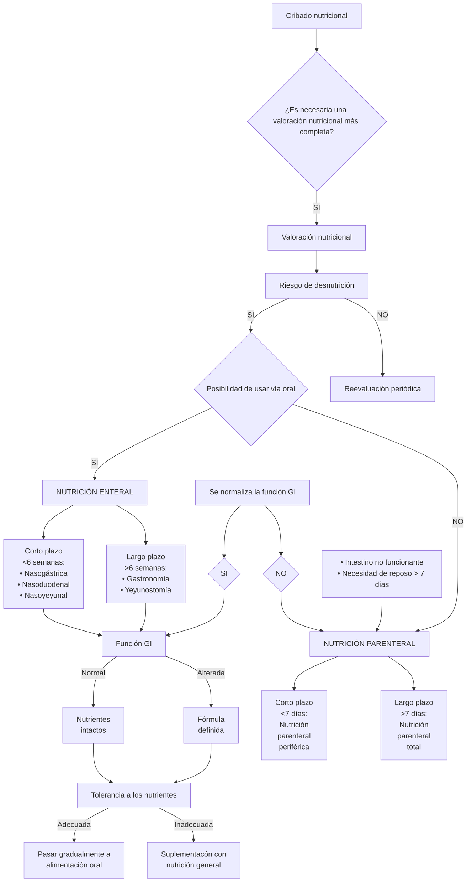
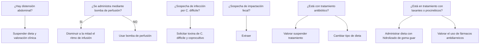
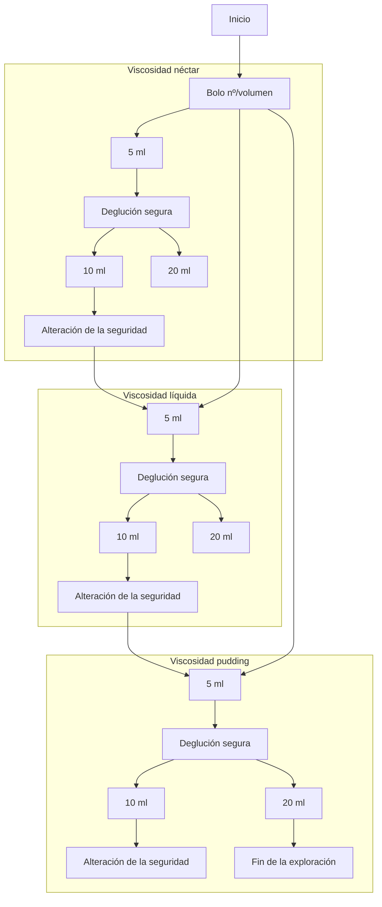

# Manual de Nutrición Artificial del Hospital La Fe

[Image of the hospital building with a modern glass and metal canopy entrance]

Comisión de Nutrición Artificial, Dietética y Dietoterapia
Hospital Universitari i Politècnic La Fe
Coordinador: J.F. Merino Torres

| GENERALITAT VALENCIANA | La Fe Hospital Universitari i Politècnic |
|-------------------------|------------------------------------------|
| CONSELLERIA DE SANITAT  |                                          |
---
# Manual de Nutrición Artificial del Hospital La Fe

Comisión de Nutrición Artificial, Dietética y Dietoterapia

Hospital Universitari i Politècnic La Fe

Coordinador: J F Merino Torres
---
© Hospital Universitari i Politècnic La Fe

© de los textos: los autores

ISBN: 978-84-942244-2-3
D.L: V 1137 - 2015

Edita: NovaBernia S.L.U - www.disearte.net - www.novabernia.es
Diseño, maquetación e impresión: Diseñarte
---
# PRÓLOGO

A lo largo del año 2.010 se inicia el traslado del Hospital Universitario y Politécnico La Fe a su ubicación en la Avenida Fernando Abril Martorell. Esto coincide con un recambio generacional en muchos de los Servicios y Unidades del centro hospitalario, este es el caso de la Unidad de Nutrición que pasa a integrarse en el Servicio de Endocrinología. Una de las primeras tareas que asume el responsable del Servicio de Endocrinología y Nutrición es dinamizar la Comisión de Nutrición Artificial, Dietética y Dietoterapia, como una de las Comisiones Clínico-Técnicas del Departamento de Salud Valencia La Fe.

La Comisión de Nutrición Artificial, Dietética y Dietoterapia está integrada por los distintos profesionales que participan en la atención nutricional del paciente tanto en régimen de hospitalización como ambulatorio. En la misma se integra personal médico, farmacéutico, nutricionista y de enfermería. La misma tiene distintas funciones, entre las que se deben destacar la asesoría científico-técnica al órgano directivo del Departamento de Salud y la formación y docencia al personal sanitario, sea este del Departamento o no.

En estos últimos años, las acciones emprendidas por la Comisión de Nutrición Artificial, Dietética y Dietoterapia han tenido una alta aceptación entre los profesionales del Departamento. A lo largo de este período, hemos asistido a una progresiva concienciación de todos los profesionales sanitarios de este centro hospitalario, acerca de la importancia que tiene el normalizar la práctica clínica para el adecuado abordaje nutricional. Este logro ha sido producto del papel proactivo que los profesionales responsables de la Nutrición han adoptado en el quehacer diario, ofreciendo el conocimiento científico y la colaboración al resto de servicios con el fin de introducir las mejores prácticas en el manejo del paciente desnutrido o en riesgo de desnutrición. Diversas han sido las iniciativas de cooperación adoptadas y entre ellas, cabría destacar: la elaboración de los Protocolos de Nutrición Enteral, la actualización continua del Vademecum de productos de Nutrición Enteral y Parenteral, la elaboración del protocolo de diagnóstico y seguimiento nutricional de la disfagia,... Prueba del trabajo realizado en esta corta trayectoria es el reconocimiento de la Sección de Nutrición del Servicio de Endocrinología y Nutrición, en sus dos últimas Ediciones, con el Premio Best in Class a la mejor Unidad de Nutrición.

Pero, como se comentaba con anterioridad, otra de las tareas que se puso como objetivo la Comisión de Nutrición Artificial, Dietética y Dietoterapia fue la de iniciar un programa de cursos y talleres que repetidos con carácter anual permitan ir aumentando, más si cabe, la formación y sensibilización sobre los aspectos nutricionales del paciente atendido en nuestro departamento. En este marco se hace imprescindible la elaboración de un manual que, adaptado a nuestro medio, realice un repaso exhaustivo pero de fácil lectura y aplicación, de los distintos aspectos de la Nutrición Clínica y Dietoterapia.
---
Por todo lo anteriormente expuesto, resulta fácil comprender que constituya para mí un privilegio la presentación del MANUAL DE NUTRICIÓN ARTIFICIAL DEL HOSPITAL LA FE, en el que han participado diversos profesionales del Departamento De Salud Valencia La Fe, integrantes en su mayoría de la Comisión de Nutrición Artificial, Dietética y Dietoterapia del Departamento, y a cuyo frente, el Dr. J.F. Merino ha invertido todo su esfuerzo con el fin de lograr que este manual se convierta en herramienta imprescindible para la práctica clínica diaria. El análisis detallado de su índice permite vislumbrar la preocupación de los autores por abordar todos aquellos aspectos de la nutrición con relevancia en la enfermedad, tanto de la edad adulta como de la edad pediátrica.

No me cabe la menor duda que este libro se convertirá, como así ha ocurrido con las iniciativas previas impulsadas desde este servicio, en herramienta imprescindible para el resto de profesionales sanitarios de éste y otros hospitales. La fuerte demanda que, estoy seguro, tendrá entre los médicos especialistas y en formación, constituirá un fiel reflejo del interés demostrado por la publicación. Será no obstante a posteriori, cuando los médicos que han participado en este proyecto comiencen a descubrir una mejoría en el manejo de estos pacientes por parte de otros profesionales, cuando comiencen a sentir que el esfuerzo realizado ha valido la pena.

Dr. Melchor Hoyos García  
Gerente

Departamento de Salud Valencia La Fe
---
# AUTORES

| Nombre | Cargo |
|--------|-------|
| JUAN FRANCISCO MERINO TORRES | Jefe Servicio Endocrinología y Nutrición. |
| KATHERINE GARCÍA MALPARTIDA | Facultativo Especialista Endocrinología y Nutrición. |
| MARÍA ARGENTE PLA | Facultativo Especialista Endocrinología y Nutrición. |
| MATILDE RUBIO ALMANZA | Facultativo Especialista Endocrinología y Nutrición. |
| MIGUEL PÉREZ GANDÍA | Diplomado en Enfermería Endocrinología y Nutrición |
| SILVIA MARTIN SANCHIS | Diplomada en Nutrición Clínica y Dietética. Endocrinología y Nutrición. |
| BEATRIZ LEÓN DE ZAYAS | Facultativo Especialista Endocrinología y Nutrición |
| AMPARO VAZQUEZ POLO | Facultativo Especialista Farmacia Hospitalaria |
| EDUARDO LÓPEZ BRIZ | Jefe Sección Farmacia Hospitalaria |
| PATRICIA MARRERO ALVAREZ | Facultativo Especialista Farmacia Hospitalaria |
| BEGOÑA BALERDI PEREZ | Facultativo Especialista Medicina Intensiva |
| AMPARO NAVARRO EDUARDO | Facultativo Especialista Medicina Intensiva |
| ANGEL SEGURA HUERTA | Facultativo Especialista Oncología Médica |
| FERNANDO MINGOL NAVARRO | Facultativo Especialista Cirugía General |
| MARIA SAURI ORTIZ | Facultativo Especialista Cirugía General |
| PILAR JUSTO PAVIA | Facultativo Especialista Anestesiología y Reanimación |
| MARÍA DOLORES HIGON BALLESTER | Facultativo Especialista Aparato Digestivo |
| JAVIER CABALLERO DAROQUI. | Facultativo Especialista Oncología Médica |
| SILVIA FORCANO SANJUAN | Facultativo Especialista Geriatría y Gerontología |
| SONIA LAHUERTA CERVERA | Facultativo Especialista Pediatría |
| ISIDRO VITORIA MIÑANA | Facultativo Especialista Pediatría. Unidad de Nutrición y Metabolopatías |
| JAIME DALMAU SERRA | Jefe Sección Pediatría. Unidad de Nutrición y Metabolopatías |
| MARIA GORMAZ MORENO | Facultativo Especialista Pediatría. Servicio de Neonatología |
| CARMEN RIBES KONINCKX | Jefe Sección Pediatría. Unidad de Aparato Digestivo |
| CAROLINA FUENTES SOCORRO | Facultativo Especialista Pediatría. Unidad de Oncología Pediátrica |
| RAMON SANCHIS RAMADA | Facultativo Especialista Pediatría. Unidad de Cuidados Intensivos Pediátricos |
| CARLOS GUTIERREZ SAN ROMAN | Jefe Sección Pediatría. Servicio de Cirugía General |
---
"La medicina es una ciencia en evolución sometida a continuos avances, lo que ocasiona cambios en los métodos diagnósticos y en las pautas terapéuticas, tanto en el aporte de nutrientes como en las dosis de fármacos. Además es muy difícil evitar la existencia de errores en el proceso de redacción a pesar de las revisiones realizadas. La información recogida en este manual es genérica y ha sido planteada para apoyar al lector, por lo que es recomendable que siempre compruebe cualquier aspecto que pueda resultar dudoso antes de utilizar la información aquí indicada".
---
# MANUAL DE NUTRICIÓN ARTIFICIAL

## MÓDULO I. GENERALIDADES                                              11

- Capítulo 1. Introducción                                               13
- Capítulo 2. Valoración Nutricional                                     25
- Capítulo 3. Cálculo de requerimientos nutricionales                    33
- Capítulo 4. Indicaciones de la nutrición artificial                    39

## MÓDULO II. NUTRICIÓN ENTERAL                                         43

- Capítulo 5. Nutrición enteral                                          45
- Capítulo 6. Vías de Administración. Preparados. Administración         47
- Capítulo 7. Seguimiento y Complicaciones                               53

## MÓDULO III. NUTRICIÓN PARENTERAL                                     63

- Capítulo 8. Nutrición parenteral                                       65
- Capítulo 9. Vías de administración de la nutrición parenteral          87
- Capítulo 10. Complicaciones de la nutrición parenteral                 93

## MÓDULO IV. NUTRICIÓN ARTIFICIAL EN SITUACIONES ESPECIALES            97

- Capítulo 11. Paciente quirúrgico                                       99
- Capítulo 12. Politraumatismos y TCE                                    109
- Capítulo 13. Sepsis                                                    113
- Capítulo 14. Insuficiencia respiratoria                                121
- Capítulo 15. Insuficiencia renal                                       127
- Capítulo 16. Pancreatitis aguda                                        133
- Capítulo 17. Hepatopatías                                              139
- Capítulo 18. Síndrome de intestino corto                               147
- Capítulo 19. Enfermedad inflamatoria intestinal                        153
- Capítulo 20. Cáncer                                                    157
- Capítulo 21. Quemados                                                  165
- Capítulo 22. Trasplante de células hematopoyéticas                     169
- Capítulo 23. Fibrosis quística                                         177
- Capítulo 24. Diabetes                                                  183
- Capítulo 25. Geriatría                                                 191
- Capítulo 26. Cuidados paliativos                                       199

## MÓDULO V. NUTRICIÓN ARTIFICIAL EN PEDIATRÍA                          207

- Capítulo 27. Nutrición enteral en Pediatría                            209
- Capítulo 28. Protocolo de nutrición parenteral en Pediatría            223
---
• Capítulo 29. Nutrición enteral del recién nacido a término y prematuro. 239
  Lactancia materna
• Capítulo 30. Nutrición parenteral neonatal 261

## APÉNDICES 279

• Anexo I: Complicaciones vías centrales en pediatría 281
• Anexo II: Actuación ante diarrea en Nutrición Enteral. 293
• Anexo III: Protocolo Estudio y Tratamiento Nutricional de la Disfagia. 295
• Anexo IV:Recomendaciones generales para la administración de medicamentos 311
  por sonda enteral.
• Anexo V: Vademecum NE Hospital La Fe. 313
• Anexo VI: Vademecum NP Hospital La Fe. 319

[A large logo is displayed at the bottom of the image, which reads "La Fe Hospital Universitari i Politècnic" in a stylized blue font.]
---
# ABREVIATURAS

Ordenadas alfabéticamente:

| Abreviatura | Significado |
|-------------|-------------|
| AA | Aminoácido |
| AACR | Aminoácido de Cadena Ramificada |
| ATB | Antibiótico |
| BIA | Impedancia bioeléctrica |
| BN | Balance Nitrogenado |
| CB | Circunferencia Braquial |
| cm | centímetro |
| CDR | Cantidad Diaria Recomendada |
| CH | Cirrosis Hepática |
| CHC | Carcinoma Hepatocelular |
| CU | Colitis Ulcerosa |
| CVC | Catéter venoso central |
| DE | Dextrosa equivalente |
| DEXA | Absorciometría dual rayos X |
| DD | Dímero D |
| DHA | Endocosahexaenoico |
| DMO | Densitometría Ósea |
| dL | Decilitros |
| EC | Enfermedad de Crohn |
| EII | Enfermedad Inflamatoria Intestinal |
| EL | Emulsión lipídica |
| EPA | Eicosapentanoico |
| ESPEN | European Society of Parenteral and Enteral Nutrition |
| FEV1 | Volumen Espiratorio Máximo en el primer Segundo |
| FQ | Fibrosis Quística |
| FRA | Fracaso Renal Agudo |
| GCC | gastroclisis continua |
| GCI | gastroclisis inermitente |
| GEB | Gasto Energético Basal |
| gr | gramos |
| HBPM | Heparina de bajo peso molecular |
| HC | Hidratos de Carbono |
| HMG | Hemograma |
| ICA | Índice Creatinina-Altura |
| IH | Insuficiencia hepática |
| IMC | Índice de Masa Corporal |
| IQ | Índice de Quick |
| IR | Insuficiencia renal |
| Kcal | Kilocaloría |
| kg | kilogramo |
| LCT | Triglicéridos de cadena larga |
| LM | lactancia materna |
| LMD | lactancia materna donada |
| MCT | Triglicéridos de Cadena Media |
| mcg | microgramo |
| mEq | milequivalente |
| mg | miligramo |
| mmol | milimol |
| MNA | Mini Nutritional Assessment |
| N | Nitrógeno |
| NE | Nutrición Enteral |
| NEDC | Nutrición enteral a débito continuo |
| NP | Nutrición Parenteral |
| NPC | Nutrición parenteral vía central |
---
| Abbreviation | Full Term (Spanish) | English Translation (if applicable) |
|--------------|---------------------|----------------------------------|
| NPCo | Nutrición parenteral complementaria | Complementary parenteral nutrition |
| NPD | Nutrición Parenteral Domiciliaria | Home Parenteral Nutrition |
| NPH | Nutrición parenteral hipocalórica | Hypocaloric parenteral nutrition |
| NPP | Nutrición Parenteral Periférica | Peripheral Parenteral Nutrition |
| NPT | Nutrición Parenteral Total | Total Parenteral Nutrition |
| NRS-2002 | Nutritional Risk Screening 2002 | Nutritional Risk Screening 2002 |
| PA | Pancreatitis Aguda | Acute Pancreatitis |
| PAL | Pancreatitis Aguda Leve | Mild Acute Pancreatitis |
| PAG | Pancreatitis Aguda Grave | Severe Acute Pancreatitis |
| PEG | Gastrostomía Endoscópica Percutánea | Percutaneous Endoscopic Gastrostomy |
| PICC | Catéter central de inserción periférica | Peripherally Inserted Central Catheter |
| PMB | Perímetro Muscular del Brazo | Arm Muscle Circumference |
| PT | Pliegue Tricipital | Triceps Skinfold |
| RN | recién nacido | newborn |
| RNT | recién nacido a término | full-term newborn |
| RNPT | recién nacido pretérmino | preterm newborn |
| SEMICyUC | Sociedad Española de Medicina Intensiva, Crítica y Unidades Coronarias | Spanish Society of Intensive Care Medicine and Coronary Units |
| SENPE | Sociedad Española de Nutrición Parenteral y Enteral | Spanish Society of Parenteral and Enteral Nutrition |
| SIC | Síndrome de Intestino Corto | Short Bowel Syndrome |
| SNG | Sonda Nasogástrica | Nasogastric Tube |
| SNY | Sonda Nasoyeyunal | Nasojejunal Tube |
| SO | Suplementos Orales | Oral Supplements |
| THO | Trasplante Hepático | Liver Transplant |
| TNF | Factor de Necrosis Tumoral | Tumor Necrosis Factor |
| TT | Tiempo de trombina | Thrombin Time |
| UCI | Unidad de Cuidados Intensivos | Intensive Care Unit |
| UI | Unidades Internacionales | International Units |
| VGS | Valoración Global Subjetiva | Subjective Global Assessment |
| VHA | Virus de la Hepatitis A | Hepatitis A Virus |
| VHB | Virus de la Hepatitis B | Hepatitis B Virus |
| VHC | Virus de la Hepatitis C | Hepatitis C Virus |
| VHD | Virus de la Hepatitis D | Hepatitis D Virus |
| VHE | Virus de la Hepatitis E | Hepatitis E Virus |
| VIH | Virus de la Inmunodeficiencia Humana | Human Immunodeficiency Virus |
---
# MÓDULO I

## Generalidades

The image shows the cover page of a document or presentation titled "MÓDULO I: Generalidades" (Module I: Generalities). The background features a modern, bright interior of what appears to be a hospital or medical facility. The space has a clean, white aesthetic with glass partitions, staircases, and an open layout. Several people can be seen in the background, suggesting it's an active, functioning environment.

At the bottom of the image, there's a logo for "La Fe Hospital Universitari i Politècnic", indicating this document is associated with a university hospital.

The overall design suggests this is likely the first module of a larger educational or informational series related to healthcare or hospital operations.
---
The image appears to be a blank white page. There is no visible content, text, diagrams, or any other information present in this image. Therefore, I cannot provide any markdown translation or description of content, as there is nothing to transcribe or describe.
---
# MÓDULO 1: GENERALIDADES

## CAPÍTULO 1. INTRODUCCIÓN.

M. Argente Pla, K.García Malpartida, B. Leon de Zayas, J.F. Merino Torres

Aproximadamente el 40% de los pacientes ingresados en un hospital puede presentar desnutrición. La desnutrición va a condicionar el pronóstico del paciente, aumentando la morbilidad y la estancia hospitalaria. Por ello, cuando un paciente ingresa en un hospital se le deberá realizar de forma rutinaria un "cribado" nutricional en las primeras 24-48 horas y se deben potenciar prácticas clínicas que faciliten el adecuado abordaje nutricional.

En este sentido, en el medio hospitalario, no es excepcional detectar errores que son evitables y favorecen la malnutrición:

- Falta de registro de estatura y peso al ingreso
- Falta de seguimiento del peso durante el ingreso
- Situaciones de ayuno o semi-ayuno prolongado
- Sueros salinos o glucosados como único aporte nutricional
- Supresión de tomas de alimentos para realización de pruebas diagnósticas
- Falta de control de la ingesta del paciente
- Comidas mal programadas, presentadas y distribuidas
- Desconocimiento para establecer el tipo y la vía de nutrición
- Retraso en el inicio del adecuado soporte nutricional
- Aumento del gasto calórico secundario al tratamiento médico-quirúrgico de la enfermedad de base
- Medicación que interfiere en el proceso nutricional
- Organización Hospitalaria deficiente en el área nutricional

La desnutrición en el medio hospitalario se puede definir como aquel estado nutritivo en el que una deficiencia de energía, proteínas y otros nutrientes causa efectos adversos mesurables en la composición y función de los tejidos /organismo y en el resultado clínico. La desnutrición se clasifica según el déficit principal sea energético, proteico o ambos (tabla 1) y tras la adecuada valoración clínica y analítica del paciente la clasificaremos por su mayor o menor gravedad (tabla 2)

El objetivo de un estudio de despistaje y cribado de la desnutrición es identificar rápidamente a los sujetos con riesgo nutricional y determinar si es aconsejable una valoración más detallada (tabla 3). Se realiza a través de una serie de cuestionarios estructurados cuya realización requiere poco tiempo y que, por su sencillez, puede ser realizado por el personal de enfermería o médicos no especializados. La Sociedad Europea para la Nutrición Enteral y Parenteral (ESPEN) recomienda utilizar el cuestionario MNA para ancianos y el NRS-2002 para adultos en el medio hospitalario (Anexos 1 y 2). No hay consenso en cuál es el más adecuado en niños. Por su parte, la Sociedad Americana para la Nutrición Enteral y Parenteral (ASPEN) recomienda la Valoración Subjetiva Global (VSG, anexo 3), si bien, se debe

13
---
considerar más un test de valoración nutricional que de cribado. Todo paciente en el que se detecte riesgo de desnutrición, debería ser sometido a un proceso de valoración nutricional.

Por otra parte, la dieta recomendada a cualquier paciente hospitalizado persigue mantener un adecuado estado de nutrición. Durante la estancia hospitalaria el paciente puede seguir dieta oral, con o sin suplementos dietéticos, o puede precisar soporte nutricional enteral o parenteral. Antes de decidir la dieta más adecuada (capítulo siguiente) es recomendable seguir varios pasos para un correcto abordaje nutricional (tabla 4) y recordar que el tiempo que una persona puede seguir una ingesta inadecuada de nutrientes sin que aparezcan deficiencias nutricionales depende de:

- Edad: un adulto con buen estado nutricional puede tolerar hasta 14 días sin aporte de nutrientes; si tiene más de 60 años la tolerancia baja a 10 días y, si tiene más de 70 años, sólo es de 7 días.
- Estado previo de salud: si hay malnutrición previa, los límites descritos anteriormente disminuyen 5-7 días.
- Gravedad de la patología que motiva su ingreso o consulta.

Otro aspecto a valorar será la existencia o no de disfagia. La adecuada valoración permitirá el adecuado abordaje nutricional (ver anexo)

El presente manual surge desde la Comisión de Nutrición Hospitalaria del Hospital Universitario y Politécnico La Fe con el firme deseo de mejorar el estado nutricional de los pacientes ingresados en nuestro centro y de aquellos controlados ambulatoriamente. Es por ello que en su momento consideramos de interés abordar de manera exhaustiva y, en la medida de lo posible, resumida el abordaje nutricional de los pacientes hospitalizados y ambulatorios con una actualización de una disciplina como la Nutrición Clínica, en continuo cambio y evolución.

Tabla 1: Tipos de desnutrición.

| TIPO* | CAUSA | ANTROPO-METRÍA | PROTEÍNAS SÉRICAS | SIGNO CLÍNICO |
|-------|-------|----------------|-------------------|---------------|
| MARASMO | Ingesta calórica insuficiente | Disminuida | Normales | Sin edema |
| KWASHIORKOR | Dieta deficiente en proteínas | Tiende a mantenerse | Disminuidas | Edema |
| MIXTA | Carencia global: calórica y proteica | Disminuida | Disminuidas | Edema |

\* Estado carencial: Déficit aislado de alguna vitamina, mineral u oligoelemento.
---
Tabla 2: Clasificación de la desnutrición según criterios clínico-analíticos.

| | Desnutrición leve | Desnutrición mo-derada | Desnutrición grave |
|---|---|---|---|
| IMC | 17-18,4 | 16-16,9 | <16 |
| Porcentaje de peso ideal | 85-94,5% | 75-84,9% | <75% |
| Porcentaje de pérdida de peso | | | |
| 1 mes | <5% | 5% | >5% |
| 2 meses | 5% | 5-10% | >10% |
| 3 meses | <10% | 10-15% | >15% |
| Pliegues | <p15 | <p10 | <p5 |
| Albúmina (g/dL) | 2,8-3,5 | 2,1-2,7 | <2,1 |
| Transferrina (mg/dL) | 150-200 | 100-149 | <100 |
| Prealbúmina (mg/dL) | 15-18 | 10-14 | <10 |
| Proteína ligadora de retinol (mg/dL) | 2-2,6 | 1,5-1,9 | <1,5 |
| Linfocitos (células/mm³) | 1200-2000 | 800-1200 | <800 |
| Colesterol (mg/dL) | 140-179 | 100-139 | <100 |

Tabla 3: Métodos de cribado nutricional en función del medio donde se realicen.

| En la Comunidad | MUST: Malnutrition Screening Tool |
|---|---|
| En el Hospital | NRS-2002: Nutritional Risk Screening |
| | VSG: Valoración Subjetiva Global |
| En Ancianos | MNA: Mini Nutritional Assessment |
| | MNA-SF: Mini Nutritional Assessment Short Form |
---
| Tabla 4. Pasos en el abordaje nutricional del paciente ingresado |
|------------------------------------------------------------------|
| Cribado nutricional |
| Valoración nutricional |
| Cálculos de los requerimientos de macronutrientes y micronutrientes |
| Cálculo de los requerimientos hidroelectrolíticos |
| Selección y diseño de la pauta nutricional: dieta oral, con o sin suplementos orales, nutrición enteral o nutrición parenteral |
| Monitorización de la pauta nutricional |
| Reevaluación periódica de la valoración nutricional |
---
# Anexo 1. Nutritional Risk Screening 2002

## Nutritional Risk Screening 2002 (NRS 2002)

### Cribado Inicial

| Pregunta | Sí | No |
|----------|----|----|
| 1. ¿Índice de Masa corporal < 20 kg/m²? | | |
| 2. ¿Pérdida de peso en los últimos 3 meses? | | |
| 3. ¿Reducción de la ingesta en la última semana? | | |
| 4. ¿Enfermedad grave? | | |

Si la respuesta a alguna de estas preguntas es "Sí", se debe realizar el siguiente paso del cribado.

Si todas las respuestas son negativas, reevaluar semanalmente. Si el paciente por ejemplo, tiene programada una intervención mayor, establecer un plan de tratamiento nutricional preventivo, para evitar el estado de riesgo asociado.

### Cribado Definitivo

| Alteración del estado nutricional | Severidad de la enfermedad (aumento en los requerimientos por el estrés metabólico) |
|-----------------------------------|--------------------------------------------------------------------------------------|
| **Ausente 0 puntos** <br> Estado nutricional normal | **Ausente 0 puntos** <br> Requerimientos normales |
| **Leve 1 punto** <br> Pérdida de peso > 5% en 3 meses, o ingesta < 50-75% de las necesidades en la semana precedente. | **Leve 1 punto** <br> Fractura de cadera. Pacientes crónicos con complicaciones agudas: diabetes, hemodiálisis, cirrosis, enfermedad pulmonar obstructiva crónica, oncología. |
| **Moderado 2 puntos** <br> Pérdida de peso >5% en 2 meses o IMC de 18,5-20,5 kg/ m² más alteración del estado general o ingesta del 25-50% de las necesidades en la semana precedente. | **Moderado 2 puntos** <br> Cirugía mayor abdominal. Accidente vascular cerebral. Infecciones graves, neoplasias hematológicas. |
| **Severo 3 puntos** <br> Pérdida de peso >5% en 1 mes (>15% en 3 meses) o IMC < 18,5 kg/ m² más alteración del estado general o ingesta del 0-25 % de las necesidades en la semana precedente. | **Severo 3 puntos** <br> Traumatismo craneoencefálico. Trasplante de médula ósea. Paciente de unidad de cuidados intensivos (APACHE > 10) |

Puntuación: _______ + _______ = Puntuación total = _______

Edad: Añadir un punto si la edad es > 70 años

Puntuación ajustada por edad = _______

Si puntuación ≥ 3, el paciente está en situación de desnutrición o en riesgo de presentarla: iniciar un plan de tratamiento nutricional

Si puntuación < 3, reevaluar semanalmente. Si el paciente por ejemplo, tiene programada una intervención mayor, establecer un plan de tratamiento nutricional preventivo, para evitar el estado de riesgo asociado.
---
Anexo 2. Mini Nutritional Assesment (MNA)

| Mini Nutritional Assesment (MNA®) |
|-----------------------------------|

| Nombre | Apellidos | Sexo | Fecha |
|--------|-----------|------|-------|
| Edad | Peso (kg) | Talla (m) | Talón-Rodilla |

Responda a la primera parte del cuestionario indicando la puntuación
adecuada para cada pregunta.
Sume los puntos correspondientes al cribado y, si la suma es igual o inferior a 11,
complete el cuestionario para obtener una valoración precisa del estado nutricional.

| CRIBADO | J. ¿Cuántas comidas completas toma al día? (equivalentes a dos platos y postre) |
|---------|-------------------------------------------------------------------------------|
|         | 0= 1 comida |
|         | 1= 2 comidas |
|         | 2= 3 comidas |
| A. ¿Ha perdido el apetito? ¿Ha comido menos por falta de apetito, problemas digestivo o dificultades en la masticación o deglución en los últimos 3 meses? | K. ¿Consume el paciente productos lácteos al menos una vez al día? |
| 0= anorexia grave | huevos o legumbres una o dos veces al día? |
| 1= anorexia moderada | ... carne, pescado o aves diariamente? |
| 2= sin anorexia | 0= si responde "sí" a 1 pregunta, o "no" a todas. |
|  | 0,5= si responde afirmativamente a 2 preguntas |
|  | 1= si responde afirmativamente a las 3 preguntas. |
| B. Pérdida reciente de peso (en los últimos 3 meses) | L. ¿Consume frutas o verduras al menos dos veces al día? |
| 0= pérdida de peso > 3 kg |  |
| 1= no lo sabe | 0= sí |
| 2= pérdida de peso entre 1 y 3 kg | 1= no |
| 3= no ha habido pérdida de peso |  |
| C. Movilidad | M. ¿Cuántos vasos de agua u otros líquidos toma al día? (agua, zumo, café, té, leche, vino, cerveza ) |
| 0= de la cama al sillón | 0= menos de 3 vasos |
| 1= autonomía en el interior | 0,5= de 3 a 5 vasos |
| 2 = sale del domicilio | 1= más de 5 vasos |

18
---
| D. ¿Ha padecido alguna enfermedad aguda o alguna situación de estrés psicológico en los últimos 3 meses? | N. Forma de alimentarse |
|---|---|
| 0= sí | 0= necesita ayuda |
| 1= no | 1= se alimenta solo pero con dificultad |
| | 2= se alimenta solo sin dificultad |

| E. Problemas neuropsicológicos | O. ¿Se considera bien nutrido? (problemas nutricionales) |
|---|---|
| 0= demencia o depresión grave | 0= malnutrición grave |
| 1= demencia o depresión moderada | 1= no lo sabe o malnutrición moderada |
| 2= sin problemas neuropsicológicos | 2= sin problemas de nutrición |

| F. Índice de masa corporal (IMC = peso/ talla², en kg/m²) | P. En comparación con las personas de su edad, ¿cómo encuentra el paciente su estado de salud? |
|---|---|
| 0= IMC < 19 | 0= peor |
| 1= 19 ≤ IMC < 21 | 0,5= no lo sabe |
| 2= 21 ≤ IMC < 23 | 1= igual |
| 3= IMC ≥ 23 | 2= mejor |

| Evaluación del cribado (subtotal, máximo 14 puntos) | Q. Circunferencia braquial (CB) en cm |
|---|---|
| ≥ 12 puntos: normal ( no es necesario continuar la evaluación) | 0= CB < 21 |
| < 11 puntos: posible malnutrición (continuar la evaluación) | 0,5= 21≤CB≤22 |
| | 1= CB > 22 |

| EVALUACIÓN | R. Circunferencia de la pantorrilla (CP) en cm |
|---|---|
| | 0= CP < 31 |
| | 1= CP ≥ 31 |

| G. ¿El paciente vive en su domicilio? | |
|---|---|
| 0= sí | Evaluación (máximo 16 puntos). |
| 1= no | |

| H ¿Toma más de tres medicamentos al día? | Cribado (máximo 14 puntos) |
|---|---|
| 0= sí | Evaluación global (máximo 30 puntos) |
| 1= no | |

| I. ¿Úlceras o lesiones cutáneas? | EVALUACIÓN DEL ESTADO NUTRICIONAL |
|---|---|
| 0= sí | De 17 a 23,5 puntos: Riesgo de malnutrición |
| 1= no | Menos de 17 puntos: Malnutrición |
---
Anexo 3: Valoración Global Subjetiva Global (VSG)

## A. HISTORIA

1. Talla y cambios de peso:
   - Talla: ____ cm
   - Pérdida de peso en los últimos 6m:
     Peso actual: ____ kg    Peso habitual: ____ kg    Peso perdido: ____ kg

   - Cambios en las 2 últimas semanas:
     [ ] Aumento de peso    [ ] Sin cambios    [ ] Pérdida de peso

2. Cambios en la ingesta dietética (comparado con la ingesta habitual)
   - [ ] Sin cambios
   - [ ] Cambios:    Duración: ____ semanas
                     Tipos:  [ ] Ayuno
                             [ ] Líquidos hipocalóricos
                             [ ] Dieta líquida completa
                             [ ] Dieta sólida insuficiente

3. Síntomas gastrointestinales (>2 semanas de duración)
   [ ] Ninguno    [ ] Náuseas    [ ] Vómitos    [ ] Diarrea    [ ] Anorexia

4. Capacidad funcional
   - [ ] Sin disfunción (capacidad total)
   - [ ] Disfunción:    Duración: ____ semanas
                        Tipos:  [ ] Trabajo reducido
                                [ ] Ambulatorio sin trabajar
                                [ ] Encamado

5. Enfermedad y su relación con los requerimientos nutricionales
   - Diagnóstico primario (específico): ____________________
   - Requerimientos metabólicos (estrés)
     [ ] Sin estrés    [ ] Estrés bajo    [ ] Estrés moderado    [ ] Estrés alto

## B. EXAMEN FÍSICO

| | Normal (0) | Déficit ligero (1) | Déficit moderado (2) | Déficit severo (3) |
|---|---|---|---|---|
| Pérdida de grasa subcutánea (tríceps, tórax) | | | | |
| Pérdida de masa muscular (cuádriceps, deltoides) | | | | |
| Edema maleolar | | | | |
| Edema sacro | | | | |
| Ascitis | | | | |
---
## C. DIAGNÓSTICO

No se establece un método numérico para la evaluación de este test. Se valora A, B o C según la predominancia de síntomas con especial atención a las siguientes variables: pérdida de peso, cambios en la ingesta habitual, pérdida de tejido subcutáneo y pérdida de masa muscular.

| Clasificación | Descripción |
|---------------|-------------|
| A = Bien nutrido | |
| B = Sospecha de malnutrición o malnutrición moderada: | - 5-10% Pérdida de peso en las últimas semanas antes del ingreso<br>- Reducción de la ingesta habitual en las últimas semanas<br>- Pérdida de tejido subcutáneo |
| C = Malnutrición severa | - >10% severa pérdida de peso<br>- Severa pérdida de masa muscular y tejido subcutáneo<br>- Edema |
---
# VALORACIÓN SUBJETIVA GLOBAL GENERADA POR EL PACIENTE (VSG-GP)

| Peso actual | kg | DIFICULTADES PARA ALIMENTARSE |
|-------------|----|---------------------------------|
|             |    | ◯ Sí<br>◯ No                    |

| ALIMENTACIÓN RESPECTO HACE 1 MES: | Si la respuesta es SÍ, señale cuál/cuáles<br>de los siguientes problemas presenta: |
|-----------------------------------|--------------------------------------------------------------------------------|
| ◯ Como más<br>◯ Como igual<br>◯ Como menos | ◯ Falta de apetito<br>◯ Ganas de vomitar<br>◯ Vómitos<br>◯ Estreñimiento<br>◯ Diarrea<br>◯ Olores desagradables |

| Tipo de alimentos: |
|--------------------|
| ◯ Dieta normal     |

| ACTIVIDAD COTIDIANA en el último mes: |
|---------------------------------------|
| ◯ Normal<br>◯ Menor de lo habitual    |

| EXPLORACIÓN CLÍNICA: |
|--------------------|

| Enfermedades: | Pérdida de tejido adiposo: |
|---------------|---------------------------|
|               | ◯ Sí. Grado:<br>◯ No      |

| TRATAMIENTO ONCOLÓGICO: | Pérdida de masa muscular: |
|--------------------------|--------------------------|
|                          | ◯ Sí. Grado:<br>◯ No     |

| ALBÚMINA antes del tratamiento<br>oncológico: | g/dl | Edema y/ o ascitis: |
|----------------------------------------------|------|---------------------|
|                                              |      | ◯ Sí. Grado:<br>◯ No |

PREALBÚMINA tras el tratamiento

## ESTADO NUTRICIONAL

A: Buen estado nutricional

B: Malnutrición o riesgo de malnutrición

C: Malnutrición grave
---
# VALORACIÓN GLOBAL

| Dato clínico | A | B | C |
|--------------|---|---|---|
| Pérdida de peso | <5% | 5-10% | >10% |
| Alimentación | Normal | Deterioro leve-moderado | Deterioro grave |
| Impedimentos para la ingesta | No | Leves-Moderados | Graves |
| Deterioro de la actividad | No | Leve-Moderado | Grave |
| Edad | ≤ 65 | >65 | >65 |
| Úlceras por presión | No | No | Sí |
| Fiebre/Corticoides | No | Leve/Moderada | Elevada |
| Tratamiento antineoplásico | Bajo riesgo | Medio riesgo | Alto riesgo |
| Pérdida adiposa | No | Leve/Moderada | Elevada |
| Pérdida muscular | No | Leve/Moderada | Elevada |
| Edemas/Ascitis | No | Leve/Moderados | Importantes |
| Albúmina (previa al tratamiento) | >3.5 | 3-3,5 | <3 |
| Prealbúmina (tras el tratamiento) | >18 | 15-18 | <15 |
---
The image appears to be a blank white page. There is no visible content, text, diagrams, or any other information present in this image. Therefore, I cannot provide any markdown translation or description of content, as there is nothing to transcribe or describe.
---
# CAPÍTULO 2. VALORACIÓN NUTRICIONAL

M. Argente Pla, K. García Malpartida, J.F. Merino Torres

La valoración nutricional es un proceso diagnóstico más complejo que el cribado. Sirve para caracterizar el grado de malnutrición, el riesgo de complicaciones asociadas a esta, y valorar la necesidad de soporte nutricional.

## 1. VALORACIÓN NUTRICIONAL CLÍNICA. ANTROPOMETRÍA

a) Para realizar la valoración nutricional es imprescindible realizar una historia clínica completa, sin olvidar recoger todos los factores que pueden influir sobre la nutrición y reflejar la historia social y dietética del paciente (tabla 1).

b) La exploración física debe ser completa. Permite objetivar, si existen, signos de deficiencias nutricionales; aunque, por lo general, sólo aparecen en situaciones avanzadas.

c) Las variables antropométricas más utilizadas para evaluar el estado nutricional son la talla, el peso y el índice de masa corporal, y deben obtenerse en el momento del ingreso.

- La talla se mide con un estadiómetro vertical con la cabeza alineada siguiendo la línea del trago, sin calzado. Si el paciente está encamado pueden utilizarse métodos alternativos como la medición de la distancia talón-rodilla, de la longitud del antebrazo o la suma de las partes corporales.

| FÓRMULA DE CHUMLEA PARA EL CÁLCULO DE LA DISTANCIA TALÓN-RODILLA |
|-----------------------------------------------------------------------------|
| Talla hombre (cm): (2,02 x altura talón-rodilla) - (0,04 x edad) + 64,19     |
| Talla mujer (cm): (1,83 x altura talón-rodilla) - (0,24 x edad) + 84,88      |

- Peso: medido (en una báscula de precisión o en básculas especiales) o estimado mediante fórmulas matemáticas.

| FÓRMULA DE RABITO PARA LA ESTIMACIÓN DEL PESO |
|------------------------------------------------|
| Peso estimado = (0,5759 x circunferencia del brazo (cm)) |
|          + (0,5263 x circunferencia abdominal (cm)) |
|       + (1,2452 x circunferencia de la pantorrilla (cm)) |
|                   - (4,8689 x sexo) - 32,9241 |
|                                               |
|                  Sexo: Hombre = 1 y Mujer = 2 |
---

## FÓRMULA DE CHUMLEA PARA LA ESTIMACIÓN DEL PESO

| Mujeres: | (0,98 x circunferencia del brazo(cm)) |
|----------|---------------------------------------|
|          | + (1,27 x circunferencia de la pantorrilla (cm) |
|          | + (0,40 x pliegue subescapular (mm) |
|          | + (0,87 x altura talón/rodilla (cm) – 62,35 |

| Hombres: | (1,73 x circunferencia del brazo(cm)) |
|----------|---------------------------------------|
|          | + (0,98 x circunferencia de la pantorrilla (cm) |
|          | + (0,37 x pliegue subescapular (mm) |
|          | + (1,16 x altura talón/rodilla (cm) – 81,69 |

Además del peso que presenta el paciente en el momento de la valoración nutricional, es interesante calcular el porcentaje de pérdida de peso y el porcentaje de peso ideal.

| Porcentaje de pérdida de peso = [(Peso habitual – Peso actual)/(Peso habitual)] x 100 |
|--------------------------------------------------------------------------------------|
| Porcentaje de peso ideal = (Peso actual/Peso ideal) x 100 |

- El índice de masa corporal (IMC) pone en relación el peso expresado en kilogramos con la altura expresada en metros al cuadrado (kg/m²). Es el criterio más aceptado para clasificar la obesidad (tabla 2), sin embargo no siempre el IMC nos refleja de forma adecuada la adiposidad (ej: exceso de masa muscular, alteraciones de la hidratación, ...). A partir de los 24 años, el valor normal del IMC aumenta 1 kg/m² cada 10 años.

d) Pliegue tricipital (PT): sirve para estimar la masa grasa. Se mide en el brazo no dominante, que debe estar relajado y estirado a lo largo del costado. Se mide la distancia entre el acromion y el olecranon y se marca el punto medio entre ambos. Se realiza un pellizco del tejido adiposo (hay que evitar coger músculo) un centímetro por encima del punto marcado, y se realiza la medición tres veces con un lipocalibre. El resultado es la media de las tres mediciones. (Anexo 1).

e) Circunferencia braquial (CB): estima la masa magra. Se utiliza una cinta métrica flexible, que se coloca a la altura del punto donde se estimó el pliegue tricipital. (Anexo 1).

f) Perímetro muscular del brazo (PMB): estima la masa magra. Se calcula mediante la fórmula PMB (cm) = CB (cm) – (0,314 x PT (mm)). (Anexo 1).

g) La medición del perímetro de la cintura, a nivel medio entre los márgenes

---
costales inferiores y las crestas iliacas al final de una espiración no forzada, puede ayudar a diagnosticar diabéticos con riesgo vascular elevado. Se considera obesidad abdominal cuando el perímetro abdominal es mayor de 102 cm en el hombre y 88 cm en la mujer.

h) La composición corporal se puede determinar con varios métodos pero el más accesible para la práctica clínica es la impedancia bioeléctrica.

La valoración nutricional se tendría que repetir cada 5-7 días cuando se detecta presencia o riesgo de malnutrición, y siempre que existan cambios clínicos y nutricionales. La medición del PT, la CB y el PMB sólo ha de repetirse en caso de ingresos prolongados, ya que suele ser necesario que transcurran al menos 3 o 4 semanas para poder observar cambios clínicamente significativos en estas mediciones.

## 2. MARCADORES NUTRICIONALES

Hay varios marcadores nutricionales que se pueden emplear para completar la valoración nutricional. Éstos ayudan además a monitorizar y ajustar el tratamiento.

a) Se recomienda determinar los niveles plasmáticos de glucosa, lípidos y electrolitos, así como la función hepática y renal. Tanto la hiperglucemia como las concentraciones séricas bajas de colesterol son factores de mal pronóstico. Si se sospechan deficiencias nutricionales también se deben determinar niveles plasmáticos de vitaminas y minerales.

b) Los niveles de proteínas circulantes de síntesis hepática (albúmina, transferrina, prealbúmina y proteína ligadora de retinol) se han determinado tradicionalmente como indicadores del estado nutricional del paciente (ver apartado anterior tabla 2). Si bien tienen cierto valor pronóstico, hay que tener en cuenta sus limitaciones a la hora de analizarlas. Independientemente del estado nutricional sus niveles estarán disminuidos en caso de hepatopatías, síndrome nefrótico, o en quemaduras extensas. También hay que tener en cuenta que son reactantes negativos de fase aguda, por lo que en situaciones de estrés agudo, los niveles también estarán disminuidos; y en situaciones de recuperación de una enfermedad grave (como una sepsis), un aumento de sus niveles, no tiene porqué reflejar una mejoría de la situación nutricional. A la hora de interpretar las variaciones de los niveles de estas proteínas a lo largo del ingreso, es conveniente conocer su vida media (tabla 3).

c) El índice creatinina-altura (ICA) es un indicador de la masa muscular. Es la relación entre la excreción de creatinina de una persona enferma, con la que tendría si la persona estuviera sana, según su sexo y altura (creatinina ideal).

```
ICA = [(Creat en orina de 24 h)/(Creat ideal en 24 h)] x 100
```
---
Existen tablas para la creatinina ideal según sexo y altura, pero para simplificar el cálculo la creatinina ideal en 24 horas se puede estimar también en 23 mg/kg de peso ideal en hombres, y en 18 mg/kg de peso ideal en mujeres. Un índice del 60-80% indica depleción moderada de la masa muscular, y un valor por debajo del 60% indica depleción grave.

d) El balance nitrogenado (BN) refleja el metabolismo proteico. Consiste en la diferencia entre el nitrógeno ingerido, en forma de proteínas, y el excretado. Su aplicación en la práctica clínica habitual está limitada por varios motivos: el cálculo del nitrógeno ingerido es difícil de cuantificar a no ser que el paciente reciba exclusivamente nutrición enteral o parenteral, no siempre se puede recoger una muestra adecuada de orina de 24 horas, y el BN será impreciso cuando exista alteración de la función renal.

| CÁLCULO DE BALANCE NITROGENADO (BN) |
|---------------------------------------|
| BN = Nitrógeno aportado – Nitrógeno eliminado |
| Nitrógeno aportado = proteínas ingeridas (g) / 6,25 |
| Nitrógeno eliminado = urea orina (g/L) x 0,46 x volumen orina (L/24 h) + 4 g |
| Si el BN es menor de 2 g/d se considera que el aporte proteico es insuficiente. |

La malnutrición da lugar a una disminución de la respuesta inmune y, por ello, se han utilizado como marcadores nutricionales pruebas de función inmunitaria, como el estudio de hipersensibilidad retardada. En la práctica clínica habitual se utiliza el recuento linfocitario. Algunas enfermedades, como las enfermedades hematológicas y las hepatopatías, así como algunos fármacos, pueden influir en el recuento de linfocitos.

Tabla 1. Anamnesis en la valoración nutricional.

| Cambios en el peso | Resección quirúrgica gastrointestinal |
|---------------------|----------------------------------------|
| Apetito | Enfermedad gastrointestinal |
| Patrón de comidas habituales | Enfermedad crónica que afecte a nutrientes |
| Inicio de saciedad | Alergia/intolerancia alimentaria |
| Dificultad para ingesta oral | Toma de vitaminas |
| Náuseas / vómitos | Consumo de minerales |
| Disgeusia/aversiones | Suplementos nutricionales |
| Odinofagia | Medicaciones |
| Capacidad de masticación, deglución | Alcohol, abuso de drogas |
| Hábito intestinal | Nivel de actividad o de ejercicio |
| Restricciones dietéticas | |
---
Tabla 2. Clasificación de la obesidad según el índice de masa corporal (IMC) según los criterios de la Sociedad Española para el Estudio de la Obesidad.

| | IMC (kg/m²) |
|---|---|
| Peso insuficiente | < 18,5 |
| Peso normal | 18,5 – 24,9 |
| Sobrepeso grado I | 25 – 26,9 |
| Sobrepeso grado II (preobesidad) | 27 – 29,9 |
| Obesidad grado I | 30 – 34,9 |
| Obesidad grado II | 35 – 39,9 |
| Obesidad grado III (mórbida) | 40 – 49,9 |
| Obesidad grado IV (extrema) | ≥50 |

Tabla 3. Semivida de las proteínas viscerales

| Proteína visceral | Vida media |
|---|---|
| Albúmina | 14-21 días |
| Transferrina | 8-9 días |
| Prealbúmina | 2-3 días |
| Proteína ligadora de retinol | 12 horas |
---
Anexo 1. Tablas de percentiles de pliegues y circunferencias.
1. Percentiles de la circunferencia del brazo (CB), perímetro muscular del brazo (PMB) y área muscular del brazo (AMB).

| AÑOS | CB | PMB | AMB | CB | PMB | AMB | CB | PMB | AMB | CB | PMB | AMB | CB | PMB | AMB | CB | PMB | AMB |
|------|----|----|-----|----|----|-----|----|----|-----|----|----|-----|----|----|-----|----|----|-----|
| HOMBRES |
| 16-19 | 24,0 | 21,2 | 35,8 | 25,0 | 22,5 | 40,3 | 26,0 | 23,3 | 43,2 | 27,0 | 24,2 | 46,8 | 29,0 | 26,0 | 53,8 | 30,9 | 27,4 | 59,7 |
| 20-29 | 25,4 | 22,5 | 40,2 | 26,3 | 23,4 | 43,7 | 27,0 | 24,2 | 46,5 | 28,5 | 25,4 | 51,4 | 31,0 | 27,6 | 60,4 | 32,5 | 28,6 | 65,1 |
| 30-39 | 26,0 | 22,7 | 41,0 | 27,0 | 23,9 | 45,5 | 28,0 | 24,8 | 48,7 | 29,0 | 26,1 | 54,3 | 31,5 | 28,1 | 62,9 | 33,0 | 29,4 | 68,6 |
| 40-49 | 26,0 | 22,7 | 41,1 | 27,0 | 23,9 | 45,3 | 28,0 | 24,6 | 48,2 | 29,0 | 26,1 | 54,1 | 31,0 | 28,0 | 62,3 | 32,0 | 29,2 | 68,0 |
| 50-59 | 25,5 | 22,0 | 38,5 | 26,6 | 23,6 | 44,1 | 27,5 | 24,5 | 47,6 | 28,7 | 25,8 | 52,9 | 31,0 | 27,8 | 61,6 | 32,0 | 29,0 | 67,0 |
| 60-65 | 26,0 | 20,9 | 34,7 | 26,5 | 23,0 | 41,9 | 27,3 | 24,5 | 47,1 | 28,5 | 25,8 | 52,8 | 31,0 | 27,8 | 61,4 | 33,0 | 29,4 | 68,5 |
| MUJERES |
| 16-19 | 21,7 | 18,0 | 25,9 | 22,4 | 18,7 | 27,7 | 23,0 | 19,1 | 29,1 | 23,8 | 19,8 | 31,1 | 26,0 | 21,2 | 35,6 | 27,4 | 22,3 | 39,4 |
| 20-29 | 22,5 | 18,2 | 26,4 | 23,0 | 19,0 | 28,6 | 23,8 | 19,5 | 30,1 | 25,0 | 20,4 | 33,2 | 27,0 | 21,9 | 38,0 | 28,0 | 22,9 | 41,8 |
| 30-39 | 23,0 | 18,8 | 28,1 | 24,0 | 19,5 | 30,4 | 25,0 | 20,0 | 31,7 | 26,0 | 20,8 | 34,3 | 28,6 | 22,8 | 41,3 | 30,0 | 23,9 | 45,5 |
| 40-49 | 24,2 | 18,8 | 28,1 | 25,0 | 19,7 | 31,0 | 26,0 | 20,3 | 32,9 | 27,0 | 21,4 | 36,5 | 30,0 | 23,2 | 42,9 | 31,5 | 24,7 | 48,7 |
| 50-59 | 25,0 | 18,8 | 28,2 | 26,0 | 19,9 | 31,6 | 27,0 | 20,6 | 33,6 | 28,5 | 21,8 | 37,9 | 31,5 | 24,6 | 48,3 | 33,5 | 25,8 | 52,8 |
| 60-65 | 25,2 | 17,5 | 24,3 | 25,2 | 18,7 | 27,8 | 26,5 | 19,8 | 31,1 | 27,5 | 21,6 | 37,0 | 30,5 | 24,5 | 47,7 | 32,0 | 26,0 | 53,7 |
---
2. Percentiles de los pliegues tricipital (PT), abdominal (PA) y subescapular (PS).

| AÑOS | P10 |    |    | P20 |    |    | P30 |    |    | P50 |    |    | P80 |    |    | P90 |    |    |
|------|-----|----|----|-----|----|----|-----|----|----|-----|----|----|-----|----|----|-----|----|----|
|      | PT  | PA | PS | PT  | PA | PS | PT  | PA | PS | PT  | PA | PS | PT  | PA | PS | PT  | PA | PS |
| HOMBRES |
| 16-19 | 4,8 | 6,0 | 6,7 | 5,7 | 7,1 | 7,7 | 6,6 | 8,1 | 8,1 | 8,8 | 10,3 | 9,6 | 13,9 | 18,0 | 12,3 | 18,8 | 22,2 | 14,1 |
| 20-29 | 5,0 | 7,7 | 8,1 | 6,3 | 10,1 | 9,2 | 7,3 | 12,4 | 10,2 | 9,3 | 16,3 | 12,6 | 14,7 | 24,0 | 18,2 | 19,3 | 29,4 | 21,5 |
| 30-39 | 5,5 | 10,2 | 9,9 | 6,4 | 13,1 | 10,6 | 7,4 | 15,6 | 12,1 | 9,6 | 20,3 | 15,0 | 14,9 | 28,4 | 20,8 | 20,0 | 32,7 | 24,0 |
| 40-49 | 5,2 | 11,0 | 9,8 | 6,2 | 14,1 | 12,0 | 7,3 | 16,7 | 13,0 | 9,1 | 20,6 | 16,0 | 14,0 | 28,4 | 21,5 | 20,9 | 32,6 | 24,5 |
| 50-59 | 5,1 | 9,6 | 9,4 | 6,0 | 13,0 | 11,6 | 6,8 | 16,0 | 13,0 | 8,6 | 19,8 | 16,1 | 13,9 | 27,8 | 21,1 | 21,4 | 32,0 | 24,7 |
| 60-65 | 5,8 | 12,9 | 10,9 | 6,6 | 15,1 | 12,3 | 7,5 | 17,6 | 13,6 | 9,0 | 20,7 | 16,0 | 14,9 | 26,5 | 20,0 | 23,7 | 29,6 | 22,1 |
| MUJERES |
| 16-19 | 9,0 | 9,3 | 7,8 | 10,0 | 12,6 | 9,3 | 11,3 | 14,3 | 10,3 | 13,2 | 18,5 | 12,0 | 16,7 | 24,6 | 17,5 | 21,1 | 29,6 | 21,3 |
| 20-29 | 9,0 | 10,2 | 8,0 | 10,6 | 12,3 | 9,0 | 12,0 | 14,9 | 10,1 | 14,2 | 19,0 | 12,6 | 18,7 | 26,4 | 18,0 | 22,0 | 31,0 | 21,6 |
| 30-39 | 10,2 | 10,4 | 9,0 | 11,7 | 13,0 | 10,3 | 13,1 | 15,3 | 11,9 | 16,0 | 20,2 | 15,0 | 21,4 | 28,0 | 21,9 | 25,0 | 33,2 | 27,0 |
| 40-49 | 12,0 | 12,8 | 10,8 | 13,8 | 16,0 | 12,8 | 15,1 | 20,0 | 15,1 | 18,3 | 24,5 | 20,0 | 24,0 | 31,9 | 26,8 | 27,7 | 36,0 | 30,4 |
| 50-59 | 13,4 | 15,1 | 12,2 | 15,0 | 20,1 | 15,5 | 17,2 | 22,6 | 17,4 | 20,6 | 28,1 | 22,3 | 27,7 | 36,0 | 29,6 | 32,8 | 37,9 | 34,8 |
| 60-65 | 10,4 | 15,1 | 10,1 | 13,9 | 17,1 | 11,2 | 15,7 | 19,5 | 12,5 | 18,6 | 22,2 | 17,6 | 26,4 | 32,3 | 29,0 | 32,6 | 35,5 | 34,4 |
---
The image appears to be a blank white page. There is no visible content, text, diagrams, or any other information present in this image. Therefore, I cannot provide any markdown translation or description of content, as there is nothing to transcribe or describe.
---
# CAPITULO 3. CÁLCULO REQUERIMIENTOS NUTRICIONALES

M. Argente Pla, K. García Malpartida, M. Rubio Almanza, J.F. Merino Torres

Una vez concluida la valoración nutricional se debe proceder a decidir cuál es el soporte nutricional más adecuado y a calcular los requerimientos nutricionales.

## 1. REQUERIMIENTOS ENERGÉTICOS

Los requerimientos energéticos de los pacientes hospitalizados oscilan, por lo general, entre 25 y 40 kcal/kg/día pero siempre deben individualizarse. También pueden calcularse por calorimetría indirecta o mediante varias ecuaciones, siendo la más utilizada las de Harris-Benedict (tabla 1). Para su cálculo, normalmente se utiliza el peso ideal, pero en caso de pacientes obesos, es más adecuado utilizar el peso ajustado, para evitar cálculos de requerimientos nutricionales excesivamente bajos.

## 2. DISTRIBUCIÓN DE MACRONUTRIENTES

Las necesidades de macronutrientes no varían si el paciente presenta diabetes, sólo se modifican si existen otras patologías que lo precisen.

1. Hidratos de carbono: el aporte mínimo de hidratos de carbono recomendados es de 130 g al día. El 60-70% de las kcal totales diarias deben ser aportadas por los hidratos de carbono y los ácidos grasos monoinsaturados, con predominio del aporte de los primeros si el paciente necesita perder peso o de los últimos si presenta hipertrigliceridemia o se precisa controlar la hiperglucemia posprandial.

2. Proteínas: se recomienda que el aporte proteico suponga el 15-20% de las calorías totales de la dieta (1 g aporta 4 kcal.). Es importante tener en cuenta que la ingesta proteica se debe ajustar según el peso del paciente y el estrés metabólico que presente (tabla 2) y debe intentar siempre compensar las pérdidas orgánicas de nitrógeno. Éstas aumentan en diversas situaciones fisiológicas (crecimiento, adolescencia, embarazo, lactancia) y patológicas. El mal control glucémico eleva también los requerimientos proteicos.

3. Grasas: el consumo excesivo de grasa disminuye el efecto termogénico de la dieta, favorece la obesidad y la dislipemia, y aumenta el riesgo cardiovascular. Se aconseja limitar el consumo de grasas saturadas a un 7% de las calorías totales, evitando las grasas trans. Los ácidos grasos monoinsaturados deben aportar el 10-20% de las calorías totales de la dieta y los poliinsaturados el 5-10%. El aporte de colesterol no debe superar los 200 mg/
---
día. Se recomienda tomar pescado azul, al menos dos veces por semana, para aportar ácidos grasos poliinsaturados ω-3.

4. Fibra: las recomendaciones actuales de fibra dietética son iguales para pacientes diabéticos y no diabéticos (14 g/1000 k cal).

En la tabla 3 se resumen las principales recomendaciones de macronutrientes.

## 3. NECESIDADES DE AGUA, MINERALES Y MICRONUTRIENTES

Las necesidades de agua, electrolitos y micronutrientes son con frecuencia olvidados en la nutrición del paciente hospitalizado.

1. Agua: las necesidades basales de los adultos oscilan entre 30 y 40 mL/kg/día.

| Volumen (mL/día) = 1500 mL + [20 x (peso en kg - 20 kg)] |
|----------------------------------------------------------|
| Volumen (mL/día) = superficie corporal x 1320,3          |
| Superficie corporal = √ peso (kg) x altura (cm) / 3600   |

Además, como es natural, siempre se ajustará el volumen de líquido al estado de hidratación del paciente, y a los procesos que limiten o incrementen las necesidades

2. Electrolitos: en general no se precisan realizar ajustes especiales, salvo que coexista patología que así lo indique. A considerar:

   - Sodio: si existe hipertensión, su aporte debe ser inferior a 100-110 mEq/día (2400 mg/día).

   - Potasio: sus necesidades están cubiertas con la dieta habitual, salvo en pacientes con pérdidas renales o digestivas de potasio, donde se deberá suplementar. En pacientes en dieta absoluta se deberá añadir en las soluciones i.v. administradas, salvo fallo renal, 1 mEq de ClK/kg de peso/día o incluso más en pacientes con pérdidas renales o digestivas de potasio. Cuando se administren dosis elevadas de ClK i.v. vigilar la posible aparición de flebitis ya que es un potente irritante vascular. Por vía periférica se deben evitar concentraciones superiores a 20 mEq/500 mL se suero.

3. Micronutrientes: las recomendaciones dietéticas para oligoelementos y vitaminas se resumen en la tabla 4 como cantidades diarias recomendadas (CDR) de las principales vitaminas y minerales.
---
## 4. DIETA ORAL

Tras realizar la valoración nutricional adecuada del paciente ingresado y calcular sus necesidades nutricionales, se debe decidir cuál es la vía óptima para el aporte nutricional. En principio, si no hay contraindicación, la dieta debe ser oral, asociada o no a suplementos dietéticos.

El objetivo de la dieta oral es proporcionar la cantidad de energía y nutrientes necesarios para cubrir los requerimientos nutricionales a través de los alimentos. La dieta del paciente hospitalizado es fundamentalmente una dieta basal. A la hora de confeccionarla se deberían considerar las costumbres gastronómicas de la zona, la disponibilidad de alimentos, el presupuesto y las instalaciones de cada centro hospitalario, para facilitar su aceptación y cumplimiento.

La dieta oral debe ser variada y equilibrada, aportando los macro y micronutrientes necesarios. Los requerimientos energéticos deben individualizarse para cada enfermo. Evidentemente, siempre se basará en las recomendaciones de dieta cardiosaludable

Los carbohidratos se deben aportar en forma de fruta, cereales, verduras y lácteos. En general, la dieta cardiosaludable debe ser pobre en grasas saturadas, para intentar disminuir las concentraciones de LDL-colesterol, favoreciendo el aporte de grasa mono y poliinsaturada (pescados azules, aceites, etc.).

En dietas normocalóricas no es necesario añadir suplementos vitamínicos pero sí se deben pautar éstos cuando la dieta sea hipocalórica o existan enfermedades asociadas que conlleven un riesgo elevado de desnutrición. Con frecuencia los pacientes hospitalizados reciben perfusiones endovenosas para administración de fármacos, es importante tener en cuenta el aporte de agua, glucosa y electrolitos que esto puede suponer (tabla 5).

### Tabla 1. Cálculo requerimientos energéticos en el paciente hospitalizado

- Gasto Energético Total (GET)
  - GET = Gasto energético en Reposo (GER) x Índice de Actividad Física x Factor de Estrés

- Gasto Energético en Reposo (GER)
  Fórmula de Harris Benedict
  - Varones = 66,47 + (13,75 x peso en kg) + (5 x talla en cm) – (6,76 x edad)
  - Mujeres = 665,1 + (9,6 x peso en kg) + (1,85 x talla en cm) – (4,68 x edad)

- Índice de Actividad Física
  - Paciente encamado: 1,0.
  - Pacientes sentado: 1,2
  - Paciente que deambula o realiza actividades sentado: 1,3
---

- Factor de Estrés
  - Cirugía mayor: 1,1-1,2
  - Infección moderada: 1,2
  - Politraumatismo: 1,4-1,5
  - Sepsis: 1,2- 1,7
  - Quemaduras: 1,5-2

Peso ajustado (en kg) (usado en obesos): Peso ideal + 0,25 (peso actual − peso ideal)

Peso ajustado (en kg) (usado en desnutridos): Peso actual + 0,25 (peso ideal − peso actual)

Peso ideal varones = 1) talla – 100 – (talla – 150)/4
                    2) 23 x (talla (m))²

Peso ideal mujeres = 1) talla – 100 - (talla – 150)/2
                    2) 22 x (talla (m))²

Tabla 2. Cálculo de necesidades proteicas según el grado de estrés metabólico

| Grado de estrés | Gramos de aminoácidos/kg/día |
|-----------------|------------------------------|
| Leve (íleo paralítico, proceso infeccioso, ) | 0,8-1 |
| Moderado (sepsis, cirugía complicada, ) | 1-1,5 |
| Grave (grandes quemados, politraumatismos,...) | 1,5-1,8 (2) |

Tabla 3. Recomendaciones generales de macronutrientes y agua

- Hidratos de carbono: 45-65% del Valor Calórico de la Dieta (VCD)
  - Ingesta mínima: 130 g/d

- Grasas: < 35% del VCD
  - Ácidos grasos saturados: 7% del VCD. Evitar grasas trans.
  - Ácidos grasos monoinsaturados: 10-20% del VCD
  - Ácidos grasos poliinsaturados: 5-10% del VCD
  - Colesterol: < 200 mg/d

- Proteínas: 15-20% del VCD

- Fibra: 14 g/1000 Kcal

- Agua: 30-40 mL/Kg/d

36
---
Tabla 4. Cantidades diarias recomendadas (CDR) de vitaminas y minerales.

| COMPONENTE | CDR |
|------------|-----|
| Sodio | < 6 g |
| Potasio | 2000 mg |
| Cloro | 800 mg |
| Calcio | 800 mg |
| Fósforo | 800 mg |
| Hierro | 14 mg |
| Magnesio | 375 mg |
| Fluoruro | 3,5 mg |
| Cinc | 10 mg |
| Cobre | 1 mg |
| Manganeso | 2 mg |
| Selenio | 55 mcg |
| Cromo | 40 mcg |
| Molibdeno | 50 mcg |
| Yodo | 150 mcg<br>Embarazo: 200 mcg |
| Vitamina A | 800 mcg |
| Vitamina D | 5 mcg |
| Vitamina E | 12 mg |
| Vitamina K | 75 mcg |
| Vitamina C | 80 mg |
| Tiamina | 1,1 mg |
| Riboflavina | 1,4 mg |
| Niacina | 16 mg |
| Vitamina B6 | 1,4 mg |
| Ácido Fólico | 200 mcg |
| Vitamina B12 | 2,5 mcg |
| Biotina | 50 mcg |
| Ácido Pantoténico | 6 mg |
---
Tabla 5. Soluciones de fluidos intravenosos

| Solución | Osmolaridad (mOsmL/L) | Glucosa (g/L) | Na (mEq/L) | Cl (mEq/L) | Energía (kcal/L) | Volumen (mL) necesario para administrar 130-150 g de glucosa al día |
|----------|------------------------|---------------|------------|------------|------------------|----------------------------------------------------------------------|
| Salino 0,9% | 308 | 0 | 154 | 154 | - | - |
| Glucosado 5% | 277 | 50 | - | - | 200 | 2.600-3.000 |
| Glucosado 10% | 555 | 100 | - | - | 400 | 1.300-1.500 |
| Glucosado 15% * | 832 | 150 | - | - | 600 | 867- 1.000 |
| Glucosado 20% * | 1.110 | 200 | - | - | 800 | 650-750 |
| Glucosado 30% * | 1.665 | 300 | - | - | 1.200 | 434-500 |
| Glucosado 40% * | 2.220 | 400 | - | - | 1.600 | 325-375 |
| Glucosado 50% * | 2.780 | 500 | - | - | 2.000 | 260- 300 |
| Glucosado 70% * | 3.890 | 700 | - | - | 2.800 | 185-215 |
| Glucosalino ½ | 279 | 25 | 68 | 68 | 100 | 5.200-6.000 |
| Glucosalino 1/5 | 280 | 40 | 30 | 30 | 160 | 3.250-3.750 |
| Glucosalino 1/3 Ibys® | 286 | 33 | 51,3 | 51,3 | 132 | 3.900-4.500 |
| Glucosalino 1/3 Mein® | 313 | 35 | 60 | 60 | 140 | 3.700-4.300 |
| Glucosalino hiposódico Braun® | 380 | 50 | 51 | 51 | 200 | 2.600-3.000 |
| Glucosalino hipertónico Physan® | 586 | 50 | 154 | 154 | 200 | 2.600-3.000 |

*Las soluciones de glucosado con concentraciones iguales o mayores al 10%, requieren vías periféricas anchas y alternancia de vía, y vía central cuando sean iguales o mayores al 20%.
---
# CAPÍTULO 4. INDICACIONES DE LA NUTRICIÓN ARTIFICIAL

M. Argente Pla, K. García Malpartida, J.F. Merino Torres

La nutrición artificial comprende la nutrición enteral (NE), la nutrición parenteral (NP) y la nutrición mixta (combinación de ambas). Todas ellas tienen el mismo objetivo: mantener o restaurar el estado nutricional, ya que la malnutrición implica mayor riesgo de complicaciones, retraso en la recuperación de su enfermedad y una mayor mortalidad.

- La NE emplea fórmulas químicamente definidas utilizando la vía digestiva.
- En la NP se aportan soluciones de macro y micronutrientes al torrente circulatorio.

La nutrición artificial (enteral, parenteral o mixta) está indicada en aquellos pacientes en los que la alimentación convencional no es posible o no cubre los requerimientos nutricionales. Las guías de las sociedades más importantes coinciden en que deben recibir soporte nutricional especializado los pacientes que no consumen >60% de sus requerimientos:

- durante 5 días, aquellos pacientes en situación crítica o desnutrición previa
- durante 7-14 días, en el resto de casos

La utilización de NE o NP tiene sus indicaciones y en cualquier caso deberá ser individualizada para cada paciente (ver figura 1). En general, será de elección la NE a la NP porque tiene menos riesgo de complicaciones, su coste económico es menor y además, la presencia de nutrientes en la luz intestinal permite una utilización de los mismos más eficiente y es beneficiosa para evitar la atrofia de las vellosidades intestinales.

[Logo of La Fe Hospital Universitari i Politècnic]

39
---
# Figura 1: algoritmo de decisión del soporte nutricional artificial según la situación clínica



* En pacientes con intestino no funcionante a corto plazo y con requerimientos elevados o que precisen restricción de líquidos, valorar nutrición parenteral total.

40
---
# BIBLIOGRAFÍA MÓDULO 1:

1. Alvarez J, Del Río J, Planas M, García Peris P, García de Lorenzo A, Calvo V et al. Documento SENPE-SEDOM sobre la codificación de la desnutrición hospitalaria. Nutr Hosp. 2008; 23: 536-40.

2. Ceredera C, González I, Antolín FM, García P, Tarrazo R, Suárez B et al. Detección de malnutrición al ingreso en el hospital. Nutr. Hosp. 2008; 18: 95-100.

3. Gottschlich, MM (Editor-in-Chief). The A.S.P.E.N. Nutrition Support Core Curriculum: A case-based approach – The adult patient. American Society for Parenteral and Enteral Nutrition, 2007.

4. Kondrup J, Allison SP, Elia M, Vellas B, Plauth M. Educational and Clinical Practice Committee, European Society of Parenteral and Enteral Nutrition (ESPEN). ESPEN guidelines for nutrition screening 2002. Clin Nutr. 2003; 22: 415-21.

5. Krause Dietoterapia 12ª Edición. Mahan LK, Escott-Stump S editores. Ediciones Elsevier, España. 2009; pp. 383-410.

6. Martínez-Valls JF, Gabaldón J, Civera M. Valoración del estado nutricional. En: Real JT, Ampudia-Blasco FJ, Ascaso JF, editores. Endocrinología y Nutrición: protocolos diagnóstico-terapéuticos. Valencia: Servicio de Endocrinología y Nutrición. Hospital Clínico Universitario de Valencia; 2011. p. 339-41.

7. Mesejo Arizmendi A, Martinez-Valls JF, Martinez Costa C. Manual Básico de Nutrición Clínica y Dietética. 2ª Edición Estudio Menta. DL V-1422-2012

8. Mueller C, Compher C, Ellen DM, American Society for Parenteral and Enteral Nutrition (ASPEN) Board Directors. ASPEN clinical guidelines: Nutrition screening, assessment, and intervention in adults. J Parenter Enter Nutr. 2011; 35: 16-24.

9. Oliveira Fuster G, Gonzalo Martín M, Carral San Laureano F. Requerimientos nutricionales. En: De Luis Román DA, Bellido Guerrero D, García Luna PP, editores. Manual de nutrición y metabolismo. Madrid: Ediciones Díaz de Santos; 2010. p. 35-60.

10. Rabito EI, Mialich MS, Martínez EZ García RW, Jordao AA Jr, Marchini JS. Validation of predictive equations for weight and height using a metric tape. Nutr Hosp. 2008; 23: 614-8.

11. Salas-Salvadó J, Rubio MA, Barbany M, Moreno B, Grupo Colaborativo de la SEEDO. Consenso SEEDO 2007 para la evaluación del sobrepeso y la obesidad y el establecimiento de criterios de intervención terapéutica. Med Clin (Barc). 2007;128:184-96.
---
The image appears to be a blank white page. There is no visible content, text, diagrams, or any other information present in this image. Therefore, I cannot provide any markdown translation or description of content, as there is nothing to transcribe or describe.
---
# MÓDULO II

## Nutrición Enteral

The image shows a medical laboratory or healthcare facility. The text overlay indicates this is "Module II" focusing on "Enteral Nutrition". The scene depicts a clean, modern laboratory environment with several workstations. Medical professionals in white uniforms can be seen working at various stations equipped with computers and medical equipment.

At the bottom of the image, there's a logo for "La Fe Hospital Universitari i Politècnic", suggesting this facility is part of a university hospital.
---
The image appears to be a blank white page. There is no visible content, text, diagrams, or any other information present in this image. Therefore, I cannot provide any markdown translation or description of content, as there is nothing to transcribe or describe.
---
# CAPÍTULO 5. CONCEPTO DE NUTRICIÓN ENTERAL

K. García Malpartida, M. Pérez Gandía, S. Martín Sanchis

La nutrición enteral (NE) consiste en la administración a través del tubo digestivo por vía oral o por sonda, de nutrientes químicamente definidos como aporte exclusivo (NE exclusiva) o complementario de dietas orales que no alcanzan las recomendaciones dietéticas (suplementación). La NE es más fisiológica, más sencilla, con complicaciones menos graves que la nutrición parenteral, manteniendo el trofismo intestinal y el efecto barrera del sistema inmunitario de la pared intestinal.

## 1. Indicaciones y Contraindicaciones de la Nutrición Enteral

| INDICACIONES DE NUTRICIÓN ENTERAL |
|-----------------------------------|
| Paciente con aparato digestivo anatómica y funcionalmente intacto |

| a) Alteraciones mecánicas de la deglución |
|------------------------------------------|
| - Lesiones traumáticas, tumores y cirugía de cabeza y cuello |
| - Estenosis parciales de esófago |
| - Secuelas mecánicas de radioterapia |

| b) Alteraciones neuromotoras de la deglución |
|--------------------------------------------|
| - ACV |
| - Tumores SNC |
| - Traumatismos y cirugía craneoencefálica |
| - Alteración de la conciencia de cualquier origen |
| - Enfermedades desmielinizantes, degenerativas o neuromusculares |
| - Trastornos del sistema nervioso autónomo |

| c) Ingesta imposible o insuficiente |
|------------------------------------|
| - Quemados |
| - Sepsis |
| - Politraumatismos sin daño digestivo |
| - Anorexia, hiporexia |
| - Caquexia de cualquier origen |
| - Encefalopatía hepática |
| - Insuficiencia renal crónica |
| - Ventilación mecánica |
| - Hiperemesis gravídica |

| Paciente con aparato digestivo anatómicamente alterado y funcionalmente intacto |
|--------------------------------------------------------------------------------|
| - Resecciones parciales de intestino |
| - Síndrome de intestino corto |
| - Algunas fístulas de intestino delgado |
| - Post-cirugía digestiva alta: esófago, estómago, páncreas |
---
Paciente con aparato digestivo anatómicamente intacto y funcionalmente alterado

- Síndromes de malabsorción
- Pancreatitis aguda grave
- Enfermedad inflamatoria intestinal grave o recidivante
- Fístulas externas biliar o pancreática
- Enteritis por quimioterapia, radioterapia

## CONTRAINDICACIONES DE NUTRICIÓN ENTERAL

| ABSOLUTAS | RELATIVAS * |
|-----------|-------------|
| • Íleo paralítico | • Postoperatorio inmediato |
| • Obstrucción intestinal completa | • Fístulas entéricas |
| • Perforación gastrointestinal | • Pancreatitis aguda grave |
| • Hemorragia gastrointestinal activa | • Enfermedad inflamatoria intestinal |
| • Malabsorción grave | • Enteritis aguda grave |
| • Isquemia mesentérica en fase de shock séptico | • Vómitos incoercibles |

*En función de la situación clínica del paciente, la gravedad del proceso y el fracaso previo de la NE.
---
# CAPÍTULO 6. VÍAS DE ADMINISTRACIÓN, PREPARADOS Y ADMINISTRACIÓN.

K. García Malpartida, M. Argente Pla, M. Pérez Gandía, A. Micó

## 2.1.- VÍAS DE ADMINISTRACIÓNN

La vías de administración de la NE se clasifican en:

### 1.- VÍA ORAL

- Requiere la colaboración del paciente y reflejos de deglución conservados.
- La dieta debe tener un olor y sabor agradable.
- Puede servir como nutrición completa o bien como suplemento.
- Útil en pacientes con procesos crónicos y/o situaciones clínicas que supongan una dificultad para la ingesta (encamados, anorexia, ausencia de dentición).

### 2.- POR SONDAS NASOENTERALES

- No son necesarios los requisitos comentados para la vía oral.
- Vía de elección cuando el soporte nutricional está previsto a corto o medio plazo (menos de 4-6 semanas).
- La colocación de la sonda puede realizarse desde la nariz hasta distintos niveles del aparato digestivo, siendo de elección la sonda nasogástrica (SNG) si existe un vaciamiento adecuado.
- Se debe comprobar su adecuada colocación, siendo la RX simple el método más seguro.
- Existen muchas clases de sondas según:

  - Material: poliuretano (material de elección), silicona
  - Calibre: 8-12 French (F)
  - Longitud: gástrica (70-100 cm), yeyunal (105-145 cm)
  - Con/sin guía o fiador (la guía facilita su inserción)
  - Con/sin lastre de tungsteno (el lastre facilita la migración a través del píloro y evita desplazamientos posteriores).
  - Única/doble luz: la de doble luz tiene un terminal gástrico de 18 F y uno yeyunal de 9 F

- En función de la situación del extremo distal de la sonda se distingue:
  - Sonda nasogástrica: Está indicada en pacientes con integridad gástrica anatómica y funcional, reflejo del vómito intacto, buen nivel de consciencia y ausencia de enfermedad intestinal alta.
---
- Sondas nasoenterales: nasoduodenal, nasoyeyunal: Están indicadas en enfermedades que afecten al estómago y órganos anejos al aparato digestivo (vías biliares, páncreas), cuando hay alteración del vaciamiento gástrico y en situaciones que puedan originar reflujo gastroesofágico. Estas sondas pueden ser de doble luz (cuando asocian otra sonda para descompresión gástrica). Suelen requerir técnicas especiales para su colocación (endoscopia, fluoroscopia, ecografía) ya que el paso espontáneo del píloro con maniobras posturales y procinéticos no está asegurado.

### 3.- POR OSTOMÍA

- Requiere la colocación endoscópica, quirúrgica (abierta o laparoscópica) o radiológica percutánea de una sonda o catéter para la nutrición en el segmento del tracto gastrointestinal referido.

- Es de elección cuando el tiempo de administración es superior a 4-6 semanas, no hay disponibilidad de las vías nasoentéricas y/o dificultad para mantener la sonda.

- En la práctica, la colocación del catéter para NE suele realizarse por 2 vías:

  - Gastrostomía endoscópica percutánea (PEG). La sonda puede ser de poliuretano o silicona, de 15-20 cm de longitud, con balón hinchable distal, de 20-22 F. Contraindicaciones: enfermedad primaria del estómago, vaciado gástrico o duodenal anormal, reflujo esofágico, falta de reflejo del vómito, varices gástricas y ascitis.

  - Yeyunostomía. Pueden ser por punción directa en yeyuno o acceso a través gástrico con una sonda de 70 cm que llegue a yeyuno. La sonda es de poliuretano, de 15-20 cm de longitud, de 9-15 F. Contraindicaciones: enfermedad inflamatoria intestinal, enteritis rádica, riesgo de fístulas enterocutáneas, ascitis, inmunosupresión (riesgo de fascitis necrotizante), coagulopatías (riesgo de hematoma de pared).

### 2.2.- ELECCIÓN DE PREPARADOS

La elección de la dieta enteral se realiza en función de:

- Fuente y distribución de macro y micronutrientes
- Valoración clínica: estado nutricional y tolerancia de la dieta
---
1. NUTRIENTES

- Hidratos de carbono (HC): las fuentes de HC más utilizadas son el almidón de maíz y la dextrinomaltosa. Los HC de las dietas pueden ser monosacáridos, disacáridos y polisacáridos. Muchas dietas contienen cantidades variables de sacarosa. El contenido de lactosa es mínimo o nulo.

- Lípidos: las fuentes de lípidos son aceites vegetales, grasa de la leche y aceite de pescado. Algunas dietas están enriquecidas con triglicéridos de cadena media (MCT).

- Proteínas: las fuentes proteicas son la leche y los vegetales (soja habitualmente). Las formas de presentación son proteínas intactas, hidrolizadas o aminoácidos libres. Algunas dietas están enriquecidas con arginina, glutamina y nucleótidos.

- Vitaminas y oligoelementos: las dietas enterales aportan vitaminas y minerales en la cantidad necesaria para cubrir los requerimientos cuando se administran entre 1500-2500 kcal/día.

2. CLASIFICACIÓN DE LAS FÓRMULAS DE NUTRICIÓN ENTERAL

- Criterio principal: según la fuente de proteínas
  - Polimérica: proteínas intactas o péptidos grandes
  - Oligomonomérica: péptidos (peptídica) o aminoácidos libres (monomérica)

- Según la cantidad de proteínas:
  - Normoproteica: las proteínas constituyen <18% del valor calórico total (VCT)
  - Hiperproteica: >18% VCT

- Según la densidad calórica:
  - Hipocalórica: <0,9 kcal/ml
  - Isocalórica: 0,9-1,1 kcal/ml
  - Hipercalórica o concentrada: >1,1 kcal/ml

- Según la presencia de fibra:
  - Sin fibra
  - Con fibra: soluble, insoluble o ambas

- Según la presencia de nutrientes específicos o composición especial: fórmulas especiales o específicas. Son fórmulas diseñadas específicamente para una determinada enfermedad y pretenden no sólo actuar como fuente alimenticia, sino también modificar el curso evolutivo y el
---
pronóstico de la enfermedad para la que ha sido diseñada. Son:
• Para diabetes
• Para insuficiencia renal
• Para encefalopatía hepática
• Sin grasas
• Para distrés respiratorio, ventilación mecánica
• Con inmunonutrientes
• Para enfermedades oncológicas

Las características de estas dietas se desarrollan en el capítulo correspondiente.

## 2.3.- ADMINISTRACIÓN DE NUTRICIÓN ENTERAL

• Los débitos o ritmo de administración pueden variar dependiendo del
lugar de infusión, cantidad, las enfermedades del paciente y su situación clínica en ese momento. Hay 3 tipos:
   - Continuo permanente (durante 24 horas).
   - Continuo durante 16-18 horas manteniendo el reposo nocturno,
   o bien administración nocturna para permitir libertad de movimientos durante el día. Ambas formas continuas precisan bomba
   para su correcta administración.
   - Administración por bolus u horaria, es decir de 4-8 tomas al día
   coincidiendo con el horario de las comidas. Si se eligen 4 tomas
   cada una debe durar 3 horas; a medida que aumenta el número
   de tomas se disminuye el volumen y el tiempo en el que se administra cada una. Esta administración intermitente puede realizarse
   con jeringa, gravedad o bomba. Es de elección en pacientes conscientes, sobre todo si deambulan, con tubo digestivo sano y vaciamiento gástrico normal. No usar cuando se infunde en yeyuno.

• Utilizar técnica aséptica, tanto en el proceso de elaboración y envasado
de la fórmula, como en cada gesto relacionado con la administración de
la misma, con objeto de evitar la contaminación bacteriana.

• Realizar la administración en circuito cerrado, desde la bolsa (contenedor o botella) hasta la sonda de nutrición, utilizando líneas o sistemas
convenientes en cada caso (sistemas gravitatorios o nutribomba) evitando manipulaciones innecesarias.

• Administrar la dieta a temperatura ambiente a 37°C. Comprobar que
los datos de la etiqueta de la bolsa coincidan con los del paciente. Conviene asegurar la máxima esterilidad, manteniendo las fórmulas que no
vayan a ser administradas de inmediato en frigorífico (4-8°C). Desechar
cualquier producto abierto que haya estado en nevera más de 24 horas.

• Planificar una adecuada pauta de inicio y progresión de la dieta. Es
---
fundamental establecer un incremento progresivo hasta asegurar una buena tolerancia. Intentar alcanzar el 100% de las necesidades calculadas en 48-72 horas. Esta pauta puede ser adecuada: el primer día administrar el 50% de las necesidades calculadas; el 2º día, el 75%; y el 3º día el 100%. Cuando la infusión es en yeyuno, comenzar con 20-30 ml/h y aumentar 10 ml/8-12 h hasta llegar al total pautado.

- El paciente debe estar sentado o con la cabecera de la cama incorporada de 30-40º durante todo el tiempo si es alimentación continua y 2 horas tras la administración en bolo.

- Cambiar el equipo o bolsa todos los días, para evitar la contaminación y asegurar el correcto funcionamiento de la bomba de perfusión. Fijar la sonda con esparadrapo.

- Al finalizar la administración limpiar la sonda con agua, con una jeringa, para evitar la obstrucción de la misma. Cerrar la sonda hasta la siguiente administración. En NE continua limpiar cada 6 horas con 40 ml de agua. Tras la administración de medicación también es necesario limpiar con agua.

- Asear la boca del enfermo con agua y/o soluciones indicadas para tal uso.

- Nunca debe adicionarse un medicamento a la fórmula de nutrición. Siempre que sea necesaria la administración de medicamentos concomitante a la NE se debe realizar según las recomendaciones recogidas en el anexo.
---
The image appears to be a blank white page. There is no visible content, text, diagrams, or any other information present in this image. Therefore, I cannot provide any markdown translation or description of content, as there is nothing to transcribe or describe.
---
# CAPÍTULO 7: SEGUIMIENTO Y COMPLICACIONES DE LA NUTRICIÓN ENTERAL

K. García Malpartida, M. Argente Pla, M.Pérez Gandía

## 3.1.- SEGUIMIENTO Y CONTROL DEL PACIENTE CON NUTRICIÓN ENTERAL

| Etapa | Acciones |
|-------|----------|
| Previo a su instauración | - Valoración clínica del estado nutricional<br>- Valoración analítica del estado nutricional<br>- Exploración física general y por aparatos |
| Diario | - Sistemas de administración de NE: sonda, línea, bomba<br>- Valoración clínica: tensión arterial, frecuencia cardiaca, frecuencia respiratoria, temperatura, balance hídrico, débitos de drenajes, heces<br>- Tolerancia a la dieta |
| Semanal | - Hemograma, bioquímica |
| Según criterio clínico | - Valoración clínica del estado nutricional<br>- Valoración analítica del estado nutricional |

## 3.2.- COMPLICACIONES DE LA NUTRICIÓN ENTERAL

La NE presenta potencialmente menos riesgos que la NP. No obstante, no está exenta de algunas complicaciones. En la tabla se exponen las complicaciones y el modo de actuación recomendado para resolverlas.
---
| COMPLICACIONES | MODO DE ACTUACIÓN |
|-----------------|---------------------|
| **GASTROINTESTINALES** | |
| Distensión abdominal, timpanismo y ausencia de ruidos peristálticos | Suspender la NE y valorar al paciente |
| Distensión abdominal con ruidos peristálticos conservados | Reducir a la mitad el ritmo de infusión valorándose:<br>- Control en <12h: restaurar el ritmo<br>- Distensión persiste>12h: suspender |
| Aumento de residuo gástrico: volumen residual>200 ml obtenido mediante conexión de la sonda de nutrición a la bolsa de drenaje, o bien, aspirado con jeringa | Suspender temporalmente la NE durante 6 horas y reinicio posterior |
| Diarrea (5 o más deposiciones líquidas en 24 horas o >2 deposiciones >1000 ml en 24 horas) | Ver algoritmo de actuación |
| Vómito y regurgitación de la dieta por problemas: | - Asegurar que la administración se realiza con el paciente en sedestación |
| - Mecánicos: localización incorrecta, acodamiento de la sonda | - Comprobar la colocación de la sonda mediante RX |
| - Intolerancia gástrica | - Suspender la NE y valorar si existe tránsito y distensión gástrica<br>- Revisar fármacos y fórmula (alto contenido en grasas)<br>- Se puede reinstaurar dieta si la posición de la sonda es correcta y el tránsito está conservado |
| Estreñimiento (ausencia de deposiciones tras 5-7 días) | - Descartar impactación rectal, obstrucción intestinal<br>- Medidas específicas de tratamiento según criterio médico |
---
# MECÁNICAS

| Colocación incorrecta: |  |
|------------------------|--|
| - Bronquio: neumonía por aspiración | - Asegurar correcta colocación de la sonda (RX) |
| - Espacio pleural por perforación esofágica: hidroneumotórax, empiema, fístula broncopleural | - Aspirar contenido gástrico antes de administrar la nutrición |
| Deterioro de la sonda | - Manipular de forma cuidadosa |
| Extracción de la sonda | - Prevenir mediante seguimiento de su posición (marcas externas), fijación correcta. Recolocar y comprobar. |
| Lesiones por presión (nasal, faríngea, esofágica) | - Nasal: cuidados locales<br>- Faríngea, esofágica: elegir sondas finas, de poliuretano, mantener menos de 4-6 semanas |
| | - Prevenir con lavados frecuentes con agua, administración adecuada de los fármacos |
| | - Si es por acodamiento distal, movilizar la sonda |
| | - Desobstruir con lavado con agua tibia |
| Obstrucción de la sonda | - Cambiar por sonda de mayor calibre |
| | - Reducir densidad y/o fibra de la dieta |
| | - Aumentar la velocidad de perfusión |
| | - Usar la infusión intermitente |
---
# MECÁNICAS DE LAS OSTOMÍAS

| Relacionadas con la colocación: |  |
|----------------------------------|------------------------|
| - Perforación de esófago, hígado, colon (PEG) | - Asegurar que se perfora estómago y no estructuras vecinas |
| - Obstrucción del vaciamiento gástrico por el balón de la sonda (PEG) | - Colocación de la sonda en el punto exacto |
| - Neumoperitoneo (RX) |  |
| - Dehiscencia de la herida, evisceración (Qx) | - Cierre de la herida cuidadoso durante la IQ |
| - Hematoma de la pared abdominal |  |
| - Atonía gástrica, íleo | - Retrasar el inicio de la nutrición |

| Relacionadas con la sonda: |  |
|----------------------------|------------------------|
| - Extracción inadvertida | - Vigilar sistemas de fijación |
| - Obstrucción | - Ver arriba |
| - Fístula gastrocutánea tras retirada de la sonda | - Si no cierra espontáneamente cerrarlo mediante cirugía |

| Relacionadas con el estoma: |  |
|------------------------------|------------------------|
| - Granulomas, eritema de pared, celulitis, absceso | - Prevenir con lavado diario. Curas locales, antibiótico |
| - Fijación de la sonda al estoma | - Rotación de la sonda diaria |
| - Fuga de la nutrición alrededor del estoma | - Realizar incisión pequeña, curar hasta que cicatrice, cerrar con ayuda de cirugía |
---
# COMPLICACIONES METABÓLICAS

| Complicación | Manejo |
|--------------|--------|
| - Deshidratación/Sobrecarga hídrica | - Ajuste de líquidos |
| - Hiperglucemia | - Ajuste del tratamiento para la diabetes, valorar fórmula especial para diabetes |
| - Hipoglucemia | - Ajustar la pauta de insulina a la administración de la NE |
| - Hipofosfatemia | - En paciente con riesgo de síndrome de realimentación, administración de la NE lenta y progresivamente. Reponer déficits de vitaminas y minerales. |
| - Hiperpotasemia | - Valorar fórmula especial para insuficiencia renal. Tratamiento específico. |
| - Hipernatremia | - Ajustar líquidos |
| - Hiponatremia, hipopotasemia | - Tratar según causa subyacente |
| - Déficit de oligoelementos | - Detectarlos y suplementarlos |
| - Síndrome de Dumping | - Administración lenta |

# INFECCIOSAS

| Complicación | Manejo |
|--------------|--------|
| - Sinusitis, otitis media, neumonía por aspiración, peritonitis | - Tratamiento específico |
| - Contaminación de la dieta | - Extremar medidas asépticas en todas las fases de manipulación |
---
# Anexo 1: RECOMENDACIONES GENERALES PARA LA ADMINISTRACIÓN DE MEDICAMENTOS POR SONDA ENTERAL

E. López Briz, A. Vázquez Polo, P. Marrero Álvarez

La nutrición por sonda (nasogástrica, nasoentérica o por gastrostomía) constituye una práctica frecuente en los hospitales, en ocasiones como único aporte alimenticio o bien como paso previo a la nutrición parenteral o para finalizarla de manera gradual. Es frecuente que la colocación de la sonda dificulte al personal de enfermería la administración de los fármacos orales, lo que origina numerosas consultas al Servicio de Farmacia y, probablemente, no pocos errores.

No en todos los medicamentos puede disponerse de la vía parenteral y en ocasiones ésta no se aconseja, por lo que es necesario disponer de repertorios hospitalarios adaptados a los medicamentos usados en el hospital que informen acerca de cómo administrar éstos de manera correcta cuando el paciente lleva sonda enteral (SE), así como de unos principios generales de manejo de la sonda.

En la siguiente tabla se recogen los principales aspectos a tener en cuenta en la administración de medicamentos por SE.

- Comprobar la localización del extremo distal de la sonda (gástrica o duodenal).

- Consultar la manera de administrar los medicamentos pautados. El programa Prisma de prescripción asistida del HUP La Fe dispone de una base de datos de administración de medicamentos por SE. En ocasiones será necesario valorar la elaboración de formulaciones extemporáneas o sustituir el principio activo por otro.

- Seguir las recomendaciones en cuanto a modo de administración respecto a la NE para evitar interacciones fármaco-nutrición. Con algunos medicamentos es necesario interrumpir la dieta antes y después de la administración del medicamento.

- Lavar la sonda con 15-30 ml de agua antes y después de la administración de cada fármaco, para evitar incompatibilidades, prevenir la obstrucción de la sonda y asegurar que todo el fármaco es administrado.

- En general, la manera de proceder depende de la forma farmacéutica:
  - Los comprimidos de liberación inmediata y los que tienen cubierta pelicular generalmente se pueden triturar hasta polvo fino.
  - Los comprimidos de liberación retardada no deben triturarse, ya que la trituración destruye las características de liberación.
---
- Los comprimidos con cubierta entérica no deben triturarse; la pérdida de la cubierta puede provocar la inactivación del principio activo o favorecer la irritación de la mucosa gástrica.

- Los comprimidos efervescentes deben disolverse en agua y esperar a que finalice la efervescencia antes de administrar.

- Los comprimidos sublinguales no es recomendable administrarlos por SE.

- Las cápsulas de gelatina dura (contenido en polvo) pueden abrirse para disolver su contenido en agua y administrar.

- Las cápsulas de gelatina dura conteniendo microgránulos pueden abrirse, pero los microgránulos no deben triturarse. La posibilidad de la administración depende en gran medida del diámetro de los microgránulos y del de la sonda.

- En las cápsulas de gelatina blanda (contenido líquido) no se recomienda la manipulación. Consultar antes de la administración.

• Cuando hay que administrar más de un fármaco al mismo paciente, administrar cada medicación de forma separada. En el caso de formas farmacéuticas líquidas se recomienda administrar primero las formulaciones de menor viscosidad y a continuación las de mayor viscosidad.

• No añadir NUNCA medicamentos a la bolsa de nutrición enteral.

• Lavar la sonda cada 4 h con 15-30 ml agua.
---
# Anexo 2: ALGORITMO DE MANEJO DE DIARREA EN NUTRICIÓN ENTERAL

K. García, M. Argente, M. Pérez



Modificado de: Discusiones sobre dietoterapia y nutrición clónica. Nutrición enteral y fibra: problemas y soluciones. SENPE.
---
# BIBLIOGRAFÍA MÓDULO 2:

1. Administración de medicamentos en pacientes con nutrición enteral mediante sonda. Nutr Hosp. 2006; 21(supl 4): 1-197.

2. Bankhead R, Boullata J, Brantley S, Corkins M, Guenter P, Krenitsky J, et al. Enteral nutrition practice recommendations. JPEN J Parenter Enter Nutr. 2009; 33: 122-67.

3. Lochs H, Allison SP, Meier R, Pirlich M, Kondrup J, Schneider S, et al. Introductory to the ESPEN Guidelines on Enteral Nutrition: terminology, definitions and general topics. Clin Nutr. 2006; 25: 180-6.

4. Loser CH, Aschl G, Hébuterne X, Mathus-Vliegen EMH, Muscaritoli M, Niv Y, et al. ESPEN Guidelines on artificial enteral nutrition. Percutaneous endoscopic gastrostomy (PEG). Clin Nutr. 2005; 24: 848-61.

5. Mesejo Arizmendi A, Acosta Escribano J, Vaquerizo Alonso C. Nutrición enteral. En: Gil Hernández A, editor. Tratado de nutrición, tomo IV: Nutrición clínica. 2ª ed. Madrid: Ed. Médica Panamericana;2010. p. 117-42.
---
The image appears to be a blank white page. There is no visible content, text, diagrams, or any other information present in this image. Therefore, I cannot provide any markdown translation or description of content, as there is nothing to transcribe or describe.
---
# MÓDULO III

## Nutrición Parenteral

The image shows the cover page of a document or educational material titled "MÓDULO III: Nutrición Parenteral" (Module III: Parenteral Nutrition). The background features a photograph of a modern hospital building, which appears to be the "Generalitat Hospital Universitari" based on the partial text visible on the building's facade.

At the bottom of the image, there's a logo and text for:

La Fe
Hospital Universitari
i Politècnic

This suggests that the document is associated with La Fe University and Polytechnic Hospital.

The overall design uses a blue and white color scheme, with the module title prominently displayed at the top of the image in white text on a blue background. The hospital building in the background provides context for the medical nature of the document's content.
---
The image appears to be a blank white page. There is no visible content, text, diagrams, or any other information present in this image. Therefore, I cannot provide any markdown translation or description of content, as there is nothing to transcribe or describe.
---
# CAPITULO 8. NUTRICIÓN PARENTERAL

A. Vázquez Polo, E. López Briz, B. Balerdi Pérez, K. García Malpartida,
M. Argente Pla

## 1. CONCEPTOS

La Nutrición Parenteral (NP) es una modalidad del soporte nutricional especializado que supone la administración de los nutrientes por vía intravenosa en aquellos pacientes que tienen alterado el tracto gastrointestinal y/o son incapaces de mantener un estado nutricional adecuado. Los nutrientes administrados son los hidratos de carbono (HC), lípidos, aminoácidos, electrolitos, oligoelementos, vitaminas y agua. Dependiendo del aporte calórico, la NP puede calificarse como hipercalórica, normocalórica o hipocalórica, mientras que atendiendo al contenido nitrogenado puede hablarse de nutrición hiperproteica, normoproteica o hipoproteica.

En función de sus características, existen distintos tipos de NP:

**NP Total (NPT):** Se aportan todos los nutrientes por vía intravenosa. Se administra a través de una vena central, cuyo extremo distal está localizado en la vena cava superior.

**NP Complementaria (NPCo):** Sólo se aportan parte de los nutrientes por esta vía. Se utiliza para completar los aportes suministrados por vía enteral u oral. Indicada cuando el soporte enteral no alcanza el 60% de los requerimientos del paciente.

**NP vía central (NPC):** Es aquella NP que se administra por vía central debido a su elevada osmolaridad (mayor de 900 mOsm/L) y su pH entre 5,3 - 6,5. Su composición en general incluye glucosa, lípidos y aminoácidos. Suele cubrir las necesidades calórico-proteicas del paciente. Para su administración se necesita bombas de infusión, técnica y personal especializado. Se relaciona con un mayor riesgo de complicaciones mecánicas y sépticas. El periodo de administración suele ser mayor de 7 días.

**NP vía periférica (NPP):** Se administran por vía periférica, su osmolaridad no debe superar los 800-900 mOsm/L, y su pH debe estar entre 6-7,4. Su menor osmolaridad limita los aportes proteicos y calóricos.

Se recomienda una razón HC/lípidos de 60:40 y un límite de aporte lipídico de 1,3 g/Kg de peso/día y que no suponga más del 30% de las calorías totales.
Su duración no debería ser superior a 7-10 días. No está indicada en los cuidados
---
paliativos como sistema de hidratación. Se recomienda que incluya el aporte diario de vitaminas y minerales.

Ventajas:
- Rápida disponibilidad de acceso. Permite iniciar de manera inmediata el soporte nutricional.
- Fácil manejo. No requiere personal especialmente cualificado para su colocación, ni requiere comprobación radiológica de su ubicación.
- Menos complicaciones de tipo mecánico e infeccioso asociadas a su uso.
- Menor coste.

Desventajas:
- Suele presentar como complicación frecuente la tromboflebitis.
- No cubren los requerimientos completos de los pacientes.
- La velocidad máxima de goteo se limita a 40 gotas/min. Se recomienda bomba de infusión.
- Duración del tratamiento, máximo 7 días.

Nutrición Parenteral Hipocalórica (NPH). Se aportan menos calorías que las necesarias, generalmente 20 kcal/Kg/día. Se pretende alcanzar beneficios mediante la modulación de la respuesta metabólica y la corrección de la glucemia. Está indicada en el postoperatorio inmediato o en tratamientos de corta duración. Se administra por vía periférica.

NP Domiciliaria (NPD): La administración de la nutrición parenteral se realiza en el domicilio del paciente. Se necesita un entorno familiar y social adecuado para poder realizar un correcto control de la NP.

NP Continua: La administración de la NP se realiza en infusión normal de 24 horas. Se utiliza normalmente en el caso de NP hospitalaria y en enfermos domiciliarios con problemas de sobrecarga de volumen.

NP Cíclica: La duración de la infusión es menor de 24 horas, generalmente de 12-16 horas (durante el día o por la noche). Se suele utilizar en pacientes domiciliarios. No se recomienda la administración en menos de 12-14 horas, para prevenir problemas de tolerancia y complicaciones metabólicas. No todos los enfermos la toleran ya que pueden presentar problemas con la glucemia, la lipemia y el volumen administrado.
---
## 2. INDICACIONES DE LA NP

La NP se aconseja cuando existe imposibilidad de utilizar el tubo digestivo o se encuentra contraindicado el soporte nutricional por vía enteral u oral, o los aportes son insuficientes.

### Indicaciones de la NPC

Normalmente, cuando el tiempo estimado de ayuno es mayor de 7 días, se trata de pacientes con alto estrés metabólico, intolerancia a sobrecarga hídrica, o desnutrición grave.

| Indicaciones NPC |
|-------------------|
| **Absolutas:** |
| • Vómitos persistentes e incontrolables |
| • Hemorragias digestivas |
| • Íleo paralítico |
| • Obstrucción intestinal |
| • Perforación intestinal |
| • Isquemia intestinal |
| **Relativas** |
| • Fístulas yeyunales altas |
| • Enfermedad inflamatoria en fase aguda |
| • Síndrome de intestino corto grave (en el postoperatorio inmediato y crónicamente si se presenta fallo intestinal completo) |
| • Maldigestión o malabsorción intestinal grave |
| • Pancreatitis aguda grave |
| • Enteritis aguda grave por radiación o por infección |

| Indicaciones NPP |
|-------------------|
| • Íleo no quirúrgico |
| • Pre-cirugía mayor, con malnutrición o tumores (gástricos o de colon) |
| • Post-cirugía si existe una previsión de ayuno de entre 7-14 días y un grado de estrés leve- moderado |
| • Previsión de ayuno de entre 7 -14 días o en caso de duración incierta pendiente de un diagnóstico definitivo, y según estado nutricional. |
| • Cuando existen problemas relacionados con el acceso central |
| • Pancreatitis aguda (los primeros 5-10 días) |
| • Como nutrición complementaria, en el caso de no alcanzarse al menos el 60% de las necesidades nutritivas del paciente por vía oral o enteral. |
| • Vía de tránsito antes y/o después de la NPT |
---
# Contraindicaciones NP

- Enfermos previamente bien nutridos sin agresión metabólica alta, cuyo ayuno estimado será menor de 5 días.
- Íleo gástrico post-quirúrgico.
- Inestabilidad hemodinámica.
- Enfermos terminales o con pronóstico no mejorable con soporte nutricional agresivo (esperanza de vida menor de 3 meses)
- Pacientes con vía digestiva normofuncionante y con sus necesidades nutricionales, calóricas y proteicas, cubiertas con la NE
- Cuando el paciente o el representante legal rechacen la intervención.

## 3. ELECCIÓN DE NUTRIENTES

Debe proporcionarse las calorías suficientes para cubrir los requerimientos energéticos basales así como los correspondientes a la situación clínica propia de la enfermedad y la actividad física. Las fuentes de energía son los hidratos de carbono y los lípidos.

La composición de una NP debería aportar un 13% de energía total (en kcal) en forma de proteínas, un 55-60% en forma de hidratos de carbono, un 30-35% en forma de lípidos, con un contenido en ácidos grasos saturados y poliinsaturados inferior al 10%.

Los requerimientos proteicos y calóricos necesarios para una correcta síntesis proteica se calculan manteniendo una relación Kcal. no proteicas/g de nitrógeno entre 80-160, según patología y grado de estrés.

### 3.1. MACRONUTRIENTES:

#### HIDRATOS DE CARBONO

La glucosa (densidad calórica: 4 Kcal/g) es la principal fuente de energía, utilizada como tal por todos los tejidos y es la mejor tolerada en situaciones normales. En pacientes con un alto grado de estrés, debido a la producción endógena de glucosa y una deficiente utilización de la misma, puede existir una intolerancia a la glucosa produciéndose una morbilidad importante.

La máxima capacidad oxidativa del organismo es de 4-5 mg de glucosa/Kg/min., por ello no se aconseja sobrepasar dicha velocidad de infusión (para un paciente de 70 Kg, el aporte máximo será de 500 g/ día, y el aporte mínimo de 100-125 g/día). El exceso de glucosa contribuye a aumentar el cociente respiratorio y a la aparición de hígado graso.
---
Las cantidades diarias recomendadas son de 2-5 g/Kg/día, siendo la mínima aconsejada de 100 g/día. Existen soluciones de glucosa de distintas concentraciones (5-70%), con distintas osmolaridades (200-2.800 Kcal./l). Posee pH ácido, pero al mezclarse con los aminoácidos se acerca a la neutralidad, favoreciendo la estabilidad de la NP.

Los aportes de glucosa se deben realizar progresivamente, al inicio con un 60% de los aportes y con aumentos sucesivos del 20 %, durante 48-72 horas según glucemias basales. Por otro lado la retirada de NP con cantidades excesivas de glucosa debe realizarse de forma gradual para evitar hipoglucemias y alteraciones metabólicas.

Otros carbohidratos alternativos en caso de respuesta disminuida a la insulina y por tanto riesgo de aparición de hiperglucemia, son la fructosa, glicerol, sorbitol y xilitol. No se utilizan de forma aislada ya que se necesitarían grandes dosis que podrían producir efectos adversos.

## LÍPIDOS

Las emulsiones lipídicas son un componente esencial de la NP. Se utilizan como aporte de energía debido a su alta densidad calórica (9 Kcal/g) y como fuente de ácidos grasos esenciales. Son componentes estructurales de las membranas celulares y participan en las síntesis de eicosanoides. Su baja osmolaridad (280-330 mOsm/l) permiten su administración por vía periférica.

Las emulsiones lipídicas (EL) están compuestas por triglicéridos de distinta procedencia (aceite de oliva, soja, pescado). Para estabilizar la emulsión se utilizan emulgentes como la lecitina de huevo (fosfatidil colina), isotonizantes como el glicerol y estabilizantes como el oleato sódico. También contienen vitaminas K, E y fósforo. Se dispone comercialmente de EL al 10% y al 20%; esta última tiene menos contenido en fosfolípidos y sus partículas de grasa son más parecidas al quilomicrón natural, produciendo por tanto menor incidencia de efectos adversos.

Las EL están formadas por ácidos grasos cuya caracterización viene dada por la longitud de su cadena y el grado de saturación (ω-3, ω-6, ω-9). Los ω-3 (ácido alfa-linolénico) y los ω 6 (ácido linoleico) son ácidos grasos esenciales que deben ser aportados de forma equilibrada en relaciones ω-3/ω-6 de 4:1 a 10:1.

Actualmente se dispone de distintos tipo de emulsiones:

- Triglicéridos de cadena larga (LCT) procedentes de aceite de soja. Tienen 16-18 átomos de carbono, con alto contenido en ácidos grasos esenciales. Como desventaja destaca su lento aclaramiento plasmático y una lenta oxidación.

- Triglicéridos de cadena media (MCT) procedentes de aceite de coco
---
y triglicéridos estructurados (obtenidos por procedimientos físico-químicos), con 6-10 átomos de carbono. Su ventaja se basa en su mayor rapidez de oxidación, y su mayor disponibilidad para obtener energía, obteniéndose niveles plasmáticos menores y más sostenidos de triglicéridos. Al no contener ácidos grasos esenciales se utilizan de manera combinada con los LCT.

- Emulsiones enriquecidas con ω-3 y ácidos grasos de cadena corta.

- Emulsiones enriquecidas con ω-9 (ácido oleico). Aportan ácidos grasos esenciales, poseen una mayor estabilidad, una menor peroxidación y parece que provocan menor alteración de la inmunidad. Tienen un alto contenido de alfa tocoferol, un importante antioxidante.

Los aportes recomendados para el primer día son de 0,8-1 g/Kg/día, con una velocidad máxima de infusión de 30-40 ml/h y controlando el aclaramiento plasmático. Los aportes máximos recomendados son de 1,8-2 g/Kg/día y las calorías aportadas serán del 40 al 60 % de las Kcal. no proteicas. El aporte de ácido linoleico debe ser del 3-10 % de las calorías lipídicas, y entre el 0,5-1 % en forma de ácido linolénico.

Se deben administrar con precaución en situaciones como inmunodeficiencias, distrés respiratorio, trombocitopenia, y aportando como máximo 1,5 g/Kg/día en perfusión continua prolongada (siempre mayor o igual a 20 horas).

En caso de niveles plasmáticos de triglicéridos igual o mayores a 400 mg/dl, se debe reducir o suprimir los aportes en NP. En caso de no aportar lípidos se aconseja no sobrepasar las 1.600 Kcal no proteicas por riesgo de producirse alteraciones metabólicas.

En pancreatitis pueden utilizarse EL siempre que los triglicéridos plasmáticos sean menores de 400 mg/dl y vigilando regularmente sus niveles.

En ningún caso se utilizarán en pacientes con hipersensibilidad a la emulsión lipídica o algún componente de su formulación.

## PROTEÍNAS

El aporte proteico se realiza en forma de soluciones de 18-20 aminoácidos (aa) en forma levógira. Deben contener una adecuada proporción de aminoácidos esenciales (valina, leucina, isoleucina, treonina, lisina, metionina, fenilalanina y triptófano) y no esenciales, aunque estos últimos pueden ser esenciales en determinadas circunstancias según edad, estrés y enfermedad subyacente (histidina en enfermos renales, histidina y cisteína en niños, taurina en neonatos y prematuros, arginina y glutamina en adultos con estrés metabólico). Aportan aproximadamente 4 Kcal/g de energía.
---
Los aportes proteicos deben constituir entre el 12-16% del aporte calórico total. No se debe administrar menos de 1 g/ Kg/ día de proteínas, ni se recomiendan aportes mayores a 2 g/Kg/día. El aporte proteico se expresa normalmente en gramos de nitrógeno (1 g de nitrógeno equivale a 6,25 g de proteínas, 1 g de aa equivale a 0,14 g de N). Los requerimientos de nitrógeno varían entre 0,24-0,32 g/Kg/día (1,5-2 g de aa/Kg/día) según grado de agresión.

| Necesidades proteicas en adultos | g de proteínas/ Kg/ día |
|----------------------------------|--------------------------|
| Mantenimiento | 0,8-1 |
| Pacientes catabólicos | 1-2 |
| Insuficiencia Renal (IR) | 0,6-1 |
| IR en diálisis | 1-1,5 |
| IR con hemofiltración continua | 1,5-2,5 |
| Insuficiencia hepática (IH) | |
| IH sin encefalopatía | 1-1,5 |
| IH con encefalopatía | 0,6-1 |
| Obesos | |
| Índice masa corporal: 30-40 Kg/ m2 | 2 g/Kg Peso ideal/día |
| Índice masa corporal: mayor de 40 Kg/ m2 | 2,5 g/Kg Peso ideal/día |

Para optimizar la utilización del nitrógeno proteico ha de asegurarse un aporte energético suficiente. La relación entre Kcal. no proteicas y g de N debe disminuir a medida que aumenta el grado de estrés (desde 150 en estrés leve a 80-120 en estrés grave)

| Grado de estrés | Kcal. no proteicas/ g de N |
|-----------------|----------------------------|
| Estrés leve | 140-150 |
| Estrés moderado | 120-140 |
| Estrés grave | 90-120 |

Las formulaciones estándar de aa tienen por objeto cubrir las necesidades proteicas y mantener el balance nitrogenado, pero existen formulaciones especiales en las que varía la proporción de determinados aa para adaptarse mejor a la situación clínica a la que van destinados. Así, las formulaciones bajas en aa ramificados y enriquecidas en alanina son especialmente apropiadas para prematuros y niños en general, enfermos sépticos o traumatismos, mientras que las suplementadas con histidina se utilizan en insuficiencia renal.
---
En nuestro hospital disponemos de las siguientes formulaciones:

- Soluciones de aa estándar (los que aproximan su formulación al patrón huevo), con una relación entre la cantidad total en gramos de aminoácidos esenciales y la cantidad de nitrógeno total aproximadamente de 3. Contienen alrededor del 40% de aminoácidos esenciales, 18-20% ramificados y 8-9% aromáticos. La relación metionina/cisteína es de 10:1 hasta 22:1.

- Soluciones de aa enriquecidas con aa ramificados 34% y reducción de aa aromáticos y metionina, en una relación 37:1 (Fórmula F080, Patrón Fischer) para pacientes con encefalopatía hepática o riesgo evidente de desarrollarla.

- Soluciones de aa enriquecidas con histidina. Su utilización es controvertida en pacientes con insuficiencia renal aguda y únicamente se indican en situación oligoanúrica.

La glutamina es precursor de los anillos púricos y pirimidínicos de los ácidos nucleicos y nucleótidos y de sustratos de células de rápida replicación y del sistema inmune, por lo que tiene efecto sobre la mucosa intestinal manteniendo la función de barrera. Parece beneficiosa en enfermos con estrés metabólico (sepsis, traumas graves, cirugía mayor, trasplante de precursores hematopoyéticos, grandes quemados, enfermedades inflamatorias intestinales, intestino corto, enteritis post-radiación y quimioterapia), aunque son necesarios más estudios para demostrar su eficacia.

Se trata de un aminoácido inestable e insoluble por lo que debe formularse en forma de dipéptidos de L-alanil-L-glutamina. Las dosis recomendadas son de 20-40 g /día, o de 0,3-0,5g/Kg/día, y no está clara la duración del tratamiento pero no debe ser inferior a 5 días. Existe controversia sobre su suplementación, ya que en algunos estudios se ha observado un incremento de la mortalidad en el paciente crítico con fallo multiorgánico.

### 3.2 AGUA Y ELECTROLITOS

Los requerimientos de fluidos varían con la edad y el peso y deben ajustarse en función de estos parámetros y la situación clínica (35-50 ml/kg).

Por lo que respecta al límite inferior es necesario al menos 1000-1500 ml en la NP para obtener un soporte nutricional mínimo eficaz.

La NP también contiene los electrolitos en cantidad suficiente para cubrir los requerimientos. Si existe déficit de alguno de ellos pueden aportarse en la NP siempre que se garantice la estabilidad de la mezcla.
---
| Recomendaciones diarias de minerales. |                    |
|---------------------------------------|----------------------------|
| Fosfato                               | 20-40 mmol/día             |
| Sodio                                 | 60-150 mEq/día             |
| Potasio                               | 60-120 mEq/día             |
| Calcio                                | 10-15 mEq/día              |
| Magnesio                              | 8-20 mEq/día               |
| Cloruro y acetatos                    | Según equilibrio ácido-base |

Hay que tener en cuenta que es necesario aportar entre 4-6 mEq de potasio por cada gramo de N aportado para su correcta utilización, así como 10-15 mMol de fósforo por cada 1000 Kcal.

### 3.3. MICRONUTRIENTES

Vitaminas

Para evitar posibles deficiencias, las vitaminas deben administrarse desde el principio de la NP, añadiéndose a la bolsa junto al resto de componentes. Las recomendaciones diarias de vitaminas según la American Medical Association se reflejan en la tabla siguiente.

| Recomendaciones diarias de vitaminas | | Preparado disponible en el hospital |
|--------------------------------------|------------|----------------------------------|
| Vitamina A (U.I)                     | 3.300      | 3.500                            |
| Vitamina D (U.I)                     | 200        | 220                              |
| Vitamina E (U.I)                     | 10         | 11                               |
| Vitamina K (mg)                      | 0.5        | ----                             |
| Vitamina B1 (mg)                     | 3          | 3,51                             |
| Vitamina B2 (mg)                     | 3.6        | 4,14                             |
| Niacina (mg)                         | 40         | ---                              |
| Vitamina B6 (mg)                     | 4          | 5,5                              |
| Vitamina B12 (microg)                | 5          | 0,006                            |
| Pantoténico (mg)                     | 15         | 17,25                            |
| Vitamina C (mg)                      | 100        | 125                              |
| Acido fólico (mg)                    | 0,4        | 0,4                              |
| Biotina (microgr)                    | 60         | 69                               |
---
A tener en cuenta:

- Los aportes señalados no son suficientes si existe previamente algún déficit vitamínico, en cuyo caso se suplementará con preparados individuales.

- En situaciones de estrés los requerimientos de vitamina C están aumentados (500-1000 mg/día)

- La vitamina K no forma parte de ningún preparado comercial multivitamínico por lo que se aconseja su administración independiente 1-2 veces a la semana, monitorizando el tiempo de protrombina.

- El ácido fólico, la cianocobalamina y la biotina pueden no estar presentes en los preparados comerciales, en cuyo caso se suplementarán individualmente. Pueden producirse déficits de biotina en las NP prolongadas.

Oligoelementos

Los requerimientos (según la American Medical Association) aparecen en la tabla siguiente.

| Recomendaciones diarias de oligoelementos (mg). | Preparado disponible en el hospital |
|--------------------------------------------------|-------------------------------------|
| Zinc                                             | 2,5-4                               | 3     |
| Cobre                                            | 0,5-1,5                             | 0,8   |
| Cromo                                            | 0,01-0,02                           | 0,2   |
| Manganeso                                        | 0,15-0,8                            | 0,36  |
| Cobalto                                          | 0,002-0,005                         | ---   |
| Selenio                                          | 0,120                               | ----  |
| Yodo                                             | 0,120                               | ----  |
| Hierro                                           | 1-2                                 | ----  |

A tener en cuenta:

- El aporte de zinc debe reducirse en caso de insuficiencia renal, se suplementará en el caso de:

  · Pérdidas de líquido intestinal: 12,2 mg/l de fluidos perdidos

  · Ileostomía: 17,1 mg/Kg de heces
---
· En traumatismo craneoencefálico severo puede presentarse un aumento de las pérdidas urinarias de zinc. Administrar hasta 150 mg/día de zinc.

· Insuficiencia hepática, 4-5 mg/día

- Especial cuidado con el cromo y el manganeso por riesgo de toxicidad en el caso de nutriciones domiciliarias.

- El cobre y el manganeso se deben limitar en caso de colestasis.

- Precaución con el selenio, molibdeno y cromo en insuficiencia renal.

- El hierro no se administra en la NP. Si se necesita suplementar se hará de forma externa y la dosis se calculará según la fórmula siguiente:

| mg Fe a administrar: ((g de hemoglobina a aumentar) * (peso actual)* 4) |
|------------------------------------------------------------------------|

### 3.4. NUTRICIONES COMERCIALIZADAS

En la actualidad se dispone de una amplia oferta de formulaciones "listas para usar" elaboradas por la industria farmacéutica. Son mezclas comerciales que contienen macronutrientes con o sin electrolitos pero que carecen de vitaminas y oligoelementos. Pueden ser tricamerales (glucosa + aa + lípidos) o bicamerales (glucosa + aa) y disponen de una amplia diversidad de aportes y volúmenes.

Entre sus ventajas destacan el ahorro tiempo del personal elaborador, disponibilidad inmediata y mejores condiciones de conservación.

## 4. ADMINISTRACIÓN DE NP

Antes de iniciar la administración de la NP por vía central debe verificarse radiológicamente la posición del catéter.

La vía de administración debe reservarse exclusivamente para la NP, siendo recomendable la utilización de vías de 2 ó 3 luces para la administración de fármacos, utilizándose en este caso la vía distal para la NP.

Se debe administrar en bomba de perfusión a ritmo constante las 24 horas, para prevenir cambios bruscos en la volemia, osmolaridad, glucemias y otros parámetros biológicos. Se emplearán equipos, conectores y bolsas exentos de dietilhexilftalato.
---
Se aconseja la utilización de filtros de las siguientes características:

- Mezclas binarias: filtros 0,22 micras
- Mezclas ternarias: filtros 1,2 micras.

Los equipos de administración se sustituirán cada 72 h en mezclas binarias y cada 24 h en mezclas ternarias o si las EL se administran por separado.

Se debe retirar la NP del frigorífico 30-60 min. antes de su utilización. Se administrará en un máximo de 24 horas, desechándose la cantidad no administrada en ese periodo. Se iniciará de forma gradual a lo largo de 2-3 días para evitar alteraciones metabólicas.

Controles y precauciones durante su administración:

- Antes de su administración, comprobar la etiqueta con la prescripción, para asegurarse de que se trata del paciente adecuado, vía, composición y caducidad correctas.

- Durante la infusión, se comprobará que el equipo esté perfectamente programado y colocado para evitar la caída libre de la emulsión.

- Se controlará de forma periódica la administración para detectar alteraciones en la NP, o problemas con la vía o accesos venosos.

- Se registrará la administración de la NP en la historia clínica del paciente.

El reemplazo de la bolsa será diario y a la misma hora. Si no se administra todo el volumen de nutrición previsto para 24 horas, deberá retirarse y conectase la nueva NP dispensada. En caso de no administrarse de inmediato se conservará en nevera (4-8ºC) hasta su administración.

Si se detecta alguna anomalía en la NP se interrumpirá la infusión y se contactará con el Servicio de Farmacia.

No se añadirán medicamentos en la NP; en caso necesario contactar con el Servicio de Farmacia.

## SÍNDROME DE REALIMENTACIÓN

Se debe identificar a los pacientes en riesgo del síndrome de realimentación, y prevenirlo. Se trata de pacientes que cumplan con:
---
• Una o más de las siguientes características:
    • Índice de masa corporal (IMC) menor a 16 Kg/m2
    • Pérdida de peso involuntaria mayor del 15% en los últimos 3-6 meses
    • Escasa o nula ingesta en los últimos 10 días
    • Niveles bajos de potasio, fósforo o magnesio antes de comenzar con la NP.

• Dos o más de los siguientes características:
    • IMC menor de 18 Kg/m2
    • Pérdida de peso involuntaria mayor del 10% en los últimos 3-6 meses.
    • Escasa o nula ingesta en los últimos 5 días.
    • Abuso de alcohol o drogas.

• Pacientes en riesgo:
    • Anorexia nerviosa
    • Desnutrición
    • Ancianos
    • Enfermedades crónicas
    • Alcoholismo o drogadicción
    • Alto grado de estrés metabólico sin ingesta en más de 7 días
    • Síndromes de mala absorción
    • Tratamiento prolongado con antiácidos (sales de aluminio y magnesio)

• Medidas de prevención:
    • Calcular los aportes según el peso real del paciente
    • Corregir el déficit de electrolitos antes del inicio de la NP
    • Comenzar con el 25% de las necesidades calóricas y proteicas el primer día, y el 100% de las necesidades de micronutrientes desde el principio, sobretodo en el caso de tiamina, potasio y zinc.
    • Controlar al principio los aportes de sodio y líquidos (1.000-1.200 ml/día).
    • Incrementar los aportes progresivamente cada 24-48 horas según evolución hasta alcanzar las necesidades en 3-5 días.
---
• Durante los primeros 5-7 días suplementar con tiamina (50-100 mg/día, oral o intravenoso) y ácido fólico (1 mg/día) en los pacientes de riesgo.

• Monitorizar durante la primera semana, en especial, el potasio, fósforo y magnesio.

Retirada de la NP:

• Se realizará gradualmente para evitar complicaciones metabólicas, durante 48-72 horas, cuando el paciente tolere más de 1000 Kcal por vía enteral durante al menos 3 días.

• Tras la retirada de la NP vigilar y adoptar medidas para prevenir el riesgo de hipoglucemias. En caso de suspensión brusca de la NP se infundirá glucosa 10 % al mismo ritmo de infusión que la NP.

• Las bolsas no administradas de NP se remitirán al Servicio de Farmacia, guardándose en el frigorífico hasta su devolución.

NUTRICIÓN PARENTERAL PERIFÉRICA

La NPPs se encuentran disponibles en el stock de planta como el caso de la fluido terapia. Se trata de fórmulas estándares comercializadas y por tanto de composición fija.

Se debe seguir las mismas recomendaciones que la NPT. Se utilizaran también para su administración bombas de infusión a una velocidad máxima de 40 gotas/min. Cambiar el catéter venoso en NP periférica cada 48 horas en el caso de adultos, para evitar flebitis y colonización.

En NPP es recomendable el empleo de un protocolo específico de prevención y diagnóstico precoz de tromboflebitis por catéter.

ADMINISTRACIÓN CÍCLICA

El cambio de NP a NP cíclica puede realizarse en pacientes que necesitan NP durante más de 2 semanas

• Se debe disminuir progresivamente el tiempo de infusión de la NP durante 3-4 días.

• Debe haber un periodo de incremento progresivo del ritmo de infusión al inicio, para evitar cambios bruscos en la glucemia, así como un periodo de reducción del ritmo al final de la infusión.
---
• Se controlará la glucemia una hora después de alcanzar la velocidad de infusión de mantenimiento, y una después de finalizar la administración de la NP.

• Si aparece hiperglucemia al inicio o hipoglucemia tras la retirada de la NP, se incrementará la duración del periodo de aumento-disminución del ritmo de infusión o se prolongará la duración de la administración.

## 5. SEGUIMIENTO Y CONTROL DEL PACIENTE CON NP

El seguimiento y control del paciente debe realizarse de forma periódica con la finalidad de valorar la efectividad de los aportes, tolerancia y prevenir la aparición de complicaciones. Deben valorarse los siguientes aspectos:

### Examen clínico:

• Función cardio-respiratoria: control del pulso, tensión arterial, presión venosa central, frecuencia respiratoria.

• Temperatura corporal: para detectar complicaciones infecciosas. Las necesidades calóricas aumentan de un 10-12 % por cada grado de temperatura. Mayor de 37º.

### Control físico

Detectar carencias nutricionales, alteraciones en el compartimento muscular o graso, estado de hidratación, evolución de los parámetros antropométricos (pesos, pliegues cutáneos,..).

### Estado funcional

Fuerza del brazo (medida mediante dinamómetro) y apretón de mano, resistencia física y grado de actividad.

### Función gastrointestinal

Comprobar si existen alteraciones gastrointestinales. Controlar la ingesta.

### Balance nitrogenado: recogida de orina de 24 horas para medición de urea de 24h.

Para el cálculo del balance nitrogenado se utiliza:

• N aportado= gr de proteínas ingeridos / 6,25
---

- N eliminado= urea orina (g/L) x 0,46 x vol orina (L/24h) + 4 g (son pérdidas de N en heces y sudor + N no ureico en orina)

Interpretación del balance nitrogenado: entre

- 2 y 6 g/ día: aporte adecuado

- -2 y 2 g/ día: situación equilibrio

- < -2 g/ día: aporte insuficiente

Control analítico

Valoración del estado metabólico, balance proteico, alteraciones electrolíticas, déficit de micronutrientes, función hepática y renal:

- Ionograma/bioquímica general

- Hemograma/coagulación

- Compartimento proteico: albúmina, prealbúmina, transferina y proteína ligada al retinol.

- Microbiología

- Glucemia digital

Estudios específicos de la enfermedad de base

Seguimiento farmacológico: repercusiones que el tratamiento farmacológico puede tener en la situación nutricional del paciente (quimioterapia, corticoterapia..)

Densitometría ósea: en el caso de NPD

Vigilar y documentar las complicaciones asociadas a la NP

- Mecánicas, relacionadas con el catéter: Comprobar a diario la zona de penetración del catéter, conexiones, equipos.

- Infecciosas: realizar cultivos de la punta del catéter, si hay fiebre o sospecha de contaminación, siempre al final de la administración de la NP. Realizar hemocultivos y urinocultivos seriados.

- Metabólicas: alteraciones hidroelectrolíticas, hiper o hipoglucemia, hipertrigliceridemia, hepatopatía, enfermedad metabólica ósea.
---
Documentarlo en historia clínica

Transición y finalización de la NP a nutrición enteral u oral

Frecuencia de los controles

| Seguimiento del paciente hospitalizado |
|----------------------------------------|

| Parámetros | Inicio | Paciente crítico | Paciente estable |
|------------|--------|-------------------|-------------------|
| Calcio, fósforo, magnesio, pruebas de función hepática | Sí | 2-3/semana | 1/semana |
| Electrolitos (sodio, potasio, cloro), urea y creatinina | Sí | Diariamente | 2-3/ semana (1/día la 1ª semana) |
| Recuento total de células sanguíneas con diferencial | Sí | 2/semana | 2/semana |
| Triglicéridos | Sí | Semanalmente | Semanalmente |
| Glucosa capilar | 3/día | 3-4/ días (Glucemias > 200 mg/dl: 3/ día) Diabéticos: 4 /día | 1/día (Glucemia<200 mg/dl) |
| Proteínas viscerales: | Sí | Variable | Semanalmente |
| Coagulación: tiempo de protombina, tiempo parcial de tromboplastina | Sí | 2/semana | Semanalmente |
| Peso | Sí | Diariamente | 2-3/semana |
| Balance de fluidos | Sí | Diariamente | Diariamente o evolución |
| Balance nitrogenado | Variable | Variable | Variable |
| Vitaminas, minerales, oligoelementos, equilibrio ácido-base | Según criterio clínico y duración de la NP |
---
En el caso de la NPP se debe realizar los mismos controles que en la NPC. Es recomendable el empleo de un protocolo específico de prevención y diagnóstico precoz de tromboflebitis por catéter

```
La Fe
Hospital
Universitari
i Politècnic
```

82
---
# BIBLIOGRAFIA

1. Consenso español sobre preparación de mezclas nutrientes parenterales 2008. Grupo de Nutrición de la SENPE y SEFH: Farm Hosp 2009;33 (Nº extraordinario): 81-107.

2. Heyland D, Muscedere J, Wischmeyer P, Cook D, Jones G, Albert M, et all. A Randomized Trial of Glutamine and Antioxidants in Critically Ill Patients. N Engl J Med. 2013;368:1489-97

3. Gomis P, Valero M A. Nutrición parenteral. En: Gil Hernández A editor. Tratado de nutrición. Tomo IV. 2ª Ed. Madrid: Editorial Médica Panamericana; 2010. p 143-69.

4. Guidelines for the Use of Parenteral and Enteral Nutrition in Adult and Pediatric Patients. Journal of Parenteral and Enteral Nutrition. 2002; 26 (1, Suppl.) 15A-1385A.

5. Guidelines for the Provision and assessment of Nutrition Support Therapy in the Adult Critically ill patient. Journal of Parenteral and Enteral Nutrition: Society of Critical Care Medicine (SCCM) and American Society for Parenteral and Enteral Nutrition (ASPEN). 2009; 33. 277-316.

6. Piñeiro G, López- Gil M, Sirvent M, Calvo V, Rodríguez I, Pedraza L et al. Proceso 7. Monitorización del soporte nutricional especializado. Farm Hosp 2009; 33 (Nº extraordinario):58-63.

7. Rodríguez I, Sirvent M, Calvo V, Martínez- Vázquez MJ, Vázquez A, Gomis P et all. Proceso 6. Administración. Farm Hosp 2009; 33 (Nº extraordinario):51-7.

8. Sabater I, Ferriols F, Mesejo A. Nutrición parenteral. En: Mesejo A, Martínez J y Martínez C editores. Manual básico de nutrición clínica y dietética. 2ª Ed. Valencia: Nestlé Healthcare Nutrition; 2010. p 113-29.

9. Standars for Nutrition Support: Adult Hospitalized patients: Nutrition in Clinical Practice. 2010: 25:403-14.

10. Standards of Practice for Nutrition Support Physicans. Nutrition in Clinical Practice. 2012. 27:295-99.
---
| NUTRICIONES PARENTERALES ADULTOS PROTOCOLIZADAS EN EL HOSPITAL (JULIO 2014) |||||||||||||||||
|:--|--:|--:|--:|--:|--:|--:|--:|--:|--:|--:|--:|--:|--:|--:|--:|--:|
| CENTRALES | N(g) | AA(g) | Glucosa(g) | Lípidos(g) | Na(mEq) | K(mEq) | Ca(mEq) | Mg(mEq) | Zn(μmol) | Acetatos(mEq) | PO4(mmol) | Cl(mEq) | Volumen(l) | Osmolaridad(mOsm/L) |
| 1.500 kcal./8N | 8,4 | 51 | 180 | 60 | 48 | 36 | 6 | 6.6 | -- | 79 | 15 | 69 | 1,5 | 1160 |
| INICIO/RETIRADA | 9 | 55 | 150 | -- | 70 | 60 | 9 | 10 | -- | 100 | 30 | 80 | 2 | 845 |
| 1.500 kcal./10N | 10 | 62 | 180 | 55 | 67 | 47 | 10 | 10,6 | -- | 60 | 20 | 60 | 1,250 | 1545 |
| 1.500 kcal./12N | 12 | 75 | 187 | 56 | 60 | 45 | 7,6 | 15 | 60 | 157 | 22,5 | 68 | 1,5 | 1800 |
| 1.600 kcal. /14N | 13,5 | 85,4 | 165 | 60 | 52,5 | 45 | 5,3 | 6 | -- | 80 | 22,5 | 68 | 1,5 | 1310 |
| 2000 kcal./S.E. | 16 | 100 | 250 | 60 | -- | -- | -- | -- | -- | 85 | 4,5 | 40 | 2 | 1230 |
| 2000 kcal./C.E. | 16 | 100 | 250 | 75 | 80 | 60 | 10 | 20 | 80 | 209 | 25 | 70 | 2 | 1800 |
| 2000 kcal./18N | 18 | 113,9 | 220 | 80 | 70 | 60 | 14 | 16 | -- | 107 | 30 | 90 | 2 | 1310 |
| 1.800 kcal./16N | 16 | 100 | 200 | 50 | 90 | 60 | 15 | 15 | -- | 75 | 10 | 167 | 2 | 1203 |
| 2500 kcal./20N | 20 | 124 | 250 | 100 | 90 | 60 | 15 | 15 | -- | 75 | 20 | 167 | 2 | 1142 |
| ENCEFALOPATÍA HEPÁTICA/ 6N. | 6 | 37,5 | 175 | 50 | 70 | 60 | 4,6 | 5 | -- | 65 | 13,6 | 60 | 1,5 | 938 |
| ENCEFALOPATÍA HEPÁTICA/12N. | 12 | 75 | 175 | 50 | 70 | 60 | 4,6 | 5 | -- | 65 | 13,6 | 60 | 1,3 | 991 |
| F. RENAL ANURIA | 4 | 25 | 175 | 50 | -- | -- | 4.9 | 2,5 | -- | --- | 3,6 | 9.8 | 1,3 | 1731 |
| PERIFÉRICA |||||||||||||||||
| AMINOVEN 3.5% 1L | 5,75 | 35 | 50 | -- | 50 | 30 | 4 | 6 | 40 | -- | 15 | 46.7 | 0,5 | 769 |
| OLICLINOMEL N4-550 2L | 8 | 50 | 150 | 60 | 42 | 32 | 8 | 8,8 | -- | 55 | 17 | 49 | 2 | 760 |
---
# COMPOSICIÓN MULTIVITAMÍNICOS EN NUTRICIÓN PARENTERAL. CER-NEVIT (Vitaminas utilizadas en adultos) (noviembre 2013)

| COMPONENTES | |
|-------------|------------|
| Vitamina A | 3500IU |
| Vitamina D3 | 5,5 μg |
| Alfa tocoferol | 11,201 UI |
| Vitamina C | 125 mg |
| Tiamina | 3,51 mg |
| Riboflavina | 4,14 mg |
| Piridoxina | 4,53 mg |
| Vitamina B12 | 6 μg |
| Ac. Fólico | 141 μg |
| Ac. Dexpantoténico | 17,25 mg |
| Biotina | 69 μg |
| Niacina | 46 mg |

| EXCIPIENTES | |
|-------------|------------|
| Glicina | 250 mg |
| Ac Glicólico | 140 mg |
| Lecitina | 112,5 mg |
| Hidróxido sódico 10 % | c.s |
| Ac. Hidroclorídico 1 M | c.s.p pH 5,9 |
---
The image appears to be a blank white page. There is no visible content, text, diagrams, or any other information present in this image. Therefore, I cannot provide any markdown translation or description of content, as there is nothing to transcribe or describe.
---
# CAPITULO 9. VÍAS DE ACCESO EN NUTRICIÓN PARENTERAL

B. Balerdi Pérez, A. Navarro Eduardo

La vía de acceso venoso en nutrición parenteral (NP) puede ser: periférica o central.

## VIA PERIFÉRICA

Se utilizará sólo cuando la osmolaridad de la solución sea inferior a 800 mOsm/l, lo que normalmente impide el aporte adecuado de calorías y proteínas.

### INDICACIONES:

- Pacientes con buen estado nutricional, que no tengan necesidades calóricas y proteicas muy elevadas,

- que no tengan restricción de volumen,

- durante un corto periodo de tiempo,(no superior a cinco o siete días),

- como fase intermedia entre nutrición parenteral central y nutrición enteral cuando ésta se considere insuficiente, o

- en el preoperatorio y postoperatorio inmediato de un paciente no complicado.

### TÉCNICA DE COLOCACION:

- Se canalizará una vena superficial con aguja y catéter de corta longitud.

- Las venas de elección son las antecubitales ( cefálica y basílica)

- Deben cambiarse en 48h.

## VIA CENTRAL

### INDICACIÓN

Es de elección en pacientes críticos y/o aquellos pacientes que se prevé la necesidad de prolongar mayor tiempo la nutrición, a medio o largo plazo.

Según la duración de la cateterización, la Food and Drug Administration (FDA) considera catéteres de larga duración o permanentes los que tienen una duración mayor de 30 días.
---
Los catéteres centrales son aquellos cuyo extremo distal se alojan en el interior de grandes vasos venosos (cava superior y/o aurícula derecha o bien en cava inferior) tabla 1.

Se puede acceder a través de

1. de catéteres insertados de forma periférica (antecubitales) siguiendo el trayecto venoso hasta alcanzar la vena cava superior y/o aurícula derecha. Aunque limitan la movilidad del paciente, al mismo tiempo, tienen la ventaja de ser una técnica de inserción más sencilla, con menos complicaciones.

Actualmente en el mercado los hay de doble luz ( cavefix-duo®).

Es preferible la vena basílica, ya que la cefálica tiene un mayor índice de trombosis.

2. por catéteres por punción directa sobre las venas de gran calibre, como yugular interna y externa, subclavia y femoral, mediante la técnica de Seldingher. Tabla (1)

La elección dependerá de la experiencia del médico y de las condiciones del enfermo.

- La canalización de la subclavia infraclavicular, permite una perfecta sujección torácica y permite libertad de movimientos para el paciente, aunque precisa personal con experiencia y tiene mayor índice de complicaciones ( neumotórax, hemotórax..).

- La yugular interna es de acceso relativamente fácil y con pocas complicaciones, pero limita la movilidad del paciente.

- Tradicionalmente, la cateterización de la vena cava inferior a través de la vena femoral se asociaba con una alta incidencia de infección y sepsis, por lo que no era de primera elección. Pero en estudios recientes no se han encontrado diferencias significativas en relación a la tasa de infección entre los accesos venosos centrales citados.

Si se precisa una duración mayor temporal del catéter ( según la FDA) se utilizaran catéteres venosos centrales tipo:

- tunelizados( tipo Hickman®) destinados a pacientes dependientes de terapias intravenosas prolongadas en el tiempo, por ejemplo en tratamientos intensivos de quimioterapia (pacientes oncohematológicos), tratamiento antimicrobiano prolongado, necesidades de nutrición parenteral total por largo tiempo (nutrición parenteral domiciliaria) y/o necesidad de acceso vascular para pacientes en programa de hemodiálisis u otras técnicas de depuración extrarrenal.
- catéteres totalmente implantados ( tipo reservorio, tipo Porth-a-cath®)
---
## TÉCNICA:

- Acceso por punción de la via yugular/ subclavia /femoral mediante la técnica de Seldingher

- Requiere la implantación de un catéter en una vena de grueso calibre cuyo mantenimiento y manipulación debe realizarse con unas normas rigurosas de asepsia. Según protocolo del proyecto "bacteriemia zero" ( protocolo de prevención de bacteriemias relacionadas con catéteres en las UCIs españolas)

- La utilización de materiales como el poliuretano y silicona, permiten mayor tiempo la permanencia de las vías, sin problemas añadidos, e incluso la nutrición parenteral domiciliaria en los casos en que esté indicada.

## MECÁNICA DE ADMINISTRACIÓN

- Antes del inicio de la infusión, realizar una radiografía de tórax, para confirmar, la correcta posición del catéter.

- Se recomienda la inserción de catéteres de dos o tres luces, una de ellas debe reservarse para uso exclusivo de la NP.

- No se debe añadir medicamentos a la bolsa de la nutrición parenteral.

- En el ámbito hospitalario la NP debe administrarse a ritmo constante las 24 horas del día, con objeto de evitar cambios bruscos en la volemia, osmolaridad, glucemia y demás valores biológicos, por lo que debe ser obligada su utilización con bomba de perfusión y su inicio gradual a lo largo de 2-3 días.

- La NP se debe suspender una vez que el paciente tolere tres cuartas partes de la dieta por vía oral o enteral durante tres días.

[Logo: La Fe Hospital Universitari i Politècnic]

89
---
Tabla 1. TIPOS DE VIA Y CARACTERISTICAS

| TIPOS | INDICACIÓN | INSTAURACIÓN | DURACIÓN |
|-------|------------|--------------|----------|
| VIA PERIFÉRICA | Soluciones ≤ 800 mOsm/l | Antecubital | Aprox. 48 |
| VIA CENTRAL | Soluciones > 800 mOsm | - inserción periférica (una/dos luces)<br>- punción directa sobre la vena elegida por técnica de Seldingher(hasta 3 luces)<br>- tunelizados( tipo Hickman®)<br>- Totalmente implantados (tipo reservorio, tipo Porth-a-cath®) | ≤30 días<br><br><br>>30 días |

tabla 2. ELECCION DEL TIPO DE VIA CENTRAL

| Via central | Ventajas | Inconvenientes |
|-------------|----------|----------------|
| VENA SUBCLAVIA | Libertad movilización del paciente<br>Buena sujeción a caja torácica. | Personal más experimentado<br>Mayor riesgo de complicaciones en la técnica. |
| V. YUGULAR | Escaso riesgo en la técnica | Menos movilidad para el paciente |
| V. FEMORAL | Técnica es sencilla ( fácil acceso) | Escasa movilidad<br>Mayor riesgo de infección * |

*No se han encontrado diferencias significativas en relación a la tasa de infección entre los accesos venosos centrales citados.
---
# BIBLIOGRAFIA

1. Marik PE, Flemmer M, Harrison W. The risk of catheter-related bloodstream infection with femoral venous catheters as compared to subclavian and internal jugular venous catheters: A systematic review of the literature and meta-analysis. Crit Care Med. 2012; 40:2479-85.

2. Ge X, Cavallazzi R, Li C, Pan SM, Wang YW, Wang FL. Central venous access sites for the prevention of venous thrombosis, stenosis and infection. Cochrane Database of Systematic Reviews 2012, Issue 3. Art. No.: CD004084. DOI:10.1002/14651858.CD004084.pub3.

3. Sociedad Española de Medicina Intensiva, Crítica y Unidades Coronarias (SEMICYUC) y Plan de Calidad del Sistema Nacional de Salud. Proyecto "Bacteriemia Zero". Disponible en http://www.semicyuc.org/temas/calidad/ bacteriemia-zero (acceso noviembre de 2013).

4. Seneff MG. Central venous catheters. En: Rippe JM, Irwin RS, Fink P, Cerra FB, Curly FJ, Heard SO, editores. Procedures and Techniques in Intensive Care Medicine. London: Churchill Livingstone; 1994. p. 15-30.
---
The image appears to be a blank white page. There is no visible content, text, diagrams, or any other information present in this image. Therefore, I cannot provide any markdown translation or description of content, as there is nothing to transcribe or describe.
---
# CAPITULO 10. COMPLICACIONES DE LA NUTRICIÓN PARENTERAL

M. Argente, A. Segura, K. García Malpartida

La mayoría de complicaciones de la NP son de carácter leve. Las podemos clasificar en mecánicas, infecciosas y metabólicas.

- Mecánicas: sobre todo en relación con la inserción y mantenimiento del catéter. Se producen más frecuentemente cuando se canaliza la vía subclavia. Comprenden: neumotórax, hemotórax, embolia pulmonar, lesión arterial de plexo braquial o del conducto torácico. Para detectarlas se recomienda la realización de una radiografía de tórax tras la colocación del catéter y antes de iniciar la NP. También puede producirse trombosis en la luz del catéter o alrededor de éste, tanto en catéteres centrales como periféricos.

- Infecciosas. Es la complicación más grave. Su incidencia varía según las series (alrededor de 5-8/1000pacientes/día). Se producen por la colonización del catéter y/o la piel del punto de inserción, siendo los microorganismos más frecuentes los Staphylococcus (sobretodo S.epidermidis y S.aureus) y bacterias gram-negativas (Klebsiella) y Candida albicans. El uso profiláctico de antibióticos previo a la colocación del catéter no disminuye el riesgo de infección. Por ello, para evitar las infecciones, se recomienda realizar medidas estrictas de asepsia en la colocación y manipulación del catéter (en el hospital está disponible el protocolo "bacteriemia 0").

- Metabólicas. Son las más frecuentes:

  · Alteraciones hidroelectrolíticas: tanto por exceso como por defecto. Para poder corregirlas es importante conocer las pérdidas que tiene el paciente (sondas, ostomías, vómitos,...). Dentro de ellas se encuentra el síndrome de realimentación, que se produce en pacientes muy desnutridos con escasa ingesta oral previa y en los que se realiza una reposición nutricional de forma intensiva. Se caracteriza por hipofosfatemia, hipopotasemia, hipomagnesemia y pudiéndose producir también retención de líquidos. Se evita realizando una restricción de volumen con disminución del aporte de glucosa, añadiendo tiamina (B1) al tratamiento y reemplazando los electrolitos que faltan.

  · Hiperglucemia: es una complicación frecuente en pacientes sometidos a NP, especialmente en pacientes diabéticos. Se relaciona con un aumen-
---
to de las complicaciones infecciosas y de mortalidad. El aporte continuo de glucosa, bien sea enteral o parenteral, supone una mayor sobrecarga para la célula beta pancreática. Además la administración de dextrosa iv (se evita el efecto incretina) y el consumo muscular que ocurre en pacientes desnutridos en estado crítico y que lleva a una menor respuesta a la insulina en el músculo, conllevan a la aparición de una resistencia a la insulina. Esto, junto a la administración de dosis altas de corticoides y fármacos adrenérgicos, favorece la aparición de hiperglucemia de estrés en pacientes sin DM previa y la alteración del control metabólico del paciente diabético.

Al ser la hiperglucemia un factor de mal pronóstico, es aconsejable monitorizar durante los primeros días los niveles de glucemia cada 4-6 horas para detectar precozmente cualquier elevación de los mismos. De esta forma se puede tratar precozmente y disminuir así los días de ingreso, el número de complicaciones y la mortalidad. En pacientes críticos se recomienda iniciar tratamiento con insulina cuando la cifra de glucemia supere los 150mg/dL

Para afrontar esta hiperglucemia, además de la insulinización, se pueden realizar unas modificaciones en la NP:

- Reducir el aporte de hidratos de carbono en la NP.

- Reducir el aporte de lípidos en la NP, ya que los niveles elevados de ácidos grasos en el músculo conllevan una resistencia a la insulina.

- Suplementación con glutamina: aumenta la secreción de insulina, mejora la sensibilidad del músculo estriado a la insulina, aumenta la oxidación de los ácidos grasos libres y disminuye la respuesta inflamatoria. Se asocia con una disminución de las complicaciones hospitalarias, acorta estancia en UCI y disminuye la mortalidad. Se recomienda suplementación precoz de glutamina en dosis mayores de 0,2g/kg/día para que sea efectiva.

- En pacientes con déficit de cromo, la suplementación de este micronutriente podría mejorar el control glucémico y la resistencia a la insulina. Se administra a dosis de 20-40mcg/día, (dosis seguras hasta 200mcg). Se debería considerar la administración de cromo en pacientes con alto riesgo nutricional y con evidencia de resistencia a la insulina severa (con requerimientos elevados de insulina o con administración de glucosa por debajo de sus requerimientos).
---
· Hipoglucemia: debida a varias causas y es importante identificarlas para evitar futuros episodios; entre ellas: interrupción del soporte nutricional, resolución del estrés, disminución brusca de dosis de glucocorticoides o agentes simpaticomiméticos, disfunción renal, hepatitis grave, sepsis,....

Siempre que sea posible utilizar la vía digestiva, el tratamiento de la hipoglucemia se hará mediante la administración de glucosa oral. En el resto de casos se emplearán soluciones de glucosado por vía i.v. En pacientes tratados con insulina añadida a la bolsa de NP se reducirá la dosis de insulina un 30-50% en la siguiente bolsa de NP. No obstante, En nuestro medio es preferible la insulinización subcutánea de acuerdo con protocolo de diabetes en medio hospitalario al uso de insulina en la bolsa de NP

· Hipertrigliceridemia: al superar la capacidad plasmática de aclaramiento de lípidos. Se evita disminuyendo el aporte de lípidos a 1-1.5g/kg/dia.

· Hepatopatía: es de causa multifactorial (exceso de administración de glucosa o de lípidos, déficit de nutrientes como colina, taurina,...) y aparece en pacientes que llevan NP durante más de 2 semanas. Se manifiesta como aumento de transaminasas, para posteriormente dar lugar a esteatosis hepática y más hacia delante colestasis e incluso cirrosis con insuficiencia hepática.

· Enfermedad metabólica ósea: aparece en pacientes con NP a largo plazo y se caracteriza por dolor óseo y mayor riesgo de fractura. El origen parece multifactorial: además de los factores de riesgo tradicionales para la aparición de osteoporosis (sexo femenino, menopausia, edad avanzada, bajo peso, consumo de tabaco o alcohol, inactividad física y ciertos fármacos), se pueden añadir otros relacionados con la NP, como son el aporte insuficiente de nutrientes esenciales para el metabolismo óseo (calcio, fosfato, vitamina D) o por efecto tóxico de algunos compuestos de la NP, como es la contaminación por aluminio o por la propia vitamina D. Algunas recomendaciones para prevenir y tratar la enfermedad metabólica ósea serían:

- Aportes de aluminio en la NP menores de 25mcg/L

- Se recomienda dosis iv de vitamina D de 200UI/dia (niveles mayores pueden condicionar una reabsorción y desmineralización ósea).

- Los aportes de calcio, fósforo y magnesio de la NP deben ser capaces de mantener los niveles de estos metabolitos tanto en sangre como en orina de 24h, en rango de normalidad.
---
# BIBLIOGRAFIA

1. ESPEN Guidelines on Parenteral Nutrition: Home Parenteral Nutrition (HPN) in adult patients. Clinical Nutrition 2009; 28: 467–479.

2. Gomis P, Valero M A. Nutrición parenteral. En: Gil Hernández A editor. Tratado de nutrición. Tomo IV. 2ª Ed. Madrid: Editorial Médica Panamericana; 2010, p. 143-169.

3. Capítulo 20: Nutrición en la diabetes mellitus. Pág 471-490. 2ª Ed

4. Pasquel et al. Hyperglycemia during total parenteral nutrition: an important marker of poor outcome and mortality in hospitalized patients. Diabetes Care. 2010; 33(4): 739-41.

5. Ramos Prol A, Argente Pla M, García Malpartida K. Nutrición artificial en paciente diabético hospitalizado. En: Merino Torres JF editor. Manual de atención al paciente diabético hospitalizado. 2ª Ed. Valencia 2012; p. 149-171.
---
# MÓDULO IV

## Nutrición Artificial en Situaciones Especiales

[The image shows a title page for Module IV of what appears to be a medical or nutritional course. The background is a blurred interior of a building, possibly a hospital or medical facility, with people walking in the distance. The text is overlaid in blue on a white semi-transparent background.]

La Fe
Hospital
Universitari
i Politècnic
---
The image appears to be a blank white page. There is no visible content, text, diagrams, or any other information present in this image. Therefore, I cannot provide any markdown translation or description of content, as there is nothing to transcribe or describe.
---
# CAPÍTULO 11: SOPORTE NUTRICIONAL EN EL PACIENTE QUIRURGICO

F. Mingol Navarro, M. Saurí Ortiz

Un adecuado estado nutricional en el paciente quirúrgico está relacionado con una disminución de las complicaciones quirúrgicas y con un adecuado proceso de cicatrización, y con todo ello, una menor estancia hospitalaria. Los pacientes quirúrgicos presentan más frecuentemente estados de desnutrición, y estos se relacionan con la propia patología que causa el ingreso, el periodo de ayuno al que se le somete previo a la técnica quirúrgica y a las complicaciones postoperatorias que llevan a la persistencia de un estado catabólico. Además, no se debe olvidar la respuesta metabólica que se produce ante la agresión quirúrgica por el estrés.

Por tanto, se debe realizar una valoración del estado nutricional previo a la cirugía del paciente, ya que al identificar el paciente desnutrido se beneficiará de la adecuada suplementación nutricional, ya sea parenteral o enteral, durante el periodo de tiempo necesario previo a la cirugía. Para ello existen numerosas pruebas como se ha descrito en capítulos anteriores.

Una vez valorado el grado y tipo de desnutrición del paciente hay que conocer los requerimientos energéticos y proteicos que presenta. Para calcular las necesidades energéticas nos valemos de la fórmula de Harris y Benedict. La cifra resultante, medida en Kcal/24h, correspondiente al gasto energético en reposo, se incrementará con unos porcentajes en relación con la actividad física del paciente y el grado metabólico de estrés. Por su parte, para calcular los requerimientos proteicos se tendrá en cuenta el grado de estrés del paciente.

Los objetivos del soporte nutricional perioperatorio son minimizar el balance proteico negativo y evitar la desnutrición y depleción de reservas energéticas, para mantener la masa muscular, la función inmune y cognitiva y mejorar la recuperación postoperatoria. Además, en la medida de lo posible, se debe mantener la función gastrointestinal. En este sentido, es importante en el perioperatorio el correcto abordaje del periodo de ayuno:

- Evitar largos periodos de ayuno:
  - Administrar líquidos hasta 2h antes ( si no existe riesgo específico de aspiración), sólidos hasta 6h antes
  - Recomendar suplementos domiciliarios si no se cubren las necesidades con ingesta oral
  - Carga previa de hidratos de carbono
---
- Restablecer la ingesta lo más temprano posible:
  - Comenzar el soporte en las primeras 24-48h
  - Lo mejor opción siempre será la nutrición enteral o nutrición enteral y parenteral si no se cubren los requerimientos

## PREOPERATORIO

Los objetivos nutricionales en el preoperatorio serán:

- Mantener o mejorar el estado nutricional previo a la agresión
- Disminuir la morbimortalidad perioperatoria
- Prevenir la desnutrición postoperatoria
- Prevenir la depleción en estados hipercatabólicos.

Los pacientes que pueden beneficiarse del soporte nutricional preoperatorio son:

- Pacientes con desnutrición moderada-grave
- Paciente con alto riesgo de desarrollar desnutrición ( neoplasia, edad, tipo de cirugía)

Se acepta que en pacientes que en la valoración preoperatoria presenten:

- Pérdida de peso del 10-15% en 6 meses
- IMC <18.5 kg/m2
- Valoración global subjetiva C
- Albumina <30g/l

Debe iniciarse el soporte nutricional por lo menos 10-15 días antes de la cirugía e incluso retrasar la cirugía si fuera necesario.

## POSTOPERATORIO

En cuanto al postoperatorio se aconseja aplicar protocolos que aseguren ingesta oral en un periodo de 1-3 días. Por tanto, no habría lugar para la nutrición artificial vía parenteral, salvo en pacientes que presenten riesgo de desarrollar complicaciones quirúrgicas, pacientes desnutridos en los que la nutrición enteral no es posible o no es tolerada.
---
Necesidad de aporte nutricional artificial vía parenteral:
Si ingesta oral contraindicada > 7 días
Ingesta oral supone < 60% de los requerimieientos durante >10 días

Para los pacientes que requieren nutrición artificial postoperatoria, la nutrición enteral o bien, la combinación de la nutrición enteral y parenteral es la primera opción. La nutrición parenteral se reserva para pacientes con complicaciones postoperatorias que alteran la función gastrointestinal y que no pueden recibir y absorber cantidades adecuadas de nutrientes por vía oral/enteral en al menos 7 días.

Una vez identificado el paciente con necesidad de soporte nutricional hay que definir las características de éste:

1. Conocer necesidades energéticas: 25-35 calorías/kg/día o 1,5-1,75 de los requerimientos basales. Requerimientos basales calculados de acuerdo con la ecuación de Harris Benedict

2. Adecuado reparto de nutrientes ( Proteínas 20%, Lípidos 30%, carbohidratos 50%)

   Los Carbohidratos en NP se aporta como dextrosa, en NE como azúcares más complejos y con bajo índice glucémico.

   Las Proteínas, aporte 1,2-1,5g/kg/día. En nutrición parenteral en soluciones de aminoácidos estándar, que pueden enriquecerse con aminoácidos de cadena ramificada, arginina, glutamina. En nutrición enteral se emplearán proteínas intactas.

   Los Lípidos, aporte 0,7-1,5g/kg/día. Se prefiere la emulsión lipídica que incluye mezcla de triglicéridos de cadena media y triglicéridos de cadena larga.

   Es importante tener en cuenta no sobrealimentar por riesgo de síndrome de realimentación. Administrar más de 35 calorías/kg/día se asocia a complicaciones sépticas y metabólicas. El síndrome de realimentación ocurre cuando una persona severamente desnutrida es llevada a su aporte calórico completo por vía enteral o parenteral.

3. Tipo de fórmula

- Soporte enteral vs parenteral: La Nutrición Enteral precoz es efectiva y bien tolerada, con disminución de las complicaciones infecciosas, mejoría en la cicatrización de las heridas y menor estancia hospitalaria. La Nutrición Parenteral debe emplearse sólo si existe contraindicación absoluta en la utilización del tracto gastrointestinal o como complementaria si no se cubren requerimientos nutricionales
---
# SOPORTE CON NUTRICIÓN ENTERAL

- Considerarla cuando no hay ingesta oral o no se cubren los requerimientos.

- Iniciar 5-7 días antes de la cirugía ( 10-14 días antes en riesgo de desnutrición grave) y continuar 5-7 días postoperatorio tras cirugía no complicada o hasta la reanudación satisfactoria de la ingesta oral.

- Indicado en:

  - Pacientes con aparato digestivo anatómica y funcionalmente útil (dificultad para la ingesta, requerimientos aumentados como en sepsis, politraumatizado, Insuficiencia Renal)
  
  - Pacientes con el aparato digestivo anatómicamente restringido (neoplasia de esófago, síndrome intestino corto)
  
  - Pacientes con el aparato digestivo funcionalmente restringido (insuficiencia hepática grave, pancreatitis aguda, enteritis, EII, síndrome malabsorción)

- Preferente, salvo en caso de obstrucción intestinal, shock, isquemia intestinal, peritonitis difusa, perforación intestinal, vómitos intratables, malabsorción grave.

- La vía de acceso al tubo digestivo se valorará en función de la enfermedad de base y del tiempo previsto de duración de la nutrición enteral. Se administrará por SNG cuando no pueda iniciarse oral (cirugía maxilar, laringe, esófago, coma, demencia, TCE, malnutrición severa).

Si la NE va a ser inferior a 4-6 semanas el procedimiento de elección son las sondas nasogástricas o nasoentéricas; si es superior a 6 semanas estarán indicadas las sondas de enterotomía ( gastrostomía o yeyunostomias).

- Los tipos de fórmulas se clasifican en función del aporte de nutrientes y de la forma en la que se aportan las proteínas ( intactas, hidrolizadas o aminoácidos libres), el porcentaje proteico, la densidad calórica y el contenido y tipo de grasas ( triglicéridos cadena larga o de cadena media), de fibra fermentable y no fermentable.

  - Poliméricas normoproteicas/hiperproteicas
  
  - Oligoméricas o monoméricas normocalóricas/hipercalóricas
  
  - Dietas con fibra
  
  - Dietas especiales, en situaciones patológicas graves
---
· Suplementos: preparados nutricionales que complementan una dieta oral insuficiente. Pueden ser energéticos, hiperproteicos y con fibra o sin ella.

## SOPORTE CON NUTRICIÓN PARENTERAL

- Cuando existe dificultad o incapacidad para utilizar el tracto digestivo en un periodo superior a 7-10 días o 5-7 días si el paciente se encuentra desnutrido previamente.

- Indicaciones

    · Fracaso de la nutrición enteral a pesar de una vía correcta

        - Resección intestinal masiva
        - Enfermedad del intestino delgado con escasa absorción de nutrientes
        - Fístulas entero-cutáneas
        - Enteritis radica
        - Diarrea grave
        - Vómitos incoercibles
        - Pacientes desnutridos en tratamiento con radioterapia o quimiotera-
          pia, con imposibilidad de alimentación enteral
        - Desnutrición grave e intestino no funcionante

    · Contraindicación nutrición enteral

        - Pancreatitis necrohemorrágica grave
        - Obstrucción intestinal mecánica no quirúrgica
        - Hemorragia digestiva prolongada
        - Isquemia mesentérica
        - Fístulas enterocutáneas distales de elevado débito
---
- Desnutridos que van a ser sometidos a cirugía abdominal y no puede emplear nutrición enteral

- Íleo prolongado tras cirugía

- Hiperémesis gravídica

- Imposibilidad de alimentación en 7-10 días o 5-7 si desnutrición

- Tipos de nutrición parenteral:

    - Según su objetivo terapéutico: total o parcial
    
    - Según su forma de elaboración: estándar o elaborada
    
    - Según la vía de administración:
    
        - Periférica: periodo inferior a 2 semanas, baja osmolaridad de la fórmula con altos volúmenes.
        
        - Central: hiperosmolar, volúmenes inferiores.

## FÓRMULAS INMUNOMODULADORAS

EL Uso de Fórmulas Inmunomoduladoras: arginina, nucleótidos, ácidos grasos omega 3, glutamina, micronutrientes con actividad antioxidante ( selenio, cinc, vitaminas E y C), fibra dietética.

Objetivos → Aportar requerimientos metabólicos y nutricionales
             Modular la respuesta inflamatoria
             Mejorar los mecanismos de defensa
             Contribuir a la recuperación global del paciente

Administrar preoperatoriamente y continuar en el postoperatorio precoz < de 24h.
No se recomienda en caso de sepsis.

Iniciar el aporte 5-7 días antes de la cirugía y continuar postoperatoriamente 5 -7 después de cirugía no complicada.
Administrar 1000 ml/día vía enteral, antes del ingreso hospitalario. En postoperatorio, en las primeras 24h administrar por sonda yeyunostomía o nasoyeyunal (10-20 ml/hora) hasta el 3er día, entonces continuar a unos 1500 ml/día durante 7-10 días, si se tolera.

Las recomendaciones de la ASPEN en inmnonutrición se resumen en:
- Pacientes sometidos a cirugía del tubo digestivo con desnutrición moderada o grave ( albúmina < 3,5 g/dl)
---
- Pacientes gravemente desnutridos ( albumina <2,8g/dl) sometidos a cirugía del tacto digestivo bajo

- Pacientes con traumatismo penetrante con un índice de gravedad >18, con lesiones en más de un sistema

- Pacientes con traumatismo abdominal con un índice de gravedad >20

- Cirugía de cáncer de cuello

## SITUACIONES ESPECIALES

### Neoplasia de Esófago

Tenemos que diferenciar entre el paciente con posibilidad de ingerir alimento y el que presenta una afagia total.

1. Paciente con posibilidad de ingerir alimento: Es aconsejable una alimentación mixta, aportando a la dieta blanda, los suplementos dietéticos necesarios, ambos por vía oral.

2. Pacientes con estenosis total o afagia: Diferenciaremos entre el paciente preoperatorio o inoperable y el operable. Paciente en preoperatorio o inoperable: Debemos conseguir como primera medida una vía de acceso al tubo digestivo, siendo de elección en los casos inoperables, la gastrostomía endoscópica percutánea(PEG), para poder administrar una NE. En los casos operables y con afagia que van a recibir un tratamiento neoadyuvante con QT o QT mas RT es necesario garantizar un aporte nutricional enteral mediante yeyunostomia de alimentación (quirúrgica o por Rx intervencionista) previo al inicio del tratamiento neoadyuvante.

En el paciente quirúrgico lo aconsejable es realizar una yeyunostomía de alimentación que nos permitirá iniciar un aporte enteral desde las primeras 24 h del postoperatorio, con una dieta polimérica o específica, para conseguir el aporte máximo en 48-72 horas.

Solo en los casos que, por algún motivo, no pueda administrarse NE, se instaurará una NPT estándar.

### Neoplasia gástrica

En los pacientes desnutridos o con intolerancia a la dieta oral, se administrará una NE preoperatoria durante un mínimo de 7 días a través de la vía oral en el primer caso o por SNG en el segundo. Emplearemos una dieta polimérica o específica y, si es posible, en régimen ambulatorio.
---
En el paciente quirúrgico, en caso de gastrectomía subtotal, colocaremos una sonda nasoyeyunal en la intervención, que mantendremos hasta la confirmación radiológica de la estanqueidad de la anastomosis e inicio de la tolerancia oral. En caso de gastrectomía total se puede colocar yeyunostomia de alimentación como el caso de la cirugía de esófago, o sonda nasoyeyunal. La pauta de administración de la NE es la misma que en la neoplasia de esófago. Se administrará NPT solo en caso de intolerancia digestiva

## Neoplasia de Colon

Si el paciente presenta parámetros de desnutrición, es aconsejable la administración vía oral de NE con una dieta polimérica o específica durante un mínimo de una semana. Tras la intervención de colon, se preconiza la ingesta oral precoz y se plantea la nutrición artificial ante complicaciones o intolerancia oral: NE con dieta oligopeptídica para las resecciones derechas o subtotales y polimérica para las resecciones izquierdas. NPT cuando no se tolere o aparezcan complicaciones de la NE.

## Fístulas Intestinales

Es una complicación relativamente frecuente originada, en general, por procesos inflamatorios, neoplásicos o de origen quirúrgico, que son las más habituales. Pueden conducir al paciente a un estado de desnutrición severa, así como provocar pérdidas hidroelectrolíticas importantes, que son mayores cuanto más alto se localice el tramo del tubo digestivo afecto. Además, suele asociarse a procesos infecciosos/sépticos.

El diagnóstico de las fístulas intestinales debe ser precoz. Hay que evidenciar la localización de la misma, sabiendo que cuanto más altas estén localizadas, mayor será la repercusión general. Se considera de alto débito cuando las pérdidas son mayores de 500 ml/día.

En el diagnóstico y con fines al tratamiento a establecer, es importante evidenciar la existencia de procesos obstructivos, abscesos o restos tumorales distales a la fístula, que pueden impedir el cierre de la fistula y que son indicación de cirugía.

Los objetivos del soporte nutricional son asegurar la supervivencia durante el periodo de ayuno y reponer las intensas pérdidas, mejorar la cicatrización y aumentar la capacidad de defensa del organismo contra la infección.

El cierre espontáneo de una fístula mediante nutrición artificial requiere un mínimo de 4 semanas. La elección del tipo de nutrición artificial depende del tramo del intestino afecto por la fístula. La utilización de NE depende del nivel de la misma, del tamaño, de su débito y del tipo de dieta empleado.

- En las fístulas gástricas o duodenales, si el resto del intestino es funcionante, se puede administrar una dieta enteral polimérica. La vía de administración puede ser a través de una sonda nasoyeyunal o a través de una yeyunostomía colocada más allá del origen de la fistula
---
- Las fístulas yeyunales, en general, requieren NPT y reposos digestivo.

- En las fístulas ileales puede administrarse una dieta oligopeptídica, si son de bajo débito, al igual que en las cólicas, a través de una S.N.G o por vía oral.

- Las fístulas cólicas pueden responder bien a una dieta oral baja en residuos de absorción alta

[A large logo at the bottom of the image reads:]

La Fe
Hospital
Universitari
i Politècnic

107
---
# BIBLIOGRAFÍA

1. Abdel-lah Mohamed A, Álvarez Hernández J, editores. Guía de actuación: Soporte nutricional en el paciente quirúrgico. Barcelona: Glosa; 2009.

2. ASPEN Board of Directors and the Clinical Guidelines Taskforce. Guidelines for the use of parenteral and enteral nutrition in adult and pediatric patients. JPEN J Parenter Enteral Nutr. 2002;26 (Suppl 1):1SA-138SA.

3. Braga M, Ljungqvist O, Soeters P, Fearon K, Weimann A, Bozzetti F. 2009. ESPEN guidelines on parenteral nutrition: surgery. Clin Nutr. 2009;28:378-86.

4. Culebras Fernández JM. Soporte nutricional especializado en cirugía. En: Toquero de la Torre F, editor. Evidencia científica en soporte nutricional especializado. Manual de actuación. Madrid: Ministerio de Sanidad y Consumo; 2005. p. 11-45.

5. Heyland DK, Novak F, Drover JW, Jain M, Su X, Suchner U. Should immunonutrition become routine in critically ill patients? A systematic review of the evidence. JAMA. 2001;286:944-53.

6. Miguelena Bobadilla JM, Gil Albiol M, Escartín Valderrama J, Barranco Domínguez JL. Gastrostomía quirúrgica mínimamente invasiva. Nutr Hosp. 2003;18:264-8.

7. Wu GH, Liu ZH, Wu ZH, Wu ZG. Perioperative artificial nutrition in malnourished gastrointestinal cancer patients. World J Gastroenterol 2006;12:2441-4.
---
# CAPITULO 12. POLITRAUMATISMOS Y TCE.

P. Justo Pavia, B. Balerdi Pérez

Los politraumatismos afectan a un amplio espectro de la población que abarca desde el paciente joven y sano hasta el paciente más mayor con patología asociada. La agresión traumática da lugar a importantes cambios metabólicos (hipermetabolismo) que guardan relación con la agresión sufrida. Estos cambios son mas evidentes en las dos primeras semanas tras el trauma y suelen persistir durante cuatro a seis semanas.

En el paciente politraumatizado, la presencia de un traumatismo craneoencefálico (TCE) asociado determina la intensidad de la respuesta sistémica condicionando un mayor gasto energético, cifras de glucemia mas elevadas, mayor eliminación urinaria de nitrógeno, etc.

El paciente con un TCE difiere además de otros pacientes en varios aspectos:

- Necesidad de diferentes fármacos y técnicas que modificarán su metabolismo como son: sedantes, barbitúricos, analgésicos, relajantes musculares e incluso hipotermia para control de la hipertensión intracraneal.

- Empleo de catecolaminas para mantener una presión de perfusión cerebral adecuada.

- Complicaciones gastrointestinales como el retraso del vaciado gástrico ocasionado tanto por la lesión cerebral como por el uso de los fármacos arriba mencionados.

- Ventilación mecánica prolongada.

- Respuesta hipermetabólica e hipercatabólica.

Por el contrario los pacientes con lesión medular se comportan de manera diferente al principio disminuyendo sus necesidades calóricas, pero tras ello presentan una fase de intensa proteolisis difícil de controlar.

El soporte nutricional en los pacientes politraumatizados debe iniciarse, una vez estabilizados, si los requerimientos nutricionales no pueden ser cubiertos por via oral en los primeros 3 dias.

La nutrición enteral (NE) es la vía de elección mediante sondas gástricas o transpilóricas. Se recomienda el empleo de fármacos procinéticos para conseguir una aplicación eficaz de dicha nutrición.
---
La nutrición parenteral (NP) deberá ser administrada cuando la NE no cubra los requerimientos nutricionales o cuando esté contraindicada por la existencia de lesiones abdominales ocasionadas por el propio traumatismo y el uso de fármacos sedantes y relajantes e incluso la presencia de una lesión medular que pueden provocar un íleo paralítico.

Debido a la situación de hipermetabolismo se recomienda un aumento del aporte energético de estos pacientes. Así La cantidad de calorías necesarias se puede determinar por calorimetría indirecta. En ausencia de la misma se puede obtener multiplicando el resultado de la ecuación de Harris-Benedict por un factor de 1,2 - 1,4 que nos dará una cifra de 25-30 Kcal / Kg /día.

Dicha cantidad de calorías debería ser menor en el caso de pacientes relajados, hipotérmicos, en coma barbitúrico o con lesión medular siendo de 20-22 Kcal/Kg/día.

También el aporte de proteínas debe ser elevado con una proporción del 20% del total del aporte calórico, aproximadamente entre 1,3-1,5 g/Kg/día. Se recomienda la administración de glutamina.

Los hidratos de carbono deben administrarse en una cantidad de hasta 4 g/Kg/día. Representan el 50-70% de las calorías no proteicas.

La relación de hidratos de carbono /lípidos aconsejada es de 60/40 o 50/50. Se recomienda un control estricto de la glucemia con valores entre 120-150 mg/dl. ya que la hiperglucemia puede favorecer la infección y el daño neurológico secundario.

El aporte lipídico oscila entre 0,7-1,5 g/Kg/día no superando el 50% de las calorías no proteicas. En la NP es conveniente utilizar mezclas de MCT/LCT 50/50.

Respecto a los micronutrientes se recomienda suplementar las nutriciones con vitamina A,C, zinc y selenio.

## REQUERIMIENTOS NUTRICIONALES DEL POLITRAUMATISMO Y TCE

| | |
|---|---|
| Energía | -25-30 Kcal/Kg/día<br>-20-22 Kcal/Kg/día en situaciones de<br>metabolismo disminuido. |
| Proteínas 20% | 1,3-1,5 g/Kg/día |
| Hidratos de carbono 50-60% | Hasta 4 g/Kg/día |
| Lípidos <50% | 0,7-1,5 g/Kg/día |
| Micronutrientes | Suplementos de vitamina A,C,zinc y selenio. |
---
BILIOGRAFÍA:

1. Acosta Escribano J, Herrero Meseguer I, Conejero Garcia-Quijada R. Recomendaciones para el soporte nutricional y metabólico especializado del paciente crítico. Actualización. Consenso SEMICYUC–SENPE: Paciente neurocrítico. Med Intensiva. 2011; 35(supl 1 ):77-80.

2. Blesa Malpica AL, Garcia de Lorenzo y Mateos A, A Robles Gonzalez. Recomendaciones para el soporte nutricional y metabólico especializado del paciente crítico. Actualización . Consenso SEMICYUC–SENPE: Paciente politraumatizado. Medicina Intensiva 2011;35 (Supl 1): 68-71.

3. Garcia de Lorenzo y Mateos A, Acosta Escribano J, Bonet Saris A. Nutrición artificial en el paciente politraumatizado. Nutr Hosp. 2005 ;20 (Supl 2):47-50.

4. Mesejo Arizmendi A, Civera Andres M, Sabater Ortí L, Peña Aldea A, Forcano Sanjuán S, Martí Romero L. Nutrición Artificial en situaciones especiales: Nutrición específica. En: Mesejo Arizmendi A, Martínez Valls JF, Martínez Costa C, editores. Manual básico de nutrición clínica y dietética. 2ª ed. Valencia: Menta, 2012; p. 153-195.

5. Singer P, Berger MM, Van den Berghe G, Biolo G, Calder P, Forbes A, et al. ESPEN Guidelines on Parenteral Nutrition : Intensive Care. Clin Nutr 2009;28:387-400.
---
The image appears to be a blank white page. There is no visible content, text, diagrams, or any other information present in this image. Therefore, I cannot provide any markdown translation or description of content, as there is nothing to transcribe or describe.
---
# CAPITULO 13: NUTRICIÓN Y SEPSIS

B. Balerdi Pérez, P. Justo Pavia

## INTRODUCCION

El apoyo nutricional adecuado constituye uno de los pilares fundamentales en el tratamiento del paciente séptico.

El objetivo del mismo, es frenar el catabolismo que se desencadena frente a cualquier tipo de agresión, (infecciosa, quirúrgica, traumática, etc...). Este proceso se conoce como estrés metabólico; que consiste en reorganizar los sustratos energéticos que tiene el organismo de reserva como los hidratos de Carbono (HC), lípidos y proteínas, para obtener energía y conseguir así, paliar las alteraciones desencadenadas por la agresión. Esta situación supone un cambio metabólico importante en el individuo, siendo, el hipermetabolismo y el hipercatabolismo las reacciones predominantes.

En el hipermetabolismo, los sustratos energéticos que se movilizan son los hidratos de carbono y los lípidos, ya que existe reserva de ellos. El objetivo es mejorar la función inmune, el soporte de la inflamación, y ayudar a la reparación tisular, todo ello, a expensas de la masa corporal total. En cuanto al proceso hipercatabólico, el sustrato utilizado son las proteínas (de almacenamiento muy limitado) por lo que su rápida degradación conllevaría un aumento de la pérdida urinaria de nitrógeno, un aumento rápido de la síntesis de proteínas de "mala calidad" y un patrón de aminoácidos plasmáticos alterados, estando éstos disminuidos dentro de las células.

Todos estos cambios descritos, en los sustratos básicos, tienen como objetivo generar "Energía" mediante la formación de adenosin trifosfato (ATP) a nivel celular.

## INTERVENCIÓN NUTRICIONAL

La nutrición debe iniciarse precozmente, para evitar las consecuencias de la desnutrición, preveer el aporte de nutrientes y prevenir el desarrollo de complicaciones secundarias, entre otras, sobreinfecciones y disfunción multiorgánica.

Al igual que en el resto de pacientes críticos siempre que el tracto gastrointestinal esté intacto y el paciente requiera nutrición artificial, la vía enteral (NE) es de elección sobre la Nutrición parenteral (NP). La alimentación por sonda gastrointestinal mantendrá la integridad de la mucosa intestinal y evitará la rotura de la barrera que se produce con el reposo prolongado intestinal, disminuyendo el riesgo de infecciones en unidades de críticos. Esta es la razón principal para preferirla a la parenteral y evitar períodos prolongados de reposo intestinal.( nutrición trófica).
---
Pero, si la ruta enteral fuera insuficiente para asegurar las necesidades calórico-proteicas, la asociación de nutrición parenteral ha demostrado ser segura en este grupo de pacientes. La nutrición parenteral complementaria (NPCo) estaría indicada. La alimentación enteral es por tanto una medida de control de la infección en las unidades de críticos.

En pacientes con shock séptico e inestabilidad hemodinámica se recomienda retrasar el inicio del soporte nutricional hasta que haya sido correctamente resucitado y se encuentre en situación estable.

## HIDRATOS DE CARBONO

La hiperglucemia es una alteración metabólica que acompaña a la gran mayoría de pacientes sépticos y se asocia con un aumento de la morbimortalidad. Este aumento de la glucemia se desarrolla no sólo, por el aumento en la cantidad de glucosa (liberación de hormonas de estrés), sino porque se desarrolla en un entorno de "resistencia a la insulina" de origen multifactorial, que dificultaría la utilización de la glucosa por las células.

Con el fin de prevenir la hiperglucemia aportaremos glucosa en la cantidad necesaria para evitar la degradación de otros sustratos para conseguir energía. Recordando que más de 5g /Kg/días no se pueden metabolizar y por tanto añadiríamos más glucosa circulante a la ya existente. Dar 4 g/Kg/día de glucosa supondría entre 60-70% de las calorías no proteicas.

Es necesario realizar un control efectivo y a su vez seguro de la glucemia manteniendo sus niveles entre 140 y 180 mg/dl. (capítulo de paciente diabético)

Hay que tener en cuenta que en situaciones como hiperglucemias en pacientes diabéticos, TCE o problemas respiratorios, puede ser mejor disminuirlos a un porcentaje inferior 40-50%

La hiperglucemia es un marcador muy fiable de la situación metabólica del organismo, hasta el punto, de que la magnitud de la misma sirve para valorar el estrés metabólico.

## LIPIDOS

El aporte de lípidos debe formar parte fundamental del soporte nutricional, ya que aporta energía en poco volumen, evita un déficit de ácidos grasos esenciales: ac.linoleico y linolenico, y mantienen la estructura de las membranas celulares.

El aporte de grasas es bien tolerado entre 0,8 y 1,5 gr/Kg/d. No se deben de administrar más de 1.5 g/Kg/día. Esta cantidad supondría el 30-40% de las calorías no proteicas.
---
En caso de existir fracaso renal, se pasaría a dar 1 g /Kg/día, y en caso de hipertrigli-
ceridemia (>350 mg/dl) se suspendería el aporte de lípidos.

Hay que mencionar que el propofol (sedante de uso frecuente en unidades de crí-
ticos), contiene 0.1g de lípidos por ml. En una perfusión al día de 10ml/h se adminis-
trarían 24gr de lípidos al día que multiplicado por 9 ( densidad calórica de los lípidos)
corresponderían 216 Kc/d. en forma de grasa. Su uso podría estar aumentando el
aporte calórico, indeseado, si no se tiene en cuenta a la hora del cálculo de calorías
totales.

Es difícil hacer una elección específica de que tipo de ácido graso utilizar , dada la
ausencia de ventajas significativas de algunas de ellos frente a otros.

El beneficio de asociar ácidos grasos omega -3 , viene dado por estudios que mues-
tran resultados poco concluyentes, por lo que , de momento, no se puede recomen-
dar el empleo rutinario de ácidos grasos ω-3 hasta que dispongamos de mayor evi-
dencia, aunque debe evitarse, en estos pacientes, el empleo de emulsiones lipídicas
con alto contenido en ácidos grasos ω-6.

En estudios con dietas enterales ricas en EPA ( eicosapentanoico), con
GLA (ac.gammalinoleíco) y antioxidantes, es decir dietas con farmaconutrientes,
comparadas con dietas enterales estándards ,su uso no parece aportar, hasta el
momento actual, beneficios claros sobre la evolución de la sepsis, aunque tampoco
hay clara evidencia de que sean perjudiciales.

## PROTEINAS

No existe, prácticamente, ninguna forma de almacenamiento de las proteínas,
el comportamiento proteico del organismo se mantiene con la ingesta diaria.

Si el organismo no recibe una cantidad suficiente de calorías en forma de HC o
de grasas, utilizará sus propias proteínas como fuente de energía en vez de usarlas
para su síntesis y conservación. Es, en una situación de estrés metabólico, cuando el
organismo cataboliza sus proteínas para obtener la energía, las cuales se convierten
en glucosa por neoglucogénesis (autocanibalismo proteico).

Ante esta situación devastadora, el objetivo protéico se convierte en un objetivo
primordial. El aporte de proteínas oscila entre 1-2 g/kg/día (0.25 g de N/Kg/día).
Aportes >1.8 g/kg/día (>0.28 g N/kg/día) no ofrecen ventajas, incluso pueden incre-
mentar la tasa de catabolismo. Pero hay situaciones en las que han de ser mayores
con TCCR: 2-2.5 g/Kg/día. Con fallo renal ajustar el aporte proteico según el balance
nitrogenado (1.2-1.4).( capítulo específico de Insuficiencia renal)

El 15-20% de calorías totales diarias deben darse en forma de proteínas.
---
# GLUTAMINA

Hasta la publicación del último trabajo de Heyland D (N Engl Med 2013), se aceptaba el uso rutinario de glutamina (AA que se comporta como esencial) y se incluía en las guías de práctica clínica. En estos casos se administraba en forma de dipéptidos de glutamina (Alanina-Glutamina ) intravenosa a una dosis de 0,5 g/kg/d, complementando la NP. En el caso de NE, su aporte demostró reducción de la morbilidad e incluso en traumatizados y quemados reducción de la mortalidad. Sin embargo, el trabajo de Heyland D y cols. concluye que aumenta la mortalidad a largo plazo y, por tanto, en la actualidad se considera que no hay suficiente evidencia científica para su empleo de manera rutinaria.

# ARGININA

El aporte de arginina, asociado a otros sustratos mediante la NE, es cuestionada en este grupo de pacientes . No hay trabajos concluyentes para añadirla a la nutrición de manera rutinaria.

# REQUERIMIENTOS NUTRICIONALES

## CALCULO DE REQUERIMIENTOS NUTRICIONALES.

El método que mejor estima las necesidades energéticas de los pacientes es la calorimetría indirecta, ya que determina el consumo de O2 y producción CO2.

Aunque en la práctica diaria no se suele realizar (coste elevado, necesidad de varias mediciones..). Existen múltiples fórmulas, a pesar de no existir una buena correlación entre ellas y la calorimetría indirecta, son de práctica diaria.

En ausencia de calorimetría indirecta , la más utilizada por su sencillez es la relación entre peso ideal y calorías. En pacientes oscilan entre 20-30 Kcal/Kg de peso al día, pero en paciente sépticos llegan a ser hasta 35 Kcal/Kg/ peso pero recordad, que en los primeros días el cálculo seria de 25 Kcal/Kg de peso ideal.

Otra fórmula más utilizada es la ecuación de Harris Bennedict. El resultado obtenido se multiplica por un factor de estres.

Hombres: 66.47+ (13.75 x Kg) + (5 x talla en cm)-(6.76 x edad en años)
Mujeres: 655.1 + (9.56 x Kg) + (1.85 x talla en cm)- (4.68 x edad en años).
---
Tabla 1: Grado de estrés metabólico. *Glucemia: el mejor, excepto en DM, pancreatitis aguda o corticoterapia. N: nitrógeno en orina; VO₂: consumo de oxígeno; QR: Coeficiente respiratorio

| Grado de estrés metabólico | 0 Cirugía simple | I Cirugía compleja | II Trauma | III Sepsis |
|----------------------------|-------------------|---------------------|-----------|------------|
| N orina(g/24h)             | <5                | 5-10                | 10-15     | >15        |
| Glucemia*                  | 100±20            | 125±25              | 150±50    | 200±50     |
| VO₂                        | 90±10             | 130±10              | 140±10    | 160±10     |
| Resistencia a insulina     | No                | no                  | si/no     | si         |
| QR                         | 0.7               | 0.85                | 0.85      | 0.85-1     |

GEB (Harris-Benedict) x grado de estrés:

```
0 x 1.2
I x 1.3
II x 1.4
III x 1.5
Quemados x 2
```

Es fundamental conocer el grado de estrés (tabla 1) que presenta el paciente, calcular el aporte proteico y la relación Kcal no proteicas/gr de N2 ( tabla 2). Las calorías no proteicas han de ser suficientes como para no tener que utilizar las proteínas como fuente de energía.
---
Tabla 2 . Relación calorías no proteicas/calorías proteicas: según grado estrés

| Grado | Aporte proteico g/Kg/día | Relación Kcal no proteicas/gr N2 |
|-------|--------------------------|----------------------------------|
| O     | 0.5-1                    | 150:1                            |
| I     | 1.1-1.3                  | 140-120:1                        |
| II    | 1.3-1.5                  | 120-110:1                        |
| III   | 1.5-1.8                  | 100-80:1                         |

REPARTO DE LOS MACRONUTRIENTES.

Hay que distribuir las Kcalorías según densidad calórica de los tres macronutrientes.
(HC 4; Lípidos 9 y proteínas 4)

| | Sepsis |
|-------------|------------------------------------------|
| Energía | 20-25 Kcal/peso ideal/día en los primeros días . Posteriormente aumentar 30-35 Kc/Kg /d. |
| Glúcidos | 50-60% no proteicas   glucosa ≤ 4g/kg/día |
| Lípidos | 40-50% no proteicas   1-1.5 g/kg/día. |
| Proteínas | 20% calorias totales   1.5 -1.8 g/kg/día |
| Micronutrientes | Combinación vitaminas, cinc, cobre, selenio, sin determinar su cantidad. |

Los requerimiento de H2O: con función renal normal las necesidades basales son 1500 ml/m²/día

Se requiere 1 ml de H2O por Kcal aportada.
---
# BIBLIOGRAFIA

Doig GS, Simpson F, Sweetman EA, Finfer SR, Cooper DJ, Heighes PT, et al. Early Parenteral Nutrition in Critically Ill Patients With Short-term Relative contraindications to Early Enteral Nutrition. A Randomized Controlled Trial. JAMA. 2013; 309: 2130-8.

Griesdale DE, De Souza RJ, Van Dam RM, Heyland DK, Cook DJ, Malhotra A, et al. Intensive insulin therapy and mortality among critically ill patients: a meta-analysis including NICE- SUGAR study data. CMAJ. 2009;180:821-7.

Heidegger CP, Berger MM, Graf S, Zingg W, Darmon P, Costanza MP, et al. Optimisation of energy provision with supplemental parenteral nutrition in critically ill patients: a randomized controlled clinical trial. Lancet. 2013; 381: 385-93.

Heyland D, Muscedere J, Wischmeyer PA, Cook D, Jones G, Albert M, et al. A Randomized Trial of Glutamine and Antioxidants in Critically Ill Patients.N Engl J Med. 2013;368:1489-97.

Kreymann KG, Berger MM, Deutz NE, Hiesmayr M, Jolliet P, Kazandjiev G, et al. ESPEN Guidelines on Enteral Nutrition:Intensive care. Clin Nutr. 2006;25:210–23.

Singer P, Berger MM, Van den Berghe G, Biolo G, Calder P, Forbes A, et al. ESPEN Guidelines on Parenteral Nutrition:Intensive care. Clin Nutr. 2009;28:387–400.

Singer P, Anbar R, Cohen J, Shapiro H, Shalita-Chesner M, Lev S, et al. The tight calorie control study (TICACOS):a prospective, randomized, controlled pilot study of nutritional support in critically ill patients. Intensive Care Med. 2011; 37: 601–9.

CHEST 2014; 145! ( 5 ): 1148 – 1157. Nutrition in the ICU: An Evidence-Based Approach. Desai SV, McClave SA, Rice TW. Chest. 2014; 145(5): 1148-57.

Crit Care Med 2014; 42:962–969. Enteral Nutrition in the Critically Ill: Myths and misconceptions. Marik PE. Crit Care Med. 2014; 42(4): 962-9.
---
The image appears to be a blank white page. There is no visible content, text, diagrams, or any other information present in this image. Therefore, I cannot provide any markdown translation or description of content, as there is nothing to transcribe or describe.
---
# CAPITULO 14. INSUFICIENCIA RESPIRATORIA

B.Balerdi Pérez, P. Justo Pavía, A. Navarro Eduardo

## INTRODUCCIÓN

Los pacientes con enfermedad pulmonar crónica, pulmonar crónica reagudizada o pulmonar aguda, se encuentran frecuentemente en una situación de desnutrición debida a múltiples causas como:

- hipoxia tisular,
- inflamación crónica,
- anorexia,
- aumento del gasto basal

Este aumento del gasto basal es secundario al mayor trabajo respiratorio que presentan y a los tratamientos empleados, como son, entre otros, beta-adrenérgicos y corticoides. Estos, favorecen la pérdida de masa muscular afectando principalmente a la musculatura respiratoria, sin olvidar otro efecto secundario importante, su interferencia en la respuesta inmune, provocando un aumento en frecuencia y gravedad de las infecciones pulmonares.

Por todo ello, estos pacientes requieren un apoyo nutricional específico y cuidadoso. Se ha de evitar un exceso de aportes, especialmente de hidratos de carbono (HC), ya que incrementan el consumo energético y contribuyen a una mayor hipercapnia y acidosis (por aumento de la producción de CO2), así, como un aporte insuficiente de nutrientes que incrementarían el riesgo de complicaciones, de mortalidad y la estancia hospitalaria.

## INTERVENCIÓN NUTRICIONAL

Como pacientes críticos que son, los que por su gravedad no puedan alimentarse por vía oral y precisen soporte nutricional artificial, la vía de elección siempre será la nutrición enteral (NE), con tracto gastrointestinal intacto. Esta forma de alimentación favorece la integridad de la mucosa intestinal y previne la atrofia del enterocito y la translocación bacteriana, disminuyendo de esta manera el riesgo de infecciones que tan proclives son a presentarlas.

Se debe iniciar de forma precoz, en las primeras 24-48 horas, hecho que disminuye los días de ventilación mecánica, en el caso que hubiera sido necesario el soporte ventilatorio invasivo y su posterior desconexión del respirador. Si la ruta enteral fuera insuficiente para asegurar las necesidades calórico-proteicas, la asociación con la nutrición parenteral ha demostrado ser segura en este grupo de pacientes.
---
Esta combinación se denomina nutrición parenteral complementaria (NPCo).

De forma empírica, dado que no hay estudios clínicos concluyentes, parece razonable evitar la hipernutrición y utilizar la recomendación estándar de 20-25 Kcal /kg/ día., o bien el gasto energético basal (Harris-Benedict) multiplicado por un factor de estrés de 0,9 y 1.1, con un grado de evidencia C en las Guías Clínicas.

En la insuficiencia respiratoria aguda, el aporte calórico y proteico debe ser similar al de otros enfermos graves con un nivel de estrés elevado, con grado de evidencia B.

## Hidratos de carbono:
Según las guías de nutrición en la insuficiencia respiratoria crónica no están indicadas las fórmulas enterales específicas con bajo contenido hidrocarbonado y elevado contenido de grasas, si no que se debe conseguir un equilibrio en los macronutrientes. En los pacientes que precisan ventilación mecánica se recomienda que el aporte de hidratos de carbono sea de un 50-60% de los requerimientos energéticos totales. En el caso de la nutrición parenteral, la perfusión de glucosa no debe superar los 4g/ kg/día, aportes mayores a 5 mg/kg/min aumentan claramente la VCO2 dificultando la desconexión del respirador.

## Grasas:
El aporte de grasas debe ser un 30-40% de los requerimientos energéticos. En nutrición parenteral se recomienda la administración de 1-1.5 g/kg/día.

Los ácidos grasos son el soporte energético principal del pulmón e intervienen en la síntesis del surfactante pulmonar pero un exceso de aporte pueden provocar efectos secundarios, entre otros, un aumento del estrés oxidativo por peroxidación lipídica.

Es recomendable realizar una mezcla de LCT (triglicéridos de cadena larga), necesarios por su aporte en ácidos grasos esenciales, con triglicéridos de cadena media (MCT), para reducir el aporte excesivo de acido linoleico, ya que su exceso favorece la producción de prostaglandinas, leucotrienos y tromboxanos que aumentarían la hipoxe-mia al provocar alteraciones hemodinámicas y de la circulación pulmonar.

Se debe tener en cuenta una relación adecuada entre omega 3/omega 6 como mezclas con aceite de oliva (ricas en ácido oleico) o con aceites de pescado (ricos en ω-3). Una buena relación es 3/1 (3 partes de omega 6 y una parte de omega 3).

Una dieta enteral enriquecida en ácidos grasos ω-3, ácido gammalinoleico (GLA) y antioxidantes puede tener efectos beneficiosos en pacientes con lesión pulmonar aguda y síndrome de distrés respiratorio agudo con nivel de evidencia B.

En el síndrome de distrés respiratorio (SDRA) ,el uso de acido eicosapentanoico y GLA asociados a agentes antioxidantes, han demostrado disminución de la inflamación pulmonar, lo que facilitaría la vasodilatación del circuito pulmonar y mejora por tanto la oxigenación, debido a sus efectos inmunomodulador e inmunoprotector.
---
## Proteínas:

Su aporte dependerá fundamentalmente del grado de estrés del paciente. A pesar de que el metabolismo de las proteínas aumentan el volumen ventilatorio minuto, el consumo de oxígeno, la respuesta ventilatoria a la hipoxia y la hipercapnia, no es adecuada su reducción.

En nutrición parenteral se reco-mienda la administración de 200-300 mg/kg/día de N2 o 1-1.5 g/kg/día de proteínas. Tan sólo pueden ser necesarias mayores cantidades en el SDRA con paciente muy hipercatabólico (1.5-2 g/kg/día), recomendación ex-tensiva a los enfermos que sean sometidos a ventilación mecánica para favorecer su retirada. Hay estudios que recomiendan los aminoáci-dos de cadena ramificada ya que incrementan la respuesta ventilatoria, con descenso del CO2.

Aunque no hay ninguna evidencia científica que avale añadir el aminoácido glutam-ina en la nutrición de estos pacientes, la justificación para utilizarla se basa en el ex-ceso de consumo de glutamina en la célula endotelial, por la respuesta a TNFe IL-1.

De la misma manera que el aporte de glutamina , el uso de arginina en pacientes con lesión pulmonar aguda y SDRA, no es concluyente. La arginina es un aminoáci-do precursor del óxido nítrico y el sustrato en la síntesis de las células endoteliales pulmonares logrando una vasodilatación importante pulmonar, siendo ésta la justi-ficación para su uso.

## Micronutrientes:

Estos aportes favorecen la función de los músculos respiratorios y la respuesta an-tioxidativa.

Los pacientes con patología pulmonar primaria o secundaria parecen ser especial-mente sensibles a la hipofosfatemia. Se ha demostrado una disminución del fósforo muscular en pacientes con broncopatía crónica. La hipofosfatemia afecta también al transporte de oxígeno, por ello debe monitorizarse regularmente la concentración de fósforo sérico en pacientes con insuficiencia respiratoria aguda, especial-mente en aquellos que requieren ventilación mecánica y nutrición artificial.

Asimismo en pacientes con SDRA es importante el aporte de α-tocoferol, selenio y otros antioxidantes como vitaminas A, C y E sobre todo si se utilizan ácidos grasos poliinsaturados. En caso de aporte de grasa con alto índice ω-3/ω-6, los suplemen-tos de vitamina E y selenio podrían prevenir la peroxidación lipídica.

Se recomienda la restricción de agua y sodio en los pacientes con cor pulmonale.

Debe prestarse especial atención al aporte de potasio, fósforo, magnesio y antiox-idantes en los pacientes con insuficiencia respiratoria crónica, con un nivel de evi-dencia en las guías C.
---
# REQUERIMIENTOS NUTRICIONALES DE LA INSUFICIENCIA RESPIRATORIA AGUDA (IRA).

| | IRA (Ventilación Asistida) | SDRA |
|---|---|---|
| Energía | 20-25 Kcal/peso ideal/día . Ecuación de Harris-Benedict X factor estrés 0.9/1.1 | 25 Kcal/peso ideal/día |
| Glúcidos | 50-60%    ≤ 4g/kg/día | 50-60%    ≤ 4g/kg/día |
| Lípidos | 30-40%   (1-1.5 g/kg/día). | 40-50%   (1-1.5 g/kg/día). |
| Proteínas | 1-1.5 g/kg/día | 1.5-2 g/kg/día |
| Micronutrientes | Vigilar niveles de fósforo sérico | , α- tocoferol, selenio, vitaminas A, C y E |
---
# BIBLIOGRAFIA

1. Guía de Nutricion Artificial en el adulto. Hospital Universitario la Fe. Generalitat Valenciana. 1997.

2. Doig GS,Heigjes PT, Simponson F, Early enteral nutrition, provided within 24 h of injury or intensive care unit admission, significantly reduces mortality in critically ill patients: a meta-analysis of randomized controlled trials. Intensive Care Med.2009; 35:2018-27.

3. Ferreira IM, Brooks D, Lacasse Y, Goldstein RS. Nutricional support for individuals with COPD: a meta-analysis. Chest 2000; 117:672-8

4. Creutzberg EC,Schols AM, Weling-Scheepers CA,Buurman WA,Wouters EF.Characterizacion of nonresponse to high caloric oral nutritional therapy in depleted patients with chronic obstructive pulmonary disease. Am J Resp Crit Care Med 2000; 161:745-52.

5. Svetang VD, Stephen AMcC, Todd WR. Nutrition in the ICU an Evidence-Based Approach. CHEST 2014; 145): 1148 – 1157.

6. Paul EM. Enteral Nutrition in the Critically Ill: Myths and Misconceptions. Crit Care Med 2014; 42:962–969.

7. Heyland D, Muscedere J, Wischmeyer PE. A randomized trial of glutamine and antioxidants in critically ill patients. N Engl J Med 2013;368:1489-97.
---
The image appears to be a blank white page. There is no visible content, text, diagrams, or any other information present in this image. Therefore, I cannot provide any markdown translation or description of content, as there is nothing to transcribe or describe.
---
# CAPITULO 15: NUTRICIÓN EN INSUFICIENCIA RENAL

P. Justo Pavía, B.Balerdi Pérez

Los pacientes con insuficiencia renal son un grupo muy heterogéneo con necesidades nutricionales diferentes. Entre ellos, los que presentan fracaso renal agudo (FRA) en las unidades de cuidados críticos son, sin duda, los que mas frecuentemente reciben nutrición artificial.

## I. INSUFICIENCIA RENAL AGUDA

El FRA es cada vez mas frecuente en los pacientes críticos debido a situaciones de shock, hipotensión, fármacos nefrotóxicos, exploraciones con radiocontraste y fallo orgánico dentro de la disfunción multiorgánica.

El FRA no solo afecta al balance hídrico, los electrolitos y al metabolismo ácido-base sino que también hay unas alteraciones metabólicas específicas del FRA:

- Catabolismo proteico.
- Alteración del metabolismo de aminoácidos (AA) específicos (tirosina...).
- Hiperglucémia debida a resistencia a la insulina y a la activación de la gluconeogénesis hepática.
- Hipertrigliceridémia por inhibición de la lipólisis y disminución del aclaramiento de las grasas.
- Disminución del sistema antioxidante (vit. E, A y niveles de selenio bajos).
- Inducción de un estado pro-inflamatorio e inmunodeficiencia.
- Reducción de la concentración plasmática de vitaminas hidrosolubles y de la activación de la vitamina D3 contribuyendo al hiperparatiroidismo secundario.
- Alteraciones electrolíticas: hiperkaliémia, hiperfosfatémia e hipocalcémia.

Además las técnicas de reemplazo renal, necesarias en muchos casos, tienen repercusión también sobre el metabolismo y los balances de nutrientes. De este modo las terapias de reemplazo continuas causan perdidas significativas de substancias de bajo peso molecular solubles en agua incluyendo diversos nutrientes. Se estima una perdida de 0,2g de aminoácidos /l de ultrafiltrado y de 5 a 10 g. de proteínas al día. Las vitaminas hidrosolubles también se pierden en cantidades significativas. Sin embargo no hay perdida de lípidos.
---
Las causas de la desnutrición en estos pacientes son varias como la reducción de la ingesta por anorexia, nauseas, vómitos y la propia restricción proteica.

Siempre que sea posible el soporte nutricional se realizará por via digestiva. Si es posible, dieta oral sola o con suplementos. En casos de ingesta imposible o aumento de los requerimientos recurriremos a la NE que habitualmente será hipercalórica e hipoproteica con reducción de electrolitos. Para los pacientes en diálisis se utilizarán fórmulas estándar.

El empleo de la nutrición parenteral (NP) en los pacientes con FRA es necesario cuando el tracto gastrointestinal no puede ser utilizado para la ingesta o cuando la nutrición enteral (NE) no es suficiente para alcanzar los requerimientos energéticos y de principios inmediatos diarios como en cualquier otro paciente crítico.

Con su utilización se busca asegurar el aporte de una cantidad óptima de energía, proteínas y micronutrientes con el fin de preservar la masa corporal, mantener un buen estado nutricional, evitar mayores alteraciones metabólicas, mantener una buena función inmunitaria y, en definitiva disminuir la mortalidad.

Además, en el caso de los pacientes con FRA se intenta atenuar el estado inflamatorio, mejorar el sistema de radicales libres y la función endotelial.

Los requerimiento energéticos oscilan entre 25-35 Kcal /kg/dia. Respecto a las necesidades de macronutrientes dependen de la gravedad de la enfermedad subyacente, del tipo y frecuencia de la técnica de reemplazo renal y del estado nutricional mas que del FRA por si mismo.

El aporte proteico no estará restringido si el paciente requiere diálisis como es habitual en estos casos. Se administrara en forma de aminoácidos esenciales y no esenciales en una cantidad aproximada de 1,1 -1,5 g/kg/dia en el caso de la hemodiálisis dada la altisíma perdida de éstos durante la depuración.

Si se utilizan técnicas de depuración contínua los requerimientos serán mayores dado que las perdidas también lo serán. Se podrán administrar hasta 1,8 g/Kg/dia en pacientes muy hipercatabólicos (sépticos, politraumatismos, etc.)

Respecto a la proporción glucosa /lípidos se recomienda una proporción de 60-70/40-30%.

Aunque el FRA se asocia a alteraciones hidroelectrolíticas como hipo e hipernatrémia hiperkaliémia e hiperfosfatemia no es necesario restringir el uso de dichos iones en los pacientes con diálisis, pero si anticiparse a la aparición de hipofosfatemia e hipomagnesemia que se asocian frecuentemente a la hemofiltración contínua.

Se recomienda también aportes estándar de oligoelementos y vitaminas.
---
# REQUERIMIENTOS NUTRICIONALES DE LA INSUFICIENCIA RENAL AGUDA.

| | Tratamiento conservador | Hemodiálisis | Hemofiltración continua. |
|-------------|------------------------|---------------|---------------------------|
| Energía | 25- 35Kcal/Kg/día | 25-35Kcal/Kg/día | 25-35Kcal/Kg/día |
| Proteínas | 0,6-0,8g/Kg/día | 1,1-1,5 g /Kg/día | hasta 1,8 g /Kg/día |
| Glucosa/ lípidos | 60-40% | 60-40% | 70-30% |

## II. INSUFICIENCIA RENAL CRONICA

Entre un 40% y un 70% de los pacientes con enfermedad renal terminal están malnutridos. La etiología es multifactorial:

- Disminución de la ingesta.
- Factores gastrointestinales (gastroparesia, problemas de absorción, etc.)
- Restricción proteica en la dieta.
- Acidosis metabólica.
- Catabolismo proteico.
- Factores endocrinos (resistencia a la insulina, hiperparatiroidismo, etc.).

Existen diferencias entre los pacientes que se encuentran todavía en prediálisis y los que se dializan.

En pacientes con IRC sin diálisis las calorías recomendadas diarias son de 30-35 Kcal/Kg/día.

Las perdidas de proteínas debido a la proteinuria exceden de 1 g /día y se recomienda administrar de 0,6-0,8 g /kg/día siendo al menos el 50% de alto valor biológico.

Los pacientes con IRC que precisan hemodiálisis presentan una malnutrición calórico-proteica con una prevalencia que oscila entre el 20-70% de los casos, siendo la anorexia la principal causa de la misma. La inflamación crónica presente en el 35-50% de los pacientes en hemodiálisis también contribuye así como otras causas tratables (acidosis, gastroparesia, etc.).
---
En estos pacientes la hemodiálisis (HD) no compensa completamente las alteraciones metabólicas debidas a la IRC. La diálisis en si es un evento catabólico. El balance nitrogenado es aproximadamente neutral en los días de no diálisis y negativo en los de diálisis. También se producen perdidas en el líquido de diálisis de glucosa, vitaminas hidrosolubles carnitina y elementos traza.

La ingesta de energía diaria recomendada oscila entre 30-40 Kcal/Kg/día según la edad, el sexo y la actividad física. El aporte proteico de 1,1 a 1,4 g/kg/día también con un 50% de alto valor biológico.

Debido a las perdidas por la diálisis se debe suplementar la nutrición con vitaminas hidrosolubles (a. fólico, piridoxina y vit. C). La vitamina D se administrará según los niveles de calcio, fósforo y hormona paratiroidea. Igualmente se recomienda la ingesta diaria de tiamina.

La vía digestiva también será en estos casos de elección. En caso de no conseguir una ingesta suficiente se recurrirá a la utilización de suplementos orales. En algunos casos estará indicada la nutrición enteral.

Las indicaciones para el empleo de la NP en los pacientes con insuficiencia renal crónica (IRC) son similares a la de los pacientes sin nefropatía, la imposibilidad de nutrirlos por vía oral o enteral.

Los objetivos son: prevenir y tratar el consumo de energía y proteínas para evitar la caquexia, asegurar el aporte óptimo de calorías, nutrientes esenciales y elementos traza, y, por último, atenuar la progresión de la enfermedad (IRC).

## REQUERIMIENTOS NUTRICIONALES DE LA INSUFICIENCIA RENAL CRÓNICA

| | Tratamiento conservador | Hemodialisis y diálisis peritoneal |
|---|---|---|
| Energia | 35 Kcal/Kg/día | 35 Kcal/Kg /día |
| Proteinas | 0,6-0,8 g/Kg/día | 1,1-1,4 g/Kg/día |
| Glucosa/ Lípidos | 60-40% | 60-40% |
---
BIBLIOGRAFIA:

1. Brown RO, Compher C, American Society for Parenteral and Enteral Nutrition (A.S.P.E.N.) Board of Directors. A.S.P.E.N. Clinical Guidelines : Nutrition Support in Adult Acute and Chronic Renal Failure. JPEN J Parenter Enteral Nutr 2010;34:366-77.

2. Cano NJM, Aparicio M, Brunori G, Carrero JJ, Cianciaruso B, Fiaccadori E, et al. ESPEN Guidelines on Parenteral Nutrition: Adult Renal Failure. Clin Nutr. 2009;28: 401-14.

3. López Martínez J, Sánchez-Izquierdo Riera JA, Jiménez Jiménez FJ. Recomendaciones para el soporte nutricional y metabólico especializado del paciente crítico: Actualización. Consenso SEMYCIUC-SENPE: Insuficiencia renal aguda. Medicina Intensiva 2011;35(Supl 1):22-7.

4. Mesejo Arizmendi A, Civera Andrés M, Sabater Ortí L, Peña Aldea A, Forcano Sanjuán S, Martí Romero L. Nutrición Artificial en situaciones especiales: Nutrición específica. En: Mesejo Arizmendi A, Martínez Valls JF, Martínez Costa C, editores. Manual básico de nutrición clínica y dietética. 2ª ed. Valencia: Menta, 2012; p. 153-195.

5. Wolfson M. Assessment of nutricional status in end–stage renal disease. En: UpToDate, Sheridan AM, editor. UpToDate, Waltham, MA (acceso febrero de 2014).
---
The image appears to be a blank white page. There is no visible content, text, diagrams, or any other information present in this image. Therefore, I cannot provide any markdown translation or description of content, as there is nothing to transcribe or describe.
---
# CAPÍTULO 16: NUTRICION ARTIFICIAL EN PANCREATITIS AGUDA

M. Argente Pla, M.D. Higón Ballester

## 1. CONSIDERACIONES GENERALES

La pancreatitis aguda (PA) es una enfermedad que se caracteriza por una inflamación del páncreas debida a la activación intraglandular de las pro-enzimas pancreáticas y autodigestión concomitante de los acinos, y que, habitualmente va seguida de una total restauración estructural y funcional de la glándula. Su diagnóstico se establece por la presencia de, al menos, 2 de los 3 criterios siguientes:

- dolor abdominal "típico": de aparición repentina, situado en epigastrio e irradiado a ambos hipocondrios o en cinturón a la espalda

- elevación de amilasa y/o lipasa 3 veces por encima del valor normal

- estudio tomográfico con cambios compatibles con pancreatitis aguda

Según los criterios de gravedad, determinados por los índices de Balthazar, BISAP y APACHE-II, las PA se pueden clasificar en:

- Leves o moderadas: suponen, aproximadamente, el 85% de casos. Se caracterizan por la ausencia de necrosis, así como de fallo orgánico. Generalmente alcanza una recuperación total. La pancreatitis aguda leve (PAL) tiene poco impacto sobre el estado nutricional pudiéndose reiniciar la ingesta entre el 3º y 5º día sin complicaciones.

- La PA grave se caracteriza por fallo orgánico persistente, necrosis pancreática o peripancreática, infección local y/o sistémica y complicaciones tardías locales. Se puede hacer crítica, ante la persistencia del fallo orgánico múltiple. La mortalidad general está en torno al 17%.

En todos los pacientes diagnosticados de pancreatitis aguda (PA), se debe realizar una valoración del estado nutricional (screening) por el riesgo de desnutrición que presentan.

Se debe realizar un abordaje nutricional en pacientes con:

- PA grave (PAG) ya que existe un síndrome de respuesta inflamatoria sistémica (SIRS) con necrosis pancreática y fallo multisistémico que conduce a un estado hipermetabólico con estrés catabólico y deficiencia de
---
nutrientes. Actualmente el tratamiento nutricional se considera uno de los pilares del tratamiento de la PAG. Estudios recientes sugieren que la nutrición enteral (NE) precoz presenta efectos más favorables sobre el curso de la enfermedad, reduciendo complicaciones y promoviendo una recuperación más rápida. La nutrición parenteral estaría indicada cuando no se consigan los requerimientos calóricos necesarios con la NE o cuando exista intolerancia o contraindicación de la misma (íleo paralítico).

- En aquellos que, presentando una PA leve o moderada, presenten complicaciones, o lleven más de 5-7 días sin tolerar la ingesta oral.

## 2. INTERVENCIÓN NUTRICIONAL

### 2.1. NUTRICIÓN ENTERAL

La nutrición enteral (NE) se considera de elección en las PA y debe intentarse siempre que sea posible. Está indicada cuando el ayuno se va a prolongar más de 5-7 días, debiéndose iniciar precozmente en las primeras 36-48 h, administrándose de forma continua mediante bomba de nutrición.

La administración de la NE es a través de sondas enterales, bien nasogástricas (SNG) o nasoyeyunales (SNY). Revisando la literatura, no se han encontrado diferencias entre la administración de la nutrición mediante SNG y SNY. Sólo la guía de la SEMIC y UC (Sociedad Española de Medicina Intensiva, Crítica y Unidades Coronarias) en su consenso con la SENPE (SociedadEspañola de Nutrición Parenteral y Enteral), señalan que la SNY estaría indicada en pacientes con pancreatitis aguda grave ingresados en UCI para beneficiarse de la SNY con 3 luces (perfusión yeyunal a la vez que permite la descompresión gástrica). En el resto de pacientes, no se han encontrado diferencias estadísticamente significativas como para promover el uso de la SNY frente a la SNG.

En cuanto a la fórmula de elección de la NE, aunque tanto las fórmulas estándares como las peptídicas son bien toleradas, las últimas guías clínicas apuntan al uso de fórmulas peptídicas con triglicéridos de cadena media (MCT). La NE debe ser capaz de cubrir los requerimientos calóricos y proteicos de cada paciente. Para su cálculo, se emplea la fórmula de Harris Benedict o bien considerando unos requerimientos calóricos de 25-35 Kcal/Kg/día y proteicos de 1,2-1,5 gr/Kg/día.

Las únicas contraindicaciones de la NE son: la presencia de intolerancia digestiva (gastroparesia, íleo paralítico y/o dolor abdominal intenso) o la necesidad de cirugía de urgencia.
---
## 2.2. NUTRICIÓN PARENTERAL

Siempre que sea posible, se utilizará la N.E, ya que es más fisiológica. Sin embargo la NP está indicada cuando la vía enteral no pueda ser utilizada. Las indicaciones de la NP son:

- Imposibilidad, fracaso o intolerancia a la NE. En pacientes con nutrición parenteral total (NPT) por intolerancia a NE se recomienda mantener una perfusión en yeyuno mínima de tipo peptídico para mantener la integridad de la barrera intestinal.

- Necesidad de ayuno por intervención quirúrgica

- Empeoramiento de los síntomas de la PA (dolor).

- Como complemento a la NE, cuando la nutrición oral o enteral no es suficiente para cubrir los requerimientos nutricionales del paciente.

La NP precisa monitorización estrecha, con vigilancia de los niveles de glucemia digital. Además no se debe de comenzar antes del 3º día de estancia hospitalaria para disminuir las complicaciones metabólicas e infecciosas. Considerar el cambio a NE cuando la situación clínica lo permita. Se pueden administrar tanto NP periférica como NP total. Las complicaciones de la NP son las mismas que para otras patologías (ver capítulo 6).

Los requerimientos óptimos coinciden con los de la NE: calóricos: 25-35 Kcal/Kg/día y proteicos: 1,2-1,5 gr/Kg/día. Diversas guías clínicas recomiendan el empleo de glutamina (0,3 gr/kg/día) en la nutrición parenteral.

Se reiniciará la dieta oral cuando haya desaparecido la clínica (dolor) y mejoren los parámetros analíticos. Se inicia la tolerancia oral con dieta líquida, de forma simultánea con NP. A la vez que se aumenta de forma progresiva la ingesta oral, se reduce la NP hasta retirarla por completo. La dieta de elección tras la dieta líquida es una dieta "de protección pancreática": rica en hidratos de carbono y pobre en lípidos. En la figura 1 se recoge el algoritmo de actuación nutricional en PA.

[Logo of Hospital Universitari i Politècnic La Fe]

135
---
# FIGURA 1: Algoritmo de actuación nutricional en PA.

```mermaid
graph TD
    A[Pancreatitis aguda:<br>• Dolor abdominal<br>• Enzimas >3 x normal] --> B[Dieta absoluta + fluidos iv + analgésicos +/- ATB + Screening nutricional]
    B --> C[Valoración de la gravedad de la pancreatitis]
    C --> D[PANCREATITIS<br>LEVE- MODERADA]
    C --> E[PA GRAVE o<br>Screening positivo]
    D --> |Si complicación:| E
    D --> F[Dieta absoluta (2-3 días)]
    E --> G[Posibilidad de utilizar el tubo digestivo]
    G --> |SI| H[N. Enteral por<br>SNG vs SNY]
    G --> |NO| I[NPT]
    H --> |mejora| I
    H --> J[Si no se cubren los<br>requerimientos:<br>combinar NE + NPT]
    I --> J
    F --> K[Mejora las condiciones clínicas (no dolor, enzimas pancreáticas...)]
    J --> K
    K --> L[Dieta líquida]
    L --> M[Dieta rica en hidratos de carbono y pobre en lípidos]
```
---
BIBLIOGRAFÍA:

1. Banks PA, Freeman ML, Practice Parameters Committee of the American College of Gastroenterology. Practice Guidelines in acute pancreatitis. Am J Gastroenterol. 2006;101: 2379-400.

2. Bordejé Laguna L, Lorencio Cárdenas C, Acosta Escribano J. Guidelines for specialized nutritional and metabolic support in the critically-ill patient: update. Consensus SEMICYUC-SENPE: severe acute pancreatitis. Nutr Hosp. 2011;26(suppl 2):32-6.

3. Eatock FC, Chong P, Menezes N, Murray L, McKay CJ, Carter CR, et al. A randomized study of early nasogastric versus nasojejunal feeding in severe acute pancreatitis. Am J Gastroenterol. 2005;100:432-9.

4. Jiang K, Chen X Z, Xia Q, Tang W F, Wang L. Early nasogastric enteral nutrition for severe acute pancreatitis: a systematic review. World J Gastroenterol. 2007;13:5253-60.

5. Mesejo Arizmendi A, Civera Andrés M, Sabater Ortí L, Peña Aldea A, Forcano Sanjuán S, Martí Romero L. Nutrición Artificial en situaciones especiales: Nutrición específica. En: Mesejo Arizmendi A, Martínez Valls JF, Martínez Costa C, editores. Manual básico de nutrición clínica y dietética. 2ª ed. Valencia: Menta, 2012; p. 153-195.

6. Mirtallo JM, Forbes A, McClave SA, Jensen GL, Waitzberg DL, Davies AR, et al. International consensus guidelines for nutrition therapy in pancreatitis. JPEN J Parenter Enteral Nutr 2012; 36: 284-91.

7. Yi F, Ge L, Zhao J, Lei Y, Zhou F, Chen Z, et al. Meta-analysis: total parenteral nutrition versus total enteral nutrition in predicted severe acute pancreatitis. Intern Med. 2012; 51:523-30.
---
The image appears to be a blank white page. There is no visible content, text, diagrams, or any other information present in this image. Therefore, I cannot provide any markdown translation or description of content, as there is nothing to transcribe or describe.
---
# CAPÍTULO 17: NUTRICIÓN ARTIFICIAL EN HEPATOPATÍAS

M. Argente Pla, M.D. Higón Ballester

## 1. INTRODUCCIÓN Y EPIDEMIOLOGÍA

El hígado es un órgano trascendental en numerosos procesos fisiológicos. Interviene en el metabolismo de los hidratos de carbono, de las proteínas y aminoácidos, de los lípidos, así como en la síntesis de sales biliares, destoxificación de sustancias endógenas (bilirrubina, colesterol) o exógenas (xenobióticos) y función fagocítica (macrófagos hepáticos o células de Kupffer). Por ello, las alteraciones nutricionales ocupan un lugar destacado bien como causa (esteatosis hepática, por ejemplo) o bien como consecuencia de las hepatopatías (encefalopatía hepática, por ejemplo). Dependiendo del grado de afectación de la función hepática, de la evolución (aguda o crónica) y de las causas implicadas en su etiología (ver tabla 1), existirá una mayor o menor afectación del estado nutricional.

### TABLA 1. Etiología de las hepatopatías

| Tipo de enfermedad | Ejemplos |
|---------------------|----------|
| Enfermedades que afectan al parénquima hepático | Hepatitis víricas (VHA, VHB, VHC, VHD, VHE), enfermedad hepática por alcohol, insuficiencia hepática aguda grave, cirrosis hepática, carcinoma hepatocelular (CHC),... |
| Enfermedades hepáticas que afectan a la formación y la secreción de la bilis | Colestasis, Cirrosis biliar primaria, Colangitis esclerosante primaria, Litiasis biliar, Hiperbilirrubinemias |
| Lesiones hepáticas por nutrición inadecuada o anómala | Déficits dietéticos, Excesos dietéticos, Cirugía de la obesidad, Nutrición parenteral, ... |
| Otras enfermedades hepáticas | Hemocromatosis, Enfermedad de Wilson,... |

La desnutrición en pacientes con hepatopatías es muy frecuente (prevalencia variable entre el 20 y el 90%) y debería considerarse como una complicación más de la cirrosis. Es fundamental tener presente que, aún siendo un fenómeno clínicamente manifiesto en las hepatopatías descompensadas, la desnutrición se inicia en fases relativamente tempranas de la enfermedad (cirrosis compensada).
---
## 2. ETIOLOGÍA Y CONSECUENCIAS DE LA DESNUTRICIÓN

En la insuficiencia hepática se producen una serie de cambios a nivel del metabolismo de los hidratos de carbono, lípidos y proteínas, así como déficits de micronutrientes, que influyen en la desnutrición que presentan los pacientes hepatópatas, que es de causa multifactorial:

- Disminución de la ingesta por anorexia, restricciones dietéticas (sal, líquidos, proteínas), ascitis/enfecalopatía, déficit de zinc, gastroparesia, hiperglucemia e hiperinsulinemia, aumento de citoquinas proinflamatorias,...

- Aumento del gasto energético

- Malabsorción/maldigestión de nutrientes: hipertensión portal y linfática, colestasis, sobrecrecimiento bacteriano, insuficiencia pancreática exocrina.

- Yatrogenia: restricción inadecuada de sodio y proteínas, paracentesis evacuadora, restricción hídrica, medicación (lactulosa, antibióticos, colestiramina, ...)

Las consecuencias de la desnutrición son las mismas que en otras situaciones clínicas y dependen de la duración de la enfermedad:

- Agrava la inmunodepresión, aumentando la susceptibilidad a las infecciones.

- La depleción proteica empeora la función hepática, disminuye la absorción de nutrientes y deteriora la integridad de la barrera intestinal, favoreciendo la traslocación bacteriana.

- Aumenta la morbimortalidad, disminuyendo la supervivencia

- Aumenta la mortalidad tras el trasplante hepático.

## 3. VALORACIÓN NUTRICIONAL

No existe un consenso general sobre los métodos a utilizar, ya que muchas de las variables que se utilizan habitualmente para valorar el estado nutricional, se alteran por las hepatopatías o por sus complicaciones, lo que dificulta su interpretación:

- La ganancia o pérdida de peso no son válidos en presencia de ascitis. Además muchos test de screening, como el MUST, tienen en consideración el índice de masa corporal (IMC) que en estos pacientes no es buen indicador (por la descompensación hidrópica).
---
- Los parámetros analíticos (albúmina, prealbúmina, proteína ligadora del retinol,...) no son valorables ya que son de síntesis hepática y pueden estar disminuidos en estos pacientes. El recuento de linfocitos también está disminuido debido al estado de inmunosupresión que existe en la insuficiencia hepática.

- La utilidad de la excreción urinaria de creatinina en 24 horas disminuye si existe alteración de la función renal o síndrome hepato-renal.

- Tampoco son útiles métodos de valoración de la composición corporal, como la impedancia bioeléctrica (BIA) (uso limitado en pacientes con descompensación hidrópica) o la DEXA ("absorciometría dual rayos X", no validada para enfermedad hepática).

- Por todo ello, la mejor manera de llevar a cabo el diagnóstico nutricional consiste en combinar la valoración global subjetiva (VGS) con las variables objetivas: mediciones antropométricas (circunferencia braquial, pliegue tricipital y perímetro muscular del brazo realizadas por personal adiestrado) y cuantificación de la ingesta de alimentos.

## 4. INTERVENCIÓN NUTRICIONAL

### 4.1. GENERALIDADES: Objetivo y cálculo de requerimientos

El objetivo de la intervención nutricional es prevenir el desarrollo de desnutrición en los pacientes con cirrosis bien compensada, corregir los déficits nutricionales de los cirróticos avanzados, asesorar a los pacientes para evitar patrones de alimentación inapropiados o poco saludables y disminuir el riesgo de aparición de complicaciones, contribuyendo con todo ello a mejorar su calidad de vida.

La base de la terapia nutricional es la dieta oral y en los casos en que sea necesario administrar una nutrición artificial, se recomienda la nutrición enteral (NE), bien en forma de suplementos orales o administrada por sonda. La nutrición parenteral (NP) se reserva solo para aquellos casos en los que el tubo digestivo no es funcionante.

Para el cálculo del gasto energético en reposo en pacientes con hepatopatías, el método de elección es la calorimetría indirecta, especialmente en cirrosis descompensada. Si no disponemos de dicho método se puede utilizar la fórmula de Harris-Benedict, considerando el peso ideal del paciente (no el actual) o multiplicando el resultado final por 1.12-1.15.

Las guías clínicas de la ESPEN apuntan a unos requerimientos nutricionales diferentes dependiendo del tipo de hepatopatía/situación clínica (Tabla 2).
---
TABLA 2: Requerimientos nutricionales en las hepatopatías crónicas

| Situación clínica | Aporte energético recomendado | Aporte proteico recomendado |
|-------------------|--------------------------------|------------------------------|
| Esteatohepatitis alcohólica | 35-40 Kcal/kg/día | 1,2-1,5 g/kg/día |
| Cirrosis hepática estable | 25-35 Kcal/kg/día | 1,0-1,2 g/kg/día |
| Cirrosis hepática con desnutrición | 35-40 Kcal/kg/día | 1,5 g/kg/día |
| Encefalopatía hepática | 25-35 Kcal/kg/día | 0,5 gr/kg/día transitoriamente, pasar a 1,0-1,5 g/kg/día tan pronto como sea posible (fórmulas con AACR) |

## 4.2. DIETA ORAL

Es la herramienta fundamental: una ingesta dietética adecuada reducirá la necesidad de nutrición artificial en estos pacientes. La mayoría de los pacientes hepatópatas toleran una dieta normal, que proporcione cantidades suficientes de calorías, proteínas, vitaminas y minerales, no precisando restricciones dietéticas. Si toleran más de 70 g de proteínas al día, sin deterioro cognitivo, no son necesarias más restricciones dietéticas. Tan sólo en pacientes con ascitis refractaria al tratamiento diurético se recomienda una restricción de sal y líquidos.

Se recomienda realizar 6-7 tomas al día (para evitar náuseas y sensación precoz de saciedad) y la toma de un suplemento nocturno de unos 50g de hidratos de carbono. La composición de nutrientes de la dieta es similar a la de otras patologías:

- Hidratos de carbono: entre el 50-60% de las KcaL (entre 35-40KcaL/Kg de peso/dia).

- Grasas: entre el 10-20% de las KcaL.

- Proteínas: entre el 20-30% de las KcaL (entre 1.2-1.5gr de proteínas/kg/dia). Solo se debe realizar una restricción proteica en pacientes con hepatopatía y enfermedad renal crónica (aplicando las recomendaciones de la enfermedad renal crónica) o en situación de encefalopatía hepática resistente al tratamiento habitual (restricción transitoria en la encefalopatía de grado leve y hasta su corrección en los casos graves).

142
---
- Micronutrientes (vitaminas liposolubles, hidrosolubles y minerales): sus déficits se detectan en el 60% de los pacientes con hepatopatías y son más frecuentes en la etiología enólica.

## 4.3. SUPLEMENTOS ORALES

Están indicados en aquellos pacientes en los que la dieta oral no permita cubrir sus requerimientos calórico-proteicos. Se recomienda tomarlos entre las comidas.

## 4.4. NUTRICIÓN ENTERAL

Está indicada cuando la ingesta oral es insuficiente a pesar de la administración de suplementos orales.

Se considera de elección la colocación de sondas de alimentación vía nasogástrica o nasoyeyunal (Grado A de evidencia en las guías ESPEN). No se recomienda la colocación de gastrostomías endoscópicas percutáneas (PEG) por el alto riesgo de complicaciones asociadas a la presencia de alteraciones de la coagulación, varices esofágicas y/o gástricas (en el 30-50% de los pacientes) y, en caso de ascitis, puede provocar una salida de líquido ascítico a través del orificio de colocación de la PEG.
Consideraciones a tener en cuenta previo a la colocación de la sonda nasogástrica:

- La presencia de varices esofágicas y/o gástricas no contraindica su colocación.

- En caso de plaquetopenia (<50.000 plaquetas) y/o alteraciones del INR (>2.0) se recomienda tratar con plasma fresco, vitamina K o plaquetas previamente a la colocación de la sonda.

- En caso de encefalopatía hepática, será necesario instaurar las medidas adecuadas para que el paciente no se arranque la sonda.

En cuanto al tipo de fórmula a emplear, en general se recomiendan fórmulas poliméricas, normoproteicas y con un contenido moderado en sodio (40-60 mmol/día). Se pueden emplear otro tipo de fórmulas, como:

- Hiperproteicas: se reservan para situaciones con un aumento de los requerimientos o cuando sea preciso realizar una restricción hídrica (en ese caso, se emplearán fórmulas con una densidad calórica entre 1,3 y 1,4 kcal/ml).

- Ricas en aminoácidos de cadena ramificada (AACR): reservadas para situaciones de encefalopatía refractaria a tratamiento habitual, aportando entre 0,5-1,2 g/kg/día de AACR.
---
• Específicas para diabéticos: en caso de mal control de la glucemia.

La pauta de administración de la nutrición enteral puede ser nocturna (para permitir ingesta oral durante el día) o diurna y el ritmo de administración, continuo o intermitente (recomendándose una perfusión intermitente tan pronto lo permita la tolerancia por ser más fisiológica).

## 4.5. NUTRICIÓN PARENTERAL

Se reserva para aquellos pacientes en los cuales la nutrición enteral esté contraindicada. La ratio de energía suministrada por hidratos de carbono y lípidos debe ser de 65-50/35-50% de calorías no proteicas. El aporte proteico debe ser suplementado por soluciones con AA convencionales, reservándose las soluciones ricas en AACR para situaciones especiales.

## 4.6. CORRECCIÓN DE LOS DÉFICITS DE MICRONUTRIENTES

Las dosis a aportar en caso de déficits de vitaminas liposolubles son:

• Vitamina A: 5.000 UI/día con monitorización periódica.
• Vitamina D: depende de la forma en que se administre:

   - Colecalciferol o vitamina D3: 800-5.000UI/día
   - Calcifediol o 25-hidroxivitamina D3: 3-5mcg/kg/día
   - Calcitriol o 1,25-dihidroxivitamina D3: 0,1mcg/kg/día

   Se debe suplementar con calcio a dosis de entre 25-100mg/kg/día, máximo 1g/día.

• Vitamina E: 50-75-100 mg/día. En casos de colestasis grave se pueden realizar preparaciones hdirosolubles (5-15UI/kg/día) o por vía parenteral (0.2-0.5mg/kg/día).

• Vitamina K: en caso de colestasis leve-moderada: 2.5-5mg/48horas vía oral y en caso de colestasis grave: 5-10mg, 2-3 veces por semana vía intravenosa.

## 4.7. TRATAMIENTO NUTRICIONAL EN EL TRASPLANTE HEPÁTICO (THO)

La desnutrición, aunque es frecuente en pacientes con hepatopatía, no es una contraindicación para el trasplante pero influye negativamente sobre su pronóstico.

La ESPEN en sus guías clínicas de 2006 recomienda evaluar el estado nutricional antes del THO y en la lista de espera de forma regular, de forma que se optimice al máximo el estado nutricional. Si existe desnutrición, se deben utilizar suplementos orales o incluso nutrición enteral por sonda. Sería recomendable iniciar los suplementos cuando el paciente entre en lista de espera para trasplante.
---
En el postoperatorio del trasplante hepático, se debe iniciar una dieta oral o nutrición enteral de forma temprana. No existen recomendaciones sobre el uso de dietas inmunomoduladoras. Las anomalías metabólicas previas a la intervención suelen corregirse en un plazo de semanas o meses tras el trasplante. Durante el año siguiente al trasplante, se deben ajustar los requerimientos de nutrientes para evitar los problemas de obesidad, hiperlipidemia, hipertensión, diabetes mellitus y osteopenia. La tabla 3 recoge las recomendaciones nutricionales en las diferentes etapas del trasplante hepático.

TABLA 3. Recomendaciones nutricionales en el trasplante hepático.

| | PRETRASPLANTE | DOS PRIMEROS MESES POSTRASPLANTE | PRIMER AÑO POSTRASPLANTE |
|---|---|---|---|
| Calorías | Alta cantidad (120-130% del gasto energético basal) | Calorías moderadas (GEB + 15-30%) | Mantenimiento del peso (GEB + 10-20%) |
| Proteínas | Proteínas moderadas (1-1.5g/kg/día) | Alto contenido (1.2-1.75g/kg/día) | Proteínas moderadas (1-1.5g/kg/día) |
| Grasas | Según se requieran | 20-30% de calorías | Baja en grasas (<30%) |
| HC | Alto contenido | 50-70% | Reducción de HC simples |
| Sodio | 2-4g/día (según indicación) | 2-4g/día (según indicación) | 2-4g/día (según indicación) |
| Líquidos | Restringir a 1-1.5l/día | Según requiera | Según requiera |
| Calcio | 800-1.200 mg/día | 800-1.200 mg/día | 1.200-1.500mg/día |
| Vitaminas adicionales | Suplemento diario para cumplir recomendaciones. Vitaminas hidro y liposolubles adicionales según indicación. | Suplemento diario para cumplir recomendaciones. Vitaminas hidro y liposolubles adicionales según indicación. | Suplemento diario para cumplir recomendaciones. |

145
---
# BIBLIOGRAFÍA

1. Esteller Pérez A, Cabré Gelada E, Peña Quintana L. Nutrición en enfermedades hepatobiliares. En: Gil Hernández A, editor. Tratado de Nutrición. Tomo IV. 2ª ed. Madrid: Editorial Médica Panamericana; 2010. p.721-66.

2. Mesejo Arizmendi A, Civera Andres M, Sabater Ortí L, Peña Aldea A, Forcano Sanjuán S, Martí Romero L. Nutrición Artificial en situaciones especiales: Nutrición específica. En: Mesejo Arizmendi A, Martínez Valls JF, Martínez Costa C, editores. Manual básico de nutrición clínica y dietética. 2ª ed. Valencia: Menta, 2012; p. 153-195.

3. Plauth M, Cabré E, Riggio O, Assis-Camilo M, Pirlich M, Kondrup J et al. ESPEN Guidelines on Enteral Nutrition: Liver disease. Clin Nutr. 2006;25:285–94.

4. Weimann A, Braga M, Harsanyi L, Laviano A, Ljungqvist O, Soeters P, et al. ESPEN Guidelines on Enteral Nutrition: Surgery including Organ Transplantation. Clin Nutr. 2006;25:224–44.
---
# CAPITULO 18: NUTRICION EN SINDROME DE INTESTINO CORTO

M.D. Higón Ballester, M. Argente Pla

## CONSIDERACIONES GENERALES

El síndrome de intestino corto (SIC) es un estado de maldigestión, malabsorción y malnutrición que aparece después de la pérdida de superficie absortiva del intestino delgado por resección masiva, bypass o por defecto congénito.

La etiología del SIC es múltiple: resección intestinal amplia por isquemia mesentérica, enfermedad de Crohn, irradiación, trauma abdominal,bypass, por defecto congénito o por pérdida de absorción asociada a enfermedad.El SIC generalmente ocurre cuando el intestino delgado remanente es menor de 120 cm.

Las consecuencias nutricionales están en función del porcentaje de pérdidas anatómicas o funcionales. Hay regiones críticas del intestino, como el íleon terminal y la válvula ileocecal, cuya ausencia produce una alteración sustancial del tránsito intestinal, de la absorción de vitamina B12 y de sales biliares que influye negativamente en la absorción de grasas y vitaminas liposolubles, también aumenta de la incidencia de colelitiasis y nefrolitiasis. La resección gastroduodenal produce anemia y osteoporosis por malabsorción de hierro, folato y vitamina D respectivamente. La resección del colon y/o de la válvula ileocecal, asociada a la de intestino delgado, determina también la gravedad del síndrome, sobre todo la diarrea acuosa.

Tras la resección, el intestino residual se ve sometido a un proceso de adaptación con la finalidad de incrementar su capacidad funcional. En esta adaptación intervienen diferentes estímulos como factores de crecimiento, hormonas gastrointestinales, secreciones biliopancreáticas y la presencia de nutrientes en la luz intestinal.

El objetivo de la terapia es maximizar la pequeña absorción intestinal de fluidos y nutrientes para prevenir las deficiencias nutricionales y deshidratación. Esto se logra mediante el control de la velocidad a la que los nutrientes y fluidos se mueven a través del tracto intestinal con el uso de medicamentos y terapia de la dieta. En algunos casos la terapia de la infusión (enteral y / o parenteral) con los nutrientes y líquidos pueden ser necesarios de forma temporal después de la cirugía o a largo plazo.

En los últimos años, los avances terapéuticos en SIC pueden ofrecer a algunos pacientes la posibilidad de no depender de nutrición parenteral (NP) o fluidoterapia intravenosa. La identificación de los pacientes que podrían beneficiarse de las nuevas estrategias
---
terapéuticas (GH, octreótido, análogos de glucagon-like peptide-2 o incluso trasplante intestinal) dependerá de un correcto diagnóstico y clasificación.

El cuadro característico en estos pacientes es el de malabsorción, que origina una situación de pérdida de líquidos y de macro/ micronutrientes, así como alteración del equilibrio ácido-base.

La hipersecreción ácida y la acidosis láctica son dos fenómenos adicionales que empeoran el síndrome de malabsorción. El incremento de la secreción ácida es independiente de la longitud de intestino resecado y produce malabsorción de grasas. La acidosis láctica es debida a la fermentación de carbohidratos no absorbidos en el colon.

## TERAPEUTICA NUTRICIONAL

-Las medidas básicas de tratamiento en estos pacientes incluyen la repleción de fluidos, electrolitos y la instauración de un soporte nutricional especializado con el fin de prevenir la malnutrición. Otras medidas, como el control de la hipersecreción gástrica y la prevención y el tratamiento de la diarrea son también de primera línea.

-En el postoperatorio inmediato de una resección intestinal extensa está indicada la NPT, con el fin de cubrir las necesidades nutricionales e hidroelectrolíticas del paciente.

-Dosis altas de inhibidores de la bomba de protones reducen la secreción ácida gástrica y la perdida de fluidos durante los 6 primeros meses tras la resección intestinal.

- Suele ser necesaria la asociación de antidiarreicos tipo loperamida a dosis de 4-16 mgr por día. También puede asociarse o sustituirse por sulfato de codeína ( 15-60 mg 2-3 veces al día). Solo se recomienda asociar Octeotrido( 100 microgramos sc. 3 veces al día 30 min antes de comidas) cuando los requerimientos de fluidos sean mayores a 3litros al día .

-La adaptación del intestino remanente se ve favorecida por la administración de nutrientes vía enteral, por lo que la administración de nutrición enteral (NE) debe iniciarse lo antes posible. Se aconseja esperar entre 7-10 dias tras la cirugía.

-Respecto a las características de la nutrición enteral, la forma de las proteínas no parece ser un factor importante. No se ha demostrado que las dietas elementales o las oligoméricas presenten mayor eficacia que las dietas poliméricas en estos pacientes. Si el colon está preservado, es recomendable utilizar dietas pobres en grasas y ricas en hidratos de carbono complejos. Algunos sustratos como la glutamina, la fibra y los ácidos grasos tienen efectos beneficiosos sobre la absorción de agua y de electrolitos, pero no hay estudios clínicos que avalen su eficacia.

-Cuando el paciente tolere por vía enteral el 80% de los requerimientos debe de

148
---
plantearse el paso a dieta oral de forma lenta y progresiva. La dieta debe de tener un bajo contenido en fibra y oxalatos, pobre en triglicéridos de cadena larga (LCT) y no contener lactosa. Los suplementos de calcio pueden prevenir la nefrolitiasis por oxalato.

-La nutrición parenteral debe de utilizarse siempre que no se alcancen los requerimientos energéticos por vía oral o enteral.Suelen ser candidatos a nutrición parenteral domiciliaria los pacientes con SIC con intestino delgado remanente inferior a 50cm y en casos de intestino delgado remanente <100cm sin colon. En estos últimos se recomienda un ritmo de perfusión entre 12-18 horas /día.

## TIPO DE NUTRICION ARTIFICIAL RECOMENDADA (Tabla 1)

| Pacientes con yeyunostomía (colon resecado) |
|---------------------------------------------|
| • Longitud del yeyuno 100-200cm. NE ( hipercalórica, isoosmolar, polimérica, pobre en polisacáridos y con alto contenido en sal y magnesio) |
| • Longitud del yeyuno menor de 100cm: NP |

| Pacientes con anastomosis yeyuno-cólica ( colon total o parcialmente conservado) |
|----------------------------------------------------------------------------------|
| • Longitud del yeyuno mayor de 50cm. NE( hipercalórica rica en polisacáridos y pobre en grasas y oxalato) |
| • Longitud del yeyuno menor de 50cm. NP |

## REQUERIMIENTOS NUTRICIONALES

-Se calcularán con la fórmula de Harris-Benedict tomando como referencia el peso ideal y no el actual del paciente, por un factor de estrés de 1,3-1,4. Se recomienda una relación hidratos de carbono/lípidos 60:40 y un aporte proteico entre 1,2-1,5gAA/Kg/día con una relación Kcalnp/gn: 120:140.
---
## Tabla2

| | |
|---|---|
| 1,5gAA/Kg/día | |
| Harris-Benedict x ( 1,3-1,4) | |
| Relación HC:LIP 60:40 | |
| Kcalnp/gn: 120:140. | |

-Valorar la administración de sodio para conseguir una correcta absorción de agua y nutrientes.

- Si se reseca el íleon terminal se recomienda administrar vit. B12 im mensual.

- A menudo se requiere suplementos de vitaminas hidrosolubles y liposolubles y oligoelementos, especialmente magnesio, calcio, zinc y selenio. (Tabla 3)

| | |
|---|---|
| Vitamina A | 10000-50000 UI/día |
| Vitamina B12 | 300 microgr im al mes en resecciones ileales |
| Vitamina C | 200-500 mg/día |
| Vitamina D | 1600 U DHT día o 25-OH o 1,23 ( Oh2)-D3 |
| Vitamina E | 30UI día |
| Vitamina K | 10 mg semanales |
| Calcio | 800-1000mg al día |
| Magnesio | 54 mg Mg elemental 3 - 4 veces / día |
| Hierro | si se precisa |
| Selenio | 60-100microg al día |
| Zinc | 220-440mg al día |
| Bicarbonato | si se precisa |
---
# INDICACIONES DE TRANSPLANTE INTESTINAL

Se recomienda solo en pacientes que precisan tratamiento con NPT a muy largo plazo o que han desarrollado complicaciones con el tratamiento(fallo hepático, trombosis de 2 vías centrales, sepsis frecuente por catéter ( más de 2 infecciones por año), infección fúngica y episodios de deshidratación frecuentes.

[A large logo at the bottom of the page reads "La Fe Hospital Universitari i Politècnic"]

151
---
# BIBLIOGRAFÍA:

1. American Gastroenterological Association. American Gastroenterological Association medical position statement: short bowel syndrome and intestinal transplantation. Gastroenterology. 2003;124:1105-10.

2. Byrne TA, Veglia L, Camelio M, Cox S, Anderson S, Wilson J, et al. Clinical Observations. Beyond the prescription: Optimizing the diet of patients with short bowel síndrome. Nutr Clin Pract. 2000;15:306-11.

3. Nightingale JM, Walker ER, Farthing MJ, Lennard-Jones JE. Effect of omeprazole on intestinal output in the short bowel syndrome. Aliment Pharmacol Ther. 1991;5:405-12.

4. O'Keefe SJD, Buchman AL, Fishbein TM, Jeejeebhoy KN, Jeppesen PB, Shaffer J. Short bowel syndrome and intestinal failure: Consensus definitions and overview. Clin Gastroenterol Hepatol. 2006;4:6–10.

5. Sundaram A, Koutkia P, Apovian CM. Nutritional management of short bowel syndrome in adults. J Clin Gastroenterol. 2002;34:207-20.

6. Wall EA. An overview of short bowel syndrome management: Adherence, adaptation, and practical recommendations. J Acad Nutr Diet. 2013;113: 1200-8.
---
# CAPITULO 19: NUTRICION EN ENFERMEDAD INFLAMATORIA INTESTINAL

M.D. Higón Ballester, M. Argente Pla

## 1. CONSIDERACIONES GENERALES

En la enfermedad inflamatoria intestinal(EII), tanto en la enfermedad de Crohn (EC) como en la colitis ulcerosa (CU), se detecta malnutrición calórico-proteica (MCP) y déficits de micronutrientes de origen multifactorial en una proporción elevada de pacientes.

La prevalencia de la malnutrición oscila entre 20-85% y esta variabilidad depende del tipo de enfermedad, la actividad de la misma y de los criterios empleados para su determinación.

La valoración del estado nutricional se puede realizar por los métodos tradicionales. La MCP suele ser consecuencia de:

-Disminución de la ingesta oral condicionada por la clínica ( dolor, nauseas, hiporexia), el ayuno terapéutico, dietas restrictivas por intolerancia ( sin lácteos, sin residuos ).

-Aumento de los requerimientos nutricionales secundarios al estrés, fiebre, inflamación y tratamiento esteroideo, etc.

-Malabsorción de nutrientes ( secundaria a inflamación, cirugía, síndrome de intestino corto, sobrecrecimiento bacteriano), aumento de las perdidas proteicas, etc.

Consecuencias generales de la malnutrición en la EII (tabla 1)

| Consecuencias generales de la malnutrición en la EII |
|-----------------------------------------------------|
| • Inmunosupresión. |
| • Retraso en el crecimiento y desarrollo sexual (niños). |
| • Dificultad en la cicatrización y curación de fístulas. |
| • Alteraciones en el gusto. |
| • Transporte plasmático de fármacos eficiente. |
| • Aumento del riesgo operatorio;aumento de la morbilidad postoperatoria. |
| • Hipogonadismo (déficit de zinc). |
| • Anemia. |
| • Pérdida de peso, fatiga, edemas y calambres musculares. |
| • Retraso en alcanzar la remisión clínica. |
| • Atrofia de las vellosidades intestinales (diarrea y malabsorción). |
| • Aumento de la morbilidad y mortalidad. |
---
## 2. TERAPEUTICA NUTRICIONAL. GENERALIDADES

Los pacientes deben de tomar una dieta normal sin restricciones siempre que la situación clínica lo permita. El gasto energético total es similar a las personas sanas. En la fase aguda de la enfermedad se considera que una dieta con 25-30 Kcal/Kg/día es suficiente para cumplir los requerimientos energéticos diarios.

En el caso de malnutrición o retraso del crecimiento, se debe incrementar la ingesta de alimentos añadiendo suplementos calóricos, vitamínicos y de minerales, preferentemente por via oral. Si no es suficiente y la capacidad funcional del tubo digestivo lo permite añadiendo suplementos de nutrición enteral líquida por vía oral. En pacientes con enfermedad grave o extensa mediante sonda de alimentación, preferentemente gástrica. En situaciones graves puede ser necesaria la administración temporal o permanente de nutrición parenteral total.

## 3. DIETA

- La prevalencia de intolerancia a la lactosa es similar a la población general por lo que solo se suspenderán o reducirán los lácteos en caso de deficiencia de lactasa.

- Una dieta baja en fibra, sobretodo insoluble (celulosa) está indicada en el caso de estenosis intestinales sintomáticas o en los brotes de colitis ulcerosa grave y extensa. Por el contrario en los pacientes con colitis ulcerosa inactiva su ingesta podría disminuir los brotes de actividad en pacientes con tendencia al estreñimiento.

- Los pacientes con enfermedad de Crohn con afectación ileal extensa o resección de intestino delgado amplia, frecuentemente tienen esteatorrea, en ellos se recomienda sustituir un 75% de los triglicéridos de cadena larga por triglicéridos de cadena corta (MCT) y una dieta baja en grasa (60-70 gr/día) ligeramente hipercalórica.

- En pacientes en tratamiento con esteroides se recomienda suplementos de calcio (1000mgr/día) y colecalciferol (800-1000IE/día) para prevenir la osteopenia/ osteoporosis.

## 4. NUTRICION ARTIFICIAL

- Hoy día se acepta que aunque el tratamiento nutricional en la EC puede ser efectivo como tratamiento primario para inducir la remisión, este es inferior al tratamiento esteroideo (Revisión Cochrane).

### 4.1. NUTRICION ENTERAL

- La NE es la modalidad de nutrición artificial de elección en la EII, tanto en CU como en EC. Por este motivo la NP queda relegada a los casos en que la NE está contraindicada: obstrucción intestinal completa, megacolon tóxico, perforación intestinal libre y hemorragia digestiva grave.
---
- La NE como tratamiento primario puede ser útil como alternativa en los pacientes con efectos secundarios graves a los esteroides, particularmente en niños y adolescentes con retraso del crecimiento.

- Se utiliza la NE en forma de suplementos orales si existe malnutrición o la ingesta oral es inadecuada (500-600Kcal/día) o como única forma de alimentación de manera continua o intermitente mediante sonda de alimentación.

- No se han observado diferencias significativas entre dietas elementales o poliméricas, recomendándose estas últimas por ser mejor toleradas (menor osmolaridad y mejor sabor), así como por permitir un mayor aporte de nitrógeno y tener un coste más bajo. En los pacientes con síndrome de intestino corto o afectación extensa del intestino delgado sería preferible el uso de dietas elementales.

- No está demostrado que las dietas enterales modificadas con nutrientes específicos ( glutamina, acidos grasos omega-3) sean superiores a las dietas estándares.

## 4.2. NUTRICION PARENTERAL

- En la EC se reserva su uso para pacientes con síndrome de intestino corto, obstrucciones de alto grado, fistulas con débito muy alto o pacientes con afectación extensa que no toleran NE. Tampoco se ha demostrado que las formulas enriquecidas con glutamina tengan efecto antinflamatorio.

- En la CU se reserva su uso en los brotes graves en pacientes malnutridos que requieren cirugía a corto plazo o presentan megacolon tóxico.

## 5. REQUERIMIENTO NUTRICIONALES

- Se calcularan con la fórmula de Harris- Benedict tomando como referencia el peso ideal y no el actual del paciente, por un factor de estrés de 1,3-1,4.

Se recomienda una relación Hidratos de carbono/ Lípidos 50/50 y un aporte proteico de 1,2-1,5 gAA/Kg/día con una relación de Kcalnp/gN: 130-140.

```
1,2-1,5gAA/Kg/día
Harris- Benedict x (1,3-1,4)
Relación HC:LIP 50.50
Kcalnp/gn. 130-140
```

- Pueden precisar suplementos de micronutrientes y vitaminas como hierro, magnesio, zinc,calcio, ácido fólico y vitamina B12 y Vitamina D.

```
Zinc (10-20mgr/día)
Ácido fólico ( 400mg/día)
Selenio ( 100mgr/día)
Suplementos de hierro y Vitamina B12
Vitamina D 800-1000IE/ día
```
---
# BIBLIOGRAFÍA

1. Fernandez-Bañares F, Gasull MA. Revisión y consenso en terapia nutricional: nutrición en enfermedad inflamatoria intestinal. Nutr Hosp. 1999; 14 (Supl 2):71-80.

2. Lochs H,Dejong C,Hammarqvist F,Hebuterne X,Leon-Sanz M,Schütz T,ESPEN Guidelines on enteral Nutrition: Gastroenterology. Clin Nutr 2006;25:260-74.

3. Mesejo Arizmendi A, Civera Andres M, Sabater Ortí L, Peña Aldea A, Forcano Sanjuán S, Martí Romero L. Nutrición Artificial en situaciones especiales: Nutrición específica. En: Mesejo Arizmendi A, Martínez Valls JF, Martínez Costa C, editores. Manual básico de nutrición clínica y dietética. 2ª ed. Valencia: Menta, 2012; p. 153-195.

4. O'Sullivan M, O' Morain C. Nutrition in inflammatory bowel disease. Best Pract Res Clin Gastroenterol. 2006;20:561-73.
---
# CAPITULO 20. ASPECTOS GENERALES DE LA NUTRICIÓN EN EL TRATAMIENTO DEL CÁNCER

A. Segura Huerta, J. Caballero Daroqui, S. Forcano SanJuan, K. García Malpartida

## 1.- RELEVANCIA DE LA MALNUTRICIÓN EN EL ENFERMO DE CÁNCER:

La prevalencia de malnutrición oscila entre el 15-40% de los enfermos de cáncer en el momento del diagnóstico. Llega al 80% de los enfermos con enfermedad avanzada.

La pérdida de peso es uno de los primeros síntomas de la enfermedad, en el proceso final surge el síndrome de caquexia tumoral que es una entidad caracterizada por hipercatabolismo y mediada por citoquinas inflamatorias (factor de necrosis tumoral (TNF), Interleukina-6). Este proceso suele ser irreversible y su tratamiento coincide con el de la enfermedad oncológica (imposible en esas situaciones muchas veces). Los pacientes con cáncer precisarán de un abordaje nutricional adecuado para mejorar su calidad de vida, evitar muertes prematuras y reducir las alteraciones inmunes asociadas a la malnutrición.

| Tabla 1. Frecuencia de pérdida de peso según el tipo de tumor |||||
|---|---|---|---|---|
| Tumor | Nº enf | Pérdida de peso los 6 meses previos al diagnóstico (%) |||
|||1-5%|5-10%|>10%|Total|
|Gástrico|317|21|31|33|85 %|
|Páncreas|111|29|28|26|83 %|
|Pulmón no microcítico|590|25|21|15|61 %|
|Pulmón microcítico|436|23|20|14|57 %|
|Próstata|78|28|18|10|56 %|
|Colon|307|26|14|14|54 %|
|Linfoma alto grado|311|20|13|15|48 %|
|Sarcomas|189|21|11|7|39 %|
---
| Leucemia aguda no linfoblástica | 129 | 27 | 8 | 4 | 39 % |
|--------------------------------|-----|----|----|---|------|
| Mama | 289 | 22 | 8 | 6 | 36 % |
| Linfoma bajo grado | 290 | 14 | 8 | 10 | 10 % |

## 2.- FACTORES QUE INTERVIENEN EN LA PÉRDIDA DE PESO DEL ENFERMO DE CÁNCER

1. Causas locales que alteran la fisiología del tubo digestivo. Dependerán de la localización del tumor (p. ej.: dolor con la ingesta en tumores de cabeza y cuello, obstrucción intestinal o malabsorción en tumores intestinales).

2. Alteraciones metabólicas debidas a la propia enfermedad: producción de citoquinas (TNF-α, factor de necrosis tumoral), alteraciones del metabolismo de la glucosa (disminución de la sensibilidad a la insulina, aumento de la gluconeogénesis), de los lípidos (aumento de oxidación de ácidos grasos, hiperlipemia) y de las proteínas (disminución de síntesis proteica y balance nitrogenado negativo).

3. Causas relacionadas con el paciente: ansiedad, depresión, miedo, cambio estético o incapacidad para cocinar.

4. Tratamientos. Las alteraciones nutricionales suelen ser mayores con los tratamientos combinados.

   - Cirugía. La cirugía del tracto digestivo es la que mayor probabilidad tiene de producir alteraciones en el estado nutricional del paciente. Los mecanismos se exponen en la tabla 2.

   - Radioterapia. Depende de la localización, extensión, dosis y fraccionamiento así como de los tratamientos previos y su combinación con quimioterapia. Los efectos aparecen en las dos primeras semanas, alcanzando el máximo al superar las dos terceras partes de la dosis, suelen desaparecer de dos a cuatro semanas tras la finalización. Algunos síntomas pueden ser subagudos o crónicos (pueden tardar varios meses en desaparecer o mantenerse indefinidamente), como la xerostomía, la pérdida de sabor, la osteoradionecrosis mandibular, fibrosis muscular o malabsorción. Como efectos agudos, los más frecuentes son la mucositis, enteritis, proctitis, diarrea y la cistitis.

   - Quimioterapia. Su efecto varía en función del fármaco, del esquema de tratamiento, la dosis, la duración y la susceptibilidad individual. Los efectos secundarios que pueden afectar al estado nutricional son: náuseas, vómitos, dis/hipogeusia, mucositis, diarrea, infecciones, íleo, estreñimiento, anorexia y xerostomía. Son de corta duración y suelen recuperarse con la interrupción del tratamiento. Respecto a los nuevos tratamientos biológicos hay variedad,

158
---
Los anticuerpos monoclonales tienen escasa toxicidad gastrointestinal pero los inhibidores de tirosin-kinasa, se acompañan de anorexia, diarrea y náuseas.

| Tabla 2. Alteraciones de la cirugía oncológica causantes de desnutrición |
|-----------------------------------------------------------------------|
| Área quirúrgica | Alteraciones |
|-----------------|---------------|
| Cabeza y cuello | Masticación. Deglución. Xerostomía. Disfagia motora o mecánica. Fístulas. |
| Esófago | Trastornos deglución. Reflujo. Plenitud. Saciedad precoz. Estenosis. Fístulas. |
| Estómago | Saciedad precoz. Síndrome dumping. Malabsorción de: vitamina B12, hierro, calcio. Intolerancia láctea |
| Intestino delgado | Diarrea. Alteraciones hidroelectrolíticas, Intolerancia lactosa. Malabsorción de: vitaminas liposolubles, B12, calcio, hierro, zinc. Estenosis. Fístulas. |
| Colon y recto | Diarreas. Alteraciones hidroelectrolíticas. Malabsorción: vitamina B12, calcio, magnesio, sodio, potasio. |
| Hígado y vía biliar | Hiperglucemia. Encefalopatía. Alteraciones hidroelectrolíticas. Malabsorción de grasa y calcio. Déficit vitaminas liposolubles. |
| Páncreas | Malabsorción de: grasa, proteínas,vitaminas liposolubles, calcio y magnesio. Esteatorrea. Hiperglucemia o diabetes secundaria. Fístulas. |

## 3.- CONSECUENCIAS DE LA DESNUTRICIÓN ASOCIADA AL CÁNCER Y SUS TRATAMIENTOS

Sobre la eficacia del tratamiento antineoplásico. La desnutrición se asocia a menor respuesta y peor tolerancia a los tratamientos, suele requerir una disminución de la intensidad de dosis o retrasos. Aumenta el riesgo de complicaciones.
---
Sobre la calidad de vida del paciente. La pérdida de fuerza muscular, la debilidad y la fatiga puede inducir o intensificar la sintomatología depresiva. La pérdida de peso involuntaria produce un cambio de imagen corporal que influye negativamente en el paciente. Se disminuye la capacidad funcional del paciente y aumenta la dependencia de cuidados por terceros. También puede disminuir el intervalo libre de síntomas y aumentar los ingresos hospitalarios.

Sobre la morbi-mortalidad. En estadios finales de desnutrición puede aparecer un fallo de los órganos vitales. Algunos trabajos han encontrado relación entre pérdida de peso, hipoalbuminemia, anemia y otros parámetros nutricionales con la mortalidad. Las causas más frecuentes de muerte por desnutrición son las infecciosas y las cardiovasculares.

## 4.- SOPORTE NUTRICIONAL EN EL PACIENTE CON CÁNCER

En la entrevista inicial se aconseja valorar la percepción del paciente sobre alteraciones del gusto, cambios en el olfato, dificultad para la masticación o deglución, sequedad de boca, náuseas y vómitos, disminución del apetito, saciedad precoz, alteraciones del hábito intestinal y dolor, con el objetivo de ofrecer recomendaciones y tratamientos dirigidos al problema que puede ser causa de desnutrición.

Una herramienta útil en el diagnóstico de desnutrición es el test de Valoración Subjetiva Global, valora datos del examen físico y clasifica a los pacientes en tres categorías: bien nutridos, moderadamente desnutridos o con riesgo de desarrollar desnutrición y severamente desnutridos. Dicha encuesta se presenta en la parte de generalidades de este manual.

### 4.1.- Consejos dietéticos generales

- Realizar comidas pequeñas y frecuentes, hasta 6 al día, cuando se toleren.
- Intentar proporcionar el mayor aporte calórico en el momento del día que el paciente tiene mayor apetito.
- Higiene bucal adecuada.
- Ingerir los líquidos preferiblemente después de las comidas.
- Se deben tomar alimentos ricos en calorías o proteínas (mantequilla, nata, frutos secos, helados, miel queso, membrillo) y evitar que otros poco calóricos reemplacen a otros más energéticos.
- En pacientes con disfagia utilizar alimentos blandos o triturados. Si presentan disfagia a líquidos tomar con espesantes o en forma de agua gelificada.

### 4.2.- Control farmacológico de síntomas causantes de malnutrición: 
estos fármacos se desarrollan sus dosis y forma de administración en el capítulo de cuidados paliativos. Aquí solo se nombran y se clasifican.

Estimulantes del apetito
- Acetato de megestrol.
- Corticoesteroides. Prednisona y dexametasona.
- Psicoestimulantes: Metilfenidato
- Metoclopramida
---
## Xerostomía
- Pilocarpina.
- Salivas artificiales y humectantes saborizados.
- Xerostomía secundaria a infección fúngica: nistatina en colutorio y deglutida, fluconazol o itraconazol.
- Xerostomía secundaria a infecciones virales: aciclovir/ganciclovir oral.

## Náuseas y vómitos
- Procinéticos: Metoclopramida y domperidona.
- Butirofenonas y fenotiazidas: haloperidol, clorpromazina, levomepromazina.
- Anticolinérgicos: Escopolamina y butilescopolamina.
- Antagonistas 5HT3: ondansetrón y granisetrón.
- Corticoides: Prednisona y dexametasona también actúan como antieméticos.

## Estreñimiento
- Frecuente en los pacientes oncológicos (opioides). Se requieren dos tipos de laxantes: uno que disminuya la consistencia de las heces y otro que estimule el peristaltismo.
- Agentes osmóticos: (requieren ingesta abundante de agua): Macrogol (polietilenglicol), lactitol y lactulosa.
- Formadores de masa (de elección en estreñimiento crónico): Plantago ovata
- Estimulantes: bisacodilo, picosulfato sódico solución
- Emolientes: Parafina
- Agentes rectales. Los más comunes son los microenemas (Micralax®), supositorios de bisacodilo o supositorios de glicerol rectal.

## 4.3.- Nutrición artificial

### 4.3.1.- Nutrición enteral

Es la vía de elección, por ser la fisiológica y conseguir una reducción de la neoglucogénesis y el catabolismo proteico así como mejorar el trofismo de la mucosa intestinal. Cuando la dieta oral es insuficiente está indicado recurrir a los suplementos nutricionales. Debe hacerse en base a la situación clínica del paciente y el cálculo de sus necesidades. Los suplementos más adecuados para los pacientes con enfermedad neoplásica deben ser de elevada densidad energética (>1,5 kcal/ml) e hiperproteicos. Han de administrarse de tal forma que no disminuyan el apetito a la hora de tomar comidas principales.

Las fórmulas específicas para la caquexia cancerosa, que están enriquecidas con ácidos grasos omega 3 (ácido eicosapentaenoico EPA, ácido docosahexaenoico), podrían mostrar una mejoría en varios parámetros clínicos, bioquímicos y de calidad de vida, cuando se administra una dosis superior a 1,5 g/día de EPA durante al menos 8 semanas en el contexto de cáncer de páncreas y aparato digestivo superior. Las características organolépticas de estas fórmulas pueden dificultar la cumplimentación del tratamiento.
---
Tabla 3: Fórmulas específicas para paciente oncológico, datos comerciales a noviembre del 2013

| Nombre comercial | Presentación | Densidad | Proteínas/ Hidratos/ Lípidos% | Omega3 gramos / envase | Otros |
|------------------|--------------|----------|-------------------------------|------------------------|-------|
| Resource Support Plus (Nestlé) | Botella 125 ml Vainilla, melocotón, multifruta | 2,01 | 18/39/41 | 1,875 | Con fibra soluble |
| Resource Support Instant (Nestlé) | Sobre de 50 g Neutro, verduras, macedonia | 1,35 | 12/56/31 | 1,5 | 0,75 g de fibra prebiótica FOS |
| Prosure (Abbott) | Botella 220 ml Vainilla, plátano, naranja, café, chocolate | 1,27 | 21/61/18 | - | 4.55 g de fibra (93% soluble) |
| Supportan Drink (Fresenius-Kabi) | Botella 200 ml Capuchino, frutos tropicales | 1,5 | 27/33/40 | 1,48 | Con fibra |
| Forticare (Nutricia) | Botella 125 ml Melocotón jengibre, naranja limón, capuchino | 1,6 | 22/46/29 | 1,8 | Con fibra |

Las fórmulas específicas para un paciente quirúrgico de cáncer, que están enriquecidas con arginina, ácidos grasos omega 3 y nucleótidos, se recomiendan durante los 5-7 días antes y después de la intervención quirúrgica de cirugía oncológica de cabeza y cuello y abdominal. (Ver fórmulas en Capítulo correspondiente).
---
### 4.3.2.- Nutrición parenteral

Su indicación es la imposibilidad de utilizar el tubo digestivo, aunque también se ha administrado de forma preoperatoria en pacientes con desnutrición grave, y en pacientes que vayan a ser sometidos a quimio o radioterapia previamente desnutridos. En estos casos la nutrición parenteral ha demostrado ser efectiva aumentando el peso o disminuyendo su pérdida.

### 4.4.- Aspectos éticos en la indicación/retirada del soporte nutricional

La pérdida progresiva de peso forma parte de la biología del cáncer en los estados terminales. El tratamiento nutricional no prolonga la supervivencia si la enfermedad neoplásica no puede controlarse. La mayoría de pacientes y familiares, creen que el estado nutricional es esencial, independientemente de la enfermedad subyacente. El rechazo a ingerir alimentos es frecuente en los pacientes terminales con cáncer y es una decisión personal. En ocasiones, el deseo de los familiares a empujar a un paciente a comer puede resultarle agotador y contribuir a su sufrimiento. Se debe informar de la ausencia de beneficio del soporte nutricional, así como de los efectos psicológicos nocivos del hecho de forzar la alimentación
---
# BIBLIOGRAFÍA

1. August DA, Huhmann MB, American Society for Parenteral and Enteral Nutrition (A.S.P.E.N.) Board of Directors. A.S.P.E.N. clinical guidelines: nutrition support therapy during adult anticancer treatment and in hematopoietic cell transplantation. JPEN J Parenter Enteral Nutr. 2009;33:472-500.

2. Brown JK, Byers T, Doyle C, Courneya KS, Demark-Wahnefried W, Kushi LH, et al. Nutrition and physical activity during and after cancer treatment: an American Cancer Society guide for informed choices. CA Cancer J Clin. 2003;53:268-91.

3. Cerezo L. Diagnóstico del estado nutricional y su impacto en el tratamiento del cáncer. Oncología (Barc). 2005;28:129-34.

4. Colomer R, Moreno-Nogueira JM, García-Luna PP, García-Peris P, García de Lorenzo A, Zarazaga A, et al. N-3 fatty acids, cancer and cachexia: a systematic review of the literature. B J Nutr. 2007;97:823-31.

5. Desport JC, Gory-Delabaere G, Blanc-Vincent MP, Bachmann P, Béal J, Benamouzig R, et al. Standards, Options and Recommendations for the use of appetite stimulants in oncology (2000). Br J Cancer. 2003;89 (suppl 1):S98-S100.

6. Díaz-Rubio E, García Sáenz JA. El problema de la nutrición en oncología clínica. Madrid: Arán Ediciones, S.A.; 2005.

7. Gómez Candela C, Rodríguez L, Luengo LM, Zamora P, Celaya S, Zarazaga A, et al. Intervención nutricional en el paciente oncológico adulto. Barcelona: Editorial Glosa; 2003.

8. Gómez Candela C, Olivar Roldán J, García M, Marín M, Madero R, Pérez-Portabella C, et al. Utilidad de un método de cribado de malnutrición en pacientes con cancer. Nutr Hosp. 2010;25:400-5.

9. Peltz G. Nutrition support in cancer patients: a brief review and suggestion for standard indications criteria. Nutr J. 2002;1:1 doi:10.1186/1475-2891-1-1.

10. Weimann A, Braga M, Harsanyi L, Laviano A, Ljungqvist O, Soeters P, et al. ESPEN Guidelines on Enteral Nutrition: Surgery including organ transplantation. Clin Nutr. 2006;25:224-44.
---
# CAPITULO 21. QUEMADOS Y NUTRICION ARTIFICIAL

P. Justo Pavia, B. Balerdi Pérez

El paciente quemado crítico presenta una respuesta hipermetabólica que se caracteriza por un estado hiperdinámico con un catabolismo masivo de proteínas y lípidos, que provoca una perdida total de las proteínas corporales , destrucción muscular, resistencia periférica a la insulina, aumento de la temperatura corporal, aumento del riesgo de infección y estímulo de la síntesis de proteínas de fase aguda que tiene lugar en el hígado y en la mucosa intestinal.

Estas respuestas también ocurren en el resto de los pacientes críticos , traumatizados , y quirúrgicos pero la severidad y duración de las mismas es única en los pacientes quemados ya que estos presentan una lesión tisular especial y un shock hipovolémico secundario a la perdida de fluidos. La hipovolemia junto con la estimulación simpática provoca la liberación de catecolaminas Un incremento sostenido de la secreción de catecolaminas, glucocorticoides y glucagón inicia la cascada de eventos que conduce a la respuesta aguda hipermetabólica . Esta suele comenzar en los primeros cinco dias tras la lesión y puede durar hasta mas de doce meses.

La respuesta hipermetabólica se relaciona directamente con el tamaño de la quemadura. Con una lesión del 15-25% de la superficie corporal ya se inicia el catabolismo.

El soporte nutricional representa uno de los pilares mas importantes en el manejo de los pacientes con quemadura moderada-severa.
Estimar el gasto energético en dichos pacientes representa un desafío dada la variabilidad de la respuesta hipermetabólica y otros factores que intervienen como son:

- Porcentaje de la superficie total corporal quemada.
- Soporte ventilatorio.
- Las infecciones.
- Sepsis.
- Fallo multiorgánico.
- Nivel de actividad física.

La mayoria de las fórmulas matemáticas que se han utilizado para estimar los requerimientos calóricos del paciente quemado sobrevaloran la cantidad de energia necesaria. La calorimetria indirecta sigue siendo el "gold standard" pero si no disponemos de ella utilizaremos la ecuación de Harris Benedict o la fórmula de Curreri. En el caso de la primera multiplicaremos gasto metabólico basal (GMB) por un factor de stress de 1.2 a 2.0 según los casos ,dando un resultado que ,en general, sobreestima las necesidades calóricas.
---
La fórmula de Curreri se basa en dos factores: el porcentaje de superficie corporal quemada y el peso del paciente anterior a la agresión y también sobrevalora los requerimientos energéticos.

## COMPOSICION NUTRICIONAL

### Macronutrientes:
**PROTEINAS:** administración de 1.5 a 2 g /kg/dia , aproximadamente de un 20 a un 25% de las calorías diarias. El aporte proteico suficiente es una prioridad para minimizar el impacto de la respuesta catabólica y favorecer la síntesis proteica necesaria para la cicatrización y la función inmunitaria. Se ha calculado que mientras un individuo sano sintetiza unos 4 g/kg/dia de proteínas los pacientes quemados llegan a 7.6 g/Kg/dia.

Se recomiendan los suplementos de glutamina enteral ya que disminuyen las complicaciones infecciosas, acortan la estancia hospitalaria y reducen la tasa de mortalidad.

**GLUCOSA:** debe ser la mayor fuente de calorías en los quemados , en torno al 50% del total de calorías aportadas lo cual supone de 5 a 7 g/Kg/dia.

**LIPIDOS:** no más del 20-30% de las calorías totales.

### Micronutrientes:
**VITAMINAS A, C y D.** La vitamina A juega un papel importante en la función inmune, epitelización de la herida y en la prevención del daño ocasionado por los radicales libres. La vitamina C , antioxidante también interviene en la reparación de las heridas. Los niveles de las tres estan bajos y se recomienda administrar suplementos de las mismas.

**ELEMENTOS TRAZA** (cobre, zinc y selenio). La depleción de los dos primeros se atribuye a las perdidas por orina y exudado de las heridas. El mecanismo para el selenio es multifactorial . Se recomienda suplementar los tres a dosis mayores de las estándar.
---
# REQUERIMIENTOS NUTRICIONALES DE LOS GRANDES QUEMADOS.

| Energía | Fases iniciales 20 a 25 Kcal /Kg /dia<br>Recuperación 25 a 30 Kcal/Kg/dia |
|---------|------------------------------------------------------------------|
| Proteínas 20-25 % | 1.5 a 2 g/Kg/dia. |
| Hidratos de carbono 50 % | 5 a 7 mg/Kg/dia. |
| Lípidos 20 -30 % | |
| Micronutrientes | Suplementos de vit. A, C,D ,cobre,zinc y selenio. |

Como a cualquier paciente crítico la ESPEN recomienda la nutrición enteral a todos aquellos que no inicien la ingesta oral en los primeros tres días.

Además los pacientes quemados en grado moderado severo incapaces de mantener su masa media corporal con ingesta oral también son susceptibles de soporte nutricional.

Los niños debido a que tienen unos requerimientos metabólicos basales mayores inician también el soporte nutricional con menores lesiones. Así mismo los ancianos debido a mayor incidencia de malnutrición en el momento de la lesión.

La vía enteral es siempre la preferida debido al mantenimiento de la integridad intestinal y la inmunidad asociada. Si el paciente no puede tolerar la alimentación enteral o sufre quemaduras que limitan el acceso al tracto digestivo estará indicada la nutrición parenteral.

También se puede utilizar la via enteral asociada a la parenteral cuando la primera no puede completar el aporte nutritivo . Algunos autores desaconsejan dicha combinación por asociarse a un incremento de la mortalidad (grado evidencia 1B).
---
# BIBLIOGRAFIA

1. Cochran A. Nutritional demands and enteral formulas for moderate to severe burn patients. En: UpToDate, Jeschke MG, editor. UpToDate, Waltham, MA (acceso febrero de 2014).

2. Cochran A. Overview of nutritional support for moderate to severe burn patients. En: UpToDate, Jeschke MG, editor. UpToDate, Waltham, MA (acceso febrero de 2014).

3. Garcia de Lorenzo y Mateos A, Ortiz Leyba C, Sánchez Sánchez SM. Recomendaciones para el soporte nutricional y metabólico especializado del paciente crítico. Actualización. Consenso SEMICYUC–SENPE: Paciente quemado crítico. Med Intensiva. 2011;35(Supl 1): 63-7.

4. Gerd G Gauglitz. Hypermetabolic response to severe burn injury: Recognition and treatment. En: UpToDate, Jeschke MG, editor. UpToDate, Waltham, MA (acceso febrero de 2014).
---
# CAPÍTULO 22. TRASPLANTE DE CÉLULAS HEMATOPOYÉTICAS

K. Garcia Malpartida, A. Vázquez Polo

El trasplante de progenitores hematopoyéticos (TPH) consiste en la administración de altas dosis de quimioterapia (QT), con o sin irradiación corporal, seguida de infusión intravenosa de células hematopoyéticas. Se emplea en el tratamiento de enfermedades tanto congénitas como adquiridas y dentro de éstas, tumorales y no tumorales.

El TPH se clasifica según la fuente de los progenitores en: trasplante de médula ósea (TMO), de sangre periférica (TCSP) y de sangre de cordón (TSCU). Según el donante se clasifica en: 1) trasplante autólogo (las células proceden del propio paciente), 2) alogénico (las células proceden de donante) con 3 subtipos familiar HLA idéntico, familiar no HLA idéntico y de donante no emparentado y 3) singénico (las células proceden de hermano gemelo univitelino, genéticamente idéntico). Según la intensidad del acondicionamiento se clasifica en: estándar y de intensidad reducida (mini/micro).

Las fases del trasplante son:
- Acondicionamiento: días -6 a -1, anterior al trasplante
- Día 0: el día del trasplante
- Fase postrasplante
  - Inmediata o neutropénica (0-30 días)
  - Intermedia (1-3 meses)
  - Tardía (más de 3 meses)

Al diagnóstico, el paciente oncohematológico suele presentar un buen estado general y nutricional pero la desnutrición aparece con los tratamientos intensivos pre-trasplante y en el post-trasplante inmediato y tardío.

Las complicaciones del trasplante que producen desnutrición son: quimioterapia, radioterapia, mucositis, infecciones, enfermedad injerto contra huésped (EICH) y enfermedad venoclusiva hepática (EVOH). La probabilidad de Enfermedad injerto contra huésped (EICH) aumenta a medida que aumenta la disparidad HLA y más en SP que en cordón. En el trasplante autólogo no se desarrolla EICH puesto que las células proceden del propio paciente. Las desventajas son el mayor riesgo de recidiva (por contaminación del injerto con células tumorales) y la pérdida del efecto de la reacción del injerto frente a la neoplasia.
---
El tiempo de aplasia medular y de mucositis es menor en el trasplante autólogo que en el alogénico. La toxicidad es mayor a medida que aumenta la intensidad del acondicionamiento.

La irradiación corporal total da lugar a mucositis más grave y más prolongada comparado con la irradiación focal.

Mientras sea posible, en la fase previa o postrasplante inmediato, debe mantenerse una dieta oral (hiperproteica y con baja carga bacteriana). Si existe una desnutrición previa puede ser necesario recurrir a nutrición enteral hiperproteica para replecionarse.

Si no es posible la tolerancia intestinal se recurrirá a NPT.

## 1.- DESNUTRICIÓN Y TRASPLANTE DE CÉLULAS HEMATOPOYÉTICAS

Complicaciones relacionadas con la desnutrición en cada fase del trasplante:

### 1. Postrasplante inmediato

- Mucositis: aparece en el 70% de pacientes tratados con QT intensiva y en el 40% de los tratados con QT convencional. La incidencia y gravedad de la mucositis depende del tipo de tratamiento antineoplásico y de factores relacionados con el paciente. Puede ser la causa de retraso o reducción de las dosis de QT, además de dificultar la nutrición del paciente. Suele aparecer a los 7-10 días del inicio del acondicionamiento.

- Enfermedad venoclusiva hepática (EVOH): aparece tanto en el trasplante autólogo como en el alogénico, en un 20% de los pacientes. Puede cursar desde una forma leve a una grave que conduce a fallo múltiple. Cursa con hepatomegalia, ictericia, ascitis, dolor en hipocondrio derecho, edemas y a veces encefalopatía. El aporte de nutrientes puede estar comprometido al precisar restricción de fluidos, sodio y calorías.

- Infecciones

- Reacciones adversas medicamentosas

### 2. Postrasplante intermedio

- Enfermedad injerto contra huésped: aparece en el 30-40% de los trasplantes alogénicos, aunque el grado de afectación es muy variable. Afecta a piel, hígado e intestino. A nivel intestinal puede afectar tanto al intestino delgado como al colon y se observa desde una alteración del epitelio de la mucosa hasta ulceración
---
focal de la pared intestinal con riesgo de perforación. Se manifiesta por anorexia, náuseas, vómitos, diarrea secretora grave, dolor abdominal, pérdidas proteicas por heces, íleo paralítico, hígado de colesteasis, malabsorción, ascitis y encefalopatía. Condiciona un aumento de las necesidades calórico-proteicas.

- Infecciones

### 3. Postrasplante tardío

- EICH crónica: se manifiesta por infecciones de repetición, enfermedades inmunes asociadas y afectación cutáneo-mucosa, ocular, hepática, gastrointestinal, pulmonar y neuromuscular. A nivel intestinal origina diarrea crónica con malabsorción intestinal.

- Infecciones

- Segundas neoplasias

## 2.- ALTERACIONES METABÓLICAS RELACIONADAS CON EL TRASPLANTE

- Aumento del gasto energético: debido a la propia enfermedad, infecciones, EICH.

- Balance nitrogenado negativo: la diarrea provoca pérdidas digestivas de nitrógeno. La corticoterapia incrementa el catabolismo proteico.

- Intolerancia a hidratos de carbono: debido a procesos infecciosos y uso de corticoides y ciclosporina.

- Dislipemia mixta: asociada a la toma de ciclosporina y corticoides

- Déficit de potasio, magnesio, bicarbonato: debido a diarrea secretora. Es frecuente el desarrollo de hipomagnesemia en los regímenes de QT que usan cisplatino, así como tratamientos con ciclosporina

- Déficit de vitaminas hidro y liposolubles: debido a la malabsorción secundaria a la afectación intestinal. Uso de ciclofosfamida e irradiación corporal.

- Déficit de minerales (zinc, cobre): debido a malabsorción e ingesta deficitaria.

## 3.- SOPORTE NUTRICIONAL EN EL TRASPLANTE DE CÉLULAS HEMATOPOYÉTICAS

Existe controversia en cuanto a la indicación, tipo y vía del soporte nutricional en
---
estos pacientes, debido a la heterogeneidad de los estudios publicados al respecto. En cualquier caso, es razonable administrar un soporte nutricional a todo paciente desnutrido por su enfermedad neoplásica o con elevado riesgo de desnutrición por la propia evolución de la enfermedad o por la agresividad del tratamiento administrado.

Antes de la inclusión del paciente en un programa de trasplante debe realizarse una valoración nutricional, debido a que el riesgo de que se desarrolle una desnutrición es elevado. La valoración no difiere de la que se realiza en cualquier paciente con enfermedad grave o con capacidad para provocar malnutrición calórico-proteica. Se realiza mediante la valoración subjetiva global, datos antropométricos (peso y pérdida de peso, pliegue tricipital, circunferencia muscular del brazo), datos bioquímicos (proteínas viscerales). También son útiles los test de screening. Se utilizan los test generales, no hay específicos de esta patología.

La actuación sobre el estado nutricional tiene come objetivo mejorar la tolerancia al tratamiento, prolongar la supervivencia y proporcionar una adecuada calidad de vida. Los pacientes con desnutrición grave se benefician más del soporte nutricional que aquellos con desnutrición leve.

## 1.- Requerimientos nutricionales:

- Proteínas: estos pacientes tienen un catabolismo proteico muy elevado, con importantes pérdidas de nitrógeno por la orina, por lo que el objetivo será conseguir un balance nitrogenado neutro o ligeramente positivo. Se requiere entre 1,5-2 g/kg/día de proteínas según las diferentes fases, el tipo de trasplante (mayor en el alogénico) y las complicaciones asociadas (mayor en EICH).

- Energía: las necesidades son 1,3-1,5 veces el gasto energético basal según la ecuación de Harris-Benedict. A nivel práctico corresponde a 30-35 kcal/kg/día. Como en todo paciente crítico hay que evitar la sobrenutrición ya que acentuaría el hipercatabolismo. La distribución energética suele ser del 50-60% HC y del 30-40% grasas.

- Hidratos de carbono: no existen recomendaciones específicas para estos pacientes. La hiperglucemia es frecuente en estos pacientes por diversos motivos: infecciones, tratamiento con corticoides, NPT. Si aparece esta complicación se puede disminuir el aporte de HC y/o añadir insulina al tratamiento.

- Lípidos: recomendaciones similares a las de estrés metabólico, no excediendo el aporte de 1-1,5 g/kg/día. Ninguna mezcla de aceites se ha mostrado superior a otras.

- Agua, electrolitos, minerales, vitaminas: se deben portar las cantidades habitualmente recomendadas. En la EICH se deben reponer las pérdidas inducidas por la diarrea y en la EVOH se debe restringir el aporte de agua y sodio.
---
## 2.- Tipo de soporte nutricional

### DIETA ORAL
Debe estar modificada para combatir los síntomas de estos pacientes (mucositis, anorexia, disminución de producción de saliva en caso de RT local, ageusia).
Las recomendaciones generales son:

- Comidas frecuentes y poco copiosas
- Incrementar el contenido calórico-proteico de las comidas con los suplementos nutricionales necesarios
- Evitar los olores fuertes para evitar las náuseas
- Administrar los alimentos fríos o a temperatura ambiente
- Incrementar la ingesta de líquidos
- Modificar la ingesta de fibra
- Comer y beber despacio, masticar correctamente
- Evitar el exceso de grasa
- Evitar alimentos productores de gas
- Seleccionar alimentos blandos y no secos
- Evitar alimentos excesivamente condimentados

Clásicamente a los pacientes inmunodeprimidos se les aconseja una dieta con baja carga bacteriana, aunque las publicaciones más recientes apuntan a que no es necesario, ya que no mejora la tasa de infecciones. El uso de probióticos no se recomienda por el riesgo potencial de complicaciones infecciosas. Las recomendaciones para una dieta con baja carga bacteriana son:

| Grupos de alimentos | Alimentos a evitar |
|---------------------|---------------------|
| Frutas y verduras | Fruta cruda (excepto las de piel gruesa como naranja, plátano), vegetales crudos, ensaladas |
| Lácteos | Derivados no pasteurizados, queso con moho |
| Cárnicos | Carnes crudas o poco hechas, embutidos curados de forma natural |
| Cereales | Grano no cocinado, postres elaborados no refrigerados |
| Grasa | Salsas elaboradas (quesos, huevos crudos...) |
| Bebidas | Infusiones hechas con agua no hervida, zumos de frutas no pasteurizados |
| Otros | Huevos crudos, miel no pasteurizada |
---
# NUTRICIÓN ARTIFICIAL

Está indicada cuando la alimentación por vía oral resulta imposible o no se alcanza el 60-70% de los requerimientos calculados en 3 días.

## Nutrición Enteral:
La NE, tan extendida en otras enfermedades, tiene sus inconvenientes en estos pacientes por:

- Las sondas nasogástricas y nasoyeyunales aumentan el riesgo de infecciones en los pacientes en situación de inmunosupresión: neumonía por aspiración, sinusitis.

- No se recomienda la colocación de sondas en pacientes con trombopenia por riesgo de hemorragias.

- En caso de colocar PEG, hay riesgo de infección del punto de entrada.

- Estos pacientes presentan con mucha frecuencia síntomas digestivos que dificultan la administración de la NE, como son náuseas, vómitos, diarrea, dolor abdominal, íleo.

- Es más recomendable que el extremo distal de la sonda esté colocado en yeyuno que en estómago debido a que con frecuencia estos pacientes padecen alteraciones en la motilidad y vaciamiento gástricos.

### Posibles indicaciones:

- Desnutrición grave previa al trasplante

- Tratamientos de la desnutrición en fases tardías del trasplante

- Utilizar la vía enteral tan pronto como se recupere la función gastrointestinal (aunque no sea la vía exclusiva de administración de los nutrientes).

Por otra parte, algunos estudios han demostrado disminución de diarreas en pacientes que reciben NPT junto a NE comparado con NPT exclusiva, no así de complicaciones infecciosas.

Se ha hipotetizado que las dietas con inmunonutrientes o ricas en glutamina podrían mostrar beneficios en comparación con las dietas estándar, pero no hay suficiente evidencia para generalizar su uso.

## Nutrición Parenteral:
La mayoría de estos pacientes son portadores de un acceso venoso central, por lo que la administración de la nutrición por vía parenteral se incluye en el manejo general de los líquidos y electrolitos.
---
- No está exenta de complicaciones: las infecciones y la hiperglucemia son las más frecuentes.

- La necesidad de NP se establece de modo individual, no de forma rutinaria. Sus indicaciones son:

  - Paciente desnutrido con intolerancia digestiva

  - Paciente normonutrido con intolerancia digestiva que se prevé que no va a iniciar ingesta en 5-7 días. Dependiendo del tipo de trasplante, los pacientes que requieren NPT son:

    - En trasplante autólogo sin irradiación corporal previa: 37%
    
    - En trasplante autólogo con irradiación corporal previa: 50%
    
    - En trasplante alogénico de donante HLA compatible con irradia-ción corporal previa: 58%
    
    - En trasplante alogénico de donante HLA no compatible con irra-diación corporal previa: 92%

La NPT debe ser discontinuada tan pronto como sea posible. Cuando el paciente presente mejoría a nivel digestivo se debe disminuir progresivamente el aporte con NPT y aumentar el aporte oral/enteral; cuando se cubra el 50% de los requerimientos por vía oral/enteral se suspende la NPT.

Nutrientes específicos:

- Glutamina: aunque hay muchos trabajos publicados tanto de glutamina parenteral como oral a dosis farmacológicas, en la actualidad no se puede recomendar porque los resultados no han sido uniformes en todos los trabajos.

- Se han estudiado otros nutrientes, sin conclusiones claras respecto a su uso: antioxidantes (vitamina C, vitamina E, betacaroteno) y omega 3.
---
# BIBLIOGRAFÍA

1. Arends J, Bodoky G, Bozzetti F, Fearon K, Muscaritoli M, Selga G, et al. ESPEN Guidelines on Enteral Nutrition: Non-surgical oncology. Clin Nutr. 2006;25:245-59.

2. García Fernández E, Valero Zanuy MA, León Sanz M. Soporte nutricional en el paciente hematológico. Trasplante de médula ósea. En: de Luis Román DA, Bellido Guerrero D, García Luna PP, editores. Dietoterapia, nutrición clínica y metabolismo. Madrid: Díaz de Santos; 2010. p. 579-98.

3. Murray SM, Pindoria S. Nutrition support for bone marrow transplant patients. Cochrane Database of Systematic Reviews 2009, Issue 1. Art. No.: CD002920. DOI: 10.1002/14651858.CD002920.pub3.

4. van der Meij BS, de Graaf P, Wierdsma NJ, Langius JA, Janssen JJ, van Leeuwen PA, et al. Nutritional support in patients with GVHD of the digestive tract: state of the art. Bone Marrow Transplant. 2013;48:474-82.
---
# CAPITULO 23. NUTRICION EN FIBROSIS QUISTICA

M.D. Higón Ballester, M. Argente Pla

## 1. CONSIDERACIONES GENERALES

El desarrollo y estado nutricional adecuado en la fibrosis quística (FQ) influye especialmente en el curso de la enfermedad y la calidad de vida. Es necesario monitorizar el estado nutricional cada 3 meses para detectar de forma precoz deterioro nutricional o malnutrición y establecer la terapéutica adecuada.

Son múltiples los factores que justifican el riesgo nutricional en estos pacientes:

- Disminución de la ingesta en relación con episodios infectivos, mucofagia, reflujo gastroesofágico y molestias abdominales.

- Incremento del gasto energético por infecciones crónicas y aumento del trabajo respiratorio.

- Malabsorción por la existencia de insuficiencia pancreática exocrina así como por alteración en la secreción biliar e intestinal y acidificación intraluminal por disminución en la secreción de bicarbonato.

## 2. VALORACION NUTRICIONAL EN LA FIBROSIS QUISTICA (TABLA 1)

Valoración nutricional en la Fibrosis quística

| 1.Valoración dietética: |
|--------------------------|
| -Historia dietética: cualitativo ( cada 3 meses) |
| -Recuento de 24 horas y registro de 3 dias ( anual) |

| 2. Valoración clínica y antropométrica ( cada 3 meses) |
|--------------------------------------------------------|
| -Peso, talla, IMC, perímetro braquial y pliegues tricipital y subescapular, desarrollo puberal. |

| 3. Valoración hematológica y bioquímica ( anual) |
|--------------------------------------------------|
| -Hemograma, PCR. |
| -Perfil hepático, Albúmina, prealbúmina, hemolglobina glicosilada, niveles de vitaminas liposolubles: A,E,D, I. Quick, |
| -Metabolismo del hierro, calcio/P, zinc, magnesio. Densitometria. |
| -Elastasa fecal, cuantificación de grasa fecal de 72 horas |

177
---
### 3. RECOMENDACIONES NUTRICIONALES

#### Aporte energético

Se recomienda que la dieta aporte entre un 120-150% de la energía recomendada para la edad y sexo. La fórmula a aplicar debe de ser la habitual modificada para la FQ.

Energía total=GER x (Factor actividad + Factor respiratorio) x 0,93/Cº Absorción

El Gasto energético en reposo (GER) se calcula en niños por las fórmulas de Schöfield y la de Harris-Benedict para adultos.

El factor respiratorio se calcula en función de la espirometría:

| Función pulmonar     | FEV1    | Coeficiente |
|----------------------|---------|-------------|
| Normal               | >80%    | 0           |
| Disfunción moderada  | 40-80%  | 0,2         |
| Afectación severa    | <40%    | 0,3-0,35    |

El Coeficiente de absorción grasa= Grasa ingerida-Grasa eliminada/Grasa ingerida x100, siendo normal >93% (0,93) y patológico <93%

El aporte suplementario de energía debe de intentar realizarse con alimentos naturales, fragmentando el número de comidas a no menos de 5 diarias.

#### Distribución de macronutrientes

Los consensos sobre nutrición en FQ aconsejan que un 35-40% de la energía se aporte como grasas, un 40-48% como carbohidratos y un 15-20% como proteínas. Los pacientes con FQ presentan un perfil lipídico con deficiencia en ácidos grasos esenciales y especialmente docosahexaenoico (DHA) y eicosapentanoico (EPA) con mayor tendencia a la síntesis de eicosanoides proinflamatorios. Se está investigando el efecto de la suplementación dietética con ácidos grasos omega6 y omega 3, así como con DHA y EPA para favorecer la síntesis de proteínas con menor capacidad proinflamatoria. De momento solo se aconseja alto consumo de pescado, aceite de borraja, etc.

#### Suplementos de micronutrientes

Tanto consenso europeo como el americano aconsejan la administración sistemática de vitaminas liposolubles (tabla 2). Las dosis aconsejadas deben de individualizarse, monitorizando las mismas al menos 1 vez al año.

178
---
| Vitaminas | Niños | Adultos |
|-----------|--------|---------|
| A | 3000-10000UI/día | 4000-10000UI/día |
| D | vit D 800 UI/ día | vit D 800 UI/ día |
| K | Menores 1 año: 2,5mg/semana | 1mg/día-10mg/semana |
|   | Mayores 1 año: 5mg/2días |  |
| E | 0-6 meses: 25UI/día | 200-400mg/día |
|   | 6-12 meses: 50UI/día |  |
|   | 1-4 años: 100UI/día |  |
|   | 4-10 años: 100-200UI/día |  |
|   | >10 años: 200-400UI/día |  |

Enzimas pancreáticas
Los pacientes con insuficiencia pancreática exocrina (IPE) deben de ser tratados con
enzimas pancreáticas. Deben de administrarse durante las comidas. Se aconseja
entre 500 y 4000 UI de lipasa por gramo de grasa ingerida, no sobrepasando las
10000 UI de lipasa por Kg de peso corporal al día o 2500 UI de lipasa/Kg/dosis. Se
emplea el preparado Kreon (10000 o 25000).
La dosis se ajustan evaluando el coeficiente de absorción grasa. Cuando a pesar de
las enzimas no se consigue minimizar la esteatorrea puede ser necesaria la adminis-
tración de antisecretores o descartar sobrecrecimiento bacteriano.

Indicaciones de soporte nutricional

-Cuando el IMC es inferior al percentil 25 en niños y a 18,5 en adultos

-En niños con estacionamiento ponderal en dos controles sucesivos

-En cualquier edad si la perdida ponderal es >5% en dos meses.

-Pacientes normonutridos en los que se prevé una alimentación oral insuficiente
más de 7 días.

-Riesgo de desnutrición por infección grave y/o tratamiento agresivo cuya ingesta
no cubre el 75% de las recomendaciones.

Nutrición enteral
Pueden utilizarse suplementos como módulos grasos (MCT) o nutrición enteral con
fórmulas poliméricas normo o hipercalóricas de forma intermitente. Siempre que
sea posible se utilizara la vía oral. En caso de desnutrición grave se planteara nutri-
ción invasiva ( por sonda nasogástrica o PEG) continua o intermitente. Las enzimas
pancreáticas deben de administrarse antes y al final de la administración. En caso
de administración continua lo ideal es administrar las enzimas cada 3-4 horas. La
absorción de una dieta elemental sin aportar enzimas es similar a la de una dieta
polimérica aportando enzimas por lo que no se recomienda la asociación de trata-
miento enzimático cuando se utilicen dichas dietas.
---
Nutrición parenteral
Solo estaría indicada en las escasas situaciones en las que el tracto gastrointestinal no está funcionante. En casos excepcionales de pacientes muy desnutridos, en espera de trasplante, en los que no es posible alcanzar los requerimientos vía enteral.

## 4. FIBROSIS QUÍSTICA Y DIABETES

Aproximadamente el 25% de los pacientes con FQ desarrollan diabetes relacionada con la FQ (CFRD). El riesgo de desarrollar CFRD aumenta con la edad, el genotipo de FQ (especialmente el delta F508 homocigoto) y con el grado de severidad. Además la CFRD se relaciona con empeoramiento clínico, retraso en el crecimiento, deterioro de la función pulmonar y mortalidad precoz. En el 66% de los pacientes la CFRD es asintomática en el momento del diagnóstico.

Los mecanismos de desarrollo de la CFRD son singulares pero comparten rasgos con la diabetes mellitus tipo 1 y tipo 2 con disminución de la producción de la insulina y resistencia a la insulina (agravada por la toma de glucocorticoides). Los pacientes con FQ y enfermedad pancreática generalmente tienen disminuida la secreción de insulina, pero en etapas precoces la tolerancia a la glucosa puede ser normal.

Se recomienda realizar un screening anual empezando desde los 10 (American Diabetes Association) o 12 años de edad (UK Cystic Fibrosis Trust), mediante un test de sobrecarga oral de glucosa (PTOG), ya que la glucemia basal o la HbA1c tienen baja sensibilidad en este grupo de pacientes. También se recomienda hacer el cribaje en pacientes que requieran administración de antibióticos o glucorticoides intravenosos por reagudizaciones respiratorias, mujeres con FQ embarazadas o pacientes sometidos a trasplante pulmonar. Los resultados de la PTOG se interpretan como los de pacientes con diabetes no relacionada con la FQ (glucemia a las 2 horas de la sobrecarga entre 140-199mg/dL → Intolerancia a los hidratos de carbono y >200mg/dL, diabetes). En pacientes con PTOG patológica la HbA1c ≥6.5% o la glucemia basal ≥126 mg/dL se pueden utilizar con confirmación.

En cuanto al manejo nutricional de los pacientes con CFRD, la distribución de macronutrientes es similar al de los pacientes con FQ sin CFRD. No se debe restringir el aporte de HC sino contabilizar el contenido total en cada toma. Los azúcares simples no se deben restringir tampoco si son necesarios para mantener el estado nutricional.
---
# BIBLIOGRAFÍA

1. Kerem E, Conway S, Elborn S, Eijerman H, Consensus Committee. Standards of care for patients with cystic fibrosis: a European consensus. J Cystic Fibros. 2005;4:7-26.

2. Martínez Costa C, Martínez Rodríguez L, Fons Moreno J, Montal Navarro A, Khodayar Pardo P, Núñez Gómez F, et al. Nutrición en el niño en circunstancias especiales. En: Mesejo Arizmendi A, Martínez Valls JF, Martínez Costa C, editores. Manual básico de nutrición clínica y dietética. 2ª ed. Valencia: Menta, 2012; p. 231-68.

3. Olveira G, Olveira C. Nutrición, fibrosis quística y aparato digestivo. Nutr Hosp. 2008;23 (supl 2):71-86.

4. Baker RD, Coburn-Miller C, Baker SS. Cystic fibrosis: Nutritional issues. En: UpToDate, Motil KJ, Mallory GB, Klish WJ, editores. UpToDate, Waltham, MA (acceso febrero de 2014).
---
The image appears to be a blank white page. There is no visible content, text, diagrams, or any other information present in this image. Therefore, I cannot provide any markdown translation or description of content, as there is nothing to transcribe or describe.
---
# Capítulo 24: NUTRICIÓN Y DIABETES

K. García Malpartida, A. Ramos Prol, M. Argente Pla, J.F. Merino Torres

## INTRODUCCIÓN

La diabetes es una de las patologías más ligadas a la nutrición ya que el soporte nutricional del paciente diabético, además de estar acorde a sus necesidades nutricionales, ha de tenerse en cuenta a la hora de pautar el tratamiento para la hiperglucemia de un determinado paciente en distintas situaciones clínicas. Es difícil lograr un control glucémico óptimo cuando estos pacientes reciben NE o NP, sobre todo si el aporte de nutrientes es continuo, por lo que se deberá utilizar la pauta de insulina más adecuada en cada situación. Debido a que en la administración por vía parenteral se pierde el efecto incretina, la aparición de hiperglucemia es mayor con NP que con NE.

El soporte nutricional de los pacientes diabéticos persigue varios objetivos:
- Mantener un adecuado control metabólico
- Normalizar la glucemia
- Corregir las alteraciones lipídicas
- Evitar las descompensaciones agudas y las complicaciones crónicas
- Conseguir un estado nutricional adecuado

## REQUERIMIENTOS NUTRICIONALES DEL PACIENTE DIABÉTICO

### 1. REQUERIMIENTOS ENERGÉTICOS
Los requerimientos energéticos de los pacientes diabéticos no difieren de la población general pero como es frecuente que se asocie obesidad, se debe utilizar el peso ajustado, para evitar cálculos de requerimientos nutricionales excesivamente bajos si se usa el peso ideal.

### 2. DISTRIBUCIÓN DE MACRONUTRIENTES
Las necesidades de macronutrientes no varían si el paciente presenta diabetes, sólo se modifican si existen otras patologías que lo precisen.

- Hidratos de carbono: el aporte mínimo de hidratos de carbono recomendados es de 130 g al día. El 60-70% de las kcal totales diarias deben ser aportadas por los hidratos de carbono y los ácidos grasos monoinsaturados, con predominio del aporte de los primeros si el paciente necesita perder peso o de los últimos si presenta hipertrigliceridemia o se precisa controlar la hiperglucemia posprandial.
---

- Proteínas: se recomienda que el aporte proteico suponga el 15-20% de las calorías totales de la dieta del diabético. Es importante tener en cuenta que la ingesta proteica se debe ajustar según el peso del paciente y el estrés metabólico que presente y debe intentar siempre compensar las pérdidas orgánicas de nitrógeno. El mal control glucémico eleva los requerimientos proteicos. En el diabético con nefropatía establecida se debe restringir el aporte diario de proteínas a menos de 0,8 g/kg de peso para evitar un mayor deterioro de la función renal. En el diabético con nefropatía terminal en hemodiálisis el aporte de proteínas debe ser de 1,2-1,5 g/kg/día.

- Grasas: el consumo excesivo de grasa disminuye el efecto termogénico de la dieta, favorece la obesidad y la dislipemia, y aumenta el riesgo cardiovascular. Se aconseja limitar el consumo de grasas saturadas a un 7% de las calorías totales, evitando las grasas trans. Los ácidos grasos monoinsaturados deben aportar el 10-20% de las calorías totales de la dieta y los poliinsaturados el 5-10%. El aporte de colesterol no debe superar los 200 mg/día.

- Fibra: las recomendaciones actuales de fibra dietética son iguales para pacientes diabéticos y no diabéticos (14 g/1000 k cal).

## 3. NECESIDADES DE AGUA, MINERALES Y MICRONUTRIENTES

- En general, las necesidades de agua, electrolitos y micronutrientes de los pacientes diabéticos son similares a las recomendadas en la población general, salvo que coexista otra patología que las modifique.

- Agua: las necesidades basales de los adultos oscilan entre 30 y 40 mL/kg/día.

- Electrolitos: en diabetes no se precisan realizar ajustes especiales. A considerar:

  - Sodio: si existe hipertensión, su aporte debe ser inferior a 2400 mg/día.

  - Potasio: sus necesidades están cubiertas con la dieta habitual, salvo en pacientes con pérdidas renales o digestivas de potasio, donde se deberá suplementar. En pacientes en dieta absoluta se deberá añadir en las soluciones i.v. administradas, salvo fallo renal, 1 mEq de ClK/kg/día.

- Micronutrientes: las recomendaciones dietéticas para oligoelementos y vitaminas en pacientes diabéticos son similares a las del resto de la población.

## NUTRICIÓN ENTERAL VÍA ORAL: SUPLEMENTOS ORALES

Generalmente la nutrición enteral por vía oral se acompaña de alimentos de consumo ordinario, siendo denominada en este caso suplementación. Los suplementos orales están indicados en todas aquellas situaciones en las que no se pueden cubrir los requerimientos de energía y nutrientes mediante la ingesta de alimentos convencionales. Sirven para tratar o prevenir la malnutrición en los pacientes que conservan la capacidad de alimentarse por vía oral.
---
Los suplementos para diabetes se consideran fórmulas especiales. Las modificaciones respecto a una formulación estándar son la utilización de hidratos de carbono de absorción retardada y/o aumento del contenido en grasas (para disminuir la concentración de HC), a expensas de AG monoinsaturados. Todos tienen fibra, que retrasan la absorción de los HC. Con estas modificaciones se consigue disminuir la glucemia, ayudando al control glucémico. Los suplementos para diabetes disponibles en el mercado se encuentran en la Tabla 1. Si a pesar de la adición de los suplementos dietéticos no se cubren los requerimientos nutricionales, debe recurrirse a la nutrición enteral o parenteral.

## NUTRICIÓN ENTERAL

Las modificaciones de las fórmulas para diabéticos son las mismas que las comentadas en el caso de los suplementos nutricionales. Clásicamente las fórmulas se dividen en 2 grupos:

- Fórmulas con alto contenido en grasa: tienen un contenido menor de HC y un mayor contenido de grasas (más del 40% de las calorías totales) ricas en ácidos grasos monoinsaturados así como de fibra, en comparación con las fórmulas estándar.

- Fórmulas con reparto equilibrado de nutrientes: se diferencian de las fórmulas estándar en la calidad de los HC (HC con índices glucémicos bajos como maltodextrinas modificadas) que se absorben de forma más retardada y en que todas contienen fibra.

Las fórmulas pueden utilizar una de estas estrategias o ambas (ver Tabla 1 donde se especifica la composición de cada dieta).

Las guías de las principales sociedades científicas de nutrición no establecen unas recomendaciones claras sobre el uso de las fórmulas específicas para diabetes, debido a que no hay suficientes estudios concluyentes sobre los beneficios clínicos del uso de las mismas, aunque en general el uso de estas fórmulas produce una menor glucemia e insulinemia postprandial. Durante el ingreso hospitalario el empleo de estas fórmulas puede ser útil en los pacientes diabéticos, especialmente en aquellos con hiperglucemia de difícil control.

## NEUROPATÍA AUTONÓMICA DIABÉTICA A NIVEL DIGESTIVO Y NE

- Gastroparesia diabética: afecta negativamente la tolerancia de la NE, sobre todo si se elige el aporte a la cavidad gástrica. En estos casos se debe iniciar la administración continua de nutrientes con un ritmo bajo (30-40 mL/h) incrementándolo, según tolerancia, hasta alcanzar los requerimientos estimados. La vía yeyunal suele ser mejor tolerada. Se puede comenzar la infusión de soluciones isoosmolares de NE a 20 mL/h, y posteriormente se va incrementando el ritmo lentamente (10-20 mL/h cada 12 horas). Cuando los pacientes diabé-
---
ticos con gastroparesia no toleran las fórmulas poliméricas estándar pueden emplearse las concentradas con menos volumen. Dado que la fibra y el alto contenido en grasa retrasan el vaciado gástrico, se debe considerar el uso de fórmulas sin fibra y con poca grasa. En ocasiones hay que recurrir a la descompresión gástrica.

- Diarrea: es una de las complicaciones más frecuentes del empleo de NE. El manejo de la diarrea en pacientes con NE se expone en el capítulo correspondiente a Nutrición Enteral.

- Estreñimiento: a veces la neuropatía autonómica diabética puede cursar con estreñimiento. Las estrategias para combatirlo son usar fórmulas con fibra, comprobar que el aporte de líquido es suficiente y considerar el empleo de laxantes osmóticos si las medidas anteriores no son efectivas. Las soluciones de NE para diabetes contienen fibra pero la cantidad de fibra insoluble puede ser insuficiente para estos pacientes.

## NUTRICIÓN PARENTERAL.

La composición de la nutrición parenteral para el paciente diabético es similar a la del no diabético. Los hidratos de carbono deben aportar el 60-70% de las calorías no proteicas. El HC de elección es la dextrosa (D-glucosa). Es recomendable aportar un mínimo de 100-150 g de HC al día (2g/kg/día) para evitar la gluconeogénesis a partir de aminoácidos musculares (catabolismo proteico). Inicialmente se debe infundir la glucosa a una velocidad de 1.5-2mg/kg/min e ir aumentando de forma progresiva. No se debe infundir a velocidades mayores de 4-5mg/kg/min, que es la tasa máxima de oxidación de glucosa en adultos y favorecería la lipogénesis con aparición de esteatosis hepática y producción de anhídrido carbónico. Los lípidos aportan el 30-50% de las necesidades calóricas no proteicas, en general 0.7 a 1.5 g/kg/día, sin sobrepasar 2,5 g/kg/día. En caso de hiperglucemia se debe disminuir el aporte de HC (cubriendo el mínimo necesario) y aumentar el aporte de lípidos. Las mezclas con triglicéridos de cadena media (MCT) no están recomendados en situación de cetoacidosis diabética ya que al oxidarse más rápido que los triglicéridos de cadena larga (LCT) porque no precisan de la carnitina para su transporte al interior de la mitocondria, pueden producir cetonemia y acidosis metabólica.

Aunque el tipo de complicaciones observadas con el empleo de NP es similar en pacientes con o sin diabetes, la frecuencia de las complicaciones metabólicas e infecciosas es mayor en pacientes diabéticos o en aquellos que desarrollan hiperglucemia de estrés no controlada. Sin embargo, está demostrado que si se consigue un control óptimo de la glucemia durante la NP la tasa de este tipo de complicaciones se iguala a la de los no diabéticos.

Las siguientes estrategias pueden ayudar a controlar la hiperglucemia de pacientes diabéticos que reciben NP:
---
• Reducir el aporte de HC en la NP.

• Reducir el aporte de lípidos en la NP: los niveles elevados de ácidos grasos en el músculo conllevan una resistencia a la insulina.

• Suplementar la NP con glutamina: la glutamina iv a dosis mayor de 0,2g/kg/día mejora el control glucémico por diferentes vías: aumenta la secreción de insulina, mejora la sensibilidad del músculo estriado a la insulina, aumenta la oxidación de los ácidos grasos libres y disminuye la respuesta inflamatoria.

• En pacientes con déficit de cromo, la suplementación de este micronutriente podría mejorar el control glucémico y la resistencia a la insulina. Generalmente se administra a dosis de 20-40mcg/día, pero dosis de hasta 200mcg han demostrado ser seguras. Se debería considerar su administración en pacientes con alto riesgo nutricional y con evidencia de resistencia a la insulina grave (con requerimientos elevados de insulina o con administración de glucosa por debajo de sus requerimientos).

## CONTROL GLUCÉMICO EN NE Y NP

El control de la glucemia del paciente diabético con nutrición artificial está influenciado por varios factores: estrés concomitante, enfermedad de base, fármacos hiperglucemiantes, en caso de NE tipo de fórmula de NE y forma de administración de ésta y en caso de NP su composición y ritmo de infusión. Por tanto, la pauta de insulina elegida debe tener en cuenta todos estos factores y varía desde insulina endovenosa de forma continua a múltiples tipos de pauta de insulinas subcutáneas y/o fármacos vía oral y subcutánea. Tanto en la NE continua como en la NP, para fijar los objetivos de control glucémico, se considerarán las determinaciones de glucemia postprandial.
---
# BIBLIOGRAFÍA

1. American Diabetes Association. Nutrition recommendations and interventions for diabetes. A position statement of the American Diabetes Association. Diabetes Care. 2008;31(Suppl1):S61-78.

2. Dyson PA, Kelly T, Deakin T, Duncan A, Frost G, Harrison Z, et al. Diabetes UK position statements and care recommendations. Diabetes UK evidence-based nutrition guidelines for the prevention and management of diabetes. Diabet Med. 2011;28:1282-8.

3. Elia M, Ceriello A, Laube H, Sinclair AJ, Engfer M, Stratton RJ. Enteral nutritional support and use of diabetes-specific formulas for patients with diabetes: a systematic review and meta-analysis. Diabetes Care. 2005;28:2267–79.

4. Valero Zanuy MA, León Sanz M. Nutrición en la diabetes mellitus. En: Gil Hernández A, editor. Tratado de Nutrición. Tomo IV. 2ª ed. Madrid: Editorial Médica Panamericana; 2010. p.471-90.

5. Gosmanov AR, Umpierrez GE. Medical nutrition therapy in hospitalized patients with diabetes. Curr Diab Rep. 2012;12:93-100.

6. Pasquel FJ, Spiegelman R, McCauley M, Smiley D, Umpierrez D, Johnson R, et al. Hyperglycemia during total parenteral nutrition: an important marker of poor outcome and mortality in hospitalized patients. Diabetes Care. 2010;33:739-41.

7. Vaquerizo Alonso C, Grau Carmona T, Juan Díaz M. Recomendaciones para el soporte nutricional y metabólico especializado del paciente crítico. Actualización. Consenso SEMICYUC y SENPE: Hiperglucemia y diabetes mellitus. Nutr Hosp. 2011;26(Suppl 2):46-9.

8. Via MA, Mechanick JI. Inpatient enteral and parenteral nutrition for patients with diabetes. Curr Diab Rep. 2011;11:99-105.
---
Tabla 1. Fórmulas enterales específicas para diabetes (actualizado a fecha de septiembre de 2012, aparecen en orden alfabético). Subrayadas aparecen las fórmulas de nutrición enteral disponibles en el Hospital La Fe.

| Preparado | Energía (kcal/ mL) | Osm (mOsm/L) | Porcentaje P / HC / L | Fibra (g/ unidad) | Sabor | Presentación | Laboratorio |
|-----------|--------------------|--------------|-----------------------|-------------------|-------|--------------|-------------|
| FÓRMULAS PARA USO POR VÍA ORAL Y POR SONDA ENTERAL |
| Bi1 Diacare® | 1 | 335 | 17/44/39 | 3 (65% soluble) | Vainilla Melocotón | Bricks de 200mL | Nutrición clínica genérica |
| Diasip® | 1 | 365 | 19,4/46,6/34 | 4 (85% soluble) | Vainilla, fresa, capuchino | Botella de 200mL | Nutricia |
| Diben Drink® | 1.5 | 350/360*/ 390** | 20/38/42 | 4 (96% soluble, 4% insoluble) | Vainilla, frutos del bosque*, capuchino ** | Easybottle de 200mL | Fresenius-Kabi |
| Diben estandar® | 1 | 345 | 18/37/45 | 7,5 (74% soluble, 26% insoluble) | Vainilla | Botella de 500mL | Fresenius-Kabi |
| Dietgrif® Diabético | 1 | 230 | 16/46/38 | 9,5 (37% soluble, 63% insoluble) | Vainilla | Botella 500 de mL. | Grifols |
| Glucerna® | 1 | 558 | 16/38/46 | 4,5 (72% soluble) | Vainilla | Botella RTH de 500 mL | Abbott |
| Glucerna® 1.2 | 1,2 | 572 | 20/35/45 | 4,5 (72% soluble) | Vainilla | Botella RTH de 500mL | Abbott |
| Glucerna® 1.5 | 1,5 | 614 | 20/35/45 | 1,98 y 4,5* (90% soluble) | Vainilla | Botella RPB de 220mL Botella RTH de 500mL* | Abbott |
| Glucerna® FI | 1 | 300 | 17/33/50 | 3,6 | Vainilla | Lata de 250mL | Abbott |
| Glucerna® Select | 1 | 378 | 20/31/49 | 7,2 | Vainilla | Botella RTH de 500 mL. | Abbott |
| Glucerna® SR | 0,97 | 603 | 19/49/32 | 6,16 (42% soluble) | Vainilla, chocolate, fresa | Botella de 220mL | Abbott |

189
---
| Producto | Densidad (kcal/mL) | kcal/100 mL | Distribución calórica (P/HC/G) | Fibra (g/L) | Sabores | Presentación | Laboratorio |
|-----------|-------------------|--------------|--------------------------------|-------------|---------|---------------|-------------|
| Novasource® Diabet | 1 | 340 322* | 15/50/32 | 7,5 (soluble) | Neutro (*), Vainilla, frutas. | Botella o bolsa de 500 mL. | Nestlé |
| Novasource® Diabet Plus | 1,23 | 389 | 20/39/39 | 7,5 (soluble) | Vainilla Frutos secos | Botella 500 mL. | Nestlé |
| NutAvant® Diabética | 0,97 | 365 | 18/44/38 | 3,8 y 7,5* | Vainilla, plátano, fresa, chocolate y capuchino | Botellas de 250mL Botellas de 500mL* | Persan Farma |
| Resource Diabet® | 1,04 | 300 | 27/45/24 | 4 (soluble) | Vainilla, Fresa y café | Botella de 200mL | Nestlé |
| T-Diet PLUS Diabet NP® | 1 | 345 | 15/40/45 | 10 (80% soluble) | Vainilla | Botellas de 500mL | Vegenat |
| T-Diet PLUS Diabet IR® | 1 | 345 | 23/32/45 | 3,6 y 9* (80% soluble) | Vainilla y leche merengada | Bricks de 200mL Botellas de 500mL* | Vegenat |

FÓRMULAS DE USO EXCLUSIVO POR SONDA ENTERAL

| Producto | Densidad (kcal/mL) | kcal/100 mL | Distribución calórica (P/HC/G) | Fibra (g/L) | Sabores | Presentación | Laboratorio |
|-----------|-------------------|--------------|--------------------------------|-------------|---------|---------------|-------------|
| Diben® | 1 | 270 | 18/37/45 | 7,5 (74% soluble, 26% insoluble) | Neutro | EasyBag de 500mL | Fresenius-Kabi |
| Nutrison Advance Diason® | 1 | 300 | 17,2/45/37,8 | 7,5 (80% soluble) | Neutro | Botella de 500 mL | Nutricia |
| Nutrison Advance Diason Low Energy® | 0,75 | 225 | 17/44,6/38,3 | 15 (80% soluble) | Neutro | Pack de 1.000 mL | Nutricia |
| T-Diet PLUS Diabet NP® | 1 | 345 | 15/40/45 | 10 (80% soluble) | Neutro | Botellas de 500mL | Vegenat |
| T-Diet PLUS Diabet IR® | 1 | 345 | 23/32/45 | 9 (80% soluble) | Neutro | Botella de 500mL | Vegenat |

190
---
# CAPITULO 25. NUTRICIÓN EN GERIATRÍA

S. Forcano Sanjuán

La población geriátrica es un segmento muy heterogéneo de la población general que incluye a todas aquellas personas mayores que cumplen tres ó más de los siguientes criterios:

- Mayores de 75 años
- Pluripatología
- Enfermedad invalidante
- Enfermedad mental
- Problemática social

Se caracteriza por una gran heterogeneidad fisiológica, no siempre marcada por la edad cronológica de las personas que lo integran. El denominado anciano frágil es aquella persona mayor que vive en la comunidad y, sin cumplir criterios de paciente geriátrico, se halla en un estado de equilibrio inestable que supone un alto riesgo de precisar más cuidados en un futuro ó incluso de ser institucionalizado.

La MALNUTRICIÓN en la población geriátrica es uno de los grandes "Síndromes geriátricos", de elevada prevalencia en la población mayor, que con frecuencia constituye un problema oculto e infradiagnosticado no referido por el enfermo o la familia. Es una manifestación clínica de fragilidad interrelacionada con otros síndromes geriátricos, con factores de riesgo comunes y modificables y que son frecuente origen de incapacidad funcional y/o social.

La prevalencia de malnutrición en este grupo poblacional es variable, entre el 3-15% entre los ancianos que viven en la comunidad, 17-44% entre los hospitalizados por un proceso médico, 30-65% entre los hospitalizados por un problema quirúrgico y 50-80% entre los institucionalizados.

La malnutrición es predictor de mayor morbimortalidad e ingreso hospitalario, factor de riesgo para el deterioro funcional y la fractura de cadera y se asocia a la existencia de úlceras por presión, deterioro cognitivo, hipotensión postural, infecciones y anemia.
---
# CAMBIOS DEL ENVEJECIMIENTO QUE INCIDEN EN LA NUTRICIÓN

1.- Composición corporal: Existe aumento del tejido adiposo (masa grasa) y disminución de la masa magra, del agua corporal total y de la densidad mineral ósea.

2.- Factores fisiológicos:

a) Digestivos: Alteración ó pérdida de los dientes, xerostomía, menor potencia masticatoria, retraso del vaciamiento gástrico, reducción de la secreción gástrica que dificulta la absorción de hierro,fólico,calcio y Vitamina B12, así como enlentecimiento del tránsito colónico origen del estreñimiento.

b) Neurológicos y sensoriales: Menor sensación de hambre, saciedad más precoz, menor sensación de sed, alteraciones del gusto y olfato

c) Respiratorios: Disminución de la capacidad pulmonar

d) Renales: Disminución de la capacidad de concentración urinaria y mayor necesidad de agua.

e) Predominio de hormonas anorexígenas: aumento de colecistoquinina y amilina, reducción de leptina y óxido nítrico.

3.- Pluripatología: Todas las enfermedades influyen de una u otra manera en la nutrición del anciano, especialmente las patologías crónicas y psiquiátricas (depresión y demencia) así como los ingresos hospitalarios por cualquier proceso agudo.

4.- Polifarmacia: El uso de cinco o más medicamentos, así como la prescripción inadecuada de determinados fármacos, alteran la absorción, metabolismo o excreción de los nutrientes. Por otra parte, la malnutrición altera la farmacocinética de los fármacos, aumentando el riesgo de toxicidad o de disminución de su efecto deseado.

5.- El aislamiento es un hecho frecuente entre la población geriátrica, que influye de forma negativa en los hábitos nutricionales. También la pobreza es causa de déficits nutricionales y de enfermedades asociadas.

# CONSECUENCIAS DE LA MALNUTRICIÓN

1.- Pérdida de peso y masa grasa, flacidez y pliegues cutáneos.
2.- Edema, hepatomegalia y diarrea.
3.- Alteraciones de la respuesta inmune, mayor incidencia de infecciones.
4.- Sarcopenia y pérdida de fuerza muscular: caídas, fracturas y riesgo de neumonía.
---
5.- Astenia, depresión y mayor anorexia.
6.- Riesgo de intoxicación farmacológica por reducción de fracción libre de fármacos con alta afinidad por albúmina y menor eficacia del metabolismo hepático.
7.- Síntomas específicos de cada déficit.

## RECOMENDACIONES NUTRICIONALES

1.- Requerimientos energéticos: Al disminuir la actividad física y la masa muscular, sobre todo la metabólicamente activa, disminuye gradualmente el metabolismo basal del paciente anciano. Las recomendaciones de las guías alimentarias se exponen en la Tabla I

### RECOMENDACIONES ENERGÉTICAS EN EL ANCIANO

| EDAD | Necesidades Energéticas(Kcal/día) VARONES | Necesidades Energéticas(Kcal/día) MUJERES |
|------|-------------------------------------------|---------------------------------------------|
| 60-69 | 2.400 | 2.000 |
| 70-79 | 2.200 | 1.900 |
| >80 | 2.000 | 1.700 |

2.- Necesidades de agua: Las personas mayores tienen mayor susceptibilidad para la deshidratación debido a una disminución del agua corporal total y a una disminución marcada en la sensación de sed. La ingesta mínima de agua estimada es de 20-45 ml / Kg de peso corporal, repartida a lo largo del día en cantidades regulares.

3.- Macronutrientes:

a) Hidratos de Carbono: Han de constituir de un 50 a un 55% del valor calórico total, preferiblemente a expensas de hidratos de carbono complejos.

b) Lípidos: El aporte máximo recomendado es de un 30 a un 35% del valor energético total, aportando un 7-10% de ácidos grasos saturados, un 10% de poliinsaturados y el resto en forma de ácidos grasos monoinsaturados.

c) Proteínas: El porcentaje de valor calórico total de la dieta recomendado es de un 12-15% mediante proteínas de alto valor biológico, necesarias para el mantenimiento de la capacidad funcional y autonomía.

4.- Micronutrientes:

a) Calcio: muy relevante para la conservación de la masa ósea. Su déficit en las personas mayores es frecuente, generando osteoporosis que predispone a la existencia de fracturas óseas. Si su ingesta es inadecuada, se debe suplementar
---
diariamente por vía oral (800 mg / día), junto con Vitamina D, que mejora su biodisponibilidad.

b) Magnesio: Las dietas no equilibradas y poco variadas pueden generar su déficit, que influye de forma negativa en determinadas enfermedades cardiovasculares, diabetes y osteoporosis.

c) Hierro: Su déficit no es frecuente entre la población geriátrica, debiendo administrar suplementos únicamente en casos carenciales.

d) Zinc: Por sus propiedades antioxidantes, su déficit en enfermedades crónicas se asocia a alteraciones en la cicatrización de las lesiones, inmunodeficiencia, alteraciones del gusto y degeneración macular

e) Selenio: Posee propiedades antioxidantes que lo relacionan, en estados carenciales, con patología coronaria, inmunosupresión y determinadas neoplasias.

## 5.- Vitaminas:

a) Déficit de Vitamina D: La menor exposición a la luz solar del paciente anciano favorece su déficit y se considera necesaria su suplementación oral.

b) Déficit de Vitamina B6, B12 y ácido fólico: Su déficit se ha relacionado con la aparición de deterioro cognitivo que mejora tras su detección y tratamiento adecuado, generalmente de forma permanente.

c) Vitaminas E y C: Su capacidad antioxidante favorece el adecuado funcionamiento del sistema inmunitario del anciano, a partir de los 75-80 años.

## 6.- Fibra: 
Se recomienda la ingesta diaria de 20 a 35 g de fibra dietética, junto con aporte hídrico equilibrado, para prevenir el frecuente estreñimiento del paciente anciano, así como favorecer un mejor control glucémico, del colesterol y disminuir el riesgo de desarrollo de determinadas neoplasias gastrointestinales.

# INTERVENCIÓN NUTRICIONAL

## Modificaciones de la dieta

- La dieta debe ser variada, apetecible y de alta densidad nutritiva, mediante ingestas pequeñas y frecuentes e introduciendo hábitos alimenticios adecuados, con aporte suficiente de lácteos, fibra y proteínas.

- Modificar las texturas en pacientes con alteraciones de la masticación (carencia de piezas dentarias, prótesis mal ajustadas ó patología periodontal), así como en aquellos cuya deglución se vea alterada (disfagia para líquidos, sólidos o mixta),
---
para disminuir el riesgo de desnutrición y aspiración. Se recomienda elaborar dietas trituradas de consistencia suave y homogénea, lo más variada posible, añadiendo ingredientes que cambien sus sabores (especias suaves, hierbas, zumos y jugos de frutas). El uso de espesantes aumenta la consistencia de líquidos y purés, facilitando la deglución sin alterar el olor ni sabor de los alimentos.

- Vigilar el aporte de agua que asegure una adecuada hidratación y evitar las restricciones de micronutrientes que no sean necesarias.

- Mantener una actividad física contribuye al mejor control de determinadas enfermedades crónicas como diabetes, hipertensión, cardiopatía isquémica, osteoporosis, dislipemias y determinadas neoplasias, favoreciendo un mejor aporte nutricional y el uso adecuado de los fármacos precisados.

- Asistir adecuadamente al anciano dependiente que precisa ayuda intermitente o continua para realizar sus actividades básicas de la vida diaria, incluyendo su alimentación digna y correcta.

## Suplementos orales

La suplementación oral consiste en la administración de una fórmula en cantidades inferiores a 1.000 kcal ó 40 g de proteínas diarias, con el objetivo de aumentar el aporte energético total.

### 1) Indicaciones y medidas generales

a) Fracaso de las recomendaciones nutricionales que no cubren el 75% de los requerimientos.

b) Pacientes con un IMC menor de 20 Kg / m2 ó un peso ideal inferior al 90%

c) Pérdida de peso superior a un 4% del peso habitual

d) Administración individualizada a cada caso, en el momento óptimo, dependiendo del estilo de vida del paciente, de sus hábitos y horarios de comidas.

e) Elección del suplemento según las necesidades energético-proteicas de cada individuo, así como su condición clínica.

f) Ajuste de la consistencia del suplemento en función de la capacidad para digerirlo.

g) Variación del sabor en la administración a largo plazo que evite la fatiga del gusto.
---
## 2) Ventajas de la suplementación

a) Nutricionales: Ganancia de peso o menor pérdida de peso, variable según la cantidad de suplementos administrados y el estadio de la enfermedad.

b) Clínicos: Disminución de la mortalidad. Menor incidencia de úlceras por presión y mejor cicatrización de las heridas. Aumento de la densidad mineral ósea y de la masa muscular, asociando menor riesgo de fracturas y de caídas. Disminución de la incidencia de procesos infecciosos e inflamatorios y mejora del estado inmunológico del paciente.

c) Funcionales: Mayor independencia para la realización de las actividades básicas de la vida diaria

d) Globales: Mejora de la calidad de vida del paciente anciano malnutrido, al asociar ventajas psicológicas y sociales.

## Nutrición enteral

La nutrición enteral está indicada si existen alteraciones de la deglución con imposibilidad para la adecuada ingesta oral o si hay un aumento considerable de las necesidades nutricionales o grandes pérdidas. Se utilizará la vía más adecuada como en cualquier otro paciente, nasogástrica o nasoyeyunal para duraciones cortas (hasta 4-6 semanas) y gastrostomía o yeyunostomía para duraciones de más de 6 semanas.

### 1) Fórmulas enterales

Sabemos que existen actualmente numerosas formulaciones enterales que pueden agruparse en poliméricas (proteína íntegra), oligomonoméricas (peptídicas, aminoácidos libres) o formulaciones específicas para patologías concretas. La población geriátrica en general se beneficia de las fórmulas normocalóricas con fibra, aunque en casos especiales debe administrarse una fórmula hiperproteica si los requerimientos son elevados (estrés, úlceras etc). Se recomienda de 1,2 a 1,5 g / kg / día de aporte proteico si está institucionalizado o con patología subyacente.

### 2) Métodos de administración

En el caso del anciano, la administración de la nutrición mediante sondas de abordaje enteral puede ser tanto de forma continua, normalmente a lo largo de 12-16 h procurando un descanso nocturno, como intermitente en forma de 4-6 bolus diarios.

La velocidad de infusión siempre será gradual e individualizada, hasta cumplir el objetivo final de volumen que garantice el aporte calórico necesario, debiendo disminuir éste en el caso de aparecer complicaciones, sobre todo diarrea, hasta la re-
---
solución de las mismas. En la población geriátrica, se recomienda comenzar por 20 ml / hora, durante ocho horas e ir ascendiendo 20 ml más cada 6-8 horas, si hay buena tolerancia, hasta un volumen final de 1.500 a 2000 ml / día, si se administra en 24 horas.

En los pacientes encamados es necesario verificar la existencia de residuo gástrico antes de cada toma, debiendo disminuir el volumen de infusión en caso de aumento.

### 3) Complicaciones

- Mecánicas: derivadas del manejo de las propias sondas enterales, sobre todo úlceras nasofaríngeas o gástricas y obstrucción y migración de la sonda, ésta última particularmente frecuente entre los enfermos geriátricos.

- Metabólicas: las más frecuentes son: deshidratación (con o sin hipernatremia asociada), hiperhidratación e hiperglucemia.

- Gastrointestinales: destaca la diarrea por su prevalencia, estreñimiento, distensión abdominal, aumento del residuo gástrico, vómitos y regurgitación. Estos últimos especialmente preocupantes en el anciano por la facilidad con que pueden ocasionar una broncoaspiración y el consiguiente proceso neumónico.

### Nutrición parenteral

Las indicaciones, beneficios y complicaciones de la nutrición parenteral en el paciente geriátrico no difieren de las del paciente joven, por lo que no debemos excluir de esta terapia a ningún paciente exclusivamente por la edad. La situación basal del enfermo, la patología coadyuvante y la esperanza y calidad de vida determinan la necesidad de instaurar nutrición parenteral total o parcial, surgiendo problemas de índole ético, a individualizar según el caso, en los enfermos terminales o en aquellos en que otras vías de aporte sean de difícil manejo o insuficientes como ocurre en las demencias avanzadas.
---
# BIBLIOGRAFÍA

1. Castro Lozano MA. Adaptación de la dieta. En: Gómez Candela C, Reus Fernán-
   dez JM, editores. Manual de recomendaciones nutricionales en pacientes geriá-
   tricos. Madrid: Editores Médicos; 2004. p. 65-70.

2. Cos Blanco AI, Gómez Candela C, Alarcón Alarcón T. Nutrición artificial. En: Gó-
   mez Candela C, Reus Fernández JM, editores. Manual de recomendaciones nu-
   tricionales en pacientes geriátricos. Madrid: Editores Médicos; 2004. p. 71-83.

3. Salgado Alba A, Ruipérez Cantera I, Sepúlveda Moya D .Valoración geriátrica
   integral. En: Guillen Llera F, Ruiperez Cantera,I, editores . Manual de geriatría.
   3ª ed. Barcelona: Masson; 2002. p. 223-30.

4. Tena Dávila MC, Serrano Garijo P. Malnutrición en el anciano. En: Guillen Llera
   F, Ruiperez Cantera I, editores. Manual de geriatría. 3ª ed. Barcelona: Masson;
   2002. p. 731-40.

5. Valero Zanuy MA, León Sanz M. Malnutrición en el anciano. En: Gómez Candela
   C, Reus Fernández JM, editores. Manual de recomendaciones nutricionales en
   pacientes geriátricos. Madrid: Editores Médicos; 2004. p. 35-42.

6. Wanden-Berghe Lozano C. Requerimientos nutricionales en el anciano. En:
   Vellas BJ, Sachet P, editores. Intervención nutricional en el anciano. Barcelona:
   Glosa; 2002. p. 39-53.
---
# CAPITULO 26. NUTRICION EN CUIDADOS PALIATIVOS

S. Forcano Sanjuán, A. Segura Huerta

## CUIDADOS PALIATIVOS:

Son los cuidados dirigidos al alivio del sufrimiento en el periodo final de la vida.
Se caracterizan por el control del dolor y otros síntomas relacionados con la enfermedad, sin intento de acelerar o posponer el fallecimiento, entendido éste como un
proceso natural al final de la vida.

Incorporan aspectos psicológicos y espirituales de la atención al paciente y ofrecen
ayuda a la familia a lo largo del proceso de la enfermedad.

Ayudan a mantener a los pacientes hasta su fallecimiento y dentro de sus limitaciones, con el mayor nivel de actividad.

Incluye:

- CUIDADOS PALIATIVOS ONCOLÓGICOS: ofrecidos a pacientes con cáncer incurable. Control de síntomas asociados al tumor o a su tratamiento.

- CUIDADOS PALIATIVOS NO ONCOLÓGICOS: incluye a pacientes con enfermedades crónicas evolucionadas, insuficiencia de órgano terminal y procesos
degenerativos en su fase terminal.

## IMPORTANCIA DE LA NUTRICIÓN EN CUIDADOS PALIATIVOS

La prevalencia de desnutrición en enfermos terminales es un dato variable en función de la enfermedad, de los tratamientos recibidos y de la respuesta de cada paciente, siendo en todo caso, muy alta y por tanto, un problema significativo para el
abordaje del paciente.

Los factores nutricionales determinan la evolución de la enfermedad, y confieren
mayor o menor calidad funcional y global del enfermo.

La ASTENIA es el síntoma más frecuente relacionado con el cáncer avanzado y altamente prevalente en el enfermo paliativo no oncológico.

La ANOREXIA, entendida como falta de apetito relacionada con factores biológicos
---
del proceso patológico o de su tratamiento y con factores emocionales que generan sufrimiento, es considerado uno de los síntomas más difíciles de abordar.

La CAQUEXIA es un síndrome metabólico complejo asociado a alguna enfermedad subyacente, caracterizada por la pérdida de masa muscular asociada o no a pérdida de masa grasa.

La DESHIDRATACIÓN derivada de la dificultad para la ingestión de líquidos o alimentos o de fármacos utilizados para el tratamiento de la enfermedad

## INTERVENCIÓN NUTRICIONAL:

La MALNUTRICIÓN se asocia con niveles más altos de morbi-mortalidad. No se ha establecido una relación causal directa, numerosos estudios subrayan un significativo papel del estado nutricional sobre la función inmune y por tanto sobre la evolución del paciente.

El único tratamiento efectivo de la caquexia es el de la propia enfermedad, lo cual no siempre es posible de forma curativa, por lo que estos pacientes son subsidiarios de un soporte nutricional específico, cuyo objetivo es mejorar su calidad de vida, retrasar la muerte prematura secundaria a la desnutrición, evitar la alteración del sistema inmune que ésta provoca y reducir las posibles complicaciones de la terapia antineoplásica o específica de la enfermedad de base.

## OBJETIVOS GLOBALES.

- Prevenir y revertir las deficiencias nutricionales
- Preservar la masa corporal magra
- Ayudar a los pacientes a tolerar mejor el tratamiento
- Minimizar los efectos secundarios y complicaciones nutricionales
- Proteger la función inmunitaria, reduciendo el riesgo de infección
- Maximizar la calidad de vida

## 1.-CONSEJO DIETÉTICO:

Dividir la ingesta diaria en 5-6 tomas, respetando las preferencias horarias del paciente

Mejor tolerancia con volúmenes pequeños de alto contenido nutricional y fácil digestión.

Cocinar los alimentos de forma sencilla (horno,vapor) evitando rebozados y guisos grasos.

Moderar consumo de grasa de origen animal, consumiendo más pescado y aves.
Consumo de 5 raciones diarias de fruta o verdura fresca.
---
Ingesta mínima de dos litro de líquidos, fuera de las comidas.

Valorar preferencias del paciente en la presentación y preparación de las comidas, adaptándola a sus necesidades( triturados, fácil masticación, espesos)

Respetar la sensación de plenitud o cansancio del paciente

Realizar mínima actividad física posible.

## 2.-CONTROL FARMACOLÓGICO DE LOS SÍNTOMAS CAUSANTES DE MALNUTRICIÓN

### A) Estimulantes del apetito

a) Coticosteroides: Prednisona (30 mg /12-24h vía oral) y dexametasona (4-8 mg/24h) son los más utilizados. Poseen un efecto orexígeno y euforizante a corto plazo (se mantiene durante 2-4 semanas), recomendando su uso en pacientes con una esperanza de vida mayor de 4 semanas.

b) Psicoestimulantes: El metilfenidato (5-10 mg por la mañana y 5 mg por la tarde), tiene un inicio de acción rápido. Puede dar lugar a alteraciones del sueño, ansiedad y agitación.

c) Progestágenos: Como el acetato de megestrol (460 mg/día) y el acetato de medroxyprogesterona, que han demostrado ser eficaces aumentando el apetito de los pacientes y el peso. Sin embargo, el 80% de esta ganancia ponderal corresponde a tejido adiposo. Su efecto comienza a las dos-cuatro semanas, por lo que se recomienda su uso en pacientes con una expectativa de vida de más de tres meses.

d) Ciproheptadina: Es un agente antiserotoninérgico con el que se ha observado un ligero aumento del apetito, aunque no de peso en los ensayos realizados.

e) Sulfato de Hidracina: Inhibidor de la fosfoenol-piruvato-kinasa, primera enzima de la gluconeogénesis, cuya administración puede mejorar el metabolismo de los carbohidratos.

### B) Xerostomía

a) Pilocarpina: Tiene efecto sistémico a dosis de 5-10 mg/8h/ vía oral. Puede asociar sudoración y dolor abdominal cólico no deseados que obligan a un ajuste de la dosis y excepcionalmente a retirar el tratamiento.

b) Salivas artificiales y otros humectantes saborizados (limón): mejoran la percepción subjetiva de sequedad de boca traduciendo alivio, aunque sólo temporal.
---
c) Xerostomía secundaria a infección fúngica: la nistatina en forma de colutorio y
deglutida obtiene buenos resultados en la mayoría de los casos. Cuando es nece-
sario el tratamiento sistémico se recomienda fluconazol o itraconazol.

d) Xerostomía secundaria a infecciones virales: origina mucho dolor y aversión
por la comida. La administración de aciclovir o ganciclovir vía oral suelen resolver
el cuadro.

## C) Náuseas y vómitos

a) Procinéticos: Metoclopramida y domperidona. Son muy utilizados en oncolo-
gía tanto por vía oral, subcutánea o parenteral.

b) Butirofenonas y fenotiazidas: Por su lugar de acción sobre el centro del vómito,
son utilizados si fracasan los procinéticos. El haloperidol se usa vía oral, subcutá-
nea y parenteral, resultando un fármaco seguro y eficaz, sobretodo en la emesis
relacionada con el uso de opioides. Otros como clorpromazina ó levomeproma-
zina se utilizan cuando se busca además un efecto más sedante.

c) Anticolinérgicos: Escopolamina y butilescopolamina: Actúan sobre el centro
del vómito y sobre el tracto gastrointestinal, disminuyendo las secreciones sobre
todo en su administración parenteral y subcutánea.

d) Antagonistas 5HT3: Ondansetrón y granisetrón. Disminuyen la sensación nau-
seosa y los vómitos asociados al tratamiento antineoplásico. Actúan sobre la
zona gatillo y sobre el tracto gastrointestinal

e) Corticoides: Prednisona y dexametasona. Aunque con un mecanismo de ac-
ción no bien identificado, también actúan como antieméticos.

f) Antisecretores como el Octeótrido. Resulta muy eficaz en los casos de alivio
sintomático de la oclusión abdominal.

## D) Estreñimiento

La mayoría de los pacientes oncológicos que toman opioides requieren dos tipos de
laxantes: uno que disminuya la consistencia de las heces y otro que estimule el pe-
ristaltismo. Son ampliamente utilizados tanto por vía oral como rectal. Los laxantes
se describen en el capítulo de nutrición en el paciente con cáncer.

## 3.-NUTRICIÓN ENTERAL
Siempre que sea posible, es la vía de elección. La administración enteral consigue
una reducción de la neoglucogénesis y del catabolismo proteico, y ha demostrado
un efecto beneficioso al mejorar el trofismo de la mucosa intestinal. Cuando no sea
posible el uso de la vía oral o esta sea insuficiente, se puede recurrir al uso de sondas
enterales, que podrá ser mediante sonda nasogástrica o nasoyeyunal, o mediante
---
gastrostomía endoscópica percutánea (PEG) si se plantea nutrición enteral domiciliaria de larga duración.

Como norma general, la dieta a utilizar debe ser una dieta estandard que cubra las necesidades del paciente, evitando el excesivo contenido en lactosa (para disminuir la incidencia de diarreas) y proporcionando suplementos orales fundamentalmente hiperproteicos en caso de malnutrición severa. Estudios recientes plantean la utilidad de las dietas enterales enriquecidas en glutamina. Aunque los aportes de vitaminas y micronutrientes suele estar bien cubiertos con una dieta estandard, han de suplementarse los déficits preexistentes tanto vitamínicos como de oligoelementos (zinc especialmente).

## 4.- NUTRICIÓN PARENTERAL

Su indicación principal es la imposibilidad de utilizar el tubo digestivo, aunque también se ha administrado de forma pre-operatoria en pacientes con desnutrición severa, y en pacientes que vayan a ser sometidos a quimio o radioterapia previamente desnutridos. En estos casos la nutrición parenteral ha demostrado ser efectiva aumentando el peso o disminuyendo su pérdida.

La composición de la nutrición parenteral no varía con respecto a otros pacientes, dependiendo fundamentalmente de la situación clínica individual. En condiciones normales, se administrarán soluciones estándar, pudiendo estar indicado, al igual que en nutrición enteral, la suplementación con glutamina en forma de dipéptidos, sobre todo en los casos con enteritis por irradiación o en el trasplante de células progenitoras hemopoyéticas.

## 5.- HIDRATACIÓN

La decisión de hidratar a un paciente artificialmente debe implicar al paciente, a su familia y cuidadores.

La modalidad de rehidratación, dependiendo del déficit de volumen plasmático, debe adecuarse al tipo de fluídos, al volumen y la vía de administración:

| VÍA DE ADMINISTRACIÓN | INDICACIONES | OPCIONES |
|------------------------|---------------|----------|
| INTRAVENOSA | Contraindicada vía SC | Periférica o central |
| SUBCUTÁNEA (hipodermoclisis) | De elección ante restricción de vía oral | Contínua 24h<br>Nocturna 12 h<br>Bolo de 500 ml en 1 hora<br>(2-3 veces / día) |
| ENTERAL | Disfagia y tumores de cabeza y cuello | SNG (inferior a 2 meses)<br>Gastrostomía (superior a dos meses) |
---
| PROCTOLISIS | Restricción de vía oral de tras vías Contraindicado en cáncer de colon | Infusión intermitente Agua o suero fisiológico |
|-------------|--------------------------------------------------|------------------------------------------|

La HIPODERMOCLISIS como vía de elección:

El punto de inyección subcutáneo precisa cambio cada 4-5 días en relación con procesos inflamatorios o hemorrágicos que disminuyen su absorción.

Los fluidos recomendados son el suero salino fisiológico ó dextrosa al 5%, pudiendo añadir hasta 30 mEq de potasio /L en los casos de hipopotasemia, con buena tolerancia local.

El volumen necesario, calculado como el volumen diario de orina más 500 cc de pérdidas insensibles, se estima en torno a un litro al día.

## CONSIDERACIONES ÉTICAS

La buena práctica clínica en la decisión de NUTRIR / HIDRATAR a un paciente que recibe cuidados paliativos, parte de la decisión consensuada con el paciente y su familia.

En términos generales, si el pronóstico vital es mayor de un mes y/ la depleción ha sido muy rápida, debemos explicar detalladamente las ventajas e inconvenientes de la intervención, orientada siempre hacia el mayor confort del enfermo.

Si la situación terminal se encuentra próxima a la fase agónica, evitar la intervención, realizar cuidados e higiene de la boca y respetar siempre la autonomía del paciente y de su familia.
---
# BIBLIOGRAFIA

1. Alpers DH. Nutritional considerations in wasting diseases. En: Alpers SH, Stenson WF, Bier D, editors. Manual of Nutritional Therapeutics. Philadelphia: Lippincot Williams Wilkins; 2002. p. 535-51.

2. ASPEN Board of Directors. Guidelines for the use of parenteral and enteral nutrition in adult and pediatric patients. JPEN J Parenter Enteral Nutr. 2002;26:1SA-138SA.

3. Barrera R. Nutritional support in cancer patients. JPEN J Parenter Enteral Nutr. 2002; 26: 63-71.

4. De Blaauw I, Deutz M, Von Meyenfeldt MF. Metabolic changes in cancer anorexia. Clin Nutr. 1997;16:169-76.

5. Gisbert Aguilar A. Astenia, caquexia, anorexia y deshidratación. En: Sanmartín Moreira J, editor. Guías clínicas de cuidados paliativos. Madrid: Aran; 2007. p. 117-30.

6. Planas Domingo J. Caquexia-anorexia. En: Porta Sales J, Gómez Batiste X, Tuca Rodríguez A, editores. Control de síntomas en pacientes con cáncer avanzado y terminal. 2ª ed. Madrid: Aran; 2008. p. 136-7.

7. Rico Pazos MA, Kramer Aldunate V. Alimentación e hidratación del paciente terminal. En: Gómez Sancho M, editor. Avances en cuidados paliativos. Tomo II. Las Palmas de Gran Canaria: Gafos; 2003. p. 601-7.

8. Schattner M. Enteral nutritional support of the patients with cancer. J Clin Gastroenterol. 2003;36:297-302.
---
The image appears to be a blank white page. There is no visible content, text, diagrams, or any other information present in this image. Therefore, I cannot provide any markdown translation or description of content, as there is nothing to transcribe or describe.
---
# MÓDULO V

## Nutrición Artificial en Pediatría

GENERALITAT
HOSPITAL
UNIVERSITARI

La Fe
Hospital
Universitari
i Politècnic
---
The image appears to be a blank white page. There is no visible content, text, diagrams, or any other information present in this image. Therefore, I cannot provide any markdown translation or description of content, as there is nothing to transcribe or describe.
---
# CAPITULO 27. NUTRICIÓN ENTERAL EN PEDIATRÍA

S. Lahuerta Cervera, I. Vitoria Miñana, J. Dalmau Serra.

## INTRODUCCIÓN

La nutrición enteral (NE) es la técnica de nutrición artificial que utiliza la vía digestiva tanto por boca como por sonda, e incluye la administración de fórmulas de composición definida.

La NE está indicada en todos aquellos pacientes con desnutrición o con riesgo de desarrollarla que tienen una función digestiva suficiente para hacer frente a todas sus necesidades de energía y nutrientes, pero que no son capaces de consumirlas en forma de alimentos naturales por vía oral. Puede usarse también en combinación con la nutrición parenteral cuando la función digestiva no permita la cobertura de todos los requerimientos por vía digestiva.

En los casos de desnutrición, el primer paso consiste en modificar la dieta habitual del paciente adaptándola a sus circunstancias y necesidades concretas con el fin de mejorar la ingesta oral. Sólo en los casos en que esta medida fracasa, se indicará soporte nutricional.

## CONCEPTO DE FÓRMULA DE NUTRICIÓN ENTERAL.

- Fórmula: productos dietéticos constituidos por una mezcla definida de macro y micronutrientes.

- Fórmulas completas: aquellas en que la cantidad y distribución de sus componentes permiten utilizarlas como fuente nutricional única.

  - Aportan los 3 principios inmediatos (proteínas, grasas y carbohidratos) con una distribución calórica adecuada y las cantidades de minerales, vitaminas y oligoelementos recomendadas por los organismos internacionales.

  - Pueden utilizarse como sustituto parcial o complemento de la dieta del paciente.

  - Diseñadas para aplicarse en población general o bien para adecuarse a las alteraciones metabólicas y los requerimientos de nutrientes de una enfermedad concreta (fórmulas específicas).
---
• Fórmulas incompletas (suplementos): aquellas cuya composición no es adecuada para servir como alimento exclusivo.

    • Siempre deben usarse además de la alimentación ordinaria.

- Módulos: preparados formados por un único nutriente. La combinación de varios módulos permite obtener una dieta enteral completa.

    • Indicados para enriquecer la dieta en un determinado nutriente o para la preparación de dietas modulares.

    • Podrían considerarse como un tipo de fórmula incompleta.

## COMPONENTES Y CLASIFICACIÓN DE LAS FÓRMULAS COMPLETAS.
### Componentes de las fórmulas completas.

Las fórmulas completas están constituidas por una mezcla de macro y micronutrientes en diversas proporciones.

- El cuerpo proteico procede en general de la leche (caseína, lactoalbúmina) o de la soja, sus hidrolizados o combinaciones de L-aminoácidos de síntesis.

- Las fuentes lipídicas utilizadas suelen ser mezclas de aceites vegetales, con distintas cantidades y tipos de triglicéridos de cadena larga (canola, maíz, soja) o de cadena corta (coco), triglicéridos de cadena media (MCT) o mezclas de componentes grasos de origen animal.

- Los hidratos de carbono son dextrinomaltosa y los polímeros de glucosa. Sería conveniente conocer el grado de Dextrosa-equivalente (DE) para conocer de un modo aproximado la longitud de las cadenas de dextrinomaltosa, puesto que si son muy cortas aumentan la osmolaridad, y si son de gran tamaño pueden ser más difíciles de digerir.Para lactantes y niños pequeños se recomienda una DE entre 25 y 35 En ocasiones se incorpora fructosa y sacarosa para aumentar la palatabilidad. El contenido de lactosa es muy bajo (excepto las fórmulas poliméricas), pudiendo considerarse clínicamente libres de lactosa. No contienen gluten.

Los productos con fibra incorporan mezclas en proporciones diversas de fibra soluble e insoluble; no se conoce la cantidad óptima de fibra en las fórmulas para niños pequeños. El Real Decreto 1205/2010 por el que se rige la composición de estas fórmulas establece que las fórmulas con fibra deben aportar > 0,7 g/100 mL, sin hacer consideración para las fórmulas pediátricas.

- El aporte de vitaminas y minerales distingue las fórmulas pediátricas de las del adulto.
Se considera que las fórmulas de NE pediátricas para niños de 1 a 6-10 años de edad.
---
contienen las DRI en principios inmediatos, vitaminas y minerales en aproximada-
mente 1100 mL de solución. Actualmente existen unas fórmulas de NE intermedias
entre las destinadas a niños pequeños y las destinadas para adultos que contienen
todos los nutrientes en 1,3 a 1,5 L de solución, y están indicadas para niños de 6 a
10 años.

## Clasificación de las fórmulas completas.

- Forma química del componente proteico:

  • Fórmulas poliméricas: constituidas por proteínas enteras.

  • Fórmulas oligoméricas o peptídicas: constituidas por proteínas hidroli-
    zadas.

  • Fórmulas elementales: constituidas por aminoácidos.

- Cantidad de proteínas:

• Fórmulas normoproteicas: En lactantes y niños pequeños, proporción de pro-
  teínas 9-15% del valor calórico total. En escolares y adolescentes, proporción
  de proteínas < 18%. El Real Decreto 1205/2010 considera como normoproteicas
  a las fórmulas con un aporte de proteínas inferior al 18% del valor calórico toral,
  sin hacer distinción por edades.

• Fórmulas hiperproteicas: cuyo contenido proteico es > 18-20% del valor caló-
  rico total.

Las recomendaciones del contenido proteico de la dieta en los niños oscilan entre el
6 - 8% del valor calórico total de la ingesta en los niños alimentados exclusivamente
al pecho hasta el 15-16% más tarde. Todas las formas clasificadas como pediátricas
son normoproteicas; sólo en situaciones muy concretas de niños mayores en esta-
dos catabólicos estarán indicados los productos dietéticos hiperproteicos.

- Densidad calórica:

  • Fórmulas hipocalóricas (< 0,9 kcal/ml).

  • Fórmulas normocalóricas (0,9 – 1,1 kcal/ml).

  • Fórmulas hipercalóricas (> 1,1 kcal/ml).

Esta clasificación basada en la densidad calórica es la que dispone el Real Decreto
1205/2010 el cual no hace referencia a este respecto para fórmulas pediátricas. Te-
niendo en cuenta que la densidad calórica de la leche materna es aproximadamente
de 0,65 Kcal/ml probablemente la clasificación legal puede no ser adecuada para
lactantes.
---
- Otras características:

• Osmolaridad:

    -Isotónicas: < 350 mOsm/L de agua. Para lactantes y niños pequeños,
    especialmente si hay desnutrición, es recomendable que la osmolaridad
    sea inferior a 270-300 mOsm/L

    -Hipertónicas: > 350 mOsm/l de agua.

• Adición o no de fibra.

    -Los preparados con fibra serían los de primera elección ya que la ali-
    mentación oral completa así debe contenerla, sobre todo en los casos
    en que la administración de la fórmula se realiza a largo plazo.

• Carga Osmolar Renal: recomendable inferior a 15 mOsm/100 mL

## INDICACIONES DE LAS FÓRMULAS COMPLETAS.

• Fórmulas poliméricas (proteínas enteras): están indicadas en pacientes con fun-
  ción gastrointestinal mínimamente afectada o indemne. Pueden usarse tanto
  como aporte exclusivo de nutrientes como para completar la dieta ordinaria.

    -Los preparados saborizados con adición de sacarosa no deben ad-
    ministrarse en los pacientes intolerantes a la sacarosa-isomaltosa.

• Fórmulas oligoméricas (proteínas hidrolizadas): se administran en los casos en
  que la función digestiva está alterada y cuando existe alergia a las proteínas de
  leche de vaca.

• Fórmulas elementales (L-aminoácidos de síntesis): indicadas en los cuadros di-
  gestivos que no responden al uso de fórmulas oligoméricas.

• Fórmulas hipocalóricas: no existen indicaciones pediátricas para este tipo de
  fórmulas.

• Fórmulas normocalóricas (0,9 – 1,1 kcal/ml): indicadas en la mayoría de los pa-
  cientes pediátricos.

• Fórmulas hipercalóricas (> 1,1 kcal/ml): indicadas en los casos de aumento de
  las necesidades, bien por aumento del gasto del paciente o por la necesidad de
  recuperar un estado de desnutrición. Estos preparados también se administran
  en enfermos que precisan restricción de líquidos.
---
Las principales indicaciones clínicas se muestran en la tabla 1.

## CONTRAINDICACIONES Y COMPLICACIONES DE LA NUTRICIÓN ENTERAL EN PEDIATRÍA.

- Contraindicaciones absolutas: casos de fracaso intestinal: obstrucción, íleo paralítico, perforación, peritonitis, isquemia intestinal, vómitos persistentes y diarrea grave con alteraciones metabólicas secundarias.

- Contraindicaciones relativas: nauseas, vómitos o diarrea de repetición.

### COMPLICACIONES:

#### De tipo mecánico:

- Oclusión de la sonda (más frecuente).

- Irritación del tabique nasal o de la orofaringe.

- Desplazamiento de la sonda de su posición inicial.

- Otitis medias o sinusitis por oclusión de la trompa de Eustaquio o del drenaje de un seno.

- Complicaciones relacionadas con la colocación de sondas de gastrostomía (infecciones cutáneas periestoma, neumoperitoneo, íleo paralítico, fístula gastrocólica o colocutánea), dermatitis erosivas, pérdidas de contenido gástrico, formación de tejido de granulación, etc.

#### Complicaciones gastrointestinales:

- Diarrea (más frecuente, sobre todo en alimentación postpilórica y en enfermos con hipoalbuminemia).

- Naúseas, vómitos, distensión abdominal, reflujo gastroesofágico.

#### Complicaciones metabólicas:

- Trastornos en el balance de líquidos y/o electrolitos (más frecuentes por defecto).

- Interacción de fármacos y nutrientes, que puede ocasionar la precipitación o desnaturalización de cualquiera de ellos.
---
Trastornos de la conducta alimentaria:

- Los niños sometidos a NE prolongada con frecuencia desarrollan trastornos de la conducta alimentaria, que se manifiesta con la reinstauración de la alimentación normal (anorexia importante con rechazo al acto de comer por boca, alteraciones en la masticación). Por ello, por razones tanto fisiológicas como psicológicas se recomienda mantener un determinado aporte oral en todos aquellos niños que sean capaces de deglutir, o en su defecto, la succión no nutritiva.

## VÍAS Y TIPOS DE ADMINISTRACIÓN DE LA NUTRICIÓN ENTERAL.
### - Gástrica versus transpilórica:

La administración en el estómago es la vía de elección si el vaciamiento gástrico es adecuado y no existen contraindicaciones. Esta ubicación permite un proceso digestivo prácticamente normal y facilita la tolerancia de grandes cargas osmóticas administradas incluso en bolo. Además, el efecto bactericida de la secreción ácida confiere mayor seguridad desde el punto de vista infeccioso.

La NE postpilórica se realiza preferentemente en yeyuno. En teoría, en estos casos se considera necesario el uso de preparados predigeridos, aunque los pacientes con un tracto digestivo normal suelen tolerar bien las fórmulas no especiales isotónicas, y mejoran desde el punto de vista nutricional. No obstante, se precisa del uso de bombas para evitar sobrecargas que condicionarían el síndrome de dumping. Además, como se utilizan para ello sondas muy finas, no pueden emplearse soluciones viscosas que obstruirían la vía.

Indicaciones de la NE postpilórica:

- Pacientes con riesgo de aspiración pulmonar con la alimentación gástrica (pacientes con nivel con conciencia disminuido, con reflujo gastroesofágico importante conocido o hernia de hiato, vómitos de repetición y con fístulas esofágicas o gástricas).

- Pacientes con íleo gástrico por distintas circunstancias: reparación quirúrgica de obstrucciones al vaciamiento gástrico (atresias píloro-duodenales o yeyunales altas), úlcera gástrica, infiltraciones malignas de la pared gástrica o discinesias intestinales primarias o secundarias.

- Casos de pancreatitis y fístulas pancreáticas para evitar que se estimule la secreción pancreática.

### - NE intermitente versus continua:

- NE intermitente: su administración es la más fisiológica, requiere material sencillo y permite la movilidad del paciente (tabla 2).
---
- Debe realizarse sólo en el estómago, ya que administrada distal al píloro ocasiona síndrome de dumping.

- Inconvenientes: mayor frecuencia de nauseas, vómitos, dolor abdominal y diarrea, así como mayor riesgo de aspiración.

- NE a débito continuo: esta modalidad mejora la tolerancia digestiva, condiciona un balance energético más eficiente y permite alcanzar las metas nutricionales antes que una alimentación fraccionada (ver tabla 3).

- Indicada en la alimentación postpilórica, cuando existe riesgo de aspiración, en enfermedades con disminución del área absortiva, en los enfermos que no toleran la alimentación intermitente y en las situaciones de alto riesgo energético.

- Aunque teóricamente existen menos posibilidades de sobrecrecimiento bacteriano por el hecho de ser un sistema de flujo continuo cerrado, la alcalinización del pH gástrico puede condicionarlo y potenciar un mayor índice de neumonía nosocomial.

- NE cíclica:
Supone la infusión continua en períodos de tiempo variables (en general 8-12 horas nocturnas), siendo la técnica de elección en la NE domiciliaria.

- Indicada en escolares y adolescentes con enfermedades crónicas (por ejemplo, fibrosis quística), en los que se permite la alimentación diurna similar a la de un niño de su edad y el soporte nutricional por la noche.

## MATERIAL NECESARIO PARA ADMINISTRAR NUTRICIÓN ENTERAL.

- Dispositivos de acceso al tracto gastrointestinal:

La elección depende del tiempo estimado de duración del soporte, de las características anatómicas del paciente y de la evolución de la enfermedad.

- Sondas gástricas y yeyunales

  - Materiales más adecuados: poliuretano y silicona.
  - El calibre y el tamaño debe adecuarse a la edad y el peso del paciente:
    - Recién nacidos y lactantes < 5 kg: 5 French
    - Lactantes y niños < 15-20 kg: 6 F
    - Niños mayores: 8 F
---
• Gastrostomía

Método más usado, especialmente en pacientes con alteraciones neurológicas y de la deglución, y en aquellos con soporte nutricional prolongado.

- Requiere un estómago no alterado por enfermedad primaria, con vaciamiento gastroduodenal normal, sin fístulas gastrointestinales altas.

- Técnica más usada: gastrostomía endoscópica percutánea (PEG).
  · De elección, excepto en pacientes con deformidades graves de tórax y columna (que alteran la posición del estómago), malrotación, cirugía abdominal previa, obstrucciones y estenosis esofágicas (que impiden el paso del endoscopio).

- Las sondas de gastrostomía con seta o balón intragástrico pueden ser sustituidas a partir de los 3 meses, una vez formada la fístula gastrocutánea, por otras tipo botón.

- Complicaciones: escapes del contenido gástrico alrededor del catéter con erosión de la piel, infecciones cutáneas, granulomas y prolapso de la mucosa gástrica, fugas a peritoneo, fístulas gastrocólicas, descolocación inadvertida de la sonda con obstrucción del tracto de salida gástrico o desplazamiento al trayecto de la fístula gastrocutánea, posibilidad de empeorar o inducir reflujo gastroesofágico, etc.

• Yeyunostomía

Se plantea principalmente cuando existe RGE grave o gastroparesia que no se puede controlar. El abordaje del yeyuno se puede realizar directamente mediante catéter con aguja, habiendo quedado prácticamente en desuso las técnicas quirúrgicas.

- Sistemas de infusión:

  · Goteo por gravedad: Puede usarse en pacientes pediátricos no críticos cuando no es posible disponer de bombas.
  No permite infusiones continuas y estables, y requiere de una observación constante del personal de enfermería.

  · Bombas: aseguran la exactitud del volumen suministrado.
  El uso de bombas es necesario en la NEDC transpilórica o durante la noche, en neonatos y lactantes pequeños, en pacientes graves y en aquellos con baja tolerancia o fluctuaciones en el volumen infundido.
---
# CRITERIOS PARA LA ELECCIÓN DE FÓRMULAS.

- Fórmulas:

## Fórmulas para niños en el primer año de vida:

### RN a término:

- Fórmulas de inicio (si no hay posibilidad de administrar leche materna).

- Si la función intestinal está alterada o existen alergias alimentarias o errores innatos del metabolismo: fórmulas especiales.

### RN pretérmino:

- Lactancia materna fortificada o fórmulas para pretérmino, hasta que alcancen un peso en el percentil 10 para su edad o una edad equivalente a 40 semanas de gestación.

### Casos con aumento de las necesidades de nutrientes y/o dificultad para la ingesta (cardiopatías congénitas, patología pulmonar), y función intestinal conservada: 
- Fórmulas poliméricas, hipercalóricas, para lactantes (1 kcal/ml).

## Fórmulas para niños de 1 a 10 años:

- Si no existen alteraciones digestivas importantes ni alergia alimentaria: dietas poliméricas.

  - Niños de 1-6 años: 1100 ml/día.
  - Niños de 6-7 a 10 años: 1300 ml/día.

- Si existe patología digestiva, alérgica y errores congénitos del metabolismo: fórmulas especiales.

## Fórmulas para niños mayores de 10 años:

- Si no existen alteraciones digestivas importantes ni alergia alimentaria: dietas poliméricas de adultos.

  - Niños > 10 años: 1500 a 1900-2000 ml/día.

- Casos con necesidad de restricción de líquidos o con requerimientos elevados de energía: fórmulas concentradas o hipercalóricas (1,2 – 2 kcal/ml).

- Si existe patología digestiva, alérgica y errores congénitos del metabolismo: fórmulas especiales.
---
# BIBLIOGRAFÍA

1. ASPEN Board of Directors and the Clinical Guidelines Task Force. Guidelines for the use of parenteral and enteral nutrition in adult and pediatric patients. JPEN J Parenter Enteral Nutr. 2002; 26: 1SA-138SA.

2. Braegger C, Decsi T, Dias JA, Hartman C, Kolacek S, Koletzko B, et al. Practical approach to Paediatric Enteral Nutrition: a comment by the ESPGHAN Committee on Nutrition. J Pediatric Gastroenterol Nutr. 2010; 51: 110-22.

3. Pedrón Giner C, Martínez Costa C, Navas-López VM, Gómez-López L, Redecillas-Ferrero S, Moreno-Villares JM, et al. SENPE's standardization group. Consensus on paediatric enteral nutrition Access: a document approved by SENPE/SEGHNP/ANECIPN/SECP. Nutr Hosp. 2011;26:1-15.

4. Pedrón Giner C, Moreno Villares JM, Dalmau Serra J y Comité de Nutrición de la Asociación Española de Pediatría. Fórmulas de nutrición enteral en pediatría. An Pediatr Contin. 2011; 9: 209-23.

5. Pedrón Giner C, Martínez Costa C. Nutrición enteral. En: Sociedad Española de Gastroenterología, Hepatología y Nutrición Pediátrica, editores. Tratamiento en Gastroenterología, Hepatología y Nutrición Pediátrica. 3ª edición. Madrid: Ergon; 2012. p. 891-906.
---
TABLAS.

| Tabla 1. PRINCIPALES INDICACIONES DE LA NUTRICIÓN ENTERAL EN PEDIATRÍA |
|-----------------------------------------------------------------------------|
| **Dificultades para la ingestión y/o la deglución** |
| • Anomalías orofaciales: |
| - Hendidura palatina, síndrome Pierre-Robin, otras alteraciones del desarrollo orofacial. |
| - Traumatismos y tumores orofaciales. |
| • Disfagia cricofaríngea. |
| • Alteraciones esofágicas: |
| - Atresia o estenosis esofágica. |
| - Fístula traqueoesofágica. |
| • Inmadurez del reflejo del succión: |
| - RN de Edad Gestacional < 34 semanas. |
| • RN que no cubre sus requerimientos por vía oral: |
| - RN pretérmino. |
| - RN con asistencia ventilatoria. |
| • Encefalopatías con retraso psicomotor. |
| • Enfermedades neuromusculares: |
| - Enf Werdnig-Hoffman. |
| - Síndrome de Guillain-Barré. |
| - Enfermedad de Duchenne. |
| • Pacientes en coma y/o con ventilación mecánica. |
| • Trastornos de la conducta alimentaria: |
| - Anorexia nerviosa. |
| - Otras alteraciones de la conducta alimentaria. |
---
| Dificultades para la digestión y absorción | |
|------------------------------------------|------------------------------------------|
| • Síndrome de intestino corto quirúrgico. |
| • Diarrea grave o prolongada por alteraciones en la mucosa de origen diverso: |
| - Síndrome de malabsorción. |
| - Infecciones. |
| - Enteritis postquimioterapia, post-irradiación. |
| • Alteraciones graves de la motilidad del tracto: |
| - Seudoobstrucción intestinal crónica idiopática. |
| - Enfermedad de Hirschsprung extensa. |
| • Pancreatitis grave (infusión yeyunal). |
| • Insuficiencia pancreática grave. |
| • Hepatopatía / colestasis crónica. |
| • Trasplante intestinal, trasplante hepático. |

| Enfermedades extradigesti-vas con incremento de reque-rimientos que no se pueden cubrir por vía oral | |
|------------------------------------------|------------------------------------------|
| • Enfermedad renal crónica. |
| • Cardiopatías congénitas. |
| • Enfermedad respiratoria grave: |
| - Fibrosis quística. |
| - Displasia broncopulmonar. |
| - Malformaciones de la caja torácica. |
| • Pacientes críticos. |
| • Enfermedad oncológica, TMO. |
| • Alteraciones graves de la integridad cutánea: |
| - Grandes quemados. |
| - Epidermólisis ampollosa grave. |
| - Ictiosis grave. |
| • Infecciones de repetición con/sin inmunodeficiencia. |

| Enfermedades en las que la NE es parte fundamental del tratamiento | |
|------------------------------------------|------------------------------------------|
| • Errores innatos del metabolismo. |
| • Enfermedad. de Crohn. |

| Otras indicaciones | |
|------------------------------------------|------------------------------------------|
| • Desnutrición calórico-proteica primaria moderada- grave. |
| • Nutrición enteral preoperatoria en pacientes previamente desnutridos. |

Tomado de Pedrón Giner C, Martínez Costa C, Navas-López VM, Gómez-López L, Redecillas-Ferrero S, Moreno-Villares JM, et al. SENPE's standardization group. Consensus on paediatric enteral nutrition Access: a document approved by SENPE/SEGHNP/ANECIPN/SECP. Nutr Hosp. 2011;26:1-15.

220
---
| Tabla 2. Administración de la NE intermitente. Inicio y progresión |
|---------------------------------------------------------------|
| Edad | Ritmo inicial | Incremento | Máximo |
|-------------|-----------------|--------------------------|-------------------|
| Pretérmino | 1-5 ml/kg/2h | 0,5-2 ml/kg en cada toma o en tomas alternas | 120-175 ml/kg/día |
| 0-1 año | 10-15 ml/kg/toma (60-80 ml/4h) | 10-30 ml/toma (20-40 ml/4h) | 20-30 ml/kg/toma (80-240 ml/4h) |
| 2-6 años | 5-10 ml/kg/toma (80-120 ml/4h) | 30-45 ml/toma (40-60 ml/4h) | 15-20 ml/kg/toma (280-375 ml/4-5h) |
| 7-14 años | 3-5 ml/kg/toma (120-160 ml/4h) | 60-90 ml/toma (60-80 ml/4h) | 10-20 ml/kg/toma (430-520 ml/4-5h) |
| > 14 años | 200 ml/4h (3 ml/kg/toma) | 100 ml/toma | 500 ml/4-5 h |

Tomado de Pedrón Giner C, Martínez Costa C. Nutrición enteral. En: Sociedad Española de Gastroenterología, Hepatología y Nutrición Pediátrica, editores. Tratamiento en Gastroenterología, Hepatología y Nutrición Pediátrica. 3ª edición. Madrid: Ergon; 2012. p. 891-906.

| Tabla 3. Administración de la NE continua. Inicio y progresión |
|---------------------------------------------------------------|
| Edad | Ritmo inicial | Incremento | Máximo |
|-------------|-----------------|--------------------------|-------------------|
| Pretérmino | 0,5-2 ml/kg/h | 0,2-1 ml/kg/h/8h | 4-8 ml/kg/h |
| 0-1 año | 1-2 ml/kg/h (10-20 ml/h) | 1-2 ml/kg/h (5-10 ml/8h) | 5-6 ml/kg/h (20-55 ml/h) |
| 2-6 años | 2-3 ml/kg/h (20-30 ml/h) | 1 ml/kg/h (10-15 ml/8h) | 4-5 ml/kg/h (70-90 ml/h) |
| 7-14 años | 1 ml/kg/h (30-40 ml/h) | 0,5 ml/kg/h (15-20 ml/8h) | 3-4 ml/kg/h (110-130 ml/h) |
| > 14 años | 30-60 ml/h | 25-30 ml/8h (0,4-0,5 ml/kg/h) | 125-150 ml/h |

Tomado de Pedrón Giner C, Martínez Costa C. Nutrición enteral. En: Sociedad Española de Gastroenterología, Hepatología y Nutrición Pediátrica, editores. Tratamiento en Gastroenterología, Hepatología y Nutrición Pediátrica. 3ª edición. Madrid: Ergon; 2012. p. 891-906.
---
The image appears to be a blank white page. There is no visible content, text, diagrams, or any other information present in this image. Therefore, I cannot provide any markdown translation or description of content, as there is nothing to transcribe or describe.
---
# CAPITULO 28. NUTRICION PARENTERAL PEDIATRICA

I. Vitoria, E. López-Briz, C. Ribes Sión, Carolina Fuentes Sión,
R. Sanchís, C. Gutiérrez, J. Dalmau

## 1.-FORMAS DE ADMINISTRACIÓN
### 1.1.Nutrición parenteral periférica

La nutrición parenteral (NP) periférica es una solución que accede a la circulación
por una vena periférica. Está indicada cuando concurren las siguientes condiciones:

- Pacientes con necesidades calóricas bajas o moderadas
- Buenas vías periféricas
- Soluciones para NP de osmolaridad máxima hasta 800 mOsm/L
- Se puede utilizar como complemento de la nutrición enteral.

Se canalizarán preferentemente las venas de mayor calibre. El lugar de venopunción
se preparará por desinfección preferiblemente con clorhexidina acuosa al 2% dejan-
do secar. Una vez colocado el catéter, cubrir con un apósito estéril transparente.

Las complicaciones más frecuentes son edema, inflamación y flebitis. Como medida
preventiva se recomienda la rotación de venas cada 3-4 días.

### 1.2.NUTRICIÓN PARENTERAL CENTRAL.

La NP por vía central es una solución que accede a la circulación por una vena de
gran calibre.

Se emplea un catéter venoso central (CVC) y se canaliza (percutáneamente o por
disección quirúrgica) habitualmente la vena yugular interna, subclavia, yugular ex-
terna, femoral, safena o ilíaca y la punta del catéter se sitúa en la vena cava superior,
cava inferior o próxima a la entrada de la aurícula.

Existen varios tipos de catéter para el acceso venoso central: epicutáneo-cava o ca-
téteres centrales de inserción periférica (PICC) y catéteres centrales para tratamien-
tos domiciliarios o de larga duración. Estos últimos que se recomiendan cuando la
duración de la NP se prevea que va a ser superior a 3-4 semanas, pueden ser tuneli-
zados (tipo Hickman®, Broviac®, Groshong®) o implantados (reservorios subcutá-
neos: Porth-a-cath®).

La colocación del catéter seguirá una técnica estéril. Su instauración o recolocación,
en caso necesario, estará asegurada las 24 horas del día por parte del personal fa-

223
---
cultativo de los servicios de Anestesia y Reanimación o Cirugía y/o Radiología Pediá-
trica Intervencionista.

El diámetro del CVC debe ser el más pequeño posible para minimizar el riesgo de
lesión de la vena. En la tabla siguiente se recogen las recomendaciones del tamaño
del catéter según la edad.

| Edad | PICC* | Tunelizados | Reservorios |
|------|-------|-------------|-------------|
| < 1 año | 2,0-5,0 Fr<br>1-2-3 luces | 2,7-4,2 Fr<br>1 luz | Usados raramente |
| 1-3 años | 4,0-5,5 Fr<br>1-2-3 luces | 3,0-5,0 Fr<br>1 luz | Preferible usar catéteres |
| 4-11 años | 5,0 – 7,0 Fr<br>2-3 luces | 4,2 – 7,0 Fr<br>1 – 2 luces | 0,6 – 1,0 mm de diámetro<br>interior |
| Adolescentes | 5,0 – 8,5 Fr<br>2-3 luces | 5,0 – 12,5 Fr<br>1-2-3 luces | 0,8 – 1,4 mm. De diámetro<br>interior |

Tabla.- Tamaño recomendado de los catéteres según la edad. *PICC:catéter central
de inserción periférica. (Gomis et al, 2007).

Permiten emplear NP con osmolaridad de hasta 1600 mOsm/L y si la punta del ca-
téter venoso está en el atrium auricular,se pueden alcanzar osmolaridades de 2.000
mOsm/l sin riesgo para el paciente. Las soluciones con lípidos ayudan a disminuir la
osmolaridad de la NP.

Los apósitos transparentes estériles tienen como función proteger el catéter de las
infecciones ,traumatismos y roturas. El protocolo de manejo del catéter y el trata-
miento de las complicaciones se especifica en el Anexo .

## 2.-NECESIDADES NUTRITIVAS
### 2.1.Fluidos

Las recomendaciones de fluidos para la NP según la edad son:

| Edad (años) | Fluidos (ml/Kg/día)<br>(Volumen máximo entre paréntesis) |
|-------------|----------------------------------------------------------|
| Desde el segundo mes de vida | 120-150 (180) |
| 1 – 2 años | 80-120 (150) |
| 3- 5 años | 80-100 |
| 6 -12 años | 60-80 |
| 13-18 años | 50-70 |
---
Los requerimientos varían en función de la edad, peso, estado de hidratación y la enfermedad de base. Hay que tener en cuenta aquellas situaciones que aumentan las necesidades (fiebre, vómitos, diarrea) o las disminuyen (insuficiencia renal, insuficiencia cardiaca, edemas).

## 2.2.Calorias

Según la edad del niño

| Edad (años) | Kilocalorias/Kg peso/día |
|-------------|--------------------------|
| 0 a 1       | 90-120                   |
| 1 a 7       | 75-90                    |
| 7 a 12      | 60-75                    |
| 12 a 18     | 30-60                    |

Observaciones

- La estimación de las necesidades energéticas se basa en que la mayoría de niños hospitalizados con NP están inactivos, sin alimentación enteral y con diversos grados de estrés metabólico.

- El aporte de las Kcal. no proteicas requeridas se alcanza tras un período variable de tiempo, con aumentos graduales, con el fin de adaptar el organismo a altas cantidades de glucosa y lípidos.

## 2.3.Glucosa

Requerimientos de glucosa según edad en g/Kg/día:

| Peso (Kg) | Día 1 | Día 2 | Día 3 | Día 4  |
|-----------|-------|-------|-------|--------|
| 3-10      | 8     | 12    | 14    | 16-18  |
| 10-15     | 6     | 8     | 10    | 12-14  |
| 15-20     | 4     | 6     | 8     | 10-12  |
| 20-30     | 4     | 6     | 8     | <12    |
| >30       | 3     | 5     | 8     | <10    |
---
Observaciones

- Se debe comenzar con dosis bajas e ir incrementando progresivamente.

- No se debe suspender de forma brusca la administración de aportes elevados de glucosa.

- La glucosa es el único carbohidrato que se utiliza en nutrición parenteral en niños. Se administra como dextrosa (D-glucosa).

- Debe constituir el 60-75 % del aporte calórico no proteico.

- Más de 18g/Kg/día de glucosa puede inducir lipogénesis hepática con el consiguiente riesgo de esteatosis.

## 2.4. Lípidos

Requerimientos de lípidos según edad

| Edad | Aportes máximos (g/Kg/d) | Ritmo de infusión (g/Kg/h) |
|------|--------------------------|----------------------------|
| Lactantes | 3-4 | 0,13-0,17 |
| Niños | 2-3 | 0,08-0,13 |

Observaciones

- La dosis inicial será de 1 g/Kg/día con aumentos de 0,5-1 g/Kg/día hasta alcanzar el aporte deseado. Proporcionan el 25%-40% del aporte energético no proteico.

- La administración se hará en 24 horas siempre que sea posible, sobre todo en lactantes.

- La administración de los lípidos en perfusión separada no supone ninguna ventaja adicional. Al contrario, la administración de lípidos junto con proteínas y dextrosa permite mejorar su estabilidad.

- Se recomiendan las soluciones al 20 % por producir menor elevación de lípidos plasmáticos.

- Actualmente se utilizan mezclas de MCT y LCT en proporciones variables (véase anexo). En determinadas ocasiones se utilizan mezclas de lípidos enriquecidas en ácidos grasos omega-3.

226
---
• Las emulsiones lipídicas no deben contener mayor cociente fosfolípidos/triglicéridos que las soluciones estándar lipídicas al 20 % para disminuir el riesgo de hiperlipidemia.

• En pacientes con riesgo de hiperlipidemia (alta dosis de lípidos, sepsis, catabolismo, insuficiencia hepática,...) hay que monitorizar los triglicéridos en sangre. Si son superiores a 250 mg/dl en lactantes o a 400 mg/dl en niños debe valorarse reducir el aporte lipídico a 0,5-1 g/Kg/día.

• En pacientes con insuficiencia respiratoria con/sin hipertensión pulmonar o con trombopenia, debe reducirse el aporte de lípidos y monitorizar los triglicéridos.

• En pacientes con colostasis hepática progresiva asociadas a la NP debedisminuirse o suspender transitoriamente el aporte de lípidos por NP

• Si la NP se prolonga más de un mes debe valorarse suplementar con carnitina.

• En algunas circunstancias, hay que tener precaución y reducir los aportes (0,5-1 g/Kg/día) garantizando el aporte de ácidos grasos esenciales: infecciones graves, trombocitopenia,insuficiencia hepática e infecciones pulmonares.

• En todo caso, la administración de 0,5-1 g/Kg/día de lípidos asegura una profilaxis de deficiencia de ácidos grasos esenciales,ya que esto supone unos 0,1 g/ Kg/día de ácido linoleico. Esto, unido a su gran aporte calórico en escaso volumen, y a la baja osmolaridad, hace que se debe considerar su administración siempre que sea posible.

• Vigilar al comienzo de la administración la posible aparición de efectos adversos (infrecuentes) durante los 10-15 primeros minutos: fiebre, distress, alergia cutánea, náuseas.

## 2.5.Proteinas

Necesidades de proteínas según edad

| Edad (años) | Recomendaciones (g/Kg/día) |
|-------------|----------------------------|
| 2º mes a 3años | 1-2,5 |
| 3 a 18 años | 1-2* |

\* En pacientes críticos se puede aumentar hasta 3 g/Kg/día
---
Observaciones

- Se suministran en forma de soluciones de aminoácidos, con una proporción adecuada de aminoácidos esenciales y no esenciales. En pacientes en fallo hepático y en pacientes con Insuficiencia Renal en anuria se utilizarán soluciones adaptadas de AA (Aminosteril-N Hepa® y Nephrotect©, ver Aparado 3).

- Proporcionan el 12%-16% del aporte energético total.

- Se debe empezar con 1 g/Kg y aumentar 0,5-1,0 g/Kg/d hasta alcanzar el aporte deseado.

- Es fundamental que la relación energético-proteica sea correcta para obtener una retención de nitrógeno óptima. Se recomienda entre 150 y 180 Kcal no proteicas por cada gramo de nitrógeno, que se corresponde aproximadamente con 24-29 Kcal no proteicas /g de proteínas.

- Relaciones de Kcal. no proteicas por gramo de nitrógeno superiores a 200 durante tratamientos prolongados pueden conducir a hepatomegalia, con infiltración grasa del hígado.

- En general se considera que 1 g de proteínas equivale a 0,16 g de nitrógeno y a la inversa 1 g de nitrógeno equivale a 6,25 g de proteínas.

## 2.6 Electrolitos

Requerimientos usuales iniciales en Pediatría

| | mEq/Kg/día | mMol/Kg/día |
|---|---|---|
| Sodio | 2-5 | 2-5 |
| Potasio | 1-3 | 1-3 |
| Cloro | 2-3 | 2-3 |

## 2.7.Hierro,calcio, fosforo y magnesio

Hierro
- Dosis recomendada para lactantes y niños: 50-100 μg/Kg/día

Observaciones
- Los pacientes que reciban NP durante más de 3 semanas deberán recibir suplementación de hierro.
- En este caso y si se necesita suplementar con hierro a largo plazo, para controlar la sobrecarga férrica debe monitorizarse de forma periódica el metabolismo del hierro.
---
| edad | Ca mg(mmol)/Kg | P mg(mmol)/Kg | Mg mg(mmol)/Kg |
|------|-----------------|-----------------|------------------|
| 0-6 m | 32 (0.8) | 14 (0.5) | 5 (0.2) |
| 7-12 m | 20 (0.5) | 15 (0.5) | 4.2 (0.18) |
| 1-13 a | 11 (0.2) | 6 (0.2) | 2.4 (0.1) |
| 14-18 a | 7 (0.2) | 6 (0.2) | 2.4 (0.1) |

Observaciones

- Los aportes de calcio y fósforo serán progresivos. Estos aportes son recomendaciones basales mínimas. En la composición de las soluciones de nutrición parenteral estandarizadas (pág. 12 y 13) se indican aportes superiores.

- Para conseguir una mejor relación fosfo-cálcica se recomienda una relación calcio:fósforo molar de 1,1-1,3/1 o una relación por peso de 1,3-1,7/1.

- El problema de la precipitación de las sales de calcio-fosfato se puede solventar con la utilización de glicerofosfato sódico.

### 2.7. Oligoelementos

Requerimientos usuales en Pediatría

| Oligoelementos | RNT-1 año(μg/Kg/día) | Resto de edades (μg/Kg/día) |
|----------------|----------------------|----------------------------|
| Zinc | 250 < 3 meses<br>100 > 3 meses | 50<br>(Máx. 5000 μg/día) |
| Cobre | 20 | 20<br>(Máximo 300 μg/día) |
| Manganeso | 1 | 1 (Máximo 50 μg/día) |
| Selenio | 2 | 2 (Máximo 30 μg/día) |
| Molibdeno | 0,25 | 0,25 (Máximo 5 μg/día) |
| Iodo | 1 | 1 (Máximo 50 μg/día) |

229
---
Observaciones

- Los oligoelementos se aportarán diariamente desde el comienzo de la NP siempre que ésta constituya la única alimentación que reciba el niño.

- En caso de colestasis, el cobre y el manganeso deben administrarse con cautela.

- En caso de quemaduras pueden ser necesarias mayores dosis de cobre.

- Si existe insuficiencia renal deben reducirse los aportes de selenio, cromo y zinc.

- Si hay pérdidas renales y cutáneas excesivas, se requerirá mayor dosis de zinc.

## 2.8. Vitaminas

Requerimientos usuales en Pediatría

| | Lactantes (dosis/Kg/día) | Niños (dosis/día) |
|---------------------------|----------------------|-------------------|
| Ácido ascórbico (mg) | 15-25 | 80 |
| Tiamina (mg) | 0,35-0,50 | 1,2 |
| Riboflavina (mg) | 0,15-0,2 | 1,4 |
| Piridoxina (mg) | 0,15-0,2 | 1,0 |
| Niacina (mg) | 4,0-6,8 | 17 |
| B12 ( μg) | 0,3 | 1 |
| Acidopantoténico (mg) | 1,0-2,0 | 5 |
| Biotina ( μg) | 5,0 – 8,0 | 20 |
| Ácido fólico ( μg) | 56 | 140 |

Observaciones

- Las vitaminas se aportarán diariamente desde el comienzo de la NP, siempre que ésta constituya la única alimentación que reciba el niño.

- Se recomienda vigilar la posible deficiencia de vitamina K y suplementación si fuera necesario.
---
## 2.9. Paso a nutricion enteral

- La retirada de NP será progresiva, a lo largo de varios días

- A partir de la tolerancia constatada, calcular el volumen de nutrición enteral previsiblemente tolerada.

- Aportar el resto de volumen necesario como NP equilibrada, es decir, disminuir proporcionalmente todos los nutrientes a aportar por vía parenteral, en función de lo tolerado por vía enteral.

## 3.-SOLUCIONES PARA EL APORTE DE NUTRIENTES

### 3.1. Lípidos

| | Lipofundina® | | Smoflipid® 20% |
|---|---|---|---|
| | 100 ml al 10% | 100 ml al 20% | 100 ml |
| Aceite soja (LCT) (g) | 5 | 10 | 6 |
| MCT (g) | 5 | 10 | 6 |
| Aceite de oliva (g) | - | - | 5 |
| Aceite pescado (g) (omega-3) | - | - | 3 |
| Calorías | 102 | 191 | 200 |
| Osmolaridad (mOsm/L) | 345 | 380 | 380 |

### 3.2. Proteínas

| | Aminoven infant® 10% (por 100 ml) | Aminoplasmal L-10® (por 100 ml) | Aminosteril-N Hepa® (por 100 ml) | Nephro-tect® (por 100 ml) |
|---|---|---|---|---|
| Proteínas (g) | 10 | 10 | 8,1 | 10 |
| Nitrógeno (g) | 1,5 | 1,6 | 1,29 | 1,63 |
| Na (mEq) | - | 0,5 | - | - |
| Cl (mEq) | - | 5,7 | - | - |
| Osmolaridad (mOsm/L) | 885 | 885 | 770 | 960 |
---
- Aminoven® infantil se utiliza en la NP de niños hasta 1 año.

- Para niños de mayor edad se recomienda Aminoplasmal® L-10.

- En caso de insuficiencia hepática con encefalopatía está indicada la solución de aminoácidos adaptada Aminoplasmal Hepa® y en casos de insuficiencia renal con anuria Nephrotect®.

### 3.3. Oligoelementos

| | Peditrace® (mcg/1 ml) | Peditrace® ( por 1 ml) |
|--------------|-------------------|----------------------|
| Selenio | 2 | 2 nmol |
| Zinc | 250 | 3,82 mcmol |
| Manganeso | 1 | 1 nmol |
| Cobre | 20 | 0,315 mcmol |
| Fluor | 57 | 3 mcmol |
| Yodo | 1 | 7,88 nmol |
| DOSIS | Hasta 15 kg→ 1 ml/kg<br>Más de 15 kg→ 15 ml | |

### 3.4. Vitaminas

| INFUVITE® | Composición por 1 ml |
|--------------------------|----------------------|
| Vitamina C | 16 mg |
| Vitamina A (como palmitato) | 460 UI (0,14 mg) |
| Vitamina D-3 (colecalciferol) | 80 UI (2 mcg) |
| Vitamina B-1 (tiamina) | 0,24 mg |
| Vitamina B-2 (riboflavina) | 0,28 mg |
| Vitamina B-6 (piridoxina) | 0,2 mg |
| Niacinamida | 3,4 mg |
---
| Dexpantenol | 1 mg |
|-------------|------|
| Vitamina E | 1,4 UI (1,4 mg) |
| Vitamina K-1 | 0,04 mg |
| Ácido fólico | 28 mcg |
| Biotina | 4 mcg |
| Vitamina B-12 (cianocobalamina) | 0.2 mcg |
| DOSIS | Niños < 1 kg → 1,5 ml<br>Niños >1 kg y < 3 kg → 3,25 ml<br>Niños > 3 kg y hasta 11 años → 5 ml |

## 4.-NUTRICIONES ESTANDARIZADAS

Para pacientes estables y en los que se prevén más de 48 horas de ayuno, se dispone de tres formulaciones para Lactantes (de peso hasta 10 Kg) identificadas por la letra "L" y el número correspondiente al día de nutrición (L-1 para el primer día, L-2 para el segundo día y L-3 para el tercer día y siguientes) y 3 soluciones Pediátricas para niños de peso entre 10 y 30 Kg identificadas con una "P" y el número correspondiente al día de nutrición.

Pacientes con patología nefrológica o cardiológica pueden precisar inicialmente restricciones de volumen y aumentar más lentamente los aportes en días posteriores.

### 4.1.Lactantes

| APORTES POR KG | L-1 | L-2 | L-3 |
|----------------|-----|-----|-----|
| Fluidos (ml) | 145 | 155 | 165 |
| Kcal totales | 58 | 68 | 88 |
| Glucosa (g) | 11,2 | 11,5 | 12,7 |
| Proteínas (g) | 1,5 | 2 | 2,5 |
| Lípidos (g) | 0,75 | 1,5 | 3 |
| Na (mEq) | 3 | 3 | 4 |
| K (mEq) | 2 | 2 | 2 |
---
| Ca (mg) | 50 | 60 | 60 |
|---------|----|----|----| 
| P (mg) | 30 | 25 | 30 |
| Mg (mEq) | 0,5 | 0,5 | 0,5 |
| Oligoelementos | 1 | 1 | 1 |
| Vitaminas | Según peso y edad |
| Glucosa (%) | 7,7 | 7,4 | 7,3 |
| Osmolaridad | 629 | 628 | 630 |

Heparina (sólo si vía central): 0,5 UI/ml

Los componentes calóricos totales se han calculado a partir de la siguiente relación:

- 1 g de hidratos de carbono = 4 Kcal
- 1 g de proteínas = 4 Kcal
- 1 g de lípidos = 9 Kcal.

Kcal no proteicas/g de proteína : primeros días 24-30 Kcal/g de proteína (150-200 Kcal/g N2). A partir del tercer día días siguientes: 30 Kcal/g de proteína.

Dada la osmolaridad de las distintas fórmulas son susceptibles de ser utilizadas por vía periférica.

### 4.2.Pediátricas

| APORTES POR KG | P-1 | P-2 | P-3 | P-4 (*) (APORTES TOTALES) |
|----------------|-----|-----|-----|---------------------------|
| Fluidos (ml) | | | | |
| 10 kg | 100 | 121 | 133 | |
| 20 kg | 75 | 82,5 | 99,8 | 2000 |
| 30 kg | 58,3 | 44 | 47 | |
| Kcal totales | | | | |
| 10 kg | 61 | 68 | 80 | |
| 20 kg | 46 | 51 | 60 | 1600 |
| 30 kg | 36 | 39 | 47 | |
---
| | 10 kg | 12 | 12 | 12 | |
|-------------|-------|----|----|----|----|
| Glucosa (g) | 20 kg | 9 | 9 | 9 | 235 |
| | 30 kg | 7 | 7 | 7 | |
| | 10 kg | 1 | 1,50 | 2,50 | |
| Proteínas (g) | 20 kg | 0,75 | 1,13 | 1,90 | 50 |
| | 30 kg | 0,58 | 1,20 | 1,50 | |
| | 10 kg | 1 | 1,50 | 2,50 | |
| Lípidos (g) | 20 kg | 0,75 | 1,13 | 1,90 | 50 |
| | 30 kg | 0,58 | 1,20 | 1,50 | |
| | 10 kg | 4 | 4 | 4 | |
| Na (mEq) | 20 kg | 3 | 3 | 3 | 82 |
| | 30 kg | 2,3 | 2,3 | 2,3 | |
| | 10 kg | 2 | 2 | 2,5 | |
| K (mEq) | 20 kg | 1,50 | 1,50 | 1,90 | 40 |
| | 30 kg | 1,17 | 1,17 | 1,50 | |
| | 10 kg | 25 | 33 | 40 | |
| Ca (mg) | 20 kg | 18,8 | 25 | 30 | 600 |
| | 30 kg | 14,6 | 19,3 | 23 | |
| | 10 kg | 15 | 20 | 25 | |
| P (mg) | 20 kg | 11,3 | 15 | 18,8 | 370 |
| | 30 kg | 8,8 | 11,7 | 14,6 | |
| | 10 kg | 0,25 | 0,25 | 0,25 | |
| Mg (mEq) | 20 kg | 0,19 | 0,19 | 0,19 | 12 |
| | 30 kg | 0,15 | 0,15 | 0,15 | |
| | 10 kg | 1 | 1 | 1 | |
| Oligoelementos | 20 kg | 1 | 1 | 1 | 15 |
| (ml) | 30 kg | 1 | 1 | 1 | |
| Vitaminas | | Según peso y edad | | | 5 ml |
| Glucosa (%) | 12 | 11 | 9 | 11,75 |
| Osmolaridad | 916 | 861 | 822 | 1068 |
---
Heparina (sólo si vía central): 0,5 UI/ml

*Para pacientes de peso superior a 30 kg se recomienda utilizar los 3 primeros días de NP pediátrica, limitando el volumen total al correspondiente a pacientes de 30 kg, que corresponden a 1749 ml para P-1, 2118 ml para P-2 y 2328 ml para P-3. Para el 4º día y siguientes, se dispone de una fórmula P-4 con composición única que figura en la tabla.

[A logo is displayed at the bottom of the image with the text "La Fe Hospital Universitari i Politècnic"]

236
---
# BIBLIOGRAFÍA

1. Koletzko B, Goulet O, Hunt J, Krohn K, Shamir R. ESPGHAN-ESPEN Guidelines on Paediatric Parenteral Nutrition. J Pediatr Gastroenterol Nutr 2005; 41 (Supl 2S): S1-87

2. Gomis Muñoz P, Gómez López L, Martínez Costa C, Moreno Villares JM, Pedrón Giner C, Pérez Portabella ,Maristany C, Pozas del Río MT. Documento de consenso SENPE/SEGHNP/SEFH sobre nutrición parenteral pediátrica. Nutr Hosp 2007; 22: 10-19

3. Moreno Villares JM. Nutrición parenteral. En: Tratamiento en gastroenterología, hepatología y nutrición pediátrica. 3ª ed. Madrid: Ergón, 2012. p. 907-921
---
The image appears to be a blank white page. There is no visible content, text, diagrams, or any other information present in this image. Therefore, I cannot provide any markdown translation or description of content, as there is nothing to transcribe or describe.
---
# CAPITULO 29. NUTRICIÓN ENTERAL DEL RECIÉN NACIDO A TÉRMINO Y PREMATURO. LACTANCIA MATERNA

M. Gormaz Moreno, J. Dalmau Serra

## NUTRICIÓN ENTERAL EN EL RECIÉN NACIDO A TÉRMINO

La nutrición óptima para el recién nacido a término (RNT) es la lactancia materna exclusiva desde el nacimiento y durante los primeros seis meses de vida. Todos los recién nacidos (RN) tienen derecho a recibir leche de su madre y todas las madres que lo deseen a recibir soporte para sus lactancias.

La leche materna (LM), suple y estimula el desarrollo del sistema inmune del RN que no funciona de forma completa durante los primeros meses de vida. La forma de crecimiento, parámetros biológicos, grado de salud y desarrollo afectivo han de ser los patrones a alcanzar si se usan sustitutos. Por todas estas razones y de acuerdo con la Organización Mundial de la Salud (OMS), la Academia Americana de Pediatría (AAP) y el Comité de Lactancia de la Asociación Española de Pediatría se recomienda la alimentación exclusiva al pecho durante los primeros 6 meses de vida del niño y continuar posteriormente con el amamantamiento introduciendo de forma progresiva otros alimentos que complementen la alimentación, manteniendo la lactancia el máximo tiempo posible, hasta los 2 años o más, mientras madre e hijo lo deseen.

## LACTANCIA MATERNA

### VENTAJAS DE LA LACTANCIA MATERNA

La LM estimula la motilidad y crecimiento gastrointestinal, favoreciendo su maduración. Otros factores actúan disminuyendo el riesgo de enterocolitis necrotizante (ECN) y de otras infecciones.

Durante la LM se ha descrito la disminución de la incidencia de gastroenteritis, infección respiratoria, otitis media, infección urinaria y disminución de la mortalidad

A largo plazo hay evidencia del efecto protector frente a infecciones agudas , y algunas enfermedades crónicas como hipertensión, hipercolesterolemia, diabetes de tipo I y II, asma y atopia, enfermedad celíaca, enfermedad inflamatoria intestinal, leucemias, síndrome de muerte súbita del lactante. Se ha descrito pequeñas diferencias en el neurodesarrollo, aunque no está establecida la significación clínica de dicho beneficio.
---
La madre que amamanta tiene una mejor recuperación postparto con menos anemia, retraso en la ovulación, mejor estado mineral óseo, disminuye la incidencia de cáncer de mama y ovario, de diabetes tipo II, de artritis reumatoide y de enfermedad cardiovascular adulta. Se han descrito de ventajas en el establecimiento del vínculo afectivo. Tiene ventajas prácticas en términos de comodidad para la madre y sin riesgos derivados de la preparación de las FI.

Teniendo en cuenta los beneficios de la lactancia, se considera que su promoción, es una de las intervenciones más efectivas en la Promoción de la Salud.

## CONTRAINDICACIONES

Galactosemia clásica. En otras enfermedades metabólicas (fenilcetonuria) es posible alternar LM con fórmulas especiales con monitorización estrecha. HIV positivo en países desarrollados. HTLV I o II. Brucelosis no tratada. En algunas infecciones no es posible amamantar temporalmente pero sí administrar la leche materna extraída: tuberculosis activa no tratada, herpes simple activo en el pecho, madres con varicela entre 5 días antes y 2 días o infección por H1N1. En la mayoría de circunstancias el abuso de drogas contraindica la LM, pero casos seleccionados de madres incluidas en programas de mantenimiento con metadona supervisados con test para drogas y VIH negativos podrían lactar.

## INICIANDO LA LACTANCIA MATERNA. DIEZ PASOS DE LA IHAN. TÉCNICA

Las tasas de inicio de lactancia materna son mayores en aquellos centros que ponen en práctica protocolos de promoción de la LM

## DIEZ PASOS DE LA INICIATIVA HOSPITALES DE LOS NIÑOS. OMS-UNICEF

1. Disponer de una política por escrito relativa a la lactancia natural conocida por todo el personal sanitario.

2. Capacitar a todo el personal para llevar a cabo esta política.

3. Informar a todas las embarazadas de los beneficios de la lactancia natural y de cómo realizarla.

4. Ayudar a las madres a iniciar la lactancia en la media hora siguiente al parto.

5. Mostrar a las madres como se debe dar de mamar al niño y como mantener la lactancia incluso si se ha de separar de su hijo.

6. No dar a los recién nacidos más que leche materna.
---
7. Facilitar la cohabitación de la madre y el hijo las 24 horas al día.

8. Fomentar la lactancia a demanda.

9. No dar chupetes a los niños alimentados al pecho*.

*Aunque la IHAN mantiene este punto, la evidencia de que la succión no nutritiva tiene efecto calmante y que el uso de chupete durante el sueño previene la SMSL ha llevado a que, entre otros, el Comité de Lactancia de la AEP recomiende dar información a los padres sobre este punto y no contraindica el uso de chupete, particularmente a partir de las 3-4 semanas cuando la lactancia ya está establecida.

10. Fomentar el establecimiento de grupos de apoyo a la lactancia y procurar que las madres se pongan en contacto con ellos.

## INICIO Y TÉCNICA DE LA LACTANCIA MATERNA.

El contacto piel con piel en el postparto inmediato se asocia con aumento del inicio y la duración de la LM. Las tasas de inicio de LM en madres con cesárea son menores y el personal debe proporcionar un refuerzo adicional a estas madres. Se debe proporcionar información sobre la posición, el agarre y la transferencia de leche.

La madre debe estar en posición confortable y el niño enfrentado al cuerpo de la madre, de manera que su boca se enfrente al pezón con el cuello ligeramente extendido y los hombros y caderas alineados. Las madres que ha sufrido cesárea pueden preferir otras posturas, ej de lado.

El agarre es la formación de un sello estrecho entre los labios del niño alrededor del pezón y de suficiente porción de la areola que permita extracción eficiente de leche durante la succión.

La apariencia de un agarre adecuado incluye un ángulo de 120º entre el labio superior e inferior, el labio inferior evertido hacia el pecho, barbilla y nariz próximas al pecho, mejillas llenas, y lengua extendida más allá del borde dental inferior y en contacto visible con el pecho si el labio inferior se retrae. Signos de un mal agarre son: contacto entre labio superior e inferior en las esquinas de la boca, mejillas hundidas, chasquidos que corresponden a la succión, lengua no visible bajo el pezón al retraer el labio inferior, pezón lesionado tras la toma. Son causas de mal agarre la ingurgitación mamaria o anomalías del pezón, anquiloglosia, o complicaciones neurológicas.

La extracción de leche requiere coordinación de succión y deglución. La "subida de la leche" o lactogénesis II se produce tras el parto, entre el 2-4 día habitualmente. Puede retrasarse hasta el 7-10 día posparto. Si se retrasa más allá del 4 día se debe monitorizar estrechamente, recomendar aumento en frecuencia de tomas, estimulación del pecho con sacaleches o proporcionar fórmula suplementaria.
---
Es recomendable amamantar a demanda, es decir, en respuesta a las señales inicia-
les de hambre del recién nacido. Esto supone a veces hasta cada hora. La frecuencia
media es de 8-12 tomas. Son signos de saciedad la separación voluntaria del pezón
y la relajación de los músculos faciales y de las manos. Valoración de la ingesta: la
frecuencia y duración de las tomas es variable en cada diada madre-hijo y por tanto
se debe valorar la adecuada ingesta mediante el peso del recién nacido y los signos
de ingesta suficiente.

La pérdida ponderal normal tras el nacimiento oscila entre el 5-7%, después se esta-
biliza y posteriormente recuperan el peso a partir del 5º día hasta la 1-2 semanas de
vida. La ganancia media posteriormente es de entre 15-40 g/día. La pérdida ponde-
ral excesiva > 7% requiere evaluación de la historia clínica, incluyendo alimentación
y producción de orina y deposiciones, exploración física, observación del pecho y de
una toma y determinación de si es necesaria la suplementación. Las micciones van
en aumento cada 24 horas, siendo 1 el primer día, 2-3 el segundo, 4-6 el 3º-4º y 6-8
en adelante. Tras expulsar meconio, los niños que se están alimentando adecuada-
mente han eliminado meconio y expulsan heces de transición al tercer día. Tras el 4º
día es habitual la expulsión de 3 o más deposiciones que cambian sus características
a color amarillo con aspecto de "semillas".

Cualquier reducción en la frecuencia del vaciamiento disminuirá la producción y vo-
lumen de leche. Se debe recomendar el uso de extractores de leche en estas situa-
ciones y también en combinación con los suplementos de leche.

## COMPOSICIÓN DE LA LECHE MATERNA

Tabla 1. Composición de leche de madres de pretérmino de transición y
madura con leche madura a término.

| COMPOSICIÓN (unidades/100ml) | LM pretérmino de transición (6-10 días) | LM pretérmino madura ( 22-30 días) | LM a término y de pretérmino ( ≥30 días) |
|-------------------------------|----------------------------------------|-----------------------------------|------------------------------------------|
| Energía, Kcal                 | 66 ± 6                                 | 69 ± 0.5                          | 64 ±0.25                                 |
| Proteínas, g                  | 1.9±0.5                                | 1.5± 0.1                          | 1.2 ± 0.15                               |
| Grasa, g                      | 3.4 ± 0.6                              | 3.6 ± 0.7                         | 3.4 ± 0.4                                |
| Hidratos de Carbono, g        | 6.3 ± 0.5                              | 6.7 ± 0.4                         | 6.7 ± 0.5                                |
| Calcio, mmol                  | 0.8 ± 0.18                             | 0.7 ± 0.13                        | 0.6 ± 0.15                               |
| Fósforo, mmol                 | 0.49 ± 0.14                            | 0.3 ± 0.1                         | 0.48 ± 0.1                               |
---
.R. Schanler. Human Milk. In Tsang R. Nutrition of the Preterm Infant. Scientific Basis and Clinical Guidelines. Digital Educational Publishing, INC. 2005; 333-351.

## SUPLEMENTOS Y VITAMINAS

La administración de preparados para lactantes como suplemento debe restringirse a las situaciones de pérdida excesiva de peso (> 7%), signos de deshidratación o expulsión de < de 3 deposiciones al día, si la producción de la madre está limitada. Si precisan leche artificial, pueden recibir leche adaptada excepto en casos de historia familiar de alergia documentada en familiares de primer grado en que se podría administrar fórmulas altamente hidrolizadas.

Los RNT y RNTPT y requieren vitamina K al nacer para evitar la enfermedad hemorrágica del RN. La leche materna tiene contenido muy variable en vitamina D y los niños con LM exclusiva tienen especial riesgo de déficit de vitamina D por lo que se recomienda administrar un suplemento de vitamina D de 400 UI al día, desde los primeros días de vida. El Comité de Nutrición de la AEP extiende esta recomendación a todos los menores de 1 año, independientemente de la alimentación que reciban. Entre las recomendaciones de la OMS para madres gestantes y lactantes está la dieta variada con todos los nutrientes. Se hace especial referencia a asegurar el aporte suficiente de sal yodada y alimentos ricos en Yodo o un suplemento farmacológico de yoduro potásico para cubrir las necesidades del feto y RN.

## LACTANCIA ARTIFICIAL

Para los casos en los que la elección no sea la lactancia materna o esté contraindicada se dispone de preparados elaborados industrialmente utilizando principalmente la leche de vaca como materia prima.

El Comité de Nutrición de la Sociedad Europea de Gastroenterología, Hepatología y Nutrición pediátrica (ESPGHAN) publicó en 2005 sus recomendaciones de niveles mínimos y máximos de composición de las fórmulas adaptadas, basándose en el contenido medio de la leche humana madura. Aunque el objetivo es lograr la misma funcionalidad que la leche humana, ésta dispone de enzimas, células y sustancias bioactivas que no son sustituibles. La normativa la establece el Comité Científico para la Alimentación Humana de la Unión Europea, directiva actualizada en 2006, con modificaciones puntuales en 2009 y 2013. En esta última modificación se establece que las proteínas de leche de cabra puede ser una fuente proteica adecuada para los preparados para lactantes y los preparados de continuación.
---
Tabla 2. Recomendaciones de composición de las fórmulas de inicio ES-PGHAN (2005) y normativa europea (basada en éstas). La gráfica refleja sólo la información adicional que proporciona la normativa de la UE de algunos nutrientes (el resto es común).

| COMPOSICIÓN | Recomendaciones ESPGHAN | Normativa UE |
|-------------|-------------------------|--------------|
| | Mínimo | Máximo | Mínimo | Máximo |
| Energía Kcal/100ml | 60 | 70 | | |
| Proteínas, g/100 Kcal | 1.8 | 3 | | |
| Taurina, mg/100 Kcal | | | | 12 |
| Colina, mg/100 Kcal | | | 7 | 50 |
| Lípidos, g/100 Kcal | 4.4 | 6 | | |
| Ac láurico/mirístico | | | | 20% grasa total |
| Linoleico, mg/100 Kcal | 300 | 1200 | | |
| Alfa-linolénico | 50 | | | |
| Ratio linoleico/linolénico | 5:1 | 15:1 | | |
| Inositol mg/100 Kcal | | | 4 | 40 |
| Hidratos de carbon g/100 Kcal | 9 | 14 | | |
| Lactosa g /100 Kcal | | | 4.5 | |
| Vitamina A, μg-RE/100 Kcal | 60 | 180 | | |
| Vitamina D, μg / 100 Kcal | 1 | 2.5 | | |
| Vitamina E, mg α-ET /100 Kcal | 0.5 | 5 (mg) | | |
| Vitamina K, μg / 100 Kcal | 4 | 25 | | |
| Tiamina (B1), μg / 100 Kcal | 60 | 300 | | |
| Riboflavina (B2), μg / 100 Kcal | 80 | 400 | | |
| Vitamina B6, μg / 100 Kcal | 35 | 175 | | |
| Vitmaina B12, μg / 100 Kcal | 0.1 | 0.5 | | |

244
---
| Nutriente | Mínimo | Máximo |
|------------|--------|--------|
| Niacina, μg / 100 Kcal | 300 | 1500 |
| Ac Fólico, μg / 100 Kcal | 10 | 50 |
| Ac Pantoténico, μg / 100 Kcal | 400 | 2000 |
| Biotina, μg / 100 Kcal | 1.5 | 7.5 |
| Vitamina C, μg / 100 Kcal | 10 | 30 |
| Ca, mg/100 Kcal | 50 | 140 |
| P, mg/100 Kcal | 25 | 90 |
| Hierro, mg/100 Kcal | 0.3 | 1.3 |
| Zinc, mg/100 Kcal | 0.5 | 1.5 |
| Cobre, μg / 100 Kcal | 35 | 100 |
| Yodo, mg/100 Kcal | 10 | 50 |
| Sodio, mg/100 Kcal | 20 | 60 |
| Potasio, mg/100 Kcal | 60 | 160 |
| Cloro, mg/100 Kcal | 50 | 160 |

La normativa europea regula los preparados para lactantes (leches para lactantes si están elaboradas sólo a partir de leche de vaca): productos alimenticios destinados a la alimentación especial de los lactantes durante los primeros seis meses de vida, que satisfagan por si mismo las necesidades nutritivas de estos lactantes hasta la introducción de la alimentación complementaria. Proporcionan 60-70 Kcal/100ml. El carbohidrato fundamental es la lactosa. La tendencia los últimos años ha sido disminuir los aporte proteicos y mejorar el perfil de aminoácidos. También se han realizado diversas modificaciones en los constituyentes establecidos (grasas, carbohidratos y proteínas) y se han añadido nuevos componentes como oligosacáridos, ácidos poliinsaturados de cadena larga, nucleótidos y prebióticos, con la finalidad de intentar reproducir los "efectos funcionales de la leche materna".

Se puede iniciar con aportes de 50-60 ml /kg/día, aumentando progresivamente unos 10-20 ml /kg/día hasta alcanzar los 150 -170ml /kg/día (120 -130 Kcal /kg/día) hacia los 8-10 días, para seguir así los primeros meses. Se debe instruir a los padres al alta de la maternidad en la correcta preparación de los biberones.

SUPLEMENTOS:

400 UI de vitamina D desde los primeros días de vida (Vitamina D3 Kern 3 gotas= 200 UI).
---
# NUTRICIÓN ENTERAL EN EL RECIÉN NACIDO PRETÉRMINO:

El objetivo de la nutrición del recién nacido prematuro (RNPT) es lograr un crecimiento igual al crecimiento intrauterino, las recomendaciones actuales de ganancia ponderal adecuada son de 17-20g/kg/día.

Además, hay períodos de menor crecimiento durante episodios de infección o intolerancia alimentaria que precisan ser compensados por crecimiento acelerado en otros períodos de tiempo.

Tienen unas necesidades nutricionales aumentadas respecto a los a recién nacidos a término.

Son una población de riesgo de desnutrición extrauterina y la incidencia de ésta es muy elevada. Además el retraso de crecimiento extrauterino se asocia a mayor morbimortalidad y a peor desarrollo neurológico a largo plazo. Los pacientes más vulnerables son los recién nacidos de muy bajo peso al nacimiento (RNMBPN), es decir, con peso nacimiento inferior a 1500 gramos y en ellos la nutrición neonatal es una verdadera emergencia.

Los RNPT alimentados con LM obtienen los mismos beneficios que les proporciona a los recién nacidos a término más beneficios especiales debido a su particular situación, entre los que se encuentran:

- Disminución de la mortalidad
- Disminución de la enterocolitis necrotizante (ECN). Relación dosis-respuesta.
- Disminución de cualquier tipo de infección, y particularmente de sepsis-meningitis. Relación dosis- respuesta.
- Disminución de la displasia broncopulmonar: se ha hipotetizado que por el efecto antioxidante de la leche materna.
- Disminución de la incidencia de retinopatía de la prematuridad: algunos estudios encuentran disminución en la incidencia de ROP severas y otros no.
- Puntuaciones más elevadas en los scores de desarrollo neurológico a los 18 meses.
- Mejoría de la tolerancia alimentaria, permitiendo el avance a la nutrición enteral completa más rápidamente.

Es importante que las madres reciban información completa sobre las ventajas adicionales de la lactancia en caso de parto prematuro, muchas veces inesperado, antes de tomar la decisión sobre el tipo de alimentación. Necesitarán especial apoyo con la lactancia.

Dificultades en la alimentación con LM en el RNPT:
- Disponibilidad: no siempre es posible disponer de LM, debido a patología propia de la madre o a que es difícil conseguir suficiente producción de leche para una lactancia exclusiva sin el estímulo del bebé succionando.
---
- Variabilidad de la composición: la leche materna es enormemente variable en su composición, tanto a lo largo de una toma, como entre varias tomas en un mismo día como a lo largo de la lactancia. Este aspecto debe ser tenido en cuenta al calcular los aportes que el RNPT recibe.

- Volumen tolerado: los RNEBPN pueden tener dificultades de tolerancia de volúmenes altos de LM, necesarios para alcanzar los aportes adecuados de nutrientes, o pueden sufrir patología (DBP, ductos arterioso persistente) que requiera restricción de volumen.

- Limitaciones de nutrientes: la LM no fortificada no cubre aportes necesarios de proteínas, Ca, P, Fe y vitaminas

## LECHE MATERNA DONADA (LMD)

La LMD se reconoce actualmente como la segunda opción cuando la leche materna no está disponible. El Hospital Universitario y Politécnico La Fe dispone de un banco de leche humana. Dado que es un recurso escaso se han establecido unas indicaciones de uso en nuestro servicio:

- EG <32-34 SG
- RNMBPN (PN < 1500)
- RCIU con alteración doppler
- Pérdida de bienestar fetal
- Patología digestiva (malformaciones, postoperatorio, síndrome de intestino corto)
- Cardiopatías cianóticas o de bajo gasto
- Intolerancia digestiva
- Se puede solicitar LMD en otras situaciones que comporten riesgo de ECN, a criterio médico.

## FÓRMULAS DE PREMATUROS

Las fórmulas de prematuros (FP) también llamadas de bajo peso están diseñadas para cubrir las necesidades de los niños de bajo peso y prematuros, hasta la edad de a término aproximadamente. Proporcionan mayores aportes de calorías, proteínas y minerales. Las fuentes de carbohidratos son lactosa y glucopéptidos (para compensar la inmadurez intestinal de la lactasa). Aportan nutrientes condicionalmente esenciales en el prematuro (aminoácidos, nucleótidos, oligosacáridos, etc). Por los beneficios en la maduración cerebral y retiniana se recomienda que las fórmulas de prematuros contengan LCPUFA (ácido araquidónico y docosahexaenoico).

En nuestro medio, bajo el nombre de fórmulas de bajo peso o para prematuros se engloban fórmulas cuyo contenido calórico puede oscilar de las 72 a las 82 Kcal /100ml (en otros medios se distinguen entre fórmulas enriquecidas (que se administran al alta) y fórmulas para prematuros).
---
Existe una fórmula (Alprem clinic 1, Nestlé) de uso hospitalario, con una composición diferenciada, especialmente diseñada para recién nacidos prematuros con peso inferior a 1.800 gramos, con mayor aporte proteico que el resto.

La tabla 3 recoge las recomendaciones de ESPGHAN 2010 para la alimentación enteral del RNPT

## Tabla 3.RESUMEN DE LAS RECOMENDACIONES NUTRICIONALES PARA RECIÉN NACIDOS PRETÉRMINO ESPGHAN 2010

| Aportes por Kg | |
|----------------|------------------|
| Líquidos | 135-200 ml/kg/día |
| Energía | 110-135 Kcal/kg/día |
| Proteínas < 1000g: | 4-4.5 g/kg/día |
| 1000 – 1800 g: | 3.5-4 g/kg/día |
| Ratio P:E | 3.2-4.1 |
| Hidratos de Carbono | 11.6-13.2g/kg/día<br>10.5-12 g/100Kcal |
| Grasas | 4.8-6.6 g/kg/día<br>4.4-6 g/100 Kcal |
| DHA | 12-30 mg/kg/día<br>11-27 mg/100Kcal |
| AA | 18-42 mg/kg/día<br>16-39 mg/100Kcal |
| AA/DHA | 1-2/1 |
| Ca | 120-140 mg/kg/día |
| P | 60-90 mg/kg/día |
| Ratio Ca/P | 1,5-2 |
| Vitamina D | 800-1000 U/día |
| Hierro | 2-3 mg/kg/día |

ESPGHAN. Enteral Nutrient Supply for Preterm Infants: Commentary From the European Society for Paediatric Gastroenterology, Hepatology, and Nutrition Committee on Nutrition. Journal of Pediatric Gastroenterology and Nutrition 2010; 50:1-9.
---
# PAUTAS DE ALIMENTACIÓN

En el grupo de RNPT encontramos grandes diferencias en cuanto a capacidad de tolerancia o riesgo de ECN según la edad gestacional y la presencia o no de retraso de crecimiento intrauterino (RCIU).

- Los recién nacidos de > 32 SG y > 1500 gramos sin RCIU y estables pueden iniciar alimentación enteral completa desde el primer día.

- La presencia de RCIU con alteración del Doppler, independientemente de la EG, implica riesgo aumentado de ECN por lo que está indicado posponer el inicio de la alimentación enteral al 2º-3º día. Iniciar el 2º día de vida vs el 6º se asoció a menor duración de la parenteral y de estancia en UCI, menor colestasis y mejor peso al alta, sin aumentar el riesgo de ECN.

- El reflejo de succión está presente a las 32 semanas y la mayoría podrán tomar por succión pero en caso de mala coordinación, distrés con la toma o dificultad para completarla está indicada la alimentación por sonda orogástrica.

- Los recién nacidos de < 32 SG o PN < 1500 gramos tienen un riesgo aumentado de ECN y además es muy difícil que logren tolerar desde el inicio los aportes nutricionales que precisan, por lo que se recomienda iniciar iniciar alimentación parenteral lo antes posible tras el nacimiento, sumándole la alimentación enteral de forma progresiva, completándola con nutrición parenteral durante los primeros días.

## NUTRICIÓN ENTERAL MÍNIMA O TRÓFICA:

La ausencia de alimentación enteral tiene efectos adversos: atrofia mucosa y vellosidades intestinales, disminución de enzimas digestivas y de hormonas tróficas producidas en el tracto gastrointestinal en respuesta a la alimentación, descenso de sIgA de las placas de Peyer, entre otros.

El objetivo de la nutrición enteral trófica es sólo estimular y nutrir el intestino en su transición de órgano inmaduro a maduro. El intestino es muy inmaduro anatómica y funcionalmente en momento del nacimiento, pero es capaz de madurar en un tiempo relativamente rápido. Se presume que la motilidad es un marcador de madurez intestinal global: a medida que mejora el vaciamiento gástrico probablemente será capaz de digerir y absorber nutrientes mejor.

El momento adecuado de iniciar la alimentación, el volumen, y la forma de avanzar con la nutrición enteral son objeto de controversia, no están claramente establecidos y la variabilidad de las pautas en los estudios impide extraer conclusiones definitivas. Es pauta habitual empezar con la denominada "nutrición enteral mínima o trófica" consistente en administrar pequeños volúmenes de entre 5-25 ml/kg/día entre el 2º-5º día de vida, manteniendo esa cantidad durante unos días, avanzando
---
después lentamente entre 10-35 ml/kg/día hasta alcanzar la nutrición enteral com-
pleta. Este régimen se completa con nutrición parenteral.

Los beneficios descritos con la nutrición enteral trófica son: mejor maduración del
patrón de motilidad intestinal, mayor absorción de Ca/P, mayor actividad de lactasa,
menor permeabilidad intestinal y menor incidencia de sepsis de comienzo tardío.
Un metanálisis concluye que en < 1500 gr no hay evidencia sobre mejoría en la tole-
rancia alimentaria o en la tasa de crecimiento pero tampoco hubo aumento signifi-
cativo de NEC (Cochrane 2009).

Contraindicaciones: inestabilidad hemodinámica, ductus arterioso persistente
(DAP) con robo diastólico, obstrucción intestinal mecánica o funcional, intolerancia
digestiva franca. Controvertido: DAP sin repercusión hemodinámica, tratamiento
con ibuprofeno. No es contraindicación la presencia de catéteres umbilicales.

Signos de intolerancia digestiva:

- Vómitos

- Restos gástricos: aumento de volumen (> 2ml/kg peso o > 50% de lo administra-
  do las 3 horas previas) o características (bilioso, hemático).

- Cambio en las deposiciones (volumen, consistencia, sangre).

- Abdomen: distensión, dolor a la palpación, peristaltismo.

Tras la valoración de estos signos y el estado clínico del paciente se decidirá suspen-
der, no avanzar o disminuir el volumen de leche administrado.

Ritmo de administración:

- La administración en bolos tiene la ventaja de ser más fisiológica que la admi-
  nistración continua. Sin embargo los estudios al respecto son inconcluyentes.

- En pacientes con enfermedad gastrointestinal la infusión continua se asocia
  con mayor absorción de nutrientes, por ello en estos pacientes se recomienda
  de esta forma

- En general se iniciará la administración en bolos cada 2-3 horas, a pasar en 30'-1
  hora.

- Se ha descrito una mejoría de la tolerancia alimentaria y reducción del tiempo
  en alcanzar la enteral completa con la administración cada 2 vs cada 3 horas,
  además de mejorar la ganancia ponderal y disminuir los días de NPT, en un
  estudio con RN PN < 1500 gr .El efecto es mayor en los de EG< 28 semanas.

- Los avances más rápidos (30ml/kg/día vs 20ml/kg/día) son bien tolerados, permiten
---
alcanzar enteral completa antes, menos días de NPT y mayor ganancia ponderal, sin más complicaciones, cuando se utiliza tras unos días de trófica.

Pauta orientativa alimentación recién nacidos prematuros < 32 SG o PN < 1500:

| Inicio: 2º-5ª día de vida |
|---------------------------|
| Leche (orden de preferencia): leche de madre propia, de donante, o de pre-maturo. |
| Volumen de inicio: 5-20 ml/kg/día |
| Avance: no avanzar los primeros 3-5 días, después avanzar en función de la tolerancia 10-35 ml/kg/día. |
| Modo de administración: por SOG, en GCI en 30-60 minutos, cada 2-3 horas. |

Sonda gástrica vs transpilórica:

La sonda transpilórica no aporta beneficios en términos de crecimiento a corto ni largo plazo ni tampoco en incidencia de efectos adversos (neumonía aspirativa, perforación intestinal, o enterocolitis necrotizante). Por tanto no se recomienda su uso rutinario.

## ALIMENTACIÓN ENTERAL COMPLETA DEL RNPT

Los requerimientos completos son 110-135 Kcal/kg, lo que se alcanza con 160-180 ml/kg de LM fortificada o 150-160 ml/kg de fórmula de prematuros. No se recomienda suspender la NP hasta que no se alcanza la nutrición enteral completa o como mínimo 90% de los aportes.

En niños con patología respiratoria crónica o con mal manejo de líquidos será necesario restringir a 130-150 ml/kg/día y puede ser necesario optimizar la dieta con suplementos energéticos.

## FORTIFICACIÓN DE LA LECHE MATERNA

La leche materna no cubre completamente las elevadas necesidades energéticas, proteicas y de vitaminas y minerales de los recién nacidos pretérmino, por ello se han diseñado fortificantes para añadir a la leche que la suplementan en energía, proteínas, Ca, P, hierro y vitaminas.

Están indicados en RN ≤32 SG o PN < 1500 gramos o en prematuros algo más mayores que no toleran aportes elevados de leche materna ( ≥180ml/kg/día).
---
Beneficios demostrados de la fortificación de la LM

- Mejores tasas de ganancia de peso, talla, y perímetro cefálico.

- Mejores resultados de balance nitrogenado y cifras más altas de BUN, albúmina sérica, proteínas totales y prealbúmina.

- Normalización de los índices bioquímicos de estado mineral óseo.

- No aumenta incidencia de ECN

Inconvenientes: manipulación de la leche, disminuye ligeramente la absorción de grasas y aumenta la osmolaridad ligeramente.

PAUTA DE FORTIFICACIÓN:

Tras alcanzar 80- 100ml/kg de LM o se inicia la fortificación con 1g/100 ml, aumentando diariamente 1g/100 ml hasta la dosis recomendada, 4g/100ml. En casos seleccionados y fuera del período de máximo peligro de ECN se puede aumentar a 5g/100ml. Hay un estudio en el que se fortifica desde el inicio de la alimentación sin complicaciones pero no hay suficiente evidencia para recomendarlo de forma universal. Con 4g/100ml la fórmula es ligeramente hiperosmolar respecto al plasma (370 mOsm/L). La fortificación individualizada permite ajustar los aportes a las demandas concretas de cada paciente. Se han descrito dos formas de individualizarla: mediante el análisis de la leche materna o mediante la valoración del metabolismo proteico. Permite disminuir el aporte de fortificante o más frecuentemente, aumentarlo, añadiendo un aporte extra de proteínas con un suplemento exclusivamente proteico.

La tabla 5 recoge la composición de los fortificantes disponibles en el hospital.

Tabla 5. Fortificantes de leche materna

| | FM 85 ( Nestlé) | Enfalac HMF ( Mead- Johnson) |
|---|---|---|
| | Por sobre 1g | 5g FM 85 (5 sobres) + 100 ml de LM | Por sobre (0,71g) | 4 g Enfalac (4 sobres) + 100 ml de LM |
| Energía | 3,48 | 85 | 3,5 | 80,8 |
| Proteínas, g | 0,20 | 2,6 | 0,27 | 2,68 |
| HdC, g | 0,66 | 10,6 | 0,1 | 8,24 |
| Lactosa, g | 0 | 7,3 | 0 | 7,3 |
| Dextrinomaltosa, g | 0,66 | 3,3 | 0,1 | 8,24 |
| Grasas, g | 0,004 | 3,5 | 0,25 | 3,84 |
| Ca, mg | 15 | 100 | 22,5 | 115 |
---
| P, mg | 9 | 60 | 12,5 | 59 |
|--------|---|----|----|-----|
| Na, mg | 5,2 | 54 | 4 | 39,8 |
| K, mg | 13 | 116 | 7,2 | 69,6 |
| Hierro, mg | 0,34 | 1,8 | 0,36 | 1,52 |
| Zinc, mg | 0,18 | 1,3 | 0,18 | 1,08 |

Datos aportados por casas comerciales.

## SUPLEMENTOS DE VITAMINAS Y MINERALES PARA PREMATUROS:

Las tablas 3a y 3b recogen los requerimientos de vitaminas y minerales

- Vitamina D: existe riesgo de déficit de vitamina D mayor en los RNPT. Se recomiendan aportes diarios de Vitamina D 800-1000UI/día. Las FP y el fortificante aportan parte de dicha recomendación y se puede completar con aporte extra de Vit D3 Kern (3 gotas= 200 UI).

- Ca/P: las necesidades son de 120-140mg/kg/día y 60-90 mg/kg/día. Los alimentados con LM exclusiva con elevados volúmenes 190-200ml/kg sin fortificar pueden recibir suplementos en forma de sobres de Ca/P de 50/25 o 50/35 preparados en farmacia.

- Se puede monitorizar el aporte adecuado de Ca/P de forma sencilla, comprobando la eliminación por orina de 1mmol de calcio y de fósforo. (Ca mg/dl x 0,2495: mmol/L y Ca mEq/lx 0,5: mmol/L y P mg/dLx 0,3229: mmol/L).

- Polivitamínico: está indicado en los prematuros alimentados con LM no fortificada y no será necesario en los que reciban aportes adecuados de LMF o FP (ver recomendaciones ESPGHAN). Dosis recomendada: Hidropolivit® 10 gotas al día sólo aporta 200 UI vitamina D, completar). Ver composición de Hidropolivit® en tabla 6 y composición de DHA vit® (contiene DHA, vitamina A, D y E) en la tabla 7).

- TABLA 5. Composición polivitamínico HIDROPOLIVIT®

| COMPONENTE | HIDROPOLIVIT® |  |
|------------|---------------|--|
|  | 1ml=28 gotas | 10 gotas |
| Retinol (DCI) (Vit. A) | 1.500 U.I | 525 U.I |
| Riboflavina (DCI) (Vit. B2) | 2mg | 0.7 mg |
| Nicotinamida (DCI) (Vit. PP) | 12,5 mg | 4.3 mg |
| Piridoxina (DCI) (Vit. B6) | 1.6 mg | 0.56 mg |

253
---
| Biotina (DCI) (Vit. H) | 0.125 mg | 0.04 mg |
|---------------------------|----------|---------|
| Acido ascórbico (DCI) (Vit. C) | 50 mg | 17.5 mg |
| Colecalciferol ( DOE) | 600UI | 210 UI |
| Acetato DL-a-tocoferilo (DCI) (Vit. E) | 10 mg | mg |

Hidropolitiv: Excipientes: Propilenglicol, polisorbato 80, sorbitol 70%, glicerol, sacarina de sodio, edetato de disodio, monotioglicerol, parahidroxibenzoato de metilo, butilhidroxianisol, esencia de plátano, esencia de vainilla, hidróxido de sodio, agua purificada.

- Hierro: se recomiendan aportes 2-3 mg/kg de hierro a partir de los 15 días de vida en aquellos casos que no lo reciban con la FP o la LMF. Todas las FP contienen hierro, en mayor o menor cantidad, y con aportes de 150ml/kg/día de la mayoría no se necesita hierro adicional. Algunos fortificantes de LM también aportan hierro y con 150ml/kg/día de LMF tampoco es preciso añadir hierro. Dosis de tratamiento (4-5 mg/kg/día) se recomiendan en niños en tratamiento con EPO (excepto si ferritina elevada). Se recomienda evitar aportes enterales de hierro > 5 mg/kg/día por el riesgo de retinopatía de la prematuridad.

- Na/K/Cl /Ca: en ocasiones son necesarios en situaciones de pérdidas aumentadas digestivas (ileostomías, intestino corto, diarrea) o renales ( diuréticos, poliuria o tubulopatía).

SUPLEMENTOS ENERGÉTICOS:

No se debe alterar el balance energético de la dieta. No se recomienda añadir MCT ni dextrinomaltosa a la leche de madre.

- Lípidos: Triglicéridos de cadena media: MCT. Contenido calórico: 8kcal/ml. Dosis 1-3ml/kg/día. (No exceder la capacidad de ß-oxidación mitocondrial de los prematuros con aportes de MCT > 40% de la grasa total). DHA vit contiene aporte de 8 kcal/ml (dosis recomendada 1ml/día)

- Dextrinomaltosa: 4Kcal/g. Dosis: 1-3 g/100ml. Máxima 7g/100ml. Evitar exceder la capacidad de oxidación de la glucosa (12,5 mg/kg/min) porque se eleva el CO2 y se acumulan triglicéridos (hígado graso).

ALIMENTACIÓN EN SITUACIONES ESPECIALES

DISPLASIA BRONCOPULMONAR

- Precisan restricción hídrica pero el consumo energético está aumentado, por lo que se recomiendan aportes 150Kcal/kg/día sin exceder 130ml/kg/día.
---
• No exceder un cociente respiratorio de 1. Cociente respiratorio (CR) CO2 producido por O2 consumido. Cociente respiratorio de los principios inmediatos: Carbohidratos=1. Proteínas=0.8. Grasas =0.7.

## CARDIOPATÍA CONGÉNITA

• Necesidades energéticas aumentadas con restricción de aportes de líquidos. Pueden precisar alimentación por sonda.

• Si no se alcanzan los aportes energéticos con la restricción de volumen pueden: añadirse suplementos energéticos, utilizar fórmulas semielementales a mayor concentración, o utilizar la fórmula polimérica Infatrini® (Nutricia) que aporta 1 kcal/ml.

## SEPSIS

• Situación de hipermetabolismo con dificultad para proporcionar aportes, frecuentemente precisan NP unos días por íleo paralítico o inestabilidad.

## REALIMENTACIÓN TRAS CIRUGÍA

• La cirugía no aumenta el gasto energético: no precisan mayores aportes energéticos.

• EHP: Reiniciar a las 8-12-24h tras la intervención según historia anterior de vómitos +/- intensos con/sin sangre y tipo de pilorotomía. Inicio muy lentamente en volumen y leche diluida salvo que LM al pecho.

• Cirugía no abdominal o abdominal cerrada: iniciar tras tránsito (no restos, meteorismo, deposición) y niño estable cardiorespiratoriamente.

• Cirugía abdominal abierta: 5-7 días a dieta según indicación quirúrgica.

## RETRASO DE CRECIMIENTO INTRAUTERINO (RCIU)

Los pacientes que no alcanzan su potencial genético de crecimiento intraútero tienen RCIU. Se define como pequeño para la edad gestacional (PEG) a los pacientes que al nacimiento tienen un peso o talla inferior a 2 DS o <p10 para su edad gestacional en tablas validadas en su medio. Hoy en día se considera como marcador de morbilidad el que además de ser PEG haya habido alteraciones en el Doppler intrauterino que reflejen una situación de hipoxia fetal crónica y que distinga estos pacientes de otros constitucionalmente pequeños que no tendrán problemas.

En los pacientes con verdadero RCIU existe un déficit de nutrientes que requieren corrección postnatal. El crecimiento compensador ocurre a lo largo de los 2 primeros años, muchos recuperan la talla en 6 primeros meses (pretérminos hasta 2 años).
---
La ausencia de crecimiento compensador adecuado se ha relacionado con peor desarrollo neurológico, pero un crecimiento excesivamente rápido también tiene este riesgo, además del riesgo de síndrome metabólico en la edad adulta. Por tanto, es controvertido el prolongar las dietas enriquecidas en estos pacientes. La nutrición óptima es la leche materna, que además favorece la autorregulación alimentaria.

Las recomendaciones son aportes energéticos de 120-130 Kcal/kg/día, mayores que en niños adecuados a la edad gestacional por mayor crecimiento postnatal y reservas reducidas.

## VALORACIÓN DEL ESTADO NUTRICIONAL Y DEL CRECIMIENTO

Al nacimiento es fundamental etiquetar correctamente al recién nacido en adecuado o no para su edad gestacional. La talla nada más nacer puede estar infraestimada por la flexión neonatal y sería preferible que se tomara a las 48 horas. El perímetro cefálico (PC) se mide con cinta no extensible. Los valores obtenidos se contrastan con gráficas de peso, talla y perímetro cefálico por edad gestacional. La más adecuada con población española es la de Carrascosa (2008) aunque tiene el inconveniente de no incluir PC.

La gráfica de Fenton tiene la ventaja adicional de incluir niños hasta la edad postconcepcional de 52 semanas y que en la misma gráfica tiene el PC.

Los niños se pesan diariamente y se mide la talla y el PC semanalmente.

Se puede completar la valoración nutricional con marcadores bioquímicos de metabolismo proteico, óseo, renal, etc como Ca, P, FA, Mg, Crea, proteínas totales, albúmina, prealbúmina, urea, transaminasas, triglicéridos. Se deben determinar como mínimo cada 15 días.

## ALIMENTACIÓN AL ALTA:

Las posibilidades actuales tras el alta hospitalaria de alimentación de los RNPT son:

- Lactancia Materna

- Fórmula para Prematuros de mayor contenido energético ( en esquema FP1):

- Fórmulas para Prematuros de menor contenido energético o fórmulas diseñadas para el alta ( en esquema FP2):

En la siguiente tabla se recoge la composición de estas opciones:
---
| Nutrientes, unidades | Leche materna | F. inicio | FP2 | FP1 |
|---------------------|----------------|-----------|-----|-----|
| Energía, Kcal       | 67             | 67        | 73  | 82  |
| Proteínas, g        | 1.0            | 1.4       | 2.1 | 2.4 |
| Grasas, g           | 3.5            | 3.6       | 4   | 4.3 |
| Hidratos de carbono, g | 7.0         | 7.3       | 7.6 | 8.7 |
| Calcio, mg          | 26             | 53        | 83  | 140 |
| Fósforo, mg         | 14             | 32        | 47  | 74  |
| Sodio, mmol         | 0.9            | 0.8       | 1.1 | 1.8 |
| Hierro, mg          | 0.04           | 1.2       | 1.3 | 1.5 |
| Zinc, mg            | 0.3            | 0.6       | 0.9 | 1.2 |
| Vitamina A, UI      | 68             | 61        | 102 | 300 |

El objetivo es proporcionar nutrición que permita el crecimiento y desarrollos óptimos para RNPT. Es necesario hacer una evaluación continua del crecimiento y desarrollo para asegurar el mejor pronóstico a estos niños. La detección precoz de problemas facilitará un rápido cambio en el manejo.

Para la valoración del crecimiento tras el alta, se recomienda utilizar la edad corregida a la hora de utilizar las gráficas de crecimiento durante los primeros 3 años de vida.

Las determinaciones periódicas de marcadores bioquímicos de estado mineral óseo y estado proteico son una herramienta más del manejo nutricional en esta fase.

La velocidad de crecimiento se puede utilizar para monitorizar el crecimiento. La tendencia semanal puede ser útil para valorar al niño con pobre crecimiento que necesita manipulación dietética.

Velocidad de crecimiento para la edad gestacional corregida:

| EDAD | Peso (g/día) | Talla (cm/semana) | PC (cm/mes) (edad) |
|------|--------------|-------------------|---------------------|
| 0-3 meses | 25-30 | 0.7-1.0 | 1.6-1.5 (1 mes) |
| 3-12 meses | 10-15 | 0.4-0.6 | 0.8-1.4 (4 meses) |
|      |              |                   | 0.3-0.8 (8 meses) |
|      |              |                   | 0.2-0.4 (12 meses) |
---
Clasificación de los RNPT al alta según el patrón de crecimiento:

1. RNPT con peso adecuado para su edad gestacional al nacimiento y peso adecuado para su EG corregida al alta hospitalaria (RNPT de crecimiento adecuado pre y postnatal)

2. RNPT con peso adecuado para su edad gestacional al nacimiento pero bajo peso para su edad gestacional corregida al alta (restricción del crecimiento postnatal o extrauterino (CER)

3. RNPT con bajo peso para su edad gestacional que permanecen al alta por debajo de su peso para la edad gestacional corregida (RNPT con restricción del crecimiento intrauterino)

4. RNPT con bajo peso para su edad gestacional que al alta presentan un peso adecuado para su edad gestacional corregida, esto es, han presentado una recuperación postnatal precoz de su crecimiento (early postnatal catch-up)

Este último patrón de crecimiento en la fase neonatal precoz es excepcional en la práctica clínica.

La mayoría de los lactantes que son apropiados para la edad gestacional en el momento del alta suelen mantener un patrón de crecimiento normal (patrón 1) El 80% de los RNMBPN con CER (patrón 2) y de los PEG (patrones 3-4) muestran crecimiento compensador a los 2-3 años.

Los subgrupos de mayor riesgo de crecimiento retardado a largo plazo son los patrones 2 y 3.

A diferencia del peso, la mineralización ósea mejora rápidamente durante los primeros 6-12 meses de vida. La ventana para el crecimiento compensador es estrecha para los niños con retraso de crecimiento. Si no se produce en fases precoces es muy difícil que ocurra más tarde. Este período crítico es de 1 año para el perímetro cefálico y de 3 años para la talla final. En el momento del alta muchos RNMBPN y EBPN tienen déficits acumulados en la acreción de energía, proteínas, minerales y otros nutrientes, resultando en mayores requerimientos por kilo de peso que los RNT adecuados para la edad gestacional.

Por ello se han estudiado los beneficios potenciales de dietas enriquecidas con mayores concentraciones de energía, proteínas, y nutrientes específicos, como LCPUFAs, minerales, electrolitos y elementos traza, en el crecimiento, mineralización ósea y desarrollo.

El Comité de Nutrición de ESPGHAN (2006) estableció las siguientes recomendaciones según la situación de los niños en el momento del alta:

258
---
A) Peso adecuado a la edad postconcepcional:

    A.1) deberían ser alimentados con lactancia materna siempre que fuera po-
    sible.

    A.2) si son alimentados con fórmula, deben recibir fórmula de inicio estándar
    con LCPUFA.

B) Peso inferior a la edad postconcepcional o riesgo aumentado de retraso de cre-
cimiento a largo plazo:

    B.1) Si son alimentados con leche materna, debería suplementarse con forti-
    ficante.
    Otros autores defienden la fortificación con LP o sustituir alguna toma por
    ésta fórmula.

    B.2) Si son alimentados con fórmula: fórmula especial post-alta enriquecida
    con elevado contenido en proteínas, minerales, elementos traza y LCPUFA al
    menos hasta la edad postconcepcional de 40 semanas, posiblemente hasta
    las 52 semanas.

El grupo de recién nacidos con riesgo de desnutrición a largo plazo, alimentados con
leche materna fortificada durante su ingreso presenta dificultades añadidas para su
manejo. Las opciones son uso de fortificante para leche humana o dar alguna toma
de fórmula de prematuros.
---
# BIBLIOGRAFÍA

1. Aggett P, Agostoni C, Axelsson I, De Curtis M, Goulet O, Hernell O, et al. Feeding Preterm Infants after hospital discharge. A Commentary by the ESPGHAN Committee on Nutrition. Medical position paper. J Pediatr Gastroenterol Nutr. 2006;42:596-603.

2. Alonso Franch M, Redondo Del Río MP, Suárez Cortina L en nombre del Comité de Nutrición de la Asociación Española de Pediatría. Nutrición infantil y salud ósea. An Pediatr (Barc) 2010;72(1):80.e1–80.e11.

3. Bombell S, McGuireW. Early trophic feeding for very low birth weight infants. Cochrane Database Syst Rev 2009; CD000504. DOI: 10.1002/14651858. CD000504.pub3.

4. Carrascosa Lezcano A, Ferrández Longás A, Yeste Fernández D, García-Dihinx Villanova J, Romo Montejo A, Copil Copil A, et al. Estudio transversal español de crecimiento 2008. Parte I: valores de peso y longitud en recién nacidos de 26-42 semanas de edad gestacional. An Pediatr (Barc). 2008; 68:544-51.

5. De Mauro SB, Abbasi S, Lorch S. The impact on feeding interval on outcomes in very low birth weight infants. J Perinatol. 2011;31:481-6.

6. Fenton TR. A new growth chart for preterm babies: Babson and Benda's chart updated with recent data and a new format. BMC Pediatrics 2003, 3:13. doi:10.1186/1471-2431-3-13

7. Griffin I, Cooke R. Nutrition of Preterm Infants after hospital discharge. J Pediatr Gastroenterol Nutr. 2007; 45(supll 3):S195-203.

8. Hay W. Strategies for feeding the preterm infant. Neonatology. 2008;94:245-54.

9. Koletzko B, Baker S, Cleghorn G, Fagundes Neto U, Gopalan S, Hernell O, et al. Global Standard for the Composition of Infant formula: Recommendations of an ESPGHAN Coordinated International Expert Group. J Pediatr Gastroenterol Nutr. 2005; 41:584–99.

10. Krishnamurthy S, Gupta P, Debnath S, Gomber S. Slow versus rapid enteral feeding advancement in preterm newborn infants 100-1499 g: a randomized controlled trial. Acta Paediatr. 2010; 99:42-6.

11. Leaf A, Dorling J, Kempley S, McCormick K, Mannix P, Linsell L, et al. on behalf of the Abnormal Doppler Enteral Prescription Trial Collaborative Group. Early or delayed enteral feeding for preterm growth restricted infants: a randomized trial. Pediatrics. 2012;129:1260-8.

12. Premji SS, Chessell L. Continuous nasogastric milk feeding versus intermittent bolus milk feeding for premature infants less than 1500 grams. Cochrane Database Syst Rev. 2011 Nov 9;(11):CD001819.
---
# CAPITULO 30. NUTRICIÓN PARENTERAL NEONATAL

M. Gormaz Moreno, V. Roqués Serradilla, C. Fernández Gilino, J. Dalmau Serra

## INTRODUCCIÓN:

Es la administración por vía venosa de nutrientes en aquellos pacientes desnutridos o con riesgo de desnutrición que no pueden cubrir sus necesidades nutricionales completas por vía digestiva, con la finalidad de mantener sus necesidades metabólicas y de crecimiento.

Indicada en todos los pacientes que por su situación clínica (inestabilidad hemodinámica, distrés respiratorio, patología digestiva, postoperatorio) no puedan alimentarse por vía digestiva, y en los pacientes prematuros con la finalidad de evitar el catabolismo proteico y favorecer desde el primer día el anabolismo junto con síntesis proteica.

El uso precoz de la nutrición parenteral (NP) minimiza la pérdida de peso y mejora el pronóstico de crecimiento. Aportes adecuados de energía y proteínas en la primera semana de vida mejoran el desarrollo neurológico en recién nacidos prematuros (RNPT).

Las necesidades energéticas pueden estar aumentadas por determinadas condiciones médicas como hipotensión, hipoxia, acidosis, hipotermia, infección y postoperatorio.

Incluye:

- Aporte energético adecuado para cubrir gasto energético y lograr crecimiento.

- Carbohidratos para prevenir hipoglucemia y, junto con los lípidos, proporcionar la ingesta calórica que cubra las necesidades energéticas.

- Ingesta proteica adecuada que incluya aminoácidos esenciales para alcanzar el balance nitrogenado positivo necesario para el crecimiento.

- Ácidos grasos para prevenir déficit de ácidos grasos esenciales y maximizar la ingesta energética no proteica.

- Nutrientes esenciales incluyendo minerales (Ca y P), electrolitos, vitaminas, y elementos traza (Cobre, Zinc, Selenio)

261
---
El papel de la nutrición parenteral en el RNPT:

Tienen elevado riesgo de desnutrición extrauterina, particularmente los de muy bajo peso al nacimiento (RNMBPN), que se ha relacionado con efectos negativos sobre su crecimiento y su desarrollo neurológico. El papel de la NP es clave para lograr un crecimiento postnatal lo más adecuado posible.

Actualmente el modelo de referencia para el crecimiento postnatal es el del crecimiento fetal intraútero, que pese a distar de ser ideal, sigue vigente por ser el mejor del que se dispone .Tras la recuperación del peso al nacimiento, el crecimiento de los RNPT se enfoca a los siguientes objetivos basados en crecimiento intrauterino de estudios de cohortes de nacidos vivos a diferentes edades gestacionales:

| | PESO | LONGITUD | PERÍMETRO CEFÁLICO |
|----------|-------------|--------------|---------------------|
| OBJETIVOS | 17-20 g/kg/día | 1cm/semana | 0,7 cm/semana |

## OBJETIVOS DE LA NUTRICIÓN DEL RNPT:

Prevenir la fase inmediata catabólica que se produce tras el nacimiento, y la fase posterior, por los aportes insuficientes motivados por problemas que el niño prematuro presenta y el temor a introducir los nutrientes de forma precoz. Las recomendaciones son: i

Iniciar precozmente la alimentación artificial: en el primer día de vida con aportes proteicos en cantidad suficiente para prevenir el catabolismo y favorecer el anabolismo y la síntesis proteica, si es tolerado.

Avanzar tan rápidamente como sea tolerado en los aportes de glucosa y lípidos.

Iniciar alimentación enteral trófica: en el primero o segundo día de vida, para estimular el desarrollo intestinal, avanzando hasta lograr la Alimentación Enteral Total o Alimentación Nutritiva, según tolerancia y valorando los factores de riesgo.

La meta alimentaria a partir de los primeros 7-10 días de vida es alcanzar el aporte proteico-calórico ideal para lograr un aumento de peso entre 15-20 gr. /día. El aporte dependerá de la edad gestacional, severidad de la enfermedad e influencias catabólicas, estimándose entre 3-4 gr/Kg/d proteínas más 80-100 Kcal/Kg/d o con un aporte enteral de 115-135 Kcal/Kg/ d.

## MODO DE ADMINISTRACIÓN

Se administra en infusión continua a lo largo de 24 horas. Actualmente los lípidos se
---
infunden aparte. Se recomienda la fotoprotección de la NP para evitar la oxidación de sus componentes. El período máximo de administración de una bolsa de NP es de 24 horas.

En niños inestables, con necesidades impredecibles de fluidos se puede calcular por una parte los aportes nutricionales que quiero aportar en la NP y aportar "en Y" fluido extra a un ritmo modificable según necesidades.

## VÍA DE ADMINISTRACIÓN

Puede administrarse por vía periférica o central. La vía central es la vía ideal, porque permitirá aportes más elevados, y es la de elección cuando se va a prolongar la nutrición parenteral varios días (>4- 5 días).

| | Vía central | Vía periférica |
|---|---|---|
| Concentración máxima glucosa (%) | 18-20% | 10-12% |
| Osmolaridad máxima ( mOsm/L) | 1600 | 800- 900 |
| Heparina | 0,5 UI/ml | NO |

La vía central de elección en el recién nacido (RN) los primeros días de vida es el catéter venoso umbilical, seguido de las vías centrales de inserción periférica (epicutáneos). Requieren comprobación de localización y manipulación estéril.

En la historia clínica debe figurar: el tipo de vía que lleva, el tamaño, la fecha de inserción, la localización del extremo, el día de retirada y el motivo.

## COMPOSICIÓN DE LA NUTRICIÓN PARENTERAL
### FLUIDOS Y ELECTROLITOS

El RN presenta exceso fisiológico de agua y sodio tanto mayor cuanto menor es la edad gestacional (EG), por ello el objetivo en estos primeros días es administrar la menor cantidad de líquido y sodio para conseguir un balance negativo, sin que se produzcan disnatremias.

Dicho balance negativo se traducirá en contracción isotónica del volumen extracelular (VE) y en pérdida de peso. El tratamiento hidroelectrolítico en estos primeros días tiene que ser individualizado por la gran variabilidad que presenta el VE al nacimiento.

La pérdida óptima del VE, no está definida, pero varía según la EG y se producirá de forma progresiva durante los cinco primeros días.
---
| RNT | 5-10% del PN | (1 - 2 % del PN x día) |
|-----|--------------|------------------------|
| PR | 10 -15 % del PN | (2 - 3 % del PN x día) |
| EBPN | 15 - 20 % del PN | (3 - 4 % del PN x día) |

Los aportes se calcularán con el PN los 5 primeros días anotándolo en la hoja de órdenes y también en la hoja de NP de farmacia. Se repondrán: Pérdidas insensibles de agua (PIA) + diuresis + pérdidas extraordinarias (si hubiera) pero no en su totalidad para permitir un balance negativo.

Las PIA son muy variables y difíciles de calcular por eso lo mejor es reducirlas al máximo con humedad ambiental alta (80-85%). Las PIA son mayores a menor EG y postnatal, por la inmadurez de la piel, siendo muy elevadas en los menores de 28s y de 7 días. Aumentan sí:

- existen defectos de la piel (onfalocele) o quemaduras por la monitorización.
- la temperatura ambiental sube por encima de la zona térmica neutra (30-50%).
- se produce sobrecalentamiento con la fototerapia (30-50%).

La disminución de la temperatura ambiente no afecta a las PIA; pero aumenta el gasto energético como respuesta al stress por frío. Las PIA por piel representan el 70% y por vía respiratoria el 30%.

Las PIA respiratorias se anulan con el ventilador a 37ºC y 100 %de HR

El incremento de los aportes de líquido se hará si existe la pérdida de peso esperada junto con un aumento del sodio en sangre.

El inicio del aporte de sodio se hará en la fase diurética (diuresis =>3cc/k/h) y si esta no se pudiera identificar cuando la pérdida de peso sea del orden del 6% y siempre y cuando la natremia sea > 135 meq/l y <145 meq/l. Si es inferior a 135 meq/l quiere decir que existe exceso de agua (en la fase prediurética) o pérdida excesiva por orina en la fase diurética y postdiurética que se objetiva con la determinación de los iones en orina de forma seriada. Si es > 145 meq/l significa que necesita mayor aporte de agua.

En los menores de 1000gr se debe retrasar el aporte de sodio hasta el 3-4º día por el riesgo de hipernatremia debido a sus elevadas PIA a través de la piel.

El potasio se iniciará el 2º día si está establecida la diuresis y el potasio venoso o arterial es normal (3.5-5 meq/l)

Aporte de líquidos* para neonatos manejados en incubadoras de doble pared y con humedad relativa ambiental entre 80-85%: pauta orientativa que deberá ajustarse a la situación clínica del niño y que habrá que reevaluar cada 8 horas en los primeros días de vida.
---
*(fluidos + hemoderivados + medicaciones + purgado de vías)

| PN | < 750gr | 750-1000gr | 1001-1500gr | > 1500gr |
|---|---|---|---|---|
| 1er día | 70 | 70 | 60 | 60 |
| 2º día | 80-100 | 80-90 | 70 | 70 |
| 3er día | 100-110 | 90-100 | 80 | 80 |
| 4º día | 120-130 | 110-120 | 90 | 90 |
| 5º día | 130-140 | 120-130 | 100 | 100 |

Aporte de sodio (tener en cuenta el sodio administrado por otras vías)

| PN | < 750gr | 750-1000gr | 1001-1500gr | > 1500gr |
|---|---|---|---|---|
| 1er día | 0 | 0 | 0 | 0 |
| 2º día | 0 | 0 | 0-1* | 0-1* |
| 3er día | 0-1* | 0-1* | 1-2 | 1-2 |
| 4º día | 0-1-2-3 | 0-1-2-3 | 2-3 | 2-3 |
| 5º día | 0-2-3-4** | 0—2-3-4** | 2-3** | 2-3** |

*Si se produce pérdida de peso y está en fase de diuresis -natriuresis

**Puede necesitar mucho más si aparece la hiponatremia por inmadurez renal

Aporte de Potasio

| PN | < 750gr | 750-1000gr | 1001-1500gr | > 1500gr |
|---|---|---|---|---|
| 1er día | 0 | 0 | 0 | 0 |
| 2º día | 0-1* | 0-1* | 0-1* | 0-1* |
| 3er día | 1-2 | 1-2 | 2 | 2 |
| 4º día | 1-2 | 1-2 | 2-3 | 2-3 |
| 5º día | 2-3 | 2-3 | 2-3 | 2-3 |

*Si se estableció la diuresis y las cifras de potasio (venosas o arteriales) son normales
---
Objetivos a conseguir:

-Pérdida de peso esperada en los primeros cinco días.
-Mantener normales en suero las concentraciones electrolíticas:

Sodio    135-145 meq/l
Potasio   3.5-5 meq/l
Cloro     98-108 meq/l

-Evitar oliguria < 0.5-1ml/k/h x 8-12h

CLORO: aportes en fase estable entre 2-3 mEq/kg/día (puede ser necesario mucho más si precisa aportes elvados de Na) en forma de ClNa o ClK. Los primeros días no se aporta hasta que no se inician aportes de Na o K, y después se ajustará en función del estado ácido-base.

ACETATO: Los recién nacidos prematuros que reciben NP pueden presentar acidosis metabólica por la disminución en la reabsorción de bicarbonato y la propia composición de la NP, generalmente ácida (ph entre 5.5-6.5) por la presencia de aminoácidos. La adición de acetato (1-2 mEq/kg/día) como acetato sódico o potásico corrige y previene la acidosis. Se ajustará diariamente en función del estado ácido-base.

Situación especial: pacientes con pérdidas digestivas (cirugía abdominal, particularmente ostomías), con pérdidas aumentadas. La reposición de dichas pérdidas puede hacerse con soluciones electrolíticas independientes de la NP para poder hacer ajustes más frecuentes a lo largo del día. La tabla 2 recoge las recomendaciones de fluidos y electrolitos a lactantes en el primer mes de vida.

Tabla 2. Aportes de fluidos y electrolitos parenterales a lactantes con crecimiento estable durante el primer mes de vida. ESPGHAN 2005. Guidelines on pediatric parenteral nutrition. J Pediatr Gastroenterol Nutr 2005; 41(2):S19-S27.

| | FLUIDOS (ml/kg/día) | Na (mEq/kg/día) | K (mEq/kg/día) |
|---|---|---|---|
| RNT | 140-160 | 2-3 | 1,5-3 |
| RNPT | 140-160 | 3-5 | 2-5 |

ENERGÍA

Debe ser suficiente para cubrir el gasto energético y el crecimiento. Las necesidades menores que por vía enteral, ya que disminuyen pérdidas por heces. El mínimo
---
aporte para lograr crecimiento es 80 Kcal/kg/día y las recomendaciones son ( ES-PGHAN 2005) :

- RNT: 80-100 Kcal/kg/día.
- RNPT: 110-120 Kcal/kg/día

Las principales fuentes de energía son los hidratos de carbono y las grasas. El aporte proteico debería ser suficiente para permitir el balance nitrogenado positivo, cubriendo las necesidades generadas por el catabolismo proteico y el crecimiento tisular. El cálculo de las necesidades proteicas es el que se realiza en primer lugar, y es el que determina el resto del aporte calórico no proteico. Las proteínas aportan entre 12-16% del aporte calórico total. La distribución de la energía no proteica proporcionada por los lípidos y los hidratos de carbono es 25-40% y 60-75% aproximadamente.

## AMINOACIDOS

El objetivo es lograr un balance nitrogenado positivo que se traduzca en acreción de proteínas y crecimiento Para ello se requiere proporcionar la cantidad suficiente de energía y proteínas y una mezcla óptima de aminoácidos esenciales y no esenciales.

Catabolismo proteico: si no se aportan aminoácidos los RNMBPN pierden el equivalente a 0,5-1 g/kg/día de proteínas en los primeros días. El uso combinado de aminoácidos precoces y glucosa en las primeras 24 horas reemplaza las pérdidas urinarias.

Acreción intrauterina de proteínas: los RNPT que reciben NP necesitan 3,5-4 g/kg/día. Para un aporte fijo de nitrógeno, la acreción de nitrógeno aumenta con aumentos de aporte energético de 50 a 90 Kcal/kg/día.

Por tanto, para conseguir el balance nitrogenado es necesario considerar tanto el nitrógeno como el aporte energético.

| | RNT | RNPT 32-36 o >1500 | RNPT < 32 o < 1500 |
|---|---|---|---|
| Inicio ( g/kg/día) | 1.5 | 2.5 | 2.5-3 |
| Aumento diario ( g/kg/día) | 0.5-1 | 0.5-1 | 0.5-1 |
| Mín-máx ( g/kg/día) | 1.5-3 | 1.5-3.5 | 1.5-4 |
| Recomendado | 2.5-2.7 | 3-3.5 | 3.5-4 |

El exceso de proteínas que no pueda metabolizarse por insuficiente energía se oxidarán para obtener energía. Utilizar preparaciones de aminoácidos que suplementen Cisteina.
---
No hay marcadores de intolerancia a aminoácidos, un aumento de la BUN (> 40) y/o acidosis pueden indicar que estamos en el límite de administración de aminoácidos.

Preparación de aminoácidos disponible actualmente: AMINOVEN INFANT®, al 10%.

| Aminoven infant | Aminoácidos | Osmolaridad | Energía |
|-----------------|-------------|-------------|---------|
| 1000ml          | 100 g       | 885 mOsm    | 400 Kcal|

## GLUCOSA:

Es la fuente de carbohidratos usada en la NP. Inmediatamente después de nacer es necesario aportar glucosa hasta que el niño pueda movilizar los depósitos de glucógeno y producir glucosa. La regulación de la glucosa puede ser complicada en pacientes con riesgo de hipo e hiperglucemia.

Los RNPT pueden requerir elevados aportes de glucosa iniciales (entre 5-8 mg/kg/min) para prevenir la hipoglucemia debido a que la glucosa es la principal fuente de energía exógena que el cerebro necesita, sus reducidos depósitos de grasa reducen la gluconeogénesis y presentan un elevado gasto energético debido a complicaciones de la prematuridad tales como distrés respiratorio e hipotermia.

Riesgo de hiperglucemia: los RNPT con extremado bajo peso al nacimiento (Peso < 1000g) son particularmente susceptibles, particularmente en los primeros días de vida. Las razones propuestas para esta complicación son: secreción inefectiva de insulina, resistencia a la insulina, disminución de los transportes intracelulares de glucosa, elevados niveles de catecolaminas y glucocorticoides, que alteran el metabolismo de la glucosa estimulando la producción de glucosa y limitando su utilización, ausencia de nutrición enteral que estimula la secreción de insulina y provisión de elevados aportes de glucosa.

En ocasiones es necesario el tratamiento con insulina. El inicio precoz de aportes de aminoácidos y lípidos es otra estrategia alternativa para prevenir la hiperglucemia ya que proporcionan sustratos para la gluconeogénesis, permitiendo disminuir los aportes de glucosa y por tanto el riesgo potencial de hiperglucemia. Además el aporte elevado de aminoácidos favorece la insulina endógena.

| | RNT | RN PRETÉRMINO | | |
|---|---|---|---|---|
| glucosa | | 32-36 | 29-32 | 24-28 |
| Inicio (mg/kg/min) | 5-8 | 5-8 | 5-6 | 4-5 |
| Aumento diario (mg/kg/min) | 1-3 mg/kg/min | 1-3 mg/kg/min | 1-2 (1º 4 días) 2-3 >5día | 1-2 (1º 4 días) 2-3 > 5 días |
---
| Mantenimiento | 6-10 mg/kg/min | 6-10 mg/kg/min | 6-10 mg/kg/min | 6-10 mg/kg/min |
|---------------|-----------------|-----------------|-----------------|-----------------|
| Máximo( mg/kg/min) g/kg/h | 12 18 | 12 18 | 12 18 | 12 18 |

El objetivo es mantener cifras de glucosa entre 60-120g/dl, idealmente 100-120 mg/dl, y en cualquier caso, en valores menores de 150 mg/dl, o menor si existe glucosuria. No se debe superar la capacidad máxima de oxidación de la glucosa, 12mg/kg/min (18g/kg) ya que supone un aumento en el consumo de oxígeno y en la producción de CO2, aumenta el gasto energético y se favorece el acúmulo de masa grasa y la esteatosis hepática y cardíaca.

## LIPIDOS

Proporcionan ácidos grasos esenciales (ácidos linoleico y linolénico) que no pueden ser sintetizados por los humanos y son una importante fuente de energía no proteica. Para prevenir el déficit de ácidos grasos esenciales se requieren pequeñas cantidades de ácidos grasos esenciales (aproximadamente 4% del aporte calórico o 0,5 g/kg/día).

Las manifestaciones clínicas de déficit de ácidos grasos (dermatitis, trombocitopenia, aumento de riesgo de infección y retraso de crecimiento) pueden aparecer al final de la primera semana de vida, si no se proporciona este suplemento.

Se puede plantear reducir los aportes de lípidos (1g/kg/día) en situaciones especiales como infecciones graves (disminución de lipoproteinlipasa); hiperbilirrubinemia neonatal (riesgo de kernicterus); trombocitopenia <100.000/mm3; insuficiencia hepática o colestasis y enfermedades pulmonares.

Los niveles de triglicéridos en suero o plasma se deben monitorizar en los pacientes que reciben lípidos, particularmente en aquellos casos con más riesgo de hiperlipidemia, como pueden ser pacientes con dosis elevadas, sepsis, catabolismo o EBPN. El objetivo es mantener cifras < 250 mg/dl, y se debe considerar la reducción de la dosis si se excede esta cifra.

Existen diferentes emulsiones grasas intravenosas que contienen combinaciones variadas de aceites de soja, girasol, o pescado, a los que se añade fosfolípidos de yema de huevo y glicerina como emulsionantes. La concentración es al 20%, que es la mejor tolerada en RN. Las ventajas de las mezclas LCT/MCT (Lipofundina®) respecto a las fórmulas basadas exclusivamente en LCT ( Intralipid®) son su mayor estabilidad, la menor producción de peróxidos y de derivados proinflamatorios. Los estudios en pediatría con mezclas con omega 3 (SMOFlipid®) han demostrado su seguridad y eficacia, y existe evidencia limitada de su capacidad de revertir colestasis, y efecto beneficioso en ROP y DBP.
---
Pauta habitual: inicio del aporte de lípidos al 20% a dosis de 1 g/kg/día y aumento progresivo de 0.5-1g/kg/día, según tolerancia, hasta el objetivo de 3 g/kg/día. Ocasionalmente se puede aumentar la dosis a 4 g/kg en niños crónicos que no logran tolerar la enteral para cubrir sus necesidades energéticas.

Preparaciones disponibles en farmacia actualmente:

| | g/100ml | Soja/MCT/pescado/oliva (%) | Osm/kg | Kcal/g |
|------------|---------|---------------------------|---------|--------|
| LIPOFUNDINA® | 20 | 50/50/0/0 | 380 | 9,6 |
| SMOFlipid® | 20 | 30/30/15/25 | 380 | 10 |
| LIPOPLUS® | 20 | 50/40/10 | 410 | 9,55 |

## CALCIO, FÓSFORO Y MAGNESIO:

Los recién nacidos prematuros están predispuestos a sufrir alteraciones en el metabolismo óseo:

- Hipocalcemia: las reservas del prematuro puede ser inadecuadas y tras el parto disminuyen los niveles de Ca sérico.

- El fósforo sérico (P) está frecuentemente elevado tras el parto por el bajo filtrado glomerular y la excreción disminuida de fósforo. Al pasar de un estado catabólico a uno anabólico con captación celular de fósforo, la suplementación de P será necesaria. Las nuevas pautas con aportes más elevados de proteínas desde el inicio favorecen el anabolismo precoz y aumenta el riesgo de hipofosforemia: monitorizar P desde los primeros días de vida. Sin un adecuado aporte puede producirse hipofosfatemia, que resultará en depósito óseo alterado e hipercalcemia e hipercalciuria

- La retención neta depende del aporte, pero éste está limitado por la solubilidad del Ca y P en solución. La solubilidad está afectada por el pH, concentración y fuente de aminoácidos, aminoácidos (ej, la cisteína aumenta la solubilidad), y la temperatura de la solución. Para optimizar el depósito óseo ambos minerales deben administrarse juntos.

- En general, la dosis de Ca elemental oscila de 25 a 75 mg/kg/día. El P puede no ser necesario en los primeros 1-2 días pero debe añadirse cuando el P sérico se estabiliza. La ratio óptima de Ca:P en la NP oscila entre 1:1.3 y 1:1.7 . Ratios más bajos se acompañan de elevación de P sérico y urinario sugiriendo inadecuada utilización del P por insuficiente ingesta de Ca. Dosis de inicio el primer día: 27 mg/kg/día.
---
- Aportes en fase estable de Ca y P: 60-80 mg/kg/día y 45-60 mg/kg/día, respectivamente.

## MAGNESIO:

- Hipermagnesemia puede ocurrir en prematuros cuyas madres han sido tratadas con magnesio. Una vez se normaliza el magnesio (Mg) es necesario la suplementación con el mismo.

- Las necesidades se estiman entre 0,35 y 0,6 UI/kg/día (4,7-7.2 mg/kg/día). Pueden estar aumentadas en caso de pérdidas digestivas o urinarias. Como pauta estándar, 0,5 UI/kg.

## HIERRO:

Es controvertida la adición de hierro y habitualmente no se proporciona si la NP dura menos de 3 semanas. Dosis en prematuros 200 ucgr/kg/día.

## OLIGOELEMENTOS:

La tabla 3 recoge respectivamente las recomendaciones de oligoelementos para recién nacidos pretérmino y la composición de la solución pediátrica de multioligoelementos (PEDITRACE) y Oligo-zinc (OZ) disponibles. Para los RNT son las mismas, excepto el Zinc, que son menores ( 250 ucgr/kg/día)

DOSIS: 1ml /kg de PEDITRACE® y 0,2 ml /kg si RNPT de Oligo-zinc®.

### Tabla 3. MULTI-OLIGOELEMENTOS PEDIÁTRICO® Y OLIGO-ZINC®:

| OLIGOELEMENTOS | PEDITRACE (μg/ml) | OZ (μg/ml) | RECOMENDACIONES (μg/kg/día)¹ |
|----------------|--------------------|-----------|-----------------------------|
| Zinc           | 250                | 1000      | RNPT: 400   RNT: 250        |
| Cobre          | 20                 |           | 20                          |
| Cromo          |                    |           | 0.05-0.3                    |
| Manganeso      | 1                  |           | 1                           |
| Selenio        | 2                  |           | 1.5-4.5                     |
| Molibdeno      |                    |           | 0.25                        |
| Yodo           | 1                  |           | 1                           |
---
¹Tsang et al. Nutrition of the preterm infants.

Pacientes con riesgo de intoxicación por Cobre: vigilar y valorar retirar temporalmente el suplemento de oligoelementos.

Consideraciones:

- Zinc, Cobre y Selenio son excretados principalmente por orina, no añadir a la NP si hay disminución de la función renal (Cr > 1.2).

- Cobre y Manganeso son excretados por el sistema biliar, no poner si existe colestasis (Bilirrubina total > 2 mg/dl).

- Si la NP supera el mes hacer controles de Cobre y Zinc y valorar aumentar un 50% la dosis de Zinc.

- Por la posibilidad de contaminación de las soluciones de NP con aluminio y cromo no es conveniente su suplementación, aunque es preciso controlar los niveles, sobre todo en aquellos pacientes que presenten clínica relacionada con toxicidad (aluminio y osteopenia) o déficit (cromo e intolerancia a la glucosa). La exposición a aluminio se asocia a afectación cerebral, hepática y ósea. La FDA establece máximo en 5 ucgr/kg/día.

## CARNITINA:

Es un aminoácido encargado del transporte de los LCT al interior de la mitocondria, y de la oxidación de los LCT. No se ha demostrado que la suplementación de la NPT ofrezca ventajas pero existe riesgo de déficit en los neonatos, particularmente los prematuros, con parenteral prolongada. Está indicado administrar 10-20 mg/kg/día de carnitina en los recién nacidos pretérmino con parenteral exclusiva más de 2 semanas. En recién nacidos a término, administrar 10mg/kg/día si parenteral exclusiva más de 4 semanas.

## VITAMINAS:

Las recomendaciones de vitaminas hidrosolubles y liposolubles se recogen en las tablas 4a y 4b respectivamente. Se dispone del preparado INFUVITE PEDIÁTRICO® compuesto por 2 viales, (Vial 1: 4ml y Vial 2: 1ml). DOSIS RECOMENDADA: 1,2 ml/kg de vial 1 + 0,3 ml/kg de vial 2. PAUTAR 1,5 ml/kg en la solicitud

Con la siguiente dosificación se cubren los requerimientos de todas las vitaminas excepto de vitamina E (recomendación 2,8-3,5 UI/kg/día, 1ml/kg del vial 1 1,75 UI/kg/día). El aporte de lípidos permitirá completar la dosis necesaria (se cubre con aportes de 1 g/kg de lípidos, tanto Lipofundina® como SMOFlipid®). Por otra parte, la dosis de vitamina K administrada con esta pauta (60 ucgr/kg/día) supera la dosis recomendada (10 ucgr/kg/día) pero no hay evidencia de que sea perjudicial.

272
---
Los pacientes que reciben vitaminas no necesitan vitamina K adicional, y aquellos que no la reciben tienen suficiente con dosis de 10 ucgr/kg/día.

La vitamina A es la más difícil de proporcionar por su facilidad para sufrir fotoxidación o adherirse a las paredes de los tubos de infusión, por lo que podría ser necesario añadir cantidad adicional de esta vitamina y monitorizar sus niveles.

Las tablas 4a y 4 b recogen las recomendaciones de vitaminas hidrosolubles y liposolubles para NRPT respectivamente.

## Tabla 4a. Recomendaciones de vitaminas hidrosolubles para prematuros.

| VITAMINA (μg/kg/día) | ENTERAL¹ | ENTERAL² | PARENTERAL² |
|----------------------|----------|----------|-------------|
| Tiamina              | 140-300  | 180-240  | 200-350     |
| Riboflavina          | 200-400  | 250-360  | 150-200     |
| Niacina              | 380-5500 | 3600-4800| 4000-6800   |
| Vitamina B6          | 45-300   | 150-210  | 150-200     |
| Vitamina B12         | 0.1-0.77 | 0.3      | 0.3         |
| Ac fólico            | 35-100   | 25-50    | 56          |
| Ac pantoténico       | 330-2100 | 1200-1700| 1.000-2.000 |
| Biotina              | 1.7-16.5 | 3.6-6    | 5.0-8.0     |
| Vitamina C           | 11.000-46.000 | 18.000-24.000 | 15.000-25.000 |

¹ESPGHAN 2010. Enteral nutrient supply for preterm infants. JPGN 2012;50(1):1-9.
²Tsang RC et al ( ed). Nutrition of the Preterm Infant.

## Tabla 4b.Recomendaciones de vitaminas liposolubles

| Vitamina(μg/kg/día)    | ENTERAL¹ | ENTERAL² | PARENTERAL² |
|------------------------|----------|----------|-------------|
| Vitamina A, UI/kg/día  | 400-1000 |          | 750-1500    |
| Vitamina E, UI/kg/día  | 2.2-11   | 6-12     | 2,8-3,5     |
| Vitamina D, UI/kg/día  | 800-1000 | 50-400   | 40-160      |
| Vitamina K, μg/kg/día  | 4.4-28   | 8-10     | 10          |

¹ESPGHAN 2010. Enteral nutrient supply for preterm infants. JPGN 2012;50(1):1-9.
²Tsang RC et al (ed). Nutrition of the Preterm Infant.
---
En la tabla 5 se muestra la composición de Infuvite pediátrico.

Tabla 5. Composición de Infuvite pediátrico®.

| | Vial 1 (4ml) | Vial 2 (1ml) |
|---|---|---|---|---|
| | 4 ml | 1,2ml | 1ml | 0,3ml |
| Acido ascórbico (Vit C) | 80 mg | 24 | | |
| Vit A (como palmitato) | 2.300 UI (0,7 mg) | 690 | | |
| Vit D3 (cholecalciferol) | 400 UI (10 mcgr) | 120 | | |
| Tiamina (Vitamina B1) (como hidroclorida) | 1.2 mg | 0.36 | | |
| Riboflavina (vitamina B2) (riboflavina 5-P-sódico) | 1.4mg | 0.54 | | |
| Piridoxina HCL (Vitamina B6) | 1 mg | 0.3 | | |
| Niacinamida | 17 mg | 5.1 | | |
| Dexpanthenal (como d-pantothenyl acolhol) | 5 mg | 1.5 | | |
| Vitamina E*.2 mgna K (d-alfa tocophenyl acetato)l)5-fosfato snte, con la siguiente composicixlucisva de m (d-alfa tocophenyl acetato) | 7 UI (7 mg) | 2,1 | | |
| Vitamina K1* | 0.2 mg | 0.06 | | |
| Acido Fólico | | | 140 microg | 54 |
| Biotina | | | 20 microgr | 6 |
| Vitamina B12 (cianocobalamina) | | | 1 microgr | 0,3 |

*Polisorbato D añadido para solubilizar en agua las vitaminas liposolubles

Vitamina A 2.300 UI = 0,7 mg, Vitamina D3 400 UI = 10 micgrog, Vitamina E 7 UI = 7 mg
---
# HEPARINA

Se añadirá 0,5 UI/ml de heparina a la parenteral por vía central por sus potenciales beneficios (prlongar el uso del catéter, disminuir las obstrucciones sin complicaciones añadidas y disminuir los episodios de sepsis relacionadas con catéter).

## PREPARACIÓN, ESTABILIDAD, ADMINISTRACIÓN Y TIPOS DE NP.

### PREPARACIÓN

La nutrición parenteral se prepara en farmacia diariamente, bajo campana de flujo laminar horizontal, lo que garantiza la adecuada asepsia durante la preparación, así como la estabilidad, compatibilidad y adecuación de los componentes prescritos.

Para los ingresos fuera de horario de farmacia se dispone en nevera de unas preparaciones estándar con la siguiente composición:

1. Nutrición parenteral estándar de inicio para vía periférica
2. Nutrición parenteral estándar de inicio para vía central.

### ESTABILIDAD Y PEROXIDACIÓN

La NP de los RN por su elevado contenido en Ca/P tiene elevado riesgo de precipitación calcio-fósforo. Para evitarla se utilizan sales orgánicas como el glicerofosfato cálcico. El ph de la mezcla influye en la solubilidad (el ph alcalino favorece la precipitación).

Medidas encaminadas a disminuir la peroxidación son evitar el contacto con el oxígeno durante la preparación, el uso de bolsas multicapa para evitar el paso de oxígeno, la conservación en refrigeración, la fotoprotección y el uso de nutriciones ternarias o bolsas "todo en uno".

### NUTRICIONES BINARIAS vs TERNARIAS

Hasta la fecha se han empleado nutriciones binarias, es decir, los lípidos se administran aparte. Las ternarias tienen las siguientes ventajas: menor manipulación, menor coste por precisar menos material de administración (una sola bomba y menos fungible), y menor riesgo de contaminación. En principio, siempre que se pueda garantizar la estabilidad, es la forma ideal de administración.

La adición de heparina es un factor adicional que contribuye a la desestabilización. Para evitar la desestabilización de la NP se establece un protocolo que incluye seguir un orden de adición de los componentes (siempre los aminoácidos primero) y vigilar la concentración final de aminoácidos (mayor de 2-2,5%), glucosa y lípidos.
---
## ADMINISTRACIÓN:

La nutrición parenteral durante el período neonatal se administra a lo largo de 24 horas, mediante bomba de infusión. La manipulación de las vías centrales ha de ser estéril.

No se deben administrar fármacos en Y sin que se haya demostrado su compatibilidad.

## MONITORIZACIÓN Y COMPLICACIONES:

Las pautas de monitorización son orientativas, dependerá de la situación clínica de cada paciente.

Fase inicial (primera semana): glucosa, electrolitos, gasometría, bun diarios hasta llegar al aporte ideal de NP. Calcio, fósforo, magnesio, triglicéridos, 2 veces por semana.

Fase estable (> 1 semana): glucosa, electrolitos, gasometría cada 2-3 días.
Ca, P, Mg, Fa, albúmina, creatinina, triglicéridos cada 15 días.
Cu, Zc, vitaminas: 1 vez al mes si NP prolongada.

Complicaciones

- Relacionadas con el catéter: durante la inserción ( hemorragia, sangrado, neumotórax..), desplazamientos o roturas, oclusiones, trombosis, infecciones.

- Metabólicas: déficits o exceso de nutrientes, enfermedad ósea, alteraciones hepáticas síndrome de realimentación.
---
# BIBLIOGRAFÍA

1. Agostoni C, Buonocore G, Carnielli VP, De Curtis M, Darmaun D, Decsi T et al. Enteral Nutrient Supply for Preterm Infants: Commentary From the European Society for Paediatric gastroenterology, Hepatology, and Nutrition Committee on Nutrition. J Pediatr Gastroenterol Nutr 2010; 50 (1): 1-9.

2. Alonso Pérez L, Fernández Vázquez A, Gomis Muñoz P, Moreno Villares JM. Emulsiones lipídicas intravenosas en nutrición parenteral pediátrica. Acta Pediatr Esp. 2009; 67:387-92.

3. American Academy of Pediatrics, Committee on Nutrition. Nutritional needs of the preterm infant. En: Pediatric Nutrition Handbook. 6ª ed. Elk Grove Village, IL: American Academy of Pediatrics; 2009. p.79–112.

4. Bassiouny M, Almarsafawy H, Abdel-Hady H, Nasef N, Hammad TA, Aly H. A randomized controlled trial on parenteral nutrition, oxidative stress, and chronic lung diseases in preterm infants. J Pediatr Gastroenterol Nutr. 2009;48:363-9.

5. Birch P, Ogden S, Hewson M. A randomised, controlled trial of heparin in total parenteral nutrition to prevent sepsis associated with neonatal long lines: the Heparin in Long Line Total Parenteral Nutrition (HILLTOP) trial. Arch Dis Child Fetal Neonatal Ed. 2010;95:F252–7.

6. de Curtis M, Rigo J. The nutrition of preterm infants. Early Hum Dev 2012;88 (suppl 1):S5-7.

7. Gomis Muñoz P, Gómez López L, Martínez Costa C, Moreno Villares JM, Pedrón Giner C, Pérez-Portabella Maristany C, et al. Documento de consenso SENPE/ SEGHNP/SEFH sobre nutrición parenteral pediátrica. Nutr Hosp. 2007;2:710-9.

8. Grand A, Jalabert A, Mercier G, Florent M, Hansel-Esteller S, Cambonie G, et al. Influence of vitamins, trace elements, and iron on lipid peroxidation reactions in all-in-one admixtures for neonatal parenteral nutrition. JPEN J Parenter Enter Nutr. 2011; 35:505-10.

9. Hernández Prat C, Real Panisello MA, Fuentes Bonmatí MJ, Torres Chazarra C, Sánchez Casado MI. Desestabilización lipídica por heparina en mezcla ternaria para la nutrición parenteral pediátrica y factores desencadenantes. Farm Hosp. 2012; 36:159-62.

10. Iacobelli S, Bonsante F, Vintejoux A, Gouyon JB. Standardized parenteral nutrition in preterm infants: early impact on fluid and electrolyte balance. Neonatology. 2010 ; 98:84-90.

11. Koletzko B, Goulet O, Hunt J, Krohn K, Shamir R. Guidelines on Paediatric
---
Parenteral Nutrition of the European Society of Paediatric Gastroenterology, Hepatology and Nutrition (ESPGHAN) and the European Society for Clinical Nutrition and Metabolism (ESPEN), Supported by the European Society of Paediatric Research (ESPR). J Pediatr Gastroenterol Nutr. 2005; 41(suppl.2):S1-87.

12. Prenji SS, Paes B, Jacobson P, Chessell L. Evidence-based feeding guidelines for very low-birth-weight infants. Adv Neonatal Care. 2002;2:5-18.

13. Rao R. Microminerals. In: In Tsang R Editor. Nutrition of the Preterm Infant. Scientific Basis and Clinical Guidelines. Digital Educational Publishing, INC. 2005; 277-310.

14. Rigo J, Marlowe ML, Bonnot D, Senterre T, Lapillonne A, Kermorvant-Duchemin E, et al. Benefits of a new pediatric triple-chamber bag for parenteral nutrition in preterm infants. J Pediatr Gastroenterol Nutr. 2012;54:210-7

15. Roggero P, Giannì ML, Orsi A, Amato O, Piemontese P, Liotto N, et al. Implementation of nutritional strategies decreases postnatal growth restriction in preterm infants. PLoS ONE 7(12): e51166. doi:10.1371/journal.pone.0051166.

16. Schanler RJ, Shulman RJ, Lau C, Smith EO, Heitkemper MM. Feeding strategies for premature infants: randomized trial of gastrointestinal priming and tube-feeding method. Pediatrics. 1999; 103:434-9.

17. Shah PS, Shah VS. Continuous heparin infusion to prevent thrombosis and catheter occlusion in neonates with peripherally placed percutaneous central venous catheters. Cochrane Database of Systematic Reviews 2008, Issue 2. Art. No.: CD002772. DOI:10.1002/14651858.CD002772.pub3.

18. Thureen PJ. Early aggressive nutrition in the neonate. Pediatr Rev. 1999;20:e45-55.

19. Thureen PJ. Nutrición intravenosa y crecimiento postnatal del lactante de peso extremadamente bajo al nacer. Clin Perinat (ed esp). 2000; 1:209-33.

20. Ziegler EE. Alimentación intensiva del lactante con muy bajo peso al nacer. Clin Perinat (ed esp). 2002; 2:205-24.
---
# APÉNDICES

The image shows a medical or educational setting. In the foreground, there are two people sitting in chairs, viewed from behind. In the background, there is a person wearing a white lab coat standing behind a desk with a computer monitor.

Across the center of the image is a large blue banner with white text that reads "APÉNDICES" (which means "Appendices" in English).

At the bottom of the image is a logo and text that reads:

La Fe
Hospital
Universitari
i Politècnic

This appears to be the logo and name of a university hospital, likely in a Spanish-speaking country given the language used.
---
The image appears to be a blank white page. There is no visible content, text, diagrams, or any other information present in this image. Therefore, I cannot provide any markdown translation or description of content, as there is nothing to transcribe or describe.
---
ANEXO I:

# COMPLICACIONES RELACIONADAS CON CATETER VENOSOS CENTRALES DE LARGA DURACIÓN EN PEDIATRÍA.

C. Fuentes Socorro, I. Vitoria Miñana, E. López Briz, C. Ribes Koninckx,
R. Sanchís Ramada, C. Gutiérrez San Roman, J. Dalmau Serra.

## 1. OBSTRUCCIÓN DE CATETER VENOSO CENTRAL (CVC):

Se presenta en el 14-36% de los CVC con una duración de 1-2 años. Puede ser parcial, cuando no es posible aspirar sangre pero si infundir, o completa, cuando no se puede aspirar ni infundir. Puede deberse a causas mecánicas, precipitación de fármacos o nutrición parenteral, o tener un origen trombótico (tabla 1):

| Diagnóstico | Tratamiento |
|-------------|-------------|
| **Obstrucción mecánica** | |
| -Sutura muy estrecha, acodamiento, malposición | Inspección | Corregir la obstrucción mecánica |
| -Efecto vacío/bloqueo sobre la pared del vaso | Reposicionar al paciente | Reposicionar al paciente |
| -Efecto / Síndrome pinch-off* | Radiología | Retirar catéter si riesgo de fractura |
| **Obstrucción relacionada con fármacos o nutrición parenteral** | |
| -pH ácido | Revisar fármacos | Ácido clorhídrico 0.1 mol/L ** |
| -pH alcalótico | Revisar fármacos | Bicarbonato sódico 1 mol/L |
| -Fosfato cálcico | Revisar fármacos | Ácido clorhídrico 0.1 mol/L ** |
| -Lípidos | Revisar NP | Etanol 70% ** |

281
---
| Obstrucción trombótica | | |
|---------------------------|----------------|------------------------|
| -Vaina de fibrina o trombosis intraluminal | Cateterografía | Fármacos trombolíticos intraluminales |
| -Trombo mural o trombosis venosa | Ecografía | Tratamiento anticoagulante |

\* El Síndrome pinch-off se presenta cuando una porción del catéter queda comprimida entre la clavícula y la primera costilla al elevar la extremidad

\*\* La administración de ácido clorhídrico o etanol puede dañar la pared del catéter y su indicación es controvertida

En relación a complicaciones trombóticas distinguimos cuatro situaciones (Fig 1)

a) Vaina de fibrina en la luz del catéter: suele producir una obstrucción parcial.
b) Coagulo en la luz del catéter: pueden causar una oclusión completa.

Estas 2 situaciones suelen agruparse bajo la denominación de TROMBOSIS INTRALUMINAL. La clínica fundamental es el mal funcionamiento del catéter.

c) Trombo mural a la salida del catéter
d) Trombosis venosa (extraluminal)

Estas otras 2 situaciones suelen agruparse bajo la denominación de TROMBOSIS EXTRALUMINAL (ver apartado 2).

Figura 1: tipos de trombos en CVC

| Vaina de Fibrina |
|-------------------|
| Trombo intaluminal |
| Trombosis intramural |
| Trombosis intramural |

• MANEJO DE LA OBSTRUCCIÓN TROMBÓTICA (INTRALUMINAL):

Ante un cuadro de oclusión de catéter, sin clínica de trombosis venosa, y tras haber descartado que la causa sea mecánica o farmacológica, pasaremos a actuar de la siguiente manera (Esquema 1):

282
---
1) Sellado 1: 10.000 UI/2mL Urokinasa durante 60 minutos, y comprobar. Si se restablece la función pasar a punto 5, y en caso contrario pasar a punto 2.

2) La enfermera contactará con el médico responsabley administrará segundo bolo de fibrinolítico, esta vez utilizando Alteplasa (punto 3).

3) Sellado 2 con Alteplasa: 2 mg de alteplasa en 2 ml de solución reconstituida (dosis estándar y máxima). Dejar actuar durante 30 minutos y evaluar la funcionalidad del catéter. Si funciona, pasar al punto 5 y si no se deja actuar hasta completar 120 minutos y se reevalúa.

4) Si persiste malfunción solicitar pruebas de imagen y realizar segundo sellado con Alteplasa durante 120 minutos, igual que en punto 3. Si persiste malfunción, y en función de resultados de pruebas de imagen, contactaremos con Servicios de Cirugía o Radiología Intervencionista para valorar posibilidades de intervención.

5) Si se ha restablecido la funcionalidad del catéter aspirar 3-5 ml de sangre 3 mle irrigar el catéter suavemente con cloruro sódico 9 mg/ml (0,9%).

En caso de oclusión completa, dada la imposibilidad de infundir el trombolítico, utilizaremos el método de la llave de tres pasos (Fig.2):

1- Colocar una llave de triple paso en la luz del catéter ocluido y en un extremo adapta la jeringa con los 2mL de Urokinasa / Alteplasa y en el otro una jeringa vacía.

2- Aspirar por la jeringa vacía desde la luz del catéter (la jeringa con fibrinolítico permanece cerrada) para crear vacío.

3- Una vez creado un vacío cierra la jeringa sin fibrinolítico y abre la que contiene el trombolítico, de modo que una pequeña cantidad de fibrinolítico se introducirá en el catéter.

4- Repetir este procedimiento cada 5 minutos o hasta que toda la fibrinolítico se haya introducido en el catéter (todo el proceso puede requerir unos 20 minutos).

Figura 2: Administración de uroquinasa en un CVC obstruido

```
         Llave de 3
         vías
                                Jeringa con
Catéter                         uroquinasa


                       Jeringa vacía
```
---
• PRUEBAS DIAGNÓSTICAS DE IMAGEN:

- Radiografía simple: primer estudio a realizar. Permite el diagnóstico de problemas mecánicos que pueden pasar desapercibidos a la inspección.

- Cateterografía: administración de contraste (lenta y a baja presión) a través del catéter para valorar la existencia de problemas tanto mecánicos como trombóticos.

- Ecografía: indicado en el caso de obstrucciones en las que se sospeche tras la realización de las pruebas anteriores la presencia de un trombo mural.

• PREVENCIÓN DE LA OBSTRUCCIÓN TROMBÓTICA:

Sellado con 5 mL de solución heparinizante y antibiótica, con la siguiente composición (preparado en Farmacia para sellado de CVC): Vancomicina 25 mg, Heparina 9500 UI, Ciprofloxacino 2 mg, Suero fisiológico c.s.p. 1000 ml.

La frecuencia recomendada con la que debe realizarse este sellado es para CVC tipo Hickman sellado cada 3-5 días y para CVC tipo Port-a-Cath: Sellado cada 1-6 meses.

[A logo at the bottom of the image reads "La Fe Hospital Universitari i Politècnic"]
---
# Esquema 1: Manejo de la obstrucción trombótica intraluminal

```mermaid
graph TD
    A[Oclusión parcial o completa de catéter venoso central de larga duración<br>tras descartar oclusión de origen mecánico / farmacológico]
    B[OBSTRUCCIÓN PARCIAL<br>No se puede aspirar pero sí infundir]
    C[OBSTRUCCIÓN COMPLETA<br>No se puede aspirar ni infundir]
    D[BOLO 1. Sellado del CVC<br>con Urokinasa 10.000<br>UI / 2mL (60 minutos)]
    E[BOLO 1. Sellado del<br>CVC con Urokinasa<br>10.000 UI / 2mL (60<br>minutos) por método de<br>la llave de tres pasos]
    F[PERSISTE MALFUNCIÓN<br>Contactar con personal médico]
    G[PERSISTE MALFUNCIÓN<br>Contactar con personal médico]
    H[BOLO 2. Sellado<br>con Alteplasa 2mg /<br>2mL (120 minutos)]
    I[BOLO 2. Sellado con<br>Alteplasa 2mg / 2mL<br>(120 minutos) por<br>mismo método]
    J[PERSISTE MALFUNCIÓN]
    K[PERSISTE MALFUNCIÓN]
    L[FUNCIONA<br>CORRECTAMENTE]
    M[- Rx simple, cateterografía<br>- BOLO3. Segundo sellado con<br>Alteplasa(120 minutos)]
    N[- Rx simple, cateterografía,<br>valorar ecografía<br>- BOLO3. Segundo sellado con<br>Alteplasa(120 minutos)]
    O[PERSISTE MALFUNCIÓN]
    P[No realizar más<br>acciones]
    Q[PERSISTE MALFUNCIÓN]
    R[Valorar retirada / recambio CVC (contactar con Cirugía / Rx Intervencionista)]

    A --> B
    A --> C
    B --> D
    C --> E
    D --> F
    E --> G
    F --> H
    G --> I
    H --> J
    I --> K
    J --> M
    K --> N
    J --> L
    K --> L
    L --> P
    M --> O
    N --> Q
    O --> R
    Q --> R
```

285
---
## 2. TROMBOSIS VENOSA RELACIONADA CON CVC:

La prevalencia de fenómenos trombóticos sintomáticos oscila entre 3-14 % de niños portadores de CVC de larga duración, mientras que si se incluyen los procesos asintomáticas las cifras llegan hasta 37-73%.

Las manifestaciones clínicas dependen del tipo y localización del vaso, la edad, y la rapidez de instauración, y consisten en febrícula, malfuncionamiento del catéter, alteraciones locales como edema, deficiencia funcional, dolor y cambios de coloración (cianosis). Si progresa en el tiempo dará lugar a un síndrome postflebítico o postrombótico (edema, dolor, pigmentación e induración de la piel y ulceración) secundario a la insuficiencia venosa.

### DIAGNÓSTICO:

- Fundamental la sospecha clínica, valorando los factores de riesgo.
- D-dímeros (DD) > 500 mg/ml: muy sensibles pero poco específicos (no diagnósticos).
- Ecografía-doppler: primera elección (incapacidad para comprimir completamente la luz venosa). Se empleará también para control y seguimiento.
- Cateterografía: valorar existencia, ubicación y extensión de trombo.
- Estudio Trombofilia: cuando la trombosis es espontánea, de gravedad desproporcionada, recurrente, de localización inusual, o cuando existe historia familiar. Excluir: deficiencia de inhibidores naturales de la coagulación (proteína C, S, AT-III), resistencia a la proteína C activada (mutación del factor V, conocida como factor Leyden), mutación del gen de la protrombina (G20210A) y anomalías del sistema fibrinolítico (t-PA, PAI, plasminógeno, homocisteína).

### TRATAMIENTO / MANEJO:

La anticoagulación es el pilar fundamental del tratamiento en estos pacientes, estando indicada la trombolisis sólo en circunstancias muy concretas.

TROMBOLISIS:

Eficacia con resolución completa o apertura del flujo sanguíneo en 65-81% y parcial en el 14-20%. Se recomienda no demorar su inicio más de 72 horas.

- Indicaciones consistentes: Trombos que amenazan vida/miembro/órgano, como son los trombos arteriales o venosos que causan isquemia, síndrome de vena cava superior, tromboembolismo pulmonar con inestabilidad hemodinámica, trombosis renal bilateral, trombosis seno venoso con deterioro neurológico, trombo grande en aurícula, alteraciones congénitas cardiacas con shunt.
---
• Indicaciones intermedias: trombos con obstrucción extensa ileofemoral /cava inferior, especialmente si DD ≥500 mg/dl o elevación FVIII ≥150 U/dl y aparición aguda.

• Contraindicaciones: cirugía mayor en los últimos 7-10 días, sangrado activo, cirugía/trauma/sangrado/isquemia en SNC en los últimos 30 días, convulsiones en las últimas 48 horas, imposibilidad para mantener plaquetas > 75.000 y fibrinógeno > 100 mg/dl, HTA incontrolada.

• Posología: Urokinasa (vida media 15 minutos): bolo de 4400 U/kg a pasar en 10-20 minutos y posteriormente mantenimiento: 4400 U/kg/hora, durante 12-24-48 horas.

• Controles: antes del inicio (TT, fibrinógeno, Dímeros D, PDF y plaminógeno), PDF o DD a la media hora de iniciado y fibrinógeno y TT cada 6 hora

• Neutralización: En caso de hemorragia leve (superficies cutáneas, epistaxis) se trata con medidas locales. Si no cede o es importante y el fibrinógeno ha descendido por debajo de 80mg, se administra concentrado de fibrinógeno o crioprecipitado (1 unidad/5kg) y si además tiene riesgo vital se revierte el efecto del trombolítico con antifibrinolítico.

## HEPARINIZACIÓN:

Se realizará con Heparinas de bajo Peso Molecular (HBPM):

| Edad (meses) | Dosis de tratamiento | Dosis de profilaxis |
|--------------|----------------------|---------------------|
| <2 meses | 1.5 mg/kg cada 12 horas sc | 0.75 mg/kg cada 12 horas sc |
| >2 meses | 1.0 mg/kg cada 12 horas sc | 0.5 mg/kg cada 12 horas sc |

Máximo: 2 mg/kg cada 12 horas

• Controles: HMG completo y coagulación con DD, antiXa semanal (4-6 horas tras administración sc de HBPM; niveles terapéuticos de antiXa : 0.5-1 U/mL).En tratamientos prolongados realizar densitometría ósea basal y a los 6 meses .
---
| Niveles antiXa (unidad/mL) | dosis |
|---------------------------|-------|
| <0.35 | Incrementar 25% |
| <0.5 | Incrementar 10% |
| 0.5-1 | NO cambios |
| >1.0 | Reducir 20% |
| >1.5 | Reducir 30% |
| >2.0 | Suspender durante 24 horas |

- Neutralización: Con frecuencia interrumpir HBMP es suficiente. Si se precisa efecto inmediato: 1 mg Protamina (iv, en 10 minutos) por cada 100 unidades (1 mg) de HBPM.

- Duración tratamiento: 7-10 días (valorar más tiempo si el territorio es muy extenso).

- Duración de profilaxis con HBPM: 1- 3 meses, INDIVIDUALIZADO. Misma dosis que durante el tratamiento pero cada 24 horas.

[A logo at the bottom of the image reads "La Fe Hospital Universitari i Politècnic"]

288
---
Esquema 2: Manejo de la obstrucción trombótica extraluminal

```mermaid
graph TD
    A[CLÍNICA DE TROMBOSIS VENOSA]
    B[Ecografía doppler<br>Coagulación + DD]
    C[DETECCIÓN DE TROMBOSIS<br>VENOSA ó TROMBO MURAL]
    D[NO DETECCIÓN DE TROMBOSIS<br>VENOSA ó TROMBO MURAL<br>Persiste sospecha clínica]
    E[Valorar estudio TROMBOFILIA<br>(casos seleccionados)]
    F[Valorar retirada de CVC si no se<br>necesita (tras 3-5 días de HBPM<br>si riesgo de embolización).<br>Valorar ttº con HBPM posterior]
    G[¿Hay indicación de<br>TROMBOLISIS y no hay<br>razones que contraindiquen?]
    H[NO]
    I[SÍ]
    J[HBPM: 1mg/kg/12h sc durante<br>7-10 días (más tiempo si es muy<br>extensa); (1.5mg/kg/12 en < 2m)]
    K[MONITORIZACIÓN<br>Ecografía doppler a las 12/ 24/48<br>h dependiendo clínica para<br>valorar duración perfusión<br>Controles antiFactor Xa a las 4<br>horas de su administración: rango<br>terapéutico 0.5-1 U/ml.<br>Vigilar trombopenia<br>PROFILAXIS con HBPM<br>1mg/kg/24h ó 0.5 mg/kg cada 12 horas sc<br>Duración individualizada (1-3 meses o<br>mientras persistan factores de riesgo)]
    L[Valorar otras pruebas de imagen:<br>catererografía, angioTAC,<br>angiografía/venografía, ,<br>angioRMN, gammagrafía<br>ventilación-perfusión]
    M[CASOS SELECCIONADOS<br>- Amenaza vida,<br>miembro, órgano<br>- Territorio extenso ileofemoral,<br>aparición aguda, aumento<br>DD (>500mg/dl) (relativa)]
    N[Urokinasa bolo iv en 10-<br>20 min: 4400/kg<br>Perfusión iv Urokinasa: 4400 /<br>kg/h durante 12-24-48h]
    O[MONITORIZACIÓN<br>Cada 6 horas FIBRINÓGENO (si<br><80-100, trasfundir crioprecipitado)<br>y TT (si x7 valor basal, suspender<br>hasta <x5 el valor basal).<br>Mantener plaq >50-75.000<br>Ecografía doppler a las 12/ 24/48<br>h dependiendo clínica para<br>valorar duración perfusión<br>A las 6 horas de inicio de perfusión:<br>HBPM: 1mg/kg/12h sc]
    P[Valorar retirada de CVC en casos graves o persistentes a pesar<br>de ttº (cirugía pediátrica/radiología intervencionista)]

    A --> B
    B --> C
    B --> D
    C --> E
    E --> F
    F --> G
    G --> H
    G --> I
    H --> J
    J --> K
    D --> L
    I --> M
    M --> N
    N --> O
    K --> P
    O --> P
```

289
---
3. INFECCIÓN RELACIONADA CON CVC:

- DEFINICIONES:

  - Infección local: Colonización de CVC o infección del punto de entrada, reservorio o túnel subcutáneo.
  - Infección sistémica: Bacteriemia relacionada con catéter (BRC: paciente portador de CVC + clínica de infección + no otros focos). Bacteriemia relacionada con los líquidos de infusión.
  - Infección complicada: Bacteriemia persistente (>72h). Trombosis séptica. Endocarditis. Metástasis a distancia.

- MICROORGANISMOS MÁS FRECUENTES:

  - Gérmenes Gram positivos (75%): Staphilococo coagulasa negativo (+ frecuente), S. Aureus, Enterococo. Origen: flora cutánea y respiratoria.
  - Bacilos Gram negativos (20%): BGN entéricos, Pseudomonas. (flora gastrointestinal).
  - Levaduras (5%): Candida spp. Más frecuente en pacientes con neutropenia prolongada, enfermedad tumoral activa, tratamiento con corticoides y post-TPH.

- CLÍNICA: POCA ESPECIFICIDAD Y SENSIBILIDAD PARA EL DIAGNÓSTICO. PUEDEN ORIENTAR:

  - Ascenso febril, hipotensión o mala perfusión periférica al cabo de poco tiempo tras el uso del catéter.
  - Clínica de sepsis grave.
  - Ausencia de otro foco evidente.
  - Los signos de infección en el punto de inserción (eritema, supuración, induración) compatibles con celulitis o tunelitis pueden aumentar la sospecha.

- DIAGNÓSTICO:

  - Anamnesis (clínica sospechosa) y exploración de la zona de catéter.
  - Hemograma con Proteína C Reactiva, procalcitonina y gasometría.
  - Hemocultivos de sangre periférica y del catéter (reservorio, luces). Diagnóstico de bacteriemia relacionada con el catéter (BRC) mediante criterios de tiempo diferencial de positivización: BRC si la positivización del hemocultivo del CVC ocurre al menos 2 horas antes que en el periférico.

290
---
• TRATAMIENTO (ESQUEMA 4):

La elección de la antibioterapia empírica debe realizarse en función de los factores de riesgo del paciente, como la colonización previa por un germen específico; y en función de la epidemiología de la unidad. Posteriormente se ajustará la antibiotera-pia según el resultado de los hemocultivos y el antibiograma.Asociado a la antibio-terapia sistémica se recomienda realizar sellado del CVC con Linezolid o Daptomi-cina.

Las indicaciones más aceptadas de retirada de CVC son:

• Bacteriemia complicada: sepsis grave, persistencia hemocultivo positivo > 72h, tromboflebitis supurada, endocarditis, émbolo séptico, osteomielitis.
• Celulitis o absceso en el túnel subcutáneo u orificio de salida.
• Persistencia o recurrencia de bacteriemia o candidemia tras 72h de inicio antibioterapia adecuada.
• Infecciones por S. Aureus, P. Aeruginosa, hongos o micobacterias.

Recientemente se han publicado estudios que muestran efectividad frente a la IRC por Cándida con el sellado del catéter con equinocandinas en casos muy selecciona-dos en los que no sea posible retirar el CVC y sea necesario.

Esquema 4. Esquema de manejo de las infecciones relacionadas con catéter

| Sepsis grave, metástasis sépticas, infección local o flebitis: Retirar CVC previo y mandar para cultivo | SOSPECHA IRC | CLÍNICA: Signos infección punto de inserción. Clínica (fiebre, hipotensión, escalofríos) tras I.S.O VCV |
|---|---|---|
| | HMG, PCR, PCT Hemocultivo SP + CVC ± cultivo zona inserción | |
| | SELLADO CVC ATB + ATB EMPÍRICA VÍA PERIFÉRICA: CEFEPIME 50mg/kg/8h + TEICOPLANINA 10mg/kg c/12h 3 dosis, seguido de 10mg/kg/24h | |
| Persiste fiebre | Reevaluación 48 - 72h | Afebril |
| HC - | HC + | ATB según antibiograma 10 - 14 días | HC + | HC - |
| Sospechar infección por otro microorganismo u hongos (ver protocolo fiebre y neutropenia) | ECN | S. Aureus | BGN | Candida spp | Suspender ATB 5º día |
| | Sellado CVC + ATB 7 - 10 d | Retirar CVC + ATB > 14 días | Sellado CVC + ATB 10 - 14 d Si Pseudomona: retirar CVC | Retirar CVC + ANFOTERICINA B LIPOSOMAL 14 días | Fluonazol si no ha recibido tto con azoles últimos 3 meses o si se descarta C. Krusei o C. Galbrata |

291
---
# BIBLIOGRAFIA

1. Barnacle A, Owen A, Roebuck D, Hiorns M. Malfunctioning central venous catheters in children: a diagnostic approach. Pediatr Radiol .2008;38:363–78

2. Baskin J, Pui C, Reiss U, Wilimas JA, Metzger ML, Ribeiro RC, et al. Management of occlusion and thrombosis associated with long-term indwelling central venous catheters. Lancet. 2009;374:159–69.

3. Baskin JL, Reiss U, Wilimas JA, Metzger ML, Ribeiro RL, Pui C-H, et al.. Thrombolytic therapy for central venous catheter occlusion. Haematologica 2012;97:641-650.

4. Goldenberg NA, Durham JD, Knapp-Clevenger R, Manco-Johnson MJ. A thrombolytic regimen for high-risk deep venous thrombosis may substantially reduce the risk of postthrombotic syndrome in children. Blood. 2007;110:45–53.

5. Goldenberg, NA, Donadini MP, Kahn SR, Crowther M, Kenet G, Nowak-Göttl U, et al. Post-thrombotic syndrome in children: a systematic review of frequency of occurrence, validity of outcome measures, and prognostic factors. Haematologica 2010;95:1952-9.

6. Leary S, Harrod V, Alarcon P, Reiss U. Low-dose systemic thrombolytic therapy for deep vein thrombosis in pediatric patients. J Pediatr Hematol Oncol. 2010;32:97–102.

7. Male C, Julian JA, Massicotte P, Gent M, Mitchell L, PROTEKT Study Group. Significant association with location of central venous line placement and risk of venous thrombosis in children. Thromb Haemost. 2005;94:516-21.

8. Manco-Johnson MJ. How I treat venous thrombosis in children. Blood. 2006;107:21–9.

9. Monagle P, Chalmers E, Chan A, deVeber G, Kirkham F, Massicotte P, et al. Antithrombotic therapy in neonates and children: American College of Chest Physicians Evidence-Based Clinical Practice Guidelines (8th Edition). Chest. 2008;133(suppl 6):887S-986S.
---
ANEXO II:

# ALGORITMO DE MANEJO DE DIARREA EN NUTRICIÓN ENTERAL

K. García, M. Argente, M. Pérez


Modificado de: Discusiones sobre dietoterapia y nutrición clónica. Nutrición enteral y fibra: problemas y soluciones. SENPE.
---
The image appears to be a blank white page. There is no visible content, text, diagrams, or any other information present in this image. Therefore, I cannot provide any markdown translation or description of content, as there is nothing to transcribe or describe.
---
ANEXO III:

# PROTOCOLO DE DIAGNÓSTICO Y SEGUIMIENTO NUTRICIONAL DE LA DISFAGIA

[A composite image is shown below the title, consisting of several elements:

1. A stylized logo of a winged creature (possibly a dragon or griffin) on the left side.
2. The text "La Fe Departament de Salut" in the center.
3. A large "Q" letter on the right side.
4. Four smaller images surrounding these elements:
   - An aerial view of what appears to be a hospital complex
   - An interior shot of what looks like a medical facility or operating room
   - A hospital room with a bed
   - An exterior view of a modern building with "VALENCIANA" visible on its facade

This composite image seems to represent various aspects of a healthcare facility or hospital system.]
---
The image appears to be a blank white page. There is no visible content, text, diagrams, or any other information present in this image. Therefore, I cannot provide any markdown translation or description of content, as there is nothing to transcribe or describe.
---
# PROTOCOLO DE DIAGNÓSTICO Y SEGUIMIENTO NUTRICIONAL DE LA DISFAGIA

REV002 (06/2013)

## 1. INTRODUCCIÓN Y OBJETIVO

La disfagia se define como la dificultad para hacer pasar el bolo alimentario desde la boca hasta el estómago producida por la alteración anatómica o funcional de diversas estructuras que intervienen en la deglución. Comprende las alteraciones conductuales, sensoriales y motoras que ocurren durante la deglución, incluyendo el estado de consciencia previo al acto de comer, el reconocimiento visual de los alimentos y las respuestas fisiológicas al olor y la presencia de alimentos.

Los trastornos de la deglución pueden afectar a sujetos de cualquier edad, como consecuencia de anomalías congénitas, lesiones de estructuras anatómicas o patologías clínicas diversas, y pueden aparecer de forma aguda (por ejemplo tras un accidente vascular cerebral -ACV-) o bien de forma insidiosa y progresiva (como en caso de un tumor faríngeo o de ciertas enfermedades neurológicas).

Podemos clasificar la disfagia según:
1. La etiología:
   a. Mecánica: por obstrucción de la luz esofágica extrínseca o intrínseca.
   b. Motora o neuromuscular: dificultad para iniciar la deglución o por alteraciones del peristaltismo normal del esófago.
2. La localización:
   a. Orofaríngea: anormalidades en la coordinación neuromuscular de a nivel de la faringe y el esfínter esofágico superior.
   b. Esofágica: trastornos de la motilidad, obstrucción mecánica o trastornos inespecíficos.

La prevalencia de la disfagia en la población anciana es elevada y varía según la patología subyacente: se estima que el 55% de los sujetos que han sufrido un ACV presentan disfagia y es aún más prevalente en pacientes con otras patologías neurológicas como la enfermedad de Parkinson, con una prevalencia estimada del 84%.
Además los trastornos de la deglución afectan a más del 50% de los pacientes con procesos neoplásicos de cabeza y cuello, a los que causa una importante deterioro de la calidad de vida.
La edad es también un factor independiente asociado a una mayor prevalencia de disfagia, con cifras que varían entre el 11.4% en ancianos en la comunidad y el 65% en pacientes institucionalizados.

La presencia de disfagia se asocia a la aparición de 2 tipos de complicaciones clínicamente relevantes: una reducción en la eficacia de la deglución, que puede cursar con malnutrición y/o deshidratación, y una reducción de la seguridad de la deglución que puede cursar con aspiración y conllevar a una neumonía. Por ello, los pacientes con disfagia es frecuente que presenten pérdida de peso (no
---
# PROTOCOLO DE DIAGNÓSTICO Y SEGUIMIENTO NUTRICIONAL DE LA DISFAGIA

REV002 (06/2013)

explicable por otras razones) y neumonías, conllevando un alto riesgo de ansiedad o depresión.

Se trata, por tanto, de una patología con una morbi-mortalidad elevada y con importantes implicaciones sociales, emocionales y socio-económicas y que generalmente pasa desapercibida.

El objetivo del protocolo de disfagia es:
- Identificar precozmente a aquellos pacientes que presenten disfagia
- Realizar una actuación médica temprana, tanto en el campo de la rehabilitación (diagnóstico: VFS, FNE e iniciar tratamiento logopédico, terapia indirecta) como a nivel nutricional, adecuando la dieta y texturas de los alimentos para evitar complicaciones derivadas de la disfagia (terapia directa).
---
# PROTOCOLO DE DIAGNÓSTICO Y SEGUIMIENTO NUTRICIONAL DE LA DISFAGIA

REV002 (06/2013)

## 2. DESCRIPCIÓN

El despistaje de disfagia se realizará a pacientes de las salas de Neurología y Neurocirugía, Cirugía torácica y cardiaca, Cirugía tiroidea, ORL, Cirugía maxilo-facial, Medicina Interna, UMCE y UMLE de forma protocolizada. También se realizará a pacientes de otras salas, con ingreso hospitalario prolongado y que tengan más de 70 años y/o antecedentes personales de disfagia (ver anexo 1).

Para el despistaje de la disfagia se utilizará la herramienta Eating-Assessment Tool-10 (EAT-10), diseñada para:
- Detectar los sujetos que puedan padecer disfagia
- Identificar a aquellas personas que deben ser evaluadas más exhaustivamente.
- Realizar un seguimiento del tratamiento.

Es un instrumento analógico verbal, unidimensional, auto-administrado y de puntuación directa para la evaluación de síntomas específicos de disfagia. Este test ha demostrado una consistencia interna y reproductibilidad excelentes, y cuya validez y fiabilidad han sido probados en una amplia cohorte de pacientes con trastornos de la deglución debido a diversas causas (ver anexo 2). Se trata de un cuestionario de 10 preguntas a las cuales el paciente debe responder a cada pregunta de forma subjetiva en una escala de 5 puntos (0-4 puntos), en la que cero (0) indica ausencia del problema y cuatro (4) indica que se trata de un problema serio. Cuando la puntuación es igual o mayor a tres (3), se considera que el riesgo de disfagia es elevado y debe ampliarse el estudio con el Método de Exploración Clínica Volumen-Viscosidad (MECV-V).

El Método de Exploración Clínica Volumen-Viscosidad (MECV-V) es un método no invasivo de valoración de la disfagia, consistente en administrar alimentos a diferentes volúmenes y viscosidades midiendo la presencia o no de signos de seguridad (tono de voz, tos o desaturación) y de eficacia (sello labial y presencia o no de residuos orales o faríngeos).

Los objetivos del MECV-V son

1. Detectar disfunciones de la EFICACIA de la deglución como:
   a. Incapacidad para mantener el bolo en la boca
   b. Existencia de residuos orales
   c. Presencia de residuos en faringe
   d. Incapacidad para tragar el bolo en una única deglución
---
# PROTOCOLO DE DIAGNÓSTICO Y SEGUIMIENTO NUTRICIONAL DE LA DISFAGIA

REV002 (06/2013)

2. Detectar disfunciones de la SEGURIDAD de la deglución. Detecta signos de aspiración o paso de parte del bolo a vía aérea. Detecta tanto aspiraciones clínicas (tos, cambios de voz, carraspeos,...) como aspiraciones silentes (aspiraciones que no cursan con tos y son difíciles de detectar).

3. Seleccionar el volumen y la viscosidad del bolo más seguros y eficaces para la ingesta de fluidos.

Se realiza con el enfermo en sedestación y monitorización continua de la saturación de oxígeno (pulsioxímetro). Se administran bolos de 5, 10 y 20 ml con viscosidades néctar, líquida (agua) y pudding, comenzando por la viscosidad néctar a volumen bajo, para ir aumentando este, y se sigue el mismo procedimiento con la viscosidad agua y, finalmente, con el pudding (ver anexo 3).

En cada ocasión se registra si se producen signos de alteración de la seguridad (tos, descenso de la saturación basal de oxígeno mayor de un 5% y cambio del tono de voz) y/o de la eficacia (sello labial insuficiente, residuos orales o faríngeos y deglución fraccionada). Cuando se encuentra algún signo que compromete la seguridad del paciente, no se pasa ni a un volumen mayor ni a una viscosidad inferior. Se concluye que no existe disfagia cuando no se evidencian signos de alteración en la seguridad ni en la eficacia en ningún momento de la prueba. La valoración se completa con una exploración de la cavidad oral, evaluándose el estado de higiene de la boca, la dentadura, la actividad motora y sensitiva y el reflejo de la deglución.

Tras la realización del test MECV-V obtendremos la textura y el volumen que el paciente mejor tolere, así como la necesidad o no de espesantes:

o Tipo de consistencia:
  - Néctar → no es posible realizarla con alimentos convencionales, por lo que se administraría en forma de suplementos orales de nutrición enteral que posean dicha textura.
  - Pudding → si que es posible obtenerla con alimentos convencionales. Las dietas que podemos encontrar en el hospital son:
    1. DIETA DE INICIO TRITURADA
       ✓ Consta de: 1 plato + postre
       ✓ Valor Nutricional:
         - Energía: 1564 Kcal.
         - Proteínas: 71.86 g→ 19%
         - Hidratos de Carbono: 183.71g → 48%
         - Grasas: 56.71g → 33%
       ✓ Características:
         - Dieta de poco volumen con alta concentración de nutrientes.
---
PROTOCOLO DE DIAGNÓSTICO Y SEGUIMIENTO NUTRICIONAL DE LA DISFAGIA

REV002 (06/2013)

- Dieta con bajo valor calórico (≈1500Kcal)
- Apta para los primeros días tras diagnóstico de disfagia, hasta que se tolere mayor volumen.

2. DIETA TRITURADA
   ✓ Consta de: 2 platos + postre
   ✓ Valor Nutricional:
     - Energía: 1952 Kcal.
     - Proteínas: 90.14g → 19%
     - Hidratos de Carbono: 229.57g → 49%
     - Grasas: 69g → 32%
   ✓ Características:
     - Dieta con medio valor calórico (≈2000Kcal)
     - Dieta para disfagia, hasta que se tolere dieta de fácil deglución.

3. DIETA DE FÁCIL DEGLUCIÓN – DISFAGIA
   ✓ Consta de: 2 platos + pan de leche (70g) + postre
   ✓ Valor Nutricional:
     - Energía: 2477 Kcal.
     - Proteínas: 117.86g → 19%
     - Hidratos de Carbono:292.71g→ 48%
     - Grasas: 90g → 33%
   ✓ Características
     - Dieta con alto valor calórico (≈2500Kcal)
     - Dieta de transición a la dieta basal.

o Volumen (el test evalua también la cuchara de cadete (10mL) pero no está disponible en el hospital):
  - Cuchara grande: 20mL
  - Cuchara pequeña: 5mL

o Necesidad de espesantes:
  - No
  - Si: El espesante disponible en el Hospital es Nutilis®. Se indicará al paciente la cantidad de espesante a administrar y el volumen en el que mezclarlo hasta conseguir la consistencia más adecuada: Nectar, miel o pudding. De cara al alta hospitalaria, se le entregará al paciente una hoja informativa acerca de cómo utilizar el espesante (ver anexo 4) así como recomendaciones de cara al alta (ver anexos 5 y 6).
---
# PROTOCOLO DE DIAGNÓSTICO Y SEGUIMIENTO NUTRICIONAL DE LA DISFAGIA

REV002 (06/2013)

## 3. ANEXOS

### ANEXO 1: ALGORITMO DE DIAGNOSTICO Y SEGUIMIENTO DE LA DISFAGIA.

```mermaid
graph TD
    A[CRIBAJE DE DISFAGIA<br>1. De forma protocolizada en pacientes de las salas de: Neurología y Neurocirugía,<br>Cirugía torácica y cardíaca, Cirugía tiroidea, ORL, Cirugía maxilo-facial, Medicina Interna,<br>UMCE y UMLE<br>2. Pacientes de otras salas con: edad mayor a 70 años, ingreso prolongado y<br>antecedentes personales de disfagia] --> B[Test de cribaje EAT-10]
    B --> C[POSITIVO (≥3 puntos)]
    B --> D[NEGATIVO (<3 puntos)]
    C --> E[Test de disfagia:<br>Método de exploración clínica<br>volumen-viscosidad (MECV-V)]
    D --> F[Dieta más adecuada<br>según el paciente]
    E --> G[Deglución segura]
    E --> H[Deglución comprometida]
    H --> I[Realizar interconsulta a<br>- Rehabilitación / Foniatría<br>- Endocrinología y Nutrición]
    H --> J[Recomendaciones enfermería:<br>- Dieta prescrita.<br>- Facilitar espesante.<br>- Facilitar vaso de disfagia.<br>- No usar pajitas ni jeringas.<br>- Tragar bajando la cabeza.<br>- Revisar higiene oral.<br>- No tumbar al paciente tras la<br>  ingesta: esperar mínimo 30<br>  minutos.<br>- Alertar al resto del personal.]
    G --> K[Pruebas diagnósticas:<br>FL, VFS,...<br>Realizar interconsulta<br>a ORL si procede.]
    I --> L[Valoración nutricional]
    K --> M[1) Determinar vía de alimentación:<br>* Oral, con indicación de:<br>  - Tipo de dieta (textura y volumen a administrar)<br>  - Necesidad o no de espesantes<br>* PEG<br>2) Tratamiento logopédico]
    L --> M
    M --> N[Seguimiento y repetición del test según evolución]
    N --> O[ALTA]
```
---
PROTOCOLO DE DIAGNÓSTICO Y SEGUIMIENTO NUTRICIONAL DE LA DISFAGIA

REV002 (06/2013)

## ANEXO 2: EAT-10

Responda a cada pregunta en la casilla correspondiente de la derecha a su valoración indicando ¿hasta que punto usted percibe los siguientes problemas?

La respuesta es "0" si no percibe ningún problema y "4" si es un problema serio. Usted graduara las validaciones intermedias

| Pregunta | 0 | 1 | 2 | 3 | 4 |
|----------|---|---|---|---|---|
| 1- MI PROBLEMA PARA TRAGAR ME HA LLEVADO A PERDER PESO | | | | | |
| 2- MI CAPACIDAD PARA TRAGAR INTERFIERE CON MI CAPACIDAD PARA COMER FUERA DE CASA | | | | | |
| 3- TRAGAR LIQUIDOS ME SUPONE UN ESFUERZO EXTRA | | | | | |
| 4- TRAGAR SOLIDOS ME SUPONE UN ESFUERZO EXTRA | | | | | |
| 5- TRAGAR PASTILLAS ME SUPONE UN ESFUERZO EXTRA | | | | | |
| 6- TRAGAR ES DOLOROSO | | | | | |
| 7- EL PLACER DE COMER SE VE AFECTADO POR MI PROBLEMA PARA TRAGAR | | | | | |
| 8- CUANDO COMO LA COMIDA SE ME QUEDA PEGADA A LA GARGANTA | | | | | |
| 9- TOSO CUANDO COMO | | | | | |
| 10- TRAGAR ES ESTRESANTE | | | | | |
---
# PROTOCOLO DE DIAGNÓSTICO Y SEGUIMIENTO NUTRICIONAL DE LA DISFAGIA

REV002 (06/2013)

## ANEXO 3: MECV-V



This diagram represents the MECV-V protocol for diagnosing and monitoring dysphagia. It shows a step-by-step process for testing swallowing (deglución) with different viscosities (néctar, líquida, pudding) and volumes (5 ml, 10 ml, 20 ml). The process starts at "Inicio" (Start) and progresses through each viscosity level, checking for safe swallowing or alterations in safety. The final step in the "Viscosidad pudding" section leads to "Fin de la exploración" (End of exploration).

304
---
PROTOCOLO DE DIAGNÓSTICO Y SEGUIMIENTO NUTRICIONAL DE LA DISFAGIA

REV002 (06/2013)

ANEXO 4: HOJA INFORMATIVA PARA EL PACIENTE EN TRATAMIENTO CON ESPESANTE

Nombre del paciente:

Fecha:

- ¿Qué es la DISFAGIA?

La disfagia es la dificultar para tragar o deglutir alimentos sólidos o líquidos.

- ¿Para qué sirve el ESPESANTE?

Sirva para modificar la textura de los productos en los que se mezcla. Es fundamental en aquellos casos donde hay una dificultad para ingerir líquidos.

- ¿Cómo utilizar el ESPESANTE?

Cada sobre contiene 12 gr de espesante.
Añadir el espesante en la dosis prescrita hasta conseguir la textura indicada:

✓ Textura néctar: añadir 2/3 – 1 sobre de espesante por cada 200 mL de líquido.

✓ Textura miel: añadir 1 – 1,3 sobres de espesante por cada 200mL de líquido.

✓ Textura pudding: añadir 1,5 sobres de espesante por cada 200mL de líquido.

El espesante se puede añadir a cualquier tipo de líquido, alimento o medicamento, ya sea frío o caliente, dulce o salado. Una vez añadido se deberá esperar unos segundos para que adquiera la consistencia deseada.

Todos los alimentos espesados pueden calentarse, enfriarse o congelarse sin que se produzca un cambio en su consistencia.

El espesante no modifica el sabor de los alimentos y no forma grumos.
---
# PROTOCOLO DE DIAGNÓSTICO Y SEGUIMIENTO NUTRICIONAL DE LA DISFAGIA

REV002 (06/2013)

## ANEXO 5: HOJA INFORMATIVA PARA EL PACIENTE: RECOMENDACIONES PARA LA DISFAGIA

### CONSEJOS ANTES DE EMPEZAR A COMER:

- No comenzar la alimentación si el paciente está adormecido o intranquilo
- Hay que procurar un ambiente tranquilo, que favorezca la concentración, evitando distracciones (TV, radio, conversación,...)
- Dar el tiempo suficiente para realizar la ingesta.

### POSICIÓN ADECUADA PARA COMER:

- Paciente descansado (evitar fisioterapia y exploraciones previas)
- Sentado con la espalda recta, pies apoyados en el suelo y la cabeza debe estar ligeramente inclinada hacia delante en el momento de tragar. Si no puede levantarse de la cama, debe estar lo más incorporado posible.
- No debe come con la cabeza inclinada hacia atrás
- A pacientes con SNG o con PEG, les administraremos la nutrición estando incorporados.

### CONSEJOS A TENER EN CUENTA DURANTE LAS COMIDAS:

- Es preferible la autoalimentación: el paciente debe alimentarse solo ya que disminuye los riesgos de aspiración, pero debe hacerlo siempre bajo la vigilancia de la familiar o cuidador para controlar posibles atragantamientos y superarlos.
- En caso de que no sea posible la autoalimentación, la persona que da de comer al paciente debe situarse a la altura de sus ojos o justo debajo de ellos, así evitaremos que eleve la cabeza al comer y trague en una postura peligrosa.
- Utilice el tipo de cuchara que se le haya indicado (cuchara normal, cuchara de postre – cadete- o cuchara de café). Comprobar que ha tragado la cucharada anterior antes de darle otra.
- NO USAR JERINGAS O PAJITAS: utilizar solo cuchara: una ligera presión sobre la lengua al introducirla en la boca, favorece el reflejo de la deglución.
- NO DEBE HABLAR durante las comidas.
- Si lleva prótesis dentales, deben estar colocadas y ajustadas, si no es mejor que coma sin ellas y adaptemos la comida.
---
# PROTOCOLO DE DIAGNÓSTICO Y SEGUIMIENTO NUTRICIONAL DE LA DISFAGIA

REV002 (06/2013)

- Los pacientes con disfagia necesitan más tiempo para alimentarse: hay que darle de comer con tiempo suficiente

- Para tragar debe hacerlo con la barbilla inclinada hacia el pecho para proteger la vía respiratoria del paso del alimento

## RECOMENDACIONES DESPUÉS DE LA ALIMENTACIÓN:

- Deber permanecer incorporado 30-60 minutos después de las comidas. Esto debe realizar también con la SNG y la PEG.

- Control de residuo oral: Asegúrese de que no han quedado estos de comida en la boca: por seguridad y limpieza.
---
# PROTOCOLO DE DIAGNÓSTICO Y SEGUIMIENTO NUTRICIONAL DE LA DISFAGIA

REV002 (06/2013)

## ANEXO 6: HOJA INFORMATIVA PARA EL PACIENTE: RECOMENDACIONES PARA CASA

La textura de los platos debe ser homogénea, pueden ir acompañados de salsas espesas.

### EVITAREMOS:
- Dobles texturas: sopas, legumbres sin pasar por la batidora, bollería mojada con leche,...
- Alimentos secos, al morderlos quedan sueltos por la boca y la lengua no puede recogerlos para tragarlos, por ejemplo: pan tostado, patatas fritas, frutos secos,...
- Alimentos pegajosos, que se quedan pegados al paladar, por ejemplo: plátano, bases de algunos pasteles,...
- Alimentos que masticados suelta líquido, por ejemplo: naranjas, Sandía, melón, ciruelas,...
- Alimentos fibrosis y/o con filamentos por ejemplo: piña, naranja, algunas verduras, carnes, ... Cuidado con los huesecillos, grumos, frutos con semillas,...

### DEBEMOS:

Variar la consistencia de los líquidos según le haya prescrito su médico, utilizando espesantes. Puede utilizar agua gelificada de consistencia igual a las gelatinas.

Es difícil ingerir la cantidad necesaria de agua cuando se utilizan espesantes y consistencias elevadas. También se puede añadir espesantes a infusiones, zumos naturales o envasados (con cuidado en pacientes diabéticos), aguas minerales con sabor, refrescos,...

### Tipos de consistencia:

- Consistencia LÍQUIDA: agua, infusiones, café, refrescos, ...
- Consistencia NÉCTAR: añadimos espesante al líquido hasta que quede como un zumo de tomate o melocotón.
- Consistencia MIEL: añadimos espesante al líquido para que quede como miel.
- Consistencia PUDDING: añadimos espesante al líquido para que qude como si fuera una gelatina, cuajada o flan.
---
PROTOCOLO DE DIAGNÓSTICO Y SEGUIMIENTO NUTRICIONAL
DE LA DISFAGIA

REV002 (06/2013)

## 4. BIBLIOGRAFÍA

- Belafsky PC et al. Validity and Reliability of the Eating Assessment Tool (EAT-10). Annals of Otology, Rhinology & Laryngology 2008;117(12):919-924.

- Burgos et al. Traducción y validación de la versión en español de la escala EAT-10 (Eating Assessment Tool-10) para el despistaje de la disfagia. Nutr Hosp 2012;27(6): 2048-2054.

- Guía de nutrición para personas con disfagia. Ministerio de Sanidad, Servicios Sociales e Igualdad. 2012.

- Clavé Civit P, Garcia Peris P. Guía de Diagnóstico y de tratamiento nutricional y rehabilitador de la disfagia orofaríngea. Nestle Nutrición .Ed Glosa 2011.

- Ferrero-López et al. Utilidad de implantar un programa de atención a la disfagia en un hospital de media y larga estancia. Nutr Hosp 2009;24(5):588-595.

- Protocolo de disfagia de la Unidad de Media y Larga Estancia. Servicio de Medicina Interna. Hospital Universitari i Politècnic La Fe. Valencia.

- Protocolo nutricional para pacientes con disfagia. Hospital General Universitario de Alicante.

- Guillén-Solà et al. Cribaje de la disfagia en el ictus: utilidad de los isgnos clínicos y el método de exploración clínica de volumen viscosidad en comparación con la videofluoroscopia. Rehabilitacion (Madrid) 2011.

- Moreno et al. Análisis de situación y adecuación de dietas para disfagia en un hospital provincial. Nutr Hosp 2006;21(1):26-31.
---
# PROTOCOLO DE DIAGNÓSTICO Y SEGUIMIENTO NUTRICIONAL DE LA DISFAGIA

REV002 (06/2013)

## 5. REVISIONES

## 6. GRUPO ELABORADOR

### Servicio de Endocrinología y Nutrición:

M. Argente, K. García, S. Martín, M. Paredes, B. León, J. F. Merino

### Servicio de Medicina Física y Rehabilitación. Unidad de Foniatría:

L. Gisbert, M. Calatayud, C. Beseler, P. Albarracín, E. Viosca.

### Servicio de Otorrinolaringología:

D. Escollado, J.M. Perolada, C. Morera Pérez

### Servicio de Medicina Interna. Unidad de Media y Larga Estancia:

P. Moral, I. Moreno, J. López Aldeguer
---
ANEXO IV:

# RECOMENDACIONES GENERALES PARA LA ADMINISTRACIÓN DE MEDICAMENTOS POR SONDA ENTERAL

E. López Briz, A. Vázquez Polo, P. Marrero Álvarez

La nutrición por sonda (nasogástrica, nasoentérica o por gastrostomía) constituye una práctica frecuente en los hospitales, en ocasiones como único aporte alimenticio o bien como paso previo a la nutrición parenteral o para finalizarla de manera gradual. Es frecuente que la colocación de la sonda dificulte al personal de enfermería la administración de los fármacos orales, lo que origina numerosas consultas al Servicio de Farmacia y, probablemente, no pocos errores.

No en todos los medicamentos puede disponerse de la vía parenteral y en ocasiones ésta no se aconseja, por lo que es necesario disponer de repertorios hospitalarios adaptados a los medicamentos usados en el hospital que informen acerca de cómo administrar éstos de manera correcta cuando el paciente lleva sonda enteral (SE), así como de unos principios generales de manejo de la sonda.

En la siguiente tabla se recogen los principales aspectos a tener en cuenta en la administración de medicamentos por SE.

| Recomendaciones |
|-----------------|
| • Comprobar la localización del extremo distal de la sonda (gástrica o duodenal). |
| • Consultar la manera de administrar los medicamentos pautados. El programa Prisma de prescripción asistida del HUP La Fe dispone de una base de datos de administración de medicamentos por SE. En ocasiones será necesario valorar la elaboración de formulaciones extemporáneas o sustituir el principio activo por otro. |
| • Seguir las recomendaciones en cuanto a modo de administración respecto a la NE para evitar interacciones fármaco-nutrición. Con algunos medicamentos es necesario interrumpir la dieta antes y después de la administración del medicamento. |
| • Lavar la sonda con 15-30 ml de agua antes y después de la administración de cada fármaco, para evitar incompatibilidades, prevenir la obstrucción de la sonda y asegurar que todo el fármaco es administrado. |

311
---
• De una manera general, la manera de proceder depende de la forma farmacéutica:
  - Los comprimidos de liberación inmediata y los que tienen cubierta pelicular generalmente se pueden triturar hasta polvo fino.

  - Los comprimidos de liberación retardada no deben triturarse, ya que la trituración destruye las características de liberación.

  - Los comprimidos con cubierta entérica no deben triturarse; la pérdida de la cubierta puede provocar la inactivación del principio activo o favorecer la irritación de la mucosa gástrica.

  - Los comprimidos efervescentes deben disolverse en agua y esperar a que finalice la efervescencia antes de administrar.

  - Los comprimidos sublinguales no es recomendable administrarlos por SE.

  - Las cápsulas de gelatina dura (contenido en polvo) pueden abrirse para disolver su contenido en agua y administrar.

  - Las cápsulas de gelatina dura conteniendo microgránulos pueden abrirse, pero los microgránulos no deben triturarse. La posibilidad de la administración depende en gran medida del diámetro de los microgránulos y del de la sonda.

  En las cápsulas de gelatina blanda (contenido líquido) no se recomienda la manipulación. Consultar antes de la administración.

• Cuando hay que administrar más de un fármaco al mismo paciente, administrar cada medicación de forma separada. En el caso de formas farmacéuticas líquidas se recomienda administrar primero las formulaciones de menor viscosidad y a continuación las de mayor viscosidad.

• No añadir NUNCA medicamentos a la bolsa de nutrición enteral.

• Lavar la sonda cada 4 h con 15-30 ml agua.
---
ANEXO V:

# PRODUCTOS DE NUTRICIÓN ENTERAL DISPONIBLES EN EL H.UyP. LA FE

COMISIÓN DE NUTRICIÓN ARTIFICIAL
(Abril 2014)

| Preparado y sabor (formato) | Formato | Densidad calórica | Proteínas (por unidad) | Hidratos de carbono (por unidad) | Lípidos (por unidad) | Fibra (por unidad) | OBSERVACIONES |
|---------------------------|---------|-------------------|------------------------|----------------------------------|----------------------|-------------------|----------------|
| **SÍNDROMES HIPERGLUCÉMICOS** |
| DIASIP sabor fresa, vainilla (botella) | 200 ml | 1 Kcal/ml | 9,8 g (19,4%) | 23,4 g (46,6%) | 7,6 g (34%) | 4 g | Hidratos de carbono: azúcares 8,3 g, lactosa 3,6 g<br>Fibra: 85% soluble + 15% insoluble |
| DIBEN DRINK sabor capuchino, frutas del bosque, vainilla (botella) | 200 ml | 1,5 kcal/ ml | 15 g (20%) | 26,2 g (38%) | 14 g (42%) | 4 g | Hidratos de carbono: azúcares 5 g, sin lactosa |
| GLUCERNA SR sabor chocolate (botella) | 220 ml | 0,97 Kcal/ml | 9,9 g (19%) | 19,3 g (49%) | 7,6 g (32%) | 6,1 g | Hidratos de carbono: glicerina 41,5%, maltodextrina modificada 36,1%, fructosa 22,4%<br>Fibra: 42% soluble + 58% insoluble |
| DIASON sabor neutro (botella) | 500 ml | 1 Kcal/ml | 21,5 g (17,2%) | 56,5 g (45%) | 21 g (37,8%) | 7,5 g | Hidratos de carbono: azúcares 11,5 g, sacarosa 0,5 g, fructosa 9,5 g<br>Fibra: 80% inulina + 20% celulosa |

313
---
| Preparado y sabor (formato) | Formato | Densidad calórica | Proteínas (por unidad) | Hidratos de carbono (por unidad) | Lípidos (por unidad) | Fibra (por unidad) | OBSERVACIONES |
|---------------------------|---------|-------------------|------------------------|--------------------------------|------------------------|-------------------|----------------|
| **FÓRMULAS ESPECIALES PARA SITUACIONES DE ESTRÉS O COMPROMISO INMUNOLÓGICO** |
| IMPACT ENTERAL sabor neutro (botella) | 500 ml | 1 Kcal/ml | 28 g (22%) | 67 g (53%) | 14 g (25%) | - | Hidratos de carbono: 100 % dextrinomaltosa<br>Contiene 6,5 g de arginina, RNA, 3,1 g de MCT y 1,7 g de ácidos grasos omega-3 (w6/w3 0,7) |
| | | | | | | | Contiene 2,1 g de arginina, 1,5 g de ácidos grasos omega-3 (w6/w3 1,06) |
| ATÉMPERO sabor vainilla (brik de 200 ml y botella de 500 ml) | 200 ml | 1,5 kcal/ml | 16,5 g (22%) | 17,3 g (46%) | 10 g (30%) | 3,3 g | Contiene 1,8 g de arginina, 2,8 g de ácidos grasos omega-3 (w6/w3 1,5) |
| | 500 ml | 1,25 | 36 g (23%) | 61 g (39%) | 24,5 g (35,3%) | 8,5 g | Hidratos de carbono: 100 % dextrinomaltosa<br>Fibra: 80% soluble + 10% insoluble |
| **FÓRMULA PEPTÍDICA** |
| SURVIMED OPD DRINK sabor vainilla (botella) | 200 ml | 1 kcal/ml | 9 g (18%) | 28,5 g (57%) | 5,5 g (25%) | - | Hidratos de carbono: maltodextrina 95%, sacarosa 5% |
---
| Preparado y sabor (formato) | Formato | Densidad calórica | Proteínas (por unidad) | Hidratos de carbono (por unidad) | Lípidos (por unidad) | Fibra (por unidad) | OBSERVACIONES |
|---------------------------|---------|-------------------|------------------------|----------------------------------|----------------------|-------------------|-----------------|
| **FÓRMULAS POLIMÉRICAS NORMOCALÓRICAS NORMOPROTEICAS** |
| ISOSOURCE STANDARD sabor neutro (botella) | 500 ml | 1 Kcal/ml | 20,5 g (16%) | 71 g (54%) | 17,5 g (30%) | - | Hidratos de carbono: dextrinomaltosa 100% |
| NUTRISON MULTIFIBRE sabor neutro (botella) | 500 ml | 1 Kcal/ml | 20 g (15,6%) | 61,5 g (47,5%) | 19,5 g (34%) | 7,5 g | Hidratos de carbono: maltodextrina 67.5%, azúcares 4 4 g, 0,1 g lactosa. Fibra: 47% soluble + 53% insoluble |
| ENSURE HN sabor vainilla (bote) | 250 ml | 1 Kcal/ml | 10 g (16%) | 34 g (54%) | 8,4 g (30%) | - | Hidratos de carbono: dextrinomaltosa 75%, sacarosa 25% |
| **FÓRMULAS PARA SITUACIONES ESPECIALES** |
| HEPATONUTRIL sabor biscuit (sobre) | 97 g | 1 kcal/ml | (13,3%) | (75,9%) | (7,42%) | - | Encefalopatía hepática. Contiene aminoácidos ramificados |
| NEPRO LP sabor vainilla (botella) | 220 ml | 1,8 kcal/ml | 9,9 g (10%) | 40,7 g (41,1%) | 21,3 g (48,4%) | 2,7 g | Insuficiencia renal pre-diálisis. Na 176 mg (7,6 mEq), K 251 mg (6,4 mEq), P 143 mg, Ca 161 mg, Mg 46 mg |
---
| Preparado y sabor (formato) | Formato | Densidad calórica | Proteínas (por unidad) | Hidratos de carbono (por unidad) | Lípidos (por unidad) | Fibra (por unidad) | OBSERVACIONES |
|---------------------------|---------|-------------------|------------------------|--------------------------------|------------------------|-------------------|----------------|
| OXEPA sabor neutro (botella) | 500 ml | 1,5 kcal/ml | 31,2 g (16,5%) | 53 g (27,9%) | 46,8 g (55,6%) | - | Paciente crítico con ventilación mecánica<br><br>Contiene dosis altas de antioxidantes y omega 3 |
| ENSURE PLUS JUCE (botella) | 220 ml | 1,5 kcal/ml | 10,56 g (12,8%) | 71,94 g (87,2%) | 0 g (0%) | - | Sin grasas28,7% azúcares. |
| NUTRISON LOW SODIUM sabor neutro (botella) | 500 ml | 1 kcal/ml | 20 g (16%) | 61,5 g (49%) | 19,5 g (35%) | - | Hipernatremia |

FÓRMULAS POLIMÉRICAS HIPERPROTEICAS

| Preparado y sabor (formato) | Formato | Densidad calórica | Proteínas (por unidad) | Hidratos de carbono (por unidad) | Lípidos (por unidad) | Fibra (por unidad) | OBSERVACIONES |
|---------------------------|---------|-------------------|------------------------|--------------------------------|------------------------|-------------------|----------------|
| ENSURE PLUS ADVANCE sabor chocolate (botella) | 220 ml | 1,5 kcal/ml | 18 g (22%) | 39 g (49%) | 11 g (29%) | 1,7 g | Hidratos de carbono: 32% sacarosa<br>Fibra prebiótica<br>Contiene CaHMB 1.5 g, vitamina D 500 U |
| FORTIMEL EXTRA sabor fresa, vainilla, chocolate (botella) | 200 ml | 1,6 Kcal/ml | 20 g (24,9%) | 31,4 g (38,9%) | 13 g (36,2%) | - | Hidratos de carbono: azúcares 19 g, lactosa 1,8 g, sacarosa 9,2 g |
| PROMOTE sabor vainilla (botella) | 500 ml | 1 Kcal/ml | 31 g (25%) | 65 g (52%) | 13 g (23%) | - | Hidratos de carbono: dextrinomaltosa 90%, sacarosa 10% |
---
| Preparado y sabor (formato) | Formato | Densidad calórica | Proteínas (por unidad) | Hidratos de carbono (por unidad) | Lípidos (por unidad) | Fibra (por unidad) | OBSERVACIONES |
|---------------------------|---------|-------------------|------------------------|----------------------------------|----------------------|-------------------|----------------|
| **FÓRMULAS POLIMÉRICAS HIPERCALÓRICAS** |
| ENSURE PLUS sabor frambuesa (botella) | 220 ml | 1,5 Kcal/ ml | 13,75 g (17%) | 40,44 g (54%) | 10,82 g (29%) | - | Hidratos de carbono: maltodextrina 42%, sirope de maíz 30%, sacarosa 28% |
| NUTRISON ENERGY neutro (botella) | 500 ml | 1,5 Kcal/ ml | 30 g (16%) | 91,5 g (48,9%) | 29 g (35,1%) | - | Hidratos de carbono: maltodrextina 70%, azúcares 5,5g, lactosa 0,1 g |
| T-DIET PLUS ENERGY sabor vainilla (botella) | 500 ml | 1,6 Kcal/ ml | 30 g (15%) | 94 g (47%) | 31 g (35%) | 13 g | Fibra: 80% soluble + 20% insoluble |

| **MÓDULOS** |
|-------------|
| PROTEICO: RESOURCE INSTANT PROTEIN (bote) | 400 g | 371 kcal x 100 g | 91 g x 100 g | - | - | - | Proteínas lácteas de alto valor biológico fácil de digerir. Mezclar con leche, caldos, salsas. |
| ARGININA: RESOURCE ARGINAID (sobre) | 7 g | 20 kcal por sobre | 5 g de L-arginina | - | - | - | Diluir en líquidos. |
| CALÓRICO: SCANDISHAKE (sobre) | 85 g | 500 kcal por sobre (588 kcal)* | 4,7 g (4%) (11,7 g)* | 65 g (52%) (66,8 g)* | 24,7 g (45%) (30,4 g)* | - | *Mezclado con 240 ml de leche entera. |
| ESPESANTE: NUTILIS (sobre) | 9 g | 8 Kcal/ sobre | - | 7,5 g/sobre | - | 0,8 g/ sobre | 14 mg Na/sobre |
---
The image appears to be a blank white page. There is no visible content, text, diagrams, or any other information present in this image. Therefore, I cannot provide any markdown translation or description of content, as there is nothing to transcribe or describe.
---
# ANEXO VI:
## NUTRICIONES PARENTERALES ADULTOS PROTOCOLIZADAS EN EL HOSPITAL (MARZO 2014)

| CENTRALES | N(g) | AA (g) | Glucosa (g) | Lípidos (g) | Na (mEq) | K (mEq) | Ca (mEq) | Mg (mEq) | Zn (μmol) | Acetatos (mEq) | PO4 (mmol) | Cl (mEq) | Kcal. | Volumen (l) | Osmolaridad (mOsm/L) |
|-----------|------|--------|-------------|-------------|----------|---------|----------|----------|-----------|----------------|------------|----------|-------|-------------|----------------------|
| 1.500 kcal./8N | 8,4 | 51 | 180 | 60 | 48 | 36 | 6 | 6.6 | -- | 79 | 15 | 69 | 1525 | 1,5 | 1160 |
| INICIO/ RETIRADA/9N | 9 | 55 | 150 | -- | 70 | 60 | 9 | 10 | -- | 100 | 30 | 80 | 820 | 2 | 845 |
| 1.500 kcal./10N | 10 | 62 | 180 | 55 | 67 | 47 | 10 | 10,6 | -- | 60 | 20 | 60 | 1475 | 1,250 | 1545 |
| 1.500 kcal./12N | 12 | 75 | 187 | 56 | 60 | 45 | 7,6 | 15 | 60 | 157 | 19 | 52 | 1600 | 1,5 | 1800 |
| 1.600 kcal. /14N | 13,5 | 85,4 | 165 | 60 | 52,5 | 45 | 5,3 | 6 | -- | 80 | 22,5 | 68 | 1600 | 1,5 | 1310 |
| 2000 kcal./S.E. | 16 | 100 | 250 | 60 | -- | -- | -- | -- | -- | 85 | 4,5 | 40 | 2000 | 2 | 1230 |
| 2000 kcal./C.E. | 16 | 100 | 250 | 75 | 80 | 60 | 10 | 20 | 80 | 209 | 25 | 70 | 2200 | 2 | 1800 |
| 2000 kcal./18N | 18 | 113,9 | 220 | 80 | 70 | 60 | 14 | 16 | -- | 107 | 30 | 90 | 2140 | 2 | 1310 |
| 1.800 kcal./16N | 16 | 100 | 200 | 50 | 90 | 60 | 15 | 15 | -- | 75 | 10 | 152 | 1703 | 2 | 1203 |
| 2500 kcal./20N | 20 | 124 | 250 | 100 | 90 | 60 | 15 | 15 | -- | 75 | 20 | 167 | 2500 | 2 | 1142 |
| ENCEFALOPATÍA HEPÁTICA/ 6N. | 6 | 37,5 | 175 | 50 | 70 | 60 | 4,6 | 5 | -- | 65 | 13,6 | 60 | 1363 | 1,5 | 938 |
| ENCEFALOPATÍA HEPÁTICA/12N. | 12 | 75 | 175 | 50 | 70 | 60 | 4,6 | 5 | -- | 65 | 13,6 | 60 | 1623 | 1,5 | 991 |
| F. RENAL ANURIA | 4 | 25 | 175 | 50 | -- | -- | 4.9 | 2,5 | -- | --- | 3,6 | 9.8 | 1603 | 1,3 | 1731 |
| PERIFÉRICA |
| AMINOVEN 3.5% 0.5L | 5,75 | 35 | 50 | -- | 50 | 30 | 4 | 6 | 40 | -- | 15 | 46.7 | 340 | 0,5 | 769 |
| OLICLINOMEL N4-550 2L | 7,3 | 44 | 160 | 40 | 42 | 32 | 8 | 8,8 | -- | 61 | 17 | 66 | 1215 | 2 | 750 |
---
The image appears to be a blank white page. There is no visible content, text, diagrams, or any other information present in this image. Therefore, I cannot provide any markdown translation or description of content, as there is nothing to transcribe or describe.
---
| Company | Tagline/Description |
|---------|---------------------|
| Abbott Nutrition | - |
| Baxter | - |
| B\|BRAUN | SHARING EXPERTISE |
| FRESENIUS KABI | caring for life |
| NestléHealthScience | NOURISHING PERSONAL HEALTH |
| NUTRICIA | Advanced Medical Nutrition |
| vegenat® | - |